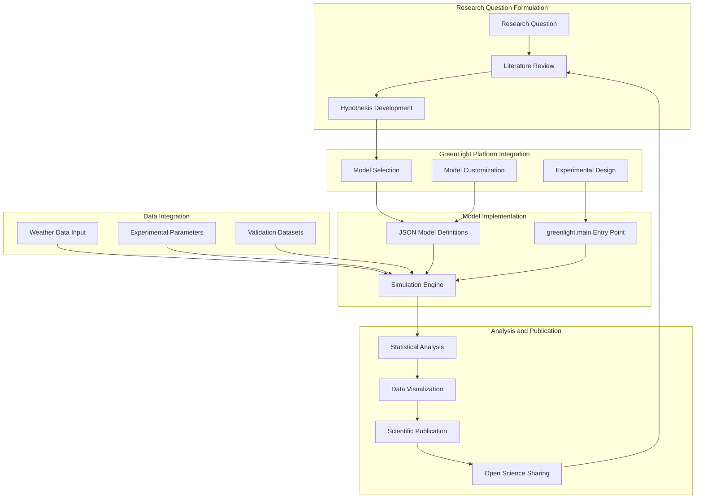
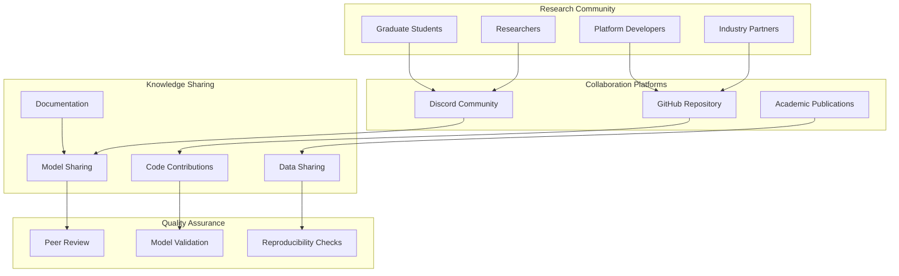
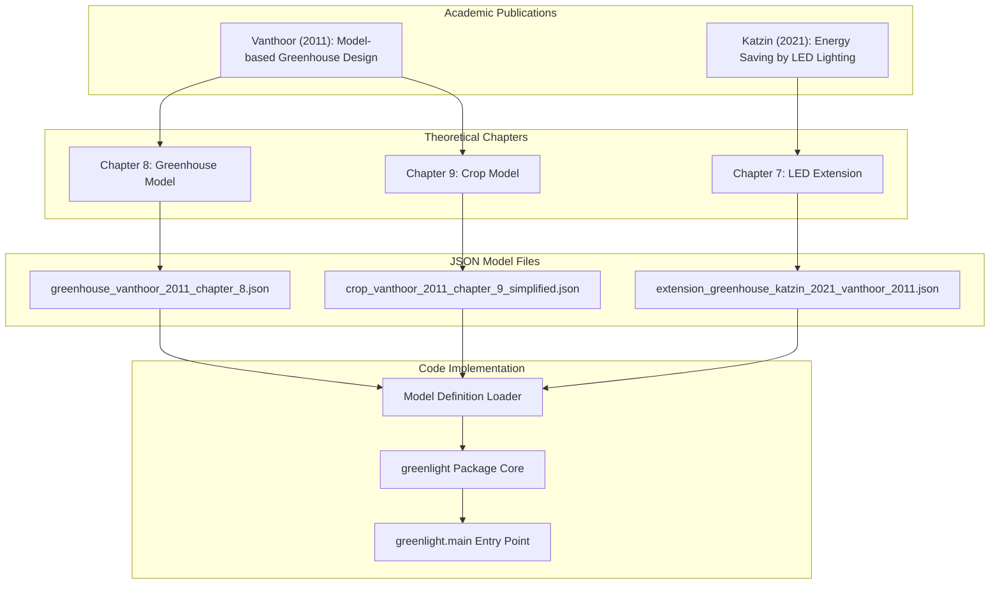
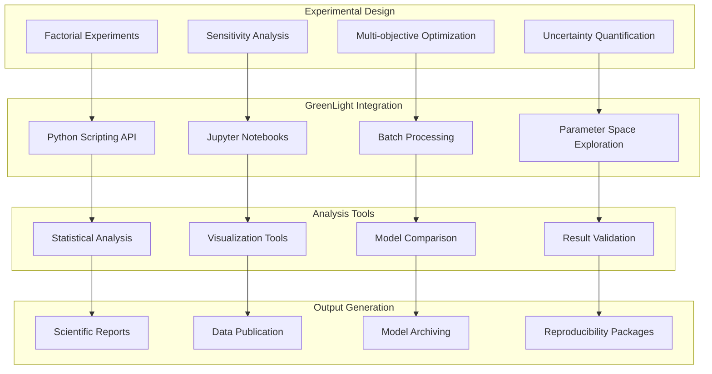

# Applications and Research

> **Relevant source files**
> * [readme.md](https://github.com/davkat1/GreenLight/blob/089602e3/readme.md)

This document covers the research applications of the GreenLight platform and its role in supporting open science objectives in horticultural modeling. It explains how the platform facilitates transparent, reusable, and shareable research in dynamic modeling, particularly for greenhouse and crop systems.

For technical implementation details of the modeling framework, see [Model Architecture](/davkat1/GreenLight/2-model-architecture). For information about extending and modifying models for research purposes, see [Model Combination](/davkat1/GreenLight/2.3-model-combination).

## Research Applications in Horticulture

GreenLight serves as a comprehensive platform for horticultural research, enabling scientists to investigate complex interactions between greenhouse climate, crop growth, and energy systems. The platform's modular architecture supports various research applications ranging from climate optimization to crop yield analysis.

### Primary Research Domains

The platform supports research across multiple interconnected domains:

| Research Domain | Key Applications | Model Components |
| --- | --- | --- |
| Greenhouse Climate Control | HVAC optimization, energy efficiency | `greenhouse_vanthoor_2011_chapter_8.json` |
| Crop Growth Modeling | Yield prediction, growth optimization | `crop_vanthoor_2011_chapter_9_simplified.json` |
| LED Lighting Research | Energy-efficient lighting systems | `extension_greenhouse_katzin_2021_vanthoor_2011.json` |
| Environmental Impact | Resource utilization, sustainability | Combined model systems |

### Research Workflow Integration

Sources: [readme.md L15-L18](https://github.com/davkat1/GreenLight/blob/089602e3/readme.md#L15-L18)

 [readme.md L52-L61](https://github.com/davkat1/GreenLight/blob/089602e3/readme.md#L52-L61)

## Open Science Framework

GreenLight is explicitly designed as a tool for open science, promoting transparency, reproducibility, and collaboration in dynamic modeling research. The platform's architecture supports key open science principles through its modular design and transparent model definitions.

### Open Science Capabilities

The platform enables open science through several key mechanisms:

**Transparent Model Architecture**: All model definitions are stored in human-readable JSON format, allowing researchers to inspect, understand, and verify model implementations. The modular structure in [models/katzin_2021/definition/](https://github.com/davkat1/GreenLight/blob/089602e3/models/katzin_2021/definition/)

 provides complete transparency of model equations and parameters.

**Reproducible Research**: The platform's deterministic simulation engine and version-controlled model definitions ensure that research results can be exactly reproduced by other researchers using the same inputs and model configurations.

**Collaborative Development**: The active Discord community [readme.md L11-L12](https://github.com/davkat1/GreenLight/blob/089602e3/readme.md#L11-L12)

 and open-source licensing [readme.md L8-L9](https://github.com/davkat1/GreenLight/blob/089602e3/readme.md#L8-L9)

 facilitate collaborative research and knowledge sharing among users.

### Community Collaboration Model

Sources: [readme.md L11-L12](https://github.com/davkat1/GreenLight/blob/089602e3/readme.md#L11-L12)

 [readme.md L17-L18](https://github.com/davkat1/GreenLight/blob/089602e3/readme.md#L17-L18)

 [readme.md L83-L87](https://github.com/davkat1/GreenLight/blob/089602e3/readme.md#L83-L87)

## Academic Literature Integration

The GreenLight platform is built upon a solid foundation of peer-reviewed academic literature, ensuring that research conducted using the platform is grounded in established scientific knowledge. The integration of academic models into the platform demonstrates how theoretical frameworks can be translated into practical simulation tools.

### Literature-to-Code Mapping

The platform implements models directly from academic publications, maintaining traceability from theoretical concepts to executable code:

### Academic Validation Process

The platform's academic foundations provide built-in validation through established research:

| Model Component | Academic Source | Validation Method | Implementation File |
| --- | --- | --- | --- |
| Greenhouse Climate | Vanthoor (2011) Ch. 8 | Experimental validation in thesis | `greenhouse_vanthoor_2011_chapter_8.json` |
| Crop Growth | Vanthoor (2011) Ch. 9 | Literature comparison and field data | `crop_vanthoor_2011_chapter_9_simplified.json` |
| LED Integration | Katzin (2021) Ch. 7 | Experimental greenhouse studies | `extension_greenhouse_katzin_2021_vanthoor_2011.json` |

Sources: [readme.md L52-L61](https://github.com/davkat1/GreenLight/blob/089602e3/readme.md#L52-L61)

 [readme.md L48-L61](https://github.com/davkat1/GreenLight/blob/089602e3/readme.md#L48-L61)

## Research Use Cases and Applications

The GreenLight platform supports diverse research applications across multiple scales and domains within horticultural science. These applications demonstrate the platform's flexibility and utility for addressing various research questions.

### Simulation-Based Research Applications

**Climate Optimization Studies**: Researchers use the platform to investigate optimal climate control strategies by modifying parameters in the greenhouse model and analyzing energy consumption patterns. The `python -m greenlight.main` interface allows for systematic parameter exploration.

**Crop Yield Optimization**: The integrated crop model enables researchers to study the relationship between environmental conditions and crop productivity, supporting precision agriculture research and sustainable production strategies.

**Energy Efficiency Research**: The LED extension model facilitates research into energy-efficient lighting systems, allowing researchers to quantify energy savings and assess economic viability of different lighting strategies.

### Research Methodology Integration

### Research Output and Impact

The platform supports the complete research lifecycle from hypothesis formulation to publication and knowledge dissemination. The modular architecture and transparent model definitions enable researchers to:

* **Validate Theoretical Models**: Compare simulation results with experimental data to validate model accuracy
* **Explore Design Alternatives**: Systematically evaluate different greenhouse designs and control strategies
* **Quantify Trade-offs**: Analyze relationships between energy consumption, crop yield, and economic performance
* **Share Research Assets**: Distribute model definitions, simulation scripts, and datasets for reproducible research

Sources: [readme.md L43-L46](https://github.com/davkat1/GreenLight/blob/089602e3/readme.md#L43-L46)

 [readme.md L76-L81](https://github.com/davkat1/GreenLight/blob/089602e3/readme.md#L76-L81)

 [readme.md L17-L18](https://github.com/davkat1/GreenLight/blob/089602e3/readme.md#L17-L18)

## Community and Collaborative Research

The GreenLight platform fosters a collaborative research ecosystem that connects researchers, students, industry professionals, and platform developers. This community-driven approach enhances research quality and accelerates scientific progress through shared knowledge and resources.

### Active Research Community

The platform maintains an active research community through multiple channels:

**Discord Community**: The [GreenLight Discord server](https://discord.gg/nr62yfVe) serves as the primary hub for real-time collaboration, where researchers can post questions, share ideas, and seek assistance with modeling challenges.

**Contributor Network**: The platform benefits from contributions by researchers from multiple institutions, including Wageningen University & Research and Université Laval, representing diverse expertise in greenhouse technology and crop modeling.

**Open Source Collaboration**: The BSD 3-Clause-Clear License ensures that research conducted using the platform can be freely shared and built upon by other researchers, promoting cumulative scientific progress.

### Research Infrastructure Support

The platform provides comprehensive infrastructure to support collaborative research activities:

| Infrastructure Component | Purpose | Location |
| --- | --- | --- |
| Example Notebooks | Research methodology demonstration | `notebooks/` |
| Analysis Scripts | Reproducible analysis workflows | `scripts/` |
| Model Repository | Shared model definitions | `models/` |
| Documentation | Research guidance and tutorials | `docs/` |

Sources: [readme.md L11-L12](https://github.com/davkat1/GreenLight/blob/089602e3/readme.md#L11-L12)

 [readme.md L83-L87](https://github.com/davkat1/GreenLight/blob/089602e3/readme.md#L83-L87)

 [readme.md L8-L9](https://github.com/davkat1/GreenLight/blob/089602e3/readme.md#L8-L9)

 [readme.md L76-L81](https://github.com/davkat1/GreenLight/blob/089602e3/readme.md#L76-L81)