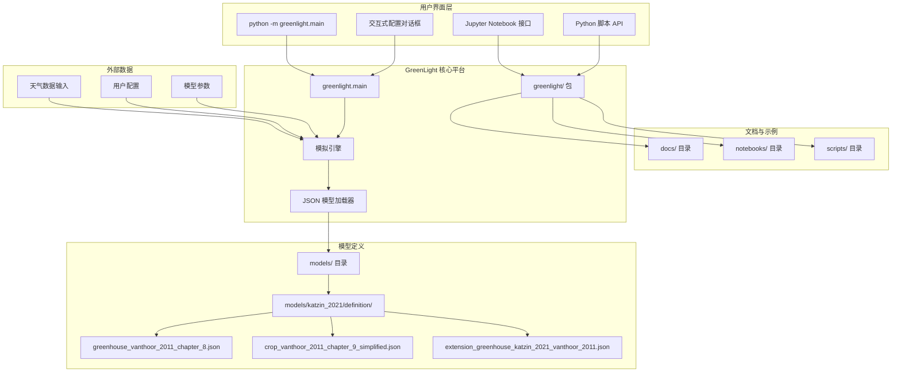
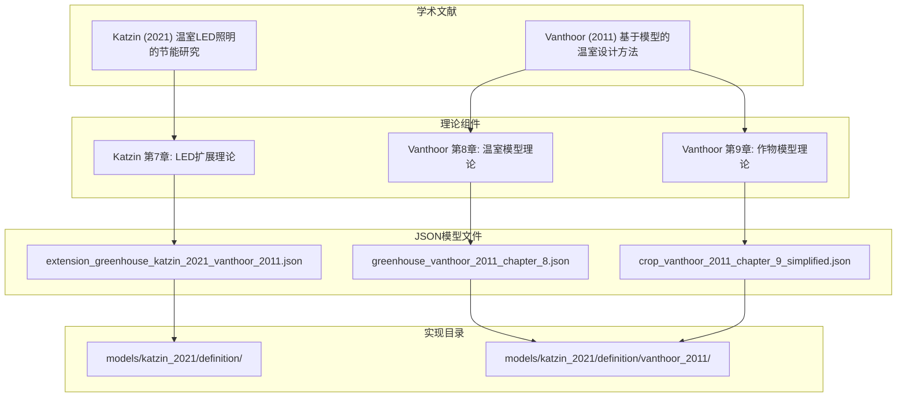
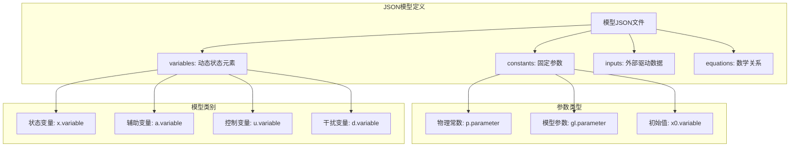
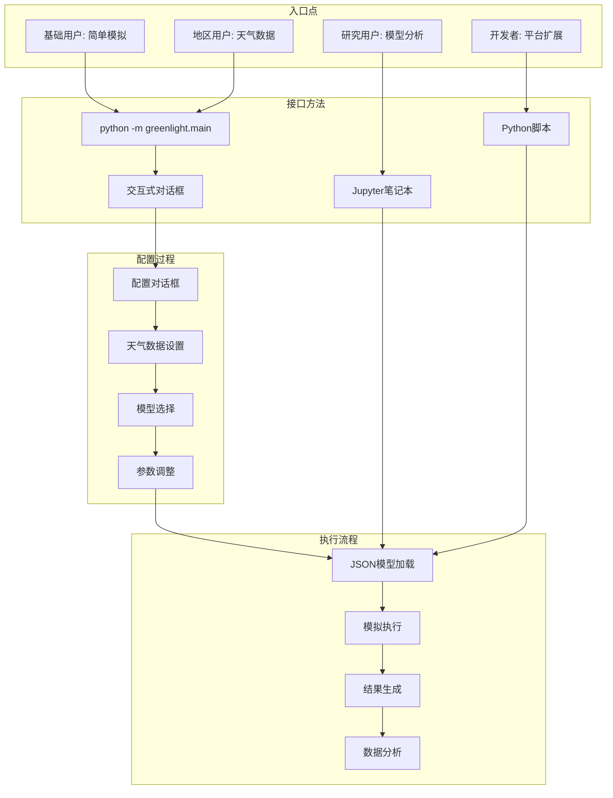
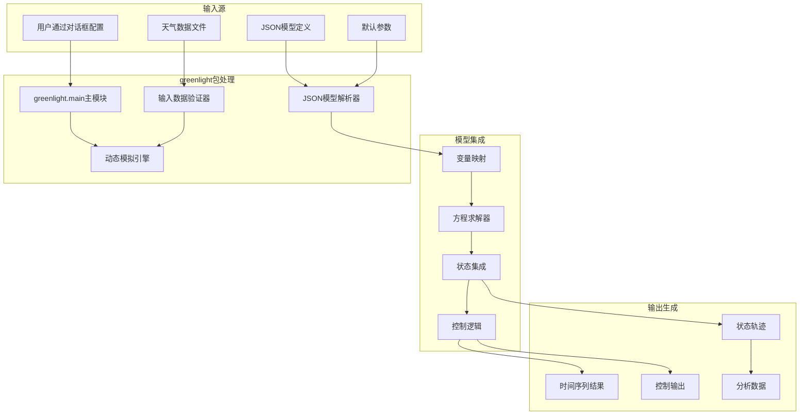
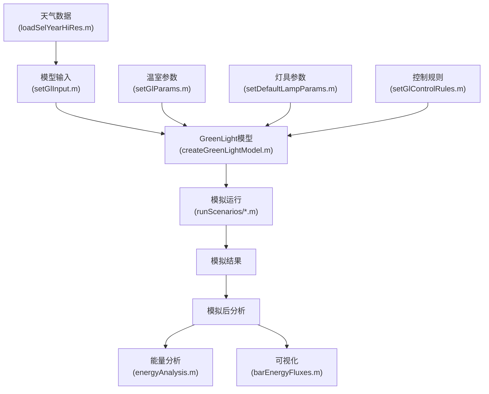
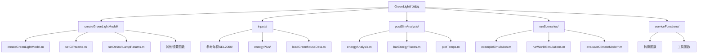

# GreenLight 模型概述

> **相关源文件**
> * [readme.md](https://github.com/davkat1/GreenLight/blob/089602e3/readme.md)

## 目的与范围

GreenLight 是一个用于创建、修改和组合动态模型的 Python 平台，主要关注园艺温室和作物。该平台作为**开放科学**的工具，支持动态建模领域的透明、可重用和可共享的研究。

该平台使研究人员和实践者能够：

* 创建和模拟动态温室及作物模型
* 通过扩展和修改组合现有模型
* 以标准化格式实现学术文献中的模型
* 使用天气数据运行特定位置的模拟
* 透明地共享和复现建模研究

主要功能包括：

* 基于 JSON 的模型定义，确保透明性和模块化
* 将学术文献集成到可执行模型中
* 带交互式配置的命令行界面
* 支持天气数据集成
* 可扩展架构，支持自定义模型开发

安装说明和系统要求请参见[安装与要求](/davkat1/GreenLight/1.1-installation-and-requirements)。仓库结构详情请参见[仓库结构](/davkat1/GreenLight/1.2-repository-structure)。

来源: [readme.md L2](https://github.com/davkat1/GreenLight/blob/089602e3/readme.md#L2-L2)

 [readme.md L15-L18](https://github.com/davkat1/GreenLight/blob/089602e3/readme.md#L15-L18)

## 平台架构

GreenLight 采用模块化的 Python 架构，将模型定义、模拟引擎和用户界面分离。

### 整体系统架构

来源: [readme.md L33-L34](https://github.com/davkat1/GreenLight/blob/089602e3/readme.md#L33-L34)

 [readme.md L76-L82](https://github.com/davkat1/GreenLight/blob/089602e3/readme.md#L76-L82)

 [readme.md L56-L60](https://github.com/davkat1/GreenLight/blob/089602e3/readme.md#L56-L60)

## 学术基础

GreenLight 实现了来自权威学术文献的模型，在理论研究和实际模拟工具之间架起了桥梁。

### 文献到实现的映射

该平台将这些模型实现为可读取、修改和组合的JSON定义。建议用户结合阅读原始文献和JSON文件来理解模型结构和变量。

来源: [readme.md L52-L61](https://github.com/davkat1/GreenLight/blob/089602e3/readme.md#L52-L61)

## 模型结构

GreenLight模型使用JSON文件定义，这些文件以标准化格式指定变量、常量、输入和方程。

### JSON模型架构

每个JSON模型文件都包含结构化定义，可以与其他模型组合以创建复杂模拟。命名约定(x., a., u., d., p., gl.)为模型元素提供了清晰的分类。

来源: [readme.md L56-L61](https://github.com/davkat1/GreenLight/blob/089602e3/readme.md#L56-L61)

 [readme.md L67-L68](https://github.com/davkat1/GreenLight/blob/089602e3/readme.md#L67-L68)

## 用户界面与工作流程

GreenLight为不同用户场景提供了多种入口点，从简单模拟到高级模型开发。

### 用户交互流程

主入口点 `python -m greenlight.main` 会启动一个交互式配置对话框，使没有编程经验的用户也能轻松使用该平台。

来源: [readme.md L30-L37](https://github.com/davkat1/GreenLight/blob/089602e3/readme.md#L30-L37)

 [readme.md L43-L46](https://github.com/davkat1/GreenLight/blob/089602e3/readme.md#L43-L46)

## 数据流与处理

GreenLight 通过结构化的处理管道，从输入数据到模拟结果处理多个数据源。

### 数据处理管道

来源: [readme.md L39-L41](https://github.com/davkat1/GreenLight/blob/089602e3/readme.md#L39-L41)

 [readme.md L71](https://github.com/davkat1/GreenLight/blob/089602e3/readme.md#L71-L71)

## 仓库组织

GreenLight 仓库采用结构化组织方式，将平台代码、模型定义、文档和示例分开存放。

### 仓库结构

| 目录 | 用途 | 主要内容 |
| --- | --- | --- |
| `greenlight/` | Python核心平台实现 | 主模块、模拟引擎、工具类 |
| `models/` | JSON模型定义文件 | Katzin 2021模型, Vanthoor 2011模型 |
| `docs/` | 平台文档 | 安装指南、使用说明、模型格式指南 |
| `notebooks/` | Jupyter notebook示例 | 交互式示例和教程 |
| `scripts/` | Python示例脚本 | 命令行使用示例 |

来源: [readme.md L76-L82](https://github.com/davkat1/GreenLight/blob/089602e3/readme.md#L76-L82)

### GreenLight中的数据流

该流程图展示了数据如何在GreenLight系统中流动，从天气数据和参数等输入开始，经过模型创建和模拟，最终到达结果分析阶段。

来源: [inputs/loadSelYearHiRes.m](https://github.com/davkat1/GreenLight/blob/089602e3/inputs/loadSelYearHiRes.m)

 [createGreenLightModel/setGlInput.m](https://github.com/davkat1/GreenLight/blob/089602e3/createGreenLightModel/setGlInput.m)

 [createGreenLightModel/createGreenLightModel.m](https://github.com/davkat1/GreenLight/blob/089602e3/createGreenLightModel/createGreenLightModel.m)

 [runScenarios/exampleSimulation.m](https://github.com/davkat1/GreenLight/blob/089602e3/runScenarios/exampleSimulation.m)

 [postSimAnalysis/energyAnalysis.m](https://github.com/davkat1/GreenLight/blob/089602e3/postSimAnalysis/energyAnalysis.m)

 [postSimAnalysis/barEnergyFluxes.m](https://github.com/davkat1/GreenLight/blob/089602e3/postSimAnalysis/barEnergyFluxes.m)

## 代码组织

GreenLight代码库被组织成几个关键目录，分别处理模型的不同方面:

来源: [readme.md L171-L244](https://github.com/davkat1/GreenLight/blob/089602e3/readme.md#L171-L244)

## 模型概念与代码的对应关系

```mermaid
flowchart TD

A["温室气候"]
A1["setGlOdes.m<br>(气候常微分方程)"]
A2["evaluateClimateModelHps.m/Led.m<br>(气候评估)"]
B["能源使用"]
B1["energyAnalysis.m<br>(能源计算)"]
B2["evaluateEnergyUseHps.m/Led.m<br>(能源评估)"]
C["照明系统"]
C1["setDefaultLampParams.m<br>(现代灯具)"]
C2["setBleiswijk2010HpsParams.m<br>(高压钠灯配置)"]
C3["setBleiswijk2010LedParams.m<br>(LED配置)"]
D["控制系统"]
D1["setGlControlRules.m<br>(控制逻辑)"]
D2["setGlControls.m<br>(控制轨迹)"]
E["模拟场景"]
E1["exampleSimulation.m<br>(基础示例)"]
E2["runWorldSimulations.m<br>(全球比较)"]
E3["heatByLightScript.m<br>(光热转换)"]

A --> A1
A --> A2
B --> B1
B --> B2
C --> C1
C --> C2
C --> C3
D --> D1
D --> D2
E --> E1
E --> E2
E --> E3
```

该图表将温室的高层概念与实现它们的特定代码文件关联起来，帮助用户导航代码库。

来源: [createGreenLightModel/setGlOdes.m](https://github.com/davkat1/GreenLight/blob/089602e3/createGreenLightModel/setGlOdes.m)

 [runScenarios/evaluateClimateModelHps.m](https://github.com/davkat1/GreenLight/blob/089602e3/runScenarios/evaluateClimateModelHps.m)

 [runScenarios/evaluateClimateModelLed.m](https://github.com/davkat1/GreenLight/blob/089602e3/runScenarios/evaluateClimateModelLed.m)

 [postSimAnalysis/energyAnalysis.m](https://github.com/davkat1/GreenLight/blob/089602e3/postSimAnalysis/energyAnalysis.m)

 [runScenarios/evaluateEnergyUseHps.m](https://github.com/davkat1/GreenLight/blob/089602e3/runScenarios/evaluateEnergyUseHps.m)

 [runScenarios/evaluateEnergyUseLed.m](https://github.com/davkat1/GreenLight/blob/089602e3/runScenarios/evaluateEnergyUseLed.m)

 [createGreenLightModel/setDefaultLampParams.m](https://github.com/davkat1/GreenLight/blob/089602e3/createGreenLightModel/setDefaultLampParams.m)

 [createGreenLightModel/setBleiswijk2010HpsParams.m](https://github.com/davkat1/GreenLight/blob/089602e3/createGreenLightModel/setBleiswijk2010HpsParams.m)

 [createGreenLightModel/setBleiswijk2010LedParams.m](https://github.com/davkat1/GreenLight/blob/089602e3/createGreenLightModel/setBleiswijk2010LedParams.m)

 [createGreenLightModel/setGlControlRules.m](https://github.com/davkat1/GreenLight/blob/089602e3/createGreenLightModel/setGlControlRules.m)

 [createGreenLightModel/setGlControls.m](https://github.com/davkat1/GreenLight/blob/089602e3/createGreenLightModel/setGlControls.m)

 [runScenarios/exampleSimulation.m](https://github.com/davkat1/GreenLight/blob/089602e3/runScenarios/exampleSimulation.m)

 [runScenarios/runWorldSimulations.m](https://github.com/davkat1/GreenLight/blob/089602e3/runScenarios/runWorldSimulations.m)

 [runScenarios/heatByLightScript.m](https://github.com/davkat1/GreenLight/blob/089602e3/runScenarios/heatByLightScript.m)

## 使用工作流

使用GreenLight的典型工作流程包括:

1. **模型创建**: 使用`createGreenLightModel.m`创建温室模型
2. **参数配置**: 为温室和照明系统设置适当参数
3. **模拟执行**: 使用特定天气数据和条件运行模型
4. **结果分析**: 使用模拟后工具分析结果

### 示例模拟

代码库提供了几个示例模拟:

* `exampleSimulation.m` - 使用荷兰参考年天气数据对不同灯具设置进行基础模拟
* `exampleSimulation2.m` - 具有详细配置的现代温室模拟
* `exampleCropModel.m` - 仅使用作物组件的简单示例
* `runWorldSimulations.m` - 全球不同地点的模拟

来源: [readme.md L106-L169](https://github.com/davkat1/GreenLight/blob/089602e3/readme.md#L106-L169)

 [runScenarios/exampleSimulation.m](https://github.com/davkat1/GreenLight/blob/089602e3/runScenarios/exampleSimulation.m)

 [runScenarios/exampleSimulation2.m](https://github.com/davkat1/GreenLight/blob/089602e3/runScenarios/exampleSimulation2.m)

 [runScenarios/exampleCropModel.m](https://github.com/davkat1/GreenLight/blob/089602e3/runScenarios/exampleCropModel.m)

 [runScenarios/runWorldSimulations.m](https://github.com/davkat1/GreenLight/blob/089602e3/runScenarios/runWorldSimulations.m)

## 研究应用

GreenLight已被用于多项已发表的研究:

1. **气候模型评估** (Katzin等, 2020) * 比较模拟和测量的温室气候数据 * 评估HPS和LED照明下的模型性能
2. **能源使用比较** (Katzin等, 2020) * 评估HPS和LED照明之间的能耗差异 * 验证模型能源预测与实测数据
3. **全球节能分析** (Katzin等, 2021) * 分析不同全球位置的温室性能 * 量化向LED照明过渡的潜在节能
4. **光热策略分析** (Katzin等, 2023) * 研究将光不仅用于植物生长还作为加热策略 * 评估不同加热方法的能源权衡和效率

有关这些研究应用的更多详细信息，请参阅[应用与研究](/davkat1/GreenLight/6-applications-and-research)。

来源: [readme.md L27-L56](https://github.com/davkat1/GreenLight/blob/089602e3/readme.md#L27-L56)

 [runScenarios/evaluateClimateModelHps.m](https://github.com/davkat1/GreenLight/blob/089602e3/runScenarios/evaluateClimateModelHps.m)

 [runScenarios/evaluateClimateModelLed.m](https://github.com/davkat1/GreenLight/blob/089602e3/runScenarios/evaluateClimateModelLed.m)

 [runScenarios/evaluateEnergyUseHps.m](https://github.com/davkat1/GreenLight/blob/089602e3/runScenarios/evaluateEnergyUseHps.m)

 [runScenarios/evaluateEnergyUseLed.m](https://github.com/davkat1/GreenLight/blob/089602e3/runScenarios/evaluateEnergyUseLed.m)

 [runScenarios/runWorldSimulations.m](https://github.com/davkat1/GreenLight/blob/089602e3/runScenarios/runWorldSimulations.m)

## 兼容性与要求

GreenLight兼容MATLAB 2015b及更高版本。需要安装[DyMoMa包](https://github.com/davkat1/GreenLight/blob/089602e3/DyMoMa package)

(具体为1.0.1版本)才能正常运行。有关安装和要求的更多详情，请参阅[安装与要求](/davkat1/GreenLight/1.1-installation-and-requirements)。

来源: [readme.md L13-L17](https://github.com/davkat1/GreenLight/blob/089602e3/readme.md#L13-L17)