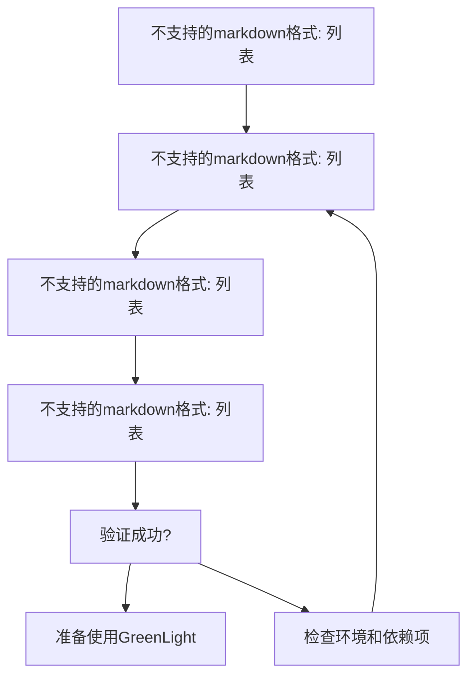
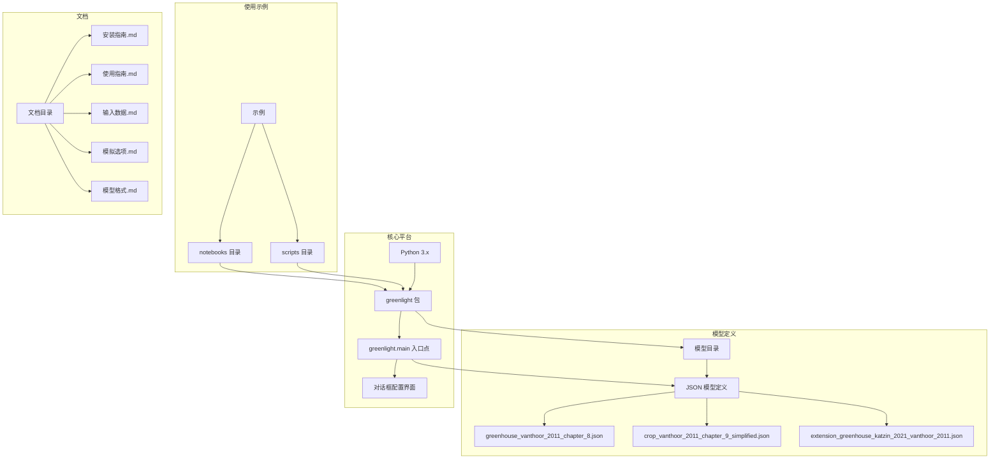
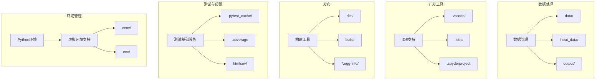
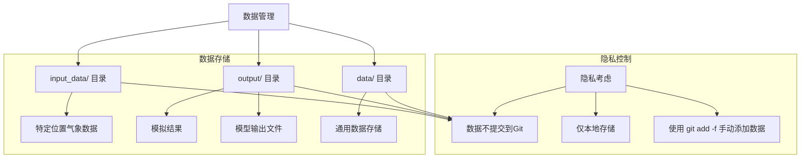

# 安装与系统要求

> **相关源文件**  
> * [.gitignore](https://github.com/davkat1/GreenLight/blob/089602e3/.gitignore)  
> * [readme.md](https://github.com/davkat1/GreenLight/blob/089602e3/readme.md)  

本文档提供了安装GreenLight平台及满足成功运行模拟所需所有要求的详细说明。GreenLight是一个用于创建、修改和组合动态模型的Python平台，主要面向园艺温室和作物领域。

关于模型功能和高层架构的信息，请参阅[GreenLight模型概述](/davkat1/GreenLight/1-greenlight-model-overview)。安装完成后实际运行模拟的详细信息，请参阅[运行模拟](/davkat1/GreenLight/4-running-simulations)。

## 系统要求

### Python要求

GreenLight平台需要：

* Python 3.x（具体最低版本需根据包依赖关系确认）
* 标准Python科学计算库
* 跨平台安装（Windows、macOS、Linux）

该平台设计为可在不同操作系统和Python环境中运行。

来源：[readme.md L1-L2](https://github.com/davkat1/GreenLight/blob/089602e3/readme.md#L1-L2)  
[.gitignore L37-L38](https://github.com/davkat1/GreenLight/blob/089602e3/.gitignore#L37-L38)

### 虚拟环境支持

GreenLight支持标准Python虚拟环境配置：

* `venv/` 用于Python虚拟环境
* `env/` 用于替代环境设置
* 通过pip进行标准Python包管理

`.gitignore`配置表明支持多种虚拟环境方法。

来源：[.gitignore L37-L38](https://github.com/davkat1/GreenLight/blob/089602e3/.gitignore#L37-L38)

## 安装流程

### 安装步骤图

#### 检查一下mermaid的问题



### 获取源代码

1. 从GitHub克隆GreenLight仓库: [https://github.com/davkat1/GreenLight](https://github.com/davkat1/GreenLight)
2. 进入克隆的目录

该仓库包含当前基于Python的实现。之前的MATLAB版本(1.x)已停止维护。

来源: [readme.md L1](https://github.com/davkat1/GreenLight/blob/089602e3/readme.md#L1-L1)

 [readme.md L4-L6](https://github.com/davkat1/GreenLight/blob/089602e3/readme.md#L4-L6)

### Python环境设置

1. 创建虚拟环境(推荐): ``` python -m venv venv ```
2. 激活虚拟环境: * Windows: `venv\Scripts\activate` * macOS/Linux: `source venv/bin/activate`
3. 按照详细安装指南安装包和依赖项

完整安装说明请参阅专用安装文档。

来源: [readme.md L31](https://github.com/davkat1/GreenLight/blob/089602e3/readme.md#L31-L31)

 [.gitignore L37-L38](https://github.com/davkat1/GreenLight/blob/089602e3/.gitignore#L37-L38)

### 验证安装

要验证安装是否正常工作:

1. 在终端中导航到GreenLight目录
2. 运行主入口点: ``` python -m greenlight.main ```
3. 应出现包含各种模拟参数的对话框
4. 快速测试时，将**结束日期**调整为更接近开始日期的日期(例如21年9月30日)以加快模拟运行

来源: [readme.md L31-L37](https://github.com/davkat1/GreenLight/blob/089602e3/readme.md#L31-L37)

## 关键依赖项和组件

### 平台架构



### 开发环境组件



来源: [readme.md L76-L82](https://github.com/davkat1/GreenLight/blob/089602e3/readme.md#L76-L82)

 [.gitignore L37-L52](https://github.com/davkat1/GreenLight/blob/089602e3/.gitignore#L37-L52)

 [.gitignore L64-L74](https://github.com/davkat1/GreenLight/blob/089602e3/.gitignore#L64-L74)

 [.gitignore L84-L98](https://github.com/davkat1/GreenLight/blob/089602e3/.gitignore#L84-L98)

## 数据管理与隐私

### 数据目录结构



### 气象数据要求

进行特定位置模拟时，需要整合气象数据：

1. 气象数据涉及隐私，不包含在代码库中
2. 用户需自行获取特定位置的气象数据
3. 输入数据处理方法详见专用指南
4. 数据应放置在相应的`input_data/`目录中

有关气象数据获取和设置的详细信息，请参阅输入数据文档。

来源: [.gitignore L100-L105](https://github.com/davkat1/GreenLight/blob/089602e3/.gitignore#L100-L105)

 [readme.md L39-L41](https://github.com/davkat1/GreenLight/blob/089602e3/readme.md#L39-L41)

## 其他资源

### 文档资料

* **用户指南**: 详见[David Katzin的博士论文](https://doi.org/10.18174/544434)第7章(235-280页)
* **示例模拟**: 代码库包含多个展示模型不同方面的示例
* **相关数据集**: 多个与已发表研究相关的数据集可在4TU.ResearchData数据库获取

来源: [readme.md L24-L25](https://github.com/davkat1/GreenLight/blob/089602e3/readme.md#L24-L25)

 [readme.md L19-L22](https://github.com/davkat1/GreenLight/blob/089602e3/readme.md#L19-L22)

### 代码库结构

| 目录 | 用途 |
| --- | --- |
| `createGreenLightModel` | 包含创建温室模型的文件 |
| `inputs` | 定义室外气候输入的文件 |
| `postSimAnalysis` | 分析模拟结果的方法 |
| `runScenarios` | 不同模拟场景的示例脚本 |
| `serviceFunctions` | 通用工具函数 |

来源: [readme.md L170-L244](https://github.com/davkat1/GreenLight/blob/089602e3/readme.md#L170-L244)

## 安装后使用示例

完成安装后，您可以通过以下方式运行GreenLight模型的简单模拟：

```
% 导航到GreenLight目录
cd path/to/GreenLight

% 运行示例模拟
run('runScenarios/exampleSimulation.m')

% 高级用法 - 现代温室设置
run('runScenarios/exampleSimulation2.m')

% 仅使用作物组件
run('runScenarios/exampleCropModel.m')
```

如需更详细的示例和特定场景说明，请参阅[运行模拟](/davkat1/GreenLight/4-running-simulations)文档。

来源: [readme.md L110-L121](https://github.com/davkat1/GreenLight/blob/089602e3/readme.md#L110-L121)