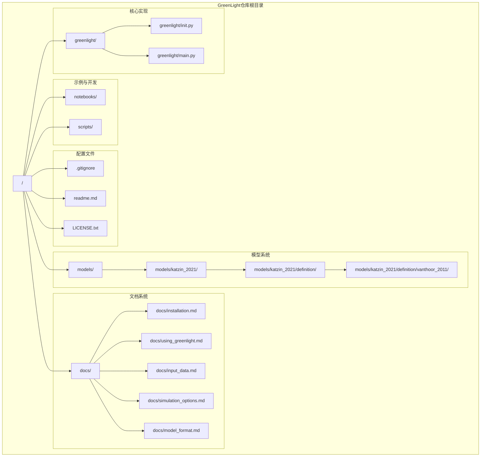
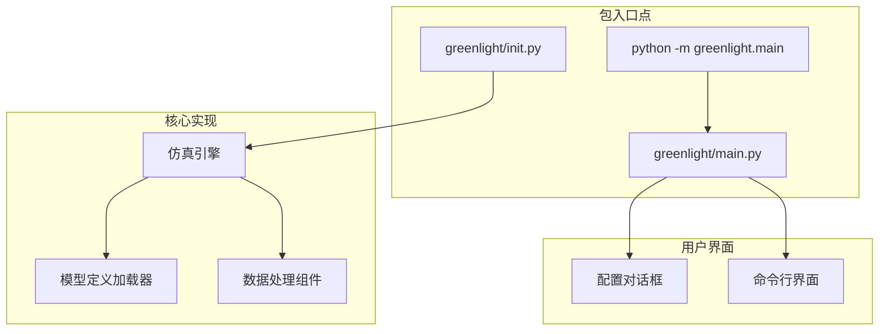
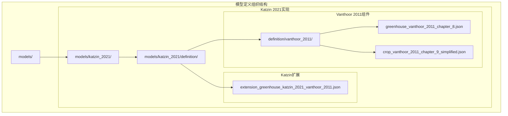
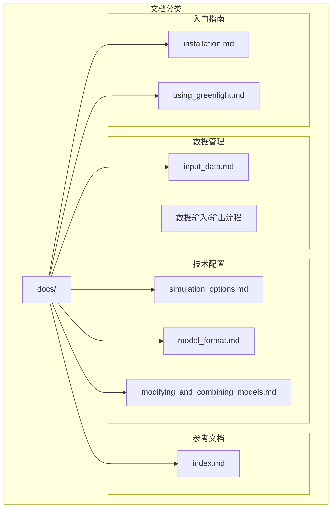
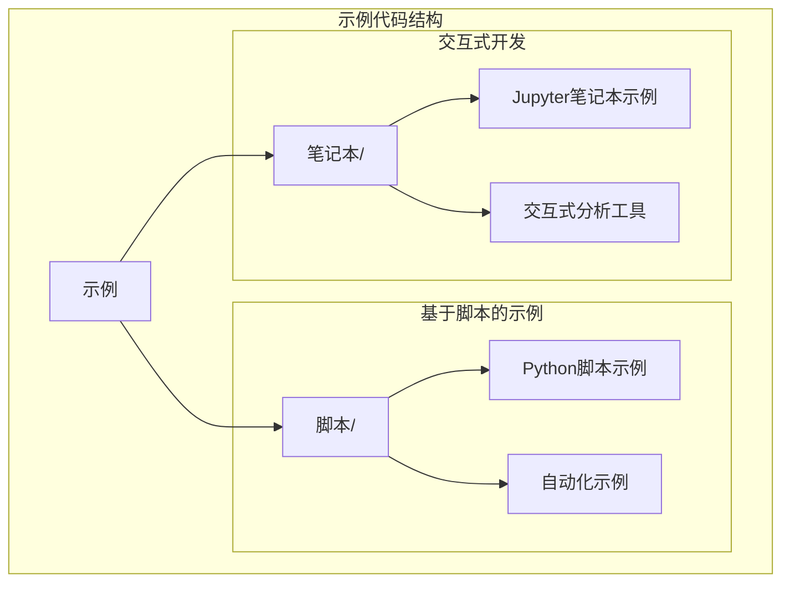
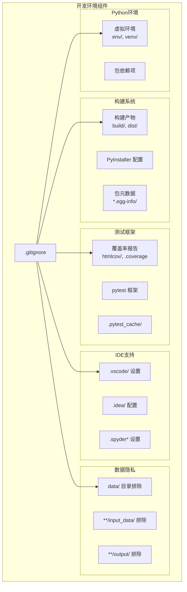

# 仓库结构

> **相关源文件**
> * [.gitignore](https://github.com/davkat1/GreenLight/blob/089602e3/.gitignore)
> * [readme.md](https://github.com/davkat1/GreenLight/blob/089602e3/readme.md)

本文档详细解释了GreenLight仓库的组织结构，包括核心包结构、模型定义、文档系统和开发环境组件。有关安装程序和设置说明，请参阅[安装与要求](/davkat1/GreenLight/1.1-installation-and-requirements)。有关运行模拟和使用平台的信息，请参阅[命令行界面](/davkat1/GreenLight/4.1-command-line-interface)。

## 目录结构概述

GreenLight仓库遵循标准的Python项目结构，并包含用于模型定义和温室模拟组件的专用目录。该组织结构既支持运行模拟的终端用户，也支持扩展平台的开发人员。

*来源: [readme.md L76-L81](https://github.com/davkat1/GreenLight/blob/089602e3/readme.md#L76-L81)

 [.gitignore L37-L53](https://github.com/davkat1/GreenLight/blob/089602e3/.gitignore#L37-L53)*

## 核心包结构

`greenlight/` 目录包含实现仿真平台的主要Python包。主入口点可通过模块接口访问。

| 组件 | 路径 | 用途 |
| --- | --- | --- |
| 包根目录 | `greenlight/__init__.py` | 包初始化和公共API |
| 主入口点 | `greenlight/main.py` | 命令行界面和对话框系统 |
| 核心模块 | `greenlight/` 子目录 | 仿真引擎组件 |

主执行路径遵循 `python -m greenlight.main` 模式，这会调用基于对话框的配置系统供最终用户使用。

*来源: [readme.md L31-L37](https://github.com/davkat1/GreenLight/blob/089602e3/readme.md#L31-L37)

 [readme.md L71](https://github.com/davkat1/GreenLight/blob/089602e3/readme.md#L71-L71)*

## 模型定义系统

`models/` 目录包含基于JSON的模型定义，按学术出版物和模型组件进行组织。

### 模型层次结构

### 模型文件组织

| 模型组件 | 文件路径 | 学术来源 |
| --- | --- | --- |
| 温室动态 | `greenhouse_vanthoor_2011_chapter_8.json` | Vanthoor (2011) 第8章 |
| 作物生长 | `crop_vanthoor_2011_chapter_9_simplified.json` | Vanthoor (2011) 第9章 |
| LED集成 | `extension_greenhouse_katzin_2021_vanthoor_2011.json` | Katzin (2021) 第7章 |

*来源: [readme.md L52-L61](https://github.com/davkat1/GreenLight/blob/089602e3/readme.md#L52-L61)

 [readme.md L56-L60](https://github.com/davkat1/GreenLight/blob/089602e3/readme.md#L56-L60)*

## 文档系统

`docs/` 目录为不同类型的用户和使用场景提供了全面的文档。

### 文档结构

### 文档用途映射

| 文档 | 目标用户 | 主要用途 |
| --- | --- | --- |
| `installation.md` | 所有用户 | 安装和设置流程 |
| `using_greenlight.md` | 脚本用户 | 编程接口使用指南 |
| `input_data.md` | 特定地区用户 | 天气数据集成 |
| `simulation_options.md` | 高级用户 | 技术参数配置 |
| `model_format.md` | 模型开发者 | JSON模型定义规范 |

*来源: [readme.md L31](https://github.com/davkat1/GreenLight/blob/089602e3/readme.md#L31-L31)

 [readme.md L41](https://github.com/davkat1/GreenLight/blob/089602e3/readme.md#L41-L41)

 [readme.md L45](https://github.com/davkat1/GreenLight/blob/089602e3/readme.md#L45-L45)

 [readme.md L65](https://github.com/davkat1/GreenLight/blob/089602e3/readme.md#L65-L65)

 [readme.md L68](https://github.com/davkat1/GreenLight/blob/089602e3/readme.md#L68-L68)

 [readme.md L74](https://github.com/davkat1/GreenLight/blob/089602e3/readme.md#L74-L74)*

## 示例与开发环境

### 示例代码组织

该仓库包含两种格式的实用示例:

*来源: [readme.md L80-L81](https://github.com/davkat1/GreenLight/blob/089602e3/readme.md#L80-L81)

 [readme.md L44-L46](https://github.com/davkat1/GreenLight/blob/089602e3/readme.md#L44-L46)*

## 开发配置与构建产物

### 版本控制与构建配置

该仓库采用标准Python开发实践，并针对数据隐私和构建管理进行了特定配置。

#### 排除的开发产物

| 类别 | 模式 | 用途 |
| --- | --- | --- |
| Python运行时 | `__pycache__/`, `*.pyc`, `*.pyo` | 编译后的字节码 |
| 虚拟环境 | `env/`, `venv/` | 隔离的Python环境 |
| 构建产物 | `build/`, `dist/`, `*.egg-info/` | 包分发文件 |
| IDE配置 | `.vscode/`, `.idea/`, `.spyder*` | 编辑器特定设置 |
| 数据文件 | `data/`, `**/input_data/`, `**/output/` | 敏感模拟数据 |

#### 开发工具集成

`.gitignore` 配置专门排除了数据目录以维护隐私合规性，如注释所述："不要将数据上传到git。这很慢且涉及隐私敏感。"

*来源: [.gitignore L37-L53](https://github.com/davkat1/GreenLight/blob/089602e3/.gitignore#L37-L53)

 [.gitignore L64-L74](https://github.com/davkat1/GreenLight/blob/089602e3/.gitignore#L64-L74)

 [.gitignore L84-L98](https://github.com/davkat1/GreenLight/blob/089602e3/.gitignore#L84-L98)

 [.gitignore L100-L114](https://github.com/davkat1/GreenLight/blob/089602e3/.gitignore#L100-L114)*

## 仓库入口点和导航

### 主要访问模式

该仓库通过不同的入口点支持多种用户工作流：

| 用户类型 | 入口点 | 主目录 |
| --- | --- | --- |
| 基础用户 | `python -m greenlight.main` | `greenlight/` |
| 特定位置用户 | 文档 → `docs/input_data.md` | `docs/` |
| 模型开发者 | `models/`中的模型定义 | `models/katzin_2021/definition/` |
| 平台开发者 | 从`greenlight/__init__.py`探索包 | `greenlight/` |
| 研究用户 | `notebooks/`和`scripts/`中的示例 | `notebooks/`, `scripts/` |

*来源: [readme.md L21-L27](https://github.com/davkat1/GreenLight/blob/089602e3/readme.md#L21-L27)

 [readme.md L30-L71](https://github.com/davkat1/GreenLight/blob/089602e3/readme.md#L30-L71)*