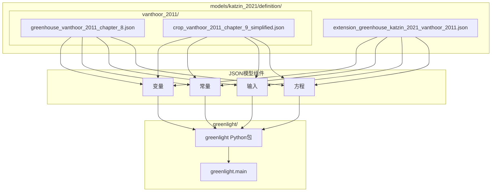
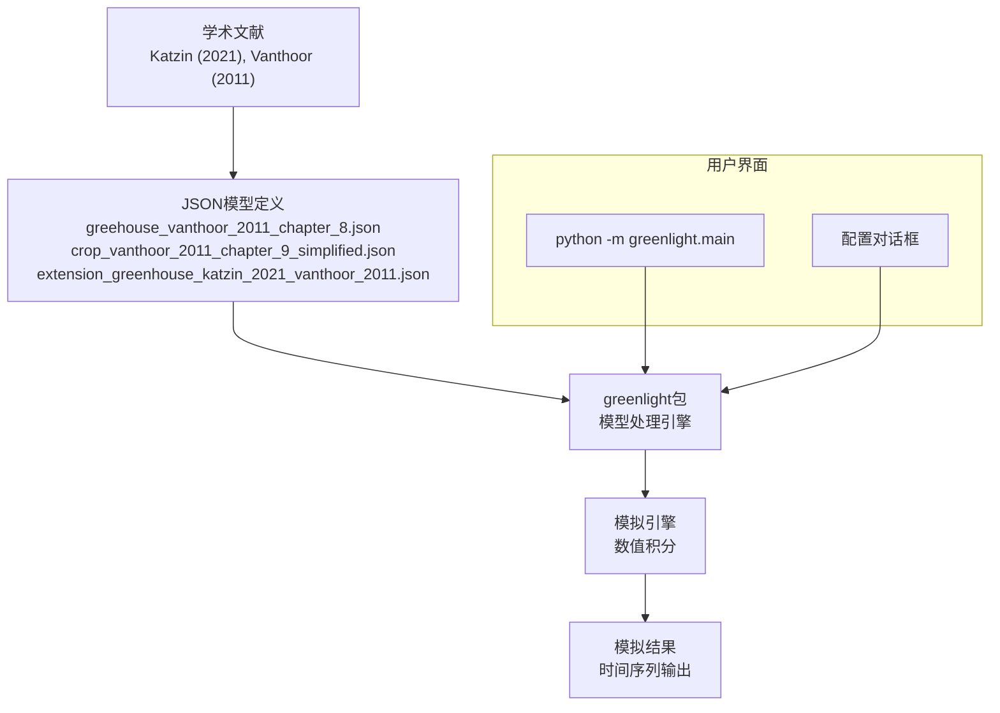
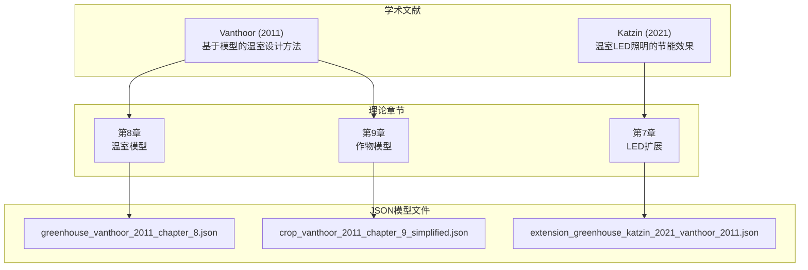
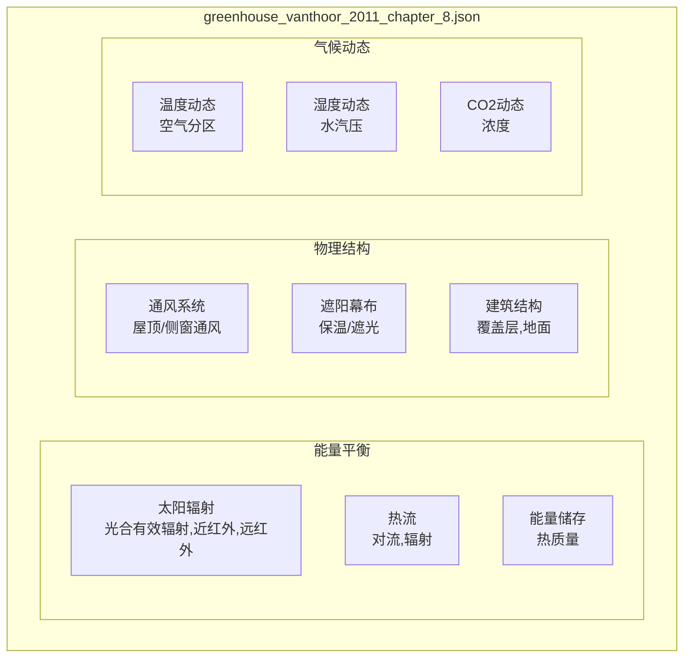
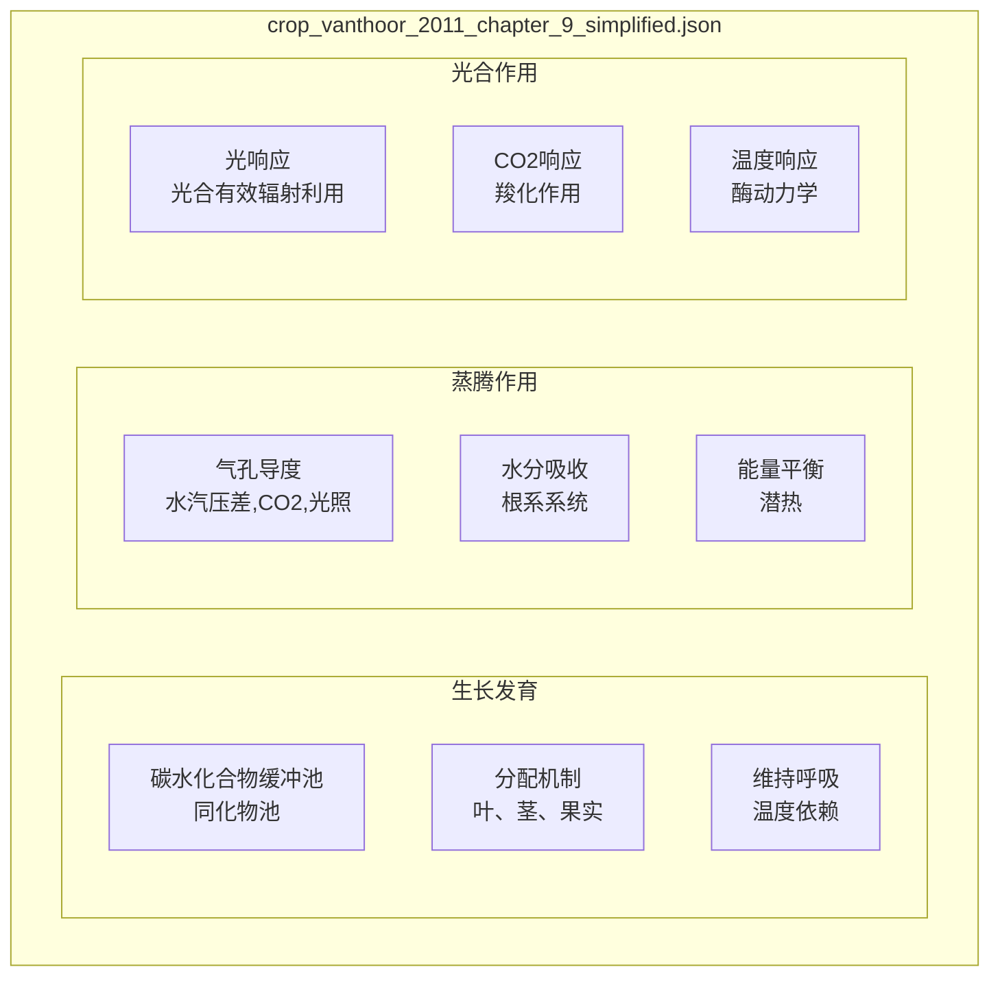
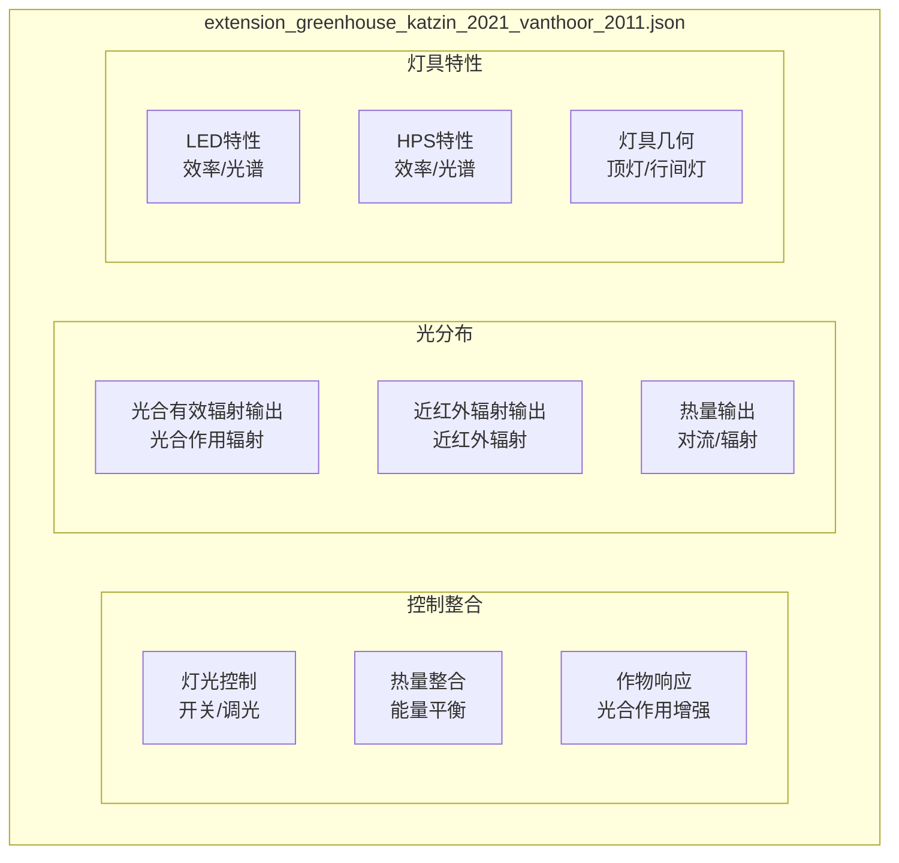
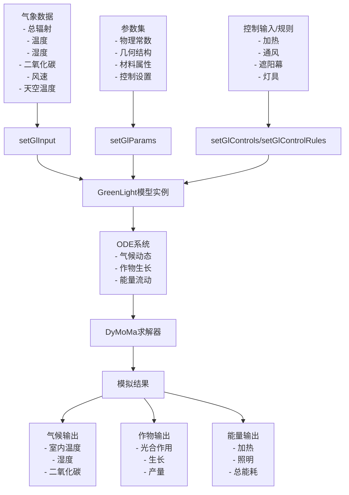
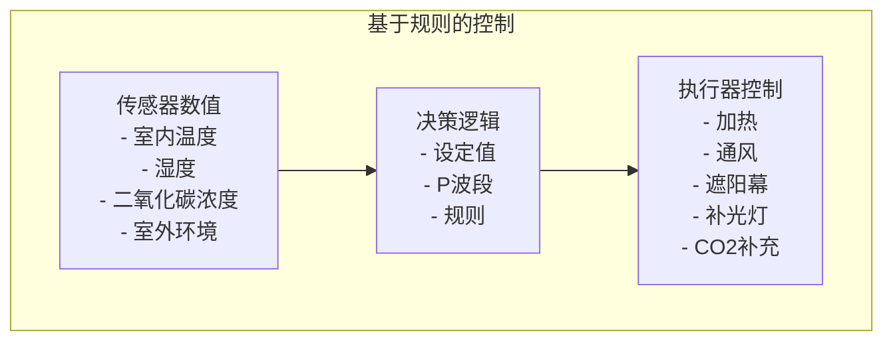
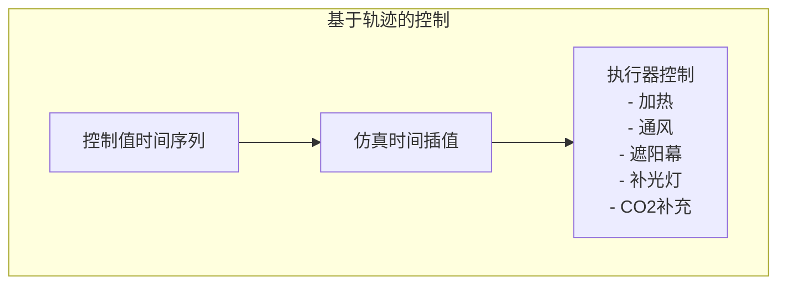

# 模型架构

> **相关源文件**
> * [readme.md](https://github.com/davkat1/GreenLight/blob/089602e3/readme.md)

## 目的与范围

本文档描述了GreenLight模型系统的架构，重点介绍其基于JSON的模型定义、学术基础以及系统组件。GreenLight平台采用模块化方法，模型以JSON格式定义，并通过Python greenlight包进行处理，以创建温室和作物系统的动态模拟。

## 架构概述

GreenLight模型架构建立在JSON模型定义的基础上，这些定义将学术文献编码为可计算的数学模型。该系统通过模块化的JSON方法整合了温室气候动力学、作物生长模型和光照扩展，实现了透明且可重用的模型定义。

### JSON模型架构

基于JSON的模型定义结构

来源: [readme.md L56-L60](https://github.com/davkat1/GreenLight/blob/089602e3/readme.md#L56-L60)

### 模型处理流程

来源: [readme.md L32-L37](https://github.com/davkat1/GreenLight/blob/089602e3/readme.md#L32-L37)

 [readme.md L52-L60](https://github.com/davkat1/GreenLight/blob/089602e3/readme.md#L52-L60)

## 学术基础

GreenLight模型架构建立在成熟的学术文献基础上，这些文献为以JSON格式实现的数学模型提供了理论基础。

### 文献到实现的映射

从学术文献到JSON模型实现

来源: [readme.md L52-L60](https://github.com/davkat1/GreenLight/blob/089602e3/readme.md#L52-L60)

### 模型组件结构

JSON模型定义遵循统一的结构，将学术模型编码为可计算形式:

| 组件 | 描述 | JSON元素 |
| --- | --- | --- |
| **variables** | 随时间变化的动态状态变量 | 温度、湿度、CO2、生物量 |
| **constants** | 固定参数和物理属性 | 传热系数、几何结构 |
| **inputs** | 外部驱动变量 | 天气数据、控制信号 |
| **equations** | 变量间的数学关系 | 常微分方程、代数方程 |

来源: [readme.md L56-L60](https://github.com/davkat1/GreenLight/blob/089602e3/readme.md#L56-L60)

## 核心模型组件

### 温室模型 (Vanthoor 2011 第8章)

温室组件模拟物理温室结构和气候动态，实现于 `greenhouse_vanthoor_2011_chapter_8.json`:

温室模型结构

来源: [readme.md L56-L57](https://github.com/davkat1/GreenLight/blob/089602e3/readme.md#L56-L57)

### 作物模型 (Vanthoor 2011 第9章)

作物组件模拟植物生长和生理过程，实现于 `crop_vanthoor_2011_chapter_9_simplified.json`:

作物模型结构

来源: [readme.md L59](https://github.com/davkat1/GreenLight/blob/089602e3/readme.md#L59-L59)

### LED扩展模块 (Katzin 2021)

LED扩展模块增加了补光功能，实现在`extension_greenhouse_katzin_2021_vanthoor_2011.json`文件中:

LED扩展模块结构

来源: [readme.md L60](https://github.com/davkat1/GreenLight/blob/089602e3/readme.md#L60-L60)

## 结构整合与数据流

GreenLight模型将上述组件整合在一个统一结构中，其中某个组件的变化会通过常微分方程(ODEs)网络影响其他组件。

### 数据流图

来源: [Code/createGreenLightModel/createGreenLightModel.m L73-L128](https://github.com/davkat1/GreenLight/blob/089602e3/Code/createGreenLightModel/createGreenLightModel.m#L73-L128)

## 状态变量

GreenLight模型采用基于状态的方法，通过一组随时间根据常微分方程(ODEs)变化的状态变量来描述温室状况。

### 关键状态变量

| 类别 | 状态变量 | 描述 |
| --- | --- | --- |
| 气候 | `tAir`, `tTop`, `vpAir`, `vpTop`, `co2Air`, `co2Top` | 主温室区和顶部区域的温度、水汽压和CO2浓度 |
| 结构 | `tCov`, `tThScr`, `tBlScr`, `tCanE`, `tCanI` | 覆盖层、幕布和冠层(外部和内部)的温度 |
| 加热 | `tPipe`, `tGroPipe` | 管道轨道和生长管道的温度 |
| 照明 | `tLamp`, `tIntLamp` | 顶部补光灯和层间补光灯的温度 |
| 土壤 | `tFlr`, `tSo1`-`tSo5` | 地面和不同土壤层的温度 |
| 作物 | `cBuf`, `cFruit`, `cLeaf`, `cStem` | 碳水化合物缓冲区和植物各器官的干物质重量 |

来源: [Code/createGreenLightModel/createGreenLightModel.m L80](https://github.com/davkat1/GreenLight/blob/089602e3/Code/createGreenLightModel/createGreenLightModel.m#L80-L80)

## 控制系统

GreenLight模型支持两种不同的温室环境控制方法:

### 基于规则的控制

当未提供控制轨迹时，模型使用模拟典型温室气候控制策略的基于规则的控制:

* 基于温度设定值的加热控制
* 基于温度和湿度的通风控制 
* 基于外部条件和湿度的幕布控制
* 基于时间、辐射和温度的补光控制

来源: [Code/createGreenLightModel/createGreenLightModel.m L122-L124](https://github.com/davkat1/GreenLight/blob/089602e3/Code/createGreenLightModel/createGreenLightModel.m#L122-L124)

 [Code/createGreenLightModel/setGlParams.m L323-L368](https://github.com/davkat1/GreenLight/blob/089602e3/Code/createGreenLightModel/setGlParams.m#L323-L368)

### 基于轨迹的控制

当提供控制轨迹时，模型会遵循这些预定义的控制操作：

* 幕布位置的时间序列
* 通风开度的时间序列  
* 管道温度的时间序列
* 补光灯运行的时间序列
* CO2补充的时间序列

来源: [Code/createGreenLightModel/createGreenLightModel.m L85-L116](https://github.com/davkat1/GreenLight/blob/089602e3/Code/createGreenLightModel/createGreenLightModel.m#L85-L116)

## 模型创建流程

GreenLight模型的创建遵循由`createGreenLightModel`函数管理的明确定义流程:

1. **创建基础DynamicModel**: 从DyMoMa实例化新模型对象
2. **设置参数**: 定义物理常数和温室属性
3. **设置输入**: 配置气象数据输入
4. **定义时间**: 设置模拟时间范围和步长
5. **定义控制**: 设置控制变量(加热、通风、幕布等)
6. **定义状态**: 创建温度、湿度、CO2等状态变量
7. **设置灯具参数**: 根据灯具类型配置(HPS、LED或无)
8. **设置控制方法**: 基于规则或基于轨迹
9. **设置辅助状态**: 定义派生变量
10. **设置ODE**: 定义状态演化的微分方程
11. **设置初始值**: 初始化所有状态变量

此流程创建了一个完整的模型实例，准备进行模拟。

来源: [Code/createGreenLightModel/createGreenLightModel.m L1-L128](https://github.com/davkat1/GreenLight/blob/089602e3/Code/createGreenLightModel/createGreenLightModel.m#L1-L128)

## 参数分类

该模型包含200多个参数，按功能分类组织:

### 通用模型参数

影响整个模型的物理常数、传热系数和光学特性。

来源: [Code/createGreenLightModel/setGlParams.m L45-L104](https://github.com/davkat1/GreenLight/blob/089602e3/Code/createGreenLightModel/setGlParams.m#L45-L104)

### 位置和结构参数

温室几何形状、构造和地理位置参数。

来源: [Code/createGreenLightModel/setGlParams.m L106-L131](https://github.com/davkat1/GreenLight/blob/089602e3/Code/createGreenLightModel/setGlParams.m#L106-L131)

### 组件特定参数

特定温室组件的参数，如:

* 屋顶、地板和土壤
* 加热系统(管道轨道和生长管道)
* 幕布(保温、遮光和阴影)
* 灯具(顶部照明和行间照明)

来源: [Code/createGreenLightModel/setGlParams.m L132-L223](https://github.com/davkat1/GreenLight/blob/089602e3/Code/createGreenLightModel/setGlParams.m#L132-L223)

 [Code/createGreenLightModel/setGlParams.m L369-L419](https://github.com/davkat1/GreenLight/blob/089602e3/Code/createGreenLightModel/setGlParams.m#L369-L419)

### 作物参数

与光合作用、生长和发育相关的参数。

来源: [Code/createGreenLightModel/setGlParams.m L273-L322](https://github.com/davkat1/GreenLight/blob/089602e3/Code/createGreenLightModel/setGlParams.m#L273-L322)

### 控制参数

气候控制策略的设定值和波段。

来源: [Code/createGreenLightModel/setGlParams.m L323-L368](https://github.com/davkat1/GreenLight/blob/089602e3/Code/createGreenLightModel/setGlParams.m#L323-L368)

## 高级功能

GreenLight模型包含多个扩展其能力的高级功能:

### 多跨建模

模型可以通过适当的参数缩放来表示多跨温室。

### 多气候区

具有空气交换的独立顶部和主隔间。

### 补充照明选项

支持不同技术的顶部照明和行间照明。

### 热量收集

用于储存多余热量供以后使用的热缓冲模型。

来源: [Code/createGreenLightModel/setGlParams.m L422-L425](https://github.com/davkat1/GreenLight/blob/089602e3/Code/createGreenLightModel/setGlParams.m#L422-L425)

## 总结

GreenLight模型架构将气候、作物、能源和照明组件集成在一个全面的温室模拟框架中。其模块化结构允许灵活配置不同的温室设计和控制策略，使其成为研究温室能源效率的强大工具，特别是在比较不同照明技术时。