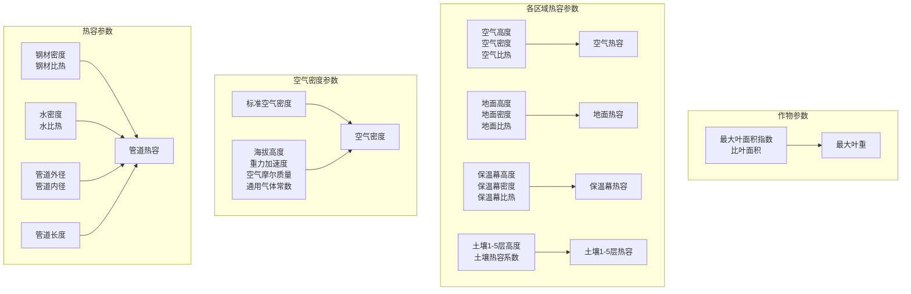
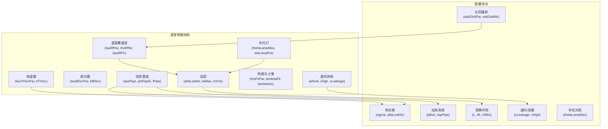

# 模型定义

> **相关源文件**
> * [readme.md](https://github.com/davkat1/GreenLight/blob/089602e3/readme.md)

本文档记录了构成GreenLight仿真平台核心的JSON模型定义。模型定义指定了动态系统的数学结构，包括变量、常量、输入和方程。GreenLight平台使用基于JSON的模块化模型定义，可以组合和扩展以创建复杂的温室和作物仿真模型。

有关这些模型的学术基础，请参见2.2节。有关组合和扩展模型的详细信息，请参见2.3节。

## 模型定义概述

GreenLight平台使用存储在`models/`目录中的基于JSON的模型定义。每个模型定义包含动态系统的结构化数学描述，包括状态变量、参数、外部输入和微分方程。核心模型基于已建立的学术文献，可以组合创建全面的温室仿真。

### 核心模型结构

```

```

### 主要模型文件

| 模型文件 | 学术来源 | 用途 |
| --- | --- | --- |
| `greenhouse_vanthoor_2011_chapter_8.json` | Vanthoor (2011) 第8章 | 温室气候动态 |
| `crop_vanthoor_2011_chapter_9_simplified.json` | Vanthoor (2011) 第9章 | 作物生长与发育 |
| `extension_greenhouse_katzin_2021_vanthoor_2011.json` | Katzin (2021) 第7章 | LED照明扩展 |

来源: [readme.md L52-L61](https://github.com/davkat1/GreenLight/blob/089602e3/readme.md#L52-L61)

 [readme.md L79](https://github.com/davkat1/GreenLight/blob/089602e3/readme.md#L79-L79)

## JSON模型定义结构

每个JSON模型定义都遵循标准化结构，用于定义动态系统的数学组件。JSON格式实现了透明、版本控制和模块化的模型开发。

### 模型定义格式

```

```

### 模型加载流程

```

```

来源: [readme.md L32-L35](https://github.com/davkat1/GreenLight/blob/089602e3/readme.md#L32-L35)

 [models/katzin_2021/definition/](https://github.com/davkat1/GreenLight/blob/089602e3/models/katzin_2021/definition/)

## 温室模型定义

`greenhouse_vanthoor_2011_chapter_8.json` 文件定义了基于 Vanthoor (2011) 第8章的温室气候动态模型。该模型描述了用于温室气候控制的能量和质量平衡方程。

### 变量分类

| 类别 | 描述 | 示例 |
| --- | --- | --- |
| **状态变量** | 随时间变化的动态系统状态 | 空气温度、湿度、CO2浓度 |
| **代数变量** | 从状态变量导出的计算值 | 热通量、通风率、能量平衡 |
| **控制变量** | 可操作的系统输入 | 加热阀门位置、遮阳幕闭合度、通风开口 |

### 关键模型组件

```

```

### 物理常数与参数

温室模型包含传热、热力学特性等物理常数，以及温室特定参数如尺寸、材料属性和设备规格。

来源: [readme.md L56-L57](https://github.com/davkat1/GreenLight/blob/089602e3/readme.md#L56-L57)

 [models/katzin_2021/definition/vanthoor_2011/](https://github.com/davkat1/GreenLight/blob/089602e3/models/katzin_2021/definition/vanthoor_2011/)

## 作物模型定义

`crop_vanthoor_2011_chapter_9_simplified.json` 文件实现了基于 Vanthoor (2011) 第9章的作物生长模型。该模型描述了光合作用、生长、发育和产量形成过程。

### 作物状态变量

```

```

### 光合作用模型组件

| 组件 | 描述 | 作用 |
| --- | --- | --- |
| **光能截获** | 基于叶面积指数的冠层PAR吸收 | 驱动光合速率 |
| **CO2吸收** | 气孔导度和CO2扩散 | 限制光合能力 |
| **温度响应** | 酶促温度依赖性 | 调节光合效率 |
| **碳水化合物分配** | 光合产物的分配 | 决定生长模式 |

### 生长与发育

作物模型追踪生物量在不同植物器官中的分配，并根据温度和光照条件计算发育速率。

来源: [readme.md L59-L60](https://github.com/davkat1/GreenLight/blob/089602e3/readme.md#L59-L60)

 [models/katzin_2021/definition/vanthoor_2011/](https://github.com/davkat1/GreenLight/blob/089602e3/models/katzin_2021/definition/vanthoor_2011/)

## LED扩展模型定义

`extension_greenhouse_katzin_2021_vanthoor_2011.json` 文件基于Katzin (2021) 第7章扩展了温室模型的LED照明功能。该扩展为温室气候和作物生长增加了补光效果。

### LED系统组件

```

```

### 与基础模型的集成

LED扩展模块同时修改了温室气候方程(通过增加热源)和作物方程(通过提供额外的光合有效辐射PAR)。这展示了GreenLight模型定义系统的模块化特性。

来源: [readme.md L60-L61](https://github.com/davkat1/GreenLight/blob/089602e3/readme.md#L60-L61)

 [models/katzin_2021/definition/](https://github.com/davkat1/GreenLight/blob/089602e3/models/katzin_2021/definition/)

### 默认参数来源

GreenLight模型中的参数基于以下科学文献:

1. Vanthoor, B. et al. (2011) - 温室气候模型
2. Vanthoor, B. et al. (2011) - 番茄产量模型  
3. Katzin, D. et al. (2020) - GreenLight模型评估
4. Katzin, D. (2021) - 温室LED照明的节能效果
5. Katzin, D. et al. (2021) - 从HPS过渡到LED照明的温室节能

在`setGlParams.m`文件中，参数来源通过方括号中的引用编号标注。

来源: [Code/createGreenLightModel/setGlParams.m L3-L38](https://github.com/davkat1/GreenLight/blob/089602e3/Code/createGreenLightModel/setGlParams.m#L3-L38)

## 参数依赖关系

GreenLight模型中的部分参数由其他参数推导得出。这些计算在`setGlParams`函数末尾执行。



来源: [Code/createGreenLightModel/setGlParams.m L230-L254](https://github.com/davkat1/GreenLight/blob/089602e3/Code/createGreenLightModel/setGlParams.m#L230-L254)

 [Code/createGreenLightModel/setGlParams.m L294-L295](https://github.com/davkat1/GreenLight/blob/089602e3/Code/createGreenLightModel/setGlParams.m#L294-L295)

## 参数的物理意义

GreenLight模型中的参数对应温室中的物理元素和过程，如下图所示:



来源: [Code/createGreenLightModel/setGlParams.m L50-L419](https://github.com/davkat1/GreenLight/blob/089602e3/Code/createGreenLightModel/setGlParams.m#L50-L419)

## 为不同场景修改参数

默认参数代表典型的荷兰式番茄种植温室。但这些参数可以被修改以模拟不同场景：

1. 不同的温室结构（通过修改建筑参数）
2. 不同的气候控制策略（通过修改设定值和控制带宽）
3. 不同的照明系统（通过修改灯具参数）
4. 不同的作物（通过修改作物生长和光合作用参数）
5. 不同的地理位置（通过修改天气数据和海拔高度）

创建模拟时，可以在调用`setGlParams`后直接修改`gl.p`结构体中的值来调整参数。

来源: [Code/createGreenLightModel/setGlParams.m L1-L426](https://github.com/davkat1/GreenLight/blob/089602e3/Code/createGreenLightModel/setGlParams.m#L1-L426)