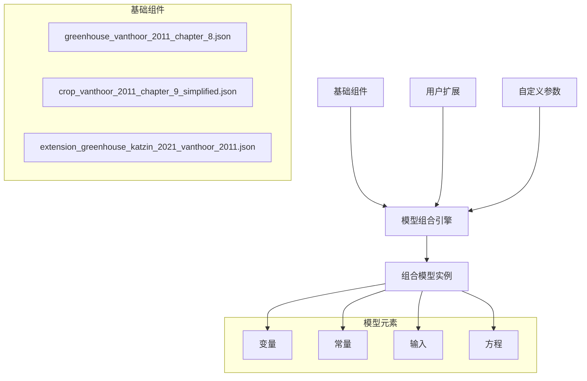
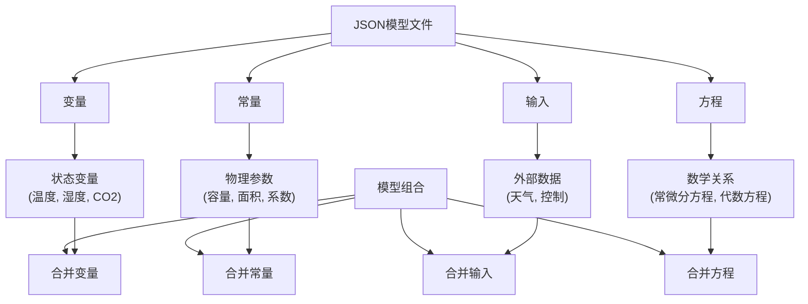
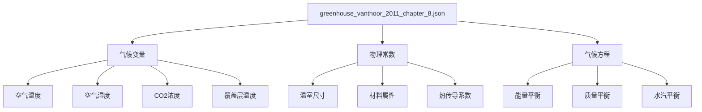
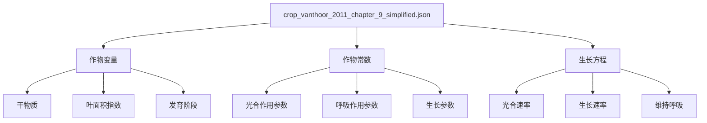
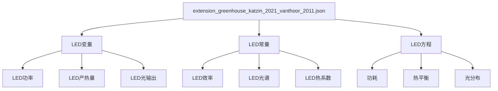
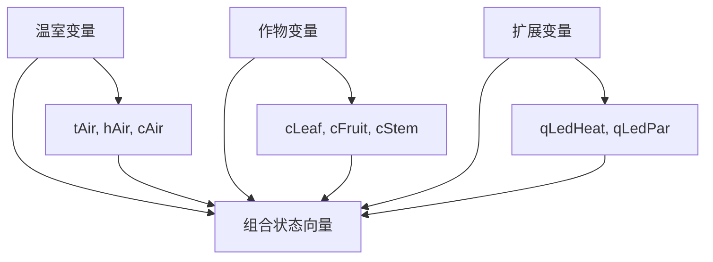
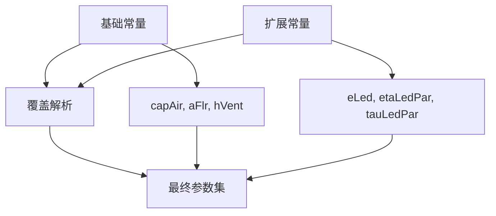
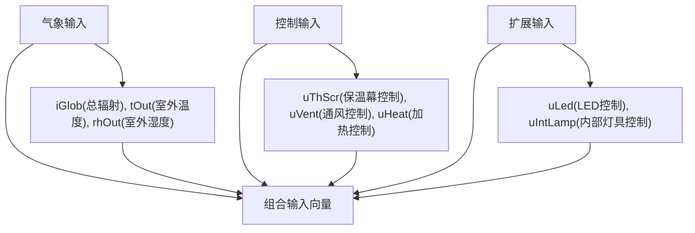
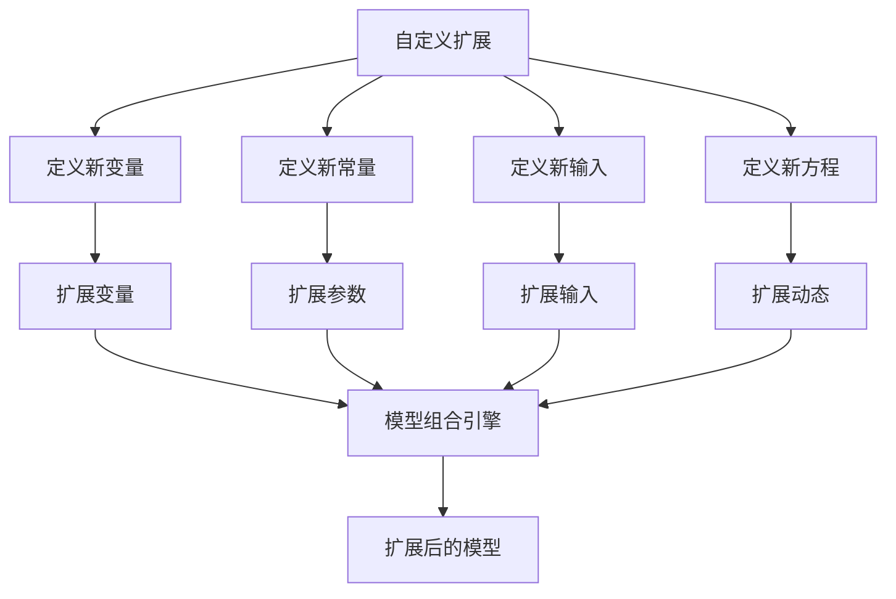
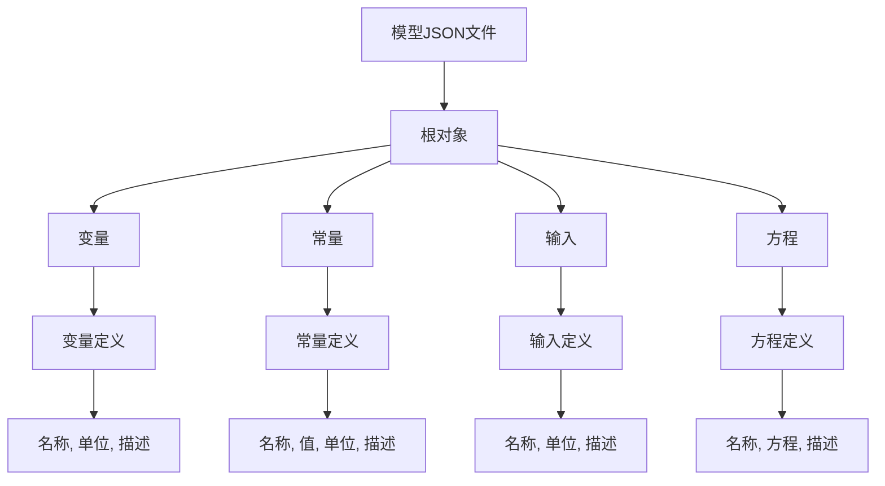

# 模型组合

> **相关源文件**
> * [readme.md](https://github.com/davkat1/GreenLight/blob/089602e3/readme.md)

## 目的与范围

本页介绍如何使用GreenLight框架扩展、组合和修改模型。GreenLight采用基于JSON的模块化方法，允许用户组合不同的模型组件（温室、作物、扩展模块）来创建综合的仿真模型。本页涵盖平台中使用的模型格式约定和组合机制。

## 概述

GreenLight的模型组合系统使用户能够通过组合模块化组件来构建复杂的仿真模型。该平台使用可组合的JSON模型定义来创建集成的温室-作物-光照系统。这种模块化方法既支持学术研究的可重复性，也支持实际模型的定制化。

## 模型组合架构

Sources: [readme.md L52-L61](https://github.com/davkat1/GreenLight/blob/089602e3/readme.md#L52-L61)

## JSON 模型格式结构

GreenLight 模型采用标准化的 JSON 文件结构定义，包含四个主要部分：

| 部分 | 描述 | 用途 |
| --- | --- | --- |
| `variables` | 动态状态变量 | 定义仿真过程中变化的系统状态 |
| `constants` | 固定参数 | 定义模型常数和物理参数 |
| `inputs` | 外部驱动数据 | 定义天气、控制等外部输入 |
| `equations` | 数学关系 | 定义微分方程和代数关系 |

### JSON 模型结构概览

来源: [readme.md L67-L68](https://github.com/davkat1/GreenLight/blob/089602e3/readme.md#L67-L68)

## 核心模型组件

GreenLight的模型组合系统基于三个核心组件构建，这些组件实现了学术温室建模文献中的方法：

### 1. 温室模型 (Vanthoor 2011 第8章)

基础温室模型实现了物理气候动力学：

来源: [readme.md L56-L57](https://github.com/davkat1/GreenLight/blob/089602e3/readme.md#L56-L57)

### 2. 作物模型 (Vanthoor 2011 第9章)

作物模型增加了植物生长和生理过程:

来源: [readme.md L59-L60](https://github.com/davkat1/GreenLight/blob/089602e3/readme.md#L59-L60)

### 3. LED扩展模型 (Katzin 2021)

LED扩展模块增加了补光功能:

来源: [readme.md L60-L61](https://github.com/davkat1/GreenLight/blob/089602e3/readme.md#L60-L61)

## 模型组合流程

GreenLight平台通过系统化的合并流程组合模型，该流程尊重每个组件的模块化结构：

### 1. 变量合并

来自不同模型的变量被合并到一个统一的状态空间中：

### 2. 常量合并

物理参数和常量通过冲突解决机制进行合并:

### 3. 输入整合

来自不同模型的外部输入被统一到一个输入结构中:

来源: [readme.md L67-L68](https://github.com/davkat1/GreenLight/blob/089602e3/readme.md#L67-L68)

## 模型扩展与定制

### 创建自定义扩展

用户可以通过遵循JSON模型格式来创建自定义扩展:

### 模型修改模式

扩展和修改模型的常见模式包括：

| 模式 | 描述 | 使用场景 |
| --- | --- | --- |
| **参数覆盖** | 修改现有常量 | 调整物理属性 |
| **变量添加** | 添加新状态变量 | 包含新的物理过程 |
| **输入扩展** | 添加新的外部输入 | 包含新的控制或环境数据 |
| **方程修改** | 修改现有方程 | 改变模型行为或添加耦合 |

来源: [readme.md L67-L68](https://github.com/davkat1/GreenLight/blob/089602e3/readme.md#L67-L68)

## 模型格式规范

### JSON结构要求

GreenLight 模型必须遵循特定的JSON结构规范：

### 学术模型映射

JSON格式直接对应学术文献中的概念：

| JSON元素 | 学术来源 | 用途 |
| --- | --- | --- |
| `variables` | 文献中的状态变量 | 动态系统状态 |
| `constants` | 论文中的参数表 | 固定模型参数 |
| `inputs` | 外部强制函数 | 边界条件 |
| `equations` | 数学公式 | 系统动力学 |

### 组合规则

模型组合时需遵循以下规则：

1. **变量命名空间**：每个模型组件保持自己的变量命名空间
2. **常量覆盖**：后加载的模型可以覆盖先前的常量
3. **输入合并**：输入数据无冲突地合并
4. **方程集成**：合并方程时保持依赖关系

来源: [readme.md L52-L61](https://github.com/davkat1/GreenLight/blob/089602e3/readme.md#L52-L61)

## 使用示例

使用`createGreenLightModel`的基本模式：

1. 准备符合要求的天气数据
2. 选择灯具类型('hps', 'led'或'none')
3. 设置模拟开始时间
4. 可选：准备控制轨迹
5. 使用适当参数调用`createGreenLightModel`

模型创建后，可用于不同场景的模拟，如[运行模拟](/davkat1/GreenLight/4-running-simulations)中所述。

## 总结

模型创建过程是GreenLight系统的核心部分。它建立了包含适当参数、输入、状态和控制机制的模拟环境。该过程支持基于规则和轨迹驱动的控制，为不同模拟场景提供灵活性。

`createGreenLightModel`函数是创建GreenLight模型的主要入口点，集成了温室气候和能源模拟所需的所有组件。使用此函数创建模型后，用户可以通过GreenLight系统的其他组件进行模拟和结果分析。