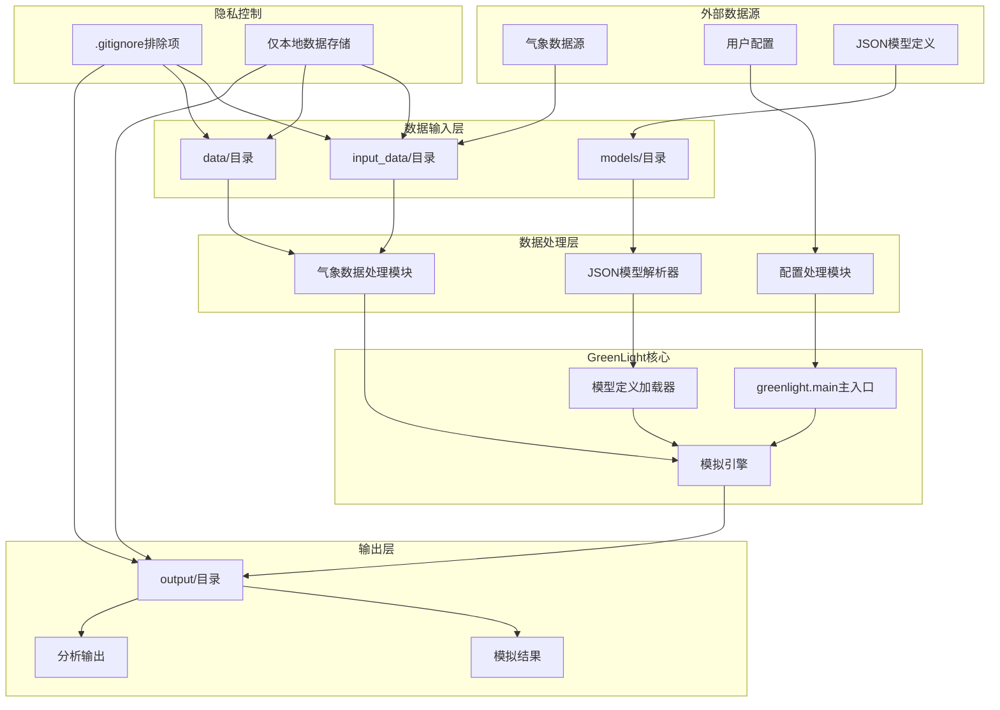
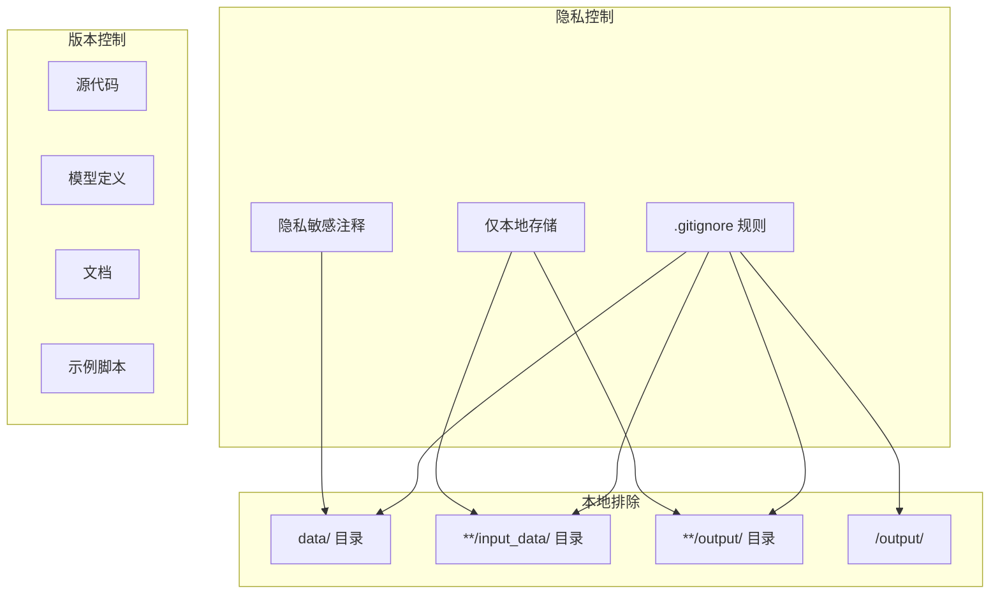
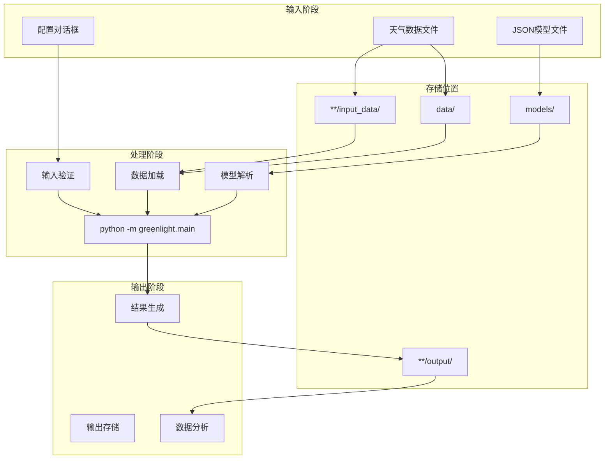

# 数据处理

> **相关源文件**
> * [.gitignore](https://github.com/davkat1/GreenLight/blob/089602e3/.gitignore)
> * [readme.md](https://github.com/davkat1/GreenLight/blob/089602e3/readme.md)

本文档涵盖GreenLight的数据处理架构，包括输入数据管理、输出生成和隐私考量。该平台在保持严格数据隐私实践的同时，处理气象数据、模型配置和模拟结果。

有关气象数据获取和使用的具体指南，请参阅[气象数据](/davkat1/GreenLight/3.1-weather-data)。有关详细的数据管理实践和目录结构，请参阅[输入和输出数据](/davkat1/GreenLight/3.2-input-and-output-data)。

## 数据架构概述

GreenLight通过结构化管道处理多种数据类型，在保持隐私和可重现性的同时，将外部数据源与核心模拟引擎分离。



来源: [readme.md L40-L41](https://github.com/davkat1/GreenLight/blob/089602e3/readme.md#L40-L41)

 [.gitignore L100-L113](https://github.com/davkat1/GreenLight/blob/089602e3/.gitignore#L100-L113)

## 数据类型与来源

GreenLight平台处理多种不同的数据类别，每种都有特定的处理要求和存储模式。

| 数据类型 | 来源 | 存储位置 | 隐私级别 |
| --- | --- | --- | --- |
| 天气数据 | 外部API/文件 | `data/`, `**/input_data/` | 高 - 位置敏感 |
| 模型定义 | JSON文件 | `models/`目录 | 公开 - 版本控制 |
| 用户配置 | 对话框界面 | 运行时内存 | 中 - 用户偏好 |
| 模拟结果 | 引擎输出 | `**/output/`, `output/` | 中 - 衍生数据 |
| 分析输出 | 后处理 | `**/output/` | 中 - 衍生数据 |

该平台区分了**配置数据**(存储在版本控制中的模型定义)和**运行时数据**(排除在版本控制之外的天气输入和模拟输出)。

来源: [.gitignore L100-L113](https://github.com/davkat1/GreenLight/blob/089602e3/.gitignore#L100-L113)

 [readme.md L77-L81](https://github.com/davkat1/GreenLight/blob/089602e3/readme.md#L77-L81)

## 隐私与安全考虑

GreenLight实施了严格的数据隐私控制，认识到天气数据可能具有位置敏感性，而模拟结果可能包含专有信息。

### 数据排除策略

该平台使用全面的`.gitignore`模式来防止敏感数据进入版本控制:



该排除策略包含明确的隐私注释：*"不要将数据上传到git。这很慢且涉及隐私敏感信息"*。

来源：[.gitignore L100-L103](https://github.com/davkat1/GreenLight/blob/089602e3/.gitignore#L100-L103)

### 异常处理

虽然大多数数据被排除在外，但平台允许使用Git的强制添加机制`git add -f data/...`来受控地包含演示数据或虚拟数据集。

来源：[.gitignore L102](https://github.com/davkat1/GreenLight/blob/089602e3/.gitignore#L102-L102)

## 数据流处理

数据处理流程遵循从外部来源经过处理到最终输出的结构化管道，每个阶段都应用了隐私控制措施。



该流程确保敏感输入数据不会离开本地环境，同时保持配置数据与运行时数据的分离。

来源: [readme.md L31-L37](https://github.com/davkat1/GreenLight/blob/089602e3/readme.md#L31-L37)

 [.gitignore L104-L113](https://github.com/davkat1/GreenLight/blob/089602e3/.gitignore#L104-L113)

## 数据目录结构

GreenLight采用一致的目录结构，在保持隐私边界的同时分离不同类型的数据。

### 标准目录模式

```python
project_root/
├── data/                     # 排除在版本控制外
├── models/                   # 受版本控制的模型定义
├── **/input_data/           # 天气和输入数据(排除)
│   └── .gitkeep            # 保留目录结构
├── **/output/              # 模拟结果(排除)
│   └── .gitkeep            # 保留目录结构
└── output/                 # 通用输出目录(排除)
```

### 目录特定处理规则

* **`data/` 目录**: 通用数据存储，包含隐私敏感数据，完全排除在版本控制外
* **`**/input_data/` 模式**: 天气数据和外部输入数据，排除内容但保留目录结构
* **`**/output/` 模式**: 模型特定输出数据，排除内容但保留目录结构 
* **`models/` 目录**: JSON 模型定义文件，纳入版本控制且公开
* **`.gitkeep` 文件**: 在排除内容的同时保持目录结构纳入版本控制

`<model_name>/output/` 这种模式提供了模型特定的输出组织方式，同时保持一致的排除规则。

来源: [.gitignore L103-L113](https://github.com/davkat1/GreenLight/blob/089602e3/.gitignore#L103-L113)