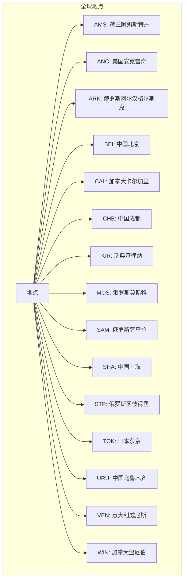
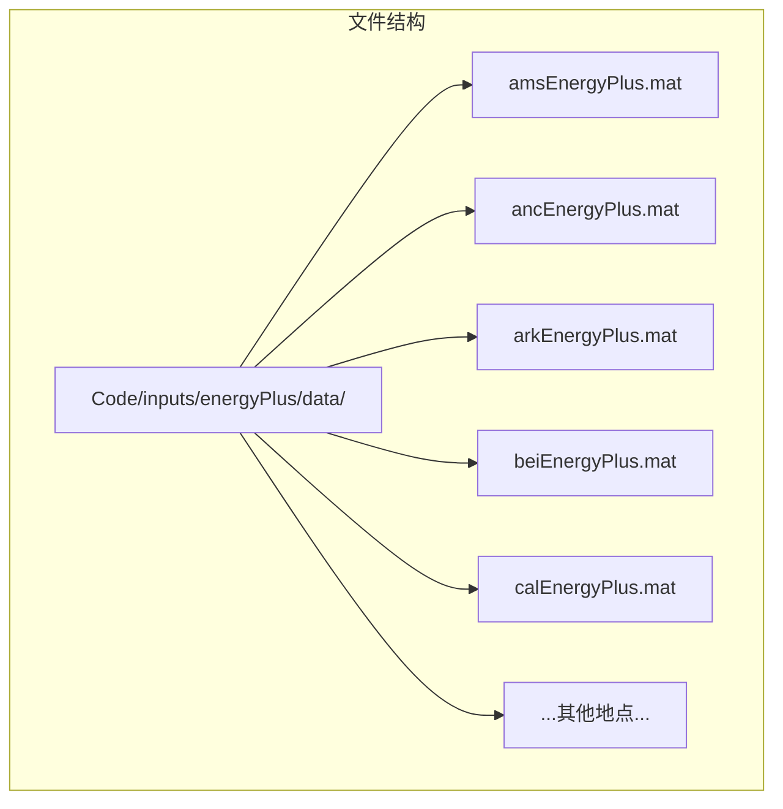
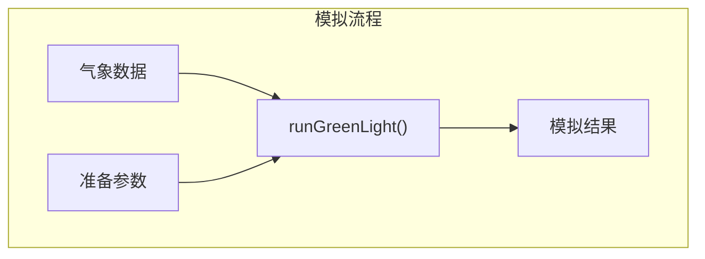
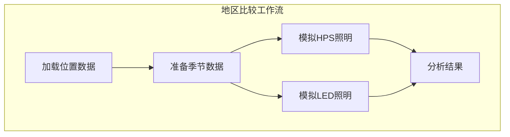

# 气象数据

> **相关源文件**
> * [readme.md](https://github.com/davkat1/GreenLight/blob/089602e3/readme.md)

## 目的与范围

本文档详细说明了GreenLight模型中使用气象数据的格式、来源及用途。气象数据是温室模拟的重要输入，它提供了影响温室内环境的外部气候条件。GreenLight模型使用气象数据来模拟在不同照明技术(HPS和LED)下、全球不同地区的温室能源使用和气候状况。

本页重点介绍气象数据文件的结构、可用位置以及气象数据在模拟中的准备和使用方式。有关温室试验数据的信息，请参阅[温室数据](/davkat1/GreenLight/3.1-weather-data)。

来源: [Code/runScenarios/runWorldSimulations.m L1-L15](https://github.com/davkat1/GreenLight/blob/089602e3/Code/runScenarios/runWorldSimulations.m#L1-L15)

## 气象数据格式

GreenLight模型主要使用EnergyPlus格式的气象数据，存储在MATLAB的`.mat`文件中。每个气象文件包含一个名为`weather`的变量，这是一个包含多列的矩阵，每列代表不同的气象参数。

```

```

模型中使用的主要气象参数包括：

* 温度(°C) - 位于气象矩阵的第3列  
* 太阳辐射(W/m²) - 位于气象矩阵的第2列

这些参数对于模拟影响温室能源使用和气候控制的外部条件至关重要。

来源: [Code/inputs/energyPlus/scatterYearAvgTempRad.m L42-L47](https://github.com/davkat1/GreenLight/blob/089602e3/Code/inputs/energyPlus/scatterYearAvgTempRad.m#L42-L47)

[Code/inputs/energyPlus/scatterYearAvgTempRad.m L165-L166](https://github.com/davkat1/GreenLight/blob/089602e3/Code/inputs/energyPlus/scatterYearAvgTempRad.m#L165-L166)

## 可用气象位置

GreenLight模型包含15个全球位置的气象数据，涵盖从寒冷到温暖、从低到高太阳辐射水平的各种气候条件。这些位置用于评估不同气候情景下的温室性能。



这些地点代表了多样化的气候条件，使研究人员能够评估不同照明技术在各种场景下的性能。这些地点在平均温度和太阳辐射方面差异显著，有些地点较寒冷（如Kiruna、Anchorage），而其他地点较温暖（如Shanghai、Venice）。

来源: [Code/runScenarios/runWorldSimulations.m L16-L17](https://github.com/davkat1/GreenLight/blob/089602e3/Code/runScenarios/runWorldSimulations.m#L16-L17)

 [Code/inputs/energyPlus/scatterYearAvgTempRad.m L42-L161](https://github.com/davkat1/GreenLight/blob/089602e3/Code/inputs/energyPlus/scatterYearAvgTempRad.m#L42-L161)

## 气象数据结构

每个气象地点都有对应的数据文件存储在`Code/inputs/energyPlus/data/`目录下，命名格式为`[地点代码]EnergyPlus.mat`。例如，Amsterdam的气象数据存储在`amsEnergyPlus.mat`中。



加载后，每个气象文件包含一个名为`weather`的变量，该变量以矩阵格式存储气候数据。数据通常包含一整年的每小时测量值。

来源: [Code/runScenarios/runWorldSimulations.m L22-L27](https://github.com/davkat1/GreenLight/blob/089602e3/Code/runScenarios/runWorldSimulations.m#L22-L27)

 [Code/inputs/energyPlus/scatterYearAvgTempRad.m L15-L17](https://github.com/davkat1/GreenLight/blob/089602e3/Code/inputs/energyPlus/scatterYearAvgTempRad.m#L15-L17)

## 准备模拟用气象数据

在气象数据可用于模拟之前，通常需要通过选择相关时间段进行准备。GreenLight模型包含一个名为`cutEnergyPlusData`的函数，用于从年度气象数据中提取特定季节的数据。

```mermaid
sequenceDiagram
  participant runWorldSimulations.m
  participant cutEnergyPlusData()
  participant 气象文件

  runWorldSimulations.m->>气象文件: 加载全年数据
  runWorldSimulations.m->>cutEnergyPlusData(): 起始日, 季节长度, 文件位置
  cutEnergyPlusData()->>气象文件: 从指定日期提取数据
  cutEnergyPlusData()->>runWorldSimulations.m: 返回季节数据
  runWorldSimulations.m->>runWorldSimulations.m: 使用准备好的数据进行模拟
```

准备气象数据的关键参数：

* `firstDay`: 季节开始的年积日（默认值为270，约10月1日）
* `seasonLength`: 季节持续天数（默认值为350天）

这一准备步骤使研究人员能够专注于与其研究问题相关的特定生长季节。

来源: [Code/runScenarios/runWorldSimulations.m L18-L19](https://github.com/davkat1/GreenLight/blob/089602e3/Code/runScenarios/runWorldSimulations.m#L18-L19)

 [Code/runScenarios/runWorldSimulations.m L32-L34](https://github.com/davkat1/GreenLight/blob/089602e3/Code/runScenarios/runWorldSimulations.m#L32-L34)

## 在模拟中使用气象数据

准备完成后，气象数据将被传递给模拟函数。`runGreenLight`函数使用气象数据作为输入，模拟不同照明技术（HPS和LED）下的温室气候和能源使用情况。



气象数据影响温室模拟的多个方面：

1. **供暖需求**：基于室内外的温差
2. **光照控制**：根据自然太阳辐射调整补充照明
3. **气候控制**：通风和湿度管理受外界条件影响

通过使用不同地区的气象数据，研究人员可以评估温室技术在各种气候场景下的表现，从而为不同地区提供节能温室运营的具体建议。

来源: [Code/runScenarios/runWorldSimulations.m L36-L38](https://github.com/davkat1/GreenLight/blob/089602e3/Code/runScenarios/runWorldSimulations.m#L36-L38)

 [Code/runScenarios/runWorldSimulations.m L49-L51](https://github.com/davkat1/GreenLight/blob/089602e3/Code/runScenarios/runWorldSimulations.m#L49-L51)

## 示例：不同地区比较

GreenLight模型已被用于比较全球不同地区的温室性能，帮助理解气候如何影响能源使用以及从HPS过渡到LED照明时的潜在节能效果。



采用该方法的研究表明，气候条件显著影响温室从HPS过渡到LED照明时的潜在节能效果，不同地区表现出的效益存在差异。

来源: [Code/runScenarios/runWorldSimulations.m L29-L38](https://github.com/davkat1/GreenLight/blob/089602e3/Code/runScenarios/runWorldSimulations.m#L29-L38)

 [Code/inputs/energyPlus/scatterYearAvgTempRad.m L1-L9](https://github.com/davkat1/GreenLight/blob/089602e3/Code/inputs/energyPlus/scatterYearAvgTempRad.m#L1-L9)

## 气象数据可视化

GreenLight模型包含气象数据可视化工具，可帮助理解不同地区的气候特征。例如，`scatterYearAvgTempRad.m`脚本可生成散点图，展示15个地点的年平均温度和辐射量。

这种可视化有助于研究人员理解研究区域的气候分布，并为解读模拟结果提供背景信息。

可视化示例数据:

| 地点 | 平均温度(°C) | 平均辐射量(MJ/m²/天) |
| --- | --- | --- |
| AMS (Amsterdam) | ~9.5 | ~9.5 |
| KIR (Kiruna) | ~-1.5 | ~7.0 |
| CAL (Calgary) | ~4.0 | ~13.0 |
| SHA (Shanghai) | ~16.0 | ~13.0 |

来源: [Code/inputs/energyPlus/scatterYearAvgTempRad.m L1-L9](https://github.com/davkat1/GreenLight/blob/089602e3/Code/inputs/energyPlus/scatterYearAvgTempRad.m#L1-L9)

 [Code/inputs/energyPlus/scatterYearAvgTempRad.m L164-L166](https://github.com/davkat1/GreenLight/blob/089602e3/Code/inputs/energyPlus/scatterYearAvgTempRad.m#L164-L166)