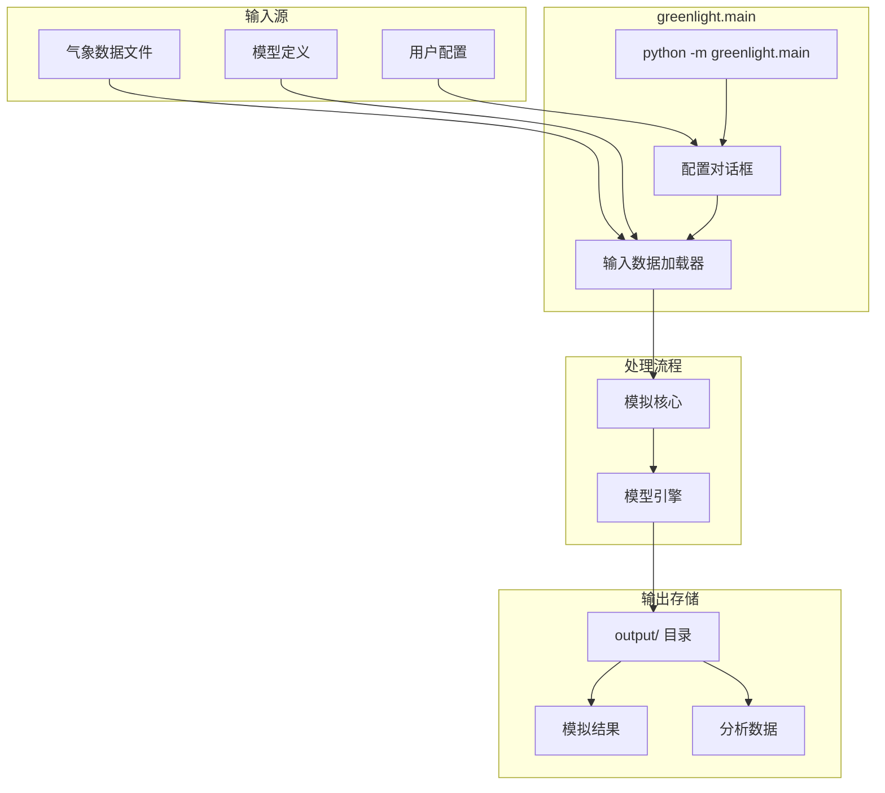
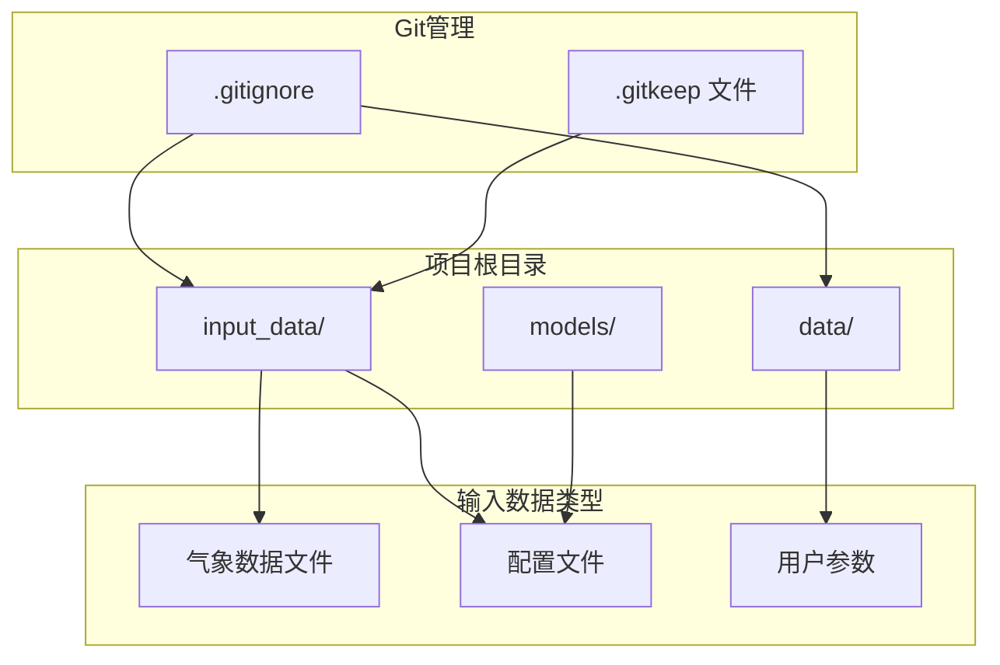
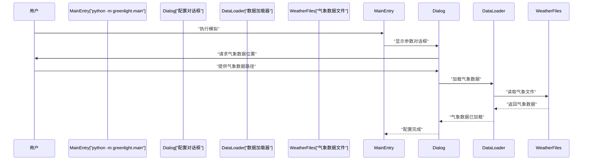
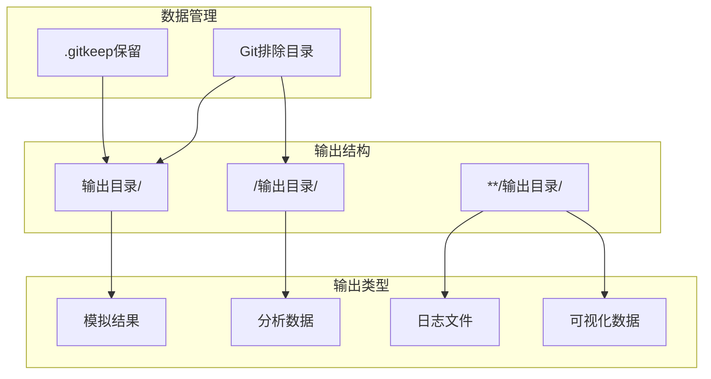
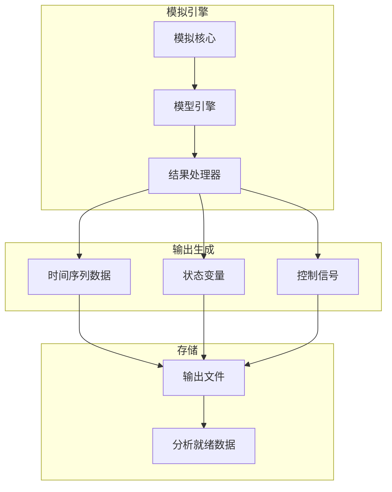
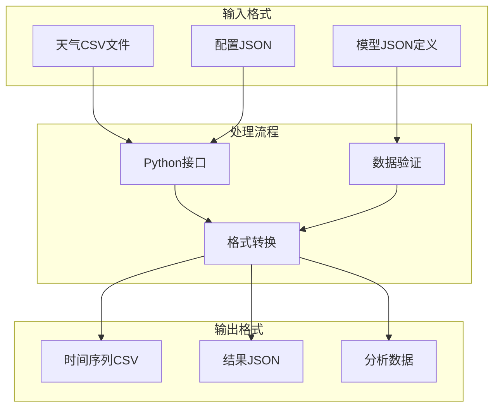
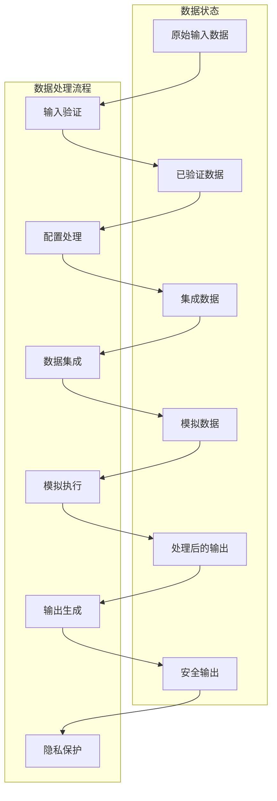

# 输入与输出数据

> **相关源文件**
> * [.gitignore](https://github.com/davkat1/GreenLight/blob/089602e3/.gitignore)
> * [readme.md](https://github.com/davkat1/GreenLight/blob/089602e3/readme.md)

## 目的与范围

本文档详细说明了GreenLight平台的数据管理实践，涵盖输入数据处理、输出生成和隐私考量。该平台设计用于处理多种类型的输入数据，主要是用于特定位置模拟的气象数据，同时生成结构化格式的模拟输出。

## 数据流架构

GreenLight平台通过从输入源到模拟输出的结构化流程处理数据：

来源: [readme.md L32-L41](https://github.com/davkat1/GreenLight/blob/089602e3/readme.md#L32-L41)

 [.gitignore L101-L113](https://github.com/davkat1/GreenLight/blob/089602e3/.gitignore#L101-L113)

## 输入数据管理

### 数据目录结构

GreenLight平台使用标准化的目录结构来管理输入数据:

### 隐私与安全考虑

平台实施了多项数据隐私保护措施:

| 目录 | 隐私状态 | 用途 |
| --- | --- | --- |
| `data/` | Git排除 | 存储用户敏感数据 |
| `**/input_data/` | Git排除 | 位置特定的输入数据 |
| `**/output/` | Git排除 | 模拟结果和输出数据 |

`.gitignore`文件专门排除了数据目录，以防止意外上传敏感信息，并附有注释"不要将数据上传到git，这既缓慢又涉及隐私敏感"。

来源: [.gitignore L101-L113](https://github.com/davkat1/GreenLight/blob/089602e3/.gitignore#L101-L113)

## 输入数据类型与格式

### 气象数据要求

气象数据对于位置特定的模拟至关重要。平台需要气象数据来生成有意义的模拟结果:

| 数据类型 | 描述 | 要求 |
| --- | --- | --- |
| 气象文件 | 位置特定的气象数据 | 真实模拟所必需 |
| 用户配置 | 对话框参数和设置 | 所有模拟必需 |
| 模型定义 | JSON模型规范文件 | 预定义在models目录中 |

### 气象数据集成

平台通过以下工作流程处理气象数据:

来源: [readme.md L39-L41](https://github.com/davkat1/GreenLight/blob/089602e3/readme.md#L39-L41)

## 输出数据生成

### 输出目录结构

GreenLight平台以有组织的目录结构生成模拟输出:

### 输出数据处理

该平台通过`greenlight`包处理模拟输出:

Sources: [.gitignore L107-L113](https://github.com/davkat1/GreenLight/blob/089602e3/.gitignore#L107-L113)

 [readme.md L71-L81](https://github.com/davkat1/GreenLight/blob/089602e3/readme.md#L71-L81)

### 数据访问与使用

该平台提供多种接口用于访问输入和输出数据：

| 接口 | 用途 | 数据访问方式 |
| --- | --- | --- |
| `python -m greenlight.main` | 主要CLI入口点 | 基于对话框的配置 |
| `greenlight` 包 | 编程式访问 | 直接Python API |
| `notebooks/` | 交互式分析 | 基于Jupyter的探索 |
| `scripts/` | 批处理 | 基于脚本的自动化 |

### 数据格式考量

该平台处理适合科学计算的数据格式：

来源: [readme.md L44-L46](https://github.com/davkat1/GreenLight/blob/089602e3/readme.md#L44-L46)

 [readme.md L80-L81](https://github.com/davkat1/GreenLight/blob/089602e3/readme.md#L80-L81)

## 数据处理流程

GreenLight平台实现了结构化的数据处理流程:

1. **输入验证**: 检查数据格式和完整性
2. **配置处理**: 解析用户设置和模型参数
3. **数据集成**: 将天气数据与模型定义结合
4. **模拟执行**: 使用集成数据运行动态模型
5. **输出生成**: 创建结构化结果文件
6. **隐私保护**: 确保敏感数据保留在本地

来源: [.gitignore L101-L113](https://github.com/davkat1/GreenLight/blob/089602e3/.gitignore#L101-L113)

## GreenLight模型中的数据使用

温室数据主要用于模型验证和评估。通过`loadGreenhouseData`加载后，数据被用于多种评估函数：

1. **气候模型评估** - 比较模拟和实测的温室气候数据
2. **能源使用评估** - 验证能源消耗预测

这些评估对于判断模型准确性以及比较不同照明技术(HPS vs. LED)在气候控制和能源效率方面的表现至关重要。

来源: [Code/inputs/Recorded L16-L22](https://github.com/davkat1/GreenLight/blob/089602e3/Code/inputs/Recorded greenhouse data from 2010 Bleiswijk trial/Readme.txt#L16-L22)

## 研究背景

温室数据集已在发表的研究中记录：

* **HPS和LED数据集**: 描述于Dueck等(2010)的"Lichtbenuttig van tomaat onder LED en SON-T belichting"
* **模型验证**: 用于Katzin等(2020)的"GreenLight - 一个带补光温室的开放源代码模型：LED和HPS灯下热需求评估"

这些数据代表了真实世界的温室运营情况，为测试GreenLight模型在不同照明技术下准确模拟温室气候和能源使用的能力提供了基准。

来源: [Code/inputs/loadGreenhouseData.m L8-L16](https://github.com/davkat1/GreenLight/blob/089602e3/Code/inputs/loadGreenhouseData.m#L8-L16)

[Code/inputs/Recorded L21-L22](https://github.com/davkat1/GreenLight/blob/089602e3/Code/inputs/Recorded greenhouse data from 2010 Bleiswijk trial/Readme.txt#L21-L22)