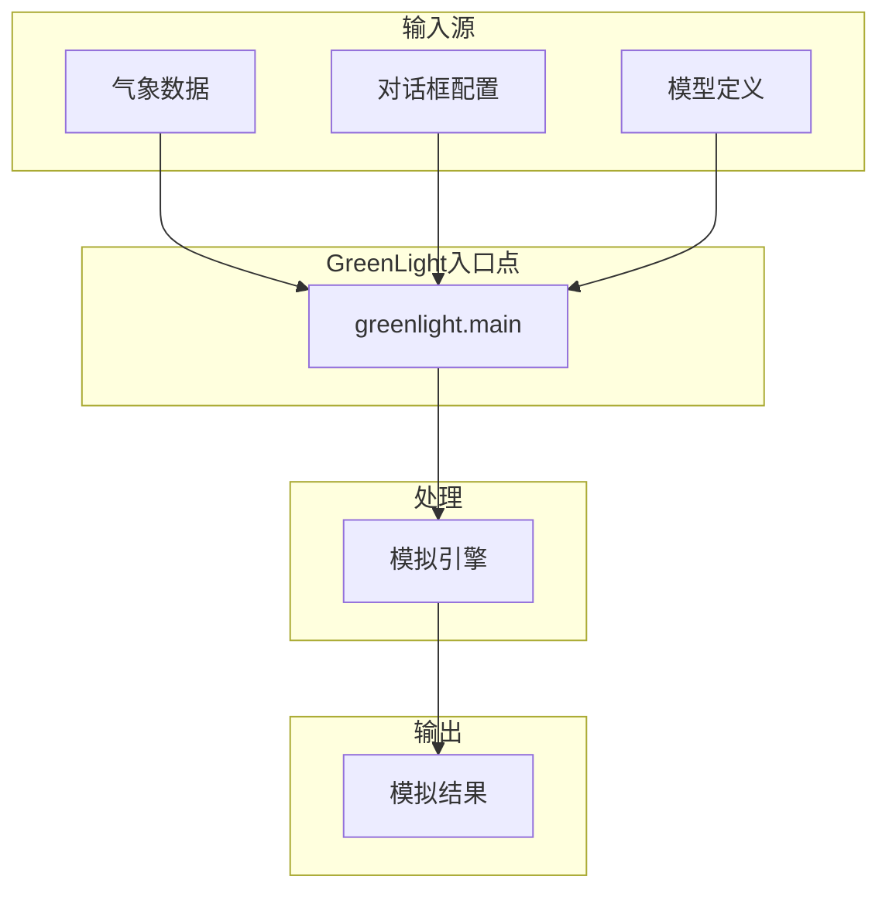
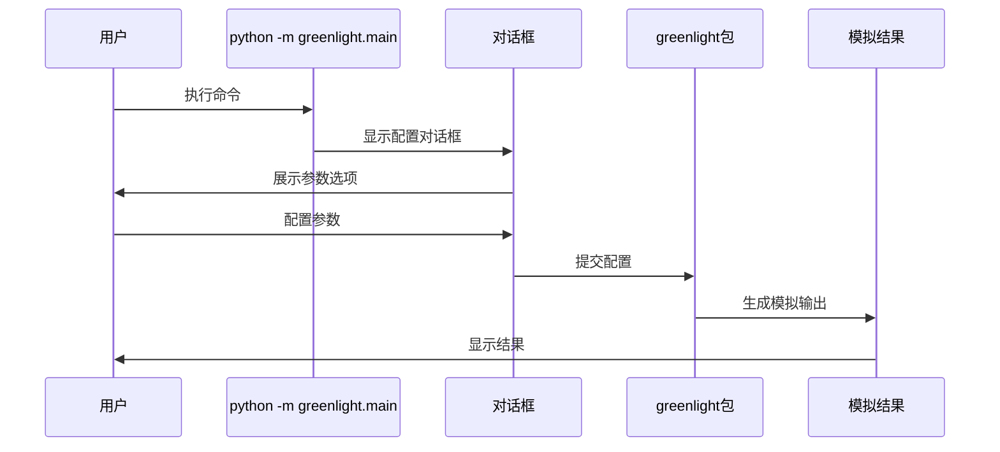
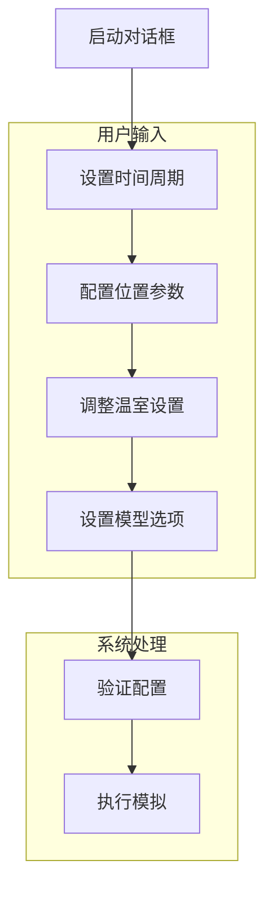
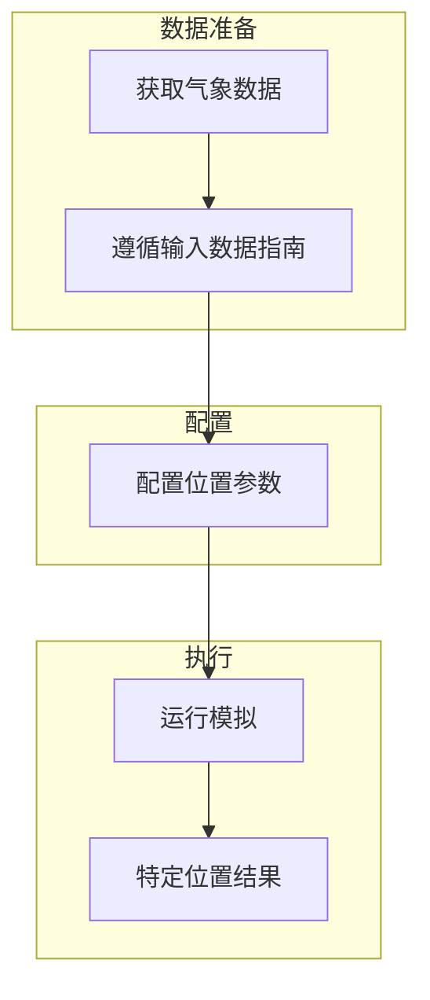
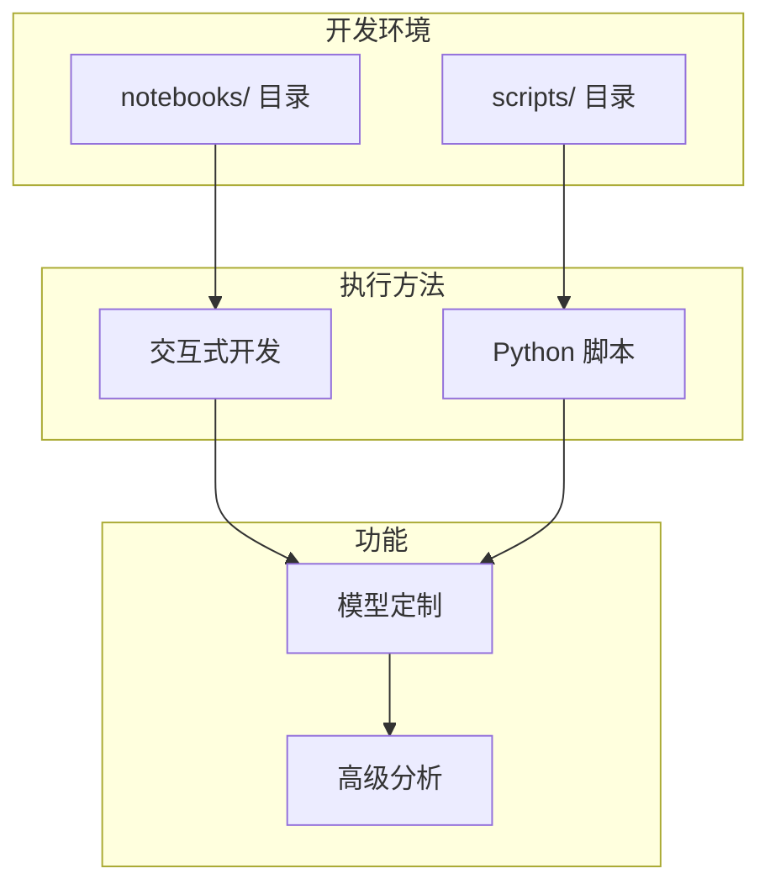
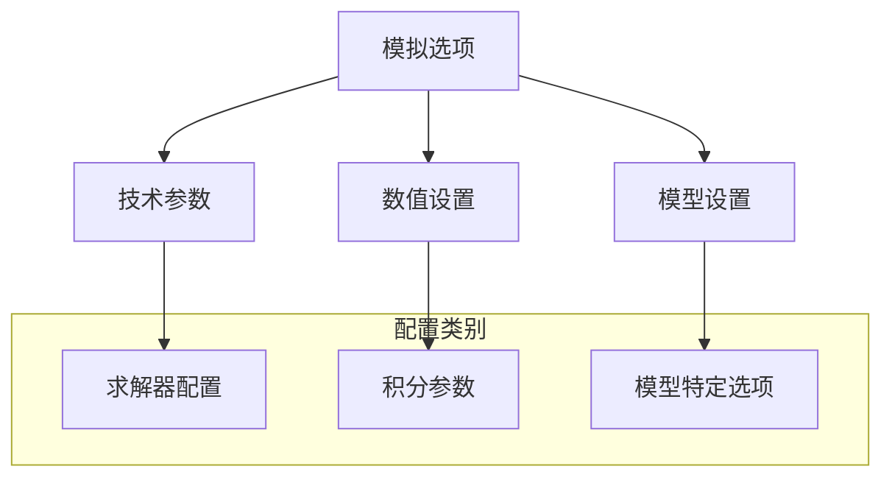
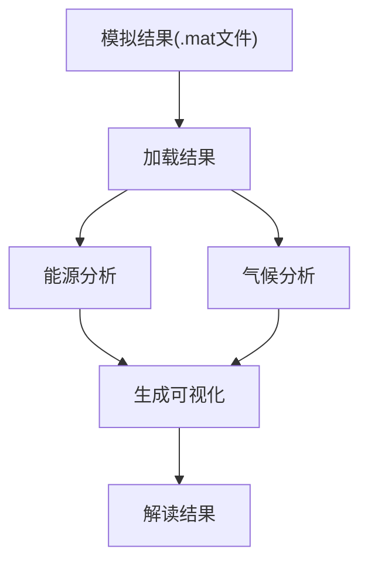

# 运行模拟

> **相关源文件**
> * [readme.md](https://github.com/davkat1/GreenLight/blob/089602e3/readme.md)

本页提供了关于如何使用GreenLight平台配置和执行模拟的全面指南。内容涵盖基础模拟设置、对话框配置以及使用基于Python的GreenLight系统执行不同模拟场景。

## 模拟工作流程

GreenLight平台遵循结构化的模拟执行工作流程。该流程包括准备输入数据、通过对话框界面配置模型、执行模拟以及生成输出结果供后续分析使用。



来源: [readme.md L31-L37](https://github.com/davkat1/GreenLight/blob/089602e3/readme.md#L31-L37)

 [readme.md L39-L41](https://github.com/davkat1/GreenLight/blob/089602e3/readme.md#L39-L41)

## 基础模拟执行

### 主要入口点

运行模拟的主要方法是通过命令行界面使用 `greenlight.main` 模块。该模块提供了一个交互式对话框用于配置模拟参数。

**命令行界面:**

```
python -m greenlight.main
```

运行该命令后，将出现一个包含各种配置输入的对话框。您可以根据模拟需求调整这些参数，然后点击**确定**执行模拟。



来源: [readme.md L31-L37](https://github.com/davkat1/GreenLight/blob/089602e3/readme.md#L31-L37)

### 快速入门提示

为了初始探索和更快的模拟执行:

| 参数 | 建议 | 目的 |
| --- | --- | --- |
| 结束日期 | 设置为接近开始日期(如21/9/30) | 缩短模拟时长 |
| 位置 | 初始使用默认设置 | 避免天气数据复杂性 |
| 模型设置 | 保持默认值 | 标准温室配置 |

来源: [readme.md L35-L37](https://github.com/davkat1/GreenLight/blob/089602e3/readme.md#L35-L37)

## 对话框配置

GreenLight对话框提供了一个直观的界面来配置模拟参数。该对话框提供了各种输入字段，可根据您的特定需求自定义模拟。

### 配置类别

对话框将参数按逻辑分组:

| 类别 | 描述 | 配置方法 |
| --- | --- | --- |
| 时间周期 | 模拟开始和结束日期 | 日期选择字段 |
| 位置 | 地理参数 | 位置选择 |
| 温室设置 | 物理和操作参数 | 输入字段和下拉菜单 |
| 模型选项 | 技术模拟设置 | 复选框和数字输入 |

### 配置工作流



来源: [readme.md L31-L37](https://github.com/davkat1/GreenLight/blob/089602e3/readme.md#L31-L37)

## 特定位置模拟

### 气象数据集成

为了获得准确且有意义的模拟结果，需要提供气象数据作为输入以实现特定位置的建模。如果没有气象数据，模拟将无法为特定地理位置提供有意义的结果。



### 气象数据要求

要进行特定位置的模拟，请按照输入数据文档中的指南获取目标位置的适当气象数据。

| 数据类型 | 用途 | 来源 |
| --- | --- | --- |
| 气象数据 | 模拟的气候强迫 | 特定位置的气象数据 |
| 位置参数 | 地理配置 | 坐标和本地设置 |
| 季节模式 | 时间变化 | 历史天气模式 |

来源: [readme.md L39-L41](https://github.com/davkat1/GreenLight/blob/089602e3/readme.md#L39-L41)

## 脚本和Notebook使用

### 高级建模工作流

复杂的建模工作通常需要编写和使用脚本或notebook，以获得比基本对话框界面更大的灵活性和定制性。



### 可用示例

GreenLight 代码库提供了两个主要目录中的示例：

| 目录 | 内容类型 | 用途 |
| --- | --- | --- |
| `notebooks/` | Jupyter notebooks | 交互式开发和示例 |
| `scripts/` | Python 脚本 | 编程使用示例 |

### 基于脚本的工作流

适用于需要以下功能的用户：

* 以编程方式修改模型设置
* 执行多个模拟的批处理
* 将 GreenLight 与其他工具集成
* 进行系统性的参数研究

基于脚本的方法通过 Python API 提供了必要的灵活性。

来源: [readme.md L43-L46](https://github.com/davkat1/GreenLight/blob/089602e3/readme.md#L43-L46)

 [readme.md L80-L81](https://github.com/davkat1/GreenLight/blob/089602e3/readme.md#L80-L81)

## 配置选项

### 模拟选项

GreenLight 平台提供了各种可修改的技术设置，用于自定义模拟行为。这些选项控制模拟引擎的数值方面和计算参数。



### 配置来源

| 配置方法 | 描述 | 使用场景 |
| --- | --- | --- |
| 对话框 | 交互式参数设置 | 基础模拟 |
| 模拟选项 | 技术参数配置 | 高级模拟 |
| 模型设置 | 模型特定配置 | 研究应用 |

有关可用模拟选项及其影响的详细信息，请参阅模拟选项文档。

来源: [readme.md L65](https://github.com/davkat1/GreenLight/blob/089602e3/readme.md#L65-L65)

## 模拟输出与分析

模拟运行后，结果通常保存为MATLAB `.mat`文件，其中包含`gl`对象，该对象保存了所有模拟状态和结果。

要分析模拟结果，请参考[模拟后分析](/davkat1/GreenLight/5-development-environment)部分，其中包含以下工具：

* 能源使用分析
* 气候比较
* 结果可视化



来源: [readme.md L209-L223](https://github.com/davkat1/GreenLight/blob/089602e3/readme.md#L209-L223)

## 示例：完整模拟工作流程

本示例展示了运行和分析模拟的完整工作流程：

1. 准备目标位置的气候数据
2. 设置合适的温室和灯具参数
3. 运行不同照明技术（HPS和LED）的模拟
4. 比较能源使用和气候条件
5. 分析潜在的节能效果

如需了解具体研究应用，请参阅[应用与研究](/davkat1/GreenLight/6-applications-and-research)部分，其中重点介绍了GreenLight模型在已发表研究中的使用情况。

来源: [readme.md L27-L60](https://github.com/davkat1/GreenLight/blob/089602e3/readme.md#L27-L60)

 [readme.md L107-L112](https://github.com/davkat1/GreenLight/blob/089602e3/readme.md#L107-L112)