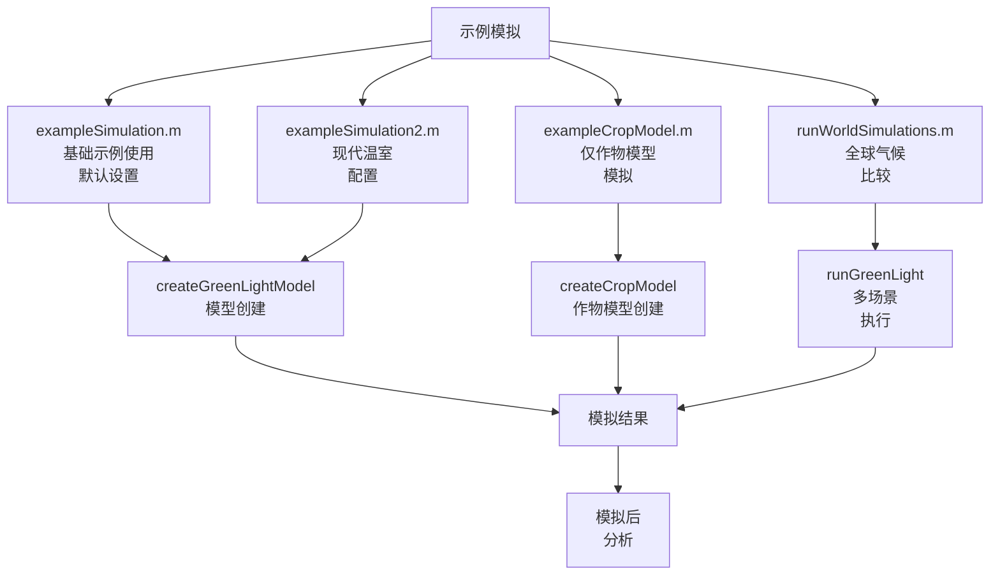
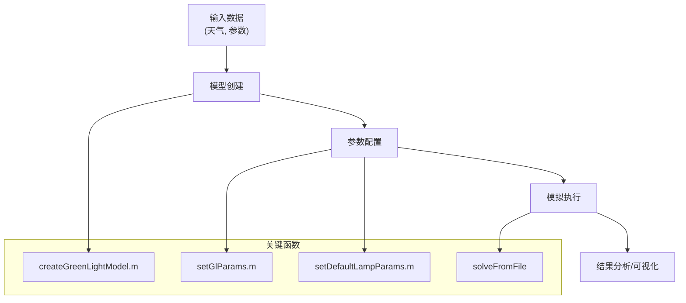
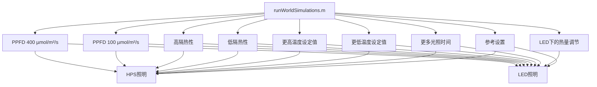
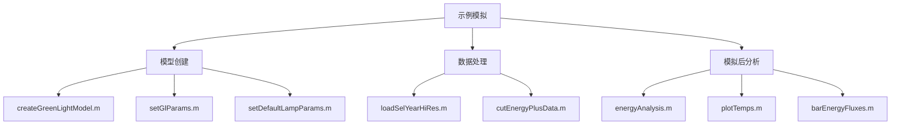

# 示例模拟

> **相关源文件**
> * [readme.md](https://github.com/davkat1/GreenLight/blob/089602e3/readme.md)

## 目的与范围

本页提供了关于如何使用GreenLight模型中包含的示例模拟的指南。这些示例展示了如何运行具有不同配置的模拟，从基本模型操作到复杂的多地点气候场景。这些示例可作为教育工具，帮助理解如何配置和执行您自己的GreenLight模拟。

有关根据实测数据评估气候模型的信息，请参阅[气候模型评估](/davkat1/GreenLight/4.2-configuration-and-options)。有关评估能源使用的详细信息，请参阅[能源使用评估](/davkat1/GreenLight/4.3-examples-and-scripts)。

来源: [readme.md L110-L112](https://github.com/davkat1/GreenLight/blob/089602e3/readme.md#L110-L112)

 [readme.md L227-L233](https://github.com/davkat1/GreenLight/blob/089602e3/readme.md#L227-L233)

## 示例模拟概述

GreenLight模型包含几个复杂度不同的示例模拟：

1. **基础示例** - 演示如何使用天气数据集以默认设置运行模型
2. **现代温室示例** - 展示现代温室的更高级配置
3. **作物模型示例** - 仅关注模型的作物组件
4. **全球模拟** - 演示在全球不同气候设置下运行模型



来源: [readme.md L227-L234](https://github.com/davkat1/GreenLight/blob/089602e3/readme.md#L227-L234)

 [Code/runScenarios/runWorldSimulations.m L1-L15](https://github.com/davkat1/GreenLight/blob/089602e3/Code/runScenarios/runWorldSimulations.m#L1-L15)

## 基础模拟工作流程

所有示例模拟都遵循类似的基本工作流程，尽管复杂度和具体配置可能有所不同。



来源: [readme.md L110-L112](https://github.com/davkat1/GreenLight/blob/089602e3/readme.md#L110-L112)

 [readme.md L175-L190](https://github.com/davkat1/GreenLight/blob/089602e3/readme.md#L175-L190)

## 示例模拟类型

### 基础示例 (exampleSimulation.m)

该示例演示了如何使用荷兰温室参考气象数据集来运行模型的默认设置。它主要展示模拟中的灯具温度情况。

```mermaid
sequenceDiagram
  participant 用户
  participant loadSelYearHiRes()
  participant createGreenLightModel()
  participant setGlParams()
  participant gl.solveFromFile()
  participant plot()

  用户->>loadSelYearHiRes(): 加载参考气象数据
  loadSelYearHiRes()->>createGreenLightModel(): 输入气象数据
  用户->>createGreenLightModel(): 创建模型实例
  createGreenLightModel()->>setGlParams(): 设置默认参数
  setGlParams()->>gl.solveFromFile(): 配置模拟参数
  gl.solveFromFile()->>plot(): 生成灯具温度图表
```

来源: [readme.md L112](https://github.com/davkat1/GreenLight/blob/089602e3/readme.md#L112-L112)

 [readme.md L227-L228](https://github.com/davkat1/GreenLight/blob/089602e3/readme.md#L227-L228)

### 现代温室示例 (exampleSimulation2.m)

该示例展示了模型在现代温室设置下的更高级用法，包含更全面的输出图表。

来源: [readme.md L114-L115](https://github.com/davkat1/GreenLight/blob/089602e3/readme.md#L114-L115)

 [readme.md L229](https://github.com/davkat1/GreenLight/blob/089602e3/readme.md#L229-L229)

### 作物模型示例 (exampleCropModel.m)

此示例演示了仅运行GreenLight模型的作物组件，适用于主要关注作物生长动态而非完整温室气候系统的用户。

来源: [readme.md L117](https://github.com/davkat1/GreenLight/blob/089602e3/readme.md#L117-L117)

 [readme.md L230](https://github.com/davkat1/GreenLight/blob/089602e3/readme.md#L230-L230)

## 全球模拟 (runWorldSimulations.m)

最复杂的示例之一是全球模拟脚本，它展示了模型在不同气候条件和配置参数下跨多个全球位置的运行情况。

### 全球位置

全球模拟使用来自世界15个不同地点的气象数据，模拟不同气候条件下的温室性能：

| 位置代码 | 描述 |
| --- | --- |
| cal | 美国加州 |
| win | 加拿大温尼伯 |
| bei | 中国北京 |
| sha | 中国上海 |
| che | 中国成都 |
| uru | 乌拉圭 |
| ven | 委内瑞拉 |
| ams | 荷兰阿姆斯特丹 |
| tok | 日本东京 |
| ark | 俄罗斯阿尔汉格尔斯克 |
| mos | 俄罗斯莫斯科 |
| stp | 俄罗斯圣彼得堡 |
| sam | 俄罗斯萨马拉 |
| kir | 俄罗斯基洛夫 |
| anc | 美国安克雷奇 |

来源: [Code/runScenarios/runWorldSimulations.m L16-L17](https://github.com/davkat1/GreenLight/blob/089602e3/Code/runScenarios/runWorldSimulations.m#L16-L17)

### 模拟场景

全球模拟脚本展示了使用不同参数运行多个场景：



来源: [Code/runScenarios/runWorldSimulations.m L29-L167](https://github.com/davkat1/GreenLight/blob/089602e3/Code/runScenarios/runWorldSimulations.m#L29-L167)

### 运行全球模拟示例

`runWorldSimulations.m` 脚本展示了如何:

1. 定义模拟位置
2. 设置季节参数(开始日期、时长)  
3. 加载并格式化气候数据
4. 配置并运行不同照明类型(HPS和LED)的模拟
5. 为不同场景调整参数

例如，要运行一个温度设定值更低的模拟:

```
paramNames = ["tSpNight" "tSpDay"]; % 需要修改的参数
paramVals = [16.5 17.5];           % 新的参数值
runGreenLight('hps', season, outputPath, paramNames, paramVals);
```

来源: [Code/runScenarios/runWorldSimulations.m L70-L84](https://github.com/davkat1/GreenLight/blob/089602e3/Code/runScenarios/runWorldSimulations.m#L70-L84)

## 运行您自己的示例模拟

要运行任何示例模拟:

1. 确保 GreenLight 代码库和 DyMoMa 包已添加到 MATLAB 路径中
2. 导航到 `Code/runScenarios/` 目录中的目标示例脚本
3. 直接运行脚本或根据需要修改参数

对于全球模拟，请注意运行所有场景可能需要大量时间。您可以注释掉部分代码来仅运行特定场景，或者将工作分配到多台机器上并行处理。

来源: [readme.md L106-L108](https://github.com/davkat1/GreenLight/blob/089602e3/readme.md#L106-L108)

 [Code/runScenarios/runWorldSimulations.m L8-L10](https://github.com/davkat1/GreenLight/blob/089602e3/Code/runScenarios/runWorldSimulations.m#L8-L10)

## 相关组件

示例模拟与 GreenLight 系统的其他组件密切相关:



来源: [readme.md L175-L191](https://github.com/davkat1/GreenLight/blob/089602e3/readme.md#L175-L191)

 [readme.md L209-L222](https://github.com/davkat1/GreenLight/blob/089602e3/readme.md#L209-L222)

## 示例输出与分析

运行示例模拟后，您可以使用 GreenLight 代码库提供的各种模拟后分析工具来分析输出结果，包括:

* 能量分析 (`energyAnalysis.m`)
* 温度绘图 (`plotTemps.m`)
* 能量通量可视化 (`barEnergyFluxes.m`)
* 每日能量轨迹 (`plotDailyEnergyFullYear.m`)
* 冬季/夏季日对比 (`plotWinterSummerDayTrajectory.m`)

来源: [readme.md L209-L222](https://github.com/davkat1/GreenLight/blob/089602e3/readme.md#L209-L222)