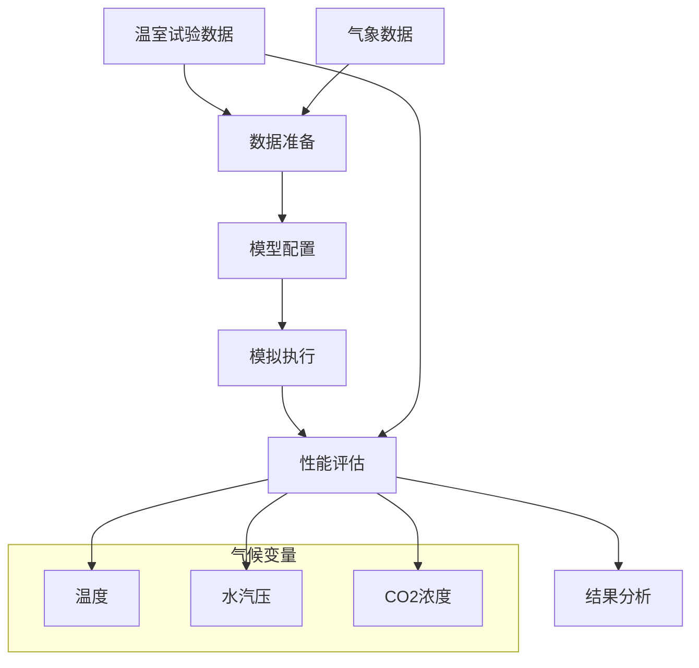
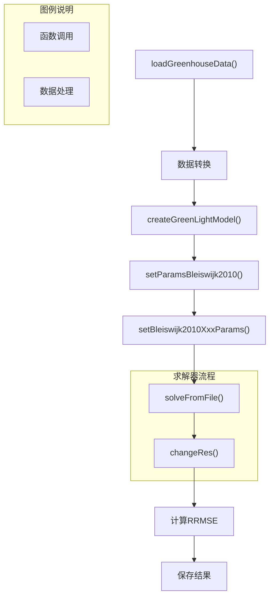
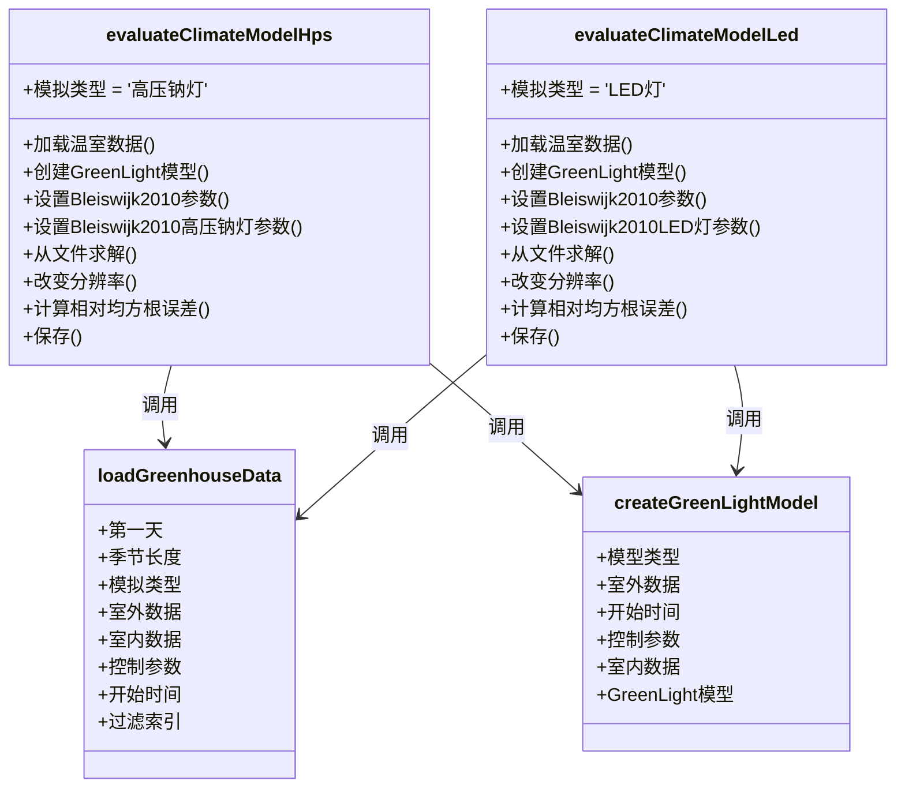
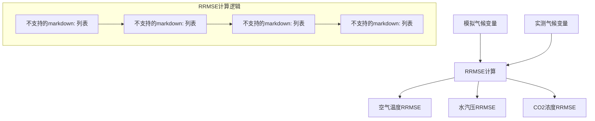

# 气候模型评估

> **相关源文件**
> * [readme.md](https://github.com/davkat1/GreenLight/blob/089602e3/readme.md)

## 目的与范围

本文档描述了GreenLight模型中的气候模型评估框架。它解释了如何将模型的气候预测与实测温室数据进行对比评估，特别是针对高压钠灯(HPS)和发光二极管(LED)照明系统。该评估过程有助于验证GreenLight气候模型的准确性，并评估其在温室模拟研究中的可靠性。

有关评估模型中能源使用的信息，请参阅[能源使用评估](/davkat1/GreenLight/4.3-examples-and-scripts)。

## 气候模型评估概述

GreenLight中的气候模型评估涉及将模拟的温室气候条件与实际温室试验的测量数据进行比较。评估重点关注三个关键气候变量：

1. 空气温度(°C)
2. 水汽压(Pa) 
3. CO₂浓度(mg/m³)

该过程使用了2010年在荷兰Bleiswijk进行的实验数据，该实验采用了配备HPS或LED照明系统的相同温室隔间。



来源: [Code/runScenarios/evaluateClimateModelHps.m L1-L76](https://github.com/davkat1/GreenLight/blob/089602e3/Code/runScenarios/evaluateClimateModelHps.m#L1-L76)

 [Code/runScenarios/evaluateClimateModelLed.m L1-L76](https://github.com/davkat1/GreenLight/blob/089602e3/Code/runScenarios/evaluateClimateModelLed.m#L1-L76)

## 数据要求

评估气候模型需要访问以下数据文件:

* `inputs\Recorded greenhouse data from 2010 Bleiswijk trial\dataLED.mat`
* `inputs\Recorded greenhouse data from 2010 Bleiswijk trial\dataHPS.mat`

这些文件包含温室试验的测量记录，可通过数据集DOI: 10.4121/78968e1b-eaea-4f37-89f9-2b98ba3ed865获取。

数据内容包括:

* 室内气候测量(温度、湿度、CO₂)
* 室外气候条件(温度、辐射等)
* 控制操作(加热、通风、照明等)

| 数据类型 | 变量 | 单位 | 需要转换 |
| --- | --- | --- | --- |
| 室内温度 | tAir | °C | 无 |
| 室内湿度 | vpAir | Pa | 从蒸汽密度转换 |
| 室内CO₂ | co2Air | mg/m³ | 从ppm转换 |
| 室外天气 | 多个 | 多种 | 无 |
| 控制操作 | 多个 | 多种 | 无 |

来源: [Code/runScenarios/evaluateClimateModelHps.m L11-L17](https://github.com/davkat1/GreenLight/blob/089602e3/Code/runScenarios/evaluateClimateModelHps.m#L11-L17)

 [Code/runScenarios/evaluateClimateModelLed.m L11-L17](https://github.com/davkat1/GreenLight/blob/089602e3/Code/runScenarios/evaluateClimateModelLed.m#L11-L17)

## 评估工作流程

气候模型评估遵循系统化的工作流程，适用于HPS和LED照明系统:



来源: [Code/runScenarios/evaluateClimateModelHps.m L24-L76](https://github.com/davkat1/GreenLight/blob/089602e3/Code/runScenarios/evaluateClimateModelHps.m#L24-L76)

 [Code/runScenarios/evaluateClimateModelLed.m L24-L76](https://github.com/davkat1/GreenLight/blob/089602e3/Code/runScenarios/evaluateClimateModelLed.m#L24-L76)

### 评估关键步骤

1. **数据加载与预处理**: 
   * 使用`loadGreenhouseData()`加载温室数据
   * 将蒸汽密度转换为蒸汽压力
   * 将CO₂从ppm转换为mg/m³
   * 为测量数据创建DynamicElements
   * 计算天空和土壤温度

2. **模型设置**: 
   * 为特定照明类型创建GreenLight模型实例
   * 设置Bleiswijk 2010实验参数
   * 设置特定灯具参数(HPS或LED)
   * 初始化作物状态变量

3. **模拟运行**: 
   * 使用ODE15s求解器求解模型方程
   * 调整模拟分辨率以匹配测量间隔

4. **性能评估**: 
   * 为每个气候变量计算相对均方根误差(RRMSE)
   * 保存评估结果

来源: [Code/runScenarios/evaluateClimateModelHps.m L30-L76](https://github.com/davkat1/GreenLight/blob/089602e3/Code/runScenarios/evaluateClimateModelHps.m#L30-L76)

 [Code/runScenarios/evaluateClimateModelLed.m L30-L76](https://github.com/davkat1/GreenLight/blob/089602e3/Code/runScenarios/evaluateClimateModelLed.m#L30-L76)

## 代码结构与实现

评估过程通过两个并行脚本实现:



来源: [Code/runScenarios/evaluateClimateModelHps.m L24-L50](https://github.com/davkat1/GreenLight/blob/089602e3/Code/runScenarios/evaluateClimateModelHps.m#L24-L50)

 [Code/runScenarios/evaluateClimateModelLed.m L24-L50](https://github.com/davkat1/GreenLight/blob/089602e3/Code/runScenarios/evaluateClimateModelLed.m#L24-L50)

## 性能指标

气候模型使用相对均方根误差(RRMSE)进行评估，该指标量化了模拟值与测量值之间的相对差异:

$$RRMSE = \frac{\sqrt{\frac{1}{n}\sum_{i=1}^{n}(simulated_i - measured_i)^2}}{\frac{1}{n}\sum_{i=1}^{n}measured_i}$$

该指标针对三个关键气候变量进行计算:

1. 空气温度(`rrmseTair`)
2. 水汽压(`rrmseVpair`) 
3. CO₂浓度(`rrmseCo2air`)

RRMSE值越低表示模型性能越好，因为它代表模拟值与测量值之间的偏差越小。



来源: [Code/runScenarios/evaluateClimateModelHps.m L64-L74](https://github.com/davkat1/GreenLight/blob/089602e3/Code/runScenarios/evaluateClimateModelHps.m#L64-L74)

 [Code/runScenarios/evaluateClimateModelLed.m L64-L74](https://github.com/davkat1/GreenLight/blob/089602e3/Code/runScenarios/evaluateClimateModelLed.m#L64-L74)

## 实现细节

### 数据准备

在进行评估之前，温室数据必须进行适当的格式化:

```python
[outdoor, indoor, controls, startTime, filtInd] = loadGreenhouseData(firstDay, seasonLength, simType);

indoor(:,3) = vaporDens2pres(indoor(:,2), indoor(:,3));  % 将水汽密度转换为水汽压
indoor(:,4) = 1e6*co2ppm2dens(indoor(:,2),indoor(:,4));  % 将CO2从ppm单位转换为mg/m³
```

`loadGreenhouseData` 函数用于获取指定光照类型(`'hps'` 或 `'led'`)、起始日和季节长度的数据。数据转换确保整个评估过程中单位的一致性。

来源: [Code/runScenarios/evaluateClimateModelHps.m L30-L36](https://github.com/davkat1/GreenLight/blob/089602e3/Code/runScenarios/evaluateClimateModelHps.m#L30-L36)

 [Code/runScenarios/evaluateClimateModelLed.m L30-L36](https://github.com/davkat1/GreenLight/blob/089602e3/Code/runScenarios/evaluateClimateModelLed.m#L30-L36)

### 测量数据的动态元素

测量得到的气候数据存储在 DynamicElement 对象中，用于与模拟值进行比较:

```
v.tAir = DynamicElement('v.tAir', [floor(indoor(:,1)) indoor(:,2)]);
v.vpAir = DynamicElement('v.vpAir', [floor(indoor(:,1)) indoor(:,3)]);
v.co2Air = DynamicElement('v.co2Air', [floor(indoor(:,1)) indoor(:,4)]);
```

这些对象存储时间序列数据，其中第一列为时间戳，第二列为数值。

来源: [Code/runScenarios/evaluateClimateModelHps.m L38-L41](https://github.com/davkat1/GreenLight/blob/089602e3/Code/runScenarios/evaluateClimateModelHps.m#L38-L41)

 [Code/runScenarios/evaluateClimateModelLed.m L38-L41](https://github.com/davkat1/GreenLight/blob/089602e3/Code/runScenarios/evaluateClimateModelLed.m#L38-L41)

### 模型配置

该模型使用针对Bleiswijk 2010实验和特定光照类型配置的参数:

```
hps = createGreenLightModel('none', outdoor, startTime, controls, indoor);
setParamsBleiswijk2010(hps);
setBleiswijk2010HpsParams(hps);  % 设置灯具参数
```

对于LED评估，使用对应的函数:

```
led = createGreenLightModel('none', outdoor, startTime, controls, indoor);
setParamsBleiswijk2010(led);
setBleiswijk2010LedParams(led);  % 设置灯具参数
```

作物参数的初始值也被设置，用于表示温室作物的初始状态。

来源: [Code/runScenarios/evaluateClimateModelHps.m L49-L56](https://github.com/davkat1/GreenLight/blob/089602e3/Code/runScenarios/evaluateClimateModelHps.m#L49-L56)

 [Code/runScenarios/evaluateClimateModelLed.m L49-L56](https://github.com/davkat1/GreenLight/blob/089602e3/Code/runScenarios/evaluateClimateModelLed.m#L49-L56)

### 模拟与分辨率匹配

模型使用ODE15s求解，并调整模拟结果的分辨率以匹配测量间隔:

```
solveFromFile(hps, 'ode15s');

mesInterval = v.tAir.val(2,1) - v.tAir.val(1,1);  % 测量数据的时间间隔(秒)
hps = changeRes(hps, mesInterval);  % 将模拟轨迹的分辨率设置为与测量数据相同
```

这样可以确保模拟数据点和测量数据点对齐，以便进行正确的比较。

来源: [Code/runScenarios/evaluateClimateModelHps.m L59-L62](https://github.com/davkat1/GreenLight/blob/089602e3/Code/runScenarios/evaluateClimateModelHps.m#L59-L62)

 [Code/runScenarios/evaluateClimateModelLed.m L59-L62](https://github.com/davkat1/GreenLight/blob/089602e3/Code/runScenarios/evaluateClimateModelLed.m#L59-L62)

### RRMSE 计算

代码首先确保测量数据集和模拟数据集具有兼容的大小:

```
mesLength = length(v.tAir.val(:,1));  % 测量数据的长度(数组大小)
simLength = length(hps.x.tAir.val(:,1));  % 模拟数据的长度(数组大小) 
compareLength = min(mesLength, simLength);
```

然后，为每个气候变量计算RRMSE值：

```
rrmseTair = sqrt(mean((hps.x.tAir.val(1:compareLength,2)-v.tAir.val(:,2)).^2))./mean(v.tAir.val(1:compareLength,2));
rrmseVpair = sqrt(mean((hps.x.vpAir.val(1:compareLength,2)-v.vpAir.val(1:compareLength,2)).^2))./mean(v.vpAir.val(1:compareLength,2));
rrmseCo2air = sqrt(mean((hps.x.co2Air.val(1:compareLength,2)-v.co2Air.val(1:compareLength,2)).^2))./mean(v.co2Air.val(:,2));
```

来源: [Code/runScenarios/evaluateClimateModelHps.m L68-L74](https://github.com/davkat1/GreenLight/blob/089602e3/Code/runScenarios/evaluateClimateModelHps.m#L68-L74)

 [Code/runScenarios/evaluateClimateModelLed.m L68-L74](https://github.com/davkat1/GreenLight/blob/089602e3/Code/runScenarios/evaluateClimateModelLed.m#L68-L74)

## 运行评估

要评估HPS或LED照明下的气候模型，请运行对应的脚本：

1. 对于HPS照明：运行 `evaluateClimateModelHps.m`
2. 对于LED照明：运行 `evaluateClimateModelLed.m`

脚本会将评估结果分别保存到 `hpsClimate.mat` 或 `ledClimate.mat` 文件中。这些文件包含模拟对象和RRMSE指标，可用于进一步分析或可视化。

来源: [Code/runScenarios/evaluateClimateModelHps.m L76](https://github.com/davkat1/GreenLight/blob/089602e3/Code/runScenarios/evaluateClimateModelHps.m#L76-L76)

 [Code/runScenarios/evaluateClimateModelLed.m L76](https://github.com/davkat1/GreenLight/blob/089602e3/Code/runScenarios/evaluateClimateModelLed.m#L76-L76)

## 结果解读

RRMSE值的解读如下：

* 值越接近0表示模型性能越好
* 已发表研究中的典型值范围：
  * 温度RRMSE：0.01-0.05 (1-5%)
  * 蒸汽压RRMSE：0.05-0.15 (5-15%) 
  * CO₂ RRMSE：0.10-0.25 (10-25%)

评估结果具有多重用途：

1. 验证模型准确性
2. 识别模型潜在的改进领域
3. 比较不同照明技术下的模型性能
4. 支持关于温室气候动态的研究结论

## 结论

气候模型评估框架为验证GreenLight模型对真实温室数据的气候预测提供了结构化方法。通过对HPS和LED照明分别进行评估，研究人员可以评估模型在不同温室照明技术下的准确性，并对模型模拟温室气候动态的能力建立信心。