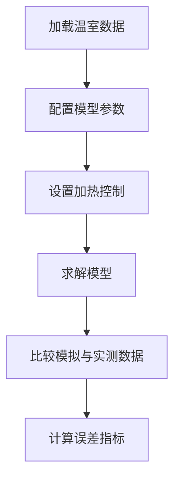
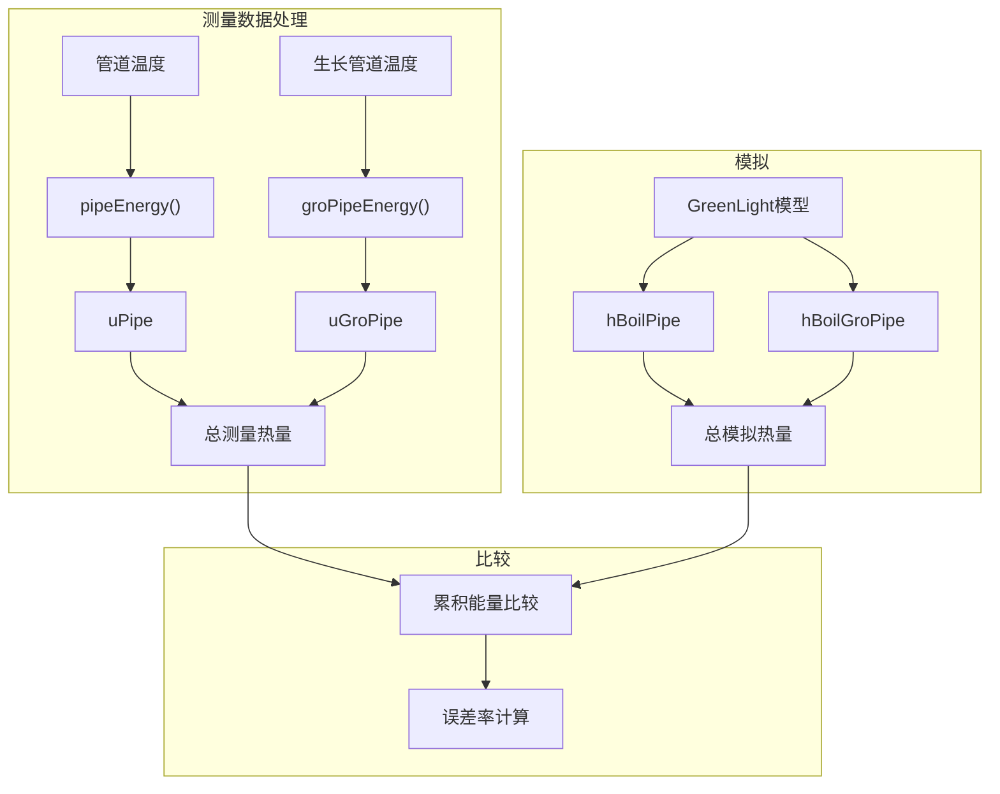

# 能源使用评估（已过时）

> **相关源文件**
> * [readme.md](https://github.com/davkat1/GreenLight/blob/089602e3/readme.md)

## 目的与范围

GreenLight模型中的能源使用评估组件允许用户通过比较模拟的加热需求与实际温室试验的测量数据，来评估模型能源使用预测的准确性。本页介绍了如何使用2010年Bleiswijk试验数据作为参考案例，评估高压钠灯(HPS)和LED照明系统的能源使用。

有关气候模型(温度、湿度和CO2)评估的信息，请参阅[气候模型评估](/davkat1/GreenLight/4.2-configuration-and-options)。关于模拟后的能源分析，请参阅[能源分析](/davkat1/GreenLight/5.1-development-setup)。

## 评估流程概述

能源使用评估通过比较模拟加热能量与温室实测数据计算得出的加热能量，验证GreenLight模型准确预测加热需求的能力。评估遵循以下步骤：



来源: [Code/runScenarios/evaluateEnergyUseHps.m L27-L82](https://github.com/davkat1/GreenLight/blob/089602e3/Code/runScenarios/evaluateEnergyUseHps.m#L27-L82)

 [Code/runScenarios/evaluateEnergyUseLed.m L27-L84](https://github.com/davkat1/GreenLight/blob/089602e3/Code/runScenarios/evaluateEnergyUseLed.m#L27-L84)

## 数据要求

要运行能源使用评估，您需要2010年Bleiswijk温室试验的数据，包括:

* 室内气候测量数据(温度、湿度、CO2)
* 室外天气条件
* 加热管道温度
* 照明控制数据

这些数据文件必须位于指定路径中:

* 'inputs\Recorded greenhouse data from 2010 Bleiswijk trial\dataLED.mat'
* 'inputs\Recorded greenhouse data from 2010 Bleiswijk trial\dataHPS.mat'

数据可通过以下链接获取: [https://doi.org/10.4121/78968e1b-eaea-4f37-89f9-2b98ba3ed865](https://doi.org/10.4121/78968e1b-eaea-4f37-89f9-2b98ba3ed865)

来源: [Code/runScenarios/evaluateEnergyUseHps.m L14-L19](https://github.com/davkat1/GreenLight/blob/089602e3/Code/runScenarios/evaluateEnergyUseHps.m#L14-L19)

 [Code/runScenarios/evaluateEnergyUseLed.m L14-L19](https://github.com/davkat1/GreenLight/blob/089602e3/Code/runScenarios/evaluateEnergyUseLed.m#L14-L19)

## 能源评估的模型配置

评估脚本会配置GreenLight模型，使用代表Bleiswijk试验中HPS或LED照明系统特定特性的参数:

```

```

来源: [Code/runScenarios/evaluateEnergyUseHps.m L48-L77](https://github.com/davkat1/GreenLight/blob/089602e3/Code/runScenarios/evaluateEnergyUseHps.m#L48-L77)

 [Code/runScenarios/evaluateEnergyUseLed.m L48-L77](https://github.com/davkat1/GreenLight/blob/089602e3/Code/runScenarios/evaluateEnergyUseLed.m#L48-L77)

### 关键配置步骤

1. **模型创建**: 使用`createGreenLightModel()`创建GreenLight模型，包含室外和室内气候数据
2. **参数设置**: 使用`setParamsBleiswijk2010()`设置温室参数和灯具特定参数
3. **温度控制**: 使用测量温度作为设定点，设置比例加热控制
4. **加热容量**: 配置管道轨道和生长管道的加热容量
5. **初始作物状态**: 设置作物生物量组分(叶、茎、果实)的初始值

来源: [Code/runScenarios/evaluateEnergyUseHps.m L48-L77](https://github.com/davkat1/GreenLight/blob/089602e3/Code/runScenarios/evaluateEnergyUseHps.m#L48-L77)

 [Code/runScenarios/evaluateEnergyUseLed.m L48-L82](https://github.com/davkat1/GreenLight/blob/089602e3/Code/runScenarios/evaluateEnergyUseLed.m#L48-L82)

## 评估工作流程

评估工作流程包含以下主要步骤:

```

```

来源: [Code/runScenarios/evaluateEnergyUseHps.m L27-L106](https://github.com/davkat1/GreenLight/blob/089602e3/Code/runScenarios/evaluateEnergyUseHps.m#L27-L106)

 [Code/runScenarios/evaluateEnergyUseLed.m L27-L110](https://github.com/davkat1/GreenLight/blob/089602e3/Code/runScenarios/evaluateEnergyUseLed.m#L27-L110)

## HPS照明评估

评估HPS照明系统的能源使用:

1. 使用`evaluateEnergyUseHps.m`脚本加载HPS温室区域的数据
2. 脚本通过`setBleiswijk2010HpsParams()`配置HPS特定参数
3. 模拟加热管道能耗并与实测数据比较

来源: [Code/runScenarios/evaluateEnergyUseHps.m](https://github.com/davkat1/GreenLight/blob/089602e3/Code/runScenarios/evaluateEnergyUseHps.m)

## LED照明评估

评估LED照明系统的能源使用:

1. 使用`evaluateEnergyUseLed.m`脚本加载LED温室区域的数据
2. 脚本通过`setBleiswijk2010LedParams()`配置LED特定参数
3. 模拟加热管道能耗并与实测数据比较

来源: [Code/runScenarios/evaluateEnergyUseLed.m](https://github.com/davkat1/GreenLight/blob/089602e3/Code/runScenarios/evaluateEnergyUseLed.m)

## 模拟与实测数据对比

评估主要比较两个关键能源指标:

1. **模拟加热输入**: 模型预测的加热能量(`hBoilPipe + hBoilGroPipe`)
2. **实测加热输入**: 根据管道温度实测值计算的加热能量(`uPipe + uGroPipe`)

对比通常以随时间累积的能源使用量可视化呈现，可同时评估短期动态和长期能耗。



来源: [Code/runScenarios/evaluateEnergyUseHps.m L86-L105](https://github.com/davkat1/GreenLight/blob/089602e3/Code/runScenarios/evaluateEnergyUseHps.m#L86-L105)

 [Code/runScenarios/evaluateEnergyUseLed.m L86-L110](https://github.com/davkat1/GreenLight/blob/089602e3/Code/runScenarios/evaluateEnergyUseLed.m#L86-L110)

## 误差计算

误差比率的计算方法是总模拟能量与总测量能量的比值:

```
eMeas = 1e-6*trapz(model.d.uPipe + model.d.uGroPipe);
eSim = 1e-6*trapz(model.a.hBoilPipe + model.a.hBoilGroPipe);
errorRatio = eSim./eMeas;
```

误差比率接近1.0表示模型与测量结果具有良好的一致性。

来源: [Code/runScenarios/evaluateEnergyUseHps.m L104-L106](https://github.com/davkat1/GreenLight/blob/089602e3/Code/runScenarios/evaluateEnergyUseHps.m#L104-L106)

 [Code/runScenarios/evaluateEnergyUseLed.m L107-L110](https://github.com/davkat1/GreenLight/blob/089602e3/Code/runScenarios/evaluateEnergyUseLed.m#L107-L110)

## 使用示例

评估HPS或LED照明系统的能耗:

1. 确保已准备好Bleiswijk试验所需的数据文件
2. 运行相应的评估脚本: * HPS系统: `evaluateEnergyUseHps.m` * LED系统: `evaluateEnergyUseLed.m`
3. 脚本将显示模拟与实测累计能耗的对比图
4. 误差比率将被计算并存储在`errorRatio`变量中
5. 结果将保存至`hpsEnergy.mat`或`ledEnergy.mat`以供进一步分析

来源: [Code/runScenarios/evaluateEnergyUseHps.m L111](https://github.com/davkat1/GreenLight/blob/089602e3/Code/runScenarios/evaluateEnergyUseHps.m#L111-L111)

 [Code/runScenarios/evaluateEnergyUseLed.m L116](https://github.com/davkat1/GreenLight/blob/089602e3/Code/runScenarios/evaluateEnergyUseLed.m#L116-L116)

## 实现细节

### 数据准备

评估脚本会对输入数据进行单位转换以确保一致性:

* 将水汽密度转换为水汽压
* 将CO2从ppm单位转换为mg m^-3
* 使用`skyTempRdam`函数添加天空温度
* 使用`soilTempNl`函数添加土壤温度

来源: [Code/runScenarios/evaluateEnergyUseHps.m L36-L46](https://github.com/davkat1/GreenLight/blob/089602e3/Code/runScenarios/evaluateEnergyUseHps.m#L36-L46)

 [Code/runScenarios/evaluateEnergyUseLed.m L36-L46](https://github.com/davkat1/GreenLight/blob/089602e3/Code/runScenarios/evaluateEnergyUseLed.m#L36-L46)

### 加热控制

两种评估都使用比例控制进行加热:

```
addControl(model, 'boil', proportionalControl(x.tAir, model.d.heatSetPoint+setPointAdd, model.p.tHeatBand, 0, 1));
addControl(model, 'boilGro', proportionalControl(x.tAir, model.d.heatSetPoint+setPointAdd, model.p.tHeatBand, 0, 1));
```

设定值由测量温度加上一个小的增量(`setPointAdd = 0.5`)得出，以确保控制器能达到目标温度。

来源: [Code/runScenarios/evaluateEnergyUseHps.m L63-L69](https://github.com/davkat1/GreenLight/blob/089602e3/Code/runScenarios/evaluateEnergyUseHps.m#L63-L69)

 [Code/runScenarios/evaluateEnergyUseLed.m L64-L69](https://github.com/davkat1/GreenLight/blob/089602e3/Code/runScenarios/evaluateEnergyUseLed.m#L64-L69)

## 与研究的结合

能耗评估主要用于验证GreenLight模型的研究应用，例如比较温室中HPS和LED照明系统之间的能源需求。

这些评估脚本被用于以下发表的研究中:

* Katzin, D., van Mourik, S., Kempkes, F., & van Henten, E. J. (2020). GreenLight – An open source model for greenhouses with supplemental lighting: Evaluation of heat requirements under LED and HPS lamps. Biosystems Engineering, 194, 61–81.

来源: [Code/runScenarios/evaluateEnergyUseHps.m L7-L12](https://github.com/davkat1/GreenLight/blob/089602e3/Code/runScenarios/evaluateEnergyUseHps.m#L7-L12)

 [Code/runScenarios/evaluateEnergyUseLed.m L7-L12](https://github.com/davkat1/GreenLight/blob/089602e3/Code/runScenarios/evaluateEnergyUseLed.m#L7-L12)