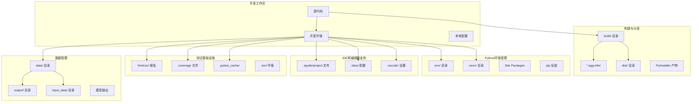
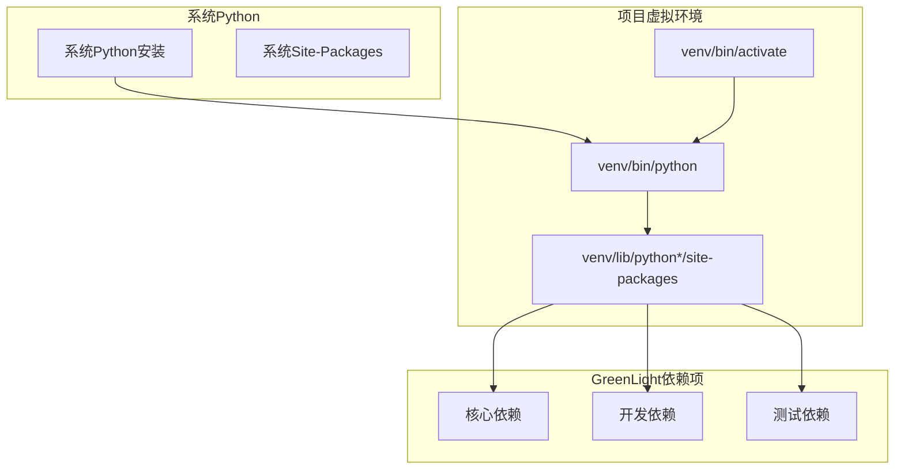
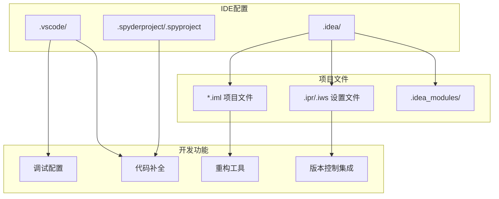
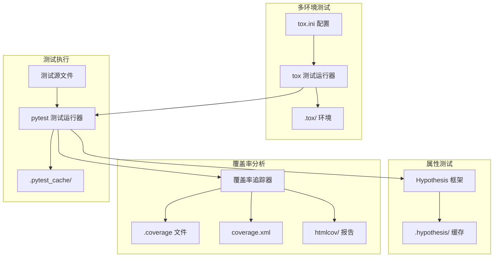
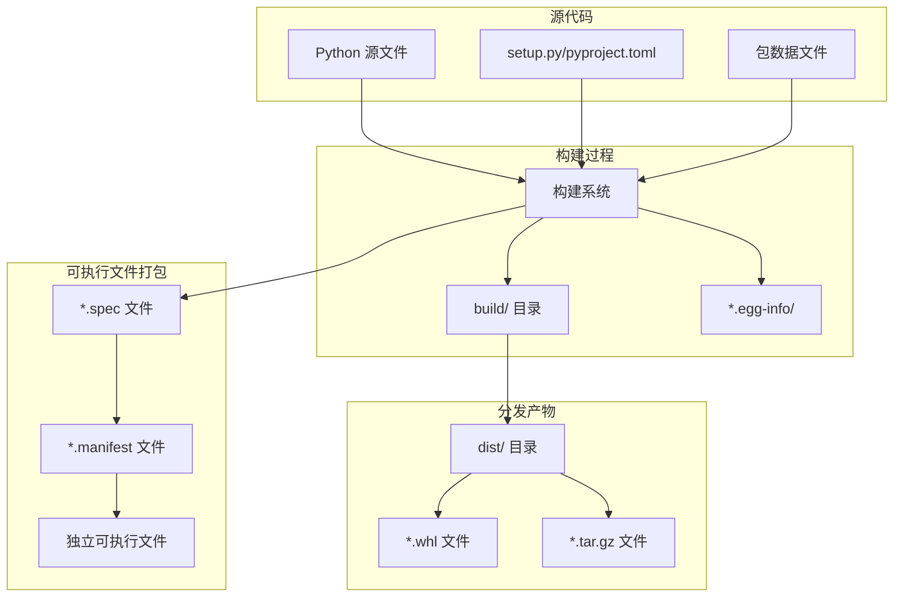
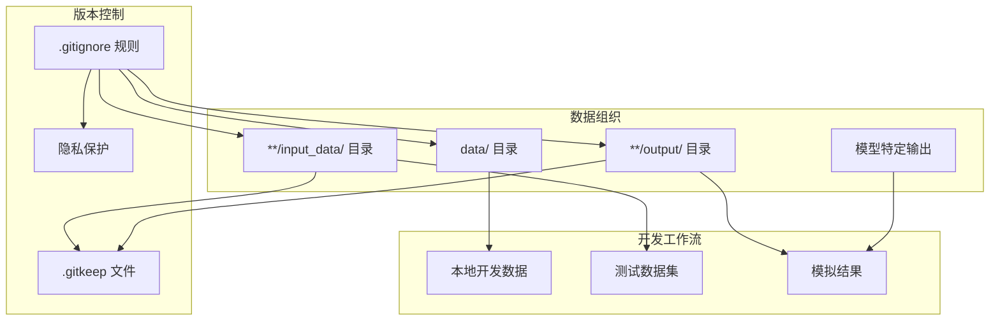

# 开发环境

> **相关源文件**
> * [.gitignore](https://github.com/davkat1/GreenLight/blob/089602e3/.gitignore)
> * [readme.md](https://github.com/davkat1/GreenLight/blob/089602e3/readme.md)

本文档提供了GreenLight平台使用的开发环境、构建流程和测试基础设施的技术概述。涵盖了支持核心模拟引擎和模型定义开发的工具、配置和流程。

有关详细设置说明，请参阅[开发设置](/davkat1/GreenLight/5.1-development-setup)。有关测试框架和构建工具的信息，请参阅[测试与构建流程](/davkat1/GreenLight/5.2-testing-and-build-processes)。

## 开发环境架构

GreenLight开发环境的结构设计既支持本地开发也支持分发打包，在开发产物和生产代码之间有明确的分离。

来源: [.gitignore L37-L53](https://github.com/davkat1/GreenLight/blob/089602e3/.gitignore#L37-L53)

 [.gitignore L84-L99](https://github.com/davkat1/GreenLight/blob/089602e3/.gitignore#L84-L99)

 [.gitignore L64-L75](https://github.com/davkat1/GreenLight/blob/089602e3/.gitignore#L64-L75)

 [.gitignore L35-L58](https://github.com/davkat1/GreenLight/blob/089602e3/.gitignore#L35-L58)

 [.gitignore L100-L114](https://github.com/davkat1/GreenLight/blob/089602e3/.gitignore#L100-L114)

## Python 环境隔离

开发环境使用虚拟环境来隔离依赖项并确保可重复构建。该项目支持多种虚拟环境目录约定。

| 环境类型 | 目录 | 用途 |
| --- | --- | --- |
| 标准 venv | `venv/` | 主要虚拟环境位置 |
| 替代环境 | `env/` | 替代虚拟环境目录 |
| 站点包 | `lib/`, `lib64/` | Python 包安装目录 |

虚拟环境结构确保开发依赖项与系统 Python 安装和其他项目隔离。

来源: [.gitignore L37-L38](https://github.com/davkat1/GreenLight/blob/089602e3/.gitignore#L37-L38)

 [.gitignore L45-L47](https://github.com/davkat1/GreenLight/blob/089602e3/.gitignore#L45-L47)

## IDE 和编辑器配置

开发环境支持多种 IDE 和编辑器，并提供了适当的配置排除项，以防止开发特定的设置被提交到版本控制中。

### 支持的开发环境

* **Visual Studio Code**: 配置存储在 `.vscode/` 目录中
* **IntelliJ IDEA 系列**: 项目文件位于 `.idea/` 目录，支持 `.iml`、`.ipr` 和 `.iws` 文件
* **Spyder**: 项目配置位于 `.spyderproject` 和 `.spyproject` 文件中

Sources: [.gitignore L84-L99](https://github.com/davkat1/GreenLight/blob/089602e3/.gitignore#L84-L99)

## 测试框架集成

开发环境包含全面的测试基础设施，支持多种测试框架和覆盖率分析。

### 测试组件

| 组件 | 文件/目录 | 用途 |
| --- | --- | --- |
| pytest | `.pytest_cache/` | 测试执行缓存和临时文件 |
| Coverage | `.coverage`, `.coverage.*`, `coverage.xml` | 代码覆盖率追踪和报告 |
| HTML 报告 | `htmlcov/` | 人类可读的覆盖率报告 |
| Tox | `.tox/` | 多环境测试 |
| Hypothesis | `.hypothesis/` | 基于属性的测试产物 |

来源: [.gitignore L64-L75](https://github.com/davkat1/GreenLight/blob/089602e3/.gitignore#L64-L75)

## 构建与分发基础设施

开发环境包含用于构建和分发 GreenLight 包的工具，并确保构建产物与源代码适当分离。

### 构建系统组件

* **构建目录**: `build/` 包含中间构建文件
* **分发目录**: `dist/` 包含最终的分发包
* **Egg 信息**: `*.egg-info/` 目录包含包的元数据
* **PyInstaller**: 支持通过 `*.manifest` 和 `*.spec` 文件创建独立可执行文件

来源: [.gitignore L35-L58](https://github.com/davkat1/GreenLight/blob/089602e3/.gitignore#L35-L58)

## 开发环境中的数据管理

开发环境会谨慎管理数据文件，在支持开发工作流的同时确保隐私和性能。

### 数据目录结构

项目采用结构化的数据管理方法，明确排除了敏感文件和大文件：

* **主数据目录**: `data/` - 从版本控制中排除
* **输入数据目录**: `**/input_data/` - 位置特定的目录，包含`.gitkeep`文件
* **输出目录**: `output/`, `**/output/` - 模拟结果目录，包含`.gitkeep`文件
* **模型输出**: 按模型名称组织为`<模型名称>/output/`结构

来源: [.gitignore L100-L114](https://github.com/davkat1/GreenLight/blob/089602e3/.gitignore#L100-L114)

## Notebook 开发支持

开发环境提供了对 Jupyter notebook 开发的特定支持，包括检查点管理。

Jupyter notebook 检查点文件 (`.ipynb_checkpoints`) 被排除在版本控制之外，以避免提交不必要的临时 notebook 状态。这使得开发者可以使用 notebook 进行探索和分析，同时保持版本控制的整洁。

来源: [.gitignore L115-L116](https://github.com/davkat1/GreenLight/blob/089602e3/.gitignore#L115-L116)

 [readme.md L80](https://github.com/davkat1/GreenLight/blob/089602e3/readme.md#L80-L80)