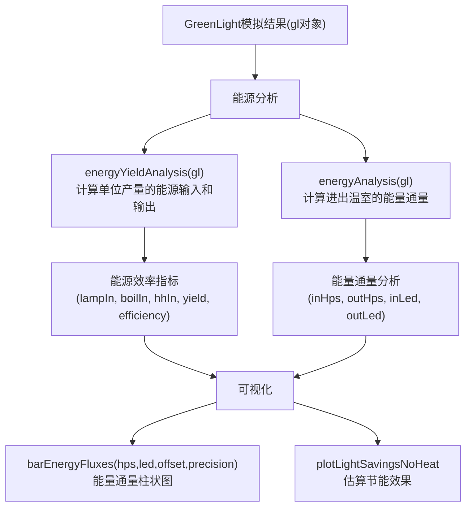
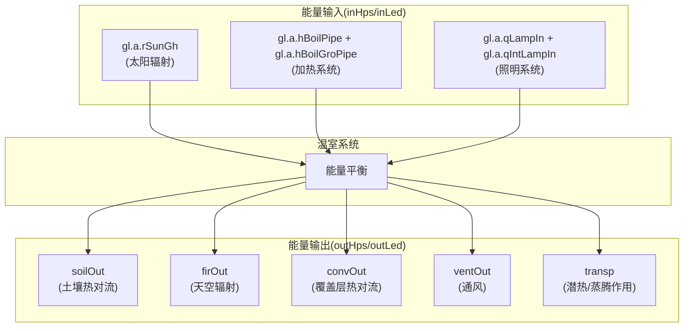
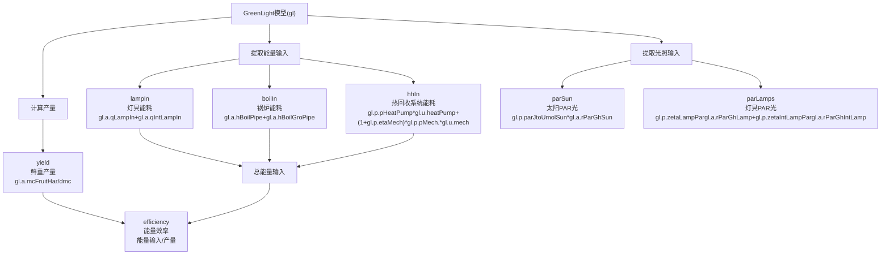
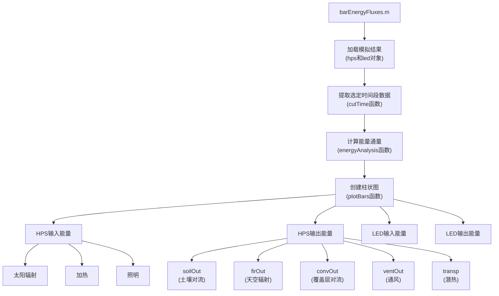

# 能源分析（已过时）

> **相关源文件**
> * [.gitignore](https://github.com/davkat1/GreenLight/blob/089602e3/.gitignore)

本文档详细介绍了GreenLight模型提供的用于分析模拟结果中能源使用和效率的方法、函数和工具。能源分析工具使研究人员能够评估不同温室配置的能源性能，特别是在比较不同照明技术(HPS与LED)时。

有关分析照明技术转换带来的节能信息，请参阅[节能分析](/davkat1/GreenLight/5.2-testing-and-build-processes)。有关可用于能源数据的其他可视化工具，请参阅[可视化工具](#5.3)。

## 能源分析工作流程（已过时）

GreenLight模型提供了多个函数来分析模拟温室中的能源使用和效率。能源分析的一般工作流程遵循以下步骤：

1. 使用GreenLight模型运行温室模拟
2. 使用分析函数提取能源输入和输出值
3. 计算能源效率指标，如单位产量的能源使用量
4. 使用专门的绘图函数可视化结果

### 能源分析工作流程图



源码: [Code/postSimAnalysis/energyYieldAnalysis.m](https://github.com/davkat1/GreenLight/blob/089602e3/Code/postSimAnalysis/energyYieldAnalysis.m)

 [Code/postSimAnalysis/barEnergyFluxes.m](https://github.com/davkat1/GreenLight/blob/089602e3/Code/postSimAnalysis/barEnergyFluxes.m)

 [Code/serviceFunctions/plotLightSavingsNoHeat.m](https://github.com/davkat1/GreenLight/blob/089602e3/Code/serviceFunctions/plotLightSavingsNoHeat.m)

## 能量通量分析（已过时）

能量通量分析研究温室系统中能量的流入和流出情况。该分析量化了能量平衡，并识别能量使用或损失的位置。

### 温室能量平衡组成



来源: [Code/postSimAnalysis/barEnergyFluxes.m L73-L88](https://github.com/davkat1/GreenLight/blob/089602e3/Code/postSimAnalysis/barEnergyFluxes.m#L73-L88)

### 能量通量计算

`energyAnalysis`函数(从`barEnergyFluxes.m`中调用)计算模拟温室的能量输入和输出。该函数返回两个数组:

* 能量输入(`inHps`/`inLed`): 太阳辐射、加热和照明
* 能量输出(`outHps`/`outLed`): 蒸腾作用、土壤传导、通风、通过覆盖物的对流和向天空的辐射

这些值可以针对整个模拟周期或特定时间段(例如冬季日与夏季日)进行分析，以了解能源使用的季节性变化。

来源: [Code/postSimAnalysis/barEnergyFluxes.m L75-L88](https://github.com/davkat1/GreenLight/blob/089602e3/Code/postSimAnalysis/barEnergyFluxes.m#L75-L88)

## 能量-产量分析（已过时）

`energyYieldAnalysis`函数计算能量输入与作物产量之间的关系，提供对温室系统能源效率的洞察。

### 计算指标

该函数计算以下关键指标:

| 指标 | 描述 | 单位 | 代码实现 |
| --- | --- | --- | --- |
| lampIn | 灯具能耗 | MJ m^-2 | `1e-6*trapz(gl.a.qLampIn+gl.a.qIntLampIn)` |
| boilIn | 锅炉能耗 | MJ m^-2 | `1e-6*trapz(gl.a.hBoilPipe+gl.a.hBoilGroPipe)` |
| hhIn | 热回收系统能耗 | MJ m^-2 | `1e-6*trapz(gl.p.pHeatPump*gl.u.heatPump+(1+gl.p.etaMech)*gl.p.pMech.*gl.u.mech)` |
| parSun | 到达冠层上方的太阳PAR光 | mol m^-2 | `1e-6*trapz(gl.p.parJtoUmolSun*gl.a.rParGhSun)` |
| parLamps | 到达冠层上方的灯具PAR光 | mol m^-2 | `1e-6*trapz(gl.p.zetaLampPar*gl.a.rParGhLamp+gl.p.zetaIntLampPar*gl.a.rParGhIntLamp)` |
| yield | 番茄鲜重产量 | kg m^-2 | `1e-6*trapz(gl.a.mcFruitHar)/dmc` |
| efficiency | 每单位番茄产量所需的能量输入 | MJ kg^-1 | `(lampIn+boilIn+hhIn)/yield` |

来源: [Code/postSimAnalysis/energyYieldAnalysis.m L1-L70](https://github.com/davkat1/GreenLight/blob/089602e3/Code/postSimAnalysis/energyYieldAnalysis.m#L1-L70)

### 能量-产量计算方法



来源: [Code/postSimAnalysis/energyYieldAnalysis.m L29-L69](https://github.com/davkat1/GreenLight/blob/089602e3/Code/postSimAnalysis/energyYieldAnalysis.m#L29-L69)

## 可视化能源分析结果（已过时）

GreenLight模型提供了专门用于可视化能源分析结果的函数。

### 能量通量柱状图

`barEnergyFluxes.m`函数可创建柱状图来可视化模拟温室中的能量通量。该函数可以生成:

* 全年的柱状图
* 特定日期(如冬季某日和夏季某日)的柱状图

该函数曾被用于创建Katzin等人(2021)论文中的图10，展示了冬季和夏季的能量通量情况。

### barEnergyFluxes函数工作流程



来源: [Code/postSimAnalysis/barEnergyFluxes.m L1-L126](https://github.com/davkat1/GreenLight/blob/089602e3/Code/postSimAnalysis/barEnergyFluxes.m#L1-L126)

### 特定时间能量分析

`barEnergyFluxes.m`函数可以分析特定日期的能量通量:

```
% 选择冬季和夏季的日期。日期表示为"自9月27日(生长季开始)以来的天数"
% 116 - 1月21日; 292 - 7月15日(论文中使用)
winterDay = 116;
summerDay = 292;

hpsWin = cutTime(hps, datenum(hps.t.label)+winterDay-1/24,86400);
ledWin = cutTime(led, datenum(led.t.label)+winterDay-1/24,86400);

hpsSum = cutTime(hps, datenum(hps.t.label)+summerDay-1/24,86400);
ledSum = cutTime(led, datenum(led.t.label)+summerDay-1/24,86400);
```

来源: [Code/postSimAnalysis/barEnergyFluxes.m L40-L54](https://github.com/davkat1/GreenLight/blob/089602e3/Code/postSimAnalysis/barEnergyFluxes.m#L40-L54)

### 光照节能分析

`plotLightSavingsNoHeat.m` 函数可可视化从HPS过渡到LED照明的潜在节能效果。该函数:

* 基于HPS(1.8 μmol PAR J^-1)和不同LED灯具(3.0、4.1和无限大 μmol PAR J^-1)的光效估算节能效果
* 将节能效果显示为当前系统中用于照明的能量比例的函数
* 假设从HPS过渡到LED时加热需求不变

该函数被用于创建Katzin等人(2021)论文中的图5。

来源: [Code/serviceFunctions/plotLightSavingsNoHeat.m L1-L31](https://github.com/davkat1/GreenLight/blob/089602e3/Code/serviceFunctions/plotLightSavingsNoHeat.m#L1-L31)

## 研究应用（已过时）

GreenLight模型中的能量分析工具已被用于多篇研究论文，包括:

1. Katzin, D., Marcelis, L. F. M., & van Mourik, S. (2021). 通过从高压钠灯过渡到LED照明实现温室的节能. Applied Energy, 281, 116019.
2. Katzin, D. (2021). 温室中LED照明的节能:基于过程的建模方法 (博士论文, 瓦赫宁根大学).
3. Katzin, Marcelis, Van Henten, Van Mourik (2023). 通过光照加热温室:集约化温室生产的新概念 (Biosystems Engineering).

这些研究利用GreenLight模型的能量分析能力评估了温室的能源效率，并量化了从HPS过渡到LED照明的潜在节能效果。

来源: [Code/postSimAnalysis/energyYieldAnalysis.m L17-L23](https://github.com/davkat1/GreenLight/blob/089602e3/Code/postSimAnalysis/energyYieldAnalysis.m#L17-L23)

 [Code/postSimAnalysis/barEnergyFluxes.m L2-L7](https://github.com/davkat1/GreenLight/blob/089602e3/Code/postSimAnalysis/barEnergyFluxes.m#L2-L7)

 [Code/serviceFunctions/plotLightSavingsNoHeat.m L2-L6](https://github.com/davkat1/GreenLight/blob/089602e3/Code/serviceFunctions/plotLightSavingsNoHeat.m#L2-L6)