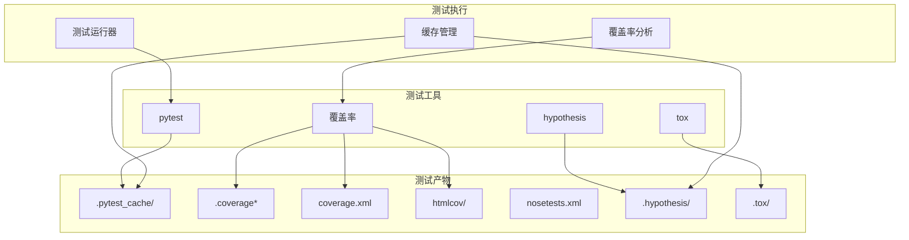
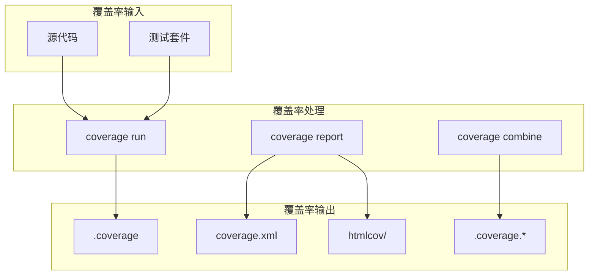
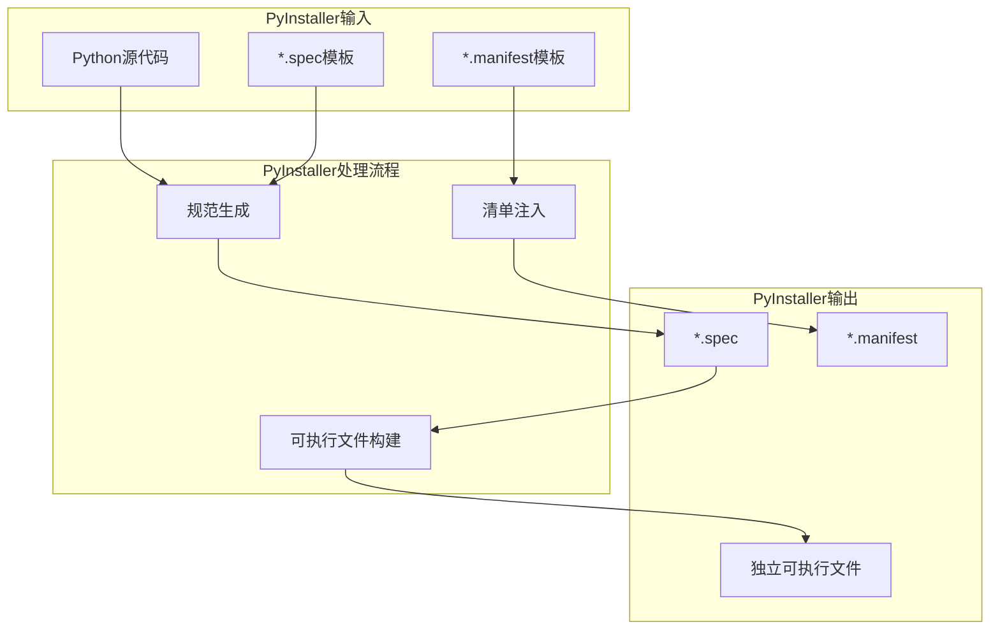
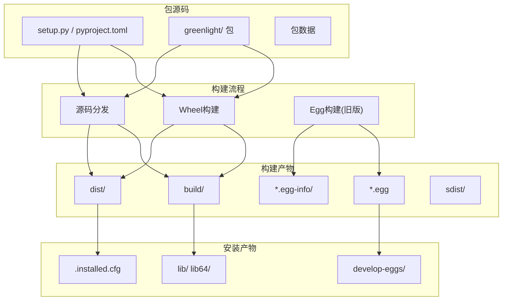
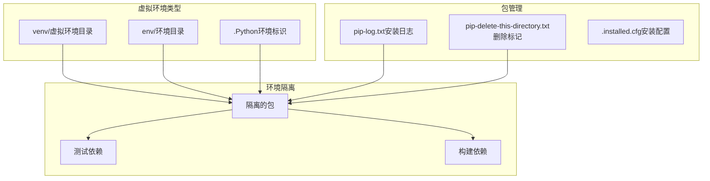
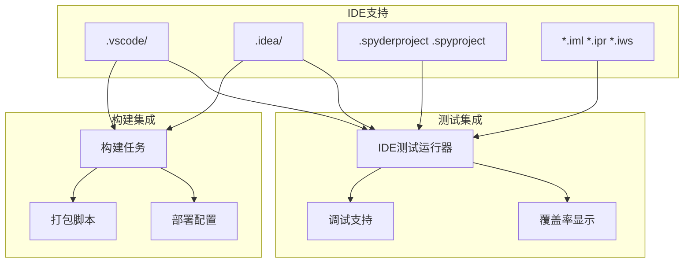
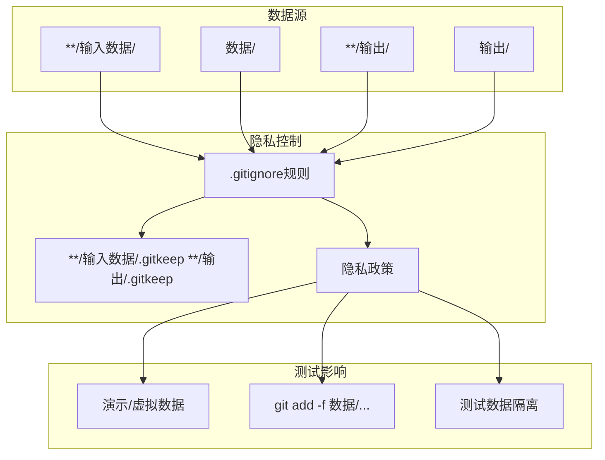
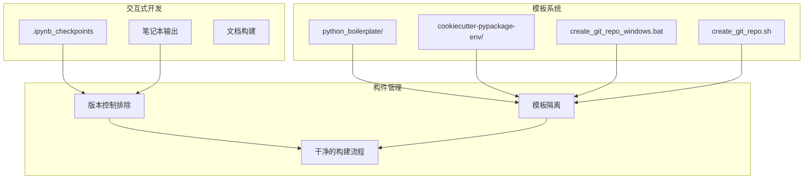

# 测试与构建流程

> **相关源文件**
> * [.gitignore](https://github.com/davkat1/GreenLight/blob/089602e3/.gitignore)

本文档涵盖了GreenLight项目中使用的测试基础设施、构建工具和发布流程。详细介绍了支持开发和部署工作流的测试框架、覆盖率分析设置、构建自动化和打包机制。

有关开发环境设置和项目依赖的信息，请参阅[开发设置](/davkat1/GreenLight/5.1-development-setup)。关于项目整体结构和组织，请参阅[仓库结构](/davkat1/GreenLight/1.2-repository-structure)。

## 测试基础设施

GreenLight项目使用行业标准的Python测试工具和实践，实现了一套全面的测试基础设施。

### 测试框架配置

项目使用`pytest`作为主要测试框架，并配置了覆盖率分析和缓存机制以支持高效的测试执行。

**测试框架组件**

| 组件 | 用途 | 产物 |
| --- | --- | --- |
| `pytest` | 主要测试框架 | `.pytest_cache/` 目录 |
| `coverage` | 代码覆盖率分析 | `.coverage`, `coverage.xml`, `htmlcov/` |
| `hypothesis` | 基于属性的测试 | `.hypothesis/` 缓存目录 |
| `tox` | 多环境测试 | `.tox/` 目录 |

来源: [.gitignore L64-L74](https://github.com/davkat1/GreenLight/blob/089602e3/.gitignore#L64-L74)

### 覆盖率分析设置

该项目实现了全面的覆盖率分析，用于追踪测试效果并识别未测试的代码路径。

**覆盖率产物**

* `.coverage` - 主要的覆盖率数据文件
* `coverage.xml` - 用于CI/CD集成的XML格式覆盖率报告
* `htmlcov/` - 用于浏览器查看的HTML覆盖率报告
* `.coverage.*` - 分布式覆盖率数据文件
* `*,cover` - 旧版覆盖率格式文件

来源: [.gitignore L67-L72](https://github.com/davkat1/GreenLight/blob/089602e3/.gitignore#L67-L72)

## 构建与分发流程

GreenLight项目使用多种构建工具和分发机制来支持不同的部署场景。

### PyInstaller构建流程

PyInstaller被配置用于创建GreenLight应用程序的独立可执行文件分发版本。

**PyInstaller 配置**

* `*.spec` 文件包含构建规范和入口点定义
* `*.manifest` 文件生成时包含构建元数据和版本信息
* 构建过程支持注入动态信息，如构建日期

来源: [.gitignore L54-L58](https://github.com/davkat1/GreenLight/blob/089602e3/.gitignore#L54-L58)

### Python 打包系统

该项目遵循标准的 Python 打包规范，使用 setuptools 及相关工具。

**打包组件**

| 组件 | 用途 | 产物 |
| --- | --- | --- |
| `build/` | 临时构建文件 | 编译产物 |
| `dist/` | 分发包 | `.whl`, `.tar.gz` 文件 |
| `*.egg-info/` | 包元数据 | 安装元数据 |
| `develop-eggs/` | 开发安装 | 可编辑包链接 |
| `sdist/` | 源码分发 | 源码包归档 |

来源: [.gitignore L35-L52](https://github.com/davkat1/GreenLight/blob/089602e3/.gitignore#L35-L52)

## 开发环境集成

测试和构建流程与多种开发环境和工具集成，以支持不同的开发工作流。

### 虚拟环境支持

支持多种虚拟环境系统来隔离开发依赖和测试环境。

**环境管理**

* `venv/` 和 `env/` 目录包含隔离的Python环境
* `.Python` 符号链接表示虚拟环境已激活
* `pip-log.txt` 和 `pip-delete-this-directory.txt` 记录包安装操作

来源: [.gitignore L37-L38](https://github.com/davkat1/GreenLight/blob/089602e3/.gitignore#L37-L38)

 [.gitignore L61-L62](https://github.com/davkat1/GreenLight/blob/089602e3/.gitignore#L61-L62)

### IDE与工具集成

该项目支持多种开发环境，并提供特定的测试和构建配置。

**IDE配置文件**

* `.vscode/` - Visual Studio Code 工作区和任务配置
* `.idea/` - IntelliJ IDEA 项目设置和运行配置 
* `.spyderproject`, `.spyproject` - Spyder IDE 项目文件
* `*.iml`, `*.ipr`, `*.iws` - IntelliJ 系列项目格式文件

来源: [.gitignore L84-L98](https://github.com/davkat1/GreenLight/blob/089602e3/.gitignore#L84-L98)

## 数据与输出管理

测试和构建流程需要处理各种数据产物和输出文件，这些文件需要特殊的管理考量。

### 测试数据与隐私

该项目实施了严格的数据处理政策，这些政策会影响测试流程和构建产物。

**数据管理策略**

* 默认情况下所有数据目录都从版本控制中排除
* `.gitkeep` 文件保持目录结构但不包含敏感数据
* 测试需要时可以使用 `git add -f` 显式添加演示数据
* 模型输出被隔离以防止意外包含到代码库中

来源: [.gitignore L100-L113](https://github.com/davkat1/GreenLight/blob/089602e3/.gitignore#L100-L113)

### Notebook和文档产物

交互式环境产生的开发产物与核心测试和构建流程分开管理。

**开发产物分类**

* `.ipynb_checkpoints` - Jupyter notebook自动保存文件
* `python_boilerplate/`, `cookiecutter-pypackage-env/` - 项目模板目录
* `create_git_repo_windows.bat`, `create_git_repo.sh` - 仓库初始化脚本

来源: [.gitignore L115-L123](https://github.com/davkat1/GreenLight/blob/089602e3/.gitignore#L115-L123)