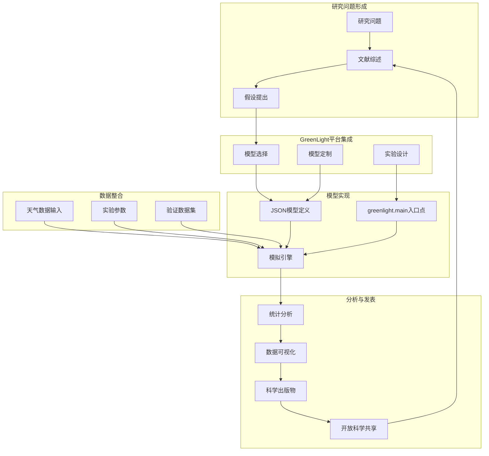
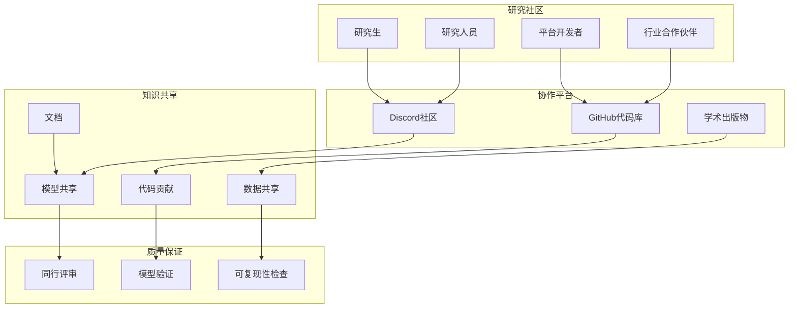
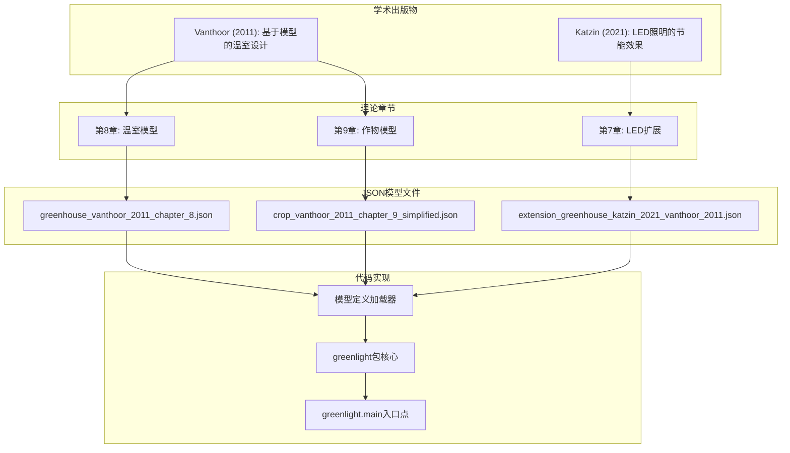
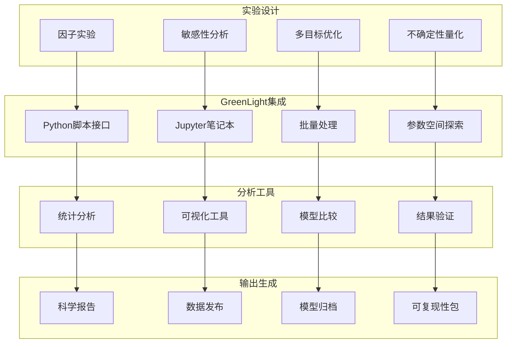

# 应用与研究

> **相关源文件**
> * [readme.md](https://github.com/davkat1/GreenLight/blob/089602e3/readme.md)

本文档介绍了GreenLight平台的研究应用及其在支持园艺建模开放科学目标中的作用。它解释了该平台如何促进动态建模中透明、可重用和可共享的研究，特别是在温室和作物系统方面。

有关建模框架的技术实现细节，请参阅[模型架构](/davkat1/GreenLight/2-model-architecture)。有关为研究目的扩展和修改模型的信息，请参阅[模型组合](/davkat1/GreenLight/2.3-model-combination)。

## 园艺研究应用

GreenLight作为一个综合性的园艺研究平台，使科学家能够研究温室气候、作物生长和能源系统之间的复杂相互作用。该平台的模块化架构支持从气候优化到作物产量分析的各种研究应用。

### 主要研究领域

该平台支持跨多个相互关联领域的研究：

| 研究领域 | 关键应用 | 模型组件 |
| --- | --- | --- |
| 温室气候控制 | HVAC优化，能源效率 | `greenhouse_vanthoor_2011_chapter_8.json` |
| 作物生长建模 | 产量预测，生长优化 | `crop_vanthoor_2011_chapter_9_simplified.json` |
| LED照明研究 | 节能照明系统 | `extension_greenhouse_katzin_2021_vanthoor_2011.json` |
| 环境影响 | 资源利用，可持续性 | 组合模型系统 |

### 研究工作流整合

来源: [readme.md L15-L18](https://github.com/davkat1/GreenLight/blob/089602e3/readme.md#L15-L18)

 [readme.md L52-L61](https://github.com/davkat1/GreenLight/blob/089602e3/readme.md#L52-L61)

## 开放科学框架

GreenLight 是专门为开放科学设计的工具，旨在促进动态建模研究中的透明度、可重复性和协作性。该平台通过模块化设计和透明的模型定义，支持开放科学的核心原则。

### 开放科学能力

该平台通过以下关键机制实现开放科学：

**透明的模型架构**：所有模型定义都以人类可读的JSON格式存储，使研究人员能够检查、理解和验证模型实现。[models/katzin_2021/definition/](https://github.com/davkat1/GreenLight/blob/089602e3/models/katzin_2021/definition/)中的模块化结构提供了模型方程和参数的完全透明度。

**可重复的研究**：平台的确定性模拟引擎和版本控制的模型定义确保其他研究人员使用相同的输入和模型配置能够精确复现研究结果。

**协作开发**：活跃的Discord社区[readme.md L11-L12](https://github.com/davkat1/GreenLight/blob/089602e3/readme.md#L11-L12)和开源许可[readme.md L8-L9](https://github.com/davkat1/GreenLight/blob/089602e3/readme.md#L8-L9)促进了用户之间的协作研究和知识共享。

### 社区协作模型

来源: [readme.md L11-L12](https://github.com/davkat1/GreenLight/blob/089602e3/readme.md#L11-L12)

 [readme.md L17-L18](https://github.com/davkat1/GreenLight/blob/089602e3/readme.md#L17-L18)

 [readme.md L83-L87](https://github.com/davkat1/GreenLight/blob/089602e3/readme.md#L83-L87)

## 学术文献整合

GreenLight平台建立在经过同行评审的学术文献的坚实基础上，确保使用该平台进行的研究植根于既定的科学知识。将学术模型整合到平台中展示了如何将理论框架转化为实用的模拟工具。

### 文献到代码的映射

该平台直接从学术出版物实现模型，保持了从理论概念到可执行代码的可追溯性：

### 学术验证流程

该平台的学术基础通过已确立的研究提供了内置验证：

| 模型组件 | 学术来源 | 验证方法 | 实现文件 |
| --- | --- | --- | --- |
| 温室气候 | Vanthoor (2011) 第8章 | 论文中的实验验证 | `greenhouse_vanthoor_2011_chapter_8.json` |
| 作物生长 | Vanthoor (2011) 第9章 | 文献比较和田间数据 | `crop_vanthoor_2011_chapter_9_simplified.json` |
| LED集成 | Katzin (2021) 第7章 | 温室实验研究 | `extension_greenhouse_katzin_2021_vanthoor_2011.json` |

来源: [readme.md L52-L61](https://github.com/davkat1/GreenLight/blob/089602e3/readme.md#L52-L61)

 [readme.md L48-L61](https://github.com/davkat1/GreenLight/blob/089602e3/readme.md#L48-L61)

## 研究用例与应用

GreenLight平台支持园艺科学中跨多个尺度和领域的多样化研究应用。这些应用展示了该平台在解决各种研究问题方面的灵活性和实用性。

### 基于仿真的研究应用

**气候优化研究**：研究人员通过修改温室模型中的参数并分析能耗模式，使用该平台研究最优气候控制策略。`python -m greenlight.main`接口支持系统性的参数探索。

**作物产量优化**：集成的作物模型使研究人员能够研究环境条件与作物生产力之间的关系，支持精准农业研究和可持续生产策略。

**能效研究**：LED扩展模型促进了节能照明系统的研究，使研究人员能够量化节能效果并评估不同照明策略的经济可行性。

### 研究方法集成

### 研究成果与影响

该平台支持从假设形成到成果发表与知识传播的完整研究生命周期。其模块化架构和透明的模型定义使研究人员能够：

* **验证理论模型**：通过比较模拟结果与实验数据来验证模型准确性
* **探索设计方案**：系统评估不同温室设计和控制策略
* **量化权衡关系**：分析能耗、作物产量与经济表现之间的关联
* **共享研究资产**：分发模型定义、模拟脚本和数据集以实现可重复研究

来源：[readme.md L43-L46](https://github.com/davkat1/GreenLight/blob/089602e3/readme.md#L43-L46)

 [readme.md L76-L81](https://github.com/davkat1/GreenLight/blob/089602e3/readme.md#L76-L81)

 [readme.md L17-L18](https://github.com/davkat1/GreenLight/blob/089602e3/readme.md#L17-L18)

## 社区与协作研究

GreenLight平台培育了一个连接研究人员、学生、行业专家和平台开发者的协作研究生态系统。这种社区驱动的方法通过共享知识和资源提升了研究质量并加速科学进展。

### 活跃研究社区

平台通过多种渠道维持活跃的研究社区：

**Discord社区**：[GreenLight Discord服务器](https://discord.gg/nr62yfVe)作为实时协作的主要枢纽，研究人员可在此提问、分享想法并寻求建模帮助

**贡献者网络**：平台受益于来自Wageningen University & Research和Université Laval等多所机构研究人员的贡献，体现了温室技术和作物建模领域的多元专长

**开源协作**：BSD 3-Clause-Clear许可证确保平台研究成果可被其他研究者自由共享和扩展，促进科学知识的累积进步

### 研究基础设施支持

平台为协作研究活动提供全面的基础设施：

| 基础设施组件 | 用途 | 位置 |
| --- | --- | --- |
| 示例Notebooks | 研究方法演示 | `notebooks/` |
| 分析脚本 | 可重复分析流程 | `scripts/` |
| 模型仓库 | 共享模型定义 | `models/` |
| 文档 | 研究指南与教程 | `docs/` |

来源：[readme.md L11-L12](https://github.com/davkat1/GreenLight/blob/089602e3/readme.md#L11-L12)

 [readme.md L83-L87](https://github.com/davkat1/GreenLight/blob/089602e3/readme.md#L83-L87)

 [readme.md L8-L9](https://github.com/davkat1/GreenLight/blob/089602e3/readme.md#L8-L9)

 [readme.md L76-L81](https://github.com/davkat1/GreenLight/blob/089602e3/readme.md#L76-L81)