# Dynamic modeling of energy consumption and yield in greenhouse horticulture: Impact of energy efficiency measures, lighting systems, location, and climate change

Memoire

Marie- Pier Trépanier

Maîtrise en génie mécanique - avec mémoire Maître ès sciences (M. Sc.)

Québec, Canada

# Dynamic modeling of energy consumption and yield in greenhouse horticulture: Impact of energy efficiency measures, lighting systems, location, and climate change

Memoire

Marie- Pier Trépanier

Sous la direction de : Louis Gosselin, directeur de recherche

# Resume

RésuméL'agriculture sous serre est importante pour reléver les défis mondiaux en matière de sécurité alimentaire et de durabilité, car elle permet de produire tout au long de l'année et d'obtenir des rendements nettement supérieurs à ceux de l'agriculture de plein champ. Toutefois, pour renforcer la durabilité environnementale et la viabilité économique de ces bâtiments à forte consommation d'énergie, il est essentiel d'améliorer leur efficacité énergétique. Pour optimiser les conditions de croissance des plantes tout en considérant la consommation d'énergie, il est nécessaire de gérer soigneusement le chauffage, l'humidité, le  $CO_2$  et l'éclairage, car ils sont tous interconnectés. L'éfficacité des différentes techniques, telles que les écrans thermiques et les systèmes de récupération de la chaleur, dépend de facteurs tels que le climat extérieur, les sources d'énergie et les mécanismes de contrôle. D'un point de vue énergétique, quelles sont les meilleures pratiques en matière d'éclairage et de mesures d'éfficacité énergétique dans les serres, en mettant l'accent sur la durabilité? La littérature actuelle manque de conseils pratiques de mise en œuvre, d'études comparatives et de considérations sur les variations climatiques régionales et les impacts futurs des changements climatiques. Cette recherche a analysé l'impact de différentes technologies d'éclairage et de mesures d'éfficacité énergétique sur la consommation annuelle d'énergie à l'aide d'un modèle de simulation dynamique des serres. Les résultats ont montré que l'éclairage LED et les écrans thermiques sont les options les plus efficaces sur le plan énergétique, en particulier dans les climats nordiques. Les simulations des scénarios climatiques futurs indiquent des réductions potentielles de rendement en raison de chaleur estivale excessive. Les mesures d'adaptation, telles que les systèmes mécaniques de refroidissement et de déshumidification, sont prometteuses pour atténuer les effets des changements climatiques, mais elles augmentent également la consommation d'énergie. Cette recherche souligne l'importance des approches personnalisées de gestion de l'énergie pour des serres durables face à des conditions environnementales changeantes. Les résultats de ce travail sont utiles aux producteurs pour leur planification opérationnelle et stratégique, et aux décideurs politiques pour le développement de programmes de soutien à l'industrie.

# Abstract

AbstractGreenhouse agriculture is important for addressing global food security and sustainability challenges by enabling year- round production and significantly higher crop yields compared to field farming. However, to enhance the environmental sustainability and economic viability of these energy- intensive buildings, it is crucial to improve their energy efficiency. To optimize plant growth conditions while balancing energy consumption, it is necessary to carefully manage heating, humidity,  $\mathrm{CO_2}$ , and lighting, as they are all interconnected. The effectiveness of various energy efficiency techniques, such as thermal screens and heat harvesting systems, depends on factors such as outdoor climate, energy sources, and control mechanisms. From an energy perspective, what are the best practices for lighting and energy efficiency measures in greenhouses with a focus on sustainability? The current literature often lacks practical implementation guidance, comparative studies, and considerations for regional climate variations and future climate change impacts. Additionally, operational costs and local environmental factors are frequently overlooked. This study analyzed the impact of different lighting technologies and energy efficiency measures on annual energy consumption using a comprehensive greenhouse dynamic simulation model. The results showed that LED lighting and thermal screens are the most energy- efficient options, especially in northern climates. Simulations of future climate scenarios indicate potential yield reductions due to excessive summer heat. Adaptive measures, such as mechanical cooling and dehumidification systems, show promise for mitigating climate change impacts but also increase energy consumption. This research emphasizes the importance of customized energy management approaches for sustainable greenhouse horticulture in the face of changing environmental conditions. The outcome of this work is useful to growers for their operational and strategic planning and for policymakers for the development of programs supporting the industry.

Table of ContentsRésumé. iiAbstract iiiTable of Contents ivList of Figures and Tables. viiiList of figures viiiList of tables xiiNomenclature xiiiList of Abbreviations and Acronyms. xiiiVariables. xivGreek Letters. xivSubscript. xivSuperscript. xvRemerciements xviAvant- propos. xviiiIntroduction. 1Chapter 1 Energy Consumption in Quebec. 51.1 Résumé. 51.2 Abstract. 51.3 Quebec energy consumption. 51.5 Energy consumption in the Quebec greenhouse industry. 71.5.1 Additional electricity option from Hydro- Québec. 8Chapter 2 Energy Efficiency in Greenhouse Horticulture - Exploration of recent literature. 92.1 Résumé. 92.2 Abstract. 92.2 Introduction. 92.3 Performance indicators. 102.3.1 Energy consumption. 102.3.2 Energy use intensity (EUI). 112.3.3 Carbon footprint. 112.3.4 Energy cost and productivity. 112.3.5 Thermal performance. 112.3.6 Efficiency. 122.3.7 Growth indicators. 122.4 Strategies to minimize energy consumption. 132.4.1 Structural design. 132.4.2 Ventilation. 162.4.3 Energy source. 17

2.4.4 Heating system and heat distribution network. 20  2.4.5 Energy storage. 21  2.4.6 Thermal screens. 23  2.4.7 Insulation. 23  2.4.8 Computerized climate control. 24  2.4.9 Crop selection and production schedule. 26  2.5 Impacts of artificial lighting systems. 27  2.5.1 High- Intensity Discharge (HID). 30  2.5.2 Light- Emitting Diode (LED). 31  2.5.3 Fluorescent lamps. 32  2.5.4 Incandescent lamps. 33  2.5.5 Cost. 33  2.6 Conclusion. 35

# Chapter 3 Model Description. 36

3.1 Resume. 36  3.2 Abstract. 36  3.3 Short overview of greenhouse simulation models. 36  3.4 Model selection. 38  3.4.1 Simplified model explanations. 39  3.4.2 Inputs. 39  3.4.3 Outputs. 39  3.4.4 Controls. 40  3.4.5 Calculation time. 43

# Chapter 4 Sensitivity Analysis of Lamp Model Parameters in Energy and Yield Simulations of Greenhouse. 44

4.1 Resume. 44  4.2 Abstract. 44  4.3 Introduction. 45  4.4 Methodology. 49  4.4.1 Reference greenhouse. 49  4.4.2 Lamp model. 51  4.4.3 Input values. 54  4.4.4 Sampling method. 55  4.4.5 Sampling size. 55  4.4.6 Regression method and standardized regression coefficients. 57  4.5 Results and discussion. 58  4.5.1 Main results. 58  4.5.2 Energy consumption. 63  4.5.3 Tomato yield. 66  4.5.4 Evolution of SA results over the year. 66  4.5.5 Impacts of lamps parameters on greenhouse conditions. 70  4.5.6 Discussion and limitations. 72  4.6 Conclusion. 74

# Chapter 5 Impact of Lighting Systems, Energy Efficiency Measures, and Local Contexts on Greenhouse Energy Consumption, Yield, and Costs 75

5.1 Resume 75 5.2 Abstract. 75 5.3 Introduction 76 5.4 Context 80 5.4.1 Quebec and Denmark's greenhouse industry 80 5.4.2 Meteorological data. 80 5.4.3 Energy context. 81 5.5 Methodology 83 5.5.1 Simulation software. 83 5.5.2 Reference greenhouse. 83 5.5.3 Simulation plan 85 5.5.4 Evaluation metrics. 88 5.6 Results and discussion 88 5.6.1 Energy consumption 89 5.6.2 Crop yield. 92 5.6.3 Crop yield per energy consumed 95 5.6.4 Running energy cost. 96 5.7 Conclusion. 98

# Chapter 6 Impact of Climate Change on Energy Consumption and Yield in Greenhouse Horticulture 100

6.1 Resume 100 6.2 Abstract. 100 6.3 Introduction 101 6.4 Methodology 104 6.4.1 Advanced Modeling 104 6.4.2 Adaptive Strategy. 109 6.4.3 Evaluation metrics. 110 6.5 Results and discussion 110 6.5.1 Energy consumption and tomato yield. 111 6.5.2 Adaptive strategy 117 6.6 Conclusion. 123

Conclusion 124 Work summary. 124 Scientific scope. 126 Improvements and future work. 126

# Annex 1 Approximation of a Typical Greenhouse Energy Consumption in Quebec. 128

A1.1 Resume 128 A1.2 Abstract 128 A1.3 Profile of the horticultural industry in Quebec. 129 A1.3.1 Type of crops. 129 A1.3.2 Location of Greenhouses. 129 A1.3.3 Weather conditions. 131

A1.3.4 Greenhouse type: area and materials. 134A1.3.5 Energy sources. 134A1.3.6 Greenhouses expenses. 135A1.4 Greenhouse energy consumption approximation. 135A1.4.1 Reference values. 136A1.4.2 Space heating. 139A1.4.3 Peak heating capacity. 142A1.4.4 Supplemental lighting. 143A1.4.5 Other energy needs. 145A1.4.6 Overall energy consumption. 145A1.5 Conclusion. 146

# Annex 2 Simulation Methodology 147

Annex 2 Simulation Methodology. 147A2.1 Résumé. 147A2.2 Abstract. 147A2.3 Simplified model explanations. 147A2.4 Inputs. 149A2.5 Outputs. 149A2.6 Controls. 150A2.6.1 Method. 150A2.6.2 Controls summary. 150A2.6.3 Tests conducted. 151A2.7 Calculation time. 154A2.7.1 Tolerances. 154A2.7.2 Simulated duration. 165

# Annex 3 Impact of Setpoint Control on Indoor Greenhouse Climate Modeling. 169

Annex 3 Impact of Setpoint Control on Indoor Greenhouse Climate Modeling. 169A3.1 Résumé. 169A3.2 Abstract. 169A3.3 Introduction. 170A3.4 Methodology. 173A3.4.1 Model Selection and Simulation Approach. 173A3.4.2 Sensitivity Analysis (SA). 177A3.5 Results. 180A3.6 Discussion. 184A3.6.1 Control and Reaction of the Indoor Climate. 185A3.6.2 Energy Consumption Contribution. 186A3.6.3 Linearization of the inputs. 187A3.6.4 Limitation of the model. 188A3.7 Conclusion. 188

# Bibliography. 189

# List of Figures and Tables

# List of figures

Figure 1. Thesis overall methodology. 4Figure 1.1. Final energy demand for 2021 by energy type and sector. 6Figure 1.2. Availability of primary energy sources in Quebec in 2018. 7Figure 1.3. Final energy consumption of the agricultural sector by energy type for Quebec in 2019. 7Figure 2.1. Schematic overview of the different elements of a greenhouse design. 14Figure 2.2. Schematic overview of the different sustainable energy technologies of a greenhouse. 18Figure 2.3. Schematic overview of the different control strategies of a greenhouse. 25Figure 3.1. Elements to be considered when modeling a greenhouse. 37Figure 3.2. Summary of the main output results used in the analysis of the GreenLight simulations. 40Figure 3.3. Schematic diagram of the different variables involved in the GreenLight program control system. 41Figure 3.4. Summary of GreenLight model controls based on temperature setpoint. 41Figure 4.1. Main methodology steps used in the present study. 49Figure 4.2. Energy fluxes  $(W\cdot m^{- 2})$  influencing the lights temperature. 51Figure 4.3. Standardized regression coefficient  $(\beta *)$  of each independent variable (inputs,  $xi$ ) for different sampling sizes over a period of 100 days under LED lamps for: a) total energy consumption, and b) total tomato yield. 56Figure 4.4. Total fresh weight tomato yield as a function of the SA input variable for 350 days under HPS lighting. 59Figure 4.5. Total energy consumption as a function of the SA input variable for 350 days under HPS lighting. 60Figure 4.6. Standardized regression coefficient  $(\beta *)$  of each independent variable (inputs,  $xi$ ) for yearly energy consumption and yield for: a) HPS supplemental lighting, and b) LED supplemental lighting. 61Figure 4.7. Daily energy consumption over 350 days for three values of  $\theta$ LampMax (88, 111, and 133 W·m $^{- 2}$ ) under HPS lighting for: a) lighting, and b) heating. 64Figure 4.8. Standardized regression coefficient  $(\beta *)$  of each independent variable (inputs,  $xi$ ) under HPS lighting for yearly energy consumption for heating and for lighting. 65Figure 4.9. Cumulative energy and fresh weight tomato yield over 350 days for different variation (min, mean and max from Table 4.2 of lamp parameters under HPS lighting: a)  $\theta$ LampMax, b)  $\eta$ LampPAR, c)  $\tau$ LampPAR, d)  $\rho$ LampPAR, e)  $\rho$ LampNIR, and f)  $\xi$ LampPAR. 67Figure 4.10. Weekly standardized regression coefficient  $(\beta *)$  of each independent variable (inputs,  $xi$ ) and the total square sum of all  $\beta *$  under HPS lighting for: a) weekly energy consumption, and b) weekly yield. 68Figure 4.11. Greenhouse daily average interior condition over 350 days for three different values (min, mean and max) of  $\theta$ LampMax under HPS lighting for: a) Air temperature, b) Canopy temperature, c)  $\mathrm{CO}_2$  concentration, and d) Air vapor pressure. 71Figure 4.12. Greenhouse daily average interior condition variation over 350 days for three different values (min, mean and max) of  $\rho$ LampNIR under HPS lighting for: a) Air temperature, b) Canopy temperature, c)  $\mathrm{CO}_2$  concentration, and d) Air vapor pressure. 72Figure 5.1. Comparison between climates in Montreal, Quebec, Canada (MTL) and Copenhagen, Denmark (CPH): a) yearly outdoor air temperature and b) global solar radiation (day of planting is September 27). 81Figure 5.2. a) Yearly electricity price and b) yearly natural gas price for the province of Quebec, Canada, and West Denmark (day of planting is September 27). 82Figure 5.3. Simulation plan to compare greenhouse energy consumption in Copenhagen and Montreal. 85

Figure 5.4. Daily energy input for lighting: a) for MTL, b) for CPH, Daily energy input for heating under lighting scenarios (S0- S4): c) for MTL, d) for CPH, and Daily energy input for heating under energy- saving techniques: e) for MTL, f) for CPH. 89Figure 5.5. Energy input sum over a year for different scenarios (S0- S6) for a greenhouse: a) in Montreal (Canada), and b) in Copenhagen (Denmark). 90Figure 5.6. Energy savings compared to the reference greenhouse scenario for all different energy saving scenarios (S0- S6): a) in Montreal (Canada), and b) in Copenhagen (Denmark) (negative percentages represent a reduction of energy consumption compared to the reference, and positive values, an increase). 91Figure 5.7. Daily fresh weight tomato yield for different scenarios (S0- S6) for a greenhouse: a) in Montreal (Canada), and b) in Copenhagen (Denmark). 93Figure 5.8. Fresh weight tomato yield over a year for different scenarios (S0- S6) for a greenhouse: a) in Montreal (Canada), and b) in Copenhagen (Denmark). 94Figure 5.9. Total fresh weight tomato yield compared to the reference greenhouse scenario in Montreal (Canada) and Copenhagen (Denmark) for all different energy saving scenarios (S0- S6) (Negative percentage represent a reduction of the yield compared to the reference). 94Figure 5.10. Energy input savings per kilogram of fresh weight tomato yield compared to the reference greenhouse scenario in Montreal (Canada) and Copenhagen (Denmark) for all different energy saving scenarios (S0- S6) (Negative percentage represent a reduction of energy consumption per kg of yield compared to the reference). 95Figure 5.11. Total energy input price per kilogram of fresh weight tomato yield for 365- day simulations for different scenarios (S0- S6) for Montreal (Canada) and Copenhagen (Denmark). 96Figure 6.1. Main methodological steps used in the present study. 104Figure 6.2. Main steps of the modeling used in the present study. 104Figure 6.3. Eight greenhouse location across Canada selected for this study. 106Figure 6.4. Annual fresh weight tomato yield and total energy consumption per square meter of greenhouse area for 8 Canadian cities in 2016 and 2080, with either LED or HPS supplemental lighting. 111Figure 6.5. Cumulative total energy consumption over a year for greenhouses across Canada in 2016 and 2080 with: a) HPS lighting and b) LED lighting. 113Figure 6.6. Weekly lighting, heating and total energy consumptions over a year for greenhouses in Windsor in 2016 and 2080 under HPS lighting. 114Figure 6.7. Cumulative total fresh weight tomato yield over a year for greenhouses across Canada in 2016 and 2080 under: a) HPS lighting and b) LED lighting. 115Figure 6.8. Average canopy temperature in the last 24 hours over a year for greenhouse in Windsor in 2016 and 2080 under HPS lighting. 116Figure 6.9. Different greenhouse temperature and roof ventilation control for one week over the summer period in Windsor in 2080. 117Figure 6.10. Increase in fresh weight tomato yield and total energy consumption per square meter of greenhouse area for different Canadian cities in 2016 and 2080 using an MCD unit under LED lighting, and HPS lighting. 118Figure 6.11. Comparative analysis of greenhouse performance in Windsor for 2016 and 2080 with and without an MCD unit under HPS supplemental lighting: a) cumulative total energy consumption, and b) cumulative total fresh weight tomato yield over a year. 120Figure 6.12. Total annual energy consumption for heating, lighting and the MCD unit for a greenhouse in Windsor for 2016 and 2080 with and without an MCD unit under HPS supplemental lighting. 121Figure 6.13. Total specific energy consumption (energy per fresh weight tomato yield) of greenhouse for 8 Canadian cities in 2016 and 2080, with and without an MCD unit under a) LED lighting, and b) HPS lighting. 122Figure A1.1. Estimation of the regional distribution as a percentage of holdings and cultivated areas by production administrative regions of Quebec, 2021. 130Figure A1.2. Map of the Province of Quebec displaying country borders and administrative areas. 130

Figure A1.3. Daily maximum, daily average and daily minimum outside temperature, monthly average solar intensity and monthly degree days for an average year in Saint- Hyacinthe. 131Figure A1.4. Global Horizontal Solar Radiation Hourly Statistics. 132Figure A1.5. Representation of the approximated number of hours the artificial lights must be turned on for the optimal tomato production (Montreal Airport, Saint- Hubert Longueuil, QC, Canada). 133Figure A1.6. Distribution of heated areas between 2010 and 2015 by type of energy and the approximation of the heated areas in 2020 for Quebec's greenhouses. 134Figure A1.7. Specialized greenhouse producers operating expenses (vegetables), Quebec 2021. 135Figure A1.8. Simplified greenhouse energy balance. 136Figure A1.9. Electricity consumption of greenhouses in Quebec in 2019. 138Figure A1.10. Heat loss or gain by conduction  $(qcd)$ , heat loss by infiltration  $(qi)$ , and heat produced by the sun  $(qI)$  for an average twin greenhouse located in Saint- Hyacinthe, Qc, Canada. 141Figure A1.11. Heat produced  $(qf)$  for an average twin greenhouse located in Saint- Hyacinthe, Canada. 142Figure A1.12. Yearly average energy consumption for different type of lamps for a light intensity of 12 mol·m $^2\cdot$ day $^{- 1}$ . 144

Figure A2.1. Structure of the GreenLight Model Code. 148Figure A2.2. Control of heating (blue), lamp switching (orange) and roof window opening (green) of a greenhouse for the first week of January with HPS lamps in Quebec. 152Figure A2.3. Control of heating (blue), lamp switching (orange) and roof window opening (green) of a greenhouse for one year with HPS lamps in Quebec. 153Figure A2.4. Computation time per simulated day of GreenLight simulation of different lighting types for several absolute and relative tolerances (simulations from January in Quebec). 155Figure A2.5. Greenhouse interior air temperature with HPS lighting for different simulations with different tolerances (AT: absolute tolerance, RT: relative tolerance). 157Figure A2.6. Difference in greenhouse interior temperature with HPS lighting between different simulations with different tolerances (AT: absolute tolerance, RT: relative tolerance) and the simulation with reference tolerance values (AT: 1E- 6 and RT: 1E- 3). 157Figure A2.7. Greenhouse interior temperature with LED lighting for different simulations with different tolerances (AT: absolute tolerance, RT: relative tolerance). 158Figure A2.8. Difference in greenhouse interior temperature with LED lighting between different simulations with different tolerances (AT: absolute tolerance, RT: relative tolerance) and the simulation with reference tolerance values (AT: 1E- 6 and RT: 1E- 3). 158Figure A2.9. Greenhouse HPS lighting consumption for different simulations with different tolerances (AT: absolute tolerance, RT: relative tolerance). 160Figure A2.10. Difference in greenhouse HPS lighting consumption between different simulations with different tolerances (AT: absolute tolerance, RT: relative tolerance) and the simulation with reference tolerance values (AT: 1E- 6 and RT: 1E- 3). 160Figure A2.11. Consummation de l'éclairage LED de la saine pour différentes simulations ayant des tolerances différentes (TA: tolerance absolue, TR: tolerance relative). 161Figure A2.12. Difference in greenhouse LED lighting consumption between different simulations with different tolerances (AT: absolute tolerance, RT: relative tolerance) and the simulation with reference tolerance values (AT: 1E- 6 and RT: 1E- 3). 161Figure A2.13. GreenLight simulation calculation time as a function of the time of year. 166Figure A2.14. Simulation time as a function of duration and lighting type. 167Figure A2.15. Standard normal distribution curve of the difference in indoor temperature at each 300s iteration for a one- year simulation and 12 simulations of one month's duration placed one after the other. 168Figure A3.1. Review of greenhouse control algorithms, components and parameters. 171Figure A3.2. Main methodology steps used in the present study. 173Figure A3.3. Representation of the greenhouse system and influences (numbered arrows indicate the flow of information and control decisions). 175

Figure A3.4. Total fresh weight tomato yield as a function of the SA input variable (independent variable,  $xi$ ) for 350 days under HPS lighting (Colors indicate the yield: blue represents higher yields and yellow represents lower yields). 181Figure A3.5. Total energy consumption as a function of the SA input variable (independent variable,  $xi$ ) for 350 days under HPS lighting (Colors indicate the energy: blue represents lower energy and yellow represents higher energy). 182Figure A3.6. Standardized regression coefficient  $(\beta *)$  of each independent variable (inputs,  $xi$ ) for yearly energy consumption and yield, for both types of lamps (HPS and LED). 183Figure A3.7. Heating (boiler) control and output air temperature over one day (January 1) with an air temperature setpoint control of  $10^{\circ}\mathrm{C}$  (A),  $20^{\circ}\mathrm{C}$  (C),  $30^{\circ}\mathrm{C}$  (E) for HPS lighting. Heating (boiler) and ventilation (roof) controls and output relative air humidity over one day (July 1) with a relative air humidity setpoint control of  $50\%$  (B),  $72.5\%$  (D),  $95\%$  (F) for HPS lighting. 185Figure A3.8. Daily energy input related to lamp use and heating for 350 days (day of planting is September 27) under HPS lighting for a different relative air humidity control setpoint. 186Figure A3.9. Linearization of total fresh weight tomato yield in function of the air temperature control during light period under HPS lighting (Colors indicate the yield: blue represents higher yields and yellow represents lower yields). 187

# List of tables

Table 3.1. Definition and explanation of the different controls of the GreenLight model. 42Table 4.1. Targeted lamp parameters in lamp model. 53Table 4.2. Value range of the input variables for HPS and LED lamps in the sensitivity analysis. 55Table 5.1. Reference parameters input of the heat harvesting syste. 88Table 6.1. Locations selected for the simulations, with the current and future number of heating degree days (HDD) with a base temperature of  $15.6^{\circ}$ C. 106Table 6.2. Date representing the time (days after planting) in the simulation when the weekly average outdoor temperature is greater than  $25^{\circ}$ C for both 2016 and 2030 for all locations. 110Table A1.1. Area of greenhouses cultivated according to the type of crops for 2021 (ha). 129Table A1.2. Consumption characteristics. 138Table A1.3. Heat transfer coefficients. 140Table A1.4. Ideal light period of different type of crops. 143Table A2.1. Input of weather data for the GreenLight model. 149Table A2.2. General structure of the outputs of the GreenLight model. 149Table A2.3. Setpoint and pBand values for each controlled variable in the GreenLight program. 150Table A2.4. pBand value for each controlled variable in the GreenLight model. 151Table A2.5. Absolute deviation between the simulation with reference tolerances and various other simulations with greater tolerances. 163Table A2.6. Results of different parameters for the simulation of the month of January in Quebec with reference tolerances. 163Table A2.7. Percentage of mean absolute variation between the results of simulations with different tolerances and the reference simulation (absolute tolerance of 1E- 6 and relative tolerance of 1E- 3). 164Table A2.8. GreenLight simulation calculation time for different types of lighting for several simulated durations. 166Table A3.1. Climate controls and their conditions for the GreenLight simulation. 177Table A3.2. Input parameters and range for the climate control SA. 178

# Nomenclature

# List of Abbreviations and Acronyms

ACOSSO Adaptive Component Selection and Selection Operator  CEA Controlled Environment Agriculture   $\mathrm{CO_2}$  Carbon Dioxide  COP Coefficient of Performance  DLI Dailylight Integral  EUI Energy Use Intensity  FAST Fourier Amplitude Sensitivity Testing  GHG Greenhouse Gas  HIP High- Intensity Discharge  HPS High- Pressure Sodium  HVAC Heating, Ventilation, Air Conditioning  IEA International Energy Agency  IR Intrared  LAI Leaf Area Index  LED Light Emitting Diode  MARS Multivariate Adaptive Regression Splines  MCD Mechanical Cooling and Dehumidification  MH Metal Halide  PAR Photosynthetically Active Radiation  PC Polycarbonate  PCM Phase Change Materials  PPE Photosynthetic Photon Efficacy  PPFP Photosynthetic Photon Flux Density  RNG Renewable Natural Gas  RPP Refined Petroleum Products  SA Sensitivity Analysis  SRC Standard Regression Coefficient  SRRC Standardized Rank Regression Coefficients  SVM Support Vector Machine  TI Temperature Integration

# Variables

A Lamp area,  $m^2_{\mathrm{lamp}}\cdot m^{- 2}_{\mathrm{floor}}$  a Fraction of this input contributing to heating, - cap Heat capacity,  $J\cdot K\cdot 1\cdot m^{- 2}$  CHEC Heat exchange coefficient,  $W\cdot K^{- 1}\cdot m^{- 2}$  CO2ppm Carbon dioxide concentration, ppm  $\mathsf{F}_{\mathsf{s}}$  Safety factor, - H Convective heat exchange,  $W\cdot m^{- 2}$  h Height if the greenhouse, m IGlob Global solar radiation,  $W\cdot m^{- 2}$  I Lamp Energy input (electricity) provided to lamps,  $W\cdot m^{- 2}$  N Number of air changes per hour, - pBand Tolerance band for control, - qca Heat loss of gain by conduction,  $W\cdot m^{- 2}$  qf Heat produced by the heating unit,  $W\cdot m^{- 2}$  qi Heat loss by infiltration,  $W\cdot m^{- 2}$  ql Heat produced by the sun,  $W\cdot m^{- 2}$  QLampln Electrical input of lamps,  $W\cdot m^{- 2}$  Qtot Total heating capacity per square meters,  $W\cdot m^{- 2}$  R Radiative heat exchange from X to Y  $(R_{XY})$  ,W-m2 RH Relative humidity,  $\%$  SumIGlob Daily global solar radiation sum, MJ- m- 2- day- 1 T Temperature,  $^\circ \mathbb{C}$  U Control, -  $U_{g}$  Global heat transfer coefficient of the greenhouse,  $W\cdot m^{- 2}\cdot K^{- 1}$

# Greek Letters

$\beta$  regression coefficient, -  $\epsilon$  Emissivity, -  $\zeta$  J to mol conversion, J- mol- 1 n Fraction of X converted to Y  $(n_{XY})$  - 0 Maximum intensity,  $W\cdot m^{- 2}$  P Reflection, -  $\sigma$  Standard deviation, - T Transmissivity, -

# Subscript

Air Inside air AT Absolute error tolerances blScr Black screen parameters Bottom Bottom side of lamp Can Canopy Cov,In Internal side of the greenhouse cover Dark Period when the lamps are off Day Period from sunrise to sunset

FIR Far infrared radiation  Flr Floor  i Indoor  Lamps Lamps parameters  Light Period when the lamps are on  Max Maximum  Min Minimum  Night Period from sunset to sunrise  NIR Near infrared radiation  o Outdoor  PAR Photosynthetically active radiation  Pipe Heating pipes  RT Relative error tolerances  Sky Sky  SP Setpoint  thScr Thermal screen parameters  Top Top side of lamp   $x_{i}$  Independent variable (input)  y Dependant variable (output)

# Superscript

- Mean value  
- Standardized variable

# Remerciements

C'est avec gratitude que je saisis cette occasion pour exprimer mes sinceres reconnaissances envers toutes les personnes qui m'ont accompagné tout au long de cette aventure. Ce memoire n'aurait jamais ete possible sans I'aide precieuse de plusieurs personnes qui ont su contribuer de diverses manieres.

Je tiens tout d'abord a remercier mon directeur de recherche, Louis Gosselin, pour son expertise, son encadrement, sa disponibilité et son mentorat qui m'ont aidé a grandir intellectuellement et professionnellement. Ce moment de réussite est le fruit de notre collaboration et je t'en suis profondement reconnaissante. Je tiens également a remercier mes collgues du Laboratoire de Transfert Themique et d'Energétique (LTTE) de l'Université Laval. Votre camaraderie et vos échanges enrichissants ont rendu cette aventure plus stimulante et agréable. Un merci particulier à Jean Rouleau pour sa disponibilité a répondre à mes questions et pour nos échanges toujours plaisants.

J'aimerais remercier le Conseil de recherches en sciences naturelles et en génie du Canada (CRSNG), le Fonds de recherche du Québec - Nature et technologies (FRQNT), le Tyler Lewis Clean Energy Research Foundation (TLCERF) et l'Université Laval pour leur soutien financier à ma recherche. Je tiens également à remercier la Fédération Canadienne des Femmes Diplômes des Universités (FCFDU) ainsi que la Fondation de l'Ordre des Ingénieurs (FOIQ) pour leur soutien financier et leur encouragement dans mes diverses implications au sein de ma communauté.

De surcroit, une mention speciale a tous ceux qui ont rendu possible mon stage de recherche au Danemark au printemps 2023. Cette expérience internationale n'aurait jamais pu prendre place sans le support financier du CRSNG avec le Suppléments pour études à l'étranger Michael- Smith, la fondation de la famille Choquette et le Bureau international de l'Université Laval (BI). Un merci particulier à Bo Nørregaard Jørgensen qui m'a supervisé lors de ce stage et à toute l'équipe du Center for Energy Informatics de l'university of Southern Denmark (SDU) pour leur accueil chaleureux. Cette expérience a été nous seulement enrichissante, mais également formatrice à bien des égards.

Finalement, j'aimerais remercier mon entourage. Votre soutien inconditionnel m'a permis de surmonter les défis avec confiance. Un merci particulier aux filles du comité Génie u'ELLES pour les souvenirs inoubliables que nous avons partagés. Leur amitié a illuminé mon parcours, en ajoutant une dimension spéciale à cette période de ma vie. Également, je ne pourrais passer à côté de remercier ma famille qui ont été aux premières loges de ma réussite. Vos encouragements, votre soutien moral, et vos précieux conseils ont été des sources d'inspiration et de motivation inestimables. Un merci particulier à ma maman de m'avoir transmis sa passion pour la recherche, de m'avoir guidé dans mon parcours et d'avoir été une écoute constante.

À tous, vos efforts combinés ont façonné mon parcours académique et ont contribué à faire de cette réalisation une réalité!

# Avant-propos

Ce projet de maîtrise a fait l'objet de quatre publications avec révision par les pairs (trois articles dans des revues scientifique).

1. Trépanier, M-P., Gosselin, L. (2024). Sensitivity analysis of lamp model parameters in energy and yield simulations of greenhouse. Biosystems Engineering, vol. 239, pp. 158-172, doi: 10.1016/j.biosystemseng.2024.02.009.- Accepté le 21 février 2024.- Rôle de l'étudiante : J'ai élaboré l'idée de départ, développé la méthodologie, réalisé les simulations et les analyses et rédigé le premier jet. Louis Gosselin a participé à l'élaboration de la structure du projet et à réalisé la révision de l'article.- Le contenu de cet article figure dans le Chapitre 4 de ce mémoire. Des modifications ont été apportées en réponse aux commentaires et suggestions du jury.

2. Trépanier, M-P., Gosselin, L., et Jørgensen, B. (2024). Best combinations of lighting and energy-efficiency measures in high-latitude greenhouses with respect to energy consumption, yield, and costs.

- En cours de réalisation (une version bonifiee sera soumise dans un journal à comité de lecture).- Rôle de l'étudiante : Suite à un stage de recherche à l'University of Southern Denmark (SDU), j'ai initie une collaboration interuniversitaire Québec-Danemark qui a abouti à un article dirigé par Jørgensen (SDU) et Gosselin (Université Laval). J'ai assumé un lien entre les deux universités, établissant des objectifs de recherche communs. J'ai élaboré la méthodologie, réalisé le premier jet de l'article et les diverses figures et tableaux. Louis Gosselin et Bo Jørgensen ont participé à l'élaboration de la structure du projet et ont réalisé la révision de l'article.- Le contenu de cet article figure dans le Chapitre 5 de ce mémoire. Des modifications ont été apportées en réponse aux commentaires et suggestions du jury.

3. Trepanier, M-P., Schwarz, P-O. Gosselin, L. (2024). Impact of climate change on energy consumption and yield of greenhouse.

- En cours d'analyse par l'éditeur (une version bonifiee a ete soumise dans un journal a comite de lecture).- Role de l'étudiante : J'ai joue un role central en definissant le projet, en realisant les simulations en collaboration avec Pierre-Olivier Schwartz, et en redigeant la majorite de l'article. Louis Gosselin a participe a I'elaboration de la structure du projet et a realise la revision de l'article.- Le contenu de cet article figure dans le Chapitre 6 de ce memoire. Des modifications ont ete apportees en réponse aux commentaires et suggestions du jury.

4. Trepanier, M-P., Gosselin, L. (2023). Impact of Setpoint Control on Indoor Greenhouse Climate Modeling. Springer Lecture Notes in Computer Science (LNCS). Energy Informatics Academy Conference 2023, pp. 215-233, doi: 10.1007/978-3-031-48649-4_13.

- Accepté le 20 aout 2023.- Role de l'étudiante : J'ai élaboré l'idée de départ, développé la méthodologie, réalisé les simulations et les analyses et rédige le premier jet. Louis Gosselin a participé à l'élaboration de la structure du projet et à réalisé la révision de l'article.- Le contenu de cet article figure dans l'Annexe 3 de ce memoire.

* À noter que pour les chapitres contenant des publications, les résumés en français ont été abrégés afin de se conformer aux exigences de l'Université Laval concernant la rédaction d'un memoire.

# Introduction

IntroductionIn 2020, the Quebec government committed to invest massively in Quebec's food autonomy [1]. Its greenhouse growth strategy aims to double the volume of greenhouse crops by 2025 [2]. To achieve this goal, it is important to address the existing energy constraints. Greenhouse crops can yield five to ten times more than field crops [3]. Furthermore, greenhouses permit year- round production. According to 2019 data, greenhouse vegetable production in Quebec reached 40,995 metric tons, with an agricultural value of C $148 million [4]. The 2021 statistics for the greenhouse industry in Quebec indicate that there are 624 companies with a total surface area of 151 hectares. Cash receipts for 2021 amounted to C$ 191 million, representing an increase from 2019 [3]. Tomatoes are the most widely cultivated crop in Quebec's greenhouses, covering 69 hectares. Cucumbers, lettuce, and peppers are the next largest crops, with 42, 15, and 8 hectares, respectively. Fruit and vegetable production is distributed throughout the province, with three regions dominating in terms of area: Montérégie (24%), Laurentides (20%), and Centre- du- Québec (13%) [3].

To reduce the environmental impact and improve the profitability of these energy- intensive buildings, it is necessary to increase their energy efficiency. To manage energy efficiently in a greenhouse, it is essential to understand the various phenomena involved. Many parameters must be included in greenhouse balances (thermal,  $CO_2$ , vapor, etc.), such as artificial lighting, heat transfer, ventilation, radiation, photosynthesis, and evaporation [5]. The type of lighting can help improve the energy efficiency of a greenhouse. To optimize lighting, it is necessary to model and analyze the thermal effects of the different options available, such as light- emitting diode (LED) and high- pressure sodium (HPS) lamps. To make greenhouse microclimate simulations more realistic, the effects of lighting should be properly considered, which is not automatically done in current models [6]. In greenhouse modeling, it is important to include plant growth. According to Boulard et al. [5], it is essential to specify the interactions between plants and their environment, for example in a model that considers plant transpiration and photosynthesis.

There are many different types of greenhouses in Quebec. In addition to standard greenhouses, which are dependent on weather conditions, there is also Controlled Environment Agriculture (CEA). This type of farming ensures consistent crop quality and quantity. The environment is completely controlled, which means it is a closed space, isolated from the outside world, programmed to provide ideal conditions for plant growth. For example, the seasons have no effect on controlled environment

agriculture [7]. This means year- round yields up to a hundred times higher than field crops [8]. This type of agriculture is a solution for crops grown in urban environments. The main disadvantage is that it requires a lot of energy to maintain optimal indoor conditions for the plants.

Several energy sources are used to heat greenhouses: fuel oil, biomass, natural gas, propane, waste oil, geothermal energy and electricity. In Quebec, electricity is generated from renewable sources (hydroelectricity). This means low- cost electricity with a small environmental footprint. This energy source could contribute to the development of the sector. In recent years, the area heated by electricity has increased significantly, by  $74\%$ ,  $40\%$ ,  $27\%$  and  $20\%$  for the years 2017, 2018, 2019 and 2020, respectively [9].

When it comes to energy- efficient greenhouses, growers want to reduce energy consumption while maintaining an optimal climate for plant growth. The management of heating, humidity,  $CO_2$  and lighting consumes energy. Greenhouse parameters are interdependent. For example, heating and lighting are directly linked. Lamps and natural light produce both heat and light. To determine the most advantageous lamps, it is essential to consider their impact on the overall heating of the greenhouse. Because of Quebec's climate, a greenhouse's heating needs are greater than its air conditioning needs for most months of the year. On the other hand, in a controlled environment, the heat generated in the production area must be constantly removed. So, depending on the situation, it is possible that a lamp with heat losses and, therefore, higher energy consumption could still be beneficial by reducing heating requirements. The benefits of various greenhouse energy efficiency techniques, such as thermal screens and heat harvesting systems, also vary depending on a number of factors, such as the outdoor climate, the type of energy used, and the controls in place. So, from an energy perspective, what are the best practices for lighting and energy efficiency measures for a greenhouse in Quebec with an eye toward a sustainable future?

This project attempts to answer this question. The research is part of a research project of the Department of Mechanical Engineering of Université Laval on the efficient use of electricity for lighting and heating in greenhouses. The project is multidisciplinary and involves other departments such as the Department of Plant Sciences of Université Laval. The project is entitled: "How to maximize the productivity, crop quality and competitiveness of Quebec greenhouses by optimizing the management and use of electrical energy for heating and artificial lighting? Measurements, modeling, greenhouse trials, microclimates and development of strategies to achieve this" («

Comment maximiser la productivité, la qualité des cultures et la compétitivité des serres du Québec en optimisant la gestion et l'utilisation et l'énergie électrique pour le chauffage et l'éclairage artificiel ? Mesurage, modélisation, essais en serre, microclimats et développement de stratégies pour y arriver »). This research is part of the Quebec government's Greenhouse Growth Strategy 2020- 2025. Several industry players are involved in the project, including several universities, growers, equipment manufacturers, and consulting engineering firms. The project is funded by the Agri- Food Innovation Partnership Program of the Canadian Council for Agriculture and the MAPAQ (Ministère de l'Agriculture, des Pêcheries et de l'Alimentation).

The objective of this thesis is to determine the most effective artificial lighting practices and energy efficiency techniques for greenhouses in various local contexts, with a focus on energy conservation and sustainability. Three specific objectives have been set for this research. They are briefly described below:

# 1. Assess the current status of the research topic and employed methods.

The first objective is to evaluate the current state of knowledge and methodologies used in the specific research area of greenhouses. It requires an examination of existing literature, methodologies, and data related to the research topic. The assessment includes the strengths and weaknesses of current approaches, identifying gaps in knowledge, and recognizing areas for improvement or further investigation.

# 2. Analyze the influence of inputs on the greenhouse model's outputs.

The goal is to have a robust model for greenhouse dynamic simulations that includes all relevant components that affect energy consumption and yield. This includes representations of the greenhouse structure, heating systems, cooling mechanisms, and other critical elements. The focus is on analysing the predictive capabilities of the model to provide accurate estimates of energy consumption.

# 3. Evaluate the impact and optimize sustainability of greenhouse horticulture.

This objective involves testing the greenhouse model to evaluate its performance and sustainability. The study will analyze the impact of different lighting technologies and energy efficiency measures on the total annual energy consumption of a typical greenhouse in Quebec. In addition, the study will extend to understanding how these factors may be affected by climate change.

From a scientific point of view, the project will allow us to advance our modeling knowledge, especially in the area of crop- microclimate coupling. In addition, the model will allow us to identify the best strategies for reducing greenhouse energy consumption and increasing productivity. The project contributes to the development of the greenhouse industry and responds to the desire of the population and governments to promote food self- sufficiency. Furthermore, the project will enable greenhouses to anticipate and adapt to the effects of climate change.

The thesis is divided into several key chapters, each of which contributes to an understanding of energy consumption and efficiency in greenhouse horticulture. Figure 1 present an overview of the different sections of this thesis. Chapter 1 focuses on providing a basic understanding of energy consumption in Quebec and the greenhouse industry. Chapter 2 provides a literature review on energy efficiency in greenhouse horticulture, offering insights from existing research and identifying gaps in current knowledge. Chapter 3 describes the model and outlines the simulation methodology used to accurately model greenhouse systems. Chapter 4 focuses the impact of lamp model parameters, respectively, on greenhouse climate and energy yield simulations. Chapters 5 and 6 focus on various simulations to assess the impact and optimize the sustainability of greenhouse horticulture. Chapter 5 extends the analysis to evaluate the impact of lighting and energy efficiency measures on energy consumption, yield, and cost, drawing a comparison between Quebec and Denmark. In Chapter 6, the thesis examines the impact of climate change on energy consumption and yield in greenhouse horticulture. Finally, the thesis concludes by summarizing the key findings and their implications for optimizing energy use and sustainability in greenhouses.

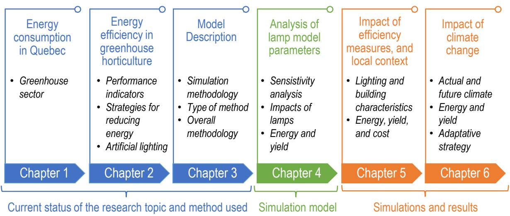  
Figure 1. Thesis overall methodology.

# Chapter 1 Energy Consumption in Quebec

Chapitre 1 Consommation d'énergie

# 1.1 Resume

Dans ce chapitre, une mise en contexte des besoins energetiques du domaine de la serriculture qu'ebecole est peinte. La consommation d'energie qu'ebecole de meme que la consommation d'energie specifique au domaine serricole sont presentes. Il est primordial de bien comprendre les differents enjeux du domaine pour effectuer une recherche qui repond a un besoin precis et qui peut etre utilisee par les producteurs Quebecois. L'importance du projet de recherche dans le contexte actuel sera mise en valeur. Ce projet s'inscrit dans les recherches sur l'utilisation efficace de I'electricite pour le chauffage et I'clairage en serre dans la cadre du Programme de partenariat pour l'innovation en agroalimentaire. L'objectif des recherches est de trouver des moyens concrets d'utiliser efficacement I'electricite.

# 1.2 Abstract

This chapter puts the energy needs of the Quebec greenhouse industry into context. Energy consumption in Quebec and energy consumption specific to the greenhouse industry are presented. It is essential to have a clear understanding of the various issues in this field in order to conduct research that meets a specific need and can be used by Quebec growers. The importance of the research project in the current context is highlighted. This project is part of the research on the efficient use of electricity for heating and lighting in greenhouses carried out under the Agri- Food Innovation Partnership Program. The aim of the research is to find practical ways to use electricity efficiently.

# 1.3 Quebec energy consumption

It is important to have a global view of energy consumption in Quebec in order to fully understand the impact of a doubling of the greenhouse effect on the energy grid.

According to Canada's Energy Future 2021 [10], the total end- use energy demand in Quebec in 2021 under current policies is 1,212.29 petajoules (PJ). For the various economic sectors in Quebec, the end- use energy demand values by energy type are shown in Figure 1.1.

  
Figure 1.1. Final energy demand for 2021 by energy type and sector [10].

In all sectors except transportation, electricity is the main source of energy consumed in Quebec, with a total of 731 PJ. Refined petroleum products (RPP) come very close because of transportation, which consumes 515 PJ of this type of energy annually. Including all sectors and types, Quebec's final energy demand will reach 1912 PJ in 2021.

In Quebec, electricity is mainly generated by hydroelectric dams, but other sources of energy are also used. With data for the annual capacity values of the various sources of electricity generation [10], we can see that  $97.9\%$  of Quebec's electrical energy comes from renewable sources. Electricity from non- renewable sources, such as oil, is mainly used to supply off- grid communities, including the Magdalen Islands and villages in northern Quebec [11].

The availability of primary sources for the year 2018 are summarized in Figure 1.2 and include the primary energies used for refining oil and diesel. With access to hydroelectricity, the province of Quebec stands out for its high share of local renewable energy supply  $(96\%)$ . Local sources include  $70.5\%$  hydroelectric,  $14.6\%$  biomass,  $14.5\%$  wind and  $0.4\%$  renewable natural gas (RNG).

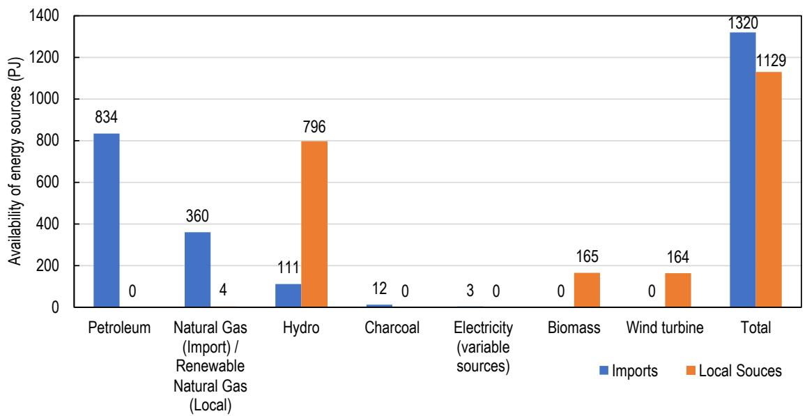  
Figure 1.2. Availability of primary energy sources in Quebec in 2018 [11].

# 1.5 Energy consumption in the Quebec greenhouse industry

The agricultural sector consumed about  $2\%$  of Quebec's total annual energy in 2021. This  $2\%$  is achieved through the consumption of different types of energy. Figure 1.3 shows the final energy consumption of the agricultural sector by type of energy. In this figure, energy is divided into two main classes: motor fuels and non- motor fuels. Motor fuels include gasoline and diesel fuel. All other energy sources are included in the non- motor fuels energy class and are also broken down by class.

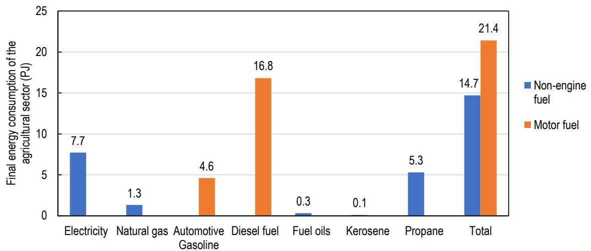  
Figure 1.3. Final energy consumption of the agricultural sector by energy type for Quebec in 2019 [12].

Because of the machinery used in the fields, the main type of energy used is diesel fuel with 16.8 PJ in 2019 in Quebec (47% of the total energy used in agriculture). Then, the second main type of energy is electricity with 7.7 PJ or 21%.

An approximation of the consumption of greenhouses in the agricultural sector is presented in Annex 1. Given the number of hectares of crops grown on the territory, the annual weather conditions, and the type of crop, it is possible to get a good idea of the order of magnitude of energy consumption in the greenhouse sector.

# 1.5.1 Additional electricity option from Hydro-Quebec

For greenhouses, Hydro- Quebec offers an additional electricity option for growing plants [13]. This option allows greenhouse growers to obtain an advantageous price for additional electricity delivered for photosynthesis lighting or heating. On the other hand, these customers must limit their electricity consumption during peak hours, i.e. not exceed their reference power. The reference power is set according to the customer's consumption profile at the time of registration.

Unauthorized periods occur primarily in the winter (December through March) and last an average of five hours, around the morning and evening peaks. As a rough guide, unauthorized periods total approximately 70 hours per year. During these periods, the price of additional electricity is 55.345  $\phi$ - kWh $^{- 1}$  (15.373  $\phi$ - MJ $^{- 1}$ ) [13]. In general, Hydro- Quebec notifies greenhouse growers the day before unauthorized periods, but the minimum notice before the period begins is two hours. Outside of unauthorized periods, the price of additional electricity, which includes both power and energy, is lower than the average base rate. Depending on the customer's normal consumption profile, the minimum price for additional electricity consumed outside of unauthorized periods varies between 4.988 and 6.188  $\phi$ - kWh $^{- 1}$  (1.385 and 1.719  $\phi$ - MJ $^{- 1}$ ) [13]. Additional electricity does not include consumption related to basic uses (computers, dehumidifiers, air conditioners, irrigation pumps, fans, etc.), but does include space heating for plant growth and lighting for photosynthesis. These favorable rates for the greenhouse industry will be re- evaluated every 5 years, i.e. in 2025, 2030, etc.

This variable rate helps Hydro- Quebec manage electricity demand. However, greenhouse growers need to be able to modulate their electricity consumption, for example, by having an alternative source of electricity, such as generators.

# Chapter 2 Energy Efficiency in Greenhouse Horticulture - Exploration of recent literature

Chapitre 2 Enjeux énergétiques de la culture en serre - Exploration de la littérature récente

# 2.1 Resume

Ce chapitre passe en revue la mécanique du bâtiment dans les serres et l'agriculture en environnement contrôlé (AEC), en mettant l'accent sur les questions énergétiques. Il examine les indicateurs clés permettant de quantifier la performance énergétique dans ces environnements et résume les meilleures pratiques tirées de la littérature récente pour minimiser la consommation d'énergie. Les résultats de la recherche soulignent que l'utilisation d'un éclairage LED économique en énergie, dont la durée et le moment sont réglables, ainsi que de sources d'énergie renouvelables, peuvent augmenter le rendement des cultures, réduire la consommation d'énergie et promouvoir la durabilité. En outre, l'étude suggère que les LED sont en train de devenir l'option d'éclairage la plus bénéfique pour l'environnement.

# 2.2 Abstract

This chapter provides a review of climate control in greenhouses and Controlled Environment Agriculture (CEA), with a focus on energy issues. It examines key indicators for quantifying energy performance in these environments and summarizes best practices from recent literature to minimize energy consumption. The research findings highlight that the use of energy- efficient LED lighting with adjustable timing and duration, along with renewable energy sources, can increase crop yields, reduce energy consumption, and promote sustainability. In addition, the study suggests that LEDs are emerging as the most environmentally beneficial lighting option.

# 2.2 Introduction

First and foremost, greenhouse agriculture must meet the needs of the plants, which means optimal light, an optimal growing climate and water balance, avoidance of climatic extremes, and the absence of pests and pathogens. As a complex ecosystem, greenhouse farming requires a very large

investment, but it allows for higher productivity and food quality. As a result, returns from greenhouse farming are higher and justify much larger investments [14], [15].

To remain competitive, high- tech greenhouses must constantly optimize growing conditions and maintain equipment and production systems. In Quebec, the second largest expense of a greenhouse, after labor, is heating and electricity, which account for 25 to  $30\%$  of production costs [15]. Therefore, energy issues are of paramount importance in greenhouse production. In recent years, several strategies have been developed to reduce energy consumption in greenhouses.

This chapter reviews the literature on energy issues in greenhouse agriculture. In particular, the main indicators for quantifying energy performance in greenhouses and Controlled Environment Agriculture (CEA) are explored. In addition, the best practices or strategies in greenhouse and CEA that have been explored in the recent literature to minimize energy consumption are summarized. Finally, conclusions are drawn from recent work on the impact of the types of artificial lighting systems and their control.

# 2.3 Performance indicators

There are several indicators used in the literature to quantify the energy performance of greenhouses and CEA facilities. Some of the main indicators include the energy consumption, the energy use intensity (EUI), the carbon footprint, the energy cost and efficiency, and the thermal performance. In addition, energy can include other resources such as water. Therefore, other energy performance indicators could include water use efficiency and lighting efficiency. Also, the objective of a greenhouse or CEA is to consume less and produce more, so other possible performance indicators would be related to growth such as the Leaf Area Index (LAI).

# 2.3.1 Energy consumption

One of the main indicators for quantifying the energy performance of greenhouses and CEAs is the energy consumption for heating per hour, day or year for a given floor area. The average coefficient of performance (COP) of the heating units is also valuable information to characterize the energy performance. Similarly, for irrigation, water consumption in greenhouses (e.g. kg H₂O·day⁻¹·m⁻²) is an important indicator [16] [17].

# 2.3.2 Energy use intensity (EUI)

2.3.2 Energy use intensity (EUI)The EUI is a measure of how much energy is used per unit area of a greenhouse or CEA facility. It is calculated by dividing the total energy consumed by the area of the greenhouse or CEA facility and expressed in units of kilowatt- hours per square meter per year (kWh·m $^2$ - year $^- 1$ ) or in megajoule hours per square meter per year (MJ·m $^2$ - year $^- 1$ ) [18]. This indicator is used in all types of buildings to quantify energy performance [19].

# 2.3.3 Carbon footprint

2.3.3 Carbon footprintThe carbon footprint indicator measures the amount of greenhouse gas emissions associated with the energy use of a greenhouse or CEA facility. It includes direct emissions from on- site energy use as well as indirect emissions from the production and transportation of energy sources. It is typically expressed in units of carbon dioxide equivalent (CO $_2$  eq) per square meter per year [20], [21]. Sometimes, the use of renewable energy is also measured as an indicator. The percentage of the proportion of energy consumed in the greenhouse or CEA facility that comes from renewable sources such as solar, wind, or geothermal energy is calculated.

# 2.3.4 Energy cost and productivity

2.3.4 Energy cost and productivityThe cost of energy can also be an indicator in a greenhouse or CEA facility. It is usually expressed in currency units per square meter per year. Moreover, energy productivity is another performance indicator, and it measures the amount of crop yield per unit of energy consumed in the greenhouse or CEA facility. It is calculated by dividing the total crop yield by the total energy consumed and is expressed in units of kg·MJ $^{- 1}$ . Specific energy is determined by calculating the ratio of total input energy to the amount of output product and is expressed in MJ·kg $^{- 1}$ .

# 2.3.5 Thermal performance

2.3.5 Thermal performanceOccasionally, another indicator that is employed is the thermal performance. This indicator measures the ability of a greenhouse or CEA facility to retain heat. For buildings in general, it is typically expressed in terms of the U- value or R- value of the building envelope [22], [23]. The U- value is the energy flow through the building envelope, when the temperature difference between inside and outside is  $1^{\circ}$ C [14].

# 2.3.6 Efficiency

2.3.6 EfficiencyEfficiencies in general are often use to indicate performance. This is the case with thermal efficiency, which measures the effectiveness of the heating and cooling systems in maintaining optimal growing conditions while minimizing energy consumption. It is calculated by dividing the useful energy output (such as heat or cooling) by the total energy input [24]. Lighting efficiency is also an indicator that measures the efficiency of the lighting system used in a greenhouse or CEA facility. It is typically expressed in units of photosynthetic photon flux density (PPFD) per unit of energy consumed (e.g. micromoles of photons per joule) [25]. In the same line of efficiency, there is the water use efficiency. This indicator measures the efficiency of water use in a greenhouse or CEA facility. It is typically expressed in units of liters of water per kilogram of product [26].

# 2.3.7 Growth indicators

From a growth perspective, the LAI is used to indicate the light interception of plants under normal conditions. The LAI is the basic parameter that relates the radiation intercepted by a crop to the incident solar radiation (dimensionless) [27]. Specifically, it is the leaf area of a crop per unit area of soil [28],

$$
L A I = \frac{L e a v e s^{\prime}s u r f a c e(m^{2})}{S o i l s u r f a c e(m^{2})} \tag{2.1}
$$

The amount of radiation intercepted and its efficiency is influenced by the characteristics of the crop, such as the arrangement of the plants or the leaf area, and the characteristics of the greenhouse (transmissivity to radiation or radiation diffusion) [28]. Leaf development is slow, and LAI increases slowly early in the growing cycle because a large part of the radiation is not intercepted by the crop. Later in the growing cycle, when there are no growth limiting factors such as inappropriate temperatures or lack of water, LAI increases exponentially until it reaches its maximum values [14], [28]. Plant growth is a primary factor and is closely related to the energy consumption. To evaluate the overall performance of a greenhouse, the energy consumption must be related to the kilograms of fruit or vegetables produced. For example, if a greenhouse has a low energy consumption, but does not maintain an adequate climate, it will produce little or no fruit or vegetables.

Overall, these indicators can help greenhouse and CEA operators to evaluate the energy performance of their facilities and identify areas for improvement.

# 2.4 Strategies to minimize energy consumption

In Quebec, the average energy consumption of greenhouses is 650 to  $850kWh\cdot m^{- 2}$  (2340 to 2880 MJ  $\cdot \mathsf{m}^{- 2}$  ) for heating. Heating costs represent between 25 and  $30\%$  of production costs. For some energy sources such as thermal waste and biomass, this can be reduced to  $15\%$  . On average,  $51\%$  of the energy used to heat greenhouses in Quebec is consumed from December to February. In addition, energy in greenhouses accounts for more than  $90\%$  of the environmental footprint [15]. Oil, natural gas, and biomass are the main energy sources used to heat greenhouses in Quebec [29] Heat transfer though the envelope accounts for most of the heat loss from the greenhouse [15].

Several practices and strategies are used in greenhouses to reduce energy consumption. Among others, the heating system and ventilation system, the energy sources used, the design, the heat distribution network, the thermal screens, the insulation, the use of a thermal storage tank, the computerized climate control, the choice of crops and the production schedule are all aspects that are important to study to reduce greenhouse energy consumption. The factors related to climate control will be analyzed in detail in this literature review. Artificial lighting also has an important impact on the energy consumption. The lighting aspect will be discussed in the next section.

# 2.4.1 Structural design

2.4.1 Structural designTraditional greenhouse designs have been found to have poor thermal insulation performance, with the typical greenhouse envelope causing 20 to  $40\%$  of the total energy loss [30]. The main parts of a greenhouse design are shown in Figure 2.1. The design of a greenhouse, when it comes to energy consumption, is divided into three main sections, the structural design, the ventilation system design, and the selection of lighting systems. This section analyzes the structural design in detail.

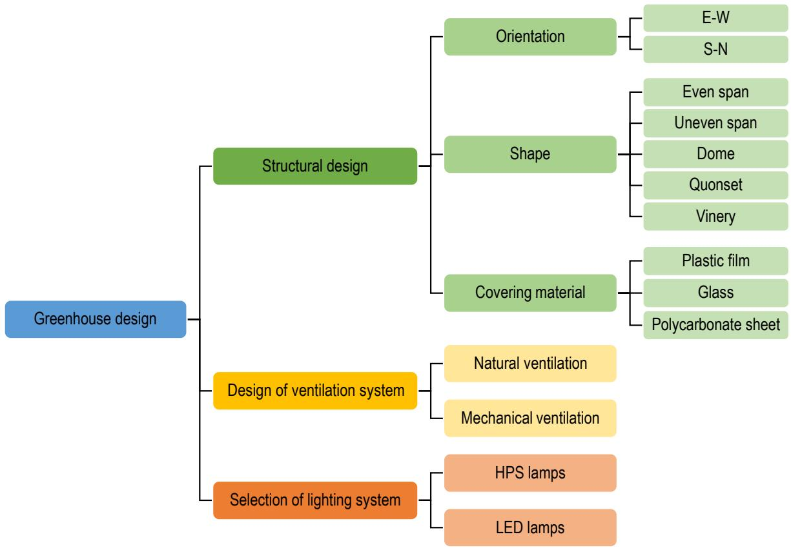  
Figure 2.1. Schematic overview of the different elements of a greenhouse design (adapted from [30]).

The structure, materials, location, and equipment are all elements that must be considered from an energy standpoint before the construction phase begins. The absorption coefficient and solar energy utilization rate of a greenhouse are mainly determined by the orientation, shape and covering material [30]. Thus, to reduce the energy consumption of greenhouses and CEA, these three physical design factors are important.

The ideal orientation of a greenhouse varies depending on the region and climatic conditions. According to Zhang [30], an east- west orientation is generally optimal for a greenhouse because it receives more solar radiation during winter at high northern latitudes. This is because the sun has a lower inclination. Ahamed [31] agrees that the potential for energy savings in greenhouse heating varies greatly depending on the location and shape of the greenhouse. The amount of energy savings can vary significantly depending on the length- to- width ratio of the greenhouse.

The shape of the greenhouse depends on the size of the desired greenhouse complex. For single span greenhouses, an uneven shape is a good choice because it provides excellent exposure to

sunlight. For larger greenhouses, an elliptical shape with a multi- span greenhouse is more suitable [30]. Compared to single- span greenhouses, multi- span greenhouses are more energy efficient because of the reduced area exposed to the outside per unit of floor area. In addition, the design of the greenhouse roof plays a significant role in both solar energy gain and heat loss during the winter months [31]. Investigating the energy- saving potential of greenhouse shapes based on local climates is critical because solar radiation may provide less heat gain per unit of cover area compared to the rate of heat loss during extremely cold weather. In addition, high winter wind speeds in certain regions can have a significant impact on greenhouse design [14].

The cover materials reflect, absorb, and transmit the solar radiation [14]. The main types of covers available for greenhouses are plastic film, glass, and polycarbonate (PC) sheets. The choice of cover material depends on several factors of the greenhouse, including structure, function, budget, durability, and light transmission [15]. An ideal cover material should be highly transparent to global solar radiation, especially in the range of photosynthetically active radiation (PAR). Conversely, it should be as opaque as possible to long- wave infrared (IR) radiation. In addition, a good cover material should have high diffuse radiation, excellent insulation, and anti- condensation properties [31].

Glass has the highest light transmission, ranging from of  $75\%$  to  $92\%$  [30]. As for polyethylene, it has a better plasticity than glass. On the other hand, unlike glass, polycarbonate is not resistant to pesticides such as organochlorines, sulfur and phosphorus carbonates. Plastic film is the most widely used coating in the world, accounting for  $90\%$  of the total greenhouses area, followed by glass [15]. Plastic films are strong, light and flexible. Therefore, it is possible to install them on a lighter structure than for glass. Plastic films also have a good light diffusing ability. There is a wide variety of plastic films available to meet different needs and sizes and to adapt well to different types of crops. Plastic films have a lifespan of only three to five years and installation is not always easy. In fact, for large greenhouses, installing plastic is a major challenge. In addition to the cost of the material, a lot of labor is required to replace the film. Condensation on the walls can also be a problem in winter. Another problem is pollination. Plastic films can filter out light spectrums that may be harmful to bumblebees [15]. Glass covers have better light transmission and are hydrophilic. The life span of glass is almost unlimited. Different types of glass are available to counteract the disadvantages, such as float glass and diffusing glass. However, glass is more expensive, with an initial investment cost

45% to 50% higher than a plastic greenhouse. In addition, glass is fragile and heavy. Therefore, a stronger and more important structure is needed. Also, glass is less airtight and does not have a good insulating capacity (significant heat loss) [15].

Moreover, for a greenhouse in the northern hemisphere, the north wall characteristics can help to reduce the energy consumption due to the lower elevation of the winter sun. The use of opaque north walls requires additional lighting in greenhouses, but the amount of energy saved compared to uninsulated greenhouses is significant. The use of opaque north walls resulted in an indoor temperature that was approximately 7 to  $9^{\circ}$ C higher than the outdoor temperature. On average, the energy consumption can be reduced by 13% when using the brick north wall [31].

# 2.4.2 Ventilation

In a greenhouse and a CEA, ventilation plays several essential roles to ensure the health of the plants. Ventilation allows the removal of a large part of the solar energy accumulated in the greenhouse, a significant portion of which is in the form of water vapor from plant transpiration. This means that ventilation allows the removal of warm, humid air and its replacement by outside air that is less warm or of the same temperature but with less humidity. This is very positive because it dehumidifies the air in the greenhouse by activating plant transpiration, preventing condensation on the plants and minimizing the incidence of fungal diseases [14]. Ventilation makes it possible to maintain a uniform climate and avoid vertical temperature stratification. Ventilation also provides external  $\text{CO}_2$ . In summary, a ventilation system allows the control of temperature, humidity and  $\text{CO}_2$  concentration.

Many studies have been conducted on the effect of ventilation on the plants. Among others, Yu et al. [32] studied the effect of different supply air temperatures and radiation intensities on greenhouse ventilation and thermal stratification of tomato plants using both numerical and experimental approaches in a Venio greenhouse. Subsequently, the study analyzed the effect of ventilation and temperature distribution. The study found that ventilation can effectively regulate the temperature around tomato plants and mitigate the negative effects of high temperatures, especially during the summer months. Appropriate ventilation can create an ideal thermal environment for optimal tomato growth.

There are two types of ventilation in greenhouses, natural ventilation and mechanical ventilation. The effectiveness of a ventilation system depends on several factors, including location, configuration, and wind speed and intensity [33]. Proper use of ventilation is an important tool in reducing the energy consumption of a greenhouse.

Natural ventilation techniques such as ridge vents, sidewall vents, and roll- up curtains can be used to regulate temperature and humidity in the greenhouse or CEA facility. This reduces the need for mechanical ventilation, which can consume a significant amount of energy. This kind of ventilation can be negatively affected by uncertainties in wind speed and direction, which in turn can affect the internal microclimate. However, relying solely on natural ventilation is often insufficient to achieve optimal conditions within the greenhouse. The effectiveness of natural ventilation depends largely on the position, opening angle and area of the vents. Even on the hottest day of the year, the efficiency of a naturally ventilated greenhouse can be improved by up to  $20\%$  [30]. In contrast, forced ventilation systems have been shown to reduce vertical temperature stratification and improve air distribution, resulting in greater thermal stability and comfort. By reducing temperature fluctuations and energy consumption, such systems have been shown to achieve energy savings of up to  $30\%$  [30].

# 2.4.3 Energy source

The energy source affects the performance of the heating system and its impact on the environment. The more stable and consistent the energy source, the better the heating system will perform [15]. Electricity, natural gas, and light fuel oil are examples of energy sources that are stable and consistent. Heavy fuel oil, biogas or biomass are much less stable and consistent [34].

As the price of fossil fuels continues to rise and concerns about their environmental impact grow, greenhouse growers are increasingly considering alternative fuels to heat their facilities [31]. In recent years, renewable energy has shown great potential for integration into conventional greenhouse structures [30]. The use of renewable energy sources such as solar panels and wind turbines can offset the energy consumption of greenhouse and CEA facilities. These sources can be used to power lighting, ventilation, and other electrical systems. The main renewable energy sources studied around the world are summarized in Figure 2.2. This figure shows that the solar energy and

geothermal energy are the two main renewable energy sources used. After that, the mutual energy integration system is also a way of sustainable energy technology.

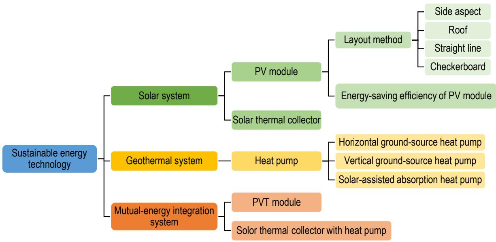  
Figure 2.2. Schematic overview of the different sustainable energy technologies of a greenhouse (adapted from [30])

In 2020, approximately  $3.5\%$  of the world's geothermal energy was used to heat greenhouses. The use of geothermal energy for heating greenhouses and covered areas has experienced a  $24\%$  increase in installed capacity and a  $23\%$  increase in annual energy use on a global scale. Lund [35] reported that 32 countries now use geothermal heating for greenhouses, with Turkey, China, the Netherlands, Russia, and Hungary being the leading nations in annual energy use. These five countries account for about  $83\%$  of the world's total geothermal greenhouse heating.

Geothermally heated greenhouses have the potential to reduce production costs by as much as  $35\%$  by allowing production in cold climates that would otherwise not be feasible in commercial greenhouses [31]. While previous studies have suggested that geothermal heating of greenhouses could provide significant energy savings, its use in large- scale production remains uncommon. This is due to several factors, including high initial costs, inadequate economically justified technologies, complicated maintenance and use, environmental concerns, and most importantly, lack of government support and organization. In addition, geothermal energy is not possible everywhere, it is necessary to be in a place where there is enough heat in the ground [14].

Solar energy can be used in two forms, either directly by the sun's rays entering the greenhouse (greenhouse effect) or to generate electricity. Generating clean energy from photovoltaic (PV) modules is perhaps the most straightforward method of harnessing solar power to provide electricity for use in greenhouses. Traditional PV modules offer several advantages, including accessibility, resilience in severe weather, enhanced efficiency, and lower costs as production scales up. Semitransparent PV modules (commercially available as heat- insulating solar glass) can be used as facade and roof materials in greenhouses for multifunctional purposes. These materials allow enough natural sunlight to pass through while efficiently generating electricity, as the cell temperatures do not exceed a certain range. The electricity generated can be used to power lighting, irrigation, and heat pump systems [34].

An alternative energy source that is not included in Figure 2.2 is industrial waste heat (industrial residual heat). This energy source could be a suitable option to reduce the greenhouse heating costs for large- scale production [31]. Waste heat refers to heat that is lost through the stack of an industrial plant or that is rejected from a power plant to improve thermodynamic efficiency. Large amounts of heat, typically in the form of flue gases or hot water, are released from industrial and power plant processing systems that can be used to heat greenhouses. The use of low- temperature industrial wastewater heating systems (20 to  $25^{\circ}C$ ) has proven to be a good approach to energy conservation in greenhouses. In addition, the use of waste heat, such as industrial flue gas heat, to heat greenhouses could be an alternative to reduce  $CO_2$  emissions from industry [31]. However, the high investment costs associated with connecting waste heat to the greenhouse and the unreliability of waste energy to meet year- round energy needs due to different maintenance periods in processes and industries are significant barriers to the use of waste heat [15]. Overall, the use of industrial waste heat in greenhouses and CEA is mainly dependent on grid infrastructure, distance, available capacity, and temperature constraints [14].

Wood biomass can also be an alternative heat source. According to Ahamed [31], replacing traditional heating systems with biomass boilers can be cost effective, depending on the local price of wood biomass and fossil fuels such as natural gas, electricity, and heating oil [29]. According to Cyr [36], heating a greenhouse with biomass in Quebec leads to a reduction in energy costs of  $50\%$  to  $90\%$  per year (2012 data). There are also several other advantages, such as reducing the carbon footprint, guaranteeing the use of a renewable energy source that allows energy independence,

diversifying the forestry and agricultural economy, valorizing marginal lands (energy crops), and providing a solution for the disposal of residues.

Biomass heating systems also have an economic advantage due to the fact that wood biomass boilers produce higher levels of particulate matter and ash emissions compared to other fossil fuels [31].

# 2.4.4 Heating system and heat distribution network

Heating systems, which are usually used for commercial greenhouses located in high northern latitudes, continue to improve. Older systems use more energy than newer ones because they are less efficient at converting fuel into heat.

Hot water pipe heating is commonly used in large commercial greenhouses, and it is recommended that the pipes be placed close to the ground to limit heat loss and provide a uniform vertical temperature distribution [15]. However, a combination of air and water heating can provide an alternative solution to mitigate the negative effects of these two heating methods. For small greenhouses, infrared heating and hot air heating systems can be more energy efficient [15]. Utilizing an infrared radiation heating system can be a viable alternative for reducing greenhouse energy consumption. By using long- wave radiation heating sources, the greenhouse plants can be directly heated without requiring the movement of air, resulting in lower air and cover temperatures. This can significantly reduce heat loss within the greenhouse. However, it carries the risk of damaging plant leaves [31].

Passive heating systems such as water heat storage, solid north walls, and rock- bed heat storage may not be highly efficient for large commercial greenhouses in cold regions. This is due to the limited efficiency of heat storage caused by the requirement for greenhouse cover transmittance to increase PAR. Therefore, it is critical to investigate the heating efficiency and feasibility of these passive systems based on local weather conditions and resources for large commercial greenhouses in cold regions [31].

Different heat distribution systems have different efficiencies. For example, a hot air heat distribution system is less efficient than a hot water distribution system. However, there are other factors to consider such as cost, effect on plants, and size of the greenhouse or CEA.

For ornamental crops, the use of underfloor heating or heating mats can also reduce energy consumption. On the other hand, in Quebec, it is not possible to heat a greenhouse in winter with underfloor heating or heating mats. In addition, root heating is not recommended for vegetable production because it encourages vegetative growth. The balance between leaf and root temperatures must be maintained to ensure plant health. [15]

Additionally, heat pumps are a popular choice for greenhouse heating and cooling because of their unique advantages, which are not found in other technologies [24]. They can function as heating devices during cold weather or at night, as well as provide cooling when the weather is too hot. Heat pump systems are a cost- effective alternative to conventional heating, ventilation, and air conditioning (HVAC) systems, with competitive COP ranges and payback periods. This makes them a preferred option for applications requiring both heating and cooling. Solar- assisted heat pump systems are a cost- effective solution to meet the heating and cooling demands of greenhouses. These systems typically have COP values greater than 3.0 [34].

# 2.4.5 Energy storage

There are several ways to store energy in greenhouses. Whatever the technique, it contributes to the energy efficiency of these installations. There are systems using sensible heat storage and others using latent heat storage.

Massive north walls, a type of sensible heat storage system, have a lower initial cost and require less technical expertise than latent heat storage systems that use phase change materials (PCMs). However, sensible heat storage systems such as solid north walls require a large thermal mass volume and a significant temperature differential [31].

On the other hand, latent thermal storage systems using PCMs offer several advantages over sensible systems. These include high thermal capacity, small volume, usually low temperature, and thermal energy that can be stored and released at a nearly constant temperature. PCMs use chemical bonds to store and release heat, enabling them to store a substantial amount of heat during a phase change from solid to liquid (latent heat of fusion) at a constant temperature equal to the phase transition temperature [31]. PCMs are a popular choice for greenhouse applications because they offer a promising COP range for storage systems [34].

To achieve heat storage in greenhouses, water can be used as a storage medium. This thermal energy storage allows better use of heat and thus reduces energy consumption. It also allows the decoupling of the heat demand from the  $CO_2$  demand of the plant, which is very beneficial for the growth of the plant. Even in winter in Quebec, on a very cold but sunny day, there will be an excess of heat in the greenhouse due to the greenhouse effect.

Water energy storage consists of a tank that stores energy in the form of hot water. The hot water from this tank can then be used later in the evening and at night to heat the greenhouse. Over a 24- hour cycle, heating needs vary greatly. Therefore, the energy storage allows the boilers to be used without heating the greenhouse. The boilers can be used at a more constant rate throughout the day, extending the life of the equipment and reducing operating costs. At night, the heat demand increases, so the hot water is taken from the tank (the heat is accumulated during the day) for heating and the boiler is turned off. During the day, when heat demand is low, the boiler runs, and the excess heat is stored in the storage tank. In addition, by decoupling the production from the heat demand in the greenhouse, energy storage results in carbon enrichment of the greenhouse, i.e. free  $CO_2$ . In short, energy storage reduces the overall heating system output and investment costs. The  $CO_2$  and heating requirements for the plant are globally reversed:  $CO_2$  is supplied during the day to support photosynthesis and stored heat is released at night to maintain the plant's temperature comfort zone. During the day, the photosynthetic reaction in the chloroplasts consumes  $CO_2$ ,  $H_2O$  and light to produce sugars and  $O_2$ . Conversely, during the night, the plant respires, producing  $CO_2$  while consuming  $O_2$ . Hence the interest in decoupling these two parameters,  $CO_2$  and heat, by means of a heat storage system [15].

Another sensible heat storage system is the rock bed. In rock bed heat storage, hot air from the greenhouse is circulated into the storage medium through recirculating fans to store the heat from solar radiation. The heat is then released through a reverse circulation process at night when the indoor temperature falls below the optimal level [31].

Also, heat recycling is another way to reduce energy consumption. The use of heat recovery systems can capture waste heat from cooling systems or exhaust air and use it to heat other parts of the greenhouse or CEA. Heat generated by equipment like lighting, ventilation fans, and pumps can be recycled and reused to heat the greenhouse or CEA structure. This can be achieved through the use

of heat exchangers and can reduce the need for additional heating systems and lead to significant energy savings.

# 2.4.6 Thermal screens

Thermal screens can be used to reduce heat loss during winter and block out excess sunlight during summer. This reduces the need for heating and cooling, thereby reducing energy consumption. There are several types of thermal screens. In general, horizontal thermal screens reduce energy consumption between  $15\%$  and  $25\%$ , and vertical thermal screens installed around the perimeter of the greenhouse add another  $5\%$  to energy performance [15].

The cover of a greenhouse has a significant effect on the microclimate within. Using a thermal screen at night in winter can result in a  $20\%$  reduction in greenhouse energy consumption [15]. There are several types of thermal screens made from different materials. Compared to other screens such as polyethylene, polyester, polypropylene and polystyrene, the aluminized thermal screen is more efficient due to its high reflectivity [31]. Rasheed et al. [37] proposed a Building Energy Simulation (BES) model capable of simulating the transient thermal environment of a greenhouse. The authors were able to determine the energy demand of the greenhouse influenced by different thermal screens and their control strategies. The results indicate that multilayer night thermal screens are the most energy efficient option. Greenhouses equipped with multilayer night thermal screens required  $20\%$ ,  $5.4\%$ , and  $13.5\%$  less heating than those with polyester, luxus, and tempa screens, respectively.

# 2.4.7 Insulation

Proper insulation of the greenhouse or CEA structure can reduce the amount of energy needed to heat or cool the space, it can reduce heat loss during winter, and prevent overheating during summer. However, it is important to exercise caution, as insulation can also present a challenge during the summer if the system may encounter difficulties in evacuating the internal load, particularly in bright sunlight. Insulation materials such as polyethylene foam, fiberglass, and rigid foam board can be used. However, optimizing the insulation and air tightness of the greenhouse without affecting production is a major challenge in greenhouses. Insulating the walls, without shading the crops can reduce energy consumption by as much as  $5\%$  [15]. Effective insulation is essential for storing energy over a long period of time [34].

It is advisable to insulate the perimeter and lower portions of the side wall of a greenhouse to reduce conduction heat loss. The height of the insulation on the side wall may need to be adjusted depending on the location of the greenhouse, as the solar altitude angle varies significantly depending on the location [31]. It is also important to insulate the heat distribution systems. For example, insulating the primary and secondary hot water distribution systems can save about  $3\%$  of energy [15].

The use of insulation between two layers of cover, such as air layer insulation, liquid foam insulation, air bubble insulation, and pellet insulation, can significantly reduce greenhouse heat loss. Inflated air layer insulation is the most widely used and cost- effective technique for double layer polyethylene- covered greenhouses. It is recommended that air be drawn in from the outside to prevent condensation between the sheets, as outdoor air is typically drier than indoor air. The primary challenge in implementing liquid foam and pellet insulation systems is the maintenance and operation of the system, and there is limited information available on the economics viability of these systems for commercial- scale greenhouse production [31].

# 2.4.8 Computerized climate control

Climate control systems can significantly reduce energy consumption. These systems can include variable speed fans and pumps, as well as advanced control systems that use predictive analytics to optimize energy use. This can be achieved using advanced control systems and sensors that automatically regulate temperature and humidity levels.

Improving control strategy is an effective way to minimize total energy consumption in greenhouses. Computerized climate control allows for automatic climate management. This consists of adjusting the climate parameters (temperature, humidity and  $\mathrm{CO}_2$ ) according to the needs of the plants and the external climatic conditions. The climate computer responds to the crop manager's commands by optimizing the heat supply and regulating the indoor/outdoor air exchange rate (ventilation) based on sophisticated control algorithms. Choosing good climate strategies in winter can reduce energy costs by up to  $10\%$  [15]. There are several control strategies to optimize the energy consumption of a CEA or greenhouse. The main categories of control strategies are shown in Figure 2.3.

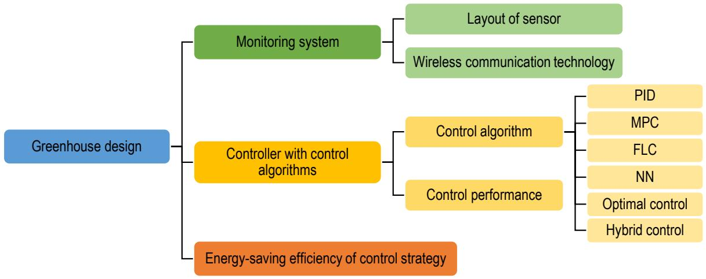  
Figure 2.3. Schematic overview of the different control strategies of a greenhouse (adapted from [30]).

In order to achieve energy efficient operation in greenhouses, it is essential to implement control strategies that coordinate the relationships between different departments. The control process typically involves a basic loop that includes sensors, transducers, and a controller with control algorithms. However, the nonlinear and multivariable nature of the greenhouse climate presents a significant challenge to effective control methods. To meet this challenge, greenhouse control systems require the support of advanced control algorithms that can provide a comprehensive framework for the development of holistic decision support and actuation systems [38].

There are various algorithms and simulations that exist to predict the climate in greenhouses and reduce energy consumption. The different types of control strategies in greenhouses are considered in Zhang's et al. paper entitled: Methodologies of control strategies for improving energy efficiency in agricultural greenhouses [38]. The different types consider mathematical modeling study, physical experimental study, numerical simulation and parametric sensitivity analysis. This article is a good guide to explore advanced control strategies to reduce greenhouse energy consumption while maintaining a suitable growing environment.

Effective greenhouse control requires achieving both high control performance and low energy consumption, all while maintaining stable climate conditions within the greenhouse [30]. There is a conflict between low cost and high accuracy of the control system. Finding a balance between the two is a challenge. Most importantly, greenhouses must provide an indoor environment that is suitable for the type of crop, and this aspect is paramount when setting up computerized climate control. According to Zhang's literature review [38], about  $60\%$  of the selected papers consider

temperature and humidity as parameters that directly affect crop yield and are the main variables of energy consumption.

Numerical simulation using softwares such as Matlab, Simulink, Python, TRNSys, and Comsol is a common method for studying control strategies in greenhouses. A traditional control strategy (e.g., PID/Fuzzy) combined with artificial neural networks (ANN)/smart algorithms has become a new trend for reducing energy consumption and efficiently adjusting the indoor microclimate in greenhouses [38].

Despite the development of various control algorithms for intelligent greenhouse control, it remains a challenge to find a control mode that can effectively consider all relevant factors and identify the optimal control conditions for each unique greenhouse [30]. However, optimization of crop growth conditions can help to reduce energy consumption in greenhouses and CEA. This can be achieved through the use of advanced crop modeling and simulation tools that help to determine the optimal growing conditions for different crops.

Other strategies include temperature integration (TI) techniques, such as setting the indoor setpoint temperature at few degrees below the optimal temperature and above the suboptimal temperature for a period of time. This can be an effective way to save energy in greenhouse heating. Lowering the nighttime temperature by one to two degree Celsius below the daytime temperature can reduce heating energy consumption in winter greenhouses by up to  $30\%$  at various locations [31].

# 2.4.9 Crop selection and production schedule

The location of the greenhouse dictates the number of heating degree days and the amount of sunshine. Therefore, these elements have a direct impact on the heating requirements. For example, a greenhouse in Quebec City will consume  $10\%$  more energy than one in Montreal [15]. The type of crop and the production schedule also have an important impact on the amount of energy required. The type of crop determines the heating, dehumidification, and ventilation requirements in the greenhouse or CEA. Since most of the energy used for heating is from December to February, year- round production requires much more energy than, say, 6- month production.

Overall, implementing these energy- saving practices and strategies in greenhouse and CEA facilities can help reduce energy consumption and increase sustainability.

# 2.5 Impacts of artificial lighting systems

2.5 Impacts of artificial lighting systemsRecent work on the impacts of types of artificial lighting systems and their control in greenhouses and CEAs has revealed several important findings. There are several reasons for installing artificial lighting in greenhouses. As mentioned by Castilla [28], the reasons can be to change the number of daylight hours, to interrupt the darkness at night, to increase photosynthesis or to reduce the light intensity. Not all types of greenhouses use artificial lighting, and not all greenhouses benefit from the use of this technology. In latitudes above  $40^{\circ}\mathrm{N}$  in the Americas and  $50^{\circ}\mathrm{N}$  in Europe, supplemental artificial light is commonly used in sophisticated greenhouses with high- value crops [28]. When building a greenhouse complex for winter production of tomatoes, peppers, or cucumbers, it is necessary to consider the need for a 600 volt (three- phase) electrical network and an electrical capacity of 1 to 2 MW·ha $^{- 1}$  for artificial lighting. The  $\mu \mathrm{mol}\cdot \mathrm{m}^{- 2}\cdot \mathrm{s}^{- 1}$  and  $\mathrm{mol}\cdot \mathrm{m}^{- 2}\cdot \mathrm{d}^{- 1}$  are the units of light measurement for plants [15].

There are three main components to consider when using artificial lighting that have a significant impact on the crop. The first is light intensity, which is related to photosynthesis. Increasing light intensity allows for year- round production with higher off- season prices, increased yields and higher quality products. Artificial lighting helps compensate for light deficiencies and increases transpiration and nutrient demand, which translates into biomass gains. Second, there is the duration, which is related to the photoperiod. The photoperiod is controlled by low light intensities. This has an important effect on the quality of the harvested inflorescences. The duration subjects' sensitive crops to long or short day cycles to slow down or speed up flowering. Thus, it is possible to determine the flowering date of these species. Third, there is spectral quality, which is important to consider when choosing lighting. Spectral quality affects photosynthesis, morphology and plant quality [15].

One of the reasons for adding artificial light in areas where there is a deficit of solar radiation is to maximize photosynthesis (daylight) by maximizing light interception by the greenhouse. This goal can also be achieved by optimizing the design and orientation of the greenhouse. In addition, depending on the location of the greenhouse and the time of year, sunshine hours can be limited (e.g. in Quebec in winter). Artificial light can also be used to extend the period of photosynthetic activity. By extending the length of the day (photoperiod), it is possible to increase the amount of radiation accumulated during the day [28].

The DLI (amount of daylight integral, determined by light intensity and photoperiod) is very important. A general rule of thumb is that a one percent increase in light in the PAR will result in approximately a one percent increase in productivity, provided that the light saturation point is not reached [14]. According to Castilla [28], artificial lighting is the most reliable and effective method of increasing light availability. In the past, supplemental artificial lighting systems were used only for cut flowers and during the first growth stage of young plants. However, in the last 20 years, the use of artificial lighting has spread to a wider range of crops, both for a wider range of flowers and for the production of vegetables in greenhouses at high latitudes.

One of the most important aspects to consider when selecting the type of lamp to be used for the plants is the radiation emission spectrum of the lamp in the PAR interval. The goal is for the emitted radiation to be as close as possible to the PAR [28]. In addition, when selecting lamps, it is important to consider their energy efficiency in relation to the needs of the greenhouse. In the greenhouse context, the shape of the reflectors has an important effect on plant growth and energy efficiency. The aim is to minimize the reduction in solar radiation caused by the shadows of the lamps. Uniformity of light distribution at the plant level is important. It is preferable to use rectangular reflectors [28]. Several studies have been conducted to determine the shapes of reflectors that cause the least amount of shadows while maintaining an adequate light distribution to the plants. In addition, specialized computer software is available to help optimize the positioning of lamps over the plants and throughout the greenhouse [39], [40].

By controlling the artificial lighting in a greenhouse, it is possible to manipulate the length of the day by changing the photoperiod. Lamps can be used to extend the length of the day or interrupt the length of the night. The length of the day can be increased to a total of 12 to 16 hours, but should not exceed 18 hours as this would be detrimental to many crops by causing leaf abscission. It can also be counterproductive for some crops such as tomatoes. However, some crops such as lettuce benefit from constant illumination. Illumination levels vary for each type of crop. For cucumbers, peppers and tomatoes, the recommended illumination levels are between 12 and  $24 \text{W}\cdot \text{m}^{- 2}\cdot \text{PAR}$ , and between 12 and  $48 \text{W}\cdot \text{m}^{- 2}\cdot \text{PAR}$  for eggplant and lettuce [15], [28].

Photoperiodic lighting requires low intensity illumination, typically around 110 lux, or between 1 and  $2 \mu \text{mol}\cdot \text{s}^{- 1}\cdot \text{m}^{- 2}$ . This type of lighting is only used in greenhouses after sunset or before sunrise. Supplemental (photosynthetic) lighting, on the other hand, requires high- intensity lighting, typically

around 4,320- 5,400 lux, or 60- 120  $\mu$ mol $\cdot$ s $^{- 1}$ $\cdot$ m $^{- 2}$ . This lighting is generally used in greenhouses from October to March in mid and high latitude areas, especially on cloudy days and at night. Sole- source lighting (SSL), on the other hand, is specifically designed for CEA and typically requires a much higher intensity of about 150- 200  $\mu$ mol $\cdot$ s $^{- 1}$ $\cdot$ m $^{- 2}$  [15], [17].

Different characteristics of artificial lighting affect energy production and consumption. Among others, the spectral composition and intensity of artificial lighting can have a significant impact on plant growth and development. The area covered by the light beam of a lamp is proportional to the square of the distance to the light source, while the intensity of the measured light is inversely proportional [15]. The timing and duration of artificial lighting can also impact plant growth and development. Studies have shown that providing continuous lighting can increase crop yield, but also increase energy consumption. In addition, the use of lighting control systems with adjustable timing and duration can optimize plant growth and reduce energy consumption [41]. Energy consumption is a major concern in greenhouse and CEA facilities. In recent years, greenhouse and CEA facilities have become increasingly focused on sustainability and reducing their environmental impact. The use of renewable energy sources for artificial lighting, such as solar and wind power, can reduce greenhouse gas emissions and operating costs in greenhouse and CEA facilities.

Research has also been done to characterize the optimal number and arrangement of lights installed in a greenhouse [40], [39]. The light intensity required must be considered. This varies according to the species and the growing system. It is then important to define the spectral quality and uniformity of the desired lighting. In addition, the number and arrangement of lamps will vary depending on the type of lamp. The design and choice of reflectors have a major impact on the lighting perceived by the plants. For example, it is possible to have an asymmetrical reflector to light only the canopy and not the paths and walls. The reflectors help to achieve the desired light penetration inside the canopy. The choice of number and placement of lamps also depends on the physical parameters of the greenhouse, including the dimensions of the greenhouse (width, length, height), the height of the crop (including tables and gutters), and the shading obstacles (fans, heating pipes).

There are several types of lamps used in greenhouse lighting, each with its advantages and disadvantages. The most common are high- pressure sodium (HPS), metal halide (MH), light- emitting diode (LED), fluorescent and incandescent lamps. The type of lamp used in a greenhouse depends on the specific needs of the crops being grown, as well as the cost and availability of the lighting

system. Each type of lamp produces different spectrums of light that can affect plant growth and development. Therefore, selecting the appropriate type of lamp for each crop and growth stage is crucial to ensure optimal growth and yield. The optimal level of artificial lighting is the one that generates the highest net financial benefit (revenue- expense) for the grower [15].

Several criteria must be considered when deciding on the use of artificial lighting technology. It is necessary to consider the type of crop (species and cultivars), the needs of the plant (light saturation curve), the reason for use (photosynthetic, morphological, quality), the growing system (above the canopy, within the canopy, table, etc.), the design of the greenhouse (height, width, etc.), the shade cast by the luminaires, and the investment and maintenance costs [15].

# 2.5.1 High-Intensity Discharge (HID)

HID lamps, short for High Intensity Discharge lamps, produce light by passing an electric current through a gas or vapor. They are commonly used in commercial and industrial applications such as street lighting, stadium lighting, and indoor grow operations, including greenhouses. Two main types of HID lamps are used in indoor gardening and greenhouse applications: Metal Halide (MH) lamps and High- Pressure Sodium (HPS) lamps. They are employed when high- intensity radiation levels are required [14]. It is crucial to acknowledge that in certain countries, new regulatory frameworks are being implemented to prohibit the use of these types of lamps.

# High-Pressure Sodium (HPS)

HPS lamps are frequently utilized in greenhouses due to their high light intensity and energy efficiency. They are commonly used in the production of greenhouse vegetables [15] due to their yellow- orange light spectrum, which is ideal for flowering plants. The most commonly used HPS lamps have a power range of 400 to 450 W. Typically, one lamp is installed for every ten square meters to achieve a power of 50 watts per square meter and a useful PAR level of ten watts per square meter. The lamps are typically positioned at a height of 1.5 to 2 meters and arranged in frames of 2.2 by 2.2 meters or 3.2 by 3.2 meters, covering an area of five to ten square meters per lamp [28]. The HPS lamps are compact luminaires, which allows for little shading in the greenhouse [15].

High- pressure sodium vapor lamps typically have an efficiency of 1.7 to  $2.1\mu \mathrm{mol}\cdot \mathrm{J}^{- 1}$  in converting electrical energy into photosynthetic photon flux. However, they also produce a significant amount of

heat, which can contribute to greenhouse heating costs. According to [15], the use of artificial lighting with HPS lamps can account for 10 to  $35\%$  of these costs. HPS lamps emit radiant heat, which is beneficial for the cultivation of vegetables and cannabis as it allows for increased transpiration.

# Metal Halide (MHH)

MH lamps emit a blue- white light spectrum that is ideal for vegetative growth. They are often used in combination with HPS lamps to provide a full spectrum of light for plants throughout their growth cycle. This type of lamp is commonly used for specific needs, as their light is typically bluer [15].

HID lamps, specifically HPS and MH lamps, have been efficiently utilized in controlled environments for quite some time now. HID lamps have the primary function of extending daylight and interrupting the night by providing illumination. To provide crop lighting, these lamps are frequently suspended above the canopy. Alternatively, oscillating reflectors have also been used, which is a more recent technique [17]. While HID lamps are efficient and produce a high level of light intensity, they also have some drawbacks. HID lamps require a ballast to regulate the electrical current and generate a significant amount of heat, which can be a concern in small, enclosed spaces. Moreover, they have a limited lifespan and must be replaced periodically to maintain optimal performance [25].

# 2.5.2 Light-Emitting Diode (LED)

LEDs are solid- state light- emitting diodes composed of semiconducting material that can emit light with wavelengths ranging from approximately  $250 \text{nm}$  to over  $1,000 \text{nm}$ . Due to their unique characteristics, they have significant potential as a light source for controlled environment plant production. LED lamps are popular in greenhouse lighting systems due to their energy efficiency, long lifespan, and ability to provide customized light spectra for different crops and growth stages [30].

LEDs offer several advantages over HPS lamps. They can produce narrow- spectrum light in specific wavelengths that are beneficial for plant growth and development, such as blue  $(450 \text{nm})$  and red  $(660 \text{nm})$  [17]. Recent research has shown that using LED lighting systems with specific spectral wavelengths and intensity can enhance photosynthesis, increase yield, and improve crop quality in greenhouses and CEA [15]. Additionally, LEDs are highly efficient in converting energy to light, with red LEDs achieving  $38\%$  efficiency and blue LEDs achieving  $50\%$  efficiency [17]. They also have a long lifespan, estimated at 50,000 hours or more. LED lamps are effective for photosynthetic artificial

lighting, as well as biological and photoperiodic artificial lighting, making them ideal for indoor and vertical cultivation. However, it is important to note that cooling the lamps is necessary [15].

LEDs are a promising option for artificial lighting in greenhouses due to ongoing innovation and scientific progress [39], [42]. Their decreasing price and low heat emission make them increasingly attractive. Additionally, they can be used as intra- canopy lighting [15].

Zhang et al. [43] found that implementing LED technology for greenhouse cultivation can reduce various categories, such as global warming potential, by  $40\%$ . Kuijpers et al. [21] confirmed that LED lighting systems can reduce the carbon footprint of tomatoes grown in Dutch weather conditions by up to  $30\%$ , according to their simulations. Katzin et al. [44] found that transitioning to LEDs could result in energy savings ranging from  $10\%$  to  $25\%$  of total energy use, with the percentage varying depending on the outdoor climate. As LED technology continues to improve, the environmental benefits are expected to increase even further.

Recent research has highlighted the importance of using energy- efficient LED lighting and lighting control systems, such as occupancy sensors, to reduce energy consumption and operating costs. LED lamps are characterized by their variable spectral quality, which enables them to adjust to the plants' requirements.

# 2.5.3 Fluorescent lamps

Fluorescent lamps are frequently used in greenhouse propagation areas because they produce low heat and are energy efficient. They are ideal for starting seeds and rooting cuttings, among other things, because they do not propagate heat [15]. In growth chambers or rooms, fluorescent lamps are often used for germination and during the initial stages of growth since they can be placed close to the plants. Although there are various types available [28]. Fluorescent lamps typically produce white light. HPS and MH lamps are more efficient at converting electricity to PAR than these types of lamps. Additionally, fluorescent lamps create excessive shading in greenhouses, which is not beneficial [15], [28]. This is due to the high density of tubes required to achieve a reasonable intensity, which blocks too much natural light [14]. As a result, fluorescent lamps are not used in greenhouses for artificial photosynthetic lighting.

# 2.5.4 Incandescent lamps

Incandescent lamps are not commonly used in greenhouses due to their high heat production and low energy efficiency. They are not effective in converting electricity into PAR, with the majority of energy being emitted in the IR range. Therefore, this type of lamp is unsuitable for photosynthetic artificial lighting. The radiative output of incandescent lamps in the PAR range is low, with only  $6 - 12\%$  of the consumed energy being converted into light. The rest of the energy is transformed into heat [28].

However, they can still be useful for controlling photoperiods or complementing other lamps, as they can trigger a morphogenic response. A significant amount of the light emitted by incandescent lamps falls within the red- light spectrum, which is essential for phytochrome. These lamps are suitable for small- scale applications that require low levels of light. They are commonly used to obtain a photoperiodic response, such as for plants with short or long flowering days [15].

# 2.5.5 Cost

2.5.5 CostCalculating the total cost of artificial lighting requires consideration of several factors. The PLG- 3207 Greenhouse Cultures course notes by professor Martine Dorais at Université Laval [15] provide examples of cost details. Firstly, the cost of the lights must be taken into account. The estimated cost of a 600W HPS light fixture is approximately  $300. Secondly, the cost of electrical installation should be considered. In Quebec, this cost ranges from about$ 75 to  $100 per light. Annual maintenance costs for HPS lamps typically range from 2\% to 5\% of the initial investment, or approximately$ 15 per 400W lamp. The cost of new HPS bulbs ranges from  $50 to$ 110 per bulb. The total cost is influenced by the length of time the fixture is used and the cost of electricity. The lifespan of fixtures and bulbs varies depending on the type of lamp. Currently, HPS lamps have a life expectancy of approximately 10,000 hours and LED lamps have a life expectancy of over 50,000 hours at the proper operating temperature. As the fixture nears the end of its life, lamp performance decreases by 70 to 80%[15].

Providing electricity for lighting is usually expensive. To improve energy efficiency, inter- lighting and LED lights can be used instead of only having lights on the crop. When using LED inter- lighting, the height of the lamps within the canopy significantly affects light absorption [45]. A significant portion of

the energy consumed by the lamps is converted to heat, reducing the need for heating. This aspect should be considered when evaluating the overall energy efficiency of the greenhouse.

To extend the lifespan of lamps, it is recommended to avoid frequent turning on and off. The recommended time for turning on and off varies depending on the type of lamp. For photosynthesis lamps, it is advisable to leave them on for at least 20 minutes, turn them off for 10- 15 minutes, and then turn them on again [28], [41].

High- intensity supplemental lighting is more expensive to install and operate than low- intensity photoperiodic lighting. The use of supplemental lighting in greenhouses is typically reserved for high- value crops that benefit from increased light levels, such as fruiting vegetables and cut flowers. In these cases, it is not necessary to have separate photosynthetic and photoperiodic lighting systems within the same greenhouse growing area. The choice of lighting technology is largely influenced by economic factors, so the decision to provide lighting and the choice of light source will vary between different greenhouse operations [17].

Daily Light Integral (DLI) for Plant Photosynthesis is a measure of the total amount of PAR that a plant receives in a day. PAR is the range of light wavelengths (400- 700 nm) that plants use for photosynthesis. DLI is an important metric for plant growth and development because it provides a way to quantify the amount of light that plants receive and use for photosynthesis [46]. The optimal DLI for a specific crop depends on various factors, such as the plant type, growth stage, and lighting conditions in the greenhouse or other growing environment. Generally, higher DLI values lead to faster growth and increased productivity. However, it is crucial to balance this with other factors, such as temperature, humidity, and  $\text{CO}_2$  levels, to optimize plant growth and health [15].

In conclusion, artificial lighting offers numerous advantages, particularly in northern climates. It enables year- round production, higher yields, and improved quality of fruits and vegetables. Recent research suggests that using energy- efficient LED lighting, adjustable lighting timing and duration, and renewable energy sources can improve crop yield, reduce energy consumption, and enhance sustainability in greenhouses and CEA. LED lamps are widely considered to have the greatest potential for innovation in improving the energy efficiency of greenhouses and CEAs while increasing production.

# 2.6 Conclusion

In summary, energy issues in greenhouse production are critical to ensure reasonable greenhouse costs. Several indicators exist to quantify the energy performance of greenhouses and CEA. Among others, the main indicators are energy consumption, the EUI, the carbon footprint, the energy cost and efficiency, and the thermal performance.

Recent literature highlights several good practices and strategies in greenhouses and CEA that aim to minimize energy consumption. The heating and ventilation system, the energy sources used, the design, the heat distribution network, the thermal screens, the insulation, the use of a thermal storage tank, the computerized climate control, the choice of crops and the production schedule are all important aspects to consider.

Additionally, recent studies have produced varying conclusions regarding the impact of different types of artificial lighting systems and their control on energy efficiency. After studying the different types of artificial lighting, it was concluded that LEDs are the most advantageous lamps from an environmental point of view. Furthermore, their longer lifespan, which is approximately five times that of traditional HPS lamps [15], justifies the initial investment.

Identifying effective energy efficiency measures for greenhouse horticulture can be challenging. The existing literature often lacks practical guidance on implementation priorities or sequencing and fails to compare different measures within the same study. Considerations such as regional weather variations and the future impact of climate change are often overlooked, hindering sustainable planning. Additionally, operational costs and local environmental factors are frequently omitted from analyses. Addressing these gaps is crucial for developing comprehensive strategies to enhance energy efficiency in greenhouse operations.

# Chapter 3 Model DescriptionChapitre 3 Description du modèle

# 3.1 Resume

3.1 RésuméCe chapitre présente la méthodologie de simulation et le modèle utilisé dans ce mémoire. Un brief aperçu des modèles de simulation de sérences est donné, mettant en evidence différents types tels que les approches mathématiques et par éléments finis. Conformément aux objectifs du projet, une approche mathématique utilisant le modèle GreenLight est sélectionnée pour son efficacité globale en termes de paramètres d'entrées, de sorties, de temps de calcul et d'incorporation de simulations des plantes et du bâtiment. Ensuite, le modèle est expliqué plus en détail, en se concentrant sur ses entrées, ses sorties, ses contrôles et son efficacité informatique.

# 3.2 Abstract

3.2 AbstractThis chapter outlines the simulation methodology and model used in this thesis. A brief overview of greenhouse simulation models is given, highlighting different types, such as mathematical and finite element approaches. In line with the objectives of the project, a mathematical approach using the GreenLight model is selected for its comprehensive effectiveness in terms of inputs, outputs, computational time, and incorporation of crop and building simulations. The model is further elaborated, focusing on its inputs, outputs, controls, and computational efficiency.

# 3.3 Short overview of greenhouse simulation models

Various modeling techniques and software tools are used to simulate the dynamic behavior of greenhouse systems. The integration of these diverse modeling and simulation tools enables researchers and practitioners to optimize greenhouse conditions, improve crop yields, and contribute to sustainable and resource- efficient agricultural practices.

To create a robust model, it is important to define the geometry and physical parameters of the desired greenhouse. The various flow exchanges (air, water,  $CO_2$ ) as well as thermal exchanges must be taken into consideration. Figure 3.1 summarizes the various elements to be considered for the modeling.

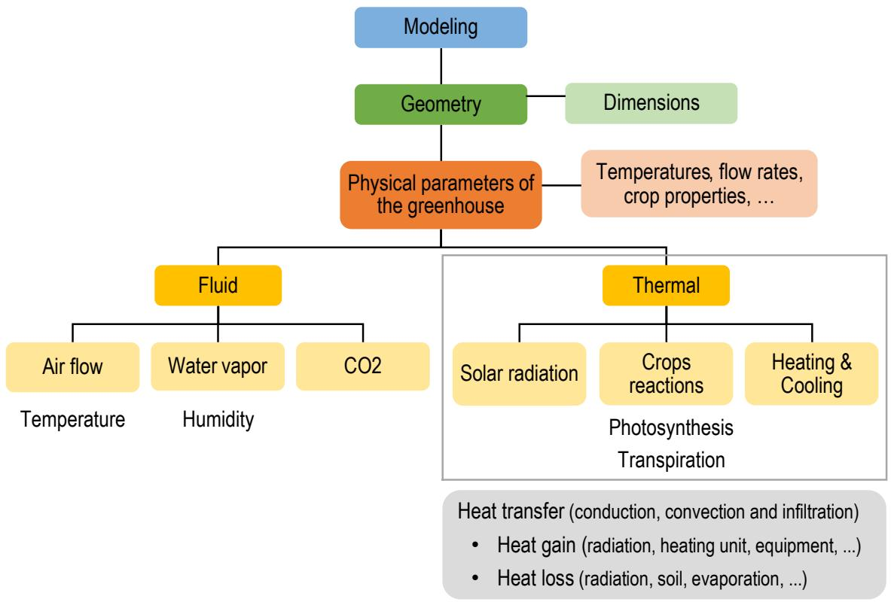  
Figure 3.1. Elements to be considered when modeling a greenhouse.

Many researchers use EnergyPlus, a building energy simulation software, to evaluate the energy performance of greenhouses, helping to design energy- efficient structures. To name a few, Ouazzani Chahidi et al. [47] [48] and Pakari et Ghani [49] did greenhouse modeling in EnergyPlus, each demonstrating distinct levels of complexity in their respective approaches.

Computational fluid dynamics (CFD) simulations using software such as Fluent help to study airflow and temperature distribution within the greenhouse, providing insight into ventilation strategies and thermal management. Although CFD can determine the 3D profiles of temperature and air velocity in a greenhouse (e.g., see Boulard et al. [6], Northon et al. [50], and Ahamed et al. [51]), this method tends to be computationally intensive and simulating yearly operations for multiple scenarios is out of range.

Mathematical models which are based on solving transient energy and mass balances in different parts of the system are more suitable for that purpose. Mathematical modeling is a fundamental approach that uses equations to represent the physical, chemical, and biological processes within the greenhouse. Different options have been presented in literature such as KASPRO [52], GreenLight

[53], and others [54], [55], [56], [57]. Other examples include the work of Harbick et al. [58], Ogunlowo et al. [59], Choab et al. [60], Baglivo et al. [61], and Ahamed et al. [62]. MATLAB is often used to develop and solve these mathematical models.

The different types of methods have different uses. For example, mathematical approaches can be used to validate control systems, determine average annual energy consumption, or easily test different types of supplemental lighting. Finite element approaches, on the other hand, allow detailed analysis of critical areas of a greenhouse (e.g., identification of hot spots, hard- boil zones, etc.). The advantages of mathematical approaches are their relatively fast simulation times, the ability to perform a global simulation of the greenhouse, and the use of growth model equations established in the literature. On the other hand, these approaches are time- consuming to develop if they are not freely available and depending on the degree of complexity. Second, it is not possible to visually see the output distributions across the computational domain. For finite element approaches, the advantages are that measurements can be analyzed for any point on the greenhouse, i.e. critical point analysis. In addition, the results can be visualized as contours, vectors, etc. The main disadvantage is the computation time. It is also difficult to obtain accurate results with low residuals. In addition, meshing is complex for complex geometries (e.g., around the crops).

To validate the scale of the simulations from a specific regional perspective, the total energy consumption of a typical greenhouse in Quebec is approximated in Appendix 1.

# 3.4 Model selection

This work focuses on modeling and simulation techniques to investigate the performance of greenhouses under different conditions. An appropriate greenhouse simulation software was selected based on its ability to accurately simulate the performance of the greenhouse. The GreenLight model [53] was chosen because it explicitly models the aspects analysed in this study (i.e., energy and plant growth). Furthermore, it is an open source model, which gives users all the required flexibility, and calculation times are reasonable (code available at [63] and run on MATLAB R2021a). Initially, this process- based greenhouse model was designed to replicate an advanced Venlo- type greenhouse with a tomato crop and supplemental lighting. According to Katzin et al. [53], based on the dataset of an experimental trial, the error in predicting the annual heating needs is in the range of 1 to  $12\%$ .

Additional information on the selected model is provided in Annex 2.

# 3.4.1 Simplified model explanations

GreenLight builds on a previous model of a greenhouse and a tomato crop [32, 33]. The model considers three attributes of the greenhouse climate: energy balance, carbon balance, and vapor balance. It has been validated against literature data and previous results to ensure its accuracy and reliability. More details can be found in the work of Cuce et al. [34].

The GreenLight program is well divided into different folders, making it easy to navigate and modify sections as needed. The main reference is David Katzin's Ph.D. thesis, Chapter 7: Appendix: User's Guide and Detailed Description of the GreenLight Model [65].

# 3.4.2 Inputs

3.4.2 InputsThe model requires weather data and information on the type of lamps used as primary inputs. Additional parameters defining the greenhouse's attributes are pre- set as reference values for a modern 4- hectare greenhouse but can be adjusted for customized analyses. These parameters include greenhouse dimensions, ventilation, and heating capacities, among others. In addition, the simulation allows for customization of parameters such as the start date, duration, and growth stage of the crop. These parameters serve as inputs and remain fixed throughout the simulation. The only inputs that vary at each time step are the weather data. Two types of lamps are available: HPS and LED lighting. Predefined parameters are established for each lamp type. The simulations also offer the option to incorporate LED interlighting if desired. Outdoor weather data is used in the model (e.g.: radiation, temperatures, humidity, and  $CO_2$ ). The weather file can be generated using EnergyPlus data [66].

# 3.4.3 Outputs

3.4.3 OutputsThe GreenLight model generates a binary data file for each simulation. The main outputs used are shown in Figure 3.2.

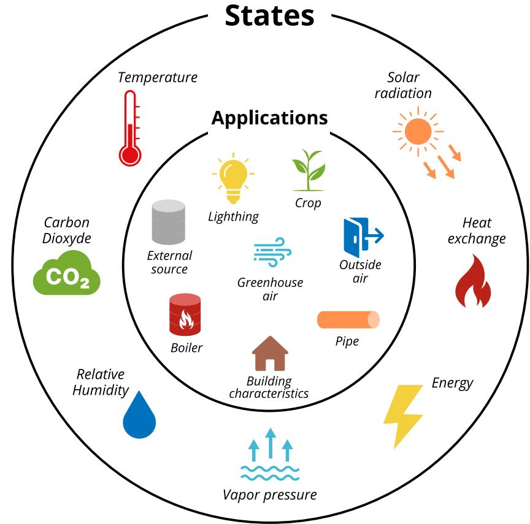  
Figure 3.2. Summary of the main output results used in the analysis of the GreenLight simulations.

# 3.4.4 Controls

In order to control the conditions inside the greenhouse to promote plant growth, a control system is needed. Therefore, in the mathematical model used to simulate the building, it is also necessary to introduce a control system that reacts similarly to reality.

In the Matlab program GreenLight [53], a smoothed proportional controller (sigmoid function) is set up to control the greenhouse climate.

The controller regulates several variables, including lamps, blackout screens, lamp cooling, thermal screens,  $CO_2$  injection, heating, mechanical cooling and dehumidification, ventilation cooling, dehumidification, and heat pump. These variables are depicted in Figure 3.3.

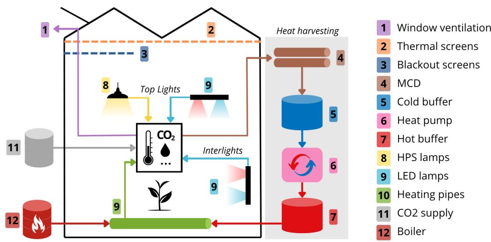  
Figure 3.3. Schematic diagram of the different variables involved in the GreenLight program control system (adapted from [65]).

Figure 3.4 summarizes the values of the band that defines the width of the proportional control for temperature control. All the specific values (setpoints and tolerances) used in greenhouse control are presented in more detail in Appendix 2.

  
Figure 3.4. Summary of GreenLight model controls based on temperature setpoint (adapted from [65]).

A more detailed description of the various controls is given in Table 3.1.

Table 3.1. Definition and explanation of the different controls of the GreenLight model.  

<table><tr><td>Control</td><td>Definition et explanation</td></tr><tr><td>Lamps</td><td>As standard, the lamps are switched on from midnight to 6 PM., providing 18 hours of light, which is the optimal lighting time for tomato production. However, the lamps will be turned off during this period if the total solar radiation outside exceeds 400 W/m², if the indoor temperature exceeds 26.5°C, or at night if the blackout screens are forced open. Any of these conditions will result in the lamps being turned off.</td></tr><tr><td>Blackout screens</td><td>Blackout shades are installed to prevent light pollution. They are closed at night unless the indoor relative humidity is above 90% (unless the indoor temperature is 1°C below the heating set point) or the indoor temperature is above 26.5°C.</td></tr><tr><td>Lamp cooling</td><td>HPS lamps have a cool down period. If the lamps have just been turned off, they cannot be turned on again for one hour.</td></tr><tr><td>Thermal screens</td><td>Thermal screens are closed when the external solar radiation is less than 50 W/m² and the external temperature is less than 18°C, or when the external solar radiation is greater than 50 W/m² and the external temperature is less than 5°C. On the other hand, there are certain constraints that make it necessary to open the thermal screens despite the above criteria. If the indoor temperature is more than 4°C above the heating set point, or if the relative humidity is more than 85% (unless the indoor temperature is 1°C below the heating set point), the thermal screens must be opened.</td></tr><tr><td>CO2injection</td><td>CO2is injected during the lighting period when the indoor CO2concentration is below 1000 ppm.</td></tr><tr><td>Heating</td><td>The minimum indoor temperature is 18.5°C during the lighting period and 17.5°C otherwise, which is the set temperature minus the tolerance band of 1°C. As explained by Katzin [65], the heat buffer of the heat harvesting system had priority over the boiler. Thus, the boiler was heated only when the heat recovery system could not provide heat, or when it heated to maximum capacity and the indoor temperature reached 2°C below the setpoint.</td></tr><tr><td>Mechanical cooling and dehumidification</td><td>The mechanical system cools and dehumidifies at the same time. The system is available when the indoor temperature and dew point are higher than the mechanical system cold surface temperature, which is set at 10°C, and the cold buffer is not full. Cooling is activated when it is available and the greenhouse air temperature is 2°C higher than the heating setpoint. Dehumidification is activated if it is available, the relative humidity in the greenhouse is above the dehumidification setpoint and the greenhouse air temperature is 1°C above the heating setpoint.</td></tr><tr><td>Ventilation cooling</td><td>The ventilation cooling of the roof windows is activated (windows open) when the indoor temperature is 5°C above the setpoint.</td></tr></table>

<table><tr><td>Ventilation dehumidification</td><td>Greenhouse dehumidification is activated when the relative humidity inside the greenhouse exceeds 87%, unless the indoor temperature is colder than 1℃ below the heating setpoint. The mechanical cooling and dehumidification system has priority over window dehumidification. If mechanical dehumidification is available and operating, the ventilation dehumidification setpoint is increased to 89% relative humidity.</td></tr><tr><td>Heat pump</td><td>The heat pump of the heat harvesting system operates when a transfer of energy from the cold buffer to the hot buffer is required. This occurs when the cold buffer is not empty and the hot buffer is not full.</td></tr></table>

A Conference paper on the impact of setpoint control on indoor greenhouse climate modeling [67] is presented in Annex 3.

# 3.4.5 Calculation time

Greenhouse simulations based on the GreenLight model [53] can be time- consuming. Depending on the intended use, the simulations may take too long to calculate. Various techniques have been introduced to speed up calculations and enable different tests to be carried out.

The GreenLight model utilizes Matlab's ODE solvers, specifically ode15s, for solving ordinary differential equations. The time step of this function is not adjustable, but the absolute and relative tolerances can be modified [68]. To reduce computation time, two methods were explored: increasing tolerance differences and simulating smaller periods. It is important to note that calculation time is not linearly proportional to the duration of the simulated period. Annex 2 contains comprehensive details on the tests conducted on tolerances and simulation duration.

When selecting simulations, it is important to consider several parameters that affect calculation time, such as the desired uncertainty and simulation duration. Modifying these parameters not only affects calculation time but also simulation results. Depending on the objective of the simulations, different combinations of tolerances and simulation durations can be used. For a sensitivity analysis requiring hundreds or even thousands of simulations, reducing computation time is essential. On the other hand, if precise simulation results are important, it is preferable to maintain a small tolerance and simulate the complete duration (day, week, month, or year).

# Chapter 4 Sensitivity Analysis of Lamp Model Parameters in Energy and Yield Simulations of Greenhouse1

Chapitre 4 Analyse de sensibilité des paramètres du modèle de lampe dans les simulations d'énergie et de rendement des serres

# 4.1 Résumé

Les serres sont des bâtiments à forte consommation d'énergie. Le choix des systèmes d'éclairage a un impact important sur la consommation d'énergie et le rendement des cultures. Les simulations peuvent aider à déterminer les conditions d'éclairage optimales. Cependant, les modèles de lampes comprennent généralement de nombreux paramètres qui sont soit inconnus ou difficiles à obtenir. Cette étude effectue une analyse de sensibilité des paramètres des lampes sur les simulations d'énergie et de rendement des serres afin d'identifier les paramètres les plus influents. L'analyse a montré que la réflexion du rayonnement infrarouge du soleil à travers la couche de lampes et l'intensité maximale des lampes étaient les facteurs les plus influents pour la consommation d'énergie. Pour le rendement, les paramètres reliés au PAR étaient les paramètres les plus influents. Ces conclusions peuvent être utilisées pour simplifier ou ajuster les modèles de lampes et peuvent aider les fabricants à identifier les caractéristiques pertinentes des lampes à fournir.

# 4.2 Abstract

Greenhouses tend to be energy- intensive buildings. The choice of lighting systems strongly impacts energy consumption and crop yield. Simulations can help determine the optimal lighting conditions. However, lamp models typically include many parameters that are either unknown or hard to obtain. This study conducts a sensitivity analysis of lamp parameters on energy and yield simulations of greenhouses to identify the most influential lamp parameters. For a reference greenhouse, these lamp parameters were varied over a predetermined range through a Latin hypercube sampling strategy, and simulations were run for each combination of these parameters. Then, linear

regressions were used to determine the relation between model outputs (energy consumption, yield) and each lamp parameter. The analysis of the standardised regression coefficients demonstrated that the reflection of sun's NIR through the lamps' layer and the maximum intensity of the lamps were identified as the most influential factors for energy consumption. For the yield, the maximum intensity of the lamps, the fraction of lamp input converted to PAR, the transmissivity of sun's PAR through the lamps layer, the reflection of sun's PAR through the lamps layer, and the number of photons per joule within the PAR output of the lamps were the most influential parameters. These conclusions can be used to simplify or adjust lamp models and can help manufacturers by identifying the relevant lamp features to provide.

# 4.3 Introduction

Food production accounts for one- third of global greenhouse gas (GHG) emissions [69]. Greenhouses are one of the most energy- intensive sectors of this agricultural industry. In monetary terms, energy is generally the second largest indirect cost of greenhouse agricultural production after labor [70]. Although greenhouses are energy- intensive buildings, they can extend the growing season and thus increase local food production, which is an important solution to food waste. In fact,  $17\%$  of the world's food is wasted in transit due to the generally long distances between food production centers and consumers [71].

To reduce the environmental footprint and improve the profitability of the greenhouse industry, it is therefore necessary to reduce its energy consumption. A thorough understanding of the different phenomena at play in a greenhouse is needed in order to do so. Several factors affect the greenhouse energy and mass balances, such as artificial lighting, heat transfer, ventilation, radiation, photosynthesis, and evaporation [5].

The type of lighting is a particularly influential decision that strongly impacts yield, but also the energy consumption. Greenhouse energy and yield simulations can inform growers about the potential benefits and costs of different types of lamps (e.g., light- emitting diode (LED) and high- pressure sodium (HPS) lamps) and lighting strategies. However, the effects of lighting and plant growth are not always modeled in greenhouse microclimate simulations [6]. It is also important to include plant growth. According to Boulard et al [5], in greenhouse simulation, specifying the interactions between

plants and their environment, such as accounting for plant transpiration and photosynthesis, is crucial for achieving representative models with precise environmental control and maximizing crop yield.

As stated in a literature review by Iddio et al. [72], control and modeling of greenhouses are key aspects to optimize energy consumption. There are several modeling options, including static and dynamic simulations. For a greenhouse, due to the temporal variability of the climatic data, dynamic simulations are more appropriate for assessing the impact of lamps. Such a family of models provides a better understanding of the thermal exchanges during the operation of a greenhouse. Modeling the thermal behavior of greenhouses is more complex than that of other buildings because greenhouses have low thermal inertia, high solar thermal loads, internal components, and a constantly changing microclimate [72]. In addition, they must serve the plants, not the occupants.

Several models have been proposed to simulate the microclimate of a greenhouse. For example, a report on energy consumption and greenhouse gas emissions in greenhouse production in Quebec by Pelletier and Godbout [9] presents simplified equations for energy balances in a greenhouse. The objective of this report was to identify energy sources that have the potential to reduce the use of petroleum products. To this end, they evaluated the energy requirements for heating and lighting of greenhouses and estimated the greenhouse gas emissions. More comprehensive models accounting for greenhouse interactions with crop growth are also available, such as the open- source code GreenLight [63]. The model builds on that of Vanthoor [56], and uses a process- based modeling approach to simulate dynamically energy consumption and yield [65]. The model was validated with data from an experimental study comparing HPS and LED lighting. It was found that the error in predicting the heating requirement was in the range of  $1 - 12\%$  [65]. The program was originally developed to compare the use of HPS and LED lamps. Compared to traditional lamps, LEDs are better at converting electrical energy into photosynthetic light [73]. As a result, LEDs are  $60\%$  more efficient than traditional horticultural lamps [74]. However, when HPS lamps are replaced by LEDs, the heat deficit created by the lamps must be compensated by other means. Therefore, the overall energy savings in the greenhouse may be less than expected. Depending on the location in the world and the type of greenhouse, the optimal lamp type can thus vary.

Among the studies that used that model, a recent one examined the influence of lamp types on potential energy savings by simulating greenhouses in different locations around the world [75]. Simulations with the GreenLight model show that additional lighting improves greenhouse production

but increases costs and environmental impact. The strongest effects are in the winter period when natural light is limited. Because of the high energy costs associated with lighting, research is being done to develop lamps that use as little energy as possible. To illustrate this need, the authors cite the example of vegetable greenhouses in Ontario (Canada) that use ten times more electricity with supplemental lighting than without. On the other hand, heating requirements are reduced when lamps are used. According to Gómez and Mitchel, the effects of lighting on heating requirements need to be further investigated, as this non- linear relationship is not simple and needs to be well quantified [76]. Systematic measurements of lamp power and its influence on greenhouse energy have been presented in only a few studies, such as that of Nelson and Bugbee [77].

Models for lighted greenhouses contains many parameters to define and characterize the simulated greenhouse. For example, GreenLight includes 15 parameters to describe the characteristics of the light [65]. These parameters characterize, for example, the lamp energy consumption, how light is emitted and absorbed by lamps for different wavelength bands, how lights interact with sunlight, and how heat is released in the greenhouse by lamps. However, most of these parameters are not available from lamp manufacturers. In fact, it is unclear what is the influence of each lamp parameter on the model outputs (e.g., energy demand, yield). Knowing the influence of these lamp parameters would allow to determine which ones would really need to be measured experimentally. It would also allow simplify lamp modeling in greenhouse simulation by keeping parameters of lesser importance to constant values.

This work presents a sensitivity analysis (SA) of the parameters related to supplemental lighting used in greenhouse in energy and yield simulations. SA is the study of how variance in the output of a model can be attributed to variance in the model input [78]. By testing a wide range of lamp parameters and evaluating their impact on energy consumption and yield, this research identifies the most influential parameters to consider in modelling supplemental lighting. The energy consumption includes the energy used for both the lighting and the heating of the greenhouse.

There are different types of SA, which can be categorised as local or global SA [79]. Local methods focus on understanding the impact of parameter changes at a particular point in the parameter space. It usually examines individual parameters or combinations of few parameters and typically results in quantitative measures of sensitivity, such as partial derivatives or local perturbation coefficients. This is the effect of varying one parameter when all others are held constant at the central nominal value

[78]. Local methods have low computational cost, are simple to implement and easy to interpret. However, they do not consider interactions between inputs and it is not possible to perform self- verification [80]. Global methods, on the other hand, provide a broader understanding of parameter effects over the full range of each parameter. A global method evaluates the effect of one parameter while all other parameters also vary. It examines the combined effects of multiple parameters, taking into account interactions and non- linearities. These methods are therefore considered to be more reliable. The disadvantages of using global methods are high computational costs compared to local sensitivity analysis. According to Tian [80], global methods can be further divided into four approaches: regression, screening- based, variance- based and meta- model sensitivity analysis. Recent studies have focused on global methods because they are able to explore the entire parameter space, and many of them allow for self- verification.

Regression SA, including Standardise Regression Coefficient (SRC), Standardized Rank Regression Coefficients (SRRC), and t- value SA, is suitable for linear and non- linear (monotonic) models with moderate computational costs [81]. Screening- based SA, such as the Morris method, is suitable for models with a large number of inputs. It is a model- free approach that provides a qualitative ranking of factors but lacks self- verification and is unsuitable for uncertainty analysis. Variance- based SA, exemplified by Fourier amplitude sensitivity testing (FAST) and Sobol methods, decomposes the output variance for each input, considering both main and interaction effects. It provides quantitative measures for global understanding but has a high computational cost. Meta- model SA, which uses models such as Multivariate Adaptive Regression Splines (MARS), Adaptive Component Selection and Selection Operator (ACOSSO), and Support Vector Machine (SVM), is useful for complex and computationally intensive models. It quantifies the output variance due to different inputs, with accuracy depending on the meta- model chosen [80]. Each method serves specific purposes and addresses the nuances of different models and input scenarios.

The paper is structured as follows. Section 4.4 presents the methodology, outlining the approach and methods. It defines the reference greenhouse, describes the lamp model, introduces the different input studied, defines the sample size and presents the regression method used and evaluation metrics considered. Section 4.5 presents the results and discussion, focusing on energy consumption and crop yield, and providing insights and data derived from the experiments and analysis. Finally, Section 4.6 summarises the key findings and their implications for the greenhouse industry.

# 4.4 Methodology

4.4 MethodologyThis study focuses on determining the most influential factors of lamp modeling on energy and yield in greenhouses. The energy use includes two contributions: lighting (lamps) and heating (lamps and heating system). In order to achieve the research objectives, a systematic methodology was developed, as shown in Figure 4.1, which outlines the step- by- step process used in this investigation. Section 4.4.1 presents the reference greenhouse used to evaluate the impact of the lamp parameters on energy consumption and crop yield. Section 4.4.2 presents the input values of the sensitivity analysis. Sections 4.4.3 and 4.4.4 explain the choice of sampling method and sampling size, respectively. Finally, Section 4.4.5 presents the regression method to determine the sensitivity coefficients. The study evaluates the sensitivity of the model outputs to variations in the input parameters by systematically adjusting the lamp parameters and carefully observing the resulting changes.

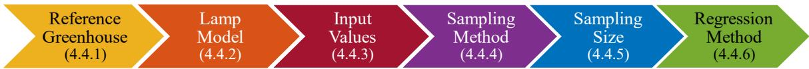  
Figure 4.1. Main methodology steps used in the present study.

# 4.4.1 Reference greenhouse

4.4.1 Reference greenhouseIn this research, the simulated greenhouse in GreenLight is a state- of- the- art, high- tech model located in Quebec City, Canada. The daily average temperature in Quebec City is  $4.2^{\circ}C$ , with a daily average of  $19.3^{\circ}C$  during the warmest month (July) and  $- 12.8^{\circ}C$  during the coldest month (January). The daily maximum in summer reaches  $25.0^{\circ}C$  (extreme maximum of  $35.6^{\circ}C$ ) and the daily minimum in winter reaches  $- 17.7^{\circ}C$  (extreme minimum of  $- 36.1^{\circ}C$ ) [82]. In Quebec, daylight varies between 8 and 15 hours, depending on the season. The net radiation, a combination of the total downward and upward radiation received by a horizontal surface (solar, terrestrial surface and atmospheric), reaches a maximum in June  $(20\cdot \mathrm{MJ}\cdot \mathrm{m}^{- 2})$  and a minimum in January  $(2\cdot \mathrm{MJ}\cdot \mathrm{m}^{- 2})$  [82]. Quebec City was chosen as the location for the greenhouse because of its high latitude and cold climate, which requires an extended use of lights for a significant portion of the year. This characteristic allows us to observe and evaluate the impact of lighting on total energy consumption, which includes both lighting and heating aspects.

For the simulations, the reference greenhouse chosen is the one proposed by Katzin et al. [75]. This Venlo- type greenhouse covers an area of four hectares, measuring 200 meters in width and length, with a gutter height of 6.5 meters, ridge height of 7.3 meters, and a roof slope of  $22^{\circ}$ . The roof consists of glass panels, among which one in six panels features a ventilation window (1.40 m × 1.67 m) that can be opened up to  $60^{\circ}$ . Thermal screens are installed at a height of 6.3 meters, and the path width incorporates a pipe rail system, measuring 1.6 meters. The characteristics of this greenhouse were based on the work of Vanthoor et al. [57]. The model considers tomato crop, which is the most popular crop in greenhouses. Tomatoes are often used to evaluate lighting in greenhouses because they are considered a high light demanding crop. Tomatoes are also the most important greenhouse crop in many parts of the world [83]. This is the case in Quebec, Canada, where tomato production in greenhouses totals 69 hectares, or  $46\%$  of the total greenhouse area [3].

High- tech commercial greenhouses are equipped with advanced climate control systems. Therefore, the simulation of greenhouses must also account for the climate controls to provide the optimal environment according to the requirements of different growth stages of the crops. The climate controls included in GreenLight consider the following aspects: lamps, blackout screens, thermal screens,  $\mathrm{CO_2}$  injection, heating, cooling by ventilation, and dehumidification [65].

As regulated by the reference climate controls, the lamps are on from midnight to 18:00, which represents 18 hours of lighting, the ideal lighting time for tomato production [84, 85]. However, during this time, the lamps are turned off depending on the solar radiation and the indoor temperature. The lamps are turned off if the solar radiation is higher then  $400W\cdot m^{- 2}$ , or if the inside air temperature of the greenhouse is higher then  $26.5^{\circ}C$ , or if the daily global solar radiation sum is higher than 10 MJ·m $^{- 2}$ ·day, or finally if the blackout screens need to be open (depends on relative humidity and temperature of the greenhouse) [65].

The climate was controlled using a smoothed proportional controller (defined by a sigmoid function). In the GreenLight program, the controller enables the definition of a setpoint and an acceptable tolerance band (pBand) for each parameter. This function allows realistic control of the different variables since the desired values are not always attainable despite the setpoints [65].

Following the methodology of Katzin et al. [75], the simulations cover a period of almost one year (350 days), starting on September 27 to match the planting date of the crops. The simulated crops

are assumed to be mature, and this duration aligns with the typical tomato harvest season, allowing for two- week intervals between harvests for crop rotation and greenhouse maintenance.

To adapt the model to the selected greenhouse and location, the specific physical characteristics were considered, and the meteorological data was retrieved from EnergyPlus, using the Canadian Weather for Energy Calculations (CWEC) database [16]. Details on the Greenlight model are available in literature [65]. The two main outputs from the model that were studied in this work are the energy consumption and the yield.

# 4.4.2 Lamp model

The decision regarding how to model the lamps can be influenced by the specific types of lamps being considered, such as incandescent, fluorescent, high- intensity discharge (e.g., HPS or metal halide), or LED lamps. The lamp model analysed in this study is based on the work of Vanthoor et al. [56] and Katzin [65]. A brief summary is presented here. The heat transfer equation for the lamp temperature  $T_{Lamp}$  is:

$$
\begin{array}{rl} & {cap_{Lamp}\dot{T}_{Lamp} = Q_{LampIn} - R_{LampSk_y} - R_{LampCov,In} - R_{LampThScr} - H_{LampAir}}\\ & {\qquad = R_{PAR_{LampCan}} - R_{NIR_{LampCan}} - R_{FIR_{LampCan}} - R_{LampPipe}}\\ & {\qquad -R_{PAR_{LampFlr}} - R_{NIR_{LampFlr}} - R_{LampFlr} - R_{LampAir}} \end{array} \tag{4.1}
$$

where  $cap_{Lamp}$  is the heat capacities of the lamps. The meaning of each term on the right- hand side is explained below. All terms are in  $W \cdot m^{- 2}$ . These energy fluxes affecting the temperature of the lights are represented in Figure 4.2.

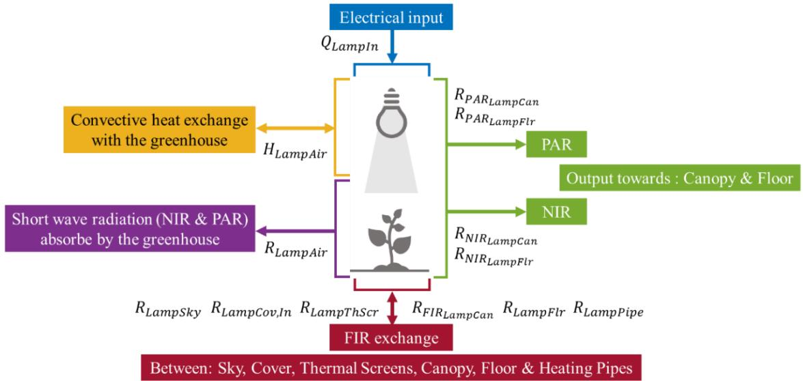  
Figure 4.2. Energy fluxes influencing the lights temperature.

As seen in Fig. 2, the lamp component within the GreenLight model quantifies the outputs of PAR, NIR, FIR, and convection from the lamp, expressed in  $W\cdot m^{- 2}$ . The heat capacity of the lights is represented as  $cap_{Lamp}$ $(J\cdot K^{- 1}m^{- 2})$ , and their electrical input is denoted as  $Q_{LampIn}$ . The PAR and NIR outputs from the lights can be absorbed either by the canopy  $(R_{PAR_{LampCan}}$  and  $R_{NIR_{LampCan}})$  or the floor  $(R_{PAR_{LampFlr}}$  and  $R_{NIR_{LampFlr}})$ . FIR occurs between the lights and various components, including the sky  $(R_{LampSky})$ , cover  $(R_{LampConIn})$ , thermal screen  $(R_{LampThScr})$ , canopy  $(R_{FIR_{LampCan}})$ , heating pipes  $(R_{LampPipe})$ , and floor  $(R_{LampFlr})$ . Convective heat exchange between the lights and the surrounding air is represented as  $H_{LampAir}$ , and  $R_{LampAir}$  accounts for short- wave radiation (the sum of PAR and NIR) emitted by the lights and absorbed by the greenhouse structure. The heat generated by the lamps can be represented as  $Q_{Lamp} = a_{Lamp}I_{Lamp}$ $(W\cdot m^{- 2})$  where  $I_{Lamp}$ $(W\cdot m^{- 2})$  is the energy input (electricity) provided to lamps and  $a_{Lamp}$ $(- )$  is the fraction of this input that contributes to heating the greenhouse. In the model,  $a_{Lamp}$  depends on the lamp's output in terms of photosynthetically active radiation (PAR), near infrared radiation (NIR), thermal (far infrared) radiation (FIR), convective and conductive heating. The different energy fluxes play an important role in the calculation of the heating demand and on the yield. For example, the heat exchange from the lamp to the air contribute to heating the greenhouse and reduces the heating need. The lamp model also influences the overall tomato yield, which corresponds to the harvested fresh weight of tomatoes. The canopy benefits from supplementary lighting as it provides the right spectrum of light, ensures uniform distribution, extends the photoperiod, and compensates for natural light variations. The lamp model must be representative as it will affect the PAR, NIR and FIR received by the canopy and therefore the growth of the crop.

Many parameters are used to describe the lights in the model (see Table 4.1). First, the electrical capacity of the lamps and their surface area needs to be specified. The transmissivity and reflectivity of PAR, NIR, and FIR of the vertical layer of the lamps influence the radiative fluxes in the greenhouse, including the loss of sunlight due to shading by the lamps. One must also specify the conversion rate from electrical input to PAR and NIR output of the lamp. Another required input parameter consider is the number of photons per Joule within the PAR output of the lamps, which depends on the lamps' spectral output. In addition, one needs to specify the emissivity of the lamps towards the top and the bottom and the heat capacity of the lamps, affecting the rate of heating and cooling of the lamps. Finally, the heat exchange coefficient between the lamps and the surrounding

air, which influences how much of the energy of a lamp is converted to convective heat, and indirectly, the lamp operating temperature, is also a parameter to include in the model.

Table 4.1. Targeted lamp parameters in lamp model.  

<table><tr><td>Variable</td><td>Definition</td><td>Explanation</td></tr><tr><td>θLampMax</td><td>Maximum intensity of lamps (W·m-2)</td><td>Electrical energy input provided to the lamps (electrical capacity of the lamps).</td></tr><tr><td>ηLampPAR</td><td>Fraction of lamp input converted to PAR (-)</td><td>Conversion rate from electrical input to photosynthetically active radiation (PAR).</td></tr><tr><td>ηLampNIR</td><td>Fraction of lamp input converted to NIR (-)</td><td>Conversion rate from electrical input to near-infrared radiation (NIR).</td></tr><tr><td>τLampPAR</td><td>Transmissivity of sun&#x27;s PAR through the lamps layer (-)</td><td>Transmissivity of PAR through the vertical layer of lamps, affecting radiative fluxes in the greenhouse, including sunlight loss due to shading from lamps.</td></tr><tr><td>ρLampPAR</td><td>Reflection of sun&#x27;s PAR through the lamps layer (-)</td><td>Reflectivity of PAR through the vertical layer of lamps, affecting radiative fluxes in the greenhouse, including sunlight loss due to shading from lamps.</td></tr><tr><td>τLampNIR</td><td>Transmissivity of sun&#x27;s NIR through the lamps layer (-)</td><td>Transmissivity of NIR through the vertical layer of lamps, affecting radiative fluxes in the greenhouse, including sunlight loss due to shading from lamps.</td></tr><tr><td>ρLampNIR</td><td>Reflection of sun&#x27;s NIR through the lamps layer (-)</td><td>Reflectivity of NIR through the vertical layer of lamps, affecting radiative fluxes in the greenhouse, including sunlight loss due to shading from lamps.</td></tr><tr><td>τLampFIR</td><td>Transmissivity of FIR through the lamps layer (-)</td><td>Transmissivity of FIR through the vertical layer of lamps, affecting radiative fluxes in the greenhouse, including sunlight loss due to shading from lamps.</td></tr><tr><td>A</td><td>Lamp area (m2(lamp)·m2(floor))</td><td>Surface area of the lamps relative to the greenhouse floor area.</td></tr><tr><td>εLampTop</td><td>Emissivity of top side of lamp (-)</td><td>Emissivity of the lamps towards the top.</td></tr><tr><td>εLampBottom</td><td>Emissivity of bottom side of lamp (-)</td><td>Emissivity of the lamps towards the bottom.</td></tr><tr><td>capLamp</td><td>Heat capacity of lamp (J·K·1·m-2)</td><td>Heat capacity of the lamps, which influences their rate of heating and cooling.</td></tr><tr><td>CHECLampAir</td><td>Heat exchange coefficient of lamp (W·K·1·m-2)</td><td>Heat exchange coefficient between the lamps and the surrounding air, which impacts the conversion of lamp energy to convective heat and indirectly affects the lamp operating temperature.</td></tr><tr><td>ζLampPAR</td><td>J to μmol conversion of PAR output (J(PAR)·μmol(PAR)-1)</td><td>Number of photons per joule within the PAR output of the lamps and depends on their spectral output, influencing the efficiency of PAR emission.</td></tr></table>

From the variable in Table 4.1, it is possible to determine the efficiency of the lamps, measured in photons of PAR per joule of electrical input with the following equation:  $\eta_{LampPAR} \cdot \zeta_{LampPAR}(\mu mol_{\{\mathsf{PAR}\}}\cdot \mathsf{J_{\{\mathsf{electricity}\}}}^{- 1})$ . Also, the maximum photosynthetic photon flux density (PPFD) of the lamp, which is the flow of photons of PAR per  $\mathsf{m}^2$  of greenhouse floor area, is determined with:  $\eta_{LampPAR} \cdot \zeta_{LampPAR} \cdot \theta_{LampMax}(\mu mol_{\{\mathsf{PAR}\}}\cdot \mathsf{s}^{- 1}\cdot \mathsf{m}^{- 1})$ .

The electrical input of the lamps  $(Q_{LampIn})$  is calculated with  $U_{Lamp} \cdot \theta_{LampMax}$ , where  $U_{Lamp}$  indicates whether the lights are switched on (0 to 1). Moreover, the combined output of PAR and NIR emitted by the lamps above the canopy can be expressed as  $R_{PAR_{LampCan}} + R_{NIR_{LampCan}} = (\eta_{LampPAR} + \eta_{LampNIR}) \cdot Q_{LampIn}(\mathsf{W}\cdot \mathsf{m}^{- 2})$ . For detailed equations of all variables, refer to [65]. In total, there are thus 14 variables needed to characterize the lamps.

# 4.4.3 Input values

The objective of this sensitivity analysis is to analyze the importance of the different parameters characterizing the lamps. For this reason, the inputs of this analysis are the lamp parameters (only the upper lamps, as inter- canopy lamps are not considered). Two SA are performed, one for HPS lamps and one for LED lamps. In total, 14 input variables are considered. A brief definition of these variables is given in Table 1 (Section 2.2).

In a SA, it is critical to establish a range for each input variable to thoroughly evaluate the model's response to changes in these parameters. This range allows us to understand how sensitive the model outputs are to variations in the inputs and provides valuable insight into the behavior of the system. In the context of this study, it was decided to use a range of  $\pm 20\%$  around the reference values of the model's input variables for each type of lamp (HPS and LED). The purpose of this range is to explore a substantial range of parameter adjustments, including both conservative and optimistic scenarios. If the reference value is zero, a range from zero to one is set. The range values of these sampling input variables are listed in Table 4.2. Note that for some variables, certain values are physically impossible in Table 4.2 (e.g. transmissivity greater than 1). Preliminary simulations showed that this did not affect the results of the study and allowed a coherent range of input values, likely because these variables turned out to have a low impact on the results.

Table 4.2. Value range of the input variables for HPS and LED lamps in the sensitivity analysis. References values are from [75].  

<table><tr><td rowspan="2">Input Variables (unit)</td><td colspan="3">HPS Lamps</td><td colspan="3">LED Lamps</td></tr><tr><td>Min</td><td>Max</td><td>Ref.</td><td>Min</td><td>Max</td><td>Ref.</td></tr><tr><td>θLampMax (W·m-2)</td><td>88</td><td>133</td><td>111</td><td>53</td><td>80</td><td>67</td></tr><tr><td>ηLampPAR (-)</td><td>0.29</td><td>0.44</td><td>0.37</td><td>0.44</td><td>0.66</td><td>0.55</td></tr><tr><td>ηLampNIR (-)</td><td>0.18</td><td>0.26</td><td>0.22</td><td>0.02</td><td>0.26</td><td>0.02</td></tr><tr><td>τLampPAR (-)</td><td>0.78</td><td>1.18</td><td>0.98</td><td>0.78</td><td>1.18</td><td>0.98</td></tr><tr><td>ρLampPAR (-)</td><td>0</td><td>1</td><td>0</td><td>0</td><td>1</td><td>0</td></tr><tr><td>τLampNIR (-)</td><td>0.78</td><td>1.18</td><td>0.98</td><td>0.78</td><td>1.18</td><td>0.98</td></tr><tr><td>ρLampNIR (-)</td><td>0</td><td>1</td><td>0</td><td>0</td><td>1</td><td>0</td></tr><tr><td>τLampFIR (-)</td><td>0.78</td><td>1.18</td><td>0.98</td><td>0.78</td><td>1.18</td><td>0.98</td></tr><tr><td>ALamp (m2amp·m-2floor)</td><td>0.016</td><td>0.024</td><td>0.020</td><td>0.016</td><td>0.024</td><td>0.020</td></tr><tr><td>εLampTop (-)</td><td>0.08</td><td>0.12</td><td>0.10</td><td>0.70</td><td>1.06</td><td>0.88</td></tr><tr><td>εLampBottom (-)</td><td>0.72</td><td>1.08</td><td>0.90</td><td>0.7</td><td>1.06</td><td>0.88</td></tr><tr><td>capLamp (J K-1m-2)</td><td>80</td><td>120</td><td>100</td><td>8</td><td>12</td><td>10</td></tr><tr><td>CHECLampAir (W·K-1·m-2)</td><td>0.07</td><td>0.11</td><td>0.09</td><td>1.84</td><td>2.76</td><td>2.30</td></tr><tr><td>ζLampPAR (JPAR-1μmolPAR-1)</td><td>3.92</td><td>5.88</td><td>4.90</td><td>4.33</td><td>6.49</td><td>5.41</td></tr></table>

# 4.4.4 Sampling method

4.4.4 Sampling methodThe sampling method used for the SA is a modified Latin Hypercube Sampling. LHS, a sampling technique from a given probability distribution, ensures comprehensive coverage of the entire range of input variables [86]. It is designed to efficiently explore the entire parameter space while providing statistically representative samples for model evaluations. By generating a pseudo- random sample that mimics a random structure, LHS follows a stratified approach. This method offers advantages over simple random sampling because it requires a smaller sample size to achieve similar precision [79]. LHS provides a balance between uniformity and randomness, which enhances its applicability in various scenarios. However, it is critical to note that the LHS algorithm assumes independence of the input variables, a fundamental aspect in its application to this study [87].

# 4.4.5 Sampling size

Sample size is a critical factor in SA performed using the LHS method. Sample size directly affects the accuracy and reliability of the SA results. A larger sample size generally provides more accurate estimates of the sensitivity of model outputs to changes in input parameters. It allows for better coverage of the full range of input variables, leading to a more comprehensive understanding of how

the model responds to different parameter variations. However, one of the major advantages of the LHS method is its ability to achieve comparable precision with a smaller sample size than simple random sampling. This efficiency is particularly valuable when performing computationally intensive simulations (as is the case here), as it can significantly reduce the computational burden and time required for the SA. For a regression- based SA, Nguyen and Reiter [88] suggest a sample size of 1.5 to ten times the number of input variables.

When using the LHS method for SA, it is critical to carefully select an appropriate sample size that ensures an accurate representation of the input variable space while taking into account computational limitations. Therefore, different sample sizes were tested to ensure consistent results for the selected outputs, especially energy and tomato yield. Figure 4.3 shows the consistency of the results by showing the standardized regression coefficient (see explanation in Section 4.4.6) over different sample sizes.

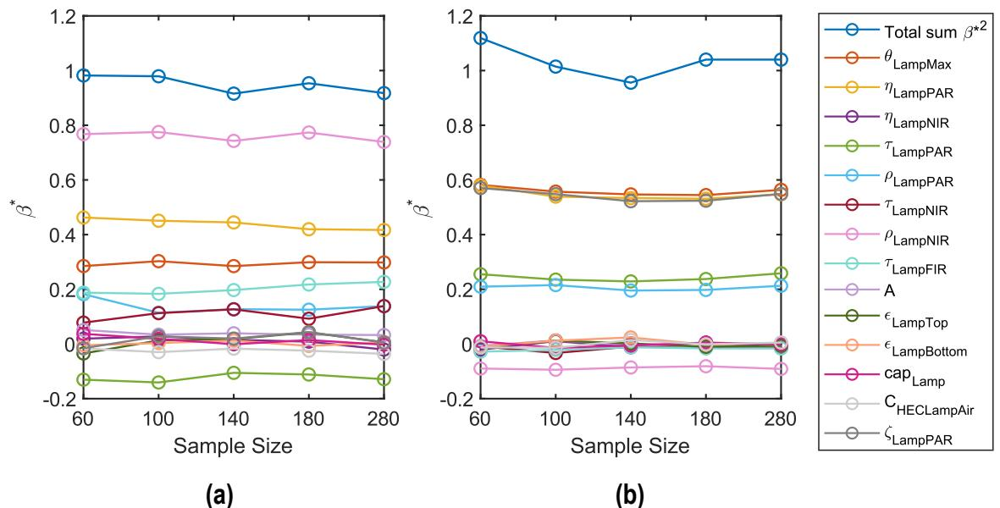  
Figure 4.3. Standardized regression coefficient  $(\beta^{*})$  of each independent variable (inputs,  $x_{i}$ ) for different sampling sizes over a period of 100 days under LED lamps for: a) total energy consumption, and b) total tomato yield.

In this work, a sample size of 280 was selected, which is 20 times the number of input values. This decision ensures the reliability and accuracy of the results with a safety margin. The distribution of the selected sample has been examined to ensure that it is appropriate.

# 4.4.6 Regression method and standardized regression coefficients

Several SA methods can be applied depending on the specific characteristics of the problem under investigation [89]. In a study conducted by Tian [80], an overview of SA techniques was presented, focusing on their application in building performance analysis. One of the most popular techniques is the linear regression, where the relationship between a dependent variable  $(y)$  and a set of independent variables  $(x_{i})$  is represented by an equation of the form:

$$
y = \beta_{0} + \beta_{1}x_{1} + \beta_{2}x_{2} + \beta_{3}x_{3} + \ldots +\beta_{i}x_{i} + \ldots +\beta_{n}x_{n} + \epsilon \tag{4.2}
$$

In this equation,  $\beta_0$  represents the intercept term (the value of  $y$  when all  $x_{i}$  are zero), and  $\beta_{i}$  represents the regression coefficients indicating the change in  $y$  corresponding to a one- unit change in each respective  $x_{i}$  . The error term  $\epsilon$  accounts for the unexplained variation in  $y$  that cannot be attributed to the independent variables.

The primary goal of a linear regression is to estimate the  $\beta_{i}$  values that minimize the sum of the squared differences between the observed and predicted values of  $y$  based on the linear equation. For this work, the Standard Regression Coefficients (SRC) method was chosen as the SA method. SRC is computationally efficient and straightforward to understand. It is suitable for linear or nearly linear models [88], so it is important to validate the linearity of the outputs before using this method.

In addition, the inputs must be uncorrelated in order to derive the SRC. The coefficients  $\beta_{i}$  provide an insight into the importance of each variable with respect to the output under consideration [89]. The Matlab function "regress" for multiple linear regression was used to calculate these coefficients [90].

Standardization is used to facilitate comparison and interpretation of the data. By standardizing the output variable  $y$  (dependent variable), its standardized value  $(y^{*})$  can be obtained with:

$$
y^{*} = \frac{y - \bar{y}}{\sigma_{y}} \tag{4.3}
$$

where  $\bar{y}$  is the mean of  $y$  and  $\sigma_{y}$  is the standard deviation. In a similar way, the standardized coefficients  $(\beta_{i}^{*})$  of the independent variables  $x_{i}$  (input) can be calculated with:

$$
\beta_{i}^{*} = \beta_{i}\frac{\sigma_{y}}{\sigma_{x_{i}}} \tag{4.4}
$$

where  $\sigma_{y}$  is the standard deviation of the dependent variable and  $\sigma_{x_i}$  the standard deviation of the independent variable. Standardizing the coefficients allows for a comparison of the relative importance and impact of each variable in the regression model.

The sum of the squared standardized coefficients  $(\beta_{i}^{2})$  is a measure of the linearity of the model. As the sum of the squares of the coefficients approaches 1, the model shows a stronger linear fit [91]. Thus, the standardized regression coefficients provide valuable information about the strength and direction of the relationship between the dependent variable  $(y)$  and each independent variable  $(x_{i})$ . This SA approach provides meaningful insight into the sensitivity of the model and helps to understand the interplay between the input variables and the output.

# 4.5 Results and discussion

# 4.5.1 Main results

The main results section analyzes the two key outputs studied in this work (i.e., y in Eq. (2)), namely the annual energy consumption and the total fresh weight tomato yield. The objective of an optimal greenhouse is to reduce its energy consumption while increasing its total yield. This section presents findings from SA conducted over a 350- day period under HPS and LED lighting. It examines how changes in input variables affect key outputs. It also provides standardized regression coefficients for these outputs. In addition, variations in input values  $(x_{i})$  over different time periods and their influence on energy and yield are explored will be discussed.

The total fresh weight tomato yield in kg per square meter of greenhouse floor area for a 350- day period for a greenhouse with HPS lamps in Quebec, Canada, is reported in Figure 4.4 as a function of each input parameter independently (scatter plots) for the sample under consideration. In this scatter plot, each data point corresponds to a specific combination of inputs, and the color of each point indicates the yield, with blue representing higher yields and yellow representing lower yields. The color gradient allows for a clear distinction between better and worse yields.

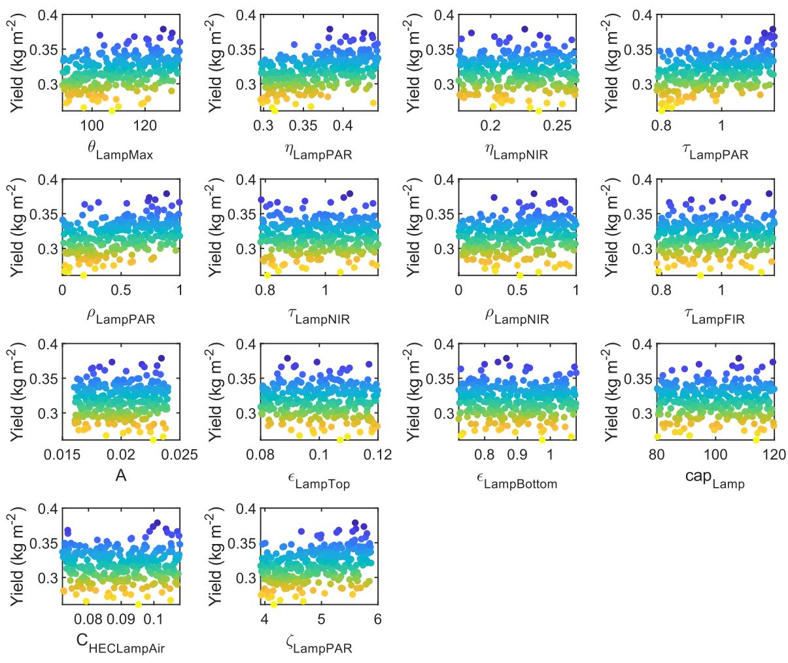  
Figure 4.4. Total fresh weight tomato yield as a function of the SA input variable for 350 days under HPS lighting.

Figure 4.4 shows that there is no strong correlation between most lamp parameters and total fresh weight tomato yield. However, some parameters appear to exhibit a low correlation. There is a positive correlation between five PAR- related parameters (Maximum intensity of lamps, Fraction of lamp input converted to PAR, Transmissivity of lamp layer to PAR, Reflectivity of lamp layer to PAR, and J to  $\mu$ mol conversion of PAR output) and the total yield meaning that when those parameters increase so does the yield.

Similarly, the total energy consumption in MJ per square meter of greenhouse floor area is shown in Figure 4.5. Again, a color gradient is used to distinguish the results. The best energy consumption values (lowest values) are represented in blue and the worst energy consumption values (highest values) are represented in yellow.

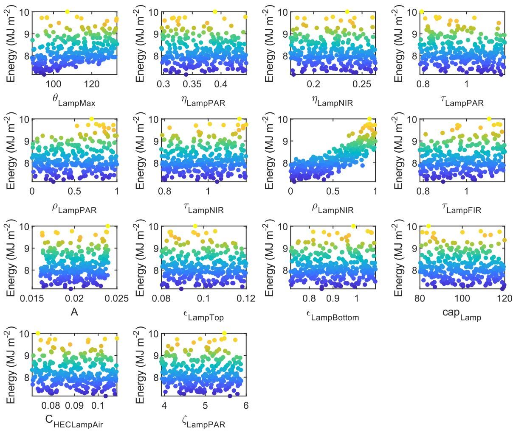  
Figure 4.5. Total energy consumption as a function of the SA input variable for 350 days under HPS lighting.

Figure 4.5 shows a correlation between the input variable of reflectivity of the lamp layer to NIR, and the total energy consumption. The distribution of the data points suggests that as the reflectivity of the lamp layer to NIR increases, more energy is needed. This correlation is indicated by the clustering of the blue dots, representing lower energy, towards the lower values of this parameter, while the yellow dots tend to be more prevalent at higher values. Overall, Figure 4.5 provides a visual evidence for the relationship between the reflectivity of the lamp layer to NIR and total energy, suggesting that manipulating this parameter be a potential strategy for reducing energy consumption in HPS lighting systems. Figure 4.5 also shows that a correlation can be observed between the maximum intensity of the lamps and the total energy consumed over a year. This underlines the importance of a good determination of this parameter when using the model and trying to optimize this value in order to reduce energy consumption. A higher intensity is associated with a higher energy consumption.

Note that the same simulations were performed under LED lighting, and the results exhibited correlations similar to those shown in Figure 4.4 and Figure 4.5. These figures are not reported here for the sake of conciseness.

Figure 4.6 summarizes the key findings by showcasing the standardized regression coefficients  $(\beta_{i}^{*})$  for each independent variable, providing a concise overview of the SA results. The standardized regression coefficients indicate the strength and direction of the relationship between the input and output variables.

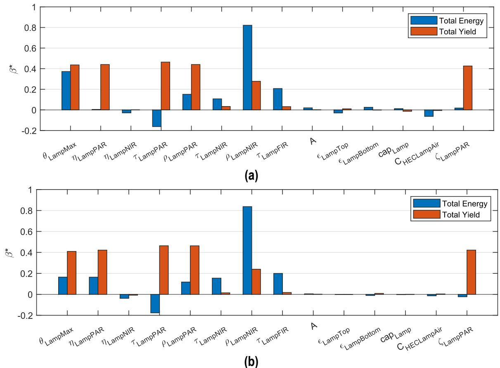  
Figure 4.6. Standardized regression coefficient  $(\beta^{*})$  of each independent variable (inputs,  $x_{i}$ ) for yearly energy consumption and yield for: a) HPS supplemental lighting, and b) LED supplemental lighting.

Positive values on the y- axis indicate a positive relationship, where an increase in the independent variable leads to an increase in the dependent variable. Conversely, negative values indicate a negative relationship, where an increase in the independent variable results in a decrease in the dependent variable. More importantly, the magnitude of the coefficients  $(\beta_{i}^{*})$  reveals the relative importance of the independent variables. Larger coefficient values mean that the corresponding

independent variables have a strong impact on the dependent variable, while smaller coefficient values indicate a weak influence.

According to the present SA, the most influencing factor affecting the total energy consumption is the reflection of sun's NIR through the lamps layer  $(\rho_{Lamp_{NIR}})$ . However, as shown in Figure 4.6 there are other factors at play depending on the type of lamps. The three most influential factors in order of importance for the total energy consumption under HPS lighting are reflection of sun's NIR through the lamps layer  $(\rho_{Lamp_{NIR}})$ , the maximum intensity of lamps  $(\theta_{Lamp_{Max}})$ , and the transmissivity of FIR through the lamps layer  $(\tau_{Lamp_{FIR}})$ . Under LED lighting, the main factor remains the same, but the second one is the transmissivity of lamp layer to FIR  $(\tau_{Lamp_{FIR}})$  and the third one is the transmissivity of sun's PAR through the lamps layer  $(\tau_{Lamp_{PAR}})$ .

For the total fresh weight tomato yield, there are five parameters that are influential (see Figure 4.6). For both type of lamps, in order of importance, these parameters are the transmissivity of sun's PAR through the lamps layer  $(\tau_{Lamp_{PAR}})$ , the reflection of sun's PAR through the lamps layer  $(\rho_{Lamp_{PAR}})$ , the number of photons per joule within the PAR output  $(\xi_{Lamp_{PAR}})$ , the fraction of lamp input converted to PAR  $(\eta_{Lamp_{PAR}})$ , and the maximum intensity of lamps  $(\theta_{Lamp_{Max}})$ .

The comparison between HPS and LED lighting systems allows to evaluate how the importance of each independent variable may differ based on the lighting system used. From the results in Figure 4.6, one can conclude that there is no significant difference between the two types of lamps with that respect. In other words, the influential input parameters are the same for both types of lamps. Although the results for HPS and LED are comparable, it is important to recall that the figure illustrates the effect of varying lamp parameters on the overall performance of the greenhouse (energy consumption and yield). Both lamp types have the same parameters (with different reference values) and are implemented uniformly in the model. Therefore, the observed similarity in parameter effects does not imply equivalence between the two lamp types, but rather analogous behaviour when varying the parameters.

For both HPS and LED lightings, the sum of the square standardized regression coefficient  $(\beta^{*2})$  is higher for the total fresh weight tomato yield than for the total energy consumption. For energy, the sum is equal to 0.925 for HPS and 0.866 for LED, and for total yield, the sum is equal to 1.056 for

HPS and 1.012 for LED. The squared standardized regression coefficient values are used to measure the contribution of each input variable to the output variance. A sum of these values greater than one indicates that some combinations of input variables have a greater effect on the output than would be expected if the variables were acting independently. This is a common occurrence in complex systems where variables may interact in non- linear ways. For the total yield output, the sum is only slightly greater than 1, suggesting that the interactions between the input variables are relatively small.

The measure of error for the regressions can be determined by  $R^2$ , the coefficient of determination, which represents the proportion of variation in the dependent variable that can be predicted from the independent variables. For HPS lighting, the  $R^2$  values are 0.9149 for Energy and 0.9787 for Total Yield. Similarly, for LED lighting, the  $R^2$  values are 0.8993 for Energy and 0.9775 for Total Yield. These values provide an insight into the effectiveness of the models in explaining the variability in energy consumption and total yield for both lighting systems.

Modern greenhouses designed for optimal yield include supplemental lighting systems. As a result, it is critical to simulate and deploy accurate models that accurately and easily represent the behavior of these lights. The SA presented above shows the parameters of the lamps that have the most impact on the energy consumption and tomato yield.

# 4.5.2 Energy consumption

When lamps generate less heat and consume less electricity, the demand for heating energy increases. This phenomenon is illustrated in Figure 4.7, which shows the power required for lighting (Figure 4.7 a) and for heating (Figure 4.7 b) over time for three values of the maximum intensity of the lamps.

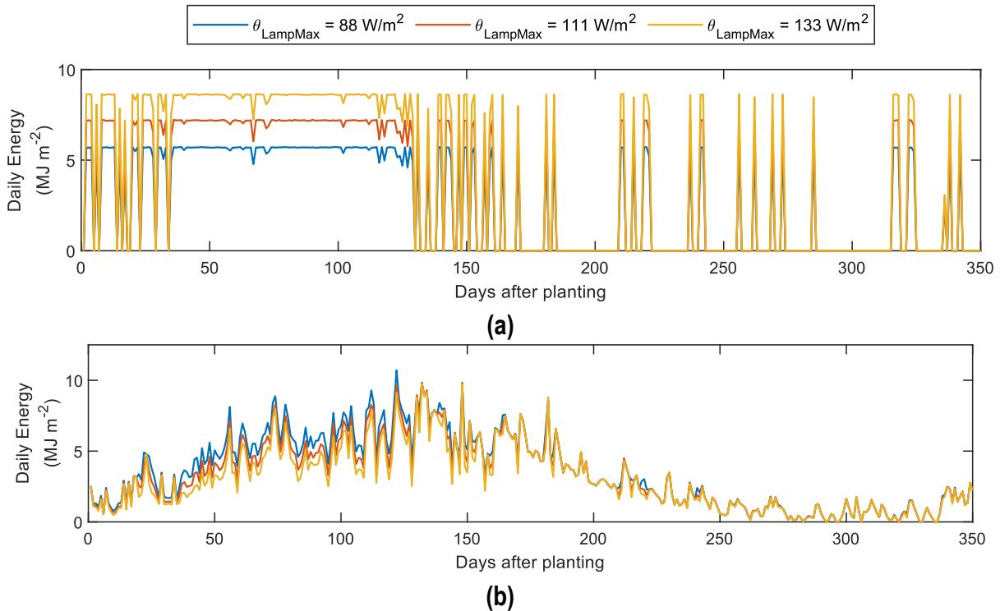  
Figure 4.7. Daily energy consumption over 350 days for three values of  $\theta_{LampMax}$  (88, 111, and 133 W/m $^2$ ) under HPS lighting for: a) lighting, and b) heating.

As exemplified in Figure 4.7, when using a lamp that consumes less energy (i.e., of  $\theta_{LampMax} = X$ ), it is visible that it produces less heat and that more heating thus is needed. Nevertheless, the overall greenhouse energy consumption is lower with more efficient lamps. This pattern is even more apparent when comparing HPS and LEDs than when simply varying the intensity of the same type of lamp.

The reflectivity of sun's NIR through the vertical lamps layer ( $\rho_{LampNIR}$ ) influences the radiative fluxes in the greenhouse and, as a result, the total energy consumption needed to maintain optimal conditions for crop yield. The reason explaining the importance of this parameter in terms of energy consumption is that when infrared rays from the sun are reflected, they do not reach the plants or the greenhouse environment directly. As a result, higher reflectivity leads to less solar heat gains into the greenhouse, requiring more heating to maintain optimal conditions.

Most plants do not efficiently utilize NIR light for photosynthesis; instead, they primarily use PAR. When NIR light penetrates the plant canopy, it is absorbed and converted into heat. This heat generation can be beneficial in some cases, such as during cold weather, but it can also lead to

excessive temperatures within the greenhouse. When NIR light is absorbed by surfaces within the greenhouse, such as walls, equipment, and the plant canopy, it results in an increase in temperature.

The higher the reflectivity of the lamp layer to NIR, the more NIR light is absorbed by the surrounding surfaces. This means that more energy used to produce NIR light is being lost as heat, rather than effectively directed to plant growth. Conversely, if the reflectivity of the lamp layer to NIR is low, less energy is lost as heat.

The results of the SA show that minimizing the reflection of sun's NIR through the lamps is a key aspect of energy- efficient greenhouse lighting design. It helps ensure that the energy consumed by the lighting system is used efficiently to promote plant growth, reduce heating- related energy costs, and minimize the need for cooling.

The energy use includes two contributions: lighting and heating. In order to determine the relative importance of each lamp parameter in each of these facets of energy consumption, the standardized regression coefficients for each independent variable (inputs,  $x_{i}$ ) were calculated for these two outputs (see Figure 4.8).

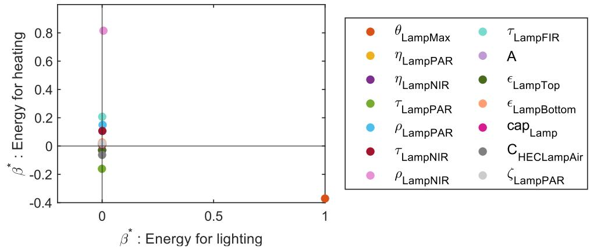  
Figure 4.8. Standardized regression coefficient  $(\beta^{*})$  of each independent variable (inputs,  $x_{i}$ ) under HPS lighting for yearly energy consumption for heating and for lighting.

Regarding specifically the energy consumption for lighting in the greenhouse, a single lamp parameter emerges as particularly influential: the maximum intensity of the lamps. This parameter has a significant impact, with a  $\beta^{*}$  value of 1.000 for HPS lighting and 0.999 for LED lighting. The higher the intensity, the higher the electricity consumption of the lamps. Therefore, controlling and optimizing lamp intensity is critical to effectively managing lighting- related energy costs.

Conversely, when considering energy consumption for heating, it becomes apparent that multiple lamp parameters come into play, each with its own level of importance. These parameters influence the heat generated by the lamps, subsequently affecting heating requirements. The key parameters, in order of significance, include: the reflection of sun's NIR through the lamps layer  $\left(\beta_{\rho_{LampNIR}}^{*}\right.$  is 0.815 for HPS and 0.851 for LED), the maximum intensity of the lamps  $\left(\beta_{\theta_{LampMax}}^{*}\right.$  is - 0.371 for HPS and - 0.285 for LED), and the transmissivity of FIR through the lamps layer  $\left(\beta_{\tau_{LampFIR}}^{*}\right.$  is 0.207 for HPS and 0.204 for LED).  $\rho_{LampNIR}$  highlights the role of how effectively the lamps manage NIR from the sun, which can impact the overall heat generated within the greenhouse. The negative values of the regression coefficient of  $\theta_{LampMax}$  signifies that the lamp intensity has an inverse relationship with heat production, which can be a critical factor in controlling greenhouse temperatures.  $\tau_{LampFIR}$  relates to how effectively the lamps allow the transmission of FAR, which also contributes to the heating dynamics within the greenhouse.

# 4.5.3 Tomato yield

For the total fresh weight tomato yield, most of the influential parameters (four out of five) are related to PAR, which corresponds to the visible light spectrum light (wavelengths from  $\sim 400$  to 700 nanometers). PAR is essential for plant growth by providing the energy needed for photosynthesis, the fundamental process by which plants use energy from sunlight to convert carbon dioxide and water into glucose and oxygen. Adequate PAR levels are necessary for healthy and vigorous plant growth. In a greenhouse environment where natural sunlight may be limited or variable, supplemental lighting systems ensure that plants receive sufficient PAR for optimal growth throughout the year [46].

# 4.5.4 Evolution of SA results over the year

This section analyses the dynamic aspect of the results, by focusing on how the SA results change over time during the simulation, for example due to changing weather patterns. This exploration of temporal dynamics helps to assess the robustness of the findings and their adaptability to seasonal shifts.

Figure 4.9 shows the cumulative energy consumption and fresh weight tomato yield over the entire simulation period for the main lamp parameters. Each frame analyzes one parameter for which three

different values are considered: the minimum, mean, and maximum values corresponding to the range of the sensitivity analysis (see Table 4.2).

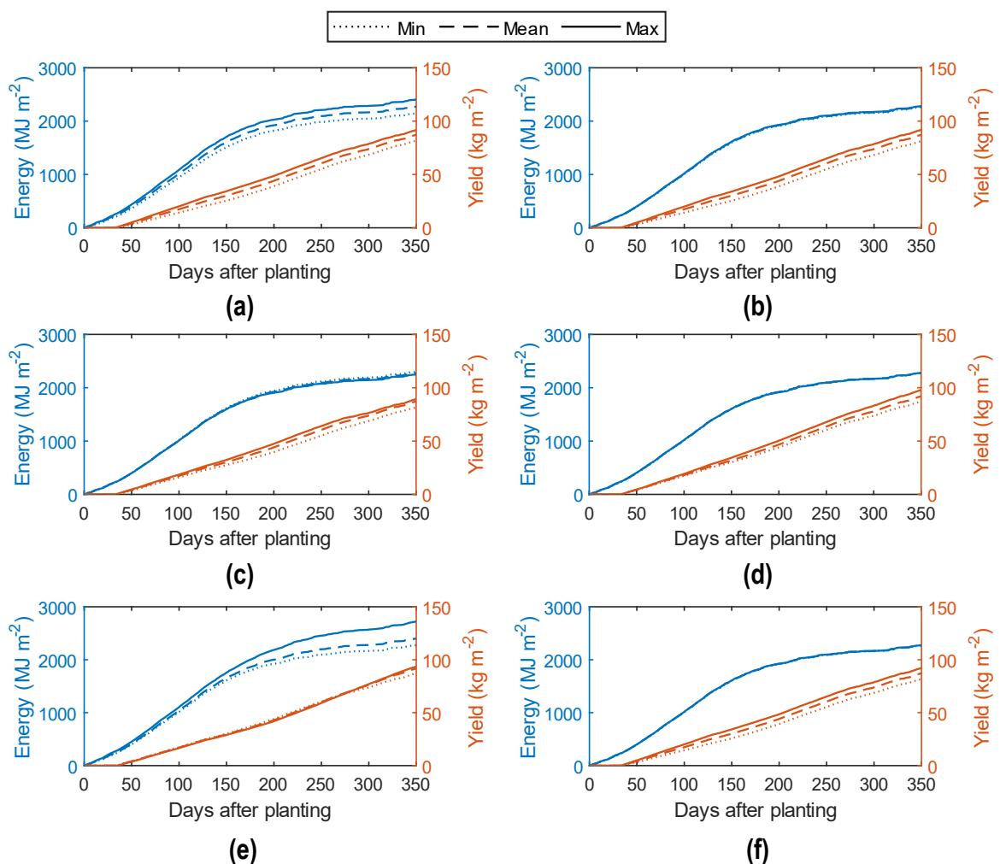  
Figure 4.9. Cumulative energy and fresh weight tomato yield over 350 days for different variation (min, mean and max from Table 4.2 of lamp parameters under HPS lighting: a)  $\theta_{LampMax}$ , b)  $\eta_{LampPAR}$ , c)  $\tau_{LampPAR}$ , d)  $\rho_{LampPAR}$ , e)  $\rho_{LampNIR}$ , and f)  $\xi_{LampPAR}$ .

The dominant lamp parameters influencing the total energy consumption have a greater influence during the winter months, as shown by the pronounced slope in Figure 4.9 a) and e). This influence becomes particularly significant from about 150 days after planting, around mid- February. During this period, characterized by lower outdoor temperatures and reduced natural light levels, a significant increase in energy demand inside the greenhouse is observed with higher parameters ( $\theta_{LampMax}$  and  $\rho_{LampNR}$ ).

The impact on total yield of the different parameters remains relatively constant throughout the year, resulting in an almost linear curve as shown in Figure 4.9. In other words, the selected parameters

maintain a consistent influence on tomato yield. At the beginning of the simulations, there is an absence of yield because the fruits were in their initial growth stages. The yield measured in this study considers only the fresh weight of the harvested tomatoes.

The standardized regression coefficients were also calculated week by week, rather than annually. Figure 4.10 shows the results. Each regression coefficient  $(\beta^{*})$  represents the influence of the respective independent variable over the course of one week.

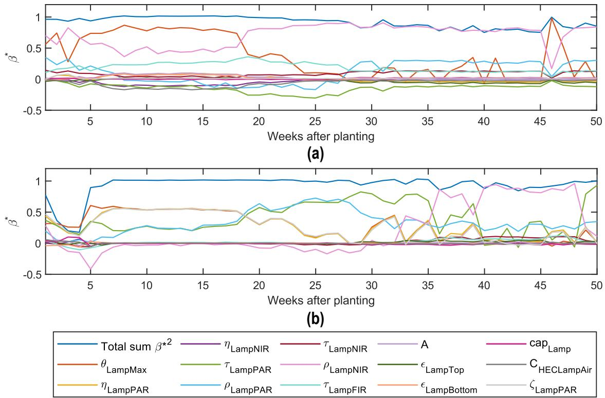  
Figure 4.10. Weekly standardized regression coefficient  $(\beta^{*})$  of each independent variable (inputs  $x_{i}$ ) and the total square sum of all  $\beta^{*}$  under HPS lighting for: a) weekly energy consumption, and b) weekly yield.

Regarding the energy consumption (Figure 4.10 a)), a significant transition occurs around week 17, which corresponds to mid- January. This moment is closely related to the division of the total energy consumption into two different components: the energy used for lighting and the energy used for heating. Figure 4.8 provides a clear illustration of the impact of each energy component, where the maximum intensity of the lamps  $(\theta_{LampMax})$  emerges as the predominant factor influencing the lighting energy consumption, while the reflection of the sun's PAR by the lamp layer  $(\rho_{LampPAR})$  takes center stage in determining the heating energy consumption. During the winter period before week 17, when the demand for lighting is important, the key parameter is the maximum intensity of

the lamps. Conversely, as we move into the period after week 17, which includes late winter and beyond, heating becomes a more prominent energy demand. The allocation of energy between lighting and heating is a critical aspect of greenhouse energy management, and this transition underscores the dynamic interplay between these essential components of greenhouse operation.

As for the weekly yield (Figure 4.10 b)), it is important to highlight the initial impact on yield during the first weeks of the simulations. The coefficients vary considerably and are close to zero. This phenomenon is due to the fact that, at the beginning, there is no fresh weight of tomatoes to be harvested. In this phase, the plants are in their initial growth stage and the yield is comparatively low. The sum of the squares of the standardized regression coefficients is far from the desired value. As plants grow and yield values become more substantial, the regression analysis becomes more reliable in predicting and understanding yield dynamics within the greenhouse.

For the yield, the coefficients that are the more influential vary throughout the 50 weeks of simulation. In particular, there is a switch in the dominant parameters around week 17. Prior to this point, the most influential parameters are the maximum intensity of the lamps  $(\theta_{LampMax})$  and the fraction of lamp input converted into PAR  $(\eta_{LampPAR})$ . After the 17th week, there is a shift towards the following parameters: the transmissivity and reflectivity of the sun's PAR through the lamp layer  $(\tau_{LampPAR}$  and  $\rho_{LampPAR})$ . It is hypothesized that this fluctuation in coefficients is due to the changing lighting conditions within the greenhouse environment. First, during the fall and early winter months, artificial lighting becomes more important due to reduced daylight hours. Consequently, parameters directly related to artificial lighting, such as lamp intensity and PAR conversion, have a more pronounced influence on greenhouse dynamics. Conversely, as the simulation progresses into late winter and spring, natural lighting becomes increasingly dominant. This shift to natural lighting is characterized by longer daylight hours, which reduces the reliance on artificial lighting. As a result, parameters associated with natural lighting, such as the transmissivity and reflection of sun's PAR through the lamps layer, become more important in shaping greenhouse conditions. Furthermore, this transition to natural lighting could also highlight the importance of the reflection of the sun's NIR through the lamps layer in the later stages of the simulation, especially during the summer months. The importance of this parameter is closely related to the daylighting and becomes more pronounced when the outdoor irradiance peaks. The high influence of  $\rho_{LampNIR}$  at the end of the growing season can be explained by the high canopy temperatures that influence the yield. Within the growth model,

there is an activation function linked to yield, where extreme canopy temperatures lead to a cessation of growth. In fact, the heating and ventilation systems respond primarily to the air temperature inside the greenhouse. Consequently, despite the presence of a heating and ventilation system, variations in radiation levels can affect the canopy temperature because the heating/cooling is not directly controlled by the canopy temperature. In the heat balance of the plant, an energy contribution is missing when the reflectivity is high.

# 4.5.5 Impacts of lamps parameters on greenhouse conditions

When parameters impact tomato yield and energy consumption, it typically occurs because they have an effect on the environmental conditions within the greenhouse. The greenhouse climate encompasses many factors, including, but not limited to, temperature,  $CO_2$  concentration, and vapor pressure. The control system is designed to maintain an ideal climate for plant growth and tries and maintain the conditions within acceptable ranges. However, some factors can be challenging to control completely. In certain instances, the controls may prove insufficient to achieve the desired conditions. In this section, we focus on two key lamp parameters that, according to the SA presented above, exert significant influence over both energy consumption and yield: the maximum intensity of the lamps and the reflection of sun's NIR through the lamps layer.

Figure 4.11 shows the greenhouse's interior conditions (air temperature, canopy temperature,  $CO_2$  concentration and vapor pressure) over the course of 350 days for three different (min, mean, and max) values of  $\theta_{LampMax}$ .

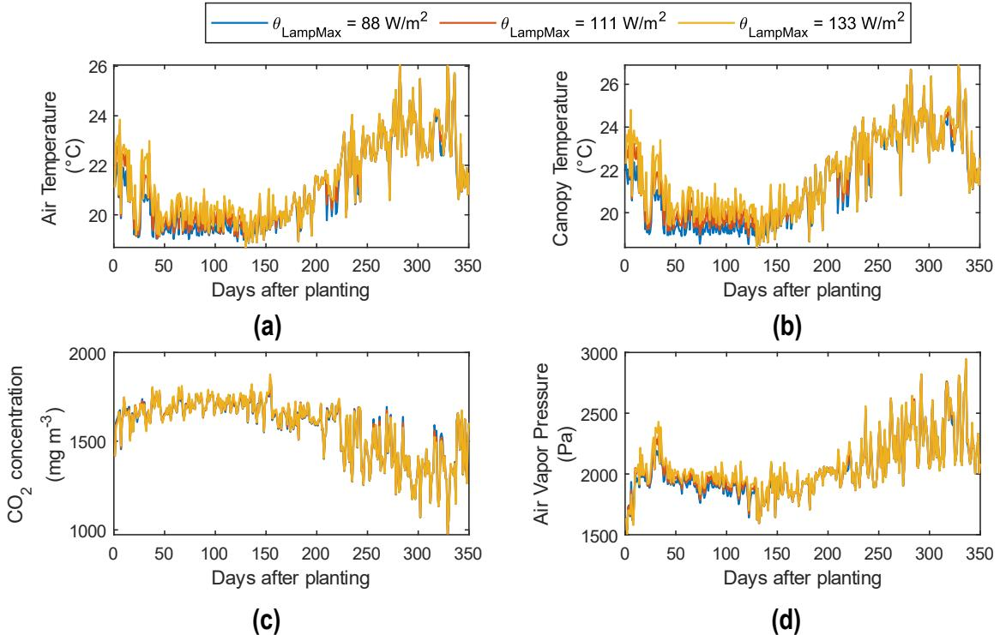  
Figure 4.11. Greenhouse daily average interior condition over 350 days for three different values (min, mean and max) of  $\theta_{LampMax}$  under HPS lighting for: a) Air temperature, b) Canopy temperature, c)  $CO_2$  concentration, and d) Air vapor pressure.2

Looking at Figure 4.11, it is possible to conclude that there is no drastic difference in greenhouse conditions when the maximum intensity of the lamps' changes. This is likely due to the control system that is able to maintain the indoor climate within the acceptable range by adjusting the heating consumption, vent openings, etc. However, when there is a difference of conditions between the three curves, it is seen during the late fall- beginning of winter (approximately between days 25 to 125) when the lamps are on for a longer period due to the low solar radiation. As a result, the influence of lamp intensity becomes more pronounced during that phase, contributing to differences in the indoor conditions of the greenhouse.

Figure 4.12 shows the greenhouse's interior condition over the course of 350 days for three different (min, mean, and max) values of  $\rho_{LampNIR}$ . The reflection of sun's PAR through the lamps layer has more impact than the maximum intensity of the lamps over the greenhouse interior conditions,

especially on the air and canopy temperatures. With a low  $\rho_{LampNIR}$  the temperatures are higher, which can impact the growth of the plants.

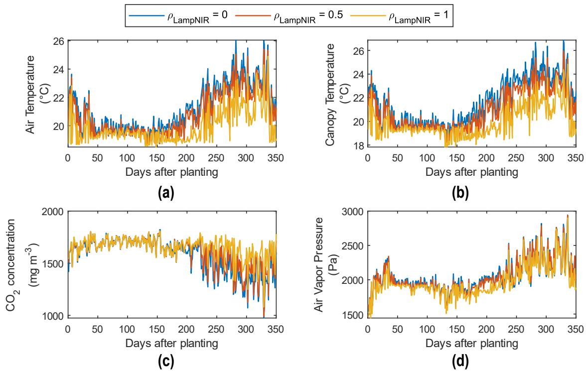  
Figure 4.12. Greenhouse daily average interior condition variation over 350 days for three different values (min, mean and max) of  $\rho_{LampNIR}$  under HPS lighting for: a) Air temperature, b) Canopy temperature, c) CO $_2$  concentration, and d) Air vapor pressure.

As can be seen, some influential lamp parameters do not necessarily impact the indoor conditions because the control system uses the systems in place (e.g., heating, vents, etc.) to maintain the proper conditions. However, using these systems can increase energy consumption as was shown above. On the other hand, other influential lamp parameters can impact indoor conditions, meaning that the control system is not able to counterbalance their impact. In that case, yield is affected.

# 4.5.6 Discussion and limitations

The lamp model in GreenLight has certain limitations, as highlighted by Katzin [25]. One notable omission is the lack of consideration of the effect of the light spectrum on stomatal aperture. Another is that the model's approach of treating the entire canopy as a single surface may lead to a slight overestimation of transpiration under HPS lamps. Other modelling approaches for lamps are possible. For example, some tools (e.g. CAD- CAM) allow a 3D visualisation of objects in a scene, including the trajectories of light rays [92]. Simulate of light distribution in plant canopies can be done

with Monte Carlo ray tracing and nested radiosity [93]. These methods are not directly comparable to the results of the analysis in the present study, as the way in which the lamps are implemented is different.

Nelson and Bugbee [77] present data on incident radiation, fractionally absorbed radiation and total absorbed radiation from various sources, including different types of lamps and sunlight. The model is not open source, making comparisons difficult. However, their conclusions are consistent with the results of this study. They concluded that although near infrared radiation is a significant source of energy, its effect on individual leaves appears to be minimal. The amount of long- wave radiation also showed considerable variation among radiation sources and had an important effect on leaf temperature. Another lamp model is the one proposed by Righini et al. [54] in their research on modelling micrometeorology, canopy transpiration and photosynthesis in a closed greenhouse using computational fluid dynamics. However, as with the GreenLight model, they did not test the effect of each specific lamp parameter on energy consumption and yield. In this way, the present research could be applied to their model.

Finding the different lamp parameters to include in the model is a significant challenge. Both et al. [94] recommended the adoption of a standardised product label for horticultural lamps. Such a label, if widely adopted, would facilitate the integration of new lamps into the GreenLight model by providing essential values for numerous parameters used in the model. To validate the lamp parameters used in the GreenLight model, the modelled light emission from the lamps and the reflection and transmission from the leaves could be individually calibrated by matching the modelled and measured sensed light distribution in a sphere around the objects [92].

This work, like any other, has different limitations. In the future, it would be interesting to verify whether the conclusions hold when considering different locations, crops and greenhouse designs and controllers. Furthermore, the sensitivity analysis on lamp parameters could also be repeated with other greenhouse simulation tools. Future research should also aim at determining experimentally the values of the most influential lamp parameters, either on lab test bench or in situ.

In this study, linear regression is the chosen method for sensitivity analysis. In the current phase of this research, the depth provided by the implementation of this method is proving sufficient for the specific analysis undertaken. To refine the lamp model and ensure both effectiveness and simplicity,

it would be interesting to take the analysis one step further and investigate other sensitivity analysis techniques. The exploration of additional global sensitivity analysis methods, particularly those based on analysis of variance, could help to contribute to the creation of a more robust and comprehensive model.

# 4.6 Conclusion

This study investigated the importance of lamp parameters when simulating energy consumption and growth in greenhouses with supplemental lighting. By performing a sensitivity analysis on lamp parameters, the reflection of sun's NIR through the lamps layer  $(\rho_{LampNIR})$ , and the maximum intensity of the lamps  $(\theta_{LampMax})$ , were identified as the most influential factors for energy consumption. For total yield, the maximum intensity of the lamps  $(\theta_{LampMax})$ , the fraction of lamp input converted to PAR  $(\eta_{LampPAR})$ , the transmissivity of sun's PAR through the lamps layer  $(\tau_{LampPAR})$ , the reflection of sun's PAR through the lamps layer  $(\rho_{LampPAR})$ , and the number of photons per joule within the PAR output of the lamps  $(\xi_{LampPAR})$  were the most influential parameters. Note that no significant differences were observed between LED and HPS lamps regarding the most influential lamp parameters. When modeling supplemental lighting in greenhouses, these above- mentioned parameters are the most important to be set as precisely as possible. The value of the other lamp parameters did not prove to have a significant impact on the results. In addition to being useful for developing greenhouse simulation models, these conclusions also speak directly to lamp manufacturers. Providing explicitly the above- mentioned lamp characteristics in their datasheets would help to achieve better, more reliable simulations and decision- making process.

# Chapter 5 Impact of Lighting Systems, Energy Efficiency Measures, and Local Contexts on Greenhouse Energy Consumption, Yield, and Costs3

Chapitre 5 Impact des systemes d'éclairage, des mesures d'éfficacité énergétique et des contextes locaux sur la consommation, le rendement et les coûts de l'énergie dans les serres

# 5.1 Résumé

Les serres jouent un rôle clé dans la résolution des problèmes de sécurité alimentaire et de durabilité au niveau mondial. Cependant, elles nécessitent d'importantes quantités d'énergie pour le chauffage et l'éclairage. L'éfficacité énergétique est primordiale dans la production sous serre, mais le choix des meilleures mesures est difficile et dépend du climat et des tarifs de l'énergie. Ce chapitre se concentre sur la simulation des rendements et des besoins en énergie de plusieurs systèmes de serres optimisés sur le plan énergétique dans deux endroits différents, Copenhague (Danemark) et Montréal (Canada), afin de déterminer les meilleures options. Des techniques d'éclairage et d'économie d'énergie sont étudiées, notamment des lampes HPS et LED, des écrans thermiques, une isolation supplémentaire de l'enveloppe et un système de rédupération de la chaleur.

# 5.2 Abstract

Greenhouse agriculture plays a key role in addressing global food security and sustainability challenges. However, greenhouses require significant amounts of energy for heating and lighting. Energy efficiency is paramount in greenhouse production, but choosing the best measures is challenging and depends on climate and energy tariffs. The novelty of this study is to investigate and compare multiple practices in high- latitude greenhouses from energy, cost, and yield points of view. It focuses on simulating the yields and energy needs in several energy- optimized greenhouse systems

in two different locations, Copenhagen (Denmark) and Montreal (Quebec, Canada), to determine the best options. Lighting and energy- saving techniques are explored, including high- pressure sodium (HPS) and light- emitting diode (LED) lighting, canopy interlighting, thermal screens, additional envelope insulation, and a heat harvesting system. Greenhouses in Copenhagen consume more energy due to artificial lighting to compensate for low solar radiation in winter. Energy costs are, on average,  $73\%$  higher than in Montreal, partly due to high energy prices. LED lighting emerged as the most efficient scenario for both locations, followed by thermal screens for Montreal and LED interlighting with LED toplights for Copenhagen. These results provide insight into the best energy efficiency measures tailored to specific locations.

# 5.3 Introduction

Greenhouses have emerged as a key solution to the pressing global challenges of food security and sustainability. With the world population projected to reach 9.7 billion by 2050 [95], the food demand is expected to increase by more than  $50\%$  [96]. Greenhouse agriculture provides a controlled environment for plant growth, increasing yields and optimizing resource use. In addition, greenhouses offer year- round access to fresh, locally grown produce regardless of external climate conditions. However, the high energy consumption required to maintain adequate conditions for plant growth is a challenge. By adopting energy- efficient technologies and practices, one can reduce energy consumption, minimize greenhouse gas (GHG) emissions, and ensure sustainable and environmentally friendly food production [14].

Greenhouse energy management best practices can vary significantly from one region to another due to differences in local conditions. These local conditions include, among others, regulations and subsidies, weather conditions, energy sources, availability and price. It is often unclear how these local factors should impact the choice of the energy efficiency strategies for greenhouse operations, especially since these factors are often related to each other. Comparing greenhouse technologies, designs, and controllers under different contexts can help determining which options to use in which situation. Such comparison helps revealing the impact of location factors on greenhouse performance and best practices.

A literature review was conducted to identify recent advances and comparative analyses of greenhouse practices in relation to local conditions. More specifically, the objective of the review was

to identify the most relevant and influential studies that contributed to the understanding of greenhouse technology optimization with respect to external factors (e.g., weather, energy grid, etc.). Articles published in the last ten years were retrieved from the Web of Science Core Collection. The search covered topics related to greenhouse technology, energy optimization, cost analysis, yield simulation, and comparisons between different locations.

Several selected articles focused on comparing greenhouse practices and technologies in different climates or regions. Various studies have developed different models to adjust to specific types of greenhouses, such as Sanchez- Molina et al. [97], who developed a thermal model based on the energy balance dynamics of two greenhouse locations. The study compared the traditional structures of Chinese solar greenhouses (northern China) and Almería- type multi- span (southeastern Spain). Each type of greenhouse was adjusted to the production conditions of the location. They concluded that the Almería and Beijing models performed well in estimating greenhouse air temperatures, exhibiting strong fits and high  $R^2$  values when validated against real data, making them valuable tools for climate control system design. Differently, few studies have compared a reference greenhouse in specific location. One example is Mariani et al. [98] who simulated standard greenhouses under different locations in the Euro- Mediterranean area. The results of the study take into account how energy requirements for growing tomatoes vary by location, emphasizing that latitude has a significant impact on the amount of heat required. Also, various studies have addressed the impact of climate on greenhouse energy consumption without comparing specific regions of the world [97] [98] [99].

Several studies compared greenhouses and plant factories in different regions. Weidner et al. [100] and Zhang et al. [101] analyzed the energy use efficiency of these two types of food production systems in eighteen and six regions, respectively, covering most of the habitable climates on Earth. Weidner et al. [100] emphasize the importance of factors such as cover thermal properties, light intensity targets, ventilation options in the energy efficiency of greenhouses and plant factories. Their results show that open greenhouses are more energy efficient in most locations, emphasizing the role of control optimization. Zhang et al. [101] add another layer of complexity by highlighting the energy efficiency of indoor plant factories in cold climates, while Harbick et al. focus on simulations in different climates in the continental United States. Both studies agree that greenhouses tend to use less energy and have a smaller carbon footprint compared to plant factories. In addition, Harbick et

al. [58] focused their research on comparing the energy consumption of greenhouses and plant factories in different regions of the United States. Graamans et al. [102] analyzed the resource use efficiency of these two types of crop production in the Netherlands, the United Arab Emirates, and Sweden. Their analysis shows that plant factories excel in resource productivity, while greenhouses have an advantage in energy consumption due to their reliance on free solar energy. All these publications revealed the importance of considering local climate and specific system parameters in determining the energy efficiency of greenhouse and plant factory operations. Understanding which energy- saving techniques work best in different climates can help reduce the environmental impact of greenhouse operations, which is critical for sustainable food production. However, these studies only varied the climatic conditions between different regions and did not take into account the economic background and constraints.

In addition to comparing climate locations, some studies have explored a variety of energy saving techniques. Weidner et al. [100] not only tested different greenhouse systems (plant factory, closed greenhouse, and open greenhouse), but also tested different scenarios to investigate potential energy savings. Their findings suggest that, in the majority of inhabited regions worldwide, high- tech ventilated greenhouses outperform vertical farms in terms of energy efficiency. Among others, different lighting parameters, U- value, heat exchanger, cooling system, square geometry and  $\mathrm{CO_2}$  supply were simulated. Ravishankar et al. [103] focused their research on semi- transparent organic solar cells, a photovoltaic cover allowing partial light transmission, across 25 different climates. They revealed that the key economic factor driving profitability is the crop yield and that maintaining high crop yields is achievable using semi- transparent organic solar cells integrated into greenhouse structures, regardless of climates. Katzin et al. [75] also considered different locations around the world focusing on different types of supplemental lighting systems. They found that the use of light- emitting diodes (LEDs) reduces the energy required for lighting but increases the energy required for heating and concluded that the benefits of switching to LEDs depend on the environmental and financial costs of available energy sources. Nasrollahi et al. [104] tested many energy saving techniques such as opaque north wall, wind break insulation, reducing air circulation, solar rock bed, double polyethylene cover and night curtain system. Overall, this study shows that the night curtain has the highest average energy savings. Ravishankar et al. [103] is one of the only publications that compared the greenhouse energy consumption between different regions of the world and included a cost analysis. The study focuses on semi- transparent organic solar cells greenhouses and the

economic opportunity of the system was determined. System capital costs, operating costs including energy costs, and crop revenue were considered in the analysis. Other studies, as Bozchalui et al. [99], considered the energy costs, but only for one specific location. In this case, Ontario, Canada, was considered and a model was developed to minimize total energy costs while considering that the inside temperature and humidity,  $CO_2$  concentration, and lighting levels should be kept within acceptable ranges.

Different gaps were identified in the literature review:

- Lack of comparison for high latitude locations: While previous studies have explored aspects such as energy optimization, plant factory comparisons, and climate variability in different regions, no comparison of greenhouse practices between high latitude regions was found. All northern greenhouses face the challenge of high heating needs and low sunlight availability in winter, which makes them very energy-intensive. However, the extent to which energy saving solutions in one high latitude region can be viable in another high latitude region is not well documented, as climate and economic conditions can still be different.- Lack of consideration for energy market influence: Most studies available in the literature have compared greenhouse energy consumption in different regions without considering energy market prices. However, the energy tariff structure is likely to have a strong impact on the energy efficiency measures to select. This means that a cost-effective solution in a certain jurisdiction can potentially be unviable in another region.- Limited number of solutions tested: While previous studies have explored greenhouse energy efficiency measures, there is a notable gap when it comes to testing a wide range of options, including different types of supplementary lighting and energy efficiency building characteristics. Typically, the literature focuses on one or two specific greenhouse configurations or energy efficiency techniques. This prevents us from identifying the best, most viable option to implement.

This work presents a comparative analysis of energy efficiency techniques in greenhouses located in in Denmark and in the province of Quebec (Canada). By simulating different designs and by evaluating their energy consumption and running costs, this research aims to provide insights into the optimal solutions in each context. The comparison also has global relevance, as other regions facing similar climate challenges can benefit from the insights of the present research. The paper is

structured as follows. Section 5.4 provides contextual background, focusing on greenhouse industries in Quebec and Denmark. Section 5.5 presents the methodology, outlining the approach and methods. It describes the experimental process, including the model and parameters, defines the reference greenhouse, introduces the different scenarios studied, and presents the evaluation metrics. The different scenarios include, but are not limited to, LED lighting, LED interlighting, thermal screens, insulation, and heat harvesting. Section 5.6 presents the results and discussion, providing insights and data derived from the experiments and analysis, focusing on energy consumption, crop yield, and operating energy costs. Finally, Section 5.7 summarizes the key findings and their implications for the greenhouse industry.

# 5.4 Context

As mentioned above, the objective of this work is to identify the best energy efficiency measures in greenhouses in relation to the outdoor climate and electricity market structure. Therefore, before presenting the methodology employed in this work, it is worth establishing the context of Quebec and Denmark in terms of their greenhouse industries, weather and energy tariffs.

# 5.4.1 Quebec and Denmark's greenhouse industry

The greenhouse industry in Quebec and Denmark has a significant vegetable production. In 2020, tomatoes accounted for  $50\%$  of the vegetables grown in greenhouses in Quebec, while cucumbers made up  $25\%$ . Quebec had a total of 133.4 hectares of greenhouses and produced 47.0 million tons of vegetables [105]. In the same year, in Denmark, tomato production accounted for  $36\%$  of the vegetables grown in greenhouses, while cucumbers constituted  $50\%$  [106]. Denmark had 90.8 hectares of greenhouses and produced 31.5 million tons of vegetables [107]. In Quebec, there are three main regions where the greenhouses are located: Monteregie  $(23.4\%)$ , Laurentides  $(20.5\%)$  and Centre- du- Quebec  $(14.4\%)$ . There is a good concentration of greenhouses in the greater metropolitan area due to the more favourable climate and proximity to markets [105]. In Denmark, greenhouses are mostly located on the Jutland peninsula and the Zealand region [108].

# 5.4.2 Meteorological data

Despite being at high latitudes, Quebec and Denmark have distinctive environmental factors affecting greenhouse operations. In terms of meteorological conditions, there are significant differences between the two regions. Denmark has a mild climate [109], while Quebec has long and cold winters

and hot summers [110]. In the coldest month of the year, the daily average is  $1.7^{\circ}C$  in Copenhagen, Denmark (CPH) and  $- 10.4^{\circ}C$  in Montreal, Quebec (MTL). In the warmest month, the daily temperature is  $16.3^{\circ}C$  in CPH and  $20.8^{\circ}C$  in MTL [19, 20]. The annual temperature in CPH is  $8.3^{\circ}C$  and  $6.3^{\circ}C$  in MTL [66]. Solar radiation also varies between the two regions, with Denmark having shorter daylight hours in winter (7 hours) and longer daylight hours in summer (17 hours) [109]. In Quebec, daylight varies between 8 and 15 hours depending on the season [110]. The difference in outdoor conditions between Copenhagen and Montreal are presented in Figure 5.1.

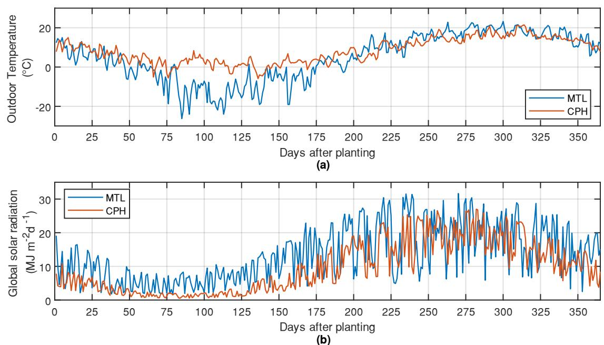  
Figure 5.1. Comparison between climates in Montreal, Quebec, Canada (MTL) and Copenhagen, Denmark (CPH): a) yearly outdoor air temperature and b) global solar radiation (day of planting is September 27) (Data retrieved from [66]).

# 5.4.3 Energy context

Another important factor that differs between the two regions is the structure of the energy grid. Denmark has a competitive spot market, where energy price fluctuates on an hourly basis according to supply and demand [111]. According to the Technology Collaboration Program of the International Energy Agency (IEA) [112], Denmark generated  $44\%$  of its electricity from wind power in 2021 and is a global leader in the integration of variable renewable energy. Danish energy market prices for gas and electricity can be obtained from Energi Data Service [113]. This free and open data portal developed by Energinet, the owner of the Danish electricity and gas networks, provides access to data on the Danish energy system. The prices of electricity and natural gases vary over time (1- hour interval for electricity and 1- day interval for gas). The most recent data (2022- 2023) matching the

days simulated is shown in Figure 5.2 a and b. For electricity, Denmark is divided in two price regions DK1 (West Denmark) and DK2 (East Denmark). In this study DK2 is used to match the meteorological data of Copenhagen. Missing values are approximated as a yearly average.

Quebec relies heavily on hydroelectric power and has a long- term energy contract market that provides energy at a fixed price for a set period [114]. Hydro- Québec, the public utility company responsible for generating and distributing electricity in Quebec, reports that hydroelectric power accounts for  $95\%$  of the province's electricity generation [115]. It offers a supplemental electricity option for greenhouse growers [13]. This option allows greenhouse growers to receive a favorable price for additional electricity for photosynthesis lighting or heating purposes. However, these customers must limit their power consumption during peak demand periods by not exceeding their reference power. The reference power is set according to the customer's consumption profile at the time of registration to the program. Peak demand events occur mainly in winter (December to March) and last an average of five hours, around the morning and evening peaks. As a rough guide, these periods represent 70 h- year $^1$  and are approximated in this work as 14 five hours' time- slots between 6:00- 11:00 or 17:00- 22:00 over winter. During these periods, the price of additional electricity is  $55.345 \mathrm{~e}^{\prime} \mathrm{kWh}^{- 1}$  (15.373  $\mathrm{e}^{\prime} \mathrm{M} \cdot \mathrm{h}^{- 1}$ ) [13]. In this work, for Quebec's energy pricing, Hydro Quebec is used for electricity [116] and Energir for natural gas [117]. Resulting energy prices for Quebec are shown in Figure 5.2.

  
Figure 5.2. a) Yearly electricity price and b) yearly natural gas price for the province of Quebec, Canada, and West Denmark (day of planting is September 27).

# 5.5 Methodology

5.5 MethodologyThe objective of this work is to compare the optimal greenhouse features in relation to the outdoor climate and electricity market structure of Quebec and Denmark. The methodology to do so is described in this section. Simulations were used to assess the energy consumption, costs, and crop yields in the cities of Montreal (Quebec) and Copenhagen (Denmark). The modeling software is described in Section 5.5.1. The reference greenhouse used in the simulations is then presented in Section 5.5.2. Finally, the simulation plan and the metrics used for the analysis are introduced (Section 5.5.3 and 5.5.4).

# 5.5.1 Simulation software

The work focuses on modeling to investigate the performance of greenhouses under different conditions. Different types of computational methods can be considered to simulate energy consumption in greenhouses. For this specific study, mathematical models which are based on solving transient energy and mass balances in different parts of the system are suitable for simulating yearly operations for multiple scenarios. The GreenLight model [53] was chosen in the present work because it explicitly models the aspects analyzed in this study (i.e., energy and plant growth). Furthermore, the measures to be tested (see Section 3.3) are already implemented in the model. Finally, it is an open- source model, which gives users all the required flexibility, and calculation times are reasonable (code available at [63] and run on MATLAB R2021a). Initially, this process- based greenhouse model was designed to replicate an advanced Venlo- type greenhouse with a tomato crop and supplemental lighting.

GreenLight builds on a previous model of a greenhouse and tomato crop [32, 33]. The model considers three attributes of the greenhouse climate: energy balance, carbon balance, and vapour balance. It was verified using literature data and previous results to ensure its accuracy and reliability. More details are available in [34].

# 5.5.2 Reference greenhouse

5.5.2 Reference greenhouseA greenhouse model was developed based on wanted design specifications, including dimensions, insulation properties, glazing materials, and heating/cooling systems. A state- of- the- art greenhouse based on the offerings of the major greenhouse manufacturers (Priva [35], Ridder [36], Dalsem [37], Certhon [38], and Havecon [39]) was considered. One of the common choice for advanced

commercial greenhouse applications is the high- tech Venlo type Dutch glasshouse [53, 123], designed to optimize plant growth and yield by controlling the environment within the structure. This type of greenhouse has features such as automated climate control systems, advanced irrigation systems, supplementary lighting, humidification and de- humidification,  $CO_2$  supplementation and energy- efficient design (double glazing, thermal screens, etc.) [14].

The reference greenhouse for the simulation is a 4- hectare Venlo- type greenhouse, and the specific crop to be grown is tomatoes. The specific details of the reference greenhouse are the same as those described in [53]. In that study, a 4- hectare Venlo- type greenhouse,  $200m$  wide and long, with a gutter height of  $6.5m$  , a ridge height of  $7.3m$  and a roof slope of  $22^{\circ}$  was replicated. The roof was made of glass panels, with one in six panels having a ventilation window  $(1.30\text{m}\times 1.67\text{m})$  that can be opened to  $60^{\circ}$  . The path width was  $1.6m$  with a pipe rail system of a length of  $1.25m\cdot m^{- 2}$  . This reference greenhouse is based on the design described by Vanthoor et al. [33].

High- tech commercial greenhouses are equipped with advanced controls for indoor climate control. Therefore, simulation of greenhouses must also have those climate controls that provide the optimal environment according to the requirements of different growth stages of the crops. The climate controls included in the reference scenario affect the following aspects: lamps, blackout screens,  $CO_2$  injection, heating, cooling by ventilation and dehumidification [13, 34]. They are based on the work of Katzin et al. [75]. The  $CO_2$  setpoint during the light period is 1000 ppm, the maximum relative humidity setpoint is  $87\%$ , and the temperature setpoint during the dark period is  $18.5^{\circ}C$  and  $19.5^{\circ}C$  during the light period. The lamps are switch on at midnight and switch off at 18:00. However, the lamps are switched off if global radiation is above  $400W\cdot m^{- 2}$  or if the predicted daily radiation sum from the is higher then  $10MJ\cdot m^{- 2}\cdot day^{- 2}$ .

In this reference greenhouse there is roof ventilation, a boiler and pipe rail system for heating, a  $CO_2$  injection system, and supplementary lighting. The reference lighting system is HPS lighting with a photosynthetic photon efficacy (PPE) of  $1.8\mu mol_{\mathrm{PAR}}\cdot \mathrm{J}_{\mathrm{input}}^{- 1}$  and a photosynthetic photon flux density (PPFD) of  $200\mu mol_{\mathrm{PAR}}\cdot m^{- 2}\cdot s^{- 1}$ . This greenhouse, with no advanced energy saving systems, is the baseline for the different scenarios investigated in the current study.

# 5.5.3 Simulation plan

To obtain the optimal greenhouse in relation to the outdoor climate, different parameters and solutions can be explored. Each of these scenarios was tested for contexts (weather, energy tariffs) of Montreal and Copenhagen, and in each case, energy consumption, costs and crop yield were calculated from simulations. The simulation software was adapted considering the physical characteristics of the selected greenhouse and the meteorological data of the selected location. The meteorological data for Montreal, Canada and Copenhagen, Denmark were retrieved from EnergyPlus [66]. The outdoor  $CO_2$  concentration value was set to 410 ppm, which is the average for both regions [41, 42]. All simulations are one year long (365 days) and start on September 27, which represents a typical planting date of the crops [104]. The simulated crops are assumed to be mature.

The different scenarios tested are shown in Figure 5.3 and are explained below. These specific scenarios were evaluated based on preliminary simulations and measures recently identified as particularly useful for energy efficiency in literature. Scenarios are labelled from SO to S6, and again, each is to both Montreal and Copenhagen. For all scenarios tested, all variables remained constant relative to the reference greenhouse, unless otherwise specified.

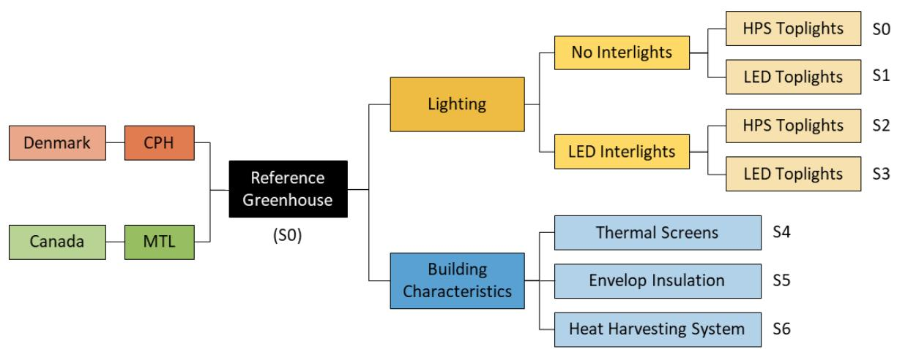  
Figure 5.3. Simulation plan to compare greenhouse energy consumption in Copenhagen and Montreal.

Reference (S0): This is the reference greenhouse introduced in Section 5.5.2. It has an HPS toplighting system with no interlights. No strategy for heat management is implemented.

LED Lighting (S1): LED lamps are becoming increasingly popular in greenhouse lighting systems because they are highly energy- efficient, have a long lifespan, and can be customized to provide

specific light spectra for different crops and growth stages [43]. LEDs can produce narrow- spectrum light in specific wavelengths that are beneficial for plant growth and development, such as blue (450 nm) and red (660 nm) [44]. Recent research has shown that using LED lighting systems with specific spectral wavelengths and intensity can enhance photosynthesis, increase yield, and improve crop quality in greenhouse [45]. However, since LEDs release less heat into the greenhouses, their use tends to increase the heating demand. In this scenario, the LEDs that replace the HPS toplights have a PPE of  $3.0 \mu \mathrm{mol}_{\mathrm{PAR}} \cdot \mathrm{J}_{\mathrm{input}}^{- 1}$  and a PPFD of  $200 \mu \mathrm{mol}_{\mathrm{PAR}} \cdot \mathrm{m}^{- 2} \cdot \mathrm{s}^{- 1}$ .

LED Interlighting with HPS Toplights (S2): According to Katzin et al. [34], the utilization of LED lamps near the crop, including placement between crop rows, allows for effective illumination without inducing crop heating or leaf burning. This technique, referred as interlighting, contributes to enhanced light use efficiency within the crop by ensuring a more uniform distribution of light. HPS lamps must be placed above the canopy because they generate elevated temperatures. However, as mentioned above, LED lamps offer the flexibility of being situated at lower positions within the canopy as interlighting systems, as well as above the canopy as top lighting source [46]. There are two differences between toplighting and interlighting. First, the radiation emitted by interlights originates vertically from the center of the canopy, and second, the radiation is emitted in both upward and downward directions. In this scenario,  $200 \mu \mathrm{mol}_{\mathrm{PAR}} \cdot \mathrm{m}^{- 2} \cdot \mathrm{s}^{- 1}$  LED lamps are positioned between the canopies and the toplights remains the same as the reference scenario (HPS toplights) allowing to test the effect of hybrid artificial lighting. The interlights are positioned at the middle heights of the crops. They have a heat capacity of  $10 \mathrm{J} \cdot \mathrm{K}^{- 1} \cdot \mathrm{m}^{- 2}$  and a heat exchange coefficient of  $2.3 \mathrm{W} \cdot \mathrm{m}^{- 2} \cdot \mathrm{K}^{- 1}$ .

LED Interlighting with LED Toplights (S3): This scenario is a combination of S1 and S2. As in S1, the HPS lighting is changed for LED lighting. In addition, as in S2, the same  $200 \mu \mathrm{mol}_{\mathrm{PAR}} \cdot \mathrm{m}^{- 2} \cdot \mathrm{s}^{- 1}$  LED interlights are added to the scenario. So, lighting from this scenario is strictly LEDs.

Thermal Screens (S4): Thermal screens, also called night curtain, can be used to reduce heat loss during the winter and to block out excess sunlight during the summer. This reduces the need for heating and cooling. There are several types of thermal screens that can reduce energy consumption. In general, horizontal thermal screens reduce energy consumption between  $15\%$  and  $25\%$ , and vertical thermal screens installed around the perimeter of the greenhouse add another  $5\%$  to energy performance [45]. Thermal screens and their controls are added to the model for this scenario. Thermal screens were simulated at a height of  $6.3 \mathrm{m}$ . They were closed when the outdoor

solar radiation was less than  $50W\cdot m^{- 2}$  and the outdoor temperature was less than  $18^{\circ}C$  , or when the outdoor solar radiation was greater than  $50W\cdot m^{- 2}$  and the outdoor temperature was less than  $5^{\circ}C$  However, thermal screens were forced to open when the indoor temperature was more than  $4^{\circ}C$  above the heating setpoint or when the indoor relative humidity was greater than  $85\%$  , unless the indoor temperature was colder than  $1^{\circ}C$  less than the heating setpoint [34].

Envelope Insulation (S5): This scenario simulates a greenhouse with additional envelope insulation. Proper insulation of the greenhouse structure can reduce the amount of energy needed to heat or cool the space, it can reduce heat loss during winter and prevent overheating during summer. Insulation materials like polyethylene foam, fiberglass, and rigid foam board can be used. Effective insulation is vital for storing energy over a long period of time [47]. It is advisable to insulate the perimeter and lower portions of the side wall of a greenhouse to reduce conduction heat lost. The height of the insulation on the side wall may need to be adjusted depending on the location of the greenhouse, as the solar altitude angle varies significantly depending on the location [48]. To simulate a greenhouse with additional total envelope insulation, the leakage coefficient of the greenhouse and the thickness of the roof layer are modified. The leakage coefficient is set to  $5 \times 10^{- 5}$  compared to  $1 \times 10^{- 4}$  in S0, and the roof layer is set to  $8 \text{mm}$  compared to  $4 \text{mm}$ .

Heat Harvesting System (S6): Heat harvesting systems refer to a range of technologies to capture, store and utilize excess heat generated within the greenhouse environment. Greenhouses receive solar radiation, which can lead to temperature increases within the structure. The heat harvesting system is designed to make the most of this excess heat for various purposes. These systems allow for sustainable greenhouse management at high latitudes and for indoor temperature maintenance. According to Righini et al. [46], in the context of tomato cultivation within a semi- closed greenhouse in Norway with HPS lamps (top- lights) and LED (inter- lights), it was observed that approximately  $50\%$  of the heating pipe energy requirements could be met by harvesting the available heat from the greenhouse air. This scenario has a heat harvesting system module that has four components: a mechanical cooling and dehumidification (MCD), a cold- water buffer, a heat pump, and a hot water buffer. The greenhouse climate controls also control the heat harvesting system. A summary of the different parameters of the components of the systems are presented in Table 5.1.

Table 5.1. Reference parameters input of the heat harvesting system [34]  

<table><tr><td>Parameter</td><td>Value</td><td>Unit</td></tr><tr><td>Cold water buffer size</td><td>0.42</td><td>MJ·m-2</td></tr><tr><td>Hot water buffer size</td><td>0.84</td><td>MJ·m-2</td></tr><tr><td>Maximum rate of energy extraction by the MCD unit</td><td>200</td><td>W·m-2</td></tr><tr><td>Electrical capacity of the MCD unit</td><td>50</td><td>W·m-2</td></tr><tr><td>COP (Coefficient of Performance) of the MCD unit</td><td>4</td><td>-</td></tr><tr><td>Maximum rate of energy transfer by the heat pump</td><td>62.5</td><td>W·m-2</td></tr><tr><td>Electrical consumption of the heat pump</td><td>11.36</td><td>W·m-2</td></tr><tr><td>COP of the heat pump</td><td>5.5</td><td>-</td></tr><tr><td>Heat flux from the hot water buffer to the heating pipes</td><td>150</td><td>W·m-2</td></tr></table>

# 5.5.4 Evaluation metrics

5.5.4 Evaluation metricsThe methodology used a comprehensive set of evaluation metrics to analyze the performance of the energy efficiency measures introduced in the scenarios of Figure 5.3. The primary outputs studied are the total energy consumption, which includes energy for lighting (electricity) and heating (natural gas), and the total yield, which is represented by the total fresh weight of harvested tomatoes (productivity). To facilitate comparisons with other studies, all metrics were calculated per square meter of greenhouse area. Another performance indicator was obtained by dividing the total energy use by the total yield, providing an evaluation of energy used to produce one kilogram of fruit harvested. This approach allows an assessment of the balance between energy use and productivity, recognizing that higher energy use may be justified by superior yield. A cost analysis is also performed. The energy cost per kilogram of yield is obtained by multiplying the energy consumption per kilogram of yield for each hour by the corresponding energy price at that time (Figure 5.2).

# 5.6 Results and discussion

5.6 Results and discussionThe following sections present the results obtained for all seven scenarios, including the reference scenario (S0) and the six lighting and energy- saving techniques (S1 to S6). All simulations were conducted for both Montreal and Copenhagen. Results for energy consumption, yield, and costs are presented and discussed below.

# 5.6.1 Energy consumption

5.6.1 Energy consumptionBy analyzing energy consumption patterns, it is possible to identify the most energy- efficient techniques that could potentially reduce overall energy consumption in both Quebec and Denmark. Figures 5.4 a- d show the daily energy consumption for lighting and heating for all lighting options (S0 to S3). Figures 5.4 e- f report the energy consumption for heating for the energy- savings scenarios (S4 to S6) as well as the reference scenario. All these scenarios (S0, S4, S5, S6) have HPS toplights and no inter lighting, therefore they all have the same energy consumption for lighting.

  
Figure 5.4. Daily energy input for lighting: a) for MTL, b) for CPH, Daily energy input for heating under lighting scenarios (S0-S4): c) for MTL, d) for CPH, and Daily energy input for heating under energy-saving techniques: e) for MTL, f) for CPH.4

The different lighting strategies (S1 to S3) and energy- saving techniques (S4 to S6) have a more significant impact during the winter months due to the higher temperature difference between the greenhouse interior and the outside conditions. This effect is illustrated in figure 5.4, where thermal screens have the overall lowest daily energy use, especially during winter, for both sites. The data highlights how the use of energy conservation measures, such as thermal screens, can effectively reduce energy consumption during colder months when maintaining optimal greenhouse conditions is critical.

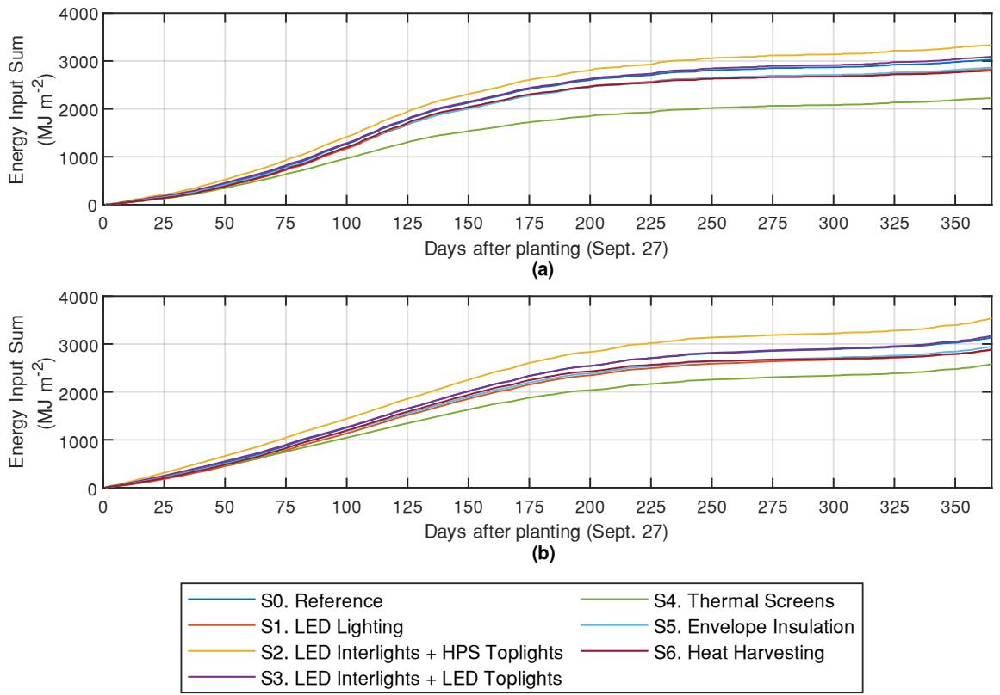  
Figure 5.5. Energy input sum over a year for different scenarios (S0-S6) for a greenhouse: a) in Montreal (Canada), and b) in Copenhagen (Denmark).

Figure 5.5 presents another perspective, i.e. the cumulative energy input over the year, which includes both lighting and heating, for the two locations. The reference scenario in MTL has a total energy input of  $3028MJ\cdot m^{- 2}\cdot year^{- 1}$ , which represents a lamp energy input of  $1111MJ\cdot m^{- 2}\cdot year^{- 1}$ , coupled with a boiler energy input of  $1917MJ\cdot m^{- 2}\cdot year^{- 1}$ . For CPH, the total energy input is higher with a value of  $3135MJ\cdot m^{- 2}\cdot year^{- 1}$ . The breakdown of this value is  $1507MJ\cdot m^{- 2}\cdot year^{- 1}$  for lighting and  $1628MJ\cdot m^{- 2}\cdot year^{- 1}$  for heating. These values have the same order of magnitude as those given in Katzin et al. [75].

LED lighting systems are known for their energy efficiency, using less energy than other lighting options, as shown in Figures 5.4 and 5.5. In contrast, interlighting, despite its benefits in promoting plant growth, typically requires more energy than using only toplights. The more energy the lighting system requires, the less heating energy is needed. The trade- off between lighting and heating energy use is apparent in Figure 5.4. However, even with reduced heating demand, the total energy consumption remains higher for lighting systems that consume significant amounts of energy.

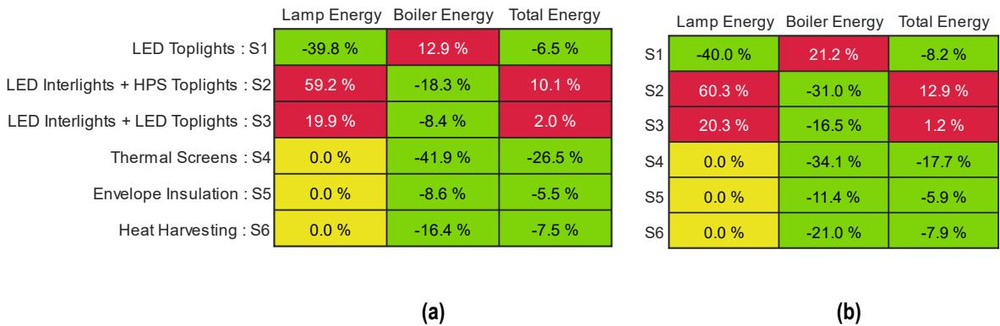  
Figure 5.6. Energy savings compared to the reference greenhouse scenario for all different energy saving scenarios (S0-S6): a) in Montreal (Canada), and b) in Copenhagen (Denmark) (negative percentages represent a reduction of energy consumption compared to the reference, and positive values, an increase).

Figure 5.6 shows the percentage of annual energy savings of each scenario compared to the reference scenario (S0). In terms of energy consumption, both locations showed similar responses or patterns to the different energy saving techniques presented (S1 to S6). In both locations, the scenario with LED interlighting and HPS toplights (S2) has the highest lamp energy input at 1768 MJ·m $^{- 2}$  for MTL and 2415 for CPH. This scenario has a lower heat input than the reference (S0). However, it does not compensate for the high energy demand of the lamps, so S2 has the highest total energy consumption per square meter at 3334 MJ·m $^{- 2}$  for MTL and 3539 for CPH. The lowest energy input for lighting is the LED lighting scenario (S1) with a value of 668 MJ·m $^{- 2}$  for MTL and 904 for CPH. On the other hand, this scenario has the highest energy consumption for heating (boiler) with 2163 MJ·m $^{- 2}$  in MTL and 1973 in CPH. The thermal screens scenario (S4) has the highest total energy savings with a total annual consumption of 2225 MJ·m $^{- 2}$  for MTL and 2580 for CPH. This scenario has the same lighting energy consumption as the reference scenario (both HPS lighting), but much lower heating energy consumption (1143 MJ·m $^{- 2}$  for MTL and 1073 for CPH). The energy used for the recovery of energy in the heat harvesting system (S6) consumes 86 MJ·m $^{- 2}$  for MTL and 94 for CPH, contributing to a total energy input of 2799 MJ·m $^{- 2}$  for MTL and 2887 for CPH.

For interlighting, as seen in Fig. 4, the addition of lamps in between the canopy results in a higher energy input for lighting. The energy requirement for heating is reduced because of the additional heat produced by the lamps. For both types of lamps and both locations, the total energy consumption is still higher with interlighting (Figures 5.5 and 5.6).

In MTL, the greenhouse requires more heating to maintain suitable growing conditions during the colder months (Figure 5.4). On the other hand, CPH's milder climate results in lower heating demands. The energy- saving techniques for both MTL and CPH show a similar pattern of heating demand, with higher energy consumption in winter and lower energy demand during summer days. However, there are notable differences between the two locations. Specifically, MTL's heating energy consumption remains consistently higher than CPH's during the winter season, but comparatively lower during the summer months. Conversely, Copenhagen's heating curve shows a more uniform distribution of energy consumption throughout the year. These findings suggest that while both regions experience higher heating demand in winter, the specific energy consumption patterns differ, with MTL exhibiting greater variability between seasons compared to CPH.

Also, there is a higher lighting demand in CPH, because of the higher latitude reducing natural lights during winter. The energy consumed by the lamps is higher in CPH than in MTL because the lamps are on for a longer period. In CPH, for HPS lighting (S0), the lamps are on approximately 3300 hours for a period of 365 days, and for LED lighting (S1), the lamps are on 3500 hours. For Montreal, the lamps are on for 2100 hours and 2400 hours for HPS and LED lighting. The toplights and interlights follow the same controls, so they open and close at the same time. The difference in time between the two types of lamps is a result of the controls implemented in the program.

# 5.6.2 Crop yield

Optimizing greenhouse production to achieve higher yields is essential from the producer's perspective. Figure 5.7 illustrates the daily fresh weight tomato yield for the scenarios under study.

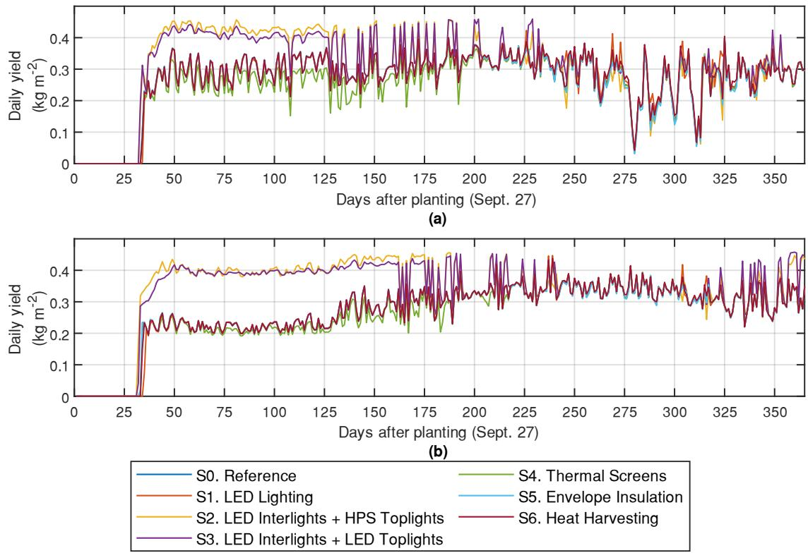  
Figure 5.7. Daily fresh weight tomato yield for different scenarios (S0-S6) for a greenhouse: a) in Montreal (Canada), and b) in Copenhagen (Denmark).

As can be seen in Figure 5.7, the difference in growth with the inclusion of interlighting is most pronounced during the winter months when daily radiation levels are low (as shown in Figure 5.1). In particular, from November to March, interlighting significantly increases the daily yield.

To better see the effect of the different scenarios on annual production, Figure 5.8 shows the cumulative fresh weight tomato yield over the course of a year for both locations. The total fresh weight tomato yield over one year varies similarly for both locations. For the reference scenario (S0), Montreal has a yield of  $96 \text{kg}\cdot \text{m}^{- 2}$  and Copenhagen  $97 \text{kg}\cdot \text{m}^{- 2}$ .

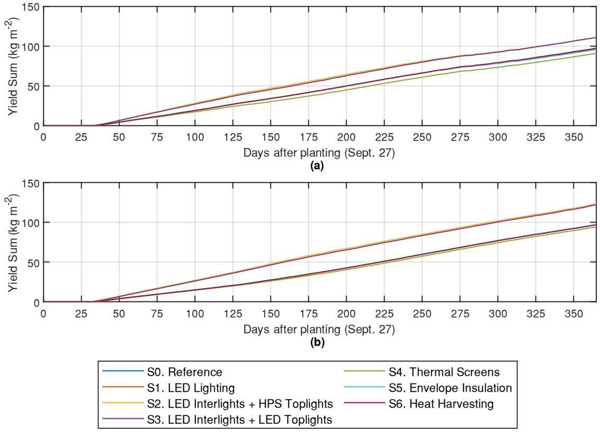  
Figure 5.8. Fresh weight tomato yield over a year for different scenarios (S0-S6) for a greenhouse: a) in Montreal (Canada), and b) in Copenhagen (Denmark).

Figure 5.9 presents the total fresh weight tomato yield for all different energy- saving scenarios in both MTL and CPH compared to the reference greenhouse scenario.

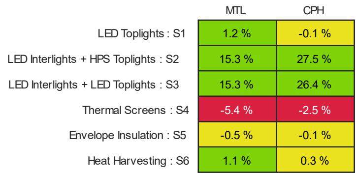  
Figure 5.9. Total fresh weight tomato yield compared to the reference greenhouse scenario in Montreal (Canada) and Copenhagen (Denmark) for all different energy saving scenarios (S0-S6) (Negative percentage represent a reduction of the yield compared to the reference).

Figures 5.8 and 5.9 show that the energy- saving techniques (S4 to S6) generally do not improve the fresh weight tomato yield. Among these techniques, the use of thermal screens seems to have the

most negative effect on yield, probably because closing the screens restricts outside radiation. While the screens are usually closed at night, extreme cold temperatures occasionally prompt their closure during the day, which has a more pronounced effect on yield in MTL compared to CPH, because of the more extreme conditions.

# 5.6.3 Crop yield per energy consumed

When assessing the effectiveness of greenhouse improvements, considering both input and output factors is crucial. In this case, analyzing energy input and total yield (output) is essential. Figure 5.10 presents energy input savings per kilogram of fresh weight tomato yield with the reference scenario. The figure examines this metric for all different energy- saving scenarios in both MTL and CPH compared to the reference greenhouse scenario.

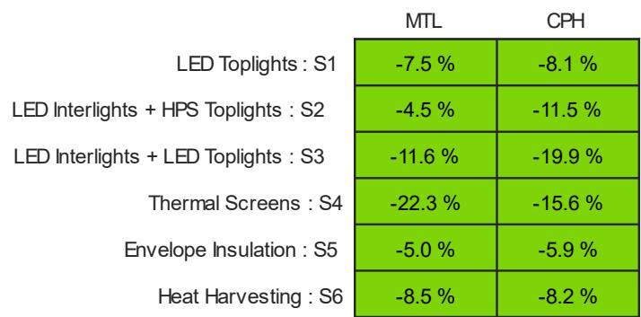  
Figure 5.10. Energy input savings per kilogram of fresh weight tomato yield compared to the reference greenhouse scenario in Montreal (Canada) and Copenhagen (Denmark) for all different energy saving scenarios (S0-S6) (Negative percentage represent a reduction of energy consumption per kg of yield compared to the reference).

Interlighting consumes more energy, however, it is important to consider the production aspect of tomatoes, as using more energy to produce more can still be beneficial. This is the case for the addition of interlights. Depending on the simulations there is a 5 to  $20\%$  decrease in energy consumption per kg of tomato yield (Figure 5.10). From Figure 5.10, the interlighting in scenarios S2 and S3 in CPH is more efficient than in MTL. This is correlated with the outside global radiation. Because the outside global radiation is significantly lower in Denmark (higher latitude), the need for artificial lighting to obtain the optimal climate for tomatoes is higher. Therefore, the addition of interlights has a more important effect on the total yield.

Ultimately, even with a reduced yield (Figure 5.9), all energy- saving techniques result in lower total energy use per kilogram of fresh weight tomato yield compared to the reference scenario (Figure 5.10).

# 5.6.4 Running energy cost

The running cost of production is also a key aspect examined in this study. Efficient greenhouse operations can contribute to reducing production costs and improving profitability. By evaluating the energy running costs associated with each scenario, the aim is to identify the most cost- effective strategies for greenhouse cultivation in both regions. The energy cost of each city is used to calculate the overall energy cost to grow one kilogram of tomato.

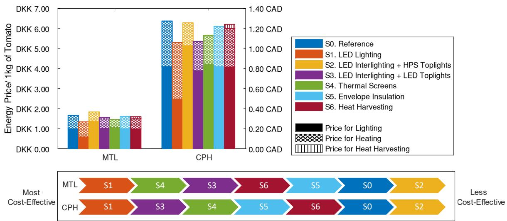  
Figure 5.11. Total energy input price per kilogram of fresh weight tomato yield for 365-day simulations for different scenarios (S0-S6) for Montreal (Canada) and Copenhagen (Denmark).

Figure 5.11 provides an overview of the total annual energy price per kilogram of fresh weight tomato for all scenarios considered. For both locations, the lowest and highest energy prices per kilogram of harvested tomatoes come from the same scenario. The lowest value, i.e. the most energy- efficient scenario, is the LED lighting (S1), the operation of which costs 1.34 DKK (CAD 0.27) at MTL and 5.29 DKK (CAD 1.06) at CPH. The second- best scenario varies with the location, for MTL the thermal Screens (S4) are more advantageous (1.46 DKK (CAD 0.29)) and for CPH it is the LED interlighting with LED toplights (S3) (5.36 DKK (CAD 1.07)). The worst scenario for MTL is LED interlighting and HPS toplights (S2), which costs DKK 1.84 (CAD 0.37). This scenario is the only one that consumes

more than the reference (S0). For CPH the worst scenario is the reference (S0), which costs DKK 6.37 (CAD 1.27). This means that all energy saving scenarios are cost- effective for CPH.

The disparity in energy consumption and energy cost between MTL and CPH can be attributed to the distinct outside climates and energy grid characteristics of the respective regions. The local climate significantly influences the greenhouse's heating and cooling demands. Moreover, the energy grid infrastructure varies between the two locations, impacting the availability and cost of energy sources.

As illustrated in Figure 5.11, the running energy prices per kilogram of tomato yield are notably higher for CPH, averaging a  $73\%$  increase compared to MTL. This metric serves as a means to accurately compare different scenarios for both locations. The substantial variations observed can be attributed to the disparities in energy costs (as depicted in Figure 5.2). While the greenhouse in CPH does consume more energy than MTL, this variation is not as significant as the discrepancies in energy prices. For the reference scenario, the energy consumption in MTL and CPH is approximately 31.45 and 32.41 MJ per kilogram of fresh weight tomato yield, respectively. This variation can be attributed to the higher lighting energy demand in CPH, where lamps are utilized for approximately 1100 more hours each year. Such differences in energy usage patterns underscore the importance of considering not only energy consumption but also energy costs to make informed decisions.

In this study, LED lighting (S1) emerged as the most favorable scenario for both locations (Figure 5.11). This finding is consistent with the known efficiency of LED lighting compared to HPS, with minimal impact on yield. In general, lighting proved to be critical to compensate low radiation in CPH greenhouses, while heating stood out as the main aspect to optimise or MTL greenhouses due to important variation in outside temperature throughout a year. Consequently, the most cost- effective techniques after LED lighting (S1) were LED interlighting (S3) for CPH and thermal screens (S4) for MTL (as shown in Figure 5.11). The combination of lighting and energy saving strategies provides an opportunity to create an optimal energy efficient greenhouse. Therefore, the best combination to explore for both locations would be to use LED lighting (S1) in conjunction with thermal screens (S4). This approach takes advantage of the efficiency of LED lighting and the insulation provided by thermal screens to achieve optimal results for energy savings and productivity in each greenhouse.

While this cost comparison between Denmark and Quebec focuses on the running costs for energy, it is essential to acknowledge that the analysis does not incorporate the initial investment of the various

technologies. The study's primary limitation lies in the exclusion of upfront costs associated with implementing these technologies in the greenhouses. To gain a comprehensive understanding of the overall financial impact, growers should carefully consider the return on investment (ROI) by integrating data from this study with quotes received from manufacturers. Understanding the total energy input price per kilogram of fresh weight tomato yield can assist stakeholders in evaluating the economic viability and cost- effectiveness of different scenarios in both MTL and CPH.

# 5.7 Conclusion

This research contrasts different energy efficiency measures for greenhouses in Quebec and Denmark, focusing on energy consumption, yield and costs. The comparison of energy- optimized greenhouses between Quebec, Canada and Denmark provided valuable insights into the effectiveness of various techniques and their impact on greenhouse operations. This work demonstrates how differences in external climate and energy grid significantly affect energy consumption and costs, even though both cities considered are often considered as high- latitude regions. Due to the artificial lighting that compensates for the lack of solar radiation in winter, greenhouses in Copenhagen consume more energy than greenhouses in MTL (73% more on average across all scenarios). The results showed that LED lighting (S1) emerged as the most efficient scenario for both locations due to its high energy efficiency and minimal impact on yield. After, for MTL the best energy saving technique is to implement thermal screens in the greenhouse (S4) and for CPH it is to invest in LED interlights combined with LED toplights (S3). Energy costs in Denmark are significantly higher than in Quebec, Canada, emphasizing the need for tailored energy conservation strategies, adapted to each context. Understanding and considering climatic and grid factors is essential to making informed decisions about energy- efficient greenhouse practices and optimizing resource use. Ultimately, the integration of energy- saving technologies such as LED lighting (S1) and thermal screens (S4) offers a promising approach to achieving optimal greenhouse energy efficiency and productivity.

The next steps for this study could be to investigate the effects of dynamic climate control strategies that can respond to changing electricity prices, optimizing energy consumption and cost efficiency, while ensuring crop yields [49, 50]. This would be particularly useful for Denmark due to the fluctuating electricity prices. It could also be interesting to investigate the difference between Quebec

and Denmark for integration of local energy generation [51]. Even in Quebec, an improved management of peak demand periods would be extremely useful. Dynamic control requires the integration of real- time price data and the implementation of algorithms that can make informed decisions about energy use and load scheduling, taking advantage of low- price periods and minimizing expenditures during peak- price periods. This new dynamic control should focus on greenhouses with the best lighting and energy- saving techniques discussed in this article. Another potential continuation to this work would be to integrate the initial investment cost of the different measures into the analysis.

# Chapter 6 Impact of Climate Change on Energy Consumption and Yield in Greenhouse Horticulture5

Chapitre 6 Impact du changement climatique sur la consommation d'énergie et le rendement dans la culture sous serre

# 6.1 Résumé

Les changements climatiques sont un phénomène mondial indéniable qui pose des défis importants à diverses industries, y compris l'horticulture en serre. Une serre de tomates a été simulée dans huit villes canadiennes, dans les conditions météorologiques actuelles et en 2080, sur la base de la trajectoire climatique RCP8.5, afin de déterminer comment la consommation d'énergie et le rendement des tomates seraient affectés. Les résultats montrent qu'en moyenne, la consommation d'énergie diminue de  $11\%$  en raison d'une réduction des besoins de chauffage, tandis que le rendement diminue de  $17\%$  en raison d'une température plus élevée du couvert végétal. Un système mécanique de refroidissement et de déshumidification a également été simulée et a permis d'augmenter le rendement par rapport à la situation actuelle, même dans le scenario de changement climatique 2080, mais au prix d'une consommation d'énergie plus élevée. Ce travail suggère que l'industrie des serres devra probablement s'adapter au changement climatique et qu'il sera difficile de trouver un équilibre entre la productivité et la consommation d'énergie.

# 6.2 Abstract

Climate change is an undeniable global phenomenon that poses significant challenges to various industries, including greenhouse horticulture. In this work, a greenhouse producing tomatoes has been simulated in eight Canadian cities under current weather and weather in 2080 based on climatic trajectory RCP8.5, in order to determine how the energy consumption and tomato yield would be affected. Results show that, on average, energy consumption decreases by  $11\%$  due to a reduction of the heating needs, whereas yield decreases by  $17\%$  due to a higher canopy temperature. A

mechanical cooling and dehumidification system was also simulated and allowed to increase the yield compared to the current situation, even in the 2080 climate change scenario, but at the expense of a higher energy consumption. The use of light- emitting diodes (LED) resulted in a lower energy consumption than that of high- pressure sodium (HPS) lighting in both current and future weather conditions. This work suggests that the greenhouse industry is likely to require some adaptations to climate change and that reaching a balance between productivity and energy consumption will be a challenge.

# 6.3 Introduction

Greenhouses are energy- intensive buildings, with significant energy consumption, primarily for heating purposes in cold regions. Dorais [15] reports that in the province of Quebec (Canada), the average energy consumption of greenhouses ranges from 650 to 850 kWh·m $^{- 2}$  (2340 to 2880 MJ·m $^{- 2}$ ) for heating, depending on factors such as the presence of thermal screens or thermal storage tanks. Notably, months like December, January, and February contribute, on average, to 51% of the total annual consumption. Pelletier et al. [9] provide insight into a typical Quebec greenhouse energy profile, reporting a yearly consumption of 700 to 914 kWh·m $^{- 2}$  (2520 to 3290 MJ·m $^{- 2}$ ) for heating in a greenhouse of 1750 m $^{- 2}$  with double polyethylene covers. As can be seen, food production in a greenhouse requires a high amount of energy. In fact, it is estimated that energy costs in Quebec represent 25 to 30% of greenhouse production costs [15]. The actual energy consumption (including lighting and other needs) varies based on individual greenhouse characteristics such as size, location, materials, lamp types, and crop variety.

Even if they are energy intensive, greenhouses play a pivotal role in a country's food self- sufficiency and economy. As the world's population grows and climate change disrupts traditional agricultural practices, the need for resilient and resource- efficient food production systems has never been more urgent. Greenhouse horticulture offers a transformative solution by providing controlled environments that protect crops from adverse weather, pests, and disease while optimizing resource use. These closed environments offer several key benefits: climate control, extended growing season, protection from external factors, improved crop quality, resource efficiency, diversified crop production, export opportunities, etc.

Nevertheless, as climate change accelerates, extreme weather events, temperature fluctuations, and shifts in precipitation patterns are becoming more frequent, which is likely to affect the energy demand of greenhouses significantly. Adopted by the Intergovernmental Panel on Climate Change (IPCC) [129], climate models use Representative Concentration Pathways (RCPs) to assess and simulate potential climate outcomes and impacts based on different levels of greenhouse gas emissions and socioeconomic factors [130]. RCPs are a set of four scenarios that project future greenhouse gas concentrations in the Earth's atmosphere. They are labeled according to the estimated level of radiative forcing (the amount of energy trapped in the Earth's atmosphere) by the year 2100 [131]. Ranging from RCP2.6 (low emission pathway) to RCP8.5 (high emission pathway), these scenarios cover global warming from  $2^{\circ}C$  to  $8.5^{\circ}C$  by 2100 [132] and are helpful in understanding the potential outcomes of different trajectories and for guiding climate research and policy- making efforts. While notable advancements have been made in assessing the impact of climate change across sectors and regions, significant knowledge gaps remain, particularly in the field of agriculture.

Climate change is affecting agriculture, for example, by shifting growing seasons, altering crop yields, and increasing the prevalence of pests and diseases [133]. Researchers emphasized the potential benefit of moving production from fields to greenhouses due to climate change. For example, Chang et Chang [134] studied the possibility of growing wax apple plants in greenhouses and counter the production risk due to unpredictable climate change in Taiwan. When examining the effects of climate change on plants, greenhouses are often used as a research tool to reproduce the future climate due to their ability to control the indoor environment. For instance, Salazar- Parra et al. [135] tested the response of the photosynthetic apparatus of grapevine in a greenhouse to predicted climate change conditions, and Morales et al. [136] also used greenhouses to simulate future climate change scenarios and investigate possible plant responses under them.

Despite the recognition of climate change as a critical challenge to agricultural systems, a notable knowledge gap remains in understanding its specific implications for greenhouse horticulture, and particularly the impact on its energy profile. The limited number of publications on the impact of climate change on greenhouses primarily addressed structural adaptations, water use efficiency, and the phenomenon of photosynthetic acclimation. For example, according to Jeon et al. [137], wind speed and snow greatly affect a greenhouse structure, so they developed a climate change model for Korean glass greenhouses. The aim was to analyze the safety of the Korean standard glass

greenhouse due to the external load. They proposed an optimal cross- sectional structure that can reduce the probability of failure by about  $80\%$  and the materials by about  $18\%$ , providing a way to build an economical greenhouse that ensures safety against failure. Apostolakis et al. [138] investigated the projected changes in water resource requirements in greenhouses under the combined stress of soil salinization and climate change. Their work shows that water demand will increase to maintain crop productivity at current levels in the future.

The energy and yield implications of future climate for greenhouse horticulture have received considerably less attention, even though energy consumption of greenhouses is a major expenditure for producers and highly solicit energy utility infrastructures. Only a few articles on this topic have been identified in the literature. Hoffmann and Rath [139] contributed to the understanding of the impact of climate change on energy consumption in greenhouses in Germany. They used greenhouse climate simulations to predict future energy consumption in greenhouses and analyzed the potential for energy reduction through changes in heating strategies. According to their simulations, greenhouse energy consumption in Germany is expected to decrease in the future, regardless of the temperature setting or scenario. The results show a strong decrease in greenhouse energy consumption for all scenarios by 2038, with average reductions of up to 45 kWh·m $^{- 2}$ ·year $^{- 1}$  (162 MJ·m $^{- 2}$ ·year $^{- 1}$ ). However, this study does not factor in plant yield, which is essential for assessing greenhouse performance. Furthermore, since the study focuses on Germany, the results do not necessarily apply to greenhouses in other climates, such as in Canada where the heating needs are much higher. Also, Mariani et al. [98] carried out a comparative analysis of the energy requirements for greenhouse tomato production in 56 sites located in a wide range of latitudes and belonging to different climate types in the Euro- Mediterranean area. This study analyzed the impact of climate change but with historical weather data showing that past climate evolution reduced energy requirements in 1988- 2014 compared to 1973- 1987. The study provides insight into greenhouse design in terms of energy requirements for heating, but does not treat the impact of future climate change, which would be useful for policy makers and growers to make informed decisions.

As seen in the current literature, the impact of climate change on the energy consumption and yield of the greenhouse industry is still poorly understood. Filling this gap is paramount to formulating effective strategies to safeguard and develop this vital sector. Therefore, the objective of this work is to assess the impact of climate change on energy consumption and crop yield in greenhouse horticulture in Canada. More specifically, the impact of climate change on the performance of a

tomato greenhouse in eight Canadian cities is simulated and analyzed under climate scenario RCP8.5. The paper is structured as follows. Section 6.4 explains the methodology. It introduces the energy and yield model that was used for this work, including the required inputs, such as the weather data for the locations analyzed and the characteristics of the greenhouse. It also describes the adaptive strategy proposed to mitigate the effect of climate change and defines the evaluation metrics of the study. Section 6.5 presents the results and discussion, providing insights and data derived from the simulations and analysis, focusing on energy consumption, crop yield, and the adaptive solutions. Finally, Section 6.6 summarizes the key findings and their implications for the greenhouse industry.

# 6.4 Methodology

The work focuses on modeling and simulations to investigate the energy and yield performance of greenhouses under climate change weather. Figure 6.1 presents the methodology diagram, outlining the main steps of this research: developing the essential parameters and models required for simulations; experimenting with adaptive strategies minimizing the effects of climate change; and evaluating the impact on productivity of greenhouse horticulture.

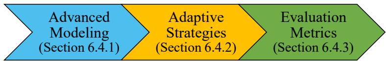  
Figure 6.1. Main methodological steps used in the present study.

# 6.4.1 Advanced Modeling

Figure 6.2 shows the systematic approach adopted for the advanced modeling. The first part explains the actual and predicted climate change weather files used. After, the different locations considered in the study are introduced. The reference greenhouse used for the simulations is explained. Finally, how the simulations are conducted is presented.

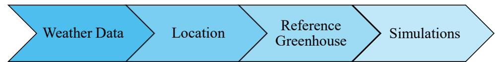  
Figure 6.2. Main steps of the modeling used in the present study.

# Weather Data

Weather DataThe study aims to assess the impact of climate change on greenhouse horticulture performance. It compares greenhouse energy and yield simulations using current climate data and future climate data based on projected climate change data from RCP scenarios (defined in the IPCC's Fifth Assessment Report [130]).

Compared to the Special Report on Emissions Scenarios (SRES) used in previous assessments, the RCPs cover a wider range of scenarios based on different levels of greenhouse gas emissions. For this study, the worst- case scenario, RCP8.5, is selected, which is similar to the SRES A2/A1FI scenario. This scenario represents a high- emission pathway without specific climate policies to mitigate greenhouse gas emissions. Selecting the worst- case scenarios allows to determine the maximal potential impact of climate change on the greenhouse industry. However, the actual impact will depend on the future emission trajectory. Throughout the  $21^{\text{st}}$  century, under RCP8.5, emissions would continue to increase rapidly, leading to a projected global mean surface temperature increase of approximately  $2.6 - 4.8^{\circ}C$  by the end of the century [132].

The present research prioritized the RCPs over other scenarios such as Shared Socioeconomic Pathways (SSPs) due to the availability of free, robust weather data files [10], which allowed for an analysis of climate drift and its potential impacts in several cities. The immediate practicality of the RCP weather files better suited the specific objectives of this study.

The current meteorological data were obtained from the Government of Canada's Engineering Climate Datasets [140]. The Canadian Weather for Energy Calculations (CwEC) datasets were chosen. They are created by combining 12 "Typical Meteorological Months" selected from a database of, usually, 30 years of data. The 2016 weather values were chosen to provide an adequate comparison with the future weather data files based on these files. The current outdoor  $CO_2$  concentration value was set to 420 ppm, which is the average for all Canadian regions in 2022 [141]. For all climate change scenarios, the future- shifted CwEC 2016 EPW files for the 2080s using projections from the RCP8.5 (high emissions) scenario were obtained from Pacific Climate [10]. In the RCP8.5 scenario, the outdoor  $CO_2$  concentrations are projected to reach about 750 ppm in the 2080s [130], [142].

# Locations

A selection of locations across Canada were chosen for the simulations, based on two key factors: regions with a significant concentration of greenhouses and the availability of the weather data. Figure 6.3 presents the different locations selected.

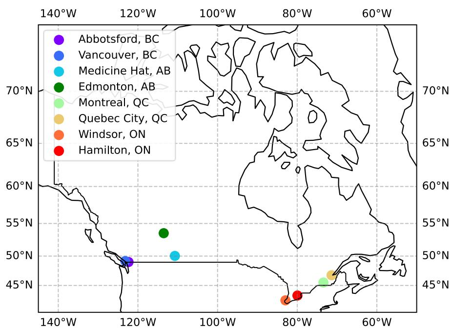  
Figure 6.3. Eight greenhouse location across Canada selected for this study.

This approach provides a complete and diverse view of the impact of climate change challenges on the Canadian greenhouse industry. The eight different locations targeted in this study are presented in Table 6.1.

Table 6.1. Locations selected for the simulations, with the current and future number of heating degree days (HDD) with a base temperature of  $15.6^{\circ}C$  

<table><tr><td>Location</td><td>Latitude (°N)</td><td>Longitude (°)</td><td>Elevation (m)</td><td>HDD2016 (°C-day)</td><td>HDD2080 (°C-day)</td></tr><tr><td>Abbotsford, British Columbia</td><td>49.03</td><td>-122.36</td><td>59.1</td><td>3471</td><td>3533</td></tr><tr><td>Edmonton, Alberta</td><td>53.57</td><td>-113.52</td><td>671.4</td><td>5305</td><td>4869</td></tr><tr><td>Hamilton, Ontario</td><td>43.17</td><td>-79.94</td><td>237.7</td><td>4898</td><td>4575</td></tr><tr><td>Medicine Hat, Alberta</td><td>50.03</td><td>-110.72</td><td>715.0</td><td>5228</td><td>4768</td></tr><tr><td>Quebec City, Quebec</td><td>46.79</td><td>-71.38</td><td>74.4</td><td>5354</td><td>4848</td></tr><tr><td>Montreal, Quebec</td><td>45.52</td><td>-73.42</td><td>27.4</td><td>5441</td><td>4916</td></tr><tr><td>Vancouver, British Columbia</td><td>49.19</td><td>-123.18</td><td>4.3</td><td>3366</td><td>3475</td></tr><tr><td>Windsor, Ontario</td><td>42.28</td><td>-82.96</td><td>189.6</td><td>4889</td><td>4525</td></tr></table>

# Reference greenhouse

Reference greenhouseThis research focuses on the simulation of a state- of- the- art tomato greenhouse. Tomato is by far the most common crop grown in greenhouses. Around the world, tomatoes were the most produced vegetable species in 2019, accounting for  $16\%$  (189.13 million metric tons) of the total production, including both field and greenhouses [143]. In Canada in 2021, tomatoes represented  $39\%$  (279,627 metric tons) of the total greenhouse vegetable production.

The modern greenhouse design considered in this work is based on products available from major manufacturers around the word [144]. One of the most widely used advanced commercial greenhouses is the Venlo greenhouse [53] [123]. This design optimizes plant growth and yield through precise environmental control, incorporating features such as automated climate control systems, advanced irrigation systems, supplemental lighting, humidification and dehumidification,  $\mathrm{CO_2}$  supplementation, and energy- efficient components such as double glazing and energy curtains [14].

The reference greenhouse used for the simulations is the one proposed by Katzin et al. [53] for the GreenLight model. It replicates a 4- hectare Venlo- type greenhouse with its specific dimensions and characteristics. The greenhouse is  $200m$  wide and long, with a gutter height of  $6.5m$  , a ridge height of  $7.3m$  , and a roof slope of  $22^{\circ}$  . The roof is made of glass panels, with one in six panels having a ventilation window  $(1.30\text{m}\times 1.67\text{m})$  that can be opened to  $60^{\circ}$  . Thermal screens are installed at a height of  $6.3m$  . The aisle width is  $1.6m$  with a tubular rail system. An HPS supplementary lighting system with a coverage of  $200\mu \mathrm{mol}_{\mathrm{PAR}}\cdot \mathrm{m}^{- 2}\cdot \mathrm{s}^{- 1}$  is included. The simulated greenhouse is based on the greenhouse design described by Vanthoor et al. [57].

Following the methodology of Katzin et al. [75], the simulations are run for almost one year (350 days), starting from September 27, the planting date of the crops, with a time step of 5 minutes. The simulated crops are assumed to be mature, and the 350- day duration accommodates a full year of tomato harvests, considering the two weeks required for crop rotation and greenhouse maintenance.

# Simulations

SimulationsThe energy and growth simulations were performed using the GreenLight model [53], an open- source model designed for illuminated greenhouses with tomato crops (code available at [63] and running on MATLAB R2021a). The decision to use GreenLight was influenced by its reasonable computational

time and the accessibility of the code, which ensures transparency of the research. The model was initially tailored to replicate an advanced Venlo greenhouse with tomato crops and supplemental lighting, using energy, carbon and vapour balances and meteorological conditions to predict the evolution of the climate in the greenhouse over the simulated period. GreenLight also implements common greenhouse components, such as lighting, heating and ventilation systems, and lets the user customize a wide variety of parameters and control strategies. A tomato crop model is then used to compute crop growth based on the canopy temperature, the  $\mathrm{CO_2}$  concentration and the amount of photosynthetically active radiation (PAR) absorbed by the canopy.

As indicated by Katzin et al. [53], the model validated with the data set of an experimental trial and had an error range of 1 to  $12\%$  in predicting the annual heating demand. Before introducing any modifications to the GreenLight model, its accuracy and reliability were verified against literature data and previous results. Validation was performed through a comparative analysis using the same methodology as Katzin et al. [75], which evaluated energy consumption results for Amsterdam, the Netherlands. Subsequently, the GreenLight model was adapted considering the physical characteristics of the selected greenhouse and the meteorological data of the target locations.

To assess the impact of climate change on greenhouse horticulture the reference greenhouse presented is simulated for both current and future climates and for all locations (Table 6.1). The focus is on energy consumption for lighting and heating, and on total fresh tomato yield over one year. Two types of lighting systems were also simulated, namely HPS and LED, since this variable is known to have a high impact on energy consumption and yield and many growers in Canada are currently evaluating the potential benefits of transitioning to LED systems.

High- tech commercial greenhouses are equipped with advanced climate control systems. Therefore, the simulation must also account for the interior climate controls to provide the optimal environment according to the requirements of different growth stages of the crops. The climate controls included in GreenLight consider the following aspects: lamps, blackout screens, thermal screens,  $\mathrm{CO_2}$  injection, heating, cooling by ventilation, and dehumidification [63]. The climate was controlled using a smoothed proportional controller (defined by a sigmoid function). In the GreenLight program, the controller enables the definition of a setpoint and an acceptable tolerance band ( $p_{Band}$ ) for each parameter. This function allows realistic control of the different variables since the desired values are not always attainable despite the setpoints.

These controls include a  $CO_2$  setpoint of 1000 ppm during the light period, a maximum relative humidity setpoint of  $87\%$ , and temperature setpoints of  $18.5^{\circ}C$  during the dark period and  $19.5^{\circ}C$  during the light period. The  $pBand$  value for temperature is  $4^{\circ}C$  and  $50\%$  for relative humidity. Lamps are turned on at midnight and turned off at 6:00 pm. However, the lamps are turned off when the global radiation is above  $400W\cdot m^{- 2}$  or if the predicted daily sum of radiation is higher than 10 MJ·m $^{- 2}$ ·day $^{- 1}$ .

# 6.4.2 Adaptive Strategy

In addition to simulating energy and yield performance of current greenhouses in 2016 and 2080, simulations were also carried out with adaptive measures to improve performance under future climate. Different adaptive strategies can be tested to mitigate the impact of climate change on greenhouse horticulture across Canada. As will be seen later, overheating has been identified as one of the main issues caused by climate change in greenhouses. The proposed adaptive solution in this study is thus mechanical cooling and dehumidification (MCD). Other strategies can also be tested in future work.

An MCD unit is added to the greenhouse model to simultaneously reduce air temperature and water vapor pressure during the summer. The sensible heat factor (SHF) of the system is 0.5. The system was available whenever the indoor temperature and dew point were above the temperature of the cold surface of the MCD (set at  $10^{\circ}C$ ). Removal of vapor  $(kg_{water vapor} m^{- 2} s^{- 1})$  occurs by condensation on the cold sheet of the MCD. The highest rate of energy removal for the MCD unit is set at  $800W\cdot m^{- 2}$ . This is achieved using an input power of  $200Wm^{- 2}$  and a coefficient of performance (COP) of 4 for the cooling unit. The system was employed for cooling when the indoor temperature was  $2^{\circ}C$  above the heating setpoint.

Preliminary results showed that this control method does not prevent the simulated MCD unit from being activated during colder months. Indeed, energy inputs such as heating and lighting systems and solar radiation can cause the indoor temperature to reach a temperature of  $2^{\circ}C$  above the heating setpoint, even during winter. Activating the MCD unit during cold days would lead to considerable energy costs. Consequently, it was decided to turn it off completely during winter. In the event that cooling and dehumidification remained necessary during this period, the opening of windows (ventilation cooling) was sufficient to meet those needs. MCD was deactivated in the model

until the weekly average outdoor temperature reaches a certain threshold. A threshold of  $25^{\circ}C$  was selected, as it minimized the average energy required to produce one kilogram of fruit in 2080. The resulting dates from which the MCD unit was operated in the simulations are presented in Table 6.2. It should be noted that the weekly temperatures do not reach  $25^{\circ}C$  for five locations in the 2016 weather data described in previously. Therefor, for these five locations, there is no MCD used in 2016.

Table 6.2. Date representing the time (days after planting) in the simulation when the weekly average outdoor temperature is greater than  $25^{\circ}C$  for both 2016 and 2080 for all locations.  

<table><tr><td rowspan="2">Location</td><td colspan="2">2016</td><td colspan="2">2080</td></tr><tr><td>Days after planting</td><td>Date</td><td>Days after planting</td><td>Date</td></tr><tr><td>Abbotsford, British Columbia</td><td>-</td><td>-</td><td>305</td><td>July, 29</td></tr><tr><td>Edmonton, Alberta</td><td>-</td><td>-</td><td>301</td><td>July, 25</td></tr><tr><td>Hamilton, Ontario</td><td>295</td><td>July, 18</td><td>261</td><td>June, 15</td></tr><tr><td>Medicine Hat, Alberta</td><td>293</td><td>July, 16</td><td>284</td><td>July, 8</td></tr><tr><td>Quebec City, Quebec</td><td>-</td><td>-</td><td>278</td><td>July, 2</td></tr><tr><td>Montreal, Quebec</td><td>-</td><td>-</td><td>267</td><td>June, 21</td></tr><tr><td>Vancouver, British Columbia</td><td>-</td><td>-</td><td>300</td><td>July, 24</td></tr><tr><td>Windsor, Ontario</td><td>298</td><td>July, 21</td><td>243</td><td>May, 28</td></tr></table>

# 6.4.3 Evaluation metrics

The methodology used a comprehensive set of evaluation metrics to analyze the performance of the greenhouses under different climate conditions. The primary outputs studied are the total energy consumption, which includes energy for lighting (electricity) and heating (natural gas), and the total yield, which is represented by the total fresh weight of harvested tomatoes (productivity). To facilitate comparisons with other studies, all metrics were calculated per square meter of greenhouse area. Another performance indicator was obtained by dividing the total energy use by the total yield, providing a measure of energy used to produce one kilogram of fruit harvested. This approach allows an assessment of the balance between energy use and productivity, recognizing that higher energy use may be justified by superior yield.

# 6.5 Results and discussion

This section presents the results obtained for all eight locations across Canada for current and future climates. Results for energy consumption and tomato yield for all simulations are presented and

discussed below. Also, the proposed adaptative measure (mechanical cooling and dehumidification) is introduced and explored.

# 6.5.1 Energy consumption and tomato yield

To have an efficient greenhouse, one should increase production while reducing energy consumption. Both of these aspects are presented in Figure 6.4, which depicts the total yield as a function of energy consumption for all locations using either HPS and LED lighting for the years current and future greenhouses.

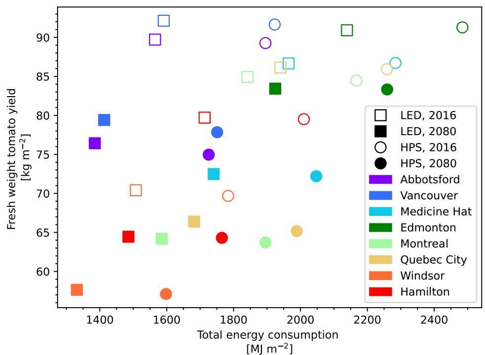  
Figure 6.4. Annual fresh weight tomato yield and total energy consumption per square meter of greenhouse area for 8 Canadian cities in 2016 and 2080, with either LED or HPS supplemental lighting.

From Figure 6.4, several key observations can be made. Under future climate (2080), tomato production is notably lower than under current climate for all scenarios, with an average fresh weight tomato yield approximately  $17.5\%$  lower. On the contrary, there is an overall reduction in energy consumption in 2080, with an average decrease of  $11.3\%$  observed. Also, both LED and HPS lighting systems exhibit similar total fresh weight tomato yields over the course of a year, with LED outperforming HPS simulations by only about  $0.7\%$ . However, there is a considerable difference in energy consumption between the two lighting systems, with LED systems consuming notably less energy, resulting in a  $15.9\%$  reduction in energy consumption compared to HPS. This finding

underscores the energy efficiency advantages of LED technology in greenhouse settings, which can contribute to both economic and environmental benefits.

The geographical variation in yield is apparent, with the highest yield reached in Vancouver (91.90 kg $\mathsf{m}^{- 2}$ - year $^{- 1}$ ) in current climate and in Edmonton (83.38 kg $\mathsf{m}^{- 2}$ - year $^{- 1}$ ) in future climate, while Windsor consistently records the lowest, both in the current (70.04 kg $\mathsf{m}^{- 2}$ - year $^{- 1}$ ) and future (57.38 kg $\mathsf{m}^{- 2}$ - year $^{- 1}$ ) climates. When it comes to energy consumption, the highest values are found in Edmonton, standing at 2484.37 MJ $\mathsf{m}^{- 2}$ - year $^{- 1}$  with HPS lighting in the current climate, and this pattern persists in the future climate with an energy consumption value of 2259.35 MJ $\mathsf{m}^{- 2}$ - year $^{- 1}$ . Conversely, the lowest energy consumption occurs in Windsor, registering 1783.79 MJ $\mathsf{m}^{- 2}$ - year $^{- 1}$  with HPS lighting in the current climate and 1597.93 MJ $\mathsf{m}^{- 2}$ - year $^{- 1}$  in future climate. Considering climate change, the most significant disparities between the years 2016 and 2080 are seen in Montreal and Quebec. Montreal experiences a substantial - 20.75 kg $\mathsf{m}^{- 2}$ - year $^{- 1}$  difference in yield and Quebec undergoes a noticeable - 263.92 MJ $\mathsf{m}^{- 2}$ - year $^{- 1}$ . shift in energy consumption. These differences highlight the evolving challenges and opportunities that climate change presents for greenhouse agriculture. For all simulations conducted in the same location and year, the HPS lighting system consumed in average approximately 220 MJ $\mathsf{m}^{- 2}$ - year $^{- 1}$  more energy than the LEDs.

The following subsections investigate in detail the reasons behind these results.

# Energy consumption

This section presents the energy consumption of the different simulations. Figure 6.5. reports the cumulative total energy consumption over a year for both types of lamps.

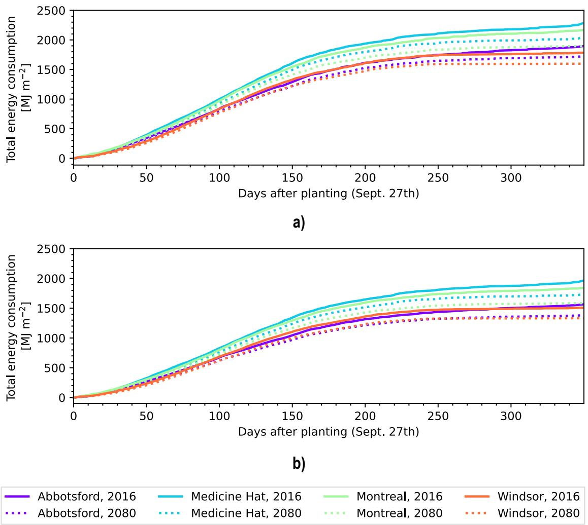  
Figure 6.5. Cumulative total energy consumption over a year for greenhouses across Canada in 2016 and 2080 with: a) HPS lighting and b) LED lighting.

The curves for HPS lighting (Figure 6.5a) and LED lighting (Figure 6.5b) are very similar, although HPS leads to a higher energy consumption. From these results, it is possible to see that climate change reduces energy consumption. This is due to the higher winter temperature in 2080 compared to 2016. Figure 6.6 presents the energy consumption variation over time. Only the location of Windsor is shown in this figure to better see the difference between current and future climate over the year. This location, (Windsor, Ontario) is chosen because most of the greenhouses in Canada are in this region.

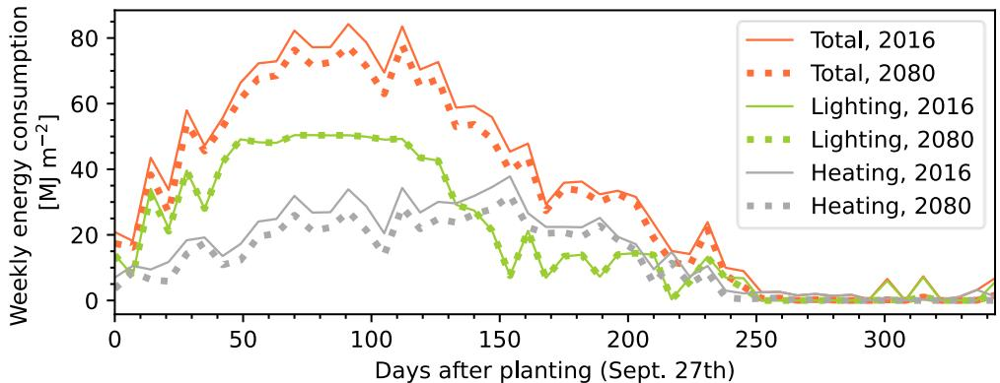  
Figure 6.6. Weekly lighting, heating and total energy consumptions over a year for greenhouses in Windsor in 2016 and 2080 under HPS lighting.

Energy consumption exhibits its peak during the autumn and winter months, primarily attributed to the combination of reduced solar radiation and lower temperatures. Maximum weekly consumption peaks at around  $85 \text{MJ / m}^2$ , while the maximum daily consumption reaches approximately  $14 \text{MJ / m}^2$ . Under future conditions, a noticeable reduction in energy consumption, particularly for heating purposes, is visible in Figure 6.6.

# Fresh weight tomato yield

The cumulative fresh weight tomato yield over a year is presented in Figure 6.7 for both types of lamps. The term fresh weight tomato yield refers to the fresh weight of tomatoes harvested.

Over the course of a year, HPS and LED lighting greenhouse simulations exhibit similar patterns in terms of yield. At the beginning, there is no yield due to the absence of mature tomatoes on the plants. Between approximately 35 days and 240 days after planting, the curves for the eight different locations and two types of lamps tend to overlap, indicating similar trends in crop growth. Beyond 240 days, which corresponds to the end of May, certain scenarios cease to produce yield. This is more pronounced in future climate scenarios and locations with warmer climates.

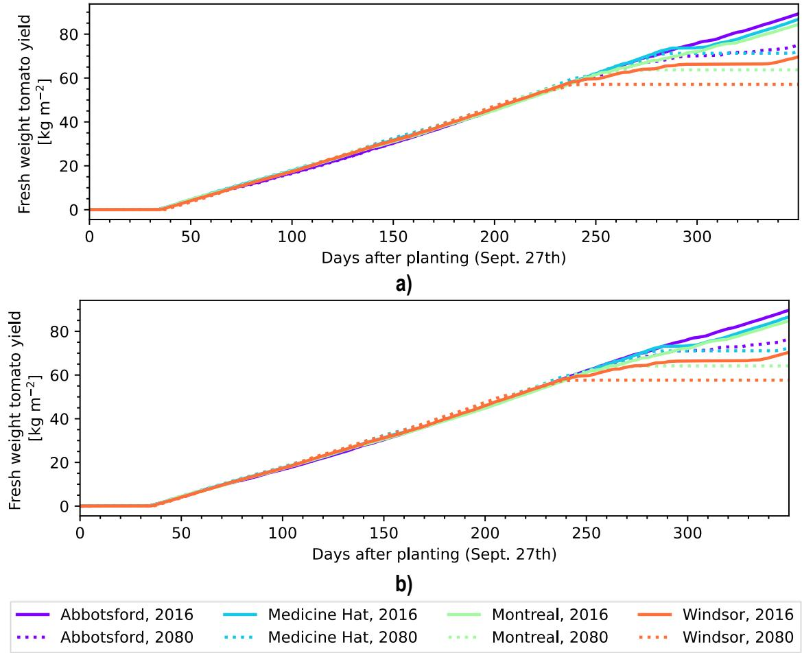  
Figure 6.7. Cumulative total fresh weight tomato yield over a year for greenhouses across Canada in 2016 and 2080 under: a) HPS lighting and b) LED lighting.

In the following explanation, the focus is on the location of Windsor as it experiences the most significant impact on yield, especially under future climate conditions where the yield issue is more severe. However, similar conclusions were drawn for the other locations for which a cessation of yield was predicted by the Greenlight model.

The cessation of yield is attributed to high temperatures within the greenhouse, and more specifically to elevated canopy temperatures that impede plant growth. As photosynthesis depends strongly on the canopy temperature [64], the Greenlight model uses two inhibition functions to represent this relationship. The first one focuses on the effect of the instantaneous canopy temperature on fruit growth, and the second one considers the impact of the mean canopy temperature over the last 24 hours. It was found that for every simulation where production flattened in summer, this second inhibition function had the biggest impact on fruit growth. Therefore, the growth rate of the fruits decreases rapidly to zero when the mean canopy temperature exceeds a threshold of  $24.5^{\circ}C$  in the

model. Figure 6.8 shows the mean canopy temperature over a full year in Windsor, for the current and future scenarios. During summer (starting approximately 240 days after planting), the canopy temperature over a 24- hour period is higher for future climate than for current climate, limiting growth during this period.

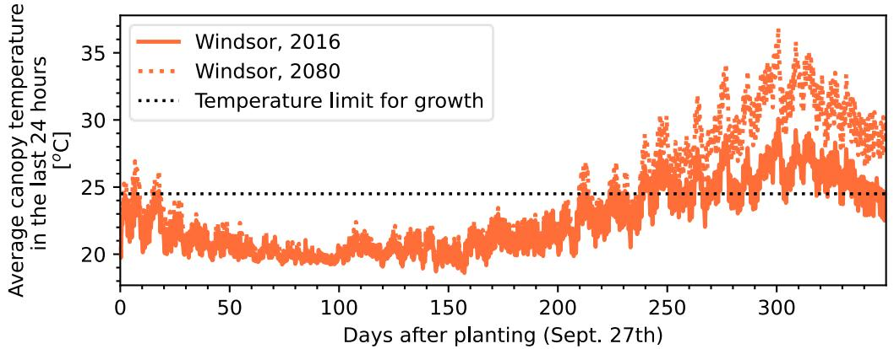  
Figure 6.8. Average canopy temperature in the last 24 hours over a year for greenhouse in Windsor in 2016 and 2080 under HPS lighting.

The only implemented cooling strategy for these simulations was ventilation, which has a direct effect on the air temperature of the greenhouse, and thus an indirect effect on canopy temperature and average canopy temperature. These different temperatures and the ventilation control over ten days for the 2080 scenario in Windsor are shown in Figure 6.9. As the implemented control strategy for ventilation is to open the roof panels (ventilation control  $= 1$  in Figure 6.9), when the greenhouse air is too hot or too humid, this strategy does not take directly into consideration the mean canopy temperature. Thus, ventilation can be turned off (ventilation control  $= 0$ ) even if the mean canopy temperature is too high for fruit growth, as shown in Figure 6.9. This figure also shows that maintaining air temperature to a certain setpoint does not guarantee good mean canopy temperatures over the year. Canopy temperature depends strongly on solar irradiation, and it can increase over the threshold for fruit growth even when the air temperature is adequate.

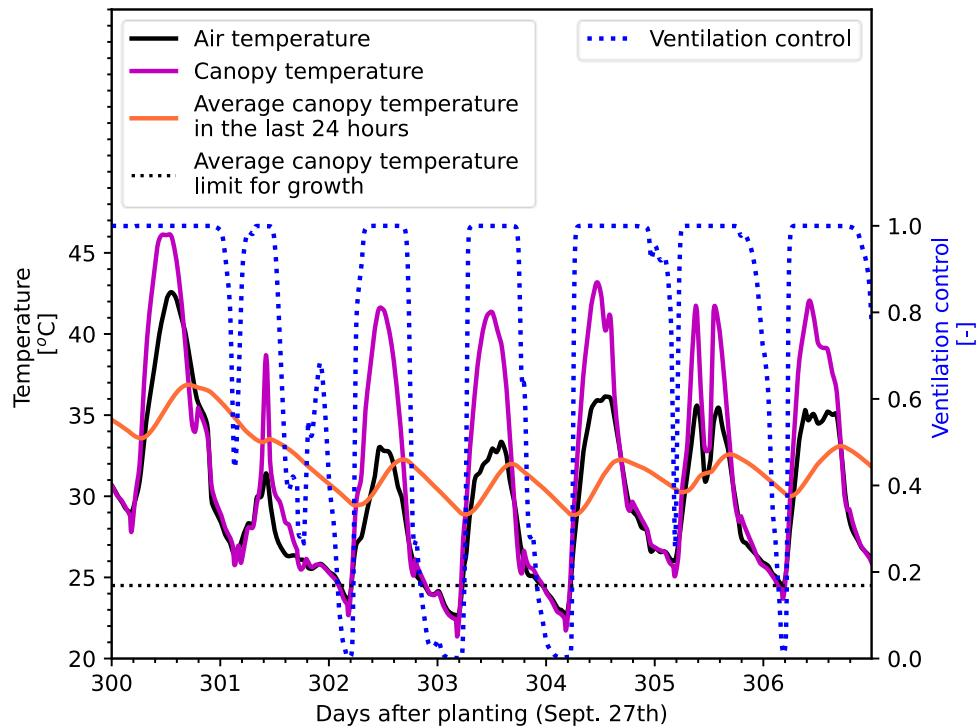  
Figure 6.9. Different greenhouse temperature and roof ventilation control for one week over the summer period in Windsor in 2080.

# 6.5.2 Adaptive strategy

The energy and yield results with the adaptative strategy presented in Section 6.4.2 to mitigate the impact of climate change is presented in the following section. For all eight locations and for current and future climates, the simulations were conducted with a mechanical cooling and dehumidification (MCD) unit to allow an optimal climate for growth in summer. Although an MCD unit can help controlling humidity levels in the simulated greenhouses, the following section focuses on its impact on temperature control, as the results from Section 6.5.1 showed that high temperatures were the main cause of the yield reduction. Furthermore, when the MCD unit was turned on in the simulations, it was mainly for the purpose of temperature control (84.6% of the time in 2080 and 78.7% of the time in 2016).

As mentioned above, using the MCD year- round is the strategy that maximizes the total yield of the greenhouse. However, adding the MCD unit to the model increases the amount of energy required, both for current and future scenarios. To achieve a balance between yield and energy consumption, as discussed in Section 2.3, it was decided to allow the MCD unit to work only when the average weekly outdoor temperature exceeded  $25^{\circ}C$ . Once activated, the unit remained operational for the

duration of the simulation and was managed by the indoor climate controller. With this approach, only three cities (Medicine Hat, Windsor and Hamilton) could use MCD in 2016. While this adaptive solution offers a promising way forward, it must be tailored to individual greenhouses and their respective locations for optimal results. The energy and yield results when MCD is introduced are presented in Figure 6.10.

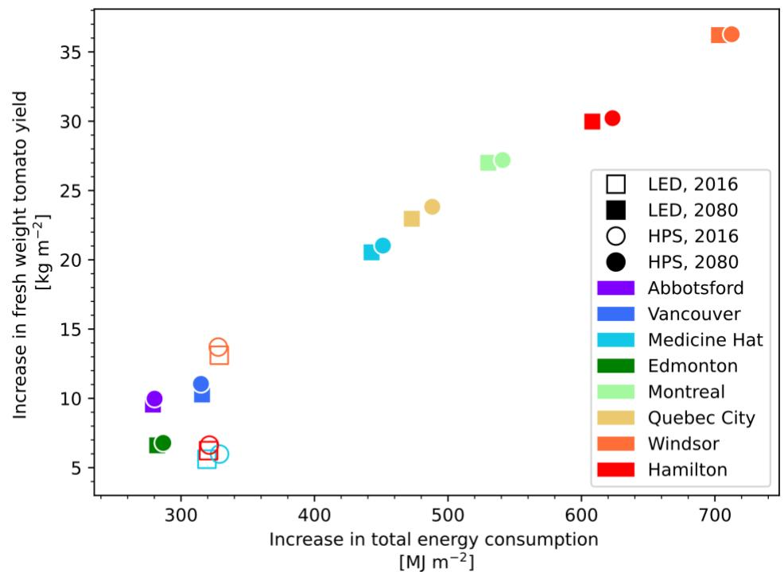  
Figure 6.10. Increase in fresh weight tomato yield and total energy consumption per square meter of greenhouse area for different Canadian cities in 2016 and 2080 using an MCD unit under LED lighting, and HPS lighting.

The implementation of MCD played a significant role in enhancing the crop yield. When comparing crop yields with and without the MCD unit under both types of lighting, the presence of the MCD unit led to a  $10.8\%$  increase in yields in 2016 and a substantial  $29.3\%$  increase in 2080. The MCD unit has a very similar effect for both type of supplemental lighting.

Concerning energy consumption, the MCD unit was found to result in more energy being consumed due to the additional requirements to operate the unit. Overall energy consumption when the MCD are introduced was  $17.3\%$  higher in 2016 and  $26.6\%$  higher in 2080. Simulations with HPS supplemental lighting still results in more energy consumption then with LED. HPS lighting not only requires more energy for the lamps but also leads to greater energy consumption for the MCD unit,

as HPS lamps release significant heat. Therefore, given the effects of climate change, switching to LED lighting becomes even more beneficial.

Considering the MCD unit influence, the results indicate that the most energy- efficient option is Windsor under LED supplemental lighting for 2016 (1836.55 MJ·m $^{- 2}$ ·year $^{- 1}$ ) and Abbotsford under LED supplemental lighting for 2080 (1664.01 MJ·m $^{- 2}$ ·year $^{- 1}$ ). In contrast, Medicine Hat and Edmonton under HPS supplemental lighting respectively exhibited the highest energy consumption levels for the current climate (2613.11 MJ·m $^{- 2}$ ·year $^{- 1}$ ) and the future climate (2546.01 MJ·m $^{- 2}$ ·year $^{- 1}$ ). Turning attention to crop yields with the MCD unit, Medicine Hat demonstrated the highest yields in 2016 (92.70 kg·m $^{- 2}$ ·year $^{- 1}$ ) when using HPS lighting. For 2080, Hamilton under HPS lighting has the highest yield (94.53 kg·m $^{- 2}$ ·year $^{- 1}$ ). Conversely, Windsor experienced the lowest yields with HPS in 2016 (83.38 kg·m $^{- 2}$ ·year $^{- 1}$ ) and Abbotsford with HPS in 2080 (84.95 kg·m $^{- 2}$ ·year $^{- 1}$ ).

Figure 6.11 illustrates a comparative analysis of the impact of the MCD unit on energy consumption and yield for the Windsor case study under HPS lighting. In this figure, a shaded area delineates the possible range of energy consumption and yield depending on how the MCD is operated (from MCD unit not operating to MCD allowed all year- round). The intermediate curves represent scenarios where the MCD unit is used only during certain periods of the year, particularly during summer.

  
Figure 6.11. Comparative analysis of greenhouse performance in Windsor for 2016 and 2080 with and without an MCD unit under HPS supplemental lighting: a) cumulative total energy consumption, and b) cumulative total fresh weight tomato yield over a year.

Figure 6.11a shows that the overall energy consumption with an MCD unit is significantly higher over the summer period when the unit is put into operation. Energy consumption in future climate conditions is lower than that in the current climate when the MCD unit is not yet in operation. This variation in energy usage primarily stems from the reduced heating demands in 2080, as represented in Fig. 6.12. On the other hand, the energy required for the MCD unit does exhibit an increase in 2080 compared to 2016, mainly because it is in function for a longer period and because the outdoor temperatures are on average higher.

Figure 6.11b illustrates the positive impact of the MCD unit, addressing the issue of yield reduction during summer. The MCD unit enhances control over indoor conditions, creating a more optimal climate for crops which translates in achieving higher crop yields during hot periods in both current

and future climate scenarios. The impact of the MCD unit is more pronounced in future climate, because without the unit the yield stops over the summer period. As climate change progresses, investing in technologies like MCD units could become increasingly vital to ensure optimal growing conditions for plants.

Figure 6.12 shows the different contribution of energy consumption for the case study of Windsor under HPS lighting.

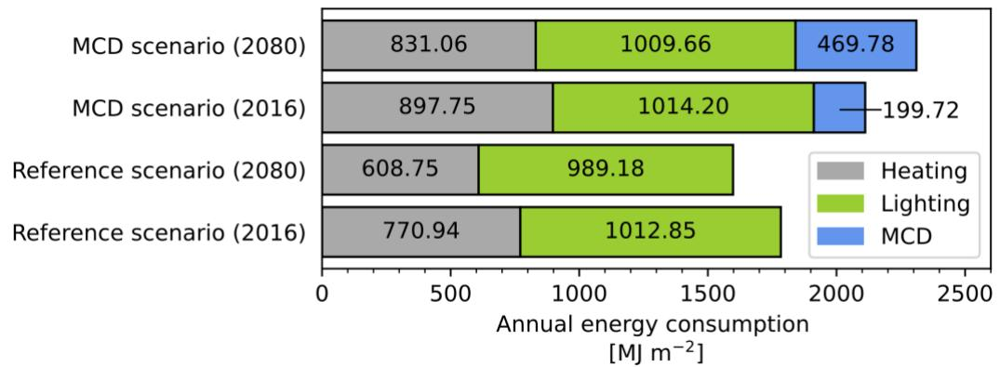  
Figure 6.12. Total annual energy consumption for heating, lighting and the MCD unit for a greenhouse in Windsor for 2016 and 2080 with and without an MCD unit under HPS supplemental lighting.

As shown in example in Figure 6.12, for the overall energy consumption, the primary distinction between the current and future climate lies in the heating demand, which is lower in 2080 due to the more elevated average winter temperatures. Conversely, the energy consumption for the MCD unit is higher in 2080 compared to 2016, primarily driven by the increased demand for cooling and dehumidification during summer. With the MCD unit in place, the energy consumption for supplemental lighting remains roughly consistent. However, in the absence of the MCD unit, the energy required for supplemental lighting diminishes in 2080 compared to 2016. This discrepancy is attributed to the control system's response to high temperatures, which results in the lights being turned off to prevent heat emission. Additionally, during nighttime when temperatures remain high, roof ventilation necessitates opening, subsequently requiring the blackout curtains to remain open. To mitigate light pollution, the lights are deactivated when the blackout curtains are not in use. The incorporation of the Mechanical MCD unit into the model results in an increase in the energy demand for heating across both the 2016 and 2080 scenarios. This augmentation can be attributed to the fact that, following excessively warm periods, there inevitably arrives a phase where heating becomes necessary. The introduction of the MCD unit notably advances this heating requirement, primarily due

to the reduced thermal inertia of the greenhouse associated with its utilization. Consequently, the necessity for heating arises at an earlier point in time when the MCD unit is present. The control strategy of the MCD was implemented to maximize the total yield of the greenhouse, while taking into account the energy consumption.

Figure 6.13 summarizes the results of this study by highlighting the efficiency of greenhouses in term of energy consumption per kilogram of tomatoes produced.

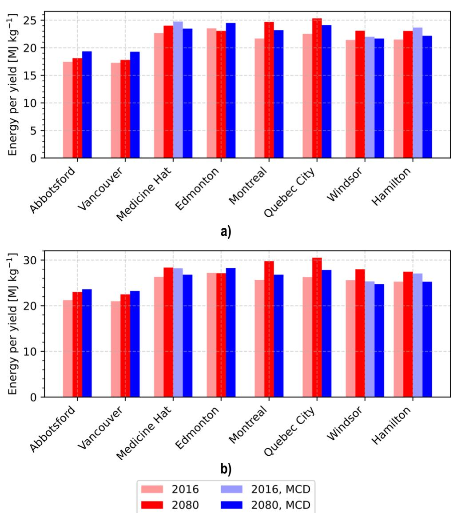  
Figure 6.13. Total specific energy consumption (energy per fresh weight tomato yield) of greenhouse for 8 Canadian cities in 2016 and 2080, with and without an MCD unit under a) LED lighting, and b) HPS lighting.

Furthermore, the results suggest that although the adaptive solution (MCD unit) leads to increased yield, it also results in higher specific energy consumption in certain locations compared to the scenario without MDC.

# 6.6 Conclusion

Greenhouse horticulture is a very energy- intensive industry. Its performance in terms of energy demand and crop yield is directly influenced by the climate, putting it at risk due to climate change. The contribution of this paper is to provide an assessment of the impact of climate change on energy consumption and crop yield of greenhouse horticulture and propose mitigation measures. Based on simulations under current and 2080 (RCP8.5) climates in eight Canadian cities, we showed that, with a business- as- usual approach, crop yields may decline by  $17.4\%$  on average while energy consumption may decline by  $11.2\%$  on average. However, using a mechanical cooling and dehumidification (MCD) unit can mitigate the impact on crop yield, but at the cost of increasing energy consumption by  $16.2\%$  compared to the current situation. It was also found that the impact of climate change and the mitigation measures could be different across cities, highlighting the need to tailor the analysis and solution development to the local context.

The need to introduce MCD units or other mitigation measures due to climate change is likely to increase the overall energy consumption, which can be counter- intuitive given the expected reduction of the heating demand. The conclusions of this work can help energy utilities, growers, policymakers and researchers to initiate a reflection on how to adapt greenhouse agriculture to climate change. Future work could investigate other climate scenarios and cities. Also, other adaptation strategies could be considered in order to find the most appropriate in each context, including heating and cooling systems (e.g., heat harvesting, water buffer, geothermal systems, etc.), their control, as well as the selection of new crops. Economic considerations could be included in such analysis. The design of the greenhouse could also be optimized considering future climate, adapting for example its envelope and openings. In this study, only the energy and yield aspects are considered, but climate change can also have other major impacts. For example, it would be interesting to explore the impacts on greenhouse horticulture with increase future water scarcity and changing pest dynamics. Furthermore, conducting an analysis of specific extreme weather conditions, such as heatwaves and severe cold spells, over short time periods, both on greenhouse structures and crops, would offer valuable insights.

# Conclusion

ConclusionIn conclusion, this research aimed to identify best practices for lighting and energy efficiency measures in greenhouses from an energy perspective, with a focus on sustainability. The thesis provides valuable insights and recommendations to enhance the energy efficiency and sustainability of greenhouse horticulture practices in the region and beyond. The study was guided by three specific objectives. The study aims to evaluate the current state of research on the topic and the methods used to adapt, analyze, and develop a comprehensive greenhouse model that accurately simulates dynamic energy consumption and yield factors within the greenhouse system. Furthermore, it aims to evaluate the performance and sustainability of greenhouses. The analysis examined the impact of different lighting technologies and energy efficiency measures on the total annual energy consumption of typical greenhouses, considering the potential effects of climate change.

# Work summary

# Chapter 1 Energy consumption in Quebec

Chapter 1 outlines energy usage in Quebec, with a particular focus on greenhouse energy. Quebec traditionally relies on renewable electricity sources, but during cold winter periods, the grid can become strained. Nevertheless, Hydro Quebec is encouraging greenhouse operators to switch to electric heating and lighting but imposes restrictions to prevent grid overloads.

# Chapter 2 Energy Efficiency in Greenhouse Horticulture

Chapter 2 discusses energy efficiency in greenhouse horticulture. The recent literature highlights several strategies to reduce energy consumption in greenhouse operations. The main areas of focus are heating and ventilation systems, energy sources, design considerations, heat distribution networks, thermal screens, insulation, thermal storage tanks, computerized climate control systems, crop selection, and production scheduling. Also, lighting is an important aspect of greenhouse energy efficiency, with LED lighting being the most advantageous.

# Chapter 3 Simulation Methodology

Chapter 3 Simulation MethodologyChapter 3 provides an overview of greenhouse simulation models. To align with the project's objectives, we chose a mathematical approach that uses the GreenLight model. This model is comprehensive, efficient, and integrates crop and building simulations.

# Chapter 4 Sensitivity Analysis of Lamp Model Parameters in Energy and Yield Simulations of Greenhouse

Chapter 4 Sensitivity Analysis of Lamp Model Parameters in Energy and Yield Simulations of GreenhouseChapter 4 explores the importance of lamp parameters in simulating energy consumption and growth in greenhouses equipped with supplemental lighting. The results revealed that the reflection of the sun's near- infrared radiation through the lamp layer is the most influential factor affecting energy consumption. Regarding total yield, the parameter identified as most critical was the maximum intensity of the lamps. There were no significant differences observed between LED and HPS lamps with respect to the most influential lamp parameters.

# Chapter 5 Impact of Lighting Systems, Energy Efficiency Measures, and Local Contexts on Greenhouse Energy Consumption, Yield, and Costs

Chapter 5 Impact of Lighting Systems, Energy Efficiency Measures, and Local Contexts on Greenhouse Energy Consumption, Yield, and CostsChapter 5 compares the energy efficiency measures for greenhouses in Quebec and Denmark, focusing on energy consumption, yield, and costs. This study demonstrates that external climate and energy infrastructure disparities have a significant impact on energy consumption and costs. The findings suggest that LED lighting is the most efficient option for both locations due to its high energy efficiency and minimal impact on yield. Additionally, the implementation of thermal screens in the greenhouse is the most effective energy- saving technique.

# Chapter 6 Impact of Climate Change on Energy Consumption and Yield in Greenhouse Horticulture

Chapter 6 examines the impact of climate change on energy consumption and crop yields in greenhouse horticulture across different climatic conditions in Canada. According to the simulations, assuming minimal mitigation efforts (RCP8.5), crop yields could decrease by an average of  $17.5\%$ . However, mechanical cooling and

dehumidification are potential measures that can be taken to mitigate the impact on crop yield. However, adopting these solutions increases energy consumption. Therefore, a balanced approach that optimizes both yield and energy usage should be sought.

# Scientific and industrial impact

This research examines important aspects of greenhouse horticulture, including optimizing energy consumption and adapting to climate change. The chapters present analysis and simulation methodologies that provide valuable insights into the factors that affect greenhouse operations. This study has identified optimal approaches for reducing greenhouse energy consumption while enhancing productivity, contributing to the advancement of scientific knowledge in greenhouse modeling and energy optimization strategies. The analysis of the GreenLight model covered not only the primary controls in greenhouses but also the modeling of artificial lighting. This research directly addresses the needs of researchers aiming to prioritize main controls in greenhouses, such as the addition of sensors.

The results also have practical implications for the industry, highlighting which efficiency practices should be implemented and the importance of proactive measures to mitigate the adverse effects of climate change on crop yields and energy consumption in greenhouses. Additionally, the study provides valuable insights into lamp parameters, enabling lamp manufacturers to improve their datasheets by explicitly providing main lamp characteristics for modeling. This, in turn, facilitates more reliable simulations and informed decision- making processes. In summary, this research improves our understanding of greenhouse dynamics and provides valuable guidance for stakeholders in the greenhouse industry, promoting sustainability and resilience in the face of changing environmental challenges.

# Limitations and future work

Future work in this research could involve integrating sensor technology more closely within greenhouse environments. This could be achieved by adding sensors, such as temperature, humidity, and light sensors, to enable real- time monitoring of environmental conditions within the greenhouse. The real- time data could then be compared to the simulation results obtained from the GreenLight model. By conducting this comparison, researchers can evaluate the accuracy and

reliability of the model in predicting actual greenhouse performance in the specific local context. Additionally, integrating sensor data into the simulation model could enable dynamic adjustments to control parameters in response to changing environmental conditions, further optimizing energy consumption and productivity. Furthermore, future research could investigate more advanced machine learning techniques to improve the predictive capabilities of the simulation model. This would enhance its accuracy and applicability in practical greenhouse management scenarios. In general, the integration of sensor technology and the improvement of simulation models show potential for advancing research in greenhouse optimization and sustainability.

# Annex 1 Approximation of a Typical Greenhouse Energy Consumption in Quebec

Annexe 1 Approximation de la consommation d'énergie globale des serres au Québec

# A1.1 Resume

Pour estimer la consommation d'énergie des serres au Québec, il est essentiel de définir le portrait des serres actuelles. Les bases de données gouvernementales fournissent des informations sur la superficie totale des cultures en serre au Québec, la proportion de chaque type de culture, les régions où sont situées les serres et d'autres données pertinentes. Pour obtenir une représentation exacte de la consommation d'énergie dans une serre au Québec, il est essentiel de tenir compte du chauffage de l'espace, de la capacité de chauffage de pointe, de l'éclairage d'appoint et des autres besoins énergétiques. La consommation moyenne d'énergie par mètre carré d'une serre de tomates est d'environ 1300 kWh·m $^{- 2}$  (4680 MJ·m $^{- 2}$ ) par année. Cette valeur donne un ordre de grandeur de la consommation énergétique globale.

# A1.2 Abstract

To estimate the energy consumption of greenhouses in Quebec, it is crucial to define the scope of the current greenhouses. Government databases provide information on the total area of greenhouse crops in Quebec, the proportion of each crop type, the regions where the greenhouses are located, and other relevant data. To obtain an accurate representation of energy consumption in a greenhouse in Quebec, it is essential to consider space heating, peak heating capacity, supplemental lighting, and other energy needs. The average energy consumption per square meter of a tomato greenhouse is approximately 1300 kWh·m $^{- 2}$  (4680 MJ·m $^{- 2}$ ) per year. This value gives an order of magnitude of the overall energy consumption.

# A1.3 Profile of the horticultural industry in Quebec

# A1.3.1 Type of crops

For the crop area of each plant grown in Quebec's greenhouses, there are discrepancies between the values reported by Statistics Canada [145] and those reported by Statistique Quebec [105], [3]. Table A1.1 displays the prioritized data from Statistique Quebec for each type of crop.

Table A1.1. Area of greenhouses cultivated according to the type of crops for 2021 (ha) [105], [3]  

<table><tr><td>Type of crop</td><td>Greenhouses total area (ha)</td><td>% of total area</td></tr><tr><td>Tomato</td><td>68.5</td><td>45.3 %</td></tr><tr><td>Cucumber</td><td>42.2</td><td>27.9 %</td></tr><tr><td>Lettuce</td><td>15.2</td><td>10.1 %</td></tr><tr><td>Pepper</td><td>8.3</td><td>5.5 %</td></tr><tr><td>Eggplant</td><td>0.6</td><td>0.4 %</td></tr><tr><td>Asian vegetables</td><td>0.8</td><td>0.5 %</td></tr><tr><td>Herbs</td><td>2</td><td>1.3 %</td></tr><tr><td>Shoots and micro-shoots</td><td>5.4</td><td>3.6 %</td></tr><tr><td>Others</td><td>8.2</td><td>5.4 %</td></tr><tr><td>Total</td><td>151.2</td><td>100 %</td></tr></table>

In Quebec, the main crop produced is tomatoes, covering an area of 68.5 ha. The other three main crops are cucumbers, lettuce, and peppers, with a total crop area of 42.2, 15.2, and 8.3 ha, respectively. The 'Others' section includes strawberries and raspberries grown in greenhouses.

# A1.3.2 Location of Greenhouses

The distribution of greenhouses in the province of Quebec is presented in Figure A1.1. This information is important because the amount of energy required to operate a greenhouse significantly varies depending on the climate.

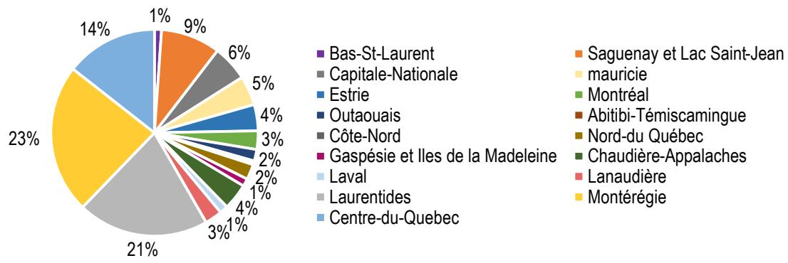  
Figure A1.1. Estimation of the regional distribution as a percentage of holdings and cultivated areas by production administrative regions of Quebec, 2021 [105].

The three primary regions where greenhouses are located in Quebec are Montérégie (23.4%, Figure A1.2, #16), Laurentides (20.5%, Figure A1.2, #15), and Centre- du- Québec (14.4%, Figure A1.2, #17). These regions account for 58.3% of the greenhouses in Quebec. Greenhouses are concentrated in the greater metropolitan area due to the more favorable climate and proximity to markets.

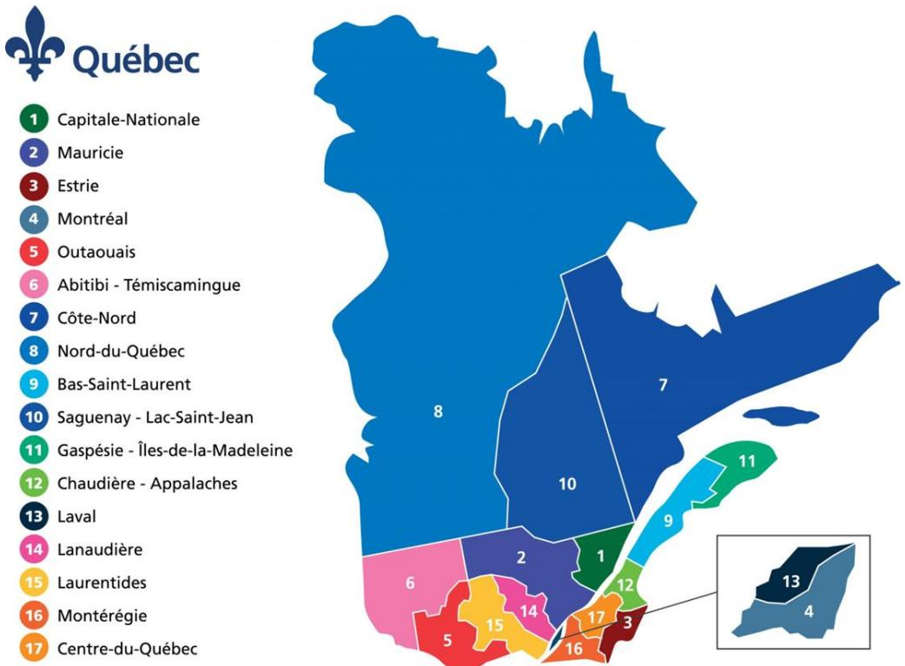  
Figure A1.2. Map of the Province of Quebec displaying country borders and administrative areas [146].

# A1.3.3 Weather conditions

A1.3.3 Weather conditionsThe weather values of these three main regions (Montérégie, Laurentides, and Centre- du- Québec) can be approximated by the values of Saint- Hyacinthe, a city in the middle of these administrative areas. The annual temperature, solar intensity, and degree days of Saint- Hyacinthe are shown in Figure A1.3.

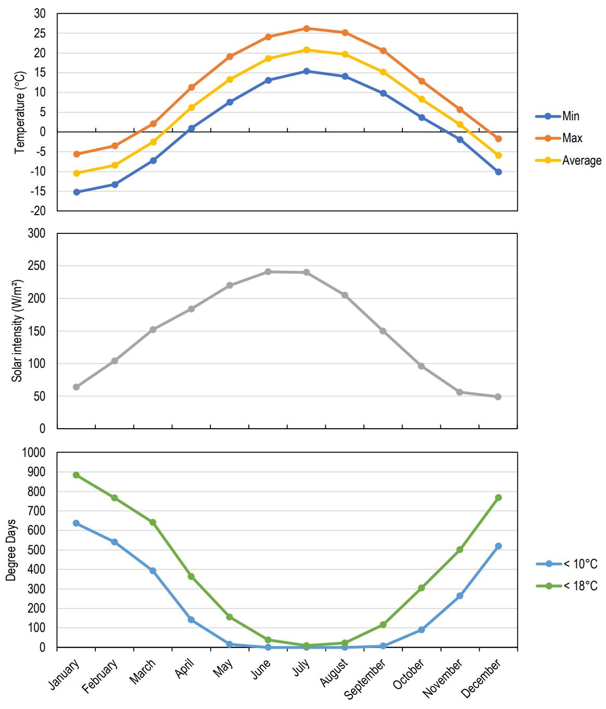  
Figure A1.3. Daily maximum, daily average and daily minimum outside temperature, monthly average solar intensity and monthly degree days for an average year in Saint-Hyacinthe [82] [9].

As anticipated for Quebec's climate, temperatures are higher during summer (remaining above  $0^\circ \mathrm{C}$  from April to November). Solar intensity peaks during June, July, and August. Degree days remain close to 0 during the summer.

Hourly global horizontal solar radiation is a critical factor in greenhouse modeling. In cases of insufficient solar radiation, artificial lighting is necessary. The weather data used in this study was obtained from the Energy Plus database [66]. Figure A1.4 shows this information for Montreal Airport, Saint- Hubert Longueuil, which is the location that best represents the majority of greenhouses in Quebec (from the data available in Energy Plus). Figure A1.4 shows an approximation of the radiation required for tomato production, with a threshold of  $400 \mathrm{W}\cdot \mathrm{m}^{- 2}$  for 18 hours per day [25].

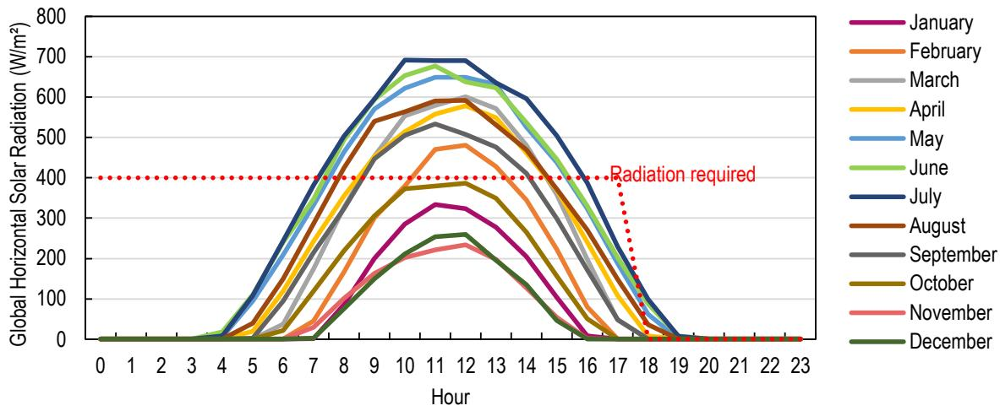  
Figure A1.4. Global Horizontal Solar Radiation Hourly Statistics.

For optimal tomato production, it is recommended to turn on the lamps when the external global horizontal solar radiation is less than  $400 \mathrm{W}\cdot \mathrm{m}^{- 2}$ . Figure A1.5 shows the approximate number of hours the lamps should be on for each month of a typical year.

The maximum time the lamps need to be on is from October through January, totaling 18 hours of lighting. On average, the lamps should be on for 13.67 hours. The use of a more permissive threshold, below  $400 \mathrm{W}\cdot \mathrm{m}^{- 2}$ , could reduce these artificial lighting times. However, it is important to consider other factors, such as the amount of daily radiation, before deciding to turn on the lamps. It should be noted that the  $400 \mathrm{W}\cdot \mathrm{m}^{- 2}$  threshold is only an approximation.

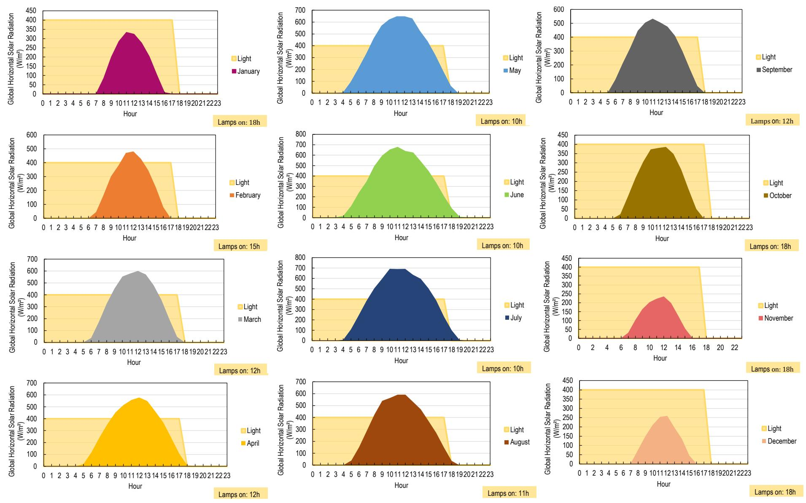  
Figure 1.5. tio f th  f hr  t  f t  t  t  t QC, Canada).

# A1.3.4 Greenhouse type: area and materials

In Quebec, there are many small producers of vegetables who use greenhouses. Single span greenhouses account for approximately  $80\%$  of the total area, while twin greenhouses account for the remaining  $20\%$  [9].

The choice of greenhouse cover has a significant impact on heating energy consumption. In Quebec, double polyethylene covers account for approximately  $90\%$  of greenhouses, while single polyethylene or glass covers account for the remaining  $10\%$  [9]. According to Statistics Canada [147], the average greenhouse area in Quebec is 29,398 square feet (0.27 ha).

Insulation also has a significant impact on energy consumption. In Quebec, the Institute for Research and Development in Agri- Environment [9] estimates that  $45\%$  of greenhouses have an insulated north wall. In addition,  $25\%$  of the greenhouses have perimeter insulation up to  $0.5m$  high (where the perimeter is insulated, the foundation is also insulated) and  $5\%$  of greenhouses have a thermal screen.

# A1.3.5 Energy sources

Several energy sources are used to heat greenhouses in Quebec, as shown in Figure A1.6.

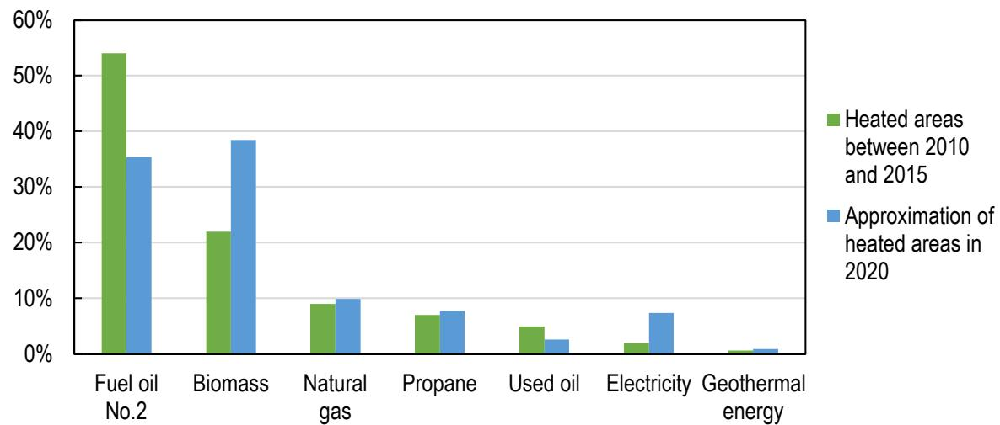  
Figure A1.6. Distribution of heated areas between 2010 and 2015 by type of energy and the approximation of the heated areas in 2020 for Quebec's greenhouses [9].

The main energy sources used are Fuel Oil No.2 oil and biomass.

# A1.3.6 Greenhouses expenses

A1.3.6 Greenhouses expensesAlthough there is no precise data on the energy consumption of individual greenhouses in Quebec, Statistics Canada has data on the operating costs of greenhouses in Quebec in general [148]. These data are presented in Figure A1.7.

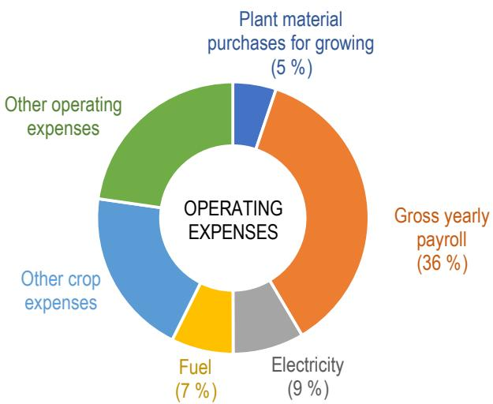  
Figure A1.7. Specialized greenhouse producers operating expenses (vegetables), Quebec 2021 [148].

Figure A1.7. Specialized greenhouse producers operating expenses (vegetables), Quebec 2021 [148].The total operating expenses for greenhouses is  $137 \text{M}$  for the province of Quebec in 2021 [148], which represents  $0.9 \text{M}$  per ha (with a total area of 151 ha [105], [3]). The annual gross payroll is the highest cost with an expense of  $50 \text{M}$  (36%). This price represents the seasonal and permanent labor. The purchase of plant material for cultivation is valued at  $7 \text{M}$  (5%). This includes the value of flowers, plants, cuttings, seedlings, seeds and bulbs purchased (before sales tax). For energy, fuel and electricity expenses are 10 and  $12 \text{M}$  (7 and 9%) respectively. The other expenses include operating expenses and crop expenses. The other operating cost is the second highest cost, with  $31 \text{M}$  (23%). This value includes interest, property taxes, insurance, advertising, repairs to farm buildings, machinery, farm equipment and vehicles, contract work, and telephone and telecommunication services. Crop- related expenses are estimated at $27 million (20%) and include fertilizers, pesticides, pollination, irrigation, containers, packaging, bioprograms, and growing mediums such as soil, peat moss, vermiculite, perlite, sand, Styrofoam, and sawdust.

# A1.4 Greenhouse energy consumption approximation

Approximating the energy demand of a greenhouse involves considering several factors, such as the heating and cooling requirements, lighting, ventilation, and other operational needs.

The first step in estimating a greenhouse's energy needs is to determine the size and type of greenhouse and the type of crop being grown. The larger the greenhouse, the more energy it will require to maintain optimal growing conditions. In addition, different types of greenhouses may have different energy requirements, such as glass vs. plastic cover materials. Next, the most important estimation is the heating and cooling requirements, as these are typically the largest energy demands for a greenhouse. The lighting energy demand is another important element to calculate. Ventilation, irrigation, and other operational needs can also contribute to the energy demand of a greenhouse. For example, fans and pumps used for ventilation and irrigation will require electricity to operate. Once the energy requirements for each component are determined, the total energy requirements for the greenhouse can be estimated. Figure A1.8 presents a simplified energy balance diagram to visualize the different heat gain and loss to consider.

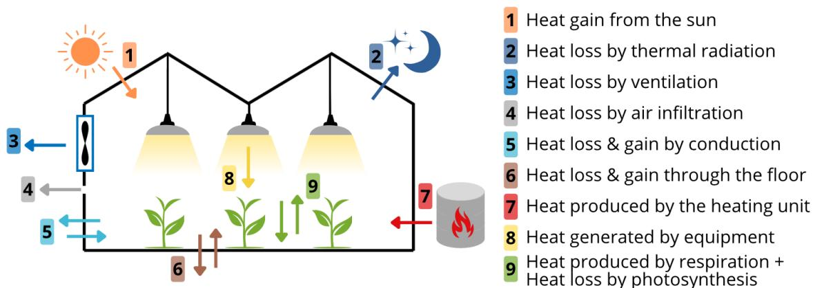  
Figure A1.8. Simplified greenhouse energy balance.

# A1.4.1 Reference values

Dorais [15] reports that the average energy consumption in Quebec ranges from 650 to 850 kWh·m $^{- 2}$  (2340 to 2880 MJ·m $^{- 2}$ ) (thermal) depending on whether the greenhouse is equipped with thermal screens and a thermal storage tank (hot water). The required power of the heating system ranges from 200 to 300 W·m $^{- 2}$ , depending on the presence of thermal screens and a thermal storage tank. On average, December, January, and February account for 51% of the total annual consumption. The months of October, November, and March account for an average of 30% of the total annual consumption, while the remaining six months (April to September) only account for 19% [15].

Pelletier et al. [9] reported that for a twinned greenhouse of  $1750m^2$  with double polyethylene covers in the Saint Hyacinthe area, the annual consumption ranges from 700 to 914 kWh·m $^{- 2}$  (2520 to  $3290\mathrm{MJ}\cdot \mathrm{m}^{- 2}$ ). The variation in total consumption is determined by whether or not the north wall and perimeter are insulated, if thermal screens are installed, and the day and night setpoint temperature. According to the authors, the greenhouse analyzed in this study is representative of a typical Quebec greenhouse.

These values are comparable to Dorais' energy consumption values for a standard greenhouse. They will be validated by calculation in the following section, according to the global profile of the horticultural industry in Quebec.

Hydro Quebec presented its distributor's application for support measures for greenhouse development to the Quebec Energy Board (Régie de l'énergie Québec) in 2020 [149]. The purpose of this application was to establish the 2020 rate for the additional electricity option for Photosynthetic Lighting or Space Heating to Raise Crops. Hydro Quebec issued a report on support measures for greenhouse development, which includes a portrait of greenhouse consumption in Quebec [150].

Hydro Quebec counts close to 300 greenhouse growers in its territory who consume 250 GWh of electricity annually, with a capacity of 86 MW. This consumption is for the production of cannabis, ornamental horticulture, and fruit and vegetable crops [150].

Figure A1.9 shows the electricity consumption of these 300 greenhouses. Based on Hydro Quebec's customer billing data, the average annual electricity consumption for greenhouse purposes in 2019 was 840 MWh.

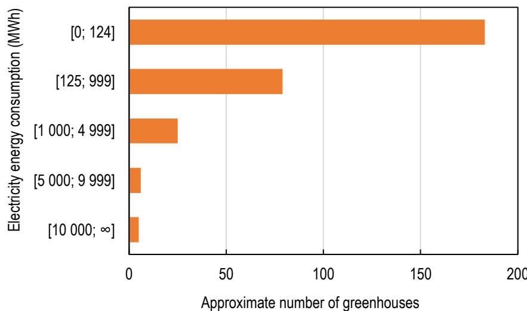  
Figure A1.9. Electricity consumption of greenhouses in Quebec in 2019 [150].

Hydro Quebec states that the Quebec government's goal of doubling greenhouse production and transitioning the industry towards green energy could lead to an increase in electricity consumption of around 450 GWh by 2030 [150]. This forecast attributes an increase of 150 GWh to photosynthesis lighting and an increase of 300 GWh to space heating [151]. Maintaining fuel- fired heating systems is critical to managing peak winter electricity demand, which is essential for the success of this program.

Table A1.2 shows the specific consumption characteristics of the photosynthesis lighting and heating profiles used in the Hydro Quebec approximations.

Table A1.2. Consumption characteristics [151]  

<table><tr><td></td><td>Photosynthesis lighting</td><td>Space heating</td></tr><tr><td>Non-firm rate (medium power customers)</td><td>5.59kWh-1 (20.12kJ-MJ-1) (floor price)</td><td></td></tr><tr><td>Additional volumes</td><td>150 GWh</td><td>300 GWh</td></tr><tr><td>Load factor 300 hours</td><td>60 %</td><td>28 %</td></tr><tr><td>% kWh for January, February, March and December on the annual total</td><td>49 %</td><td>73 %</td></tr><tr><td>% of peak consumption of neighboring markets (6am to 10pm)</td><td>79 %</td><td>70 %</td></tr><tr><td>Loss rate</td><td>1.88 %</td><td>2.15 %</td></tr></table>

# A1.4.2 Space heating

To estimate the heating and cooling requirements of a greenhouse, it is important to consider several factors, including the outdoor temperature, desired indoor temperature, and insulation value.

The following procedure to calculate greenhouses energy consumption for heating is based on Pelletier et al. [9] and ASHRAE's handbook chapter 24 on environmental control for animals and plants [152]. This method is a simplification of the one proposed by Stanghellini et al. [153].

To calculate the space heating, a heat balance must be established. Equation (A1.1) presents a simplified heat exchange balance in a greenhouse (only the most important parameters are included) (in  $W\cdot m^{- 2}$  . This balance is used to calculate the heat produced by the heating unit  $(q_{f})$

$$
q_{f} = q_{cd} + q_{i} - q_{I} \tag{A1.1}
$$

The heat produced must compensate for heat loss or gain by conduction (convection and radiation)  $(q_{cd})$  , heat loss by infiltration (sensitive and latent)  $(q_{i})$  and heat produced by the sun  $(q_{I})$

This approximation omits some parameters, such as heat produced by equipment (e.g. lamps), heat loss by thermal radiation, heat loss by ventilation, heat loss or gain by soil, heat loss by photosynthesis and heat produced by respiration.

Equation (A1.2) calculates the conductive heat loss or gain per square meter of floor area for all sections of the greenhouse, including the bottom wall, top wall, gable, roof, and perimeter, measured in  $W / m^2$  . The variable  $U_{g}$  represents the global heat transfer coefficient of the greenhouse  $(W\cdot m^{- 2}\cdot K^{- 1})$  , while  $T_{i}$  and  $T_{o}$  represent the design indoor and outdoor temperatures  $(^{\circ}C)$  , respectively.

$$
q_{cd} = U_g(T_i - T_o) \tag{A1.2}
$$

The global heat transfer coefficient is commonly used to determine heating capacity because it simplifies calculations.  $U_{g}$  depends on the greenhouse model, type of covering material, dimensions, level of insulation, and air rate. A good approximation for  $U_{g}$  in a twin greenhouse is  $6.39W\cdot m^{- 2}$  and for a single span greenhouse is  $7.00W\cdot m^{- 2}$  [15].

The global heat transfer coefficient of the greenhouse can be calculated by multiplying the heat transfer coefficients for each section of the greenhouse by their respective exposed area or perimeter, and then summing the products. This sum should then be divided by the floor area of the greenhouse (to have total values per square meters).

The values for the different components of the greenhouse are listed in Table A1.3.

Table A1.3.Heat transfer coefficients [9] [152]  

<table><tr><td>Components</td><td>U (Wh·m-2·K-1)</td></tr><tr><td>Single polyethylene and single glass</td><td>6.25</td></tr><tr><td>Double polyethylene</td><td>4.0</td></tr><tr><td>Insulated lower wall</td><td>0.45</td></tr><tr><td>Insulated north wall</td><td>0.4</td></tr><tr><td>Double polyethylene with heat shield</td><td>2.5</td></tr><tr><td>Insulated perimeter</td><td>0.7</td></tr><tr><td>Uninsulated perimeter</td><td>1.4</td></tr></table>

The values presented in Table A1.3 are comparable to those listed in the reference book Greenhouse Horticulture: Technology for Optimal Crop Production [153].

Equation (A1.3) is used to calculate the heat losses resulting from infiltration. The equation takes into account the number of air changes per hour  $(N)$  and the equivalent height of the greenhouse  $(h)$  in meters.

$$
q_{i} = 0.5Nh(T_{i} - T_{o}) \tag{A1.3}
$$

ASHRAE [152] recommends an hourly air change rate between 0.6 and 1.0. Therefore,  $N$  is approximated to 0.8 in this greenhouse context. The height of modern greenhouses below the apex is typically between 5 and  $7.5m$  [15], so the equivalent height of the greenhouse is approximated to  $6m$

Equation (A1.4) calculates the heat produced by the sun, using  $\tau$  to represent transmittance (the percentage of light that passes through the material) and  $I$  to represent solar intensity on a horizontal surface (measured in  $W\cdot m^{- 2}$ ).

$$
q_{I} = \tau I \tag{A1.4}
$$

Transmittance varies with the angle of the sun relative to a horizontal surface. It is difficult to accurately estimate the amount of solar energy transformed into heat inside the greenhouse without a complex calculation. To simplify the calculation, several authors propose using a factor of 0.5 to multiply the heat produced by the sun, as done by Pelletier et al. [9]. This approximation applies regardless of the type of greenhouse.

This approximation uses the average monthly solar intensity values of Saint- Hyacinthe (refer to Figure A1.3).

The space heating approximation uses the recommended temperature for growing tomatoes  $(T_{i})$ , which is  $18^{\circ}C$  during the night and  $21^{\circ}C$  during the day [15]. The outdoor temperatures  $(T_{o})$  are determined by using the average temperatures for each month in Saint- Hyacinthe, including the minimum, maximum, and overall average temperatures [154].

The results for the heat loss or gain by conduction  $(q_{cd})$ , heat loss by infiltration  $(q_{i})$ , and heat produced by the sun  $(q_{I})$  are presented in Figure A1.10.

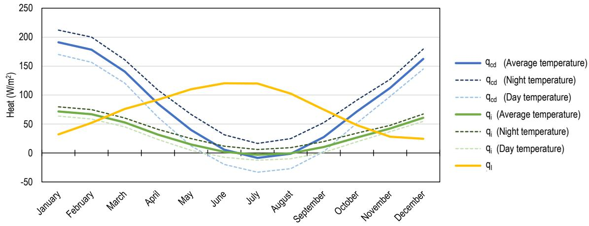  
Figure A1.10. Heat loss or gain by conduction  $(q_{cd})$ , heat loss by infiltration  $(q_{i})$ , and heat produced by the sun  $(q_{I})$  for an average twin greenhouse located in Saint-Hyacinthe, QC, Canada.

The approximation used here does not consider the cooling load. Therefore, when the heat loss of the greenhouse is less than the solar gain, the heating energy consumption is considered to be zero. Due to the climate, many greenhouses in Quebec do not have air conditioning. Figure A1.11

presents the amount of heat that needs to be produced to achieve the desired temperature in the greenhouse for each month of the year.

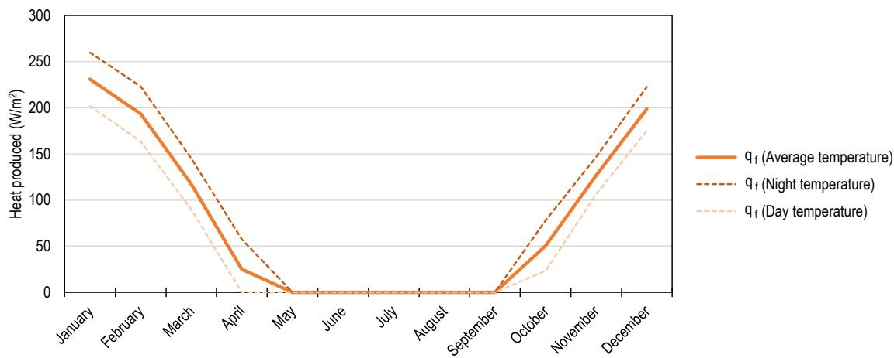  
Figure A1.11. Heat produced  $(q_{f})$  for an average twin greenhouse located in Saint-Hyacinthe, Qc, Canada.

To compare with the reference values, the heat produced values for each month are converted into kWh·m $^{- 2}$ . This conversion results in an annual consumption of approximately 685 kWh·m $^{- 2}$  (2466 MJ·m $^{- 2}$ ) for space heating. This approximation of the energy consumption for a typical greenhouse in Quebec is consistent with the calculations of Dorais [15] and Pelletier et al. [9].

# A1.4.3 Peak heating capacity

Equation (A1.5) approximates the total heating capacity per square meter  $(Q_{tot})$  needed for a greenhouse during cold winter peaks. This capacity is crucial for growers participating in Hydro Quebec's Plant Growth Rate Option Program [13], as they must reduce electricity consumption

$$
Q_{tot} = U_g(T_i - T_{1\%})F_s \tag{A1.5}
$$

during peak periods.

In this equation,  $T_{1\%}$  represents the outside temperature at  $1\%$  exception  $(^{\circ}C)$ , while  $F_{s}$  is the safety factor which is set to 1.15.

The National Building Code of Canada [155] provides the value of  $T_{1\%}$  as the lowest minimum temperature for 1 out of 100 hours during the month of January. For the Saint- Hyacinthe area, this

value is  $- 27^{\circ}C$  . The inside temperature is set to  $13^{\circ}C$  [15], which is the minimum acceptable temperature for the growth of tomatoes. The plant responds to the cumulative temperature over a period rather than the instantaneous temperature. This allows for the heating power to be appropriately sized, reducing the costs associated with the heating system.

With these values,  $Q_{tot}$  is approximately  $294W\cdot m^{- 2}$  for a twin greenhouse and  $322W\cdot m^{- 2}$  for an individual greenhouse.

# A1.4.4 Supplemental lighting

In the northern hemisphere, areas located north of the 35th parallel experience insufficient or borderline light levels during the fall, winter, and early spring seasons [152]. To compensate for this, greenhouses in these regions can use artificial lighting. The ideal duration period of light varies with the type of crops. Table A1.4 presents the ideal light period for the top four crops produced in Quebec.

Table A1.4. Ideal light period of different type of crops.  

<table><tr><td>Type of crop</td><td>Duration of light period (h)</td><td>Ideal time period</td></tr><tr><td rowspan="2">Tomato</td><td>16 (ASHRAE, [152])</td><td>8 AM – 12 PM</td></tr><tr><td>18 (GreenLight, [65])</td><td>0 AM – 06 PM</td></tr><tr><td>Cucumber</td><td>24 (ASHRAE, [152])</td><td>-</td></tr><tr><td>Lettuce</td><td>24 (ASHRAE, [152])</td><td>-</td></tr><tr><td>Pepper</td><td>24 (ASHRAE, [152])</td><td>-</td></tr></table>

The literature varies in its recommendations for the number of hours of light required by tomato crops. A value of 18 hours has been chosen as it results in the maximum demand of electricity for tomatoes.

Controlling the lighting in a greenhouse is a complex process that is influenced by various parameters. The setpoint for turning on the lights depends on the type and efficiency of the lighting system, the desired growth rate and stage of the crop, and the global horizontal solar radiation. For this approximation, the setpoint for turning on lights will only be influenced by the global horizontal solar radiation.

For a tomato crop, the lights are turned on for 18 hours from midnight to 6 PM, except for when the global horizontal solar radiation exceeds a certain setpoint. This setpoint, which varies between

200 and  $400 \text{W} \cdot \text{m}^{- 2}$  according to the literature [14] [65], will be set to  $400 \text{W} \cdot \text{m}^{- 2}$  to ensure maximum demand.

During a light period of 18 hours, the lamps are lit for 4,987 hours in a typical year, which is less than the possible 6,570 hours due to the threshold of global horizontal solar radiation of  $400 \text{W} \cdot \text{m}^{- 2}$ . For a light period of 24 hours, the lamps are lit for 7,177 hours per year. In a typical year, the lights are off for 1,583 hours during the supposed light period since natural light levels are sufficient.

The energy consumption of five types of lamps is calculated, three HPS lamps and two LED. The values for these lamps are taken from Pelletier et al. report [9]. The HPS lamps have different power and efficiency. Power (W) refers to the power consumption of the lighting system, while lamp efficiency refers to the efficiency of a lighting source in converting electrical energy into PAR, the light spectrum used by plants for photosynthesis. The lighting system's efficiency value determines how effectively it produces the desired PAR while minimizing energy consumption.

One of the HPS lamps is a 400 W magnetic ballast with an efficiency of  $1.0\mu \mathrm{mol}\cdot \mathrm{J}^{- 1}$  . The other two HPS lamps have a power of 1000 W, but one has a magnetic ballast  $(1.3\mu \mathrm{mol}\cdot \mathrm{J}^{- 1})$  and the other has an electronic ballast  $(1.7\mu \mathrm{mol}\cdot \mathrm{J}^{- 1})$  . The LED lamps both have a power of 200 W but different efficiencies (2.0 and  $2.5\mu \mathrm{mol}\cdot \mathrm{J}^{- 1})$  . The calculations were performed for a light intensity of 12  $\mathsf{mol}\cdot \mathsf{m}^{- 2}\cdot \mathsf{d}^{- 1}$  , and the results are shown in Figure A1.12.

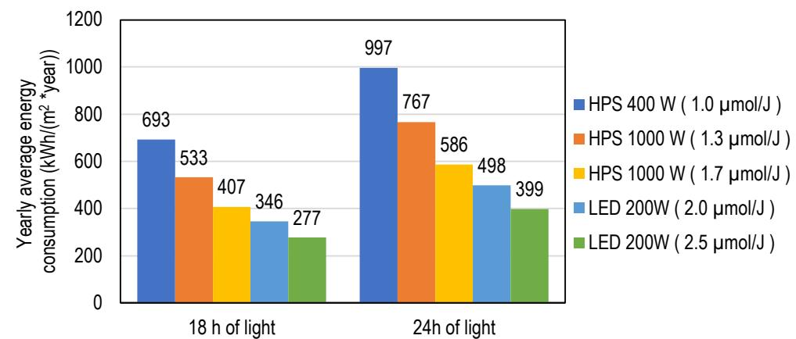  
Figure A1.12. Yearly average energy consumption for different type of lamps for a light intensity of 12 mol/(m²*day).

The energy consumption for artificial lighting varies significantly depending on the type of lamps used. The difference in consumption for an 18- hour and 24- hour lighting period can be up to 416 kWh·m⁻² (1498 MJ·m⁻²) and 598 kWh·m⁻² (2153 MJ·m⁻²) annually, respectively.

While LED lamps are more efficient than HPS lamps, chapter 2.5.2 details several other inconveniences associated with them.

# A1.4.5 Other energy needs

The other operational energy demand can vary widely depending on the specific greenhouse and the types of systems and equipment used. This includes energy consumption for ventilation, irrigation, dehumidification,  $CO_2$  supplementation, as well as equipment such as fans, pumps, and motors. Miscellaneous loads, such as electricity use for computers, are also taken into account.

In certain instances, the other energy needs may constitute a relatively minor fraction of the overall energy consumption, possibly around  $10 - 20\%$ . However, in other situations, they may be much larger, especially if the greenhouse uses energy- intensive equipment or runs for extended periods.

In colder climates, such as Quebec, the heating demand for a greenhouse is typically much higher due to the lower outdoor temperatures. As a result, the percentage of other energy needs in the total energy demand may be lower than in milder climates. This is because the heating demand can represent a significant portion of the total energy demand, sometimes exceeding  $50\%$  or more. The cost for heating represents 25 to  $30\%$  of the total costs for production [15].

For this approximation, the overall energy demand will be multiplied by a factor of 1.15 to account for other energy needs  $(15\%)$ .

For a more thorough evaluation of the energy consumption, it's important to evaluate the specific greenhouse and its energy use patterns to determine what are the other energy needs. Regular monitoring and optimization of energy use can help reduce the overall energy demand and improve the efficiency of the greenhouse.

# A1.4.6 Overall energy consumption

From the calculations, the overall energy consumption of an average greenhouse in Quebec is approximately  $1300kWh\cdot m^{- 2}$  (1080 MJ·m $^{- 2}$ ) per year (tomato crop). This value encompasses the energy used for space heating (685 kWh·m $^{- 2}$  (2466 MJ·m $^{- 2}$ )), artificial lighting (an average of 455 kWh·m $^{- 2}$  (1638 MJ·m $^{- 2}$ )), and other needs (171 kWh·m $^{- 2}$  (616 MJ·m $^{- 2}$ ), which accounts for  $15\%$  of the total energy used for heating and lighting).

This value provides an estimate of the energy consumption per square meter of a greenhouse. However, the value of this varies depending on the characteristics of each greenhouse, such as size, location, materials, types of lamps, and type of crop.

# A1.5 Conclusion

From the results obtained, it is evident that heating is the primary contributor to energy consumption in Quebec's greenhouses. Therefore, optimizing heating systems and improving greenhouse thermal efficiency are crucial to reducing energy usage and costs. This can be achieved by implementing measures such as enhancing insulation, utilizing energy- efficient heating equipment, and employing thermal curtains or other energy- saving technologies.

The impact of lamp types on energy consumption is significant. For a 34- hour lighting period, the energy consumption difference between HPS and LED lamps can be close to  $600 \text{kWh} \cdot \text{m}^{- 2}$  (2160 MJ  $\cdot \text{m}^{- 2}$ ) annually. However, it is important to note that HPS lamps produce heat, which can reduce energy consumption related to heating by 10 to  $35\%$  [15]. Although this factor is not considered in the first approximation, it will be taken into account in a more thorough energy analysis of greenhouses.

# Annex 2 Simulation Methodology

Annexe 2 Methodologie de simulation

# A2.1 Resume

A2.1 RésuméCette année présente un complément de la méthodologie de simulation utilisée dans ce mémoire. Des détails supplémentaires sur le modèle utilisé sont présentés, en se concentrant sur ses entrées, ses sorties, ses contrôles et son efficacité informatique. Des tests réalisés sur le modèle afin de réduire le temps de simulation sont présentés. Par contre, la référence principale du modèle demeure le chapitre 7 (Appendix : User's Guide and Detailed Description of the GreenLight Model) de la thèse de David Katzin [65].

# A2.2 Abstract

A2.2 AbstractThis annex presents a supplement to the simulation methodology used in this thesis. It provides additional details on the model used, focusing on its inputs, outputs, controls, and computational efficiency. Tests carried out on the model to reduce simulation time are also presented. However, the main reference for the model remains Chapter 7 (Appendix: User's Guide and Detailed Description of the GreenLight Model) of David Katzin's thesis [65].

# A2.3 Simplified model explanations

A2.3 Simplified model explanationsThe GreenLight program is well divided into different folders, making it easy to navigate and modify sections as needed. First, after downloading the program, there is a main folder: GreenLight- Master. This folder is then divided into several subfolders. In fact, the program is divided into two main parts: DyMoMa Master and Code. The general code structure of these different sections is shown in Figure A2.1.

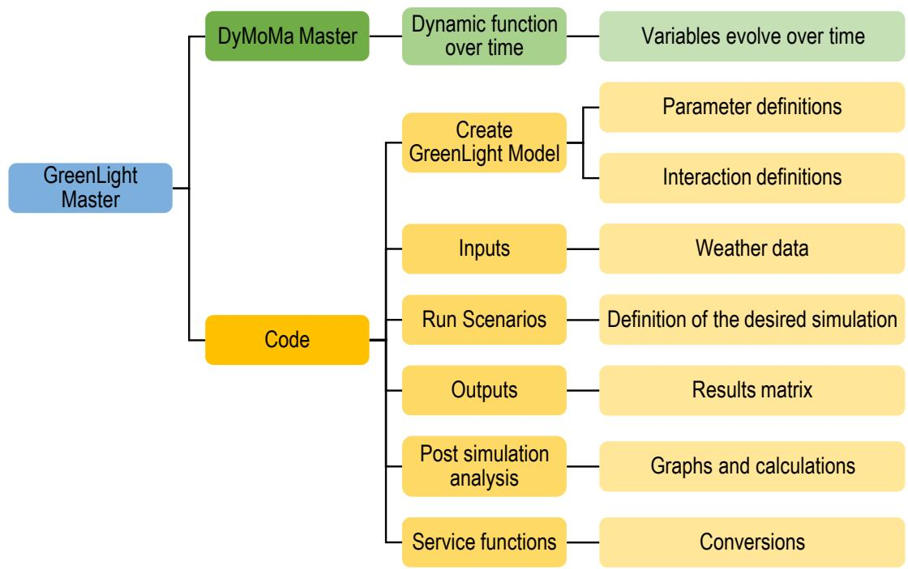  
Figure A2.1. Structure of the GreenLight Model Code.

Dynamo is a dynamic platform for MATLAB. It is an object- oriented framework in MATLAB for defining and executing linear and nonlinear dynamic models. This platform allows the creation of evolutions over time, which is necessary given the constantly changing weather and greenhouse conditions.

The Code section contains various functions and definitions that have been created to properly represent the thermal effects of a greenhouse. The main section is Create Green Light Model, where the main functions of the model are presented. Among other things, it contains the code needed to represent plants, heat harvesting, and parameters for different types of lighting. There are also several files to define the greenhouse, such as the definition of auxiliary states, controls, initial state values, inputs, ODEs, states, and duration. A part of the code is also dedicated to the inputs and another to the execution of the simulation, allowing to easily modify the different parameters. After each simulation, a MATLAB saved binary data file is created, containing the value of all parameters for each time step. Different predefine functions are disponible in the post simulation analysis folder for in- depth analysis of the results.

# A2.4 Inputs

A2.4 InputsOutdoor weather data is used in the model. The weather file can be generated using EnergyPlus data [66]. EnergyPlus offers a tool to convert its EPW files into CSV format. Once the CSV file is created, GreenLight includes a function to transform it into the required model format. This data covers a full year, from January 1 to December 31, and consist of a 10- column matrix (Table A2.1).

Table A2.1. Input of weather data for the GreenLight model.  

<table><tr><td>Column index</td><td>Parameter</td><td>Unit</td></tr><tr><td>1</td><td>Timestamps of the input 
(regular intervals, usually 300 s)</td><td>s</td></tr><tr><td>2</td><td>Global radiation</td><td>W·m-2</td></tr><tr><td>3</td><td>Outdoor temperature</td><td>℃</td></tr><tr><td>4</td><td>Outdoor humidity</td><td>kg·m-3</td></tr><tr><td>5</td><td>Outdoor CO2 concentration</td><td>kg·m-3</td></tr><tr><td>6</td><td>Outdoor wind speed</td><td>m·s-1</td></tr><tr><td>7</td><td>Sky temperature</td><td>℃</td></tr><tr><td>8</td><td>Temperature of external soil layer 
(at a 2m depth)</td><td>℃</td></tr><tr><td>9</td><td>Daily solar radiation sum</td><td>MJ·m-2·day-1</td></tr><tr><td>10</td><td>Elevation</td><td>m above sea level</td></tr></table>

# A2.5 Outputs

A2.5 OutputsThe GreenLight model generates a binary data file for each simulation, containing the data types listed in Table A2.2.

Table A2.2. General structure of the outputs of the GreenLight model.  

<table><tr><td>Attribute</td><td>Meaning</td><td>Format</td></tr><tr><td>x</td><td>States</td><td>Two-column matrix of the state&#x27;s trajectory *</td></tr><tr><td>p</td><td>Parameters</td><td>Single number (constant value)</td></tr><tr><td>d</td><td>Weather</td><td>Two-column number array of the weather*</td></tr><tr><td>a</td><td>Auxiliary states</td><td>Two-column matrix of the auxiliary state&#x27;s trajectory*</td></tr><tr><td>U</td><td>Controls</td><td>Two-column matrix of the control&#x27;s trajectory*</td></tr><tr><td>t</td><td>Time</td><td>Timestamps for a start and end time for the simulation period,</td></tr></table>

\* 1st column is the time and the  $2^{nd}$  is the values

The output results used in the different analyses are presented mainly in the States  $x$  and partly in the Auxiliary States  $a$

# A2.6 Controls

A2.6 ControlsThis section defines the control method and provides a summary of the operation of all climate parameters under control. Each parameter is clearly defined, and tolerances and limits are mentioned. It is essential to have a good understanding of the control system to correctly analyze and judge the simulation results.

# A2.6.1 Method

The program employs a smoothed proportional controller to account for the offset between the heating setpoint and the actual temperature. The controller used for heating, ventilation, thermal screens and  $CO_2$  injection is defined with the following sigmoid function:

$$
Action = \frac{1}{1 + \exp\left(\frac{-2ln100}{pBand}(x - setpoint - 0.5pBand)\right)} (0 - 1). \tag{A2.1}
$$

The given equation involves three variables:  $x$  as the controlled variable, setpoint as the setpoint, and pBand as the band that defines the width of proportional control. The controller action is represented by a value between 0 and 1, where 0 indicates a stop and 1 indicates full capacity. In some cases, such as with lamps, the possible values are binary, meaning they are either on or off with no in- between.

The variables that need to be controlled are constantly changing with each iteration of the simulation. The setpoint and tolerance band are defined as constants before running the simulations.

# A2.6.2 Controls summary

Table A2.3 lists the setpoint values for the controlled variables.

Table A2.3. Setpoint and pBand values for each controlled variable in the GreenLight program.  

<table><tr><td>Variable</td><td>Setpoint</td><td>Unit</td></tr><tr><td>CO2 concentration</td><td>1000</td><td>ppm</td></tr><tr><td>Temperature</td><td></td><td></td></tr><tr><td>Temperature during the light period</td><td>19.5</td><td>℃</td></tr><tr><td>Temperature during the dark period</td><td>18.5</td><td>℃</td></tr><tr><td>Humidity</td><td>87</td><td>%</td></tr></table>

Table A2.4 summarize the values of the band that define the width of proportional control.

Table A2.4. pBand value for each controlled variable in the GreenLight model.  

<table><tr><td>Variable</td><td>pBand</td><td>Unit</td></tr><tr><td>Blackout screens</td><td></td><td></td></tr><tr><td>Opening due to excess interior heat</td><td>0.5</td><td>%</td></tr><tr><td>Opening due to excess humidity (relative humidity)</td><td>0.5</td><td>℃</td></tr><tr><td>Thermal screens</td><td></td><td></td></tr><tr><td>Closing due to cold outside temperature</td><td>-1</td><td>℃</td></tr><tr><td>Opening due to excess interior heat</td><td>1</td><td>℃</td></tr><tr><td>Opening due to excess humidity (relative humidity)</td><td>10</td><td>%</td></tr><tr><td>CO2injection</td><td>-100</td><td>ppm</td></tr><tr><td>Heating</td><td>-1</td><td>℃</td></tr><tr><td>Mechanical cooling and dehumidification</td><td></td><td></td></tr><tr><td>Temperature</td><td>1</td><td>℃</td></tr><tr><td>Relative humidity</td><td>2</td><td>%</td></tr><tr><td>Ventilation cooling</td><td></td><td></td></tr><tr><td>Opening due to excess heat</td><td>4</td><td>℃</td></tr><tr><td>Closing due to cold outside temperature</td><td>-1</td><td>℃</td></tr><tr><td>Opening due to excess humidity (relative humidity)</td><td>50</td><td>%</td></tr></table>

# A2.6.3 Tests conducted

Several tests were conducted to fully understand the operation and impact of the model's various controls. The objective was to fully understand each control and ensure their proper functioning.

For instance, a simulation was conducted to model a greenhouse in Quebec's climate starting on January 1st, using HPS lamp lighting. The simulation analyzed various controls to ensure compliance with the previously stated constraints. Figures A2.2 and A2.3 display three examples of controls for one week and one year, respectively: heating (blue), lamp switching (orange) and roof window opening (green). The x- axis represents the setpoint sent. When the setpoint is set to zero, the heating, lights, and windows are closed. However, when the setpoint is set to one, the heating is at maximum, the lights are turned on, and the windows are fully opened.

As anticipated, the window opening set point is zero due to the cold climate at the beginning of January. Additionally, the lights are on for approximately 18 hours per day, which is expected due to the low overall solar radiation during the winter season. For the graphs representing a full year, during the summer season when temperatures are high, the window opening setpoint is set to one. Additionally, lights are used for shorter periods in the summer due to the longer daylight hours and higher outdoor solar radiation.

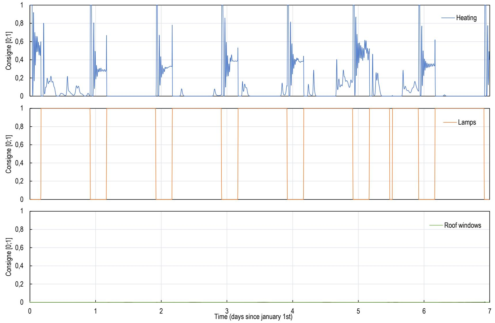  
Figure 2.2. Control of heating (blue), lamp switching (orange) and roof window opening (green) of a greenhouse for the first week of January with HPS lamps in Quebec.

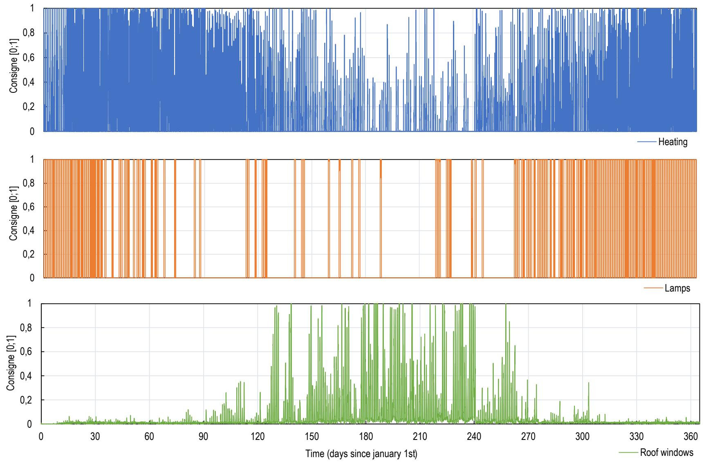  
Figure A2.3. Control of heating (blue), lamp switching (orange) and roof window opening (green) of a greenhouse for one year with HPS lamps in Quebec.

Annex 3 provides a more detailed analysis of greenhouse controls. Controls play a crucial role in building simulations, especially in greenhouses and controlled environments. The GreenLight model utilizes a smoothed proportional controller, which allows for the definition of a setpoint and an acceptable tolerance band for each parameter. This function represents realistic control of the various variables, as desired values are not always achievable despite the setpoints.

# A2.7 Calculation time

The different values of the calculation time step found by solving the MATLAB GreenLight model are calculated with an Intel CORE i7 computer and on one core.

# A2.7.1 Tolerances

The ode15s function in MATLAB is utilized to solve the differential equations necessary for simulating various building characteristics over time. This function is capable of solving stiff differential equations. Integration parameters are defined by specifying the desired options. The numerical method employs error estimation, calculating an approximation of the error between the approximate and exact solutions. The options AbsTol and RelTol [68] allow for the specification of absolute and relative error tolerances. The absolute error tolerance is a threshold below which the solution value becomes insignificant. This value must consider the scaling of the solution components. The default value for this vector is 1E- 6. The relative error tolerance measures the error relative to the magnitude of each solution component. This parameter controls the number of significant digits in all solution components that exceed the absolute tolerance. The default value is 1E- 3 and is a positive scalar. At each iteration, the ODE solver estimates the local error  $e(i)$  in the ith component of the solution. To be successful, the step must have an acceptable error, determined by the relative and absolute error tolerances.

$$
|e(i)|\leq \mathsf{MAX}\left(R e l T o t*a b s\big(\gamma (i)\big):A b s T o t(i)\right) \tag{A2.2}
$$

Increasing the absolute and relative tolerances in simulations can lead to faster convergence but may also reduce accuracy. This section aims to determine acceptable values for AbsTol and RelTol to keep simulation errors within acceptable limits.

Several simulations were conducted to test the effect of absolute and relative tolerances greater than the reference values on results and the possibility of reducing calculation time. The simulations were conducted for the month of January in a greenhouse located in Quebec, using the basic physical characteristics proposed by Katzin [65]. Tolerance value tests were conducted for simulations conducted without light, with HPS lamps, and with LED lamps. Each presented result in this section represents the average of five identical simulations to ensure accurate calculation times.

The tested absolute tolerance values range from 1E- 6 (reference value) to 1E- 3, while the relative tolerance values range from 1E- 3 (reference value) to 1. Figure A2.4 presents the calculation times associated with the different lighting types and tolerances.

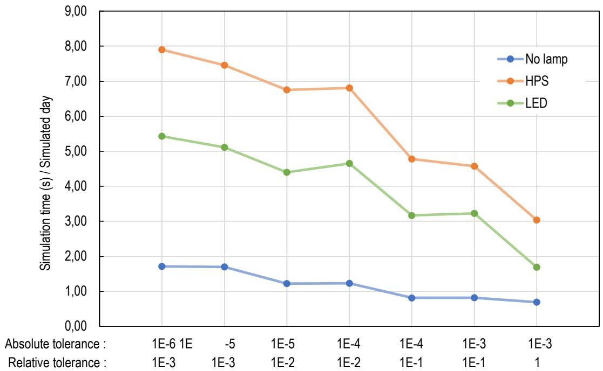  
Figure A2.4. Computation time per simulated day of GreenLight simulation of different lighting types for several absolute and relative tolerances (simulations from January in Quebec).

The duration of calculations is longer when artificial lighting is present. Specifically, the calculation time for HPS lamps is greater than that for LED lamps. As tolerance values increase, the calculation time decreases. For instance, by transitioning from an absolute tolerance of 1E- 6 to 1E- 3 and from a relative tolerance of 1E- 3 to 1, the calculation time for simulations without lamps, with HPS lamps, and with LED lamps is reduced by  $60\%$ ,  $62\%$ , and  $69\%$ , respectively. Tests conducted

on calculation time revealed that it is not beneficial to increase the absolute error too much, as it does not reduce calculation time.

The objective is to reduce computation time, but it is essential to analyze the effect on simulation outputs to determine whether they remain adequate. This report presents the analysis of several program outputs, including variables closely related to the project, such as greenhouse interior temperature and artificial lighting consumption, and those with the greatest impact when tolerances were increased, such as carbohydrates stored in the buffer. Figures A2.5 and A2.7 display the inside temperature of the greenhouse under HPS and LED lighting for various simulations with different tolerances. Figures A2.6 and A2.8 display the temperature differences from the reference simulation (absolute tolerance of 1E- 6 and relative tolerance of 1E- 3) to clearly visualize the variations in results.

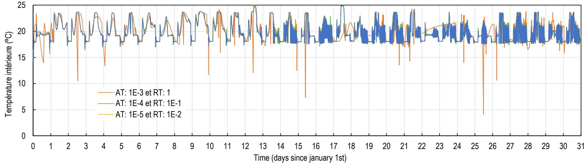  
Figure 2.5. Greenhouse interior air temperature with HPS lighting for different simulations with different tolerances (AT: absolute tolerance, RT: relative tolerance).

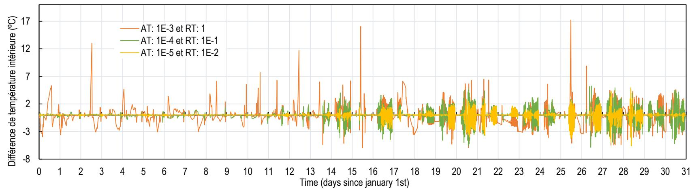  
Figure 2.6. Difference in greenhouse interior temperature with HPS lighting between different simulations with different tolerances (AT: absolute tolerance, RT: relative tolerance) and the simulation with reference tolerance values (AT: 1E-6 and RT: 1E-3).

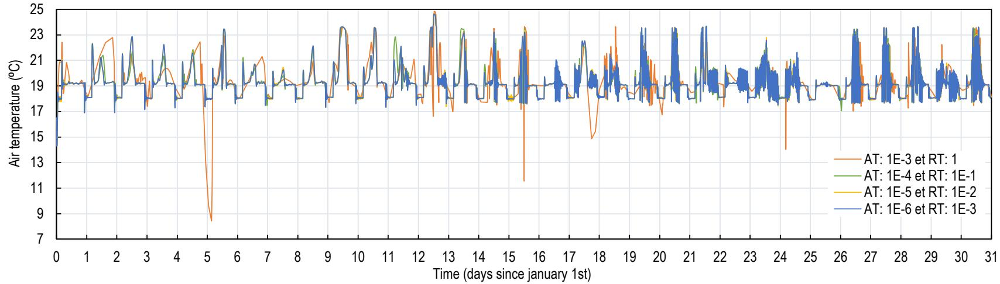  
Figure A2.7. Greenhouse interior temperature with LED lighting for different simulations with different tolerances (AT: absolute tolerance, RT: relative tolerance).

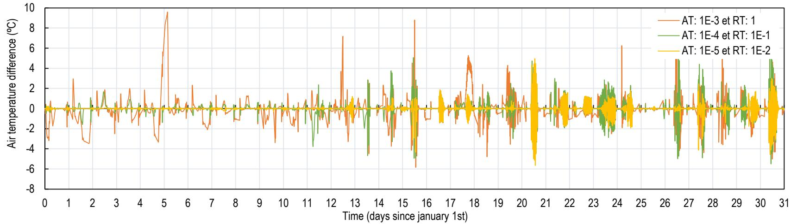  
Figure 2.8. Difference in greenhouse interior temperature with LED lighting between different simulations with different tolerances (AT: absolute tolerance, RT: relative tolerance) and the simulation with reference tolerance values (AT: 1E-6 and RT: 1E-3).

For both HPS and LED lamp simulations, increasing tolerances too much can lead to imprecise results with sporadic behavior. In the indoor temperature graphs, simulations with an absolute tolerance of 1E- 3 and a relative tolerance of 1 have large peaks of results that vary from the reference simulations. Simulations with an absolute tolerance of 1E- 4 and a relative tolerance of 1E- 1 show minor variations compared to the reference simulation, but these variations are not significant and there are no outliers. Simulations with an absolute tolerance of 1E- 5 and a relative tolerance of 1E- 2 are highly similar to the reference simulations.

Figures A2.9 and A2.11 shows the greenhouse's HPS and LED lighting consumptions for different simulations with varying tolerances. Figures A2.10 and A2.12 present the differences in consumption with the reference simulation (absolute tolerance of 1E- 6 and relative tolerance of 1E- 3) to clearly visualize the variations in results.

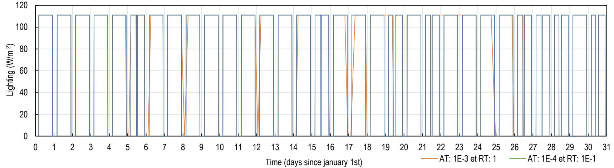  
Figure A2.9. Greenhouse HPS lighting consumption for different simulations with different tolerances (AT: absolute tolerance, RT: relative tolerance).

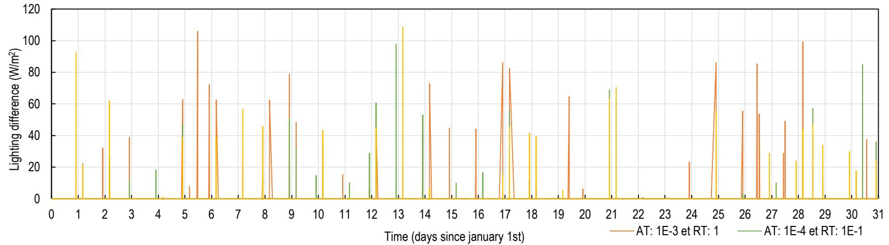  
Figure 2.10. Differece in greenouse HPs lghting consumptio betwe different simulations wth diffeent tolerances (AT: asolute tolerance, RT: relative tolerance) and the simulation with reference tolerance values (AT: 1E-6 and RT: 1E-3).

  
Figure A2.11. Consommation de l'éclairage LED de la serre pour différentes simulations ayant des tolérances différentes (TA : tolérance absolue, TR : tolérance relative).

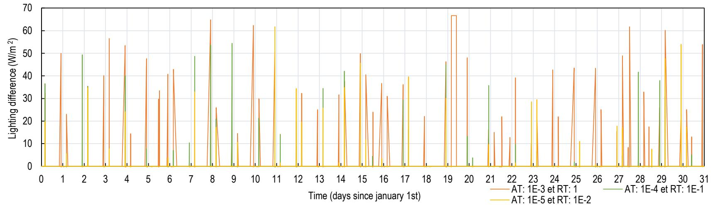  
Figure 2.12. Differece in grehouse LED lghting consmptio betwe different simlations with diffeent tolerances (AT: absolute tolerance, RT: relative tolerance) and the simulation with reference tolerance values (AT: 1E-6 and RT: 1E-3). .

HPS and LED lighting consume similar amounts of energy to the reference values when absolute tolerances are 1E- 4 or less and relative tolerances are 1E- 1 or less. However, when absolute tolerances are 1E- 3 and relative tolerances are 1, visible variations in energy consumption are observable for both types of lighting compared to the reference.

In Figures A2.10 and A2.12, the graphs show differences in lighting consumption between simulations with reference tolerances and simulations with absolute and relative tolerances of less than 1E- 4 and 1E- 1, respectively. These differences are only punctual and are caused by the lights being switched on a fraction of time before or after the reference simulation, resulting in 'spikes' in the difference graphs. However, the result is similar.

To analyze the impact of increasing absolute and relative tolerances on simulation results, Table A2.5 presents a summary table that shows the differences between the simulation with reference tolerances and various other simulations with greater tolerances. The table highlights four output parameters: indoor temperature, temperature at the top of the greenhouse, carbohydrates stored in the buffer, and lamp consumption. To provide an approximate scale for the various deviation values presented in Table A2.5, the same parameters for the simulation with reference tolerances are listed in Table A2.6.

Table A2.5. Absolute deviation between the simulation with reference tolerances and various other simulations with greater tolerances.  

<table><tr><td colspan="2"></td><td colspan="3">HPS</td><td colspan="3">LED</td><td colspan="3">No lamps</td></tr><tr><td colspan="2">Absolute tolerance</td><td>1E-05</td><td>1E-04</td><td>1E-03</td><td>1E-05</td><td>1E-04</td><td>1E-03</td><td>1E-05</td><td>1E-04</td><td>1E-03</td></tr><tr><td colspan="2">Relative tolerance</td><td>1E-02</td><td>1E-01</td><td>1</td><td>1E-02</td><td>1E-01</td><td>1</td><td>1E-02</td><td>1E-01</td><td>1</td></tr><tr><td rowspan="3">Air temperature [°C]</td><td>Maximum difference</td><td>5.60</td><td>5.87</td><td>17.23</td><td>5.65</td><td>5.77</td><td>9.59</td><td>0.29</td><td>3.63</td><td>34.89</td></tr><tr><td>Average difference</td><td>0.14</td><td>0.41</td><td>1.04</td><td>0.12</td><td>0.27</td><td>0.75</td><td>0.02</td><td>0.10</td><td>0.82</td></tr><tr><td>Standard deviation difference</td><td>0.41</td><td>0.75</td><td>1.34</td><td>0.39</td><td>0.58</td><td>1.08</td><td>0.03</td><td>0.29</td><td>2.63</td></tr><tr><td rowspan="3">Air temperature in the top compartment [°C]</td><td>Maximum difference</td><td>19.00</td><td>17.89</td><td>51.14</td><td>18.38</td><td>19.63</td><td>36.40</td><td>0.20</td><td>7.70</td><td>56.11</td></tr><tr><td>Average difference</td><td>0.52</td><td>1.23</td><td>2.32</td><td>0.38</td><td>0.66</td><td>1.31</td><td>0.01</td><td>0.09</td><td>0.99</td></tr><tr><td>Standard deviation difference</td><td>1.74</td><td>2.82</td><td>4.12</td><td>1.48</td><td>1.88</td><td>2.38</td><td>0.02</td><td>0.20</td><td>5.22</td></tr><tr><td rowspan="3">Carbohydrates stored in the buffer [mg·m-2·s-1]</td><td>Maximum difference</td><td>285.66</td><td>609.34</td><td>10419.83</td><td>212.27</td><td>1139.45</td><td>6747.01</td><td>42.68</td><td>147.88</td><td>1689.42</td></tr><tr><td>Average difference</td><td>52.10</td><td>88.07</td><td>1125.72</td><td>24.87</td><td>114.92</td><td>1036.06</td><td>1.75</td><td>11.30</td><td>152.22</td></tr><tr><td>Standard deviation difference</td><td>75.24</td><td>111.48</td><td>1747.92</td><td>36.09</td><td>148.41</td><td>1425.39</td><td>2.78</td><td>14.73</td><td>211.59</td></tr><tr><td rowspan="3">Lamp consumption [W·m-2]</td><td>Maximum difference</td><td>108.62</td><td>97.77</td><td>111.11</td><td>61.77</td><td>59.93</td><td>66.67</td><td>-</td><td>-</td><td>-</td></tr><tr><td>Average difference</td><td>0.26</td><td>0.30</td><td>5.60</td><td>0.13</td><td>0.30</td><td>4.99</td><td>-</td><td>-</td><td>-</td></tr><tr><td>Standard deviation difference</td><td>3.72</td><td>3.97</td><td>20.59</td><td>2.00</td><td>3.10</td><td>11.91</td><td>-</td><td>-</td><td>-</td></tr></table>

Table A2.6. Results of different parameters for the simulation of the month of January in Quebec with reference tolerances.  

<table><tr><td rowspan="2"></td><td colspan="3">Air temperature [°C]</td><td colspan="3">Air temperature in the top compartment [°C]</td><td colspan="3">Carbohydrates stored in the buffer [mg·m-2·s-1]</td><td colspan="2">Lamp consumption [W·m-2]</td></tr><tr><td>HPS</td><td>LED</td><td>No lamps</td><td>HPS</td><td>LED</td><td>No lamps</td><td>HPS</td><td>LED</td><td>No lamps</td><td>HPS</td><td>No lamps</td></tr><tr><td>Average</td><td>20.00</td><td>19.33</td><td>18.87</td><td>4.45</td><td>2.93</td><td>1.27</td><td>7783.50</td><td>10555.80</td><td>509.09</td><td>80.87</td><td>48.55</td></tr><tr><td>Minimum</td><td>14.33</td><td>14.29</td><td>14.33</td><td>-8.53</td><td>-8.51</td><td>-8.41</td><td>-20.11</td><td>-20.11</td><td>-33.97</td><td>0.00</td><td>0.00</td></tr><tr><td>Maximum</td><td>24.95</td><td>24.62</td><td>21.68</td><td>24.36</td><td>23.98</td><td>18.80</td><td>19348.65</td><td>20264.96</td><td>2535.99</td><td>111.11</td><td>66.67</td></tr><tr><td>Standard deviation</td><td>1.83</td><td>1.26</td><td>0.50</td><td>6.95</td><td>6.07</td><td>4.57</td><td>5864.39</td><td>6208.75</td><td>397.06</td><td>49.30</td><td>29.57</td></tr></table>

Table A2.7 presents the percentage deviation between the reference solution and the solutions with greater tolerances, based on the results shown in Tables A2.5 and A2.6.

Table A2.7. Percentage of mean absolute variation between the results of simulations with different tolerances and the reference simulation (absolute tolerance of 1E-6 and relative tolerance of 1E-3).  

<table><tr><td></td><td>Absolute tolerance</td><td>Relative tolerance</td><td>HPS</td><td>LED</td><td>No lamps</td></tr><tr><td rowspan="3">Air temperature [°C]</td><td>1E-05</td><td>1E-02</td><td>0.72%</td><td>0.63%</td><td>0.10%</td></tr><tr><td>1E-04</td><td>1E-01</td><td>2.04%</td><td>1.38%</td><td>0.54%</td></tr><tr><td>1E-03</td><td>1</td><td>5.22%</td><td>3.88%</td><td>4.34%</td></tr><tr><td rowspan="3">Air temperature in the top compartment [°C]</td><td>1E-05</td><td>1E-02</td><td>11.67%</td><td>13.04%</td><td>0.93%</td></tr><tr><td>1E-04</td><td>1E-01</td><td>27.60%</td><td>22.56%</td><td>6.87%</td></tr><tr><td>1E-03</td><td>1</td><td>52.06%</td><td>44.73%</td><td>78.06%</td></tr><tr><td rowspan="3">Carbohydrates stored in the buffer [mg m-2s-1]</td><td>1E-05</td><td>1E-02</td><td>0.67%</td><td>0.24%</td><td>0.34%</td></tr><tr><td>1E-04</td><td>1E-01</td><td>1.13%</td><td>1.09%</td><td>2.22%</td></tr><tr><td>1E-03</td><td>1</td><td>14.46%</td><td>9.82%</td><td>29.90%</td></tr><tr><td rowspan="3">Lamp consumption [W/m2]</td><td>1E-05</td><td>1E-02</td><td>0.32%</td><td>0.27%</td><td>-</td></tr><tr><td>1E-04</td><td>1E-01</td><td>4.59%</td><td>4.11%</td><td>-</td></tr><tr><td>1E-03</td><td>1</td><td>0.00%</td><td>0.00%</td><td>-</td></tr></table>

The four variables presented in the previous tables were chosen based on the elements analyzed in this master thesis and the outputs most affected by the change in tolerances. The temperature at the top of the greenhouse and the carbohydrates stored in the buffer are critical elements that can distort the results when their tolerances are increased. Analysis of these variables reveals that increasing their absolute and relative tolerances to 1E- 3 and 1, respectively, can lead to distorted results.

The selection of solutions depends on the required applications and the significance of reducing calculation time. The smaller and more restrictive the tolerances, the longer the calculation time. Therefore, it is crucial to strike a balance between these two concepts.

For instance, based on this analysis, if solution time is not a concern, it is advisable to utilize the program's reference tolerances. However, if calculation time is a concern, using an absolute tolerance of 1E- 4 and a relative tolerance of 1E- 1 will decrease calculation time while still producing accurate results. With these new tolerances, simulation calculation times are reduced by  $52\%$  for simulations without artificial lighting,  $40\%$  for simulations with HPS lights, and  $42\%$  for simulations with LED lights.

It is important to note that some outputs are less affected than others by increased tolerances, such as the inside temperature of the greenhouse. Additionally, if only average results are analyzed, it may be possible to increase tolerances further.

# A2.7.2 Simulated duration

To maintain solution accuracy while reducing calculation time, one approach is to simulate typical days or weeks instead of full years. The calculation time varies depending on the length of time simulated. Longer simulated periods result in longer calculation times. However, the calculation time does not increase linearly with simulated time due to the equations used to solve the problem, specifically MATLAB's ode15s as mentioned previously.

The time required for calculations also varies depending on the type of lighting simulated in the greenhouse. For the tests conducted, inter- canopy lights were not considered. On average, simulations of a greenhouse with HPS lights above the canopies take  $28\%$  longer to calculate than simulations without artificial lighting. For LED lighting, the calculation time is  $23\%$  longer than for an unlit greenhouse. These percentages are for a typical greenhouse using weather data from the Quebec City region during the first week of January. The simulation lasted for seven days, assuming that the plants were mature.

Additionally, simulation time varies depending on the time of year. The colder months, such as January, require longer calculation times due to the significant temperature differences between indoor and outdoor climates. Figure A2.13 displays the calculation times for each month of the year for a typical greenhouse program with HPS lamps for lighting, mature plants, and Quebec city's climate. Each value in the graph represents the average of five identical simulations to obtain more representative results. Since the resolution method is iterative, the calculation time for the same simulation is never identical.

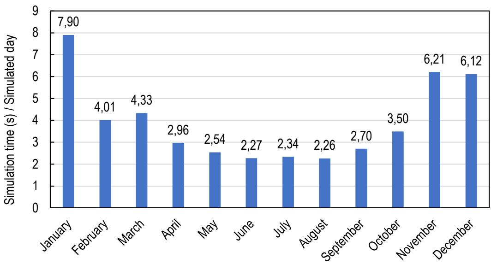  
Figure A2.13. GreenLight simulation calculation time as a function of the time of year.

Various simulation durations were tested, including one day, one week, one month, and one year, to better understand the calculation time. The simulations were conducted for a typical greenhouse defined by the program, mature plants, and the Quebec city's climate, similar to the simulations for each month of the year. However, this time, the simulations were conducted for three lighting options: without artificial lighting, with HPS lamps, and with LED lamps. The simulations began on January 1st. The results of these simulations are shown in Table A2.8. Each value in the table is the result of the average of five simulations carried out.

Table A2.8. GreenLight simulation calculation time for different types of lighting for several simulated durations.  

<table><tr><td rowspan="2">Simulated duration</td><td colspan="3">Simulation calculation time for each lighting type (s)</td></tr><tr><td>WITHOUT</td><td>HPS</td><td>LED</td></tr><tr><td>1 day</td><td>4.65</td><td>4.93</td><td>4.97</td></tr><tr><td>1 week (7 days)</td><td>10.37</td><td>13.29</td><td>12.71</td></tr><tr><td>1 month (31 days)</td><td>53.06</td><td>244.90</td><td>168.33</td></tr><tr><td>1 year (365 days)</td><td>3815.47</td><td>5834.59</td><td>5309.73</td></tr></table>

To facilitate comparison of computation times for varying simulation durations, the results are presented as computation time per simulation day, as shown in Figure A2.14.

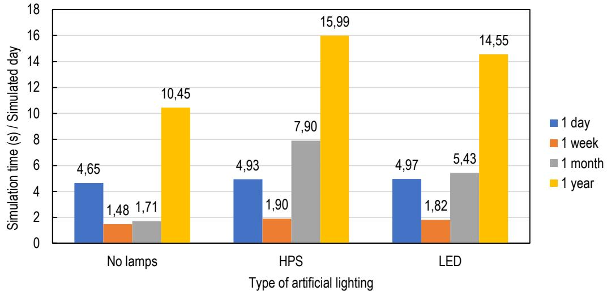  
Figure A2.14. Simulation time as a function of duration and lighting type.

The results show that the shortest calculation times per simulated day occur when only one week (7 days) is simulated. Generally, longer simulated durations result in higher computation times per simulated day, except for a one- day simulation. This exception can be explained by the initial values provided to the program. The simulations in this test series were carried out using the program's basic initial parameter values. However, these values are not the most suitable for the Quebec situation on January 1st. The program is initialized with constant values, regardless of the simulated month. To eliminate this discrepancy, it is recommended to simulate the program for a slightly longer period, such as one day, to allow for stabilization before removing the first day of simulation.

As demonstrated previously, a one- month simulation has a shorter calculation time per simulated day compared to a one- year simulation. Consequently, it is deemed more advantageous to conduct 12 simulations, each corresponding to a month of the year, rather than opting for a single one- year simulation solely for the purpose of calculation efficiency. However, it is important to note that while this approach is useful for assessing the internal conditions of the building throughout the year, it may not be applicable when considering the yield and growth of plants. If the focus is solely on building characteristics, simulating month by month and aggregating the results may be sufficient.

For example, the mean absolute difference between a one- year simulation and the sum of 12 monthly simulations for greenhouse interior temperatures is  $0.654^{\circ}C$ . Most deviations are close to zero, as shown in figure A2.15's standard normal distribution curve. The dataset's mean is  $- 0.332^{\circ}C$ , and the standard deviation is 1.132.

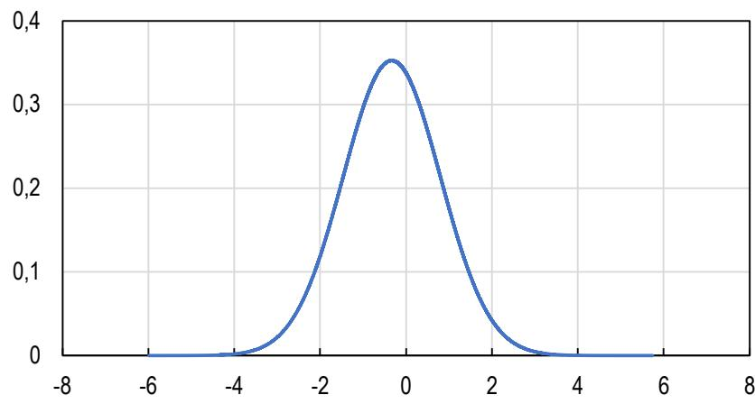  
Figure A2.15. Standard normal distribution curve of the difference in indoor temperature at each 300s iteration for a one-year simulation and 12 simulations of one month's duration placed one after the other.

For a comprehensive evaluation of greenhouse energy efficiency, it is imperative to simulate a complete year since the performance of the greenhouse is inherently tied to the plants it houses. Therefore, while selecting representative days or weeks for simulation may offer a pragmatic compromise, it is essential to acknowledge the limitations imposed by the inability to partition the desired simulation time.

# Annex 3 Impact of Setpoint Control on Indoor Greenhouse Climate Modeling6

Annexe 3 Impact de la régulation du point de consigne sur la modélisation du climat des serres

# A3.1 Resume

L'agriculture en serre est une solution cle pour relever les defis de securite alimentaire et de durabilite, car elle permet un controle precis de I'environnement. Le controle du climat joue un role essentiel dans la determination de la consommation d'energie et de la croissance des plantes dans les systemes de serres. La selection et I'optimisation des parametres de controle ont un impact significatif sur la performance globale. Cette etude simule une serre de tomates a Montreal, evaluant I'impact des points de consigne de controle sur ses performances. Une analyse de sensibilite, avec des variations etendues des points de consigne, revele que I'humidite relative et la temperature de I'air pendant I'éclairage sont les parametres les plus influents pour la consommation d'energie et le rendement des cultures. Ces resultats soulignent I'importance de mesures precises et de previsions pour optimiser les conditions environnementales. La selection precise des parametres de controle est cruciale pour la performance globale des systemes de serres. Ainsi, une strategie de controle predictif doit prendre en compte ces facteurs pour maximiser I'efficacite et la durabilite des serres.

# A3.2 Abstract

Greenhouse agriculture is a crucial solution to global food security and sustainability challenges, as it provides a controlled environment for plant growth, resulting in higher yields and efficient resource utilization. Climate control plays a critical role in determining energy consumption and plant growth within greenhouse systems. The selection and optimization of control parameters have a significant impact on the overall performance. This study conducted simulations of a tomato greenhouse located in Montreal, Canada, with the aim of evaluating the effect of different control setpoints in the presence of high- pressure sodium (HPS) supplemental lighting and light- emitting diode (LED)

supplemental lighting on greenhouse performance. To comprehensively assess the influence of each control setpoint, a sensitivity analysis (SA) was performed, systematically varying the control setpoints over a wider range than what is typically observed in tomato production. The SA utilized different control setpoints as inputs, while energy consumption and crop yield were considered as outputs. The setpoints for relative humidity and air temperature during the light period were identified as the most influential factors. This highlights the importance of accurate measurements and predictions of temperature and humidity to optimize environmental conditions in indoor greenhouses when implementing a predictive control strategy. The results obtained from this SA can contribute to the development of reduced- order models that focus on the most influential variables.

# A3.3 Introduction

Greenhouses play a significant role in addressing the global food security and sustainability challenges. The world population is projected to reach 9.7 billion by 2050 [95], meaning food production will have to increase by at least  $50\%$  to meet demand [96]. This increased food production is also associated with increased energy consumption, resulting in a significant carbon footprint and environmental degradation.

Greenhouse farming is a key solution to this challenge, providing a controlled environment for plant growth, higher yields, and efficient use of resources, including water and energy. Greenhouses also provide access to fresh local produce year- round, regardless of the outside climate. However, the energy consumption required to maintain ideal conditions for plant growth in greenhouses is high, making energy efficiency a critical aspect of greenhouse agriculture.

Climate controls determine energy consumption and crop growth in a greenhouse. Studies have shown that the selection and optimization of control parameters significantly impact the overall performance of greenhouse systems. As mentioned by Rizwan et al. [156], maintaining optimal control in a greenhouse environment is challenging due to the interconnected nature of its climate parameters. However, growers are conservative in changing their control setpoints and tolerances.

Climate control research has focused on developing accurate greenhouse models and efficient controllers to regulate microclimate variables. These investigations range from simple air temperature models to complex models involving plant responses.

The literature reviews by [157] and [38] outline two primary categories of greenhouse control algorithms: conventional control and optimal control (see Figure A3.1). Conventional control seeks to minimize deviations between setpoints and measured values. In contrast, optimal control considers greenhouse behavior, actuator capabilities, energy consumption, and crop response as inputs to the control strategy [157] [158]. To meet the crop requirements, advanced controllers combined with artificial neural networks have been proposed by many researchers for precise control and energy efficiency [38].

Figure A3.1 also illustrates the various control components and parameters in greenhouse control systems, where each component affects different parameters (e.g., the heating system affects temperature and humidity control) [38] [159]. Significantly, these control components exhibit strong coupling among multiple parameters, going beyond pairwise interactions [38] [158]. Numerical simulations, primarily using MATLAB/Simulink, are the predominant method for investigating greenhouse control strategies, accounting for about  $30\%$  of the selected literature [38].

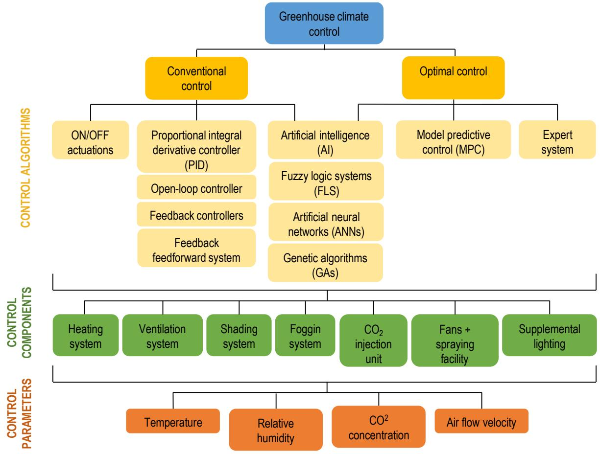  
Figure A3.1. Review of greenhouse control algorithms, components and parameters (adapted from [157] and [38])

The primary focus of this research is to evaluate and analyze which control parameters have the most significant impact on greenhouse performance, specifically in terms of energy consumption and crop yield. By investigating and assessing various control parameters, such as temperature, humidity, carbon dioxide  $(CO_2)$ , and lighting, this study aims to identify the key setpoint factors that significantly affect greenhouse performance.

In the long term, this research will allow to target the controls that would gain to be set dynamically, ensuring optimal, real- time adaptation to external conditions such as meteorological climate and energy markets. Such dynamic controls have the potential to significantly influence the operational costs and environmental impacts associated with greenhouse operations. By comprehensively investigating the influence of control parameters on energy consumption and crop yield, this research seeks to provide valuable insights into optimizing greenhouse systems, leading to improved sustainability, resource efficiency, and economic viability.

This study conducted a simulation of a tomato greenhouse located in Montreal, Canada. The purpose of the simulations was to evaluate the impact of different control setpoints on greenhouse performance. Greenhouses with high- pressure sodium (HPS) and light- emitting diode (LED) supplemental lighting were considered. To comprehensively assess the influence of each control setpoint, a sensitivity analysis (SA) was performed, involving the systematic variation of the control setpoints within a wider range than the typical range observed for tomato production. The inputs for the sensitivity analysis consisted of the diverse control setpoints, while the outputs considered were energy consumption and crop yield. This research contributes to a better understanding of the relationships between control setpoints, greenhouse performance, and optimization of environmental conditions for tomato production. The paper is structured as follows. Section 5.4 presents the methodology, outlining the approach and methods. It explains the model and simulation by defining the reference greenhouse and reference climate controls. It also introduces the sensitivity analysis method by defining the input values, the sampling method and the regression method.

Section 5.5 shows the results, focusing on energy consumption and crop yield. Section 5.6 presents the discussion, providing insights and data derived from the experiments and analysis. The control and reaction of the indoor climate, the energy contribution, and a linearization of the inputs are presented. Finally, Section 5.7 summarizes the key findings and their implications for the greenhouse industry.

# A3.4 Methodology

The work focuses on modeling and simulation techniques to investigate the performance of greenhouses under different climate control setpoints. The methodology diagram (Figure A3.2) illustrates the step- by- step process used in this study to achieve the research objectives. The graph shows the sequential order of actions, facilitating a comprehensive understanding of the methodology.

Section 5.4.1 presents the model and simulation methodology used to evaluate the energy consumption and crop yield of a greenhouse in Montreal, Canada. Section 5.4.2 introduces the SA that was used to evaluate the effect of varying control setpoints (input parameters) on the energy consumption and yield (output variables) of the tomato greenhouse simulation. By systematically adjusting the control setpoints and observing the resulting changes, the study aimed to determine the sensitivity of the model outputs to the variations in the input parameters.

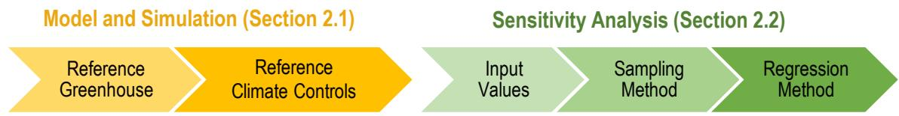  
Figure A3.2. Main methodology steps used in the present study.

# A3.4.1 Model Selection and Simulation Approach

The energy and growth simulations were performed using the GreenLight model [53], an open- source model designed for illuminated greenhouses with tomato crops (MATLAB code available at [63] and run on MATLAB R2021a). GreenLight was chosen because the computational time is reasonable, and all codes are accessible, allowing transparency in the research. Initially, this model was designed to replicate an advanced Venlo- type greenhouse with a tomato crop and supplemental lighting. According to Katzin et al. [53], based on the dataset of an experimental trial, the error in predicting the annual heating needs is in the range of 1 to  $12\%$ .

Before any modification was made to the GreenLight model, it was verified against literature data and previous results to ensure its accuracy and reliability. Using the same methodology as Katzin et al. [75], each step was validated and compared with the energy consumption results for Amsterdam, the Netherlands, given in the article (importing climate data, running scenarios, and post- analysis).

# Reference Greenhouse

Reference GreenhouseThe reference greenhouse simulated in this research is a virtual state- of- the- art high- tech tomato greenhouse located in Montreal, Canada. The decision to focus on a modern high- tech greenhouse, rather than a conventional greenhouse commonly found in the region, was motivated by the goal of exploring future possibilities and potential advancements in greenhouse technology. By simulating a cutting- edge greenhouse, this study aims to evaluate the feasibility and potential benefits of implementing advanced dynamic climate control strategies in greenhouse operations. This research seeks to provide valuable insights for the development of future greenhouse designs that integrate dynamic control systems with real- time monitoring with multiple sensors.

This state- of- the- art greenhouse is based on products available from the major Dutch greenhouse manufacturers (Priva [118], Ridder [119], Dalsem [120], Certhon [121], and Havecon [122]). The most common advanced greenhouse for commercial use is the high- tech Venlo- type Dutch glasshouse [53] [123], which is designed to optimize plant growth and yield by controlling the environment in the greenhouse. This type of greenhouse has features such as automated climate control systems, advanced irrigation systems, supplemental lighting, humidification and dehumidification,  $CO_2$  supplementation, and energy- efficient design (double glazing, energy curtains, etc.) [14]. The high- tech glass greenhouse is the most popular advanced greenhouse for commercial use in the Netherlands due to its efficiency, sustainability, and flexibility.

After analyzing the market related to tomato greenhouses, the reference greenhouse for the simulation is the one proposed by Katzin et al. [53] for the GreenLight model. In that study, a 4- hectare Venlo- type greenhouse,  $200m$  wide and long, with a gutter height of  $6.5m$  , a ridge height of  $7.3m$  and a roof slope of  $22^{\circ}$  was replicated. The roof was made of glass panels, with one in six panels having a ventilation window  $(1.40\text{m}\times 1.67\text{m})$  that can be opened to  $60^{\circ}$  . Thermal screens were installed at a height of  $6.3m$  . The path width was  $1.6m$  with a pipe rail system. This reference greenhouse is based on the Dutch greenhouse design described by Vanthoor et al. [57].

The GreenLight model was adapted considering the physical characteristics of the selected greenhouse and the meteorological data of the selected location. The meteorological data for Montreal, Canada, is retrieved from EnergyPlus [66]. The database used is the Canadian Weather for Energy Calculations (CwEC), an hourly weather observation of a characteristic one- year period specifically designed for building energy calculations [160].

Based on the methodology of Katzin et al. [75], all simulations of this study are almost one year long (350 days) and start on September 27, which represents the planting date of the crops. The simulated crops are assumed to be mature. Growers typically have a tomato harvest season of 350 days because about two weeks are needed between harvests to change crops and wash the greenhouse. The cycle adds up to a full year and allows for better crop management.

Figure A3.3 illustrates the relations of the system designed to control the indoor climate of the greenhouse and presents the flow of information and control decisions within the system. The diagram is divided into five sections: Outdoor Weather, Indoor Climate, Crop, Controls and Outputs. Control decisions are based on outdoor weather conditions, the existing indoor climate, and the current state of the crop. The indoor climate is influenced by the outdoor weather, the controls, and the crop. The crop is influenced by the indoor climate. The key outcomes of this research are the yield (which depends on the crop) and the energy consumption (which depend on the controls).

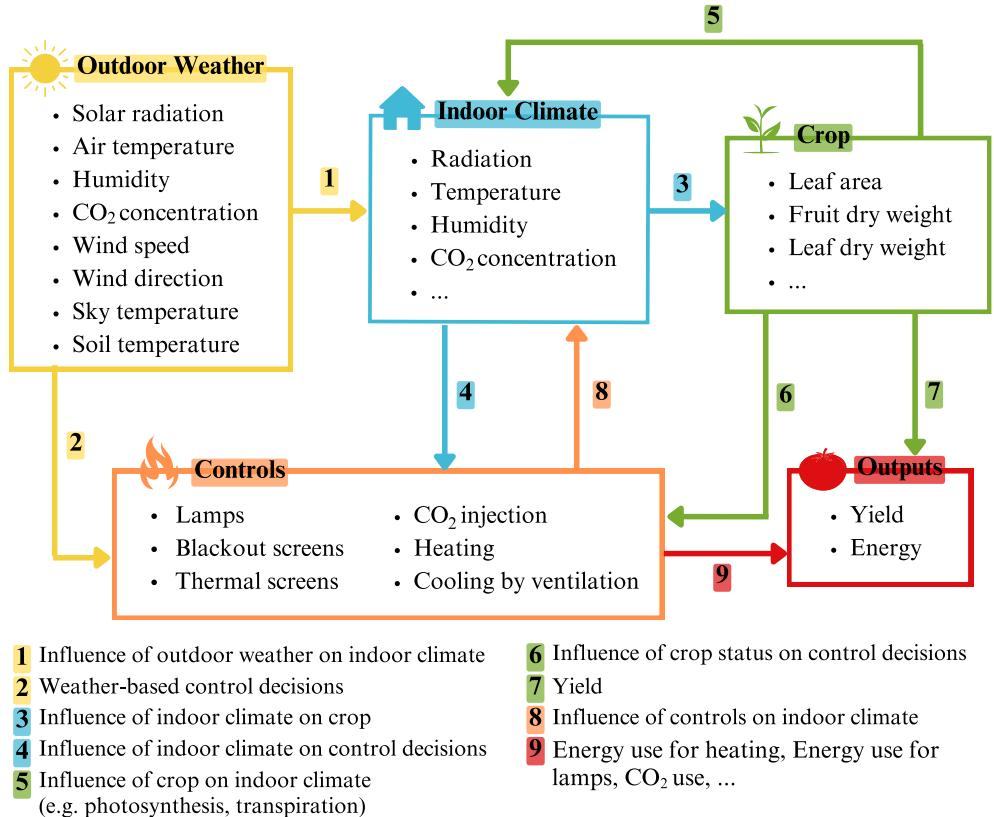  
Figure A3.3. Representation of the greenhouse system and influences (numbered arrows indicate the flow of information and control decisions) (adapted from [65]).

# Reference Climate Controls.

Reference Climate Controls.High- tech commercial greenhouses are equipped with advanced climate control systems. Therefore, the simulation of greenhouses must also account for the climate controls to provide the optimal environment according to the requirements of different growth stages of the crops. The climate controls included in GreenLight consider the following aspects: lamps, blackout screens, thermal screens,  $CO_2$  injection, heating, cooling by ventilation, and dehumidification [65].

As regulated by the reference climate controls, the lamps are on from midnight to 18:00, which represents 18 hours of lighting, the ideal lighting time for tomato production [84] [85]. However, during this time, the lamps are turned off depending on the solar radiation and the indoor temperature. Blackout screens are present to avoid light pollution, so they are closed at night, except when the indoor relative humidity or temperature is too high. Thermal screens contribute to the energy efficiency of greenhouses. They are closed when the external solar radiation and temperature are low. However, the screens are opened when ventilation is needed.  $CO_2$  is injected during the light period (when the plants are exposed to light, either from the sun or lamps) when the concentration is below a certain setpoint.

The heating is set to a specific setpoint temperature, one for the light period and one for the dark period. Ventilation cooling of the roof windows is activated (windows open) when the indoor temperature is  $5^{\circ}C$  above the setpoint. Ventilation dehumidification in the greenhouse is activated when the indoor relative humidity is too high. All the values and conditions of these different controls are listed in Table A3.1.

The climate was controlled using a smoothed proportional controller (defined by a sigmoid function). In the GreenLight program, the controller enables the definition of a setpoint and an acceptable tolerance band (pBand) for each parameter (Table A3.1). This function allows realistic control of the different variables since the desired values are not always attainable despite the setpoints.

<table><tr><td>Control</td><td>Condition(s)</td><td>Setpoint</td><td>pBand</td><td></td></tr><tr><td rowspan="3">Lamps</td><td>On: from 00:00 to 18:00</td><td>Iglobsp= 400 W/m²
Tampssp= 26.5℃</td><td></td><td></td></tr><tr><td>Off if: (Iglobsp&amp;gt; Iglobsp) OR
(TAir&amp;gt; Tampssp)</td><td rowspan="2">OR</td><td rowspan="2">SumIglobsp= 10 MJ/m²/day</td><td></td></tr><tr><td>(Night if blackout screens open) OR
(SumIglobsp&amp;gt; SumIglobsp)</td><td></td></tr><tr><td rowspan="2">Blackout screens</td><td>Closed during the night AND Open during the day</td><td rowspan="2">RHairscrsp= 90%</td><td>0.5℃ (T)
OR</td><td></td></tr><tr><td>Forced open if:
(RHAir&amp;gt; RHbIscrsp AND TAir&amp;gt; TAirsp - 1℃)
OR (TAir&amp;gt; Tampssp)</td><td>0.5% (RH)</td><td></td></tr><tr><td rowspan="3">Thermal screens</td><td>Closed if:
(Iglobsp&amp;lt; Iglobthscrsp AND Tout&amp;lt;</td><td rowspan="3">Iglobthscrsp= 50 W/m²
Tthscrsp(Day) = 18℃
Tthscrsp(Night) = 5℃
RHairsp= 85%</td><td rowspan="3">1℃ (T) OR 10% (RH)</td><td></td></tr><tr><td>Tthscrsp(Day) OR
(Iglobsp&amp;gt; Iglobthscrsp AND Tout&amp;lt; Tthscrsp(Night)</td><td></td></tr><tr><td>Forced to open if: (TAir&amp;gt; 2℃ + Tairsp) OR
(RHAir&amp;gt; RHairsp AND TAir&amp;gt; Tairsp - 1℃)</td><td></td></tr><tr><td>CO2injection</td><td>On during the light period if:
(CO2ppm&amp;lt; CO2ppmsp)</td><td>CO2ppmsp= 1000 ppm</td><td>100 ppm
(CO2)</td><td></td></tr><tr><td rowspan="2">Heating</td><td>Setpoint for heating:
Light period (TAirsp(Light)) AND
Dark period (TAirsp(Dark))</td><td rowspan="2">TAirsp(Light) = 19.5℃
TAirsp(Dark) = 18.5℃</td><td rowspan="2">1℃ (T)</td><td></td></tr><tr><td>Heating on only if: (TAir&amp;lt; Tairsp - 2℃)</td><td></td></tr><tr><td>Cooling by ventilati on</td><td>Root windows open if:
(TAir&amp;gt; 5℃ + Tairsp) OR (RHAir&amp;gt; 87%)</td><td></td><td>Open:
4℃ (T) OR 50% (RH)</td><td></td></tr></table>

# A3.4.2 Sensitivity Analysis (SA)

In this study, a SA was performed to identify which input parameters have the most significant impact on the output variables, allowing for a better understanding of their relationships. Two sensitivity analyses were carried out, one with HPS supplemental lighting and one with LED supplemental lighting.

SA is the study of how uncertainty in the output of a model can be attributed to different sources of uncertainty in the model input [78]. An analysis of the control system makes it possible to better understand the peculiarities of the model and to discover which components have the largest

influence on the greenhouse. SA is used to achieve several goals, such as validating the robustness of the model to check whether the model depends on weak assumptions, prioritizing future research by targeting factors that merit further analysis or measurement, and simplifying the model by holding certain factors constant or even removing them [79].

# Input Values.

The SA involved varying the values of the control setpoints over a range wider than the proposed "optimal" values for crop growth. Specifically, the control setpoints were adjusted to a minimum value reduced by  $25\%$  and a maximum value increased by  $25\%$ . The input variables of the SA are the different control setpoints listed in Table A3.2. The input ranges of the different variables were based on literature and realistic ranges with respect to existing tomato greenhouse controls. In total, eight input variables were considered in the SA.

Table A3.2. Input parameters and range for the climate control SA.  

<table><tr><td>Parameter</td><td>Minimum value</td><td>Maximum value</td><td>Units</td><td>Reference</td></tr><tr><td>RHairsP</td><td>50</td><td>95</td><td>%</td><td>[15]</td></tr><tr><td>TAirSP (Light Period)</td><td>10</td><td>30</td><td>℃</td><td>[15] [161]</td></tr><tr><td>TAirSP (Dark Period)</td><td>10</td><td>25</td><td>℃</td><td>[15] [161]</td></tr><tr><td>TthScrSP (Day)</td><td>-32</td><td>25</td><td>℃</td><td>[161] [66]</td></tr><tr><td>TthScrSP (Night)</td><td>10</td><td>25</td><td>℃</td><td>[66]</td></tr><tr><td>CO2ppm</td><td>450</td><td>1500</td><td>ppm</td><td>[15]</td></tr><tr><td>IGlobSP</td><td>150</td><td>500</td><td>W·m-2</td><td>[14] [65]</td></tr><tr><td>SumIGlobSP</td><td>7</td><td>25</td><td>MJ·m-2·day-1</td><td>[84]</td></tr></table>

# Sampling Method

The sampling method used for the SA is a modified Latin Hypercube Sampling (LHS). The LHS is a method of sampling from a given probability distribution [162]. It ensures full coverage of the range of input variables. The LHS produces a pseudo- random sample that mimics a random structure. This type of sampling is similar to stratified sampling. Compared to simple random sampling, LHS requires a smaller sample size to achieve the same precision [79]. The LHS algorithm assumes that the input variables are independent [87].

For the regression- based sensitivity analysis used in this work (see next section), Nguyen and Reiter [88] suggest a sample size of 1.5 to 10 times the number of input variables. Eight input variables are considered in this project, so 80 samples were evaluated.

# Regression Method

Different sensitivity analysis methods can be used depending on the features of a given problem [89] Tian [80] presented an overview of SA techniques with their main characteristics. Their review, which focuses on the application of SA in the field of building performance analysis, analyzes the different sensitivity analysis methods that are possible.

With the approach based on linear regressions, the relationship between a dependent variable  $(y)$  and multiple independent variables  $(x_{i})$  is represented by the following equation:

$$
y = \beta_{0} + \beta_{1}x_{1} + \beta_{2}x_{2} + \beta_{3}x_{3} + \ldots +\beta_{i}x_{i} + \ldots +\beta_{n}x_{n} + \epsilon \tag{A3.1}
$$

where  $\beta_0$  is the intercept term (the value of y when all  $x_{i}$  are zero),  $\beta_{i}$  are the regression coefficients that represent the change in y that corresponds to a one- unit change in each respective  $x_{i}$  and  $\epsilon$  is the error term that represents the unexplained variation in  $y$  that is not accounted for by the independent variables.

The goal of a linear regression is to estimate the values of  $\beta_{i}$  that minimize the sum of the squared differences between the observed values of y and the predicted values from the linear equation. The Standard Regression Coefficients (SRC) method, which is fast to compute and easy to understand, was chosen as the SA method in the present work. This method is suitable for linear or nearly linear models [88], so the first step is to validate the linearity of the outputs with the SCR method. This method also requires that the inputs be uncorrelated. In the SCR method, the coefficients  $\beta_{i}$  give an indication of the importance of the variable  $i$  [89] with respect to the output considered. These coefficients were determined using the MATLAB function "regress" for multiple linear regressions (MATLAB R2022b) [90]. Since the magnitude of  $\beta_{i}$  is affected by the units of measurement used for the corresponding regressor, a more robust strategy is to scale the model to generate standardized regression coefficients [91].

It is possible to calculate standardized value  $(y^{*})$  of the output  $y$  (dependent variable) by subtracting the mean of  $y$ $(\bar{y})$  from the observed value and then dividing it by the standard deviation  $(\sigma_{y})$  ..

$$
y^{*} = \frac{y - \bar{y}}{\sigma_{y}} \tag{A3.2}
$$

Standardizing the values makes it easier to compare and interpret the data.

Similarly, standardized coefficients  $(\beta_{i}^{*})$  of the input  $x_{i}$  (independent variable) can be obtained by multiplying the original coefficient  $(\beta_{i})$  with the ratio of the standard deviation of the dependent variable  $(\sigma_{y})$  to the standard deviation of  $\chi_{i}(\sigma_{x_{i}})$ :

$$
\beta_{i}^{*} = \beta_{i}\frac{\sigma_{y}}{\sigma_{x_{i}}} \tag{A3.3}
$$

Standardizing the coefficients helps to compare the relative importance and impact of different independent variables in the regression model and to quantify the linearity of a model. The closer the sum of the squares of the  $\beta_{i}^{*}$  coefficients is to 1, the more linear and fit the model is [91]. Once the standardized regression coefficients are estimated, they provide information about the strength and direction of the relationship between the dependent variable  $(y)$  and each independent variable  $(x_{i})$ .

# Evaluation metrics

The methodology uses a comprehensive set of evaluation metrics to analyze the impact of the different independent lamp parameters (inputs,  $x_{i}$ ). The primary outputs studied are the total energy consumption, which includes energy for lighting and heating, and the total yield, which is represented by the total fresh weight of harvested tomatoes (productivity). To facilitate comparisons with other studies, all metrics are calculated per square meter of greenhouse area. For each output, the standardized regression coefficients  $(\beta_{i}^{*})$  of the inputs  $x_{i}$  (independent variables) are analyzed.

# A3.5 Results

In this results section, the two outputs studied (i.e.,  $y$  in Eq. (A3.1)) are the annual energy consumption and total fresh weight tomato yield. The objective of an optimal greenhouse is to reduce its energy consumption while increasing its total yield, therefore the analysis centers on these two outputs, with a focus on the impact of input parameters. The significant correlations and standardized regression coefficients, illustrating the importance of independent variables, are shown. In addition, a comparison between HPS and LED lighting is presented. These findings inform strategies for greenhouse optimization.

The total fresh weight tomato yield in kg per square meter of greenhouse floor area for a 350- day period for a greenhouse with HPS lamps in Montreal, Canada, is reported in Figure A3.4 as a function of each input parameter independently (scatter plots) for the sample under consideration. In this scatter plot, each data point corresponds to a specific combination of SA input and tomato yield,

and the color of each point indicates the yield, with blue representing higher yields and yellow representing lower yields. The color gradient allows for a clear distinction between better and worse yields.

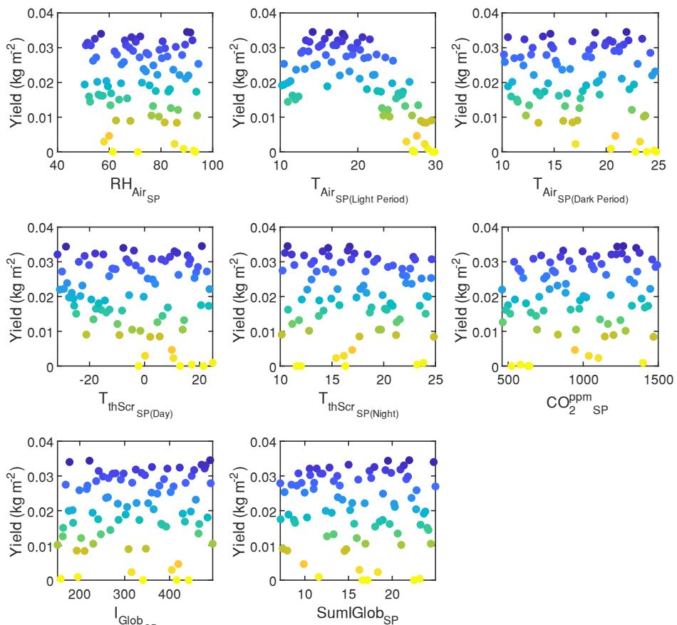  
Figure A3.4. Total fresh weight tomato yield as a function of the SA input variable (independent variable,  $x_{i}$ ) for 350 days under HPS lighting (Colors indicate the yield: blue represents higher yields and yellow represents lower yields).

From Figure A3.4, the observed correlation between the air temperature setpoint and tomato yield highlights the importance of maintaining appropriate temperature in optimizing tomato production under HPS lighting conditions.

Similarly, the total energy consumption in MJ per square meter of greenhouse floor area is shown in Figure A3.5. Again, a color gradient is used to distinguish the results. The best energy consumption values (lowest values) are represented in blue and the worst energy consumption values (highest values) are represented in yellow.

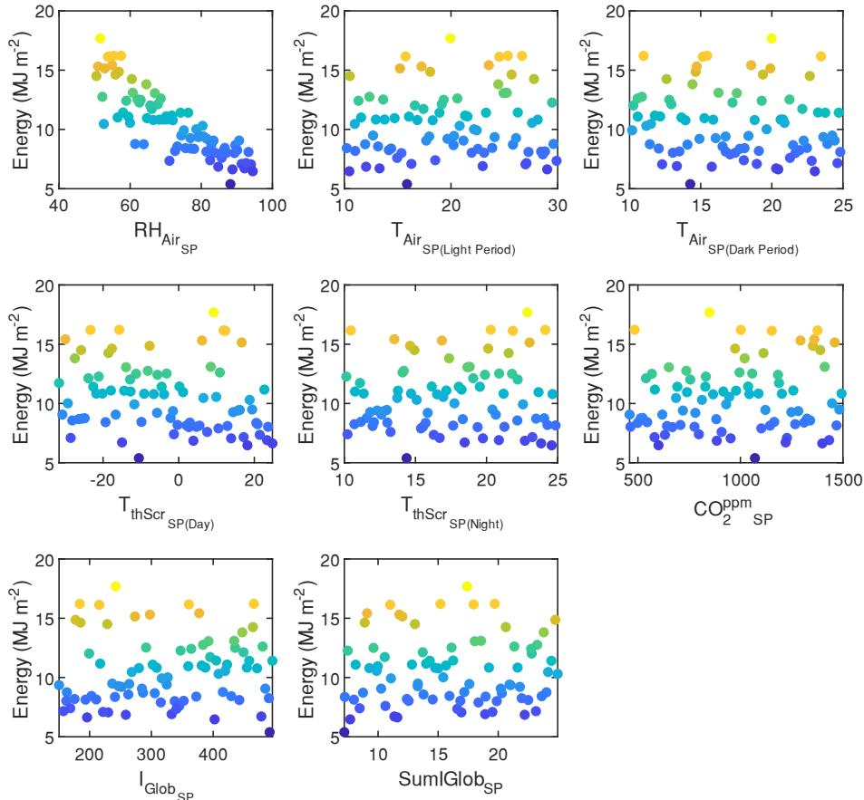  
Figure A3.5. Total energy consumption as a function of the SA input variable (independent variable,  $x_{i}$ ) for 350 days under HPS lighting (Colors indicate the energy: blue represents lower energy and yellow represents higher energy).

Figure A3.5 shows a correlation between the input control variable of relative humidity, and the total energy consumption. The distribution of the data points suggests that as the relative humidity setpoint increases, less energy is needed. This correlation is indicated by the clustering of the blue dots, representing lower energy, towards the higher values of relative humidity, while the yellow dots tend to be more prevalent at lower relative humidity values. Overall, Figure A3.5 provides valuable visual evidence for the relationship between relative humidity and total energy, suggesting that manipulating relative humidity levels could be a potential strategy for reducing energy consumption in HPS lighting systems.

The same simulations were performed under LED lighting, and the results exhibited correlations similar to those shown in Figure A3.4 and A3.5.

Figure A3.6 summarizes the key findings by showcasing the standardized regression coefficients  $(\beta_{i}^{*})$  for each independent variable, providing a concise overview of the SA results. The standardized

regression coefficients provide information on the strength and direction of the relationship between the input and output variables.

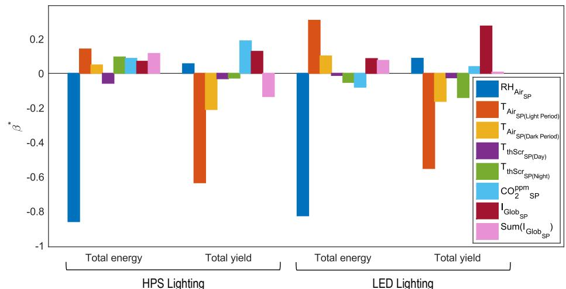  
Figure A3.6. Standardized regression coefficient  $(\beta^{*})$  of each independent variable (inputs,  $x_{i}$ ) for yearly energy consumption and yield, for both types of lamps (HPS and LED).

Positive values on the y- axis indicate a positive relationship, where an increase in the independent variable leads to an increase in the dependent variable. Conversely, negative values indicate a negative relationship, where an increase in the independent variable results in a decrease in the dependent variable. More importantly, the magnitude of the coefficients  $(\beta_{i}^{*})$  reveals the relative importance of the independent variables. Larger coefficient values mean that the corresponding independent variables have a strong impact on the dependent variable, while smaller coefficient values indicate a weak influence.

The comparison between HPS and LED lighting conditions allows one to evaluate how the importance of each independent variable may differ based on the lighting system used. From the results in Figure A3.6 we can conclude that there is no significant difference between the two types of lamps with that respect. For the main correlations (relative humidity setpoint for the total energy and air temperature setpoint during lighting period for the total yield), the standardized regression coefficients are slightly less dominant for greenhouses under LED lighting. For the total fresh weight tomato yield output, the standardized regression coefficient of the air temperature setpoint during light period is - 0.8605 for HPS and - 0.8266 for LED. For the total energy output, the standardized regression coefficient of the relative humidity is for - 0.6349 HPS and - 0.5521 LED.

For both HPS and LED lightings, the sum of the square standardized regression coefficient  $(\beta^{*2})$  is higher for the total energy consumption than for the total fresh weight tomato yield. For energy, the

sum is equal to 0.801 for HPS and 0.810 for LED, and for total yield, the sum is equal to 0.522 for HPS and 0.432 for LED.

# A3.6 Discussion

Predictive control has emerged as a promising approach for maintaining optimal environmental conditions in various indoor settings, including greenhouses and controlled growth environments. The SA presented above shows that the setpoints of the control system that have the most impact on the energy consumption and tomato yield are the relative humidity and air temperature during the light period, respectively. According to Zhang et al. [38], most of the literature (approximately  $60\%$  focuses on temperature and humidity as the regulated parameters in greenhouse climate control as these variables have a direct impact on crop yield and represent the primary contributors to energy consumption. This means that to implement a predictive control strategy, it is essential to have accurate measurements and predictions of temperature and humidity to optimize environmental conditions in indoor greenhouse settings.

Reliable predictions allow the control algorithm to anticipate environmental changes and adjust control actions accordingly. This adaptability helps maintain desired setpoints and prevents overshooting or undershooting, thereby improving system performance. Accurate prediction of temperature and humidity is challenging due to the complex nature of indoor environments. Data- driven approaches, such as machine learning and statistical techniques, offer the potential to improve temperature and humidity predictions. Integrating data from multiple sensors, including temperature, humidity,  $\mathrm{CO_2}$  levels, and solar radiation, can improve prediction accuracy. The key factors to focus on are those related to relative humidity and air temperature, according to the present SA. However, as shown in Figure A3.6 there are other factors at play depending on the type of lamps and the output. The three most influential factors in order of importance for the total energy consumption under HPS lighting are the relative air humidity setpoint, the air temperature setpoint during the light period, and the daily summed global solar radiation setpoint. Under LED lighting, the two main factors remain the same, but the third one is the air temperature setpoint during the dark period. For the total fresh weight tomato yield, the three most influential factors in order of importance under HPS lighting are the air temperature setpoint during the light period, the air temperature setpoint during the dark period, and the  $\mathrm{CO_2}$  concentration setpoint. Under LED lighting, these factors are the air temperature

setpoint during the light period, and the global solar radiation setpoint, and the air temperature setpoint during the dark period.

# A3.6.1 Control and Reaction of the Indoor Climate

Figure A3.7 illustrates the relationship between the heating and ventilation controls and the resulting output air temperature and relative humidity for selected 24- hour periods. These controls are determined by, but not limited to, the air temperature setpoint for heating and the relative humidity setpoint for ventilation. Three different scenarios are shown for each control, a minimum, average, and maximum setpoint value. For the sake of simplicity, the focus is on a specific day and is conducted under HPS lighting conditions. To illustrate the inside air temperature (Figure A3.7 A, C, and E), the day shown is January 1 (winter), and to illustrate the relative air humidity (Figure A3.7 B, D, and F), the day shown is July 1 (summer). The heating control activates the boiler. When the value is  $100\%$  the boiler works at full capacity. The ventilation control activates the opening of the roof windows. When the value is  $100\%$  the windows are fully open.

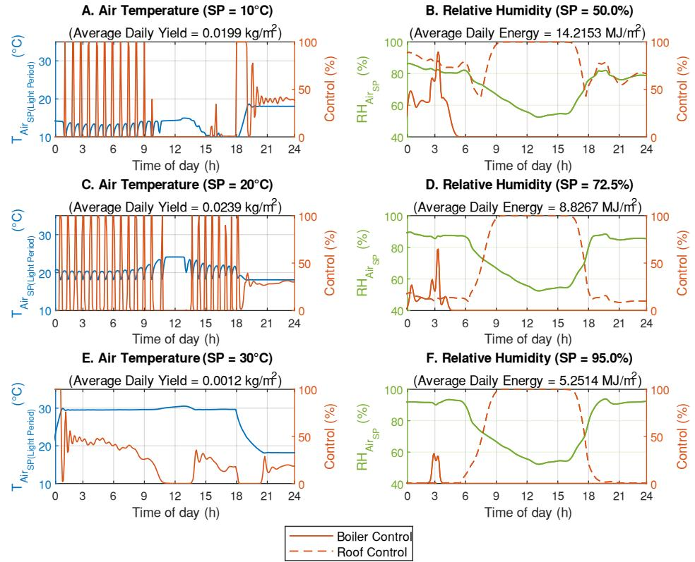  
Figure A3.7. Heating (boiler) control and output air temperature over one day (January 1) with an air temperature setpoint control of  $10^{\circ}C$  (A),  $20^{\circ}C$  (C),  $30^{\circ}C$  (E) for HPS lighting. Heating (boiler) and ventilation (roof) controls and output relative air humidity over one day (July 1) with a relative air humidity setpoint control of  $50\%$  (B),  $72.5\%$  (D),  $95\%$  (F) for HPS lighting.

Figure A3.7 shows how changes in the control setpoints affect the environmental conditions. Throughout the day, the heating and ventilation commands vary based on the setpoints, indicating that the system is attempting to achieve the desired environmental conditions. It is important to note that although the setpoints vary, this does not necessarily mean that the system always achieves these specific values. Instead, the system tries to achieve the setpoints and the corresponding results are analyzed. In Figure A3.7 B, D and F, the boiler control is low because the day shown is in summer. However, it demonstrates increased energy consumption when the control setpoint of relative humidity is lower. This is likely because the vents are more open, resulting in the activation of heating when the outside air temperature is lower during nighttime hours. This analysis shows oscillations in the boiler control of Figure A3.7 A and C. This should be adjusted in future work.

# A3.6.2 Energy Consumption Contribution

To better understand the energy dynamics of the simulation, additional details focusing on the breakdown of energy consumption is presented. Specifically, the division of energy usage between artificial lighting and greenhouse heating is highlighted. These details are presented in Figure A3.8, covering the entire simulation period and offering a comprehensive view of energy utilization patterns for three different relative air humidity control setpoints. In these three simulations, all controls are identical except for the value relative air humidity setpoint.

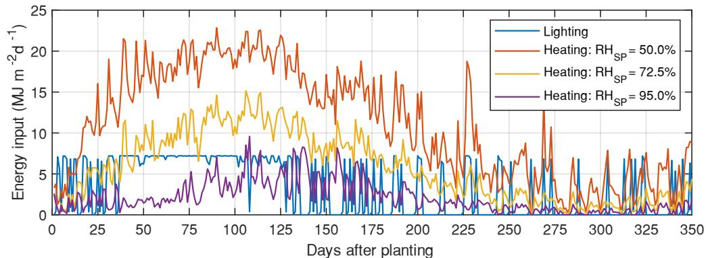  
Figure A3.8. Daily energy input related to lamp use and heating for 350 days (day of planting is September 27) under HPS lighting for a different relative air humidity control setpoint.

For all simulations, during winter, the energy is at its highest for heating and for artificial lighting. This is due to the cold outside conditions and low outside light period in Montreal, Canada. During winter, the energy for heating dominates and the opposite happens during summer as the energy for lighting is higher.

The energy for lighting does not vary with the relative humidity control setpoint. On the other hand, heating energy varies considerably, especially during the winter months (mid- November to March / 50- 150 days after planting). The main solution to reduce humidity is roof ventilation. However, this reduces the air temperature inside the greenhouse and the boiler must compensate.

# A3.6.3 Linearization of the inputs

In Figure A3.4, we observed a correlation between the temperature input and the total fresh weight tomato yield; however, it is evident that the relationship is not strictly linear. To address this issue and to facilitate further analysis, we introduced a new variable to try to linearize the relation with the yield. The proposed new variable for this linearization is:

$$
x_{T_{Air}} = \left|T_{Air_{SP(Light Period)}} - 19.5^{\circ}\mathrm{C}\right| \tag{A3.4}
$$

The value  $19.5^{\circ}C$  comes from the reference optimal air temperature setpoint [65]. By using the new variable instead of  $x_{T_{Air}}$  directly, we can express the effect of temperature on the yield in a more linear way. The scatter plot of the total fresh weight tomato yield as a function of the variable of Eq. (A3.4)Erreur! Source du revoi introuvable, during the light period is shown in Figure A3.9. The SAs presented previously were performed again but replacing  $x_{T_{Air}}$  by Eq. (A3.4).

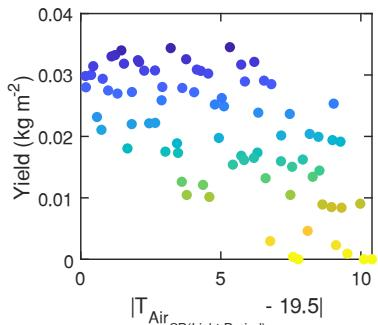  
Figure A3.9. Linearization of total fresh weight tomato yield in function of the air temperature control during light period under HPS lighting (Colors indicate the yield: blue represents higher yields and yellow represents lower yields).

For HPS lighting, the new standardized regression coefficient is - 0.6932 compared to - 0.6349 without the linearization. For LED lighting, the coefficient is now - 0.7831 compared to - 0.5521. The difference is more important under LED lighting. In both cases the air temperature setpoint during light period is the most influential inputs for total fresh weight tomato yield. With the new variable, the sum of the square standardized regression coefficient  $(\beta^{*2})$  becomes 0.567 (HPS) and 0.656 (LED) compared to 0.522 and 0.432 before. This means that with this new variable, it is possible to explain an even higher percentage of the variance with the regression.

# A3.6.4 Limitation of the model

A3.6.4 Limitation of the modelThe accuracy and realism of the results depends on the model employed in the simulation, which contain limitations. The model provides only a limited set of humidity and temperature values, lacking details on how these conditions vary across the greenhouse. This restricts our ability to analyze spatial differences in the indoor climate, as the model precludes a more granular analysis of spatial variations. Also, the precision of the research is inherently tied to the model's accuracy, meaning that any limitations in the model may affect the accuracy of our results [65]. Furthermore, to ensure the model's reliability, it would be beneficial to validate it by comparing its predictions to real- world data under different control conditions. The scope of this research is confined to the specific sequence of controls integrated into the model, predominantly reliant on predefined setpoints and control band parameters. This limitation prevents us from evaluating the potential of more advanced control strategies, such as model predictive control.

# A3.7 Conclusion

A3.7 ConclusionThis study investigated the impact of setpoint control on indoor greenhouse climate modeling. By performing a SA on greenhouse control setpoints, the setpoints for relative humidity and air temperature during the light period were identified as the most influential factors. To further understand and optimize greenhouse performance, the implementation of a digital twin could be explored. A digital twin would provide a virtual replica of the greenhouse, allowing real- time monitoring and simulation of control strategies. The results of the SA could help to obtain reduced order models focusing on the most influential variables. In addition, the adoption of more dynamic variable control approaches could help improve the accuracy of climate modeling. While the current study focused primarily on setpoint control, it would be interesting to expand the analysis to include other variables and their impact on greenhouse climate control. By considering additional factors, such as permissive band control rules, a more complete understanding of the complex interplay of variables could be gained and control strategies refined accordingly. However, it is important to recognize that the GreenLight model used in this study has limitations. The accuracy and realism of greenhouse climate modeling depends on the model. By exploring better control strategies, it is possible to achieve more efficient and sustainable greenhouse cultivation practices.

# Bibliography

[1] "Investissement de 157 M $ pour l'autonomie alimentaire du Québec - Le ministre Lamontagne dévoile des mesures qui permettront de créer 3800 emplois." Accessed: Aug. 02, 2022. [Online]. Available: https://www.quebec.ca/nouvelles/actualites/details/investissement- de- 157- m- pour- lautonomie- alimentaire- du- quebec- le- ministre- lamontagne- devoile- des- mesures- qu- permettront- de- creer- 3800- emplois
[2] "Croissance des serres au Québec." Accessed: Aug. 02, 2022. [Online]. Available: https://www.quebec.ca/nouvelles/actualites/details/croissance- serres/
[3] R. naturelles C. Gouvernement du Québec, "Culture des fruits et légumes de serre." Accessed: Aug. 04, 2022. [Online]. Available: https://www.quebec.ca/agriculture- environnement- et- ressources- naturelles/agriculture/industrie- agricole- au- quebec/productions- agricoles/culture- fruits- legumes- serre- serriculture
[4] A. et A. Canada, "Aperçu statistique de l'industrie des légumes de serre du Canada 2019. " Accessed: Aug. 04, 2022. [Online]. Available: http://agriculture.canada.ca/fr/seateurs- agricoles- du- canada/horticulture/rapports- lindustrie- horticole/apercu- statistique- lindustrie- legumes- serre- du- canada- 2019
[5] A. Belkadi, D. Mezghani, and A. Mami, "Energy Design and Optimization of a Greenhouse: A Heating, Cooling and Lighting Study," Eng. Technol. Appl. Sci. Res., vol. 9, no. 3, pp. 4235- 4242, Jun. 2019, doi: 10.48084/etasr.2787. 
[6] T. Boulard, J.- C. Roy, J.- B. Pouillard, H. Fatnassi, and A. Grisey, "Modelling of micrometeorology, canopy transpiration and photosynthesis in a closed greenhouse using computational fluid dynamics," Biosyst. Eng., vol. 158, pp. 110- 133, Jun. 2017, doi: 10.1016/j.biosystemseng.2017.04.001. 
[7] muclitech, "L'agriculture en environnement controle : de quoi s'agit- il ? - Muclitech," Muclitech | To bring forth the future in climate management. Accessed: Aug. 08, 2022. [Online]. Available: https://muclitech.com/lagriculture- en- environnement- controle- de- quoi- sagit- il/
[8] D. Monfet, "Améliorer la performance de l'agriculture en environnement controle," Subst. ÉTS, Sep. 2020. Accessed: Aug. 08, 2022. [Online]. Available: https://substance.etsintl.ca/ameliorer- performance- agriculture- environnement- controle
[9] F. Pelletier and S. Godbout, "Consommation d'énergie et émissions de gaz à effet de serre en production: serricole au Québec," p. 36, 2017. Available: https://www.serres.quebec/wp- content/uploads/2023/01/Rapport- Consommation- 
[10] CER, "Canada's Energy Future Data Appendices." Canada Energy Regulator: 2016. doi: 10.35002/ZJR8- 8X75. 
[11] "Etat de l'énergie au Québec," Édition 2021. " Accessed: Apr. 18, 2023. [Online]. Available: https://energie.hec.ca/wp- content/uploads/2021/02/EEQ2021_web.pdf
[12] R. naturelles C. Gouvernement du Canada, "Base de données complète sur la consommation d'énergie." Accessed: Apr. 18, 2023. [Online]. Available: https://oee.rncan.gc.ca/organisme/statistiques/bnce/apd/menus/evolution/tableaux_complets/list e.cfm
[13] "Option tarifaire pour la culture de végétaux." Accessed: Apr. 18, 2023. [Online]. Available: https://www.hydroquebec.com/residentiel/espace- clients/tarifs/option- electricite- additionnelle- vegetaux.html
[14] C. Stanghellini, B. van't Ooster, and E. Heuvelink, Greenhouse horticulture, Technology for optimal crop production. The Netherlands: Wageningen Academic Publishers, 2019. doi: /10.3920/978- 90- 8686- 879- 7. 
[15] M. Dorais (2023). Greenhouse agriculture 
[Lesson notes], Departement of phytology, Université Laval (in French). https://monportail.ulaval.ca/ 
[16] A. Kanan, A. Allahham, C. Bouleau, T. Sayara, M. Qurie, and L. Awad, "Improving Water Use Efficiency Using Sensors and Communication System for Irrigation of Greenhouse Tomato in Tulkarm, Palestine," Agric. Res., vol. 11, no. 4, pp. 728- 736, Dec. 2022, doi: 10.1007/s40003- 021- 00604- 5. 
[17] I. Yildiz, "Greenhouse Engineering; Integrated Energy Management", 2021 Taylor & Francis Group. ISBN: 978- 1- 498- 74313- 6 
[18] A. Ahmadteyki, M. Ghahderijani, A. Borghaee, and H. Bakhoda, "Energy use and environmental impacts analysis of greenhouse crops production using life cycle assessment approach: A case study of cucumber and tomato from Tehran province, Iran," Energy Rep., vol. 9, pp. 988- 999, Dec. 2023, doi: 10.1016/j.egyr.2022.11.205. 
[19] W. Chung, Y. V. Hui, and Y. M. Lam, "Benchmarking the energy efficiency of commercial buildings," Appl. Energy, vol. 83, no. 1, pp. 1- 14, Jan. 2006, doi: 10.1016/j.apenergy.2004.11.003. 
[20] Y. Hu, J. Zheng, X. Kong, J. Sun, and Y. Li, "Carbon footprint and economic efficiency of urban agriculture in Beijing—a comparative case study of conventional and home- delivery agriculture," J. Clean. Prod., vol. 234, pp. 615- 625, Oct. 2019, doi: 10.1016/j.jclepro.2019.06.122. 
[21] W. J. P. Kuijpers, D. Katzin, S. van Mourik, D. J. Antunes, S. Hemming, and M. J. G. van de Molengraft, "Lighting systems and strategies compared in an optimally controlled greenhouse," Biosyst. Eng., vol. 202, pp. 195- 216, Feb. 2021, doi: 10.1016/j.biosystemseng.2020.12.006. 
[22] Y. Li et al., "Effect of north wall internal surface structure on heat storage- release performance and thermal environment of Chinese solar greenhouse," J. Build. Phys., vol. 45, no. 4, pp. 507- 527, Jan. 2022, doi: 10.1177/17442591211013449. 
[23] H.- K. Kim, G.- C. Kang, J.- P. Moon, T.- S. Lee, and S.- S. Oh, "Estimation of Thermal Performance and Heat Loss in Plastic Greenhouses with and without Thermal Curtains," Energies, vol. 11, no. 3, p. 578, Mar. 2018, doi: 10.3390/en11030578. 
[24] Z. Xu, J. Lu, and S. Xing, "Thermal performance of greenhouse heating with loop heat pipe solar collector and ground source heat pump," Results Eng., vol. 15, p. 100626, Sep. 2022, doi: 10.1016/j.rneng.2022.100626. 
[25] D. Katzin, "Energy saving by LED lighting in greenhouses: A process- based modelling approach," Wageningen University, 2021. doi: 10.18174/544434. 
[26] I. Tsafaras et al., "Intelligent greenhouse design decreases water use for evaporative cooling in arid regions," Agric. Water Manag., vol. 250, p. 106807, May 2021, doi: 10.1016/j.agwat.2021.106807. 
[27] M. S. Rahman and H. Guo, "Sensitivity analysis of the DehumReq model to evaluate the impact of predominant factors on dehumidification requirement of greenhouses in cold regions," Inf. Process. Agric., p. S221431732200004X, Jan. 2022, doi: 10.1016/j.inpa.2022.01.004. 
[28] N. Castilla, "Greenhouse technology and management," 2nd ed. Wallingford, Oxfordshire, UK; Cambridge, MA: CABI, 2013. ISBN: 978 1 78064 103 4 
[29] Les producteurs en serres du Québec, "Énergie," Accessed: Mar. 23, 2023. [Online]. Available: https://www.serres.quebec/energie- 3/
[30] M. Zhang, T. Yan, W. Wang, X. Jia, J. Wang, and J. J. Klemeš, "Energy- saving design and control strategy towards modern sustainable greenhouse: A review," Renew. Sustain. Energy Rev., vol. 164, p. 112602, Aug. 2022, doi: 10.1016/j.rser.2022.112602. 
[31] M. S. Ahamed, H. Guo, and K. Tanino, "Energy saving techniques for reducing the heating cost of conventional greenhouses," Biosyst. Eng., vol. 178, pp. 9- 33, Feb. 2019, doi: 10.1016/j.biosystemseng.2018.10.017. 
[32] G. Yu, S. Zhang, S. Li, M. Zhang, H. Benli, and Y. Wang, "Numerical investigation for effects of natural light and ventilation on 3D tomato body heat distribution in a Venlo greenhouse," Inf. Process. Agric., p. S221431732200052X, Jun. 2022, doi: 10.1016/j.inpa.2022.05.006. 
[33] C. Perone, M. Orsino, G. La Fianza, F. Giametta, and P. Catalano, "Study of a mechanical ventilation system with heat recovery to control temperature in a monitored agricultural environment under Summer conditions," J. Build. Eng., vol. 43, p. 102745, Nov. 2021, doi: 10.1016/j.jobe.2021.102745. 
[34] E. Cuce, D. Harjunowibowo, and P. M. Cuce, "Renewable and sustainable energy saving strategies for greenhouse systems: A comprehensive review," Renew. Sustain. Energy Rev., vol. 64, pp. 34- 59, Oct. 2016, doi: 10.1016/j.rser.2016.05.077. 
[35] J. W. Lund and A. N. Toth, "Direct utilization of geothermal energy 2020 worldwide review," Geothermics, vol. 90, p. 101915, Feb. 2021, doi: 10.1016/j.geothermics.2020.101915. 
[36] M. Cyr, "Approvisionnement, technologie et environnement du chauffage à la biomasse," Colloque Agri- energie, 25 octobre 2012. Available: https://www.serresquebec/wp- content/uploads/2022/11/approv- technologie- environnement- chauffage- biomasse- agri- energie- 2012- min.pdf
[37] Rasheed, Na, Lee, Kim, and Lee, "Optimization of Greenhouse Thermal Screens for Maximized Energy Conservation," Energies, vol. 12, no. 19, p. 3592, Sep. 2019, doi: 10.3390/en12193592. 
[38] S. Zhang, Y. Guo, H. Zhao, Y. Wang, D. Chow, and Y. Fang, "Methodologies of control strategies for improving energy efficiency in agricultural greenhouses," J. Clean. Prod., vol. 274, p. 122695, Nov. 2020, doi: 10.1016/j.jclepro.2020.122695. 
[39] A. Nauta, J. Han, S. H. Tasnim, and W. D. Lubitz, "Performance Evaluation of a Commercial Greenhouse in Canada Using Dehumidification Technologies and LED Lighting: A Modeling Study," Energies, vol. 16, no. 3, p. 1015, Jan. 2023, doi: 10.3390/en16031015. 
[40] Y. Qu, A. Clausen, and B. N. Jørgensen, "A multi- objective optimization platform for artificial lighting system in commercial greenhouses," Energy Inform., vol. 4, no. S2, p. 44, Sep. 2021, doi: 10.1186/s42162- 021- 00162- 8. 
[41] G. Serale, L. Gnoli, E. Giraudo, and E. Fabrizio, "A Supervisory Control Strategy for Improving Energy Efficiency of Artificial Lighting Systems in Greenhouses," Energies, vol. 14, no. 1, p. 202, Jan. 2021, doi: 10.3390/en14010202. 
[42] J. Jiang, A. Mohagheghi, and M. Moallem, "Energy- Efficient Supplemental LED Lighting Control for a Proof- of- Concept Greenhouse System," IEEE Trans. Ind. Electron., vol. 67, no. 4, pp. 3033- 3042, Apr. 2020, doi: 10.1109/TIE.2019.2912762. 
[43] H. Zhang, J. Burr, and F. Zhao, "A comparative life cycle assessment (LCA) of lighting technologies for greenhouse crop production," J. Clean. Prod., vol. 140, pp. 705- 713, Jan. 2017, doi: 10.1016/j.jclepro.2016.01.014. 
[44] D. Katzin, L. F. M. Marcelis, and S. van Mourik, "Energy savings in greenhouses by transition from high- pressure sodium to LED lighting," Appl. Energy, vol. 281, p. 116019, Jan. 2021, doi: 10.1016/j.apenergy.2020.116019.
[45] I. Righini et al., "A greenhouse climate- yield model focussing on additional light, heat harvesting and its validation," Biosyst. Eng., vol. 194, pp. 1- 15, Jun. 2020, doi: 10.1016/j.biosystemseng.2020.03.009. 
[46] A. Mohagheghi and M. Moallem, "An Energy- Efficient PAR- Based Horticultural Lighting System for Greenhouse Cultivation of Lettuce," IEEE Access, vol. 11, pp. 8834- 8844, 2023, doi: 10.1109/ACCESS.2023.3237757. 
[47] L. Ouazzani Chahidi, M. Fossa, A. Priarone, and A. Mechabrane, "Greenhouse cultivation in Mediterranean climate: Dynamic energy analysis and experimental validation," Therm. Sci. Eng. Prog., vol. 26, p. 101102, Dec. 2021, doi: 10.1016/j.tsep.2021.101102. 
[48] L. Ouazzani Chahidi, M. Fossa, A. Priarone, and A. Mechabrane, "Energy saving strategies in sustainable greenhouse cultivation in the mediterranean climate - A case study," Appl. Energy, vol. 282, p. 116156, Jan. 2021, doi: 10.1016/j.apenergy.2020.116156. 
[49] A. Pakari and S. Ghani, "Regression equation for estimating the maximum cooling load of a greenhouse," Sol. Energy, vol. 237, pp. 231- 238, May 2022, doi: 10.1016/j.solener.2022.04.006. 
[50] T. Norton, D.- W. Sun, J. Grant, R. Fallon, and V. Dodd, "Applications of computational fluid dynamics (CFD) in the modelling and design of ventilation systems in the agricultural industry: A review," Bioresour. Technol., vol. 98, no. 12, pp. 2386- 2414, Sep. 2007, doi: 10.1016/j.biortech.2006.11.025. 
[51] N. Asgari, M. T. McDonald, and J. M. Pearce, "Energy Modeling and Techno- Economic Feasibility Analysis of Greenhouses for Tomato Cultivation Utilizing the Waste Heat of Cryptocurrency Miners," Energies, vol. 16, no. 3, p. 1331, Jan. 2023, doi: 10.3390/en/16031331. 
[52] H. F. de Zwart, Analyzing energy- saving options in greenhouse cultivation using a simulation model. Wageningen, 1996. ISBN 90- 5485- 533- 9
[53] D. Katzin, S. van Mourik, F. Kamples, and E. J. van Henten, "GreenLight - An open source model for greenhouses with supplemental lighting: Evaluation of heat requirements under LED and HPS lamps," Biosyst. Eng., vol. 194, pp. 61- 81, Jun. 2020, doi: 10.1016/j.biosystemseng.2020.03.010. 
[54] I. Righini et al., "A greenhouse climate- yield model focussing on additional light, heat harvesting and its validation," Biosyst. Eng., vol. 194, pp. 1- 15, Jun. 2020, doi: 10.1016/j.biosystemseng.2020.03.009. 
[55] F. Golzar, N. Heeren, S. Hellweg, and R. Roshandel, "A novel integrated framework to evaluate greenhouse energy demand and crop yield production," Renew. Sustain. Energy Rev., vol. 96, pp. 487- 501, Nov. 2018, doi: 10.1016/j.rser.2018.06.046. 
[56] B. H. E. Vanthoor, "A model- based greenhouse design method," Wageningen University, Wageningen, 2011. ISBN 978- 90- 8585- 919- 2
[57] B. H. E. Vanthoor, C. Stanghellini, E. J. Van Henten, and P. H. B. De Visser, "A methodology for model- based greenhouse design: Part 1, a greenhouse climate model for a broad range of designs and climates," Biosyst. Eng., vol. 110, no. 4, pp. 363- 377, Dec. 2011, doi: 10.1016/j.biosystemseng.2011.06.001. 
[58] K. Harbick and L. D. Albright, "Comparison of energy consumption: greenhouses and plant factories," Acta Hortic., no. 1134, pp. 285- 292, May 2016, doi: 10.17660/ActaHortic.2016.1134.38. 
[59] Q. O. Ogunlowo et al., "Effect of envelope characteristics on the accuracy of discretized greenhouse model in TRNSYS," J. Agric. Eng., Jul. 2022, doi: 10.4081/jae.2022.1420. 
[60] N. Choab, A. Allouhi, A. E. Maakoul, T. Kouksou, S. Saadeddine, and A. Jamil, "Effect of Greenhouse Design Parameters on the Heating and Cooling Requirement of Greenhouses in
Moroccan Climatic Conditions," IEEE Access, vol. 9, pp. 2986- 3003, 2021, doi: 10.1109/ACCESS.2020.3047851. 
[61] C. Baglivo et al., "Data from a dynamic simulation in a free- floating and continuous regime of a solar greenhouse modelled in TRNSYS 17 considering simultaneously different thermal phenomena," Data Brief, vol. 33, p. 106339, Dec. 2020, doi: 10.1016/j.dib.2020.106339. 
[62] M. S. Ahamed, H. Guo, and K. Tanino, "Modeling heating demands in a Chinese- style solar greenhouse using the transient building energy simulation model TRNSYS," J. Build. Eng., vol. 29, p. 101114, May 2020, doi: 10.1016/j.jobe.2019.101114. 
[63] D. Katzin, "GreenLight - A model for greenhouses with supplemental lighting." Jun. 12, 2023. Accessed: Sep. 18, 2023. [Online]. Available: https://github.com/davkat1/GreenLight
[64] B. H. E. Vanthoor, P. H. B. De Visser, C. Stanghellini, and E. J. Van Henten, "A methodology for model- based greenhouse design: Part 2, description and validation of a tomato yield model," Biosyst. Eng., vol. 110, no. 4, pp. 378- 395, Dec. 2011, doi: 10.1016/j.biosystemseng.2011.08.005. 
[65] D. Katzin, "Energy saving by LED lighting in greenhouses: A process- based modelling approach," Wageningen University, 2021. doi: 10.18174/544434. 
[66] "EnergyPlus." Accessed: May 25, 2023. [Online]. Available: https://energyplus.net/weather
[67] Marie- Pier Trépanier and Louis Gosselin, "Impact of Setpoint Control on Indoor Greenhouse Climate Modeling," presented at the Energy Informatics.Academy Conference 2023 (EI.A 2023), Unicamp, São Paulo, Brazil, Dec. 06, 2023. https://doi.org/10.1007/978- 3- 031- 48649- 4_13
[68] "Solve stiff differential equations and DAEs — variable order method - MATLAB ode15s." Accessed: Apr. 18, 2023. [Online]. Available: https://www.mathworks.com/help/matlab/ref/ode15s.html
[69] N. Gilbert, "One- third of our greenhouse gas emissions come from agriculture," Nature, p. nature.2012.11708, Oct. 2012, doi: 10.1038/nature.2012.11708. 
[70] M. Taki, A. Rohani, and M. Rahmati- Joneidabad, "Solar thermal simulation and applications in greenhouse," Inf. Process. Agric., vol. 5, no. 1, pp. 83- 113, Mar. 2018, doi: 10.1016/j.inpa.2017.10.003. 
[71] United Nations Environment Programme, "Food Waste Index Report 2021," Nairobi, 2021. ISBN No: 978- 92- 807- 3868- 1
[72] E. Iddio, L. Wang, Y. Thomas, G. McMorrow, and A. Denzer, "Energy efficient operation and modeling for greenhouses: A literature review," Renew. Sustain. Energy Rev., vol. 117, p. 109480, Jan. 2020, doi: 10.1016/j.rser.2019.109480. 
[73] E. Heuvelink and Wageningen University, The Netherlands, Achieving sustainable greenhouse cultivation. in Burleigh Dodds Series in Agricultural Science. Burleigh Dodds Science Publishing, 2019. doi: 10.19103/AS.2019.0052. 
[74] P. Kusuma, P. M. Pattison, and B. Bugbee, "From physics to fixtures to food: current and potential LED efficacy," Hortic. Res., vol. 7, no. 1, p. 56, Dec. 2020, doi: 10.1038/s41438- 020- 0283- 7. 
[75] D. Katzin, L. F. M. Marcelis, and S. van Mourik, "Energy savings in greenhouses by transition from high- pressure sodium to LED lighting," Appl. Energy, vol. 281, p. 116019, Jan. 2021, doi: 10.1016/j.apenergy.2020.116019. 
[76] M. Zhang, T. Yan, W. Wang, X. Jia, J. Wang, and J. J. Klemeš, "Energy- saving design and control strategy towards modern sustainable greenhouse: A review," Renew. Sustain. Energy Rev., vol. 164, p. 112602, Aug. 2022, doi: 10.1016/j.rser.2022.112602.
[77] J. A. Nelson and B. Bugbee, "Analysis of Environmental Effects on Leaf Temperature under Sunlight, High Pressure Sodium and Light Emitting Diodes," PLOS ONE, vol. 10, no. 10, p. e0138930, Oct. 2015, doi: 10.1371/journal.pone.0138930. 
[78] A. Saltelli, Ed., Sensitivity analysis in practice: a guide to assessing scientific models. Hoboken, NJ: Wiley, 2004. ISBN 0- 470- 87093- 1
[79] A. Saltelli, Ed., Global sensitivity analysis: the primer. Chichester, England; Hoboken, NJ: John Wiley, 2008. ISBN 978- 0- 470- 05997- 5
[80] W. Tian, "A review of sensitivity analysis methods in building energy analysis," Renew. Sustain. Energy Rev., vol. 20, pp. 411- 419, Apr. 2013, doi: 10.1016/j.rser.2012.12.014. 
[81] E. Borgonovo and E. Plischke, "Sensitivity analysis: A review of recent advances," Eur. J. Oper. Res., vol. 248, no. 3, pp. 869- 887, Feb. 2016, doi: 10.1016/j.ejor.2015.06.032. 
[82] Gouvernement du Canada, "Canadian Climate Normals 1981- 2010 Station Data - Climate - Environment and Climate Change Canada." Accessed: Sep. 18, 2023. [Online]. Available: https://climate.weather.gc.ca/climate_normals/results_1981_2010_e.html?searchType=stnName&txtStationName=quebec&searchMethod=contains&txtCentralLatMin=0&txtCentralLatSec=0&txtCentralLongMin=0&txtCentralLongSec=0&stnID=5251&dispBack=1
[83] C. Gomez and C. A. Mitchell, "Supplemental Lighting for Greenhouse- Green Tomatoes: Intracanopy LED Towers Vs. Overhead HPS Lamps," Acta Hortic., no. 1037, pp. 855- 862, May 2014, doi: 10.17660/ActaHortic.2014.1037.114. 
[84] G. Turcotte, Larouche, R., and Lambert, L. (2015). Production de la tomate de serre au Quebec. Syndicat des producteurs en serre du Quebec (Vol. 297). Agrisys Consultants Inc., MAPAQ. https://www.agrireseau.net/documents/955
[85] O. D. Palmitessa, M. A. Pantaleo, and P. Santamaria, "Applications and Development of LEDs as Supplementary Lighting for Tomato at Different Latitudes," Agronomy, vol. 11, no. 5, p. 835, Apr. 2021, doi: 10.3390/agronomy11050835. 
[86] M. Abyani and M. R. Bahaari, "A comparative reliability study of corroded pipelines based on Monte Carlo Simulation and Latin Hypercube Sampling methods," Int. J. Press. Vessels Pip., vol. 181, p. 104079, Mar. 2020, doi: 10.1016/j.ijvp.2020.104079. 
[87] M. Petelet, B. Iooss, O. Asserin, and A. Loredo, "Latin hypercube sampling with inequality constraints," AStA Adv. Stat. Anal., vol. 94, no. 4, pp. 325- 339, Dec. 2010, doi: 10.1007/s10182- 010- 0144- z.
[88] A.- T. Nguyen and S. Reiter, "A performance comparison of sensitivity analysis methods for building energy models," Build. Simul., vol. 8, no. 6, pp. 651- 664, Dec. 2015, doi: 10.1007/s12273- 015- 0245- 4. 
[89] R. Gagnon, I. Gosselin, and S. Decker, "Sensitivity analysis of energy performance and thermal comfort throughout building design process," Energy Build., vol. 164, pp. 278- 294, Apr. 2018, doi: 10.1016/j.enbuild.2017.12.066. 
[90] The MathWorks, "Multiple linear regression - MATLAB regress," Matlab. Accessed: May 25, 2023. [Online]. Available: https://www.mathworks.com/help/stats/regress.html
[91] F. Gregoire, L. Gosselin, and H. Alamdari, "Sensitivity of Carbon Anode Baking Model Outputs to Kinetic Parameters Describing Pitch Pyrolysis," Ind. Eng. Chem. Res., vol. 52, no. 12, pp. 4465- 4474, Mar. 2013, doi: 10.1021/ie3030467. 
[92] P. H. B. De Visser, G. H. Buck- Sorlin, G. W. A. M. Van Der Heijden, and L. F. M. Marcelis, "A 3d Model of Illumination, Light Distribution And Crop Photosynthesis To Simulate Lighting Strategies In Greenhouses," Acta Hortic., no. 956, pp. 195- 200, Oct. 2012, doi: 10.17660/ActaHortic.2012.956.20.
[93] P. H. B. De Visser, G. H. Buck- Sorlin, and G. W. A. M. Van Der Heijden, "Optimizing illumination in the greenhouse using a 3D model of tomato and a ray tracer," Front. Plant Sci., vol. 5, 2014, doi: 10.3389/fpls.2014.00048. 
[94] A.- J. Both et al., "Proposed Product Label for Electric Lamps Used in the Plant Sciences," HortTechnology, vol. 27, no. 4, pp. 544- 549, Aug. 2017, doi: 10.21273/HORTTECH03648- 16. 
[95] United Nation, "World Population Prospects 2019: Highlights," Department of Economic and Social Affairs, 2019. [Online]. Available: https://population.un.org/wpp/Publications/Files/WPP2019_10KeyFindings.pdf
[96] Food and Agriculture Organization of the United Nations, Ed., The future of food and agriculture: trends and challenges. Rome: Food and Agriculture Organization of the United Nations, 2017, ISBN 978- 92- 5- 109551- 5. 
[97] J. Antonio Sanchez- Molina et al., "Development and test verification of air temperature model for Chinese solar and Spanish Almeria- type greenhouse," Int. J. Agric. Biol. Eng., vol. 10, no. 4, pp. 66- 76, 2017, doi: 10.25165/j.ijabe.20171004.2398. 
[98] L. Mariani, G. Cola, R. Bulgari, A. Ferrante, and L. Martinetti, "Space and time variability of heating requirements for greenhouse tomato production in the Euro- Mediterranean area," Sci. Total Environ., vol. 562, pp. 834- 844, Aug. 2016, doi: 10.1016/j.scitotenv.2016.04.057. 
[99] M. C. Bozchalui, C. A. Canizares, and K. Bhattacharya, "Optimal Energy Management of Greenhouses in Smart Grids," IEEE Trans. Smart Grid, vol. 6, no. 2, pp. 827- 835, Mar. 2015, doi: 10.1109/TSG.2014.2372812. 
[100] T. Wedner, A. Yang, and M. W. Hamm, "Energy optimisation of plant factories and greenhouses for different climatic conditions," Energy Convers. Manag., vol. 243, p. 114336, Sep. 2021, doi: 10.1016/j.enconman.2021.114336. 
[101] Department of Biosystems Engineering, The University of Arizona, Tucson, USA, Y. Zhang, M. Kacira, and Department of Biosystems Engineering, The University of Arizona, Tucson, USA, "Comparison of energy use efficiency of greenhouse and indoor plant factory system," Eur. J. Hortic. Sci., vol. 85, no. 5, pp. 310- 320, Oct. 2020, doi: 10.17660/eJHS.2020/85.5.2. 
[102] L. Graamans, E. Baeza, A. Van Den Dobbelsteen, I. Tsafaras, and C. Stanghellini, "Plant factories versus greenhouses: Comparison of resource use efficiency," Agric. Syst., vol. 160, pp. 31- 43, Feb. 2018, doi: 10.1016/j.agsy.2017.11.003. 
[103] E. Ravishankar et al., "Organic solar powered greenhouse performance optimization and global economic opportunity," Energy Environ. Sci., vol. 15, no. 4, pp. 1659- 1671, 2022, doi: 10.1039/DIEE03474J.
[104] H. Nasrollahi, F. Ahmadi, M. Ebadollahi, S. Najafi Nobar, and M. Amidpour, "The greenhouse technology in different climate conditions: A comprehensive energy- saving analysis," Sustain. Energy Technol. Assess., vol. 47, p. 101455, Oct. 2021, doi: 10.1016/j.seta.2021.101455. 
[105] Gouvernement du Québec, "Profil sectoriel de l'industrie horticole au Québec. Edition 2022," Oct. 2022, doi: ISBN 978- 2- 550- 93032- 7. 
[106] "NYT: Laveré energiforbrug i væksthuse i 2020," Danmarks Statistik. Accessed: May 25, 2023. [Online]. Available: https://www.dst.dk/da/Statistik/nyheder- analyser- publ/nyt/NytHtml?cid=31403
[107] Statistics Denmark, "VHUS2: The greenhouse sectors use by production, greenhouse area in square metre (sq.m.) and area and consumption." Accessed: May 25, 2023. [Online]. Available: https://www.statistikbanken.dk/vhus2
[108] Agri Farming, "How to Start Greenhouse Farming in Denmark: Business Plan, Key Rules, Setup Cost, and Profit." Accessed: June 07, 2023. [Online]. Available:
https://www.agrifarming.in/how- to- start- greenhouse- farming- in- denmark- business- plan- key- rules- setup- cost- and- profit
[109] J. Cappelen, "Denmark - DMI Historical Climate Data Collection 1768- 2020", DMI Report 21- 02, Danish Meteorological Institute, 2021, ISBN 2445- 9127. 
[110] Gouvernement du Canada, "Canadian Climate Normals 1981- 2010 Station Data - Climate - Environment and Climate Change Canada". Accessed: May 25, 2023. [Online]. Available: https://climate.weather.gc.ca/climate_normals/results_1981_2010_e.html?searchType=stnProv&stProvince=QC&txtCentralLatMin=0&txtCentralLatSec=0&txtCentralLongMin=0&txtCentralLongSec=0&stID=5492&dispBack=0
[111] International Energy Agency (IEA), "Denmark - Countries & Regions," IEA. Accessed: May 25, 2023. [Online]. Available: https://www.iea.org/countries/denmark
[112] B.H. Jørgensen, P.H. Madsen, K. Remler, and K.B.K. Sørensen, "Report 2021 - Denmark", Technology Collaboration Programme, IEA, 2021. Available: https://iea- wind.org/wp- content/uploads/2022/12/IEA_Wind_TCP_AR2021_Denmark.pdf
[113] Energinet, "Energi Date Service," Energinet. Accessed: May 25, 2023. [Online]. Available: https://www.energidataservice.dk/
[114] "Hydro- Québec | L'hydroélectricité québécoise : propre, renouvelable et faible en GES." Accessed: May 25, 2023. [Online]. Available: https://www.hydroquebec.com/a- propos/notre- energie.html
[115] Johanne Whitmore and Pierre- Olivier Pineau, "État de l'énergie au Québec 2023," Chaire de gestion du secteur de l'énergie, HEC Montréal, préparé pour le gouvernement du Québec, Feb. 2023, Available: https://energie.hec.ca/eeq/.
[116] Hydro Québec, "Tarifs d'électricité en vigueur le 1er avril 2023.," 2023, ISBN 978- 2- 550- 93694- 7. 
[117] Energin. "Price and evolution," Accessed: May 16, 2023. [Online]. Available: https://energir.com/en/major- industries/natural- gas- price/price- and- evolution
[118] Priva, "Priva | Smart horticulture & building management solutions," Accessed: May 25, 2023. [Online]. Available: https://www.priva.com/
[119] Ridder, "Ridder | Innovative technical solutions for protected horticulture | Inside greenhouse technology for profitable horticulture,". Accessed: May 25, 2023. [Online]. Available: https://ridder.com/
[120] Dalsem, "Complete Greenhouse Projects - Dalsem,". Accessed: May 25, 2023. [Online]. Available: https://www.dalsem.com/en
[121] Certhon, "Certhon - Growing anything, anywhere. For everyone.,". Accessed: May 25, 2023. [Online]. Available: https://certhon.com/
[122] Havecon, "Havecon | Horticultural Projects,". Accessed: May 25, 2023. [Online]. Available: https://havecon.com/en/
[123] H. J. Payne, S. Hemming, B. A. P. Van Rens, E. J. Van Henten, and S. Van Mourik, "Quantifying the role of weather forecast error on the uncertainty of greenhouse energy prediction and power market trading," Biosyst. Eng., vol. 224, pp. 1- 15, Dec. 2022, doi: 10.1016/j.biosystemseng.2022.09.009. 
[124] Gouvernement du Québec, "Qualité de lair dans les écoles,". Accessed: May 25, 2023. [Online]. Available: https://www.quebec.ca/education/prescolaire- primaire- et- secondaire/qualite- air- ecoles
[125] H. Takahashi, M. P. Bivolarova, A. Keli, J. Nickel, and A. K. Melikov, "Non- uniformity in outdoor CO₂ concentration in city of Copenhagen," E3S Web Conf., vol. 111, p. 02007, 2019, doi: 10.1051/e3sconf/201911102007.
[126] D. Kinny, J. Y. Hsu, G. Governatori, and A. K. Ghose, Eds., Agents in Principle, Agents in Practice: 14th International Conference, PRIMA 2011, Wollongong, Australia, November 16- 18, 2011. Proceedings, vol. 7047. in Lecture Notes in Computer Science, vol. 7047. Berlin, Heidelberg: Springer Berlin Heidelberg, 2011. doi: 10.1007/978- 3- 642- 25044- 6. 
[127] A. Clausen, H. M. Maersk- Moeller, J. Corfixen Soerensen, B. N. Joergensen, K. H. Kjaer, and C. O. Oltosen, "Integrating Commercial Greenhouses in the Smart Grid with Demand Response based Control of Supplemental Lighting," in Proceedings of the 2015 International Conference on Industrial Technology and Management Science, Beijing, China, Atlantis Press, 2015. doi: 10.2991/itms- 15.2015.50. 
[128] D. A. Howard, Z. Ma, C. Veje, A. Clausen, J. M. Aaslyng, and B. N. Jørgensen, "Greenhouse industry 4.0 - digital twin technology for commercial greenhouses," Energy Inform., vol. 4, no. S2, p. 37, Sep. 2021, doi: 10.1186/s42162- 021- 00161- 9. 
[129] M. Collins et al., "Long- term Climate Change: Projections, Commitments and Irreversibility". IPCC. Available: https://www.ipcc.ch/site/assets/uploads/2018/02/WG1AR5_Chapter12_FINAL.pdf
[130] IPCC, "Climate Change 2014: Synthesis Report," IPCC, Geneva, Switzerland. Contribution of Working Groups I, II and III to the Fifth Assessment Report of the Intergovernmental Panel on Climate Change 
[Core Writing Team, R.K. Pachauri and L.A. Meyer (eds.)], 2014. 
[131] "Representative Concentration Pathways." Accessed: Jul. 31, 2023. [Online]. Available: https://climate- scenarios.canada.ca/?page=scen-rcp
[132] "Topic 2: Future changes, risks and impacts," IPCC 5th Assessment Synthesis Report. Accessed: Jul. 31, 2023. [Online]. Available: http://ar5- syr.ipcc.ch/topic_futurechanges.php
[133] D. B. Lobell, "Climate change adaptation in crop production: Beware of illusions," Glob. Food Secur., vol. 3, no. 2, pp. 72- 76, Jul. 2014, doi: 10.1016/j.gfs.2014.05.002. 
[134] L.- Y. Chang and C.- H. Chang, "Plastic greenhouse for growing wax apple: a strategy to meet the challenge of climate change," Acta Hortic., no. 1166, pp. 107- 114, Jun. 2017, doi: 10.17660/ActaHortic.2017.1166.15. 
[135] C. Salazar- Parra et al., "Carbon balance, partitioning and photosynthetic acclimation in fruit- bearing grapevine (Vitis vinifera L. cv. Tempranillo) grown under simulated climate change (elevated CO2, elevated temperature and moderate drought) scenarios in temperature gradient greenhouses," J. Plant Physiol., vol. 174, pp. 97- 109, Feb. 2015, doi: 10.1016/j.jolph.2014.10.009. 
[136] F. Morales et al., "Methodological advances: Using greenhouses to simulate climate change scenarios," Plant Sci., vol. 226, pp. 30- 40, Sep. 2014, doi: 10.1016/j.plantsci.2014.03.018. 
[137] J. Jeon, H. Lee, and S. Yoon, "Optimal Section Design of Korean Agricultural Greenhouse Response to Climate Change Based on Monte Carlo Simulation," Agriculture, vol. 12, no. 9, p. 1413, Sep. 2022, doi: 10.3390/agriculture12091413. 
[138] A. Apostolakis, K. Wagner, I. N. Daliakopoulos, N. N. Kourqialas, and J. K. Tsanis, "Greenhouse Soil Moisture Deficit under Saline Irrigation and Climate Change," Procedia Eng., vol. 162, pp. 537- 544, 2016, doi: 10.1016/j.proeng.2016.11.098. 
[139] H. Hoffmann and T. Rath, "High Resolved Simulation of Climate Change Impact on Greenhouse Energy Consumption in Germany," 2012. ISSN 1611- 4426. 
[140] T. B. of C. Secretariat and T. B. of C. Secretariat, "Engineering Climate Datasets - Open Government Portal." Accessed: Aug. 14, 2023. [Online]. Available: https://open.canada.ca/data/en/dataset/2b9bc161- ca00- 4a1e- 9c75- 58ed621ef4b1]
[141] E. and C. C. Canada, "Greenhouse gas concentrations." Accessed: Aug. 31, 2023. [Online]. Available: https://www.canada.ca/en/environment- climate- change/services/environmental- indicators/greenhouse- gas- concentrations.html
[142] M. Meinshausen et al., "The RCP greenhouse gas concentrations and their extensions from 1765 to 2300," Clim. Change, vol. 109, no. 1- 2, pp. 213- 241, Nov. 2011, doi: 10.1007/s10584- 011- 0156- z.
[143] World Food and Agriculture - Statistical Yearbook 2021. FAO, 2021. doi: 10.4060/cb4477en.
[144] A. Badji, A. Benseddik, H. Bensaha, A. Boukhelifa, and I. Hasrane, "Design, technology, and management of greenhouse: A review," J. Clean. Prod., vol. 373, p. 133753, Nov. 2022, doi: 10.1016/j.jclepro.2022.133753. 
[145] S. C. Gouvernement du Canada, "Produits de serre, Recensement de l'agriculture, 2021. " Accessed: Apr. 18, 2023. [Online]. Available: https://www/150. statcan.gc.ca/t1/tbl1/fr/tv.action?pid=3210036001
[146] "Découvrir les régions du Québec et y trouver un emploi," PicBois Québec - Construction bois au Québec. Accessed: Apr. 18, 2023. [Online]. Available: https://picboisquebec.ca/travailler/decouvrir- et- travailler- en- regions/
[147] S. C. Gouvernement du Canada, "Serres et champignons, données chronologiques du Recensement de l'agriculture." Accessed: Apr. 18, 2023. [Online]. Available: https://www/150. statcan.gc.ca/t1/tbl1/fr/tv.action?pid=3210015901
[148] S. C. Gouvernement du Canada, "Dépenses d'exploitation des producteurs spécialisés de serre." Accessed: Apr. 18, 2023. [Online]. Available: https://www/150. statcan.gc.ca/t1/tbl1/fr/tv.action?pid=3210002501
[149] "Régie de l'énergie - R- 4127- 2020. " Accessed: Apr. 18, 2023. [Online]. Available: http://publicsde.regie- energie.qc.ca/_layouts/publicsite/ProjectPhaseDetail.aspx?ProjectID=550&phase=1&Provenanc e=A&generate=true
[150] "R- 4127- 2020- Mesures de soutien au développement des serres." Accessed: Apr. 18, 2023. [Online]. Available: http://publicsde.regie- energie.qc.ca/projets/550/DocPrj/R- 4127- 2020- B- 0004- Demande- Piece- 2020_07_09. pdf
[151] "R- 4127- 2020- B- 0010- Complément de preuve- analyse économique." Accessed: Apr. 18, 2023. [Online]. Available: http://publicsde.regie- energie.qc.ca/projets/550/DocPrj/R- 4127- 2020- B- 0010- Demande- Piece- 2020_07_29. pdf
[152] ASHRAE, "ASHRAE Handbook—HVAC Applications - Chapter 24 - Environmental Control for Animals and Plants." 2015. 
[153] C. Stanghellini, B. van't Ooster, and E. Heuvelink, "Chapter 8 : Heating in climate- controlled greenhouses," in Greenhouse horticulture, Technology for optimal crop production, The Netherlands: Wageningen Academic Publishers, 2019. doi: /10.3920/978- 90- 8686- 879- 7. 
[154] "Normales climatiques du Québec." Accessed: Apr. 19, 2023. [Online]. Available: https://www.environment.gouv.qc.ca/climat/hormales/
[155] National Research Council of Canada, Ed., National Building Code of Canada 2015, Fourteenth edition. in NRCC, no. 56190. Ottawa: National Research Council of Canada, 2015. 
[156] A. Rizwan, A. N. Khan, R. Ahmad, and D. H. Kim, "Optimal Environment Control Mechanism Based on OCF Connectivity for Efficient Energy Consumption in Greenhouse," IEEE Internet Things J., vol. 10, no. 6, pp. 5035- 5049, Mar. 2023, doi: 10.1109/JIOT.2022.3222086. 
[157] C. Duarte- Galvan et al., "Review. Advantages and disadvantages of control theories applied in greenhouse climate control systems," Span. J. Agric. Res., vol. 10, no. 4, p. 926, Nov. 2012, doi: 10.5424/sjar/2012104- 487- 11.
[158] R. V. Chimankare, S. Das, K. Kaur, and D. Magare, "A review study on the design and control of optimised greenhouse environments," J. Trop. Ecol., vol. 39, p. e26, 2023, doi: 10.1017/S0266467423000160. 
[159] M. Soussi, M. T. Chaibi, M. Buchholz, and Z. Saghrouni, "Comprehensive Review on Climate Control and Cooling Systems in Greenhouses under Hot and Arid Conditions," Agronomy, vol. 12, no. 3, p. 606, Mar. 2022, doi: 10.3390/agronony12030626. 
[160] "EnergyPlus." Accessed: Jun. 08, 2023. [Online]. Available: https://energyplus.net/weather/sources/#CWEC
[161] R. Kim, J. Kim, I. Lee, U. Yeo, S. Lee, and C. Decano- Valentin, "Development of three- dimensional visualisation technology of the aerodynamic environment in a greenhouse using CFD and VR technology, part 1: Development of VR a database using CFD," Biosyst. Eng., vol. 207, pp. 33- 58, Jul. 2021, doi: 10.1016/j.biosystemseng.2021.02.017. 
[162] "Latin Hypercube Sampling vs. Monte Carlo Sampling - Data Science Genie." Accessed: Jun. 08, 2023. [Online]. Available: https://datasciencegenie.com/latin- hypercube- sampling- vs- monte- carlo- sampling/

