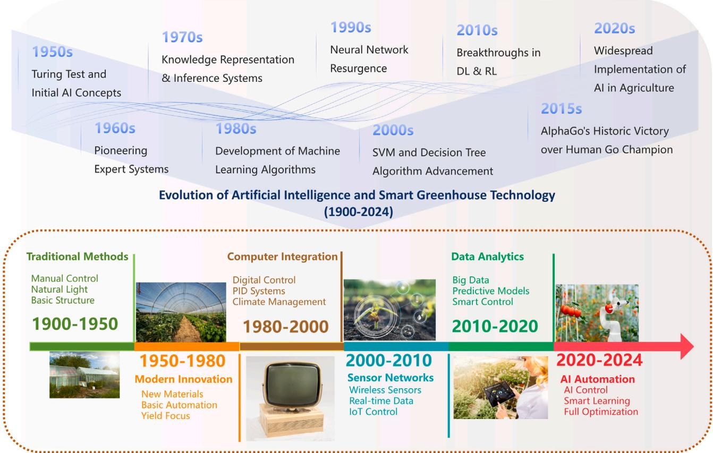
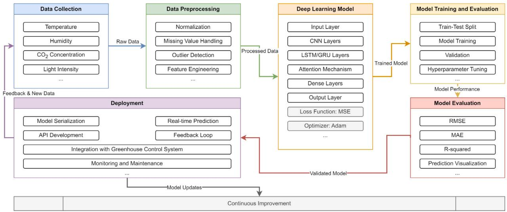
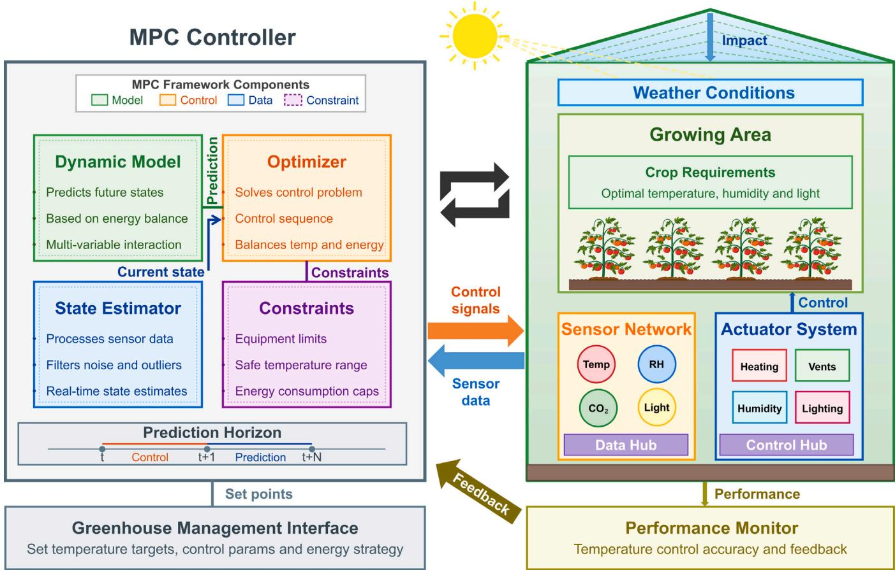
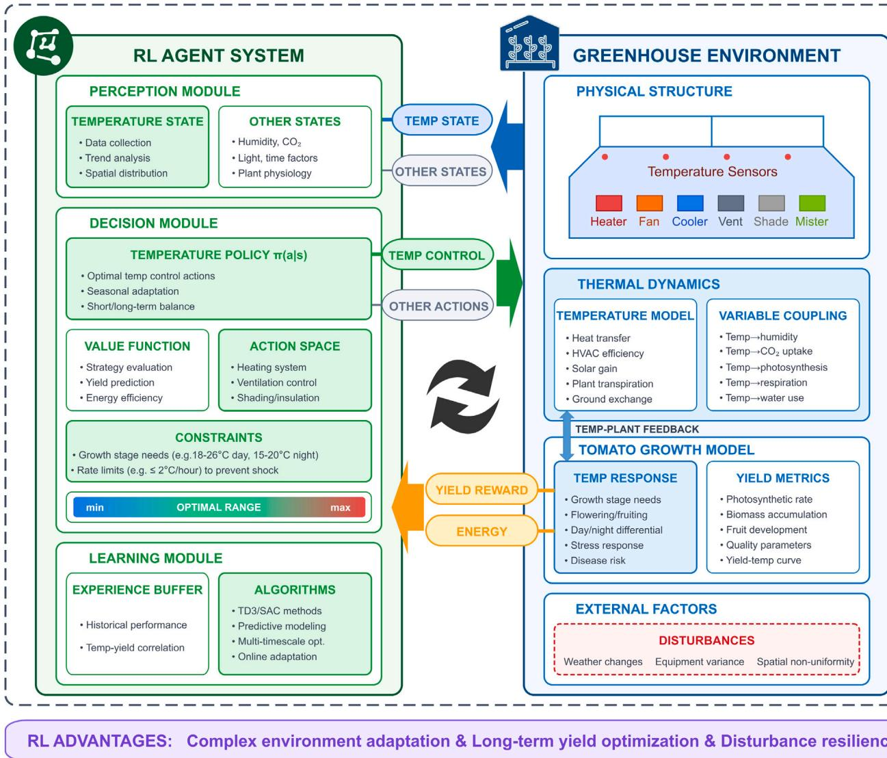
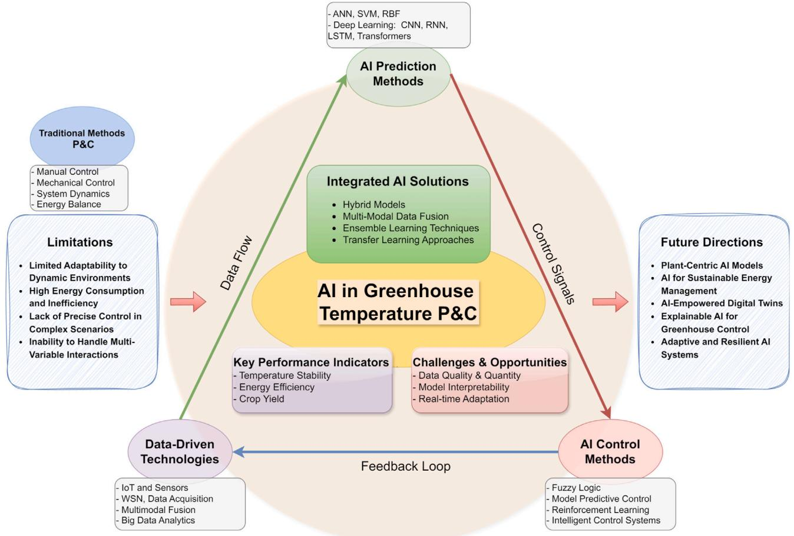

# Prediction and control of greenhouse temperature: Methods, applications, and future directions

综述文章

# 温室温度预测与控制：方法、应用与未来方向

Jingxin Yu a,b,c, Congcong Sun b, Jinpeng Zhao a,d, Lushun Ma e, Wengang Zheng a,c, Qiuju Xie f, Xiaoming Wei a,c  $\oplus$  \*

a 国家农业智能装备工程技术研究中心，北京，100097，中国  
b 农业生物系统工程组，瓦赫宁根大学，瓦赫宁根，6700 AA，荷兰  
c 北京市农林科学院智能装备技术研究中心，北京，100097，中国  
d 机电工程学院，西安工业大学，西安，710021，中国  
e 信息科学与工程学院，山东农业大学，泰安，271018，中国  
f 电气与信息学院，东北农业大学，哈尔滨，150030，中国  

# 文章信息

# 摘要

关键词：温室 预测模型 温度控制 人工智能 混合模型

温室种植对全球粮食安全和农业可持续发展至关重要。为维持高效的温室作物生产，温度管理是核心。为更好地理解温室温度预测与控制的现状、方法、应用和未来方向，本文全面综述了温室温度管理的不同技术。贡献涵盖三个关键方面：(1)不同传感技术、物联网、无线传感器网络和多模态数据融合技术在支持温室温度管理中的作用；(2)传统模型、基于人工智能(AI)的模型和混合模型在温室温度预测中的现状与优势；(3)不同控制方法(如模糊逻辑、模型预测控制(MPC)、强化学习(RL)和智能系统)在温室温度控制中的适用场景与局限性。对比分析表明，深度学习模型在温室温度预测中表现优异，而模糊逻辑、MPC和RL在温室温度控制中展现出独特优势。尽管先进AI技术在温室温度管理中展现出潜力，实际应用仍面临模型鲁棒性、可解释性和计算效率等挑战。为充分发挥AI潜力，未来研究应聚焦于：开发以植物为中心的AI模型、探索AI在温室可持续能源管理中的应用、开发数字孪生模型以促进AI与温室技术的发展，从而创建可持续、韧性和智能农业的新范式。本综述为优化温室环境管理提供了全面视角，对应对粮食安全和气候变化挑战至关重要。

# 目录

1. 引言 2  
2. 温室温度管理中的传感技术 4  
2.1. 数据采集与处理技术 5  
2.2. 多模态数据融合技术 5  
2.3. 多模态数据融合对温度预测与控制的影响 5  
3. 温室温度预测的传统方法 6  
3.1. 温室温度预测方法 6  
3.1.1. 机理建模 6  
3.1.2. 早期机器学习应用 7  
4. 基于AI的温室温度预测方法 8  
4.1. 人工神经网络 8  
4.1.1. ANN架构与训练 8  
4.1.2. 用于温室温度预测的ANN模型 8  
4.2. 深度学习模型 8  
4.2.1. 卷积神经网络 8  
4.2.2. 循环神经网络 9  
4.2.3. Transformer模型 9  
4.3. 混合模型 9  
4.3.1. 理论基础 10  
4.3.2. 代表性混合模型 10  
4.3.3. 优势与挑战 11  
4.4. 对比分析与未来方向 11  
5. 不同温室温度控制方法的应用 12  
5.1. 传统控制方法 12  
5.2. 模糊逻辑系统 12  
5.3. 模型预测控制 12  
5.4. 强化学习 14  
5.5. 智能控制系统 16  
5.6. 对比分析与未来方向 17  
6. 未来研究方向 17  
6.1. 开发以植物为中心的AI模型实现精准温控 17  
6.2. 探索AI在温室可持续能源管理中的潜力 18  
6.3. 开发AI赋能的数字孪生模型实现温室-地球系统集成 18  
7. 结论 19  
作者贡献声明 19  
利益冲突声明 19  
致谢 19  
数据可用性声明 19  
参考文献 20

缩略词表

| 缩写 | 全称 | 缩写 | 全称 |
|------|------|------|------|
| AI | 人工智能 | IoT | 物联网 |
| ANFIS | 自适应神经模糊推理系统 | LSTM | 长短期记忆网络 |
| ANN | 人工神经网络 | MAE | 平均绝对误差 |
| BP | 反向传播 | MAPE | 平均绝对百分比误差 |
| CNN | 卷积神经网络 | MLP | 多层感知机 |
| DL | 深度学习 | MPC | 模型预测控制 |
| DNN | 深度神经网络 | MSE | 均方误差 |
| DQN | 深度Q网络 | PCM | 相变材料 |
| EMD | 经验模态分解 | PID | 比例-积分-微分控制 |
| FFNN | 前馈神经网络 | PPO | 近端策略优化 |
| GRU | 门控循环单元 | RBF | 径向基函数 |
| RMSE | 均方根误差 | RNN | 循环神经网络 |
| RL | 强化学习 | SVM | 支持向量机 |
| SVR | 支持向量回归 | TES | 热能储存 |
| WNN | 小波神经网络 | WSN | 无线传感器网络 |

# 1. 引言

全球人口预计到2050年将达到97亿，这要求农业生产力大幅提升以确保粮食安全，同时减少作物生产对环境的影响(Molotoks等, 2021)。温室园艺已成为满足这一增长需求的有前景解决方案，它通过提供全年可控的作物种植环境，优化资源利用效率，并保护作物免受恶劣天气、病虫害的影响(Achour等, 2021; Maraveas等, 2022)。通过将作物生产与季节和地理限制解耦，温室栽培实现了在露天种植不可行或低效地区的粮食可持续集约化生产(Gruda等, 2019; Nemali, 2022; Zhou等, 2021)。研究表明，温室可减少50%-90%的用水量(Czyzyk等, 2014)，并使作物产量比露天种植提高2.17倍(Mishra等, 2020)，凸显了其在应对气候变化和人口增长背景下的水资源短缺和土地利用竞争挑战方面的潜力。

温度控制是决定温室作物生产成功的关键因素，它直接影响植物的光合作用、呼吸作用、蒸腾作用和养分吸收等生理过程(Boote等, 2013)。虽然温度和湿度在温室环境中紧密耦合，但本研究主要关注温度控制，因其对作物生长具有显著影响，同时承认二者的相互依存关系。

维持最佳温度范围对于最大化作物产量和品质、同时最小化生理障碍和疾病风险至关重要(Bisbis等, 2018)。温度与作物表现的关系复杂且非线性，不同作物在不同生长阶段和生理过程中有特定的温度需求(Wang等, 2017)。例如，Shamshiri等(2018)的综述指出，番茄的理想日间温度应维持在21-29.5°C，而夜间温度应保持在18.5-21°C。维持这些温度可促进光合作用、确保花粉活力并支持果实发育。偏离这些温度范围可能导致植物生长抑制、花粉不育或果实品质下降。同样，生菜在日间温度22-26°C和夜间温度15-20°C下生长最佳，有利于形成优质菜头(Blanchard和Runkle, 2011; Adeyemi等, 2018; Kumazak, 2022)。偏离这些最佳温度范围会导致生长不良、产量降低和病虫害易感性增加(Velasquez等, 2018)。因此，精确的温度控制对温室高产优质栽培至关重要。

精确的温度控制策略对于降低能耗和促进温室可持续实践同样关键(Gruda等, 2019; Bersani等, 2021)。加热和冷却系统占温室总能耗的很大比例，根据气候和温室类型不同，可达50%-80%(Zhang等, 2022; Cuce等, 2016)。温度控制的能源需求受多种因素影响，如温室设计、隔热性能、通风率和作物温度需求(Ghoulem等, 2019)。研究表明，实施先进的温度控制策略，如模型预测控制(MPC)，可在保持最佳作物生长条件的同时，比传统开关控制减少30%的能耗(Ding等, 2018b)。此外，整合太阳能集热器和地源热泵等可再生能源系统，可进一步减少温室温度控制的碳足迹和运营成本(Cuce等, 2016)。表1总结了温室温度预测与控制的重要性。

表1 温室温度预测与控制的重要性

| 方面 | 重要性 | 参考文献 |
|------|--------|---------|
| 植物生长 | - 确保最佳光合作用和呼吸作用 - 提高产量和品质 - 减少生理障碍和疾病 | Ali等(2021)和Körner等(2009) |
| 能源效率 | - 占温室能源使用的65%-85% - 可减少30%的能源消耗 | Zhang等(2020)和Ahamed等(2019) |
| 环境影响 | - 降低碳足迹和运营成本 - 促进可持续实践 | Balafoutis等(2017) |
| 资源效率 | - 优化水和养分利用 - 减少浪费和污染 | Czyzyk等(2014)和Achour等(2020) |
| 作物抗性 | - 抵御极端天气和气候变化 - 提高对变化条件的适应能力 | Fei等(2024)和Gruda等(2019) |

  
图1. 温室温度预测与控制技术的演进。该图展示了从传统方法到AI驱动方法的发展历程，突出了不同时期AI关键技术及其在温室管理中的应用。

温室温度控制的发展与技术进步密切相关，特别是人工智能(AI)领域(图1)。从传统人工控制到AI驱动的智能温室，这一历程跨越数十年，经历了多个重要技术里程碑(Tijerina等, 2024; Subeesh和Mehta, 2021)。虽然AI概念在1950年代就已出现，但由于传感和计算能力不足，其在温室管理中的实际应用最初受限(Araújo等, 2023; de Oliveira和e Silva, 2023)。早期阶段，温室温度控制主要依赖基于规则的方法，这些方法源自自然条件和人工经验。1950-1980年代基础自动化技术的引入标志着现代温室技术的开端(Nemali, 2022)。1980-2000年代见证了计算机系统与PID(比例-积分-微分)控制器的整合，实现了更精确的温度管理，标志着精准农业迈出关键一步(Yuen Fong Chan等, 2007; Precision Agriculture Science and Technology, 2023)。2000-2010年代传感器技术和物联网(IoT)的出现促进了实时数据采集和远程监测，无线传感器网络(WSN)和云计算为数据驱动方法奠定了关键基础设施(Bersani等, 2022; Al-Fuqaha等, 2015)。直到2010年代，随着大数据分析和机器学习的兴起，AI才开始在温室管理中展现其全部潜力，支持向量机(SVM)和人工神经网络(ANN)被早期应用于环境预测(Araújo等, 2023)。这一时期预测建模和资源优化日益受到重视。2020年代，我们正见证AI驱动的智能温室兴起，AI成为综合环境控制的核心技术(Subeesh和Mehta, 2021)。当前AI在温室温度控制中的应用浪潮为优化作物生产、资源利用效率和可持续性提供了前所未有的机遇(Hoseinzadeh和Garcia, 2024)。包括深度学习和强化学习(RL)在内的先进AI技术，通过实现数据驱动决策、自适应控制和自主优化，正在彻底改变温室环境管理方式(Jin等, 2021; Ajagekar和You, 2022a)。这一演变既反映了技术进步，也体现了向更智能、更可持续农业实践的范式转变。

人工智能在温室温度控制中的应用为解决气候变化、人口增长和资源短缺背景下的可持续粮食生产挑战提供了重要机遇。通过利用机器学习、深度学习和先进控制策略等AI技术，温室种植者可以在降低能耗和环境影响的同时优化作物产量、品质和资源利用效率(Rizwan等, 2023)。然而，尽管AI在温室温度控制中展现出巨大潜力，仍需解决若干挑战和限制。开发准确可靠的AI模型需要高质量数据，而这些数据在实际中可能难以获取或成本高昂(Guo等, 2021; De Melo等, 2022)。AI模型(特别是深度学习模型)的可解释性和透明度往往有限，这使得种植者和操作人员难以理解和信任模型的预测与控制决策(Li等, 2022b; Vellido, 2020)。此外，将基于AI的控制系统与现有温室基础设施和管理实践相整合可能需要大量投资和技术专长(Guzman等, 2023; Ajagekar等, 2023)。为应对这些挑战并充分实现AI在温室温度控制中的潜力，需要植物科学、工程学、计算机科学和社会科学等领域的跨学科研究合作(Ullah等, 2022)。开发可解释、自适应和可扩展的AI模型(能够整合领域知识和专家反馈)，结合传感技术和决策支持工具的进步，对于AI温室管理系统在真实场景中的成功实施至关重要(Marvin等, 2022; Sabrina等, 2022)。通过弥合AI与温室种植之间的鸿沟，我们可以利用数据驱动决策和自主优化的力量，为未来创建更可持续和高效的食物系统(Marvin等, 2022)。

为全面开展本综述，我们从Web of Science、Scopus、IEEE Xplore和Google Scholar等主要科学数据库收集了研究信息，使用的关键词组合包括"温室温度预测"、"温室气候控制"、"人工智能温室"、"深度学习温度预测"和"智能温室系统"等，并通过布尔运算符(AND, OR)连接这些术语。我们的综述主要聚焦于2000-2025年间发表的同行评议文章，重点关注过去十年的发展。仅纳入英文同行评议出版物，除非包含其他渠道无法获取的重要实证数据，否则通常排除预印本、学位论文和非学术来源。文献选择标准优先考虑那些报告定量性能指标(如RMSE、MAE、$\mathbb{R}^2$、节能效果)、明确描述方法学并提供实证验证的研究。我们根据方法学途径(传统模型、基于AI的方法和混合系统)对文献进行组织，并基于预测精度、计算需求、实施复杂性和实际适用性进行系统比较。特别关注那些展示了多技术创新整合或解决了温室温度管理中重大挑战的研究。

虽然已有若干综述探讨了温室气候控制的各个方面(Shamshiri等, 2018; Marvin等, 2022)，但大多数研究要么单独关注传统模型，要么聚焦AI技术，未能提供传感、预测和控制系统的一体化视角。鉴于深度学习与强化学习在农业应用中的快速发展，当前亟需一份能整合这些方面并为可持续智能温室系统规划未来方向的全面综述。本综述通过融合传感技术、预测模型和控制策略的整体分析，弥合前沿AI研究与实际温室管理之间的鸿沟，应对全球粮食安全和气候韧性农业的紧迫挑战，为研究人员、工程师和政策制定者提供独特价值。

为更全面深入地理解温室预测与控制的现状、方法、应用及未来方向，本文详细综述了温室温度管理的各类传感、预测和控制方法，包括比较分析及各领域的未来发展方向。后续章节安排如下：第2章概述温室温度管理中的传感技术；第3章分析温室温度预测的传统方法，第4章则综述基于AI的方法；第5章涵盖温室温度控制的不同方法。未来研究方向与结论分别在第6章和第7章呈现。

# 2. 温室温度管理中的传感技术

以物联网(IoT)、无线传感器网络(WSN)和先进数据融合技术为代表的数据驱动技术革新了温室温度管理方式。这些创新实现了环境条件的精准监测、高效数据处理和智能控制，从而优化农业生产效率。温室中IoT与传感器技术的日益普及，使得海量环境参数、作物生长和资源消耗的实时数据得以采集(Maraveas等, 2022)。这些数据驱动方法为利用AI技术优化温室管理和决策提供了前所未有的机遇(Elijah等, 2018)。本节将深入探讨温室温度管理数据驱动技术的关键进展，重点阐述IoT与传感器技术、数据采集处理技术以及多模态数据融合方法。

温室传感器利用多种物理原理测量环境参数：温度传感器采用电阻式、热电偶或红外机制；湿度传感器检测水分引起的电学变化；光照传感器将光子能量转换为电信号。这些传感器针对直接影响植物生理的特性，集成传感器系统将多种测量能力结合到统一平台中，实现对温室微气候的全面监测。

# 2.1. 数据采集与处理技术

表2 温室温度控制的数据采集与处理系统

| 系统类型 | 关键组件 | 功能 | 优势 | 参考文献 |
|---------|---------|------|------|---------|
| Arduino系统 | Arduino, DHT22, BH1750传感器 | 实时监测 | 精确、低成本 | Anisha等(2021) |
| 无线传感网络系统 | WSN, 云服务器, 蓝牙 | 数据传输、本地检查 | 增强控制 | Cuni和Saleem(2022) |
| 物联网系统 | IoT, 温湿度传感器 | 自动数据采集 | 实时分析 | Bersani等(2022) |
| 微控制器系统 | MSP430F149, CC2530 | 数据处理与显示 | 全面监测 | 陈鹏展和刘八芬(2010) |
| 自主机器人系统 | 传感器, 地图构建功能 | 环境数据采集 | 3D地图 | Atefi等(2019) |
| Arduino控制系统 | Arduino Uno, Atmega328 | 实时显示, 自动降温 | 高效控制 | Jafar等(2014) |
| FPGA系统 | FPGA芯片, GPRS模块 | 数据处理与显示 | 实时监测 | Benyezza等(2023) |
| 云平台系统 | 云平台, 移动客户端 | 远程通信 | 智能系统, 大数据 | Munoz等(2022) |

温室温度控制中的数据采集与处理技术整合了传感器、微控制器和通信技术，以确保植物生长的最佳环境条件。如表2所示，各种系统采用不同传感器来测量温度、湿度、土壤pH值、$\mathrm{CO_2}$浓度和光照强度。

这些技术共同提高了温室温度控制的效率、准确性和自动化程度，改善了作物管理和生产力。通过利用先进的传感器、微控制器和通信技术，这些系统实现了精确的数据采集、实时监测和环境条件的智能控制。

# 2.2. 多模态数据融合技术

多模态融合整合来自不同传感器的数据，提供全面的环境表征，在三个层次上运行：数据层(原始传感器读数)、特征层(提取的特征)和决策层(集成输出)。该方法通过加权平均、卡尔曼滤波、贝叶斯方法或深度学习技术克服单个传感器的局限性，即使在复杂的参数交互下也能实现更准确的环境评估。多模态数据融合技术对于完善温室温度控制和促进最佳作物生长条件至关重要。该技术通过整合来自多个传感器的数据(监测温度、湿度、$\mathrm{CO_2}$浓度和太阳辐射等参数)，提供了对温室环境的整体理解。表3概述了各种多模态数据融合技术及其在温室温度管理中的具体应用。

多模态数据融合技术在温室系统中的开发和应用强调了其在智能控制系统中的重要性。它解决了数据融合过程中的关键挑战，并优化了环境参数调整，以促进作物生长和提高经济效益。

# 2.3. 多模态数据融合对温度预测与控制的影响

表3 温室温度管理中的多模态数据融合技术

| 技术方法 | 关键特征 | 应用场景 | 优势 | 参考文献 |
|---------|---------|---------|------|---------|
| 移动最小二乘法 | 优化传感器布局 | 减少测量误差 | 精确数据采集 | Qiao等(2022) |
| 自适应加权融合 | 提升数据精度和可靠性 | 实时监测、远程控制 | 准确可靠的数据 | Wang等(2018) |
| 时空融合 | 管理缓变参数 | 减少数据传输 | 节能 | Wei等(2017) |
| 最小距离聚类 | 提高客观性和准确性 | 优化作物生长条件 | 精准控制 | Hang等(2017)和Cai等(2024) |
| 两级数据融合 | 关键参数整合 | 稳定环境 | 促进作物生长 | Bai等(2019) |
| 改进卡尔曼滤波 | 增强可靠性和抗干扰 | 精准实时监测 | 鲁棒数据采集 | Ullah等(2020) |
| 多聚类技术 | 降低不确定性和误差 | 优化参数调整 | 提高经济效益 | Ono(2023) |
| 多传感器融合 | 智能控制系统 | 数据融合挑战 | 提升性能 | Majumder和Pratihar(2018) |
| 神经网络模型 | 生长和价格预测 | 最大化利润 | 优化控制策略 | Alhnaity等(2020) |

多模态数据融合的整合通过利用来自不同数据源的互补信息，在增强温度预测和控制方面显示出巨大潜力。例如，深度多模态编码器(DME)框架(类似于表3中提到的数据融合神经网络模型)在传感器数据压缩和缺失数据插补方面表现出卓越性能。与传统方法(如K近邻和稀疏主成分分析)相比，该框架的均方根误差仅为$20\%$，并能从高度压缩的数据中重建温度模态，RMSE为$7^{\circ}C$(Liu等, 2017)。此外，堆叠自编码器方法(与表3中的自适应加权融合技术一致)已被证明能有效提取多模态传感器数据的关键特征，在回归任务中比线性方法的RMSE提高了$45\%$以上，比浅层神经网络方法提高了$10\%$(Zhang等, 2015)。

SSAE-LSTM模型通过瞄准多模态数据的固有相关特征进一步提高了预测性能，与其他神经网络相比具有更高的精确度、准确率、召回率和F值(Zhu等, 2021)。此外，动态多模态融合(DynMM)方法适应不同多模态数据的计算需求，在情感分析中计算成本降低$46.5\%$而精度损失可忽略不计，在RGB-D语义分割中mIoU提高了$+0.7\%$(Xue和Marculescu, 2023)。非参数多元经验模态分解(EMD)方法在过程监测和控制中也显示出前景，通过将信号分解为本征模态函数，有助于构建控制图来监测超精密加工过程中的过程动态(Shen等, 2019)。收集环境因素、花卉名称和生长状态数据也使温室管理者能更有效地管理作物生长(Lin等, 2022)。

这些进展凸显了多模态数据融合在改进温度预测与控制方面的有效性。它们提供了比传统方法和单一模态方法更强大、更精确的模型。通过利用来自不同数据源的互补信息，多模态数据融合技术能够更准确高效地控制温室环境条件，最终促进作物生长和提高生产力。然而，不同传感器和平台生成的数据的异质性和多模态性给数据整合、融合和分析带来了重大挑战(Li等, 2022a)。先进的数据融合技术，如贝叶斯网络、Dempster-Shafar理论和深度学习，可用于结合来自环境传感器、成像传感器和遥感平台等多源多模态数据，从而更全面准确地理解温室环境和作物生长动态(Meng等, 2020)。此外，自监督学习和迁移学习技术的应用能够开发可扩展和适应性强的AI模型，这些模型可以从无标记数据中学习，并在不同温室环境和作物类型之间迁移知识(Moon和Eek Son, 2021; Luo等, 2024)。

# 3. 温室温度预测的传统方法

开发温度预测模型需要深入理解主导温室能量和质量传递的物理和生物过程(Hu and You, 2024)。本节重点介绍温室温度预测的常规方法，包括基于物理原理的机理模型和在第4节讨论的先进AI技术之前出现的早期机器学习应用。

传统机理模型，如能量平衡模型和计算流体力学(CFD)模型，可以提供关于温室内复杂传热传质现象的宝贵信息，例如作物冠层、温室覆盖层与周围环境之间的对流和辐射热交换(Bournet and Rojano, 2022)。这些机理模型可以生成用于训练和验证AI模型的合成数据，并将物理约束和领域知识纳入学习过程(De Melo et al., 2022)。而基于AI的预测模型可以利用物联网传感器和遥感平台产生的大量数据，考虑作物、气候和管理实践之间的复杂相互作用，提供准确及时的温室温度动态预测(Ayoub Shaikh et al., 2022)。这些预测模型可以实时优化温度控制策略，预测干扰并适应不断变化的环境条件(Gholamzadehmir et al., 2020; Ajagekar and You, 2022a)。混合模型结合了多种方法，如机械模型、AI技术及其组合，在提高温度预测和控制策略的准确性、可解释性和适应性方面显示出良好前景，同时利用不同建模范式的优势来解决与数据需求、计算成本和系统复杂性相关的挑战(Eredics and Dobroviecki, 2010; Fan et al., 2019)。

本节全面概述了用于温室温度预测和控制的不同传统模型、基于AI的模型和混合模型，包括它们的适用场景、局限性、优势、比较分析和未来方向。

# 3.1. 温室温度预测方法

# 3.1.1. 机理建模

系统动力学模型使用微分方程描述温室温度的动态行为，如式(1)所示。

$$
\frac{dT_{in}}{dt} = \frac{1}{C_g}\left(Q_{solar} + Q_{heating} - Q_{ventilation} - Q_{cover}\right) \tag{1}
$$

其中$T_{in}$为室内空气温度，$C_g$为温室热容，$Q_{solar}$为太阳辐射得热，$Q_{heating}$为加热系统输入热量，$Q_{ventilation}$为通风热损失，$Q_{cover}$为温室覆盖层热损失。

能量平衡模型关注温室内的能量流动和温度变化，考虑净能量增益或损失，如式(2)所示。

$$
Q_{net} = Q_{solar} + Q_{heating} - Q_{ventilation} - Q_{cover} - Q_{evapotranspiration} \tag{2}
$$

其中$Q_{net}$为温室净能量增益或损失，$Q_{evapotranspiration}$为植物蒸腾热损失。

上述方程中的每个热分量代表温室中的特定物理过程。$Q_{solar}$表示受覆盖层透射率和入射太阳辐射影响的太阳辐射得热；$Q_{heating}$表示取决于系统类型和效率的加热系统输入热量；$Q_{ventilation}$表示受通风率和温差影响的空气更新热交换；$Q_{cover}$表示由材料特性和外部条件决定的温室覆盖材料传热；$Q_{evapotranspiration}$表示随作物类型和生长阶段变化的植物蒸腾和土壤蒸发消耗的能量。这些分量通常使用经验相关性、物理模型或基于传感器的方法进行估计，其准确性取决于温室配置和环境条件。

表4 传统模型预测方法比较

| 模型类型 | 系统动力学模型 | 能量平衡模型 |
|---------|--------------|------------|
| 数学原理 | 使用微分方程描述温室温度的动态行为 | 关注温室内的能量流动和温度变化 |
| 输入参数 | 温室几何形状和朝向、太阳辐射强度、加热系统容量和计划、通风率、覆盖材料特性 | 温室组件的热特性、太阳辐射强度、加热系统容量和计划、通风率、覆盖材料特性、植物蒸腾速率 |
| 输出结果 | 室内空气温度 | 温室净能量增益或损失 |
| 预测精度(RMSE) | 1.2℃-2.5℃ | 1.5℃-1.8℃ |
| 计算效率 | 更快(例如每次模拟运行1分钟) | 较慢(例如每次模拟运行5分钟) |
| 优点 | 模型结构更简单，需要输入参数更少，计算速度更快 | 能量分析更全面，预测精度更高，考虑了植物蒸腾作用 |
| 缺点 | 在复杂环境中预测精度较低，忽略了一些能量传递过程 | 需要大量数据输入，计算量大，难以实现实时控制 |
| 应用案例 | Huang等(2021) | Badji等(2023) |

表4 比较了系统动力学模型和能量平衡模型这两种常用的温室温度预测方法。

$T_{pred}$  预测温度,  $T_{in}$  室内温度,  $T_{out}$  : 室外温度,  $h_i$  : 时间t的隐藏状态,  $x_{i}$  : 时间t的输入,  $f(x)$  : x的函数, K: 核函数,  $\alpha_{i}$  : 拉格朗日乘子, b: 偏置项, W: 权重, y: 输出, g: 激活函数,  $\phi$  : 径向基函数,  $\beta$  径向基函数参数,  $||x - c||$  : $\texttt{x}$ 与中心c的欧几里得距离

# 3.1.2. 早期机器学习应用

机器学习算法通过从历史数据中提取模式来进行温室温度预测。不同算法采用不同的数学原理来建模输入变量与温度之间的关系，这解释了它们在不同场景下的性能差异。

表5 不同温室温度预测方法的分析与评估

| 方法 | 优点/缺点 | 典型案例 | 预测性能 |
|------|----------|---------|---------|
| RBF | 适用于小数据集/对参数敏感 | Bolandnazar等(2023) | RMSE=1.32°C, MAPE=3.23%, R²=0.931 |
| SVM | 理论强大/需要选择核函数 | García-Vázquez等(2023) | RMSE=0.055-1.743°C, R²=0.981-0.999, 优于MLP, LR |
| PSO-SVR | 提高精度/成本高 | Fan等(2021) | MSE=0.00019, R²=0.99945 |
| LightGBM | 对异常值鲁棒/需要调参 | Cao等(2023) | MSE=0.4776, R²=0.9805 |
| CB-ELM | 精度高、速度快/受数据质量限制 | Zou等(2017) | RMSE=1.4409, R²=0.9728, 比B-ELM、BPNN、SVM、RBF更准确 |
| ELM | 计算速度快/稳定性较差 | Paniagua-Tineo等(2011) | 适用于资源受限设备 |
| IPSO-LSSVM | 优化参数/成本高 | Yao等(2016) | MAE=0.1062, MAPE=0.0279, MSE=0.0281, 比SVM、BPNN更准确 |
| RBF | 精度高/对参数敏感 | Hosseini Monjezi等(2023) | RMSE=0.82°C |

多种基础机器学习技术已被应用于温室温度预测，代表了从纯机理模型向数据驱动方法的转变。虽然这些方法比第4节讨论的高级AI技术简单，但它们为现代温室温度预测奠定了重要基础。表5分析和评估了这些温室温度预测的早期机器学习应用。

径向基函数(RBF)网络使用径向基函数，如式(3)所示的高斯函数，其中$\phi (\| x - c\|)$是激活函数，$x$是输入向量，$c$是径向基函数的中心，$\beta$是控制函数宽度的参数。

$$
\phi (\| x - c\|) = \exp (-\beta \| x - c\| ^2) \tag{3}
$$

Bolandnazar等(2023)应用RBF和SVM模型(如式(4)所述)进行温室温度预测，RBF的RMSE达到$1.32^{\circ}C$，展示了机器学习方法在精确温度预测中的潜力。

$$
f(x) = \sum_{i = 1}^{N}\alpha_{i}K(x_{i},x) + b \tag{4}
$$

SVM模型也优于MLP和LR模型。Hosseini Monjezi等(2023)采用RBF网络，报告RMSE为$0.82^{\circ}C$，进一步证实了该方法的可靠性。其他值得注意的温室温度预测机器学习方法包括：PSO-SVR相比传统模型提高了预测精度(Fan等,2021)；SVR对异常值鲁棒且提供高预测精度(Lu等,2023)；CB-ELM结合极限学习机(ELM)的快速训练速度和凸优化来提高预测精度，优于BPNN和SVM等传统方法(Zou等,2017)；ELM计算效率高，适合资源受限设备(Paniagua-Tineo等,2011)；LSSVM优化模型参数，比SVM和BPNN更准确(Yu等,2016)。

总体而言，传统温度控制方法和模型预测方法为温室气候管理奠定了基础，但在准确性、效率和复杂环境适应性方面存在局限。值得注意的是，模糊逻辑系统是最早成功应用于温室温度控制的基于AI的方法之一。这些模型擅长处理温室环境中固有的非线性相互作用和不确定性。SVM、RBF、PSO-SVR、SVR、CB-ELM、PLM和LSSVM等机器学习技术在提高温室温度预测准确性和适应性方面显示出良好效果。然而，仍需进一步研究开发先进智能的温度控制方法，以克服传统方法的局限，在温室种植面临的新挑战下优化作物产量、品质和资源利用效率。

# 4. 基于AI的温室温度预测方法

人工智能技术已成为建模和预测复杂非线性系统(如温室小气候)的强大工具(Iddio等, 2020; Moon等, 2018)。本节概述AI技术在温室温度预测中的应用，重点介绍三类主要模型：人工神经网络(ANN)、深度学习(DL)模型和混合模型。我们将讨论每种方法的优势和局限性，呈现文献中的代表性案例，并提供它们在不同温室场景下的性能和适用性比较分析。

值得注意的是，机器学习是AI的子集，而深度学习是机器学习的专门分支。本文在传统方法章节(第3节)讨论了较简单的机器学习方法，本节将重点介绍更先进的温室温度预测AI技术。

# 4.1. 人工神经网络

人工神经网络(ANN)是一类受生物神经网络结构和功能启发的机器学习模型(Escamilla-Garcia等, 2020)。由于能够建模环境变量与室内温度之间的复杂非线性关系，ANN已广泛应用于温室温度预测(Castañeda-Miranda和Castaño, 2017; Kim等, 2018)。

# 4.1.1. ANN架构与训练

ANN的基本架构由输入层、一个或多个隐藏层和输出层组成，每层由称为神经元的互连处理单元构成。单个神经元的数学表达式为：

$$
y = f\left(\sum_{i = 1}^{n}w_{i}x_{i} + b\right) \tag{5}
$$

其中$y$是神经元输出，$f$是激活函数，$w_{i}$是权重，$x_{i}$是输入，$b$是偏置项，$n$是输入数量。

ANN的训练涉及调整权重和偏置以最小化损失函数，该函数衡量预测输出与实际输出的差异。反向传播算法常用于训练ANN，其数学表达式为：

$$
\frac{\partial E}{\partial w_{ji}} = \delta_jx_i \tag{6}
$$

其中$E$是损失函数，$w_{ji}$是连接神经元$i$到$j$的权重，$\delta_{j}$是神经元$j$的局部梯度，$net_{j}$是神经元$j$的加权输入和，$t_{j}$是神经元$j$的目标输出，$y_{j}$是神经元$j$的实际输出。

# 4.1.2. 用于温室温度预测的ANN模型

人工神经网络(ANN)已被广泛应用于建模复杂非线性关系，并在温室温度预测中实现了高精度。各种ANN架构，如BP神经网络、前馈神经网络(FFNN)、小波神经网络(WNN)、多层感知机(MLP)和深度神经网络(DNN)，已被用于预测从1小时到1天不同时间跨度的温室温度。ANN模型最常见的输入变量包括温度、湿度、太阳辐射和风速，这些是影响温室小气候的关键因素。例如，Codeluppi等(2021)开发了一个BP网络，使用温度、湿度、太阳辐射和风速作为输入来预测未来1天的温室温度，获得了0.94的$\mathbb{R}^2$值。类似地，Jung等(2020a)采用DNN模型，使用相同的输入变量提前24小时预测温室温度。其他研究则关注更短期的预测，如提前1小时。Dai等(2022)提出了一个小波神经网络(WNN)模型，使用温度、湿度和太阳辐射作为输入来提前1小时预测温室温度。Kim等(2018)开发了一个BP网络来提前1小时预测温室温度，获得了$1.72^{\circ}C$的RMSE。

然而，简单的ANN模型存在一些局限性，例如缺乏处理时间序列数据中时间依赖性的明确机制，这可能限制其捕捉长期模式和趋势的能力(Escamilla-Garcia等,2020)。为解决这个问题，研究人员探索了使用时序ANN模型，如Dariouchy等(2009)提出的模型，在预测未来1天温室温度时获得了0.987的$\mathbb{R}^2$值。一些研究人员还研究了混合ANN模型在温室温度预测中的应用。Bolandnazar等(2023)比较了MLR和RBF网络在使用温度、湿度、风速和太阳辐射浓度作为输入预测温室温度时的性能，报告RBF模型的$\mathbb{R}^2$值为0.931。Taki等(2016)将MLP与基本反向传播算法结合，提前1天预测温室温度，获得了$0.23^{\circ}C$的RMSE。ANN模型在温室温度预测中的性能已使用多种指标进行评估，如RMSE、MAE、MAPE和$\mathbb{R}^2$。这些结果证明了ANN模型准确预测温室温度并捕捉输入变量与温度动态之间复杂非线性关系的能力。

简而言之，ANN模型在准确预测温室温度方面显示出巨大潜力。各种架构和输入变量被用于建模控制温室小气候的复杂非线性关系。尽管在处理时间依赖性方面存在局限，ANN仍然是温室温度预测的有力工具，并为开发更先进的深度学习方法奠定了基础。

# 4.2. 深度学习模型

深度学习模型，如卷积神经网络(CNN)、循环神经网络(RNN)和Transformer，已在包括时间序列预测和时空数据处理在内的多个领域展现出卓越性能。这些模型能够学习输入数据的层次表示并自动提取相关特征，使其非常适合温室温度预测任务(Moon等,2019; Torres等,2021)。

# 4.2.1. 卷积神经网络

CNN设计用于处理网格状数据，如图像和时空数据，通过应用学习局部模式和特征的卷积层(Krizhevsky等,2017)。卷积层的数学表达式为：

$$
s(i,j) = (x*w)(i,j) = \sum_m\sum_nx(i - m,j - n)w(m,n) \tag{8}
$$

LSTM $=$ 长短期记忆网络, GRU $=$ 门控循环单元, CNN $=$ 卷积神经网络, MLP $=$ 多层感知机, $\mathrm{RL} =$ 强化学习, BiLSTM $=$ 双向LSTM, BEDA $=$ 双向自注意力编码器-解码器框架, $\mathrm{I} =$ 温度, $\mathrm{H} =$ 湿度, $\mathbb{C} = \mathbb{C}\mathbb{O}_2$ $\mathbb{R} =$ 辐射, $\mathrm{i} =$ 室内, $\mathbf{0} =$ 室外, a $=$ 空气, SR $=$ 太阳辐射, $\mathrm{WS} =$ 风速, WD $=$ 风向, $\mathrm{RF} =$ 降雨量, $\mathrm{RH} =$ 相对湿度, $\mathrm{AP} =$ 气压, $\mathbb{C}\mathbb{C} =$ 云量, $\mathrm{DP} =$ 露点, $\mathrm{ST} =$ 土壤温度, $\mathrm{LT} =$ 叶片温度, $\mathrm{dpH} =$ 排水 $\mathrm{pH}$ $\mathrm{LI} =$ 光照强度, $\mathrm{TR} =$ 总辐射, $\mathrm{NR} =$ 净辐射, $\mathrm{SWCC} =$ 土壤体积含水量, $\mathrm{SS} =$ 遮阳网, $\mathrm{CFS} =$ 循环风扇状态, $\mathrm{HVO} =$ 加热阀开度, $\mathrm{CIR} = \mathrm{CO}_2$ 注入速率, $\mathrm{TS} =$ 保温幕, $\mathrm{SWO} =$ 侧窗开度, $\mathrm{SP} =$ 喷淋, $\mathrm{HT} =$ 加热器, $\mathrm{VW} =$ 通风窗, 时间单位: $\mathrm{h} =$ 小时, $\min =$ 分钟。

其中$s(i,j)$是卷积层在位置$(i,j)$的输出，$x$是输入，$w$是滤波器核，$*$表示卷积运算。

# 4.2.2. 循环神经网络

循环神经网络(RNN)通过维护内部记忆状态来处理序列数据，使信息能够在时间步之间持续传递。简单RNN的数学表达式为：

$$
h_t = f(W_hh_{t - 1} + W_{xh}x_t + b_h) \tag{9}
$$

$$
y_{t} = W_{hy}h_{t} + b_{y} \tag{10}
$$

其中$h_t$是时间步$t$的隐藏状态，$x_t$是时间步$t$的输入，$y_t$是时间步$t$的输出，$f$是激活函数，$W$是权重矩阵，$b$是偏置向量。

LSTM(长短期记忆网络)和GRU(门控循环单元)是RNN的流行变体，专门设计用于处理序列数据中的长期依赖关系。LSTM单元的数学表达式为：

$$
\begin{array}{rl} & {f_t = \sigma (W_f\cdot [h_{t - 1},x_t] + b_f)}\\ & {i_t = \sigma (W_i\cdot [h_{t - 1},x_t] + b_i)}\\ & {\tilde{C}_t = \tanh (W_C\cdot [ht - 1,x_t] + b_C)}\\ & {C_t = f_t*C_{t - 1} + i_t*\tilde{C}_t}\\ & {o_t = \sigma (W_o\cdot [ht - 1,x_t] + b_o)}\\ & {h_t = o_t*\tanh (C_t)} \end{array} \tag{11}
$$

其中$f_t$、$i_t$和$o_t$分别是遗忘门、输入门和输出门，$C_t$是细胞状态，$\tilde{C}_t$是候选细胞状态，$h_t$是隐藏状态，$x_t$是时间步$t$的输入，$W$是权重矩阵，$b$是偏置向量，$*$表示逐元素乘法。

# 4.2.3. Transformer模型

Transformer是深度学习领域的最新进展，在各种自然语言处理任务中展现出最先进的性能。Transformer的关键组件是自注意力机制，该机制使模型在预测时能够关注输入序列的不同部分。缩放点积注意力的数学表达式为：

$$
\mathrm{Attention}(Q,K,V) = \mathrm{softmax}\left(\frac{QK^{\top}}{\sqrt{d_k}}\right)V \tag{17}
$$

其中$Q$、$K$和$V$分别是查询矩阵、键矩阵和值矩阵，$d_k$是键向量的维度。

表6 深度学习模型在温室温度预测中的比较

| 参考文献 | 模型 | 输入变量 | 性能表现 | 时间范围 | 模型深度 |
|---------|------|---------|---------|---------|---------|
| Moon和Eek Son (2021) | BiLSTM | 温度(T),湿度(H),CO₂(C),辐射(R) | R²:0.78(甜椒),0.81(番茄) | 使用24小时数据预测未来24小时 | 3层 |
| Eraliev和Lee (2023) | LSTM | 温度(T),湿度(H),CO₂(C) | 短时间间隔表现最佳 | 1周数据,间隔:1-15分钟 | 未指定 |
| Jung等 (2022) | LSTM | 室外温度(oT),室外湿度(oH),CO₂(C),辐射(R),风速(WS),遮阳网(SS),循环风扇状态(CFS),加热阀开度(HVO),CO₂注入率(CIR),保温幕(TS),土壤温度(ST),侧窗开度(SWO),风向(WD),室内温度(iT),CO₂(C),叶温(LT),土壤体积含水量(SVWC) | RMSE:0.00317和0.00356 kg m² s⁻¹ | 30分钟 | 3层 |
| Oh等 (2022) | GRU | 室外温度(oT),风速(WS),太阳辐射(SR),湿度(H),室内温度(iT),降雨量(RF),风向(WD) | RMSE=0.5857,R²=0.9848°C | 25分钟 | 3层 |
| Belhaj Salah和Fourati (2021) | ElmanNN | 室内温度(iT),室外温度(oT),室内湿度(iH),室外湿度(oH),风速(WS),太阳辐射(SR),喷淋(SP),加热器(HT),通风窗(VW) | 控制性能良好 | 12小时 | 4层 |
| Clemente等 (2023) | Global Transformer | 太阳辐射(SR),相对湿度(RH),空气温度(aT),露点(DP),云量(CC) | 预测性能提升 | 12小时 | 8层 |
| Han等 (2023) | LSTM,BiLSTM,GRU | 湿度(H),CO₂(C),土壤温度(ST),太阳辐射(SR),排水pH(dpH) | R²:0.953(LSTM),0.946(BiLSTM),0.950(GRU) | 30分钟 | 3层 |
| Jin等 (2021) | BEDA(基于CNN) | 温度(T),湿度(H),CO₂(C),光照强度(LI),总辐射(TR),净辐射(NR),气压(AP),风向(WD),风速(WS),降雨量(RF) | R²:0.749(T),0.848(H),0.8711(C) | 使用12小时数据预测未来12小时 | 未指定 |
| Codeluppi等 (2020) | MLP | 温度(T),湿度(H) | RMSE=1.50,MAPE=4.91%,R²:0.965 | 3-6小时 | 未指定 |

表6比较了温室温度预测代表性深度学习模型的关键特征和性能。如表6所示，深度学习模型可以实现较高的温室温度预测精度，MAE值低至$0.17^{\circ}\mathrm{C}$，$\mathrm{R}^2$值大于0.936。选择最合适的深度学习模型取决于数据的具体特征、期望的精度以及可用的计算资源。深度更大的模型(即更多层)通常具有更强的学习数据中复杂模式和关系的能力，但也可能需要更多的计算资源和训练时间。

  
图2. 温室温度预测深度学习模型的架构和数据流示意图

图2展示了一个典型的温室温度预测深度学习模型的架构和数据流，呈现了多个环境变量作为输入的集成、通过各层进行的特征层次学习以及温度预测结果的生成。

# 4.3. 混合模型

混合模型将传统数学模型(如系统动力学或能量平衡模型)与AI模型相结合，以发挥两种方法的优势，提高温室温度预测和控制的准确性与鲁棒性(Ding等,2018a; Zhou等,2023)。这些模型结合物理原理、领域知识和数据驱动学习，为维持最佳温室环境提供可解释且适应性强的解决方案。

混合架构的选择取决于机械模型和AI模型的具体特征，以及可用数据和计算资源。例如，Linker和Seginer(2004)采用了一个串行混合模型，将物理模型与RBF神经网络相结合，确保在不同操作域中实现可靠的温度预测。该模型使用季节性天气数据作为输入变量，并证明在年度时间范围内有效。Shi等(2024)提出了一种结合CNN和LSTM的混合模型来预测温室中的气温、相对湿度和光合有效辐射。他们的模型实现了高精度，温度、湿度和太阳辐射的平均误差分别为$0.540^{\circ}\mathrm{C}$、$0.936\%$和$1.586\mathrm{W / m^2}$。

表7 温室温度预测的混合模型架构

| 类别 | 数学表达式 | 优势 | 劣势 | 应用场景 | 复杂度 | 数据需求 |
|------|-----------|------|------|----------|--------|----------|
| 串行 | Tpred = TAI(Tmech·X) | 残差学习 趋势捕捉 高精度 | 依赖初始模型 集成复杂度高 | 已知动力学 气候建模 | 中-高 | 高 |
| 并行 | Tpred = α·Tmech + (1-α)·TAI | 优势互补 自适应加权 平衡性能 | 权重平衡 模型分歧 | 天气预报 实时控制 | 中等 | 中等 |
| 分层 | Tpred = Tlayer(Tlayer-1·X) | 结构化处理 任务专用模型 可解释性强 | 设计复杂 计算密集 | 多尺度模型 产量预测 | 高 | 高 |
| 迭代 | T(n+1) = Tpred(T(n)/Tpred·X) | 渐进改进 多重迭代 动态演化 | 计算开销大 过拟合风险 | 长期预测 优化问题 | 高 | 高 |

表7展示了温室温度控制中采用的不同混合模型架构的关键特征和数学表达式。

# 4.3.1. 理论基础

混合模型结合了归纳推理和演绎推理的优势来建模复杂温室系统。机理模型依赖于演绎推理，从一般物理原理出发，基于系统参数和边界条件推导出具体预测。而AI模型则依赖于归纳推理，在没有明确系统动力学先验知识的情况下，从观测数据中学习模式和关系。

在混合模型中融入物理约束和领域知识有助于规范化学习过程，降低过拟合风险，并确保学习到的关系与底层物理过程一致。同时，混合模型的AI组件能够捕捉复杂的非线性关系并适应变化条件，从而提高预测的准确性和鲁棒性。

温室温度控制的通用混合模型数学表达式可表示为：

$$
T_{pred} = f_{hybrid}(T_{mech},T_{AI},X,\theta) \tag{18}
$$

其中$T_{pred}$是预测温度，$T_{mech}$是机理模型的输出，$T_{AI}$是AI模型的输出，$X$代表输入变量，$\theta$表示混合模型的可学习参数。函数$f_{hybrid}$代表所采用的特定混合架构，如表7所示的串行、并行、分层或迭代架构。

# 4.3.2. 代表性混合模型

表8 温室温度预测与控制的代表性混合模型

| 模型类型 | 混合架构 | 有效性 | 输入变量 | 时间范围 | 参考文献 |
|---------|---------|--------|---------|---------|---------|
| 串行 | 物理模型 + RBF | 跨操作域可靠 | 季节性天气数据 | 年度 | Linker和Seginer (2004) |
| 串行 | MLD + 时间序列 | 有效控制 | 外部气温、湿度、太阳辐射、风速 | 短期 | Guoqi等 (2015) |
| 并行 | Transformer-BiLSTM | 高精度(MSE:0.06°C,R²>0.998) | 18个环境参数 | 5分钟 | Yu等 (2025) |
| 并行 | Attention CNN-LSTM | 高精度(MAE:0.17°C,R²>0.936) | 温度、湿度、CO2 | 未指定 | Huang等 (2024) |
| 并行 | RNN-LSTM | 高R²值(温度:0.96,不确定性:0.98,CO2:0.81) | 温度、湿度、CO2 | 5-30分钟 | Jung等 (2020b) |
| 并行 | 模型预测混合控制器 | 最优控制信号 | 天气变量 | 夜间 | Montoya等 (2016) |
| 并行 | 时间序列 + LightGBM | 降低MSE,提高R² | 时间序列特征、环境参数 | 短期 | Cao等 (2023) |
| 并行 | IBP + 遗传算法 | 高精度、低RMSE | 外部气温、湿度、风速、太阳辐射 | 短期 | He等 (2007) |
| 迭代 | RBF + 离线/在线学习 | 有效离线和在线学习 | 外部气温、太阳辐射、内部湿度 | 短期 | Ferreira等 (2002) |
| 迭代 | ARX + ARMAX | 高精度、需重新调参 | 外部气温、湿度、太阳辐射 | 年度 | Frausto等 (2003) |
| 分层 | 混合自动机 + ARMAX | 经济优化 | 外部气温、湿度、太阳辐射 | 可变 | Rodríguez等 (2008) |
| 分层 | 混合逻辑动态系统 + 命题演算 | 有效控制 | 内部温度、操作约束 | 可变 | Jiao等 (2017) |

表8总结了温室温度预测与控制代表性混合模型的关键特征和性能。例如，Montoya等(2016)开发了一个并行混合模型——模型预测混合控制器，利用天气变量生成维持理想夜间温室温度的最优控制信号。并行架构允许结合机理模型和AI模型的优势，实现平衡性能。探索温度、光照、$\mathrm{CO_2}$与光合速率之间的关系对于优化温室气候以实现高效作物生产至关重要(Körner等,2009; Gao等,2021)。Körner等(2007)强调了在温室气候控制中整合温度累积策略对提高能源效率的重要性。Lin等(2024)展示了使用循环神经网络预测多室温室内气候的价值。近期研究展示了深度学习在复杂实际应用中的有效性。Huang等(2024)使用注意力CNN-LSTM模型准确预测了食用菌温室中的温度、湿度和$\mathrm{CO_2}$水平。Mao等(2024)提出了一种可变权重组合方法，通过优化集成多个深度学习模型的输出来提高预测性能。

# 4.3.3. 优势与挑战

混合模型通过结合机理知识与数据驱动技术，相比单一方法具有互补优势。其核心优势在于利用能量平衡方程和传热模型等物理原理，在降低过拟合风险的同时确保预测结果的物理有效性。这种整合提高了模型可解释性——温室操作人员必须理解控制决策的关键特性，同时保持对复杂非线性关系的预测精度。机理组件提供物理意义，而AI元素则适应环境复杂性。如Zhou等(2023)和Moon与Eek Son(2021)所示，领域知识的整合显著降低了纯AI方法的数据需求，实现了训练边界外更可靠的预测外推，这对应对意外气候模式至关重要。

尽管有这些优势，混合方法面临需要机械系统和AI跨学科专业知识的整合挑战。并行架构难以确定模型组件间的最优权重，权重失衡可能导致环境转换期间的控制不稳定。此外，分层和迭代设计面临的计算强度问题可能超出资源受限温室运营的实际限制。这些权衡需要在商业温室温度管理中实施混合建模时仔细考量。

# 4.4. 对比分析与未来方向

表9 温室温度预测AI模型对比分析

| 模型类型 | 优势 | 局限性 | 数据需求 | 计算需求 | 适用场景 |
|---------|------|--------|---------|---------|---------|
| 人工神经网络(ANN) | 捕捉非线性关系 结构简单 | 时序依赖性处理有限 需要大量数据 | 中等 | 中等 | 中等精度的一般预测 |
| 深度学习(DL) | 学习层次化特征 捕捉时空模式 | 计算成本高 训练复杂耗时 | 高 | 高 | 大规模数据的高精度需求 |
| 混合模型 | 整合领域知识 可解释性强 | 实现复杂 对数据质量敏感 | 低至中等 | 中至高 | 基于物理建模的场景 |

选择最适合温室温度预测的AI技术取决于多种因素，如系统复杂性、数据可用性与质量、预期预测时间范围以及可用计算资源。表9对本节讨论的三类主要AI模型的优势与局限进行了对比分析。

如表9所示，每类AI模型各有优劣，选择最合适方法应基于对温室温度预测任务具体需求和约束的仔细考量。深度学习模型通常能达到最高预测精度，典型RMSE值在0.3至1.3°C之间，R²值介于0.96-0.99。混合模型平衡了预测精度与可解释性，典型RMSE值在0.2至0.8°C之间，R²值范围0.97-0.99。温室温度预测AI应用的未来研究方向包括：

整合多源数据（如遥感、天气预报和植物生长模型）以提高温度预测的准确性和鲁棒性；开发自适应和自学习AI模型，能根据环境条件和数据模式变化自动调整结构和参数；引入不确定性量化和概率建模技术，提供附带置信区间和风险评估的更可靠温度预测；探索迁移学习和领域适应技术，实现温室系统间的知识迁移，减少数据收集和模型重训练需求；将基于AI的温度预测模型与温室气候控制系统和决策支持工具集成，实现更高效可持续的温室管理实践。

# 5. 温室温度控制的不同方法应用

从研究和应用角度来看，各种传统和基于AI的技术在温室温度控制领域获得了显著关注。典型的控制方法如模糊逻辑系统、模型预测控制(MPC)、强化学习(RL)和智能控制系统，在处理温室环境相关的复杂性和不确定性方面表现突出。模糊逻辑系统擅长管理复杂且相互关联的气候参数，MPC提供精确且节能的控制，而RL则通过利用历史和实时数据提供自适应且稳健的解决方案。本章全面概述了这些不同技术在温室温度控制应用中的最新进展，重点关注其关键发现、挑战和机遇。通过对比分析这些方法，突出它们各自的优势及适用环境。本节还讨论了未来研究方向，强调整合这些方法以开发更高效、可持续和自主的温室气候控制系统的潜力。

# 5.1. 传统控制方法

温室温度控制对确保植物最佳生长和发育至关重要。传统温室温度控制方法包括人工控制、机械控制和混合控制策略。人工控制具有灵活性和即时干预优势，但劳动密集且易出现人为误差，导致温度管理不一致(Azaza等, 2016; Devi Thangavel等, 2023)。机械控制系统提供自动化恒温维护，但成本高且适应性有限，导致温度波动和能源浪费(Huang, 2023)。采用机械温控的温室温度波动可达$20^{\circ}\mathrm{C}$，对作物生长发育产生负面影响(He等, 2025; Yu等, 2025)。

表10 传统温度控制方法对比

| 控制方法 | 技术手段 | 优势 | 劣势 | 适用场景 |
|---------|---------|------|------|---------|
| 人工控制 | 温度计、湿度计、目测观察 | 成本低、灵活性强、可即时干预 | 劳动密集、依赖操作技能、控制不一致、人为误差 | 小型温室、低预算运营 |
| 机械控制 | 温控器、RTD传感器、热电偶、自动风扇/通风口 | 自动化、温度恒定、系统集成、减少误差 | 成本高、适应性有限、需定期维护、能源浪费、系统故障 | 大型温室、环境稳定场景 |
| 混合控制 | 人工/机械结合、智能温控器、带手动超控的传感器 | 自动化与超控结合、灵活可靠、节能高效 | 系统复杂、投资高、需平衡输入、紧急情况依赖人工 | 中型至大型温室、动态环境场景 |

混合控制(在传统控制方法背景下，区别于4.3节讨论的混合模型)结合了人工和机械控制的优点，允许自动化操作与人工干预并存，但需要复杂设置和高初始投资。表10总结了每种方法的优缺点。

总体而言，传统温度控制方法和模型预测方法为温室气候管理奠定了基础，但在准确性、效率和适应复杂环境方面存在局限。机器学习技术如SVM、RBF、PSO-SVR、SVR、CB-ELM、ELM和LSSVM在提高温室温度预测准确性和适应性方面显示出良好前景。然而，仍需进一步研究开发先进智能的温度控制方法，以克服传统方法的局限，在温室栽培面临新挑战时优化作物产量、质量和资源利用效率。

# 5.2. 模糊逻辑系统

模糊逻辑控制是管理温室环境中复杂且相互关联气候参数的先进方法，可最大化模糊系统的适应性和精确性(Abioye等, 2020; Shihabudheen和Pillai, 2018)。基于模糊逻辑的控制器能处理温度、湿度和土壤水分之间的非线性相互作用，这对植物最佳生长至关重要(Jaiswal和Ballal, 2020; Alpay和Erdem, 2018)。

高级实现方案如将模糊逻辑与SVM和自适应神经模糊推理系统(ANFIS)集成，通过适应变化条件和提高控制精度来增强决策过程(Shihabudheen和Pillai, 2018)。ANFIS的输出可表示为：

$$
y = \sum_{i = 1}^{N}w_{i}f_{i}(x) = \sum_{i = 1}^{N}w_{i}(p_{i}x + q_{i}) \tag{19}
$$

其中$N$是模糊规则数量，$w_{i}$是第i条规则的归一化触发强度，$p_{i}$和$q_{i}$是结果参数。

表11 模糊逻辑在温室温度控制中的应用

| 应用领域 | 主要发现 | 参考文献 |
|---------|---------|---------|
| 多源供电系统 | 可再生能源和电池存储系统的高效管理 | Riahi等(2021) |
| 水培系统 | 改善植物生长，叶片和果实更大 | Sabrina等(2022)和Khafajeh等(2023) |
| 无线数据监测 | 实时数据访问和控制，提高响应速度和效率 | Azaza等(2016) |

模糊逻辑在优化微气候、提高能效和减少温室温度控制中的资源消耗方面表现出显著改进(Zhang等, 2020)。表11总结了模糊逻辑在温室温度控制中的关键发现和应用。

# 5.3. 模型预测控制

表12 MPC框架在温室温度控制中的应用

| 文献 | 预测模型 | 控制方法 | 控制变量 | 主要成果 | 挑战 |
|------|---------|---------|---------|---------|------|
| Piñón等(2005) | MPC+反馈线性化 | 约束MPC | 温度 | 扰动下有效控制 | 非线性约束 |
| Chen等(2018) | 非线性物理模型 | 基于PSO的鲁棒MPC | 温度 | 高精度和鲁棒性 | 在线极小极大优化 |
| Achour等(2020) | 数学模型 | 监督MPC | 温度、CO2、湿度、光照 | 优化气候变量 | 系统集成 |
| Bersani等(2021) | 能量和质量平衡 | 多目标MPC | 温度、能量 | 节能50% | GCFP和太阳辐射实施 |
| Gong等(2023) | 气候和作物产量模型 | PSO-MPC | 加热、光照、通风 | 提高产量，最小化能源成本 | 参数优化 |
| Hamidane等(2024) | 状态空间模型 | 约束离散MPC | 温度 | 精确控制，参考跟踪 | 复杂优化 |
| Ito和Hara(2017) | 递归最小二乘法 | 自适应MPC+遗传算法 | 温度 | 误差减少20%-35% | 多点测量复杂性 |
| Mahmood等(2021) | 多层感知器模型 | MPC | 温度 | 冬季节能7.70%，夏季16.57% | 新数据集模型调优 |
| Wang和Wang(2020) | 自适应模型 | 自适应MPC | 温度 | 稳定控制，自适应调整 | 时变动态 |
| Fan等(2021) | 改进SVR | MPC | 温度 | 提高预测精度 | 超参数优化 |
| Ajagekar等(2023) | 深度强化学习模型 | 基于AI的MPC | 温度 | 比传统控制节能57% | 模型训练和验证 |
| Li等(2023) | CFD模拟和能量平衡 | 分层优化MPC | 温度、湿度、CO2 | 低计算成本，高空间分辨率 | 外部干扰和校正 |

模型预测控制(MPC)是一种先进的控制策略，在温室温度控制应用中已被证明非常有效。MPC利用温室的动态模型来预测其未来行为并相应优化控制动作。MPC的核心原理是在每个采样时刻求解一个优化问题，考虑系统的当前状态、期望的参考轨迹以及输入输出变量的约束。通过基于最新测量和预测持续更新控制动作，MPC能够在保持最优性能的同时适应变化的条件和干扰(Pinon等, 2005; Chen等, 2018)。表12总结了MPC框架在温室温度控制中的最新应用。这些研究一致表明，与传统控制方法相比，MPC在控制精度、能效和鲁棒性方面具有显著优势。例如，Bersani等(2021)开发了一个基于能量和质量平衡模型的高效温室MPC框架，该方法相比继电器控制实现了30%的显著节能，同时保持了作物生长的最佳温度条件。Ajagekar等(2023)提出了一种基于AI的控制框架，结合深度强化学习技术生成温室运行洞察，并通过鲁棒优化来产生考虑相关不确定性的节能控制方案，相比传统控制技术实现了57%的能耗显著降低。MPC中的优化问题可表述如下：

$$
\min_{\mathbf{u}}\sum_{k = 0}^{N - 1}\left[\left(\mathbf{x}_k - \mathbf{x}_{ref}\right)^\top \mathbf{Q}\left(\mathbf{x}_k - \mathbf{x}_{ref}\right) + \mathbf{u}_k^\top \mathbf{R}\mathbf{u}_k + \Delta \mathbf{u}_k^\top \mathbf{S}\Delta \mathbf{u}_k\right] \tag{20}
$$

# 约束条件:

$\Delta \mathbf{u}_k = \mathbf{u}_k - \mathbf{u}_{k - 1}$ 表示输入增量，$\mathbf{f}:\mathbb{R}^{n_k}\times \mathbb{R}^{n_x}\times \mathbb{R}^{n_y}\to \mathbb{R}^{n_x}$ 表示温室非线性动态模型，$\mathbf{g}:\mathbb{R}^{n_x}\times \mathbb{R}^{n_u}\to \mathbb{R}^{n_y}$ 是输出函数，$\mathcal{X}\subseteq \mathbb{R}^{n_x}$、$\mathcal{V}\subseteq \mathbb{R}^{n_u}$、$\Delta \mathcal{V}\subseteq \mathbb{R}^{n_u}$ 和 $\mathcal{V}\subseteq \mathbb{R}^{n_y}$ 分别表示状态、输入、输入增量和输出的约束集合。

$$
\begin{array}{rl} & {\mathbf{x}_{k + 1} = \mathbf{f}(\mathbf{x}_k,\mathbf{u}_k,\mathbf{d}_k)}\\ & {\quad \mathbf{y}_k = \mathbf{g}(\mathbf{x}_k,\mathbf{u}_k)}\\ & {\quad \mathbf{x}_k\in \mathcal{X}}\\ & {\quad \mathbf{u}_k\in \mathcal{V}}\\ & {\quad \Delta \mathbf{u}_k\in \Delta \mathcal{V}}\\ & {\quad \mathbf{y}_k\in \mathcal{Y}} \end{array}
$$

其中 $\mathbf{x}_k\in \mathbb{R}^{n_x}$ 是时间步 $k$ 的状态向量，$\mathbf{u}_k\in \mathbb{R}^{n_u}$ 是控制输入向量，$\mathbf{d}_k\in \mathbb{R}^{n_d}$ 是扰动向量，$\mathbf{y}_k\in \mathbb{R}^{n_x}$ 是输出向量，$\mathbf{x}_{ref}\in \mathbb{R}^{n_x}$ 是参考状态轨迹，$\mathbf{Q}\in \mathbb{R}^{n_x\times n_x}$、$\mathbf{R}\in \mathbb{R}^{n_u\times n_u}$ 和 $\mathbf{S}\in \mathbb{R}^{n_u\times n_u}$ 是正定权重矩阵。

MPC优化问题旨在寻找最优控制输入序列 $\mathbf{u} = \left[\mathbf{u}_0^\top ,\ldots ,\mathbf{u}_{N - 1}^\top \right]$，在预测时域 $N$ 步内最小化跟踪误差、控制量和输入增量的加权和，同时满足温室动态模型、输出函数以及状态、输入和输出约束。在成本函数和约束中包含输入增量项 $\Delta \mathbf{u}_k$ 可确保控制动作平滑并防止执行器过度磨损。

尽管效果显著，但在实际温室中实施MPC仍面临诸多挑战。这些挑战包括处理状态相关的非线性约束(Pinon等, 2005)、执行在线极小极大优化以保证对不确定性的鲁棒性(Chen等, 2018)，以及将MPC与现有控制系统和硬件无缝集成(Achour等, 2020)。此外，优化问题的复杂性和对精确温室模型的要求可能限制MPC在大规模、高度动态温室环境中的可扩展性和实用性。

  
图3. 温室温度控制的MPC框架示意图，展示了关键组件及其交互关系。MPC控制器利用动态温室模型预测未来系统行为，并基于当前状态、参考轨迹和约束条件优化控制动作。最优控制输入通过执行器应用于温室，同时传感器测量值用于在线更新状态估计和调整模型参数。

图3展示了温室温度控制的MPC框架示意图，重点突出了温室模型、优化算法、状态估计器和执行器等关键组件之间的相互联系。开发计算高效的优化算法、自适应温室模型和鲁棒的状态估计技术对于在实际温室控制系统中成功实施MPC至关重要。

# 5.4. 强化学习

强化学习已成为优化温室温度控制策略的一种有前景的方法，无需依赖精确的系统数学模型。RL算法通过与环境的交互学习最优控制策略，接收行为奖励或惩罚，并调整其行为以最大化长期累积奖励。通过探索状态-动作空间并利用已获得的知识，RL智能体可以自主发现平衡多种目标(如能源效率、作物产量和气候调节)的有效控制策略。

表13 强化学习在温室温度控制中的应用

| 文献 | 算法 | 仿真环境 | 状态变量 | 动作变量 | 主要结果 | 挑战 |
|------|------|----------|----------|----------|----------|------|
| Wang等(2020) | Q学习 | 黄瓜模拟器 | CO2、温度 | 果实重量、成本 | 提高产量、降低成本 | 奖励结构、单一控制变量 |
| Ajagkar和You(2022a) | Q学习 | 半封闭温室 | 状态-动作值 | 连续动作 | 更高回报、节能61% | 连续动作处理 |
| Chen等(2023) | SAM网络 | Venlo温室 | 温度、湿度 | 天窗、风扇 | 降低能耗 | 安全探索、优化 |
| Hemming等(2019) | 集成模型 | 自主温室 | 温度、湿度、光照、CO2 | 种植策略 | 有效稳健的种植策略 | 样本效率、安全性 |
| Chen和You(2022) | DDRMC | 半封闭温室 | 温度、湿度、CO2 | 加热、通风 | 节能14-66.9% | 模型复杂度、安全性 |

表13全面概述了RL在温室温度控制中的最新应用。这些研究采用了多种RL算法，从经典的Q学习到最先进的深度RL技术，如深度Q网络(DQN)和近端策略优化(PPO)。RL算法的选择取决于温室环境的复杂性、状态和动作空间的维度以及数据和计算资源的可用性等因素。

例如，Wang等(2020)开发了一种基于Q学习的深度RL方法，用于优化黄瓜温室模拟器中的温度控制。与传统控制策略相比，该方法提高了累计果实重量并降低了成本。Q学习算法按照以下方程更新Q值：

$$
Q(s_{t},a_{t})\leftarrow Q(s_{t},a_{t}) + \alpha \left[r_{t} + \gamma \max_{a}Q(s_{t + 1},a) - Q(s_{t},a_{t})\right] \tag{27}
$$

其中$Q(s_{t},a_{t})$表示在状态$s_{t}$下采取动作$a_{t}$的Q值，$\alpha \in (0,1]$为学习率，$r_{t}$为时间步$t$的奖励，$\gamma \in [0,1)$为折扣因子，$\max_{a}Q(s_{t + 1},a)$表示下一状态$s_{t + 1}$在所有可能动作下的最大Q值。

Q学习算法基于观察到的状态转移和奖励迭代更新Q值，逐渐收敛到满足Bellman最优方程的Q函数$Q^{*}(s,a)$：

$$
Q^{*}(s,a) = \mathbb{E}_{s^{\prime}\sim P(\cdot |s,a)}\left[r(s,a) + \gamma \max_{a^{\prime}}Q^{*}(s^{\prime},a^{\prime})\right] \tag{28}
$$

其中$P(s^{\prime}|s,a)$为状态转移概率分布，$r(s,a)$为奖励函数。

然而，在实际温室控制系统中应用RL面临诸多挑战。这些挑战包括处理连续高维状态和动作空间(Ajagekar和You, 2022b)、确保环境探索的安全性和效率(Chen等, 2023)，以及解决训练RL智能体所需的样本复杂性和计算资源问题。此外，将仿真环境中学习的RL策略迁移到真实温室环境可能受到建模不确定性、传感器噪声和硬件限制的影响。同时考虑温度、湿度和$\mathrm{CO_2}$的温室微气候多变量控制是一个需要先进RL技术的复杂挑战(Morcego等, 2023)。

  
图4. 温室温度控制的强化学习框架，展示了RL智能体与温室环境之间的交互关系。智能体观测温室状态，根据其策略选择动作，并从环境接收奖励信号。智能体的目标是学习一个最优策略，在适应温室变化条件和干扰的同时，最大化长期累积奖励。

图4展示了一个典型的温室温度控制强化学习框架，重点突出了RL智能体与温室环境之间的闭环交互关系。开发样本高效的RL算法、安全探索策略和迁移学习技术对于RL在温室控制系统中的实际应用至关重要。此外，将领域知识和专家指导整合到RL框架中可以显著加速学习过程，并提高学习到的控制策略的可解释性和可靠性。

# 5.5. 智能控制系统

将基于AI的温度预测模型与MPC、RL和自适应控制等先进控制策略相结合，可以开发智能自主的温室管理系统(Zhou和Liu, 2024)。MPC是一种基于模型的控制策略，使用动态温室模型预测未来系统行为，并在滚动时域内优化控制动作(Morcego等, 2023)。通过将基于AI的温度预测模型整合到MPC框架中，控制系统可以预测天气变化和作物生长等干扰，并相应地调整控制动作(Halhoul Merabet等, 2021; Mahmood等, 2023)。RL是一种数据驱动的控制策略，通过试错学习最优控制策略，使用奖励信号指导学习过程(Recht, 2019)。通过将RL与基于AI的温度预测模型相结合，控制系统可以学习实时优化温度控制动作，适应特定作物需求和环境条件(Hu和You, 2024)。

智能控制系统代表了温室气候管理的整体方法，整合了机器学习、模糊逻辑和优化算法等多种AI技术，创建全面自主的控制框架。这些系统旨在通过利用传感器网络数据、适应不断变化的环境条件以及从过去的经验中学习，优化温室运营、促进作物生长并减少资源消耗。智能控制系统的主要优势在于其处理温室控制问题的复杂性、不确定性和多目标性的能力，同时提供高度的灵活性、可扩展性和用户友好性。

表14 智能控制系统在温室温度控制中的应用

| 应用案例 | 系统架构 | 关键技术 | 应用场景 | 主要成果 | 面临挑战 |
|---------|---------|---------|---------|---------|---------|
| Joudi和Farhan (2015) | 创新温室屋顶太阳能空气加热系统 | 动态热模型、太阳能空气加热器 | 冬季温度提升 | 实现16℃冬季温差 | 模型验证、系统扩展 |
| Zhao等 (2019) | 物联网、LORA网络 | 多参数传感器、自动/手动控制 | 经济作物种植 | 提升效率、改善作物品质 | 网络可靠性、系统复杂性 |
| Nicolosi等 (2017) | 神经网络、模糊控制 | 预测、风机盘管调节 | 微气候控制 | 改善气候控制、促进植物生长 | 系统调优、计算需求 |
| Lee等 (2024) | 主从计算机架构 | 多环境传感器 | 温湿度及CO2实时控制 | 实现最佳作物生长 | 初始成本、系统复杂性 |
| Chen-Rangehui和刘百芬 (2010) | 分布式控制、CAN总线 | ARM处理器、温湿度传感器 | 通用温室控制 | 性能稳定、经济高效 | 系统复杂性、安装设置 |
| Castañeda-Meneses (2020) | 物联网、人工神经网络、模糊控制 | 防霜灌溉、神经网络 | 霜冻防控 | 精准预测、有效防霜 | 系统集成复杂性 |
| Jafar等 (2014) | Arduino UNO、无线通信 | 实时处理、传感器网络 | 智能温室管理 | 提高生产力、改善监测 | 数据采集复杂性、成本 |
| Subahi和Bouazza (2020) | 物联网、Petri网模型 | 可扩展、高能效设计 | 极端气候控制 | 提高生产力与效率 | 海量物联网数据处理、复杂性 |
| Maulana等 (2023) | 模型预测控制器 | 智能传感器模块、LabVIEW | 单跨温室 | 提高可靠性、用户友好 | 适应性、成本 |
| Alpay和Erdem (2018) | Android界面、无线网络 | 模糊逻辑、远程监控 | 智能温室气候控制 | 精准控制、降低能耗水耗 | 数据整合、成本 |
| Huang (2023) | PLC、MCGS软件 | 传感器、PID控制 | 现代农业 | 优化生长、提高产量 | 系统集成、成本 |
| Mahfuz等 (2020) | 微控制器、无线通信 | 传感器集成、短信预警 | 智慧农业 | 有效监测、远程控制 | 可靠性、数据处理 |

表14总结了智能控制系统在温室温度控制中的最新应用，突出了系统架构、技术和应用场景的多样性。这些研究一致证明了基于AI的控制系统在不同地区和气候条件下提高生产力、能源效率和作物质量的潜力。例如，Zhao等(2019)开发了一个基于物联网的智能温室控制系统，使用长距离无线电(LORA)无线网络和多种环境参数传感器。该系统提高了中国经济作物种植基地的运营效率并改善了作物质量。以下通用架构可以表示智能控制系统：

$$
\mathbf{u}_t = \mathcal{C}\left(\mathbf{x}_t,\mathbf{y}_t,\mathbf{d}_t,\theta_t\right) \tag{29}
$$

其中$\mathbf{u}_t\in \mathbb{R}^{n_u}$是时间$t$的控制输入向量，$\mathcal{C}:\mathbb{R}^{n_x}\times \mathbb{R}^{n_y}\times \mathbb{R}^{n_d}\times \mathbb{R}^{n_t}\to \mathbb{R}^{n_u}$是智能控制算法，$\mathbf{x}_t\in \mathbb{R}^{n_x}$是状态向量，$\mathbf{y}_t\in \mathbb{R}^{n_y}$是输出向量，$\mathbf{d}_t\in \mathbb{R}^{n_d}$表示扰动向量，$\theta_t\in \mathbb{R}^{n_\theta}$表示控制参数向量。

智能控制算法$\mathcal{C}$可以由多个交互模块组成，例如：

1. 数据采集与预处理模块:

$$
\mathbf{z}_t = \mathcal{P}\left(\mathbf{x}_t,\mathbf{y}_t,\mathbf{d}_t\right) \tag{30}
$$

其中$\mathbf{z}_t\in \mathbb{R}^{n_z}$为预处理后的数据向量，$\mathcal{P}:\mathbb{R}^{n_x}\times \mathbb{R}^{n_y}\times \mathbb{R}^{n_d}\to \mathbb{R}^{n_z}$为预处理函数。

2. 学习与自适应模块:

$$
\theta_{t} = \mathcal{L}\left(\mathbf{z}_{t},\mathbf{u}_{t - 1},\theta_{t - 1}\right) \tag{31}
$$

其中$\mathcal{L}:\mathbb{R}^{n_z}\times \mathbb{R}^{n_u}\times \mathbb{R}^{n_\theta}\to \mathbb{R}^{n_\theta}$为学习与自适应函数。3. 决策与优化模块:

$$
\mathbf{u}_t = D(\mathbf{z}_t,\theta_t) \tag{32}
$$

其中$D:\mathbb{R}^{n_z}\times \mathbb{R}^{n_\theta}\to \mathbb{R}^{n_u}$为决策与优化函数。

这些模块的集成使智能控制系统能够处理采集的数据，从系统行为和性能中学习，适应变化的条件，并实时做出最优控制决策。然而，在实际温室中实施智能控制系统需要解决若干挑战，如系统复杂性、数据整合和成本效益(Subahi和Bouazza, 2020)。此外，确保这些系统在不同条件和用户需求下的可靠性、可扩展性和适应性对其成功部署至关重要。

  
图5. 温室温度控制智能控制系统的架构，展示了各种组件和技术的集成。该系统结合了来自传感器网络的数据采集、数据预处理和分析、机器学习与自适应以及决策制定和优化模块，提供了一个全面自主的控制框架。智能控制系统通过执行器和接口与温室环境交互，同时从系统行为和性能中学习，持续改进其控制策略。

图5展示了温室温度控制智能控制系统的通用架构，强调了各种组件和技术的无缝集成。开发模块化、可扩展和适应性强的系统架构，使用开源平台、标准化协议和用户友好界面，可以显著促进智能控制系统在不同温室环境中的实施和采用。此外，结合迁移学习、强化学习和可解释AI等先进AI技术，可以在减少数据需求和计算成本的同时，提高这些系统的性能、鲁棒性和可解释性。

# 5.6. 对比分析与未来方向

表15 模糊逻辑、MPC和RL在温室温度控制中的对比分析

| 方法 | 优势 | 适用环境 |
|------|------|----------|
| 模糊逻辑 | 处理非线性相互作用和相互依赖关系 | 复杂和非线性系统动态 |
| MPC | 精确控制且节能 | 需要预测控制和能量最小化的最优条件 |
| RL | 利用历史和实时数据的自适应鲁棒解决方案 | 需要学习和适应的动态环境 |

表15展示了模糊逻辑、MPC和RL在温室温度控制决策中的对比分析。

整合这些方法可以发挥各自优势，构建更高效自主的温度控制系统。未来研究应聚焦于：(1)开发适用于非线性温室环境的鲁棒MPC模型；(2)通过基于模型的方法解决RL中的样本效率与安全性问题；(3)对比RL与传统方法以指导混合控制策略；(4)整合MPC与RL提升控制性能与效率。

# 6. 未来研究方向

数据驱动技术通过精准监测、高效数据处理和智能环境控制，彻底改变了温室温度管理方式。物联网、先进传感与多模态数据融合的集成提升了控制系统效率，同时为植物生长创造了最优条件。为充分释放AI在该领域的潜力，我们需要探索新方法以应对温室气候控制中的基础性挑战。借鉴植物系统生物学、能源信息学和地球系统科学，我们提出三个前沿研究方向：

# 6.1. 开发以植物为中心的AI模型实现精准温控

当前温室温度控制的AI模型主要聚焦于优化作物生长的物理环境，而未能充分考虑调节植物温度响应的复杂生理和遗传机制。为实现温控效率和效果的飞跃，未来研究应致力于开发整合...

多组学数据(如基因组学、转录组学、蛋白质组学和代谢组学)可用于揭示植物温度适应的分子通路和调控网络(Hu和You，2024；Sears等，2024)。通过结合系统生物学和机器学习的力量，这些模型可以识别预测植物在不同温度条件下表现的关键遗传和代谢标记，并设计精确的温度控制策略，以优化理想性状(如耐热性、产量潜力和营养品质)的表达。此外，将AI与CRISPR基因编辑和合成生物学等尖端生物技术相结合，可以快速开发和部署适应不同温室特定温度特征的气候韧性作物品种。这种以植物为中心的AI驱动温度控制方法，通过释放作物未开发的遗传潜力，能够生产更营养、更具韧性和可持续的食物，从而彻底改变温室种植方式。

# 6.2. 探索AI在温室可持续能源管理中的潜力

能源消耗是温室运营中的重大挑战，尤其是加热和冷却系统。为降低温室的碳足迹和运营成本，未来研究应探索AI在可持续能源管理中的应用潜力。这包括开发智能控制算法，基于实时天气条件、作物需求和能源价格，优化太阳能、地热和生物质能等可再生能源的利用。此外，将AI与相变材料(PCMs)和热能储存(TES)系统等先进储能技术相结合，可实现温室能源供需的高效灵活管理。通过发挥AI的预测和自适应能力，我们可以开发智能能源管理系统，在确保作物最佳生长条件的同时，最大限度降低温室温度控制的环境影响和经济成本。

# 6.3. 开发AI赋能的数字孪生实现温室-地球系统整合

温室并非孤立系统，而是与大气圈、水圈和生物圈等更广泛的地球系统深度互联。为全面理解和优化温室在全球可持续发展中的作用，未来研究应致力于开发AI赋能的数字孪生，模拟温室与地球系统在多时空尺度上的复杂交互(Slob等, 2023; Wang等, 2023)。这些数字孪生应整合高分辨率地球观测数据、基于过程的作物与气候模型，以及深度学习、强化学习和多智能体系统等先进AI技术，创建温室-地球系统动态的虚拟复现(Zhou等, 2023; Zhou和Liu, 2024)。通过同化来自卫星、无人机和物联网传感器的实时数据，这些数字孪生可提供关于不同温室管理实践(如用水、施肥和能源消耗)环境影响与权衡的可操作见解。此外，通过将数字孪生与决策支持工具和政策模拟器耦合，我们可以探索温室在气候变化减缓、生物多样性保护和粮食安全等全球可持续发展目标中的贡献潜力(Zhang等, 2022)。这种温室-地球系统建模的整体集成方法，可帮助政策制定者、投资者和公众就温室栽培的未来及其在构建更具韧性和可持续世界中的作用做出明智决策。

通过拥抱这些变革性研究方向，我们将充分释放AI潜力，彻底革新温室温度控制，创建可持续、韧性和智能农业的新范式。这需要大胆的愿景、多学科方法和公私部门研究者、创新者及利益相关者的协作精神。开发无线传感器网络、成像传感器和遥感平台等先进传感技术，可提供更准确全面的温室环境参数和作物生长动态数据(Benyezza等, 2023)。应用物理引导的机器学习技术(如常微分神经方程和物理信息神经网络)可将机理知识融入学习过程，提高AI模型的精确性和可解释性(Hu和You, 2024)。探索注意力机制和规则提取等可解释AI技术对增强基于AI的控制系统透明度和可信度愈发关键，使种植者能理解自动化决策并满足监管要求(Fan等, 2019; Ahmed等, 2025)。

此外，开发用户友好界面和决策支持工具可使种植者和操作人员与基于AI的控制系统交互并提供专家反馈指导(Munoz等, 2022)。将经济和社会考量纳入优化目标和约束条件，可确保基于AI的控制策略不仅技术可行，而且经济合理、社会可接受(Adesanya等, 2024)。最后，建立公私合作伙伴关系和技术转移计划，可促进基于AI的温室管理系统在发展中国家和资源有限地区的推广采用(Forkuor等, 2022; Maravoss等, 2022)。通过共同推动AI与温室科学的前沿发展，我们将构建更高效、公平和可持续的粮食系统，在养活全球人口的同时保护地球未来。

# 7. 结论

  
图6. 传统方法、AI实施中的挑战以及该领域未来研究方向

温室种植保障全球粮食安全并促进农业可持续发展。温度管理是温室作物生产的核心要素。本文系统综述了人工智能技术在温室温度预测与控制中的研究进展，重点分析了各类AI方法的优势与局限性(图6)。

主要结论如下：

(1) 深度学习模型(如CNN、RNN和Transformer)在温室温度预测中表现出优异性能，典型RMSE值介于0.3至1.3°C之间，R²值介于0.96至0.99之间。相比传统方法，深度学习模型能从海量多模态传感器数据中自动提取抽象特征，构建精确的非线性动态温度模型。

(2) 在温室温度控制决策方面，模糊逻辑系统能有效管理复杂、非线性、多变量耦合的温室环境；MPC可实现精确调控与能效优化；RL则通过持续学习历史数据和实时反馈提供自适应鲁棒控制策略。如第5.5节分析，这些方法具有互补性——模糊逻辑提供可解释性，MPC保证优化精度，RL赋予适应性，可根据具体应用需求与约束条件进行选择或整合。

(3) 物联网、无线传感器网络与多模态数据融合技术是智能温室管理的重要支撑。传感器技术进步实现了温室环境的精准监测与多尺度、多维度的数据获取。多模态数据融合方法(深度多模态编码器与多聚类技术)能整合异构传感器数据，提供全面可靠的温室状态信息，为AI预测与控制模型提供高质量输入。

尽管AI在温室温度管理中潜力巨大，实际应用仍面临模型鲁棒性、可解释性和计算效率等诸多挑战。未来研究应聚焦开发以植物为中心的AI模型、探索温室可持续能源管理的AI应用，以及构建AI赋能的温室-地球系统数字孪生模型，如第6节所述。

本文综述了AI在温室温度预测与控制中的最新进展，分析了神经网络、深度学习、模糊逻辑、MPC和RL等方法的优势、局限与应用场景，探讨了数据驱动技术如何支撑智能温室管理，并剖析了AI应用于实际温室系统的关键挑战，为未来研究提供启示。

# 作者贡献声明

Jingxin Yu: 撰写初稿，验证，方法论。Congcong Sun: 评审编辑，可视化，监督，形式分析。Jinpeng Zhao: 撰写初稿，可视化，软件，方法论，数据管理。Lushun Ma: 评审编辑，可视化，软件，方法论。Wengang Zheng: 评审编辑，监督，调查，资金获取。Qiuju Xie: 评审编辑，监督，项目管理，方法论，形式分析。Xiaoming Wei: 资源，概念化。

# 利益冲突声明

作者声明不存在可能影响本研究的已知经济利益冲突或个人关系。

# 致谢

感谢国家重点研发计划(2024YFD2001004)、北京市农林科学院青年基金(QNJJ202410)、北京市农林科学院改革发展项目以及农业农村部长三角智慧农业技术重点实验室开放基金(KSAT-YRD2023002)的支持。

# 数据可用性声明

本文所述研究未使用任何数据。

# References

1.  [Abioye et al., 2020](#bb1)
    
    E.A. Abioye, M.S.Z. Abidin, M.S.A. Mahmud, S. Buyamin, M.H.I. Ishak, M.K.I.A. Rahman, A.O. Otuoze, P. Onotu, M.S.A. Ramli
    
    精准灌溉监测与先进控制策略综述
    
    Comput. Electron. Agric., 173 (2020), Article 105441, [10.1016/j.compag.2020.105441](https://doi.org/10.1016/j.compag.2020.105441)
    
    
2.  [Achour et al., 2021](#bb2)
    
    Y. Achour, A. Ouammi, D. Zejli
    
    现代可持续温室栽培技术进步：通往精准农业之路
    
    Renew. Sustain. Energy Rev., 147 (2021), Article 111251, [10.1016/j.rser.2021.111251](https://doi.org/10.1016/j.rser.2021.111251)
    
    
3.  [Achour et al., 2020](#bb3)
    
    Y. Achour, A. Ouammi, D. Zejli, S. Sayadi
    
    应对食物-能源-水关系的温室室内环境优化运行的监督模型预测控制
    
    IEEE Access, 8 (2020), pp. 211562-211575, [10.1109/access.2020.3037222](https://doi.org/10.1109/access.2020.3037222)
    
    
    
4.  [Adesanya et al., 2024](#bb4)
    
    M.A. Adesanya, W.-H. Na, M.-H. Kim, H.-W. Lee
    
    采用风机盘管和热水管道的净零能耗温室能源-经济-环境分析：实验与建模
    
    Indoor Built Environ. (2024), Article 1420326X241246075, [10.1177/1420326x241246075](https://doi.org/10.1177/1420326x241246075)
    
    
5.  [Adeyemi et al., 2018](#bb5)
    
    O. Adeyemi, I. Grove, S. Peets, Y. Domun, T. Norton
    
    温室生菜作物水分胁迫指数(CWSI)计算中基准温度的动态建模
    
    Comput. Electron. Agric., 153 (2018), pp. 102-114, [10.1016/j.compag.2018.08.009](https://doi.org/10.1016/j.compag.2018.08.009)
    
    
6.  [Ahamed et al., 2019](#bb6)
    
    M.S. Ahamed, H. Guo, K. Tanino
    
    降低传统温室加热成本的节能技术
    
    Biosyst. Eng., 178 (2019), pp. 9-33, [10.1016/j.biosystemseng.2018.10.017](https://doi.org/10.1016/j.biosystemseng.2018.10.017)
    
    
7.  [Ahmed et al., 2025](#bb7)
    
    M.T. Ahmed, M.W. Ahmed, M. Kamruzzaman
    
    用于光谱农业质量评估的可解释人工智能系统综述
    
    Comput. Electron. Agric., 235 (2025), Article 110354, [10.1016/j.compag.2025.110354](https://doi.org/10.1016/j.compag.2025.110354)
    
    
8.  [Ajagekar et al., 2023](#bb8)
    
    A. Ajagekar, N.S. Mattson, F. You
    
    基于深度强化学习鲁棒优化的半封闭温室节能AI控制系统
    
    Adv. Appl. Energy, 9 (2023), Article 100119, [10.1016/j.adapen.2022.100119](https://doi.org/10.1016/j.adapen.2022.100119)
    
    
9.  [Ajagekar and You, 2022a](#bb9)
    
    A. Ajagekar, F. You
    
    基于深度强化学习的半封闭温室系统自动控制
    
    IFAC- Pap., 55 (7) (2022), pp. 406-411, [10.1016/j.ifacol.2022.07.477](https://doi.org/10.1016/j.ifacol.2022.07.477)
    
    
10.  [Ajagekar and You, 2022b](#bb10)
    
    A. Ajagekar, F. You
    
    负荷和风电不确定性下基于深度强化学习的机组组合调度
    
    IEEE Trans. Sustain. Energy, 14 (2) (2022), pp. 803-812, [10.1109/tste.2022.3226106](https://doi.org/10.1109/tste.2022.3226106)
    
    
11.  [Al-Fuqaha et al., 2015](#bb11)
    
    A. Al-Fuqaha, M. Guizani, M. Mohammadi, M. Aledhari, M. Ayyash
    
    物联网：使能技术、协议和应用综述
    
    IEEE Commun. Surv. Tutor., 17 (4) (2015), pp. 2347-2376, [10.1109/COMST.2015.2444095](https://doi.org/10.1109/COMST.2015.2444095)
    
    
12.  [Alhnaity et al., 2020](#bb12)
    
    B. Alhnaity, S. Pearson, G. Leontidis, S. Kollias
    
    使用深度学习预测温室环境中的植物生长和产量
    
    Acta Hortic. (1296) (2020), pp. 425-432, [10.17660/ActaHortic.2020.1296.55](https://doi.org/10.17660/ActaHortic.2020.1296.55)
    
    
13.  [Ali et al., 2021](#bb13)
    
    M.M. Ali, A.F. Yousef, B. Li, F. Chen
    
    环境因素对果实生长发育的影响
    
    Trop. Plant Biol., 14 (3) (2021), pp. 226-238, [10.1007/s12042-021-09291-6](https://doi.org/10.1007/s12042-021-09291-6)
    
    
14.  [Alpay and Erdem, 2018](#bb14)
    
    O. Alpay, E. Erdem
    
    基于Android的智能温室气候控制
    
    2018 International Conference on Artificial Intelligence and Data Processing, IDAP (2018), pp. 1-5, [10.1109/IDAP.2018.8620803](https://doi.org/10.1109/IDAP.2018.8620803)
    
    
15.  [Anisha et al., 2021](#bb15)
    
    M. Anisha, U.M. Arsad, P.J. Starly, K. Dhanalakshmi, S. Anitha, M. Benisha, P. Chezhiyan, C.J. Elliot
    
    基于Arduino的小农户低成本温室监测系统
    
    2021 Third International Conference on Intelligent Communication Technologies and Virtual Mobile Networks, ICICV (2021), pp. 1120-1127, [10.1109/ICICV50876.2021.9388402](https://doi.org/10.1109/ICICV50876.2021.9388402)
    
    
16.  [Araújo et al., 2023](#bb16)
    
    S.O. Araújo, R.S. Peres, J.C. Ramalho, F. Lidon, J. Barata
    
    机器学习在农业中的应用：当前趋势、挑战和未来展望
    
    Agronomy, 13 (12) (2023), p. 2976, [10.3390/agronomy13122976](https://doi.org/10.3390/agronomy13122976)
    
    
17.  [Atefi et al., 2019](#bb17)
    
    A. Atefi, Y. Ge, S. Pitla, J. Schnable
    
    温室中玉米和高粱叶片性状的类人活体机器人表型分析
    
    Comput. Electron. Agric., 163 (2019), Article 104854, [10.1016/j.compag.2019.104854](https://doi.org/10.1016/j.compag.2019.104854)
    
    
18.  [Ayoub Shaikh et al., 2022](#bb18)
    
    T. Ayoub Shaikh, T. Rasool, F. Rasheed Lone
    
    发挥机器学习和人工智能在精准农业和智能农业中的作用
    
    Comput. Electron. Agric., 198 (2022), Article 107119, [10.1016/j.compag.2022.107119](https://doi.org/10.1016/j.compag.2022.107119)
    
    
19.  [Azaza et al., 2016](#bb19)
    
    M. Azaza, C. Tanougast, E. Fabrizio, A. Mami
    
    基于模糊逻辑的智能温室控制系统增强无线数据监测
    
    ISA Trans., 61 (2016), pp. 297-307, [10.1016/j.isatra.2015.12.006](https://doi.org/10.1016/j.isatra.2015.12.006)
    
    
20.  [Badji et al., 2023](#bb20)
    
    A. Badji, A. Benseddik, H. Bensaha, A. Boukhelifa, S. Bouhoun, Ch. Nettari, M. Kherrafi, D. Lalmi
    
    使用机器学习算法对含与不含PCM储能的温室进行实验评估及其热行为预测
    
    J. Energy Storage, 71 (2023), Article 108133, [10.1016/j.est.2023.108133](https://doi.org/10.1016/j.est.2023.108133)
    
    
21.  [Bai et al., 2019](#bb21)
    
    X. Bai, Z. Wang, L. Sheng, Z. Wang
    
    基于异步测量的分层无线传感器网络可靠数据融合用于温室监测
    
    IEEE Trans. Control Syst. Technol., 27 (3) (2019), pp. 1036-1046, [10.1109/TCST.2018.2797920](https://doi.org/10.1109/TCST.2018.2797920)
    
    
22.  [Balafoutis et al., 2017](#bb22)
    
    A. Balafoutis, B. Beck, S. Fountas, J. Vangeyte, T. Wal, I. Soto, M. Gómez-Barbero, A. Barnes, V. Eory
    
    精准农业技术对温室气体减排、农场生产力和经济效益的积极贡献
    
    Sustainability, 9 (8) (2017), p. 1339, [10.3390/su9081339](https://doi.org/10.3390/su9081339)
    
    
23.  [Belhaj Salah and Fourati, 2021](#bb23)
    
    L. Belhaj Salah, F. Fourati
    
    基于深度神经网络的温室建模与控制
    
    Appl. Artif. Intell., 35 (15) (2021), pp. 1905-1929, [10.1080/08839514.2021.1995232](https://doi.org/10.1080/08839514.2021.1995232)
    
    
24.  [Benyezza et al., 2023](#bb24)
    
    H. Benyezza, M. Bouhedda, R. Kara, S. Rebouh
    
    基于物联网和无线传感器网络的智能平台用于精准农业中的温室监测与控制
    
    Internet Things, 23 (2023), Article 100830, [10.1016/j.iot.2023.100830](https://doi.org/10.1016/j.iot.2023.100830)
    
    
25.  [Bersani et al., 2021](#bb25)
    
    C. Bersani, M. Fossa, A. Priarone, R. Sacile, E. Zero
    
    模型预测控制与传统继电器控制在高效节能温室中的对比
    
    Energies, 14 (11) (2021), p. 3353, [10.3390/en14113353](https://doi.org/10.3390/en14113353)
    
    
26.  [Bersani et al., 2022](#bb26)
    
    C. Bersani, C. Ruggiero, R. Sacile, A. Soussi, E. Zero
    
    工业4.0中智能温室监测与控制的物联网方法
    
    Energies, 15 (10) (2022), p. 3834, [10.3390/en15103834](https://doi.org/10.3390/en15103834)
    
    
27.  [Bisbis et al., 2018](#bb27)
    
    M.B. Bisbis, N. Gruda, M. Blanke
    
    气候变化对蔬菜生产和产品质量的潜在影响——综述
    
    J. Clean. Prod., 170 (2018), pp. 1602-1620, [10.1016/j.jclepro.2017.09.224](https://doi.org/10.1016/j.jclepro.2017.09.224)
    
    
28.  [Blanchard and Runkle, 2011](#bb28)
    
    M.G. Blanchard, E.S. Runkle
    
    昼夜温度波动对一年生花坛植物生长开花及温室加热成本预测的影响
    
    HortScience, 46 (4) (2011), pp. 599-603, [10.21273/hortsci.46.4.599](https://doi.org/10.21273/hortsci.46.4.599)
    
    
29.  [Bolandnazar et al., 2023](#bb29)
    
    E. Bolandnazar, H. Sadrnia, A. Rohani, F. Marinello, M. Taki
    
    人工智能在聚乙烯温室内环境条件建模中的应用
    
    Agriculture, 13 (8) (2023), p. 1583, [10.3390/agriculture13081583](https://doi.org/10.3390/agriculture13081583)
    
    
30.  [Boote et al., 2013](#bb30)
    
    K.J. Boote, J.W. Jones, J.W. White, S. Asseng, J.I. Lizaso
    
    将机制纳入作物生产模型
    
    Plant Cell Environ., 36 (9) (2013), pp. 1658-1672, [10.1111/pce.12119](https://doi.org/10.1111/pce.12119)
    
    
31.  [Bournet and Rojano, 2022](#bb31)
    
    P.-E. Bournet, F. Rojano
    
    计算流体力学(CFD)在农业建筑建模中的应用进展：研究、应用与挑战
    
    Comput. Electron. Agric., 201 (2022), Article 107277, [10.1016/j.compag.2022.107277](https://doi.org/10.1016/j.compag.2022.107277)
    
    
32.  [Cai et al., 2024](#bb32)
    
    M. Cai, J. Zhan, C. Zhang, Q. Liu
    
    融合K-means聚类和多头自注意力机制的多元时间预测模型与特征选择
    
    Int. J. Mach. Learn. Cybern. (2024), [10.1007/s13042-024-02490-z](https://doi.org/10.1007/s13042-024-02490-z)
    
    
33.  [Cao et al., 2023](#bb33)
    
    Q. Cao, Y. Wu, J. Yang, J. Yin
    
    基于时间序列特征和LightGBM的温室温度预测
    
    Appl. Sci., 13 (3) (2023), p. 1610, [10.3390/app13031610](https://doi.org/10.3390/app13031610)
    
    
34.  [Castañeda-Miranda and Castaño-Meneses, 2020](#bb34)
    
    A. Castañeda-Miranda, V.M. Castaño-Meneses
    
    面向智能农业和温室霜冻智能控制的物联网技术
    
    Comput. Electron. Agric., 176 (2020), Article 105614, [10.1016/j.compag.2020.105614](https://doi.org/10.1016/j.compag.2020.105614)
    
    
35.  [Castañeda-Miranda and Castaño, 2017](#bb35)
    
    A. Castañeda-Miranda, V.M. Castaño
    
    基于神经网络模型的温室智能防霜控制
    
    Comput. Electron. Agric., 137 (2017), pp. 102-114, [10.1016/j.compag.2017.03.024](https://doi.org/10.1016/j.compag.2017.03.024)
    
    
36.  [Chen et al., 2018](#bb36)
    
    L. Chen, S. Du, Y. He, M. Liang, D. Xu
    
    基于粒子群优化的温室温度鲁棒模型预测控制
    
    Inf. Process. Agric., 5 (3) (2018), pp. 329-338, [10.1016/j.inpa.2018.04.003](https://doi.org/10.1016/j.inpa.2018.04.003)
    
    
37.  [Chen et al., 2023](#bb37)
    
    L. Chen, L. Xu, R. Wei
    
    基于软动作掩码强化学习的Venlo温室天窗湿帘风机节能控制算法
    
    Agriculture, 13 (1) (2023), p. 141, [10.3390/agriculture13010141](https://doi.org/10.3390/agriculture13010141)
    
    
38.  [Chen and You, 2022](#bb38)
    
    W.-H. Chen, F. You
    
    基于机器学习和数据驱动鲁棒模型预测控制的不确定性条件下半封闭温室气候控制
    
    IEEE Trans. Control Syst. Technol., 30 (3) (2022), pp. 1186-1197, [10.1109/TCST.2021.3094999](https://doi.org/10.1109/TCST.2021.3094999)
    
    
39.  [Chen Pengzhan and Liu Baifen, 2010](#bb39)
    
    Chen Pengzhan, Liu Baifen
    
    基于CAN总线的智能温室控制系统构建
    
    2010 International Conference on Computer Application and System Modeling, Vol. 10, ICCASM 2010, IEEE (2010), pp. V10-631, [10.1109/iccasm.2010.5622630](https://doi.org/10.1109/iccasm.2010.5622630)
    
    
40.  [Clemente et al., 2023](#bb40)
    
    A.V. Clemente, A. Nocente, M. Ruocco
    
    室内温度预测的全局Transformer架构
    
    J. Phys.: Conf. Ser., 2600 (2) (2023), Article 022018, [10.1088/1742-6596/2600/2/022018](https://doi.org/10.1088/1742-6596/2600/2/022018)
    
    
41.  [Codeluppi et al., 2020](#bb41)
    
    G. Codeluppi, A. Cilfone, L. Davoli, G. Ferrari
    
    边缘AI：用于温室气温预测的智能网关
    
    2020 IEEE International Workshop on Metrology for Agriculture and Forestry (MetroAgriFor) (2020), pp. 348-353, [10.1109/MetroAgriFor50201.2020.9277553](https://doi.org/10.1109/MetroAgriFor50201.2020.9277553)
    
    
42.  [Codeluppi et al., 2021](#bb42)
    
    G. Codeluppi, L. Davoli, G. Ferrari
    
    基于嵌入式AI的边缘设备气温预测
    
    Sensors, 21 (12) (2021), p. 3973, [10.3390/s21123973](https://doi.org/10.3390/s21123973)
    
    
43.  [Cuce et al., 2016](#bb43)
    
    E. Cuce, D. Harjunowibowo, P.M. Cuce
    
    温室系统的可再生与可持续节能策略：全面综述
    
    Renew. Sustain. Energy Rev., 64 (2016), pp. 34-59, [10.1016/j.rser.2016.05.077](https://doi.org/10.1016/j.rser.2016.05.077)
    
    
44.  [Czyzyk et al., 2014](#bb44)
    
    K.A. Czyzyk, S.T. Bement, W.F. Dawson, K. Mehta
    
    温室农业节水效益量化研究
    
    IEEE Global Humanitarian Technology Conference, GHTC 2014, IEEE (2014), pp. 325-332, [10.1109/GHTC.2014.6970300](https://doi.org/10.1109/GHTC.2014.6970300)
    
    
45.  [Dai et al., 2022](#bb45)
    
    W. Dai, L. Wang, B. Wang, X. Cui, X. Li
    
    基于遗传算法的WNN温室温度预测方法研究
    
    Phyton, 91 (10) (2022), pp. 2283-2296, [10.32604/phyton.2022.021096](https://doi.org/10.32604/phyton.2022.021096)
    
    
46.  [Dariouchy et al., 2009](#bb46)
    
    A. Dariouchy, E. Aassif, K. Lekouch, L. Bouirden, G. Maze
    
    基于人工神经网络时间序列模型的半干旱地区番茄温室内部参数预测
    
    Measurement, 42 (3) (2009), pp. 456-463, [10.1016/j.measurement.2008.08.013](https://doi.org/10.1016/j.measurement.2008.08.013)
    
    
47.  [De Melo et al., 2022](#bb47)
    
    C.M. De Melo, A. Torralba, L. Guibas, J. DiCarlo, R. Chellappa, J. Hodgins
    
    基于模拟器和合成数据的新一代深度学习
    
    Trends Cogn. Sci., 26 (2) (2022), pp. 174-187, [10.1016/j.tics.2021.11.008](https://doi.org/10.1016/j.tics.2021.11.008)
    
    
48.  [de Oliveira and e Silva, 2023](#bb48)
    
    R.C. de Oliveira, R.D.d.S. e Silva
    
    农业中的人工智能：优势、挑战与趋势
    
    Appl. Sci., 13 (13) (2023), p. 7405, [10.3390/app13137405](https://doi.org/10.3390/app13137405)
    
    
49.  [Devi Thangavel et al., 2023](#bb49)
    
    K. Devi Thangavel, U. Seerengasamy, S. Palaniappan, R. Sekar
    
    基于模糊多类支持向量机的温室农业控制因素预测
    
    Alex. Eng. J., 62 (2023), pp. 279-289, [10.1016/j.aej.2022.07.016](https://doi.org/10.1016/j.aej.2022.07.016)
    
    
50.  [Ding et al., 2018a](#bb50)
    
    J.-T. Ding, H.-Y. Tu, Z.-L. Zang, M. Huang, S.-J. Zhou
    
    铁皮石斛温室生长环境的精确控制与预测
    
    Comput. Electron. Agric., 151 (2018), pp. 453-459, [10.1016/j.compag.2018.06.037](https://doi.org/10.1016/j.compag.2018.06.037)
    
    
51.  [Ding et al., 2018b](#bb51)
    
    Y. Ding, L. Wang, Y. Li, D. Li
    
    模型预测控制及其在农业中的应用综述
    
    Comput. Electron. Agric., 151 (2018), pp. 104-117, [10.1016/j.compag.2018.06.004](https://doi.org/10.1016/j.compag.2018.06.004)
    
    
52.  [Elijah et al., 2018](#bb52)
    
    O. Elijah, T.A. Rahman, I. Orikumhi, C.Y. Leow, M.N. Hindia
    
    农业中物联网(IoT)与数据分析概述：优势与挑战
    
    IEEE Internet Things J., 5 (5) (2018), pp. 3758-3773, [10.1109/JIOT.2018.2844296](https://doi.org/10.1109/JIOT.2018.2844296)
    
    
53.  [Eraliev and Lee, 2023](#bb53)
    
    O. Eraliev, C.-H. Lee
    
    不同时间间隔下水培温室气候预测的时序深度学习模型性能分析
    
    Plants, 12 (12) (2023), p. 2316, [10.3390/plants12122316](https://doi.org/10.3390/plants12122316)
    
    
54.  [Eredics and Dobrowiecki, 2010](#bb54)
    
    P. Eredics, T.P. Dobrowiecki
    
    智能温室的混合知识建模
    
    IEEE 8th International Symposium on Intelligent Systems and Informatics (2010), pp. 459-463, [10.1109/SISY.2010.5647334](https://doi.org/10.1109/SISY.2010.5647334)
    
    
55.  [Escamilla-García et al., 2020](#bb55)
    
    A. Escamilla-García, G.M. Soto-Zarazúa, M. Toledano-Ayala, E. Rivas-Araiza, A. Gastélum-Barrios
    
    人工神经网络在温室技术中的应用及智慧农业发展概述
    
    Appl. Sci., 10 (11) (2020), p. 3835, [10.3390/app10113835](https://doi.org/10.3390/app10113835)
    
    
56.  [Fan et al., 2021](#bb56)
    
    L. Fan, Y. Ji, G. Wu
    
    基于改进SVR的温室温度预测模型研究
    
    J. Phys.: Conf. Ser., 1802 (2021), Article 042001, [10.1088/1742-6596/1802/4/042001](https://doi.org/10.1088/1742-6596/1802/4/042001)
    
    
57.  [Fan et al., 2019](#bb57)
    
    C. Fan, F. Xiao, C. Yan, C. Liu, Z. Li, J. Wang
    
    基于可解释机器学习的数据驱动建筑能耗性能模型解释与评估新方法
    
    Appl. Energy, 235 (2019), pp. 1551-1560, [10.1016/j.apenergy.2018.11.081](https://doi.org/10.1016/j.apenergy.2018.11.081)
    
    
58.  [Fei et al., 2024](#bb58)
    
    Y.F. Fei, A.L. Yang, W.J. Li, X.Q. Yuan, A. Fenech
    
    气候变化下中国作物生长模型产量预测研究综述
    
    Huang G., Li Y., Chen C., Zhang P. (Eds.), 14th International Conference on Environmental Science and Development, Icesd2023, Springer Nature Switzerland, Cham (2024), pp. 195-206, [10.1007/978-3-031-56056-9\_17](https://doi.org/10.1007/978-3-031-56056-9_17)
    
    
59.  [Ferreira et al., 2002](#bb59)
    
    P. Ferreira, E. Faria, A. Ruano
    
    温室气温预测中的神经网络模型
    
    Neurocomputing, 43 (1–4) (2002), pp. 51-75, [10.1016/s0925-2312(01)00620-8](https://doi.org/10.1016/s0925-2312(01)00620-8)
    
    
60.  [Forkuor et al., 2022](#bb60)
    
    G. Forkuor, W. Amponsah, P. Oteng-Darko, G. Osei
    
    通过大规模采用农业生产技术保障粮食安全：以加纳温室农业为例
    
    Clean. Eng. Technol., 6 (2022), Article 100384, [10.1016/j.clet.2021.100384](https://doi.org/10.1016/j.clet.2021.100384)
    
    
61.  [Frausto et al., 2003](#bb61)
    
    H. Frausto, J. Pieters, J. Deltour
    
    基于自回归模型的温室温度建模
    
    Biosyst. Eng., 84 (2) (2003), pp. 147-157, [10.1016/s1537-5110(02)00239-8](https://doi.org/10.1016/s1537-5110(02)00239-8)
    
    
62.  [Gao et al., 2021](#bb62)
    
    P. Gao, B. Li, J. Bai, M. Lu, P. Feng, H. Wu, J. Hu
    
    基于U弦曲率的植物生长控制条件优化方法
    
    Comput. Electron. Agric., 185 (2021), Article 106141, [10.1016/j.compag.2021.106141](https://doi.org/10.1016/j.compag.2021.106141)
    
    
63.  [García-Vázquez et al., 2023](#bb63)
    
    F. García-Vázquez, J.R. Ponce-González, H.A. Guerrero-Osuna, R. Carrasco-Navarro, L.F. Luque-Vega, M.E. Mata-Romero, M.D.R. Martínez-Blanco, C.L. Castañeda-Miranda, G. Díaz-Flórez
    
    基于监督学习技术(线性回归和支持向量回归)的温室内部温度预测
    
    Appl. Sci., 13 (14) (2023), p. 8531, [10.3390/app13148531](https://doi.org/10.3390/app13148531)
    
    
64.  [Gholamzadehmir et al., 2020](#bb64)
    
    M. Gholamzadehmir, C. Del Pero, S. Buffa, R. Fedrizzi, N. Aste
    
    智能建筑中HVAC系统的自适应预测控制策略综述
    
    Sustain. Cities Soc., 63 (2020), Article 102480, [10.1016/j.scs.2020.102480](https://doi.org/10.1016/j.scs.2020.102480)
    
    
65.  [Ghoulem et al., 2019](#bb65)
    
    M. Ghoulem, K. El Moueddeb, E. Nehdi, R. Boukhanouf, J. Kaiser Calautit
    
    炎热气候下可持续食品生产的温室设计与冷却技术：现状与未来展望
    
    Biosyst. Eng., 183 (2019), pp. 121-150, [10.1016/j.biosystemseng.2019.04.016](https://doi.org/10.1016/j.biosystemseng.2019.04.016)
    
    
66.  [Gong et al., 2023](#bb66)
    
    L. Gong, M. Yu, S. Kollias
    
    基于PSO-MPC算法的温室控制中作物产量优化与能耗降低
    
    Algorithms, 16 (5) (2023), p. 243, [10.3390/a16050243](https://doi.org/10.3390/a16050243)
    
    
67.  [Gruda et al., 2019](#bb67)
    
    N. Gruda, M. Bisbis, J. Tanny
    
    气候变化对设施栽培的影响及可持续适应策略综述
    
    J. Clean. Prod., 225 (2019), pp. 481-495, [10.1016/j.jclepro.2019.03.210](https://doi.org/10.1016/j.jclepro.2019.03.210)
    
    
68.  [Guo et al., 2021](#bb68)
    
    Y. Guo, H. Zhao, S. Zhang, Y. Wang, D. Chow
    
    农业温室环境建模与优化以实现更清洁和可持续的作物生产
    
    J. Clean. Prod., 285 (2021), Article 124843, [10.1016/j.jclepro.2020.124843](https://doi.org/10.1016/j.jclepro.2020.124843)
    
    
69.  [Guoqi et al., 2015](#bb69)
    
    M. Guoqi, Q. Linlin, L. Xinghua, W. Gang
    
    基于MLD和时间序列的温室温湿度系统建模与预测控制
    
    2015 34th Chinese Control Conference, CCC (2015), pp. 2234-2239, [10.1109/ChiCC.2015.7259981](https://doi.org/10.1109/ChiCC.2015.7259981)
    
    
70.  [Guzman et al., 2023](#bb70)
    
    B.G. Guzman, J. Talavante, D.F. Fonseca, M.S. Mir, D. Giustiniano, K. Obraczka, M.E. Loik, S. Childress, D.G. Wong
    
    迈向可持续温室：基于无电池LiFi的物联网技术
    
    IEEE Commun. Mag., 61 (5) (2023), pp. 129-135, [10.1109/MCOM.001.2200489](https://doi.org/10.1109/MCOM.001.2200489)
    
    
71.  [Halhoul Merabet et al., 2021](#bb71)
    
    G. Halhoul Merabet, M. Essaaidi, M. Ben Haddou, B. Qolomany, J. Qadir, M. Anan, A. Al-Fuqaha, M.R. Abid, D. Benhaddou
    
    热舒适与能效智能建筑控制系统：人工智能辅助技术系统综述
    
    Renew. Sustain. Energy Rev., 144 (2021), Article 110969, [10.1016/j.rser.2021.110969](https://doi.org/10.1016/j.rser.2021.110969)
    
    
72.  [Hamidane et al., 2024](#bb72)
    
    H. Hamidane, S. EL Faiz, I. Rkik, M. El Khayat, M. Guerbaoui, A. Ed-Dahhak, A. Lachhab
    
    约束条件下的温湿度预测控制：农业温室案例研究
    
    Inf. Process. Agric., 11 (3) (2024), pp. 409-420, [10.1016/j.inpa.2023.04.003](https://doi.org/10.1016/j.inpa.2023.04.003)
    
    
73.  [Han et al., 2023](#bb73)
    
    S.-H. Han, H. Mutahira, H.-S. Jang
    
    基于堆叠集成学习的智能农场辣椒种植温室传感器数据预测
    
    Appl. Sci., 13 (18) (2023), p. 10464, [10.3390/app131810464](https://doi.org/10.3390/app131810464)
    
    
74.  [Hang et al., 2017](#bb74)
    
    Z. Hang, S. Linda, L. Wangliang, L. Chuang, W. Kaiyan
    
    多传感器数据融合技术在温室环境监测中的应用
    
    2017 International Conference on Smart Grid and Electrical Automation, Icsgea (2017), pp. 51-55, [10.1109/ICSGEA.2017.47](https://doi.org/10.1109/ICSGEA.2017.47)
    
    
75.  [He et al., 2007](#bb75)
    
    F. He, C. Ma, J. Zhang, Y. Chen
    
    Liu D., Fei S., Hou Z., Zhang H., Sun C. (Eds.), 基于改进BP神经网络和遗传算法的温室空气温湿度预测, Vol. 4493, Springer Berlin Heidelberg, Berlin, Heidelberg (2007), pp. 973-980, [10.1007/978-3-540-72395-0\_119](https://doi.org/10.1007/978-3-540-72395-0_119)
    
    
76.  [He et al., 2025](#bb76)
    
    M. He, X. Wan, H. Liu, T. Xia, Z. Gong, Y. Li, X. Liu, T. Li
    
    中国节能型可持续太阳能温室的理论与应用
    
    Energy Convers. Manage., 325 (2025), Article 119394, [10.1016/j.enconman.2024.119394](https://doi.org/10.1016/j.enconman.2024.119394)
    
    
77.  [Hemming et al., 2019](#bb77)
    
    S. Hemming, F. De Zwart, A. Elings, I. Righini, A. Petropoulou
    
    基于人工智能的温室蔬菜生产远程控制——温室气候、灌溉与作物生产
    
    Sensors, 19 (8) (2019), p. 1807, [10.3390/s19081807](https://doi.org/10.3390/s19081807)
    
    
78.  [Hoseinzadeh and Garcia, 2024](#bb78)
    
    S. Hoseinzadeh, D.A. Garcia
    
    人工智能能否预测其在温室农业中实施的影响？
    
    Renew. Sustain. Energy Rev., 197 (2024), Article 114423, [10.1016/j.rser.2024.114423](https://doi.org/10.1016/j.rser.2024.114423)
    
    
79.  [Hosseini Monjezi et al., 2023](#bb79)
    
    P. Hosseini Monjezi, M. Taki, S. Abdanan Mehdizadeh, A. Rohani, M.S. Ahamed
    
    结合敏感性分析的人工智能温室室内气温预测
    
    Horticulturae, 9 (8) (2023), p. 853, [10.3390/horticulturae9080853](https://doi.org/10.3390/horticulturae9080853)
    
    
80.  [Hu and You, 2024](#bb80)
    
    G. Hu, F. You
    
    基于AI的植物工厂智能能源管理与可持续食品生产的网络-物理-生物系统
    
    Appl. Energy, 356 (2024), Article 122334, [10.1016/j.apenergy.2023.122334](https://doi.org/10.1016/j.apenergy.2023.122334)
    
    
81.  [Huang, 2023](#bb81)
    
    M. Huang
    
    基于MCGS和PLC的智能温室控制系统设计
    
    J. Phys.: Conf. Ser., 2510 (1) (2023), p. 12022, [10.1088/1742-6596/2510/1/012022](https://doi.org/10.1088/1742-6596/2510/1/012022)
    
    
82.  [Huang et al., 2021](#bb82)
    
    L. Huang, L. Deng, A. Li, R. Gao, L. Zhang, W. Lei
    
    基于拉普拉斯变换的日光温室气温与热负荷预测新方法
    
    J. Build. Eng., 44 (2021), Article 102682, [10.1016/j.jobe.2021.102682](https://doi.org/10.1016/j.jobe.2021.102682)
    
    
83.  [Huang et al., 2024](#bb83)
    
    S. Huang, Q. Liu, Y. Wu, M. Chen, H. Yin, J. Zhao
    
    基于注意力CNN-LSTM的食用菌温室环境预测模型
    
    Agronomy, 14 (3) (2024), p. 473, [10.3390/agronomy14030473](https://doi.org/10.3390/agronomy14030473)
    
    
84.  [Iddio et al., 2020](#bb84)
    
    E. Iddio, L. Wang, Y. Thomas, G. McMorrow, A. Denzer
    
    温室节能运行与建模：文献综述
    
    Renew. Sustain. Energy Rev., 117 (2020), Article 109480, [10.1016/j.rser.2019.109480](https://doi.org/10.1016/j.rser.2019.109480)
    
    
85.  [Ito and Hara, 2017](#bb85)
    
    K. Ito, Y. Hara
    
    采用遗传算法自适应模型预测控制的多点测量多点加热温室温度控制
    
    2017 25th Mediterranean Conference on Control and Automation, MED, IEEE (2017), pp. 54-59, [10.1109/med.2017.7984095](https://doi.org/10.1109/med.2017.7984095)
    
    
86.  [Jafar et al., 2014](#bb86)
    
    I.B. Jafar, K. Raihana, S. Bhowmik, S.R. Shakil
    
    智能温室管理的无线监控系统与控制软件
    
    2014 International Conference on Informatics, Electronics & Vision, ICIEV (2014), pp. 1-5, [10.1109/ICIEV.2014.6850748](https://doi.org/10.1109/ICIEV.2014.6850748)
    
    
87.  [Jaiswal and Ballal, 2020](#bb87)
    
    S. Jaiswal, Makarand.S. Ballal
    
    基于模糊推理的农业需求侧管理灌溉控制器
    
    Comput. Electron. Agric., 175 (2020), Article 105537, [10.1016/j.compag.2020.105537](https://doi.org/10.1016/j.compag.2020.105537)
    
    
88.  [Jiao et al., 2017](#bb88)
    
    M. Jiao, D.Y. Sen, Q.L. Lin, W. Gang, W. Da Xin
    
    基于作物温度积分理论的温室温度系统混合控制
    
    2017 36th Chinese Control Conference, CCC (2017), pp. 2426-2431, [10.23919/ChiCC.2017.8027722](https://doi.org/10.23919/ChiCC.2017.8027722)
    
    
89.  [Jin et al., 2021](#bb89)
    
    X.-B. Jin, W.-Z. Zheng, J.-L. Kong, X.-Y. Wang, M. Zuo, Q.-C. Zhang, S. Lin
    
    基于双向自注意力编码器-解码器框架的智能温室物联网环境感知深度学习时序预测器
    
    Agriculture, 11 (8) (2021), p. 802, [10.3390/agriculture11080802](https://doi.org/10.3390/agriculture11080802)
    
    
90.  [Joudi and Farhan, 2015](#bb90)
    
    K.A. Joudi, A.A. Farhan
    
    创新型温室内空气与土壤温度动态模型与实验研究
    
    Energy Convers. Manage., 91 (2015), pp. 76-82, [10.1016/j.enconman.2014.11.052](https://doi.org/10.1016/j.enconman.2014.11.052)
    
    
91.  [Jung et al., 2020b](#bb91)
    
    D.-H. Jung, H.S. Kim, C. Jhin, H.-J. Kim, S.H. Park
    
    基于深度神经网络模型的温室内气候条件时间序列分析
    
    Comput. Electron. Agric., 173 (2020), Article 105402, [10.1016/j.compag.2020.105402](https://doi.org/10.1016/j.compag.2020.105402)
    
    
92.  [Jung et al., 2020a](#bb92)
    
    D.-H. Jung, H.-J. Kim, J.Y. Kim, T.S. Lee, S.H. Park
    
    基于输出反馈神经网络的模型预测控制改进多窗温室通风控制
    
    Sensors, 20 (6) (2020), p. 1756, [10.3390/s20061756](https://doi.org/10.3390/s20061756)
    
    
93.  [Jung et al., 2022](#bb93)
    
    D.-H. Jung, T.S. Lee, K. Kim, S.H. Park
    
    用于番茄温室湿度控制的蒸散发和相对湿度预测深度学习模型
    
    Agronomy, 12 (9) (2022), p. 2169, [10.3390/agronomy12092169](https://doi.org/10.3390/agronomy12092169)
    
    
94.  [Khafajeh et al., 2023](#bb94)
    
    H. Khafajeh, A. Banakar, S. Minaei, M. Delavar
    
    水培温室模糊控制系统：基于遗传算法的设计、开发与优化
    
    Span. J. Agric. Res., 21 (1) (2023), [10.5424/sjar/2023211-19392](https://doi.org/10.5424/sjar/2023211-19392)
    
    e0201–e0201
    
    
95.  [Kim et al., 2018](#bb95)
    
    S.Y. Kim, S.M. Lee, K.S. Park, K.H. Ryu
    
    基于反向传播算法的温室内温度预测模型用于气候控制
    
    Hortic. Sci. Technol., 36 (5) (2018), pp. 713-729, [10.12972/kjhst.20180071](https://doi.org/10.12972/kjhst.20180071)
    
    
96.  [Körner et al., 2007](#bb96)
    
    O. Körner, J.M. Aaslyng, A.U. Andreassen, N. Holst
    
    动态温室气候控制的微气候预测
    
    HortScience, 42 (2) (2007), pp. 272-279, [10.21273/hortsci.42.2.272](https://doi.org/10.21273/hortsci.42.2.272)
    
    
97.  [Körner et al., 2009](#bb97)
    
    O. Körner, E. Heuvelink, Q. Niu
    
    温度、CO2和光照对作物光合作用影响的量化作为温室气候模型控制基础
    
    J. Hortic. Sci. Biotechnol., 84 (2) (2009), pp. 233-239, [10.1080/14620316.2009.11512510](https://doi.org/10.1080/14620316.2009.11512510)
    
    
98.  [Krizhevsky et al., 2017](#bb98)
    
    A. Krizhevsky, I. Sutskever, G.E. Hinton
    
    基于深度卷积神经网络的ImageNet分类
    
    Commun. ACM, 60 (6) (2017), pp. 84-90, [10.1145/3065386](https://doi.org/10.1145/3065386)
    
    
99.  [Kumazaki, 2022](#bb99)
    
    T. Kumazaki
    
    人工光照下水培生菜生长期间温度变化对生长和叶尖灼伤的影响
    
    Environ. Control. Biol., 60 (1) (2022), pp. 53-60, [10.2525/ecb.60.53](https://doi.org/10.2525/ecb.60.53)
    
    
100.  [Lee et al., 2024](#bb100)
    
    M.-H. Lee, M.-H. Yao, P.-Y. Kow, B.-J. Kuo, F.-J. Chang
    
    基于人工智能的环境控制系统实现弹性高效温室种植
    
    Sustainability, 16 (24) (2024), p. 10958, [10.3390/su162410958](https://doi.org/10.3390/su162410958)
    
    
101.  [Li et al., 2022a](#bb101)
    
    J. Li, D. Hong, L. Gao, J. Yao, K. Zheng, B. Zhang, J. Chanussot
    
    多模态遥感数据融合中的深度学习：全面综述
    
    Int. J. Appl. Earth Obs. Geoinf., 112 (2022), Article 102926, [10.1016/j.jag.2022.102926](https://doi.org/10.1016/j.jag.2022.102926)
    
    
102.  [Li et al., 2023](#bb102)
    
    K. Li, Y. Mi, W. Zheng
    
    考虑作物生长空间分布和能耗的温室气候优化控制方法
    
    Energies, 16 (9) (2023), p. 3925, [10.3390/en16093925](https://doi.org/10.3390/en16093925)
    
    
103.  [Li et al., 2022b](#bb103)
    
    X. Li, H. Xiong, X. Li, X. Wu, X. Zhang, J. Liu, J. Bian, D. Dou
    
    可解释深度学习：解释、可解释性、可信度及未来方向
    
    Knowl. Inf. Syst., 64 (12) (2022), pp. 3197-3234, [10.1007/s10115-022-01756-8](https://doi.org/10.1007/s10115-022-01756-8)
    
    
104.  [Lin et al., 2024](#bb104)
    
    Y.-S. Lin, S.-L. Fang, L. Kang, C.-C. Chen, M.-H. Yao, B.-J. Kuo
    
    结合循环神经网络和S型生长模型进行塑料温室短期温度预测和番茄生长预测
    
    Horticulturae, 10 (3) (2024), p. 230, [10.3390/horticulturae10030230](https://doi.org/10.3390/horticulturae10030230)
    
    
105.  [Lin et al., 2022](#bb105)
    
    Z. Lin, S. Wang, R. Fu, K.-C. Ting, T. Lin
    
    植物工厂中作物生长的数据驱动建模
    
    Ma S., Lin T., Mao E., Song Z., Ting K.-C. (Eds.), Sensing, Data Managing, and Control Technologies for Agricultural Systems, Springer International Publishing, Cham (2022), pp. 101-129, [10.1007/978-3-031-03834-1\_5](https://doi.org/10.1007/978-3-031-03834-1_5)
    
    
106.  [Linker and Seginer, 2004](#bb106)
    
    R. Linker, I. Seginer
    
    温室温度建模：S型神经网络与混合模型的比较
    
    Math. Comput. Simulation, 65 (1–2) (2004), pp. 19-29, [10.1016/j.matcom.2003.09.004](https://doi.org/10.1016/j.matcom.2003.09.004)
    
    
107.  [Liu et al., 2017](#bb107)
    
    Z. Liu, W. Zhang, S. Lin, T.Q. Quek
    
    基于深度多模态编码的异构传感器数据融合
    
    IEEE J. Sel. Top. Signal Process., 11 (3) (2017), pp. 479-491, [10.1109/JSTSP.2017.2679538](https://doi.org/10.1109/JSTSP.2017.2679538)
    
    
108.  [Lu et al., 2023](#bb108)
    
    M. Lu, P. Gao, H. Li, Z. Sun, N. Yang, J. Hu
    
    使用量子遗传算法和支持向量回归的环境控制优化方法
    
    Comput. Electron. Agric., 215 (2023), Article 108432, [10.1016/j.compag.2023.108432](https://doi.org/10.1016/j.compag.2023.108432)
    
    
109.  [Luo et al., 2024](#bb109)
    
    J. Luo, B. Li, C. Leung
    
    城市和受控环境农业中的计算机视觉技术综述
    
    ACM Comput. Surv., 56 (5) (2024), pp. 1-39, [10.1145/3626186](https://doi.org/10.1145/3626186)
    
    
110.  [Mahfuz et al., 2020](#bb110)
    
    N. Mahfuz, R. Jahan, M.M. Islam, M. Nigar, S. Karmokar
    
    基于微控制器的智能温室环境监测与控制系统
    
    2020 IEEE International Women in Engineering (WIE) Conference on Electrical and Computer Engineering, WIECON-ECE, IEEE (2020), pp. 418-421, [10.1109/wiecon-ece52138.2020.9397991](https://doi.org/10.1109/wiecon-ece52138.2020.9397991)
    
    
111.  [Mahmood et al., 2023](#bb111)
    
    F. Mahmood, R. Govindan, A. Bermak, D. Yang, T. Al-Ansari
    
    基于数据驱动的温室温度鲁棒模型预测控制与能源利用评估
    
    Appl. Energy, 343 (2023), Article 121190, [10.1016/j.apenergy.2023.121190](https://doi.org/10.1016/j.apenergy.2023.121190)
    
    
112.  [Mahmood et al., 2021](#bb112)
    
    F. Mahmood, R. Govindan, A. Bermak, D. Yang, C. Khadra, T. Al-Ansari
    
    采用数据驱动模型预测控制的半封闭温室能源利用评估
    
    J. Clean. Prod., 324 (2021), Article 129172, [10.1016/j.jclepro.2021.129172](https://doi.org/10.1016/j.jclepro.2021.129172)
    
    
113.  [Majumder and Pratihar, 2018](#bb113)
    
    S. Majumder, D.K. Pratihar
    
    基于模糊聚类和预测工具的多传感器数据融合
    
    Expert Syst. Appl., 107 (2018), pp. 165-172, [10.1016/j.eswa.2018.04.026](https://doi.org/10.1016/j.eswa.2018.04.026)
    
    
114.  [Mao et al., 2024](#bb114)
    
    X. Mao, N. Ren, P. Dai, J. Jin, B. Wang, R. Kang, D. Li
    
    基于BiGRU-attention和LightGBM的温室气候变权重组合预测模型
    
    Comput. Electron. Agric., 219 (2024), Article 108818, [10.1016/j.compag.2024.108818](https://doi.org/10.1016/j.compag.2024.108818)
    
    
115.  [Maraveas et al., 2022](#bb115)
    
    C. Maraveas, D. Piromalis, K. Arvanitis, T. Bartzanas, D. Loukatos
    
    物联网在优化温室环境和资源管理中的应用
    
    Comput. Electron. Agric., 198 (2022), Article 106993, [10.1016/j.compag.2022.106993](https://doi.org/10.1016/j.compag.2022.106993)
    
    
116.  [Marvin et al., 2022](#bb116)
    
    H.J. Marvin, Y. Bouzembrak, H. Van Der Fels-Klerx, C. Kempenaar, R. Veerkamp, A. Chauhan, S. Stroosnijder, J. Top, G. Simsek-Senel, H. Vrolijk, W.J. Knibbe, L. Zhang, R. Boom, B. Tekinerdogan
    
    数字化和人工智能促进可持续食品系统
    
    Trends Food Sci. Technol., 120 (2022), pp. 344-348, [10.1016/j.tifs.2022.01.020](https://doi.org/10.1016/j.tifs.2022.01.020)
    
    
117.  [Maulana et al., 2023](#bb117)
    
    Y.Z. Maulana, A. Pangestu, S. Pramono
    
    使用模型预测控制器增强玉米种植系统微型温室温度控制
    
    Triwiyanto T., Rizal A., Caesarendra W. (Eds.), Proceeding of the 3rd International Conference on Electronics, Biomedical Engineering, and Health Informatics, Springer Nature, Singapore (2023), pp. 237-249, [10.1007/978-981-99-0248-4\_17](https://doi.org/10.1007/978-981-99-0248-4_17)
    
    
118.  [Meng et al., 2020](#bb118)
    
    T. Meng, X. Jing, Z. Yan, W. Pedrycz
    
    机器学习在数据融合中的研究综述
    
    Inf. Fusion, 57 (2020), pp. 115-129, [10.1016/j.inffus.2019.12.001](https://doi.org/10.1016/j.inffus.2019.12.001)
    
    
119.  [Mishra et al., 2020](#bb119)
    
    J. Mishra, J. Paul, P. Pradhan, S. Swain
    
    温室种植辣椒的环境参数、能源需求和技术经济研究
    
    Int. J. Chem. Stud., 8 (3) (2020), pp. 1564-1570, [10.22271/chemi.2020.v8.i3u.9416](https://doi.org/10.22271/chemi.2020.v8.i3u.9416)
    
    
120.  [Molotoks et al., 2021](#bb120)
    
    A. Molotoks, P. Smith, T.P. Dawson
    
    土地利用、人口和气候变化对全球粮食安全的影响
    
    Food Energy Secur., 10 (1) (2021), Article e261, [10.1002/fes3.261](https://doi.org/10.1002/fes3.261)
    
    
121.  [Montoya et al., 2016](#bb121)
    
    A. Montoya, J. Guzmán, F. Rodríguez, J. Sánchez-Molina
    
    维持夜间温室温度的混合控制方法：仿真研究
    
    Comput. Electron. Agric., 123 (2016), pp. 116-124, [10.1016/j.compag.2016.02.014](https://doi.org/10.1016/j.compag.2016.02.014)
    
    
122.  [Moon and Eek Son, 2021](#bb122)
    
    T. Moon, J. Eek Son
    
    基于少量数据的预训练深度神经网络模型迁移用于不同温室环境预测
    
    Comput. Electron. Agric., 185 (2021), Article 106136, [10.1016/j.compag.2021.106136](https://doi.org/10.1016/j.compag.2021.106136)
    
    
123.  [Moon et al., 2019](#bb123)
    
    T. Moon, S. Hong, H.Y. Choi, D.H. Jung, S.H. Chang, J.E. Son
    
    使用多层感知机插值温室环境数据
    
    Comput. Electron. Agric., 166 (2019), Article 105023, [10.1016/j.compag.2019.105023](https://doi.org/10.1016/j.compag.2019.105023)
    
    
124.  [Moon et al., 2018](#bb124)
    
    T.W. Moon, D.H. Jung, S.H. Chang, J.E. Son
    
    基于环境因素的人工神经网络估算温室CO2浓度
    
    Hortic. Environ. Biotechnol., 59 (1) (2018), pp. 45-50, [10.1007/s13580-018-0015-1](https://doi.org/10.1007/s13580-018-0015-1)
    
    
125.  [Morcego et al., 2023](#bb125)
    
    B. Morcego, W. Yin, S. Boersma, E. Van Henten, V. Puig, C. Sun
    
    强化学习与模型预测控制在温室气候控制中的对比
    
    Comput. Electron. Agric., 215 (2023), Article 108372, [10.1016/j.compag.2023.108372](https://doi.org/10.1016/j.compag.2023.108372)
    
    
126.  [Munoz et al., 2022](#bb126)
    
    M. Munoz, J.L. Guzman, J.A. Sanchez-Molina, F. Rodriguez, M. Torres, M. Berenguel
    
    基于物联网的新型温室作物生产平台
    
    IEEE Internet Things J., 9 (9) (2022), pp. 6325-6334, [10.1109/JIOT.2020.2996081](https://doi.org/10.1109/JIOT.2020.2996081)
    
    
127.  [Nemali, 2022](#bb127)
    
    K. Nemali
    
    受控环境园艺的历史：温室
    
    Hortscience, 57 (2) (2022), pp. 239-246, [10.21273/HORTSCI16160-21](https://doi.org/10.21273/HORTSCI16160-21)
    
    
128.  [Nicolosi et al., 2017](#bb128)
    
    G. Nicolosi, R. Volpe, A. Messineo
    
    用于调节温室微气候条件的创新自适应控制系统
    
    Energies, 10 (5) (2017), p. 722, [10.3390/en10050722](https://doi.org/10.3390/en10050722)
    
    
129.  [Oh et al., 2022](#bb129)
    
    K.C. Oh, S.J. Kim, S.Y. Park, C.G. Lee, L.H. Cho, Y.K. Jeon, D.H. Kim
    
    使用机器学习算法开发和验证智能温室内部温度预测模型
    
    J. Bio- Environ. Control., 31 (3) (2022), pp. 152-162, [10.12791/ksbec.2022.31.3.152](https://doi.org/10.12791/ksbec.2022.31.3.152)
    
    
130.  [Ono, 2023](#bb130)
    
    K. Ono
    
    适用于欧拉框架的聚类技术从集合预报生成多情景
    
    Weather. Forecast., 38 (6) (2023), pp. 833-847, [10.1175/WAF-D-22-0137.1](https://doi.org/10.1175/WAF-D-22-0137.1)
    
    
131.  [Ouni and Saleem, 2022](#bb131)
    
    R. Ouni, K. Saleem
    
    基于可持续无线传感器网络的环境监测框架
    
    Sustainability, 14 (14) (2022), p. 8356, [10.3390/su14148356](https://doi.org/10.3390/su14148356)
    
    
132.  [Paniagua-Tineo et al., 2011](#bb132)
    
    A. Paniagua-Tineo, S. Salcedo-Sanz, E.G. Ortiz-García, A. Portilla-Figueras, B. Saavedra-Moreno, G. López-Díaz
    
    基于极限学习机的温室温度预测及其在资源受限控制设备上的实现
    
    Kacprzyk J., Pérez J.B., Corchado J.M., Moreno M.N., Julián V., Mathieu P., Canada-Bago J., Ortega A., Caballero A.F. (Eds.), Highlights in Practical Applications of Agents and Multiagent Systems, Vol. 89, Springer Berlin Heidelberg, Berlin, Heidelberg (2011), pp. 203-211, [10.1007/978-3-642-19917-2\_25](https://doi.org/10.1007/978-3-642-19917-2_25)
    
    
133.  [Piñón et al., 2005](#bb133)
    
    S. Piñón, E. Camacho, B. Kuchen, M. Peña
    
    温室的约束预测控制
    
    Comput. Electron. Agric., 49 (3) (2005), pp. 317-329, [10.1016/j.compag.2005.08.007](https://doi.org/10.1016/j.compag.2005.08.007)
    
    
134.  [Precision Agriculture Science and Technology, 2023](#bb134)
    
    Precision Agriculture Science and Technology
    
    温室气候调节的PID控制：综述
    
    Precis. Agric. Sci. Technol., 5 (2) (2023), pp. 93-106, [10.12972/pastj.20230008](https://doi.org/10.12972/pastj.20230008)
    
    
135.  [Qiao et al., 2022](#bb135)
    
    D. Qiao, Z. Zhang, F. Liu, B. Sun
    
    基于多源数据融合的温室传感器位置优化模型
    
    Na J. (Ed.), Complexity, 2022 (1) (2022), pp. 1-9, [10.1155/2022/3258549](https://doi.org/10.1155/2022/3258549)
    
    
136.  [Recht, 2019](#bb136)
    
    B. Recht
    
    强化学习导览：连续控制的视角
    
    Annu. Rev. Control. Robot. Auton. Syst., 2 (1) (2019), pp. 253-279, [10.1146/annurev-control-053018-023825](https://doi.org/10.1146/annurev-control-053018-023825)
    
    
137.  [Riahi et al., 2021](#bb137)
    
    J. Riahi, S. Vergura, D. Mezghani, A. Mami
    
    为温控温室供电的智能可再生能源系统
    
    Energies, 14 (17) (2021), p. 5499, [10.3390/en14175499](https://doi.org/10.3390/en14175499)
    
    
138.  [Rizwan et al., 2023](#bb138)
    
    A. Rizwan, A.N. Khan, R. Ahmad, D.H. Kim
    
    基于OCF连接的温室高效能耗最优环境控制机制
    
    IEEE Internet Things J., 10 (6) (2023), pp. 5035-5049, [10.1109/JIOT.2022.3222086](https://doi.org/10.1109/JIOT.2022.3222086)
    
    
139.  [Rodríguez et al., 2008](#bb139)
    
    F. Rodríguez, J.L. Guzmán, M. Berenguel, M.R. Arahal
    
    温室作物生产的自适应分层控制
    
    Internat. J. Adapt. Control Signal Process., 22 (2) (2008), pp. 180-197, [10.1002/acs.974](https://doi.org/10.1002/acs.974)
    
    
140.  [Sabrina et al., 2022](#bb140)
    
    F. Sabrina, S. Sohail, F. Farid, S. Jahan, F. Ahamed, S. Gordon
    
    基于可解释人工智能的智能农业系统
    
    Comput. Mater. Contin., 72 (2) (2022), pp. 3777-3797, [10.32604/cmc.2022.026363](https://doi.org/10.32604/cmc.2022.026363)
    
    
141.  [Sears et al., 2024](#bb141)
    
    R.G. Sears, S.C. Lenaghan, C.N. Stewart
    
    人工智能赋能植物细胞代谢工程
    
    Trends Plant Sci., 29 (2) (2024), pp. 126-129, [10.1016/j.tplants.2023.09.006](https://doi.org/10.1016/j.tplants.2023.09.006)
    
    
142.  [Shamshiri et al., 2018](#bb142)
    
    R.R. Shamshiri, J.W. Jones, K.R. Thorp, D. Ahmad, H.C. Man, S. Taheri
    
    番茄温室栽培微气候评估与控制的最适温度、湿度和蒸汽压差研究综述
    
    Int. Agrophys., 32 (2) (2018), pp. 287-302, [10.1515/intag-2017-0005](https://doi.org/10.1515/intag-2017-0005)
    
    
143.  [Shen et al., 2019](#bb143)
    
    W. Shen, X. Fu, R. Wang, Y. Yin, Y. Zhang, U. Singh, B. Lkhagva, J. Sun
    
    基于经验模态分解和Elman神经网络的寒冷地区猪舍NH3浓度预测模型
    
    Inf. Process. Agric., 6 (2) (2019), pp. 297-305, [10.1016/j.inpa.2018.12.001](https://doi.org/10.1016/j.inpa.2018.12.001)
    
    
144.  [Shi et al., 2024](#bb144)
    
    D. Shi, P. Yuan, L. Liang, L. Gao, M. Li, M. Diao
    
    融合深度学习和麻雀搜索算法优化温室微气候预测以提升幼苗环境适宜性
    
    Agronomy, 14 (2) (2024), p. 254, [10.3390/agronomy14020254](https://doi.org/10.3390/agronomy14020254)
    
    
145.  [Shihabudheen and Pillai, 2018](#bb145)
    
    K. Shihabudheen, G. Pillai
    
    神经模糊系统最新进展综述
    
    Knowl.-Based Syst., 152 (2018), pp. 136-162, [10.1016/j.knosys.2018.04.014](https://doi.org/10.1016/j.knosys.2018.04.014)
    
    
146.  [Slob et al., 2023](#bb146)
    
    N. Slob, W. Hurst, R. van de Zedde, B. Tekinerdogan
    
    基于虚拟现实的温室数字孪生：聚焦人机交互
    
    Comput. Electron. Agric., 208 (2023), Article 107815, [10.1016/j.compag.2023.107815](https://doi.org/10.1016/j.compag.2023.107815)
    
    
147.  [Subahi and Bouazza, 2020](#bb147)
    
    A.F. Subahi, K.E. Bouazza
    
    基于物联网的智能温室温度监控系统设计
    
    IEEE Access, 8 (2020), pp. 125488-125500, [10.1109/access.2020.3007955](https://doi.org/10.1109/access.2020.3007955)
    
    
148.  [Subeesh and Mehta, 2021](#bb148)
    
    A. Subeesh, C. Mehta
    
    利用人工智能和物联网实现农业自动化与数字化
    
    Artif. Intell. Agric., 5 (2021), pp. 278-291, [10.1016/j.aiia.2021.11.004](https://doi.org/10.1016/j.aiia.2021.11.004)
    
    
149.  [Taki et al., 2016](#bb149)
    
    M. Taki, Y. Ajabshirchi, S.F. Ranjbar, A. Rohani, M. Matloobi
    
    半太阳能温室内环境变量和能量损失预测的传热与MLP神经网络模型
    
    Energy Build., 110 (2016), pp. 314-329, [10.1016/j.enbuild.2015.11.010](https://doi.org/10.1016/j.enbuild.2015.11.010)
    
    
150.  [Tijerina et al., 2024](#bb150)
    
    M.B. Tijerina, M.R.P. Monárrez, J.M.V. Izaguirre, C.J.V. Castillo
    
    人工智能与物联网发展的元分析：工作与生活的转型
    
    Rev. Cienc. Tecnol., 7 (3) (2024), [10.37636/recit.v7n3e350](https://doi.org/10.37636/recit.v7n3e350)
    
    e350–e350
    
    
151.  [Torres et al., 2021](#bb151)
    
    J.F. Torres, D. Hadjout, A. Sebaa, F. Martínez-Álvarez, A. Troncoso
    
    深度学习在时间序列预测中的应用综述
    
    Big Data, 9 (1) (2021), pp. 3-21, [10.1089/big.2020.0159](https://doi.org/10.1089/big.2020.0159)
    
    
152.  [Ullah et al., 2022](#bb152)
    
    I. Ullah, M. Fayaz, M. Aman, D. Kim
    
    面向自主农业的新型智能温室环境控制方案：基于预测与优化的学习方法
    
    IEEE Internet Things J., 9 (24) (2022), pp. 25300-25323, [10.1109/JIOT.2022.3196053](https://doi.org/10.1109/JIOT.2022.3196053)
    
    
153.  [Ullah et al., 2020](#bb153)
    
    I. Ullah, M. Fayaz, N. Naveed, D. Kim
    
    基于人工神经网络的卡尔曼滤波算法在智能温室室内环境预测中的应用
    
    IEEE Access, 8 (2020), pp. 159371-159388, [10.1109/ACCESS.2020.3016277](https://doi.org/10.1109/ACCESS.2020.3016277)
    
    
154.  [Velásquez et al., 2018](#bb154)
    
    A.C. Velásquez, C.D.M. Castroverde, S.Y. He
    
    气候变化条件下的植物-病原体战争
    
    Curr. Biol., 28 (10) (2018), pp. R619-R634, [10.1016/j.cub.2018.03.054](https://doi.org/10.1016/j.cub.2018.03.054)
    
    
155.  [Vellido, 2020](#bb155)
    
    A. Vellido
    
    机器学习在医疗健康应用中可解释性与可视化的重要性
    
    Neural Comput. Appl., 32 (24) (2020), pp. 18069-18083, [10.1007/s00521-019-04051-w](https://doi.org/10.1007/s00521-019-04051-w)
    
    
156.  [Wang et al., 2020](#bb156)
    
    L. Wang, X. He, D. Luo
    
    基于深度强化学习的温室气候控制
    
    2020 IEEE International Conference on Knowledge Graph, ICKG, IEEE (2020), pp. 474-480, [10.1109/icbk50248.2020.00073](https://doi.org/10.1109/icbk50248.2020.00073)
    
    
157.  [Wang et al., 2017](#bb157)
    
    E. Wang, P. Martre, Z. Zhao, F. Ewert, A. Maiorano, R.P. Rötter, B.A. Kimball, M.J. Ottman, G.W. Wall, J.W. White, M.P. Reynolds, P.D. Alderman, P.K. Aggarwal, J. Anothai, B. Basso, C. Biernath, D. Cammarano, A.J. Challinor, G. De Sanctis, J. Doltra, B. Dumont, E. Fereres, M. Garcia-Vila, S. Gayler, G. Hoogenboom, L.A. Hunt, R.C. Izaurralde, M. Jabloun, C.D. Jones, K.C. Kersebaum, A.-K. Koehler, L. Liu, C. Müller, S. Naresh Kumar, C. Nendel, G. O’Leary, J.E. Olesen, T. Palosuo, E. Priesack, E. Eyshi Rezaei, D. Ripoche, A.C. Ruane, M.A. Semenov, I. Shcherbak, C. Stöckle, P. Stratonovitch, T. Streck, I. Supit, F. Tao, P. Thorburn, K. Waha, D. Wallach, Z. Wang, J. Wolf, Y. Zhu, S. Asseng
    
    改进的温度响应函数降低了作物产量预测的不确定性
    
    Nat. Plants, 3 (8) (2017), pp. 1-13, [10.1038/nplants.2017.102](https://doi.org/10.1038/nplants.2017.102)
    
    
158.  [Wang et al., 2023](#bb158)
    
    Y. Wang, Z. Su, S. Guo, M. Dai, T.H. Luan, Y. Liu
    
    数字孪生技术综述：架构、使能技术、安全与隐私及未来展望
    
    IEEE Internet Things J. (2023), [10.1109/JIOT.2023.3263909](https://doi.org/10.1109/JIOT.2023.3263909)
    
    
159.  [Wang and Wang, 2020](#bb159)
    
    L. Wang, B. Wang
    
    基于参数识别的温室环境温度自适应模型构建
    
    Comput. Electron. Agric., 174 (2020), Article 105477, [10.1016/j.compag.2020.105477](https://doi.org/10.1016/j.compag.2020.105477)
    
    
160.  [Wang et al., 2018](#bb160)
    
    C.-t. Wang, Z. Wang, Y. Zhu, Z.-h. Han
    
    基于自适应加权支持度的数据级融合算法在智能家庭温室中的应用
    
    Zhu Q., Na J., Wu X. (Eds.), Innovative Techniques and Applications of Modelling, Identification and Control: Selected and Expanded Reports from ICMIC’17, Springer, Singapore (2018), pp. 93-108, [10.1007/978-981-10-7212-36](https://doi.org/10.1007/978-981-10-7212-36)
    
    
161.  [Wei et al., 2017](#bb161)
    
    R. Wei, L. Xu, X. Wang
    
    温室无线传感器网络中基于多传感器数据融合的低功耗传输
    
    Acta Hortic. (1170) (2017), pp. 201-208, [10.17660/ActaHortic.2017.1170.23](https://doi.org/10.17660/ActaHortic.2017.1170.23)
    
    
162.  [Xue and Marculescu, 2023](#bb162)
    
    Z. Xue, R. Marculescu
    
    动态多模态融合
    
    (2023), [10.48550/arXiv.2204.00102](https://doi.org/10.48550/arXiv.2204.00102)
    
    [arXiv:2204.00102](http://arxiv.org/abs/2204.00102)
    
    
163.  [Yu et al., 2016](#bb163)
    
    H. Yu, Y. Chen, S.G. Hassan, D. Li
    
    基于改进PSO优化的LSSVM中国日光温室温度预测
    
    Comput. Electron. Agric., 122 (2016), pp. 94-102, [10.1016/j.compag.2016.01.019](https://doi.org/10.1016/j.compag.2016.01.019)
    
    
164.  [Yu et al., 2025](#bb164)
    
    J. Yu, J. Zhao, C. Sun, R. Zhang, W. Zheng, L. Xu, X. Wei
    
    中国北方日光温室冬季温度预测的双深度学习方法
    
    Comput. Electron. Agric., 229 (2025), Article 109807, [10.1016/j.compag.2024.109807](https://doi.org/10.1016/j.compag.2024.109807)
    
    
165.  [Yuen Fong Chan et al., 2007](#bb165)
    
    Yuen Fong Chan, M. Moallem, Wei Wang
    
    基于FPGA的模块化PID控制器设计与实现
    
    IEEE Trans. Ind. Electron., 54 (4) (2007), pp. 1898-1906, [10.1109/TIE.2007.898283](https://doi.org/10.1109/TIE.2007.898283)
    
    
166.  [Zhang et al., 2020](#bb166)
    
    S. Zhang, Y. Guo, H. Zhao, Y. Wang, D. Chow, Y. Fang
    
    提高农业温室能源效率的控制策略方法
    
    J. Clean. Prod., 274 (2020), Article 122695, [10.1016/j.jclepro.2020.122695](https://doi.org/10.1016/j.jclepro.2020.122695)
    
    
167.  [Zhang et al., 2015](#bb167)
    
    P. Zhang, X. Ma, W. Zhang, S. Lin, H. Chen, A.L. Yirun, G. Xiao
    
    使用堆叠自编码器的传感器数据多模态融合
    
    2015 IEEE Tenth International Conference on Intelligent Sensors, Sensor Networks and Information Processing, Issnip (2015), pp. 1-2, [10.1109/ISSNIP.2015.7106972](https://doi.org/10.1109/ISSNIP.2015.7106972)
    
    
168.  [Zhang et al., 2022](#bb168)
    
    M. Zhang, T. Yan, W. Wang, X. Jia, J. Wang, J.J. Klemeš
    
    现代可持续温室的节能设计与控制策略综述
    
    Renew. Sustain. Energy Rev., 164 (2022), Article 112602, [10.1016/j.rser.2022.112602](https://doi.org/10.1016/j.rser.2022.112602)
    
    
169.  [Zhao et al., 2019](#bb169)
    
    R. Zhao, Y. Ding, S. Ma, M. Wang
    
    基于物联网的智能温室控制系统设计
    
    2019 2nd International Conference on Information Systems and Computer Aided Education, ICISCAE, IEEE (2019), pp. 117-121, [10.1109/iciscae48440.2019.221600](https://doi.org/10.1109/iciscae48440.2019.221600)
    
    
170.  [Zhou and Liu, 2024](#bb170)
    
    Y. Zhou, J. Liu
    
    智能城市中能效与能源整合的新兴数字技术进展
    
    Energy Build. (2024), Article 114289, [10.1016/j.enbuild.2024.114289](https://doi.org/10.1016/j.enbuild.2024.114289)
    
    
171.  [Zhou et al., 2023](#bb171)
    
    X. Zhou, Q. Liu, D. Katzin, T. Qian, E. Heuvelink, L.F. Marcelis
    
    通过粒子滤波和深度学习提升基于过程的温室气候-番茄生产模型预测精度
    
    Comput. Electron. Agric., 211 (2023), Article 107980, [10.1016/j.compag.2023.107980](https://doi.org/10.1016/j.compag.2023.107980)
    
    
172.  [Zhou et al., 2021](#bb172)
    
    D. Zhou, H. Meinke, M. Wilson, L.F. Marcelis, E. Heuvelink
    
    实现温室生产系统中可持续发展目标的路径
    
    Resour. Conserv. Recycl., 169 (2021), Article 105379, [10.1016/j.resconrec.2020.105379](https://doi.org/10.1016/j.resconrec.2020.105379)
    
    
173.  [Zhu et al., 2021](#bb173)
    
    Q. Zhu, S. Zhang, Y. Zhang, C. Yu, M. Dang, L. Zhang
    
    基于SSAE和LSTM的多模态时间序列数据融合
    
    2021 IEEE Wireless Communications and Networking Conference, WCNC (2021), pp. 1-7, [10.1109/WCNC49053.2021.9417410](https://doi.org/10.1109/WCNC49053.2021.9417410)
    
    
174.  [Zou et al., 2017](#bb174)
    
    W. Zou, F. Yao, B. Zhang, C. He, Z. Guan
    
    基于凸双向极限学习机算法的日光温室温湿度验证与预测
    
    Neurocomputing, 249 (2017), pp. 72-85, [10.1016/j.neucom.2017.03.023](https://doi.org/10.1016/j.neucom.2017.03.023)

# References
    
1.  [Abioye et al., 2020](#bb1)
    
    E.A. Abioye, M.S.Z. Abidin, M.S.A. Mahmud, S. Buyamin, M.H.I. Ishak, M.K.I.A. Rahman, A.O. Otuoze, P. Onotu, M.S.A. Ramli
    
    A review on monitoring and advanced control strategies for precision irrigation
    
    Comput. Electron. Agric., 173 (2020), Article 105441, [10.1016/j.compag.2020.105441](https://doi.org/10.1016/j.compag.2020.105441)
    
    
2.  [Achour et al., 2021](#bb2)
    
    Y. Achour, A. Ouammi, D. Zejli
    
    Technological progresses in modern sustainable greenhouses cultivation as the path towards precision agriculture
    
    Renew. Sustain. Energy Rev., 147 (2021), Article 111251, [10.1016/j.rser.2021.111251](https://doi.org/10.1016/j.rser.2021.111251)
    
    
3.  [Achour et al., 2020](#bb3)
    
    Y. Achour, A. Ouammi, D. Zejli, S. Sayadi
    
    Supervisory model predictive control for optimal operation of a greenhouse indoor environment coping with food-energy-water nexus
    
    IEEE Access, 8 (2020), pp. 211562-211575, [10.1109/access.2020.3037222](https://doi.org/10.1109/access.2020.3037222)
    
    
    
4.  [Adesanya et al., 2024](#bb4)
    
    M.A. Adesanya, W.-H. Na, M.-H. Kim, H.-W. Lee
    
    Energy-economic-environmental analysis of a net-zero energy greenhouse with fan-coil units and hot-water pipes: Experiment and modelling
    
    Indoor Built Environ. (2024), Article 1420326X241246075, [10.1177/1420326x241246075](https://doi.org/10.1177/1420326x241246075)
    
    
5.  [Adeyemi et al., 2018](#bb5)
    
    O. Adeyemi, I. Grove, S. Peets, Y. Domun, T. Norton
    
    Dynamic modelling of the baseline temperatures for computation of the crop water stress index (CWSI) of a greenhouse cultivated lettuce crop
    
    Comput. Electron. Agric., 153 (2018), pp. 102-114, [10.1016/j.compag.2018.08.009](https://doi.org/10.1016/j.compag.2018.08.009)
    
    
6.  [Ahamed et al., 2019](#bb6)
    
    M.S. Ahamed, H. Guo, K. Tanino
    
    Energy saving techniques for reducing the heating cost of conventional greenhouses
    
    Biosyst. Eng., 178 (2019), pp. 9-33, [10.1016/j.biosystemseng.2018.10.017](https://doi.org/10.1016/j.biosystemseng.2018.10.017)
    
    
7.  [Ahmed et al., 2025](#bb7)
    
    M.T. Ahmed, M.W. Ahmed, M. Kamruzzaman
    
    A systematic review of explainable artificial intelligence for spectroscopic agricultural quality assessment
    
    Comput. Electron. Agric., 235 (2025), Article 110354, [10.1016/j.compag.2025.110354](https://doi.org/10.1016/j.compag.2025.110354)
    
    
8.  [Ajagekar et al., 2023](#bb8)
    
    A. Ajagekar, N.S. Mattson, F. You
    
    Energy-efficient AI-based control of semi-closed greenhouses leveraging robust optimization in deep reinforcement learning
    
    Adv. Appl. Energy, 9 (2023), Article 100119, [10.1016/j.adapen.2022.100119](https://doi.org/10.1016/j.adapen.2022.100119)
    
    
9.  [Ajagekar and You, 2022a](#bb9)
    
    A. Ajagekar, F. You
    
    Deep reinforcement learning based automatic control in semi-closed greenhouse systems
    
    IFAC- Pap., 55 (7) (2022), pp. 406-411, [10.1016/j.ifacol.2022.07.477](https://doi.org/10.1016/j.ifacol.2022.07.477)
    
    
10.  [Ajagekar and You, 2022b](#bb10)
    
    A. Ajagekar, F. You
    
    Deep reinforcement learning based unit commitment scheduling under load and wind power uncertainty
    
    IEEE Trans. Sustain. Energy, 14 (2) (2022), pp. 803-812, [10.1109/tste.2022.3226106](https://doi.org/10.1109/tste.2022.3226106)
    
    
11.  [Al-Fuqaha et al., 2015](#bb11)
    
    A. Al-Fuqaha, M. Guizani, M. Mohammadi, M. Aledhari, M. Ayyash
    
    Internet of things: a survey on enabling technologies, protocols, and applications
    
    IEEE Commun. Surv. Tutor., 17 (4) (2015), pp. 2347-2376, [10.1109/COMST.2015.2444095](https://doi.org/10.1109/COMST.2015.2444095)
    
    
12.  [Alhnaity et al., 2020](#bb12)
    
    B. Alhnaity, S. Pearson, G. Leontidis, S. Kollias
    
    Using deep learning to predict plant growth and yield in greenhouse environments
    
    Acta Hortic. (1296) (2020), pp. 425-432, [10.17660/ActaHortic.2020.1296.55](https://doi.org/10.17660/ActaHortic.2020.1296.55)
    
    
13.  [Ali et al., 2021](#bb13)
    
    M.M. Ali, A.F. Yousef, B. Li, F. Chen
    
    Effect of environmental factors on growth and development of fruits
    
    Trop. Plant Biol., 14 (3) (2021), pp. 226-238, [10.1007/s12042-021-09291-6](https://doi.org/10.1007/s12042-021-09291-6)
    
    
14.  [Alpay and Erdem, 2018](#bb14)
    
    O. Alpay, E. Erdem
    
    Climate control of an smart greenhouse based on android
    
    2018 International Conference on Artificial Intelligence and Data Processing, IDAP (2018), pp. 1-5, [10.1109/IDAP.2018.8620803](https://doi.org/10.1109/IDAP.2018.8620803)
    
    
15.  [Anisha et al., 2021](#bb15)
    
    M. Anisha, U.M. Arsad, P.J. Starly, K. Dhanalakshmi, S. Anitha, M. Benisha, P. Chezhiyan, C.J. Elliot
    
    Arduino based low-cost greenhouse monitoring system for small scale farmers
    
    2021 Third International Conference on Intelligent Communication Technologies and Virtual Mobile Networks, ICICV (2021), pp. 1120-1127, [10.1109/ICICV50876.2021.9388402](https://doi.org/10.1109/ICICV50876.2021.9388402)
    
    
16.  [Araújo et al., 2023](#bb16)
    
    S.O. Araújo, R.S. Peres, J.C. Ramalho, F. Lidon, J. Barata
    
    Machine learning applications in agriculture: Current trends, challenges, and future perspectives
    
    Agronomy, 13 (12) (2023), p. 2976, [10.3390/agronomy13122976](https://doi.org/10.3390/agronomy13122976)
    
    
17.  [Atefi et al., 2019](#bb17)
    
    A. Atefi, Y. Ge, S. Pitla, J. Schnable
    
    In vivo human-like robotic phenotyping of leaf traits in maize and sorghum in greenhouse
    
    Comput. Electron. Agric., 163 (2019), Article 104854, [10.1016/j.compag.2019.104854](https://doi.org/10.1016/j.compag.2019.104854)
    
    
18.  [Ayoub Shaikh et al., 2022](#bb18)
    
    T. Ayoub Shaikh, T. Rasool, F. Rasheed Lone
    
    Towards leveraging the role of machine learning and artificial intelligence in precision agriculture and smart farming
    
    Comput. Electron. Agric., 198 (2022), Article 107119, [10.1016/j.compag.2022.107119](https://doi.org/10.1016/j.compag.2022.107119)
    
    
19.  [Azaza et al., 2016](#bb19)
    
    M. Azaza, C. Tanougast, E. Fabrizio, A. Mami
    
    Smart greenhouse fuzzy logic based control system enhanced with wireless data monitoring
    
    ISA Trans., 61 (2016), pp. 297-307, [10.1016/j.isatra.2015.12.006](https://doi.org/10.1016/j.isatra.2015.12.006)
    
    
20.  [Badji et al., 2023](#bb20)
    
    A. Badji, A. Benseddik, H. Bensaha, A. Boukhelifa, S. Bouhoun, Ch. Nettari, M. Kherrafi, D. Lalmi
    
    Experimental assessment of a greenhouse with and without PCM thermal storage energy and prediction their thermal behavior using machine learning algorithms
    
    J. Energy Storage, 71 (2023), Article 108133, [10.1016/j.est.2023.108133](https://doi.org/10.1016/j.est.2023.108133)
    
    
21.  [Bai et al., 2019](#bb21)
    
    X. Bai, Z. Wang, L. Sheng, Z. Wang
    
    Reliable data fusion of hierarchical wireless sensor networks with asynchronous measurement for greenhouse monitoring
    
    IEEE Trans. Control Syst. Technol., 27 (3) (2019), pp. 1036-1046, [10.1109/TCST.2018.2797920](https://doi.org/10.1109/TCST.2018.2797920)
    
    
22.  [Balafoutis et al., 2017](#bb22)
    
    A. Balafoutis, B. Beck, S. Fountas, J. Vangeyte, T. Wal, I. Soto, M. Gómez-Barbero, A. Barnes, V. Eory
    
    Precision agriculture technologies positively contributing to GHG emissions mitigation, farm productivity and economics
    
    Sustainability, 9 (8) (2017), p. 1339, [10.3390/su9081339](https://doi.org/10.3390/su9081339)
    
    
23.  [Belhaj Salah and Fourati, 2021](#bb23)
    
    L. Belhaj Salah, F. Fourati
    
    A greenhouse modeling and control using deep neural networks
    
    Appl. Artif. Intell., 35 (15) (2021), pp. 1905-1929, [10.1080/08839514.2021.1995232](https://doi.org/10.1080/08839514.2021.1995232)
    
    
24.  [Benyezza et al., 2023](#bb24)
    
    H. Benyezza, M. Bouhedda, R. Kara, S. Rebouh
    
    Smart platform based on IoT and WSN for monitoring and control of a greenhouse in the context of precision agriculture
    
    Internet Things, 23 (2023), Article 100830, [10.1016/j.iot.2023.100830](https://doi.org/10.1016/j.iot.2023.100830)
    
    
25.  [Bersani et al., 2021](#bb25)
    
    C. Bersani, M. Fossa, A. Priarone, R. Sacile, E. Zero
    
    Model predictive control versus traditional relay control in a high energy efficiency greenhouse
    
    Energies, 14 (11) (2021), p. 3353, [10.3390/en14113353](https://doi.org/10.3390/en14113353)
    
    
26.  [Bersani et al., 2022](#bb26)
    
    C. Bersani, C. Ruggiero, R. Sacile, A. Soussi, E. Zero
    
    Internet of things approaches for monitoring and control of smart greenhouses in industry 4.0
    
    Energies, 15 (10) (2022), p. 3834, [10.3390/en15103834](https://doi.org/10.3390/en15103834)
    
    
27.  [Bisbis et al., 2018](#bb27)
    
    M.B. Bisbis, N. Gruda, M. Blanke
    
    Potential impacts of climate change on vegetable production and product quality–A review
    
    J. Clean. Prod., 170 (2018), pp. 1602-1620, [10.1016/j.jclepro.2017.09.224](https://doi.org/10.1016/j.jclepro.2017.09.224)
    
    
28.  [Blanchard and Runkle, 2011](#bb28)
    
    M.G. Blanchard, E.S. Runkle
    
    The influence of day and night temperature fluctuations on growth and flowering of annual bedding plants and greenhouse heating cost predictions
    
    HortScience, 46 (4) (2011), pp. 599-603, [10.21273/hortsci.46.4.599](https://doi.org/10.21273/hortsci.46.4.599)
    
    
29.  [Bolandnazar et al., 2023](#bb29)
    
    E. Bolandnazar, H. Sadrnia, A. Rohani, F. Marinello, M. Taki
    
    Application of artificial intelligence for modeling the internal environment condition of polyethylene greenhouses
    
    Agriculture, 13 (8) (2023), p. 1583, [10.3390/agriculture13081583](https://doi.org/10.3390/agriculture13081583)
    
    
30.  [Boote et al., 2013](#bb30)
    
    K.J. Boote, J.W. Jones, J.W. White, S. Asseng, J.I. Lizaso
    
    Putting mechanisms into crop production models
    
    Plant Cell Environ., 36 (9) (2013), pp. 1658-1672, [10.1111/pce.12119](https://doi.org/10.1111/pce.12119)
    
    
31.  [Bournet and Rojano, 2022](#bb31)
    
    P.-E. Bournet, F. Rojano
    
    Advances of computational fluid dynamics (CFD) applications in agricultural building modelling: Research, applications and challenges
    
    Comput. Electron. Agric., 201 (2022), Article 107277, [10.1016/j.compag.2022.107277](https://doi.org/10.1016/j.compag.2022.107277)
    
    
32.  [Cai et al., 2024](#bb32)
    
    M. Cai, J. Zhan, C. Zhang, Q. Liu
    
    Fusion K-means clustering and multi-head self-attention mechanism for a multivariate time prediction model with feature selection
    
    Int. J. Mach. Learn. Cybern. (2024), [10.1007/s13042-024-02490-z](https://doi.org/10.1007/s13042-024-02490-z)
    
    
33.  [Cao et al., 2023](#bb33)
    
    Q. Cao, Y. Wu, J. Yang, J. Yin
    
    Greenhouse temperature prediction based on time-series features and LightGBM
    
    Appl. Sci., 13 (3) (2023), p. 1610, [10.3390/app13031610](https://doi.org/10.3390/app13031610)
    
    
34.  [Castañeda-Miranda and Castaño-Meneses, 2020](#bb34)
    
    A. Castañeda-Miranda, V.M. Castaño-Meneses
    
    Internet of things for smart farming and frost intelligent control in greenhouses
    
    Comput. Electron. Agric., 176 (2020), Article 105614, [10.1016/j.compag.2020.105614](https://doi.org/10.1016/j.compag.2020.105614)
    
    
35.  [Castañeda-Miranda and Castaño, 2017](#bb35)
    
    A. Castañeda-Miranda, V.M. Castaño
    
    Smart frost control in greenhouses by neural networks models
    
    Comput. Electron. Agric., 137 (2017), pp. 102-114, [10.1016/j.compag.2017.03.024](https://doi.org/10.1016/j.compag.2017.03.024)
    
    
36.  [Chen et al., 2018](#bb36)
    
    L. Chen, S. Du, Y. He, M. Liang, D. Xu
    
    Robust model predictive control for greenhouse temperature based on particle swarm optimization
    
    Inf. Process. Agric., 5 (3) (2018), pp. 329-338, [10.1016/j.inpa.2018.04.003](https://doi.org/10.1016/j.inpa.2018.04.003)
    
    
37.  [Chen et al., 2023](#bb37)
    
    L. Chen, L. Xu, R. Wei
    
    Energy-saving control algorithm of venlo greenhouse skylight and wet curtain fan based on reinforcement learning with soft action mask
    
    Agriculture, 13 (1) (2023), p. 141, [10.3390/agriculture13010141](https://doi.org/10.3390/agriculture13010141)
    
    
38.  [Chen and You, 2022](#bb38)
    
    W.-H. Chen, F. You
    
    Semiclosed greenhouse climate control under uncertainty via machine learning and data-driven robust model predictive control
    
    IEEE Trans. Control Syst. Technol., 30 (3) (2022), pp. 1186-1197, [10.1109/TCST.2021.3094999](https://doi.org/10.1109/TCST.2021.3094999)
    
    
39.  [Chen Pengzhan and Liu Baifen, 2010](#bb39)
    
    Chen Pengzhan, Liu Baifen
    
    Construction of intelligent greenhouse control system based on CAN bus
    
    2010 International Conference on Computer Application and System Modeling, Vol. 10, ICCASM 2010, IEEE (2010), pp. V10-631, [10.1109/iccasm.2010.5622630](https://doi.org/10.1109/iccasm.2010.5622630)
    
    
40.  [Clemente et al., 2023](#bb40)
    
    A.V. Clemente, A. Nocente, M. Ruocco
    
    Global transformer architecture for indoor room temperature forecasting
    
    J. Phys.: Conf. Ser., 2600 (2) (2023), Article 022018, [10.1088/1742-6596/2600/2/022018](https://doi.org/10.1088/1742-6596/2600/2/022018)
    
    
41.  [Codeluppi et al., 2020](#bb41)
    
    G. Codeluppi, A. Cilfone, L. Davoli, G. Ferrari
    
    AI at the Edge: A smart gateway for greenhouse air temperature forecasting
    
    2020 IEEE International Workshop on Metrology for Agriculture and Forestry (MetroAgriFor) (2020), pp. 348-353, [10.1109/MetroAgriFor50201.2020.9277553](https://doi.org/10.1109/MetroAgriFor50201.2020.9277553)
    
    
42.  [Codeluppi et al., 2021](#bb42)
    
    G. Codeluppi, L. Davoli, G. Ferrari
    
    Forecasting air temperature on edge devices with embedded AI
    
    Sensors, 21 (12) (2021), p. 3973, [10.3390/s21123973](https://doi.org/10.3390/s21123973)
    
    
43.  [Cuce et al., 2016](#bb43)
    
    E. Cuce, D. Harjunowibowo, P.M. Cuce
    
    Renewable and sustainable energy saving strategies for greenhouse systems: A comprehensive review
    
    Renew. Sustain. Energy Rev., 64 (2016), pp. 34-59, [10.1016/j.rser.2016.05.077](https://doi.org/10.1016/j.rser.2016.05.077)
    
    
44.  [Czyzyk et al., 2014](#bb44)
    
    K.A. Czyzyk, S.T. Bement, W.F. Dawson, K. Mehta
    
    Quantifying water savings with greenhouse farming
    
    IEEE Global Humanitarian Technology Conference, GHTC 2014, IEEE (2014), pp. 325-332, [10.1109/GHTC.2014.6970300](https://doi.org/10.1109/GHTC.2014.6970300)
    
    
45.  [Dai et al., 2022](#bb45)
    
    W. Dai, L. Wang, B. Wang, X. Cui, X. Li
    
    Research on WNN greenhouse temperature prediction method based on GA
    
    Phyton, 91 (10) (2022), pp. 2283-2296, [10.32604/phyton.2022.021096](https://doi.org/10.32604/phyton.2022.021096)
    
    
46.  [Dariouchy et al., 2009](#bb46)
    
    A. Dariouchy, E. Aassif, K. Lekouch, L. Bouirden, G. Maze
    
    Prediction of the intern parameters tomato greenhouse in a semi-arid area using a time-series model of artificial neural networks
    
    Measurement, 42 (3) (2009), pp. 456-463, [10.1016/j.measurement.2008.08.013](https://doi.org/10.1016/j.measurement.2008.08.013)
    
    
47.  [De Melo et al., 2022](#bb47)
    
    C.M. De Melo, A. Torralba, L. Guibas, J. DiCarlo, R. Chellappa, J. Hodgins
    
    Next-generation deep learning based on simulators and synthetic data
    
    Trends Cogn. Sci., 26 (2) (2022), pp. 174-187, [10.1016/j.tics.2021.11.008](https://doi.org/10.1016/j.tics.2021.11.008)
    
    
48.  [de Oliveira and e Silva, 2023](#bb48)
    
    R.C. de Oliveira, R.D.d.S. e Silva
    
    Artificial intelligence in agriculture: Benefits, challenges, and trends
    
    Appl. Sci., 13 (13) (2023), p. 7405, [10.3390/app13137405](https://doi.org/10.3390/app13137405)
    
    
49.  [Devi Thangavel et al., 2023](#bb49)
    
    K. Devi Thangavel, U. Seerengasamy, S. Palaniappan, R. Sekar
    
    Prediction of factors for controlling of green house farming with fuzzy based multiclass support vector machine
    
    Alex. Eng. J., 62 (2023), pp. 279-289, [10.1016/j.aej.2022.07.016](https://doi.org/10.1016/j.aej.2022.07.016)
    
    
50.  [Ding et al., 2018a](#bb50)
    
    J.-T. Ding, H.-Y. Tu, Z.-L. Zang, M. Huang, S.-J. Zhou
    
    Precise control and prediction of the greenhouse growth environment of _DendrobiumCandidum_
    
    Comput. Electron. Agric., 151 (2018), pp. 453-459, [10.1016/j.compag.2018.06.037](https://doi.org/10.1016/j.compag.2018.06.037)
    
    
51.  [Ding et al., 2018b](#bb51)
    
    Y. Ding, L. Wang, Y. Li, D. Li
    
    Model predictive control and its application in agriculture: A review
    
    Comput. Electron. Agric., 151 (2018), pp. 104-117, [10.1016/j.compag.2018.06.004](https://doi.org/10.1016/j.compag.2018.06.004)
    
    
52.  [Elijah et al., 2018](#bb52)
    
    O. Elijah, T.A. Rahman, I. Orikumhi, C.Y. Leow, M.N. Hindia
    
    An overview of internet of things (IoT) and data analytics in agriculture: Benefits and challenges
    
    IEEE Internet Things J., 5 (5) (2018), pp. 3758-3773, [10.1109/JIOT.2018.2844296](https://doi.org/10.1109/JIOT.2018.2844296)
    
    
53.  [Eraliev and Lee, 2023](#bb53)
    
    O. Eraliev, C.-H. Lee
    
    Performance analysis of time series deep learning models for climate prediction in indoor hydroponic greenhouses at different time intervals
    
    Plants, 12 (12) (2023), p. 2316, [10.3390/plants12122316](https://doi.org/10.3390/plants12122316)
    
    
54.  [Eredics and Dobrowiecki, 2010](#bb54)
    
    P. Eredics, T.P. Dobrowiecki
    
    Hybrid knowledge modeling for an intelligent greenhouse
    
    IEEE 8th International Symposium on Intelligent Systems and Informatics (2010), pp. 459-463, [10.1109/SISY.2010.5647334](https://doi.org/10.1109/SISY.2010.5647334)
    
    
55.  [Escamilla-García et al., 2020](#bb55)
    
    A. Escamilla-García, G.M. Soto-Zarazúa, M. Toledano-Ayala, E. Rivas-Araiza, A. Gastélum-Barrios
    
    Applications of artificial neural networks in greenhouse technology and overview for smart agriculture development
    
    Appl. Sci., 10 (11) (2020), p. 3835, [10.3390/app10113835](https://doi.org/10.3390/app10113835)
    
    
56.  [Fan et al., 2021](#bb56)
    
    L. Fan, Y. Ji, G. Wu
    
    Research on temperature prediction model in greenhouse based on improved SVR
    
    J. Phys.: Conf. Ser., 1802 (2021), Article 042001, [10.1088/1742-6596/1802/4/042001](https://doi.org/10.1088/1742-6596/1802/4/042001)
    
    
57.  [Fan et al., 2019](#bb57)
    
    C. Fan, F. Xiao, C. Yan, C. Liu, Z. Li, J. Wang
    
    A novel methodology to explain and evaluate data-driven building energy performance models based on interpretable machine learning
    
    Appl. Energy, 235 (2019), pp. 1551-1560, [10.1016/j.apenergy.2018.11.081](https://doi.org/10.1016/j.apenergy.2018.11.081)
    
    
58.  [Fei et al., 2024](#bb58)
    
    Y.F. Fei, A.L. Yang, W.J. Li, X.Q. Yuan, A. Fenech
    
    Forecasting crop yield under climate change using crop growth models in China: A review
    
    Huang G., Li Y., Chen C., Zhang P. (Eds.), 14th International Conference on Environmental Science and Development, Icesd2023, Springer Nature Switzerland, Cham (2024), pp. 195-206, [10.1007/978-3-031-56056-9\_17](https://doi.org/10.1007/978-3-031-56056-9_17)
    
    
59.  [Ferreira et al., 2002](#bb59)
    
    P. Ferreira, E. Faria, A. Ruano
    
    Neural network models in greenhouse air temperature prediction
    
    Neurocomputing, 43 (1–4) (2002), pp. 51-75, [10.1016/s0925-2312(01)00620-8](https://doi.org/10.1016/s0925-2312(01)00620-8)
    
    
60.  [Forkuor et al., 2022](#bb60)
    
    G. Forkuor, W. Amponsah, P. Oteng-Darko, G. Osei
    
    Safeguarding food security through large-scale adoption of agricultural production technologies: The case of greenhouse farming in Ghana
    
    Clean. Eng. Technol., 6 (2022), Article 100384, [10.1016/j.clet.2021.100384](https://doi.org/10.1016/j.clet.2021.100384)
    
    
61.  [Frausto et al., 2003](#bb61)
    
    H. Frausto, J. Pieters, J. Deltour
    
    Modelling greenhouse temperature by means of auto regressive models
    
    Biosyst. Eng., 84 (2) (2003), pp. 147-157, [10.1016/s1537-5110(02)00239-8](https://doi.org/10.1016/s1537-5110(02)00239-8)
    
    
62.  [Gao et al., 2021](#bb62)
    
    P. Gao, B. Li, J. Bai, M. Lu, P. Feng, H. Wu, J. Hu
    
    Method for optimizing controlled conditions of plant growth using U-chord curvature
    
    Comput. Electron. Agric., 185 (2021), Article 106141, [10.1016/j.compag.2021.106141](https://doi.org/10.1016/j.compag.2021.106141)
    
    
63.  [García-Vázquez et al., 2023](#bb63)
    
    F. García-Vázquez, J.R. Ponce-González, H.A. Guerrero-Osuna, R. Carrasco-Navarro, L.F. Luque-Vega, M.E. Mata-Romero, M.D.R. Martínez-Blanco, C.L. Castañeda-Miranda, G. Díaz-Flórez
    
    Prediction of internal temperature in greenhouses using the supervised learning techniques: linear and support vector regressions
    
    Appl. Sci., 13 (14) (2023), p. 8531, [10.3390/app13148531](https://doi.org/10.3390/app13148531)
    
    
64.  [Gholamzadehmir et al., 2020](#bb64)
    
    M. Gholamzadehmir, C. Del Pero, S. Buffa, R. Fedrizzi, N. Aste
    
    Adaptive-predictive control strategy for HVAC systems in smart buildings–A review
    
    Sustain. Cities Soc., 63 (2020), Article 102480, [10.1016/j.scs.2020.102480](https://doi.org/10.1016/j.scs.2020.102480)
    
    
65.  [Ghoulem et al., 2019](#bb65)
    
    M. Ghoulem, K. El Moueddeb, E. Nehdi, R. Boukhanouf, J. Kaiser Calautit
    
    Greenhouse design and cooling technologies for sustainable food cultivation in hot climates: Review of current practice and future status
    
    Biosyst. Eng., 183 (2019), pp. 121-150, [10.1016/j.biosystemseng.2019.04.016](https://doi.org/10.1016/j.biosystemseng.2019.04.016)
    
    
66.  [Gong et al., 2023](#bb66)
    
    L. Gong, M. Yu, S. Kollias
    
    Optimizing crop yield and reducing energy consumption in greenhouse control using PSO-MPC algorithm
    
    Algorithms, 16 (5) (2023), p. 243, [10.3390/a16050243](https://doi.org/10.3390/a16050243)
    
    
67.  [Gruda et al., 2019](#bb67)
    
    N. Gruda, M. Bisbis, J. Tanny
    
    Influence of climate change on protected cultivation: Impacts and sustainable adaptation strategies-A review
    
    J. Clean. Prod., 225 (2019), pp. 481-495, [10.1016/j.jclepro.2019.03.210](https://doi.org/10.1016/j.jclepro.2019.03.210)
    
    
68.  [Guo et al., 2021](#bb68)
    
    Y. Guo, H. Zhao, S. Zhang, Y. Wang, D. Chow
    
    Modeling and optimization of environment in agricultural greenhouses for improving cleaner and sustainable crop production
    
    J. Clean. Prod., 285 (2021), Article 124843, [10.1016/j.jclepro.2020.124843](https://doi.org/10.1016/j.jclepro.2020.124843)
    
    
69.  [Guoqi et al., 2015](#bb69)
    
    M. Guoqi, Q. Linlin, L. Xinghua, W. Gang
    
    Modeling and predictive control of greenhouse temperature-humidity system based on MLD and time-series
    
    2015 34th Chinese Control Conference, CCC (2015), pp. 2234-2239, [10.1109/ChiCC.2015.7259981](https://doi.org/10.1109/ChiCC.2015.7259981)
    
    
70.  [Guzman et al., 2023](#bb70)
    
    B.G. Guzman, J. Talavante, D.F. Fonseca, M.S. Mir, D. Giustiniano, K. Obraczka, M.E. Loik, S. Childress, D.G. Wong
    
    Toward sustainable greenhouses using battery-free lifi-enabled internet of things
    
    IEEE Commun. Mag., 61 (5) (2023), pp. 129-135, [10.1109/MCOM.001.2200489](https://doi.org/10.1109/MCOM.001.2200489)
    
    
71.  [Halhoul Merabet et al., 2021](#bb71)
    
    G. Halhoul Merabet, M. Essaaidi, M. Ben Haddou, B. Qolomany, J. Qadir, M. Anan, A. Al-Fuqaha, M.R. Abid, D. Benhaddou
    
    Intelligent building control systems for thermal comfort and energy-efficiency: A systematic review of artificial intelligence-assisted techniques
    
    Renew. Sustain. Energy Rev., 144 (2021), Article 110969, [10.1016/j.rser.2021.110969](https://doi.org/10.1016/j.rser.2021.110969)
    
    
72.  [Hamidane et al., 2024](#bb72)
    
    H. Hamidane, S. EL Faiz, I. Rkik, M. El Khayat, M. Guerbaoui, A. Ed-Dahhak, A. Lachhab
    
    Constrained temperature and relative humidity predictive control: Agricultural greenhouse case of study
    
    Inf. Process. Agric., 11 (3) (2024), pp. 409-420, [10.1016/j.inpa.2023.04.003](https://doi.org/10.1016/j.inpa.2023.04.003)
    
    
73.  [Han et al., 2023](#bb73)
    
    S.-H. Han, H. Mutahira, H.-S. Jang
    
    Prediction of sensor data in a greenhouse for cultivation of paprika plants using a stacking ensemble for smart farms
    
    Appl. Sci., 13 (18) (2023), p. 10464, [10.3390/app131810464](https://doi.org/10.3390/app131810464)
    
    
74.  [Hang et al., 2017](#bb74)
    
    Z. Hang, S. Linda, L. Wangliang, L. Chuang, W. Kaiyan
    
    Application of multi-sensor data fusion technique in greenhouse environmental monitoring
    
    2017 International Conference on Smart Grid and Electrical Automation, Icsgea (2017), pp. 51-55, [10.1109/ICSGEA.2017.47](https://doi.org/10.1109/ICSGEA.2017.47)
    
    
75.  [He et al., 2007](#bb75)
    
    F. He, C. Ma, J. Zhang, Y. Chen
    
    Liu D., Fei S., Hou Z., Zhang H., Sun C. (Eds.), Greenhouse Air Temperature and Humidity Prediction Based on Improved BP Neural Network and Genetic Algorithm, Vol. 4493, Springer Berlin Heidelberg, Berlin, Heidelberg (2007), pp. 973-980, [10.1007/978-3-540-72395-0\_119](https://doi.org/10.1007/978-3-540-72395-0_119)
    
    
76.  [He et al., 2025](#bb76)
    
    M. He, X. Wan, H. Liu, T. Xia, Z. Gong, Y. Li, X. Liu, T. Li
    
    Theory and application of sustainable energy-efficient solar greenhouse in China
    
    Energy Convers. Manage., 325 (2025), Article 119394, [10.1016/j.enconman.2024.119394](https://doi.org/10.1016/j.enconman.2024.119394)
    
    
77.  [Hemming et al., 2019](#bb77)
    
    S. Hemming, F. De Zwart, A. Elings, I. Righini, A. Petropoulou
    
    Remote control of greenhouse vegetable production with artificial intelligence—greenhouse climate, irrigation, and crop production
    
    Sensors, 19 (8) (2019), p. 1807, [10.3390/s19081807](https://doi.org/10.3390/s19081807)
    
    
78.  [Hoseinzadeh and Garcia, 2024](#bb78)
    
    S. Hoseinzadeh, D.A. Garcia
    
    Can AI predict the impact of its implementation in greenhouse farming?
    
    Renew. Sustain. Energy Rev., 197 (2024), Article 114423, [10.1016/j.rser.2024.114423](https://doi.org/10.1016/j.rser.2024.114423)
    
    
79.  [Hosseini Monjezi et al., 2023](#bb79)
    
    P. Hosseini Monjezi, M. Taki, S. Abdanan Mehdizadeh, A. Rohani, M.S. Ahamed
    
    Prediction of greenhouse indoor air temperature using artificial intelligence (AI) combined with sensitivity analysis
    
    Horticulturae, 9 (8) (2023), p. 853, [10.3390/horticulturae9080853](https://doi.org/10.3390/horticulturae9080853)
    
    
80.  [Hu and You, 2024](#bb80)
    
    G. Hu, F. You
    
    AI-enabled cyber-physical-biological systems for smart energy management and sustainable food production in a plant factory
    
    Appl. Energy, 356 (2024), Article 122334, [10.1016/j.apenergy.2023.122334](https://doi.org/10.1016/j.apenergy.2023.122334)
    
    
81.  [Huang, 2023](#bb81)
    
    M. Huang
    
    Design of intelligent greenhouse control system based on MCGS and PLC
    
    J. Phys.: Conf. Ser., 2510 (1) (2023), p. 12022, [10.1088/1742-6596/2510/1/012022](https://doi.org/10.1088/1742-6596/2510/1/012022)
    
    
82.  [Huang et al., 2021](#bb82)
    
    L. Huang, L. Deng, A. Li, R. Gao, L. Zhang, W. Lei
    
    A novel approach for solar greenhouse air temperature and heating load prediction based on Laplace transform
    
    J. Build. Eng., 44 (2021), Article 102682, [10.1016/j.jobe.2021.102682](https://doi.org/10.1016/j.jobe.2021.102682)
    
    
83.  [Huang et al., 2024](#bb83)
    
    S. Huang, Q. Liu, Y. Wu, M. Chen, H. Yin, J. Zhao
    
    Edible mushroom greenhouse environment prediction model based on attention CNN-LSTM
    
    Agronomy, 14 (3) (2024), p. 473, [10.3390/agronomy14030473](https://doi.org/10.3390/agronomy14030473)
    
    
84.  [Iddio et al., 2020](#bb84)
    
    E. Iddio, L. Wang, Y. Thomas, G. McMorrow, A. Denzer
    
    Energy efficient operation and modeling for greenhouses: A literature review
    
    Renew. Sustain. Energy Rev., 117 (2020), Article 109480, [10.1016/j.rser.2019.109480](https://doi.org/10.1016/j.rser.2019.109480)
    
    
85.  [Ito and Hara, 2017](#bb85)
    
    K. Ito, Y. Hara
    
    Multipoint-measurement multipoint-heating greenhouse temperature control with wooden pellet fuel using an adaptive model predictive control approach with a genetic algorithm
    
    2017 25th Mediterranean Conference on Control and Automation, MED, IEEE (2017), pp. 54-59, [10.1109/med.2017.7984095](https://doi.org/10.1109/med.2017.7984095)
    
    
86.  [Jafar et al., 2014](#bb86)
    
    I.B. Jafar, K. Raihana, S. Bhowmik, S.R. Shakil
    
    Wireless monitoring system and controlling software for smart greenhouse management
    
    2014 International Conference on Informatics, Electronics & Vision, ICIEV (2014), pp. 1-5, [10.1109/ICIEV.2014.6850748](https://doi.org/10.1109/ICIEV.2014.6850748)
    
    
87.  [Jaiswal and Ballal, 2020](#bb87)
    
    S. Jaiswal, Makarand.S. Ballal
    
    Fuzzy inference based irrigation controller for agricultural demand side management
    
    Comput. Electron. Agric., 175 (2020), Article 105537, [10.1016/j.compag.2020.105537](https://doi.org/10.1016/j.compag.2020.105537)
    
    
88.  [Jiao et al., 2017](#bb88)
    
    M. Jiao, D.Y. Sen, Q.L. Lin, W. Gang, W. Da Xin
    
    Hybrid control of greenhouse temperature system based on crop temperature integration theory
    
    2017 36th Chinese Control Conference, CCC (2017), pp. 2426-2431, [10.23919/ChiCC.2017.8027722](https://doi.org/10.23919/ChiCC.2017.8027722)
    
    
89.  [Jin et al., 2021](#bb89)
    
    X.-B. Jin, W.-Z. Zheng, J.-L. Kong, X.-Y. Wang, M. Zuo, Q.-C. Zhang, S. Lin
    
    Deep-learning temporal predictor via bidirectional self-attentive encoder-decoder framework for IOT-based environmental sensing in intelligent greenhouse
    
    Agriculture, 11 (8) (2021), p. 802, [10.3390/agriculture11080802](https://doi.org/10.3390/agriculture11080802)
    
    
90.  [Joudi and Farhan, 2015](#bb90)
    
    K.A. Joudi, A.A. Farhan
    
    A dynamic model and an experimental study for the internal air and soil temperatures in an innovative greenhouse
    
    Energy Convers. Manage., 91 (2015), pp. 76-82, [10.1016/j.enconman.2014.11.052](https://doi.org/10.1016/j.enconman.2014.11.052)
    
    
91.  [Jung et al., 2020b](#bb91)
    
    D.-H. Jung, H.S. Kim, C. Jhin, H.-J. Kim, S.H. Park
    
    Time-serial analysis of deep neural network models for prediction of climatic conditions inside a greenhouse
    
    Comput. Electron. Agric., 173 (2020), Article 105402, [10.1016/j.compag.2020.105402](https://doi.org/10.1016/j.compag.2020.105402)
    
    
92.  [Jung et al., 2020a](#bb92)
    
    D.-H. Jung, H.-J. Kim, J.Y. Kim, T.S. Lee, S.H. Park
    
    Model predictive control via output feedback neural network for improved multi-window greenhouse ventilation control
    
    Sensors, 20 (6) (2020), p. 1756, [10.3390/s20061756](https://doi.org/10.3390/s20061756)
    
    
93.  [Jung et al., 2022](#bb93)
    
    D.-H. Jung, T.S. Lee, K. Kim, S.H. Park
    
    A deep learning model to predict evapotranspiration and relative humidity for moisture control in tomato greenhouses
    
    Agronomy, 12 (9) (2022), p. 2169, [10.3390/agronomy12092169](https://doi.org/10.3390/agronomy12092169)
    
    
94.  [Khafajeh et al., 2023](#bb94)
    
    H. Khafajeh, A. Banakar, S. Minaei, M. Delavar
    
    A hydroponic greenhouse fuzzy control system: Design, development and optimization using the genetic algorithm
    
    Span. J. Agric. Res., 21 (1) (2023), [10.5424/sjar/2023211-19392](https://doi.org/10.5424/sjar/2023211-19392)
    
    e0201–e0201
    
    
95.  [Kim et al., 2018](#bb95)
    
    S.Y. Kim, S.M. Lee, K.S. Park, K.H. Ryu
    
    Prediction model of internal temperature using backpropagation algorithm for climate control in greenhouse
    
    Hortic. Sci. Technol., 36 (5) (2018), pp. 713-729, [10.12972/kjhst.20180071](https://doi.org/10.12972/kjhst.20180071)
    
    
96.  [Körner et al., 2007](#bb96)
    
    O. Körner, J.M. Aaslyng, A.U. Andreassen, N. Holst
    
    Microclimate prediction for dynamic greenhouse climate control
    
    HortScience, 42 (2) (2007), pp. 272-279, [10.21273/hortsci.42.2.272](https://doi.org/10.21273/hortsci.42.2.272)
    
    
97.  [Körner et al., 2009](#bb97)
    
    O. Körner, E. Heuvelink, Q. Niu
    
    Quantification of temperature, CO2, and light effects on crop photosynthesis as a basis for model-based greenhouse climate control
    
    J. Hortic. Sci. Biotechnol., 84 (2) (2009), pp. 233-239, [10.1080/14620316.2009.11512510](https://doi.org/10.1080/14620316.2009.11512510)
    
    
98.  [Krizhevsky et al., 2017](#bb98)
    
    A. Krizhevsky, I. Sutskever, G.E. Hinton
    
    ImageNet classification with deep convolutional neural networks
    
    Commun. ACM, 60 (6) (2017), pp. 84-90, [10.1145/3065386](https://doi.org/10.1145/3065386)
    
    
99.  [Kumazaki, 2022](#bb99)
    
    T. Kumazaki
    
    Effects of temperature variations during light period on growth and tipburn incidence of hydroponic leaf lettuce grown under artificial lighting
    
    Environ. Control. Biol., 60 (1) (2022), pp. 53-60, [10.2525/ecb.60.53](https://doi.org/10.2525/ecb.60.53)
    
    
100.  [Lee et al., 2024](#bb100)
    
    M.-H. Lee, M.-H. Yao, P.-Y. Kow, B.-J. Kuo, F.-J. Chang
    
    An artificial intelligence-powered environmental control system for resilient and efficient greenhouse farming
    
    Sustainability, 16 (24) (2024), p. 10958, [10.3390/su162410958](https://doi.org/10.3390/su162410958)
    
    
101.  [Li et al., 2022a](#bb101)
    
    J. Li, D. Hong, L. Gao, J. Yao, K. Zheng, B. Zhang, J. Chanussot
    
    Deep learning in multimodal remote sensing data fusion: A comprehensive review
    
    Int. J. Appl. Earth Obs. Geoinf., 112 (2022), Article 102926, [10.1016/j.jag.2022.102926](https://doi.org/10.1016/j.jag.2022.102926)
    
    
102.  [Li et al., 2023](#bb102)
    
    K. Li, Y. Mi, W. Zheng
    
    An optimal control method for greenhouse climate management considering crop growth’s spatial distribution and energy consumption
    
    Energies, 16 (9) (2023), p. 3925, [10.3390/en16093925](https://doi.org/10.3390/en16093925)
    
    
103.  [Li et al., 2022b](#bb103)
    
    X. Li, H. Xiong, X. Li, X. Wu, X. Zhang, J. Liu, J. Bian, D. Dou
    
    Interpretable deep learning: Interpretation, interpretability, trustworthiness, and beyond
    
    Knowl. Inf. Syst., 64 (12) (2022), pp. 3197-3234, [10.1007/s10115-022-01756-8](https://doi.org/10.1007/s10115-022-01756-8)
    
    
104.  [Lin et al., 2024](#bb104)
    
    Y.-S. Lin, S.-L. Fang, L. Kang, C.-C. Chen, M.-H. Yao, B.-J. Kuo
    
    Combining recurrent neural network and sigmoid growth models for short-term temperature forecasting and tomato growth prediction in a plastic greenhouse
    
    Horticulturae, 10 (3) (2024), p. 230, [10.3390/horticulturae10030230](https://doi.org/10.3390/horticulturae10030230)
    
    
105.  [Lin et al., 2022](#bb105)
    
    Z. Lin, S. Wang, R. Fu, K.-C. Ting, T. Lin
    
    Data-driven modeling for crop growth in plant factories
    
    Ma S., Lin T., Mao E., Song Z., Ting K.-C. (Eds.), Sensing, Data Managing, and Control Technologies for Agricultural Systems, Springer International Publishing, Cham (2022), pp. 101-129, [10.1007/978-3-031-03834-1\_5](https://doi.org/10.1007/978-3-031-03834-1_5)
    
    
106.  [Linker and Seginer, 2004](#bb106)
    
    R. Linker, I. Seginer
    
    Greenhouse temperature modeling: A comparison between sigmoid neural networks and hybrid models
    
    Math. Comput. Simulation, 65 (1–2) (2004), pp. 19-29, [10.1016/j.matcom.2003.09.004](https://doi.org/10.1016/j.matcom.2003.09.004)
    
    
107.  [Liu et al., 2017](#bb107)
    
    Z. Liu, W. Zhang, S. Lin, T.Q. Quek
    
    Heterogeneous sensor data fusion by deep multimodal encoding
    
    IEEE J. Sel. Top. Signal Process., 11 (3) (2017), pp. 479-491, [10.1109/JSTSP.2017.2679538](https://doi.org/10.1109/JSTSP.2017.2679538)
    
    
108.  [Lu et al., 2023](#bb108)
    
    M. Lu, P. Gao, H. Li, Z. Sun, N. Yang, J. Hu
    
    An optimization approach for environmental control using quantum genetic algorithm and support vector regression
    
    Comput. Electron. Agric., 215 (2023), Article 108432, [10.1016/j.compag.2023.108432](https://doi.org/10.1016/j.compag.2023.108432)
    
    
109.  [Luo et al., 2024](#bb109)
    
    J. Luo, B. Li, C. Leung
    
    A survey of computer vision technologies in urban and controlled-environment agriculture
    
    ACM Comput. Surv., 56 (5) (2024), pp. 1-39, [10.1145/3626186](https://doi.org/10.1145/3626186)
    
    
110.  [Mahfuz et al., 2020](#bb110)
    
    N. Mahfuz, R. Jahan, M.M. Islam, M. Nigar, S. Karmokar
    
    Microcontroller based intelligent greenhouse environment monitoring and controlling system
    
    2020 IEEE International Women in Engineering (WIE) Conference on Electrical and Computer Engineering, WIECON-ECE, IEEE (2020), pp. 418-421, [10.1109/wiecon-ece52138.2020.9397991](https://doi.org/10.1109/wiecon-ece52138.2020.9397991)
    
    
111.  [Mahmood et al., 2023](#bb111)
    
    F. Mahmood, R. Govindan, A. Bermak, D. Yang, T. Al-Ansari
    
    Data-driven robust model predictive control for greenhouse temperature control and energy utilisation assessment
    
    Appl. Energy, 343 (2023), Article 121190, [10.1016/j.apenergy.2023.121190](https://doi.org/10.1016/j.apenergy.2023.121190)
    
    
112.  [Mahmood et al., 2021](#bb112)
    
    F. Mahmood, R. Govindan, A. Bermak, D. Yang, C. Khadra, T. Al-Ansari
    
    Energy utilization assessment of a semi-closed greenhouse using data-driven model predictive control
    
    J. Clean. Prod., 324 (2021), Article 129172, [10.1016/j.jclepro.2021.129172](https://doi.org/10.1016/j.jclepro.2021.129172)
    
    
113.  [Majumder and Pratihar, 2018](#bb113)
    
    S. Majumder, D.K. Pratihar
    
    Multi-sensors data fusion through fuzzy clustering and predictive tools
    
    Expert Syst. Appl., 107 (2018), pp. 165-172, [10.1016/j.eswa.2018.04.026](https://doi.org/10.1016/j.eswa.2018.04.026)
    
    
114.  [Mao et al., 2024](#bb114)
    
    X. Mao, N. Ren, P. Dai, J. Jin, B. Wang, R. Kang, D. Li
    
    A variable weight combination prediction model for climate in a greenhouse based on BiGRU-attention and LightGBM
    
    Comput. Electron. Agric., 219 (2024), Article 108818, [10.1016/j.compag.2024.108818](https://doi.org/10.1016/j.compag.2024.108818)
    
    
115.  [Maraveas et al., 2022](#bb115)
    
    C. Maraveas, D. Piromalis, K. Arvanitis, T. Bartzanas, D. Loukatos
    
    Applications of IoT for optimized greenhouse environment and resources management
    
    Comput. Electron. Agric., 198 (2022), Article 106993, [10.1016/j.compag.2022.106993](https://doi.org/10.1016/j.compag.2022.106993)
    
    
116.  [Marvin et al., 2022](#bb116)
    
    H.J. Marvin, Y. Bouzembrak, H. Van Der Fels-Klerx, C. Kempenaar, R. Veerkamp, A. Chauhan, S. Stroosnijder, J. Top, G. Simsek-Senel, H. Vrolijk, W.J. Knibbe, L. Zhang, R. Boom, B. Tekinerdogan
    
    Digitalisation and artificial intelligence for sustainable food systems
    
    Trends Food Sci. Technol., 120 (2022), pp. 344-348, [10.1016/j.tifs.2022.01.020](https://doi.org/10.1016/j.tifs.2022.01.020)
    
    
117.  [Maulana et al., 2023](#bb117)
    
    Y.Z. Maulana, A. Pangestu, S. Pramono
    
    Enhancing temperature control in a miniature green house for corn plantation system using model predictive controller
    
    Triwiyanto T., Rizal A., Caesarendra W. (Eds.), Proceeding of the 3rd International Conference on Electronics, Biomedical Engineering, and Health Informatics, Springer Nature, Singapore (2023), pp. 237-249, [10.1007/978-981-99-0248-4\_17](https://doi.org/10.1007/978-981-99-0248-4_17)
    
    
118.  [Meng et al., 2020](#bb118)
    
    T. Meng, X. Jing, Z. Yan, W. Pedrycz
    
    A survey on machine learning for data fusion
    
    Inf. Fusion, 57 (2020), pp. 115-129, [10.1016/j.inffus.2019.12.001](https://doi.org/10.1016/j.inffus.2019.12.001)
    
    
119.  [Mishra et al., 2020](#bb119)
    
    J. Mishra, J. Paul, P. Pradhan, S. Swain
    
    Studies on environmental parameters, energy requirement and techno-economics of capsicum grown under greenhouse
    
    Int. J. Chem. Stud., 8 (3) (2020), pp. 1564-1570, [10.22271/chemi.2020.v8.i3u.9416](https://doi.org/10.22271/chemi.2020.v8.i3u.9416)
    
    
120.  [Molotoks et al., 2021](#bb120)
    
    A. Molotoks, P. Smith, T.P. Dawson
    
    Impacts of land use, population, and climate change on global food security
    
    Food Energy Secur., 10 (1) (2021), Article e261, [10.1002/fes3.261](https://doi.org/10.1002/fes3.261)
    
    
121.  [Montoya et al., 2016](#bb121)
    
    A. Montoya, J. Guzmán, F. Rodríguez, J. Sánchez-Molina
    
    A hybrid-controlled approach for maintaining nocturnal greenhouse temperature: Simulation study
    
    Comput. Electron. Agric., 123 (2016), pp. 116-124, [10.1016/j.compag.2016.02.014](https://doi.org/10.1016/j.compag.2016.02.014)
    
    
122.  [Moon and Eek Son, 2021](#bb122)
    
    T. Moon, J. Eek Son
    
    Knowledge transfer for adapting pre-trained deep neural models to predict different greenhouse environments based on a low quantity of data
    
    Comput. Electron. Agric., 185 (2021), Article 106136, [10.1016/j.compag.2021.106136](https://doi.org/10.1016/j.compag.2021.106136)
    
    
123.  [Moon et al., 2019](#bb123)
    
    T. Moon, S. Hong, H.Y. Choi, D.H. Jung, S.H. Chang, J.E. Son
    
    Interpolation of greenhouse environment data using multilayer perceptron
    
    Comput. Electron. Agric., 166 (2019), Article 105023, [10.1016/j.compag.2019.105023](https://doi.org/10.1016/j.compag.2019.105023)
    
    
124.  [Moon et al., 2018](#bb124)
    
    T.W. Moon, D.H. Jung, S.H. Chang, J.E. Son
    
    Estimation of greenhouse CO2 concentration via an artificial neural network that uses environmental factors
    
    Hortic. Environ. Biotechnol., 59 (1) (2018), pp. 45-50, [10.1007/s13580-018-0015-1](https://doi.org/10.1007/s13580-018-0015-1)
    
    
125.  [Morcego et al., 2023](#bb125)
    
    B. Morcego, W. Yin, S. Boersma, E. Van Henten, V. Puig, C. Sun
    
    Reinforcement learning versus model predictive control on greenhouse climate control
    
    Comput. Electron. Agric., 215 (2023), Article 108372, [10.1016/j.compag.2023.108372](https://doi.org/10.1016/j.compag.2023.108372)
    
    
126.  [Munoz et al., 2022](#bb126)
    
    M. Munoz, J.L. Guzman, J.A. Sanchez-Molina, F. Rodriguez, M. Torres, M. Berenguel
    
    A new IoT-based platform for greenhouse crop production
    
    IEEE Internet Things J., 9 (9) (2022), pp. 6325-6334, [10.1109/JIOT.2020.2996081](https://doi.org/10.1109/JIOT.2020.2996081)
    
    
127.  [Nemali, 2022](#bb127)
    
    K. Nemali
    
    History of controlled environment horticulture: Greenhouses
    
    Hortscience, 57 (2) (2022), pp. 239-246, [10.21273/HORTSCI16160-21](https://doi.org/10.21273/HORTSCI16160-21)
    
    
128.  [Nicolosi et al., 2017](#bb128)
    
    G. Nicolosi, R. Volpe, A. Messineo
    
    An innovative adaptive control system to regulate microclimatic conditions in a greenhouse
    
    Energies, 10 (5) (2017), p. 722, [10.3390/en10050722](https://doi.org/10.3390/en10050722)
    
    
129.  [Oh et al., 2022](#bb129)
    
    K.C. Oh, S.J. Kim, S.Y. Park, C.G. Lee, L.H. Cho, Y.K. Jeon, D.H. Kim
    
    Development and verification of smart greenhouse internal temperature prediction model using machine learning algorithm
    
    J. Bio- Environ. Control., 31 (3) (2022), pp. 152-162, [10.12791/ksbec.2022.31.3.152](https://doi.org/10.12791/ksbec.2022.31.3.152)
    
    
130.  [Ono, 2023](#bb130)
    
    K. Ono
    
    Clustering technique suitable for Eulerian framework to generate multiple scenarios from ensemble forecasts
    
    Weather. Forecast., 38 (6) (2023), pp. 833-847, [10.1175/WAF-D-22-0137.1](https://doi.org/10.1175/WAF-D-22-0137.1)
    
    
131.  [Ouni and Saleem, 2022](#bb131)
    
    R. Ouni, K. Saleem
    
    Framework for sustainable wireless sensor network based environmental monitoring
    
    Sustainability, 14 (14) (2022), p. 8356, [10.3390/su14148356](https://doi.org/10.3390/su14148356)
    
    
132.  [Paniagua-Tineo et al., 2011](#bb132)
    
    A. Paniagua-Tineo, S. Salcedo-Sanz, E.G. Ortiz-García, A. Portilla-Figueras, B. Saavedra-Moreno, G. López-Díaz
    
    Greenhouse indoor temperature prediction based on extreme learning machines for resource-constrained control devices implementation
    
    Kacprzyk J., Pérez J.B., Corchado J.M., Moreno M.N., Julián V., Mathieu P., Canada-Bago J., Ortega A., Caballero A.F. (Eds.), Highlights in Practical Applications of Agents and Multiagent Systems, Vol. 89, Springer Berlin Heidelberg, Berlin, Heidelberg (2011), pp. 203-211, [10.1007/978-3-642-19917-2\_25](https://doi.org/10.1007/978-3-642-19917-2_25)
    
    
133.  [Piñón et al., 2005](#bb133)
    
    S. Piñón, E. Camacho, B. Kuchen, M. Peña
    
    Constrained predictive control of a greenhouse
    
    Comput. Electron. Agric., 49 (3) (2005), pp. 317-329, [10.1016/j.compag.2005.08.007](https://doi.org/10.1016/j.compag.2005.08.007)
    
    
134.  [Precision Agriculture Science and Technology, 2023](#bb134)
    
    Precision Agriculture Science and Technology
    
    PID control for greenhouse climate regulation: A review
    
    Precis. Agric. Sci. Technol., 5 (2) (2023), pp. 93-106, [10.12972/pastj.20230008](https://doi.org/10.12972/pastj.20230008)
    
    
135.  [Qiao et al., 2022](#bb135)
    
    D. Qiao, Z. Zhang, F. Liu, B. Sun
    
    Location optimization model of a greenhouse sensor based on multisource data fusion
    
    Na J. (Ed.), Complexity, 2022 (1) (2022), pp. 1-9, [10.1155/2022/3258549](https://doi.org/10.1155/2022/3258549)
    
    
136.  [Recht, 2019](#bb136)
    
    B. Recht
    
    A tour of reinforcement learning: The view from continuous control
    
    Annu. Rev. Control. Robot. Auton. Syst., 2 (1) (2019), pp. 253-279, [10.1146/annurev-control-053018-023825](https://doi.org/10.1146/annurev-control-053018-023825)
    
    
137.  [Riahi et al., 2021](#bb137)
    
    J. Riahi, S. Vergura, D. Mezghani, A. Mami
    
    Smart and renewable energy system to power a temperature-controlled greenhouse
    
    Energies, 14 (17) (2021), p. 5499, [10.3390/en14175499](https://doi.org/10.3390/en14175499)
    
    
138.  [Rizwan et al., 2023](#bb138)
    
    A. Rizwan, A.N. Khan, R. Ahmad, D.H. Kim
    
    Optimal environment control mechanism based on OCF connectivity for efficient energy consumption in greenhouse
    
    IEEE Internet Things J., 10 (6) (2023), pp. 5035-5049, [10.1109/JIOT.2022.3222086](https://doi.org/10.1109/JIOT.2022.3222086)
    
    
139.  [Rodríguez et al., 2008](#bb139)
    
    F. Rodríguez, J.L. Guzmán, M. Berenguel, M.R. Arahal
    
    Adaptive hierarchical control of greenhouse crop production
    
    Internat. J. Adapt. Control Signal Process., 22 (2) (2008), pp. 180-197, [10.1002/acs.974](https://doi.org/10.1002/acs.974)
    
    
140.  [Sabrina et al., 2022](#bb140)
    
    F. Sabrina, S. Sohail, F. Farid, S. Jahan, F. Ahamed, S. Gordon
    
    An interpretable artificial intelligence based smart agriculture system
    
    Comput. Mater. Contin., 72 (2) (2022), pp. 3777-3797, [10.32604/cmc.2022.026363](https://doi.org/10.32604/cmc.2022.026363)
    
    
141.  [Sears et al., 2024](#bb141)
    
    R.G. Sears, S.C. Lenaghan, C.N. Stewart
    
    AI to enable plant cell metabolic engineering
    
    Trends Plant Sci., 29 (2) (2024), pp. 126-129, [10.1016/j.tplants.2023.09.006](https://doi.org/10.1016/j.tplants.2023.09.006)
    
    
142.  [Shamshiri et al., 2018](#bb142)
    
    R.R. Shamshiri, J.W. Jones, K.R. Thorp, D. Ahmad, H.C. Man, S. Taheri
    
    Review of optimum temperature, humidity, and vapour pressure deficit for microclimate evaluation and control in greenhouse cultivation of tomato: A review
    
    Int. Agrophys., 32 (2) (2018), pp. 287-302, [10.1515/intag-2017-0005](https://doi.org/10.1515/intag-2017-0005)
    
    
143.  [Shen et al., 2019](#bb143)
    
    W. Shen, X. Fu, R. Wang, Y. Yin, Y. Zhang, U. Singh, B. Lkhagva, J. Sun
    
    A prediction model of NH3 concentration for swine house in cold region based on empirical mode decomposition and elman neural network
    
    Inf. Process. Agric., 6 (2) (2019), pp. 297-305, [10.1016/j.inpa.2018.12.001](https://doi.org/10.1016/j.inpa.2018.12.001)
    
    
144.  [Shi et al., 2024](#bb144)
    
    D. Shi, P. Yuan, L. Liang, L. Gao, M. Li, M. Diao
    
    Integration of deep learning and sparrow search algorithms to optimize greenhouse microclimate prediction for seedling environment suitability
    
    Agronomy, 14 (2) (2024), p. 254, [10.3390/agronomy14020254](https://doi.org/10.3390/agronomy14020254)
    
    
145.  [Shihabudheen and Pillai, 2018](#bb145)
    
    K. Shihabudheen, G. Pillai
    
    Recent advances in neuro-fuzzy system: A survey
    
    Knowl.-Based Syst., 152 (2018), pp. 136-162, [10.1016/j.knosys.2018.04.014](https://doi.org/10.1016/j.knosys.2018.04.014)
    
    
146.  [Slob et al., 2023](#bb146)
    
    N. Slob, W. Hurst, R. van de Zedde, B. Tekinerdogan
    
    Virtual reality-based digital twins for greenhouses: A focus on human interaction
    
    Comput. Electron. Agric., 208 (2023), Article 107815, [10.1016/j.compag.2023.107815](https://doi.org/10.1016/j.compag.2023.107815)
    
    
147.  [Subahi and Bouazza, 2020](#bb147)
    
    A.F. Subahi, K.E. Bouazza
    
    An intelligent IoT-based system design for controlling and monitoring greenhouse temperature
    
    IEEE Access, 8 (2020), pp. 125488-125500, [10.1109/access.2020.3007955](https://doi.org/10.1109/access.2020.3007955)
    
    
148.  [Subeesh and Mehta, 2021](#bb148)
    
    A. Subeesh, C. Mehta
    
    Automation and digitization of agriculture using artificial intelligence and internet of things
    
    Artif. Intell. Agric., 5 (2021), pp. 278-291, [10.1016/j.aiia.2021.11.004](https://doi.org/10.1016/j.aiia.2021.11.004)
    
    
149.  [Taki et al., 2016](#bb149)
    
    M. Taki, Y. Ajabshirchi, S.F. Ranjbar, A. Rohani, M. Matloobi
    
    Heat transfer and MLP neural network models to predict inside environment variables and energy lost in a semi-solar greenhouse
    
    Energy Build., 110 (2016), pp. 314-329, [10.1016/j.enbuild.2015.11.010](https://doi.org/10.1016/j.enbuild.2015.11.010)
    
    
150.  [Tijerina et al., 2024](#bb150)
    
    M.B. Tijerina, M.R.P. Monárrez, J.M.V. Izaguirre, C.J.V. Castillo
    
    Metanalysis of the development of artificial intelligence and the internet of things: The transformation of work and life
    
    Rev. Cienc. Tecnol., 7 (3) (2024), [10.37636/recit.v7n3e350](https://doi.org/10.37636/recit.v7n3e350)
    
    e350–e350
    
    
151.  [Torres et al., 2021](#bb151)
    
    J.F. Torres, D. Hadjout, A. Sebaa, F. Martínez-Álvarez, A. Troncoso
    
    Deep learning for time series forecasting: a survey
    
    Big Data, 9 (1) (2021), pp. 3-21, [10.1089/big.2020.0159](https://doi.org/10.1089/big.2020.0159)
    
    
152.  [Ullah et al., 2022](#bb152)
    
    I. Ullah, M. Fayaz, M. Aman, D. Kim
    
    Toward autonomous farming—a novel scheme based on learning to prediction and optimization for smart greenhouse environment control
    
    IEEE Internet Things J., 9 (24) (2022), pp. 25300-25323, [10.1109/JIOT.2022.3196053](https://doi.org/10.1109/JIOT.2022.3196053)
    
    
153.  [Ullah et al., 2020](#bb153)
    
    I. Ullah, M. Fayaz, N. Naveed, D. Kim
    
    ANN based learning to Kalman filter algorithm for indoor environment prediction in smart greenhouse
    
    IEEE Access, 8 (2020), pp. 159371-159388, [10.1109/ACCESS.2020.3016277](https://doi.org/10.1109/ACCESS.2020.3016277)
    
    
154.  [Velásquez et al., 2018](#bb154)
    
    A.C. Velásquez, C.D.M. Castroverde, S.Y. He
    
    Plant–pathogen warfare under changing climate conditions
    
    Curr. Biol., 28 (10) (2018), pp. R619-R634, [10.1016/j.cub.2018.03.054](https://doi.org/10.1016/j.cub.2018.03.054)
    
    
155.  [Vellido, 2020](#bb155)
    
    A. Vellido
    
    The importance of interpretability and visualization in machine learning for applications in medicine and health care
    
    Neural Comput. Appl., 32 (24) (2020), pp. 18069-18083, [10.1007/s00521-019-04051-w](https://doi.org/10.1007/s00521-019-04051-w)
    
    
156.  [Wang et al., 2020](#bb156)
    
    L. Wang, X. He, D. Luo
    
    Deep reinforcement learning for greenhouse climate control
    
    2020 IEEE International Conference on Knowledge Graph, ICKG, IEEE (2020), pp. 474-480, [10.1109/icbk50248.2020.00073](https://doi.org/10.1109/icbk50248.2020.00073)
    
    
157.  [Wang et al., 2017](#bb157)
    
    E. Wang, P. Martre, Z. Zhao, F. Ewert, A. Maiorano, R.P. Rötter, B.A. Kimball, M.J. Ottman, G.W. Wall, J.W. White, M.P. Reynolds, P.D. Alderman, P.K. Aggarwal, J. Anothai, B. Basso, C. Biernath, D. Cammarano, A.J. Challinor, G. De Sanctis, J. Doltra, B. Dumont, E. Fereres, M. Garcia-Vila, S. Gayler, G. Hoogenboom, L.A. Hunt, R.C. Izaurralde, M. Jabloun, C.D. Jones, K.C. Kersebaum, A.-K. Koehler, L. Liu, C. Müller, S. Naresh Kumar, C. Nendel, G. O’Leary, J.E. Olesen, T. Palosuo, E. Priesack, E. Eyshi Rezaei, D. Ripoche, A.C. Ruane, M.A. Semenov, I. Shcherbak, C. Stöckle, P. Stratonovitch, T. Streck, I. Supit, F. Tao, P. Thorburn, K. Waha, D. Wallach, Z. Wang, J. Wolf, Y. Zhu, S. Asseng
    
    The uncertainty of crop yield projections is reduced by improved temperature response functions
    
    Nat. Plants, 3 (8) (2017), pp. 1-13, [10.1038/nplants.2017.102](https://doi.org/10.1038/nplants.2017.102)
    
    
158.  [Wang et al., 2023](#bb158)
    
    Y. Wang, Z. Su, S. Guo, M. Dai, T.H. Luan, Y. Liu
    
    A survey on digital twins: Architecture, enabling technologies, security and privacy, and future prospects
    
    IEEE Internet Things J. (2023), [10.1109/JIOT.2023.3263909](https://doi.org/10.1109/JIOT.2023.3263909)
    
    
159.  [Wang and Wang, 2020](#bb159)
    
    L. Wang, B. Wang
    
    Construction of greenhouse environment temperature adaptive model based on parameter identification
    
    Comput. Electron. Agric., 174 (2020), Article 105477, [10.1016/j.compag.2020.105477](https://doi.org/10.1016/j.compag.2020.105477)
    
    
160.  [Wang et al., 2018](#bb160)
    
    C.-t. Wang, Z. Wang, Y. Zhu, Z.-h. Han
    
    The application of data-level fusion algorithm based on adaptive-weighted and support degree in intelligent household greenhouse
    
    Zhu Q., Na J., Wu X. (Eds.), Innovative Techniques and Applications of Modelling, Identification and Control: Selected and Expanded Reports from ICMIC’17, Springer, Singapore (2018), pp. 93-108, [10.1007/978-981-10-7212-36](https://doi.org/10.1007/978-981-10-7212-36)
    
    
161.  [Wei et al., 2017](#bb161)
    
    R. Wei, L. Xu, X. Wang
    
    Multi-sensor data fusion for low power transmission of wireless sensor network in a greenhouse
    
    Acta Hortic. (1170) (2017), pp. 201-208, [10.17660/ActaHortic.2017.1170.23](https://doi.org/10.17660/ActaHortic.2017.1170.23)
    
    
162.  [Xue and Marculescu, 2023](#bb162)
    
    Z. Xue, R. Marculescu
    
    Dynamic multimodal fusion
    
    (2023), [10.48550/arXiv.2204.00102](https://doi.org/10.48550/arXiv.2204.00102)
    
    [arXiv:2204.00102](http://arxiv.org/abs/2204.00102)
    
    
163.  [Yu et al., 2016](#bb163)
    
    H. Yu, Y. Chen, S.G. Hassan, D. Li
    
    Prediction of the temperature in a Chinese solar greenhouse based on LSSVM optimized by improved PSO
    
    Comput. Electron. Agric., 122 (2016), pp. 94-102, [10.1016/j.compag.2016.01.019](https://doi.org/10.1016/j.compag.2016.01.019)
    
    
164.  [Yu et al., 2025](#bb164)
    
    J. Yu, J. Zhao, C. Sun, R. Zhang, W. Zheng, L. Xu, X. Wei
    
    A dual deep learning approach for winter temperature prediction in solar greenhouses in Northern China
    
    Comput. Electron. Agric., 229 (2025), Article 109807, [10.1016/j.compag.2024.109807](https://doi.org/10.1016/j.compag.2024.109807)
    
    
165.  [Yuen Fong Chan et al., 2007](#bb165)
    
    Yuen Fong Chan, M. Moallem, Wei Wang
    
    Design and implementation of modular FPGA-based PID controllers
    
    IEEE Trans. Ind. Electron., 54 (4) (2007), pp. 1898-1906, [10.1109/TIE.2007.898283](https://doi.org/10.1109/TIE.2007.898283)
    
    
166.  [Zhang et al., 2020](#bb166)
    
    S. Zhang, Y. Guo, H. Zhao, Y. Wang, D. Chow, Y. Fang
    
    Methodologies of control strategies for improving energy efficiency in agricultural greenhouses
    
    J. Clean. Prod., 274 (2020), Article 122695, [10.1016/j.jclepro.2020.122695](https://doi.org/10.1016/j.jclepro.2020.122695)
    
    
167.  [Zhang et al., 2015](#bb167)
    
    P. Zhang, X. Ma, W. Zhang, S. Lin, H. Chen, A.L. Yirun, G. Xiao
    
    Multimodal fusion for sensor data using stacked autoencoders
    
    2015 IEEE Tenth International Conference on Intelligent Sensors, Sensor Networks and Information Processing, Issnip (2015), pp. 1-2, [10.1109/ISSNIP.2015.7106972](https://doi.org/10.1109/ISSNIP.2015.7106972)
    
    
168.  [Zhang et al., 2022](#bb168)
    
    M. Zhang, T. Yan, W. Wang, X. Jia, J. Wang, J.J. Klemeš
    
    Energy-saving design and control strategy towards modern sustainable greenhouse: A review
    
    Renew. Sustain. Energy Rev., 164 (2022), Article 112602, [10.1016/j.rser.2022.112602](https://doi.org/10.1016/j.rser.2022.112602)
    
    
169.  [Zhao et al., 2019](#bb169)
    
    R. Zhao, Y. Ding, S. Ma, M. Wang
    
    Design of intelligent greenhouse control system based on internet of things
    
    2019 2nd International Conference on Information Systems and Computer Aided Education, ICISCAE, IEEE (2019), pp. 117-121, [10.1109/iciscae48440.2019.221600](https://doi.org/10.1109/iciscae48440.2019.221600)
    
    
170.  [Zhou and Liu, 2024](#bb170)
    
    Y. Zhou, J. Liu
    
    Advances in emerging digital technologies for energy efficiency and energy integration in smart cities
    
    Energy Build. (2024), Article 114289, [10.1016/j.enbuild.2024.114289](https://doi.org/10.1016/j.enbuild.2024.114289)
    
    
171.  [Zhou et al., 2023](#bb171)
    
    X. Zhou, Q. Liu, D. Katzin, T. Qian, E. Heuvelink, L.F. Marcelis
    
    Boosting the prediction accuracy of a process-based greenhouse climate-tomato production model by particle filtering and deep learning
    
    Comput. Electron. Agric., 211 (2023), Article 107980, [10.1016/j.compag.2023.107980](https://doi.org/10.1016/j.compag.2023.107980)
    
    
172.  [Zhou et al., 2021](#bb172)
    
    D. Zhou, H. Meinke, M. Wilson, L.F. Marcelis, E. Heuvelink
    
    Towards delivering on the sustainable development goals in greenhouse production systems
    
    Resour. Conserv. Recycl., 169 (2021), Article 105379, [10.1016/j.resconrec.2020.105379](https://doi.org/10.1016/j.resconrec.2020.105379)
    
    
173.  [Zhu et al., 2021](#bb173)
    
    Q. Zhu, S. Zhang, Y. Zhang, C. Yu, M. Dang, L. Zhang
    
    Multimodal time series data fusion based on SSAE and LSTM
    
    2021 IEEE Wireless Communications and Networking Conference, WCNC (2021), pp. 1-7, [10.1109/WCNC49053.2021.9417410](https://doi.org/10.1109/WCNC49053.2021.9417410)
    
    
174.  [Zou et al., 2017](#bb174)
    
    W. Zou, F. Yao, B. Zhang, C. He, Z. Guan
    
    Verification and predicting temperature and humidity in a solar greenhouse based on convex bidirectional extreme learning machine algorithm
    
    Neurocomputing, 249 (2017), pp. 72-85, [10.1016/j.neucom.2017.03.023](https://doi.org/10.1016/j.neucom.2017.03.023)
    
