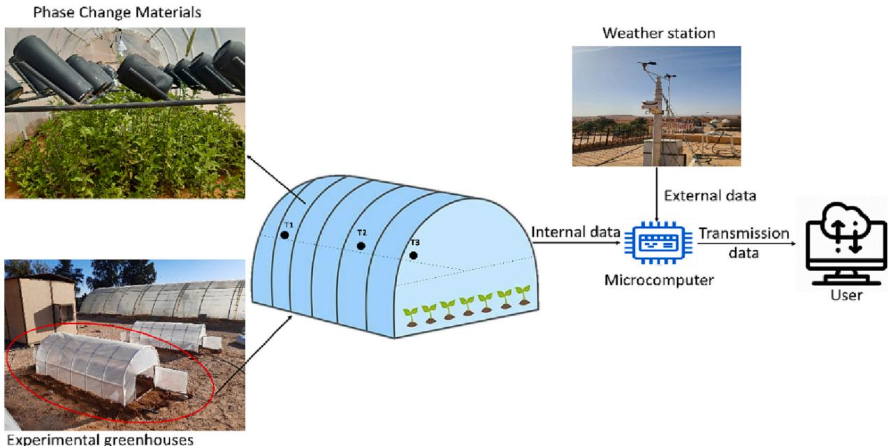
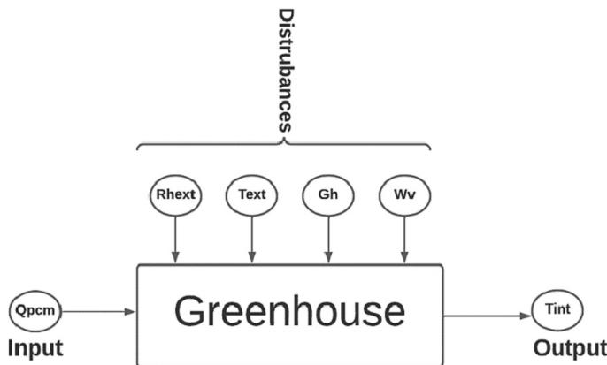
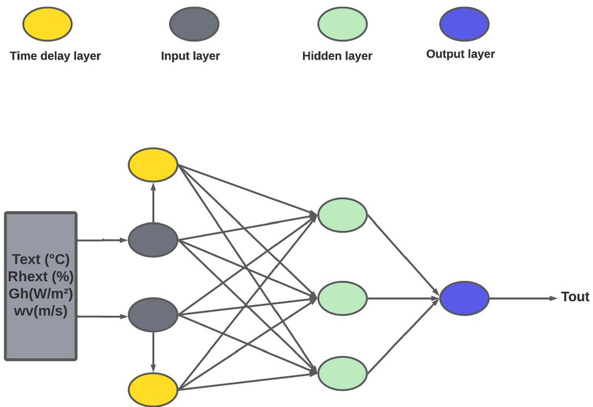
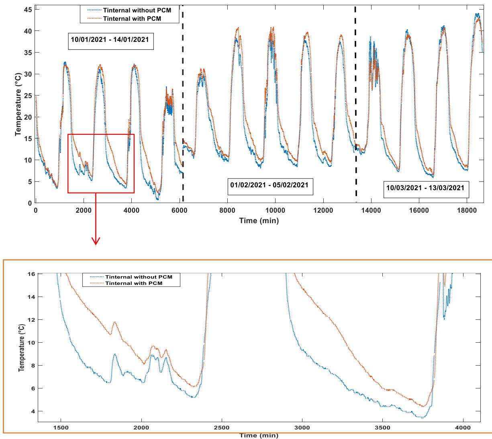
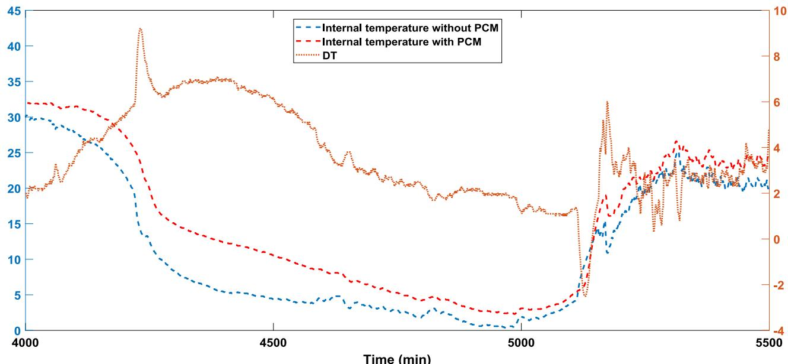
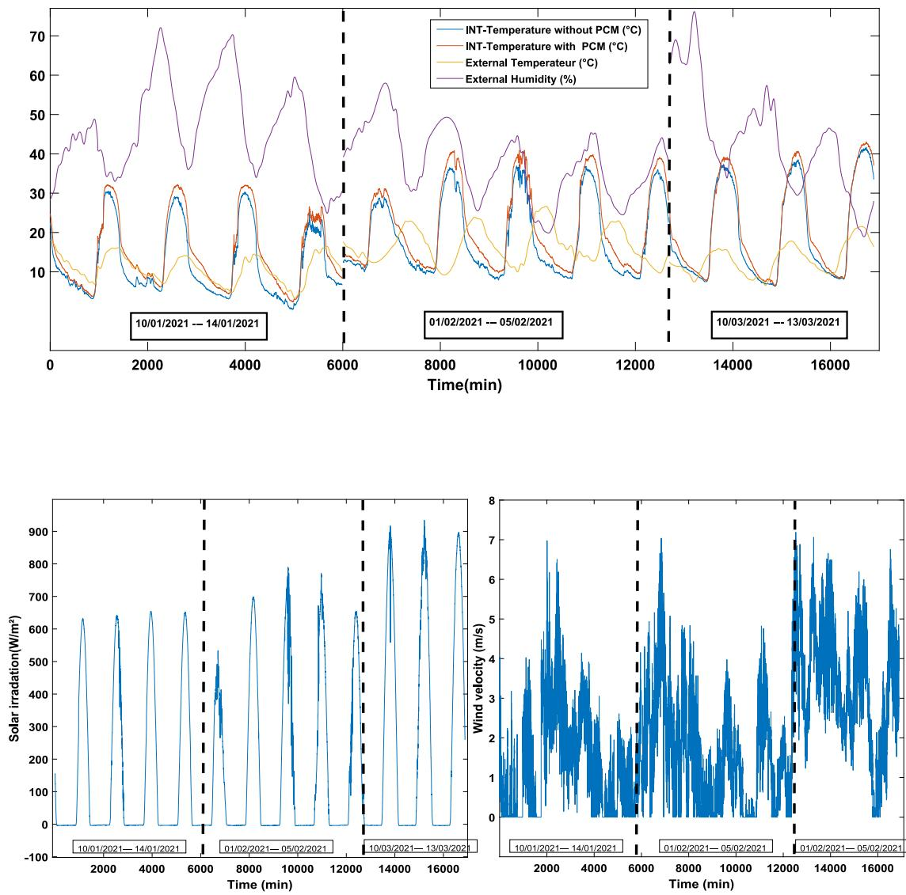
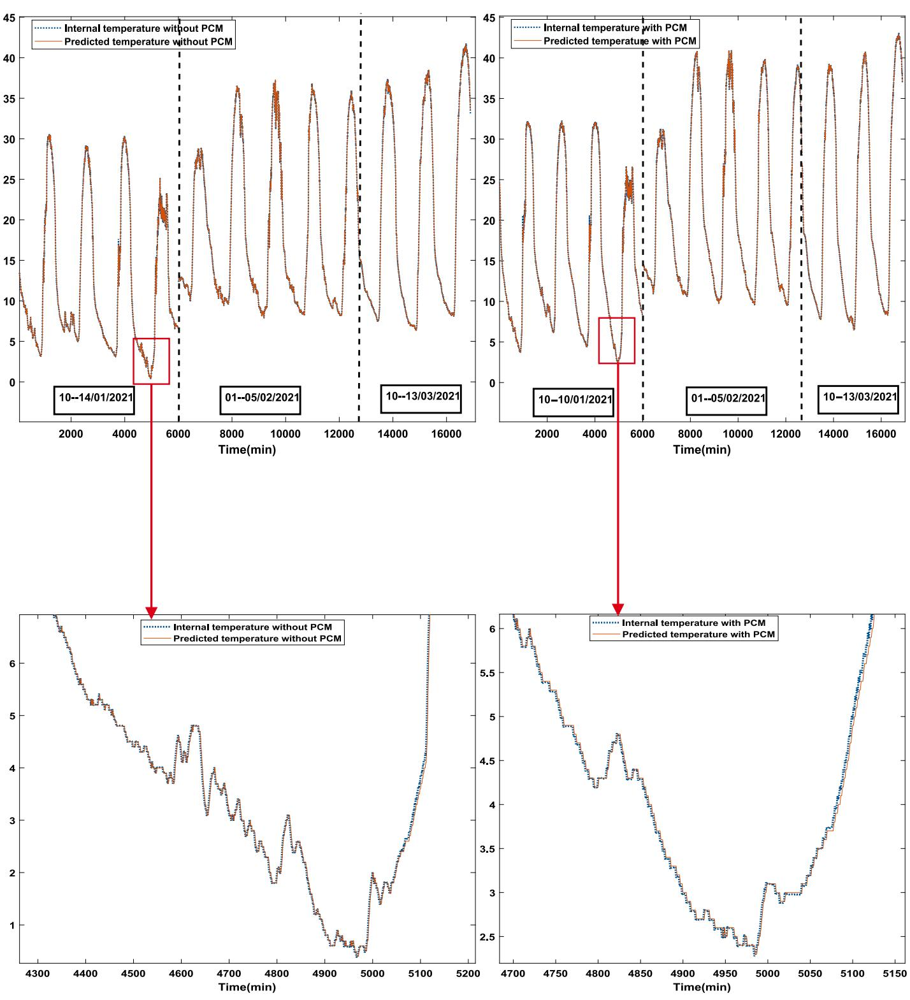

# Experimental assessment of a greenhouse with and without PCM thermal storage energy and prediction their thermal behavior using machine learning algorithms

研究论文

# 使用机器学习算法对含与不含相变材料储能的温室进行实验评估及其热行为预测

A. Badji a,b, 
A. Benseddik b,\*, 
H. Bensaha b, 
A. Boukhelifa a, 
S. Bouhoun b, 
Ch. Nettari b,c, 
M.A. Kherrafi b,d, 
D. Lalmi e

a 仪器仪表实验室，电气工程学院，Houari Boumediene科学技术大学，BP 32, El-Alia, 16111 Bab-Ezzouar, 阿尔及尔，阿尔及利亚 b 可再生能源应用研究单位，可再生能源发展中心，47133 盖尔达耶，阿尔及利亚 c 干旱地区新能源开发实验室，Kasdi Murbah大学，Ouargla 30000，阿尔及利亚 d 应用能源与热力实验室，机械工程系，技术学院，Abou Bekr Belkaid大学，B.P 119，特莱姆森 13000，阿尔及利亚 e 材料、能源系统技术与环境研究实验室，盖尔达耶大学，Noumerate机场路，盖尔达耶 47000，阿尔及利亚

# 文章信息

关键词: 相变材料 储能 温室 温度 机器学习

# 摘要

本研究论文重点研究了用于温室的相变材料(PCM)热储能单元的设计、制造和实验研究。该研究分析了PCM热能存储系统的性能，并使用机器学习算法预测温室空气温度。实验表明，与传统温室相比，采用PCM的温室在午夜后环境温度显著升高$(1-8^{\circ}C)$。本文提供了PCM的实施策略，并概述了在冬季实现太阳能温室近零能耗的运行策略。ANN算法在预测温室内部参数方面表现出良好的效果。总体而言，本研究有助于推进热储能系统及其在可持续农业中的潜在应用。

# 1. 引言

温室旨在为作物生长提供受保护的环境，使其能够在不利气候条件下创造有利的生长条件。然而，温室内外能量交换的特性要求对温度、通风等环境因素进行调控，以确保最佳生长条件并防止作物受损[1]。温室可通过多种技术和能源实现加热，Guarino等[2]研究了相变材料(PCM)作为寒冷气候下被动式太阳能供暖的热存储解决方案。该研究聚焦于阳光房，将PCM安装在墙体内部。研究发现PCM储热系统能有效实现日间储热、夜间释热，使阳光房温度显著提升。使用PCM储热时，阳光房日间平均气温升高$5-7^{\circ}C$，夜间升高$3-5^{\circ}C$。此外，PCM储热使阳光房的太阳能总获取量提升达$50\%$。这些发现表明PCM储热可成为建筑被动式太阳能供暖（特别是寒冷气候）的理想解决方案。作为温室主要成本之一的供暖，通常通过燃烧包括化石燃料在内的多种燃料实现[1]。能源安全问题及化石燃料对气候变化的环境影响日益受到关注，凸显了利用可再生能源的重要性。主要依赖太阳能的日光温室在阿尔及利亚南部干旱地区的越冬作物种植中正获得更广泛应用。相变材料(PCM)因其在建筑应用、温室、太阳能及热电联产等工程系统中的潜力，为热能储存(TES)系统提供了有前景的解决方案[3]。

文献对这些应用进行了全面考察[4,5]。PCM在温室中的具体应用包括水箱[6,7]、空调[8,9]、热泵[10]等。多项研究表明，在日光温室北墙使用相变材料能有效改善室内热环境。PCM可在白天储存太阳能辐射，并在日落后持续释热达$8\mathrm{h}$，从而提升温室热性能[11]。Berroug等[12]通过模拟研究评估了六水氯化钙(CaCl2-6H2O)作为日光温室北墙PCM的效果，发现PCM的加入使系统储热能力显著提升，室内温度升高$6-12^{\circ}C$。

Najjar和Hasan[13]则通过建立PCM储热与温室的数学模型，发现PCM储热能在$24\mathrm{h}$内将温度波动降低$3-5^{\circ}C$。他们建议改善PCM储热与温室内空气的热交换以进一步提升系统温控效果。Guan等[14]指出在$900\mathrm{mm}$厚的三层PCM复合墙中，仅受太阳辐射影响的$300~\mathrm{mm}$厚区域有效。日光温室需采用主动策略提升中间层温度以增强北墙储热能力。Fang等[17]设计的后墙内表面水循环系统夜间可使室内温度提升$5.4^{\circ}C$，作物根区温度提升$1.6^{\circ}C$。Guohong和David[18]通过CFD分析发现当复合墙厚$0.60\mathrm{m}$时，储热层越薄内部温度下降越快。Nguyen和Wells[19]开发的水平吸热面太阳能烟囱系统效率比传统Trombe系统高$65.2\%$。

PCM热物理特性随温度变化显著，实验研究表明光伏电池(PCM)属性存在温度敏感性，但数值模型难以处理不连续测试结果。温室主要储热系统包括显热储热（岩石床[20]、水库[21,22]）和潜热储热（PCM[23,24]）。配备储热系统的可再生能源温室具有更可控的室内温度、更高产量、更长采收期和节能优势[25,26]。PCM在相变过程中能以近乎恒温的方式储释大量热能[27,28]，其中固-液相变具有适用温区广、相变体积变化小、储能密度高等特点[30,31]，常用PCM包括水合盐、石蜡、脂肪酸和共晶混合物[32]。

本研究主要目标是将PCM应用于温室基质加热系统的温度控制。我们提出的系统包含被动式储热单元，通过PCM相变在日间储存过剩热量，夜间凝固释热维持根区最佳温度。具体目标包括：(1)设计构建以六水氯化钙(CaCl2-6H2O)为PCM（熔点$26-29^{\circ}C$，熔化潜热170$\mathrm{kJ/kg}$）的创新储热单元；(2)提升太阳能温室加热效率；(3)评估PCM在半干旱地区作为现有太阳能储热方案的可行性；(4)集成人工智能技术精确预测温室内气温。研究通过在阿尔及利亚Ghardaia地区的温室实地测试验证上述目标。

# 2. 材料与方法

# 2.1. 实验装置

本研究选择阿尔及利亚南部Ghardaia省一个比例为1/10的单隧道塑料温室原型进行实地测量，以探究其内部热环境（见图1）。冬季Ghardaia最冷月平均温度为$20^{\circ}C$，极端低温可达$0^{\circ}C$[33]。

实验采用12个校准的K型热电偶和DHT22温度传感器（精度2%）测量塑料温室各区域及地表温度。图1展示了测量配置方案。所有数据通过微处理器(ATmega Arduino)记录。此外，在阿尔及利亚Ghardaia建立了WS2-550触摸式无线气象站，采集温度、湿度、太阳辐射和风速等气象数据。该站时间精度为10分钟，温度精度达$0.005^{\circ}C$。2021年1月20日以10分钟为间隔对塑料温室内部热环境变化进行了实验研究。

# 2.2. 选择CaCl2-6H2O作为储热材料的原因

本研究探讨了六水氯化钙(CaCl2-6H2O)作为温室加热储热材料的潜力。研究发现其具有以下优异热特性：相变温度约$29^{\circ}C$，熔化潜热约$246\mathrm{kJ/kg}$，$25^{\circ}C$时比热容$200\mathrm{J/(kg\cdot K)}$[34-37]。相比其他相变材料，其导热系数和密度更高[38]。研究评估了其热稳定性，并考虑了成本、储量和环境影响[39]。总体而言，六水氯化钙因其特性成为温室加热等应用的理想储热材料。

关于农业领域处置方案：轻度污染的CaCl2-6H2O可稀释后用于土壤改良或pH调节；微污染材料可过滤处理后重复利用；重度污染建议采用中和后固废处置[40,41]。需加强责任使用与处置的宣传教育，具体处置方法应遵循当地法规并咨询专家意见。

# 2.3. 设计与运行方案

选择六水氯化钙作为相变材料(PCM)是因其热特性适应该温室气候环境。实验采用40个铝制饮料罐（直径$6\mathrm{cm}$，高$12\mathrm{cm}$）装载$18\mathrm{kg}$氯化钙构成储热单元，每罐装填$0.45\mathrm{kg}$。为最大化吸收太阳辐射，将所有罐体涂黑并以$30^{\circ}$倾角朝南放置（图1）。

  
图1. 实验装置

# 2.4. 理论分析

# 2.4.1. 带外部输入的非线性自回归(NARX)网络

温室是高度复杂的非线性生命系统，其行为会随时间变化并对多种（主要是气象）扰动作出响应（图2）。人工神经网络因其普适逼近能力，正成为解决非线性系统问题的通用方案[42]。针对不同问题需要特定网络拓扑结构，近年来已发展出多种神经网络架构。对于动态系统辨识，采用带外部输入的非线性自回归(NARX)网络[43]。NARX网络通过输出反馈机制可识别任何非线性动态系统，在各类动态系统应用中表现优异，尤其擅长处理长期依赖关系[44]。

  
图2. 温室系统模型

动态网络虽性能优于静态网络，但因需处理时序变化模式而训练难度更大。本研究采用改进的Levenberg-Marquardt算法（含贝叶斯正则化）训练NARX网络，通过关联度计算权重更新。NARX模型输入信息与ANN模型相同，隐含层含两层（图3）。各激活函数经专门配置以实现Tamm与ReLu ANN模型的性能直接对比。通过比较时延层性能可快速评估模型表现。模型基于Matlab R2020a构建，其数学基础为时间序列建模常用的线性ARX模型：

$$
\begin{array}{rl} & T(t) + a_1T(t - 1) + \ldots +a_{na}T(t - na) = b_1u(t - nk) + \ldots \\ & \qquad +b_{nb}u(t - nb - nk + 1) + e(t) \end{array}
$$

# 2.5. 评估指标

在NARX方法预测结果评估阶段主要讨论两个指标。决定系数表示为$(\mathbb{R}^2)$，该指标衡量模型预测测量数据的准确度。$(\mathbb{R}^2)$取值范围为0到1，当$(\mathbb{R}^2)$值趋近于1时表明模型性能提升[45,46]。另一项指标均方根误差(RMSE)表示平方误差，该测量的算法成功标准如下：(优秀: $\mathrm{RMSE} > 10\%$，良好: $\mathrm{RMSE} > 20\%$，一般: $\mathrm{RMSE} > 30\%$，较差: $\mathrm{RMSE} > 30\%$)[47-49]。

$$
RMSE = \sqrt{\frac{1}{n}\sum_{i = 1}^{n}(Tobs i - Tpridecti)}
$$

  
图3. NARX架构

$$
R^{2} = 1 - \frac{\sum_{i = 1}^{n}(Tobs i - Tpr decti)^{2}}{\sum_{i = 1}^{n}(Tobs i - Tm)^{2}}
$$

其中n表示用于估计的数据集总数；Tobsi为实际温度(观测输出)；Tpridecti为预测温度(估计输出)；Tm为预测集观测输出的平均值。

# 3. 结果与讨论

# 3.1. 实验评估

研究比较分析了含与不含PCM的塑料温室内PCM储放热效果及空气温度变化。

图4展示了2021年1月1日至3月13日阿尔及利亚Ghardaia地区最低温期间，两种塑料温室(含/不含PCM)内部温度对比。实验结果表明，午夜后室内气温降至最低点。PCM能通过降低昼夜温差来减小温室内温度波动。含PCM温室内部温度变化范围比不含PCM温室高$8^{\circ}\mathrm{C}$。如图5所示，PCM显著改善了近地热环境。不含PCM的温室夜间无法维持室内气温超过$10^{\circ}\mathrm{C}$，该结果与文献[17,50,51]一致。

# 3.2. 预测评估

本研究论证了NARX(带外部输入的非线性自回归)模型在分析温室气温影响因素及预测未来值方面的有效性。如图6所示，NARX模型将温度、湿度、太阳辐射和风速等外部因素作为外生输入，以捕捉其与气温的关联关系。通过使用温室温度历史数据及外生输入训练NARX模型，可学习输入输出间的非线性关系，从而基于过去和当前输入值准确预测未来气温。研究表明，引入时滞变量或季节趋势变量等多样化输入可进一步提升NARX模型精度。为评估模型性能，将2021年1月1日至3月13日期间NARX模型预测值与实测值进行对比(图7)。表1提供了均方根误差(RMSE)作为衡量模型预测精度的指标，其数值范围($1.74\% - 5.81\%$, $1.40\% - 3.20\%$, $0.992 - 0.996$)表明NARX模型在不同场景下均具有较高预测精度。低RMSE值显示模型预测与实测值高度吻合，证明NARX模型在实际温室工程中预测热性能的潜在价值。其他研究对NARX模型潜力的支持进一步强化了本研究的结论，表明多篇研究均观察到NARX模型在温室热性能预测中的积极效果，这些证据共同证实NARX模型可作为温室温度预测实践项目的有效工具[3,47,52,53]。

  
图4. 内部温度(− − − 不含PCM温室，− − − 含PCM温室)

  
图5. 实验温室内部温度

  
图6. NARX的不同输入(外部温湿度、含/不含PCM的内部温度、太阳辐射、风速)

# 4. 结论与展望

将相变材料(PCM)集成于温室屋顶作为遮阳措施，已被证明是提升温室内热性能的有效方法。这得益于PCM的高储热密度及其在充放热过程中近乎等温的特性。

通过实验与预测结果可得出以下结论：

- 采用PCM方案可使夜间温度提升1-8°C
- 该方法使环境空气日有效积温平均提高11-43%
- PCM储热单元在大型或商业化应用中可能面临初始成本、维护需求及复杂控制系统等挑战，但降低能耗成本和提高作物产量的潜力使其成为可持续温室生产的可行选择
- NARX模型能高精度预测温室内气温
- NARX模型可作为温室气温预测的有效工具，通过历史数据训练后能基于当前及过去相关外生输入值进行预测。为提高预测精度，需考虑包含温室环境多维度特征的输入变量

未来研究方向建议：
- 在不同气候区域复现实验以提升结果普适性
- 引入风速、太阳辐射和云量等变量优化实验设计，更好模拟真实温室环境
- 可尝试支持向量回归或随机森林等其他机器学习算法预测温室温度变化，但需与本研究采用的ANN-NARX模型进行精度与效率对比评估
- 需研究极端温湿度条件下PCM储热单元的性能表现
- 建议改进实验设计以评估PCM储热单元的经济效益，包括分析节能成本对整体收益的影响及增产对收入的贡献，为农业决策提供科学依据

  
图7. NARX模型输出

表1 评估指标

| 指标 | 不含PCM温室 | 含PCM温室 |
|------|------------|----------|
| RMSE | 0.0546     | 0.043    |
| R²   | 0.99976    | 0.99773  |

# 作者贡献声明

| 作者 | 贡献 |
|------|------|
| A. Badji | 开展实验，撰写论文 |
| A. Benseddik | 开展实验，提出研究构想，指导研究工作 |
| H. Bensaha, A. Boukhelifa, S. Bouhoun, CH. Nettari, M.A.B. Kherrafi, D. Lalmi | 讨论结果并参与论文修改，提供关键反馈指导研究，参与结果讨论和论文评审 |

# 利益冲突声明

作者声明本文不存在任何已知的可能影响研究结果的财务利益冲突或个人关系。

# 数据可用性声明

本文所述研究未使用任何数据。

# 参考文献

[1] A. Badji, A. Benseddik, H. Bensaha, A. Boukhelifa, I. Hasrane, 温室设计、技术与管理综述, J. Clean. Prod. 373 (2022), 133753. 
[2] F. Guarino, A. Athienitis, M. Célula, D. Bastien, 建筑中相变材料储热设计：寒冷气候下日光浴场的实验研究与应用, Appl. Energy 185 (2017) 95-106. 
[3] Y. Varol, A. Koca, H.F. Oztop, E. Avci, 基于软计算技术的太阳能集热器中相变材料储热性能预测, Expert Syst. Appl. 37 (4) (2010) 2724-2732. 
[4] I. Dincer, M.A. Rosen, 热能存储：系统与应用, John Wiley & Sons, 2021. 
[5] H.E. Fath, 太阳能储热技术评估, Renew. Energy 14 (1-4) (1998) 35-40. 
[6] Z. Naghibi, R. Carriveau, D.S.K. Ting, 利用太阳能储热与相变材料改进清洁能源温室供暖, Energy Storage 2 (1) (2020), e116. 
[7] C. Caprara, G. Stoppiello, 温室供暖中相变材料的潜在损失：与传统系统比较, Journal of Agricultural Engineering 40 (3) (2009) 25-32. 
[8] H. Ling, C. Chen, S. Wei, Y. Guan, C. Ma, G. Xie, N. Li, Z. Chen, 不同天气条件下相变材料对长期室内热环境的影响, Appl. Energy 140 (2015) 329-337. 
[9] S.M. Vakhaltojiar, W. Saman, 空调应用中相变储热系统的分析与建模, Appl. Therm. Eng. 21 (2001) 249-263. 
[10] M.J. Huang, S.J. McCormack, J. Yao, Y. Dai, N.J. Hewitt, 住宅供热太阳能辅助热泵创新技术开发, Sustainable Energy Development and Innovation, Springer, 2022, pp. 87-92. 
[11] A. El-Sebaii, A. Al-Ghandi, F. Al-Hazmi, A.S. Faidah, 以相变材料为储热介质的单盆太阳能蒸馏器热性能研究, Appl. Energy 86 (7-8) (2009) 1187-1195. 
[12] F. Berrouq, E. Lakhal, M. El Omari, M. Faraji, H. El Qarnia, 北墙采用相变材料温室的热性能研究, Energy Buildings 43 (11) (2011) 3027-3035. 
[13] A. Najjar, A. Hasan, 含相变材料储能的温室建模, Energy Convers. Manag. 49 (11) (2008) 3338-3342. 
[14] Y. Guan, C. Chen, Y. Han, H. Ling, Q. Yan, 中国日光温室三层相变储热墙体的实验与模型分析, J. Build. Phys. 38 (6) (2015) 548-559. 
[15] H. Ling, C. Chen, Y. Guan, S. Wei, Z. Chen, N. Li, 含相变材料的主被动三明治墙主动储热特性研究, Sol. Energy 110 (2014) 276-285.
[16] H. Ling, C. Chen, H. Qin, S. Wei, J. Lin, N. Li, M. Zhang, N. Yu, Y. Li, 含相变材料围护结构热惰性性能评价指标, Energy and Buildings 122 (2016) 175-184. 
[17] H. Fang, Q. Yang, Y. Zhang, W. Sun, W. Lu, H. Liang, 提高中国日光温室夜间温度的太阳能集放热系统性能研究, Appl. Eng. Agric. 31 (2) (2015) 283-289. 
[18] T. Guohong, M. David, 中国日光温室墙体储热层温度变化研究, Transactions of the Chinese Society of Agricultural Engineering 35 (7) (2019) 170-177. 
[19] Y. Nguyen, J. Wells, 建筑通风用水平吸热面太阳能烟囱诱导流量与热效率数值研究, Journal of Building Engineering 28 (2020) 101950. 
[20] A. Bouhdinjar, M. Belhamel, F. Belkhiri, A. Bouhouna, 隧道温室中岩床显热储热性能研究, Renew. Energy 9 (1-4) (1996) 724-728. 
[21] A. Gupta, G. Tiwari, 温室内水体储热效应预测的计算机模型及验证：瞬态分析, Energy Conversion Management 43 (18) (2002) 2625-2640. 
[22] J.A. Adaro, P.D. Galimberti, A.I. Lema, A.I. Fasulo, J.R. Barral, 地热对温室供暖的贡献, Appl. Energy 64 (1-4) (1999) 241-249. 
[23] A. Vaddiee, V. Martin, 封闭式温室设计的有效储热策略, Appl. Energy 109 (2013) 337-343. 
[24] B. Huang, M. Toksoy, Y. Cengel, 温室太阳能系统中潜热储存的瞬态响应, Sol. Energy 37 (4) (1986) 279-292. 
[25] H.O. Paksoy, B. Beyhan, 温室技术中的热能储存(TES)系统, in: 热能储存系统进展, Elsevier, 2015, pp. 533-548. 
[26] A. Bazzati, H. Fatnassi, R. Bouhroud, L. Gourdo, K. Ezzaeri, R. Tiskatine, H. Demraou, A. Wifaya, A. Bekkaoui, A. Ahroune, 岩床加热系统对加那利温室微气候和作物发育影响的实验研究, Sol. Energy 176 (2018) 42-50. 
[27] F. Barnes, J. Levine, F. Grine, 大型储能系统, Taylor, NY, 2011. 
[28] J. Giro-Paloma, M. Martinez, L.F. Cabeza, A.I. Fernandez, 微胶囊相变材料(MPCM)的类型、方法、技术和应用综述, Renewable Sustainable Energy Reviews 53 (2016) 1059-1075. 
[29] K. Pielichowska, K. Pielichowski, 用于储热的相变材料, Prog. Mater. Sci. 65 (2014) 67-123. 
[30] M.K. Rathod, J. Banerjee, 潜热储能系统中相变材料的热稳定性综述, Renewable Sustainable Energy Reviews 18 (2013) 246-258. 
[31] K. Yang, N. Zhu, C. Chang, D. Wang, S. Yang, S. Ma, 基于多准则决策(MCDM)的相变材料选择方法:案例研究, Energy 145 (2018) 1085-1096. 
[32] J. Jurinak, S. Abdel-Khalik, 空气太阳能加热系统中相变储能性能优化, Sol. Energy 21 (5) (1978) 377-383. 
[33] A. Benseddik, A. Azzi, F. Chellali, R. Khanmiche, 使用等值线图技术分析影响阿尔及利亚太阳能干燥系统的气象参数, Renew. Energy 122 (2018) 173-183. 
[34] K.K. Meisingset, F. Gronvold, 盐类水合物在270-400K间的热力学性质和相变IV: CaCl2-6H2O, CaCl2-2H2O和FeCl3-6H2O, J. Chem. Thermodyn. 18 (2) (1986) 159-173. 
[35] F. Meng, Q. Chu, 东北严寒地区外挂相变日光温室储放热性能实验-以六城市为例, Journal of Energy Storage 58 (2023), 106411. 
[36] A.S. Fleixner, 相变材料储热:基础与应用, Springer, 2015. 
[37] T.B. Freeman, 相变储热与管理的增材制造, in: 增材制造, 2023. 
[38] N. Barhemmati-Rajab, W. Zhao, 氮化硼纳米颗粒对六水氯化钙(CaCl2-6H2O)相变材料热性能影响研究, MRS Communications 8 (4) (2018) 1439-1444. 
[39] Y. Xin, H. Nian, J. Li, J. Zhao, X. Tan, Y. Zhou, Y. Zhu, H. Liu, X. Li, NiCo2O4改性膨胀石墨对CaCl2-6H2O传热和储热性能的改善, Journal of Energy Storage 46 (2022), 103902. 
[40] X. Guo, 建筑节能用无机相变材料改性研究, Energy Sources, Part A: Recovery, Utilization, and Environmental Effects (2020) 1-14. 
[41] S. Bado, B.P. Forster, A. Ghanim, J. Jankowicz-Cieslak, G. Berthold, L. Luxiang, 水稻、小麦和大麦耐盐突变体田间前筛选方案, Springer Nature, 2016. 
[42] R. Isermann, S. Ernst, O. Nelles, 动态神经网络识别-架构、比较与应用, IEAC Proceedings Volumes 30 (11) (1997) 947-972. 
[43] H.T. Siegelmann, B.G. Horne, C.L. Giles, 递归NARX神经网络的计算能力, IEEE Transactions on Systems, Man, Cybernetics, Part B 27 (2) (1997) 208-215. 
[44] B.C. Ng, I.Z.M. Darus, H. Jamaluddin, H.M. Kamar, 基于非线性自回归外生神经网络的汽车变速空调系统动态建模, Appl. Therm. Eng. 73 (1) (2014) 1255-1269. 
[45] S.G. Gouda, Z. Hussein, S. Luo, Q. Yuan, 中国日总太阳辐射精确预测的模型选择, J. Clean. Prod. 221 (2019) 132-144. 
[46] A.-N. Spiess, N. Neumeyer, R2作为药理学和生化研究中非线性模型不充分评价指标的评估:蒙特卡洛方法, BMC Pharmacol. 10 (1) (2010) 1-11.
[47] Ü. Ağbulut, A.E. Gürel, Y. Bicen, 使用不同机器学习算法预测日总太阳辐射:评估与比较, Renewable Sustainable Energy Reviews 135 (2021), 110114.  
[48] M.S. Bakay, Ü. Ağbulut, 基于深度学习、支持向量机和人工神经网络算法的土耳其温室气体排放预测, J. Clean. Prod. 285 (2021), 125324.  
[49] L. Djemoui, H. Bensaha, A. Bensedik, R. Zarrit, M. Guermoui, A. Rabehi, M. T. Bouzaher, 农业温室几何构型对热性能影响的对比研究, in: E3S Web of Conferences, EDP Sciences, 2018, p. 00003.
[50] Y. Li, X. Liu, W. Li, Y. Jian, M. Arici, Y. Chen, Q. Shen, 中国南方塑料温室热环境评估及相变材料优化, Journal of Building Engineering 57 (2022).  
[51] B. Beyhan, H. Paksoy, Y. Dasgan, 无土栽培温室中基于相变材料储热的根区温度控制, Energy Convers. Manag. 74 (2013) 446- 453.  
[52] A. Castaneda- Miranda, V.M. Castano, 基于神经网络模型的温室智能防霜控制, Comput. Electron. Agric. 137 (2017) 102- 114.  
[53] L. Huang, L. Deng, A. Li, R. Gao, L. Zhang, W. Lei, 基于拉普拉斯变换的日光温室气温与热负荷预测新方法, Journal of Building Engineering 44 (2021).

# References

[1] A. Badji, A. Benseddik, H. Bensaha, A. Boukhelifa, I. Hasrane, Design, technology, and management of greenhouse: a review, J. Clean. Prod. 373 (2022), 133753. 
[2] F. Guarino, A. Athienitis, M. Célula, D. Bastien, PCM thermal storage design in buildings: experimental studies and applications to solaria in cold climates, Appl. Energy 185 (2017) 95- 106. 
[3] Y. Varol, A. Koca, H.F. Oztop, E. Avci, Forecasting of thermal energy storage performance of Phase Change Material in a solar collector using soft computing techniques, Expert Syst. Appl. 37 (4) (2010) 2724- 2732. 
[4] I. Dincer, M.A. Rosen, Thermal Energy Storage: Systems and Applications, John Wiley & Sons, 2021. 
[5] H.E. Fath, Technical assessment of solar thermal energy storage technologies, Renew. Energy 14 (1- 4) (1998) 35- 40. 
[6] Z. Naghibi, R. Carriveau, D.S.K. Ting, Improving clean energy greenhouse heating with solar thermal energy storage and phase change materials, Energy Storage 2 (1) (2020), e116. 
[7] C. Caprara, G. Stoppiello, Potential loss of phase change materials in greenhouses heating: comparison with a traditional system, Journal of Agricultural Engineering 40 (3) (2009) 25- 32. 
[8] H. Ling, C. Chen, S. Wei, Y. Guan, C. Ma, G. Xie, N. Li, Z. Chen, Effect of phase change materials on indoor thermal environment under different weather conditions and over a long time, Appl. Energy 140 (2015) 329- 337. 
[9] S.M. Vakhaltojiar, W. Saman, Analysis and modelling of a phase change storage system for air conditioning applications, Appl. Therm. Eng. 21 (2001) 249- 263. 
[10] M.J. Huang, S.J. McCormack, J. Yao, Y. Dai, N.J. Hewitt, Development of Innovative Technologies for Solar- Assisted Heat Pump for Residential Heat Supply, Sustainable Energy Development and Innovation, Springer, 2022, pp. 87- 92. 
[11] A. El- Sebaii, A. Al- Ghandi, F. Al- Hazmi, A.S. Faidah, Thermal performance of a single basin solar still with PCM as a storage medium, Appl. Energy 86 (7- 8) (2009) 1187- 1195. 
[12] F. Berrouq, E. Lakhal, M. El Omari, M. Faraji, H. El Qarnia, Thermal performance of a greenhouse with a phase change material north wall, Energy Buildings 43 (11) (2011) 3027- 3035. 
[13] A. Najjar, A. Hasan, Modeling of greenhouse with PCM energy storage, Energy Convers. Manag. 49 (11) (2008) 3338- 3342. 
[14] Y. Guan, C. Chen, Y. Han, H. Ling, Q. Yan, Experimental and modelling analysis of a three- layer wall with phase- change thermal storage in a Chinese solar greenhouse, J. Build. Phys. 38 (6) (2015) 548- 559. 
[15] H. Ling, C. Chen, Y. Guan, S. Wei, Z. Chen, N. Li, Active heat storage characteristics of active- passive triple wall with phase change material, Sol. Energy 110 (2014) 276- 285.
[16] H. Ling, C. Chen, H. Qin, S. Wei, J. Lin, N. Li, M. Zhang, N. Yu, Y. Li, Indicators evaluating thermal inertia performance of envelops with phase change material, Energy and Buildings 122 (2016) 175- 184. 
[17] H. Fang, Q. Yang, Y. Zhang, W. Sun, W. Lu, H. Liang, Performance of a solar heat collection and release system for improving night temperature in a Chinese solar greenhouse, Appl. Eng. Agric. 31 (2) (2015) 283- 289. 
[18] T. Guohong, M. David, Temperature variations in energy storage layers in Chinese solar greenhouse walls, Transactions of the Chinese Society of Agricultural Engineering 35 (7) (2019) 170- 177. 
[19] Y. Nguyen, J. Wells, A numerical study on induced flowrate and thermal efficiency of a solar chimney with horizontal absorber surface for ventilation of buildings, Journal of Building Engineering 28 (2020) 101950. 
[20] A. Bouhdinjar, M. Belhamel, F. Belkhiri, A. Bouhouna, Performance of sensible heat storage in a rockbed used in a tunnel greenhouse, Renew. Energy 9 (1- 4) (1996) 724- 728. 
[21] A. Gupta, G. Tiwari, Computer model and its validation for prediction of storage effect of water mass in a greenhouse: a transient analysis, Energy Conversion Management 43 (18) (2002) 2625- 2640. 
[22] J.A. Adaro, P.D. Galimberti, A.I. Lema, A.I. Fasulo, J.R. Barral, Geothermal contribution to greenhouse heating, Appl. Energy 64 (1- 4) (1999) 241- 249. 
[23] A. Vaddiee, V. Martin, Thermal energy storage strategies for effective closed greenhouse design, Appl. Energy 109 (2013) 337- 343. 
[24] B. Huang, M. Toksoy, Y. Cengel, Transient response of latent heat storage in greenhouse solar system, Sol. Energy 37 (4) (1986) 279- 292. 
[25] H.O. Paksoy, B. Beyhan, Thermal energy storage (TES) systems for greenhouse technology, in: Advances in Thermal Energy Storage Systems, Elsevier, 2015, pp. 533- 548. 
[26] A. Bazzati, H. Fatnassi, R. Bouhroud, L. Gourdo, K. Ezzaeri, R. Tiskatine, H. Demraou, A. Wifaya, A. Bekkaoui, A. Ahroune, An experimental study on the effect of a rock- bed heating system on the microclimate and the crop development under canarian greenhouse, Sol. Energy 176 (2018) 42- 50. 
[27] F. Barnes, J. Levine, F. Grine, Large Energy Storage Systems, Taylor, NY, 2011. 
[28] J. Giro- Paloma, M. Martinez, L.F. Cabeza, A.I. Fernandez, Types, methods, techniques, and applications for microencapsulated phase change materials (MPCM): a review, Renewable Sustainable Energy Reviews 53 (2016) 1059- 1075. 
[29] K. Pielichowska, K. Pielichowski, Phase change materials for thermal energy storage, Prog. Mater. Sci. 65 (2014) 67- 123. 
[30] M.K. Rathod, J. Banerjee, Thermal stability of phase change materials used in latent heat energy storage systems: a review, Renewable Sustainable Energy Reviews 18 (2013) 246- 258. 
[31] K. Yang, N. Zhu, C. Chang, D. Wang, S. Yang, S. Ma, A methodological concept for phase change material selection based on multi- criteria decision making (MCDM): a case study, Energy 145 (2018) 1085- 1096. 
[32] J. Jurinak, S. Abdel- Khalik, Properties optimization for phase- change energy storage in air- based solar heating systems, Sol. Energy 21 (5) (1978) 377- 383. 
[33] A. Benseddik, A. Azzi, F. Chellali, R. Khanmiche, An analysis of meteorological parameters influencing solar drying systems in Algeria using the isopleth chart technique, Renew. Energy 122 (2018) 173- 183. 
[34] K.K. Meisingset, F. Gronvold, Thermodynamic properties and phase transitions of salt hydrates between 270 and 400 K IV, CaCl2- 6H2O, CaCl2- 2H2O, and FeCl3- 6H2O, J. Chem. Thermodyn. 18 (2) (1986) 159- 173. 
[35] F. Meng, Q. Chu, Heat storage and release performance experiment of externally hung phase change solar greenhouse in severe cold regions of Northeast China- taking six Cities as an example, Journal of Energy Storage 58 (2023), 106411. 
[36] A.S. Fleixner, Thermal Energy Storage Using Phase Change Materials: Fundamentals and Applications, Springer, 2015. 
[37] T.B. Freeman, Additive manufacturing for phase change thermal energy storage and management, in: Additive Manufacturing, 2023. 
[38] N. Barhemmati- Rajab, W. Zhao, Investigation into boron nitride nanoparticle effects on thermal properties of calcium chloride hexahydrate (CaCl2- 6H2O) as a phase change material, MRS Communications 8 (4) (2018) 1439- 1444. 
[39] Y. Xin, H. Nian, J. Li, J. Zhao, X. Tan, Y. Zhou, Y. Zhu, H. Liu, X. Li, Effect of NiCo2O4- modified expanded graphite on heat transfer and storage improvement of CaCl2- 6H2O, Journal of Energy Storage 46 (2022), 103902. 
[40] X. Guo, Study on inorganic PCMs modification utilized in building environment for energy conservation, Energy Sources, Part A: Recovery, Utilization, and Environmental Effects (2020) 1- 14. 
[41] S. Bado, B.P. Forster, A. Ghanim, J. Jankowicz- Cieslak, G. Berthold, L. Luxiang, Protocols for Pre- Field Screening of Mutants for Salt Tolerance in Rice, Wheat and Barley, Springer Nature, 2016. 
[42] R. Isermann, S. Ernst, O. Nelles, Identification with dynamic neural networks- architectures, comparisons, applications, IEAC Proceedings Volumes 30 (11) (1997) 947- 972. 
[43] H.T. Siegelmann, B.G. Horne, C.L. Giles, Computational capabilities of recurrent NARX neural networks, IEEE Transactions on Systems, Man, Cybernetics, Part B 27 (2) (1997) 208- 215. 
[44] B.C. Ng, I.Z.M. Darus, H. Jamaluddin, H.M. Kamar, Dynamic modelling of an automotive variable speed air conditioning system using nonlinear autoregressive exogenous neural networks, Appl. Therm. Eng. 73 (1) (2014) 1255- 1269. 
[45] S.G. Gouda, Z. Hussein, S. Luo, Q. Yuan, Model selection for accurate daily global solar radiation prediction in China, J. Clean. Prod. 221 (2019) 132- 144. 
[46] A.- N. Spiess, N. Neumeyer, An evaluation of R2 as an inadequate measure for nonlinear models in pharmacological and biochemical research: a Monte Carlo approach, BMC Pharmacol. 10 (1) (2010) 1- 11.
[47] Ü. Ağbulut, A.E. Gürel, Y. Bicen, Prediction of daily global solar radiation using different machine learning algorithms: evaluation and comparison, Renewable Sustainable Energy Reviews 135 (2021), 110114.  
[48] M.S. Bakay, Ü. Ağbulut, Electricity production based forecasting of greenhouse gas emissions in Turkey with deep learning, support vector machine and artificial neural network algorithms, J. Clean. Prod. 285 (2021), 125324.  
[49] L. Djemoui, H. Bensaha, A. Bensedik, R. Zarrit, M. Guermoui, A. Rabehi, M. T. Bouzaher, Comparative study of geometrical configuration at the thermal performances of an agricultural greenhouse, in: E3S Web of Conferences, EDP Sciences, 2018, p. 00003.
[50] Y. Li, X. Liu, W. Li, Y. Jian, M. Arici, Y. Chen, Q. Shen, Thermal environment evaluation of plastic greenhouses in southern China and optimization by phase change materials, Journal of Building Engineering 57 (2022).  
[51] B. Beyhan, H. Paksoy, Y. Dasgan, Root zone temperature control with thermal energy storage in phase change materials for soilless greenhouse applications, Energy Convers. Manag. 74 (2013) 446- 453.  
[52] A. Castaneda- Miranda, V.M. Castano, Smart frost control in greenhouses by neural networks models, Comput. Electron. Agric. 137 (2017) 102- 114.  
[53] L. Huang, L. Deng, A. Li, R. Gao, L. Zhang, W. Lei, A novel approach for solar greenhouse air temperature and heating load prediction based on Laplace transform, Journal of Building Engineering 44 (2021).