# Model selection for accurate daily global solar radiation prediction in China

# Model selection for accurate daily global solar radiation prediction in China

Shaban G. Gouda a,b, Zakia Hussein a,b, Shuai Luo a,c, Qiaoxia Yuan a,d,*

a College of Engineering, Huazhong Agricultural University, Shizishan Street, Hongshan District, Wuhan, 430070, PR China  b Agricultural and Biosystems Engineering Department, Faculty of Agriculture, Benha University, Benha, 13736, Egypt  c Shandong Academy of Agricultural Machinery Sciences, Jinan, 250100, PR China  d Key Laboratory of Agricultural Equipment in Mid- lower Yangtze River, Ministry of Agriculture and Rural Affairs, Wuhan, 430070, China

# ARTICLEINFO

Article history:  Received 28 October 2018  Received in revised form 7 February 2019  Accepted 19 February 2019  Available online 26 February 2019

Keywords:  China  Day of the year  General model  Global solar radiation  Solar climate zones  Statistical evaluation

# ABSTRACT

Solar energy can share with a big percentage in solving in the environmental pollution and energy crisis in China. For the most application of solar energy, an accurate information of solar radiation amount received by a horizontal surface is the first step. In this study, nine- day of the year based models are calibrated and evaluated to estimate the daily global solar radiation (DGSR) on a horizontal surface using long- term data of 84 stations all over China. After dividing China into five solar climatic zones, the highest performance model for each zone is chosen to be a general day of the year based models and then calibrate and evaluated at each solar zone. Based on statistical indicator; the root mean square error (RMSE), the mean absolute bias error (MABE), coefficient of determination  $(\mathbb{R}^2)$  and the correlation coefficient (r) and the uncertainty based on a  $95\%$  confidence level  $(\mathrm{U}_{95})$  and Taylor diagram, results show that the models perform best in the solar zones that receive a high amount of solar radiation and the performance decreases with decreasing of the daily solar radiation incidence. The hybrid sine and cosine wave day of the year based models exhibit the best performance, model D7 is the best for zone I and model D8 for zones II and IV. For zones II and V, the Gaussian form model (D3 model) and the 4th order polynomial model (D4 model) yield high performance, respectively. Whereas, the two Gaussian form model is the worth performance for all zones. The developed general day of the year based models for each zone in this study can be used with high accuracy to estimate the (DGSR) on a horizontal surface in areas where there is no data or the data is missing all over China.

$^{\mathrm{\textregistered}}$  2019 Elsevier Ltd. All rights reserved.

# 1. Introduction

Renewable energy is the best solution for problems of the energy crisis and environmental pollution. China consumed 3.25 billion tons of cool equivalent of total energy and the coal production and consumption represented  $67\%$  in 2010 according to National Bureau of Statistics of People's Republic of China (http://www.stats.gov.cn/tjsj/ndsj/2010/indexch.htm), which illustrated the significant environmental pollution problem that faces China. Solar energy is clean, safe and environmental friendly shares with a big percentage in solving these problems. However, the main challenge to use solar energy is the intermittency issue. Therefore, the solar energy systems need to be coupled with energy storage technologies which are under development now (Dizaji and Hosseini, 2018).

China has thousands of towns and hundreds of cities, and the different cities have different daily irradiations parameters and ideal obliquities depending on their different latitudes. Over  $90\%$  of China's territory receives annual solar irradiation above  $4500\mathrm{MJ / }$ $\mathrm{m^2}$ , comprising China's abundant solar energy resources (Liu et al., 2010; Xie et al., 2012). There is a need for accurate solar radiation information to assist in system design and simulations of different topographic climates (Gouda et al., 2018). This information is also beneficial to agriculturists, architects, urban planners, manufacturers and other field engineers (Cao et al., 2017; Lemos et al., 2017; Yao et al., 2017). Despite the huge investment and priority of the Chinese government, only 122 of more than 2000 meteorological stations measure solar radiation (Chen and Li, 2013). Therefore, it is essential to find an accurate method for estimating the daily global

solar radiation (DGSR) on a horizontal surface, especially, in the locations that do not contain on any tools to measure it.

For this purpose, several empirical models have been investigated to estimate the DGsR depending on meteorological and geographical data of the site of interest, such as sunshine duration (Angstrom, 1924; Bahel et al., 1987; Jemaa et al., 2013; Ogelman et al., 1984; Prescott, 1940; Rietveld, 1978), air temperature (Allen, 1997; Chen and Li, 2013; Chen et al., 2004; Li et al., 2010b, 2014), precipitation (Li et al., 2010b) relative humidity, cloud, latitude longitude, altitude (Chen et al., 2006; Li et al., 2010b; Liu et al., 2009; Zhao et al., 2013; Zou et al., 2016; Gouda et al., 2018). All these models are dependable, hence, to estimate the DGsR need to have any meteorological data that require tools to measure which make it difficult and more cost in some locations all over China.

The independent models such as day of the year based model can solve this problem because there is no dependency to any specific input meteorological data and is not need to any precalculation analysis (Mohammadi et al., 2015). However, a few day of the year based models have been previously developed for estimating the DGsR on a horizontal surface that found in the literature. Four different models were proposed by Al- Salaymeh (2006) to predict the DGsR in Amman city, Jordan, and the sine wave form yielded the best among others. Two trigonometric day of the year based models were developed, the first one is sine wave form which was proposed by Bulut and Buyukalaca (2007), the obtained results showed a good accuracy for estimating the DGsR in Istanbul city, Turkey. The second model is cosine wave function which was investigated by Kaplanis and Kaplani (2007). The performance of this model was evaluated at six climate zones in Greece and yielded high performance. Li et al. (2010a) evaluated three existed day of the year based model to estimate the DGsR on a horizontal surface using long- term data of 79 stations all over China, and proposed new model that consists of a hybrid sine and cosine wave, the results indicated to the new proposed model exhibited a better performance than others.

Additionally, Zang et al. (2012) examined two existed models and proposed a new one which is similar to the model of Ref. (Li et al., 2010a), but in a different form. They proposed a new model and evaluated it beside another two existed models using data of 35 stations in China. The new model performed well across all zones in China hence, there is a need to use it on a larger scale. In four Iranian cities of Bandarabass, Isfahan, Kerman and Tabass, six- day of the year based models were examined for estimating the DGsR and determine the best performance for each city and regions with similar climates (Khorasanizadeh and Mohammadi, 2013). A universal model for estimating the DGsR based on the day of the year was developed by Kaplanis et al. (2016). The model is two cosine wave functions that can be used in the Southern and Northern hemispheres with higher accuracy for most locations located between  $0^{\circ}$  to  $71^{\circ}$  from north to south and for most all longitudes.

Recently, seven existing day of the year based models were examined and evaluated to predict the DGsR in ten cities in Egypt by Hassan et al. (2016). The results showed that the hybrid sine and cosine wave and 4th order polynomial models performed best and therefore, a general model was developed for all country. A new day of the year based DGsR models in form of two Gaussians function was proposed by Quej et al. (2017) for prediction in six cities in the Yucatan Peninsula, Mexico, also they compared the results with other four existing day of the year based models. The results indicated that the new model had a higher accuracy than others, also in the seasonal analysis in all seasons. Aoun and Bouchouicha (2017) examined six existed day of the year based models for estimating the DGsR at 21 cities, Algeria, and developed a general model for all country using 21- year of DGsR data. The results showed that the hybrid sine and cosine wave model yielded the best performance for all Algeria.

All developed general models to predict the DGsR on a horizontal surface in China are dependent models which need to observed meteorological data and most of them are not cover all China mainland for example Li et al. (2013b) collected a data of solar radiation, sunshine duration, relative humidity, temperature from 83 stations across China to develop a general model to estimate DGsR for different solar radiation zones in China based on latitude, longitude and altitude and site- specific models. They found that the developed general model based on sunshine duration, temperature, relative humidity, and geographical information for each zone can be used with good accuracy. Li et al. (2013a) estimated the DGsR on a horizontal surface in Southwest China by two models based on maximum and minimum temperatures. The results showed that these two models performed best.

It is noticed that from the literature, models' performance is not the same, different from site to site and from mathematical form to other form. Meanwhile, some studies have been carried out to study the day of the year based models and focused on a few stations. Additionally, there are no independent general models were developed for China based on solar climatic zones. Therefore, this study aims to examined and evaluate the existed day of the year based models in the literature to estimate the DGsR on horizontal surface using a data from 84 stations across China, to classify China to different zones using the best solar climatic zoning and select the model with the highest performance in each solar zone and then determine and evaluate the general model to estimate the DGsR for different solar climatic zones.

# 2. Materials and methods

# 2.1. Data used and study area

The daily solar radiation data are taken from DAM (http://dam. itpcas.ac.cn/data/daily_solar_radiation_dataset_over_China.zip).

These data include 716 China Meteorological Administration (CMA) stations and cover a 50- year period from 1961 to 2010. It obtained by combining two datasets. The first one is the hybrid daily solar radiation model stations developed by Yang et al. (2001) and Yang et al. (2006) estimate at 716 stations and the second one is the artificial neural network- based model estimate at 96 radiation stations, which has higher accuracy. These data were used in several studies such as Tang et al. (2013); Tang et al. (2010) and Zou et al. (2016).

China is a large country with an area of about 9.6 million  $\mathrm{km}^2$  (Lam et al., 2005). China includes a vast territory and adjoins the Eurasian continent in the north and the Pacific Ocean in the east. Topographic elevations generally decrease from west to east. Those factors result in markedly different climatic conditions, rainfall generally decreases from the southeast coast to the northwest inland, and solar radiation is unevenly distributed in China (Ouyang et al., 2017). Numerous ways are used to classify different climatic zones according to different criteria using different climatic variables and indices. This depends largely on the purpose of establishing such classification (Domrös and Gongbing, 1988).

The solar radiation zoning in China are the prerequisites for the assessment the global solar radiation models. There have been a number of works on climate classification since the 1930s (Lam et al., 2005) e.g., Lau et al. (2007) and Cao et al. (2017). In the present study, the classification by Liu et al. (2017) is used, they employed a data from 660 meteorological stations for classifying China to five solar radiation zones using the k- means clustering and Support Vector Machine- Genetic Algorithm, based on the monthly mean daily solar radiation as a zoning index (Gouda and Yuan,

2018a, b, c; Liu et al., 2018). Fig. 1 illustrates the distribution of 84 stations with corresponding solar climatic zones across China. The geographical information and the data records of 84 stations distributed in 5 solar zones across China are listed in Table 1.

# 2.2. Models used

Nine models using only the day of the year without using any other parameters existed in the literature for estimating the DGSR on a horizontal surface are evaluated and examined in this work. A brief introduction is as follows.

# D1: Al-Salaymeh model 1

Al- Salaymeh (2006) proposed four different form models to estimate the DGSR on a horizontal surface in Amman city, Jordan. The first form is a sine wave correlation:

with sine and cosine waves to estimate the DGSR by using the daily measured global solar radiation data from 79 meteorological stations covering all China:

$$
R_{g} = a_{1} + a_{2}\sin \left(\frac{2\pi N}{365} a_{3} + a_{4}\right) + a_{5}\cos \left(\frac{2\pi N}{365} a_{6} + a_{7}\right) \tag{7}
$$

Where  $a_{1} - a_{7}$  are the empirical coefficients.

# D8: Zang model

Zang et al. (2012) developed a novel global solar radiation model in conjunction with sine and cosine wave correlations to simulate the long- term measured data over at least 10 years at 35 stations:

$$
R_{g} = a_{1} + a_{2}\sin \left(\frac{2\pi N}{365} +a_{3}\right) + a_{4}\cos \left(\frac{2\pi N}{365} +a_{5}\right) \tag{8}
$$

# D9: Quej model

$$
R_{g} = a_{1} + a_{2}\sin \left(\frac{2\pi N}{a_{3}} +a_{4}\right) \tag{1}
$$

Where  $R_{g}$  is the DGSR on a horizontal surface,  $\mathrm{MJ / m^2}$  day,  $N$  is the number of the day of the year and  $a_{1}, a_{2}, a_{3}$ , and  $a_{4}$  are the amplitude, the phase shift, the wavelength, and the intercept, respectively. empirical coefficients.

# D2: Al-Salaymeh model 2

The second model is the following Lorentzin correlation model (Al- Salaymeh, 2006):

Quej et al. (2017) proposed a new day of the year based model using a sum of two Gaussian correlation formulas to estimate the DGSR on a horizontal surface of Yucatan Peninsula in Mexico:

$$
R_{g} = a_{1} + a_{2}\exp \left[-0.5\times \left(\frac{N - a_{3}}{a_{4}}\right)^{2}\right] + a_{5}\exp \left[-0.5\times \left(\frac{N - a_{6}}{a_{7}}\right)^{2}\right]
$$

CurveExpert software (http://www.curveexpert.net) is employed to obtain the empirical coefficients of used models, using nonlinear regression method for all equations except Eq. (4), the polynomial regression method is used.

$$
R_{g} = \frac{a_{1}}{1 + \left(\frac{N - a_{2}}{a_{3}}\right)^{2}} \tag{2}
$$

Where  $a_{1}, a_{2}$ , and  $a_{3}$  are the amplitude, the center, and the width, respectively.

# D3: Al-Salaymeh model 3

The suggested Gaussian form is the third, presented as (Al- Salaymeh, 2006):

# 2.3. Model performance evaluation

In this study, the accuracy and suitability of the models were assessed based on common statistical indicators, namely, the root mean square error (RMSE), the mean absolute bias error (MABE), the coefficient of determination  $(\mathbb{R}^2)$  and the correlation coefficient (r). These indicators are described as follows:

$$
RMSE = \sqrt{\frac{1}{j}\sum_{i = 1}^{j}\left(\overline{R}_{i,m} - \overline{R}_{i,c}\right)^2} \tag{10}
$$

$$
MABE = \frac{1}{j}\sum_{i = 1}^{j}\left|\left(\overline{R}_{i,m} - \overline{R}_{i,c}\right)\right| \tag{11}
$$

$$
R^{2} = 1 - \frac{\sum_{i = 1}^{j}\left(\overline{R}_{i,m} - \overline{R}_{i,c}\right)^{2}}{\sum_{i = 1}^{j}\left(\overline{R}_{i,m} - \overline{R}_{m,avg}\right)^{2}} \tag{12}
$$

$$
r = \frac{\sum_{i = 1}^{j}\left(\overline{R}_{i,c} - \overline{R}_{c,avg}\right)\left(\overline{R}_{i,m} - \overline{R}_{m,avg}\right)}{\left(\sum_{i = 1}^{j}\left(\overline{R}_{i,c} - \overline{R}_{c,avg}\right)^{2}\sum_{i = 1}^{j}\left(\overline{R}_{i,m} - \overline{R}_{m,avg}\right)^{2}\right)^{0.5}} \tag{13}
$$

$$
R_{g} = a_{1}\exp \left[-0.5\times \left(\frac{N - a_{2}}{a_{3}}\right)^{2}\right] \tag{3}
$$

Where  $a_{1}, a_{2}$ , and  $a_{3}$  are the amplitude standing, the center, and the width, respectively.

# D4: Al-Salaymeh model 4

A 4th order polynomial degree model is finally proposed (Al- Salaymeh, 2006):

where  $j$  is the number of values, the subscript  $i$ , represents the  $i$ th value of the solar radiation;  $c$  and  $m$  represent calculated and measured solar radiation values, respectively;  $\overline{R}_{c,avg}$  and  $\overline{R}_{m,avg}$  are the mean calculated and measured solar radiation values, respectively; and  $\mathbb{R}^2$  varies between 0 and 1 (a value of  $\mathbb{R}^2$  closer to 1 reflects better performance). This statistic provides information about how well a model can estimate a set of measured data. A model exhibits better performance when the RMSE is closer to zero. Additionally,  $r$  ranges from  $- \infty$  to 1 and a model with good performance will have an  $r$  value close to one. The MABE gives the absolute value of mean bias error which provide information on the

$$
R_{g} = a_{1} + a_{2}N + a_{3}N^{2} + a_{4}N^{3} + a_{5}N^{4} \tag{4}
$$

Where  $a_{1} - a_{4}$  are the empirical coefficients.

# D5: Bulut and Büyükalaca model

Bulut and Büyükalaca (2007) presented a simple model depending only on the day of the year to predict the DGSR on a horizontal surface using a sine wave equation.

where  $j$  is the number of values, the subscript  $i$ , represents the  $i$ th value of the solar radiation;  $c$  and  $m$  represent calculated and measured solar radiation values, respectively;  $\overline{R}_{c,avg}$  and  $\overline{R}_{m,avg}$  are the mean calculated and measured Solar radiation values, respectively; and  $\mathbb{R}^2$  varies between 0 and 1 (a value of  $\mathbb{R}^2$  closer to 1 reflects better performance). This statistic provides information about how well a model can estimate a set of measured data. A model exhibits better performance when the RMSE is closer to zero. Additionally,  $r$  ranges from  $- \infty$  to 1 and a model with good performance willhave an  $r$  value close to one. The MABE gives the absolute value of mean bias error which provide information on the

$$
R_{g} = a_{1} + a_{2}\bigg|\sin \bigg(\frac{\pi(N + 5)}{365}\bigg)\bigg|^{1.5} \tag{5}
$$

# D6: Kaplanis and Kaplan model

Kaplanis and Kaplan (2007) suggested the following cosine wave form to predict the DGSR based on the day of the year:

$$
r = \frac{\sum_{i = 1}^{j}\left(\overline{R}_{i,c} - \overline{R}_{c,avg}\right)\left(\overline{R}_{i,m} - \overline{R}_{m,avg}\right)}{\left(\sum_{i = 1}^{j}\left(\overline{R}_{i,c} - \overline{R}_{C,avg}\right)^{2}\sum_{i = 1}^{j}\left(\overline{R}_{i,m} - \overline{R}_{m,avg}\right)^{2}\right)^{0.5}} \tag{13}
$$

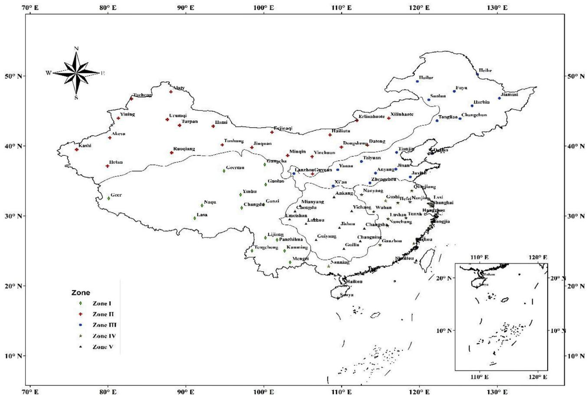  
Fig. 1. A map of China solar zones with corresponding stations.

performance and low value is desired, hence MABE's values close to zero reflect high performance.

Furthermore, the uncertainty based on a  $95\%$  confidence level  $(\mathrm{U}_{95})$  was used to provide more information about model deviation (Gueymard, 2014):

$$
U_{95} = 1.96\left(SD^{2} + RMSE^{2}\right)^{0.5} \tag{14}
$$

where 1.96 is the coverage factor corresponding to the  $95\%$  confidence level and  $SD$  is the standard deviation of the difference between the calculated and measured values.

# 3. Results and discussions

In this study, nine models based on day of the year are evaluated for their accuracy for estimating DGSR at 84 stations all over China, after classifying China into five solar zones according to the DGSR data.

The measured data of DGSR at 84 stations across China are divided into two datasets. The first dataset is employed to obtain the empirical coefficients of the models based on multiple linear and nonlinear regression methods. The coefficient of determination  $(\mathbb{R}^2)$  indicator is used to determine how well the regression line approximates the actual data points. The second dataset is employed to validate the models. Table S1 (supplementary data) presents the regression coefficients of the 9 models with statistical indices at 84 location distributed under 5 solar zones across China. The performance of tested models varies from site to site accordingly, from zone to zone. The best model is highlighted in bold.

In the following subsections, the performance of different models is assessed based on statistical indices and Taylor diagram and compared with observed data after a brief climatic discretion for each zone (Table 2). The best model is selected and a representative station is also selected to illustrate the differences between the used models and the performance of the best model for each station.

# 3.1. Zone I

For zone I, model D7 exhibits the best performance among the nine models, and its performance is more stable through all stations in zone I. For this model, r ranges between 0.755 and 0.986. RMSE, MABE,  $\mathrm{U}_{95}$  and  $\mathbb{R}^2$  values vary between 0.933 and  $1.646\mathrm{MJ}/$ $\mathfrak{m}^2$  day,  $0.751 - 1.308\mathrm{MJ} / \mathrm{m}^2$  day, 2.575 to 4.550 and 0.799 to 0.983, respectively. In addition, Model D4 yields good and stable performance all over zone I, but less than model D7. It has ranges for r, RMSE, MABE, U95 and  $\mathbb{R}^2$  of  $0.668 - 0.985$ $0.953 - 1.861\mathrm{MJ} / \mathrm{m}^2$  day,  $0.755 - 1.456\mathrm{MJ} / \mathrm{m}^2$  day, 2.637- 5.157 and 0.667- 0.970, respectively (Table S1).

Model D8 performs best, furthermore, models D2 and D3 have less performance than model D8. Whereas, model D1 yields the worst performance followed by model D9, where they have lowest r values (0.328 and 0, respectively). Model D7 presents superior performance among others; hence, the daily data of 18 stations are averaged and employed to fit model D7 as the best model for this zone. The results listed in Table 3 show that the general model for zone I yields an acceptable performance. For this model, r, RMSE, MABE,  $\mathrm{U}_{95}$  and  $\mathbb{R}^2$  values are  $0.984$ ,  $0.780\mathrm{MJ} / \mathrm{m}^2$  day,  $0.586\mathrm{MJ} / \mathrm{m}^2$  day, 2.062 and 0.976, respectively.

Table 1 Geographical locations and data records of the selected stations with corresponding solar climatic zones across China.  

<table><tr><td rowspan="2">Zone</td><td rowspan="2">Stations</td><td rowspan="2">Longitude (°E)</td><td rowspan="2">Latitude (°N)</td><td rowspan="2">Altitude (m)</td><td colspan="2">Period</td><td rowspan="2">Zone</td><td rowspan="2">Stations</td><td rowspan="2">Longitude (°E)</td><td rowspan="2">Latitude (°N)</td><td>Altitude (m)</td><td colspan="2">Period</td></tr><tr><td>Calibration</td><td>Validation</td><td>Calibration</td><td>Validation</td><td></td></tr><tr><td rowspan="36">Ⅰ</td><td>Gangcha</td><td>100.13</td><td>37.33</td><td>3301.5</td><td>1961–1995</td><td>1996–2006</td><td>III</td><td>Lanzhou</td><td>103.88</td><td>36.05</td><td>1517.2</td><td>1961–1993</td><td>1994–2004</td></tr><tr><td>Gecemu</td><td>94.9</td><td>36.42</td><td>2897.6</td><td>1991–1995</td><td>1996–2006</td><td>Taiyuan</td><td>112.55</td><td>37.78</td><td>773.3</td><td>1961–1995</td><td>1996–2006</td><td></td></tr><tr><td>Geer</td><td>80.08</td><td>32.5</td><td>4278</td><td>1961–1995</td><td>1996–2006</td><td>Yanan</td><td>109.5</td><td>36.6</td><td>958.5</td><td>1961–1995</td><td>1996–2006</td><td></td></tr><tr><td>Naqu</td><td>92.07</td><td>31.48</td><td>4507</td><td>1961–1995</td><td>1996–2006</td><td>Anyang</td><td>114.37</td><td>36.12</td><td>75.5</td><td>1961–1995</td><td>1996–2006</td><td></td></tr><tr><td>Lasa</td><td>91.13</td><td>29.67</td><td>3648.7</td><td>1969–1995</td><td>1996–2006</td><td>Tongliao</td><td>122.27</td><td>43.6</td><td>178.5</td><td>1961–1995</td><td>1996–2006</td><td></td></tr><tr><td>Yushu</td><td>97.02</td><td>33.02</td><td>3681.2</td><td>1961–1995</td><td>1996–2006</td><td>Changchun</td><td>125.22</td><td>43.9</td><td>236.8</td><td>1961–1995</td><td>1996–2006</td><td></td></tr><tr><td>Guoluo</td><td>100.25</td><td>34.47</td><td>3719</td><td>1991–2000</td><td>2001–2006</td><td>Tianjin</td><td>117.07</td><td>39.08</td><td>2.5</td><td>1961–1995</td><td>1996–2006</td><td></td></tr><tr><td>Changdu</td><td>97.17</td><td>31.15</td><td>3306</td><td>1961–1995</td><td>1996–2006</td><td>Dalian</td><td>121.63</td><td>38.9</td><td>91.5</td><td>1961–1995</td><td>1996–2006</td><td></td></tr><tr><td>Ganzi</td><td>100</td><td>31.62</td><td>3393.5</td><td>1961–1995</td><td>1996–2006</td><td>Jinan</td><td>116.98</td><td>36.68</td><td>51.6</td><td>1961–1995</td><td>1996–2006</td><td></td></tr><tr><td>Lijiang</td><td>100.22</td><td>25.87</td><td>2392.4</td><td>1961–1995</td><td>1996–2006</td><td>Juxian</td><td>118.83</td><td>35.58</td><td>107.4</td><td>1961–1989</td><td>1990–1997</td><td></td></tr><tr><td>Panzhihua</td><td>101.72</td><td>26.58</td><td>1190.1</td><td>1988–2001</td><td>2002–2006</td><td>Xi&#x27;an</td><td>108.93</td><td>34.3</td><td>397.5</td><td>1961–1995</td><td>1996–2006</td><td></td></tr><tr><td>Tengchong</td><td>98.5</td><td>25.02</td><td>1654.6</td><td>1961–1995</td><td>1996–2006</td><td>Zhengzhou</td><td>113.65</td><td>34.72</td><td>110.4</td><td>1961–1995</td><td>1996–2006</td><td></td></tr><tr><td>Kunming</td><td>102.68</td><td>25.02</td><td>1892.4</td><td>1969–1995</td><td>1996–2006</td><td>IV</td><td>Nanyang</td><td>112.58</td><td>33.03</td><td>120.2</td><td>1961–1995</td><td>1996–2006</td></tr><tr><td>Mengzi</td><td>103.38</td><td>23.38</td><td>1300.7</td><td>1961–1995</td><td>1996–2006</td><td>Wuhan</td><td>114.13</td><td>30.62</td><td>23.1</td><td>1961–1995</td><td>1996–2006</td><td></td></tr><tr><td>Sanya</td><td>109.52</td><td>18.23</td><td>5.9</td><td>1961–1995</td><td>1996–2006</td><td>Ganzhou</td><td>114.95</td><td>25.85</td><td>123.8</td><td>1961–1995</td><td>1996–2006</td><td></td></tr><tr><td>Yining</td><td>81.33</td><td>43.95</td><td>662.5</td><td>1961–1995</td><td>1996–2006</td><td>Qingjiang</td><td>119.03</td><td>33.6</td><td>17.5</td><td>1961–1991</td><td>1992–2001</td><td></td></tr><tr><td>Urumqi</td><td>87.62</td><td>43.78</td><td>917.9</td><td>1961–1995</td><td>1996–2006</td><td>Gushi</td><td>115.67</td><td>32.17</td><td>57.1</td><td>1961–1995</td><td>1996–2006</td><td></td></tr><tr><td>Turpan</td><td>89.2</td><td>42.93</td><td>34.5</td><td>1961–1995</td><td>1996–2006</td><td>Nanjing</td><td>118.8</td><td>32</td><td>8.9</td><td>1961–1995</td><td>1996–2006</td><td></td></tr><tr><td>Akesu</td><td>80.23</td><td>41.17</td><td>1103.8</td><td>1961–1995</td><td>1996–2006</td><td>Lysi</td><td>121.6</td><td>32.07</td><td>5.5</td><td>1961–1995</td><td>1996–2006</td><td></td></tr><tr><td>Alaty</td><td>88.08</td><td>47.73</td><td>735.3</td><td>1961–1995</td><td>1996–2006</td><td>Hefei</td><td>117.23</td><td>31.87</td><td>27.9</td><td>1961–1995</td><td>1996–2006</td><td></td></tr><tr><td>Tacheng</td><td>83</td><td>46.73</td><td>534.9</td><td>1961–1995</td><td>1996–2006</td><td>Shanghai</td><td>121.48</td><td>31.4</td><td>6</td><td>1991–2001</td><td>2002–2006</td><td></td></tr><tr><td>Kashi</td><td>75.98</td><td>39.47</td><td>1288.7</td><td>1968–1995</td><td>1996–2006</td><td>Hangzhou</td><td>120.17</td><td>30.23</td><td>41.7</td><td>1961–1995</td><td>1996–2006</td><td></td></tr><tr><td>Ruoqiang</td><td>88.17</td><td>39.03</td><td>888.3</td><td>1961–1995</td><td>1996–2006</td><td>Lushan</td><td>115.98</td><td>29.58</td><td>116.5</td><td>1961–1995</td><td>1996–2006</td><td></td></tr><tr><td>Hetan</td><td>79.93</td><td>37.13</td><td>1374.5</td><td>1961–1995</td><td>1996–2006</td><td>Tunxi</td><td>118.28</td><td>29.72</td><td>142.7</td><td>1961–1995</td><td>1996–2006</td><td></td></tr><tr><td>Hami</td><td>93.52</td><td>42.82</td><td>737.2</td><td>1968–1995</td><td>1996–2006</td><td>Nanchang</td><td>115.92</td><td>28.6</td><td>46.7</td><td>1961–1995</td><td>1996–2006</td><td></td></tr><tr><td>Erjinaqi</td><td>101.07</td><td>41.95</td><td>940.5</td><td>1961–1995</td><td>1996–2006</td><td>Hongjia</td><td>121.42</td><td>28.62</td><td>1.3</td><td>1969–1995</td><td>1996–2006</td><td></td></tr><tr><td>Tunhang</td><td>94.68</td><td>40.15</td><td>1139</td><td>1969–1995</td><td>1996–2006</td><td>Fuzhou</td><td>119.28</td><td>26.08</td><td>84</td><td>1961–1995</td><td>1996–2006</td><td></td></tr><tr><td>Jiuquan</td><td>98.48</td><td>39.77</td><td>1477.2</td><td>1961–1995</td><td>1996–2006</td><td>Shantou</td><td>116.68</td><td>23.4</td><td>1.1</td><td>1961–1995</td><td>1996–2006</td><td></td></tr><tr><td>Minqin</td><td>103.08</td><td>38.63</td><td>1367</td><td>1961–1995</td><td>1996–2006</td><td>Nanning</td><td>108.35</td><td>22.82</td><td>73.1</td><td>1961–1995</td><td>1996–2006</td><td></td></tr><tr><td>Erlianhaote</td><td>111.97</td><td>43.65</td><td>964.7</td><td>1961–1995</td><td>1996–2006</td><td>Haihou</td><td>110.35</td><td>20.03</td><td>13.9</td><td>1961–1995</td><td>1996–2006</td><td></td></tr><tr><td>Hailiutu</td><td>108.52</td><td>41.57</td><td>1288</td><td>1962–1995</td><td>1996–2006</td><td>Mianyang</td><td>104.68</td><td>31.47</td><td>470.8</td><td>1963–1995</td><td>1996–2006</td><td></td></tr><tr><td>Datong</td><td>113.33</td><td>40.1</td><td>1067.2</td><td>1961–1995</td><td>1996–2006</td><td>W</td><td>104.02</td><td>30.67</td><td>506.1</td><td>1961–1993</td><td>1994–2003</td><td></td></tr><tr><td>Dongsheng</td><td>109.98</td><td>39.85</td><td>1460.4</td><td>1961–1995</td><td>1996–2006</td><td>Emeishan</td><td>103.33</td><td>29.52</td><td>3047.4</td><td>1961–1995</td><td>1996–2006</td><td></td></tr><tr><td>Yinchuan</td><td>106.22</td><td>38.48</td><td>1111.4</td><td>1961–1995</td><td>1996–2006</td><td>Ankang</td><td>109.03</td><td>32.72</td><td>290.8</td><td>1961–1995</td><td>1996–2006</td><td></td></tr><tr><td>Guyuan</td><td>106.27</td><td>36</td><td>1753</td><td>1961–1995</td><td>1996–2006</td><td>Yichang</td><td>111.3</td><td>30.7</td><td>138.1</td><td>1961–1995</td><td>1996–2006</td><td></td></tr><tr><td>Xilinhate</td><td>116.07</td><td>43.95</td><td>989.5</td><td>1961–1995</td><td>1996–2006</td><td>Chongqing</td><td>106.47</td><td>29.58</td><td>259.1</td><td>1961–1995</td><td>1996–2006</td><td></td></tr><tr><td rowspan="6">III</td><td>Heine</td><td>127.45</td><td>50.25</td><td>166.4</td><td>1961–1995</td><td>1996–2006</td><td>Luzhou</td><td>105.43</td><td>28.88</td><td>334.8</td><td>1961–1995</td><td>1996–2006</td><td></td></tr><tr><td>Hailar</td><td>119.75</td><td>49.22</td><td>610.2</td><td>1961–1995</td><td>1996–2006</td><td>Jishou</td><td>109.73</td><td>28.32</td><td>208.4</td><td>1961–1994</td><td>1995–2005</td><td></td></tr><tr><td>Fuyu</td><td>124.48</td><td>47.8</td><td>162.7</td><td>1961–1995</td><td>1996–2006</td><td>Changsha</td><td>112.92</td><td>28.22</td><td>68</td><td>1987–2000</td><td>2001–2006</td><td></td></tr><tr><td>Suolun</td><td>121.22</td><td>45.6</td><td>499.7</td><td>1961–1995</td><td>1996–2006</td><td>Guiyang</td><td>106.72</td><td>26.58</td><td>1074.3</td><td>1961–1995</td><td>1996–2006</td><td></td></tr><tr><td>Jiamusi</td><td>130.28</td><td>45.82</td><td>81.2</td><td>1961–1995</td><td>1996–2006</td><td>Changning</td><td>112.4</td><td>26.42</td><td>115.6</td><td>1987–2000</td><td>2001–2005</td><td></td></tr><tr><td>Harbin</td><td>126.77</td><td>45.75</td><td>142.3</td><td>1961–1995</td><td>1996–2006</td><td>Guilin</td><td>110.3</td><td>25.32</td><td>161.4</td><td>1969–1995</td><td>1996–2006</td><td></td></tr></table>

Naque station is selected to represent zone I, Fig. 2 compares the DGSR data and the predicted data of different models and the best model for this zone (GM).

A Taylor diagram is used to compare the performance of the models. The main advantage of presenting the performance of the models in a Taylor diagram is that the models are clustered according to their performance. In agreement with the results in Table S1, models D9 and D1 exhibit the furthest representative points from the reference point (Measured), which indicates that these performed poorer than other models. Otherwise, models D1, D2, D3, D4, D5, D6, and D8 are the closest models to the reference point (Measured). Hence, their representative points were close to each other, which suggests that their performance was similar. Additionally, Model D7 is the nearest point to the measured point, therefore, it has the best performance among others, and the general model (GM) for zone I yielded an acceptable performance, where it is representative point closes to the measured point (see Fig. 3).

# 3.2. Zone II

For zone II, model D8 exhibits the best performance, it has r values vary from 0.935 to 0.989, RMSE values are between 1.071 and  $1.688\mathrm{MJ / m^2}$  day, MABE values are between 0.820 and  $1.336\mathrm{MJ / m^2}$  day,  $\mathrm{U}_{95}$  ranges between 2.968 and 4.666 and  $\mathbb{R}^2$  vary between 0.948 and 0.991. Model D6 performs best slightly decrease compared to model D8. For D6 model, the values of r, RMSE, MABE, U95 and  $\mathbb{R}^2$  range between 0.934 and 0.989,  $1.087 - 1.811\mathrm{MJ / m^2}$  day,  $0.835 - 1.455\mathrm{MJ / m^2}$  day, 3.014- 4.959 and 0.948- 0.991, respectively. This illustrates that using sine and cosine functions in one model (D8) leads to an improvement as reported by Zang et al. (2012). Model D2 yields good performance followed by models D3, D5, D4, and D1. The worst performance is yielded by D9 followed by D7, where the values of r and  $\mathbb{R}^2$  vary between 0 to 0.983 and 0.238 to 0.989; and 0 to 0.983 and 0.59 to 0.992, respectively. These results indicate that D7 and D9 models are not suitable for estimating DGSR in zone II, and the superior performance is exhibited by model D8 (Table S1). Thus, the averaged data of 21 stations in zone II is employed to obtain the empirical coefficients of the best model (D8) for this zone, the empirical coefficients and statistical indices for the general model of zone II (GM) are listed in Table 3. It has r, RMSE, MABE, U95 and  $\mathbb{R}^2$  values are 0.991,  $0.783\mathrm{MJ / m^2}$  day,  $0.622\mathrm{MJ / m^2}$  day, 2.160 and 0.992, respectively.

Furthermore, Yinchuan station is chosen to represent zone II. The observed and predicted daily data are figured (Fig. 4) to illustrate the difference between the performance of different models, besides the best model for zone II (GM). It can be seen from the Taylor diagram (Fig. 5), models D9, D7 and D1 perform poorer than other models where they have the furthest representative points from the reference point. Otherwise, models D3, D3, D4, D5, D6, and D8 are the closest models to the reference point and close to each other, which suggests that their performance is similar. Model D8 is the nearest point to the measured point, therefore, it has the best performance among others. The general model (GM) for zone II exhibits an acceptable performance, where its representative point is not far from the measured point.

# 3.3. Zone III

For zone III, the best and more stable performance is yielded by model D3, it has r values vary between 0.885 and 0.975, RMSE values are between 1.648 and  $2.304\mathrm{MJ / m^2}$  day, MABE values are between 1.233 and  $1.764\mathrm{MJ / m^2}$  day,  $\mathrm{U}_{95}$  values range between 4.305 and 6.125, and  $\mathbb{R}^2$  values are between 0.917 and 0.983. Models D2, D6, D5, and D1 perform best, whereas models D4, and D8 yields a good performance in all stations except Yanan station for D4 model and Jiamusi station for D8, they have highest values of RMSE, MABE, and  $\mathrm{U}_{95}$  (7.806 and  $10.248\mathrm{MJ / m^2}$  day, 7.638 and  $10.098\mathrm{MJ / m^2}$  day, and 15.623 and 20.376, respectively). The worst performances are yielded by models D9 and D7. For these two models, they have the lowest r and  $\mathbb{R}^2$  values; r equals 0 and 0.17 for D9 and D7, respectively, and  $\mathbb{R}^2$  equals 0 and 0.027 for D9 and D7, respectively. In this zone, it can notice that from Table S1, for the best models' performance, the models perform better in the northeast zone III (Northeast of China) (Hailar and Heihe), and the performance decreases in stations which located in the south of zone III (Juxian and Zhengzhou).

The data of 18 stations are averaged and used for obtaining the empirical coefficients of model D3 which performed the best of zone III, where  $\mathbb{R}^2$ , RMSE, MABE,  $\mathrm{U}_{95}$  and r values are 0.980,  $1.042\mathrm{MJ / m^2}$  day,  $0.835\mathrm{MJ / m^2}$  day, 2.743 and 0.983, respectively (Table 3).

Hailar station represents zone II, and the measured daily data from this station are figured with the calculated data by the used models and GM models as the superior performance among others in this zone (Fig. 6). In addition, the Taylor diagram agrees with the presented results in Table 3. Models D9 and D1 performed poorer than other models where they have the furthest representative points from the reference point. Otherwise, models D2, D3, D4, D5, D6, D7, and D8 are the closest models to the reference point, which suggests that their performance is the best. Additionally, the general model (GM) yields best, where its representative point is close to the measured point (see Fig. 7).

# 3.4. Zone IV

For zone IV, D8 model performed best followed by model D4. For these two models, the values of r, RMSE, MABE,  $\mathrm{U}_{95}$  and  $\mathbb{R}^2$  range between 0.789- 0.916 and 0.790- 0.914, 2.015- 2.651 and 2.035- 2.644 MJ/m2 day, 1.615- 2.069 and  $1.639 - 2.061\mathrm{MJ / m^2}$  day, 5.115- 7.348 and 5.163- 7.330, and 0.740- 0.924 and 0.739- 0.921, respectively. Models D3, D2, D6, and D5 exhibit acceptable and

Table 2 Climatic description of the five solar zones across China.  

<table><tr><td colspan="2">Zone Main location</td><td>Hottest month</td><td>Monthly mean daily temperature (°C)</td><td>Annual mean daily relative humidity (%)</td><td>Annual mean daily sunshine duration (h)</td><td>Annual mean DGSR (MJ/m2day)</td></tr><tr><td>I</td><td>Tibet, Qinghai, Ningxia, Yunnan and Hainan</td><td>July</td><td>16.1</td><td>59.5</td><td>6.8</td><td>17.0</td></tr><tr><td>II</td><td>Xinjiang, Inner Mongolia and Gansu</td><td>August</td><td>22.8</td><td>51.2</td><td>8.0</td><td>15.9</td></tr><tr><td>III</td><td>East and Central China</td><td>August</td><td>23.4</td><td>64.3</td><td>6.7</td><td>13.9</td></tr><tr><td>IV</td><td>Eastern and southern coastal areas of China</td><td>July</td><td>27.4</td><td>77.5</td><td>4.9</td><td>12.8</td></tr><tr><td>V</td><td>Sichuan and Guiyang</td><td>July</td><td>26.2</td><td>78.6</td><td>3.6</td><td>10.4</td></tr></table>

Table 3 The empirical coefficients and statistical indices of general models for each solar zone across China.  

<table><tr><td>Zone</td><td>General Model (GM)</td><td>a1</td><td>a2</td><td>a3</td><td>a4</td><td>a5</td><td>a6</td><td>a7</td><td>R²</td><td>RMSE</td><td>MABE</td><td>U95</td><td>r</td></tr><tr><td>I</td><td>D7</td><td>17.743</td><td>4.551</td><td>-0.976</td><td>-14.597</td><td>-0.982</td><td>1.952</td><td>-0.17</td><td>0.984</td><td>0.780</td><td>0.586</td><td>2.062</td><td>0.976</td></tr><tr><td>II</td><td>D8</td><td>16.841</td><td>-49.939</td><td>0.004</td><td>-8.271</td><td>1.032</td><td>-</td><td>-</td><td>0.991</td><td>0.783</td><td>0.622</td><td>2.160</td><td>0.992</td></tr><tr><td>III</td><td>D3</td><td>20.538</td><td>168.631</td><td>109.313</td><td>-</td><td>-</td><td>-</td><td>-</td><td>0.980</td><td>1.042</td><td>0.835</td><td>2.743</td><td>0.983</td></tr><tr><td>IV</td><td>D8</td><td>13.009</td><td>-0.523</td><td>1.269</td><td>-4.779</td><td>0.977</td><td>-</td><td>-</td><td>0.950</td><td>1.241</td><td>1.0</td><td>3.366</td><td>0.947</td></tr><tr><td>V</td><td>D4</td><td>6.791</td><td>-0.065</td><td>1.999 × 10-3</td><td>-9.850 × 10-6</td><td>1.330 × 10-8</td><td>-</td><td>-</td><td>0.912</td><td>1.309</td><td>1.030</td><td>3.557</td><td>0.944</td></tr></table>

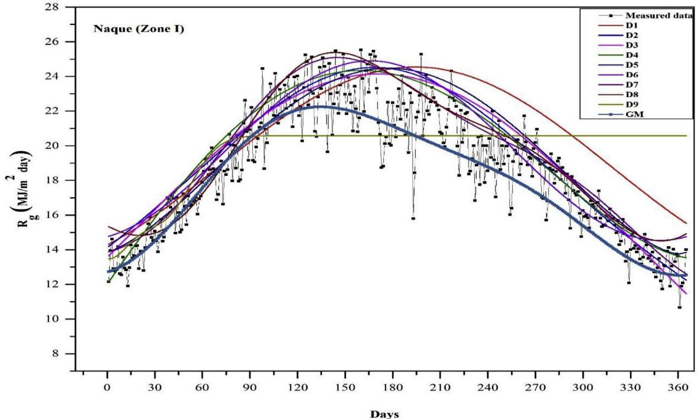  
Fig. 2. The observed data compared with the predicted data by the used model and the best model (GM) in Naque (zone I).

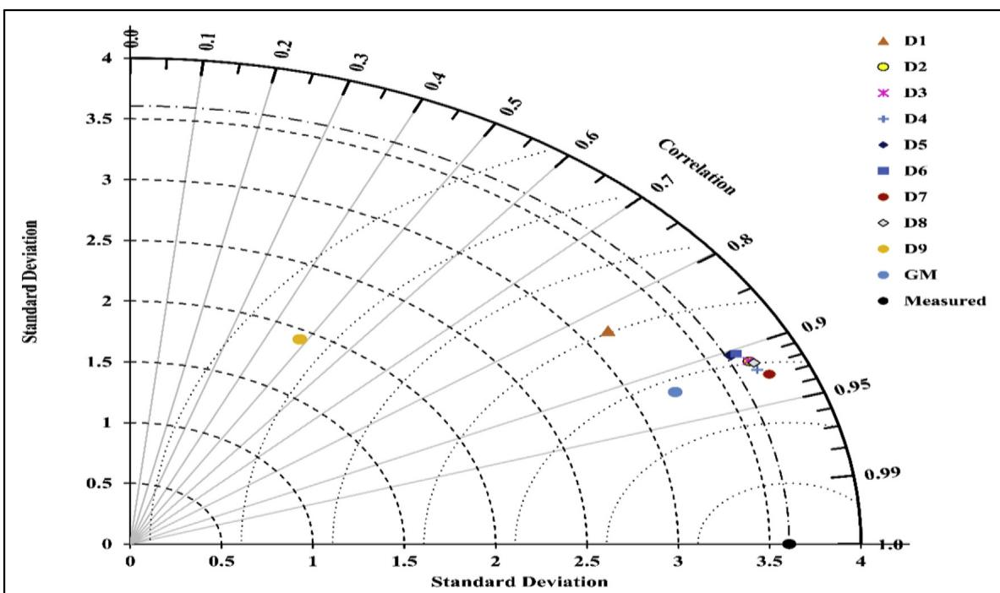  
Fig. 3. Taylor diagram for the used models and the general model (GM) of DGSR at Naque (zone I).

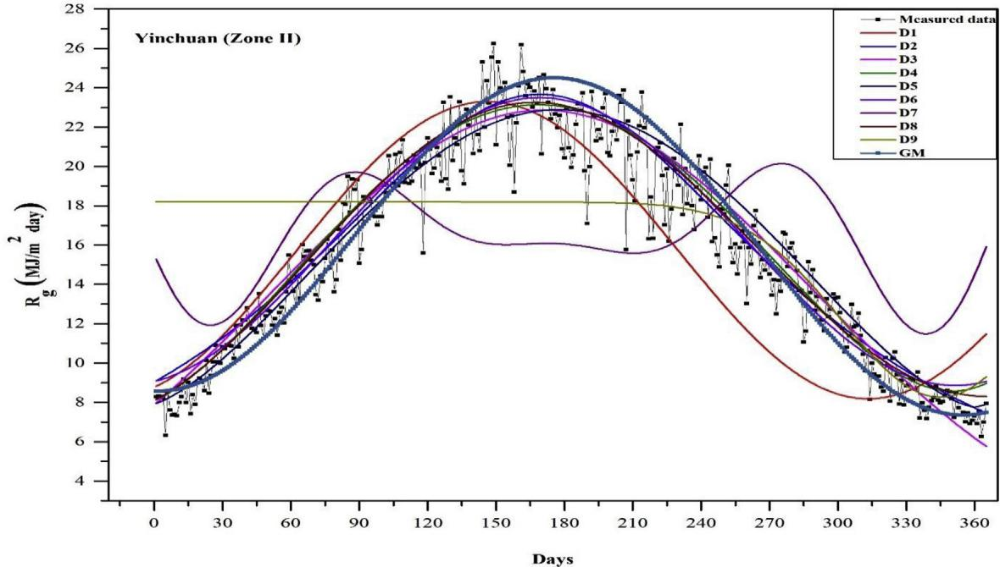  
Fig. 4. The observed data compared with the predicted data by the used model and the best model (GM) in Yinchuan station (zone II).

approximately similar performance. On other hands, model D9 followed by models D1 and D7 give the worst performance among others, where the values of r are between 0 and 0.907, 0.158- 0.904 and 0.299- 0.909, respectively.  $\mathbb{R}^2$  values range between 0 and 0.931, 0.119- 0.938 and 0.024- 0.927, respectively (Table S1). It is noticeable that the model D8 is the superior performance among others in zone IV. Therefore, the averaged data of 18 station are employed to fit this model and the empirical coefficients and statistical indicators are presented in Table 3. For general model,  $\mathbb{R}^2$  RMSE, MABE,  $\mathrm{U}_{95}$  and r values are  $0.950, 1.241 \mathrm{MJ} / \mathrm{m}^2$  day,  $1.0 \mathrm{MJ} / \mathrm{m}^2$  day, 3.366 and 0.947, respectively.

The measured daily solar radiation data of Lvsi station as a representative station of zone IV are employed to show the difference between the predicted data by different models and the general model (GM) for this zone (Fig. 8). Furthermore, the performance of different models and the general models is illustrated in Taylor diagram (Fig. 9), the furthest representative points from the reference point are points of D9, D8, and D1 models, which

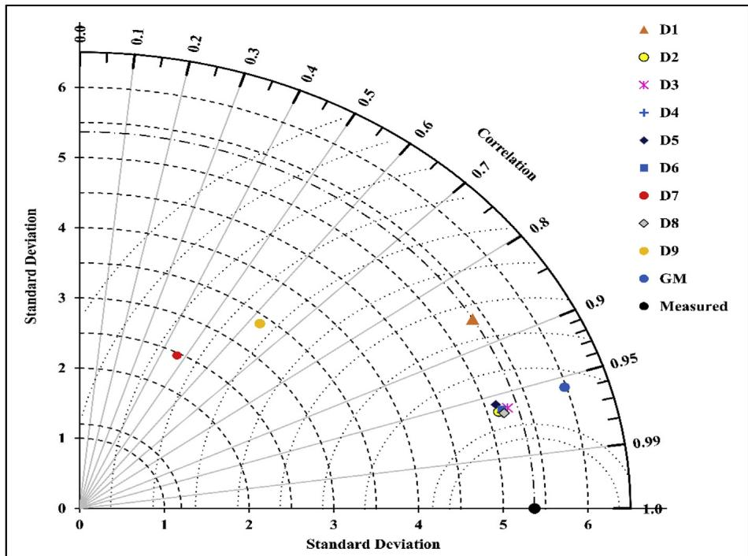  
Fig. 5. Taylor diagram for the used models and the general model (GM) of DGSR in Yinchuan station (zone II).

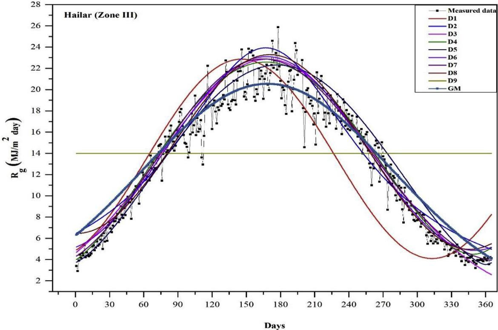  
Fig. 6. The observed data compared with the predicted data by the used model and the best model (GM) in Hailar (zone III).

suggests that they have a poor performance agreed with the results in Table S1. Otherwise, the nearest points to the reference point are the representative points of models D2, D3, D4, D5, D6, and GM, which means a good and similar performance is performed by these models.

# 3.5. Zone V

For zone V, through twelve stations in this zone, model D4 is more accurate and stable. For this model, r values are between 0.692 and 0.934, RMSE values vary between 1.850 and  $2.116\mathrm{MJ} / \mathrm{m}^2$  day, MABE range between 1.455 and  $1.708\mathrm{MJ} / \mathrm{m}^2$  day, U95 are 5.089- 5.865 and  $\mathbb{R}^2$  are 0.646- 0.907. Models D6, D8, D2 exhibit good and similar performance followed by model D5. Whereas models D9 and D1 performed a worst performance where their r and  $\mathbb{R}^2$  values are 0- 0.933 and 0.010.911 for D9 model, respectively, and 0.384 to 0.926 and 0.165 to 0.903 for D1 model, respectively. Although, model D7 performs the best in most stations, his performance is dropped down in Luzhou station, where r and  $\mathbb{R}^2$  values are 0.392 and 0.241, respectively. Hence, model D4 is selected as the best model to estimate DGSR in this zone. For this purpose, daily data of 12 stations are averaged and employed to obtain the coefficients of D4 model as listed in Table 3. It can be seen that the general model performs best, it has  $\mathbb{R}^2$  of 0.912, RMSE of  $1.309\mathrm{MJ} / \mathrm{m}^2$  day, MABE of  $1.030\mathrm{MJ} / \mathrm{m}^2$  day,  $\mathrm{U}_{95}$  of 3.557 and r of 0.944.

To show the difference between measured and predicted data, Luzhou station is selected for this purpose as shown in Fig. 10. Taylor diagram approve that D9, D7, and D1 models are the furthest representative points from the measured point, which illustrates that it cannot be dependable for estimating the DGSR in this zone especially D9 model. On other hand, models D3, D4, D5, D6, and D8 have a similar and good performance, which their representative points lie in the same position and close to the measured point (see Fig. 11).

# 4. Conclusion

In this study, a DGSR data of 84 zones across China are employed to divided China into five solar climatic zones and evaluate the performance of eight day of the year based models, existed in the literature, for estimating DGSR across China, and developing a general model for each solar zone in China. Polynomial and nonlinear regression methods are used for generating the empirical coefficients of used models. For evaluating the performance, statistical indicators are employed such as regression coefficient  $(\mathbb{R}^2)$ , correlation coefficient (r), root mean square error (RMSE), mean absolute bias error (MABE) and the uncertainty based on a  $95\%$  confidence level  $(\mathrm{U}_{95})$ , and Taylor diagram. The results indicate for zone I, the trigonometric model, hybrid sine, and cosine wave model (D7) yields the best and it can be the general model for this zone. For zones II and IV, the hybrid sine and cosine wave model (D8) is the superior performance among others, therefore, it is identified to be the general model for these two zones. The Gaussian model (D3) is selected to be the general model for zone III due to its good and stable performance across 18 stations in this zone. For the last zone, zone V, the fourth polynomial degree model (D4) yields best performance all over zone V, hence, it can be used as a general model to predict the DGSR in this zone.

The performance of all used models is higher in zones which receive high values of DGSR (zone I) and lower in zones which receive a lower amount of solar radiation (zone II). The general day of the year based models which developed and evaluated in this study can be employed to estimate the daily global solar radiation in China with a good accuracy without needing any meteorological data. Studying the changing in the daily solar radiation data obtained from the models for each site is not considered in this type of models, that need to be studied in the future. Therefore, using the geographical parameters and/or the daily extraterrestrial solar radiation on a horizontal surface of the site of interest may be

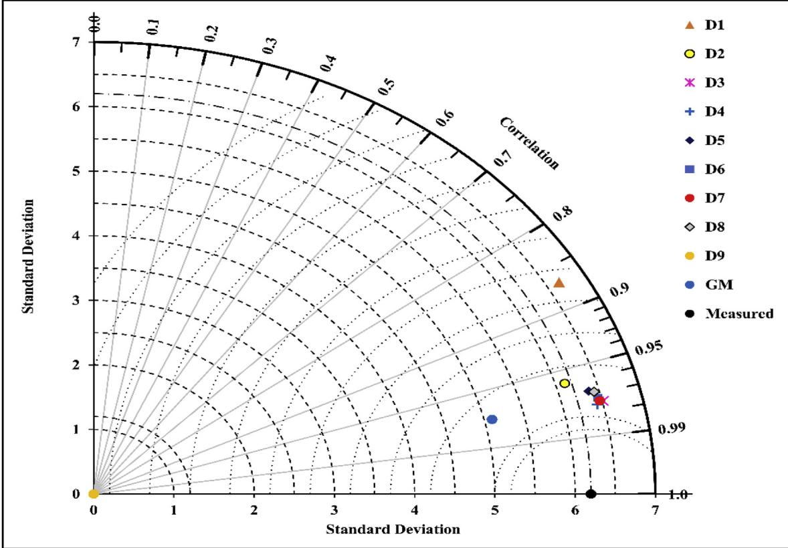  
Fig. 7. Taylor diagram for the used models and the general model (GM) of DGSR in Hailar (zone II).

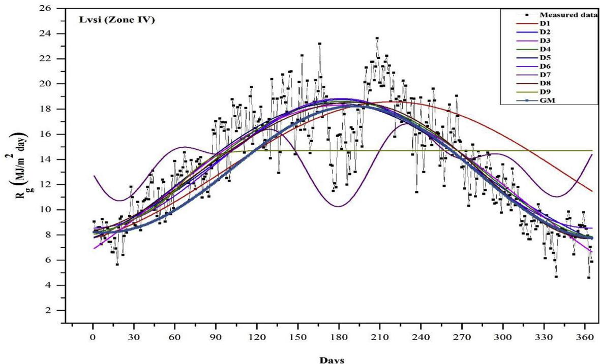  
Fig. 8. The observed data compared with the predicted data by the used model and the best model (GM) in Lvsi (zone IV).

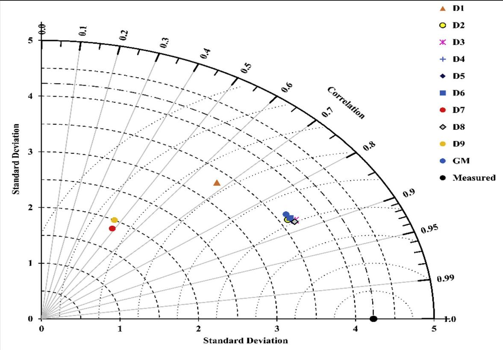  
Fig. 9. Taylor diagram for the used models and the general model (GM) of DGSR in Lysi (Zone IV).

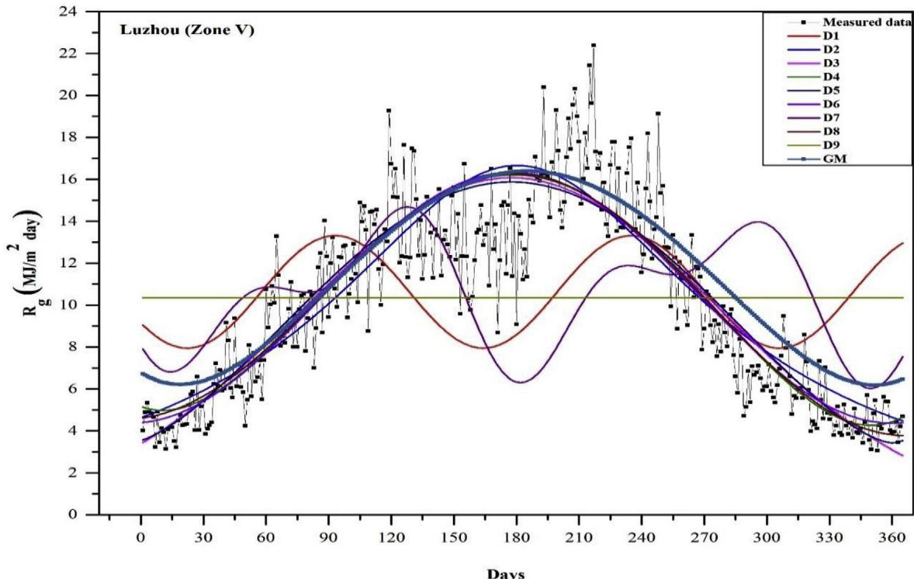  
Fig. 10. The observed data compared with the predicted data by the used model and the best model (GM) in Luzhou (Zone V).

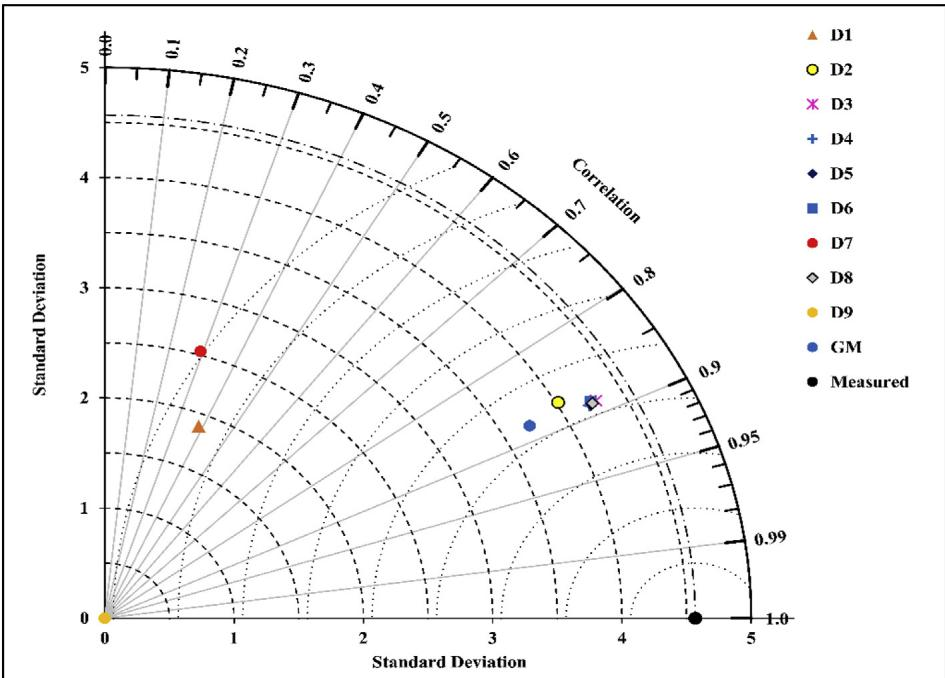  
Fig. 11. Taylor diagram for the used models and the general model (GM) of DGSR in Luzhou (zone V).

improve model performance and makes it changeable with the site and year.

# Acknowledgements

The National Key Technologies Research and Development Program of China, China financially supports this work (No. 2017YFD080080804- 01) and the Chinese Scholarships Council Foundation, China (No. 2016818T54).

# Appendix A. Supplementary data

Supplementary data to this article can be found online at https://doi.org/10.1016/j.jclepro.2019.02.211.

# References

Al- Salaymeh, A., 2006. Modelling of global daily solar radiation on horizontal surfaces for Amman city. Emir, J. Eng. Res. 11, 49- 56. Allen, R.G., 1997. Self- calibrating method for estimating solar radiation from air temperature. J. Hydrol. Eng. 2, 56- 67. Angstrom, A., 1924. Solar and terrestrial radiation. Report to the international commission for solar research on actinometric investigations of solar and atmospheric radiation. Q. J. R. Meteorol. Soc. 50, 121- 126. Aoun, N., Bouchouicha, K., 2017. Estimating daily global solar radiation by day of the year in Algeria. Eur. Phys. J. Plus 132. Bahel, V., Bakhsh, H., Srinivasan, R., 1987. A correlation for estimation of global solar radiation. Energy 12, 131- 135. Bulut, H., Buyukalaca, O., 2007. Simple model for the generation of daily global solar- radiation data in Turkey. Appl. Energy 84, 477- 491. Cao, F., Li, H., Yang, T., Li, Y., Zhu, T., Zhao, L., 2017. Evaluation of diffuse solar radiation models in Northern China: new model establishment and radiation sources comparison. Renew. Energy 103, 708- 720. Chen, J.- L., Li, G.- S., 2013. Estimation of monthly average daily solar radiation from measured meteorological data in Yangtze River Basin in China. Int. J. Climatol. 33, 487- 498. Chen, R., Ersi, K., Yang, J., Lu, S., Zhao, W., 2004. Validation of five global radiation models with measured daily data in China. Energy Convers. Manag. 45, 1759- 1769. Chen, R., Kang, E., Lu, S., Yang, J., Ji, X., Zhang, Z., Zhang, J., 2006. New methods to estimate global radiation based on meteorological data in China. Energy Convers. Manag. 47, 2991- 2998. Dizaji, H.B., Hosseini, H., 2018. A review of material screening in pure and mixed- metal oxide thermochemical energy storage (TCES) systems for concentrated

Al- Salaymeh, A., 2006. Modelling of global daily solar radiation on horizontal surfaces for Amman city. Emir, J. Eng. Res. 11, 49- 56. Allen, R.G., 1997. Self- calibrating method for estimating solar radiation from air temperature. J. Hydrol. Eng. 2, 56- 67- Angstrom, A., 1924. Solar and terrestrial radiation. Report to the international commission for solar research on actinometric investigations of solar and atmospheric radiation. Q. J. R. Meteorol. Soc. 50, 121- 126. Aoun, N., Bouchouicha, K., 2017. Estimating daily global solar radiation by day of the year in Algeria. Eur. Phys. J. Plus. 132. Bahel, V., Bakhsh, H., Srinivasan, R., 1987. A correlation for estimation of global solar radiation. Energy 12, 131- 135. Bulut, H., Buyukalaca, O., 2007. Simple model for the generation of daily global solar- radiation data in Turkey. Appl. Energy 84, 477- 991. Cao, F., Li, H., Yang, T., Li, Y., Zhu, T., Zhao, L., 2017. Evaluation of diffuse solar radiation models in Northern China: new model establishment and radiation sources comparison. Renew. Energy 103, 708- 720. Chen, J.- L., Li, G.- S., 2013. Estimation of monthly average daily solar radiation from measured meteorlogical data in Yangtze River Basin in China. Int. J. Climatol. 33, 487- 498. Chen, R., Ersi, K., Yang, J., Lu, S., Zhao, W., 2004. Validation of five global radiation models with measured daily data in China. Energy Convers. Manag. 45, 1759- 1769. Chen, R., Yang, J., Lu, S., Zhang, Z., Zhang, J., 2006. New methods to estimate global radiation based on meteorological data in China. Energy Convers. Manag. 47, 2991- 2998. Dizaji, H.B., Hosseini, H., 2018. A review of material screening in pure and mixed- metal oxide thermochemical energy storage (TCES) systems for concentrated solar power (CSP) applications. Renew. Sustain. Energy Rev. 98, 9- 26. Domros, M., Gongbing, P., 1988. Climate zones of China. In: Domros, M., Gongbing, P. (Eds.), The Climate of China. Springer Berlin Heidelberg, Berlin, Heidelberg, pp. 258- 280. Gouda, S.G., Hussein, Z., Luo, S., Wang, P., Cao, H., Yuan, Q., 2018. Empirical models for estimating global solar radiation in Wuhan City, China. Eur. Phys. J. Plus 133, 517. Gouda, S.G., Yuan, Q., 2018a. Comments on "Classification of solar radiation zones and general models for estimating the daily global solar radiation on horizontal surfaces in China", by Liu et al. In: Energy Conversion and Management, 2017.0043. [Energy Convers. Manage. (168, pp. 651- 652. Gouda, S.G., Yuan, Q., 2018b. Corrigendum to "Comments on "Classification of solar radiation zones and general models for estimating the daily global solar radiation on horizontal surfaces in China", by Liu et al. In: Energy Conversion and Management, 2017 [Energy Convers. Manage. (In press)]. Energy Conversion and Management. Gouda, S.G., Yuan, Q., 2018c. Reply to "Reply to [Comments on "Classification of solar radiation zones and general models for estimating the daily global solar radiation on horizontal surfaces in China". In: [Energy Convers. Manage. (2017) 10.043] [Energy Convers. Manage. (2018) 05.051], by Liu et al.". Energy Conversion and Management. Gueymard, C.A., 2014. A review of validation methodologies and statistical performance indicators for modeled solar radiation data: towards a better bankability of solar projects. Renew. Sustain. Energy Rev. 39, 1024- 1034. Hassan, G.E., Youssef, M.E., Ali, M.A., Mohamed, Z.E., Shehata, A.I., 2016. Performance assessment of different day- of- the- year- based models for estimating global solar radiation - case study: Egypt. J. Atmos. Sol. Terr. Phys. 149, 69- 80. Jemaat, A.B.E.N., Rafa, S., Essounbouli, N., Hamzaoui, A., Hnaien, F., Yalaoui, F., 2013. Estimation of global solar radiation using three simple methods. Energy Procedia 42, 406- 415. Kaplanis, S., Kaplani, E., 2007. A model to predict expected mean and stochastic hourly global solar radiation I(h:nj) values. Renew. Energy 32, 1414- 1425. Kaplanis, S., Kumar, J., Kaplani, E., 2016. On a universal model for the prediction of the daily global solar radiation. Renew. Energy 91, 178- 188. Khorasanizadeh, H., Mohammadi, K., 2013. Prediction of daily global solar radiation by day of the year in four cities located in the sunny regions of Iran. Energy Convers. Manag. 76, 385- 392. Lam, J.C., Tsang, C.L., Yang, L., Li, D.H.W., 2005. Weather data analysis and design implications for different climatic zones in China. Build. Environ. 40, 277- 296. Lau, C.C.S., Lam, J.C., Yang, L., 2007. Climate classification and passive solar design implications in China. Energy Convers. Manag. 48, 2006- 2015. Lemos, L.F.L., Starke, A.R., Boland, J., Cardenil, J.M., Machado, R.D., Colle, S., 2017. Assessment of solar radiation components in Brazil using the BRL model. Renew. Energy 108, 569- 580. Li, H., Cao, F., Wang, X., Ma, W., 2014. A temperature- based model for estimating monthly average daily global solar radiation in China. Sci. World J. 2014, 128754. Li, H., Ma, W., Lian, Y., Wang, X., 2010a. Estimating daily global solar radiation by day of year in China. Appl. Energy 87, 3011- 3017. Li, M.- F., Fan, L., Liu, H.- B., Guo, P.- T., Wu, W., 2013a. A general model for estimation

of daily global solar radiation using air temperatures and site geographic parameters in Southwest China. J. Atmos. Sol. Terr. Phys. 92, 145–150. Li, M.- F., Liu, H.- B., Guo, P.- T., Wu, W., 2010b. Estimation of daily solar radiation from routinely observed meteorological data in Chongqing, China. Energy Convers. Manag. 51, 2575–2579. Li, M.- F., Tang, X.- P., Wu, W., Liu, H.- B., 2013b. General models for estimating daily global solar radiation for different solar radiation zones in mainland China. Energy Convers. Manag. 70, 139–148. Liu, L.- q., Wang, Z.- x., Zhang, H.- q., Xue, Y.- c., 2010. Solar energy development in China—a review. Renew. Sustain. Energy Rev. 14, 301–311. Liu, X., Mei, X., Li, Y., Wang, Q., Zhang, Y., Porter, J.R., 2009. Variation in reference crop evapotranspiration caused by the Angstrom- Prescott coefficient: locally calibrated versus the FAO recommended. Agric. Water Manag. 96, 1137–1145. Liu, Y., Zhou, Y., Wang, D., Wang, Y., Li, Y., Zhu, Y., 2017. Classification of solar radiation zones and general models for estimating the daily global solar radiation on horizontal surfaces in China. Energy Convers. Manag. 154, 168–179. Liu, X., Zhou, Y., Wang, D., Wang, Y., Li, Y., Zhu, Y., 2018. Reply to "Comments on [Classification of solar radiation zones and general models for estimating the daily global solar radiation on horizontal surfaces in China". In: [Energy Convers. Manage. 154 (2017) 168–179] by Liu et al.]. Energy Conversion and Management 168, 653–654. Mohammadi, K., Shamshirband, S., Tong, C.W., Alam, K.A., Petkovic, D., 2015. Potential of adaptive neuro- fuzzy system for prediction of daily global solar radiation by day of the year. Energy Convers. Manag. 93, 406–413. National Bureau of Statistics of People's Republic of China. Total consumption of energy and its composition, <http://www.stats.gov.cn/tjsj/ndsj/2010/indexch.htm> (Accessed 21 January 2019). Ogelman, H., Eccevit, A., Tasdemiroglu, E., 1984. A new method for estimating solar radiation from bright sunshine data. Sol. Energy 33, 619–625. Ouyang, L., Sun, L., Yuan, Y., Cao, X., Xiang, B., 2017. Optimum connection modes for photovoltaic thermal collectors in different radiation zones of China. Appl. Therm. Eng. 122, 661–672. Prescott, J., 1940. Evaporation from a water surface in relation to solar radiation. Trans. Roy. Soc. S. Aust. 64, 114–118. Quej, V.H., Almorox, J., Ibrakhimov, M., Saito, L., 2017. Estimating daily global solar radiation by day of the year in six cities located in the Yucatán Peninsula, Mexico. J. Clean. Prod. 141, 75–82. Rietveld, M., 1978. A new method for estimating the regression coefficients in the formula relating solar radiation to sunshine. Agric. Meteorol. 19, 243–252. Tang, W., Qin, J., Yang, K., Niu, X., Zhang, X., Yu, Y., Zhu, X., 2013. Reconstruction of daily photosynthetically active radiation and its trends over China. J. Geophys. Res.: Atmosphere 118 (13), 292–213, 302. Tang, W., Yang, K., He, J., Qin, J., 2010. Quality control and estimation of global solar radiation in China. Sol. Energy 84, 466–473. Xie, H., Zhang, C., Hao, B., Liu, S., Zou, K., 2012. Review of solar obligations in China. Renew. Sustain. Energy Rev. 16, 113–122. Yang, K., Huang, C.H., Tian, J., 2001. A hybrid model for estimating global solar radiation. Sol. Energy 70, 13–22. Yang, K., Koike, T., Ye, B., 2006. Improving estimation of hourly, daily, and monthly solar radiation by importing global data sets. Agric. For. Meteorol. 137, 43–55. Yao, W., Zhang, C., Wang, X., Sheng, J., Zhu, Y., Zhang, S., 2017. The research of new daily diffuse solar radiation models modified by air quality index (AQI) in the region with heavy fog and haze. Energy Convers. Manag. 139, 140–150. Zang, H., Xu, Q., Bian, H., 2012. Generation of typical solar radiation data for different climates of China. Energy 38, 236–248. Zhao, N., Zeng, X., Han, S., 2013. Solar radiation estimation using sunshine hour and air pollution index in China. Energy Convers. Manag. 76, 846–851. Zou, L., Wang, L., Lin, A., Zhu, H., Peng, Y., Zhao, Z., 2016. Estimation of global solar radiation using an artificial neural network based on an interpolation technique in southeast China. J. Atmos. Sol. Terr. Phys. 146, 110–122.