# Energy-saving design and control strategy towards modern sustainable greenhouse: A review

Menghang Zhang a, Tingxiang Yan a, Wei Wang b, Xuexiu Jia c, Jin Wang c,*, Jiri Jaromir Klemes c

a School of Energy and Environmental Engineering, Hebei University of Technology, Tianjin, 300401, China  b Innovation and Entrepreneurial Center, Hebei University of Technology, Tianjin, 300401, China  c Sustainable Process Integration Laboratory - SPIL, NETME Centre, Faculty of Mechanical Engineering, Brno University of Technology - VUT Brno, Technicka 2896/2, 616 69, Brno, Czech Republic

# ARTICLEINFO

Keywords:  Greenhouses  Energy efficiency  Renewable technology  Control strategy  Life cycle assessment  Environmental footprint. (word count: 15722)

# ABSTRACT

A greenhouse is an energy- intensive sector with substantial greenhouse gas emissions and extensive energy consumption. Energy- saving greenhouse strategies become particularly important on the premise of ensuring effective crop production to achieve sustainable energy development. This paper aims to deliver a comprehensive review on crucial energy- saving strategies from greenhouse design to operational stage. This contribution analyses effective energy- saving methods for greenhouse design considering greenhouse structures, ventilation and lighting systems. It details the energy- saving operation of greenhouses by summarising renewable energy technologies and integration systems, including photovoltaic modules, solar collectors, heat pumps and other integrated modules. These environment- friendly technologies achieve the purpose of environment protection and energy conservation of greenhouse. The research findings reveal that more than half of the energy is saved through appropriate greenhouse renovation. Control strategies for improving the energy efficiency of the greenhouse in aspects of monitoring system management and control algorithms have been discussed as well. The neural network combined with other control algorithms is a suitable approach to solve nonlinear control problems with a good control accuracy. In the final part, the life cycle environmental impacts and environmental footprints assessment of greenhouse is discussed. Life cycle assessment of modern integrated greenhouse is expected to be further studied. This review provides valuable insights and suggestions for the design and transformation of modern sustainable greenhouses.

# 1. Introduction

Energy conservation becomes urgent due to shortages of energy reserves, a sharp rise in energy prices, and increasingly serious environmental problems such as global warming, ozone layer depletion and climate change. The use of renewable energy sources and adopting energy- saving measures are of vital importance for all sectors such as industries, transportations, and agriculture sectors [1]. Recent reports revealed that building construction contributed to nearly  $40\%$  energy consumption and  $25\%$  greenhouse gas emissions in the world [2]. Greenhouse as an energy- intensive building sector accounts for a considerable contribution. Heating consumption accounted for the largest proportion that more than half of energy was consumed [3]. The thermal insulation performance of the greenhouse envelope was poor in traditional greenhouse constructions. Typical greenhouse envelope caused  $20 - 40\%$  of the energy loss [4]. The difference of heat transfer coefficient of greenhouse materials produced nearly  $55\%$  heat loss [5].

A greenhouse is an agricultural structure that prolongs the production season of various crops by providing controlled indoor microclimate conditions [6]. Greenhouse agricultural production is developing towards industrialization and scale with the modernization of facility agriculture. The greenhouse industry heavily relies on fossil fuels which contributed to substantial greenhouse gas (GHG) emissions [7]. The production cost of greenhouse has increased by about  $40 - 50\%$  due to energy consumption and labor cost [8]. The growing energy demand has become an essential issue for greenhouse sectors to achieve sustainable development. At the same time, the development of greenhouse agriculture has a great impact on many aspects like water resources, climate conditions and energy sources [9]. Many studies have been carried out

<table><tr><td colspan="3">Nomenclature</td></tr><tr><td rowspan="4" colspan="2">Abbreviations</td><td>MIMO</td></tr><tr><td>MPC</td></tr><tr><td>NB-IoT</td></tr><tr><td>NIR</td></tr><tr><td>ANN</td><td>Artificial neural network</td><td>NN</td></tr><tr><td>BLF</td><td>Bluetooth low energy</td><td>NN</td></tr><tr><td>CFD</td><td>Computational fluid dynamics technique</td><td>OSC</td></tr><tr><td>CGR</td><td>Crop growth rate</td><td>OPV</td></tr><tr><td>COP</td><td>Coefficient of performance</td><td>PAR</td></tr><tr><td>CWF</td><td>Cool-white fluorescence</td><td>PC</td></tr><tr><td>DSC</td><td>Dye-sensitized solar cell</td><td>PCM</td></tr><tr><td>FLC</td><td>Fuzzy logic control</td><td>PID</td></tr><tr><td>GAA</td><td>Greenhouse azimuth angle</td><td>PO</td></tr><tr><td>GCHP</td><td>Ground coupled heat pump</td><td>PFED</td></tr><tr><td>GF</td><td>Green fluorescent lamp</td><td>PV</td></tr><tr><td>GHG</td><td>Greenhouse gas</td><td>PVC</td></tr><tr><td>HDPE</td><td>High-density polyethylene</td><td>PVC</td></tr><tr><td>HPS</td><td>High-pressure sodium</td><td>PVT</td></tr><tr><td>HVAC</td><td>Heating, ventilating and air conditioning</td><td>RB</td></tr><tr><td>IPM</td><td>Innovative PV module</td><td>RGB</td></tr><tr><td>ISSM</td><td>Integrated soil-crop system management</td><td>SAHP</td></tr><tr><td>LCA</td><td>Life cycle assessment</td><td>SEM</td></tr><tr><td>LCC</td><td>Life cycle cost</td><td>UV</td></tr><tr><td>LDPE</td><td>Low-density polyethylene</td><td>WiFi</td></tr><tr><td>LED</td><td>Light-emitting diode</td><td>WSN</td></tr><tr><td>LLDPE</td><td>Linear-low density polyethylene</td><td>Greek symbols</td></tr><tr><td>LoRa</td><td>Long Range Radio</td><td>γ</td></tr><tr><td>LPWAN</td><td>Low power wide area network</td><td>φ</td></tr></table>

to investigate solutions to reduce the energy consumption of greenhouses. Chahidi et al. [10] presented a dynamic energy model developed in the Energy Plus environment that provided a good reference to optimise greenhouse systems. Mahmood et al. [11] realised effective energy- saving of the greenhouse by changing the control strategy of heating, ventilating and air conditioning (HVAC) system, which reduced energy in winter and summer by  $7.70\%$  and  $16.57\%$  over two days. Munoz- Liesa et al. [12] presented an energy symbiosis method to integrate greenhouses into building HVAC to improve energy efficiency. Gorjian et al. [13] investigated the integration of advanced renewable energy technologies and their thermal storage methods to achieve a close to net- zero greenhouse. Strategies such as energy- saving structural design [14], application of high- performance covering materials [15], advancement of lighting and ventilation systems, usage of renewable and sustainable technologies [16], and energy- efficient management of indoor microclimate should be adopted to manage greenhouse effectively. Both active and passive technologies have been used to improve greenhouse energy efficiency. Esen and Yuksel [17] investigated the utilisation of biogas, ground and solar energy for greenhouse heating. They found that solar energy systems, heat pumps, biogas systems and the combination types were expected to be progressive for greenhouse heating in Turkey. High storage temperature was obtained by using a solar energy system. The solar energy was stored in the soil, which supported the biogas system [18]. Bouadila et al. [19] reported that the utilisation of solar air collectors combined with phase change materials provided effective heating for a greenhouse. The heat recovered by the solar system at nighttime reached  $31\%$  of the total heating demand. Yasmine et al. [20] reviewed technological signs of progress in renewable greenhouses, including environmental monitoring, application of storage systems, implementation in hardware design, energy optimisation, etc.

It has become an inevitable trend of modern agriculture to promote the development of greenhouse in the orientation of technology and intelligence with an intensity of market competition, the demand of food, and support of relevant policies. Erdem et al. [1] reviewed progressive strategies of energy- saving and climate control technologies for greenhouse. With a comparison of existing greenhouses, it is revealed that up to  $80\%$  energy saving was achieved by properly transforming conventional greenhouses. Traditional greenhouses require considerable energy, reaching  $50\%$  of production cost [7]. The transformation from traditional greenhouse to modern sustainable greenhouse has been considered a promising direction to improve the energy utilisation efficiency of greenhouse- based agriculture development. This paper reviews the literature about greenhouse design and energy- saving measures in recent five years, derived from Web of Science, ScienceDirect, and Google Scholar. The main keywords are selected, including "greenhouse design", "energy saving", "control strategy", "renewable technology", "life cycle assessment" and "environmental footprint". The reviewed information expands the keywords by using "AND" and "OR" to make permutations and combinations in search strings. 185 articles were selected from the 2081 articles retrieved for detailed and in- depth examination through a series of screening. According to the current research literature on the greenhouse, it was evident that research on greenhouse design and control methods account for the most significant proportion,  $40\%$  and  $26\%$  as shown in Fig. 1. However, the whole process of energy- saving measures of the greenhouse, from the design of the external structure to the control methods of internal equipment, has been little reviewed. It is also found that although there is much literature on energy- saving design and control of greenhouse, none of them comprehensively analyses the whole process of the greenhouse from structure to equipment, from hardware to software.

The purpose of this work is to provide an overview of energy- efficient design and control methods for transformation from traditional greenhouse to the modern greenhouse—key design factors including the greenhouse orientation, shape, covering materials, ventilation and lighting systems. Various renewable techniques are analysed to describe the overall energy- use performance of greenhouse systems. Control strategies are discussed to improve the energy efficiency of the greenhouse from aspects of sensors, communication technologies, and control algorithms. Life cycle assessment and environmental footprints

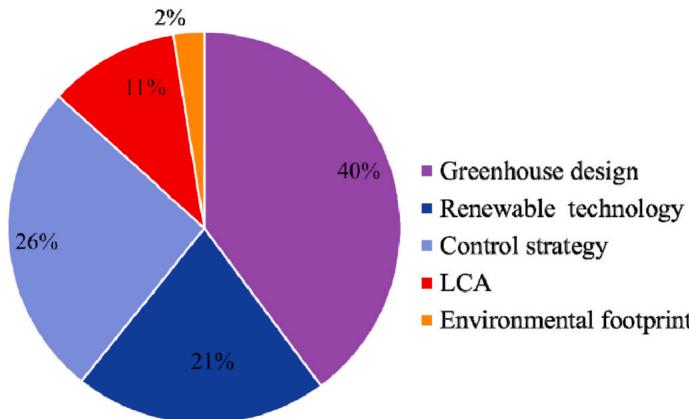  
Fig. 1. The proportion of the greenhouse research.

of existing greenhouses are also discussed. Finally, the future directions of research are identified for the promising implementations of greenhouse energy efficiency improvement.

# 2. Energy-saving design of greenhouse

Greenhouse climate condition changes with the external environment and internal plant growth and needs to be continuously updated. The greenhouse construction, operation, facilities, types of energy input, and investment and operation costs are mainly considered to ensure the energy utilisation efficiency and economic feasibility in greenhouse construction and operation [20]. Improper construction of greenhouse structures will cause serious greenhouse climate problems and increase energy consumption [21]. Good design of ventilation and lighting system are premise and priority factors for achieving optimal climate condition of greenhouse crops in an economical way. In this review, the structural design [22], ventilation systems and lighting systems of the greenhouse are mainly considered in the review of greenhouse energy- efficient design as shown in Fig. 2. These aspects are introduced in detail in the following chapters.

# 2.1. Structural design

Heat energy consumption of the greenhouse largely depends on the amount of solar radiation [23]. Orientation, shape and covering material are the main physical factors of greenhouse that determine the absorption coefficient and utilisation rate of solar energy [24]. Consequently, they are critical factors for successful greenhouse design to reduce heating and cooling loads of installed systems and save operation costs [25].

# 2.1.1. Orientation

The orientation of greenhouse in different regions has a significant impact on heat requirements and the indoor environment of the greenhouse. According to the research of Wael et al. [26], the orientation of the greenhouse relative to the south direction is recommended to obtain the largest amount of heat capture. Chen et al. [27] presented a similar conclusion that the optimal orientation depends on the geographical latitude of a solar greenhouse, which moved towards the south with the increase of latitude. Greenhouse azimuth angle (GAA) was defined by Cakur and Sahin [25] to obtain a more specific angle. They selected 90 angular orientations to calculate the seasonal total solar gaining rate. When considering the annual solar energy utilisation,  $45^{\circ}$  orientation (clockwise from east to west) was suitable for smaller greenhouses, and  $30^{\circ}$  orientation was most suitable for large greenhouses with longer length as it gave the minimum value of total solar fraction in winter [28]. Compared with North- South (N- S) orientation, East- West (E- W) orientation involved lower internal temperature and solar heat gain in summer but higher in winter [29]. Sethi [30] found that E- W orientation was most suitable for year- round greenhouse applications at all latitudes except near the equator. E- W orientation was perpendicular to wind orientations of local dominant in southern China [31]. Table 1 summarises selected studies of greenhouse orientation selection of greenhouse orientation. A general remark is that the N- S orientation of greenhouse is suggested in the northern hemisphere, while an E- W orientation is a better choice for the southern hemisphere.

# 2.1.2. Shape

Shapes of the greenhouse also play an important role in energy absorption and utilisation during crop cultivation and production. Good design of greenhouse shapes should obtain the lowest possible solar irradiance in summer and maximum solar irradiance in winter [14]. Typical shapes of the greenhouse include even span, uneven span, dome type, quonset and vinery, as shown in Fig. 3. Researchers conducted a comparative study on various greenhouse shapes to understand the

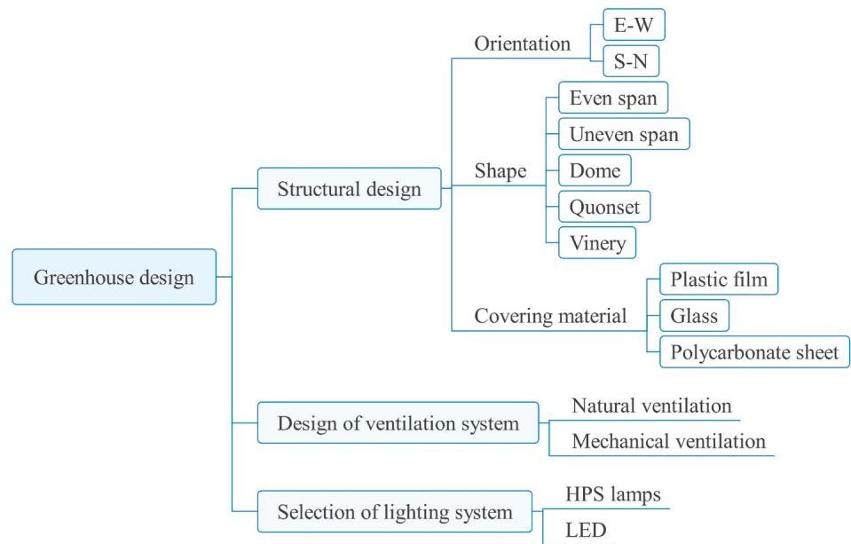  
Fig. 2. Greenhouse design.

Table 1 Summary of the optimal selection of greenhouse orientation in reviewed work.  

<table><tr><td>Ref.</td><td>Orientation</td><td>Location</td><td>Main finding</td></tr><tr><td>Çakur and Şahin [25]</td><td>E-W</td><td>Nontheastern Anatolia, Turkey</td><td>A ratio of length to width of greenhouse and greenhouse azimuth angle decreased as floor area reduced for greenhouse types except for elliptic type.</td></tr><tr><td>El-Maghlany et al. [26]</td><td>E-W</td><td>North Tropical Region</td><td>The optimum orientation for different locations was (γ1= 0° and γ2= 180°) excluding low latitude angle (φ&amp;lt;24°), at this location, orientation to both west and east (γ1=90° and γ2=−90°) was better.</td></tr><tr><td>Chen et al. [27]</td><td>S-N</td><td>Northern China</td><td>The optimal orientation was 5.4° movements from south to west.</td></tr><tr><td>Gupta et al. [28]</td><td>E-W</td><td>New Delhi</td><td>45° orientation was the best in small greenhouse both for winters as well as for summers and for bigger greenhouses (more in length) 30°</td></tr><tr><td>Stanciu et al. [29]</td><td>E-W</td><td>Romania</td><td>E-W orientation was the best. 
E-W orientation at 44.25°N latitude of considered even span shape greenhouse was preferred all along the year from energy loads point of view.</td></tr><tr><td>Sethi [30]</td><td>E-W</td><td>Ludhiana Punjab, India</td><td>East-west orientation was the best suited for year-round greenhouse applications at all latitudes.</td></tr><tr><td>Chen et al. [31]</td><td>E-W</td><td>Southern China</td><td>E-W orientation was the best suited for the maximum capture of global solar radiation in winter at all latitudes.</td></tr></table>

influence of greenhouse shapes on solar radiation. The research results are summarised in Table 2.

The optimal greenhouse shapes are affected by aspect ratio. Under a condition of keeping the same length, width and height of shapes in a greenhouse, Sethi [30] found that uneven greenhouse received the most solar radiation. When a greenhouse with more complex geometry (such as a sawtooth type) was adopted, the absorbed solar radiation was further improved [31]. The reason is due to its larger receiving area of solar radiation. The curved surface of the greenhouse has a great influence on solar radiation absorption. For elliptic greenhouse, Wael et al. [26] proposed the best aspect ratio of elliptical surface to obtain the optimal solar capture rate. They found that the amount of energy increased with the increase in the ellipse aspect ratio. Dimensions of the elliptic greenhouse had little effect on the total acquisition rate of solar energy for each floor area [25]. It is crucial to choose the optimal greenhouse shape by comprehensively considering the aspect ratio and receiving the surface of solar radiation.

# 2.1.3. Covering materials

Greenhouse frames are enveloped with covers that are commonly made of plastic film, glass and polycarbonate (PC) sheets. Scanning electron microscope (SEM) images of these covering materials are presented in Fig. 4. Covering materials are generally used to capture heat inside the greenhouse. Temperature, humidity and leaf temperature inside the greenhouse are highly affected by their light transmissivity [34]. Covers provide additional energy for the greenhouse through heat conduction and radiation in the thermal infrared range. External climate conditions in climatic areas around the world require different greenhouse covering properties [35]. The transmittance of the solar spectrum determines energy input of greenhouse covers. Transparency for photosynthetically active radiation (PAR) of the materials is the most important factors that constrains other properties. Plastic film is commonly used as a covering material in countries with tropical climatic conditions [36]. Low- density polyethylene films (LDPE) are the most prevalent material due to their low cost, high plasticity and suitable optical properties [37]. Polyvinylchloride (PVC) and Polyolefin (PO) has stronger ability to absorb ultraviolet (UV) than LDPE [38]. Lighting transmittance and service life of glass are more reliable, while PC sheet has medium intensity and lower cost compared to glass. Baneshi et al. [39] selected several commercial greenhouses covering plastics to measure wide- range spectral radiative properties and calculated the total annual heating and cooling load of a greenhouse. Results showed that the selected plastic cover plate reduced cooling load by  $9.8\%$  and heating load by  $6.3\%$  every year. In a similar line, Chaysaz et al. [40] studied the effects of glass, plastic and PC on greenhouse temperature and overall efficiency by analysing the power and heat supply of a small- scale greenhouse. The highest generation of power was occurred with the cover of glass that the maximum average output power was 32.43w. Greenhouses covered with PC and glass showed minimum and maximum temperature and solar radiation changes. Glass is preferred based on appropriate PAR transmittance, less risk of photooxidation and

Table 2 Summary of greenhouse shape comparison in existing studies.  

<table><tr><td>Reference</td><td>Compared greenhouse shapes</td><td>Study area</td><td>Result of the study</td></tr><tr><td>Sethi [30]</td><td>Even span, uneven span, vinery, improved arch and quosite</td><td>Ludhiana Punjab, India</td><td>Uneven-span shape greenhouse receives the maximum solar radiation during each month of the year at all latitudes, and quonset shape receives the minimum solar radiation.</td></tr><tr><td>Chen et al. [31]</td><td>Even span, uneven span, ellipse, arch, sawtooth, and vinery</td><td>Southern China, latitudes ranged from 20°N to 30.6°N</td><td>Sawtooth captured the highest amount of global solar radiation in winter at all latitudes.</td></tr><tr><td>Mobtaker et al. [32]</td><td>Even-span, uneven span, single span, vinery, quonset and each type</td><td>Tabriz, northwest Iran</td><td>East-West single-span greenhouse received the most solar radiation in the cold season.</td></tr><tr><td>Vivekanandan et al. [33]</td><td>Parabola, quonset, modified quonset, pyramid, igloo and tropical</td><td>-</td><td>Quonset shape generated the highest temperature when compared to its rival tropical shape.</td></tr></table>

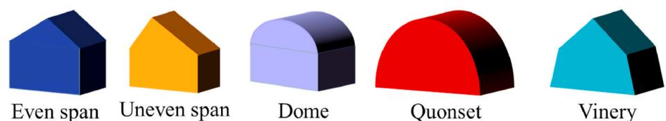  
Fig. 3. Typical shapes of a greenhouse.

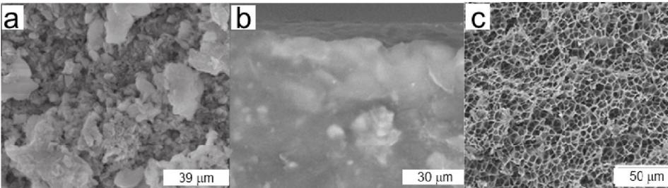  
Fig. 4. Different covering materials: (a) polyethylene [42]; (b) silica [43]; (c) polycarbonate [44].

near- infrared (NIR) reflection [41].

near- infrared (NIR) reflection [41].Radiometric, mechanical and physical properties are the main factors to consider when selecting the greenhouse covers [45]. They are also the main considered factors to satisfy light distribution quantity, fight against ultraviolet (UV) rays, thermal retention and resistance against bad weather conditions [46]. Glass has outstanding light transmission characteristics and long service life. As shown in Table 3, the Young's modulus of glass ranges from 70 GPa to 90 GPa. With Young's modulus of 0.14- 0.25 GPa, the resistance to impact and lateral load of polyethylene is two to four times that of glass. Polycarbonate has moderate lifetime and transmission capacity compared to glass and polyethylene. The optical and mechanical characteristics were expected to be further improved through modification measures such as high- density polyethylene (HDPE) with fibers and rock [47]. Besides optical and mechanical properties, it is necessary to pay attention to the latent capacity of covering materials such as switchable radiation, insecticidal capacity, and conductivity. A linear low- density polyethylene (LLDPE) film compounded with pesticide- loaded nanotube was used for the covering materials of the greenhouse. It showed the sustained release function of pesticide release to repel or kill pests. The elastic modulus of the covering material was about  $200\mathrm{MPa}$ . The addition of nanotube pesticide increased the film stiffness by  $40\%$  on average [37]. Pigmented coatings used on greenhouse covers selectively reflect near- infrared radiation to reduce heat gain [48]. Nanocomposite greenhouse covering materials improved thermal insulation characteristics and effective radiation of greenhouse. The radiation transmittance of the glass greenhouse accounts for  $30\%$  of the total solar incident radiation, and the nanocomposite greenhouse is  $10\%$  higher than the glass greenhouse [49]. New materials whose optical properties were instantaneously changed (materials with switchable properties) had advantages for high light demand crops [35]. Advanced optical materials especially used for solar control of greenhouse covers are still in the early stage of development [50]. Energy- efficient materials are still worth exploring to provide benefits for improving greenhouse temperature and lighting conditions on the premise of reasonable allocation of greenhouse climate and internal crops.

# 2.2. Design of ventilation system

2.2. Design of ventilation systemGreenhouse ventilation systems include natural ventilation and mechanical ventilation system that provide cooling for the greenhouse. A greenhouse ventilation system adjusts the temperature, humidity [51], and  $\mathrm{CO_2}$  concentration [52] by exchanging the air inside and outside the greenhouse, which plays an irreplaceable role in greenhouse environmental control. Many studies of ventilation in greenhouses have been approached to achieve efficient control and create a suitable environment for crop growth.

Table 3 Covering materials properties.  

<table><tr><td>Materials</td><td>Solar radiation transmissivity (%)</td><td>Young&#x27;s modulus (GPa)</td><td>Heating demand</td><td>Life span (year)</td></tr><tr><td>Glass</td><td>75–92</td><td>70–90</td><td>High</td><td>&amp;gt;20</td></tr><tr><td>PC</td><td>81–90</td><td>61–70</td><td>Low</td><td>10–15</td></tr><tr><td>PE</td><td>70–89</td><td>0.14–0.25</td><td>Medium</td><td>3–4</td></tr></table>

# 2.2.1. Methods of improving ventilation efficiency

Greenhouse ventilation efficiency is affected by many factors such as ventilation position and configuration, wind intensity and speed [53]. Usage of natural ventilation provides a potential value to reduce greenhouse energy requirements. It is highly affected by factors of location [54] and vent arrangement [55] of the greenhouse to achieve ideal ventilation efficiency. Fig. 5 (a) shows single- span and multi- span arrangements of ventilation openings. Configuration of air catchers is also an effective method to improve ventilation efficiency, as shown in Fig. 5 (b). Ventilation of a single- span greenhouse is increased by adjusting the height of ridge vents or increasing the number of vents. Multi- span greenhouse with open ridge vents under local prevailing wind direction had the optimal ventilation rate [56]. It is not enough to only consider external ventilation. External incident radiation changes substantially the airflow and temperature distribution in the greenhouse [55]. Benni et al. [57] used Autodesk CFD 2015 software to simulate airflow and temperature distribution in the greenhouse for determining the optimal ventilation configuration and ventilation opening management program for indoor environmental control. Compared to all vents open, the best performance was achieved when the windward vent closed, which was obtained the maximum heat dissipation of  $64\%$

Air catcher operates according to a pressure difference between the windward side and leeward side of the greenhouse. Higher ventilation flow rates are provided by using wind catchers as opposed to regular vents [58]. Wind speed and direction are key factors for the ventilation efficiency of windcatcher greenhouses. A ventilation strategy with a combination of downdraught evaporative cooling and windcatcher provided a higher airflow rate, which achieved up to  $17.13^{\circ}C$  reduction of an average indoor air temperature compared to cross- flow ventilation [59]. When considering the influence of different wind speeds on the

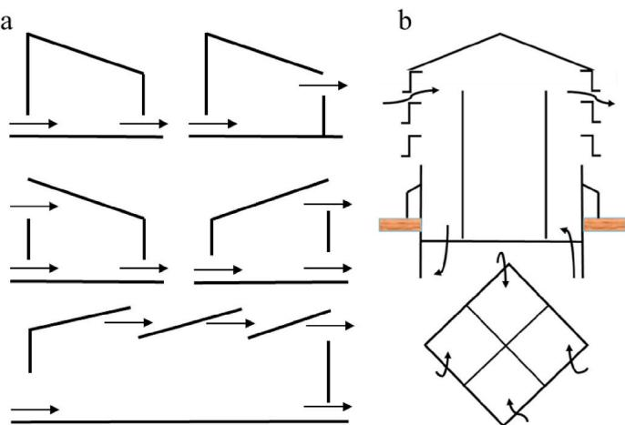  
Fig. 5. (a) Arrangement of ventilation opening; (b) Typical windcatcher in a greenhouse.

ventilation efficiency of windcatchers, windcatchers achieved a flow change rate with an external wind speed of  $3\mathrm{m / s}$  [60].

# 2.2.2. Energy-efficient devices in a ventilation system

Uncertainties of wind speed and orientation take a risk on the inner microclimate of a greenhouse adopted with natural ventilation. It is not sufficient for a greenhouse using only natural ventilation to obtain the optimum climate inside the greenhouse [61]. Forced ventilation reduces vertical temperature stratification inside the greenhouse and leads to better air distribution than natural ventilation. It is necessary for a greenhouse to equip forced/mechanical ventilation, especially in hot climate areas. A forced ventilation system composed of an effective and efficient ventilating fan and pad system ensured the thermal stability and comfort of the greenhouse. This system decreased temperature variation and energy consumption, achieving energy- saving of  $30.83\%$  [62]. Greenhouse ventilation fans move a large amount of air at a relatively low- pressure drop. They are usually installed on a side wall due to structural constraints and to reduce shielding. Variable angular speed fans have more advantages than fixed angular speed fans. Variable angular speed fans provided exactly the ventilation rate by modulating propeller speed, resulting in a  $25\%$  decrease in electrical energy consumption [63]. Similar results were reported by Saberian and Sajadiye [64], who compared the daily dynamic performance of a fan- and- pad cooling system. The evaluation considered the saturation efficiency of the system, its homogeneity, and indoor temperature. The presented system achieved  $15 - 25^{\circ}C$  temperature reduction, and its efficiency increased from  $57\%$  to  $77\%$  during the warmest day of the year.

Mechanical ventilation with heat recovery is an effective device for energy saving in ventilation systems [65]. Fig. 6 shows a typical heat recovery ventilator. Its working principle is to extract heat from warm air and heat the external cold airflow. The air in the greenhouse treated by the heat recovery fan is dehumidified, and the heat loss is reduced. A considerable amount of heat was recovered by using an air- to- air heat recovery ventilator. This ventilated greenhouse obtained an energy- saving of up to  $28\%$  [66]. An advanced mechanical ventilation system with a heat recovery ventilator was developed by Perone et al. [67]. This system showed higher efficiency than commercial units, especially in the extreme condition of the environment. Smooth air flow in a greenhouse is significant because only in this way can the environment around plants be similar and the growth of plants be neat and consistent. Natural ventilation for the greenhouse is the most widely used ventilation mode globally. It has been proved that the efficiency of natural ventilation mainly depends on the location, opening angle, and area of vents. The structure of vents strongly affects heat transfer and air circulation of a greenhouse, thus eliminating excess heat. In order to promote the smooth flow of air, it is also necessary to install a fan. It has been demonstrated that mechanical ventilation promotes the smooth flow of air and enhances heat transfer. Semi- closed or fully closed greenhouses equipped with forced ventilation systems are available to achieve comfortable thermal environment, even at maximum solar radiation levels. No matter which ventilation method is adopted, it is most important to achieve good ventilation efficiency with low energy consumption.

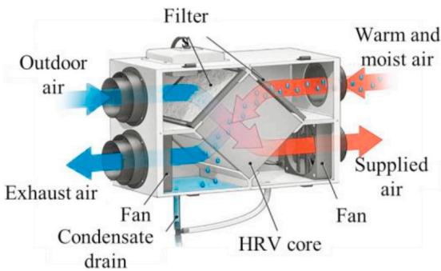  
Fig.6. Heat recovery ventilator [68].

# 2.3. Selection of lighting system

Supplemental lighting is used for daylength control to regulate plant developmental processes. It is used as assimilation lighting to increase crop growth [69]. Supplemental lighting requires additional electrical input, which leads to high costs of environment and finance [70].

# 2.3.1. Transition from HPS lamps to LED lighting

High- pressure sodium (HPS) lamps, as the main lamp type used in the greenhouse, provide supplemental heat in addition to lighting [71]. Light- emitting diodes (LEDs) differ from HPS in that they are better at converting electrical power to light [70] and operate at lower temperatures [72]. The luminous efficacy of HPS has improved, reaching up to  $125\mathrm{lm / W}$ . LED has a higher luminous efficacy range of  $80 - 150\mathrm{lm / W}$  (Table 4). LED lighting is gradually used as a substitute or addition to HPS lamps [73]. LED with consuming less energy has long service life than HPS. The power requirement of HPS is 10- 1000 times higher than LED as shown in Table 4. A transition from HPS lamps to LEDs was predicted to save  $10\% - 25\%$  of total greenhouse energy demand [73]. Kuijpers et al. [74] compared the performance of HPS lighting and LED lighting systems. They found that the use of LED increased  $9\%$  of operational return and resulted in a  $30\%$  decrease in carbon footprint compared to HPS lamps. Another research found that a greenhouse equipped with LED lighting provided an optimal lighting control that up to  $45\%$  of supplemental lighting electricity cost was saved during a year [75]. All these researches show that it is inevitable to replace lighting systems in a greenhouse from HPS to LED. Excess heat from HPS lamps in greenhouses reduced loads on heating systems [73]. Although electricity conversion from PAR in LEDs are more efficient than that in HPS [76], LEDs show disadvantages for greenhouse heating due to little heat emission in winter. It is unclear whether energy saved by LEDs could offset the operating cost of heating system. To address this problem, effects of LED lighting system to heat demand of greenhouse needs to be further explored.

# 2.3.2. Effects of lighting system on greenhouse crops

Plants effectively use renewable energy and soil nutrients in an ecosystem for effective photosynthesis. The addition of light to a natural photoperiod of plants effectively promotes plant growth and annual production benefits in areas with low solar radiation. This effect strongly depends on the spectral composition of lighting source, duration of lighting, and plant species as well [77]. The effect of light spectrums contributes to a great value of crop growth. Zhang et al. [78], using lettuce as a sample, studied the effect of supplementary lighting on crop growth. They proposed that lettuce growth and yield were increased through supplemental light, regardless of light quality. Similar conclusions were obtained by Danilo et al. [79]. Although the effect of light quality on plant growth is not apparent at a low light intensity, the weight of crops significantly increased with the increases in the ratio of red light to blue light. The fresh weight of lettuce leaves was  $48.67\mathrm{g}$

Table 4 Features of HPS and LED.  

<table><tr><td>Lamp type</td><td>Power (W)</td><td>PAR (μmol/J)</td><td>Life span (h)</td><td>Luminous efficacy (lm/W)</td><td>Remarks</td></tr><tr><td>HPS</td><td>35-1000</td><td>1.70–2.1</td><td>10,000–30,000</td><td>80–125</td><td>High luminous efficacies and power requirement</td></tr><tr><td>LED</td><td>0.1–5</td><td>1.66–2.4</td><td>&amp;gt;50,000</td><td>80–150</td><td>High efficiency and long service life</td></tr></table>

when a ratio of red light to blue light is 2.7 under the daily light of 12.60 mol  $\mathrm{m^{- 2}d^{- 1}}$ . This result under the ratio of 2.7 was higher than those under the ratios of 0.9 and 1.8 [80]. The fresh weight of crops treated with red- blue light LED increased more than that treated with red light. The yield of lettuce increased by  $18\% - 26\%$  under monochromatic red LED and  $18\% - 41\%$  under red- blue LED [78]. Blue light stimulated an accumulation of phenolic compounds, affecting the phytonutrient biosynthesis of plants [81]. The photosynthesis of basil under high blue light and low blue light LEDs was  $39\%$  and  $35\%$  higher than HPS [77]. Fig. 7. shows the crop growth rate (CGR) of lettuce grown under different light. The addition of green light to red and blue LEDs (RGB treatment) had the most significant effect on plant growth [82]. When LED arrays were arranged between crops, photosynthetic photon flux density (PPFD) down the vertical profile of the plant canopy was depicted in Fig. 8. Combination of dimmable red and blue LED lighting modules made the vertical irradiance distribution under plant canopy more uniform. The supplemental lighting increased photosynthetic carbon acquisition and conductivity of mesophyll, and enhanced the photosynthesis of leaves and crop growth [83].

Previous studies on supplementary lighting found that specific wavelength lighting had different effects on plant physiology and morphology. Little review investigates the effect of thermal gain of supplemental lighting on greenhouse heating. At the same time, the growth and nutritional value of crops are associated with proportions of the light spectrum. The effective contribution of HPS to heat in winter exceeds  $12.8\%$ . Compared with LED, it is expected to explore further the energy saving of electricity to offset the operating cost of heating systems. As depicted in this section, red light improves light energy utilisation efficiency, and blue light is beneficial for crops accumulation. It has been fully demonstrated that the lighting technology based on LED solution has met the demand for plant light. Additional wavelengths are added to the light program in some developmental stages. LED induces plant growth and development like fertilizer, not just lighting. Even though the exploration of lighting technology promotes crop growth to a certain degree, limitations of crop species and a variety of collected data make it unavailable to be widely used. Research should continue to explore the optimal allocation of the light spectrum to create a friendly light environment for crops.

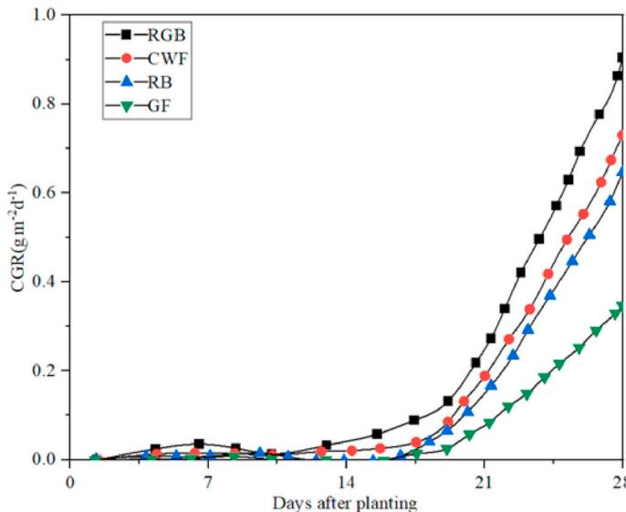  
Fig. 7. Crop growth rate (CGR) of lettuce grown under a different light: red and blue LEDs (RB), red and blue LEDs with green fluorescent lamps (RGB), green fluorescent lamps (GF), and cool-white fluorescent lamps (CWF) [82].

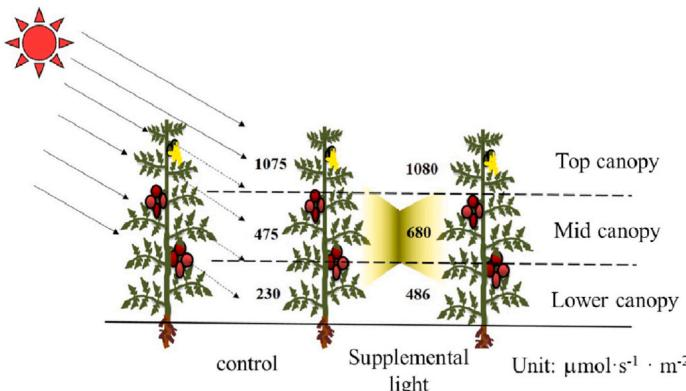  
Fig. 8. Effect of supplemental lighting distribution of photosynthetic photon flux density (PPFD) down the vertical profile of plant canopy [83].

# 2.4. Summative discussion on greenhouse design

It is a challenge to design an energy- saving and economical agricultural greenhouse with robustness and low complexity structure hardware. According to greenhouse shape, orientation, and covering materials, suitable and optimal choices are considered to meet crop types, construction sites and evaluation criteria.

In order to realise the energy- saving design, the greenhouse with uneven E- W direction is recommended to be applied to the single- span greenhouse, and plastic or PC is selected as covering materials. Natural ventilation is the main way in small- scale greenhouses without the input of heating and cooling equipment. The vent is recommended to be arranged at  $0.6 - 0.7$  times the ground height, and the opening angle above  $30^{\circ}$  is recommended. For medium and large- sized greenhouses, it is advisable to adopt an elliptical shape and multi- span greenhouse. The E- W and N- S directions correspond to the greenhouses in the southern hemisphere and the northern hemisphere. The specific azimuth angle is recommended to reference to the model in Ref. [25]. In the northern hemisphere, the azimuth angle gradually shifts to the south with the increase of latitude. Various greenhouse structures and different crop species are investigated to find the optimal choice of covering materials. A transmission rate above  $70\%$  is considered to be accepted. Innovative greenhouse materials allow designers to save thermal and supplemental lighting resources. For the lighting system, the blue light promotes the production of pigments and mineral elements, and the red light induces photosynthesis. No clear indication in existing publication has shown that plants have the optimal ratio of red to blue light.

The external structure, ventilation and lighting system of the greenhouse are briefly analysed to put forward a design reference in this chapter. The next chapter will introduce the utilisation of clean energy in the greenhouse, and the development and innovation of sustainable technologies are integrated from the perspective of energy saving.

# 3. Sustainable energy technology integration in greenhouse

Renewable energy technologies such as solar, wind and geothermal types are clean sources of energy, and their effects on the environment are far lower than those of conventional energy technologies [84]. In the last few years, renewable energies have shown great potential for integration with conventional greenhouse structures [85]. Investigations reported that renewable energies such as solar and geothermal became widely used as environment- friendly solutions [20]. How to make an optimal combination of sustainable technology with a greenhouse to achieve the purpose of energy conservation and environmental protection is the focus of many studies. In this section, the latest technologies and energy- efficient strategies are introduced for the design and eco- friendly retrofitting of sustainable greenhouses, as shown in Fig. 9.

Solar energy and geothermal energy are the two main renewable

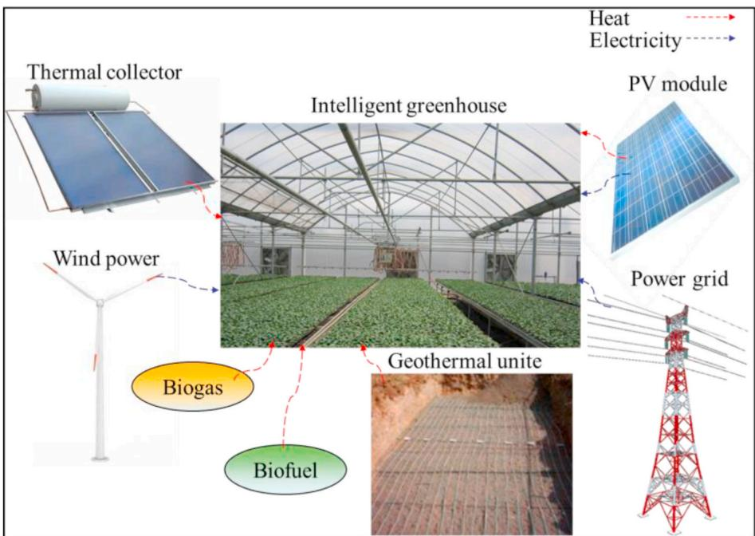  
Fig. 9. Greenhouses combined with various renewable energy technologies.

resources used in the greenhouse. The layout and energy- saving efficiency of various PV modules are introduced. Solar thermal collectors and ground- source heat pump systems are synthetically compared and systematically summarised as shown in Fig. 10. The multi- energy integration systems are discussed to obtain the optimal integration method.

# 3.1. Integration greenhouse with a solar system

Solar energy as the main clean energy has great potential to replace traditional fuels such as coal and oil for reducing environmental and  $\mathrm{CO_2}$  emissions [86]. Solar energy technologies are broadly categorized as solar thermal and PV [85]. PV integrated greenhouse had a great potential to achieve energy- automatic in greenhouses and even energy- positive feeding electricity into grid [87]. Heat stores in collectors for subsequent use in different domestic, residential and industrial applications [88]. Those systems improved the overall thermal performance of the greenhouse and decreased capital and operating costs to a certain extent [89].

# 3.1.1. Photovoltaic module

PV facilitates greenhouse management [90] and provides energy sources during the daytime [91]. PV system was used in a greenhouse to mitigate dependency on fossil fuels and reduce the related environmental impacts [7]. The integration mode of solar PV modules and greenhouses is the same as that of buildings, but the greenhouse has to consider crop photosynthesis [87]. Cladding elements of the greenhouse need a certain degree of transparency, which put forward requirements for arrangement methods of PV [92]. A greenhouse with integrated PV has different energy- saving effects by using different layout methods. Several typical layouts of PV arrays are presented in Fig. 11, i.e., installation on the side of the glass, installation on a roof of plastics, installation on an inner roof with arrangement of straight line or checkerboard formation. PV modules glued on the glass provide a long lifetime. PV modules installed on the inner roof avoid performance degradation in violent weather.

As shown in the research, the Straight- line pattern of the PV array with a tilt angle of about  $25^{\circ}$  produced the maximum electrical energy. This distribution caused uneven solar radiation inside a greenhouse, which showed bad effects on crop growth [93]. Checkerboard arrangement of PV array provided more uniform spatial distribution of long- term radiation than straight- line arrangement because they cast intermittent shadows on fixed positions in greenhouses during one day

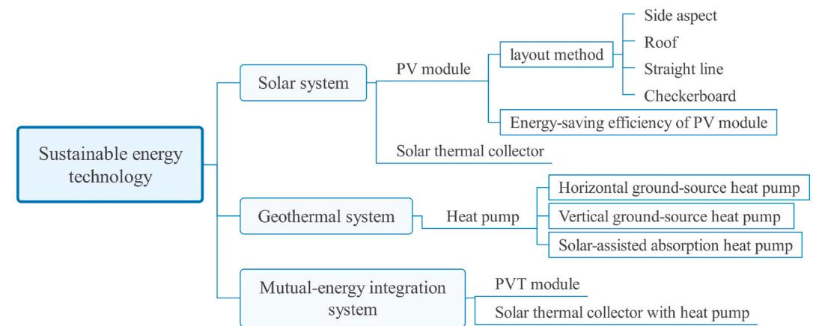  
Fig. 10. Sustainable energy technology in the greenhouse.

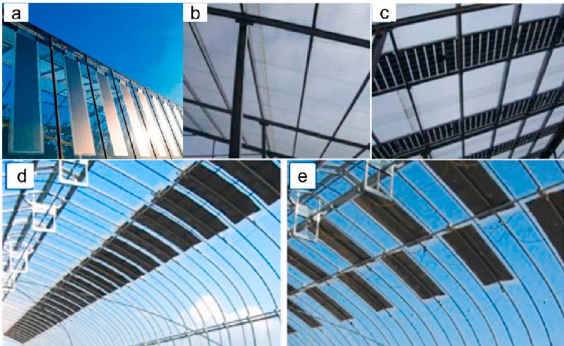  
Fig. 11. Difet plment and arament of PV aray: a) Comercial organic photovota OPV films instaled on the ide of a ghouse [95]; b) Polycarbonate modules (PCM) installed on the top of the greenhouse [96]; (c) Combination of inovative PV modules (IPM) and polycarbonate modules [96]; (d) PV array with a straight-line pattern [94]; (e) PV array with a checkerboard pattern [94].

# [94].

Grid- connected PV systems are the most common types used in greenhouses. Their generated electricity is directly consumed by the greenhouse while excess amounts are injected into the power grid [85]. Advanced PV systems have been proposed to meet the demand for electricity in greenhouses, and the energy- saving effects of these PV modules are summarised in Table 5. For instance, the use of translucent PV (dye- sensitized solar cell, DSC) instead of greenhouse glass enhanced the thermal stability and yield of crops of greenhouse [87]. These PV technologies such as organic, dye- sensitized and perovskite solar cells allow easy integration of PV modules into existing or newly conceived greenhouse structures because of their semi- transparency and flexibility [95]. Semi- transparent organic solar cells (OSCs) have variable spectral absorption characteristics. Low radiation characteristics of OSCs enabled their generated energy almost twice the energy required for heating and cooling loads [97]. In a review by Hassanien et al. [98], a semi- transparent photovoltaic integrated into a greenhouse achieved an efficiency of  $8.25\%$  and the annual generated power electric energy was 637 kWh. PV caused internal shading that increased supplemental lighting electricity by  $43.7\%$  [99]. PV greenhouses improve energy efficiency by considering the offset of heat supply and electricity consumption. In many works, PV modules are fixed on the top or side of the greenhouse. The energy conversion efficiency decreases with the service time. The installation position of PV panels is necessary to consider the illumination and shade of internal crops. Although silicon and concentrating PV modules provide solutions to the internal lighting and space savings by changing the arrangement, the solar irradiance of the greenhouse equipped with silicon and concentrating photovoltaic modules does not meet the demand of crop photosynthesis. Semi- transparent PV modules have higher light transmittance than opaque photovoltaic modules, thus producing a higher electric efficiency range. Semi- transparent PV module has a long service life, and the costs of power generation decrease. Above  $20\%$  energy is saved compared to the traditional PV module. Semi- transparent PV modules are good choices for power generation and energy- efficient greenhouse applications.

# 3.1.2. Solar thermal collector

Heating systems are required to maintain proper greenhouse interior air temperature for plant growth in cold winter. The long- term thermal energy storage approach is an effective way to optimise heating performance in a solar greenhouse [105]. A solar collector is used for greenhouse heating which absorbs solar radiation and generates heat and then transfers heat to the indoor space of greenhouses [106]. In addition, generated heat energy is stored in an energy storage medium for later use at night or cloudy days.

An air- water heat pump system assisted by an evacuated tube collector met  $78\%$  and  $62\%$  of the heat supplies in August and December [98]. Piche et al. [107] presented an innovative thermal energy storage system based on thermal inertia of a rock bed compared to traditional evacuated tube collector. Results showed that  $6.2\% - 10.6\%$  of solar energy was stored inside a greenhouse. Thermal energy storage (TES) units as crucial components for securing energy supply increased thermal performance of solar greenhouses by  $29\%$  [85]. The proposed heat collection systems contribute to thermal efficiency with problems of complicated installation and high costs. To solve these problems, the water circulation system of the steel pipe network was designed for heat collection and release [108]. Average thermal storage and release capacities were  $149\mathrm{MJ}$  and  $78.9\mathrm{MJ}$ . This system has advantages of low cost and easy maintenance, but the energy efficiency is still insufficient. An improvement of the previous system was developed by Xu et al. [109]. They proposed a water- circulating solar heat collection and release system with an indoor collector constructed of hollow polycarbonate sheets, as depicted in Fig. 12. The collector also functioned as a heating radiator during nighttime, thereby saving capital investment and simplifying system structure. The daily average heat collection ratio was  $72.1\%$ , which exceeded that of other systems of the same type. The PCM plate collector system means a plate heat exchanger with embedded PCM plate. Four rectangular containers with PCM were used inside the collector. Compared with the previous evacuated tube collector, the PCM plate collector reduced the gas consumption by  $23.7\%$ , which was higher than the direct utilisation of stored heat [110]. Table 6 lists information of greenhouses with solar thermal collectors.

# 3.2. Integration greenhouse with a geothermal system

The major energy demand of greenhouses is thermal energy [110]. Geothermal energy as a clean energy is widely applied to greenhouses. Geothermal heat pumps have lower operational costs and higher coefficient of performance compared to conventional heat pumps [111]. Benli [112] made a comparison between a horizontal ground- source heat pump system and a vertical ground- source heat pump system.

Table 5 Energy-saving efficiency achieved by PV modules in greenhouse.  

<table><tr><td>Reference</td><td>PV module</td><td>Area</td><td>Installation type</td><td>Energy-saving efficiency</td></tr><tr><td>Ravishankar et al. [97]</td><td>Semi-transparent organic photovoltaic</td><td>Phoenix, AZ, Raleigh, NC, and Antigo, WI in the US</td><td>Roof-type</td><td>Heating load reduction of a greenhouse with Organic Solar Cells (OSC) addition ranged from 54% in AZ, 46% in NC, and 32% in WI.</td></tr><tr><td>Hassanien et al. [98]</td><td>Semi-transparent photovoltaic</td><td>Kunming, China Longitude 102.68°E and latitude (25.07°N)</td><td>Roof-type</td><td>Annual generated electric energy of building-integrated photovoltaics (BIPV) at per unit area of the greenhouse was ranged from 24.5 kWh/m2to 47.5 kWh/m2.</td></tr><tr><td>Bambara and Athienitis [99]</td><td>Semi-transparent photovoltaic</td><td>Ottawa, Ontario, Canada (45.4°N)</td><td>Roof-type</td><td>Semi-transparent photovoltaic (STPV) generate between 19.8 kWh m−2y−1 and 98.1 kWh m−2y−1 of solar electricity. Covering 20% greenhouse roof of glass-PV contributed to its energy demands. Mean daily power conversion efficiency was about 0.8%.</td></tr><tr><td>Kavga et al. [100]</td><td>Polycrystalline silicon (PC-Si) PV</td><td>western Greece</td><td>-</td><td>Covering 20% greenhouse roof of glass-PV contributed to its energy demands. Mean daily power conversion efficiency was about 0.8%.</td></tr><tr><td>Peretz et al. [101]</td><td>Semi-transparent, flexible OPV module</td><td>-</td><td>-</td><td>Covering 22% of OPV panels achieved an efficiency of 2.1%.</td></tr><tr><td>Zisis et al. [102]</td><td>Semi-transparent OPV</td><td>Thermi, Thessaloniki, Greece</td><td>Roof-type</td><td>Annual photovoltaics electricity generation was about 21,510.4 kWh. Covering about 20% of the surface with PV panels achieved a Net Energy Ratio up from 0.8 to 1.7.</td></tr><tr><td>Yildirim and Bilir [103]</td><td>Silicone PV</td><td>-</td><td>Roof-type</td><td>Roof-type</td></tr><tr><td>Barbera et al. [104]</td><td>Mono-crystalline silicon PV</td><td></td><td>Roof-type</td><td>Roof-type</td></tr></table>

Fig. 13 presents a schematic diagram of horizontal and vertical ground- source heat pump systems. Pebbles were used to enhance heat transfer because the horizontal paving of ground- source heat pumps was affected seasonality, and the heat transfer coefficient increased from 1.7 W/mK to 1.75 W/mK. The average heat gain per meter of the pipeline was 0.00328 kW/m. In contrast, the operating efficiency of the vertical heat pump is higher than that of the horizontal one. Results showed that the COP values of horizontal and vertical ground- source heat pumps were 3.3 and 3.5, but the vertical heat pump had higher initial investment cost than the horizontal heat pump. Ground coupled heat pump (GCHP) made a great contribution to energy saving that up to 50.1 kWh/m2 was saved, which was relatively reduced energy by nearly 21% compared to a traditional air conditioning system [113]. The solar- assisted heat pump (SAHP) was investigated extensively for its high efficiency and wide applicability. The SAHP provides a solution to the continuous heating operation of the absorption heat pump with a stable low- temperature heat source. An absorption heat pump equipped with solar collectors increased the system heating supply by about 20% and reduced the energy cost by about 40% [114]. Besagni et al. [115] presented a novel solar- assisted dual- source multifunctional heat pump. The proposed system was allowed to keep high efficiency in different seasons that 15.4% lower daily- averaged energy consumption was achieved on average compared to an air- to- water heat pump. Another research developed a water- to- water heat pump system combined with a solar collector. The system consisted of a flat solar collector, a water tank and a water- to- water heat pump. A controller was equipped between the inlet and outlet pipes of the water tank to control the water flow as depicted in Fig. 14. The proposed SAHP system provided a better heating capacity than GCHP, and its coefficient of performance (COP) value was 3.2. This system had the advantages of maintaining a stable temperature and extending the lifetime of the heat pump that was resulting in an electrical energy- saving of more than 18% [116]. Geothermal heat pump is widely used in greenhouse because of its low cost, low payback period, and high COP range, which is very competitive compared to traditional heating. Table 7 reviews main findings based on comparisons of different heat pumps. The combination of solar energy with geothermal energy has advantages on the performance of greenhouse heating and energy efficiency that it is recommended to be widely used in greenhouses.

# 3.3. Intercoordination of energy systems

Integrated systems in a greenhouse are essential for greenhouse climate conditions. Various renewable energy technologies have been applied in greenhouses to reduce energy consumption and save operation costs. Among solar energy technologies, hybrid photovoltaic thermal (PVT) modules are the most efficient energy conversion systems [117]. PVT modules provide sufficient electricity and heat for the greenhouse at the same time, which reduces the payback period of investment. The integration components convert heat to electricity at an efficiency of around 15%- 20%, while the surplus is used to store in batteries. Based on a comparison of PVT and PVT modules, it was found that their electrical efficiency was similar, but PVT provided approximately 63% of the heat demand from the energy storage tank [115]. Heat pump modules as heating and cooling systems in a greenhouse provide great potential to reduce heat consumption. The heat extracted from the soil by the heat pump was about 75% of the seasonal heat storage from the solar energy [1]. The thermal performance of solar collectors in winter is higher than heat pumps, and above 62% of heating energy was provided by solar thermal collectors. Solar- geothermal energy coupled systems are considered a promising choice for greenhouse cooling and heating. The COP values of solar- assisted heat pumps increase with the increase in temperature, ranging from 3.1 to 4.9. Above 18% power consumption is saved by reducing the start- up and stop time and stop time of the heat pump.

Despite numerous benefits that are attributed to renewable

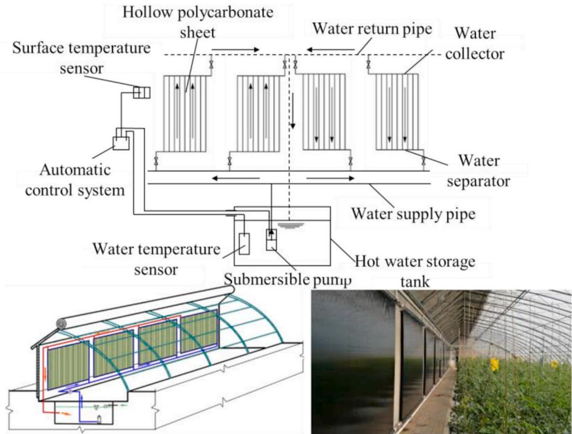  
Fig. 12. Schematic of the water-circulating solar heat collection and release system with an indoor hollow polycarbonate sheet-constructed collector [109]

Table 6 Energy-saving efficiency of greenhouses integrated with solar thermal collectors.  

<table><tr><td>Reference</td><td>Collectors</td><td>Location</td><td>Remarks</td></tr><tr><td>Hassanien et al. [98]</td><td>Evacuated tube collector</td><td>Kunming, China</td><td>Thermal efficiency and the payback period were 0.45 and 4.1 years.</td></tr><tr><td>Lazaar et al. [106]</td><td>Evacuated tube collector</td><td>Tunisia, North Africa</td><td>Average energy efficiency of the evacuated tube solar heater was 46%, and it allowed 4℃ increase in inside air temperature.</td></tr><tr><td>Piché et al. [107]</td><td>Evacuated tube collector</td><td>Quebec, Canada</td><td>6.2%-10.6% of the solar energy was stored inside the greenhouse during the beginning of the growing season.</td></tr><tr><td>Xu et al. [109]</td><td>Evacuated tube collector with hollow polycarbonate sheets</td><td>Beijing, China</td><td>Average heat collection ratio was 72.1%, higher than that of other solar heat collection and release systems.</td></tr><tr><td>Yan et al. [110]</td><td>PCM plate collector</td><td>Isfahan, Iran</td><td>Preheating the heater air reduces by 23.7% gas consumption.</td></tr></table>

technologies integrated with greenhouses, the combination forms of interior greenhouse components are determined according to the construction scale and locations of a specific greenhouse to achieve an optimal energy solution.

# 4. Control strategy of modern sustainable greenhouses

Greenhouse control can significantly affect environmental conditions and microclimate variables inside greenhouses [118]. The greenhouse environment is critical for crop quality and yield. Good control strategies make a greenhouse integrated energy system operate harmoniously that reduce energy consumption, operation cost and carbon emission, and realise cleaner production [119]. The Control system consists of sensors, controllers, and corresponding actuators. A control process is to collect data of greenhouse environment and crop growth and transfer control laws to reaction sectors [120]. It is crucial for control strategies to coordinate relationships between departments and realise energy- efficient operations in greenhouses.

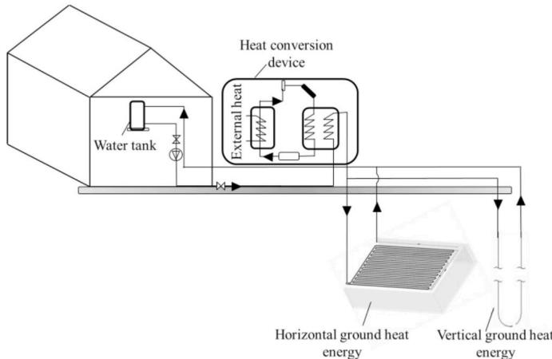  
Fig. 13. Schematic diagram of horizontal and vertical ground-source heat pump systems [112].

This chapter introduces control strategy from three aspects: hardware, software and theoretical performance as shown in Fig. 15. The basic loop of the control process consists of sensors, transmission equipment, and a controller with control algorithms. The control theory plays a significant role in the greenhouse for achieving energy- saving control.

# 4.1. Greenhouse monitoring system

A monitoring system is a system of devices that monitors environmental parameters of greenhouses through perception, communication and transmission with each other [121]. Greenhouses with sensors and communication technologies measure and transmit inner climate information to controllers and adjust it to a suitable environmental

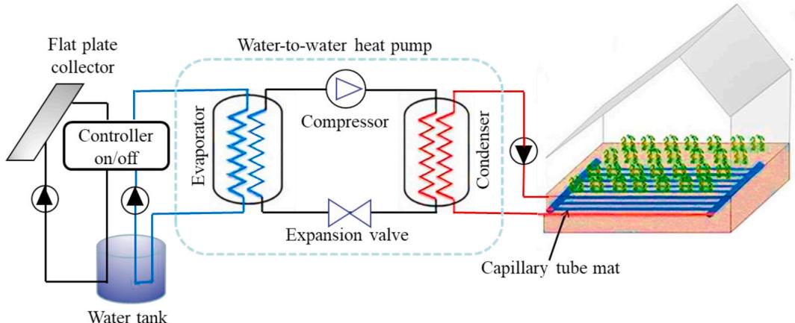  
Fig. 14. Schematic diagram of a water-to-water heat pump system combined with a solar collector [116].

Table 7 Comparison of various heat pumps used for greenhouses.  

<table><tr><td>Reference</td><td>Types of heat pump</td><td>Location</td><td>Remarks</td></tr><tr><td>Benli [112]</td><td>Horizontal and vertical ground-source heat pump</td><td>Elazig, Turkey</td><td>COP values for horizontal and vertical ground-source heat pumps were 3.3 and 3.5.</td></tr><tr><td>Chahidi et al. [113]</td><td>Ground coupled heat pump</td><td>Albenga, Italy</td><td>Ground coupled heat pump saved around 21% of the energy.</td></tr><tr><td>Reda et al. [114]</td><td>solar-assisted absorption heat pump</td><td>Finland, Nordic</td><td>COP of solar-assisted heat pump was 3.38. The heating proportion increased by 20%.</td></tr><tr><td>Besagni et al. [115]</td><td>Solar-assisted dual-source multifunctional heat pump</td><td>Milan, Italy</td><td>Average daily energy consumption was reduced by 15.4% compared to a conventional air-water heat pump.</td></tr><tr><td>Agrebi et al. [116]</td><td>Ground coupled and solar-assisted heat pump</td><td>Tunisia</td><td>COP values of the ground-coupled and solar-assisted heat pump systems were 2.8 and 3.2.</td></tr></table>

condition for crop growth [122]. Reasonable measurement and transmission are essential to ensure greenhouse regulation and timely adjustment. A Diagram of a monitoring system of greenhouses is depicted in Fig. 16.

# 4.1.1. Layout of sensors

A proper location of sensors provides accurate inner information for greenhouses [123]. Microclimate characters in greenhouses are the main factor of sensor layout [124]. Methods of irrigation and fertilization also need to be taken into account [121]. All these factors will eventually affect the performance of sensors as time goes on. Sensor layouts are broadly categorized as horizontal layout, vertical layout and hybrid layout. Conventional systems usually adopt random or grid layout of sensors in greenhouses which cause waste of sensors [125]. The normalisation of sensor layout is an effective way to improve measurement accuracy and reduce the number of sensors. Lopez- Martinez et al. [126] studied the effects of measurement stations with a grid at different locations and heights on climatic data. They manufactured 13 measurement stations and set them in three different heights to collect climate data in a greenhouse. The result indicated that mesh- like network topology provided an advantage when plant growth reduced the radio transmissibility of some areas in the studied environment. Lee et al. [127] presented two methods: error- based sensor placement and entropy- based sensor placement to select the optimal sensor placement. Nine locations were selected to measure air temperature data. The optimal sensor location was areas with significant air temperature variations, such as the windward side. The proposed methods only took temperature as evaluated data. Optimal sensor layout needs to take other environmental factors (crops height, external climate and internal irrigation and fertilization) into account. Hybrid of both horizontal and vertical layouts also proved to be promising methods in the monitoring of greenhouse as their comprehensive measurement of required data [128]. Sensors need to be placed vertically downward for the measurement of soil pH value and nutrient concentration. Since  $\mathrm{CO_2}$  density is heavier than air, the  $\mathrm{CO_2}$  sensor is more effective below the crop canopy. Hight of light sensors is incremented as the crop grows to prevent being obscured. Comprehensive measurement requires more sensors which could be over deployed. Moving nodes provide a

  
Fig. 15. Layout of the control strategy.

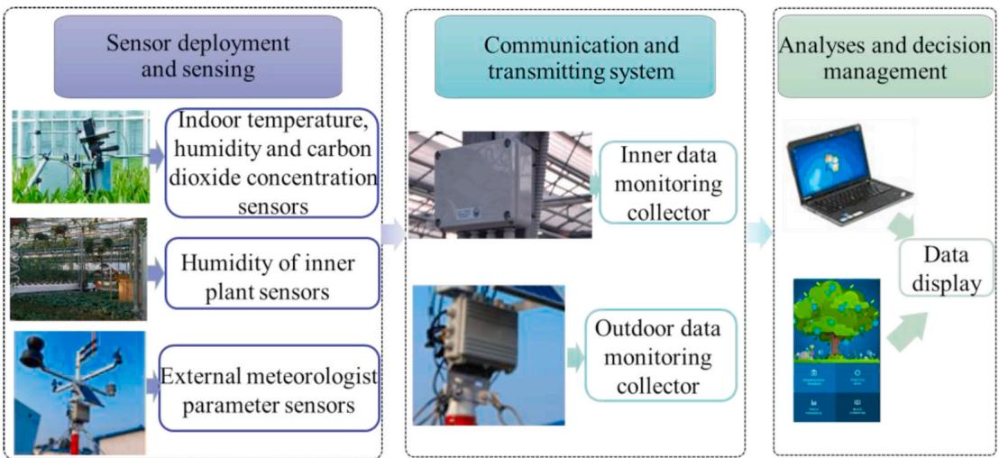  
Fig. 16. Diagram of a monitoring system.

solution, but it is constrained by the movement path. It is still worth learning to reduce the use of sensors and obtain the optimal layout on the premise of ensuring accurate measurement.

# 4.1.2. Performance comparison of wireless communication technologies

Communication systems are divided into the wireless transmission and wired transmission. Wireless transmission networks (WSNs) are flexible and expandable that hybrid wired- wireless or entirely wireless communication technologies are widely used in greenhouses to effectively communicate data for improving greenhouse environmental conditions [129], as summarised in Table 8. ZigBee, Wireless Fidelity (WiFi), and Bluetooth Low Energy (BLE) are wireless network protocols for short- distance transmission. They are the most common technologies used in the greenhouse. ZigBee is widely used in greenhouse environmental management due to its low energy consumption and low cost. It is based on IEEE 802.15.4 standard [130] and supports 65,000 devices in a network [131]. Communication technology with a high data rate has high power consumption [121]. WiFi provides a speed of 2- 54 Mbps but consumes more power than any other device. 3G/4G is also called a mobile network. It has been widely used in rural areas, but its high operating cost and high energy consumption make it at a disadvantage compared with other solutions. SigFox, Long Range Radio (LoRa), Narrow Band Internet of Things (NB- IoT) are long- range radio communication modules, which transmit in a range from  $15\mathrm{km}$  to 40 km. These networks are called Low Power Wide Area Networks (LPWANs) as they consume low energy and transmit over a long distance. SigFox transmit data at the longest distance but at a low data rate. LoRa is at a data rate of up to 50 kbps and handles thousands of nodes [132]. NB- IoT operates at a higher distance up to  $35~\mathrm{km}$ , higher data rate, lower latency and reliability compared with other networks [133]. The difference between XStream and NB- IoT is operating frequency and network size. XStream supports cloud- based services and operates in peer to peer communication mode [134]. NB- IoT and 5G are expected to extend in greenhouses that will offer low latency, reliability, and high bandwidth. 6Gs, facilitated by COVID- 19 pandemic needs, are going to bring even further step forward [135].

Wireless sensor networks provide great potential for greenhouse data collection, transmission, data processing, and storage techniques, which shows high requirement on hardware devices such as sensors and actuators. Few studies were involved in developing the sensor grid framework with separate systems, such as sensor network and grid computing layer. In order to build the complete system framework, the integration of each module achieves good interactivity, from sensor- based data collection to network- based data transmission. Finally, real- time decision- making is conducted based on application programs.

# 4.2. Controller and control algorithm in greenhouse

Greenhouse climate is a non- linear and multi- variables sector that provides an enormous challenge for greenhouse control methods [136]. A greenhouse control system needs the support of control algorithms that provide a complete framework to develop holistic systems for decision support and actuation [118]. Different control algorithms have been developed and explored in the past years for designing the control system to reduce energy consumption in greenhouses [137]. The following section discusses these control algorithms and their performance.

# 4.2.1. Application of control algorithm in greenhouses

Control algorithms have been widely used in the control of greenhouse systems such as proportional- integral- derivative (PID) control, model predictive control (MPC), robust control, fuzzy logic control (FLC), neural network (NN), optimal control and hybrid control. These control algorithms have their advantages and disadvantages to be used for greenhouse management. Fig. 17 demonstrates control algorithms used in the control of greenhouse. Proper control algorithms achieve low energy consumption of greenhouse on the promise of a stable and accurate greenhouse climate.

PID control was widely used in process control of greenhouse due to its simple algorithm and high reliability [138]. Typical PID control is a linear control process that is not satisfied with complex environmental change [139]. Optimised PID controllers are used to adjust the nonlinearity and time variability of the greenhouse [140]. Su et al. [141] presented a parameter self- tuning PID control approach that improved

Table 8 Performance of greenhouses communication technologies.  

<table><tr><td></td><td>ZigBee</td><td>XStream</td><td>SigFox</td><td>WiFi</td><td>NB-IoT</td><td>3G/4G</td><td>BLE</td><td>LoRa</td></tr><tr><td>Frequency band</td><td>868/915 MHz 2.4 GHz</td><td>2.4 GHz</td><td>433/868/915 MHz</td><td>2.4 GHz</td><td>-</td><td>865 MHz 2.4 GHz</td><td>2.4 GHz</td><td>433/868 MHz</td></tr><tr><td>Range</td><td>20 m</td><td>5-16 km</td><td>40 km</td><td>20-100 m</td><td>15 km</td><td>Cellular Coverage</td><td>100 m</td><td>20 km</td></tr><tr><td>Data rate</td><td>20-250 kbps</td><td>10-20 kbps</td><td>100 bps</td><td>1.3 Gbps</td><td>250 kbps</td><td>1 Gbps</td><td>2 Mbps</td><td>50 kbps</td></tr><tr><td>Power consumption</td><td>Low</td><td>Low</td><td>Low</td><td>High</td><td>Low</td><td>Medium</td><td>Low</td><td>Low</td></tr></table>

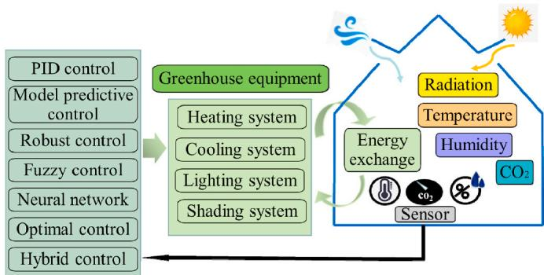  
Fig. 17. Classification of the control algorithm.

the reliability of controllers, which ensured desired control performance. It was used for many complex control systems such as water and fertilizer irrigation control, although convergence of closed- loop systems largely depended on Levenberg- Marquart optimisation algorithm.

Modern control has better performance in handling non- linear, multiple input and output (MIMO) systems than PID control, but it requires the support of mathematical models. Such control algorithms include MPC, adaptive and robust control. MPC achieved highly accurate control operations [142]. It handled problems of inverse response and time delays in non- linear and dynamic systems [143]. Robust control needs to presuppose process uncertainty of nonlinear and time- varying processes in advance compared with MPC. Chen and You [144] presented a data- driven robust model predictive control that enhanced control precision while its effectiveness depended strongly on the accuracy of a mathematical model. Adaptive control as a special control method automatically compensated for unpredictable changes in model order, parameters and input signals [145]. The ability to handle unknown model uncertainties is the difference between adaptive control and linear control algorithms [146].

Intelligent algorithms independently use the artificial intelligent approach to achieve control objectives without human intervention. Examples of such algorithms are FLC, NN and optimal control. An obstacle for the usage of these algorithms is that they require large data sets for model training. FLC is an intelligent control method that imitates human's behaviour of fuzzy reasoning and decision- making process [147]. Marquez- Vera et al. [148] employed a fuzzy model to regulate greenhouse temperature. The fuzzy model can better adjust greenhouse temperature than fuzzy PI control, but dynamic regulation performance is not well represented when control actions are mutually exclusive. Neural network algorithms are some complex forms of control that their reasoning is based on logical rules. They keep working even if some crucial variables are missed, yet they have a long training time and require large parameters.

Hybrid control is a control method that combines two or more traditional or intelligent control algorithms. Many researchers presented hybrid control methods to achieve accurate control of the complex climate in greenhouses and make full use of the advantages of each control strategy [137]. Advanced control methods were combined with others to achieve control requirements of the environment and crop growth, which showed better response speed, accuracy, robustness and disturbance handling [149]. They also display inherent limitations of each component method [118].

By reviewing the literature in recent five years, it has been found that the most popular control method applied in greenhouses has been predictive model control (MPC). Neural network (NN) and optimal control have also been extensively applied in greenhouses. Control algorithms have shown promising results on accurate control performance. Recent studies look to improve upon their shortcomings to achieve a fully intelligent mode of greenhouse [150]. It has been rapid development in the control and management of greenhouses climatic parameters such as temperature, humidity,  $\mathrm{CO_2}$  levels and illumination with leaps of computational technology. Further research remains to be validated and tested under real scenarios.

# 4.2.2. Comparison of control performances

Control performance mainly includes response time, robustness, sensitivity, adaptability, smoothness and convergence, etc. The control performance determines the energy efficiency level, which provides great potential to achieve nearly net- zero energy greenhouse. Control performance for the control method applied in greenhouses is demonstrated in Table 9. Some noteworthy points are as follows. Castaneda- Miranda et al. [151] developed a forecasting Artificial neural network (ANN) method to control a sprinkler system and protect it from internal freezing. The presented method has high accuracy control performance which contributes to being used for frost forecasting of greenhouse irrigation. A hybrid predictive controller had high sensitivity and adaptivity, which provided an optimal trade- off between performance and operation costs [149]. Atia and El- madany [152] compared the performance of proportion integration control, FLC, ANN and adaptive neuro- fuzzy control to adjust greenhouse target temperature. Results proved that adaptive neuro- fuzzy controller has a fast response time and good stability. Deep neural networks have great potential to manage temperature, humidity, and  $\mathrm{CO_2}$  in greenhouses. Recurrent neural networks- long short- term memory had the highest overall accuracy compared to ANN and Nonlinear autoregressive exogenous model [153]. The combination of multiple control methods is a promising choice to improve control performance. Especially use of NN combined with other control algorithms is a suitable approach to solve nonlinear control problem and has a good control accuracy.

# 4.3. Energy-saving efficiency of control strategy

Greenhouse control requires good control performance and low energy consumption while keeping the stable climate conditions of a greenhouse. Researchers have put forward various control strategies to manage greenhouse parameters to achieve this goal. Xiao et al. [162] developed a fuzzy active disturbance rejection controller. Control strategies adopted with the presented fuzzy controller achieved rapid, constant temperature and energy- saving for greenhouses. This method achieved lower energy use by  $15\%$  while effectively controlling greenhouse temperature. An improved fuzzy logic- based control system achieved  $22\%$  in energy and  $33\%$  in water savings on the promise of keeping suitable temperature and humidity of greenhouse [125]. A proposed hybrid control theory aims to improve the energy efficiency of a greenhouse that saved  $9\%$  of energy cost in cold weather [163]. Mahmood et al. [11] presented a data- driven MPC to assess energy consumption for semi- closed greenhouses. The MPC approach had better performance than the adaptive control system, with an energy reduction of  $7.70\%$  for winter and  $16.57\%$  for the summer season. Another MPC- based energy management framework was proposed to effectively control clustered microgrids operation, which achieved a near net- zero energy consumption [150]. Advanced control strategies play a key role in the energy conservation of greenhouses. Future work is recommended to concentrate on the balance between energy conservation and high control accuracy of the greenhouses system.

# 5. Life cycle assessment of greenhouse and minimization environmental footprints

Energy and the environment are highly interconnected in an agricultural system. The balance among resources, crops and environment is crucial to achieving the goals of maximum energy utilisation, increasing crop yield, minimum water footprint and carbon emissions and especially Greenhouse gas (GHG) footprints [164]. Life cycle assessment (LCA) is an important environmental management tool for strategies and decision- making in fields of sustainable development, and it is also

Table 9 Comparison of control performance for controllers in greenhouses.  

<table><tr><td>Ref.</td><td>Types of control</td><td>Control object</td><td>Control performance</td><td>Result</td></tr><tr><td>Kuijpers et al. [74]</td><td>Optimal control</td><td>Lighting system</td><td>Convergent uncertainty</td><td>Achieved a 10% increase in operational return</td></tr><tr><td>Wang [131]</td><td>PID control</td><td>An error of data acquisition system</td><td>Fast responses time and smoothness</td><td>Ensuring the stability of the whole data acquisition system.</td></tr><tr><td>Su et al. [141]</td><td>Self-turning PID control</td><td>Greenhouse climate</td><td>High reliability and robustness, but convergent uncertainty</td><td>Had good applicability and generality.</td></tr><tr><td>Montoya et al. [149]</td><td>Hybrid control</td><td>Greenhouse temperature</td><td>High sensitivity</td><td>Provided good performance</td></tr><tr><td>Castaneda-Miranda et al. [151]</td><td>Neuro - fuzzy control</td><td>Anti - frost irrigation</td><td>Long response time</td><td>Provided a potential to prevent frost.</td></tr><tr><td>Atia et al. [152]</td><td>Adaptive neuro-fuzzy control</td><td>Greenhouse temperature</td><td>High reliability and fast response time</td><td>Achieved accurate control of greenhouse temperature.</td></tr><tr><td>Alpay and Erdem [154]</td><td>Fuzzy logic control</td><td>Energy and yield</td><td>High reliability</td><td>Saved approximately 25% of heat energy.</td></tr><tr><td>Ali et al. [155]</td><td>Fuzzy logic control</td><td>Wind power</td><td>High reliability</td><td>Reduced energy consumption.</td></tr><tr><td>Benyezza et al. [156]</td><td>Fuzzy logic control</td><td>Irrigation</td><td>High adaptivity</td><td>Achieved low water and energy consumption.</td></tr><tr><td>Selmani et al. [157]</td><td>Adaptive fuzzy logic control</td><td>Solar-Powered Irrigation</td><td>Long response time</td><td>Provided a mechanism to identify irrigation problem.</td></tr><tr><td>Gil et al. [158]</td><td>Distributed model predictive control</td><td>Thermal efficiency</td><td>Good convergence</td><td>Achieved low thermal energy consumption.</td></tr><tr><td>Ouammi [159]</td><td>Model predictive control</td><td>Cluster microgrid</td><td>Fast responses time</td><td>Ensured power supply without any support of the main grid.</td></tr><tr><td>Kuijpers et al. [160]</td><td>Receding horizon optimal control</td><td>Yield and price</td><td>Low sensitivity of the performance with respect to forecast error</td><td>Provided a valid assumption for price forecast.</td></tr><tr><td>Xu et al. [161]</td><td>Time-scale receding horizon optimal control</td><td>Greenhouse climate</td><td>Convergent uncertainty</td><td>A 55% increase in profit and a 518% increase in crop harvest.</td></tr></table>

an effective method to quantify the environmental footprints of an agricultural greenhouse production system. LCA includes four major phases: goal and scope definition, inventory analysis, impact assessment and interpretation [165]. Life cycle refers to the whole process of a product (or service) from obtaining raw materials, production, use to waste (from the cradle to the grave) [166]. LCA of greenhouse crops production needs to consider inputs and outputs of greenhouse such as the inputs of energy and fertilizer as well as outputs of crop biomass or wastewater. Boundaries of systems must clearly be defined to achieve a sharper understanding of LCA aims. The whole system boundary mainly includes activities such as the construction of greenhouses, interior climate control, pest management, fertilization [167], irrigation [168], harvesting, crops packaging, distribution, storage [169], waste management [170], and market etc. as presented in Fig. 18.

Energy consumption and environmental impact for greenhouse construction and operation are investigated using life cycle assessment and environmental footprint analysis. This chapter introduces the greenhouse from life cycle assessment, investment and operation costs, water footprint, and carbon footprint. The purpose is to fully understand the loss in the whole process of greenhouse construction and operation and to provide a reference for future design. Fig. 19 shows a diagram of life cycle assessment and environmental footprints analyses of the greenhouse.

# 5.1. Life cycle environmental impacts analysis of greenhouses

Greenhouse production requires many inputs: infrastructure inputs (greenhouse construction, equipment inputs), energy input (electricity, heat, water, fertilizer, etc.), and then crops packaging and transportation. The whole input process has different degrees of impact on the environment. The main environmental impact categories include abiotic depletion, acidification, eutrophication, global warming, ozone layer depletion, human toxicity, freshwater aquatic eco- toxicity, marine aquatic eco- toxicity, terrestrial eco- toxicity and photochemical oxidation potential, etc. as shown in Fig. 20.

The infrastructure stage had the largest burden for most impact categories [167]. For example, greenhouse structure has a great impact on abiotic depletion elements, which was mainly due to the vast amount of steel and polyethylene used in the greenhouse frame and covering [171]. The greenhouse structure accounted for  $70\%$  non- biological consumption elements. The fertilizer was the main stage that affected non- consumable fossil fuels, acidification, eutrophication, and global warming in the hydroponic tomato greenhouse [172]. Table 10 shows the environmental impact of different stages of a hydroponic greenhouse. LED lighting system and HPS lighting system caused environmental effects of  $96\%$  in HPS and  $87\%$  in LED for an operation of  $30~\mathrm{y}$  [173]. Greenhouse heating and high electricity consumption equipment are considered environmental impact hotspots [174]. For example, tomatoes produced in greenhouses had more environmental impacts than open- field production, mainly due to the natural gas consumed in heating systems and the large demand for diesel fuel [175]. In the process of greenhouses construction and production, some green building materials, low energy consumption devices and renewable energy technology facilities should be selected to reduce environmental impact. The application of photovoltaic panels has been able to improve all environmental energy indices of greenhouse production to move toward higher sustainability [176]. The environmental impact of a ground source heat pump system is smaller than that of traditional heating and cooling system. Ground source heat pump system can be economic and relatively environment friendly in areas where the price (and also the GHG content) of electricity was lower than that of fossil fuels [177]. Integration of greenhouse with buildings and various farms is also an effective measure to reduce the environmental impact. Integrating greenhouse with buildings and various farms is also an effective measure to reduce the environmental impact. Integration of a dairy farm and a greenhouse into an eco- industrial system achieved more than  $40\%$  reduction of environmental impact categories such as non- renewable energy consumption, climate change impact, acidification, respiratory effects from organic emissions, and human toxicity [178]. The building- integrated greenhouse is expected to improve the sustainability of a greenhouse and reduce building materials through mutual compensation. The environmental impact is reduced by  $24.1\%$ . LCA evaluates the environmental burden of greenhouse life cycle structure, materials, and energy. the source materials of infrastructure, component replacement after construction and operation are often neglected in previous studies due to the complexity of evaluation data in greenhouse

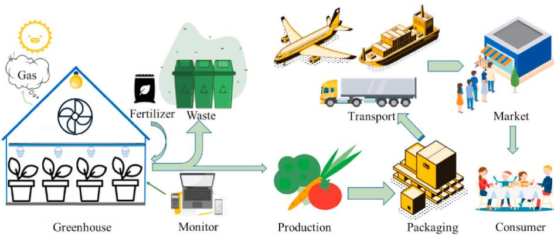  
Fig. 18. The whole life cycle process of greenhouse production from planting to users.

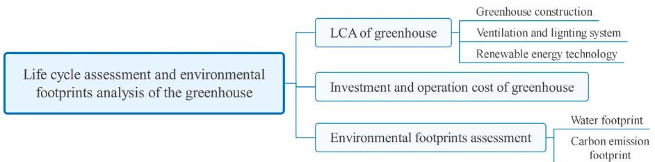  
Fig. 19. Diagram of life cycle assessment and environmental footprints analyses of the greenhouse.

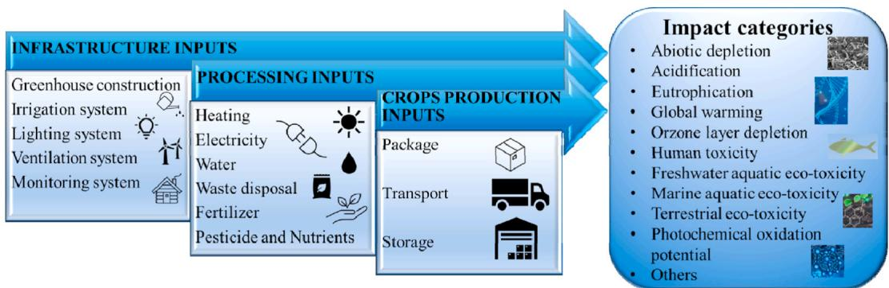  
Fig. 20. Effect of inputs in the whole process of greenhouse production on environmental factors.

Table 10 Environmental impacts of different stages in a hydroponic tomato greenhouse (based on total environmental impact) [172]  

<table><tr><td>Different stages</td><td>Abiotic depletion elements (%)</td><td>Abiotic depletion fossil fuels (%)</td><td>Acidification (%)</td><td>Eutrophication (%)</td><td>Global warming (%)</td></tr><tr><td>Greenhouse structure</td><td>70</td><td>22–27</td><td>13–15</td><td>19–22</td><td>19–22</td></tr><tr><td>Production and management of fertilizers</td><td>23</td><td>28–32</td><td>41–48</td><td>47–52</td><td>38–43</td></tr><tr><td>Irrigation system</td><td>0</td><td>15–28</td><td>15–28</td><td>10–20</td><td>13–24</td></tr><tr><td>Field operation</td><td>0</td><td>18–21</td><td>15–18</td><td>11–12</td><td>17–19</td></tr></table>

production. The limitation of system boundary in the study hinders the accuracy of greenhouse environmental assessment. More factors are recommended to be comprehensively considered in the evaluation list, such as the input of auxiliary equipment and component replacement.

# 5.2. Environmental footprints based life cycle analysis of investment and operation cost of greenhouses

Investment and operation cost is an important factor of greenhouse construction. For the economic feasibility of a greenhouse system, a short investment payback period is favourable. The investment payback period of a greenhouse heat exchanger or heat recovery devices transformed with phase change materials was about three to four months [179]. Installation of a new heating or cooling devices took about six years to achieve the expected investment cost [180]. Life cycle cost (LCC) analysis provides a better assessment of the long- term cost- effectiveness of greenhouse rather than focusing on initial investment or short- term operating cost [99]. It was found that the life cycle cost of a photovoltaic roof greenhouse would be reduced by nearly  $23\%$  in future forecast research, although it did not have an economic advantage in 2019 [99]. Recent research of Zhen et al. [181] analysed life cycle costing and profitability of organic agriculture and community- supported agriculture farms of greenhouse vegetable production. The result showed that all these farms got good profit from

greenhouse production and indicated better economic performance. For the sustainable design of greenhouse, designers and engineers need to consider both economic aspects and potential environmental impacts while developing advanced technologies. Integration of techno- economic analysis and LCA provides a tool for the systematic analysis of the technical, economic, and environmental performance of greenhouses [182]. Eco- efficiency is also a good indicator in terms of both economy and environmental impacts [181]. It has been expected to further analyse and study sustainable greenhouse and its various integrated systems from aspects of the economy and environmental impact to provide benchmarking for the design and transformation for modernization and intelligence of greenhouse.

# 5.3. Environmental footprints assessments

Environmental footprint assessments provide an important reference for environmental impact reduction and operation besides from a more specific perspective [183]. Most of the studies have been investigating the Water Footprint, Greenhouse Gas Emissions Footprint of the food produced in the greenhouse. For example, Wang et al. [184] presented integrated soil- crop system management (ISSM) to reduce greenhouse gas emissions and increase the yield of pepper in a greenhouse, and calculated carbon emissions and nitrogen footprints through life cycle assessment. Results showed that the carbon emissions and nitrogen footprints of ISSM decreased by  $26\%$  and  $37\%$ . Electricity and fossil fuels in a greenhouse accounted for an averagely of  $32\%$  of greenhouse gas footprints [185]. In addition to the energy aspect, water is another critical element for the construction and operation of the greenhouse. Water footprint was a comprehensive indicator to quantify water pollution and fresh water consumption, which mainly included grey water footprint, green water footprint and blue water footprint [186]. The precise controlling of resource (especially water) utilisation in the greenhouse are significantly favourable for minimising the water footprint compared with conventional agriculture. The controlled selection and application of fertilizer are also important to reduce the grey water footprint of agricultural products. Almeida et al. [187] assessed the carbon emission footprint and water footprint of tomatoes production in greenhouses and found that the greenhouse emissions from construction takes about  $14\%$  of the total GHG emission footprints of  $1\mathrm{kg}$  fresh tomatoes, and the water footprint takes about  $10\%$  of total values. It was also found that the major water footprint in greenhouses is the direct water footprint from irrigation, which is nearly  $50\%$  of the total Gate to Gate life cycle water footprint of producing  $1\mathrm{kg}$  fresh tomatoes. However, the environmental footprints of the construction and operation of the greenhouse have not been well investigated, which is a potential research gap for future studies.

Rational irrigation methods and applications of chemical fertilizers are effective ways to reduce environmental footprints (especially for water footprint). It is important to handle the tradeoffs of existing resource allocation (like soil, water and fertilizer), infrastructure and spatial data, which supports decision- makers to formulate reasonable greenhouse management schemes. In order to achieve the goal of both minimising the environmental footprint of greenhouse production and maximising crop production, the emphasis is to improve the efficiency of resource utilisation and precision of farming with the utilisation of high- yield crop varieties.

# 6. Conclusion

Agricultural greenhouses are crucial for sustainable crop production. Special types of buildings are used to meet the requirements of plant types and climatic conditions by providing suitable control of various greenhouse environments. Greenhouses place a heavy demand on resources, the main obstacle against their applications. It is urgent to address productivity and environmental challenges to develop sustainable and modernised greenhouses. In addition, most of the reviewers described the improvement of the greenhouse energy performance, optimising the operational stage. At the same time, few of them fully consider an energy- efficient selection of the structure, materials and equipment during the design stage to improve the greenhouse energy performance.

This work attempts to provide energy- efficient strategies for designing and operating modern sustainable greenhouses. The literature review covers the whole process from structural design, selection of covering material, internal ventilation, lighting equipment, sustainable heat supply, refrigeration, and power generation system in the greenhouse design stage to data collection, data transmission and real- time feedback in greenhouse operation stage. Comprehensive research of life cycle assessment and environmental footprints are discussed. The obtained results can be presented as:

(i) The orientation of greenhouse changes with different regions under various climatic conditions. It is concluded that the East-West orientation of the greenhouse is mostly suitable for all latitudes. The uneven shape is a good selection for a single-span greenhouse due to its excellent exposure to solar radiation. For medium and large-sized greenhouses, it is advisable to adopt elliptical shape and multi-span greenhouse. The selection of covering materials needs to consider different structures and functions of a greenhouse. Glass has the highest light transmittance with a range of  $75\% -92\%$ , and polyethylene provides better plasticity than glass. Nanoparticle addition, multifunctional spectral absorption, auxiliary power generation, and other novel covering materials provide various options. The surface tension of covering materials is changed with the addition of nanoparticles, and the solar radiation transmittance is  $10\%$  higher than that without nanoparticles. (ii) The efficiency of natural ventilation mainly depends on the position, opening angle, and area of vents. The structure of the vent strongly affects the heat transfer and air circulation in the greenhouse. It is necessary to install windcatchers to promote air fluidity and enhance the ventilation efficiency of the greenhouse. The efficiency of a ventilation-equipped greenhouse increases up to  $20\%$  even on the warmest day of the year. LEDs have advantages in supplemental lighting of greenhouse crops due to their diverse wavelengths and narrow spectrum. Special lighting systems are built for crops by configuring different proportions of light sources. Red light promotes plant photosynthesis in the range of  $0 - 50\%$ , and the plant photosynthesis is inhibited when the red light adds above  $70\%$ . About  $35\%$  of blue light has a significant effect on plant growth, but no clear indication is shown that plants have the optimal ratio of red light and blue light. (iii) With the development of semiconductors, it is an inevitable trend to develop photovoltaic modules with long life and high transparency. The semi-transparent photovoltaic modules meet the demand for and the light demand for greenhouse crops by adjusting spectral resolution transparency. Above  $20\%$  energy is saved compared to the traditional photovoltaic module. Photovoltaics or photovoltaic/thermal modules in small/medium-sized greenhouses is used as an economical and feasible strategy, which is expected to achieve a self-sufficient greenhouse. The combination of solar energy with a geothermal heat pump has advantages such as low costs, short payback period, and high COP range, which results in heating and cooling greenhouse both economically and efficiently. The COP values of solar-assisted heat pumps range from  $3.1$  to  $4.9$ , and above  $18\%$  energy is saved compared to the conventional ground-source heat pump. (iv) Characteristics of different technologies are applied to different scenarios. The data acquisition system should consider the reasonable arrangement of each sensor. The data transmission system coordinates and connects the whole greenhouse operation

to develop photovoltaic modules with long life and high transparency. The semi- transparent photovoltaic modules meet the demand for and the light demand for greenhouse crops by adjusting spectral resolution transparency. Above  $20\%$  energy is saved compared to the traditional photovoltaic module. Photovoltaics or photovoltaic/thermal modules in small/medium- sized greenhouses is used as an economical and feasible strategy, which is expected to achieve a self- sufficient greenhouse. The combination of solar energy with a geothermal heat pump has advantages such as low costs, short payback period, and high COP range, which results in heating and cooling greenhouse both economically and efficiently. The COP values of solar- assisted heat pumps range from  $3.1$  to  $4.9$ , and above  $18\%$  energy is saved compared to the conventional ground- source heat pump.

(iv) Characteristics of different technologies are applied to different scenarios. The data acquisition system should consider the reasonable arrangement of each sensor. The data transmission system coordinates and connects the whole greenhouse operation

control process. After comparing each transmission network' characteristics, research finds that ZigBee and LoRa are more suitable for transmitting data. ZigBee performs high energy saving and low cost in rural areas. NB- IoT, 5G and even 6G as emerging high- speed communication devices are coming in the foreseeable future in densely populated areas.

(v) Although an amount of control algorithms has been developed for greenhouse intelligent control, it is difficult for control mode to consider comprehensive factors and obtain the best control condition due to the unique demand of each greenhouse. The Control system deals with the essential dynamic response of greenhouses. Although energy saving is realised using the intelligent operation of equipment, accuracy, costs and reliability of intelligent operation are needed to be further improved.

(vi) Rational allocation of resources is an effective way to reduce the environmental footprint. Life cycle assessment provides a valuable reference for greenhouse resource management. The environmental and resource problems caused by greenhouse construction are the most considerable consumption in the whole process. Building- integrated greenhouse equipped with sustainable energy sources is expected to reduce the environmental impact by up to  $25\%$ . It is necessary to profoundly investigate the life cycle process of greenhouse construction and operation to minimize resource waste and environmental problems.

# 7. Future challenges

In order to create an intelligent and energy- saving greenhouse system, the whole process from design to operation should be taken into account in detail. A reasonable selection of external structures and materials of the greenhouse reduces active energy input. Sustainable technology and equipment achieve the goals of energy saving and environmental protection. Coordination of resource allocation and equipment operation is crucial for the whole process of the greenhouse from design to control. No specific or optimal choice is found for the design of greenhouses because of the diversity of greenhouses. Each greenhouse has its own special challenges. The nonlinear characteristics of the greenhouse cause trouble with its control strategy. Although fuzzy control, neural network, and combination types all provide control schemes for the greenhouse, the parameter settings have significant deviations. It is difficult to reach a consensus on this point. Therefore, it is a major challenge for researchers to integrate greenhouses, develop them systematically, and improve the usability and applicability of existing findings. Future research is recommended to be focused on the following aspects:

To improve comprehensive greenhouse models and provide decision support tools for greenhouse design and renovation. To optimise greenhouse operation in a comprehensive consideration of energy consumption, output, environmental impact, and economic benefits. To conduct life cycle analysis and environmental footprint analysis on various grouped greenhouses.

In the future, the greenhouse cannot be considered an isolated system, and it will be combined with various resource systems to maximise energy utilisation. Integration of various renewable energy resources is necessary for emerging indoor smart agriculture such as vertical farms and roof greenhouses, which provides an essential reference for the energy- saving design of intelligent and sustainable greenhouses.

# Credit author statement

Menghang Zhang: Conceptualisation, Funding acquisition, Methodology, Writing - original draft. Tingxiang Yan: Investigation, Resources, Writing - original draft. Wei Wang: Data curation, Visualisation. Xuexiu

Jia: Writing - original draft, Writing - review & editing. Jin Wang: Conceptualisation, Project administration, Supervision, Writing - review & editing. Jiri Jaromir Klemes; : Formal analysis, Project administration and funding, Writing - review & editing, Proofreading.

# Declaration of competing interest

The authors declare that they have no known competing financial interests or personal relationships that could have appeared to influence the work reported in this paper.

# Acknowledgement

This work is supported by the National Natural Science Foundation of China (Grant No. 52176067), the Natural Science Foundation of Hebei Province of China (Grant No. E2021202163), the Special Project of Science and Technology Winter Olympics in the Hebei Technology Innovation Guidance Plan (Grant No. 21474501D), and the Project of Innovation Ability Training for Postgraduate Students of Education Department of Hebei Province (Grant No. CXZZSS2021046).

The authors also acknowledged the funding and support by the European Union projects "Sustainable Process Integration Laboratory SPIL", funded as project No. CZ.02.1.01/0.0.0.0/15_003/0000456, by Czech Republic Operational Programme Research and Development, Education, Priority 1: Strengthening capacity for quality research operated by the Czech Ministry of Education, Youth and Sport under a collaboration agreement with Hebei University of Technology Horizon 2020 research and innovation programme "Renewable energy system for residential building heating and electricity production - RESHeat", Grant Agreement # 956255).

# References

[1] Cuce E, Harjunowibowo D, Cuce PM. Renewable and sustainable energy saving strategies for greenhouse systems: a comprehensive review. Renew Sustain Energy Rev 2016;64:54- 59. https://doi.org/10.1016/j.rser.2015.05.077. [2] Hong J, Shen Q, Xue F. A multi- regional structural path analysis of the energy supply chain in China's construction industry. Energy Pol 2016;92:56- 68. https://doi.org/10.1016/j.enpol.2016.01.017. [3] Djevic M, Dimitrijevic A. Energy consumption for different greenhouse conditions. Intejevic 2009;34(9):1325- 31. https://doi.org/10.1016/j.energy.2009.03.008. [4] Hee WJ, Alghoul MA, Bakhtyar B, Elayeb O, Shameri MA, Alrubaih MS, Sopian K. The role of window glazing on daylighting and energy saving in buildings. Renew Sustain Energy Rev 2015;42:323- 43. https://doi.org/10.1016/j.rser.2014.09.020. [5] Tong G, Chen Q, Xu H. Passive solar energy utilization: a review of envelope material selection for Chinese solar greenhouses. Sustain Energy Technol Assessments 2022;50:101833. https://doi.org/10.1016/j.seta.2021.101833. [6] Ianez- Rodriguez I, Martin- Lara MA, Blazquez G, Perez A, Calero M. Effect of terefaction conditions on greenhouse crop residue: optimization of conditions to upgrade solid characteristics. Bioresour Technol 2017;244:741- 9. https://doi.org/10.1016/j.biortech.2017.08.031. [7] Gorjian S, Calise F, Kant K, Ahamed MS, Copartaro B, Najafi G, Zhang XX, Aghaei M, Shamshiri RR. A review on opportunities for implementation of solar energy technologies in agricultural greenhouses. J Clean Prod 2021;285:124807. https://doi.org/10.1016/j.jclepro.2020.124807. [8] Jamil F, Ibrahim M, Ullah I, Kim S, Kahing HK, Kim DH. Optimal smart contract for autonomous greenhouse environment based on IoT blockchain network in agriculture. Comput Electron Agric 2022;192:106573. https://doi.org/10.1016/j.compag.2021.106573. [9] Zhang X, Lv J, Xie B, Yu J, Zhang J, Tang C, Li J, He Z, Wang C. Novel approach based on autoclave bead foaming to produce expanded polycarbonate (EPC) bead foams, vol. 13; 2020. p. 1108. https://doi.org/10.3390/en13051108. [10] Ouazzani Chahidi L, Fossa M, Piarone A, Mechabrane A. Greenhouse cultivation in Mediterranean climate: dynamic energy analysis and experimental validation. Therm Sci Eng Prog 2021;26:101102. https://doi.org/10.1016/j.tsep.2021.101102. [11] Mahmood F, Govindan R, Bermak A, Yang D, Khadra C, Al- Ansari T. Energy utilization assessment of a semi- closed greenhouse using data- driven model predictive control. J Clean Prod 2021;324:129172. https://doi.org/10.1016/j.jclepro.2021.129172. [12] Munioz- Liesa J, Roya. Quamifying energy symbiosis of building- integrated agriculture in a mediterranean rooftop greenhouse. Renew Energy 2020;156:696- 709. https://doi.org/10.1016/j.renere.2020.04.098.

[13] Gorjian S, Ebadi H, Najafi G, Singh Chandel S, Yildizhan H. Recent advances in net- zero energy greenhouses and adapted thermal energy storage systems. Sustain Energy Technol Assessments 2021;43:100940. https://doi.org/10.1016/j.seta.2020.100940. [14] Ghani S, Bakochristou F, ElBialy EMAA, Gamaledin SMA, Rashwan MM, Abdelhalim AM, Ismail SM. Design challenges of agricultural greenhouses in hot and arid environments - a review. Eng Agri Environ Food 2019;12(1):48- 70. https://doi.org/10.1016/j.eaef.2018.09.004. [15] Cemek B, Demir Y, Uzun S, Ceyhan V. The effects of different greenhouse covering materials on energy requirement, growth and yield of aubergine. Energy 2006;31(12):1780- 8. https://doi.org/10.1016/j.energy.2005.08.004. [16] Ahamed MS, Guo H, Tanino K. Energy saving techniques for reducing the heating cost of conventional greenhouses. Biosyst Eng 2019;178:9- 33. https://doi.org/10.1016/j.bioystemeng.2018.10.017. [17] Esen M, Yuksel T. Experimental evaluation of using various renewable energy sources for heating a greenhouse. Energy Build 2013;65:340- 51. https://doi.org/10.1016/j.enbuild.2013.06.018. [18] Esen H, Esen M, Yuksel T. Modelling of biogas, solar and a ground source heat pump greenhouse heating system by using ensemble learning. New Developments in Mechanics and Mechanical Engineering; 2015. p. 74- 81. [19] Bouadila S, Lazaraw M, Skouri S, Kooli S, Farhat A. Assessment of the greenhouse climate with a new packed- bed solar air heater at night, in Tunisia. Renew Sustain Energy Rev 2014;35:31- 41. https://doi.org/10.1016/j.rser.2014.03.051. [20] Achour Y, Ouammi A, Zejli D. Technological progresses in modern sustainable greenhouses cultivation as the path towards precision agriculture. Renew Sustain Energy Rev 2021;147:11251. https://doi.org/10.1016/j.rser.2021.111251. [21] Panwar NL, Kaushik SC, Kothari S. Solar greenhouse an option for renewable and sustainable farming. Renew Sustain Energy Rev 2011;15(8):3934- 45. https://doi.org/10.1016/j.rser.2011.07.030. [22] Sahdev RK, Kumar M, Dhingra AK. A comprehensive review of greenhouse shapes and its applications. Front Energy 2019;13(3):427- 38. https://doi.org/10.1007/s11708- 017- 0464- 8. [23] Sethi VP, Sharma SK. Thermal modeling of a greenhouse integrated to an aquifer coupled cavity flow heat exchanger system. Sol Energy 2007;81(6):723- 41. https://doi.org/10.1016/j.solener.2006.10.002. [24] Elsner B, Briassoulis D, Waaijenberg D, Mistriotis A, Zabeltitz C, Gratraud J, Russo G, Suay- Cortes R. Review of structural and functional characteristics of greenhouses in European Union countries: part I, design requirements. J Agric Eng Res 2000;75(1):1- 16. https://doi.org/10.1006/jaer.1999.0502. [25] Cakur U, Sahin E. Using solar greenhouses in cold climates and evaluating optimum type according to sizing, position and location: a case study. Comput Electron Agric 2015;117:245- 57. https://doi.org/10.1016/j.compaglan 2008.005. [26] El- Maghlany W, Teamah MA, Tanaka H. Optimum design and orientation of the greenhouses for maximum capture of solar energy in north tropical region. Energy Convers Manag 2015;105:1096- 104. https://doi.org/10.1016/j.encon 2015.10.08.066. [27] Chen C, Li Y, Li N, Wei S, Yang S, Ling H, Yu N, Han F. A computational model to determine the optimal orientation for solar greenhouses located at different latitudes in China. Sol Energy 2018;165:19- 26. https://doi.org/10.1016/j.solener.2018.02.022. [28] Gupta R, Tiwari GN, Kumar A, Gupta Y. Calculation of total solar fraction for different orientation of greenhouse using 3D- shadow analysis in Auto- CAD. Energy Build 2012;47:27- 34. https://doi.org/10.1016/j.enbuild.2011.11.010. [29] Stanciu C, Stanciu D, Dobrovico scu A. Effect of greenhouse orientation with respect to E- W axis on its required heating and cooling loads. Energy Proc 2016; 85:498- 504. https://doi.org/10.1016/j.egypro.2015.12.234. [30] Sethi VP. On the selection of shape and orientation of a greenhouse: thermal modeling and experimental validation. Sol Energy 2009;83(1):21- 38. https://doi.org/10.1016/j.solener.2008.05.018. [31] Chen J, Ma Y, Pang Z. A mathematical model of global solar radiation to select the optimal shape and orientation of the greenhouses in southern China. Sol Energy 2020;205:380- 9. https://doi.org/10.1016/j.solener.2020.05.055. [32] Mobtaker HG, Ajabshirchi Y, Ranjbar SF, Matloobi M. Simulation of thermal performance of solar greenhouse in north- west of Iran: an experimental validation. Renew Energy 2019;135:88- 97. https://doi.org/10.1016/j.renene.2018.10.003. [33] Vivekanandan M, Periasamy K, Babu DC, Selvakumar G, Arivazhagan R. Experimental and CFD investigation of six shapes of solar greenhouse dryer in no load conditions to identify the ideal shape of dryer. Mater Today Proc 2021;37: 1409- 16. https://doi.org/10.1016/j.matpr.2020.07.062. [34] Papadopoulos AP, Hao X. Effects of greenhouse covers on seedless cucumber growth, productivity, and energy use. Sci Hortic 1997;68(1):113- 23. https://doi.org/10.1016/S0304- 4238(96)00961- 2. [35] Baeza E, Hemming S, Stanghellini C. Materials with switchable radiometric properties: could they become the perfect greenhouse cover? Biosyst Eng 2020; 193:157- 73. https://doi.org/10.1016/j.biosystemseng.2020.02.012. [36] Vieira Neto JG, Soriano J. Computational modelling applied to predict the pressure coefficients in deformed single arch- shape greenhouses. Biosyst Eng 2020;200:231- 45. https://doi.org/10.1016/j.biosystemseng.2020.10.003. [37] Seven SA, Tastan OF, Tas CE, Cenal H, Ince IA, Menceloglu YZ. Insecticide- releasing LLDPE films as greenhouse cover materials. Mater Today Commun 2019;19:170- 6. https://doi.org/10.1016/j.mtcomm.2019.01.015. [38] Al- Mahdouri A, Baneshi M, Gome H, Okajima J, Maruyama S. Evaluation of optical properties and thermal performances of different greenhouse covering materials. Sol Energy 2013;96:21- 32. https://doi.org/10.1016/j.solener.2013.06.029. [39] Baneshi M, Gome H, Maruyama S. Wide- range spectral measurement of radiative properties of commercial greenhouse covering plastics and their impacts into the energy management in a greenhouse. Energy 2020;210:118535. https://doi.org/10.1016/j.energy.2020.11.18535. [40] Chaysaz A, Seyedi SRM, Motevali A. Effects of different greenhouse coverings on energy parameters of a photovoltaic- thermal solar system. Sol Energy 2019;194: 519- 29. https://doi.org/10.1016/j.solener.2019.11.003. [41] Maraveas C. Environmental sustainability of greenhouse covering materials. Sustainability 2019;11(21):6129. https://doi.org/10.3390/su11216129. [42] Mortula MM, Atabay S, Fattah KP, Madbuly A. Leachability of microplastic from different plastic materials. J Environ Manag 2021;294:112995. https://doi.org/10.1016/j.jenvman.2021.112995. [43] Dey T, Naughton D. Nano- porous sol- gel derived hydrophobic glass coating for increased light transmittance through greenhouse. Mater Res Bull 2019;116: 126- 30. https://doi.org/10.1016/j.materresbull.2019.04.027. [44] SAnchez- Calderon I, Bernardo V, Martin- leon J, Angel Rodriguez- Perez M. Novel approach based on autoclave bead foaming to produce expanded polycarbonate (EPC) bead foams with microcellular structure and controlled crystallinity. Mater Design 2021;212:110200. https://doi.org/10.1016/j.matdes.2021.110200. [45] Teitel M, Vitoshkin H, Geoola F, Karlsson S, Stahl N. Greenhouse and screenhouse cover materials literature review and industry perspective. Int Soc Horticult Sci 2018;1227:31- 44. https://doi.org/10.17666/ActaHortic.2018.1227.4. [46] Bement ST, Mehta K. The feasibility of rice bags and ground tarp plastics as low- cost and locally- available alternatives to greenhouse glazing. J Sustain Dev 2015; 8(6):162- 73. https://doi.org/10.5539/jso.v8n6p162. [47] Sfarra S, Perilli S, Ambrosini D, Paletti I, Nardi I, Rubeis T, Santulli C. A proposal of a new material for greenhouses on the basis of numerical, optical, thermal and mechanical approaches. Construct Build Mater 2017;155:332- 47. https://doi.org/10.21016/j.combuildmat.2017.08.071. [48] Aldaftari HA, Okajima J, Komiya A, Maruyama S. Radiative control through greenhouse covering materials using pigmented coatings. J Quant Spectrosc Radiat Transf 2019;231:29- 36. https://doi.org/10.1016/j.jqsrt.2019.04.009. [49] Kavga A, Souliotis M, Koumoulos EP, Fokaides PA, Charitidis CA. Environmental and nanomechanical testing of an alternative polymer nanocomposite greenhouse covering material. Sol Energy 2018;159:1- 9. https://doi.org/10.1016/j.solener.2017.10.073. [50] Timmermans GH, Hemming S, Baeza E, Thoor EAJ, Schenning APHJ, Debije MG. Advanced optical materials for sunlight control in greenhouses. Adv Opt Mater 2020;8(18):2000738. https://doi.org/10.1002/adom.202000738. [51] He KS, Chen DY, Sun LJ, Liu ZL, Huang JY. The effect of vent openings on the microclimate inside multi- space greenhouses during summer and winter seasons. Eng Appl Comput Fluid Mech 2015;9(1):399- 410. https://doi.org/10.1080/19942060.2015.1061553. [52] Mistriotis A, Bot GPA, Picuno P, Scarasola- Mugnozza G. Analysis of the efficiency of greenhouse ventilation using computational fluid dynamics. Agric For Meteorol 1997;85(3):217- 28. https://doi.org/10.1016/S0168- 1923(96)02400- 8. [53] Samer M, Ammon C, Loebsin C, Fiedler M, Berg W, Sanftleben P, Brunsch R. Moisture balance and tracer gas technique for ventilation rates measurement and greenhouse gases and ammonia emissions quantification in naturally ventilated buildings. Build Environ 2012;50:10- 20. https://doi.org/10.1016/j.buildenv.2011.10.008. [54] Lee SY, Lee IB, Kim RW. Evaluation of wind- driven natural ventilation of single- span greenhouses built on reclaimed coastal land. Biosyst Eng 2018;171:120- 42. https://doi.org/10.1016/j.biosystemseng.2018.04.015. [55] Bartzanas T, Boulard T, Kittas C. Effect of vent arrangement on windward ventilation of a tunnel greenhouse. Biosyst Eng 2004;88(4):479- 90. https://doi.org/10.1016/j.biosystemseng.2003.10.006. [56] Chu CR, Lan TW. Effectiveness of ridge vest to wind- driven natural ventilation in monoslope multi- span greenhouses. Biosyst Eng 2019;186:279- 92. https://doi.org/10.1016/j.biosystemseng.2019.08.005. [57] Benni S, Tassinari P, Bonora F, Barbaresi A, Torreggiani D. Efficacy of greenhouse natural ventilation: environmental monitoring and CFD simulations of a study case. Energy Build 2016;125:276- 86. https://doi.org/10.1016/j.enbuild.2016.05.014. [58] Elmualim AA. Effect of damper and heat source on wind catcher natural ventilation performance. Energy Build 2006;38(8):939- 48. https://doi.org/10.1016/j.enbuild.2005.11.004. [59] Ghoulem M, El Moueddeb K, Nehdi E, Zhong F, Calautit J. Analysis of passive downdraught evaporative cooling windcatcher for greenhouses in hot climatic conditions: parametric study and impact of neighbouring structures. Biosyst Eng 2020;197:105- 21. https://doi.org/10.1016/j.biosystemseng.2020.06.016. [60] Pakari A, Ghani S. Airflow assessment in a naturally ventilated greenhouse equipped with wind towers: numerical simulation and wind tunnel experiments. Energy Build 2019;199:1- 11. https://doi.org/10.1016/j.enbuild.2019.06.033. [61] Baddadi S, Bouadila S, Ghorbel W, Guizani A. Autonomous greenhouse microclimate through hydroponic design and refurbished thermal energy by phase change material. J Clean Prod 2019;211:360- 79. https://doi.org/10.1016/j.jclepro.2018.11.192. [62] Revathi S, Sivakumaran N, Radhakrishnan TK. Design of solar- powered forced ventilation system and energy- efficient thermal comfort operation of greenhouse. Mater Today Proc 2021;46:9893- 900. https://doi.org/10.1016/j.matpr.2021.01.409.

[63] Costantino A, Comba L, Sicardi G, Bariani M, Fabrizio E. Energy performance and climate control in mechanically ventilated greenhouses: a dynamic modelling- based assessment and investigation. Appl Energy 2021;288:116583. https://doi.org/10.1016/j.apenergy.2021.116583. [64] Saberian A, Sajadiye SM. Assessing the variable performance of fan- and- pad cooling in a subtropical desert greenhouse. Appl Therm Eng 2020;179:115672. https://doi.org/10.1016/j.applthermaleng.2020.115672. [65] Lim AY, Yoon M, Kim EH, Kim HA, Lee MJ, Cheong HK. Effects of mechanical ventilation on indoor air quality and occupant health status in energy- efficient homes: a longitudinal field study. Sci Total Environ 2021;785:147324. https://doi.org/10.1016/j.scitotenv.2021.147324. [66] Coomans M, Allaerts K, Wittemans L, Pinxteren D. Monitoring and energetic performance of two similar semi- closed greenhouse ventilation systems. Energy Convers Manag 2013;76:128- 36. https://doi.org/10.1016/j.enconman.2013.07.028. [67] Perone C, Orsino M, La Fianza G, Giametta F, Catalano P. Study of a mechanical ventilation system with heat recovery to control temperature in a monitored agricultural environment under Summer conditions. J Build Eng 2021;43: 102745. https://doi.org/10.1016/j.jobe.2021.102745. [68] Amani M, Foroushani S, Sultan M, Bahrami M. Comprehensive review on dehumidification strategies for agricultural greenhouse applications. Appl Therm Eng 2020;181:115979. https://doi.org/10.1016/j.applthermaleng.2020.115979. [69] Dutta Gupta S, Agarwal A. Artificial lighting system for plant growth and development: chronological advancement, working principles, and comparative assessment. 2017. p. 1- 25. https://doi.org/10.1007/978- 981- 10- 5807- 3_1. [70] Marcelis L, Costa JM, Heuvelink EILM, Heuvelink E. Achieving sustainable greenhouse production: present status, recent advances and future developments. Achieving sustainable greenhouse cultivation 2019:1- 14. https://doi.org/10.19103/as.2019.0052.01. [71] Virsile A, Olle M, Duchovskis P. LED lighting in horticulture. Light Emitting Diodes for Agriculture 2017;10:978- 81. https://doi.org/10.1007/978- 981- 10- 5807- 3_7. [72] Morgan Pattison P, Hansen M, Tsao JY. LED lighting efficacy: status and directions. Compt Rendus Phys 2018;19(3):134- 45. https://doi.org/10.1016/j.crhy.2017.10.013. [73] Katzin D, Marcelis LFM, Mouriki S. Energy savings in greenhouses by transition from high- pressure sodium to LED lighting. Appl Energy 2021;281:116019. https://doi.org/10.1016/j.apenergy.2020.116019. [74] Kuijpers WJP, Katzin D, van Mourik S, Antunes DJ, Hemming S, van de Molengraft M.JG. Lighting systems and strategies compared in an optimally controlled greenhouse. Biosyst Eng 2021;202:195- 216. https://doi.org/10.1016/j.biosystemseng.2020.12.006. [75] Mosharafian S, Afzali S, Weaver GM, van Iersel M, Mohammadpour Vellni J. Optimal lighting control in greenhouse by incorporating sunlight prediction. Comput Electron Agric 2021;188:106300. https://doi.org/10.1016/j.compag.2021.106300. [76] Katzin D, van Mourik S, Kempkes F, van Henten EJ. GreenLight - an open source model for greenhouses with supplies,mental lighting: evaluation of heat requirements under LED and HPS lamps. Biosyst Eng 2020;194:61- 81. https://doi.org/10.1016/j.biosystemseng.2020.03.010. [77] Litvin AG, Currey CJ, Wilson LA. Effects of supplemental light source on basil, dill, and parsley growth, morphology, aroma, and flavor. Am Soc Horticult Sci 2020;145(1):18- 29. https://doi.org/10.21273/jashs04746- 19. [78] Zhang M, Whitman CM, Runkle ES. Manipulating growth, color, and taste attributes of fresh cut lettuce by greenhouse supplemental lighting. Sci Hortic 2019;252:274- 82. https://doi.org/10.1016/j.scienta.2019.03.051. [79] Loconsole D, Cocetta G, Santoro P, Ferrante A. Optimization of LED Lighting and quality evaluation of romaine lettuce grown in an innovative indoor cultivation system. Sustainability 2019;11:841. https://doi.org/10.3390/su11030841. [80] Yan Z, He D, Niu G, Zhou Q, Qu Y. Growth, nutritional quality, and energy use efficiency of hydroponic lettuce as influenced by daily light Intergals exposed to white versus white plus red light- emitting diodes. Hortscience 2019;54(10): 1737- 44. https://doi.org/10.21273/j Hortsci41236- 19. [81] Sipos L, Boros IF, Csambalik L, Szekely G, Jung A. BalAz s L., Horticultural lighting system optimization: a review. Sci Hortic 2020;273:109631. https://doi.org/10.1016/j.scienta.2020.109631. [82] Kim HH, Goins GD, Wheeler RM, Sager JC. Green- light supplementation for enhanced lettuce growth under red- and blue- light- emitting diodes. Hortscience 2004;39(7):1617- 22. https://doi.org/10.21273/hortsci.39.7.1617. [83] Li Q, Liu Y, Tian S, Liang Z, Li S, Li Y, Wei M, Zhang D. Effect of supplemental lighting on water transport, photosynthetic carbon gain and water use efficiency in greenhouse tomato. Sci Hortic 2019;256:108630. https://doi.org/10.1016/j.scienta.2019.108630. [84] Ramedani Z, Omid M, Keyhani A, Khoshnevisan B, Saboohi H. A comparative study between fuzzy linear regression and support vector regression for global solar radiation prediction in Iran. Sol Energy 2014;109:135- 43. https://doi.org/10.1016/j.solener.2014.08.023. [85] Gorjian S, Calise F, Kant K, Ahamed MS, Copertaro B, Najafi G, Zhang X, Aghaei M, Shamshiri RR. A review on opportunities for implementation of solar energy technologies in agricultural greenhouses. J Clean Prod 2021;285:124807. https://doi.org/10.1016/j.jclepro.2020.124807. [86] Lingayat A, Balijepalli R, Chandramohan VP. Applications of solar energy based drying technologies in various industries - a review. Sol Energy 2021;229:52- 68. https://doi.org/10.1016/j.solener.2021.05.058.

[87] Allardyce CS, Fankhauser C, Zakeeruddin SM, Gratzel M, Dyson PJ. The influence of greenhouse- integrated photovoltaics on crop production. Sol Energy 2017;155: 517- 22. https://doi.org/10.1016/j.solener.2017.06.044. [88] Ismail MI, Yunus NA, Hashim H. Integration of solar heating systems for low- temperature heat demand in food processing industry - a review. Renew Sustain Energy Rev 2021;147:111192. https://doi.org/10.1016/j.rser.2021.111192. [89] Mousa OB, Kara S, Taylor RA. Comparative energy and greenhouse gas assessment of industrial rooftop- integrated PV and solar thermal collectors. Appl Energy 2019;241:113- 23. https://doi.org/10.1016/j.apenergy.2019.03.052. [90] Yano A, Cossu M. Energy sustainable greenhouse crop cultivation using photovoltaic technologies. Renew Sustain Energy Rev 2019;109:116- 37. https://doi.org/10.1016/j.rser.2019.04.026. [91] Ceylan C, Devrim Y. Design and simulation of the PV/PEM fuel cell based hybrid energy system using MATLAB/Simulink for greenhouse application. Int J Hydrogen Energy 2021;46(42):22092- 106. https://doi.org/10.1016/j.ijhydene.2021.04.034. [92] Harjunowibowo D, Ding Y, Omer S, Riffat S. Recent active technologies of greenhouse systems- a comprehensive review. Bulgar J Agri Sci 2018;24:158- 70. [93] Trypanagnostopoulos G, Kavga A, Souliotis M, Tripanagnostopoulos Y. Greenhouse performance results for roof installed photovoltaics. Renew Energy 2017;111:724- 31. https://doi.org/10.1016/j.renene.2017.04.066. [94] Yano A, Kadowaki M, Furue A, Tamaki M, Tanaka T, Hiraki E, Kato Y, Ishizu F, Noda S. Shading and electrical features of a photovoltaic array mounted inside the roof of an east- west oriented greenhouse. Biosyst Eng 2010;106(4):367- 77. https://doi.org/10.1016/j.biosystemseng.2010.04.007. [95] Notte LL, Giordano L, Calabro E, Bedini R, Colla G, Puglisi G, Reale A. Hybrid and organic photovoltaics for greenhouse applications. Appl Energy 2020;278: 115582. https://doi.org/10.1016/j.apenergy.2020.115582. [96] Buttaro D, Renna M, Gerardi C, Blando R, Santamaria P, Serio F. Soilless production of wild rocket as affected by greenhouse coverage with photovoltaic modules. Acta Scientiarum Polonorum- Herforum Cultus 2016;15(2):129- 42. [97] Ravishankar E, Booth RE, Saravitz C, Sedroff H, Ade HW, O'Connor BT. A viewing net zero energy greenhouses by integrating semitransparent organic solar cells. Joule 2020;4(2):490- 506. https://doi.org/10.1016/j.joule.2019.12.018. [98] Hassanien RHE, Li M, Yin F. The integration of semi- transparent photovoltaics on greenhouse roof for energy and plant production. Renew Energy 2018;121: 377- 88. https://doi.org/10.1016/j.renene.2018.01.044. [99] Bambara J, Athienis AK. Energy and economic cladding for the design of greenhouses with semi- transparent photovoltaic cladding. Renew Energy 2019; 131:1274- 87. https://doi.org/10.1016/j.renene.2018.08.020. [100] Kayga A, Strati IF, Sinanoglou VJ, Fotakis C, Sotiroudis G, Christodoulou P, Zoumpoulakis P. Evaluating the experimental cultivation of peppers in low- energy- demand greenhouses: an interdisciplinary study. J Sci Food Agric 2019;99 (2):781- 9. https://doi.org/10.1002/jsfa.9246. [101] Peretz MF, Geoola F, Yehia I, Ozer S, Levi A, Magadley E, Brikman R, Rosenfeld L, Levy A, Kacira M, Teitel M. Testing organic photovoltaic modules for application as greenhouse cover in shading element. Biosyst Eng 2019;184:24- 36. https:// doi.org/10.1016/j.biosystemseng.2019.05.003. [102] Zisis C, Pechlivat EM, Tsimkli S, Mekerdits E, Laskarakis A, Logothetidis S. Organic photovoltaics on greenhouse root tops: effects on plant growth. Mater Today Proc 2019;19:65- 72. https://doi.org/10.1016/j.matpr.2019.07.658. [103] Yildirim N, Bilir L. Evaluation of a hybrid system for a nearly zero energy greenhouse. Energy Convers Manag 2017;148:1278- 90. https://doi.org/ 10.1016/j.enconman.2017.06.068. [104] Barbera E, Sforza E, Vecchiato L, Bertucco A. Energy and economic analysis of microalgae cultivation in a photovoltaic- assisted greenhouse: scenedesmus obliquus as a case study. Energy 2017;140:116- 24. https://doi.org/10.1016/j. energy.2017.08.069. [105] Wang TY, Wu GX, Chen JW, Cui P, Chen ZX, Yan YY, Zhang Y, Li MC, Niu DX, Li BG, Chen HY. Integration of solar technology to modern greenhouse in China: current status, challenges and prospect. Renew Sustain Energy Rev 2017;70: 1178- 88. https://doi.org/10.1016/j.rser.2017.12.020. [106] Lazaar M, Bouadila S, Kooli S, Farhat A. Comparative study of conventional and solar heating systems under tunnel Tunisian greenhouses: thermal performance and economic analysis. Sol Energy 2015;120:620- 35. https://doi.org/10.1016/j. solener.2015.08.014. [107] Piche P, Haillot D, Gibout S, Arrabie C, Lamontagne MA, Gilbert V, Bedecarrats JP. Design, construction and analysis of a thermal energy storage system adapted to greenhouse cultivation in isolated northern communities. Sol Energy 2020;204:90- 105. https://doi.org/10.1016/j.solener.2020.04.008. [108] Ma C, Jiang Y, Cheng J, Zhao S, Xia N, Wang P, Yang P. Analysis and experiment of performance on water circulation system of steel pipe network formed by roof truss for heat collection and release in Chinese solar greenhouse. Trans Chin Soc Agric Eng 2016;32(21):209- 16. https://doi.org/10.11975/j.issn.1002- 6819.2016.21.028. [109] Xu W, Song W, Ma C. Performance of a water- circulating solar heat collection and release system for greenhouse heating using an indoor collector constructed of hollow polycarbonate sheets. J Clean Prod 2020;253:119918. https://doi.org/ 10.1016/j.jclepro.2019.119918. [110] Yan S, Fazilat MA, Toghriaie D, Khalili M, Karimipour A. Energy cost and efficiency analysis of greenhouse heating system enhancement using phase change material: an experimental study. Renew Energy 2021;170:133- 40. https://doi.org/10.1016/j.renene.2021.01.081. [111] Boughanmi H, Lazaar M, Guizani A. A performance of a heat pump system connected a new conic helicoidal geothermal heat exchanger for a greenhouse

heating in the north of Tunisia. Sol Energy 2018;171:343- 53. https://doi.org/10.1016/j.solener.2018.06.054. [112] Benli HA. Performance comparison between a horizontal source and a vertical source heat pump systems for a greenhouse heating in the mild climate Elazig, Turkey. Appl Therm Eng 2013;60(1):197- 206. https://doi.org/10.1016/j.applthermaleng.2012.06.005. [113] Chahidi LO, Fossa M, Priarone A, Mechaqrane A. Energy saving strategies in sustainable greenhouse cultivation in the mediterranean climate - a case study. Appl Energy 2021;282:116156. https://doi.org/10.1016/j.apenergy.2020.116156. [114] Reda F, Paiho S, Pasonen R, Helm M, Menhart F, Schex R, Laitinen A. Comparison of solar assisted heat pump solutions for office building applications in Northern climate. Renew Energy 2020;147:1912- 417. https://doi.org/10.1016/j.renene.2019.09.044. [115] Besagni G, Croci L, Nesa R, Molinaroli L. Field study of a novel solar- assisted dual- source multifunctional heat pump. Renew Energy 2019;132:1185- 215. https://doi.org/10.1016/j.renene.2018.08.076. [116] Agrebi S, Chargui R, Tashtoush B, Guizani A. Comparative performance analysis of a solar assisted heat pump for greenhouse heating in Tunisia. Int J Refrig 2021;131:547- 58. https://doi.org/10.1016/j.ijrefrig.2021.06.004. [117] Shakouri M, Ebadi H, Gorjian S, Shukla A - solar photovoltaic thermal (PVT) module technologies. In: Gorjian S, Chapka S, editors. Photovoltaic solar energy conversion. Academic Press; 2020. p. 79- 116. [118] Iddio E, Wang L, Thomas Y, McMorrow G, Denzer A. Energy efficient operation and modeling for greenhouses: a literature review. Renew Sustain Energy Rev 2020;117:109480. https://doi.org/10.1016/j.rser.2019.109480. [119] Zhang SH, Guo Y, Zhao HJ, Wang Y, Chow D, Fang Y. Methodologies of control strategies for improving energy efficiency in agricultural greenhouses. J Clean Prod 2020;274. https://doi.org/10.1016/j.jclepro.2020.122695. [120] Wang L, Zhang H. An adaptive fuzzy hierarchical control for maintaining solar greenhouse temperature. Comput Electron Agric 2018;155:251- 6. https://doi.org/10.1016/j.compag.2018.10.023. [121] Kochhar A, Kumar N. Wireless sensor networks for greenhouses: an end- to- end review. Comput Electron Agric 2019;163:104877. https://doi.org/10.1016/j.compag.2019.104877. [122] Aqeel UR, Abbasi AZ, Islam N, Shaikh ZA. A review of wireless sensors and networks' applications in agriculture. Comput Stand Interfac 2014;36(2):263- 70. https://doi.org/10.1016/j.csi.2014.10.004. [123] Arnesano M, Revel GM, Serif F. A tool for the optimal sensor placement to optimize temperature monitoring in large sports spaces. Autom ConStruct 2016;68:223- 34. https://doi.org/10.1016/j.autcon.2016.05.012. [124] Rustia DJA, Lin CE, Chung JY, Zhuang YJ, Hsu JC, Lin TT. Application of an image and environmental sensor network for automated greenhouse insect pest monitoring. J Asia Pac Entomol 2020;23(1):17- 28. https://doi.org/10.1016/j.aspen.2019.11.006. [125] Azaza M, Tanougast C, Fabrizio E, Mami A. Smart greenhouse fuzzy logic based control system enhanced with wireless data monitoring. ISA (Instrum Soc Am) Trans 2016;61:297- 307. https://doi.org/10.1016/j.isatra.2015.12.006. [126] Lopez- Martinez J, Blanco- Claraio JL, Perez- Alonso J, Callejon- Ferre AJ. Distributed network for measuring climatic parameters in heterogeneous environments: application in a greenhouse. Comput Electron Agric 2018;145:105- 21. https://doi.org/10.1016/j.compag.2017.12.028. [127] Lee SY, Lee IB, Yeo UH, Kim RW, Kim JG. Optimal sensor placement for monitoring and controlling greenhouse internal environments. Biosyst Eng 2019;188:190- 206. https://doi.org/10.1016/j.biosystemseng.2019.10.005. [128] Wang H, Zhang M, Yang Z, Wang Z, Liu X, Lu Y, Ji L, Wang ZL, Cheng J. Energy from greenhouse plastic films. Nano Energy 2021;89:106328. https://doi.org/10.1016/j.nanoen.2021.106328. [129] Chiu YC, Yang PY, Grift TE. A wireless communication system for automated greenhouse operations. Eng Agr Environ Food 2014;7(2):78- 85. https://doi.org/10.1016/j.eaef.2014.02.003. [130] Morais R, Fernandes MA, Mator SG, Serodio C, Ferreira PJSG, Reis MJCS. A ZigBee multi- powered wireless acquisition device for remote sensing applications in precision viticulture. Comput Electron Agric 2008;62(2):94- 106. https://doi.org/10.1016/j.compag.2007.12.004. [131] Wang Z. Greenhouse data acquisition system based on ZigBee wireless sensor network to promote the development of agricultural economy. Environ Technol Innovat 2021;24:101689. https://doi.org/10.1016/j.et.2021.101689. [132] Wu Y, Li L, Li M, Zhang M, Sun H, Sygrimis N, Lai W. Remote- control system for greenhouse based on open source hardware. IFAC- PapersOnLine 2019;52(30):178- 83. https://doi.org/10.1016/j.ifacol.2019.12.518. [133] Moysiadis V, Sarigiannidis P, Vatsas V, Khelifi A. Smart farming in europe. Comput Sci Rev 2021;39:100345. https://doi.org/10.1016/j.cosrev.2020.100345. [134] Gupta G, Agarwal A, Aggarwal K, Gupta V. Posterior segment manifestations of tuberculosis. In: Gupta V, Nguyen QD, LeHoang P, Herbort Jr CP, editors. The uveitis atlas. New Delhi: Springer India; 2018. p. 1- 6. [135] Klemes JJ, Fan YV, Jiang P. COVID- 19 pandemic facilitating energy transition opportunities. Int J Energy Res 2021;45(3):3457- 63. https://doi.org/10.1002/er.6007. [136] Taylor C, Rees G, Davies R. Devolution and geographies of education: the use of the millennium cohort study for 'home international' comparisons across the UK. Comp Educ 2013;49(3):290- 316. https://doi.org/10.1080/03050068.2013.802927.

[137] Zhang S, Guo Y, Zhao H, Wang Y, Chow D, Fang Y. Methodologies of control strategies for improving energy efficiency in agricultural greenhouses. J Clean Prod 2020;274:122695. https://doi.org/10.1016/j.jclepro.2020.122695. [138] Li YW, Ding Y, Li DL, Miao Z. Automatic carbon dioxide enrichment strategies in the greenhouse: a review. Biosyst Eng 2018;171:101- 19. https://doi.org/10.1016/j.biosystemseng.2018.04.018. [139] Zhang X, Zhang W, Yang X, Wang L, Ma H, Fan Q. Survey of research methods on agricultural greenhouse environment control. Control Eng China 2017;24(1):8- 15. [140] Gurban EH, Dragomir TL, Andreescu GD. Greenhouse climate control enhancement by using genetic algorithms. Contr Eng Appl Info 2014;16(3):35- 45. [141] Su Y, Yu Q, Zeng L. Parameter self- tuning PID control for greenhouse climate Control problem. IEEE Access 2020;8:186157- 71. https://doi.org/10.1109/access.2020.3030416. [142] Ding Y, Wang L, Li YW, Li DL. Model predictive control and its application in agriculture: a review. Comput Electron Agric 2018;151:104- 17. https://doi.org/10.1016/j.compag.2018.06.004. [143] Gruber JK, GuzmAn JL, Rodriguez F, Bordons C, Berenguel M, SAnchez JA. Nonlinear MPC based on a volterra series model for greenhouse temperature control using natural ventilation. Control Eng Pract 2011;19(4):354- 66. https://doi.org/10.1016/j.conergprac.2010.12.004. [144] Chen WH, You F. Data- driven robust MPC for controlled environment agriculture. In: Turkay M, Gani R, editors. Computer aided chemical engineering. Elsevier; 2021. p. 1181- 7. [145] Behrooz F, Mariun N, Marhaban MH, Mohd Radzi MA, Ramli AR. Review of control techniques for HVAC systems- - nonlinearity approaches based on fuzzy cognitive maps. Emergative 2018;11(3):495. https://doi.org/10.3390/en11030495. [146] Cao C, Ma L, Xu Y. Adaptive control theory and applications. J Control Sci Eng 2012;2012:827353. https://doi.org/10.1155/2012/827353. [147] Babuska R, Mamdani E. Fuzzy control. Scholarpedia 2008;3(2):2103. https://doi.org/10.4249/scholarpedia- 2103. [148] Marquez- Vera MA, Ramos- FernAndez JC, Cerecero- Natale LF, Lafont F, Balmat JF, Esparza- Villanueva JI. Temperature control in a MISO greenhouse by inverting its fuzzy model. Comput Electron Agric 2016;124:168- 74. https://doi.org/10.1016/j.compag.2016.04.005. [149] Montoya AP, GuzmAn JL, Rodriguez F, SAnchez- Molina JA. A hybrid- controlled approach for maintaining nocturnal greenhouse temperature: simulation study. Comput Electron Agric 2016;123:116- 24. https://doi.org/10.1016/j.compag.2016.02.014. [150] Ding Y, Wang L, Li Y, Li D. Model predictive control and its application in agriculture: a review. Comput Electron Agric 2018;151:104- 17. https://doi.org/10.1016/j.compag.2018.06.004. [151] Castaneda- Miranda A, Castano- Meneses VM. Internet of things for smart farming and frost intelligent control in greenhouses. Comput Electron Agric 2020;176:105614. https://doi.org/10.1016/j.compag.2020.105614. [152] Atia DM, El- madney HT. Analysis and design of greenhouse temperature control using adaptive neuro- fuzzy inference system. J Electr Syst Info Technol 2017;4(1):34- 48. https://doi.org/10.1016/j.jeist.2016.10.014. [153] Jung DH, Kim HS, Jhin C, Kim HJ, Park SH. Time- serial analysis of deep neural network models for prediction of climatic conditions inside a greenhouse. Comput Electron Agric 2020;173:105402. https://doi.org/10.1016/j.compag.2020.105402. [154] Alpay O, Erdem E. The Control of greenhouses based on fuzzy logic using wireless sensor networks. Int J Comput Intell Syst 2019;12(1):190- 203. https://doi.org/10.2991/ijcis.2018.125905641. [155] Ali RB, Bouadila S, Arici M, Mami A. Feasibility study of wind turbine system integrated with insulated greenhouse: case study in Tunisia. Sustain Energy Technol Assessments 2021;47:101333. https://doi.org/10.1016/j.seta.2021.101333. [156] Fuzzyza H, Bouchedda M, Rebouh S. Zoning irrigation smart system based on fuzzy control technology and IoT for water and energy saving. J Clean Prod 2021;302:127001. https://doi.org/10.1016/j.jclepro.2021.127001. [157] Selmani A, Outanoute M, Oubehar H, Ed- Dahhak A, Lachhab A, Guerbaoui M, Bouchikhi B. An embedded solar- powered irrigation system based on a cascaded fuzzy logic controller. Asian J Control 2019;21(4):1941- 51. https://doi.org/10.1002/asjc.2220. [158] Gil JD, Alvarez JD, Boca L, Sanchez- Molina JA, Berenguel M, Rodriguez F. Optimal thermal energy management of a distributed energy system comprising a solar membrane distillation plant and a greenhouse. Energy Convers Manag 2019;198:111791. https://doi.org/10.1016/j.enconman.2019.111791. [159] Ouammi A. Model predictive control for optimal energy management of connected cluster of microgrids with net zero energy multi- greenhouses. Energy 2021;234:121274. https://doi.org/10.1016/j.energy.2021.121274. [160] Kuijpers WJP, Antunes DJ, Hemming S, van Henten EJ, van de Molengraaf MJG. Fruit development modelling and performance analysis of automatic greenhouse control. Biosyst Eng 2021;208:300- 18. https://doi.org/10.1016/j.biosystemseng.2021.06.002. [161] Xu D, Du S, van Willigenburg G. Double closed- loop optimal control of greenhouse cultivation. Control Eng Pract 2019;85:90- 9. https://doi.org/10.1016/j.conengprac.2019.01.010. [162] Fei X, Xiao- Long W, Yong X. Development of energy saving and rapid temperature control technology for intelligent greenhouses. IEEE Access 2021;9:29677- 85. https://doi.org/10.1109/access.2021.3059199.

[163] Shen Y, Wei R, Xu L. Energy consumption prediction of a greenhouse and optimization of daily average temperature. Energies 2018;11(1):65. https://doi.org/10.3390/en111010065. [164] Cucek L, Klemes JJ, Kravanja Z. A Review of Footprint analysis tools for monitoring impacts on sustainability. J Clean Prod 2012;34:9- 20. https://doi.org/10.1016/j.jclepro.2012.02.036. [165] Chau CK, Leung TM, Ng WY. A review on life cycle assessment, life cycle energy assessment and life cycle carbon emissions assessment on buildings. Appl Energy 2015;143:395- 413. https://doi.org/10.1016/j.apenergy.2015.01.023. [166] Lazzerini G, Lucchetti S, Nicese FP. Green house gases(GHG) emissions from the ornamental plant nursery industry: a life cycle assessment(LCA) approach in a nursery district in central Italy. J Clean Prod 2016;112:4022- 30. https://doi.org/10.1016/j.jclepro.2015.08.065. [167] Bojac ACR, Wyckhuys KAG, Schrevens E. Life cycle assessment of Colombian greenhouse tomato production based on farmer- level survey data. J Clean Prod 2014;69:26- 33. https://doi.org/10.1016/j.jclepro.2014.01.078. [168] Shen J, Zhang P, Chang Y, Zhang L, Hao Y, Tang S, Xiong X. The environmental performance of greenhouse versus open- field cherry production systems in China. Sustain Prod Consum 2021;28:736- 48. https://doi.org/10.1016/j.spc.2021.07.002. [169] Boschiero M, Zanotelli D, Ciarapica FE, Fadanelli L, Tagliavini M. Greenhouse gas emissions and energy consumption during the post- harvest life of apples as affected by storage type, packaging and transport. J Clean Prod 2019;220:45- 56. https://doi.org/10.1016/j.jclepro.2019.01.300. [170] Adsal KA, Uctug FG, Arikan OA. Environmental life cycle assessment of utilizing stem waste for banana production in greenhouses in Turkey. Sustain Prod Consum 2020;22:110- 25. https://doi.org/10.1016/j.spc.2020.02.009. [171] Martin- Gorriz B, Maestre- Valero JP, Gallego- Elvira B, Marin- Membrive P, Terrero P, Martinez- Alvarez V. Recycling drainage effluents using reverse osmosis powered by photovoltaic solar energy in hydroponic tomato production: environmental footprint analysis. J Environ Manag 2021;297:113326. https://doi.org/10.1016/j.jenvman.2021.113326. [172] Zhang H, Burr J, Zhao F. A comparative life cycle assessment (LCA) of lighting technologies for greenhouse crop production. J Clean Prod 2017;140:705- 13. https://doi.org/10.1016/j.jclepro.2016.01.014. [173] Tahkamo L, Halonen L. Life cycle assessment of road lighting luminaires - comparison of light- emitting diode and high- pressure sodium technologies. J Clean Prod 2015;93:234- 42. https://doi.org/10.1016/j.jclepro.2015.01.025. [174] Naderi SA, Dehkordi AL, Taki M. Energy and environmental evaluation of greenhouse bell pepper production. Energy life cycle assessment approach. Environ Sustain Indicat 2019;3- 4:100011. https://doi.org/10.1016/j.indic.2019.100011. [175] Zarei MJ, Kazemi N, Marzban A. Life cycle environmental impacts of cucumber and tomato production in open- field and greenhouse. J Saudi Soc Agri Sci 2019;18(3):249- 55. https://doi.org/10.1016/j.jssas.2017.07.001.

[176] Hosseini- Fashami F, Motevali A, Nabavi- Helesaraei A, Hashemi SJ, Chau KW. Energy- Life cycle assessment on applying solar technologies for greenhouse strawberry production. Renew Sustain Energy Rev 2019;116. https://doi.org/10.1016/j.rser.2019.109411. [177] Noorollahi Y, Bigdelou P, Pourfayaz F, Yousefi H. Numerical modeling and economic analysis of a ground source heat pump for supplying energy for a greenhouse in Alborz province, Iran. J Clean Prod 2016;131:145- 54. https://doi.org/10.1016/j.jclepro.2016.05.059. [178] Zhang S, Bi XT, Clift R. Life cycle analysis of a biogas- centred integrated dairy farm- greenhouse system in British Columbia. Process Saf Environ Protect 2015;93:18- 30. https://doi.org/10.1016/j.psep.2014.02.017. [179] Yan SR, Fazilati MA, Samani N, Ghasemi HR, Toghraie D, Nguyen Q, Karimipour A. Energy efficiency optimization of the waste heat recovery system with embedded phase change materials in greenhouses: a thermo- economic- environmental study. J Energy Storage 2020;30:101445. https://doi.org/10.1016/j.est.2020.101445. [180] Banik P, Ganguly A. Performance and economic analysis of a floricultural greenhouse with distributed fan- pad evaporative cooling coupled with solar desiccation. Sol Energy 2017;147:439- 47. https://doi.org/10.1016/j.solener.2017.03.057. [181] Zhen H, Gao W, Jia L, Qiao Y, Ju X. Environmental and economic life cycle assessment of alternative greenhouse vegetable production farms in peri- urban Beijing, China. J Clean Prod 2020;269:122380. https://doi.org/10.1016/j.jclepro.2020.122380. [182] Mahmud R, Moni SM, High K, Carbajales- Dale M. Integration of techno- economic analysis and life cycle assessment for sustainable process design - a review. J Clean Prod 2021;317:128247. https://doi.org/10.1016/j.jclepro.2021.128247. [183] Neira DP, Montiel MS, Cabeza MD, Reiguda A. Energy use and carbon footprint of the tomato production in heated multi- tank greenhouse in Almeria within an exporting agri- food system context. Sci Total Environ 2018;628- 629:1627- 36. https://doi.org/10.1016/j.scitotenv.2018.02.127. [184] Lami WY, Sim S, Kulak M, van Zelms R, Schipper AM, Huijbregts MAJ. Drivers of variability in greenhouse gas footprints of crop production. J Clean Prod 2021;315:128121. https://doi.org/10.1016/j.jclepro.2021.128121. [185] Wang X, Liu B, Wu G, Sun Y, Guo X, Jin G, Jin Z, Zou C, Chadwick D, Chen X. Cutting carbon footprints of vegetable production with integrated soil - crop system management: a case study of greenhouse pepper production. J Clean Prod 2020;254:120158. https://doi.org/10.1016/j.jclepro.2020.120158. [186] Yue Q, Guo P. Managing agricultural water- energy- food- environment nexus considering water footprint and carbon footprint under uncertainty. Agric Water Manag 2021;252:106899. https://doi.org/10.1016/j.agwat.2021.106899. [187] Almeida J, Achten WM, Verbist B, Heuts RF, Schrevens E, Muys B. Carbon and water footprints and energy use of greenhouse tomato production in Northern Italy. J Ind Ecol 2014;18(6):898- 908. https://doi.org/10.1111/jiec.12169.