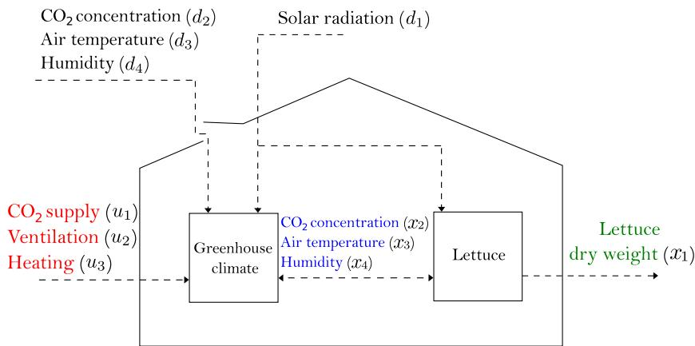
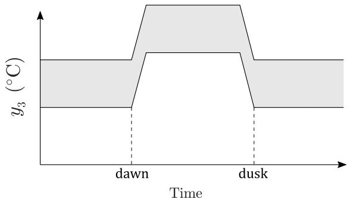
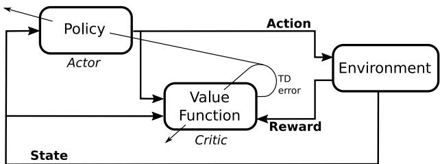
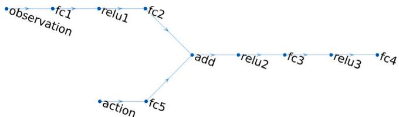
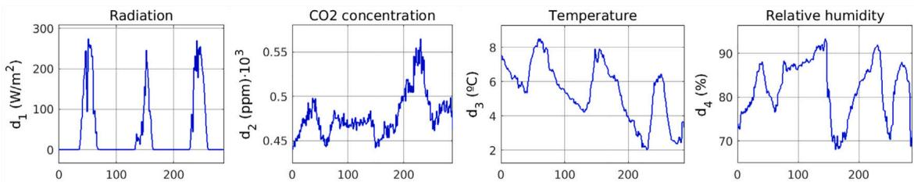
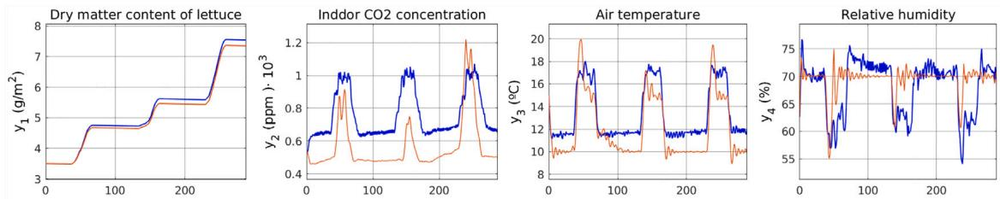
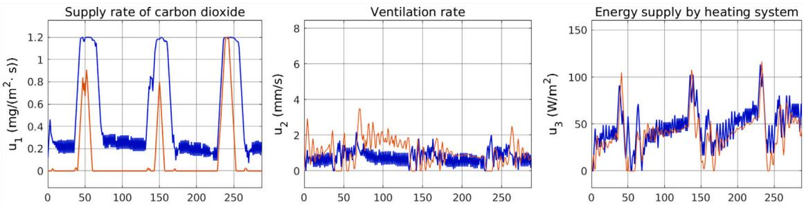

# Reinforcement Learning versus Model Predictive Control on greenhouse climate control

原始论文

# 温室气候控制中的强化学习与模型预测控制对比

Bernardo Morcego a, Wenjie Yin a, Sjoerd Boersma b, Eldert van Henten c, Vicenc Puig a, Congcong Sun c,\*

a 西班牙加泰罗尼亚理工大学自动控制组(CS2AC)  b 荷兰瓦赫宁根大学生物计量组  c 荷兰瓦赫宁根大学农业生物系统工程组

# 文章信息

# 摘要

关键词: 温室气候控制 模型预测控制 强化学习

温室系统在确保全球不断增长人口的新鲜食品供应方面发挥着关键作用。然而，维持温室内的最佳生长气候需要资源和运营成本。为了实现经济可持续的作物生长，温室生产中的高效气候控制至关重要。模型预测控制(MPC)和强化学习(RL)分别代表了基于模型和基于学习的控制方法。每种方法都有其制定控制问题、定义控制目标和寻求提供可持续作物生长的最优控制行动的方式。尽管某些形式的MPC和RL已应用于温室气候控制，但很少有研究从数学和性能角度全面分析这两种方法之间的联系、差异、优势和劣势。因此，本文旨在通过以下方面填补这一空白：(1)引入一种利用深度确定性策略梯度(DBTG)处理大型连续状态-动作空间环境的新型RL方法；(2)在统一框架内制定温室气候控制的MPC和RL方法；(3)探索MPC与RL之间的数学联系和差异；(4)进行模拟研究以分析和比较MPC和RL的性能；(5)呈现并解释比较结果，为不同场景下这些控制方法的应用提供有价值的见解。通过实现这些目标，本文旨在促进对温室气候控制中MPC和RL方法的理解和进步，从而根据特定需求和约束条件做出更明智的选择和实施决策。

# 1. 引言

世界人口将在未来30年内增加20亿，到2050年达到97亿(联合国经济和社会事务部，2019)。为了养活这一人口，预测显示2005年至2050年间粮食产量需要增长70%。发展中国家的产量几乎需要翻倍(FAO，2018)。另一方面，政府间气候变化专门委员会(IPCC)宣布，为了遏制全球变暖，提高土地利用方式和农业生产方法的效率至关重要且紧迫。气候控制温室是一种重要的生产方法，它可以在不考虑室外环境的情况下种植作物。为了在高效能源使用和运营成本下维持适当的生长气候，需要先进的温室生产系统控制方法(如加热、照明、通风、遮阳、CO2注入等)。需要先进温室控制的另一个原因是温室数量增加而经验丰富的种植者数量减少。

虽然模型预测控制(MPC)已广泛应用于解决温室中的控制问题(参见Blasco等人，2007；van Straten等人，2011；Chen和You，2020；Boersma和van Mourik，2021)，但强化学习(RL)在文献中较为少见。最早的参考文献是Tchamitchian等人(2005)，其中描述了玫瑰生产温室中的RL温度控制器。Ban和Kim(2017)使用深度学习方法控制线性建模的温室环境变量。较新的文章有Zhang等人(2021)和Afzali等人(2021)。前者应用RL控制并利用真实环境样本创建优化的温室动力学模型，该文章的重点是模型和控制器的鲁棒性。Afzali等人(2021)描述了一个补充照明控制系统，使用Q-learning开发，将问题表述为以能量为优化变量的离散约束最优问题。相比之下，本文提出了RL深度确定性策略梯度(DDPG)方法的新应用，该方法通过利用actor-critic架构和结合经验回放，能够处理连续动作空间并实现高效稳健的策略学习。Wang等人(2020)是DDPG在温室气候控制背景下的唯一应用。

尽管如前所述，MPC和RL各自已有大量研究，但此前尚未有工作在温室作物生产控制领域采用一致的方法研究这两种方法在相同控制问题上的性能表现。两种方法的优缺点也未被详细研究。本文还旨在探索MPC与RL之间的实际联系与差异，从而增进对其在温室气候控制中发展和应用的理解，同时借鉴其他领域的相关工作(Ernst et al., 2009; Gorges, 2017)。Ernst等人(2009)为MPC和RL问题提供了统一表述并展示了它们的等价性。该文章仅限于仅含等式约束的问题，且未考虑控制动作的约束。Gorges(2017)的作者提出了类似结果，将RL框架扩展到使用动作和状态空间近似器的形式。此外，他们还包含了状态和控制动作的不等式约束。然而，该分析仅限于线性系统。

因此，本文的贡献首先是引入一种采用DDPG方法的RL技术，专门设计用于解决温室气候控制中大型连续状态-动作空间带来的挑战。其次，本文在统一框架内制定了MPC和提出的RL方法。通过这样做，旨在探索MPC与RL之间的数学联系和差异，从而增进对其在温室气候控制中发展和应用的理解。

本文结构安排如下：第2节介绍作为MPC和RL控制器基础的生菜温室模型。该模型不仅用于仿真，还用于评估控制策略的有效性。第3节在统一框架内详细说明MPC和RL控制器。展示两种控制方法的制定和实施，突出它们各自的特点和方法论。第4节展示并比较使用MPC和RL控制器获得的仿真结果。本节对两种控制方法在生菜温室环境中的性能和功效进行了深入分析。最后，第5节讨论本研究获得的发现和见解，得出总结研究主要成果的结论。此外，本节还为不同场景下选择和应用MPC或RL提供了有价值的建议和考虑因素。

# 2. 生菜温室模型

采用van Henten(1994)提出的动态生菜温室模型。使用四阶Runge-Kutta显式方法进行离散化，采样周期为$n$。随后定义离散时间状态空间模型：

$$
\begin{array}{c}{x(k + 1) = f(x(k),u(k),d(k),p),}\\ {y(k) = g(x(k),p),} \end{array} \tag{1}
$$

其中时间$k\in \mathbb{Z}^{0 + }$，状态变量$x(k)\in \mathbb{R}^4$，测量值$y(k)\in \mathbb{R}^4$，控制输入$u(k)\in \mathbb{R}^3$，以及(天气)干扰$d(k)\in \mathbb{R}^4$。表1显示了各信号的含义。参数$p\in \mathbb{R}^{28}$和非线性函数$f(\cdot)$和$g(\cdot)$在附录中给出。

生菜温室模型(1)的图形表示如图1所示。

表1 状态$x(t)$、测量$y(t)$、控制信号$u(t)$和干扰$d(t)$的含义

| 变量 | 含义 | 变量 | 含义 |
|------|------|------|------|
| x1(t) | 干重(kg/m²) | y1(t) | 干重(g/m²) |
| x2(t) | 室内CO2浓度(kg/m³) | y2(t) | 室内CO2浓度(ppm) |
| x3(t) | 室内温度(°C) | y3(t) | 室内温度(°C) |
| x4(t) | 室内湿度(kg/m³) | y4(t) | 室内湿度(%) |
| u1(t) | CO2注入量(mg/m²/s) | d1(t) | 辐射量(W/m²) |
| u2(t) | 通风量(mm/s) | d2(t) | 室外CO2浓度(kg/m³) |
| u3(t) | 加热量(W/m²) | d3(t) | 室外温度(°C) |
| | | d4(t) | 室外湿度(kg/m³) |

# 3. MPC与RL对比

MPC(模型预测控制)和RL(强化学习)分别由控制界和计算智能界独立发展而来(Gorges, 2017)。此后，这两种方法或多或少地独立演进。作为基于模型和基于学习的控制方法的代表，MPC和RL从术语使用到寻求最优控制行动的方式都存在差异。

MPC因其在多输入多输出系统中的出色表现和约束处理能力，能有效优化温室生产系统。然而，在预测时域内预测不确定干扰(如天气)仍具挑战性(Boersma和van Mourik, 2021; Maciejowski, 2002; Chen和You, 2020)。

由于问题表述和控制目标定义的方式，MPC的开发和实施通常需要相对简单的模型，在基于静态控制模型的稳定系统中表现更好。MPC对各种条件的适应性有限，可能无法满足温室所需的自主目标。此外，由于需要复杂数学传播不确定性分布，MPC处理不确定性的计算成本也很高。

为使温室生产超越最优实现更高自主性和适应性，研究者正寻求AI、信息通信技术(ICT)等创新技术帮助，以及基于学习的控制方法如RL。RL是一种动态控制策略，能通过整合从历史和实时数据中学到的新知识自动更新当前控制策略。基于学习及与环境(系统)的试错交互特性，RL控制策略更能适应系统当前动态。特别对于温室，它能适应不同植物发育阶段甚至不同品种。此外，RL可完全从数据中学习控制策略，不一定需要高质量模型。尽管简单且理论基础扎实，RL仍有明显局限。最显著的是早期RL算法需要离散且有限的状态和控制动作集，这一局限通过神经网络形式的函数逼近器得以克服。

尽管强化学习(RL)有着悠久且广为人知的发展和应用历史(参见Sutton和Barto(1998)及相关文献)，但如今它已成为转变现代农业控制思维的关键技术。RL在温室生产系统中的普及程度可以从已举办三届的Autonomous Greenhouse Challenge(Hemming等人，2019，2020)中窥见一斑，数十支国际团队在此测试了他们在灌溉、作物生长和温室气候控制领域最先进的人工智能方法。此外，温室基准测试和所谓的gyms(用于训练机器学习代理的软件环境)也于近期发布(Overweg等人，2021；Turchetta等人，2022；An等人，2021)。

除了差异之外，MPC和RL也具有许多共同特征。例如，无论是否将干扰预测纳入控制策略，MPC和RL都作为预测控制器发挥作用。MPC在有限预测范围内采用显式优化，而RL则通过学习动作来最大化累积奖励，同时考虑即时和折现的未来奖励。为了比较MPC与RL，以下小节将从统一框架出发，在(1)预测原理；(2)奖励(或成本)函数；(3)约束处理三个方面详细阐述RL的发展。除了对预测原理、奖励函数和约束处理进行数学比较外，还将比较应用于同一案例的MPC和RL的性能表现。本文不涉及两种控制方法在稳定性、可行性和鲁棒性方面的理论比较。

  
图1. 所用生菜温室模型的图形表示(van Henten, 1994)

下文将首先详述MPC框架(第3.1节)，然后详述RL框架(第3.2节)。

# 3.1. 非线性模型预测控制

基于第2节介绍的生菜温室模型，本节提出一种用于气候控制的非线性MPC，以优化温室效率。

# 3.1.1. 预测原理

所提出的MPC遵循滚动时域原则。在每个时间步长进行状态测量，并用于重新初始化MPC中使用的模型(1)。从这个新获得的当前状态测量出发，模型随时间向前传播，同时最小化成本函数和控制输入(决策变量)。未来优化的控制信号不会在整个预测时域内应用，而仅应用第一个采样值。随后测量新状态，作为MPC模型的新初始条件。该原理在每个时间步长重复执行。接下来将详细说明带成本和约束的优化问题。

# 3.1.2. 优化问题

假设每个时刻都能测量状态$x(k)$。那么在时间步$k_{0}$处，求解以下优化问题：

$$
\begin{array}{rl} & {\underset {u(k)}{\min}\sum_{k = k_0}^{k_0 + N_p}V(u(k),y(k)),}\\ & {x(k + 1) = f(x(k),u(k),d(k),p),\quad y(k) = g(x(k),p),}\\ & {u_{\min}\leq u(k)\leq u_{\max},\quad |u(k) - u(k - 1)|\leq \delta u,}\\ & {y_{\min}(k)\leq y(k)\leq y_{\max}(k),\quad \mathrm{for} k = k_0,\ldots ,k_0 + N_p,}\\ & {x(k_0) = x_0,} \end{array} \tag{2}
$$

其中预测时域为$N_{p}$

# 3.1.3. 成本函数与约束

MPC中使用的成本函数$V(u(k),y(k))$如下：

$$
V(u(k),y(k)) = -q_{y_1}\cdot y_1(k) + \sum_{j = 1}^{3}q_{u_j}\cdot u_j(k), \tag{3}
$$

其中$q_{y_1}, q_{u_j} \in \mathbb{R}$是用户定义的权重，用于使特定项相对更重要。(3)式中的成本函数在生菜产量最大化(第一项)和能源使用(控制信号)最小化之间进行权衡。确切的权衡由比率$q_{y_1} / q_{u_j}$决定。

(2)式中的约束详细说明如下：

$$
\begin{array}{rl} & u_{\min} = \left(0\quad 0\quad 0\right)^T,\quad u_{\max} = \left(1.2\quad 7.5\quad 150\right)^T,\quad \delta u = \frac{1}{10} u_{\max},\\ & y_{\min}(k) = \left(0\quad 0\quad f_{y_{3,\min}}(k)\quad 0\right)^T,\\ & y_{\max}(k) = \left(\infty \quad 1.6\quad f_{y_{3,\max}}(k)\quad 70\right)^T, \end{array}
$$

其中控制信号的上限和下限分别定义为$u_{\max}, u_{\min} \in \mathbb{R}^3$。控制信号变化量的界限由$\delta u \in \mathbb{R}^3$指定。此外，$y(K)$的上限和下限分别为$y_{\max}(k)$和$y_{\min}(k) \in \mathbb{R}^4$，这些界限随时间变化。实际上，这些界限的第三个元素随时间变化：

$$
f_{y_{3,\min}}(k) = \left\{ \begin{array}{ll}10, & \mathrm{if} d_1(k_0)< 10\\ 15, & \mathrm{otherwise}, \end{array} \right.f_{y_{3,\max}}(k) = \left\{ \begin{array}{ll}15, & \mathrm{if} d_1(k_0)< 10\\ 20, & \mathrm{otherwise}. \end{array} \right.
$$

室内温度确实受到时变约束的限制。这些约束的设置使得白天允许的室内温度高于夜间，这与Seginer等人(1994)的研究一致。室内温度的上下限约束如图2所示。其中灰色区域表示$y_{3}(k)$允许被控制到的范围。

# 3.2. 深度强化学习

本文采用深度确定性策略梯度(DDPG)算法来开发RL控制智能体。DDPG算法源自Silver等人(2014)提出的确定性策略梯度算法，融合了深度学习的概念和理论。DDPG的主要优势在于其在大规模连续状态-动作空间环境中表现优异，这使其成为当前温室气候控制应用的理想选择。

DDPG是一种无模型、离策略的actor-critic强化学习方法(Lillicrap等人，2016)。基于这些特性，DDPG的控制动作由与学习策略不同的策略生成，且无需学习系统动态即可直接估计最优策略和价值函数。

  
图2. 施加于$y_{3}(k)$(室内温度)的约束示例图。灰色区域表示优化控制信号作用下的$y_{3}(k)$允许范围

  
图3. Actor-Critic RL智能体结构

如图3所示，actor-critic RL智能体的结构中，actor负责使用深度神经网络存储和应用当前最优策略。根据学习到的策略函数$\pi(s)$和系统状态$s$，actor选择最优动作$u$。critic同样使用深度神经网络存储价值函数$Q(s,u)$，该函数表示每个状态-动作对的期望累积未来奖励。critic利用从系统(环境)获得的奖励及其自身信息来估计价值函数。此外，critic还负责计算时序差分(TD)误差，该误差在学习过程中同时用于critic和actor的更新。

除了actor和critic的角色外，DDPG还引入了Deep Q-Network(Mnih等人，2015)中的两个关键要素：经验回放缓存和目标网络。经验回放缓存作为记忆存储，在每一步存储转移元组。这些元组包含当前状态$s(k)$、动作$u(k)$、获得的奖励$r(k)$、后续状态$s(k+1)$以及表示下一状态是否为终止状态的布尔变量$t(k)$。终止状态表示实验结束。为训练critic和actor，每个时间步从回放缓存中随机采样一个小批量。这种训练方法打破了学习样本间的时间相关性，有助于整个学习过程的收敛。

目标网络是actor和critic网络的副本，在训练阶段用于提供计算损失函数的目标值。当使用小批量元组集训练原始网络后，通过软更新机制将训练后的网络复制到目标网络，即逐步修改目标权重。采用带软更新的目标网络可确保时序差分(TD)备份期间目标的一致性，有助于学习过程的稳定性。因此，DDPG算法需要使用四个神经网络：actor、critic及其对应的目标网络。

critic和actor权重更新的梯度方程分别如(6)和(7)所示。critic网络的权重记为$\phi$，actor的权重记为$\theta$。critic和actor网络的学习率分别为$\eta_{\mu}$和$\eta_{\theta}$。转移元组的小批量记为$B$，其大小为$N$。上标符号表示目标网络。$v(k)$8是目标Q值(不要与目标网络混淆)，用于计算损失函数。critic网络权重更新以最小化该损失函数。折扣因子$\gamma_{y}$取值0到1之间，决定了未来奖励相对于当前状态的重要性。尽管在MPC的预测时域与折扣因子之间建立直接映射具有挑战性，但两者确实存在关联。需注意(8)中的目标Q值是基于actor和critic目标网络的输出生成的，这与目标网络的概念一致。

$$
\begin{array}{l}{\Delta \phi = \eta_{\theta}\nabla_{\theta}\left(\frac{1}{N}\sum_{k\in B}\left(Q(s(k),u(k)\mid \phi^{Q^{\prime}}) - \nu (k)\right)^{2}\right)}\\ {\Delta \theta = \eta_{\theta}\nabla_{\theta}\left(\frac{1}{N}\sum_{k\in B}Q(s(k),\pi (s(k)\mid \theta^{\pi})\mid \phi^{Q})\right)}\\ {\nu (k) = r(k) + \gamma Q^{\prime}(s(k + 1),\pi^{\prime}(s(k + 1)\mid \theta^{Q^{\prime}})\mid \phi^{Q^{\prime}})} \end{array} \tag{8}
$$

从训练网络派生的目标网络权重更新如(9)和(10)所示。参数$\tau$控制此更新的速度。该软更新操作在主网络训练后执行，并在每个时间步进行。

$$
\begin{array}{l}{\phi^{Q^{\prime}}\leftarrow \tau \phi^{Q} + (1 - \tau)\phi^{Q^{\prime}}.}\\ {}\\ {\rho^{Q^{\prime}}\leftarrow \tau \theta^{x} + (1 - \tau)\theta^{x^{\prime}}.} \end{array} \tag{10}
$$

# 3.2.1. 智能体描述

智能体的行为受其状态、奖励函数和折扣因子影响。智能体交互的环境与MPC控制器使用的模型完全相同。然而，智能体状态略有不同，包含十个不同分量：

$$
\begin{array}{rl} & {s(k) = (\Delta_{y_1}(k),e_{y_2}(k),e_{y_3}(k),y_4(k),d_1(k),d_2(k),d_3(k),}\\ & {u_1(k - 1),u_2(k - 1),u_3(k - 1))} \end{array} \tag{11}
$$

其中$\Delta_{y_1}(k) = y_1(k) - y_1(k - 1)$表示干物质增量，$e_{y_2}(k) = y_{2,ref}(k) - y_2(k)$和$e_{y_3}(k) = y_{3,ref}(k) - y_3(k)$分别为误差项，$d_1(k)$为当前扰动，$u_j(k - 1)$为上一时刻控制动作。奖励函数和折扣因子在MPC中分别对应成本函数和预测时域的作用。具体说明如下：

奖励函数与约束。与式(3)中MPC的成本函数类似，干物质被纳入奖励函数。但为了引导学习过程，还需考虑其他变量。因此奖励函数包含六项，前三项为奖励，后三项为惩罚。奖励函数定义为：

$$
r(k) = c_{r,1}A_{y_1}(k) + r_{\mathrm{CO}_2}(k) + r_T(k) - (\sum_{j = 1}^{3}c_{r,u_j}\cdot u_j(k - 1)) \tag{12}
$$

其中$r_{\mathrm{CO}_2}(k)$和$r_T(k)$分别表示与主要生产变量（CO₂浓度和温度）控制相关的奖励，$c_{r,i}$为可调常数参数。

与式(3)类似考虑了干物质和能耗，但当CO₂浓度和温度控制良好时智能体也会获得奖励。根据MPC中的温度约束(5)，奖励函数不仅取决于温度误差，还与加热系统相关。这是因为白天利用太阳辐射加热温室比使用加热系统和通风更高效。CO₂浓度也遵循温室常规做法，白天控制较高而夜间较低。

  
图4. Actor-Critic智能体结构

表2 所有网络的训练参数

| 参数 | 值 | 参数 | 值 |
|------|----|------|----|
| 学习率 | 1×10⁻³ | 经验缓冲区大小 | 1×10⁴ |
| 梯度阈值 | 1 | 经验小批量大小 | 64 |
| L2正则化因子 | 1×10⁻⁵ | 折扣因子γ | 0.9 |

智能体将在测量值保持在给定范围内时获得固定奖励，超出范围则会受到惩罚。因此，(2)中的约束条件在此被转化为奖励并定义为：

$$
\begin{array}{r l} & {r_{\mathrm{CO}_{2}}(k) = \left\{ \begin{array}{l l}{-c_{r,\mathrm{CO}_{2},1}\cdot (y_{2}(k) - \mathrm{CO}_{2_{m i n}}(k))^{2}} & {\mathrm{if~}y_{2}(k)< \mathrm{CO}_{2_{m i n}}(k)}\\ {-c_{r,\mathrm{CO}_{2},1}\cdot (y_{2}(k) - \mathrm{CO}_{2_{m a x}}(k))^{2}} & {\mathrm{if~}y_{2}(k) > \mathrm{CO}_{2_{m a x}}(k)}\\ {c_{r,\mathrm{CO}_{2},2}} & {\mathrm{otherwise}} \end{array} \right.}\\ & {r_{T}(k) = \left\{ \begin{array}{l l}{-c_{r,T,1}\cdot (y_{3}(k) - T_{m i n}(k))^{2}} & {\mathrm{if~}y_{3}(k)< T_{m i n}(k)}\\ {-c_{r,T,1}\cdot (y_{3}(k) - T_{m a x}(k))^{2}} & {\mathrm{if~}y_{3}(k) > T_{m a x}(k)}\\ {c_{r,T,2}} & {\mathrm{otherwise},} \end{array} \right.} \end{array} \tag{13}
$$

其中$c_{r,\mathrm{CO}_2}$和$c_{r,T}$为可调常数参数。这些参数可视为约束条件在奖励函数中的权重。根据奖励强度不同，智能体会采取更保守或更激进的温室气候控制策略。

总结而言，RL智能体的奖励函数编码了MPC的成本函数和约束条件。在式(12)中，奖励干物质增量而非式(3)中的累积值，因为使用累积值时智能体学习效果不稳定。

预测原理。MPC采用滚动时域策略，而RL智能体使用折扣因子$\gamma$(8)来描述奖励的未来影响。当$\gamma=0$时，RL智能体仅关注即时奖励的最优动作；当$\gamma$趋近于1时，RL智能体会评估动作对所有未来奖励累积和的影响。因此，选择特定$\gamma$值可视为类似于MPC中选择预测时域，尽管建立精确的一一对应关系具有挑战性。

从式(8)可见，折扣因子$\gamma$与控制动作的激进程度相关，类似于式(3)中参数$q_{y_1}$和$q_{z_2}$的作用。本文通过试错法调整$\gamma$值，使温室动态行为与MPC相似。

### 3.2.2. 智能体训练

本节描述本文开发的RL智能体结构。critic网络结构如图4所示：观测值由3层10个ReLU单元处理，动作由2层10个单元处理，所有层均为全连接。actor网络包含3层20个ReLU单元和最终具有3个节点的双曲正切层（对应三个控制动作）。所有网络的训练参数见表2，奖励/惩罚函数相关参数见表3。

智能体训练500个周期，每个周期模拟1天作物生长。每天模拟包含96个时间步，每步15分钟。MPC和RL使用相同的气象基准数据。由于这些数据代表干扰因素，RL智能体接收的数据会添加标准差为0.3的白噪声，以促进状态空间探索并避免过拟合。

表3 强化函数参数

| 参数 | 值 | 参数 | 值 |
|------|----|------|----|
| cr,1 | 16 | cr,CO2,1 | 0.1 |
| cr,UM | 4.5360 × 10-4 | cr,CO2,2 | 0.0005 |
| cr,UT2 | 0.0075 | cr,T,1 | 0.001 |
| cr,UM3 | 8.5725 × 10-4 | cr,T,2 | 0.0005 |

表4 经济利润函数参数

| 参数 | 值 |
|------|----|
| ccO2 | 42 × 10-2荷兰盾/千克 |
| crq | 6.35 × 10-9荷兰盾/焦耳 |
| cpri,1 | 1.8荷兰盾/毫克 |
| cpri,2 | 10荷兰盾/千克 |

# 4. 仿真结果

为便于MPC与RL的对比，DDPG智能体采用了与MPC控制器相同的天气数据。此外，两种控制器都以相似的方式处理约束条件和控制目标。本研究所用天气数据$d(k)$（包括室外辐射、$\mathrm{CO_2}$浓度、温度和湿度）来自2010-2011年冬季实际气象测量数据。室外温度范围为2-8.5℃，室外辐射范围为0-$280\mathrm{W / m^2}$，$\mathrm{CO_2}$浓度范围为0.43-$0.57\mathrm{ppm} * 10^{3}$，相对湿度范围为$66\%$-$93\%$。具体天气数据细节可参考Kempkes et al.(2014)。原始天气数据采样间隔为5分钟，但本研究将其重采样为不同时间间隔$h$。图5展示了包含288个样本（对应3天时长）的干扰实现示例。

# 4.1. 经济利润指标

除干物质外，成本（奖励）函数还优化了室内$\mathrm{CO_2}$浓度、空气温度和相对湿度，并额外引入经济利润指标(EPI)作为MPC与基于DDPG的RL智能体性能对比的附加验证项：

$$
EPI = \phi (y_{1}(t_{f})) - \sum_{t_{b}}^{t_{f}}(c_{q}u_{q}(t) + c_{\mathrm{co}_{2}}u_{\mathrm{co}_{2}}(t))h, \tag{14}
$$

其中$\phi (y_{1}(t_{f}))$为收获时刻$t_f$的总收入，$c_{q}u_{q}(t) + c_{\mathrm{co}_{2}}u_{\mathrm{co}_{2}}(t)$为空调设备运行成本$(\mathrm{Hf}1\mathrm{m}^{- 2}\mathrm{s}^{- 1})$。生菜拍卖价格遵循线性关系$\phi (y_{1}(t_{f})) = c_{pri,1} + c_{pri,2}y_{1}(t_{f})$，反映拍卖价格与生菜收获重量($\mathrm{kg}\mathrm{m}^{- 2}$)的关系。参数$c_{pri,1}$和$c_{pri,2}$的单位分别为$\mathrm{Hf}1\mathrm{m}^{- 2}$和$\mathrm{Hf}1\mathrm{kg}^{- 1}\mathrm{m}^{- 2}$。

假设气候控制设备的运行成本与能量$u_{q}$$(\mathrm{Wm}^{- 2})$和系统引入的二氧化碳量$u_{c}$$(\mathrm{kg}\mathrm{m}^{- 2}\mathrm{s}^{- 1})$呈线性关系。这些运行成本通过能源价格$c_{q}$$(\mathrm{Hf}1\mathrm{J}^{- 1})$和二氧化碳价格$c_{\mathrm{CO_2}}$$(\mathrm{Hf}1\mathrm{kg}^{- 1})$参数化，具体数值见表4。

  
图5. 温室施加的干扰(太阳辐射、外部CO₂浓度、温度和相对湿度)

  
图6. 系统输出:干物质、室内CO₂浓度、空气温度和相对湿度。DDPG智能体(蓝色)和MPC(橙色)

表5 控制器和仿真设置

| 参数 | 值 | 参数 | 值 |
|------|----|------|----|
| h | 15分钟 | q1 | 103 |
| Np | 6小时 | q4 | {10, 1, 1} |
| N | 40天 |  |  |

# 4.2. 具体MPC设置

优化问题中的用户定义权重$q_{\bar{s}_1}, q_{u_i}$经过调整，以实现能源使用与产量之间的可接受权衡。预测时域$N_{p}$的选择确保随时间增长的不确定性在预测范围内不显著，模型预测仍可信任。实际上，天气预报的不确定性会随着预测时域的增加而增大。表5详细列出了本研究中使用的其他设置参数。

本研究采用开源软件CasADi (Andersson et al., 2019)和求解器IPOPT (Wachter and Begler, 2006)在Matlab环境中实现，用于求解优化问题(2)。

# 4.3. 结果分析

图6展示了基于DDPG的RL智能体(蓝色)与MPC控制器(橙色)的温室模拟测量结果。从图中可见，虽然RL的产量略高，但两种控制器获得的生菜干物质含量相似。其他输出变量均大致保持在约束范围内。两种控制下的室内相对湿度水平非常接近，不过RL允许更大的波动范围。类似地，室内温度和$\mathrm{CO_2}$浓度都接近最低水平，但RL智能体将温度保持在略高于最低温度的水平以避免惩罚。由于成本函数对温度低于最低约束的情况进行惩罚，RL智能体明显比MPC更为保守。MPC控制器对湿度的控制更精确，而DDPG智能体在室内温度控制方面表现更好。两种控制器在白天都显著提高了$\mathrm{CO_2}$浓度（这符合预期），但DDPG智能体在夜间仍保持较高的$\mathrm{CO_2}$浓度水平。

图7展示了两种控制器的控制动作。可以明显看出MPC对通风的使用更高效，但DDPG智能体提供了更高的能量输入。

表6 MPC与RL性能对比

| 指标 | MPC | RL |
|------|-----|----|
| EPI | 1.843Hflm-2 | 1.788Hflm-2 |
| 计算时间 | 305.04秒 | 2.36秒 |

从产量角度看，RL智能体获得了更高的生菜产量，但从经济效益来看，如表6所示，MPC获得了更高的经济回报$(1.843\mathrm{Hf}1\mathrm{m}^{- 2})$，优于RL智能体$(1.788\mathrm{Hf}1\mathrm{m}^{- 2})$。这是由于根据表4给定的经济回报函数参数，生菜产量增加带来的经济效益低于资源消耗成本。图7显示两种控制方式下温度都保持在较低水平，但RL智能体明显将$\mathrm{CO_2}$浓度维持在比MPC高得多的水平。这种行为可能的解释是：由于增加$\mathrm{CO_2}$注入可以显著提高产量，智能体倾向于探索这一选项，但最终得到的是次优解。

在计算时间方面，表6显示在标准笔记本电脑(Intel Core i7-9700 CPU @ 3.00 GHz, 32 GB RAM)上，RL智能体的速度比MPC快100倍以上。这是合理的，因为MPC需要在每个时间步求解优化问题，而训练完成的智能体只需从神经网络获取输出即可。

为解决这个问题，我们可以让智能体持续训练以探索更大的状态空间，或者重新设计成本函数并重新定义$\mathrm{CO_2}$注入的上下限。智能体有可能为这个重新定义的问题找到最优解。然而，如果生菜拍卖价格或$\mathrm{CO_2}$成本发生变化，除非将这些变量参数作为观测并重新开始训练，否则该智能体将无法适应并找到新的最优解。

图8展示了生菜完整生长周期(40天)的温室模拟输出。此时RL的产量明显更高，但EPI指标$(2.195\mathrm{Hf}1\mathrm{m}^{- 2})$却低于MPC的$2.504\mathrm{Hf}1\mathrm{m}^{- 2}$。同时明显可见RL智能体对湿度约束的控制更为宽松，这可能对作物健康造成问题，需要谨慎对待。不过当前使用的模型并未考虑这类细节影响。

# 5. 讨论与结论

本文提出了基于MPC和RL的两种不同控制方法，在统一框架下管理生菜温室。

  
图7. NDPG智能体(蓝色)和MPC(橙色)施加的控制动作

  
图8. 完整生长周期(40天)的系统输出

温室模型作为仿真环境，可用于比较分析RL与MPC控制器的性能。研究目标是探索这两种控制方法在温室最优控制中的应用，同时考虑自然资源的高效利用和生产效率。通过全面分析，本文展示了MPC与RL之间的联系与差异，揭示了每种方法的独特特性和优势。通过评估比较结果，为温室气候控制应用提供了关于这些控制方法有效性和适用性的宝贵见解。

就结果而言，观察到RL智能体在能源优化方面不如MPC模型表现优异。此外，虽然RL获得了更高的产量，但其经济效益不如MPC理想。

在强化学习中，直接对状态施加约束是不可行的。如果在奖励函数中没有正确定义状态的合理范围，智能体可能会探索非理性的状态，例如将温度过度提高到$40^{\circ}\mathrm{C}$以上。此外，如果成本函数中存在捷径，智能体可能会利用它。例如，在经济利益比较方面，智能体可能会优先考虑通过最大通风而不注入任何二氧化碳或启动加热来最大化经济回报。这种方法实现了最高的经济效益，达到$1.894\mathrm{Hf}1\mathrm{m}^{- 2}$，但会导致对生菜生长危险的室内温度和相对湿度水平。此外，很难确定训练好的智能体是收敛到了最优控制策略还是满足于次优解。将智能体性能与其他最优控制器进行比较变得必要。总之，设计一个调优良好的智能体是一项复杂的任务，通常需要迭代过程。

然而，一旦获得正确设计的智能体，它就能展现出强大的能力，以最少的计算资源和时间提供控制结果。此外，得益于其优化策略，RL智能体在处理不确定性方面表现出比MPC更强的能力。为了便于清晰比较MPC和RL，本文提供了一个全面的表格（表7），概述了它们各自的优缺点。这种比较为基于特定场景选择适当的控制方法提供了宝贵见解。

在当前工作中，我们确定了几个需要改进和进一步研究的领域。以下是扩展和增强当前工作的建议方向：

1. 重新设计智能体以纳入未来气候预测作为观测：在本工作中，智能体仅接收当前室外天气作为输入，其对未来状态的预测仅依赖于当前室内外天气条件及执行的动作。为增强智能体的预测能力，未来工作可考虑将未来室外天气预测作为输入。这种增强将使智能体能够更准确地预测未来强化信号。
2. 利用经济利润指标作为智能体观测：另一个建议是将经济利润指标参数纳入智能体的观测。通过让智能体学习并响应这些参数的变化，它可以相应地动态调整能源使用。
3. 探索先进的强化深度学习算法：为进一步提升性能，建议探索更复杂的强化深度学习算法，如TD3（双延迟深度确定性策略梯度算法）、PPO（近端策略优化）或SAC（柔性演员-评论家）。将这些算法与现有方法的性能进行比较，将有助于了解它们对给定问题的有效性。
4. 将MPC与RL集成用于温室生产系统的气候控制：考虑到MPC和RL各自的优缺点，另一种方法是整合这两种方法的稳健特性。通过结合MPC和RL，可以发挥它们各自的优势用于温室生产系统的气候控制。这种集成可能会带来控制性能和系统效率的提升。

这些未来研究建议旨在增强RL智能体的预测能力，纳入更多相关观测，探索先进的深度学习算法，以及探索可以结合MPC和RL优势的混合方法。

表7 MPC与RL的优缺点对比

| MPC | RL |
|-----|----|
| 依赖精确模型 | 可以无模型运行 |
| 基于控制导向的非线性模型优化 | 通过学习进行决策 |
| 易于处理约束 | 处理约束较困难 |
| 长期预测能力弱 | 具有无限预测范围 |
| 处理不确定性计算负荷高 | 天生鲁棒性强 |
| 适应性低 | 适应性强 |
| 在线优化复杂度高 | 在线学习复杂度低 |

表8 模型参数值(van Henten, 1994)

| 参数 | 值 | 参数 | 值 | 参数 | 值 | 参数 | 值 |
|------|----|------|----|------|----|------|----|
| p1,1 | 3.844 | p2,1 | 4.4 | p3,1 | 8.45d | p4,1 | 4.4 |
| p1,2 | 2.65×10⁻⁷ | p2,2 | 4.87×10⁻⁷ | p3,2 | 1290 | p4,2 | 0.0036 |
| p1,3 | 3.35 | p2,3 | 7.5×10⁻⁶ | p3,3 | 6.1 | p4,3 | 9.348 |
| p1,4 | 5.55×10⁻⁹ | p2,4 | 8.31 | p3,4 | 0.2 | p4,4 | 8314 |
| p1,5 | 5.11×10⁻⁶ | p2,5 | 273.15 |  |  | p4,5 | 273.15 |
| p1,6 | 2.3×10⁻⁴ | p2,6 | 101.325 |  |  | p4,6 | 17.4 |
| p1,7 | 6.29×10⁻⁴ | p2,7 | 0.044 |  |  | p4,7 | 239 |
| p1,8 | 5.2×10⁻⁵ |  |  |  |  | p4,8 | 17.269 |
|  |  |  |  |  |  | p4,9 | 238.3 |

# CRediT 作者贡献声明

Bernardo Morcego: 方法论, 软件, 验证, 调查, 资源, 写作-初稿, 写作-审阅编辑, 监督。Wenjie Yin: 方法论, 软件, 验证, 写作-初稿。Sjoerd Boersma: 方法论, 软件, 验证, 调查, 资源, 写作-初稿, 写作-审阅编辑, 监督。Eldert van Henten: 资源, 写作-审阅编辑, 监督。Vicenc Puig: 资源, 写作-审阅编辑, 监督。Congcon Sun: 概念化, 方法论, 验证, 调查, 资源, 写作-初稿, 写作-审阅编辑, 监督, 项目管理, 资金获取。

# 利益冲突声明

作者声明不存在任何可能影响本研究报告的已知竞争性经济利益或个人关系。

# 数据可用性声明

数据可根据要求提供。

# 致谢

本工作部分由荷兰教育、文化和科学部制定的科学与技术部门计划资助。同时也获得了西班牙国家研究署(AEI)和欧洲区域发展基金(ERFD)通过SaCoAV项目(编号PID2020-114244RB-100)的部分资助。

# 附录

采用的生菜温室模型由以下方程给出:

$$
\begin{array}{rl} & {\frac{\mathrm{d}x_1(t)}{\mathrm{d}t} = p_{1,1}\phi_{\mathrm{phot,c}}(t) - p_{1,2}x_1(t)2^{x_3(t) / 10 - 5 / 2},}\\ & {\frac{\mathrm{d}x_2(t)}{\mathrm{d}t} = \frac{1}{p_{2,1}} -\phi_{\mathrm{phot,c}}(t) + p_{2,2}x_1(t)2^{x_3(t) / 10 - 5 / 2} + u_1(t)10^{-6} - \phi_{\mathrm{vent,c}}(t),}\\ & {\frac{\mathrm{d}x_3(t)}{\mathrm{d}t} = \frac{1}{p_{3,1}} u_3(t) - (p_{3,2}u_2(t)10^{-3} + p_{3,3})(x_3(t) - d_3(t)) + p_{3,4}d_1(t),}\\ & {\frac{\mathrm{d}x_4(t)}{\mathrm{d}t} = \frac{1}{p_{4,1}} (\phi_{\mathrm{transp,h}}(t) - \phi_{\mathrm{vent,h}}(t)),} \end{array}
$$

其中

$$
\begin{array}{rl} & {\phi_{\mathrm{phot,c}}(t) = \Big(1 - \exp \bigl (-p_{1,3}x_1(t)\bigr)\Big)\Big(p_{1,4}d_1(t)\big(-p_{1,5}x_3(t)^2 +\dots}\\ & {\qquad p_{1,6}x_3(t) - p_{1,7}\big)\big(x_2(t) - p_{1,8}\big)\Big) / \phi (t),}\\ & {\phi (t) = p_{1,4}d_1(t) + \bigl (-p_{1,5}x_3(t)^2 +p_{1,6}x_3(t) - p_{1,7}\bigr)\big(x_2(t) - p_{1,8}\big),} \end{array}
$$

$$
\phi_{\mathrm{vent,c}}(t) = \big(u_2(t)10^{-3} + p_{2,3}\big)\big(x_2(t) - d_2(t)\big),
$$

$$
\phi_{\mathrm{vent,h}}(t) = \left(u_2(t)10^{-3} + p_{2,3}\right)\left(x_4(t) - d_4(t)\right),
$$

$$
\phi_{\mathrm{transp,h}}(t) = p_{4,2}\Big(1 - \exp \big(-p_{1,3}x_{1}(t)\big)\Big)
$$

$$
\Big(\frac{p_{4,3}}{p_{4,4}(x_3(t) + p_{4,5})}\mathrm{exp}\Big(\frac{p_{4,6}x_3(t)}{x_3(t) + p_{4,7}}\Big) - x_4(t)\Big),
$$

其中 $t\in \mathbb{R}$ 表示连续时间。此外，$\phi_{\mathrm{phot,c}}(t)$、$\phi_{\mathrm{vent,c}}(t)$、$\phi_{\mathrm{transp,h}}(t)$ 和 $\phi_{\mathrm{vent,h}}(t)$ 分别表示冠层总光合速率、通过通风口的 CO₂ 质量交换、冠层蒸腾作用以及通过通风口的 H₂O 质量交换。测量方程定义如下：

$$
\begin{array}{rl} & y_{1}(t) = 10^{3}\cdot x_{1}(t)\\ & y_{2}(t) = \frac{10^{3}\cdot p_{2,4}(x_{3}(t) + p_{2,5})}{p_{2,6}p_{2,7}}\cdot x_{2}(t),\\ & y_{3}(t) = x_{3}(t),\\ & y_{4}(t) = \frac{10^{2}\cdot p_{2,4}(x_{3}(t) + p_{2,5})}{11\cdot\exp\left(\frac{p_{4,8}x_{3}(t)}{x_{3}(t) + p_{4,9}}\right)}\cdot x_{4}(t), \end{array} \qquad \begin{array}{l}\mathrm{g~m^{-2},}\\ \mathrm{ppm}\cdot 10^{3},\\ \mathrm{^\circ C,} \end{array}
$$

模型参数 $p_{i,j}$ 根据 van Henten (1994) 定义并在表8中给出。采用四阶显式龙格-库塔方法对上述模型进行离散化，得到如(1)所示的模型：

$$
\begin{array}{c}{x(k + 1) = f(x(k),u(k),d(k),p),}\\ {y(k) = g(x(k),p),} \end{array} \tag{15}
$$

其中离散时间 $k\in \mathbb{Z}^{0 + }$，且满足关系式 $t = k\cdot h$，$h$ 为采样周期。初始状态和控制信号为：

$$
x(0) = \left(0.0035\quad 0.001\quad 15\quad 0.008\right)^T,\qquad u(0) = \left(0\quad 0\quad 0\right)^T.
$$

# 参考文献

1.  [Afzali et al., 2021](#bb1)
Afzali S., Mosharafian S., van Iersel M.W., Velni J.M.
使用强化学习优化配备高强度放电灯的温室照明控制
2021 American Control Conference, ACC, IEEE (2021), pp. 1414-1419
2.  [An et al., 2021](#bb2)
An, Z., Cao, X., Yao, Y., Zhang, W., Li, L., Wang, Y., Guo, S., Luo, D., 2021. 基于模拟器的自主温室控制策略优化规划框架. In: Conference on Automated Planning and Scheduling.
3.  [Andersson et al., 2019](#bb3)
Andersson J.A.E., Gillis J., Horn G., Rawlings J.B., Diehl M.
CasADi: 非线性优化和最优控制的软件框架
Math. Program. Comput., 11 (2019), pp. 1-36
4.  [Ban and Kim, 2017](#bb4)
Ban B., Kim S.
使用强化学习控制非线性、复杂和黑箱温室系统
2017 International Conference on Information and Communication Technology Convergence, ICTC, IEEE (2017), pp. 913-918
5.  [Blasco et al., 2007](#bb5)
Blasco X., Martínez M., Herrero J.M., Ramos C., Sanchis J.
基于模型的温室气候预测控制以减少能源和水消耗
Comput. Electron. Agric., 55 (1) (2007), pp. 49-70
6.  [Boersma and van Mourik, 2021](#bb6)
Boersma, S., van Mourik, S., 2021. 生菜温室中基于非线性采样的模型预测控制与不确定天气预报. In: 40th Benelux Workshop on Systems and Control. pp. 58–59.
7.  [Chen and You, 2020](#bb7)
Chen W.H., You F.Q.
使用模型预测控制进行温室温度控制的数据驱动鲁棒优化
Chem. Eng. Trans., 81 (2020), pp. 721-726
8.  [Ernst et al., 2009](#bb8)
Ernst D., Glavic M., Capitanescu F., Wehenkel L.
强化学习与模型预测控制的比较：电力系统问题上的应用
IEEE Trans. Syst. Man Cybern. B, 39 (2) (2009), pp. 517-529, [10.1109/TSMCB.2008.2007630](https://doi.org/10.1109/TSMCB.2008.2007630)
9.  [FAO, 2018](#bb9)
FAO D.
粮食与农业的未来 - 通往2050年的替代路径. Rome
Glob. Perspect. Stud. (2018)
10.  [Görges, 2017](#bb10)
Görges D.
模型预测控制与强化学习之间的关系
IFAC-PapersOnLine, 50 (1) (2017), pp. 4920-4928
20th IFAC World Congress
11.  [Hemming et al., 2020](#bb11)
Hemming S., de Zwart F., Elings A., Petropoulou A., Righini I.
智能温室中的樱桃番茄生产 - 用于气候、灌溉、作物产量和质量控制的传感器与人工智能
Sensors, 20 (22) (2020)
12.  [Hemming et al., 2019](#bb12)
Hemming S., de Zwart F., Elings A., Righini I., Petropoulou A.
基于人工智能的温室蔬菜生产远程控制 - 温室气候、灌溉和作物生产
Sensors, 19 (2019), p. 1807
13.  [van Henten, 1994](#bb13)
van Henten E.J.
温室气候管理：最优控制方法
(Ph.D. thesis)
University Wageningen (1994)
14.  [Kempkes et al., 2014](#bb14)
Kempkes F.L.K., Janse J., Hemming S.
具有高隔热双层镀膜玻璃和新型气候控制策略的温室概念：从设计到番茄实验结果
ISHS Acta Hort. (2014)
15.  [Lillicrap et al., 2016](#bb15)
Lillicrap, T.P., Hunt, J.J., Pritzel, A., Heess, N., Erez, T., Tassa, Y., Silver, D., Wierstra, D., 2016. 基于深度强化学习的连续控制. In: 2016 International Conference on Learning Representations. ICLR.
16.  [Maciejowski, 2002](#bb16)
Maciejowski J.M.
带约束的预测控制
Pearson (2002)
17.  [Mnih et al., 2015](#bb17)
Mnih V., Kavukcuoglu K., Silver D., Rusu A.A., Veness J., Bellemare M.G., Graves A., Riedmiller M.A., Fidjeland A., Ostrovski G., Petersen S., Beattie C., Sadik A., Antonoglou I., King H., Kumaran D., Wierstra D., Legg S., Hassabis D.
通过深度强化学习实现人类水平的控制
Nature, 518 (2015), pp. 529-533
18.  [Overweg et al., 2021](#bb18)
Overweg H., Berghuijs H.N.C., Athanasiadis I.N.
CropGym：作物管理的强化学习环境
University Wageningen (2021)
arXiv
19.  [Seginer et al., 1994](#bb19)
Seginer I., Gary C., Tchamitchian M.
具有碳水化合物库的温室作物的最佳温度制度：建模研究
Sci. Hort., 60 (1-2) (1994), pp. 55-80
20.  [Silver et al., 2014](#bb20)
Silver, D., Lever, G., Heess, N., Degris, T., Wierstra, D., Riedmiller, M., 2014. 确定性策略梯度算法. In: Proceedings of the 31st International Conference on Machine Learning. pp. 387–395.
21.  [Sutton and Barto, 1998](#bb21)
Sutton R.S., Barto A.G.
强化学习导论
MIT Press (1998)
22.  [Tchamitchian et al., 2005](#bb22)
Tchamitchian M., Kittas C., Bartzanas T., Lykas C.
基于强化学习的温室日温度优化
IFAC Proc. Vol., 38 (1) (2005), pp. 131-136
23.  [Turchetta et al., 2022](#bb23)
Turchetta, M., Corinzia, L., Sussex, S., Burton, A., Herrera, J., Athanasiadis, I.N., Buhmann, J.M., Krause, A., 2022. 使用CyclesGym学习长期作物管理策略. In: Conference on Neural Information Processing Systems Datasets and Benchmarks Track.
24.  [United Nations: Department of Economic and Social Affairs, 2019](#bb24)
United Nations: Department of Economic and Social Affairs, 2019. 增速放缓，世界人口预计2050年达97亿，2100年左右可能达到近110亿峰值. UN Report.
25.  [van Straten et al., 2011](#bb25)
van Straten G., van Willigenburg G., van Henten E.J., van Ooteghem R.
温室栽培的最优控制
CRC Press (2011)
26.  [Wächter and Biegler, 2006](#bb26)
Wächter A., Biegler L.T.
大规模非线性规划内点过滤线搜索算法的实现
Math. Prog., 106 (2006), pp. 25-57
27.  [Wang et al., 2020](#bb27)
Wang L., He X., Luo D.
用于温室气候控制的深度强化学习
2020 IEEE International Conference on Knowledge Graph, ICKG, IEEE (2020), pp. 474-480
28.  [Zhang et al., 2021](#bb28)
Zhang W., Cao X., Yao Y., An Z., Xiao X., Luo D.
基于模型的鲁棒强化学习在自主温室控制中的应用
Asian Conference on Machine Learning, PMLR (2021), pp. 1208-1223

# References

1.  [Afzali et al., 2021](#bb1)
Afzali S., Mosharafian S., van Iersel M.W., Velni J.M.
Optimal lighting control in greenhouses equipped with high-intensity discharge lamps using reinforcement learning
2021 American Control Conference, ACC, IEEE (2021), pp. 1414-1419
2.  [An et al., 2021](#bb2)
An, Z., Cao, X., Yao, Y., Zhang, W., Li, L., Wang, Y., Guo, S., Luo, D., 2021. A simulator-based planning framework for optimizing autonomous greenhouse control strategy. In: Conference on Automated Planning and Scheduling.
3.  [Andersson et al., 2019](#bb3)
Andersson J.A.E., Gillis J., Horn G., Rawlings J.B., Diehl M.
CasADi: a software framework for nonlinear optimization and optimal control
Math. Program. Comput., 11 (2019), pp. 1-36
4.  [Ban and Kim, 2017](#bb4)
Ban B., Kim S.
Control of nonlinear, complex and black-boxed greenhouse system with reinforcement learning
2017 International Conference on Information and Communication Technology Convergence, ICTC, IEEE (2017), pp. 913-918
5.  [Blasco et al., 2007](#bb5)
Blasco X., Martínez M., Herrero J.M., Ramos C., Sanchis J.
Model-based predictive control of greenhouse climate for reducing energy and water consumption
Comput. Electron. Agric., 55 (1) (2007), pp. 49-70
6.  [Boersma and van Mourik, 2021](#bb6)
Boersma, S., van Mourik, S., 2021. Nonlinear sample-based MPC in a Greenhouse with Lettuce and uncertain weather forecasts. In: 40th Benelux Workshop on Systems and Control. pp. 58–59.
7.  [Chen and You, 2020](#bb7)
Chen W.H., You F.Q.
Data-driven robust optimization for greenhouse temperature control using model predictive control
Chem. Eng. Trans., 81 (2020), pp. 721-726
8.  [Ernst et al., 2009](#bb8)
Ernst D., Glavic M., Capitanescu F., Wehenkel L.
Reinforcement learning versus model predictive control: A comparison on a power system problem
IEEE Trans. Syst. Man Cybern. B, 39 (2) (2009), pp. 517-529, [10.1109/TSMCB.2008.2007630](https://doi.org/10.1109/TSMCB.2008.2007630)
9.  [FAO, 2018](#bb9)
FAO D.
The future of food and agriculture – Alternative pathways to 2050. Rome
Glob. Perspect. Stud. (2018)
10.  [Görges, 2017](#bb10)
Görges D.
Relations between model predictive control and reinforcement learning
IFAC-PapersOnLine, 50 (1) (2017), pp. 4920-4928
20th IFAC World Congress
11.  [Hemming et al., 2020](#bb11)
Hemming S., de Zwart F., Elings A., Petropoulou A., Righini I.
Cherry tomato productionin intelligent greenhouses - sensors and AI for control of climate, irrigation, crop yield, and quality
Sensors, 20 (22) (2020)
12.  [Hemming et al., 2019](#bb12)
Hemming S., de Zwart F., Elings A., Righini I., Petropoulou A.
Remote control of greenhouse vegetable production with artificial intelligence - greenhouse climate, irrigation, and crop production
Sensors, 19 (2019), p. 1807
13.  [van Henten, 1994](#bb13)
van Henten E.J.
Greenhouse Climate Management: An Optimal Control Approach
(Ph.D. thesis)
University Wageningen (1994)
14.  [Kempkes et al., 2014](#bb14)
Kempkes F.L.K., Janse J., Hemming S.
Greenhouse concept with high insulating double glass with coatings and new climate control strategies; from design to results from tomato experiments
ISHS Acta Hort. (2014)
15.  [Lillicrap et al., 2016](#bb15)
Lillicrap, T.P., Hunt, J.J., Pritzel, A., Heess, N., Erez, T., Tassa, Y., Silver, D., Wierstra, D., 2016. Continuous control with deep reinforcement learning. In: 2016 International Conference on Learning Representations. ICLR.
16.  [Maciejowski, 2002](#bb16)
Maciejowski J.M.
Predictive Control with Constraints
Pearson (2002)
17.  [Mnih et al., 2015](#bb17)
Mnih V., Kavukcuoglu K., Silver D., Rusu A.A., Veness J., Bellemare M.G., Graves A., Riedmiller M.A., Fidjeland A., Ostrovski G., Petersen S., Beattie C., Sadik A., Antonoglou I., King H., Kumaran D., Wierstra D., Legg S., Hassabis D.
Human-level control through deep reinforcement learning
Nature, 518 (2015), pp. 529-533
18.  [Overweg et al., 2021](#bb18)
Overweg H., Berghuijs H.N.C., Athanasiadis I.N.
CropGym: A Reinforcement Learning Environment for Crop Management
University Wageningen (2021)
arXiv
19.  [Seginer et al., 1994](#bb19)
Seginer I., Gary C., Tchamitchian M.
Optimal temperature regimes for a greenhouse crop with a carbohydrate pool: A modelling study
Sci. Hort., 60 (1-2) (1994), pp. 55-80
20.  [Silver et al., 2014](#bb20)
Silver, D., Lever, G., Heess, N., Degris, T., Wierstra, D., Riedmiller, M., 2014. Deterministic Policy Gradient Algorithms. In: Proceedings of the 31st International Conference on Machine Learning. pp. 387–395.
21.  [Sutton and Barto, 1998](#bb21)
Sutton R.S., Barto A.G.
Introduction to Reinforcement Learning
MIT Press (1998)
22.  [Tchamitchian et al., 2005](#bb22)
Tchamitchian M., Kittas C., Bartzanas T., Lykas C.
Daily temperature optimisation in greenhouse by reinforcement learning
IFAC Proc. Vol., 38 (1) (2005), pp. 131-136
23.  [Turchetta et al., 2022](#bb23)
Turchetta, M., Corinzia, L., Sussex, S., Burton, A., Herrera, J., Athanasiadis, I.N., Buhmann, J.M., Krause, A., 2022. Learning long-term crop management strategies with CyclesGym. In: Conference on Neural Information Processing Systems Datasets and Benchmarks Track.
24.  [United Nations: Department of Economic and Social Affairs, 2019](#bb24)
United Nations: Department of Economic and Social Affairs, 2019. Growing at a Slower Pace, World Population Is Expected to Reach 9.7 Billion in 2050 and Could Peak at Nearly 11 Billion Around 2100. UN Report.
25.  [van Straten et al., 2011](#bb25)
van Straten G., van Willigenburg G., van Henten E.J., van Ooteghem R.
Optimal Control of Greenhouse Cultivation
CRC Press (2011)
26.  [Wächter and Biegler, 2006](#bb26)
Wächter A., Biegler L.T.
On the implementation of an interior-point filter line-search algorithm for large-scale nonlinear programming
Math. Prog., 106 (2006), pp. 25-57
27.  [Wang et al., 2020](#bb27)
Wang L., He X., Luo D.
Deep reinforcement learning for greenhouse climate control
2020 IEEE International Conference on Knowledge Graph, ICKG, IEEE (2020), pp. 474-480
28.  [Zhang et al., 2021](#bb28)
Zhang W., Cao X., Yao Y., An Z., Xiao X., Luo D.
Robust model-based reinforcement learning for autonomous greenhouse control
Asian Conference on Machine Learning, PMLR (2021), pp. 1208-1223

