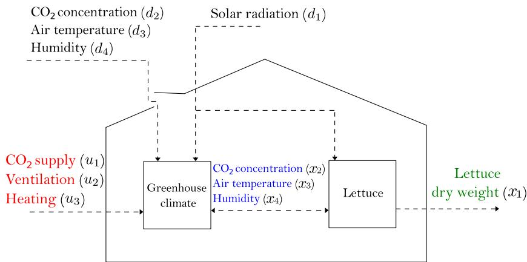
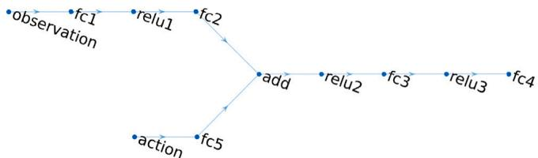
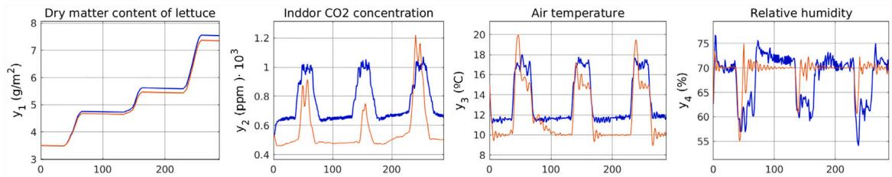
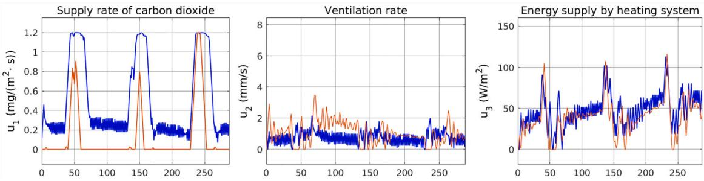
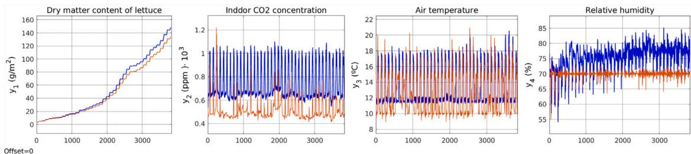

Original papers

# Reinforcement Learning versus Model Predictive Control on greenhouse climate control

Bernardo Morcego a, Wenjie Yin a, Sjoerd Boersma b, Eldert van Henten c, Vicenc Puig a, Congcong Sun c,\*

a Automatic Control Group (CS2AC), Universitat Politècnica de Catalunya, Spain  b Biometris Group, Wageningen University, 6700 AA Wageningen, The Netherlands  c Agricultural Biosystems Engineering Group, Wageningen University, 6700 AA Wageningen, The Netherlands

# ARTICLE INFO

# ABSTRACT

Keywords:  Greenhouse climate control  Model Predictive Control  Reinforcement Learning

The greenhouse system plays a crucial role to ensure an adequate supply of fresh food for the growing global population. However, maintaining an optimal growing climate within a greenhouse requires resources and operational costs. To achieve economical and sustainable crop growth, efficient climate control in greenhouse production is paramount. Model Predictive Control (MPC) and Reinforcement Learning (RL) are the two approaches representing model- based and learning- based control, respectively. Each one has its own way to formulate control problems, define control objectives, and seek for optimal control actions that provide sustainable crop growth. Although certain forms of MPC and RL have been applied to greenhouse climate control, limited research has comprehensively analyzed the connections, differences, advantages, and disadvantages between these two approaches, both mathematically and in terms of performance. Therefore, this paper aims to address this gap by: (1) introducing a novel RL approach that utilizes Deep Deterministic Policy Gradient (DBTG) for large and continuous state- action space environments; (2) formulating the MPC and RL approaches for greenhouse climate control within a unified framework; (3) exploring the mathematical connections and differences between MPC and RL; (4) conducting a simulation study to analyze and compare the performance of MPC and RL; (5) presenting and interpreting the comparative results to provide valuable insights for the application of these control approaches in different scenarios. By undertaking these objectives, this paper seeks to contribute to the understanding and advancement of both MPC and RL methods in greenhouse climate control, fostering more informed decision- making regarding their selection and implementation based on specific requirements and constraints.

# 1. Introduction

The world population will increase by 2,000 million people in the next 30 years reaching 9,700 million people in 2050 (United Nations: Department of Economic and Social Affairs, 2019). To feed this population, projections show that food production would need to increase by  $70\%$  between 2005 and 2050. Production in developing countries would have to nearly double (FAO, 2018). On the other hand, the Intergovernmental Panel on Climate Change (IPCC) declared that it is crucial and urgent to render the way of land use and the agricultural production methods more efficient in order to curb global warming. Climate controlled greenhouses, which allow for growing crops regardless of the outdoor environment, is one of these important production methods. To maintain a proper growing climate with efficient energy usage and operational cost, advanced control methods of the greenhouse production system (e.g. heating, lighting, ventilation, screening,  $\mathrm{CO_2}$  dosing, etc.) are needed. Another reason for the necessity of advanced greenhouse control is the increasing number of greenhouses and decreasing number of experienced growers.

While Model Predictive Control (MPC) has extensively been applied to solve control problems in the greenhouse, see e.g. Blasco et al. (2007), van Straten et al. (2011), Chen and You (2020), Boersma and van Mourik (2021), Reinforcement Learning (RL) is more scarce in the literature. The first known reference is Tchamitchian et al. (2005) where a RL temperature controller in a rose production greenhouse is described. In Ban and Kim (2017), the authors used a deep learning approach to control the greenhouse environment variables, modeled linearly. More recent articles are Zhang et al. (2021) and Afzali et al. (2021). The first applies RL to control and create optimized models

of the greenhouse dynamics using samples from the real environment. The focus of that article is on the robustness of the models and the controller. In Afzali et al. (2021), a supplemental lightning control system is described. It is developed with Q- learning, posing the problem as a discrete constrained optimal problem where energy is the variable to optimize. In contrast, this paper proposes a novel application of the RL Deep Deterministic Policy Gradient (DDPG) approach, which has the ability to handle continuous action spaces with efficient and robust policy learning, through utilizing actor- critic architecture and incorporating experience replay. The only application of DDPG in the context of greenhouse climate control is Wang et al. (2020).

Despite significant work on both MPC and RL individually, as mentioned earlier, no prior work studied the performance of these two approaches on a similar control problem using a coherent approach in the domain of greenhouse crop production control. Nor have pro's and con's of both approaches been studied in much detail. This paper also aims to explore the practical connections and differences between MPC and RL, thereby enhancing the understanding of their respective development and application in greenhouse climate control, while building on related work in other domains (Ernst et al., 2009; Gorges, 2017). The authors in Ernst et al. (2009) provide a common formulation for both MPC and RL problems and show their equivalences. The article is restricted to problems with only equality constraints and no constraints on the control actions are taken into account. The authors in Gorges (2017) present a similar result extending the RL framework to one that uses approximators for the action and the state space. In addition, they include inequality constraints on both the states and the control actions. However, the analysis is limited to linear systems.

Consequently, the contributions of this paper are firstly the introduction of a RL method that employs the DDPG approach, specifically designed to address the challenges posed by large continuous state- action spaces in greenhouse climate control. Secondly, this paper formulates both the MPC and the proposed RL approach within a unified framework. By doing so, it aims to explore the mathematical connections and differences between MPC and RL, thereby enhancing the understanding of their respective development and application in greenhouse climate control.

The structure of this paper is organized as follows: Section 2 introduces the lettuce greenhouse model that serves as the foundation for both the MPC and RL controllers. This model is not only utilized for simulations, but also for evaluating the effectiveness of the control strategies. Section 3 details the MPC and RL controllers within a unified framework. The formulation and implementation of both control approaches are presented, highlighting their distinct characteristics and methodologies. The obtained simulation results using the MPC and RL controllers are presented and compared in Section 4. This section offers an in- depth analysis of the performance and efficacy of the two control approaches in the context of the lettuce greenhouse environment. Finally, in Section 5, the findings and insights gathered from this study are discussed, leading to a conclusion that encapsulates the main outcomes of the research. Additionally, this section provides valuable recommendations and considerations for selecting and applying either MPC or RL in various scenarios.

# 2. Lettuce Greenhouse model

The dynamical lettuces greenhouse model from van Henten (1994) is used. It is discretized using the Runge- Kutta fourth order explicit method having sample period  $n$ . Subsequently, the discrete- time state- space model is defined:

$$
\begin{array}{c}{x(k + 1) = f(x(k),u(k),d(k),p),}\\ {y(k) = g(x(k),p),} \end{array} \tag{1}
$$

with time  $k\in \mathbb{Z}^{0 + }$  , state variable  $x(k)\in \mathbb{R}^4$  , measurement  $y(k)\in \mathbb{R}^4$  control input  $u(k)\in \mathbb{R}^3$  and (weather) disturbance  $d(k)\in \mathbb{R}^4$  .Table 1 shows the meaning of the signals. The parameter  $p\in \mathbb{R}^{28}$  and nonlinear functions  $f(\cdot)$  and  $g(\cdot)$  are presented in Appendix.

A graphical representation the greenhouse model with lettuce (1) is shown in Fig. 1.

Table 1 Meaning of the state  $x(t)$  measurement  $y(t)$  control signal  $u(t)$  and disturbance  $d(t)$  

<table><tr><td>x1(t)</td><td>Dry-weight (kg/m²)</td><td>y1(t)</td><td>Dry-weight (g/m²)</td></tr><tr><td>x2(t)</td><td>Indoor CO2(kg/m³)</td><td>y2(t)</td><td>Indoor CO2(ppm)</td></tr><tr><td>x3(t)</td><td>Indoor temperature (deg °)</td><td>y3(t)</td><td>Indoor temperature (deg °)</td></tr><tr><td>x4(t)</td><td>Indoor humidity (kg/m³)</td><td>y4(t)</td><td>Indoor humidity (%)</td></tr><tr><td>u1(t)</td><td>CO2injection (mg/m²/s)</td><td>d1(t)</td><td>Radiation (W/m²)</td></tr><tr><td>u2(t)</td><td>Ventilation (mm/s)</td><td>d2(t)</td><td>Outdoor CO2(kg/m³)</td></tr><tr><td>u3(t)</td><td>Heating (W/m²)</td><td>d3(t)</td><td>Outdoor temperature (deg °)</td></tr><tr><td></td><td></td><td>d4(t)</td><td>Outdoor humidity (kg/m³)</td></tr></table>

# 3.MPC versus RL

MPC and RL have been developed by separate communities, the control community and the computational intelligence community, respectively (Gorges, 2017). Afterwards, the two methods have evolved more or less independently. As representatives of model- based and learning- based control methods, MPC and RL behave differently from the use of terminologies to the way of seeking for optimal control actions.

MPC is effective to optimize a greenhouse production system due to its promising performance in multi- input and multi- output systems, while considering constraints. However, predicting uncertain disturbances (like the weather) along the prediction horizon remains a challenging task (Boersma and van Mourik, 2021; Maciejowski, 2002; Chen and You, 2020).

Due to the way of stating problems and defining control goals, the development and implementation of MPC usually requires relatively small models, and works better in stable systems based on static control models. The adaptability of MPC to various conditions is limited and may not be enough for autonomous objectives as desired in the greenhouse. Moreover, handling uncertainties in MPC is also computationally expensive due to the complex mathematical propagation of the distributions that belong to the uncertainties.

In order to make the greenhouse production more autonomous and adaptable beyond optimal, researchers are seeking help from innovative technologies like AI, Information and Communication Technologies (ICT), as well as the allied technologies, such as learning- based control, RL. The latter is a dynamic control strategy that can automatically update the current control policy through incorporating newly developed knowledge learned from historical and real- time data. Due to the learning- based and trial- and- error interaction with the environment (system), the control strategy of RL is more adaptable to current dynamics of the systems. Specifically for a greenhouse, it is more adaptable to different stages of plant development even for different cultivars. In addition, RL can learn control strategies completely from data and not always a high quality model is needed. In spite of being simple and well- grounded, RL suffers from clear limitations. The most significant, especially referred to the very initial RL algorithms, was the necessity to have a discrete and reduced set of states and control actions. That limitation was overcome using function approximators in the form of neural networks.

Nowadays, RL is the key technology to transform the modern farming control mindset, although with a long and well- known development and application history (see Sutton and Barto (1998) and references therein). A sign of the popularity of RL in greenhouse production systems is the three editions of the Autonomous Greenhouse Challenge (Hemming et al., 2019, 2020), where dozens of international teams tested their state- of- the- art AI approaches in irrigation, crop growth and greenhouse climate control. Additionally, greenhouse benchmarks and the so- called gyms (which are software environments to train machine learning agents) have also been published recently (Overweg et al., 2021; Turchetta et al., 2022; An et al., 2021).

Apart from differences, MPC and RL also share plenty of common features. For example, both MPC and RL serve as predictive controllers

  
Fig. 1. Graphical representation of the employed lettuce greenhouse model (van Henten, 1994).

regardless of whether they incorporate disturbance predictions into their control strategies. MPC employs explicit optimization over a finite prediction horizon, whereas RL learns actions to maximize the cumulative reward, considering both immediate and discounted future rewards. In order to compare MPC with RL, the following subsections will explain precisely the development of RL from an unified framework with MPC in terms of (1) prediction principle; (2) reward (or cost) function; as well as (3) constraints handling. Besides the mathematical comparisons of the prediction principle, reward function and constraints handling, the performance of the developed MPC and RL, that are applied on the same case, will also be compared. A theoretical comparison regarding stability, feasibility, and robustness of the two control approaches will not be covered in this paper.

In the following, the MPC framework is firstly detailed (Section 3.1) and after that the RL framework is detailed (Section 3.2).

# 3.1. Nonlinear model predictive control

Based on the lettuce greenhouse model presented in Section 2, this subsection presents a nonlinear MPC for climate control to optimize the greenhouse's efficiency.

# 3.1.1. Prediction principle

The receding horizon principle is followed by the proposed MPC. Here, a state measurement is taken at each time step and used to reinitialize the model that is employed in the MPC (1). From this newly obtained current state measurement, the model is propagated forward in time, while minimizing a cost function and the control inputs (decisions variables). The future optimized control signal is not applied over the complete prediction horizon, but only the first sample is applied. Subsequently, a new state is measured that is used as new initial condition for the model in the MPC. This principle repeats itself at each time step. Next, the optimization problem with cost and constraints are detailed.

# 3.1.2. Optimization problem

It is assumed that at each time instant the state  $x(k)$  is measured. Then, at time step  $k_{0}$ , the following optimization problem is solved:

$$
\begin{array}{rl} & {\underset {u(k)}{\min}\sum_{k = k_0}^{k_0 + N_p}V(u(k),y(k)),}\\ & {x(k + 1) = f(x(k),u(k),d(k),p),\quad y(k) = g(x(k),p),}\\ & {u_{\min}\leq u(k)\leq u_{\max},\quad |u(k) - u(k - 1)|\leq \delta u,}\\ & {y_{\min}(k)\leq y(k)\leq y_{\max}(k),\quad \mathrm{for} k = k_0,\ldots ,k_0 + N_p,}\\ & {x(k_0) = x_0,} \end{array} \tag{2}
$$

with prediction horizon  $N_{p}$

# 3.1.3. Cost function and constraints

The following cost function  $V(u(k),y(k))$  is used in the MPC:

$$
V(u(k),y(k)) = -q_{y_1}\cdot y_1(k) + \sum_{j = 1}^{3}q_{u_j}\cdot u_j(k), \tag{3}
$$

with  $q_{y_1}, q_{u_j} \in \mathbb{R}$  user- defined weights that are used for making specific terms relatively more important. The cost in (3) imposes a trade- off between lettuce yield maximization (first term) and energy usage (control signal) minimization. Indeed, The exact trade- off is specified by the ratio  $q_{y_1} / q_{u_j}$ .

The constraints in (2) are detailed as:

$$
\begin{array}{rl} & u_{\min} = \left(0\quad 0\quad 0\right)^T,\quad u_{\max} = \left(1.2\quad 7.5\quad 150\right)^T,\quad \delta u = \frac{1}{10} u_{\max},\\ & y_{\min}(k) = \left(0\quad 0\quad f_{y_{3,\min}}(k)\quad 0\right)^T,\\ & y_{\max}(k) = \left(\infty \quad 1.6\quad f_{y_{3,\max}}(k)\quad 70\right)^T, \end{array}
$$

with the control signal's upper and lower bounds defined as  $u_{\max}, u_{\min} \in \mathbb{R}^3$ , respectively. The bound on the change of the control signal is specified by  $\delta u \in \mathbb{R}^3$ . Furthermore, the upper and lower bound on  $y(K)$  are  $y_{\max}(k)$  and  $y_{\min}(k) \in \mathbb{R}^4$ , respectively. These vary over time. In fact, the third element these bounds varies over time:

$$
f_{y_{3,\min}}(k) = \left\{ \begin{array}{ll}10, & \mathrm{if} d_1(k_0)< 10\\ 15, & \mathrm{otherwise}, \end{array} \right.f_{y_{3,\max}}(k) = \left\{ \begin{array}{ll}15, & \mathrm{if} d_1(k_0)< 10\\ 20, & \mathrm{otherwise}. \end{array} \right.
$$

Indeed, the indoor temperature is constrained by the time- varying constraint. These are set such that the indoor temperature is allowed to be warmer during the day than during the night, which is according to Seginer et al. (1994). The upper and lower constraints on the indoor temperature are shown in Fig. 2. Here, the region where  $y_{3}(k)$  is allowed to be controlled to is indicated by the gray area.

# 3.2. Deep reinforcement learning

The Deep Deterministic Policy Gradient (DDPG) is used to develop the RL control agent. The DDPG algorithm stems from Deterministic Policy Gradient (Silver et al., 2014) algorithm comprising concepts and theory of deep learning. The main advantage of DDPG is that it provides good performance in large and continuous state- action space environments, which motivates the selection in the greenhouse climate control application at hand.

DDPG is a model- free and off- policy actor- critic RL method (Lill- icrap et al., 2016). Due to these characteristics, the control actions of DDPG are generated by a different policy than the one being learnt and

  
Fig. 2. Example graph of the constraint that is imposed on  $y_{3}(k)$  (indoor temperature). The region where the optimized control signal are stress  $y_{3}(k)$  is in depicted is gray

  
Fig. 3. The structure of Actor-Critic RL agent.

the optimal policy and value function are estimated directly without making efforts to learn the system dynamics.

The structure of an actor- critic RL agent is shown in Fig. 3, where the actor has the role of storing and applying the current best policy, using a deep neural network. According to the learned policy function,  $\pi (s)$ , and the system state  $s$ , the actor selects optimal actions,  $u$ . The critic is used to store the value function,  $Q(s,u)$ , also using a deep neural network. The value function is the expected accumulated future reward for each state- action pair. The critic estimates the value function using the reward obtained from the system (environment) and its own information. Moreover, the critic is also responsible for calculating the temporal- difference (TD) error, which is used for both the critic and the actor during the learning process.

In addition to assuming the roles of the actor and the critic, DDPG incorporates two key elements from Deep- Q- Network (Mnih et al., 2015): the replay buffer and target networks. The replay buffer serves as a memory storage for storing transition tuple at each step. These tuples consist of the current state  $s(k)$ , action  $u(k)$ , received reward  $r(k)$ , subsequent state  $s(k + 1)$  and a Boolean variable indicating whether the next state is terminal  $t(k)$ . A terminal state denotes the end of the experiment. To train the critic and actor, a minibatch is randomly sampled from the replay buffer at each time step. This training approach breaks the temporal correlation between learning samples and facilitates convergence throughout the learning process.

Target networks are replicas of the actor and critic networks, utilized during the training phase to furnish target values for computing the loss function. Once the original networks are trained using the minibatch tuple set, the trained networks are duplicated onto the target networks through a soft update mechanism, which entails gradually modifying the target weights. Employing target networks with soft update ensures consistent targets during the temporal difference (TD) backups, contributing to the stability of the learning process. As a result, the DDPG algorithm necessitates the utilization of four neural networks: the actor, critic, and their corresponding target networks.

The gradient equations for updating the weights of the critic and actor are given in (6) and (7), respectively. The critic network's weights are denoted as  $\phi$ , and the actor's weights by  $\theta$ . The learning rates for the critic and actor networks are  $\eta_{\mu}$  and  $\eta_{\theta}$ . The mini- batch of transition tuples is denoted as  $B$  with  $N$  representing its size. The prime symbol denotes the target networks.  $v(k)$  8 are the target Q- values not to be confused with target networks) and are used to compute the loss function. The critic network's weights are updated to minimize this loss function. The discount factor,  $\gamma_{y}$  is a value ranging between 0 and 1, which determines the significance of future rewards in relation to the current state. Although it is challenging to establish a direct mapping between the prediction horizon in MPC and the discount factor, a relationship exists between the two. It is important to note that the target Q- values in (8) are generated based on the outputs of the actor and critic target networks, aligning with the concept of target networks.

$$
\begin{array}{l}{\Delta \phi = \eta_{\theta}\nabla_{\theta}\left(\frac{1}{N}\sum_{k\in B}\left(Q(s(k),u(k)\mid \phi^{Q^{\prime}}) - \nu (k)\right)^{2}\right)}\\ {\Delta \theta = \eta_{\theta}\nabla_{\theta}\left(\frac{1}{N}\sum_{k\in B}Q(s(k),\pi (s(k)\mid \theta^{\pi})\mid \phi^{Q})\right)}\\ {\nu (k) = r(k) + \gamma Q^{\prime}(s(k + 1),\pi^{\prime}(s(k + 1)\mid \theta^{Q^{\prime}})\mid \phi^{Q^{\prime}})} \end{array} \tag{8}
$$

The weight updates for the target networks, derived from the trained networks, are presented in (9) and (10). The parameter  $\tau$  governs the speed at which this update takes place. This soft update operation is performed after training the main networks and is executed at each time step

$$
\begin{array}{l}{\phi^{Q^{\prime}}\leftarrow \tau \phi^{Q} + (1 - \tau)\phi^{Q^{\prime}}.}\\ {}\\ {\rho^{Q^{\prime}}\leftarrow \tau \theta^{x} + (1 - \tau)\theta^{x^{\prime}}.} \end{array} \tag{10}
$$

# 3.2.1. Agent description

The agent's behavior is influenced by its state, the reward function, and the discount factor. The environment with which the agent interacts is exactly the same model employed by the MPC controller. However, the agent's state slightly differs, encompassing ten distinct components:

$$
\begin{array}{rl} & {s(k) = (\Delta_{y_1}(k),e_{y_2}(k),e_{y_3}(k),y_4(k),d_1(k),d_2(k),d_3(k),}\\ & {u_1(k - 1),u_2(k - 1),u_3(k - 1))} \end{array} \tag{11}
$$

where  $\Delta_{y_1}(k) = y_1(k) - y_1(k - 1)$ ,  $e_{y_2}(k) = y_{2,ref}(k) - y_2(k)$ ,  $e_{y_3}(k) = y_{3,ref}(k) - y_3(k)$ ,  $d_1(k)$  are the current disturbances and  $u_j(k - 1)$  are the previous control actions. The reward function and the discount factor take similar roles as the cost function and prediction horizon, respectively, in MPC. They are detailed next:

Reward function and constraints. Similarly to the cost function of MPC presented in Eq. (3), the dry matter is included in the reward function. Nevertheless, other variables also need to be taken into account to guide the learning process. As a result, the reward function contains six terms. The first three terms are rewards and the other terms are penalties. The reward is defined as:

$$
r(k) = c_{r,1}A_{y_1}(k) + r_{\mathrm{CO}_2}(k) + r_T(k) - (\sum_{j = 1}^{3}c_{r,u_j}\cdot u_j(k - 1)) \tag{12}
$$

where  $r_{\mathrm{CO}_2}(k)$  and  $r_T(k)$  represent the rewards associated with the control of the main production variables,  $\mathrm{CO}_2$  concentration and temperature, and  $c_{r,i}$  are adjustable constant parameters.

Dry matter and energy consumption are considered as in (3), but the agent is also rewarded if  $\mathrm{CO}_2$  concentration and temperature are controlled satisfactorily. In accordance with the temperature constraint included in the MPC (5), the reward function depends not only on the temperature error but also on the heating system. That is because during the day it is more efficient to warm up the greenhouse with the solar radiation than with the heating system and applying ventilation.  $\mathrm{CO}_2$  concentration is also controlled to be higher during the day and lower during the night, as is common practice in a greenhouse.

  
Fig. 4. Actor-Critic agent structure.

Table 2 Training options for all the networks.  

<table><tr><td>Parameter</td><td>Value</td><td>Parameter</td><td>Value</td></tr><tr><td>learning rate</td><td>1 × 10-3</td><td>experience buffer size</td><td>1 × 104</td></tr><tr><td>gradient threshold</td><td>1</td><td>experience mini-batch size</td><td>64</td></tr><tr><td>L2 regularization factor</td><td>1 × 10-5</td><td>discount factor, γ</td><td>0.9</td></tr></table>

The agent will receive a fixed reward for maintaining these measurements within a given range and a penalty for going outside of the range. Consequently, the constraints in (2) are translated here as rewards and defined as:

$$
\begin{array}{r l} & {r_{\mathrm{CO}_{2}}(k) = \left\{ \begin{array}{l l}{-c_{r,\mathrm{CO}_{2},1}\cdot (y_{2}(k) - \mathrm{CO}_{2_{m i n}}(k))^{2}} & {\mathrm{if~}y_{2}(k)< \mathrm{CO}_{2_{m i n}}(k)}\\ {-c_{r,\mathrm{CO}_{2},1}\cdot (y_{2}(k) - \mathrm{CO}_{2_{m a x}}(k))^{2}} & {\mathrm{if~}y_{2}(k) > \mathrm{CO}_{2_{m a x}}(k)}\\ {c_{r,\mathrm{CO}_{2},2}} & {\mathrm{otherwise}} \end{array} \right.}\\ & {r_{T}(k) = \left\{ \begin{array}{l l}{-c_{r,T,1}\cdot (y_{3}(k) - T_{m i n}(k))^{2}} & {\mathrm{if~}y_{3}(k)< T_{m i n}(k)}\\ {-c_{r,T,1}\cdot (y_{3}(k) - T_{m a x}(k))^{2}} & {\mathrm{if~}y_{3}(k) > T_{m a x}(k)}\\ {c_{r,T,2}} & {\mathrm{otherwise},} \end{array} \right.} \end{array} \tag{13}
$$

with  $c_{r,\mathrm{CO}_2}$  and  $c_{r,T}$  being adjustable constant parameters. These parameters can be considered as the weights of the constraint on the reward. Depending on the strength of the reward, the agent will adapt a more conservative or more aggressive strategy for the greenhouse climate control.

To sum up, the reward function of the RL agent encodes the MPC cost function and constraints. In (12), the dry matter increase is rewarded instead of the accumulated value, as in (3), because the agent learning was not consistent when the accumulated value was used.

Prediction principle. While MPC uses the receding horizon, the RL agent uses a discount factor  $\gamma$  (8) to describe the future influence of rewards. When  $\gamma = 0$  the RL agent directs its attention solely towards acquiring optimal actions for immediate rewards. Conversely, as  $\gamma$  approaches 1, the RL agent evaluates its actions considering the cumulative sum of all future rewards. Consequently, selecting a specific value for  $\gamma$  can be viewed as choosing a prediction horizon similar to that in MPC, although establishing an exact one- to- one correspondence is challenging.

From (8), one can also see that the discount factor  $\gamma$  is related to the aggressiveness of the control actions, similarly to parameters  $q_{y_1}$  and  $q_{z_2}$  in (3). In this paper, the discount factor  $\gamma$  is tuned by trial and error to produce dynamical behavior in the greenhouse similar to MPC.

# 3.2.2. Agent training

The structure of the RL agent developed in this paper is described in this section. The critic network's structure is shown in Fig. 4. Observations are processed by three layers of 10 Rectified Linear Units (ReLU) and actions are processed by two layers of 10 units. All the layers are fully connected. The actor networks consist of three fully connected layers of 20 ReLU units and a final hyperbolic tangent layer with three nodes, corresponding to each one of the control actions. The training options for all the networks are given in Table 2 and the parameters related to the reward/penalty function are listed in Table 3.

The agent is trained for 500 epochs, where each epoch consists of one day of crop growth. Each day of simulation contains 96 steps, so each step is  $15\mathrm{min}$ . Nominal meteorological data are the same for MPC and RL. Nevertheless, as they represent disturbances, the RL agent receives them contaminated by adding white noise with standard deviation of 0.3 to it, to help it explore better the state space and avoid overfitting.

Table 3 Parameters of the reinforcement function.  

<table><tr><td>Parameter</td><td>Value</td><td>Parameter</td><td>Value</td></tr><tr><td>cr,1</td><td>16</td><td>cr,CO2,1</td><td>0.1</td></tr><tr><td>cr,UM</td><td>4.5360 × 10-4</td><td>cr,CO2,2</td><td>0.0005</td></tr><tr><td>cr,UT2</td><td>0.0075</td><td>cr,T,1</td><td>0.001</td></tr><tr><td>cr,UM3</td><td>8.5725 × 10-4</td><td>cr,T,2</td><td>0.0005</td></tr></table>

Table 4 Parameters of the economic profit function.  

<table><tr><td>Parameter</td><td>Value</td></tr><tr><td>ccO2</td><td>42 × 10-2Hflkg-1</td></tr><tr><td>crq</td><td>6.35 × 10-9HflJ-1</td></tr><tr><td>cpri,1</td><td>1.8Hflmg-1</td></tr><tr><td>cpri,2</td><td>10Hflkg-1</td></tr></table>

# 4. Simulation results

To facilitate a comparison between MPC and RL, the DDPG agent utilized the same weather data as the one employed by the MPC controller. Moreover, both controllers accounted for constraints and control objectives in a similar manner. The weather data  $d(k)$  utilized in this study, including outdoor radiation,  $\mathrm{CO_2}$  concentration, temperature and humidity, was obtained from real- life weather measurements during the winter period of 2010 and 2011. The outdoor temperature ranged from 2 to 8.5 degree, outdoor radiation ranged from 0 to  $280\mathrm{W / m^2}$ ,  $\mathrm{CO_2}$  concentration ranged from 0.43 to  $0.57\mathrm{ppm} * 10^{3}$ , while relative humidity ranged from  $66\%$  to  $93\%$ . The interested reader is referred to Kempkes et al. (2014) for further details regarding the specific weather data. The original weather data was sampled at a 5- minute interval. However, for the purpose of this study, the weather data was resampled to a different time interval  $h$ . Fig. 5 showcases a particular realization of the disturbances, which encompasses 288 samples and corresponds to a duration of 3 days.

# 4.1. Economic profit indicator

Besides dry matter, indoor  $\mathrm{CO_2}$  concentration, air temperature and relative humidity are optimized in the cost (reward) function, also one extra indicator is considered. This is the economic profit indicator (EPI) and considered as an additional validation item to compare the performance of the MPC and the DDPG- based RL agent:

$$
EPI = \phi (y_{1}(t_{f})) - \sum_{t_{b}}^{t_{f}}(c_{q}u_{q}(t) + c_{\mathrm{co}_{2}}u_{\mathrm{co}_{2}}(t))h, \tag{14}
$$

where  $\phi (y_{1}(t_{f}))$  is the gross income obtained at harvest time  $t_f$  and  $c_{q}u_{q}(t) + c_{\mathrm{co}_{2}}u_{\mathrm{co}_{2}}(t)$  are the operating costs of the air conditioning equipment  $(\mathrm{Hf}1\mathrm{m}^{- 2}\mathrm{s}^{- 1})$ . The auction price of the lettuce follows a linear ratio  $\phi (y_{1}(t_{f})) = c_{pri,1} + c_{pri,2}y_{1}(t_{f})$ , between the auction price and the harvest weight of lettuce in  $\mathrm{kg}\mathrm{m}^{- 2}$ . The units of parameters  $c_{pri,1}$  and  $c_{pri,2}$  are  $\mathrm{Hf}1\mathrm{m}^{- 2}$  and  $\mathrm{Hf}1\mathrm{kg}^{- 1}\mathrm{m}^{- 2}$ , respectively.

It is assumed that the operating costs of the climate control equipment are linearly related to the amount of energy  $u_{q}$ $(\mathrm{Wm}^{- 2})$  and the amount of carbon dioxide introduced into the system is  $u_{c}$ $(\mathrm{kg}\mathrm{m}^{- 2}\mathrm{s}^{- 1})$ . These operating costs are parameterized by the price of energy  $c_{q}$ $(\mathrm{Hf}1\mathrm{J}^{- 1})$  and the price of carbon dioxide  $c_{\mathrm{CO_2}}$ $(\mathrm{Hf}1\mathrm{kg}^{- 1})$ . More details of their values are found in Table 4.

  
Fig. 5. Disturbances applied to the greenhouse (solar radiation, external  $\mathrm{CO_2}$  concentration, temperature and relative humidity).

  
Fig. 6. Outputs of the system: dry matter, indoor  $\mathrm{CO_2}$  concentration, air temperature and relative humidity. DDPG agent (blue) and MPC (orange).

Table 5 Controller and simulation settings.  

<table><tr><td>Parameter</td><td>Value</td><td>Parameter</td><td>Value</td></tr><tr><td>h</td><td>15 min</td><td>q1</td><td>103</td></tr><tr><td>Np</td><td>6 h</td><td>q4</td><td>{10, 1, 1}</td></tr><tr><td>N</td><td>40 days</td><td></td><td></td></tr></table>

# 4.2. Specific MPC settings

The user- defined weights in the optimization  $q_{\bar{s}_1}, q_{u_i}$  are tuned such that an acceptable trade- off between energy usage and yield is achieved. The prediction horizon  $N_{p}$  is chosen such that the, in time growing uncertainty, is not significant in the prediction horizon and the model prediction can still be trusted. Indeed, uncertainty in the weather forecasts increases over the prediction horizon. Table 5 details other settings that are used during this study.

The open- source software CasADi (Andersson et al., 2019) and solver IPOPT (Wachter and Begler, 2006) are employed in Matlab. These are used to solve the optimization problem (2).

# 4.3. Results

Fig. 6 shows the measurement of the simulated greenhouse using the DDPG- based RL agent (in blue) and the MPC controller (in orange). From this figure, we can find that both MPC and RL obtain a similar dry matter content of lettuce, though RL is slightly more productive. The rest of the outputs are kept approximately within their constraints. The interior relative humidity levels are very similar in both cases, although RL allows for more variation. Similarly, the indoor temperature and  $\mathrm{CO_2}$  concentration are close to their minimum level although the RL agent keeps the temperature at a level slightly above the minimum temperature to avoid receiving this penalty. The RL agent is clearly more conservative than the MPC because the cost function penalizes when the temperature drops below the minimal temperature constraints. The MPC controller controls more accurately the humidity while the DDPG agent does a better job regarding the indoor temperature. The  $\mathrm{CO_2}$  concentration is increased noticeably during daylight hours by both controllers, which is expected. However, it is kept higher during night by the DDPG agent.

Fig. 7 shows the control actions of both controllers. It is apparent that more efficient use of ventilation is done by the MPC, but a higher quantity of energy is given by the DDPG agent.

Table 6 Performance of MPC and RL.  

<table><tr><td>Index</td><td>MPC</td><td>RL</td></tr><tr><td>EPI</td><td>1.843Hflm-2</td><td>1.788Hflm-2</td></tr><tr><td>computing time</td><td>305.04s</td><td>2.36s</td></tr></table>

In terms of production, the RL agent achieves a greater production of lettuce, but in terms of economic benefit, the MPC achieves a higher economic return  $(1.843\mathrm{Hf}1\mathrm{m}^{- 2})$  than the agent  $(1.788\mathrm{Hf}1\mathrm{m}^{- 2})$  as shown in Table 6. This is due to the fact that the economic profitability of the increase in lettuce production is lower than the cost of resource consumption for the economic return function with the parameters given in Table 4. Fig. 7 shows that the temperature levels are kept low in both cases but the RL agent clearly keeps the  $\mathrm{CO_2}$  concentration at a much higher level than the MPC. An explanation for this behavior might be that, since the increase in the injection of  $\mathrm{CO_2}$  can significantly increase the production, the agent has favored exploring this option whilst arriving at a sub- optimal solution.

In terms of computing time, Table 6 shows that on a standard laptop (Intel Core i7- 9700 CPU @ 3.00 GHz, 32 GB RAM) the RL agent is more than 100 times faster than the MPC. This is reasonable because MPC has to solve an optimization problem at every time step, while the agent only needs to obtain the output from its neural networks once it is trained.

To solve this problem, we can let the agent train continuously to explore a larger state space, or we can reshape the cost function and redefine the upper and lower limits of the  $\mathrm{CO_2}$  injection. The agent can potentially find the optimal solution for this redefined problem. However, if the auction price of lettuce or the cost of  $\mathrm{CO_2}$  changes, this agent will not adapt to find a new optimal solution unless it takes all these variable parameters as observation and starts training again.

Fig. 8 shows the outputs of the simulated greenhouse for a complete growing cycle of lettuce, which lasts for 40 days. The production of RL is now clearly higher, but the EPI is smaller  $(2.195\mathrm{Hf}1\mathrm{m}^{- 2})$  in contrast to  $2.504\mathrm{Hf}1\mathrm{m}^{- 2}$  produced by the MPC. It is also apparent that the RL agent is more permissive with the constraint of humidity. That might become a health problem for the crops and has to be looked at with care. However, these type of detailed effects are not considered in the utilized models.

# 5. Discussion and conclusion

This paper presents two different control approaches based on MPC and RL in an unified framework for managing a lettuce greenhouse.

  
Fig. 7. Control actions applied by the NDPG agent (blue) and the MPC (orange).

  
Fig. 8. System outputs for a complete growing cycle (40 days).

The greenhouse model serves as a simulation environment, allowing for a comparison and analysis of the performance between RL and MPC controllers. The objective is to explore the use of these two control methods for achieving optimal control in a greenhouse, considering the efficient utilization of natural resources and production efficiency. Through a comprehensive analysis, this paper presents the connections and differences between MPC and RL, shedding light on the unique characteristics and advantages offered by each method. By evaluating and comparing the outcomes, valuable insights are derived regarding the effectiveness and suitability of these control approaches for greenhouse climate control applications.

Regarding the results, it was observed that the RL agent did not achieve as good results as the MPC model in terms of energy optimization. Additionally, although higher production was obtained with RL, the economic profitability was not as favorable as that of the MPC.

In reinforcement learning, directly applying constraints to the states is not feasible. Without properly defining a reasonable range for the states in the reward function, the agent may explore irrational states, such as excessively increasing the temperature above  $40^{\circ}\mathrm{C}$ . Moreover, if there exists a shortcut within the cost function, the agent may exploit it. For instance, in terms of economic benefit comparison, the agent may prioritize maximizing economic returns by applying a maximum ventilation without injecting any carbon dioxide or activating the heating. This approach achieves the highest economic benefit, reaching  $1.894\mathrm{Hf}1\mathrm{m}^{- 2}$ . However, it leads to dangerous indoor temperature and relative humidity levels for lettuce growth. Furthermore, it is challenging to determine whether the trained agent has converged to an optimal control policy or settled for a suboptimal solution. Comparing the agent's performance with other optimal controllers becomes necessary. In summary, designing a well- tuned agent is a complex task that often requires an iterative process.

However, once a correctly designed agent is obtained, it demonstrates significant power that provides control results with minimal computational resources and time. Additionally, RL agents exhibit enhanced capability in handling uncertainties compared to MPC, thanks to their optimization strategies. To facilitate a clear comparison between MPC and RL, a comprehensive table (Table 7) is provided, outlining their respective pros and cons. This comparison offers valuable insights for selecting the appropriate control method based on specific scenarios.

Throughout the current work, several areas for improvement and further research have been identified. The following are proposed directions for extending and enhancing the current work:

1. Redesigning the agent to incorporate future climate predictions as observations: In this work, the agent solely receives the current outdoor weather as input and its prediction of future states relies solely on the current indoor and outdoor weather conditions along with the performed actions. To enhance the agent's predictive capabilities, future work could involve integrating predictions of future outdoor weather as input. This enhancement would enable the agent to make more accurate predictions of future reinforcements. 
2. Utilizing economic profit indicators as agent observations: Another proposal involves incorporating the parameters of the economic profit indicator as observations for the agent. By allowing the agent to learn and respond to changes in these parameters, it can dynamically adjust energy usage accordingly. 
3. Exploring advanced reinforcement deep learning algorithms: To further enhance performance, it is recommended to explore more sophisticated reinforcement deep learning algorithms such as TD3 (Twin Delayed Deep Deterministic Policy Gradient algorithm), PPO (Proximal Policy Optimization), or SAC (Soft Actor-Critic). Comparing the performance of these algorithms with the existing approach would provide insights into their effectiveness for the given problem. 
4. Integrating MPC with RL for climate control in greenhouse production systems: Considering the strengths and weaknesses of both MPC and RL, an alternative approach is to integrate the robust features of both methods. By combining MPC and RL, it becomes possible to leverage their respective advantages for climate control in greenhouse production systems. This integration could lead to improved control performance and system efficiency.

These proposals for future research aim to enhance the RL agent's predictive capabilities, incorporate additional relevant observations, explore advanced deep learning algorithms and explore hybrid approaches that can combine the strengths of MPC and RL.

Table 7 Plos and Cons of MPC and RL.  

<table><tr><td>MPC</td><td>RL</td></tr><tr><td>Relies on good model</td><td>Can be model free</td></tr><tr><td>Optimizes based on a control-oriented nonlinear model</td><td>Leams for decision making</td></tr><tr><td>Easily handles constraints</td><td>Difficulty in handling constraints</td></tr><tr><td>Struggles with long-term prediction</td><td>Infinite prediction horizons</td></tr><tr><td>Results in high computing load for uncertainties</td><td>Inherently robust</td></tr><tr><td>Low adaptability</td><td>High adaptability</td></tr><tr><td>High complexity for online optimization</td><td>Low complexity for online learning</td></tr></table>

Table 8 Model parameter values (van Henten, 1994).  

<table><tr><td>Parameter</td><td>Value</td><td>Parameter</td><td>Value</td><td>Parameter</td><td>Value</td><td>Parameter</td><td>Value</td></tr><tr><td>p1,1</td><td>3.844</td><td>p2,1</td><td>4.4</td><td>p3,1</td><td>8.45d</td><td>p4,1</td><td>4.4</td></tr><tr><td>p1,2</td><td>2.65 · 10-7</td><td>p2,2</td><td>4.87 · 10-7</td><td>p3,2</td><td>1290</td><td>p4,2</td><td>0.0036</td></tr><tr><td>p1,3</td><td>3.35</td><td>p2,3</td><td>7.5 · 10-6</td><td>p3,3</td><td>6.1</td><td>p4,3</td><td>9.348</td></tr><tr><td>p1,4</td><td>5.55 · 10-9</td><td>p2,4</td><td>8.31</td><td>p3,4</td><td>0.2</td><td>p4,4</td><td>8314</td></tr><tr><td>p1,5</td><td>5.11 · 10-6</td><td>p2,5</td><td>273.15</td><td></td><td></td><td>p4,5</td><td>273.15</td></tr><tr><td>p1,6</td><td>2.3 · 10-4</td><td>p2,6</td><td>101.325</td><td></td><td></td><td>p4,6</td><td>17.4</td></tr><tr><td>p1,7</td><td>6.29 · 10-4</td><td>p2,7</td><td>0.044</td><td></td><td></td><td>p4,7</td><td>239</td></tr><tr><td>p1,8</td><td>5.2 · 10-5</td><td></td><td></td><td></td><td></td><td>p4,8</td><td>17.269</td></tr><tr><td></td><td></td><td></td><td></td><td></td><td></td><td>p4,9</td><td>238.3</td></tr></table>

# CRediT authorship contribution statement

Bernardo Morcego: Methodology, Software, Validation, Investigation, Resources, Writing - original draft, Writing - review & editing, Supervision. Wenjie Yin: Methodology, Software, Validation, Writing - original draft. Sjoerd Boersma: Methodology, Software, Validation, Investigation, Resources, Writing - original draft, Writing - review & editing, Supervision. Eldert van Henten: Resources, Writing - review & editing, Supervision. Vicenc Puig: Resources, Writing - review & editing, Supervision. Congcon; Sun: Conceptualization, Methodology, Validation, Investigation, Resources, Writing - original draft, Writing - review & editing, Supervision, Project administration, Funding acquisition.

# Declaration of competing interest

The authors declare that they have no known competing financial interests or personal relationships that could have appeared to influence the work reported in this paper.

# Data availability

Data will be made available on request.

# Acknowledgments

This work has been partially funded by the Sector Plan for Science and Technology established by the Dutch Ministry of Education, Culture and Science. It has also been partially funded by the Spanish State Research Agency (AEI) and the European Regional Development Fund (ERFD) through the project SaCoAV (ref. PID2020- 114244RB- 100).

# Appendix

The employed lettuce greenhouse model is given by the following equations:

$$
\begin{array}{rl} & {\frac{\mathrm{d}x_1(t)}{\mathrm{d}t} = p_{1,1}\phi_{\mathrm{phot,c}}(t) - p_{1,2}x_1(t)2^{x_3(t) / 10 - 5 / 2},}\\ & {\frac{\mathrm{d}x_2(t)}{\mathrm{d}t} = \frac{1}{p_{2,1}} -\phi_{\mathrm{phot,c}}(t) + p_{2,2}x_1(t)2^{x_3(t) / 10 - 5 / 2} + u_1(t)10^{-6} - \phi_{\mathrm{vent,c}}(t),}\\ & {\frac{\mathrm{d}x_3(t)}{\mathrm{d}t} = \frac{1}{p_{3,1}} u_3(t) - (p_{3,2}u_2(t)10^{-3} + p_{3,3})(x_3(t) - d_3(t)) + p_{3,4}d_1(t),}\\ & {\frac{\mathrm{d}x_4(t)}{\mathrm{d}t} = \frac{1}{p_{4,1}} (\phi_{\mathrm{transp,h}}(t) - \phi_{\mathrm{vent,h}}(t)),} \end{array}
$$

with

$$
\begin{array}{rl} & {\phi_{\mathrm{phot,c}}(t) = \Big(1 - \exp \bigl (-p_{1,3}x_1(t)\bigr)\Big)\Big(p_{1,4}d_1(t)\big(-p_{1,5}x_3(t)^2 +\dots}\\ & {\qquad p_{1,6}x_3(t) - p_{1,7}\big)\big(x_2(t) - p_{1,8}\big)\Big) / \phi (t),}\\ & {\phi (t) = p_{1,4}d_1(t) + \bigl (-p_{1,5}x_3(t)^2 +p_{1,6}x_3(t) - p_{1,7}\bigr)\big(x_2(t) - p_{1,8}\big),} \end{array}
$$

$$
\phi_{\mathrm{vent,c}}(t) = \big(u_2(t)10^{-3} + p_{2,3}\big)\big(x_2(t) - d_2(t)\big),
$$

$$
\phi_{\mathrm{vent,h}}(t) = \left(u_2(t)10^{-3} + p_{2,3}\right)\left(x_4(t) - d_4(t)\right),
$$

$$
\phi_{\mathrm{transp,h}}(t) = p_{4,2}\Big(1 - \exp \big(-p_{1,3}x_{1}(t)\big)\Big)
$$

$$
\Big(\frac{p_{4,3}}{p_{4,4}(x_3(t) + p_{4,5})}\mathrm{exp}\Big(\frac{p_{4,6}x_3(t)}{x_3(t) + p_{4,7}}\Big) - x_4(t)\Big),
$$

with  $t\in \mathbb{R}$  the continuous time. Furthermore,  $\phi_{\mathrm{phot,c}}(t),\phi_{\mathrm{vent,c}}(t)$ $\phi_{\mathrm{transp,h}}(t)$  and  $\phi_{\mathrm{vent,h}}(t)$  are the gross canopy photosynthesis rate, mass exchange of  $\mathrm{CO_2}$  through the vents, canopy transpiration and mass exchange of  $\mathrm{H}_2\mathrm{O}$  through the vents, respectively. The measurement equation is defined as:

$$
\begin{array}{rl} & y_{1}(t) = 10^{3}\cdot x_{1}(t)\\ & y_{2}(t) = \frac{10^{3}\cdot p_{2,4}(x_{3}(t) + p_{2,5})}{p_{2,6}p_{2,7}}\cdot x_{2}(t),\\ & y_{3}(t) = x_{3}(t),\\ & y_{4}(t) = \frac{10^{2}\cdot p_{2,4}(x_{3}(t) + p_{2,5})}{11\cdot\exp\left(\frac{p_{4,8}x_{3}(t)}{x_{3}(t) + p_{4,9}}\right)}\cdot x_{4}(t), \end{array} \qquad \begin{array}{l}\mathrm{g~m^{-2},}\\ \mathrm{ppm}\cdot 10^{3},\\ \mathrm{^\circ C,} \end{array}
$$

The model parameters  $p_{i,j}$  are defined following (van Henten, 1994) and presented in Table 8. The fourth order explicit Runge- Kutta method is used to discretize the above model, which results in the model as shown in (1):

$$
\begin{array}{c}{x(k + 1) = f(x(k),u(k),d(k),p),}\\ {y(k) = g(x(k),p),} \end{array} \tag{15}
$$

with discrete time  $k\in \mathbb{Z}^{0 + }$  and relation  $t = k\cdot h$  with  $h$  the sample period. The initial state and control signal are:

$$
x(0) = \left(0.0035\quad 0.001\quad 15\quad 0.008\right)^T,\qquad u(0) = \left(0\quad 0\quad 0\right)^T.
$$

# References

Afzali, S., Mosharafian, S., van Iersel, M.W., Vehni, J.M., 2021. Optimal lighting control in greenhouses equipped with high- intensity discharge lamps using reinforcement learning. In: 2021 American Control Conference, ACC, IEEE, pp. 1414- 1419.

An, Z., Cao, X., Yao, Y., Zhang, W., Li, L., Wang, Y., Guo, S., Luo, D., 2021. A simulator- based planning framework for optimizing autonomous greenhouse control strategy. In: Conference on Automated Planning and Scheduling. Andersson, J.A.E., Gillis, J., Horn, G., Rawlings, J.B., Diehl, M., 2019. CasADI: a software framework for nonlinear optimization and optimal control. Math. Program. Comput. 11, 1–36. Ban, B., Kim, S., 2017. Control of nonlinear, complex and black- boxed greenhouse system with reinforcement learning. In: 2017 International Conference on Information and Communication Technology Convergence. ICTC, IEEE, pp. 913–918. Blasco, X., Martinez, M., Herrero, J.M., Ramos, C., Sanchis, J., 2007. Model- based predictive control of greenhouse climate for reducing energy and water consumption. Comput. Electron. Agric. 55 (1), 49–70. Boersma, S., van Mourik, S., 2021. Nonlinear sample- based MPC in a greenhouse with lettuce and uncertain weather forecasts. In: 40th Benelux Workshop on Systems and Control. pp. 58–59. Chen, W.H., You, F.Q., 2020. Data- driven robust optimization for greenhouse temperature control using model predictive control. Chem. Eng. Trans. 91, 721–726. Ernst, D., Glavic, M., Capitanescu, F., Wehenkel, L., 2009. Reinforcement learning versus model predictive control: A comparison on a power system problem. IEEE Trans. Syst. Man Cybern. B 39 (2), 517–529. http://dx.doi.org/10.1109/TSMCB.2008.2007630. FAO, 2018. The future of food and agriculture – Alternative pathways to 2050. Rome. Glob. Perspect. Stud. Gorges, D., 2017. Relations between model predictive control and reinforcement learning. IFAC- PapersOnLine 50 (1), 4920–4928. 20th IFAC World Congress. Hemming, S., de Zwart, F., Elings, A., Petropoulou, A., Righini, I., 2020. Cherry tomato productionin intelligent greenhouses - sensors and AI for control of climate, irrigation, crop yield, and quality. Sensors 20 (22). Hemming, S., de Zwart, F., Elings, A., Righini, I., Petropoulou, A., 2019. Remote control of greenhouse vegetable production with artificial intelligence - greenhouse climate, irrigation, and crop production. Sensors 19, 1807. van Henten, E.J., 1994. Greenhouse Climate Management: An Optimal Control Approach (Ph.D. thesis). University Wageningen. Kempkes, F.L.K., Janse, J., Hemming, S., 2014. Greenhouse concept with high insulating double glass with coatings and new climate control strategies; from design to results from tomato experiments. ISHS Acta Hort.

Lillicrap, T.P., Hunt, J.J., Pritzel, A., Heess, N., Erez, T., Tassa, Y., Silver, D., Wierstra, D., 2016. Continuous control with deep reinforcement learning. In: 2016 International Conference on Learning Representations. ICLR. Maciejowski, J.M., 2002. Predictive Control with Constraints. Pearson. Mnih, V., Kavukcuoglu, K., Silver, D., Rusu, A.A., Veness, J., Bellemare, M.G., Graves, A., Riedmiller, M.A., Fidjeland, A., Ostrovski, G., Petersen, S., Beattie, C., Sadik, A., Antonoglou, I., King, H., Kumaran, D., Wierstra, D., Legg, S., Hassabis, D., 2015. Human- level control through deep reinforcement learning. Nature 518, 529–533. Overweg, H., Berghuijs, H.N.C., Athanasiadis, I.N., 2021. CropGym: A Reinforcement Learning Environment for Crop Management. University Wageningen, arXiv. Ingram, I., Gary, C., Tchamitchian, M., 1994. Optimal temperature regimes for a greenhouse crop with a carbohydrate pool: A modelling study. Sci. Hort. 60 (1- 2), 55–80. Silver, D., Lever, G., Heess, N., Degris, T., Wierstra, D., Riedmiller, M., 2014. Deterministic policy gradient algorithms. In: Proceedings of the 31st International Conference on Machine learning, pp. 287–295. Sutton, R.S., Barto, A.G., 1998. Introduction to Reinforcement Learning. MIT Press. Tchamitchian, M., Kittas, C., Bartzanas, T., Lykas, C., 2005. Daily temperature optimization in greenhouse by reinforcement learning. IFAC Proc. Vol. 38 (1), 131–136. Turchetta, M., Corinzia, L., Sussex, S., Burton, A., Herrera, J., Athanasiadis, I.N., Buhmann, J.M., Krause, A., 2022. Learning long- term crop management strategies with CyclesGym. In: Conference on Neural Information Processing Systems Datasets and Benchmarks Track. United Nations: Department of Economic and Social Affairs, 2019. Growing at a Slower Pace, World Population Is Expected to Reach 9.7 Billion in 2050 and Could Peak at Nearly 11 Billion Around 2100. UN Report. van Straten, G., van Willigenburg, G., van Henten, E.J., van Ooteghem, R., 2011. Optimal Control of Greenhouse Cultivation. CRC Press. Wachter, A., Biegler, L.T., 2006. On the implementation of an interior- point filter line- search algorithm for large- scale nonlinear programming. Math. Prog. 106, 25–57. Wang, L., He, X., Luo, D., 2020. Deep reinforcement learning for greenhouse climate control. In: 2020 IEEE International Conference on Knowledge Graph. ICKG, IEEE, pp. 474–480. Zhang, W., Cao, X., Yao, Y., An, Z., Xiao, X., Luo, D., 2021. Robust model- based reinforcement learning for autonomous greenhouse control. In: Asian Conference on Machine Learning. PMLR, pp. 1208–1223.