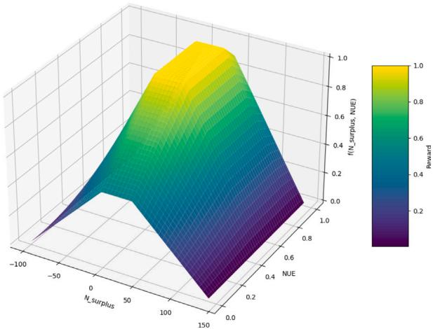
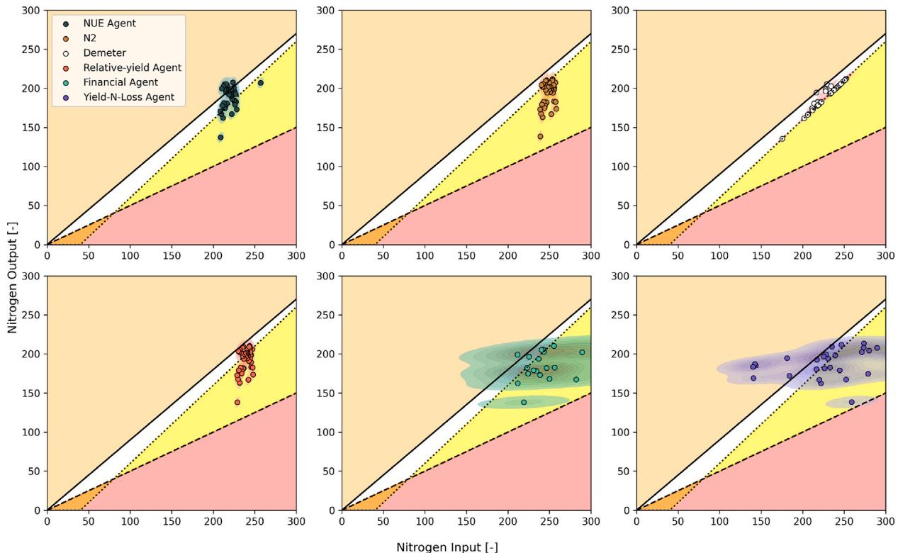
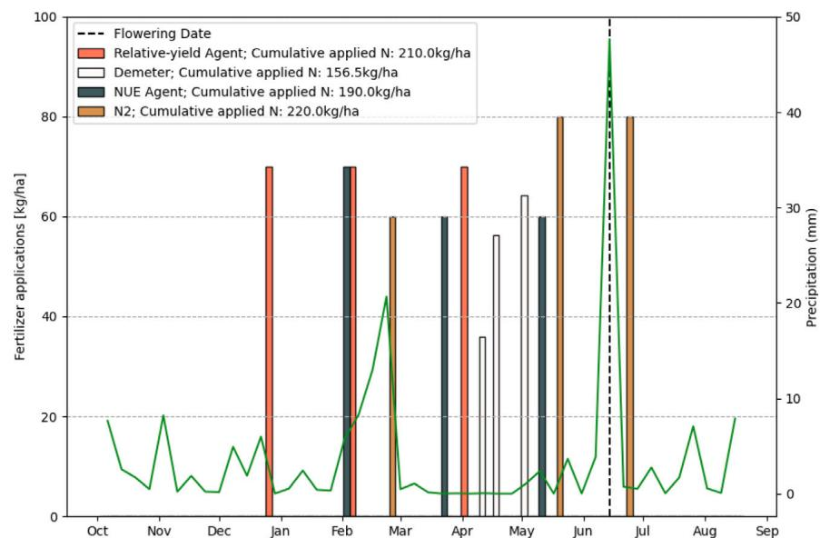
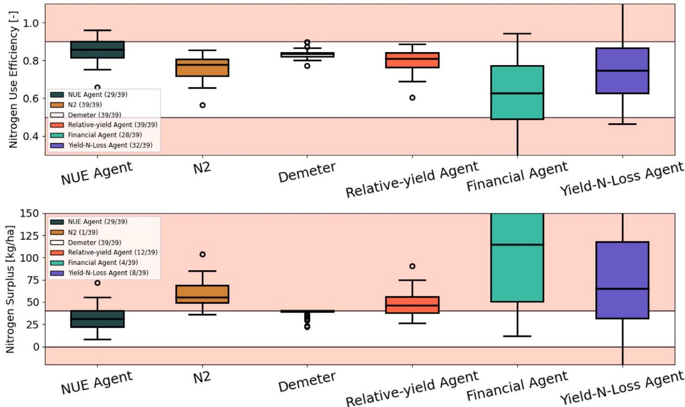
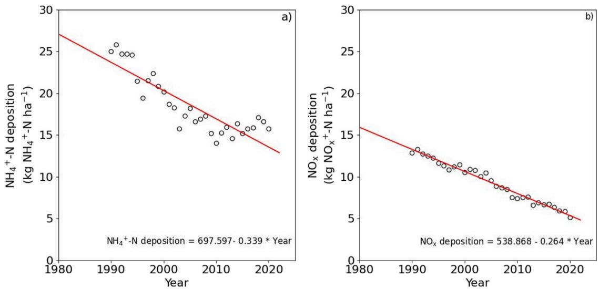
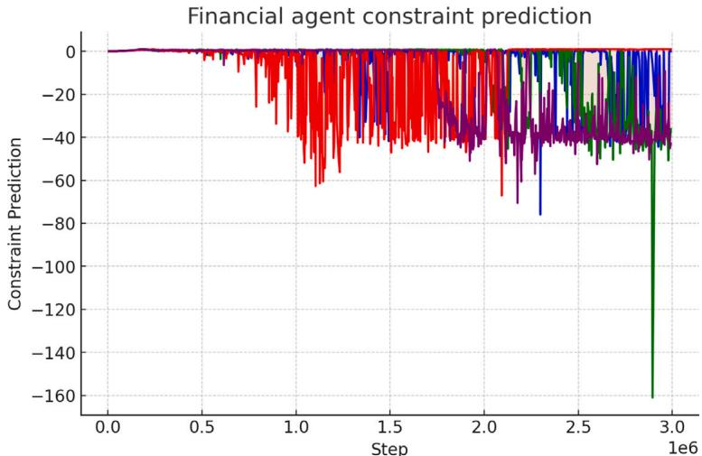
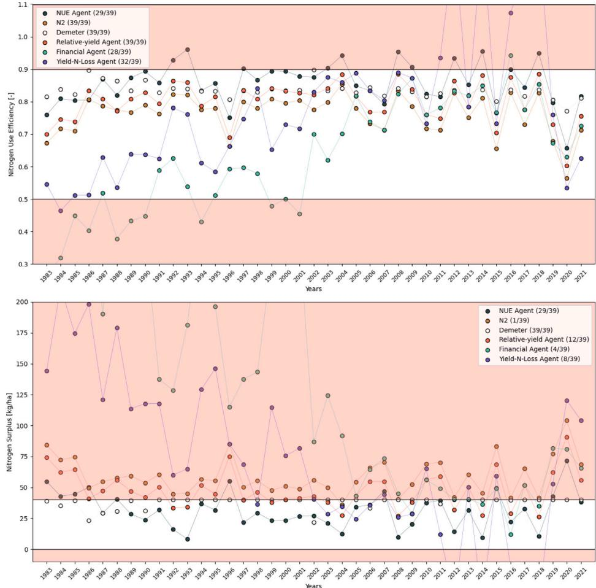
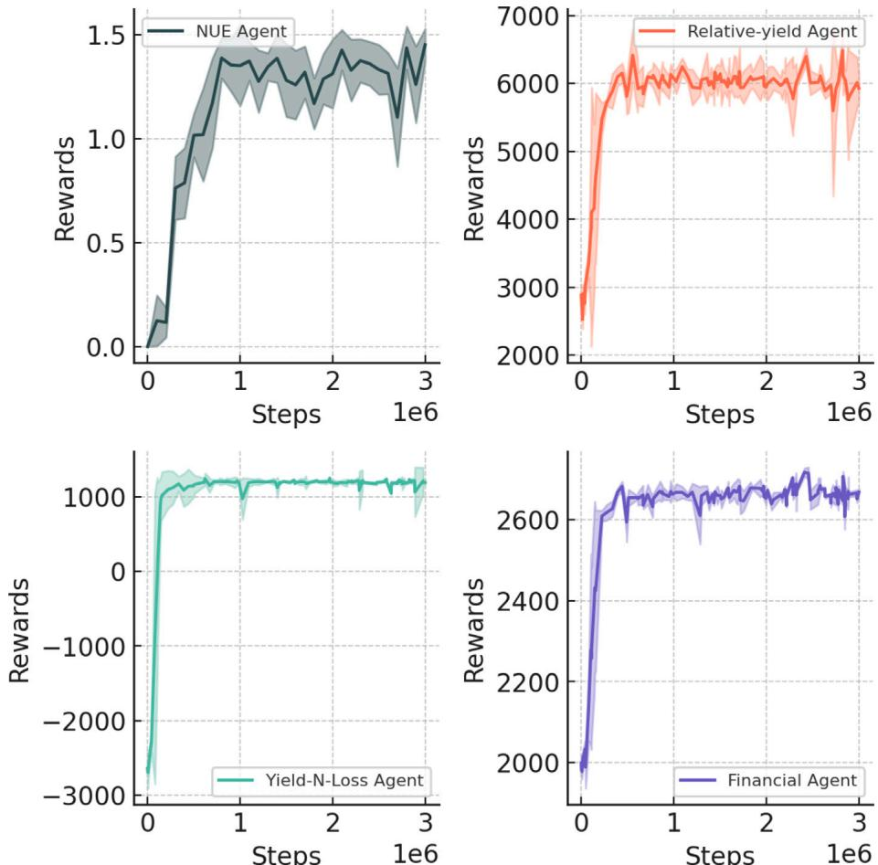

# Adaptive fertilizer management for optimizing nitrogen use efficiency with constrained reinforcement learning

# 基于约束强化学习的氮肥优化管理以提高氮素利用效率

Hilmy Baja aD,\*, Michiel G.J. Kallenberg aD, Herman N.C. Berghuijs b,cD, Ioannis N. Athanasiadis aD

a 荷兰瓦赫宁根大学与研究中心人工智能组  
b 荷兰瓦赫宁根大学与研究中心植物生产系统  
c 荷兰瓦赫宁根环境研究所  

# 文章信息

# 摘要

关键词：氮素利用效率 氮盈余 强化学习 作物管理

优化作物生产中的氮素利用效率(NUE)对可持续农业至关重要，需要在最大化产量和最小化环境影响(如氮素流失和土壤养分耗竭)之间取得平衡。强化学习(RL)作为一种强大的数据驱动方法，特别适用于优化施肥决策，从而实现最佳NUE。现有作物管理中的RL研究主要关注产量、利润或氮素流失的优化，而NUE优化尽管对防止土壤养分耗竭具有重要意义，却长期被忽视。本研究通过作物生长模型模拟，从多个方面开发RL环境来探索RL优化NUE的能力。我们开发了具有新型NUE奖励函数和动作约束的RL智能体，并将其性能与基线方法及其他采用文献中奖励函数的RL智能体进行比较。此外，我们还评估了RL智能体在不同土壤条件(包括不同初始氮含量和抗旱/敏感土壤)下的鲁棒性。研究发现，采用我们新型奖励函数训练的RL智能体接近最优策略，但对不同土壤质地场景的泛化能力仍具挑战性。最后，我们指出了作物管理中RL应用的若干开放性问题。

# 1. 引言与背景

在气候变化压力下养活不断增长的全球人口仍是一项艰巨任务。确保农业可持续性不仅需要提高作物产量，还需减轻过度资源使用带来的负面环境影响。氮肥(N)对提高农业生产尤为关键，但过量施用会导致水体污染、温室气体排放和土壤退化等不良后果(Cui等，2010；Tubiello等，2015)。相反，氮素投入不足会降低作物生产力，并通过"土壤养分耗竭"导致土壤肥力损失(Van der Pol，1992)。因此，在保证高产的同时最小化环境危害是可持续农业的重要目标(Lipper等，2014)。

氮素利用效率(NUE)作为关键的农业环境指标，表示收获谷物中氮素与总氮素投入的比率(Fageria和Baligar，2005；Norton等，2015)。提高NUE可减少氮盈余$(N_{surp})$(即施氮量与收获谷物含氮量之差)，从而缓解多种环境问题(Zhang等，2015；Klages等，2020)。鉴于此，欧盟氮素专家小组(EUNEP)制定了评估和提升NUE的实用指南(EU Nitrogen Expert Panel，2015)。同时，欧盟、联合国粮农组织(FAO)、美国农业部(USDA)等机构及欧盟绿色新政等指令也出台了更严格的肥料使用法规(European Union，1991，2016；FAO，2019；Flach和Selten，2021；Fetting，2020)，强调需要兼顾高生产力和生态保护的解决方案。

尽管政策关注度提高，当前氮素管理策略仍多基于农民经验传承、经验性良好实践或植物健康的被动评估，难以捕捉田间日常动态的复杂性(Abbas等，2021；Blackshaw等，2004；Altenbach等，2003)。这一差距促使决策方法向更灵活的数据驱动方式转变(Fountas等，2015)。其中，强化学习(RL)因其能根据田间反馈和情境线索自适应调整施肥决策而脱颖而出(Gautron等，2022a)。这种适应性对NUE优化尤为重要，因为施肥决策(包括是否施肥及施肥量)会随土壤、气候或作物条件发生显著变化。因此，核心挑战在于如何在复杂条件下协调农业生产高效益与非最优施氮导致的环境损害。为此，我们开发了采用NUE奖励函数显式训练RL智能体的系统，并通过实验评估其在保证产量提升同时最小化环境影响的能力。

现有RL研究表明其在提高农业决策产量和利润方面的潜力(Goldenits等，2024)。但多数研究未明确针对NUE等农业环境目标，而是聚焦产量或利润最大化(Overweg等，2021；Kallenberg等，2023；Gautron等，2022b；Wu等，2022；Madondo等，2023；Turchetta等，2022)。鉴于RL智能体的奖励函数主要决定其学习策略类型(Eschmann，2021)，这一缺失尤为关键。仅优化产量和利润可能忽视过量氮素流失及其对土壤长期耗竭的风险。相反，基于NUE和$N_{surp}$等指标的奖励函数更有利于促进可持续集约化。因此，本研究旨在设计显式将这些农业环境指标纳入NUE形式奖励函数的RL智能体。

从理论原则到实际管理需要兼顾农民的操作约束。例如，多数农民倾向有限次数的施肥，且特定物候期后施肥往往收效甚微却增加氮素径流风险(Iizumi和Ramankutty，2016)。在RL环境中硬编码这些农艺约束会限制探索空间，阻碍智能体理解某些动作次优的原因(Liu等，2021)。而将约束融入RL学习过程可能产生更善识别这些约束的智能体。本研究采用LagrangianPPO——近端策略优化(PPO)的扩展(Schulman等，2017)——来平衡NUE中心目标与实际操作限制(Fisher，1981；Ji等，2023)，旨在获得既最大化NUE目标，又符合农艺现实和氮素政策的施肥策略。

# 1.1. 研究问题

基于协调生产力和可持续性的迫切需求，以及政策对NUE指标的日益关注，本文聚焦以下问题：

1. 环境表现：相较于最先进的RL奖励函数和基线方法，采用NUE中心奖励训练的RL智能体在优化重要农艺和环境指标方面效果如何？
2. 策略适应性：采用NUE中心奖励训练的RL智能体如何适应不同土壤场景（如土壤类型、初始$N$水平），同时保持良好的指标表现？

# 2. 材料与方法

# 2.1. 概述

本研究探讨了RL优化NUE指标的能力。我们以荷兰Lelystad地区的雨养冬小麦为对象进行了代表性计算机模拟案例研究，采用最新版WOFOsT作物生长模型模拟氮(N)动态和产量形成。模型参数源自Groot和Verberne(1991)报告的田间试验，确保准确反映当地土壤条件、品种特性和气候特征。

为优化氮肥施用策略，我们构建了名为CropGym的RL环境，其中RL智能体以离散周时间步长与WOFOsT模型交互（已知优质策略需要稀疏干预）。具体而言，智能体每步接收土壤$N$有效性、物候阶段和当前天气等状态信息，然后决策施氮量（或跳过施肥）。与传统基于规则的施肥方案不同，该方法通过作物状态和环境因素的实时模拟实现自适应决策。

本研究核心贡献是提出以农业环境指标（氮素利用效率NUE和氮盈余$(N_{surp})$）为中心的新型奖励函数。为处理现实约束（如限制施肥次数和作物后期禁肥），我们采用通过拉格朗日方法实现约束的近端策略优化(PPO)变体(Schulman等，2017；Ji等，2023)。该LagrangianPPO方法动态平衡约束满足与NUE-$(N_{surp})$导向奖励函数的最大化。

所有RL智能体均使用荷兰代表性土壤剖面进行训练，并在多种土壤条件下评估方法普适性：
1. 土壤初始$N$含量高低
2. 快速与慢速排水土壤剖面

每次训练包含多个模拟周期（300万步），每个周期覆盖从播种到收获的完整生长季。训练使用随机模拟天气，评估采用1981-2021年历史天气数据。

我们将NUE奖励函数训练的RL智能体与以下方法对比：
1. 反映常规农作实践的基于规则基线策略
2. 基于奖励函数的最优基线策略 
3. 相对产量奖励训练的RL智能体
4. 产量-氮损失奖励训练的RL智能体  
5. 利润导向奖励训练的RL智能体

主要从产量、NUE和$(N_{surp})$三方面评估性能，从而回答两个核心研究问题。

本节结构如下：2.2节阐述问题设置和形式化数学表述（包括状态/动作空间及WOFOsT与RL循环的整合）；2.3节详述RL算法组件和拉格朗日约束方法；2.4节描述模拟环境和奖励函数；2.5节说明训练协议、基线和评估指标；最后3-4节结合农艺和环境目标呈现并解读结果。

# 2.2. 问题定义

本节将作物管理中的序贯决策问题形式化为马尔可夫决策过程(MDP)。MDP可用元组$\mathcal{M} = \langle S,\mathcal{A},\mathcal{T},\mathcal{R},\gamma \rangle$描述，其中$S$为状态空间，$\mathcal{A}$为动作空间。$\mathcal{T}$和$\mathcal{R}$分别是环境的转移函数$\mathcal{T}(s_{t + 1}|s_t,a_t)$和奖励函数$\mathcal{R}(s_t,a_t,s_{t + 1})$。$\gamma$为折扣因子，取值范围[0,1]，决定未来奖励相对于即时奖励的权重。在作物管理问题中，与许多现实环境类似，智能体无法获知完整环境状态。除标准MDP元素外，引入观测空间$\mathcal{O}$表示可能的观测$o\in \mathcal{O}$，其观测函数为$O(o_{t}|s_{t},a_{t})$。对于约束优化问题，MDP可描述为约束MDP(CMDP)。CMDP引入MDP元素$C$，形式化为$C_i(s_t,a_t)$，表示在状态$s_t$下采取约束动作$a_{t}$所产生的惩罚或"成本"，其中i代表CMDP中实现的约束函数$C_1,C_2,\ldots ,C_i$。

整体而言，本问题的MDP可描述为元组$\mathcal{M} = \langle S,\mathcal{A},\mathcal{T},\mathcal{R},\mathcal{O},C,\gamma \rangle$。RL智能体寻求找到最大化累积奖励的策略，其目标函数表示为：

$$
f(\theta) = \max_{\mathcal{R}}\mathbb{E}\left[\sum_{t = 0}^{\infty}\gamma^{t}\mathcal{R}_{t}(s_{t},a_{t})\right] \tag{1}
$$

其中$\mathcal{R}_t(s_t,a_t)$为奖励函数。我们设定固定的种植和收获日期，形成固定时间范围$T$。同时设$\gamma$为1，因此目标函数为轨迹中未折扣的最大期望累积奖励。

进一步，我们通过约束函数$C_i(s_t,a_t)$限制智能体动作以获得可操作的施肥策略。在本问题中，我们定义两个约束函数：

1. 智能体在一个生长季内可执行施肥动作次数的约束
2. 智能体可执行施肥动作时机的约束

分别记为$C_1$和$C_2$。$C_1$的约束定义为：

由作物生长模型(CGM)模拟的部分状态对智能体隐藏。$\mathcal{O}$中的元素是智能体可观测的$S$中作物、土壤和环境状态的子集。$\mathcal{A}$表示施肥水平。$\mathcal{T}$是CGM的模拟步骤。$T$为模拟持续时间。$C$是智能体违反约束时获得的惩罚。最后$\mathcal{R}$是复合反馈，包含对智能体在生长季中效率和产量表现的评估。我们将在2.4.3节深入解释$\mathcal{R}$。

# 2.3. RL智能体

本节描述实验环境中使用的RL智能体算法和网络结构。LagrangianPPO概念由Tessler等(2018)首次提出，通过拉格朗日乘子引入策略约束。本文采用Safety-Gymnasium(Ji等，2023)的LagrangianPPO实现，具体将拉格朗日乘子更新和损失计算函数适配到Stable Baselines 3(Raffin等，2019)框架中，使用裁剪替代函数修改基础PPO算法。

# 2.3.1. 拉格朗日方法

拉格朗日方法常用于带约束的强化学习智能体训练(Ji等，2023)。通常通过实现自适应惩罚系数$\lambda_{i}$来强制执行约束。该$\lambda$的更新规则如下：

$$
\lambda_{i}\leftarrow \lambda_{i} + \alpha_{l_{ag}}(g(\theta)), \tag{7}
$$

其中$\alpha_{l_{ag}}$是$\lambda_{i}$的学习率，$g(\theta)$来自公式(6)的成本函数。

为确保PPO智能体学习到违反约束的惩罚，我们将拉格朗日约束纳入损失函数，作为待最小化损失项的附加项。拉格朗日约束损失项定义如下：

$$
\mathcal{L}_{l_{ag}r_{an}g_{in}(\lambda_i)} = \sum_{i = 0}^{n}\lambda_i(g(\theta)), \tag{8}
$$

$$
C_2 = \mathbb{I}(DVS\leq DVS_{start}\vee DVS\geq DVS_{end}),
$$

其中$\mathbb{I}$是指示函数，当内部条件满足时返回1，否则返回0。DVS表示作物发育阶段，$DVS_{start}$和$DVS_{end}$是标量，定义了允许智能体施肥的发育阶段窗口，我们分别设置为0.01和1。这两个标量分别对应作物出苗$(DVS > 0)$和开花期$(DVS = 1)$。

对于使用其他奖励函数训练的RL智能体，我们遵循Turchetta等(2022)的建议，对NUE和$N_{surp}$的范围实施约束：在智能体训练过程中直接约束环境指标。具体约束定义如下：

$$
C_3 = \mathbb{I}(0.5\leq \mathrm{NUE}\leq 0.9),\mathrm{且} \tag{4}
$$

$$
C_4 = \mathbb{I}(0\leq \mathrm{N}_{surp}\leq 40). \tag{5}
$$

总体而言，智能体行为受上述约束集$C_i$限制，我们确保预期累积成本不超过阈值$d_{i}$：

$$
g(\theta) = \mathbb{E}\left[\sum_{t = 0}^{T}C_{i}(s_{t},a_{t})\right]\leq d_{i}\forall i, \tag{6}
$$

其中我们将$d_{i}$设为0，确保智能体不违反任何约束。

在本问题背景下，元组可映射如下：$S$表示作物、土壤和环境状态的完整范围

其中$n$是约束函数总数。因此，PPO智能体的损失函数变为：

$$
\mathcal{L} = \mathcal{L}_{policy} + c_v\mathcal{L}_{value} + c_e\mathcal{L}_{entropy} + \mathcal{L}_{l_{ag}r_{an}g_{in}}, \tag{9}
$$

其中$\mathcal{L}_{policy}$和$\mathcal{L}_{value}$分别是替代函数损失和值函数损失。同时，$c_{v}$和$c_{e}$是值损失和熵损失的权重系数，我们分别设为0.5和0.01。这些权重系数通过缩放损失来调整各项的影响。公式(9)中的其余项在原始PPO论文(Schulman等，2017)中有更详细说明。表B.7列出了我们实验中使用的PPO超参数。

# 2.3.2. 作物管理的拉格朗日PPO算法

为了将拉格朗日约束整合到PPO算法中，我们调整了其通用架构以支持拉格朗日约束计算。本节描述我们如何将Safety-Gymnasium中的LagrangianPPO实现适配到Stable Baselines 3框架中。PPO是一种actor-critic算法：actor网络负责根据其学习到的策略$\pi_{\theta}(a|s)$选择动作，critic网络则估计状态价值函数$V_{\theta}(s)$，其中$\theta$是网络参数。针对拉格朗日约束，我们通过添加额外的critic网络来修改架构：约束critic。该约束critic基于环境当前状态估计约束函数$C_\theta (s)$。与价值函数$V_{\theta}(s)$类似，我们也为约束计算广义优势估计(GAE)：

$$
A_{t} = \sum_{t = 0}^{T}\lambda_{GAE}\delta_{t}^{c}, \tag{10}
$$

表1 智能体从wOFOsT接收的作物、土壤和气象特征观测空间

| 特征 | 描述 | 单位 |
|------|------|------|
| DVS | 作物发育阶段 | [-] |
| TAGP | 地上部干物质生物量 | [kg/ha] |
| TAI | 叶面积指数 | [-] |
| TRA | 植物冠层蒸腾速率 | [cm/d] |
| RFTRA | 蒸腾作用减弱系数 | [-] |
| NSO | 贮藏器官干重 | [kg/ha] |
| NamountSO | 贮藏器官中的氮含量 | [kg/ha] |
| NuptykeTotal | 植株总氮吸收量 | [kg/ha] |
| Week | 播种后的周数 | [week] |
| Naction | 播种后施肥动作次数(>0) | [-] |
| NO3 | 土壤硝态氮含量(数组) | [kg/ha] |
| NH4 | 土壤铵态氮含量(数组) | [kg/ha] |
| WC | 不同土层含水量(数组) | [cm] |
| SEM | 根区土壤湿度(数组) | [-] |
| NOSSCUM | 累积氮损失量 | [kg/ha] |
| RNO3DEPOSTT | 土壤硝态氮总沉降量 | [kg/ha] |
| RNH4DEPOSTT | 土壤铵态氮总沉降量 | [kg/ha] |
| RRAD | 太阳辐射量 | [J/m2/d] |
| TMIN | 日最低温度 | [°C/d] |
| RAIN | 日降雨量 | [cm/d] |

其中$\lambda_{GAE}$是控制偏差与方差权衡的GAE超参数。$\delta_t^c$表示时间步$t$的约束时间差分(TD)残差，计算公式为：

$$
\delta_t^c = c_{t,\pi} + C(s_{t + 1}) - C(s_t), \tag{11}
$$

式中$c_{t,\pi}$表示当前策略$\pi$在时间$t$的约束违反情况，$C(s_t)$和$C(s_{t + 1})$分别表示当前步和下一步的约束值估计。为了整合这些约束计算，我们修改了PPO的rollout缓冲区，添加了与施肥动作时间和频率相关的额外元素。

# 2.4. 作物响应模拟

本节详细描述我们如何模拟作物响应以及为模拟器开发的接口。World Food Studies (WOFOsT, Van Diepen等, 1989; De Wit等, 2019)是一个经过充分验证的稳健作物生长模型(Ceglar等, 2019)。它是MARS作物产量预测系统(Van der Velde和Nisini, 2019)和全球产量差地图集(van Bussel等, 2015)的关键组成部分。WOFOsT最近扩展了动态土壤氮模块SNOMIN(Soil Nitrogen module for Organic and Mineral Nitrogen)，支持更复杂的土壤-作物氮过程(Berghuijs等, 2024)。这一扩展有助于更好地探索可持续氮肥施用策略。WOFOsT SNOMIN(本文后续简称为"WOFOsT")区分两种氮类型：$\mathrm{NO}_3^- \mathrm{N}$(硝酸盐)和$\mathrm{NH_4^+N}$(铵盐)，并对不同土层的氮和水动态进行区分。

# 2.4.1. 强化学习环境

我们使用Python版本的WOFOsT(在Python Crop Simulation Environment (PCSE, de Wit, 2023)中实现)来为RL智能体模拟作物响应。我们基于Gymnasium API (Towers等, 2024)设计了RL接口CropGym，相比之前版本(Kallenberg等, 2023)增加了更多功能。

该RL环境在每轮训练后自动计算NUE、$N_{surp}$和其他重要农业环境指标，并将值存储在Gymnasium的stepO函数的info变量中。我们还提供了使用LARS-WG8.0 (Semenov等, 2002)添加随机天气的流程，用于训练RL智能体。预处理步骤记录在我们的代码仓库中。对于优化NUE的任务，土壤初始氮含量很重要，因为它会影响高效NUE所需的施肥策略。因此，我们提供了随机化初始土壤的方法，围绕用户指定的均值和标准差进行随机化。

WOFOsT包含大量可供智能体使用的作物状态。我们根据领域专家建议，选择了当前任务所需的观测特征子集，如表1所示。由于WOFOsT具有多层土壤结构，部分特征以数组形式表示。我们对WOFOsT输出进行处理，使RL智能体接收每个NO3和NH4的数组总和，以及每个WC和SM的数组平均值。

在WOFOsT中，用户可以定义雨水中氮浓度(NO3ConcR和NH4ConcR，单位为$mgN / L$)，这与年氮沉降量相关(详见2.4.2节)。CropGym会自动将某年份获得的氮沉降量转换为基于计划模拟天数的日沉降量，并更新后续轮次的参数文件，确保变量RNO3DEPOSTT和RNH4DEPOSTT输出正确的模拟年份沉降量。

智能体的动作空间包含9个氮肥施用水平：$\mathcal{A} = \{10n\mid n = 0,1,\ldots ,8\} \mathrm{kg / ha}$，符合农民常规施肥量，其中$80\mathrm{kg / ha}$是单次施肥事件的典型上限。

为简化RL智能体观测的扁平化向量，我们按照Kallenberg等(2023)的方法聚合时间序列数据：将长度为$3\times 7$的天气序列(即日降雨量、温度和太阳辐射)处理为平均剥离层，得到$3\times 1$的向量；将长度为$17\times 7$的作物特征取其最后一项，压缩为$17\times 1$的向量。

# 2.4.2. 农业环境指标

本节详细阐述我们用作RL智能体奖励函数的农业环境指标。如前文所述，并遵循Berghuijs等(2024)的方法，我们采用EUNEP框架(EU Nitrogen Expert Panel, 2015)中的NUE定义。该框架将NUE定义为作物籽粒中氮含量与施肥有效氮量的比值：

$$
NUE = N_{out} / N_{in}, \tag{12}
$$

其中最优氮使用范围定义为0.5-0.9 kgN/kgN。低于0.5 kgN/kgN被视为低效氮利用，高于0.9 kgN/kgN则存在土壤耗竭风险。我们在WOFOST中将$N_{out}$计算为收获时籽粒中氮的模拟量。为简化起见，本文后续将NUE显示为无量纲值。$N_{in}$计算如下：

  
图1. 本研究中使用的氮利用效率框架图

$$
N_{in} = N_{seed} + N_{depo} + N_{applied}, \tag{13}
$$

其中$N_{seed}$是冬小麦播种种子中的假定氮量(Silva等, 2021年数据为3.5 kgN/ha)；$N_{depo}$是根据荷兰国家沉降统计数据(CLO, 2022)和不同年份日降雨量计算的年日均大气氮沉降率(单位kgN/ha)。本文根据图C.6所示趋势计算年氮沉降量。$N_{applied}$是生长季施用的氮肥总量(单位kgN/ha)。本研究仅使用不含有机质的合成肥料。

此外，我们按以下公式计算$N_{surp}$：

$$
N_{surp} = N_{in} - N_{out}, \tag{14}
$$

EUNEP框架定义$N_{surp}$最大值为80 kg/ha(低于此值环境影响较小)，但不能低于0，因为这意味着氮缺乏会逐渐耗尽土壤氮储备，导致土壤健康和肥力下降(Giller, 2001)。此外，大量研究表明$N_{surp}$是造成多地氮淋溶和氮污染的主要原因(Klages等, 2020; Chen等, 2014; Zhou等, 2016)。我们在奖励函数中设置了更严格的$N_{surp}$上限40 kg/ha。这一调整体现在图1的NUE框架图中，该图以$N_{in}$为x轴，$N_{out}$为y轴。图中的白色区域是目标氮效率区，突显了RL智能体面临任务的难度。我们设置这一更严格约束是为了发现能进一步减少$N_{surp}$的RL策略。

# 2.4.3. 奖励函数

本节我们定义奖励函数并阐述设计思路。从作物管理角度看，任何管理措施的成效都具有天然延迟性和稀疏性，即措施对环境和产量的影响只能在生长季结束后显现。NUE和$N_{surp}$只能在生长季结束时计算，不可避免地面临信号极其稀疏的问题。奖励函数设计需要考虑诸多因素：目标一致性、稀疏性、简洁性和塑形等(Sutton和Barto, 2018)。这在许多使用定制奖励函数的RL应用论文中常被低估。Booth等(2023)发现，许多奖励函数设计错误源于对奖励函数传达内容的误解。

本质上，我们采纳Sutton和Barto(2018)的建议："奖励信号是你向智能体传达要实现什么目标的方式，而不是如何实现"。为此，我们设计了包含EUNEP框架的奖励函数，特别将NUE、$N_{surp}$和季末产量纳入目标。由于该奖励信号非常稀疏，我们通过设计新的效用函数(Rosenthal, 1985)对这个多变量奖励函数进行标量化。我们定义的奖励函数如下：

$$
R = \phi N_{UE}\cdot \phi N_{surp} + Y_{\mathrm{cond}}, \tag{14}
$$

其中奖励值$R$在收获时给出(即当训练回合终止时)。$\phi N_{UE}$和$\phi N_{surp}$项根据该回合的NUE和$N_{surp}$值返回[0,1]范围内的有界信号。$Y_{\mathrm{cond}}$是描述条件归一化产量的项，范围也是[0,1]。奖励函数中没有实现惩罚项。各项定义如下：

$$
\phi N_{\mathrm{UE}} = \mathrm{clip}\left(1 - \frac{|\mathrm{NUE} - 0.7| - 0.2}{\omega_{\mathrm{NUE}}},0,1\right), \tag{16}
$$

$\phi N_{\mathrm{UE}}$是一个截断线性函数。当NUE在[0.5,0.9]范围内时返回1。这里$\omega_{\mathrm{NUE}} = 1$决定了约束宽度。这个较宽的范围是一种奖励塑形(reward shaping)手段，能更好地引导智能体达到目标NUE。

$$
\phi N_{surp} = \mathrm{clip}\left(1 - \frac{|N_{surp} - 20| - 20}{\omega_{Nsurp}},0,1\right), \tag{17}
$$

与公式(16)类似，$\phi N_{surp}$也是一个截断线性函数，当$N_{surp}$在特定范围内时返回1。如前所述，为激励智能体减少氮盈余，我们将允许的$N_{surp}$范围设为[0,40]。设$\omega_{N_{surp}}$为100。图2展示了我们设计的奖励函数形状。在黄色区域(即$z=1$)，$Y_{\mathrm{cond}}$项被激活，为更高产量提供额外奖励($\geq 1$)。$Y_{\mathrm{cond}}$定义如下：

  
图2. 部分描述奖励函数的三维图。$x$和$y$轴分别表示$N_{surp}$和NUE的范围，$z$轴表示组合输出值。

$$
\begin{array}{r}Y_{\mathrm{cond}} = \left\{ \begin{array}{ll}\mathrm{WSO}_{\mathrm{norm}} & \mathrm{if} \phi N_{\mathrm{UE}}\cdot \phi N_{surp} = 1,\\ 0 & \mathrm{otherwise}, \mathrm{and} \end{array} \right.\\ \mathrm{WSO}_{\mathrm{norm}} = \frac{\mathrm{WSO} - \mathrm{WSO}_{\mathrm{min}}}{\mathrm{WSO}_{\mathrm{max}} - \mathrm{WSO}_{\mathrm{min}}}, \end{array} \tag{19}
$$

我们将$Y_{\mathrm{cond}}$定义为条件归一化产量奖励项。如(18)所示，该奖励项仅在NUE和$N_{surp}$都处于理想范围内时才会加入奖励信号，否则不影响奖励信号。产量(WSO, Total Weight Storage Organ)是WOFOsT中模拟的谷物产量。$\mathrm{WSO_{norm}}$采用最小-最大归一化，其中$\mathrm{WSO_{min}}$参数来自不施肥的低初始$N$设置，$\mathrm{WSO_{max}}$来自多年作物平均潜在产量。因此智能体可能获得超过2的奖励；但典型标量奖励范围为[0,2]，当$R>1$时表示智能体达到了要求的NUE和$N_{surp}$。

总体而言，该奖励信号设计旨在鼓励智能体仅在符合EUNEP框架环境标准的情况下最大化产量。在我们的场景中，NUE和$N_{surp}$不可避免地会产生非常稀疏的奖励信号。因此，为引导训练过程，我们实现了内在奖励信号(Pathak等,2017)来鼓励探索并为智能体提供中间奖励。更多细节将在2.5.3节详述。

# 2.5. 实验

我们通过实验来回答提出的研究问题。首先评估NUE智能体与基线模型及其他使用文献中定义的奖励函数训练的智能体在高效NUE和$N_{surp}$范围内的表现差异，其次评估智能体在不同土壤场景下的适应性。

针对研究问题1(RQ1)，我们使用针对荷兰Lelystad条件校准的WOFOsT模型，以冬小麦为研究对象，采用NUE奖励函数训练提出的模型(称为"NUE智能体")。我们比较了多种约束强化学习智能体的表现，这些智能体使用不同的目标/奖励函数训练，包括relative-yield(相对产量)、yield-N-loss(产量-氮损失)和financial(经济效益)奖励函数。同时评估NUE智能体在定义基线上的表现，训练设置详见2.5.2节。

针对研究问题2(RQ2)，我们通过多种场景测试NUE智能体对不同土壤条件的适应能力，并与基线模型比较。主要比较两种场景：

1. 不同初始$N$含量
2. 不同干旱敏感性土壤

播种时的初始$N$含量会显著影响NUE结果，因为需要调整施氮量以达到氮平衡。这些初始氮含量反映了不同农业实践下的播种前条件。例如，低初始氮水平可能源于高氮吸收作物的收获(Tan等,2005)，而高初始氮水平可能来自粪肥施用后的矿化增强(Bouldin等,1984)。这些场景在先前研究中已有记载(Huang等,2007)。

不同土壤剖面会影响整个系统的$N$动态，我们比较了快速排水土壤和慢速排水土壤的表现。本研究选取的细粒和粗粒土壤质地场景代表了荷兰常见的实际情况(Silva等,2021; Faber等,2021)，非常适合评估强化学习在实际农业管理中的潜力。我们评估了NUE智能体如何调整施肥策略以适应土壤动态变化，从而实现良好的NUE。

后续小节将详细描述测试条件、训练条件、基线模型、内在奖励机制以及结果评估方法。

# 2.5.1. 测试条件

本节描述智能体和基线模型的测试环境条件。测试地点(土壤和天气条件)基于荷兰Lelystad校准，使用1983-2021年$(n=39)$的每日历史天气数据，并遵循各年份的$N$沉降量(见图C.6)。该地点有7个土壤层，初始硝酸盐$(NO_{4}-N)$和铵盐$(NH_{4}^{+}-N)$含量分别为$70\mathrm{kg/ha}$和$0\mathrm{kg/ha}$，表明播种前所有铵盐已通过硝化作用转化为硝酸盐。土壤质地为中等粗糙度的粉砂壤土，具体参数见附录A，土壤和场地参数采用Berghuijs等(2024)的数据。实验中各年份的$\mathrm{CO_2}$浓度保持固定，该选择将在第4节进一步讨论。

我们评估智能体在四种不同条件下的表现：高初始$N$场景与Lelystad条件具有相同土壤剖面，但初始无机$N$含量为$100\mathrm{kg/ha}$。各土层$N$分配方式为：总无机$N$的$70\%$分布在土壤上部的$30\%$区域，其余$30\%$分布在底部$70\%$区域，其中硝酸盐占$85\%$，铵盐占$15\%$。低初始$N$场景初始$N$含量为$5\mathrm{kg/ha}$，分配方式与高$N$场景相同。

干旱敏感土壤(快速排水土壤)具有砂质剖面，质地非常粗糙；而干旱不敏感土壤(慢速排水土壤)具有黏土剖面，质地非常细腻。对于土壤质地场景，我们将原始FORTRAN版WOFOsT的样本土壤文件进行转换，定义特定参数后转换为WOFOsT可读格式，转换过程详见附录A。场地参数与第一个实验保持一致。

# 2.5.2. 训练条件

我们采用训练流程中某些方面的随机化来提高RL智能体的泛化能力(Tobin等, 2017)。我们使用基于Lelystad气象站气候变量参数化的随机天气，确保生成的天气分布与实际数据高度匹配。土壤剖面遵循Groot和Verberne(1991)定义的"PAGV"位置。我们还采用了初始氮条件的随机化，设置均值为35kg/ha，标准差为15kg/haN，这些值反映了荷兰初始氮条件的一般变异性。我们还对NUE计算中的氮沉降统计量进行了随机化。

我们使用10个随机种子训练NUE智能体，共进行300万步训练。训练使用的超参数列于表B.7。此外，我们还训练了多个使用不同奖励函数的智能体，以观察所得策略对NUE框架指标的符合程度。这些智能体的训练条件与NUE智能体相似，只有两点不同：

1. 每个RL智能体的奖励函数
2. 训练中使用的约束函数

我们使用提出的NUE奖励函数训练NUE智能体，并用公式(2)和(3)中的$C_1$和$C_2$约束它。对于使用其他奖励函数训练的智能体，我们按照Turchetta等(2022)的方法直接用环境指标约束它们，使用公式(2-5)中的$C_{1-4}$约束。在这种情况下，$C_3$和$C_4$是将NUE和$N_{sup}$约束在我们定义的有效范围内的函数。

我们将与NUE智能体进行比较的三个智能体使用以下奖励函数训练：

1. relative-yield奖励函数，基于Overweg等(2021)、Kallenberg等(2023)
2. yield-N-loss奖励函数，基于Wu等(2022)、Tao等(2022)
3. financial奖励函数，基于Turchetta等(2022)

relative-yield使用以下奖励函数训练，通过比较智能体策略与零施肥策略的额外产量来优化产量：

$$
R_{t} = (WSO_{t}^{\pi} - WSO_{t - 1}^{\pi}) - (WSO_{t}^{0} - WSO_{t - 1}^{0}) - \beta N_{t}, \tag{20}
$$

其中$N_{t}$是施肥总量，$WSO^{\pi}$是智能体策略下的谷物生长量，$WSO^0$是零施肥策略下的生长量。$\beta$是施肥动作的乘数，按照Kallenberg等(2023)设为10。

yield-N-loss使用以下奖励函数训练，最大化产量同时最小化总氮淋失：

$$
R_{t} = \left\{ \begin{array}{ll}\omega_{1}Y - \omega_{2}N_{t} - \omega_{3}N_{l,t} & \mathrm{if~episode~term~state~at~}t,\\ -\omega_{2}N_{t} - \omega_{3}N_{l,t} & \mathrm{otherwise}, \end{array} \right. \tag{21}
$$

其中$\omega_{1-3}$是项权重调节器，按照Tao等(2022)分别设为0.2、1和5。$N_{l,t}$是时间t的氮淋失量。这个奖励函数具有延迟的正向奖励，但惩罚相当密集。

financial使用以下奖励函数训练，基于谷物和氮肥的静态价格关注农民利润：

$$
R_{t} = \in Y_{t} - \in N_{t}, \tag{22}
$$

其中$\in Y_{t}$描述冬小麦谷物价格(欧元/公顷/时间步)，$\in N_{t}$是氮肥价格(欧元/公顷)。价格基于2020年荷兰冬小麦谷物和氮肥价格(Wageningen Economic Research, 2023b,a)：谷物181.67欧元/1000kg，氮肥20.49欧元/100kgN。虽然可以根据历史价格每年变化价格，但这会给学习智能体引入不必要的依赖，因为智能体不知道当前年份。因此我们保持价格固定。

# 2.5.3. 内在奖励

在奖励信号不可避免稀疏的情况下，改善智能体学习过程的常用方法是内在奖励机制，例如Pathak等(2017)提出的内在好奇心模块(Intrinsic Curiosity Module)。内在奖励是指由智能体自身生成而非来自RL环境的奖励信号。这是一种自监督方法，旨在鼓励智能体探索陌生状态，帮助其避免收敛到次优行为。

我们采用的训练条件可归类为非单一环境(non-singleton environments)，即训练和测试条件不同的环境。在此类设置中，智能体存在对训练条件过拟合的风险(Zhang等, 2018; Song等, 2019)。这一挑战因随机初始氮条件的加入而加剧，可能改变智能体的目标。为解决此问题，我们实施了Henaff等(2023)提出的椭圆情节奖励探索法(E3B)，这是一种专为解决具有随机初始条件/位置的非单一RL环境而开发的内在奖励方法。与Pathak等(2017)的工作类似，它使用逆向预测模型来判断环境变化是否由智能体行为引起。此外，它还引入了一种计数方法，当智能体遇到不同初始条件时给予标量情节奖励。由于该方法适合我们的问题设置，我们在RL智能体训练中实施E3B以加速训练收敛。

# 2.5.4. 基线方法

为比较RL智能体性能，我们实现了两种基线智能体：

1. 标准实践智能体(N2)
2. Demeter智能体

本文实验条件根据Groot和Verberne(1991)的田间实验条件校准。因此，该基线代表了农民的标准实践，并可直接与先前文献结果比较。我们按照他们在"PAGV"中的$^{\ast}N2^{\ast}$施肥方案定义标准实践智能体，即在固定日期每年施用3次不同量的肥料。$N2$是一个难以超越的基线，因为它是针对我们测试地点和冬小麦品种特定初始氮条件的最优固定施肥量。

以希腊农业女神命名的Demeter智能体是一个先知/情节优化智能体，其施肥时间和数量针对评估年份进行优化。与Kallenberg等(2023)的Ceres智能体不同，它将氮肥施用分配到生长季的不同时间，确保施肥行为的时间最优性。不同于RL智能体，Demeter智能体可以观测未来天气，因此可作为施肥行为的上限参考。与RL智能体类似，我们限制其每季累计施肥行为为3次以保证公平比较。我们使用广义模拟退火函数优化器(Bohachevsky等, 1986)来确定每周所需的最佳施肥量。

# 2.5.5. 评估方法

我们主要使用产量、氮肥利用效率(NUE)、$N_{sup}$和累计奖励指标评估RL智能体。同时展示累计施肥量、氮损失和利润。通过展示利润情况，我们可以观察优化NUE是否影响利润。利润报告基于2020年价格。报告的氮损失包括淋失和反硝化损失。我们通过报告所有测试年份和随机种子获得的中位数及95%置信区间进行评估，不显式处理任何异常值以确保结果代表性。此外，单侧p值根据各指标方向适当对齐。随后，我们在NUE框架图中绘制最佳模型和基线。另外，我们还评估各智能体达到目标NUE和$N_{sup}$的年份数量。

表2 目标指标结果。我们报告了中位数(和95%自助法置信区间)。部分图标描述了指标的目标值：$\uparrow$表示越高越好，$\downarrow$表示越低越好，$\twoheadrightarrow$表示目标介于两个值之间。

| 代理 | 产量 [吨/公顷] (↑) | N盈余 [公斤/公顷] (→40) | 氮肥利用效率 [-] (0.5→0.9) | 奖励 [-] (↑) |
|------|-------------------|------------------------|--------------------------|-------------|
| NUE代理 | 9.43 (8.97, 9.65) | 27.2 (21.0, 34.0) | 0.87 (0.84, 0.90) | 0.99 (0.96, 1.93) |
| relative-yield | 9.61 (9.26, 9.81) | 50.2 (41.0, 54.0) | 0.79 (0.77, 0.81) | 0.85 (0.81, 0.93) |
| yield-N-loss | 9.05 (8.53, 9.34) | -11.1 (-7.3, 11.9) | 1.07 (0.93, 1.16) | 0.56 (0.35, 0.71) |
| financial | 9.93 (9.54, 10.08) | 120.4 (88.2, 181.2) | 0.61 (0.53, 0.67) | 0.19 (0.0, 0.51) |
| Demeter | 9.73 (9.49, 9.89) | 39.9 (28.9, 39.9) | 0.83 (0.82, 0.83) | 2.05 (1.99, 2.09) |
| N2 | 9.61 (9.54, 9.88) | 52.6 (49.9, 59.4) | 0.78 (0.76, 0.80) | 0.86 (0.80, 0.90) |
| ΔNUE代理,N2 | -0.15 (-0.20, -0.09) | -27.4 (-28.9, -25.7) | +0.09 (0.08, 0.10) | +0.39 (0.08, 1.09) |
|  | p=0.0001 | p=1e-6 | p=0.0 | p=0.0011 |

表3 附加指标结果

| 代理 | 施肥量 [公斤/公顷] (↓) | 氮损失 [公斤/公顷] (↓) | 利润 [千欧元/公顷] (↑) |
|------|----------------------|----------------------|----------------------|
| NUE代理 | 190.0 (180.0, 190.0) | 42.6 (38.2, 49.2) | 1.44 (1.37, 1.48) |
| relative-yield | 210.0 (210.0, 220.0) | 47.9 (41.0, 47.9) | 1.46 (1.42, 1.50) |
| yield-N-loss | 140.0 (130.0, 160.0) | 34.8 (30.7, 42.6) | 1.39 (1.31, 1.44) |
| financial | 290.0 (240.0, 350.0) | 46.3 (39.6, 55.8) | 1.49 (1.42, 1.52) |
| Demeter | 202.3 (193.0, 210.6) | 37.6 (35.1, 43.5) | 1.49 (1.45, 1.51) |
| N2 | 220.0 (220.0, 220.0) | 45.0 (40.5, 50.2) | 1.49 (1.46, 1.49) |
| ΔNUE代理,N2 | -30.0 (-30.0, -30.0) | -3.9 (-3.2, 5.4) | -0.01 (-0.06, 0.03) |
|  | p=1e-5 | p=0.3028 | p=0.9871 |

# 3. 结果与分析

本节报告实验的定量结果，主要回答提出的研究问题(第3.1和3.2节)。此外，我们还将结果与之前关于氮利用效率(NUE)研究的实证发现进行定性比较(第3.3节)。

# 3.1. 智能体性能表现

本节通过Lelystad案例研究，比较我们的NUE智能体与基线方法及其他RL智能体(使用LagPPO训练)的表现，以回答研究问题1。结果汇总在两个表格中：表2报告了各智能体的中位产量、氮盈余($N_{surp}$)、NUE和奖励；表3报告了累计施肥量、氮损失和利润。此外，附录图C.9展示了RL训练曲线。

如Demeter所示，最大化产量需要更高的$N_{surp}$，其将$N_{surp}$维持在约$40\mathrm{kg / ha}$。在所有智能体中，NUE智能体获得了最高的中位奖励，relative-yield智能体表现相近。这些结果表明，基于零氮处理相对增产的奖励机制可以改善NUE和$N_{surp}$。

yield-N-loss智能体通过大幅减少施肥量来降低氮损失，但代价是负$N_{surp}$和高NUE，表明存在氮失衡和土壤氮流失/耗竭问题。

financial智能体以提高$N_{surp}$和更大氮损失为代价增加利润，导致奖励最低。尽管我们应用了NUE和$N_{surp}$的拉格朗日约束，但约束评估器预测效果不佳(见图C.7)，这显示直接约束NUE和$N_{surp}$的难度。

Demeter表明良好的利润与高NUE可以兼得。financial智能体在$N_{surp}$上存在较大差距(反映在其施肥量上)，但氮损失差异较小。这是因为$N_{surp}$定义为氮输入减去谷物中的氮，而作物会将部分氮分配到营养器官。这表明NUE智能体能发现优化施肥量以提高NUE的策略。后续情景实验(第3.2节)进一步揭示了不同土壤剖面特征对氮损失的显著影响。

表2和表3详细比较了NUE智能体与N2的差异。NUE智能体以更低的$N_{surp}$、氮损失和施肥量实现了相近产量，但利润低于N2。只有NUE智能体达到了$N_{surp}$目标值，降低了环境风险并维持了氮平衡(Klages等, 2020)。这表明NUE智能体能够发现确保高效NUE且$N_{surp}$较低的策略。

图3展示了各智能体的NUE框架。Demeter通过保持在$N_{surp}$或NUE边界附近达到目标。NUE智能体、N2和relative-yield表现相似，但NUE智能体和relative-yield有更多年份处于高效区间。相比之下，yield-N-loss和financial智能体分布更分散(核密度估计证实)。例如financial智能体仅有19年氮输入低于$300\mathrm{kgN / ha / y}$，而yield-N-loss智能体有时会进入土壤耗竭区。

图4展示了2020年降水期间NUE智能体、relative-yield智能体、N2和Demeter的施肥行为。

RL方法的一个局限是NUE智能体、N2和relative-yield在氮输入轴上呈现相似的散点分布模式，仅有微小偏移。值得注意的是，NUE智能体比N2和relative-yield施用更少肥料(表3)。图3中每个NUE图包含一个异常年份——2020年，其氮输出约$140\mathrm{kg / ha}$。花期出现的极端降水事件(图4)抑制了氮吸收(Kowalenko和Bittman, 2000)。由于RL智能体仅基于即时观测做决策，它在前期累计施用了$190\mathrm{kg / ha}$，未能预见这一干扰。此外，图4显示LagrangianPPO算法对NUE智能体和relative-yield智能体都满足了约束$C_1$和$C_2$(公式(2)和(3))。

图5通过箱线图更直观地展示了各智能体NUE和$N_{surp}$的分布，图例注明了满足目标要求的测试年份数量。就NUE而言，N2和relative-yield在所有测试年份均达标，而NUE智能体有10年处于土壤耗竭区。在$N_{surp}$方面，NUE智能体表现最佳。relative-yield智能体的中位$N_{surp}$为$50\mathrm{kgN / ha}$，其他智能体则未能持续达标。图C.8展示了各智能体的逐年表现。

# 3.2. 不同土壤情景下的性能表现

本节展示表4和表5中详述的土壤情景实验结果。我们报告了各智能体在不同情景下的表现，包括NUE智能体和基线方法，并评估了relative-yield智能体因其在先前实验中的竞争性表现。Demeter为每个情景提供了最优指标。我们的主要目标是回答研究问题2。

  
图3. 各智能体的NUE图表。每个点代表一个测试年份$(n = 39)$。使用核密度估计(KDE)展示性能分布。

  
图4. 展示NUE智能体、relative-yield智能体、N2和Demeter施肥行为的图表。虚线表示开花日期。

在低氮和高氮初始情景下，NUE智能体保持了与正常条件相似的性能和中位奖励。$N2$尽管初始土壤氮含量变化也表现稳定。Demeter在高氮情景中比低氮情景施用更多肥料，可能是因为较低的初始$N$限制了早期生长并减少了后续$N$需求。这一观察进一步表明初始$N$含量不会改变目标$N$情景，因为较高的初始$N$在生长季早期主要通过淋溶流失。NUE智能体可靠地施用了目标累计氮量，relative-yield智能体表现类似。

在土壤类型情景中，NUE智能体在细土中基本达到了目标NUE和$N_{\text{surp}}$，尽管存在一定波动。值得注意的是，NUE智能体比relative-yield智能体使用更少肥料却获得了更高产量。由于淋溶减少，所有智能体在细土中都表现出较低的$N$损失。

在易受干旱和淋溶影响的粗土情景中，NUE智能体通过实现更低的$N$损失$(95.7\mathrm{kg / ha}$对比$101.3\mathrm{kg / ha})$和更好的$N_{\text{surp}}$$(54.9\mathrm{kg / ha}$对比$78.3\mathrm{kg / ha})$优于$N2$，尽管$N_{\text{surp}}$仍高于目标值。NUE智能体和relative-yield都遭遇了产量下降(分别为7.73和7.91吨/公顷)，凸显了在此类土壤中维持生产力的挑战。

  
图5. 展示高效氮利用年份的箱线图。图例详细说明了在总测试年份中符合NUE(顶部)和$N_{surp}$(底部)要求的年份数量。

表4 各场景下目标指标结果

| 代理 | 场景 | 产量[吨/公顷] (t) | 氮盈余[kg/ha] (0→40) | 氮利用效率[-] (0.5→0.9) | 奖励[-] (t) |
|------|------|-------------------|----------------------|-----------------------|------------|
| **NUE代理** | 低氮 | 9.19 (8.78, 9.41) | 32.0 (25.2, 39.7) | 0.85 (0.81, 0.88) | 0.98 (0.93, 1.69) |
|  | 高氮 | 9.40 (9.29, 9.46) | 28.9 (21.2, 37.1) | 0.87 (0.83, 0.90) | 0.97 (0.92, 1.68) |
|  | 细土 | 9.88 (9.38, 10.03) | 24.7 (12.4, 67.0) | 0.88 (0.74, 0.93) | 0.88 (0.28, 0.90) |
|  | 粗土 | 7.73 (7.04, 8.63) | 54.9 (35.3, 76.0) | 0.74 (0.67, 0.81) | 0.76 (0.50, 0.82) |
| **relative-yield** | 低氮 | 9.55 (9.21, 9.73) | 64.9 (57.4, 73.1) | 0.74 (0.72, 0.77) | 0.75 (0.66, 0.82) |
|  | 高氮 | 9.54 (9.01, 9.74) | 43.8 (37.5, 52.8) | 0.81 (0.79, 0.84) | 0.89 (0.83, 0.96) |
|  | 细土 | 9.44 (8.53, 10.02) | 36.7 (20.3, 49.6) | 0.85 (0.80, 0.91) | 0.76 (0.56, 0.89) |
|  | 粗土 | 7.91 (7.31, 8.57) | 70.0 (54.5, 83.5) | 0.69 (0.64, 0.76) | 0.67 (0.50, 0.83) |
| **Demeter** | 低氮 | 9.47 (9.29, 9.67) | 39.9 (39.9, 39.9) | 0.83 (0.82, 0.83) | 1.99 (1.94, 2.04) |
|  | 高氮 | 9.76 (9.52, 9.88) | 39.9 (39.9, 39.9) | 0.83 (0.82, 0.83) | 2.05 (2.00, 2.09) |
|  | 细土 | 10.01 (9.97, 10.06) | 39.9 (39.9, 39.9) | 0.84 (0.83, 0.84) | 2.12 (2.06, 2.13) |
|  | 粗土 | 8.57 (7.55, 9.19) | 39.9 (39.9, 39.9) | 0.81 (0.80, 0.82) | 1.73 (1.92, 1.51) |
| **N2** | 低氮 | 9.59 (9.40, 9.72) | 57.4 (52.6, 61.8) | 0.77 (0.75, 0.79) | 0.82 (0.78, 0.87) |
|  | 高氮 | 9.72 (9.06, 9.87) | 54.7 (49.4, 60.2) | 0.78 (0.75, 0.80) | 0.85 (0.79, 0.90) |
|  | 细土 | 10.04 (9.80, 10.07) | 46.3 (42.5, 51.5) | 0.81 (0.79, 0.82) | 0.93 (0.88, 0.97) |
|  | 粗土 | 8.54 (7.63, 8.93) | 78.3 (68.7, 91.3) | 0.69 (0.63, 0.72) | 0.62 (0.48, 0.71) |

# 3.3. 与现有文献的对比结果

此前关于强化学习在作物管理中的应用研究均未评估其氮素利用效率(NUE)表现，因此无法进行直接比较。本节我们考察了与本研究相关的非强化学习文献，通过定量分析其研究结果来丰富我们发现的背景。

在前期工作中，Silva等(2018)分析了荷兰冬小麦田的NUE表现。他们发现超过一半田地的氮盈余($N_{surp}$)超过$80\mathrm{kg / ha}$，40%的田地NUE超出理想范围。在后续研究中，Silva等(2021)使用EUNRP框架评估了荷兰大量农户的NUE表现。他们发现冬小麦的NUE约为0.8，氮盈余约为$78\mathrm{kg / ha}$，这与我们实验中$N2$的结果相符。此外，在比较粗质和细质土壤中的冬小麦表现时，他们发现粗质土壤会增加$N_{surp}$而降低NUE。这些发现与我们的土壤情景实验结果(表4中$N2$智能体的表现)相互印证，进一步证明强化学习能够通过优化施肥策略改善这些指标。

Faber等(2021)研究了波兰2300个冬小麦种植农场在轻质/粗质土壤中减少氮损失的施肥方案。他们发现粗质土壤通常会降低NUE并难以实现盈利。值得注意的是，他们指出保持农场盈利的策略通常需要土壤耗竭。在我们的实验中，粗质土壤确实因氮吸收效率低下而降低了利润，但如Demeter智能体所示(表5)，这方面仍有优化空间。

Ravensbergen等(2024)对荷兰粗质和细质土壤中商品马铃薯NUE表现的研究表明，$N_{surp}$存在高度变异性而产量变异较小。他们还发现某些高产案例的$N_{surp}$相对较低。该研究得出结论：通过优化氮输入的时机和用量，可以在减少氮输入的同时保持较高产量——这正是我们试图通过强化学习推荐方案解决的任务。

表5 各场景下额外指标结果

| 代理 | 场景 | 施肥量[kg/ha] (1) | 氮损失[kg/ha] (1) | 利润[k€/ha] (1) |
|------|------|-------------------|-------------------|-----------------|
| **NUE代理** | 低氮 | 190.0 (190.0, 210.0) | 11.7 (7.5, 11.7) | 1.41 (1.34, 1.44) |
|  | 高氮 | 190.0 (180.0, 190.0) | 72.8 (63.8, 81.3) | 1.44 (1.37, 1.48) |
|  | 细土 | 190.0 (190.0, 240.0) | 0.4 (0.2, 3.4) | 1.49 (1.41, 1.53) |
|  | 粗土 | 190.0 (160.0, 200.0) | 95.7 (80.5, 95.7) | 1.19 (1.07, 1.27) |
| **relative-yield** | 低氮 | 230.0 (220.0, 240.0) | 12.3 (9.5, 16.3) | 1.45 (1.42, 1.47) |
|  | 高氮 | 210.0 (200.0, 210.0) | 81.4 (73.9, 88.4) | 1.46 (1.38, 1.49) |
|  | 细土 | 210.0 (210.0, 210.0) | 0.3 (0.3, 1.8) | 1.47 (1.31, 1.53) |
|  | 粗土 | 210.0 (210.0, 210.0) | 109.8 (91.8, 123.1) | 1.15 (1.19, 1.30) |
| **Demeter** | 低氮 | 199.6 (190.0, 204.8) | 5.6 (4.6, 6.1) | 1.45 (1.42, 1.48) |
|  | 高氮 | 205.2 (199.9, 210.9) | 70.0 (67.0, 77.6) | 1.49 (1.46, 1.52) |
|  | 细土 | 212.4 (208.0, 217.0) | 0.4 (0.3, 1.9) | 1.53 (1.49, 1.54) |
|  | 粗土 | 180.9 (166.5, 187.3) | 59.3 (55.9, 63.1) | 1.31 (1.15, 1.41) |
| **N2** | 低氮 | 220.0 (220.0, 220.0) | 12.6 (10.8, 15.1) | 1.47 (1.43, 1.48) |
|  | 高氮 | 220.0 (220.0, 220.0) | 79.2 (72.6, 90.2) | 1.49 (1.37, 1.51) |
|  | 细土 | 220.0 (220.0, 220.0) | 0.8 (0.2, 1.7) | 1.53 (1.49, 1.54) |
|  | 粗土 | 220.0 (220.0, 220.0) | 101.3 (93.5, 110.8) | 1.30 (1.15, 1.36) |

# 4. 讨论、局限性与未来工作

本节我们将深入探讨影响本方法的设计选择、假设和实验结果，随后分析研究的局限性并提出未来研究方向。

# 4.1. 主要讨论

奖励函数。我们设计了新型NUE奖励函数以同时优化三个指标（产量、NUE和$N_{surp}$）。这种设计可能适用于多目标强化学习框架(Hayes等, 2022)，但我们采用效用函数方法(Wierzbicki, 1980)将多目标标量化。虽然结果显示该方法能有效引导RL智能体实现多目标优化，但可能存在更优的奖励函数设计。

观测空间。本研究采用了较完整的观测空间，包括难以测量的特征如$\mathrm{NO_3}$和$\mathrm{NH_4}$的土壤沉积观测、籽粒总氮含量、作物蒸腾率、氮损失和作物吸氮量。实际应用中这些特征测量成本高且操作困难，因此RL智能体难以在每个时间步获取全部数据。

约束条件。我们对施肥频率和作物生育期施加约束，确保RL建议具有可操作性并防止智能体"欺骗"NUE目标。早期实验发现智能体会延迟施肥至季末（提高NUE）而在收获前集中施肥——这种不切实际的操作可能造成危害。虽然我们的约束遵循安全学习协议(Ji等, 2023)解决了该问题，但引入了帕累托权衡(Censor, 1977)。尽管每日小剂量施肥可优化氮吸收(Guertal, 2009)，但受限于人力与机械成本难以实施。因此本研究未使用标准PPO算法，所有农艺决策都受实际应用约束。图4显示RL智能体的施肥行为具有合理间隔。Turchetta等(2022)和Kallenberg等(2023)使用的标准PPO会导致不切实际的高频施肥。

Turchetta等(2022)建议直接约束RL智能体的环境效应（如氮淋溶）。我们认同其重要性，但本研究通过方程(4)(5)约束NUE和$N_{surp}$而非直接约束氮损失。实验发现约束评估器难以准确预测NUE和$N_{surp}$，说明约束复合指标具有挑战性。因此将NUE和$N_{surp}$直接纳入奖励函数（如NUE智能体）能提供更强的学习信号。

未来改进可尝试：替代函数逼近器、网络预训练、或采用硬约束算法如约束策略优化(CPO, Achiam等, 2017)。还将探索不同RL方法（如价值函数法、基于模型的方法、RNN或Transformer架构）以解决当前局限（如模仿学习或离线学习）。在这些方法中引入约束需要深入研究安全学习领域(Ji等, 2023)。

案例扩展。NUE和$N_{surp}$是荷兰普遍问题，因此实验采用典型荷兰案例。推广至其他地区只需用当地校准的WOFOST重新训练RL智能体。Kallenberg等(2023)证明RL智能体在不同气候区具有鲁棒性，但不同土壤类型仍是挑战。

RL农管相关研究。Maillard等(2023)开发的Farm-gym是可定制RL环境，模拟包含施肥/灌溉/施药的多要素农场系统，支持黏土和沙土场景，直接关联NUE优化。Chen等(2023)在棉花灌溉中结合DSSAT模型土壤特征，RL智能体表现优于实际试验，后续研究(Chen等, 2025)也验证了该结论。

土壤剖面。实验表明RL智能体难以泛化到不同土壤剖面。土壤类型通过影响水氮动态（具有季节性和剖面特异性）来调控作物管理。文献(Silva等, 2021; Faber等, 2021; Wang等, 2020; Raza和Farmaha, 2022; Ye等, 2024)证实了土壤类型的重要性，凸显数据驱动农艺建议需考虑土壤动态。

仿真与现实差距。实验基于校准作物模型进行。虽然仿真环境支持严格测试，但WOFOST与真实农场间仍存在显著差距。我们主张先在仿真环境开发RL方法以便充分测试，成熟可靠的RL方法能降低技术应用门槛。但最终仍需通过田间试验验证RL推荐工具。

# 4.2. 局限性与未来工作

本研究存在若干局限性，前文已有所涉及。本节将明确阐述这些局限，并提出可能解决这些不足的未来研究方向。

1. NUE奖励函数：当前标量化奖励函数可能无法充分捕捉产量、NUE和$N_{surp}$之间的复杂权衡关系。未来工作可探索多目标强化学习(MORL, Roijers等, 2013)及其专用算法，或采用逆向强化学习(IRL, Arora和Doshi, 2021)从专家农民或Demeter智能体中学习最优目标函数。

2. 观测空间：当前包含大量仿真特征的观测空间在实际田间测量中难以实现。建议未来采用模仿学习(Tao等, 2022)或将测量过程纳入决策流程(Baja等, 2025)来优化NUE。

3. 土壤泛化性：基于单一土壤剖面的训练导致不同质地土壤表现欠佳。建议通过以下方式改进：
- 使用多样化土壤剖面训练
- 引入土壤参数扰动(Tobin等, 2017)
- 采用RNN(如LSTM/GRU)捕捉土壤时序动态
- 增加历史观测数据

4. 极端事件处理：针对3.1节所述极端天气应对不足的问题，建议：
(a) 利用RNN捕捉土壤动态变化  
(b) 采用基于模型的RL进行环境预测  
(c) 将天气预报纳入观测空间  
但极端事件预测仍是重大挑战(Camps-Valls等, 2025)

5. 仿真与现实差距：这是本实验最大局限。建议通过以下方法缩小差距：
(a) 数字孪生技术(Pylianidis等, 2021)结合数据同化(Gaso等, 2023)  
(b) 使用真实农场离线数据训练(Zhou等, 2023)  
(c) 采用抗分布偏移的RL算法(Luo等, 2024)  
(d) 迁移学习与微调(Taylor和Stone, 2009)  
我们将优先开展数字孪生方向研究。

# 5. 结论

本研究通过设计新型奖励函数平衡产量、$N_{surp}$和氮肥利用效率(NUE)，并结合实际施肥约束，探索了强化学习(RL)在模拟作物管理中优化NUE的潜力。我们开展了两组实验：一组比较了NUE导向奖励训练的RL智能体与基线实践及其他智能体的表现，另一组评估了其在不同土壤条件下的鲁棒性。结果表明，NUE RL智能体实现了最优NUE和$N_{surp}$水平——相比常规实践显著减少了氮盈余，同时对初始土壤氮变化表现出鲁棒性，但在极端土壤质地条件下仍面临挑战。这些发现强调了将基于RL的施肥策略应用于实际农田时，必须同时考虑环境约束和实际操作性约束。

RL为制定兼顾农艺目标和环境目标的适应性施肥策略提供了有力框架。通过纳入实际农艺约束（如有限施肥次数），学习到的策略更具可操作性，更可能被农民采纳。然而，仿真数据限制了实际应用效果。基于研究发现，要实现可部署的RL施肥推荐系统，需要采用整体性方法整合RL的各个维度。本文从RL与作物管理的统一视角，系统讨论了面临的挑战、研究局限性及后续研究方向。我们主张，在将实验成果应用于实际生产前，RL方法必须符合田间实践者的预期，以最大限度缩小技术应用鸿沟。

  
图 C.6. 荷兰地区$\mathrm{NH_4^+ - N}$和$\mathrm{NO_x - N}$的年沉积趋势，数据来自Berghuijs等人(2024)

表 A.6 实验使用的土壤参数（定义7层土壤）

| 参数 | 值 |
|------|----|
| 田间持水量(PFFieldCapacity) | 2.0 |
| 萎蔫点(PFWillingPoint) | 4.2 |
| 表面传导率(SurfaceConductivity) | 75.0 |
| 厚度(Thickness) | [20.0, 10.0, 10.0, 20.0, 20.0, 20.0, 25.0] |
| 碳氮比(CNRatioSOMI) | [9.0, 11.0, 12.6, 14.31, 16.42, 18.0, 18.0] |
| 有机质分数(FSOMI) | [0.02, 0.015, 0.011, 0.0076, 0.0038, 0.001, 0.001] |
| 密度(RHOD) | [1.406, 1.420, 1.432, 1.45, 1.505, 1.537, 1.537] |
| 土壤pH值(SoilPH) | [7.4, 7.4, 7.4, 7.4, 7.4, 7.4, 7.4] |

表 B.7 LagrangianPPO超参数

| 超参数 | 值 |
|--------|----|
| 学习率(Learning Rate) | 1e-3 |
| 批量大小(Batch Size) | 276 |
| 折扣因子(Gamma, γ) | 1 |
| 剪切范围(Clip Range) | 0.2 |
| GAE Lambda(λ) | 0.95 |
| 训练轮次(Epochs) | 10 |
| 价值函数系数(cC) | 0.5 |
| 熵系数(cC) | 0.01 |
| 最大梯度范数(Max Gradient Norm) | 0.5 |
| 每次更新的时间步(Timestamps per Update) | 2208 |
| 策略架构(Policy Architecture) | MLP |
| 激活函数(Activation Function) | Tanh |

本研究的核心动机是弥合两个领域之间的鸿沟：机器学习(ML)或强化学习(RL)研究者往往专注于算法创新而缺乏足够的农学输入，而农学家可能认为纯ML或RL驱动的论文过于理论化或脱离农场实际。通过将性能指标与农业环境指标(NUE, $N_{\text{surp}}$)对齐，并围绕实际田间实践构建约束条件，我们的研究为两个领域更有效的合作搭建了桥梁。为进一步促进开发和合作，我们提供了CropGym的文档和代码。通过与农学专家、政策制定者和农民的共同参与，RL有潜力从一种有趣的计算工具发展为保障全球粮食安全和环境管理的实用引擎。

# 作者贡献声明

Hilmy Baja: 撰写初稿，可视化，验证，软件开发，资源提供，方法论，调查，形式分析，概念化。Michiel G.J. Kallenberg: 审阅编辑，可视化，验证，监督，软件开发，方法论，调查，形式分析，概念化。Herman N.C. Berghuijs: 审阅编辑，软件开发，资源提供，方法论。Ioannis N. Athanasiadis: 审阅编辑，可视化，验证，监督，方法论，资金获取，概念化。

# 利益冲突声明

作者声明不存在已知的可能影响本研究的财务利益或个人关系。

# 致谢

本研究得到欧盟地平线研究与创新计划Smart Droplets项目支持(项目编号:101070496)。

# 附录A. 土壤质地实验的土壤参数转换

我们将Fortran WOFOST的原始CABO土壤样本文件转换为WOFOST SNOMIN可读的.yaml格式。我们特别选择了ec1.CABO和ec6.CABO文件，它们分别包含粗质地和细质地土壤的参数。首先我们定义了WOFOST SNOMIN所需的一组特定参数，如表A.6所示，包括每层土壤的表面传导率和厚度等。接着，我们从.CABO文件中插入了每层土壤的参数，即：CRAIRC(土壤通气临界含量)、SMTAB(土壤含水量表)和CONTAB(10对数水力传导率表)。总体而言，与第一次实验的土壤文件相比，我们仅改变了三个参数。

# 附录B. LagrangianPPO算法

本研究中所有RL智能体均使用LagrangianPPO算法进行训练，表B.7报告了训练过程中使用的超参数。

  
图 C.7. 初始智能体约束网络对多个s的预测。此处展示了约束预测的解释方差，计算公式为$\nu a r(y - x_{pred}) / \nu a r(y)$，其中方差$\nu a r = (\Sigma_{i}|a_{i} - \hat{a} |^{2}) / N$，$\alpha$为约束值数组，$N$为数组长度。结果显示约束网络难以准确预测$C_3$和$C_4$约束函数，突显了直接约束NUE和$N_{s u r p}$的难度。

  
图 C.8. 与图5类似的散点图，展示各智能体在各年份的表现。年份间的连线不代表任何趋势，仅用于视觉辅助。

# 附录C. 图表

本节展示正文中引用的若干图表，具体包括：(i) 图C.6中的氮沉降趋势，(ii) 图C.7中强化学习智能体的约束网络预测，(iii) 图C.8中各智能体在不同年份的氮利用效率(NUE)和氮盈余($N_{s u r p}$)表现，以及(iv) 图C.9中强化学习智能体的训练曲线。

# 数据可用性

数据和代码已共享于论文中注明的代码仓库。

  
图9. 所有强化学习智能体的训练曲线。曲线包含所有测试年份和随机种子。由于奖励函数不同，每个智能体单独绘制。

## References

1.  [Abbas et al., 2021](#bb1)
S. Abbas, M.T. Javed, Q. Ali, M. Azeem, S. Ali, _et al._
营养缺乏胁迫与植物生长发育的关系
Engineering Tolerance in Crop Plants Against Abiotic Stress, CRC Press (2021), pp. 239-262, [10.1201/9781003160717-12](https://doi.org/10.1201/9781003160717-12)
2.  [Achiam et al., 2017](#bb2)
J. Achiam, D. Held, A. Tamar, P. Abbeel
约束策略优化
International Conference on Machine Learning, PMLR (2017), pp. 22-31
3.  [Altenbach et al., 2003](#bb3)
S. Altenbach, F. DuPont, K. Kothari, R. Chan, E. Johnson, D. Lieu
温度、水和肥料对美国春小麦籽粒发育关键时期的影响
J. Cereal Sci., 37 (2003), pp. 9-20, [10.1006/jcrs.2002.0483](https://doi.org/10.1006/jcrs.2002.0483)
4.  [Arora and Doshi, 2021](#bb4)
S. Arora, P. Doshi
逆向强化学习综述：挑战、方法与进展
Artificial Intelligence, 297 (2021), Article 103500, [10.1016/j.artint.2021.103500](https://doi.org/10.1016/j.artint.2021.103500)
5.  [Baja et al., 2025](#bb5)
H. Baja, M. Kallenberg, I.N. Athanasiadis
测量与否：基于强化学习的农业管理决策成本敏感型选择性测量环境
(2025), [10.48550/arXiv.2501.12823](https://doi.org/10.48550/arXiv.2501.12823)
6.  [Berghuijs et al., 2024](#bb6)
H.N. Berghuijs, J.V. Silva, P. Reidsma, A.J. de Wit
扩展WOFOST作物模型探索可持续氮管理方案：荷兰冬小麦案例研究
Eur. J. Agron., 154 (2024), Article 127099, [10.1016/j.eja.2024.127099](https://doi.org/10.1016/j.eja.2024.127099)
7.  [Blackshaw et al., 2004](#bb7)
R.E. Blackshaw, L.J. Molnar, H.H. Janzen
氮肥施用时间和方法对杂草生长及与春小麦竞争的影响
Weed Sci., 52 (2004), pp. 614-622, [10.1614/WS-03-104R](https://doi.org/10.1614/WS-03-104R)
8.  [Bohachevsky et al., 1986](#bb8)
I.O. Bohachevsky, M.E. Johnson, M.L. Stein
广义模拟退火函数优化方法
Technometrics, 28 (1986), pp. 209-217, [10.2307/1269076](https://doi.org/10.2307/1269076)
9.  [Booth et al., 2023](#bb9)
S. Booth, W.B. Knox, J. Shah, S. Niekum, P. Stone, A. Allievi
试错式奖励设计的风险：过拟合和无效任务规范导致的错误设计
Proceedings of the 37th AAAI Conference on Artificial Intelligence, AAAI (2023), pp. 5920-5929, [10.1609/aaai.v37i5.25733](https://doi.org/10.1609/aaai.v37i5.25733)
10.  [Bouldin et al., 1984](#bb10)
D. Bouldin, S. Klausner, W. Reid
粪肥中氮的利用
John Wiley & Sons, Ltd. (1984), pp. 221-245, [10.2134/1990.nitrogenincropproduction.c15](https://doi.org/10.2134/1990.nitrogenincropproduction.c15)
chapter 15
11.  [Camps-Valls et al., 2025](#bb11)
G. Camps-Valls, M.Á. Fernández-Torres, K.H. Cohrs, A. Höhl, A. Castelletti, A. Pacal, C. Robin, F. Martinuzzi, I. Papoutsis, I. Prapas, _et al._
人工智能在极端天气和气候事件建模与理解中的应用
Nat. Commun., 16 (2025), p. 1919, [10.1038/s41467-025-56573-8](https://doi.org/10.1038/s41467-025-56573-8)
12.  [Ceglar et al., 2019](#bb12)
A. Ceglar, R. Van der Wijngaart, A. De Wit, R. Lecerf, H. Boogaard, L. Seguini, M. Van den Berg, A. Toreti, M. Zampieri, D. Fumagalli, _et al._
改进WOFOST模型模拟欧洲冬小麦物候：评估及对产量的影响
Agricult. Sys., 168 (2019), pp. 168-180, [10.1016/j.agsy.2018.05.002](https://doi.org/10.1016/j.agsy.2018.05.002)
13.  [Censor, 1977](#bb13)
Y. Censor
多目标问题中的帕累托最优性
Appl. Math. Optim., 4 (1977), pp. 41-59, [10.1007/BF01442131](https://doi.org/10.1007/BF01442131)
14.  [Chen et al., 2014](#bb14)
X. Chen, Z. Cui, M. Fan, P. Vitousek, M. Zhao, W. Ma, Z. Wang, W. Zhang, X. Yan, J. Yang, _et al._
以更低环境成本生产更多粮食
Nature, 514 (2014), pp. 486-489, [10.1038/nature13609](https://doi.org/10.1038/nature13609)
15.  [Chen et al., 2025](#bb15)
Y. Chen, M. Lin, Z. Yu, W. Sun, W. Fu, L. He
基于分布式行动者-评论家强化学习的棉花灌溉优化
Agricult. Water. Manag., 307 (2025), Article 109194, [10.1016/j.agwat.2024.109194](https://doi.org/10.1016/j.agwat.2024.109194)
16.  [Chen et al., 2023](#bb16)
Y. Chen, Z. Yu, Z. Han, W. Sun, L. He
基于强化学习策略的棉花灌溉决策系统
Agronomy, 14 (2023), p. 11, [10.3390/agronomy14010011](https://doi.org/10.3390/agronomy14010011)
17.  [CLO, 2022](#bb17)
CLO
氮沉降
(2022), pp. 1990-2022
[https://www.clo.nl/indicatoren/nl0189-stikstofdepositie](https://www.clo.nl/indicatoren/nl0189-stikstofdepositie)
18.  [Cui et al., 2010](#bb18)
Z. Cui, F. Zhang, X. Chen, Z. Dou, J. Li
冬小麦季内氮肥管理策略：在过量施肥背景下实现产量最大化与环境影响最小化
Field Crop. Res., 116 (2010), pp. 140-146, [10.1016/j.fcr.2009.12.004](https://doi.org/10.1016/j.fcr.2009.12.004)
19.  [de Wit, 2023](#bb19)
A. de Wit
Python作物模拟环境
(2023)
20.  [De Wit et al., 2019](#bb20)
A. De Wit, H. Boogaard, D. Fumagalli, S. Janssen, R. Knapen, D. van Kraalingen, I. Supit, R. van der Wijngaart, K. van Diepen
WOFOST作物系统模型的25年发展历程
Agricult. Sys., 168 (2019), pp. 154-167, [10.1016/j.agsy.2018.06.018](https://doi.org/10.1016/j.agsy.2018.06.018)
21.  [Eschmann, 2021](#bb21)
J. Eschmann
强化学习中的奖励函数设计
Reinforcement Learning Algorithms: Analysis and Applications (2021), pp. 25-33, [10.1007/978-3-030-41188-6\_3](https://doi.org/10.1007/978-3-030-41188-6_3)
22.  [EU Nitrogen Expert Panel, 2015](#bb22)
EU Nitrogen Expert Panel
食品系统中氮利用效率(NUE)指标
Wageningen University, Alterra, Wageningen, Netherlands (2015)
23.  [European Union, 1991](#bb23)
European Union
关于保护水域免受农业源硝酸盐污染的91/676/EEC理事会指令
Off. J. Eur. Communities, L 375 (1991), pp. 1-8
[https://eur-lex.europa.eu/legal-content/EN/TXT/?uri=celex:31991L0676](https://eur-lex.europa.eu/legal-content/EN/TXT/?uri=celex:31991L0676)
24.  [European Union, 2016](#bb24)
European Union
关于减少某些大气污染物国家排放的(EU)2016/2284指令
Off. J. Eur. Communities, L 344 (2016), pp. 1-31
[https://eur-lex.europa.eu/legal-content/EN/TXT/?uri=CELEX%3A32016L2284](https://eur-lex.europa.eu/legal-content/EN/TXT/?uri=CELEX%3A32016L2284)
25.  [Faber et al., 2021](#bb25)
A. Faber, Z. Jarosz, A. Rutkowska, T. Jadczyszyn
轻质土壤上冬小麦氮素损失的减少
Agronomy (2021), p. 11, [10.3390/agronomy11112337](https://doi.org/10.3390/agronomy11112337)
26.  [Fageria and Baligar, 2005](#bb26)
N.K. Fageria, V.C. Baligar
提高作物氮素利用效率
Adv. Agron., 88 (2005), pp. 97-185, [10.1016/S0065-2113(05)88004-6](https://doi.org/10.1016/S0065-2113(05)88004-6)
27.  [FAO, 2019](#bb27)
FAO
肥料可持续使用和管理国际行为准则
Food Agric. Organ. (2019), [10.4060/CA5253EN](https://doi.org/10.4060/CA5253EN)
28.  [Fetting, 2020](#bb28)
Fetting, C., 2020. The European Green Deal. ESDN Report, December 2.
29.  [Fisher, 1981](#bb29)
M.L. Fisher
解决整数规划问题的拉格朗日松弛方法
Manag. Sci., 27 (1981), pp. 1-18, [10.1287/mnsc.27.1.1](https://doi.org/10.1287/mnsc.27.1.1)
30.  [Flach and Selten, 2021](#bb30)
B. Flach, M. Selten
荷兰议会批准减少氮排放法案
Foreign Agricultural Service, US Department of Agriculture (2021)
31.  [Fountas et al., 2015](#bb31)
S. Fountas, K. Aggelopoulou, T.A. Gemtos
精准农业：提高生产力和减少环境影响或改善可持续性的作物管理
Supply Chain Manag. Sustain. Food Netw., 4 (2015), pp. 1-65, [10.1002/9781118937495.ch2](https://doi.org/10.1002/9781118937495.ch2)
32.  [Gaso et al., 2023](#bb32)
D.V. Gaso, A. de Wit, S. de Bruin, L.A. Puntel, A.G. Berger, L. Kooistra
将叶面积指数同化到大豆模型中评估田间产量变异性的效率
Eur. J. Agron., 143 (2023), Article 126718, [10.1016/j.eja.2022.126718](https://doi.org/10.1016/j.eja.2022.126718)
33.  [Gautron et al., 2022a](#bb33)
R. Gautron, O.A. Maillard, P. Preux, M. Corbeels, R. Sabbadin
强化学习在作物管理支持中的应用：综述、前景与挑战
Comput. Electron. Agric., 200 (2022), Article 107182, [10.1016/j.compag.2022.107182](https://doi.org/10.1016/j.compag.2022.107182)
34.  [Gautron et al., 2022b](#bb34)
R. Gautron, E.J. Padrón, P. Preux, J. Bigot, O.A. Maillard, D. Emukpere
gym-DSSAT：将作物模型转化为强化学习环境
(2022), [10.48550/arXiv.2207.03270](https://doi.org/10.48550/arXiv.2207.03270)
[arXiv:2207.03270](http://arxiv.org/abs/2207.03270)
35.  [Giller, 2001](#bb35)
K.E. Giller
热带种植系统中的固氮作用
Cabi (2001)
36.  [Goldenits et al., 2024](#bb36)
G. Goldenits, K. Mallinger, S. Raubitzek, T. Neubauer
基于强化学习的农业数字孪生：当前应用与未来方向
Smart Agric. Technol. (2024), Article 100512, [10.1016/j.atech.2024.100512](https://doi.org/10.1016/j.atech.2024.100512)
37.  [Groot and Verberne, 1991](#bb37)
J. Groot, E. Verberne
小麦对氮肥的响应：用于验证作物和土壤中氮动态模拟模型的数据集
Nitrogen Turnover in the Soil-Crop System: Modelling of Biological Transformations, Transport of Nitrogen and Nitrogen Use Efficiency, Proceedings of a Workshop held at the Institute for Soil Fertility Research, Haren, the Netherlands, 5–6 1990, Springer (1991), pp. 349-383, [10.1007/BF01051140](https://doi.org/10.1007/BF01051140)
38.  [Guertal, 2009](#bb38)
E. Guertal
蔬菜生产中缓释氮肥的研究综述
HortTechnology, 19 (2009), pp. 16-19, [10.21273/HORTTECH.19.1.16](https://doi.org/10.21273/HORTTECH.19.1.16)
39.  [Hayes et al., 2022](#bb39)
C.F. Hayes, E. Rad̆ulescu, J. Källström, M. Macfarlane, M. Reymond, T. Verstraeten, L.M. Zintgraf, R. Dazeley, F. Heintz, _et al._
多目标强化学习与规划的实用指南
Auton. Agents Multi-Agent Syst., 36 (2022), p. 26, [10.1007/s10458-022-09552-y](https://doi.org/10.1007/s10458-022-09552-y)
40.  [Henaff et al., 2023](#bb40)
M. Henaff, R. Raileanu, M. Jiang, T. Rocktäschel
通过椭圆型阶段性奖励进行探索
(2023), [10.48550/arXiv.2210.05805](https://doi.org/10.48550/arXiv.2210.05805)
41.  [Huang et al., 2007](#bb41)
B. Huang, W. Sun, Y. Zhao, J. Zhu, R. Yang, Z. Zou, F. Ding, J. Su
耕作措施影响下农业生态系统中土壤有机质和全氮的时空变异性
Geoderma, 139 (2007), pp. 336-345, [10.1016/j.geoderma.2007.02.012](https://doi.org/10.1016/j.geoderma.2007.02.012)
42.  [Iizumi and Ramankutty, 2016](#bb42)
T. Iizumi, N. Ramankutty
1981-2010年间主要作物产量变异的气候变化解释
Environ. Res. Lett., 11 (2016), Article 034003, [10.1088/1748-9326/11/3/034003](https://doi.org/10.1088/1748-9326/11/3/034003)
43.  [Ji et al., 2023](#bb43)
J. Ji, B. Zhang, J. Zhou, X. Pan, W. Huang, R. Sun, Y. Geng, Y. Zhong, J. Dai, Y. Yang
Safety-gymnasium: 一个统一的安全强化学习基准
(2023), [10.48550/arXiv.2310.12567](https://doi.org/10.48550/arXiv.2310.12567)
arXiv preprint [arXiv:2310.12567](http://arxiv.org/abs/2310.12567)
44.  [Kallenberg et al., 2023](#bb44)
M.G. Kallenberg, H. Overweg, R.van. Bree, I.N. Athanasiadis
基于强化学习和作物生长模型的氮素管理
Environ. Data Sci., 2 (2023), Article e34, [10.1017/eds.2023.28](https://doi.org/10.1017/eds.2023.28)
45.  [Klages et al., 2020](#bb45)
S. Klages, C. Heidecke, B. Osterburg, J. Bailey, I. Calciu, C. Casey, T. Dalgaard, H. Frick, M. Glavan, K. D’Haene, G. Hofman, I.A. Leitão, N. Surdyk, K. Verloop, G. Velthof
氮盈余——欧洲水污染的统一指标？
Water (2020), p. 12, [10.3390/w12041197](https://doi.org/10.3390/w12041197)
46.  [Kowalenko and Bittman, 2000](#bb46)
C. Kowalenko, S. Bittman
高降雨环境下不同施氮量和分配方式对牧草产量、氮吸收和土壤氮的影响
Can. J. Plant Sci., 80 (2000), pp. 287-301, [10.4141/P98-139](https://doi.org/10.4141/P98-139)
47.  [Lipper et al., 2014](#bb47)
L. Lipper, P. Thornton, B.M. Campbell, T. Baedeker, A. Braimoh, M. Bwalya, P. Caron, A. Cattaneo, D. Garrity, K. Henry, _et al._
气候智能型农业保障粮食安全
Nat. Clim. Chang., 4 (2014), pp. 1068-1072, [10.1038/nclimate2437](https://doi.org/10.1038/nclimate2437)
48.  [Liu et al., 2021](#bb48)
Y. Liu, A. Halev, X. Liu
无模型强化学习中带约束的策略学习：综述
The 30th International Joint Conference on Artificial Intelligence, ijcai (2021), pp. 4508-4515, [10.24963/ijcai.2021/614](https://doi.org/10.24963/ijcai.2021/614)
49.  [Luo et al., 2024](#bb49)
W. Luo, H. Li, Z. Zhang, C. Han, J. Lv, T. Guo
Sambo-rl：基于偏移感知的模型离线强化学习
(2024), [10.48550/arXiv.2408.12830](https://doi.org/10.48550/arXiv.2408.12830)
arXiv preprint [arXiv:2408.12830](http://arxiv.org/abs/2408.12830)
50.  [Madondo et al., 2023](#bb50)
M. Madondo, M. Azmat, K. Dipietro, R. Horesh, M. Jacobs, A. Bawa, R. Srinivasan, F. O’Donncha
基于SWAT的作物管理强化学习框架
(2023), [10.48550/arXiv.2302.04988](https://doi.org/10.48550/arXiv.2302.04988)
arXiv preprint [arXiv:2302.04988](http://arxiv.org/abs/2302.04988)
51.  [Maillard et al., 2023](#bb51)
O.A. Maillard, T. Mathieu, D. Basu
Farm-gym：一个用于随机农艺游戏的模块化强化学习平台
AIAFS 2023-Artificial Intelligence for Agriculture and Food Systems (2023), p. 7
52.  [Norton et al., 2015](#bb52)
R. Norton, E. Davidson, T. Roberts
氮素利用效率和养分绩效指标
Global Partnership on Nutrient Management (2015), p. 14
53.  [Overweg et al., 2021](#bb53)
H. Overweg, H.N.C. Berghuijs, I.N. Athanasiadis
CropGym：一个用于作物管理的强化学习环境
(2021), [10.48550/arXiv.2104.04326](https://doi.org/10.48550/arXiv.2104.04326)
CoRR abs/2104.04326
54.  [Pathak et al., 2017](#bb54)
D. Pathak, P. Agrawal, A.A. Efros, T. Darrell
通过自监督预测进行好奇心驱动的探索
International Conference on Machine Learning, PMLR (2017), pp. 2778-2787, [10.48550/arXiv.1705.05363](https://doi.org/10.48550/arXiv.1705.05363)
55.  [Pylianidis et al., 2021](#bb55)
C. Pylianidis, S. Osinga, I.N. Athanasiadis
将数字孪生引入农业
Comput. Electron. Agric., 184 (2021), Article 105942, [10.1016/j.compag.2020.105942](https://doi.org/10.1016/j.compag.2020.105942)
56.  [Raffin et al., 2019](#bb56)
A. Raffin, A. Hill, M. Ernestus, A. Gleave, A. Kanervisto, N. Dormann
Stable baselines3
(2019)
[https://github.com/DLR-RM/stable-baselines3](https://github.com/DLR-RM/stable-baselines3)
57.  [Ravensbergen et al., 2024](#bb57)
A.P.P. Ravensbergen, M.K. van Ittersum, R. Hijbeek, C. Kempenaar, P. Reidsma
田间监测显示荷兰商品马铃薯种植在不影响产量的情况下减少环境影响的潜力
Agricult. Sys., 220 (2024), Article 104091, [10.1016/j.agsy.2024.104091](https://doi.org/10.1016/j.agsy.2024.104091)
58.  [Raza and Farmaha, 2022](#bb58)
S. Raza, B.S. Farmaha
东南沿海平原土壤中玉米对氮肥施用反应的对比研究
Front. Environ. Sci., 10 (2022), Article 955142, [10.3389/fenvs.2022.955142](https://doi.org/10.3389/fenvs.2022.955142)
59.  [Roijers et al., 2013](#bb59)
D.M. Roijers, P. Vamplew, S. Whiteson, R. Dazeley
多目标序列决策研究综述
J. Artificial Intelligence Res. (2013), p. 48, [10.1613/jair.3987](https://doi.org/10.1613/jair.3987)
60.  [Rosenthal, 1985](#bb60)
R.E. Rosenthal
多目标优化的概念理论与技术原理
Decis. Sci., 16 (1985), pp. 133-152, [10.1111/j.1540-5915.1985.tb01479.x](https://doi.org/10.1111/j.1540-5915.1985.tb01479.x)
61.  [Schulman et al., 2017](#bb61)
J. Schulman, F. Wolski, P. Dhariwal, A. Radford, O. Klimov
近端策略优化算法
(2017), [10.48550/arXiv.1707.06347](https://doi.org/10.48550/arXiv.1707.06347)
arXiv preprint [arXiv:1707.06347](http://arxiv.org/abs/1707.06347)
62.  [Semenov et al., 2002](#bb62)
M.A. Semenov, E.M. Barrow, A. Lars-Wg
用于气候影响研究的随机天气生成器
User Man Herts UK (2002), pp. 1-27
63.  [Silva et al., 2018](#bb63)
J.V. Silva, T.R. Tenreiro, M.K. van Ittersum, N.P. Anten, P. Reidsma
荷兰商品马铃薯和冬小麦种植系统氮素利用效率的基准分析
Towards Zero Hunger: Partnerships for Impact (2018), p. 1, [10.13140/RG.2.2.35580.39049](https://doi.org/10.13140/RG.2.2.35580.39049)
64.  [Silva et al., 2021](#bb64)
J.V. Silva, M.K. van Ittersum, H.F. ten Berge, L. Spätjens, T.R. Tenreiro, N.P. Anten, P. Reidsma
集约化耕作系统中氮素性能指标的农艺分析：基于商业农场大数据的评估
Field Crop. Res., 269 (2021), Article 108176, [10.1016/j.fcr.2021.108176](https://doi.org/10.1016/j.fcr.2021.108176)
65.  [Song et al., 2019](#bb65)
X. Song, Y. Jiang, S. Tu, Y. Du, B. Neyshabur
强化学习中的观测过拟合问题
(2019), [10.48550/arXiv.1912.02975](https://doi.org/10.48550/arXiv.1912.02975)
arXiv preprint [arXiv:1912.02975](http://arxiv.org/abs/1912.02975)
66.  [Sutton and Barto, 2018](#bb66)
R.S. Sutton, A.G. Barto
强化学习导论
MIT Press (2018)
67.  [Tan et al., 2005](#bb67)
Z.X. Tan, R. Lal, K.D. Wiebe
全球土壤养分耗竭与产量下降
J. Sustain. Agric., 26 (2005), pp. 123-146, [10.1300/J064v26n01\_10](https://doi.org/10.1300/J064v26n01_10)
68.  [Tao et al., 2022](#bb68)
R. Tao, P. Zhao, J. Wu, N.F. Martin, M.T. Harrison, C. Ferreira, Z. Kalantari, N. Hovakimyan
基于强化学习和模仿学习的作物管理优化
(2022), [10.48550/arXiv.2209.09991](https://doi.org/10.48550/arXiv.2209.09991)
arXiv preprint [arXiv:2209.09991](http://arxiv.org/abs/2209.09991)
69.  [Taylor and Stone, 2009](#bb69)
M.E. Taylor, P. Stone
强化学习领域的迁移学习综述
J. Mach. Learn. Res. (2009), p. 10, [10.5555/1577069.1755839](https://doi.org/10.5555/1577069.1755839)
70.  [Tessler et al., 2018](#bb70)
C. Tessler, D.J. Mankowitz, S. Mannor
奖励约束策略优化
(2018), [10.48550/arXiv.1805.11074](https://doi.org/10.48550/arXiv.1805.11074)
CoRR abs/1805.11074
71.  [Tobin et al., 2017](#bb71)
J. Tobin, R. Fong, A. Ray, J. Schneider, W. Zaremba, P. Abbeel
深度神经网络从仿真到现实世界的领域随机化方法
(2017), [10.48550/arXiv.1703.06907](https://doi.org/10.48550/arXiv.1703.06907)
CoRR abs/1703.06907
72.  [Towers et al., 2024](#bb72)
M. Towers, A. Kwiatkowski, J. Terry, J.U. Balis, G. De Cola, T. Deleu, M. Goulão, A. Kallinteris, M. Krimmel, A. KG, _et al._
强化学习环境的标准接口：Gymnasium
(2024), [10.48550/arXiv.2407.17032](https://doi.org/10.48550/arXiv.2407.17032)
arXiv preprint [arXiv:2407.17032](http://arxiv.org/abs/2407.17032)
73.  [Tubiello et al., 2015](#bb73)
F.N. Tubiello, M. Salvatore, A.F. Ferrara, J. House, S. Federici, S. Rossi, R. Biancalani, R.D. Condor Golec, H. Jacobs, A. Flammini, _et al._
农业、林业和其他土地利用活动对全球变暖的贡献(1990-2012)
Global Change Biol., 21 (2015), pp. 2655-2660, [10.1111/gcb.12865](https://doi.org/10.1111/gcb.12865)
74.  [Turchetta et al., 2022](#bb74)
M. Turchetta, L. Corinzia, S. Sussex, A. Burton, J. Herrera, I. Athanasiadis, J.M. Buhmann, A. Krause
使用CyclesGym学习长期作物管理策略
Adv. Neural Inf. Process. Syst., 35 (2022), pp. 11396-11409, [10.5555/3600270.3601098](https://doi.org/10.5555/3600270.3601098)
75.  [van Bussel et al., 2015](#bb75)
L.G. van Bussel, P. Grassini, J. Van Wart, J. Wolf, L. Claessens, H. Yang, H. Boogaard, H. de Groot, K. Saito, K.G. Cassman, _et al._
从田间到图集：特定地点产量差距估算的尺度扩展
Field Crop. Res., 177 (2015), pp. 98-108, [10.1016/j.fcr.2015.03.005](https://doi.org/10.1016/j.fcr.2015.03.005)
76.  [Van der Pol, 1992](#bb76)
F. Van der Pol
土壤开采：马里南部农场收入的隐形贡献者
Judge (1992), p. 65
77.  [Van der Velde and Nisini, 2019](#bb77)
M. Van der Velde, L. Nisini
欧盟MARS作物产量预测系统的性能评估：1993-2015年精度、季节内和年际改进分析
Agricult. Sys., 168 (2019), pp. 203-212, [10.1016/j.agsy.2018.06.009](https://doi.org/10.1016/j.agsy.2018.06.009)
78.  [Van Diepen et al., 1989](#bb78)
C.v. Van Diepen, J.v. Wolf, H. Van Keulen, C. Rappoldt
WOFOST：作物生产的模拟模型
Soil Use Manag., 5 (1989), pp. 16-24, [10.1111/j.1475-2743.1989.tb00755.x](https://doi.org/10.1111/j.1475-2743.1989.tb00755.x)
79.  [Wageningen Economic Research, 2023a](#bb79)
Wageningen Economic Research
agrimatie.nl. 肥料价格走势
(2023)
[https://www.agrimatie.nl/SectorResultaat.aspx?subpubID=2232&sectorID=2233&themaID=2263](https://www.agrimatie.nl/SectorResultaat.aspx?subpubID=2232%26sectorID=2233%26themaID=2263). (Accessed 19 January 2024)
80.  [Wageningen Economic Research, 2023b](#bb80)
Wageningen Economic Research
agrimatie.nl. 种子和谷物价格走势
(2023)
[https://www.agrimatie.nl/ThemaResultaat.aspx?subpubID=2289&themaID=2263](https://www.agrimatie.nl/ThemaResultaat.aspx?subpubID=2289%26themaID=2263). (Accessed 19 January 2024)
81.  [Wang et al., 2020](#bb81)
Y. Wang, C. Li, Y. Li, L. Zhu, S. Liu, L. Yan, G. Feng, Q. Gao
养分专家系统在中国东北玉米和水稻上的农艺与环境效益
Environ. Sci. Pollut. Res. (2020), p. 27, [10.1007/s11356-020-09153-w](https://doi.org/10.1007/s11356-020-09153-w)
82.  [Wierzbicki, 1980](#bb82)
A.P. Wierzbicki
多目标优化中参考目标的使用
Multiple Criteria Decision Making Theory and Application: Proceedings of the Third Conference Hagen/KÖnigswinter, West Germany, August (1979) 20–24, Springer (1980), pp. 468-486, [10.1007/978-3-642-48782-8\_32](https://doi.org/10.1007/978-3-642-48782-8_32)
83.  [Wu et al., 2022](#bb83)
J. Wu, R. Tao, P. Zhao, N.F. Martin, N. Hovakimyan
基于深度强化学习和作物模拟的氮素管理优化
Proceedings of the IEEE/CVF Conference on Computer Vision and Pattern Recognition (2022), pp. 1712-1720, [10.48550/arXiv.2204.10394](https://doi.org/10.48550/arXiv.2204.10394)
84.  [Yang et al., 2022](#bb84)
Z. Yang, Y. Hu, S. Zhang, S. Raza, X. Wei, X. Zhao
中国玉米、小麦和水稻灌溉施肥阈值管理对产量和水分利用效率的影响：一项元分析(1990-2020)
Agronomy (2022), p. 12, [10.3390/agronomy12030709](https://doi.org/10.3390/agronomy12030709)
85.  [Ye et al., 2024](#bb85)
C. Ye, G. Zheng, Y. Tao, Y. Xu, G. Chu, C. Xu, S. Chen, Y. Liu, X. Zhang, D. Wang
土壤质地对水稻土养分状况和水稻养分吸收的影响
Agronomy, 14 (2024), p. 1339, [10.3390/agronomy14061339](https://doi.org/10.3390/agronomy14061339)
86.  [Zhang et al., 2015](#bb86)
X. Zhang, E.A. Davidson, D.L. Mauzerall, T.D. Searchinger, P. Dumas, Y. Shen
可持续发展中的氮素管理
Nature, 528 (2015), pp. 51-59, [10.1038/nature15743](https://doi.org/10.1038/nature15743)
87.  [Zhang et al., 2018](#bb87)
C. Zhang, O. Vinyals, R. Munos, S. Bengio
深度强化学习中过拟合问题的研究
(2018), [10.48550/arXiv.1804.06893](https://doi.org/10.48550/arXiv.1804.06893)
arXiv preprint [arXiv:1804.06893](http://arxiv.org/abs/1804.06893)
88.  [Zhou et al., 2016](#bb88)
J. Zhou, B. Gu, W.H. Schlesinger, X. Ju
中国半湿润农田硝酸盐显著积累现象
Sci. Rep., 6 (25088) (2016), [10.1038/srep25088](https://doi.org/10.1038/srep25088)
89.  [Zhou et al., 2023](#bb89)
G. Zhou, L. Ke, S. Srinivasa, A. Gupta, A. Rajeswaran, V. Kumar
基于真实数据源的现实世界离线强化学习
2023 IEEE International Conference on Robotics and Automation, ICRA, IEEE (2023), pp. 7176-7183, [10.48550/arXiv.2210.06479](https://doi.org/10.48550/arXiv.2210.06479)

## References

1.  [Abbas et al., 2021](#bb1)
S. Abbas, M.T. Javed, Q. Ali, M. Azeem, S. Ali, _et al._
Nutrient deficiency stress and relation with plant growth and development
Engineering Tolerance in Crop Plants Against Abiotic Stress, CRC Press (2021), pp. 239-262, [10.1201/9781003160717-12](https://doi.org/10.1201/9781003160717-12)
2.  [Achiam et al., 2017](#bb2)
J. Achiam, D. Held, A. Tamar, P. Abbeel
Constrained policy optimization
International Conference on Machine Learning, PMLR (2017), pp. 22-31
3.  [Altenbach et al., 2003](#bb3)
S. Altenbach, F. DuPont, K. Kothari, R. Chan, E. Johnson, D. Lieu
Temperature, water and fertilizer influence the timing of key events during grain development in a us spring wheat
J. Cereal Sci., 37 (2003), pp. 9-20, [10.1006/jcrs.2002.0483](https://doi.org/10.1006/jcrs.2002.0483)
4.  [Arora and Doshi, 2021](#bb4)
S. Arora, P. Doshi
A survey of inverse reinforcement learning: Challenges, methods and progress
Artificial Intelligence, 297 (2021), Article 103500, [10.1016/j.artint.2021.103500](https://doi.org/10.1016/j.artint.2021.103500)
5.  [Baja et al., 2025](#bb5)
H. Baja, M. Kallenberg, I.N. Athanasiadis
To measure or not: A cost-sensitive, selective measuring environment for agricultural management decisions with reinforcement learning
(2025), [10.48550/arXiv.2501.12823](https://doi.org/10.48550/arXiv.2501.12823)
6.  [Berghuijs et al., 2024](#bb6)
H.N. Berghuijs, J.V. Silva, P. Reidsma, A.J. de Wit
Expanding the wofost crop model to explore options for sustainable nitrogen management: A study for winter wheat in the Netherlands
Eur. J. Agron., 154 (2024), Article 127099, [10.1016/j.eja.2024.127099](https://doi.org/10.1016/j.eja.2024.127099)
7.  [Blackshaw et al., 2004](#bb7)
R.E. Blackshaw, L.J. Molnar, H.H. Janzen
Nitrogen fertilizer timing and application method affect weed growth and competition with spring wheat
Weed Sci., 52 (2004), pp. 614-622, [10.1614/WS-03-104R](https://doi.org/10.1614/WS-03-104R)
8.  [Bohachevsky et al., 1986](#bb8)
I.O. Bohachevsky, M.E. Johnson, M.L. Stein
Generalized simulated annealing for function optimization
Technometrics, 28 (1986), pp. 209-217, [10.2307/1269076](https://doi.org/10.2307/1269076)
9.  [Booth et al., 2023](#bb9)
S. Booth, W.B. Knox, J. Shah, S. Niekum, P. Stone, A. Allievi
The perils of trial-and-error reward design: Misdesign through overfitting and invalid task specifications
Proceedings of the 37th AAAI Conference on Artificial Intelligence, AAAI (2023), pp. 5920-5929, [10.1609/aaai.v37i5.25733](https://doi.org/10.1609/aaai.v37i5.25733)
10.  [Bouldin et al., 1984](#bb10)
D. Bouldin, S. Klausner, W. Reid
Use of Nitrogen from Manure
John Wiley & Sons, Ltd. (1984), pp. 221-245, [10.2134/1990.nitrogenincropproduction.c15](https://doi.org/10.2134/1990.nitrogenincropproduction.c15)
chapter 15
11.  [Camps-Valls et al., 2025](#bb11)
G. Camps-Valls, M.Á. Fernández-Torres, K.H. Cohrs, A. Höhl, A. Castelletti, A. Pacal, C. Robin, F. Martinuzzi, I. Papoutsis, I. Prapas, _et al._
Artificial intelligence for modeling and understanding extreme weather and climate events
Nat. Commun., 16 (2025), p. 1919, [10.1038/s41467-025-56573-8](https://doi.org/10.1038/s41467-025-56573-8)
12.  [Ceglar et al., 2019](#bb12)
A. Ceglar, R. Van der Wijngaart, A. De Wit, R. Lecerf, H. Boogaard, L. Seguini, M. Van den Berg, A. Toreti, M. Zampieri, D. Fumagalli, _et al._
Improving wofost model to simulate winter wheat phenology in Europe: Evaluation and effects on yield
Agricult. Sys., 168 (2019), pp. 168-180, [10.1016/j.agsy.2018.05.002](https://doi.org/10.1016/j.agsy.2018.05.002)
13.  [Censor, 1977](#bb13)
Y. Censor
Pareto optimality in multiobjective problems
Appl. Math. Optim., 4 (1977), pp. 41-59, [10.1007/BF01442131](https://doi.org/10.1007/BF01442131)
14.  [Chen et al., 2014](#bb14)
X. Chen, Z. Cui, M. Fan, P. Vitousek, M. Zhao, W. Ma, Z. Wang, W. Zhang, X. Yan, J. Yang, _et al._
Producing more grain with lower environmental costs
Nature, 514 (2014), pp. 486-489, [10.1038/nature13609](https://doi.org/10.1038/nature13609)
15.  [Chen et al., 2025](#bb15)
Y. Chen, M. Lin, Z. Yu, W. Sun, W. Fu, L. He
Enhancing cotton irrigation with distributional actor–critic reinforcement learning
Agricult. Water. Manag., 307 (2025), Article 109194, [10.1016/j.agwat.2024.109194](https://doi.org/10.1016/j.agwat.2024.109194)
16.  [Chen et al., 2023](#bb16)
Y. Chen, Z. Yu, Z. Han, W. Sun, L. He
A decision-making system for cotton irrigation based on reinforcement learning strategy
Agronomy, 14 (2023), p. 11, [10.3390/agronomy14010011](https://doi.org/10.3390/agronomy14010011)
17.  [CLO, 2022](#bb17)
CLO
Stikstofdepositie
(2022), pp. 1990-2022
[https://www.clo.nl/indicatoren/nl0189-stikstofdepositie](https://www.clo.nl/indicatoren/nl0189-stikstofdepositie)
18.  [Cui et al., 2010](#bb18)
Z. Cui, F. Zhang, X. Chen, Z. Dou, J. Li
In-season nitrogen management strategy for winter wheat: Maximizing yields, minimizing environmental impact in an over-fertilization context
Field Crop. Res., 116 (2010), pp. 140-146, [10.1016/j.fcr.2009.12.004](https://doi.org/10.1016/j.fcr.2009.12.004)
19.  [de Wit, 2023](#bb19)
A. de Wit
The Python crop simulation environment
(2023)
20.  [De Wit et al., 2019](#bb20)
A. De Wit, H. Boogaard, D. Fumagalli, S. Janssen, R. Knapen, D. van Kraalingen, I. Supit, R. van der Wijngaart, K. van Diepen
25 Years of the WOFOST cropping systems model
Agricult. Sys., 168 (2019), pp. 154-167, [10.1016/j.agsy.2018.06.018](https://doi.org/10.1016/j.agsy.2018.06.018)
21.  [Eschmann, 2021](#bb21)
J. Eschmann
Reward function design in reinforcement learning
Reinforcement Learning Algorithms: Analysis and Applications (2021), pp. 25-33, [10.1007/978-3-030-41188-6\_3](https://doi.org/10.1007/978-3-030-41188-6_3)
22.  [EU Nitrogen Expert Panel, 2015](#bb22)
EU Nitrogen Expert Panel
Nitrogen Use Efficiency (Nue) an Indicator for the Utilization of Nitrogen in Food Systems
Wageningen University, Alterra, Wageningen, Netherlands (2015)
23.  [European Union, 1991](#bb23)
European Union
Council directive 91/676/eec of 12 December 1991 concerning the protection of waters against pollution caused by nitrates from agricultural sources
Off. J. Eur. Communities, L 375 (1991), pp. 1-8
[https://eur-lex.europa.eu/legal-content/EN/TXT/?uri=celex:31991L0676](https://eur-lex.europa.eu/legal-content/EN/TXT/?uri=celex:31991L0676)
24.  [European Union, 2016](#bb24)
European Union
Directive (eu) 2016/2284 of the European parliament and of the council of 14 December 2016 on the reduction of national emissions of certain atmospheric pollutants, amending directive 2003/35/ec and repealing directive 2001/81/ec
Off. J. Eur. Communities, L 344 (2016), pp. 1-31
[https://eur-lex.europa.eu/legal-content/EN/TXT/?uri=CELEX%3A32016L2284](https://eur-lex.europa.eu/legal-content/EN/TXT/?uri=CELEX%3A32016L2284)
25.  [Faber et al., 2021](#bb25)
A. Faber, Z. Jarosz, A. Rutkowska, T. Jadczyszyn
Reduction of nitrogen losses in winter wheat grown on light soils
Agronomy (2021), p. 11, [10.3390/agronomy11112337](https://doi.org/10.3390/agronomy11112337)
26.  [Fageria and Baligar, 2005](#bb26)
N.K. Fageria, V.C. Baligar
Enhancing nitrogen use efficiency in crop plants
Adv. Agron., 88 (2005), pp. 97-185, [10.1016/S0065-2113(05)88004-6](https://doi.org/10.1016/S0065-2113(05)88004-6)
27.  [FAO, 2019](#bb27)
FAO
The International Code of Conduct for the sustainable use and management of fertilizers
Food Agric. Organ. (2019), [10.4060/CA5253EN](https://doi.org/10.4060/CA5253EN)
28.  [Fetting, 2020](#bb28)
Fetting, C., 2020. The European Green Deal. ESDN Report, December 2.
29.  [Fisher, 1981](#bb29)
M.L. Fisher
The lagrangian relaxation method for solving integer programming problems
Manag. Sci., 27 (1981), pp. 1-18, [10.1287/mnsc.27.1.1](https://doi.org/10.1287/mnsc.27.1.1)
30.  [Flach and Selten, 2021](#bb30)
B. Flach, M. Selten
Netherlands: Dutch Parliament Approves Law To Reduce Nitrogen Emissions: Global Agricultural Information Network Report NL2020-0069
Foreign Agricultural Service, US Department of Agriculture (2021)
31.  [Fountas et al., 2015](#bb31)
S. Fountas, K. Aggelopoulou, T.A. Gemtos
Precision agriculture: Crop management for improved productivity and reduced environmental impact or improved sustainability
Supply Chain Manag. Sustain. Food Netw., 4 (2015), pp. 1-65, [10.1002/9781118937495.ch2](https://doi.org/10.1002/9781118937495.ch2)
32.  [Gaso et al., 2023](#bb32)
D.V. Gaso, A. de Wit, S. de Bruin, L.A. Puntel, A.G. Berger, L. Kooistra
Efficiency of assimilating leaf area index into a soybean model to assess within-field yield variability
Eur. J. Agron., 143 (2023), Article 126718, [10.1016/j.eja.2022.126718](https://doi.org/10.1016/j.eja.2022.126718)
33.  [Gautron et al., 2022a](#bb33)
R. Gautron, O.A. Maillard, P. Preux, M. Corbeels, R. Sabbadin
Reinforcement learning for crop management support: Review, prospects and challenges
Comput. Electron. Agric., 200 (2022), Article 107182, [10.1016/j.compag.2022.107182](https://doi.org/10.1016/j.compag.2022.107182)
34.  [Gautron et al., 2022b](#bb34)
R. Gautron, E.J. Padrón, P. Preux, J. Bigot, O.A. Maillard, D. Emukpere
gym-DSSAT: a crop model turned into a reinforcement learning environment
(2022), [10.48550/arXiv.2207.03270](https://doi.org/10.48550/arXiv.2207.03270)
[arXiv:2207.03270](http://arxiv.org/abs/2207.03270)
35.  [Giller, 2001](#bb35)
K.E. Giller
Nitrogen Fixation in Tropical Cropping Systems
Cabi (2001)
36.  [Goldenits et al., 2024](#bb36)
G. Goldenits, K. Mallinger, S. Raubitzek, T. Neubauer
Current applications and potential future directions of reinforcement learning-based digital twins in agriculture
Smart Agric. Technol. (2024), Article 100512, [10.1016/j.atech.2024.100512](https://doi.org/10.1016/j.atech.2024.100512)
37.  [Groot and Verberne, 1991](#bb37)
J. Groot, E. Verberne
Response of wheat to nitrogen fertilization, a data set to validate simulation models for nitrogen dynamics in crop and soil
Nitrogen Turnover in the Soil-Crop System: Modelling of Biological Transformations, Transport of Nitrogen and Nitrogen Use Efficiency, Proceedings of a Workshop held at the Institute for Soil Fertility Research, Haren, the Netherlands, 5–6 1990, Springer (1991), pp. 349-383, [10.1007/BF01051140](https://doi.org/10.1007/BF01051140)
38.  [Guertal, 2009](#bb38)
E. Guertal
Slow-release nitrogen fertilizers in vegetable production: a review
HortTechnology, 19 (2009), pp. 16-19, [10.21273/HORTTECH.19.1.16](https://doi.org/10.21273/HORTTECH.19.1.16)
39.  [Hayes et al., 2022](#bb39)
C.F. Hayes, E. Rad̆ulescu, J. Källström, M. Macfarlane, M. Reymond, T. Verstraeten, L.M. Zintgraf, R. Dazeley, F. Heintz, _et al._
A practical guide to multi-objective reinforcement learning and planning
Auton. Agents Multi-Agent Syst., 36 (2022), p. 26, [10.1007/s10458-022-09552-y](https://doi.org/10.1007/s10458-022-09552-y)
40.  [Henaff et al., 2023](#bb40)
M. Henaff, R. Raileanu, M. Jiang, T. Rocktäschel
Exploration via elliptical episodic bonuses
(2023), [10.48550/arXiv.2210.05805](https://doi.org/10.48550/arXiv.2210.05805)
41.  [Huang et al., 2007](#bb41)
B. Huang, W. Sun, Y. Zhao, J. Zhu, R. Yang, Z. Zou, F. Ding, J. Su
Temporal and spatial variability of soil organic matter and total nitrogen in an agricultural ecosystem as affected by farming practices
Geoderma, 139 (2007), pp. 336-345, [10.1016/j.geoderma.2007.02.012](https://doi.org/10.1016/j.geoderma.2007.02.012)
42.  [Iizumi and Ramankutty, 2016](#bb42)
T. Iizumi, N. Ramankutty
Changes in yield variability of major crops for 1981–2010 explained by climate change
Environ. Res. Lett., 11 (2016), Article 034003, [10.1088/1748-9326/11/3/034003](https://doi.org/10.1088/1748-9326/11/3/034003)
43.  [Ji et al., 2023](#bb43)
J. Ji, B. Zhang, J. Zhou, X. Pan, W. Huang, R. Sun, Y. Geng, Y. Zhong, J. Dai, Y. Yang
Safety-gymnasium: A unified safe reinforcement learning Benchmark
(2023), [10.48550/arXiv.2310.12567](https://doi.org/10.48550/arXiv.2310.12567)
arXiv preprint [arXiv:2310.12567](http://arxiv.org/abs/2310.12567)
44.  [Kallenberg et al., 2023](#bb44)
M.G. Kallenberg, H. Overweg, R.van. Bree, I.N. Athanasiadis
Nitrogen management with reinforcement learning and crop growth models
Environ. Data Sci., 2 (2023), Article e34, [10.1017/eds.2023.28](https://doi.org/10.1017/eds.2023.28)
45.  [Klages et al., 2020](#bb45)
S. Klages, C. Heidecke, B. Osterburg, J. Bailey, I. Calciu, C. Casey, T. Dalgaard, H. Frick, M. Glavan, K. D’Haene, G. Hofman, I.A. Leitão, N. Surdyk, K. Verloop, G. Velthof
Nitrogen surplus—a unified indicator for water pollution in europe?
Water (2020), p. 12, [10.3390/w12041197](https://doi.org/10.3390/w12041197)
46.  [Kowalenko and Bittman, 2000](#bb46)
C. Kowalenko, S. Bittman
Within-season grass yield and nitrogen uptake, and soil nitrogen as affected by nitrogen applied at various rates and distributions in a high rainfall environment
Can. J. Plant Sci., 80 (2000), pp. 287-301, [10.4141/P98-139](https://doi.org/10.4141/P98-139)
47.  [Lipper et al., 2014](#bb47)
L. Lipper, P. Thornton, B.M. Campbell, T. Baedeker, A. Braimoh, M. Bwalya, P. Caron, A. Cattaneo, D. Garrity, K. Henry, _et al._
Climate-smart agriculture for food security
Nat. Clim. Chang., 4 (2014), pp. 1068-1072, [10.1038/nclimate2437](https://doi.org/10.1038/nclimate2437)
48.  [Liu et al., 2021](#bb48)
Y. Liu, A. Halev, X. Liu
Policy learning with constraints in model-free reinforcement learning: A survey
The 30th International Joint Conference on Artificial Intelligence, ijcai (2021), pp. 4508-4515, [10.24963/ijcai.2021/614](https://doi.org/10.24963/ijcai.2021/614)
49.  [Luo et al., 2024](#bb49)
W. Luo, H. Li, Z. Zhang, C. Han, J. Lv, T. Guo
Sambo-rl: Shifts-aware model-based offline reinforcement learning
(2024), [10.48550/arXiv.2408.12830](https://doi.org/10.48550/arXiv.2408.12830)
arXiv preprint [arXiv:2408.12830](http://arxiv.org/abs/2408.12830)
50.  [Madondo et al., 2023](#bb50)
M. Madondo, M. Azmat, K. Dipietro, R. Horesh, M. Jacobs, A. Bawa, R. Srinivasan, F. O’Donncha
A SWAT-based reinforcement learning framework for crop management
(2023), [10.48550/arXiv.2302.04988](https://doi.org/10.48550/arXiv.2302.04988)
arXiv preprint [arXiv:2302.04988](http://arxiv.org/abs/2302.04988)
51.  [Maillard et al., 2023](#bb51)
O.A. Maillard, T. Mathieu, D. Basu
Farm-gym: A modular reinforcement learning platform for stochastic agronomic games
AIAFS 2023-Artificial Intelligence for Agriculture and Food Systems (2023), p. 7
52.  [Norton et al., 2015](#bb52)
R. Norton, E. Davidson, T. Roberts
Nitrogen Use Efficiency and Nutrient Performance Indicators
Global Partnership on Nutrient Management (2015), p. 14
53.  [Overweg et al., 2021](#bb53)
H. Overweg, H.N.C. Berghuijs, I.N. Athanasiadis
CropGym: a reinforcement learning environment for crop management
(2021), [10.48550/arXiv.2104.04326](https://doi.org/10.48550/arXiv.2104.04326)
CoRR abs/2104.04326
54.  [Pathak et al., 2017](#bb54)
D. Pathak, P. Agrawal, A.A. Efros, T. Darrell
Curiosity-driven exploration by self-supervised prediction
International Conference on Machine Learning, PMLR (2017), pp. 2778-2787, [10.48550/arXiv.1705.05363](https://doi.org/10.48550/arXiv.1705.05363)
55.  [Pylianidis et al., 2021](#bb55)
C. Pylianidis, S. Osinga, I.N. Athanasiadis
Introducing digital twins to agriculture
Comput. Electron. Agric., 184 (2021), Article 105942, [10.1016/j.compag.2020.105942](https://doi.org/10.1016/j.compag.2020.105942)
56.  [Raffin et al., 2019](#bb56)
A. Raffin, A. Hill, M. Ernestus, A. Gleave, A. Kanervisto, N. Dormann
Stable baselines3
(2019)
[https://github.com/DLR-RM/stable-baselines3](https://github.com/DLR-RM/stable-baselines3)
57.  [Ravensbergen et al., 2024](#bb57)
A.P.P. Ravensbergen, M.K. van Ittersum, R. Hijbeek, C. Kempenaar, P. Reidsma
Field monitoring reveals scope to reduce environmental impact of ware potato cultivation in the Netherlands without compromising yield
Agricult. Sys., 220 (2024), Article 104091, [10.1016/j.agsy.2024.104091](https://doi.org/10.1016/j.agsy.2024.104091)
58.  [Raza and Farmaha, 2022](#bb58)
S. Raza, B.S. Farmaha
Contrasting corn yield responses to nitrogen fertilization in southeast coastal plain soils
Front. Environ. Sci., 10 (2022), Article 955142, [10.3389/fenvs.2022.955142](https://doi.org/10.3389/fenvs.2022.955142)
59.  [Roijers et al., 2013](#bb59)
D.M. Roijers, P. Vamplew, S. Whiteson, R. Dazeley
A survey of multi-objective sequential decision-making
J. Artificial Intelligence Res. (2013), p. 48, [10.1613/jair.3987](https://doi.org/10.1613/jair.3987)
60.  [Rosenthal, 1985](#bb60)
R.E. Rosenthal
Concepts theory, and techniques principles of multiobjective optimization
Decis. Sci., 16 (1985), pp. 133-152, [10.1111/j.1540-5915.1985.tb01479.x](https://doi.org/10.1111/j.1540-5915.1985.tb01479.x)
61.  [Schulman et al., 2017](#bb61)
J. Schulman, F. Wolski, P. Dhariwal, A. Radford, O. Klimov
Proximal policy optimization algorithms
(2017), [10.48550/arXiv.1707.06347](https://doi.org/10.48550/arXiv.1707.06347)
arXiv preprint [arXiv:1707.06347](http://arxiv.org/abs/1707.06347)
62.  [Semenov et al., 2002](#bb62)
M.A. Semenov, E.M. Barrow, A. Lars-Wg
A Stochastic Weather Generator for Use in Climate Impact Studies
User Man Herts UK (2002), pp. 1-27
63.  [Silva et al., 2018](#bb63)
J.V. Silva, T.R. Tenreiro, M.K. van Ittersum, N.P. Anten, P. Reidsma
Benchmarking nitrogen use efficiency of ware potato and winter wheat cropping systems in the Netherlands
Towards Zero Hunger: Partnerships for Impact (2018), p. 1, [10.13140/RG.2.2.35580.39049](https://doi.org/10.13140/RG.2.2.35580.39049)
64.  [Silva et al., 2021](#bb64)
J.V. Silva, M.K. van Ittersum, H.F. ten Berge, L. Spätjens, T.R. Tenreiro, N.P. Anten, P. Reidsma
Agronomic analysis of nitrogen performance indicators in intensive arable cropping systems: An appraisal of big data from commercial farms
Field Crop. Res., 269 (2021), Article 108176, [10.1016/j.fcr.2021.108176](https://doi.org/10.1016/j.fcr.2021.108176)
65.  [Song et al., 2019](#bb65)
X. Song, Y. Jiang, S. Tu, Y. Du, B. Neyshabur
Observational overfitting in reinforcement learning
(2019), [10.48550/arXiv.1912.02975](https://doi.org/10.48550/arXiv.1912.02975)
arXiv preprint [arXiv:1912.02975](http://arxiv.org/abs/1912.02975)
66.  [Sutton and Barto, 2018](#bb66)
R.S. Sutton, A.G. Barto
Reinforcement Learning: An Introduction
MIT Press (2018)
67.  [Tan et al., 2005](#bb67)
Z.X. Tan, R. Lal, K.D. Wiebe
Global soil nutrient depletion and yield reduction
J. Sustain. Agric., 26 (2005), pp. 123-146, [10.1300/J064v26n01\_10](https://doi.org/10.1300/J064v26n01_10)
68.  [Tao et al., 2022](#bb68)
R. Tao, P. Zhao, J. Wu, N.F. Martin, M.T. Harrison, C. Ferreira, Z. Kalantari, N. Hovakimyan
Optimizing crop management with reinforcement learning and imitation learning
(2022), [10.48550/arXiv.2209.09991](https://doi.org/10.48550/arXiv.2209.09991)
arXiv preprint [arXiv:2209.09991](http://arxiv.org/abs/2209.09991)
69.  [Taylor and Stone, 2009](#bb69)
M.E. Taylor, P. Stone
Transfer learning for reinforcement learning domains: A survey
J. Mach. Learn. Res. (2009), p. 10, [10.5555/1577069.1755839](https://doi.org/10.5555/1577069.1755839)
70.  [Tessler et al., 2018](#bb70)
C. Tessler, D.J. Mankowitz, S. Mannor
Reward constrained policy optimization
(2018), [10.48550/arXiv.1805.11074](https://doi.org/10.48550/arXiv.1805.11074)
CoRR abs/1805.11074
71.  [Tobin et al., 2017](#bb71)
J. Tobin, R. Fong, A. Ray, J. Schneider, W. Zaremba, P. Abbeel
Domain randomization for transferring deep neural networks from simulation to the real world
(2017), [10.48550/arXiv.1703.06907](https://doi.org/10.48550/arXiv.1703.06907)
CoRR abs/1703.06907
72.  [Towers et al., 2024](#bb72)
M. Towers, A. Kwiatkowski, J. Terry, J.U. Balis, G. De Cola, T. Deleu, M. Goulão, A. Kallinteris, M. Krimmel, A. KG, _et al._
Gymnasium: A standard interface for reinforcement learning environments
(2024), [10.48550/arXiv.2407.17032](https://doi.org/10.48550/arXiv.2407.17032)
arXiv preprint [arXiv:2407.17032](http://arxiv.org/abs/2407.17032)
73.  [Tubiello et al., 2015](#bb73)
F.N. Tubiello, M. Salvatore, A.F. Ferrara, J. House, S. Federici, S. Rossi, R. Biancalani, R.D. Condor Golec, H. Jacobs, A. Flammini, _et al._
The contribution of agriculture, forestry and other land use activities to global warming, 1990–2012
Global Change Biol., 21 (2015), pp. 2655-2660, [10.1111/gcb.12865](https://doi.org/10.1111/gcb.12865)
74.  [Turchetta et al., 2022](#bb74)
M. Turchetta, L. Corinzia, S. Sussex, A. Burton, J. Herrera, I. Athanasiadis, J.M. Buhmann, A. Krause
Learning long-term crop management strategies with CyclesGym
Adv. Neural Inf. Process. Syst., 35 (2022), pp. 11396-11409, [10.5555/3600270.3601098](https://doi.org/10.5555/3600270.3601098)
75.  [van Bussel et al., 2015](#bb75)
L.G. van Bussel, P. Grassini, J. Van Wart, J. Wolf, L. Claessens, H. Yang, H. Boogaard, H. de Groot, K. Saito, K.G. Cassman, _et al._
From field to atlas: upscaling of location-specific yield gap estimates
Field Crop. Res., 177 (2015), pp. 98-108, [10.1016/j.fcr.2015.03.005](https://doi.org/10.1016/j.fcr.2015.03.005)
76.  [Van der Pol, 1992](#bb76)
F. Van der Pol
Soil mining: An unseen contributor to farm income in southern mali
Judge (1992), p. 65
77.  [Van der Velde and Nisini, 2019](#bb77)
M. Van der Velde, L. Nisini
Performance of the MARS-crop yield forecasting system for the European Union: Assessing accuracy, in-season, and year-to-year improvements from 1993 to 2015
Agricult. Sys., 168 (2019), pp. 203-212, [10.1016/j.agsy.2018.06.009](https://doi.org/10.1016/j.agsy.2018.06.009)
78.  [Van Diepen et al., 1989](#bb78)
C.v. Van Diepen, J.v. Wolf, H. Van Keulen, C. Rappoldt
WOFOST: a simulation model of crop production
Soil Use Manag., 5 (1989), pp. 16-24, [10.1111/j.1475-2743.1989.tb00755.x](https://doi.org/10.1111/j.1475-2743.1989.tb00755.x)
79.  [Wageningen Economic Research, 2023a](#bb79)
Wageningen Economic Research
agrimatie.nl. price development of fertilizer
(2023)
[https://www.agrimatie.nl/SectorResultaat.aspx?subpubID=2232&sectorID=2233&themaID=2263](https://www.agrimatie.nl/SectorResultaat.aspx?subpubID=2232%26sectorID=2233%26themaID=2263). (Accessed 19 January 2024)
80.  [Wageningen Economic Research, 2023b](#bb80)
Wageningen Economic Research
agrimatie.nl. price development of seeds and grains
(2023)
[https://www.agrimatie.nl/ThemaResultaat.aspx?subpubID=2289&themaID=2263](https://www.agrimatie.nl/ThemaResultaat.aspx?subpubID=2289%26themaID=2263). (Accessed 19 January 2024)
81.  [Wang et al., 2020](#bb81)
Y. Wang, C. Li, Y. Li, L. Zhu, S. Liu, L. Yan, G. Feng, Q. Gao
Agronomic and environmental benefits of nutrient expert on maize and rice in Northeast China
Environ. Sci. Pollut. Res. (2020), p. 27, [10.1007/s11356-020-09153-w](https://doi.org/10.1007/s11356-020-09153-w)
82.  [Wierzbicki, 1980](#bb82)
A.P. Wierzbicki
The use of reference objectives in multiobjective optimization
Multiple Criteria Decision Making Theory and Application: Proceedings of the Third Conference Hagen/KÖnigswinter, West Germany, August (1979) 20–24, Springer (1980), pp. 468-486, [10.1007/978-3-642-48782-8\_32](https://doi.org/10.1007/978-3-642-48782-8_32)
83.  [Wu et al., 2022](#bb83)
J. Wu, R. Tao, P. Zhao, N.F. Martin, N. Hovakimyan
Optimizing nitrogen management with deep reinforcement learning and crop simulations
Proceedings of the IEEE/CVF Conference on Computer Vision and Pattern Recognition (2022), pp. 1712-1720, [10.48550/arXiv.2204.10394](https://doi.org/10.48550/arXiv.2204.10394)
84.  [Yang et al., 2022](#bb84)
Z. Yang, Y. Hu, S. Zhang, S. Raza, X. Wei, X. Zhao
The thresholds and management of irrigation and fertilization earning yields and water use efficiency in maize, wheat, and rice in China: A meta-analysis (1990–2020)
Agronomy (2022), p. 12, [10.3390/agronomy12030709](https://doi.org/10.3390/agronomy12030709)
85.  [Ye et al., 2024](#bb85)
C. Ye, G. Zheng, Y. Tao, Y. Xu, G. Chu, C. Xu, S. Chen, Y. Liu, X. Zhang, D. Wang
Effect of soil texture on soil nutrient status and rice nutrient absorption in paddy soils
Agronomy, 14 (2024), p. 1339, [10.3390/agronomy14061339](https://doi.org/10.3390/agronomy14061339)
86.  [Zhang et al., 2015](#bb86)
X. Zhang, E.A. Davidson, D.L. Mauzerall, T.D. Searchinger, P. Dumas, Y. Shen
Managing nitrogen for sustainable development
Nature, 528 (2015), pp. 51-59, [10.1038/nature15743](https://doi.org/10.1038/nature15743)
87.  [Zhang et al., 2018](#bb87)
C. Zhang, O. Vinyals, R. Munos, S. Bengio
A study on overfitting in deep reinforcement learning
(2018), [10.48550/arXiv.1804.06893](https://doi.org/10.48550/arXiv.1804.06893)
arXiv preprint [arXiv:1804.06893](http://arxiv.org/abs/1804.06893)
88.  [Zhou et al., 2016](#bb88)
J. Zhou, B. Gu, W.H. Schlesinger, X. Ju
Significant accumulation of nitrate in Chinese semi-humid croplands
Sci. Rep., 6 (25088) (2016), [10.1038/srep25088](https://doi.org/10.1038/srep25088)
89.  [Zhou et al., 2023](#bb89)
G. Zhou, L. Ke, S. Srinivasa, A. Gupta, A. Rajeswaran, V. Kumar
Real world offline reinforcement learning with realistic data source
2023 IEEE International Conference on Robotics and Automation, ICRA, IEEE (2023), pp. 7176-7183, [10.48550/arXiv.2210.06479](https://doi.org/10.48550/arXiv.2210.06479)