# Knowledge-guided machine learning with multivariate sparse data for crop growth modelling

# 基于知识引导机器学习的多变量稀疏数据作物生长建模

Jingye Han a,b, Liangsheng Shi a,\*, Qi Yang a, Jin Yu c, Ioannis N. Athanasiadis b

a 武汉大学水资源与水电工程科学国家重点实验室，中国  b 瓦赫宁根大学与研究中心，荷兰瓦赫宁根  c 烟台大学土木工程学院，中国烟台

# 文章信息

关键词:  深度学习  知识引导机器学习  LSTM  作物模型

# 摘要

背景: 基于过程的作物模型被广泛用于模拟作物生长过程。然而，这些模型由于过程表示的简化和参数估计的挑战而面临限制。机器学习方法作为一种新兴范式，在规避这些限制方面显示出潜力，但它们因其黑箱性质而受到批评，这种性质不一定包含已知的作物生长机制，并且它们对大数据的需求可能在大多数农业应用中无法满足。

目标: 本研究旨在提出一种能够利用农学知识和稀疏观测数据进行作物多变量模拟的深度学习架构，从而建立一种新的作物生长建模范式。

方法: 我们提出了一种具有质量守恒架构的深度学习作物生长模型(DeepCGM)，该架构遵循作物生长原理。设计了两个关于作物生理学和模型收敛性的额外知识引导约束，用于使用稀疏数据集训练模型。使用来自105个田块的两年水稻实验观测数据集，将DeepCGM与基于过程的作物模型(ORYZA2000)和两种经典深度学习模型进行比较评估，并采用数据增强方法。为了证明所提模型的有效性和泛化能力，我们还进行了包含122个田块的三年水稻实验的复制案例研究。

结果: DeepCGM架构为所有模拟变量生成了物理上合理的作物生长曲线，而经典机器学习模型可能会做出违反质量守恒定律的不合理预测。此外，与传统基于过程的模型相比，DeepCGM更准确地模拟了观测到的生长过程，所有变量的总体准确度(加权归一化均方误差)分别提高了8.3%(2019年)和16.9%(2018年)。

结论: 知识引导的深度学习可以将作物生长过程的主要机制与深度学习相结合。它解决了数据稀缺问题，从而促进了使用多变量稀疏数据集的数据驱动作物生长建模。

意义: 本研究强调了知识引导深度学习在克服传统作物模型简化带来的结构误差和减少数据驱动模型数据需求方面的潜力。从稀疏数据中自主识别作物生长中多变量动态模式的能力，预示着新一代作物生长模型的出现。

# 1. 引言

基于过程(PB)的作物模型以理论和经验公式的形式概念化作物与环境之间的相互作用，并模拟涉及多变量时间动态的过程。它们被广泛用于估计作物生长和优化作物管理(Ewert等，2015；Jones等，2017；Keating等，2003)。过去几十年的研究基于不同的过程概念化开发了作物模型，如WOFOsT(De Wit等，2019；Van Diepen等，1989)、SWAP(Van Dam等，1997)、APSIM(Holzworth等，2014；Keating等，2003)和ORYZA(Bouman，2001)。尽管应用广泛，但作物模型受限于对基础过程的给定表示和参数估计的挑战(Wallach等，2021)。可以通过改进过程描述或模型结构来改进PB模型(Donatelli等，2017；Li等，2017；Rosenzweig等，2013)。然而，这种调整是劳动密集型的，并可能增加模型复杂性(Yin等，2021)。

机器学习方法由于不依赖于机制过程和基于假设定义的参数缺失，有可能规避机制模型遇到的问题(Droutsas等，2022)。作为一种数据驱动方法，其特征提取和捕捉非线性动态的能力(Kashinath等，2021)使其具有从数据中揭示复杂作物生长模式的能力。然而，纯数据驱动方法在作物生长模拟中的应用受到数据稀缺性(Droutsas等，2022)和黑箱性质的限制。这些限制可能导致过拟合问题，这与作物模型中的参数估计挑战相当，并可能导致与基本物理原理的冲突。数据稀缺性的主要挑战包括：1)由于无法进行连续监测(Pylianidis等，2022)或对部分关注变量缺失观测导致的数据稀疏性；2)由于无法收集覆盖所有可能的遗传×环境×管理组合的数据导致的数据集代表性有限。一个直接的解决方案是通过统计插值生成合成标签(Moon等，2023)，或使用作物生长模型在不同输入下生成合成数据(Han等，2023；Jia等，2019；Pylianidis等，2024；Read等，2019)来增强稀疏数据，提供更多样化和完整的训练数据集。这些策略可以增加数据规模和多样性，但可能引入新的误差来源。例如，从作物生长模型生成的合成数据本质上容易受到模型结构误差的影响(Kallenberg等，2023)。

尽管上述方法主要通过丰富训练数据来增强机器学习在作物建模中的适用性，但它们并没有减少黑箱性质以从根本上改进ML模型。相比之下，传统作物生长模型可以用小数据集有效校准并逐步改进。这种效率归因于对子过程的详细表示(Brisson等，2003；Pasley等，2023)和大量先验知识的结合，这些知识简化了模型结构，同时遵循基本物理定律，如质量守恒定律。在这种背景下，将领域知识整合到ML模型中提供了一个有前景的解决方案。嵌入既定原则不仅减少了模型的黑箱性质，还通过添加基于知识的约束来缓解过拟合，使其成为优于数据增强的方法。

知识引导的机器学习(KGML)代表了一种将机器学习与领域知识相结合的新范式。这种方法已应用于多个学科，研究如何将领域知识融入机器学习模型，以确保更好的正则化和泛化能力。已有一些关于KGML的全面综述(Karpatne等，2017；Von Rueden等，2021；Willard等，2022)。根据Willard等(2022)的研究，KGML可以通过多种方法实现：1)知识引导的损失函数，确保与物理定律的一致性(Read等，2019；Wang等，2023)；2)知识引导的初始化，使用基于过程的模型模拟进行机器学习模型预训练(Jia等，2019；Liu等，2022；Read等，2019)；3)知识引导的结构，基于现实世界变量关系和交互设计模型结构；4)通过机器学习解决模型结构误差的残差建模(Zhang等，2019)；以及5)耦合基于过程和机器学习模型的其他混合方法。Read等(2019)展示了KGML的一个显著应用，其中使用物理模型生成的合成数据集预训练的神经网络，能够准确预测各种条件下的湖水温度。在农业领域，Liu等(2022)开发了一个KGML模型来估计$\mathrm{N}_2\mathrm{O}$排放。他们表明KGML模型在预测$\mathrm{N}_2\mathrm{O}$通量方面持续优于基于过程的模型和传统机器学习模型，特别是在捕捉复杂时间动态和排放峰值方面。这表明KGML模型在模拟时间序列状态方面有潜力超越基于过程的模型。

在农业研究中，耦合知识和数据驱动方法的主要方法可分为以机制为中心的方法和以数据为中心的方法。以机制为中心的方法通常利用数据驱动算法来：1)优化或估计作物模型参数(Guo等，2019；Kawakita等，2024)；2)估计可用作作物模型输入的变量(Droutsas等，2022；Fan等，2015)。这种方法将作物模型作为硬性的下游结构来约束数据驱动模型的输出。它提高了可用性和准确性，但混合模型的能力仍受限于作物模型。以数据为中心的方法通常将作物模型作为特征工程工具，从原始数据中提取特征(Everingham等，2016；Feng等，2020；Kaneko等，2022；Paudel等，2021)或作为计算残差的基础(Fan等，2015；Paudel等，2021)。这种方法将作物模型的输出作为数据驱动模型的输入特征，使数据驱动模型能够间接利用嵌入在特征中的作物模型知识。尽管这些特征在原始数据基础上提供了一些来自作物生长机制的约束，但它们不能保证数据驱动模型遵守所有已发现的机制。因此，估计的作物状态可能违反作物生长原理。此外，作物模型的原始目标是描述详细的作物生长过程(Hornberger和Sperr，1981)并增强机器学习模型的可解释性，而大多数基于特征工程的混合模型专注于最终产量预测，忽略了作物生长的中间过程。

除了混合建模外，一些研究还探索使用数据驱动模型模拟作物或植物生长过程。例如，Liu等(2024)训练了一个LSTM模型来预测森林和草地的绿色色度坐标动态。Moon等(2023)构建了一个基于transformer的番茄生长模拟模型。尽管这些研究证明了机器学习具有模拟作物生长的能力，但其黑箱性质可能挑战对模型的信任，并导致与物理直觉不符的结果(Pearl，2019)。基于过程的模型是可解释的且可以改进，因为它们描述了作物生理过程的中间环节和相互作用，而传统的深度学习(DL)模型往往存在端到端过程的不透明性。尽管可解释AI技术可以部分解释这些黑箱模型(Moon等，2023；Paudel等，2023)，但未来的方向是设计本质可解释的模型(Rudin，2019)。最近一些研究也有类似见解，认为融入更多基础或领域知识可以提高数据驱动作物模型的稳健性(Han等，2023；Moon等，2023)。

为了将作物生长机制嵌入机器学习模型，从而引导模型从多变量稀疏数据中学习设计正确的作物生长机制，我们提出了一种知识引导的机器学习模型——深度学习作物生长模型(DeepCGM)。该模型在其结构设计、损失函数设计和输入权重优化中融入了基于知识的约束。我们在一个可获得多变量稀疏观测数据的两年实验中，将DeepCGM与基于过程的作物生长模型ORYZA2000和两种经典深度学习模型(LSTM和质量守恒LSTM)进行了比较。我们还研究了知识引导的结构和约束在减轻模型对大数据集依赖方面的效果；并提供了一个开放获取的案例研究和数据集，可作为未来基于深度学习的作物生长建模研究的基准。

# 2. 数据与方法

本节首先介绍从两年实验中收集的数据集。然后简要总结三种现有方法：纯知识驱动模型(ORYZA2000)；纯数据驱动模型(长短期记忆模型LSTM及其质量守恒变体MC-LSTM)。随后我们提出DeepCGM模型并介绍三个关键损失函数和约束条件。如图1所示，DeepCGM模型使用包含时间序列输入和稀疏观测的数据集进行训练，约束条件来自植物生理学和通用知识。训练后的模型能够在测试或应用阶段模拟每日作物状态。通过与其他三个模型比较来评估其性能。代码和数据集将在GitHub上提供。

# 2.1 数据集

在中国广西宾阳县($23^{\circ}5^{\prime}52^{\prime \prime} - 23^{\circ}7^{\prime \prime}23^{\prime \prime}$ N, $108^{\circ}57^{\prime \prime} - 108^{\circ}58^{\prime}34^{\prime \prime}$ E)进行了为期两年的晚稻实验(图1)。气象数据包括太阳辐射、气温、相对湿度、大气压和降水，来自NASA POWER(https://power.larc.nasa.gov/)。研究包含2018年65个观测田块和2019年40个田块。通过调查获取了播种、移栽、施肥和灌溉日期及用量的管理记录。由于实验期间未测量土壤条件，假设所有田块土壤条件均质。通过破坏性采样收集了作物状态观测数据，包括物候期(DVS)、叶生物量(WLV, kg/ha)、茎生物量(WST, kg/ha)、储藏器官生物量(WSO, kg/ha)和地上生物量(WAGT, kg/ha)(变量定义见附录A)。2018年和2019年分别进行了10轮和12轮观测。由于2018年样本量大，仅在选定时间和田块进行了水稻叶、茎和储藏器官的分割测量，进一步加剧了数据稀疏性。各变量观测次数见图S1-2，显示2018年早期生长阶段缺乏器官生物量观测。数据集更多细节见补充材料S1。为评估生成每日时间序列标签是否能帮助解决稀疏数据训练模型的挑战，我们对稀疏数据集应用了增强程序，具体策略见补充材料S1。

# 2.2 ORYZA2000、LSTM和MC-LSTM模型

本研究采用ORYZA2000模型(REF)作为基于过程的模型。它详细描述了水稻生长过程，捕捉了众多中间变量与环境因素间的复杂相互作用。模型使用以下方程计算每日总生长率(Bouman, 2001):

$$
G_{p} = (A_{d}\times \frac{30}{44} -R_{m} + R_{t})\bigg / Q\# \tag{1}
$$

其中$A_{d}$为每日总$\mathrm{CO_2}$同化率，$R_{m}$为维持呼吸消耗，$R_{t}$为可用于生长的茎储备量，$\mathrm{Q}$为生物量生产的同化物需求。

该模型函数本质上表示通过光合作用进行的碳水化合物同化，其中部分被维持呼吸$(R_{m})$消耗。剩余碳水化合物参与生物量合成，期间部分用于生长呼吸(Q)。最终生物量根据特定分配系数分配到各器官。

LSTM模型作为纯数据驱动方法的基线，因其处理时间序列数据的优越性而被采用。LSTM通过结构约束强制时间序列的因果顺序，确保每个迭代步骤仅受前一天状态和新输入信息影响。这种顺序处理结构与传统的基于过程的作物时间序列预测模型相似。关键区别在于LSTM处理信息的方式：信息添加、遗忘和输出过程由模型自主习得，无需直接控制。

MC-LSTM是标准LSTM的变体，专门设计用于在计算过程中强制系统内的质量守恒。这是通过将质量守恒定律直接集成到模型架构中实现的。MC-LSTM结构实现了信息输入、存储和移除的可控过程。先前关于MC-LSTM的研究主要集中在水文模拟(Bertels and Willems, 2023; Frame等, 2023, 2022; Hoedt等, 2021)。在本研究中，我们探索MC-LSTM在作物生长模拟中的应用以进行比较分析。

LSTM和MC-LSTM模型的输入输出与DeepCGM模型相同。初始化后，机器学习模型基于每日输入数据(包括温度、辐射、氮素和DVS)生成每日作物状态(PAI、WLV、WST、WSO、WAGT、YIELD)。由于不同田块的播种日期不同，所有数据都基于播种后天数(DAS)进行对齐。

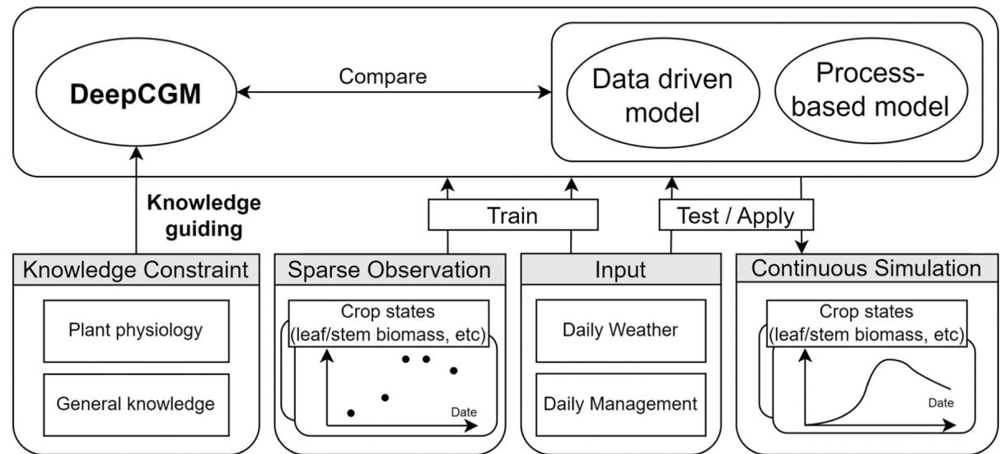  
图1. DeepCGM模型训练与性能评估框架

# 2.3. DeepCGM模型

DeepCGM模型旨在提供与基于过程的作物模型(PB)类似的内在可解释性和能力。为实现这些目标，需要遵循两个基本原则：1)使用具有物理意义的模型状态而非隐藏状态；2)构建和耦合模块来模拟作物生理中间过程，而非采用端到端方法。受MC-LSTM(Hoedt等，2021)启发，我们采用质量守恒向量存储模型状态，并为状态赋予物理意义(如生物量)，使隐藏状态能直接对应作物状态。我们进一步将调控模型状态动态的质量守恒门与作物生理过程(如呼吸消耗)对齐。这种概念化增强了对模型状态和功能的理解与操控，使作物领域知识得以融入。例如，它允许基于植物生理过程设计模型结构。DeepCGM与PB模型的关键区别在于构建要求：DeepCGM仅需预定义结构即可从观测中自动学习细节，而PB模型需要精心设计的模块和公式来显式描述中间过程(如整个生长季同化碳的分配、储存和消耗)。

在土壤-植物-大气连续体中，现有作物生长模型大多将水、氮和碳作为主要守恒变量。为简化模型，DeepCGM初始版本仅关注碳循环，暂不考虑水和氮循环。氮过程通过将累积施氮时间序列作为输入来简化。水过程未被纳入，因研究季节实验区降水充足，确保生长变异不受水分有效性影响。如图3所示，基于ORYZA2000模型架构设计了DeepCGM概念模型，将碳状态动态概括为五个互连过程：光截获与碳同化、维持呼吸、分配、生长呼吸和再分配。遵循该概念框架(图3a)，我们开发了DeepCGM，包含存储碳状态的质量守恒向量，以及调控碳流在互连过程间流动的五个质量守恒门(图3b)。附录A列出了涉及的变量，包括输入变量(驱动因子)、输出变量(模拟作物状态)、中间变量和门变量(控制单元)。模型计算分为数据预处理和迭代循环两个阶段。预处理阶段将原始数据转化为辅助输入$(Aux^t)$和质量守恒输入$(C_{potential})$，组织方式如下：

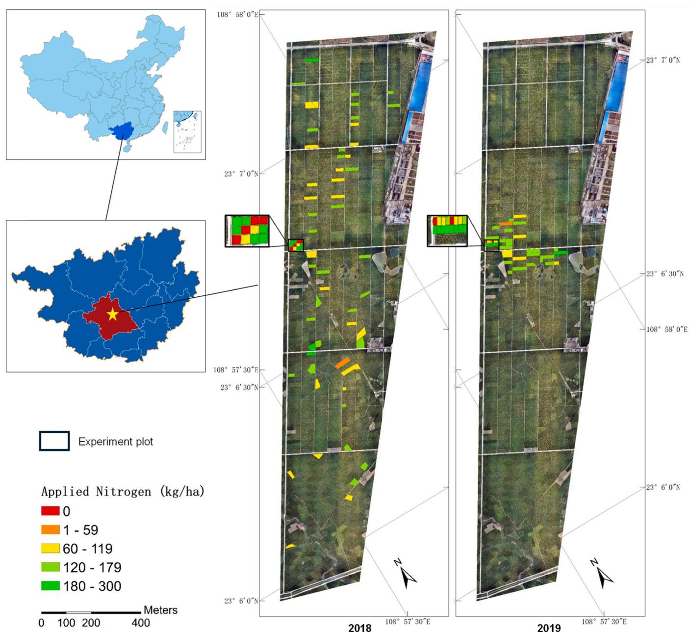  
图2. 2019年由当地农民管理的试验田

  
图3. (b)中其他符号含义见图例说明，更详细图示见附录C

$$
DVS^{t} = ORYZA2000_{DVS}(T_{\min}^{t},T_{\max}^{t})\# \tag{2}
$$

$$
Aux^{t} = \left[{\cal D}VS^{t},R^{t},T_{\min}^{t},T_{\max}^{t},N_{\mathrm{c}m}^{t},\right]\# \tag{3}
$$

$$
C_{potential}^t = Rad^t\cdot ORYZA2000_{photosynthesis}(T_{\min}^t,T_{\max}^t)\# \tag{4}
$$

其中变量定义见附录A；ORYZA2000$_{DVS}$是ORYZA2000的物候模块；ORYZA2000$_{photosynthesis}$是其光合作用模块。

迭代循环中，每个时间步将碳状态从前一日转移到次日。每次迭代的主要组件描述如下(六个步骤的公式见附录B):

1) 门计算：每次迭代开始时，模型基于门输入$(X^t)$计算门变量值$(I^t,MR^t,P^t,GR^t,R^t)$。门输入包含前一日碳量$(C^{t - 1})$和当日辅助数据$(Aux^t)$。
2) 光截获与碳同化：由于叶面积和叶绿素含量有限，作物仅能截获和同化部分辐射。因此截获-同化门用于估算被截获并同化为碳的辐射比例。当日碳输入$(C_{in}^{t})$由潜在碳量(当前光合效率和可用辐射下可合成的最大碳量)通过截获-同化门$(I^{t})$后的剩余碳决定。
3) 维持呼吸消耗：截获的碳首先用于呼吸消耗$(C_{M}^{t})$，由维持呼吸门$(MR^{t})$和前一日碳状态$(C^{t - 1})$决定；
4) 碳分配：扣除维持呼吸后，剩余碳$(C_{in}^{t} - C_{M}^{t})$通过碳分配门$(P^{t})$分配到不同植物组织，形成分配碳$(C_{\text{partition}}^{t})$。
5) 生长呼吸成本：分配用于组织合成的碳中，部分$(GR^{t})$被生长呼吸消耗，剩余量$(C_{grow}^{t})$作为净增长并入碳向量。
6) 再分配：碳向量中储存的碳$(C^{t - 1} + C_{grow}^{t})$通过再分配门$(R^{t})$在向量元素间重新分配，促进不同植物组分间的碳流动。再分配后的碳向量$(C^{t})$是该步骤的最终输出，可从中导出作物状态。

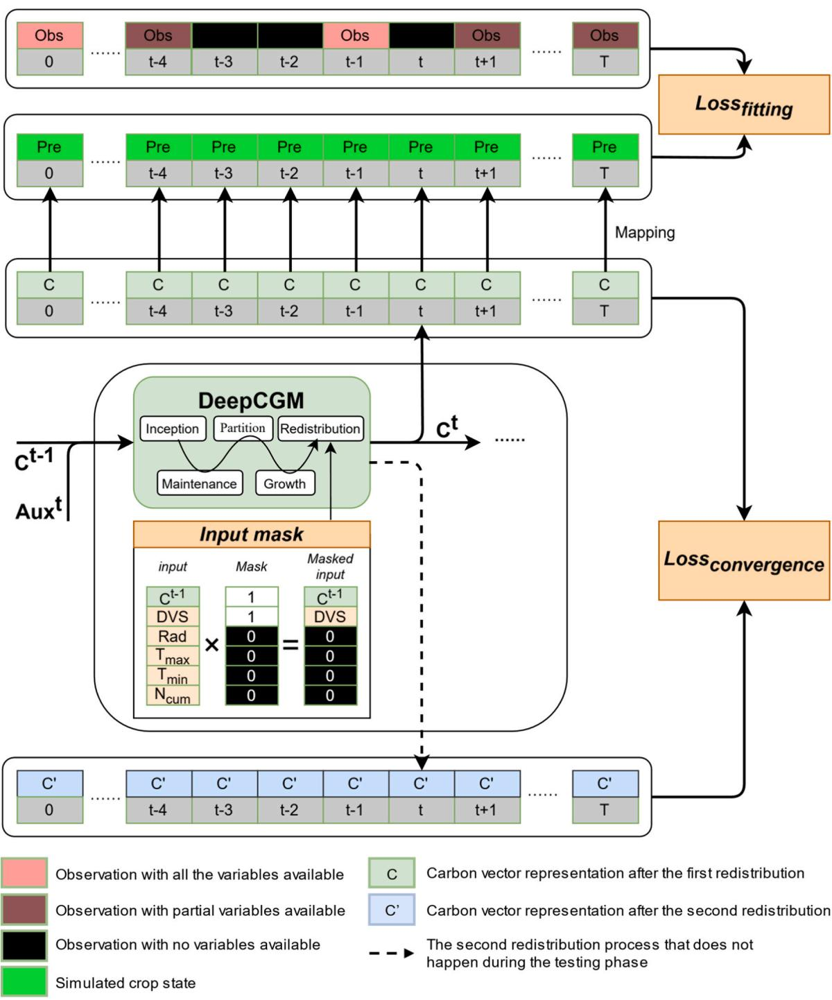  
图4. DeepCGM模型使用设计的拟合损失、收敛损失和输入掩码的训练过程

# 2.4. 拟合损失与知识引导约束

在训练过程中，模型参数通过梯度反向传播进行优化。本研究采用三种约束条件来指导模型训练：

第一个约束是拟合损失 $(Loss_{fitting},$ 图4)，这是一个标准的监督损失而非知识引导约束。它使模型能够学习训练数据输入与输出之间的映射关系，但无法融入符合作物生理过程的先验知识。此外，为确保不同变量在模型训练中获得相似权重，我们应用了变量特定的归一化因子和权重(表1)。最终的拟合损失是加权归一化均方误差，定义如下：

$$
Loss_{fitting} = \sum_{k = 1}^{K}\frac{\sum_{n = 1}^{N_k}\left(y_{k,n}^{pre} - y_{k,n}^{obs}\right)^2}{N_k}\times w_k\# \tag{5}
$$

其中K是变量数量(本研究中$\mathrm{K} = 6$)，$\mathrm{k} = 1,2,3,4,5,6$对应六个估计变量：PAI、WLV、WST、WSO、WAGT、YIELD)。每个变量的权重由$w_{k}$表示，根据经验分配以平衡损失函数中不同状态变量的影响，$N_{k}$是变量$K_{i}$的观测次数，$y_{k,n}^{pre}$和$y_{k,n}^{obs}$分别是模型模拟值和观测值。

第二个约束是知识引导损失，称为"收敛损失"$(Loss_{convergence},$ 图4)。该损失旨在缓解数据稀疏性导致的过拟合问题。由于深度学习模型强大的非线性拟合能力，它们可能采用扭曲曲线拟合稀疏数据，常产生违背真实世界过程的不合理结果。换言之，DL模型可能过度拟合训练数据集中的观测点，在每日迭代中无法达到收敛状态。为解决此问题，需要无监督损失来约束DL模型，确保即使在无观测日期模型也能受到调控。收敛损失的概念源自数值模型(如Hydrus-1D模型中的土壤水模拟)使用的迭代计算方法(Simunek等，2005)。在Hydrus-1D中，不同土层土壤水动态变化需要多次迭代逼近真实状况，当连续迭代间差异低于指定阈值时即达到收敛。类似地，DeepCGM在训练期间执行两次再分配过程，通过最小化两次迭代结果间的差异，使模型接近收敛状态，从而提高在稀疏观测数据条件下的稳定性和准确性。收敛损失定义为：

$$
Loss_{convergence} = \sum_{t = 1}^{T}\frac{\sum_{i = 1}^{N}\left(C_{i,t}^{pre} - C_{i,t}^{obs}\right)^{2}}{N}\times \frac{1}{T}\# \tag{6}
$$

表1  
拟合损失中的归一化参数与权重

| 指标 | PAI (m²/m²) | WLV (kg/ha) | WST (kg/ha) | WSO (kg/ha) | WAGT (kg/ha) | YIELD (kg/ha) |
|------|------------|------------|------------|------------|-------------|--------------|
| 观测最大值 | 7.51 | 5830 | 9553 | 9710 | 17770 | 9226 |
| 归一化缩放因子 | 8 | 20000 | 20000 | 20000 | 20000 | 20000 |
| 归一化后观测最大值 | 0.94 | 0.19 | 0.48 | 0.49 | 0.89 | 0.46 |
| 拟合损失权重 | 1 | 5 | 2 | 2 | 1 | 2 |
| 归一化值×权重 | 0.94 | 0.96 | 0.96 | 0.97 | 0.89 | 0.92 |

其中$T$表示输入序列长度(模拟天数)；$N$为碳向量大小$(\mathrm{N} = 3\mathrm{n})$；$C_{i,t}^{pre}$和$C_{i,t}^{pre'}$分别代表第一次和第二次再分配后的碳向量状态。

第三个约束是知识引导的"输入掩码"(图4)，用于过滤特定子过程中不相关的输入变量，相比纯机器学习模型更易捕捉数据特征和映射关系。该掩码基于农学先验知识预定义。本研究仅将输入掩码应用于生物量再分配过程。根据ORYZA2000的研究发现，辐射、温度和累积施肥量等变量并不直接影响碳再分配，它们对作物生长的影响是通过水分胁迫和氮胁迫等机制间接实现的(Bouman等, 2001a)。因此如图4所示，在再分配门中，输入掩码对Rad、$\mathrm{T_{max}}$、$\mathrm{T_{min}}$和$\mathrm{N_{cum}}$赋予零权重，其他相关变量则保持权重为一。

图4的训练示意图表明，MC-LSTM和DeepCGM模型可同时整合全部三个约束条件。而ORYZA2000和LSTM模型由于结构限制，在校准/训练时只能使用拟合损失。

# 2.5. 模型配置与案例设置

ORYZA2000模型分别使用2018和2019年数据进行校准。每年所有田块的原始稀疏观测数据、管理记录和气象数据被用于其中一年的校准和另一年的测试。校准过程分为两步：首先基于物候观测调整三个物候相关参数；然后根据PAI、器官生物量和产量观测校准十六个生物量相关参数。在校准生物量相关参数时，使用损失拟合作为目标函数以平衡不同变量的权重。校准采用粒子群优化算法(Kennedy和Eberhart, 1995)，通过Pymoo包(Blank和Deb, 2020)实现。默认参数和校准参数见补充材料S2和S3，校准后ORYZA2000在校准年和测试年的性能见附录D。

深度学习模型采用ADAM优化器(Kingma和Ba, 2017)进行参数优化：LSTM学习率设为0.005，MC-LSTM和DeepCGM均为0.1。LSTM模型的隐藏状态大小为64，MC-LSTM和DeepCGM的碳向量大小为24$(8^{*}3)$。所有模型训练700个epoch，选择训练集表现最佳的模型进行测试(早停法)。训练期间未应用学习率衰减。MC-LSTM和DeepCGM的损失函数定义为：

$$
Loss = Loss_{fitting} + Loss_{convergence}*\alpha lpha\# \tag{7}
$$

其中alpha设为100,000。本研究采用拟合损失(公式5)作为整体精度评估指标，并额外使用RMSE评估各状态精度：

$$
RMSE_{k} = \sqrt{\frac{\sum_{n = 1}^{N_{k}}\left(y_{k,n}^{pre} - y_{k,n}^{obs}\right)^{2}}{N_{k}}}\# \tag{8}
$$

其中$\mathrm{k} = 1,2,3,4,5,6$对应六个状态变量(PAI、WLV、WST、WSO、WAGT、YIELD)，$N_{k}$为测试数据集中各变量的观测次数。由于深度学习模型参数量远多于观测数据量，训练过程对初始随机种子极为敏感。为便于雷达图比较，RMSE进一步转换为归一化指数(NI)。

为评估数据可用性、模型设计和知识约束对DeepCGM模拟作物生长的贡献，设计了多组计算实验：数据可用性方面，将两年数据集划分为训练集和测试集，并可互换以评估跨年性能，同时纳入数据增强和部分删除的案例；模型与约束方面，训练/校准了过程模型(ORYZA2000)和三种数据驱动模型(LSTM、MC-LSTM和DeepCGM)，采用不同策略研究各类损失和约束的影响。表2展示了17个设计案例及其对应实验：

(E1, 案例1-3和4) 比较不同模型结构在使用拟合损失训练/校准时的效果。

(E2, 案例7-10) 评估输入掩码和收敛损失对DeepCGM训练的影响。

(E3, 案例2,7,10,13和16-17) 对比数据增强与稀疏数据训练模型，评估约束效果和数据增强贡献。

(E4, 案例2和10-12) 删除生长季前期观测(2019年前50天)模拟时序不完整数据，研究数据缺失影响。

(E5, 案例1-10和13-17) 比较所有稀疏数据集和增强数据集训练的模型，确定最优性能。

表2 不同案例的模型、训练策略和数据集

| 案例编号 | 计算实验 | 模型 | 训练策略 | 数据集 |
|---------|---------|------|---------|--------|
|         | E1 | E2 | E3 | E4 | E5 |  | 拟合损失 | 输入掩码 | CG损失 | 训练集 | 测试集 |
| 1 | 模型结构 |   |   |   |   | ORYZA2000 | √ |   |   |   |   |
| 2 |   |   |   |   |   | LSTM | √ |   |   |   |   |
| 3 |   |   |   |   |   |   | √ |   |   |   |   |
| 4 |   |   |   |   |   | MC-LSTM | √ | √ |   |   |   |
| 5 |   |   |   |   |   |   | √ | √ |   |   |   |
| 6 |   |   |   |   |   |   | √ | √ |   |   |   |
| 7 |   |   |   |   |   |   | √ |   |   |   |   |
| 8 | 训练策略 |   |   |   |   |   | √ | √ |   |   |   |
| 9 |   |   |   |   |   |   | √ | √ |   |   |   |
| 10 |   |   |   |   |   |   | √ | √ |   |   |   |
| 11 |   |   |   |   |   |   | √ | √ |   |   |   |
| 12 |   |   |   |   |   | LSTM | √ |   | 移除数据 | 稀疏数据 |   |
| 13 |   |   |   |   |   | LSTM | √ |   |   |   |   |
| 14 |   |   |   |   |   |   | √ |   |   |   |   |
| 15 |   |   |   |   |   | MC-LSTM | √ | √ |   |   |   |
| 16 | 约束与数据增强 |   |   |   |   |   | √ |   | 增强数据 | 稀疏数据 |   |
| 17 |   |   |   |   |   | DeepCGM | √ | √ |   |   |   |

# 3.结果

结果部分分为两个主要部分。第一部分考察模型训练策略，重点分析不同案例在训练过程中的表现。第二部分聚焦模型性能，展示DeepCGM在测试集上的模拟结果并与其他模型进行精度比较。为证明所提方法的泛化能力，我们在补充材料S4中提供了重复性研究。

# 3.1. 不同结构、策略和数据集下的模型训练

# 3.1.1. 不同结构的模型性能

图5(a1-f3)展示了ORYZA2000(案例1)、LSTM(案例2)、MC-LSTM(案例3)和使用拟合损失训练的DeepCGM(案例7)的模拟结果对比，体现了模型结构的影响(E1)。经校准的ORYZA2000模型生成的曲线与观测数据高度吻合，有效捕捉了实际作物生长过程。例如WAGT最初呈现缓慢增长，随后逐渐加速，最终趋于稳定(图5e1)，这种模式与常用于描述作物生长动态的逻辑生长曲线(Yin, 2003)高度相似。由于缺乏连续的实地生长观测，反映典型水稻生长模式的ORYZA2000模拟结果成为与其他模型对比的重要参考。

相比ORYZA2000，LSTM模型虽偶尔能较好拟合观测值，但生成的生长曲线偏离典型作物生长模式(图5a1-f1)。对于WLV、WST、WSO和PAI(图5a1-d1)，这种偏离表现为：(1)所有变量在生长早期均出现明显波动；(2)生长中后期波动减小，但模拟结果与观测或ORYZA2000不符。早期波动主要源于训练数据在生长初期的缺失。中后期阶段，LSTM模型固有的长期记忆能力促成了更稳定的模拟(图5a1-d1)，但微小波动仍然存在，这可能是由于训练数据的稀疏性和噪声阻碍了模型学习普适生长规律，导致在数据稀缺时期出现偏差。对于WAGT，早期生长阶段的模拟更为准确(图5e1)，可能因为训练集中含有更多早期WAGT观测(图S1-2)。就YIELD而言，LSTM模型在生长早期的预测与ORYZA2000反映的趋势完全矛盾(图5f1)，这是因为整个生长周期仅有两个产量观测点(播种时的初始值和收获时的终值)，导致LSTM难以有效再现YIELD的时间演变。

MC-LSTM和DeepCGM的模拟结果(图5a2-f2和a3-f3)与ORYZA2000的一致性优于LSTM，特别是WAGT(图5e2和e3)。值得注意的是，两者在早期模拟中的波动均小于LSTM。此外，DeepCGM模拟的WAGT呈现先慢后快的增长模式，更贴近ORYZA2000和实际作物生长规律。这一改进源于DeepCGM基于ORYZA2000设计的结构，确保了与已知生理过程的更好契合。然而对于器官生物量(WLV、WST、WSO)及其衍生状态(PAI和YIELD)，虽然趋势与ORYZA2000相似，两个模型仍存在显著波动(图5a2-d2和f2)。这是因为质量守恒结构通过调节生长与消耗确保总生物量的时间稳定性，但未对器官间的再分配施加限制，导致单个器官生物量出现波动。尽管YIELD存在波动，MC-LSTM和DeepCGM在生长早中期的模拟值均接近零，符合实际作物生长规律。这归功于基于生物量相关变量关系(公式A12-A17)设计的模型结构，使DeepCGM能从WSO推断YIELD，而非简单拟合稀疏的YIELD观测。

综上可得出E1案例的结论：(1)ORYZA2000与观测值的匹配度最高，表明仅靠质量守恒结构不足以使数据驱动模型超越传统作物模型；(2)相比LSTM，MC-LSTM和DeepCGM模拟的WAGT更符合实际生长过程，证明质量守恒原则有助于捕捉作物生长特征；(3)DeepCGM的WAGT模拟优于MC-LSTM，说明基于植物生理知识设计的结构能提升模型性能；(4)MC-LSTM和DeepCGM的YIELD模拟更好反映实际生长模式，表明关系结构约束可指导模型从稀疏观测中学习。

# 3.1.2. 采用不同策略训练的DeepCGM模型

为进一步减少器官生物量时间序列模拟结果的波动，我们在E2案例中引入了输入掩码和收敛损失来约束再分配过程的计算。应用输入掩码(图5 a4-f4)和收敛损失(图5 a5-f5)显著降低了波动性。这一改进可归因于：(1)输入掩码选择性过滤掉与再分配过程无关的变量；(2)收敛损失建立了收敛标准，有效防止了导致严重波动的分配不足和过度分配现象(图5 a1-f1)。由于输入掩码和收敛损失从不同角度调控再分配过程，二者联合使用产生了叠加效应，进一步平滑了所有模拟曲线(图5 a6-f6)，使其更贴近ORYZA2000模拟的生长趋势。此外，图5 a5-f5的波动明显小于图5 a4-f4，表明收敛损失在减少波动方面可能比输入掩码更有效。综上所述，E2结果表明通过约束再分配过程，收敛损失和输入掩码有效改善了器官生物量的模拟性能。

# 3.1.3. 在增强数据集上训练深度学习模型

为与传统稀疏数据处理方法对比，我们分别在增强数据集和原始稀疏数据集上训练了LSTM和DeepCGM模型。与稀疏数据训练的模型相比，增强数据训练的模型结果与ORYZA2000更加吻合(如图6 a4)，具体表现为：(1)所有变量的早期生长速率匹配度更好(如图6 a4 vs 案例10的图6 a2)；(2)模拟的PAI、WLV、WST、WSO和YIELD明显更平滑(图S1-4 a4-f4, a5-f5 vs 案例2和7的图S1-4 a1-f1, a2-f2)。

上述改进源于数据增强填补了稀疏数据的空缺。但使用ORYZA2000进行增强会将其固有结构误差引入增强数据，导致训练模型出现类似误差。例如ORYZA2000模拟的WLV在后期保持恒定，而基于增强数据训练的深度学习模型也表现出相似的恒定趋势，与观测数据中WLV逐渐下降的现象不符(图6 a3和a4)。此外，使用增强数据不能保证遵循生理过程，因为拟合损失仅指导模型拟合观测值而非确保遵循生理约束。例如在增强数据训练的LSTM模型中，YIELD在生长早中期出现微小波动(图6 b3)，而此时灌浆尚未开始，YIELD应保持为零。引入输入掩码和收敛损失后，无论是否使用增强数据，YIELD模拟的波动均被消除(图6 b2和b4)。因此E3结果表明：虽然数据增强通过提供额外标签补偿了数据稀疏性，但也会将结构误差引入模型；仅依赖数据而不整合基本约束无法确保模型遵循生理过程。

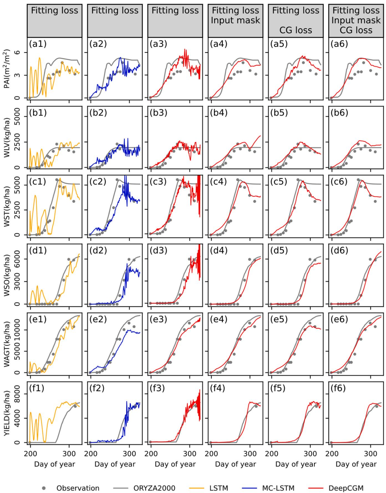  
图5. 2018年a0地块的模拟结果，展示的是2019年随机选定试验田的测试结果。

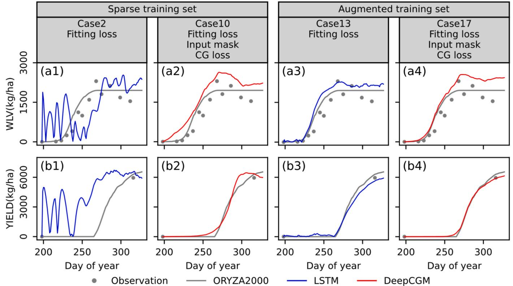  
图6. LSTM和DeepCGM在稀疏和增强数据集上的作物生长模拟(所有模型均基于2018年数据训练，随机种子为0)。本图仅展示WLV和YIELD，详细结果参见图S1-4。

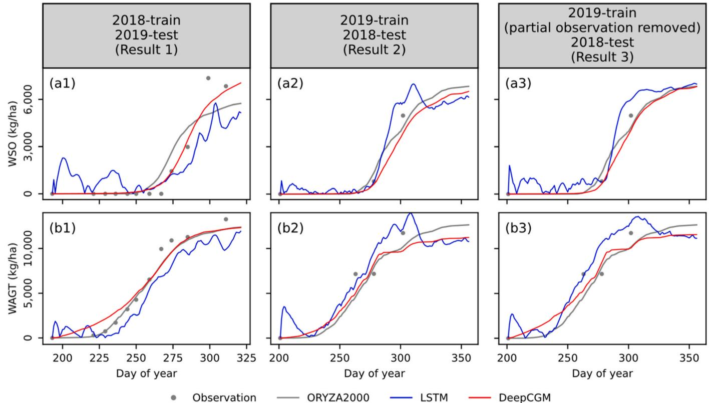  
图7. 2019年t地块...详细结果参见图S1-5。

# 3.1.4. 使用部分观测移除数据集训练模型

本节展示E4案例的结果，重点分析观测数据缺失对模型性能的影响。我们使用三个数据集训练LSTM和DeepCGM模型：2018年数据集、2019年数据集以及移除早期观测的2019年数据集。对于LSTM模型，结果2（图7 a2和b2）中的水稻早期生长模拟波动明显小于结果1（图7 a1和b1），这归因于2019年数据集中含有更多早期观测（图S1-2）。因此，从2019年训练集中移除早期观测导致结果3（图7 a3和b3）的早期模拟效果变差，产生与结果1相似的波动。DeepCGM模型在所有结果中均保持平滑准确的模拟，未出现LSTM模拟中的波动现象（如图7 a2和b2）。尽管移除早期观测导致生物量增长率略高于观测数据和ORYZA2000预测值，但与LSTM模型相比，这种性能下降可以忽略不计（图7 b3及图S1-5 a3-c3）。

  
图8. 采用不同策略和数据集训练的LSTM与DeepCGM模型在训练过程中的训练集和测试集拟合损失（随机种子=0，其他种子结果参见图S1-6）。

这些结果表明训练数据不足确实会削弱模型的模拟能力。但与无约束的LSTM模型相比，DeepCGM在部分观测被移除后的性能下降更轻微。这说明DeepCGM采用的结构约束、输入掩码和收敛损失有助于缓解数据稀缺的负面影响，并部分补偿性能退化。

# 3.1.5. 训练过程的鲁棒性分析

本节通过历元维度的损失曲线展示训练集和测试集损失，旨在讨论训练策略（E3）的影响并比较不同模型对随机初始化的鲁棒性。

当模型在稀疏数据集上仅使用拟合损失训练时，LSTM模型表现出较差的稳定性，其损失曲线波动显著（图8a），而DeepCGM的曲线更为平稳（图8c）。其他随机种子生成的损失曲线也呈现相似模式（图S1-6 a和c）。此外，训练集损失下降伴随测试集损失上升表明存在过拟合（图8a和c）。引入知识引导约束后，过拟合显著减少（图8e），损失曲线更加平滑，证明这些约束能有效改善模型训练并缓解过拟合。当使用增强数据训练时，所有训练过程都变得更稳定（图8b、d和f）：(1)训练集拟合损失不再持续下降；(2)测试集拟合损失波动减小。所有模型在增强数据上的损失曲线相似（图8b、d和f），表明当观测数据充足时，模型训练更依赖数据集而非模型架构或结构。在图8b、d、f和e的所有结果中，采用全部约束在稀疏数据上训练的DeepCGM测试集损失（图8e）低于其他模型。这说明尽管数据增强能提高训练稳定性，但由于可能引入结构误差，不一定能提升模型性能。

图S1-6展示了25个不同随机种子训练的模型拟合损失。对于仅用拟合损失在稀疏数据上训练的模型，LSTM（图S1-6 a）和DeepCGM（图S1-6 c）在25次训练过程中均表现出显著差异，表明参数初始化对模型性能影响较大。相比之下，采用全部约束训练的DeepCGM在25次训练中变异极小。使用增强数据训练的模型（图S1-6 b、d和f）在25次训练中的损失曲线仅有轻微差异。这些结果表明知识引导约束和数据增强都能有效降低参数初始化对训练过程的影响，使模型性能更稳定。

# 3.2. 模型性能比较

# 3.2.1. DeepCGM在不同氮肥水平下的作物生长模拟

将DeepCGM在三种不同施肥水平试验田的时间序列模拟结果与ORYZA2000进行对比(图9和图S1-7)。虽然ORYZA2000成功捕捉了大多数变量的总体生长趋势，但其模拟结果与观测值之间仍存在明显差异。例如，ORYZA2000模拟的WLV在生长中后期保持恒定，而观测值呈现下降趋势(图9 c1-c3)；WST在生长后期显著下降，但ORYZA2000仅显示轻微降低(图9 d1-d3)。这些偏差可能源于ORYZA2000模型的结构误差。

DeepCGM模拟变量的总体趋势合理，与ORYZA2000和观测数据均保持良好一致性。在某些情况下，DeepCGM甚至优于ORYZA2000，具体表现为：(1)在零肥和中肥条件下，两个模型的PAI峰值出现时间相近(图9 b1-b2和图S1-7 b4-b5)；在高肥条件下，DeepCGM模拟的PAI峰值晚于ORYZA2000，更接近观测结果(图9 b3和图S1-7 b6)；(2)WLV在生长中后期下降(如图9 c1-c3，尽管c1在下降后又回升)，而ORYZA2000保持恒定WLV，与观测不符；(3)WST在后期下降，且施肥量越高下降越明显(如图9 d1-d3和图S1-7 d4-d5)。这优于ORYZA2000，因为ORYZA2000中WST下降不随施肥水平变化，而观测显示高肥条件下WST下降更显著(如图9 d1-d3)。但DeepCGM在某些情况下也偏离实际作物过程：(1)PAI、WLV、WST和WAGT的生长速率高于ORYZA2000和观测值，在2018年训练-2019年测试案例中尤为明显(图9 b1-f3)；(2)2018年低肥地块WLV在后期意外回升(图9 c1)；(3)2018年中高肥条件下YIELD在后期下降(图9 g2-g3)，这不符合实际情况。

此外，DeepCGM模拟的作物生长与施肥量呈正相关，高肥导致更高生物量(如图9 f1-f3)，符合实际生长规律。但与ORYZA2000相比，DeepCGM对施肥的敏感性较低，例如WAGT随施肥量变化的幅度较小(图9 f1-f3)。总体而言，DeepCGM有效模拟了作物生长模式，结果优于或相当于基于知识的ORYZA2000模型。

由于随机初始化影响，25次随机种子实验结果存在变异。为更稳定评估模型性能，我们将生育期分为四个阶段计算平均RMSE及标准差。在出苗至幼穗分化期，DeepCGM的RMSE高于ORYZA2000(图10)；在后续发育阶段，DeepCGM在PAI、WLV、WST和WSO上优于ORYZA2000，仅WAGT稍逊(图10)。这可能因为WAGT过程较简单，ORYZA2000足以捕捉其动态，但对其他生物量组分的复杂过程模拟不足。此外，DeepCGM需要在$Loss_{fitting}$中平衡各组分，可能导致开花后其他变量精度提升的同时WAGT略有下降。对于YIELD，由于仅成熟期有观测数据，结果显示收获期YIELD的RMSE显著低于ORYZA2000(图10)。这些结果表明DeepCGM在大部分生育期优于ORYZA2000，但早期发育阶段较大的模拟误差可能源于训练数据缺乏早期观测。在生长早期引入更多知识约束可能进一步提升DeepCGM性能。

# 3.2.2. 不同模型的精度比较

通过拟合损失(图11)和标准化指数(图12)评估模型整体精度及对六个变量的模拟能力，以确定最佳模型(E5)。两图数据均来自附录F。图中ORYZA2000的性能代表传统作物模型可达到的最优水平，作为对比基准。

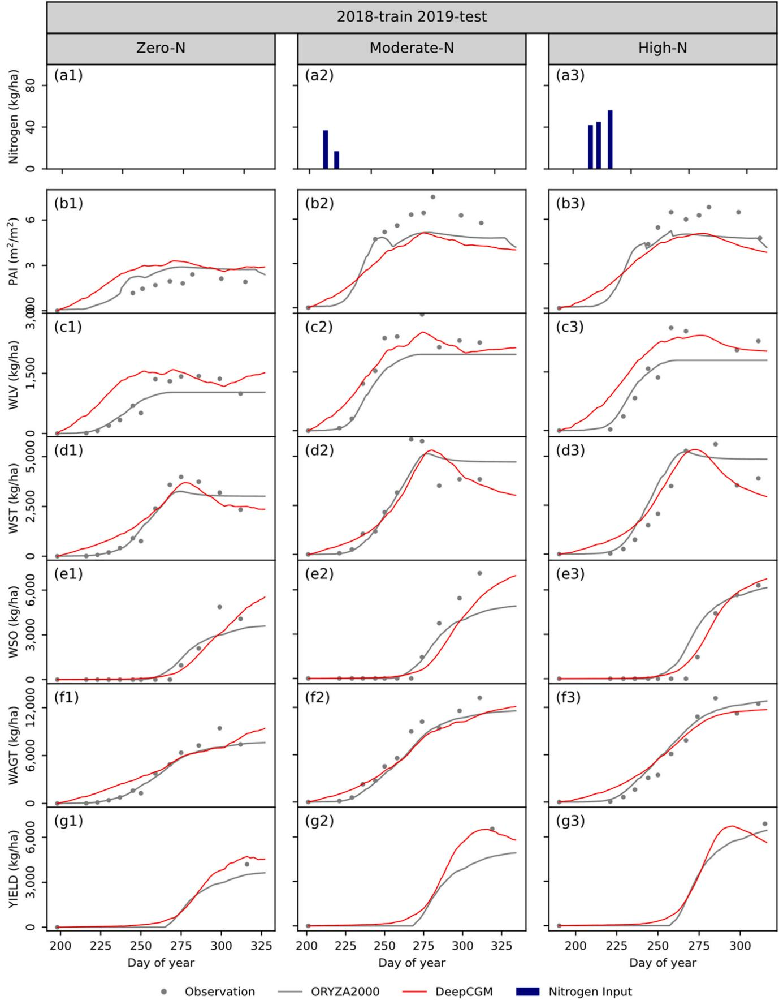  
图9. DeepCGM(随机种子$=1$)和ORYZA2000在不同施肥水平地块的作物生长过程模拟

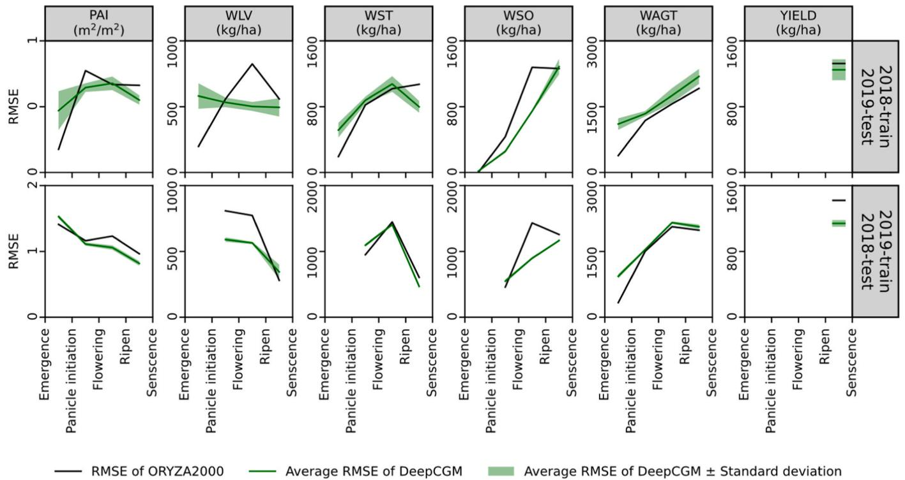  
图10. DeepCGM在不同生育阶段的平均RMSE及标准差与ORYZA2000的RMSE对比

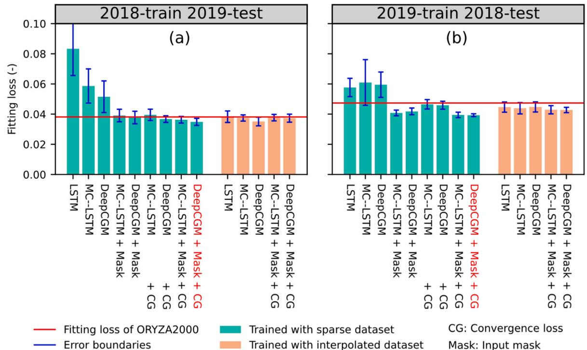  
图11. 不同策略和数据集训练模型的整体精度。红色x轴标签对应模型为本研究最优模型

如图11a所示，当模型仅使用拟合损失在稀疏数据集上训练时，其性能始终低于ORYZA2000模型。这表明在小数据集上训练的深度学习模型若没有额外约束，将无法超越基于过程的模型。然而，在引入输入掩码或收敛损失后，MC-LSTM和DeepCGM的精度均显著提升，其中采用收敛损失训练的DeepCGM表现优于ORYZA2000（图11a）。当同时应用输入掩码和收敛损失时，MC-LSTM和DeepCGM在两年数据上的表现均超越ORYZA2000，且DeepCGM略优于MC-LSTM（图11a）。相比ORYZA2000，DeepCGM的整体精度提升了$8.3\%$（2019年）和$16.9\%$（2018年）。这些结果表明输入掩码和收敛损失对模型均有裨益，其中收敛损失效果更显著，同时也证明了DeepCGM在结构上优于MC-LSTM。更重要的是，这些发现揭示了在稀疏数据上采用知识引导约束训练的机器学习模型具有超越传统基于过程作物模型的潜力。

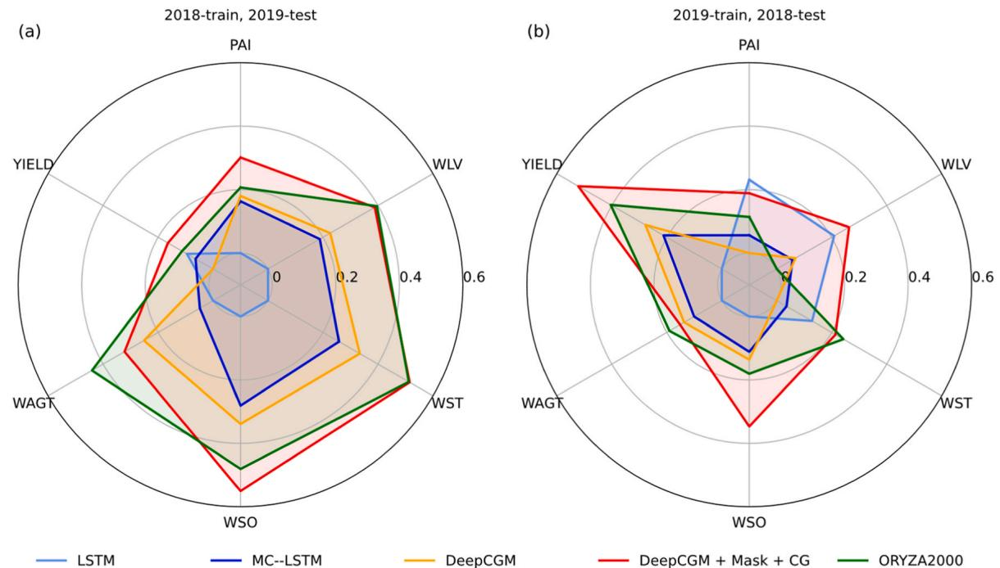  
图12. 稀疏数据集上不同训练策略模型的标准化指数。E5案例的详细结果参见附录F。

当使用增强数据训练时，所有模型的整体精度均达到或超过ORYZA2000（图11b）。这种改进源于增强数据基于ORYZA2000模拟生成，使模型能同时对齐ORYZA2000内嵌的先验知识和实际观测过程。但增强数据的模式受ORYZA2000影响，限制了模型从观测中充分学习的能力，导致其精度低于知识引导的DeepCGM模型。这表明数据增强虽是训练小数据集模型的有效策略，但效果不及本研究提出的知识引导方法。

图12展示了六个状态变量的精度。对于采用输入掩码和收敛损失训练的DeepCGM模型，在PAI、WLV、WSO和YIELD上相对ORYZA2000有显著提升，而所有模型的WAGT模拟精度均低于ORYZA2000。此外，我们统计了各模型超越ORYZA2000的状态变量数量。如附录F所示，在12个RMSE值（6变量×2年）中，案例6、10和16有8个变量表现优于ORYZA2000，其中案例10包含最多（3个）最佳表现变量。这证实对于单个状态变量模拟，知识引导的DeepCGM模型仍是最优选择。附录E提供了最佳模型模拟值与观测值的散点图，可与附录D中ORYZA2000的散点图进行直观对比。

基于整体性能指标和单变量精度，采用收敛损失和输入掩码的DeepCGM应被视为最佳模型（E5）。该模型实现了最低拟合损失，并在最多状态变量上达到超越ORYZA2000的精度。

# 3.3. 复现研究

为验证模型的普适性，我们在包含122块试验田的三年水稻实验数据上进行了复现研究（详见补充材料S4）。结果表明DeepCGM在多数变量上优于经典机器学习模型和ORYZA2000，且能在知识约束下推断未观测过程。

# 4. 讨论

# 4.1. 约束与数据的互补性

在小数据集上训练深度学习模型具有挑战性。训练数据稀缺时，模型学到的复杂关系可能源于采样噪声（Srivastava等，2014）。在图像识别和自然语言处理领域，各种正则化技术和约束已证明能有效缓解数据稀缺问题（Sari等，2019；Srivastava等，2014；Vidaurre等，2013）。自然科学研究中特有的因果关系和物理规律为引入领域特定约束提供了条件（Han等，2023；Jia等，2019；Liu等，2022）。但约束应用需基于合理依据而非随意添加（Liu等，2022）。本研究中，稀疏观测数据无法为整个生育期提供有效约束，导致无观测时段模型表现不佳。因此，我们通过结构设计、输入选择和损失函数设计三个维度，利用作物生长过程知识对模型进行约束。约束缓解数据稀疏问题的考量主要基于以下方面：

首先，作物生长作为时间序列过程，相邻时间步相互依赖制约。需施加时间维度约束以确保各器官生物量不会异常增减（如图5 b1-e1）。MC-LSTM的质量守恒结构有效满足该需求。进一步结合作物生理过程，我们设计的DeepCGM结构能更好契合生物量动态。从LSTM到MC-LSTM再到DeepCGM，模型结构逐步融合时间依赖性，随着领域知识的深入整合，其在稀疏数据训练下捕捉真实过程的能力持续提升（图5 a1-f1, a2-f2和a3-f3）。

其次，简单的DeepCGM架构性能仍逊于ORYZA2000。模拟结果分析表明，虽然现有结构约束能有效保证地上部总生物量的时间序列平滑模拟，但生物量再分配过程需要额外约束以提高精度。为此，我们引入收敛损失增强模型稳定性，并基于作物生理知识在再分配门控上应用输入掩码。该方法排除了与再分配无关的输入，减少噪声干扰，从而进一步提升模型性能。

约束引入可强制模拟结果符合物理规律，防止模型参数产生错误输出，帮助模型更有效地从数据中学习作物生长模式。然而模型学习正确模式的能力仍依赖于充足数据支持，因为输出质量最终由输入质量决定——否则将导致"垃圾进，垃圾出"的结果。例如，尽管MC-LSTM在质量守恒和收敛损失约束辅助下成功减少了波动，却未能捕捉早期发育阶段生物量缓慢累积的模式（图5 a2-f2）。若有充足观测数据，模型可直接从数据中学习该模式，如使用增强数据训练的模型所示（图6）。反之，数据充足能显著增强模型能力，尤其在受控环境或高通量表型平台等场景。但现实农业系统受多因素影响，仅靠数据精确重现作物生长过程并不现实。即便使用大数据集，也无法保证模型严格遵循物理规律，例如使用增强数据集训练时仍可能出现器官生物量波动（如图6 a3和b3）。因此最优策略是在知识引导约束下训练模型的同时充分利用数据，平衡数据驱动学习与物理真实性，实现更稳健精确的作物生长模拟。

# 4.2. DeepCGM开发经验总结

现有大量基于过程的作物模型（PB模型），多篇综述为传统作物模型构建改进提供指导（Bouman, 2001; Pasley等, 2023; Yin等, 2021）。但除近期发表的注意力机制模型（Moon等, 2023）和我们前期研究（Han等, 2023）外，鲜有机器学习驱动的作物生长模型可供参考。通过本研究，我们获得若干关键认知，特别是通过与传统作物模型及Moon等（2023）研究的对比。

首先，建议按以下优先级选择相邻时间步的信息记忆变量：具物理意义的向量表示（如本研究的碳向量）、具物理意义的变量（如叶片生物量）和隐藏状态。自然语言处理与计算机视觉中特征通常抽象难表征，常用隐藏状态作为表示（Pasley等, 2023）。但在土壤-植物-大气连续体（SPAC）系统中，系统状态可用生物量、土壤含水量等物理变量描述，这些变量存储系统主要信息。虽不能完全捕获系统所有细节，但相比隐藏状态有两大优势：(1)帮助模型摒弃无关或低价值信息，聚焦相关数据（如忽略前日辐射量但保留当日生物量）；(2)支持模型内直接调整，如本研究应用的再分配损失。当前实践中，PB模型（如ORYZA2000）和注意力模型（Moon等, 2023）均采用历史作物状态作为系统记忆，印证该方法的有效性。但预定义物理变量会限制深度学习模型的表征能力，因其数量有限，提升模型容量需额外定义新变量，往往需要更多假设。例如ORYZA2000同时使用茎生物量和茎储备生物量，而WOFOST仅用茎生物量（Bouman, 2001; Van Diepen等, 1989）。双变量方案使ORYZA2000能更好模拟茎动态（Bouman, 2001），但需更多实验和方程描述茎储备生物量交互。若交互定义不当，新增变量反而不利于精度提升。更根本的方案是采用具物理意义的向量表示进行信息存储，这些向量不对应具体作物状态变量，但可推导出它们。该方法保留物理变量的优势（如质量守恒结构和输入掩码），同时无需显式定义方程，因深度学习模型能自主学习这些关系。但此观点不意味完全摒弃隐藏状态，因部分系统状态机制尚未完全明确（如极端温度导致的颖花不育，Bouman, 2001），完全移除会限制模型从大数据学习未知机制的能力。故建议在数据有限场景下实证评估隐藏状态的价值。

其次，模块化设计模型优于合并所有过程计算。虽深度学习参数常难解释，但模型结构仍可基于作物生理知识设计。结构约束作为有效的正则化技术，能显著提升性能。本研究中基于知识设计的DeepCGM在测试模型中精度最高，类似结构设计优势在其他研究（如Liu等（2022）的N₂O排放估算）中也有体现。良好建模实践对深度学习模型同样有益，模块化架构支持对不同子过程独立控制管理，例如本研究的输入掩码实现了对再分配模块输入的精准调控。该模块化理念在传统作物模型中广泛应用，子过程分离有助于最小化各环节不确定性（Pasley等, 2023）。

最后，应基于既有知识和既定目标进行模型概念化设计。构建前需通过选择核心架构（如循环神经网络或Transformer）、定义输入输出配置、识别子过程与子模块、根据研究目标考虑模型简化等方式完成概念化。例如本研究采用基于循环神经网络的架构捕捉作物生长的时间因果性，而Moon等（2023）使用忽略生长状态序列依赖的Transformer模型。选择输入变量时，应基于研究目标仅包含必要驱动变量，而非所有可用变量。例如本研究目标是基于质量守恒模拟碳循环，故排除水氮循环模拟，选择温度、辐射、累计施氮量和DVS（由ORYZA2000模拟）作为驱动因子，同时排除降水、风速等水相关驱动因子。审慎的输入选择还能减少冗余输入，降低过拟合风险（Moon等, 2023）。因此全面的概念化设计至关重要，其目标是平衡研究需求与可用资源（数据与知识），而非简单选择最先进结构或包含最多输入特征。

# 4.3. 局限性与未来研究

作物模型的发展经历了从仅考虑潜在生长条件，到逐步纳入水分限制、氮素限制及其他环境因子(Bouman等, 1996)的过程。同时，模型也从通用框架发展为针对特定物种和品种的模型(Wang等, 2019)。类似的演进路径也适用于基于深度学习的作物生长模型。当前版本的DeepCGM旨在解决使用稀疏观测数据集训练深度学习模型的挑战，因此聚焦于基础生物量模拟，尚未考虑水分有效性、品种差异或土壤质地等因素。模型训练所需的最低数据要求包括气象数据(辐射、温度)、管理数据(播种日期和施氮记录)以及作物标签(发育阶段、生物量和叶面积指数观测)。本研究仅关注生物量观测是由于其他观测数据缺乏。然而已有研究表明，设计多并行分支处理不同观测变量(如氮素和水相关变量)是有效策略(Bertels和Willems, 2023)。未来研究可开发类似模块化架构以纳入水氮循环。此外，LSTM模型可作为辅助模型模拟非质量守恒变量(如物候)，这是MC-LSTM无法有效处理的。受当前结构限制，DeepCGM尚不能直接迁移至其他地区或品种。一个可行方向是将DeepCGM与静态属性识别器(Tsai等, 2021)结合，以考虑土壤、品种和物种特性。进一步结合超网络的软权重共享(Ha等, 2016)与LoRA的任务级微调策略(Hu等, 2021)，可实现针对特定品种、土壤甚至模型内部子过程的校准。

当前DeepCGM受数据限制，在无观测时段存在模拟偏差，包括后期产量下降和早期生物量快速增长等问题。尽管模型遵循质量守恒原则，但缺乏足够观测数据时难以识别正确生理过程，随机因素可能导致非真实结果。解决这一局限可考虑两种策略：用作物模型模拟补充观测数据(而非完全依赖，如3.1.3节所述)和引入额外知识约束(如对非真实后期产量下降的损失函数惩罚)。尽管已采用质量守恒结构、收敛损失和输入掩码，现有知识利用仍不充分。因此需要整合更多植物生理学知识。当前知识整合依赖人工设计，而作物模型已包含丰富领域知识，未来需研究如何高效将作物模型知识融入深度学习框架。

本研究证明KGML模型在作物生长模拟中可超越PB模型。知识引导的机器学习为农业模型发展提供了新机遇。KGML的优势在于能同时整合数据和知识，超越传统作物模型能力。随着表型技术进步，预计将出现数据爆炸(Jin等, 2020)。相比之下，PB模型采用的假设-验证方法需要冗长迭代且易受开发者知识背景影响(Shein等, 2023)。面对海量数据，KGML提供了更快且无偏的知识提取方案。相比纯数据驱动模型，KGML还具有更强外推能力和更好可解释性。数据驱动模型虽可直接从数据提取知识，但其发现常难以解释(Yin等, 2021)；而PB模型虽擅长外推和解释但缺乏灵活性。KGML结合两者优势，在数据驱动与PB模型间建立平衡框架，推动农业建模发展。KGML还可轻松扩展至模型耦合和数据同化等应用。SWAP、WOFOST和DSSAT等PB模型包含大量领域知识，但受编程语言、模型假设差异和人力资源限制，知识整合仍具挑战(Midingoyi等, 2021)。KGML不仅能整合现有作物模型，还能从中提取新知识。近期研究进一步证实KGML可有效应用于作物生长建模和数据同化(Yang等, 2023)，展现了其在农业科学中的发展潜力。

# 5. 结论

本研究提出了具有质量守恒架构的深度学习作物生长模型(DeepCGM)，通过输入掩码和收敛损失等知识引导约束在稀疏数据集上训练模型。主要贡献包括：1)提出并开源深度学习作物生长模型及对应数据集，为未来研究提供基准；2)首次将作物生长机制融入深度学习模型，实现小数据集多变量生长过程建模。通过与传统ORYZA2000及经典机器学习模型的两年数据对比，DeepCGM在整体精度和叶面积指数、叶片生物量、茎秆生物量、籽粒生物量及产量的时间序列模拟RMSE上表现更优。复现研究验证了模型的有效性和普适性。结果表明质量守恒结构、收敛损失和输入掩码显著提升了精度并与真实生长过程更吻合。增强数据集实验表明，虽然数据扩充缓解了稀疏性问题，但也引入了结构误差，导致精度低于知识约束模型。观测数据剔除实验进一步证明了约束与数据的互补关系。总之，本研究证明知识引导的机器学习能克服传统作物模型简化导致的结构误差，同时保留关键生长机制。将生物学机制融入深度学习框架，为稀疏数据条件下复杂多变量系统建模提供了新思路。

# 作者贡献声明

Yu Jin: 数据整理。Athanasiadia Ioannis N.: 论文评审与编辑、监督指导、资金获取。Shi Liangsheng: 论文评审与编辑、监督指导、资金获取。Yang Qi: 数据整理。Han Jingye: 初稿撰写、可视化、验证、方法论、形式分析、数据整理、概念化。

# 利益冲突声明

作者声明不存在任何可能影响本研究的已知经济利益冲突或个人关系。

# 致谢

本研究获得以下项目资助：国家自然科学基金项目(52425901)；广西水利科学研究院广西水工程材料与结构重点实验室开放基金(GXHRI-WEMS-2020-06)；欧盟地平线欧洲研究与创新计划(PHENET, 101094587)；欧洲数字计划(AgrifoodTEF - 农业食品领域测试与实验设施, 101100622)；以及中国国家留学基金委资助的瓦赫宁根大学与研究中心1.5年访学研究。

# 附录A. 缩略词表

| 类别 | 缩写 | 定义 |
|------|------|------|
| 模型输入变量 | Rad | 日辐射量 |
|  | Tmin | 日最低温度 |
|  | Tmax | 日最高温度 |
|  | Ncum | 累计施肥量 |
|  | DOVS | 发育阶段(由ORYZA2000模拟) |
| 模型输出与观测变量 | PAI | 叶面积指数 |
|  | WLV | 叶片生物量 |
|  | WST | 茎秆生物量 |
|  | WSO | 储藏器官生物量 |
|  | WAGT | 地上部总生物量 |
|  | YIELD | 产量 |
| DeepCGM中间变量 | Aux | 辅助输入，由模型输入变量组成 |
|  | X | 门控输入，由Aux和C组成 |
|  | C | 碳向量表示 |
|  | C1 | 碳表示元素，索引值 |
|  | Cp potential | 潜在碳输入 |
|  | Cin | 实际碳输入 |
|  | CMR | 维持呼吸消耗 |
|  | Cpatition | 分配碳量 |
|  | Cgrow | 日总碳增长量 |
| DeepCGM门控变量 | I | 光截获与碳同化门，表示潜在碳的截获和同化比例 |
|  | MR | 维持呼吸门，表示维持呼吸占累计碳量的比例 |
|  | P | 分配门，表示分配给不同部位生长的碳比例 |
|  | GR | 生长呼吸门，表示生长呼吸后保留的碳比例 |
|  | R | 再分配门，表示再分配过程中碳流在碳向量各组分间的分配比例 |
| 其他 | CG | 收敛损失 |
|  | DeepCGM | 深度学习作物生长模型 |
|  | KGML | 知识引导的机器学习 |
|  | LSTM | 长短期记忆模型 |
|  | ML-LSTM | 质量守恒LSTM |
|  | ML | 机器学习 |
|  | NI | 归一化指数 |
|  | PB | 基于过程 |

注：在最终映射步骤中，碳可通过固定系数转换为生物量。

# 附录B. : DeepCGM公式

$$
X^{t} = [C^{t - 1},A u x^{t}]\# \tag{A1}
$$

$$
I^{t} = sigmoid(w_{t}X^{t} + b_{i})\# \tag{A2}
$$

$$
MR^{t} = sigmoid(w_{MR}X^{t} + b_{MR})\# \tag{A3}
$$

$$
P^{t} = softmax(w_{P}X^{t} + b_{P})\# \tag{A4}
$$

$$
GR^{t} = sigmoid(w_{GR}X^{t} + b_{GR})\# \tag{A5}
$$

$$
R^{t} = softmax(w_{R}X^{t} + b_{R})\# \tag{A6}
$$

$$
C_{in}^{t} = C_{potential}^{t}\odot I^{t}\# \tag{A7}
$$

$$
C_{M}^{t} = MR^{t}\cdot C^{t - 1}\# \tag{A8}
$$

$$
C_{grow}^{t} = C_{patition}^{t}\odot GR^{t}\# \tag{A10}
$$

$$
C^{t} = R^{t}\cdot (C^{t - 1} + C_{grow}^{t})\# \tag{A11}
$$

$$
W L V^{t} = k_{W L V}\sum_{i = 1}^{n}C_{i}^{t}\# \tag{A12}
$$

$$
W L V^{t} = k_{W L V}\sum_{i = 1}^{n}C_{i}^{t}\# \tag{A13}
$$

$$
W S O^{t} = k_{W S O}\sum_{i = 2n + 1}^{3n}C_{i}^{t}\# \tag{A14}
$$

$$
WAGT^{t} = WLV^{t} + WST^{t} + WSO^{t}\# \tag{A15}
$$

$$
PAI^{t} = \sum_{i = 1}^{3n}\left(w_{PAI}C_{i}^{t}\right)\# \tag{A17}
$$

# 附录 C. DeepCGM 的详细流程。

将上一步的碳向量与辅助驱动因子连接作为所有门的输入。计算得到的门控用于控制碳过程，包括光截获与碳同化(A7)、维持呼吸(A8)、分配(A9)、生长呼吸(A10)和再分配(A11)

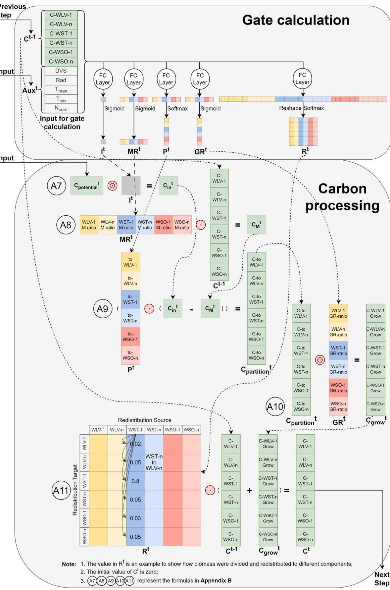

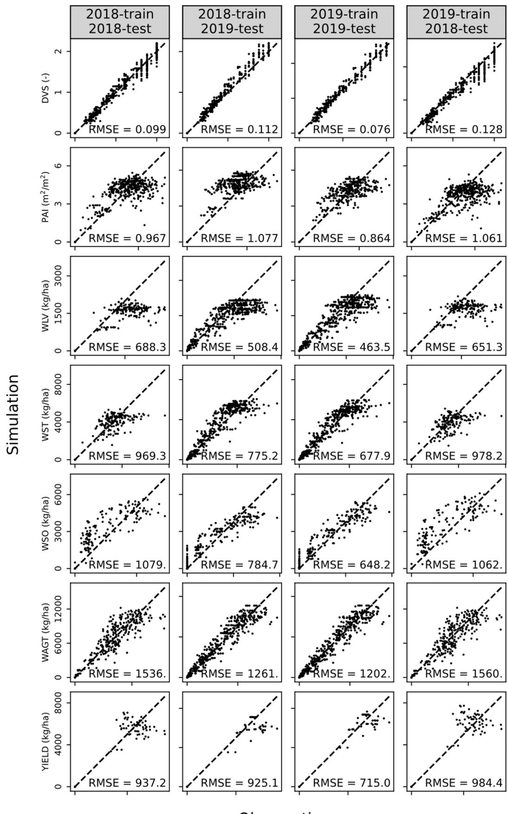

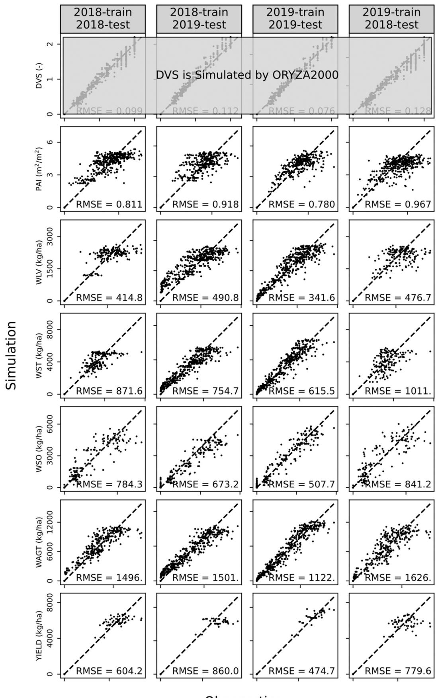

## 附录 F. 不同案例的拟合损失和六个模拟变量的均方根误差

| 案例编号 | 模型       | 训练策略 | 数据集 | 2018训练 2019测试 | | | | | | 2019训练 2018测试 | | | | | 改进变量数 | 最佳变量数 |
|----------|------------|----------|--------|-------------------|---|---|---|---|---|-------------------|---|---|---|---|---|-------------|-------------|
|          |            | 拟合输入 CG损失 掩码损失 | 拟合PAI损失 m²/m² kg/ha kg/ha kg/ha kg/ha kg/ha kg/ha kg/ha kg/ha kg/ha kg/ha kg/ha kg/ha kg/ha kg/ha kg/ha kg/ha kg/ha kg/ha kg/ha kg/ha kg/ha kg/ha kg/ha kg/ha kg/ha kg/ha kg/ha kg/ha kg/ha kg/ha kg/ha kg/ha kg/ha kg/ha | 0.0381 | 1.08 | 508 | 775 | 785 | 1262 | 925 | 0.0474 | 1.06 | 651 | 978 | 1063 | 1561 | 984 | - | - |
| 1        | ORYZA2000  | √        |        |                   |   |   |   |   |   |                   |   |   |   |   |   |   |   |
| 2        | LSTM       | √        |        |                   |   |   |   |   |   |                   |   |   |   |   |   |   |   |
| 3        |            | √        |        |                   |   |   |   |   |   |                   |   |   |   |   |   |   |   |
| 4        |            | √        |        |                   |   |   |   |   |   |                   |   |   |   |   | 1 | 0 |   |
| 5        | MC-LSTM    | √        | √      | √                 | 0.0391 | 0.94 | 509 | 911 | 841 | 1763 | 901 | 0.0408 | 0.97 | 486 | 1044 | 889 | 1680 | 849 | 6 | 0 |
| 6        |            | √        | √      | √                 | 0.0395 | 0.92 | 523 | 945 | 803 | 1822 | 935 | 0.0465 | 0.94 | 509 | 1123 | 1007 | 1712 | 1194 | 4 | 0 |
| 7        |            | √        |        |                   | 0.0363 | 0.91 | 496 | 854 | 754 | 1682 | 919 | 0.0395 | 0.94 | 478 | 1028 | 884 | 1686 | 808 | 8 | 2 |
| 8        | DeepCGM    | √        | √      |                   | 0.0516 | 1.11 | 651 | 1058 | 999 | 1688 | 1042 | 0.0595 | 1.20 | 607 | 1291 | 1121 | 1664 | 1193 | 1 | 0 |
| 9        |            | √        | √      |                   | 0.0378 | 1.00 | 556 | 833 | 747 | 1565 | 804 | 0.0418 | 1.02 | 494 | 1040 | 877 | 1661 | 808 | 7 | 1 |
| 10       |            | √        | √      | √                 | 0.0367 | 0.92 | 538 | 873 | 740 | 1678 | 853 | 0.0459 | 1.01 | 513 | 1113 | 966 | 1670 | 1059 | 6 | 0 |
| 13       | LSTM       | √        |        |                   | 0.0349 | 0.95 | 515 | 770 | 680 | 1529 | 872 | 0.0393 | 0.97 | 480 | 1015 | 848 | 1635 | 790 | 8 | 3 |
| 14       | MC-LSTM    | √        |        |                   | 0.0383 | 0.92 | 451 | 863 | 870 | 1534 | 1148 | 0.0447 | 0.89 | 502 | 1005 | 1249 | 1897 | 900 | 5 | 1 |
| 16       |            | √        | √      | √                 | 0.0377 | 0.95 | 432 | 774 | 842 | 1416 | 1187 | 0.0429 | 0.96 | 501 | 1003 | 1081 | 1743 | 859 | 6 | 0 |
| 17       | DeepCGM    | √        | √      | √                 | 0.0351 | 0.99 | 420 | 751 | 833 | 1368 | 879 | 0.0448 | 1.04 | 568 | 1081 | 981 | 1672 | 790 | 8 | 0 |
|          |            | √        | √      | √                 | 0.0373 | 1.07 | 414 | 704 | 839 | 1341 | 930 | 0.0427 | 1.00 | 530 | 1027 | 1012 | 1630 | 807 | 7 | 2 |

# 附录 G. 补充信息

本文的补充数据可在在线版本中获取，doi:10.1016/j.fcr.2025.109912。

# 数据可用性声明

我已在论文中分享了数据的链接

## 参考文献

1.  [Bertels and Willems, 2023](#bbib1)
D. Bertels, P. Willems
基于物理信息的机器学习方法模拟地表水系统中保守污染物的迁移
J. Hydrol., 619 (2023), Article 129354
2.  [Blank and Deb, 2020](#bbib2)
J. Blank, K. Deb
Pymoo: Python中的多目标优化
IEEE Access, 8 (2020), pp. 89497-89509, [10.1109/ACCESS.2020.2990567](https://doi.org/10.1109/ACCESS.2020.2990567)
3.  [Bouman, 2001](#bbib3)
Bouman, B.A.M., 2001. ORYZA2000: modeling lowland rice. IRRI, Manila, Philippines.
4.  [Bouman et al., 1996](#bbib4)
B. Bouman, H. Van Keulen, H. Van Laar, R. Rabbinge
"de Wit学派"作物生长模拟模型:谱系与历史概述
Agric. Syst., 52 (1996), pp. 171-198
5.  [Brisson et al., 2003](#bbib5)
N. Brisson, C. Gary, E. Justes, R. Roche, B. Mary, D. Ripoche, D. Zimmer, J. Sierra, P. Bertuzzi, P. Burger, F. Bussière, Y.M. Cabidoche, P. Cellier, P. Debaeke, J.P. Gaudillère, C. Hénault, F. Maraux, B. Seguin, H. Sinoquet
作物模型STICS概述
Eur. J. Agron., 18 (2003), pp. 309-332, [10.1016/S1161-0301(02)00110-7](https://doi.org/10.1016/S1161-0301(02)00110-7)
6.  [De Wit et al., 2019](#bbib6)
A. De Wit, H. Boogaard, D. Fumagalli, S. Janssen, R. Knapen, D. Van Kraalingen, I. Supit, R. Van Der Wijngaart, K. Van Diepen
WOFOST种植系统模型的25年发展
Agric. Syst., 168 (2019), pp. 154-167, [10.1016/j.agsy.2018.06.018](https://doi.org/10.1016/j.agsy.2018.06.018)
7.  [Donatelli et al., 2017](#bbib7)
M. Donatelli, R.D. Magarey, S. Bregaglio, L. Willocquet, J.P.M. Whish, S. Savary
模拟病虫害对农业系统的影响
Agric. Syst., 155 (2017), pp. 213-224, [10.1016/j.agsy.2017.01.019](https://doi.org/10.1016/j.agsy.2017.01.019)
8.  [Droutsas et al., 2022](#bbib8)
I. Droutsas, A.J. Challinor, C.R. Deva, E. Wang
将机器学习整合到基于过程的建模中以改进复杂作物响应的模拟
silico Plants 4, diac017 (2022), [10.1093/insilicoplants/diac017](https://doi.org/10.1093/insilicoplants/diac017)
9.  [Everingham et al., 2016](#bbib9)
Y. Everingham, J. Sexton, D. Skocaj, G. Inman-Bamber
使用随机森林算法准确预测甘蔗产量
Agron. Sustain. Dev., 36 (2016), p. 27, [10.1007/s13593-016-0364-z](https://doi.org/10.1007/s13593-016-0364-z)
10.  [Ewert et al., 2015](#bbib10)
F. Ewert, R.P. Rötter, M. Bindi, H. Webber, M. Trnka, K.C. Kersebaum, J.E. Olesen, M.K. Van Ittersum, S. Janssen, M. Rivington, M.A. Semenov, D. Wallach, J.R. Porter, D. Stewart, J. Verhagen, T. Gaiser, T. Palosuo, F. Tao, C. Nendel, P.P. Roggero, L. Bartošová, S. Asseng
作物模型用于气候变化对粮食生产风险的综合评估
Environ. Model. Softw., 72 (2015), pp. 287-303, [10.1016/j.envsoft.2014.12.003](https://doi.org/10.1016/j.envsoft.2014.12.003)
11.  [Fan et al., 2015](#bbib11)
X.-R. Fan, M.-Z. Kang, E. Heuvelink, P. De Reffye, B.-G. Hu
一种知识和数据驱动的植物生长模拟方法：以番茄生长为例
Ecol. Model., 312 (2015), pp. 363-373, [10.1016/j.ecolmodel.2015.06.006](https://doi.org/10.1016/j.ecolmodel.2015.06.006)
12.  [Feng et al., 2020](#bbib12)
P. Feng, B. Wang, D.L. Liu, C. Waters, D. Xiao, L. Shi, Q. Yu
结合生物物理模型和机器学习技术的混合方法改进小麦产量动态预测
Agric. For. Meteorol., 285–286 (2020), Article 107922, [10.1016/j.agrformet.2020.107922](https://doi.org/10.1016/j.agrformet.2020.107922)
13.  [Frame et al., 2023](#bbib13)
J.M. Frame, F. Kratzert, H.V. Gupta, P. Ullrich, G.S. Nearing
降雨-径流过程建模中严格质量守恒约束的研究
Hydrol. Process., 37 (2023), Article e14847
14.  [Frame et al., 2022](#bbib14)
J.M. Frame, F. Kratzert, D. Klotz, M. Gauch, G. Shalev, O. Gilon, L.M. Qualls, H.V. Gupta, G.S. Nearing
极端事件降雨-径流预测的深度学习方法
Hydrol. Earth Syst. Sci., 26 (2022), pp. 3377-3392
15.  [Guo et al., 2019](#bbib15)
C. Guo, Y. Tang, J. Lu, Y. Zhu, W. Cao, T. Cheng, L. Zhang, Y. Tian
通过序列同化将植被指数时间序列整合到作物模型中预测小麦生产力
Agric. For. Meteorol., 272–273 (2019), pp. 69-80, [10.1016/j.agrformet.2019.01.023](https://doi.org/10.1016/j.agrformet.2019.01.023)
16.  [Ha et al., 2016](#bbib16)
Ha, D., Dai, A., Le, Q.V., 2016. HyperNetworks. [https://doi.org/10.48550/arXiv.1609.09106](https://doi.org/10.48550/arXiv.1609.09106).
17.  [Han et al., 2023](#bbib17)
Han, J., Shi, L., Pylianidis, C., Yang, Q., Athanasiadis, I.N., 2023. DeepOryza: 一种知识引导的机器学习水稻生长模拟模型
18.  [Hoedt et al., 2021](#bbib18)
Hoedt, P.-J., Kratzert, F., Klotz, D., Halmich, C., Holzleitner, M., Nearing, G.S., Hochreiter, S., Klambauer, G., 2021. Mc-lstm: 质量守恒的长短期记忆网络, in: International Conference on Machine Learning. PMLR, pp. 4275–4286.
19.  [Holzworth et al., 2014](#bbib19)
D.P. Holzworth, N.I. Huth, P.G. deVoil, E.J. Zurcher, N.I. Herrmann, G. McLean, K. Chenu, E.J. Van Oosterom, V. Snow, C. Murphy, A.D. Moore, H. Brown, J.P.M. Whish, S. Verrall, J. Fainges, L.W. Bell, A.S. Peake, P.L. Poulton, Z. Hochman, P.J. Thorburn, D.S. Gaydon, N.P. Dalgliesh, D. Rodriguez, H. Cox, S. Chapman, A. Doherty, E. Teixeira, J. Sharp, R. Cichota, I. Vogeler, F.Y. Li, E. Wang, G.L. Hammer, M.J. Robertson, J.P. Dimes, A.M. Whitbread, J. Hunt, H. Van Rees, T. McClelland, P.S. Carberry, J.N.G. Hargreaves, N. MacLeod, C. McDonald, J. Harsdorf, S. Wedgwood, B.A. Keating
APSIM - 新一代农业系统模拟模型的演进
Environ. Model. Softw., 62 (2014), pp. 327-350, [10.1016/j.envsoft.2014.07.009](https://doi.org/10.1016/j.envsoft.2014.07.009)
20.  [Hornberger and Spear, 1981](#bbib20)
G.M. Hornberger, R.C. Spear
环境系统初步分析方法
J. Environ. Mgmt, 12 (1981), pp. 7-18
21.  [Hu et al., 2021](#bbib21)
Hu, E.J., Shen, Y., Wallis, P., Allen-Zhu, Z., Li, Y., Wang, S., Wang, L., Chen, W., 2021. LoRA: 大语言模型的低秩自适应. [https://doi.org/10.48550/arXiv.2106.09685](https://doi.org/10.48550/arXiv.2106.09685).
22.  [Jia et al., 2019](#bbib22)
Jia, X., Willard, J., Karpatne, A., Read, J., Zwart, J., Steinbach, M., Kumar, V., 2019. 物理引导的RNN用于动态系统建模: 以湖泊温度剖面模拟为例, in: Proceedings of the 2019 SIAM International Conference on Data Mining. Presented at the Society for Industrial and Applied Mathematics, pp. 558–566.
23.  [Jin et al., 2020](#bbib23)
X. Jin, P.J. Zarco-Tejada, U. Schmidhalter, M.P. Reynolds, M.J. Hawkesford, R.K. Varshney, T. Yang, C. Nie, Z. Li, B. Ming, _et al._
作物性状高通量估算: 地面和航空表型平台综述
IEEE Geosci. Remote Sens. Mag., 9 (2020), pp. 200-231
24.  [Jones et al., 2017](#bbib24)
J.W. Jones, J.M. Antle, B. Basso, K.J. Boote, R.T. Conant, I. Foster, H.C.J. Godfray, M. Herrero, R.E. Howitt, S. Janssen, B.A. Keating, R. Munoz-Carpena, C.H. Porter, C. Rosenzweig, T.R. Wheeler
农业系统建模简史
Agric. Syst., 155 (2017), pp. 240-254, [10.1016/j.agsy.2016.05.014](https://doi.org/10.1016/j.agsy.2016.05.014)
25.  [Kallenberg et al., 2023](#bbib25)
Kallenberg, M.G.J., Maestrini, B., Bree, R. van, Ravensbergen, P., Pylianidis, C., Evert, F. van, Athanasiadis, I.N., 2023. 整合基于过程的模型和机器学习进行作物产量预测. [https://doi.org/10.48550/arXiv.2307.13466](https://doi.org/10.48550/arXiv.2307.13466).
26.  [Kaneko et al., 2022](#bbib26)
T. Kaneko, K. Nomura, D. Yasutake, T. Iwao, T. Okayasu, Y. Ozaki, M. Mori, T. Hirota, M. Kitano
基于高度通用人工神经网络的冠层光合作用模型: 结合单叶光合作用的机理理解
Agric. For. Meteorol., 323 (2022), Article 109036, [10.1016/j.agrformet.2022.109036](https://doi.org/10.1016/j.agrformet.2022.109036)
27.  [Karpatne et al., 2017](#bbib27)
A. Karpatne, G. Atluri, J. Faghmous, M. Steinbach, A. Banerjee, A. Ganguly, S. Shekhar, N. Samatova, V. Kumar
理论指导的数据科学: 数据科学发现的新范式
IEEE Trans. Knowl. Data Eng., 29 (2017), pp. 2318-2331, [10.1109/TKDE.2017.2720168](https://doi.org/10.1109/TKDE.2017.2720168)
28.  [Kashinath et al., 2021](#bbib28)
K. Kashinath, M. Mustafa, A. Albert, J.-L. Wu, C. Jiang, S. Esmaeilzadeh, K. Azizzadenesheli, R. Wang, A. Chattopadhyay, A. Singh, A. Manepalli, D. Chirila, R. Yu, R. Walters, B. White, H. Xiao, H.A. Tchelepi, P. Marcus, A. Anandkumar, P. Hassanzadeh, Prabhat
物理信息机器学习: 天气和气候建模案例研究
Philos. Trans. R. Soc. A., 379 (2021), p. 20200093, [10.1098/rsta.2020.0093](https://doi.org/10.1098/rsta.2020.0093)
29.  [Kawakita et al., 2024](#bbib29)
S. Kawakita, M. Yamasaki, R. Teratani, S. Yabe, H. Kajiya-Kanegae, H. Yoshida, E. Fushimi, H. Nakagawa
双集成方法预测水稻抽穗期: 整合多种水稻物候模型和基于机器学习的遗传参数回归模型
Agric. For. Meteorol., 344 (2024), Article 109821, [10.1016/j.agrformet.2023.109821](https://doi.org/10.1016/j.agrformet.2023.109821)
30.  [Keating et al., 2003](#bbib30)
B.A. Keating, P.S. Carberry, G.L. Hammer, M.E. Probert, M.J. Robertson, D. Holzworth, N.I. Huth, J.N.G. Hargreaves, H. Meinke, Z. Hochman, G. McLean, K. Verburg, V. Snow, J.P. Dimes, M. Silburn, E. Wang, S. Brown, K.L. Bristow, S. Asseng, S. Chapman, R.L. McCown, D.M. Freebairn, C.J. Smith
APSIM概述: 一个为农业系统模拟设计的模型
Eur. J. Agron., 18 (2003), pp. 267-288, [10.1016/S1161-0301(02)00108-9](https://doi.org/10.1016/S1161-0301(02)00108-9)
31.  [Kennedy and Eberhart, 1995](#bbib31)
J. Kennedy, R. Eberhart
粒子群优化算法
IEEE, Perth, WA, Australia (1995), pp. 1942-1948, [10.1109/ICNN.1995.488968](https://doi.org/10.1109/ICNN.1995.488968)
32.  [Kingma and Ba, 2017](#bbib32)
D.P. Kingma, J. Ba
Adam: 一种随机优化方法
(2017), [10.48550/arXiv.1412.6980](https://doi.org/10.48550/arXiv.1412.6980)
33.  [Li et al., 2017](#bbib33)
T. Li, O. Angeles, M. Marcaida, E. Manalo, M.P. Manalili, A. Radanielson, S. Mohanty
从ORYZA2000到ORYZA(v3): 干旱和缺氮环境下水稻模拟模型的改进
Agric. For. Meteorol., 237–238 (2017), pp. 246-256, [10.1016/j.agrformet.2017.02.025](https://doi.org/10.1016/j.agrformet.2017.02.025)
34.  [Liu et al., 2024](#bbib34)
G. Liu, M. Migliavacca, C. Reimers, B. Kraft, M. Reichstein, A.D. Richardson, L. Wingate, N. Delpierre, H. Yang, A.J. Winkler
DeepPhenoMem V1.0: 考虑多变量气象记忆效应的植被物候冠层绿度动态深度学习模型
Geosci. Model Dev., 17 (2024), pp. 6683-6701, [10.5194/gmd-17-6683-2024](https://doi.org/10.5194/gmd-17-6683-2024)
35.  [Liu et al., 2022](#bbib35)
L. Liu, S. Xu, J. Tang, K. Guan, T.J. Griffis, M.D. Erickson, A.L. Frie, X. Jia, T. Kim, L.T. Miller, B. Peng, S. Wu, Y. Yang, W. Zhou, V. Kumar, Z. Jin
KGML-ag: 知识引导的机器学习农业生态系统模拟框架-基于中生态实验数据估算N2O排放的案例研究
Geosci. Model Dev., 15 (2022), pp. 2839-2858, [10.5194/gmd-15-2839-2022](https://doi.org/10.5194/gmd-15-2839-2022)
36.  [Midingoyi et al., 2021](#bbib36)
C.A. Midingoyi, C. Pradal, A. Enders, D. Fumagalli, H. Raynal, M. Donatelli, I.N. Athanasiadis, C. Porter, G. Hoogenboom, D. Holzworth, F. Garcia, P. Thorburn, P. Martre
Crop2ML: 作物模型组件交换和重用的开源多语言建模框架
Environ. Model. Softw., 142 (2021), Article 105055, [10.1016/j.envsoft.2021.105055](https://doi.org/10.1016/j.envsoft.2021.105055)
37.  [Moon et al., 2023](#bbib37)
T. Moon, D. Kim, S. Kwon, J.E. Son
基于注意力机制和多任务解码器的高适用性过程作物模型
Plant Phenomics, 5 (2023), p. 0035, [10.34133/plantphenomics.0035](https://doi.org/10.34133/plantphenomics.0035)
38.  [Pasley et al., 2023](#bbib38)
H. Pasley, H. Brown, D. Holzworth, J. Whish, L. Bell, N. Huth
如何构建作物模型：综述
Agron. Sustain. Dev., 43 (2023), p. 2, [10.1007/s13593-022-00854-9](https://doi.org/10.1007/s13593-022-00854-9)
39.  [Paudel et al., 2021](#bbib39)
D. Paudel, H. Boogaard, A. De Wit, S. Janssen, S. Osinga, C. Pylianidis, I.N. Athanasiadis
大规模作物产量预测的机器学习方法
Agric. Syst., 187 (2021), Article 103016, [10.1016/j.agsy.2020.103016](https://doi.org/10.1016/j.agsy.2020.103016)
40.  [Paudel et al., 2023](#bbib40)
D. Paudel, A. De Wit, H. Boogaard, D. Marcos, S. Osinga, I.N. Athanasiadis
作物产量预测深度学习模型的可解释性
Comput. Electron. Agric., 206 (2023), Article 107663
41.  [Pearl, 2019](#bbib41)
J. Pearl
不透明学习机器的局限性
Possib-.-. minds, 25 (2019), pp. 13-19
42.  [Pylianidis et al., 2024](#bbib42)
C. Pylianidis, M.G.J. Kallenberg, I.N. Athanasiadis
牧场数字孪生的迁移学习领域自适应方法
Environ. Data Science, 3 (2024), p. e8, [10.1017/eds.2024.6](https://doi.org/10.1017/eds.2024.6)
43.  [Pylianidis et al., 2022](#bbib43)
C. Pylianidis, V. Snow, H. Overweg, S. Osinga, J. Kean, I.N. Athanasiadis
面向操作数字孪生的仿真辅助机器学习
Environ. Model. Softw., 148 (2022), Article 105274, [10.1016/j.envsoft.2021.105274](https://doi.org/10.1016/j.envsoft.2021.105274)
44.  [Read et al., 2019](#bbib44)
J.S. Read, X. Jia, J. Willard, A.P. Appling, J.A. Zwart, S.K. Oliver, A. Karpatne, G.J.A. Hansen, P.C. Hanson, W. Watkins, M. Steinbach, V. Kumar
过程引导的深度学习预测湖泊水温
Water Resour. Res., 55 (2019), pp. 9173-9190, [10.1029/2019WR024922](https://doi.org/10.1029/2019WR024922)
45.  [Rosenzweig et al., 2013](#bbib45)
C. Rosenzweig, J.W. Jones, J.L. Hatfield, A.C. Ruane, K.J. Boote, P. Thorburn, J.M. Antle, G.C. Nelson, C. Porter, S. Janssen, S. Asseng, B. Basso, F. Ewert, D. Wallach, G. Baigorria, J.M. Winter
农业模型比较与改进项目(AgMIP): 协议与试点研究
Agric. For. Meteorol., 170 (2013), pp. 166-182, [10.1016/j.agrformet.2012.09.011](https://doi.org/10.1016/j.agrformet.2012.09.011)
46.  [Rudin, 2019](#bbib46)
C. Rudin
停止为高风险决策解释黑箱机器学习模型而改用可解释模型
Nat. Mach. Intell., 1 (2019), pp. 206-215
47.  [Sari et al., 2019](#bbib47)
Sari, E., Belbahri, M., Nia, V.P., 2019. 批归一化如何帮助二值化训练? arXiv preprint arXiv:1909.09139.
48.  [Shen et al., 2023](#bbib48)
C. Shen, A.P. Appling, P. Gentine, T. Bandai, H. Gupta, A. Tartakovsky, M. Baity-Jesi, F. Fenicia, D. Kifer, L. Li, X. Liu, W. Ren, Y. Zheng, C.J. Harman, M. Clark, M. Farthing, D. Feng, P. Kumar, D. Aboelyazeed, F. Rahmani, Y. Song, H.E. Beck, T. Bindas, D. Dwivedi, K. Fang, M. Höge, C. Rackauckas, B. Mohanty, T. Roy, C. Xu, K. Lawson
可微分建模统一地球科学中的机器学习和物理模型
Nat. Rev. Earth Environ., 4 (2023), pp. 552-567, [10.1038/s43017-023-00450-9](https://doi.org/10.1038/s43017-023-00450-9)
49.  [Simunek et al., 2005](#bbib49)
J. Simunek, M.T. Van Genuchten, M. Sejna
HYDRUS-1D软件包: 模拟变饱和介质中水、热和多种溶质一维运动的工具
Univ. Calif. -Riverside Res. Rep., 3 (2005), pp. 1-240
50.  [Srivastava et al., 2014](#bbib50)
N. Srivastava, G. Hinton, A. Krizhevsky, I. Sutskever, R. Salakhutdinov
Dropout: 一种防止神经网络过拟合的简单方法
J. Mach. Learn. Res., 15 (2014), pp. 1929-1958
51.  [Tsai et al., 2021](#bbib51)
W.-P. Tsai, D. Feng, M. Pan, H. Beck, K. Lawson, Y. Yang, J. Liu, C. Shen
从校准到参数学习：利用大数据规模效应改进地球科学建模
Nat. Commun., 12 (2021), p. 5988, [10.1038/s41467-021-26107-z](https://doi.org/10.1038/s41467-021-26107-z)
52.  [Van Dam et al., 1997](#bbib52)
J.C. Van Dam, J. Huygen, J. Wesseling, R. Feddes, P. Kabat, P. Van Walsum, P. Groenendijk, C. Van Diepen
SWAP 2.0版本理论：土壤-水-大气-植物环境中水流、溶质传输和植物生长的模拟
DLO Winand Star. Cent. (1997)
53.  [Van Diepen et al., 1989](#bbib53)
C.A. Van Diepen, J. Wolf, H. Van Keulen, C. Rappoldt
WOFOST：作物生产模拟模型
Soil Use Manag., 5 (1989), pp. 16-24, [10.1111/j.1475-2743.1989.tb00755.x](https://doi.org/10.1111/j.1475-2743.1989.tb00755.x)
54.  [Vidaurre et al., 2013](#bbib54)
D. Vidaurre, C. Bielza, P. Larranaga
L1回归综述
Int. Stat. Rev., 81 (2013), pp. 361-387
55.  [Von Rueden et al., 2021](#bbib55)
L. Von Rueden, S. Mayer, K. Beckh, B. Georgiev, S. Giesselbach, R. Heese, B. Kirsch, M. Walczak, J. Pfrommer, A. Pick, R. Ramamurthy, J. Garcke, C. Bauckhage, J. Schuecker
知识引导的机器学习 - 将先验知识整合到学习系统中的分类与综述
1–1
IEEE Trans. Knowl. Data Eng. (2021), [10.1109/TKDE.2021.3079836](https://doi.org/10.1109/TKDE.2021.3079836)
56.  [Wallach et al., 2021](#bbib56)
D. Wallach, T. Palosuo, P. Thorburn, Z. Hochman, E. Gourdain, F. Andrianasolo, S. Asseng, B. Basso, S. Buis, N. Crout, C. Dibari, B. Dumont, R. Ferrise, T. Gaiser, C. Garcia, S. Gayler, A. Ghahramani, S. Hiremath, S. Hoek, H. Horan, G. Hoogenboom, M. Huang, M. Jabloun, P.-E. Jansson, Q. Jing, E. Justes, K.C. Kersebaum, A. Klosterhalfen, M. Launay, E. Lewan, Q. Luo, B. Maestrini, H. Mielenz, M. Moriondo, H. Nariman Zadeh, G. Padovan, J.E. Olesen, A. Poyda, E. Priesack, J.W.M. Pullens, B. Qian, N. Schütze, V. Shelia, A. Souissi, X. Specka, A.K. Srivastava, T. Stella, T. Streck, G. Trombi, E. Wallor, J. Wang, T.K.D. Weber, L. Weihermüller, A. De Wit, T. Wöhling, L. Xiao, C. Zhao, Y. Zhu, S.J. Seidel
作物模型校准中的混乱：多模型校准实践的经验教训
Environ. Model. Softw., 145 (2021), Article 105206, [10.1016/j.envsoft.2021.105206](https://doi.org/10.1016/j.envsoft.2021.105206)
57.  [Wang et al., 2019](#bbib57)
E. Wang, H.E. Brown, G.J. Rebetzke, Z. Zhao, B. Zheng, S.C. Chapman
改进基于过程的作物模型以更好捕捉基因型×环境×管理互作
J. Exp. Bot., 70 (2019), pp. 2389-2401, [10.1093/jxb/erz092](https://doi.org/10.1093/jxb/erz092)
58.  [Wang et al., 2023](#bbib58)
Y. Wang, L. Shi, X. Hu, W. Song, L. Wang
多物理信息神经网络用于耦合土壤水热建模
e2022WR031960
Water Resour. Res., 59 (2023), [10.1029/2022WR031960](https://doi.org/10.1029/2022WR031960)
59.  [Willard et al., 2022](#bbib59)
Willard, J., Jia, X., Xu, S., Steinbach, M., Kumar, V., 2022. 将科学知识与机器学习结合用于工程和环境系统
60.  [Yang et al., 2023](#bbib60)
Q. Yang, L. Liu, J. Zhou, R. Ghosh, B. Peng, K. Guan, J. Tang, W. Zhou, V. Kumar, Z. Jin
美国中西部地区农业生态系统预测的灵活高效知识引导机器学习数据同化(KGML-DA)框架
Remote Sens. Environ., 299 (2023), Article 113880, [10.1016/j.rse.2023.113880](https://doi.org/10.1016/j.rse.2023.113880)
61.  [Yin, 2003](#bbib61)
X. Yin
确定性生长的灵活S型函数
Ann. Bot., 91 (2003), pp. 361-371, [10.1093/aob/mcg029](https://doi.org/10.1093/aob/mcg029)
62.  [Yin et al., 2021](#bbib62)
X. Yin, P.C. Struik, J. Goudriaan
结合生理学原理和数学方法改进作物模型的需求
Field Crops Res., 271 (2021), Article 108254, [10.1016/j.fcr.2021.108254](https://doi.org/10.1016/j.fcr.2021.108254)
63.  [Zhang et al., 2019](#bbib63)
Q. Zhang, L. Shi, M. Holzman, M. Ye, Y. Wang, F. Carmona, Y. Zha
处理土壤水分数据同化中模型结构误差的动态数据驱动方法
Adv. Water Resour., 132 (2019), Article 103407, [10.1016/j.advwatres.2019.103407](https://doi.org/10.1016/j.advwatres.2019.103407)

## References
1.  [Bertels and Willems, 2023](#bbib1)
D. Bertels, P. Willems
Physics-informed machine learning method for modelling transport of a conservative pollutant in surface water systems
J. Hydrol., 619 (2023), Article 129354
2.  [Blank and Deb, 2020](#bbib2)
J. Blank, K. Deb
Pymoo: Multi-Objective Optimization in Python
IEEE Access, 8 (2020), pp. 89497-89509, [10.1109/ACCESS.2020.2990567](https://doi.org/10.1109/ACCESS.2020.2990567)
3.  [Bouman, 2001](#bbib3)
Bouman, B.A.M., 2001. ORYZA2000: modeling lowland rice. IRRI, Manila, Philippines.
4.  [Bouman et al., 1996](#bbib4)
B. Bouman, H. Van Keulen, H. Van Laar, R. Rabbinge
The ‘School of de Wit’crop growth simulation models: a pedigree and historical overview
Agric. Syst., 52 (1996), pp. 171-198
5.  [Brisson et al., 2003](#bbib5)
N. Brisson, C. Gary, E. Justes, R. Roche, B. Mary, D. Ripoche, D. Zimmer, J. Sierra, P. Bertuzzi, P. Burger, F. Bussière, Y.M. Cabidoche, P. Cellier, P. Debaeke, J.P. Gaudillère, C. Hénault, F. Maraux, B. Seguin, H. Sinoquet
An overview of the crop model stics
Eur. J. Agron., 18 (2003), pp. 309-332, [10.1016/S1161-0301(02)00110-7](https://doi.org/10.1016/S1161-0301(02)00110-7)
6.  [De Wit et al., 2019](#bbib6)
A. De Wit, H. Boogaard, D. Fumagalli, S. Janssen, R. Knapen, D. Van Kraalingen, I. Supit, R. Van Der Wijngaart, K. Van Diepen
25 years of the WOFOST cropping systems model
Agric. Syst., 168 (2019), pp. 154-167, [10.1016/j.agsy.2018.06.018](https://doi.org/10.1016/j.agsy.2018.06.018)
7.  [Donatelli et al., 2017](#bbib7)
M. Donatelli, R.D. Magarey, S. Bregaglio, L. Willocquet, J.P.M. Whish, S. Savary
Modelling the impacts of pests and diseases on agricultural systems
Agric. Syst., 155 (2017), pp. 213-224, [10.1016/j.agsy.2017.01.019](https://doi.org/10.1016/j.agsy.2017.01.019)
8.  [Droutsas et al., 2022](#bbib8)
I. Droutsas, A.J. Challinor, C.R. Deva, E. Wang
Integration of machine learning into process-based modelling to improve simulation of complex crop responses
silico Plants 4, diac017 (2022), [10.1093/insilicoplants/diac017](https://doi.org/10.1093/insilicoplants/diac017)
9.  [Everingham et al., 2016](#bbib9)
Y. Everingham, J. Sexton, D. Skocaj, G. Inman-Bamber
Accurate prediction of sugarcane yield using a random forest algorithm
Agron. Sustain. Dev., 36 (2016), p. 27, [10.1007/s13593-016-0364-z](https://doi.org/10.1007/s13593-016-0364-z)
10.  [Ewert et al., 2015](#bbib10)
F. Ewert, R.P. Rötter, M. Bindi, H. Webber, M. Trnka, K.C. Kersebaum, J.E. Olesen, M.K. Van Ittersum, S. Janssen, M. Rivington, M.A. Semenov, D. Wallach, J.R. Porter, D. Stewart, J. Verhagen, T. Gaiser, T. Palosuo, F. Tao, C. Nendel, P.P. Roggero, L. Bartošová, S. Asseng
Crop modelling for integrated assessment of risk to food production from climate change
Environ. Model. Softw., 72 (2015), pp. 287-303, [10.1016/j.envsoft.2014.12.003](https://doi.org/10.1016/j.envsoft.2014.12.003)
11.  [Fan et al., 2015](#bbib11)
X.-R. Fan, M.-Z. Kang, E. Heuvelink, P. De Reffye, B.-G. Hu
A knowledge-and-data-driven modeling approach for simulating plant growth: A case study on tomato growth
Ecol. Model., 312 (2015), pp. 363-373, [10.1016/j.ecolmodel.2015.06.006](https://doi.org/10.1016/j.ecolmodel.2015.06.006)
12.  [Feng et al., 2020](#bbib12)
P. Feng, B. Wang, D.L. Liu, C. Waters, D. Xiao, L. Shi, Q. Yu
Dynamic wheat yield forecasts are improved by a hybrid approach using a biophysical model and machine learning technique
Agric. For. Meteorol., 285–286 (2020), Article 107922, [10.1016/j.agrformet.2020.107922](https://doi.org/10.1016/j.agrformet.2020.107922)
13.  [Frame et al., 2023](#bbib13)
J.M. Frame, F. Kratzert, H.V. Gupta, P. Ullrich, G.S. Nearing
On strictly enforced mass conservation constraints for modelling the Rainfall-Runoff process
Hydrol. Process., 37 (2023), Article e14847
14.  [Frame et al., 2022](#bbib14)
J.M. Frame, F. Kratzert, D. Klotz, M. Gauch, G. Shalev, O. Gilon, L.M. Qualls, H.V. Gupta, G.S. Nearing
Deep learning rainfall–runoff predictions of extreme events
Hydrol. Earth Syst. Sci., 26 (2022), pp. 3377-3392
15.  [Guo et al., 2019](#bbib15)
C. Guo, Y. Tang, J. Lu, Y. Zhu, W. Cao, T. Cheng, L. Zhang, Y. Tian
Predicting wheat productivity: Integrating time series of vegetation indices into crop modeling via sequential assimilation
Agric. For. Meteorol., 272–273 (2019), pp. 69-80, [10.1016/j.agrformet.2019.01.023](https://doi.org/10.1016/j.agrformet.2019.01.023)
16.  [Ha et al., 2016](#bbib16)
Ha, D., Dai, A., Le, Q.V., 2016. HyperNetworks. [https://doi.org/10.48550/arXiv.1609.09106](https://doi.org/10.48550/arXiv.1609.09106).
17.  [Han et al., 2023](#bbib17)
Han, J., Shi, L., Pylianidis, C., Yang, Q., Athanasiadis, I.N., 2023. DeepOryza: A knowledge-guided machine learning model for rice growth simulation.
18.  [Hoedt et al., 2021](#bbib18)
Hoedt, P.-J., Kratzert, F., Klotz, D., Halmich, C., Holzleitner, M., Nearing, G.S., Hochreiter, S., Klambauer, G., 2021. Mc-lstm: Mass-conserving lstm, in: International Conference on Machine Learning. PMLR, pp. 4275–4286.
19.  [Holzworth et al., 2014](#bbib19)
D.P. Holzworth, N.I. Huth, P.G. deVoil, E.J. Zurcher, N.I. Herrmann, G. McLean, K. Chenu, E.J. Van Oosterom, V. Snow, C. Murphy, A.D. Moore, H. Brown, J.P.M. Whish, S. Verrall, J. Fainges, L.W. Bell, A.S. Peake, P.L. Poulton, Z. Hochman, P.J. Thorburn, D.S. Gaydon, N.P. Dalgliesh, D. Rodriguez, H. Cox, S. Chapman, A. Doherty, E. Teixeira, J. Sharp, R. Cichota, I. Vogeler, F.Y. Li, E. Wang, G.L. Hammer, M.J. Robertson, J.P. Dimes, A.M. Whitbread, J. Hunt, H. Van Rees, T. McClelland, P.S. Carberry, J.N.G. Hargreaves, N. MacLeod, C. McDonald, J. Harsdorf, S. Wedgwood, B.A. Keating
APSIM – Evolution towards a new generation of agricultural systems simulation
Environ. Model. Softw., 62 (2014), pp. 327-350, [10.1016/j.envsoft.2014.07.009](https://doi.org/10.1016/j.envsoft.2014.07.009)
20.  [Hornberger and Spear, 1981](#bbib20)
G.M. Hornberger, R.C. Spear
Approach to the preliminary analysis of environmental systems
J. Environ. Mgmt, 12 (1981), pp. 7-18
21.  [Hu et al., 2021](#bbib21)
Hu, E.J., Shen, Y., Wallis, P., Allen-Zhu, Z., Li, Y., Wang, S., Wang, L., Chen, W., 2021. LoRA: Low-Rank Adaptation of Large Language Models. [https://doi.org/10.48550/arXiv.2106.09685](https://doi.org/10.48550/arXiv.2106.09685).
22.  [Jia et al., 2019](#bbib22)
Jia, X., Willard, J., Karpatne, A., Read, J., Zwart, J., Steinbach, M., Kumar, V., 2019. Physics guided RNNs for modeling dynamical systems: A case study in simulating lake temperature profiles, in: Proceedings of the 2019 SIAM International Conference on Data Mining. Presented at the Society for Industrial and Applied Mathematics, pp. 558–566.
23.  [Jin et al., 2020](#bbib23)
X. Jin, P.J. Zarco-Tejada, U. Schmidhalter, M.P. Reynolds, M.J. Hawkesford, R.K. Varshney, T. Yang, C. Nie, Z. Li, B. Ming, _et al._
High-throughput estimation of crop traits: A review of ground and aerial phenotyping platforms
IEEE Geosci. Remote Sens. Mag., 9 (2020), pp. 200-231
24.  [Jones et al., 2017](#bbib24)
J.W. Jones, J.M. Antle, B. Basso, K.J. Boote, R.T. Conant, I. Foster, H.C.J. Godfray, M. Herrero, R.E. Howitt, S. Janssen, B.A. Keating, R. Munoz-Carpena, C.H. Porter, C. Rosenzweig, T.R. Wheeler
Brief history of agricultural systems modeling
Agric. Syst., 155 (2017), pp. 240-254, [10.1016/j.agsy.2016.05.014](https://doi.org/10.1016/j.agsy.2016.05.014)
25.  [Kallenberg et al., 2023](#bbib25)
Kallenberg, M.G.J., Maestrini, B., Bree, R. van, Ravensbergen, P., Pylianidis, C., Evert, F. van, Athanasiadis, I.N., 2023. Integrating processed-based models and machine learning for crop yield prediction. [https://doi.org/10.48550/arXiv.2307.13466](https://doi.org/10.48550/arXiv.2307.13466).
26.  [Kaneko et al., 2022](#bbib26)
T. Kaneko, K. Nomura, D. Yasutake, T. Iwao, T. Okayasu, Y. Ozaki, M. Mori, T. Hirota, M. Kitano
A canopy photosynthesis model based on a highly generalizable artificial neural network incorporated with a mechanistic understanding of single-leaf photosynthesis
Agric. For. Meteorol., 323 (2022), Article 109036, [10.1016/j.agrformet.2022.109036](https://doi.org/10.1016/j.agrformet.2022.109036)
27.  [Karpatne et al., 2017](#bbib27)
A. Karpatne, G. Atluri, J. Faghmous, M. Steinbach, A. Banerjee, A. Ganguly, S. Shekhar, N. Samatova, V. Kumar
Theory-guided Data Science: A New Paradigm for Scientific Discovery from Data
IEEE Trans. Knowl. Data Eng., 29 (2017), pp. 2318-2331, [10.1109/TKDE.2017.2720168](https://doi.org/10.1109/TKDE.2017.2720168)
28.  [Kashinath et al., 2021](#bbib28)
K. Kashinath, M. Mustafa, A. Albert, J.-L. Wu, C. Jiang, S. Esmaeilzadeh, K. Azizzadenesheli, R. Wang, A. Chattopadhyay, A. Singh, A. Manepalli, D. Chirila, R. Yu, R. Walters, B. White, H. Xiao, H.A. Tchelepi, P. Marcus, A. Anandkumar, P. Hassanzadeh, Prabhat
Physics-informed machine learning: case studies for weather and climate modelling
Philos. Trans. R. Soc. A., 379 (2021), p. 20200093, [10.1098/rsta.2020.0093](https://doi.org/10.1098/rsta.2020.0093)
29.  [Kawakita et al., 2024](#bbib29)
S. Kawakita, M. Yamasaki, R. Teratani, S. Yabe, H. Kajiya-Kanegae, H. Yoshida, E. Fushimi, H. Nakagawa
Dual ensemble approach to predict rice heading date by integrating multiple rice phenology models and machine learning-based genetic parameter regression models
Agric. For. Meteorol., 344 (2024), Article 109821, [10.1016/j.agrformet.2023.109821](https://doi.org/10.1016/j.agrformet.2023.109821)
30.  [Keating et al., 2003](#bbib30)
B.A. Keating, P.S. Carberry, G.L. Hammer, M.E. Probert, M.J. Robertson, D. Holzworth, N.I. Huth, J.N.G. Hargreaves, H. Meinke, Z. Hochman, G. McLean, K. Verburg, V. Snow, J.P. Dimes, M. Silburn, E. Wang, S. Brown, K.L. Bristow, S. Asseng, S. Chapman, R.L. McCown, D.M. Freebairn, C.J. Smith
An overview of APSIM, a model designed for farming systems simulation
Eur. J. Agron., 18 (2003), pp. 267-288, [10.1016/S1161-0301(02)00108-9](https://doi.org/10.1016/S1161-0301(02)00108-9)
31.  [Kennedy and Eberhart, 1995](#bbib31)
J. Kennedy, R. Eberhart
Particle swarm optimization, IEEE, Perth, WA, Australia (1995), pp. 1942-1948, [10.1109/ICNN.1995.488968](https://doi.org/10.1109/ICNN.1995.488968)
32.  [Kingma and Ba, 2017](#bbib32)
D.P. Kingma, J. Ba
Adam: A Method for Stochastic Optimization (2017), [10.48550/arXiv.1412.6980](https://doi.org/10.48550/arXiv.1412.6980)
33.  [Li et al., 2017](#bbib33)
T. Li, O. Angeles, M. Marcaida, E. Manalo, M.P. Manalili, A. Radanielson, S. Mohanty
From ORYZA2000 to ORYZA (v3): An improved simulation model for rice in drought and nitrogen-deficient environments
Agric. For. Meteorol., 237–238 (2017), pp. 246-256, [10.1016/j.agrformet.2017.02.025](https://doi.org/10.1016/j.agrformet.2017.02.025)
34.  [Liu et al., 2024](#bbib34)
G. Liu, M. Migliavacca, C. Reimers, B. Kraft, M. Reichstein, A.D. Richardson, L. Wingate, N. Delpierre, H. Yang, A.J. Winkler
DeepPhenoMem V1.0: deep learning modelling of canopy greenness dynamics accounting for multi-variate meteorological memory effects on vegetation phenology
Geosci. Model Dev., 17 (2024), pp. 6683-6701, [10.5194/gmd-17-6683-2024](https://doi.org/10.5194/gmd-17-6683-2024)
35.  [Liu et al., 2022](#bbib35)
L. Liu, S. Xu, J. Tang, K. Guan, T.J. Griffis, M.D. Erickson, A.L. Frie, X. Jia, T. Kim, L.T. Miller, B. Peng, S. Wu, Y. Yang, W. Zhou, V. Kumar, Z. Jin
KGML-ag: a modeling framework of knowledge-guided machine learning to simulate agroecosystems: a case study of estimating N2O emission using data from mesocosm experiments
Geosci. Model Dev., 15 (2022), pp. 2839-2858, [10.5194/gmd-15-2839-2022](https://doi.org/10.5194/gmd-15-2839-2022)
36.  [Midingoyi et al., 2021](#bbib36)
C.A. Midingoyi, C. Pradal, A. Enders, D. Fumagalli, H. Raynal, M. Donatelli, I.N. Athanasiadis, C. Porter, G. Hoogenboom, D. Holzworth, F. Garcia, P. Thorburn, P. Martre
Crop2ML: An open-source multi-language modeling framework for the exchange and reuse of crop model components
Environ. Model. Softw., 142 (2021), Article 105055, [10.1016/j.envsoft.2021.105055](https://doi.org/10.1016/j.envsoft.2021.105055)
37.  [Moon et al., 2023](#bbib37)
T. Moon, D. Kim, S. Kwon, J.E. Son
Process-Based Crop Modeling for High Applicability with Attention Mechanism and Multitask Decoders
Plant Phenomics, 5 (2023), p. 0035, [10.34133/plantphenomics.0035](https://doi.org/10.34133/plantphenomics.0035)
38.  [Pasley et al., 2023](#bbib38)
H. Pasley, H. Brown, D. Holzworth, J. Whish, L. Bell, N. Huth
How to build a crop model. A review
Agron. Sustain. Dev., 43 (2023), p. 2, [10.1007/s13593-022-00854-9](https://doi.org/10.1007/s13593-022-00854-9)
39.  [Paudel et al., 2021](#bbib39)
D. Paudel, H. Boogaard, A. De Wit, S. Janssen, S. Osinga, C. Pylianidis, I.N. Athanasiadis
Machine learning for large-scale crop yield forecasting
Agric. Syst., 187 (2021), Article 103016, [10.1016/j.agsy.2020.103016](https://doi.org/10.1016/j.agsy.2020.103016)
40.  [Paudel et al., 2023](#bbib40)
D. Paudel, A. De Wit, H. Boogaard, D. Marcos, S. Osinga, I.N. Athanasiadis
Interpretability of deep learning models for crop yield forecasting
Comput. Electron. Agric., 206 (2023), Article 107663
41.  [Pearl, 2019](#bbib41)
J. Pearl
The limitations of opaque learning machines
Possib-.-. minds, 25 (2019), pp. 13-19
42.  [Pylianidis et al., 2024](#bbib42)
C. Pylianidis, M.G.J. Kallenberg, I.N. Athanasiadis
Domain adaptation with transfer learning for pasture digital twins
Environ. Data Science, 3 (2024), p. e8, [10.1017/eds.2024.6](https://doi.org/10.1017/eds.2024.6)
43.  [Pylianidis et al., 2022](#bbib43)
C. Pylianidis, V. Snow, H. Overweg, S. Osinga, J. Kean, I.N. Athanasiadis
Simulation-assisted machine learning for operational digital twins
Environ. Model. Softw., 148 (2022), Article 105274, [10.1016/j.envsoft.2021.105274](https://doi.org/10.1016/j.envsoft.2021.105274)
44.  [Read et al., 2019](#bbib44)
J.S. Read, X. Jia, J. Willard, A.P. Appling, J.A. Zwart, S.K. Oliver, A. Karpatne, G.J.A. Hansen, P.C. Hanson, W. Watkins, M. Steinbach, V. Kumar
Process-Guided Deep Learning Predictions of Lake Water Temperature
Water Resour. Res., 55 (2019), pp. 9173-9190, [10.1029/2019WR024922](https://doi.org/10.1029/2019WR024922)
45.  [Rosenzweig et al., 2013](#bbib45)
C. Rosenzweig, J.W. Jones, J.L. Hatfield, A.C. Ruane, K.J. Boote, P. Thorburn, J.M. Antle, G.C. Nelson, C. Porter, S. Janssen, S. Asseng, B. Basso, F. Ewert, D. Wallach, G. Baigorria, J.M. Winter
The Agricultural Model Intercomparison and Improvement Project (AgMIP): Protocols and pilot studies
Agric. For. Meteorol., 170 (2013), pp. 166-182, [10.1016/j.agrformet.2012.09.011](https://doi.org/10.1016/j.agrformet.2012.09.011)
46.  [Rudin, 2019](#bbib46)
C. Rudin
Stop explaining black box machine learning models for high stakes decisions and use interpretable models instead
Nat. Mach. Intell., 1 (2019), pp. 206-215
47.  [Sari et al., 2019](#bbib47)
Sari, E., Belbahri, M., Nia, V.P., 2019. How does batch normalization help binary training? arXiv preprint arXiv:1909.09139.
48.  [Shen et al., 2023](#bbib48)
C. Shen, A.P. Appling, P. Gentine, T. Bandai, H. Gupta, A. Tartakovsky, M. Baity-Jesi, F. Fenicia, D. Kifer, L. Li, X. Liu, W. Ren, Y. Zheng, C.J. Harman, M. Clark, M. Farthing, D. Feng, P. Kumar, D. Aboelyazeed, F. Rahmani, Y. Song, H.E. Beck, T. Bindas, D. Dwivedi, K. Fang, M. Höge, C. Rackauckas, B. Mohanty, T. Roy, C. Xu, K. Lawson
Differentiable modelling to unify machine learning and physical models for geosciences
Nat. Rev. Earth Environ., 4 (2023), pp. 552-567, [10.1038/s43017-023-00450-9](https://doi.org/10.1038/s43017-023-00450-9)
49.  [Simunek et al., 2005](#bbib49)
J. Simunek, M.T. Van Genuchten, M. Sejna
The HYDRUS-1D software package for simulating the one-dimensional movement of water, heat, and multiple solutes in variably-saturated media
Univ. Calif. -Riverside Res. Rep., 3 (2005), pp. 1-240
50.  [Srivastava et al., 2014](#bbib50)
N. Srivastava, G. Hinton, A. Krizhevsky, I. Sutskever, R. Salakhutdinov
Dropout: a simple way to prevent neural networks from overfitting
J. Mach. Learn. Res., 15 (2014), pp. 1929-1958
51.  [Tsai et al., 2021](#bbib51)
W.-P. Tsai, D. Feng, M. Pan, H. Beck, K. Lawson, Y. Yang, J. Liu, C. Shen
From calibration to parameter learning: Harnessing the scaling effects of big data in geoscientific modeling
Nat. Commun., 12 (2021), p. 5988, [10.1038/s41467-021-26107-z](https://doi.org/10.1038/s41467-021-26107-z)
52.  [Van Dam et al., 1997](#bbib52)
J.C. Van Dam, J. Huygen, J. Wesseling, R. Feddes, P. Kabat, P. Van Walsum, P. Groenendijk, C. Van Diepen
Theory of SWAP version 2.0; Simulation of water flow, solute transport and plant growth in the soil-water-atmosphere-plant environment
DLO Winand Star. Cent. (1997)
53.  [Van Diepen et al., 1989](#bbib53)
C.A. Van Diepen, J. Wolf, H. Van Keulen, C. Rappoldt
WOFOST: a simulation model of crop production
Soil Use Manag., 5 (1989), pp. 16-24, [10.1111/j.1475-2743.1989.tb00755.x](https://doi.org/10.1111/j.1475-2743.1989.tb00755.x)
54.  [Vidaurre et al., 2013](#bbib54)
D. Vidaurre, C. Bielza, P. Larranaga
A survey of L1 regression
Int. Stat. Rev., 81 (2013), pp. 361-387
55.  [Von Rueden et al., 2021](#bbib55)
L. Von Rueden, S. Mayer, K. Beckh, B. Georgiev, S. Giesselbach, R. Heese, B. Kirsch, M. Walczak, J. Pfrommer, A. Pick, R. Ramamurthy, J. Garcke, C. Bauckhage, J. Schuecker
Informed Machine Learning - A Taxonomy and Survey of Integrating Prior Knowledge into Learning Systems
1–1
IEEE Trans. Knowl. Data Eng. (2021), [10.1109/TKDE.2021.3079836](https://doi.org/10.1109/TKDE.2021.3079836)
56.  [Wallach et al., 2021](#bbib56)
D. Wallach, T. Palosuo, P. Thorburn, Z. Hochman, E. Gourdain, F. Andrianasolo, S. Asseng, B. Basso, S. Buis, N. Crout, C. Dibari, B. Dumont, R. Ferrise, T. Gaiser, C. Garcia, S. Gayler, A. Ghahramani, S. Hiremath, S. Hoek, H. Horan, G. Hoogenboom, M. Huang, M. Jabloun, P.-E. Jansson, Q. Jing, E. Justes, K.C. Kersebaum, A. Klosterhalfen, M. Launay, E. Lewan, Q. Luo, B. Maestrini, H. Mielenz, M. Moriondo, H. Nariman Zadeh, G. Padovan, J.E. Olesen, A. Poyda, E. Priesack, J.W.M. Pullens, B. Qian, N. Schütze, V. Shelia, A. Souissi, X. Specka, A.K. Srivastava, T. Stella, T. Streck, G. Trombi, E. Wallor, J. Wang, T.K.D. Weber, L. Weihermüller, A. De Wit, T. Wöhling, L. Xiao, C. Zhao, Y. Zhu, S.J. Seidel
The chaos in calibrating crop models: Lessons learned from a multi-model calibration exercise
Environ. Model. Softw., 145 (2021), Article 105206, [10.1016/j.envsoft.2021.105206](https://doi.org/10.1016/j.envsoft.2021.105206)
57.  [Wang et al., 2019](#bbib57)
E. Wang, H.E. Brown, G.J. Rebetzke, Z. Zhao, B. Zheng, S.C. Chapman
Improving process-based crop models to better capture genotype×environment×management interactions
J. Exp. Bot., 70 (2019), pp. 2389-2401, [10.1093/jxb/erz092](https://doi.org/10.1093/jxb/erz092)
58.  [Wang et al., 2023](#bbib58)
Y. Wang, L. Shi, X. Hu, W. Song, L. Wang
Multiphysics-Informed Neural Networks for Coupled Soil Hydrothermal Modeling
e2022WR031960
Water Resour. Res., 59 (2023), [10.1029/2022WR031960](https://doi.org/10.1029/2022WR031960)
59.  [Willard et al., 2022](#bbib59)
Willard, J., Jia, X., Xu, S., Steinbach, M., Kumar, V., 2022. Integrating Scientific Knowledge with Machine Learning for Engineering and Environmental Systems.
60.  [Yang et al., 2023](#bbib60)
Q. Yang, L. Liu, J. Zhou, R. Ghosh, B. Peng, K. Guan, J. Tang, W. Zhou, V. Kumar, Z. Jin
A flexible and efficient knowledge-guided machine learning data assimilation (KGML-DA) framework for agroecosystem prediction in the US Midwest
Remote Sens. Environ., 299 (2023), Article 113880, [10.1016/j.rse.2023.113880](https://doi.org/10.1016/j.rse.2023.113880)
61.  [Yin, 2003](#bbib61)
X. Yin
A Flexible Sigmoid Function of Determinate Growth
Ann. Bot., 91 (2003), pp. 361-371, [10.1093/aob/mcg029](https://doi.org/10.1093/aob/mcg029)
62.  [Yin et al., 2021](#bbib62)
X. Yin, P.C. Struik, J. Goudriaan
On the needs for combining physiological principles and mathematics to improve crop models
Field Crops Res., 271 (2021), Article 108254, [10.1016/j.fcr.2021.108254](https://doi.org/10.1016/j.fcr.2021.108254)
63.  [Zhang et al., 2019](#bbib63)
Q. Zhang, L. Shi, M. Holzman, M. Ye, Y. Wang, F. Carmona, Y. Zha
A dynamic data-driven method for dealing with model structural error in soil moisture data assimilation
Adv. Water Resour., 132 (2019), Article 103407, [10.1016/j.advwatres.2019.103407](https://doi.org/10.1016/j.advwatres.2019.103407)