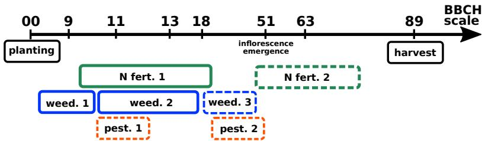
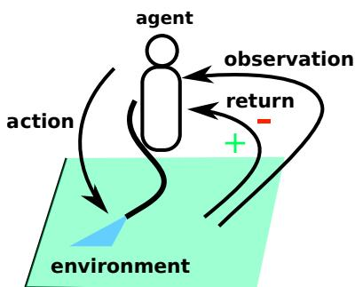
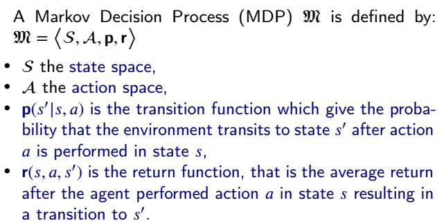
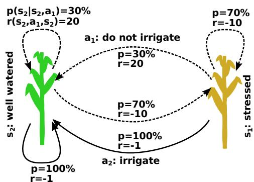
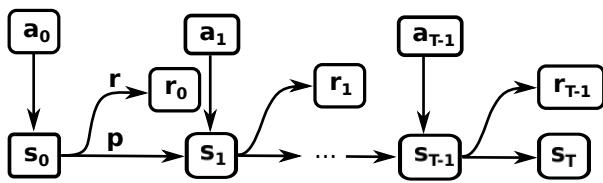
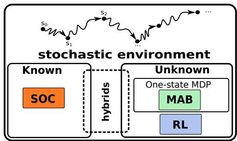
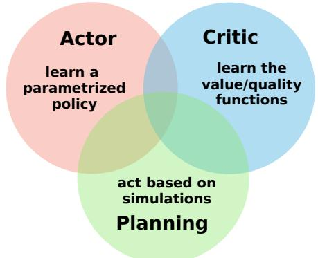
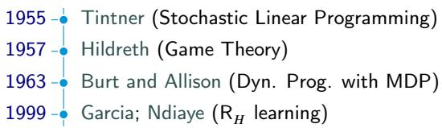
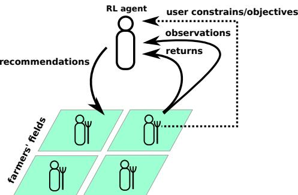
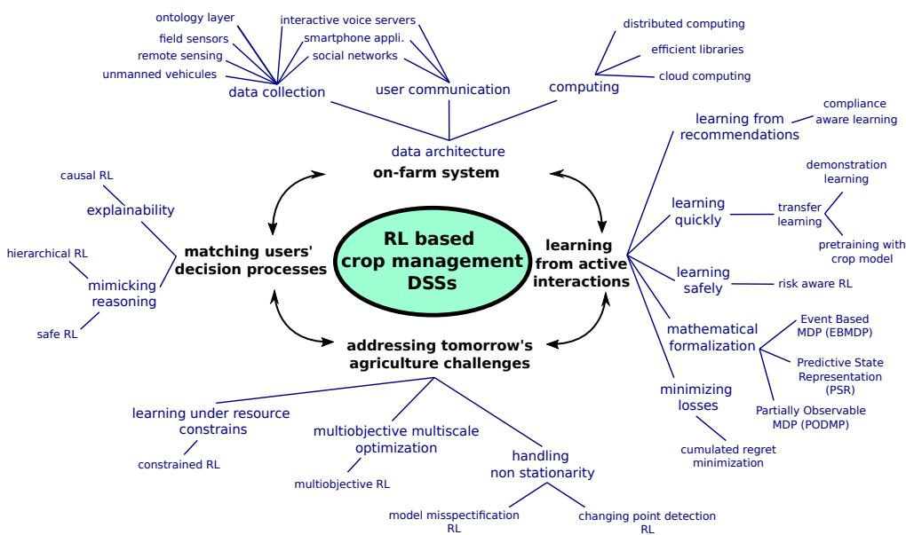

# Reinforcement Learning for crop management support: review, prospects and challenges.

    # 目录

    2 1 引言 2

    # 3 2 强化学习 6

    3 2 强化学习 62.1 强化学习概述 62.2 强化学习问题的形式化 72.3 强化学习简史 102.4 Q学习：一种简单的强化学习算法 112.5 当今的强化学习 112.6 多臂老虎机 13

    # 10 3 农业中的强化学习综述 14

    10 3 农业中的强化学习综述 143.1 早期探索：不确定性下的农场决策 143.2 农业中强化学习的开创性工作 153.3 深度强化学习应用 163.4 多臂老虎机 193.5 其他领域的RL应用 19

    # 16 4 前景与挑战 20

    4.1 基于RL的作物管理决策支持系统 20

    19 4.2.1 应对未来的挑战 2320 4.2.2 匹配用户的决策流程 2421 4.2.3 安全学习 24

    # 4.3 挑战 25

    23 4.3.1 学习成本高昂 25

    24 4.3.2 行动仅是建议 26

    25 4.3.3 RL中的实质理性与效用 26

    26 4.3.4 数学形式化 27

    27 4.3.5 策略可解释性 27

    28 4.3.6 对多尺度、多目标、资源受限RL的需求 28

    # 29 5 结论 28

    30 术语表 29

# 亮点

# 强化学习在作物管理支持中的应用：综述、前景与挑战

- 强化学习是支持作物管理的有前景的AI框架
- 基于强化学习的作物管理支持文献稀缺
- 基于强化学习的系统应从实地互动中学习
- 作物管理支持涉及许多强化学习研究问题
- 需要强化学习与农学界的联合研究

# 强化学习在作物管理支持中的应用：综述、前景与挑战

Romain Gautron $^{a,b,c,*}$ , Odalric- Ambrym Maillard $^{d}$ , Philippe Preux $^{e}$ , Marc Corbeels $^{a,b,f}$ 和 Régis Sabbadin $^{g}$

$^{a}$ 法国农业国际合作研究发展中心(CIRAD)，AIDA研究单位，法国蒙彼利埃 34398   $^{b}$ AIDA，蒙彼利埃大学，CIRAD，法国蒙彼利埃   $^{c}$ 国际农业研究磋商组织(CGIAR)农业大数据平台，国际生物多样性联盟和国际热带农业中心(CIAT)美洲区域办公室，哥伦比亚 Cali-Palmira 763537   $^{d}$ 里尔大学，法国国家信息与自动化研究所(Inria)，法国国家科学研究中心(CNRS)，里尔中央理工学院，CRISTAL实验室(UMR 9189)，法国里尔 59000   $^{e}$ 里尔大学，法国国家科学研究中心(CNRS)，法国国家信息与自动化研究所(Inria)，里尔中央理工学院，CRISTAL实验室(UMR 9189)，法国里尔 59000   $^{f}$ 国际热带农业研究所，邮政信箱30772，肯尼亚内罗毕 00100   $^{g}$ 图卢兹大学，法国国家农业食品与环境研究院(INRAE)，MIAT研究单位，法国 Castanet-Tolosan 31320

# 文章信息

# 摘要

关键词：强化学习 多臂老虎机 机器学习 决策支持系统 作物管理

强化学习(RL)，包括多臂老虎机，是机器学习的一个分支，通过实践学习来解决不确定和未知环境中的序列决策问题。虽然RL最著名的是作为人工智能(AI)世界最佳围棋程序的核心，但它具有广泛的应用潜力。RL可能有助于解决针对作物管理决策支持系统(DSS)的一些批评：它是一种面向行动的交互式情境工具，用于评估面临不确定性的系列作物操作。对RL在作物管理DSS中应用的综述显示相关贡献有限。我们描绘了以人为中心、面向现实世界的交互式RL系统应对未来农业决策的关键前景，以及可能解释其当前采用率低的理论和实际挑战。我们认为，需要RL和农学界共同努力来探索RL的全部潜力。

# 1. 引言

强化学习(RL)作为机器学习和更广泛意义上人工智能(AI)的一个分支，致力于解决不确定和未知动态系统的控制问题。尽管关于RL的最新研究信息广泛可得，但这些内容过于专业和抽象，不易理解(Lapan, 2018, 前言)。RL可能是支持作物管理决策的理想范式，但文献中相关应用很少。本文旨在帮助RL和农学领域增进相互理解，识别有前景的研究方向和当前瓶颈，以促进未来联合研究，支持设计下一代以人为中心、数据驱动的作物管理决策支持工具。我们首先将作物管理决策问题定义为农场决策的一个要素，并描述专门的决策支持系统。第2节介绍RL范式，第3节综述RL在作物管理中的应用，最后第4节探讨使用RL支持作物操作决策的研究机遇与挑战。

作物管理。作物管理是为了获得特定作物产量而应用于田间的农业实践或操作的逻辑有序组合(Sebillotte, 1974, 1978)。田块是生物(所有生物体)与非生物组分(作为生物体支撑的土壤和大气)以及通过物理、生物和化学过程进行的作物管理之间复杂相互作用的场所，如Husson等(2021)通过土壤Eh-pH动力学所展示的。因此，关于这些操作的决策面临着不确定事件(如气候事件)，且在一个仅部分已知的动态系统中进行。我们始终用"不确定"形容那些实现结果不确定的事件。

通过作物管理，农民旨在获得尽可能接近种植期初设定目标的生产结果，如最低产量水平和特定质量标准。通常，在种植季节开始时制定作物管理计划，如图1所示。该计划遵循逻辑结构，但作为不确定过程需要根据生长季发生的事件进行调整。每个作物操作由多个决定其成果和成功的因素参数化，进而影响剩余作物周期和未来作物操作(Boiffin等, 2001)。例如，选定品种后，种植操作由种植日期、种植密度、播种深度、可能的化学种子处理以及机械化环境中的机械选择(包括播种速度等自身参数)定义。

种植期间的实地观察可能揭示农民无法确定预测的问题，如病虫害爆发，这将需要适应性操作。根据突发事件严重程度，可能调整种植前设定的目标(如最低产量)以补偿这些变化(Cerf和Sebillotte, 1988; Papy, 1998)。例如，若种植后发生干旱，农民可能不会给玉米施用第二剂肥料，因为施用成本不太可能通过增产获得回报，因此可能降低产量目标。

  
图1: 玉米管理计划的简化示例。BBCH量表遵循Meier(1997)中的玉米连续生长阶段。虚线框表示操作需求不确定。所有操作都在发生确切日期不确定的时间窗口内进行。"N fert."代表氮肥施用；"weed."代表除草；"pest."代表病虫害防治。

农场决策层级。农场决策包含不同时间和空间尺度上的多个嵌套层级(Chatelin等, 1993; Papy, 1998)。例如，种植制度指采用相同轮作(特定顺序的作物类型组合)和作物管理方式处理的田块集合(见Sebillotte, 1974; Boiffin等, 2001)。结构性生产系统层面的长期决策(如土地或机械投资、多年生作物实施或一年生种植制度)按年度到多年时间线制定，而作物管理决策则按月到日制定。

决策层级可能强烈互动。事实上，战略和战术1层级可能受操作事件影响，如反复出现的操作问题可能促使改变机械或轮作。

决策支持系统(DSS)。决策支持系统(DSS)是基于计算机的解决方案，旨在协助决策者处理非结构化或半结构化问题(Arnott和Pervan, 2005; Power, 2008)。结构化问题具有明确解决方案，可通过自动例程找到。相比之下，半结构化或非结构化问题信息不完整或不确定，可能存在不可预见事件和不同目标间的复杂权衡。DSS提供精炼信息作为证据，促进和改善人类决策。

DSS应用领域广泛。例如，DSS常用于铁路轨道维护调度以防脱轨(如Pernitra和Murray, 1997; Guler, 2013)、医疗诊断(Miller, 2016)或运营规划。da Silva等(2006)设计了一个DSS来优化员工数量、加班时间和外包水平，以在最大化利润的同时保持客户和员工满意度。DSS可面向从操作员到高管的单个用户、共享决策责任的群体，或用于支持不同方之间的谈判。如Arnott和Pervan(2005)指出，DSS不是为决策者提供现成解决方案，而是提供人机对话。

作物管理DSS。常见的作物管理DSS涉及施肥、灌溉、病虫害或杂草管理，终端用户可能是研究人员、当地顾问或农民。作物管理DSS形式多样，从面向用户的高级复杂作物模型，到易用的图形用户界面软件甚至电子表格(示例见Manos等, 2004; Cerf和Meynard, 2006; Le Gal等, 2010; Evans等, 2017; Jones等, 2017)。总体而言，它们旨在支持高度不确定性下的决策。

例如，病虫害防治决策通常基于对作物损害紧迫性或严重程度的评估(Gent等, 2011)。这些决策取决于不确定生物因素(如拥挤效应和寄主植物反应)与非生物因素(如温度和湿度)的复杂相互作用(Khaliq等, 2014)。

作物管理DSS基于不同复杂度的底层形式化模型，用于预测操作后果。这些模型可采用多种形式，有时相互结合：从简单的土壤氮平衡方程(Hébert, 1969; Stanford, 1973)、专家系统知识库(如Lemmon, 1986; Senderskov等, 2016)，到使用微分方程明确模拟作物生长过程的机理模型(如McCown等, 1995; Hoogenboom等, 2019; Brisson等, 2003)或机器学习模型(如Navarro-Hellín等, 2016; Waghmare等, 2016; Ip等, 2018; Sabzi等, 2018; Barbosa等, 2020; Saikai等, 2020)。建模工作通常基于历史数据离线完成。候选作物操作的探索可通过专家人工指导搜索(如Thorburn等, 2011; He等, 2012)、知识库推理引擎(如Lemmon, 1986)或数值优化技术实现(如Epperson等, 1993; Bergez等, 2001; Royce等, 2001; Saikai等, 2020)。

尽管应用众多，但农民对作物管理DSS的使用率仍然较低(McCown, 2002a,b; Hochman和Carberry, 2011; Gent等, 2011; Rose等, 2016; Evans等, 2017)。家庭农场中DSS的使用取决于用户的意愿和兴趣，并与通过DSS进行潜在学习直接相关(McCown, 2002a; Evans等, 2017)。Thorburn等(2011)描述了由甘蔗种植者、当地产业代表和科学家组成的团队通过DSS学习的案例。基于模拟，该团队共同探讨了分次施氮的环境效益。虽然模拟未显示分次施氮的明显优势，但作者指出参与者增强了对氮素动态的理解，从而在个体层面更好地认识了氮肥管理的后果。农业DSS具有生命周期特征——当用户通过学习将风险评估内化后可能出现停用现象，这并非系统失败的标志(Thorborn等, 2011; Gent等, 2011; Evans等, 2017)。

文献中可找到对作物管理DSS使用的多项批评和改进建议。特别是用户认为：DSS信息不能直接转化为操作指令、未充分考虑农民自然决策过程、决策序列性建模不足或决策过程缺乏风险管理(McCown, 2002a,b; Cerf和Meynard, 2006; Hochman和Carberry, 2011; Evans等, 2017)。Nelson等(2002)提出的"讨论支持软件"概念，或Cerf和Meynard(2006)与Hochman和Carberry(2011)描述的"信息咨询系统"，都强调应利用农民所处的社会网络。理想的DSS应整合从田块到区域不同尺度的信息流，并纳入多层次决策涉及的各方参与者，如本地供应商、病虫害防治顾问和环保机构。

# 2. 强化学习

本节将介绍强化学习(RL)的基本概念。2.1节将非正式地介绍RL的组成要素，2.2节将形式化地定义RL问题，2.3节提供RL的简要历史视角，2.4节介绍著名的Q-learning算法，2.5节描述主要的RL算法类别，最后2.6节专门讨论适用于小样本场景的特殊RL案例——老虎机算法。

# 2.1. 强化学习概述

机器学习(ML)研究能够通过数据或经验自我改进以完成特定任务的计算机程序(Mitchell等, 1997)。机器学习包含三个子领域：无监督学习、监督学习和强化学习。无监督学习处理数据表示学习，例如聚类任务；监督学习基于带标签的数据集(样本)学习对新数据进行分类或回归(Mitchell等, 1997)；而强化学习则是学习控制动态系统。当ML模型基于训练场景完成特定任务训练后，其性能通过其在训练阶段未见过场景中完成相同任务的能力来衡量。过拟合是ML中的常见问题，指模型在训练场景表现良好但在未见场景表现不佳的情况。

强化学习问题是一个序列决策问题，其中决策者(称为智能体)与作为未知不确定动态系统的环境进行迭代交互。智能体通过采取行动来学习控制环境演化的任务。策略对应一组决策规则，通常基于对环境的观察来决定智能体采取的行动。学习过程通过智能体与环境之间的交互循环进行：每次智能体根据其策略执行行动后，行动会影响环境，同时智能体会获得一个回报值(标量值，反映任务完成情况)。这个过程不断重复直到决策序列结束。智能体的目标是计算一个策略，最大化其在决策序列中获得的回报效用函数(称为目标函数)。为此，智能体根据其经验收集的回报调整策略。图2总结了RL循环。RL算法本质上是面向行动的在线方法，能够响应系统中的持续不确定性变化，并通过试错学习完成任务。

# 2.2. 强化学习问题的形式化定义

马尔可夫决策过程。强化学习的标准问题表述将环境建模为马尔可夫决策过程(MDP, Puterman, 1994)。在任何时刻，环境由其状态$s \in S$描述。$S$是状态空间，即学习者已知的可能状态集合。在每个时刻$t \in \{0, 1, \dots , T\}$，智能体根据环境当前状态$s_t$选择一个动作$a_t \in \mathcal{A}$。$\mathcal{A}$是动作空间，即学习者已知的可能动作集合。$T$是时间范围，可能已知或未知，有限或无限。执行动作会影响环境，根据MDP转移函数$\mathbf{p}:S\times \mathcal{A}\rightarrow \mathcal{P}(S)$转移到下一个状态$s_{t + 1} \in S$，其中$\mathcal{P}(S)$表示状态上的概率分布集合。$\mathbf{p}(s^{\prime}|s,a)$表示在状态$s$执行动作$a$后到达状态$s^{\prime}\in S$的概率。每次环境从状态$s$通过动作$a$转移到状态$s^{\prime}$时，都会伴随一个随机回报$r$。我们定义回报函数$\mathbf{r}:S\times \mathcal{A}\times \mathcal{S}\rightarrow \mathbb{R}$为$\mathbf{r}(s,a,s^{\prime}) = \mathbb{E}[r|s,a,s^{\prime}]$

  
图2: 强化学习循环。称为智能体的决策者与其环境交互。智能体的任务是控制环境演化。智能体基于对环境的观察依次采取行动。行动影响环境，智能体收到一个回报，表明其在完成任务方面的表现。这个循环重复直到决策序列最终结束。

  
图3: 马尔可夫决策过程(MDP)的四个要素。MDP在强化学习问题中对环境进行建模。

在MDP中，马尔可夫性质成立：$s_{t + 1}$的概率法则完全由$(s_{t},a_{t})$的知识决定；所有先前的状态和动作都可以忽略。四元组$\langle S,\mathcal{A},\mathbf{p},\mathbf{r}\rangle$是固定的：环境是平稳的。例如，在执行动作$a$后从一个状态$s$转移到下一个状态$s^{\prime}$的概率总是相同的。图3展示了构成MDP的要素。在图4中，我们将一个简化的灌溉问题建模为MDP。

  
图4: 简化的灌溉问题建模为马尔可夫决策过程(MDP)。可能有两种状态：受胁迫的作物$(s_{1})$或水分充足的作物$(s_{2})$。两个状态之间的每个箭头都是一个转移，以箭头头部指向的状态结束。给作物浇水$(a_{1})$总是导致水分充足状态，但有成本，因此回报为负。如果不提供灌溉$(a_{2})$，30%的时间会降雨，作物将免费获得充足水分，因此回报很高。但70%的时间不会降雨，作物会受到胁迫，回报会受到严重惩罚。

  
图5: 决策序列的表示称为一个回合。在典型的强化学习问题中，从初始状态$s_0$开始，在每个离散决策步骤$t$，根据环境当前状态$s_t$，智能体通过其策略决定动作$a_t$。智能体采取动作$a_t$后，环境根据转移函数$\mathbf{p}$转移到不确定的下一个状态$s_{t + 1}$。回报函数$\mathbf{r}$提供一个回报$r_t$，向智能体指示其在完成任务方面的表现。

马尔可夫决策问题 马尔可夫决策问题是马尔可夫决策过程与要优化的目标函数的组合，目标函数通常定义为智能体收集的折现回报$R(t)$的期望$\mathbb{E}[R(t)]$(Puterman, 1994, p. 80):

$$
\begin{array}{l}{R(t) = r_{t + 1} + \gamma r_{t + 2} + \gamma^2 r_{t + 3} + \gamma^3 r_{t + 4} + \dots}\\ {= \sum_{k = 0}^{\infty}\gamma^k r_{t + k + 1}} \end{array} \tag{1}
$$

其中$\gamma \in [0,1)$是折现因子。$\gamma$的使用可以类比折现现金流来解释：未来回报不如即时回报有价值。从初始状态到给定时间范围的交互序列称为轨迹或回合，如图5所示。

策略$\pi :S\to P(\mathcal{A})$将状态映射到动作上的概率分布。智能体的目标是找到最大化目标函数的最优策略$\pi^{*}$。为了衡量策略$\pi$的性能，我们定义价值函数(V: $S\rightarrow \mathbb{R}$)和动作价值函数(Q: $S\times \mathcal{A}\rightarrow \mathbb{R}$)。根据策略$\pi$行动时，状态$s$的价值是从状态$s$开始的期望回报$\mathbb{E}_{\pi}[R(t)|s_0 = s]$；状态$s$中动作$a$的质量定义为从状态$s$开始首先采取动作$a$然后遵循策略$\pi$的价值。

$$
\begin{array}{rl} & V_{\pi}(s) = \mathbb{E}_{\pi}\Big[R(t)|s_0 = s\Big],\forall s\in S\\ & Q_{\pi}(s,a) = \mathbb{E}_{\pi}\Big[R(t)|s_0 = s,a_0 = a\Big],\forall s\in S,\forall a\in \mathcal{A} \end{array} \tag{3}
$$

记$\Pi$为可能策略的集合，存在最优策略$\pi^{*}$使得：

$$
Q_{\pi^{*}}\geq Q_{\pi},\forall \pi \in \Pi \tag{5}
$$

我们有：

$$
\begin{array}{rl} & Q_{\pi^{*}}(s,a) = \underset {\pi}{\max}Q_{\pi}(s,a),\forall s\in S,\forall a\in \mathcal{A}\\ & \pi^{*}(s) = \underset {a\in \mathcal{A}}{\operatorname{argmax}}Q_{\pi^{*}}(s,a),\forall s\in S \end{array} \tag{7}
$$

# 2.3. 强化学习简史

当我们能够访问由转移函数$\mathbf{p}$和回报函数$\mathbf{r}$给出的MDP转移概率时，我们说MDP是已知的或完全指定的，见第2.2节。历史上，(随机)最优控制(SOC, Kushner, 1967)处理已知MDP的系统控制问题。RL源于(S)OC与动物心理学的结合，旨在通过试错解决未知MDP系统的控制问题：环境被视为黑箱。(S)OC强调稳定性分析、受控系统的频率分析，而RL强调控制未知动态系统的学习过程。(S)OC处理连续时间和动作，而典型RL问题处理离散时间、状态和动作。后来，(S)OC和RL通过处理历史上属于对方领域的问题而趋同，例如RL中的连续时间、状态和动作(如Munos, 1996)和(S)OC中的离散情况(如Bertsekas和Shreve, 1996)。图6总结了SOC和RL的主要区别。

  
图6: 随机最优优化(SOC)和强化学习(RL)都处理具有不确定动态的系统控制问题。主要历史区别是SOC假设系统动态已知而RL不假设。最近开发了混合算法，结合了RL和SOC。多臂老虎机(MAB)是具有单状态MDP的简化RL案例，见第2.6节。

# 2.4. Q-learning：一种简单的强化学习算法

Q学习(Watkins, 1989)是最简单的强化学习算法之一。其核心是估计公式6中定义的$Q_{\pi^{*}}$。我们通过算法1展示其伪代码。Q学习利用了Bellman最优方程，该方程明确表达了最优策略下状态质量之间的递归关系(Bellman, 1957)：从状态$s'$开始的未来最优回报

$$
Q_{\pi^{*}}(s,a) = \sum_{s^{\prime}}\mathbf{p}(s^{\prime}|s,a)\left[\underbrace{\mathbf{r}(s,a,s^{\prime}) + \gamma\times\overbrace{\max_{a^{\prime}\in\mathcal{A}}Q(s^{\prime},a^{\prime})}^{\mathrm{最大值}}}_{\mathrm{折现最优回报~}R(t)}\right] \tag{8}
$$

在每个时间步$t\in \{1,\dots ,T\}$，算法根据状态$s_t$采取动作$a_{t}$后，观察到回报$r_t$和下一状态$s_{t + 1}$，然后更新：

$$
\underbrace{Q(s_t,a_t)}_{\mathrm{新预测值}}\leftarrow \underbrace{Q(s_t,a_t)}_{\mathrm{当前预测值}} + \alpha (s_t,a_t)\times \underbrace{\left(r_t + \gamma\times\max_{a'\in\mathcal{A}}Q(s_{t + 1},a') - Q(s_t,a_t)\right)}_{\mathrm{预测误差}} \tag{9}
$$

例如采用学习率$\alpha (s_t,a_t) = 1 / \sqrt{N_{s_t,a_t} + 1}$，其中$N_{s_t,a_t}$表示在状态$s_t$下采取动作$a_{t}$的次数。假设学习率设置适当且所有(状态，动作)对都被渐进地无限次访问，Q学习算法学到的Q值函数保证收敛到$Q_{\pi^{*}}$(Bertsekas and Tsitsiklis, 1996)。

# 2.5. 现代强化学习

# 算法1 Q学习算法

输入: $\epsilon \in (0,1] //$ 贪婪参数
初始化所有状态-动作对的Q值为任意值
for 回合 $\in \{1,\ldots ,N\}$ do
    for 时间步 $t\in \{1,\ldots ,T\}$ do
        观测环境状态 $s_t$
        以概率 $1 - \epsilon$ 选择动作 $a_{t}$ 为 $a^* = \arg \max_aQ(s_t,a)$，否则随机选择 $a_t\in A_t\backslash \{a^*\}$
        观测环境下一状态 $s_{t + 1}$ 和回报 $r_t$
        更新 $Q(s_{t},a_{t})\gets Q(s_{t},a_{t}) + \alpha (s_{t},a_{t})\times \left(r_{t} + \gamma \times \max_{a^{\prime}\in \mathcal{A}}Q(s_{t + 1},a^{\prime}) - Q(s_{t},a_{t})\right)$
    end
end
返回 $Q$ 值

  
图7: 现代强化学习方法融合了三种问题解决方法：评价者(critic)、执行者(actor)和规划(planning)方法，见第2.5节。

现代RL算法源于图7所示的三种原型方法：评价者(Critic)、执行者(Actor)和规划(Planning)方法。规划方法侧重于通过与真实环境的模拟器交互来推导策略。当智能体可以使用环境模拟器，或者当智能体显式学习MDP的转移和回报函数(即环境模型)并同时学习最优策略时，可以使用规划方法。由于需要探索的潜在轨迹数量非常大，因此必须高效地探索解决方案。著名的规划算法是蒙特卡洛树搜索(Coulom, 2006; Kocsis and Szepesvári, 2006)，它探索最有价值的模拟轨迹来决定智能体在给定状态下的动作。第二类算法是评价者方法，包括学习价值函数$V$或$Q$。一个例子是第2.4节介绍的Q学习(Watkins, 1989)。最后，执行者方法直接以参数化方式学习最优策略(策略被建模为一组参数的函数)，而不表示$V$或$Q$函数。例如REINFORCE(Williams, 1987)使用梯度下降方法在可能的策略空间中搜索最优策略。

大多数最新方法都是图7所示三种方法的混合体，并结合了神经网络(NN)的使用。NN由一组互连单元组成，这些单元按连续层结构排列。每个单元称为神经元。它通过简单的算术运算从多个输入值计算函数并输出结果。NN被广泛使用是因为它们可以近似任何有界连续函数(Cybenko, 1989)。深度学习致力于研究由多层组成的深度神经网络。当状态-动作对数量太大而无法用有限表格表示时，深度神经网络是表示函数的强大方式。使用NN的RL算法的早期成就是Tesauro的TD-Gammon程序(Tesauro, 1995)，它通过自我对弈学习玩双陆棋游戏，成功挑战了人类专家玩家。Mnih等人(2015)结合Q学习和神经网络(深度Q网络算法DQN)在Atari游戏上达到了人类水平的表现。AlphaGo程序(Silver等人, 2017)是世界上最好的围棋程序，它结合了执行者、评价者和规划方法，使用NN处理$10^{170}$个状态和400个动作。

# 2.6. 多臂老虎机问题

多臂老虎机(MAB)问题(Lattimore和Szepesvári, 2020)最初由Thompson(1933)引入用于药物分配，可以看作是具有单状态MDP的RL问题的特例。对于每个时间步$t \in \{1, \dots , T\}$，智能体从固定动作集$\mathcal{A}$中顺序选择单个动作$a$。每次智能体选择动作$a \in \mathcal{A}$时，它会观察从均值$\mathbf{r}(a) = \mathbb{E}[r|s, a, s]$的固定回报分布中抽取的回报$r$，并转移回相同的单状态$s$。在最常见的累积遗憾最小化设置(Robbins, 1952)中，智能体的目标是在时间$T$后最大化其收集的无折扣奖励总和的期望，即$\mathbb{E}[\sum_{t = 1}^{T} r_t]$。这个目标等同于最小化期望遗憾，这是到时间$T$为止次优动作带来的期望总损失的度量。为了正确识别最优动作，智能体必须尝试所有动作足够但先验未知的次数——这意味着选择次优动作。这是探索/利用困境的一个例子。对于各种算法家族，老虎机理论侧重于为期望遗憾提供强有力的统计保证。

与一般RL设置相比，MAB中更简单的问题表述可以减少决策问题的样本复杂性——即解决问题所需的样本数量。MAB算法处理各种扩展设置(Lattimore和Szepesvari, 2020)。例如，风险感知老虎机(Cassel等人, 2018)用风险度量评估动作。考虑随机变量$X$，均值$\mathbb{E}[X]$被称为风险中性，因为它平等权衡所有可能结果，而风险度量通常强调坏的可能结果。举例说明，水平$\alpha \in (0,1]$的条件风险价值(CVaR)(Mandelbrot, 1997)可以定义为$\mathrm{CVaR}_{\alpha}(X)\coloneqq \mathbb{E}[X|X\leq \mathrm{VaR}_{\alpha}(X)]$，其中$\mathrm{VaR}_{\alpha}(X)$是$X$的概率$\alpha$分位数。当$\alpha \to 0^{+}$时，$\mathrm{CVaR}_{\alpha}$趋向于最坏情况分析，当$\alpha = 1$时恢复通常的均值。上下文老虎机(Lattimore和Szepesvari, 2020, 第5章)利用决策的额外上下文信息，如在线广告的人口统计数据。

# 3. 农业中的强化学习综述

以下综述表明，虽然随机最优控制(见第2.3节)已广泛用于支持农场级决策，但尝试将RL用于作物管理目的的研究很少，且应用仅考虑模拟环境。

# 3.1. 早期探索：不确定性下的农场决策

将不确定性和风险纳入农场决策支持并非新事物。早期例子有Tintner(1955)和Freund(1956)：使用随机线性规划在不确定性和资源约束下最大化农场级作物分配的效用函数。效用函数取决于农民的净收入和风险厌恶程度。Hildreth(1957)讨论了当环境动态未知时使用博弈论(Osborne等人, 2004)做出作物生产计划决策。风险处理假设最坏可能情景发生。Burt和Allison(1963)后来将作物轮作选择的决策明确定义为马尔可夫决策问题(见第2.2节)，并使用动态规划和Bellman方程(Bellman, 1957)解决，这些是现代RL的基础。

使用随机线性或动态规划及其衍生物的方法属于随机最优控制(SOC)范畴。有许多(S)随机最优控制应用于农场级决策的例子。这些可以在Kennedy(1986); Norton和Hazell(1986); Glen(1987); Lowe和Preckel(2004); Dury等人(2012)以及Weintraub和Romero(2006)中找到。大多数这些应用定义在农场级别，处理种植计划或农场资源分配，而本文关注田间级别的作物管理，区别见第1节。作为SOC应用的近期例子，Boyabath等人(2019)将农民的种植计划决策问题形式化为有限范围随机动态规划问题，以最大化由于不确定产量和销售价格导致的不确定毛利润的期望。他们提供了一个近乎最优且优于文献提供的决策启发式方法。

# 3.2. 农业中强化学习的开创性工作

表1总结了将RL应用于作物管理的开创性研究。Garcia (1999)和Trépos等(2014)使用了来自Garcia和Ndiaye(1998)的$\mathbb{R}_{\eta}$-Learning算法，该算法对Q学习(Watkins, 1989，见第2.4节)和R学习(Schwartz, 1993)——一种无折扣回报(即公式1中$\gamma = 1$)的Q学习变体——进行了改进，适用于非平稳有限时域MDPs。Garcia (1999)考虑了连续动作，而Bergez等(2001)和Trépos等(2014)考虑了离散动作。这些研究都采用了连续状态变量。

所有这些研究都依赖作物模型来模拟真实田间条件。作物模型有其局限性：RL获得的策略本质上受限于模拟偏差。这些算法并未考虑利用农民反馈来持续改进从模拟器学到的策略。Garcia (1999)关注在饮用水源氮污染严格限制下的小麦产量最大化，而Bergez等(2001)和Trépos等(2014)则追求毛利润最大化，这实际上导致了高度非平稳性。生产氮肥或抽水灌溉需要化石燃料，其价格高度波动，因此最优管理策略每年可能都不同。在模拟环境中，这种非平稳性不成问题：可以在每个季节前运行大量模拟来训练智能体实现毛利润最大化。但对于基于实地试验的学习，这种非平稳性将显著增加本就极具挑战性的样本复杂度。如表1所示，训练智能体需要50万到100万次迭代，每次迭代对应现实中的一年：这显然排除了在真实条件下直接应用该学习流程的可能性。

  
图8: 农业中强化学习(R)应用的关键贡献。只有Garcia (1999)被归类为现代RL，早期工作基于RL的历史前身范式。

在Trépos等(2014)中，算法学习过程的每次迭代都从41个年度天气记录中随机选择样本来生成天气不确定性。有限的天气记录数量可能导致过拟合。由于他们在训练阶段使用的天气记录与评估阶段相同，所测性能对未见天气条件可能过于乐观。相比之下，Garcia (1999)和Bergez等(2001)使用随机天气生成器，在天气不确定性方面获得了更稳健的结果。值得注意的是，Garcia (1999)在智能体学习后采用了一种特别的自动规则提取方法，以自然形式"如果观察到...就执行..."表达优化策略，即转化为符合农民习惯的简单决策规则集(Papy, 1998; Evans等, 2017)。图8总结了RL支持作物管理的关键贡献。

# 3.3. 深度强化学习应用

最近，深度强化学习技术已被建议用于作物管理支持。物联网(IoT)指的是由唯一标识的物理设备(传感器和/或执行器)组成的网络，这些设备可以自主相互通信或与人类通信，并处理数据(Rose等, 2015)。Bu和Wang(2019)提出了一种基于深度Q学习的通用物联网架构，用于农业智能决策，该架构结合了深度神经网络和Q学习(见第2节)，可直接从田间试验中学习。作者讨论了使用迁移学习(见Taylor和Stone, 2009; Weiss等, 2016)来提高算法效率，这将在第4节讨论，以及相对的多任务学习(Zhang和Yang, 2021)。在一项前瞻性研究中，Binas等(2019)也看到了将强化学习与深度学习结合用于可持续农业的潜力，并提出了类似的解决方案来克服学习过程的限制，例如使用作物模拟器预训练算法和使用短周期植物进行原位学习。

表1 应用于作物管理的代表性研究。(c)表示连续变量；(整数)表示离散元素数量；$(y/n)$表示二元特征。所有研究中的决策均在单个生长季内完成。

| 参考文献 | 决策次数 | 状态变量 | 动作 | 回报 | 算法 | 训练回合数 | 天气生成器 | 基准方法 | 结果 |
|---------|---------|---------|------|------|------|-----------|-----------|---------|------|
| Garcia (1999) | 3 | • 播种日期 • 分蘖日期 • 植株密度(c) • 土壤氮含量(c) • 茎伸长开始日期 • 地上部生物量(c) | • 播种量(c) • 品种选择 • 基肥施用日期 • 基肥施用量(c) • 追肥施用日期 • 追肥施用量(c) | 当收获时土壤氮含量>30kg/ha时，产量阈值设为15 | RH-Learning (Garcia and Ndiaye, 1998) | 800,000 | 是 | 专家策略 | 算法在强氮污染约束下学习的小麦管理策略接近但未超越专家策略 |
| Bergez等(2001) | 每日 | • 土壤水分亏缺(c) • 累积热量单位(c) | • 灌溉(二元) | 作物收获时的毛利润 | Q-Learning (Watkins, 1989) | 1,000,000 | 是 | 动态规划求解策略 | 强化学习通过动态规划求解 |
| Trépos等(2014) | 4 | • 土壤氮含量(c) • 土壤水分(c) • 地上部生物量(c) • 植株营养状态(c) • 播种日期 • 历史施肥记录 • 历史除草剂施用 | • 播种日期(3种) • 首次施肥(3种) • 除草剂施用(y/n) • 二次施肥(6种) | 作物收获时的毛利润 | RH-Learning (Garcia and Ndiaye, 1998) | 500,000 | 否 | 通过穷举搜索获得的固定管理方案 | 相比最优固定管理方案实现18%的利润提升 |

强化学习在作物管理中的应用

最近已有若干研究应用(深度)强化学习技术来支持模拟环境中的作物管理。Wang等(2020)使用结合迁移学习的深度强化学习来控制模拟温室中的CO₂浓度和湿度，以最大化黄瓜累积重量。Sun等(2017)应用强化学习，而Wang等(2020)、Yang等(2020)和Chen等(2021)则应用深度强化学习基于大气、土壤和植物状态特征来控制田间灌溉；Chen等(2021)还在状态中加入了7天天气预报。Sun等(2017)和Yang等(2020)的目标函数与作物收获时的毛利润相关；在Chen等(2021)中，回报是与降雨利用效率和产量相关的评分。(Wang等, 2020; Sun等, 2017; Yang等, 2020; Chen等, 2021)将他们的强化学习算法性能与基于专家知识或机器学习的现有决策模型进行了比较，测量结果显示其强化学习算法具有更优性能。

然而需要指出，这些最新应用在性能评估方法上存在一个共同的局限。作者们仅使用单一年份的天气时间序列和/或训练阶段使用过的天气时间序列来评估算法。由于深度强化学习技术相比基础强化学习算法具有更强的灵活性，它们更容易出现过拟合。作者们的评估结果可能过于乐观。理想的正确评估应该使用大量训练阶段未使用过的天气时间序列，并且性能表现应该附带不确定性度量。

# 3.4. 多臂老虎机

目前，使用多臂老虎机(MAB)框架支持作物管理的案例仍然较少。Kirschner和Krause(2019)针对品种选择问题定制了一个上下文老虎机算法(见第2.6节)，以在不确定天气预报条件下最大化产量。他们将决策上下文定义为气候适宜性因子(Holzkämper等, 2013)和种植地点的联合。作者们通过基于多年田间试验训练的小麦产量回归模型来评估算法。虽然该算法表现显著逊色于决策前已知确切未来天气条件的情况，但在其他决策问题上展现了更好的性能。

Baudry等(2021)提出了一个用于作物管理的风险感知多臂老虎机(MAB)案例。他们使用DSSAT作物模拟器(Hoogenboom等, 2019)评估了玉米播种日期决策算法，旨在最大化谷物产量在α水平下的条件风险价值(CVaR)(参见第2.6节)，其中α参数模拟农民的风险厌恶程度。对于每个决策，DSSAT在生长季使用的天气数据是通过WGEN天气生成器(Richardson和Wright, 1984)随机生成的。Baudry等(2021)的算法被证明是该决策问题的最先进解决方案。为实际应用，当前工作正致力于将该算法调整为批量推荐模式，即每年向农民群体提供推荐以增加样本量，原算法是纯顺序的(每年一个观测)。

# 3.5. 强化学习在其他领域的应用

Li(2019)列举了一些强化学习在现实世界中的应用案例，包括推荐系统、计算机系统、能源、金融、机器人和交通领域。然而截至本文撰写时，强化学习在工业中的实际应用仍然零散。过去几年，广义强化学习领域的研究工作主要集中在其他具有挑战性的应用领域，如医疗保健中的个性化适应性治疗。作为一个特别有趣的体内老虎机应用案例，Durand等(2018)设计了一个上下文多臂老虎机用于顺序给药，以最大化从小鼠实验中收集的信息。

作物管理中的强化学习

# 4. 前景与挑战

在第4.1节中，我们首先从概念上介绍一个基于农场、以人为中心的强化学习作物管理决策支持系统(DSS)。第4.2节展望了强化学习如何帮助应对未来农业决策的挑战，并进一步匹配农民的决策过程。第4.3节详细说明了在真实条件下从交互中学习所面临的具体挑战。图10总结了围绕我们本节讨论的基于实地学习的强化学习DSS的相关要素。

# 4.1. 基于强化学习的作物管理DSS

我们首先介绍一个可能基于农场的强化学习作物管理DSS，该系统从实地经验中学习。经过训练的强化学习智能体被视为以人为中心系统的助手，类似于Evans等(2017)的理念。例如，智能体的任务可能是在污染限制条件下学习最大化产量，如Garcia(1999)的研究。我们假设在生长季的任何时候，农民都可以查询强化学习智能体。智能体可以获取决策时刻的田间特征快照，包括：过去两周的气象特征、通过叶片检查(出叶后)获得的当前植物氮和水胁迫状态，以及作物生长阶段。根据农民的设置(如风险厌恶水平)定义的约束条件和目标，以及地块田间状态，智能体提供定制化建议。

农民可能在生长季开始时首先查询播种日期选择。一旦农民做出决定，强化学习智能体会获得农民的决策信息，一个时间步长后再次测量田间参数以评估所采取行动的效果。用户可以请求下一个时间步长，在强化学习智能体的支持下以相同方式评估施肥方案。此时，氮胁迫可能会增加该地区的害虫防治需求，从而建议最低施肥水平要求。整个交互过程最终由一群农民每个季节重复进行，直到作物种植结束。这种方法将形成农民、田间和智能体之间的动态交互系统，如图9所示。由于一个基于农场的真实世界强化学习系统将从大量个体实地经验中学习，它实际上是一个由农民社区支持的协作系统。

  
图9: 基于强化学习的农民群体决策支持系统。农民可随时查询智能体，根据自身约束条件和目标获取定制化作物管理建议。农民与智能体之间需进行交互式和迭代式的数据交换，以共同改进作物管理决策问题的策略。

  
图10: 基于强化学习的作物管理决策支持系统的挑战特征与相应前景。内圈代表理想的强化学习作物管理DSS特征，这些特征相互关联。外圈代表实现内圈对应特征的潜在技术或理论解决方案。

数据收集。农场强化学习解决方案需通过大量实地交互来评估所采取的行动。表2总结的新型数据收集技术和计算框架可使这种交互式学习成为可能。在此系统中，需收集的田间数据（状态测量）包括：人工观察（如病虫害检查）、田间传感器（如土壤湿度传感器）或遥感数据（如获取植物胁迫状态）。行动建议需传达给用户，或可请求额外观察。当用户采取行动后（不一定是推荐行动），应将该行动反馈给系统。使用田间传感器需确定最优覆盖的最小密度和数据采集的最低频率。一般而言，每次田间观察都有成本，且成本可能取决于其精度。需要语义层来确保数据协调和相关注释：数字田间记录簿就是此类努力的例子（Shrestha等，2010）。众包需要特定的数据管理，包括临时数据质量评估。田间数据可追溯性是另一个理想特征（Quinton等，2019）。

表2 强化学习(RL)应用的技术机遇。如图9所示，虚拟智能体与农民现实之间的交互通信需要特定的数据架构来实现RL循环。后端系统专用于智能体的计算需求，数据收集要素主要捕获田间状态，通信要素则实现人机对话。

| 技术 | 后端系统 | 数据收集 | 通信 |
|------|---------|---------|------|
| 高级机器学习库 | × |  |  |
| 分布式系统 | × |  |  |
| 云计算 | × |  |  |
| 遥感技术 |  | × |  |
| 无人机系统 |  | × |  |
| 田间传感器 |  | × |  |
| 社交网络平台 |  | × | × |
| 智能手机应用 |  | × | × |
| 交互式语音应答服务器 |  | × | × |

数据架构。需要构建一个完整的强化学习数据架构来处理农民与智能体在每个决策阶段的反复通信。生成相关建议需要存储历史交互数据，并建立专门的后端系统从数据中学习。云计算(Hayes, 2008)和分布式计算(Attiya和Welch, 2004)结合优化软件库将是基础工具。为提供符合个体约束条件和目标的个性化建议，需要在数据架构中存储用户特定信息。这自然引发了农业数据隐私这一普遍问题(Sykuta, 2016)。

# 4.2. 前景展望

强化学习似乎是一个有前景的范式，能够应对未来农业决策的挑战，并更好地匹配农民的决策过程。

# 4.2.1. 应对未来挑战

面对日益复杂的决策过程和难以联合建模的高度复杂/不确定性系统，通过强化学习直接经验学习提供了有趣的前景。特别是可以共享农民个体的隐性经验，如Evans等(2017)所探讨的。正如Goulet等(2008)指出的，农民也会创新，这些知识应该被充分利用。

研究人员通常使用作物模型在气候变化背景下制定作物管理策略。例如Adam等(2020)表明，在苏丹-萨赫勒地区，当考察气候变化对谷物产量的影响时，高粱品种变更的效果相比增加氮肥使用效果有限。然而Falconnier等(2020)指出，目前对氮肥施用与高浓度CO₂或高温条件下氮矿化作用的联合效应建模仍不理想。农业生态学是构建气候变化适应型农业的一个有前景范式(Altieri等,2015)。农业生态系统高度复杂，现有建模能力有限。例如病虫害动态模拟仍不完善(Donatelli等,2017)；间作模型仍处于早期阶段且不确定性很高(Chimonyo等,2015)。即使在模拟良好的过程中，气候预测仍存在不确定性，例如气候变化对干旱的影响(Cook等,2018)。

针对气候变化区域等非稳态环境，已开发了专门的强化学习适应方法。多臂老虎机算法中的变点检测(参见Hartland等,2006; Mellor和Shapiro,2013; Liu等,2018)可处理非稳态情境，并可扩展至马尔可夫决策过程(如Padakandla等,2020)；模型误设框架也解决了MDP中的非稳态问题(如Mankowitz等,2020)。

# 4.2.2. 匹配用户决策过程

Hochman和Carberry(2011)写道"决策支持系统需要更好地匹配农民的自然决策过程[...]"。强化学习似乎与农民决策过程的描述非常接近。Cerf和Meynard(2006); Evans等(2017)指出，由于作物管理的周期性特点，农民通常通过小规模试验和试错学习，在不同条件下重复实验多年。McCown(2002a)使用了"行动中学习"这一表述。Sebillotte和Soler(1988); Papy(1998)描述了农民如何基于连续的作物状态检查点来优化农事操作，这与强化学习的做法类似。小规模试验的使用也直接指向第2.6节介绍的探索/利用困境：农民既希望学习潜在更好的选择，又想限制因改变实践可能带来的潜在损失。累积遗憾最小化在多臂老虎机文献中广泛存在，并越来越多地出现在通用强化学习设置中，例如UCRL算法(Auer和Ortner, 2006; Auer等, 2008)。据我们所知，目前还没有数据驱动的作物管理支持模型具备这些特性。

# 4.2.3. 安全学习

研究表明，农民主要关注高度不确定决策的支持，风险是决策压力的核心决定因素(参见Cerf和Sebillotte, 1997; McCown, 2002a; Hochman和Carberry, 2011; Evans等, 2017)。安全强化学习(Garcia和Fernández, 2015)是第2.6节介绍的风险感知老虎机设置的泛化。在安全强化学习或风险感知强化学习中，学习者在学习过程中需要避免灾难性失败，例如Leurent(2020)在自动驾驶汽车中的应用，这对维持生计农业和粮食安全问题尤为重要。目前，在作物操作评估中使用风险感知目标仍然有限。例如，Taylor等(1999)使用变异系数，Baudry等(2021)使用CVaR(见第2.6节)来比较产量分布。

# 4.3. 挑战

作物管理对现场学习过程有特定领域的限制，如第4.1节所述。每个限制都给强化学习社区带来了必须解决的具体挑战。

# 4.3.1. 学习成本高昂

强化学习涉及主动数据收集，在学习过程中探索行动及其后果；这在农业中并不常见。农业实验成本高昂，作物周期的持续时间只允许进行有限数量的实验。可能的混杂因素可能导致作物管理实践效果的研究结果不明确，进而需要进行元分析，如Giller等(2009)在保护性农业中的例子所示。在一个季节中，行动的效果可能会表现出较长的延迟，例如玉米播种深度不均匀可能导致植株生长不均，进而因竞争导致谷物产量下降。尽管最近取得了很大进展，但强化学习的学习效率和统计保证仍然有限(多臂老虎机算法除外)。换句话说，所需的数据量对于现实世界的问题通常是不切实际的，而且结果也不确定(Hester等, 2018; Dulac-Arnold等, 2019)。

为了加速智能体的学习，迁移学习(参见Taylor和Stone, 2009; Weiss等, 2016)利用先前可获得的知识来完成待学习的任务。例如，在机器人领域，人们不希望机器人在学习过程中受到损坏。因此，训练可以首先在计算机模拟条件下进行，然后转移到现实世界，尽管这种方法并不简单(Golemto等, 2018)。通过示范学习(Ravichandar等, 2020)，专家在智能体自主学习之前向其展示如何行动。最近，这种方法已成功应用于医疗保健领域，执行复杂任务如肌电假肢控制(Vasan和Pilarski, 2017)和眼科显微手术(Keller等, 2020)。

对测试平台的需求。在强化学习中，解决现实世界问题的第一步通常是创建模拟环境来探索候选算法的使用。尽管存在大量作物模型，但可用于作物管理任务的开放源代码强化学习环境非常少。应该将更多作物模型转化为强化学习环境，以提供广泛的作物管理学习任务。OpenAI gym工具包是一个流行的Python封装，它将复杂的预参数化底层模型转化为具有统一接口、易于操作的强化学习环境。Overweg等(2021)引入了一个名为CropGym的OpenAI gym环境，它是Python作物模拟环境(PCSE)LINTUL3(Shibu等, 2010)小麦作物模型的接口，具有施肥任务功能。Gautron等(2022)将DSSAT(Hoogenboom等, 2019)Fortran作物模型转化为Python OpenAI gym环境，命名为gym-DSSAT，用于玉米氮肥施用和灌溉任务。与CropGym不同，gym-DSSAT具有随机天气生成器，这是DSSAT的默认设置(Richardson和Wright, 1984)。

# 4.3.2. 行动仅为建议

在常规RL问题中，智能体可直接控制环境中的行动。由于推荐并非权威指令，无法保证智能体选择的行动与农民决策一致，这与常规RL问题不同。因此，智能体无法自由探索不确定行动效果，也无法直接评估其策略。这类被称为"合规感知学习"的设置在实际应用中需明确考虑。推荐系统或医疗应用中存在相关案例，如Swaminathan和Joachims(2015)及Della Penna等(2016)的多臂老虎机问题，以及Sunehag等(2015)的MDP场景。

# 4.3.3. RL中的实质理性与效用

Simon(1976)定义的实质理性行为等同于智能体在一组约束条件下执行的算法优化过程，旨在最大化特定标准（如经济回报）。然而人类决策者倾向于采用程序理性(Simon, 1955)。农民寻求可实施的次优实用方案，以满足设定的最低要求（如最低产量）(Hochman和Carberry, 2011)。农民实践还受社会、文化和经济条件(Milleville, 1987)及健康状况(Edwards-Jones, 2006)影响。Deffontaines和Petit(1985)发现农民常无法明确定义自身目标。相比之下，RL与明确定义智能体目标的效用函数优化密切相关。实践者需注意表征用户决策决定因素的内在限制，并牢记任何效用函数都是代理指标(Hochman和Carberry, 2011)。

# 4.3.4. 数学形式化

现实中，真实系统很难严格遵循MDP的严苛假设（第2.2节）。田间地块的所有参数并非均可获取，部分参数无法直接精确测量，甚至当前文献尚未研究。总体而言，参数数量过多难以联合测量，且随时间自主持续演变。Garcia(1999)发现其作物管理问题并不严格遵循马尔可夫性质。为在RL问题中建模田间地块，多种扩展方法放松了标准MDP假设。例如在部分可观测MDP(POMDP, Åström, 1965)中，智能体无法完全观测环境状态，但仍知晓状态空间，仅能获取可作为真实状态代理的环境观测（如含噪传感器数据）。预测状态表示(PSR, Littman等, 2001)中，智能体既不完全观测环境状态，也不知晓状态空间。事件驱动MDP(EBMDP, Cao, 2008)则将行动聚焦于有限数量的转移事件（状态转移子集），而非考虑整个状态空间。这些扩展仍是活跃研究领域。其他研究不确定性下序贯决策的社区也开发了可能适用于农业的方法，如Ding等(2018)专门综述了预测模型控制（最优控制的子领域，见第2.3节）在农业决策中的应用。

# 4.3.5. 策略可解释性

决策者自然希望了解为何某个作物管理行动优于另一个。决策支持系统需要用户信任(Rose等, 2016; Evans等, 2017)。Garcia(1999)指出，RL学习到的策略常无法被农学家或农民直接实践应用。可因果性是基于AI解决方案的理想特性，作为解释质量的衡量标准(Holzinger等, 2019)。因果RL(Dasgupta等, 2019; Madumal等, 2020)是新兴且有前景的研究方向，能在符号层面发现并利用因果关系模型，提升学习问题间的泛化能力和反事实推理(Roese, 1997)。从实用性角度，RL智能体的作物管理策略应提供高概率未来行动及预期结果（如预期产量），这对农民比较替代方案和规划实际行动（如预估肥料采购）十分必要。

# 4.3.6. 多尺度、多目标、资源约束RL的需求

农业生态学需要考虑比典型田块和作物周期更大的时空尺度，因为农业实践的可持续性需要多标准评估(Duru等, 2015)。例如周边田块的作物可能影响本地传粉者或害虫动态(Vasseur等, 2013)。目前多数RL算法处理单一实值目标，实践者通常基于专家知识手工设计MDP回报函数来表达多目标间的理想权衡，并为智能体提供局部建议(Laud, 2004)。多目标RL(MORL, Liu等, 2014)正式解决了多标准同时优化问题，因其与众多现实问题相关而日益受到关注。作物作业受资源约束（如劳动力、土地或投入品可用性）和可行性条件（如土壤需具备足够承载力以使用机械）限制，理想情况下还应考虑农场层面的资源仲裁。

# 5. 结论

强化学习(RL)处理的是不确定性下的序列决策问题，这似乎与支持作物管理的目标相契合。RL是一种情境化的、面向行动的工具，与农民在考虑固有不确定性和评估联合行动序列时处理作物管理的方式存在某些相似性。我们设想将RL作为以人为核心的社区层面真实实验学习的支持核心。在田间数据日益丰富、计算资源和理论进步的背景下，RL对农业未来挑战(特别是气候变化)展现出巨大潜力。然而，需要RL和农学界的联合研究努力，并得到人机工程学家的支持，才能将这些概念转化为实用工具。

对应用于作物管理的RL的综述表明，迄今为止农学界应用RL的努力仍然有限。一个可能的解释是作物管理提出了一系列领域特定的实践和理论挑战。决策支持不能简化为算法优化过程，需要仔细考虑用户目标和约束条件。此外，数据稀缺且成本高昂，采取错误行动可能产生严重后果，特别是从粮食安全的角度来看。我们确定了以下理论挑战：如何高效学习；如何建模作物管理决策问题；如何学习可解释的作物管理策略；如何在资源约束下学习多目标问题。多臂老虎机框架因其有限的样本复杂度和文献中设置的多功能性，成为最适合原位学习的RL方法之一。

# 利益冲突声明

作者声明不存在任何可能影响本文工作的已知竞争性经济利益或个人关系。

# 致谢

本研究获得了以下支持：

- 法国国际农业发展研究中心(CIRAD)
- 国际农业研究磋商组织(CGIAR)农业大数据平台。特别感谢Brian King
- 法国高等教育与研究部、上法兰西大区、Inria Scool团队项目和MEL

作者感谢Marianne Cerf、Ronan Trépos、Eric Penot和Mathieu Seurin对改进手稿提出的宝贵意见。同时感谢Andrew Lewer的校对工作。

| 英文术语 | 中文翻译 | 定义说明 |
|---------|---------|---------|
| action | 动作 | 智能体控制环境动态的方式 |
| action space | 动作空间 | 所有可能动作的集合 |
| agent | 智能体 | 通过作用于环境来优化目标函数的实体 |
| Deep Neural Network | 深度神经网络 | 具有多层结构的神经网络。在强化学习中通常为几层到十几层，而在机器学习中可能达到数百甚至数千层 |
| environment | 环境 | 智能体与之交互的对象 |
| episode | 回合/情节 | 从给定初始状态开始，智能体与环境交互的完整序列 |
| Exploration/Exploitation dilemma | 探索-利用困境 | 智能体需要在已知效果的动作（利用）和未知效果的动作（探索）之间做出选择的情境 |
| horizon | 时间跨度 | 单个回合的最大时间步数 |
| in silico | 计算机模拟 | 虚拟实验环境 |
| Internet of Things (IoT) | 物联网 | 由可自主通信和数据处理的可识别物理设备组成的网络 |
| Markov Decision Process | 马尔可夫决策过程 | 强化学习问题的数学形式化表示（参见图5） |
| Neural Networks | 神经网络 | 由简单计算单元（神经元）组成的多层结构。每个神经元接收输入数据并输出一个或多个标签（通常为符号或数值）。从数学角度看，神经网络是一个函数 |
| objective function | 目标函数 | 智能体通过控制环境来优化的函数 |
| observation | 观测 | 在MDP中环境状态的快照。一般情况下不能保证通过观测就能确定最优动作 |
| overfitting | 过拟合 | 机器学习模型在训练场景表现良好但在未见场景表现差的现象 |
| policy | 策略 | 根据环境状态指示智能体如何行动的函数 |
| quality function | 质量函数 | 当环境处于给定状态时，智能体先执行指定动作再遵循给定策略时，目标函数的期望值 |
| return | 回报 | 环境提供给智能体的正/负刺激信号，反映过去动作对实现目标的贡献程度 |
| sample complexity | 样本复杂度 | 解决问题所需的样本数量。样本复杂度越高，问题越难解决 |
| state | 状态 | 足以决定最优动作的环境描述符集合 |
| state space | 状态空间 | 所有可能状态的集合 |
| stationary | 平稳性 | 概率分布不随时间变化的随机过程特性 |
| value function | 价值函数 | 当环境处于给定状态时，智能体遵循给定策略时目标函数的期望值 |

## 参考文献

1.  [Adam et al., 2020](#bb1)
Adam Myriam, MacCarthy Dilys Sefakor, Traoré Pierre C. Sibiry, Nenkam Andree, Freduah Bright Salah, Ly Mouhamed, Adiku Samuel G.K.
西非苏丹-萨赫勒地区高粱生产系统中气候变化与改进管理实践孰轻孰重？
Agric. Syst., 185 (2020), Article 102920
2.  [Altieri et al., 2015](#bb2)
Altieri Miguel A., Nicholls Clara I., Henao Alejandro, Lana Marcos A
农业生态学与气候变化适应性农业系统设计
Agron. Sustain. Dev., 35 (3) (2015), pp. 869-890
3.  [Arnott and Pervan, 2005](#bb3)
Arnott David, Pervan Graham
决策支持系统研究的批判性分析
J. Inf. Technol., 20 (2) (2005), pp. 67-87
4.  [Åström, 1965](#bb4)
Åström Karl Johan
状态信息不完整时马尔可夫过程的最优控制
J. Math. Anal. Appl., 10 (1) (1965), pp. 174-205
5.  [Attiya and Welch, 2004](#bb5)
Attiya Hagit, Welch Jennifer
分布式计算：基础、模拟与高级主题. Vol. 19
John Wiley & Sons (2004)
6.  [Auer et al., 2008](#bb6)
Auer Peter, Jaksch Thomas, Ortner Ronald
强化学习的近似最优遗憾边界
Adv. Neural Inf. Process. Syst., 21 (2008)
7.  [Auer and Ortner, 2006](#bb7)
Auer Peter, Ortner Ronald
无折扣强化学习的对数在线遗憾边界
Adv. Neural Inf. Process. Syst., 19 (2006)
8.  [Barbosa et al., 2020](#bb8)
Barbosa Alexandre, Trevisan Rodrigo, Hovakimyan Naira, Martin Nicolas F
使用卷积神经网络建模作物管理对产量的响应
Comput. Electron. Agric., 170 (2020), Article 105197
9.  [Baudry et al., 2021](#bb9)
Baudry Dorian, Gautron Romain, Kaufmann Emilie, Maillard Odalric
支持感知CVaR老虎机问题的最优汤普森采样策略
International Conference on Machine Learning, PMLR (2021), pp. 716-726
10.  [Bellman, 1957](#bb10)
Bellman Richard
动态规划. Vol. 1
Princeton University Press, Princeton, USA (1957), p. 3
11.  [Bergez et al., 2001](#bb11)
Bergez J.E., Eigenraam M., Garcia F.
动态规划与强化学习的比较：玉米灌溉管理案例研究
Proceedings of the 3rd European Conference on Information Technology in Agriculture (EFITA01), Montpellier (FR) Pp, Citeseer (2001), pp. 343-348
12.  [Bertsekas and Shreve, 1996](#bb12)
Bertsekas Dimitri P., Shreve Steven E.
随机最优控制：离散时间情形. Vol. 5
Athena Scientific (1996)
13.  [Bertsekas and Tsitsiklis, 1996](#bb13)
Bertsekas Dimitri P., Tsitsiklis John N.
神经动态规划
Athena Scientific (1996)
14.  [Binas et al., 2019](#bb14)
Binas, Jonathan, Luginbuehl, Leonie, Bengio, Yoshua, 2019. 可持续农业中的强化学习. In: ICML Workshop Climate Change: How Can A.I. Help?.
15.  [Boiffin et al., 2001](#bb15)
Boiffin I., Malezieuxz E., Picard D.
面向未来的种植系统
Crop Science: Progress and Prospects, CABI (2001), p. 261
16.  [Boyabatlı et al., 2019](#bb16)
Boyabatlı Onur, Nasiry Javad, Zhou Yangfang
可持续农业中的作物规划：考虑轮作效益的动态农田分配
Manage. Sci., 65 (5) (2019), pp. 2060-2076
17.  [Brisson et al., 2003](#bb17)
Brisson Nadine, Gary Christian, Justes Eric, Roche Romain, Mary Bruno, Ripoche Dominique, Zimmer Daniel, Sierra Jorge, Bertuzzi Patrick, Burger Philippe, _et al._
作物模型STICS概述
Eur. J. Agron., 18 (3–4) (2003), pp. 309-332
18.  [Bu and Wang, 2019](#bb18)
Bu Fanyu, Wang Xin
基于深度强化学习的智能农业物联网系统
Future Gener. Comput. Syst., 99 (2019), pp. 500-507
19.  [Burt and Allison, 1963](#bb19)
Burt Oscar R., Allison John R.
使用动态规划的农场管理决策
J. Farm Econ., 45 (1) (1963), pp. 121-136
20.  [Cao, 2008](#bb20)
Cao Xi-Ren
马尔可夫模型和基于事件的学习与优化的局限性
2008 Chinese Control and Decision Conference, IEEE (2008), pp. 14-17
21.  [Cassel et al., 2018](#bb21)
Cassel Asaf, Mannor Shie, Zeevi Assaf
风险准则下多臂老虎机问题的通用方法
Conference on Learning Theory, PMLR (2018), pp. 1295-1306
22.  [Cerf and Meynard, 2006](#bb22)
Cerf Marianne, Meynard Jean-Marc
作物管理工具：其用途多样性和设计启示
Nat. Sci. Soc., 14 (1) (2006), pp. 19-29
23.  [Cerf and Sebillotte, 1988](#bb23)
Cerf Marianne, Sebillotte M.
通用模型概念与作物管理决策制定
C. R. L’Acad. D’Agric. France, 4 (74) (1988), pp. 71-80
(1988)
24.  [Cerf and Sebillotte, 1997](#bb24)
Cerf Marianne, Sebillotte Michel
农业生产决策的认知方法[与决策理论的对比]
Econ. Rural., 239 (1) (1997), pp. 11-18
25.  [Chatelin et al., 1993](#bb25)
Chatelin Marie-Hélène, Aubry Christine, Leroy P., Papy F., Poussin Jean-Christophe
生产管理与战略决策支持：大规模种植案例
Cahiers D’Economie Et de Sociologie Rurales (CESR). Vol. 28 (1993), pp. 119-138
26.  [Chen et al., 2021](#bb26)
Chen Mengting, Cui Yuanlai, Wang Xiaonan, Xie Hengwang, Liu Fangping, Luo Tongyuan, Zheng Shizong, Luo Yufeng
基于天气预报的水稻灌溉决策强化学习方法
Agricult. Water Manag., 250 (2021), Article 106838
27.  [Chimonyo et al., 2015](#bb27)
Chimonyo Vimbayi Grace Petrova, Modi Albert Thembinkosi, Mabhaudhi Tafadzwanashe
间作系统管理中的作物建模视角
Arch. Agron. Soil Sci., 61 (11) (2015), pp. 1511-1529
28.  [Cook et al., 2018](#bb28)
Cook Benjamin I., Mankin Justin S., Anchukaitis Kevin J.
气候变化与干旱：从过去到未来
Curr. Clim. Change Rep., 4 (2) (2018), pp. 164-179
29.  [Coulom, 2006](#bb29)
Coulom Rémi
蒙特卡洛树搜索中的高效选择与回溯算子
International Conference on Computers and Games, Springer (2006), pp. 72-83
30.  [Cybenko, 1989](#bb30)
Cybenko George
通过S型函数叠加进行近似
Math. Control Signals Systems, 2 (4) (1989), pp. 303-314
31.  [da Silva et al., 2006](#bb31)
da Silva Carlos Gomes, Figueira José, Lisboa João, Barman Samir
基于多准则混合整数线性规划的聚合生产规划模型交互式决策支持系统
Omega, 34 (2) (2006), pp. 167-177
32.  [Dasgupta et al., 2019](#bb32)
Dasgupta Ishita, Wang Jane, Chiappa Silvia, Mitrovic Jovana, Ortega Pedro, Raposo David, Hughes Edward, Battaglia Peter, Botvinick Matthew, Kurth-Nelson Zeb
元强化学习的因果推理
(2019)
arXiv preprint [arXiv:1901.08162](http://arxiv.org/abs/1901.08162)
33.  [Deffontaines and Petit, 1985](#bb33)
Deffontaines Jean-Pierre, Petit Michel
如何研究一个地区的农业经营：方法论集合的展示
INRA (1985)
34.  [Della Penna et al., 2016](#bb34)
Della Penna Nicolás, Reid Mark D., Balduzzi David
合规感知的赌博机算法
(2016)
arXiv preprint [arXiv:1602.02852](http://arxiv.org/abs/1602.02852)
35.  [Ding et al., 2018](#bb35)
Ding Ying, Wang Liang, Li Yongwei, Li Daoliang
模型预测控制及其在农业中的应用综述
Comput. Electron. Agric., 151 (2018), pp. 104-117
36.  [Donatelli et al., 2017](#bb36)
Donatelli Marcello, Magarey Roger D., Bregaglio Simone, Willocquet L., Whish Jérémy P.M., Savary Serge
病虫害对农业系统影响的建模研究
Agric. Syst., 155 (2017), pp. 213-224
37.  [Dulac-Arnold et al., 2019](#bb37)
Dulac-Arnold Gabriel, Mankowitz Daniel, Hester Todd
现实世界强化学习的挑战
(2019)
arXiv preprint [arXiv:1904.12901](http://arxiv.org/abs/1904.12901)
38.  [Durand et al., 2018](#bb38)
Durand Audrey, Achilleos Charis, Iacovides Demetris, Strati Katerina, Mitsis Georgios D., Pineau Joelle
用于新生癌小鼠模型治疗调整的情境赌博机
Machine Learning for Healthcare Conference, PMLR (2018), pp. 67-82
39.  [Duru et al., 2015](#bb39)
Duru Michel, Therond Olivier, Martin Guillaume, Martin-Clouaire Roger, Magne Marie-Angélina, Justes Eric, Journet Etienne-Pascal, Aubertot Jean-Noël, Savary Serge, Bergez Jacques-Eric, _et al._
如何实施基于生物多样性的农业以增强生态系统服务：综述
Agron. Sustain. Dev., 35 (4) (2015), pp. 1259-1281
40.  [Dury et al., 2012](#bb40)
Dury Jérôme, Schaller Noémie, Garcia Frédérick, Reynaud Arnaud, Bergez Jacques Eric
支持种植计划和轮作决策的模型：综述
Agron. Sustain. Dev., 32 (2) (2012), pp. 567-580
41.  [Edwards-Jones, 2006](#bb41)
Edwards-Jones Gareth
农民决策建模：概念、进展与挑战
Anim. Sci., 82 (6) (2006), pp. 783-790
42.  [Epperson et al., 1993](#bb42)
Epperson James E., Hook James E., Mustafa Yasmin R.
动态规划改进玉米灌溉调度策略
Agric. Syst., 42 (1–2) (1993), pp. 85-101
43.  [Evans et al., 2017](#bb43)
Evans Katherine J., Terhorst Andrew, Kang Byeong Ho
从数据到决策：帮助作物生产者构建可操作知识
Crit. Rev. Plant Sci., 36 (2) (2017), pp. 71-88
44.  [Falconnier et al., 2020](#bb44)
Falconnier Gatien N., Corbeels Marc, Boote Kenneth J, Affholder François, Adam Myriam, MacCarthy Dilys S., Ruane Alex C., Nendel Claas, Whitbread Anthony M., Justes Éric, _et al._
模拟撒哈拉以南非洲低氮条件下气候变化对玉米产量的影响
Global Change Biol., 26 (10) (2020), pp. 5942-5964
45.  [Ferreira and Murray, 1997](#bb45)
Ferreira Luis, Murray Martin H.
铁路轨道劣化与维护建模：当前实践与未来需求
Transp. Rev., 17 (3) (1997), pp. 207-221
46.  [Freund, 1956](#bb46)
Freund Rudolf J.
编程模型中风险的引入
Econometrica (1956), pp. 253-263
47.  [Garcia, 1999](#bb47)
Garcia, Frédérick, 1999. 使用强化学习和模拟优化小麦作物技术管理. In: Proceedings of the International Congress on Modelling and Simulation (MODSIM’99) Hamilton, New-Zealand. pp. 801–806.
48.  [Garcıa and Fernández, 2015](#bb48)
Garcıa Javier, Fernández Fernando
安全强化学习全面综述
J. Mach. Learn. Res., 16 (1) (2015), pp. 1437-1480
49.  [Garcia and Ndiaye, 1998](#bb49)
Garcia, Frédérick, Ndiaye, Seydina M., 1998. 有限时域下强化学习算法的学习率分析. In: Proceedings of the 15th International Conference on Machine Learning. ML-98, Citeseer.
50.  [Gautron et al., 2022](#bb50)
Gautron Romain, Padron Gonzalez Emilio José, Preux Philippe, Bigot Julien, Maillard Odalric-Ambrym, Emukpere David
gym-DSSAT - 将作物模型转化为强化学习环境
(2022)
arXiv preprint [arXiv:2207.03270](http://arxiv.org/abs/2207.03270)
51.  [Gent et al., 2011](#bb51)
Gent David H., De Wolf Erick, Pethybridge Sarah J.
对风险认知、风险规避及采用决策支持系统和综合虫害管理障碍的简介
Phytopathology, 101 (6) (2011), pp. 640-643
52.  [Giller et al., 2009](#bb52)
Giller Ken E., Witter Ernst, Corbeels Marc, Tittonell Pablo
非洲保护性农业与小农经济的异端观点
Field Crops Res., 114 (1) (2009), pp. 23-34
53.  [Glen, 1987](#bb53)
Glen John J.
农场规划中的数学模型：综述
Oper. Res., 35 (5) (1987), pp. 641-666
54.  [Golemo et al., 2018](#bb54)
Golemo Florian, Taiga Adrien Ali, Courville Aaron, Oudeyer Pierre-Yves
通过神经增强机器人模拟实现从仿真到现实的迁移
Conference on Robot Learning, PMLR (2018), pp. 817-828
55.  [Goulet et al., 2008](#bb55)
Goulet Frédéric, Pervanchon Franck, Conteau Cédric, Cerf Marianne
农民自主创新其种植系统
(2008), pp. 53-69
R. Reau Et T. Doré, Systèmes de Culture Innovant Et Durables. Dijon, Educagri Éditions
56.  [Guler, 2013](#bb56)
Guler Hakan
铁路轨道维护与更新管理的决策支持系统
J. Comput. Civ. Eng., 27 (3) (2013), pp. 292-306
57.  [Hartland et al., 2006](#bb57)
Hartland Cédric, Gelly Sylvain, Baskiotis Nicolas, Teytaud Olivier, Sebag Michele
多臂老虎机、动态环境和元老虎机
(2006)
58.  [Hayes, 2008](#bb58)
Hayes Brian
云计算
ACM, New York, NY, USA (2008)
59.  [He et al., 2012](#bb59)
He Jianqiang, Dukes Michael D., Hochmuth George J., Jones James W., Graham Wendy D
使用CERES-Maize模型确定沙质土壤甜玉米生产的灌溉和氮肥最佳管理实践
Agricult. Water Manag., 109 (2012), pp. 61-70
60.  [Hébert, 1969](#bb60)
Hébert J.
冬小麦氮肥施用
Bull. Tech. Inf., 244 (1969), pp. 755-766
61.  [Hester et al., 2018](#bb61)
Hester, Todd, Vecerik, Matej, Pietquin, Olivier, Lanctot, Marc, Schaul, Tom, Piot, Bilal, Horgan, Dan, Quan, John, Sendonaris, Andrew, Osband, Ian, et al., 2018. 基于示范的深度Q学习. In: Proceedings of the AAAI Conference on Artificial Intelligence. Vol. 32. (1).
62.  [Hildreth, 1957](#bb62)
Hildreth Clifford
农场规划中的不确定性问题
J. Farm Econ., 39 (5) (1957), pp. 1430-1441
63.  [Hochman and Carberry, 2011](#bb63)
Hochman Zvi, Carberry P.S.
澳大利亚农民气候风险管理工具理想特性的新共识
Agric. Syst., 104 (6) (2011), pp. 441-450
64.  [Holzinger et al., 2019](#bb64)
Holzinger Andreas, Langs Georg, Denk Helmut, Zatloukal Kurt, Müller Heimo
医学人工智能的可解释性与因果性
Wiley Interdiscip. Rev. Data Min. Knowl. Discov., 9 (4) (2019), Article e1312
65.  [Holzkämper et al., 2013](#bb65)
Holzkämper Annelie, Calanca Pierluigi, Fuhrer Jeffrey
通过适宜性评估方法识别谷物玉米产量潜力的气候限制因素
Agricult. Forest Meteorol., 168 (2013), pp. 149-159
66.  [Hoogenboom et al., 2019](#bb66)
Hoogenboom G., Porter C.H., Boote K.J., Shelia V., Wilkens P.W., Singh U., White J.W., Asseng S., Lizaso J.I., Moreno L.P., _et al._
DSSAT作物建模生态系统
Advances in Crop Modelling for A Sustainable Agriculture, Burleigh Dodds Science Publishing Cambridge, UK (2019), pp. 173-216
67.  [Husson et al., 2021](#bb67)
Husson Olivier, Sarthou Jean-Pierre, Bousset Lydia, Ratnadass Alain, Schmidt Hans-Peter, Kempf John, Husson Benoit, Tingry Sophie, Aubertot Jean-Noël, Deguine Jean-Philippe, Goebel François-Régis, Lamichhane Jay Ram
土壤和植物健康与Eh和pH动态平衡维持的关系：综述
Plant Soil (2021), [10.1007/s11104-021-05047-z](https://doi.org/10.1007/s11104-021-05047-z)
68.  [Ip et al., 2018](#bb68)
Ip Ryan H.L., Ang Li-Minn, Seng Kah Phooi, Broster J.C., Pratley JE
作物保护中的大数据与机器学习
Comput. Electron. Agric., 151 (2018), pp. 376-383
69.  [Jones et al., 2017](#bb69)
Jones James W., Antle John M., Basso Bruno, Boote Kenneth J, Conant Richard T., Foster Ian, Godfray H Charles J., Herrero Mario, Howitt Richard E., Janssen Sander, _et al._
农业系统建模简史
Agric. Syst., 155 (2017), pp. 240-254
70.  [Keller et al., 2020](#bb70)
Keller Brenton, Draelos Mark, Zhou Kevin, Qian Ruobing, Kuo Anthony N., Konidaris George, Hauser Kris, Izatt Joseph A
基于示范强化学习的光学相干断层扫描引导机器人眼科显微手术
IEEE Trans. Robot., 36 (4) (2020), pp. 1207-1218
71.  [Kennedy, 1986](#bb71)
Kennedy John O.S.
动态规划：在农业和自然资源中的应用
Springer Science & Business Media (1986)
72.  [Khaliq et al., 2014](#bb72)
Khaliq A.M., Javed M., Sohail M., Sagheer Muhammad
环境因素对昆虫及其种群动态的影响
J. Entomol. Zool. Stud., 2 (2) (2014), pp. 1-7
73.  [Kirschner and Krause, 2019](#bb73)
Kirschner Johannes, Krause Andreas
具有上下文分布的随机老虎机
(2019)
arXiv preprint [arXiv:1906.02685](http://arxiv.org/abs/1906.02685)
74.  [Kocsis and Szepesvári, 2006](#bb74)
Kocsis Levente, Szepesvári Csaba
基于老虎机的蒙特卡洛规划
European Conference on Machine Learning, Springer (2006), pp. 282-293
75.  [Kushner, 1967](#bb75)
Kushner Harold J.
随机稳定性与控制：技术报告
Brown Univ Providence RI (1967)
76.  [Lapan, 2018](#bb76)
Lapan Maxim
深度强化学习实战：应用现代强化学习方法，包括深度Q网络、价值迭代、策略梯度、TRPO、AlphaGo Zero等
Packt Publishing Ltd (2018)
77.  [Lattimore and Szepesvári, 2020](#bb77)
Lattimore Tor, Szepesvári Csaba
老虎机算法
Cambridge University Press (2020)
78.  [Laud, 2004](#bb78)
Laud Adam Daniel
强化学习中奖励塑形的理论与应用
University of Illinois at Urbana-Champaign (2004)
79.  [Le Gal et al., 2010](#bb79)
Le Gal P.-Y., Merot Anne, Moulin C.-H., Navarrete Mireille, Wery Jacques
支持农民设计农业生产系统的建模框架
Environ. Model. Softw., 25 (2) (2010), pp. 258-268
80.  [Lemmon, 1986](#bb80)
Lemmon Hal
COMAX：棉花作物管理的专家系统
Science, 233 (4759) (1986), pp. 29-33
81.  [Leurent, 2020](#bb81)
Leurent Edouard
自动驾驶行为规划中安全高效的强化学习
(Ph.D. thesis)
Université de Lille (2020)
82.  [Li, 2019](#bb82)
Li Yuxi
强化学习应用
(2019)
arXiv preprint [arXiv:1908.06973](http://arxiv.org/abs/1908.06973)
83.  [Littman et al., 2001](#bb83)
Littman, Michael L., Sutton, Richard S., Singh, Satinder P., 2001. 状态的预测表示. In: NIPS. Vol. 14. (1555), p. 30.
84.  [Liu et al., 2018](#bb84)
Liu, Fang, Lee, Joohyun, Shroff, Ness, 2018. 基于变化检测的分段平稳多臂老虎机问题框架. In: Proceedings of the AAAI Conference on Artificial Intelligence. Vol. 32. (1).
85.  [Liu et al., 2014](#bb85)
Liu Chunming, Xu Xin, Hu Dewen
多目标强化学习：全面概述
IEEE Trans. Syst. Man Cybern. Syst., 45 (3) (2014), pp. 385-398
86.  [Lowe and Preckel, 2004](#bb86)
Lowe Timothy J., Preckel Paul V.
农业商业问题的决策技术：精选文献简要回顾及研究呼吁
Manuf. Serv. Oper. Manag., 6 (3) (2004), pp. 201-208
87.  [Madumal et al., 2020](#bb87)
Madumal, Prashan, Miller, Tim, Sonenberg, Liz, Vetere, Frank, 2020. 通过因果视角解释强化学习. In: Proceedings of the AAAI Conference on Artificial Intelligence. Vol. 34. (03), pp. 2493–2500.
88.  [Mandelbrot, 1997](#bb88)
Mandelbrot Benoit B.
特定投机价格的变化
Fractals and Scaling in Finance, Springer (1997), pp. 371-418
89.  [Mankowitz et al., 2020](#bb89)
Mankowitz Daniel J., Calian Dan A., Jeong Rae, Paduraru Cosmin, Heess Nicolas, Dathathri Sumanth, Riedmiller Martin, Mann Timothy
模型错误指定下连续控制的鲁棒约束强化学习
(2020)
arXiv preprint [arXiv:2010.10644](http://arxiv.org/abs/2010.10644)
90.  [Manos et al., 2004](#bb90)
Manos Basil D., Ciani Adriano, Bournaris Thomas, Vassiliadou I., Papathanasiou J
农业决策支持系统的分类调查
Agric. Econ. Rev., 5 (389-2016-23416) (2004), pp. 80-94
91.  [McCown, 2002a](#bb91)
McCown Robert L.
支持农民决策的系统变革：问题、范式与前景
Agric. Syst., 74 (1) (2002), pp. 179-220
92.  [McCown, 2002b](#bb92)
McCown Robert L.
农业决策支持系统在"管理模型"困境历史和社会技术复杂性中的定位
Agric. Syst., 74 (1) (2002), pp. 11-25
93.  [McCown et al., 1995](#bb93)
McCown R.L., Hammer G.L., Hargreaves J.N.G., Holzworth D., Huth NI
APSIM：用于运筹研究的农业生产系统模拟模型
Math. Comput. Simulation, 39 (3–4) (1995), pp. 225-231
94.  [Meier, 1997](#bb94)
Meier Uwe
单子叶和双子叶植物的生长阶段
Blackwell Wissenschafts-Verlag (1997)
95.  [Mellor and Shapiro, 2013](#bb95)
Mellor Joseph, Shapiro Jonathan
切换环境中基于贝叶斯在线变点检测的汤普森采样
(2013)
arXiv preprint [arXiv:1302.3721](http://arxiv.org/abs/1302.3721)
96.  [Miller, 2016](#bb96)
Miller Randolph A.
诊断决策支持系统
Clinical Decision Support Systems, Springer (2016), pp. 181-208
97.  [Milleville, 1987](#bb97)
Milleville Pierre
农民实践研究
Les Cahiers de la Recherche Développement. Vol. 16 (1987), pp. 3-7
98.  [Mitchell et al., 1997](#bb98)
Mitchell Tom M., _et al._
机器学习. 1997. Vol. 45
McGraw Hill, Burr Ridge, IL (1997), pp. 870-877
99.  [Mnih et al., 2015](#bb99)
Mnih Volodymyr, Kavukcuoglu Koray, Silver David, Rusu Andrei A., Veness Joel, Bellemare Marc G., Graves Alex, Riedmiller Martin, Fidjeland Andreas K., Ostrovski Georg, _et al._
通过深度强化学习实现人类水平控制
Nature, 518 (7540) (2015), pp. 529-533
100.  [Munos, 1996](#bb100)
Munos Rémi
连续情况下的收敛强化学习算法：有限元强化学习
International Conference on Machine Learning, Morgan Kaufmann (1996)
101.  [Navarro-Hellín et al., 2016](#bb101)
Navarro-Hellín Honorio, Martinez-del Rincon Jesus, Domingo-Miguel Rafael, Soto-Valles Fulgencio, Torres-Sánchez Roque
农业灌溉管理决策支持系统
Comput. Electron. Agric., 124 (2016), pp. 121-131
102.  [Nelson et al., 2002](#bb102)
Nelson R.A., Holzworth D.P., Hammer G.L., Hayman P.T.
通过讨论支持软件将季节性气候预测融入澳大利亚东北部作物管理实践
Agric. Syst., 74 (3) (2002), pp. 393-414
103.  [Norton and Hazell, 1986](#bb103)
Norton Roger D., Hazell Peter B.R.
农业经济分析中的数学规划
Macmillan, New York, NY, USA (1986)
104.  [Osborne et al., 2004](#bb104)
Osborne Martin J., _et al._
博弈论导论. Vol. 3
Oxford University Press, New York (2004)
105.  [Overweg et al., 2021](#bb105)
Overweg Hiske, Berghuijs Herman N.C., Athanasiadis Ioannis N.
CropGym: 作物管理的强化学习环境
(2021)
arXiv preprint [arXiv:2104.04326](http://arxiv.org/abs/2104.04326)
106.  [Padakandla et al., 2020](#bb106)
Padakandla Sindhu, Prabuchandran K.J., Bhatnagar Shalabh
非平稳环境下的强化学习算法
Appl. Intell., 50 (11) (2020), pp. 3590-3606
107.  [Papy, 1998](#bb107)
Papy François
技术系统实践知识与决策支持
La Conduite Du Champ Cultivé. Points de Vue D’agronomes. IRD (1998), pp. 245-259
108.  [Pineau et al., 2021](#bb108)
Pineau Joelle, Vincent-Lamarre Philippe, Sinha Koustuv, Lariviere Vincent, Beygelzimer Alina, d’Alche Buc Florence, Fox Emily, Larochelle Hugo
改进机器学习研究的可重复性(来自NeurIPS 2019可重复性计划的报告)
J. Mach. Learn. Res., 22 (164) (2021), pp. 1-20
[http://jmlr.org/papers/v22/20-303.html](http://jmlr.org/papers/v22/20-303.html)
109.  [Power, 2008](#bb109)
Power Daniel J.
决策支持系统:历史概述
Handbook on Decision Support Systems. Vol. 1, Springer (2008), pp. 121-140
110.  [Puterman, 1994](#bb110)
Puterman Martin L.
马尔可夫决策过程:离散随机动态规划
John Wiley & Sons (1994)
111.  [Quinton et al., 2019](#bb111)
Quinton Eric, Pignol Cécile, Linyer Hector, Ancelin Julin, Cipière Sébastien, Heintz Wilfried, Rouan Mathias, Damy Sylvie, Bretagnolle Vincent, _et al._
实现田间采样数据更好的可追溯性
Comput. Geosci., 129 (2019), pp. 82-91
112.  [Ravichandar et al., 2020](#bb112)
Ravichandar Harish, Polydoros Athanasios S., Chernova Sonia, Billard Aude
机器人示范学习的最新进展
Ann. Rev. Control Robot. Auton. Syst., 3 (2020), pp. 297-330
113.  [Richardson and Wright, 1984](#bb113)
Richardson Clarence W., Wright David A.
WGEN: 一种生成每日天气变量的模型
ARS (USA), U.S. Dept. of Agriculture, Agricultural Research Service (1984)
114.  [Robbins, 1952](#bb114)
Robbins Herbert
实验序贯设计的某些方面
Bull. Amer. Math. Soc., 58 (5) (1952), pp. 527-535
115.  [Roese, 1997](#bb115)
Roese Neal J.
反事实思维
Psychol. Bull., 121 (1) (1997), p. 133
116.  [Rose et al., 2015](#bb116)
Rose Karen, Eldridge Scott, Chapin Lyman
物联网概述. Vol. 80
The Internet Society (ISOC) (2015), pp. 1-50
117.  [Rose et al., 2016](#bb117)
Rose David C., Sutherland William J., Parker Caroline, Lobley Matt, Winter Michael, Morris Carol, Twining Susan, Ffoulkes Charles, Amano Tatsuya, Dicks Lynn V
农业决策支持工具：实现有效设计与交付
Agric. Syst., 149 (2016), pp. 165-174
118.  [Royce et al., 2001](#bb118)
Royce F.S., Jones J.W., Hansen J.W.
基于模型的作物管理优化在气候预测应用中的应用
Trans. ASAE, 44 (5) (2001), p. 1319
119.  [Sabzi et al., 2018](#bb119)
Sabzi Sajad, Abbaspour-Gilandeh Yousef, Garcia-Mateos Gines
使用元启发式算法的马铃薯作物杂草识别快速准确专家系统
Comput. Ind., 98 (2018), pp. 80-89
120.  [Saikai et al., 2020](#bb120)
Saikai Yuji, Patel Vivak, Mitchell Paul D.
机器学习优化复杂特定地点管理
Comput. Electron. Agric., 174 (2020), Article 105381
121.  [Schwartz, 1993](#bb121)
Schwartz, Anton, 1993. 一种最大化非折扣奖励的强化学习方法. In: Proceedings of the Tenth International Conference on Machine Learning. Vol. 298. pp. 298–305.
122.  [Sebillotte, 1974](#bb122)
Sebillotte Michel
农学与农业：农学家任务分析尝试
Cahiers Orstom, Série Biologie. Vol. 24 (1974), pp. 3-25
123.  [Sebillotte, 1978](#bb123)
Sebillotte Michel
技术路线与农学思想的演变
CR Acad. Agric. Fr., 64 (11) (1978), pp. 906-914
124.  [Sebillotte and Soler, 1988](#bb124)
Sebillotte Michel, Soler Louis Georges
通用模型概念与农民行为的理解
(1988)
125.  [Shibu et al., 2010](#bb125)
Shibu Muhammed E., Leffelaar Peter A., Van Keulen Herman, Aggarwal Pramod K
LINTUL3：氮限制条件下的模拟模型：在水稻中的应用
Eur. J. Agron., 32 (4) (2010), pp. 255-271
126.  [Shrestha et al., 2010](#bb126)
Shrestha Rosemary, Arnaud Elizabeth, Mauleon Ramil, Senger Martin, Davenport Guy F., Hancock David, Morrison Norman, Bruskiewich Richard, McLaren Graham
育种者数据的多功能作物性状本体：田间记录、注释、数据发现和文献语义丰富
AoB Plants, 2010 (2010)
127.  [Silver et al., 2017](#bb127)
Silver David, Schrittwieser Julian, Simonyan Karen, Antonoglou Ioannis, Huang Aja, Guez Arthur, Hubert Thomas, Baker Lucas, Lai Matthew, Bolton Adrian, _et al._
无需人类知识掌握围棋游戏
Nature, 550 (7676) (2017), p. 354
128.  [Simon, 1976](#bb128)
Simon Herbert A.
从实质理性到程序理性
25 Years of Economic Theory, Springer (1976), pp. 65-86
129.  [Sønderskov et al., 2016](#bb129)
Sønderskov Mette, Rydahl Per, Bøjer Ole M., Jensen Jens Erik, Kudsk Per
在线作物保护-杂草：农业决策支持系统的案例研究
Real-World Decision Support Systems, Springer (2016), pp. 303-320
130.  [Stanford, 1973](#bb130)
Stanford George
玉米生产中最佳氮肥施用的理论基础
J. Environ. Qual., 2 (2) (1973), pp. 159-166
131.  [Sun et al., 2017](#bb131)
Sun Lijia, Yang Yanxiang, Hu Jiang, Porter Dana, Marek Thomas, Hillyer Charles
强化学习控制下的高效农业灌溉
2017 IEEE International Symposium on Parallel and Distributed Processing with Applications and 2017 IEEE International Conference on Ubiquitous Computing and Communications, ISPA/IUCC, IEEE (2017), pp. 1334-1341
132.  [Sunehag et al., 2015](#bb132)
Sunehag Peter, Evans Richard, Dulac-Arnold Gabriel, Zwols Yori, Visentin Daniel, Coppin Ben
面向高维状态和动作的slate马尔可夫决策过程的注意力深度强化学习
(2015)
arXiv preprint [arXiv:1512.01124](http://arxiv.org/abs/1512.01124)
133.  [Sutton and Barto, 2018](#bb133)
Sutton Richard S, Barto Andrew G
强化学习导论
MIT press (2018)
134.  [Swaminathan and Joachims, 2015](#bb134)
Swaminathan Adith, Joachims Thorsten
反事实风险最小化：从记录的多臂老虎机反馈中学习
International Conference on Machine Learning, PMLR (2015), pp. 814-823
135.  [Sykuta, 2016](#bb135)
Sykuta Michael E.
农业大数据：农业数据服务中的产权、隐私和竞争
Int. Food Agribusiness Manag. Rev., 19 (1030-2016-83141) (2016), pp. 57-74
136.  [Taylor et al., 1999](#bb136)
Taylor S.L., Payton M.E., Raun W.R.
小麦田间试验中平均产量、变异系数、均方误差与地块大小的关系
Commun. Soil Sci. Plant Anal., 30 (9–10) (1999), pp. 1439-1447
137.  [Taylor and Stone, 2009](#bb137)
Taylor Matthew E., Stone Peter
强化学习领域的迁移学习综述
J. Mach. Learn. Res., 10 (7) (2009)
138.  [Tesauro, 1995](#bb138)
Tesauro Gerald
时序差分学习与TD-gammon
Commun. ACM, 38 (3) (1995), pp. 58-68
139.  [Thompson, 1933](#bb139)
Thompson William R.
基于两个样本证据评估一个未知概率超过另一个的概率
Biometrika, 25 (3/4) (1933), pp. 285-294
140.  [Thorburn et al., 2011](#bb140)
Thorburn P.J., Jakku E., Webster A.J., Everingham Y.L.
促进共同学习的农业决策支持系统：甘蔗生产环境影响案例研究
Int. J. Agric. Sustain., 9 (2) (2011), pp. 322-333
141.  [Tintner, 1955](#bb141)
Tintner Gerhard
农业经济学中的随机线性规划应用
Proceedings of the Second Symposium in Linear Programming. Vol. 1, National Bureau of Standards Washington, DC (1955), pp. 197-228
142.  [Trépos et al., 2014](#bb142)
Trépos Ronan, Lemarié Stephane, Raynal Helene, Morison Muriel, Couture Stéphane, Garcia Frederick
强化学习在油菜种植管理优化中的应用
JFPDA’14. Journées Francophones Planification, Décision, Apprentissage Pour la Conduite de Système (2014), pp. 1-13
143.  [Vasan and Pilarski, 2017](#bb143)
Vasan Gautham, Pilarski Patrick M.
从示范中学习：通过强化学习用完整肢体训练肌电假肢
2017 International Conference on Rehabilitation Robotics, ICORR, IEEE (2017), pp. 1457-1464
144.  [Vasseur et al., 2013](#bb144)
Vasseur Chloé, Joannon Alexandre, Aviron Stéphanie, Burel Françoise, Meynard Jean-Marc, Baudry Jacques
种植系统马赛克：农业景观的隐藏异质性如何驱动节肢动物种群？
Agric. Ecosyst. Environ., 166 (2013), pp. 3-14
145.  [Waghmare et al., 2016](#bb145)
Waghmare Harshal, Kokare Radha, Dandawate Yogesh
使用相反颜色局部二值模式特征和机器学习检测和分类葡萄植物病害以实现自动化决策支持系统
2016 3rd International Conference on Signal Processing and Integrated Networks, SPIN, IEEE (2016), pp. 513-518
146.  [Wang et al., 2020](#bb146)
Wang Lu, He Xiaofeng, Luo Dijun
用于温室气候控制的深度强化学习
2020 IEEE International Conference on Knowledge Graph, ICKG, IEEE (2020), pp. 474-480
147.  [Watkins, 1989](#bb147)
Watkins Christopher John Cornish Hellaby
从延迟奖励中学习
King’s College, Cambridge (1989)
148.  [Weintraub and Romero, 2006](#bb148)
Weintraub Andrés, Romero Carlos
农业和林业资源管理的运筹学模型：综述与比较
Interfaces, 36 (5) (2006), pp. 446-457
149.  [Weiss et al., 2016](#bb149)
Weiss Karl, Khoshgoftaar Taghi M., Wang DingDing
迁移学习综述
J. Big Data, 3 (1) (2016), pp. 1-40
150.  [Williams, 1987](#bb150)
Williams Ronald J.
强化学习连接系统
College of Computer Science, Northeastern University (1987)
151.  [Yang et al., 2020](#bb151)
Yang Yanxiang, Hu Jiang, Porter Dana, Marek Thomas, Heflin Kevin, Kong Hongxin
基于深度强化学习的灌溉调度
Trans. ASABE, 63 (3) (2020), pp. 549-556

## References

1.  [Adam et al., 2020](#bb1)
Adam Myriam, MacCarthy Dilys Sefakor, Traoré Pierre C. Sibiry, Nenkam Andree, Freduah Bright Salah, Ly Mouhamed, Adiku Samuel G.K.
Which is more important to sorghum production systems in the Sudano-Sahelian zone of West Africa: Climate change or improved management practices?
Agric. Syst., 185 (2020), Article 102920
2.  [Altieri et al., 2015](#bb2)
Altieri Miguel A., Nicholls Clara I., Henao Alejandro, Lana Marcos A
Agroecology and the design of climate change-resilient farming systems
Agron. Sustain. Dev., 35 (3) (2015), pp. 869-890
3.  [Arnott and Pervan, 2005](#bb3)
Arnott David, Pervan Graham
A critical analysis of decision support systems research
J. Inf. Technol., 20 (2) (2005), pp. 67-87
4.  [Åström, 1965](#bb4)
Åström Karl Johan
Optimal control of Markov processes with incomplete state information
J. Math. Anal. Appl., 10 (1) (1965), pp. 174-205
5.  [Attiya and Welch, 2004](#bb5)
Attiya Hagit, Welch Jennifer
Distributed Computing: Fundamentals, Simulations, and Advanced Topics. Vol. 19
John Wiley & Sons (2004)
6.  [Auer et al., 2008](#bb6)
Auer Peter, Jaksch Thomas, Ortner Ronald
Near-optimal regret bounds for reinforcement learning
Adv. Neural Inf. Process. Syst., 21 (2008)
7.  [Auer and Ortner, 2006](#bb7)
Auer Peter, Ortner Ronald
Logarithmic online regret bounds for undiscounted reinforcement learning
Adv. Neural Inf. Process. Syst., 19 (2006)
8.  [Barbosa et al., 2020](#bb8)
Barbosa Alexandre, Trevisan Rodrigo, Hovakimyan Naira, Martin Nicolas F
Modeling yield response to crop management using convolutional neural networks
Comput. Electron. Agric., 170 (2020), Article 105197
9.  [Baudry et al., 2021](#bb9)
Baudry Dorian, Gautron Romain, Kaufmann Emilie, Maillard Odalric
Optimal thompson sampling strategies for support-aware CVaR bandits
International Conference on Machine Learning, PMLR (2021), pp. 716-726
10.  [Bellman, 1957](#bb10)
Bellman Richard
Dynamic Programming. Vol. 1
Princeton University Press, Princeton, USA (1957), p. 3
11.  [Bergez et al., 2001](#bb11)
Bergez J.E., Eigenraam M., Garcia F.
Comparison between dynamic programming and reinforcement learning: A case study on maize irrigation management
Proceedings of the 3rd European Conference on Information Technology in Agriculture (EFITA01), Montpellier (FR) Pp, Citeseer (2001), pp. 343-348
12.  [Bertsekas and Shreve, 1996](#bb12)
Bertsekas Dimitri P., Shreve Steven E.
Stochastic Optimal Control: The Discrete-Time Case. Vol. 5
Athena Scientific (1996)
13.  [Bertsekas and Tsitsiklis, 1996](#bb13)
Bertsekas Dimitri P., Tsitsiklis John N.
Neuro-Dynamic Programming
Athena Scientific (1996)
14.  [Binas et al., 2019](#bb14)
Binas, Jonathan, Luginbuehl, Leonie, Bengio, Yoshua, 2019. Reinforcement learning for sustainable agriculture. In: ICML Workshop Climate Change: How Can A.I. Help?.
15.  [Boiffin et al., 2001](#bb15)
Boiffin I., Malezieuxz E., Picard D.
Cropping systems for the 1 6 future
Crop Science: Progress and Prospects, CABI (2001), p. 261
16.  [Boyabatlı et al., 2019](#bb16)
Boyabatlı Onur, Nasiry Javad, Zhou Yangfang
Crop planning in sustainable agriculture: Dynamic farmland allocation in the presence of crop rotation benefits
Manage. Sci., 65 (5) (2019), pp. 2060-2076
17.  [Brisson et al., 2003](#bb17)
Brisson Nadine, Gary Christian, Justes Eric, Roche Romain, Mary Bruno, Ripoche Dominique, Zimmer Daniel, Sierra Jorge, Bertuzzi Patrick, Burger Philippe, _et al._
An overview of the crop model STICS
Eur. J. Agron., 18 (3–4) (2003), pp. 309-332
18.  [Bu and Wang, 2019](#bb18)
Bu Fanyu, Wang Xin
A smart agriculture IoT system based on deep reinforcement learning
Future Gener. Comput. Syst., 99 (2019), pp. 500-507
19.  [Burt and Allison, 1963](#bb19)
Burt Oscar R., Allison John R.
Farm management decisions with dynamic programming
J. Farm Econ., 45 (1) (1963), pp. 121-136
20.  [Cao, 2008](#bb20)
Cao Xi-Ren
Limitation of Markov models and event-based learning and optimization
2008 Chinese Control and Decision Conference, IEEE (2008), pp. 14-17
21.  [Cassel et al., 2018](#bb21)
Cassel Asaf, Mannor Shie, Zeevi Assaf
A general approach to multi-armed bandits under risk criteria
Conference on Learning Theory, PMLR (2018), pp. 1295-1306
22.  [Cerf and Meynard, 2006](#bb22)
Cerf Marianne, Meynard Jean-Marc
Les outils de pilotage des cultures: diversité de leurs usages et enseignements pour leur conception
Nat. Sci. Soc., 14 (1) (2006), pp. 19-29
23.  [Cerf and Sebillotte, 1988](#bb23)
Cerf Marianne, Sebillotte M.
Le concept de modele general et la prise de decision dans la conduite d’une culture
C. R. L’Acad. D’Agric. France, 4 (74) (1988), pp. 71-80
(1988)
24.  [Cerf and Sebillotte, 1997](#bb24)
Cerf Marianne, Sebillotte Michel
Approche cognitive des décisions de production dans l’exploitation agricole \[confrontation aux théories de la décision\]
Econ. Rural., 239 (1) (1997), pp. 11-18
25.  [Chatelin et al., 1993](#bb25)
Chatelin Marie-Hélène, Aubry Christine, Leroy P., Papy F., Poussin Jean-Christophe
Pilotage de la production et aide à la décision stratégique: le cas des exploitations en grande culture
Cahiers D’Economie Et de Sociologie Rurales (CESR). Vol. 28 (1993), pp. 119-138
26.  [Chen et al., 2021](#bb26)
Chen Mengting, Cui Yuanlai, Wang Xiaonan, Xie Hengwang, Liu Fangping, Luo Tongyuan, Zheng Shizong, Luo Yufeng
A reinforcement learning approach to irrigation decision-making for rice using weather forecasts
Agricult. Water Manag., 250 (2021), Article 106838
27.  [Chimonyo et al., 2015](#bb27)
Chimonyo Vimbayi Grace Petrova, Modi Albert Thembinkosi, Mabhaudhi Tafadzwanashe
Perspective on crop modelling in the management of intercropping systems
Arch. Agron. Soil Sci., 61 (11) (2015), pp. 1511-1529
28.  [Cook et al., 2018](#bb28)
Cook Benjamin I., Mankin Justin S., Anchukaitis Kevin J.
Climate change and drought: From past to future
Curr. Clim. Change Rep., 4 (2) (2018), pp. 164-179
29.  [Coulom, 2006](#bb29)
Coulom Rémi
Efficient selectivity and backup operators in Monte-Carlo tree search
International Conference on Computers and Games, Springer (2006), pp. 72-83
30.  [Cybenko, 1989](#bb30)
Cybenko George
Approximation by superpositions of a sigmoidal function
Math. Control Signals Systems, 2 (4) (1989), pp. 303-314
31.  [da Silva et al., 2006](#bb31)
da Silva Carlos Gomes, Figueira José, Lisboa João, Barman Samir
An interactive decision support system for an aggregate production planning model based on multiple criteria mixed integer linear programming
Omega, 34 (2) (2006), pp. 167-177
32.  [Dasgupta et al., 2019](#bb32)
Dasgupta Ishita, Wang Jane, Chiappa Silvia, Mitrovic Jovana, Ortega Pedro, Raposo David, Hughes Edward, Battaglia Peter, Botvinick Matthew, Kurth-Nelson Zeb
Causal reasoning from meta-reinforcement learning
(2019)
arXiv preprint [arXiv:1901.08162](http://arxiv.org/abs/1901.08162)
33.  [Deffontaines and Petit, 1985](#bb33)
Deffontaines Jean-Pierre, Petit Michel
Comment Étudier Les Exploitations Agricoles D’une Région: Présentation D’un Ensemble Méthodologique
INRA (1985)
34.  [Della Penna et al., 2016](#bb34)
Della Penna Nicolás, Reid Mark D., Balduzzi David
Compliance-aware bandits
(2016)
arXiv preprint [arXiv:1602.02852](http://arxiv.org/abs/1602.02852)
35.  [Ding et al., 2018](#bb35)
Ding Ying, Wang Liang, Li Yongwei, Li Daoliang
Model predictive control and its application in agriculture: A review
Comput. Electron. Agric., 151 (2018), pp. 104-117
36.  [Donatelli et al., 2017](#bb36)
Donatelli Marcello, Magarey Roger D., Bregaglio Simone, Willocquet L., Whish Jérémy P.M., Savary Serge
Modelling the impacts of pests and diseases on agricultural systems
Agric. Syst., 155 (2017), pp. 213-224
37.  [Dulac-Arnold et al., 2019](#bb37)
Dulac-Arnold Gabriel, Mankowitz Daniel, Hester Todd
Challenges of real-world reinforcement learning
(2019)
arXiv preprint [arXiv:1904.12901](http://arxiv.org/abs/1904.12901)
38.  [Durand et al., 2018](#bb38)
Durand Audrey, Achilleos Charis, Iacovides Demetris, Strati Katerina, Mitsis Georgios D., Pineau Joelle
Contextual bandits for adapting treatment in a mouse model of de novo carcinogenesis
Machine Learning for Healthcare Conference, PMLR (2018), pp. 67-82
39.  [Duru et al., 2015](#bb39)
Duru Michel, Therond Olivier, Martin Guillaume, Martin-Clouaire Roger, Magne Marie-Angélina, Justes Eric, Journet Etienne-Pascal, Aubertot Jean-Noël, Savary Serge, Bergez Jacques-Eric, _et al._
How to implement biodiversity-based agriculture to enhance ecosystem services: a review
Agron. Sustain. Dev., 35 (4) (2015), pp. 1259-1281
40.  [Dury et al., 2012](#bb40)
Dury Jérôme, Schaller Noémie, Garcia Frédérick, Reynaud Arnaud, Bergez Jacques Eric
Models to support cropping plan and crop rotation decisions. A review
Agron. Sustain. Dev., 32 (2) (2012), pp. 567-580
41.  [Edwards-Jones, 2006](#bb41)
Edwards-Jones Gareth
Modelling farmer decision-making: concepts, progress and challenges
Anim. Sci., 82 (6) (2006), pp. 783-790
42.  [Epperson et al., 1993](#bb42)
Epperson James E., Hook James E., Mustafa Yasmin R.
Dynamic programming for improving irrigation scheduling strategies of maize
Agric. Syst., 42 (1–2) (1993), pp. 85-101
43.  [Evans et al., 2017](#bb43)
Evans Katherine J., Terhorst Andrew, Kang Byeong Ho
From data to decisions: helping crop producers build their actionable knowledge
Crit. Rev. Plant Sci., 36 (2) (2017), pp. 71-88
44.  [Falconnier et al., 2020](#bb44)
Falconnier Gatien N., Corbeels Marc, Boote Kenneth J, Affholder François, Adam Myriam, MacCarthy Dilys S., Ruane Alex C., Nendel Claas, Whitbread Anthony M., Justes Éric, _et al._
Modelling climate change impacts on maize yields under low nitrogen input conditions in sub-Saharan Africa
Global Change Biol., 26 (10) (2020), pp. 5942-5964
45.  [Ferreira and Murray, 1997](#bb45)
Ferreira Luis, Murray Martin H.
Modelling rail track deterioration and maintenance: current practices and future needs
Transp. Rev., 17 (3) (1997), pp. 207-221
46.  [Freund, 1956](#bb46)
Freund Rudolf J.
The introduction of risk into a programming model
Econometrica (1956), pp. 253-263
47.  [Garcia, 1999](#bb47)
Garcia, Frédérick, 1999. Use of reinforcement learning and simulation to optimize wheat crop technical management. In: Proceedings of the International Congress on Modelling and Simulation (MODSIM’99) Hamilton, New-Zealand. pp. 801–806.
48.  [Garcıa and Fernández, 2015](#bb48)
Garcıa Javier, Fernández Fernando
A comprehensive survey on safe reinforcement learning
J. Mach. Learn. Res., 16 (1) (2015), pp. 1437-1480
49.  [Garcia and Ndiaye, 1998](#bb49)
Garcia, Frédérick, Ndiaye, Seydina M., 1998. A learning rate analysis of reinforcement learning algorithms in finite-horizon. In: Proceedings of the 15th International Conference on Machine Learning. ML-98, Citeseer.
50.  [Gautron et al., 2022](#bb50)
Gautron Romain, Padron Gonzalez Emilio José, Preux Philippe, Bigot Julien, Maillard Odalric-Ambrym, Emukpere David
gym-DSSAT - A crop model turned into a reinforcement learning environment
(2022)
arXiv preprint [arXiv:2207.03270](http://arxiv.org/abs/2207.03270)
51.  [Gent et al., 2011](#bb51)
Gent David H., De Wolf Erick, Pethybridge Sarah J.
Perceptions of risk, risk aversion, and barriers to adoption of decision support systems and integrated pest management: an introduction
Phytopathology, 101 (6) (2011), pp. 640-643
52.  [Giller et al., 2009](#bb52)
Giller Ken E., Witter Ernst, Corbeels Marc, Tittonell Pablo
Conservation agriculture and smallholder farming in Africa: the heretics’ view
Field Crops Res., 114 (1) (2009), pp. 23-34
53.  [Glen, 1987](#bb53)
Glen John J.
Mathematical models in farm planning: A survey
Oper. Res., 35 (5) (1987), pp. 641-666
54.  [Golemo et al., 2018](#bb54)
Golemo Florian, Taiga Adrien Ali, Courville Aaron, Oudeyer Pierre-Yves
Sim-to-real transfer with neural-augmented robot simulation
Conference on Robot Learning, PMLR (2018), pp. 817-828
55.  [Goulet et al., 2008](#bb55)
Goulet Frédéric, Pervanchon Franck, Conteau Cédric, Cerf Marianne
Les agriculteurs innovent par eux-mêmes pour leurs systèmes de culture
(2008), pp. 53-69
R. Reau Et T. Doré, Systèmes de Culture Innovant Et Durables. Dijon, Educagri Éditions
56.  [Guler, 2013](#bb56)
Guler Hakan
Decision support system for railway track maintenance and renewal management
J. Comput. Civ. Eng., 27 (3) (2013), pp. 292-306
57.  [Hartland et al., 2006](#bb57)
Hartland Cédric, Gelly Sylvain, Baskiotis Nicolas, Teytaud Olivier, Sebag Michele
Multi-armed bandit, dynamic environments and meta-bandits
(2006)
58.  [Hayes, 2008](#bb58)
Hayes Brian
Cloud Computing
ACM, New York, NY, USA (2008)
59.  [He et al., 2012](#bb59)
He Jianqiang, Dukes Michael D., Hochmuth George J., Jones James W., Graham Wendy D
Identifying irrigation and nitrogen best management practices for sweet corn production on sandy soils using CERES-Maize model
Agricult. Water Manag., 109 (2012), pp. 61-70
60.  [Hébert, 1969](#bb60)
Hébert J.
La fumure azotée du blé tendre d’hiver
Bull. Tech. Inf., 244 (1969), pp. 755-766
61.  [Hester et al., 2018](#bb61)
Hester, Todd, Vecerik, Matej, Pietquin, Olivier, Lanctot, Marc, Schaul, Tom, Piot, Bilal, Horgan, Dan, Quan, John, Sendonaris, Andrew, Osband, Ian, et al., 2018. Deep q-learning from demonstrations. In: Proceedings of the AAAI Conference on Artificial Intelligence. Vol. 32. (1).
62.  [Hildreth, 1957](#bb62)
Hildreth Clifford
Problems of uncertainty in farm planning
J. Farm Econ., 39 (5) (1957), pp. 1430-1441
63.  [Hochman and Carberry, 2011](#bb63)
Hochman Zvi, Carberry P.S.
Emerging consensus on desirable characteristics of tools to support farmers’ management of climate risk in Australia
Agric. Syst., 104 (6) (2011), pp. 441-450
64.  [Holzinger et al., 2019](#bb64)
Holzinger Andreas, Langs Georg, Denk Helmut, Zatloukal Kurt, Müller Heimo
Causability and explainability of artificial intelligence in medicine
Wiley Interdiscip. Rev. Data Min. Knowl. Discov., 9 (4) (2019), Article e1312
65.  [Holzkämper et al., 2013](#bb65)
Holzkämper Annelie, Calanca Pierluigi, Fuhrer Jeffrey
Identifying climatic limitations to grain maize yield potentials using a suitability evaluation approach
Agricult. Forest Meteorol., 168 (2013), pp. 149-159
66.  [Hoogenboom et al., 2019](#bb66)
Hoogenboom G., Porter C.H., Boote K.J., Shelia V., Wilkens P.W., Singh U., White J.W., Asseng S., Lizaso J.I., Moreno L.P., _et al._
The DSSAT crop modeling ecosystem
Advances in Crop Modelling for A Sustainable Agriculture, Burleigh Dodds Science Publishing Cambridge, UK (2019), pp. 173-216
67.  [Husson et al., 2021](#bb67)
Husson Olivier, Sarthou Jean-Pierre, Bousset Lydia, Ratnadass Alain, Schmidt Hans-Peter, Kempf John, Husson Benoit, Tingry Sophie, Aubertot Jean-Noël, Deguine Jean-Philippe, Goebel François-Régis, Lamichhane Jay Ram
Soil and plant health in relation to dynamic sustainment of Eh and pH homeostasis: A review
Plant Soil (2021), [10.1007/s11104-021-05047-z](https://doi.org/10.1007/s11104-021-05047-z)
68.  [Ip et al., 2018](#bb68)
Ip Ryan H.L., Ang Li-Minn, Seng Kah Phooi, Broster J.C., Pratley JE
Big data and machine learning for crop protection
Comput. Electron. Agric., 151 (2018), pp. 376-383
69.  [Jones et al., 2017](#bb69)
Jones James W., Antle John M., Basso Bruno, Boote Kenneth J, Conant Richard T., Foster Ian, Godfray H Charles J., Herrero Mario, Howitt Richard E., Janssen Sander, _et al._
Brief history of agricultural systems modeling
Agric. Syst., 155 (2017), pp. 240-254
70.  [Keller et al., 2020](#bb70)
Keller Brenton, Draelos Mark, Zhou Kevin, Qian Ruobing, Kuo Anthony N., Konidaris George, Hauser Kris, Izatt Joseph A
Optical coherence tomography-guided robotic ophthalmic microsurgery via reinforcement learning from demonstration
IEEE Trans. Robot., 36 (4) (2020), pp. 1207-1218
71.  [Kennedy, 1986](#bb71)
Kennedy John O.S.
Dynamic Programming: Applications to Agriculture and Natural Resources
Springer Science & Business Media (1986)
72.  [Khaliq et al., 2014](#bb72)
Khaliq A.M., Javed M., Sohail M., Sagheer Muhammad
Environmental effects on insects and their population dynamics
J. Entomol. Zool. Stud., 2 (2) (2014), pp. 1-7
73.  [Kirschner and Krause, 2019](#bb73)
Kirschner Johannes, Krause Andreas
Stochastic bandits with context distributions
(2019)
arXiv preprint [arXiv:1906.02685](http://arxiv.org/abs/1906.02685)
74.  [Kocsis and Szepesvári, 2006](#bb74)
Kocsis Levente, Szepesvári Csaba
Bandit based monte-carlo planning
European Conference on Machine Learning, Springer (2006), pp. 282-293
75.  [Kushner, 1967](#bb75)
Kushner Harold J.
Stochastic Stability and Control: Technical Report
Brown Univ Providence RI (1967)
76.  [Lapan, 2018](#bb76)
Lapan Maxim
Deep Reinforcement Learning Hands-on: Apply Modern R.L. Methods, with Deep Q-Networks, Value Iteration, Policy Gradients, TRPO, AlphaGo Zero and more
Packt Publishing Ltd (2018)
77.  [Lattimore and Szepesvári, 2020](#bb77)
Lattimore Tor, Szepesvári Csaba
Bandit Algorithms
Cambridge University Press (2020)
78.  [Laud, 2004](#bb78)
Laud Adam Daniel
Theory and Application of Reward Shaping in Reinforcement Learning
University of Illinois at Urbana-Champaign (2004)
79.  [Le Gal et al., 2010](#bb79)
Le Gal P.-Y., Merot Anne, Moulin C.-H., Navarrete Mireille, Wery Jacques
A modelling framework to support farmers in designing agricultural production systems
Environ. Model. Softw., 25 (2) (2010), pp. 258-268
80.  [Lemmon, 1986](#bb80)
Lemmon Hal
COMAX: An expert system for cotton crop management
Science, 233 (4759) (1986), pp. 29-33
81.  [Leurent, 2020](#bb81)
Leurent Edouard
Safe and Efficient Reinforcement Learning for Behavioural Planning in Autonomous Driving
(Ph.D. thesis)
Université de Lille (2020)
82.  [Li, 2019](#bb82)
Li Yuxi
Reinforcement learning applications
(2019)
arXiv preprint [arXiv:1908.06973](http://arxiv.org/abs/1908.06973)
83.  [Littman et al., 2001](#bb83)
Littman, Michael L., Sutton, Richard S., Singh, Satinder P., 2001. Predictive representations of state. In: NIPS. Vol. 14. (1555), p. 30.
84.  [Liu et al., 2018](#bb84)
Liu, Fang, Lee, Joohyun, Shroff, Ness, 2018. A change-detection based framework for piecewise-stationary multi-armed bandit problem. In: Proceedings of the AAAI Conference on Artificial Intelligence. Vol. 32. (1).
85.  [Liu et al., 2014](#bb85)
Liu Chunming, Xu Xin, Hu Dewen
Multiobjective reinforcement learning: A comprehensive overview
IEEE Trans. Syst. Man Cybern. Syst., 45 (3) (2014), pp. 385-398
86.  [Lowe and Preckel, 2004](#bb86)
Lowe Timothy J., Preckel Paul V.
Decision technologies for agribusiness problems: A brief review of selected literature and a call for research
Manuf. Serv. Oper. Manag., 6 (3) (2004), pp. 201-208
87.  [Madumal et al., 2020](#bb87)
Madumal, Prashan, Miller, Tim, Sonenberg, Liz, Vetere, Frank, 2020. Explainable reinforcement learning through a causal lens. In: Proceedings of the AAAI Conference on Artificial Intelligence. Vol. 34. (03), pp. 2493–2500.
88.  [Mandelbrot, 1997](#bb88)
Mandelbrot Benoit B.
The variation of certain speculative prices
Fractals and Scaling in Finance, Springer (1997), pp. 371-418
89.  [Mankowitz et al., 2020](#bb89)
Mankowitz Daniel J., Calian Dan A., Jeong Rae, Paduraru Cosmin, Heess Nicolas, Dathathri Sumanth, Riedmiller Martin, Mann Timothy
Robust constrained reinforcement learning for continuous control with model misspecification
(2020)
arXiv preprint [arXiv:2010.10644](http://arxiv.org/abs/2010.10644)
90.  [Manos et al., 2004](#bb90)
Manos Basil D., Ciani Adriano, Bournaris Thomas, Vassiliadou I., Papathanasiou J
A taxonomy survey of decision support systems in agriculture
Agric. Econ. Rev., 5 (389-2016-23416) (2004), pp. 80-94
91.  [McCown, 2002a](#bb91)
McCown Robert L.
Changing systems for supporting farmers’ decisions: problems, paradigms, and prospects
Agric. Syst., 74 (1) (2002), pp. 179-220
92.  [McCown, 2002b](#bb92)
McCown Robert L.
Locating agricultural decision support systems in the troubled past and socio-technical complexity of ‘models for management’
Agric. Syst., 74 (1) (2002), pp. 11-25
93.  [McCown et al., 1995](#bb93)
McCown R.L., Hammer G.L., Hargreaves J.N.G., Holzworth D., Huth NI
APSIM: an agricultural production system simulation model for operational research
Math. Comput. Simulation, 39 (3–4) (1995), pp. 225-231
94.  [Meier, 1997](#bb94)
Meier Uwe
Growth Stages of Mono-and Dicotyledonous Plants
Blackwell Wissenschafts-Verlag (1997)
95.  [Mellor and Shapiro, 2013](#bb95)
Mellor Joseph, Shapiro Jonathan
Thompson sampling in switching environments with bayesian online change point detection
(2013)
arXiv preprint [arXiv:1302.3721](http://arxiv.org/abs/1302.3721)
96.  [Miller, 2016](#bb96)
Miller Randolph A.
Diagnostic decision support systems
Clinical Decision Support Systems, Springer (2016), pp. 181-208
97.  [Milleville, 1987](#bb97)
Milleville Pierre
Recherches sur les pratiques des agriculteurs
Les Cahiers de la Recherche Développement. Vol. 16 (1987), pp. 3-7
98.  [Mitchell et al., 1997](#bb98)
Mitchell Tom M., _et al._
Machine Learning. 1997. Vol. 45
McGraw Hill, Burr Ridge, IL (1997), pp. 870-877
99.  [Mnih et al., 2015](#bb99)
Mnih Volodymyr, Kavukcuoglu Koray, Silver David, Rusu Andrei A., Veness Joel, Bellemare Marc G., Graves Alex, Riedmiller Martin, Fidjeland Andreas K., Ostrovski Georg, _et al._
Human-level control through deep reinforcement learning
Nature, 518 (7540) (2015), pp. 529-533
100.  [Munos, 1996](#bb100)
Munos Rémi
A convergent reinforcement learning algorithm in the continuous case : the finite-element reinforcement learning
International Conference on Machine Learning, Morgan Kaufmann (1996)
101.  [Navarro-Hellín et al., 2016](#bb101)
Navarro-Hellín Honorio, Martinez-del Rincon Jesus, Domingo-Miguel Rafael, Soto-Valles Fulgencio, Torres-Sánchez Roque
A decision support system for managing irrigation in agriculture
Comput. Electron. Agric., 124 (2016), pp. 121-131
102.  [Nelson et al., 2002](#bb102)
Nelson R.A., Holzworth D.P., Hammer G.L., Hayman P.T.
Infusing the use of seasonal climate forecasting into crop management practice in North East Australia using discussion support software
Agric. Syst., 74 (3) (2002), pp. 393-414
103.  [Norton and Hazell, 1986](#bb103)
Norton Roger D., Hazell Peter B.R.
Mathematical Programming for Economic Analysis in Agriculture
Macmillan, New York, NY, USA (1986)
104.  [Osborne et al., 2004](#bb104)
Osborne Martin J., _et al._
An Introduction to Game Theory. Vol. 3
Oxford University Press, New York (2004)
105.  [Overweg et al., 2021](#bb105)
Overweg Hiske, Berghuijs Herman N.C., Athanasiadis Ioannis N.
CropGym: a reinforcement learning environment for crop management
(2021)
arXiv preprint [arXiv:2104.04326](http://arxiv.org/abs/2104.04326)
106.  [Padakandla et al., 2020](#bb106)
Padakandla Sindhu, Prabuchandran K.J., Bhatnagar Shalabh
Reinforcement learning algorithm for non-stationary environments
Appl. Intell., 50 (11) (2020), pp. 3590-3606
107.  [Papy, 1998](#bb107)
Papy François
Savoir pratique sur les systèmes techniques et aide à la décision
La Conduite Du Champ Cultivé. Points de Vue D’agronomes. IRD (1998), pp. 245-259
108.  [Pineau et al., 2021](#bb108)
Pineau Joelle, Vincent-Lamarre Philippe, Sinha Koustuv, Lariviere Vincent, Beygelzimer Alina, d’Alche Buc Florence, Fox Emily, Larochelle Hugo
Improving reproducibility in machine learning research (a report from the neurips 2019 reproducibility program)
J. Mach. Learn. Res., 22 (164) (2021), pp. 1-20
[http://jmlr.org/papers/v22/20-303.html](http://jmlr.org/papers/v22/20-303.html)
109.  [Power, 2008](#bb109)
Power Daniel J.
Decision support systems: a historical overview
Handbook on Decision Support Systems. Vol. 1, Springer (2008), pp. 121-140
110.  [Puterman, 1994](#bb110)
Puterman Martin L.
Markov Decision Processes: Discrete Stochastic Dynamic Programming
John Wiley & Sons (1994)
111.  [Quinton et al., 2019](#bb111)
Quinton Eric, Pignol Cécile, Linyer Hector, Ancelin Julin, Cipière Sébastien, Heintz Wilfried, Rouan Mathias, Damy Sylvie, Bretagnolle Vincent, _et al._
Towards better traceability of field sampling data
Comput. Geosci., 129 (2019), pp. 82-91
112.  [Ravichandar et al., 2020](#bb112)
Ravichandar Harish, Polydoros Athanasios S., Chernova Sonia, Billard Aude
Recent advances in robot learning from demonstration
Ann. Rev. Control Robot. Auton. Syst., 3 (2020), pp. 297-330
113.  [Richardson and Wright, 1984](#bb113)
Richardson Clarence W., Wright David A.
WGEN: A Model for Generating Daily Weather Variables
ARS (USA), U.S. Dept. of Agriculture, Agricultural Research Service (1984)
114.  [Robbins, 1952](#bb114)
Robbins Herbert
Some aspects of the sequential design of experiments
Bull. Amer. Math. Soc., 58 (5) (1952), pp. 527-535
115.  [Roese, 1997](#bb115)
Roese Neal J.
Counterfactual thinking
Psychol. Bull., 121 (1) (1997), p. 133
116.  [Rose et al., 2015](#bb116)
Rose Karen, Eldridge Scott, Chapin Lyman
The Internet of Things: An Overview. Vol. 80
The Internet Society (ISOC) (2015), pp. 1-50
117.  [Rose et al., 2016](#bb117)
Rose David C., Sutherland William J., Parker Caroline, Lobley Matt, Winter Michael, Morris Carol, Twining Susan, Ffoulkes Charles, Amano Tatsuya, Dicks Lynn V
Decision support tools for agriculture: Towards effective design and delivery
Agric. Syst., 149 (2016), pp. 165-174
118.  [Royce et al., 2001](#bb118)
Royce F.S., Jones J.W., Hansen J.W.
Model–based optimization of crop management for climate forecast applications
Trans. ASAE, 44 (5) (2001), p. 1319
119.  [Sabzi et al., 2018](#bb119)
Sabzi Sajad, Abbaspour-Gilandeh Yousef, Garcia-Mateos Gines
A fast and accurate expert system for weed identification in potato crops using metaheuristic algorithms
Comput. Ind., 98 (2018), pp. 80-89
120.  [Saikai et al., 2020](#bb120)
Saikai Yuji, Patel Vivak, Mitchell Paul D.
Machine learning for optimizing complex site-specific management
Comput. Electron. Agric., 174 (2020), Article 105381
121.  [Schwartz, 1993](#bb121)
Schwartz, Anton, 1993. A reinforcement learning method for maximizing undiscounted rewards. In: Proceedings of the Tenth International Conference on Machine Learning. Vol. 298. pp. 298–305.
122.  [Sebillotte, 1974](#bb122)
Sebillotte Michel
Agronomie et agriculture. Essai d’analyse des tâches de l’agronome
Cahiers Orstom, Série Biologie. Vol. 24 (1974), pp. 3-25
123.  [Sebillotte, 1978](#bb123)
Sebillotte Michel
Itinéraires techniques et évolution de la pensée agronomique
CR Acad. Agric. Fr., 64 (11) (1978), pp. 906-914
124.  [Sebillotte and Soler, 1988](#bb124)
Sebillotte Michel, Soler Louis Georges
Le concept de modele general et la comprehension du comportement de l’agriculteur
(1988)
125.  [Shibu et al., 2010](#bb125)
Shibu Muhammed E., Leffelaar Peter A., Van Keulen Herman, Aggarwal Pramod K
LINTUL3, a simulation model for nitrogen-limited situations: Application to rice
Eur. J. Agron., 32 (4) (2010), pp. 255-271
126.  [Shrestha et al., 2010](#bb126)
Shrestha Rosemary, Arnaud Elizabeth, Mauleon Ramil, Senger Martin, Davenport Guy F., Hancock David, Morrison Norman, Bruskiewich Richard, McLaren Graham
Multifunctional crop trait ontology for breeders’ data: field book, annotation, data discovery and semantic enrichment of the literature
AoB Plants, 2010 (2010)
127.  [Silver et al., 2017](#bb127)
Silver David, Schrittwieser Julian, Simonyan Karen, Antonoglou Ioannis, Huang Aja, Guez Arthur, Hubert Thomas, Baker Lucas, Lai Matthew, Bolton Adrian, _et al._
Mastering the game of go without human knowledge
Nature, 550 (7676) (2017), p. 354
128.  [Simon, 1976](#bb128)
Simon Herbert A.
From substantive to procedural rationality
25 Years of Economic Theory, Springer (1976), pp. 65-86
129.  [Sønderskov et al., 2016](#bb129)
Sønderskov Mette, Rydahl Per, Bøjer Ole M., Jensen Jens Erik, Kudsk Per
Crop protection online—weeds: a case study for agricultural decision support systems
Real-World Decision Support Systems, Springer (2016), pp. 303-320
130.  [Stanford, 1973](#bb130)
Stanford George
Rationale for optimum nitrogen fertilization in corn production
J. Environ. Qual., 2 (2) (1973), pp. 159-166
131.  [Sun et al., 2017](#bb131)
Sun Lijia, Yang Yanxiang, Hu Jiang, Porter Dana, Marek Thomas, Hillyer Charles
Reinforcement learning control for water-efficient agricultural irrigation
2017 IEEE International Symposium on Parallel and Distributed Processing with Applications and 2017 IEEE International Conference on Ubiquitous Computing and Communications, ISPA/IUCC, IEEE (2017), pp. 1334-1341
132.  [Sunehag et al., 2015](#bb132)
Sunehag Peter, Evans Richard, Dulac-Arnold Gabriel, Zwols Yori, Visentin Daniel, Coppin Ben
Deep reinforcement learning with attention for slate markov decision processes with high-dimensional states and actions
(2015)
arXiv preprint [arXiv:1512.01124](http://arxiv.org/abs/1512.01124)
133.  [Sutton and Barto, 2018](#bb133)
Sutton Richard S, Barto Andrew G
Reinforcement learning: An introduction
MIT press (2018)
134.  [Swaminathan and Joachims, 2015](#bb134)
Swaminathan Adith, Joachims Thorsten
Counterfactual risk minimization: Learning from logged bandit feedback
International Conference on Machine Learning, PMLR (2015), pp. 814-823
135.  [Sykuta, 2016](#bb135)
Sykuta Michael E.
Big data in agriculture: property rights, privacy and competition in ag data services
Int. Food Agribusiness Manag. Rev., 19 (1030-2016-83141) (2016), pp. 57-74
136.  [Taylor et al., 1999](#bb136)
Taylor S.L., Payton M.E., Raun W.R.
Relationship between mean yield, coefficient of variation, mean square error, and plot size in wheat field experiments
Commun. Soil Sci. Plant Anal., 30 (9–10) (1999), pp. 1439-1447
137.  [Taylor and Stone, 2009](#bb137)
Taylor Matthew E., Stone Peter
Transfer learning for reinforcement learning domains: A survey
J. Mach. Learn. Res., 10 (7) (2009)
138.  [Tesauro, 1995](#bb138)
Tesauro Gerald
Temporal difference learning and TD-gammon
Commun. ACM, 38 (3) (1995), pp. 58-68
139.  [Thompson, 1933](#bb139)
Thompson William R.
On the likelihood that one unknown probability exceeds another in view of the evidence of two samples
Biometrika, 25 (3/4) (1933), pp. 285-294
140.  [Thorburn et al., 2011](#bb140)
Thorburn P.J., Jakku E., Webster A.J., Everingham Y.L.
Agricultural decision support systems facilitating co-learning: a case study on environmental impacts of sugarcane production
Int. J. Agric. Sustain., 9 (2) (2011), pp. 322-333
141.  [Tintner, 1955](#bb141)
Tintner Gerhard
Stochastic linear programming with applications to agricultural economics
Proceedings of the Second Symposium in Linear Programming. Vol. 1, National Bureau of Standards Washington, DC (1955), pp. 197-228
142.  [Trépos et al., 2014](#bb142)
Trépos Ronan, Lemarié Stephane, Raynal Helene, Morison Muriel, Couture Stéphane, Garcia Frederick
Apprentissage par renforcement pour l’optimisation de la conduite de culture du colza
JFPDA’14. Journées Francophones Planification, Décision, Apprentissage Pour la Conduite de Système (2014), pp. 1-13
143.  [Vasan and Pilarski, 2017](#bb143)
Vasan Gautham, Pilarski Patrick M.
Learning from demonstration: Teaching a myoelectric prosthesis with an intact limb via reinforcement learning
2017 International Conference on Rehabilitation Robotics, ICORR, IEEE (2017), pp. 1457-1464
144.  [Vasseur et al., 2013](#bb144)
Vasseur Chloé, Joannon Alexandre, Aviron Stéphanie, Burel Françoise, Meynard Jean-Marc, Baudry Jacques
The cropping systems mosaic: how does the hidden heterogeneity of agricultural landscapes drive arthropod populations?
Agric. Ecosyst. Environ., 166 (2013), pp. 3-14
145.  [Waghmare et al., 2016](#bb145)
Waghmare Harshal, Kokare Radha, Dandawate Yogesh
Detection and classification of diseases of grape plant using opposite colour local binary pattern feature and machine learning for automated decision support system
2016 3rd International Conference on Signal Processing and Integrated Networks, SPIN, IEEE (2016), pp. 513-518
146.  [Wang et al., 2020](#bb146)
Wang Lu, He Xiaofeng, Luo Dijun
Deep reinforcement learning for greenhouse climate control
2020 IEEE International Conference on Knowledge Graph, ICKG, IEEE (2020), pp. 474-480
147.  [Watkins, 1989](#bb147)
Watkins Christopher John Cornish Hellaby
Learning from Delayed Rewards
King’s College, Cambridge (1989)
148.  [Weintraub and Romero, 2006](#bb148)
Weintraub Andrés, Romero Carlos
Operations research models and the management of agricultural and forestry resources: a review and comparison
Interfaces, 36 (5) (2006), pp. 446-457
149.  [Weiss et al., 2016](#bb149)
Weiss Karl, Khoshgoftaar Taghi M., Wang DingDing
A survey of transfer learning
J. Big Data, 3 (1) (2016), pp. 1-40
150.  [Williams, 1987](#bb150)
Williams Ronald J.
Reinforcement-Learning Connectionist Systems
College of Computer Science, Northeastern University (1987)
151.  [Yang et al., 2020](#bb151)
Yang Yanxiang, Hu Jiang, Porter Dana, Marek Thomas, Heflin Kevin, Kong Hongxin
Deep reinforcement learning-based irrigation scheduling
Trans. ASABE, 63 (3) (2020), pp. 549-556

