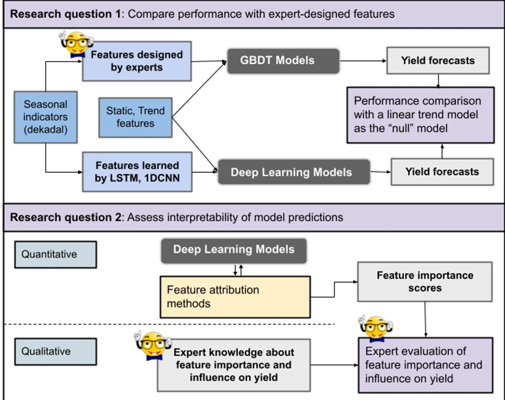
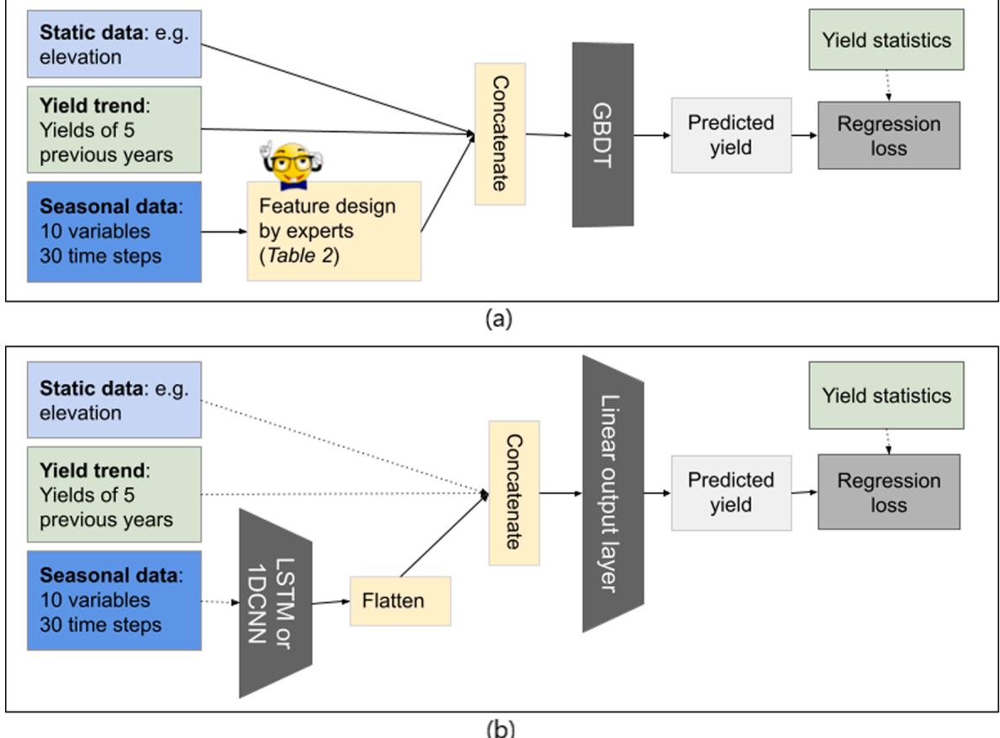
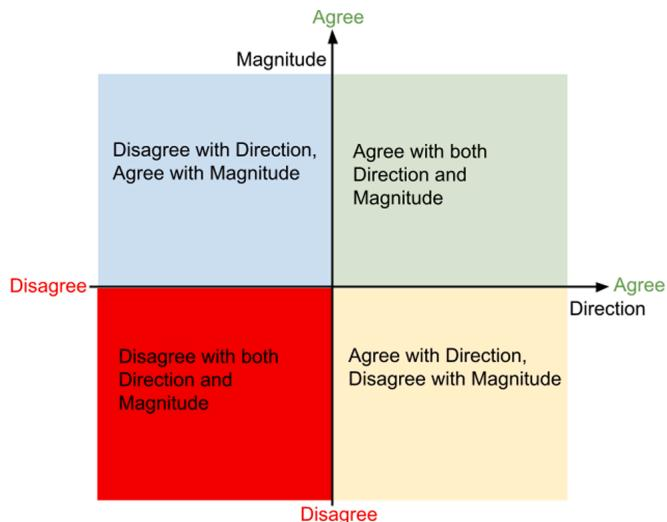
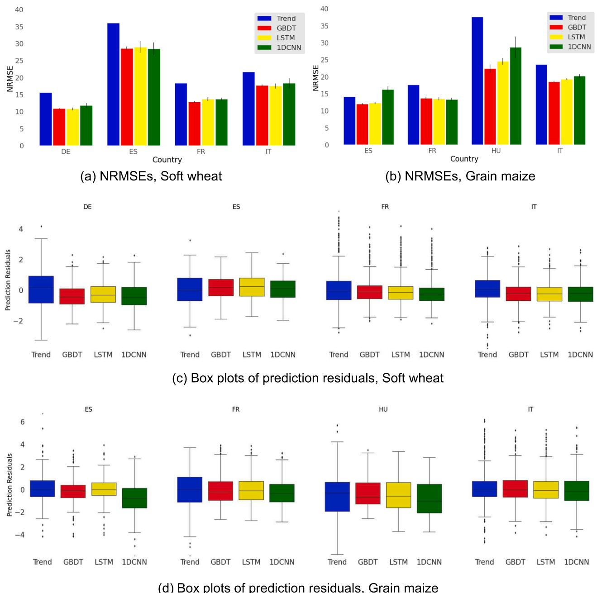
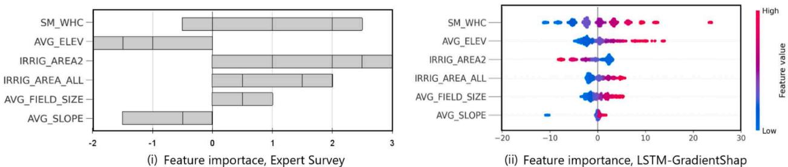
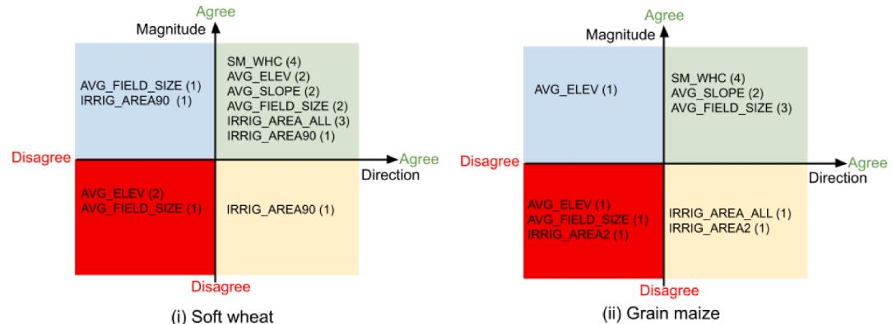
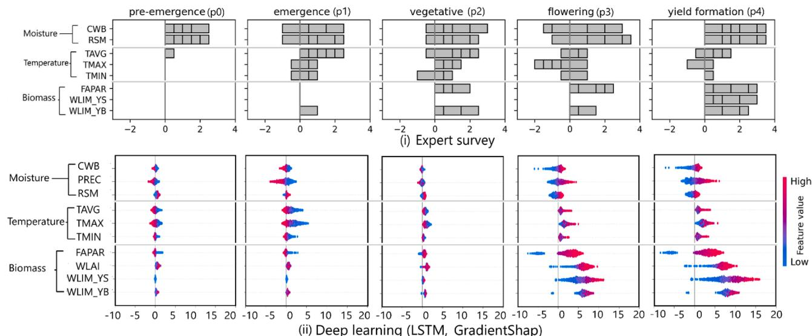
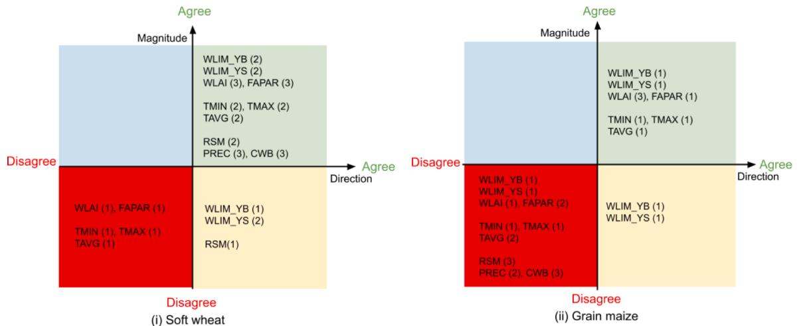
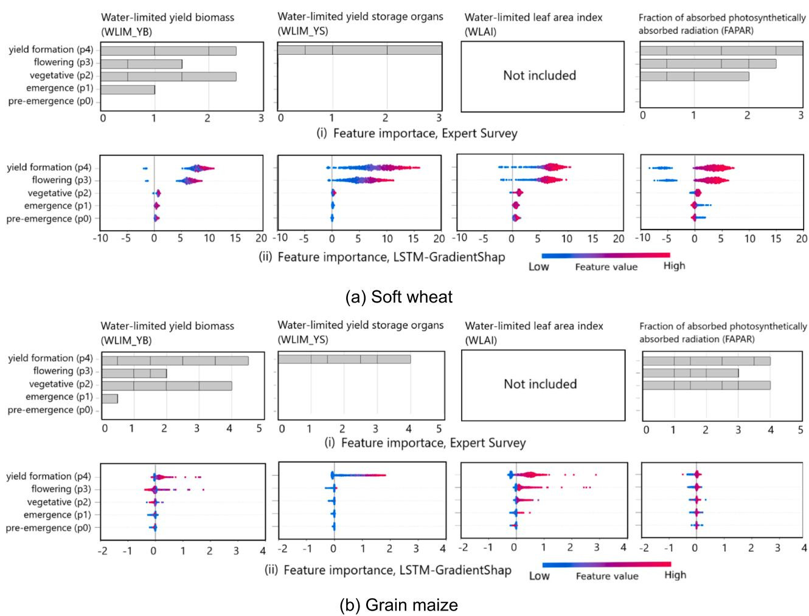
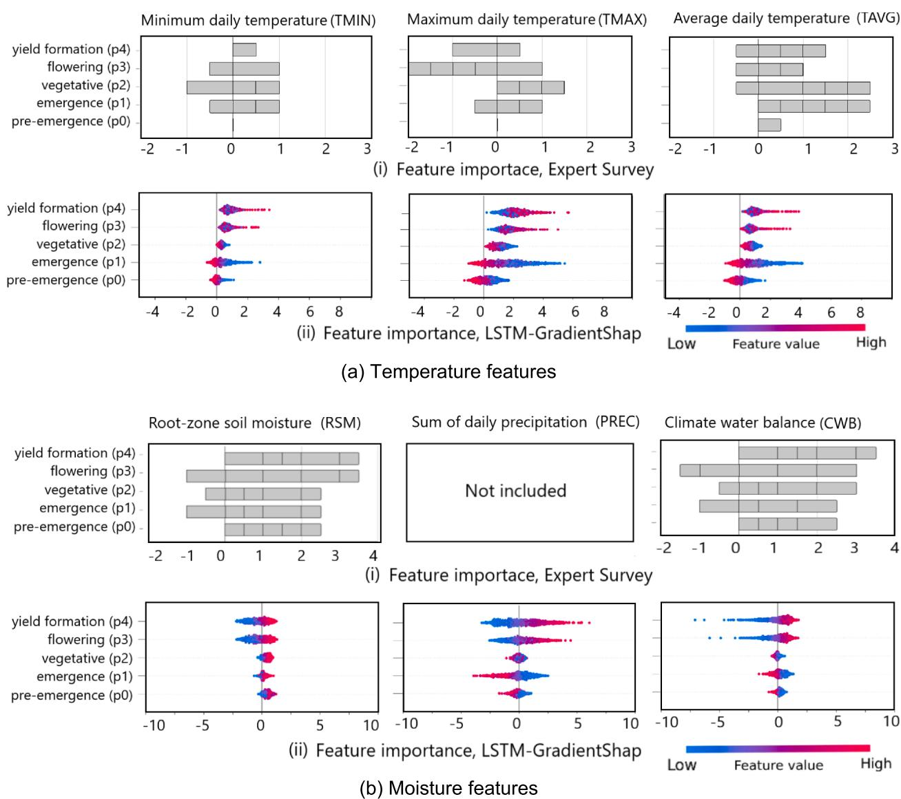

# Interpretability of deep learning models for crop yield forecasting

Dilli Paudel a,*, Allard de Wit b, Hendrik Boogaard b, Diego Marcos c, Sjoukje Osinga a, Ioannis N. Athanasiadis d

a Information Technology Group, Wageningen University & Research, Hollandseweg 1, 6706 KN Wageningen, The Netherlands  b Wageningen Environmental Research, Wageningen University & Research, PO Box 47, 6700 AA Wageningen, The Netherlands  c Inria, University of Montpellier, Montpellier, France  d Laboratory for Geo- information Science and Remote Sensing, and Wageningen Data Competence Center, Wageningen University & Research, Droevendaalsesteeg 3, 6708 PB Wageningen, The Netherlands

# ARTICLEINFO

Keywords: Crop yield Deep learning Neural networks Interpretability Human stakeholders

# ABSTRACT

Machine learning models for crop yield forecasting often rely on expert- designed features or predictors. The effectiveness and interpretability of these handcrafted features depends on the expertise of the people designing them. Neural networks have the ability to learn features directly from input data and train the feature learning and prediction steps simultaneously. In this paper, we evaluate the performance and interpretability of neural network models for crop yield forecasting using data from the MARS Crop Yield Forecasting System of the European Commission's Joint Research Centre. The selected neural networks can handle sequential or time series data and include long short- term memory (LSTM) recurrent neural network and 1- dimensional convolutional neural network (1DCNN). Performance was compared with a linear trend model and a Gradient- Boosted Decision Trees (GBDT) model, trained using hand- designed features. Feature importance scores of input variables were computed using feature attribution methods and were analyzed by crop yield modeling and agronomy experts. Results showed that LSTM models perform statistically better than GBDT models for soft wheat in Germany and similar to GBDT models for all other case studies. In addition, LSTM models captured the effect of yield trend, static features (e.g. elevation), soil water holding capacity and biomass features on crop yield well, but struggled to capture the impact of extreme temperature and moisture conditions. Our work shows the potential of deep learning to automatically learn features and produce reliable crop yield forecasts, and highlights the importance and challenges of involving human stakeholders in assessing model interpretability.

# 1. Introduction

Crop yield forecasts provide useful information to many stakeholders, including farmers, policymakers and commodity traders, for strategic decisions related to food security and market access (Basso and Liu, 2019; Chipanshi et al., 2015). Crop yield is influenced by complex interactions among crop- specific, environmental and management- related factors. Such complexity makes understanding yield forecasting models challenging but also critical. In recent years, machine learning methods have become popular in crop yield forecasting (Chlingaryan et al., 2018; van Klompenburg et al., 2020). Reliability of these methods depends on how well their forecasts can be interpreted in human understandable terms.

Interpretability is defined as the degree to which humans can understand the causes of a decision (Miller, 2019; Doshi- Velez and Kim, 2017). Interpretability is related to trust and trust is often based on understanding how model predictions change when inputs are changed. Accuracy and efficiency are two other requirements for interpretability (Ruping, 2006). Accuracy means the forecasts must be close to observed values; efficiency means humans must understand model behavior within a limited amount of time. The common solution to interpretability is to build simple and inherently understandable models, such as linear models, process- based models, or decision trees (Molnar, 2022; Ribeiro et al., 2016). Linear regression - with crop model outputs, weather variables and remote sensing indicators - is commonly used in crop yield forecasting due to its simplicity and interpretability (Lobell et al., 2015; van der Velde and Nisini, 2019; Statistics Canada, 2020). Focusing only on inherently interpretable models would limit the type of

relationships that can be modeled and hence result in less accuracy and usability (Ribeiro et al., 2016).

Machine learning and deep learning models can learn complex relationships, but they are often seen as black boxes because of a lack of understanding about how they make predictions (McGovern et al., 2019). Some methods, such as decision trees and their ensembles, are inherently interpretable. For other methods, including neural networks, feature attribution methods (Montavon et al., 2018; Ancona et al., 2018; Lundberg and Lee, 2017) provide an alternative to lack of inherent interpretability. They treat the original model as a black box and analyze predictions of the model to learn post- hoc explanations about relationships between predictors and crop yield. Interpretable machine learning and explainable artificial intelligence (explainable AI or XAI) are growing areas of research (Samek et al., 2019; McGovern et al., 2019; Xu et al., 2019; Molnar, 2022). With the help of feature attribution methods, deep learning models have become easier to understand and interpret.

Deep learning also provides benefits of automatic feature learning. Standard machine learning methods involve a step to design features or predictors based on expert knowledge. Expertise- based feature design can produce meaningful features but has some shortcomings that limit its usefulness at large scale. First, except for certain features with well- defined formulas (e.g. vegetation indices), the feature design process is manual and time consuming (Bengio et al., 2013). Second, the effectiveness of handcrafted features depends on the expertise of the people designing them. Third, methods using handcrafted features often keep the feature design and prediction steps separate. This separation prevents updates to the feature design step when prediction models are trained with supervision labels (e.g. yield statistics). Neural networks can extract features or representations directly from input data. Automatic feature learning not only removes the dependence on expertise, but also optimizes both feature extraction and prediction steps using supervision signals from training labels. Such combined learning improves the discriminative power of learned features (Wang and Yang, 2018).

Many studies have used deep learning for crop yield forecasting (Gavahi et al., 2021; Nevavuori et al., 2019; Oikonomidis et al., 2022; van Klompenburg et al., 2020), and some of them have compared performance with standard machine learning methods and analyzed feature influence (Khaki et al., 2020; Nayak et al., 2022; Shook et al., 2021; Wolanin et al., 2020). However, they do not address challenges of explaining feature importance or model behavior to human stakeholders. Reasons explaining how forecasts were made are just as important as the forecasts themselves. We present an approach that involves human experts in the design of hand- crafted features as well as in the assessment of features and relationships learned by neural networks. Using this approach, we evaluate the accuracy and interpretability of deep learning models for crop yield forecasting. In particular, we seek to answer two questions: (i) Given the same input data, how well do deep learning models perform compared to standard machine learning models that use expert- designed features? (ii) According to experts, do deep learning models make predictions based on expected or plausible relationships? To answer the first question, forecasting performance was compared with a Gradient- Boosted Decision Trees model. To answer the second question, interpretability was assessed by a combination of quantitative and qualitative methods. Feature importance scores were obtained from post- hoc analysis of deep learning models and plotted to indicate the magnitude and direction (positive or negative) of impact on yield. The observed relationships and relative importance of features were analyzed by the same group of crop yield modeling and agronomy experts who previously provided input for feature design. Our approach provides a framework to compare performance between standard machine learning and deep learning methods, and includes human stakeholder feedback in interpretability assessment. Performance was compared for two crops - soft wheat and grain maize - and five countries: Germany, Spain, France, Hungary and

Italy. Interpretability analysis was restricted to soft wheat and grain maize in France. Our work sheds light on the potential of neural networks to automatically learn meaningful features and produce reliable crop yield forecasts. Automating feature extraction reduces the dependence on manual feature design for large- scale crop yield forecasting.

The rest of the paper is structured as follows: Section 2 describes data and methods; Section 3 presents our results; Section 4 discusses our findings and outlines directions for future work; and Section 5 summarizes our conclusions. Appendix A provides details and supporting evidence not included in Section 2 (Methods), Section 3 (Results) and Section 4 (Discussion).

# 2. Methods

Our objective was to evaluate the accuracy and interpretability of deep learning methods for crop yield forecasting. Three types of models were built to assess the skill of neural networks to automatically learn features and produce accurate yield forecasts (Fig. 1). First, linear trend models provided a baseline (the "null" model) for prediction skill. Second, Gradient- Boosted Decision Trees (GBDT) models represented standard machine learning methods trained with expert- designed features. Other studies have compared performance with linear models, support vector machines (Boser et al., 1992; Cortes and Vapnik, 1995) and Random Forests (Breiman, 2001). In our case, the choice of GBDT was motivated by its performance in regional crop yield forecasting in Europe (Paudel et al., 2021, 2022). Third, deep learning models were built using architectures that can extract features from seasonal time series data. For interpretability, feature attribution methods were used to analyze the forecasts of deep learning models and extract quantitative measures of feature importance, indicating the magnitude and direction (positive or negative) of influence on crop yield. The relative importance of features and their influence on yield were analyzed and validated qualitatively by human experts based on their knowledge and experience.

# 2.1. Data

Our data came from the MARS Crop Yield Forecasting System (MCYFS) of the European Commission's Joint Research Centre (EC- JRC, 2022; MARSWiki, 2021) and Eurostat (Eurostat, 2021). Seasonal time series indicators (for every dekad or  $\sim 10$ - day period) included outputs of the WOFOST crop model (De Wit et al., 2019; van Diepen et al., 1989; Supit et al., 1994), weather variables and remote sensing indicators aggregated to NUTS3 regions (Table 1). NUTS is a system of dividing the EU territory for statistical and policy purposes (Eurostat, 2016). Yield values of five previous years were used to learn the yield trend, which captures the effect of technological improvements. Static data on soil water holding capacity, elevation, slope, yield sizes and irrigated area were used to capture spatial differences among regions not covered by seasonal data (Paudel et al., 2022). In addition, agro- environmental zones were added as categorical variables to account for other agro- climatic differences. Case studies covered two crops - soft wheat and grain maize - and five countries: Germany (DE), Spain (ES), France (FR), Hungary (HU) and Italy (IT) (Fig. A.1). Models were trained with NUTS3 yield statistics as ground- truths. Remote sensing data and yield data determined the total data size, which ranged from 300 labeled instances for grain maize (HU) to 1950 for soft wheat (DE), and in most cases covered the years 1999 to 2018. The test set consisted of the most recent  $30\%$  of available years. Model hyperparameters were optimized using a fivefold sliding validation scheme (Fig. A.5).

# 2.2. Trend and GBDT models

The trend models fitted a line through yield values of five previous years. GBDT represents a standard machine learning algorithm that requires expertise- based features. GBDT is an ensemble of decision trees

  
Fig. 1. Framework to assess performance and interpretability of deep learning models. Performance was compared with a trend model and a GBDT model. Features for GBDT were designed by experts while deep learning models extracted features automatically. Long Short-Term Memory (LSTM) and 1-dimensional Convolutional Neural Network (1DCNN) were selected to learn features from time series of seasonal indicators. Static (e.g. elevation) and yield trend features were the same for both GBDT and deep learning. Feature importance scores learned by post-hoc analysis of deep learning model predictions represented quantitative measures of interpretability. They indicated the size of feature influence and the positive or negative impact on yield. Human experts with knowledge about factors affecting yield analyzed and provided feedback on the relative importance of features and the relationships with yield.

that relies on boosting (Friedman, 2001) for growing the trees. For GBDT, the crop calendar was inferred from WOFOST- simulated development stages and used to design features that capture the impact of various predictors during different crop calendar periods (Paudel et al., 2021; Fig. A.2). We requested five experts to complete a survey about important predictors of crop yield in each period: pre- emergence (p0), emergence (p1), vegetative (p2), flowering (p3), yield formation (p4), maturity (p5). Section 2.5.2 provides some details about the experts. For each period, they provided the seasonal indicators that influence crop growth and development and affect final crop yield. Results of the survey and follow- up discussions were used to design features for GBDT. The indicators selected for feature design are shown in Table 2. Except for the step to extract seasonal features (Fig. 2), the input data and training and test splits (Fig. A.5) for both GBDT and deep learning models were identical.

# 2.3. Deep learning models

The same set of seasonal indicators considered important by experts were passed to deep learning models, but without feature design. Selected architectures included long short- term memory (LSTM) recurrent neural network and 1- dimensional convolutional neural network (1DCNN), which can automatically learn features from sequential data. LSTM processes sequential input one time step at a time and has a notion of memory to maintain or forget information from previous time steps. 1DCNN uses kernels or filters that slide across the input to create summaries of inputs covered by the size of the filter. Section A.3 provides additional information on LSTM and 1DCNN architectures. Features learned by LSTM or 1DCNN were combined with yield trend and static data and passed to the output layer (Fig. 2). The model parameters or weights were optimized using the Adam optimizer (Kingma and Ba, 2014), with a batch size of 16. The hyperparameters learning rate and weight decay (aka L2- penalty) lambda were optimized using custom 5- fold validation (Fig. A.5; Paudel et al., 2022). Models trained with optimal hyperparameters were evaluated on the validation set with early stopping; training stopped after the validation error increased for two successive epochs. The optimized hyperparameters and early stopping epochs were used to evaluate the models on the test set.

# 2.4. Feature attribution methods

We considered three post- hoc feature attribution methods: Occlusion (Zeiler and Fergus, 2014), Integrated Gradients (Sundararajan et al., 2017) and GradientShap (Lundberg and Lee, 2017). Occlusion is similar to sensitivity analysis in that it replaces a portion of feature data with baselines (zeros or random values) and compares the differences in prediction errors. Integrated gradients computes feature importance by approximating the integral of gradients (or partial derivatives) of the

Table 1 Data sources summary. Case studies covered two crops and five countries: soft wheat (Germany, Spain, France, Italy) and grain maize (Spain, France, Hungary, Italy).  

<table><tr><td>Data</td><td>Type of data</td><td>Indicators, Source</td></tr><tr><td>WOFOST crop model outputs</td><td>Seasonal time series (dekadal)</td><td>Water-limited dry weight biomass (WLIM_YB, kg ha-1), water-limited dry weight storage organs (WLIM_YS, kg ha-1), water-limited leaf area index (WLAI, m2m-2), development stage (DVS, 0-200), root-zone soil moisture as % of water holding capacity (RSM). Source: MCYFS. See Lecerf et al. (2019). Maximum daily air temperature (TMAX, °C), minimum daily air temperature (TMIN, °C), average daily air temperature (TAVG, °C), average sum of daily precipitation (PREC, mm), sum of daily evapotranspiration of short vegetation (ET0, mm) (Penman-Monteith, Allen et al., 1998)), climate water balance (CWB = PREC - ET0, mm). Source: MCYFS. See Lecerf et al. (2019).</td></tr><tr><td>Remote Sensing</td><td>Seasonal time series (dekadal)</td><td>Fraction of absorbed photosynthetically active radiation (Smoothed) (FAPAR). Source: MCYFS. See Copernicus GLS (2020).</td></tr><tr><td>GAES</td><td>Static</td><td>Agro-environmental zone identifiers. Source: Global agro-environmental stratification (Mücher et al., 2016).</td></tr><tr><td>Irrigated area</td><td>Static</td><td>Irrigated total area (IRRIG_AREA_ALL, ha) and irrigated grain maize area (IRRIG_AREA2, ha) and irrigated cereals area as proxy for soft wheat (IRRIG_AREA90, ha). Source: EC-JRC (2022).</td></tr><tr><td>Elevation, slope</td><td>Static</td><td>Average elevation (AVG_ELEV, m), standard deviation of elevation ( STD_ELEV, m), average slope (AVG_SLOPE, degrees), standard deviation of slope (STD_SLOPE, degrees). Source: USGS-EROS (2021).</td></tr><tr><td>Soil</td><td>Static</td><td>Soil water holding capacity (SM_WHC). Source: MCYFS. See Lecerf et al. (2019).</td></tr><tr><td>Field Size</td><td>Static</td><td>Average field size (AVG_FIELD_SIZE, ha), standard deviation of field size (STD_FIELD_SIZE, ha). Source: Lesiv et al (2019).</td></tr><tr><td>Yield</td><td>Yearly</td><td>Yield at regional NUTS3 level (t/ha). Source: DE-RegionalStatistics (2020), EC-JRC (2022), Eurostat (2021), FR-Agreste (2020).</td></tr></table>

model outputs to the inputs along a path from baselines to inputs. The baselines can be zeros or random values. Ancona et al. (2018) found that Occlusion better identifies a small number of important features, but Integrated Gradients is better at capturing global nonlinear effects and interactions among features. We selected GradientShap, based on SHAP (Shapley Additive Explanations, Lundberg and Lee (2017)), to include desirable properties of Shapley values from cooperative game theory. Shapley values (Shapley, 1953) capture feature importance for linear models in the presence of multicollinearity (Lipovetsky and Conklin, 2001). GradientShap uses expected gradients to approximate Shapley values. Expected gradients can be considered an approximation of Integrated Gradients with many baselines and one point in the path between the input and the baseline. The explanations produced by GradientShap and Integrated Gradients are additive. For GradientShap, summing the contributions of each feature approximates the output of the original model (Lundberg and Lee, 2017). For Integrated Gradients, contributions of features add up to the difference between output at the input and output at the baseline (Sundararajan et al., 2017). GradientShap assumes that input features are independent. This assumption makes analysis of feature contributions easier, but ignores feature interactions. In this paper, all methods were used as implemented in Captum (Kokhlikyan et al., 2020) - a model interpretability framework for PyTorch (Paszke et al., 2019).

Table 2 Feature design table for GBDT.  

<table><tr><td colspan="4">Feature design table from Paudel et al. (2022) was updated based on expert survey and follow-up discussions. Experts identified the indicators that were important at different stages of crop growth and development. WOFOST indicators: Water-limited dry weight biomass (WLIM_YB), water-limited dry weight storage organs (WLIM_YS), water-limited leaf area index (WLAI), root-zone soil moisture (RSM). Weather variables: maximum, minimum, average daily air temperature (TMAX, TMIN, TAVG); sum of daily precipitation (PREC); climate water balance (CWB). Remote sensing indicator: Fraction of Absorbed Photosynthetically Active Radiation (FAPAR).</td></tr><tr><td>Period</td><td>Maximum values</td><td>Average values, *Average of cumulative values</td><td>Z-scores (extreme values)</td></tr><tr><td>Pre-emergence (p0)</td><td></td><td>CWB</td><td></td></tr><tr><td>Planting, Emergence (p1)</td><td></td><td>TAVG, CWB*</td><td>TMIN, PREC</td></tr><tr><td>Vegetative (p2)</td><td>WLIM_YB, WLAI</td><td>RSM, TAVG, CWB*, FAPAR</td><td>RSM</td></tr><tr><td>Flowering (p3)</td><td></td><td></td><td>RSM, PREC, TMAX</td></tr><tr><td>Yield Formation (p4)</td><td>WLIM_YB, WLAI, WLIM_YS</td><td>RSM, FAPAR</td><td>RSM</td></tr><tr><td>Maturity, Harvest (p5)</td><td></td><td>PREC</td><td>PREC</td></tr></table>

<table><tr><td>Period</td><td>Maximum values</td><td>Average values, *Average of cumulative values</td><td>Z-scores (extreme values)</td><td></td></tr><tr><td>Pre-emergence (p0)</td><td></td><td>CWB</td><td></td><td></td></tr><tr><td>Planting, Emergence (p1)</td><td></td><td>TAVG, CWB*</td><td>TMIN, PREC</td><td></td></tr><tr><td>Vegetative (p3)</td><td>WLIM_YB, WLAI</td><td>RSM, TAVG, CWB*, FAPAR</td><td>RSM</td><td></td></tr><tr><td>Flowering (p3)</td><td></td><td></td><td>RSM, PREC, TMAX</td><td></td></tr><tr><td>Yield Formation (p4)</td><td>WLIM_YB, WLAI, WLIM_YS</td><td>RSM, FAPAR</td><td>RSM</td><td></td></tr><tr><td>Maturity, Harvest (p5)</td><td></td><td>PREC</td><td>PREC</td><td></td></tr></table>

# 2.5. Evaluation

We evaluated performance and interpretability of deep learning models in three steps. First, three types of models were built as described in Section 2.2 and 2.3. Forecasts from deep learning models were compared with the trend model and GBDT model. Second, feature attribution methods were used to extract importance scores of inputs passed to deep learning models. Third, human experts analyzed the interpretability of extracted relationships between features and yield as well as relative importance of features. In the case of deep learning, we use the term features loosely to mean the features learned from seasonal data as well as trend features and static data.

# 2.5.1. Evaluation of yield forecasts

Model performance was compared using normalized root mean squared error (NRMSE), defined to be the RMSE divided by the average yield of the test set. To produce early season forecasts, both GBDT and deep learning models used seasonal data up to 60 days before harvest. Both GBDT and deep learning predictions were collected from ten models to account for the effect of random seed or weight initializations. We used the average NRMSE of ten models to compare performance of trend, GBDT and deep learning methods (LSTM and 1DCNN). Similarly, prediction residuals used for boxplots and statistical tests were averaged across the ten models. Significance of model performance was evaluated using the Mann- Whitney  $U$  test (Mann and Whitney, 1947), which is a non- parametric version of Student's  $t$ - Test for independent samples. Variance and outliers were analyzed using boxplots of prediction residuals (predicted yield - reported yield). Spatial variability of yields and yield forecasts was qualitatively analyzed for the test years in France.

# 2.5.2. Evaluation of feature importance and interpretability

We selected five experts to provide input on important predictors of crop yield. Among them, four of them also participated in evaluation of feature importance and interpretability. Experts were selected based on familiarity with factors affecting soft wheat and grain maize, specifically in France. One of them is from Wageningen Plant Production Systems

  
Fig. 2. Deep learning framework (b) compared with the GBDT setup (a). In the case of GBDT, seasonal features were designed by experts. For deep learning, seasonal features were learned by training a Long Short-Term Memory (LSTM) or 1-dimensional Convolutional Neural Network (1DCNN) on seasonal indicator data. Yield trend features and static features were concatenated with seasonal features and passed to the output layer. The framework is kept as similar as possible with the GBDT setup.

and has a background in agronomy and yield gap analysis. Two of them are senior researchers at Wageningen Environmental Research with experience in crop modeling. Two of them are from the European Commission's Joint Research Centre at Ispra where they work as MCYFS analysts to produce national- level crop yield forecasts. All experts know the input data well and have experience building crop yield forecasting models. However, they have not used deep learning methods and did not participate in the design of the deep learning architecture or selection of feature attribution methods.

The survey about important predictors of crop yield was conducted before running deep learning experiments. Therefore, the experts provided their prior knowledge about how each feature influenced yield. The scale used for the survey was: strong negative influence (- 1), mild negative influence (- 0.5), no influence (0), mild positive influence (0.5), strong positive influence (1). Experts scored how static features and seasonal indicators in different periods of the crop growing season affected the final yield. Among seasonal indicators, water- limited leaf area index (WLAI) and precipitation (PREC) were not included in the expert survey, mainly because they were correlated with other biomass and moisture indicators. They were later added based on the suggestions of experts during a follow up discussion.

To assess interpretability of deep learning models, we relied on quantitative importance scores from feature attribution methods and qualitative agreement scores from experts. For each feature, feature importance scores were plotted against feature values to show the positive or negative influence of the feature on yield. High importance for high feature values indicated a positive influence, while high importance for low feature values indicated a negative influence. We summed feature importance scores from a hundred runs - ten runs of a feature attribution method for ten models - to account for random initialization of weights and random baselines. Because the feature importance scores are additive, they can be seen as the contribution (positive or negative) of each feature to the yield prediction.

Feature importance scores were analyzed for soft wheat and grain maize in France. France data is relatively large and of sufficiently high quality (Schauberger et al., 2018). Yields in France also show significant spatial and temporal variability. Yield variability is commonly divided into three components: average yield, yield trend and deviation from the trend (e.g. Dagnelie et al. (1983)). Inputs to deep learning models included static data to capture regional variation in average yields caused by topography, management and some agro- climatic differences. Trend features accounted for the multi- annual yield trend attributed to technological improvements. Seasonal features learned from dekadal time series were expected to capture yearly deviations from the trend. In line with expected effects on yield, importance scores were summarized for five classes of features: static data, yield trend features, seasonal biomass features, seasonal temperature features and seasonal moisture features. The importance of seasonal features was summarized by crop calendar periods (Fig. A.2): pre- emergence (p0), emergence (p1), vegetative (p2), flowering (p3), yield formation (p4), maturity (p5).

Experts evaluated the interpretability of feature importance from deep learning based on their knowledge of factors affecting crop yield and the interactions among them. In particular, they provided scores representing whether they agreed or disagreed with the positive or negative impact of features on yield (Direction), and the relative magnitude of feature influence on yield (Magnitude) (Fig. 3). Yield referred to the end- of- season yield, and relative magnitude meant how the scores of one feature compared with those of another. As an extra

  
Fig. 3. Agreement, disagreement quadrants for expert evaluation of interpretability.

The quadrants represent agreement between experts and feature importance scores in two dimensions: the direction (positive or negative) of feature impact on yield (Direction), and the relative magnitude of feature influence (Magnitude).

option, they could indicate that they did not understand the relationships shown by feature importance plots. Interacting effects of multiple features were analyzed in a discussion session. When completing surveys to enter their scores, experts were requested to provide short notes explaining their scores, especially for disagreements.

# 3. Results

For performance comparison, we ran deep learning models with both LSTM and 1DCNN layers using data from 60 days before harvest. Most of the results reported in this paper correspond to the LSTM version due to its superior performance in the validation set (Fig. A.6). Results for interpretability analysis are for LSTM and GradientShap. We selected GradientShap because the importance scores had lower variance across multiple runs (Table A.3). Scores from GradientShap were similar to those from Integrated Gradients based on Wasserstein distances. The distances between GradientShap and Integrated Gradients scores were 0.005 for soft wheat (FR) and 0.004 for grain maize (FR). The corresponding distances between GradientShap and Occlusion scores were 0.215 and 0.287.

# 3.1. Performance comparison

Soft wheat LSTM models were better than GBDT models for DE (p- value 0.001) and statistically similar to GBDT models for other cases (p- values between 0.373 and 0.71). They were significantly better than trend models for all countries (Table A.1). Similarly, per- country average NRMSEs were similar for GBDT and LSTM (differences less than 1%) (Fig. 4a), and they were lower than trend NRMSEs. Grain maize performance was less impressive. LSTM forecasts were still statistically similar to GBDT (p- values between 0.298 and 0.566) (Table A.2), and both GBDT and LSTM models had lower average NRMSEs than the trend model (Fig. 4b). However, p- values from Mann- Whitney U Test (between 0.396 and 0.996) showed that GBDT and LSTM models were not significantly better than the trend model. For both crops, LSTM models showed more variability across the ten runs (i.e. a higher standard deviation) than GBDT. Evidently, weight initializations had a bigger impact on deep learning models than random seed had on GBDT.

Boxplots of prediction residuals and spatial maps for FR also showed similar patterns of performance differences between the two crops. In the case of soft wheat, prediction residuals from GBDT and LSTM models had lower spread and fewer outliers than those from trend models (Fig. 4c). For soft wheat (DE), LSTM residuals were closer to zero than GBDT ones. For others, there were no significant differences between LSTM and GBDT. Spatial maps for soft wheat (FR) (Fig. A.6) showed that both GBDT and LSTM predictions were close to the yield statistics for all test years except 2016, when there were significant yield losses in the north of FR (see Ben- Ari et al. (2018)). For grain maize, prediction residuals for GBDT and LSTM had slightly lower spread than trend models for ES, FR and HU (Fig. 4d); for IT, the boxplots of all models were similar. GBDT and LSTM forecasts for grain maize (FR) (Fig. A.7) were quite different from reported yields not only in 2015, when there were yield losses in Central Europe, but also in 2014, 2016 and 2017. Overall, grain maize forecasts were less accurate than soft wheat.

# 3.2. Interpretability of feature importance

Feature importance scores showed that trend features had the highest importance (Fig. A.10). In general, static features ranked second after trend, and seasonal features had quite small importance values. Most experts agreed with this relative importance ranking. Trend and static features reduce model bias and set the yield level, so they have high importance. Year- to- year deviation from the trend is usually relatively small, and hence seasonal features have low importance. This was particularly evident for grain maize; trend models produced statistically similar forecasts to GBDT and LSTM models, and the importance of most seasonal features were close to zero.

# 3.2.1. Static features

Agro- environmental zone (AEZ) features or AEZ identifiers captured the regional variation in average yields for both soft wheat and grain maize (Fig. A.9). For soft wheat, feature importance plots showed that AEZs in the north had a positive relation with yield, which is reflected by the high average yields. Similarly, AEZs in the south had a negative relation with yield. For grain maize, the pattern was generally reversed: AEZs in the south had higher average yields and a positive relation indicated by importance plots.

Among other static data, experts expected soil water holding capacity (SM_WHC), average field size and irrigated areas to have a positive influence; elevation and slope to have a negative influence (Fig. 5a (i), Fig. 5b(i)). For soft wheat, feature importance plots showed expected relations except for total irrigated area (Fig. 5a(ii)). After discussing potential interactions among features, experts agreed that the negative relation is due to high irrigated areas in the south where average soft wheat yields are low. Some experts disagreed with the negative influence of elevation and positive influence of field size (Fig. 5c(i)). The effect of elevation was later explained by the negative correlation with SM_WHC, which had a positive influence on yield. Similarly, the positive influence of field size was interpreted in conjunction with higher average yields in the north of France and lower average yields in the south. For grain maize, the negative relation with grain maize irrigated areas and positive relation with elevation were difficult to understand (Fig. 5b(ii), Fig. 5c(ii)).

# 3.2.2. Seasonal features

The LSTM network learned seasonal features from a matrix of ten seasonal indicators and thirty dekadal values per indicator. For interpretability, importance scores for each indicator were summarized according to crop calendar periods. The importance scores showed clear relationships between features and soft wheat yields: the biomass features were important later in the season, while temperature and moisture features were influential in early season as well (Fig. 6a). Furthermore, the influence of temperatures and two moisture features (precipitation (PREC) and climate water balance (CWB)) flipped from negative to positive around the vegetative period (p2). For grain maize,

  
Fig. 4. Performance comparison 60 days before harvest. (a), (b): Average Normalized RMSE of deep learning models for different countries compared with a trend model and GBDT. (c), (d): Boxplots of prediction residuals (yield predictions - yield statistics). Prediction residuals and NRMSE were computed using predictions for all regions within a country in all test years. The values were then averaged across ten models. The error bars in (a) and (b) indicate the standard deviation of NRMSEs for the ten models.

the influence of biomass features were still understandable, but the effects of temperature and moisture features were less clear (Fig. 6b). In the rest of this section, we compare importance scores from deep learning models with expert scores and summarize the interpretability ratings from experts for each class of seasonal features.

Biomass features: Experts expected biomass features to have a positive influence on yield from vegetative period (p2) onwards (Fig. 6a(i), Fig. 6b(i)). For soft wheat, all four biomass features (water- limited dry weight biomass (WLIM_YB), water- limited dry weight storage organs (WLIM_YS), water- limited leaf area index (WLAI), fraction of absorbed photosynthetically active radiation (FAPAR)) had positive relationships with yield in flowering (p3) and yield formation (p4) (Fig. 6a(ii), Fig. 7a (ii)). Experts generally found these relationships interpretable (Fig. 6c (i)). One expert who disagreed noted that biomass features are not good predictors of national level yields. For grain maize, biomass features had smaller importance scores (almost 10x compared to soft wheat) and the influence of WLIM_YB was not clear until yield formation (p4). WLAI had a consistent positive influence from vegetative period (p2) onwards, and WLIM_YS had the expected positive influence during yield formation (p4) (Fig. 6b(ii), Fig. 7b). Most of the experts agreed with the importance of WLAI, but not other indicators (Fig. 6c(ii)). Contrary to expert expectations, FAPAR did not show up as an important feature. FAPAR is less important when WLAI is above a certain threshold (see Gitelson et al. (2014)), which is likely because grain maize has high WLAI.

Temperature features: For soft wheat, temperatures (minimum (TMIN), maximum (TMAX), average daily temperature (TAVG)) had a negative relation with yield until the vegetative period (p2) and positive relation around flowering (p3) and later (Fig. 6a(ii), Fig. 8a(ii)). This means lower temperatures were preferred early in the season; higher

(a) Soft wheat: Feature importance from the expert survey (i) and deep learning models (ii).

(b) Grain maize: Feature importance from the expert survey (i) and deep learning models (ii).

  
(c) Interpretability scores from experts: (i) Soft wheat, (ii) Grain maize. Fig. 5. Importance and interpretability of static features.

Fig. 5. Importance and interpretability of static features.

In (a) and (b), the scale used for the expert survey was: strong negative influence (- 1), mild negative influence (- 0.5), no influence (0), mild positive influence (0.5), strong positive influence (1). The divisions within each bar represent how different experts voted, e.g. experts assigned - 0.5, 1, 1 and 0.5 for SM_WHC in (b). Importance scores from deep learning models show the magnitude and direction (positive or negative) of feature influence on yield. Feature values going low to high (blue to red) from left to right represent a positive influence and vice versa. In (c), the axes are direction (positive or negative) of impact on yield (Direction) and relative magnitude of feature influence (Magnitude), and the numbers in brackets represent the number of experts. For features with less than four experts, some experts did not vote or did not understand the influence. Static features: soil water holding capacity (SM_WHC), average elevation (AVG_ELEV), average slope (AVG_SLOPE), average field size (AVG_FIELD_SIZE), total irrigated area (IRRIG_AREA_ALL), cereals irrigated area as proxy for soft wheat (IRRIG_AREA90), and maize irrigated area (IRRIG_AREA2).

temperatures contributed to higher yields later in the season. For grain maize, the effect was mixed and very small throughout the season (Fig. 6b(ii), Fig. A.11a(ii)). Experts expected very low temperatures around emergence (p1) and vegetative (p2) periods and very high temperatures around flowering (p3) and yield formation (p4) to have a negative influence on yields of both crops (Fig. 6a(i), Fig. 6b(i)). Some of them agreed with feature importance plots because temperatures in France could be optimal for the crops (Fig. 6c). In any case, effects of extreme temperatures were not captured by feature importance from deep learning (Fig. 6a, Fig. 6b; Fig. 8a; Fig. A.11a). High temperatures had high importance scores for soft wheat around flowering (p3) and yield formation (p4). For grain maize, temperatures did have some negative influence around flowering, but the importance scores were very close to zero (Fig. 6b(ii), Fig. A.11a(ii)).

Moisture features: Experts expected the impact of root- zone soil moisture (RSM) and climate water balance (CWB) to be similar and positive throughout the season (Fig. 6a(i), Fig. 6b(i)). For soft wheat, importance scores from deep learning showed different relationships. RSM had a small but consistent positive influence throughout the season. Precipitation (PREC) and CWB had a negative effect in early season and a positive effect from flowering (p3) onwards (Fig. 6a(ii), Fig. 8b (ii)). Despite differences with their prior expectations, experts found these relationships interpretable (Fig. 6c(i)). The only disagreement was with the lower relative importance of RSM; they expected RSM to be as important as CWB later in the season (Fig. 8b). For grain maize, experts found the negligible effect of PREC and the negative influence of RSM on yield difficult to interpret (Fig. 6c(ii)). The effect of CWB was mostly positive, but many of the scores were too close to zero (Fig. 6b(ii),

  
(a) Soft wheat: Feature importance from the expert survey (i) and deep learning models (ii).

  
(b) Grain maize: Feature importance from the expert survey (i) and deep learning models (ii). Fig. 6. Importance and interpretability of seasonal features 60 days before harvest. In (a) and (b), the scale used for the expert survey was: strong negative influence  $(-1)$ , mild negative influence  $(-0.5)$ , no influence (0), mild positive influence (0.5), strong positive influence (1). The divisions within each bar represent how different experts voted. Importance scores from deep learning show the magnitude and direction (positive or negative) of feature influence on yield. Feature values going low to high (blue to red) from left to right represent a positive relation and vice versa. In (c), the axes are directional (positive or negative) of impact on yield (Direction and relative magnitude of feature influence (magnitude), and the numbers in brackets represent the number of experts. For features with less than four experts, some experts did not vote or did not understand the influence. Biomass features: water-limited dry weight biomass (WLIM_YB), water-limited dry weight storage organs (WLIM_YS), water-limited leaf area index (WLAI), Fraction of Absorbed Photosynthetically Active Radiation (FAPAR). Temperature features: minimum, maximum, average daily air temperature (TMAX, TMIN, TAVG). Moisture features: root-zone soil moisture (RSM), sum of daily precipitation (PREC), climate water balance (CWB).

Fig. A.11b(ii)). Hence the experts did not find the relationships understandable (Fig. 6c(ii)).

# 4. Discussion

Previous studies have found that deep learning models can be used for crop yield forecasting (Khaki and Wang, 2019; Nevavuori et al., 2019; Wolanin et al., 2020; You et al., 2017). Deep learning can significantly improve performance when data size is large (at least around 10,000). Some studies in the US have used more complex architectures, combining CNN with LSTMs or 3 dimensional CNNs with convolutional LSTMs (Gavahi et al., 2021; Khaki et al., 2020; You et al., 2017). Their results were better than standard machine learning methods, such as Ridge Regression (Hoerl and Kennard, 1970), LASSO Regression (Tibshirani, 1996), Decision Trees and Random Forests. In our case, data sizes were smaller, ranging from around 300 to 1950 labeled instances, and hence we chose simpler architectures. Even then, the performance of deep learning models was better than GBDT for soft wheat (DE), which had the largest data size, and statistically similar to GBDT for other case studies. GBDT and deep learning models outperformed the linear trend models for soft wheat but not grain maize. Similarly, spatial variability maps for France showed that soft wheat forecasts for both deep learning models and GBDT were closer to reported statistics than grain maize forecasts. The main takeaway is that

2017). Their results were better than standard machine learning methods, such as Ridge Regression (Hoerl and Kennard, 1970), LASSO Regression (Tibshirani, 1996), Decision Trees and Random Forests. In our case, data sizes were smaller, ranging from around 300 to 1950 labeled instances, and hence we chose simpler architectures. Even then, the performance of deep learning models was beter than GBDT for soft wheat (DE), which had the largest data size, and statistically similar to GBDT for other case studies. GBDT and deep learning models outperformed the linear trend models for soft wheat but not grain maize. Similarly, spatial variability maps for France showed that soft wheat forecasts for both deep learning models and GBDT were closer to reported statistics than grain maize forecasts. The main takeaway is that

  
(c) Interpretability scores from experts: (i) Soft wheat, (ii) Grain maize.

  
Fig. 7. Importance of biomass features 60 days before harvest. The scale used for the expert survey was: strong negative influence  $(-1)$ , mild negative influence  $(-0.5)$ , no influence  $(0)$ , mild positive influence  $(0.5)$ , strong positive influence  $(1)$ . The divisions within each bar represent how different experts voted. Importance scores from deep learning show the magnitude and direction (positive or negative) of feature influence on yield. Feature values going low to high (blue to red) from left to right represent a positive relation and vice versa.

deep learning can automatically extract features that perform similarly to expert- designed features. In other words, manual feature design does not make model performance significantly better. Therefore, deep learning provides a solution to the limitations of manual feature design at large scale.

Our results indicated that crop yield forecasts from deep learning models can be explained using post- hoc feature attribution methods, especially when forecasting accuracy is high. Feature attributions were

  
Fig. 8. Importance of temperature and moisture features for soft wheat 60 days before harvest. The scale used for the expert survey was: strong negative influence (-1), mild negative influence (-0.5), no influence (0), mild positive influence (0.5), strong positive influence (1). The divisions within each bar represent how different experts voted. Importance scores from deep learning show the magnitude and direction (positive or negative) of feature influence on yield. Feature values going low to high (blue to red) from left to right represent a positive relation and vice versa. Corresponding plots for grain maize can be found in Fig. A.11.

found to be interpretable for trend features (Fig. A.10), most static features (Fig. 5) and biomass features (Fig. 7). Similarly, attributions of moisture features correctly captured the relationships in different periods of soft wheat season (Fig. 8b). Exceptions included the effect of extreme temperatures on both crops (Fig. 8a, Fig. A.11a) and irrigation and moisture on grain maize (Fig. 5b, Fig. A.11b). Our framework and models did not account for the relative rarity of extreme temperature events. As a result, both low temperatures in early season and high temperatures later in the season had positive rather than negative importance. The influence of moisture was affected by whether the crop was irrigated, and the influence of irrigated areas was sometimes unclear because the data was static. Despite some limitations, deep learning models captured some relationships not expected by experts. For example, experts did not consider the effects of high temperatures in early season; feature importance from deep learning showed a negative effect of high temperatures (Fig. 8a). Similarly, experts expected a consistent positive effect of RSM and CWB throughout the season, but feature importance from deep learning showed that CWB has a negative effect on soft wheat yields in early season and a positive effect from flowering (p3) onwards (Fig. 8b). Experts later agreed with these relationships. In some cases, experts did not agree with the relationships or relative importance. Some of the disagreements stemmed from different perspectives on the relationships between features and yield. For example, some experts disagreed with the negative relation between elevation and soft wheat yields (Fig. 5a), but they interpreted it based on interactions with soil water holding capacity. Similarly, some experts found small importance values of FAPAR for grain maize hard to understand, while others explained it based on high WLAI (Fig. 6c(ii)). Overall, feature influence matched expert knowledge and experience more for soft wheat than for grain maize. For grain maize, the linear trend model performed as good as GBDT and LSTM models. Therefore, comparisons of GBDT and LSTM forecasts with reported yields (Figs. A.7, A.8) and low importance scores of seasonal features tell a similar story. The interannual variability related to seasonal features may be low, hence the relationships between these features and yield were less clear. In addition, as noted by one of the experts, modeling irrigated and non- irrigated systems together could have been another confounding factor. This limitation comes from regional yield statistics, which in most countries do not have separate values for irrigated and non- irrigated systems. Separate models for the two systems could

produce more interpretable relationships.

Many factors contribute to model interpretability and agreement or disagreement with experts. First, experts expected certain relationships based on prior knowledge and experience. The deep learning framework for regional crop yield forecasting was different from the setups they have previously used. Similarly, relationships actually present in data can be complex and difficult to verify. Second, the choice of neural network architectures and models was by no means the best. Neural networks have a large number of parameters and need large amounts of training data to generalize well (Kolmar, 2022). We selected simpler architectures to balance model capacity and complexity. Third, feature attribution methods used also have their limitations. The additive explanations produced by GradientShap were easy to understand, but they only approximated model behavior. Interpretable neural networks are not yet common. Finally, presentation of feature importance or explanations to experts is a social process (Miller, 2019) and affects how they understand model behavior. We presented positive or negative contributions of individual features to yield forecasts. This approach ignores interactions among features although certain combined interactions were considered in the interactive session with experts.

Analyzing interpretability is difficult and hence we relied on a qualitative analysis of interpretability by experts. Robust hypothesis testing would be required to establish whether explanations of deep learning models match existing knowledge or provide new insights (McGovern et al., 2019). Tests could ask human subjects to select feature attributions or explanations that correspond to given input and output, or suggest an output given inputs and feature attributions (Doshi- Velez and Kim, 2017). Such tests require many participants and significant time commitment from the expert (Narayanan et al., 2018). Therefore, we chose a simpler approach of expert surveys followed by an interactive evaluation. Interpretability scores showed that experts did not always agree when selecting important predictors (Figs. 5- 8 and A.11) or scoring interpretability of feature importance (Figs. 5- 6). Despite such differences, it is important to engage humans in assessment of interpretability. Models can be interpretable in many ways and experts may view the same explanations differently. The fact that deep learning models did not find certain features important does not mean they are physically unimportant (McGovern et al., 2019). Overall, we developed and tested a method to assess model interpretability with feedback from human experts that went beyond feature importance plots, which are often not interpretable on their own.

Deep learning methods are nowadays common in agricultural applications including crop yield forecasting (Kamilaris and Prenafeta- Boldu, 2018; van Klompenburg et al., 2020). The need for model interpretability will continue to grow with the widespread use of deep learning. In this paper, we selected human experts familiar with the input data and the agronomic principles driving crop growth and development to evaluate interpretability. This familiarity allowed us to simplify the process of explaining feature attributions to them. Experts were able to understand feature importance plots and provide judgments about their interpretability. Hence we were able to focus more on understanding how well deep learning captures expected agronomic relationships, and less on social and cognitive factors affecting interpretability (Narayanan et al., 2018). Nevertheless, social and cognitive factors are important and interpretability analysis should not be limited to visual feature importance plots. Other stakeholders that use crop yield forecasts for decision making may need a different method for explaining yield forecasting models to them. More accurate assessment of interpretability is possible with iterative improvement of the evaluation process. Deep learning models may produce accurate crop yield forecasts, but they are useful only when they can be trusted and used in real- world applications. Interpretability will play an important role in bridging the gap between model building and decision making.

# 5. Conclusions

We evaluated the performance and interpretability of deep learning models for soft wheat and grain maize at regional level in Europe. Performance was found to be statistically similar to or better (in one case) than a standard machine learning algorithm that relies on expert- designed features. Therefore, deep learning provides benefits of automatic feature learning that can address limitations of manual feature design at large scale. Similarly, feature attribution methods provide post- hoc explanations for model predictions that are generally interpretable, especially when forecasting accuracy is high. Such explanations indicate how each feature contributes to the yield prediction, but not their interacting effects. Feature importance scores from deep learning models correctly captured the influence of most static features, yield trend and biomass features on crop yield. In some cases, they also identified relationships not expected by experts (e.g. the negative effect of climate water balance on soft wheat in early season). On the other hand, deep learning models struggled to capture the impact of extreme temperatures on both crops and the effect of irrigation and moisture on grain maize. We found that human assessment of interpretability is challenging, but nonetheless important. Limitations exist in data, model building, extraction of feature attributions and presentation of explanations to human stakeholders. Some of these limitations can be addressed by continued engagement of human stakeholders and iterative improvement of the evaluation process. Interpretability of models is crucial for building trust in them and using them to guide decision making.

# CRediT authorship contribution statement

Dilli Paudel: Conceptualization, Methodology, Software, Investigation, Validation, Formal analysis, Writing - original draft. Allard de Wit: Data curation, Methodology, Validation, Writing - review & editing. Hendrik Boogaard: Data curation, Methodology, Validation, Writing - review & editing. Diego Marcos: Methodology, Software, Visualization, Writing - review & editing. Sjoukje Osinga: Methodology, Visualization, Writing - review & editing. Ioannis N. Athanasiadis: Funding acquisition, Methodology, Visualization, Writing - review & editing.

# Declaration of Competing Interest

The authors declare that they have no known competing financial interests or personal relationships that could have appeared to influence the work reported in this paper.

# Data and software availability

Data used in this paper is similar in format to the sample data available here: https://doi.org/10.5281/zenodo.5561113. Software implementation can be accessed here: https://github.com/BigDataWUR/MLforCropYieldForecasting/tree/dlinterpret.

# Acknowledgements

This work was partially supported by the European Union's Horizon 2020 research and innovation programme under grant agreement No. 825355 (CYBELE).

We would like to thank S. Niemeyer from the European Commission's Joint Research Centre (JRC) for the permission to use the MARS Crop Yield Forecasting System (MCYFS) data. Similarly, we would like to thank M. van der Velde, L. Nisini and I. Cerrani from JRC for preparing and sharing the Eurostat regional yield statistics and crop areas.

We would like to express our sincere thanks to the experts who provided input on important predictors of crop yield and also analyzed feature attributions for interpretability. They are Allard de Wit and

Hendrik Boogaard from Wageningen Environmental Research; Majid Ali Magham from Plant Productions Group of Wageningen University and Research; Wassim Ben Aoun and Martin Claverie from the European Commission's Joint Research Centre (JRC) in Ispra, Italy. We also would like to appreciate Sander Janssen from Wageningen Environmental Research for his advice to include human experts in assessment of model interpretability.

Feature importance plots used in the paper were adapted from beeswarm plots of SHAP (SHapley Additive exPlanations, Lundberg and Lee (2017)).

# Appendix A. Supplementary material

Supplementary data to this article can be found online at https://doi.org/10.1016/j.compag.2023.107663.

# References

Allen, R.G., Pereira, L.S., Raes, D., Smith, M., et al., 1998. Crop evapotranspiration - - guidelines for computing crop water requirements. In: Irrigation and Drainage, paper 56, FAO, Rome. Ancona, M., Ceolini, E., Oztireli, C., Gross, M., 2018. Towards better understanding of gradient- based attribution methods for deep neural networks. In: 6th International Conference on Learning Representations, ICLR 2018. doi: 10.48550/ arXiv.1711.06104. Basso, B., Liu, L., 2019. Seasonal crop yield forecast: Methods, applications, and accuracies. In: Advances in Agronomy. Vol. 154. Elsevier. pp. 201- 255. doi: 10.1016/bs.agron.2018.11.002. Ben- Ari, T., Boe, J., Clais, P., Lecerf, R., van der Velde, M., Makowski, D., 2018. Causes and implications of the unforeseen: 2016 extreme yield loss in the breadbasket of France. Nat. Commun. 9, 1- 10. doi: 10.1038/s41467- 018- 04087- x. Bengio, Y., Courville, A., Vincent, P., 2013. Representation learning: A review and new perspectives. IEEE Trans. Pattern Anal. Mach. Intell. 35, 1798- 1828. https://doi. org/10.1109/TPAMI.2013.50. Boser, B.E., Guyon, I.M., Vapnik, V.N., 1992. A training algorithm for optimal margin classifiers. In: Proceedings of the Fifth Annual Workshop on Computational Learning Theory. ACM New York, NY, USA. pp. 144- 152. Brennan, L., 2001. Random forests. Mem. Learn. 45, 9- 92. Chipanshi, A., Zhang, Y., Kouadio, L., Newlands, N., Davidson, A., Hill, H., Warren, R., Qian, B., Daneshfar, B., Bedard, P., et al., 2015. Evaluation of the Integrated Canadian Crop Yield Forecaster (ECYF) model for in- season prediction of crop yield across the crop yield agricultural landscape. Agric. For. Meteorol. 206, 137- 150. https://doi.org/10.1016/j.agrformet.2015.03.007. Copernicus GLS, 2020. Fraction of Absorbed Photosynthetically Active Radiation. https://land.copernicus.eu/global/products/fapar, Last accessed: Oct 19, 2020. Chlingaryan, A., Sukkarieh, S., Whelan, B., 2018. Machine learning approaches for crop yield prediction and nitrogen status estimation in precision agri- culture: A review. Computers and Electronics in Agriculture 151, 61- 69. https://doi.org/10.1016/j. compag.2018.05.012. Cortes, C., Vapnik, V., 1995. Support- vector networks. Mach. Learn. 20, 273- 297. https://doi.org/10.1007/BF00994018. Dagnelie, P., Palm, R., Instaste, A., 1983. Prevision de productions agricoles dans les dix pays de la Communauté Economique Européenne. Technical Report. Faculté des Sciences Agronomiques de l'Etat, Gembloux, Belgium. De Wit, A., Boogaard, H., Fumagalli, D., Janssen, S., Knapen, R., van Kraalingen, D., Supit, I., van der Wijngaart, R., van Diepen, K., 2019. 25 years of the WOFOST cropping systems model. Agr. Syst. 166, 154- 167. https://doi.org/10.1016/j. agsy.2018.06.018. DE- RegionalStatistiks, 2020. Regionalatembank deutschland. https://www.regionalstat istik.de/genesis/online/data, Last accessed: May 11, 2020. Doshi- Velez, F., Kim, B., 2017. Towards A Rigorous Science of Interpretable Machine Learning. URL: https://arxiv.org/abs/1702.08608, doi: 10.48550/ arXiv.1702.08608. Eurostat, 2016. Nomenclature of territorial units for statistics. https://ec.europa.eu/ eurostat/web/nuts/background, Last accessed: May 11, 2020. EC- JRC, 2022. JRC Agri4Cast Data Portal. https://agri4cast.jrc.ec.europa.eu/DataPorta l/Index.aspx, Last accessed: Feb 1, 2022. Eurostat, 2021. Eurostat - Agricultural Production - crops. https://ec.europa.eu/eurostat /statistics- explained/index.php/Agricultural production_- crops, Last accessed: May 11, 2021. FR- Agreste, 2020. Agreste Web Data Portal. https://agreste.agriculture.govu.fr/agr este- web/, Last accessed: May 11, 2020. Friedman, J.H., 2001. Greedy function approximation: a gradient boosting machine. Annals of Statistics. 1189- 1232. https://www.jstor.org/stable/2699986, Last accessed: May 11, 2020. Gavahi, K., Abbaszadeh, P., Moradkhani, H., 2021. DeepYield: A combined convolutional neural network with long short- term memory for crop yield forecasting. Expert Syst. Appl. 184, 115511. https://doi.org/10.1016/j.eswa.2021.115511. Gitelson, A.A., Peng, Y., Huemmroich, K.F., 2014. Relationship between fraction of radiation absorbed by photosynthesizing maize and soybean canopies and ndvi from remotely sensed data taken at close range and from modis  $250~\mathrm{m}$  resolution data. Remote Sens. Environ. 147, 108- 120. doi: 10.1016/j.rse.2014.02.014. Hoerl, A.E., Kennard, R.W., 1970. Ridge regression: Biased estimation for nonorthogonal problems. Technometrics 12, 55- 67. https://doi.org/10.1080/00401706. 1970.10488634. Kamilaris, A., Prenafeta- Boldu, F.X., 2018. Deep learning in agriculture: a survey. Comput. Electron. Agric. 147, 70- 90. https://doi.org/10.1016/j. compag.2018.02.016. Khaki, S., Wang, L., 2019. Crop yield prediction using deep neural networks. Front. Plant Sci. 10, 621. https://doi.org/10.3389/fpls.2019.00621. Khaki, S., Wang, L., Archontoulis, S.V., 2020. A CNN- RNN framework for crop yield prediction. Front. Plant Sci. 10, 1750. https://doi.org/10.3389/fpls.2019.01750. Kragma, D.P., Ba, J., 2014. Adam: A method for stochastic optimization. arXiv preprint arXiv:1412.6980. Kokhlikyan, N., Miglani, V., Martin, M., Wang, E., Alsallakh, B., Reynolds, J., Melnikov, A., Kliushkina, N., Araya, C., Yan, S., Reblitt- Richardson, O., 2020. Captum: A unified and generic model interpretability library for pytorch. 10.48550/ ARXIV.2009.07896, arXiv:2009.07896. Lecerf, R., Ceglar, A., L opez- Lozano, R., Van Der Velde, M., Baruth, B., 2019. Assessing the information in crop model and meteorological indicators to forecast crop yield over Europe. Agric. Syst. 168, 191- 202. doi: 10.1016/j.agsuro.2018.03.002. Lesiv, M., Laso Bayas, J.C., See, L., Duerauer, M., Dahlia, D., Durando, N., Hazarika, R., Kumar Sahariah, P., Vakolyuk, M., Blyshchyl, V., et al., 2019. Estimating the global distribution of field size using crowdsourcing. Glob. Chang. Biol. 25, 174- 186. https://doi.org/10.1111/gcb.14492. Lipovetsky, S., Conklin, M., 2001. Analysis of regression in game theory approach. Appl. Stoch. Model. Bus. Ind. 17, 319- 330. https://doi.org/10.1002/asmb.446. Lundberg, S.M., Lee, S.I., 2017. A unified approach to interpreting model predictions, In: Advances in Neural Information Processing Systems 30. Curran Associates, Inc., pp. 4765- 4774. http://papers.nips.cc/paper/7062- a- unified- approach- to- interpreti ng- model- predictions.pdf, Last accessed: June 29, 2022. Lobell, D.B., Thau, D., Seifert, C., Engle, E., Little, B., 2015. A scalable satellite- based crop yield mapper. Remote Sensing of Environment 164, 324- 333. https://doi.org/ 10.1016/j.rse.2015.04.021. Mann, H.B., Whitney, D.R., 1947. On a test of whether one of two random variables is stochastically larger than the other. Ann. Math. Stat. 50- 60. https://doi.org/ 10.1214/aoms/1177730491. MARSwiki, 2021. MARS Crop Yield Forecasting System. https://marswiki.jrc.ec.europa. eu/agri4cast/wiki/index.php/Welcome. to/WorldMCYFS, Last accessed: May 11, 2021. Government, Lagerquist, R., Gagne, D.J., Jergensen, G.E., Elmore, K.L., Homeyer, C.R., Smith, T., 2019. Making the black box more transparent: understanding the physical implications of machine learning. Bull. Am. Meteorol. Soc. 100, 2175- 2199. https:// doi.org/10.1177/BAMS- D- 18- 0195.1. Miller, T., 2019. Explanatory in artificial intelligence: Insights from the social sciences. Artif. Intell. 267, 1- 38. https://doi.org/10.1016/j.artint.2018.07.007. Molnar, C., 2022. Interpretable Machine Learning, second edition. URL: https://chri stophm. github.io/interpretable- ml- book. Mucher, S., de Simone, L., Kramer, H., de Wit, A., Roupioz, L., Hazeu, G., Boogaard, H., Schuiling, R., Fritz, S., Latham, J., et al., 2016. A new global agro- environmental stratification (GAES). Technical Report. Wageningen Environmental Research. https://edepot.wur.nl/400815, Last accessed: June 14, 2021. Montavon, G., Samek, W., Miller, K.R., 2018. Methods for interpreting and understanding deep neural networks. Digital Signal Process. 73, 1- 15. https://doi. org/10.1016/j.dsp.2017.10.011. Narayanan, M., Chen, E., He, J., Kim, B., Gershman, S., Doshi- Velez, F., 2018. How do humans understand explanations from machine learning systems? An evaluation of the human- interpretability of explanation. doi: 10.48550/ARXIV.1802.00682. Nayak, H.S., Silva, J.V., Parihar, C.M., Krupnik, T.J., Sena, D.R., Kakraliya, S.K., Jat, H.S., Sidhu, H.S., Sharma, P.C., Jat, M.L., Sapkota, T.B., 2022. Interpretable machine learning methods to explain on- farm yield variability of high productivity wheat in Northwest India. Field Crops Research 287, 108640. https://doi.org/10.1016/j. fcr.2022.108640. navauori, P., Narra, N., Lipping, T., 2019. Crop yield prediction with deep convolutional neural networks. Comput. Electron. Agric. 163, 104859 https://doi. org/10.1016/j.compag.2019.104859. Oikonomidis, A., Catal, C., Kassahun, A., 2022. Deep learning for crop yield prediction: a systematic literature review. N. Z. J. Crop Hortic. Sci. 1- 26 https://doi.org/10.1080/ 01140671.2022.2032213. Paszke, A., Gross, S., Massa, F., Lerer, A., Bradbury, J., Chanan, G., Killeen, T., Lin, Z., Gimelshein, N., Antiga, L., Desmaison, A., Kopf, A., Yang, E., DeVito, Z., Raison, M., Tejani, A., Chilamkurthy, S., Steiner, B., Fang, L., Bai, J., Chintala, S., 2019. Pytorch: An imperative style, high- performance deep learning library. In: Advances in Neural Information Processing Systems 32. Curran Associates Inc, pp. 8024- 8035. Paudel, D., Boogaard, H., de Wit, A., Janssen, S., Osinga, S., Pylianidis, C., Athanasiadis, I.N., 2021. Machine learning for large- scale crop yield forecasting. Agr. Syst. 187, 103016 https://doi.org/10.1016/j.agsy.2020.103016. Paudel, D., Boogaard, H., de Wit, A., van der Velde, M., Claverie, M., Nisini, L., Janssen, S., Osinga, S., Athanasiadis, I.N., 2022. Machine learning for regional crop yield forecasting in Europe. Field Crop Res 276, 108377. https://doi.org/10.1016/j. fcr.2021.108377. Ribeiro, M.T., Singh, S., Guestrin, C., 2016. Model- agnostic interpretability of machine learning. URL: https://arxiv.org/abs/1606.05386, doi: 10.48550/ ARXIV.1606.05386. Ruping, S., 2006. Learning interpretable models. https://eldorado.tu- dortmund.de /bitstream/2003/23008/1/dissertation_rueping.pdf, Last accessed: June 29, 2022.

Samek, W., Montavon, G., Vedaldi, A., Hansen, L.K., Müller, K.R., 2019. Explainable AI: interpreting, explaining and visualizing deep learning. Volume 11700. Springer Nature. doi: 10.1007/978- 3- 030- 28954- 6. Shapley, L., 1953. Quota solutions of m- person games. In: Contributions to the Theory of Games (AM- 28), Volume II, Princeton University Press. pp. 307- 317. doi: 10.1515/9781400881970. Statistics Canada, 2020. An Integrated Crop Yield Model Using Remote Sensing, Agroclimatic Data and Crop Insurance Data. https://www.statcan.gc.ca/eng/statistical- programs/document/3401. DX. V1, Last accessed: July 25, 2022. Sundararajan, M., Taly, A., Yan, Q., 2017. Axiomatic attribution for deep networks. In: Proceedings of the 34th International Conference on Machine Learning, PMLR. pp. 3319- 3328. URL: https://proceedings.pmlr- press/v70/sundararajan17a.html. Supit, I., Hooijer, A., Van Diepen, C., 1998. System description of the WOFOS. 6.0 crop simulation model implemented in CGMS. Vol. 1. Theory and algorithms. In: EUR Publication No. 15959 EN, Office for Official Publications of the European Communities, Luxembourg. p. 146. Tibshirani, R., 1996. Regression shrinkage and selection via the lasso. J. R. Stat. Soc.: Ser. B (Methodol.) 58, 267- 288. doi: 10.1111/j.2517- 6161.1996. tb02080. x. USGS- EROS, 2021. USGS EROS Archive - Digital Elevation - Global 30 Arc- Second Elevation (GTOPO30). https://www.usgs.gov/centers/eros/data, Last accessed: May 11, 2021. Schauberger, B., Ben- Ari, T., Makowski, D., Kato, T., Kato, H., Ciais, P., 2018. Yield trends, variability and stagnation analysis of major crops in France over more than a century. Scientific Reports 8, 16865. https://doi.org/10.1038/s41598- 018- 35351- 1. Shook, J., Gangopadhyay, T., Wu, L., Ganapathysubramanian, B., Sarkar, S., Singh, A.K., 2021. Crop yield prediction integrating geno- type and weather variables using deep learning. Plos one 16 (6), 0252402. https://doi.org/10.1371/journal.pone.0252402. van der Velde, M., Nisini, L., 2019. Performance of the MARS- crop yield forecasting system for the European Union: Assessing accuracy, in- season, and year- to- year improvements from 1993 to 2015. Agr. Syst. 168, 203- 212. https://doi.org/10.1016/j.agsy.2018.06.009. van Diepen, C., Wolf, J., Van Keulen, H., Rappoldt, C., 1989. WOFOST: a simulation model of crop production. Soil Use Manag. 5, 16- 24. https://doi.org/10.1111/j.1475- 2743.1989. tb00755. x. van Klompenburg, T., Kassahun, A., Catal, C., 2020. Crop yield prediction using machine learning: A systematic literature review. Comput. Electron. Agric. 177, 105709 https://doi.org/10.1016/j.compag.2020.105709. Wang, Z., Yang, J., 2018. Diabetic retinopathy detection via deep convolutional networks for discriminative localization and visual explanation. In: Workshops at the thirty- second AAAI conference on artificial intelligence. https://www.aaai.org/ocs/index.php/WS/AAAIW18/paper/view/16668/0, Last accessed: June 29, 2022. Watanin, A., Mateo- Garcia, G., Camper- Valls, G., Gómez- Chova, L., Meroni, M., Duveiller, G., Liangzhi, Y., Guanter, L., 2020. Estimating and understanding crop yields with explainable deep learning in the Indian Wheat Belt. Environmental research letters 15 (2), 024019. https://doi.org/10.1088/1748- 9326/ab68ac. Xu, F., Uszkoreit, H., Du, Y., Fan, W., Zhao, D., Zhu, J., 2019. Explainable AI: A brief survey on history, research areas, approaches and challenges. In: CCF international conference on natural language processing and Chinese computing, Springer. pp. 563- 574. doi: 10.1007/978- 3- 030- 32236- 6_31. You, J., Li, X., Low, M., Lobell, D., Ermon, S., 2017. Deep Gaussian process for crop yield prediction based on remote sensing data. In: Thirty- First AAAI Conference on Artificial Intelligence. https://www.cs.stanford.edu/~ermon/papers/crop yield AAAI7. pdf, Last accessed: July 25, 2022. Zeiler, M.D., Fergus, R., 2014. Visualizing and understanding convolutional networks. In: European conference on computer vision, Springer. pp. 818- 833. doi: 10.1007/978- 3- 319- 10590- 1_53.