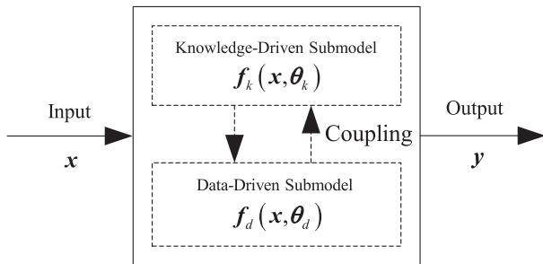
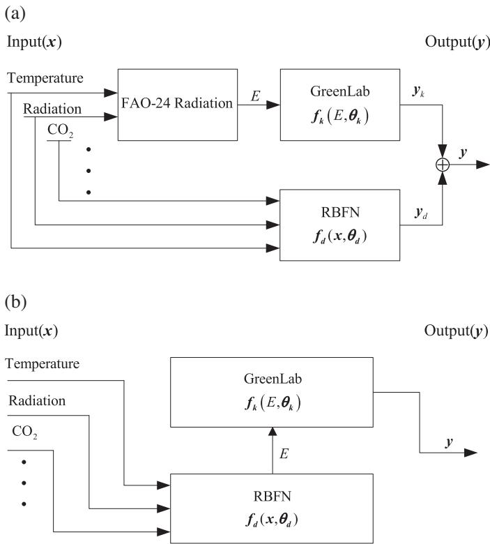
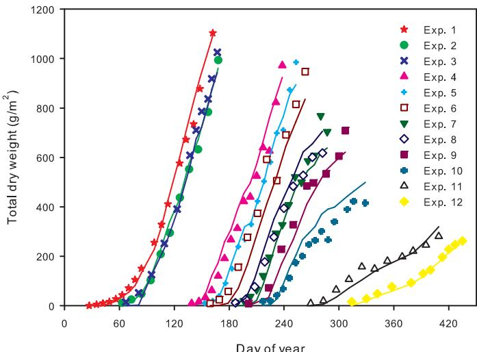
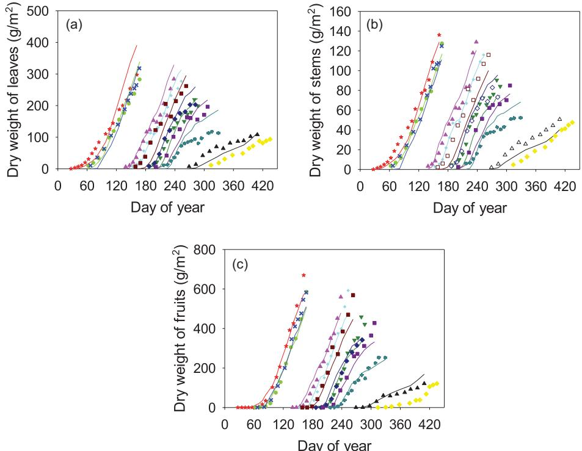
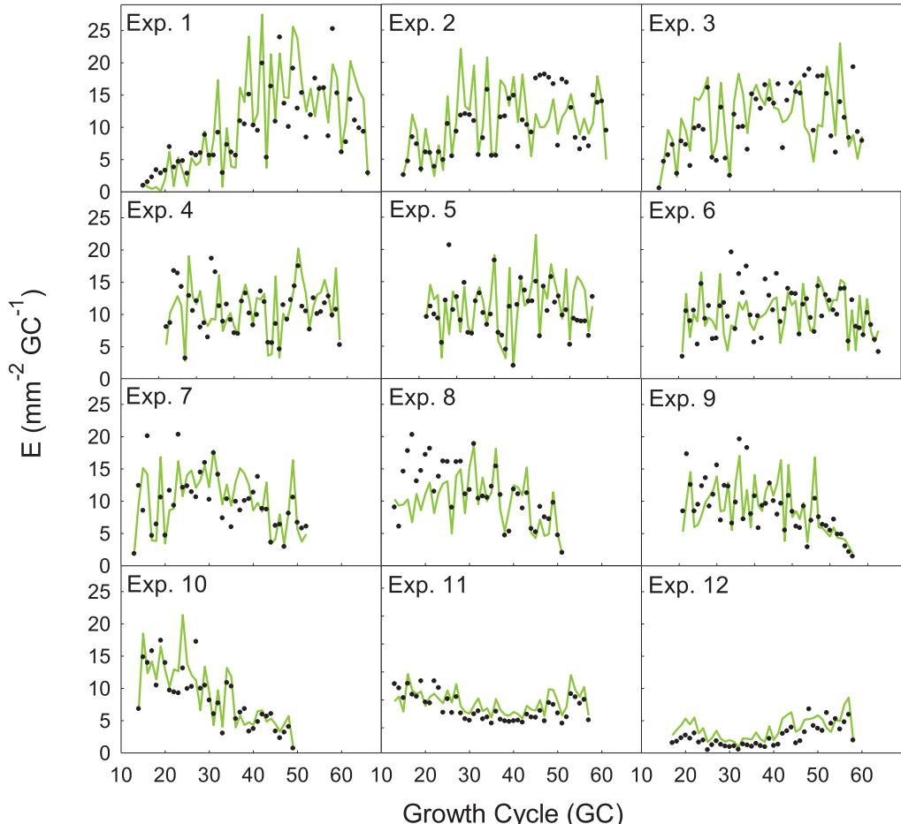
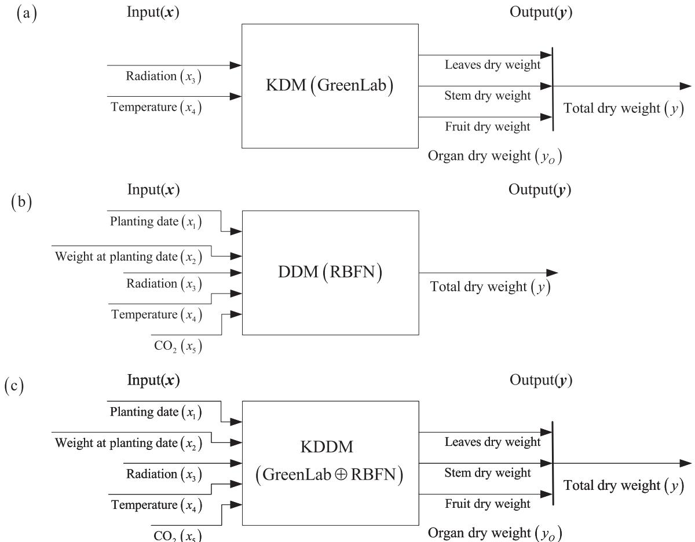

# A knowledge-and-data-driven modeling approach for simulating plant growth: A case study on tomato growth

Xing- Rong Fana, Meng- Zhen Kangb,*, Ep Heuvelinkc, Philippe de Reffyed, Bao- Gang Hua

a National Laboratory of Pattern Recognition, Institute of Automation, Chinese Academy of Sciences, Beijing 100190, China  b State Key Laboratory of Management and Control for Complex Systems, Institute of Automation, Chinese Academy of Sciences, Beijing 100190, China  c Horticulture and Product Physiology Group, Wageningen University, PO Box 630, 6700 AP Wageningen, The Netherlands  d Cirad- Amis, TA 4001, Ave Agropolis, 34398 Montpellier Cedex 5, France

# ARTICLE INFO

# ABSTRACT

Article history:  Received 24 December 2014  Received in revised form 1 June 2015  Accepted 3 June 2015  Available online 25 June 2015

Keywords:  Data- driven model  Knowledge- driven model  GreenLab  Knowledge- and- data- driven model  Model integration  Plant growth modeling

This paper proposes a novel knowledge- and- data- driven modeling (KDDM) approach for simulating plant growth that consists of two submodels. One submodel is derived from all available domain knowledge, including all known relationships from physically based or mechanistic models; the other is constructed solely from data without using any domain knowledge. In this work, a GreenLab model was adopted as the knowledge- driven (KD) submodel and the radial basis function network (RBFN) as the data- driven (DD) submodel. A tomato crop was taken as a case study on plant growth modeling. Tomato growth data sets from twelve greenhouse experiments over five years were used to calibrate and test the model. In comparison with the existing knowledge- driven model (KDM, BIC = 1215.67) and data- driven model (DDM, BIC = 1150.86), the proposed KDDM approach (BIC = 1144.36) presented several benefits in predicting tomato yields. In particular, the KDDM approach is able to provide strong predictions of yields from different types of organs, including leaves, stems, and fruits, even when observational data on the organs are unavailable. The case study confirms that the KDDM approach inherits advantages from both the KDM and DDM approaches. Two cases of superposition and composition coupling operators in the KDDM approach are also discussed.

$\mathfrak{E}$  2015 Elsevier B.V. All rights reserved.

# 1. Introduction

Plants, like other bio- systems, are highly complex and dynamic systems. Modeling plant growth dynamics is a great challenge for scientists in all related fields who are progressively improving models and generating new ones for a vast variety of applications. Modeling approaches vary in a number of aspects (e.g., the scale of interest, the level of description, the integration of environmental stresses, etc.). With respect to the degree of domain knowledge (e.g., basic physical, chemical and biological principles), Todorovski and Dzeroski (2006) and Atanasova et al. (2008) considered two basic modeling approaches, namely, "knowledge- driven" and "data- driven" modeling. The knowledge- driven modeling approach relies mainly on the given domain knowledge. In contrast, the data- driven modeling approach is capable of formulating a model solely from the given data without using any domain knowledge.

In general, a model that can learn from data without using any domain knowledge is called a data- driven model (DDM), for example, artificial neural networks (Recknagel, 2001; Daniel et al., 2008), support vector machines (Pouteau et al., 2012), fuzzy methods (Gutiérrez- Estrada et al., 2013), generalized linear models and generalized additive models (Guisan et al., 2002; Zhang et al., 2005). The DDM also includes the radial basis function network (RBFN), which is one of the most popular neural network models and widely used for function approximation, time series prediction, and nonlinear regression (Buhmann, 2003). Among these methods, they have many desirable characteristics, such as imposing fewer restrictions on assumptions, the ability to approximate nonlinear functions, strong predictive abilities, and the flexibility to adapt to the inputs of a multivariate system. However, data- driven models (DDMs) encounter difficulties in retaining the

physical explanations or structural knowledge of a physical system because they are usually considered black- box models, and their parameters do not generally represent physical parameters in a physical system. Hence, DDMs are also called "non- parametric models".

A model that is derived from domain knowledge is called a knowledge- driven model (KDM), also known as a physically based (Solomatine and Ostfeld, 2008) or mechanistic model (Todorovski and Zeroski, 2006); For plants, knowledge- driven models (KDMs) include process- based models (PBMs) (Vos et al., 2007; de Reffye et al., 2009). Early PBMs for plant growth concerned plant functioning in relation to environmental conditions, especially biomass production and its partitioning. More recently, a new generation of PBMs, often known as functional- structural plant models (FSPMs), has emerged, which incorporates previously neglected aspects, such as the interactions among plant structure (e.g., shape and orientation of organs), the function of organs (e.g., leaf photosynthesis), and the environment (e.g., light) and the feedback between biomass acquisition and its allocation for both plant development and growth. To date, FSPMs have been regarded as potential tools for predicting and simulating plant growth and structural development (Renton, 2013).

The GreenLab model is a generic, mechanistic functional- structural plant model (FSPM), integrating the knowledge of the underlying processes of plant architecture and physiological functioning. The model, in its discrete version, was introduced by de Reffye and Hu (2003) and was studied in the case of tomato crops by Dong et al. (2008) and Kang et al. (2011); its key advantage over other plant models, which are commonly limited to simulation, is its parametric identification (Christophe et al., 2008). Because of the mathematical formalism of the GreenLab model, all model parameters can be identified using inverse methods from measurement data (Zhan et al., 2003; Guo et al., 2006). Although KDMs integrate domain knowledge in modeling and contain physically interpretable parameters, they often have poor predictive ability and do not deal with situations associated with adding and/or missing variables or data. For example, the GreenLab model cannot be effectively applied in a wide range of environmental conditions in which one environmental variable (e.g., solar radiation, temperature) is missing and does not take certain environmental data (e.g., the carbon dioxide concentration, the planting date and the weight at planting date) into account even when these data are available.

To take advantage of both the KDM and DDM approaches, studies on integrating these two types of modeling approaches have been conducted (Dzeroski and Todorovski, 2003; Hu et al., 2009; Qu and Hu, 2011; Czop et al., 2011; Ran and Hu, 2014). Investigations on the successful application of this integrated approach especially deserve greater attention in the ecological sciences (Todorovski and Dzeroski, 2006; Atanasova et al., 2008; Qu and Hu, 2009; Matsunaga et al., 2013). Among these methods, grammar or rules constructed by domain- specific knowledge were embedded into the DDM to select a candidate model that fits the data best. Unlike the above methods, our main interest is to propose a novel knowledge- and- data- driven modeling (KDDM) approach for simulating plant growth that integrates the knowledge- driven theoretical approach to modeling with the data- driven modeling. A tomato crop was taken as a case study on plant growth modeling. The GreenLab model was adopted as the knowledge- driven submodel and the radial basis function network (RBFN) as the data- driven submodel. The two types of submodels were integrated using a two- way coupling connection. Next, two versions of the KDDM based on the superposition and composition coupling operators were developed. Finally, the validity and usefulness of the KDDM approach in application of modeling the dynamics of plant growth processes from real data sets were illustrated.

# 2. Materials and methods

# 2.1. Models

# 2.1.1. Radial basis function network (data-driven model)

Radial basis function (RBF) networks typically have three layers: an input layer, a hidden layer with a non- linear RBF activation function and a linear output layer. The input can be modeled as a vector of real numbers  $\pmb {x}\in \mathbb{R}^n$ . The output of the network is then a scalar function of the input vector,  $\pmb {f}_d$ , is given by Eq. (1):

$$
\hat{y} = \pmb {f}_d(\pmb {x},\pmb {\theta}_d) = \pmb {\Phi}(\pmb {x})\pmb {\theta}_d, \tag{1}
$$

where  $d$  is the subscript associated to the DDM (i.e., RBFN),  $\hat{y}$  is the output of the RBFN,  $\pmb {\theta}_d = [W_1,\dots,W_h]^T$  represent the weights of the network,  $h$  is the number of neurons in the hidden layer, and  $\pmb {\Phi}(\pmb {x}) = [\phi_1(\pmb {x}),\phi_2(\pmb {x}),\dots,\phi_h(\pmb {x})]$ . In this work, the multiquadric RBF  $\phi_{j}(\pmb {x}) = \sqrt{1 + ||\pmb{x} - \pmb{c}_{j}||^{2} / \sigma_{j}^{2}}, j = 1,2,\dots,h,$  was taken as the RBF activation function, where  $\pmb {c}_j\in \mathbb{R}^n$  are the RBF centers and  $\sigma_{j}$  controls the width of the RBF.

# 2.1.2. GreenLab model (knowledge-driven model)

The GreenLab model is a generic functional- structural plant model simulating the dynamics of plant organogenesis, biomass production and allocation (Yan et al., 2004; Guo et al., 2006; Dong et al., 2008; Kang et al., 2011). At each time interval, called growth cycle (GC), the complete formulation of biomass production of a plant,  $Q(i)$ , is given by Eq. (2):

$$
\begin{array}{rl} & Q(i) = E(i)\cdot r\cdot S_p(1 - \exp (-\frac{1}{S_p\cdot slw}\sum_{j = 1}^{\min (i,t_a)}[N_{\mathsf{b}}(i - j + 1)\cdot \\ & \qquad \left.\left.\left.\left.\left.\left.\left.\left.\left.\left.\left.\left.\left.\left.\left.\left.\left.\left.\left.\left.\left.\left.\left.\left.\left.\left.\left.\left.\left.\left.\left.\left.\left.\left.\left.\left.\left.\left.\left.\left.\left.\left.\left.\left.\left.\left.\left.\left.\left.\left.[\\ & \qquad \left.\left.\left.\left.\left.\left.\left.\left.\left.\left.\left.\left.\left.\left.\left.\left.\left.\left.\left.\left.\left.\left.\left.\left.\left.\left.\left.\left.\left.\left.\left.\left.\left.\left.\left.\left.\left.\left.\left.\left.\left.\left.\left.\left.[]\right
$$

where  $i$  (GC) is the observed phyllochron expressed in thermal time;  $E(i)$  is the average potential biomass production at growth cycle  $i$ , which depends on microclimatic conditions during plant growth (e.g., temperature, wind speed, relative humidity and solar radiation, etc.);  $r$  is the water use efficiency;  $S_{p}$  is a characteristic surface area related to plant crown projection, modulated by the effects of self- shading and neighbor competition that is related to plant density;  $slw$  is the specific leaf weight, which is assessed directly from the data;  $t_{\mathrm{a}}$  is the blade functioning duration;  $t_{\mathrm{x}}^{\mathrm{b}}$  is the blade expansion duration;  $N_{\mathrm{b}}(i)$  is the number of leaves produced by the plant at growth cycle  $i$ ;  $P_{\mathrm{b}}(k)$  is the sink strength of the blade of age  $k$ ; and  $D(i)$  is the demand of all expanding organs at growth cycle  $i$ , which is the sum of all the individual organ sink strengths, calculated according to Eq. (2):

$$
D(i) = \sum_{o}\sum_{j = 1}^{\min (i,t_{x}^{o})}N_{o}(i - j + 1)P_{o}(j), \tag{3}
$$

where  $o =$  indices for organ type (blade, b; petiole, p; internode, i; fruit, f);  $t_{x}^{o}$  is the expansion duration of organ type  $o$ ;  $N_{o}(i)$  is the number of organs type  $o$  at growth cycle  $i$ ; and  $P_{o}(i)$  is the sink strength of organ type  $o$  of age  $i$ , calculated according to Eq. (4):

$$
P_{o}(i) = P_{o}f_{o}(i), \tag{4}
$$

where  $P_{o}$  is the relative sink strength of organ type  $o$ , indicating the competitive ability of a certain type of organ  $o$  to accumulate biomass from the common pool, and  $f_{o}(j)$  is a sink variation function

Table 1 Sink and source parameters of the GreenLab model.  

<table><tr><td>Parameter</td><td>Definition</td><td>Units</td></tr><tr><td>Pp, P1, P1a</td><td>Organ sink strength [cf. Eq. (4)]</td><td>-</td></tr><tr><td>Sp</td><td>Projection area of a plant [cf. Eq. (2)]</td><td>cm2</td></tr><tr><td>r</td><td>Water use efficiency [cf. Eq. (2)]</td><td>mgcm-2mm-1</td></tr></table>

a, petiole; i, internode; f, fruit.

of the organ type  $o$  of age  $j$ , described by a discrete beta function (Kang et al., 2011). The blade strength  $P_{\mathrm{b}} = 1$  was a normalized reference for all other organ sink strengths.

For crop plants grown in a wide range of environmental conditions, the potential evapotranspiration (PET) is the average potential biomass production  $(E)$  driving biomass acquisition in GreenLab (Ma et al., 2007; Dong et al., 2008; Kang et al., 2011). The daily PET  $(\mathrm{mmday}^{- 1})$  is often calculated using the FAO- 24 radiation method (Jensen et al., 1990) as defined in Eq. (5):

$$
\mathrm{PET} = a + b\left(\frac{\Delta}{\Delta + \gamma}\cdot R_s\right), \tag{5}
$$

where the PET of a growth cycle  $(\mathrm{mmGC}^{- 1})$  is summed from daily PET values, with the duration varying with daily temperature and the phyllochron per growth cycle;  $\Delta$ $(\mathrm{kPa}^{\circ}\mathrm{C}^{- 1})$  is the slope of the vapor pressure curve related to daily temperature;  $R_{s}$ $(\mathrm{MJm}^{- 2}\mathrm{day}^{- 1})$  is solar radiation;  $\gamma$ $(\mathrm{kPa}^{\circ}\mathrm{C}^{- 1})$  is a psychometric constant, which is set to 2.45;  $a$ $(\mathrm{mmday}^{- 1})$  is  $- 0.3$  and  $b$  is an adjustment factor, which is set to 1.065. The wind speed and the relative humidity within the greenhouse are respectively set to 0 and  $100\%$  due to their relatively small effects on PET. Note that PET is a function of several environmental variables, primarily daily temperature, solar radiation, wind speed and relative humidity, not all of which are explicitly given in Eq. (5).

The GreenLab model, described by a set of recurrent equations, is able to quickly compute the biomass accumulation of an organ at each growth cycle under different environmental stress conditions. For simplicity, the GreenLab model can be also rewritten as Eq. (6):

$$
\hat{\pmb{y}} = \pmb {f}_k(\pmb {x},\pmb {\theta}_k), \tag{6}
$$

where  $\pmb{x}$  represents the environmental variables related to plant growth,  $\hat{\pmb{y}}$  denotes the output of the GreenLab model (e.g., the total dry weight and the dry weights of different types of organs),  $\pmb {f}_k$  is the function associated with the KDM (i.e., GreenLab model),  $k$  is the subscript associated with the KDM,  $\pmb{\theta}_{k}$  is a vector of model parameters, including the organ sink strength  $(P_{\mathrm{p}},P_{\mathrm{i}},P_{\mathrm{f}})$  and two source parameters  $(S_{p},r)$  in the function Eq. (2) controlling plant biomass production (Table 1).

# 2.1.3. Knowledge-and-data-driven modeling approach

This paper proposes a KDDM approach for simulating plant growth that primarily consists of two submodels, as schematically shown in Fig. 1. The upper part of Fig. 1 represents the "knowledge- driven (KD)" submodel, which is derived from all available domain knowledge, including all known relationships derived from physically based or mechanistic models. The lower part of Fig. 1 represents the "data- driven (DD)" submodel, which is constructed solely from data without using any domain knowledge. This model can be expressed by the following mathematical formula

$$
\hat{\pmb{y}} = \pmb {f}(\pmb {x},\pmb {\theta}) = \pmb {f}_k(\pmb {x},\pmb {\theta}_k)\oplus \pmb {f}_d(\pmb {x},\pmb {\theta}_d),\pmb {\theta} = (\pmb {\theta}_k,\pmb {\theta}_d), \tag{7}
$$

where  $\pmb {x}\in \mathbb{R}^{n}$  and  $\hat{\pmb{y}}\in \mathbb{R}^{m}$  are input and output vectors, respectively;  $\pmb{f}$  is a function for a complete model relation between  $\pmb{x}$  and  $\hat{\pmb{y}}$  and  $\pmb {f}_k$  and  $\pmb {f}_d$  are the functions associated with the KD and DD submodels, respectively.  $\theta \in \mathbb{R}^p$  is the parameter vector of the function  $\pmb{f}$  and  $\pmb {\theta}_k$  and  $\pmb {\theta}_d$  are the parameter vectors associated with the functions  $\pmb {f}_k$  and  $\pmb {f}_d$  respectively. In  $p = p_d + p_k$ ,  $p_d$  and  $p_k$  are the number of model parameters  $\pmb {\theta}_k$  and  $\pmb {\theta}_d$  respectively. The symbol  $\Phi$  represents a coupling operation between the two submodels.

  
Fig.1. Schematic diagram of the knowledge-and-data-driven model (KDDM), which consists of the "knowledge-driven (KD)" submodel and "data-driven (DD)" submodel (Hu et al., 2009; Ran and Hu, 2014).

A two- way coupling connection between the two submodels is applied, which provides flexibility to represent various forms of the two interacting submodels, as implemented in Eq. (7). In general, there is no generic approach to designing the coupling connections. The actual configuration of the coupling is more problem dependent and can be quite complicated because it greatly depends on the form in which domain knowledge is available; domain knowledge may be presented in the form of constraint functions [Table 1 in Hu et al. (2009)], grammar (Todorovski and Dzeroski, 2006), rules (Matsunaga et al., 2013), and even physically based models (Czop et al., 2011). Considering the wide variety of coupling connections in the KDDM approach, we limited our coupling connections to two simple and common coupling operators, namely, "superposition" and "composition" (Thompson and Kramer, 1994; Hu et al., 2009). The mathematical expressions of these operators are given by the following:

$$
\begin{array}{r}\text{Supposition:}\pmb {f}(\pmb {x},\pmb {\theta}) = \pmb {f}_k(\pmb {x},\pmb {\theta}_k) + \pmb {f}_d(\pmb {x},\pmb {\theta}_d), \end{array} \tag{8}
$$

$$
\begin{array}{r}\text{Composition:}\pmb {f}(\pmb {x},\pmb {\theta}) = \pmb {f}_k(\pmb {x},\pmb {f}_d(\pmb {x},\pmb {\theta}_d),\pmb {\theta}_k). \end{array} \tag{9}
$$

The schematic diagrams of the KDDM based on the superposition and composition coupling operators are shown in Fig. 2.

The KDDM based on the superposition coupling operator (abbreviated as KDDM_Sup), together with Eqs. (1), (6) and (8), can be written as

$$
\hat{\pmb{y}} = \pmb {f}(\pmb {x},\pmb {\theta}) = \pmb {f}_k(\pmb {x},\pmb {\theta}_k) + \pmb {\Phi}(\pmb {x})\pmb {\theta}_d, \tag{10}
$$

where  $\pmb{x}$  represents the environmental variables related to plant growth and  $\hat{\pmb{y}}$  is the output of the model. In Eq. (10), the KDDM_Sup used the RBFN (i.e., DD submodel) to predict the residuals not explained by the GreenLab model (i.e., KD submodel).

The KDDM based on the composition coupling operator (abbreviated as KDDM_Com), together with Eqs. (1), (6) and (9), can be written as

$$
\begin{array}{rl} & E = \Phi (\pmb {x})\pmb {\theta}_d,\\ & \hat{\pmb{y}} = \pmb {f}(\pmb {x},\pmb {\theta}) = \pmb {f}_k(E,\pmb {\theta}_k). \end{array} \tag{11}
$$

In Eq. (11), the KDDM_Com adopted the RBFN (i.e., DD submodel) to quantify the average potential biomass production  $(E)$  with all environmental variables  $(\pmb {x})$ . Once the model parameters  $\pmb{\theta}$  were determined, given  $\pmb{x}$ , the RBFN output  $(E)$  directly affected the GreenLab model output.

# 2.2. Plant materials and measurements

Data from twelve growth experiments with indeterminately growing tomatoes (Lycopersicon esculentum 'Counter') were collected over varying seasons across five years in greenhouses at

  
Fig. 2. The knowledge-and-data-driven model (KDDM) with two cases of coupling: (a) superposition coupling operator and (b) composition coupling operator.

the Department of Horticulture (Wageningen, the Netherlands) (Heuvelink, 1995). The dry weights of leaves (including petioles), stems and individual fruit trusses were collected destructively from three to eight tomato plants every 6- 22 days, and the numbers of leaves, stems and fruits per truss were recorded. The total dry weight (in total, 151 data points) was calculated from the weight of the components. In addition, several daily environmental variables were recorded during the entire growth cycle of the tomato crop (Table 2).

# 2.3. Parameter estimation

With respect to the set of observed data included in the model, "A" and "P" are used to distinguish between the models (Table 3). "A" represents models in which all the observed data were used, including the dry weights of different types of organs and the total dry weight (the sum of the organ dry weight); "P" represents models in which partial observed data (i.e., only total dry weight) were used. For each model, the mean square error (MSE) optimization criterion is used to minimize the difference between the observed values and the predicted values,  $J(\theta)$ , is given by Eq. (12):

$$
J(\pmb {\theta}) = \frac{1}{2} (\pmb {y} - \hat{\pmb{y}})^T (\pmb {y} - \hat{\pmb{y}}), \tag{12}
$$

Table 2 Description of variables.  

<table><tr><td>Variable</td><td>Definition</td><td>Units</td></tr><tr><td>x1</td><td>Planting date</td><td>day</td></tr><tr><td>x2</td><td>Weight at planting date</td><td>g m-2</td></tr><tr><td>x3</td><td>Daily global radiation</td><td>MJ m-2 day-1</td></tr><tr><td>x4</td><td>Daily temperature</td><td>°C</td></tr><tr><td>x5</td><td>Daily carbon dioxide concentration (CO2)</td><td>μmol mol-1</td></tr><tr><td>y</td><td>Total dry weight</td><td>g m-2</td></tr><tr><td>y0</td><td>Dry weights of different types of organs</td><td>g m-2</td></tr></table>

Table 3 The degree of observed data included in different models.  

<table><tr><td>Model</td><td>Independent variables/dependent variables</td><td>Degree of observed data included</td></tr><tr><td>RBFN(A)</td><td>(x1, x2, x3, x4, x5)/y0</td><td>y,y0</td></tr><tr><td>RBFN(P)</td><td>(x1, x2, x3, x4, x5)/y</td><td>y</td></tr><tr><td>GreenLab(A)</td><td>(x3, x4)/y</td><td>y,y0</td></tr><tr><td>KDDM_Sup(A)</td><td>(x1, x2, x3, x4, x5)/y</td><td>y</td></tr><tr><td>KDDM_Sup(P)</td><td>(x1, x2, x3, x4, x5)/y</td><td>y</td></tr><tr><td>KDDM_Com(A)</td><td>(x1, x2, x3, x4, x5)/y</td><td>y,y0</td></tr><tr><td>KDDM_Com(P)</td><td>(x1, x2, x3, x4, x5)/y</td><td>y</td></tr></table>

where  $\theta$  represents the model parameters, and  $\mathbf{y}$  and  $\hat{\mathbf{y}}$  represent the observed and predicted values, respectively.

A two- stage learning algorithm for training the RBFN was chosen. In the first stage, the centers and widths of the multiquadric RBFs were determined using k- center and simple heuristic relationships (Zhu and Zhang, 2000). In the second stage, the weights of the RBFN were estimated via the gradient descent method or least squares algorithm. All the observed data were applied to identify source- sink parameters in the GreenLab model using the generalized least squares (GLS) method, as described in more detail by Zhan et al. (2003) and Guo et al. (2006).

Because of the coupling operation between the two submodels, the KDDM approach may have some unidentifiable parameters (i.e., parameters that cannot be determined uniquely) even if the parameters of each submodel are respectively identifiable (Ran and Hu, 2014). To address its parametric identification, parameter estimation for the KDDM approach is performed in two stages: initially, the parameters of the GreenLab model (i.e., KD submodel) are either identified through the GLS method when all the observed data are available or obtained from empirical knowledge or published experimental data on the genotype- specific crop when only total dry weight is given; then, the parameters of the RBFN (i.e., DD submodel) are estimated. This approach is reasonable because the GreenLab model is able to characterize plant growth and biomass allocation based on a set of relatively stable parameters for the genotype- specific crop; the level of parameter variability for the genotype- specific crop is low (Ma et al., 2007; Kang et al., 2011). Once the parameters of the GreenLab model were determined, the remaining task of the KDDM approach was to determine the appropriate setting of the RBFN's parameters. After minimizing the performance measure  $J(\theta)$ , as in Eq. (12), the weights  $\theta_d$  of the DD submodel were estimated using the Levenberg- Marquardt algorithm (Moré, 1978).

# 2.4. Criteria for evaluating the model performance

The Bayesian information criterion (BIC) is a criterion for model selection to evaluate the performance of different models (Burnham and Anderson, 2002). The value of BIC is calculated according to the following equation (Venables and Ripley, 2002)

$$
\mathsf{BIC} = N*\log \left(\frac{\sum_{l = 1}^{N}(\pmb{y}_l - \hat{\pmb{y}}_l)^2}{N}\right) + p*\log (N), \tag{13}
$$

where  $N$  is the number of data points,  $\mathbf{y}_l$  represents the observed values,  $\hat{\mathbf{y}}_l$  represents the predicted values, and  $p$  is the number of model parameters.

Table 4 The model selection procedure for the RBFN(A) to modeling tomato crop growth processes using a 12-fold cross-validation strategy.  

<table><tr><td rowspan="2">No.</td><td rowspan="2">Num. of para.</td><td rowspan="2">BIC</td><td colspan="2">Dry weight of leaves</td><td colspan="2">Dry weight of stems</td><td colspan="2">Dry weight of fruits</td><td colspan="2">Total dry weight</td></tr><tr><td>RMSEtr</td><td>RMSEte</td><td>RMSEtr</td><td>RMSEte</td><td>RMSEtr</td><td>RMSEte</td><td>RMSEtr</td><td>RMSEte</td></tr><tr><td>1</td><td>2 × 3</td><td>1209.98</td><td>26.33</td><td>26.95</td><td>10.65</td><td>10.99</td><td>45.11</td><td>45.81</td><td>71.14</td><td>74.00</td></tr><tr><td>2</td><td>3 × 3</td><td>1202.13</td><td>21.38</td><td>22.26</td><td>8.84</td><td>9.33</td><td>41.29</td><td>41.35</td><td>65.56</td><td>68.74</td></tr><tr><td>3</td><td>4 × 3</td><td>1200.34</td><td>19.88</td><td>20.69</td><td>7.89</td><td>8.37</td><td>40.13</td><td>39.94</td><td>61.75</td><td>64.23</td></tr><tr><td>4</td><td>5 × 3</td><td>1199.37</td><td>19.14</td><td>20.25</td><td>7.26</td><td>8.04</td><td>38.14</td><td>39.31</td><td>58.34</td><td>62.47</td></tr><tr><td>5</td><td>6 × 3</td><td>1211.14</td><td>19.00</td><td>20.38</td><td>7.01</td><td>7.99</td><td>37.91</td><td>39.91</td><td>57.71</td><td>62.48</td></tr><tr><td>6</td><td>7 × 3</td><td>1225.25</td><td>18.95</td><td>20.44</td><td>6.59</td><td>8.02</td><td>37.95</td><td>40.44</td><td>57.78</td><td>63.17</td></tr><tr><td>7</td><td>8 × 3</td><td>1240.72</td><td>18.90</td><td>20.47</td><td>6.98</td><td>8.04</td><td>37.84</td><td>40.77</td><td>57.71</td><td>63.65</td></tr><tr><td>8</td><td>9 × 3</td><td>1255.56</td><td>18.83</td><td>20.43</td><td>6.95</td><td>8.04</td><td>37.85</td><td>41.22</td><td>57.72</td><td>64.17</td></tr><tr><td>9</td><td>10 × 3</td><td>1270.42</td><td>18.80</td><td>20.41</td><td>6.93</td><td>8.02</td><td>37.81</td><td>41.31</td><td>57.73</td><td>64.39</td></tr><tr><td>10</td><td>11 × 3</td><td>1285.46</td><td>18.80</td><td>20.44</td><td>6.93</td><td>8.02</td><td>37.87</td><td>41.39</td><td>57.78</td><td>64.43</td></tr><tr><td>11</td><td>12 × 3</td><td>1300.92</td><td>18.76</td><td>20.42</td><td>6.90</td><td>7.98</td><td>37.86</td><td>41.55</td><td>57.93</td><td>65.46</td></tr></table>

The lowest BIC and  $\mathrm{RMSE}_{\mathrm{tr}}$  values for the total dry weight are represented in bold.

The root mean square error (RMSE) is the standard criterion which measures the distance between the predicted and observed values and is given by Eq. (14):

$$
\mathrm{RMSE} = \sqrt{\frac{1}{N}\sum_{l = 1}^{N}(\pmb{y}_l - \hat{\pmb{y}}_l)^2}. \tag{14}
$$

The modeling efficiency (EF) is a dimensionless quantity which measures the overall goodness of fit between the predicted and observed values and is given by the following formula (Baey et al., 2013)

$$
\mathrm{EF} = 1 - \frac{\sum_{l = 1}^{N}(\pmb{y}_l - \hat{\pmb{y}}_l)^2}{\sum_{l = 1}^{N}(\pmb{y}_l - \hat{\pmb{y}}_l)^2}, \tag{15}
$$

where  $\hat{\mathbf{y}}_l$  is the mean of observed values.

For each model, a 12- fold cross- validation strategy was used during the model selection procedure. Twelve experimental data sets were circularly partitioned into training and testing sets. One experimental data set was retained as the testing data set, and the remaining eleven data sets were used as training data sets. In total, twelve training root mean square errors  $\mathrm{(RMSE_{tr})}$ , twelve testing root mean square errors  $\mathrm{(RMSE_{te})}$  and twelve BIC values were obtained during the learning procedure. The results were then averaged to produce the mean errors and BIC values for performance comparison.

# 3. Results

The RBFN, GreenLab model and KDDM (including KDDM.Sup and KDDM.Com) were used to model the dynamical plant growth process of tomato crops. The tomato growth data sets from twelve greenhouse experiments were used to calibrate and test these models.

# 3.1. Results from individual models

# 3.1.1. Results from the RBFN

For the RBFN(A) and RBFN(P), the average  $\mathrm{RMSE_{tr}}$ ,  $\mathrm{RMSE_{te}}$  and BIC values with respect to the different numbers of parameters are given (Tables 4 and 5). The RBFN(A) 4 and the RBFN(P) 4 had the lowest BIC and  $\mathrm{RMSE_{te}}$  values for the total dry weight, respectively. Compared with the RBFN(A), the RBFN(P) had a lower BIC value (1150.86) and a lower  $\mathrm{RMSE_{te}}$  value  $(62.34\mathrm{g}\mathrm{m}^{- 2})$  for the total dry weight. Both RBFN(A) and RBFN(P) under the BIC criterion obtained the best generalization performance, and the best number of hidden nodes for them was 5. Moreover, the total number of parameters of the RBFN(A) was three times that of the RBFN(P) because the former was a three- output RBF network, whereas the latter was a single- output RBF network. Note that the total dry weight for the RBFN(A) was the sum of the network outputs (i.e., organ dry weight), for which  $\mathrm{RMSE_{tr}}$  and  $\mathrm{RMSE_{te}}$  are given (Table 4).

# 3.1.2. Results from the GreenLab model

For GreenLab(A), the parameter estimation procedure was repeated twelve times, with each of the twelve experimental data sets used exactly once as the testing data set. The training errors, testing errors, estimated parameter values and their respective standard deviations (Std.) and coefficients of variation (CV) are given (Table 6). The CV values for parameters of the GreenLab model varied between 1.95 and 3.05, which indicates that the five source- sink parameters exhibited very little variation for the genotype- specific tomato crop (L. esculentum 'Counter'). Although the CV value of  $\mathrm{RMSE_{tr}}$  was low, the CV value of  $\mathrm{RMSE_{te}}$  in this model was very high, which indicates that the performance of the GreenLab model is lowly reliable. According to values of organ sink parameters, the average ratio of biomass partition from leaves (including petioles) to stems to fruits was 1.432:0.643:3.527 or 26:11:63.

# 3.2. Results from the KDDM approach

# 3.2.1. Model selection for KDDM

For the KDDM_Sup(A) and KDDM_Com(A), the average  $\mathrm{RMSE_{tr}}$ ,  $\mathrm{RMSE_{te}}$  and BIC with respect to the different numbers of parameters are given (Table 7). The KDDM_Sup(A) 4 and the KDDM_Com(A) 15 had the lowest BIC and  $\mathrm{RMSE_{te}}$  values, respectively. The KDDM_Sup(A) and KDDM_Com(A) under the BIC criterion both obtained the best generalization performance, and the best number of hidden nodes for the RBFN (i.e., DD submodel) in the KDDM_Sup(A) and KDDM_Com(A) were 5 and 16, respectively.

Table 5 The model selection procedure for the RBFN(P) to modeling tomato crop growth processes using a 12-fold cross-validation strategy.  

<table><tr><td rowspan="2">No.</td><td rowspan="2">Num. of para.</td><td rowspan="2">BIC</td><td colspan="2">Total dry weight</td></tr><tr><td>RMSEtr</td><td>RMSEte</td></tr><tr><td>1</td><td>2</td><td>1196.26</td><td>71.14</td><td>73.99</td></tr><tr><td>2</td><td>3</td><td>1177.54</td><td>65.56</td><td>68.75</td></tr><tr><td>3</td><td>4</td><td>1167.57</td><td>61.90</td><td>64.42</td></tr><tr><td>4</td><td>5</td><td>1156.86</td><td>58.51</td><td>62.34</td></tr><tr><td>5</td><td>6</td><td>1152.35</td><td>57.79</td><td>62.36</td></tr><tr><td>6</td><td>7</td><td>1157.50</td><td>57.83</td><td>62.84</td></tr><tr><td>7</td><td>8</td><td>1162.31</td><td>57.81</td><td>63.25</td></tr><tr><td>8</td><td>9</td><td>1167.28</td><td>57.81</td><td>63.63</td></tr><tr><td>9</td><td>10</td><td>1172.38</td><td>57.85</td><td>63.85</td></tr><tr><td>10</td><td>11</td><td>1177.55</td><td>57.90</td><td>63.95</td></tr><tr><td>11</td><td>12</td><td>1183.18</td><td>58.05</td><td>64.69</td></tr></table>

The lowest BIC and  $\mathrm{RMSE_{te}}$  values are represented in bold.

Table 6 The parameter estimation procedure for the GreenLab(A) to modeling tomato crop growth processes using a 12-fold cross-validation strategy.  

<table><tr><td rowspan="2">Expo.</td><td colspan="5">Parameters of the GreenLab model</td><td colspan="2">Total dry weight</td></tr><tr><td>Pp</td><td>Pi</td><td>Pf</td><td>Sp (cm²)</td><td>r (mg cm-2 mm-1)</td><td>RMSEtr</td><td>RMSEte</td></tr><tr><td>1</td><td>0.425</td><td>0.633</td><td>3.469</td><td>1158.711</td><td>0.166</td><td>78.80</td><td>59.01</td></tr><tr><td>2</td><td>0.428</td><td>0.638</td><td>3.508</td><td>1157.971</td><td>0.166</td><td>76.70</td><td>75.21</td></tr><tr><td>3</td><td>0.423</td><td>0.631</td><td>3.547</td><td>1112.218</td><td>0.168</td><td>72.66</td><td>128.31</td></tr><tr><td>4</td><td>0.435</td><td>0.648</td><td>3.517</td><td>1112.214</td><td>0.168</td><td>73.12</td><td>80.33</td></tr><tr><td>5</td><td>0.435</td><td>0.648</td><td>3.511</td><td>1115.715</td><td>0.167</td><td>77.41</td><td>67.20</td></tr><tr><td>6</td><td>0.427</td><td>0.637</td><td>3.522</td><td>1183.148</td><td>0.164</td><td>76.01</td><td>71.41</td></tr><tr><td>7</td><td>0.424</td><td>0.630</td><td>3.567</td><td>1186.277</td><td>0.164</td><td>75.85</td><td>88.45</td></tr><tr><td>8</td><td>0.446</td><td>0.666</td><td>3.615</td><td>1194.565</td><td>0.170</td><td>64.51</td><td>141.80</td></tr><tr><td>9</td><td>0.436</td><td>0.650</td><td>3.473</td><td>1185.134</td><td>0.167</td><td>77.34</td><td>35.40</td></tr><tr><td>10</td><td>0.419</td><td>0.620</td><td>3.351</td><td>1110.649</td><td>0.171</td><td>78.46</td><td>31.28</td></tr><tr><td>11</td><td>0.449</td><td>0.669</td><td>3.598</td><td>1116.886</td><td>0.164</td><td>78.09</td><td>23.70</td></tr><tr><td>12</td><td>0.439</td><td>0.652</td><td>3.642</td><td>1264.283</td><td>0.158</td><td>71.62</td><td>104.31</td></tr><tr><td>Mean</td><td>0.432</td><td>0.643</td><td>3.527</td><td>1172.807</td><td>0.166</td><td>75.05</td><td>75.54</td></tr><tr><td>Std.</td><td>0.009</td><td>0.015</td><td>0.077</td><td>75.571</td><td>0.003</td><td>4.07</td><td>36.69</td></tr><tr><td>CV (%)</td><td>2.083</td><td>2.333</td><td>2.183</td><td>3.033</td><td>1.947</td><td>5.42</td><td>48.57</td></tr></table>

Note:  $P_{\mathrm{b}}$  was set to 1 as reference, data were not listed here.

Table 7 The model selection procedure for the KDDM approach to modeling tomato crop growth processes using a 12-fold cross-validation strategy.  $p_k$  is the number of parameters of the KD submodel, and  $p_d$  is the number of parameters of the DD submodel.  

<table><tr><td rowspan="3">No.</td><td rowspan="3">Num. of para. (pk + pa)</td><td colspan="3">KDDM_Sup(A)</td><td colspan="3">KDDM_Com(A)</td></tr><tr><td rowspan="2">BIC</td><td colspan="2">Total dry weight</td><td rowspan="2">BIC</td><td colspan="2">Total dry weight</td></tr><tr><td>RMSEtr</td><td>RMSEte</td><td>RMSEtr</td><td>RMSEte</td></tr><tr><td>1</td><td>5+2</td><td>1179.43</td><td>68.48</td><td>66.80</td><td>1180.15</td><td>68.60</td><td>66.92</td></tr><tr><td>2</td><td>5+3</td><td>1179.69</td><td>67.33</td><td>66.70</td><td>1156.03</td><td>61.76</td><td>67.27</td></tr><tr><td>3</td><td>5+4</td><td>1180.59</td><td>66.36</td><td>65.90</td><td>1161.06</td><td>61.79</td><td>67.27</td></tr><tr><td>4</td><td>5+5</td><td>1172.99</td><td>63.42</td><td>65.72</td><td>1165.76</td><td>61.74</td><td>67.32</td></tr><tr><td>5</td><td>5+6</td><td>1174.09</td><td>62.55</td><td>66.44</td><td>1168.52</td><td>61.24</td><td>68.94</td></tr><tr><td>6</td><td>5+7</td><td>1179.05</td><td>62.55</td><td>66.75</td><td>1171.04</td><td>60.72</td><td>67.50</td></tr><tr><td>7</td><td>5+8</td><td>1183.93</td><td>62.54</td><td>67.11</td><td>1147.05</td><td>54.69</td><td>58.61</td></tr><tr><td>8</td><td>5+9</td><td>1188.81</td><td>62.53</td><td>67.49</td><td>1163.94</td><td>57.11</td><td>59.67</td></tr><tr><td>9</td><td>5+10</td><td>1193.79</td><td>62.54</td><td>67.71</td><td>1153.57</td><td>54.03</td><td>58.16</td></tr><tr><td>10</td><td>5+11</td><td>1198.91</td><td>62.59</td><td>67.81</td><td>1162.04</td><td>54.72</td><td>59.80</td></tr><tr><td>11</td><td>5+12</td><td>1203.57</td><td>62.53</td><td>68.46</td><td>1165.99</td><td>54.55</td><td>58.69</td></tr><tr><td>12</td><td>5+13</td><td>1208.76</td><td>62.59</td><td>68.26</td><td>1155.24</td><td>51.55</td><td>54.39</td></tr><tr><td>13</td><td>5+14</td><td>1212.73</td><td>62.39</td><td>67.96</td><td>1158.12</td><td>51.17</td><td>54.07</td></tr><tr><td>14</td><td>5+15</td><td>1217.40</td><td>62.31</td><td>68.08</td><td>1158.86</td><td>52.26</td><td>55.59</td></tr><tr><td>15</td><td>5+16</td><td>1220.31</td><td>61.85</td><td>68.12</td><td>1144.36</td><td>46.98</td><td>50.26</td></tr><tr><td>16</td><td>5+17</td><td>1224.60</td><td>61.71</td><td>67.94</td><td>1149.59</td><td>47.03</td><td>50.38</td></tr><tr><td>17</td><td>5+18</td><td>1229.37</td><td>61.67</td><td>68.08</td><td>1154.07</td><td>46.96</td><td>50.52</td></tr></table>

The lowest BIC and  $\mathrm{RMSE}_{\mathrm{te}}$  values are represented in bold.

Compared with the KDDM_Sup(A), the KDDM_Com(A) had a lower BIC value (1144.36) and a lower  $\mathrm{RMSE}_{\mathrm{te}}$  value  $(50.26\mathrm{g}\mathrm{m}^{- 2})$  .Fig.3 shows a plot of the regression curves for the 151 data points with respect to the different planting dates from the KDDM_Com(A) under the BIC criterion.

For the KDDM_Sup(P) and KDDM_Com(P), the parameter values of the GreenLab model (KD submodel) obtained from Table 4 in Dong et al. (2008) were set to  $P_{D} = 0.54$ $P_{\mathrm{t}} = 0.62$ $P_{\mathrm{r}} = 3.28$ $S_{p} = 1 / (11.1\times 0.77)\mathrm{m}^{2}$  ,and  $r = 1 / 0.28\mathrm{g}\mathrm{m}^{- 2}\mathrm{mm}^{- 1}$  . Here, only main results of the KDDM_Sup(P) and KDDM_Com(P) with the lowest BICs are presented. The KDDM_Sup(P) and KDDM_Com(P) had the lowest BIC values (1151.96 and 1140.90, respectively) and  $\mathrm{RMSE}_{\mathrm{te}}$  values  $(62.31\mathrm{g}\mathrm{m}^{- 2}$  and  $51.29\mathrm{g}\mathrm{m}^{- 2}$  respectively). The optimal number of hidden nodes for the RBFN (DD submodel) were 5 and 16, respectively. The results reveal that the KDDM_Com(P) had lower BIC and  $\mathrm{RMSE}_{\mathrm{te}}$  values than the KDDM_Sup(P).

# 3.2.2. Organ dry weight from KDDM_Com

In addition to the total dry weight, the KDDM_Com was able to predict the dry weights of different types of organs. The root mean square error (RMSE) and the modeling efficiency (EF) for the dry weights of different types of organs from the KDDM_Com(A) and

  
Fig. 3. Regression curves of the total dry weight for the KDDM_Com(A) from twelve greenhouse experiments with different planting dates (January 1 designated day 1). The data points from twelve experiments were taken from Heuvelink (1995).

  
Fig.4. t  t t is the same as in Fig. 3.

the KDDM.Com(P) over all greenhouse data sets are given (Table 8). The KDDM.Com(A) had the lowest RMSE value for the dry weights of leaves and fruits and had approximately the same RMSE value for the dry weight of stems in comparison with the KDDM.Com(P). Fig. 4 gives predictions of the KDDM.Com(P) regarding the dry weights of different types of organs from twelve greenhouse experiments with respect to the different planting dates.

# 3.2.3. Average potential biomass production from KDDM.Com

In addition to the FAO- 24 radiation method adopted by the GreenLab model, the KDDM.Com can provide an alternative method for calculating the average potential biomass production  $(E)$  by the RBFN submodel. Fig. 5 shows values of  $E$  based on the FAO- 24 radiation method and KDDM.Com(A). Overall, the trends of two methods agreed, and their values of  $E$  ranged from 0.1 to  $27.5\mathrm{mm}^{- 2}\mathrm{GC}^{- 1}$ . The results of the two methods suggest that the values of  $E$  in late autumn and winter (Exps. 10, 11 and 12) were much lower than in the other experiments. In comparison with the FAO- 24 radiation method, the KDDM.Com resulted in larger values of  $E$  in Exps. 11 and 12 during the entire growth cycle of the tomato crop.

# 3.2.4. Quantification of the four variables of KDDM.Com(A)

The contributions of the four inputs used to obtained output from the KDDM.Com were quantified (Table 9). The results indicate that the full model  $(x_{1},x_{2},x_{3},x_{4},x_{5})$  produced the best result under the BIC criterion, the model  $(x_{1},x_{2},x_{4},x_{5})$  achieved nearly the same performance as the model  $(x_{2},x_{3},x_{4},x_{5})$ , the variable combination  $(x_{1},x_{3},x_{4},x_{5})$  was comparable to the four variable- combination models  $(x_{1},x_{2},x_{3},x_{5})$  and  $(x_{1},x_{2},x_{3},x_{4})$ .

# 3.3. Results of model performance evaluation

To compare the performance among the individual models (i.e., RBFN and GreenLab) and the KDDM approach, the average  $\mathrm{RMSE_{tr}}$ ,  $\mathrm{RMSE_{te}}$  and BIC values from their respective best models are assessed respectively (Table 10). For the individual models, the RBFN had a lower BIC, and lower mean and standard deviation values of  $\mathrm{RMSE_{te}}$  than the GreenLab model. In comparison with individual models, the KDDM approach with a lower BIC value decreased not only the mean of  $\mathrm{RMSE_{te}}$ , which indicates improved accuracy, but also the standard deviation, which suggests an improved capacity to generalize.

Table 8 The RMSE and EF for the dry weights of different types of organs from KDDM.Com(A) and KDDM.Com(P) over all greenhouse dataset. A: using all the observed data; P: using the total dry weight only.  

<table><tr><td rowspan="2"></td><td rowspan="2"></td><td colspan="3">Dry weights of different types of organs</td></tr><tr><td>Leaves</td><td>Stems</td><td>Fruits</td></tr><tr><td rowspan="2">KDDM.Com(A)</td><td>RMSE</td><td>25.71</td><td>10.30</td><td>31.43</td></tr><tr><td>EF</td><td>0.896</td><td>0.907</td><td>0.987</td></tr><tr><td rowspan="2">KDDM.Com(P)</td><td>RMSE</td><td>30.66</td><td>9.92</td><td>34.44</td></tr><tr><td>EF</td><td>0.852</td><td>0.914</td><td>0.960</td></tr></table>

The lowest RMSE and the highest EF values for the different types of organs are represented in bold.

Table 9 The average  $\mathrm{RMSE_{tr}}$ $\mathrm{RMSE_{te}}$  and BIC values of KDDM.Com(A) when one independent variable is missing.  

<table><tr><td rowspan="2">Input variables</td><td rowspan="2">BIC</td><td colspan="2">Total dry weight</td></tr><tr><td>RMSEtr</td><td>RMSEte</td></tr><tr><td>x1,x2,x3,x4,x5</td><td>1144.4</td><td>46.98</td><td>50.26</td></tr><tr><td>x1,x2,x3,x5</td><td>1159.6</td><td>49.63</td><td>52.48</td></tr><tr><td>x1,x2,x4,x5</td><td>1175.8</td><td>62.11</td><td>69.67</td></tr><tr><td>x2,x3,x4,x5</td><td>1172.5</td><td>61.24</td><td>67.94</td></tr><tr><td>x1,x3,x4,x5</td><td>1162.5</td><td>51.72</td><td>54.02</td></tr><tr><td>x1,x2,x3,x4</td><td>1161.2</td><td>50.24</td><td>53.74</td></tr></table>

The lowest BIC,  $\mathrm{RMSE_{tr}}$  and  $\mathrm{RMSE_{te}}$  values are represented in bold.

  
Fig. 5. Values of the average potential biomass production  $(E)$  based on the FAO-24 radiation method and KDDM.Com(A). Solid dot, FAO-24 radiation method; solid line, KDDM.Com(A).

# 4. Discussion

# 4.1. The characteristics of individual models

As far as individual models (i.e., RBFN and GreenLab) are concerned, the GreenLab model integrates knowledge of the underlying processes of plant development and growth and can characterize plant growth and biomass allocation based on a set of relatively stable parameters (Table 6), a finding that is in accordance with the results of Dong et al. (2008) and Kang et al. (2011). The five source- sink parameters in the GreenLab model have their own physical interpretation. Specifically, the average projection area of the tomato crop  $(S_{p})$  was  $0.1173\mathrm{m}^2$  less than the inverse of the planting density  $(1 / 2.1\mathrm{m}^2)$  (Heuvelink, 1995), which indicates that the tomato crop can not form a closed canopy.  $r$  was estimated to be  $0.166\mathrm{mgcm}^{- 2}\mathrm{mm}^{- 1}$  which reveals the average water use efficiency during the whole growth cycle of tomato crop. Results on the organ sink parameters suggest that approximately  $26\%$  of the total dry weight was distributed to the leaves,  $11\%$  was distributed to the stems, and  $63\%$  was distributed to the fruits (See Section 3.1.2), which indicates that sink parameters are capable of indicating the ability of different types of organs to compete for biomass. This conclusion is basically consistent with the experimental observations of Heuvelink (1995). In addition to the physical interpretation of model parameters, another key characteristic of the GreenLab model is that it is able to compute the dry weights of different types of organs. However, the GreenLab model generally exhibits poor accuracy in predicting the total dry weight and cannot utilize the planting date  $(x_{1})$ , the weight at planting date  $(x_{2})$  or the daily carbon dioxide concentration  $(x_{3})$  maximally to improve the

Table 10 Results of model performance evaluation for RBFN, GreenLab, KDDM and GAFNs under the BIC criterion. A: using all the observed data;  $P_{\epsilon}$  using the total dry weight only.  $p_k$ $p_d$  are the same as in Table 7.  

<table><tr><td rowspan="2">Model</td><td rowspan="2">Num. of para. (pk + pd)</td><td rowspan="2">BIC</td><td colspan="2">Total dry weight</td></tr><tr><td>RMSEtr 
(mean/std.)</td><td>RMSEte 
(mean/std.)</td></tr><tr><td>RBFN(A)</td><td>0 + 15</td><td>1199.37</td><td>58.34/2.14</td><td>62.47/26.28</td></tr><tr><td>RBFN(P)</td><td>0 + 5</td><td>1150.86</td><td>58.51/2.15</td><td>62.34/25.93</td></tr><tr><td>GreenLab(A)</td><td>5 + 0</td><td>1215.67</td><td>75.05/4.07</td><td>75.54/36.69</td></tr><tr><td>KDDM.Com(A)</td><td>5 + 16</td><td>1144.36</td><td>46.98/2.01</td><td>50.26/22.76</td></tr><tr><td>KDDM.Com(P)</td><td>5 + 16</td><td>1140.90</td><td>46.40/2.02</td><td>51.29/21.82</td></tr><tr><td>GAFNs(P) (Qu and Hu, 2009)</td><td>0 + 13</td><td>1016.33</td><td>43.99/1.89</td><td>54.95/25.59</td></tr></table>

The lowest mean and standard deviation values of  $\mathrm{RMSE}_{\mathrm{tr}}$  and  $\mathrm{RMSE}_{\mathrm{te}}$  are represented in bold.

  
Fig. 6. The inputs and outputs of each approach for modeling the plant growth process: (a) KDM (GreenLab), (b) DDM (RBFN), (c) KDDM (GreenLab  $\oplus$  RBFN).

model performance even when these data are available (Table 10): this shortcoming is due to the model's reliance on daily global radiation  $(x_{3})$  and the daily temperature  $(x_{4})$  (Dong et al., 2008; Kang et al., 2011) (see Fig. 6a).

The main characteristics of the RBFN are that it has high predictive accuracy and can offer a high degree of flexibility to utilize environmental data maximally. The experimental results on the total dry weight suggest that the RBFN under the BIC criterion is suitable for the this problem because it exhibited the best generalized performance of the models considered (Tables 4 and 5), and has a better predictive accuracy than the GreenLab model because it decreased the mean and standard deviation of  $\mathrm{RMSE}_{\mathrm{te}}$  (Table 10). Unlike the GreenLab model, the RBFN can utilize the planting date  $(x_{1})$ , the weight at planting date  $(x_{2})$  and the daily carbon dioxide concentration  $(x_{5})$  by means of adding or reducing its number of input nodes to improve the model performance when these data are available. However, the RBFN lacks transparency with respect to physical comprehension and explanations of a physical system and cannot predict the dry weights of different types of organs when observational data on the organs are unavailable (see Fig. 6b). Furthermore, its model complexity (e.g., the total number of parameters) increases dramatically with the number of output nodes when the dry weights of different types of organs are used as its output (Table 4).

# 4.2. Advantage of composition over superposition concerning the coupling operator in the KDDM approach

Two cases of the KDDM approach based on the superposition and composition coupling operators were applied to modeling the plant growth respectively. Encouragingly, the KDDM.Com

Two cases of the KDDM approach based on the superposition and composition coupling operators were applied to modeling the plant growth respectively. Encouragingly, the KDDM.Com shows higher accuracy in predicting the total dry weight than the KDDM.Sup (see Section 3.2.1), which suggests that the composition coupling operator in the KDDM approach is more reasonable than the superposition coupling operator for modeling tomato crop growth. As shown in Fig. 2, the KDDM.Sup adopted the RBFN as the DD submodel to compensate for nonlinear deviations of the KD submodel's outputs and considered only the interactions between partial environmental variables and plant growth. By contrast, the DD submodel in the KDDM.Com was used to quantify the average potential biomass production with all environmental variables first; it then directly affected the outputs of the KD submodel. In this way, the DD submodel can effectively compensate for the unknown part and error of the KD submodel due to uncertainty during plant growth. The KDDM.Com took the interactions among all environmental variables and plant growth fully into account. The experimental results suggest that the effect of the environment on the crop yield depended on the plant growth process during which the environmental variables played an important role.

# 4.3. Comparison of the KDDM with the existing KDM and DDM

In comparison with the existing KDM and DDM (i.e., RBFN and GreenLab), the KDDM approach exhibits better predictive performance for the total dry weight (Table 10). The structure of the KDDM enables the model to utilize domain knowledge (including physically based models) and environmental variables in an optimal way to achieve better performance (Fig. 6c). On the one hand, in the conventional application of the DDM, when there are no observational data of the organ dry weight, such predictions cannot be obtained. In principle, the DDM does not have this capability. Although both the KDM and the KDDM have this capability, the

Table 11 Calculation methods for the average potential biomass production  $(E)$  under different environmental stress conditions.  

<table><tr><td>Types</td><td>Methods</td><td>Environmental stress conditions</td><td>References</td></tr><tr><td>I</td><td>E(i) = constant</td><td>Without any environmental stress</td><td>Zhan et al. (2003)</td></tr><tr><td rowspan="2">II</td><td>E(i) × PAR(i)a</td><td>Single environmental variable (light-limiting)</td><td>de Reffye et al. (2009)</td></tr><tr><td>E(i) × Qw(i)b</td><td>Single environmental variable (water-limiting)</td><td>Wu et al. (2012)</td></tr><tr><td rowspan="2">III</td><td>E(i) = a + b[Rs·Δ/(ΔA+γ)]</td><td>Multiple environmental variables (temperature, light and humidity)</td><td>Ma et al. (2007)</td></tr><tr><td>E(i) = fA(temperature, light, CO2,...)</td><td>Multiple environmental variables (temperature, light, CO2, etc.)</td><td>Present work</td></tr></table>

a PAR(i) is the amount of incident photosynthetically active radiation at growth cycle i. b  $Q_{w}(i)$  is the amount of soil water content at growth cycle i.

KDM generally exhibits poor accuracy regarding organ dry weight, whereas the KDDM is able to improve its accuracy through empirical knowledge of sink- source parameters, as evidenced by the results that the KDDM.Com(P) exhibits a high predictive ability for the dry weights of different types of organs, especially for the dry weight of fruits (Table 8). On the other hand, the KDDM approach, compared with the GreenLab model, can provide a more accurate evaluation of the average potential biomass production  $(E)$  because it may utilize more environmental variables (i.e., the planting date, the weight at planting date and the daily carbon dioxide concentration) (Fig. 5). By contrast, the GreenLab model, which often adopts the FAO- 24 radiation method, cannot provide an accurate evaluation of E, especially when environmental variables are insufficient.

Furthermore, the variable contributions of four inputs used to obtain output from the KDDM_Com were quantified (Table 9).Compared with the models including global radiation  $(x_{3})$  the model  $(x_{1},x_{2},x_{4},x_{5})$  produced the worst result, which suggests that global radiation  $(x_{3})$  , which influences plant growth processes is an important environmental variable. Fig. 3 shows that tomato crops grew slowly in late autumn and winter (Exps. 10, 11 and 12) due to reduced radiation. The full model  $(x_{1},x_{2},x_{3},x_{4},x_{5})$  has a better prediction accuracy than the four variable- combination models  $(x_{2},x_{3},x_{4},x_{5})$  , which indicates that the planting date  $(x_{1})$  accounts for seasonal effects and can be considered to be the seeding date of the crops. In fact, Fig. 3 shows that total dry weight is highest for tomatoes planted between March and June (Exps. 3,4 and 5) and lowest for those planted after mid- September (Exps. 11 and 12). In particular, the effect of the planting date  $(x_{1})$  on crop growth was greatly magnified when in combination with the global radiation  $(x_{3})$  ; this effect was evidenced by the fact that the two four- variable combination models  $(x_{1},x_{2},x_{4},x_{5})$  and  $(x_{2},x_{3},x_{4},x_{5})$  performed significantly worse than the full model and the other four variable- combination models. The results suggest that all four variable- combination models have a much better prediction accuracy than the GreenLab model (Tables 9 and 10). Therefore, in addition to ability to utilize domain knowledge and environmental variables maximally, another main characteristic of the KDDM approach is that it can be effectively applied even when one environmental variable (e.g., the planting date, the global radiation) is missing. The case study confirms that the KDDM approach inherits advantages from both the KDM and DDM approaches.

In addition, we compared our method with generalized associative functional networks (GAFNs) (Qu and Hu, 2009), which can be regarded as a simple case of the KDDM approach from the point of view of model structure. The main difference between the two methods is the configuration of coupling due to the availability of domain knowledge in different forms. The experimental results suggest that although the performance, according to the BIC criterion, was not as good as that of the GAFNs with more parameters (Table 10), the KDDM approach decreased the average and standard deviation of  $\mathrm{RMSE}_{\mathrm{te}}$  which indicates that the performance of the KDDM approach is more reliable; it was even able to predict the dry weights of different types of organs.

# 4.4. A new method for calculating average potential biomass production

One of the important challenges for plant growth modeling is model flexibility of dealing with environmental variables. Model flexibility refers to the ability to flexibly adopt to variable changes in a model. This feature is desirable in either a mechanism- based study or a real application. In a mechanism- based study, one may need to focus on a specific mechanism from which the related environmental variables are considered. However, in different application scenarios, modelers are required to design a model from the given environmental variables which may be different due to the measurement facility. GreenLab provides model flexibility through the calculation of a function  $E(i)$ , which is the average potential biomass production during growth cycle  $i$ . According to different environmental stress conditions during plant growth, methods for calculating  $E$  in GreenLab are divided into three types (Table 11): (I)  $E(i)$  is set to a constant without any environmental stress; (II)  $E(i)$  is assumed to be proportional to a non- optimal single environmental variable under the conditions that other environmental variables are assumed to be optimal; and (III)  $E(i)$  is the potential evapotranspiration (PET) under multiple environmental stress conditions. These methods can be regarded as mechanism- based methods and are focused on the specific mechanism from which the related environmental variables are considered. In this paper, the KDDM.Com approach provides a new method for calculating  $E$  from the given environmental variables by means of the RBFN submodel (see III in Table 11). That is, it can not only utilize the given environmental variables maximally for improved performance, but also be effectively applied when one environmental variable (e.g., light, temperature) is missing (see Section 4.3).

# 5. Conclusion

This paper presents a knowledge- and- data- driven modeling (KDDM) approach for simulating plant growth. The results of the application of the KDDM approach to a case study on tomato growth revealed several benefits: (a) The KDDM approach is able to preserve physically interpretable parameters (e.g., the source- sink parameters) and has explanatory power in predicting plant growth. (b) The proposed KDDM approach exhibits high accuracy in predicting the dry weights of leaves (including petioles), stems and fruits even when observational data on the organs are unavailable; this characteristic can greatly improve data collection efficiency (only requiring measures of the total dry weight). (c) The DD submodel in the KDDM approach can effectively compensate for the unknown part and error of the KD submodel due to uncertainty during plant growth. (d) This approach can not only maximally utilize domain knowledge and ecological data to improve model performance, but it also effectively addresses situations associated with adding and/or missing variables or data.

Furthermore, the present study provides a promising advance regarding plant growth modeling using the GreenLab model. A new version, which can be called GreenLab_KDDM, is able to take

advantage of data- driven modeling approaches while maintaining the physically based model as the core component. Although the experimental results on tomato data sets confirm a superior predictive power using the GreenLab_KDDM, a more extensive study of this novel model is needed. The GreenLab_KDDM should be further developed as a generic tool for use in real- world applications for other crops and plants.

# Acknowledgements

AcknowledgementsThis work is supported in part by China 863 Program (#2012AA101906- 2), and the National Science Foundation of China (#31170670, #61273196). Special thanks go to Dr. Hanbing Qu for providing his computer code developed in his paper and many valuable comments and suggestions for the present work. We are grateful to the anonymous reviewers and editors for the comments on the manuscript.

# References

Atanasova, N., Todorovski, L., Dzeroski, S., Kompare, B., 2008. Application of automated model discovery from data and expert knowledge to a real- world domain: lake Glumsa. Ecol. Model. 212, 92- 98. Baey, C., Didier, A., Lemaire, S., Marupas, F., Courn'ede, P.H., 2013. Parametrization of five classical plant growth models applied to sugar beet and comparison of their predictive capacity on root yield and total biomass. Ecol. Model. 290, 11- 20. Buhmann, M.D., 2003. Radial Basis Functions: Theory and Implementations. Cambridge University Press, pp. 11- 29. Burnham, K.P., Anderson, D.R., 2002. Model Selection and Multi- model Inference: A Practical Information- Theoretic Approach. Springer, pp. 284- 288. Christophe, A., Letort, V., Hummel, I., Gournede, P.H., de Reffye, P., Lecceur, J., 2008. A model- based analysis of the dynamics of carbon balance at the whole- plant level in Arabidopsis thaliana. Funct. Plant Biol. 35, 1147- 1162. Czop, P., Kost, G., Slawik, D., Wszedek, G., 2011. Formulation and identification of first- principle data- driven models. J. Achiev. Mater. Manuf. Eng. 44, 179- 186. Daniel, J., Alastel, P.T., Hévtese, S., Majeau, B., Marce, T., 2009. An array of artificial neural network- based modeling in agroecology. In: Prasad, B. (Ed.), Soft Computing Applications in Industry. Springer, pp. 247- 269. de Reffye, P., Heuvelink, E., Guo, Y., Hu, B.G., Zhang, B.G., 2009. Coupling process- based models and plant architectural models: a key issue for simulating crop production. In: Cao, W.X., White, J.W., Wang, E. (Eds.), Crop Modeling and Decision Support. Springer, pp. 130- 147. de Reffye, P., Hu, B.G., 2003. Relevant qualitative and quantitative choices for building an efficient dynamic plant growth model: GreenLab case. In: Hu, B.G., Jaeger, M. (Eds.), First International Symposium on Plant Growth Modeling, Simulation, Visualization and Applications (PMA). Tsinghua University Press/Springer, Beijing, China, pp. 87- 107. Dong, Q.X., Louarn, G., Wang, Y.M., Barczi, J.F., de Reffye, P., 2008. Does the structure- function model GreenLab deal with crop phenotypic plasticity induced by plant spacing? A case study on tomato. Ann. Botany 101, 1195- 1206. Dzeroski, S., Todorovski, L., 2003. Learning population dynamics models from data and domain knowledge. Ecol. Model. 170, 129- 140. Guisan, A., Edwards, T.C., Hastie, T., 2002. Generalized linear and generalized additive models in studies of species distributions: setting the scene. Ecol. Model. 157, 89- 100.

Guo, Y., Ma, Y.T., Zhan, Z.G., Li, B.G., Dingkuhn, M., Luquet, D., de Reffye, P., 2006. Parameter optimization and field validation of the functional- structural model GreenLab for maize. Ann. Botany 97, 217- 230. Gutiérrez- Estrada, J.C., Pulido- Calvo, I., Bilton, D.T., 2013. Consistency of fuzzy rules in an ecological context. Ecol. Model. 251, 187- 198. Heuvelink, E., 1995. Growth, development and yield of a tomato crop: periodic destructive measurements in a greenhouse. Sci. Hortic. 61, 77- 99. Hu, B.G., Qu, H.B., Wang, Y., Yang, S.H., 2009. A generalized- constraint neural network model: associating partially known relationships for nonlinear regression. Inform. Sci. 179, 1929- 1943. Jensen, M.E., Burman, R.D., Allen, R.G., 1990. Evapotranspiration and Irrigation Water Requirements. American Society of Civil Engineers, New York, NY, pp. 332- 360. Kang, M.Z., Yang, L.L., Zhang, B.G., de Reffye, P., 2011. Correlation between dynamic tomato fruit- set and source- sink ratio: a common relationship for different plant densities and seasons? Ann. Botany 107, 805- 815. Ma, Y.T., Li, B.G., Zhan, Z.G., Guo, Y., Luquet, D., de Reffye, P., Dingkuhn, M., 2007. Parameter stability of the functional- structural plant model GreenLab as affected by variation within populations, among seasons and among growth stages. Ann. Botany 99, 61- 73. Matsunaga, F.T., Rakoevic, M., Brancher, J.D., 2013. Modeling the 3d structure and rhythmic growth responses to environment in dioecious yerba- mate. Ecol. Model. 290, 34- 44. Moré, J.J., 1978. The Levenberg- Marquardt algorithm: implementation and theory. In: Watson, G.A. (Ed.), Numerical Analysis. Springer, pp. 105- 116. Pouteau, R., Meyer, J.Y., Taputurai, R., Stoll, B., 2012. Support vector machines to map rare and endangered native plants in Pacific islands forests. Ecol. Inform. 9, 37- 46. Qu, H.B., Hu, B.G., 2009. Variational learning for generalized associative functional networks in modeling dynamic process of plant growth. Ecol. Inform. 4, 163- 176. Qu, Y.J., Hu, B.G., 2011. Generalized constraint neural network regression model subject to linear priors. IEEE Trans. Neural Netw. 22, 2447- 2459. Ran, Z.Y., Hu, B.G., 2014. Determining structural identifiability of parameter learning machines. Neurocomputing 127, 88- 97. Recknagel, F., 2001. Applications of machine learning to ecological modelling. Ecol. Model. 146, 303- 310. Renton, M., 2013. Aristotle and adding an evolutionary perspective to models of plant architecture in changing environments. Front. Plant Sci. 4, 284. Solomatine, D.P., Ostfeld, A., 2008. Data- driven modelling: some past experiences and new approaches. J. Hydroinformatics 10, 3- 22. Thompson, M.L., Kramer, M.A., 1994. Modeling chemical processes using prior knowledge and neural networks. AIChE J. 40, 1328- 1340. Todorovski, I., Džoncik, S., 2006. Integrating knowledge- driven and data- driven approaches to modeling. Ecol. Model. 194, 3- 13. Venables, W.N., Ripley, B.D., 2002. Modern Applied Statistics with S, fourth ed. Springer, pp. 107- 132. Vos, J., Marcelis, L.F.M., Evers, J.B., 2007. Functional- structural plant modelling in crop production: adding a dimension. Frontis 22, 1- 12. Wu, L., Le Dimet, F., de Reffye, P., Hu, B.G., Cournede, P.H., Kang, M.Z., 2012. An optimal control methodology for plant growth - case study of a water supply problem of sunflower. Math. Comput. Simul. 82, 909- 923. Yan, H.P., Kang, M.Z., de Reffye, P., Dingkuhn, M., 2004. A dynamic, architectural plant model simulating resource- dependent growth. Ann. Botany 93, 591- 602. Zhan, Z.G., de Reffye, P., Houllier, F., Hu, B.G., 2003. Fitting a functional- structural growth model with plant architectural data. In: Hu, B.G., Jaeger, M. (Eds.), First International Symposium on Plant Growth Modeling, Simulation, Visualization and Applications (PMA). Tsinghua University Press and Springer, Beijing, China, pp. 108- 117. Zhang, L.J., Gove, J.H., Heath, L.S., 2005. Spatial residual analysis of six modeling techniques. Ecol. Model. 186, 154- 177. Zhu, M.X., Zhang, D.L., 2000. Study on the algorithms of selecting the radial basis function center. J. Anhui Univ. (Nat. Sci. 24), 72- 78.