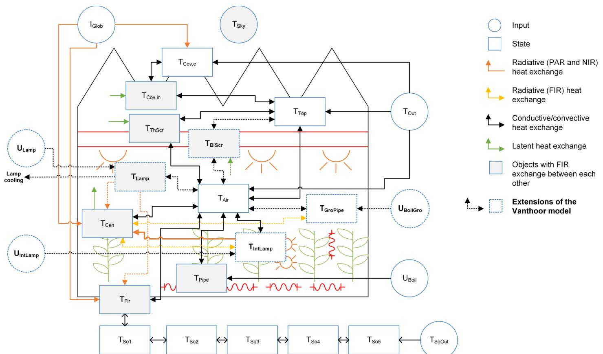
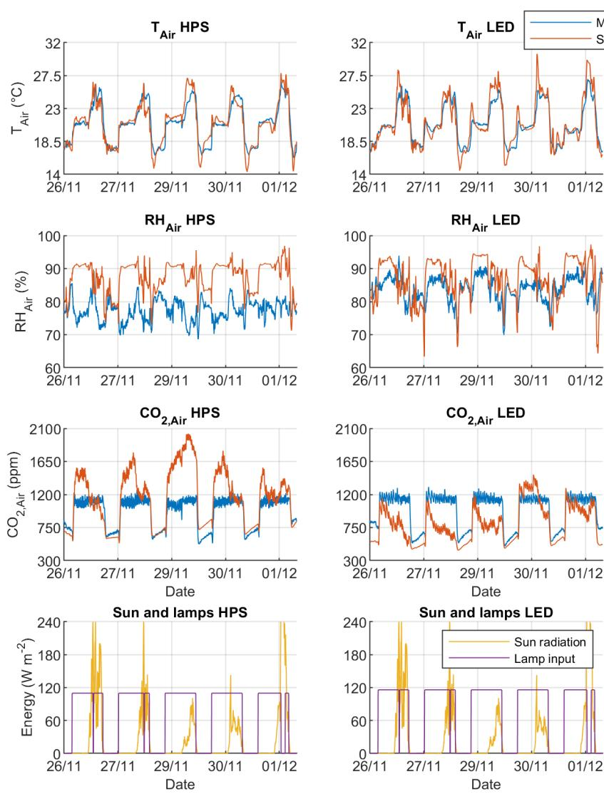
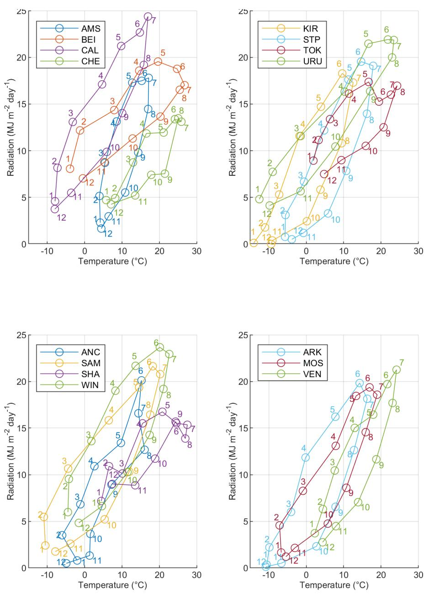
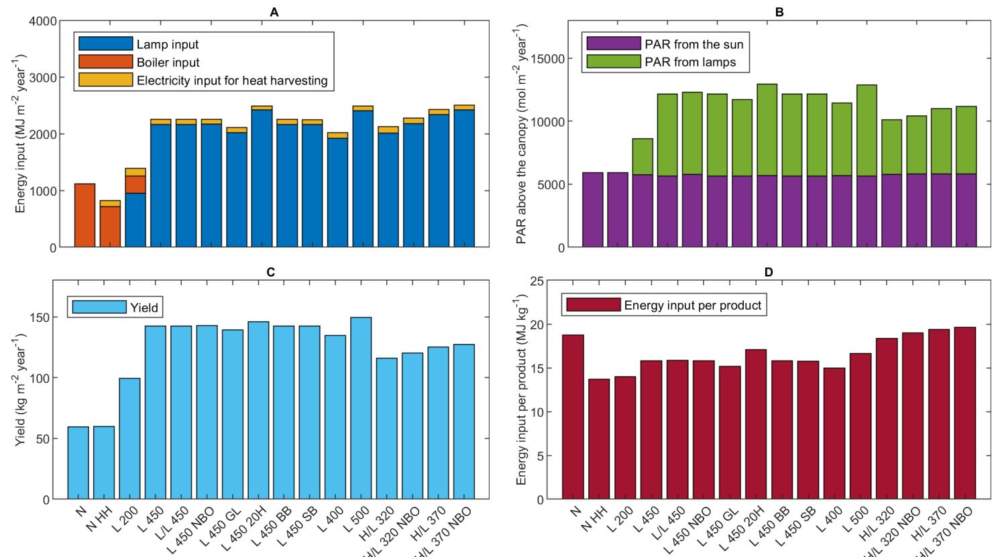

# Energy saving by LED lighting in greenhouses

A process- based modelling approach

# Propositions

1. Realistic assessments of the energy saving potential of LEDs in greenhouses must take into account the entire greenhouse energy system, including heating. (this thesis)

2. The simplest way to improve the energy efficiency of illuminated greenhouses is not to illuminate. (this thesis)

3. The tendency in biosystems engineering to focus on the similarities rather than the differences between power plants and biological plants results in discarding the entire biological discipline.

4. The disregard for the principle of "equal pay for equal work" when it comes to PhD candidates represents a moral failure of Dutch universities.

5. All scientific journals are predatory.

6. Trying to explain constructs such as "article processing charges" to non-academics quickly reveals that increased transparency in academia will weaken, not strengthen, public trust in science.

7. The apprehension towards genetically modified crops, compared with the uncritical adoption of smart phones and social media, demonstrates how as a society we prioritize physical over mental health.

8. The alleged objectives of reducing hunger or sparing land obscure the fact that the main motivation for agricultural intensification is economic profit.

Propositions belonging to the thesis, entitled

Energy saving by LED lighting in greenhouses: A process- based modelling approach

David Katzin Wageningen, 29 June 2021

# Energy saving by LED lighting in greenhouses

A process- based modelling approach

# Thesis committee

# Promoters

Prof. Dr E.J. van Henten  Professor of Farm Technology  Wageningen University & Research

Prof. Dr L.F.M. Marcelis  Professor of Horticulture and Product Physiology  Wageningen University & Research

# Co-promotor

Dr S. van Mourik  Assistant professor, Farm Technology Group  Wageningen University & Research

# Other members

Prof. Dr K.J. Keesman, Wageningen University & Research  Prof. Dr M. Kacira, University of Arizona, Tucson, USA  Dr M.J.G van de Molengraft, Eindhoven University of Technology  Dr S. Hemming, Wageningen University & Research

This research was conducted under the auspices of the C.T. de Wit Graduate School for Production Ecology and Resource Conservation

# Energy saving by LED lighting in greenhousesA process-based modelling approach

David Katzin

# Thesis

submitted in fulfilment of the requirements for the degree of doctor at Wageningen Universityby the authority of the Rector Magnificus,Prof. Dr A.P.J. Mol,in the presence of theThesis Committee appointed by the Academic Boardto be defended in public onTuesday 29 June 2021at 4 p.m. in the Aula.

David KatzinEnergy saving by LED lighting in greenhouses: a process- based modelling approach, 298 pages.

PhD thesis, Wageningen University, Wageningen, the Netherlands (2021)With references, with summaries in English, Dutch, and Hebrew.

ISBN: 978- 94- 6395- 764- 9DOI: 10.18174/544434

Living things don't all require light in the same degree. Some of us make our own light

(Louise Glück, excerpt from Lamium)

Dedicated in loving memory to Moshe J. Pinthus, professor of agriculture Elisha Katzin, engineer

# Table of contents

Summary xiSamenvatting xiv

Glossary of terms xix

Chapter 1. General introduction 3

Chapter 2. Process- based greenhouse climate models: Genealogy, current status, and future directions 15

Chapter 3. GreenLight - an open source model for greenhouses with supplemental lighting: Evaluation of heat requirements under LED and HPS lamps 73

Chapter 4. Energy savings in greenhouses by transition from high- pressure sodium to LED lighting 105

Chapter 5. Heating greenhouses by light: A novel concept for intensive greenhouse production 143

Chapter 6. General discussion 189

Chapter 7. Appendix: user's guide and detailed description of the GreenLight model 215

References 261

Acknowledgements 287

About the author 291

List of publications 292

PE&RC Training and Education Statement 295

# Summary

High- tech greenhouses, equipped with heating, lighting, and  $\mathrm{CO_2}$  enrichment of the air, are major consumers of energy. This energy consumption is responsible for considerable carbon emissions, contributing to global warming, which is already occurring at alarming rates. Light- emitting diodes (LEDs) have been promoted as a potential solution to the energy problem of illuminated greenhouses, due in great part to their high efficacy in converting electrical energy to light. Current LEDs consume around  $40\%$  less electricity than the commonly used high- pressure sodium (HPS) lamps, while emitting equivalent light intensities.

Despite their high efficacy, adoption of LEDs in greenhouses has been limited. High investment costs, lack of knowledge regarding the influence of LEDs on the greenhouse climate and crop, and low trust towards their claimed benefits, have all been cited as main obstacles for adoption. It has also been observed that greenhouses with LEDs require more heating than greenhouses with HPS lamps. This is because lamps provide not only light but also heat to the greenhouse. Due to their higher efficacy, LEDs contribute less heat to the greenhouse, which needs to be compensated by the heating system. Therefore, it has so far been unclear precisely how much energy can be saved by a transition to LEDs in greenhouses, and what factors contribute to this potential saving.

This thesis explores how LEDs influence the energy consumption of greenhouses. It investigates the consequence of replacing HPS lamps by LEDs in terms of lighting demand, heating demand, and total energy use; analyzes how LEDs influence the greenhouse climate and energy balance; and examines further possibilities for energy saving by LEDs in future scenarios.

Chapter 1 provides an overview of the greenhouse energy problem, and uses the Netherlands as an example to present some of the approaches that have so far been used to tackle this problem. This chapter also shows that the advent of LEDs in greenhouses has been accompanied by great expectations, the majority of which have so far failed to materialize. This chapter suggests that a transparent and quantitative assessment of the potential benefits of LEDs will help adjust expectations towards this new lighting technology, as well as promote trust amongst growers. Process- based mathematical modelling is proposed as a method towards achieving these goals.

Chapter 2 investigates the discipline of process- based greenhouse modelling. The chapter shows that a considerable number of greenhouse models are being published, and sets out to understand the reasons for the existence of this multitude of models. In Section 2.2, substantial background on the concept of process- based greenhouse modelling is provided, and a general structure of these models is proposed. Subsequently, modelling studies published between 2018 and 2020 are analyzed according to this general structure. The studies are categorized according to their objectives, types of greenhouse they describe, and equipment they consider, and a model inheritance chart is presented, showing how current models are based on earlier works. Moreover, a comparison of modelling validation studies is performed. Based on this analysis, possible reasons for the abundance of greenhouse models are suggested, including a lack of model transparency and code availability, and a belief that model development is in itself a valuable research goal. The chapter ends with several recommendations for the future advancement of the discipline. These include promoting model transparency and availability of source code, and establishing shared datasets and evaluation benchmarks.

Chapter 3 presents GreenLight, a process- based model for a greenhouse with a tomato crop, which describes the influence of HPS lamps and LEDs on the climate, crop, and energy use. In this chapter, GreenLight's performance is evaluated by comparing model predictions against data from two greenhouse compartments, one with HPS lamps and one with LEDs. The model is found to have a relative error in predictions of climate and energy use in the range of 1-  $12\%$ . In order to promote transparency, the model is offered in an open source format at https://github.com/davkat1/GreenLight. In this way, the model is made available for inspection and extension by others.

Chapter 4 uses GreenLight to predict the influence of replacing HPS lamps by LEDs in a greenhouse. A wide range of scenarios is considered, including varying climates, from subtropical China to arctic Sweden, and multiple settings for indoor temperature, lamp intensity, lighting duration, and insulation. In all scenarios, LEDs are found to reduce the energy demand for lighting by  $40\%$ , but to increase the demand for heating. This results in the total energy saving by transition to LEDs to be in the range of  $10 - 25\%$  for the majority of scenarios considered. An important factor influencing how much energy can be saved by a transition to LEDs is found to be the ratio between the lighting and heating demand of the greenhouse before the transition.

Chapter 5 presents a novel concept for greenhouse climate control: heating a greenhouse by light. Considering the observation that all lamps provide heat as well as light, this chapter suggests that illuminating at high light intensities could eliminate the need to heat the greenhouse by the heating system. This approach could potentially be very efficient, as it utilizes lighting both to enhance crop growth as well as to maintain the indoor temperature. LEDs offer new possibilities in this direction: due to their high efficacy, and the fact that they emit relatively little radiative heat, they can be installed at high intensities without overheating the greenhouse or damaging the crop. The scenarios explored in this chapter show that heating a greenhouse exclusively by lamps is possible, as long as sufficient lamp intensities are installed, and a heat harvesting system is used to maintain indoor temperatures when the lamps are off. The chapter also shows that if no changes are made to the lamp control strategy, increasing the lamp intensity in the greenhouse typically results in a higher energy use, and a lower energy efficiency.

Chapter 6 is a general discussion. This chapter reflects on the results of previous chapters, both individually and collectively. Several limitations of the work are identified, their consequence on the results and conclusions are considered, and recommendations for further research are proposed. Section 6.7 gives further outlook: several reports predict that the energy use of greenhouses will greatly increase in the coming years, mainly due to lighting. It is suggested that the higher efficacy of LEDs might actually incentivize growers to illuminate more than they had done previously. In this way, LEDs may contribute to an overall increase, rather than a decrease, of greenhouse energy use. Therefore, the section highlights some other possible avenues to reduce the energy use and carbon emissions of greenhouses, aside from the adoption of LEDs. Finally, using some of the lessons learned in the current work, Section 6.8 provides a short discussion on a new type of growing system: sunless cultivation, also known as plant factories or vertical farms.

Chapter 7 is an appendix, providing a user's guide and a description of the GreenLight model. In particular, the following model components are described in detail: the lamps, including both toplighting and interlighting, the blackout screen, the heating pipes placed between the crop (grow- pipes), and the heat harvesting system, including mechanical cooling and dehumidification, a heat pump, and energy storage. This description could serve as an aid for future researchers who wish to use or extend the GreenLight model.

# Samenvatting

Hightech tuinbouwkassen, uitgerust met verwarming, belichting en  $\mathrm{CO_2}$  dosering, zijn grootgebruikers van energie. Hierdoor is de glastuinbouw verantwoordelijk voor een aanzienlijke koolstof uitstoot die bijdraagt aan de opwarming van de aarde. Kunstmatige belichting middels licht- emitterende diodes (ledlampen) heeft de potentie om de energiebehoefte van belichte kassen te verlagen, vooral door de hoge efficiëntie van deze belichting in het omzetten van elektrische energie naar licht. De huidige generatie ledverlichting gebruik, bij dezelfde Lichtintensiteit,  $40\%$  minder elektriciteit dan de huidige in de praktijk toegepaste hogedruk natrium (SON- T) lampen.

Ondanks deze hoge efficiëntie wordt ledverlichting nog niet overal toegepast. De hoge investeringskosten, ontbrekende kennis over het effect van ledverlichting op het kasklimaat en het gewas, en het geringe vertrouwen in de geadverteerde voordeelen worden genoemd als de grootste obstakels. Ook stijgen de verwarmingskosten in tuinbouwkassen met ledverlichting: door de hogere efficiëntie van de ledverlichting stoten deze lampen minder warmte uit, wat gecompenseerd moet worden door het verwarmingssysteem. Het was daarom tot nu toe nog niet volledig bekend hoeveel energie er bespaard kan worden door over te stappen op ledverlichting en welke factoren deze besparing beinvloeden.

Het onderzoek in dit proefschrift focust zich op hoe ledverlichting het energieverbruik van de tuinbouwkas beinvloedt. Ook wordt er gekeken naar het effect van het vervangen van SON- T lampen door ledverlichting op basis van verlichting- , warmte- , en totale energieverbruik. Daarnaast is er gekeken naar hoe ledverlichting het kasklimaat en de energiebalans beinvloedt en hoe er in de toekomst nog meer energie kan worden bespaard middels ledverlichting.

Hoofdstuk 1 presenteert een overzicht van de uitdagingen wat betreft de energiehuishouding in de kas en hoe deze worden aangegaan in de Nederlandse glastuinbouw. Ook wordt aangetoond dat de verwachte voordelen van ledverlichting nauwelijks zullen worden behaald in de praktijk. Dit hoofdstuk stelt dat een transparante en kwantitatieve analyse van de voordelen van ledverlichting zullen bijdragen aan realistischere verwachtingen en daarme het vertrouwen van de telers zal vergroten. De gebruikte methode, een modelleeraanpak gebaseerd op processen, wordt gepresenteerd.

Hoofdstuk 2 verkent de bijdragen aan de procesmodellering als discipline voor glastuinbouw. Een groot aantal modellen is aanwezig en dit hoofdstuk onderzoekt waarom dit aantal zo hoog is. In Sectie 2.2 wordt de benodigde achtergrondinformatie voor proces gebaseerde kasklimaat modellen gepresenteerd alsmede een generieke structuur voor deze modellen. De bijdragen in de literatuur zijn, op basis van deze generieke structuur, gecategoriseerd op basis van het doel van het model, het type tuinhouwkas, en de gemodelleerde apparatuur. Verder wordt een overzicht gepresenteerd dat laat zien hoe deze modellen op elkaar voortbouwen. Bovendien wordt er een vergelijking gepresenteerd tussen verschillende modelvalidatiestudies. Op basis van deze analyse worden er mogelijkke oorzaken voor de overvloed aan kasmodellen geidentificeerd. Een gebrek aan transparantie in modellen, afwezigheid van broncode, en de overtuiging dat modellering op zichzelf een waardevol onderzoeksdoel is, zijn mogelijkke redenen. Het hoofdstuk sluit af met aanbevelingen voor het verder bevorderen van de discipline. Deze aanbevelingen zijn, onder andere, het stimuleren van het beschikbaar maken van broncode alsmede transparantie en het delen van datasets en gemeenschappelijke evaluatiebenchmarks.

Hoofdstuk 3 presenteert het GreenLight model. Dit model beschrijft de verschillende processen in een tuinbouwkas met tomaten, en het effect van SON- T en ledverlichting op klimaat, gewas en energieverbuik. In dit hoofdstuk worden de voorspelling van het GreenLight model vergeleken met data uit twee kascompartmenten, een met SON- T lampen en een met ledverlichting. De vergelijking laat zien dat het model goede voorspellingen maakt, met een relatieve fout in de orde van  $1 - 12\%$ . Ter bevordering van de transparantie is de broncode van het GreenLight model openbaar gemaakt op https://github.com/davkat1/GreenLight. Zo is het model beschikbaar voor anderen om het te bekijken en uit te breiden.

Hoofdstuk 4 beschrijft het effect van het vervangen van SON- T lampen door ledverlichting. Een uitgebreide selectie aan verschillende scenario's is gesimuleerd, van het subtropische China tot het arctische Zweden, en met verschillende instellingen voor de kastemperatuur, intensiteit van de verlichting, belichtingsduur en isolatie. In de geteste scenario's verlaagt ledverlichting de energiegevraag met  $40\%$ , maar stijgt de warmtevraag. Hierdoor daalt het totale energiegebruik van een kas met ledverlichting in de orde van  $10 - 25\%$  voor het merendeel van de gesimuleerde scenario's. De hoeveelheid energie die wordt

bespaard door een overgang naar ledverlichting hangt sterk af van de ratio tussen de belichtings- en warmtevraag in de kas vóór de overgang.

Hoofdstuk 5 presenteert een innovatief concept voor kasklimaatregeling: het verwarmen van de kas door licht. Omdat belichting niet alleen licht genereert maar ook warmte, zou de belichting in een kas met hoge lichtintensiteit ook kunnen voorzien in de vraag naar warmte. De potentiële efficiëntie van deze aanpak is groot omdat het de verlichting gebruikt voor zowel warmte als licht. Ledlampen bieden nieuwe kansen voor deze aanpak vanwege de mogelijkheid om ze te gebruiken bijh hoge lichtintensiteiten. De scenario's die in dit hoofdstuk worden bekeken laten zien dat het verwarmen van een kas uitsluitend met lampen mogelijk is, zolang de kas wordt voorzien van voldoende lichtintensiteit en er een warmteterugwinsystemeis dat de temperatuur op peil houdt als de belichting uitstaat. Dit hoofdstuk toont ook aan dat zonder aanpassingen in de regeling van de lampen, het verhogen van de lichtintensiteit leidt tot een doorgaans hoger energieverbruik en een lagere energie- efficiëntie.

Hoofdstuk 6 presenteert een algemene discussie. Dit hoofdstuk reflecteert op de vorige hoofdstukken zowel in individuelse zin als samengevat. Verschillende limitaties van dit werk worden geidentificeerd, het effect ervan op de resultaten en de conclusies wordt besproken, en er worden aanbevelingen voor toekomstig onderzoek gegeven. Sectie 6.7 bilikt vooruit op dit onderzoeksveld: verschillende onderzoeken voorspellen een toename in het energieverbruik van tuinbouwkassen, voornamelijk door verlichting. Er wordt gesuggereerd dat de hogere efficiëntie van ledverlichting kan leiden tot meer gebruik van verlichting. Op deze manier draagt ledverlichting bij aan een verhoging van het energieverbruik van tuinbouwkassen, in plaats van een verlaging. Deze sectie brengt daarom andere mogelijkke manieren om energieverbruik en koolstof uitstoot van tuinbouwkassen te verlagen onder de aandacht. Sectie 6.8 presenteert een korte discussie over een nieuuw type teeltsysteme: zonloze teelt, ook wel verticale landbouw genoemd.

Hoofdstuk 7 is een bijlage met een gebruikershandl eiding en beschrijving van het GreenLight model. De volgende modelonderdelen zijn uitvoerig beschreven: de boven- en tussenbelichting, het schaduwdoek, de werwarmingsbuizen tussen het gewas, en het warmteterugwinsystem, inclusief mechanische koeling en ontvochtiging, een warmtepomp en energieopslag. Deze beschrijving vereenvoudigt het gebruik alsmede het uitbreiden van het GreenLight model voor toekomstige onderzoekers.

กหราทวา ,ฑาาหถ้า ตาวาท้า ฑาหาห้ ๒๖ ททาวาห ททาวอว ททาวาช าจ ต๑๖จห ฑาหหล ททาวกกจ ททอวก ทิ’’ว’ไว ติ’’พธหฑ ททาวาออทท ฯกห .ท’’รอ’ทองห’ ททาว’อ โจทช ทาย’’อ’วา วา ฮ’ท’’ไว ท’’อ’า’ว ท’’ว ท’’ว’ว’ ท’’’ว’ ท’’’ว’ ท’’’ว’ ท’’’ว’ ท’’’ว’ ,(LED) ่า ท’’หท ห’ท’’ท’’ห’’อ ท’’ว’ห’ท ท’’ว’ว’ ท’’’ว’ ท’’’ว’ ท’’’ว’ ท’’’ว’ ท’’’ว’ ท’’’ว’ ท’’’ว’ ท’’’ว’ ท’’’ว’ ท’’’ว’ ท’’’ว’ ท’’’ว’ ท’’’ว’ ท’’’ว’ ท’’’ ท’’’ว’ ท’’’ว’ ท’’’ว’ ท’’’ว’ ท’’’ว’ ท’’’ว’ ท’’’ว’ ท’’’ว’ ท’’’ว’ ท’’’ว’ ท’’’ว’ ท’’’ว’ ท’’’ว’ ท’’’ว’ ,ท’’’ว’ ท’’’ว’ ท’’’ว’ ท’’’ว’ ท’’’ว’ ท’’’ว’ ท’’’ว’ ท’’’ว’ ท’’’ว’ ท’’’ว’ ท’’’ว’ ท’’’ว’ ท’’’ว’ ท’’’ว’ ท.’’’ว’ ท’’’ว’ ท’’’ว’ ท.’’’ว’ ท.’’’ว’ ท.’’’ว’ ท.’’’ว’ ท.’’’ว’ ท.’’’ว’ ท.’’’ว’ ท.’’’ว’ ท.’’’ว’ ท.’’’ว’ ท.’’’ว’ ท.’’’ว’ ท.’’’ว’ ท.’’’ว’ ท.’’”ว’ ท.’’’ว’ ท.’’’ว’ ท.’’’ว’ ท.’’’ว’ ท.’’’ว’ ท.’’’ว’ ท.’’’ว’ ท.’’’ว’ ท.’’’ว’ ท.’’’ว’ ท.’’’ว’ ท.’’’ว’ ท.’’’ว’ ท.’’’ว ’ ท.’’’ว’ ท.’’’ว’ ท.’’’ว’ ท.’’’ว’ ท.’’’ว’ ท.’’’ว’ ท.’’’ว’ ท.’’’ว’ ท.’’’ว’ ท.’’’ว’ ท.’’’ว’ ท.’’’ว’ ท.’’’ว’ ท.’’’ว’ 5 ท.’’’ว’ ท.’’’ว’ ท.’’’ว’ ท.’’’ว’ ท.’’’ว’ ท.’’’ว’ ท.’’’ว’ ท.’’’ว’ ท.’’’ว’ ท.’’’ว’ ท.’’’ว’ ท.’’’ว’ ท.’’’ว’ ท.’’’ว’ 1 ท.’’’ว’ ท.’’’ว’ ท.’’’ว’ ท.’’’ว’ ท.’’’ว’ ท.’’’ว’ ท.’’’ว’ ท.’’’ว’ ท.’’’ว’ ท.’’’ว’ ท.’’’ว’ ท.’’’ว’ ท.’’’ว’ ท.’’’ว’ 2 ท.’’’ว’ ท.’’’ว’ ท.’’’ว’ ท.’’’ว’ ท.’’’ว’ ท.’’’ว’ ท.’’’ว’ ท.’’’ว’ ท.’’’ว’ ท.’’’ว’ ท.’’’ว’ ท.’’’ว’ ท.’’’ว’ ท.’’’ว’ 9 ท.’’’ว’ ท.’’’ว’ ท.’’’ว’ ท.’’’ว’ ท.’’’ว’ ท.’’’ว’ ท.’’’ว’ ท.’’’ว’ ท.’’’ว’ ท.’’’ว’ ท.’’’ว’ ท.’’’ว’ ท.’’’ว’ ท.’’’ว’ 4 ท.’’’ว’ ท.’’’ว’ ท.’’’ว’ ท.’’’ว’ ท.’’’ว’ ท.’’’ว’ ท.’’’ว’ ท.’’’ว’ ท.’’’ว’ ท.’’’ว’ ท.’’’ว’ ท.’’’ว’ ท.’’’ว’ ท.’’’ว’ 6 2 ท.’’’ว’ ท.’’’ว’ ท.’’’ว’ ท.’’’ว’ ท.’’’ว’ ท.’’’ว’ ท.’’’ว’ ท.’’’ว’ ท.’’’ว’ ท.’’’ว’ ท.’’’ว’ ท.’’’ว’ 5 ท.’’’ว’ ท.’’’ว ’ ท.’’’ว’ ท.’’’ว’ ท.’’’ว’ ท.’’’ว’ ท.’’’ว’ ท.’’’ว’ ท.’’’ว’ 5 ท.’’’ว’ ท.’’’ว’ ท.’’’ว’ 5 ท.’’’ว’ ท.’’’ว’ 5 ท.’’’ว’ ท.’’’ว’ 5 ท.’’’ว’ ท.’’’ว’ 5 ท.’’’ว’ 5 ท.’’’ว’ 5 ท.’’’ว’ 5 ท.’’’ว’ 5 ท.’’’ว’ 5 ท.’’’ว’ 5 ท.’’’ว’ 5 ท.’’’ว’ 5 ท.’’’ว’ 5 ท.’’’ว’ 5 ท.’’’ว’ 5 .5 ท.’’’ว’ 5 ท.’’’ว’ 5 ท.’’’ว’ 5 ท.’’’ว’ 5 ท.’’’ว’ 5 ท.’’’ว’ 5 ท.’’’ว’ 5 ท.’’’ว’ 5 ท.’’’ว’ 5 ท.’’’ว’ 5 ท.’’’ว’ 6 5 ท.’’’ว’ 5 ท.’’’ว’ 5 ท.’’’ว’ 5 ท.’’’ว’ 5 ท.’’’ว’ 5 ท.’’’ว’ 5 ท.’’’ว’ 5 ท.’’’ว’ 5 ท.’’’ว’ 5 ท.’’’ว’ 5 ท.’’’ว’

, n1122y 11122 n12n 11122 1111 111122 111122 , GreenLight 11112 3 1112 n1111 111122 .111122 111122 111122 , 111122 , 111122 111122 111122 111122 111122 111122 111122 111122 111122 111122 111122 111122 111122 111122 111122  111122 111122 111122 111122 111122 111122 111122 111122 111122 111122 111122 111122 111122 111122 211122 111122 111122 111122 111122 111122 111122 111122 111122 111122 111122 111122 111122 111122 11 111122 111122 111122 111122 111122 111122 111122 111122 111122 111122 111122 111122 111122 111122 011122 111122 111122 111122 111122 111122 111122 111122 111122 111122 111122 111122 111122 111122 1101122 111122 111122 111122 111122 111122 111122 111122 111122 111122 111122 111122 111122 111122 1112222222222222222222222222222222222222222222222222222222222222222222222222222222222222222222222222222 1111111111111111111111111111111111111111111111111111111111111111111111111111111111111111111111111111 11111111111111111111111111111111111111111111111111111111111111111111111111111111111111111111111111 211111111111111111111111111111111111111111111111111111111111111111111111111111111111111111111111111101111111111111111111111111111111111111111111111111111111111111111111111111111111111111111111111111112222222222222222222222222222222222222222222222222222222222222222222222222222222222222222222222220111111111111111111111111111111111111111111111111111111111111111111111111111111111111111111111111110011111111111111111111111111111111111111111111111111111111111111111111111111111111111111111111111111201111111111111111111111111111111111111111111111111111111111111111111111111111111111111111111111111010111111111111111111111111111111111111111111111111111111111111111111111111111111111111111111111111100011111111111111111111111111111111111111111111111111111111111111111111111111111111111111111111111110201111111111111111111111111111111111111111111111111111111111111111111111111111111111111111111111111200111111111111111111111111111111111111111111111111111111111111111111111111111111111111111111111111121101111111111111111111111111111111111111111111111111111111111111111111111111111111111111111111111110110111111111111111111111111111111111111111111111111111111111111111111111111111111111111111111111111211111111111111111111111111111111111111111111111111111111111111111111111111111111111111111111111111021111111111111111111111111111111111111111111111111111111111111111111111111111111111111111111111111121011111111111111111111111111111111111111111111111111111111111111111111111111111111111111111111111112211111111111111111111111111111111111111111111111111111111111111111111111111111111111111111111111111

# Glossary of terms

<table><tr><td>Assimilation lighting</td><td>Greenhouse lighting for enhancing crop growth</td><td>CFD</td><td>Computational fluid dynamics</td></tr><tr><td>CHP</td><td>Combined heat and power generator</td><td>CSG</td><td>Chinese solar greenhouse</td></tr><tr><td>FIR</td><td>Far infrared (thermal) radiation, wavelength above 2500 nm</td><td>Grow-pipes</td><td>Greenhouse heating pipes placed within the canopy</td></tr><tr><td>HPS</td><td>High-pressure sodium</td><td>Interlighting</td><td>Greenhouse lighting placed within the canopy</td></tr><tr><td>LED</td><td>Light emitting diode</td><td>NIR</td><td>Near infrared radiation, wavelength of 700-2500 nm</td></tr><tr><td>PAR</td><td>Photosynthetically active radiation, wavelength of 400-700 nm</td><td>Pipe-rails</td><td>Greenhouse heating pipes placed on the floor and used as rails for transportation in the greenhouse</td></tr><tr><td>PPE, efficacy</td><td>Photosynthetic photon efficacy, the lamp&#x27;s efficiency in converting energy to PAR (μmol J-1)</td><td>PPFD</td><td>Photosynthetic photon flux density (μmol m-2s-2)</td></tr><tr><td>Supplemental lighting</td><td>Greenhouse lighting including lighting for daylength control and assimilation lighting</td><td>Toplighting</td><td>Greenhouse lighting placed above the canopy</td></tr><tr><td colspan="4">State variables</td></tr><tr><td>CO2</td><td>Carbon dioxide concentration (mg m-3)</td><td>T</td><td>Temperature (°C)</td></tr><tr><td>VP</td><td>Vapour pressure (Pa)</td><td></td><td></td></tr><tr><td colspan="4">Auxiliary states</td></tr><tr><td>CO2ppm</td><td>Carbon dioxide concentration (ppm)</td><td>H</td><td>Conductive or convective heat exchange (W m-2)</td></tr><tr><td>HAirOut</td><td>Convection from the main greenhouse compartment to the outside air</td><td>HAirMech</td><td>Sensible heat harvested by the heat harvesting system</td></tr><tr><td>HBoilPipe</td><td>Energy transfer from the greenhouse boiler to the heating pipes</td><td>HBufHotPipe</td><td>Energy transfer from the energy buffer to the heating pipes</td></tr><tr><td>HCov,eOut</td><td>Convection from the greenhouse cover to the outside air</td><td>HSO5SOout</td><td>Convection from the greenhouse floor to the soil</td></tr></table>

<table><tr><td>HTopOut</td><td>Convection from the top greenhouse compartment to the outside air</td><td>L</td><td>Latent heat exchange (W m-2)</td></tr><tr><td>LAirMech</td><td>Latent heat harvested by the heat harvesting system</td><td>LAirThScr</td><td>Latent heat converted to sensible heat by vapor condensation on the thermal screen</td></tr><tr><td>LCouplin</td><td>Sensible heat converted to latent heat by crop transpiration</td><td>LCouplin</td><td>Latent heat converted to sensible heat by vapor condensation on the internal side of the greenhouse cover</td></tr><tr><td>Q</td><td>Electric energy input (W m-2)</td><td>QIntLampIn</td><td>Energy used by the greenhouse interlights</td></tr><tr><td>QLampIn</td><td>Energy used by the greenhouse toplights</td><td>R</td><td>Radiative heat exchange (W m-2)</td></tr><tr><td>RCansky</td><td>Thermal radiation from the crop to the sky</td><td>RCov,eSky</td><td>Thermal radiation from the greenhouse cover to the sky</td></tr><tr><td>RFLrSky</td><td>Thermal radiation from the greenhouse floor to the sky</td><td>RGlob,SunAir</td><td>Global solar radiation absorbed by the greenhouse structure and transferred to the greenhouse air</td></tr><tr><td>RGlob,SunCov,e</td><td>Global solar radiation absorbed by the greenhouse cover</td><td>RIntLampSky</td><td>Thermal radiation from the interlights to the sky</td></tr><tr><td>RLampAir</td><td>Short wave radiation (PAR and NIR) from the lamp to the greenhouse air</td><td>RLampSky</td><td>Thermal radiation from the toplights to the sky</td></tr><tr><td>RNIR,SunCan</td><td>NIR from the sun to the canopy</td><td>RNIR,SunFlr</td><td>NIR from the sun to the floor</td></tr><tr><td>RPAR,SunCan</td><td>PAR from the sun to the canopy</td><td>RPAR,SunFlr</td><td>PAR from the sun to the floor</td></tr><tr><td>RpipeSky</td><td>Thermal radiation from the heating pipes to the sky</td><td>RThScrSky</td><td>Thermal radiation from the thermal screen to the sky</td></tr><tr><td>RH</td><td>Relative humidity (%)</td><td></td><td></td></tr><tr><td colspan="4">External climate inputs</td></tr><tr><td>IGlob</td><td>Global solar radiation (W m-2)</td><td>TsoOut</td><td>Soil temperature at outer soil layer (°C)</td></tr><tr><td>ISky</td><td>Horizontal infrared radiation from the sky (W m-2)</td><td>RHOut</td><td>Outdoor relative humidity (%)</td></tr><tr><td>Tout</td><td>Outdoor temperature (°C)</td><td>VPout</td><td>Outdoor vapour pressure (Pa)</td></tr><tr><td>Tsky</td><td>Sky temperature (°C)</td><td>vwind</td><td>Outdoor wind speed (m s-1)</td></tr><tr><td colspan="4">Validation metrics</td></tr><tr><td>maxE</td><td>Maximum error</td><td>maxRE</td><td>Maximum relative error</td></tr><tr><td>ME</td><td>Mean error</td><td>MRE</td><td>Mean relative error</td></tr><tr><td>MSE</td><td>Mean squared error</td><td>NSE</td><td>Nash-Sutcliffe&#x27;s coefficient of efficiency</td></tr></table>

<table><tr><td>R²</td><td>Coefficient of determination</td><td>RE</td><td>Relative error</td></tr><tr><td>RMSE</td><td>Root mean squared error</td><td>rRMSE</td><td>Relative root mean squared error</td></tr><tr><td colspan="4">Greenhouse locations</td></tr><tr><td>AMS</td><td>Amsterdam, 
The Netherlands</td><td>ANC</td><td>Anchorage, Alaska, USA</td></tr><tr><td>ARK</td><td>Arkhangelsk, Russia</td><td>BEI</td><td>Beijing, China</td></tr><tr><td>CAL</td><td>Calgary, Canada</td><td>CHE</td><td>Chengdu, China</td></tr><tr><td>KIR</td><td>Kiruna, Sweden</td><td>MOS</td><td>Moscow, Russia</td></tr><tr><td>SAM</td><td>Samara, Russia</td><td>SHA</td><td>Shanghai, China</td></tr><tr><td>STP</td><td>St Petersburg, Russia</td><td>TOK</td><td>Tokyo, Japan</td></tr><tr><td>WIN</td><td>Windsor, Canada</td><td>VEN</td><td>Venice, Italy</td></tr><tr><td>URU</td><td>Urungqi, China</td><td></td><td></td></tr><tr><td colspan="4">Subscripts</td></tr><tr><td>Air</td><td>Greenhouse air in the main compartment (below the screens)</td><td>BlScr</td><td>Blackout screens</td></tr><tr><td>Boil</td><td>Boiler</td><td>BoilGro</td><td>Energy from boiler to the grow-pipes</td></tr><tr><td>Can</td><td>Canopy</td><td>Cov</td><td>Cover</td></tr><tr><td>d</td><td>Discharge coefficient</td><td>e</td><td>External side of cover</td></tr><tr><td>Ext</td><td>External CO2 source</td><td>Flr</td><td>Floor</td></tr><tr><td>Gh</td><td>Greenhouse</td><td>Glob</td><td>Global radiation</td></tr><tr><td>GroPipe</td><td>Grow-pipes</td><td>HEC</td><td>Heat exchange coefficient</td></tr><tr><td>Int Lamp</td><td>Interlights</td><td>in</td><td>Internal side of cover</td></tr><tr><td>Lamp</td><td>Toplighting</td><td>Leak, Leakage</td><td>Leakage ventilation</td></tr><tr><td>Out</td><td>Outside air</td><td>Pipe</td><td>Pipe-rails</td></tr><tr><td colspan="4">Superscripts</td></tr><tr><td>mes</td><td>Measured value</td><td>sim</td><td>Simulated value</td></tr><tr><td colspan="4">Other symbols</td></tr><tr><td>cap</td><td>Heat capacity (J m-2 K-1)</td><td>EHPS</td><td>Energy use of an HPS greenhouse (MJ m-2 year-1)</td></tr><tr><td>ELED</td><td>Energy use of an LED greenhouse (MJ m-2 year-1)</td><td>FLight</td><td>Fraction of energy input used for lighting in an HPS greenhouse</td></tr><tr><td>QHPS</td><td>Energy for heating in HPS greenhouse (MJ m-2 year-1)</td><td>QHPS</td><td>Energy for lighting in HPS greenhouse (MJ m-2 year-1)</td></tr><tr><td>QLED</td><td>Energy for heating in LED greenhouse (MJ m-2 year-1)</td><td>QLED</td><td>Energy for lighting in LED greenhouse (MJ m-2 year-1)</td></tr><tr><td>U</td><td>Controlled input (greenhouse actuator)</td><td>EHPS</td><td>Efficacy of HPS (1.8 μmol J-1)</td></tr><tr><td>εLED</td><td>Efficacy of LED (3 μmol J-1)</td><td></td><td></td></tr></table>

# Chapter 1General introduction

# 1.1. High-tech greenhouses and the greenhouse energy problem

Modern greenhouses are a marvel of human knowledge, skill, science, and technology: a simple greenhouse can achieve crop yields that are 5- 12.5 times higher than those of an open field of comparable area, and a high- tech greenhouse - equipped with computerized climate control and supplemental  $\mathrm{CO_2}$  enriching the greenhouse air - can further double those yields to 25 times those of an open field (Heuvelink et al., 2018). By using supplemental lighting, these yields can potentially be doubled yet again, reaching a productivity that is up to 50 times higher than open field cultivation (Heuvelink & Kierkels, 2013).

Such high yields are made possible by providing large amounts of inputs, including labor (Galinato & Miles, 2013), water (Page et al., 2012), fertilizers (Ntinas et al., 2017), and energy (Hemming, Bakker, et al., 2019), which results in substantial greenhouse gas emissions (Xue et al., 2020). These emissions, in turn, contribute to global warming at an alarming rate (Klein, 2014). The main contributing factor to emissions in high- tech greenhouses is their energy consumption (Ntinas et al., 2017; Page et al., 2012), used mostly for climate control including heating, cooling, dehumidification, and supplemental lighting (Hemming, Bakker, et al., 2019). Therefore, considerable efforts are being made to reduce the energy consumption of high- tech greenhouses.

Greenhouse energy use can be quantified in various ways, depending on the particular context and goals. Inputs can be measured in units of primary energy sources (e.g.,  $\mathrm{m^3}$  of natural gas), energy (J, joules), or carbon footprint (global warming potential, measured in kg of  $\mathrm{CO_2}$  equivalents). Furthermore, what is considered as an input may vary: for example, energy coming directly from the sun may be included or excluded. The quantification of inputs also depends on the definition of the system boundaries, i.e., the moment that a resource is considered to have become an input. For example, is energy for heating measured by how much heat is released by the heating pipes, or do we consider the moment gas is burned, taking into account the efficiency of the boiler system? Or perhaps the extraction and transportation of energy sources should also be taken into account?

In any case, once inputs are defined and quantified, they are often scaled to some unit for the sake of comparison. Scaling to a  $\mathrm{m^2}$  of greenhouse floor area is a common approach. Alternatively, energy efficiency can be considered,

measured by the amount of energy needed to produce a unit of product. For example, comparing greenhouses growing the same crop can be done by looking at how much energy is consumed per kg of marketable product  $(\mathrm{MJkg^{- 1}})$ .

Innovations in the field of greenhouse energy savings can be roughly divided into four categories: greenhouse design, equipment and technology, climate control strategies, and alternative energy sources (Hemming, Bakker, et al., 2019). These categories are not isolated from each other; for example, new technologies may require an adapted greenhouse design, and a change in greenhouse design may require adjustments in climate control (Vanthoor et al., 2008).

Designing a greenhouse for reduced energy use can include installing a highly insulating greenhouse cover, setting a north- south orientation that maximizes the absorption of sunlight in winter (Hemming, Bakker, et al., 2019), or selecting the best set of greenhouse equipment for a desired goal (Van 't Ooster et al., 2008; Vanthoor, 2011). Equipment and technology for reduced energy use includes insulating thermal screens (Dieleman & Kempkes, 2006), mechanical dehumidification and heat exchangers (Kempkes et al., 2017), and heat storage systems which create a so- called closed or semi- closed greenhouse. These systems include short term heat storage buffers that extract energy during the day and release it at night (Seginer et al., 2017; Van Beveren et al., 2020), or long term underground heat storage to extract energy in summer and release it in winter (De Zwart, 2012; Van Ooteghem, 2007).

Given a particular design of a greenhouse and its equipment, the employed climate control strategy can greatly influence energy use. Studies in the field of optimal control (Van Straten et al., 2010) showed that an improved climate control strategy can meaningfully reduce energy use (Van Beveren et al., 2015b; Van Henten et al., 1997). A new approach to crop cultivation, called the "Next Generation" greenhouse cultivation, combines design, technology and climate control with the aim of improving greenhouse energy use (De Gelder, Poot, et al., 2012). Lastly, the use of alternative energy sources does not in itself reduce greenhouse energy use, but it can meaningfully reduce a greenhouse's carbon footprint (Ntinas et al., 2020).

# 1.2. Tackling the greenhouse energy problem: experience from the Netherlands

Considering the vast efforts dedicated to reducing greenhouse energy use, it is worthwhile to consider what has actually been achieved in practice. For this, the Netherlands provides a useful example, due to its large concentration of hightech greenhouses (Rabobank, 2018) and its consistent monitoring of the industry with respect to three perspectives: energy use, carbon footprint, and energy efficiency (Van der Velden & Smit, 2019b). In the following overview, advances regarding these three perspectives are described, as they were all addressed throughout the history of the Netherlands' tackling of the greenhouse energy problem.

The endeavor to reduce greenhouse energy use in the Netherlands dates back to the 1970's, when the energy crisis created severe economic pressures against excessive energy use (Germing, 1978). As a result, several research programs were initiated and conducted throughout the 1980's (Bot, 1983; Udink ten Cate, 1983). Starting in the 1990's, environmental considerations driven by consumer preferences and international treaties such as the Kyoto protocol became the main motivation for reducing greenhouse energy use, or rather, for improving energy efficiency (Bot, 2001). Indeed, throughout the 1990's the main factor contributing to greenhouse energy efficiency in the Netherlands was a substantial increase in yields (Bot, 2001). In fact, between the years 1990 and 2000 there has been little reduction in emissions but considerable gains in yields (Van der Velden & Smit, 2019b). These have been achieved by an improved control of the air and root environment, better crop and pest management, and the introduction of new cultivars (De Gelder, Dieleman, et al., 2012).

In the 2000's, one of the most significant developments was the widescale adoption of combined heat and power (CHP) units, also known as cogenerators (Van der Veen & Kasmire, 2015). CHPs burn fuels to simultaneously produce heat, electric power, and  $\mathrm{CO_2}$ . All these outputs can be used in the greenhouse to maintain a favorable environment for crop production, but more importantly, electricity that is not used in the greenhouse can be sold to the national grid. This method of electricity generation is more efficient than that of regional power plants, which do not make use of the heat that is emitted when burning fuels to

generate electricity. The result of using a CHP instead of a standard boiler is thus typically not a reduction in greenhouse energy use, but rather a reduction in carbon emissions due to a more efficient utilization of natural gas1. Moreover, the electricity sold to the national grid can provide a substantial source of income for growers.

By 2010, the CO2 emissions of the Dutch greenhouse sector were  $12\%$  lower than those of 1990, and the energy use per product was  $53\%$  lower than that of 1990 (Van der Velden & Smit, 2011). Significantly,  $75\%$  of the emission reduction was due to the adoption of CHPs (Van der Veen & Kasmire, 2015). Other contributing factors were alternative energy sources such as geothermal heat and biofuels, heat storage in closed or semi- closed greenhouses, and to a lesser extent, climate control strategies such as the extended use of thermal screens and dehumidification by heat exchangers (Van der Velden & Smit, 2011).

Around 2012 the dissemination of CHPs reached its peak (Van der Velden & Smit, 2019b), as the profitability of selling electricity dropped (Van der Veen & Kasmire, 2015). At this point,  $10\%$  of the Dutch electricity demand was generated in greenhouses (Van der Veen & Kasmire, 2015). The years 2010- 2014 saw declines in total greenhouse emissions due to warmer weather, a shrinking of the total greenhouse area, and a slow adoption of renewable energy sources (Van der Velden & Smit, 2016). Between 2014 and now, emissions have remained stable due to the combined influences of conflicting factors: on the one hand, warmer weather and a shrinking in total greenhouse area are contributing to a reduction in emissions. On the other hand, higher energy consumption per greenhouse area, caused in part by wider use of supplemental lighting, is contributing to an increase in emissions (Van der Velden & Smit, 2019b). This higher use of lighting is expressed in three ways: the total area of illuminated greenhouses, the lamp intensities used, and the number of operating hours (Van der Velden & Smit, 2013).

To summarize, the experience of the Netherlands reveals important factors in the application of energy saving measures. While innovations in design, technology, climate control, and alternative energy sources played some role, the main factor influencing greenhouse energy use was profitability. The diffusion of CHPs was driven by their economic benefit, and their contribution to emission

reductions was viewed as a beneficial side effect at best (Van der Veen & Kasmire, 2015). In fact, the adoption of CHPs slowed down the penetration of renewable technologies that do not depend on fossil fuels, such as solar and geothermal energy (Van der Veen & Kasmire, 2015). Similarly, the growth in the use of supplemental lighting is due to an increasing market demand and willingness to pay for high value crops, especially in the winter period (Van der Velden & Smit, 2019b). This trend is seen not only in the Netherlands, but also in other places worldwide, such as the United States (Stober et al., 2017). This growth in energy use, together with a reliance on fossil- fuels, also results in a growth in greenhouse gas emissions (Van der Velden et al., 2018).

# 1.3. Light emitting diodes (LEDs): a potential solution?

One technology that has been suggested as a possible means to reduce the energy use of illuminated greenhouses is the light- emitting diode (LED). LEDs first became available for commercial use in horticulture during the first decade of the 2000's (Mitchell et al., 2015). Since their introduction, they have been promoted as a potential driver for sustainability and energy efficiency of greenhouses (Massa et al., 2008). To this day, the expectation is that the adoption of LEDs will improve food production (Pattison, Tsao, et al., 2018), reduce greenhouse energy use (Van der Velden & Smit, 2019b) and increase energy efficiency (Hemming, Bakker, et al., 2019).

LEDs have several possible advantages over their predecessor, the high- pressure sodium (HPS) lamp. First, LEDs reportedly have a longer operating life (Mitchell et al., 2015). Second, they have a high photosynthetic photon efficacy (PPE, or simply efficacy in short), defined as the ratio of conversion from electricity to photosynthetically active radiation (PAR), and measured in  $\mu$ mols of PAR per joule of electric input (Kusuma et al., 2020). Third, the excess heat emitted by LEDs is mostly convective and not radiative (Mitchell et al., 2015). This means that the heat emitted by LEDs can be more easily removed from the greenhouse, and that the lamps can be placed closer to the crop, and even between crop rows, without causing crop heating and leaf burning due to excessive radiation from the lamps. This technique, known as interlighting, can increase the crop's light use efficiency due to a more homogenous light distribution (Trouwborst et al., 2011). Lastly, LEDs offer a high level of control,

including the ability to manipulate their spectrum (the color of light they emit) and intensity (Pattison, Tsao, et al., 2018). Modification of the spectrum can help control the crop's growth, morphology, and defense mechanisms (Lazzarin et al., 2021), while flexible dynamic control of intensity by dimming can be used to optimize the amount of light given to the crop at any point in time (Weaver et al., 2019).

All these attributes contributed to a great deal of excitement around LEDs during their early days in horticulture (Massa et al., 2008), but also to quite some misinformation going around at the time (Mitchell et al., 2015). Early LEDs had a considerably lower PPE than HPS lamps (Dueck et al., 2012; Pattison, Hansen, et al., 2018). Despite this, the use of LEDs in greenhouses was considered an energy saving measure as early as 2008 (Van der Velden & Smit, 2009), and manufacturers of the time were claiming that LEDs were twice as efficient as HPS lamps (P. Visser, 2009). In 2015, around the time that LEDs were finally reaching the same efficacy as HPS lamps (Nelson & Bugbee, 2014; Wallace & Both, 2016), a highly cited paper claimed that LEDs reduced electrical running costs by a factor of 4- 16 (Singh et al., 2015). Little evidence was offered to support this claim, aside from a report of an LED retailer (LED Grow Master Global, 2014). Nowadays, when LEDs have an almost 1.7 times the efficacy of HPS lamps (Kusuma et al., 2020), the claim that they are 4- 5 times more efficient in converting electricity to PAR light is still being reiterated (Piromalis et al., 2018; Xu et al., 2019).

Besides promises regarding LEDs' efficacy, operating life is another aspect that failed to fulfill expectations (Mitchell et al., 2015). Claims of operating lives going up to 60,000 hours (nearly 7 years of non- stop operation) have been difficult to verify (Kusuma et al., 2020), and growers are reporting higher lamp failures than expected (Stijger, 2019). The potential advantage of interlighting has also been difficult to achieve in practice (Gómez & Mitchell, 2016; Trouwborst et al., 2010).

Moreover, it was quickly discovered that crops growing under LEDs require different climate control strategies, and greenhouses with LEDs require more heat from the greenhouse's heating system, compared to those with HPS lamps (Dueck et al., 2010, 2012). In one trial, LEDs realized a  $37\%$  saving in lighting input, but the total energy saving, including the need for heating, was only  $11\%$  (Dieleman et al., 2016). Another trial found that LEDs contributed to a  $60\%$  reduction in energy input for lighting, but only a  $6.5\%$  reduction in total

energy input, including heating (Ouzounis et al., 2018). In other words, it turned out that there was some tradeoff between lighting and heating inputs: as the lighting input diminished due to the use of lamps with higher efficacies, the heating demand increased. Nevertheless, most studies comparing LEDs with HPS lamps focused on the savings of the lighting system, and neglected the changes in heat demand (Gómez et al., 2013; Kumar et al., 2016; Kusuma et al., 2020; Nelson & Bugbee, 2014; Stober et al., 2017). A complete understanding of how much energy could be saved by LEDs, how LEDs influenced the heating demand of the greenhouse, and what were the full potentials of LEDs, remained missing.

# 1.4. Exploring the potentials of LEDs in greenhouse: objectives and approach of this thesis

The lack of reliable information, combined with high investment costs, resulted in a very slow adoption of LEDs in greenhouses (Abbenhuis, 2020a, 2020b; Both et al., 2017; Stober et al., 2017). In the United States, only  $2\%$  of illuminated greenhouses now use LEDs (K. Lee et al., 2020). This is unfortunate, because with their current efficacy, LEDs have the potential to reduce energy use as well as running costs for the growers. As in the case of CHP dissemination in the Netherlands, the adoption of this new technology can increase both energy efficiency and grower profits. However, there is a dire need for transparent and impartial information, based on well- established knowledge, and free from baseless and lavish presumptions.

It is within this context that the "LED it be  $50\%$  " research program was initiated in 2015. This program, involving 5 Dutch universities and multiple partners from industry, aimed to find out how LEDs can be used to reduce the energy use of illuminated greenhouses without diminishing their yields. This thesis is one of the outcomes of the program, and it addresses the following questions: how much energy can be saved by using LEDs in greenhouses? What are the consequences of replacing HPS lamps by LEDs, in terms of lighting demand, heating demand, and total energy use? How are the greenhouse energy balance and indoor climate influenced by LED lamps? And can the tradeoff between lighting and heating demands reach a point where so much lighting is given that heating is no longer needed?

The approach employed in this work uses a process- based mathematical model of the greenhouse crop and climate. Such models are an effective tool for the analysis and development of greenhouse systems. With these models, the knowledge about a given system is summarized in mathematical terms, which are then used to make predictions regarding how the system will behave in new scenarios or under new settings. Mathematical models have been part of the research and development for greenhouse energy saving since their very beginning in the 1970's (Germing, 1978), and continued to accompany them throughout the 1980's (Bot, 1983; Udink ten Cate, 1983), 1990's (De Zwart, 1996; Van Henten, 1994), 2000's (Tap, 2000; Van Ooteghem, 2007), and 2010's (Van Beveren et al., 2015b, 2015a; Vanthoor, 2011).

As a first step towards a model- based approach to uncovering the potentials of LEDs for greenhouse energy saving, Chapter 2 of this thesis provides an overview of the currently used process- based greenhouse climate models. This chapter outlines the current status of greenhouse modelling; explores how models have been developed, used, and evaluated; examines why so many greenhouse models exist; and analyzes the differences between them. This exploration helps in the process of selecting the most suitable model for the analysis of the potentials provided by LED lighting, particularly in terms of energy saving. The chapter also shows that supplemental lighting has played a relatively minor role in greenhouse modelling. Out of all the models mentioned above, only two included lamps (De Zwart, 1996; Van Beveren et al., 2015a), and none considered LEDs. More recently, lighting has become more prevalent in greenhouse modelling, including the emergence of models aiming to describe the influence of LEDs. Among these, some models focused only on how LEDs enhance photosynthesis (Xu et al., 2018b, 2019), while others also took into account the influence of LEDs on the greenhouse air (De Ridder et al., 2020; Righini et al., 2020).

Chapter 3 presents GreenLight, a new greenhouse model which includes both HPS and LED lamps. GreenLight is based on a previous model of a greenhouse and tomato crop (Vanthoor, De Visser, et al., 2011; Vanthoor, Stanghellini, et al., 2011). This model is extended by including grow- pipes (heating pipes placed within the plant canopy), a blackout screen (used to prevent light pollution from the greenhouse when the lamps are on at night), HPS and LED lamps. Using data from a trial comparing the two types of lamps, the chapter examines how well GreenLight is able to predict the greenhouse's indoor

climate and energy use, including both heating and lighting energy inputs. Significantly, GreenLight is offered in open source form, and its underlying code is made publicly available for review or reuse. This high level of transparency, which is rare for peer- reviewed greenhouse climate models, presents the underlying assumptions and inner workings of the model, which helps engender trust in the model's predictions. Moreover, it allows researchers to easily build on the model, facilitating further developments in the field.

Chapter 4 examines how much energy can be saved in a greenhouse by transitioning from HPS lamps to LEDs, taking into account both the lighting and heating inputs. The influence of several factors on the potential energy saving - including the greenhouse's location, design, and climate control strategy - is evaluated. One issue that is revealed by this investigation is the tradeoff between heating and lighting in the greenhouse: as the lighting input is decreased due to a higher efficacy, the heating input must increase to compensate for some of the lost heating that was previously emitted by the lamps. The investigation presented in this chapter is one of the first thorough analyses of the energy saving potential of LEDs in greenhouses, including a wide range of scenarios and taking into account the influence on both the lighting and heating demands of the greenhouse.

While Chapter 4 examines the case of a greenhouse replacing its HPS lamps by LEDs of a comparable light intensity and control strategy, what often occurs in practice is that LEDs are used to increase the total lamp intensity and operating hours (Moerkens et al., 2016; Van Baar, 2019). As LEDs continue to increase in efficacy, growers may opt for even higher intensities (K. Lee et al., 2020). Chapter 5 considers this future development. Together with the observation that increased lighting inputs reduce the required heating input, this chapter explores the possibility of greenhouses whose entire heating demand originates from lamps. In this way, lighting provides a double benefit of providing heat while promoting growth. Such greenhouses would have high yields, a simple energy system, and will not require boilers which typically burn fossil fuels. Assuming electricity grids could become completely based on renewable sources, such greenhouses would be completely carbon neutral while also being extremely productive. This chapter examines what is required to make greenhouses heated by lamps feasible, and estimates their predicted energy use and efficiency.

Chapter 6 summarizes the key findings from each of the previous chapters, integrates and compares between chapters, discusses limitations of this thesis, and offers some recommendations for future research. The chapter also reflects on the potential of LEDs to promote greenhouse energy saving in practice, and explores some alternatives to LEDs that may prove more effective in reducing the energy consumption and carbon emissions of greenhouses. The chapter ends with a short outlook on what may be considered the next step in protected cultivation after LEDs in greenhouses: sunless cultivation, also known as vertical farms.

At every step of the research described above, the GreenLight model has been further extended and developed. Thus, besides a thorough analysis of the energy savings made possible with LED lights, another result of this research is this elaborate model of illuminated greenhouses. Chapter 7 provides a description and user's guide to GreenLight, that can accompany future researchers wishing to use or extend the model. As greenhouse systems, equipment, and control strategies will continue to advance in the future, the need for new research and analysis will also grow, including in the realm of process- based greenhouse modelling. The work presented in this thesis is a small contribution in this effort, and it can hopefully serve as a building block within the long past and future of the field.

# Chapter 2Process-based greenhouse climate models

Genealogy, current status, and future directions

David Katzin,  Eldert J. van Henten,  Simon van Mourik

# Highlights

Highlights- An overview of recent process- based greenhouse climate models is provided.- A wide range of approaches is identified, differing in complexity and purposes.- An inheritance chart showing the origins of contemporary models is presented.- Reasons for the abundance of greenhouse models are suggested and discussed.- Transparency and common benchmarks are identified as critical tools for future progress.

# Abstract

AbstractProcess- based greenhouse climate models are valuable tools for the analysis and design of greenhouse systems. A growing number of greenhouse models are published in recent years, making it difficult for newcomers to the field to decide which models to use or what existing knowledge to build upon. In this review, we analyze greenhouse modelling studies published between 2018 and 2020, in an attempt to uncover why so many greenhouse models are published, how models differ from one another, and how accurate models are in their predictions. We describe a general structure of process- based greenhouse climate models, including a range of common approaches for describing the various model components. We analyze recently published models with respect to this general structure, as well as their intended purposes, greenhouse systems they represent, equipment included and crops considered. We present a model inheritance chart, outlining the historical origins of contemporary models, and showing which were built on previous works. We compare model validation studies and show the various types of datasets and metrics used for evaluation. This analysis provides possible reasons for the abundance of greenhouse models, including a lack of model transparency and code availability; a belief that model development is in itself a valuable research goal; and a tendency to prefer simple models in control- oriented studies. We show that approaches to model validation vary considerably, making it difficult to compare different models or assess if models serve their intended goals. We suggest that increased model transparency and availability of source code will ease model reuse and extension, and that shared datasets and evaluation benchmarks will facilitate model evaluation and comparison.

# 2.1. Introduction

Mathematical modelling of greenhouse climate is the study dedicated to quantitatively describing horticultural greenhouses and the interrelationships between the outdoor weather, the indoor climate, the greenhouse structure, the climate control equipment, and the cultivated crop. This discipline sits at the intersection of several fields, including agricultural crop modelling, building engineering, and systems and control theory.

Greenhouse modelling dates back to at least 1958, with a model describing how water on the greenhouse roof influences the absorbed solar radiation (Morris et al., 1958). The first model describing the complete greenhouse system may be attributed to Businger (1963), who used mathematical equations to analyze the energy budget of a glasshouse. Since then, greenhouse models have been used as a research tool for synthesis and advancement of knowledge, as an educational device in the classroom, and as an aid to decision- making and policy analysis (Gary et al., 1998). In their role as decision aides, greenhouse models have been used for help with tactical management, operational control, and design of greenhouse systems (Lentz, 1998).

The greenhouse industry currently faces difficult challenges as it aims to increase production around the world while decreasing the use of resources such as energy and water (Marcelis, Costa, & Heuvelink, 2019). In their role as research tools, models can provide useful insights to help address these problems and to identify potential research directions in order to sustainably intensify production. At the same time, there is a growing interest by the greenhouse industry in the use of models and other data- based tools as an aid in management and control. Models are increasingly used in horticulture (Korner, 2019) as companies provide support tools based on modelling and prediction (BMex, 2020; Hoogendoorn Growth Management, 2020; Priva, 2019), and methods for greenhouse control based on artificial intelligence are being developed and tested (Hemming, De Zwart, et al., 2019b).

The growing interest in greenhouse modelling results in a great number of available models. As early as 1985, Van Bavel et al. noticed "a proliferation of greenhouse climate models that may well confuse those that wish to solve practical problems by the simplest means possible" (Van Bavel et al., 1985). Around 1990, several reviews (De Halleux, 1989; Holscher, 1992; Lacroix &

Zanghi, 1990) collectively found 41 greenhouse models published over a period of nearly 30 years, from 1958 to 1986 (Von Zabeltitz, 1999). This list has since grown tremendously, with several recent reviews (Choab et al., 2019; Golzar et al., 2018; Iddio et al., 2020; Lopez- Cruz et al., 2018; Taki et al., 2018) collectively listing over 150 greenhouse models, more than 70 of them developed in the last decade.

It is unclear why so many greenhouse models are being developed. One possible explanation is that greenhouses are extremely versatile, differing in structure type, climate control equipment, cultivated crops, and purposes (Stanghellini et al., 2019). Accordingly, a vast range of goals and research questions may be posed regarding greenhouse operation. Another possible explanation is that models with similar purposes are being independently developed by different groups, creating model redundancy (Holzworth et al., 2015; Janssen et al., 2017).

Whatever the reason may be, the plethora of existing greenhouse models makes it difficult for newcomers to the field - researchers, developers, or other potential users of a model - to adequately choose the best model for their purposes. Soltani & Sinclair (2015) have listed several criteria that should be taken into account when selecting a model, including suitability, complexity, validity, and transparency. "Suitability" concerns the objectives that a model was designed to achieve; "complexity" concerns the number of parameters, processes or equations included in a model; "validity" (termed "robustness" by Soltani & Sinclair) describes the extent of the scenarios under which the model can generate accurate predictions; and "transparency" is the accessibility and clarity of the model structure and source code.

The purpose of this chapter was to provide an overview of the current status of greenhouse modelling. We focused on one category of greenhouse models, namely process- based models of the greenhouse climate, that consider the greenhouse air as a "perfectly stirred tank" (Roy et al., 2002), possibly divided into several compartments. We analyzed recently published models in this category in terms of their objectives, complexity, validity, and transparency. This analysis was used to try to explain why so many greenhouse models exist. We examined if and how models differ by determining their shared and distinct components, and identifying which of those originate from previously published models, and which are new additions. In this way, two objectives are served: first, a framework for decomposing and analyzing greenhouse models is offered. An

overview of recently developed models is laid out by this framework, allowing newcomers to make informed decisions about which model to use or build on. Second, a general overview of the current state of greenhouse climate modelling is provided. This overview is used to identify possible bottlenecks in the advancement of the field, suggest solutions on how these bottlenecks may be overcome, and outline further steps that can be taken to make improvements for the future of greenhouse modelling.

The rest of this chapter is organized as follows: Section 2.2 provides some background on process- based greenhouse climate models, describing a general common structure that these models share and demonstrating with examples the possible range of complexity within this common structure. Section 2.3 details the methodology used in the review and analysis of process- based greenhouse climate models published between 2018 and 2020. Section 2.4 presents the results of this analysis, starting with an overview in Section 2.4.1, which demonstrates the range of recently published models in terms of the modelled system (greenhouse structure, crop, and equipment), objectives and purposes, and development status (completely new models, extension of previous models, and model reuse). Section 2.4.2 analyzes the models and shows in detail how recently published models differ. Section 2.4.3 presents an inheritance chart of models, showing how current models originate in previously published models, with a history going back to the 1980's. Section 2.4.4 compares the various approaches employed when greenhouse climate models are validated against measured data. Section 2.5 provides a discussion and reflection on the current state of greenhouse modelling in view of the results: Section 2.5.1 explores the source of variation between greenhouse climate models, and in particular, the variation in model complexity. Section 2.5.2 briefly discusses the advantages and disadvantages of simple and complex models, and reflects on the desired level of model complexity that is needed to satisfy a goal. Section 2.5.3 discusses some of the possible reasons that so many new greenhouse models are being developed. Section 2.5.4 focuses on greenhouse model validation, and Section 2.5.5 provides some thoughts regarding how accurate greenhouse models should be. Lastly, Section 2.5.6 gives some recommendations, both for the greenhouse modelling field as a whole and to newcomers faced with the problem of model selection.

# 2.2. Background

# 2.2.1. Process-based greenhouse climate models and the "perfectly stirred tank"

As in other systems, greenhouse climate models may be broadly categorized as either descriptive (also termed empirical or black- box) or process- based (also termed mechanistic, explanatory, white- box, or grey- box) (Thornley & France, 2007). The distinction between the two categories, however, is not always clear, and they are better viewed as two edges on a spectrum (Keating & Thorburn, 2018). Descriptive models describe systems using equations based on mathematical or statistical grounds, regardless of underlying principles. In contrast, process- based models aim to provide an understanding or explanation of the system being investigated, typically by combining two levels of description, with a lower level describing observed scientific phenomena, and a higher level describing emergent properties based on these phenomena (Thornley & France, 2007). The expectation is that process- based models can provide insights that apply outside the limits of the system on which they were designed, predicting the results of a range of "what- if" scenarios (Duncan, 1975; Keating & Thorburn, 2018).

One class of process- based greenhouse models treats the greenhouse air as a "perfectly stirred tank" (Roy et al., 2002). In this approach the greenhouse air is treated as a uniform entity, where spatial variability is ignored and representative values of, e.g., air temperature are used. In some cases the air is divided into compartments such as the air above and below a thermal screen (see example below), but still each compartment is assumed to be perfectly stirred. Furthermore, under this approach the greenhouse is often assumed (sometimes implicitly) to be infinitely large (e.g., De Zwart, 1993). One consequence of this approach is that the air is assumed not to be influenced by the side walls of the greenhouse.

Another class of models uses computational fluid dynamics (CFD) to describe the movement of air within the space of the greenhouse (Boulard et al., 2002). This method, which is considerably more complex and computationally intensive than the perfectly stirred tank approach, allows to describe heterogenous attributes of the greenhouse air and its change through space and time. A review on the possibilities and challenges of CFD in greenhouse

modelling was given by Norton et al. (2007), and more recent advances were listed by Choab et al. (2019). Nevertheless, the heavy computational requirements of CFD models still limit their applicability, and a middle ground may be found by combining them with perfectly stirred tank approaches (Piscia et al., 2015).

Some greenhouse models are developed using building energy simulation programs such as EnergyPlus or TRNSYS (Choab et al., 2019). These programs were designed to simulate the energy demand of buildings, and considerable modifications are needed to correctly apply them for greenhouses (Ahamed et al., 2020). In these platforms, models are constructed using pre- existing components available within the simulation program. While this could facilitate model development, it reduces model transparency, since understanding the inner workings of the model requires considerable knowledge of the simulation program that was used for its development.

In this chapter, we focus on process- based, perfectly stirred tank models of the greenhouse climate. This means that we focus on the indoor climate and the processes that influence it (Figure 2.1). An essential component of the indoor climate is the air, but other components (e.g., crop temperature, floor temperature) may also be included. Models that describe exclusively the control system (e.g., the boiler, cogenerator, heat storage) or exclusively the crop (yield models), are outside the scope of this chapter. Nevertheless, processes that influence the indoor climate (including crop processes such as photosynthesis and transpiration) are reviewed here. Since crop yield is the most important component of the greenhouse system, and in fact, the reason for its existence, we also survey how this component was considered whenever it was included.

# 2.2.2. Objectives of process-based greenhouse climate modelling

As mentioned earlier, process- based models are designed with the intention that they provide insights that lie outside the domain of knowledge and data that was used in their development (Duncan, 1975; Keating & Thorburn, 2018). The objectives and purposes of process- based greenhouse climate models can be classified into four categories: exploratory modelling, model- based control, model- assisted design, and systems analysis.

  
Figure 2.1. Scheme of the greenhouse system. Control decisions are based on the outdoor weather, the indoor climate, and the crop status. The indoor climate is influenced by the outdoor weather, the controls, and the crop. The crop is influenced by the indoor climate. Some outputs are yield (which depends on the crop), costs and energy use (which depend on the controls). In this chapter we focus on the indoor climate and the processes influencing it.

In exploratory modelling (also termed scenario analysis), the model is used to predict the results of unknown scenarios. This analysis can point out directions for solving a problem, or be used to narrow down a list of possible strategies or solutions which can then be tested in practice. For example, De Zwart (1996) used a model to find the most promising energy saving methods out of a predefined list. Model- based control uses models to apply methods such as model predictive control or optimal control on the greenhouse climate (e.g.,

Katzin, Van Mourik, et al., 2020a; Kuijpers et al., 2021; Tap, 2000; Van Henten, 2003; Van Henten et al., 1997; Van Ooteghem, 2007; Van Straten et al., 2010). While this line of research generates meaningful insights regarding greenhouse climate control, it is rarely realized in commercial greenhouse practice (Van Beveren et al., 2015b).

Model- assisted design is a form of exploratory modelling used for the design of greenhouse systems. It may include scenario analysis or more sophisticated methods. For example, Vanthoor (2011) presented a model and an optimization method which was used to find an optimal design (based on model predictions) for a given location and situation. Lastly, in systems analysis a model is used to better understand a particular greenhouse system. Methods such as sensitivity analysis can be used to reveal which components have a strong influence on the system. Here, care should be taken to be aware on what is actually being analyzed: the real- world system represented by the model, or the model itself, as a sensitivity analysis can uncover insights regarding both (e.g., Van Henten, 2003).

# 2.2.3. General structure of process-based greenhouse climate models

In this section, we describe a general structure that is common in all process- based greenhouse climate models. At the same time, we outline the range of different approaches that are found between models. This section summarizes observations from several sources describing greenhouse models, with a wide range of complexity (De Zwart, 1996; Stanghellini et al., 2019; Van Henten, 1994; Van Straten et al., 2010).

The indoor climate may be described by one or more of the following attributes: temperature, humidity, and  $\mathrm{CO_2}$  concentration. A general way to model these attributes is by considering balances: an energy balance, a water vapor balance, and a  $\mathrm{CO_2}$  balance, but not all greenhouse climate models describe all three balances: some focus only on energy, or only on energy and water. For each of these balances, incoming and outgoing flows are identified, and the difference between the incoming and outgoing flows is the net change in each attribute. A set of equations that describes these balances is:

$$
\begin{array}{rl} & E = Q_{Sun} + Q_{Heat} + Q_{Lamp} - Q_{Vent} - Q_{Latent}\\ & \qquad -Q_{con} - Q_{FIR} - Q_{cool}\\ & M_W = W_{Trans} + W_{Evap} + W_{Hum} - W_{Cond}\\ & \qquad -W_{Vent} - W_{Dehum}\\ & M_C = C_{Inj} - C_{Phot} - C_{Vent} \end{array}
$$

Here, each line represents a balance. The first line represents the energy balance, where  $E$  is the net change of energy in the greenhouse. The incoming energy flows are  $Q_{Sun}$ , solar radiation from the sun;  $Q_{Heat}$ , heat from the heating system; and  $Q_{Lamps}$ , heat emitted by lamps. The outgoing energy flows are  $Q_{Vent}$ , exchange of air through ventilation;  $Q_{Latent}$ , conversion from sensible to latent heat;  $Q_{Con}$ , convective and conductive exchanges with the outside;  $Q_{FIR}$ , thermal (far infrared) radiation; and  $Q_{Cool}$ , heat extracted by cooling mechanisms. The second line represents the water vapor balance, with  $M_W$  the net change of water vapor mass in the greenhouse. The incoming flows are  $W_{Trans}$ , crop transpiration;  $W_{Evap}$ , water evaporation from the soil or other surfaces; and  $W_{Hum}$ , which includes humidity added by control mechanisms such as fogging or pad and fan cooling. The outgoing flows are  $W_{Cond}$ , condensation of vapor on cold surfaces;  $W_{Vent}$ , vapor exchange through ventilation; and  $W_{Dehum}$ , vapor extracted by dehumidification mechanisms. The third line represents the  $\mathrm{CO_2}$  balance, where  $M_C$  is the net change of  $\mathrm{CO_2}$  mass in the air. The incoming flow is  $C_{Inj}$ , enrichment of the air by  $\mathrm{CO_2}$  injection; the outgoing flows are  $C_{Phot}$ , crop net photosynthesis; and  $C_{Vent}$ ,  $\mathrm{CO_2}$  exchange through ventilation.

Some of the flows above may act both as incoming and outgoing flows. For example, when  $C_{Vent}$  is positive it represents an outgoing flow, losses of  $\mathrm{CO_2}$  from the system through ventilation. This is the common case when the indoor  $\mathrm{CO_2}$  concentration is higher than the outdoor. However,  $C_{Vent}$  may also be negative, for instance, if the indoor  $\mathrm{CO_2}$  concentration is lower than the outdoor. In this case the expression  $- C_{Vent}$  in Eq. 2.1 will be positive and represent an incoming flow of  $\mathrm{CO_2}$  to the system.

While all process- based greenhouse climate models represent the greenhouse system in balances, approaches differ on how to implement them in practice. One approach is to assume that the entire system is in steady state, i.e., that  $E = 0$ ,  $M_W = 0$ ,  $M_C = 0$ . Using this approach allows to model all but one of the components in each line of Eq. 2.1, and calculate the last component based

on the steady state assumption. Other approaches are to simulate the system by using discrete- time difference equations or continuous- time differential equations (Lopez- Cruz et al., 2018).

# 2.2.3.1. Example 1: the Van Henten model

A concrete example is the differential equations based model of Van Henten (1994, 2003), summarized here and in Figure 2.2 using notation from Eq. 2.1:

$$
\frac{dX_T}{dt} = \frac{1}{c_{cap,q}} (Q_{Sun} + Q_{Heat} - Q_{Vent} - Q_{Con})^{(\circ \mathrm{C}\mathrm{S}^{-1})}
$$

$$
\frac{dX_h}{dt} = \frac{1}{c_{cap,h}} (W_{Trans} - W_{Vent})\qquad \mathrm{(kg\{water vapor\}m^{-2}s^{-1})} \tag{kg \{water vapor\} m^{-2} s^{-1}}
$$

$$
\frac{dX_c}{dt} = \frac{1}{c_{cap,c}}\big(C_{Inj} - C_{Phot} - C_{Vent}\big)\qquad \mathrm{(kg\{CO_2\}m^{-2}s^{-1})}
$$

$$
\frac{dX_d}{dt} = f(X_T,X_C,X_d,V_{rad}) \tag{kg \{dry weight\} m^{-2} s^{-1}}
$$

$$
\begin{array}{rl} & C_{Phot} = g(X_T,X_C,X_d,V_{rad})\\ & W_{Trans} = h(X_T,X_h,X_d) \end{array} \qquad \mathrm{(kg\{CO_2\}m^{-2}s^{-1})}
$$

This model is composed of 4 states described by 4 differential equations. Three of these states correspond to the balances of Eq. 2.1: the indoor temperature  $X_{T}$ $(^{\circ}\mathrm{C})$  , the indoor vapor concentration  $X_{h}$  (kg {water vapor)  $\mathrm{m^{- 3}}$  ), and the indoor  $\mathrm{CO_2}$  concentration  $X_{d}$ $(\mathrm{kg}\{\mathrm{CO}_2\} \mathrm{m}^{- 3})$  , defined by equations corresponding to the balances  $E,M_W$  , and  $M_{C}$  of Eq. 2.1. The parameters  $c_{cap,q},c_{cap,h},c_{cap,c}$  and the functions  $f(X_{T},X_{C},X_{d},V_{rad}),g(X_{T},X_{C},X_{d},V_{rad}),$  and  $h(X_T,X_h,X_d)$  are described in Van Henten (1994, 2003). Several components mentioned in Eq. 2.1 are neglected in this model. At the same time, the model describes a state  $X_{d}$  representing the dry weight of the crop in the greenhouse  $(\mathrm{kg}\{\mathrm{dry weight}\} \mathrm{m}^{- 2})$  This state, governed by the equation  $f$  whose definition is excluded here, provides additional information about the greenhouse system but it is not part of the climate balances. Nevertheless, the crop dry weight state  $X_{d}$  influences the photosynthesis and transpiration flows  $C_{phot}$  and  $W_{Trans}$  (given here as functions  $g$  and  $h$  ), which are part of the greenhouse climate system.

  
Figure 2.2. Scheme of the Van Henten model (Van Henten, 1994, 2003) with its mass and energy flows (Eq. 2.1, Eq. 2.2). Solid lines indicate energy or mass exchanges, with arrows indicating the typical direction (incoming or outgoing flows). Dashed lines indicate influence of a state on a process.

# 2.2.3.2. Example 2: the De Zwart model (KASPRO)

In order to illustrate the range of models that are represented by Eq. 2.1, another example (De Zwart, 1996) is given in Figure 2.3. The De Zwart model (also known as KASPRO), developed around the same time and place as the Van Henten model, is remarkably more elaborate. It includes nearly all components listed in Eq. 2.1,

with several of them further decomposed to smaller subcomponents. For example,  $Q_{Sun}$  is divided into diffuse and direct radiation from the sun, and is composed of solar radiation heating the greenhouse floor, air, crop, and cover. Using the notation of the De Zwart model, the various components of the energy balance are defined by:

$$
\begin{array}{rl} & Q_{Sun} = P_{SunCov} + P_{SunAir} + P_{VISCan} + P_{NIRCan} + P_{VISFir}\\ & \qquad +P_{NIRFir} \end{array} \qquad \mathrm{(Wm^{-2})}
$$

$$
Q_{Heat} = H_{Boilupp} + H_{BoilLow} \tag{W m-2}
$$

$$
Q_{Lamp} = P_{AluAir} \tag{W m-2}
$$

$$
Q_{Vent} = H_{TopOut} + H_{AirOut} \tag{W m-2}
$$

$$
Q_{Latent} = L_{CanAir} + L_{ScrTop} - L_{AirScr} - L_{TopCov} - L_{AirCov} \tag{W m-2}
$$

$$
Q_{Con} = H_{CovOut} \tag{W m-2}
$$

$$
Q_{FIR} = R_{CovSky} \tag{W m-2}
$$

Here,  $P$  is shortwave radiation,  $H$  is convection or conduction,  $L$  is latent energy, and  $R$  is thermal radiation. The subscripts indicate the origin and target of the energy flow: for example,  $P_{SunCov}$  represents shortwave radiation from the sun to the greenhouse cover. Note that  $P_{VISCan}$  and  $P_{NIRCan}$  are denoted by a single line in Figure 2.3, and similarly for  $P_{VISFir}$  and  $P_{NIRFir}$ . Similar equations as in Eq. 2.3 can be constructed for the water and  $\mathrm{CO_2}$  balances.

The De Zwart model is made up of 18 states, some calculated with ordinary differential equations and some with algebraic equations where a steady state is assumed (see Eq. 2.4, below). As in the case of the Van Henten model, the states serve two purposes: first, they add detail to the simulation, providing descriptions for the temperatures of the cover, air, canopy, etc. Second, these details are used to calculate the inflows and outflows of the general balance equations (Eq. 2.3). For example, the total losses to thermal radiation  $Q_{FIR}$  are defined as the thermal radiation from the cover to the sky  $R_{CovSky}$ . This value depends on the cover temperature  $T_{Cov}$ , as will be illustrated in the next section.

  
Figure 2.3. Scheme of the De Zwart model (De Zwart, 1996) with its mass and energy flows (Eq. 2.1, Eq. 2.3). See Figure 2.2 for legend. Influences on ventilation rate and air flow through screen are depicted below; their influence on other flows are indicated by  $V$  and  $S$ , respectively.

To give more concrete detail, some of the equations concerning the energy balance in the De Zwart model are:

$$
\begin{array}{r l r} & {} & {\frac{d T_{c o v}}{d t} = \frac{1}{\rho_{c o v}c_{p,c o v}V_{C o v}}\big(P_{S u n C o v} + H_{T o p C o v} + H_{A i r C o v} + R_{F l r C o v}\qquad (^{\circ}\mathsf{C} \mathsf{s}^{-1})}\\ & {} & {+R_{S c r C o v} + R_{U p p C o v} + R_{L o w C o v} + R_{C a n C o v}}\\ & {} & {+L_{T o p C o v} + L_{A i r C o v} - H_{C o v O u t} - R_{C o v S k y})} \end{array}
$$

$$
0 = H_{S c r T o p} + H_{A i r T o p} - H_{T o p C o v} - H_{T o p O u t} \tag{°C s⁻¹}
$$

$$
\begin{array}{r l} & {0 = R_{F l r S c r} + L_{A i r S c r} + R_{U p p S c r} + R_{L o w S c r} + H_{A i r S C R} + R_{C a n S c r}\quad (^{\circ}\mathsf{C} \mathsf{s}^{-1})}\\ & {\qquad -H_{S c r T o p} - L_{S c r T o p} - R_{S c r C o v}} \end{array} \tag{°C s⁻¹}
$$

$$
\begin{array}{r l} & {\frac{d T_{a i r}}{d t} = \frac{1}{\rho_{a i r}c_{p,a i r}V_{a i r}}\big(P_{A l u A i r} + P_{S u n A i r} + H_{U p p A i r} + H_{L o w A i r}}\\ & {\qquad +H_{C a n A i r} - H_{A i r F l r} - H_{A i r T o p} - H_{A i r S c r}}\\ & {\qquad -H_{A i r T o u t} - H_{A i r C o v}\big)} \end{array} \tag{°C s⁻¹}
$$

$$
\frac{dT_{can}}{dt} = \frac{1}{cap_{leaf}LAI}\big(R_{UppCan} + R_{LowCan} + P_{VISCan} + P_{NIRCan}\\ -H_{CanAir} - R_{CanCov} - R_{CanScr} - R_{CanFlr}\\ -(CanAir)\big) \tag{°C s⁻¹}
$$

$$
\begin{array}{r l r} & {} & {\frac{d T_{f l r}}{d t} = \frac{1}{\rho_{f l r}c_{p,f l r}V_{f l r}}\big(R_{L o w F l r} + R_{U p p F l r} + H_{A i r F l r} + R_{C a n F l r}}\\ & {} & {+\left.P_{V I S F l r} + P_{N I R F l r} - H_{F l r S o1} - R_{F l r S c r}}\\ & {} & {\left. - \left.R_{F l r C o v})} \end{array} \tag{°C s⁻¹}
$$

$$
\frac{dT_{upp}}{dt} = \frac{1}{\rho_{upp}c_{p,upp}V_{upp}}\big(H_{Boilupp} - R_{UppScr} - R_{UppCov}\\ -H_{UppAir} - R_{UppCan} - R_{UppFlr}\big) \tag{°C s⁻¹}
$$

$$
\begin{array}{r}\frac{dT_{low}}{dt} = \frac{1}{\rho_{low}c_{p,low}V_{low}} (H_{BoilLow} - R_{LowScr} + R_{LowCov}\\ +H_{LowAir} + R_{LowCan} + R_{LowFlr}) \end{array} \tag{°C s⁻¹}
$$

Here,  $T$  is the temperature of an object in the greenhouse  $(^{\circ}\mathrm{C})$ , and  $\rho , c, V$ , cap are model parameters.  $H_{\text{BoilUpp}}$  and  $H_{\text{BoilLow}}$  are energy flows from the boiler to the upper and lower heating nets. The De Zwart model provides elaborate submodels to calculate these energy flows, which are outside the scope of this review.

# 2.2.4. Components of process-based greenhouse models

As can be seen by the examples in Section 2.2.3, a broad range of approaches is possible for modelling the greenhouse climate. These approaches can be classified on a spectrum between "simple" and "complex". Complex models include a larger number of processes and objects, and use mechanistic descriptions of processes that involve multiple influencing factors. Simpler models neglect some processes, use fewer objects, and summarize phenomena with descriptive functions, while maintaining an overall process- based model structure. Objects in this sense are entities that are described by properties: objects of the energy balance are described by their temperature, objects of the water vapor are described by their vapor concentration, and objects of the  $\mathrm{CO_2}$  balance are described by their  $\mathrm{CO_2}$  concentration. For example, the Van Henten energy balance includes only two objects: indoor and outdoor air, and only 4 processes: solar radiation, heating pipes, convection and ventilation (Figure 2.2, Eq. 2.2). The De Zwart energy balance has 17 objects, including soil layers and the sky temperature, and processes not considered by Van Henten such as thermal radiation (FIR) and conversion to latent heat (Figure 2.3, Eq. 2.3, Eq. 2.4).

Besides the objects and processes included, models also vary in how each process is described. Table 2.1 lists simple and complex approaches that are used to describe some of the processes in Eq. 2.1. The following subsections provide further detail.

# 2.2.4.1. Solar radiation and energy from lamps

The heating input from the sun can be described as  $Q_{\text{sun}} = a_{\text{sun}} I_{\text{sun}} (\mathrm{W} \mathrm{m}^{- 2})$  with  $I_{\text{sun}} (\mathrm{W} \mathrm{m}^{- 2})$  representing solar radiation from the sun and  $a_{\text{sun}} (- )$  the fraction of global radiation that contributes to heating the greenhouse. Solar radiation  $I_{\text{sun}}$  is typically given as an input to the model. This input may be a single value representing global radiation, or two values differentiating between direct and

diffuse radiation. The coefficient  $a_{Sun}$  may be assumed constant, or depend on the location of the sun in the sky and the amount of diffuse and direct radiation. Note that the value of  $a_{Sun}$  is different from greenhouse transmissivity, a measure of what fraction of the outdoor sunlight penetrates the greenhouse and reaches the canopy, which is used when estimating photosynthesis.

Heating from the lamps can be described as  $Q_{Lamp} = a_{Lamp} I_{Lamp} (W \mathrm{m}^{- 2})$  where  $I_{Lamp} (W \mathrm{m}^{- 2})$  is the energy input (electricity) provided to lamps and  $a_{Lamp} (- )$  is the fraction of this input that contributes to heating the greenhouse. As with solar radiation,  $a_{Lamp}$  may be assumed constant or be dependent on a sub- model describing the lamp output in terms of photosynthetically active radiation (PAR), near infrared radiation (NIR), thermal (far infrared) radiation (FIR), convective and conductive heating. The choice on how to model the lamps may also depend on which lamps are considered, e.g., incandescent lamps; fluorescent lamps; high- intensity discharge lamps such as high- pressure sodium (HPS) or metal- halide lamps; or light emitting diodes (LEDs). Naturally, for greenhouses without supplemental lighting this component is neglected from the model.

# 2.2.4.2. Ventilation

Energy lost through ventilation is typically represented by air exchanges between two bodies:

$$
Q_{Vent} = vc(T_1 - T_2)\quad (\mathrm{Wm}^{-2})
$$

Eq. 2.5

Where  $T_{1}$  and  $T_{2}$ $(^{\circ}\mathrm{C})$  are the temperatures of the two bodies,  $c$ $(\mathrm{J}\mathrm{m}^{- 3}\mathrm{K}^{- 1})$  is the volumetric heat capacity of the air, and  $\nu$ $(\mathrm{m}^{3}\mathrm{m}^{- 2}\mathrm{s}^{- 1})$  is the rate of air exchange. In the simplest cases  $Q_{vent}$  is neglected or assumed constant. Alternatively (as in the Van Henten model),  $\nu$  is given as an input,  $T_{1}$  is the indoor temperature, and  $T_{2}$  is the outdoor temperature. In more complex cases (as in the De Zwart model) several air exchanges are considered, modelled as in Eq. 2.5, and summed to constitute  $Q_{vent}$ . A complex approach to modelling  $\nu$  takes into account factors such as the degree of opening of the windows, outdoor wind speed, temperature differences between indoor and outdoor air, and others. Other air exchanges in the greenhouse (e.g., between the air below and above a screen) can be modelled similarly.

Table 2.1. Model components of process-based greenhouse models and the range of approaches used to describe them, from a simple to a complex approach.  

<table><tr><td>Model component</td><td>Basic formula</td><td>Simple approaches</td><td>Complex approaches</td></tr><tr><td>Qsun, heating from the sun (W m-2)</td><td>asunIsun</td><td>asun is constant, 
Isun is global radiation given as input</td><td>asun depends on location of sun and geometry of greenhouse, Isun includes diffuse and direct radiation</td></tr><tr><td>QHeat, heating from the heating system (W m-2)</td><td>-</td><td>Value is given or calculated based on balance equation</td><td>Sub-model based on temperatures of pipes, water in boiler</td></tr><tr><td>QLamp, heating from lamps (W m-2)</td><td>QLampILamp</td><td>QLamp is constant, 
ILamp is given as input</td><td>Lamp energy output divided into PAR, NIR, FIR, convection</td></tr><tr><td>Qvent, energy loss to ventilation (W m-2)</td><td>νc(T1-T2)</td><td>Neglected, ν is constant, or ν is given as an input</td><td>ν depends on window opening, wind speed and direction, indoor and outdoor temperature</td></tr><tr><td>QCon, convective and conductive heat exchange (W m-2)</td><td>h(T1-T2)</td><td>Only 2 temperatures included representing indoor and outdoor, h assumed constant</td><td>multiple objects included, h depends on objects&#x27; temperatures, shapes, air movement</td></tr><tr><td>QFIR, thermal radiation (W m-2)</td><td>FE1ε2σ
·((T1^K)4-(T2^K)4)</td><td>Neglected, or only radiation to the sky. Sky temperature depends on outdoor air temperature</td><td>Multiple objects included, F is variable, sky temperature (when included) depends on outdoor air temperature, humidity, cloud cover</td></tr></table>

Table 2.1 (continued).  

<table><tr><td>Model component</td><td>Basic formula</td><td>Simple approaches</td><td>Complex approaches</td></tr><tr><td>QLatent, losses to latent heat (W m-2)</td><td>L·WLatent</td><td>Neglected</td><td>Includes crop transpiration, evaporation and condensation on multiple surfaces (soil, screens, cover)</td></tr><tr><td>WTrans, crop transpiration (kg {water} m-2s-1)</td><td>-</td><td>Depends on radiation</td><td>Depends on leaf area index (LAI), vapor pressure deficit (VPD), stomatal response to radiation, CO2 concentration, humidity, crop temperature</td></tr><tr><td>Wvent, vapor loss through ventilation (kg {water} m-2s-1)</td><td>v(V1-V2)</td><td>See Qvent</td><td>See Qvent</td></tr><tr><td>WCand, condensation and evaporation (kg {water} m-2s-1)</td><td>max{0, g(VAir-VSurface)}</td><td>Neglected</td><td>Condensation on multiple objects (screen, cover) included</td></tr><tr><td>CInj, CO2 injection (kg {CO2} m-2s-1)</td><td>-</td><td>Given as input</td><td>Depends on availability of sources such as flue gas from boiler</td></tr><tr><td>CVent, CO2 loss through ventilation (kg {CO2} m-2s-1)</td><td>v(C1-C2)</td><td>See Qvent</td><td>See Qvent</td></tr><tr><td>CPhot, Crop photosynthesis (kg {CO2} m-2s-1)</td><td>-</td><td>Depends on radiation</td><td>Depends on LAI, radiation, CO2, temperature, crop developmental processes</td></tr></table>

The air exchange between indoor and outdoor air  $v$  is used similarly in the calculation of losses of water vapor and  $\mathrm{CO_2}$  through ventilation:

$$
W_{Vent} = v(V_{1} - V_{2})\quad (\mathrm{kg}\{\mathrm{water}\} \mathrm{m}^{-2}\mathrm{s}^{-1})
$$

$$
C_{Vent} = v(C_1 - C_2)\quad (\mathrm{kg}\{\mathrm{CO}_2\} \mathrm{m}^{-2}\mathrm{s}^{-1}) \tag{Eq. 2.7}
$$

where  $W_{Vent}$ $\mathrm{kg}\{\mathrm{water}\} \mathrm{m}^{- 2}\mathrm{s}^{- 1})$  is the rate of water vapor loss to the outside, and  $V_{1}$  and  $V_{2}$ $\mathrm{kg}\{\mathrm{water}\} \mathrm{m}^{- 3})$  are, respectively, the indoor and outdoor water vapor concentrations. Similarly,  $C_{Vent}$ $\mathrm{kg}\{\mathrm{CO}_2\} \mathrm{m}^{- 2}\mathrm{s}^{- 1})$  is the rate of  $\mathrm{CO_2}$  loss to the outside, and  $C_1$  and  $C_2$ $\mathrm{kg}$ $\{\mathrm{CO}_2\} \mathrm{m}^{- 3})$  are the indoor and outdoor  $\mathrm{CO_2}$  concentrations.

# 2.2.4.3. Convection and conduction

Convection and conduction between two bodies are calculated according to Fourier's law:

$$
Q_{Con} = h(T_1 - T_2)\quad (\mathrm{W m^{-2}}) \tag{Eq. 2.8}
$$

Where  $h$ $(\mathrm{WK^{- 1}m^{- 2}})$  is called the heat exchange coefficient and  $T_{1}$  and  $T_{2}$ $(^{\circ}C)$  are temperatures of the two bodies. Convection and conduction are often lumped together in models, although the two are quite different in nature. In particular, for convective exchanges the heat exchange coefficient  $h$  is a non- linear function of the temperature difference  $T_{1} - T_{2}$  , and may depend on other factors such as wind, although a simple approach assumes a constant  $h$

What  $T_{1}$  and  $T_{2}$ $(^{\circ}C)$  represent depends on the context. In simple cases,  $T_{1}$  represents the greenhouse temperature, typically the greenhouse air, and  $T_{2}$  is the temperature of the outside air. If conduction to the soil is included, a function as in Eq. 2.8 may be added where  $T_{2}$  is the soil temperature.

A more complex approach looks explicitly at heat exchanges occurring on the greenhouse outer surface. In this case,  $T_{1}$  represents the temperature of the greenhouse cover, which would require modelling this object. Conduction to the soil can include several soil layers, as in the De Zwart model (Figure 2.3). Convection and conduction between other greenhouse objects (screens, lamps, the crop, heating pipes, and more) are modelled similarly.

# 2.2.4.4. Thermal radiation

Thermal radiation between two objects, also called long wave radiation or far infrared (FIR) radiation, is modelled according to the Stefan- Boltzmann law:

$$
Q_{FIR} = F\epsilon_1\epsilon_2\sigma ((T_1^K)^4 -(T_2^K)^4)~(\mathsf{Wm}^{-2}) \tag{Eq. 2.9}
$$

where  $F$  (- ), called the view factor, expresses how visible the two objects are to each other;  $\epsilon_{1}$  and  $\epsilon_{2}$  (- ) are the emissivities of the two objects, which are a property of the bodies' material;  $\sigma = 5.67\cdot 10^{- 8}\mathrm{Wm^{- 2}K^{- 4}}$  is the StefanBoltzmann constant; and  $T_{1}^{K}$  and  $T_{2}^{K}$  (K) are temperatures in kelvins of the two objects..

Air emits very little thermal radiation, so using indoor air temperature as  $T_{1}^{K}$  and the outdoor air temperature as  $T_{2}^{K}$  in Eq. 2.9 is typically insufficient to calculate the thermal radiation losses of the greenhouse system. As an outdoor temperature, what is typically used is a so- called sky temperature, which represents the amount of radiation emitted from the earth towards space. Sky temperature may be given as an input, or calculated based on outdoor air temperature, humidity, and cloud cover. As in the case of convection, the cover temperature is often used for  $T_{1}^{K}$ . Thermal radiation exchange between greenhouse objects, such as the greenhouse cover, the crop, and the soil, are modelled similarly.

# 2.2.4.5. Energy losses to latent heat

An important component of the energy balance is conversion of sensible to latent heat. This is described as

$$
Q_{Latent} = L\cdot W_{Latent}(\mathsf{Wm}^{-2}) \tag{Eq. 2.10}
$$

where  $L(\mathrm{Jkg^{- 1}})$  is the latent heat of evaporation of water, and

$$
W_{Latent} = W_{Trans} + W_{Evap} - W_{Cond}(\mathrm{kg}\mathrm{m}^{-2}\mathrm{s}^{-1}) \tag{Eq. 2.11}
$$

is the net amount of water transformed to vapor in the system:  $W_{Trans}$  is water transpired by the crop,  $W_{Evap}$  is water evaporated from the soil, and  $W_{Cond}$  is vapor condensed to water on cold surfaces such as the cover or screens. For each of these components  $W$ , the associated energy flow is  $L \cdot W$ . Not every change in the water vapor balance is associated with latent heat exchanges: for example, loss of water vapor through ventilation  $W_{Vent}$  (Eq. 2.6) is not in itself associated with a change in the energy balance.

# 2.2.4.6. Transpiration

A wide range of approaches can be used for modelling crop transpiration, as outlined in detail by Katsoulas & Stanghellini (2019). These approaches range from an empirically fitted function where transpiration depends only on solar radiation, through aerodynamic models that include the influence of wind, to detailed models that include the response of stomata to environmental attributes including total radiation intercepted by the crop, vapor pressure deficit (VPD), air temperature and  $\mathrm{CO_2}$  concentration. Such models also typically include the vapor pressure difference between the canopy and surrounding air, which requires an estimate of the canopy temperature.

An essential component in many transpiration models is the leaf area index (LAI), which expresses the leaf area of the crop per leaf area of greenhouse floor. This means that some estimate, assumption, or model describing LAI must be provided in order to use these transpiration models. One approach is based on the assumptions that the indoor water vapor concentration is in steady state, and that all vapor flows besides ventilation are negligible. Considering Eq. 2.1, this leads to  $W_{Trans} = W_{Vent}$  , which allows to estimate transpiration based on ventilation rate and indoor and outdoor vapor concentrations (Eq. 2.6).

# 2.2.4.7. Condensation

Condensation occurs when humid air is in contact with a surface that is colder than the dew point of the air. Equivalently, this means that the saturation vapor pressure at the temperature of the surface is higher than the vapor pressure of the air. Condensation typically occurs on the indoor side of the greenhouse cover or on screens, but may also happen on the crop itself, the floor or soil. An equation to describe condensation is:

$$
W_{Cond} = \max \{0,g(V_{Air} - V_{surface})\} (\mathrm{kg}\mathrm{m}^{-2}\mathrm{s}^{-1}) \tag{Eq. 2.12}
$$

where  $V_{Air}(\mathrm{kg}\mathrm{m}^{- 3})$  is the vapor concentration of the air,  $V_{surface}(\mathrm{kg}\mathrm{m}^{- 3})$  is the saturation vapor concentration at the temperature of the surface, and  $g$ $(\mathrm{m}^{3}\mathrm{m}^{- 2}$ $\mathbf{s}^{- 1})$  is an exchange coefficient. This coefficient  $g$  may be related to the heat exchange coefficient  $h$  in Eq. 2.8, for instance it may be proportional to it.

# 2.2.4.8. Crop photosynthesis

Leaf and canopy photosynthesis modelling is a broad and long- standing discipline with an extensive range of approaches (Hikosaka, Niinemets, et al.,

2016). Earlier reviews described some of the crop modelling approaches used in horticulture (Gary et al., 
1998) and in greenhouses in particular (Marcelis et al., 
1998).

As with transpiration, photosynthesis models range from very simple models where only light is taken into account, to complex models including the influence of temperature,  $\mathrm{CO_2}$  concentration, and crop processes such as assimilate demands of the various organs. A yield model may also be included, predicting how much produce can be sold by the greenhouse, and when. Again, the level of detail varies considerably between such models (Kuijpers et al., 2019). The type of crop may influence the level of detail: leafy crops such as lettuce typically require less detail than fruiting crops such as tomato or cucumber.

As with transpiration, a description of the leaf area index (LAI) and its development through time may also be included in the crop model. In any case, LAI is typically an important component of the photosynthesis model. This means that even if a simple photosynthesis model is used, some assumption or estimate regarding LAI is needed.

# 2.3. Review of recent greenhouse modelling studies: methodology

2.3. Review of recent greenhouse modelling studies: methodologyIn order to examine the current state of greenhouse modelling, a literature search was performed on Clarivate's Web of Science (www.webofscience.com). Since the term "greenhouse" is widely used in non- horticultural contexts, a search for simply "greenhouse model" or "greenhouse AND model" was unfeasible, yielding over 8,000 results, most of them irrelevant. Instead, the search term chosen was: ("greenhouse model*" OR "greenhouse simulation*" OR (greenhouse* AND ("yield model*" OR "thermal model*" OR "heating model*" OR "yield simulation*" OR "thermal simulation*" OR "heating simulation*" OR "optimal control")) NOT ("greenhouse gas*" OR "greenhouse emission*" OR "greenhouse effect*"). The search was performed on October 6, 2020, for articles in the Web of Science Core Collection, published in 2018- 2020, whose topic (title, abstract, keywords, and Keywords Plus) matched the search term. The search yielded 80 results. Of these, 48 articles were excluded: 15 that described models of components of the greenhouse system; 12 that discussed unrelated topics; 7 that discussed greenhouse dryers; 5 that described real world, scaled down models of greenhouses; 5 review studies; 3 descriptive models; and 1 CFD model. Thus, 32 articles published in 2018- 2020 were considered in this chapter.

# 2.3.1. Overview of greenhouse modelling studies

2.3.1. Overview of greenhouse modelling studiesThe studies in the 32 articles were analyzed as follows: first, the study objectives were divided into 5 categories (see Section 2.2.2), including exploratory modelling, model- based control, model- assisted design, and systems analysis. Another category was included for studies focusing on model calibration methods. Next, a more specific purpose of each study was summarized according to the authors' descriptions. The greenhouse type, crop, and equipment modelled were described based on the author's descriptions or, when those weren't provided, on the conditions used during model validation. For greenhouse type, we defined a Venlo greenhouse as an even- span greenhouse with glass cover and walls. A Chinese solar greenhouse (CSG) was defined as a low greenhouse with a northern wall which provides diurnal heat storage. A southern cover arching

from the northern wall to the southern edge of the CSG is equipped with a thermal blanket or screen that maintains heat in the greenhouse overnight.

Lastly, studies were categorized according to the development status of the models used: new: newly presented models (possibly combining several previous works, but not explicitly derived from a single previous model); reuse: exact copies of a previous model; parametrization: models combining a single previous model with a new set of parameters; extension: models explicitly using a single previous model and adding components to it; and translation: previously published models presented using new code or a new software platform.

# 2.3.2. Composition of process-based greenhouse climate models

In order to get a better understanding of the differences between models that are currently used, the models were analyzed and compared with regards to how they handle the various greenhouse model components. These components included:

Energy balance: heating from the sun, the heating system, and supplemental lighting; number of objects considered in thermal radiation exchanges; number of objects considered in convective and conductive exchanges; ventilation; latent heat. Water vapor balance: transpiration (variables influencing it and model used), evaporation and condensation (number of objects considered).  $\mathrm{CO_2}$  balance: photosynthesis and yield (factors influencing them and model used). Leaf area index (LAI).

For each component, we noted whether the model introduced a new method for calculating the component, or if a previous study was used. We noted which previous work was used for a specific component, if this was noted. If a component based on previous works was modified (simplified or extended), this was also noted.

# 2.3.3. Inheritance of process-based greenhouse climate models

2.3.3. Inheritance of process- based greenhouse climate modelsIn order to explain the differences between current models, the models were further investigated by examining which previous models they were based on, and how they had modified or combined them. This was done based on the authors' descriptions, together with our own comparison of the published model with previously published models. The models included in this study were compared against their reported "parent" to see whether components were added or modified, and how. The parent models were also checked to see whether they themselves were based on common earlier works. We also noted whether some of the same authors were involved in the publications describing the parent and the daughter models. For this purpose, promotors and supervisors were considered as coauthors of PhD dissertations.

# 2.3.4. Validation of greenhouse models

For all models that presented a validation simulation, the following attributes were collected:

Location and season where measured data was collected. Here, meteorological seasons of northern latitudes were used: Winter: December- February; Spring: March- May; Summer: June- August; Autumn: September- November (all studies considered were performed in the northern hemisphere). Type and size of the facility where data was collected, if it was provided: research greenhouse, commercial greenhouse, or scaled- down prototype. Evaluated variables. Duration of time in which data was collected, and frequency of data points. Metrics used for validation. Main validation results, rounded to 2 decimal points.

Metrics used for validation varied considerably between studies, as well as the terms used to describe these metrics. The definitions below, following Legates & McCabe (1999), were used when noting the validation metrics. Here,

we denote by  $y_{i}$  the measured values,  $f_{i}$  the predicted values,  $\bar{y}$  the mean of the measured values,  $\bar{f}$  the mean of the predicted values,  $\Sigma$  summation over  $i$ , and max the maximum over  $i$ , where  $i = 1,\dots ,n$  is an index ranging over measurements and corresponding predictions.

Mean error:  $\begin{array}{r}ME = \frac{1}{n}\Sigma (f_i - y_i) \end{array}$  Maximum error:  $\begin{array}{r}maxE = \max \left\{f_i - y_i\right\} \end{array}$  Mean relative error:  $\begin{array}{r}MRE = \frac{1}{\bar{y}\cdot n}\Sigma (f_i - y_i) \end{array}$  Maximum relative error:  $\begin{array}{r}maxRE = \max \left\{\frac{f_i - y_i}{\bar{y}}\right\} \end{array}$  Mean squared error:  $\begin{array}{r}MSE = \frac{1}{n}\Sigma (f_i - y_i)^2 \end{array}$  Root mean squared error:  $\begin{array}{r}RMSE = \sqrt{\frac{1}{n}\Sigma(f_i - y_i)^2} \end{array}$  Relative root mean squared error:  $\begin{array}{r}rRMSE = \frac{1}{\bar{y}}\sqrt{\frac{1}{n}\Sigma(f_i - y_i)^2} \end{array}$  Coefficient of determination:  $\begin{array}{r}R^{2} = \frac{\left(\Sigma(y_{i} - \bar{y})(f_{i} - \bar{f})\right)^{2}}{\Sigma(y_{i} - \bar{y})^{2}\Sigma(f_{i} - \bar{f})^{2}} \end{array}$  Nash- Sutcliffe's coefficient of efficiency:  $\begin{array}{r}NSE = 1 - \frac{\Sigma(y_i - f_i)^2}{\Sigma(y_i - \bar{y})^2} \end{array}$

Several studies use the NSE as defined above but term this metric  $R^2$ . Whenever equations were given for the metrics used, they were reported according to the definitions here. If no definition was given, the term given by the authors was used. The term "explained variation" was assumed to mean  $R^2$  as defined here.

Some words are in order regarding terminology. It has been noted that the term "validation" may be interpreted as aiming to provide a clear yes or no answer regarding the adequacy of a model: the model is either valid or it is not. For this reason, some have suggested to avoid the term "validation" and use "evaluation" instead (Wallach et al., 2014a). Nevertheless, the two terms are often used interchangeably. In this study, we use the term "validation" in a narrow sense, as the comparison of model predictions against measured data. The term "evaluation" is understood in a broader sense, which includes validation but may also include other components, such as the process of data collection.

# 2.3.5. Studies used in each analysis

In the investigations of model composition and inheritance, models based on software platforms such as TRNSYS, EnergyPlus or COMsOL (see Section 2.2.1) were excluded from the analysis, since their descriptions were typically insufficient for users unfamiliar with these programs to understand the inner workings of the model. In the analysis of model inheritance, only complete greenhouse models were considered as eligible parent models. For the sake of clarity, the inclusion or combination of model components, such as a separate transpiration or convection model was not described in the inheritance chart. Naturally, for the analysis of model validation, only studies presenting any kind of validation were considered.

For some studies included in this review, the details of the model described were given in a previous publication. In these cases, we used information from the previous publication to analyze the model composition, inheritance and validation. This was done for Ahamed et al. (2018c) by also considering Ahamed et al. (2018b); for Lammari et al. (2020) by including Lammari et al. (2012); and for Esmaeli & Roshandel (2020) with Esmaeli & Roshandel (2017).

# 2.4. Results: current state of the art in greenhouse modelling

# 2.4.1. Overview of greenhouse climate modelling studies

The majority of the studies considered (11 of 32) focus on greenhouse climate control (Figure 2.4). Studies focused on design are also common (8 of 32), followed by systems analysis (6), exploratory modelling (4), and model calibration (3), although the distinctions between these categories was not always clear (Table 2.2).

In studies focused on control, various methods for climate control were described and evaluated, such as adaptive control, fuzzy logic, and more (Table 2.2). Model- based design was used for designing a complete greenhouse system or specific components such as placement of PV cells. Systems analysis was used to analyze the greenhouse energy use, environmental impact, or the model itself. Exploratory modelling was used to test scenarios with different designs, control strategies, and equipment. Model calibration studies proposed new methods for calibration or identification, such as particle swarm optimization and deep networks.

More than a third of the studies (11 out of 32) presented new models, and the same number of studies was devoted to extensions of previous models (Figure 2.4). Reuse of existing models was less common (9 out of 32 cases). One study presented a translation of an existing model to a new software platform. New models were created to describe new types of greenhouses (e.g. CSGs, asymmetric overlap roof), to implement models on specific platforms (e.g. TRNSYS), to include new technologies (lamps, heat harvesting), or to incorporate detailed model components (cover absorbance, thermal screens) (Table 2.2). Notably, 6 studies defined the development of the model itself as a study purpose, and 8 studies defined the use of a certain methodology as a purpose.

In the majority of cases (11 of 32), the crop in the modelled greenhouse was tomato (Figure 2.4). This could be expected, as tomato is by far the most widely produced and exported vegetable in the world, excluding potato and melons (Rabobank, 2018). The low representation (3) of ornamental crops is surprising, as they make up at least half of the world's greenhouse production

(Stanghellini et al., 2019). Remarkably, several models (5) were designed or evaluated under the assumption that the greenhouse does not house any crop.

The types of modelled greenhouses could broadly be classified into three: Venlo glasshouses, Chinese solar greenhouses, and polyethylene greenhouses (Figure 2.4). CSGs varied in the type of covering material used, and polyethylene greenhouses varied in shape (Table 2.2). The modelled greenhouses also varied considerably in the equipment they included, with heating the most common equipment included (19 of 32 studies), followed by lighting (15 studies in total),  $\mathrm{CO_2}$  injection (12), fogging (7), and thermal screens (7) (Figure 2.4).

  
Figure 2.4. Classification of studies related to process-based greenhouse climate modelling. Ornam: ornamental crops. CSG: Chinese solar greenhouse. PE: polyethylene. HPS: high-pressure sodium lamps. LED: light-emitting diodes. MHL: metal halide lamps. n/a: information was not available.

Table 2.2. Overview of studies related to process- based greenhouse climate modelling, 2018- 2020. Category indicates the category of the study. Development is the development status of the model used in the study. Greenhouse type: PE: polyethylene, CSG: Chinese solar greenhouse. Equipment: B: boiler, BS: blackout screen, C: cooling, CHP: cogenerator,  $CO_2$ :  $CO_2$  injection, DAH: direct air heating, FG: fogging, FN: fans, GP: grow- pipes, H: heating, HPS: high- pressure sodium lamps, HS: heat storage, HU: humidification, L: lamps (no lamp type specified), LED: light- emitting diodes, MHL: metal halide lamps, PV: photovoltaic cells, P&F: pod and fan cooling, TS: thermal screen. All models include ventilation and all CSG models include a thermal blanket and heat storage in a wall. Crop: None: no crop was present in the greenhouse. n/a: information was not available. See Section 2.3.1 for more details.

<table><tr><td>Reference</td><td>Category</td><td>Purpose</td><td>Greenhouse type</td><td>Equipment</td><td>Crop</td><td>Development</td></tr><tr><td>Abbes et al. (2019)</td><td>Control</td><td>Develop a greenhouse model for North African context to help control microclimate</td><td>PE tunnel</td><td>-</td><td>None</td><td>Extension</td></tr><tr><td>Ahamed et al. (2018a)</td><td>Exploratory</td><td>Develop a model for designing and estimating heating demands of CSGs</td><td>CSG</td><td>CO2, FN, H, L</td><td>Tomato</td><td>Extension</td></tr><tr><td>Ahamed et al. (2018c)</td><td>Design</td><td>Design an energy efficient greenhouse</td><td>Double-layer PE</td><td>CO2, FN, L, TS</td><td>Tomato</td><td>Reuse</td></tr><tr><td>Ahamed et al. (2018d)</td><td>Analysis</td><td>Estimate heating demands of CSG</td><td>CSG double layer PE</td><td>CO2, FN, H, L</td><td>Tomato</td><td>Reuse</td></tr><tr><td>Ahamed et al. (2020)</td><td>Analysis</td><td>Develop a TRNSYS based model for CSGs</td><td>CSG, glass cover</td><td>CO2, FN, H, L</td><td>n/a</td><td>Translation</td></tr><tr><td>Alinejad et al. (2020)</td><td>Design</td><td>Asses an adjustable PV blind system for greenhouses</td><td>Multi-span flat arch PE</td><td>FN, H, P&amp;amp;F, PV, TS</td><td>Rose</td><td>New</td></tr><tr><td>Baglivo et al. (2020)</td><td>Analysis</td><td>Develop a TRNSYS based model for greenhouses</td><td>Venlo</td><td>C, H, HPS</td><td>Chrysanthemum</td><td>New</td></tr><tr><td>C. Chen et al. (2019)</td><td>Design</td><td>Design a CSG</td><td>CSG</td><td>-</td><td>n/a</td><td>New</td></tr><tr><td>De Ridder et al. (2020)</td><td>Calibration</td><td>Propose a method for model calibration</td><td>Venlo</td><td>H, HPS, LED, TS</td><td>Cucumber</td><td>New</td></tr></table>

Table 2.2 (continued)  

<table><tr><td>Reference</td><td>Category</td><td>Purpose</td><td>Greenhouse type</td><td>Equipment</td><td>Crop</td><td>Development</td></tr><tr><td>Esmaeli &amp;amp; Roshandel (2020)</td><td>Design</td><td>Optimize the design of a CSG</td><td>CSG</td><td>-</td><td>Various</td><td>New</td></tr><tr><td>Gharghory (2020)</td><td>Calibration</td><td>Use a deep network to predict greenhouse indoor climate</td><td>n/a</td><td>FG, H</td><td>n/a</td><td>Reuse</td></tr><tr><td>Golzar et al. (2019)</td><td>Design</td><td>Develop a greenhouse model that includes energy demand and yield in order to optimize greenhouse design</td><td>Venlo</td><td>CO2, H, HU, MHL</td><td>Tomato</td><td>New</td></tr><tr><td>Golzar et al. (2019)</td><td>Analysis</td><td>Investigate the most important drivers for environmental impacts of greenhouses</td><td>Venlo</td><td>CO2, H, HU, MHL</td><td>Tomato</td><td>Reuse</td></tr><tr><td>Hemming et al. (2019b)</td><td>Exploratory</td><td>Compare greenhouse control strategies under different settings</td><td>Venlo</td><td>CO2, HPS, TS</td><td>Cucumber</td><td>Extension</td></tr><tr><td>Seginer et al. (2020b)</td><td>Control</td><td>Evaluate the advantage of expanding the indoor climate bounds</td><td>Venlo</td><td>B, CHP, HS</td><td>Tomato</td><td>Extension</td></tr><tr><td>J. Chen et al. (2019)</td><td>Design</td><td>Evaluate placement of PV cells on a greenhouse roof</td><td>Venlo</td><td>PV</td><td>Vriesea</td><td>Extension</td></tr><tr><td>Jomaa et al. (2019)</td><td>Control</td><td>Use fuzzy logic to control the greenhouse temperature</td><td>n/a</td><td>FG, H</td><td>n/a</td><td>Reuse</td></tr><tr><td>Katzin et al. (2020b) (Chapter 3)</td><td>Exploratory</td><td>Design a greenhouse model to predict the implications of changing the greenhouse lighting system</td><td>Venlo</td><td>BS, CO2, H, HPS, LED, TS</td><td>Tomato</td><td>Extension</td></tr><tr><td>Lammari et al. (2020)</td><td>Control</td><td>Perform model calibration and setpoint tracking using proportional integral sliding mode controllers</td><td>Multi-span arch, PE</td><td>FG, H</td><td>Tomato</td><td>Reuse</td></tr><tr><td>Ma et al. (2019)</td><td>Control</td><td>Predict the microclimate to achieve homogeneity with a conveyor belt system</td><td>Venlo</td><td>HPS, P&amp;amp;F</td><td>n/a</td><td>New</td></tr><tr><td>Mohamed &amp;amp; Hameed (2018)</td><td>Control</td><td>Use an adaptive neuro fuzzy interface system to control a greenhouse</td><td>n/a</td><td>FG, H</td><td>None</td><td>Reuse</td></tr></table>

Table 2.2 (continued).  

<table><tr><td>Reference</td><td>Category</td><td>Purpose</td><td>Greenhouse type</td><td>Equipment</td><td>Crop</td><td>Development</td></tr><tr><td>Mohammadi et al. (2020)</td><td>Analysis</td><td>Develop a model for a semi-solar greenhouse</td><td>CSG, glass cover</td><td>-</td><td>Cabbage</td><td>New</td></tr><tr><td>Pérez-González et al. (2018)</td><td>Calibration</td><td>Apply particle swarm optimization and differential evolution to parametrize a greenhouse model</td><td>Single span arch</td><td>FG, H</td><td>None</td><td>Extension</td></tr><tr><td>Rasheed et al. (2019)</td><td>Design</td><td>Propose a reliable greenhouse model by using TRNSYS, with a focus on thermal screens</td><td>Gambrel roof, double PE</td><td>H, TS</td><td>None</td><td>New</td></tr><tr><td>Righini et al. (2020)</td><td>Exploratory</td><td>Extend a greenhouse model by adding lamps, heat harvesting and test how energy can be saved</td><td>Venlo</td><td>CO2, GP, H, HPS, HS, LED, TS</td><td>Tomato</td><td>Extension</td></tr><tr><td>Sethi (2019)</td><td>Design</td><td>Develop a model for an asymmetric overlap roof shape (AORS) greenhouse</td><td>PE</td><td>FG, FN</td><td>Tomato</td><td>New</td></tr><tr><td>Su et al. (2018)</td><td>Control</td><td>Apply optimal control based on adaptive dynamic programming to save energy</td><td>Venlo</td><td>DAH, F</td><td>Tomato</td><td>Extension</td></tr><tr><td>Subin et al. (2020)</td><td>Control</td><td>Implement fuzzy proportional-integral-derivative controllers to control temperature and humidity</td><td>n/a</td><td>FG</td><td>n/a</td><td>Reuse</td></tr><tr><td>Xu et al. (2018a)</td><td>Control</td><td>Apply adaptive two timestep receding horizon optimal control (TTRHOC) on a greenhouse</td><td>Venlo</td><td>CO2, H</td><td>Lettuce</td><td>Reuse</td></tr><tr><td>Xu et al. (2018b)</td><td>Control</td><td>Realize economic optimization in CSG using TTRHOC</td><td>CSG</td><td>CO2, H, LED</td><td>Lettuce</td><td>Extension</td></tr><tr><td>Xu et al. (2019)</td><td>Control</td><td>Quantify the benefits of TTRHOC on a greenhouse with LEDs</td><td>Venlo</td><td>CO2, H, LED</td><td>Lettuce</td><td>Extension</td></tr><tr><td>G. Zhang et al. (2020)</td><td>Analysis</td><td>Develop a model with dynamic cover absorbance and transmittance factors</td><td>Venlo</td><td>-</td><td>None</td><td>New</td></tr></table>

# 2.4.2. Composition of process-based greenhouse climate models

2.4.2. Composition of process- based greenhouse climate modelsModels differed considerably in how they incorporated the various greenhouse system components (Table 2.3). A considerable amount of model development (14 of 24 models analyzed) consisted of putting together previously published components; less than half of the studies (10 of 24) described newly developed model components. The solar heat load was typically given as a model input or set as a fixed proportion of an input. Heating was typically given as an input or calculated based on other energy fluxes. When lighting was included, the resulting heating load was often assumed to be proportional to the lamp power input, no matter the lamp type (6 out of 9 cases). In 2 cases describing LEDs, it was assumed that light does not contribute any heat to the greenhouse. The number of objects included in thermal radiation (FIR) exchanges varied from 0 to 11, and the number of objects included in convective exchanges varied from 2 to 18. Ventilation was neglected (2 out of 24 cases), assumed constant (5 cases), given as an input (8 cases), or calculated based on various variables (9 cases). Latent heat was excluded by 5 out of 24 models, and in 3 only the influence of fogging was included. LAI was excluded (9 of 24 cases) or assumed constant (8 cases) by a majority of the models. Approaches to modelling transpiration varied considerably, as previously noted by Katsoulas & Stanghellini (2019). Relatively few models considered photosynthesis (9 of 24) and yield (8 of 24), and approaches varied between those that did.

Table 2.3. Dcomposition of grehouse models, inclding model objective, nmber of objects considered in convective and radiative exchanges, variables inlencing selected processes, and origins of model components. Color code: Blue; model extension, components that were changed during model extension based on previous sources. Green: new model or new model component. Red: model reuse. Yellow: component not included in the model. Model objective: Ctrl: climate control, Expl: exploratory modelling, Calib: calibration, Analys: system analysis. Greenhouse type: PE: polyethylene, CSG: Chinese solar greenhouse, Ven: Venlo. Developments: Ex: extension, RE: reuse. Model decompositions: C: calculated based on other components, F: only jogging included, G: given as input, O: constant, N: no heating contribution, New: new model or component,  $\epsilon_{\ast}$  proportional to input,  $\chi_{i}$  component excluded,  $\sqrt{,}$  component included. Lamp type: n/a: not specified, H: high- pressure sodium, L: LED, M: metal halide. Influence of climate variables: Ci: indoor  $CO_2$  concentration, DW: crop dry weight, Hi: indoor humidity, Ho: outdoor humidity, LAI: leaf area index, n/a: information not available, R: radiation, Tc: crop temperature, Ti: indoor temperature, To: outdoor temperature, V: ventilation control, W: wind. [- ] model simplification.  $[+]$  model extension. See references at the end of the table.

<table><tr><td colspan="101">Reference</td></tr><tr><td>Abbes et al. (2019)</td><td>Ctrl</td><td>PE</td><td>Ex [1]</td><td>[1]</td><td>X</td><td>X</td><td>4</td><td>8 [1]</td><td>O</td><td>✓</td><td>O</td><td>Hi, LAI, R, Tc, Ti [1]</td><td>3</td><td>X</td><td>X</td><td></td><td></td><td></td><td></td><td></td><td></td><td></td><td></td><td></td><td></td><td></td><td></td><td></td><td></td><td></td><td></td><td></td><td></td><td></td><td></td><td></td><td></td><td></td><td></td><td></td><td></td><td></td><td></td><td></td><td></td><td></td><td></td><td></td><td></td><td></td><td></td><td></td><td></td><td></td><td></td><td></td><td></td><td></td><td></td><td></td><td></td><td></td><td></td><td></td><td></td><td></td><td></td><td></td><td></td><td></td><td></td><td></td><td></td><td></td><td></td><td></td><td></td><td></td><td></td><td></td><td></td><td></td><td></td><td></td><td></td><td></td><td></td><td></td><td></td><td></td><td></td><td></td><td></td><td></td><td></td><td></td><td></td><td></td><td></td><td></td></tr><tr><td>Ahamed et al. (2018a, 2018d)</td><td>Expl</td><td>CSG</td><td>Ex [2]</td><td>[2]</td><td>C</td><td>α (n/a)</td><td>3 [2]</td><td>5</td><td>Ti, To, W [3]</td><td>✓</td><td>O</td><td>Hi, LAI, R, Ti, W [2]</td><td>X</td><td>X</td><td>X</td><td></td><td></td><td></td><td></td><td></td><td></td><td></td><td></td><td></td><td></td><td></td><td></td><td></td><td></td><td></td><td></td><td></td><td></td><td></td><td></td><td></td><td></td><td></td><td></td><td></td><td></td><td></td><td></td><td></td><td></td><td></td><td></td><td></td><td></td><td></td><td></td><td></td><td></td><td></td><td></td><td></td><td></td><td></td><td></td><td></td><td></td><td></td><td></td><td></td><td></td><td></td><td></td><td></td><td></td><td></td><td></td><td></td><td></td><td></td><td></td><td></td><td></td><td></td><td></td><td></td><td></td><td></td><td></td><td></td><td></td><td></td><td></td><td></td><td></td><td></td><td></td><td></td><td></td><td></td><td></td><td></td><td></td><td></td><td></td><td></td></tr><tr><td>Ahamed et al. (2018b, 2018c)</td><td>Design</td><td>PE</td><td>New</td><td>New</td><td>C</td><td>α (n/a)</td><td>3 [2]</td><td>3 [2]</td><td>O</td><td>✓</td><td>O</td><td>Hi, LAI, R, Ti, W [2]</td><td>X</td><td>X</td><td>X</td><td></td><td></td><td></td><td></td><td></td><td></td><td></td><td></td><td></td><td></td><td></td><td></td><td></td><td></td><td></td><td></td><td></td><td></td><td></td><td></td><td></td><td></td><td></td><td></td><td></td><td></td><td></td><td></td><td></td><td></td><td></td><td></td><td></td><td></td><td></td><td></td><td></td><td></td><td></td><td></td><td></td><td></td><td></td><td></td><td></td><td></td><td></td><td></td><td></td><td></td><td></td><td></td><td></td><td></td><td></td><td></td><td></td><td></td><td></td><td></td><td></td><td></td><td></td><td></td><td></td><td></td><td></td><td></td><td></td><td></td><td></td><td></td><td></td><td></td><td></td><td></td><td></td><td></td><td></td><td></td><td></td><td></td><td></td><td></td><td></td></tr><tr><td>J. Chen et al. (2019)</td><td>Design</td><td>Ven</td><td>Ex [4]</td><td>New</td><td>X</td><td>X</td><td>3</td><td>6</td><td>X</td><td>X</td><td>X</td><td>X</td><td>X</td><td>X</td><td>X</td><td></td><td></td><td></td><td></td><td></td><td></td><td></td><td></td><td></td><td></td><td></td><td></td><td></td><td></td><td></td><td></td><td></td><td></td><td></td><td></td><td></td><td></td><td></td><td></td><td></td><td></td><td></td><td></td><td></td><td></td><td></td><td></td><td></td><td></td><td></td><td></td><td></td><td></td><td></td><td></td><td></td><td></td><td></td><td></td><td></td><td></td><td></td><td></td><td></td><td></td><td></td><td></td><td></td><td></td><td></td><td></td><td></td><td></td><td></td><td></td><td></td><td></td><td></td><td></td><td></td><td></td><td></td><td></td><td></td><td></td><td></td><td></td><td></td><td></td><td></td><td></td><td></td><td></td><td></td><td></td><td></td><td></td><td></td><td></td><td></td></tr><tr><td>De Ridder et al. (2020)</td><td>Calib</td><td>Ven</td><td>New</td><td>α</td><td>C</td><td>α (HL)</td><td>X</td><td>5</td><td>V</td><td>✓</td><td>X</td><td>Hi, Ho</td><td>X</td><td>X</td><td>X</td><td></td><td></td><td></td><td></td><td></td><td></td><td></td><td></td><td></td><td></td><td></td><td></td><td></td><td></td><td></td><td></td><td></td><td></td><td></td><td></td><td></td><td></td><td></td><td></td><td></td><td></td><td></td><td></td><td></td><td></td><td></td><td></td><td></td><td></td><td></td><td></td><td></td><td></td><td></td><td></td><td></td><td></td><td></td><td></td><td></td><td></td><td></td><td></td><td></td><td></td><td></td><td></td><td></td><td></td><td></td><td></td><td></td><td></td><td></td><td></td><td></td><td></td><td></td><td></td><td></td><td></td><td></td><td></td><td></td><td></td><td></td><td></td><td></td><td></td><td></td><td></td><td></td><td></td><td></td><td></td><td></td><td></td><td></td><td></td><td></td></tr><tr><td>Esmaeli &amp;amp; Roshandel (2020, 2017)</td><td>Design</td><td>CSG</td><td>New</td><td>α</td><td>X</td><td>X</td><td>X</td><td>9</td><td>O</td><td>✓</td><td>n/a</td><td>Hi, LAI, R, Ti [5]</td><td>X</td><td>X</td><td>X</td><td></td><td></td><td></td><td></td><td></td><td></td><td></td><td></td><td></td><td></td><td></td><td></td><td></td><td></td><td></td><td></td><td></td><td></td><td></td><td></td><td></td><td></td><td></td><td></td><td></td><td></td><td></td><td></td><td></td><td></td><td></td><td></td><td></td><td></td><td></td><td></td><td></td><td></td><td></td><td></td><td></td><td></td><td></td><td></td><td></td><td></td><td></td><td></td><td></td><td></td><td></td><td></td><td></td><td></td><td></td><td></td><td></td><td></td><td></td><td></td><td></td><td></td><td></td><td></td><td></td><td></td><td></td><td></td><td></td><td></td><td></td><td></td><td></td><td></td><td></td><td></td><td></td><td></td><td></td><td></td><td></td><td></td><td></td><td></td><td></td></tr><tr><td>Gharghory (2020)</td><td>Calib</td><td>n/a</td><td>Re [6]</td><td>G</td><td>X</td><td>X</td><td>X</td><td>2 [6]</td><td>G [6]</td><td>F</td><td>X</td><td>R [6]</td><td>X</td><td>X</td><td>X</td><td></td><td></td><td></td><td></td><td></td><td></td><td></td><td></td><td></td><td></td><td></td><td></td><td></td><td></td><td></td><td></td><td></td><td></td><td></td><td></td><td></td><td></td><td></td><td></td><td></td><td></td><td></td><td></td><td></td><td></td><td></td><td></td><td></td><td></td><td></td><td></td><td></td><td></td><td></td><td></td><td></td><td></td><td></td><td></td><td></td><td></td><td></td><td></td><td></td><td></td><td></td><td></td><td></td><td></td><td></td><td></td><td></td><td></td><td></td><td></td><td></td><td></td><td></td><td></td><td></td><td></td><td></td><td></td><td></td><td></td><td></td><td></td><td></td><td></td><td></td><td></td><td></td><td></td><td></td><td></td><td></td><td></td><td></td><td></td><td></td></tr><tr><td>Golzar et al. (2018, 2019)</td><td>Design</td><td>Ven</td><td>New</td><td>α</td><td>C</td><td>α (M)</td><td>2</td><td>2</td><td>Ti, To, V, W [7]</td><td>✓</td><td>[8]</td><td>Hi, LAI, R, Ti [9]</td><td>1</td><td>R, Ci [10]</td><td>[8]</td><td></td><td></td><td></td><td></td><td></td><td></td><td></td><td></td><td></td><td></td><td></td><td></td><td></td><td></td><td></td><td></td><td></td><td></td><td></td><td></td><td></td><td></td><td></td><td></td><td></td><td></td><td></td><td></td><td></td><td></td><td></td><td></td><td></td><td></td><td></td><td></td><td></td><td></td><td></td><td></td><td></td><td></td><td></td><td></td><td></td><td></td><td></td><td></td><td></td><td></td><td></td><td></td><td></td><td></td><td></td><td></td><td></td><td></td><td></td><td></td><td></td><td></td><td></td><td></td><td></td><td></td><td></td><td></td><td></td><td></td><td></td><td></td><td></td><td></td><td></td><td></td><td></td><td></td><td></td><td></td><td></td><td></td><td></td><td></td><td></td></tr></table>

Table 2.3 (continued).  

<table><tr><td>Hemming et al. (2019b)</td><td>Expl</td><td>Ven</td><td>Ex [7]</td><td>[7]</td><td>[7] 
[7]</td><td>α (H) 
[7]</td><td>7 [7]</td><td>16 [7] 
W [7]</td><td>Ti, To, V, √ W [7]</td><td>n/a</td><td>Ci, Hi, LAI, R, Tc, Ti [7]</td><td>2</td><td>n/a [11]</td><td>[11+]</td><td></td></tr><tr><td>Jomaa et al. (2019)</td><td>Ctrl</td><td>n/a</td><td>Re [12]</td><td>α [12]</td><td>G</td><td>X</td><td>X</td><td>4 [12]</td><td>Ti, To, V √ [12]</td><td>O</td><td>Hi, LAI, R, Ti [12]</td><td>X</td><td>X</td><td>X</td><td></td></tr><tr><td>Katzin et al. (2020b) (Chapter 3)</td><td>Expl</td><td>Ven</td><td>Ex [13]</td><td>α</td><td>G</td><td>New (H, L)</td><td>11 [13+]</td><td>18 [13+]</td><td>Ti, To, V, √ W [13]</td><td>O</td><td>Ci, Hi, LAI, R, Tc, Ti [13]</td><td>3</td><td>Ci, LAI, R, Tc [14]</td><td>[14]</td><td></td></tr><tr><td>Lammari et al. (2020)</td><td>Ctrl</td><td>PE</td><td>Re [15]</td><td>α</td><td>G</td><td>X</td><td>X</td><td>4 [15]</td><td>O [15]</td><td>√</td><td>X</td><td>Hi, R, Ti [15]</td><td>X</td><td>X</td><td>X</td></tr><tr><td>Mohamed &amp;amp; Hameed (2018)</td><td>Ctrl</td><td>n/a</td><td>Re [16]</td><td>G</td><td>G</td><td>X</td><td>X</td><td>2 [16]</td><td>G [16]</td><td>F</td><td>X</td><td>Hi, R [16]</td><td>X</td><td>X</td><td>X</td></tr><tr><td>Mohammadi et al. (2020)</td><td>Analys</td><td>CSG</td><td>New</td><td>α</td><td>X</td><td>X</td><td>5</td><td>6 [17]</td><td>W [17-]</td><td>√</td><td>O</td><td>Hi, LAI, R, Tc, Ti [13]</td><td>2</td><td>X</td><td>X</td></tr><tr><td>Pérez-González et al. (2018)</td><td>Calib</td><td>PE</td><td>Ex [19]</td><td>α</td><td>G</td><td>X</td><td>X</td><td>3 [19]</td><td>O [19]</td><td>√</td><td>X</td><td>Hi, R, Ti [19+]</td><td>X</td><td>X</td><td>X</td></tr><tr><td>Righini et al. (2020)</td><td>Expl</td><td>Ven</td><td>Ex [13]</td><td>α</td><td>G</td><td>α (H, L)</td><td>10 [13+]</td><td>17 [13+]</td><td>Ti, To, V, W [13]</td><td>√</td><td>[14]</td><td>Ci, Hi, LAI, R, Tc, Ti [13]</td><td>2</td><td>Ci, LAI, R, Tc [14]</td><td>[14]</td></tr><tr><td>Seginer et al. (2020)</td><td>Ctrl</td><td>Ven</td><td>Ex [20]</td><td>α</td><td>G</td><td>X</td><td>X</td><td>2</td><td>G [20]</td><td>√</td><td>O</td><td>R [21]</td><td>X</td><td>Ci, R, Ti [20]</td><td>αDW</td></tr><tr><td>Sethi (2019)</td><td>Design</td><td>PE</td><td>New</td><td>New</td><td>X</td><td>X</td><td>4</td><td>4</td><td>G</td><td>√</td><td>X</td><td>Ti, Tc [22]</td><td>X</td><td>X</td><td>X</td></tr><tr><td>Su et al. (2018)</td><td>Ctrl</td><td>Ven</td><td>Ex [23]</td><td>α</td><td>G</td><td>X</td><td>X</td><td>3</td><td>V, W [24-]</td><td>√</td><td>O</td><td>Hi, R, Ti [23]</td><td>1</td><td>Ci, LAI, R, Ti [25]</td><td>X</td></tr><tr><td>Subin et al. (2020)</td><td>Ctrl</td><td>n/a</td><td>Re [6]</td><td>G</td><td>X</td><td>X</td><td>X</td><td>2 [6]</td><td>G [6]</td><td>F</td><td>X</td><td>R [6]</td><td>X</td><td>X</td><td>X</td></tr></table>

Table 2.3 (continued).  

<table><tr><td>Reference</td><td>Objective</td><td>Model</td><td>Greenhouse type</td><td>Development</td><td>Heat from sun</td><td>Heating system (lamp type)</td><td>Lighting from 
(heat from</td><td>Thermal 
(radiation 
(heat from</td><td>Thermal 
(radiation 
(heat from</td><td>Convection 
(# of objects)</td><td>Ventilation</td><td>Latent heat 
(LAI)</td><td>Leaf area index</td><td>Transpiration</td><td>Evaporation, condensation 
(# of objects)</td><td>photosynthesis</td><td>Net</td><td>Yield model</td></tr><tr><td>Xu et al. (2018a)</td><td>Ctrl</td><td>Ven</td><td>Re 
[26]</td><td>α</td><td>G</td><td>X</td><td>X</td><td>2 [26]</td><td>G</td><td>X</td><td>α 
DW</td><td>Hi, LAI, 
[26]</td><td>X</td><td>CI, LAI, 
R, Ti 
[26]</td><td>αDW</td><td></td><td></td><td></td></tr><tr><td>Xu et al. (2018b)</td><td>Ctrl</td><td>CSG</td><td>Ex 
[26]</td><td>α</td><td>G</td><td>N (L)</td><td>X</td><td>3 
[26+]</td><td>G</td><td>X</td><td>α 
DW</td><td>Hi, LAI, 
[26]</td><td>X</td><td>CI, LAI, 
R, Ti 
[26]</td><td>αDW</td><td></td><td></td><td></td></tr><tr><td>Xu et al. (2019)</td><td>Ctrl</td><td>Ven</td><td>Ex 
[26]</td><td>α</td><td>G</td><td>N (L)</td><td>X</td><td>2 [26]</td><td>G</td><td>X</td><td>α 
DW</td><td>Hi, LAI, 
[26]</td><td>X</td><td>CI, LAI, 
R, Ti 
[26]</td><td>αDW</td><td></td><td></td><td></td></tr><tr><td>G. Zhang et al. (2020)</td><td>Analys</td><td>Ven</td><td>New</td><td>New</td><td>X</td><td>X</td><td>3</td><td>10</td><td>X</td><td>X</td><td>X</td><td>X</td><td>X</td><td>X</td><td>X</td><td></td><td></td><td></td></tr></table>

References. [1] Abbes et al. (2010). [2] Ahmed et al. (2018b). [3] Jolliet al. (1994). [4]J. Chen et al. (2016). [5]J. Chen et al. (2015). [6] Pusgianos et al. (2003). [7] De Zwart (1996). [8] Jones et al. (199). [9] Bontsema et al. (2007). [10] Stanghellini et al. (2012). [11] Marcelis et al. (2009) [12] Blasco et al. (2007) [13] Vanthoor, Stanghellini, et al. (2011). [14] Vanthoor, De Visser, et al. (2011). [15] Lammari et al. (2012). [16] Albright et al. (2001). [17] Van Ooeghem (2007). [18] Stanghellini (1987). [19] Hasni et al. (2011) [20] Seginer et al. (2018). [21] Seginer et al. (2020). [22] Tiwari & Goyal (1998). [23] Tap (2000). [24] Roy et al. (2002). [25] Goudriaan & Van Laar (1993). [26] Van Henten (2003).

# 2.4.3. Inheritance of process-based greenhouse climate models

Some of the differences and similarities between models can be explained by the model inheritance chart (Figure 2.5). For example, it can be seen that the models of Katzin et al. (2020b) (Chapter 3) and of Righini et al. (2020) were both extensions of Vanthoor, Stanghellini, et al. (2011) and that the models described in Pérez- González et al. (2018) and in Lammari et al. (2020) both originated with Boulard et al. (1996). The models used by Mohamed & Hameed (2018), Gharghory (2020), and Subin et al. (2020) all originated with the model of Albright et al. (2001). It can also be seen that several early models (Albright et al., 2001; Boulard et al., 1996; De Zwart, 1996; Van Henten, 1994; Van Ooteghem, 2007) are still used as a basis for many recent studies. At the same time, for several recent studies (Ahamed et al., 2018a; C. Chen et al., 2019; De Ridder et al., 2020; Sethi, 2019) we were not able to identify whether they were based on previous greenhouse models, and if so, on which.

In many cases where a model was reused or extended, authors of the parent model were also involved in the new study. In 7 out of 11 cases of model extension, the original and extended model shared coauthors. The same was true for 4 out of 9 cases of model reuse. Cases of model reuse or extension by authors unrelated to the original publication are limited to quite simple models, as can be seen by their decomposition in Table 2.3: Xu et al. (2018a) reused the model of Van Henten (2003), Mohamed & Hameed (2018) reused the model of Albright et al. (2001), Gharghory (2020) and Subin et al. (2020) reused the model of Pasgianos et al. (2003), and Jomaa et al. (2019) reused the model of Blasco et al. (2007), while using parameters from a previous study. Model extension without shared coauthors is also reserved for relatively simple models, e.g. the extensions by Xu et al. (2018b, 2019) to Van Henten (2003), the extension by Su et al. (2018) to Tap (2000), and the extension of Pérez- González et al. (2018) to Hasni et al. (2011).

  
Figure 2.5. Inheritance chart of recently published greenhouse modelling studies and the models on which they are based. Studies are sorted verticall by year of publication, with the most recent studies in the bottom and the oldest ones on top. Colored boxes indicate studies included in this review. Out of space considerations, only first author names are given, except in cases of possible ambiguity. CSG: Chinese solar greenhouse; HPS: high-pressure sodium lamps; LED: light-emitting diodes; PV: photovoltaic cells.

# 2.4.4. Validation of greenhouse climate models

2.4.4. Validation of greenhouse climate modelsModels differed in the techniques used for model validation in all aspects considered: the facilities used for data collection, the evaluated variables, the dataset length and frequency, and in validation metrics (Table 2.4). The size of the facility used varied from a  $15\mathrm{m}^2$  prototype to a  $5,760\mathrm{m}^2$  commercial greenhouse. The evaluated variables typically included the indoor temperature, but other variables were often included, such as indoor humidity, radiation inside the greenhouse, and heating energy used. Dataset length varied from less than a day to a full year, and the frequency of measurements varied from one second to one month. In terms of validation metrics, all studies included graphs comparing measured and simulated values. Some studies added no information beyond the presented graphs, while others used multiple metrics to analyze the model predictions. RMSE was the most common metric for validation (used in 9 of the 22 studies), followed by  $\mathbb{R}^2$  (7 studies). Other metrics were also used, with some used only by a single study. Because of this wide range of evaluation methods, differing in timespan, frequency, evaluated variables and evaluation metrics, it is practically impossible to compare model performance based solely on validation results.

Table 2.4. Validation of greenhouse models. Variables:  $C_i$  : indoor  $CO_2$  concentration, DW: harvested dry weight,  $E$  electricity produced, FW: harvested fresh weight,  $H$  heating energy, Hi: indoor humidity,  $R$  radiation, RHi: indoor relative humidity,  $T_c$  cover temperature, Ti: indoor temperature,  $T_{p}$  plant temperature, Ts: soil temperature,  $T_{W}$  wall temperature,  $V$  ventilation rate, Wi: indoor wind speed. Validation metrics: d: Wilmott's index of agreement, EF: model efficiency, MAPE: mean absolute percentage error, maxE: maximum error, maxRE: maximum relative error, ME: mean error, MRE: mean relative error, MSE: mean squared error, NSE: Nash- Sutcliffe's coefficient of efficiency,  $R^2$  coefficient of determination, RE: relative error, RMSE: root mean squared error, rRMSE: relative RMSE, TSSE: total sum of squared error. n/a: information was not available. All studies included plotted graphs of validation results. See Section 2.3.4 for definitions of commonly used metrics, and the respective publications for definitions of metrics used in only one study, marked with  $(^{*})$

<table><tr><td>Reference</td><td>Location and season of evaluation</td><td>Facility of evaluation (size)</td><td>Evaluated variables</td><td>Dataset duration (frequency)</td><td>Validation metrics</td><td>Main validation results</td></tr><tr><td>Abbes et al. (2019)</td><td>Borj Cedria, Tunisia. Spring</td><td>Research (100 m²)</td><td>R, RHi, Ti</td><td>19 days (n/a)</td><td>MSE, R²</td><td>R: R² = 0.98, MSE = 39 W m². RHi: MSE = 0.45, R² = 0.98. Ti: MSE = 3.63°C, R² = 1</td></tr><tr><td>Ahamed et al. (2018a)</td><td>Elie, Manitoba, Canada. Spring</td><td>Commercial (210 m²)</td><td>H, R, Ts, Tw</td><td>3 days (10 min – 1 hour)</td><td>maxE, ME, MRE, NSE, RMSE, rRMSE,</td><td>H: rRMSE = 11.5%. R: NSE = 0.71, RMSE = 68.34 W m². Ts: NSE = 0.68, RMSE = 1.8°C</td></tr><tr><td>Ahamed et al. (2018b, 2018c)</td><td>Saskatoon, Canada. Spring-autumn</td><td>n/a (1125 m²)</td><td>H, R</td><td>8 months (month)</td><td>maxRE, MRE, R², RMSE</td><td>H: maxRE = 9%, MRE = 4.6%. R: R² = 0.78, RMSE = 112.61 W m²</td></tr><tr><td>Alinejad et al. (2020)</td><td>Shiraz, Iran. Full year</td><td>Commercial (4,081 m²)</td><td>E, H, R, RHi, Ti, V</td><td>1 year (monthly)</td><td>maxRE</td><td>R: maxRE &amp;lt; 8%, 
Ti: maxRE &amp;lt; 3%, 
Tt: d = 0.987</td></tr><tr><td>C. Chen et al. (2019)</td><td>Beijing, China. Winter</td><td>n/a</td><td>Ti</td><td>2 months (hourly)</td><td>d (*)</td><td>Tt: d = 0.987</td></tr><tr><td>J. Chen et al. (2019)</td><td>Hangzhou, China. Autumn</td><td>n/a (230 m²)</td><td>R</td><td>8 hours (hourly)</td><td>MRE, RMSE</td><td>R: RMSE = 12.61–21.97 W m²</td></tr><tr><td>De Ridder et al. (2020)</td><td>Belgium. Autumn</td><td>Research (160 m²)</td><td>Ti</td><td>2x7 days (20 minute)</td><td>R²</td><td>Tt: R² &amp;gt; 90%</td></tr></table>

Table 2.4 (continued)  

<table><tr><td>Reference</td><td>Location and season of evaluation</td><td>Facility of evaluation (size)</td><td>Evaluated variables</td><td>Dataset duration (frequency)</td><td>Validation metrics</td><td>Main validation results</td></tr><tr><td>Esmaeli &amp;amp; Roshandel (2020)</td><td>Shenyang, China. Winter</td><td>n/a (756 m²)</td><td>Ti</td><td>1 day (hourly)</td><td>maxE, R², RMSE</td><td>Ti: maxE = 2.8°C, R²= 0.95, RMSE = 0.32°C</td></tr><tr><td>Golzar et al. (2018)</td><td>Conthey, Switzerland. Winter-autumn</td><td>Research (360 m²)</td><td>H, DW</td><td>10 months (week month)</td><td>NSE, PBIAS (*), rRMSE</td><td>DW: NSE = 0.96, PBIAS = 0.18, rRMSE = 23%, H: NSE = 0.91, PBIAS = 0.18, rRMSE = 27%</td></tr><tr><td>Hemming et al. (2019b)</td><td>Beiswijk, The Netherlands. Summer-autumn</td><td>Research (96 m²)</td><td>FW</td><td>3 months (weekly)</td><td>-</td><td>-</td></tr><tr><td>Jomaa et al. (2019)</td><td>Borj Cedria, Tunisia. Spring</td><td>Research (100 m²)</td><td>Hi, Ti</td><td>3.5 days (n/a)</td><td>-</td><td>-</td></tr><tr><td>Katzin et al. (2020b) (Chapter 3)</td><td>Beiswijk, The Netherlands. Autumn-winter</td><td>Research (144 m²)</td><td>Ci, H, RHi, Ti</td><td>112 days (5 minute)</td><td>ME, RE, RMSE, rRMSE</td><td>H: RE = -0.92-11.6%. RHi: RMSE = 5.52-8.5%. 
Tt: ME = -0.09-0.05°C, RMSE = 1.74-2.04°C</td></tr><tr><td>Lammari et al. (2012, 2020)</td><td>Avignon, France. Spring-summer</td><td>Research (n/a)</td><td>Hi, Ti</td><td>2x7 days (n/a)</td><td>-</td><td>-</td></tr><tr><td>K. Li et al. (2019)</td><td>Jiangsu, China. Spring</td><td>n/a (720 m²)</td><td>Ti, Wi</td><td>15 hours (minute)</td><td>MRE</td><td>Tt: MRE &amp;lt; 15%. Wi: MRE about 20%.</td></tr><tr><td>Ma et al. (2019)</td><td>Indiana, USA. Autumn</td><td>Research (n/a)</td><td>R, Ti</td><td>7 days (minute)</td><td>R²</td><td>R: R²= 0.9, Ti: R²= 0.88</td></tr><tr><td>Mohammadi et al. (2020)</td><td>Tabriz, Iran. Autumn</td><td>Research (15 m²)</td><td>Tc, Ti, Tp, Ts</td><td>8 hours (minute)</td><td>EF (*), MAPE (*), R², RMSE, TSSE (*)</td><td>Tt: R²= 0.96, RMSE = 2.21°C. Ti: R²= 0.98, RMSE = 1.64°C. Ts: R²= 0.98, RMSE = 1.84°C</td></tr></table>

Table 2.4 (continued)  

<table><tr><td>Reference</td><td>Location and season of evaluation</td><td>Facility of evaluation (size)</td><td>Evaluated variables</td><td>Dataset duration (frequency)</td><td>Validation metrics</td><td>Main validation results</td></tr><tr><td>Pérez-González et al. (2018)</td><td>Guadabjara, Mexico. Autumn, spring</td><td>Research (30 m²)</td><td>RHi, Ti</td><td>1-3 days (second)</td><td>J (*)</td><td>J = 5.94-9.4327</td></tr><tr><td>Rashheed et al. (2019)</td><td>Daegu, South Korea. Winter, autumn.</td><td>Research (168 m²)</td><td>Ti</td><td>20 days (n/a)</td><td>NSE</td><td>Ti: NSE = 0.79-0.84</td></tr><tr><td>Righini et al. (2020)</td><td>Kiepp, Orre, Norway. Winter, spring, summer</td><td>Commercial (5,760 m²), experimental (n/a)</td><td>FW, Ti</td><td>FW: 3-7 months; Ti: 3x(6-8) days (n/a)</td><td>rRMSE, MRE</td><td>FW: MRE = 0.7-4.3%. 
Ti: rRMSE = 7.1-9.6%</td></tr><tr><td>Sethi (2019)</td><td>Ludhiana, India. Summer, winter.</td><td>Research (100 m²)</td><td>R, Tc, Ti, Tp</td><td>7-12 hours (hourly)</td><td>RMSE</td><td>R: RMSE = 4.01 W m². Tc: RMSE = 3.91°C. Ti: RMSE = 4.69°C. Tp: RMSE = 3.7°C</td></tr><tr><td>Su et al. (2018)</td><td>Chongming, Shanghai, China. Autumn-spring.</td><td>n/a (875 m²)</td><td>Ci, Hi, Ti</td><td>5 months (5 minute)</td><td>RMSE</td><td>C: RMSE = 50 mg m³ 
Hi: RMSE = 1.68 g m³. 
Tt: RMSE = 2.1°C</td></tr><tr><td>G. Zhang et al. (2020)</td><td>Taian, Shandong, China. Winter, spring.</td><td>Prototype (15 m²)</td><td>Tc, Ti, Ts</td><td>3x15 days (5 minute)</td><td>ME, R², RMSE</td><td>Tt: R² = 0.98, RMSE = 1.36-2.01°C. Ts: R² = 0.66-0.99, RMSE = 0.1-1.93°C</td></tr></table>

# 2.5. Discussion

# 2.5.1. What is the source of variation between greenhouse climate models?

The vast range of crops, structures, equipment and climates that characterizes greenhouse horticulture does not seem sufficient to explain the variation between greenhouse models. The majority of studies reviewed considered a tomato crop, while many others assumed an undefined generic crop or no crop at all (Figure 2.4). Regarding structure type, most studies were concerned with Venlo type greenhouses (Figure 2.4), although a considerable number of studies focused on CSGs, and several were devoted to transforming an existing model to a CSG (Figure 2.5). Adding new equipment to an existing greenhouse model is sometimes a motivation for model extension (Figure 2.5), but that in itself does not seem to justify the development of entirely new models.

Modelling objective provides a better, although partial, explanation to model variation: the most complex models found in this chapter, with 16 or more objects included in convective exchanges, were all devoted to exploratory modelling (Table 2.3). At the same time, a considerably simpler model (Ahamed et al., 2018a) was also used for exploratory modelling, so it remains unclear whether exploratory modelling really requires such complex models.

At the other end of the complexity scale, studies focused on calibration and control tended to use simple models, with few objects included in the convective and FIR exchanges. 11 models had 3 or less convective objects, of which 7 dealt with control and 2 with calibration (Table 2.3). Such models tended to focus less on accurate predictions, and often lacked validation (Table 2.4). The approach in these studies was also more generic, often providing little detail on the type of structure or crop, and even neglecting the crop completely (Table 2.2).

The distinction between detailed and complex "prediction- focused" models and simpler "control- focused" models goes back at least to the 1980's, when Bot (1983) and Udink ten Cate (1983) developed in parallel models that represented these two objectives. Tap (2000) reported that in 1986, Vennegoor op Nijhuis compared these two models as part of an MSc thesis and found them to be similar in terms of predictions, with the model of Udink ten Cate being considerably faster in terms of computation time. Indeed, a preference for simpler models in control applications due to computational issues remains

relevant to this day: see for example the discussion in Van Henten & Bontsema (2009), or the several technical steps required in Xu et al. (2018a) to obtain an accurate and fast solution to an optimal control problem.

At the same time, it seems reasonable that models designed for predicting scenarios would include many processes. First of all, because new insights regarding particular system components and processes can only be uncovered if those components and processes are included in the model. Second, there seems to be an agreement between model developers and users that model structure, i.e., the assumptions and relationships underlying the model, are important factors when assessing the reliability of a model for exploratory simulations (Eker et al., 2018). This view could explain why models developed for prediction tend to incorporate many process- based relations based on physical and biological principles, rather than summarize phenomena with simpler functions: the inclusion of phenomena which are understandable and trusted by a potential user (or the model developer) promotes trust in the model and its predictions.

Nevertheless, although modelling objective seems to give the best explanation for the wide range in model complexity, it should be stressed that it is often difficult to accurately extract a given model's objective based on the authors' descriptions. In particular, the distinctions between exploratory modelling, design, and system analysis are not always clear- cut (Table 2.2). Furthermore, in some cases, the impression could arise that models were developed solely for the purpose of developing them. In other cases, the main objective seems to be the demonstration of a certain methodology, and the accurate representation or application for greenhouses seems secondary. The objectives assigned to the models throughout this chapter (Figure 2.4, Table 2.2, Table 2.3) should be viewed with this observation in mind.

# 2.5.2. How complex should process-based greenhouse climate models be?

Seeing the vast range in model complexity, a question that arises is how complex greenhouse models should really be. This question is extensively debated in the context of crop modelling (Antle et al., 2014; Hammer et al., 2019; Keating, 2020; Monteith, 1996; Passioura, 1996; Sinclair & Seligman, 2000). Monteith (1996) advocated finding a "balance" between simplicity and complexity. He stressed that complex models are more difficult to understand and that it is often easier

to derive insights from simpler models, even if those may provide less accurate outputs.

Unfortunately, besides this general advice and the view that simple models are often preferable, it is hard to find very practical advice regarding model complexity. Passioura (1996) maintained that crop models should be "as simple as possible" and should have "a small appetite for data". Keating (2020) reiterated a statement attributed to Albert Einstein that "the model should be as simple as possible in the context of intended application, but no simpler". In the context of greenhouse modelling, Vanthoor (2011) proposed that developing simple models is often easier said than done: "According to Johan Cruijff simple soccer is the most difficult to play, and unfortunately, this also applies to simple modelling".

At the same time, there is quite some evidence to attest to the power of simple models: Stockle (1992) showed that a photosynthesis model can be considerably simplified, and thus be made easier to use and understand, without meaningfully increasing its prediction error. Soltani & Sinclair (2015) demonstrated that simple crop models sometimes provide more accurate predictions than complex ones. In the context of greenhouse crops, the case of the TOMGRO tomato crop model is remarkable, where the number of state variables was reduced from 574 to 5, while still achieving good predictions (Jones et al., 1999).

Unfortunately, it is very difficult to compare the performance of greenhouse models (Section 2.4.4). It would be interesting to test, for instance, how the exclusion or inclusion of thermal radiation in greenhouse climate models influences predictions (see, e.g., Table 2.3). Constructing a framework where greenhouse climate models could be compared and evaluated using a common dataset of measurements would help elucidate how model complexity influences model performance.

# 2.5.3. Why are so many different models being used and developed?

As mentioned in Section 2.1, the abundance of greenhouse models is not new. More than 30 years ago, Van Bavel et al. (1985) called to focus efforts on the improvement of existing greenhouse models, rather than "the writing of entirely new programs and the construction of new models". Not much later, Lacroix &

Zanghi (1990) urged that "rather than build new models, it should usually be sufficient to take up existing models, adapt them to specific needs and improve them further" (translated). These calls seem to have remained unheeded, with many models still being developed, several of which serving similar purposes (Table 2.2).

One possible reason for this model abundance is that some models seem to be developed simply for the sake of developing a model (Table 2.2). Granted, a study may have several purposes, some stated more explicitly than others, and the definition of a study's purpose as described in Table 2.2 is based on subjective interpretation. Nevertheless, clear motivation behind a particular model's development is often missing, and it seems that model development is in itself considered a worthwhile research objective. This issue has been previously identified in the field of crop modelling (Sinclair & Seligman, 2000). Moreover, the lack of an explicit statement of modelling objectives makes it difficult to judge whether a given model serves its intended purposes, or if it is suitable for use by others to serve their own goals.

Another possible reason for the creation of new models rather than building on existing ones is an issue raised by Holzworth et al. (2015) in the context of agricultural modelling: "maintenance of documentation and software/code has not been considered a core research outcome [...]. This results in software that is maintained in an ad- hoc fashion to the point where often the best way forward in improving the software base is to start from scratch". In this case, Holzworth et al. (2015) seem to assume that model code is available but poorly maintained. In greenhouse modelling, matters are arguably worse, since it is rarely the case that code is made available at all, so that indeed the only way forward is to start from scratch.

Reuse of existing models is also limited due to poor reporting. When code is not available, potential users are driven to reproduce models based on equations printed in published papers. This method is vulnerable to mistakes such as misprints and omission of details, made worse when old models are reprinted using new notation (e.g., new variable and parameter names). Another issue is imprecise referencing, for example when whole books (containing multiple models) are provided as a reference to a model being used, or when several references are given without an explanation on how they were used or combined.

The suspicion that new models are being developed simply because older models are not available is strengthened by the model inheritance chart (Figure 2.5): when reusing or extending existing models, researchers predominantly choose their own models as a basis for further work. Cases where the work of others has been reused or extended are typically restricted to simple models, where reproduction is arguably easier. This observation is in line with that of Holzworth et al. (2015) who remarked: "[the] model fit- for- purpose question is usually overlooked in favor of adopting an off- the- shelf model, likely one with which the researchers have some experience, regardless of its possible complexity misfit".

# 2.5.4. To what extent are greenhouse models valid?

An essential component of model development is the validation of model predictions against measured data. In greenhouse modelling, evaluations vary considerably in their approaches. Details on if and how data was used for model development (e.g., for parameters calibration) are often missing. In this review, the size of the measured dataset varied considerably in the duration and frequency of the measured timespan, and in the majority of cases (13 of 22) data was collected in relatively small research facilities (Table 2.4). Naturally, model developers can only work with the data they have. However, reflections are scarce on whether the data used for evaluation is truly representative of the system being modelled (Wallach et al., 2014a).

Considerable differences also exist in the metrics used in model validation (Table 2.4). As noted earlier (Section 2.3.4), the terms used for these metrics are inconsistent, with several different names given to the same evaluation metric, and worse - the same name used for two different metrics, namely, the  $\mathbb{R}^2$  and the NSE. This confusion seems to stem from the fact that when a model is derived using a linear least squares regression, the  $\mathbb{R}^2$  and NSE are equivalent. However, process- based greenhouse models are rarely based on linear regression. In fact, it is unclear why the  $\mathbb{R}^2$  is used at all in this context: authors who use it state (sometimes implicitly) that an  $\mathbb{R}^2$  value close to 1 automatically represents good model predictions. However, this is a misconception, as a high  $\mathbb{R}^2$  will only indicate that there is a linear relationship between measured and predicted values. For instance, measured values of  $y = 1,2,3$  and predicted values of

$f = 500, 0, - 500$  will yield  $\mathrm{R}^2 = 1$ , despite the model being completely off in both the trend and the order of magnitude. These attributes led Bellocchi et al. (2010) to conclude that the use of the  $\mathrm{R}^2$  to evaluate model performance is "flawed". Kobayashi & Salam (2000) give an example of how the  $\mathrm{R}^2$  can be misleading, as it obscures important information for assessing model performance.

Various scientific disciplines hold long ongoing debates regarding the most effective methods for model evaluation and validation (Bennett et al., 2013; Eker et al., 2018; Legates & McCabe, 1999; Oreskes et al., 1994), including the crop modelling community (Bellocchi et al., 2010; Cao et al., 2012; Kobayashi & Salam, 2000; Wallach et al., 2014a; Yang et al., 2014). It seems that in greenhouse modelling this debate has so far been absent, resulting in model developers each coming up with their own methods for evaluation, and some simply not validating or evaluating their model at all. The diversity in model validation metrics makes it difficult to compare validation results, which hinders straightforward model selection based on prediction accuracy. It is hard to explain why so many metrics are being used, including some that were devised exclusively by the authors for a specific study. One possible explanation is that authors choose metrics which they believe make their model look successful. Some evidence supporting this hypothesis is the fact that some validation results are presented in vague terms, e.g. "less than" or "greater than" some value (Table 2.4). Moreover, no greenhouse model validation study ever seems to conclude that the model under investigation is poor, although positive results bias (Pluddemann et al., 2017) may also play a role here.

The use of research facilities for evaluating energy use predictions carries special difficulties, as research typically takes place in small compartments within a bigger greenhouse. Edge effects due to a relatively large wall surface area, heat transport between compartments, and a central heating system distributing heat to all compartments simultaneously, contribute error to the energy use measurements of individual compartments. These are all issues that are typically ignored in "perfectly stirred tank" type models, which often assume that the greenhouse is infinitely large (Section 2.2.1). Ideally, authors should report on the procedures taken to measure or estimate energy use in compartments, including what steps were taken to avoid edge effects.

Yield prediction was not part of the main focus of this chapter (Section 2.2.1), but several greenhouse climate models reported on it during model validation (Table 2.4). When evaluating yield predictions, one crucial component

is the dry matter content (DMC) of the harvested product. This parameter converts dry weight predictions - as they typically appear in crop models - to fresh weight yield. In tomatoes, DMC ranges between  $4 - 7.5\%$  (Heuvelink et al., 2018), which results in a substantial range of yield predictions given a particular dry weight outcome: for  $1\mathrm{kg}$  of dry weight, the range of  $4 - 7.5\%$  corresponds to a fresh weight prediction range of  $13 - 25\mathrm{kg}$ . Thus, modifications within a generally accepted range of DMC can nearly double a given model's yield prediction. Ideally, authors would report on how they estimate DMC when comparing dry weight model outputs to fresh weight yield measurements.

At the same time, there is room to consider how accurate we can expect yield predictions for continuously yielding crops to really be. In practice, growers have some flexibility regarding the moment of harvest (Saltveit, 2018), and harvesting strategy, influenced by concerns such as labor availability or produce price, may have a major influence on harvest (Marcelis & Gijzen, 1998). As long as such concerns are not included in greenhouse models, it may be wiser to settle for longer term yield predictions (aggregated on a monthly or yearly basis) than to expect accurate daily or weekly yield predictions.

# 2.5.5. How accurate should process-based greenhouse climate models be?

The lack of standards in greenhouse model validation raises the question how accurate greenhouse climate models really need to be. One standard that began to establish regarding indoor greenhouse climate is that a rRMSE of up to  $10\%$  is acceptable (e.g. Ahamed et al., 2018a; Sethi et al., 2013; Vanthoor, Stanghellini, et al., 2011), although this choice lacks justification. In particular, while rRMSE provides a convenient comparison between predictions in different units, it can also be misleading when comparing the same units under different settings. For example, an rRMSE of  $10\%$  corresponds to an RMSE of  $1.5^{\circ}C$  when the mean temperature is  $15^{\circ}C$  but to an RMSE of  $3^{\circ}C$  when the mean temperature is  $30^{\circ}C$ .

In any case, it is counterproductive to set a fixed metric where models achieving values above or below some golden standard are deemed useful or useless. This lesson was painfully learned for the case of statistical significance and p- values (Wasserstein & Lazar, 2016). Nevertheless, some guidelines may be useful here: a model cannot be expected to be more accurate than the variance that is already present in the system, including measurement error. For instance,

we cannot expect indoor climate predictions to be more accurate than the sensors used for measurements. Similarly, it would be useful to evaluate model errors with respect to the spatial variance that naturally exists in the greenhouse climate.

At the same time, it should be stressed that models are a means to an end, and the goal of achieving perfect model predictions is not very useful in and of itself. Model accuracy should be evaluated with respect to the particular goal the model is meant to serve. For instance, the acceptable error in models used for climate control might be very different from that of models used for system analysis. Accurate, high frequency predictions of the indoor climate may not be needed for models used in greenhouse structure design; for this goal, aggregation on bigger timescales is probably more suitable.

# 2.5.6. What advances in greenhouse modelling can we expect in the future?

# 2.5.6.1. Model development and extension

Ideally, and as already stated decades ago (Lacroix & Zanghi, 1990; Van Bavel et al., 1985), more efforts would be placed on improving the knowledge of individual processes in the greenhouse rather than reproduce existing models. For example, considerable efforts are currently being made in the modelling of CSGs. It would be worthwhile to test whether assumptions that were used when designing models for Venlo- type greenhouses (e.g., an "infinite greenhouse") still apply for CSG models. Similarly, there is a growing interest in modelling supplemental lighting in greenhouses, as new technologies such as LEDs are rapidly advancing. Unfortunately, very few studies provide systemic measurements of lamp output and its influence on the greenhouse energy and other balances (Nelson & Bugbee (2015) is one rare example). This issue is becoming increasingly important as plant physiologists learn about the responses of crops to narrow- band LED spectrums with the hopes of implementing these insights in greenhouses (Ouzounis et al., 2015).

Other components of the greenhouse system which could use more development are mechanical cooling and dehumidification, where some advances have been made (De Zwart & Kempkes, 2008; Van Beveren et al., 2015a; Vanthoor, Stanghellini, et al., 2011) but complete model descriptions and validation studies are still rare. The crop is an important component of the

greenhouse climate, both for estimating photosynthesis and the system performance in terms of yield. In this respect, there remains a need for reliable quantitative information. For example, quantitative knowledge on the influence of adverse climate on crop behavior is limited (Vanthoor, De Visser, et al., 2011), and models describing the influence of irrigation water on the crop (e.g. Jiang et al. (2019)) are rarely included in greenhouse models. In particular, dry matter content (DMC) remains an elusive but extremely important variable with very few studies attempting to accurately predict it. Other underdeveloped components in greenhouse crop models were noted by Marcelis et al. (1998) and include product quality, leaf area development, maintenance respiration and organ abortion.

An interesting feature of practically all detailed process- based greenhouse models is the fact that stomatal conductance is modelled separately for transpiration and photosynthesis. Stomata simultaneously regulate the exchange of water vapor and  $\mathrm{CO_2}$  between the air and the crop, and this principle lies at the basis of stomatal modelling (Buckley, 2017). This principle is often overlooked in greenhouse modelling. On the one hand this may be expected, as many models do not include a  $\mathrm{CO_2}$  balance (Table 2.3). But even when the  $\mathrm{CO_2}$  balance is absent, many process- based transpiration models are based on a prediction of stomatal behavior (Katsoulas & Stanghellini, 2019). For these models, it would be informative to test how the modelled stomatal behavior influences photosynthesis and crop growth, especially in models that have detailed descriptions of both transpiration and photosynthesis (e.g., (Golzar et al., 2018; Vanthoor, De Visser, et al., 2011; Vanthoor, Stanghellini, et al., 2011).

# 2.5.6.2. Model transparency and comparison

2.5.6.2. Model transparency and comparisonForty years ago, in the context of geographical models, Willmott (1981) lamented that "far too few computer programs have been published, resulting in the development of numerous overlapping and/or redundant algorithms". Unfortunately, this statement is still true for greenhouse climate models. Source code for greenhouse models is rarely made available by its authors, with a few exceptions emerging in the last years (Altes- Buch et al., 2019; Katzin, Van Mourik, et al., 2020b (Chapter 3); Körner & Holst, 2017). The models for Ahamed (2018a, 2018b, 2018c, 2018d, 2019) are available in PDF form in Ahamed (2018), providing transparency to the studies but limiting reuse due to copyright. This state of affairs is a far cry from that of agricultural models, where several long-

standing models have made their code available, albeit with differing levels of accessibility (Soltani & Sinclair, 2015).

Accessible model code would not only facilitate model reuse and extension, it could also help to compare different models, evaluate their validity in different scenarios, learn the strengths and weaknesses of each approach, and combine successful parts for further improvement. In arable farming, such efforts have been ongoing in projects such as the Agricultural Model Intercomparison and Improvement Project (AgMIP) (Rosenzweig et al., 2013) and the Agricultural Model Exchange Initiative (AMEI) (Midingoyi et al., 2020).

An important component of model development and intercomparison is the development of benchmark datasets. Such datasets have been made available for crop model validation and comparison (Asseng et al., 2015). Indeed, publicly available shared datasets would help evaluate models by comparing their prediction accuracy in equivalent scenarios. Using such data, benchmark problems could be devised, setting quantitative and qualitative standards that are expected of greenhouse climate models. Unfortunately, publicly available data from greenhouses is extremely scarce. Some exceptions are the Autonomous Greenhouse Challenge (Hemming et al., 2020; Hemming, De Zwart, et al., 2019a) and the recently established Controlled Environment Agriculture Open Data initiative (CEAOD, 2020). Nevertheless, publicly available long term data from large- scale commercial greenhouses is currently missing.

# 2.5.6.3. Model selection

The overview given in this chapter could help newcomers to the field of greenhouse climate modelling in the process of model selection. While the models included in this review are only a small part of the vast range of greenhouse climate models that have been developed, this chapter provides a starting point and directs researchers to consider several points, both when choosing an existing model to build on and when presenting their own work.

When developing new models, developers should explore which models already exist that describe the system they are interested in, such as the type of greenhouse, crop, and equipment included in their system. Developers should consider the objectives of previous models, and reflect critically whether using a given model is suitable to satisfy their own objectives. Model validation studies are useful for demonstrating whether a given model accurately represents a particular system. At the same time, the structure and assumptions underlying

the model are equally important for judging the suitability of a model for a particular goal.

The points above are also crucial in the reporting on model developments. Ideally, developers would clearly indicate the type of system (greenhouse structure, crop, equipment, climate) they have in mind when designing a model. The reasons for developing and using a model should be clearly stated, as well as the assumptions used and results from previous works included in the model. Lastly, model transparency, inclusion of model code and sharing of data would greatly facilitate model reuse and advancement and will help push forward the entire field of greenhouse modelling, and greenhouse horticulture in general.

# 2.6. Conclusion

This review surveyed process- based greenhouse climate models published in the years 2018- 2020, in an effort to explain the proliferation of greenhouse models and the variation between them. This outlining of the current state of greenhouse modelling can serve as a tool for newcomers to the field as they set out to decide which existing knowledge to build upon. Regarding the current state of greenhouse modelling, the following conclusions can be drawn:

1. There is a tendency in greenhouse modelling to develop new models rather than extend or reuse existing models. Models differ in the type of greenhouse and crop they describe, the equipment included, and in their research objectives, but these differences alone do not explain the great abundance of greenhouse models.  
2. Process-based greenhouse climate models share a general common structure, but they vary considerably in the choice of components that are included in the model, and in the treatment of each component. Depending on the modelling approach and objectives, each component can be completely neglected, represented with a single empirical function, or described with a process-based submodel which includes the influence of multiple factors.  
3. Extension and reuse of models is largely limited to developers extending their own models, except in the case of relatively simple models. A possible reason for this circumstance is the lack of transparency and availability of existing models, which makes it

difficult to build on them. An emerging trend towards open- source model code will hopefully promote model reuse and extension in the future.

4. Besides the lack of transparency, other identified reasons for the abundance of greenhouse models are a view that model development is in itself a sufficient research goal, and the difference in model objectives, namely the preference for simpler models in control-oriented research compared to the use of complex models in exploratory studies.

5. There is a lack of consensus in greenhouse modelling regarding how models should be evaluated, the type and size of datasets that should be used, and the appropriate metrics for validation. Sharing of datasets and the establishment of common benchmark tests are proposed as a means to facilitate future model evaluation and comparison.

# Acknowledgments

The authors would like to thank Ambra Tosto for help in formulating the early stages of the manuscript, Cécile Levrault for translations from French, and Ep Heuvelink for a discussion on crop yield predictions.

# Chapter 3GreenLight - an open source model for greenhouses with supplemental lighting

Evaluation of heat requirements under LED and HPS lamps

David Katzin, Simon van Mourik, Frank Kempkes, Eldert J. van Henten

Published in: Biosystems Engineering (2020), 194, pp. 61- 81. https://doi.org/10.1016/j.biosystemseng.2020.03.01

# Highlights

Highlights- A model for lighting in greenhouses, including HPS and LED lamps, was developed.- The model was evaluated using data from a greenhouse with HPS and LED toplights.- The model evaluates energy requirements of the greenhouse with an accuracy of 1- 12%.- Prediction of indoor temperature and humidity had an iRMSE of 6- 11%.- The model is publicly available in free open source format.

# Abstract

AbstractGreenhouse models are important tools for the analysis and design of greenhouse systems and for offering decision support to growers. While many models are available, relatively few include the influence of supplementary lighting on the greenhouse climate and crop. This chapter presents GreenLight, a model for greenhouses with supplemental lighting. GreenLight extends state of the art models by describing the qualitative difference between the common lighting system of high- pressure sodium (HPS) lamps, and the newest technology for horticultural lighting - the light- emitting diodes (LEDs). LEDs differ from HPS lamps in that they operate at lower temperatures, emit mostly convective heat and relatively little radiative heat, and can be more efficient in converting electricity to photosynthetically active radiation (PAR). These differences can have major implications on the greenhouse climate and operation, and on the amount of heat that must be supplied from the greenhouse heating system. Model predictions have been evaluated against data collected in greenhouse compartments equipped with HPS and LED lamps. The model predicted the greenhouse's heating needs with an error of 8- 51 W m $^{- 2}$ , representing 1- 12% of the measured values; the RMSE for indoor temperature was 1.74- 2.04°C; and the RMSE for relative humidity was 5.52- 8.5%. The model is freely available as open source MATLAB software at https://github.com/davkat1/GreenLight. It is hoped that it may be further evaluated and used by researchers worldwide to analyze the influence of the most recent lighting technologies on greenhouse climate control.

# 3.1. Introduction

Greenhouse climate models are a useful tool for the analysis, design, and optimization of greenhouse structures and climate control. Such models have been in use for several decades, and are continually being extended and developed (Lopez- Cruz et al., 2018). One reason that greenhouse models must be constantly redeveloped is because greenhouse systems themselves evolve. Some recent progress in greenhouse design and technology include novel heating systems and sources; advanced approaches in crop management and protection; and the introduction of innovative technologies for assimilation lighting (Ahamed et al., 2019; Hemming et al., 2017; Marcelis et al., 2014; Marcelis & Heuvelink, 2019; Stanghellini et al., 2019).

Assimilation lighting has been used in greenhouses for decades and is a rapidly developing greenhouse technology. In high latitudes, high pressure sodium (HPS) lamps are the main source of assimilation lighting in greenhouses (Marcelis et al., 2019; Virsile et al., 2017), and their efficacy, measured in  $\mu \mathrm{mol}$  of photons of photosynthetically active radiation (PAR) per joule of input  $(\mu \mathrm{mol}\mathrm{J}^{- 1})$  can reach values of around  $1.7\mathrm{- }1.8\mu \mathrm{mol}\mathrm{J}^{- 1}$  (Nelson & Bugbee, 2014). At the same time, light emitting diodes (LEDs) are gaining interest as a useful source of assimilation lighting in greenhouses (Dutta Gupta, 2017; Mitchell et al., 2015), especially since surpassing HPS lamps in efficacy, and reaching as much as 2.5  $\mu \mathrm{mol}\mathrm{J}^{- 1}$  (Bugbee, 2017), and even a reported  $3\mu \mathrm{mol}\mathrm{J}^{- 1}$  (The DesignLights Consortium, 2019). The efficacy of LEDs is expected to continue to rise, although the current and potential efficacies strongly depend on the spectral output of the lamp (Pattison, Hansen, et al., 2018).

With respect to their influence on the greenhouse climate, LEDs differ from HPS lamps in their output of PAR and near infrared radiation (NIR), their convective heat exchange with the surrounding air and in their operating temperature and emission of far infrared radiation (FIR). In HPS lamps, the conversion rate from electrical input to PAR output is around  $35 - 40\%$ . With LEDs, this value can vary greatly, and ranges from around  $30\%$  to  $70\%$ . The conversion rate from electrical input to NIR output is  $20 - 22\%$  in HPS lamps, and  $0 - 2\%$  in LEDs (De Zwart et al., 2017; Nelson & Bugbee, 2015). The majority of heat emitted from LEDs is conductive heat, which must be directed away from the lamp in order to maintain its longevity and efficiency. This is done either by a passive cooling system and heat exchange with the surrounding air, or by an

active cooling system which includes electric fans or water pipes (Mitchell et al., 2015). Furthermore, LEDs operate at considerably lower temperatures than HPS lamps, resulting in lower far infrared radiation (FIR), and providing the possibility of placing LEDs closer to the crop without damaging to it. In particular, LEDs offer new opportunities for high- intensity interlighting, a technique where lamps are placed between or within the crop rows (Heuvelink et al., 2018).

At the same time, the heat produced by HPS lamps reduces the demand from the greenhouse heating system (Ahamed et al., 2019). Several experiments have shown that the radiative heat from HPS lamps helps maintain the desired crop temperature, and that greenhouses equipped with LEDs require higher inputs from the heating system (Dieleman et al., 2015; Dueck et al., 2012; Ouzounis et al., 2018). It follows, therefore, that the potential energy savings that are achievable by using LEDs may be offset by the need to provide more energy for heating. Thus, a question that arises is how a greenhouse lighting system influences its heating requirements, and how well do greenhouse climate models predict and describe these requirements under various lighting systems.

Despite the recent advances in horticultural lighting, relatively few greenhouse climate models include the effects of lamps. A recent review listed 30 different greenhouse climate models (Lopez- Cruz et al., 2018). Of these, only two models (De Zwart, 1996; Van Beveren et al., 2015a) describe the influence of HPS lamps, and none consider LEDs. Since LEDs are qualitatively different from other lighting technologies, including them in an already existing greenhouse model, even one that does include lamps, poses a challenge.

A common approach to include the influence of lamps on greenhouse climate is the assumption that a constant fraction of the electricity supply to lamps immediately heats the greenhouse air (Ahamed et al., 2018b; Golzar et al., 2018; Van Beveren et al., 2015a, 2015b). A slightly more sophisticated approach was used by Altes- Buch et al. (2019) and earlier by De Zwart (1996) to distinguish between the PAR and NIR output of the lamps, but lump together FIR and convective heat. Two recent platforms that describe the qualitative differences between HPS and LED lighting are the Radiation Monitor (De Zwart et al., 2017), which focuses on the use of thermal screens; and the Virtual Greenhouse (previously named Hortisim) (Körner & Holst, 2017), which is part of the Universal Simulator (Holst, 2013, 2019), an open source modelling platform. However, it seems that no experimental results are available which demonstrate how well these models perform under various types of lighting.

From the above, we conclude that there is a lack of accessible and tested models that thoroughly describe the influence of assimilation lights, and in particular LEDs, on the crop, the greenhouse climate, and their interactions. Such a model is necessary for reliably predicting the implications of replacing HPS lamps by LEDs. More specifically, such a model should accurately estimate the energy requirements of the heating system in a greenhouse with HPS or LED lamps. In this way, the model can help growers choose and design a lighting system that best suits their circumstances and purposes, as well as assist policy makers in making informed decisions regarding the influence of lighting on greenhouse energy consumption.

The purpose of this study was to design and evaluate a greenhouse climate model which includes a detailed description of assimilation lights (HPS and LEDs). The ability of the model to accurately predict the heat requirements of illuminated greenhouses was tested by comparing model predictions with data collected from greenhouse compartments with HPS and LED lighting. The model developed, named GreenLight, was based on the work of Vanthoor, Stanghellini, et al. (2011) and Vanthoor, De Visser, et al. (2011), and was extended by adding toplights, interlights, heating pipes within the canopy (grow- pipes), and a blackout screen to reduce light pollution from the greenhouse to the outside environment. To facilitate reuse and extension of the model, it is publicly and freely available as open source MATLAB code at https://github.com/davkat1/GreenLight.

# 3.2. Materials and methods

# 3.2.1. The GreenLight model

The GreenLight model is based on the model of Vanthoor, De Visser, et al. (2011) and Vanthoor, Stanghellini, et al. (2011) (termed here the Vanthoor model). The model considers three attributes of the greenhouse climate: energy balance, carbon balance, and vapour balance. The full details of the Vanthoor model are available in the electronic appendices published in Vanthoor, De Visser, et al. (2011) and Vanthoor, Stanghellini, et al. (2011). This model was extended to include lamps above the crop (toplights), lamps within the canopy (interlights), heating pipes within the canopy (grow- pipes), and a blackout screen, which is used to reduce light pollution from the greenhouse towards the outside

environment. This section describes some of the main features of the GreenLight model, namely the energy balance model and the lamp model. The full details of the GreenLight model are presented in Chapter 7 and in the MATLAB code for GreenLight.

# 3.2.1.1. Energy balance

The Vanthoor model includes 13 state variables describing the temperatures of greenhouse objects  $(^{\circ}\mathrm{C})$ . These are the temperatures of: the external side of the cover  $T_{Cov,e}$ ; the internal side of the cover  $T_{Cov,in}$ ; the air in the compartment above the thermal screen  $T_{Top}$ ; the thermal screen  $T_{ThScr}$ ; the air in the main compartment  $T_{Air}$ ; the canopy  $T_{Can}$ ; the pipe- rail system  $T_{Pipe}$ ; the floor  $T_{Ftr}$ ; and 5 soil layers  $T_{S01}$ ,  $T_{S02}$ , ...,  $T_{S05}$ . In GreenLight, 4 state variables were added:  $T_{Lamp}$ ,  $T_{IntLamp}$ ,  $T_{GroPipe}$ , and  $T_{BlScr}$ , expressing the temperature of the toplights, the interlights, the grow- pipes, and the blackout screen  $(^{\circ}\mathrm{C})$ , respectively.

Accompanying the 4 new state variables are 4 new control inputs:  $U_{Lamp}$ ,  $U_{IntLamp}$ ,  $U_{BoilGro}$ , and  $U_{BlScr}$  describing, respectively, the switching of the toplights, the switching of the interlights, the valve opening between the boiler and the grow- pipes, and the opening of the blackout screen. As in the Vanthoor model, control inputs are expressions varying from 0 to 1, where 0 indicates no action (a switched off lamp, a closed heating valve, an open screen), and 1 indicates action at full capacity (a switched- on lamp, a fully open valve, a fully closed screen). A scheme describing the energy balance of the GreenLight model, highlighting the difference between it and the Vanthoor model, is given in Figure 3.1.

The differential equations for the temperature states (all in W m $^{- 2}$ ) are given below. The equations for the lamp temperatures  $T_{Lamp}$  and  $T_{IntLamp}$  are given in the next subsection. Expressions in bold are additions to the Vanthoor model.

  
Figure 3.1. Scheme of the GreenLight model energy balance. Dashed and bold items are additions to the Vanthoor model. All the items in grey exchange FIR between each other.

capCov,eTcov,e = RGlob_SunCov,e + Hcov.inCov,e - Hcov,eout - Rcov,eSky capCov,inTcov,in = HTopCov,in + LTopCov,in + RcanCov,in + RlIrCov,in + RpipeCov,in + RThScrCov,in - Hcov.inCov,e + RBiscrCov,in + RLampCov,in capTopTTop = HThScrTop + HairTop - HTopCov,in - HTopout + HBlScrTop capBlScrTBlScr = HAirBlScr + LAirBlScr + RcanBlScr + RFlrBlScr + RpipeBlScr - HBlScrTop - RBlScrCov,in - RBlScrSky - RBlScrThScr + RLampBlScr capThScrTThScr = HAirThScr + LAirThScr + RcanThScr + RFlrThScr + RpipeThScr - HThScrTop - RThScrCov,in - RThScrSky + RBlScrThScr + RLampThScr capAirTAir = HcanAir + HpipeAir + RGlobSunAir - HAirFtr - HAirThScr - HAirOut - HAirTop - HAirBlScr + HlLampAir + RLampAir + HIntLampAir + HgCov,pipeAir capCanTcan = RPAR_SunCan + RNIR_SunCan + RpipeCan - HcanAir - LcanAir - RCanCov,in - RCanFlr - RCanSky - RCanThScr - RCanBlScr + RPAR_LampCan + RNIr_LampCan + RFIr_LampCan + RPAR_IntLampCan + RNIr_IntLampCan + RFIr_IntLampCan + RGroPipeCan capPipeTpipe = HBoilPipe - RPipeSky - RPipeCov,in - RPipeCan - RPipeFlr - RPipeThScr - HPipeAir - RPipeBlScr + RLampPipe capFlrTFlr = HAirFlr + RPAR_SunFlr + RNIr_SunFlr + RCanFlr + RPipeFlr - HFlrSo1 - RFlrCov,in - RFlrSky - RFlrThScr - RFlrBlScr + RPAR_LampFlr + RNIr_LampFlr + RFIr_LampFlr capSo(j)TSo(j) = HSo(j- 1)So(j) - HSo(j)So(j+1) j = 1,2,...,5 capGroPipeTGroPipe = HBoilGroPipe - RGroPipeCan - HGroPipeAir

Here,  $H$  represents conductive or convective heat exchange  $(\mathrm{Wm}^{- 2})$ ;  $R$  represents radiative heat exchange  $(\mathrm{Wm}^{- 2})$ ; and  $L$  represents latent heat exchange  $(\mathrm{Wm}^{- 2})$ . Subscripts represent the source and target of the exchange, thus e.g.,  $R_{Obj10bj2}$  represents radiative heat transfer from Obj1 to Obj2. The

latent heat exchanges depend on the vapour fluxes in the greenhouse, which are described in full by Vanthoor, Stanghellini, et al. (2011).

The blackout screen was modelled in an analogous way to the Vanthoor model component of the thermal screen, with different parameter values. Here,  $cap_{BIScr}$ $\mathrm{JK^{- 1}m^{- 2}}$  is the heat capacity of the blackout screen;  $R_{CanBIScr},R_{FlrBIScr},$ $R_{PipeBIScr},R_{BIScrCov,in},R_{BIScrSkv},R_{BIScrThScr}$  and  $R_{LampBIScr}$ $(\mathrm{Wm^{- 2}})$  are the long wave (FIR) heat exchanges between the blackout screen and, respectively, the canopy, floor, heating pipes, cover, sky, thermal screen, and lamps;  $H_{AirBIScr}$  and  $H_{TopBIScr}$ $(\mathrm{Wm^{- 2}})$  are the convective heat exchange between the air in the main and top compartment and the blackout screen; and  $L_{AirBIScr}$ $(\mathrm{Wm^{- 2}})$  is latent heat exchange between the air and the blackout screen due to vapor condensation.

The grow- pipes were modelled analogously to the Vanthoor model component for the pipe- rail system (heating pipes on the floor of the greenhouse floor that are also used as rails for transportation). However, since for a mature crop the majority of the radiative heat from the grow- pipes is absorbed by the canopy, the FIR exchange between the grow- pipes and other greenhouse objects was assumed to be negligible. In the equations above,  $cap_{GroPipe}$ $\mathrm{JK^{- 1}m^{- 2}}$  is the heat capacity of the grow- pipes;  $H_{BolGropPipe}$ $(\mathrm{Wm^{- 2}})$  is the heating input into the grow- pipes;  $R_{GroPipeCan}$ $(\mathrm{Wm^{- 2}})$  is the FIR exchange between the grow- pipes and the canopy; and  $H_{GroPipeAir}$ $(\mathrm{Wm^{- 2}})$  is the convective heat exchange between the grow- pipes and the air in the main compartment.

# 3.2.1.2. The lamp model

The equations for the lamp temperatures  $T_{Lamp}$  and  $T_{IntLamp}$  are (in  $\mathrm{Wm^{- 2}}$ ):

$$
\begin{array}{rl} & {cap_{Lamp}T_{Lamp} = Q_{LampIn} - R_{LampSky} - R_{LampCov,In} - R_{LampThScr}}\\ & {\qquad -R_{LampBIScr} - H_{LampAir} - R_{PAR_LampCan}}\\ & {\qquad -R_{NIR_LampCan} - R_{FIR_LampCan} - R_{LampPipe}}\\ & {\qquad -R_{PAR_LampFir} - R_{NIR_LampFir} - R_{FIR_LampFir}}\\ & {\qquad -R_{LampAir} - H_{LampCoul}}\\ & {cap_{LampInt}T_{LampInt}}\\ & {\qquad = Q_{IntLampIn} - H_{IntLampAir} - R_{PAR_IntLampCan}}\\ & {\qquad -R_{NIR_IntLampCan} - R_{FIR_IntLampCan}} \end{array}
$$

  
Figure 3.2. The energy flows to and from the lamp, including FIR, NIR, PAR, and convective heat exchange, as well as the main lamp parameters in the GreenLight model. See Chapter 7 for full details.

where  $cap_{Lamp}$  and  $cap_{LampInt}$  are the heat capacities of the toplights and the interlights  $(\mathrm{JK^{- 1}})$  . The energy fluxes (all in  $\mathrm{Wm^{- 2}}$  ) influencing the toplights' temperature  $T_{Lamp}$  may be divided into the following categories:

Electrical input:  $Q_{LampIn}$  FIR exchange between the lamps and the sky, cover, thermal screen, blackout screen, canopy, heating pipes:  $R_{LampSky},R_{LampCov,in},R_{LampThScr},$ $R_{LampBIScr},R_{FIR_{LampCan}},R_{LampPipe},$  and  $R_{FIR_{Lamp}Flr}$  NIR output towards the canopy and the floor:  $R_{NIR_{- }LampCan},R_{NIR_{- }LampFlr}$  PAR output towards the canopy and the floor:  $R_{PAR_{- }LampCan},R_{PAR_{- }LampFlr}$

Short wave radiation (NIR and PAR) which is not absorbed by the floor or canopy, assumed to be absorbed by the greenhouse construction elements and transferred to the greenhouse air:  $R_{LampAir}$  Convective heat exchange with the greenhouse air:  $H_{LampAir}$  Active cooling, heat extracted from the lamps and removed from the greenhouse system:  $H_{LampCool}$

The interlights are modelled in a similar way as the toplights:  $Q_{IntLampIn}$  is the electrical input to the interlights;  $H_{IntLampAir}$  is the convective heat exchange between the interlights and the air; and  $R_{PAR\_ IntLampCan}$ ,  $R_{NIR\_ IntLampCan}$ ,  $R_{IntLampCan}$  are, respectively, the PAR, NIR and FIR heat exchanges between the interlights and the canopy. As with the grow- pipes, radiative heat exchange between the interlights and other greenhouse objects was assumed to be negligible.

A total of 15 parameters are used to describe the toplights:  $\theta_{LampMax}$ $(\mathrm{Wm^{- 2}})$  is the electrical capacity of the lamps;  $A_{Lamp}$ $(\mathrm{m^2m^{- 2}})$  is the surface area of the lamps per area of greenhouse floor;  $\tau_{LampPAR}$ ,  $\rho_{LampPAR}$ ,  $\tau_{LampNIR}$ ,  $\rho_{LampNIR}$ ,  $\tau_{LampFIR}$ $(- )$  are the transmissivity  $(\tau)$  and reflectivity  $(\rho)$  of PAR, NIR, and FIR of the vertical layer of the lamps. These influence the radiative fluxes in the greenhouse, including the loss of sunlight due to shading by the lamps.  $\eta_{LampPAR}$  and  $\eta_{LampNIR}$  (J(PAR/NIR)  $\mathrm{J^{- 1}}$  (electricity)) are the conversion rate from electrical input to PAR and NIR output of the lamp;  $c_{LampPAR}$  ( $\mu$ mol(PAR)  $\mathrm{J^{- 1}}$  (PAR)) is the amount of photons per joule within the PAR output of the lamps, which depends on the lamps' spectral output;  $\epsilon_{Lamp}^{Top}$  and  $\epsilon_{Lamp}^{Bottom}$ $(- )$  are the emissivity of the lamps towards the top and the bottom;  $\eta_{LampCool}$ $(- )$  is the amount of energy exported from the lamps by active cooling and removed from the greenhouse;  $capLamp$ $(\mathrm{JK^{- 1}m^{- 2}})$  is the heat capacity of the lamps, affecting the rate of heating and cooling of the lamps; and  $c_{HEClampAir}$ $(\mathrm{WK^{- 1}m^{- 2}})$  is the heat exchange coefficient between the lamps and the surrounding air, which influences how much of the energy of a lamp is converted to convective heat, and indirectly, the lamp operating temperature.

The interlights require 8 parameters, which are similar to those of the toplights. These are the electrical capacity of the lamps  $\theta_{IntLampMax}$ $(\mathrm{Wm^{- 2}})$ ; the surface area of the lamps  $A_{IntLamp}$ $(\mathrm{m^2m^{- 2}})$ ; the conversion rate from electrical input to PAR and NIR output  $\eta_{IntLampPAR}$  and  $\eta_{IntLampNIR}$

(J(PAR/NIR) J- 1(electricity)); the amount of photons per joule within the PAR output of the lamps  $\zeta_{LampPAR}$  ( $\mu \mathrm{mol}(\mathrm{PAR})\mathrm{J}^{- 1}(\mathrm{PAR})$ ); the emissivity of the lamps  $\epsilon_{IntLamp}$  (- ); the heat capacity of the lamps capIntLamp (J  $\mathrm{K}^{- 1}\mathrm{m}^{- 2}$ ); and the heat exchange coefficient between the lamps and the surrounding air  $c_{HEClampAir}$  (W  $\mathrm{K}^{- 1}\mathrm{m}^{- 2}$ ).

The efficacy of the lamps, measured in photons of PAR per joule of electric input, is  $\eta_{LampPAR} \cdot \zeta_{LampPAR}$  ( $\mu \mathrm{mol}(\mathrm{PAR})\mathrm{J}^{- 1}(\mathrm{electricity})$ ). The maximal photosynthetic photon flux density (PPFD) of the lamp, which is the flow of photons of PAR per  $\mathrm{m}^2$  of greenhouse floor area, is  $\eta_{LampPAR} \cdot \zeta_{LampPAR} \cdot \theta_{LampMax}$  ( $\mu \mathrm{mol}(\mathrm{PAR})\mathrm{s}^{- 1}\mathrm{m}^{- 2}$ ).

A diagram describing the energy flows to and from the toplights, as well as the main lamp parameters, is presented in Figure 3.2. A full description of the lamp model, along with all the modifications made in GreenLight with respect to the Vanthoor model, is given in Chapter 7.

# 3.2.2. Model evaluation

Data from an experiment comparing HPS and LED toplights was used for evaluating the GreenLight model. The experiment was described in detail by Dueck et al. (2012, 2010). In this experiment, tomato plants (Solanum lycopersicum cv. Sunstream) were grown in Bleiswijk, the Netherlands, from 16 October 2009 to 1 July 2010 using a high wire cultivation system. Data from 20 October 2009 to 9 February 2010 (112 days), given in 5- minute intervals, was used. The plants were grown in two neighbouring compartments within an experimental greenhouse, one equipped with HPS toplights (electric input of 110 W  $\mathrm{m}^{- 2}$ , with an efficacy of  $1.8\mu \mathrm{mol}$  PAR  $\mathrm{J}^{- 1}$ ), and one with LED toplights (electric input of  $116\mathrm{Wm}^{- 2}$ , with an efficacy of  $1.6\mu \mathrm{mol}$  PAR  $\mathrm{J}^{- 1}$ , and an active water cooling system). Both compartments had a pipe- rail and grow- pipe heating system, thermal and blackout screens. The size of each compartment was  $9.6\mathrm{m}$  by  $15\mathrm{m}$ , with a total floor area of  $144\mathrm{m}^2$ , eave height of  $5.7\mathrm{m}$  and ridge height of  $6.7\mathrm{m}$ . The roof of each compartment consisted of 2 ridges, with a slope of  $23^{\circ}$ . The compartments were part of a larger greenhouse measuring  $120\mathrm{m}$  by  $80\mathrm{m}$ . Two walls of each compartment faced neighbouring compartments, two walls faced indoor corridors, and the roof faced the outdoor. A scheme of the compartments and their location within the experimental greenhouse is given in Figure 3.3.

  
Figure 3.3. Above: 3-D view of an experimental compartment used for collection of data for evaluation of the Greenlight model. Two walls of each compartment faced neighboring compartments, two walls faced an indoor corridor, and the roof faced the outdoor. Below: location of the compartments with HPS and LED toplights within the experimental greenhouse. Shaded areas indicate growth compartments, white areas indicate corridors.

In each compartment, 12 plant rows were sown, with a plant density and initial stem density of 3.12 plants and stems per  $\mathrm{m}^2$ . The stem density was increased to 3.9 stems per  $\mathrm{m}^2$  on December 14, 2009, and to 4.7 stems per  $\mathrm{m}^2$  on January 27, 2010. In the HPS compartment, HPS lamps were hung above two paths, 8 lamps of  $1000\mathrm{W}$  above each path. Lamps were installed at a height of  $4.7\mathrm{m}$  and with a distance of  $1.85\mathrm{m}$  between the lamps.

In the LED compartment, lamps were installed above the crop rows. LEDs from Lemnis Lighting, the Netherlands were used. These lamps were water- cooled to maintain their efficacy, and heat extracted by the cooling system was removed from the greenhouse. The LED lighting was composed of  $12\%$  blue LEDs (with a peak at  $450\mathrm{nm}$ ) and  $88\%$  red LEDs (with a peak at  $660\mathrm{nm}$ ). The LEDs were installed at a height of  $4.65\mathrm{m}$ . In both compartments, the light distribution from the lamps was measured during the night using a Sunscan Canopy analysis system (Delta- T Ltd, Cambridge, UK), to ensure a uniform distribution of PAR light from the lamps.

The PPFD from the lamps above the crop was  $170\mu \mathrm{mol}\mathrm{m}^{- 2}\mathrm{s}^{- 1}$  in both compartments. The maximum daylength was 18 hours, and the lamps were switched off one hour before sundown. The setting for  $\mathrm{CO_2}$  concentration was  $1000\mathrm{ppm}$ . Irrigation, leaf and flower pruning, and temperature set points were modified dynamically by observing the state of the crop with a team of experts with the aim of maximizing production. In the data used for this chapter, lamps were on for an average of 14 hours a day, and the average  $\mathrm{CO_2}$  concentration was  $1000\mathrm{ppm}$  in both compartments. In the HPS compartment, the average air temperature for the light and dark period was  $21.5^{\circ}\mathrm{C}$  and  $18.5^{\circ}\mathrm{C}$ , respectively. In the LED compartment, the average air temperature for the light and dark period was  $22^{\circ}\mathrm{C}$  and  $19^{\circ}\mathrm{C}$ , respectively.

Plants in the HPS compartment were slightly taller than those in the LED compartment throughout the trial. Similarly, the leaf area index (LAI, leaf area per floor area,  $\mathrm{m}^2\mathrm{m}^{- 2}$ ), was consistently higher in the HPS compartment, and to a lesser extent, the average number of trusses per stem. A summary of plant growth and development measurements recorded throughout the trial is given in Figure 3.4.

  
Figure 3.4. Crop growth and development in the HPS and LED compartments throughout the evaluation trial, including average plant length (cm plant $^{-1}$ ), leaf area index (LAI,  $m^2$  plant  $m^{-2}$  floor), and average number of trusses (truss stem $^{-1}$ ).

The following data, recorded during the trial, was used for model evaluation:

- Outdoor conditions: sun radiation  $I_{Glob}$  (W m $^{-2}$ ), air temperature  $T_{Out}$  (°C), vapour pressure  $VP_{Out}$  (Pa), wind speed  $v_{Wind}$  (m s $^{-1}$ ).- Indoor conditions: air temperature  $T_{Air}$  (°C), relative humidity  $RH_{Air}$  (%), CO $_2$  concentration  $CO_{2,Air}^{ppm}$  (ppm).

Greenhouse actuators: pipe- rail temperature  $T_{pipe}(^{\circ}\mathrm{C})$  grow- pipe temperature  $T_{Gropipe}(^{\circ}\mathrm{C})$  window opening  $U_{R o o f}(\%)$  , screen closure  $U_{ThScr},$ $U_{BIScr}(\%)$  , lamp status  $U_{Lamp}$  (0- 1),  $\mathrm{CO_2}$  injection  $U_{ExtC O_2}$  (0- 1).

Outdoor conditions were measured using a Hoogendoorn weather mast (Hoogendoorn, Vlaardingen, The Netherlands) located on top of the greenhouse service building. Indoor climate was measured by a ventilated Hoogendoorn measurement box, which was placed in the middle of the compartment at the height of the top of the crop. The height of the measurement box was adjusted throughout the experiment to keep it at the top of the crop. All data was collected in 5 min intervals by an Economic Hoogendoorn climate controller.

# 3.2.2.1. Parameter estimation and calibration

The Vanthoor greenhouse model, and the parameters describing a Dutch greenhouse given in the electronic appendix of Vanthoor, Stanghellini, et al. (2011), were used as a basis for model evaluation. However, several parameters describing the greenhouse structure were modified to describe the compartments used in the current chapter. Some parameters were taken directly from the greenhouse specifications. These were the mean greenhouse cover slope  $\psi (^{\circ})$ ; the floor area of the compartment  $A_{Ftr}(\mathrm{m}^2)$ ; the height of the main compartment  $h_{Air}$  (below the screens, m); the mean height of the greenhouse  $h_{Gh}(\mathrm{m})$ ; maximum roof ventilation area  $A_{R o o f}(\mathrm{m}^{2})$ ; vertical dimension of a single ventilation opening  $h_{Vent}(\mathrm{m})$ ; PAR transmission of the thermal screen  $\tau_{ThScrPAR}(- )$  and the blackout screen  $\tau_{BIScrPAR}(- )$ ; PAR and NIR transmission of the roof  $\tau_{Rf}^{PAR}, \tau_{Rf}^{NIR}(- )$ ; capacity of the  $\mathrm{CO_2}$  injection  $\phi_{ExtC O_2}(\mathrm{mg s^{- 1}})$ ; external and internal diameter of the pipe- rail heating  $\phi_{Pipe,E}, \phi_{Pipe,I}(\mathrm{m})$ ; external and internal diameter of the grow- pipes heating  $\phi_{GroPipe,E}, \phi_{GroPipe,I}(\mathrm{m})$ ; length of the pipe- rail heating and the grow- pipes heating per floor area  $l_{Pipe}, l_{GroPipe}(\mathrm{m m^{- 2}})$ .

The parameter  $A_{Cov}(\mathrm{m}^2)$  represents the greenhouse cover area, including the roof and the sidewalls. This parameter influences the heat exchange between the greenhouse and the outdoor air, and assumes that the sidewalls all face the outdoor, which was not the case in this trial. In order to estimate a value for this parameter which correctly expresses the heat exchange between the compartment and the outside air, the area of side walls facing adjacent compartments was neglected, since these compartments had similar

temperatures, so it was assumed that heat exchange through these side walls was negligible. The area of the side walls facing the internal greenhouse corridor (a total of  $120\mathrm{m}^2$ ) was multiplied by 0.5, representing the reduced heat loss towards the corridor compared to heat loss to the outside air. The area facing the outside was  $156.6\mathrm{m}^2$ , resulting in  $A_{Cov} = 120\cdot 0.5 + 156.6 = 216.6\mathrm{m}^2$ . The value for  $c_{HECin}$  ( $\mathrm{Wm^{- 2}K^{- 1}}$ ), which influences the heat exchange between the greenhouse air and the cover material, was set as  $3.5\mathrm{Wm^{- 2}K^{- 1}}$  in order to take into account the large area of the sidewalls in the greenhouse compartments.

Six parameters describe the air flows within the greenhouse and between the greenhouse and the outside:  $c_{LeakTop}$  (- ) is the fraction of leakage ventilation that originates above the screen;  $c_{Leakage}$  (- ) influences leakage ventilation, that is, ventilation that is independent of the roof opening;  $c_d^{Gh}$  (- ) is the ventilation discharge coefficient;  $c_w^{Gh}$  (- ) is the ventilation global wind pressure coefficient, which influences the effect of wind on ventilation;  $K_{ThScr}$  and  $K_{BlScr}$  ( $\mathrm{m^3m^{- 2}K^{- 0.66}}$ $\mathrm{s}^{- 1}$ ) are the flux coefficients of the thermal and blackout screen, which influence the effect of screen closure on air flow through the screens.

Since it is difficult to directly measure these parameters, these values were calibrated, based on the recorded data, by considering the indoor  $\mathrm{CO_2}$  concentration during the dark periods, thus avoiding the influence of injection and assimilation.

The parameters were fitted, in a stepwise fashion, with the goal of fitting the model predictions of  $\mathrm{CO_2}$  concentration in the dark period to the measured values. The value for  $c_{LeakTop}$  was assumed to be 0.9, expressing the fact that the majority of leakage ventilation occurred through the roof and not towards the corridor or neighbouring compartments. Next, data from periods when the roof was fully closed and screens were fully open was used to fit  $c_{Leakage}$ , since in those periods this is the only parameter which influences ventilation rates. Periods with no wind and with fully open screens were then used to calibrate  $c_d^{Gh}$ , since in those periods only  $c_{Leakage}$  and  $c_d^{Gh}$  influence ventilation rates. Periods with fully open screens were used to calibrate  $c_w^{Gh}$ , and finally, the entire dark period was used to calibrate  $K_{ThScr}$  and  $K_{BlScr}$ .

The resulting values for the modified parameters used in the evaluation trial are given in Table 3.1. Parameters used for the blackout screen are given in Table 7.5. These parameters remained constant throughout the simulation.

Table 3.1. Parameters from the Vanthoor model which were modified or added to represent the compartments used in this chapter. Parameters used for the blackout screen are given in Table 7.5. Parameters not given here were set at the default value of the Dutch greenhouse in Vanthoor, Stanghellini, et al. (2011).  

<table><tr><td>Notation</td><td>Meaning</td><td>Unit</td><td>Value</td></tr><tr><td>ψ</td><td>Mean greenhouse cover slope</td><td>°</td><td>23</td></tr><tr><td>A岗</td><td>Surface area of the cover including side walls facing the outside</td><td>m²</td><td>216.6</td></tr><tr><td>AFlr</td><td>Floor area of the greenhouse</td><td>m²</td><td>144</td></tr><tr><td>hAir</td><td>Height of the main compartment in the greenhouse</td><td>m</td><td>5.7</td></tr><tr><td>hGh</td><td>Mean height of the greenhouse</td><td>m</td><td>6.2</td></tr><tr><td>ARoof</td><td>Maximum roof ventilation area</td><td>m²</td><td>52.2</td></tr><tr><td>hVent</td><td>Vertical dimension of single ventilation opening</td><td>m</td><td>0.87</td></tr><tr><td>cLeakage</td><td>Leakage coefficient</td><td>-</td><td>0.3·10-4</td></tr><tr><td>cGh/d</td><td>Ventilation discharge coefficient</td><td>-</td><td>0.35</td></tr><tr><td>cGh/w</td><td>Ventilation global wind pressure coefficient</td><td>-</td><td>0.02</td></tr><tr><td>cLeakTop</td><td>Fraction of leakage ventilation coming from the top compartment</td><td>-</td><td>0.9</td></tr><tr><td>τThScrPAR</td><td>PAR transmission coefficient of the thermal screen</td><td>-</td><td>0.75</td></tr><tr><td>τBlScrPAR</td><td>PAR transmission coefficient of the blackout screen</td><td>-</td><td>0.01</td></tr><tr><td>KThScr</td><td>Thermal screen flux coefficient</td><td>m³m²K-0.66s-1</td><td>5·10-4</td></tr><tr><td>KBlScr</td><td>Blackout screen flux coefficient</td><td>m³m²K-0.66s-1</td><td>5·10-4</td></tr><tr><td>τPAR</td><td>PAR transmission coefficient of the roof</td><td>-</td><td>0.57</td></tr><tr><td>τNIR</td><td>NIR transmission coefficient of the roof</td><td>-</td><td>0.57</td></tr><tr><td>cHECin</td><td>Convective heat exchange parameter between cover and outdoor air</td><td>W m²K-1</td><td>3.5</td></tr><tr><td>φExtCO2</td><td>Capacity of the external CO2source</td><td>mg s-1</td><td>720</td></tr><tr><td>φPipe,E</td><td>External diameter of pipe-rail heating pipes</td><td>m</td><td>51·10-3</td></tr><tr><td>φPipe,I</td><td>Internal diameter of pipe-rail heating pipes</td><td>m</td><td>48.75·10-3</td></tr><tr><td>lPipe</td><td>Length of pipe-rail heating pipes per floor area</td><td>m m-2</td><td>1.3375</td></tr><tr><td>φGroPipe,E</td><td>External diameter of grow-pipes</td><td>m</td><td>0.035</td></tr><tr><td>φGroPipe,I</td><td>Internal diameter of grow-pipes</td><td>m</td><td>0.0338</td></tr><tr><td>lGroPipe</td><td>Length of grow-pipes heating per floor area</td><td>m m-2</td><td>1.655</td></tr></table>

# 3.2.2.2. Estimation of lamp specific parameters

3.2.2.2. Estimation of lamp specific parametersEstimation of the 15 parameters used to describe the toplights (see Section 3.2.1.2 above) was done as follows: the parameters  $\theta_{LampMax}$  and  $A_{Lamp}$  were based on direct measurement. For estimating  $\tau_{LampPAR}$ ,  $\tau_{LampNIR}$ ,  $\tau_{LampFIR}$ ,  $\rho_{LampPAR}$ ,  $\rho_{LampNIR}$ , it was assumed that the lamps fully absorb PAR, NIR and FIR coming from the sun and the objects above, and that reflection is negligible. Since the majority of radiative output of HPS lamps is directed towards the crop, it was assumed that  $\epsilon_{Lamp}^{Botton}$  was 0.9 and  $\epsilon_{Lamp}^{Top}$  was 0.1 for HPS lamps. The emissivity for LEDs was assumed to be 0.88 for both directions, which is equivalent to the emissivity of the heating pipes. This was done based on the observation that LEDs placed within the canopy have a similar heating effect as grow- pipes. The conversion rate  $\eta_{LampNIR}$  was based on Nelson & Bugbee (2015). The conversion rate  $\eta_{LampPAR}$  was also based on Nelson & Bugbee (2015) but with a correction for the efficacy of the lamps used.

The fraction for cooling of the LEDs  $\eta_{LampCool}$  was set at  $63\%$ , based on measurements during the trial. Lastly,  $cap_{Lamp}$  influences the rate at which the lamp heats and cools, and  $c_{HEClampAir}$  influences the convective heat exchange between the lamp and the surrounding air. These parameters were chosen in such a way that the thermal dynamics of the lamps will behave as typically observed in greenhouses. For HPS lamps, a typical operating temperature of around  $150^{\circ}C$  was assumed. It was further assumed that the lamps heat up and cool down within around 1 hour. For LEDs, it was assumed that without cooling, the lamps can reach operating temperatures of around  $55^{\circ}C$ , and that the lamps take around  $30\mathrm{min}$  to heat up and cool down. With cooling, the lamps are around  $1^{\circ}C$  warmer than the air when switched on. Simulations were performed with and without lamp cooling in order to test that the lamps behave as expected.

A summary of the lamp parameters used for the evaluation is given in Table 3.2.

Table 3.2. Lamp specific parameters used in the GreenLight model, with the values used for model evaluation. The PPFD above the crop was 170 mol(PAR)  $m^{-2}s^{-1}$  in both compartments.  

<table><tr><td>Notation</td><td>Meaning</td><td>Unit</td><td>HPS</td><td>LED</td></tr><tr><td>θLampMax</td><td>Electrical energy input to the lamps</td><td>W m-2</td><td>110</td><td>116</td></tr><tr><td>ALamp</td><td>Surface area of the lamps per area of greenhouse floor</td><td>m2 m-2</td><td>0.03</td><td>0.05</td></tr><tr><td>τLampPAR</td><td>Transmissivity of sun&#x27;s PAR through the toplights layer</td><td>-</td><td>0.97</td><td>0.95</td></tr><tr><td>ρLampPAR</td><td>Reflection of sun&#x27;s PAR through the toplights layer</td><td>-</td><td>0</td><td>0</td></tr><tr><td>τLampNIR</td><td>Transmissivity of sun&#x27;s NIR through the toplights layer</td><td>-</td><td>0.97</td><td>0.95</td></tr><tr><td>ρLampNIR</td><td>Reflection of sun&#x27;s NIR through the toplights layer</td><td>-</td><td>0</td><td>0</td></tr><tr><td>τLampFIR</td><td>Transmissivity of FIR through the toplights layer</td><td>-</td><td>0.97</td><td>0.95</td></tr><tr><td>ηLampPAR</td><td>Fraction of toplights electrical input converted to PAR</td><td>J(PAR) J-1(input)</td><td>0.36</td><td>0.31</td></tr><tr><td>ηLampNIR</td><td>Fraction of toplights electrical input converted to NIR</td><td>J(NIR) J-1(input)</td><td>0.22</td><td>0.02</td></tr><tr><td>εTop Lamp</td><td>Emissivity of the top side of the toplights</td><td>-</td><td>0.1</td><td>0.88</td></tr><tr><td>εBottom Lamp</td><td>Emissivity of the bottom side of the toplights</td><td>-</td><td>0.9</td><td>0.88</td></tr><tr><td>ηLampCool</td><td>Fraction of lamp energy input that is removed by active cooling</td><td>-</td><td>0</td><td>0.63</td></tr><tr><td>capLamp</td><td>Heat capacity of the lamps</td><td>J K-1 m-2</td><td>100</td><td>10</td></tr><tr><td>cHEClampAir</td><td>Heat exchange coefficient between the toplights and surrounding air</td><td>W K-1 m-2</td><td>0.09</td><td>2.3</td></tr><tr><td>ζLampPAR</td><td>Photons per joule in PAR emitted by the lamp, depending on the spectral output of the lamp</td><td>μmol(PAR) J-1(PAR)</td><td>5</td><td>5.2</td></tr><tr><td>ηLampPAR ·ζLampPAR</td><td>Efficiency of the lamp in photons of PAR emitted per joule of electric input</td><td>μmol(PAR) J-1(input)</td><td>1.8</td><td>1.6</td></tr><tr><td>ηLampPAR ·ζLampPAR</td><td>Photosynthetic photon flux density (PPFD) of the lamps</td><td>μmol(PAR) m-2 s-1</td><td>198</td><td>187</td></tr><tr><td>·ζLampPAR ·θLampMax</td><td></td><td></td><td></td><td></td></tr></table>

# 3.2.2.3. Evaluation of indoor climate predictions

In order to evaluate how well the model predicts the indoor climate of the greenhouse, the recorded outdoor conditions  $I_{Glob}^{mes}$ $T_{Out}^{mes}$ $VP_{Out}^{mes}$ $v_{wind}^{mes}$  ; and the recorded greenhouse actuators  $T_{Pipe}^{mes}$ $T_{GroPipe}^{mes}$ $U_{Roo}^{mes}$ $U_{T_{Pipe}^{mes}}^{mes}$ $U_{BIScr}^{mes}$ $U_{Lamp}^{mes}$ $U_{ExtCO_2}^{mes}$  were used as inputs to the model. The outdoor  $\mathrm{CO_2}$  concentration was assumed to be 400 ppm. Simulations were performed using these values, and the simulated  $T_{Air}^{sim}$ $RH_{Air}^{sim}$  and  $CO_{2,Air}^{ppm,sim}$  were compared against the measured values by calculating the mean error (ME), the root mean squared error (RMSE) and the relative root mean squared error (rRMSE). Using these various measures of error allows to compare our model's prediction with that of other models found in the literature, where various measures appear.

The mean error of the predictions was defined as the average difference between the simulated and measured values:

$$
\begin{array}{rl}\mathrm{ME} & = \frac{1}{n}\Sigma_{\mathrm{i} = 1}^{\mathrm{n}}\left(y_i^{mes} - y_i^{sim}\right) \end{array}
$$

where  $y_{i}^{mes}$  is the measured value at time  $i;y_{i}^{sim}$  is the simulated value at time  $i$  ; and  $n$  is the number of measurements. The measured and simulated data were sampled at 5- minute intervals. The mean error has the same unit as the measured and simulated values. A positive ME indicates model overestimation, while a negative ME indicates model underestimation.

The root mean squared error was defined as

$$
\begin{array}{rl}\mathrm{RMSE} & = \sqrt{\frac{1}{n}\Sigma_{\mathrm{i} = 1}^{\mathrm{n}}\left(y_i^{mes} - y_i^{sim}\right)^2}. \end{array}
$$

The RMSE provides a measure of prediction error, in the same units as the measured variable  $y^{mes}$  . An RMSE close to zero indicates good model predictions.

The relative root mean squared error was defined as

$$
\begin{array}{rl}\mathrm{rRMSE} & = \frac{100}{\overline{y}^{mes}}\sqrt{\frac{1}{n}\Sigma_{\mathrm{i} = 1}^{\mathrm{n}}\left(y_i^{mes} - y_i^{sim}\right)^2}\quad (\%) \end{array}
$$

where  $\overline{y}^{mes}$  is the average of the measured values. The rRMSE is a unitless measure of prediction error, allowing to compare between measurements of different units. An rRMSE close to  $0\%$  indicates good model predictions. Note that for relative humidity, RMSE is given in percent relative to saturated vapor pressure (relative humidity of  $100\%$  ), and rRMSE is given in percent relative to the mean relative humidity.

To compare measured and simulated values, the units of the variable  $VP_{Air}$  (Pa) were converted to relative humidity  $RH_{Air}$  (\%). Similarly,  $CO_{2,Air}$  (mg m $^{- 3}$ ) was converted to  $CO_{2,Air}^{ppm}$  (ppm). These converted units are more commonly used in greenhouse climate control and are thus easier to interpret.

# 3.2.2.4. Evaluation of energy use predictions

To evaluate how well the model predicts the amount of energy needed for heating, the recorded outdoor conditions  $I_{Glob}^{mes}$ ,  $T_{Out}^{mes}$ ,  $VP_{Out}^{mes}$ ,  $v_{wind}^{mes}$ ; and all the recorded greenhouse actuators besides the pipe temperatures  $U_{Roo}^{mes}$ ,  $U_{ThScr}^{mes}$ ,  $U_{BIScr}^{mes}$ ,  $U_{Lamp}^{mes}$ ,  $U_{ExtCr}^{mes}$ ,  $U_{2}^{mes}$  were used as inputs to the model. Furthermore, the measured indoor temperature  $T_{Air}^{mes}$  was used as a dynamic setpoint for the simulated heating system. Thus, the simulated greenhouse provided the calculated amount of energy into the heating system required to achieve the same temperatures as those recorded in the actual greenhouse. The simulated heating input required for the entire season, heat $^{sim}$  (MJ m $^{- 2}$ ), which was calculated by integrating the energy input to the pipes  $H_{BoilPipe}^{sim}$  and  $H_{BoilGroPipe}^{sim}$  (W m $^{- 2}$ ), was compared against the measurement of heating input given to the real greenhouse heat $^{mes}$ . The relative error in estimation was defined as

$$
\begin{array}{rl}\mathrm{RE~heating} & = 100\cdot \frac{heat^{sim} - heat^{mes}}{heat^{mes}} (\%). \end{array} \tag{Eq. 3.6}
$$

Here, an RE value close to 0 indicates good model predictions; a positive value indicates an overestimation; and a negative value indicates an underestimation of the greenhouse heating needs.

# 3.2.3. Source code for model and simulations

The code used to design the GreenLight model and run the simulations in this chapter is available in MATLAB format (MATLAB R2019b, The MathWorks) in open source code at https://github.com/davkat1/GreenLight. The model was constructed using the DyMoMa framework (Katzin, 2020), an open- source MATLAB framework for dynamic modelling. The specific versions of the code used for this chapter are available at https://github.com/davkat1/GreenLight/releases/tag/v1.0.0katzin2020BiosystemsEngineeringPaper and at https://github.com/davkat1/DyMoMa/releases/tag/v1.0.1.

# 3.3. Results

3.3. ResultsThe root mean squared error (RMSE), relative root mean squared error (rRMSE), and mean error (ME) of the model predictions of indoor climate, as well as the measured and simulated energy used for heating, are given in Table 3.3. The simulations of  $T_{Air}$  and  $RH_{Air}$  give a good fit, while the prediction for  $CO_{2,Air}^{ppm}$  is poorer. Most importantly, the estimates for heating requirements are very good, giving an especially accurate fit in the LED compartment. The error in heating predictions (7- 50 MJ m $^{- 2}$ ) are very small in comparison to the difference between the heating input between compartments (350 MJ m $^{- 2}$ ).

Table 3.3. Root mean squared error (RMSE), relative root mean squared error (rRMSE) and mean error (ME) between measured and simulated  $T_{A i r},R H_{A i r},$  and  $CO_{2,Air}^{ppm},$  and measured and simulated heating inputs in the HPS and LED compartments. Note that for relative humidity, RMSE is given in percent relative to saturated vapor pressure (relative humidity of  $100\%$  , and rRMSE is given in percent relative to the mean relative humidity.  

<table><tr><td></td><td>HPS</td><td>LED</td></tr><tr><td>RMSE T_Air (°C)</td><td>2.04</td><td>1.74</td></tr><tr><td>RMSE RH_Air (%)</td><td>8.50</td><td>5.52</td></tr><tr><td>RMSE CO2,ppm (ppm)</td><td>347</td><td>361</td></tr><tr><td>rRMSE T_Air (%)</td><td>9.77</td><td>8.22</td></tr><tr><td>rRMSE RH_Air (%)</td><td>10.5</td><td>6.57</td></tr><tr><td>rRMSE CO2,ppm (%)</td><td>34.1</td><td>34.7</td></tr><tr><td>ME T_Air (°C)</td><td>-0.09</td><td>0.05</td></tr><tr><td>ME RH_Air (%)</td><td>5.84</td><td>2.35</td></tr><tr><td>ME CO2,ppm (ppm)</td><td>36.6</td><td>-285</td></tr><tr><td>Measured heating (MJ m-2)</td><td>435</td><td>785</td></tr><tr><td>Simulated heating (MJ m-2)</td><td>486</td><td>778</td></tr><tr><td>RE heating (%)</td><td>11.6</td><td>-0.92</td></tr></table>

  
Figure 3.5. Timeline of the measured and simulated heating inputs in the HPS and LED compartments.

Figure 3.5 presents the cumulative simulated and measured heating inputs in the HPS and LED compartments. The heating requirements in the LED compartment are predicted very well throughout the tested season. The heating requirement in the HPS compartment is also predicted well throughout the season, but with a slight underestimation over the last month.

  
Figure 3.6. Sample of the measured and simulated climate trajectories for  $T_{\text{Air}}$ ,  $RH_{\text{Air}}$ , and  $CO_{2,\text{Air}}^{\text{ppm}}$  in the HPS and LED compartments. The fourth row presents incoming energy from the sun and lamps, to help indicate the day and night time during the simulations.

Figure 3.6 presents a 5- day sample (November 26 to December 1, 2010) which is representative of the measured and simulated climate values in the two greenhouse compartments examined in this chapter. The bottom row of Figure 3.6 shows the energy coming from the sun and lamps, to help differentiate between the light and dark periods during these 5 days. As was also seen in Table 3.3, the indoor temperatures are predicted very well. The relative humidity is overestimated, especially in the HPS compartment during the light period, while

the trends of humidity during the night period are estimated well. In both compartments, the  $\mathrm{CO_2}$  concentration is predicted well during the dark period: the modelled rate of increase in  $\mathrm{CO_2}$  concentration during the dark period, as a result of crop respiration and ventilation, is similar to the measured rates. However, during the light period there is an overestimation of  $\mathrm{CO_2}$  in the HPS compartment and an underestimation in the LED compartment, suggesting there is a possible error in the measured rate of  $\mathrm{CO_2}$  injection.

Table 3.4 shows how the energy input into the lamp was divided into various outputs in the simulation. The values for PAR, NIR, and cooling were set by the model parameters as described in Section 3.2.2.2. The table shows how the rest of the lamp energy outputs, namely the FIR and convective heat output, have been expressed throughout the simulation.

From Table 3.3 and Table 3.4 we see that the HPS compartment had a total energy input of  $1097\mathrm{MJ}\mathrm{m}^{- 2}$ , where  $435\mathrm{MJ}\mathrm{m}^{- 2}$  went to heating and  $662\mathrm{MJ}\mathrm{m}^{- 2}$  to lighting. The LED compartment had an energy input of  $1461\mathrm{MJ}\mathrm{m}^{- 2}$ , with  $785\mathrm{MJ}\mathrm{m}^{- 2}$  supplied to heating,  $676\mathrm{MJ}\mathrm{m}^{- 2}$  to lighting, and  $426\mathrm{MJ}\mathrm{m}^{- 2}$  extracted by cooling. The net energy input of the LED compartment was thus  $1035\mathrm{MJ}\mathrm{m}^{- 2}$ , which is similar to the energy input of the HPS compartment.

Table 3.4. Separation of the energy output of each lamp in the simulations performed. Values for PAR, NIR and cooling are a result of the predefined model parameters. Values for FIR and convective output are a result of the simulated model dynamics.  

<table><tr><td></td><td>HPS</td><td>LED</td></tr><tr><td>Total lamp input (MJ m-2)</td><td>662</td><td>676</td></tr><tr><td>PAR output (%)</td><td>36</td><td>31</td></tr><tr><td>NIR output (%)</td><td>22</td><td>2</td></tr><tr><td>FIR output (%)</td><td>32.5</td><td>2.37</td></tr><tr><td>Convective output (%)</td><td>9.5</td><td>1.63</td></tr><tr><td>Cooling (%)</td><td>0</td><td>63</td></tr></table>

  
Figure 3.7. Timeline of the simulated lamp and air temperatures on the night between 15 and 16 November 2009. Note the varying scales in the y-axes.

Figure 3.7 shows a timeline of the simulated lamp and air temperatures on the night between 15 and 16 November 2009, which represents a typical day in the simulated season. The HPS lamps reach close to  $150^{\circ}\mathrm{C}$  within around 30 minutes, and cools down slightly slower, returning to room temperature approximately one hour after being switched off. The LED lamp, when no cooling is applied, heats and cools rapidly, with a big jump in temperature when switched on, followed by a more gradual heating. Without cooling, the LED lamp is around  $30^{\circ}\mathrm{C}$  warmer than the surrounding air. When cooling is applied, the LED when on is about  $1.5^{\circ}\mathrm{C}$  warmer than the surrounding air, and about  $0.3^{\circ}\mathrm{C}$  colder than the air when off.

# 3.4. Discussion

3.4. DiscussionThe purpose of this study was to present the GreenLight model and test whether it can be used to predict the energy needed for heating in an illuminated greenhouse. The model closely predicted the heating needs for greenhouse compartments equipped with LEDs and HPS toplights, as was shown in Figure 3.5. The error in model predictions (up to  $50\mathrm{MJ}\mathrm{m}^{- 2}$ ) is considerably smaller than the measured difference in heating requirements between the two lighting systems  $(350\mathrm{MJ}\mathrm{m}^{- 2})$ , demonstrating that the model captures and expresses the differences in heating between the HPS and LED compartments. With regards to the dynamics of the indoor climate predictions, the RMSE of air temperature was around  $2^{\circ}\mathrm{C}$ , and the RMSE of relative humidity was  $5.5 - 8.5\%$  of saturation. The corresponding rRMSE's were below  $10\%$ , except for relative humidity in the HPS compartment which was slightly above  $10\%$ . These values are within the range of most greenhouse models, where an rRMSE of  $10\%$  of less is considered a good fit (Vanthoor, Stanghellini, et al., 2011). Other conventions in agricultural modelling consider an rRMSE of less than  $10\%$  as excellent (Jamieson et al., 1991).

The predictions of indoor climate could be further improved. In particular the model predictions regarding indoor  $\mathrm{CO_2}$  concentration could be tested further. The air flows in the model were calibrated based on the measurements of the  $\mathrm{CO_2}$  during the dark period, which resulted in a good fit of  $\mathrm{CO_2}$  during those times, but the error during the light period was large. A possible cause for the error in  $\mathrm{CO_2}$  predictions is a problem with the data regarding the  $\mathrm{CO_2}$  injection rates, which was only applied during the light period. Unfortunately, the data available only indicated whether the valve for  $\mathrm{CO_2}$  injection was open or not; it was assumed that the injection rate whenever the valve was open  $\phi_{\mathrm{ExtCO_2}}$  was constant and equal to  $720\mathrm{mg}\mathrm{s}^{- 1}$ . However, the actual injection rate was unfortunately not recorded, and may possibly have varied between compartments and throughout the experiment.

The model also showed a systematic error in simulated relative humidity. Since both the HPS and LED compartments showed an overestimation of humidity, part of this error could be attributed to a misrepresentation of greenhouse structure attributes, such as the rate of condensation on the cover. However, the HPS compartment showed a larger overestimation of humidity, with a mean error of  $5.84\%$  in the HPS compartment and  $2.35\%$  in the LED

compartment. While this error is not large, it could indicate that the model does not yet sufficiently describe the influence of lamp type on crop transpiration. For instance, GreenLight does not take into account the influence of light spectrum on stomatal aperture (Ouzounis et al., 2015). The model also does not distinguish between the various levels inside the crop canopy. Kim et al. (2019) found that while transpiration is considerably higher under HPS in the upper level of the canopy, in lower levels the transpiration rates under HPS and LEDs are similar. Modelling the entire canopy as one single surface could thus result in a small overestimation of transpiration under HPS lamps.

The outputs of the GreenLight model quantify the convective and radiative heat emitted by the lamps. The outputs for PAR, NIR and cooling are a result of predefined model parameters, but the output of FIR and convective heat vary in time and depend on the simulated dynamics. In the simulation of the HPS lamp, around  $30\%$  of the lamp output was FIR, and around  $10\%$  was convective. In the simulation of LEDs,  $2\%$  of the output was FIR, with less than  $2\%$  released in convection to the air, and  $63\%$  as convective cooling. In this chapter, parameters for PAR and NIR output were based on the measurements of Nelson & Bugbee (2015). The results regarding FIR and convective heat output also agree with those measurements, which indicates that the model's predictions regarding those outputs are also satisfactory.

Nevertheless, the evaluation presented here is based on a single experiment where many parameters had to be estimated and could not be directly measured. Data from more greenhouses, with various lamp settings, could be used to further evaluate and improve the GreenLight model. Regarding lamp specific parameters, Both et al. (2017) suggested a product label for horticultural lamps which, if it becomes standard, would facilitate including new lamps in the GreenLight model, by providing values for many of the parameters used in the model.

One strength of the GreenLight model is that it is available as free and open source code, allowing it to be used by researchers worldwide, to evaluate against their own data and to adapt and further improve the model based on local practice. GreenLight is based on the Vanthoor model which was created to assist in greenhouse design and has been validated for various climate conditions and greenhouse types. In the same way, GreenLight may be used to predict the influence of different lamp types and lighting strategies in various greenhouse types and climates. It would also be beneficial to conduct a sensitivity analysis of

the GreenLight model, to test how uncertainties regarding the model parameters and inputs influence predictions.

As can be seen in Figure 3.5, during the experiment the heat demand in the LED compartment was almost double that of the HPS compartment: 785 vs 435 MJ  $\mathrm{m}^{- 2}$ . The main reason for the high heating demand in the LED compartment was the active cooling of the LEDs, which extracted 426 MJ  $\mathrm{m}^{- 2}$  of heat from the greenhouse. The net energy input in both compartment was similar. Thus, if a system were installed where the energy extracted by cooling could have been brought back to heat the greenhouse, it is quite possible that the heat demands of the two compartments would have been similar.

At the same time, it should be noted that the experiment considered LEDs that had a similar efficacy to the HPS lamps. Using more efficient LEDs would have resulted in lower electric inputs, which would probably require compensation in the form of higher heating inputs. However, this trade- off between lighting and heating inputs strongly depends on the specific attributes of the lamps, as well as the design of the greenhouse, the dynamics of the indoor climate, the climate control strategy, and the outdoor weather. The GreenLight model provides an important step in developing tools to analyse the influence of these features on illuminated greenhouses.

# 3.5. Acknowledgments

The authors would like to thank the editor and anonymous reviewers for helpful remarks that greatly improved this chapter. We would also like to thank Anja Dieleman, Bert van 't Ooster, Arie de Gelder, Feije de Zwart and Elias Kaiser for advice and help in acquisition and analysis of the data used in this chapter. Further thanks to Mitch Meulensteen for proofreading the manuscript.

# Chapter 4Energy savings ingreenhouses bytransition fromhigh-pressure sodiumto LED lighting

David Katzin, Leo F.M. Marcelis,Simon van Mourik

Published in: Applied Energy (2021), 281, 116019. https://doi.org/10.1016/j.apenergy.2020.116019

# Highlights

Highlights- A novel analysis of the effect of LEDs on the greenhouse energy budget is presented.- The total energy system, including heating and lighting demand, was examined.- Energy savings in multiple climate scenarios from around the world were examined.- Energy for light decreased by  $40\%$  and energy for heating increased by  $9 - 49\%$ .- A transition to LEDs was predicted to save  $10 - 25\%$  of total greenhouse energy demand.

# Abstract

AbstractGreenhouses in high latitudes consume vast amounts of energy for heating and supplemental lighting. Light emitting diodes (LEDs) have been suggested as having great potential for reducing greenhouse energy use, as they are extremely efficient at converting electricity to light. However, LEDs emit very little heat, which must be compensated by the greenhouse heating system. Thus, it is unclear how much energy can be saved by LEDs when the need for extra heating is taken into account. This chapter presents a first analysis of the energy demands for greenhouse transitioning from high- pressure sodium (HPS) to LED lighting, providing a quantification of the total energy savings achieved by LEDs. Model simulations using GreenLight, an open source greenhouse model, were used to examine a wide range of climates, from subtropical China to arctic Sweden, and multiple settings for indoor temperature, lamp intensity, lighting duration, and insulation. In most cases, the total energy saving by transition to LEDs was  $10 - 25\%$ . This value was linearly correlated with the fraction of energy used for lighting before the transition, which was  $40 - 80\%$ . In all scenarios, LEDs reduced the energy demand for lighting but increased the demand for heating. Since energy for lighting and heating is often derived from different origins, the benefits of a transition to LEDs depend on the environmental and financial costs of the available energy sources. The framework provided here can be used to select lighting installations that make optimal use of available energy resources in the most efficient and sustainable manner.

# 4.1. Introduction

Greenhouse horticulture in high latitudes requires vast amounts of energy input. In northern latitudes, heated glasshouses consume energy at a rate of 1100- 1900 MJ  $\mathrm{m^{- 2}}$  year- 1 (Hemming, Bakker, et al., 2019). With an estimated 40,000 ha of vegetable glasshouses worldwide (Rabobank, 2018), and at least that much area for ornamental production (Stanghellini et al., 2019), greenhouses consume more than 880 petajoule (PJ) of energy every year. In the Netherlands, the greenhouse industry consumes 113 PJ of energy per year (Moerkerken et al., 2014), resulting in 5.7 megatons of  $\mathrm{CO_2}$  emissions, nearly  $25\%$  above the targets set for the sector by the government (Van der Velden & Smit, 2019b).

Worldwide, greenhouse energy use is increasing, due to wider and more intense use of heating and supplemental lighting (Hemming, Bakker, et al., 2019). Heating is used to maintain indoor temperatures that are favorable for the crop year- round, while supplemental lighting is used either for daylength control, in order to regulate plant developmental processes such as flowering, or as assimilation lighting to increase crop growth (Dutta Gupta & Agarwal, 2017).

Assimilation lighting requires substantial electrical input. An illustrative example comes from the Netherlands, where production of tomatoes is possible with or without supplemental light (Raaphorst et al., 2019). It is estimated that a greenhouse with lamps requires more than double the energy input, and has more than triple the carbon footprint, compared to a greenhouse without lamps. At the same time, the illuminated greenhouse is estimated to provide only  $27\%$  higher yields (Raaphorst et al., 2019). Another illustrative example comes from Ontario, Canada, where illuminated vegetable greenhouses consume 10 times more electricity than unilluminated greenhouses (Posterity Group, 2019).

These examples illustrate how supplemental lighting enhances greenhouse production but carries high financial and environmental costs. High- pressure sodium (HPS) lamps are currently the most prevalent lamp type used for supplemental lighting in greenhouses, but light emitting diodes (LEDs) are progressively being adopted as an alternative for, or in addition to, HPS lamps (Marcelis et al., 2019).

The main advantage of LEDs over traditional lamps is that they are better at converting electrical power to photosynthetic light (Hemming, Bakker, et al., 2019). For horticultural lamps, the conversion rate from electrical input to photosynthetically active radiation (PAR) is termed as the lamp's photosynthetic

photon efficacy (PPE), or efficacy in short. This value is expressed in mols of photons of PAR emitted per energy input, measured in  $\mu \mathrm{mol}$  J $^{- 1}$  (Nelson & Bugbee, 2014). While the efficacy of HPS lamps is between 1.7 (Nelson & Bugbee, 2014) to  $1.85\mu \mathrm{mol}$  J $^{- 1}$  (Raaphorst et al., 2019), commercial LEDs currently provide  $3\mu \mathrm{mol}$  J $^{- 1}$  (The DesignLights Consortium, 2019). In other words, LEDs have a  $60\%$  higher efficacy than traditional horticultural lamps, and this value is expected to rise in the future (Kusuma et al., 2020).

The increase in efficacy of LEDs is promising to bring about meaningful energy savings in greenhouses (Hemming, Bakker, et al., 2019). At the same time, uncertainty regarding the financial consequences of transitioning to LEDs is a critical factor preventing adoption of this technology by growers (Both et al., 2017). One factor contributing to this uncertainty is the fact that LEDs provide less heat than the lamps that are currently used. HPS lamps emit considerable amounts of radiative heat (Mitchell et al., 2015), which reduces the load on the greenhouse heating system (Ahamed et al., 2019). When HPS lamps are replaced by LEDs, some of the heat that is no longer provided by the lamps must be provided in other ways, and the total energy saving in the greenhouse could be less than expected.

Despite this, many studies that examined the energy saving potential of LEDs in greenhouses focused on the savings of the lighting system only, and did not quantify the influence of the lighting system on heat demand (Gómez et al., 2013; Kumar et al., 2016; Kusuma et al., 2020; Nelson & Bugbee, 2014). Only a few limited studies reported on how LEDs influence the total energy demand of the greenhouse (Dueck et al., 2012), and these suggest that effects on total energy saving might be disappointing. For example, a hybrid system combining LEDs and HPS lamps was compared to a full- LED system. The savings in electricity by using full LEDs were  $37\%$ , but the total energy saving was only  $11\%$  (Dieleman et al., 2016). Another trial found a  $60\%$  saving on lighting by the use of LEDs, but only a  $6.5\%$  saving on total energy use, due to a higher heat demand under LEDs (Ouzounis et al., 2018). These studies show that the total energy savings achieved by a transition to LEDs are considerably lower than the savings on lighting alone. However, it is not clear what the actual savings may be in a commercial greenhouse, or which factors influence these savings.

A thorough analysis quantifying how much energy can be saved by using LEDs is currently missing in the literature. Such an analysis should also include an assessment of the separate lighting and heating demands of the greenhouse,

since these two uses often originate from different energy sources. Heating energy can originate from boilers fueled by natural gas or other fuels, geothermal heat, heat pumps, heat buffers, combined heat and power (CHP) generators, and others (Stanghellini et al., 2019). Similarly, electricity for lighting can come from fossil- fueled power plants, photovoltaic cells, wind turbines, CHPs, and more. Each of these sources and systems carries different financial and environmental costs. Since a transition from HPS lamps to LEDs generally involves lower lighting demands but higher heating demands, it is important to quantify these changes, so that they can be evaluated against the available energy sources for each respective greenhouse or region. In this way, greenhouse growers at an individual level, and policymakers at a regional level, can ensure that the lighting and heating systems in greenhouses are compatible with the available energy resources, such that energy is being used in an optimal manner.

Experimental trials comparing HPS and LED lamps in greenhouses are costly and limited in scope. Ideally, such trials should be performed in neighboring, but not bordering greenhouses, so that the weather influence is equivalent but border effects are prevented. Even so, such trials can only provide information for a single greenhouse setting in a single weather scenario, and cannot shed light on general phenomena.

Process- based mathematical modelling of the greenhouse climate is a widely recognized discipline used for the evaluation of greenhouse energy demands. This approach has been used since the 1960's (Businger, 1963), developed throughout the following decades (Bot, 1983), and used to analyze energy- saving scenarios since at least the 1990's (De Zwart, 1996). Optimal control techniques have been combined with process- based modelling to create methods for reducing the applied heating and cooling (Van Beveren et al., 2015a) and minimizing the energy use (Van Beveren et al., 2015b) of advanced greenhouses. More recently, models have been proposed for predicting the heating demands specifically for greenhouses in cold regions (Ahamed et al., 2018b), and for analyzing energy saving techniques in those greenhouses (Ahamed et al., 2019). Other recent studies incorporated detailed crop models to more accurately predict both crop yield and energy demand (Golzar et al., 2018). Nevertheless, process- based models that include both HPS and LED lighting are rare. Two recent exceptions are a model by Righini et al. (2020), and the GreenLight model (Chapter 3).

GreenLight is a novel, open- source model for illuminated greenhouses with a tomato crop. It has several advantages which make it suitable for the analysis of energy demands in illuminated greenhouses. First, it has been evaluated against a dataset of an experimental trial where HPS and LED lighting was compared. The error in predicting energy use was in the range of  $1 - 12\%$  (Chapter 3). Second, GreenLight is available as open source MATLAB code at https://github.com/davkat1/GreenLight. The availability of the source code makes the model transparent and extendable. Researchers and practitioners who wish to evaluate, extend, or adjust the model to their own scenarios can freely do so. The framework provided in this chapter may thus be further applied to investigate in detail the energy balance and the consequences of transitioning to LEDs in any local scenario.

The objective of this chapter was to systematically quantify how much energy can be saved by transitioning from HPS to LED lighting in greenhouses, under various control and design settings and in a wide range of climates. To the best of our knowledge, this is the first thorough analysis on the influence of LEDs on the greenhouse energy budget. In particular, we quantified the changes in the separate energy demands for heating and lighting. Such an analysis is crucial for growers and policymakers to choose the best form of lighting technology with respect to their local climate and energy market, in a way that makes use of the available energy resources in the most efficient and environmentally sustainable manner. For this purpose, simulations were performed using the GreenLight model (Chapter 3), allowing us to closely examine the greenhouse energy system, and to test how various components of the system influence the energy budget, providing a comprehensive view which is impossible to attain in isolated empirical trials. We tested how much energy can be saved by transitioning from HPS lamps to LEDs in terms of lighting and heating, and which energy fluxes in the greenhouse system are responsible for these changes. We examined how the local climate influences the potential energy savings by simulating greenhouses in various locations around the world, ranging from subtropical China to arctic Sweden. Several greenhouse settings were considered, including various indoor temperatures, light intensities, lighting durations, and structure insulations. We further examined which energy fluxes are most influenced by the change from HPS to LED lighting, and how these fluxes change throughout the year. Lastly, we discuss what these results could mean in practice for growers and policy makers, and how they may be further extended.

# 4.2. Methods

# 4.2.1. Potential energy savings considering only the lighting system

As a first analysis, the expected energy savings were calculated in cases where a transition to LEDs does not influence the greenhouse heating requirement. This means that the energy savings are a direct result of the higher efficacy of LEDs. The efficacy of current HPS lamps was assumed to be  $1.8\mu \mathrm{mol}$  J- 1 (Nelson & Bugbee, 2014, including comments to the online article). For LEDs, two efficacies were considered: an efficacy of  $3.0\mu \mathrm{mol}$  J- 1, which is the highest efficacy found in independent tests, and an efficacy of  $4.1\mu \mathrm{mol}$  J- 1, representing the limit of current technology (Kusuma et al., 2020). LEDs with these efficacies would require  $40\%$  and  $56\%$  less energy per photon, respectively, than an HPS lamp.

The resulting energy saving by a transition to LEDs was expressed as a fraction of the energy requirement of the HPS greenhouse. For this, we denote  $Q_{Light}^{HPS}$  (MJ m- 2 year- 1) as the amount of purchased energy used for lighting in the HPS greenhouse. Similarly,  $Q_{Heat}^{HPS}$  (MJ m- 2 year- 1) is the amount of purchased energy used for heating the HPS greenhouse. The total energy use of the HPS greenhouse is thus:

$$
\begin{array}{r}E^{HPS} = Q_{Light}^{HPS} + Q_{Heat}^{HPS}.(\mathbf{M}]\mathbf{m}^{-2}\mathbf{year}^{-1}) \end{array}
$$

Assuming the heating requirements remain equal, the energy requirements of a greenhouse with LEDs is:

$$
\begin{array}{r}E^{LED} = \frac{\epsilon_{HPS}}{\epsilon_{LED}} Q_{Light}^{HPS} + Q_{Heat}^{HPS}(\mathbf{M}]\mathbf{m}^{-2}\mathbf{year}^{-1}) \end{array}
$$

where  $E^{LED}$  (MJ m- 2 year- 1) is the total energy input of the LED greenhouse;  $\epsilon_{HPS} = 1.8\mu \mathrm{mol}$  J- 1 is the efficacy of the HPS lamp and  $\epsilon_{LED} = 3\mu \mathrm{mol}$  J- 1 or  $4.1\mu \mathrm{mol}$  J- 1 is the efficacy of the LED lamp. Compared to the original energy input, this results in a total relative energy saving of:

$$
\begin{array}{r l} & {S a v i n g s = 100\cdot \frac{E^{H P S}}{E^{H P S}} = 100\cdot \left(1 - \frac{\frac{\epsilon_{H P S}Q_{L i g h t} + Q_{H e a t}}{\epsilon_{L E D}}}{Q_{L i g h t} + Q_{H e a t}}\right) =}\\ & {\qquad = \frac{100\cdot\left(1 - \frac{\epsilon_{H P S}}{\epsilon_{L E D}}\right)Q_{L i g h t}}{Q_{L i g h t} + Q_{H e a t}} = 100\cdot \left(1 - \frac{\epsilon_{H P S}}{\epsilon_{L E D}}\right)F_{L i g h t}\left(\% \right)} \end{array}
$$

where  $F_{Light} = \frac{Q_{Light}}{Q_{Light} + Q_{Heat}} (- )$  is the fraction of energy input used for lighting in the HPS greenhouse.

In addition, we calculated the energy savings that can be achieved if a hypothetical infinitely efficient lamp was used, i.e., if the energy input for lighting the greenhouse could be reduced to zero. Following a similar calculation to the one above, in this case the savings are equal to  $F_{Light}$ .

# 4.2.2. Model simulations using various climate locations

In order to evaluate the influence of local climate on the energy use of HPS and LED greenhouses, 15 locations around the world were selected and weather data from these locations was used as input to the model. The locations were chosen such that a varied set of climates would be represented, with a focus on locations where illuminated greenhouses are present. Climate data was retrieved from the EnergyPlus website (EnergyPlus, 2020), which compiles standard weather data from various sources. The chosen locations, as well as their latitude, longitude, elevation, and the originating dataset, are presented in Table 4.1.

For each of the climate datasets listed in Table 4.1, the following variables, given in 1- hour intervals, were used: global solar radiation  $I_{Glob}$  (W m $^{- 2}$ ); air temperature  $T_{out}$  (°C); relative humidity  $RH_{Out}$  (%); wind speed  $v_{Wind}$  (m s $^{- 1}$ ); horizontal infrared radiation from the sky  $I_{Sky}$  (W m $^{- 2}$ ). These values were interpolated to 5- minute intervals by using a piecewise cubic Hermite interpolating polynomial. Soil temperatures  $T_{SoOut}$  (°C) were given in monthly average values; these were interpolated to 5- minute intervals by fitting the values to a sine function. Outdoor CO $_2$  concentration value was set at 410 ppm.

Figure 4.1 and Figure 4.2 present an overview of the weather patterns in the locations used in this chapter. Figure 4.1 provides the monthly means of solar radiation and outdoor temperatures, and their progression throughout the year. Figure 4.2 presents the yearly means of solar radiation and outdoor temperature.

Table 4.1. The 15 locations selected for the simulations used in this chapter and the originating datasets. The various datasets were retrieved from the EnergyPlus website (EnergyPlus, 2020).  

<table><tr><td>Abbreviation</td><td>Location</td><td>Latitude (°N)</td><td>Longitude (°)</td><td>Altitude (m)</td><td>Dataset</td></tr><tr><td>AMS</td><td>Amsterdam, The Netherlands</td><td>52.30</td><td>4.77</td><td>-2</td><td>ASHRAE (2001)</td></tr><tr><td>ANC</td><td>Anchorage, Alaska, USA</td><td>61.22</td><td>-149.85</td><td>42</td><td>Wilcox &amp;amp; Marion (2008)</td></tr><tr><td>ARK</td><td>Arkhangelsk, Russia</td><td>64.53</td><td>40.47</td><td>13</td><td>ASHRAE (2001)</td></tr><tr><td>BEI</td><td>Beijing, China</td><td>39.80</td><td>116.47</td><td>31</td><td>China Meteorological Bureau &amp;amp; Tsinghua University (2005)</td></tr><tr><td>CAL</td><td>Calgary, Canada</td><td>51.12</td><td>-114.02</td><td>1084</td><td>Numerical Logics (1999)</td></tr><tr><td>CHE</td><td>Chengdu, China</td><td>30.67</td><td>104.02</td><td>506</td><td>China Meteorological Bureau &amp;amp; Tsinghua University (2005)</td></tr><tr><td>KIR</td><td>Kiruna, Sweden</td><td>67.82</td><td>20.33</td><td>452</td><td>ASHRAE (2001)</td></tr><tr><td>MOS</td><td>Moscow, Russia</td><td>55.75</td><td>37.63</td><td>156</td><td>ASHRAE (2001)</td></tr><tr><td>SAM</td><td>Samara, Russia</td><td>53.25</td><td>50.45</td><td>44</td><td>ASHRAE (2001)</td></tr><tr><td>SHA</td><td>Shanghai, China</td><td>31.40</td><td>121.45</td><td>6</td><td>China Meteorological Bureau &amp;amp; Tsinghua University (2005)</td></tr><tr><td>STP</td><td>St Petersburg, Russia</td><td>59.97</td><td>30.30</td><td>4</td><td>ASHRAE (2001)</td></tr><tr><td>TOK</td><td>Tokyo, Japan</td><td>36.18</td><td>140.42</td><td>35</td><td>ASHRAE (2001)</td></tr><tr><td>URU</td><td>Urumqi, China</td><td>43.78</td><td>87.65</td><td>935</td><td>China Meteorological Bureau &amp;amp; Tsinghua University (2005)</td></tr><tr><td>VEN</td><td>Venice, Italy</td><td>45.50</td><td>12.33</td><td>6</td><td>ASHRAE (2001)</td></tr><tr><td>WIN</td><td>Windsor, Canada</td><td>42.27</td><td>-82.97</td><td>190</td><td>Numerical Logics (1999)</td></tr></table>

  
Figure 4.1. Yearly cycle of global solar radiation vs outdoor air temperature in the 15 locations considered. Circles indicate average monthly values; numbers indicate the month of the year.

  
Figure 4.2. Yearly means of solar radiation and outdoor air temperature in the 15 locations considered.

# 4.2.3. Model simulations of HPS and LED greenhouses

The GreenLight model (Chapter 3) was used for all simulations performed in this chapter. This model simulates an advanced, Venlo type greenhouse with a tomato crop, equipped with various types of supplemental lights. GreenLight was evaluated against measurements in greenhouse compartments with either HPS or LED toplighting throughout an entire winter season and was found to estimate the greenhouse's heat demand by an error of  $1 - 12\%$ . When taking into account the entire energy demand of the greenhouse, including lighting, the prediction error was  $0.5 - 5\%$  (Chapter 3). In this study, the case of either HPS or LED toplights was considered. The simulated season was 350 days long, from September 27 until September 11 the next year.

# 4.2.3.1. Reference greenhouse settings

4.2.3.1. Reference greenhouse settingsA 4- hectare Venlo type glasshouse was considered for this study, measuring 200 m in width and  $200~\mathrm{m}$  in length. The gutter height of the greenhouse was  $6.5\mathrm{m}$ , and the ridge height was  $7.3\mathrm{m}$ . The slope of the roof was  $22^{\circ}$ . The roof was composed of glass panels measuring  $2.16\mathrm{m}$  by  $1.67\mathrm{m}$ . A ventilation window was installed in 1 out of every 6 panels, measuring  $1.40\mathrm{m}$  by  $1.67\mathrm{m}$ . The maximal opening angle for the window was  $60^{\circ}$ . Thermal screens were installed at a height of  $6.3\mathrm{m}$ . Path width was  $1.6\mathrm{m}$ , and a pipe- rail system was installed in the paths, with a total pipe length of  $1.25\mathrm{m}\mathrm{m}^{- 2}$  and a pipe diameter of  $51~\mathrm{mm}$ . The maximal rate of the  $\mathrm{CO_2}$  injection system was  $185\mathrm{kg}\mathrm{ha}^{- 1}\mathrm{h}^{- 1}$ . The parameters used for simulating the greenhouses with the reference settings are given in Table 4.2. Parameters not included in the table were taken from the Dutch greenhouse setting described in the electronic appendix of Vanthoor, Stanghellini, et al. (2011).

For the lamp settings, the photon content of PAR emitted by the lamp  $\zeta_{LampPAR}$  was set at  $4.9\mu \mathrm{mol}$  (PAR)  $\mathrm{J}^{- 1}$  (PAR) for the HPS lamp (Nelson & Bugbee, 2015). For the LEDs, the modelled lamp consisted of  $6\%$  blue LEDs and  $94\%$  red LEDs, a combination that was found to be optimal for tomatoes (Kaiser et al., 2019). Assuming the blue LEDs emit at a wavelength of  $450\mathrm{nm}$ , the red LEDs at  $660\mathrm{nm}$  (Kusuma et al., 2020) and using Planck's equation (Kusuma et al., 2020), the resulting PAR photon content is  $5.4\mu \mathrm{mol}$  (PAR)  $\mathrm{J}^{- 1}$  (PAR). The fraction of input energy converted to PAR  $\eta_{LampPAR}$  was set at  $0.37$  for HPS lamps and  $0.55$  for LEDs in order to achieve an efficacy of the lamps  $(\eta_{LampPAR}\cdot \zeta_{LampPAR})$  of  $1.8\mu \mathrm{mol}$  (PAR)  $\mathrm{J}^{- 1}$  (input) for the HPS lamps (Nelson & Bugbee, 2014, including comments to the online article) and  $3\mu \mathrm{mol}$  (PAR)  $\mathrm{J}^{- 1}$  (input) for the LEDs (Kusuma et al., 2020). The lamp energy input  $\theta_{LampMax}$  was set at  $111\mathrm{Wm}^{- 2}$  for the HPS lamps and  $66.7\mathrm{Wm}^{- 2}$  for the LEDs in order to achieve an equivalent photosynthetic photon flux density (PPFD,  $\eta_{LampPAR}\cdot \zeta_{LampPAR}\cdot \theta_{LampMax})$  of  $200\mu \mathrm{mol}\mathrm{m}^{- 2}\mathrm{s}^{- 1}$  in both greenhouses. The parameters used for the lamps in the HPS and LED greenhouses are given in Table 4.3. A description of the lamp model and its parameters is given in Chapter 3 and Chapter 7.

Table 4.2. Greenhouse design parameters used for the simulated greenhouses with reference settings. Parameters not included were taken from the Dutch greenhouse setting described in the electronic appendix of Vanthoor, Stanghellini, et al. (2011).  

<table><tr><td>Notation</td><td>Meaning</td><td>Unit</td><td>Value</td></tr><tr><td>ψ</td><td>Mean greenhouse cover slope</td><td>*</td><td>22</td></tr><tr><td>Acov</td><td>Surface area of the cover including side walls facing the outside</td><td>m²</td><td>40,000</td></tr><tr><td>AFtr</td><td>Surface area of the greenhouse</td><td>m²</td><td>48,400</td></tr><tr><td>hRf</td><td>Thickness of the glass in the cover</td><td>mm</td><td>4</td></tr><tr><td>hAir</td><td>Height of the main compartment (below the screen) in the greenhouse</td><td>m</td><td>6.3</td></tr><tr><td>hGh</td><td>Mean height of the greenhouse</td><td>m</td><td>6.9</td></tr><tr><td>A Roof</td><td>Maximum roof ventilation area</td><td>m²</td><td>4,676</td></tr><tr><td>hVent</td><td>Vertical dimension of single ventilation opening</td><td>m</td><td>1.3</td></tr><tr><td>cLeakage</td><td>Leakage coefficient</td><td>-</td><td>0.0001</td></tr><tr><td>lpipe</td><td>Length of the heating pipes per square meter greenhouse</td><td>m m²</td><td>1.25</td></tr><tr><td>pBoil/AFtr</td><td>Capacity of the heating system</td><td>W m²</td><td>300</td></tr><tr><td>ΦExtCO2/AFtr</td><td>Capacity of the external CO2 source</td><td>mg m² s-1</td><td>5.14</td></tr></table>

Table 4.3. Parameters used for the HPS and LED lamps in the reference simulations. See Chapter 3 and Chapter 7 for a description of the lamp model and its parameters.  

<table><tr><td>Notation</td><td>Meaning</td><td>Unit</td><td>HPS</td><td>LED</td></tr><tr><td>ηLampPAR
·ζLampPAR</td><td>Photosynthetic photon efficacy (PPE)</td><td>μmol (PAR)
J-1 (input)</td><td>1.8</td><td>3.0</td></tr><tr><td>ηLampPAR
·ζLampPAR
·θLampMax</td><td>Photosynthetic photon flux density (PPFD)</td><td>μmol (PAR)
m-1 s-1</td><td>200</td><td>200</td></tr><tr><td>θLampMax</td><td>Electrical energy input to the lamps</td><td>W m-2</td><td>111</td><td>66.7</td></tr><tr><td>ALamp</td><td>Surface area of the lamps per area of greenhouse floor</td><td>m2 m-2</td><td>0.02</td><td>0.02</td></tr><tr><td>τLampPAR</td><td>Transmission of sun&#x27;s PAR through the lamp layer</td><td>-</td><td>0.98</td><td>0.98</td></tr><tr><td>ρLampPAR</td><td>Reflection of sun&#x27;s PAR through the lamp layer</td><td>-</td><td>0</td><td>0</td></tr><tr><td>τLampNIR</td><td>Transmission of sun&#x27;s NIR through the lamp layer</td><td>-</td><td>0.98</td><td>0.98</td></tr><tr><td>ρLampNIR</td><td>Reflection of sun&#x27;s NIR through the lamp layer</td><td>-</td><td>0</td><td>0</td></tr><tr><td>τLampFIR</td><td>Transmission of FIR through the lamp layer</td><td>-</td><td>0.98</td><td>0.98</td></tr><tr><td>ηLampPAR</td><td>Fraction of lamp electrical input converted to PAR</td><td>-</td><td>0.37</td><td>0.55</td></tr><tr><td>ηLampNIR</td><td>Fraction of lamp electrical input converted to NIR</td><td>-</td><td>0.22</td><td>0.02</td></tr><tr><td>εTopLamp</td><td>Emissivity of the top side of the lamp</td><td>-</td><td>0.10</td><td>0.88</td></tr><tr><td>εBottomLamp</td><td>Emissivity of the bottom side of the lamp</td><td>-</td><td>0.90</td><td>0.88</td></tr><tr><td>ηLampCool</td><td>Fraction of lamp energy input that is removed by active cooling</td><td>-</td><td>0</td><td>0</td></tr><tr><td>capLamp</td><td>Heat capacity of the lamp</td><td>J K-1 m-2</td><td>100</td><td>10</td></tr><tr><td>cHEClampAir</td><td>Heat exchange coefficient between the lamp and surrounding air</td><td>W K-1 m-2</td><td>0.09</td><td>2.3</td></tr><tr><td>ζLampPAR</td><td>Photons per joule in PAR emitted by the lamp, depending on the spectral output of the lamp</td><td>μmol (PAR)
J-1 (PAR)</td><td>4.9</td><td>5.4</td></tr><tr><td>PheatAdjLamp</td><td>Adjustment to the greenhouse&#x27;s heating set point when the lamps are on (see Section 4.2.3.3)</td><td>°C</td><td>0</td><td>0</td></tr></table>

# 4.2.3.2. Reference control settings

In order to make a valid comparison between various locations and lamp settings, a general climate control regime was devised. In the following, "daytime" refers to the period from sunrise to sunset and "nighttime" from sunset to sunrise; "light period" refers to the daytime as well as the nighttime when the lamps are on; "dark period" is the part of the nighttime when the lamps are off.

1. Lamps: lamps were on every day between midnight and 18:00 with the following exceptions:

The lamps were switched off whenever global solar radiation outside the greenhouse was above  $400\mathrm{Wm^{- 2}}$  The lamps were off if the predicted global solar radiation sum outside the greenhouse during that day was above  $10\mathrm{MJm^{- 2}day^{- 1}}$

2.  $\mathbf{CO}_2$  injection:  $\mathrm{CO_2}$  was injected during the light period, whenever the indoor  $\mathrm{CO_2}$  concentration was below the target setpoint of  $1000\mathrm{ppm}$

3. Heating: Heating was applied whenever the indoor temperature was below the target setpoint, which was  $19.5^{\circ}C$  during the light period and  $18.5^{\circ}C$  during the dark period.

4. Roof ventilation: ventilation was applied in any of the following cases:

O Ventilation due to excess heat: the roof openings were opened whenever the indoor temperature was  $5^{\circ}C$  above the target setpoint for heating. O Ventilation due to excess humidity: the roof openings were opened whenever the indoor relative humidity was above  $87\%$  O However, the ventilation was forced to close if the indoor temperatures were  $1^{\circ}C$  below the heating setpoint.

5. Thermal screens: thermal screens were closed during the day if the outdoor temperature was below  $5^{\circ}C_{\cdot}$  and during the night if the outdoor temperature was below  $10^{\circ}C$  . However, the screens were opened whenever ventilation was needed:

Screen opening due to excess heat: the screens were opened whenever the indoor temperature was  $4^{\circ}C$  above the target setpoint for heating. Screen opening due to excess humidity: the screens were opened whenever the indoor relative humidity was above  $85\%$

The reference control settings are summarized in Figure 4.3.

  
Figure 4.3. Control of heating, ventilation and thermal screen in the reference setting.  $T_{\mathrm{sp}}$  is the temperature setpoint for heating.  $CO_2$  was injected during the light period if the indoor  $CO_2$  concentration was below 1000 ppm. Lamps were on from midnight to 18:00 unless momentary solar radiation was above 400 W m $^{-2}$  or daily solar radiation was above 10 MJ m $^{-2}$  day $^{-1}$ . Figure adapted from Vanthoor, Van Henten, et al., (2011).

The heating, ventilation, thermal screens and  $CO_2$  injection were controlled using a smoothed proportional controller, which was defined using a sigmoid function:

$$
A c t i o n = \frac{1}{1 + e x p\left(\frac{-2B_{100}}{p B a n d}(x - s e t P o i n t - 0.5p B a n d)\right)}\quad (0 - 1)
$$

Eq. 4.4

where  $x$  is the controlled variable (e.g., the indoor temperature), setPoint is the desired setpoint for the controlled variable (e.g.,  $18.5^{\circ}C$  during the dark period),  $pBand$  is a band defining the width of the proportional control, and Action defines the controller action. At  $Action = 1$ , the controller is at full capacity (e.g., heating is at full power), at  $Action = 0$  the controller is off. As can be seen from Eq. 4.4 and Figure 4.4, the controller is close to full action at  $x = \text{setPoint} + pBand$ , and close to no action at  $x = \text{setPoint}$ . Note that  $pBand$  may also be negative, in which case Figure 4.4 would be flipped horizontally.

  
Figure 4.4. Response of a smoothed proportional controller to a process variable x according to a sigmoid function (Eq. 4.4). The controller is close to full action when the process variable  $x$  is equal to setPoint+  $p$  Band. The controller is close to no action at  $x =$  setPoint. If  $p$  Band is negative, the curve is flipped horizontally.

The  $p$  Band values for the proportional controllers were:  $- 1^{\circ}\mathrm{C}$  for heating; - 100 ppm for  $\mathrm{CO_2}$  injection;  $- 1^{\circ}\mathrm{C}$  for thermal screen closure due to cold outdoor temperatures;  $1^{\circ}\mathrm{C}$  for thermal screen opening due to excess indoor heat;  $10\%$  relative humidity for thermal screen opening due to excess humidity;  $4^{\circ}\mathrm{C}$  for ventilation opening due to excess heat;  $- 1^{\circ}\mathrm{C}$  for ventilation closure due to low indoor temperature;  $50\%$  relative humidity for ventilation opening due to excess humidity (De Zwart, 1996).

# 4.2.3.3. Adjustment of heating setpoint under LEDs

Studies have shown that crops under LED lights are colder than those under HPS lamps (Nelson & Bugbee, 2015). In practice, a greenhouse with LEDs may need to increase the air temperature setting in order to achieve the same crop performance as a greenhouse with HPS lamps (Dueck et al., 2010). To take this into account, a new parameter,  $p_{heatAdjLamp}$ $(^{\circ}\mathrm{C})$  was introduced to the GreenLight model. This parameter influenced the greenhouse control settings such that whenever the lamps were on, the heating setpoint for the greenhouse air  $T_{sp}$  was increased by the value of  $p_{heatAdjLamp}$ . The value for  $p_{heatAdjLamp}$  was

$0^{\circ}\mathrm{C}$  for the HPS greenhouse in all settings. The value for  $p_{heatAdjLamp}$  was  $0^{\circ}\mathrm{C}$  for the LED greenhouse in the reference setting, but was modified to  $1^{\circ}\mathrm{C}$  in one of the additional scenario simulations, see Section 4.2.3.4.

# 4.2.3.4. Additional scenario simulations

In addition to the reference settings, several other scenarios were examined to test the model predictions under a wider range of greenhouse structure designs and climate control settings. These additional simulations were (adjustment to the reference settings are in bold):

1. Temperature adjustment: air temperatures of the LED greenhouses were increased by  $1^{\circ}\mathrm{C}$  whenever the lamps were on, i.e.,  $p_{heatAdjLamp}$  was set at  $1^{\circ}\mathrm{C}$  for the LED greenhouse.  
2. Extended lamp hours: The lamps were switched off whenever global solar radiation was above  $600 \mathrm{Wm}^{-2}$ , or if the predicted radiation sum from the sun during that day was above  $14 \mathrm{MJm}^{-2} \mathrm{day}^{-1}$ .  
3. Lower indoor temperature: heating setpoints were set  $2^{\circ}\mathrm{C}$  lower, i.e.,  $16.5^{\circ}\mathrm{C}$  and  $17.5^{\circ}\mathrm{C}$  during the dark and light period, respectively.  
4. Higher indoor temperature: heating setpoints were set  $2^{\circ}\mathrm{C}$  higher, i.e.,  $20.5^{\circ}\mathrm{C}$  and  $21.5^{\circ}\mathrm{C}$  during the dark and light period, respectively.  
5. Low insulation: a greenhouse with lower insulation was considered, namely, with a leakage coefficient  $c_{\mathrm{Leakage}}$  of 0.0002, and a glass width  $h_{\mathrm{Rf}}$  of  $2 \mathrm{mm}$ .  
6. High insulation: a greenhouse with higher insulation was considered, namely, with a leakage coefficient  $c_{\mathrm{Leakage}}$  of 0.00005, and a glass width  $h_{\mathrm{Rf}}$  of  $8 \mathrm{mm}$ .  
7. Low lamp intensity: the PPFD for the lamps was halved to a PPFD of  $100 \mu \mathrm{mol} \mathrm{m}^{-2} \mathrm{s}^{-1}$ . This was done through halving the electrical input of the lamps  $\theta_{\mathrm{LampMax}}$  to  $55 \mathrm{Wm}^{-2}$  for the HPS lamps and  $33 \mathrm{Wm}^{-2}$  for the LEDs. Accordingly, the lamp area  $A_{\mathrm{Lamp}}$ , the heat capacity  $cap_{\mathrm{Lamp}}$ , and the heat exchange coefficient  $c_{\mathrm{HEClampAir}}$  were halved. The transmissivities of the lamp layer  $\tau_{\mathrm{LampPAR}}$ ,  $\tau_{\mathrm{LampNIR}}$ ,  $\tau_{\mathrm{LampFIR}}$  were set at 0.99.  
8. High lamp intensity: the PPFD for the lamps was doubled to a PPFD of  $400 \mu \mathrm{mol} \mathrm{m}^{-2} \mathrm{s}^{-1}$ . This was done through doubling the electrical input of the lamps  $\theta_{\mathrm{LampMax}}$  to  $222 \mathrm{Wm}^{-2}$  for the HPS lamps and  $134 \mathrm{Wm}^{-2}$  for the LEDs. Accordingly, the lamp area  $A_{\mathrm{Lamp}}$ , the heat capacity  $cap_{\mathrm{Lamp}}$ , and

the heat exchange coefficient  $c_{HEClampAir}$  were doubled. The transmissivities of the lamp layer  $\tau_{LampPAR}$ ,  $\tau_{LampNIR}$ ,  $\tau_{LampFIR}$  were set at 0.96.

Simulations with heat adjustment (scenario 1 above) were performed for all 15 locations considered in this chapter. The other scenarios (2- 8) were tested for 3 locations: Amsterdam (AMS), Calgary (CAL), and Chengdu (CHE), representing three different climates: low radiation and high temperatures in Chengdu, high radiation and low temperatures in Calgary, and mild temperatures and radiation in Amsterdam (Figure 4.2).

# 4.2.3.5. Analysis of energy fluxes

In order to better understand which factors influence the greenhouse energy demands, further analysis of the simulation results was performed for the greenhouse in Amsterdam. This location was chosen since it has a relatively mild climate in terms of yearly temperature and radiation, located close to the average of the climates tested in this chapter, and those that are typical for regions with illuminated greenhouses (Figure 4.2). The insights gained from analyzing the greenhouse in Amsterdam can expose general phenomena that apply to greenhouses all over the world.

Once the simulations were performed, the yearly sum of the energy inputs and outputs out of the greenhouse system were calculated, to quantify and explain the differences in energy requirements between greenhouses with HPS lamps or LEDs. These inputs and outputs (all in MJ  $\mathrm{m^{- 2}}$  year $^{- 1}$ ) are given below, together with their notation in the studies where they were first described (Chapter 7; Vanthoor, Stanghellini, et al., 2011; see also Glossary of terms):

- Energy absorbed from the sun by the greenhouse structure, the canopy, and the floor:  $R_{Glob\_ SunAir} + R_{PAR\_ SunCan} + R_{NIR\_ SunCan} + R_{PAR\_ SunFlr} + R_{NIR\_ SunFlr} + R_{Glob\_ SunCan}$ ,- Energy input to the heating pipes:  $H_{BoilPipe}$ - Energy input to the lamps:  $Q_{LampIn}$ - Energy output to the soil:  $H_{So5SoOut}$ - Thermal radiation output emitted towards the sky: from the greenhouse cover, screens, lamps, canopy, pipes, and floor  $R_{Cov,eSky} + R_{ThScrSky} + R_{LampSky} + R_{CanSky} + R_{PipeSky} + R_{FlrSky}$

- Energy output to the outdoor by convection through the cover:  $H_{Cov,eOut}$ - Energy output through ventilation:  $H_{AirOut} + H_{TopOut}$ - Latent heat output, representing the net loss of sensible heat by conversion to latent heat. This value is composed of loss of sensible heat due to transpiration minus gain of latent heat due to condensation on the screens and cover:  $L_{CanAir} - L_{AirThScr} - L_{TopCov,in}$

# 4.2.3.6. Model code and execution

The model simulations were executed in MATLAB (MATLAB R2019b, The MathWorks). Code used for running the simulations, as well as the resulting data, is available at https://github.com/davkat1/GreenLight. The specific versions of the code used for generating the data in this chapter are available at https://github.com/davkat1/GreenLight/releases/tag/KatzinEtAl2021AppEnData and https://github.com/davkat1/DyMoMa/releases/tag/KatzinEtAl2021AppEnData. The version used for generating the figures in this chapter is available at https://github.com/davkat1/GreenLight/releases/tag/KatzinEtAl2021AppEnData and https://github.com/davkat1/DyMoMa/releases/tag/KatzinEtAl2021AppEnData.

# 4.3. Results

# 4.3.1. Potential energy savings considering only the lighting system

  
Figure 4.5. Potential fraction of energy saved by transitioning from HPS lamps with an efficacy of  $1.8 \mu \mathrm{mol} \mathrm{J}^{-1}$  to a more efficient lamp, assuming that the heat requirements remain equal.

In cases where a transition from HPS lamps to LEDs does not alter the heating demand, the expected energy savings realized by transitioning to a more efficient lamp were influenced by two factors: the efficacy of the new lamp and the fraction that lighting takes up out of the total greenhouse energy demands (Figure 4.5). Naturally, a greenhouse with very little assimilation lighting (fraction for lighting close to  $0\%$ ) gained very little energy savings by changing

the lighting system. On the other extreme, in a greenhouse where the energy input was only used for lighting (fraction for lighting is  $100\%$ ), the energy savings of the lighting system was equivalent to the total energy savings. Even with an infinitely efficient lamp, the total energy savings percentage was limited by the fraction of the energy input going to lighting.

# 4.3.2. Energy balance considering both the lighting and heating system

The energy demands as simulated by the GreenLight model varied greatly in the different world locations under the reference settings. In the HPS greenhouses, the total energy demands varied from less than  $1400\mathrm{MJ}\mathrm{m}^{- 2}$  year- 1 in Shanghai (SHA) to nearly  $3400\mathrm{MJ}\mathrm{m}^{- 2}$  year- 1 in Kiruna (KIR) (Figure 4.6). As expected, in all locations the change from HPS to LEDs resulted in a  $40\%$  reduction in lighting demand, which ranged from a saving of  $315\mathrm{MJ}\mathrm{m}^{- 2}$  year- 1 in Beijing (BEI) to  $662\mathrm{MJ}\mathrm{m}^{- 2}$  year- 1 in Kiruna (KIR). At the same time, in all locations the LED greenhouse required more heating than the HPS greenhouse. The extra heating needed ranged from  $79\mathrm{MJ}\mathrm{m}^{- 2}$  year- 1 in Beijing (BEI) to  $224\mathrm{MJ}\mathrm{m}^{- 2}$  year- 1 in Anchorage (ANC). In relative terms, the increase in heating demands ranged from  $9\%$  in Calgary (CAL) to  $49\%$  in Chengdu (CHE). The resulting total energy savings ranged from  $13\%$  in Calgary (CAL) to  $27\%$  in Chengdu (CHE).

In the simulations performed with the reference settings, the fraction of energy that goes to lighting in the HPS greenhouses ranged from  $45\%$  in Calgary (CAL) to  $85\%$  in Chengdu (CHE). Increasing the temperature setpoint by  $1^{\circ}\mathrm{C}$  under LEDs, in line with common practice (see Section 4.2.3.3), reduced the predicted energy savings by around  $1.5\%$  (Figure 4.7). There is a positive linear correlation between the predicted relative energy savings when transitioning to LEDs and the fraction of energy inputs that goes to lighting in the HPS greenhouse. A linear regression based on the model outputs predicts that the relative energy savings are  $0.37x - 5.41$  percent, where  $x$  is the percent of energy that goes to lighting in the HPS greenhouse. This linear model provides an accurate prediction of the relative energy savings, with a coefficient of determination  $\left(\mathrm{R}^{2}\right)$  of  $0.90$ , and a root mean squared error (RMSE) of  $1.90\%$ .

  
Figure 4.6. Heating and lighting demand of HPS and LED greenhouses in different locations, under the reference settings.

  
Figure 4.7. Simulated savings in total energy input by transitioning from HPS to LEDs in relation to the energy input used for lighting in the HPS greenhouse. 15 locations throughout the world (Section 4.2.2) and 9 control and design scenarios (Section 4.2.3) are given. The efficacy of the HPS and LED lights was 1.8 and 3 μmol J $^{-1}$ , respectively. Potential energy saving represents energy saving if a transition to LEDs does not increase heating needs. Achieved energy saving is a linear regression based on the given data points.

# 4.3.3. Yearly incoming and outgoing energy fluxes

The energy savings achieved by a transition to LEDs are further elucidated by looking at the ingoing and outgoing yearly energy fluxes in the HPS and LED greenhouses, using Amsterdam as a representative case (Figure 4.8). Since the greenhouse energy system was on average in steady state, for each greenhouse

the sum of its incoming fluxes is almost equal to the sum of its outgoing fluxes. Thus, the savings in energy inputs correspond to a reduction in energy outputs. The biggest change in outgoing energy fluxes when transitioning to LEDs was a reduced loss to latent heat resulting from less crop transpiration. Smaller decreases are seen in the losses due to ventilation and convection through the cover. The LED greenhouse with temperature adjustment, i.e., where the air temperature setpoint was increased by  $1^{\circ}\mathrm{C}$ , whenever the lamps were on, consumed  $61\mathrm{MJ}\mathrm{m}^{- 2}$  year $^{- 1}$  more in heating compared to the LED greenhouse in the reference setting. This increase was mainly due to more convection through the cover.

  
Figure 4.8. Yearly incoming and outgoing energy fluxes for the HPS, LED, and LED with temperature adjustment (LED TA) greenhouses in Amsterdam. Air temperature setpoints where identical in the HPS and LED greenhouses. In the LED TA greenhouse, air temperature setpoint was raised by  $1^{\circ}\mathrm{C}$  whenever the lamps were on.

# 4.3.4. Seasonal variation in energy savings

A clear variation in energy inputs can be seen throughout the year. In winter (22- 153 days after planting, corresponding to October 19 to February 27), the lamps were on for their maximal duration every day, resulting in a constant input of lighting energy, and a constant daily saving in lighting input of  $2.9\mathrm{MJ}\mathrm{m}^{- 2}\mathrm{day}^{- 1}$  by using LEDs (Figure 4.9). At the same time, throughout winter the LED greenhouse in Amsterdam required on average  $1\mathrm{MJ}\mathrm{m}^{- 2}\mathrm{day}^{- 1}$  more heating than the HPS greenhouse. From day 154 lamps were only occasionally used. When the lamps were off, the energy requirements of both greenhouses were similar. When

the lamps were on (e.g., days 191- 194), more heating was often needed in the LED greenhouse.

  
Figure 4.9. Time course during the year for (A) daily energy inputs (heating and lighting) in the HPS and LED greenhouses in Amsterdam with the reference setting and (B) daily outdoor temperature and outdoor global radiation throughout the simulated season. The planting date was September 27.

An examination of the greenhouses' energy fluxes on a typical winter and summer day when lighting was used provides further detail. As seen earlier (Figure 4.9), on days when lamps were on for their maximum duration of 18 hours, the HPS lamps consumed  $7.2 \mathrm{MJ} \mathrm{m}^{- 2} \mathrm{day}^{- 1}$  and the LEDs consumed  $4.3 \mathrm{MJ} \mathrm{m}^{- 2} \mathrm{day}^{- 1}$ , saving  $2.9 \mathrm{MJ} \mathrm{m}^{- 2} \mathrm{day}^{- 1}$  in lighting (Figure 4.10). On a typical winter day, this reduced energy input was counteracted by an added  $1.3 \mathrm{MJ} \mathrm{m}^{- 2} \mathrm{day}^{- 1}$  for

heating, resulting in a total saving of  $1.6\mathrm{MJ}\mathrm{m}^{- 2}\mathrm{day}^{- 1}$  (Figure 4.10). On a typical summer day, the LED greenhouse used only  $0.1\mathrm{MJ}\mathrm{m}^{- 2}\mathrm{day}^{- 1}$  more heating, resulting in a total saving of  $2.8\mathrm{MJ}\mathrm{m}^{- 2}\mathrm{day}^{- 1}$ . Considering the outgoing energy fluxes, in winter the main difference when using LEDs is less convection through the cover  $(0.8\mathrm{MJ}\mathrm{m}^{- 2}\mathrm{day}^{- 1})$ , followed by lower losses to latent heat  $(0.4\mathrm{MJ}\mathrm{m}^{- 2}\mathrm{day}^{- 1})$  and less ventilation  $(0.3\mathrm{MJ}\mathrm{m}^{- 2}\mathrm{day}^{- 1})$ . In summer, the main difference is reduced latent heat  $(1.2\mathrm{MJ}\mathrm{m}^{- 2}\mathrm{day}^{- 1})$ , followed by less ventilation  $(0.8\mathrm{MJ}\mathrm{m}^{- 2}\mathrm{day}^{- 1})$  and convection  $(0.3\mathrm{MJ}\mathrm{m}^{- 2}\mathrm{day}^{- 1})$ .

  
Figure 4.10. Incoming and outgoing energy fluxes in the HPS and LED greenhouses in Amsterdam with the reference setting on a representative winter (January 21, A) and summer (July 15, B) day.

The difference in effects of transitioning to LEDs between winter and summer is further detailed by looking at the trajectories of the energy fluxes throughout a representative day. In winter, heating was similar between the greenhouses when the lamps were off (18:00- 24:00), but higher in the LED greenhouse when the lamps were on. Ventilation in both greenhouses was very small, with slightly more ventilation in the HPS greenhouse (Figure 4.11A). In summer, some heating was applied when the lamps were off (18:00- 24:00) in both greenhouses, and ventilation was considerably higher in the HPS

greenhouse compared to the LED greenhouse (Figure 4.11B). Ventilation was applied either when indoor humidity or indoor temperature were too high. In winter, the higher ventilation in the HPS greenhouse was due to excess humidity, as the greenhouse air temperature in both greenhouses was far below the ventilation setpoint due to excess heating (Figure 4.11E). Higher humidity in the HPS greenhouse was due to higher transpiration, which resulted in more losses to latent heat (Figure 4.10).

The  $\mathrm{CO_2}$  concentration and injection were influenced accordingly: in winter, both greenhouses reached the desired setpoint of 1000 ppm during the light period (0:00- 18:00), with slightly more  $\mathrm{CO_2}$  injected in the HPS greenhouse (Figure 4.11C). In summer, considerably more injection was needed in the HPS greenhouse, to the extent that in the middle of the day the desired setpoint could not be reached (Figure 4.11D). In summer, ventilation was also needed to remove excess heat (Figure 4.11F).

  
Figure 4.11. Time course of a representative winter (January 21) and summer (July 15) day in the HPS and LED greenhouses in Amsterdam with the reference setting. (A, B): lighting, heating, and ventilation controls. (C, D): Indoor  $CO_2$  concentration and  $CO_2$  injection. (E, F): indoor air temperature and setpoints for heating and ventilation, outdoor temperature and solar radiation.

# 4.4. Discussion

# 4.4.1. Energy savings in the greenhouse by transitioning to LEDs

This chapter showed that only a comprehensive approach to the greenhouse energy system, where the various components of the greenhouse energy balance are considered, can provide an insightful quantification of the energy saving by a transition to LEDs in greenhouse horticulture. While using more efficient lamps resulted in direct savings on energy inputs for lighting (Figure 4.5), a transition from HPS lamps to LEDs was associated with an increase in the greenhouse's heating demands, resulting in lower total energy savings (Figure 4.7). Using a mechanistic and dynamic model such as GreenLight allowed us to quantify these demands, and understand how they depend on the greenhouse settings and the evolving outdoor climate. Especially during cold weather, the heat emitted by the HPS lamp contributed to heating the greenhouse, and this loss of heat had to be compensated by the heating system when LEDs replaced HPS lamps.

The simulations performed in this chapter, using several greenhouse design and control settings and various climates around the world, predicted that in most cases transitioning to LEDs will save  $40\%$  on electricity input for lighting, but will increase the heating demand by  $9 - 49\%$  . The result is a saving of  $10 - 25\%$  of the total energy inputs in nearly all cases (Figure 4.7). The relative energy savings correspond to the inputs of the HPS greenhouse: denoting  $x$  as the percent of energy inputs that is used for lighting in the HPS greenhouse, the percent of energy savings predicted by a transition to LEDs is estimated as  $0.37x - 5.41$  (Figure 4.7). These savings are lower than  $0.4x$  which is the predicted saving when only lighting was considered (Figure 4.5).

# 4.4.2. Changes in balance between energy sources and uses

4.4.2. Changes in balance between energy sources and usesA switch to LEDs influenced not only the total energy inputs to the greenhouse, but also the ratio between the heating and lighting needs (Figure 4.6, Figure 4.8). In general, converting to LEDs resulted in a lower energy input for lighting and a higher input for heating. A decision on whether this transition is favorable or not,

for instance in terms of costs for the grower or environmental footprint, depends on the energy sources used. For example, consider a greenhouse where heating is supplied by a boiler burning natural gas, and lighting is supplied by wind or solar power. In this case, a switch to LEDs will reduce the use of clean energy and increase the use of fossil fuels. On the other hand, if a cheap and environmentally clean source of heating such as geothermal heat is available, the benefits of lower electrical inputs for the lamps might outweigh the costs of extra heating in the LED greenhouse. The model simulations presented in this chapter quantify the benefits of a transition to LEDs to support practitioners in choosing the best lighting system for their local situation.

Furthermore, many greenhouses use a combined heat and power (CHP) generator to produce both electricity, heating, and  $\mathrm{CO_2}$  by burning natural gas (Hemming, Bakker, et al., 2019). The CHP in the greenhouse may produce electricity in a cleaner manner than the public power plant, since the CHP also makes use of the heat and  $\mathrm{CO_2}$  that is generated when burning gas. This electricity, if not used in the greenhouse itself, may be sold back to the public grid, resulting in a reduction of emissions on a national level (Van der Velden & Smit, 2019b) which can be counted as a negative carbon footprint for the greenhouse, as well as provide an extra source of income for the grower (Raaphorst et al., 2019). In a greenhouse where both a boiler and a CHP are available, choosing which of the two to use at what time is a complicated problem (Van Beveren et al., 2019). If a grower wishes to use the CHP for electricity, the heat that is generated must be used simultaneously in the greenhouse or stored in a buffer. If the heat buffer is full and the greenhouse does not require heating, the CHP cannot be used without wasting heat, for instance by simultaneously heating the greenhouse and cooling it through ventilation.

A typical CHP generates around 1.25 MJ of heat for every 1 MJ of electricity (Van Beveren et al., 2019). This ratio is very close to the energy demands found for a Dutch LED greenhouse in winter (Figure 4.10) and over a full year (Figure 4.8). In contrast, the heat to light ratio in an HPS greenhouse is 0.5- 0.6. This means that in principle, an LED greenhouse can supply all its lighting needs using a CHP without wasting heat. In contrast, an HPS greenhouse that would use a CHP for even half its lighting demand would still need to waste some of the generated heat. It follows that a greenhouse with a CHP will likely see larger energy savings when transitioning to LEDs, compared to those found in the

current chapter. This potential for energy savings by combining LEDs and a CHP should be further explored in future studies.

# 4.4.3. Daily and seasonal patterns of transition to LEDs

The main influence of a transition to LEDs on the greenhouse energy demand was seen in winter, when light from the sun was limited and lamps were used extensively (Figure 4.9). Later in the year the lamps were used less frequently and thus the choice of lamp had little influence on the energy demand. In winter, HPS lamps provided heat which was used in the greenhouse. Replacing HPS lamps with LEDs resulted in a higher heat demand when the lamps were on (Figure 4.10), but not when the lamps were off (Figure 4.11). In contrast, in summer when the lamps were on there was a need to ventilate the extra heat, and the demands from the heating system were minimal under both lamp types. Since the greenhouses consumed considerably more energy in winter compared to summer, the energy savings in winter had a meaningful impact on the total yearly energy demand.

As noted previously (Nelson & Bugbee, 2015), transpiration is higher under HPS lamps compared to LEDs. This effect was seen both in winter and summer (Figure 4.10) and resulted in a higher ventilation rate in the HPS greenhouse, which increased the heating demand in winter. In summer, the main driver for ventilation when the lamps were on was excess heat, but during those times the choice of lamp did not influence the heating demand of the greenhouse, which was minimal for both HPS and LED lighting. However, there is an advantage for LEDs during warm days when supplementary lighting is needed, as these lamps reduce the problem of over- heating the greenhouse.

# 4.4.4. Influence of model assumptions and settings

The focus of this study was the energy balance of the greenhouse, while the influence on crop growth and yield were not studied in detail. A main assumption during simulations was that the crop behaves similarly under HPS and LED lights. In practice, the different spectral outputs of HPS and LEDs could have an influence on crop behavior (see Section 4.4.5). Furthermore, the HPS

greenhouses required more ventilation, which resulted at times in lower indoor  $\mathrm{CO_2}$  concentration (Figure 4.11), which could lead to reduced growth under HPS lamps.

While this chapter focused on energy use alone, further studies may consider the influence of the lamps on crop growth and development. As described in Section 4.2.3.3, crops under LEDs may require different temperature settings to achieve growth and development comparable to crops under HPS lamps. Here, we considered the effect of increasing the air temperature by  $1^{\circ}\mathrm{C}$  whenever the LEDs were on and examined the influence on energy demands. Including this temperature adjustment reduced the expected relative energy savings by around  $1.5\%$  (Figure 4.7, Figure 4.8), indicating that it has a relatively small influence on total energy savings.

Weather inputs used in this chapter describe standard meteorological years in each of the considered locations. These datasets were compiled between the years 1999 and 2008 and may not take into account recent changes in climate such as rising temperatures. Nevertheless, our findings regarding the energy savings when transitioning to LEDs were consistent throughout all weather scenarios considered (Figure 4.7), and thus provide a reliable initial assessment. When using the framework offered here, users may provide their own weather scenarios as input, which may be more recent standard meteorological years, measured data, or predicted scenarios of a future climate.

The chapter was based on model simulations performed using the GreenLight model, which has been tested against greenhouse data and found to estimate the greenhouse's heating needs by an error of  $1 - 12\%$  (Chapter 3). To the best of our knowledge, this is the only process- based model which includes both HPS and LED lighting and has been evaluated against energy use measurements. As such, it provides the best currently available predictions regarding the energy use of illuminated greenhouses. GreenLight is offered in an open- source format and can therefore be used by more researchers to evaluate against measurements. Further studies should continue to evaluate the model in various climates and greenhouse settings, and validate our findings using data from commercial greenhouses.

# 4.4.5. Further opportunities

The current chapter focused on the energy savings that can be achieved by switching from HPS lamps to LEDs, while maintaining all other factors (light

intensity, light duration, air temperature) equivalent. However, LEDs offer a vast range of new opportunities in the greenhouse. One of the reasons direct comparisons between HPS lamps and LEDs are rare is that in fact, LEDs offer the ability to increase the supplemental light intensity or duration in the greenhouse, in a way that is impossible with HPS lamps alone. Using HPS lamps in warm weather (Vanlommel et al., 2018), or with a very high lamp intensity (Vanlommel, 2019), could result in too high temperatures inside the greenhouse, especially if a blackout screen is used, which in some regions is required in order to prevent light pollution to the environment. Growers often use LEDs in addition to HPS lamps in order to increase supplemental lighting (Van Baar, 2019). The trend is thus towards a higher use of supplemental lighting in greenhouses (Van der Velden & Smit, 2019b). Further studies should examine how energy efficiency can be maintained, or even improved, while supplying increasingly more light.

LEDs offer new possibilities on greenhouse and crop manipulation that are impossible with HPS lamps. It has been suggested that dynamic control of the intensity of LEDs may reduce the energy consumption for lighting while achieving similar yields (Weaver et al., 2019) and increasing profits (Wang et al., 2018). The ability to control the spectrum of light emitted by LEDs can offer greater control of the crop, realizing more efficient production. In particular, far- red light (701- 750 nm) has been shown to have the potential to increase growth through a higher photosynthesis rate (Zhen & Bugbee, 2020), promote light capture due to higher leaf area (Kalaitzoglou et al., 2019), and increase the partitioning of assimilates to fruits (Kim et al., 2019), although at a possible cost of reduced resistance to disease (Ji et al., 2019).

Transpiration played an important role in the greenhouse energy balance by converting sensible heat to latent heat (Figure 4.8, Figure 4.10) and by driving ventilation needed for dehumidification (Figure 4.11). Further studies on the influence of lamp type and light spectrum on crop transpiration will increase the accuracy of the GreenLight model and its applicability to a wider range of scenarios.

Furthermore, the greenhouses considered in this chapter used passive ventilation through the windows to control humidity, which is the traditional dehumidification method in northern latitudes (Hemming, Bakker, et al., 2019). While our analysis considered energy inputs to the heating and lighting systems, in effect some of the energy demand of the heating system was used for dehumidification, when both heating and ventilation were used simultaneously

to reduce the indoor relative humidity. It is estimated that  $10 - 20\%$  of the energy demands of the greenhouse are due to humidity control (Montero et al., 2019). Future studies may further analyze how the lighting system influences the energy demand for dehumidification, for instance by comparing various methods for humidity control under different lamps.

The advantage of using a model such as GreenLight for assessment of the greenhouse behavior is that it offers a systematic approach, which considers the various greenhouse balances and components. Since GreenLight is a process based, open source model, it can be used to examine scenarios that were not included in the current chapter, such as any particular greenhouse attribute or local climate. Furthermore, new model components can be integrated into the model to include crop physiological mechanisms, as well as novel control strategies or other developments in greenhouse technology.

# 4.5. Conclusion

Simulations using a process- based greenhouse model were performed in order to evaluate how much energy can be saved in greenhouses by transitioning from high- pressure sodium (HPS) to light- emitting diode (LED) lighting, and how these savings were affected by greenhouse control, design, and outdoor climate. The key findings of the chapter were as follows:

1. A transition from HPS lamps with an efficacy of  $1.8\mu \mathrm{mol}\mathrm{J}^{-1}$  to LEDs with an efficacy of  $3\mu \mathrm{mol}\mathrm{J}^{-1}$  resulted in a  $40\%$  saving on the greenhouse's lighting demand. However, in all cases, the LED greenhouse required more heating than the HPS greenhouse. Since heating and lighting are often derived from different energy sources, a detailed analysis considering the local conditions is required in order to assess the desirability of transitioning to LEDs. 
2. A linear correlation  $\mathrm{R}^2 = 0.90$ $\mathrm{RMSE} = 1.90$  ) was found between the total relative energy savings by transitioning to LEDs and the fraction that lighting takes up out of the total energy demand in the HPS greenhouse:  $0.37x - 5.41$  percent of the energy was saved by transitioning to LEDs, where  $x$  is the fraction  $(\%)$  that lighting makes up out of the total energy needs before transitioning.

3. For HPS greenhouses, the fraction of energy input that was used for lighting varied considerably between the different climates, ranging between  $45\%$  and  $85\%$ .4. The energy savings that were predicted by a transition to LEDs were in the range of  $10 - 25\%$  of the total energy use; the outdoor climate was the most important factor determining how much energy could be saved.5. Crop transpiration was found to be higher under HPS lamps, resulting in greater energy losses to latent heat, and an increased need for dehumidification through ventilation.6. The higher heat demands in the LED greenhouses occurred mostly in winter, when the excess heat from the lamps in the HPS greenhouses reduced the load on the heating system. In summer, the heating needs were low for both HPS and LED greenhouses, and the HPS greenhouses required more ventilation.

# 4.6. Data availability

4.6. Data availabilityThe data used in this chapter and simulation outputs generated by the model are available at the 4TU database, https://doi.org/10.4121/13096403 (Katzin, Marcelis, et al., 2020).

# 4.7. Acknowledgements

4.7. AcknowledgementsThe authors would like to thank Eldert J. van Henten, Frank Kempkes, Ilias Tsafaras, Celine C.S. Nicole, Arjan Vervoort, Max van den Hemel, Mitch Meulensteen, Bert van 't Ooster, Wouter J.P. Kuijpers and Marinus J.G. van de Molengraft for advice, suggestions, and fruitful discussions. Additional thanks to Henry Payne for proofreading the manuscript.

# Chapter 5Heating greenhousesby light

A novel concept for intensivegreenhouse production

# Highlights

Highlights- A novel approach for greenhouse heating is proposed, using only lamps and no boiler.- Model simulations uncover the attributes required to make such systems feasible.- Heating by light can increase yields and does not depend on fossil- fuels.- Higher lamp intensity, without other changes to the system, increases yields but reduces energy efficiency.- Avenues for improving the energy efficiency of heating by light are proposed.

# Abstract

AbstractHigh- tech greenhouses are characterized by high crop yields and a high energy consumption. Current trends towards an expanded use of supplemental lighting further increase the intensity of crop production and energy consumption. It is expected that the growing availability of light- emitting diodes (LEDs) will further accelerate this trend. At the same time, an increase in greenhouse lighting inputs reduces the need for heating. This chapter examines the possibility for heating a greenhouse entirely by light, with heating coming only from the sun and lamps, and without the use of a boiler. Such a system has the potential to be highly efficient, as light is simultaneously used for crop growth and for heating. Moreover, this system has the advantage of not depending on fossil- fuels, as is currently the case with most greenhouse boilers. By using model simulations for a use case in the Netherlands, it was found that such a greenhouse system can be realized by using a heat- harvesting system (a semi- closed greenhouse) with a heat storage capacity of  $2 \text{MJ} \text{m}^{- 2}$  and LEDs with a power capacity of  $150 \text{W} \text{m}^{- 2}$  and a photosynthetic photon flux density (PPFD) of  $450 \mu \text{mol} \text{m}^{- 2} \text{s}^{- 1}$ . The greenhouse heated by light was predicted to have  $44\%$  higher yields and  $60\%$  higher energy inputs than a reference greenhouse, equipped with a boiler and LEDs with a PPFD of  $200 \mu \text{mol} \text{m}^{- 2} \text{s}^{- 1}$ . This result was part of a general tradeoff that was found between yield and energy efficiency. At the same time, the exploration helped identify avenues for further improvement of the energy efficiency of greenhouses heated by lamps, highlighting their promise as a potential new direction in greenhouse intensification.

# 5.1. Introduction

High- tech greenhouses are some of the most productive agricultural systems in the world. Yields in such greenhouses have greatly increased in the last few decades, due to a combination of a high level of control, advanced cultivation techniques, improved cultivars, and new technologies (Marcelis et al., 2019). Such systems also consume a considerable amount of energy, primarily for heating and lighting. While greenhouses' energy efficiency has increased in recent years, their total energy use remains high, and efforts are being made to reduce greenhouses' energy use and further increase their efficiency (Hemming, Bakker, et al., 2019).

The current trend in greenhouse horticulture is towards more intensive production. Worldwide, there is a growing trend towards large high- tech greenhouses characterized by high yields (Hadley, 2017). In the Netherlands, supplemental lighting in greenhouses is expected to increase both in the total land area where it is used and in its intensity (Van der Velden et al., 2018). In the United States, the total area of illuminated greenhouses is expected to grow by  $15\% - 25\%$  each year (Stober et al., 2017).

Since greenhouse intensification involves considerable investment, it serves as an opportunity to design systems that are not only more intensive but are also more efficient, i.e., that require a lower energy use and environmental impact per kg produce. One potential component in this efficient intensification is LED lighting (Mitchell et al., 2015). LEDs have a high photosynthetic photon efficacy (PPE, or efficacy in short), defined as the conversion rate from input electricity to photons of photosynthetically active radiation (PAR). Compared to the traditional high- pressure sodium (HPS) lamps used in horticulture lighting, LEDs have a nearly  $70\%$  higher PPE, and this value is expected to rise in the future (Kusuma et al., 2020).

Light is not only used for crop growth through photosynthesis, it is also a source of heat. Less than  $5\%$  of the solar energy absorbed by the plant is used for photosynthesis (Taiz et al., 2015, p. 178), and when considering the crop's energy balance, this quantity is often neglected (Gutschick, 2016). Besides this quantity, all the light reaching the crop is released as heat. This means that essentially, all the energy consumed by lamps contributes heat to the greenhouse. One consequence of this was shown in Chapter 4: greenhouses with HPS lamps

consumed more energy for lighting and consequently required less energy for heating than greenhouses with LEDs.

As LEDs continue to become more efficient and lower in costs (Kusuma et al., 2020), longer and more intense use of lamps in the greenhouse becomes economically feasible. It has been suggested that the higher efficacy of LEDs may stimulate growers to increase their lamp intensity and power consumption (K. Lee et al., 2020, pg. 1B). This can be done by either replacing HPS lamps by LEDs, or by using a hybrid system of both HPS lamps and LEDs, for instance by installing HPS lamps above the crop (toplights), and LEDs within the crop (interlights) (Dueck et al., 2012; Moerkens et al., 2016). Potentially, these high lamp intensities could be applied in such a way that reduces the energy demand from the heating systems, or even completely eliminates it.

The advantage of heating a greenhouse with light from lamps is that light provides a double benefit of both contributing to crop growth and heating the greenhouse air. Such a greenhouse can thus be both intensive and efficient in production. If such a greenhouse does not require a heating system, it can also reduce its investment costs, as well as simplify its climate control system and energy management. Many greenhouses burn fossil fuels such as natural gas for their heating system and use electricity from the public grid for their lighting system (Stanghellini et al., 2019). If only lighting is used, fossil fuels do not need to be burned in the greenhouse, and if the electricity grid is based on renewable sources, the greenhouse can become completely carbon neutral.

The aim of this study was to explore the possibilities of heating a greenhouse exclusively by lamps. We tested if such a system is feasible, identified the steps required to reach it, and determined whether it is beneficial in terms of crop production, energy use, and energy efficiency. This exploration provided insights on a novel approach for greenhouse design and control, and on a possible future direction for the greenhouse industry as efficient, high intensity LEDs are becoming available for greenhouse lighting.

# 5.2. Methods

# 5.2.1. Approach and demarcation

In order to achieve the study's purposes, a scenario- based modelling approach was employed using the GreenLight model (Chapter 3). GreenLight is a process-

based model of the greenhouse climate and crop, which describes greenhouses with supplemental lighting of various types. Greenhouse climate models are an effective tool for analyzing greenhouse systems, and have been used for several decades for the advancement of greenhouse systems (Chapter 2), and in particular for reducing energy use (De Zwart, 1996; Dieleman & Hemming, 2011; Elings et al., 2005; Körner, 2019). This approach allows to test and derive insights from a broad range of scenarios in a way that is impossible in real- world trials.

A greenhouse system that is heated by lamps requires several attributes which were considered in this study (Figure 5.1). First, the greenhouse must be equipped with high intensity lighting from either HPS or LED lamps, or a combination of the two. Second, since the lamps cannot be continuously on without damaging the crop (Velez- Ramirez et al., 2011), a system must be in place for harvesting excess heat, storing it, and using it when the lamps are off. Such a system, also known as a semi- closed greenhouse (De Zwart, 2012) includes mechanical cooling and dehumidifying of the air, a heat pump, and energy storage buffers. These systems are available for greenhouses, although they are not yet common (Van Beveren et al., 2020). In this chapter, we assumed that energy is stored in above- ground water tanks as in Righini et al. (2020), and not in underground aquifers as in, e.g., De Zwart (2012).

Lastly, several properties of the greenhouse system as described in Chapter 4 were also considered in this chapter. These included the possibility of using a boiler for heating, thermal screens, blackout screens, cooling and dehumidification through window ventilation, and  $\mathrm{CO_2}$  enrichment. It was assumed that  $\mathrm{CO_2}$  was available in a liquid tank or from a network such as the OCAP (OCAP, 2019). In any case,  $\mathrm{CO_2}$  supply was assumed to be independent of the use of the boiler.

  
Figure 5.1. Outline of the greenhouse system considered in this chapter. Arrows indicate the direction of energy or mass transfer. Heating may originate from a boiler or from the lamps. The boiler transfers heat to the heating pipes, which in turn heat the greenhouse air. Lamps heat the greenhouse air by convection and radiation on greenhouse objects. Heat from the greenhouse air (sensible and latent) is harvested by mechanical cooling and dehumidification (MCD), and transferred to the cold buffer. A heat pump transfers energy from the cold to the hot buffer, which in turn heats the heating pipes. Toplight lamps are either high-pressure sodium (HPS) lamps or LEDs, interlights are always LEDs. The mechanical cooling and dehumidification, buffers and heat pump are collectively termed the heat harvesting system. Cooling and dehumidification may also be done by window ventilation.  $CO_2$  is supplied by a tank or a network, independent of the heating system. Thermal screens are used to reduce heat losses to the outside, and blackout screens are used to prevent light pollution at night when the lamps are on.

A stepwise approach was used in this study. At each step, greenhouse systems were simulated, and the simulation results were analyzed to determine the next step required to advance the system towards a greenhouse that is exclusively heated by lamps. The guiding principle here was that the simulations represented realistic greenhouse scenarios, ones that are currently practiced or can be achieved. The benefit of this stepwise approach is that insights are gained

regarding each of the scenarios examined along the way, and not only on the final target.

The study in this chapter was based on weather data and common growing practices from the Netherlands. The Netherlands provides a useful use case as it is a country with a high density of high- tech greenhouses (Rabobank, 2018) and a climate characterized by relatively dark and mild winters (Figure 4.1), making heating by lamps especially relevant there. Nevertheless, the approach employed and the insights derived from this chapter are relevant for high- tech greenhouses everywhere. As a point of departure, a greenhouse without supplemental lighting was considered, using the model described in Chapter 3, with parameters describing a modern high- tech greenhouse as in Chapter 4. Then, a heat harvesting system was added, based on the model of Righini et al. (2020), followed by increasing the lamps' intensity as was done in Chapter 4 (Section 4.2.3.4), and adding a new model component to describe interlighting. A full description of these model components is given in Chapter 7.

The resulting model was used to derive insights in an approach termed "consolidative modelling" (Bankes, 1993): the model represented what we currently know about a particular system, and its predictions were understood in that context. This exercise was useful for two reasons: first, it helped derive insights regarding the system as we understand it and potential knowledge gaps; second, it identified the most promising scenarios out of the wide range examined, which can then be tested in practice. This study was thus focused on what we can learn from the model predictions; the context of these predictions, the range of their validity and how they can be applied in practice, are addressed in the discussion as points for further research.

# 5.2.2. Greenhouse model and weather input data

The GreenLight model (Chapter 3), extended by adding a module for heat harvesting system and modifying the interlighting module, was used for all simulations in this chapter. GreenLight is based on the model of Vanthoor, De Visser, et al. (2011) and Vanthoor, Stanghellini, et al. (2011), which was expanded to include lamps and blackout screens (Chapter 3). Details of the model are available in the electronic appendices of Vanthoor, De Visser, et al. (2011), Vanthoor, Stanghellini, et al. (2011) and in Chapter 3. The model extensions

included in this chapter are described in Section 5.2.3 and in Chapter 7. The source code for the model and simulations used in this chapter is available online at https://github.com/davkat1/GreenLight. The specific versions of the code used for generating the data in this chapter are available at https://github.com/davkat1/GreenLight/releases/tag/katzin- phd- thesis and https://github.com/davkat1/DyMoMa/releases/tag/katzin- phd- chapter5.

Model parameters were chosen to represent a high- tech 4 hectare greenhouse as in Table 4.2. Weather data was based on a typical meteorological year of Amsterdam, the Netherlands (ASHRAE, 2001), retrieved from the EnergyPlus website (EnergyPlus, 2020). The typical meteorological year combines several years of weather records to create one year of data that is representative of the weather pattern in a given location (ASHRAE Technical Committee 4.2, 2021). The growing seasons length was 350 days. Following practice in the Netherlands (Raaphorst et al., 2019), in scenarios without lamps the season started on December 16 and ended on November 30 the next year. In scenarios with lamps, the season started on September 27 and ended on September 11 the next year. The following variables from the ASHRAE dataset were used as weather input: global solar radiation  $I_{Glob}$  (W m $^{- 2}$ ), air temperature  $T_{Out}$  (°C), relative humidity  $RH_{Out}$  (%), wind speed  $v_{Wind}$  (m s $^{- 1}$ ), and horizontal infrared radiation from the sky  $I_{Sky}$  (W m $^{- 2}$ ), given in 1- hour intervals and interpolated to 5- minute intervals by using a piecewise cubic Hermite interpolating polynomial. Soil temperature  $T_{SoOut}$  (°C) was given in monthly average values and interpolated to 5- minute intervals by fitting the values to a sine function. Outdoor CO $_2$  concentration value was set at 410 ppm.

# 5.2.3. Modifications to the GreenLight model

In order to explore the possibilities for a greenhouse heated by lamps, the model described in Chapter 3 was extended by adding a heat harvesting system and by modifying the interlighting component of the model. Lamps were not on continuously, since typical tomato cultivars are damaged when grown under continuous light (Velez- Ramirez et al., 2011). Thus, heat harvesting was used to extract excess heat from the greenhouse air during the light hours, and return it into the greenhouse when lamps were off. The interlighting component of the model was modified to describe a greenhouse with interlighting starting from a small crop stage, and the crop model component was adjusted to avoid crop sink

limitations. In this section, we give a short overview of the model modifications, and an overview of the crop growth and yield components of the GreenLight model. The full details are given in Chapter 7.

# 5.2.3.1. Heat harvesting

The heat harvesting sub- model was based on Righini et al. (2020) and Vanthoor, Stanghellini, et al. (2011). This system had four components: a mechanical cooling and dehumidification (MCD) unit, a cold water buffer, a heat pump, and a hot water buffer (Figure 5.1).

Under the initial greenhouse settings, the buffers were composed of a cold buffer size  $c_{\text{BufSize}}^{\text{Cold}}$  of 0.42 MJ m $^{- 2}$  and a hot water buffer size  $c_{\text{BufSize}}^{\text{Hot}}$  of 0.84 MJ m $^{- 2}$  (Righini et al., 2020). The maximum rate of energy extraction by the MCD unit was set at 200 W m $^{- 2}$  (Vanthoor et al., 2012), comprised of an electrical input  $P_{\text{Mech}}$  of 50 W m $^{- 2}$  and a coefficient of performance  $COP_{\text{Mech}}$  of 4. The coefficient of performance (COP) indicates the ratio between electrical input to the MCD unit and its cooling capacity; thus, a COP of 4 and an electrical input of 50 W m $^{- 2}$  resulted in a cooling rate of 200 W m $^{- 2}$ . The maximum rate of energy transfer by the heat pump was set at 62.5 W m $^{- 2}$  (Van Beveren et al., 2020), comprised of an electrical input  $P_{\text{HeatPump}}$  of 11.36 W m $^{- 2}$  and a coefficient of performance  $COP_{\text{HeatPump}}$  of 5.5 (Van Beveren et al., 2020). The maximum rate of energy delivery from the hot buffer to the pipes  $P_{\text{BufHot}}$  was set at 150 W m $^{- 2}$  (Van Beveren et al., 2020).

# 5.2.3.2. Interlighting

Interlighting was simulated to examine a hybrid HPS and LED system, with HPS lamps with a photosynthetic photon flux density (PPFD) of 200  $\mu$ mol m $^{- 2}$  s $^{- 1}$  above the crop (toplights), and LEDs with varying intensities placed within the crop canopy (interlights). The interlighting model component described in Chapter 3 was designed under the assumption that the greenhouse has a mature crop with a full canopy. As such, it was assumed that the canopy absorbs all radiation coming from the interlights. In contrast, in the current study a full crop season was considered, starting when the crop is small and the canopy absorbs little radiation. Therefore, the model was modified so that radiation exchanges between the interlights and canopy depended on the canopy size, determined by the leaf area index (LAI). Radiative exchanges between the interlights and other

greenhouse objects (cover, screens, toplights, pipes, floor) were also included. The full details of these modifications are presented in Chapter 7.

# 5.2.3.3. Crop yield and dry matter content

The model component predicting yield in the GreenLight model was based on the crop model of Vanthoor, De Visser, et al. (2011). This model has been shown to predict yields very well, particularly in high- tech greenhouses under Dutch weather conditions (Vanthoor, De Visser, et al., 2011). More recently, the model has been shown to predict yields of a tomato crop under HPS and LED lights with a total relative error of less than  $5\%$  (Righini et al., 2020). However, it should be noted that the model predicts yield in dry weight (i.e., excluding water in the fruit). In order to convert dry weight yield predictions to fresh weight yield predictions, an estimate of the dry matter content (DMC) of the fruit is required. The DMC of tomatoes ranges from 4 to  $7.5\%$  (Heuvelink et al., 2018). In this study, a constant DMC of  $6\%$ , based on what was found by Righini et al. (2020), was assumed.

In the crop model of Vanthoor, De Visser, et al. (2011), constant parameters are used to describe the potential growth rates of the crop's fruit, leaves, and stem. These parameters represent the organs' sink- strength, describing the maximum ability of the organs to attract assimilates that are synthesized during photosynthesis. If the rate of photosynthesis is higher than the combined crop's sink strength, the crop is said to be sink- limited: increasing the light intensity will not increase crop growth (T. Li et al., 2015). Advanced growers regulate the crop sink strength by fruit pruning and by adjusting the crop's stem density (Kubota et al., 2018). To avoid a sink- limited crop, the potential growth rate of the fruit, leaves, and stem were doubled in this chapter, compared to their original values in Vanthoor, De Visser, et al. (2011). The values for the potential growth rate of the fruit, leaf, and stem were thus set at 0.656, 0.19, and  $0.148\mathrm{mg}\mathrm{m}^{- 2}\mathrm{s}^{- 1}$ , respectively.

# 5.2.3.4. Greenhouse energy use

Greenhouse energy use included the following components of purchased energy: electricity consumed by the lamps; heating generated by the boiler; electricity used by the DMC unit; electricity used by the heat pump; and electricity used for the water pumps in the heat harvesting system. This was calculated as

$$
\begin{array}{r}E = 10^{-6}\int (H_{BoilingPipe} + Q_{LampIn} + Q_{IntLampIn} + \eta_{Mech}U_{Mech}P_{Mech}\\ +U_{HeatPump}P_{HeatPump})dt(\mathbf{M}\mathbf{J}\mathbf{m}^{-2}) \end{array} \tag{Eq. 5.1}
$$

where  $H_{BoilingPipe}(\mathbf{W}\mathbf{m}^{- 2})$  is the energy used for heating from the boiler;  $Q_{LampIn}(\mathbf{W}\mathbf{m}^{- 2})$  is the electric consumption of the toplights;  $Q_{IntLampIn}(\mathbf{W}\mathbf{m}^{- 2})$  is the electric consumption of the interlights;  $U_{Mech}P_{Mech}(\mathbf{W}\mathbf{m}^{- 2})$  is the electric capacity of the MCD;  $\eta_{Mech}$  is the relative electricity costs of pumping water through the MCD system; and  $U_{HeatPump}P_{HeatPump}(\mathbf{W}\mathbf{m}^{- 2})$  is the electricity consumption of the heat pump. The operator  $\int \left(\mathbf{\Omega}\right)dt$  denotes integration over the full season and  $10^{- 6}$  denotes the conversion from J to MJ. The value for  $\eta_{Mech}$  was 0.25.

# 5.2.3.5. Nominal model parameters

5.2.3.5. Nominal model parametersThe parameters used as a starting point for heat harvesting, lamps, yield and energy calculations are given in Table 5.1. Some of these parameters were modified according to the scenarios tested, as described in Section 5.2.5 and Table 5.2. Other model parameters are given in Table 7.6.

Table 5.1. Nominal parameters used for heat harvesting, lamps, yield, and energy calculations. Modification of these parameters were made for the various scenarios studied as described in Section 5.2.5 and Table 5.2. Other model parameters are given in Table 7.6.  

<table><tr><td>Parameter</td><td>Meaning</td><td>Initial value</td></tr><tr><td>Cold
CBufSize</td><td>Size of the cold buffer (MJ m-2)</td><td>0.4184 (Righini et al., 2020)</td></tr><tr><td>Hot
CBufSize</td><td>Size of the hot buffer (MJ m-2)</td><td>0.8368 (Righini et al., 2020)</td></tr><tr><td>PBoil/AFlr</td><td>Maximum heating rate from the boiler (W m-2)</td><td>150 (Dieleman &amp;amp; Kempkes, 2006)</td></tr><tr><td>PMechCOPMech</td><td>Maximal rate of energy extraction by the MCD system (W m-2)</td><td>200 (Vanthoor et al., 2012)</td></tr><tr><td>COPMech</td><td>Coefficient of performance of the MCD system (-)</td><td>4</td></tr><tr><td>PMech</td><td>Electric consumption of the MCD system (W m-2)</td><td>50</td></tr><tr><td>PHeatPump
·COPHeatPump</td><td>Maximal rate of energy transfer by the heat pump (W m-2)</td><td>62.5 (Van Beveren et al., 2020)</td></tr><tr><td>COPHeatPump</td><td>Coefficient of performance of the heat pump (-)</td><td>5.5 (Van Beveren et al., 2020)</td></tr><tr><td>PHeatPump</td><td>Maximal electric consumption of the heat pump (W m-2)</td><td>11.36 (Van Beveren et al., 2020)</td></tr><tr><td>PBufHot</td><td>Maximal energy flow rate from hot buffer to pipes (W m-2)</td><td>150 (Van Beveren et al., 2020)</td></tr><tr><td>DMC</td><td>Dry matter content of the fruit</td><td>0.06 (Section 5.2.3.3)</td></tr><tr><td>rgFruit</td><td>Potential fruit growth rate coefficient at 20°C (mg(CH2O m-2s-1))</td><td>0.656 (Section 5.2.3.3)</td></tr><tr><td>rgLeaf</td><td>Potential leaf growth rate coefficient at 20°C (mg(CH2O m-2s-1))</td><td>0.19 (Section 5.2.3.3)</td></tr><tr><td>rgStem</td><td>Potential stem growth rate coefficient at 20°C (mg(CH2O m-2s-1))</td><td>0.148 (Section 5.2.3.3)</td></tr><tr><td>ηMech</td><td>Electricity required to run the water pump, relative to the electric consumption of the MCD system</td><td>0.25</td></tr><tr><td>ηLampPAR
·ζLampPAR</td><td>Photosynthetic photon efficacy (PPE) of the toplights (μmol {PAR} J-1{input})</td><td>3 for LEDs, 1.8 for HPS (Table 4.3)</td></tr><tr><td>ηLampPAR
·ζLampPAR
·θLampMax</td><td>Photosynthetic photon flux density (PPFD) of the toplights (μmol {PAR} m-2s-1)</td><td>200 (Table 4.3)</td></tr><tr><td>θLampMax</td><td>Electrical energy input to the toplights (W m-2)</td><td>67 (Table 4.3)</td></tr><tr><td>ηIntLampPAR
·ζIntLampPAR</td><td>Photosynthetic photon efficacy (PPE) of the interlights (μmol {PAR} J-1{input})</td><td>3 (Table 4.3)</td></tr><tr><td>ηIntLampPAR
·ζIntLampPAR
·θIntLampMax</td><td>PPFD of the interlights (μmol {PAR} m-2s-1)</td><td>0 (no interlights)</td></tr><tr><td>θIntLampMax</td><td>Electrical energy input to the interlights (W m-2)</td><td>0 (no interlights)</td></tr></table>

# 5.2.4. Greenhouse climate control

5.2.4. Greenhouse climate controlThe standard rules for controlling the greenhouse climate were based on common practice of tomato growers in the Netherlands (Raaphorst et al., 2019; Vermeulen, 2016) and are summarized below. Here, "daytime" is the period from sunrise to sunset; "nighttime" is from sunset to sunrise; "light period" is daytime, or nighttime when lamps are on; and "dark period" is the part of the nighttime when lamps are off.

1. Lamps: Lamps were off every day between 18:00 and 24:00. This was done since typical tomato cultivars require dark intervals in order to avoid injury (Velez-Ramirez et al., 2011). Between midnight and 18:00 the lamps were on, with the following exceptions:  0 The lamps were switched off whenever global solar radiation outside the greenhouse was above  $400\mathrm{Wm^{-2}}$ .  0 The lamps were switched off if the indoor temperature was above  $26.5^{\circ}\mathrm{C}$ .  0 The lamps were switched off at night if the blackout screens were forced to open.

2. Blackout screens: blackout screens, used to avoid light pollution towards the outside, were closed at night when the lamps were on, in accordance with Dutch regulations (Activiteitenbesluit milieubeheer, 2017). The following exception were made:

0 The blackout screens were forced to open if the indoor relative humidity was above  $90\%$  , unless the indoor temperature was  $1^{\circ}C$  less than the heating setpoint or colder. The reasoning behind this was that if it is cold and humid indoors, it is better to lower the relative humidity by heating and raising the indoor temperature, rather than ventilate. 0 The blackout screens were forced to open if the indoor temperature was  $26.5^{\circ}C$  or more.

3. Lamp cool-down: for the HPS lamps, a cool-down period was set: if the lamps were switched off, they were not allowed to switch back on for the following 1 hour: No cool down period was set for LEDs.

4. Thermal screens: in order to maintain heat inside the greenhouse as much as possible, a control strategy with extensive use of thermal screens was employed, based on Dieleman & Kempkes (2006). Thermal screens were closed when the outdoor solar radiation was less than  $50\mathrm{Wm^{-2}}$  and the outdoor temperature was less than  $18^{\circ}\mathrm{C}$ , or when the outdoor solar

radiation was more than  $50 \mathrm{W} \mathrm{m}^{- 2}$  and the outdoor temperature was less than  $5^{\circ}\mathrm{C}$ . Thermal screens were forced to open under the following circumstances:

0 The thermal screens were forced to open if the indoor temperature was more than  $4^{\circ}\mathrm{C}$  higher than the heating setpoint. 0 The thermal screens were forced to open if the indoor relative humidity was above  $85\%$  , unless the indoor temperature was colder than  $1^{\circ}\mathrm{C}$  less than the heating setpoint.

5.  $\mathrm{CO}_2$  injection:  $\mathrm{CO}_2$  was injected during the light period, whenever the indoor  $\mathrm{CO}_2$  concentration was below the target setpoint of  $1000 \mathrm{ppm}$ .

6. Heating: the desired minimum indoor temperature was  $18.5^{\circ}\mathrm{C}$  during the light period and  $17.5^{\circ}\mathrm{C}$  during the dark period (Vermeulen, 2016 pg. V59). However, as a consequence of using a proportional controller, there was an offset between the setpoint for heating and the realized indoor temperature (Bequette, 2003). Trial simulations showed that the offset was on average  $1^{\circ}\mathrm{C}$ . Therefore, the setpoint for heating was set at  $19.5^{\circ}\mathrm{C}$  during the light period and  $18.5^{\circ}\mathrm{C}$  during the dark period. The hot buffer of the heat harvesting system had priority over the boiler, meaning that heating from the boiler was only supplied if the heat harvesting system could not supply heat (the hot buffer was empty), or it was heating at full capacity and the indoor temperature reached  $2^{\circ}\mathrm{C}$  below the setpoint.

7. Mechanical cooling and dehumidification: The MCD system simultaneously cooled and dehumidified the greenhouse. The system was available whenever the indoor temperature and dew point were above the temperature  $T_{\mathrm{Mech}}$  of the cold surface of the MCD (set at  $10^{\circ}\mathrm{C}$ ), and the cold buffer was not full. The system was used for cooling whenever it was available and the greenhouse air temperature was  $2^{\circ}\mathrm{C}$  above the setpoint for heating. The system was used for dehumidification if it was available, the greenhouse relative humidity was above the setpoint for dehumidification, and the air temperature was warmer than  $1^{\circ}\mathrm{C}$  less than the heating setpoint.

8. Cooling by ventilation: cooling by roof window ventilation occurred when the indoor temperature was  $5^{\circ}\mathrm{C}$  above the setpoint for heating.

9. Dehumidification: dehumidification occurred whenever the indoor relative humidity was above  $87\%$ , unless the indoor temperature was colder than  $1^{\circ}\mathrm{C}$  less than the heating setpoint. The MCD system had priority over

window ventilation: if the MCD was available and working, the setpoint for dehumidifying by ventilation was raised to a relative humidity of  $89\%$ .

10. Heat pump: the heat pump of the heat harvesting system transferred energy from the cold buffer to the hot buffer whenever the cold buffer was not empty and the hot buffer was not full.

Naturally, for simulations that did not include any of the systems described above (lamps, MCD, heat pump, lamp cooling), the control decisions for that system were excluded. The nominal control settings are summarized in Figure 5.2.

  
Figure 5.2. Control of heating, ventilation and thermal screens in the standard setting.  $T_{sp}$  is the temperature setpoint for heating. Dehumidification was done by the MCD system or by roof ventilation, with priority for the MCD.  $CO_2$  was injected during the light period if the indoor  $CO_2$  concentration was below 1000 ppm. Lamps were on from midnight to 18:00 unless instantaneous solar radiation was above 400 W m $^{-2}$ , indoor temperature was more than  $7^{\circ}C$  above the setpoint, or blackout screens were forced to open. Blackout screens were deployed at night when the lamps were on, but were forced to open if the indoor relative humidity was above  $90\%$ .

Actuators were controlled using a smoothed proportional controller, as in Chapter 4 (Section 4.2.3.2). The p- band values for the proportional controllers were:  $- 1^{\circ}C$  for heating;  $- 100\mathrm{ppm}$  for  $CO_2$  injection;  $- 1^{\circ}C$  for thermal screens closure due to cold outdoor temperatures;  $1^{\circ}C$  for thermal screens opening due to excess indoor heat;  $10\%$  relative humidity for thermal screens opening due to excess humidity;  $4^{\circ}C$  for ventilation opening due to excess heat;  $- 1^{\circ}C$  for

ventilation closure due to low indoor temperature;  $50\%$  relative humidity for ventilation opening due to excess humidity;  $1^{\circ}\mathrm{C}$  for cooling by the MCD;  $2\%$  relative humidity for dehumidification by the MCD;  $0.5^{\circ}\mathrm{C}$  for blackout screens opening due to excess indoor heat;  $0.5\%$  relative humidity for blackout screens opening due to excess humidity.

# 5.2.5. Scenarios studied

The scenarios were performed in three steps: first, a greenhouse without lamps and without heat harvesting was simulated. This simulation was used to find nominal settings for the heat harvesting system that would be sufficient for a greenhouse heated by lamps. In particular, the heat demand of the greenhouse in the hours between 18:00 and 24:00 was examined. This was done because in the nominal setting of greenhouses heated by lamps, lamps were switched off from 18:00 to 24:00 to avoid injury to the crop due to continuous light (see Section 5.2.4). Therefore, the heat harvesting system had to be chosen in such a way that it was able to supply enough heat to the greenhouse in those hours.

Second, a greenhouse without lamps and with a heat harvesting system was simulated, where the settings for the heat harvesting system were based on results from the first step. The results from this step helped establish the nominal settings for the lamps in the greenhouses heated by lamps. Besides determining the intensity of the lamps, this scenario was also used to establish a daily control strategy for the lamps: in common practice, lamps are not used on days when there is sufficient light from the sun. One way to determine which days have sufficient sunlight is to set a threshold for daily solar radiation sum, such that the lamps are not used on days with that amount of sunlight or more (as in Chapter 4, Section 4.2.3.2). Another approach is to switch off the lamps starting from a certain date in spring or summer (Vanlommel et al., 2018). The simulation of the greenhouse without lamps and with heat harvesting was used to find a lamp strategy that fulfilled the heating needs but avoided using the lamps on days when this was not needed.

Third, to identify and analyze the potential benefits of heating a greenhouse with lamps, scenarios with lamps and with heat harvesting were simulated, with settings based on results from the previous two steps. In addition, as part of this step a greenhouse with heat harvesting and with lamps at an intensity that is currently common in practice was simulated, to serve as a point of comparison to the other scenarios.

Following common practice in the Netherlands (Raaphorst et al., 2019), in the first two steps (scenarios without lamps) the season started on December 16 and ended on November 30 the next year. In the third step (scenarios with lamps), the season started on September 27 and ended on September 11 the next year.

In the following subsections (Sections 5.2.5.1- 5.2.5.2), results of the first two steps are described, as those formed the basis for the following scenarios. Results regarding the primary objectives of this research, including yearly energy use, yield, and the dynamics of the greenhouse climate and control are presented in Section 5.3.

# 5.2.5.1. Greenhouse without lamps or heat harvesting

  
Figure 5.3. Cumulative frequency curve of the heating demand of a greenhouse without lamps or heat harvesting, measured by total heating per day (left), and average heating per hour (right). Left: daily heat demand for the entire day and for the period between 18:00 and 24:00, when lamps were switched off in a nominal greenhouse heated by lamps. Right: hourly average of heat demand for all hours and for the hours between 18:00 and 24:00. The figure should be read as follows: a point on the curve at  $(x,y)$  indicates that the greenhouse required heating at a rate of  $y$  or more for  $x$  hours. For example (left, red), there were 150 days where the greenhouse heat demand between 18:00 and 24:00 was  $1 \text{MJ} m^{-2}$  or more.

The season duration for scenarios without lamps followed a typical start and end date for a tomato crop in an unilluminated greenhouse (Raaphorst et al., 2019), with the season starting on 16 December and ending 350 days later, on 30 November the next year. The first scenario was of a greenhouse with heating from a boiler and without heat harvesting. It was found that the maximum daily heating demand in this scenario was  $7.2 \text{MJ} m^{- 2} \text{d}^{- 1}$ ; the maximum heating demand for the period between 18:00 and 24:00 was  $1.8 \text{MJ} m^{- 2}$ ; the maximum

heating rate was  $150 \mathrm{W} \mathrm{m}^{- 2}$ ; and the maximum heating rate between 18:00 and 24:00 was  $110 \mathrm{W} \mathrm{m}^{- 2}$  (Figure 5.3).

Since the maximum heating demand for 18:00- 24:00 was nearly  $2 \mathrm{MJ} \mathrm{m}^{- 2}$ , a heat storage capacity of that size was needed in order to keep the greenhouse warm when the lamps were off. Furthermore, a heating rate of up to  $150 \mathrm{W} \mathrm{m}^{- 2}$  was needed. Considering the standard settings for the heat harvesting system (Table 5.1), the only required change for the scenario without lamps and with heat harvesting was to increase the buffer capacity to a cold buffer size  $c_{\text{BufSize}}^{\text{Cold}}$  of  $0.67 \mathrm{MJ} \mathrm{m}^{- 2}$  and a hot buffer size  $c_{\text{BufSize}}^{\text{Hot}}$  of  $1.33 \mathrm{MJ} \mathrm{m}^{- 2}$ , with a total of  $2 \mathrm{MJ} \mathrm{m}^{- 2}$  capacity in the two buffers.

# 5.2.5.2. Greenhouse without lamps, with heat harvesting

  
Figure 5.4. Cumulative frequency curve of the heating demand of a greenhouse with heat harvesting and without lamps, measured by total heating per day (left), and average heating per hour (right). See Figure 5.3 for instructions on reading the graph. Left: daily heat demand for the entire day and for the period between 18:00 and 24:00, when lamps are switched off in a greenhouse heated by lamps. Right: hourly average of heat demand for all hours and for the hours between 18:00 and 24:00.

Settings for the scenario without lamps and with heat harvesting were identical to the scenario without lamps and without heat harvesting, except that heat harvesting was used. While the number of days and hours where heating from the boiler was greatly reduced by heat harvesting, the maximum heating demands hardly changed:  $7.2 \mathrm{MJ} \mathrm{m}^{- 2}$  for a full day;  $1.8 \mathrm{MJ} \mathrm{m}^{- 2}$  for the period 18:00- 24:00; a heating rate of  $150 \mathrm{W} \mathrm{m}^{- 2}$  for all hours; and a heating rate of  $90 \mathrm{W} \mathrm{m}^{- 2}$  between 18:00 and 24:00 (Figure 5.4).

Since the maximum heating rate in the greenhouse with a heat buffer remained  $150\mathrm{Wm^{- 2}}$  , the nominal power consumption of lamps in the. greenhouses heated by lamps was set at this rate. Since the photosynthetic photon efficacy (PPE) was  $3\mu \mathrm{mol}\mathrm{J}^{- 1}$  for LEDs and  $1.8\mu \mathrm{mol}\mathrm{J}^{- 1}$  for HPS lamps, this meant using only LEDs at a PPFD of  $450\mu \mathrm{mol}\mathrm{m}^{- 2}\mathrm{s}^{- 1}$  , or a hybrid system with HPS toplights at a PPFD of  $200\mu \mathrm{mol}\mathrm{m}^{- 2}\mathrm{s}^{- 1}$ $110\mathrm{Wm^{- 2}}$  ) and LED interlights at a PPFD of  $120\mu \mathrm{mol}\mathrm{m}^{- 2}\mathrm{s}^{- 1}$ $(40\mathrm{Wm}^{- 2})$  , with a total of  $320\mu \mathrm{mol}\mathrm{m}^{- 2}\mathrm{s}^{- 1}$

As mentioned in Section 5.2.5, the scenario without lamps and with heat harvesting was also used to decide on a daily strategy for control of the lamps. As it turned out, there was no threshold of daily solar radiation such that all days above that threshold required heating, and all days below that threshold did not require heating (Figure 5.5). For example, 10 April had a daily solar radiation of  $19\mathrm{MJ}\mathrm{m}^{- 2}$  and required  $2\mathrm{MJ}\mathrm{m}^{- 2}$  of heating, while 18 August had a daily solar radiation of  $5\mathrm{MJ}\mathrm{m}^{- 2}$  and did not require heating. This is because heating demands do not depend solely on the daily solar radiation sum; the fluctuations in radiation, as well as the outdoor temperature, also play a role. Switching off the lamps on days with a solar radiation of more than  $5\mathrm{MJ}\mathrm{m}^{- 2}$  would have resulted in insufficient heating in April; switching off the lamps on days with solar radiation of more than  $19\mathrm{MJ}\mathrm{m}^{- 2}$  would have prevented cold temperatures in April but would have resulted in many days of high lamp use in summer.

Thus, a control strategy based on the day of year was chosen, namely, setting the lamps off from 24 May to 11 September, when the season for illuminated greenhouses ended. During those days, practically no heating from the boiler was used in a greenhouse with heat harvesting (Figure 5.5).

  
Figure 5.5. Daily solar radiation sum and heating demand in the scenario without lamps and with heat harvesting. No threshold of daily solar radiation exists, such that all days below the threshold require heating and all days above the threshold do not require heating. As an example, the dashed horizontal line shows that heating is needed on days with either more or less than  $10 \mathrm{MJ} \mathrm{m}^{-2} \mathrm{d}^{-1}$  of solar radiation (e.g., 04/02, 26/03). Nevertheless, as indicated by the dashed vertical lines, practically no heating is needed between 24 May and 11 September, when the season for illuminated greenhouses ends.

# 5.2.5.3. Greenhouses heated by lamps

Based on the findings of the previous two steps, a range of scenarios was devised to assess the benefits of heating greenhouses with lamps. The following nominal settings were used for the scenarios of greenhouses without lamps: a total heat buffer size of  $2 \mathrm{MJ} \mathrm{m}^{- 2}$ ; a lamp power consumption of  $150 \mathrm{W} \mathrm{m}^{- 2}$ , set as all LED toplights; lamps off from 24 May. The nominal settings were modified in various ways in order to examine a wide range of scenarios for greenhouses heated by lamps (Table 5.2), including various settings for lamp type, lamp control strategy, heat buffer size, and the use of a blackout screen.

A scenario with LEDs at  $200 \mu \mathrm{mol} \mathrm{m}^{- 2} \mathrm{s}^{- 1}$ , with heat harvesting and a boiler (L 200 in Table 5.2), was used as a point of comparison, representing a lamp intensity that is currently common in illuminated tomato greenhouses (Raaphorst et al., 2019). Other scenarios were used to test the influence of various design and control choices on the performance of the greenhouse heated

by lamps. These scenarios included: using a combination of toplights and interlights instead of all toplights (L/L 450); not using the blackout screens (L 450 NBO); a bigger or smaller heat buffer size (L 450 BB, L450 SB); lower or higher lamp intensity (L 400, L 500); hybrid HPS and LED lighting, at the same power consumption of the nominal setting or higher, with and without a blackout screens (H/L 320, H/L 320 NBO, H/L 370, H/L 370 NBO).

The hybrid scenarios were chosen since currently, a common setting for an illuminated tomato greenhouse is HPS toplights at  $200 \mu \mathrm{mol} \mathrm{m}^{- 2} \mathrm{s}^{- 1}$  (Raaphorst et al., 2019). Advancing such a greenhouse to being fully heated by lamps by adding interlight LEDs would thus be a relatively easy adjustment. At the same time, it was expected that extensive use of HPS lamps, especially with blackout screens, would cause excessive heat and humidity inside the greenhouse and would limit the ability to use the lamps as intended. We tested whether a hybrid system with the same power consumption as the nominal setting  $(150 \mathrm{W} \mathrm{m}^{- 2})$  would be sufficient for heating the greenhouse by lamps, or whether a higher lamp power consumption  $(167 \mathrm{W} \mathrm{m}^{- 2})$  was needed. We also tested the influence of blackout screens in these scenarios.

Two scenarios with an adjusted lamp control strategy were also tested. The first was a lamp control strategy with a maximum lamp use of 20 hours per day (L 450 20H). Here, lamps were on every day from 22:00 to 18:00 the next day, with the same exceptions as described in Section 5.2.4 and Section 5.2.5.2. The second was a control strategy with a gradual response to outdoor solar radiation (L 450 GL); in this setting, lamps were on at full intensity  $(450 \mu \mathrm{mol} \mathrm{m}^{- 2} \mathrm{s}^{- 1})$  if the solar radiation was below  $200 \mathrm{W} \mathrm{m}^{- 2}$ , and lamps were on at half intensity  $(225 \mu \mathrm{mol} \mathrm{m}^{- 2} \mathrm{s}^{- 1})$  if the solar radiation was between  $200 \mathrm{W} \mathrm{m}^{- 2}$  and  $400 \mathrm{W} \mathrm{m}^{- 2}$ . As in all other scenarios, lamps were off if the solar radiation was above  $400 \mathrm{W} \mathrm{m}^{- 2}$  (Section 5.2.4).

Table 5.2. Summary of scenarios tested in this study. N: no lamps and no heat harvesting; N HH: no lamps and heat harvesting. L: LED toplighting; L/L: LED toplighting and LED interlighting; NBO: no blackout screens. GL: gradual lamp control based on solar radiation; 20H: 20 hour maximum daily lamp period; BB: big heat buffers; SB: small heat buffers; H/L: HPS toplighting and LED interlighting. The cold and hot energy buffer sizes were 1/3 and 2/3, respectively, of the total heat buffer size. The growing season was December 16- November 30 for scenarios without lamps and September 27- September 11 for scenarios with lamps. The scenarios N and N HH were used to establish the requirements for a greenhouse without lamps (Sections 5.2.5.1- 5.2.5.2). The scenario L 200 was used a point of comparison to current practice. The scenario L 450 represented the nominal setting for a greenhouse heated by lamps. Other scenarios examined the influence of control and design modifications from the nominal setting.

<table><tr><td rowspan="2">Label</td><td rowspan="2" colspan="11">Lamp type: 
toplights / interlights</td><td></td><td></td></tr><tr><td></td><td></td></tr><tr><td>N</td><td>None</td><td>0</td><td>0</td><td>Power of the lamps: 
toplights + interlights = total (μmol m-2s-1)</td><td colspan="3">Blackout screens</td><td colspan="2">Boiler</td><td colspan="2">Heat harvesting</td><td>Maximum daily lamp hours (hours per day)</td><td>Lighting</td></tr><tr><td>N HH</td><td>None</td><td>0</td><td>0</td><td>X</td><td>✓</td><td>✓</td><td>✓</td><td>0</td><td colspan="2">on/off</td><td>0</td><td></td><td></td></tr><tr><td>L 200</td><td>LED</td><td>200</td><td>67</td><td>✓</td><td>✓</td><td>✓</td><td>✓</td><td>18</td><td colspan="2">on/off</td><td>2</td><td></td><td></td></tr><tr><td>L 450</td><td>LED</td><td>450</td><td>150</td><td>✓</td><td>X</td><td>✓</td><td>✓</td><td>18</td><td colspan="2">on/off</td><td>2</td><td></td><td></td></tr><tr><td>L/L 450</td><td>LED / LED</td><td>225 + 225 = 450</td><td>75 + 75 = 150</td><td>✓</td><td>X</td><td>✓</td><td>✓</td><td>18</td><td colspan="2">on/off</td><td>2</td><td></td><td></td></tr><tr><td>L 450 NBO</td><td>LED</td><td>450</td><td>150</td><td>X</td><td>X</td><td>✓</td><td>✓</td><td>18</td><td colspan="2">on/off</td><td>2</td><td></td><td></td></tr><tr><td>L 450 GL</td><td>LED</td><td>450</td><td>150</td><td>✓</td><td>X</td><td>✓</td><td>✓</td><td>18</td><td colspan="2">on/half/off</td><td>2</td><td></td><td></td></tr><tr><td>L 450 20H</td><td>LED</td><td>450</td><td>150</td><td>✓</td><td>X</td><td>✓</td><td>✓</td><td>20</td><td colspan="2">on/off</td><td>2</td><td></td><td></td></tr><tr><td>L 450 BB</td><td>LED</td><td>450</td><td>150</td><td>✓</td><td>X</td><td>✓</td><td>✓</td><td>18</td><td colspan="2">on/off</td><td>3</td><td></td><td></td></tr><tr><td>L 450 SB</td><td>LED</td><td>450</td><td>150</td><td>✓</td><td>X</td><td>✓</td><td>✓</td><td>18</td><td colspan="2">on/off</td><td>1.26</td><td></td><td></td></tr><tr><td>L 400</td><td>LED</td><td>400</td><td>133</td><td>✓</td><td>X</td><td>✓</td><td>✓</td><td>18</td><td colspan="2">on/off</td><td>2</td><td></td><td></td></tr><tr><td>L 500</td><td>LED</td><td>500</td><td>167</td><td>✓</td><td>X</td><td>✓</td><td>✓</td><td>18</td><td colspan="2">on/off</td><td>2</td><td></td><td></td></tr><tr><td>H/L 320</td><td>HPS / LED</td><td>200 + 120 = 320</td><td>110 + 40 = 150</td><td>✓</td><td>X</td><td>✓</td><td>✓</td><td>18</td><td colspan="2">on/off</td><td>2</td><td></td><td></td></tr><tr><td>H/L 320 NBO</td><td>HPS / LED</td><td>200 + 120 = 320</td><td>110 + 40 = 150</td><td>X</td><td>X</td><td>✓</td><td>✓</td><td>18</td><td colspan="2">on/off</td><td>2</td><td></td><td></td></tr><tr><td>H/L 370</td><td>HPS / LED</td><td>200 + 170 = 370</td><td>110 + 57 = 167</td><td>✓</td><td>X</td><td>✓</td><td>✓</td><td>18</td><td colspan="2">on/off</td><td>2</td><td></td><td></td></tr><tr><td>H/L 370 NBO</td><td>HPS / LED</td><td>200 + 170 = 370</td><td>110 + 57 = 167</td><td>X</td><td>X</td><td>✓</td><td>✓</td><td>18</td><td colspan="2">on/off</td><td>2</td><td></td><td></td></tr></table>

Additionally, greenhouses with lamps with a power consumption of 167 W m $^{- 2}$  were also tested. This meant using only LEDs with a PPFD of  $500 \mu \mathrm{mol} \mathrm{m}^{- 2} \mathrm{s}^{- 1}$ , or a hybrid system with HPS toplights at a PPFD of  $200 \mu \mathrm{mol} \mathrm{m}^{- 2} \mathrm{s}^{- 1}$  (110 W m $^{- 2}$ ) and LED interlights at a PPFD of  $170 \mu \mathrm{mol} \mathrm{m}^{- 2} \mathrm{s}^{- 1}$  (57 W m $^{- 2}$ ), with a total of  $370 \mu \mathrm{mol} \mathrm{m}^{- 2} \mathrm{s}^{- 1}$ . The nominal buffer size was set at 2 MJ m $^{- 2}$  (1.33 MJ m $^{- 2}$  for the hot buffer and  $0.67 \mathrm{MJ} \mathrm{m}^{- 2}$  for the cold buffer). The effects of a bigger buffer, sized 3 MJ m $^{- 2}$  (2 MJ m $^{- 2}$  for the hot buffer and 1 MJ m $^{- 2}$  for the cold buffer), and a smaller buffer, sized  $1.26 \mathrm{MJ} \mathrm{m}^{- 2}$  (0.84 MJ m $^{- 2}$  for the hot buffer and  $0.42 \mathrm{MJ} \mathrm{m}^{- 2}$  for the cold buffer, as in Righini et al. (2020)), were also tested.

# 5.2.6. Assessment of scenarios

# 5.2.6.1. Maintenance of indoor temperatures

In order to evaluate whether a greenhouse was able to maintain the required indoor temperatures, the minimum realized indoor temperature and the total number of cold hours were recorded. An hour was considered cold if the average indoor temperature during that hour was colder than the desired setpoint, which was defined as  $1^{\circ}\mathrm{C}$  less than the heating set point (see Section 5.2.4). Even for greenhouses with heating from a boiler, it is possible for cold hours to occur, for example, due to a temporary drop in temperature when thermal screens open (Dieleman & Kempkes, 2006). As another example, in the Netherlands heating costs are influenced by the total capacity, i.e., the maximum supply rate of the heating system (Dieleman & Kempkes, 2006). Growers may thus choose for a maximum heating capacity that does not cover all the greenhouse's heating needs, with the assumption that a limited number of cold hours does not meaningfully limit crop growth.

# 5.2.6.2. Energy use, light, and yield

The greenhouses' purchased energy input (MJ m $^{- 2}$  year $^{- 1}$ ) was calculated as described in Section 5.2.3.4, divided into lamp energy input, heating from the boiler, and energy input to the heating harvesting system. Yearly dry weight fruit yield (kg m $^{- 2}$  year $^{- 1}$ ) was an output of the model, and was converted to fresh weight by assuming a fruit dry matter content of 6% (Section 5.2.3.3). In order to understand the influence of lighting system on yield, the total yearly sum of photosynthetically active radiation (PAR) light (mol m $^{- 2}$  year $^{- 1}$ ) in the greenhouse (outside the crop canopy) was calculated, divided into PAR from the sun and PAR

from the lamps. The energy efficiency of each scenario was defined as the amount of purchased energy input (MJ  $\mathrm{m^{- 2}}$  year $^{- 1}$ ) divided by total fresh weight harvest (kg  $\mathrm{m^{- 2}}$  year $^{- 1}$ ), measured in MJ  $\mathrm{kg^{- 1}}$ . Note that with this definition, a low energy use per product indicates high energy efficiency.

# 5.2.6.3. Analysis of energy fluxes

In order to understand how heating by lamps influences the greenhouse's energy balance, the yearly sums of incoming and outgoing energy flows of the greenhouse system were calculated. These inputs and outputs (all in MJ  $\mathrm{m^{- 2}}$  year $^{- 1}$ ) are given below, together with their notation in the studies where they were first described (Chapter 7; Righini et al., 2020; Vanthoor, Stanghellini, et al., 2011; see also Glossary of terms):

Energy absorbed from the sun: by the greenhouse structure, the canopy, and the floor  $R_{Glob\_ SunAir} + R_{PAR\_ SunCan} + R_{NIR\_ SunCan} + R_{PAR\_ SunFlr} + R_{NIR\_ SunFlr} + R_{Glob\_ SunCov,e}$  Energy input from the boiler to the heating pipes:  $H_{\text{BoilPipe}}$  Energy input to the lamps:  $Q_{\text{LampIn}} + Q_{\text{IntLampIn}}$  Energy input from the heat harvesting system to the heating pipes:  $H_{\text{BufHotPipe}}$  Energy output to the soil:  $H_{\text{So5SoOut}}$  Thermal radiation output emitted towards the sky: from the greenhouse cover, screens, lamps, canopy, pipes, and floor  $R_{Cov,eSky} + R_{ThScrSky} + R_{BlScrSky} + R_{LampSky} + R_{CanSky} + R_{PipeSky} + R_{IntLampSky} + R_{FlrSky}$  Energy output to the outdoor by convection through the cover:  $H_{\text{Cov,eOut}}$  Energy output through ventilation:  $H_{\text{AirOut}} + H_{\text{TopOut}}$  Latent heat output: representing the net loss of sensible heat by conversion to latent heat. This value is composed of loss of sensible heat due to transpiration minus gain of latent heat due to condensation on the screens and cover:  $L_{\text{CanAir}} - L_{\text{AirThScr}} - L_{\text{TopCov,in}}$  Sensible heat harvested by the heat harvesting system:  $H_{\text{AirMech}}$  Latent heat harvested by the heat harvesting system:  $L_{\text{AirMech}}$

The heat harvested by the heat harvesting system (sensible and latent heat) was transferred to the hot water energy buffer with a heat pump that had

a coefficient of performance (COP) of 5.5. This meant that the total sum of energy available for heating from the hot buffer  $H_{\text{BuffHotPipe}}$  was a factor of  $\frac{5.5}{4.5} = 1.22$  larger than the sum of energy harvested by the heat harvesting system  $(Q_{\text{AirMech}} = H_{\text{AirMech}} + L_{\text{AirMech}}$ , see also Chapter 7).

# 5.3. Results

# 5.3.1. Maintenance of indoor temperature

The greenhouses heated with a boiler - without lamps or heat harvesting, without lamps and with heat harvesting, with heat harvesting and with LEDs at a PPFD of  $200\mu \mathrm{mol}\mathrm{m}^{- 2}\mathrm{s}^{- 1}$  - experienced 45, 72, and 41 hours that were colder than the desired setpoint, respectively (Figure 5.6). The minimum realized indoor temperature in these greenhouses were  $15.7^{\circ}\mathrm{C}$ ,  $16.8^{\circ}\mathrm{C}$ , and  $17.8^{\circ}\mathrm{C}$ , respectively. Since these scenarios represented common practice, it was concluded that this amount and intensity of cold periods is low enough to be acceptable by growers and to avoid meaningful losses.

The majority of scenarios of greenhouses heated exclusively by lamps were more successful in maintaining indoor temperatures than the greenhouses that used a boiler, with a lower number of cold hours and a higher minimum indoor temperature. The exceptions were the greenhouse with small energy storage buffers, the greenhouse with LEDs at a PPFD of  $400\mu \mathrm{mol}\mathrm{m}^{- 2}\mathrm{s}^{- 1}$ , and the greenhouses with a hybrid lighting system (HPS and LED) at a PPFD of  $320\mu \mathrm{mol}\mathrm{m}^{- 2}\mathrm{s}^{- 1}$ . Overheating of the greenhouse due to the lamps was avoided by switching the lamps off when the indoor temperatures were above  $26.5^{\circ}\mathrm{C}$  (Section 5.2.4).

  
Figure 5.6. Number of cold hours (colder than the desired setpoint) and lowest indoor temperature  $(^{\circ}C)$  realized in the tested greenhouse scenarios. See Table 5.2 for description of scenarios.

# 5.3.2. Energy use, light, and yield

The scenario without lamps or heat harvesting required  $1,115\mathrm{MJ}\mathrm{m}^{- 2}\mathrm{year}^{- 1}$  of energy inputs, in the form of heating from the boiler. Heat harvesting reduced the energy demand to  $818\mathrm{MJ}\mathrm{m}^{- 2}\mathrm{year}^{- 1}$  (Figure 5.7A). The energy demand of an illuminated greenhouse with a lamp intensity of  $200\mu \mathrm{mol}\mathrm{m}^{- 2}\mathrm{s}^{- 1}$  was  $1,388\mathrm{MJ}\mathrm{m}^{- 2}\mathrm{year}^{- 1}$ . The greenhouses heated by lamps had an energy demand between  $2,000$  and  $2,500\mathrm{MJ}\mathrm{m}^{- 2}\mathrm{year}^{- 1}$ . The intensity of the lamps and the number of hours they were used was the main factor influencing the energy demand: the scenarios that used more than  $2,400\mathrm{MJ}\mathrm{m}^{- 2}\mathrm{year}^{- 1}$  were the scenario with a 20 hour daily lamp period, the scenario with a lamp intensity of  $500\mu \mathrm{mol}\mathrm{m}^{- 2}\mathrm{s}^{- 1}$ , and the hybrid scenario with a lamp intensity of  $370\mu \mathrm{mol}\mathrm{m}^{- 2}\mathrm{s}^{- 1}$ . The scenarios which used less than  $2,200\mathrm{MJ}\mathrm{m}^{- 2}\mathrm{year}^{- 1}$  were the scenario with a lamp intensity of  $400\mu \mathrm{mol}\mathrm{m}^{- 2}\mathrm{s}^{- 1}$ , the scenario with a gradual control of the lamps based on the sun's intensity, and the scenario with hybrid lighting at  $320\mu \mathrm{mol}\mathrm{m}^{- 2}\mathrm{s}^{- 1}$  and blackout screens. Although this hybrid lighting system had the same power consumption

$(150\mathrm{Wm}^{- 2})$  as the scenario with all- LEDs at  $450\mu \mathrm{mol}\mathrm{m}^{- 2}\mathrm{s}^{- 1}$  , in this scenario lamps were used less often due to high humidity levels forcing the blackout screens to open (see Section 5.3.3). When blackout screens were not used, the lighting hours increased, and the energy demand grew to  $2,279\mathrm{MJ}\mathrm{m}^{- 2}\mathrm{year}^{- 1}$

All scenarios received roughly the same amount of PAR from the sun, close to  $6,000\mathrm{mol}\mathrm{m}^{- 2}$  , on a total yearly basis (Figure 5.7B). Differences in PAR from the sun are due to the control of the thermal screens during the day: the screens were opened if the indoor air was too hot or too humid. The scenario with LED toplights at  $450\mu \mathrm{mol}\mathrm{m}^{- 2}\mathrm{s}^{- 1}$  had nearly  $6,500\mathrm{mol}\mathrm{m}^{- 2}$  of PAR from the lamps. This was raised by more than  $10\%$  to  $7,200\mathrm{mol}\mathrm{m}^{- 2}$  in the scenario with 20 hour daily lamp use and with LEDs of  $500\mu \mathrm{mol}\mathrm{m}^{- 2}\mathrm{s}^{- 1}$  . However, the yield increases associated with these modifications were only  $2 - 5\%$  (Figure 5.7C), rising from  $143\mathrm{kg}\mathrm{m}^{- 2}$  with LED toplights at  $450\mu \mathrm{mol}\mathrm{m}^{- 2}\mathrm{s}^{- 1}$  to  $146\mathrm{kg}\mathrm{m}^{- 2}$  with 20 hour daily lamp period and  $150\mathrm{kg}\mathrm{m}^{- 2}$  with lamps of  $500\mu \mathrm{mol}\mathrm{m}^{- 2}\mathrm{s}^{- 1}$

In the scenarios without lamps, the use of heat harvesting greatly influenced the energy efficiency of the greenhouse, by reducing the energy input and hardly influencing yield (Figure 5.7D). In these scenarios, heat harvesting reduced the energy use per product from  $18.8\mathrm{MJ}\mathrm{kg}^{- 1}$  to  $13.7\mathrm{MJ}\mathrm{kg}^{- 1}$ . Increasing the lamp intensity resulted in higher yields but also in a higher energy use per product. For example, increasing the intensity of LED toplights from 200 to 400, 450, and  $500\mu \mathrm{mol}\mathrm{m}^{- 2}\mathrm{s}^{- 1}$  increased the yield from 99 to 135, 143, and  $150\mathrm{kg}\mathrm{m}^{- 2}$  and the energy use per product from 14 to 15, 15.8, and  $16.6\mathrm{MJ}\mathrm{kg}^{- 1}$ , respectively. Replacing HPS lamps with LEDs of an equivalent power consumption resulted in higher yields and lower energy use per product. For example, the hybrid HPS/LED system at  $320\mu \mathrm{mol}\mathrm{m}^{- 2}\mathrm{s}^{- 1}$  had a yield of  $116\mathrm{kg}\mathrm{m}^{- 2}$  and energy use per product of  $18.3\mathrm{MJ}\mathrm{kg}^{- 1}$ . The yield was thus  $19\%$  lower and the energy use per product  $14\%$  higher than the LED toplight system with the same power consumption of  $150\mathrm{Wm}^{- 2}$ , and a light intensity of  $450\mu \mathrm{mol}\mathrm{m}^{- 2}\mathrm{s}^{- 1}$ .

  
Figure 5.7. Results of the scenarios studied (Table 5.2). A: Energy input from the lamps, boiler, and electricity used for heat harvesting  $(MJ m^{-2}$  year $^{-1}$ ). B: Total PAR above the canopy from the sun and the lamps (mol  $m^{-2}$  year $^{-1}$ ). C: Total fresh weight yield (kg  $m^{-2}$  year $^{-1}$ ). D: Total energy efficiency (MJ of input energy per kg of fresh weight harvest). Labels in C and D also correspond to A and B.

# 5.3.3. Factors influencing cold indoor temperatures

In this subsection, the mechanisms behind the results presented in Figure 5.6 are elucidated by focusing on a selected group of scenarios during specific times of the growing period. These scenarios and periods are representative of general phenomena that were behind the ability to maintain the desired indoor temperature setpoints in each of the studied scenarios.

In the scenarios without lamps, cold periods are often caused by a temperature drop when the thermal screens are opened (Figure 5.8). For example, on 09/03 and 11/03, the thermal screens were opened when the outdoor temperature exceeded  $5^{\circ}C$ , causing the indoor temperature to briefly drop below the desired setpoint. This phenomena has also been observed in other studies (Dieleman & Kempkes, 2006). The indoor temperatures were often lower with heat harvesting, due to cooling. This caused the temperature drops to be more severe in the scenario with heat harvesting: the temperature drop on 08/03, which was due to cold outdoor temperature, resulted in an indoor temperature below the desired setpoint in the case with heat harvesting, but not in the case without heat harvesting.

With lamps at an intensity of  $400\mu \mathrm{mol}\mathrm{m}^{- 2}\mathrm{s}^{- 1}$  (133 W m $^{- 2}$ ), the heating coming directly from the lamps was often insufficient to maintain the desired setpoints (Figure 5.9, top). In this scenario, heating was often drawn from the heat buffer while the lamps were on (Figure 5.9, middle). This resulted in the buffers being depleted quickly after the lamps went off (Figure 5.9, bottom), resulting in very cold temperatures during the dark period. In the scenario with small heat buffers, the indoor temperature was equivalent to the scenario with the nominal buffer size for most of the day (Figure 5.9, top), but at some point during the dark period the buffer was depleted (Figure 5.9, bottom), no more heating could be supplied (Figure 5.9, middle), and temperatures dropped below the setpoint.

  
Figure 5.8. Hourly average indoor temperature (top), thermal screens use and cooling (middle), and outdoor weather (bottom) in the scenarios without lamps during 4 days in March. Date marks indicate midnight of each day. N: scenario without lamps, with boiler, without heat harvesting. N HH: scenario without lamps, with boiler, and with heat harvesting. Desired setpoint: minimum temperature desired for the indoor temperature. Thermal screens were used when the solar radiation was below  $50 \text{W m}^{-2}$  and the outdoor temperature was below  $5^{\circ}\text{C}$ , or when the solar radiation was above  $50 \text{W m}^{-2}$  and the outdoor temperature was below  $18^{\circ}\text{C}$ .

  
Figure 5.9. Hourly average indoor temperature (top), energy inputs (middle), and heat buffers content (bottom) in the scenario with LED toplights at  $450 \mu \mathrm{mol} \mathrm{m}^{-2} \mathrm{s}^{-1}$  (L 450), LED toplights at  $400 \mu \mathrm{mol} \mathrm{m}^{-2} \mathrm{s}^{-1}$  (L 400), and LED toplights at  $450 \mu \mathrm{mol} \mathrm{m}^{-2} \mathrm{s}^{-1}$  with smaller heat buffers (L 450 SB) during 4 days in December. Date marks indicate midnight of each day. Heat buffers content is the sum of the content of the hot and cold buffers. The total buffer size was  $2 \mathrm{MJ} \mathrm{m}^{-2}$  in the nominal scenarios and  $1.26 \mathrm{MJ} \mathrm{m}^{-2}$  in the small buffer scenario.

Scenarios with a hybrid HPS/LED lamp configuration with a total lamp intensity of  $320\mu \mathrm{mol}\mathrm{m}^{- 2}\mathrm{s}^{- 1}$  resulted in many cold hours, despite the fact that the power consumption of the lamps,  $150\mathrm{Wm^{- 2}}$  , was equivalent to the scenario with only LEDs at  $450\mu \mathrm{mol}\mathrm{m}^{- 2}\mathrm{s}^{- 1}$  . The reason for these cold hours was excess humidity (Figure 5.10). Indeed, several theoretical studies have found that crops transpire more under HPS lamps than under LEDs (Chapter 4; Nelson & Bugbee, 2015).

Recall that blackout screens were forced to open, and consequently the lamps were switched off, during the night time when the indoor temperature was above  $26.5^{\circ}C$  or the indoor relative humidity was above  $90\%$  (Section 5.2.4). Comparing the all- LED scenario to the hybrid HPS/LED scenarios, it can be seen that lamps often switched off in the hybrid scenarios with blackout screens (Figure 5.10, middle). This was not due to temperatures above  $26.5^{\circ}C$  (Figure 5.10, top), but due to relative humidity above  $90\%$  , caused by excess transpiration. This transpiration, which converted sensible heat to latent heat, as well as increased relative humidity and therefore required ventilation, resulted in lower temperatures and lower heat buffer contents in the hybrid scenario (compare L 450, H/L 320, and H/L 320 NBO - all with lamps at  $150\mathrm{Wm^{- 2}}$  in Figure 5.10, top and bottom). When the lamp intensity was increased to 167 W  $\mathrm{m^{- 2}}$  , as in scenarios H/L 370 and H/L 370 NBO, there was sufficient energy supplied to the greenhouse to maintain the desired temperatures (Figure 5.10, top) and energy contents of the buffers (Figure 5.10, bottom). Nevertheless, when the blackout screens opened and the lamps shut off due to high humidity, the indoor temperature dropped momentarily (scenario H/L 370 in Figure 5.10, top and middle).

  
Figure 5.10. Hourly averages of indoor temperature (top), lamp input (middle), and energy buffer contents (bottom) in the scenarios with LED stoplights at  $450 \mu \mathrm{mol} \mathrm{m}^{-2} \mathrm{s}^{-1}$  (L 450), hybrid HPS/LED at  $320 \mu \mathrm{mol} \mathrm{m}^{-2} \mathrm{s}^{-1}$  (H/L 320), hybrid HPS/LED at  $320 \mu \mathrm{mol} \mathrm{m}^{-2} \mathrm{s}^{-1}$  without blackout screens (H/L 320 NBO), hybrid HPS/LED at  $370 \mu \mathrm{mol} \mathrm{m}^{-2} \mathrm{s}^{-1}$  (H/L 370), and hybrid HPS/LED at  $370 \mu \mathrm{mol} \mathrm{m}^{-2} \mathrm{s}^{-1}$  without blackout screens (H/L 370 NBO), during 4 days in January. Date marks indicate midnight of each day. Lamps were forced to switch off due to the blackout screens opening, which happened if the relative humidity exceeded  $90\%$  during the night. Once the lamps were switched off, HPS lamps cooled down for 1 hour before switching back on. LEDs could switch back on immediately.

# 5.3.4. Daily and yearly energy use

5.3.4. Daily and yearly energy useThe greenhouses heated by lamps supplied a lot more energy to the greenhouse than what was needed to maintain the indoor temperatures (Figure 5.11). Although the season start and end times, and therefore the crop size, are different in the greenhouse without lamps, its daily heating input provides a useful reference to how much heating is needed in the greenhouse. Comparing the greenhouse with lamps of  $200\mu \mathrm{mol}\mathrm{m}^{- 2}\mathrm{s}^{- 1}$  to the greenhouse with no lamps, it can be seen that in the first weeks of the season (27/09- 26/10), the lamps provided more heat than needed on a daily basis, so no heating was used ('Lighting L 200' is equal to 'Heating+lighting L 200'). Later in October (e.g. 26/10, 31/10), the heating need was higher than what the lamps provided, so this was compensated by adding heating, with a total daily energy input ('Heating+lighting L 200') equivalent to the greenhouse without lamps ('Heating N HH'). From December onwards, the daily heating needs with lamps of  $200\mu \mathrm{mol}\mathrm{m}^{- 2}\mathrm{s}^{- 1}$  were higher than the needs in the greenhouse without lamps, the lighting was not sufficient to cover these needs, and additional heating was provided.

  
Figure 5.11. Daily heating and lighting input of the scenarios with no lamps with heat harvesting (N HH), LEDs of 200  $\mu \mathrm{mol}$ $m^{-2}s^{-1}$  (L 200), and LEDs of 450  $\mu \mathrm{mol}$ $m^{-2}s^{-1}$ , without a boiler (L 450). The season for the N HH scenarios started on 16/12 and ended on 30/11, so no values are given for 01/12-15/12. 'Heating N HH' provides an estimate of the heating needs of the greenhouse for each day. 'Heating+lighting L 200' is the combined energy input (heating from the boiler and lighting) in the scenario L 200. Since no heating from the boiler was provided in the scenario L 450, 'Lighting L 450' is the combined energy input in the scenario L 450.

The total energy inputs of the greenhouse with lamps of  $200\mu \mathrm{mol}\mathrm{m}^{- 2}\mathrm{s}^{- 1}$  provide an estimate of the heating needs of an illuminated greenhouse. It is clear that with  $450\mu \mathrm{mol}\mathrm{m}^{- 2}\mathrm{s}^{- 1}$  the lamps provided considerably more heat than what was needed. This is expected when recalling Figure 5.4: the maximum daily heat

demand of the greenhouse without lamps was  $7.2\mathrm{MJ}\mathrm{m}^{- 2}\mathrm{day}^{- 1}$ , and it was often a lot lower. With lamps at  $450\mu \mathrm{mol}\mathrm{m}^{- 2}\mathrm{s}^{- 1}$  ( $150\mathrm{Wm}^{- 2}$ ) on for 18 hours a day, the heat provided was up to  $9.72\mathrm{MJ}\mathrm{m}^{- 2}\mathrm{day}^{- 1}$ , resulting in an excess of heat.

The excess energy provided to the greenhouse in the scenarios with lamps was removed by radiation, convection, ventilation, and transpiration (Figure 5.12). As with PAR from the sun (Figure 5.7B), the total yearly radiation from the sun was roughly equivalent, around  $2,500\mathrm{MJ}\mathrm{m}^{- 2}$  in the scenario without lamps (N HH), with LEDs of  $200\mu \mathrm{mol}\mathrm{m}^{- 2}\mathrm{s}^{- 1}$  (L 200), and LEDs of  $450\mu \mathrm{mol}\mathrm{m}^{- 2}\mathrm{s}^{- 1}$  (L 450). Differences in absorbed solar radiation are due to the control of the thermal screens. The scenario N HH added another  $1,268\mathrm{MJ}\mathrm{m}^{- 2}$  of energy input from the boiler and the energy buffers. The scenario L 200 added another  $2,003\mathrm{MJ}\mathrm{m}^{- 2}$  of energy from the boiler, lighting, and energy buffers, and the scenario L 450 added another  $2,654\mathrm{MJ}\mathrm{m}^{- 2}$  of energy from the lighting and energy buffers. As was seen with the daily heating demands (Figure 5.11), the scenario L 450 provided considerably more energy inputs than what was needed for heating. The excess energy inputs were removed from the greenhouse through several factors: higher radiation to the sky and convection through the cover due to higher indoor temperatures, higher transpiration due to higher radiation on the crop, and higher ventilation in order to remove excess heat and humidity.

  
Figure 5.12. Incoming and outgoing energy flows in the scenario without lamps and with heat harvesting (N HH), the scenario with LEDs at  $200\mu \mathrm{mol}\mathrm{m}^{-2}\mathrm{s}^{-1}$  (L 200), and the scenario with LEDs at  $450\mu \mathrm{mol}\mathrm{m}^{-2}\mathrm{s}^{-1}$  (L 450). The harvested heat (sensible and latent) is returned to the greenhouse by using a heat pump with a coefficient of performance (COP) of 5.5. Thus the total energy available for heating from the buffer is equal to  $5.5 / 4.5 = 1.22$  times the harvested heat.

# 5.4. Discussion

The scenarios examined in this chapter show that it is possible to implement a greenhouse system that is exclusively heated by lamps and does not require heating from a boiler. For the case examined of a greenhouse in the Netherlands, the minimal requirements that were found to make such a system possible in an all LED greenhouse were: lamps with a power consumption of  $150\mathrm{Wm}^{- 2}$  and a heat storage buffer of  $2\mathrm{MJ}\mathrm{m}^{- 2}$  (Figure 5.6). For a hybrid HPS/LED greenhouse system, a lighting system with a power consumption of  $167\mathrm{Wm}^{- 2}$  was needed to maintain sufficient temperatures.

Increasing the lamp use - either in intensity or duration of operation - - contributed to higher yields but also to a higher energy use, resulting in a lower energy efficiency of the system (compare e.g., N HH, L 200, L 400, L 450, L 500 in Figure 5.7). An exception to this rule was the case where LEDs replaced HPS lamps with an equivalent power consumption: this transition resulted in an increase in energy use but a larger relative increase in yield, and thus in a higher energy efficiency.

# 5.4.1. Comparison of model predictions with previous findings

5.4.1. Comparison of model predictions with previous findingsThe model prediction that higher light intensities will increase yield but reduce efficiency is in line with the fact that photosynthetic response to light is a saturating function with "diminishing returns" (Hikosaka, Noguchi, et al., 2016). This is also in line with the observation that more intensive production often results in lower efficiency: in standard practice, greenhouses with HPS lamps were found to require  $60\%$  more energy per kg tomato produced than greenhouses without lamps (Raaphorst et al., 2019 pp. G33- G34). When optimal control was applied, greenhouses with lighting (HPS or LED) were predicted to require  $30\% - 45\%$  more energy per kg than unilluminated greenhouses (Kuijpers et al., 2021). One exception to this trend was found in the case of lettuce production in the arctic circle (Graamans et al., 2018). In this case, the increased yield due to supplemental HPS lighting was higher than the increased energy use, resulting in a roughly  $15\%$  higher energy efficiency compared to an unilluminated greenhouse.

Going back to tomato production in the Netherlands, the finding that the energy need for heating diminishes as the lighting input increases, is in line with Chapter 4, which compared greenhouses with either HPS or LED lamps with equivalent PPFD but with different lamp power consumption. The prediction of the heating requirement for the greenhouse without lamps or heat harvesting - -  $1,115\mathrm{MJ}\mathrm{m}^{- 2}$  year- 1, is in line with Raaphorst et al. (2019, pg. G36), who reported an energy use of  $1,089\mathrm{MJ}\mathrm{m}^{- 2}$  year- 1 for a greenhouse with heating from a boiler.

Using a heat harvesting system was predicted to save  $297\mathrm{MJ}\mathrm{m}^{- 2}$  year- 1, which is in line with the findings of Kempkes et al. (2017), who estimated that  $250\mathrm{MJ}\mathrm{m}^{- 2}$  year- 1 can be saved by heat harvesting in a Dutch tomato greenhouse, and Ntinas et al. (2020), who found a reduction of  $290\mathrm{MJ}\mathrm{m}^{- 2}$  with heat harvesting for a tomato crop in Germany. The greenhouse with LEDs of  $200\mu \mathrm{mol}$ $\mathrm{m}^{- 2}\mathrm{s}^{- 1}$  required an energy input  $1,388\mathrm{MJ}\mathrm{m}^{- 2}$ , which is  $527\mathrm{MJ}\mathrm{m}^{- 2}$  less than a comparable greenhouse in Chapter 4 (the LED greenhouse without temperature adjustment in Figure 4.8). Although specific simulations are required to explain the causes for this energy use reduction, around  $300\mathrm{MJ}\mathrm{m}^{- 2}$  of it can be attributed to the use of heat harvesting (Ntinas et al., 2020), around  $30\mathrm{MJ}\mathrm{m}^{- 2}$  to the extended use of thermal screens (Dieleman & Kempkes, 2006), and around  $100\mathrm{MJ}\mathrm{m}^{- 2}$  to the use of blackout screens (De Gelder, Poot, et al., 2012).

The yield predictions for the greenhouse with lamps at an intensity of  $200\mu \mathrm{mol}\mathrm{m}^{- 2}\mathrm{s}^{- 1}$ , found to be  $99\mathrm{kg}\mathrm{m}^{- 2}$ , are in line with Raaphorst et al. (2019, pg. G33), who reported a yield of  $93\mathrm{kg}\mathrm{m}^{- 2}$  for a tomato greenhouse illuminated with  $198\mu \mathrm{mol}\mathrm{m}^{- 2}\mathrm{s}^{- 1}$ . The yield prediction for greenhouses without lamps - -  $59 - 60\mathrm{kg}\mathrm{m}^{- 2}$ , is lower than the  $73.4\mathrm{kg}\mathrm{m}^{- 2}$  that was reported by Raaphorst et al. (2019, pg. G34) for a similar greenhouse. Thus, while Raaphorst et al. (2019) report a yield increase of  $27\%$  by adding lamps to a greenhouse, in this chapter a yield increase of  $65\% - 68\%$  was predicted.

It is possible that the use of a constant dry matter content (DMC) to convert dry weight yield to fresh weight yield is the cause for this discrepancy. In particular, a DMC of  $6\%$  chosen in this chapter was based on a trial in an illuminated greenhouse (Righini et al., 2020). However, in practice the DMC depends on the specific cultivar and the crop environment. The mechanisms that influence fruit DMC in tomato are unclear. It is known that high electrical conductivity in the root zone increases DMC (Fanasca et al., 2007), and that crops typically show a higher DMC in summer and a lower DMC in winter (Klaring & Krumbein, 2013). This seasonal effect is arguably not due to radiation (Klaring &

Krumbein, 2013), but rather due to temperature (Klaring et al., 2015). Thus, it may very well be that the average DMC is higher in illuminated greenhouses than unilluminated ones: first, because illuminated greenhouses are warmer, due to heating from lamps as well as longer periods under a "day" temperature setpoint (Section 5.2.4). Second, illuminated crops transpire more (Figure 5.12), which may lead to faster drying, and thus a higher electrical conductivity of the root zone. Using a lower DMC for the unilluminated greenhouse would result in higher yield predictions for unilluminated greenhouses and lower yield increases due to lamps, which may be closer to what is found in practice. Such a modification would result in a lower energy input per product in the unilluminated greenhouses (N, N HH in Figure 5.7), strengthening the conclusion that adding lamps reduces the energy efficiency of a greenhouse.

Another factor that influences yield is the organ sink strength (Section 5.2.3.3). It has been shown that light quality, such as the proportion of far- red radiation, increases the fruit sink strength in tomato (Ji et al., 2020). Further exploration of the influence of sink strength and calibration of model parameters for potential growth rate of the organs would help improve the model's yield predictions over a broad range of scenarios and lighting configurations.

Lastly, the maximum yield predicted -  $150\mathrm{kg}\mathrm{m}^{- 2}$  with lamps of  $500\mu \mathrm{mol}$ $\mathrm{m^{- 2}s^{- 1}}$  - is comparable to an estimate that greenhouse tomato production can reach yields of up to  $200\mathrm{kg}\mathrm{m}^{- 2}$  (Heuvelink & Kierkels, 2013). In that study, a DMC of the fruit of  $5.5\%$  and a greenhouse roof transmissivity of  $90\%$  was assumed. Here, the DMC was  $6\%$  and the effective roof transmissivity was on average  $72\%$  Taking these difference into account, and assuming that each  $1\%$  of light results in  $1\%$  more production (Marcelis et al., 2006), the yield prediction of  $150\mathrm{kg}\mathrm{m}^{- 2}$  would become  $205\mathrm{kg}\mathrm{m}^{- 2}$  which is in line with (Heuvelink & Kierkels, 2013).

# 5.4.2. Energy use, energy efficiency, and future opportunities

The results of this chapter show that while lamps at an intensity of  $150\mathrm{Wm^{- 2}}$  were necessary to maintain sufficient indoor temperatures (Figure 5.6), using this intensity throughout the year typically resulted in an excess of heat supplied to the greenhouse (Figure 5.11), which consequently had to be removed (Figure 5.12). This large input of excess heat was the result of a lamp strategy that

typically illuminated for 18 hours per day at a constant rate of  $150 \mathrm{Wm^{- 2}}$ , arriving at a total of  $9.72 \mathrm{MJ} \mathrm{d}^{- 1}$  (Figure 5.11).

In that respect, the scenario L 450 was not substantially different from a typical HPS greenhouse, which illuminates up to 18 hours a day (Moerkens et al., 2016) at an intensity of  $110 \mathrm{Wm^{- 2}}$  (Raaphorst et al., 2019). Indeed, the total purchased energy for the scenario L 450, which was  $2,255 \mathrm{MJ} \mathrm{m^{- 2}}$  year $^{- 1}$ , was almost equivalent to what was found in Chapter 4 for an HPS greenhouse with lamps at  $200 \mu \mathrm{mol} \mathrm{m^{- 2}} \mathrm{s^{- 1}}$  ( $110 \mathrm{Wm^{- 2}}$ ):  $2,290 \mathrm{MJ} \mathrm{m^{- 2}}$  year $^{- 1}$  (Figure 4.8). In that study yield was not considered, but it was assumed that HPS and LED lamps had an equivalent influence on the crop. Thus, an estimated yield of  $99 \mathrm{kg} \mathrm{m^{- 2}}$ , as was found in the current chapter for the scenario L 200, is a good assumption. The result is an energy use per product of  $23 \mathrm{MJ} \mathrm{kg^{- 1}}$  in the case of an HPS greenhouse. In that respect, the greenhouse heated by lamps scenario L 450, with an energy use per product of  $15.8 \mathrm{MJ} \mathrm{kg^{- 1}}$ , is considerably more efficient.

The results also show that some simple adjustments to the system could be used to help make a greenhouse heated by lamps considerably more energy efficient: first, the maximum heating demand could be reduced, consequently reducing the required lamp intensity. This can be done by increasing the greenhouse's insulation, or by an extended use of thermal screens. For example, two thermal screens can be used instead of one: one with a high insulating value and another with high light transmittance and an anti- condensation film (De Gelder, Poot, et al., 2012). Alternatively, a more sophisticated lighting strategy can be used. The scenario with a gradual lamp control, where lamp intensity was reduced by half depending on solar radiation, consumed less energy and was more efficient than the scenario with an on/off control strategy (Figure 5.7). Further refining this control strategy would reduce the use of lamps when there is sufficient heating and lighting in the greenhouse, and could greatly improve the energy efficiency of the greenhouses heated by lamps. Such a refinement could include deciding on an hourly basis whether lamps should be used (Serale et al., 2021), or dynamically controlling the intensity of LEDs by dimming or pulse- width modulation (Van Iersel & Gianino, 2017; Wang et al., 2018). Similarly, the greenhouse's transmissivity and insulation could also be controlled dynamically, by employing an adaptive greenhouse shell (C. Lee, 2017).

A more refined control strategy for the lamps could prevent excess energy supplied to the greenhouse. Consider for example the scenario L 450 in Figure 5.11. Adjusting the lamp control strategy could ensure that the daily energy input

is equal to the heating needs of the greenhouse, resulting in an equivalent or lower input than the sum of heating and lighting in the greenhouse with a boiler and lamps of  $200 \mu \mathrm{mol} \mathrm{m}^{- 2} \mathrm{s}^{- 1}$  ("Heating+lighting L 200" in Figure 5.11). At the same time, the total yield would be higher, due to all of the energy coming from lamps rather than some of it supplied by the boiler. Such a scenario would thus reverse the trend seen in Figure 5.7D, where higher intensities result in lower energy efficiency. On the contrary, this could expose a new avenue for greenhouse intensification, where higher yields are achieved without increasing the total energy inputs. Further explorations in this direction could be extremely valuable.

# 5.4.3. Limitations of the current study and consequences for practice

While the model used in this chapter and the subcomponents within it have been found to provide reliable predictions under several conditions (Chapter 3; Righini et al., 2020; Vanthoor, De Visser, et al., 2011; Vanthoor, Stanghellini, et al., 2011), the scenarios investigated here are exploratory in nature and therefore have not been validated. The predictions provided here should thus be viewed as indicating potential directions, and not as a promise for a particular value for yearly yield or energy use.

One limitation of the model used in this chapter is that it considers the greenhouse air below the screens as homogenous and neglects horizontal or vertical temperature gradients in the greenhouse air. Since convective heat rises up vertically, it may be difficult to heat the air and crop when LEDs are used as toplights. In order to overcome this in practice, using LEDs as both interlights and toplights may be preferred, and the results of this chapter do not predict meaningful changes in terms of energy use or yield (Figure 5.7, compare L 450 and L/L 450). Alternatively, fans may be employed to ensure air flow from the lamps towards the crop. In this case, the total greenhouse energy use might be slightly higher than predicted in this chapter.

Another challenge for a greenhouse heated by lamps is the installation of the MCD unit of the heat harvesting system. In a previous trial, the MCD unit was installed above the crop, in a way that obstructed  $11\%$  of the sunlight coming into the greenhouse (Dannehl et al., 2013). In the current chapter however, shading by the MCD was assumed to be negligible. Ideally, the MCD could be installed in such a way that shading is minimal, but the sunlight reaching the crop

may be lower than what was found here. If that is the case, the achieved yield may be lower than what is predicted here.

For hybrid greenhouses with interlights, shading on the crop by the interlights was also neglected (Section 7.4.5). This too may cause a slight overestimation of the light reaching the crop. However when it comes to interlighting, a possibly bigger limitation of the current model is the use of a "big leaf" approach. For the model used in this study, crop photosynthesis and transpiration is estimated by considering the total amount of PAR absorbed by the canopy, regardless of light gradients (Vanthoor, De Visser, et al., 2011). However, since leaf photosynthesis has a saturating response to light, it is expected that a crop receiving a uniform light distribution due to interlighting would be more productive than a crop under toplighting with equivalent intensity (Trouwborst et al., 2011). In practice, other physiological effects interact with this potential benefit of interlighting, and the theoretical advantages of interlighting have not yet been achieved (Gómez & Mitchell, 2016; Trouwborst et al., 2010). Thus, it can be argued that the "big leaf" approach to interlighting is sufficient to describe what is currently seen in greenhouses. Nevertheless, a more refined crop model can help examine the potential advantages of interlighting, elucidate how these potentials can be reached, and more accurately reflect practice once they are realized. Possible approaches are the use of Gaussian integration of photosynthesis across the canopy (Goudriaan, 2016), or 3D models of the crop and greenhouse (De Visser et al., 2014).

Another model assumption that should be reconsidered is the assumption that energy used for assimilation during photosynthesis is negligible. This can be done by including the energy used for fixation of carbon (Gutschick, 2016). Including carbon fixation in the greenhouse energy balance means that less energy will be heating the greenhouse, especially in the case of high intensity lighting. Presumably, this would result in slightly higher heating needs or more cold hours. However, a careful consideration, including the entire greenhouse energy dynamics, is required before any conclusions can be made.

Another assumption in the scenarios considered in this chapter is that supplemental  $\mathrm{CO_2}$  was available from an externally supplied tank or from a network supplying industrial  $\mathrm{CO_2}$ . In practice, the lack of available  $\mathrm{CO_2}$  may limit the implementation of greenhouses heated by lamps. Currently, advanced greenhouses extract  $\mathrm{CO_2}$  from flue gasses that are emitted when fossil fuels are burned to heat the greenhouse (Stanghellini et al., 2019, p. 228). Reducing the

burning of fossil fuels in greenhouses is expected to create a shortage of supplemental  $\mathrm{CO_2}$  (Van der Velden & Smit, 2019a). Thus, no matter how greenhouses will develop in the future, the issue of  $\mathrm{CO_2}$  is one that will need to be addressed. One possible solution to this problem is transporting  $\mathrm{CO_2}$  that is emitted by factories for use in greenhouses, but this requires appropriate infrastructure (OCAP, 2019). One advantage of the systems proposed in this chapter is that ventilation to the outdoors is minimized due to mechanical cooling and dehumidification. This allows to conserve much of the  $\mathrm{CO_2}$  in the greenhouse air and increases the system's  $\mathrm{CO_2}$  efficiency. Incidentally, it also increases the greenhouse's water use efficiency (Katsoulas et al., 2015).

The scenarios examined in this chapter focused on the Netherlands as a particular use case, using one standard meteorological year of weather data. Nevertheless, the methodology used in this chapter can be employed for other locations or for other weather patterns by using a different set of inputs. The details of the results will change, but some important factors will remain the same. First, a certain value will be found representing the maximum heating rate required for the greenhouse. This value will serve as a basis for the choice of the lamp intensity. If the heat is properly maintained in the greenhouse (by the use of screens and heat harvesting), this will result in more heat being provided to the greenhouse than what is needed, since by definition, the lamp's energy input will be higher than the heating requirement for most of the year. However, the steps described in Section 5.4.2 - reducing the maximum heat demand and employing a more dynamic lighting strategy - will help reduce the greenhouse's energy use and increase its efficiency.

Similarly, the scenarios in this chapter were based on a specific set of climate control decisions. In practice, these controls vary greatly between growers and throughout the year. Modifications of the control strategy can substantially improve a greenhouse's performance and reduce its energy use (Van Beveren et al., 2015b). In particular, the optimal control strategy for current practice is likely not the optimal strategy for a greenhouse heated by lamps. At the same time, as is the case for different locations, the principle behind the study in this chapter remains even if the control strategy is modified: first, the maximum heating rate is found. An improved control strategy may significantly reduce this value. Next, lamps at this rate are installed. Lastly, a control strategy is devised such that the maximum benefit can be derived from the lamps, ideally with minimal energy losses due to lamp use that exceeds the greenhouse's

heating demands. Here as well, the opportunities described in Section 5.4.2 could prove useful. As mentioned there, a lamp control strategy that is adjusted according to the greenhouse's heating demands could greatly improve the energy efficiency of greenhouses heated by lamps. Optimal control methods (Van Straten et al., 2010) could take this another step forward, by not only responding to the current heating demands, but also predicting them and adjusting the control strategy accordingly.

In any case, while the limitations described above may hinder the implementation of a greenhouse heated by lamps in practice, they do not change the overall conclusions, and the expectation that as lamp use intensifies in greenhouses, yields and total energy use will increase, while heating demands and energy efficiency will decrease. The limit to this trend will likely be determined by economic issues, such as what is profitable to growers and what resources are available. Currently, it seems that intensifying lamp use is economically beneficial, despite it resulting in higher energy use and lower energy efficiency. Predicting where this trend will saturate is outside the scope of this chapter. What is clear, however, is that the scenarios described in this study open up a new avenue for the future development of the greenhouse sector, including the possibility to do away with fossil- fuel burning boilers.

# 5.5. Conclusion

The purpose of this chapter was to evaluate whether a greenhouse system that is heated exclusively by lamps is feasible, and to examine the yield, energy use, and energy efficiency of such a system. By using a step- wise approach, insights were gained not only on this novel greenhouse system, but also on current greenhouse practice. To summarize, the following conclusions can be drawn from the chapter:

1. A greenhouse system that is entirely heated by lamps is possible, as long as the lamps and the heat storage system installed have a capacity that can sufficiently cover all of the greenhouse's heating needs. For the use case examined in the Netherlands, this required installing LEDs at an intensity of  $150\mathrm{Wm}^{-2}$ $(450\mu \mathrm{mol}\mathrm{m}^{-2}\mathrm{s}^{-1})$ , and a diurnal heat storage system with a total buffer size of  $2\mathrm{MJ}\mathrm{m}^{-2}$ .2. Assuming equivalent lamp types, and control strategies that followed an identical set of rules, there was a tradeoff between increasing yield and

energy efficiency. Going from no lamps to LEDs at a PPFD of 200, 400, 450, and  $500 \mu \mathrm{mol} \mathrm{m}^{- 2} \mathrm{s}^{- 1}$ , the predicted yields gradually increased, but the predicted energy use increased even more, resulting in a decrease in energy efficiency.

3. An exception to the tradeoff between increasing yield and energy efficiency was found when LEDs replaced HPS lamps in a hybrid system. An all-LED system of  $450 \mu \mathrm{mol} \mathrm{m}^{-2} \mathrm{s}^{-1}$  had a higher yield and a higher energy efficiency than hybrid HPS/LED systems of 320 or  $370 \mu \mathrm{mol} \mathrm{m}^{-2} \mathrm{s}^{-1}$ .

4. While the greenhouses heated by lamps had a low energy efficiency, potential avenues for improving this efficiency were identified. These included reducing the maximum heating demand by increasing insulation and using more screens, and employing a dynamic control of the lamps such that an excess supply of heat to the greenhouse is prevented. Under these circumstances, greenhouses heated by lamps have the potential to increase yields while maintaining or reducing total energy use, thus breaking the yield vs efficiency tradeoff.

5. The feasibility of heating a greenhouse exclusively by lamps opens up new directions for greenhouse design and control. In particular, it shows that a new type of all-electric greenhouse is possible. Assuming an electricity grid and  $\mathrm{CO_2}$  supply based on renewable energy, this concept demonstrates the possibility for a high-intensity, carbon-neutral, greenhouse system.

# 5.6. Data availability

The data used in this chapter and simulation outputs generated by the model are available at the 4TU database, https://doi.org/10.4121/14575965 (Katzin, Marcelis, Van Henten, et al., 2021).

# 5.7. Acknowledgements

The authors would like to thank Bert van 't Ooster, Frank Kempkes, Bram Vanthoor, Peter van Beveren, and Ep Heuvelink for their useful input, comments, and suggestions.

# Chapter 6General discussion

# 6.1. Summary

In recent years, LEDs have become a symbol for cutting edge, sustainable, futuristic agriculture. Multiple media articles highlight these lamps as an extremely efficient and tailored source of light that will revolutionize the way we grow food (Carr, 2016; Doucleff, 2013; Emory, 2019; Higgins, 2018; Kateman, 2020). Despite this, adoption of LEDs in horticulture has been extremely slow, with distrust from growers towards unsubstantiated claims cited as one of the reasons (Stober et al., 2017). This is unfortunate, since LEDs do have the potential to contribute, at least partially, to a reduction in greenhouse energy use. In view of the urgent need to minimize the environmental impacts of human activity (Klein, 2014), a critical analysis of current and future trends in greenhouse energy use is essential, including a better understanding of the influence of LEDs on these trends.

A sober approach towards the potential benefits of LEDs helps adjust expectations for the general public as well as for growers and policymakers that face crucial decisions regarding the short and long term developments in horticulture. For growers, the questions revolve around how to continuously evolve in an increasingly competitive market with low profit margins (Raaphorst et al., 2019). For policymakers, decisions need to be made regarding how to steer the industry, which initiatives to support, and how to help businesses flourish while reducing their environmental footprint.

This thesis showed that LEDs can play a meaningful role in the reduction of energy use of illuminated greenhouses, but that there are also limits to these capabilities. LEDs can currently save up to  $40\%$  of lighting energy, due to their high photosynthetic photon efficacy (PPE, or efficacy in short), and this value is expected to rise in the future. However, replacing high- pressure sodium (HPS) lamps with LEDs will not reduce the heating demands of a greenhouse. In fact, it will typically increase them.

LEDs offer new opportunities for greenhouse design and climate control. Due to their high efficacy, and the fact that besides photosynthetically active radiation (PAR) they emit mostly convective rather than radiative heat, LEDs can be used at increasingly high intensities. This attribute of LEDs allows to reach a point where all heating for a greenhouse could originate from lamps. Potentially, this development could contribute to minimizing the carbon emissions of greenhouse production, but this also depends on broader structural changes.

# 6.2. Conclusions and key findings by chapter

6.2. Conclusions and key findings by chapterThe approach employed in this work, using process- based greenhouse modelling and exploratory scenario studies, allowed to analyze the potentials of LEDs in a systematic and transparent way. As was shown in Chapter 2, greenhouse climate modelling is a long standing discipline that has dealt with various issues relating to greenhouse design, control, analysis, and development. The chapter proposed that one of the reasons for the proliferation of models is a lack of transparency, and suggested that sharing source code and data will help push the field forward. Similar observations have been made in the field of crop modelling (Antle et al., 2017; Holzworth et al., 2015; Janssen et al., 2017; Jones et al., 2017; Midingoyi et al., 2020; Soltani & Sinclair, 2015). The chapter also identified a lack of common standards with respect to validation of greenhouse models, and suggested that establishing common benchmarks for model evaluation will help compare models and assess if models fulfill their intended purposes.

It is within this context that Chapter 3 presented and evaluated a new model for illuminated greenhouses. GreenLight was developed in a scientific environment where transparency is low, sharing is rare, standards are lacking, and data is scarce. Offering the model in a freely available open source format is a small contribution towards openness and transparency in greenhouse modelling. Fortunately, a few other newly developed greenhouse models are now available in open source format. These include the Greenhouses Modelica Library (Altes- Buch et al., 2019) and Virtual Greenhouse (previously named Hortisim) (Körner & Holst, 2017), which is part of the Universal Simulator (Holst, 2013, 2019). However, these two models have not yet been published in scientific journals indexed by Web of Science, and were therefore not included in the review of Chapter 2. Besides being one of the few open source greenhouse models, GreenLight is also one of the first greenhouse models to describe LEDs, and possibly the first model with LEDs that presented a documented evaluation of its energy use predictions. The indoor climate prediction errors (RMSEs) were in the range of  $1.7 - 2^{\circ}C$  for temperature and  $5 - 8\%$  of saturation for relative humidity, representing rRMSEs of  $6\% - 11\%$ . The relative errors for  $\mathrm{CO_2}$  concentration were larger, with a rRMSE of  $34 - 35\%$  and a RMSE of  $340 - 370\mathrm{ppm}$ . The heating use prediction errors were in the range of  $1\% - 12\%$ , which represented  $0.5\% - 5\%$  of the total energy use.

By using GreenLight's model predictions, Chapter 4 set out to evaluate how much energy can be saved in greenhouses by transitioning from HPS lamps to LEDs. The chapter showed that this transition could save  $40\%$  of the energy used for lighting, but that it would also result in an increase of the energy needed for heating. The total energy savings achieved by transitioning from HPS lamps to LEDs were predicted to be in the range of  $10\% - 25\%$  in the majority of cases examined. In an attempt to uncover the factors that influence how much energy can be saved by a transition to LED, a wide range of scenarios was examined, including various greenhouse locations, designs, and control strategies. It turned out that the best predictor for how much energy can be saved by LEDs was the proportion that lighting took up out of the total heating and lighting demands, before transitioning to LEDs.

After comparing greenhouses illuminated with HPS and LED lighting of equivalent intensities, Chapter 5 considered an entirely different scenario: a greenhouse that is exclusively heated by lamps. This is a novel type of greenhouse, and the chapter showed that such greenhouses are theoretically feasible, as long as they are equipped with heat harvesting at a sufficient capacity and lighting at a sufficient intensity. In the scenarios considered in this chapter, higher lamp intensities resulted in higher yield but also in lower energy efficiency, i.e., in a higher energy input per output product. Nevertheless, the results of this chapter can serve as a basis for devising control strategies that enhance crop production without increasing energy use, achieving both high yields as well as improved energy efficiency.

# 6.3. Integration of chapter results

# 6.3.1. Integration of Chapters 2 and 3

6.3. Integration of chapter results6.3.1. Integration of Chapters 2 and 3A critical inspection of the model evaluation presented in Chapter 3, based on the insights gained in the literature review of Chapter 2, reveals some of the strengths and weaknesses of the evaluation. Compared to other greenhouse validation studies, the dataset used in Chapter 3 was relatively long, lasting 112 days in a 5 minute frequency (Table 2.4). On the one hand this is far from optimal, since ideally at least one full year of data should be used for validation. On the other hand, Chapter 2 reveals that greenhouse model validations often use considerably smaller datasets. Another weakness of the study is that the data

originated from small research compartments, and no evidence was provided that demonstrates the model's predictive capability in commercial greenhouses. This too turned out to be a common issue in greenhouse modelling. Moreover, the dataset used for validation was also used for calibration of some of the parameters (Section 3.2.2.1). On the one hand, this is a practice that ideally should have been avoided, and may have led to overly favorable results of the model evaluation (Wallach et al., 2019). On the other hand, a solid reasoning and a clear description of the calibration steps were given.

Thus, the greatest weakness of the model evaluation described in Chapter 3, and by extension of the model as a whole, is the narrowness of the data it was based on. With this respect, however, the model is not significantly weaker than others in the field, as was shown in Chapter 2. The greatest strength of the model is its transparency: both in the description of the steps involved in validation and in the public availability of its source code. Moreover, the model is based on older components that have been separately validated and widely accepted. Compared to other models available, one can argue that GreenLight is among the best of what we currently we have. Its strengths and weaknesses are those of the entire greenhouse modelling discipline, and its predictions represent the cutting edge of our knowledge regarding the greenhouse climate and energy balance.

# 6.3.2. Integration of Chapters 4 and 5

A comparison of the results of Chapter 4 and Chapter 5 reveals some important implications for heat harvesting and the extensive use of thermal and blackout screens. The reference scenario in Chapter 4 showed a  $16\%$  reduction in energy use by transitioning to LEDs: from 2,290 to  $1,915\mathrm{MJ}\mathrm{m}^{- 2}\mathrm{year}^{- 1}$ , a saving of  $375\mathrm{MJ}\mathrm{m}^{- 2}\mathrm{year}^{- 1}$  (Figure 4.6). In Chapter 5, the scenario with the same lamp intensity, but with heat harvesting and more frequent use of screens, resulted in a further reduction of more than  $500\mathrm{MJ}\mathrm{m}^{- 2}\mathrm{year}^{- 1}$  (Figure 5.7A), with around  $300\mathrm{MJ}\mathrm{m}^{- 2}\mathrm{year}^{- 1}$  attributed to heat harvesting and the rest to the use of screens (Section 5.4.1).

This comparison has some important implications: first, it suggests that installing a heat harvesting system is almost as effective as transitioning to LEDs, in terms of the gains in energy savings. However, the concept of heat harvesting, resulting in the so- called closed or semi- closed greenhouse, has been around for nearly two decades (De Zwart, 2012), and has still not been widely adopted (Van Beveren et al., 2020). Investment and maintenance costs have been cited as a

main barrier for adoption of heat harvesting systems (De Zwart, 2012). In a certain sense, the case for LED adoption is similar, with investment costs posing a main concern (Abbenhuis, 2020a; Stober et al., 2017). Thus, it may prove worthwhile to direct some of the efforts dedicated to the dissemination of LEDs towards promoting heat harvesting systems, or find ways to combine both approaches.

Second, considering that screens can reduce the heating needs by nearly  $10\%$ , an HPS illuminated greenhouse with extensive use of screens would have a larger fraction of its energy input devoted to light. While further investigation is needed, it can be said that the scenarios presented in Figure 4.7 would, on average, be shifted to the right, and the energy savings by LEDs in the reference scenario would grow from  $16\%$  to around  $20\%$ .

Another conclusion that can be drawn from considering Chapter 4 and Chapter 5 together concerns the tradeoff between heating and lighting, and the importance of timing. In Chapter 4, it was seen how in a summer day when no heating was needed, all the energy inputs came from the lamps (Figure 4.10B, Figure 4.11B), and the switch to LEDs resulted in its maximum potential, a  $40\%$  energy saving (Figure 4.5). In contrast, when heating needs were at their peak values (Figure 4.11A), transitioning to LEDs reduced the total inputs by only  $13 \text{W m}^{- 2}$ , or  $6.5\%$  of the energy used. A similar effect is shown in Chapter 5 (Figure 5.11): adding lamps and heat harvesting increased the daily energy consumption on days where the heating needs were below  $4 \text{MJ m}^{- 2}$  day $^{- 1}$ , but not on days where the heating needs were high. The significance of timing in this context is that ideally, extra lighting should be used precisely in those moments where they could also contribute for heating.

# 6.4. Limitations of the study

The results described in this thesis were based on the predictions of the GreenLight model and as such are limited by the predictive ability of the model and the assumptions underlying it, as well as the assumptions of each of the tested scenarios. In this section, the consequences of some of the model assumptions are discussed. The next section (Section 6.5) provides some recommendations on improving the model and its predictions, as well as our understanding of the model sensitivity and uncertainty.

# 6.4.1. The "perfectly stirred tank" approach

A central assumption of the model was that the indoor air below the screen is a "perfectly stirred tank", and vertical and horizontal gradients within the greenhouse were neglected. This assumption contributed to the fact that energy inputs, either from the lamps or the heating system, immediately translated to changes in indoor temperature, and consequently there was almost a direct tradeoff between energy inputs from the lamps and the heating pipes: increasing the energy inputs of one results in a simultaneous decrease in the energy demand of the other.

In practice, things are more complicated, and processes have a dynamic response through space and time. For example, radiative heating from the lamps heats the floor and crop, which in turn heat the air around them, which eventually heats the air in a climate control measurement box, which triggers a control response. Therefore, it is unreasonable to expect that the model will closely predict the average indoor climate or the energy use on a fast frequency basis. Nevertheless, predictions over a longer timescale like a day or a full year can be more reliable, and indeed, yearly predictions of energy use were in line with what is found in practice (e.g., Section 5.4.1). In this respect, it can be said that the "perfectly stirred tank" approach does not greatly influence the conclusions of the study, which mostly considered energy use over a full year.

However, the "perfectly stirred tank" approach also means that GreenLight does not take into account the fact that convective heating of the air has an upwards direction. Considering the differences between HPS and LED lamps, LEDs have a high convective heat output, while HPS lamps have a mostly radiative heat output1. While GreenLight does differentiate between these two types of heat exchanges, it overlooks the fact that the convection from LEDs mostly heats the air above the lamps, and not below. In the case of LED toplights, this would mean that the air around the crop would be colder than predicted by the model. In a greenhouse where fans are used to mix the air (especially if they are used in a vertical direction), this may not cause a big error, since the air is then relatively close to a perfect mix. The issue is also not a significant problem in the case of LED interlighting, where the lamps heat the air that is close to the crop, acting as

a so- called "grow- pipe" (heating pipes at the canopy level). However, it is possible that GreenLight slightly underestimates the heating needs of greenhouses where LED are installed as toplights.

# 6.4.2. Weather data and control rules

Another possible limitation of the study is the use of only one year of weather data as input. The data used for the scenario studies in Chapter 4 and Chapter 5 came from typical meteorological years, which combine several years of weather records to create one year of data that is representative of the weather pattern in a given location (ASHRAE Technical Committee 4.2, 2021). The use of such datasets is common for estimating the energy use of commercial buildings, including greenhouses (Breuer & Van De Braak, 1989), as they are considered more representative than the weather of any single year (Crawley, 1998). Nevertheless, it would be useful to test how the model predictions are influenced by the choice of this particular dataset. One possible influence is the fact that all datasets used in this study were compiled more than 10 years ago (Table 4.1). As such, they do not take into account the average rise in temperature and ambient  $\mathrm{CO_2}$  concentration that has been occurring in recent decades. Using more recent datasets will likely result in a lower predicted heating demand, lower supplemental  $\mathrm{CO_2}$  inputs, and possibly slightly higher yields. A sensitivity analysis (Section 6.5) would help determine the influence of the input data on any particular result or conclusion.

Furthermore, the simulations performed in Chapter 4 and Chapter 5 used a fixed set of rules for greenhouse climate control. These sets of control rules (Section 4.2.3.2 and Section 5.2.4) aimed to represent common greenhouse practice, but they are a simplification. In practice, growers routinely adjust their climate control decisions, both on low levels (e.g., degree of window opening) and high levels (e.g., indoor temperature setpoint) of control. These adjustments are based on responses to the weather - its current state, as well as short and long term predictions; market status and forecasts; the current and predicted state of the crop; labor availability; experience and gut feeling; and a range of other possible considerations. It is therefore impossible to devise a set of control rules that represent any single greenhouse. Moreover, studies on greenhouse optimal control (e.g., Kuijpers et al., 2021; Van Beveren et al., 2015b; Van Henten et al., 1997) showed that the choice of the climate control strategy greatly influences model outcomes. Nevertheless, the model predictions of this thesis

were found to be in agreement with what is reported as general practice in the Netherlands as described in Raaphorst et al. (2019) (e.g., Section 5.4.1). Therefore, the model and the control rules included in it can be considered to be a good representation of standard practice. At the same time, it would be helpful to perform further evaluations of the model's predictions, including comparisons to data from commercial greenhouses and a sensitivity analysis to test the influence of climate control settings on the final results and conclusions (see also Section 6.5).

# 6.4.3. Influence of spectrum on crop

Another limitation of the current work is the assumption that PAR light from HPS lamps and LEDs has an equal influence on the crop in terms of growth, development, and transpiration. However, the specific spectrum (i.e., emitted color) of the lamp has an influence on the crop (Lazzarin et al., 2021; Ouzounis et al., 2015, 2016). Most results regarding these influences were found in growth chambers, and the effect of lamp spectrum in greenhouses, where sunlight is also present, is arguably smaller. Nevertheless, since LEDs can be designed to emit a wide range of possible spectrums (Kusuma et al., 2020), it is possible that a greenhouse with LEDs will have a better performance than predicted in this thesis. Ideally, the LEDs' spectrum could be chosen in such a way that enhances growth and development and minimizes transpiration. In this case, yields will be higher, and energy use will be lower, than predicted in the current work. However, the mechanisms behind the influence of light spectrum on crop processes are not yet fully understood (Lazzarin et al., 2021). Once a better understanding of these mechanisms is achieved, it could hopefully be incorporated into models such as GreenLight to help find the ideal light combination for energy efficient greenhouse crop production.

# 6.4.4. Cooling and dehumidification

The scenarios comparing HPS lamps and LEDs focused on heating and lighting only, and assumed that cooling and dehumidification were done passively by window ventilation. While this is indeed the case in most greenhouses in the Netherlands, this choice overlooks the fact that energy savings by transitioning to LEDs could be considerably higher in cases where energy is also used for cooling and dehumidification. This is because LEDs contribute less heat to the

greenhouse than HPS lamps with the same PPFD, and also contribute less to transpiration (Nelson & Bugbee, 2015). One indication that LEDs will have more benefits when cooling and dehumidification is applied can be derived by comparing the scenario "H/L 370" and "L 400" in Chapter 5. These scenarios represented a hybrid HPS/LED system of  $370 \mu \mathrm{mol} \mathrm{m}^{- 2} \mathrm{s}^{- 1}$  and a full LED system of  $400 \mu \mathrm{mol} \mathrm{m}^{- 2} \mathrm{s}^{- 1}$ , both with active cooling and dehumidification. Here, the full LED system had  $17\%$  lower energy inputs than the hybrid system (Figure 5.7A). This is slightly higher than the  $16\%$  savings predicted in Chapter 4 by transitioning from HPS to LEDs with passive cooling and dehumidification (Figure 4.8). The savings would arguably be even higher if the transition was from full HPS to full LED with equivalent PPFD. Further work on the influence of transitioning to LEDs in greenhouses with active cooling and dehumidification may reveal energy saving potentials of LEDs that were not considered in this work. Fortunately, the GreenLight model can be readily used for such explorations.

# 6.4.5. Energy use, financial costs, and carbon footprint

Another limitation of the study is the focus on energy inputs measured in MJ, setting aside the issue of energy sources. While this focus helped make the study more generic, it also obscures some meaningful consequences for practical implementation. For example, consider the reference greenhouse, located in the Netherlands, from Chapter 4. Assume for the sake of simplicity that this greenhouse does not have a combined heat and power (CHP) generator, that heating originates from natural gas burned in a boiler, and that lighting originates in electricity from the grid. Under these conditions, energy for lighting is 4 times more expensive, and has a 2.5 times higher carbon footprint, than energy for heating (Table 6.1). Thus, while the energy savings by transition to LEDs are  $16\%$  when measured in MJ, the savings of the energy running costs are actually  $32\%$ , and the carbon footprint reduction is  $28\%$ .

Table 6.1. Energy, costs, and carbon footprint savings by transition from HPS lamps to LEDs in the current energy system of the Netherlands. Energy inputs are based on Chapter 4. Costs and carbon footprint are based on Raaphorst et al. (2019), and assume that heating comes from natural gas burned in a boiler with  $100\%$  efficiency, and lighting comes from electricity bought from the national grid. Boiler efficiency in practice is around  $94\%$  (Van Beveren et al., 2020).  

<table><tr><td></td><td>HPS</td><td>LED</td><td>Relative difference</td></tr><tr><td>Heating input (MJ m-2year-1)</td><td>831</td><td>1040</td><td>+25%</td></tr><tr><td>Lighting input (MJ m-2year-1)</td><td>1459</td><td>875</td><td>-40%</td></tr><tr><td>Heating cost per MJ (€ MJ-1)</td><td>0.006</td><td></td><td></td></tr><tr><td>Lighting cost per MJ (€ MJ-1)</td><td>0.024</td><td></td><td></td></tr><tr><td>Heating carbon footprint per MJ (kg MJ-1)</td><td>0.07</td><td></td><td></td></tr><tr><td>Lighting carbon footprint per MJ (kg MJ-1)</td><td>0.18</td><td></td><td></td></tr><tr><td>Total heating cost (€ m-2year-1)</td><td>5.0</td><td>6.2</td><td>+25%</td></tr><tr><td>Total lighting cost (€ m-2year-1)</td><td>35.0</td><td>21</td><td>-40%</td></tr><tr><td>Total heating carbon footprint (kg m-2year-1)</td><td>58.2</td><td>72.8</td><td>+25%</td></tr><tr><td>Total lighting carbon footprint (kg m-2year-1)</td><td>262.6</td><td>157.5</td><td>-40%</td></tr><tr><td>Total energy input (MJ m-2year-1)</td><td>2,290</td><td>1,915</td><td>-16%</td></tr><tr><td>Total energy cost (€ m-2year-1)</td><td>40.0</td><td>27.2</td><td>-32%</td></tr><tr><td>Total carbon footprint (kg m-2year-1)</td><td>320.8</td><td>230.3</td><td>-28%</td></tr></table>

This example demonstrates that considering the benefits of LEDs strictly from an energy perspective does not tell the full story. However, it should be noted that this example is a simplification: in practice, most illuminated greenhouses in the Netherlands use CHPs, which means that heating originates from natural gas, while lighting comes both from natural gas burned by the CHP and from the electricity grid. A study comparing HPS and LED greenhouses, taking CHPs into account, and using an optimal control strategy designed to maximize profit, found a  $7\%$  decrease in energy use, a  $9\%$  increase in net profit, and a  $30\%$  reduction in carbon footprint by transitioning from HPS lamps to LEDs (Kuijpers et al., 2021). As in the case of Table 6.1, the study showed that there is more to LEDs than only energy savings.

The approach used in this thesis, measuring energy inputs in MJ only, has the advantage that it does not make any assumptions regarding the financial or environmental costs of each energy source, which depend on specific circumstances. In the case of the Netherlands, the intention of the government is to diminish the use of natural gas and move towards a stronger reliance on electricity (Netherlands Ministry of Economic Affairs, 2019). In an all- electric greenhouse, the cost and carbon footprint per MJ input would be equal for heating and lighting. Considering the scenario from Chapter 4 for this case, the energy input, energy cost, and carbon footprint savings would all be equal  $16\%$  (Table 6.2). Incidentally, a comparison between the results of Table 6.1 and Table 6.2 reveals some important drawbacks to the implementation of all- electric greenhouses in the Netherlands in the current energy system. More importantly, these examples show that practical conclusions based on the results of this thesis should take into account the specific financial and environmental costs relevant to any local circumstance.

Two other factors that should be taken into account when considering the financial and environmental consequences of using LEDs are the investment costs of buying the lamps and the carbon footprint associated with producing them. An economic study considering a 5 year period, including lamp investment costs but neglecting the differences in heating costs, concluded that the cost per photon is doubled when LEDs replace HPS lamps (Nelson & Bugbee, 2014). However, this conclusion was based on contemporary costs and efficacies, which are rapidly changing. Regarding environmental footprint, a life cycle assessment of the environmental impacts of HPS lamps and LEDs concluded that the main source of environmental impacts for both types of lighting is their energy demand (H. Zhang et al., 2017). In that study, the reduction in environmental impacts by using LEDs was in the range of  $38\% - 47\%$ , which was compatible with the  $35\%$  reduction in energy use achieved due to the higher LED efficacy. Again, on the one hand these estimated reductions did not consider the need to increase heating under LEDs. On the other hand, the reduction in impact due to energy use of the lamps is expected to increase further, together with rising LED efficacies.

Table 6.2. Energy, costs, and carbon footprint savings by transition from HPS lamps to LEDs in an all-electric greenhouse, assuming the current electricity system of the Netherlands. Energy inputs are based on Chapter 4. Costs and carbon footprint are based on Raaphorst et al. (2019), and assume that both heating and lighting come from electricity bought from the national grid without efficiency losses.  

<table><tr><td></td><td>HPS</td><td>LED</td><td>Relative difference</td></tr><tr><td>Heating input (MJ m-2year-1)</td><td>831</td><td>1040</td><td>+25%</td></tr><tr><td>Lighting input (MJ m-2year-1)</td><td>1459</td><td>875</td><td>-40%</td></tr><tr><td>Heating cost per MJ (€ MJ-1)</td><td>0.024</td><td></td><td></td></tr><tr><td>Lighting cost per MJ (€ MJ-1)</td><td>0.024</td><td></td><td></td></tr><tr><td>Heating carbon footprint per MJ (kg MJ-1)</td><td>0.18</td><td></td><td></td></tr><tr><td>Lighting carbon footprint per MJ (kg MJ-1)</td><td>0.18</td><td></td><td></td></tr><tr><td>Total heating cost (€ m-2year-1)</td><td>19.9</td><td>25.0</td><td>+25%</td></tr><tr><td>Total lighting cost (€ m-2year-1)</td><td>35.0</td><td>21.0</td><td>-40%</td></tr><tr><td>Total heating carbon footprint (kg m-2year-1)</td><td>149.6</td><td>187.2</td><td>+25%</td></tr><tr><td>Total lighting carbon footprint (kg m-2year-1)</td><td>262.6</td><td>157.5</td><td>-40%</td></tr><tr><td>Total energy input (MJ m-2year-1)</td><td>2,290</td><td>1,915</td><td>-16%</td></tr><tr><td>Total energy cost (€ m-2year-1)</td><td>54.9</td><td>46.0</td><td>-16%</td></tr><tr><td>Total carbon footprint (kg m-2year-1)</td><td>412.2</td><td>344.7</td><td>-16%</td></tr></table>

# 6.4.6. Lamp photosynthetic photon efficacy

One important choice that was made throughout the current work is the assumption that LEDs save  $40\%$  of the energy for lighting, by setting the photosynthetic photon efficacy (PPE) of HPS lamps at  $1.8\mu \mathrm{mol}\mathrm{J}^{- 1}$  and that of LEDs at  $3\mu \mathrm{mol}\mathrm{J}^{- 1}$  . These choices have meaningful consequences for the conclusions of this research, in particular Chapter 4.

For HPS lamps, the highest PPE values found in independent tests were in the range of 1.6 (Wallace & Both, 2016) and 1.77 (Nelson & Bugbee, 2014; see online comments)  $\mu \mathrm{mol}\mathrm{J}^{- 1}$  , although values as high as  $2.1\mu \mathrm{mol}\mathrm{J}^{- 1}$  have been reported (Ouzounis et al., 2018; Stober et al., 2017). Thus, a value of  $1.8\mu \mathrm{mol}\mathrm{J}^{- 1}$  is a reasonable approximation of what has been found in independent tests, with a slight rounding up representing that higher values are achievable.

The PPE value for LEDs is more likely to be contested. The race for high efficacies is central in the competition between LED manufacturers, and claims of increasingly higher PPEs are being advertised. It is for this reason that a "qualified products list" (QPL) has been compiled by a consortium of lamp manufacturers, energy efficiency programs, and utility companies (The DesignLights Consortium, 2019). While the QPL offers some level of monitoring and control over the reported performance of LEDs, it should be noted that manufacturers are free to select the samples that are sent for testing, as well as the specific certified lab that will perform the test (The DesignLights Consortium, 2021). Thus, while the scientific literature currently describes a maximum PPE of  $3\mu \mathrm{mol}$  J $^{- 1}$  (Kusuma et al., 2020; Pattison, Hansen, et al., 2018), and the QPL reports of a PPE as high as  $3.69\mu \mathrm{mol}$  J $^{- 1}$ , some independent tests have failed to verify a PPE higher than  $2.7\mu \mathrm{mol}$  J $^{- 1}$  (Both, 2021).

We are then left with two possible objections to the choice of a PPE of  $3\mu \mathrm{mol}$  J $^{- 1}$ : on the one hand, it can be said that this value is too low, and has already become irrelevant as LEDs are evolving. On the other hand, one could argue that this value is too high, due to the lack of verifiable independent tests. Faced with this predicament, the choice of  $3\mu \mathrm{mol}$  J $^{- 1}$  can be seen as a good balance of conflicting reports, and may prove to remain relevant for longer than expected.

Assuming a higher PPE for LEDs would result in a proportional increase in the savings achieved on lighting. For example, a PPE of  $4.1\mu \mathrm{mol}$  J $^{- 1}$ , which was considered the limit of current technology in Chapter 4, would result in a  $56\%$  instead of a  $40\%$  reduction in energy input for lighting. However, as Chapter 4 showed, an important factor influencing the total energy saving is the fraction that lighting takes up out of the total energy inputs. Considering Table 6.1, note that the HPS greenhouse in this case devotes  $64\%$  (1,459/2,290) of its input to lighting. The potential total energy savings would thus be  $36\%$  with a high- efficacy LED, compared to  $26\%$  with the LEDs considered in this thesis (Eq. 4.3, Figure 4.5). On top of this, there will be a need to compensate heating, so the total energy savings will be lower than  $36\%$ . To summarize, assuming a higher PPE for LEDs would result in an increase in the predicted energy saving on lighting, as well as a more modest increase in the predicted total energy saving. Whether these adjusted predictions influence practical conclusions, for example on whether LEDs should be installed or not, would depend on the specific circumstances and on the costs related to each energy source, as discussed in Section 6.4.5. That being said, a sensitivity analysis (see Section 6.5) of the

influence of the PPE value on total energy savings can provide a more detailed quantification on how much the range of reported PPEs influences the final results and conclusions.

# 6.5. Recommendations for improving the GreenLight model

As mentioned earlier, the evaluation of GreenLight's predictive ability has been limited to a single dataset from two research compartments over one winter period. Continued calibration and evaluation of the model using other datasets will help improve the model's predictions. Furthermore, uncertainty and sensitivity analyses can foster a better understanding of the model's capabilities and limitations (Wallach et al., 2014b). For example, in Chapter 4, the energy savings by transition to LEDs were examined for a range of scenarios. An uncertainty analysis considering these savings as an output will help determine the confidence bounds of the results of Chapter 4 as a result of the uncertainty in the inputs and parameter values of the model. A sensitivity analysis will help determine which parameters and inputs have the strongest influence on the results. One current obstacle for performing wide scale uncertainty and sensitivity analyses for GreenLight is the model's relatively long simulation times. Finding ways to increase GreenLight's simulation speed without compromising its predictive accuracy will help perform broad uncertainty and sensitivity analyses of the model, as well as facilitate its use.

After a sensitivity analysis, further calibration of the model components will help improve the model's accuracy and its description of the various processes in the greenhouse and crop. In particular, lamp measurements using a spectroradiometer and an integrating sphere (Nelson & Bugbee, 2014, 2015; Wallace & Both, 2016) can be used to determine the fraction of the lamp output that is converted to PAR, NIR, and FIR. Including a measurement of the lamp temperatures can be used to find their emissivity. Directly measuring a lamp's convective heat emission is difficult (Wallace & Both, 2016), but an indirect method can be employed by recording the influence of the lamp on the surrounding air temperature. However, care should be taken to avoid the influence of other factors: these measurements should be conducted at night, with the heating system off, no crop present, and minimal transfer of energy from neighboring compartments.

As mentioned in Chapter 3, further evaluations of the model's performance, in varying climate conditions and greenhouse types, will help improve the model's predictions and our understanding of its strong and weak points. For this, providing the model in an open source format helps make it usable for other researchers, but it is unfortunate that the model was written in the MATLAB language, which is a proprietary language with high licensing fees (MathWorks, 2021). Rewriting the model in a freely available language such as R (The R Foundation, 2021) or Python (Python Software Foundation, 2021) will help make it accessible to a wider audience of potential users and researchers.

# 6.6. Alternative avenues for researching LED energy saving

While the findings presented in the current work provide important insights, some alternatives should be considered as a substitute or a complement to them. In the realm of greenhouse modelling, the model of Righini et al. (2020) presents a different approach to modelling the lamps and their contribution to the greenhouse energy balance. Specifically, Righini et al. (2020) assumed a fixed ratio between the lamp outputs: PAR, FIR, NIR and convective heat. This resulted in a simpler lamp sub- model, which in particular prevented the need to track the lamp temperature, and did not require estimating the emissivity, specific heat capacity or heat exchange coefficients of the lamps. At the same time, excluding lamp temperatures necessitates neglecting the dynamics of lamp output, which could be particularly important for HPS lamps, as they continue to emit radiative and convective heat while they cool down after being switched off. Comparing the performance of GreenLight and the model of Righini et al. (2020) could help determine the strengths and weaknesses of each of these two approaches. Nevertheless, it would be beneficial to precede this analysis with a sensitivity analysis that would test the influence of the lamp parameters of each model on the model's final outcomes.

Experimental trials are another effective means for investigating the potential of LEDs with regards to energy use and efficiency. Such trials could uncover aspects that were not considered by the model. Such aspects may include issues that were mentioned in Section 6.4, such as the influence of vertical temperature gradients, or crop response to light spectrum, but may also reveal new concerns and opportunities. A relevant example is the case of LED

interlighting, where a model predicted benefits that were not seen in trials, due to the unforeseen crop response of leaf curling (Trouwborst et al., 2011). One drawback of experimental trials is that it is not always straightforward to extrapolate their results to commercial practice. Moreover, research facilities are often limited by the availability of research compartments, and a meaningful evaluation of the potentials of LEDs, especially with fruiting crops, requires a trial duration of at least several months in winter. As was shown in this thesis, such trials should also include the influence of the lighting system on the heat demands of the greenhouse. This requires separating treatments to different compartments, which further increases the demand for research space when conducting energy use trials.

Combining experimental trials with modelling results - for instance, by using model predictions to select the most promising treatments to test and using trials to verify the results of the model - could prove an especially effective avenue for further research.

An entirely different method for assessing the benefits and challenges of using LEDs is performing surveys among growers who adopted these lamps. Such surveys could include questions regarding investment costs, running costs, implementation and performance, and as in the case of experimental trials, may uncover practical aspects that were overlooked by the model. The current bottleneck to conducting such surveys may be that there is still not enough practical experience with LEDs in greenhouses. The first case in the Netherlands of a commercial greenhouse growing tomatoes exclusively with LEDs occurred only in 2018 (Raaphorst & Weerheim, 2019), despite commercial trials starting as early as 2009 (Visser, 2009). In Belgium in 2015, only a 2 hectare land area of greenhouses was equipped with LEDs (Moerkens et al., 2016). In the USA in 2017, the area of greenhouses with LEDs was estimated at 5 hectares (Stober et al., 2017). These land areas are equivalent to a single greenhouse (Raaphorst et al., 2019), which cannot represent a wide range of experiences to include in a general survey. We are thus left with anecdotal, and sometimes conflicting, reports of growers' experience, as documented in the professional literature (e.g., Stijger, 2019).

# 6.7. LEDs in view of other possibilities for the reduction of greenhouse energy use and carbon emissions

# 6.7.1. The predicted role of LEDs

The work in this thesis focused on the ability of LEDs to reduce energy use, with the hope that this will also reduce the carbon footprint of greenhouses. It is helpful to consider this focus on LEDs in the context of other efforts to reduce the environmental impacts of greenhouse production. As in Chapter 1, lessons from the Netherlands serve as a useful example. There, the total area of illuminated greenhouses is expected to increase, as well as the light intensity in illuminated greenhouses (Van der Velden et al., 2018). Thanks to the adoption of LEDs and their higher efficacy, greenhouses will be able to increase their light intensity while maintaining the same levels of electricity consumption. Thus, the adoption of LEDs is expected not to reduce energy use, but rather to maintain it at the same level per area of illuminated greenhouse, while this total area continues to grow (Van der Velden et al., 2018).

Similar circumstances are predicted worldwide: in the United States, LEDs are expected to reduce the energy use per area of illuminated greenhouse, but due to a growth in total area, the energy consumption for greenhouse illumination in 2025 is projected to be 3 times higher than that of 2017, even if the entire sector were to convert to lighting exclusively with LEDs (Stober et al., 2017). In Ontario, Canada, greenhouse energy use (including sunless cultivation, see Section 6.8) is expected to increase by roughly  $70\%$  between 2018 and 2024, due to an expansion in growing area as well as a wider use of illumination (Posterity Group, 2019). The increase in electricity use for lighting is expected to increase by  $180\%$  during this time. Around one third of this projected increase in energy consumption, and nearly half of the projected increase in electricity for lighting, is due to the production of a non- food commodity: recreational cannabis (Posterity Group, 2019).

These developments are expected despite the fact that illuminated greenhouses have a higher energy consumption and a lower energy efficiency than unilluminated greenhouses (Dieleman et al., 2016; Kuijpers et al., 2021; Raaphorst et al., 2019). As was shown in this thesis (Chapter 5), this disadvantage

of illuminated greenhouses remains even if they transition to LEDs. In the Netherlands for example, the advantage of using supplemental lighting is not so much in increasing yields as it is in shifting the growing season and reaching a marketable crop in early winter (Raaphorst et al., 2019). By using lamps, a greenhouse company can start separate growing cycles at different moments of the year, allowing for year- round production and a smooth fluctuation both in production and in labor requirement.

The adoption of LEDs could potentially curb some of this growth in energy use, since as was shown in this thesis (Chapter 4, Chapter 5), a greenhouse with LEDs consumes less energy than a greenhouse with HPS lamps with equivalent lamp light intensities, i.e., equivalent lamp PPFD. However, this kind of transition may not be what happens in practice. It has been suggested that growers transitioning to LEDs might also increase their lamp intensities during this transition (K. Lee et al., 2020). Thus, instead of taking advantage of LEDs' higher efficacy in order to decrease their power consumption and maintain the same PPFD, growers may choose to maintain the same power consumption and increase their lamps' PPFD. In fact, the high efficacy of LEDs may encourage growers to further increase their lamp power consumption (K. Lee et al., 2020).

This phenomena, where improved efficiency results in an increase rather than a decrease in the consumption of a resource, is known as the Jevons paradox (Jevons, 1865). The Jevons paradox has been observed in numerous contexts, including agriculture (e.g., Hamant, 2020). In the context of LEDs, higher lamp efficacies may further incentivize growers to illuminate, in a way that eliminates LEDs' potential as a tool to promote energy saving. Thus, a consideration of some other possible avenues to decrease greenhouse energy use and carbon emissions is in order.

# 6.7.2. Alternative heat sources

An important effort currently taking place in the Netherlands is the use of alternative heat sources, including geothermal heat, biofuels, and residual heat from power plants and other industries (Van der Velden & Smit, 2019b). The adoption of these alternative heat sources is expected to reduce the natural gas consumption of the greenhouse sector by  $28\% - 35\%$  (Van der Velden & Smit, 2019b). These approaches propose viable methods to reduce the environmental impact of greenhouses, although they each come with their own set of drawbacks and challenges (e.g., Di Fulvio et al., 2019; Millward- Hopkins & Purnell, 2019).

For this reason, and since alternative heat sources are in short supply (Van der Velden & Smit, 2019b), their adoption should be combined with control and design methods as proposed by the "Next Generation" greenhouse cultivation (De Gelder, Poot, et al., 2012), to simultaneously reduce greenhouse's heating demand while increasing the use of alternative sources.

One difficulty that arises when using alternative heat sources is the need for supplemental  $\mathrm{CO_2}$  for enriching the greenhouse air (Van der Velden & Smit, 2019a). Currently, the natural gas that is burned in greenhouses provides both heat and  $\mathrm{CO_2}$  (as well as electricity if CHP is used), and the switch to alternative heat sources will reduce this source of  $\mathrm{CO_2}$ . However, just as large- scale infrastructure is required to effectively transfer residual heat from industry to greenhouses, a similar infrastructure can be developed for the transfer of  $\mathrm{CO_2}$  emissions. There is in fact such a network already in place in the Netherlands (OCAP, 2019), and ideally it could be developed further.

# 6.7.3. Fossil-free greenhouses

Another recent effort in the Netherlands are the so- called "fossil free greenhouses" that are currently in a demonstration trial phase (Kas als Energiebron, 2020b, 2020a, 2021). A more precise description for these greenhouses in their current state would be "all- electric" greenhouses, as they rely on electricity from the grid which is far from being fossil- fuel free (Netherlands Ministry of Economic Affairs, 2019). These trials demonstrate some of the ideas presented in Chapter 5: heat harvesting, dehumidification, and lighting with LEDs. As was seen there, using LEDs instead of HPS lamps in such greenhouses could greatly improve their performance and flexibility, by reducing energy losses due to ventilation and crop transpiration.

The potential for all- electric greenhouse to become "fossil free" is in line with the paradigm of the Netherlands for greenhouse gas emission reduction, which focuses on a transition from a reliance on natural gas towards a wider use of electricity (Netherlands Ministry of Economic Affairs, 2019). A key component of this paradigm is an increase in the share of renewable energy sources in the national and European electricity grid. However, while the share of renewable energy within the European electricity system is rising, it is not rising fast enough to reach the climate change mitigation goals set by the European Union (Agora Energiewende & Ember, 2021). Furthermore, increasing the share of renewable sources does not necessarily mean that the use of fossil fuels will decline. For

example, in 2020 only half of the decline in the use of coal for electricity was due to a switch renewables (Agora Energiewende & Ember, 2021). Indeed, it has been noted that the rise of renewable energy sources often occurs together with an even greater increase in the use of fossil fuels (York, 2012). Commentators in the Netherlands noted that wind farms are often built not for the replacement of existing energy sources, but rather to provide energy for newly built data centers (VPRO, 2020).

Quantitative model predictions like those described in this thesis help describe the influence of the energy sources on outcomes like financial costs and carbon footprint, which could serve as an aid for policy decisions. For example, results like those of Table 6.1 and Table 6.2 highlight the influence of the energy sources on the carbon footprint of the greenhouse, and how those differ depending on the lighting system.

# 6.7.4. Unilluminated greenhouses and consumption of seasonal products

One possible solution to the greenhouse energy problem that is seldom considered is to decrease the use of supplemental lighting in greenhouses, or at the very least not to increase it. This is perhaps one of the simplest and most effective possible solutions, when considering the high energy burdens associated with greenhouse lighting. The problem is, of course, that consumer demand for fresh products in winter drives profitability and incentivizes growers to illuminate (Posterty Group, 2019; Van der Velden et al., 2018; Van der Velden & Smit, 2019b). However, it should be noted that consumer demand is not an inevitable force of nature: it can be directed and guided, as evidenced by the existence of the marketing and advertising industry.

The argument against supplemental lighting in greenhouses could be taken one step further: in an analysis of possible strategies to reduce the greenhouse gas emissions of tomato production in the European Union, the strategy with the highest potential for emission reduction was substituting tomatoes with seasonal vegetables, cultivated in the open field (Xue et al., 2020). Indeed, as was noted in Chapter 1, one of the main factors influencing the carbon emissions of the high- tech greenhouse sector is the total greenhouse area (Van der Velden & Smit, 2019b). This places the sector in a paradoxical state, where

"optimal" future scenarios, of a flourishing industry and an increased total area, are also those with the highest carbon emissions (Van der Velden et al., 2018).

It is thus important to realize that increased production, higher efficiencies, and reduced environmental impacts do not always go hand in hand. In fact, they are often at odds with one another. Considering the accelerating rates of climate change and other environmental impacts of human activity, there is a lot at stake here, and need for urgent action. It is up to us - as a society, as consumers, as scientists and engineers - to critically assess our values, and strive towards a reality that protects and promotes those things that we hold dear.

# 6.8. Further outlook: sunless cultivation (vertical farming)

While this thesis focused on LEDs in greenhouses, it is worthwhile to reflect shortly on another growing system, that may be considered as the next step in protected cultivation: vertical farming (SharathKumar et al., 2020). These indoor plant production systems, where all growth factors are controlled and all lighting originates from lamps, have also been termed "plant factories with artificial lights" (Kozai & Niu, 2020a) and "indoor agriculture" (Pattison, Tsao, et al., 2018). A more precise term, however, is "sunless cultivation", as it clearly describes what separates this type of cropping system from other forms of agriculture².

The work in this thesis provides a basis for discussion on sunless cultivation from several perspectives. First, LEDs play a central role in the development of sunless cultivation (Mitchell & Sheibani, 2019), and their high efficacy is an important factor for reducing their electricity costs (Kozai & Niu, 2020b). Second, this thesis revealed some clear advantages of sunlight over supplemental illumination (Chapter 5), which raises doubts about the benefits of completely excluding the sun in crop cultivation. Lastly, it seems that a lot of the disproportionate excitement around LEDs that characterized the last two decades (Chapter 1) has now been carried over to sunless cultivation. Thus, the

lessons learned in this thesis may also provide some insights on this novel cropping system.

It has been suggested that sunless cultivation can help "feed the world, protect the environment, improve health, and achieve economic growth" (Kozai & Niu, 2020a). Others have argued that sunless cultivation requires high costs, results in considerable carbon emissions, and is impractical for most crops (Albright, 2014). Indeed, it is currently unclear whether sunless cultivation can be commercially profitable, except when offering high- value novelty or pharmaceutical products (Van Rijswick, 2018), which come at considerable environmental costs and are unlikely to feed the world3. Consider for example the tremendous amounts of energy expected to be dedicated to cannabis cultivation in Ontario by 2024 (Section 6.7.1): about half of this energy is expected to be used by sunless cultivation. This is another demonstration of LEDs' version of the Jevons paradox (Section 6.7.1): as LEDs become more efficient, the economic viability of sunless cultivation grows, resulting in an overall growth in energy use, rather than a reduction.

In terms of energy efficiency, it has been shown that greenhouses are considerably more efficient than sunless cultivation (Graamans et al., 2018). This is in line with the benefits of sunlight over supplemental lighting that were found in this thesis (Chapter 5). Despite this, the enthusiasm around sunless cultivation has led to some outlandish ideas, including growing wheat in 1 hectare large and 100 meter tall containers (Asseng et al., 2020), or growing bioenergy crops in sunless cultivation (Harris & Kountouris, 2020). To be clear, this latter idea involves providing electrical energy to lamps, converting the lamps' light energy to biomass through photosynthesis, and then extracting the energy stored in biomass back to electricity. Since each of these steps necessarily involves energy losses, such a system would result in a substantial waste of energy and other resources, without offering any discernible benefit.

To summarize, much as in the case of LEDs, a careful and critical consideration of the advantages of sunless cultivation is in order, and the use of more precise terms for this type of cultivation could be a good start. One of the main contributions of this thesis is providing a framework for assessing the

benefits of LEDs in greenhouses in a quantitative, verifiable manner. This framework could serve as a basis for exploring other crop growing systems, including sunless cultivation or any other current or future innovations. Such an approach could hopefully help direct greenhouse horticulture, and agriculture in general, towards efficient methods of crop production that minimize their negative impacts on the environment.

Chapter 7Appendix:user's guide anddetailed description ofthe GreenLight model

# 7.1. What is GreenLight?

7.1. What is GreenLight?GreenLight is an open- source, process- based, dynamic model for the greenhouse climate and crop, programmed in MATLAB. GreenLight is freely available for use at https://github.com/davkat1/GreenLight. The main purpose of GreenLight is to estimate the energy use and energy efficiency of illuminated greenhouses equipped with high- pressure sodium (HPS) lamps and light- emitting diodes (LEDs). For this purpose, GreenLight simulates the dynamics of three balances of the greenhouse climate: the energy balance, the water vapor balance, and the  $\mathrm{CO_2}$  balance. This approach allows to take into account the influence of dynamic processes, including climate control decisions, on the final outcomes.

GreenLight is based on the greenhouse and crop model by Bram Vanthoor (Vanthoor, 2011; Vanthoor, De Visser, et al., 2011; Vanthoor, Stanghellini, et al., 2011), and extended by adding several components, most importantly a lamp component. The modelling platform used to run GreenLight is DyMoMa (Katzin, 2020), a general- purpose dynamic modelling platform for MATLAB. Using GreenLight thus requires the code from both the DyMoMa and GreenLight package. This separation helps differentiate between the model definitions, i.e., the equations that make up the model (defined in the GreenLight package), and the model solution, i.e., the specific algorithm used for simulating the model (chosen by the methods of the DyMoMa package). The result is that GreenLight can be modified and extended without having to worry about the implementation of the simulation (which is already present in DyMoMa), and that new simulation algorithms can be applied without changing the code for the GreenLight model.

This user guide is intended to facilitate the use and extension of the GreenLight model. For this purpose, Section 7.2 describes the DyMoMa modelling platform, Section 7.3 explains the technical details of using the GreenLight mode, and Section 7.4 describes the model in detail.

# 7.2. The DyMoMa modelling platform

7.2. The DyMoMa modelling platformThe DyMoMa modelling platform is a MATLAB- based platform for dynamic models (DYnamic MOdelling in MATLAB). DyMoMa is available at https://github.com/davkat1/DyMoMa/. The concept behind the platform is that all models follow a predefined data structure. In this way, methods for solving,

adjusting, or evaluating a model can be written in a generic fashion, without any knowledge about the model itself other than its data structure.

DyMoMa makes use of MATLAB's object- oriented capabilities to define the common data structure. This means that variables used by DyMoMa have a specific data type, or class. The two classes defined in DyMoMa are DynamicElement and DynamicModel.

# 7.2.1. DynamicElement

A DynamicElement represents a variable that changes dynamically through time. An object of this class has the following attributes:

label: the name of the object. This is typically a string containing the name of the variable. For example the state x.state1 will typically have the label 'x.state1'. def: the mathematical definition of the object, represented by a MATLAB function handle1 of the form @ (x, a, u, d, p) < some function>. For example, in the case of states (see below), their def will contain the differential equation that defines the state. val: the value(s) of the object's dynamic trajectory. If the object is constant, as in the case of model parameters, its val is a single number. If the object represents a variable that changes through time, its val is a 2- column matrix, where the first column represents time, and the second column represents values. For states, before the model has been solved the val is a single number, representing an initial value. Once the model is solved, the state's val is replaced by the a 2- column matrix representing the state's trajectory as simulated by the model.

# 7.2.2. DynamicModel

A DynamicModel object represents a dynamic model, composed of a time variable, parameters, states, auxiliary states, inputs, controls, events, and in the case of optimal control problems, constraints and a goal function. The structure of a DynamicModel object is based on a common structure of ordinary differential equations (ODE) based models, with the following attributes:

- x: the model states. Variables defined by an ordinary differential equation. x is defined as a struct $^2$  containing DynamicElements, each representing one model state.- p: model parameters, i.e., constants. Defined as a struct containing DynamicElements, each representing one parameter.- d: model (uncontrolled) inputs, aka disturbances. Defined as a struct containing DynamicElements, each representing one input.- u: model controls, aka controlled inputs. Defined as a struct containing DynamicElements, each representing one control.- a: auxiliary states. These variables are any mathematical expression composed of states, parameters, inputs, and controls. Defining auxiliary states makes the model easier to use, and helps track important attributes. a is defined as a struct containing DynamicElements, each representing one auxiliary state.- t: the time span of the model. Defined as a DynamicElement.- e: events (optional). These can be sent to the ODE solver, see MATLAB's ODE Event Location $^3$  and Section 7.2.3.1.- c: constraints (optional). Used to define optimal control problems.- g: goal function (optional). Used to define optimal control problems.

# 7.2.3. Setting up a DynamicModel: defining a model before simulation

Table 7.1 presents the common structure that a DynamicModel object should follow in order to be simulated by the DyMoMa framework. The example file example.m of the DyMoMa package shows how a model can be set up and simulated, including the use of the optional attributes used to solve optimal control problems.

Table 7.1. General structure of a DynamicModel before running a simulation  

<table><tr><td>Attribute</td><td>Meaning</td><td>Variable type</td><td>label (example)</td><td>def (example)</td><td>val (example)</td></tr><tr><td>x</td><td>States 
(defined by ODEs)</td><td>Struct of DynamicElements 
(x.state1, x.state2)</td><td>Character array with the state name (&#x27;x.state1&#x27;)</td><td>Function handle with the state&#x27;s ODE (@(x,a,u,d,p) p.param1*x.state1)</td><td>Single number, initial value for the state (1)</td></tr><tr><td>p</td><td>Parameters 
(constants)</td><td>Struct of DynamicElements 
(p.param1, p.param2)</td><td>Character array with the parameter name (&#x27;p.param1&#x27;)</td><td>Function handle referring to the parameter itself (@(x,a,u,d,p) p.param1)</td><td>Single number, constant value for the parameter (0.1)</td></tr><tr><td>d</td><td>Uncontrolled inputs 
(disturbances)</td><td>Struct of DynamicElements 
(d.input1, d.input2)</td><td>Character array with the input name (&#x27;d.input1&#x27;)</td><td>Function handle referring to the input itself (@(x,a,u,d,p) d.input1)</td><td>Two-column number array, with the first column representing time and the second column representing values (0, 10; 1, 20; 2, 30)</td></tr><tr><td>a</td><td>Auxiliary states</td><td>Struct of DynamicElements 
(a.aux1, a.aux2)</td><td>Character array describing the auxiliary state. Can be the name (&#x27;a.aux1&#x27;) or the function (&#x27;p.param2* d.input1&#x27;)</td><td>Function handle with the auxiliary state&#x27;s definition (@(x,a,u,d,p) p.param2*d.input1)</td><td>Empty ([])</td></tr><tr><td>u</td><td>Controlled inputs</td><td>Struct of DynamicElements 
(u.ctr1, u.ctr2)</td><td colspan="3">In the case of predefined controls: same as uncontrolled inputs (d). In the case of rule based controls: same as auxiliary states (a).</td></tr><tr><td>t</td><td>Time</td><td>DynamicElement</td><td>Character array describing the time at the start of simulation (&#x27;01/01/2001; 00:00:00&#x27;)</td><td>Empty ([])</td><td>Timestamps for a start and end time for the simulation period, in the time units of the simulation (0 86400), representing one day measured in seconds)</td></tr><tr><td>e</td><td>Events</td><td>See Section 7.2.3.1</td><td></td><td></td><td></td></tr></table>

# 7.2.3.1. Events

Events are a feature of MATLAB's ODE solvers that allow "to detect when certain events occur during the solution of an ODE. Event functions take an expression that you specify, and detect an event when that expression is equal to zero. They can also signal the ODE solver to halt integration when they detect an event."1 In GreenLight, events are used to indicate the moment when a lamp was switched off. This allows to set a "lamp cool- down time", where a lamp cannot switch back on (restrike) for a prescribed period of time after being switched off (Mitchell et al., 2015). Events are an attribute e of a DynamicModel, defined as an array of structs with the following properties:

e.condition:a state of the DynamicModel. e.direction:a numerical value of - 1, 0, or 1. e.resetVars: an array of states of the DynamicModel. e.resetVals: an array of numerical values corresponding to e.resetVars

Events are treated by DyMoMa in the following way: an event occurs when the state described in condition reaches the value 0 with a certain direction depending on direction. If direction is 0, the event occurs regardless of direction. If direction is 1, the event occurs only when condition reached 0 while increasing (i.e., it was negative before), and if direction is - 1, the event occurs only when condition reached 0 while decreasing (i.e., it was positive before). Once the event occurs, the states listed in the array resetVars are reset to the values in resetVals, and the simulation continues. A simple example of the use of events in DyMoma is given in the file exampleEvents.m. A description of how events are used to set a lamp cool- down and restrike time in GreenLight is given in Section 7.4.11.

# 7.2.4. Simulating a DynamicModel

Once a DynamicModel is defined as in Table 7.1, it can be simulated (also termed solved) by using one of the methods of the DyMoMa package. Table 7.2 describes the structure of a DynamicModel before and after simulation. For GreenLight, the most useful method was found to be solveFromFile, using the

MATLAB ODE solver ode15s. This is a varying- timestep solver, which means that the time trajectories of the solved variables may have varying sizes of time steps. To ensure a uniform output, after solving, GreenLight uses the function changeRes to ensure that all model outputs are given in equal, 5- minute (300 seconds) intervals.

Table 7.2. Differences of a DynamicModel before and after simulating with solveFromFile.  

<table><tr><td>Attribute</td><td>Before simulation</td><td>After simulation</td></tr><tr><td>States x</td><td>val is a single number representing the state&#x27;s initial value.</td><td>val is a two-column matrix of the state&#x27;s trajectory, with the first column representing time and the second column representing values.</td></tr><tr><td>Auxiliary states a</td><td>val is empty</td><td>val is a two-column matrix of the auxiliary state&#x27;s trajectory, with the first column representing time and the second column representing values.</td></tr><tr><td>Rule-based controls u</td><td>- def may include strings referring to auxiliary states, e.g., &#x27;a. aux1&#x27; - val is empty or a single value</td><td>- All strings referring to auxiliary states in def are replaced by the full definition of the auxiliary states - val is a two-column matrix of the control&#x27;s trajectory, with the first column representing time and the second column representing values.</td></tr></table>

# 7.3. Using the GreenLight model

# 7.3.1. Running GreenLight with runGreenLight.m

The function runGreenLight is the simplest way to run a greenhouse simulation. This function creates, modifies, and simulates an instance of GreenLight, while allowing a user to adjust parameter settings. The function requires the following arguments:

lampType: the type of lamps set as toplights in the greenhouse. Can be one of the following: 'hps', 'led', or 'none'. If the argument is not 'hps' or 'led' (inconsistent to case), the function will default to 'none'. weather: outdoor weather data to be used by the model. Should consist of a 8- 10- column matrix with the following columns:

1. Timestamps of the input (datenum2), in regular intervals, starting from 0 
2. Global radiation  $(\mathrm{Wm}^{-2})$  
3. Outdoor temperature  $(^{\circ}\mathrm{C})$  
4. Outdoor humidity  $(\mathrm{kg}\mathrm{m}^{-3})$

5. Outdoor  $\mathrm{CO_2}$  concentration  $(\mathrm{kg}\mathrm{m}^{-3})$  
6. Outdoor wind speed  $(\mathrm{ms}^{-1})$  
7. Sky temperature  $(^{\circ}C)$  
8. Temperature of external soil layer (at a 2m depth)  $(^{\circ}C)$  
9. (optional) Daily solar radiation sum  $(\mathrm{MJ}\mathrm{m}^{-2}\mathrm{day}^{-1})$  . If the weather variable is 8-column wide, the daily solar radiation sum will instead be calculated based on the global radiation given in column 2. 
10. (optional) Elevation (m above sea level). The first value of this column will be used as the elevation of the greenhouse. If this column is not present, the default elevation of  $0\mathrm{m}$  will be used.

The weather file can be generated based on EnergyPlus data3 . EnergyPlus offers a program to convert its own data (EPW files) to CSV files4. Once a CSV file is created, the GreenLight function energyPlusCsv2Mat can convert the CSV file to the format expected by createGreenLight. The data will then represent one year, from January 1 to December 31. The function cutEnergyPlusData can then be used to cut and paste this dataset to represent a season starting and ending at different times. The function runGreenLight also accepts the following optional arguments:

filename (optional): a name for a file where the simulation output will be saved. If this argument is empty, no file will be saved. paramNames (optional): an array of strings with names of parameters that should be modified from their nominal values. paramVals (optional): an array of numbers corresponding to paramNames, with the modified values for the parameters. isMature (optional): a logical argument, setting whether the simulation begins with a mature crop. Default is false.

Running the command:

gl = runGreenLight(lampType, weather, filename, paramNames, paramVals, isMature); will set up and simulate the GreenLight model, save the result in filename, and will return a GreenLight instance as the variable gl.

# 7.3.2. Using the model results

7.3.2. Using the model resultsOnce a GreenLight model is simulated, the results can be used in various ways. For example, the function energyAnalysis will output the yearly sum of incoming and energy fluxes. The function barEnergyFluxes will create a bar chart of these energy fluxes.

# 7.3.2.1. Plotting

7.3.2.1. PlottingThe function plot can be used to plot out the trajectory of any variable - state, input, control, auxiliary state, or any combination thereof. For example, plot(gl.a.mvCanAir) will plot the trajectory of crop transpiration.

# 7.3.2.2. Integrating variables to calculate sums over an entire simulated season

7.3.2.2. Integrating variables to calculate sums over an entire simulated seasonThe function trapz can be used to integrate the sum of any variable over the full simulation. For example, trapz(gl.a.hBoilPipe) will output the sum of the energy transferred from the boiler to the pipe- rail heating pipes. Since the unit of gl.a.hBoilPipe is in  $\mathrm{Wm^{- 2} = Js^{- 1}m^{- 2}}$ , the output of trapz will be in that unit multiplied by seconds:  $\mathrm{Jm^{- 2}}$ .

# 7.3.3. Modifying GreenLight

7.3.3. Modifying GreenLightUsing runGreenLight is simple, but it doesn't allow to modify the GreenLight model. In order to modify the model before simulating it, a more complex approach is needed. This can be done in the following way:

# 7.3.3.1. Setting up a GreenLight instance using createGreenLightModel.m

The function createGreenLightModel creates a DynamicModel object that represent a greenhouse. The function requires the following arguments:

lampType: same as in runGreenLight.m (Section 7.3.1) weather: same as in runGreenLight.m (Section 7.3.1), with the exception that the timestamps (column 1) are given in seconds since the beginning of the data (starting in 0), and that elevation (column 10) is not provided.

- startTime: a time label (in MATLAB's date num format) indicating the date and time when the data started.

createGreenLightModel also accepts the following optional arguments. These can be used to run certain types of simulations:

- controls: pre-defined greenhouse control data. A 9-column matrix in the following format:

1. Timestamps of the controls (s) in regular intervals, starting at 0  
2. Thermal screen closure (0-1, 0 is open and 1 is closed)  
3. Blackout screen closure (0-1, 0 is open and 1 is closed)  
4. Average aperture of the roof windows (0-1, 0 is closed and 1 is open)  
5. Pipe-rail average temperature  $(^{\circ}C)$   
6. Grow-pipes average temperature  $(^{\circ}C)$   
7. Toplighting status (0-1, 0 is off and 1 is on)  
8. Interlighting status (0-1, 0 is off and 1 is on)  
9.  $\mathrm{CO_2}$  injection (0-1, 0 is off and 1 is on)

- indoor: measured indoor climate. A 4-column matrix with the following data:

1. Timestamps of the input (s) in regular intervals, starting at 0  
2. Indoor temperature  $(^{\circ}C)$   
3. Indoor vapor pressure (Pa)  
4. Indoor  $\mathrm{CO_2}$  concentration  $(\mathrm{mg}\mathrm{m}^{-3})$

# 7.3.3.2. Modifying the GreenLight instance

Once a GreenLight instance has been created by using createGreenLightModel, it can be modified. For example, the model parameters can be modified by using setParam, the auxiliary states can be modified by using addAux, and the states can be modified by using setOde.

# 7.3.3.3. Simulating the GreenLight instance and using the model results

After the GreenLight instance has been created and modified, the simulation can be run using any of the solvers offered by the DyMoMa package (Section 7.2.4). Once the simulation has been done, the results can be used in the same way as described in Section 7.3.2.

# 7.3.4. Examples

The following files contain examples on setting up, simulating, and using the GreenLight model:

exampleSimulation: an example for using createGreenLightModel. evaluateClimateModelLed,evaluateClimateModelHps: examples for using createGreenLightModel for evaluating the indoor climate predictions of the model (used in Chapter 3). evaluateEnergyUseLed, evaluateEnergyUseHps: examples for using createGreenLightModel for evaluating the energy use predictions of the model (used in Chapter 3). runWorldSimulations: an example using runGreenLight (used in Chapter 4). heatByLightScript: an example using createGreenLightModel to create a default instance of GreenLight, and using additional functions (addHeatHarvesting, add LampOffTime) that extend the model (used in Chapter 5). The folder postSimAnalysis contains the files used to generate the figures throughout this thesis.

# 7.4. Detailed description of the GreenLight model

7.4. Detailed description of the GreenLight modelIn this section, a detailed description of the GreenLight model is given. The GreenLight model is largely based on the model of Vanthoor (2011). The greenhouse model of Vanthoor (including crop transpiration) is described in detail in the electronic appendix of Vanthoor, Stanghellini, et al. (2011) and in Chapter 8 of Vanthoor (2011). The crop model of Vanthoor is described in the electronic appendix of Vanthoor, De Visser, et al. (2011) and in Chapter 9 of Vanthoor (2011). The heat harvesting component of GreenLight is based on Righini et al. (2020). This section will focus on the difference between GreenLight and the models it was based on. Further details on those models are given in the related publications.

# 7.4.1. Variable names in printed text and in computer code

Printed text and computer code follow different style conventions. Text that is easily interpreted in code may not be pleasant to read in print, and vice versa. Printed text also has the advantage of allowing for varying fonts, including subscripts and superscripts, that help facilitate reading. Computer code, on the other hand, considers text only. For this reason, there is a discrepancy between how variable names and equations are displayed in printed text and in code. In GreenLight, a convention is used to convert between how a variable is written in printed text and in code, which facilitates comparing the printed explanations and the computer code. The convention is as follows:

Variables in print follow the conventions of Vanthoor (2011), which formed the basis for GreenLight, in order to maintain consistency. In this convention, variables typically start with one or two single capital characters representing the type of variable:  $R$  represents radiative heat exchanges,  $H$  represents convective or conductive heat exchanges,  $T$  represents temperature,  $MV$  represents vapor pressure, etc. No explicit indication is made on whether a variable is a state, auxiliary state, input, parameter, etc. Subscripts provide specific information on each variable:  $T_{Air}$ , for example, is the temperature of the indoor air.  $H_{CanAir}$  is the convective heat exchange from the canopy to the air.

Superscripts are used sparingly, typically to differentiate between similar variables. Subscript and superscripts begin with an upper case letter. Abbreviations are written in uppercase. Words are separated by capitalizing the first letter, but sometimes also by a comma or underscore. For example, underscores are often used after abbreviations for clear separation.

Variables in code follow a "camelCase" style: names begin with a lower case, and words are separated by capitalizing the first letter of each word except the first. Other letters are always lower case, including in abbreviations. Variables that are part of a DynamicModel object follow the DynamicModel structure: states begin with  $x$ , auxiliary states with  $a$ , etc. When converting from print to code, if a variable has both subscripts and superscripts, the subscript is written first. The symbol  $\uparrow$  used in the printed text, was written as Up in the code; the symbol  $\downarrow$  was written as Dn or Down.

Table 7.3 provides some examples that demonstrate the conversion between print and code according to these rules.

Table 7.3. Examples for the conversion of GreenLight variable names between printed text and computer code.  

<table><tr><td>Print</td><td>Code</td><td>Meaning</td></tr><tr><td>Iglob</td><td>d.iGlob</td><td>Outside global radiation (an input, W m-2)</td></tr><tr><td>T24can</td><td>x.tCan24</td><td>Mean 24-hour canopy temperature (a state, °C)</td></tr><tr><td>CLeaf</td><td>x.cLeaf</td><td>Carbohydrates stored in the leaves (a state, mg m-2s-1)</td></tr><tr><td>HCanAir</td><td>a.hCanAir</td><td>Convective heat exchange from the canopy to the air (an auxiliary state, W m-2)</td></tr><tr><td>LTopCov,in</td><td>a.lTopCovIn</td><td>Latent heat exchange from the top greenhouse compartment to the inner side of the cover (an auxiliary state, W m-2)</td></tr><tr><td>RPAR_SunFlr</td><td>a.rParSunFlr</td><td>PAR from the sun to the floor (an auxiliary state, W m-2)</td></tr><tr><td>JMAX25,Can</td><td>a.j25canMax</td><td>Maximum rate of electron transport at 25°C (an auxiliary state, μmol m-2s-1)</td></tr><tr><td>FintLampCan</td><td>a.fIntLampCanDown</td><td>Fraction of FIR radiation going downwards from the interlights reaching the canopy (an auxiliary state, -)</td></tr></table>

# 7.4.2. Overview of the energy balance

The Vanthoor greenhouse model includes 13 state variables describing the temperatures of greenhouse objects  $(^{\circ}C)$  . These are the temperatures of: the external side of the cover  $T_{cov,e}$  ; the internal side of the cover  $T_{Cov,in}$  ; the air in the compartment above the thermal screen  $T_{Top}$  ; the thermal screen  $T_{ThScr}$  ; the air in the main compartment  $T_{Atr}$  ; the canopy  $T_{c a n}$  ; the pipe- rail system  $T_{Fip,e}$  ; the floor  $T_{Flr}$  ; and 5 soil layers  $T_{S01},T_{S02},\dots T_{S05}$  . In GreenLight, 4 state variables were added to the energy balance:  $T_{Lamp},T_{IntLamp},T_{Gropipe},$  and  $T_{BIScr}$  , expressing the temperature of the toplights, the interlights, the grow- pipes, and the blackout screen, respectively  $(^{\circ}C)$

Accompanying the 4 new state variables are 4 new control inputs:  $U_{Lamp}$ $U_{IntLamp}$ $U_{BoilGro}$  , and  $U_{BIScr}$  describing, respectively, the switching of the toplights, the switching of the interlights, the valve opening between the boiler and the grow- pipes, and the opening of the blackout screen. As in the Vanthoor model, control inputs are unitless expressions varying from 0 to 1, where 0 indicates no action (a switched- off lamp, a closed heating valve, an open screen), and 1 indicates action at full capacity (a switched- on lamp, a fully open valve, a fully closed screen). A scheme describing the energy balance of the GreenLight model, highlighting the difference between it and the Vanthoor model, is given in Figure 3.1.

The differential equations for the temperature states (all in W m $^{- 2}$ ) are given below. Expressions in bold are additions to the Vanthoor model. Greenhouse elements that exist in the Vanthoor model, but are not currently included in GreenLight, have been omitted.

capCov,eTcov,e = RGob_SunCov,e + Hcov,inCov,e - Hcov,eOut - Rcov,eSky capCov,inTcov,in = HTopCov,in + LTopCov,in + RCanCov,in + RFlrCov,in + RpipeCov,in + RThScrCov,in - HCov,inCov,e + RBiscrCov,in + RLampCov,in + RIntLampCov,in capTopTTop = HThScrTop + HairTop - HTopCov,in - HTopout + HBlScrTop capBlScrTBlScr = HAirBlScr + LAirBlScr + RCanBlScr + RFlrBlScr + RPipeBlScr - HBlScrTop - RBlScrCov,in - RBlScrSky - RBlScrThScr + RLampBlScr + RIntLampBlScr capThScrTThScr = HAirThScr + LAirThScr + RCanThScr + RFlrThScr + RPipeThScr - HThScrTop - RThScrCov,in - RThScrSky + RBlScrThScr + RLampThScr + RIntLampThScr capAirTAir = HcanAir + HpipeAir + RGlobSunAir - HAirFtr - HAirThScr - HAirOut - HAirTop - HAirBlScr + HLampAir + RLampAir + RIntLampAir + HIntLampAir + HGroPipeAir - HAirMech capCanTCan = RPAR_SunCan + RNIr_SunCan + RPipeCan - HCanAir - LCanAir - RCanCov,in - RCanFlr - RCanSxy - RCanThScr - RCanBlScr + RPAR_LampCan + RNIr_LampCan + RFIr_LampCan + RPAR_IntLampCan + RNIr_IntLampCan + RFIr_IntLampCan + RGroPipeCan capPipeTpipe = HBoilPipe - RPipeSky - RPipeCov,in - RPipeCan - RPipeFlr - RPipeThScr - HPipeAir - RPipeBlScr + RLampPipe + RIntLampPipe + HBufHotPipe capFlrTFlr = HAirFlr + RPAR_SunFlr + RNIr_SunFlr + RCanFlr + RPipeFlr - HFlrSo1 - RFlrCov,in - RFlrSky - RFlrThScr - RFlrBlScr + RPAR_LampFlr + RNIr_LampFlr + RFIr_LampFlr + RPAR_IntLampFlr + RNIr_IntLampFlr + RFIr_IntLampFlr capSo(j)TSo(j) = HSo(j- 1)So(j) - HSo(j)So(j+1) j = 1,2,...,5

$$
\begin{array}{rl} & {cap_{GroPip e}\dot{T}_{GroPip e} = H_{B oilGropip e} - R_{GroPip eCan} - H_{GroPip eAit}}\\ & {cap_{Lamp}\dot{T}_{Lamp} = Q_{LampIn} - R_{LampSky} - R_{LampCov,In} - R_{LampThScr}}\\ & {\qquad -R_{LampBIScr} - H_{LampAit} - R_{PAR_{LampCan}}}\\ & {\qquad -R_{NIR_{LampCan}} - R_{FIR_{LampCan}} - R_{LampPip e}}\\ & {\qquad -R_{PAR_{LampFir}} - R_{NIR_{LampFir}} - R_{FIR_{LampFir}}}\\ & {\qquad -R_{LampAit} - H_{LampCool} + R_{IntLampLamp}}\\ & {cap_{LampInt}\dot{T}_{LampInt}}\\ & {\qquad = Q_{IntLampIn} - R_{IntLampSky} - R_{IntLampCov,In}}\\ & {\qquad -R_{IntLampThscr} - R_{IntLampBIScr} - H_{IntLampAit}}\\ & {\qquad -R_{PAR_{IntLampCan}} - R_{NIR_{IntLampCan}} - R_{FIR_{IntLampCan}}}\\ & {\qquad -R_{IntLampPipe} - R_{PAR_{IntLampFir}} - R_{NIR_{IntLampFir}}}\\ & {\qquad -R_{FIR_{IntLampFir}} - R_{IntLampAit} - R_{IntLampLamp}} \end{array}
$$

Here,  $H$  represents conductive or convective heat exchange  $(\mathrm{Wm^{- 2}})$ $R$  represents radiative heat exchange  $(\mathrm{Wm^{- 2}})$  ; and  $L$  represents latent heat exchange  $(\mathrm{Wm^{- 2}})$  Subscripts represent the source and target of the exchange, thus e.g.,  $R_{Obj10bj2}$  represents radiative heat exchange from Obj1 to Obj2. The latent heat exchanges depend on the vapor fluxes in the greenhouse, which are described by Vanthoor, Stanghellini, et al. (2011).

The blackout screen is modelled in an analogous way to the Vanthoor model component of the thermal screen, with different parameter values (see Section 7.4.7). Here,  $cap_{Blscr}$ $(\mathrm{JK^{- 1}m^{- 2}})$  is the heat capacity of the blackout screen;  $R_{CanBlscr},R_{FlrBlscr},R_{PipeBlscr},R_{BlscrCov,in},R_{BlscrSkv},R_{BlscrThscr}$  and  $R_{LampBlscr}$ $(\mathrm{Wm^{- 2}})$  are, respectively, the long wave (FIR) heat exchanges between the blackout screen and the canopy, floor, heating pipes, cover, sky, thermal screen, and lamps;  $H_{AirBlscr}$  and  $H_{TopBlscr}$ $(\mathrm{Wm^{- 2}})$  are the convective heat exchange between the air in the main and top compartments and the blackout screen; and  $L_{AirBlscr}$ $(\mathrm{Wm^{- 2}})$  is latent heat exchange between the air and the blackout screen due to vapor condensation.

The grow- pipes are modelled analogously to the Vanthoor model component of the pipe- rail system. However, since for a mature crop the majority of the radiative heat from the grow- pipes is absorbed by the canopy, and since the grow- pipe model component was only used in Chapter 3 where a mature crop was considered, the FIR exchange between the grow- pipes and other greenhouse

objects is assumed to be negligible. In the equations above,  $cap_{Gropipe}(\mathrm{JK^{- 1}m^{- 2}})$  is the heat capacity of the grow- pipes;  $H_{B o i l G r o P i p e}$ $(\mathrm{Wm^{- 2}})$  is the heating input into the grow- pipes;  $R_{GroPipeCan}$ $(\mathrm{Wm^{- 2}})$  is the FIR exchange between the grow- . pipes and the canopy; and  $H_{GroPipeAir}$ $(\mathrm{Wm^{- 2}})$  is the convective heat exchange between the grow- pipes and the air in the main compartment.

The lamp component of the GreenLight model is used to quantify the PAR, NIR, FIR, and convective outputs of the lamp, in  $\mathrm{Wm^{- 2}}$  . The heat capacity of the. toplights  $(\mathrm{JK^{- 1}m^{- 2}})$  is denoted  $cap_{Lamp}$  . The electrical input to the toplights is given by  $Q_{LampIn}$  . The PAR output of the toplights is either absorbed by the canopy  $(R_{PAR\_ LampCan})$  or by the floor  $(R_{PAR\_ LampFir})$  . The NIR output of the toplights is similarly absorbed by the canopy and floor  $(R_{NIR\_ LampCan},$ $R_{NIR\_ LampFir})$  . Long wave radiation (FIR) occurs between the toplights and the sky, cover, thermal screen, canopy, heating pipes, and floor  $(R_{LampSky},R_{LampCov,in},$ $R_{LampThScr}$ $R_{LampCan}$ $R_{LampPipe}$  , and  $R_{LampFir})$  . The convective heat exchange between the toplights and the surrounding air is given by  $H_{LampAir},$  and  $R_{LampAir}$  expresses short wave radiation (sum of PAR and NIR) emitted by the toplights and absorbed by the greenhouse structure. Finally, the energy taken away from the lamp by active cooling is denoted  $H_{LampCool}$

The interlights are modelled in a similar way as the toplights, except that active lamp cooling is not considered for interlights. Note that Chapter 3 described a simpler description of the interlights (Section 3.2.1.2). There, the interlighting was modelled in a similar way as the grow- pipes, with the assumption that a fully- grown crop is present in the greenhouse. As such, it was assumed that the canopy absorbs all radiation coming from the interlights. Nevertheless, the simulations performed in Chapter 3 and Chapter 4 assumed that only toplighting is installed, thus the interlighting model was not considered there.

Chapter 5 tested the influence of interlighting, and considered a full growing season, starting when the crop is small and the canopy absorbs little radiation. Therefore, the model was modified so that radiation exchanges between the interlights and canopy depend on the canopy size, determined by the leaf area index (LAI). Radiative exchanges between the interlights and other greenhouse objects (cover, screens, toplights, pipes, floor) are also included. Their description is given in Section 7.4.4.2 and Section 7.4.5.

# 7.4.3. Lumped cover layer

In the Vanthoor model, the optical properties of the movable outdoor shading screen, the semi- permanent shading screen, the greenhouse roof, and the thermal screen were lumped to express the optical properties of the greenhouse cover:  $\tau_{CovPAR}$ ,  $\rho_{CovPAR}$ ,  $a_{CovPAR}$ ,  $\tau_{CovNIR}$ ,  $\rho_{CovNIR}$ ,  $a_{CovNIR}$  (- ), signifying the transmission, reflection, and absorption coefficients of the lumped cover layer to PAR and NIR, respectively. To calculate the optical properties of lumped layers, the following equations were used in the Vanthoor model:

$$
\begin{array}{rl}\tau_{12}(\tau_1,\tau_2,\rho_1,\rho_2) & = \frac{\tau_1\tau_2}{1 - \rho_1\rho_2}\quad (-)\\ \rho_{12}(\tau_1,\tau_2,\rho_1,\rho_2) & = \rho_1 + \frac{\tau_1^2\rho_2}{1 - \rho_1\rho_2}\quad (-) \end{array}
$$

Eq. 7.2

Where  $\tau_{1},\tau_{2}$  (- ) are the transmissivities of each layer,  $\rho_{1},\rho_{2}$  (- ) are the reflectivities of each layer, and  $\tau_{12},\rho_{12}$  (- ) are the transmissivity and reflectivity of the resulting lumped layer.

However, the equation for  $\rho_{12}$  above neglects the fact that the reflectivity of two objects superimposed on one another depends on which of the objects is facing the light. Thus, the equation for  $\rho_{12}$  was replaced by:

$$
\begin{array}{rl}\tau_{12}(\tau_1,\tau_2,\rho_1^{Dn},\rho_2^{Up}) & = \frac{\tau_1\tau_2}{1 - \rho_1^{Dn}\rho_2^{Up}} (-)\\ \rho_{12}^{Up}(\tau_1,\rho_1^{Up},\rho_1^{Dn},\rho_2^{Up}) & = \rho_1^{Up} + \frac{(\tau_1)^2\rho_2^{Up}}{1 - \rho_1^{Dn}\rho_2^{Up}} (-)\\ \rho_{12}^{Dn}(\tau_2,\rho_2^{Up},\rho_2^{Dn},\rho_1^{Dn}) & = \rho_2^{Dn} + \frac{(\tau_2)^2\rho_1^{Dn}}{1 - \rho_1^{Dn}\rho_2^{Up}} (-) \end{array}
$$

Here,  $\rho_{1}^{Up}$  is the reflectivity towards the top of the object lying on top,  $\rho_{1}^{Dn}$  is the reflectivity towards the bottom of the object lying on top. The rest of the expressions are denoted similarly, where  $\rho_{2}$  represents the reflectivity of the object on the bottom and  $\rho_{12}$  represents the reflectivity of the lumped object.

The equations above have been derived by using Figure 7.1. In this figure, a ray of radiation coming from above is labelled 1, the full capacity of the ray. As it passes through the top layer, a fraction  $\tau_{1}$  is transmitted and a fraction  $\rho_{1}^{Up}$  is reflected up. The fraction  $\tau_{1}$  reaches the second layer, where a total fraction  $\tau_{1}\tau_{2}$  is transmitted, and  $\tau_{1}\rho_{2}^{Up}$  is reflected. We continue to follow this ray and sum the total fraction that has been transmitted through and reflected by the two layers to arrive at:

$$
\begin{array}{r l} & {\tau_{12} = \tau_{1}\tau_{2}\sum_{n = 0}^{\infty}\left(\rho_{1}^{D n}\rho_{2}^{U p}\right)^{n} = \frac{\tau_{1}\tau_{2}}{1 - \rho_{1}^{D n}\rho_{2}^{U p}}\quad (-)}\\ & {\rho_{12}^{U p} = \rho_{1}^{U p} + (\tau_{1})^{2}\rho_{2}^{U p}\sum_{n = 0}^{\infty}\left(\rho_{1}^{D n}\rho_{2}^{U p}\right)^{n} = \rho_{1}^{U p} + \frac{(\tau_{1})^{2}\rho_{2}^{U p}}{1 - \rho_{1}^{D n}\rho_{2}^{U p}}\quad (-)} \end{array}
$$

The equation for  $\rho_{12}^{Dn}$  is derived analogously to  $\rho_{12}^{Up}$ .

  
Figure 7.1. Trajectory of radiation coming from above and passing through a double layer. Values near the arrow represent fractions of the original incoming radiation. The reflectivity of the double layer is an infinite sum of the values of the arrows pointing up at the top of the figure, while the transmissivity of the double layer is an infinite sum of the arrows pointing down at the bottom of the figure.

In addition to this change in calculation of reflectivity, two new objects were added to the lumped cover layer, namely the blackout screen and the lamps. The optical properties of all layers except the lamps are thus:

$$
\begin{array}{rl}\tau_{CovBIScrPAR} = & \tau_{12}(\tilde{\tau}_{CovPAR},1 - U_{BIScr}(1 - \tau_{BIScrPAR}),\\ \tilde{\rho}_{CovPAR}^{Dn},U_{BIScr}\rho_{BIScrPAR}) & (-)\\ \rho_{CovBIScrPAR}^{Up} = & \rho_{12}^{Up}(\tilde{\tau}_{CovPAR},\tilde{\rho}_{CovPAR}^{Up},\tilde{\rho}_{CovPAR}^{Dn},U_{BIScr}\rho_{BIScr}^{PAR}) & (-)\\ \rho_{CovBIScrPAR}^{Dn} = & \rho_{12}^{Dn}(1 - U_{BIScr}\cdot (1 - \tau_{BIScrPAR}),U_{BIScr}\rho_{BIScrPAR},\\ & U_{BIScr}\cdot \rho_{BIScrPAR},\tilde{\rho}_{CovPAR}^{Dn})(-) \end{array}
$$

where  $\tau_{CovBIScrPAR}$ ,  $\rho_{CovBIScrPAR}^{Up}$ ,  $\rho_{CovBIScrPAR}^{Dn}$  (- ) are the transmissivity, reflectivity upwards and reflectivity downwards of PAR for all layers except the lamps;  $U_{BIScr}$  is the degree of aperture of the blackout screen (0- 1);  $\tau_{BIScrPAR}$  (- ) is the transmissivity of PAR for the closed blackout screen;  $\rho_{BIScrPAR}$  (- ) is the reflectivity of PAR for the closed blackout screen; and  $\tilde{\tau}_{CovPAR}$ ,  $\tilde{\rho}_{CovPAR}^{Up}$ ,  $\tilde{\rho}_{CovPAR}^{Dn}$  (- ) are the transmissivity, reflectivity upwards and reflectivity downwards of PAR to the layers considered in the Vanthoor model, i.e., all layers except the blackout screen and lamps.

The optical properties of all layers are described in GreenLight as:

$$
\begin{array}{rl}\tau_{CovPAR} & = \tau_{12}(\tau_{CovBIScrPAR},\tau_{LampPAR},\rho_{CovBIScrPAR}^{Dn},\rho_{LampPAR})\\ \rho_{CovPAR}^{Up} & = \rho_{12}^{Up}(\tau_{CovBIScrPAR},\rho_{CovBIScrPAR}^{Up},\rho_{CovBIScrPAR}^{Dn},\rho_{LampPAR}) \end{array}
$$

Eq. 7.6

where  $\tau_{CovPAR}, \rho_{CovBIScrPAR}^{Up}$  (- ) are the transmissivity and reflectivity of the entire cover for PAR coming from the sun.  $\tau_{LampPAR}$  (- ) is the transmissivity to PAR of the lamp layer, i.e., the amount of PAR radiation that passes from above the lamps to right below it.  $\rho_{LampPAR}$  (- ) is the reflectivity to PAR of the lamp layer, i.e., the amount of PAR radiation that reflects from the lamp layer.

The optical properties for NIR are calculated analogously. The new optical properties of the cover, which include the blackout screen and lamps, replaced the optical properties of the cover used in the Vanthoor model. The optical properties of FIR passing through the cover considered only the shading screens and roof and were thus left the same as in the Vanthoor model.

# 7.4.4. Shortwave heat exchanges

In GreenLight, the PAR above the canopy is supplemented by the PAR emitted by the toplights and interlights:

$$
\begin{array}{rlrl}{R_{PAR\_ GhSun}} & {= (1 - \eta_{Glob\_ Air})\tau_{CovPAR}\cdot \eta_{GlobPAR}\cdot I_{Glob}} & {(\mathsf{W}\mathsf{m}^{-2})}\\ {R_{PAR\_ GhLamp}} & {= \eta_{LampPAR}\cdot Q_{LampIn}} & {(\mathsf{W}\mathsf{m}^{-2})}\\ {R_{PAR\_ GhIntLamp}} & {= \eta_{IntLampPAR}\cdot Q_{IntLampIn}} & {(\mathsf{W}\mathsf{m}^{-2})} \end{array} \tag{Eq. 7.7}
$$

# 7.4.4.1. PAR and NIR from the toplights

In Eq. 7.7,  $\eta_{LampPAR}$  (- ) is the fraction of toplights lamp electrical input converted to PAR, and  $Q_{LampIn}$  (W m $^{- 2}$ ) is the electrical input to the toplights, defined by:

$$
\begin{array}{rlrl}{Q_{LampIn}} & {= U_{Lamp}\cdot \theta_{LampMax}} & {(\mathsf{W}\mathsf{m}^{-2})} \end{array} \tag{Eq. 7.8}
$$

where  $U_{Lamp}$  (0- 1) indicates whether the toplights are switched on (0 if all lamps are off, 1 if all lamps are on), and  $\theta_{LampMax}$  (W m $^{- 2}$ ) is the electrical input for the toplights when they are fully on.

The PAR from the toplights absorbed by the canopy is then calculated analogously to the Vanthoor model:

$$
\begin{array}{rl}R_{PAR\_ LmpCan\downarrow} = & R_{PAR\_ GhLmp}(1 - \rho_{CanPAR})(1 - e^{-K_{1\_ PAR}LAI})\\ R_{PAR\_ LmpFlrCan\uparrow} = & R_{PAR\_ GhLmp}e^{-K_{1\_ PAR}LAI}\rho_{FlrPAR}(1 - \rho_{CanPAR})\\ & \cdot (1 - e^{-K_{2\_ PAR}LAI})(\mathsf{Wm}^{-2})\\ R_{PAR\_ LmpCan} = & R_{PAR\_ LmpCan\downarrow} + R_{PAR\_ LmpFlrCan\uparrow}(\mathsf{Wm}^{-2}) \end{array} \tag{Eq. 7.9}
$$

Similarly, the NIR from the toplights absorbed by the canopy is calculated analogously to the Vanthoor model:

$$
R_{NIR\_ LmpCan} = \eta_{LampNIR}Q_{LampIn}(1 - \rho_{CanNIR})(1 - e^{-K_{NIR}LAI}) \tag{Eq. 7.10}
$$

where  $\eta_{LampNIR}(\cdot)$  is the fraction of lamp input converted to NIR. The PAR and NIR from the toplights absorbed by the floor is calculated by:

$$
\begin{array}{rl}R_{PAR\_ LmpFlr} & = R_{PAR\_ GhLmp}(1 - \rho_{FlrPAR})e^{-K_{1\_ PAR}LAI}~(\mathsf{Wm}^{-2})\\ R_{NIR\_ LmpFlr} & = \eta_{LampNIR}Q_{LampIn}(1 - \rho_{FlrNIR})e^{-K_{NIR}LAI}~(\mathsf{Wm}^{-2}) \end{array} \tag{Eq. 7.11}
$$

PAR and NIR energy emitted by the toplights and not absorbed by the canopy or floor are assumed to be absorbed by the greenhouse construction elements and immediately transferred to the greenhouse air:

$$
\begin{array}{rl}R_{LampAir} & = (\eta_{LampPAR} + \eta_{LampNIR})Q_{LampIn} - R_{PAR\_ LmpCan}\\ & -R_{NIR\_ LmpCan} - R_{PAR\_ LmpFlr} - R_{NIR\_ LmpFlr}\qquad (\mathsf{Wm}^{-2}) \end{array} \tag{Eq. 7.12}
$$

# 7.4.4.2. PAR and NIR from the interlights

Two differences between toplighting and interlighting is that (1) radiation from the interlights originates from a vertical position in the middle of the canopy, and (2) it is emitted both upwards and downwards. Five parameters are used to describe the PAR and NIR radiation from the interlights to the canopy and floor. the first is the vertical position of the interlights within the canopy, denoted by  $\nu_{IntLampPos}$ . This parameter (denoted as  $\eta_{Led\_ LAI}$  by Righini et al. (2020)), ranges from 0 to 1, and indicates what fraction of the total leaf area index (LAI) of the canopy lies below the interlights: a  $\nu_{IntLampPos}$  of 0 indicates that the interlights are completely below the canopy and a  $\nu_{IntLampPos}$  of 1 indicates that the interlights are above the canopy.

A second parameter,  $F_{IntLamp\downarrow}$ , indicates what fraction of the emitted radiation of the interlights (PAR and NIR) is directed downwards. Interlighting lamps that are set to project light exclusively upwards have an  $F_{IntLamp\downarrow}$  of 0, and Interlighting lamps that project light exclusively downwards have an  $F_{IntLamp\downarrow}$  of 1. Lastly, three extinction coefficients  $K_{1\_ IntPAR}$ ,  $K_{2\_ IntPAR}$ , and  $K_{IntNIR}$  were

included to describe light penetration to the canopy from the interlights. These are analogous to the extinction coefficients  $K_{1\_ PAR}$ ,  $K_{2\_ PAR}$ ,  $K_{NIR}$  in Vanthoor, Stanghellini, et al., (2011) that describe light penetration to the canopy from above and below.

With these parameters, PAR and NIR from the interlights to the canopy is described (Figure 7.2). Light penetration through the canopy is modelled according to the Lambert- Beer law, which states that a canopy with an LAI of  $l$  intercepts a fraction  $1 - e^{- kl}$  and transmits a fraction  $e^{- kl}$  of the light coming from above, with  $k$  an extinction coefficient of the canopy (Goudriaan, 2016).

The fraction of light going downwards from the interlights is  $F_{IntLamp\downarrow}$ . Out of this light,  $1 - \exp (- K_{1\_ IntPAR}v_{IntLampPos}LAI)$  reaches the canopy, and  $\exp (- K_{1\_ IntPAR}v_{IntLampPos}LAI)$  is transmitted to the floor. Light going up from the interlights behaves in a similar way, with  $1 - F_{IntLamp\downarrow}$  instead of  $F_{IntLamp\downarrow}$  and with  $1 - v_{IntLampPos}$  replacing  $v_{IntLampPos}$ . The total fraction of light from the interlights reaching the canopy is:

$$
\begin{array}{rl} & F_{IntLampCanPAR} = 1 - F_{IntLamp\downarrow}\exp (-K_{1\_ IntPAR}v_{IntLampPos}LAI) + \\ & \qquad (F_{IntLamp\downarrow} - 1)\exp (-K_{1\_ IntPAR}(1 - v_{IntLampPos})LAI) \end{array} \tag{Eq. 7.13}
$$

For example, if  $v_{IntLampPos} = 1$ , the interlights are above the canopy, so a fraction  $1 - F_{IntLamp\downarrow}$  of the light emitted by the interlights is transmitted upwards, a fraction  $F_{IntLamp\downarrow}(1 - \exp (- K_{1\_ IntPAR}LAI))$  of the light emitted by the interlights reaches the canopy, and a fraction  $F_{IntLamp\downarrow}\exp (- K_{1\_ IntPAR}LAI)$  reaches the floor. On the other hand, if  $v_{IntLampPos} = 0$ , the interlights are below the canopy, a fraction  $(1 - F_{IntLamp\downarrow})\exp (- K_{1\_ IntPAR}LAI)$  of the light emitted is transmitted upwards, a fraction  $(1 - F_{IntLamp\downarrow})(1 - \exp (- K_{1\_ IntPAR}LAI))$  reaches the canopy, and a fraction  $F_{IntLamp\downarrow}$  reaches the floor.

  
Figure 7.2. PAR light from the interlights reaching the canopy and transmitted through it, following the Lambert-Beer law (Goudriaan, 2016). NIR was modelled analogously, with  $K_{IntNIR}$  replacing  $K_{1\_ IntPAR}$ .

Emission of NIR from the interlights to the lamps is modelled analogously, with  $K_{IntNIR}$  replacing  $K_{1\_ IntPAR}$ . Based on this, the PAR and NIR from the interlights to the canopy and floor is calculated. As described in Eq. 7.7, the PAR emitted by the interlights is:

$$
R_{PAR\_ GhtLamp} = \eta_{IntLampPAR}Q_{IntLampIn}(\mathsf{W}\mathsf{m}^{-2})
$$

Eq. 7.14

with  $\eta_{IntLampPAR}(\cdot)$  the fraction of electrical input to the interlights converted to PAR, and  $Q_{IntLampIn}(\mathsf{W}\mathsf{m}^{- 2})$  the electrical input to the interlights:

$$
\begin{array}{rl}{Q_{IntLampIn}} & {= U_{IntLamp}\cdot \theta_{IntLampMax}\quad (\mathsf{W}\mathsf{m}^{-2})} \end{array}
$$

Eq. 7.15

where  $U_{IntLamp}$  (0- 1) indicates whether the interlights are switched on (0 if all lamps are off, 1 if all lamps are fully on), and  $\theta_{IntLampMax}(\mathsf{W}\mathsf{m}^{- 2})$  is the electrical input for the interlights when they are fully on.

The PAR from the interlights directly absorbed by the canopy is:

$$
\begin{array}{r}R_{PAR\_ IntLampCan\downarrow} = R_{PAR\_ GhtLamp}F_{IntLampCanPAR}\\ \cdot (1 - \rho_{CanPAR})(Wm^{-2}) \end{array}
$$

with  $1 - \rho_{CanPAR}$  (- ) the PAR absorption coefficient of the canopy. The PAR from the interlights absorbed by the floor is:

$$
\begin{array}{rl} & {R_{PAR\_ IntLampFtr} = R_{PAR\_ GhIntLamp}F_{IntLamp\downarrow}}\\ & {\qquad \cdot \exp (-K_{1\_ IntPAR\downarrow}v_{IntLampPos}LAI)\cdot (1 - \rho_{FlrPAR})(Wm^{-2})} \end{array}
$$

with  $1 - \rho_{FlrPAR}$  (- ) the PAR absorption coefficient of the floor.

The PAR reflected from the floor and absorbed by the canopy is:

$$
\begin{array}{rl} & {R_{PAR_{IntLampFtrCan}\uparrow} = R_{PAR_{GhIntLamp}F_{IntLamp\downarrow}F_{FlrPAR}}}\\ & {\qquad (1 - \rho_{CanPAR})(1 - \exp (-K_{2\_ IntPAR}LAI))}\\ & {\qquad \exp (-K_{1\_ IntPAR}v_{IntLampPos}LAI)(Wm^{-2})} \end{array} \tag{Eq. 7.18}
$$

with  $1 - \exp (- K_{2\_ IntPAR}LAI)$  (- ) the fraction of PAR reaching the canopy, out of the PAR emitted from the interlights and reflected by the floor. The total PAR from the interlights absorbed by the canopy is:

$$
R_{PAR\_ IntLampCan} = R_{PAR\_ IntLampCan\downarrow} + R_{PAR\_ IntLampFtrCan\uparrow}(\mathsf{Wm}^{-2}). \tag{Eq. 7.19}
$$

The NIR from the interlights absorbed by the canopy is:

$$
\begin{array}{rl} & {R_{NIR\_ IntLampCan} = \eta_{IntLampNIR}Q_{IntLampIn}F_{IntLampCanNIR}}\\ & {\qquad \cdot (1 - \rho_{CanNIR})(\mathsf{Wm}^{-2})} \end{array} \tag{Eq. 7.20}
$$

with  $F_{IntLampCanNIR}$  (- ) calculated analogously to  $F_{IntLampCanPAR}$  (Eq. 7.13) and  $1 - \rho_{CanNIR}$  (- ) the NIR absorption coefficient of the canopy.

The NIR from the interlights absorbed by the floor is:

$$
\begin{array}{rl} & {R_{NIR\_ IntLampFtr} = \eta_{IntLampNIR}Q_{IntLampIn}}\\ & {\qquad \cdot F_{IntLamp\downarrow}(1 - \rho_{FlrNIR})}\\ & {\qquad \cdot \exp (-K_{IntNIR}v_{IntLampPos}LAI)(\mathsf{Wm}^{-2})} \end{array} \tag{Eq. 7.21}
$$

with  $1 - \rho_{CanNIR}$  (- ) the NIR absorption coefficient of the floor.

PAR and NIR energy emitted by the interlights and not absorbed by the canopy or floor are assumed to be absorbed by the greenhouse construction elements and immediately transferred to the greenhouse air:

$$
\begin{array}{rl} & {R_{IntLampAir} = (\eta_{IntLampPAR} + \eta_{IntLampNIR})Q_{IntLampIn}}\\ & {\qquad -R_{PAR\_ IntLampCan} - R_{NIR\_ IntLampCan}}\\ & {\qquad -R_{PAR\_ IntLampFtr} - R_{NIR\_ IntLampFtr}(\mathsf{Wm}^{-2})} \end{array} \tag{Eq. 7.22}
$$

# 7.4.4.3. Influence of shortwave radiation on transpiration and photosynthesis

The sum of shortwave radiation above and outside the canopy are used in the calculation of crop transpiration. This is defined as:

$$
R_{Can} = R_{CanSun} + R_{CanLamp} + R_{CanIntLamp}(\mathsf{Wm}^{-2}) \tag{Eq. 7.23}
$$

where  $R_{CanSun}$ $(\mathsf{Wm}^{- 2})$  is the sum of PAR and NIR from the sun above the canopy:

$$
\begin{array}{r}R_{CanSun} = \left(1 - \eta_{Glob_{-}Air}\right)\\ \cdot \left(\tau_{CovPAR}\cdot \eta_{GlobPAR} + \tau_{CovNIR}\cdot \eta_{GlobNIR}\right)\cdot I_{Glob}\left(\mathsf{Wm}^{-2}\right) \end{array} \tag{Eq. 7.24}
$$

Furthermore,  $R_{CanLamp}$  is the sum of PAR and NIR from the toplights above the canopy:

$$
R_{CanLamp} = (\eta_{LampPAR} + \eta_{LampNIR})\cdot Q_{LampIn}(\mathsf{Wm}^{-2}) \tag{Eq. 7.25}
$$

and  $R_{CanIntLamp}$  is the sum of PAR and NIR from the interlights towards the canopy:

$$
R_{CanIntLamp} = (\eta_{IntLampPAR} + \eta_{IntLampNIR})\cdot Q_{IntLampIn}(\mathsf{Wm}^{-2}). \tag{Eq. 7.26}
$$

The sum of these values,  $R_{Can}$ $(\mathsf{Wm}^{- 2})$  is then used for the influence of radiation on stomatal aperture when calculating transpiration (Vanthoor, Stanghellini, et al., 2011). Besides this, an important factor controlling transpiration is the vapor pressure deficit (VPD), i.e., the difference between the saturation vapor pressure at the temperature of the canopy and the vapor pressure of the air. This factor is also indirectly influenced by the sun and lamps, due to their influence on canopy temperature as part of the energy balance (see Eq. 7.1).

Regarding photosynthesis, it is determined by considering the PAR absorbed by the canopy  $(\mu \mathrm{mol}\mathrm{m}^{- 2}\mathrm{s}^{- 1})$  . This is calculated as:

$$
\begin{array}{rl} & {R_{PARcan} = \zeta_{SunPAR}R_{PAR\_ SunCan} + \zeta_{LampPAR}R_{PAR\_ LampCan}}\\ & {\qquad +\zeta_{IntLampPAR}R_{PAR\_ IntLampCan}(\mu \mathrm{mol}\mathrm{m}^{-2}\mathrm{s}^{-1})} \end{array} \tag{Eq. 7.27}
$$

with  $\zeta_{SunPAR} = 2.3\mu \mathrm{mol}\mathrm{J}^{- 1}$  is the photons per joule in PAR from the sun,  $\zeta_{LampPAR}$ $(\mu \mathrm{mol}\mathrm{J}^{- 1})$  the photons per joule in PAR from the toplights, and  $\zeta_{IntLampPAR}$ $(\mu \mathrm{mol}$ $\mathrm{J^{- 1}}$  the photons per joule in PAR from the interlights. These last two parameters depend on the spectral output of the lamps, see e.g., Section 4.2.3.1.

# 7.4.5. Long wave (FIR) heat exchange

The long wave (FIR) heat exchange between the greenhouse objects is calculated according to the Stefan- Boltzmann law:

$$
R_{i,j} = A_{i}\epsilon_{i}\epsilon_{j}F_{i,j}\sigma \left((T_{i} + 273.15)^{4} - (T_{j} + 273.15)^{4}\right)\mathrm{(Wm^{-2})}
$$

where  $A_{i}$ $(\mathrm{m}^{2}\mathrm{m}^{- 2})$  is the surface area of object  $i$  per area of greenhouse floor;  $\epsilon_{i},$ $\epsilon_{j}$  (- ) are the emissivities of objects  $i$  and  $j;F_{i,j}$  is the view factor between the two objects  $j;$  and  $T_{i},T_{j}$  are the temperatures of the objects  $(^{\circ}\mathrm{C})$

The areas  $A_{i},$  emissivities  $\epsilon_{i},$  and view factors  $F_{i,j}$  used are given in Table 7.4. The toplights, interlights, and blackout screen obstruct the view between objects in the greenhouse, and the long wave heat exchanges (as they were defined in Vanthoor, Stanghellini, et al. (2011)) were modified accordingly, with the assumption that the blackout screen is directly below the thermal screen.

The lamp areas  $A_{lamp}$  and  $A_{IntLamp}$  are parameters that depend on the choice of the lamps. The emissivity of the toplights  $\epsilon_{Lamp}$  is different between the top and the bottom side of the lamp. Thus, two emissivity values  $\epsilon_{Lamp}^{Top},\epsilon_{Lamp}^{Bottom}$  are used, depending on the direction of radiation emitted from the toplights. Table 7.4 also includes which of these values is used for the toplights. For FIR exchange between the toplights and interlights,  $\epsilon_{Lamp}^{Bottom}$  was used.

The view factor between the interlights and the canopy is calculated in a similar way as in Section 7.4.4.2 (Figure 7.2), with a fraction of the FIR radiation going upwards from the interlights reaching the canopy:

$$
F_{IntLampCan\uparrow} = 1 - \exp \left(-K_{IntFIR}\big(1 - \nu_{IntLampPos}\big)LAI\right)(-)
$$

and a fraction of the FIR radiation going downwards from the interlights reaching the canopy:

$$
F_{IntLampCan\downarrow} = 1 - \exp \left(-K_{IntFIR}v_{IntLampPos}LAI\right)(\cdot).
$$

The surface area of the top and bottom side of the interlights is  $A_{IntLamp}$ $(\mathrm{m}^{2}\mathrm{m}^{- 2})$  , and the emissivity of the interlights is  $\epsilon_{IntLamp}$  . For greenhouse objects that the interlights lie between them, a transmissivity factor  $\tau_{IntLampFIR}$  is included to take into account obstruction of FIR by the interlights. The obstruction of radiation towards the canopy by the interlights is neglected. Since grow- pipes were only considered in Chapter 3, where a full- grown crop was present in the greenhouse, it is assumed that they only radiate towards the crop, and do not obstruct the radiation between other objects.

Table 7.4. Parameters for long wave (FIR) heat exchange, including the influence of the interlights, lamps, and blackout screens.  $R_{Obj10bj2}$  indicates net radiation exchange from Obj1 to Obj2. Expressions marked in bold are additions to the model of Vanthoor, Stanghellini, et al. (2011). BIScr: blackout screens; Can: canopy; Cov,e: external side of the cover; Cov,in: internal side of the cover; Flr: floor; GroPipe: grow-pipes; IntLamp: interlights; Lamp: toplights; Pipe: pipe; rail heating pipes; ThScr: thermal screens.  

<table><tr><td>FIRi,j</td><td>εi</td><td>Ai (area)</td><td>Fi,j (view factor)</td></tr><tr><td>RcanCov,in</td><td>εcan</td><td>1 - e-κFIRLAI</td><td>τLampFIRτBIScrFIRτThScrFIR</td></tr><tr><td>RcanSky</td><td>εcan</td><td>1 - e-κFIRLAI</td><td>τLampFIRτBIScrFIRτCovFIRτThScrFIR</td></tr><tr><td>RcanThScr</td><td>εcan</td><td>1 - e-κFIRLAI</td><td>τLampFIRτBIScrFIRτThScr</td></tr><tr><td>RcanFlr</td><td>εcan</td><td>1 - e-κFIRLAI</td><td>1 - 0.49πlpipeΦpipe,e</td></tr><tr><td>RpipeCov,in</td><td>εpipe</td><td>πlpipeΦpipe,e</td><td>τIntLampFIRτLampFIRτBIScrFIRτThScrFIR
0.49e-κFIRLAI</td></tr><tr><td>RpipeSky</td><td>εpipe</td><td>πlpipeΦpipe,e</td><td>τIntLampFIRτLampFIRτBIScrFIRτCovFIRτThScrFIR
0.49e-κFIRLAI</td></tr><tr><td>RpipeThScr</td><td>εpipe</td><td>πlpipeΦpipe,e</td><td>τIntLampFIRτLampFIRτBIScrFIRτThScr
0.49e-κFIRLAI</td></tr><tr><td>RpipeFlr</td><td>εpipe</td><td>πlpipeΦpipe,e</td><td>0.49</td></tr><tr><td>RpipeCan</td><td>εpipe</td><td>πlpipeΦpipe,e</td><td>0.49(1 - e-κFIRLAI)</td></tr><tr><td>RFlrCov,in</td><td>εFlr</td><td>1</td><td>τIntLampFIRτLampFIRτBIScrFIRτThScrFIR
(1 - 0.49πlpipeΦpipe,e)τκFIRLAI</td></tr><tr><td>RFlrSky</td><td>εFlr</td><td>1</td><td>τIntLampFIRτLampFIRτBIScrFIRτCovFIRτThScrFIR
(1 - 0.49πlpipeΦpipe,e)τκFIRLAI</td></tr><tr><td>RFlrThScr</td><td>εFlr</td><td>1</td><td>τIntLampFIRτLampFIRτBIScrFIRτThScr
(1 - 0.49πlpipeΦpipe,e)τκFIRLAI</td></tr><tr><td>RThScrCov,in</td><td>εThScr</td><td>1</td><td>UThScr</td></tr><tr><td>RThScrSky</td><td>εThScr</td><td>1</td><td>τCovFIRUThScr</td></tr><tr><td>RCoveSky</td><td>εCov</td><td>1</td><td>1</td></tr><tr><td>RLampSky</td><td>εTop Lamp</td><td>ALamp</td><td>τCovFIRτThScrFIRτBIScrFIR</td></tr><tr><td>RLampCov,in</td><td>εTop Lamp</td><td>ALamp</td><td>τThScrFIRτBIScrFIR</td></tr><tr><td>RLampThScr</td><td>εTop Lamp</td><td>ALamp</td><td>UThScrτBIScrFIR</td></tr><tr><td>RLampBIScr</td><td>εTop Lamp</td><td>ALamp</td><td>UBIScr</td></tr><tr><td>RFIR LampCan</td><td>εBottom</td><td>ALamp</td><td>1 - e-κFIRLAI</td></tr><tr><td>RLampPipe</td><td>εBottom</td><td>ALamp</td><td>τIntLampFIR0.49πlpipeΦpipe,eτκFIRLAI</td></tr></table>

Table 7.4 (continued).  

<table><tr><td>FIRi,j</td><td>εi</td><td>Ai (area)</td><td>Fij (view factor)</td></tr><tr><td>RFIR_LampFIr</td><td>εBottom Lamp</td><td>ALamp</td><td>τInt LampFIr(1 - 0.49πlpipeΦpipe,e)e-κFIRLAI</td></tr><tr><td>RGroPipeCan</td><td>εGroPipe</td><td>RFGroPipeΦGroPipe,e</td><td>1</td></tr><tr><td>RBIScrSky</td><td>εBIScr</td><td>UBIScr</td><td>τCovFIrτUThScrFIr</td></tr><tr><td>RBIScrCov,in</td><td>εBIScr</td><td>UBIScr</td><td>τUThScrFIr</td></tr><tr><td>RBIScrThScr</td><td>εBIScr</td><td>UBIScr</td><td>UThScr</td></tr><tr><td>RCanBIScr</td><td>εCan</td><td>1 - e-κFIRLAI</td><td>τLampFIrUBIScr</td></tr><tr><td>RPipeBIScr</td><td>εPipe</td><td>πlPipeΦPipe,e</td><td>τInt LampFIrτLampFIrUBIScr 0.49e-κFIRLAI</td></tr><tr><td>RFIrBIScr</td><td>εFIr</td><td>1</td><td>τInt LampFIrτLampFIrUBIScr(1 - 0.49πlPipeΦPipe,e)e-κFIRLAI</td></tr><tr><td rowspan="2">RIntLampSky</td><td rowspan="2">εIntLamp</td><td rowspan="2">AIntLamp</td><td>(1 - FIntLampCan↑)τLampFIrτUThScrFIr</td></tr><tr><td>τUBIScrFIrτCoFIr</td></tr><tr><td>RIntLampCov,in</td><td>εIntLamp</td><td>AIntLamp</td><td>(1 - FIntLampCan↑)τLampFIrτUThScrFIrτUBIScrFIr</td></tr><tr><td>RIntLampThScr</td><td>εIntLamp</td><td>AIntLamp</td><td>(1 - FIntLampCan↑)τLampFIrτUBIScrFIrτUThScr</td></tr><tr><td>RIntLampBIScr</td><td>εIntLamp</td><td>AIntLamp</td><td>(1 - FIntLampCan↑)τLampFIrτUBIScr</td></tr><tr><td>RIntLampLamp</td><td>εIntLamp</td><td>AIntLamp</td><td>(1 - FIntLampCan↑)ALamp</td></tr><tr><td>RFIR_IntLampCan</td><td>εIntLamp</td><td>AIntLamp</td><td>FIntLampCan↑+FIntLampCan↓</td></tr><tr><td>RIntLampPipe</td><td>εIntLamp</td><td>AIntLamp</td><td>(1 - FIntLampCan↓)0.49πlPipeΦPipe,e</td></tr><tr><td>RFIR_IntLampFIr</td><td>εIntLamp</td><td>AIntLamp</td><td>(1 - FIntLampCan↓)(1 - 0.49πlPipeΦPipe,e)</td></tr></table>

# 7.4.6. Convection and capacities

The convective heat transfers added to the model are calculated as:

$$
\begin{array}{rl} & H_{AirBIScr} = c_{HECBlScrAir}(T_{Air} - T_{BlScr})(\mathrm{Wm}^{-2})\\ & H_{LampAir} = c_{HEClampAir}(T_{Lamp} - T_{Air})(\mathrm{Wm}^{-2})\\ & H_{IntLampAir} = c_{HECintLampAir}(T_{IntLamp} - T_{Air})(\mathrm{Wm}^{-2})\\ & H_{GroPipeAir} = c_{HECgroPipeAir}(T_{GroPipe} - T_{Air})(\mathrm{Wm}^{-2}) \end{array}
$$

where  $c_{HECBlScrTop},c_{HECBlScrAir},c_{HEClampAir},c_{HECintLampAir},$  and  $c_{HECgroPipeAir}$ $(\mathrm{Wm}^{- 2}\mathrm{K}^{- 1})$  are the heat exchange coefficients between, respectively, the blackout screen and the air in the top compartment; the air in the main compartment and the blackout screen, the toplights, the interlights, and the grow- pipes.

The heat exchange coefficients between the blackout screen and the surrounding air is analogous to that of the thermal screen in the Vanthoor model (De Zwart, 1996; Vanthoor, Stanghellini, et al., 2011):

$$
c_{HECBlScrAir} = 1.7\cdot U_{BlScr}|T_{Air} - T_{BlScr}|^{0.33}(\mathrm{Wm}^{-2}).
$$

The heat exchange coefficient between the air and the grow- pipes is calculated analogously to that of the pipe- rail system in the Vanthoor model (De Zwart, 1996; Vanthoor, Stanghellini, et al., 2011) :

$$
c_{HECgroPipeAir} = 1.99\pi \phi_{groPipe,e}l_{GroPipe}
$$

$$
\cdot \left|T_{G r o P i p e} - T_{B l S c r}\right|^{0.33}(\mathrm{Wm}^{-2}).
$$

The energy extracted from the lamps by an active cooling system is assumed to be a fixed fraction of the energy input to the lamps:

$$
H_{LampCool} = \eta_{LampCool}Q_{LampIn}(\mathrm{Wm}^{-2}).
$$

The heat capacity of the grow- pipes is calculated analogously to that of the pipe- rail system:

$$
\begin{array}{r}c a p_{G r o P i p e} = 0.25\pi l_{G r o P i p e}((\phi_{G r o P i p e,e}^{2} - \phi_{G r o P i p e,i}^{2})\\ \cdot \rho_{S t e e l}c_{p,S t e e l} + \phi_{G r o P i p e,i}^{2}\rho_{W a t e r}c_{p,W a t e r})(\mathrm{Wm}^{-2}) \end{array}
$$

# 7.4.7. Blackout screen

7.4.7. Blackout screenBlackout screens are often used in illuminated greenhouses to prevent light from the greenhouse to penetrate to the outside and cause light pollution. Depending on local regulations, growers might be required to use blackout screens if the lamps are on for certain hours of the night. In GreenLight, a blackout screen is used in addition to the thermal screen used in the Vanthoor model. The blackout

screen is assumed to be installed directly below the thermal screen, influencing the FIR exchange between the greenhouse objects, as described in Section 7.4.5. In addition, the blackout screen influences air flow between the main and top greenhouse compartments. For this, first the air flows through each of the screens is calculated. Air flow through the thermal screen is:

$$
\begin{array}{r}f_{ThScr} = U_{ThScr}K_{ThScr}\big|T_{Air} - T_{Top}\big|^{0.66} + \frac{1 - U_{ThScr}}{\rho_{Air}^{Mean}}\\ \cdot \big(0.5\rho_{Air}^{Mean}(1 - U_{ThScr})g\big|\rho_{Air} - \rho_{Top}\big)\big|^{0.5}\left(\mathrm{m}^3\mathrm{m}^{-2}\mathrm{s}^{-1}\right) \end{array}
$$

and airflow through the blackout screen is:

$$
\begin{array}{r}f_{BIScr} = U_{BIScr}K_{BIScr}\big|T_{Air} - T_{Top}\big|^{0.66} + \frac{1 - U_{BIScr}}{\rho_{Air}^{Mean}}\\ \cdot \big(0.5\rho_{Air}^{Mean}(1 - U_{BIScr})g\big|\rho_{Air} - \rho_{Top}\big)\big|^{0.5}\left(\mathrm{m}^3\mathrm{m}^{-2}\mathrm{s}^{-1}\right) \end{array}
$$

Here,  $U_{ThScr}$  and  $U_{BIScr}$  are the closure of the thermal and blackout screens, respectively (0 representing an open screen and 1 a fully closed screen);  $K_{ThScr}$  and  $K_{BIScr}$ $(\mathrm{m}^{3}\mathrm{m}^{- 2}\mathrm{K}^{- 0.66}\mathrm{s}^{- 1})$  are the screen flux coefficients of the thermal and blackout screens;  $g$ $(\mathrm{m}\mathrm{s}^{- 2})$  is gravitational acceleration;  $\rho_{Air}$ $(\mathrm{kg}\mathrm{m}^{- 3})$  is the density of air in the main compartment;  $\rho_{Top}$ $(\mathrm{kg}\mathrm{m}^{- 3})$  is the density of air in the top compartment; and  $\rho_{Air}^{Mean}$ $(\mathrm{kg}\mathrm{m}^{- 3})$  is the average of  $\rho_{Air}$  and  $\rho_{Top}$

It should be noted that in Vanthoor, Stanghellini, et al. (2011), the outside air was used in Eq. 7.36 instead of the air in the top compartment. However, GreenLight follows here the equations of De Zwart (1996) where the air in the top compartment was used.

Once the air flow through each screen is calculated, it is assumed that the achieved rate of air flow through the screens layer is the minimum between the two air flows:

$$
f_{scr} = \min \left(f_{ThScr},f_{BIScr}\right)\quad (\mathrm{m}^3\mathrm{m}^{-2}\mathrm{s}^{-1})
$$

where  $f_{Scr}$  is the airflow between the main and top greenhouse compartments.

Condensation of water vapor in the main compartment onto the blackout screen is defined as:

$$
\begin{array}{r}M V_{A i r B I S c r} = \max \left(0,6.4\times 10^{-9}c_{H E C b I S c r A i r}\right.\\ \left.\cdot \left(V P_{A i r} - V P_{B I S c r})\right)\mathrm{~(kg~m^{-2}~s^{-1})}\right. \end{array}
$$

where  $c_{HECbIScrAir}$ $(\mathrm{Wm^{- 2}K^{- 1}})$  is the heat exchange coefficient between the air and the blackout screen (Eq. 7.32);  $VP_{Air}$ $(\mathrm{Pa})$  is the vapor pressure of the air in the main compartment; and  $VP_{BIScr}$  is the saturated vapor pressure at the temperature of the blackout screen  $T_{BIScr}$ .

The condensation on the blackout screen reduces the vapor concentration of the air in the main compartment (expressed here in bold) :

$$
cap_{VP_{Air}}\dot{V} P_{Air} = MV_{CanAir} - MV_{AirThScr} - MV_{AirTop}
$$

$$
-MV_{AirOut} - MV_{AirBIScr} - MV_{AirMech}(\mathrm{kg}\mathrm{m}^{-2}\mathrm{s}^{-1})
$$

Furthermore, the condensation transfers latent heat from the air to the blackout screen:

$$
I_{A_{I}BIScr} = \Delta H\cdot MV_{A_{I}BIScr}\quad (Wm^{-2})
$$

where  $\Delta H(\mathrm{Jkg^{- 1}})$  is the latent heat of evaporation of water.

The parameters used for the blackout screen are given in Table 7.6. It is assumed that the blackout screen behaves similarly to a thermal screen, with the exception that  $99\%$  of the light is blocked by the blackout screen, and that the blackout screen does not contain aluminum strips, and thus has a higher emissivity than the thermal screen. In Chapter 3, the value of  $K_{BIScr}$  was based on calibration and set at a value of  $5\cdot 10^{- 4}$  (Table 3.1). In Chapter 5, the value of  $K_{BIScr}$  was assumed to be equal to  $K_{ThScr}$ , and set at  $5\cdot 10^{- 5}$  (Vanthoor, Stanghellini, et al., 2011).

Table 7.5. GreenLight parameters used for the blackout screen.  

<table><tr><td>Notation</td><td>Meaning</td><td>Unit</td><td>Value</td></tr><tr><td>εBIScrFIR</td><td>FIR emission coefficient of the blackout screen</td><td>-</td><td>0.67</td></tr><tr><td>ρBIScr</td><td>Density of the blackout screen</td><td>kg m-3</td><td>0.2×103</td></tr><tr><td>ρBIScrNIR</td><td>NIR reflection coefficient of the blackout screen</td><td>-</td><td>0.35</td></tr><tr><td>ρBIScrPAR</td><td>PAR reflection coefficient of the blackout screen</td><td>-</td><td>0.35</td></tr><tr><td>τBIScrNIR</td><td>NIR transmission coefficient of the blackout screen</td><td>-</td><td>0.01</td></tr><tr><td>τBIScrPAR</td><td>PAR transmission coefficient of the blackout screen</td><td>-</td><td>0.01</td></tr><tr><td>τBIScrFIR</td><td>FIR transmission coefficient of the blackout screen</td><td>-</td><td>0.7</td></tr><tr><td>cp,BIScr</td><td>Specific heat capacity of the blackout screen</td><td>J kg-1K-1</td><td>1.8×103</td></tr><tr><td>hBIScr</td><td>Thickness of the blackout screen</td><td>m</td><td>0.35×10-3</td></tr><tr><td>KBIScr</td><td>Blackout screen flux coefficient</td><td>m3m-2K-0.66s-1</td><td>5×10-4 (used in Chapter 3), 5×10-5 (used in Chapter 5)</td></tr></table>

# 7.4.8. Leakage ventilation

In the Vanthoor model, it was assumed that the leakage ventilation is equally distributed between the main and top compartments: half the leakage ventilation comes from the top compartment and half comes from the main compartment:

$$
\begin{array}{rl} & {f_{VentRoof} = \eta_{InssCr}f_{VentRoof}^{\prime \prime} + c_{LeakTop}f_{Leakage}\quad (\mathrm{m}^{3}\mathrm{m}^{-2}\mathrm{s}^{-1})}\\ & {f_{VentSida} = \eta_{InssCr}f_{VentSida}^{\prime \prime} + (1 - c_{LeakTop})f_{Leakage}\quad (\mathrm{m}^{3}\mathrm{m}^{-2}\mathrm{s}^{-1})} \end{array}
$$

where  $c_{LeakTop}(- )$  is assumed to be 0.5. In GreenLight, this value may be adjusted. In Chapter 3, since compartments within a greenhouse were considered and not a standalone greenhouse, it was assumed that the majority of the leakage ventilation came from the top of the greenhouse, with  $c_{LeakTop}$  set at 0.9. In Chapter 4 and Chapter 5,  $c_{LeakTop}$  was set at its nominal value of 0.5.

# 7.4.9. Adjustments to the crop model

The GreenLight model simplifies the yield model of Vanthoor, De Visser, et al. (2011) by only considering total dry matter in the fruit but neglecting fruit developmental stages. This simplification influences the timing of harvest, but has only a minor influence on the total harvest, which was the focus in this thesis whenever yield was considered, and was shown to be predicted quite accurately (Righini et al., 2020; Vanthoor, De Visser, et al., 2011). The key difference in the yield model of GreenLight compared to that of Vanthoor, De Visser, et al. (2011), is that the number of fruit development stages  $n_{Dev}$  was reduced from 50 to 1. This results in the following equation for fruit dry mass:

$$
\dot{C}_{Fruit} = MC_{BuffFruit} - MC_{FruitAir} - MC_{FruitHar}(\mathrm{mg}\mathrm{m}^{-2}\mathrm{s}^{-1}) \tag{Eq. 7.43}
$$

where  $\dot{C}_{Fruit}$  is the rate of change in fruit dry matter  $(\mathrm{mg}\mathrm{m}^{- 2}\mathrm{s}^{- 1})$  and  $MC_{BuffFruit}$ ,  $MC_{FruitAir}$  and  $MC_{FruitHar}$  are, respectively, dry matter from the carbohydrate buffer to the fruits, maintenance respiration to the fruits, and fruit harvest (all in  $\mathrm{mg}\mathrm{m}^{- 2}\mathrm{s}^{- 1}$ ). The variables  $MC_{BuffFruit}$ ,  $MC_{FruitAir}$  are as described in the electronic appendix of Vanthoor, De Visser, et al. (2011). Fruit harvest is performed when the total dry weight reaches a predefined threshold, in such a way that the fruit dry weight remains at that threshold:

$$
MC_{FruitHar} = \max \left\{0,C_{Fruit} - C_{Fruit}^{Max}\right\} (\mathrm{mg}\mathrm{m}^{-2}\mathrm{s}^{-1}) \tag{Eq. 7.44}
$$

where  $C_{Fruit}$  is the total dry matter of fruit on the crop  $(\mathrm{mg}\mathrm{m}^{- 2})$  and  $C_{Fruit}^{Max} = 300,000\mathrm{mg}\mathrm{m}^{- 2}$  represents the estimated weight of unripe fruit of a mature crop

in the greenhouse. In order to ease computation, the function above was smoothed using a sigmoid function, resulting in :

$$
\begin{array}{r}M C_{F r u i t H a r} = \frac{50,000}{1 + \exp\left(-0.0002\log(100)\cdot\left(C_{F r u i t} - C_{F r u i t}^{M a x}\right)\right)}\left(\mathrm{mg}\mathrm{m}^{-2}\mathrm{s}^{-1}\right) \end{array}
$$

where  $50,000\mathrm{mg}\mathrm{m}^{- 1}\mathrm{s}^{- 1}$  is the maximum possible harvest rate and  $- 0.0002\log (100)$  is a smoothing factor. This function implies that when  $C_{Fruit}$  is slightly higher than  $C_{Fruit}^{Max}$ , for example  $C_{Fruit} = 330,000\mathrm{mg}\mathrm{m}^{- 2}$ , the harvest rate is practically  $50,000\mathrm{mg}\mathrm{m}^{- 2}\mathrm{s}^{- 1}$ . Conversely, when  $C_{Fruit}$  is slightly lower than  $C_{Fruit}^{Max}$ , for example  $C_{Fruit} = 270,000\mathrm{mg}\mathrm{m}^{- 2}$ , the harvest rate is close to 0.

The total harvested dry weight is the integration of the harvest rate:

$$
\begin{array}{r}Y_{DW} = 10^{-6}\int MC_{FruitHar}(\mathrm{kg}\mathrm{m}^{-2}) \end{array}
$$

where  $10^{- 6}$  is a conversion from mg to kg. The total harvested fresh weight is the dry weight divided by the dry matter content (DMC):

$$
\begin{array}{r}Y_{FW} = \frac{Y_{DW}}{DMC} (\mathrm{kg}\mathrm{m}^{-2}) \end{array}
$$

with the DMC set at 0.06, based on Righini et al. (2020).

# 7.4.9.1. Organ sink strengths

In the crop model of Vanthoor, De Visser, et al. (2011), constant parameters were used to describe the potential growth rates of the crop's fruit, leaves, and stem. These parameters represent the organs' sink- strength, which is the maximum ability of the organs to attract assimilates that are synthesized during photosynthesis. If the rate of photosynthesis is higher than the combined crop's sink strength, the crop is said to be sink- limited: increasing the light intensity will not increase crop growth (T. Li et al., 2015). Advanced growers regulate the crop sink strength by fruit pruning and by adjusting the crop's stem density (Kubota et al., 2018). To avoid a sink- limited crop in Chapter 5, where a lot of light was available for the crop, the potential growth rate of the fruit, leaves, and stem were doubled, compared to their original values in Vanthoor, De Visser, et al. (2011). The original values for the potential growth rate coefficients of the fruit, leaves, and stem were  $rg_{Fruit} = 0.328$ ,  $rg_{Leaf} = 0.095$ , and  $rg_{Stem} = 0.074\mathrm{mg}\{\mathrm{CH}_2\mathrm{O}\}$ $\mathrm{m^{- 2}s^{- 1}}$ , respectively. These values were used in Chapter 3 and Chapter 4, where crop yield was not considered. In Chapter 5, the values for these parameters were doubled, resulting in  $rg_{Fruit} = 0.656$ ,  $rg_{Leaf} = 0.19$ , and  $rg_{Stem} = 0.148\mathrm{mg}\{\mathrm{CH}_2\mathrm{O}\}$ $\mathrm{m^{- 2}s^{- 1}}$ .

# 7.4.10. Heat harvesting

# 7.4.10.1. Mechanical cooling and dehumidification (MCD)

The heat harvesting model components are connected to the rest of the GreenLight model in two ways. First, a hot water buffer from the heat harvesting system is connected to the greenhouse heating pipes, influencing their temperature (marked here in bold):

$$
\begin{array}{rl} & {cap_{Pipe}\dot{T}_{Pipe} = H_{BoufPipe} + H_{BufHotPipe} - R_{PipeSky}}\\ & {\qquad -R_{PipeCovin} - R_{PipeCan} - R_{PipeFtr} - R_{PipeThScr}}\\ & {\qquad -H_{PipeAir} - R_{PipeBScr} + R_{LampPipe}(\mathsf{W}\mathsf{m}^{-2})} \end{array}
$$

Here,  $\dot{T}_{Pipe}$ $(^{\circ}\mathrm{C}s^{- 1})$  is the rate of change in the temperature of the greenhouse heating pipes and  $H_{BufHotPipe}$ $(\mathrm{Wm^{- 2}})$  represents energy from the hot buffer used to heat the greenhouse heating pipes.

The heat harvesting system includes a mechanical cooling and dehumidification (MCD) unit which affects the temperature and water vapor pressure of the greenhouse air (marked in bold):

$$
\begin{array}{rl} & {cap_{Air}\dot{T}_{Air} = H_{CanAir} + H_{PipeAir} + R_{Glob\_ SunAir} - H_{AirMech}}\\ & {\qquad -H_{AirFlr} - H_{AirThScr} - H_{AirOut} - H_{AirTop} - H_{AirBScr}}\\ & {\qquad +H_{LampAir} + R_{LampAir} + H_{IntLampAir} + H_{GroPipeAir}(\mathrm{Wm^{-2}})} \end{array} \tag{Eq. 7.49}
$$

$$
cap_{VP_{Air}}\dot{VP}_{Air} = MV_{CanAir} - MV_{AirThScr} - MV_{AirTop} \tag{Eq. 7.50}
$$

$$
-MV_{AirOut} - MV_{AirBScr} - MV_{AirMech}(\mathrm{kg}\mathrm{m}^{-2}\mathrm{s}^{-1})
$$

Here,  $\dot{T}_{Air}$ $(^{\circ}\mathrm{C}s^{- 1})$  is the rate of change in the temperature of the greenhouse air,  $VP_{Air}$ $(\mathrm{Pa}s^{- 1})$  is the rate of change in the vapor pressure of the greenhouse air,  $H_{AirMech}$ $(\mathrm{Wm^{- 2}})$  is sensible energy extracted from the greenhouse through cooling by the MCD, and  $MV_{AirMech}$ $(\mathrm{kg}\mathrm{m}^{- 2}\mathrm{s}^{- 1})$  is water vapor extracted from the greenhouse through dehumidification by the MCD.

Other expressions in Eq. 7.48- Eq. 7.50, indicating energy and water vapor flows of the greenhouse air and heating pipes, are described earlier in this chapter and in Vanthoor, Stanghellini, et al. (2011). For consistent notation, we replaced  $H_{MechAir}$  which appears in Righini et al. (2020) and Vanthoor, Stanghellini, et al. (2011) by  $H_{AirMech} = - H_{MechAir}$  and replaced the notations  $HEC_{MechAir}, T_{MechCool}, VP_{MechCool}$  by  $HEC_{AirMech}, T_{Mech}, VP_{Mech}$ , respectively.

Mechanical cooling and dehumidification (MCD) is done simultaneously by the mechanical cooling instrument described by Vanthoor, Stanghellini, et al. (2011). The heat and humidity extracted by the system are described by:

$$
H_{AirMech} = |HEC_{AirMech}|(T_{Air} - T_{Mech})(Wm^{-2}) \tag{Eq. 7.51}
$$

$$
MV_{AirMech} = \max \left\{0,6.4\cdot 10^{-9}\big|HEC_{AirMech}\big|(VP_{Air} - VP_{Mech})\right\}
$$

where  $H_{AirMech}$ $(\mathrm{Wm^{- 2}})$  is the energy removed from the greenhouse air by the MCD,  $HEC_{MechAir}$ $(\mathrm{Wm^{- 2}K^{- 1}})$  is the heat exchange coefficient between the MCD unit and the greenhouse air,  $T_{Air}$ $(^{\circ}\mathrm{C})$  is the temperature of the greenhouse air,  $T_{Mech}$ $(^{\circ}\mathrm{C})$  is the temperature of the cold surface of the cooling unit,  $MV_{AirMech}$ $(\mathrm{kg}$  {water vapor}  $\mathrm{m}^{- 2}\mathrm{s}^{- 1}$  ) is the water vapor removed from the greenhouse air by the MCD,  $VP_{Air}$ $(\mathrm{Pa})$  is the vapor pressure of the air,  $VP_{Mech}$ $(\mathrm{Pa})$  is the saturation vapor pressure at the temperature  $T_{Mech}$  , and  $6.4\cdot 10^{- 9}$  (kg {water vapor}  $\mathrm{Pa^{- 1}KJ^{- 1}}$  ) is a conversion factor relating the heat exchange coefficient  $(\mathrm{Wm^{- 2}K^{- 1}})$  to a vapor exchange coefficient  $(\mathrm{kg}\mathrm{m}^{- 2}\mathrm{s}^{- 1}\mathrm{Pa}^{- 1})$  . It is assumed that whenever the MCD is operational,  $T_{Mech}$  was held constant at  $10^{\circ}\mathrm{C}$

Removal of vapor  $MV_{AirMech}$ $(\mathrm{kg}$  {water vapor}  $\mathrm{m}^{- 2}\mathrm{s}^{- 1}$  ) occurs by condensation on the cold sheet of the MCD and is only possible when the dew point of the air is above  $T_{Mech}$  , or equivalently, when  $VP_{Air}\geq VP_{Mech}$  . Since cooling and dehumidification occur simultaneously, the MCD only operates when  $T_{Air}\geq T_{Mech}$  and  $VP_{Air}\geq VP_{Mech}$  . Condensation is related to a corresponding latent energy flow:

$$
L_{AirMech} = \Delta H\cdot MV_{AirMech}\left(\mathrm{Wm}^{-2}\right) \tag{Eq. 7.53}
$$

where  $L_{AirMech}$ $(\mathrm{Wm^{- 2}})$  is the energy released by condensation of vapor on the cold surface of the MCD, and  $\Delta H = 2.45\cdot 10^{6}\mathrm{Jkg^{- 1}}$  {water} is the latent heat of evaporation of water (denoted p . 1 in the GreenLight source code).

The heat exchange coefficient between the mechanical cooling unit and the greenhouse air is defined by:

$$
\begin{array}{r}HEC_{MechAir} = \frac{Q_{Mech}}{T_{Air^{-1}}T_{Mech} + 6.4\cdot 10^{-9}L(VP_{Air} - VP_{Mech})} (\mathrm{Wm^{-2}K^{-1}}) \end{array} \tag{Eq. 7.54}
$$

where  $Q_{Mech}$ $(\mathrm{Wm^{- 2}})$  is the energy extracted from the greenhouse by the MCD unit:

$$
Q_{Mech} = U_{Mech}COP_{Mech}P_{Mech}\left(\mathrm{Wm}^{-2}\right) \tag{Eq. 7.55}
$$

with  $U_{Mech}$  the control valve of the MCD (0- 1),  $COP_{Mech}$  (- ) the coefficient of performance of the MCD unit, and  $P_{Mech}$  (W m $^{- 2}$ ) the electrical capacity of the MCD unit.

Combining Eq. 7.54 with Eq. 7.51- Eq. 7.53 results in (assuming  $VP_{Air} \geq VP_{Mech}$ ):

$$
\begin{array}{r}H_{AirMech} = \frac{Q_{Mech}(T_{Air} - T_{Mech})}{T_{Air} - T_{Mech} + 6.4\cdot 10^{-9}L(VP_{Air} - VP_{Mech})} (\mathrm{Wm}^{-2})\\ L_{AirMech} = \frac{Q_{Mech}T_{6.4\cdot 10^{-9}L(VP_{Air} - VP_{Mech})}}{T_{Air} - T_{Mech} + 6.4\cdot 10^{-9}L(VP_{Air} - VP_{Mech})} \end{array}
$$

$$
(\mathrm{kg}\{\mathrm{water~vapor}\} \mathrm{m}^{-2}\mathrm{s}^{-1}).
$$

Combining Eq. 7.56 and Eq. 7.57 and results in:

$$
H_{AirMech} + L_{AirMech} = Q_{Mech}(\mathrm{Wm}^{-2}).
$$

This is consistent with the definition of  $Q_{Mech}$  as the amount of energy extracted from the greenhouse by the MCD unit, with  $H_{AirMech}$  (W m $^{- 2}$ ) the amount of sensible energy extracted from the air onto the cold surface of the MCD, and  $L_{AirMech}$  (W m $^{- 2}$ ) the amount of latent energy that is removed from the air as  $MV_{AirMech}$  (kg {water vapor} m $^{- 2}$  s $^{- 1}$ ) condenses in the MCD.

# 7.4.10.2. Heat storage

The heat storage component was based on the model of Righini et al. (2020). It is composed of a cold buffer, a hot buffer, and a heat pump connecting them. The model for the buffers is based on the following assumptions: the buffers are tanks filled with water that are in a temperature gradient, with water at a temperature of  $T_{Min}$  (°C) in the bottom and  $T_{Max}$  (°C) at the top. The buffers supply energy by letting out water at  $T_{Max}$  and simultaneously letting in water at  $T_{Min}$ . The buffers receive energy in a reverse process. Based on these actions, the average buffer temperature varies between  $T_{Min}$  and  $T_{Max}$ . The buffer is considered empty, i.e., it cannot supply more energy, if its average temperature is  $T_{Max}$ , and the buffer is considered full, i.e., it cannot receive more energy, if its average temperature is  $T_{Max}$ . Since the buffers are used for fast (diurnal) storage and release of energy, energy losses to the environment are assumed negligible.

Based on the above assumptions and in order to ease integration with the greenhouse model, the buffers are described using the available energy they contain rather than their average temperature. For this, two state variables,  $E_{BufHot}$  and  $E_{BufCold}$  (MJ m $^{- 2}$ ), representing the available energy in the buffer, were introduced. A value of 0 MJ m $^{- 2}$  represents an empty buffer, i.e., a buffer with average temperature  $T_{Min}$ . A value of  $c_{BufSize}$ , the maximum energy available in

the buffer  $(\mathbf{M}\mathbf{J}\mathbf{m}^{- 2})$ , represents a full buffer, i.e., a buffer with average temperature  $T_{Max}$ . The value of  $c_{\text{BuffSize}}$  depends on the temperature difference of the buffer and its size:

$$
c_{B u f S i z e} = 4.184\cdot c_{B u f V o l}(T_{M a x} - T_{M i n}) (\mathrm{MJ m^{-2}}). \tag{Eq. 7.59}
$$

where  $c_{\text{BuffVol}}$ $(\mathrm{m}^{3}\mathrm{m}^{- 2})$  is the volume of the buffer relative to the greenhouse floor area and  $4.184\mathrm{MJ}\mathrm{m}^{- 3}\mathrm{K}^{- 1}$  is the energy needed to raise the temperature of one  $\mathrm{m}^3$  of water by  $1^{\circ}\mathrm{C}$ . As can be seen by Eq. 7.59, what is important for modelling the system is not the actual temperatures of  $T_{Min}$  and  $T_{Max}$ , but rather the assumed difference between these temperatures, which influences how much energy the buffers can contain. Thus, the values of the temperatures described below are only meant for illustrative purposes, since the flows and states of the buffers are not modelled as water with a certain temperature, but rather as energy flows (measured in  $\mathrm{Wm^{- 2}}$ ) and available energy content (measured in MJ  $\mathrm{m^{- 2}}$ ). Following Righini et al. (2020), the cold buffer is assumed to have  $T_{Min} = 5^{\circ}\mathrm{C}$  and  $T_{Max} = 15^{\circ}\mathrm{C}$  and the hot buffer is assumed to have  $T_{Min} = 30^{\circ}\mathrm{C}$  and  $T_{Max} = 50^{\circ}\mathrm{C}$ . Furthermore, the size of both buffers  $c_{\text{BuffVol}}$  is assumed to be  $0.01\mathrm{m}^{3}\mathrm{m}^{- 2}$ , resulting in  $c_{\text{BuffSize}}^{\text{Cold}} = 4.184\cdot 0.01\cdot (15 - 5) = 0.4184\mathrm{MJ}\mathrm{m}^{- 2}$  and  $c_{\text{BuffSize}}^{\text{Hot}} = 4.184\cdot 0.01\cdot (50 - 30) = 0.8368\mathrm{MJ}\mathrm{m}^{- 2}$ .

When the MCD removes sensible and latent energy from the greenhouse air, it does so by simultaneously heating water in the cold buffer. In other words, the energy  $Q_{\text{Mech}}$  extracted by the MCD system is transferred to the cold buffer. This process stops when the cold buffer is full, since in this case there is no cold water available to maintain the DMC cold enough to operate.

When the heat pump is on, it extracts energy from the cold buffer and transfers it to the hot buffer. This can only happen if the cold buffer is not empty and the hot buffer is not full. Lastly, the hot buffer supplies energy to the greenhouse's heating pipes.

Put in equations, the system has the same structure as the one described by Righini et al. (2020):

$$
10^{6}\dot{E}_{BufCold} = H_{AirMech} + L_{AirMech} - H_{BufColdHeatPump}(\mathrm{Wm}^{-2}) \tag{Eq. 7.60}
$$

$$
10^{6}\dot{E}_{BufHot} = H_{HeatPumpBufHot} - H_{BufHotPipe}(\mathrm{Wm}^{-2}) \tag{Eq. 7.61}
$$

where  $10^{6}$  is a conversion from J to MJ,  $\dot{E}_{\text{BuffCold}}$ $(\mathrm{MWm^{- 2}})$  is the net energy flux of the cold buffer,  $H_{\text{BuffColdHeatPump}}$ $(\mathrm{Wm^{- 2}})$  is the energy flux from the cold buffer to the heat pump,  $\dot{E}_{\text{BuffHot}}$ $(\mathrm{MWm^{- 2}})$  is the net energy flux of the hot buffer,  $H_{\text{HeatPumpBufHot}}$ $(\mathrm{Wm^{- 2}})$  is the energy flux from the heat pump to the hot buffer,

and  $H_{BuffHotPipe}$  (W m $^{- 2}$ ) is the energy flux from the hot buffer to the greenhouse heating pipes.

Removal of energy from the cold buffer by the heat pump is described by:  $H_{BuffColdHeatPump} = \left(COP_{HeatPump} - 1\right)U_{HeatPump}P_{HeatPump}$  Eq. 7.62

where  $COP_{HeatPump}$  (- ) is the COP for heating of the heat pump,  $COP_{HeatPump} - 1$  (- ) is the COP for cooling of the heat pump (see Eq 9.4 in Stanghellini et al. (2019)),  $U_{HeatPump}$  (0- 1) is the degree of operation of the heat pump, and  $P_{HeatPump}$  (W m $^{- 2}$ ) is the electrical consumption of the heat pump.

Extraction of energy into the hot buffer by the heat pump is defined as:  $H_{HeatPumpBufHot} = COP_{HeatPump}U_{HeatPump}P_{HeatPump}$  (W m $^{- 2}$ ) Eq. 7.63

Subtracting Eq. 7.62 from Eq. 7.63 results in the total energy added to the system by the heat pump:

$$
\begin{array}{rl} & Q_{HeatPump} = U_{HeatPump}P_{HeatPump} = \\ & \qquad = H_{HeatPumpBufHot} - H_{BufColdHeatPump}\mathrm{(Wm\cdot m^{-2})} \end{array} \tag{Eq. 7.64}
$$

Finally, the heat from the hot buffer is transferred to the greenhouse heating pipes:

$$
H_{BufHotPipe} = U_{BufHot}P_{BufHot}\mathrm{(Wm\cdot^2)} \tag{Eq. 7.65}
$$

where  $U_{BufHot}$  (0- 1) is the control of energy flow from the hot buffer to the heating pipes, and  $P_{BufHot}$  (W m $^{- 2}$ ) is the maximal flow rate of energy from the heat buffer to the pipes.

# 7.4.11. Lamp cool down and restrike period after switching off

One important difference between LEDs and HPS lamps is that HPS lamps need some time after switching off before they can "restrike" and illuminate at full capacity (Mitchell et al., 2015). Growers prefer to let the HPS lamp cool down after switching off before they switch the lamp back on. In order to implement this in GreenLight, events (Section 7.2.3.1) were used in the simulations performed in Chapter 5, and some new states were introduced.

The new states represent two counters that count how much time has passed (in seconds) since the last time the lamp was switched off. The first counter is  $S_{LampOffTrigger}$  (s), which serves as a trigger that sets off an event

whenever the lamps switch off. This state gradually increases as long as the lamps are off, and has a value close to - 1 whenever the lamps are on. The differential equation defining  $S_{LampOffTrigger}$  is:

$$
\frac{dS_{LampOffTrigger}}{dt} = \left\{ \begin{array}{cc}1 & ifU_{Lamp}< 0.8\\ -S_{LampOffTrigger} - 1 & ifU_{Lamp}\geq 0.8 \end{array} \right.
$$

This equation ensures that  $S_{LampOffTrigger}$  works as a time counter as long as the lamp is below  $80\%$  of its capacity, but as soon as the lamp is above  $80\%$  its capacity,  $S_{LampOffTrigger}$  decays exponentially towards - 1. Then, once the lamp is switched off again,  $S_{LampOffTrigger}$  starts growing linearly, going from - 1 to 0, 1, and onwards.

Based on  $S_{LampOffTrigger}$ , an event is defined. Whenever  $S_{LampOffTrigger}$  crosses the value of 0 from below, the system knows that the lamps had been switched off. This triggers an event, which sets the value of  $S_{LampOffTrigger}$  to 1, ensuring that this state is now positive and will not cross 0 from below until the next time the lamp switches off.

The second counter that was defined is  $S_{\text{SecsSinceLampOff}}$  (s), which is defined simply as

$$
\frac{dS_{SecsSinceLampOff}}{dt} = 1.(-)
$$

This means that  $S_{\text{SecsSinceLampOff}}$  is allowed to simply grow and count the seconds since the last time it was reset. The event described above, of lamps switching off, resets  $S_{\text{SecsSinceLampOff}}$  back to 0. Thus,  $S_{\text{SecsSinceLampOff}}$  is a counter counting the seconds since the last time the lamps had been switched off.

Finally, the state  $S_{\text{SecsSinceLampOff}}$  is used to control the lamps. Toplights are only allowed to switch on if  $S_{\text{SecsSinceLampOff}}$  is greater than the parameter  $c_{\text{LampOffTime}}$  (s). For HPS lamps, this parameter was set at 3600, representing one hour of cool- down period. For LEDs, the parameter was 0.

As can be seen from Eq. 7.66, the control for the lamps  $U_{Lamp}$  is not strictly 0 or 1. Indeed, due to implementation issues related to function smoothness,  $U_{Lamp}$  is allowed to achieve any value between 0 and 1. While LEDs could in principle be allowed to dim and achieve any value from 0 to their maximum intensity, this is not the case for HPS lamps, and thus allowing  $U_{Lamp}$  any value between 0 and 1 is not representative of practice. However, note that whenever  $U_{Lamp}$  is below 0.8, a lamp switch- off event is subsequently triggered, and the

HPS lamps are not allowed to be on, setting  $U_{Lamp}$  back to 0. This mechanism ensures that the control for the HPS lamps generally remains very close to either 0 or 1.

# 7.4.12. Nominal model parameters

The parameters used in the new model extensions and in the simulations performed for this thesis are summarized in Table 7.6. Parameters used in Chapter 3 are given in Table 3.1 and Table 3.2. The parameters for the blackout screens, used in Chapter 3 and Chapter 5, are described in Table 7.5. Parameters used in Chapter 4 are given in Table 4.2 and Table 4.3. The parameters described in Table 4.2 and Table 4.3 were also used in Chapter 5, unless noted otherwise in Table 7.6. Parameters not mentioned in these tables were used as in the electronic appendix of Vanthoor, De Visser, et al. (2011) and as in the Dutch greenhouse described in the electronic appendix of Vanthoor, Stanghellini, et al. (2011). In the following, justification for the choice of lamp parameters not explained earlier is provided.

Regarding the interlights in Chapter 5, it was assumed that the interlights were always positioned in the middle of the canopy ( $\nu_{IntLampPos}$  is 0.5), and that they emit light up and down in equal amounts ( $F_{IntLamp1}$  is 0.5). In this case, the total fraction of PAR light from the interlights reaching the canopy was (see Eq. 7.13):

$$
F_{IntLampCanPAR} = 1 - \exp \bigl (-0.5K_{1_{-}IntPAR}LAI\bigr)
$$

Eq. 7.68

Since it was assumed that light penetration from the interlights was equal to light penetration from above, the PAR light extinction from the interlights  $K_{1_{- }IntPAR}$  was chosen to be twice the value of the PAR light extinction from above  $K_{1_{- }PAR}$ , so that  $F_{IntLampCanPAR}$  will be equal to  $1 - \exp (- K_{1_{- }PAR}LAI) = 1 - \exp (- 0.7LAI)$  (Vanthoor, Stanghellini, et al., 2011). This meant that  $K_{1_{- }IntPAR}$  was chosen as 1.4. Out of similar considerations, all interlight light extinction coefficients were double the value of the comparable light extinction coefficients for light coming from above:  $K_{2_{- }IntPar}$  was set at 1.4 (- ),  $K_{IntFIR}$  was set at 1.88 (- ), and  $K_{IntNIR}$  was set at 0.54 (- ).

Nominal lamp parameters in Chapter 5 were chosen as in Chapter 4 (Table 4.3), which described LEDs at an intensity of  $200 \mu \mathrm{mol} \mathrm{m}^{- 2} \mathrm{s}^{- 1}$ . In order to consider higher lamp intensities, the same approach as in Section 4.2.3.4 was used: for a lamp with an intensity that is  $x$  times the nominal intensity of 200

$\mu \mathrm{mol}\mathrm{m}^{- 2}\mathrm{s}^{- 1}$  , the following parameters were multiplied by a factor of  $x$  : the lamp power consumption  $\theta_{LampMax}$ $(\mathrm{Wm}^{- 2})$  , the heat capacity of the toplights capLamp  $(\mathrm{JK^{- 1}m^{- 2}})$  , the heat exchange coefficient between the toplights and surrounding air cHEClampAir  $(\mathrm{WK^{- 1}m^{- 2}})$  , and the lamp area  $A_{Lamp}$ $(\mathrm{m}^{2}\mathrm{m}^{- 2})$  . The lamp PPFD  $\eta_{LampPAR}\cdot \zeta_{LampPAR}\cdot \theta_{LampMax}$ $(\mu \mathrm{mol}\mathrm{m}^{- 2}\mathrm{s}^{- 1})$  was multiplied by a factor  $x$  as a consequence of multiplying  $\theta_{LampMax}$  The transmissivity of the lamp layer to PAR, NIR, and FIR was set at  $\mathrm{1 - A_{Lamp}}$  (- ), assuming that the change in intensity was due to installing less or more lamps.

Similar considerations were used for parametrization of the interlights. The nominal parameters for interlights at  $200\mu \mathrm{mol}\mathrm{m}^{- 2}\mathrm{s}^{- 1}$  were equivalent to those of toplights at  $200\mu \mathrm{mol}\mathrm{m}^{- 2}\mathrm{s}^{- 1}$  . For other lamp intensities, the parameters for the heat capacity of the interlight capIntLamp  $(\mathrm{JK^{- 1}m^{- 2}})$  , the heat exchange coefficient between the interlights and surrounding air cHECintLampAir (W  $\mathbb{K}^{- 1}$ $\mathrm{m^{- 2}}$  , the interlights' power consumption  $\theta_{IntLampMax}$ $(\mathrm{Wm}^{- 2})$  , and consequently, the interlights' PPFD  $\eta_{IntLampPAR}\cdot \zeta_{IntLampPAR}\cdot \theta_{IntLampMax}$ $(\mu \mathrm{mol}\mathrm{m}^{- 2}\mathrm{s}^{- 1})$  , were modified as above. The area of the interlights  $A_{IntLamp}$ $(\mathrm{m}^{2}\mathrm{m}^{- 2})$  and the transmissivity of FIR passing through the interlights layer  $\tau_{IntLampFIR}$  (- ) were held at their standard values, with the assumption that interlights are added by stacking them on top of each other, thus maintaining the same horizontal surface area.

Table 7.6. Parameters of the GreenLight model as used in Chapter 5. Parameters used in Chapter 3 are given in Table 3.1 and Table 3.2.Parameters for the blackout screens, used in Chapter 3 and Chapter 5, are given in Table 7.5.Parameters used in Chapter 4 are given in Table 4.2 and Table 4.3. The parameters of Table 4.2 and Table 4.3 were also used in Chapter 5, unless noted otherwise here. Parameters not mentioned by these tables were used as in Vanthoor, De Visser, et al. (2011) and as in the Dutch greenhouse described in the electronic appendix of Vanthoor, Stanghellini, et al. (2011).  

<table><tr><td colspan="4">Lamp parameters: toplights</td></tr><tr><td>Parameter</td><td>Meaning (unit)</td><td>Standard value (reference)</td><td>Modifications</td></tr><tr><td>ηLampPAR
·ζLampPAR</td><td>Photosynthetic photon efficacy (PPE) of the toplights 
(μmol PAR) J-1{input})</td><td>3 for LEDs, 
1.8 for HPS 
(Chapter 4)</td><td>-</td></tr><tr><td>ηLampPAR
·ζLampPAR
·θLampMax</td><td>Photosynthetic photon flux density (PPFD) of the toplights (μmol {PAR} m-2s-1)</td><td>200 
(Chapter 4)</td><td>0 for no lamps; 450 or 500 for LEDs at higher intensity</td></tr><tr><td>θLampMax</td><td>Electrical energy input to the toplights (W m-2)</td><td>67 for LEDs, 
110 for HPS 
(Chapter 4)</td><td>0 for no lamps; 150 or 167 for LEDs at higher intensity</td></tr><tr><td>ALamp</td><td>Surface area of the lamps per area of greenhouse floor (m2m-2)</td><td>0.02 (Chapter 4)</td><td>0 for no lamps; 0.045 for 150 W m-2LEDs; 0.05 for 167 W m-2LEDs</td></tr><tr><td>τLampPAR</td><td>Transmission of sun&#x27;s PAR through the toplight lamp layer (-)</td><td>1 - ALamp 
(Chapter 4)</td><td>-</td></tr><tr><td>τLampNIR</td><td>Transmission of sun&#x27;s NIR through toplight the lamp layer (-)</td><td>1 - ALamp 
(Chapter 4)</td><td>-</td></tr><tr><td>τLampFIR</td><td>Transmission of FIR through the toplight lamp layer</td><td>1 - ALamp 
(Chapter 4)</td><td>-</td></tr><tr><td>ηLampPAR</td><td>Fraction of lamp electrical input converted to PAR by the toplights</td><td>0.55 for LEDs, 
0.37 for HPS 
(Chapter 4)</td><td>-</td></tr><tr><td>ηLampNIR</td><td>Fraction of lamp electrical input converted to NIR by the toplights</td><td>0.02 for LEDs, 
0.22 for HPS 
(Chapter 4)</td><td>-</td></tr><tr><td>capLamp</td><td>Heat capacity of the toplights (J K-1m-2)</td><td>10 for LEDs, 
100 for HPS 
(Chapter 3)</td><td>22.5 for 150 W m-2LEDs; 25 for 167 W m-2LEDs</td></tr><tr><td>cHEClampAir</td><td>Heat exchange coefficient between the toplights and surrounding air (W K-1m-2)</td><td>2.3 for LEDs, 
0.09 for HPS 
(Chapter 3)</td><td>5.175 for 150 W m-2LEDs; 5.75 for 167 W m-2LEDs</td></tr><tr><td>cLampOffTime</td><td>Time between lamp switch off until next lamp switch on (s)</td><td>0 for LEDs, 
3600 for HPS 
(Section 7.4.11)</td><td></td></tr></table>

Table 7.6 (continued).  

<table><tr><td colspan="4">Lamp parameters: interlights</td></tr><tr><td>Parameter</td><td>Meaning (unit)</td><td>Standard value (reference)</td><td>Modifications</td></tr><tr><td>ζIntLampPAR</td><td>Photons per joule in PAR emitted by the interlight (μmol{PAR} J-1{PAR})</td><td>5.41 (Chapter 4)</td><td>-</td></tr><tr><td>ηIntLampPAR
ζIntLampPAR</td><td>Photosynthetic photon efficacy (PPE) of the interlights (μmol {PAR} J-1{input})</td><td>3 (Chapter 4)</td><td>-</td></tr><tr><td>ηIntLampPAR
ζIntLampPAR
·θIntLampMax</td><td>Photosynthetic photon flux density (PPFD) of the interlights (μmol {PAR} m-2s-1)</td><td>0 (no interlights)</td><td>120 or 170 (hybrid scenarios)</td></tr><tr><td>θIntLampMax</td><td>Electrical energy input to the interlights (W m-2)</td><td>0 (no interlights)</td><td>40 or 57 (hybrid scenarios)</td></tr><tr><td>ηIntLampPAR</td><td>Fraction of lamp electrical input converted to PAR by the toplights</td><td>0.55 (Chapter 4)</td><td>-</td></tr><tr><td>ηIntLampNIR</td><td>Fraction of lamp electrical input converted to NIR by the toplights</td><td>0.02 (Chapter 4)</td><td>-</td></tr><tr><td>capIntLamp</td><td>Heat capacity of the toplights (J K-1m-2)</td><td>10 (Chapter 3)</td><td>6 for 40 W m-2 interlights; 8.5 for 57 W m-2 interlights</td></tr><tr><td>cHECIntLampAir</td><td>Heat exchange coefficient between the toplights and surrounding air (W K-1m-2)</td><td>2.3 (Chapter 3)</td><td>1.38 for 40 W m-2 interlights; 1.955 for 57 W m-2 interlights</td></tr><tr><td colspan="4">Leakage ventilation</td></tr><tr><td>cLeakTop</td><td>Fraction of leakage ventilation coming from the top compartment</td><td>0.5 (Vanthoor, Stanghellini, et al. (2011), used in Chapters 4-5)</td><td>0.9 (used in Chapter 3)</td></tr></table>

Table 7.6 (continued)  

<table><tr><td colspan="4">Interlighting radiative exchanges (Sections 7.4.4.2, 7.4.5)</td></tr><tr><td>Parameter</td><td>Meaning (unit)</td><td>Standard value (reference)</td><td>Modifications</td></tr><tr><td>AIntLamp</td><td>Surface area of the interlights per area of greenhouse floor (m² m-2)</td><td>0 (no interlights)</td><td>0.02 (hybrid scenario)</td></tr><tr><td>fIntLamp1</td><td>Fraction of light emitted by the interlights that is directed downwards (-)</td><td>0.5 (assumed)</td><td>-</td></tr><tr><td>K1_IntPAR</td><td>PAR extinction coefficient for light from the interlights to the canopy</td><td>1.4 (Section 7.4.12)</td><td>-</td></tr><tr><td>K2_IntPAR</td><td>PAR extinction coefficient for light from the interlights reflected by the floor to the canopy</td><td>1.4 (Section 7.4.12)</td><td>-</td></tr><tr><td>KIntFIR</td><td>FIR extinction coefficient for light from the interlights to the canopy</td><td>1.88 (Section 7.4.12)</td><td>-</td></tr><tr><td>KIntNIR</td><td>NIR extinction coefficient for light from the interlights to the canopy</td><td>0.54 (Section 7.4.12)</td><td>-</td></tr><tr><td>εIntLamp</td><td>Emissivity of the interlights</td><td>0.88 (Chapter 4)</td><td>-</td></tr><tr><td>τIntLampFIR</td><td>Transmissivity of FIR passing through the interlights layer (-)</td><td>1 (no interlights)</td><td>0.98 (hybrid scenario)</td></tr><tr><td>vIntLampPos</td><td>Vertical position of the interlights with respect to the canopy LAI</td><td>0.5 (Section 7.4.12)</td><td>-</td></tr><tr><td colspan="4">Crop growth and yield (Section 7.4.9)</td></tr><tr><td>Parameter</td><td>Meaning (unit)</td><td>Standard value (reference)</td><td>Modifications</td></tr><tr><td>DMC</td><td>Dry matter content of the fruit (kg/dry weight) kg(fresh weight)-1)</td><td>0.06 (Section 5.2.3.3)</td><td>-</td></tr><tr><td>rgFruit</td><td>Potential fruit growth rate coefficient at 20°C (mg(CH4O m-2s-1))</td><td>0.328 used in Chapter 3, Chapter 4 (Vanthoor, De Visser, et al., 2011)</td><td>0.656 used in Chapter 5 (Section 5.2.3.3)</td></tr><tr><td>rgLeaf</td><td>Potential leaf growth rate coefficient at 20°C (mg(CH4O m-2s-1))</td><td>0.095 used in Chapter 3, Chapter 4 (Vanthoor, De Visser, et al., 2011)</td><td>0.19 used in Chapter 5 (Section 5.2.3.3)</td></tr><tr><td>rgStem</td><td>Potential stem growth rate coefficient at 20°C (mg(CH4O m-2s-1))</td><td>0.074 used in Chapter 3, Chapter 4 (Vanthoor, De Visser, et al., 2011)</td><td>0.148 used in Chapter 5 (Section 5.2.3.3)</td></tr></table>

Table 7.6 (continued).  

<table><tr><td colspan="4">Heat harvesting (Section 7.4.10)</td></tr><tr><td>Parameter</td><td>Meaning (unit)</td><td>Standard value 
(reference)</td><td>Modifications</td></tr><tr><td>cCold
BufSize</td><td>Size of the cold buffer (MJ m-2)</td><td>0.67 (Section 5.2.5.1)</td><td>1 for big buffer, 
0.42 for small buffer (Righini et al., 2020)</td></tr><tr><td>cHot
BufSize</td><td>Size of the hot buffer (MJ m-2)</td><td>1.33 (Section 5.2.5.1)</td><td>2 for big buffer, 
0.84 for small buffer (Righini et al., 2020)</td></tr><tr><td>COPHeatPump</td><td>Coefficient of performance (COP) of the heat pump (-)</td><td>5.5 (Van Beveren et al., 2020)</td><td>-</td></tr><tr><td>COPMech</td><td>COP of the MCD unit (-)</td><td>4</td><td>-</td></tr><tr><td>PBoil</td><td>Maximum heating capacity of the boiler (W)</td><td>600,000 for a 4 ha greenhouse, so that PBoil/AFir=150 W m-2 used in Chapter 5 (Dieleman &amp;amp; Kempkes, 2006)</td><td>1,200,000 used in Chapter 4</td></tr><tr><td>PBufHot</td><td>Maximal energy flow rate from hot buffer to pipes (W m-2)</td><td>150 (Van Beveren et al., 2020)</td><td>0 for greenhouses without heat harvesting</td></tr><tr><td>PHeatPump</td><td>Maximal electric consumption of the heat pump (W m-2)</td><td>11.36 (chosen so PHeatPumpCOPHeatPump = 62.5, Van Beveren et al. (2020))</td><td>-</td></tr><tr><td>PMech</td><td>Maximal electric consumption of the MCD unit (W m-2)</td><td>50 (chosen so PMechCOPMech=200, (Vanthoor et al., 2012))</td><td>0 for greenhouses without heat harvesting</td></tr><tr><td>TMech</td><td>Temperature of the cold surface in the MCD unit (°C)</td><td>10</td><td>-</td></tr><tr><td>ηMech</td><td>Electricity required to run the water pump, relative to the electric consumption of the MCD system (-)</td><td>0.25</td><td>-</td></tr></table>

# References

Abbenhuis, R. (2020a). Gaan we met LED de bomen in het belichtingsbos weer zien? Kas Als Energiebron. Retrieved August 18, 2020 from https://www.kasalsenergiebron.nl/nieuws/gaan- we- met- led- de- bomen- in- het- belichtingsbos- weer- zien/Abbenhuis, R. (2020b). Keuze voor optimale licht, valt telers soms nog zwaar. Kas Als Energiebron. Retrieved January 30, 2021 from https://www.kasalsenergiebron.nl/nieuws/keuze- voor- optimale- licht- valt- telers- soms- nog- zwaar/Abbes, M., Farhat, A., & Mami, A. (2019). Pseudo bond graph tunnel greenhouse model with accurate longwave/shortwave radiations model. Mathematical and Computer Modelling of Dynamical Systems, 25(1), 90- 114. https://doi.org/10.1080/13873954.2018.1555172Abbes, M., Farhat, A., Mami, A., & Dauphin- Tanguy, G. (2010). Pseudo bond graph model of coupled heat and mass transfers in a plastic tunnel greenhouse. Simulation Modelling Practice and Theory, 18(9), 1327- 1341. https://doi.org/10.1016/j.simpat.2010.05.006Activiteitenbesluit milieubeheer. (2017). Hoofdstuk 3, Afdeling 3.5, Paragraaf 3.5.1, Artikel 3.57. Retrieved December 22, 2020 from https://wetten.overheid.nl/BWBR0022762/2017- 06- 01/#Hoofdstuk3_Afdeling3.5_Paragraaf3.5.1_Artikel3.57Agora Energiewende, & Ember. (2021). The European power sector in 2020: Up- to- date analysis on the electricity transition. https://static.agoraenergiewende.de/fileadmin/Projekte/2021/2020_01_EU- Annual- Review_2020/2021- 02- 04_Presentation_European_Power_Sector_2020. pdfAhamed, M.S. (2018). Thermal environment modeling and optimization of greenhouse in cold regions (PhD thesis). University of Saskatchewan. https://harvest.usask.ca/handle/10388/8542Ahamed, M.S., Guo, H., & Tanino, K. (2018a). Development of a thermal model for simulation of supplemental heating requirements in Chinese- style solar greenhouses. Computers and Electronics in Agriculture, 150(January), 235- 244. https://doi.org/10.1016/j.compag.2018.04.025Ahamed, M.S., Guo, H., & Tanino, K. (2018b). A quasi- steady state model for predicting the heating requirements of conventional greenhouses in cold regions. Information Processing in Agriculture, 5(1), 33- 46. https://doi.org/10.1016/j.inpa.2017.12.003Ahamed, M.S., Guo, H., & Tanino, K. (2018c). Energy- efficient design of greenhouse for Canadian Prairies using a heating simulation model. International Journal of Energy Research, 42(6), 2263- 2272. https://doi.org/10.1002/er.4019

Ahamed, M.S., Guo, H., & Tanino, K. (2018d). Sensitivity analysis of CSGHEAT model for estimation of heating consumption in a Chinese- style solar greenhouse. Computers and Electronics in Agriculture, 154, 99- 111. https://doi.org/10.1016/j.compag.2018.08.040Ahamed, M.S., Guo, H., & Tanino, K. (2019). Energy saving techniques for reducing the heating cost of conventional greenhouses. Biosystems Engineering, 178, 9- 33. https://doi.org/10.1016/j.biosystemseng.2018.10.017Ahamed, M.S., Guo, H., & Tanino, K. (2020). Modeling heating demands in a Chinese- style solar greenhouse using the transient building energy simulation model TRNSYS. Journal of Building Engineering, 29, 101114. https://doi.org/10.1016/j.jobe.2019.101114Albright, L.D. (2014). Skyscraper farms and abandoned warehouses. Cornell School of Integrative Plant Science Seminars. Retrieved March 9, 2021 from https://www.youtube.com/watch?v=VrpyUA1pQqEAlbright, L.D., Gates, R.S., Arvanitis, K.G., & Drysdale, A.E. (2001). Environmental control for plants on earth and in space. IEEE Control Systems Magazine, 21(5), 28- 47. https://doi.org/10.1109/37.954518Albright, L.D., Seginer, I., Marsh, L.S., & Oko, A. (1985). In situ thermal calibration of unventilated greenhouses. Journal of Agricultural Engineering Research, 31(3), 265- 281. https://doi.org/10.1016/0021- 8634(85)90093- 9Alinejad, T., Yaghoubi, M., & Vadiee, A. (2020). Thermo- environment assessment of an integrated greenhouse with an adjustable solar photovoltaic blind system. Renewable Energy, 156, 1- 13. https://doi.org/10.1016/j.renene.2020.04.070Altes- Buch, Q., Quoilin, S., & Lemort, V. (2019). Greenhouses: A Modelica library for the simulation of greenhouse climate and energy systems. Proceedings of the 13th International Modelica Conference, Regensburg, Germany, March 4- 6, 2019, 157, 533- 542. https://doi.org/10.3384/ecp19157533Antle, J.M., Jones, J.W., & Rosenzweig, C. (2017). Next generation agricultural system models and knowledge products: Synthesis and strategy. Agricultural Systems, 155, 179- 185. https://doi.org/10.1016/j.agsy.2017.05.006Antle, J.M., Stoorvogel, J.J., & Valdivia, R.O. (2014). New parsimonious simulation methods and tools to assess future food and environmental security of farm populations. Philosophical Transactions of the Royal Society B: Biological Sciences, 369(1639). https://doi.org/10.1098/rstb.2012.0280ASHRAE, (2001). International weather for energy calculations (IWEC weather files) Users manual and CD- ROM. ASHRAE.ASHRAE Technical Committee 4.2. (2021). What are weather years for energy simulations and how do they differ from other types of weather or climate data? ASHRAE. Retrieved March 3, 2021 from https://tc0402.ashraetcs.org/tc- faq.phpAsseng, S., Ewert, F., Martre, P., Rosenzweig, C., Jones, J.W., Hatfield, J., Ruane, A., Boote, K.J., Thorburn, P.J., Rotter, R.P., Cammarano, D., Brisson, N., Basso, B., Aggarwal, P.K., Angulo, C., Bertuzzi, P., Biernath, C., Challinor, A.J., Doltra, J.,

... Wolf, J. (2015). Benchmark data set for wheat growth models: field experiments and AgMIP multi- model simulations. Open Data Journal for Agricultural Research, 1, 1- 5. https://doi.org/10.18174/odjar.v1i1.14746Asseng, S., Guarin, J.R., Raman, M., Monje, O., Kiss, G., Despommier, D.D., Meggers, F.M., & Gauthier, P.P.G. (2020). Wheat yield potential in controlled- environment vertical farms. Proceedings of the National Academy of Sciences of the United States of America. https://doi.org/10.1073/pnas.2002655117B- Mex. (2020). About B- Mex. Retrieved August 7, 2020 from https://bmex.nl/OverOns.htmlBaglivo, C., Mazzeo, D., Panico, S., Bonuso, S., Matera, N., Congedo, P.M., & Oliveti, G. (2020). Complete greenhouse dynamic simulation tool to assess the crop thermal well- being and energy needs. Applied Thermal Engineering, 179, 115698. https://doi.org/10.1016/j.applthermaleng.2020.115698Bankes, S. (1993). Exploratory modeling for policy analysis. Operations Research, 41(3), 435- 449. https://doi.org/10.1287/opre.41.3.435Bellocchi, G., Rivington, M., Donatelli, M., & Matthews, K. (2010). Validation of biophysical models: issues and methodologies. A review. Agronomy for Sustainable Development, 30(1), 109- 130. https://doi.org/10.1051/agro/2009001Benke, K., & Tomkins, B. (2017). Future food- production systems: Vertical farming and controlled- environment agriculture. Sustainability: Science, Practice, and Policy, 13(1), 13- 26. https://doi.org/10.1080/15487733.2017.1394054Bennett, N.D., Croke, B.F.W., Guariso, G., Guillaume, J.H.A., Hamilton, S.H., Jakeman, A.J., Marsili- Libelli, S., Newham, L.T.H., Norton, J.P., Perrin, C., Pierce, S.A., Robson, B., Seppelt, R., Voinov, A.A., Fath, B.D., & Andreassian, V. (2013). Characterising performance of environmental models. Environmental Modelling and Software, 40, 1- 20. https://doi.org/10.1016/j.envsoft.2012.09.011Bequette, B.W. (2003). Process control: modeling, design, and simulation (1st ed.). Prentice Hall Professional Technical Reference.Blasco, X., Martinez, M., Herrero, J.M., Ramos, C., & Sanchis, J. (2007). Model- based predictive control of greenhouse climate for reducing energy and water consumption. Computers and Electronics in Agriculture, 55(1), 49- 70. https://doi.org/10.1016/j.compag.2006.12.001Bontsema, J., Hemming, J., Stanghellini, C., De Visser, P.H.B., Van Henten, E.J., Budding, J., Rieswijk, T., & Nieboer, S. (2007). On- line estimation of the transpiration in greenhouse horticulture. Proceedings Agricontrol, 3- 5. http://edepot.wur.nl/43742Bot, G.P.A. (1983). Greenhouse climate: from physical processes to a dynamic model (PhD thesis). Landbouwhogeschool Wageningen. https://edepot.wur.nl/188427

Bot, G.P.A. (2001). Developments in indoor sustainable plant production with emphasis on energy saving. Computers and Electronics in Agriculture, 30(1- 3), 151- 165. https://doi.org/10.1016/S0168- 1699(00)00162- 9Both, A.J. (2021, February 19), Department of Environmental Sciences, Rutgers University. Personal communication.Both, A.J., Bugbee, B., Kubota, C., Lopez, R.G., Mitchell, C.A., Runkle, E.S., & Wallace, C. (2017). Proposed product label for electric lamps used in the plant sciences. HortTechnology, 27(4), 544- 549. https://doi.org/10.21273/horttech03648- 16Boulard, T., & Baille, A. (1987). Analysis of thermal performance of a greenhouse as a solar collector. Energy in Agriculture, 6(1), 17- 26. https://doi.org/10.1016/0167- 5826(87)90018- 0Boulard, T., Draoui, B., & Neirac, F. (1996). Calibration and validation of a greenhouse climate control model. Acta Horticulturae, 406, 49- 61. https://doi.org/10.17660/actahortic.1996.406.4Boulard, T., Kittas, C., Roy, J.C., & Wang, S. (2002). Convective and ventilation transfers in greenhouses, part 2: determination of the distributed greenhouse climate. Biosystems Engineering, 83(2), 129- 147. https://doi.org/10.1006/bioe.2002.0114Breuer, J.J.G., & Van De Braak, N.J. (1989). Reference year for Dutch greenhouses. Acta Horticulturae, 248, 101- 108. https://doi.org/10.17660/ActaHortic.1989.248.9Buckley, T.N. (2017). Modeling stomatal conductance. Plant Physiology, 174(June), pp.01772.2016. https://doi.org/10.1104/pp.16.01772Bugbee, B. (2017). Economics of LED lighting. In S. Dutta Gupta (Ed.), Light Emitting Diodes for Agriculture (pp. 81- 99). Springer Nature Singapore. https://doi.org/10.1007/978- 981- 10- 5807- 3_5Businger, J.A. (1963). The glasshouse (greenhouse) climate. In W. R. Van Wijk (Ed.), Physics of plant environment (pp. 277- 318). North- Holland.Cao, H.X., Hanan, J.S., Liu, Y., Liu, Y.X., Yue, Y. Bin, Zhu, D.W., Lu, J.F., Sun, J.Y., Shi, C.L., Ge, D.K., Wei, X.F., Yao, A.Q., Tian, P.P., & Bao, T.L. (2012). Comparison of crop model validation methods. Journal of Integrative Agriculture, 11(8), 1274- 1285. https://doi.org/10.1016/S2095- 3119(12)60124- 5Carr, G. (2016). Technology quarterly: The future of agriculture. The Economist. Retrieved February 25, 2021 from http://www.economist.com/technology- quarterly/2016- 06- 09/factory- freshCEAOD. (2020). Controlled environment agriculture open data. Retrieved February 25, 2021 from https://ceaod.github.io/Chen, C., Yu, N., Yang, F., Mahkamov, K., Han, F., Li, Y., & Ling, H. (2019). Theoretical and experimental study on selection of physical dimensions of passive solar greenhouses for enhanced energy performance. Solar Energy, 191, 46- 56. https://doi.org/10.1016/j.solener.2019.07.089Chen, J., Xu, F., Ding, B., Wu, N., Shen, Z., & Zhang, L. (2019). Performance analysis of radiation and electricity yield in a photovoltaic panel integrated greenhouse using the radiation and thermal models. Computers and

Electronics in Agriculture, 164. https://doi.org/10.1016/j.compag.2019.104904Chen, J., Yang, J., Zhao, J., Xu, F., Shen, Z., & Zhang, L. (2016). Energy demand forecasting of the greenhouses using nonlinear models based on model optimized prediction method. Neurocomputing, 174, 1087- 1100. https://doi.org/10.1016/j.neucom.2015.09.105Chen, J., Zhao, J., Xu, F., Hu, H., Ai, Q., & Yang, J. (2015). Modeling of energy demand in the greenhouse using PSO- GA hybrid algorithms. Mathematical Problems in Engineering, 2015. https://doi.org/10.1155/2015/871075China Meteorological Bureau, & Tsinghua University. (2005). China standard weather data for analyzing building thermal conditions. China Building Industry Publishing House.Choab, N., Allouhi, A., El Maakoul, A., Kousksou, T., Saadeddine, S., & Jamil, A. (2019). Review on greenhouse microclimate and application: Design parameters, thermal modeling and simulation, climate controlling technologies. Solar Energy, 191, 109- 137. https://doi.org/10.1016/j.solener.2019.08.042Crawley, D.B. (1998). Which weather data should you be using for energy simulations of commercial buildings (TO- 98- 2- 2; ASHRAE 1998 Transactions 104 Part 2). https://energyplus.net/ytjes/all/modules/custom/weather/weather_files/whichweatherdatashouldyouuseforenergysimulations.pdfDannehl, D., Schuch, I., & Schmidt, U. (2013). Plant production in solar collector greenhouses - influence on yield, energy use efficiency and reduction in CO2 emissions. Journal of Agricultural Science, 5(10), 34- 45. https://doi.org/10.5539/jas.v5n10p34De Gelder, A., Dieleman, A., Bot, G.P.A., & Marcelis, L.F.M. (2012). An overview of climate and crop yield in closed greenhouses. Journal of Horticultural Science and Biotechnology, 87(3), 193- 202. https://doi.org/10.1080/14620316.2012.11512852De Gelder, A., Poot, E.H., Dieleman, A., & De Zwart, H.F. (2012). A concept for reduced energy demand of greenhouses: the Next Generation Cultivation in the Netherlands. Acta Horticulturae, 952, 539- 544. https://doi.org/10.17660/ActaHortic.2012.952.68De Halleux, D. (1989). Modèle dynamique des échanges énergétiques des serres: étude théorique et expérimentale (PhD thesis). Faculté universitaire des sciences agronomiques de Gembloux.De Ridder, F., Van Roy, J., Vanlommel, W., Van Calenberge, B., Vliex, M., De Win, J., De Schutter, B., Binnemans, S., & De Pauw, M. (2020). Convex parameter estimator for grey- box models, applied to characterise heat flows in greenhouses. Biosystems Engineering, 191, 13- 26. https://doi.org/10.1016/j.biosystemseng.2019.12.009De Visser, P.H.B., Buck- Sorlin, G.H., & Van der Heijden, G.W.A.M. (2014). Optimizing illumination in the greenhouse using a 3D model of tomato and

a ray tracer. Frontiers in Plant Science, 5, 48. https://doi.org/10.3389/fpls.2014.00048De Zwart, H.F. (1993). Determination of direct transmission of a multispan greenhouse using vector algebra. Journal of Agricultural Engineering Research, 56, 39- 49. https://doi.org/10.1006/jaer.1993.1059De Zwart, H.F. (1996). Analyzing energy- saving options in greenhouse cultivation using a simulation model (PhD thesis). Landbouwuniversiteit Wageningen. https://edepot.wur.nl/195238De Zwart, H.F. (2012). Lessons learned from experiments with semi- closed greenhouses. Acta Horticulturae, 952, 583- 588. https://doi.org/10.17660/ActaHortic.2012.952.74De Zwart, H.F., Baeza, E., Van Breugel, B., Mohammadkhani, V., & Janssen, H. (2017). De uitstralingmonitor. Wageningen Plant Research. https://edepot.wur.nl/421065De Zwart, H.F., & Kempkes, F.L.K. (2008). Characterizing of cooling equipment for closed greenhouses. Acta Horticulturae, 801, 409- 415. https://doi.org/10.17660/actahortic.2008.801.43Di Fulvio, F., Forsell, N., Korosuo, A., Obersteiner, M., & Hellweg, S. (2019). Spatially explicit LCA analysis of biodiversity losses due to different bioenergy policies in the European Union. Science of the Total Environment, 651, 1505- 1516. https://doi.org/10.1016/j.scitotenv.2018.08.419Dieleman, A., De Visser, P.H.B., & Vermeulen, P.C.M. (2016). Reducing the carbon footprint of greenhouse grown crops: re- designing LED- based production systems. Acta Horticulturae, 1134, 395- 402. https://doi.org/10.17660/ActaHortic.2016.1134.51Dieleman, A., & Hemming, S. (2011). Energy saving: from engineering to crop management. Acta Horticulturae, 893, 65- 73. https://doi.org/10.17660/ActaHortic.2011.893.2Dieleman, A., Janse, J., De Gelder, A., Kempkes, F., De Visser, P.H.B., Lagas, P., Meinen, E., Warmenhoven, M., & Elings, A. (2015). Tomaten belichten met minder elektriciteit. Wageningen UR Glastuinbouw. https://edepot.wur.nl/338578Dieleman, A., & Kempkes, F. (2006). Energy screens in tomato: Determining the optimal opening strategy. Acta Horticulturae, 718, 599- 606. https://doi.org/10.17660/actahortic.2006.718.70Doucleff, M. (2013). Vertical "pinkhouses": the future of urban farming? NPR The Salt. Retrieved February 25, 2- 21 from http://www.npr.org/sections/thesalt/2013/05/21/185758529/vertical- pinkhouses- the- future- of- urban- farmingDraoui, B. (1994). Caractérisation et analyse du comportement thermohydrique d'une serre horticole (PhD thesis). Université de Nice Sophia Antipolis.Dueck, T.A., Janse, J., Eveleens, B.A., Kempkes, F., & Marcelis, L.F.M. (2012). Growth of tomatoes under hybrid LED and HPS lighting. Acta Horticulturae, 1(952), 335- 342. https://doi.org/10.17660/ActaHortic.2012.952.42

Dueck, T.A., Janse, J., Schapendonk, A.H.C.M., Kempkes, F., Eveleens, B., Scheffers, K., Pot, S., Trouwborst, G., Nederhoff, E., & Marcelis, L.F.M. (2010). Lichtbenutting van tomaat onder LED en SON- T belichting. Wageningen UR Glastuinbouw. https://edepot.wur.nl/160925Duncan, W.G. (1975). Maize. In L. T. Evans (Ed.), Crop physiology - some case histories. Cambridge University Press.Dutta Gupta, S. (Ed.) (2017). Light emitting diodes for agriculture. Springer Singapore. https://doi.org/10.1007/978- 981- 10- 5807- 3Dutta Gupta, S., & Agarwal, A. (2017). Artificial lighting system for plant growth and development: Chronological advancement, working principles, and comparative assessment. In S. Dutta Gupta (Ed.), Light emitting diodes for agriculture (pp. 1- 25). Springer Singapore. https://doi.org/10.1007/978- 981- 10- 5807- 3_1Eker, S., Rovenskaya, E., Obersteiner, M., & Langan, S. (2018). Practice and perspectives in the validation of resource management models. Nature Communications, 9(1), 1- 10. https://doi.org/10.1038/s41467- 018- 07811- 9Elings, A., Kempkes, F., Kaarsemaker, R.C., Ruijs, M.N.A., Van De Braak, N.J., & Dueck, T.A. (2005). The energy balance and energy saving measures in greenhouse tomato cultivation. Acta Horticulturae, 691, 67- 74. https://doi.org/10.17660/ActaHortic.2005.691.5Emory, S. (2019). Feeding the 11 billion: the small Dutch town ending our food crisis. Wired. Retrieved August 17, 2020 from https://www.wired.co.uk/article/future- of- food- innovation- technologyEnergyPlus. (2020). EnergyPlus weather data. Retrieved April 6, 2020 from https://energyplus.net/weatherEsmaeli, H., & Roshandel, R. (2020). Optimal design for solar greenhouses based on climate conditions. Renewable Energy, 145, 1255- 1265. https://doi.org/10.1016/j.renene.2019.06.090Esmaeli, H., & Roshandel, R. (2017). Thermal model development for solar greenhouse considering climate condition. Proceedings of SWC2017/SHC2017, 1- 12. https://doi.org/10.18086/swc.2017.26.04Fanasca, S., Martino, A., Heuvelink, E., & Stanghellini, C. (2007). Effect of electrical conductivity, fruit pruning, and truss position on quality in greenhouse tomato fruit. Journal of Horticultural Science and Biotechnology, 82(3), 488- 494. https://doi.org/10.1080/14620316.2007.11512263Galinato, S.P., & Miles, C.A. (2013). Economic profitability of growing lettuce and tomato in western Washington under high tunnel and open- field production systems. HortTechnology, 23(4), 453- 461. https://doi.org/10.21273/HORTTECH.23.4.453Gary, C., Jones, J.W., & Tchamitchian, M. (1998). Crop modelling in horticulture: state of the art. Scientia Horticulturae, 74(1), 3- 20. https://doi.org/10.1016/S0304- 4238(98)00080- 6

Germing, G.H. (1978). Energy and protected cultivation in the Netherlands. Acta Horticulturae, 87, 363- 369. https://doi.org/10.17660/ActaHortic.1978.87.39Gharghory, S.M. (2020). Deep network based on long short- term memory for time series prediction of microclimate data inside the greenhouse. International Journal of Computational Intelligence and Applications, 19(02), 2050013. https://doi.org/10.1142/S1469026820500133Golzar, F., Heeren, N., Hellweg, S., & Roshandel, R. (2018). A novel integrated framework to evaluate greenhouse energy demand and crop yield production. Renewable and Sustainable Energy Reviews, 96, 487- 501. https://doi.org/10.1016/j.rser.2018.06.046Golzar, F., Heeren, N., Hellweg, S., & Roshandel, R. (2019). A comparative study on the environmental impact of greenhouses: A probabilistic approach. Science of the Total Environment, 675, 560- 569. https://doi.org/10.1016/j.scitotenv.2019.04.092Gómez, C., & Mitchell, C.A. (2016). Physiological and productivity responses of high- wire tomato as affected by supplemental light source and distribution within the canopy. Journal of the American Society for Horticultural Science, 141(2), 196- 208. https://doi.org/10.21273/JASHS.141.2.196Gómez, C., Morrow, R.C., Bourget, C.M., Massa, G.D., & Mitchell, C.A. (2013). Comparison of intracanopy light- emitting diode towers and overhead high- pressure sodium lamps for supplemental lighting of greenhouse- grown tomatoes. HortTechnology, 23(1), 93- 98. https://doi.org/10.21273/HORTTECH.23.1.93Goudriaan, J. (2016). Light distribution. In K. Hikosaka, Ü. Niinemets, & N.P.R. Anten (Eds.), Canopy photosynthesis: From basics to applications (1st ed., pp. 3- 22). Springer Science+Business Media Dordrecht. https://doi.org/10.1007/978- 94- 017- 7291- 4_1Goudriaan, J., & Van Laar, H.H. (1993). Modelling potential crop growth processes: textbook with exercises. Kluwer Academic Publishers. https://doi.org/10.1017/CBO9781107415324.004Graamans, L., Baeza, E.J., Van den Dobbelsteen, A., Tsafaras, I., & Stanghellini, C. (2018). Plant factories versus greenhouses: Comparison of resource use efficiency. Agricultural Systems, 160, 31- 43. https://doi.org/10.1016/J.AGSY.2017.11.003Garzoli, K. (1985). A simple greenhouse climate model. Acta Horticulturae, 174, 393- 400. https://doi.org/10.17660/ActaHortic.1985.174.52Gutschick, V.P. (2016). Leaf energy balance: Basics, and modeling from leaves to canopies. In K. Hikosaka, Ü. Niinemets, & N.P.R. Anten (Eds.), Canopy photosynthesis: From basics to applications (1st ed., pp. 23- 58). Springer Science+Business Media Dordrecht. https://doi.org/10.1007/978- 94- 017- 7291- 4_2Hadley, D. (2017). Controlled environment horticulture industry potential in NSW. Centre for Agribusiness, UNE Business School, University of New England.

https://www.une.edu.au/_data/assets/pdf_file/0010/174565/controlled- environment- horticulture- industry- potential- hadley.pdfHamant, O. (2020). Plant scientists can't ignore Jevons paradox anymore. Nature Plants, 6(7), 720- 722. https://doi.org/10.1038/s41477- 020- 0722- 3Hammer, G., Messina, C., Wu, A., & Cooper, M. (2019). Biological reality and parsimony in crop models—why we need both in crop improvement! In Silico Plants, 1(1). https://doi.org/10.1093/insilicoplants/diz010Harris, Z.M., & Kountouris, Y. (2020). Vertical farming as a game changer for BECCS technology deployment. Sustainability, 12(19), 8193. https://doi.org/10.3390/su12198193Hasni, A., Taibi, R., Draoui, B., & Boulard, T. (2011). Optimization of greenhouse climate model parameters using particle swarm optimization and genetic algorithms. Energy Procedia, 6, 371- 380. https://doi.org/10.1016/j.egypro.2011.05.043Hemming, S., Bakken, J.C., Campen, J.B., & Kempkes, F. (2019). Sustainable use of energy in greenhouses. In L.F.M. Marcelis & E. Heuvelink (Eds.), Achieving sustainable greenhouse production (1st ed., pp. 445- 492). Burleigh Dodds Science Publishing. https://doi.org/10.19103/AS.2019.0052.07Hemming, S., Balendonck, J., Dieleman, J.A., De Gelder, A., Kempkes, F., Swinkels, G.L.A.M., De Visser, P.H.B., & De Zwart, H.F. (2017). Innovations in greenhouse systems - Energy conservation by system design, sensors and decision support systems. Acta Horticulturae, 1170, 1- 15. https://doi.org/10.17660/ActaHortic.2017.1170.1Hemming, S., De Zwart, H.F., Elings, A., Petropoulou, A., & Righini, I. (2020). Autonomous greenhouse challenge, second edition (2019). 4TU.ResearchData. https://doi.org/10.4121/uuid:88d22c60- 21b3- 4ea8- 90db- 20249a5be2a7Hemming, S., De Zwart, H.F., Elings, A., Righini, I., & Petropoulou, A. (2019a). Autonomous greenhouse challenge, first edition (2018). 4TU.Centre for Research Data. Dataset. https://doi.org/10.4121/uuid:e4987a7b- 04dd- 4c89- 9b18- 883aad30ba9aHemming, S., De Zwart, H.F., Elings, A., Righini, I., & Petropoulou, A. (2019b). Remote control of greenhouse vegetable production with artificial intelligence—Greenhouse climate, irrigation, and crop production. Sensors, 19(8), 1807. https://doi.org/10.3390/s19081807Heuvelink, E., & Kierkels, T. (2013). Plants can produce much more. In Greenhouses, 1, 7- 9. Heuvelink, E., Li, T., & Dorais, M. (2018). Crop growth and yield. In E. Heuvelink (Ed.), Tomatoes (2nd ed., pp. 89- 135). CABI. https://doi.org/10.1079/9781780641935.0000Higgins, A. (2018). Growing the future: high- tech farmers are using LED lights in ways that seem to border on science fiction. The Washington Post. Retrieved February 25, 2021 from https://www.washingtonpost.com/graphics/2018/lifestyle/led- growing/

Hikosaka, K., Niinemets, Ü., & Anten, N.P.R. (2016). Canopy photosynthesis: From basics to applications (1st ed). Springer Science+Business Media Dordrecht. https://doi.org/10.1007/978- 94- 017- 7291- 4Hikosaka, K., Noguchi, K., & Terashima, I. (2016). Modeling leaf gas exchange. In K. Hikosaka, Ü. Niinemets, & N.P.R. Anten (Eds.), Canopy photosynthesis: From basics to applications (1st ed., pp. 61- 100). Springer Science+Business Media Dordrecht. https://doi.org/10.1007/978- 94- 017- 7291- 4_3Holscher, T. (1992). Ein simulationssmodell für das gewächshausklima (PhD thesis). University of Hannover.Holst, N. (2013). A universal simulator for ecological models. Ecological Informatics, 13, 70- 76. https://doi.org/10.1016/J.ECOINF.2012.11.001Holst, N. (2019). Universal Simulator 2.1.18a. Aarhus University, Aarhus, Denmark. www.ecolmod.orgHolzworth, D.P., Snow, V., Janssen, S., Athanasiadis, I.N., Donatelli, M., Hoogenboom, G., White, J.W., & Thorburn, P. (2015). Agricultural production systems modelling and software: Current status and future prospects. Environmental Modelling & Software, 72, 276- 286. https://doi.org/10.1016/j.envsoft.2014.12.013Hoogendoorn Growth Management. (2020). Harvest Forecast. Retrieved July 8, 2021 from https://www.hoogendoorn.nl/en/product/harvest- forecast/Iddio, E., Wang, L., Thomas, Y., McMorrow, G., & Denzer, A. (2020). Energy efficient operation and modeling for greenhouses: A literature review. Renewable and Sustainable Energy Reviews, 117, 109480. https://doi.org/10.1016/j.rser.2019.109480Jamieson, P.D., Porter, J.R., & Wilson, D.R. (1991). A test of the computer simulation model ARCWHEAT1 on wheat crops grown in New Zealand. Field Crops Research, 27(4), 337- 350. https://doi.org/10.1016/0378- 4290(91)90040- 3Janssen, S.J.C., Porter, C.H., Moore, A.D., Athanasiadis, I.N., Foster, I., Jones, J.W., & Antle, J.M. (2017). Towards a new generation of agricultural system data, models and knowledge products: Information and communication technology. Agricultural Systems, 155, 200- 212. https://doi.org/10.1016/j.agsy.2016.09.017Jevons, W.S. (1865). The coal question: an inquiry concerning the progress of the nation, and the probable exhaustion of our coal mines. Macmillan & Co.Ji, Y., Nuñez Ocaña, D., Choe, D., Larsen, D.H., Marcelis, L.F.M., & Heuvelink, E. (2020). Far- red radiation stimulates dry mass partitioning to fruits by increasing fruit sink strength in tomato. New Phytologist, nph.16805. https://doi.org/10.1111/nph.16805Ji, Y., Ouzounis, T., Courbier, S., Kaiser, E., Nguyen, P.T., Schouten, H.J., Visser, R.G.F., Pierik, R., Marcelis, L.F.M., & Heuvelink, E. (2019). Far- red radiation increases dry mass partitioning to fruits but reduces Botrytis cinerea resistance in tomato. Environmental and Experimental Botany, 168(July), 103889. https://doi.org/10.1016/j.envexpbot.2019.103889

Jiang, X., Zhao, Y., Wang, R., & Zhao, S. (2019). Modeling the relationship of tomato yield parameters with deficit irrigation at different growth stages. HortScience, 54(9), 1492- 1500. https://doi.org/10.21273/HORTSCI14179- 19Jolliet, O., Danloy, L., Gay J.B., Munday, G.L., & Reist, A. (1991). HORTICERN: an improved static model for predicting the energy consumption of a greenhouse. Agricultural and Forest Meteorology, 55(3- 4), 265- 294. https://doi.org/10.1016/0168- 1923(91)90066- YJomaa, M., Tadeo, F., Abbes, M., & Abdelkader, M. (2019). Greenhouse modeling, validation and climate control based on fuzzy logic. Engineering, Technology & Applied Science Research, 9(4), 4405- 4410. https://doi.org/10.48084/etasr.2871Jones, J.W., Antle, J.M., Basso, B., Boote, K.J., Conant, R.T., Foster, I., Godfray, H.C.J., Herrero, M., Howitt, R.E., Janssen, S., Keating, B.A., Munoz- Carpena, R., Porter, C.H., Rosenzweig, C., & Wheeler, T.R. (2017). Toward a new generation of agricultural system data, models, and knowledge products: State of agricultural systems science. Agricultural Systems, 155, 269- 288. https://doi.org/10.1016/j.agsy.2016.09.021Jones, J.W., Kenig, A., & Vallejos, C.E. (1999). Reduced state- variable tomato growth model. Transactions of the American Society of Agricultural Engineers, 42(1994), 255- 265. https://doi.org/10.13031/2013.13203Kaiser, E., Ouzounis, T., Giday, H., Schipper, R., Heuvelink, E., & Marcelis, L.F.M. (2019). Adding blue to red supplemental light increases biomass and yield of greenhouse- grown tomatoes, but only to an optimum. Frontiers in Plant Science, 9(January), 1- 11. https://doi.org/10.3389/fpls.2018.02002Kalaitzoglou, P., Van Ieperen, W., Harbinson, J., Van der Meer, M., Martinakos, S., Weerheim, K., Nicole, C.C.S., & Marcelis, L.F.M. (2019). Effects of continuous or end- of- day far- red light on tomato plant growth, morphology, light absorption, and fruit production. Frontiers in Plant Science, 10(March), 1- 11. https://doi.org/10.3389/fpls.2019.00322Kas als Energiebron. (2020a). Aardbei fossielvrij. Retrieved February 24, 2021 from https://www.kasalsenergiebron.nl/onderzoeken/20161- aardbei- fossielvrij/p/3/Kas als Energiebron. (2020b). Tomaat fossielvrij met LED. Kas Als Energiebron. Retrieved January 28, 2021 from https://www.kasalsenergiebron.nl/onderzoeken/20159- tomaat- fossielvrij- met- led/Kas als Energiebron. (2021). Fossielloze demo's 2021 Demokas2030. Retrieved February 24, 2021 from https://www.kasalsenergiebron.nl/onderzoeken/20171- fossielloze- demos- 2021- demokas2030/Kateman, B. (2020). Is the future of farming indoors? Forbes. Retrieved February 25, 2021 from https://www.forbes.com/sites/briankateman/2020/07/14/is- the- future- of- farming- indoors/Katsoulas, N., Sapounas, A., De Zwart, H.F., Dieleman, J.A., & Stanghellini, C. (2015). Reducing ventilation requirements in semi- closed greenhouses

increases water use efficiency. Agricultural Water Management, 156, 90- 99. https://doi.org/10.1016/j.agwat.2015.04.003Katsoulas, N., & Stanghellini, C. (2019). Modelling crop transpiration in greenhouses: Different models for different applications. Agronomy, 9(7), 392. https://doi.org/10.3390/agronomy9070392Katzin, D. (2020). DyMoMa - Dynamic modelling for MATLAB. Zenodo. http://doi.org/10.5281/zenodo.3697908Katzin, D., Marcelis, L.F.M., Van Henten, E.J., & Van Mourik, S. (2021). Data from: Energy saving by LED lighting in greenhouses: a process- based modelling approach, Chapter 5. 4TU.ResearchData. https://doi.org/10.4121/14575965Katzin, D., Marcelis, L.F.M., & Van Mourik, S. (2020). Data from: Energy savings in greenhouses by transition from high- pressure sodium to LED lighting. 4TU.ResearchData. https://doi.org/10.4121/13096403Katzin, D., Van Mourik, S., Kempkes, F., & Van Henten, E.J. (2020a). Energy saving measures in optimally controlled greenhouse lettuce cultivation. Acta Horticulturae, 1271, 265- 272. https://doi.org/10.17660/ActaHortic.2020.1271.36Katzin, D., Van Mourik, S., Kempkes, F., & Van Henten, E.J. (2020b). GreenLight - An open source model for greenhouses with supplemental lighting: Evaluation of heat requirements under LED and HPS lamps. Biosystems Engineering, 194, 61- 81. https://doi.org/10.1016/j.biosystemseng.2020.03.010Keating, B.A. (2020). Crop, soil and farm systems models - science, engineering or snake oil revisited. Agricultural Systems, 184, 102903. https://doi.org/10.1016/j.agsy.2020.102903Keating, B.A., & Thorburn, P.J. (2018). Modelling crops and cropping systems - evolving purpose, practice and prospects. European Journal of Agronomy, 100, 163- 176. https://doi.org/10.1016/j.eja.2018.04.007Kempkes, F., De Zwart, H.F., Munoz, P., Montero, J.I., Baptista, F.J., Giuffrida, F., Gilli, C., Stepowska, A., & Stanghellini, C. (2017). Heating and dehumidification in production greenhouses at northern latitudes: Energy use. Acta Horticulturae, 1164, 445- 452. https://doi.org/10.17660/ActaHortic.2017.1164.58Kim, H.J., Lin, M.Y., & Mitchell, C.A. (2019). Light spectral and thermal properties govern biomass allocation in tomato through morphological and physiological changes. Environmental and Experimental Botany, 157, 228- 240. https://doi.org/10.1016/j.envexpbot.2018.10.019Klaring, H.P., Klopotek, Y., Krumbein, A., & Schwarz, D. (2015). The effect of reducing the heating set point on the photosynthesis, growth, yield and fruit quality in greenhouse tomato production. Agricultural and Forest Meteorology, 214- 215, 178- 188. https://doi.org/10.1016/j.agrformet.2015.08.250Klaring, H.P., & Krumbein, A. (2013). The effect of constraining the intensity of solar radiation on the photosynthesis, growth, yield and product quality of

tomato. Journal of Agronomy and Crop Science, 199(5), 351- 359. https://doi.org/10.1111/jac.12018Klein, N. (2014). This changes everything: capitalism vs. the climate. Simon & Schuster.Kobayashi, K., & Salam, M.U. (2000). Comparing simulated and measured values using mean squared deviation and its components. Agronomy Journal, 92(March), 345- 352. https://doi.org/10.1007/s100870050043Körner, O. (2019). Models, sensors and decision support systems in greenhouse cultivation. In L.F.M. Marcelis & E. Heuvelink (Eds.), Achieving sustainable greenhouse production (1st ed., pp. 379- 412). Burleigh Dodds Science Publishing. https://doi.org/10.19103/AS.2019.0052.15Körner, O., & Holst, N. (2017). An open- source greenhouse modelling platform. Acta Horticulturae, 1154, 241- 248. https://doi.org/10.17660/ActaHortic.2017.1154.32Kozai, T., & Niu, G. (2020a). Introduction. In T. Kozai, G. Niu, & M. Takagaki (Eds.), Plant factory: An indoor vertical farming system for efficient quality food production (2nd ed., pp. 3- 6). Elsevier Inc. https://doi.org/10.1016/B978- 0- 12- 816691- 8.00001- 7Kozai, T., & Niu, G. (2020b). Role of the plant factory with artificial lighting (PFAL) in urban areas. In T. Kozai, G. Niu, & M. Takagaki (Eds.), Plant factory: An indoor vertical farming system for efficient quality food production (2nd ed., pp. 7- 34). Elsevier Inc. https://doi.org/10.1016/B978- 0- 12- 816691- 8.00002- 9Kubota, C., De Gelder, A., & Peet, M.M. (2018). Greenhouse tomato production. In E. Heuvelink (Ed.), Tomatoes (2nd ed., pp. 276- 313). CABI. https://doi.org/10.1079/9781780641935.000Kuijpers, W.J.P., Katzin, D., Van Mourik, S., Antunes, D.J., Hemming, S., & Van de Molengraft, M.J.G. (2021). Lighting systems and strategies compared in an optimally controlled greenhouse. Biosystems Engineering, 202, 195- 216. https://doi.org/10.1016/j.biosystemseng.2020.12.006Kuijpers, W.J.P., Van de Molengraft, M.J.G., Van Mourik, S., Van 't Ooster, A., Hemming, S., & Van Henten, E.J. (2019). Model selection with a common structure: Tomato crop growth models. Biosystems Engineering, 187, 247- 257. https://doi.org/10.1016/j.biosystemseng.2019.09.010Kumar, K.G.S., Hao, X., Khosla, S., Guo, X., & Bennett, N. (2016). Comparison of HPS lighting and hybrid lighting with top HPS and intra- canopy LED lighting for high- wire mini- cucumber production. Acta Horticulturae, 1134, 111- 117. https://doi.org/10.17660/ActaHortic.2016.1134.15Kusuma, P., Pattison, P.M., & Bugbee, B. (2020). From physics to fixtures to food: current and potential LED efficacy. Horticulture Research, 7(56). https://doi.org/10.1038/s41438- 020- 0283- 7Lacroix, R., & Zanghi, J.C. (1990). Étude comparative de la structure des modèles de transfert d'énergie et de masse dans les serres. Canadian Agricultural Engineering, 32, 269- 284.

Lammari, K., Bounaama, F., Draoui, B., Mrah, B., & Haidas, M. (2012). GA optimization of the coupled climate model of an order two of a greenhouse. Energy Procedia, 18, 416- 425. https://doi.org/10.1016/j.egypro.2012.05.053Lammari, K., Bounaama, F., Ouradj, B., & Draoui, B. (2020). Constrained GA PI sliding mode control of indoor climate coupled MIMO greenhouse model. Journal of Thermal Engineering, 6(3), 313- 326. https://doi.org/10.18186/THERMAL.711554Lazzarin, M., Meisenburg, M., Meijer, D., van leperen, W., Marcelis, L.F.M., Kappers, I.F., van der Krol, A.R., van Loon, J.J.A., & Dicke, M. (2021). LEDs Make It Resilient: Effects on Plant Growth and Defense. Trends in Plant Science, 26(5), 496- 508. https://doi.org/10.1016/j.tplants.2020.11.013LED Grow Master Global. (2014). LED Grow Lights - Cost in the Greenhouse. Retrieved January 2, 2021 from https://web.archive.org/web/20140715051615/http://www.led- grow- master.com:80/Greenhouse_Cumulative_Cost_LEDs.htmlLee, C. (2017). Simulation- based performance assessment of climate adaptive greenhouse shells (PhD thesis). Eindhoven University of Technology. https://pure.tue.nl/ws/files/53605437/20170131_ Lee.pdfLee, K., Elliott, C., & Pattison, P.M. (2020). Energy Savings Potential of SSL in Agricultural Applications. U.S. Department of Energy. https://www.energy.gov/sites/prod/files/2020/07/f76/ssl- agriculture- jun2020. pdfLegates, D.R., & McCabe, G.J. (1999). Evaluating the use of "goodness- of- fit" measures in hydrologic and hydroclimatic model validation. Water Resources Research, 35(1), 233- 241. https://doi.org/10.1029/1998WR900018Lentz, W. (1998). Model applications in horticulture: a review. Scientia Horticulturae, 74(1), 151- 174. https://doi.org/10.1016/S0304- 4238(98)00085- 5Li, K., Xue, W., Mao, H., Chen, X., Jiang, H., & Tan, G. (2019). Optimizing the 3D distributed climate inside greenhouses using multi- objective optimization algorithms and computer fluid dynamics. Energies, 12(2873). https://doi.org/10.3390/en12152873Li, T., Heuvelink, E., & Marcelis, L.F.M. (2015). Quantifying the source- sink balance and carbohydrate content in three tomato cultivars. Frontiers in Plant Science, 6, 416. https://doi.org/10.3389/fpls.2015.00416Lopez- Cruz, I.L., Fitz- Rodriguez, E., Salazar- Moreno, R., Rojano- Aguilar, A., & Kacira, M. (2018). Development and analysis of dynamical mathematical models of greenhouse climate: A review. European Journal of Horticultural Science, 83(5), 269- 280. https://doi.org/10.17660/eJHS.2018/83.5.1Ma, D., Carpenter, N., Maki, H., Rehman, T.U., Tuinstra, M.R., & Jin, J. (2019). Greenhouse environment modeling and simulation for microclimate control. Computers and Electronics in Agriculture, 162, 134- 142. https://doi.org/10.1016/j.compag.2019.04.013

Malm, A. (2016). Fossil capital: the rise of steam power and the roots of global warming. Verso.Marcelis, L.F.M., Broekhuijsen, A.G.M., Nijs, E.M.F.M., Raaphorst, M.G.M., & Meinen, E. (2006). Quantification of the growth response to light quantity of greenhouse grown crops. Acta Horticulturae, 711, 97- 103. https://doi.org/10.17660/ActaHortic.2006.711.9Marcelis, L.F.M., Buwalda, F., Dieleman, A., Dueck, T.A., Elings, A., De Gelder, A., Hemming, S., Kempkes, F., Li, T., Van Noort, F., & De Visser, P.H.B. (2014). Innovations in crop production: A matter of physiology and technology. Acta Horticulturae, 1037, 39- 46. https://doi.org/10.17660/ActaHortic.2014.1037.1Marcelis, L.F.M., Costa, J.M., & Heuvelink, E. (2019). Achieving sustainable greenhouse production: present status, recent advances and future developments. In L.F.M. Marcelis & E. Heuvelink (Eds.), Achieving sustainable greenhouse production (pp. 1- 14). Burleigh Dodds Science Publishing. https://doi.org/10.19103/AS.2019.0052.01Marcelis, L.F.M., Elings, A., De Visser, P.H.B., & Heuvelink, E. (2009). Simulating growth and development of tomato crop. Acta Horticulturae, 821, 101- 110. https://doi.org/10.17660/ActaHortic.2009.821.10Marcelis, L.F.M., & Gijzen, H. (1998). Evaluation under commercial conditions of a model of prediction of the yield and quality of cucumber fruits. Scientia Horticulturae, 76, 171- 181. https://doi.org/10.1016/S0304- 4238(98)00156- 3Marcelis, L.F.M., & Heuvelink, E. (Eds.). (2019). Achieving sustainable greenhouse cultivation (1st ed.). Burleigh Dodds Science Publishing. https://doi.org/10.1201/9780429266744Marcelis, L.F.M., Heuvelink, E., & Goudriaan, J. (1998). Modelling biomass production and yield of horticultural crops: A review. Scientia Horticulturae, 74(1- 2), 83- 111. https://doi.org/10.1016/S0304- 4238(98)00083- 1Massa, G.D., Kim, H.H., Wheeler, R.M., & Mitchell, C.A. (2008). Plant productivity in response to LED lighting. HortScience, 43(7), 1951- 1956. https://doi.org/10.21273/hortsci.43.7.1951MathWorks. (2021). MATLAB. The MathWorks Inc. https://nl.mathworks.com/products/matlab.htmlMidingoyi, C.A., Pradal, C., Athanasiadis, I.N., Donatelli, M., Enders, A., Fumagalli, D., Garcia, F., Holzworth, D., Hoogenboom, G., Porter, C., Raynal, H., Thorburn, P., & Martre, P. (2020). Reuse of process- based models: automatic transformation into many programming languages and simulation platforms. In Silico Plants, 2(1). https://doi.org/10.1093/insilicoplants/diaa007Millward- Hopkins, J., & Purnell, P. (2019). Circulating blame in the circular economy: The case of wood- waste biofuels and coal ash. Energy Policy, 129, 168- 172. https://doi.org/10.1016/j.enpol.2019.02.019

Mitchell, C.A., Dzakovich, M.P., Gomez, C., Lopez, R., Burr, J.F., Hernández, R., Kubota, C., Currey, C.J., Meng, Q., Runkle, E.S., Bourget, C.M., Morrow, R.C., & Both, A.J. (2015). Light- Emitting Diodes in Horticulture. Horticultural Reviews, 43. 1- 88. John Wiley & Sons, Inc. https://doi.org/10.1002/9781119107781. ch01Mitchell, C.A., & Sheibani, F. (2019). LED advancements for plant- factory artificial lighting. In T. Kozai, G. Niu, & M. Takagaki (Eds.), Plant factory: An indoor vertical farming system for efficient quality food production (2nd ed., pp. 167- 184). Elsevier. https://doi.org/10.1016/B978- 0- 12- 816691- 8.00010- 8Moerkens, R., Vanlommel, W., Vanderbruggen, R., & Van Delm, T. (2016). The added value of LED assimilation light in combination with high pressure sodium lamps in protected tomato crops in Belgium. Acta Horticulturae, 1134, 119- 124. https://doi.org/10.17660/ActaHortic.2016.1134.16Moerkerken, A., Gerlagh, T., De Jong, G., & Verhoog, D. (2014). Energie en klimaat in de agrosectoren. Rijksdienst voor Ondernemend Nederland. https://www.rvo.nl/sites/default/files/2014/05/energie- en- klimaat- inde- agrosectoren.pdfMohamed, S., & Hameed, I.A. (2018). A GA- based adaptive neuro- fuzzy controller for greenhouse climate control system. Alexandria Engineering Journal, 57, 773- 779. https://doi.org/10.1016/j.aej.2014.04.009Mohammadi, B., Ranjbar, F., & Ajabshirchi, Y. (2020). Exergoeconomic analysis and multi- objective optimization of a semi- solar greenhouse with experimental validation. Applied Thermal Engineering, 164, 114563. https://doi.org/10.1016/j.applthermaleng.2019.114563Monteith, J.L. (1996). The quest for balance in crop modeling. Agronomy Journal, 88, 695- 697. https://doi.org/10.2134/agronj1996.00021962008800050003xMontero, J.I., Zhang, Y., Yang, Q., & Ke, X. (2019). Advances in greenhouse design. In L.F.M. Marcelis & E. Heuvelink (Eds.), Achieving sustainable greenhouse production (1st ed., pp. 17- 52). Burleigh Dodds Science Publishing. https://doi.org/10.19103/AS.2019.0052.02Morris, L.G., Trickett, E.S., Vanstone, F.H., & Wells, D.A. (1958). The limitation of maximum temperature in a glasshouse by the use of a water film on the roof. Journal of Agricultural Engineering Research, 3, 121- 130. Nelson, J.A., & Bugbee, B. (2014). Economic analysis of greenhouse lighting: Light emitting diodes vs. high intensity discharge fixtures. PLoS ONE, 9(6), e99010. https://doi.org/10.1371/journal.pone.0099010Nelson, J.A., & Bugbee, B. (2015). Analysis of environmental effects on leaf temperature under sunlight, high pressure sodium and light emitting diodes. PLOS ONE, 10(10), e0138930. https://doi.org/10.1371/journal.pone.0138930Netherlands Ministry of Economic Affairs. (2019). National Climate Agreement. Retrieved September 30, 2020 from https://www.klimaatakkoord.nl/

documenten/publicaties/2019/06/28/national- climate- agreement- the- netherlandsNorton, T., Sun, D.- W., Grant, J., Fallon, R., & Dodd, V. (2007). Applications of computational fluid dynamics (CFD) in the modelling and design of ventilation systems in the agricultural industry: A review. Bioresource Technology, 98(12), 2386- 2414. https://doi.org/10.1016/j.biortech.2006.11.025Ntinas, G.K., Dannehl, D., Schuch, I., Rocksch, T., & Schmidt, U. (2020). Sustainable greenhouse production with minimised carbon footprint by energy export. Biosystems Engineering, 189, 164- 178. https://doi.org/10.1016/j.biosystemseng.2019.11.012Ntinas, G.K., Neumair, M., Tsadilas, C.D., & Meyer, J. (2017). Carbon footprint and cumulative energy demand of greenhouse and open- field tomato cultivation systems under Southern and Central European climatic conditions. Journal of Cleaner Production, 142, 3617- 3626. https://doi.org/10.1016/j.jclepro.2016.10.106Numerical Logics. (1999). Canadian weather for energy calculations, Users manual and CD- ROM. Environment Canada.OCAP. (2019). Pure CO2 for greenhouses. Retrieved January 28, 2021 from https://www.ocap.nl/nl/images/OCAP_Factsheet_English_tcm978- 561158. pdfOreskes, N., Shrader- Frechette, K., & Belitz, K. (1994). Verification, validation, and confirmation of numerical models in the earth sciences. Science, 263(5147), 641- 646. https://www.jstor.org/stable/2883078Ouzounis, T., Giday, H., Kjaer, K.H., & Ottosen, C.O. (2018). LED or HPS in ornamentals? A case study in roses and campanulas. European Journal of Horticultural Science, 83(3), 1611- 4434. https://doi.org/10.17660/eJHS.2018/83.3.6Ouzounis, T., Heuvelink, E., Ji, Y., Schouten, H.J., Visser, R.G.F., & Marcelis, L.F.M. (2016). Blue and red LED lighting effects on plant biomass, stomatal conductance, and metabolite content in nine tomato genotypes. Acta Horticulturae, 1134, 251- 258. https://doi.org/10.17660/ActaHortic.2016.1134.34Ouzounis, T., Rosenqvist, E., & Ottosen, C.O. (2015). Spectral effects of artificial light on plant physiology and secondary metabolism: A review. HortScience, 50(8), 1128- 1135. https://doi.org/10.21273/HORTSCI.50.8.1128Page, G., Ridoutt, B., & Bellotti, B. (2012). Carbon and water footprint tradeoffs in fresh tomato production. Journal of Cleaner Production, 32, 219- 226. https://doi.org/10.1016/j.jclepro.2012.03.036Pasgianos, G.D., Arvanitis, K.G., Polycarpou, P., & Sigrimis, N. (2003). A nonlinear feedback technique for greenhouse environmental control. Computers and Electronics in Agriculture, 40, 153- 177. https://doi.org/10.1016/S0168- 1699(03)00018- 8

Passioura, J. (1996). Simulation models: science, snake oil, education, or engineering? Agronomy Journal, 88, 690- 694. https://doi.org/10.2134/agronj1996.00021962008800050002xPattison, P.M., Hansen, M., & Tsao, J.Y. (2018). LED lighting efficacy: Status and directions. Comptes Rendus Physique, 19(3), 134- 145. https://doi.org/10.1016/j.crhy.2017.10.013Pattison, P.M., Tsao, J.Y., Brainard, G.C., & Bugbee, B. (2018). LEDs for photons, physiology and food. Nature, 563(7732), 493- 500. https://doi.org/10.1038/s41586- 018- 0706- xPérez- González, A., Begovich- Mendoza, O., & Ruiz- León, J. (2018). Modeling of a greenhouse prototype using PSO and differential evolution algorithms based on a real- time LabView™ application. Applied Soft Computing Journal, 62, 86- 100. https://doi.org/10.1016/j.asoc.2017.10.023Piromalis, D., Arvanitis, K.G., Papageorgas, P., & Ferentinos, K.P. (2018). Smart precision lighting for urban and landscape closed controlled horticultural environments. In D. Nandwani (Ed.), Urban Horticulture (pp. 107- 140). Springer Nature. https://doi.org/10.1007/978- 3- 319- 67017- 1_6Piscia, D., Muñoz, P., Panadès, C., & Montero, J.I. (2015). A method of coupling CFD and energy balance simulations to study humidity control in unheated greenhouses. Computers and Electronics in Agriculture, 115, 129- 141. https://doi.org/10.1016/j.compag.2015.05.005Plüddemann, A., Banerjee, A., & O'Sullivan, J. (2017). Positive results bias. Catalogue Of Biases. Retrieved October 23, 2020 from https://www/catalogueofbiases.org/biases/positive- results- biasPosterity Group. (2019). Greenhouse Energy Profile Study. http://www.ieso.ca/- /media/Files/IESO/Document- Library/research/Greenhouse- Energy- Profile- Study.pdfPriva. (2019). Plantonomy helps big greenhouses scale up and give small greenhouses stability. Retrieved August 7, 2020 from https://www.meetphil.com/insights/plantonomy- helps- big- greenhouses- scale- up- and- give- small- greenhouses- stabilityPython Software Foundation. (2021). About Python. https://www.python.org/about/Raaphorst, M.G.M., Benninga, J., & Eveleens, B.A. (2019). Quantitative information on Dutch greenhouse horticulture 2019. Wageningen University & Research.Raaphorst, M.G.M., & Weerheim, K. (2019). Full LED op praktijkbedrijftomaat. Wageningen University & Research. https://edepot.wur.nl/477794Rabobank. (2018). World vegetable map 2018. Retrieved August 17, 2020 from https://research.rabobank.com/far/en/sectors/regional- food- agri/world_vegetable_map_2018. htmlRasheed, A., Na, W.H., Lee, J.W., Kim, H.T., & Lee, H.W. (2019). Optimization of greenhouse thermal screens for maximized energy conservation. Energies, 12(3592). https://doi.org/10.3390/en12193592Righini, I., Vanthoor, B., Verheul, M.J., Naseer, M., Maessen, H., Persson, T., & Stanghellini, C. (2020). A greenhouse climate- yield model focussing on

additional light, heat harvesting and its validation. *Biosystems Engineering*, 194, 1–15. https://doi.org/10.1016/j.biosystemseng.2020.03.009Rosenzweig, C., Jones, J.W., Hatfield, J.L., Ruane, A.C., Boote, K.J., Thorburn, P., Antle, J.M., Nelson, G.C., Porter, C., Janssen, S., Asseng, S., Basso, B., Ewert, F., Wallach, D., Baigorria, G., & Winter, J.M. (2013). The Agricultural Model Intercomparison and Improvement Project (AgMIP): Protocols and pilot studies. *Agricultural and Forest Meteorology*, 170, 166–182. https://doi.org/10.1016/j.agrformet.2012.09.011Roy, J.C., Boulard, T., Kittas, C., & Wang, S. (2002). Convective and ventilation transfers in greenhouses, part 1: the greenhouse considered as a perfectly stirred tank. *Biosystems Engineering*, 83(1), 1–20. https://doi.org/10.1006/bioe.2002.0107Saltveit, M.E. (2018). Postharvest biology and handling of tomatoes. In E. Heuvelink (Ed.), *Tomatoes* (2nd ed., pp. 314–336). CABI. https://doi.org/10.1079/9781780641935.0000Seginer, I., Van Beveren, P.J.M., & Van Straten, G. (2018). Day- to- night heat storage in greenhouses: 3 Co- generation of heat and electricity (CHP). *Biosystems Engineering*, 172, 1–18. https://doi.org/10.1016/j.biosystemseng.2018.05.006Seginer, I., Van Straten, G., & Van Beveren, P.J.M. (2017). Day- to- night heat storage in greenhouses: 1 Optimisation for periodic weather. *Biosystems Engineering*, 161, 174–187. https://doi.org/10.1016/j.biosystemseng.2017.06.024Seginer, I., Van Straten, G., & Van Beveren, P.J.M. (2020a). Modelling evapotranspiration in off- line simulations of greenhouse climate control. *Acta Horticulturae*, 1296, 341–348. https://doi.org/10.17660/actahortic.2020.1296.44Seginer, I., Van Straten, G., & Van Beveren, P.J.M. (2020b). Day- to- night heat storage in greenhouses: 4. Changing the environmental bounds. *Biosystems Engineering*, 192, 90–107. https://doi.org/10.1016/j.biosystemseng.2020.01.005Serale, G., Gnoli, L., Giraudo, E., & Fabrizio, E. (2021). A supervisory control strategy for improving energy efficiency of artificial lighting systems in greenhouses. *Energies*, 14(1), 202. https://doi.org/10.3390/en14010202Sethi, V.P. (2019). Thermal modelling of asymmetric overlap roof greenhouse with experimental validation. *International Journal of Sustainable Energy*, 38(1), 24–36. https://doi.org/10.1080/14786451.2018.1424167Sethi, V.P., Sumathy, K., Lee, C., & Pal, D.S. (2013). Thermal modeling aspects of solar greenhouse microclimate control: A review on heating technologies. *Solar Energy*, 96, 56–82. https://doi.org/10.1016/j.solener.2013.06.034SharathKumar, M., Heuvelink, E., & Marcelis, L.F.M. (2020). Vertical farming: Moving from genetic to environmental modification. *Trends in Plant Science*, 25(8), 724–727. https://doi.org/10.1016/j.tplants.2020.05.012

Sinclair, T.R., & Seligman, N. (2000). Criteria for publishing papers on crop modeling. Field Crops Research, 68(3), 165- 172. https://doi.org/10.1016/S0378- 4290(00)00105- 2Singh, D., Basu, C., Meinhardt- Wollweber, M., & Roth, B. (2015). LEDs for energy efficient greenhouse lighting. Renewable and Sustainable Energy Reviews, 49, 139- 147. https://doi.org/10.1016/j.rser.2015.04.117Soltani, A., & Sinclair, T.R. (2015). A comparison of four wheat models with respect to robustness and transparency: simulation in a temperate, subhumid environment. Field Crops Research, 175, 37- 46. https://doi.org/10.1016/j.fcr.2014.10.019Stanghellini, C. (1987). Transpiration of greenhouse crops: An aid to climate management (PhD thesis). Landbouwuniversiteit Wageningen. https://edepot.wur.nl/202121Stanghellini, C., Bontsema, J., De Koning, A., & Baeza, E.J. (2012). An algorithm for optimal fertilization with pure carbon dioxide in greenhouses. Acta Horticulturae, 952, 119- 124. https://doi.org/10.17660/ActaHortic.2012.952.13Stanghellini, C., Van't Ooster, A., & Heuvelink, E. (2019). Greenhouse horticulture: technology for optimal crop production (1st ed.). Wageningen Academic Publishers. https://doi.org/10.3920/978- 90- 8686- 879- 7Stijger, H. (2019). Leds: duurder en meer uitval armaturen dan Son- T. Groenten en Fruit. Retrieved February 2, 2021 from https://www.gfactueel.nl/Glas/Achtergrond/2019/12/Leds- duurder- en- meer- uitval- armaturen- dan- Son- T- 509712E/Stober, K., Lee, K., Yamada, M., & Pattison, P.M. (2017). Energy Savings Potential of SSL in Horticultural Applications. U.S. Department of Energy. https://www.energy.gov/sites/prod/files/2017/12/f46/ssl_horticulture_dec2017. pdfStockle, C.O. (1992). Canopy photosynthesis and transpiration estimates using radiation interception models with different levels of detail. Ecological Modelling, 60(1), 31- 44. https://doi.org/10.1016/0304- 3800(92)90011- 3Su, Y., Xu, L., & Goodman, E.D. (2018). Nearly dynamic programming NN- approximation- based optimal control for greenhouse climate: A simulation study. Optimal Control Applications and Methods, 39(2), 638- 662. https://doi.org/10.1002/oca.2370Subin, M.C., Singh, A., Kalaichelvi, V., Karthikeyan, R., & Periasamy, C. (2020). Design and robustness analysis of intelligent controllers for commercial greenhouse. Mechanical Sciences, 11(2), 299- 316. https://doi.org/10.5194/ms- 11- 299- 2020Taiz, L., Zeiger, E., Müller, C., & Murphy, I. (2015). Plant physiology and development (6th ed.). Sinauer Associates Incorporated.Taki, M., Ajabshirchi, Y., Ranjbar, S.F., Rohani, A., & Matloobi, M. (2016). Modeling and experimental validation of heat transfer and energy consumption in an innovative greenhouse structure. Information Processing in Agriculture, 3(3), 157- 174. https://doi.org/10.1016/j.inpa.2016.06.002

Taki, M., Rohani, A., & Rahmati- Joneidabad, M. (2018). Solar thermal simulation and applications in greenhouse. *Information Processing in Agriculture*, 5, 83- 113. https://doi.org/10.1016/j.inpa.2017.10.003Tap, F. (2000). *Economics- based optimal control of greenhouse tomato crop production* (PhD thesis). Wageningen University. https://edepot.wur.nl/195235Tchamitchian, M., Van Willigenburg, G., & Van Straten, G. (1992). Short term dynamic optimal control of the greenhouse climate. *Wageningen MRS Report*, 92(3).The DesignLights Consortium. (2019). *Horticultural lighting qualified products list*. Retrieved May 1, 2020 from https://www.designlights.org/horticultural- lighting/The DesignLights Consortium. (2021, February 25). Personal communication.The R Foundation. (2021). *What is R? The R Project*. https://www.r- project.org/about.htmlThornley, J.H.M., & France, J. (2007). *Mathematical models in agriculture: Quantitative methods for the plant, animal and ecological sciences* (2nd ed.). CABI.Tiwari, G.N. (2003). *Greenhouse Technology for Controlled Environment*. Alpha Science.Tiwari, G.N., & Goyal, R.K. (1998). *Greenhouse technology: Fundamentals, design, modelling and applications*. Narosa publishing house.Trouwborst, G., Oosterkamp, J., Hogewoning, S.W., Harbinson, J., & van leperen, W. (2010). The responses of light interception, photosynthesis and fruit yield of cucumber to LED- lighting within the canopy. *Physiologia Plantarum*, 138(3), 289- 300. https://doi.org/10.1111/j.1399- 3054.2009.01333. xTrouwborst, G., Schapendonk, A.H.C.M., Rappoldt, K., Pot, S., Hogewoning, S.W., & Van leperen, W. (2011). The effect of intracanopy lighting on cucumber fruit yield - model analysis. *Scientia Horticulturae*, 129(2), 273- 278. https://doi.org/10.1016/j.scienta.2011.03.042Udink ten Cate, A.J. (1983). *Modelling and (adaptive) control of greenhouse climates* (PhD thesis). Landbouwhogeschool Wageningen. https://edepot.wur.nl/205635Vadiee, A., & Martin, V. (2013). Energy analysis and thermoeconomic assessment of the closed greenhouse - the largest commercial solar building. *Applied Energy*, 102, 1256- 1266. https://doi.org/10.1016/j.apenergy.2012.06.051Van 't Ooster, A., Van Henten, E.J., Janssen, E.G.O.N., Bot, G.P.A., & Dekker, E. (2008). Development of concepts for a zero- fossil- energy greenhouse. *Acta Horticulturae*, 801, 725- 732. https://doi.org/10.17660/ActaHortic.2008.801.84Van Baar, P.H. (2019). *Combining HPS and LED lights for higher tomato yields and longer illumination periods*. Philips Lighting. Retrieved February 17, 2021 from https://www.lighting.philips.com/main/products/horticulture/

hortiblog/vegetables- and- fruits/combining- hps- and- led- lights- for- higher- tomato- yields- and- longer- illumination- periodsVan Bavel, C.H.M., Takakura, T., & Bot, G.P.A. (1985). Global comparison of three greenhouse climate models. Acta Horticulturae, 174, 21- 34. https://doi.org/10.17660/actahortic.1985.174.1Van Beveren, P.J.M., Bontsema, J., Van 't Ooster, A., Van Straten, G., & Van Henten, E.J. (2020). Optimal utilization of energy equipment in a semi- closed greenhouse. Computers and Electronics in Agriculture, 179, 105800. https://doi.org/10.1016/j.compag.2020.105800Van Beveren, P.J.M., Bontsema, J., Van Straten, G., & Van Henten, E.J. (2015a). Minimal heating and cooling in a modern rose greenhouse. Applied Energy, 137, 97- 109. https://doi.org/10.1016/j.apenergy.2014.09.083Van Beveren, P.J.M., Bontsema, J., Van Straten, G., & Van Henten, E.J. (2015b). Optimal control of greenhouse climate using minimal energy and grower defined bounds. Applied Energy, 159, 509- 519. https://doi.org/10.1016/j.apenergy.2015.09.012Van Beveren, P.J.M., Bontsema, J., Van Straten, G., & Van Henten, E.J. (2019). Optimal utilization of a boiler, combined heat and power installation, and heat buffers in horticultural greenhouses. Computers and Electronics in Agriculture, 162(May), 1035- 1048. https://doi.org/10.1016/j.compag.2019.05.040Van der Veen, R.A.C., & Kasmire, J. (2015). Combined heat and power in Dutch greenhouses: a case study of technology diffusion. Energy Policy, 87, 8- 16. https://doi.org/10.1016/j.enpol.2015.08.040Van der Velden, N.J.A., & Smit, P. (2009). Energiemonitor van de Nederlandse glastuinbouw 2008. LEI Wageningen UR. https://edepot.wur.nl/15538Van der Velden, N.J.A., & Smit, P. (2011). Energiemonitor van de Nederlandse glastuinbouw 2010. LEI Wageningen UR. http://doi.org/10.18174/393130Van der Velden, N.J.A., & Smit, P. (2013). Groei elektriciteitsconsumptie glastuinbouw: hoe verder?. LEI Wageningen UR. https://edepot.wur.nl/255132Van der Velden, N.J.A., & Smit, P. (2016). Energiemonitor van de Nederlandse glastuinbouw 2015. Wageningen Economic Research. http://doi.org/10.18174/393130Van der Velden, N.J.A., & Smit, P. (2019a). CO2- behoefte glastuinbouw 2030. Wageningen Economic Research. https://research.wur.nl/en/publications/co2- behoefte- glastuinbouw- 2030Van der Velden, N.J.A., & Smit, P. (2019b). Energiemonitor van de Nederlandse glastuinbouw 2018. Wageningen Economic Research. https://edepot.wur.nl/505786Van der Velden, N.J.A., Smit, P., & Buurma, J.S. (2018). Prognoses CO2- emissie glastuinbouw 2030. Wageningen Economic Research. https://doi.org/10.18174/448968

Van Henten, E.J. (1994). Greenhouse climate management: an optimal control approach (PhD thesis). Landbouwuniversiteit Wageningen. https://edepot.wur.nl/205106Van Henten, E.J. (2003). Sensitivity analysis of an optimal control problem in greenhouse climate management. Biosystems Engineering, 85(3), 355- 364. https://doi.org/10.1016/S1537- 5110(03)00068- 0Van Henten, E.J., & Bontsema, J. (2009). Time- scale decomposition of an optimal control problem in greenhouse climate management. Control Engineering Practice, 17(1), 88- 96. https://doi.org/10.1016/j.comengprac.2008.05.008Van Henten, E.J., Bontsema, J., & Van Straten, G. (1997). Improving the efficiency of greenhouse climate control: an optimal control approach. Netherlands Journal of Agricultural Science, 45, 109- 125. https://doi.org/10.18174/njasv45i1.529Van Iersel, M.W., & Gianino, D. (2017). An adaptive control approach for light- emitting diode lights can reduce the energy costs of supplemental lighting in greenhouses. HortScience, 52(1), 72- 77. https://doi.org/10.21273/HORTSCI11385- 16Van Ooteghem, R.J.C. (2007). Optimal Control Design for a Solar Greenhouse (PhD thesis). Wageningen University. https://edepot.wur.nl/29147Van Rijswick, C. (2018). "High costs make it hard for vertical farms to compete". Rabobank. Retrieved February 25, 2021 from https://www.rabobank.com/en/raboworld/articles/high- costs- make- it- hard- for- vertical- farms- to- compete.htmlVan Straten, G., Van Willigenburg, G., Van Henten, E.J., & Van Ooteghem, R.J.C. (2010). Optimal control of greenhouse cultivation. CRC Press.Vanlommel, W. (2019). Tomaten telen met 300 umol/m2/s led-licht kan maar is duur. Proeftuinnieuws, 4, 22- 23. Vanlommel, W., Fabri, S., Wittemans, L., Vermieren, J., & Steppe, K. (2018). Leds aan of uit in de zomer: een verschill van 4% in tomatenproductie. Proeftuinnieuws, 16, 16- 17. Vanthoor, B. (2011). A model- based greenhouse design method (PhD thesis). Wageningen University. https://edepot.wur.nl/170301Vanthoor, B., De Visser, P.H.B., Stanghellini, C., & Van Henten, E.J. (2011). A methodology for model- based greenhouse design: Part 2, description and validation of a tomato yield model. Biosystems Engineering, 110(4), 378- 395. https://doi.org/10.1016/j.biosystemseng.2011.08.005Vanthoor, B., Stanghellini, C., Van Henten, E.J., & De Visser, P.H.B. (2008). Optimal greenhouse design should take into account optimal climate management. Acta Horticulturae, 802, 97- 104. https://doi.org/10.17660/ActaHortic.2008.802.10Vanthoor, B., Stanghellini, C., Van Henten, E.J., & De Visser, P.H.B. (2011). A methodology for model- based greenhouse design: Part 1, a greenhouse climate model for a broad range of designs and climates. Biosystems Engineering, 110(4), 363- 377. https://doi.org/10.1016/j.biosystemseng.2011.06.001

Vanthoor, B., Stigter, J.D., Van Henten, E.J., Stanghellini, C., De Visser, P.H.B., & Hemming, S. (2012). A methodology for model- based greenhouse design: Part 5, greenhouse design optimisation for southern- Spanish and Dutch conditions. Biosystems Engineering, 111(4), 350- 368. https://doi.org/10.1016/j.biosystemseng.2012.01.005Vanthoor, B., Van Henten, E.J., Stanghellini, C., & De Visser, P.H.B. (2011). A methodology for model- based greenhouse design: Part 3, sensitivity analysis of a combined greenhouse climate- crop yield model. Biosystems Engineering, 110(4), 396- 412. https://doi.org/10.1016/j.biosystemseng.2011.08.006Velez- Ramirez, A.I., Van Ieperen, W., Vreugdenhil, D., & Millenaar, F.F. (2011). Plants under continuous light. Trends in Plant Science, 16(6), 310- 318. https://doi.org/10.1016/j.tplants.2011.02.003Vermeulen, P.C.M. (2016). Kwantitatieve informatie voor de glastuinbouw 2016- 2017. Wageningen UR Glastuinbouw. http://library.wur.nl/WebQuery/wurpubs/508820Viršile, A., Olle, M., & Duchovskis, P. (2017). LED lighting in horticulture. In S. Dutta Gupta (Ed.), Light emitting diodes for agriculture (pp. 113- 147). Springer Nature Singapore. https://doi.org/10.1007/978- 981- 10- 5807- 3_7Visser, P. (2009). 'Teeft onder leds krijgt zeker een vervolg'. Groenten En Fruit, 24, 18- 19. Von Zabeltitz, C. (1999). Greenhouse structures. In G. Stanhill & H. Enoch (Eds.), Ecosystems of the world 20: Greenhouse ecosystems (1st ed., pp. 17- 69). Elsevier.VPRO. (2020). Nederland als harde schijf. Zondag Met Lubach. Retrieved February 24, 2021 from https://www.npo3. nl/zondag- met- lubach/11- 10- 2020/VPWON_1314456Wallace, C., & Both, A.J. (2016). Evaluating operating characteristics of light sources for horticultural applications. Acta Horticulturae, 1134, 435- 443. https://doi.org/10.17660/ActaHortic.2016.1134.55Wallach, D., Makowski, D., Jones, J.W., & Brun, F. (2014a). Model evaluation. In D. Wallach, D. Makowski, J.W. Jones, & F. Brun (Eds.), Working with dynamic crop models (2nd edition, pp. 345- 406). Elsevier. https://doi.org/10.1016/B978- 0- 12- 397008- 4.00009- 5Wallach, D., Makowski, D., Jones, J.W., & Brun, F. (2014b). Uncertainty and sensitivity analysis. In D. Wallach, D. Makowski, J.W. Jones, & F. Brun (Eds.), Working with dynamic crop models (2nd edition, pp. 161- 204). Elsevier. https://doi.org/10.1016/b978- 0- 12- 397008- 4.00005- 8Wallach, D., Makowski, D., Jones, J.W., & Brun, F. (2019). Model evaluation. In D. Wallach, D. Makowski, J.W. Jones, & F. Brun (Eds.), Working with dynamic crop models (3rd edition, pp. 311- 373). Elsevier. https://doi.org/10.1016/B978- 0- 12- 811756- 9.00009- 5

Wang, Y., Xu, L., & Wei, R. (2018). Economic- based dynamic control of top- lighting and inter- lighting for greenhouse. European Journal of Horticultural Science, 83(5), 329- 333. https://doi.org/10.17660/eJHS.2018/83.5.6Wasserstein, R.L., & Lazar, N.A. (2016). The ASA's statement on p- values: Context, process, and purpose. The American Statistician, 70(2), 129- 133. https://doi.org/10.1080/00031305.2016.1154108Weaver, G.M., Van Iersel, M.W., & Mohammadpour Velni, J. (2019). A photochemistry- based method for optimising greenhouse supplemental light intensity. Biosystems Engineering, 182, 123- 137. https://doi.org/10.1016/j.biosystemseng.2019.03.008Wilcox, S., & Marion, W. (2008). User's manual for TMY3 data sets. National Renewable Energy Laboratory.Willmott, C.J. (1981). On the validation of models. Physical Geography, 2(2), 184- 194. https://doi.org/10.1080/02723646.1981.10642213Xu, D., Du, S., & Van Willigenburg, G. (2018a). Adaptive two time- scale receding horizon optimal control for greenhouse lettuce cultivation. Computers and Electronics in Agriculture, 146, 93- 103. https://doi.org/10.1016/j.compag.2018.02.001Xu, D., Du, S., & Van Willigenburg, G. (2018b). Optimal control of Chinese solar greenhouse cultivation. Biosystems Engineering, 171, 205- 219. https://doi.org/10.1016/J.BIOSYSTEMSENG.2018.05.002Xu, D., Du, S., & Van Willigenburg, G. (2019). Double closed- loop optimal control of greenhouse cultivation. Control Engineering Practice, 85, 90- 99. https://doi.org/10.1016/j.conengprac.2019.01.010Xue, L., Cao, Z., Scheraufer, S., Östergren, K., Cheng, S., & Liu, G. (2020). Mapping the EU tomato supply chain from farm to fork for greenhouse gas emission mitigation strategies. Journal of Industrial Ecology, 1- 13. https://doi.org/10.1111/jiec.13080Yang, J.M., Yang, J.Y., Liu, S., & Hoogenboom, G. (2014). An evaluation of the statistical methods for testing the performance of crop models with observed data. Agricultural Systems, 127, 81- 89. https://doi.org/10.1016/j.agsy.2014.01.008York, R. (2012). Do alternative energy sources displace fossil fuels? Nature Climate Change, 2(6), 441- 443. https://doi.org/10.1038/nclimate1451Zhang, G., Ding, X., Li, T., Pu, W., Lou, W., & Hou, J. (2020). Dynamic energy balance model of a glass greenhouse: An experimental validation and solar energy analysis. Energy, 198, 117281. https://doi.org/10.1016/j.energy.2020.117281Zhang, H., Burr, J., & Zhao, F. (2017). A comparative life cycle assessment (LCA) of lighting technologies for greenhouse crop production. Journal of Cleaner Production, 140, 705- 713. https://doi.org/10.1016/J.JCLEPRO.2016.01.014Zhen, S., & Bugbee, B. (2020). Far- red photons have equivalent efficiency to traditional photosynthetic photons: Implications for redefining photosynthetically active radiation. Plant Cell and Environment, 43(5), 1259- 1272. https://doi.org/10.1111/pce.13730

# Acknowledgements

Pursuing a PhD often feels not so much like standing on the shoulders of giants, and more like wading through quicksand around their heels. Throughout these highs and lows, I was fortunate to have colleagues, friends, and family for support and encouragement, as we pushed and pulled each other through the mud.

I would first like to thank my supervisors. Simon, you gave me a lot of space and independence, and it was a liberating and empowering experience to be able to teach and learn from each other as we went. Eldert, your penetrating feedback encouraged me to think deeper and sharper, while also challenging me to recognize that moment when what I've done is "enough", and to valiantly defend that decision. Leo, more than once you were "the right person at the right time", coming in with invaluable advice and input at precisely the moment when the project needed help in steering it towards fruitful directions.

To my friends and colleagues, expressing my gratitude to all of you within the confines of these few pages will surely by insufficient, but I will try to do my best. Apologies in advance to anyone I may have temporarily forgotten; in any case, I hope to have the chance to thank each of you in person.

My paranymphs were my greatest source of support throughout my PhD: Evelien, you are a great listener, the type that also knows the right moment to say "OK, now stop complaining and do something about it". Cristy, thank you for the runs, the drinks, the chisme, the laughs and the tears. Thanks to the both of you, I never felt alone throughout this whole process.

Balie and Phuong were part of "my gang" in my first days in Wageningen. Thank you for being my first friends here, and sorry for disappearing at parties! Anabel, you taught me what it means to "speak plant" (and what blackberries should really taste like!). Carolina, thanks to you I started going to the gym, which was a great source of comfort after long days of moving nothing but my brain. Thank you also to my fellows at the "LED it be  $50\%$ ": Haris, Dalia, Aina, Yongran, Sarah, Kiki, Victor, Davide. Rachel, without you I may have never started this project; Priscilla, thanks for nights out, long talks, and all the sarpes! Wouter, working with you was an enriching experience, and I've learned a lot from you. Thank you for that.

I'd like to thank all my colleagues at the Farm Technology group: Arni, Gert, Joris, Frank, Rik, Marjolein, Sayed, Rachel, Bastiaan, Haris, Pieter, Ellen,

Ingrid, Dejan, Nan, Bo, Sun, Chen, Angel, Mengting, Weinan, Aishwaria, Sun, Dorji, Ida, Helena, Peyman, Ali, Davood, Rekha, Xin, Christian, Akshay, Rick, Sjoerd, Bolai, Ricardo, Tim, Homa, and many more. Francisco, you were there with me from day one, and you were a great companion on this journey. Inge, thank you for the inspiration, and for the honor of being your paramymph. Bert, learning about greenhouses from you was truly inspiring. Peter (van Beveren), thank you for sharing your code and data and replying extremely fast to all of my emails. Suh, it's been a pleasure to work together during the Second Autonomous Greenhouse Challenge and during the visits from Anet. Tatiana, it's been great to have you as a student at our group, then a friend, and then a colleague. Linh, thank you for always being up for a chat. Cecile, thanks for teaching me about wine and for your amazing stories, I hope we will soon have chance to party like in France!

Peter (Groot Koerkamp), at times I felt like you were an extra supervisor in my project, thank you for your understanding and support. Miranda, bedankt dat je altijd in het Nederlands met me praat. Bedankt ook voor het beheren van deze leerstoelgroep, ik weet niet hoe we het zonder jou zouden kunnen redden. Sam and Christy, thank you for all the work you do within this group, you all truly hold us together.

To my many colleagues at the Horticulture and Product Physiology group: Maarten, Martina, Ana, Yutaka, Yifei, Arian, Kim, Ningyi, Ying, Joana, Marisa, Silje, Habtamu, Fahrizal, Sharath, Xixi, Sara, Diego, Wannida, Yuqi, Dianfan, and Xiaohan: thank you for accepting me as one of you! Dorthe, thank you for teaching how to "take that advice... and put in on a shelf". Faline, you told us all that "if I can do it, so can you", well, turns out you were right! Pauline and Melanie, you hold the keys to the HPP group; thank you for letting me in. Wim, Julian, Sander, Jeremy, Ep, and Elias: you were all a true source of inspiration, I consider myself lucky to have shared a coffee and lunch space with you, and hope that I managed to learn something from you all "by osmosis".

The same is true for my neighbours on the other side of the corridor, the Greenhouse Horticulture group: Frank, you are an amazing source of knowledge, always willing to go down a rabbit hole to solve a small problem, even when you don't officially have the time. Bram, thank you for answering my questions about the tiniest details of your model. Anja, Arie, Feije, Anne, Silke, Cecilia, Jochen, Pieter, Esteban, Luuk, Nastasia, Isabella, Ilias, and Anna: most of you probably don't realize how a small remark during a talk or a coffee helped me put my own work in perspective. Thank you all for that. And thanks also to the members of

the "LED it be  $50\%$  " consortium: Henry, Quirine, Dennis, Celine, Ad, Fokke, Elmar, René, Remko, Ronald, and many others.

I'd also like to thank some of the inspiring people I've met along the way, at courses, conferences, and other events, including Jochem Evers, Oliver Körner, Murat Kacira, and Effén Fitz- Rodríguez. Niels Holst, thank you for sharing your experience with open- source ecological modelling. Queralt Altes- Buch, our short meeting was a surprisingly illuminating experience during difficult times. AJ Both, our discussions profoundly shifted my view on LEDs and on research in general. Chieri Kubota, thank you for great talks and for the Indoor Ag Café.

Working on the Autonomous Greenhouse Challenge together with team Sonoma was a pleasure and a privilege. Ken, Chetan, Thomas, Hong, Xiuming: thank you for this great experience. MSc students that I've had the fortune to supervise - Yu Han, Arjan, Max, and Mitch - you all challenged me to be clear and precise about what I'm doing and why, and helped me find mistakes along the way! Other students at the Farm Technology group: Citlali, Kali, Alex, Kiran, and others: thank you for your curiosity and enthusiasm. To my neighbours Esther and Fatma, thank you for the help with the cats! Thank you also to Stefan for the design of the thesis, and for amazingly fast, precise and great looking work.

Thank you to everyone at PE&RC: Claudius, Lennart, Amber, Sabine, Naomi, Theo, Jacqueline, Maartje, and Inka; to the occupational social workers, Fenny and Claudie; to Marlies from Cunera Coaching; and to Emma Diemont from Kokotopia for the Dutch lessons: uiteindelijk is het best goed gelukt!

Mirjam Breure, thank you for my first visit to a commercial greenhouse in the Netherlands. Anat and Ard, thank you for endless talks about farming, Israel, and the Netherlands. Alejandro, thank you for introducing me to the lunches group: Olga, Marcella, Miguel, Joris, and Jonathan. Our lunches together are sorely missed. Stéphane and Even, thank you for many nice dinners. Janna, thanks for the walks and talks, and of course, for all the hop and liefde. Annemerel, thank you so much for all your support, and for the right advice at a crucial moment.

The Creative Garden was a source of comfort and wonder at the amazing power of plants and people. Thank you to everyone that keep this place going and for making it so special: Jan, Ichs, Daniel, Allan, Matthijs, Imke, Yovita, Sophie, Oscar, Stefan, Jolande, Eva, Capucine, Eric, Nolico, Rumi, Mariana, Sara, Vincent, and many more. To the "discussion group": Lucie, Mei, and Corentin: thank you for the many enriching moments in the last year. I hope that you will recognize

the results of our discussions in some of the pages of this thesis. Henry, thanks for all the chitchat, be it work related, garden related, or anything else.

I would also like to thank the administration, maintenance, and cleaning staff of the Wageningen University campus and specifically the Radix building. You all ensure that we have a functional and pleasant working environment, which especially this year could not be taken for granted. Thank you for that. .n n n n n n n n n n n n n n n n n n n n n n n n n n n n n n n n n n n n n n n n n n n n n n n n n n n n n n n n n n n n n n n n n n n n n n n n n n n n n n n n n n n n n n n n n n n n n n n n n n n n n m n n n n n n n n n n n n n n n n n n n n n n n n n n n n n n n n n n n n n n n n n n n n n n n n n n n n n n n n n n n n n n n n n n n n n n n n n n n n n n n n n n n n n n n n n n n n n n n n n n nn n n n n n n n n n n n n n n n n n n n n n n n n n n n n n n n n n n n n n n n n n n n n n n n n n n n n n n n n n n n n n n n n n n n n n n n n n n n n n n n n n n n n n n n n n n n n n n n n n nn .n n n n n n n n n n n n n n n n n n n n n n n n n n n n n n n n n n n n n n n n n n n n n n n n n n n n n n n n n n n n n n n n n n n n n n n n n n n n n n n n n n n n n n n n n n n n n n n n n nn n. n n n n n n n n n n n n n n n n n n n n n n n n n n n n n n n n n n n n n n n n n n n n n n n n n n n n n n n n n n n n n n n n n n n n n n n n n n n n n n n n n n n n n n n n n n n n n n n n n n n

Last but not least, I would like to thank Ambra. It really is exceptional to have someone that can engage with me and help me in so many ways, including outlining a paper; analyzing its physiological, ecological, environmental, social, and political framing and implications; proofreading a thesis in the final moments before a deadline; processing the challenges (scientific and otherwise) of doing a PhD; and of course also relaxing (by studying botany, or linear algebra, or other such laid back activities). Thank you for the knowledge, support, and strength that you radiate, and for sharing them with me.

# About the author

David Katzin was born in 1984 in West Jerusalem, Israel. He has a BSc in mathematics from the Open University of Israel, and an MSc in abstract mathematics from Tel Aviv University. In Israel, he worked as a graphic designer at Time Out Tel Aviv magazine, as an urban gardener, and as a remote agronomist at Prospera Technologies.

David moved to Wageningen, the Netherlands in 2016 where he followed a six- month plant science study program before taking a PhD position at the Farm Technology group, as part of the "LED it be  $50\%$  " research program. This thesis is a result of this project.

During his PhD, David was involved in the first Autonomous Greenhouse Challenge, organized by Wageningen University & Research and Tencent. He was a member of team Sonoma, led by Microsoft Research, which won first prize of the challenge by remotely controlling a cucumber greenhouse.

David was an active member of the community garden in Florentin, Tel Aviv and is a coordinator of the Creative Garden in Wageningen. He was a guitar player for the punk band Nikmat Olalim and a drummer for Mahleket Haniokt Shotrim. He currently lives in Wageningen with two cats.

# List of publications Peer-reviewed journal articles

Katzin, D., Marcelis, L.F.M., Van Mourik, S. (2021). Energy savings in greenhouses by transition from high- pressure sodium to LED lighting. Applied Energy 281, 116019. https://doi.org/10.1016/j.apenergy.2020.116019

Kuijpers, W.J.P., Katzin, D., Van Mourik, S., Antunes, D.J., Hemming, S., & Van de Molengraft, M.J. (2021). Lighting systems and strategies compared in an optimally controlled greenhouse. Biosystems Engineering 202, 195- 216. https://doi.org/10.1016/j.biosystemseng.2020.12.006

Katzin, D., Van Mourik, S., Kempkes, F., Van Henten, E.J. (2020). GreenLight - an open source model for greenhouses with supplemental lighting: Evaluation of heat requirements under LED and HPS lamps. Biosystems Engineering 194, 61- 81. https://doi.org/10.1016/j.biosystemseng.2020.03.010

Katzin, N., Katzin, D., Rosen, A., Henik, A., Salti, M. (2020). Putting the world in mind: the case of mental representation of quantity. Cognition 195, 104088. https://doi.org/10.1016/j.cognition.2019.104088

Artstein- Avidan, S., Katzin, D. (2018). Isotropic measures and maximizing ellipsoids: between John and Loewner. Proceedings of the American Mathematical Society 146, 5379- 5390. https://doi.org/10.1090/proc/14180

Salti, M., Katzin, N., Katzin, D., Leibovich, T., Henik, A. (2017). One tamed at a time: a new approach for controlling continuous magnitudes in numerical comparison tasks. Behavior Research Methods 49 (3), 1120- 1127. https://doi.org/10.3758/s13428- 016- 0772- 7

# Conference proceedings

Katzin, D., Van Mourik, S., Kempkes, F.L.K., Van Henten, E.J. (2020). Energy saving measures in optimally controlled greenhouse lettuce cultivation. Acta Horticulturae 1271, 265- 272. https://doi.org/10.17660/ActaHortic.2020.1271.36

# Talks and presentations

GreenLight: an open source model for greenhouses with LEDs and HPS lamps (oral presentation). American Society for Horticultural Sciences (Online; August 2020).

Model based comparison of energy use in greenhouses and plant factories (poster presentation). VertiFarm 2019 (Wageningen, The Netherlands; October 2019).

Model based comparison of energy requirements in greenhouses with HPS and LED lighting (poster presentation). GreenSys 2019 (Angers, France; June 2019).

Energy saving measures in optimally controlled greenhouse lettuce cultivation (oral presentation). XXX International Horticultural Congress (Istanbul, Turkey; August 2018).

Navigating towards the future of agriculture (poster presentation). Crops in silico (Oxford, United Kingdom; June 2017).

Influence of plant physiology on greenhouse energy efficiency (oral presentation). Benelux meeting for systems and control (Spa, Belgium; March 2017).

# Software packages

Software packagesKatzin, D. (2020). DyMoMa - Dynamic Modelling for MATLAB. Zenodo, http://doi.org/10.5281/zenodo.3697908.

# PE&RC Training and Education Statement

With the training and education activities listed below the PhD candidate has complied with the requirements set by the C.T. de Wit Graduate School for Production Ecology and Resource Conservation (PE&RC) which comprises of a minimum total of 32 ECTS (= 22 weeks of activities)

# Review of literature (6 ECTS)

- Process-based greenhouse climate models: genealogy, current status and future directions

# Writing of project proposal (2 ECTS)

- A probabilistic model for energy efficient use of LEDs in the greenhouse

# Post-graduate courses (13.2 ECTS)

- Bayesian statistics; PE&RC (2016)- System identification in the life sciences; DISC (2016)- High performance computing cluster basic course; WUR HPC (2017)- Statistical uncertainty analysis of dynamic models; PE&RC (2017)- Mathematical models of systems; DISC (2017)- Modelling and control of hybrid systems; DISC (2017)- Fundamentals of crop physiology in a changing world; PE&RC, University of Florida (2018)- Ecological modelling; Aarhus University (2018)

# Invited review of (unpublished) journal manuscript (1 ECTS)

- Journal of Cleaner Production (2020)

# Deficiency, refresh, brush-up courses (6 ECTS)

- Greenhouse technology; WUR (2017)

# Competence strengthening / skills courses (10.1 ECTS)

Competence strengthening / skills courses (10.1 ECTS)- Competence assessment; WGS (2016)- The essentials of scientific writing and presenting; In'to Languages (2016)- Research integrity; WGS (2017)- Effective behaviour in your professional surroundings; WGS (2017)- Interpersonal communication for PhD candidates; WGS (2018)- PhD Workshop carousel; WGS (2018)- Supervising BSc & MSc thesis students; WGS (2019)- Career orientation; WGS (2019)- Ideation workshop; Starthub Wageningen (2019)- Naar perfect; Nederlands; UvA (2019)- Career assessment; WGS (2019)- SciComm 101; Hana Ayoob & Sarah Cosgriff (2020)

# PE&RC Annual meetings, seminars and the PE&RC weekend (1.9 ECTS)

PE&RC Annual meetings, seminars and the PE&RC weekend (1.9 ECTS)- PE&RC First years weekend (2016)- PE&RC Day (2016)- PE&RC Midterm weekend (2018)- PE&RC Last year afternoon (2020)

# Discussion groups / local seminars / other scientific meetings (7.5 ECTS)

Discussion groups / local seminars / other scientific meetings (7.5 ECTS)- Modelling plant form and function discussion group; WUR (2016- 2017)- Energy and light in greenhouses; WUR (2017)- Plant control by LED light; WUR (2017)- Frontier literature of plant physiology discussion group; WUR (2017- 2019)- Experimental plant sciences meeting; EPS (2018)- Indoor Ag science cafe; OptimIA, Michigan State University, Ohio State University, Purdue University (2019- 2020)- Kas als energiebron lichtevent; WUR, Glastuinbouw Nederland (2020)- Plant physiology discussion group; University of Minnesota (2020)

# International symposia, workshops and conferences (15.1 ECTS)

International symposia, workshops and conferences (15.1 ECTS)-  $36^{\text{th}}$  Benelux meeting on systems and control (2017)-  $2^{\text{nd}}$  Annual crops in silico symposium and workshop (2017)- AgEng (2018)- XXX International horticultural congress (2018)- Greensys: international symposium on advanced technologies and management for innovative greenhouses (2019)- VertiFarm: international workshop on vertical farming (2019)- American society for horticultural sciences (2020)

# Lecturing / supervision of practicals / tutorials (4.7 ECTS)

Greenhouse technology (2018, 2019, 2020)- Precision farming (2019, 2020)- Crop ecology (2020)

# Supervision of MSc students (4 ECTS)

Evaluation of a single- state crop model for prediction of greenhouse tomato harvest- Validation of a greenhouse model with screens- The effect of expanding the control decisions in a rule- based controlled greenhouse- Analysing the effect of different lighting systems on a tomato greenhouse performance

The research described in this thesis was part of the "LED it be  $50\%$  " Perspectief program number 14217, supported by the Netherlands Organization for Scientific Research - Domain Applied and Engineering Sciences (NWO- AES), Glastuinbouw Nederland, Signify, B- Mex, and Ridder Growing Solutions.

# Cover design

Stefan van den Heuvel  www.stefanvandenheuvel.nl

