# Machine learning modeling and optimizing of greenhouse climate conditions

# 温室气候条件的机器学习建模与优化

Seyed Aliakbar Hosseini, Sepehr Sanaye

# 文章信息

关键词: 可控环境农业(CEA) 机器学习优化 温室 灌溉管理 CO₂富集 人工照明 加湿/除湿

# 摘要

通过调节温室中影响植物生长的各种操作参数，可以提升粮食安全并提高生产效率。这些参数包括温度、灌溉计划、湿度、补充二氧化碳、阳光照射以及在阴天或弱光条件下使用人工照明。本研究展示了一个基于人工神经网络加速的动态温室模型的结果，该模型首次同时考虑了所有这些参数，并能够基于最小化整个种植周期内每公斤番茄产量的成本来优化操作条件。选定的设计变量包括日间温度(含人工照明的昼夜)、夜间温度(黑暗时段)、相对湿度和二氧化碳浓度。使用人工神经网络显著减少了计算时间。与典型温室环境设置(日间温度=22°C，夜间温度=18°C，相对湿度=80%，CO₂浓度=800ppm)相比，优化后的环境设置使生产成本降低了6%，从0.50$/kg降至0.47$/kg。目标函数和设计变量的最优值分别为0.47$/kg、日间温度23.7°C、夜间温度16°C、相对湿度68.2%和CO₂浓度627.7ppm。

# 符号说明

## 符号
A 表面积 $(\mathrm{m^2})$  
$\mathrm{A_{p}}$ 种植面积 $(\mathrm{m^2})$  
C 总成本 $(\Phi)$  
$\mathbb{C}_{\mathrm{i}}$ 室内 $\mathrm{CO_2}$ 浓度 $(\mathrm{gCO_2.m^{- 3}})$  
$\mathbb{C}_{\mathrm{in}}$ $\mathrm{CO_2}$ 注入量 $(\mathrm{gCO_2.m^{- 2}.h^{- 1}})$  
$\mathbb{C}_0$ 室外 $\mathrm{CO_2}$ 浓度 $(\mathrm{gCO_2.m^{- 3}})$  
$\mathbb{C}_{\mathrm{inf}}$ 通过泄漏交换的 $\mathrm{CO_2}$ $(\mathrm{gCO_2. m^{- 2}.h^{- 1}})$  
$\mathbb{C}_{\mathrm{vent}}$ 通过通风交换的 $\mathrm{CO_2}$ $(\mathrm{gCO_2. m^{- 2}.h^{- 1}})$  
$\mathbb{D}_{\mathrm{e}}$ 土壤表层累积蒸发(消耗)深度 $(\mathrm{mm})$  
$\mathbb{D}_{\mathbb{r}}$ 土壤表层累积蒸发(消耗)深度 $(\mathrm{mm})$  
$\mathbb{E}_{\mathbb{C}}$ 内覆盖表面冷凝 $(\mathrm{kg.m^{- 2}.h^{- 1}})$  
$\mathrm{E_{in}}$ 加湿/除湿 $(\mathrm{kg.m^{- 2}.h^{- 1}})$  
$\mathrm{E_{inf}}$ 通过泄漏的水分交换 $(\mathrm{kg.m^{- 2}.h^{- 1}})$  
$\mathrm{E_{p}}$ 植物蒸腾 $(\mathrm{kg.m^{- 2}.h^{- 1}})$  
$\mathrm{E_T}$ 植物蒸腾 $(\mathrm{kg.m^{- 2}.day^{- 1}})$  
$\mathrm{ET_0}$ 参考作物蒸散量 $(\mathrm{mm. day^{- 1}})$  
Event 通过通风的水分交换 $(\mathrm{kg.m^{- 2}.h^{- 1}})$  
$\mathbb{C}_{\mathrm{s}}$ 空气饱和水汽压 (kPa)  
$\mathbb{C}_{\mathrm{i}}$ 空气水汽分压 (kPa)  
G 土壤热通量密度 $(\mathrm{W.m^{- 2}})$  
Gr 格拉晓夫数  
$\mathrm{GR}_{\mathrm{net}}$ 地上部分净生长率 (gdryweight. $\mathrm{m^{- 2}.h^{- 1}}$  
$\mathbf{h}$ 对流传热系数 $(\mathrm{W.m^{- 2}.C^{- 1}})$  
$\mathbf{h}_{\mathrm{g}}$ 温室高度 $(\mathbf{m})$  
Iled 灯具电功率输入 $(\mathrm{W.m^{- 2}})$  
$\mathrm{I_{sol}}$ 太阳辐射 $(\mathrm{W.m^{- 2}})$  
$\mathbf{k}_{\mathrm{sol}}$ 土壤导热系数 $(\mathrm{W.m^{- 2}.C^{- 1}})$  
1 第一层土壤深度 $(\mathbf{m})$  
LAI 叶面积指数 $(\mathrm{m^2leaf.m^{- 2}ground})$  
$\mathbb{L}_{\mathrm{e}}$ 光束平均通过长度  
M 质量 $(\mathrm{kg})$  
m 质量流量 $(\mathrm{kg.s^{- 1}})$  
N 节点编号 (node)  
$\mathrm{P_g}$ 总光合作用 $(\mathrm{gCO_2.m^{- 2}.h^{- 1}})$  
$\mathrm{P_{gmax}}$ 最大叶片光合速率 $(\mu \mathrm{mole.m^{- 2}.s^{- 1}})$  

PPFD 光子通量密度 $(\mu \mathrm{mole.m^{- 2}.s^{- 1}})$  
Q 热通量 (W)  
$\mathbb{Q}_{\mathrm{irr}}$ 灌溉需水量 $(\mathrm{mm})$  
qinf 渗透空气流量 $(\mathrm{m^3.h^{- 1}})$  
$\mathbb{q}_{\mathrm{V}}$ 通风空气流量 $(\mathrm{m^3. h^{- 1}})$  
$\mathbb{R}_{\mathrm{m}}$ 维持呼吸 $(\mathrm{gCO_2. m^{- 2}.h^{- 1}})$  
$\mathbb{R}_{\mathrm{n}}$ 作物表面净辐射 $(\mathrm{W.m^{- 2}})$  
T 温度 (C)  
$\mathrm{V_{g}}$ 温室体积 $(\mathrm{m^3})$  
$\mathbb{V}_{\mathrm{g}}$ 室外风速 $(\mathrm{m.s^{- 1}})$  
W 植物地上部分干重 (gdryweight. $\mathrm{m^{- 2}}$  
$\mathrm{W_{f}}$ 果实总干重 (gdryweight. $\mathrm{m^{- 2}}$  
W 成熟果实干重 (gdryweight. $\mathrm{m^{- 2}}$  
$\mathbf{X}\mathbf{i}$ 绝对水汽浓度 $(\mathrm{kg.m - 3})$  
$\mathbb{Z}_{\mathrm{r}}$ 根系深度 (m)

## 希腊字母符号
$\mathfrak{n}$ 被组件吸收的太阳辐射比例  
$\mathfrak{p}$ 反射系数  
$\mathfrak{p}_{\mathfrak{p}}$ 植物密度 (plant. $\mathrm{m^{- 2}}$  
$\beta_{\mathrm{st}}$ 植物群体反射率  
$\beta_{\mathrm{W}}$ 水密度 $(\mathrm{kg.m^{- 3}})$  
$\tau$ 透射系数

# 下标说明

a 空气 ca 冠层 C 覆盖层 rand 传导 conv 对流 f 果实 i 温室内 inf 渗透 led 发光二极管(LED) o 温室外 p 植物 sb 土壤条 sol 太阳辐射 trans 蒸腾作用 v 通风

# 引言

预计到2050年，全球人口将超过90亿[1]。人口增长、城市化和剧烈气候变化直接导致了粮食需求的增加，这已成为全球主要关切之一。未来10年内，人口增长、饮食习惯改变和经济持续发展预计将推动全球对粮食、水和能源的需求增长30-50%。此外，确保这些基本资源的充足获取已被明确列入联合国2030年可持续发展目标(SDGs)中的三项[2]。因此，必须实施创新解决方案并采用可持续农业实践来有效应对这一挑战。近年来，可控环境农业(CEA)已成为提高粮食生产效率以满足全球需求的有前景的解决方案。通过使用商业温室替代传统的露天种植，可以为这一关键问题提供可行的解决方案。

在商业温室中，可以实现反季节生产，并保护作物免受突发天气变化和虫害影响。与传统露天种植方法相比，商业温室的生产效率提高了近10倍，但其能耗也显著增加[3]。如今，温室技术的进步通过调节内部气候生长因素(如温度、光照强度和CO₂浓度)推动了基于科学的优化植物生产方案[4]。维持温室内的最佳参数值对于提高产量和作物质量至关重要，这也导致受控环境中的高能源需求。因此，在整个作物生长周期中，必须根据栽培植物的特定需求，仔细研究空调(加热或冷却)、灌溉计划、加湿或除湿、CO₂富集和照明。这至关重要有两个原因：首先，温室内部的气候条件与外部环境条件不同；其次，由于植物的生长，需要持续调整环境参数[5]。

# 能源研究相关文献

温室农业生产的能源成本在全球范围内十分可观[6]。Vadiee和Martin[7]开展了一项研究，分析两种不同类型温室的能源需求：封闭式温室和传统温室。封闭式温室专门设计用于最大化利用太阳能，通过季节性储存系统将温暖季节的余热储存起来供寒冷季节使用[8]。传统温室则配备自然通风系统。研究人员使用TRNSYS软件评估了这些温室的能源需求，发现封闭式温室的供暖需求约为传统温室的五分之一。在此基础上，Abdarabouh等人[9]开发了一个基于可再生能源的可持续温室模型，配备冷却、通风和遮阳系统。Mohebi和Roshandel[10]提出了德黑兰气候条件下具有长短期储能组件的太阳能混合能源系统，发现将太阳能集热器面积增加$70.5\%$可使碳排放率降低$30\%$。同样地，Tafuni等人[11]提出了一种基于砾石和水的低成本季节性储存系统，与纯水储存相比成本降低了$28\%$。

为了更好地理解作物生长与能源需求之间的相互作用，Golzar等人[12]开发了一个植物生长与能源消耗的集成模型。在后续研究中，Golzar等人[13]通过整合能源-产量模型和经济模型，最小化了温室生产成本。优化结果表明，考虑实际(非补贴)燃料价格而非补贴价格，会导致选择更节能的技术和更低的温度终点，从而使能源消耗减少70%，气候变化影响降低19%。此外，Mahmood等人[14]对卡塔尔的一个番茄温室进行了评估研究，主要目标是通过单目标优化方法提高温室生产的成本效益。他们的研究结果表明，温室生产的最佳成本确定为2.7Å kg⁻¹。在Singh等人[15]进行的实验研究中，记录了特定日期温室内不同组件(如植物、室内空气、土壤和温室覆盖物)的温度测量值。研究人员随后扩展了数学模型，考虑组件之间以及室内外环境之间的能量交换，预测这些元素的瞬时温度分布。根据Nederhoff[16]的报告，番茄植株在白天较高温度和夜间较低温度下生长更快。植株高度增加了一倍多，叶面积增大了18%。逆转这种模式(夜间温度较高)会对植物生长产生负面影响。

# 水资源研究相关文献

空气湿度过高会为病虫害发生创造理想环境[17]。相反，室内相对湿度过低会导致植物组织枯萎。为了获得有利的内部空气湿度，可能需要进行加湿或除湿处理。作物蒸散发是优化灌溉水生产力和设计农业用水管理中灌溉计划的关键变量。Rahman等人[18]创建了DehumReq模型，通过完整的热量和质量平衡来预测除湿负荷，考虑植物蒸腾、冷凝和渗透作用。Al Miaari等人[19]在黎巴嫩提出了一种空气处理系统，可将相对湿度保持在61-96%之间，温度保持在24-29.5°C之间。Taheri等人[20]验证了伊朗在最高温和最低温月份番茄温室内温湿度的实时变化，该评估基于实验室数据。研究人员考虑了植物蒸腾作用，确定了伊朗不同地区用于蒸发冷却的水消耗和温室能源需求。Harmanto等人[21]表明，采用滴灌的温室番茄种植比露天种植节省20-25%的用水量。这些研究展示了一个共同目标：在保持环境平衡的同时优化内部水资源利用。

# 二氧化碳相关研究文献

大多数植物在典型大气$\mathrm{CO_2}$水平下无法达到最大光合能力[22]。光合作用是光能驱动水与二氧化碳$(\mathrm{CO_2})$发生化学反应的过程，产物糖类作为植物养分[23]。掌握环境$\mathrm{CO_2}$水平如何影响光合速率对优化不同农业环境中的植物生长至关重要。Nasrabadi等[24]提出捕获附近燃气轮机发电厂排放并注入温室的方案，结果显示碳排放减少$50\%$。Calegario等[25]采用连续流动电导检测法测量番茄植株瞬时呼吸速率，将果实置于密闭室中，呼吸产生的$\mathrm{CO_2}$透过特氟龙膜溶解于去离子水后监测电导率变化，在$\mathrm{CO_2}$水平$589~\mathrm{ppm}$时相对误差仅$3\%$。Hidaka等[26]实验证明局部$\mathrm{CO_2}$富集使草莓单果重增加$10-26\%$。Akhlaq等[27]确定$700~\mathrm{ppm}$为提升番茄产量、果实品质和水分利用效率的最佳$\mathrm{CO_2}$浓度。

# 光照相关研究文献

自然光照不足时，人工补光可显著促进植物生长。阴天和弱光条件下，补充光照对保证温室作物每日光需求至关重要[28]。400至$700~\mathrm{nm}$的光谱段称为光合有效辐射(PAR)，该可见光谱范围对植物生物生长极为有利[29]。番茄在遮荫环境下生长减缓，但通过增大叶片面积提高光能利用效率维持生长[30]。Zheng等[31]实验表明光合速率在PPFD为$240\mu \mathrm{mol}\cdot \mathrm{m}^{-2}\cdot \mathrm{s}^{-1}$时达到峰值，超过该阈值不再提升。Katzin等[32]发现用LED替代高压钠灯(HPS)可节能10-25$\%$，Kuijpers等[33]报告该替换使温室碳排放降低$30\%$。

# 机器学习相关研究文献

气候变化背景下农业可持续性需求日益迫切，温室栽培为稳定产量和资源高效利用提供途径。然而优化温度、湿度、$\mathrm{CO_2}$、太阳辐射和灌溉等环境因子与植物生理的复杂交互仍是重大挑战。传统机制模型如TOMOGRO和TOMSIM专注于干物质积累、叶面积动态及温-光-$\mathrm{CO_2}$交互作用[34-35]。

尽管这些模型稳健性强，但由于计算负担和长期栽培中耦合热-质-生理过程建模困难，完整实现所有互依系统的情况罕见。现有研究多通过隔离子系统简化温室系统，如微气候预测(Sun和Chang[36])、能耗分析(Hoseinzadeh和Garcia[37])或产量预测(Oietus和Anagu[38])，缺乏全系统动态与运营经济性的整合。

近期研究探索人工神经网络(ANN)作为代理模型的应用。ANN在温室内部参数预测中展现出高精度和计算效率优势。Sun和Chang[36]开发的DF-RF-ANN混合模型结合动态因子分析、随机森林特征选择和反向传播神经网络，利用外部气象数据预测温室内温度、相对湿度、PAR和$\mathrm{CO_2}$水平，相比基准模型减少传感器依赖并提高预测精度。

Hoseinzadeh和Garcia[37]在Autonomous Greenhouse Challenge中应用RBF网络和ANN实时估算$\mathrm{CO_2}$总用量、供热需求、作物产量和蒸腾量，证明数据驱动模型可有效追踪作物-环境动态交互。优化后的RBF模型预测番茄单产$\mathbb{R}^2$达0.98，RMSE仅0.8。

Cletus和Anagu[38]对比ANN、Bi-LSTM、GBM和随机森林等模型发现，ANN对温湿度预测始终保持最高精度$(\mathrm{R}^2\approx 0.999999)$和最低均方误差。但现有研究普遍缺失动态作物生理、能量-质量平衡与经济成本建模的整合。本研究开发了ANN加速的全耦合动态温室模型，实现基于番茄单产成本最小化的运营条件优化。

# 研究内容与创新点

如文献综述所示，温室植物生长受多种因素影响。这些参数包括通过加热或冷却维持所需温度、灌溉计划以及通过加湿或除湿进行湿度管理。其他重要因素还包括补充$\mathrm{CO_2}$注入、阳光照射（或在阴天或弱光期使用人工照明）以及当地室外环境条件的影响。需要指出的是，评估温室各组件（如潮湿空气、植物、土壤和温室覆盖层）之间的温度差异，以及研究光合作用和植物呼吸随时间变化的影响，也会影响作物生长及其覆盖度的动态行为。考虑植物呼吸作用可以减少补充$\mathrm{CO_2}$的注入量，因为呼吸过程会增加环境中的$\mathrm{CO_2}$水平[25]。此外，纳入温室土壤和玻璃覆盖层的温度可以分别准确估算从地面和玻璃覆盖层到外部环境的热量损失[39]。再者，考虑温室玻璃覆盖层内表面的水滴凝结可降低温室除湿负荷，因为凝结会降低温室内空气湿度。此外，考虑土壤水分蒸发会导致土壤湿度水平下降，从而能够精确估算和确定灌溉计划及用水需求[40]。然而，目前尚未发现以集成和动态方式同时模拟所有这些因素的参考文献。将生理学、微气候、资源平衡和经济学整合到一个基于代理的统一优化框架中，这一课题在先前研究中尚未得到解决。因此，本研究探讨了在受控太阳能温室中一个完整番茄种植周期内对加热、水、加湿、除湿、$\mathrm{CO_2}$注入和人工照明需求的建模与优化。现有文献中未发现考虑以下详细领域同时影响的受控温室内环境的综合建模研究：

- 植物呼吸过程及补充二氧化碳需求的评估
- 需水量确定与灌溉计划制定  
- 不同土壤和温室覆盖层温度相对于室内空气温度的影响（这对系统建模结果有显著影响）。为获得更准确的系统建模，必须估算生长期间不同温室组件（如覆盖层、植物、土壤和潮湿空气）温度的交互影响
- 此外，为获得更准确的系统建模结果，还需估算太阳辐射在温室组件间的多重反射效应，以及植物生长、覆盖和遮荫对地面和温室覆盖层热损失的影响

对上述重要细节的关注为本研究带来了以下创新：

- 开发动态植物生长模型，捕捉关键环境因素并估算整个种植周期的资源需求
- 考虑植物遮荫效应，每小时估算土壤温度和地面热损失
- 每小时估算温室覆盖层温度以评估生长周期中的水凝结和热损失
- 使用ANN代理模型快速准确地优化生产成本和关键环境参数

# 研究方法

本研究分析了一个种植番茄的温室系统(图1)。作物生长和光合作用在自然光照和人工LED补光条件下进行。通过建立综合建模与优化流程，获得了整个栽培周期内温室环境参数(包括温度、湿度、$\mathrm{CO_2}$浓度)在当地气候条件下的最优值，以及加热、供水、加湿、除湿、$\mathrm{CO_2}$补充和人工照明的需求。需要说明的是，本研究未考虑制冷需求，因为研究重点针对德黑兰气候条件下10月10日至次年4月30日共200天的番茄反季节栽培。在此期间室外温度持续较低，模拟结果证实制冷负荷可忽略不计。因此仅将加热需求纳入建模与优化范畴。

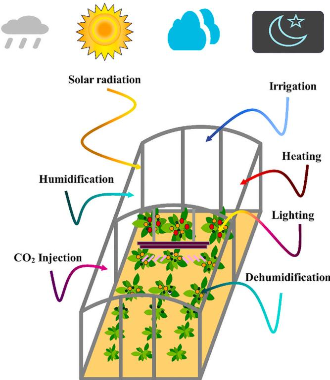  
图1. 可控太阳能温室示意图

# 系统建模

如附录A所述，采用五个子模块分别建立作物生长、空气$\mathrm{CO_2}$、灌溉、空气湿度和能量的数学模型。

图2所示的综合动态建模流程图包含小时和日两个时间循环。这些方程间的数学时序关系表明，叶面积指数(LAI)、植株重量、果实干重和成熟果实干重四个关键参数及灌溉量，需每日分别通过求解LAI、果实干重、成熟果实干重和土壤水平衡的特定方程确定。

在小时尺度上，覆盖层温度、植株表面温度、土壤温度、加热需求、加湿或除湿量、$\mathrm{CO_2}$富集量及节间数等参数，通过求解七个核心方程获得。这些方程包括：温室覆盖层能量平衡、植株能量平衡、土壤能量平衡、空气能量平衡、空气湿度平衡、空气$\mathrm{CO_2}$平衡以及节间发育方程，涵盖了传热传质计算和作物节间发育动态。

本综合研究共同步求解13个方程，确保精确模拟和预测温室环境条件与作物生长动态。建模过程以温室结构物理特性、植株生理特征及内外环境条件作为输入参数，实现对温室环境的精准控制和优化。

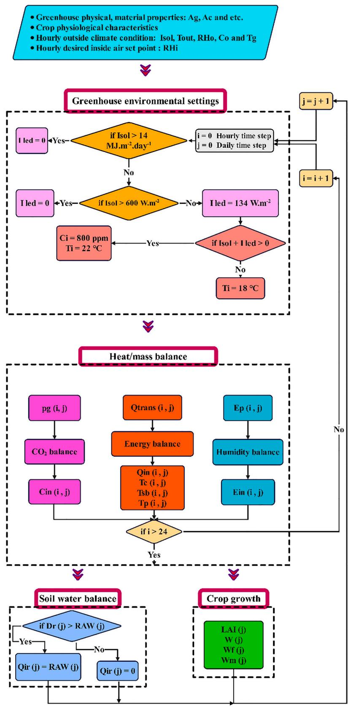  
图2. 温室综合动态建模流程图

# 人工神经网络

考虑到综合建模与优化的时间密集型特性，本研究采用人工神经网络(ANN)以减少计算耗时。随后将ANN与遗传算法(GA)耦合，用于优化温室环境条件，从而提升作物产量并降低运营成本。

本研究利用ANN进行温室系统的综合建模分析。这种监督学习方法通过在包含对应输入输出数据的数据集上训练算法，学习从输入值到输出值的映射函数[41]。如图3(a)所示，通过MATLAB软件生成了约3,000组设计变量数据点(在各变量上下限范围内随机生成)及对应的3,000组目标函数数据点，这些数据用于训练神经网络学习综合模型的复杂行为。图3(b)显示所有3,000组设计参数的随机数据点作为ANN输入数据，而对应的生产成本随机数据则作为ANN训练的输出数据。

这3,000个数据点代表四个设计(决策)变量的随机组合：日间温度、夜间温度、相对湿度和$\mathrm{CO_2}$浓度。这些变量在预设的上下限范围内采样。针对每组参数组合，在200天的栽培周期内保持参数恒定，运行动态模型模拟特定条件下的作物生长、能源资源利用及产量。关键时变生理参数如叶面积指数(LAI)、干物质积累、光合作用和蒸腾作用在模拟中按日/小时更新。该过程产生了3,000次完整模拟运行，每次生成对应的目标函数值(即每公斤番茄产量的成本)。最终形成包含输入变量和模拟性能的数据集用于训练ANN代理模型。

ANN算法通过多层结构处理输入数据以建模复杂关系。输入层与输出层之间的隐含层由神经元组成，可捕捉复杂模式并提高预测精度。各隐含层神经元执行计算、应用传递函数并将输出传递至下一层。神经元数量决定了网络建模复杂模式且避免过拟合的能力。传递函数引入非线性特性，使模型能够表征复杂数据关系。常用函数包括隐含层的Log-Sigmoid函数和输出层的Purelip函数，后者提供线性输出。这些要素对精确建模输入-输出关系及增强网络预测能力至关重要。

# 基于遗传算法的温室环境条件优化

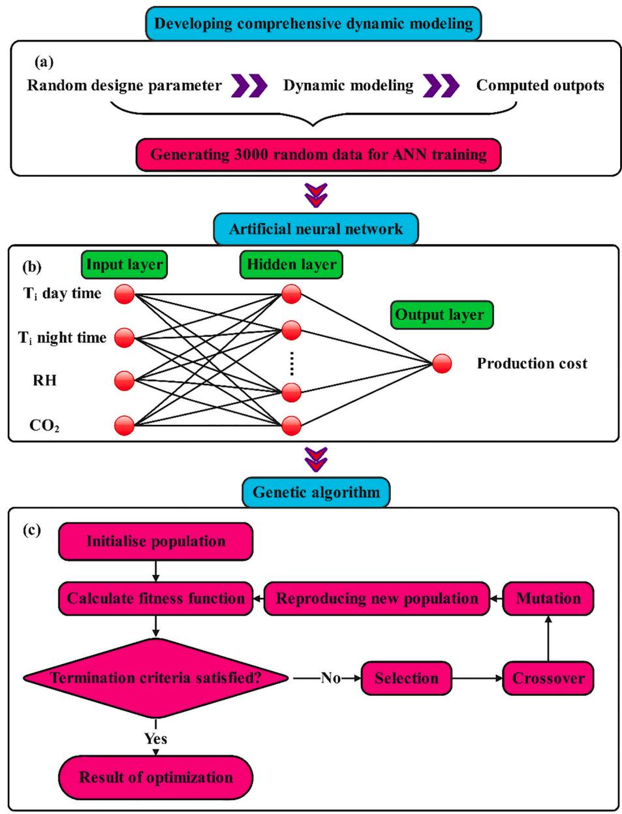  
图3. ANN建模与优化流程概述

对于太阳能温室气候的综合复杂建模，遗传算法(GA)相比其他优化技术具有多项显著优势。GA能高效处理非线性和多维问题，非常适合涉及能量平衡、湿度、$\mathrm{CO_2}$浓度、土壤水分平衡和作物生长的复杂模型。与基于梯度的方法不同（后者要求目标函数平滑可微），GA可以优化不连续或存在多个局部最优的函数。作为一种受生物进化启发的群体随机算法，GA通过评估每个候选解的适应度，并迭代地通过选择、交叉和变异生成新种群，引导搜索趋向最优或接近最优的解[42]。

为提升GA性能并防止陷入局部最优，本研究采用了多种策略。这些措施包括扩大种群规模、采用交叉与变异技术、设计合适的适应度函数，以及使用不同初始种群进行多次迭代[43]。这些策略确保了对解空间的全面探索，提高了获得最优解的可能性。本研究通过试错法确定了GA调参参数（如种群规模、交叉率、变异函数）。测试了多种参数组合以平衡求解精度与计算效率，表6所列最终参数值能实现稳定收敛且不会过早停滞。

在此背景下，通过GA定义单位产品重量的运营成本进行单目标优化分析(图3.c)。该优化流程旨在识别最优环境参数（温度、湿度和二氧化碳浓度）以最小化目标函数。运营成本包括锅炉加热用天然气、加湿与灌溉用水、$\mathrm{CO_2}$富集用$\mathrm{CO_2}$以及补光灯用电的总成本。决策变量的约束条件见表1。

图3简要展示了温室环境建模、ANN等效模型开发及流程优化的总体框架。

# 不确定性分析

为确保报告结果的准确性和可靠性，本研究基于典型传感器误差范围进行了不确定性分析（尽管未直接依赖传感器测量），以评估误差对关键模拟输出的影响。该分析有助于理解潜在误差及其对整体测量的影响，特别是考虑到现实系统中的不确定性可能来自输入波动、传感器误差和参数变异等多种来源[44]。通过公式(1)估算作物生长参数的相对不确定性：

$$
A = f(x_{1},x_{2},\dots ,x_{n})
$$

$$
\sigma_{A} = \pm \sqrt{\sum_{i = 1}^{n}\left(\frac{\partial A}{\partial x_{i}}\sigma_{x_{i}}\right)^{2}} = \pm \sqrt{\left(\frac{\partial A}{\partial x_{1}}\sigma_{x_{1}}\right)^{2} + \left(\frac{\partial A}{\partial x_{2}}\sigma_{x_{2}}\right)^{2} + \dots + \left(\frac{\partial A}{\partial x_{n}}\sigma_{x_{n}}\right)^{2}}
$$

其中，$\sigma_{\mathrm{A}}$为组合标准不确定度；A为测量结果；$\mathbf{x}_{\mathrm{i}}$为各独立测量值；$\sigma_{\mathrm{xi}}$为各测量的标准不确定度。

表1 决策变量约束与取值范围

| 决策变量取值范围 | 约束条件 |
|----------------|---------|
| 20°C < 白天温度 < 30°C | 供热供应 ≥ Qin |
|  | 供水供应 ≥ Qwater |
| 12°C < 夜间温度 < 20°C | CO2供应 ≥ Cin |
| 50% < 相对湿度 < 100% | 电力供应 ≥ Iled |
| 450ppm < CO2浓度 < 1150ppm | 电力供应 ≥ Iled |

如附录A.1节作物生长模型所述，成熟果实重量$(\mathrm{Wm})$受多种温室环境因素影响，包括温度、$\mathrm{CO_2}$浓度、光照强度和相对湿度。

$$
W_{m} = f(CO_{2},I_{s},T_{i},RH)
$$

$$
w_{m} = \pm \sqrt{\left(\frac{\partial W_{m}}{\partial CO_{2}}\sigma_{CO_{2}}\right)^{2} + \left(\frac{\partial W_{m}}{\partial I_{s}}\sigma_{I_{s}}\right)^{2} + \left(\frac{\partial W_{m}}{\partial I_{i}}\sigma_{I_{i}}\right)^{2} + \left(\frac{\partial W_{m}}{\partial RH}\sigma_{RH}\right)^{2}}
$$

# 案例研究

为验证所提出的动态温室建模与优化框架，本研究选择番茄作为目标作物，因其对环境条件敏感、经济价值高且在可控温室生产中普遍种植。模拟对象为德黑兰附近(35.7219N, 51.3347E)的半圆拱形玻璃温室，尺寸为长$25~\mathrm{m}$、宽$8\mathrm{m}$、高$3.5\mathrm{m}$，配备LED补光系统。温室屋顶和侧墙采用$4\mathrm{mm}$玻璃覆盖，LED灯功率为$134~\mathrm{W.m^{- 2}}$，灌溉采用滴灌技术。单位面积移植约3.5株番茄，栽培周期为10月10日至次年4月30日共200天，其余时间用于温室消毒和下一季种植准备。由于高温天气和露地产品增加，温暖月份进行可控环境农业种植经济效益较低。

# 天然气、水、二氧化碳和电力价格

表2列出了用于运营成本估算的天然气、水、$\mathrm{CO_2}$和电力价格。

番茄温室环境设置的总体信息

将所提模型与现有温室控制系统集成，需利用先进传感器和物联网设备实时采集温度、湿度、$\mathrm{CO_2}$浓度、土壤含水量和辐射数据。番茄栽培的理想环境条件见表3。

温室番茄种植环境控制的典型参数值总结如下[12,32,40]：

白天室内空气温度设定值为$22^{\circ}C$，夜间为$18^{\circ}C$。室内空气相对湿度维持在$80\%$。光照条件下向温室注入$\mathrm{CO_2}$，设定值为800 ppm。通风应用遵循以下条件：当室内温度超过设定的昼夜温度阈值时启动通风，此时暂停加湿和$\mathrm{CO_2}$注入。

表2 天然气、水、二氧化碳和电力的运营成本估算价格[45,46]

| 公式 | 参数 | 单位 | 价格 |
|------|------|------|------|
| PCule = ∑PRuleQin | PFule | $/kWh | 0.0002 |
| PCover = ∑PWater(Qir + Ein) | PWater | $/m³ | 0.008 |
| | ρw | | |
| PCover = ∑PCO2Cin | PCO2 | $/kg | 0.1 |
| PCover = ∑PCO2Cin | PCO2 | $/kWh | 0.0018 |
| PCover = ∑PElectricalityIed | PElectricality | $/kWh | |

表3 番茄作物的理想环境条件

| 环境因素 | 范围[13] | 原因 |
|----------|----------|------|
| 白天温度(°C) | 20-30 | 高温会损害番茄植物细胞，降低繁殖成功率，而低温会通过减缓代谢活动抑制生长 |
| 夜间温度(°C) | 14-20 | 番茄植物在白天较高温度和夜间较低温度下生长更快 |
| 相对湿度(%) | 50-100 | 高湿度会为真菌病害创造有利环境，而低湿度会导致植物因蒸腾作用过快而枯萎 |
| CO2浓度(ppm) | 450-1150 | 低于450ppm会限制光合作用，过高则会减少气孔导度，影响植物水分调节 |
| 光照强度(MJ·m⁻²·d⁻¹) | 最高14 | 额外光照不会促进光合作用，反而可能导致光抑制，损害光合机构 |

当室内相对湿度超过设定值时启动通风。然而，如果室内温度低于设定的昼夜温度阈值，则强制停止通风。补光灯最大运行时间为$18\mathrm{h}$，当日太阳辐射低于$14\mathrm{MJ.m^{- 2}}$ $\mathrm{day^{- 1}}$时开启，当小时太阳辐射高于600$\mathrm{W.m^{- 2}}$时关闭。为避免作物水分胁迫，在土壤有效水(RAW)耗尽前或耗尽时进行灌溉。

# 气象输入数据

图4(a)和(b)展示了整个栽培周期内德黑兰的逐小时太阳辐射和平均温度。根据Renewables.ninja数据集[47]，记录的最高温度为$23.85^{\circ}C$，最低温度为$-8.43^{\circ}C$，平均太阳辐射为$170.57\mathrm{W.m^{- 2}}$。图5展示了使用伊朗气象组织[48]数据得到的月平均相对湿度值，最高为$56\%$，最低为$22.5\%$。此外，根据Sanaye和Niroomand[49]报告的数据，提取并拟合了最高和最低月平均地温，10月为$23^{\circ}C$，1月为$6^{\circ}C$。

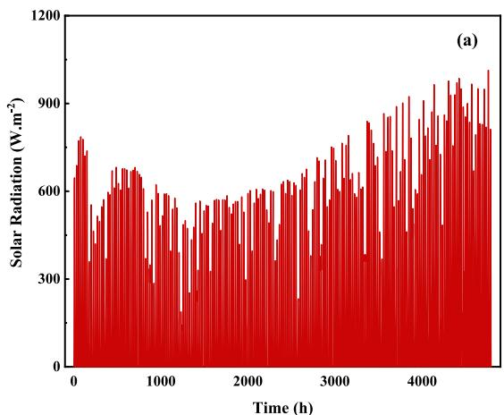  
图4. 德黑兰逐小时(a)太阳辐射和(b)环境温度[47]

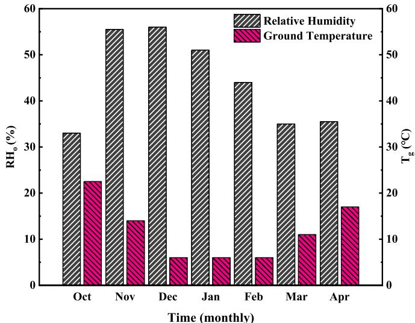  
图5. 德黑兰月平均相对湿度和地温[48,49]

# 结果与讨论

本节研究了模型验证，展示了其高精度和可靠性。下一节将展示ANN如何为附录A各部分中耗时的标准模型提供快速近似模型。随后进行敏感性分析，突出内部环境因素对生产成本(目标函数)的影响。接着展示优化结果，证明效率和性能的显著提升。此外，与先前研究的比较分析突显了当前综合动态模型在精度和成本效益方面的优越性。最后，对仪器测量进行了不确定性分析，确保研究结果的稳健性和可靠性。

# 模型验证结果

本节提供了作物生长模型、植物和土壤接收的太阳辐射模型、能量平衡模型、湿度平衡模型以及光合作用的验证。

# 作物生长模型验证

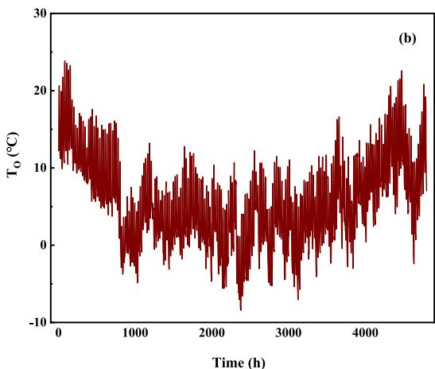

为验证本研究开发模型的有效性，基于方程(A.1)至(A.6)的作物生长模型结果与Jones等[34]报告的实验数据进行了对比（使用相似的植物生长输入数据，见表4）。结果表明当前研究的作物生长模型结果与实验报告具有可接受的一致性（图6）。

# 植物与土壤接收太阳辐射模型及能量平衡验证

图7(a)和(b)分别展示了基于表A.8中方程14至17计算的植物和土壤接收太阳辐射比例，并与文献[39]报告结果进行对比。此外，图8显示了基于方程A.11至A.14的温室内瞬时温度分布，与文献[50]报告的实验结果对比。可以明显观察到正午时段的温度升高。图中数据表明当前模型结果与实验数据具有良好一致性，误差均小于5%。

# 湿度平衡模型与作物光合作用验证

图9(a)展示了基于方程A.10和表A.6的湿度平衡模型结果与文献[51]实验数据的对比精度。图9(b)显示了基于表A.2中方程7的植物光合作用模型与文献[52]实验结果的对比。需要说明的是，相对湿度会随环境温度升高而降低，因为暖空气能容纳更多水分，即使绝对含水量保持不变也会导致相对湿度降低。同时可以明显看出，光合作用速率会随着正午时段光照强度的增加而提高。图中数据显示当前模型结果与实验数据具有良好一致性，误差均小于5%。

# 人工神经网络建模结果

表5列出了ANN模型的输入参数。数据集包含3000个实例，其中2100个用于训练，450个用于测试，450个用于验证。ANN架构包含5个隐藏层，每层8个神经元。初始权重和偏置随机分配。隐藏层使用Log-Sigmoid传递函数，输出层使用Purelin传递函数。采用Levenberg-Marquardt反向传播算法作为学习规则，该算法以神经网络训练效率高而著称。

最终ANN架构（5个隐藏层，每层8个神经元）是通过试错法确定的。我们测试了多种网络结构（包括不同层数和神经元数），使用1000、2000和3000个样本的数据集进行验证。所选配置在验证集和测试集上实现了预测精度与泛化能力的最佳平衡。

为确保获得泛化能力良好的ANN代理模型，我们通过训练不同架构（隐藏层数2-6，每层神经元数5-20）进行了对比分析。该过程使用不同规模数据集（1000、2000和3000样本）重复进行，以评估对训练量的敏感性。最终架构基于其优异的验证性能和泛化能力选出。通过早停法和对独立验证集/测试集的性能跟踪来防止过拟合。最终模型在未见数据上实现了$\mathbb{R}^2$>0.99的优异表现，证实了其稳健性和预测准确性。

表4 仅用于作物生长验证的输入数据[34,35]

| 作物生理特性 | 数值 | 初始条件 | 数值 |
|--------------|------|----------|------|
| kF (节点) | 5 | LAI (m²叶片/m²地面) | 0.003 |
| Nb (节点) | 16 | N (节点) | 2.4 |
| NF (节点) | 10 | W (g干重/m²) | 0.1 |
| β (天⁻¹) | 0.0169 | WF (g干重/m²) | 0 |
| δ (m²叶片/节点) | 0.038 | WM (g干重/m²) | 0 |
|  |  | ρP (株/m²) | 3.12 |

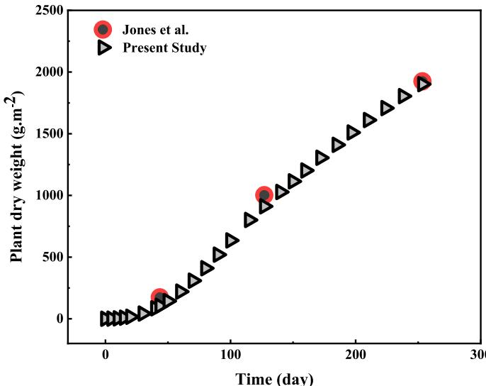  
图6. 基于当前动态模型模拟的作物干重(植物生长)随时间变化验证结果，与Jones等[34]报告的实验数据对比。

为应对过拟合风险，采用系统化的试错策略来调整模型架构并评估其泛化能力：

训练了多种具有不同隐藏层数和每层神经元数量的人工神经网络架构。使用三种不同规模的数据集(1000、2000和3000个随机生成的数据点)进行测试，以评估ANN对不同训练数据量的响应。每种情况下，数据被划分为训练集$(70\%)$、验证集$(15\%)$和测试集$(15\%)$。基于验证性能(而不仅是训练误差)选择最佳模型以避免过拟合。在所有情况下，跟踪测试集上的$\mathbb{R}^2$和MSE以确保良好泛化能力，最终模型实现了$\mathbb{R}^2 >0.99$。

通过这种迭代的架构选择和数据集评估方法，无需依赖过深或过于复杂的网络，即可获得训练良好的代理模型。

为阐明ANN模型的准确性(该模型旨在训练涵盖温室组件能量平衡、湿度平衡、$\mathrm{CO_2}$平衡、土壤水分平衡和作物生长关系的综合建模，以估算单位产品重量的运营成本(目标函数))，将ANN模型的预测值与当前开发模型的结果进行比较。图10(a)显示了训练、测试和验证数据的均方误差。ANN模型在第580个epoch后达到最佳验证精度0.00023841。根据图10(b)，生产成本的决定系数$(\mathbb{R}^2)$为0.9999。因此，本研究明确认为这是一个训练良好的ANN算法。

通过使用训练好的ANN对温室环境条件进行建模，温室环境条件综合建模和优化过程的运行时间显著减少。ANN能在几分之一秒内模拟完整模型的行为，实现场景的快速评估和高效优化。

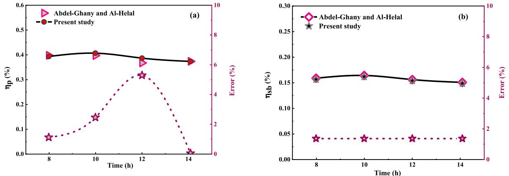  
图7. 建模结果与实验发现的验证：(a)植物接收的太阳辐射百分比建模和(b)土壤接收的太阳辐射百分比建模，与文献[39]报告的实验结果对比。黑色和紫色分别对应左右坐标轴的曲线。(关于图例中颜色引用的解释，读者可参考本文的网络版)

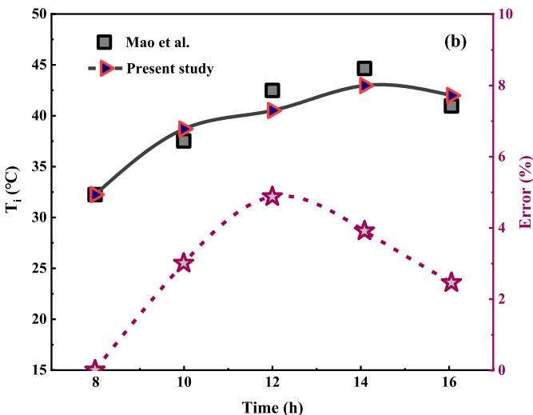  
图8. 温室内逐小时温度分布，与文献[50]报告的实验结果对比。黑色和紫色分别对应左右坐标轴的曲线。(关于图例中颜色引用的解释，读者可参考本文的网络版)

# 敏感性分析

表5 人工神经网络输入参数列表

| 参数项 | 参数值/特征 |
|--------|-------------|
| 数据集生成数量 | 3000 |
| 训练数据数量 | 2100 |
| 测试数据数量 | 450 |
| 验证数据数量 | 450 |
| 隐藏层数量 | 5 |
| 隐藏层神经元数量 | 8 |
| 初始权重和偏置值 | 随机 |
| 隐藏层传递函数 | Log-Sigmoid |
| 输出层传递函数 | Power |
| 学习规则 | Levenberg-Marquardt反向传播算法 |

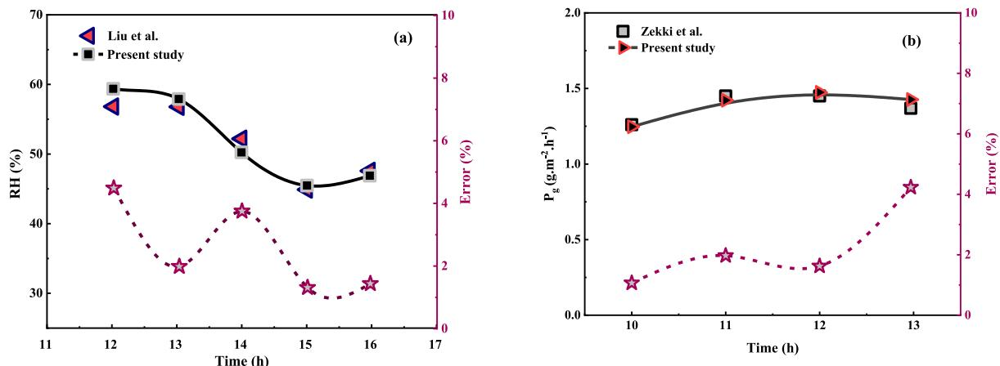  
图9. 开发模型与实验室结果的验证：(a) 相对湿度瞬时分布与文献[51]报告的实验结果对比，(b) 植物光合作用与文献[52]报告的实验结果对比。黑色和紫色分别对应左右坐标轴的曲线。(关于图例中颜色引用的解释，读者可参考本文的网络版)

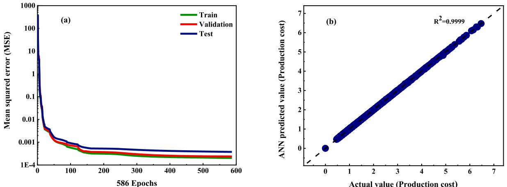  
图10. ANN验证结果：(a) ANN模型的均方误差和(b) 当前开发模型估计数据与ANN预测的生产成本对比

通过敏感性分析评估不同环境生长因素变化对目标函数(生产成本)的影响，具体考察各参数(日间温度、夜间温度、相对湿度和CO₂水平)±10%的变化。将这些生长因素的变化效果与文献[12,32,40]建议的典型条件进行对比。典型条件包括日间温度22°C、夜间温度18°C、相对湿度80%、CO₂浓度800ppm和人工光照强度134W·m⁻²。在这些特定条件下，栽培过程的运营成本确定为1.36美元·m⁻²/栽培周期，预期作物产量为2.73kg·m⁻²，生产成本为0.5美元·kg⁻¹。如图11所示，日间和夜间温度对生产成本起关键作用。当日间温度升高10%(至24.2°C)时，运营成本增加5.1%至1.43美元·m⁻²。然而，这种温度升高也使作物产量显著增加14.6%至3.13kg·m⁻²。因此，当温度升高10%时，即使伴随加热成本增加，作物产量仍显著提高，导致生产成本(目标函数)降低9.4%。分析表明，日间和夜间温度是影响目标函数的最重要参数，而相对湿度和CO₂浓度的变化对生产成本影响相对较小。这表明在优化过程中应更注重温度变量的精确控制和调节，因为它们对成本降低的贡献更大。这些发现验证了优化策略的结构和优先级，并确认最优环境设定值处于系统响应最敏感且经济效益最大的范围内。

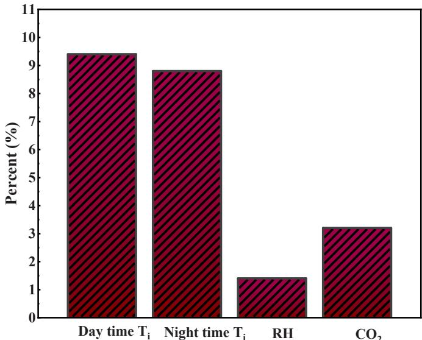  
图11. 输入参数对生产成本(目标函数)的影响

# 优化结果

本节展示了优化结果，包括目标函数和设计参数的最优值。研究结果涵盖作物光合作用与呼吸作用、作物蒸散发与灌溉管理，以及温室运营的经济分析。

# 目标函数与设计参数的最优值

计算使用配备24个虚拟CPU和60GB内存的Intel Core i9 12900 K处理器完成。初步建模计算时间约为1分钟，而通过MATLAB软件进行综合建模优化的总计算时间约为$83\mathrm{h}$。应用监督机器学习方法后，优化过程所需时间从$83\mathrm{h}$缩短至$2\mathrm{min}$。此外，使用MATLAB开发的代码生成数据（包含3,000次动态模拟运行）耗时约$6\mathrm{h}$。优化过程运行时间基于种群规模和最大代数进行估算。虽然最大代数设置为100，但在50代后即达到收敛。收敛结果的遗传算法调参见表6。

决策变量与目标函数的最优值见表7。

优化框架特意围绕温室内部恒定环境设定值设计，在保持简单跟踪设定值的同时，捕捉200天生长期内系统级的真实性能。这些设定值处于农艺和操作现实的合理范围内。温室的自主子系统（如加热、除湿、$\mathrm{CO_2}$注入、人工照明）动态运行，随时间推移尽可能维持内部条件接近这些设定值，以应对外部气候波动。

表6 遗传算法调参列表

| 参数项 | 参数值 |
|--------|--------|
| 种群大小 | 300 |
| 交叉比例 | 0.9 |
| 函数容差 | 10-6 |
| 最大代数 | 100 |
| 精英数量 | 30 |
| 最大停滞代数 | 50 |
| 决策变量数量 | 4 |
| 变异函数 | 高斯分布 |
| 选择函数 | 随机均匀 |
| 交叉函数 | 分散交叉 |

表7 决策变量与目标函数的最优值

| 项目 | 最优值 |
|------|--------|
| **决策变量** | |
| 日间温度 | 23.76°C |
| 夜间温度 | 16.02°C |
| 相对湿度 | 68.22% |
| CO2浓度 | 627.69 ppm |
| **目标函数** | |
| 生产成本 | 0.47美元/kg |

优化参数与番茄植株的生理需求高度吻合：适中的日间温度(约$23-24^{\circ}C$)能促进光合酶的最佳活性，同时避免热胁迫或果实脱落；较低的夜间温度$(16^{\circ}C)$可减少呼吸消耗，保留更多同化物用于果实发育；约$68\%$的相对湿度既能维持支持养分运输的蒸腾速率，又可降低高湿度环境下常见的真菌病害风险；优化的$\mathrm{CO_2}$浓度627.7 ppm相比环境浓度提升了光合效率，同时避免了更高浓度带来的收益递减和额外成本。这些设定值在最大化产量与最小化运营成本(特别是加热和$\mathrm{CO_2}$补充)之间实现了精妙平衡，最终达成每公斤产品的最低生产成本。

在优化环境下，生长周期末的成熟果实重量$(\mathrm{W_m})$达到$2.58\mathrm{kg}.\mathrm{m}^{-2}$。与无补光情况相比，补充光照使$\mathrm{W_m}$从$2.27\mathrm{kg}.\mathrm{m}^{-2}$增加$12\%$；同样，$\mathrm{CO_2}$加富(从环境浓度380 ppm提升至$627.7\mathrm{ppm})$使$\mathrm{W_m}$从$2.32\mathrm{kg}.\mathrm{m}^{-2}$增长$10\%$。

# 最优点的作物光合与呼吸作用

图12a和b分别展示了最优条件下基于表A.2式(7)的每日光合速率、基于表A.2式(1)的植物呼吸速率，以及右纵轴显示的每日植株重量变化。数据显示随着植株生长，光合与呼吸速率同步提升。

# 最优点的作物蒸散发与灌溉管理

图13(a)呈现了基于表A.4式(1)的每日蒸散速率及右纵轴的植株重量变化；图13(b)展示了基于表A.4式(4)的灌溉管理方案及对应蒸散速率。结果表明植株生长过程中蒸散量和需水量同步增加。灌溉管理方案特别设置了18个关键灌水日，对应土壤水分耗竭期。

# 最优点的温室经济分析

表8详细列出了最优工况下加热、用水(含灌溉与加湿)、除湿、$\mathrm{CO_2}$补充和人工照明的需求及相关成本。

# 当前综合模型与既往研究结果的比较

如文献综述所述，仅Golzar等[13]和Mahmoud等[14]在可控太阳能温室研究中涵盖了更多有效参数。但既有研究存在以下局限：1)未考虑温室组件的温度差异对热损失估算的影响；2)等温假设忽略了覆盖层(顶棚与侧墙)内表面的水滴凝结；3)未纳入植物呼吸对$\mathrm{CO_2}$需求的贡献；4)采用Stanghellini模型[53]估算蒸散时未考虑土壤蒸发和灌溉计划；5)基于Stanghellini模型[54]的光合作用估算忽略了光量子通量密度的影响。因此，表9对比了本研究的综合建模优化方法与文献[13,14]在相同输入值下的结果差异。

研究结果表明，通过本文提出的建模优化方法，由于覆盖层内表面的水蒸气凝结作用，温室湿度得以降低。因此需要测量温室覆盖层温度来估算产生的冷凝水质量流量。

此外，在估算所需补充二氧化碳量时，必须考虑植物白天的呼吸作用数据。参考文献[13]和[14]采用的温室覆盖层、土壤和空气温度等温假设，分别导致覆盖层和地面热损失估算出现31%和30%的误差。更重要的是，与这些文献提供的集总方法估算值相比，本研究的综合建模方法使加热需求降低了13%。

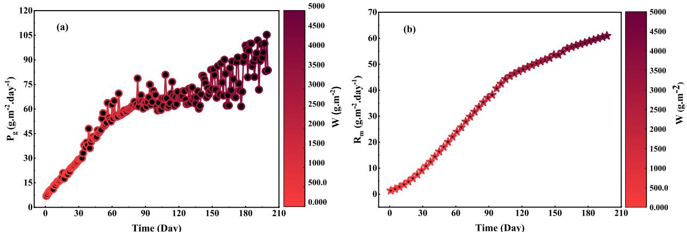  
图12.  t  t 4. 及设计参数的最优值

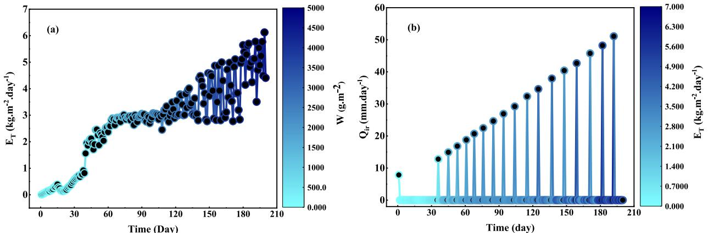  
图13. 图4(a)及设计参数的最优值

表8 最优设计点的温室能源、水、CO2和人工照明需求及相关成本

| 项目 | 需求量 | 成本 |
|------|--------|------|
| **能源** | | |
| 加热 | 741.53 (kW·m⁻²) | 0.17 ($·m⁻²) |
| **水** | | |
| 灌溉 | 534 (mm) | 0.053 ($·m⁻²) |
| 加湿 | 1.85 (kg·m⁻²) | 0.0001 ($·m⁻²) |
| 除湿 | 547.3 (kg·m⁻²) | - |
| **CO2** | | |
| CO2注入 | 8.71 (kg·m⁻²) | 0.87 ($·m⁻²) |
| **光照** | | |
| 人工照明 | 98.22 (kW·m⁻²) | 0.17 ($·m⁻²) |
| **总计** | | 1.22 ($·m⁻²) |

表9 当前提出的综合模型与类似研究在相同输入值下的结果比较

| 项目 | 本研究 | 参考文献[13,14] | 差异(%) |
|------|--------|----------------|---------|
| **加热** | | | |
| Qin(kW·m⁻²) | 741.53 | 841.9 | 13 |
| **热损失** | | | |
| Qcond(kW·m⁻²) | 314.67 | 410.08 | 30 |
| Qconv(kW·m⁻²) | 548.93 | 376.32 | 31 |
| **光合作用** | | | |
| Pg(kg·m⁻²) | 11.79 | 8.94 | 24 |
| **呼吸作用** | | | |
| Rm(kg·m⁻²) | 7.3 | 0 | 100 |
| **冷凝** | | | |
| Ec(kg·m⁻²) | 15.93 | 0 | 100 |
| **灌溉** | | | |
| Qir(mm) | 534.07 | 711.2 | 33 |
| **运营成本** | | | |
| Qtotal(kg·m⁻²) | 1.22 | 1.33 | 8.3 |

此外，通过建立考虑太阳光和LED灯光子通量影响的植物光合作用模型，本研究发现与文献[13,14]报道的结果存在24%的差异。

在灌溉调度方面，与现有文献中的理论和方程相比，本研究显示需水量存在33%的差异。

然而上述项目的估算表明，通过本研究提出的综合模型，这些差异使运营成本降低了8.2%。

本研究提出的综合建模与优化技术相比以往模型展现出显著改进。通过水蒸气冷凝降低温室湿度并精确估算排水质量流量，该模型解决了关键环境因素。先前研究的等温条件假设导致热损失估算出现重大误差，而本建模方法对此进行了修正。此外，植物光合作用和灌溉调度的建模方法虽与现有文献存在差异，但最终使运营成本降低8.2%。这些发现凸显了所提模型在优化温室条件和降低运营成本方面的有效性。

# 仪器测量的不确定性分析结果

如附录A.1节作物生长模型所述，成熟果实重量$(W_{m})$受多种温室环境因素影响，包括温度、$\mathrm{CO_2}$浓度、光照强度和相对湿度。对成熟果实重量的不确定性分析需要测量这些内部生长因子。所用传感器的假设如下：温度不确定度为$\pm 1^{\circ}\mathrm{C}$，$\mathrm{CO_2}$浓度不确定度为$\pm 30\mathrm{ppm}$，太阳辐射不确定度为$\pm 5\mathrm{W}\cdot\mathrm{m}^{-2}$，空气相对湿度不确定度为$\pm 5\%$。详细的不确定性及其相应敏感系数汇总于表10。

因此，栽培最后一天成熟果实重量增量的对应不确定度为$\pm 0.72\mathrm{g}$。

由于每平方米最终作物重量在200天内约为$2200\mathrm{g}$（每日番茄增重$11\mathrm{g}$），上述结果表明由于仪器测量不准确导致的番茄产量重量不确定度约为6.5%。

为评估输入不确定性下优化结果的稳健性，基于偏导数和传感器容差的不确定性分析估计整个栽培周期内作物产量的总传播不确定度约为6.5%。此外，敏感性分析表明，当每个环境参数变化$\pm 10\%$时，产量和成本的变化均小于10%。这些结果证实该模型对中等输入波动相对不敏感，表明传感器误差和环境不确定性不太可能显著影响优化结果。这验证了所提方法的实际可靠性。

表10 影响成熟果实重量的环境因素不确定性分析

| 环境因素 | 标准不确定度 | 敏感系数 |
|---------|------------|---------|
| 温度 | σT1= 1°C | dwm/dT1= 0.72 |
| CO2浓度 | σCO2= 30ppm | σCO2= -0.00017 |
| 太阳辐射 | σIa= 5W·m⁻² | σIa= 0.006 |
| 相对湿度 | σRH= 5% | σRH= 0.002 |

# 结论

本研究探讨了温室环境条件(温度、光照、空气湿度、CO₂和灌溉)变化对番茄作物生长、产量及相应运营成本的影响。这有助于全面分析现有文献中未涉及的生长因子(温度、光照和CO₂)变化对作物生长及运营和生产成本的双重影响。研究发现，在研究的条件下，补充光照或CO₂注入虽然能促进作物生长和产量，但对植物生长的实际影响较为有限。通过优化温室环境条件，选择影响植物生长的参数以实现每公斤产量的运营成本最小化。这种单目标优化确保了在提高作物产量的同时保持经济高效。这些分析可应用于现代农业的管理和决策。本研究的主要发现总结如下：

- 案例研究输入值下实现每公斤产品最低成本(最具成本效益的生产参数)的设计变量最优值为：生产成本0.47美元/kg，白天温度23.7°C，夜间温度16°C，相对湿度68.2%，CO₂浓度627.7 ppm。
- 动态模拟显示，在最佳条件和栽培周期内需要：加热741.53 kW·m⁻²，加湿用水1.85 kg·m⁻²，除湿547.31 kg·m⁻²，CO₂注入8.71 kg·m⁻²，灌溉用水534 mm，人工照明用电98.2 kWh·m⁻²。
- 在最佳条件下，CO₂增施和补充光照仅分别使成熟果实重量增加10%和12%，证实了其相对于成本的有限贡献。
- 通过结合人工神经网络和遗传算法，显著缩短了优化过程所需时间。

虽然当前方法为管理温室环境因素和优化运营成本提供了全面框架，但仍需承认以下局限性：

1- 本研究采用的作物生长、光合作用、呼吸作用和蒸散关系仅适用于番茄植物，对于其他具有不同生理参数的作物应替换适当的关系式。

2- 研究结果基于德黑兰的气候条件(夏季炎热干燥、冬季凉爽湿润)，对于新的环境条件和不同气候带需进行适当调整。

3- 水、电、CO₂和天然气的运营成本在不同地区可能有所差异，模型需要输入正确的成本值进行经济分析。

4- 虽然使用了多种来源([51]湿度平衡、[52]作物光合作用、[39]不同组分吸收的太阳辐射、[50]能量平衡、[34]作物生长关系)的模型结果与实验数据进行验证比较，但由于所用仪器的精度限制，在控制温度、湿度、CO₂水平和光照所需的测量中存在相应不确定性，这导致实际结果与集成模型预测存在偏差。

未来工作可与温室所有者/经营者合作收集相关数据并进行试点研究以验证模型预测。另一个主要建议是将可再生能源设备应用于温室能源需求，并对实施可再生能源系统进行成本效益经济分析，估算改造项目的投资回收期。

# CRediT authorship contribution statement

Seyed Aliakbar Hosseini: Writing - original draft, Validation, Software, Methodology, Investigation, Formal analysis, Data curation. Sepehr Sanaye: Writing - review & editing, Supervision, Methodology, Investigation, Conceptualization.

# 利益冲突声明

作者声明，他们没有已知的可能影响本研究报告工作的竞争性经济利益或个人关系。

# 附录A

如附录A所述，作物生长、空气CO₂、灌溉、空气湿度和能量的数学建模分为五个子部分。

A.1 作物生长建模 当养分和病虫害管理措施适当时，番茄的生长和产量主要取决于温度、CO₂浓度和光照强度[55]。作物生长建模考虑以下假设：

- 假设养分需求完全满足，温室位于肥沃土地上且水源充足
- 假设植物在整个栽培期间保持完全健康状态
- 玻璃覆盖层内表面的冷凝水立即清除，以防止植物真菌病害

通过立即清除玻璃覆盖层内表面的冷凝水，本研究旨在预防真菌病害，从而维持植物健康。这确保观察到的生长模式代表最佳植物条件，不受病害相关并发症影响。养分可用性不会成为作物生长的限制因素。这使得研究能够专注于环境因素（如温度、光照和CO₂浓度）对作物表现的影响，而不会受到养分缺乏的混杂影响。

TOMSIM和TOMOGRO是基于干物质生产的两个动态模型，用于模拟番茄生长和产量[56]。在本研究中，采用TOMOGRO[35]的简化状态变量来模拟番茄作物生长。该模型使用五个状态变量：节点（表示植物茎上产生叶、枝或花的特定位置）、叶面积指数LAI（农业和生态学中用于测量指定土地面积内叶面积程度的无量纲指标）、植株重量（表示包括果实、叶和茎在内的地上部分干重）、果实重量（所有果实干重）和成熟果实重量（仅成熟果实干重）。作物生长关系中的参数详情见表A.1。节点发育速率可表述如下[34,35]：

$$
\frac{dN}{dt} = N_m f_N(T) \tag{A1}
$$

$\mathbf{f}_{\mathrm{N}}$(T)是用于根据小时温度变化调整节点发育速率的函数，$\mathbb{N}_{\mathrm{m}}$表示节点出现的峰值速率。每日变化的叶面积指数参数推导如下[34,35]：

$$
\frac{d(LAI)}{dt} = \rho_p\cdot \delta \cdot \lambda (T_d)\frac{e^{e^{\beta(N - N_b)}}}{1 + e^{\beta(N - N_b)}}\cdot \frac{dN}{dt} ifLAI< LAI_{max} \tag{A2}
$$

$$
\frac{d(LAI)}{dt} = 0gLAI\geq LAI_{max} \tag{A2}
$$

在方程(A.2)中，$\frac{\mathrm{dN}}{\mathrm{d}t}$为节点发育速率（方程(A.1)）。地上部分干重通过以下公式确定[34,35]：

$$
\frac{dW}{dt} = GR_{net}\qquad ifLAI< LAI_{max} \tag{A3}
$$

$$
\frac{dW}{dt} = GR_{net} - \rho_1\rho_p\frac{dN}{dt} ifLAI > LAI_{max} \tag{A3}
$$

在方程(A.3)中，$\mathbf{GR}_{\mathrm{net}}$表示净每日地上生物量增长率，其计算基于作物光合作用$\mathrm{P_g}$（表A.2方程7）和作物呼吸作用（Rm，表A.2方程1）[34,35]：

$$
GR_{net} = E.(P_g - R_m).(1 - f_R(N)) \tag{A4}
$$

作物光合作用受CO₂浓度和光照强度等环境生长因素影响。果实干重和成熟果实干重公式如下[34,35]：

$$
\begin{array}{l}\frac{dW_f}{dt} = GR_{net}\alpha_{f}f_F(T_d)\big(1 - e^{-\beta (N - N_f)}\big)g_{fday}ifN > N_{ff}\\ \displaystyle \frac{dW_m}{dt} = D_F(T_d)\big(W_f - W_m\big)ifN > N_{ff} + k_f \end{array} \tag{A6}
$$

表A1 番茄作物生长关系中的参数估计和常数[34,35]

| 参数 | 值 | 描述 |
|------|----|------|
| fN(T) | min (1, min (0.25 + 0.025 T1, 2.5–0.05 T1)) | 根据小时温度调整节点发育速率的函数 |
| fR(N) | max (0.02, 0.18–0.0032 N) | 根据发育阶段分配到根系的生物量比例 |
| fF(Td) | max (0, min (1, 0.0625(Td – Tmin))) | 根据日平均温度(Td)调整分配到果实的函数 |
| gTday | 1–0.154 (Td – Tcr) if Td > Tcr | 因白天高温(Td)导致生长减缓的函数 |
| DF(Td) (天⁻¹) | 0.04 max (0, min (1, 0.0714 (Td – 9))) | 果实发育速率与日平均温度(Td)的函数关系 |
| E | 0.75 | 光合产物转化为作物生物量的效率 |
| kr (节点) | 5 | 从第一个果实到第一个成熟果实的发育时间 |
| Nb (节点) | 16 | 指数线性方程中的系数 |
| Nff (节点) | 10 | 出现第一个果实时的每株节点数 |
| Nm (节点·天⁻¹) | 0.5 | 节点出现的最大速率 |
| Tcr (°C) | 24.9 | 果实开始败育的温度阈值 |
| Tmin (°C) | 8.5 | 果实停止生长的最低温度 |
| P1(克·节点⁻¹) | 0.02 | 达到LAIMAX后每个节点的叶片干重损失 |
| β (天⁻¹) | 0.0169 | 指数线性方程中的系数 |
| δ (m²叶片·节点⁻¹) | 0.038 | 每个节点的最大叶面积扩展量，指数线性方程中的系数 |
| θ (节点⁻¹) | 0.135 | 营养生长和完全果实生长之间的过渡系数 |
| αf (天⁻¹) | 0.8 | 新生长量分配到果实的最大比例 |

# A.2. 二氧化碳平衡模型

作物光合作用和呼吸作用会影响温室内的 $\mathrm{CO_2}$ 浓度[57]。呼吸作用产生的 $\mathrm{CO_2}$ 量总是小于光合作用吸收的 $\mathrm{CO_2}$ 量。由于营养、水分和光照等其他限制因素，植物可能不会对补充的 $\mathrm{CO_2}$ 产生积极反应。所有因素都需要处于最佳水平[23]。对于 $\mathrm{CO_2}$ 平衡建模，我们考虑了以下假设：

- 温室使用循环风扇均匀混合室内空气，确保整个温室内 $\mathrm{CO_2}$ 浓度一致。

循环风扇实现的良好空气混合确保了 $\mathrm{CO_2}$ 浓度没有空间差异。因此，所有植物都暴露在相同的 $\mathrm{CO_2}$ 水平下，促进均匀生长。

- 在白天栽培期间保持 $\mathrm{CO_2}$ 浓度恒定。

温室中的传感器还监测 $\mathrm{CO_2}$ 浓度。任何与 $\mathrm{CO_2}$ 浓度设定值的偏差都会触发相关设备的激活，以确保 $\mathrm{CO_2}$ 水平保持稳定并在所需范围内。

植物光合作用的估算可以通过使用不同的模型来量化，包括以估算作物 $\mathrm{CO_2}$ 同化而闻名的Stanghellini模型[54]和TOMOGRO模型[52]。虽然Stanghellini模型基于太阳辐射和环境 $\mathrm{CO_2}$ 浓度计算 $\mathrm{CO_2}$ 同化而不考虑植物呼吸作用，但本研究采用了TOMOGRO模型。在TOMOGRO模型中，植物光合作用受光合光子通量密度(PPFD)和环境 $\mathrm{CO_2}$ 水平的影响。此外，植物呼吸作用与成熟果实质量和植物重量相关。用于预测每小时 $\mathrm{CO_2}$ 注入的温室 $\mathrm{CO_2}$ 平衡可表示为[34,52]：

$$
h_{g}\frac{d c_{i}}{d t} = C_{i n} - C_{v e n t} - C_{i n f} - P_{g} - P_{m} \tag{A7}
$$

$C_\mathrm{in}$、$C_\mathrm{vent}$ 和 $\mathrm{C_{inf}}$ 分别是每小时 $\mathrm{CO_2}$ 注入量、通过通风和渗透的 $\mathrm{CO_2}$ 交换量。植物光合作用和维持呼吸每小时根据温室环境条件以及生理和形态条件计算[52]。$\mathrm{P_g}$ 是作物光合速率，$\mathbb{R}_{\mathrm{m}}$ 是维持呼吸速率。$\mathrm{CO_2}$ 平衡中的传质方程详见表A.2。$\mathrm{CO_2}$ 平衡关系中的参数详见表A.3。

表A2 CO₂质量平衡相关关系式

| 关系式 | 参数估计 | 参考文献 |
|--------|----------|----------|
| Rm = ∫Q10^(T-20) (1) | PPFD = Iledηled-PARζled-PAR + Isolτcηsol-PARζsol-PAR | (4) |
| Cinf = minf(c1−c0) | minf = ρaVa(K1+K2\|T0−T1\|+K3,Vo) | (5) |
| Cvent = mvent(c1−c0) | Pgmax = ∂Ci | (6) |
| Pg = DPgmaxln((1−m)Pgmax+QkPPFD)/(k(1−m)Pgmax+QkPPFDexp(−kLAI)) |  | (7) |

表A3 CO₂平衡模型中的常数[33]

| 参数 | 值 | 描述 |
|------|----|------|
| D | 2.592 | 将Pg从μmol(CO₂)·m⁻²·s⁻¹转换为g(CH₂O)·m⁻²·day⁻¹的系数 |
| k | 0.58 | 光衰减系数 |
| K1 | 0.1 | 渗透方程中的系数 |
| K2 | 0.011 | 渗透方程中的系数 |
| K3 | 0.034 | 渗透方程中的系数 |
| m | 0.1 | 叶片透光系数 |
| Qe (μmol CO₂/μmol光子) | 0.0645 | 叶片量子效率 |
| Q10 | 1.4 | 维持呼吸方程中的系数 |
| rm | 0.019 | 维持呼吸系数 |
| ∂ (μmol CO₂·m⁻²·s⁻¹/ppm) | 0.0693 | 植物二氧化碳利用效率 |
| ζled-PAR (μmol PAR/J) | 5.4 | LED发射的PAR中每焦耳光子数 |
| ζsol-PAR (μmol PAR/J) | 4.6 | 太阳发射的PAR中每焦耳光子数 |
| ηled-PAR | 0.55 | 灯具电能输入转换为PAR的比例 |
| ηsol-PAR | 0.55 | 太阳能转换为PAR的比例 |

# A.3. 水分/灌溉平衡模型

作物需水量是指维持作物最佳蒸散速率$(\mathrm{E_T})$所需的水量，从而避免水分胁迫[60]。估算作物需水量需要了解土壤含水量和作物蒸散的日变化率，并结合有效的灌溉管理和调度。在此背景下，建立了土壤水分平衡模型[40,61,62]：

$$
\begin{array}{rl} 
& D_r(i) = D_r(i - 1) - (P - RO)(i) - Q_r(i) - CR(i) + E_T(i) + DP(i) \quad \text{若} \quad D_r(i)\leq RAW(i)\\ 
& D_r(i) = D_r(i - 1) - (P - RO)(i) - C(i) + E_T(i) + DP(i) \quad \text{若} \quad D_r(i) > RAW(i) 
\end{array} \tag{A8}
$$

其中$\mathbb{D}_{\Gamma}$表示根区含水量，(P-RO)是降水与地表径流的差值，$\mathrm{Q}_{\mathrm{ir}}$为灌溉速率，CR是地下水补给量，$\mathrm{E_T}$为作物蒸散速率，DP是深层渗漏导致的根区水分损失。本研究采用Penman-Monteith方程模拟作物蒸散。FAO Penman-Monteith方程因其在估算作物蒸散$(\mathrm{E_T})$方面的准确性而广受认可，它同时考虑了作物蒸腾和土壤蒸发。该方法综合了多种生理和气候参数，包括太阳辐射(用于计算净辐射)、气温、相对湿度和风速，以及LAI等作物特定因子。该方法使用两个系数：描述植物蒸腾的基础作物系数$(\mathrm{K_c})$，以及描述土壤表面蒸发的土壤水分蒸发系数$(\mathrm{K_e})$。$\mathrm{K_e}$的估算需要推导表层土壤的日水分平衡如下[40]：

$$
D_{e}(i) = D_{e}(i - 1) - (P - RO)(i) - \frac{Q_{r}(i)}{f_{w}} +\frac{E_{e}(i)}{f_{ew}} +T_{ew}(i) + DP(i) \tag{A9}
$$

其中$\mathrm{D_e}$表示完全湿润后一天结束时的累积蒸发(消耗)深度，$\mathrm{E_e}$表示土壤蒸发量。灌溉模型中的方程细节见表A.4，土壤水分平衡关系中的参数细节见表A.5。

表A4 灌溉模型中的关系式[40]

| 关系式 | 编号 | 参数估计 |
|--------|------|----------|
| ET = (Ke+Ke)∑24 i=1ET0 | (1) | 0.408Δ(Rn-G) + γ 900 Ti+273 Vi(εs-εt) Δ+γ(1+0.34vi) |
| EE = KeET0 | (2) | es=0.6108exp(17.27Tti/(273.3+Ti)) |
| RAW = PTAW | (3) | Pt=Pt+0.04(5-Er) |
| Qr(i) = RAW(i)ifDf(i-1) > RAW(i)Qr(i) = 0ifDf(i-1) < RAW(i) | (4) | Rn=ηpsol |

表A5 灌溉管理模型中的参数和常数[40,61,62]

| 参数 | 值 | 描述 |
|------|----|------|
| Δ (kPa.C-1) | 4098 (0.6108exp(17.27Tt/273.3+Tt)) | 饱和水汽压曲线斜率 |
| γ (kPa.C-1) | (Tt+273.3)2 | 干湿表常数 |
| Ke | min((Kr(Kcmax-Kc)),fewKcmax) | 土壤水分蒸发系数 |
| Kcmax | max(1.2+(0.04(νt-2)-0.004(RHmin-45))h(3)0.3, (Kc+0.05) | 湿润后最大作物系数 |
| Kr | TEW-Dc(i-1) | 蒸发减少系数(无量纲) |
| few | min((1-fc),fw) | 暴露和湿润土壤比例 |
| h | LAI | 平均植株高度 |
| fc | Kc-Kcmin (Kcmax-Kcmin)+0.5h | 植被覆盖土壤表面有效比例 |
| TAW (mm) | 1000(θFC-θWP)Zc | 根区总有效土壤水分 |
| TEW (mm) | 0 | 土壤表层最大累积蒸发量 |
| Tew (mm) | 0 | 暴露湿润土壤表层蒸腾量 |
| CR (mm) | 0 | 地下水位远低于植物根区 |
| DP (mm) | 0 | 灌溉水被作物高效利用 |
| fw | 0.35 | 灌溉湿润土壤表面平均比例 |
| Kcmin | 0.15 | 无植被覆盖干燥土壤最小作物系数 |
| P (mm) | 0 | 温室模拟忽略降水 |
| Pt | 0.4 | 根区可消耗TAW平均比例(水分胁迫前) |
| REW | 9 | 易蒸发水量 |
| RO (mm) | 0 | 平坦地形可忽略径流 |
| Ze | 0.1 | 蒸发作用影响的表层土壤深度 |
| θFC | 0.25 | 田间持水量 |
| θWP | 0.12 | 萎蔫点 |

# A.4. 空气湿度平衡建模

温室内的主要水分来源是植物蒸腾作用。水分通过作物蒸散作用进入温室环境，并通过覆盖材料内表面的水汽凝结作用被移除。根据环境条件和温室结构，空气渗透可能降低或增加温室内的湿度。湿度平衡建模考虑了以下假设：

温室使用循环风扇确保室内空气充分混合，保持恒定的风速和相对湿度(RH)水平。

循环风扇有助于维持整个温室内空气相对湿度的均匀性。通过防止相对湿度的空间差异，确保所有植物都处于一致的湿度条件下。

在栽培期间保持湿度恒定。

湿度传感器实时监测相对湿度水平。如果检测到与设定值的任何波动，将启动必要设备以在整个栽培期间持续维持该湿度水平。

植物蒸散量估算可采用多种方法，如侧重于作物蒸腾的Stanghellini模型[53]，以及考虑作物蒸散的FAO56 Penman-Monteith方程[40]。Stanghellini模型往往忽略灌溉管理，排除了温室内土壤水分蒸发，主要关注植物蒸腾。而Penman-Monteith方程则通过考虑灌溉策略和土壤蒸发引入温室环境的水分来估算作物蒸散量。因此，本研究采用Penman-Monteith模型。用于评估每小时加湿需求的湿度平衡可计算如下[18,63,64]：

$$
h_g\frac{d\mathfrak{x}_i}{dt} = E_{in} + E_p - E_{inf} - E_{vent} - E_c \tag{A10}
$$

$\mathrm{E_{in}}$表示每小时加湿或除湿负荷。$\mathrm{E_p}$、$\mathrm{E_{inf}}$、$\mathrm{E}_{\mathrm{vent}}$和$\mathrm{E_c}$分别代表植物蒸散增加的水分、温室建筑渗透导致的水分交换、通风导致的水分交换以及覆盖材料内表面水滴的凝结速率。湿度平衡中质量传递方程的详细信息见表A.6，湿度平衡关系中参数的详细信息见表A.7。

表A6 湿度质量平衡中使用的关系式

| 关系式 | 参数估计 | 参考文献 |
|--------|----------|----------|
| Einf= 0.622 × minf(ei - eo) | (1) | (4) |
| Event= 0.622 × mg(ei - eoc) | (2) | (5) |
| Ec= 3600 × 0.622 × hc(i(ei - eoc) | (3) | (6) |

表A7 湿度平衡建模的关系式和常数[40]

| 参数 | 值 | 描述 |
|------|----|------|
| Tdewi (°C) | Aln(RH1/100) + RT1/A + BTi/B - ln(RH1/100) + BTi/A + T1/B | 室内空气露点温度 |
| Tdewo (°C) | Aln(RH0/100) + RT0/A + T0/B - ln(RH0/100) + RT0/A + T0/B | 外部空气露点温度 |
| A (°C) | 243.11 | 用于估算露点温度的常数 |
| B | 0.011 | 用于估算露点温度的常数 |
| Cpw (J.kg-1/°C-1) | 4180 | 水的比热容 |
| KPa | 101.325 | 大气压力 |

# A.5. 能量平衡建模

为估算温室地板和顶部覆盖层的热损失，需获取地板和覆盖层的瞬时温度。假设温室内不同组件温度相同会导致在栽培周期内热损失估算出现显著误差。根据文献[39]，本研究将温室系统视为太阳能集热器，包含三个半透明覆盖层（温室覆盖层、内部潮湿空气和作为三个平行层的植物）以及一个吸收板（温室土壤）。能量平衡模型基于以下假设：

采用集总参数法处理温室各组件。假设每个组件在整个温室内具有均匀温度，因此无法捕捉局部（空间）变化。

在许多实际应用中，如配备循环风扇的温室，温度变化相对较小，使得均匀温度假设合理。

植物冠层被视为半透明层，包含地上植物组织和间隙空气。该层特征是具有对入射到植物层上下表面的全局太阳辐射的有效反射率$(\rho_{\mathrm{ca}})$和有效透射率$(\tau_{\mathrm{ca}})$。

将植物冠层视为全局太阳辐射的半透明层，能准确表示阳光与冠层复杂结构的相互作用。该方法考虑了太阳能在冠层中的部分吸收、反射和透射，这些因素会影响光合作用、能量平衡和温室内的微气候条件。

使用温室组件的积分特性（与波长无关）来描述辐射特性。

通过使用反射率、透射率和吸收率等特性的平均值，模型变得更简单且计算效率更高。这种方法使模型能够专注于影响植物生长的最重要环境因素，而不是陷入与波长相关特性的复杂性中。然而，由于温室内温度通常不会极高，影响反射率、透射率和吸收率的主要因素是材料特性和光波长，而非在受控温室环境中通常较小的温度变化。

添加到室内环境的$\mathrm{CO_2}$和湿度的温度与室内环境温度相同。

保持添加的$\mathrm{CO_2}$和湿度与室内环境温度一致，可防止可能对植物造成胁迫或改变植物条件的突然温度变化。

栽培期间保持温度恒定。

温室配备持续报告内部温度水平的传感器。如果传感器检测到与白天和夜间温度设定值的任何波动，将启动相应设备或装置，在整个栽培期间保持这些温度水平恒定。

温室配备循环风扇，确保室内空气充分混合，从而形成均匀的风速和温度。

在温室中使用循环风扇可确保室内空气充分混合，形成均匀风速。这导致温度没有空间差异，在整个栽培区域保持一致的温度。

因此，为各组件开发了更详细的能量平衡方程。使用以下温室组件的能量平衡方程[15,67,68]：

对于覆盖层：

$$
Q_{sol - c} - Q_{conv} - Q_{conv} = m_{c}c_{pc}\frac{dT_{c}}{dt} \tag{A11}
$$

其中$\mathrm{Q_{sol - c}}$、$\mathrm{Q_{conv}}$和$\mathrm{Q_{conv}}$分别表示温室覆盖层从太阳获得的热量、通过对流向温室外部和内部的热损失。

对于植物：

$$
Q_{sol - p} - Q_{conv} - Q_{trans} = m_p c_p\frac{dT_p}{dt} \tag{A12}
$$

其中$\mathrm{Q_{sol - p}}$和$\mathrm{Q_{conv}}$分别表示植物从太阳获得的热量和通过对流的热损失。$\mathrm{Q_{trans}}$表示植物从温室空气中吸收的热量，本质上是植物蒸散释放的潜热，基于Penman-Monteith关系式[40]估算。用于模拟作物蒸散的Penman-Monteith方程与作物生长关系和土壤水分平衡（包括灌溉计划）在整个栽培周期内整体耦合。这种全面耦合通过考虑植物生长、土壤含水量和温室微气候（相对湿度和温度）之间的动态相互作用，实现了对作物需水量的准确模拟。

对于土壤：

$$
Q_{sol - sb} - Q_{convsb} - Q_{cond} = m_{sb}c_{pb}c_{pb}^{dT_{sb}}\frac{dT_{sb}}{dt} \tag{A13}
$$

其中，$\mathrm{Q_{sol - sb}}$ 和 $\mathrm{Q_{convsb}}$ 分别表示土壤从太阳获得的热量和对流热损失。$\mathrm{Q_{cond}}$ 表示通过温室地板传导的热量传递。

对于潮湿空气：

$$
Q_{in} + Q_{convin} + Q_{conv} + Q_{convsb} + Q_{inf} + Q_{vent} + Q_{lamp} + Q_{sol - a} = m_a c_{pa}\frac{dT_i}{dt} \tag{A14}
$$

其中 $\mathrm{Q_{sol - a}}$、$\mathrm{Q_{vent}}$、$\mathrm{Q_{inf}}$ 和 $\mathrm{Q_{lamp}}$ 分别表示来自太阳的热量获取、通过通风和温室建筑泄漏的热量损失、以及LED灯具的热量耗散。$\mathrm{Q_{in}}$ 表示对温室的加热负荷。传热传质方程的详细信息见表A.8。能量平衡关系中的参数详情见表A.9。

表A8 温室能量平衡使用的关系式

| 关系式 | 传热传质系数 | 参考文献 |
|--------|--------------|----------|
| Qsol-c = AcηcIsol ηc = (1 - τc - ρc) (1 + ρcτcτa²/1 - ρcaρcτa²/1 + ρcaρcτa²/1 - ρcaρcτa²/1) | (1) | (14) |
| Qsol-p = AgηpIsol ηp = (1 - τca - ρca) (1 + ρcτca²/1 - ρcaρcτa²/1 + ρcτca²/1 - ρcaρcτa²/1) | (2) | (15) |
| Qsol-a = ApηaIsol ηa = (1 - τw) (1 + ρpτa/1 - ρcaρcτa²/1 + ρwτcτp(1 + ρcτa/1 - ρcaρcτa²/1) | (3) | (16) |
| Qsol-sb = AgηsbIsol ηsb = (1 - ρsb)τcaτca/1 - ρcaρcτa(1 - ρsb/ρca + ρcτca²w/1 - ρcaρcτa²/1) | (4) | (17) |
| Qconv = Achco(Tc - To) hco = 2 + 1.2v | (5) | (18) |
| Qconv = Achci(Tc - Ti) hci = 3\|Ti - Tc\|³ | (6) | (19) |
| Qconvsb = Asbhsb(Tsb - Ti) hsb = 10\|Ti - Tsb\|³ | (7) | (20) |

表A8（续表）

| 关系式 | 传热传质系数 | 参考文献 |
|--------|--------------|----------|
| Qcovp = Acahp(Tp-Ti) hp=14Gρ.33 | (8) | [21] |
| Qinf = minfcpa(To-Ti)/3600 τca=exp(-c1.LAI),c1=c2√((1-τl)²-ρl²) | (9) | [22] |
| Qcond = Agksh(Ts-Tg) τa=exp(-kagLe),Lg=360Ae | (11) | [23] |
| Qlamp = AgkshL ρca=ρst(1-exp(-c2.LAI)),ρst=0.75ρl | (12) | [39,64] |
| Qtrans = AAgEp | (13) | [40,67,71] |
| Qvent = minventcpa(To-Ti)/3600 | (14) | [66] |

表A9 能量平衡建模常数[7,39,71]

| 参数 | 值 | 描述 |
|------|----|------|
| c2 | 0.75 | 植物几何系数 |
| Cpa(J·kg⁻¹·°C⁻¹) | 1005 | 空气比热容 |
| kA | 0.87 | 植物几何系数 |
| kSB | 0.7 | 土壤导热系数 |
| ηled,heat | 0.45 | 灯具电能转化为热量的比例 |
| ρc | 0.08 | 温室玻璃覆盖层反射系数 |
| ρl | 0.25 | 绿叶反射系数 |
| ρsb | 0.2 | 土壤反射系数 |
| τc | 0.84 | 温室玻璃覆盖层透射系数 |
| τl | 0.25 | 绿叶透射系数 |
| λ (NJ·kg⁻¹) | 2.45 | 汽化潜热 |

# A.6. 模型方程的耦合

温室环境的综合建模包括多个子模型的集成，如能量平衡、湿度平衡、$\mathrm{CO_2}$平衡、土壤水分平衡和作物生长关系。由于这些子模型相互耦合，因此在整个栽培周期内都考虑了温室系统内的动态相互作用。例如，管理土壤湿度值的土壤水分平衡模型与湿度和能量平衡模型相互关联。这意味着作物蒸散释放的潜热会影响作物表面温度、空气湿度和土壤水分水平。综合模型还纳入了灌溉管理和调度，以确保最佳的水分供应。此外，为了估算温室内覆盖表面的冷凝速率，必须将能量和湿度平衡模型耦合，因为冷凝速率取决于覆盖表面的温度。最后，依赖于环境条件的作物生长模型与所有其他模型耦合，因为这些因素共同影响作物表现。

A.6.1. 能量平衡与作物生长关系的耦合

变量$\eta_{\mathrm{p}}$、$\eta_{\mathrm{sb}}$、$\eta_{\mathrm{a}}$和$\eta_{\mathrm{c}}$（表A.8中的式(14)至式(17)）分别表示植物、土壤、潮湿空气和覆盖层吸收的太阳辐射。这些方程模拟了覆盖层、植物、潮湿空气和土壤分别接收的辐射量。需要强调的是，这些系数相互关联，并且由于植物每日动态生长，这些比例会每日变化。参数$\tau_{\mathrm{ca}}$和$\rho_{\mathrm{ca}}$（表A.8中的式(22)和式(24)）分别指植物对太阳辐射的透射系数和反射系数（通过植物叶片到达土壤）。这两个参数是LAI（式(A.2)）的函数，因此它们与作物生长方程耦合。

A.6.2. 能量平衡与湿度平衡及作物生长关系的耦合

温室覆盖内表面$(\mathrm{E}_{\mathrm{c}})$上水滴的冷凝速率可以使用表A.6中的式3计算。由于计算覆盖内表面水滴的冷凝速率需要知道温室覆盖温度$(\mathrm{e}_{\mathrm{sc}}$，表A.6中的式6是温室覆盖温度下的饱和蒸汽压），温室覆盖的能量平衡关系（式(A.11)）与湿度平衡耦合。此外，之前已确定能量平衡方程与植物生长关系（LAI，式(A.2)）耦合。

A.6.3. 能量平衡与湿度平衡、土壤水分平衡及作物生长关系的耦合

作物蒸散释放的热量$(\mathrm{Q}_{\mathrm{trans}})$可以根据植物的蒸散$(\mathrm{E}_{\mathrm{T}}$，表A.4中的式(1)）使用表A.8中的式12估算。$\mathrm{E}_{\mathrm{T}}$是温室内水分产生的主要来源，被纳入温室空气的湿度平衡$(\mathrm{E}_{\mathrm{p}}$，式(A.10)）。用于模拟作物蒸散的Penman-Monteith方程[40]（$\mathrm{E}_{\mathrm{T}}$，表A.4中的式(1)）与作物生长关系（$\mathrm{K}_{\mathrm{e}}$和$\mathrm{K}_{\mathrm{c}}$分别是土壤水分蒸发和植物蒸腾的系数，根据表A.5，基于植物高度或LAI（式(A.2)）以及包括灌溉调度在内的土壤水分平衡在整个栽培周期内估算）整体耦合。$\mathrm{ET}_{0}$（表A.4中的式5）是考虑环境条件（温度和湿度）的植物蒸散参考关系。$\mathrm{R}_{\mathrm{n}}$（表A.4中的式8）是到达植物的辐射，它是植物生长的函数，因为$\eta_{\mathrm{p}}$（表A.8中的式15）随植物生长每日变化。

A.6.4. $\mathrm{CO}_{2}$平衡与能量平衡及作物生长关系的耦合

光合作用是$\mathrm{CO}_{2}$减少的主要来源，而植物呼吸是温室环境中$\mathrm{CO}_{2}$增加的主要来源。这些过程在$\mathrm{CO}_{2}$平衡方程（式(A.7)）中考虑。$\mathrm{R}_{\mathrm{n}}$（表A.2中的式(1)）直接与植物重量（式(A.3)）和成熟果实重量（式(A.6)）相关。作物光合作用（Pg，表A.2中的式7）是LAI（式(A.2)）、阳光和人工光的光合光子通量密度（表A.2中的式4）、温度和$\mathrm{CO}_{2}$浓度的函数。植物呼吸取决于环境温度、植物重量（W，式(A.3)）和成熟果实重量（Wm，式(A.6)）。

# 附录B

# B.1. 动态建模结果

本节分析涵盖温室组件的太阳辐射吸收和补光需求。B.1.1. 温室组件的太阳辐射吸收。

图B.1展示了基于表A.8中式(14)至式(17)的关系以及作物生长方程(式(A.1)至式(A.6))，在不同生长日数下各温室组件吸收的太阳辐射。由于植物生长的动态特性、组件间的太阳辐射反射以及各部分的独特辐射特性，到达各组件的辐射比例各不相同。因此，温室组件的瞬时温度也不相同。

在植物达到最大覆盖度$\mathrm{(LAI_{max})}$之前（约100天后），吸收辐射的变化相当显著。一旦植物叶片生长完成，所有组件对太阳辐射的吸收将保持稳定直至生长周期结束。由于初期植物覆盖度最小，大部分太阳辐射直接到达温室土壤。随着时间的推移，植物叶片覆盖度增加导致植物吸收辐射增加（同时土壤吸收辐射减少）。温室覆盖层(nc)和潮湿空气(na)吸收的辐射在整个栽培期间基本保持恒定。温室向外界环境损失的辐射能量(no)百分比通过以下公式估算：$1 - (\eta \mathrm{p} + \eta \mathrm{sb} + \eta \mathrm{a} + \eta \mathrm{c})$。因此，温室向环境损失的辐射能量$\{\Pi_0\}$、覆盖层吸收的辐射以及潮湿空气吸收的辐射都受到植物动态生长行为的影响。

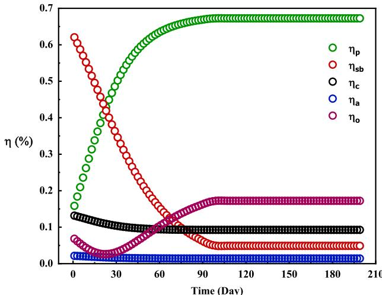  
图B1. 不同日期温室各组件吸收太阳辐射的百分比。获取结果的初始条件如(a)中所示的太阳辐射。红色数据：土壤吸收，绿色数据：植物吸收，黑色数据：玻璃覆盖层吸收，蓝色数据：潮湿空气吸收，紫色数据：温室损失的太阳辐射。

# B.1.2. 补光系统

为延长日照时间并在短日照、阴雨天气提高作物产量，需要人工补光（包括LED灯散发的热量）。这些数值如图B.2(a)所示。在秋冬大部分时段，补光需求显著。图B.2(b)展示了这些日期温室的补光时长。当太阳光无法满足植物每日光照需求时（如阴雨天），采用人工补光延长光照时间。因此，每日补光时长的变化源于太阳辐射变化和人工补光时长的调整。

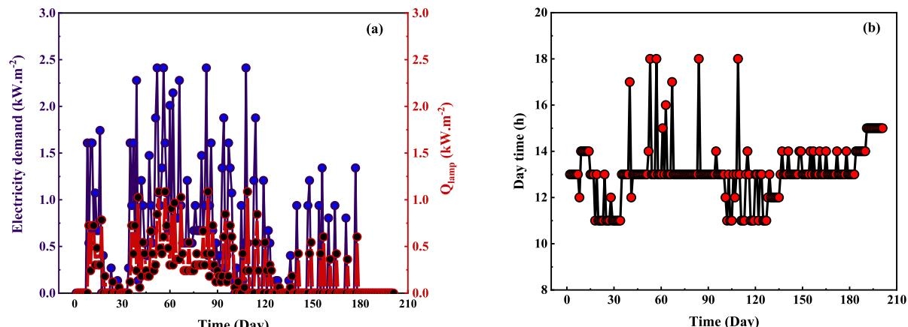  
图B2. (a)LED灯具的日用电需求与辐射热量 (b)不同日期温室的补光时长。获取结果的初始条件如(a)中所示的太阳辐射。

# 数据可用性

作者无法或选择不说明使用了哪些数据。

# 参考文献

[1] Chen WH, Mattson NS, You F. 基于半封闭温室非线性模型预测控制的受控环境农业智能控制与能源优化. Appl Energy 2022;320. https://doi.org/10.1016/j.apenergy.2022.119334.
[2] Esmaeli H, Roshandel R. 基于气候条件的太阳能温室优化设计. Renew Energy 2020;145:1255- 65. https://doi.org/10.1016/j.renene.2019.06.090.
[3] Vadiee A, Yaghoubi M, Martin V, Bazargan- Lari Y. 采用能源系统建模的太阳能遮阳系统概念能源分析. Sol Energy 2016;139:297- 308. https://doi.org/10.1016/j.solener.2016.09.039.
[4] Badji A, Benseddik A, H. Bensaha, A. Boukhelifa, I. Hasrane, 温室设计、技术与管理综述, 2022, Elsevier Ltd. doi: 10.1016/j.jclepro.2022.133753.
[5] Zhang M, Yan T, Wang W, Jia X, Wang J, Klemes JJ. 现代可持续温室的节能设计与控制策略综述. Renew Sustain Energy Rev Aug. 2022;164. https://doi.org/10.1016/j.rser.2022.112602.
[6] Bazgaou A, et al. 主动太阳能加热系统对温室番茄生产微气候、发育、产量和果实品质的影响. Renew Energy 2021;165:237- 56. https://doi.org/10.1016/j.renene.2020.11.007.
[7] Vadiee A, Martin V. 封闭式温室的能源分析与热经济评估——最大的商业太阳能建筑. Appl Energy 2013;102: 1256- 66. https://doi.org/10.1016/j.apenergy.2012.06.051.
[8] Vadiee A, Martin V. 通过封闭式温室概念的园艺应用能源管理研究现状, 2012. 10.1016/j.rser.2012.04.022.
[9] Abedrabboh O, Kog M, Bicer Y. 炎热干旱气候下可再生能源驱动的气候控制可持续温室建模与分析. Energy Convers Manag 2022;273. https://doi.org/10.1016/j.enconman.2022.116412.
[10] Mohebi P, Roshandel R. 用于农业温室加热的带储热太阳能系统优化设计与运行. Energy Convers Manage: X 2023; 18. https://doi.org/10.1016/j.ecma.2023.100353.
[11] Taftuni A, et al. 具有季节性储热的低成本温室热太阳能装置的热经济分析. Energy Convers Manag 2023;288. https://doi.org/10.1016/j.enconman.2023.117123.
[12] Golzar F, N. Heeren S, Hellweg, and R. Roshandel, 评估温室能源需求和作物产量的新型集成框架, 2018, Elsevier Ltd. doi: 10.1016/j.rser.2018.06.046.
[13] Golzar F, Heeren N, Hellweg S, Roshandel R. 基于能源需求-产量生产集成模型的节能温室优化. Biosyst Eng 2021;202:1- 15. https://doi.org/10.1016/j.biosystemseng.2020.11.012.
[14] Mahmood F, Ghiat I, Hazrat B, M. Luqman, T. Al- Ansari, 基于输入-产量模型的温室优化框架以适应不同环境条件, Energy Convers Manage: X, p. 100555, 2024, doi: 10.1016/j.ecmx.2024.100555.
[15] Singh G, Singh PP, Lubana PPS, Singh KG. 温室微气候数学模型的建立与验证. Renew Energy 2006;31 (10):1541- 60. https://doi.org/10.1016/j.renene.2005.07.011.
[16] https://www.tomatoesnz.co.nz/docsdocument/200- greenhouse- temperature- published- June- 2021.
[17] Zong C, Li H, Zheng L, Song W. 采用低成本冷源的FAA盘管新型冷凝除湿系统在温室中的评估与优化. J Clean Prod 2023;433. https://doi.org/10.1016/j.jclepro.2023.139805.
[18] Rahman MS, Guo H, Han J. 寒冷地区温室除湿需求建模与控制策略. Comput Electron Agric 2021;187. https://doi.org/10.1161/j.compag.2021.106264.
[19] Al Miaari A, El Khatib A, Ali HM. 创新型温室设计与热性能, Sustainable Energy Technol Assessm, 57, 2023, doi: 10.1016/j.seta.2023.103285.
[20] Tahery D, Roshandel R, Avami A. 评估地-气传热系统对温室供暖、制冷和CO2供应影响的集成动态模型：考虑作物蒸腾作用. Renew Energy 2021;173:42- 56. https://doi.org/10.1016/j.renene.2021.03.120.
[21] Harmanto V, Salokhe M, Babel MS, Tantau HJ. 热带地区温室滴灌番茄的需水量研究, Agric Water Manag, 71 (3), 225- 242, 2005, doi: 10.1016/j.agwat.2004.09.003.
[22] Zhang Y, Yasutake D, Hidaka K, Okayasu T, Kitano M, Hirota T. 作物局部CO2富集改善温室微气候、光合分布及能源利用效率, J Clean Prod 2022;371. https://doi.org/10.1016/j.jclepro.2022.133465.
[23] Poudel M, Dunn B. 温室二氧化碳补充技术, Oklahoma Cooperative Extension Service; 2017.
[24] Nasrabadi AM, Malaei O, Moghimi M, Sadeghi S, Hosseinalipour SM. 基于深度学习的冷热电联供与温室CO2捕集系统优化：以德黑兰为例, Energy Convers Manag 2022;267. https://doi.org/10.1016/j.enconman.2022.115946.
[25] Calegario FF, Cosso RG, F. V Almeida, A. L. Vercesi, and W. F. Jardim, 采用流动分析法测定番茄果实呼吸速率, 2000. [Online]. Available: www.elsevier.com/locate/postharvbio.
[26] Hidaka K, et al. 局部CO2富集提高保护地栽培草莓产量及燃料利用效率, Sci Hortic 2022;301. https://doi.org/10.1016/ j.schicenta.2022.111104.
[27] Akhlaq M, et al. 探索保护地栽培番茄最佳生长与产量的适宜CO2浓度, J Plant Physiol 2023;289. https://doi.org/ 10.1016/j.jplph.2023.154093.
[28] Hassanien RHE, Li M, Dong Lin W. 太阳能技术在农业温室中的高级应用, 2016, Elsevier Ltd. doi: 10.1016/j.rser.2015.10.095.
[29] Singh D, Basu C, Meinhardt- Wollweber M, Roth B. 节能温室LED照明技术, Sep. 01, 2015, Elsevier Ltd. doi: 10.1016/j.rser.2015.04.117.
[30] Klaring HP, Krumbein A. 太阳辐射强度限制对番茄光合作用、生长、产量及产品品质的影响, J Agron Crop Sci 2013;199(5):351- 9. https://doi.org/10.1111/jac.12018.
[31] Zheng Y et al., 植物工厂中不同光照强度对番茄幼苗生长的影响, PLoS One, 18 (11). November, Nov, 2023. doi: 10.1371/journal. pone.0294876.
[32] Katzin D, Marcelis LFM, van Mourik S. 高压钠灯向LED照明转型的温室节能研究, Appl Energy 2021;281. https://doi. org/10.1016/j.apenergy.2020.116019.
[33] Kuijpers WJP, Katzin D, van Mourik S, Antunes DJ, Hemming S, van de Molengraft MJG. 最优控制温室中照明系统与策略的比较, Biosyst Eng 2021;202:195- 216. https://doi.org/10.1016/j. biosystemseng.2020.12.006.
[34] Jones JW, Kenig A, Vallejos CE. 简化状态变量番茄生长模型, Trans Am Soc Agric Eng 1999;42(1):255- 65. https://doi.org/10.13031/ 2013.13203.
[35] Shamshiri RR, M. R. Mahadi, K. R. Thorp, W. I. W. Ismail, D. Ahmad, and H. C. Man, 热带温室作物生产系统微气候参数评估与调整的自适应管理框架, in Plant Engineering, InTech, 2017. doi: 10.1577/intechopen.69972.
[36] Sun W, Chang FJ. 赋能温室栽培：动态因素与机器学习结合的微气候高级预测, Water (switzerland) 2023;15(20):Oct. https://doi.org/10.3390/w15203548.
[37] Hoseinzadeh S, Garcia DA. 人工智能能否预测其在温室农业中实施的影响?, Renew Sustain Energy Rev 2024;197. https://doi.org/ 10.1016/j.rser.2024.114423.
[38] Cletus F, John AE. 温室微气候预测机器学习模型的比较分析, Brilliance: Research of Artificial Intelligence, vol. 4, no. 1, pp. 162- 175, May 2024, doi: 10.47709/brilliance.v4i1.3783.
[39] Abdel- Ghany AM, Al- Helal IM. 温室太阳能利用的一般关系, Renew Energy 2011;36(1):189- 96. https://doi.org/10.1016/j. renene.2010.06.020.
[40] Allen RG, Pereira LS, D. Raes, M. Smith, 作物蒸散发-计算作物需水量的指南-联合国粮农组织灌溉排水论文56号, Fao, Rome, vol. 300, no. 9, p. D05109, 1998.
[41] Raji Asadabadi MJ, Rad SH, Taraghi M, Moghimi M, Ahmadi R. 基于ANN增强的太阳能-地热高温梯级ORC系统优化与性能评估：用于发电、液氢、淡水和制冷. Appl Therm Eng 2025;262:Mar. https://doi.org/10.1016/j. applthermaleng.2024.125251.
[42] Sanare S, Ramezani S, Gholami J. 带/不带中间气流回路的再生式间接蒸发冷却系统技术经济优化. Energy Convers Manag 2025;332. https://doi.org/10.1016/j. enconman.2025.119770.
[43] Mehrenjani JR, Gharehghani A, Ahmadi S, Powell KM. 基于热回收和太阳能存储模块的三模式多联产系统动态模拟：采用机器学习方法进行技术经济优化. Appl Energy 2023;348. https://doi.org/10.1016/j. appenergy.2023.121592.
[44] Mahmood F, Govindan R, Al- Ansari T. 采用改进数据驱动模型预测控制的高科技温室高效能源管理与温度控制. Energy Convers Manage: X 2025;26. https://doi.org/ 10.1016/j.ecmx.2025.100939.
[45] Vanthoor BHE, et al. 基于模型的温室设计方法：第四部分，不同温室设计的经济性评估——西班牙案例. Biosyst Eng 2012;111(4):336- 49. https://doi.org/10.1016/j.biosystemseng.2011.12.008.
[46] https://www.globalpetrolprices.com/Iran.
[47] https://www.renewables.ninja/news/raw- weather- data.
[48] http://amarista.ir/.
[49] Sanaye SNB. 水平地源热泵：热经济建模与优化. Energy Convers Manag 2010;51:2600- 12. https://doi.org/ 10.1016/j.enconman.2010.05.026.
[50] Mao Q, Li H, Ji C, Peng Y, Li T. 基于不同作物高度和通风条件的大型连栋温室环境温湿度分布实验研究. Appl Therm Eng 2024;248. https://doi.org/ 10.1016/j.applthermaleng.2024.123176.
[51] Liu R, Li M, Guzman JL, Rodriguez F. 温室温湿度快速实用的一维瞬态模型. Comput Electron Agric 2021;186. https://doi.org/10.1016/j.compag.2021.106186.
[52] Zekki H, Gary C, Gosselin A, Gauthier L. 利用温室番茄冠层CO2平衡验证光合作用模型. Ann Bot 1999; 84(5):591- 8.
[53] Cecilia Stanghellini TdJ. 湿度模型及其在温室中的应用.
[54] Stangheilini C Is, 9fJy, and C. Vitae, 温室作物蒸腾：气候管理的辅助工具, 1987. [Online]. Available: https://api.semanticscholar.org/CorpusID:83424473.
[55] Jones JW, Dayan E, Allen LH, Van Keulen H, Challa H. 番茄动态生长与产量模型(TOMGRO). Trans Am Soc Agric Eng 1991;34(2):663- 72. https://doi.org/10.13031/2013.31715.
[56] Heuvelink E. 番茄生长与产量：定量分析与综合. Wageningen University and Research; 1996.
[57] Zhou X, Liu Q, Katzin D, Qian T, Heuvelink E, Marcelis LFM. 通过粒子滤波和深度学习提升基于过程的温室气候-番茄生产模型预测精度. Comput Electron Agric 2023;211. https://doi.org/10.1016/j.compag.2023.107980.
[58] Katzin D, Marcelis LFM, van Hemlert EJ, van Mourik S. 光照加热温室：集约化温室生产的新概念. Biosyst Eng 2023;230: 242- 76. https://doi.org/10.1016/j.biosystemseng.2023.04.003.
[59] Trigui M, Barrington S, Gauthier L. 温室气候控制策略，第一部分：模型开发. J Agric Eng Res 2001;78(4):407- 13. https://doi.org/10.1006/jaer.2000.0647.
[60] Incrocci L et al., 欧洲温室蔬菜作物的灌溉管理, 2020, Elsevier B.V. doi: 10.1016/j.agwat.2020.106393.
[61] Gong X, Qiu R, Sun J, Ge J, Li Y, Wang S. 日光温室番茄在全量灌溉和亏缺灌溉下的蒸散发与作物系数. Agric Water Manag 2020;235. https://doi.org/10.1016/j.agwat.2020.106154.
[62] Zhang J, et al. 基于综合评价模型的温室番茄灌溉制度优化. Agric Water Manag 2024;295. https://doi.org/10.1016/j.agwat.2024.108741.
[63] Rahman MS, Guo H. DehumReq模型敏感性分析：评估主要因素对寒冷地区温室除湿需求的影响. Inf Process Agriculture 2023;10(2):216- 28. https://doi.org/10.1016/j.inpa.2022.01.004.
[64] Van Beveren PJM, Bontsema J, Van Straten G, Van Henten EJ. 现代玫瑰温室的最小化加热与冷却. Appl Energy 2015;137:97- 109. https://doi.org/10.1016/j.apenergy.2014.09.083.
[65] Kamrani F, Montazeri M, Banakar A, Ghobadian B, Pasdarshahri H. 闭式温室中直接蒸发冷却系统与除湿转轮耦合的实验性能评估. Energy Convers Manage: X 2023;20. https://doi.org/10.1016/j.ecmx.2023.100497.
[66] Bambara J, Athienitis AK. 半透明光伏覆层温室设计的能源与经济分析. Renew Energy 2019;131:1274- 87. https://doi.org/10.1016/j.renener.2018.08.020.
[67] Levitt HJ, Gaspar R. 湿润温带气候下温室的能量收支, 1988.
[68] Vanthoor BHE, Stanghellini C, Van Henten EJ, De Visser PHB. 基于模型的温室设计方法：第一部分，适用于多种设计和气候的温室气候模型. Biosyst Eng 2011;110(4):363- 77. https://doi.org/10.1016/j.biosystemseng.2011.06.001.
[69] Zhang G, Ding X, Li T, Pu W, Lou W, Hou J. 玻璃温室动态能量平衡模型：实验验证与太阳能分析. Energy 2020;198. https://doi.org/10.1016/j.energy.2020.117281.
[70] Roy JC, Boulard T, Kittas C, Wang S. 温室中的对流与通风传递，第一部分：将温室视为完全搅拌槽. Biosyst Eng 2002;83(1):1- 20. https://doi.org/10.1016/bioe.2002.0107.
[71] Nauta A, Han J, Tasnim SH, Lubitz WD. 预测加拿大安大略省商业温室全年内部微气候的新型温室能量模型. Inf Process Agric 2023. https://doi.org/10.1016/j.inpa.2023.06.002.

# References

[1] Chen WH, Mattson NS, You F. Intelligent control and energy optimization in controlled environment agriculture via nonlinear model predictive control of semiclosed greenhouse. Appl Energy 2022;320. https://doi.org/10.1016/j.apenergy.2022.119334.
[2] Esmaeli H, Roshandel R. Optimal design for solar greenhouses based on climate conditions. Renew Energy 2020;145:1255- 65. https://doi.org/10.1016/j.renene.2019.06.090.
[3] Vadiee A, Yaghoubi M, Martin V, Bazargan- Lari Y. Energy analysis of solar blind system concept using energy system modelling. Sol Energy 2016;139:297- 308. https://doi.org/10.1016/j.solener.2016.09.039.
[4] Badji A, Benseddik A, H. Bensaha, A. Boukhelifa, I. Hasrane, Design, technology, and management of greenhouse: a review, 2022, Elsevier Ltd. doi: 10.1016/j.jclepro.2022.133753.
[5] Zhang M, Yan T, Wang W, Jia X, Wang J, Klemes JJ. Energy- saving design and control strategy towards modern sustainable greenhouse: a review. Renew Sustain Energy Rev Aug. 2022;164. https://doi.org/10.1016/j.rser.2022.112602.
[6] Bazgaou A, et al. Effect of active solar heating system on microclimate, development, yield and fruit quality in greenhouse tomato production. Renew Energy 2021;165:237- 56. https://doi.org/10.1016/j.renene.2020.11.007.
[7] Vadiee A, Martin V. Energy analysis and thermoeconomic assessment of the closed greenhouse - the largest commercial solar building. Appl Energy 2013;102: 1256- 66. https://doi.org/10.1016/j.apenergy.2012.06.051.
[8] Vadiee A, Martin V. Energy management in horticultural applications through the closed greenhouse concept, state of the art, 2012. 10.1016/j.rser.2012.04.022.
[9] Abedrabboh O, Kog M, Bicer Y. Modelling and analysis of a renewable energy- driven climate- controlled sustainable greenhouse for hot and arid climates. Energy Convers Manag 2022;273. https://doi.org/10.1016/j.enconman.2022.116412.
[10] Mohebi P, Roshandel R. Optimal design and operation of solar energy system with heat storage for agricultural greenhouse heating. Energy Convers Manage: X 2023; 18. https://doi.org/10.1016/j.ecma.2023.100353.
[11] Taftuni A, et al. Thermo- economic analysis of a low- cost greenhouse thermal solar plant with seasonal energy storage. Energy Convers Manag 2023;288. https://doi.org/10.1016/j.enconman.2023.117123.
[12] Golzar F, N. Heeren S, Hellweg, and R. Roshandel, A novel integrated framework to evaluate greenhouse energy demand and crop yield production, 2018, Elsevier Ltd. doi: 10.1016/j.rser.2018.06.046.
[13] Golzar F, Heeren N, Hellweg S, Roshandel R. Optimisation of energy- efficient greenhouses based on an integrated energy demand- yield production model. Biosyst Eng 2021;202:1- 15. https://doi.org/10.1016/j.biosystemseng.2020.11.012.
[14] Mahmood F, Ghiat I, Hazrat B, M. Luqman, T. Al- Ansari, A framework based on an input- yield model for greenhouse optimisation for varying environmental conditions, Energy Convers Manage: X, p. 100555, 2024, doi: 10.1016/j.ecmx.2024.100555.
[15] Singh G, Singh PP, Lubana PPS, Singh KG. Formulation and validation of a mathematical model of the microclimate of a greenhouse. Renew Energy 2006;31 (10):1541- 60. https://doi.org/10.1016/j.renene.2005.07.011.
[16] https://www.tomatoesnz.co.nz/docsdocument/200- greenhouse- temperature- published- June- 2021.
[17] Zong C, Li H, Zheng L, Song W. Evaluation and optimization of a new condensation dehumidification system with faa- coil units using low- cost cold source for greenhouses. J Clean Prod 2023;433. https://doi.org/10.1016/j.jclepro.2023.139805.
[18] Rahman MS, Guo H, Han J. Dehumidification requirement modelling and control strategy for greenhouses in cold regions. Comput Electron Agric 2021;187. https://doi.org/10.1161/j.compag.2021.106264.
[19] Al Miaari A, El Khatib A, Ali HM. Design and thermal performance of an innovative greenhouse, Sustainable Energy Technol Assessm, 57, 2023, doi: 10.1016/j.seta.2023.103285.
[20] Tahery D, Roshandel R, Avami A. An integrated dynamic model for evaluating the influence of ground to air heat transfer system on heating, cooling and CO2 supply in Greenhouses: considering crop transpiration. Renew Energy 2021;173:42- 56. https://doi.org/10.1016/j.renene.2021.03.120.
[21] Harmanto V, Salokhe M, Babel MS, Tantau HJ. Water requirement of drip irrigated tomatoes grown in greenhouse in tropical environment, Agric Water Manag, 71 (3), 225- 242, 2005, doi: 10.1016/j.agwat.2004.09.003.
[22] Zhang Y, Yasutake D, Hidaka K, Okayasu T, Kitano M, Hirota T. Crop- localised CO2 enrichment improves the microclimate, photosynthetic distribution and energy utilisation efficiency in a greenhouse. J Clean Prod 2022;371. https://doi.org/10.1016/j.jclepro.2022.133465.
[23] Poudel M, Dunn B. Greenhouse carbon dioxide supplementation. Oklahoma Cooperative Extension Service; 2017.
[24] Nasrabadi AM, Malaei O, Moghimi M, Sadeghi S, Hosseinalipour SM. Deep learning optimization of a combined CCHP and greenhouse for CO2 capturing; case study of Tehran. Energy Convers Manag 2022;267. https://doi.org/10.1016/j.enconman.2022.115946.
[25] Calegario FF, Cosso RG, F. V Almeida, A. L. Vercesi, and W. F. Jardim, Determination of the respiration rate of tomato fruit using flow analysis, 2000. [Online]. Available: www.elsevier.com/locate/postharvbio.
[26] Hidaka K, et al. Crop- local CO2 enrichment improves strawberry yield and fuel use efficiency in protected cultivations. Sci Hortic 2022;301. https://doi.org/10.1016/ j.schicenta.2022.111104.
[27] Akhlaq M, et al. Exploring adequate CO2 elevation for optimum tomato growth and yield under protected cultivation. J Plant Physiol 2023;289. https://doi.org/ 10.1016/j.jplph.2023.154093.
[28] Hassanien RHE, Li M, Dong Lin W. Advanced applications of solar energy in agricultural greenhouses, 2016, Elsevier Ltd. doi: 10.1016/j.rser.2015.10.095.
[29] Singh D, Basu C, Meinhardt- Wollweber M, Roth B. LEDs for energy efficient greenhouse光照. Sep. 01, 2015, Elsevier Ltd. doi: 10.1016/j.rser.2015.04.117.
[30] Klaring HP, Krumbein A. The effect of constraining the intensity of solar radiation on the photosynthesis, growth, yield and product quality of tomato. J Agron Crop Sci 2013;199(5):351- 9. https://doi.org/10.1111/jac.12018.
[31] Zheng Y et al., Effects of different light intensity on the growth of tomato seedlings in a plant factory, PLoS One, 18 (11). November, Nov, 2023. doi: 10.1371/journal. pone.0294876.
[32] Katzin D, Marcelis LFM, van Mourik S. Energy savings in greenhouses by transition from high- pressure sodium to LED lighting. Appl Energy 2021;281. https://doi. org/10.1016/j.apenergy.2020.116019.
[33] Kuijpers WJP, Katzin D, van Mourik S, Antunes DJ, Hemming S, van de Molengraft MJG. Lighting systems and strategies compared in an optimally controlled greenhouse. Biosyst Eng 2021;202:195- 216. https://doi.org/10.1016/j. biosystemseng.2020.12.006.
[34] Jones JW, Kenig A, Vallejos CE. Reduced state- variable tomato growth model. Trans Am Soc Agric Eng 1999;42(1):255- 65. https://doi.org/10.13031/ 2013.13203.
[35] Shamshiri RR, M. R. Mahadi, K. R. Thorp, W. I. W. Ismail, D. Ahmad, and H. C. Man, Adaptive management framework for evaluating and adjusting microclimate parameters in tropical greenhouse crop production systems, in Plant Engineering, InTech, 2017. doi: 10.1577/intechopen.69972.
[36] Sun W, Chang FJ. Empowering greenhouse cultivation: dynamic factors and machine learning unite for advanced microclimate prediction. Water (switzerland) 2023;15(20):Oct. https://doi.org/10.3390/w15203548.
[37] Hoseinzadeh S, Garcia DA. Can AI predict the impact of its implementation in greenhouse farming? Renew Sustain Energy Rev 2024;197. https://doi.org/ 10.1016/j.rser.2024.114423.
[38] Cletus F, John AE. Comparative analysis of machine learning models for greenhouse microclimate prediction, Brilliance: Research of Artificial Intelligence, vol. 4, no. 1, pp. 162- 175, May 2024, doi: 10.47709/brilliance.v4i1.3783.
[39] Abdel- Ghany AM, Al- Helal IM. Solar energy utilization by a greenhouse: General relations. Renew Energy 2011;36(1):189- 96. https://doi.org/10.1016/j. renene.2010.06.020.
[40] Allen RG, Pereira LS, D. Raes, M. Smith, Crop evapotranspiration- Guidelines for computing crop water requirements- FAO irrigation and drainage paper 56, Fao, Rome, vol. 300, no. 9, p. D05109, 1998.
[41] Raji Asadabadi MJ, Rad SH, Taraghi M, Moghimi M, Ahmadi R. ANN- boosted optimization and performance evaluation of a hybrid solar- geothermal high temperature cascaded ORC for electricity, liquid hydrogen, freshwater, and cooling purposes. Appl Therm Eng 2025;262:Mar. https://doi.org/10.1016/j. applthermaleng.2024.125251.
[42] Sanare S, Ramezani S, Gholami J. Techno- economic optimization of regenerative indirect evaporative cooling systems with/without middle air flow return paths. Energy Convers Manag 2025;332. https://doi.org/10.1016/j. enconman.2025.119770.
[43] Mehrenjani JR, Gharehghani A, Ahmadi S, Powell KM. Dynamic simulation of a triple- mode multi- generation system assisted by heat recovery and solar energy storage modules: Techno- economic optimization using machine learning approaches. Appl Energy 2023;348. https://doi.org/10.1016/j. appenergy.2023.121592.
[44] Mahmood F, Govindan R, Al- Ansari T. Efficient energy management and temperature control of a high- tech greenhouse using an improved data- driven model predictive control. Energy Convers Manage: X 2025;26. https://doi.org/ 10.1016/j.ecmx.2025.100939.
[45] Vanthoor BHE, et al. A methodology for model- based greenhouse design: Part 4, economic evaluation of different greenhouse designs: a Spanish case. Biosyst Eng 2012;111(4):336- 49. https://doi.org/10.1016/j.biosystemseng.2011.12.008.
[46] https://www.globalpetrolprices.com/Iran.
[47] https://www.renewables.ninja/news/raw- weather- data.
[48] http://amarista.ir/.
[49] Sanaye SNB. Horizontal ground coupled heat pump: thermal- economic modeling and optimization. Energy Convers Manag 2010;51:2600- 12. https://doi.org/ 10.1016/j.enconman.2010.05.026.
[50] Mao Q, Li H, Ji C, Peng Y, Li T. Experimental study of ambient temperature and humidity distribution in large multi- span greenhouse based on different crop heights and ventilation conditions. Appl Therm Eng 2024;248. https://doi.org/ 10.1016/j.applthermaleng.2024.123176.
[51] Liu R, Li M, Guzman JL, Rodriguez F. A fast and practical one- dimensional transient model for greenhouse temperature and humidity. Comput Electron Agric 2021;186. https://doi.org/10.1016/j.compag.2021.106186.
[52] Zekki H, Gary C, Gosselin A, Gauthier L. Validation of a photosynthesis model through the use of the CO 2 balance of a greenhouse tomato canopy. Ann Bot 1999; 84(5):591- 8.
[53] Cecilia Stanghellini TdJ. A model of humidity and its applications in a greenhouse.
[54] Stangheilini C Is, 9fJy, and C. Vitae, Transpiration of greenhouse crops : an aid to climate management, 1987. [Online]. Available: https://api.semanticscholar.org/CorpusID:83424473.
[55] Jones JW, Dayan E, Allen LH, Van Keulen H, Challa H. Dynamic tomato growth and yield model (TOMGRO). Trans Am Soc Agric Eng 1991;34(2):663- 72. https://doi.org/10.13031/2013.31715.
[56] Heuvelink E. Tomato growth and yield: quantitative analysis and synthesis. Wageningen University and Research; 1996.
[57] Zhou X, Liu Q, Katzin D, Qian T, Heuvelink E, Marcelis LFM. Boosting the prediction accuracy of a process- based greenhouse climate- tomato production model by particle filtering and deep learning. Comput Electron Agric 2023;211. https://doi.org/10.1016/j.compag.2023.107980.
[58] Katzin D, Marcelis LFM, van Hemlert EJ, van Mourik S. Heating greenhouses by light: a novel concept for intensive greenhouse production. Biosyst Eng 2023;230: 242- 76. https://doi.org/10.1016/j.biosystemseng.2023.04.003.
[59] Trigui M, Barrington S, Gauthier L. A strategy for greenhouse climate control, part I: Model development. J Agric Eng Res 2001;78(4):407- 13. https://doi.org/10.1006/jaer.2000.0647.
[60] Incrocci L et al., Irrigation management of European greenhouse vegetable crops, 2020, Elsevier B.V. doi: 10.1016/j.agwat.2020.106393.
[61] Gong X, Qiu R, Sun J, Ge J, Li Y, Wang S. Evapotranspiration and crop coefficient of tomato grown in a solar greenhouse under full and deficit irrigation. Agric Water Manag 2020;235. https://doi.org/10.1016/j.agwat.2020.106154.
[62] Zhang J, et al. Optimizing irrigation schedules of greenhouse tomato based on a comprehensive evaluation model. Agric Water Manag 2024;295. https://doi.org/10.1016/j.agwat.2024.108741.
[63] Rahman MS, Guo H. Sensitivity analysis of the DehumReq model to evaluate the impact of predominant factors on dehumidification requirement of greenhouses in cold regions. Inf Process Agriculture 2023;10(2):216- 28. https://doi.org/10.1016/j.inpa.2022.01.004.
[64] Van Beveren PJM, Bontsema J, Van Straten G, Van Henten EJ. Minimal heating and cooling in a modern rose greenhouse. Appl Energy 2015;137:97- 109. https://doi.org/10.1016/j.apenergy.2014.09.083.
[65] Kamrani F, Montazeri M, Banakar A, Ghobadian B, Pasdarshahri H. Experimental performance and evaluation of direct evaporative cooling system coupled with a desiccant wheel in a closed greenhouse. Energy Convers Manage: X 2023;20. https://doi.org/10.1016/j.ecmx.2023.100497.
[66] Bambara J, Athienitis AK. Energy and economic analysis for the design of greenhouses with semi- transparent photovoltaic cladding. Renew Energy 2019;131:1274- 87. https://doi.org/10.1016/j.renener.2018.08.020.
[67] Levitt HJ, Gaspar R. Energy budget for greenhouses in humid- temperate climate, 1988.
[68] Vanthoor BHE, Stanghellini C, Van Henten EJ, De Visser PHB. A methodology for model- based greenhouse design: Part 1, a greenhouse climate model for a broad range of designs and climates. Biosyst Eng 2011;110(4):363- 77. https://doi.org/10.1016/j.biosystemseng.2011.06.001.
[69] Zhang G, Ding X, Li T, Pu W, Lou W, Hou J. Dynamic energy balance model of a glass greenhouse: an experimental validation and solar energy analysis. Energy 2020;198. https://doi.org/10.1016/j.energy.2020.117281.
[70] Roy JC, Boulard T, Kittas C, Wang S. Convective and ventilation transfers in greenhouses, part 1: the greenhouse considered as a perfectly stirred tank. Biosyst Eng 2002;83(1):1- 20. https://doi.org/10.1016/bioe.2002.0107.
[71] Nauta A, Han J, Tasnim SH, Lubitz WD. A new greenhouse energy model for predicting the year- round interior microclimate of a commercial greenhouse in Ontario, Canada. Inf Process Agric 2023. https://doi.org/10.1016/j.inpa.2023.06.002.

