# Variation and simulation of tomato transpiration in a greenhouse under different ventilation modes

Jiankun Ge $^{a,b}$ , Sen Wang $^{a,b}$ , Xuewen Gong $^{a,b,*}$ , Yuhao Zhu $^{a,b}$ , Zihui Yu $^{a,b}$ , Yanbin Li $^{a,b}$

$^{a}$  School of Water Conservancy, North China University of Water Resources and Electric Power, Zhengzhou 450045, China   $^{b}$  Henan Key Laboratory of Water- saving Agriculture, Zhengzhou 450045, China

# ARTICLEINFO

Handling Editor: Dr Z Xiying

Keywords:  Ventilation regulation  Transpiration  Resistance parameter  Penman- Monteith model

# ABSTRACT

Greenhouse ventilation is a critical factor in regulating internal microclimates, ensuring optimal crop growth, and improving water use efficiency in facility agriculture. However, the semi- enclosed nature of greenhouses poses challenges for accurately modeling crop water consumption, primarily due to uncertainties in parameter estimation for widely used models such as the Penman- Monteith (P- M) model. To address these challenges, this study refines the P- M model by incorporating resistance parameters specifically tailored to greenhouse convection regimes. Field experiments were conducted at the Xinxiang Integrated Experimental Base of the Chinese Academy of Agricultural Sciences in northern China from March to July in 2020 and 2021. Drip- irrigated tomatoes were grown under natural sunlight with two ventilation treatments: T1 (top window open) and T2 (top and south windows open). Meteorological conditions inside the greenhouse and water consumption indicators were analyzed to improve the Penman- Monteith (P- M) model's resistance parameters (canopy resistance,  $r_c$  and aerodynamic resistance,  $r_g$ ). Results showed that ventilation significantly influenced water consumption across growth stages, with the highest water consumption intensity observed during the fruit enlargement stage  $(3.39\mathrm{mm}\mathrm{d}^{- 1})$ .  $r_c$  and  $r_g$  were significantly lower under T2, with forced convection dominating in both cases. The improved P- M model demonstrated high predictive accuracy, underestimating transpiration by  $2.15\%$  for T1 and overestimating by  $6.26\%$  for T2. These findings provide a robust framework for optimizing greenhouse ventilation strategies, enabling precise modeling of crop water consumption and enhancing resource utilization in facility agriculture.

# 1. Introduction

Greenhouse cultivation is a cornerstone of modern facility agriculture and plays a pivotal role in enhancing agricultural productivity, improving crop quality, conserving resources, and driving structural adjustments within the agricultural industry (Wang, and Li, 2010; Chu et al., 2004). In China, the adoption of solar greenhouses has been expanding steadily, highlighting their importance in modern agricultural practices. However, the semi- enclosed or fully enclosed design of solar greenhouses creates a complex internal microclimate, where gas exchange is crucial for regulating environmental conditions. Inadequate air circulation within greenhouses can negatively affect crop growth, while increasing the risk of pest infestations and disease outbreaks. Consequently, ventilation management has emerged as a key focus in optimizing greenhouse microclimates and promoting healthy crop development (Chu et al., 2004; Liu et al., 2018).

Ventilation plays a critical role in controlling various aspects of greenhouse conditions. Studies have shown that the airflow conditions within a greenhouse have varying degrees of impact on the diffusion of latent heat absorbed during plant transpiration, the surface temperature of crops, and the distribution of air resistance. Since airflow patterns within a greenhouse directly influence crop growth and transpiration, understanding the effects of different ventilation strategies on transpiration has become a critical research objective in greenhouse studies (Jing, 2024).

Under conditions of adequate soil moisture, crop transpiration is primarily influenced by meteorological factors such as light intensity, relative humidity, air temperature, and wind speed (Chen et al., 2001). For example, the rate of transpiration is inversely related to atmospheric humidity; higher humidity reduces the vapor pressure difference between the leaf surface and the surrounding air, thereby lowering transpiration (Zhao et al., 1997; Li et al., 2003). Air temperature influences

Table1 Variable naming table.  

<table><tr><td colspan="2">Nomenclature</td></tr><tr><td colspan="2">List of symbols</td></tr><tr><td>cp</td><td>Specific heat capacity of air at constant pressure, 1013(J kg−1K−1)</td></tr><tr><td>D</td><td>Deep leakage (mm)</td></tr><tr><td>d</td><td>Leaf characteristic length (m)</td></tr><tr><td>D</td><td>Number of days (d)</td></tr><tr><td>Ep</td><td>Cumulative evaporation (mm)</td></tr><tr><td>ET</td><td>Intensity of daily water consumption (mm d−1)</td></tr><tr><td>ETc</td><td>Actual daily transpiration (mm)</td></tr><tr><td>g</td><td>Acceleration due to gravity, 9.8(m s−2)</td></tr><tr><td>Gr</td><td>Grashof number</td></tr><tr><td>gS</td><td>Stomatal conductance (mmol m−2s−1)</td></tr><tr><td>hS</td><td>Heat transfer coefficient (W m−2K−2)</td></tr><tr><td>hP</td><td>Irrigation (mm)</td></tr><tr><td>k</td><td>Extinction coefficient of the crop canopy</td></tr><tr><td>kC</td><td>Thermal conductivity of the air 0.0264(W m−1K−1)</td></tr><tr><td>kGE</td><td>Kling-Gupta Efficiency</td></tr><tr><td>Kw</td><td>Evaporation coefficient of water surface, 0.9</td></tr><tr><td>L</td><td>Leaf length (cm)</td></tr><tr><td>l</td><td>Leaf length (m)</td></tr><tr><td>LAI</td><td>Leaf Area Index</td></tr><tr><td>LAIe</td><td>Effective leaf area index</td></tr><tr><td>MAE</td><td>Mean Absolute Error</td></tr><tr><td>N</td><td>Sample size</td></tr><tr><td>P</td><td>Rainfall (mm)</td></tr><tr><td>PBIAS</td><td>Percent Bias</td></tr><tr><td>Pi</td><td>Actual observed values</td></tr><tr><td>P</td><td>Mean of the actual observed values</td></tr><tr><td>Qi</td><td>Model predicted values</td></tr><tr><td>Q</td><td>Mean of the model predicted values</td></tr><tr><td>R²</td><td>Coefficient of Determination</td></tr><tr><td>ra</td><td>Aerodynamic resistance (s m−1)</td></tr><tr><td>rc</td><td>Canopy resistance (s m−1)</td></tr><tr><td>Reynolds number</td><td></td></tr><tr><td>RH</td><td>Relative humidity (%)</td></tr><tr><td>RMSE</td><td>Root Mean Square Error</td></tr><tr><td>Rm</td><td>Net solar radiation (W m−1)</td></tr><tr><td>Rn</td><td>Net radiation intercepted by crop canopy (W m−2)</td></tr><tr><td>rs</td><td>Stomatal resistance (s m−1)</td></tr><tr><td>rs</td><td>Total solar radiation (W m−2)</td></tr><tr><td>Rs</td><td>Line spacing (cm)</td></tr><tr><td>Sr</td><td>Spacing between plants (cm)</td></tr><tr><td>Ta</td><td>Air temperature (°C)</td></tr><tr><td>Tc</td><td>Temperature of the canopy (°C)</td></tr><tr><td>Tr</td><td>Crop transpiration rate (mm d−1)</td></tr><tr><td>Ts</td><td>Stem sap flow rate (g h−1)</td></tr><tr><td>U</td><td>Groundwater recharge (mm)</td></tr><tr><td>V</td><td>Wind speed (m s−1)</td></tr><tr><td>VPD</td><td>Vapor pressure deficit (kPa)</td></tr><tr><td>W</td><td>Leaf width (m)</td></tr><tr><td>Wo</td><td>Leaf water storage in the 0–100 cm soil layer during the initial periods (mm)</td></tr><tr><td>Wm</td><td>Leaf maximum width (cm)</td></tr><tr><td>Wt</td><td>Daily water storage in the 0–100 cm soil layer during the final periods (mm)</td></tr><tr><td>β</td><td>Thermal expansion coefficient of the air, 3.315 × 10−9(1 K−1)</td></tr><tr><td>γ</td><td>Psychrometric constant, 0.065(kPa K−1)</td></tr><tr><td>λ</td><td>Latent heat coefficient of vaporization, 2.45 × 106(J kg−1)</td></tr><tr><td>λET</td><td>Latent heat flux (W m−2)</td></tr><tr><td>ρa</td><td>Air density, 1.166(kg m−3)</td></tr><tr><td>ρb</td><td>By-static viscosity at the air, 1.64 × 10−5(m2 s−1)</td></tr><tr><td>θf</td><td>Field Capacity (cm3cm−3)</td></tr><tr><td>θw</td><td>Wilting point (cm3cm−3)</td></tr><tr><td>Δ</td><td>Slope of the saturation vapor pressure-temperature curve (kpa °C−1)</td></tr><tr><td>r</td><td>Pearson correlation coefficient between predicted values and observed values</td></tr><tr><td>β</td><td>Ratio of the mean of predicted values to the mean of observed values</td></tr><tr><td>γ</td><td>Ratio of the coefficient of variation of predicted values to the coefficient of variation of observed values</td></tr></table>

transpiration through two main mechanisms: directly, by altering plant physiological activity via energy exchanges, and indirectly, by affecting the atmospheric vapor pressure deficit. Moderate increases in temperature generally promote transpiration by enhancing stomatal conductance and the vapor pressure gradient between the plant interior and the surrounding air. However, excessively high temperatures can lead to stomatal closure, inhibiting transpiration (Li et al., 2003; Zhang et al., 2012). Wind speed also plays a critical role in regulating transpiration by reducing canopy water vapor diffusion resistance, accelerating vapor dissipation, and altering the aerodynamic and boundary- layer resistance near the crop surface (Tomonori et al., 2015). While moderate wind speeds enhance transpiration, excessively high wind speeds may suppress stomatal conductance, thereby limiting transpiration (Peng et al., 2009).

Accurate assessments of crop water requirements and reliable transpiration modeling are essential for optimizing water use efficiency and enhancing crop productivity in facility agriculture (Wu et al., 2022a; Su, 2022; Hong et al., 2022). A variety of methodologies have been developed to estimate transpiration under greenhouse conditions, ranging from advanced machine learning models to traditional empirical and theoretical approaches. While machine learning models offer high predictive capabilities, their "black- box" nature often limits the interpretability of underlying physical processes. Additionally, these models are highly sensitive to data quality and quantity, which can restrict their applicability under varying environmental conditions (Bhagat et al., 2022). In contrast, empirical models (Kool et al., 2014; Gong et al., 2021a) establish regression relationships between transpiration and environmental factors but are less portable, as they are susceptible to local variations in geography, climate, and management practices.

Theoretical models, such as the single- source Penman- Monteith (PM) model (Widmoser, 2009), the dual- source Shuttleworth- Wallace (S- W) model (Shuttleworth and Wallace, 1985), the Priestley- Taylor model (Priestley and Taylor, 1972), and the dual crop coefficient model (Anderson et al., 2017), are widely used due to their reliance on fundamental meteorological and energy- balance principles. Among these, the P- M model, as recommended by the FAO- 56 guidelines, is regarded as one of the most accurate tools for estimating crop evapotranspiration (Li, 2021). However, the precision of the P- M model depends heavily on accurate estimates of resistance parameters, particularly canopy resistance  $(r_c)$  and aerodynamic resistance  $(r_a)$ , which are challenging to determine under greenhouse conditions. Variations in greenhouse ventilation systems can significantly influence internal air movement, temperature fields, and convection patterns, thereby affecting  $r_c$  and  $r_a$ . These complexities highlight the need to refine the P- M model to account for localized environmental conditions within the greenhouse.

Recent studies have underscored the challenges of applying the P- M model in greenhouse environments due to uncertainties in parameter estimation. For instance, Bailey et al. (1993) observed that in greenhouses, water vapor diffusion is influenced by airflow patterns and convection regimes, with vortices playing a role in the dispersion of water vapor. They proposed incorporating the heat transfer coefficient to estimate  $r_a$ , which is influenced by the type of convection (free, forced, or mixed convection) determined by ventilation methods and localized climatic conditions. Gong et al. (2017) further reported that using the heat transfer coefficient to estimate  $r_a$  improved the accuracy of transpiration predictions using the P- M model. Wind speed, in particular, has emerged as a critical factor influencing convection regimes in greenhouses, thus affecting the estimation of resistance parameters  $(r_c$  and  $r_a)$ . Since these parameters are sensitive to both greenhouse environmental conditions and crop physiological dynamics, it is essential to adjust the P- M model according to different ventilation strategies to improve prediction accuracy.

This study addresses these challenges by using an improved P- M model with modified resistance parameters specifically tailored to greenhouse conditions. The convection regimes associated with different ventilation strategies, as well as the physiological and ecological characteristics of crops, were systematically evaluated to enable precise simulation of transpiration. The research focused on drip- irrigated tomatoes grown under plastic mulch in solar greenhouses in northern China. By analyzing the impact of ventilation strategies on crop

water consumption and transpiration across different growth stages, this study provides a robust framework for the scientific management of greenhouse ventilation.

In summary, this study refines the P- M model by incorporating resistance parameters adjusted for greenhouse- specific convection conditions and physiological- ecological indicators. The research aims to accurately predict crop water consumption patterns in greenhouse environments, offering valuable insights for optimizing ventilation control measures and other management practices in solar greenhouses.

# 2. Materials and methods

# 2.1. Overview of the experimental area

This experiment was conducted from March to July 2020 and 2021 growing seasons in a solar greenhouse at the Xinxiang Comprehensive Experimental Base of the Chinese Academy of Agricultural Sciences  $(35^{\circ}9^{\prime}\mathrm{N},113^{\circ}5^{\prime}\mathrm{E})$  . The experimental site receives an average annual rainfall of  $573\mathrm{mm}$  and has an average annual temperature of  $14.2^{\circ}C$  The average annual evapotranspiration is  $1908.7\mathrm{mm}$  .It receives an average of 2398.8 hours of sunlight annually, with an average annual wind speed of  $2.3\mathrm{ms}^{- 1}$  . The soil at the experimental site is silty loam clay  $16.9\%$  silt  $76.7\%$  sand  $6.4\%$  .The soil bulk density is  $1.49\mathrm{gcm}^{- 3}$  . The field capacity  $(\theta_{\mathrm{f}})$  is  $0.32\mathrm{cm}^3\mathrm{cm}^{- 3}$  while the permanent wilting point  $(\theta_{w})$  is  $0.09\mathrm{cm}^3\mathrm{cm}^{- 3}$  . The groundwater table is located at a depth of more than  $5\mathrm{m}$  .The site elevation is  $81\mathrm{m}$  and the frost- free period lasts 210 days. The area has a warm temperate continental monsoon climate.

The solar greenhouse used for the experiment is oriented from west to east, and has a total area of  $170\mathrm{m}^2 (20\mathrm{m}\times 8.5\mathrm{m})$  . The eave height of the greenhouse is  $3.9\mathrm{m}$  .The walls are constructed from brick, with insulation materials embedded on the interior of the north, east, and west sides. The roof is supported by a steel frame and covered with a polyethylene plastic film. A  $5\mathrm{cm}$  thick cotton quilt is placed on the top of the plastic film to help maintain an optimal indoor temperature. The detailed section view and instrument layout of the solar greenhouse are shown in Fig. 1.

# 2.2. Experimental design

Before transplanting, use urea (nitrogen fertilizer), potassium sulfate (potassium fertilizer), and superphosphate (phosphate fertilizer) as basal dressing, with  $51.5\mathrm{kgN}\mathrm{ha}^{- 1}$ $62.3\mathrm{kgK}\mathrm{ha}^{- 1}$  and  $7.4\mathrm{kgP}\mathrm{ha}^{- 1}$  (Thompson, 2023). The soil is then plowed to a depth of  $16\mathrm{cm}$  using a rotary tiller. During the fruit enlargement stages (1st, 2nd, 3rd, and 4th layers of fruit development), topdressing is carried out using a differential pressure fertilizer applicator, with  $8.6\mathrm{kgN}\mathrm{ha}^{- 1}$  and  $10.4\mathrm{kgK}\mathrm{ha}^{- 1}$  . A total of four topdressing applications are made throughout the growing season (Table 1 and Table 2).

The tomato variety used in the experiment was "Jinpeng M6". Seedlings were raised in January and transplanted on March 5, 2020, and March 7, 2021. After transplantation, a  $0.03\mathrm{mm}$  black plastic film was placed on the soil surface, and  $30\mathrm{mm}$  of water was applied to ensure the survival of seedling. The experimental field covers an area of  $17.6\mathrm{m}^2$  (8.8 m long by  $2\mathrm{m}$  wide). When the seedlings have developed three leaves and a heart, they are planted in wide and narrow rows (65 cm wide row, 45 cm narrow row) within the greenhouse, with a planting density of 5.7 plants  $\mathrm{m}^{- 2}$ . The ground is covered with black plastic film. The soil was completely covered with black plastic film (100% coverage), which effectively reduces soil evaporation to negligible levels. Previous studies (Jia et al., 2021) have shown that plastic film can reduce soil evaporation by up to 90%, and for the purposes of this study, we assume soil evaporation is negligible. Before planting, the soil from the  $0 - 40\mathrm{cm}$  layer is thoroughly irrigated to maintain adequate moisture. To prevent direct sunlight exposure, the crop canopy is shaded until it reaches a height of  $30\mathrm{cm}$  above the ground. The  $0 - 20\mathrm{cm}$  soil layer is kept sufficiently moist during this period. When the crop canopy reaches  $40\mathrm{cm}$ , the main stem is tied to an overhead rope to support vertical growth. Indoleacetic acid was sprayed after flowering to promote fruit setting. Once four layers of fruit have set, the plant's upward growth is controlled through topping. Manual weeding was performed, and pesticides were applied if pests were detected. The growth period of tomatoes was divided into four stages, as shown in Table 3.

# 2.3. Greenhouse ventilation system

The greenhouse used for the experiment is equipped with two ventilation openings: one at the top  $(20\mathrm{m}\times 0.5\mathrm{m})$  and another on the south side  $(20\mathrm{m}\times 1.0\mathrm{m})$ . Two ventilation treatment modes are applied: T1 (only the top ventilation opening is used) and T2 (both the top and south ventilation openings are used). Each treatment is conducted in separate greenhouses, with ventilation management times and standardized across both.

On sunny days, when the temperature inside the greenhouse reaches approximately  $30^{\circ}\mathrm{C}$  between 7:00 and 8:00 AM, the ventilation openings are fully opened to facilitate ventilation and dehumidification. On cloudy days, the ventilation openings are fully opened between 9:30 and 10:00 AM for the same purpose. According to the daily temperature, the ventilation openings are closed 1- 2 hours before sunset in the afternoon to prevent that the temperature inside the greenhouse from dropping below  $15^{\circ}\mathrm{C}$  at night and that ventilation and dehumidification are maintained (if the night temperature is below  $15^{\circ}\mathrm{C}$ , the ventilation

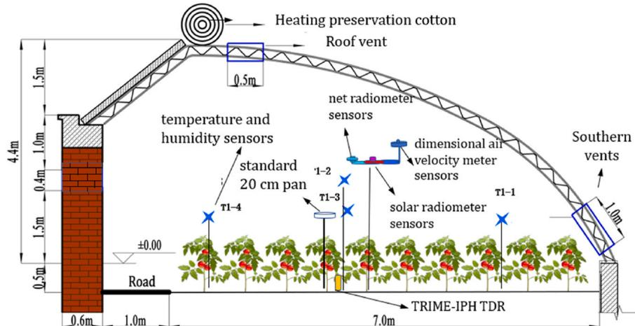  
Fig. 1. Layout plan of instruments inside the greenhouse.

openings are fully closed; otherwise, some openings are partially closed to maintain temperature while ensuring adequate ventilation and dehumidification). Fig. 2a and b illustrate the south and top ventilation openings of the greenhouse, respectively.

# 2.4. Determination items and methods

# 2.4.1. Meteorological data

Outdoor meteorological data were measured by a fully automated weather monitoring system (CR119x, Campbell Scientific, Inc, USA), located at the top of the greenhouse on the western side, with an observation height of  $4.5\mathrm{m}$ . Located at a height of  $2\mathrm{m}$  above the ground in the center of the greenhouse. Total solar radiation  $(R_s)$  was measured using a pyranometer (LI200x, Campbell Scientific, Inc., USA), while net solar radiation  $(R_n)$  was measured using a net radiometer (NRLITE2, Kipp&Zonen, Delft Netherlands), wind speed was monitored using a wind- speed sensor (Wind Sonic Gill, UK). All data were averaged every 30 minutes and recorded in the CR1000 data logger (Campbell, USA). Air temperature  $(T_a)$  and relative humidity  $(RH)$  were measured at both  $2\mathrm{m}$  above the ground and at the crop canopy height using a temperature and humidity recorder (HOBO RS3- B and U23 Pro v2, Onset Computer Corporation, USA)

# 2.4.2. Transpiration and irrigation volume

The stem sap flow rate of the plants was monitored using a Flow32- 1k stem flowmeter (Dynamax, Houston, TX, USA) on 6 randomly selected representative plants from each treatment. The probes were installed at the 3rd and 4th nodes above the petiole, approximately  $30–40\mathrm{cm}$  above the ground, to avoid interference from soil temperature during sap flow monitoring. The selected plant nodes were carefully cut with a knife and coated with plant oil or petroleum jelly to prevent wound proliferation or decay. To optimize results, the probes were then wrapped in cling film and further insulated with foam aluminum foil. The probes used in the experiment were of the SGB9 model, and data were automatically collected every 15 minutes and stored in a DT80 data logger (Pata Taker, Australia).

Irrigation frequency and volume were determined based on cumulative evaporation  $(E_{p})$  of a reference  $20~\mathrm{cm}$  standard evaporation pan  $20~\mathrm{cm}$  diameter,  $11~\mathrm{cm}$  depth) (Li et al., 2022b). Irrigation was uniformly applied when  $E_{p}$  reached  $20\pm 2\mathrm{mm}$  (Gong et al., 2017). The experimental site was equipped with a water meter with a precision of  $0.001\mathrm{m}^3$  to precisely control the irrigation volume. The volume for each irrigation event  $(I_r)$  was calculated using the following formula:

$$
\mathrm{I_r} = \mathrm{E_p}\cdot \mathrm{K_w} \tag{1}
$$

where  $I_{r}$  represents the irrigation volume in millimeters,  $E_{p}$  is the cumulative evaporation measured in millimeters, and  $K_{W}$  is evaporation coefficient for the water surface, set to 0.9 to ensure sufficient irrigation,

(Gong et al., 2017).

Tomato transpiration  $(ET_c)$  was estimated using the water balance method, which accounts for all relevant water inputs and outputs:

$$
ET_{c} = P + I_{r} + U - D + (W_{0} - W_{t}) \tag{2}
$$

Here,  $ET_{c}$  represents the actual daily transpiration  $(\mathrm{mm})$ .  $P$  is rainfall  $(\mathrm{mm})$ , also measured in millimeters, while  $I_{r}$  denotes the irrigation volume  $(\mathrm{mm})$ .  $U$  refers to groundwater recharge  $(\mathrm{mm})$ ,  $D$  represents deep leakage  $(\mathrm{mm})$ , and  $W_{0}$  and  $W_{t}$  indicate soil water storage  $(\mathrm{mm})$  in the  $0 - 100\mathrm{cm}$  soil layer at the beginning and end of the observation period, respectively.

Since the experiment was conducted in a greenhouse, rainfall  $(P)$  was assumed to be zero. The groundwater table at the experimental site is deep (below  $5\mathrm{m}$ ), making that crops could not absorb or utilize groundwater, so  $U = 0$ . Given that irrigation volumes were small (maximum of  $20~\mathrm{mm}$  per event), and there was minimal deep seepage, it was assumed that  $D = 0$ . Therefore, the equation can be simplified as follows:

$$
ET_{c} = I_{r} + (W_{0} - W_{t}) \tag{3}
$$

Finally, the daily water consumption intensity  $(ET)$  was calculated using the following formula:

$$
ET = ET_{c} / D \tag{4}
$$

where  $ET$  represents the daily water consumption intensity in millimeters per day, and  $D$  refers to the total number of observation days.

# 2.4.3. Soil moisture content

Soil moisture in the  $0 - 100\mathrm{cm}$  soil layer was measured every 7 days or so using the TRIME- IPH time- domain reflectometer (Micromodultechnik GmbH, Germany), with measurements were taken, and the average value was calculated. To ensure measurement accuracy, the instruments were periodically calibrated during different growth stages using the soil drying method.

# 2.4.4. Stomatal conductance

Stomatal conductance  $(g_{s})$  was measured using a porometer using a porometer (AP4, Delta- T Devices, UK) on clear, sunny days during the fruit expansion stage. For each treatment, six randomly selected plants with uniform growth were chosen. The measurements were taken on the middle section of the 4th leaf below the growing point of each plant. Three repetitions were taken for each plant, and the average value was calculated to obtain the final stomal conductance value.

# 2.4.5. Leaf area and leaf area index

Leaf area was measured every 7- 10 days by determining the length  $(I)$  and maximum width  $(W_{m})$  of each leaves using a ruler. The leaf area of an individual leaf was calculated by multiplying the length by the

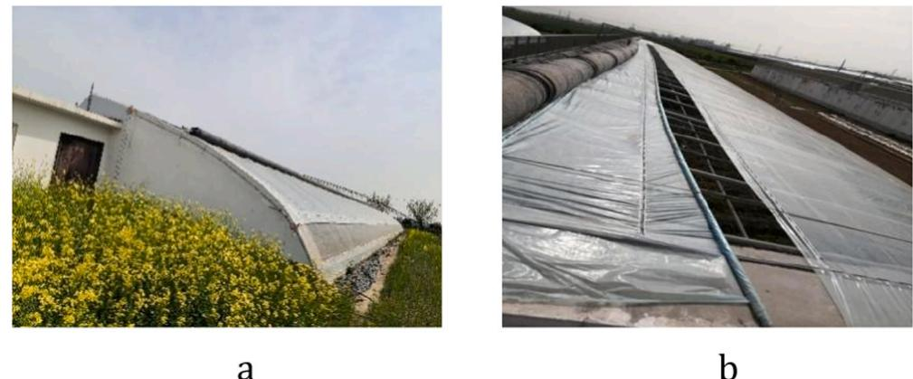  
Fig. 2. Greenhouse vents.

maximum width, and applying a reduction coefficient  $0.64 \cdot L \cdot W_{m}$  (Gong et al., 2017) to account for leaf shape. The LAI was then calculated using the following formula:

$$
LAI = \frac{\sum 0.64\cdot L\cdot W_m}{S_I\cdot S_r} \tag{5}
$$

where  $L$  represents leaf length  $(\mathtt{cm})$ $W_{m}$  is the maximum leaf width  $(\mathtt{cm})$ $S_{I}$  is the row spacing  $(\mathtt{cm})$  and  $S_{r}$  is the plant spacing  $(\mathtt{cm})$

# 2.5. P-M model and parameter determination

# 2.5.1. P-M model

To simulate evapotranspiration  $(ET)$  of greenhouse crops using the Penman- Monteith (P- M) model. The model is expressed as follows (Qiu, 2014):

$$
\lambda ET = \frac{\Delta R_n + \rho_a c_p VPD / ra}{\Delta + \gamma(1 + r_c / r_a)} \tag{6}
$$

where,  $\lambda ET$  represents the latent heat flux  $(\mathrm{Wm^{- 2}})$ $\lambda$  is the latent heat coefficient of vaporization  $(2.45\times 10^{6}\mathrm{Jkg}^{- 1})$  . The parameter  $\Delta$  denotes the slope of the saturation vapor pressure- temperature curve  $(\mathrm{kPa}^{\circ}\mathrm{C}^{- 1})$  and  $R_{n}^{\prime}$  is the net radiation intercepted by the crop canopy  $(\mathrm{Wm^{- 2}})$ $\rho_{a}$  is the air density  $(1.166\mathrm{kg}\mathrm{m}^{- 3})$  ,while  $c_{p}$  represents the specific heat capacity of air at constant pressure  $(1013\mathrm{J / (kg\cdot K)})$  . The vapor pressure deficit (VPD) is expressed in  $\mathrm{kPa}$  and the aerodynamic resistance  $(r_{a})$  and canopy resistance  $(r_c)$  are expressed in seconds per meter  $(\mathrm{s}\mathrm{m}^{- 1})$  Lastly,  $\gamma$  is the psychrometric constant  $(0.065\mathrm{kPaK}^{- 1})$

The term  $R_{n}^{\prime}$  represents the difference between the net radiation above the canopy and the net radiation reaching the soil surface through the canopy. This can be expressed by the following equation (Bailey et al., 1993):

$$
R_{n} = R_{n}\left[1 - \mathrm{xp}(-\mathrm{kLAI})\right] \tag{7}
$$

where,  $R_{n}$  represents the net radiation above the canopy  $(\mathrm{Wm^{- 2}})$ $k$  is the extinction coefficient of the crop canopy, and LAI is the leaf area index. All other variables retain their definitions as provided earlier. This equation highlights the critical role of canopy structure in determining the energy available for evapotranspiration, as quantified by the LAI.

# 2.5.2. Aerodynamic drag parameters

The aerodynamic resistance  $(r_{a})$  is influenced by factors such as air liquid and wind speed. Due to vortex transfer between air and water vapor,  $r_{a}$  can be expressed in terms of the heat transfer coefficient  $(h_{s})$  as follows (Gong et al., 2021b):

Table 2 Instrument in greenhouse.  

<table><tr><td>Measured data</td><td>Instrument name</td><td>Measurement location</td></tr><tr><td>Total solar radiation (Rs)</td><td>Pyranometer (LADMX, Campbell Scientific, Inc., USA)</td><td>Height of 2 m above the ground</td></tr><tr><td>Net solar radiation (Rn)</td><td>Net radiometer (NRLITE2, Kipp&amp;amp;Zonen, Delft Netherlands)</td><td>Height of 2 m above the ground</td></tr><tr><td>Air temperature (Ta) and relative humidity (RH)</td><td>Temperature and relative humidity record (HOBO RS3-B and U23 Pro v2, Onset Computer Corporation, USA)</td><td>At both 2 m above the ground and at the crop canopy height</td></tr><tr><td>Wind speed(V)</td><td>wind speed sensor (Wind Sonic, Gill, UK)</td><td>Height of 2 m above the ground</td></tr><tr><td>Cumulative evaporation(Ep)</td><td>20 centimetre standard evaporation pan</td><td>Height of 20 centimetre above the crop canopy</td></tr><tr><td>Stomatal conductance(gs)</td><td>Porometer (AP4, Delta-T Devices, UK)</td><td>The middle part of the fourth leaf below the growth point</td></tr><tr><td>Stem sap flow rate (SF)</td><td>Wrapper-type stem flow meter (Flow32-1k system, Dynamax, Houston, TX, USA)</td><td>At the third and fourth nodes above the cotyledons</td></tr><tr><td>Soil moisture content</td><td>TRIME-IPH time-domain reflectometer (Micromoduletechnik GmbH, Germany)</td><td>0–100 centimetre soil layer</td></tr></table>

Table 3 Growth period of greenhouse tomatoes in 2020 and 2021.  

<table><tr><td>Growth stage</td><td>Time</td><td>Crop Characteristics</td></tr><tr><td rowspan="2">seedling stage</td><td>2020-03-05-04-09</td><td rowspan="2">From the date of transplanting until ground cover reaches 10 %</td></tr><tr><td>2021-03-07-04-10</td></tr><tr><td rowspan="2">flowering and fruiting stage</td><td>2020-04-10-05-08</td><td rowspan="2">From approximately 10 % ground cover to effective full ground cover</td></tr><tr><td>2021-04-11-05-09</td></tr><tr><td rowspan="2">fruit enlargement stage</td><td>2020-05-09-09-06-05</td><td rowspan="5">From effective complete cover until the onset of maturity</td></tr><tr><td>2021-05-02-05-05</td></tr><tr><td rowspan="3">harvest stage</td><td>10-06-12</td></tr><tr><td>2020-06-06-07-05</td></tr><tr><td>2021-06-13-07-06</td></tr></table>

$$
\mathrm{r_a} = \frac{\rho_a c_p}{2h_s\mathrm{LAI}} \tag{8}
$$

where  $r_{a}$  is the aerodynamic resistance  $(\mathrm{s}\mathrm{m}^{- 1})$ $h_s$  is the heat transfer coefficient  $(\mathrm{W / m^2K})$  and LAI is the leaf area index. The parameters  $\rho_{a}$  and  $c_{p}$  represent the air density  $(1.166\mathrm{kg}\mathrm{m}^{- 3})$  and specific heat capacity of air  $(1013\mathrm{J / (kg\cdot K)})$  ,respectively.

The heat transfer coefficient  $(h_{s})$  varies based on the type of convection. natural, forced, or mixed which depends on the relationship between the Grashof number  $(G_{r})$  and the Reynolds number  $(R_{e})$  (Bailey et al., 1993; Qiu et al., 2013). The following equations are used to calculate  $h_{s}$

$$
h_{s} = \left\{ \begin{array}{c c}{0.37\left(\frac{k_{c}}{d}\right)G_{r}^{0.25}} & {G_{r} / R_{e}^{2}\geq 10}\\ {0.60\left(\frac{k_{c}}{d}\right)R_{e}^{0.25}} & {G_{r} / R_{e}^{2}\leq 0.1}\\ {0.1 < G_{r} / R_{e}^{2}< 10}\\ {0.37\left(\frac{k_{c}}{d}\right)\left(G_{r} + 6.92R_{e}^{2}\right)^{0.25}} & {} \end{array} \right\} \tag{9}
$$

It is considered natural convection when  $Gr / Re^2\geq 10$  forced convection when  $Gr / Re^2\leq 0.1$  .When  $0.1< Gr / Re^2 < 10$  both natural and forced convection are present, known as mixed convection.

Here,  $k_{c}$  is the thermal conductivity of air  $(0.0264\mathrm{W / (m\cdot K)})$  ,and  $d$  is the characteristic length of the leaf blade  $(\mathbf{m})$  . The Grashof number  $(G_{r})$  characterizes free convection airflow and is calculated as follows (Montero et al., 2001):

$$
G_{r} = \frac{\beta gd^{3}|T_{\mathrm{C}} - T_{\mathrm{a}}|}{\mathrm{v}^{2}} \tag{10}
$$

where,  $\beta$  is the thermal expansion coefficient of air  $(3.315\times 10^{- 3}$ $\mathbb{K}^{- 1})$ $g$  is the gravitational acceleration  $(9.8\mathrm{ms}^{- 2})$ $T_{c}$  is the canopy temperature  $(^{\circ}\mathbb{C})$ $T_{a}$  is the air temperature  $(^{\circ}\mathbb{C})$  ,and  $\nu$  is the kinematic viscosity of air  $(1.64\times 10^{- 5}\mathrm{m}^{2}\mathrm{s}^{- 1})$

The Reynolds number  $(R_{e})$  represents forced convection and is expressed as:

$$
\mathrm{R_e} = \frac{\mathrm{Vd}}{\mathrm{v}} \tag{11}
$$

where,  $V$  is the wind speed  $(\mathrm{ms}^{- 1})$  ,and  $\nu$  is the kinematic viscosity of air  $(1.64\times 10^{- 5}\mathrm{m}^{2}\mathrm{s}^{- 1})$  . The characteristic length of the leaf blade  $(d)$  is calculated as follows (Montero et al., 2001):

$$
\mathsf{d} = \frac{2}{(1 / 1) + (1 / \mathsf{w})} \tag{12}
$$

where,  $l$  and  $w$  represent the length and width of the leaf blade  $(\mathbf{m})$  respectively.

# 2.5.3. Canopy resistance parameters

Stomatal resistance  $(r_s)$  is often used to estimate canopy resistance  $(r_c)$  with the relationship described by Eq. (13) (Lovelli et al., 2008).  $r_s$  is a key parameter in calculating  $r_c$  in the Penman- Monteith model and is influenced by the degree of stomatal opening and closing in crop leaves. Under optimal irrigation conditions, stomatal opening is primarily governed by meteorological factors. Thus, the relationship between  $r_s$  and greenhouse meteorological variables can be used to estimate  $r_s$ .

$$
r_c = \frac{r_s}{\mathrm{LAI}_e} \tag{13}
$$

In this equation,  $r_c$  represents canopy resistance  $(\mathbf{s}\mathbf{m}^{- 1})$ $r_s$  denotes stomatal resistance  $(\mathbf{s}\mathbf{m}^{- 1})$  and  $LIA_{e}$  is the effective leaf area index, which adjusts the influence of leaf area on canopy resistance. Stomatal resistance  $(r_s)$  reflects the degree of stomatal opening and closing in crop leaves, making it a fundamental factor in determining  $r_c$

Under well- irrigated conditions, stomatal behavior is primarily governed by meteorological factors, with total solar radiation  $(R_s)$  identified as the dominant influence on  $r_s$  Bailey et al., 1993). This relationship has been validated across various crops, including cucumber (Yan et al., 2019), pepper (Qiu, 2014), and rice (Inoue et al., 1984). The relationship between  $r_s$  and  $R_s$  is expressed as follows:

$$
r_{s} = 255.92\mathrm{exp}\left(-\frac{R_{S}}{99.27}\right) + 81.72 \tag{14}
$$

where  $r_s$  is the stomatal resistance  $(\mathbf{s}\mathbf{m}^{- 1})$  and  $R_s$  represents total solar radiation  $(\mathbf{W}\mathbf{m}^{- 2})$  .The high accuracy of this relationship is demonstrated by the fitting results shown in Fig. 3, which reports all  $R^2$  value of 0.99, a mean absolute error (MAE) of  $3.49\mathrm{s}\mathrm{m}^{- 1}$  , and a RMSE of  $5.49\mathrm{sm}^{- 1}$  . These metrics underscore the robustness of the model in predicting  $r_s$  based on solar radiation.

The effective leaf area index  $(LAI_{e})$  is another essential factor in determining canopy resistance. Its value is determined based on specific conditions: when the LAI is less than or equal to 2,  $LAI_{e}$  is equal to LAI; when LAI is between 2 and 4,  $LAI_{e}$  is set to 2; and when LAI is greater than or equal to 4,  $LAI_{e}$  is calculated as LAI/2 (Jesus et al., 2003; Zhou et al., 2008). These conditions account for the diminishing influence of additional leaf area on canopy resistance as the canopy becomes denser.

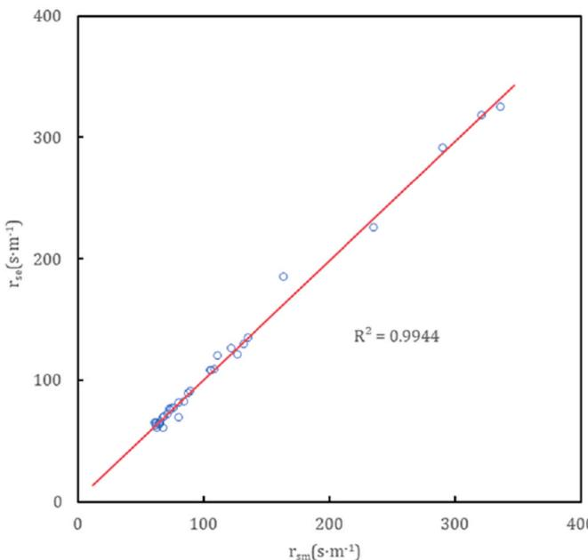  
Fig. 3. Measured stomatal resistance  $(r_s)$  and the fit of calculated stomatal resistance.

In summary, stomatal resistance  $(r_s)$  serves as the foundation for estimating canopy resistance  $(r_c)$  within the P- M model. The strong dependence of  $r_s$  on total solar radiation  $(R_s)$  highlights the critical role of meteorological factors in regulating stomatal behavior under optimal irrigation conditions. Furthermore, the  $LAI_{e}$  modifies the influence of canopy density on resistance, ensuring accurate modeling of  $r_c$ . Together, these relationships enhance the understanding of plant- atmosphere interactions, enabling more precise predictions of  $ET$ .

# 2.6. Evaluation method and index

Data analysis was performed using IBM SPSS 26 statistical software, while Microsoft Excel 2019 and Origin 2020 were employed for chart plotting. The accuracy of the model was evaluated using the following metrics: Root Mean Square Error (RMSE), Mean Absolute Error (MAE), Coefficient of Determination  $(R^2)$ , Kling- Gupta Efficiency (KGE), and Percent Bias (PBIAS) (Zheng et al., 2021).

Smaller values of MAE and RMSE indicate higher prediction accuracy, while  $R^2$  reflects the degree of fit between the predicted values and the actual observations, with values closer to 1 signifying a better fit.  $KGE$ , which ranges from negative infinity to 1, provides an overall measure of model performance, where higher values indicate better performance. Specifically,  $KGE$  values are interpreted as follows:  $0 \leq KGE \leq 0.5$  represents poor or unsatisfactory performance,  $0.50 \leq KGE \leq 0.75$  indicates satisfactory or acceptable performance,  $0.75 \leq KGE \leq 0.9$  reflects good performance, and  $KGE \geq 0.9$  signifies very good or excellent performance.

$KGE$  is a comprehensive performance metric that integrates three components: correlation, bias, and variability. Its values range from poor performance to 1 (excellent performance). The evaluation criteria for  $KGE$  are as follows:  $0 \leq KGE < 0.5$  indicates poor or unsatisfactory performance;  $0.5 \leq KGE < 0.7$  indicates satisfactory or acceptable performance; when  $0.75 \leq KGE < 0.9$ , the model performance is good; and  $KGE \geq 0.9$  indicates very good or excellent performance.

The optimal value of PBIAS is 0, with negative values indicating a tendency for the model to overestimate and positive values suggesting a tendency to underestimate. For daily time- scale evaluations, PBIAS performance is categorized as follows:  $PBIAS \geq \pm 15\%$  represents unsatisfactory performance,  $\pm 10\% \leq PBIAS \leq \pm 15\%$  indicates acceptable performance,  $\pm 5\% \leq PBIAS \leq \pm 10\%$  reflects good performance, and  $PBIAS \leq \pm 5\%$  signifies very good performance (Yonaba et al., 2021). The formulas for these metrics are as follows:

$$
\mathrm{RMSE} = \left[\sum_{i = 1}^{N}\frac{(Q_i - P_i)}{N}\right]^{0.5} \tag{15}
$$

where,  $Q_{i}$  represents the model- predicted values,  $P_{i}$  denotes the actual observed values, and  $N$  is the sample size used in the analysis.

$$
\mathrm{MAE} = \frac{1}{N}\sum_{i = 1}^{N - N}Q_{i} - P_{i} \tag{16}
$$

where,  $MAE$  is calculated as the average of the absolute differences between the model- predicted values  $(Q_i)$  and the actual observed values  $(P_i)$  over the total number of samples  $(N)$ .

$$
R^{2} = \left[\frac{\sum_{i = 1}^{N}(Q_{i} - \overline{Q})(P_{i} - \overline{P})}{\sqrt{\sum_{i = 1}^{N}(Q_{i} - \overline{Q})^{2}\sqrt{\sum_{i = 1}^{N}(P_{i} - \overline{P})^{2}}}}\right]^{2} \tag{17}
$$

where,  $R^2$  represents the coefficient of determination, where  $\overline{Q}$  is the mean of the observed values, and  $\overline{P}$  is the mean of the predicted values.

$$
KGE = 1 - \sqrt{(r - 1)^2 + (\beta - 1)^2 + (\gamma - 1)^2} \tag{18}
$$

The  $KGE$  integrates three components:  $\gamma$ , the Pearson correlation coefficient between predicted and observed values;  $\beta$ , the ratio of the mean predicted values to the mean observed values; and  $\gamma$ , the ratio of the coefficient of variation of the predicted values to that of the observed values.

$$
PBIAS(\%) = \frac{\sum_{i = 1}^{N}(P_i - Q_i)}{\sum_{i = 1}^{N}P_i}\cdot 100 \tag{19}
$$

Finally,  $PBIAS$  quantifies the percentage bias in the model's predictions, where a value of 0 indicates no bias, and deviations from 0 indicate a tendency to overestimate or underestimate.

These metrics collectively provide a robust framework for evaluating the model's performance. By integrating measures of error magnitude, correlation, bias, and variability, the analysis offers a comprehensive understanding of the model's predictive accuracy and highlights areas for improvement.

# 3. Results and analysis

# 3.1. Meteorological environment characteristics of greenhouse

Ventilation plays a pivotal role in regulating the greenhouse microclimate, as it directly affects the exchange of water vapor and energy between the internal and external environments. By examining the variations in meteorological parameters under different ventilation conditions, valuable insights can be gained for optimizing environmental control strategies within greenhouses (Ge et al., 2019). This section analyzes the wind speed, temperature, and relative humidity dynamics under two ventilation treatments (T1 and T2) during the tomato growth periods in 2020 and 2021.

# 3.1.1. Wind speed variations

Fig. 4 illustrates the changes in maximum and minimum wind speeds under T1 and T2 ventilation conditions throughout the growth period of tomatoes in 2020 and 2021. Wind speed  $(V)$  showed relatively small fluctuations during the seedling and flowering stages, but larger fluctuations were observed during the fruit enlargement and harvesting stages. In particular, the minimum wind speed often fell below  $0.2 \mathrm{m} \mathrm{s}^{- 1}$ .

In 2020, the maximum wind speeds recorded under T1 and T2 conditions were  $0.75 \mathrm{m} \mathrm{s}^{- 1}$  and  $1.55 \mathrm{m} \mathrm{s}^{- 1}$ , respectively, occurring during the seedling and harvesting stages. In 2021, the maximum wind speeds were  $0.48 \mathrm{m} \mathrm{s}^{- 1}$  under T1 and  $1.38 \mathrm{m} \mathrm{s}^{- 1}$  under T2, with the peaks occurring during the flowering and fruiting stage and the fruiting enlargement stage. Over the two years, the average maximum wind speed under T1 was approximately nine times greater than the average minimum wind speed, while under T2, the maximum wind speed was 11 times the minimal wind speed. Additionally, the average maximum wind speed under T2 was 2.5 times higher than that under T1, and the average minimum wind speed under T2 was 2.1 time higher than under T1.

Fig. 5 shows the variation in average wind speed between 8:00 AM

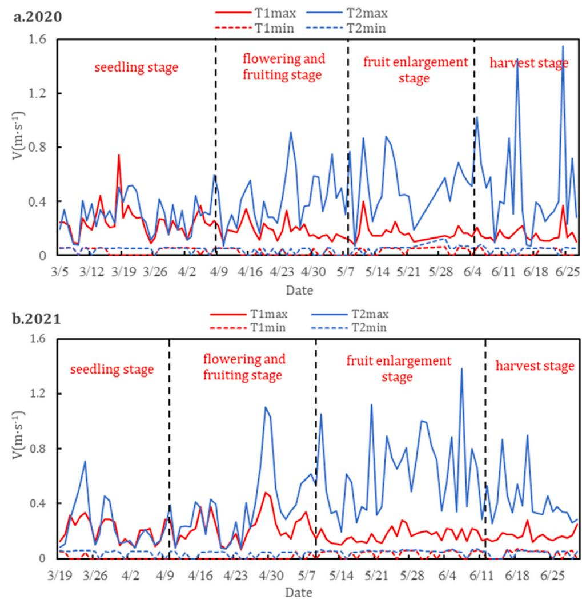  
Fig. 4. Variation of extreme values of wind speed  $(V)$  in greenhouses T1 and T2 during the entire growth stage of tomatoes in 2020-2021.

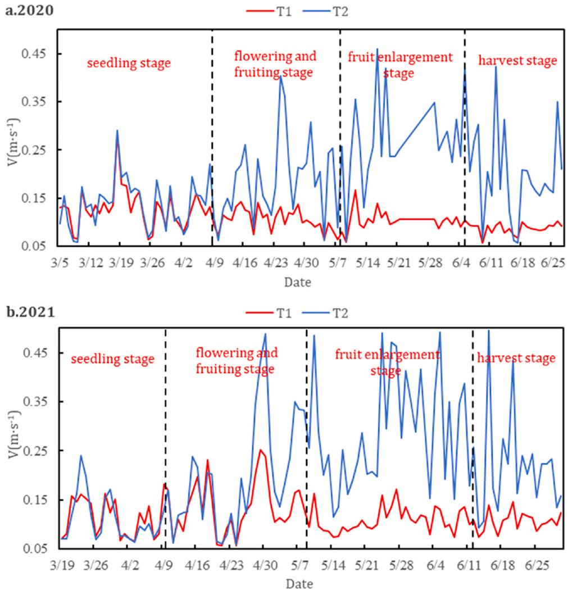  
Fig. 5. Daily average variation of wind speed (V) in greenhouses T1 and T2 during the entire growth stage of tomatoes in 2020–2021.

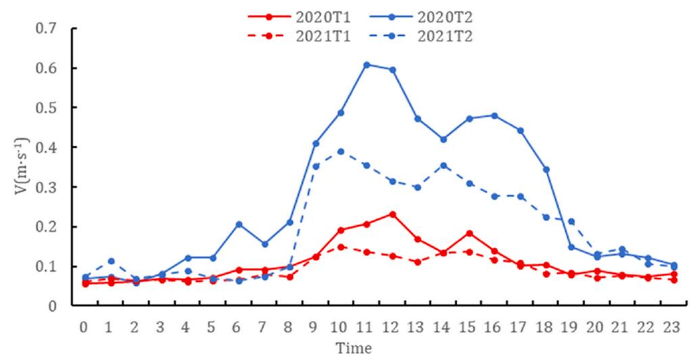  
Fig. 6. Daily variation of wind speed (V) on sunny days during the fruit enlargement stage of tomatoes in 2020–2021.

and 8:00 PM each day. Fig. 6 presents the hourly wind speed changes during sunny days in the later stages of the growth period. The hourly wind speed data, averaged from three selected days (May 11, May 16, and May 18 in 2020, and May 8, May 9, and May 28 in 2021), indicate that wind speeds between 0:00–8:00 AM and 8:00–11:00 PM were similar for both treatments, with minimal fluctuations. This justifies the choice of calculating daily average wind speeds between 8:00 AM and 8:00 PM, as greenhouse ventilation is typically managed during these hours to maintain suitable temperatures for crop growth, with vents closed in the afternoon and wind speeds generally lower at night.

Fig. 6 under T2 than T1, with higher values observed during the later growth stages. Similarly, Fig. 6 indicates that wind speed variations from 8:00 AM to 8:00 PM were also greater under T2 than T1, with similar trends in wind speed changes within each year. Overall, the ventilation conditions in T2 resulted in better airflow and ventilation effects compared to T1 throughout both 2020 and 2021.

# 3.1.2. Temperature and humidity variations

Fig. 7 presents the variation in air temperature  $(Ta)$  and relative humidity  $(RH)$  during the later growth period (May 11 to June 20) under T1 and T2 conditions. The air temperature range under T1 was  $21.6 - 42.4^{\circ}C$  while under T2 it ranged from 18.9 to  $38.1^{\circ}C_{i}$  with average values of  $33.6^{\circ}C$  and  $31.5^{\circ}C_{i}$  respectively. The RH range under T1 was  $38.9 - 98.6\%$  while under T2 it was  $34.8 - 96.0\%$  with average values of  $65.5\%$  and  $57.9\%$  respectively. In both years, the daily average  $Ta$  and  $RH$  during the later growth period were higher under T1 than under T2.

The average daily  $Ta$  was  $2^{\circ}C$  higher, and the average daily  $RH$  was  $8\%$  higher under T1 compared to T2. These results clearly demonstrate that higher ventilation rates lead to lower  $Ta$  and  $RH$ . Enhanced ventilation promotes better air circulation within the greenhouse, alleviating the high humidity and temperature conditions, thus creating a more favorable environment for plant growth.

# 3.2. Effects of different ventilation conditions on stomatal conductance and stem flow rate of tomato

# 3.2.1. (1) Effects of ventilation conditions on stomatal conductance

Stomatal conductance  $(g_{s})$  effectively reflects physiological and ecological conditions of crop transpiration (Gong et al., 2021c). In this study, total solar radiation  $(R_{s})$  was not significantly affected by ventilation, with similar  $R_{s}$  values across different treatments. During the later growth stage, average  $g_{s}$  and  $R_{s}$  values were calculated for three sunny days (May 9, May 20, and May 28, 2021). Fig. 8 illustrates the changes in  $g_{s}$  and  $R_{s}$  from 8:00 AM to 6:00 PM under sunny conditions for different treatments. The mean  $g_{s}$  values for T1 and T2 were 483.6 and  $575.4 \mathrm{mmol / (m^2\cdot s)}$ , respectively, while the peak  $g_{s}$  values were 768.3 and  $806.7 \mathrm{mmol / (m^2\cdot s)}$  for T2.

According to Fig. 8,  $g_{s}$  values for all treatments exhibited a unimodal curve, increasing initially and then decreasing, with a peak around 12:00 PM. Both mean and peak  $g_{s}$  values were higher in T2 compared with T1. The higher  $g_{s}$  values in T2 can be attributed to the larger ventilation area and higher wind speed in the T2 compartment. Higher wind speeds reduce the gas concentration gradient around the stomata, facilitating faster gas exchange and promoting stomatal opening (Shapira et al., 2024).

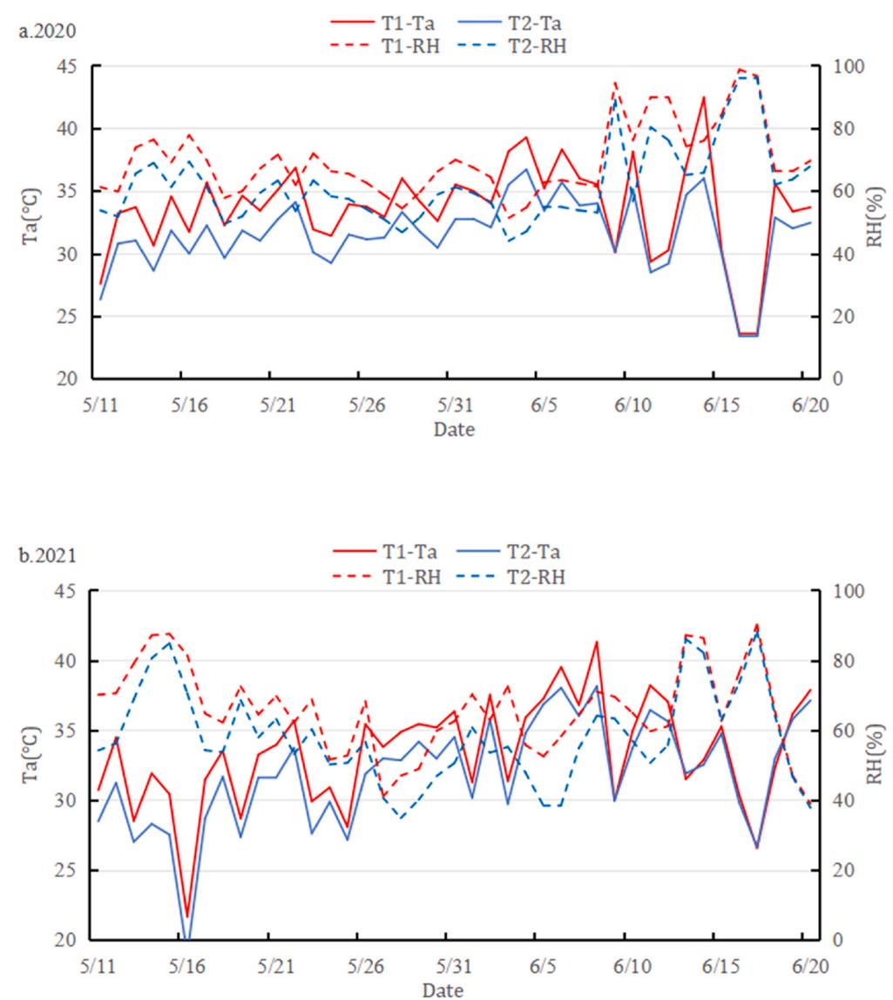  
Fig. 7. Daily mean value changes of temperature (Ta) and humidity (RH) in the later growth stage in 2020 and 2021 (T1, T2).

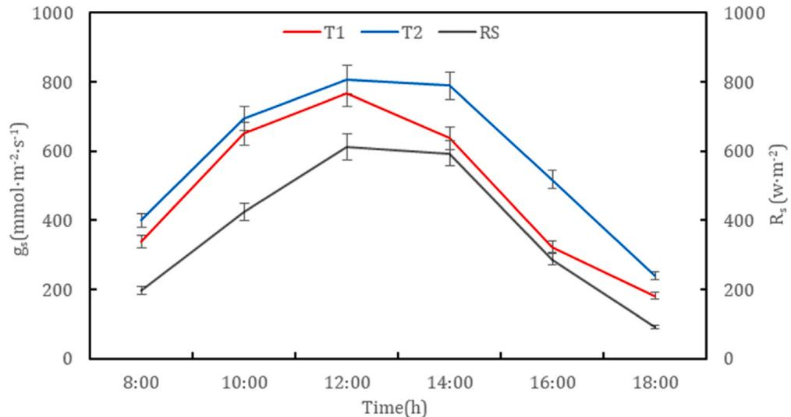  
Fig. 8. Changes of stomatal conductance (gs) and solar radiation  $(R_{s})$  of each treated leaf under sunny conditions in 2021 (08:00–18:00).

# 3.2.2. (2) Effects of different ventilation conditions on the sap flow rate of tomato stems

Sap flow (SF) reflects crop water consumption during transpiration. To investigate the impact of ventilation on sap flow rate, the average SF values were calculated for five days during the fruit enlargement stage under typical weather conditions, including sunny, cloudy, and overcast days (Fig. 9).

Under sunny conditions, SF changes followed a unimodal curve, while under cloudy and overcast conditions, SF changes followed a bimodal curve due to unstable solar radiation. Under sunny conditions, the average SF values were  $102.74\mathrm{g}\mathrm{h}^{- 1}$ $(0.58\mathrm{mmh^{- 1}})$  for T1 and  $167.44\mathrm{g}\mathrm{h}^{- 1}$ $(0.94\mathrm{mmh^{- 1}})$  for T2. Under cloudy conditions, the average daily SF was  $122.07\mathrm{g}\mathrm{h}^{- 1}$ $(0.69\mathrm{mmh^{- 1}})$  for T2, which was higher than that for T1. Under overcast conditions, the average SF values were  $42.05\mathrm{g}\mathrm{h}^{- 1}$ $(0.24\mathrm{mmh^{- 1}})$  for T1 and  $76.91\mathrm{g}\mathrm{h}^{- 1}$ $(0.44\mathrm{mmh^{- 1}})$  for T2.

The sap flow rate consistently followed the trend: sunny  $\gimel$  cloudy  $\gimel$  overcast. Moreover, SF under T2 was consistently greater than under T1 across all weather conditions. This indicates that improved ventilation conditions enhance the sap flow rate of plants, thereby facilitating transpiration. The effect of ventilation conditions on SF  $(P< 0.05)$  was statistically significant, supporting the conclusion that ventilation improvements in T2 contributed to better physiological performance.

Fig. 10 shows the crop stem flow (transpiration) over the entire growing period under two different ventilation conditions for the last two years. The overall trend is that the transpiration is small during the seedling stage, increases significantly during the flowering and fruiting stage, reaches the maximum during the fruit enlargement stage, decreases slightly during the harvest stage, and generally shows  $\mathrm{T2 > T1}$

# 3.3. Effects of different ventilation conditions on water consumption of greenhouse tomatoes

Throughout the experimental periods in 2020 and 2021, irrigation was conducted 15 times, including 2 in the seedling stage, 4 in the flowering and fruiting stage, 6 in the fruit enlargement stage, and 3 in the harvesting stage. The irrigation amount was consistent across all treatments.

Fig. 11 presents differences in average water consumption between T1 and T2 during the entire growth period under different ventilation conditions. Notably, during the seedling, flowering and fruiting, and fruit enlargement stages, the average water consumption under T2 was  $8.54\%$ $0.79\%$  and  $8.02\%$  higher than under T1, respectively. Conversely, during the harvesting stage, the average water consumption under T2 was  $9.77\%$  lower than under T1. These results demonstrate that ventilation factors affect water consumption, particularly during the harvesting stage.

The average daily water consumption of greenhouse tomatoes in 2020 and 2021, under different treatments, was ranked from highest to lowest as follows: the fruiting enlargement stage at  $3.39\mathrm{mm}\mathrm{d}^{- 1}$  the harvesting stage at  $2.89\mathrm{mm}\mathrm{d}^{- 1}$  the flowering and fruiting stage at  $2.68\mathrm{mm}\mathrm{d}^{- 1}$  and the seedling stage at  $1.54\mathrm{mm}\mathrm{d}^{- 1}$

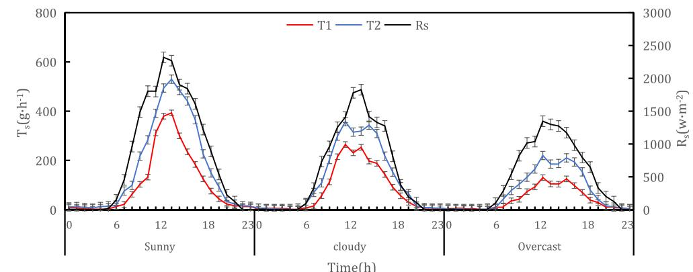  
Fig. 9. Diurnal variation of stem flow rate (SF) and solar radiation  $(R_{s})$  under sunny, cloudy and overcast conditions in 2021.

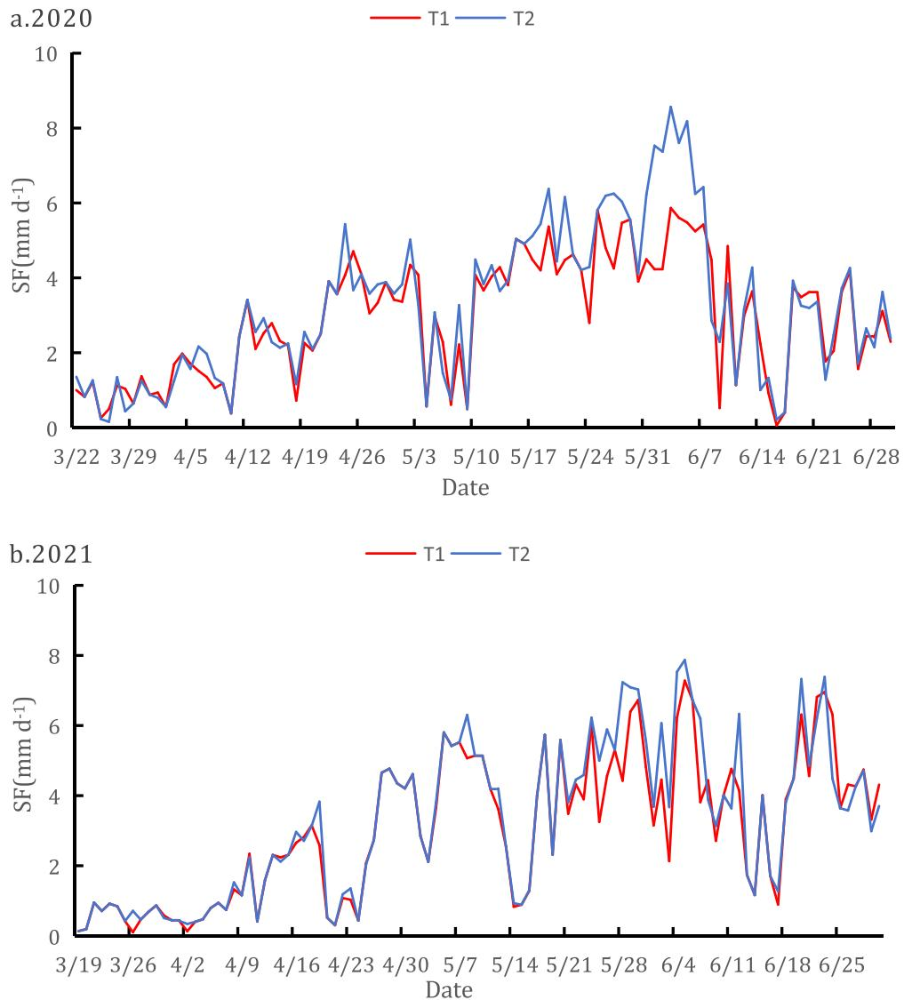  
Fig. 10. Crop stem flow throughout the entire growth stage.

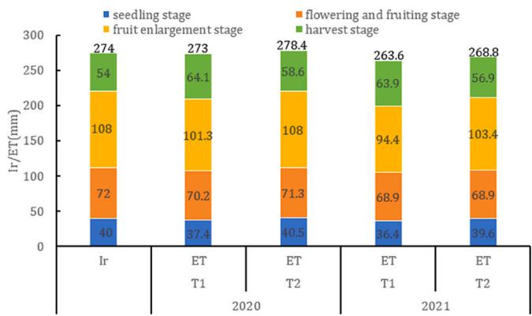  
Fig. 11. Changes of irrigation amount  $(I_r)$  and water consumption (ET) under different treatments at different growth stages of tomato in 2020 and 2021.

# 3.4. Modification of the P-M model and simulation under different ventilation conditions

3.4.1. Variation patterns of canopy resistance in greenhouse tomatoes Fig. 12 shows the change in canopy resistance  $(r_c)$  and the relationship between LAI and sunlit greenhouse drip- irrigated tomatoes in 2020

and 2021. During the seedling stage,  $r_c$  rapidly declined as LAI increased. In the flowering, fruiting, and fruit enlargement stages,  $r_c$  decreased more slowly with increasing LAI. This trend is attributed to the gradual increase in LAI as the tomatoes grew, leading to decrease in  $r_c$ .

When LAI was below 1.0, the average  $r_c$  was  $604.58 \mathrm{~s} \mathrm{~m}^{- 1}$  under T1 and  $471.58 \mathrm{~s} \mathrm{~m}^{- 1}$  under T2 over the two years. When LAI exceeded 1.0, the average  $r_c$  was  $95.18 \mathrm{~s} \mathrm{~m}^{- 1}$  under T1 and  $96.94 \mathrm{~s} \mathrm{~m}^{- 1}$  under T2. These findings suggest that ventilation conditions significantly influence canopy resistance. When LAI was below 1.0,  $r_c$  under T1 was  $28.2 \%$  higher than that under T2. On average  $r_c$  under T1 was  $19.9 \%$  higher than under T2 throughout the growth period. Canopy resistance is mainly related to stomatal resistance and the crop LAI. Additionally, variations in wind speed throughout the growth period influence crop leaf area, causing  $r_c$  values to differ under various ventilation conditions.

The observed differences in  $r_c$  can be attributed to variations in stomatal resistance and LAI, both of which are influenced by ventilation conditions. Wind speed, which varies under different ventilation settings, directly impacts the crop's leaf area and consequently  $r_c$ . Therefore, the accurate estimation of  $r_c$  must account for changes in ventilation conditions throughout the growth period to ensure precise modeling of canopy resistance.

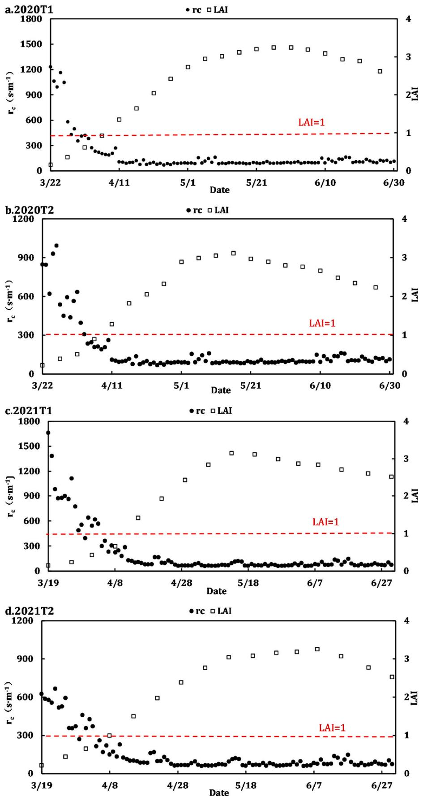  
Fig. 12. Changes of canopy resistance  $(r_c)$  and leaf area LAI in greenhouse tomatoes under different ventilation conditions in 2020 and 2021.

# 3.4.2. Variation patterns of aerodynamic resistance parameters

# 1. Analysis of convection conditions in the greenhouse

During the measurement periods in 2020 and 2021, the average net radiation  $(R_{n})$  inside the greenhouse was  $98.80\mathrm{Wm^{- 2}}$  and  $102.22\mathrm{Wm^{- 2}}$  . The average wind speed was  $0.09\mathrm{ms}^{- 1}$  under T1 and  $0.15\mathrm{ms}^{- 1}$  under T2. Additionally, the average characteristic leaf lengths of tomatoes were measured as  $7.4\mathrm{cm}$  and  $6.3\mathrm{cm}$  for T1 and T2, respectively. To calculate aerodynamic resistance  $(r_a)$  it was necessary to determine the heat transfer coefficient  $(h_s)$  . This determination required classifying the convective type inside the greenhouse based on the ratio  $G_{r} / R_{e}^{2}$

The heat transfer coefficient  $(h_s)$  varies depending on the type of convection, which can be classified into three categories (Bailey et al., 1993; Qiu et al., 2013): natural convection occurs when  $G_{r} / R_{e}^{2}$ $\geq 10$  forced convection occurs when  $G_{r} / R_{e}^{2}\leq 0.1$  , and mixed convection occurs when  $0.1< G_{r} / R_{e}^{2}< 10$

Fig. 13 shows the variation of  $G_{r} / R_{e}^{2}$  inside the greenhouse during the entire growth period in 2020 and 2021 under T1 and T2 ventilation conditions. Under T1 conditions, mixed convection accounted for an average of  $20.2\%$  while under T2 conditions, mixed convection accounted for an average of  $10.3\%$  . The remaining periods were dominated by pure forced convection, with no instances of natural convection observed. This indicates that different ventilation conditions impact the convective situation within the greenhouse, with mixed convection predominantly occurring during the early and middle stages of growth.

# 2. Evaluation of aerodynamic drag

Given that no periods of pure free convection were observed throughout the entire growth period, the heat transfer coefficient under pure convection conditions was excluded from the calculation of  $r_a$  Based on the convective conditions observed each day, the heat transfer coefficient under different convective conditions was used to calculate a comprehensive  $r_a$  value for the entire growth period.

Fig. 14 illustrates the variation in aerodynamic resistance  $(r_a)$  and wind speed for greenhouse tomatoes in 2020 and 2021 throughout the entire growth period. The trend of  $r_a$  variations under different conditions was similar over the two years, with a gradual decrease as the tomatoes grew, and the maximum  $r_a$  values during the seedling stage were  $212.9\mathrm{sm}^{- 1}$  , and the average  $r_a$  for the entire growth period was  $93.2\mathrm{sm}^{- 1}$  . Under T2 conditions, the average  $r_a$  during the seedling stage was  $164.2\mathrm{sm}^{- 1}$  and the average  $r_a$  for the entire growth period under T1 was  $72.4\mathrm{sm}^{- 1}$  . The  $r_a$  values were higher during the seedling stage compared to the entire growth period. The  $r_a$  value during the seedling stage under T1 was  $29.7\%$  higher than under T2, and the  $r_a$  value for the entire growth period under T1 was  $28.7\%$  higher than under T2. These results indicate that  $r_a$  is significantly influenced by wind speed and ventilation conditions, with  $r_a$  being smaller under T2 compared to T1 conditions.

The differences in  $r_a$  between T1 and T2 conditions can be attributed to variations in wind speed, which directly influence aerodynamic resistance. The consistently lower  $r_a$  values observed under T2 conditions highlight the role of improved ventilation in reducing aerodynamic resistance and enhancing air circulation within the greenhouse. These findings underscore the importance of optimizing ventilation strategies to improve aerodynamic conditions, thereby promoting more efficient greenhouse microclimates for tomato cultivation.

# 3.5. Improvement and applicability evaluation of P-M model in solar greenhouse

Under T1 and T2 conditions throughout the entire growing period of 2020 and 2021, with no occurrences of pure natural convection at the daily scale, daily transpiration  $(T_{T})$  was estimated by integrating the P- M model with two aerodynamic resistance models and fitting them to the measured values, as shown in Fig. 15 and Table 4.

In 2020, under T1 conditions, the P- M model's simulated  $T_{r}$  during the fruit enlargement stage closely matched the measured values, with only a slight overestimation of  $0.59\%$  . During the seedling, flowering and fruiting, and harvesting stages, the model underestimated  $T_{r}$  by  $22.42\%$ $11.41\%$  and overestimated it by  $8.81\%$  respectively. Under T2 conditions, during the flowering and fruiting stage, the simulated  $T_{r}$  closely matched the measured values, with a slight overestimation of  $2\%$  . During the seedling, fruit enlargement, and harvesting stages, the P- M model underestimated  $T_{r}$  by  $11.97\%$  overestimated it by  $4.99\%$  and  $11.43\%$  respectively.

In 2021, under T1 conditions, during the fruit enlargement period, the P- M model closely matched the measured values, with only a slight underestimation of  $0.08\%$  . During the seedling, flowering and fruiting, and harvesting stages, the P- M model underestimated  $T_{r}$  by  $20.10\%$ $2.11\%$  and overestimated it by  $5.05\%$  respectively. Under T2 conditions, during the flowering and fruiting stage, the P- M model closely matched the measured values, with a slight underestimation of  $0.58\%$  During the seedling, fruit enlargement, and harvesting stages, the P- M model underestimated  $T_{r}$  by  $11.96\%$  and overestimated it by  $9.69\%$  and  $21.82\%$  respectively.

Throughout the entire growth period, Under T1 conditions in 2020, the model slope was close to 1.0, underestimating  $T_{r}$  by  $3.74\%$  with  $R^2 = 0.91$  ,MAE of  $0.44\mathrm{mm}\mathrm{d}^{- 1}$ $RMSE = 0.55\mathrm{mm}\mathrm{d}^{- 1}$  ,and  $KGE = 0.89$  Under T2 conditions, the slope was 1.03, with a slight overestimation of  $4.05\%$ $R^2 = 0.94$ $MAE = 0.39\mathrm{mm}\mathrm{d}^{- 1}$ $RMSE = 0.55\mathrm{mm}\mathrm{d}^{- 1}$  ,and  $KGE = 0.95$  .Under T1 conditions in 2021, the slope was 0.96, underestimating  $T_{r}$  by  $0.55\%$  with  $R^2 = 0.93$ $MAE = 0.38\mathrm{mm}\mathrm{d}^{- 1}$ $RMSE = 0.55\mathrm{mm}\mathrm{d}^{- 1}$  ,and  $KGE = 0.96$  .Under T2 conditions, the slope was 1.11, overestimating  $T_{r}$  by  $8.46\%$  ,with  $R^2 = 0.91$ $MAE = 0.56\mathrm{mm}$ $\mathrm{d}^{- 1}$ $RMSE = 0.84\mathrm{mm}\mathrm{d}^{- 1}$  ,and  $KGE = 0.89$

When considering the entire growth period across both years, the P- M model under T1 conditions consistently underestimated the measured values by an average of  $2.15\%$  while under T2 conditions, the model overestimated the measured values by an average of  $6.26\%$  .Despite this slight overestimation and underestimation under different conditions, the P- M model demonstrated a strong correlation with the measured transpiration data, showing good simulation accuracy under both T1 and T2 conditions. The improved P- M model, incorporating aerodynamic resistance, can therefore be applied effectively to estimate the daily transpiration rate of greenhouse tomatoes under different ventilation conditions, reflecting the model's robustness and accuracy.

# 4.Discussion

4. DiscussionEnvironmental factors, including solar radiation, air temperature  $(T_{a})$ , relative humidity (RH), and ventilation rate, play a crucial role in influencing crop growth within greenhouses (Lei et al., 2023; Zhang et al., 2021). When evaluating crop transpiration in a greenhouse, it is essential to consider the impact of these meteorological factors (Ge et al., 2022). The construction of theoretical models for greenhouse crop transpiration is primarily based on greenhouse meteorological data. In this study, we observed that  $T_{a}$  and RH inside the greenhouse were higher under T1 (lower ventilation) conditions compared to T2 (higher ventilation). In contrast, SF, stomatal conductance  $(g_{s})$ , and water consumption of tomatoes were higher under T2 conditions. This can be attributed to the improved ventilation, which increases the airflow inside the greenhouse. A larger ventilation area reduces the resistance to water vapor diffusion, accelerates gas exchange around the leaves, and results in a more uniform distribution of temperature and humidity. These changes promote leaf transpiration, photosynthesis, and other physiological processes, ultimately lowering the internal temperature and humidity, while simultaneously increasing SF, gs, and water consumption. Previous research has indicated that enhancing wind speed can improve SF, gs, and transpiration rates of crops (Spinelli et al., 2018).

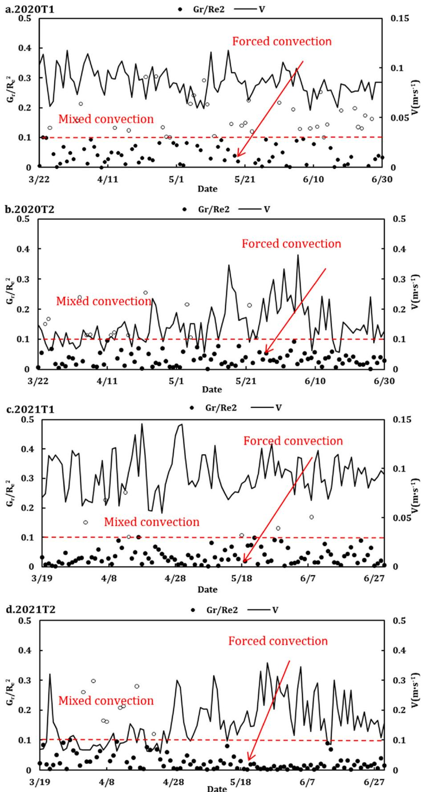  
Fig. 13. Convection in the greenhouse in 2020 and 2021 based on  $\mathrm{Gr} / \mathrm{Re}$  classification (dashed line showed the dividing line between pure forced convection and mixed convection  $\mathrm{Gr} / \mathrm{Re} = 0.1$ ).

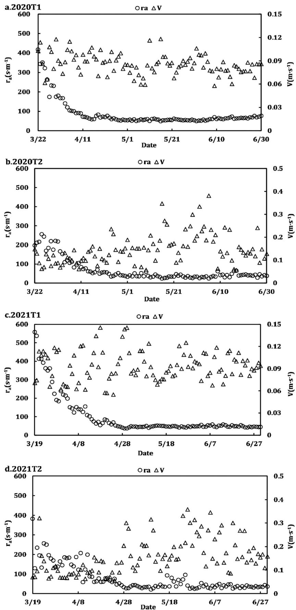  
Fig. 14. Aerodynamic resistance  $(r_{a})$  and wind speed  $(V)$  of greenhouse tomatoes in 2020 and 2021 under different ventilation conditions.

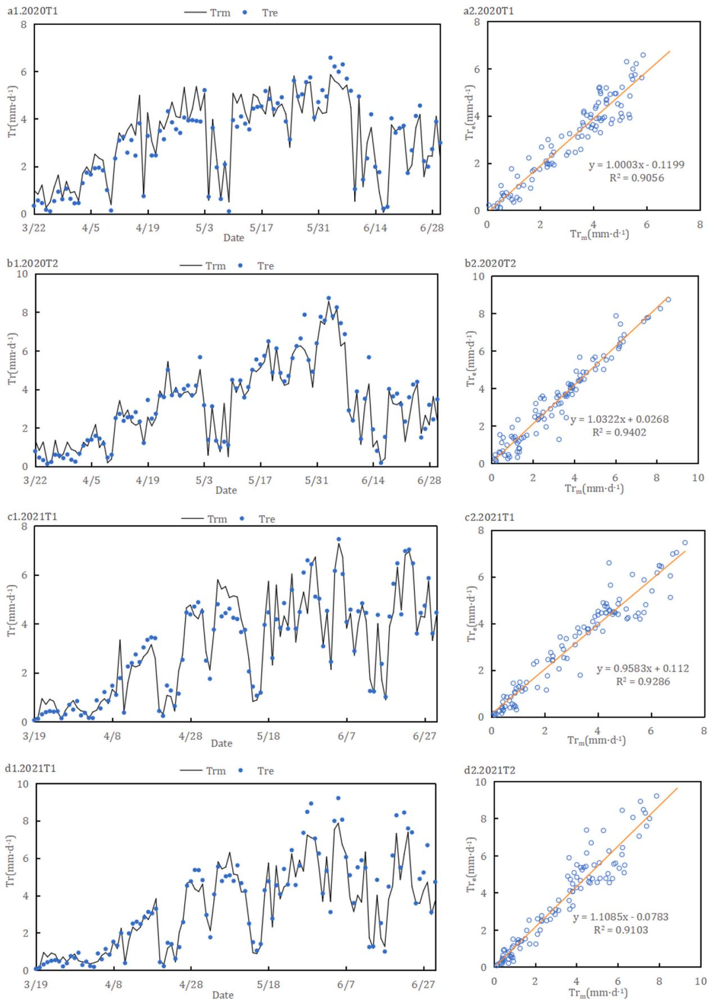  
Fig. 15. The fitting of the predicted and actual values of transpiration calculated by  $P - M$  model combined with different resistance parameters in 2020 and 2021.

Table 4 The fitting results of ET values calculated by the improved P-M model and measured values are as follows.  

<table><tr><td>Year</td><td>Treatment</td><td>Childbearing period</td><td>R²</td><td>MAE</td><td>RMSE</td><td>KGE</td><td>PBIAS</td></tr><tr><td rowspan="10">2020</td><td rowspan="4">T1</td><td>seedling stage</td><td>0.94</td><td>0.42</td><td>0.51</td><td>0.72</td><td>22.3 %</td></tr><tr><td>flowering and fruiting stage</td><td>0.91</td><td>0.46</td><td>0.6</td><td>0.88</td><td>11.4 %</td></tr><tr><td>fruit enlargement stage</td><td>0.76</td><td>0.49</td><td>0.59</td><td>0.82</td><td>-0.3 %</td></tr><tr><td>harvest stage</td><td>0.94</td><td>0.4</td><td>0.48</td><td>0.91</td><td>-8.8 %</td></tr><tr><td rowspan="6">T2</td><td>Whole growth period</td><td>0.91</td><td>0.44</td><td>0.55</td><td>0.89</td><td>3.8 %</td></tr><tr><td>seedling stage</td><td>0.8</td><td>0.36</td><td>0.43</td><td>0.77</td><td>12 %</td></tr><tr><td>flowering and fruiting stage</td><td>0.81</td><td>0.35</td><td>0.56</td><td>0.90</td><td>-2 %</td></tr><tr><td>fruit enlargement stage</td><td>0.89</td><td>0.29</td><td>0.46</td><td>0.93</td><td>-5.1 %</td></tr><tr><td>harvest stage</td><td>0.89</td><td>0.57</td><td>0.72</td><td>0.86</td><td>-11.4 %</td></tr><tr><td>Whole growth period</td><td>0.94</td><td>0.39</td><td>0.55</td><td>0.95</td><td>-4.1 %</td></tr><tr><td rowspan="10">2021</td><td rowspan="4">T1</td><td>seedling stage</td><td>0.65</td><td>0.27</td><td>0.42</td><td>0.69</td><td>19.9 %</td></tr><tr><td>flowering and fruiting stage</td><td>0.9</td><td>0.44</td><td>0.54</td><td>0.90</td><td>2.1 %</td></tr><tr><td>fruit enlargement stage</td><td>0.82</td><td>0.49</td><td>0.66</td><td>0.86</td><td>-0.1 %</td></tr><tr><td>harvest stage</td><td>0.97</td><td>0.29</td><td>0.39</td><td>0.94</td><td>-5.1 %</td></tr><tr><td rowspan="6">T2</td><td>Whole growth period</td><td>0.93</td><td>0.38</td><td>0.55</td><td>0.76</td><td>0.5 %</td></tr><tr><td>seedling stage</td><td>0.71</td><td>0.22</td><td>0.27</td><td>0.93</td><td>12 %</td></tr><tr><td>flowering and fruiting stage</td><td>0.92</td><td>0.35</td><td>0.48</td><td>0.95</td><td>0.6 %</td></tr><tr><td>fruit enlargement stage</td><td>0.81</td><td>0.76</td><td>1.06</td><td>0.88</td><td>-8.5 %</td></tr><tr><td>harvest stage</td><td>0.88</td><td>0.96</td><td>1.23</td><td>0.76</td><td>-21.8 %</td></tr><tr><td>Whole growth period</td><td>0.91</td><td>0.56</td><td>0.84</td><td>0.89</td><td>-8.4 %</td></tr></table>

In greenhouses without groundwater replenishment, irrigation is the sole source of soil moisture, making ventilation directly affect the humid and warm environment inside the structure. Transpiration  $(T_{r})$  plays a significant role in the study of dynamic field water cycles (Yan and Li, 2018) and energy balance (Marras et al., 2016), making it a crucial parameter in agricultural production. Understanding crop  $T_{r}$  enables the development of efficient irrigation strategies (Jaafar et al., 2017), which maximizes water resource utilization. Theoretical models, such as the P- M model, offer an effective approach to address these challenges by providing a framework for estimating  $T_{r}$  under varying environmental conditions. The P- M model has been widely used to simulate  $T_{r}$  and the accuracy of this model is highly dependent on the precise estimation of both canopy resistance  $(r_{c})$  and aerodynamic resistance  $(r_{a})$  (Shao et al., 2022; Wu et al., 2022b). Notably,  $r_{a}$  in a greenhouse environment differs from that in open- field conditions, and directly applying open- field parameters may lead to substantial errors (Li et al., 2022a).

This study analyzed the applicability of the P- M model to estimate the daily transpiration of greenhouse tomatoes under different ventilation conditions and improved it by discussing both canopy and aerodynamic resistance parameters. The results demonstrated that the resistance parameters  $(r_{c}$  and  $r_{a}$  significantly affect  $T_{r}$  with tomato resistance being notably lower under T2 ventilation conditions. The large number of vents and the location of the wind speed measurement instruments near the vents in this study meant that forced convection was the dominant convection type for most of the growth period. The average Reynolds number  $(r_{e})$  under T1 and T2 conditions was 398 and 630, respectively, which are in line with Bailey et al.'s (1993) observations (105- 550) but higher than Qiu et al.'s (2013) results (106- 114). This discrepancy can be attributed to differences in the number of vents, the wind speed measurement setup, and possibly the type of greenhouse used in the studies.

In this study, the Grashof number  $(G_{r})$  ranged from  $0.5\times 10^{4}$  to  $2\times 10^{4}$  which is lower than the findings of Qiu et al.'s (2013)  $(4\times 10^{4} - 4.1\times 10^{4})$  but similar to Bailey et al.'s (1993) observations  $(1\times 10^{4} - 5\times 10^{4})$  . In plastic film greenhouses, Bailey et al. (1993) found lower  $G_{r}$  values, ranging from  $3\times 10^{3} - 8\times 10^{3}$  . These variations can be attributed to variations in ventilation systems, greenhouse types, and crop species, all of which influence parameters such as displacement height  $(d)$  wind speed  $(V)$  and the temperature difference between the canopy and air  $(\mathrm{T_c - T_a})$  and leaf characteristics.

To improve the accuracy of  $T_{r}$  estimation, this study selected appropriate heat transfer coefficient for daily calculation of  $r_{a}$  based on convection conditions. In both 2020 and 2021, the results revealed that  $r_{a}$  was higher during the seedling stage than during the rest of the growth period. This is because the ventilation openings were mostly closed during the seedling stage, resulting in low wind speed. Additionally,  $r_{a}$  was generally higher under T1 than under T2 due to the direct influence of wind speed on aerodynamic resistance. The differences in  $r_{a}$  values under varying ventilation conditions were significant, reinforcing the importance of considering ventilation when estimating crop transpiration. However, improvements to aerodynamic resistance based on different convection modes may introduce deviations in  $T_{r}$  estimation. This is particularly true when convection modes are misclassified, leading to overestimating  $T_{r}$  for greenhouse tomatoes. The potential source of error aligns with findings from Yan et al. (2019), who conducted similar studies on cucumbers in Venlo- type greenhouses. They also noted that different ventilation conditions led to variations in aerodynamic resistance, which in turn affected crop transpiration rate.

Considering the findings from this and previous studies, it is clear that the impact of ventilation conditions on aerodynamic resistance must be accounted for to ensure accurate transpiration estimates. The improved P- M model, which incorporates both mixed and forced convection conditions, demonstrated high simulation accuracy under different ventilation modes based on comprehensive evaluations of slope and precision metrics. This model provides a more reliable tool for estimating daily crop transpiration in greenhouses, especially when different ventilation strategies are employed.

# 5.Conclusion

5. ConclusionThis study provides a comprehensive quantification of crop transpiration  $(T_{r})$  over a two-year trial and examines the meteorological factors influencing  $T_{r}$  in greenhouse tomato cultivation. The findings underscore the significant impact of ventilation conditions on the internal greenhouse environment and crop physiological parameters, such as sap flow rate (SF) and stomatal conductance  $(g_{s})$ . Specifically, under T2 ventilation conditions, the greenhouse exhibited lower temperature and relative humidity but higher wind speed, SF, and  $g_{s}$  compared to T1 conditions. These differences highlight the influence of ventilation on convective processes within the greenhouse, with forced convection playing a more prominent role under T2 conditions. This enhanced forced convection reduced resistance parameters, thereby emphasizing its critical role in shaping aerodynamic resistance and, consequently, transpiration rates. Additionally, the study demonstrated that ventilation conditions affected water consumption patterns across different growth stages of tomato plants, with the most significant variations observed during the harvesting stage. Over the two-year period, the P-M model exhibited a slight underestimation of actual  $T_{r}$  values by an

average of  $2.15\%$  under T1 conditions, while overestimating them by an average of  $6.26\%$  under T2 conditions. These findings validate the modified P- M model as an effective tool for accurately simulating  $T_{r}$  under varying ventilation conditions. By providing reliable predictions of transpiration, this model offers valuable insights for optimizing water management strategies in greenhouse agriculture, particularly in systems with advanced ventilation configurations.

# CRediT authorship contribution statement

Yanbin Li: Writing - review & editing. Zihui Yu: Writing - review & editing. Sen Wang: Writing - review & editing, Writing - original draft. Yuhao Zhu: Writing - review & editing. Xuewen Gong: Writing - review & editing. Jiankun Ge: Resources.

# Declaration of Competing Interest

The authors declare that they have no known competing financial interests or personal relationships that could have appeared to influence the work reported in this paper.

# Acknowledgements

We are grateful for the research grants from the National Natural Science Foundation of China (51709110, 51809094), Henan Provincial Science and Technology Research Project (242102111108), Natural Science Foundation of Henan Province (242300420035) and Science and Technology Innovation Talents in Universities of Henan Province (24IRTSTHN012).

# Data availability

The authors do not have permission to share data.

# References

Anderson, R.G., Alfieri, J.G., Tirado- Corlalal, R., Gartung, J., McKee, L.G., Prueger, J.H., Wang, D., Ayars, J.E., Kustas, P.W., 2017. Assessing FAO- 56 dual crop coefficients using eddy covariance, flux partitioning. Agric. Water Manag. 179, 92- 102. Bailey, B.J., Montero, J.I., Biel, C., Wilkinson, D.J., Anton, A., Jolliet, O., 1993. Transpiration of Ficus benjamina: comparison of measurements with predictions of the Penman- Monteith model and a simplified version. Agric. For. Meteorol. 65, 229- 243. Bhagat, S.K., Tiyasha, T., Al- khafaji, Z., Laux, P., Ewees, A.A., Rashid, T.A., Salih, S., Yonaba, R., Beyaztas, U., Yaseen, Z.M., 2022. Establishment of dynamic evolving neural- fuzzy inference system model for natural air temperature prediction. Complexity 17, 1047309. Chen, J.Z., Chen, M.L., He, Y.Q., 2001. Effects of soil water status and environmental conditions on rice transpiration. Chin. J. Appl. Ecol. 12 (1), 63- 67. Chu, J., Xu, L.B., Jiang, L.J., 2004. Analysis on the development of facility agriculture. Trans. Chin. Soc. Agric. Mach. 35 (3), 191- 192. Ge, J.K., Liu, Y.F., Gong, X.W., Liu, Z.J., Li, Y.B., Xu, C.D., 2019. Response of greenhouse crop ecophysiology, water consumption and yield to ventilation environment regulation. J. Inst. Eng. India Ser. A 100, 743- 752. Ge, J.K., Zhao, L.F., Yu, Z.H., Liu, H.H., Zhang, L., Gong, X.W., Sun, H.W., 2022. Prediction of greenhouse tomato crop evapotranspiration using XGBoost machine learning model. Plants 15, 1923. Gong, L.Q., Liu, Q.C., Ma, Y.Y., 2021a. Evolution characteristics and main controlling factors of reference crop evapotranspiration under climate change. J. North China Univ. Water Resour. Electr. Power 42 (05), 88- 93. Gong, X.W., Liu, H., Sun, J.S., Gao, Y., Zhang, X.X., Jha, S.K., Zhang, H., Ma, X.J., Wang, W.N., 2017. A proposed surface resistance model for the Penman- Monteith formula to estimate evapotranspiration in a solar greenhouse. J. Arid Land 9, 530- 546. Gong, X.W., Qiu, R.J., Ge, J.K., Bo, G.K., Ping, Y.L., Xin, Q.S., Wang, S.S., 2021b. Evapotranspiration partitioning of greenhouse grown tomato using a modified Priestley- Taylor model. Agric. Water Manag. 247, 106709. Gong, X.W., Qiu, R.J., Zhang, B.Z., Wang, S.S., Ge, J.K., Gao, S.K., Yang, Z.Q., 2021c. Energy budget for tomato plants grown in a greenhouse in northern China. Agric. Water Manag. 255, 107039. Hong, M., Zhang, Z.Y., Fu, Q.P., Liu, Y.P., 2022. Water requirement of solar greenhouse tomatoes with drip irrigation under Mulch in the Southwest of the Taklimakan Desert. Water 14, 3050. Inoue, K., Sakuratani, T., Uchijima, Z., 1984. Stomatal resistance of rice leaves as influenced by radiation intensity and air humidity. J. Agric. Meteorol. 40, 235- 242.

Jaafar, H., Khraizat, Z., Bashour, I., Haidar, M., 2017. Determining water requirements of biblical hyssop using an ET- based drip irrigation system. Agric. Water Manag. 180, 107- 117. Jesús, M., Gardiol, L.A., Serio, A.I., Della, M., 2003. Modelling evapotranspiration of corn (Zea mays) under different plant densities. J. Hydrol. 271, 188- 196. Jia, Q., Shi, H.B., Li, R.P., Miao, Q.F., Feng, Y.Y., Wang, N., Li, J.W., 2021. Evaporation of maize crop under mulch film and soil covered drip irrigation: field assessment and modelling on West Liaohe Plain, China. Agric. Water Manag. 253, 0378- 3774. Jing, W.T., 2024. Ventilation Simulation and Optimization of Active Thermal Storage Solar Greenhouse Based on CFD. Northwest A & F University. Kool, D., Agam, N., Lazarovitch, N., Heitman, J.L., Sauer, T.J., Ben- Jal, A., 2014. A review of approaches for evapotranspiration partitioning. Agric. For. Meteorol. 184, 56- 70. Lei, W.J., Lu, H.M., Qi, X.Y., Tai, C.M., Fan, X.J., Zhang, L.H., 2023. Field measurement of environmental parameters in solar greenhouses and analysis of the application of passive ventilation. Sol. Energy 263, 111851. Li, C., 2021. Adaptability evaluation of different Hargreaves improved models in hilly region of central Sichuan, Water Sav. Irrig. 1, 88- 96. Li, Y.K., Guo, W.Z., Wu, J.L., Duan, M.J., Yang, Y., Liu, S.Y., 2022a. Estimation of greenhouse- grown eggplant evapotranspiration based on a crop coefficient model. Water 14, 2959. Li, X.H., Jiang, D.M., Luo, Y.M., 2003. Study on water physiological and ecological characteristics of leaves of Pinus sylvestris seedlings under different water application treatments. Chin. J. Ecol. 22 (6), 17- 20. Li, Z.H., Sang, X.F., Zhang, S.Q., Zheng, Y., Lei, Q.M., 2022b. Conversion coefficient analysis and evaporation dataset reconstruction for two typical evaporation pan types—a study in the Yangtze River Basin, China. Atmosphere 13, 1322. Liu, N.H., Jiang, X.P., Chen, J.F., 2018. Current situation of organic facility horticulture in foreign countries and its implications for sustainable development of facility agriculture in China. Trans. Chin. Soc. Agric. Eng. 34 (15), 1- 9. Lovelli, S., Perniola, M., Arcieri, M., Rivelli, A.R., Tommaso, T.D., 2008. Water use assessment in muskrelon by the Penman- Monteith "one- step" approach. Agric. Water Manag. 95, 1153- 1160. Marras, S., Achenza, F., Snyder, R.L., Duce, P., Spano, D., Sirca, C., 2016. Using energy balance data for assessing evapotranspiration and crop coefficients in a Mediterranean vineyard. Irrig. Sci. 34, 397- 408. Montero, J.I., Anton, A., Munoz, P., Lorenzo, P., 2001. Transpiration from geranium grown under high temperatures and low humidity in greenhouses. Agric. For. Meteorol. 107, 323- 332. Peng, S.Z., Zhang, Z.L., Pang, G.B., 2009. Mechanical evaluation and genetic analysis of Lodging resistance of rice stem in cold area under controlled irrigation. Trans. Chin. Soc. Agric. Eng. 25 (1), 6- 10. Priestley, C.H.B., Taylor, R.J., 1972. On the assessment of surface heat flux and evaporation using large- scale parameters. Mon. Weather Rev. 100, 81- 92. Qiu, R.J., 2014. Hydrothermal dynamics and simulation of soil- plant system in greenhouse environment. China Agricultural University. Qiu, R.J., Kang, S.Z., Du, T.S., Tong, L., Hao, X.M., Chen, R.Q., Chen, J.L., Li, F.S., 2013. Effect of convection on the Penman- Monteith model estimates of transpiration of hot pepper grown in solar greenhouse. Sci. Hortic. 160, 163- 171. Shao, M.X., Liu, H.J., Yang, L., 2022. Estimating Tomato Transpiration Cultivated in a Sunken Solar Greenhouse with the Penman- Monteith, Shuttleworth- Wallace and Priestley- Taylor Models in the North China Plain. Agron. - Basel 12, 2382. Shapira, O., Hochberg, U., Joseph, A., McAdam, S., Azoulay- Shemer, T., Brodersen, C.R., Colbrook, N.M., Zait, Y., 2024. Wind speed affects the rate and kinetics of stomatal conductance. Plant J. 120, 1552- 1562. Shuttleworth, W.J., Wallace, J.S., 1985. Evaporation from sparse crops- an energy combination theory. Q. J. R. Meteorol. Soc. 111 (469), 839- 855. Spinelli, G.M., Snyder, R.L., Sanden, B.L., Gilbert, M., Shackel, K.A., 2018. Low and variable atmospheric coupling in irrigated Amond (Prunus dulcis) canopies indicates a limited influence of stomata on orchard evapotranspiration. Agric. Water Manag. 196, 57- 65. Sun, X., 2022. Research progress on optimal allocation of agricultural water resources. J. Irrig. Drain. 41 (07), 1- 7+ 34. Thompson, R., 2023. Editorial note on terms for soil analyses, nutrient content of fertilizers, and nitrogen Use Efficiency. Agric. Water Manag. 289, 108547. Tomonori, K., Sophie, L., Hikaru, K., 2015. Transpiration in response to wind speed: can apparentleaf- type differences between conifer and broadleaf trees be a practical indicator. Trees 29 (2), 605- 612. Wang, X.K., Li, H., 2010. Research status and development trend of greenhouse in China. J. Drain. Irrig. Mach. Eng. 28 (02), 179- 184. Widmoser, P., 2009. A discussion on and alternative to the Penman- Monteith equation. Agric. Water Manag. 4, 711- 721. Wu, Y., Yan, S.C., Fan, J.L., Zhang, F.C., Zhao, W.J., Zheng, J., Guo, J.J., Xiang, Y.Z., Wu, L.F., 2022a. Combined effects of irrigation level and fertilization practice on yield, economic benefit and water- nitrogen use efficiency of drip- irrigated greenhouse tomato. Agric. Water Manag. 262, 107401. Wu, Z.J., Cui, N.B., Zhao, L., Han, L., Hu, X.T., Cai, H.J., Gong, D.Z., Xing, L.W., Chen, X., Zhu, B., Lv, M., Zhu, S.D., Liu, Q.S., 2022b. Estimation of maize evapotranspiration in semi- humid regions of northern China using Penman- Monteith model and segmentally optimized Jarvis model. J. Hydrol. 607, 127483. Yan, Z.H., Li, M., 2018. A stochastic optimization model for agricultural irrigation water allocation based on the field water cycle. Water 10, 1031. Yan, H.F., Zhao, B.S., Zhang, C., Huang, S., Fu, H.W., 2019. Penman- Monteith model simulated transpiration of cucumber plants in Venlo greenhouse. Trans. Agric. Eng. 35, 9.

Yonaba, R., Biaou, A.C., Koita, M., Tazen, F., Mounirou, L.A., Zoure, C.O., Queloz, P., Karambiri, H., Yacouba, H., 2021. A dynamic land use/land cover input helps in picturing the Sahelian paradox: assessing variability and attribution of changes in surface runoff in a Sahelian watershed. Sci. Total Environ. 757, 143792. Zhang, J.Y., Ding, J.P., Ibrahim, M., Jiao, X.C., Song, X.M., Bai, P., Li, J.M., 2021. Effects of the interaction between vapor- pressure deficit and potassium on the photosynthesis system of tomato seedlings under low temperature. Sci. Hortic. 283, 110089. Zhang, Y.P., Zhu, D.F., Lin, X.Q., 2012. Effects of high temperature on leaf growth and stomatal conductance of rice. J. Jiangxi Agric. Univ. 34 (1), 1- 4.

Zhao, P., Zeng, X.P., 1997. Relationship between shrub transpiration and microclimate during wet season in artificial Acacia manzanensis forest in South China. Chin. J. Appl. Ecol. 8 (4), 365- 371. Zheng, J., Fan, J.L., Zhang, F.C., Wu, L.F., Zou, Y.F., Zhuang, Q.L., 2021. Estimation of rainfed maize transpiration under various mulching methods using modified Jarvis- Stewart model and hybrid support vector machine model with whale optimization algorithm. Agric. Water Manag. 249, 106799. Zhou, M.C., Ishidaira, H., Takeuchi, K., 2008. Comparative study of potential evapotranspiration and interception evaporation by land cover over Mekong basin. Hydrol. Process. 22, 1290- 1309.