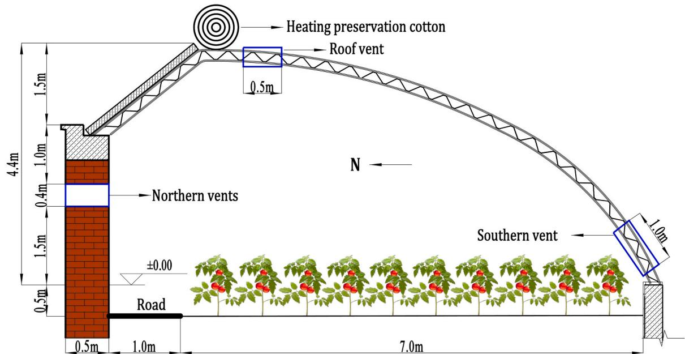
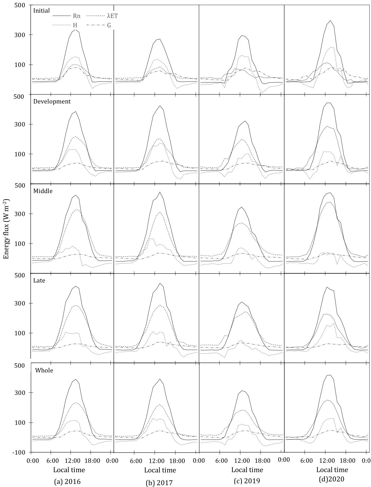
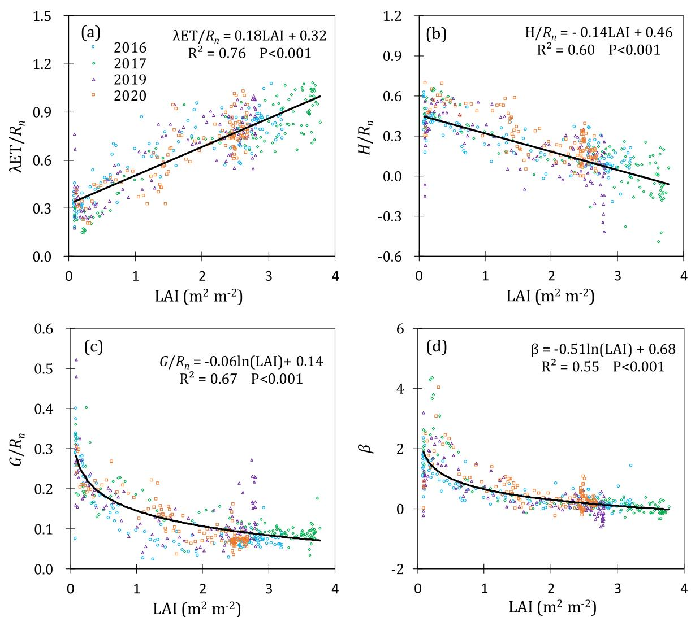
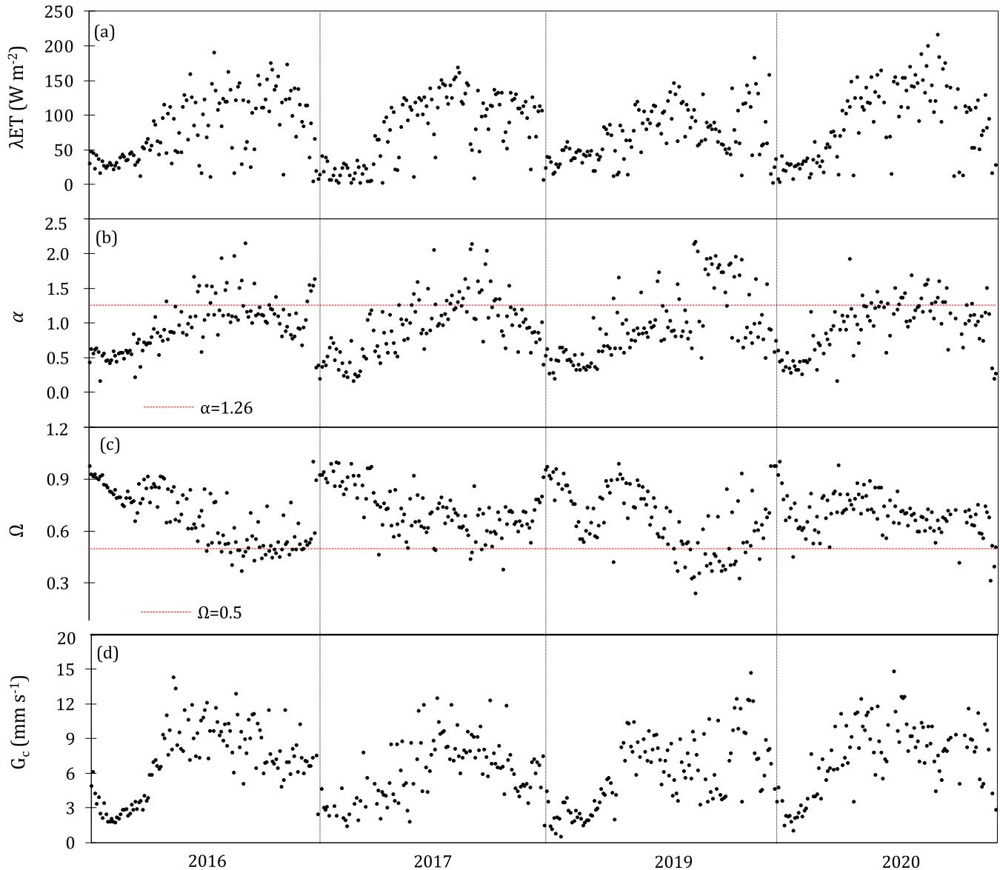
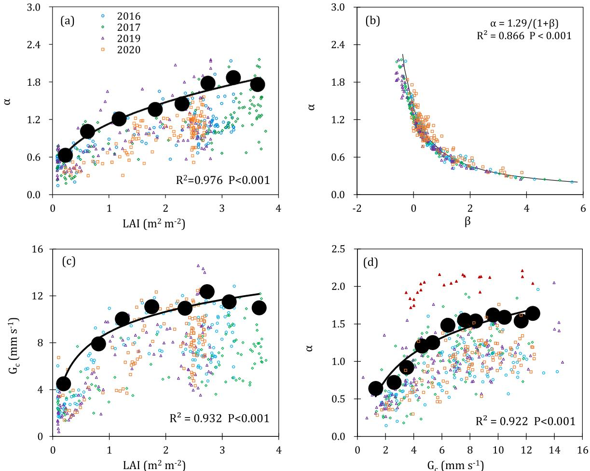

# Energy budget for tomato plants grown in a greenhouse in northern China

# 中国北方温室番茄植株的能量收支研究

Xuewen Gong a, Rangjian Qiu b,*, Baozhong Zhang c, Shunsheng Wang a, Jiankun Ge a, Shikai Gao a, Zaiqiang Yang b

a 华北水利水电大学水利学院，河南省作物需水过程与调控重点实验室，郑州 450045，中国  
b 南京信息工程大学应用气象学院，江苏省农业气象重点实验室，南京 210044，中国  
c 中国水利水电科学研究院流域水循环模拟与调控国家重点实验室，北京 100038，中国  

# 文章信息

责任编辑: Dr. B.E. Clothier

关键词: 空气动力学导度 冠层导度 对流条件 解耦因子 Priestley-Taylor系数

# 摘要

目前研究正在深入理解温室能量通量变化的机制。本研究通过四年(2016、2017、2019和2020年)的试验，利用两台称重式蒸渗仪测量潜热通量$(\lambda ET)$，研究了滴灌温室番茄植株的能量收支及其决定因素。结果表明，$\lambda ET$是净辐射$(R_{n})$的主要组成部分，占比达$66.4-71.7\%$，其次是感热通量$(H)$和土壤热通量$(G)$。季节性平均正午Bowen比$(\beta = H / \lambda ET)$的低值$(0.25-0.32)$也表明，对于水分充足的番茄植株，季节性$\lambda ET$大于$H$。叶面积指数$(LAI)$对能量收支有显著影响。$\lambda ET / R_{n}$比值随$LAI$增加呈线性增长，而$H / R_{n}$呈线性下降，$G / R_{n}$和$\beta$呈对数下降。季节性平均$\lambda ET$为$76.8\pm 4.7$ W m$^{-2}$，低于大田作物的报道值，这归因于温室的半封闭微气候。高值的Priestley-Taylor系数$(\alpha = 1.03\pm 0.05)$和解耦因子$(0.69\pm 0.05)$表明$\lambda ET$主要由$R_{n}$决定，支持了温室中$\lambda ET$受能量限制而非水分限制的结论。冠层导度$(G_{c})$也影响$\lambda ET$，特别是在生长中期阶段，$\alpha$与$G_{c}$之间存在高度相关性。这些发现对建立能量驱动模型和改进温室农业水分管理具有重要意义。

# 1. 引言

全球温室农业占地约405,000公顷(Katsoulas和Stanghellini, 2019)。日光温室(图1)为中国提供了大部分蔬菜作物，创造了最佳的生产环境并最大化种植者利润。土壤表面与温室大气之间的水热传输调控作物生理行为，驱动水分循环和能量储存，并改变植被和土壤特性(Baldocchi, 2001; Gu等, 2005)。净辐射$(R_{n})$转化为感热通量$(H)$和潜热通量$(\lambda ET)$的过程显著受灌溉、植被生长和温室微气候的影响(Gong等, 2017a; b; Jiao等, 2018; Liu等, 2019)。理解能量组分行为对改进水分管理和优化灌溉制度至关重要(Baldocchi, 1994; Chen等, 2019; Ding等, 2013; Youssef和Giuseppe, 2005)。

已有大量研究探讨开放农田生态系统的水热传输(Ai和Yang, 2016; Gong等, 2017a,b; Liu等, 2019; Tian等, 2017; Wang等, 2020; Yan等, 2017; Yu等, 2017)，其中能量通量和作物蒸散发$(ET)$随气候条件和土壤类型而变化。日光温室的微气候与开放农田显著不同：覆盖聚乙烯薄膜导致接收能量减少；部分封闭结构使内部风速较低；内部温度和相对湿度高于外部环境(Gong等, 2021)。这些因素共同影响温室内的水热通量和能量分配。能量分配主要受灌溉方式、土壤水分状况、栽培管理措施以及温室遮阳、喷雾和通风的影响(Baille等, 2001; Katsoulas等, 2001; Kittas等, 2001; Qiu等, 2011)。因此，日光温室的能量通量和分配模式与开放农田不同。据我们所知，目前关于日光温室能量收支的研究较少，特别是在小时尺度上。

能量通量的主要组成部分是$\lambda ET$，在研究能量收支时需要准确测量。目前有多种技术可用于直接或间接测量大田中的$\lambda ET$，如水量平衡法、蒸渗仪法、涡度相关法、波文比能量平衡法、闪烁仪法、茎流计结合微型蒸渗仪法、遥感能量平衡法和卫星遥感法等(Allen et al., 2011; Chen et al., 2021; Qiu et al., 2021)。水量平衡法已广泛用于温室$\lambda ET$测量(如Qiu et al., 2015)，建议计算周期为7天或更长以确保精度(Allen et al., 2011)。Li et al.(2020)尝试使用波文比能量平衡法测量温室小时尺度$\lambda ET$，但由于温室地面不平整和表面积较小，该方法适用性有限(Papadakis et al., 1994; Yan et al., 2019)。称重式蒸渗仪过去被用作测量作物$\lambda ET$的精确方法(Libardi et al., 2018)，并已广泛用于大田以提供准确的小时尺度$\lambda ET$数据(Anapalli et al., 2016; Benli et al., 2006; Ding et al., 2010; Marek et al., 2016; Puppo et al., 2019; Xu and Chen, 2005)。然而，目前使用称重式蒸渗仪测量番茄等温室作物$\lambda ET$的研究较少，尽管该技术已应用于草原牧草和甘蔗(Libardi et al., 2019)。长期连续准确地测定$\lambda ET$对于量化大气与地表之间的水和能量交换至关重要。

$\lambda ET$的季节性变化受多种物理和生理因素影响。物理因素可通过Priestley-Taylor系数$(\alpha)$、波文比$(\beta)$和解耦因子$(\Omega)$量化；生理因素则由冠层导度$(G_{c})$表征(Ding et al., 2015; Jarvis and McNaughton, 1986; Jiao et al., 2018)。Priestley-Taylor系数$\alpha$定义为$\lambda ET$与平衡蒸散之比，其使用消除了天气影响，可用于分析控制$\lambda ET$的因素。波文比$\beta$是感热通量与潜热通量之比，是地表水分的重要指标，也反映地下能量分布。冠层导度$G_{c}$代表作物对环境因子的整体响应，是计算$\lambda ET$模型的关键参数。Jarvis和McNaughton(1986)研究了$\lambda ET$对气孔行为的响应，他们重新排列Penman-Monteith方程并将其分解为两个边界条件的线性方程。当空气动力学导度很大或趋于无穷大时，相应的水热传输非常高效，导致叶片温度接近气温，输入辐射影响很小；当空气动力学导度很小或趋于零时，地表与大气之间水热传输很少，叶片表面与环境耦合较差。这些现象可用$\Omega$量化和分析。许多大田作物研究探讨了这些因素对$\lambda ET$的影响，但不同作物结果不一致(Ding et al., 2010, 2015; Suyker and Verma, 2008; Zhang et al., 2016)。Liu et al.(2019)发现$\lambda ET$主要由$R_{n}$决定，日尺度$\lambda ET$显著受$G_{c}$影响，表现为$\alpha$与$G_{c}$间良好相关性。相比之下，地膜覆盖棉花$\lambda ET$受$G_{c}$影响强于$R_{n}$(Tian et al., 2017)。Jiao et al.(2018)比较了玉米和葡萄冠层的$G_{c}$、$\Omega$、$\alpha$和$\beta$，发现玉米$\lambda ET$主要由$R_{n}$决定，而葡萄$\lambda ET$主要由$G_{c}$决定。然而，目前关于日光温室$\lambda ET$物理和生理驱动因素的研究较少，可能因为难以准确测量小时尺度$\lambda ET$。空气动力学导度$G_{a}$是确定温室$G_{c}$的关键参数，其计算与大田不同，因为温室内风速通常较低(Qiu et al., 2013; Zhang and Lemeur, 1992)，因此通常使用传热系数确定温室$G_{a}$。不同对流模式(自由、强迫或混合对流)下温室$G_{a}$计算公式不同，因此识别对流模式对准确计算$G_{a}$至关重要。$G_{a}$的准确性将影响$G_{c}$的准确性(Bailey et al., 1993; Montero et al., 2001; Qiu et al., 2013; Yan et al., 2018; Zhang and Lemeur, 1992)。

因此，在本研究中，为解决滴灌温室番茄能量收支机制不明确以及影响$\lambda ET$的物理和生理因素等科学问题，我们表征了日光温室中的对流模式，量化了$\lambda ET$和能量收支动态，并确定了控制$\lambda ET$的物理和生理因素。

  
图1. 实验所用日光温室剖面图。北墙设有60个方形通风口，尺寸为$0.4 \times 0.4 \mathrm{m}$。

# 2. 材料与方法

# 2.1. 试验地点与种植信息

试验于2016、2017、2019和2020年3-7月在中国农业科学院新乡农业生态试验站进行，地理位置为北纬$(35^{\circ}86^{\prime}\mathrm{N})$，东经$(113^{\circ}68^{\prime}\mathrm{E})$。该地区属温带大陆性气候，年均蒸发皿蒸发量$>1900~\mathrm{mm}$，Penman-Monteith模型计算的年均参考作物蒸散量$\sim 1045 \mathrm{mm}$，年均降水量$\sim 570 \mathrm{mm}$，年均气温$14.2^{\circ}C$。年日照时数$>2400\mathrm{h}$，无霜期$>200\mathrm{d}$。日光温室$0 - 1.0\mathrm{m}$土层土壤为粉砂壤土，含黏粒$16.9\%$、粉粒$76.7\%$和砂粒$6.4\%$。$0 - 1.0\mathrm{m}$土层平均田间持水量和萎蔫含水量分别为0.32和$0.09\mathrm{cm}^{- 3}$，土壤容重为$1.49\mathrm{gcm}^{- 3}$。

实验用日光温室为非加温型，面积$510~\mathrm{m^2}$（长$60\mathrm{m}$×宽$8.5\mathrm{m}$），东西走向。钢结构框架覆盖$0.2\mathrm{mm}$厚无滴聚乙烯薄膜。番茄生长初期采用$25~\mathrm{mm}$厚棉被覆盖薄膜以维持夜间温室温度。通过北墙、屋顶和南侧的通风系统调节室内微气候。温室结构如图1所示。

选用当地主栽番茄品种'金鼎'(Solanum lycopersicum L. cv. Jinding)，分别于2016年3月9日、2017年3月10日、2019年3月11日和2020年3月4日定植，种植密度5.7株$\mathrm{m}^{- 2}$，收获日期分别为2016年7月10日、2017年7月12日、2019年7月13日和2020年7月5日。采用滴灌系统，每行作物布置一条滴灌带，滴头间距30$\mathrm{cm}$，滴灌带间距$65~\mathrm{cm}$，使用流量$1.1\mathrm{Lh^{- 1}}$的压力补偿式滴头。定植后立即灌水$20~\mathrm{mm}$保证幼苗成活，之后根据累计蒸发量进行灌溉。在植株冠层上方$0.2\mathrm{m}$处放置直径$0.20\mathrm{m}$、深$0.11\mathrm{m}$的蒸发皿，每日07:00测定蒸发量，当累计蒸发量达$\sim 20 \mathrm{mm}$时，按累计蒸发量的$90\%$进行灌溉。前期研究表明该灌溉制度下日光温室番茄植株无水分胁迫(Gong et al., 2020; Liu et al., 2013)。2016、2017和2019年共灌溉15次，年灌溉总量分别为282.7、308.2和$311.7\mathrm{mm}$；202年灌溉14次，总量$270.5\mathrm{mm}$。番茄生育期划分为四个阶段（初期、发育期、中期和后期），如表1所示。

# 2.2. 测定与方法

气象数据由自动气象站测定。净辐射$(R_{n},\mathrm{Wm}^{- 2})$采用NI LITE2净辐射计（Kipp & Zonen，荷兰）测定，太阳辐射$(R_{s},\mathrm{Wm}^{- 2})$采用LI200X太阳辐射计（Campbell Scientific Inc.，美国）测定。辐射传感器安装高度$2.0\mathrm{m}$，始终高于冠层0.5$\mathrm{m}$。土壤热通量$(G_{s},\mathrm{Wm}^{- 2})$采用两块HFP31土壤热流板（Hukseflux，荷兰）测定，埋深$50~\mathrm{mm}$，分别位于植株下方和行间。空气温度$(T_{a},^{\circ}\mathbb{C})$和相对湿度$(RH,\%)$由CS215温湿度传感器（Campbell Scientific Inc.，美国）测定，安装高度$2.0\mathrm{m}$。冠层温度$(T_{c},^{\circ}\mathbb{C})$采用SI-111红外辐射温度计（Campbell Scientific Inc.，美国）测定，传感器朝北倾斜$\sim 45^{\circ}$，距冠层$0.3\mathrm{m}$。风速$(u_{2},\mathrm{ms}^{- 1})$由高精度（$\pm 0.02\mathrm{ms}^{- 1}$）风速仪（Wind Sonic，Gill，英国）测定。所有传感器连接CR1000数据采集器（Campbell Scientific Inc.，美国），存储30$\mathrm{min}$平均值。

温室安装两台$1.2\mathrm{m}^3$称重式蒸渗仪（$1.0\times 1.0\times 1.2\mathrm{m}$，长×宽×高），测定小时尺度蒸散发量$(ET)$。蒸渗仪内土壤质地和种植模式与周围土壤一致。为防止倒伏，蒸渗仪内番茄植株用竹竿支撑。蒸渗仪数据每小时采集存储一次。本研究使用的ET值为两台蒸渗仪平均值，标准差范围0-$0.584\mathrm{mm}\mathrm{d}^{- 1}$。

感热通量$(H,\mathrm{Wm}^{- 2})$采用能量平衡法计算：

$$
H = R_{n} - \lambda ET - G \tag{1}
$$

其中$\lambda$为水汽化潜热$(\mathrm{Jkg^{- 1}})$，$G$为土壤热通量$(\mathrm{Wm}^{- 2})$，根据$G_{s}$以及传感器测得的土壤含水量和土壤温度变化计算得出，具体方法见Qiu等(2019)的研究。$50~\mathrm{mm}$土层体积含水量由三个5TE传感器(Decagon Devices, Inc., USA)测定。数据每$30\mathrm{min}$通过EM50数据采集器(Decagon Devices, Inc., USA)记录一次。5TE传感器采用烘干法进行校准。$50~\mathrm{mm}$土层土壤温度由三个精度为$\pm 0.2^{\circ}\mathrm{C}$的土壤温度计(JL-04，Aornor Electronic Technology Co., Ltd., China)自动测量，时间间隔为$30\mathrm{min}$。

表1 2016、2017、2019和2020年温室番茄不同生育阶段的平均太阳辐射$(R_{s})$、水汽压亏缺(VPD)、空气温度$(T_{d})$、2米高度风速$(u_{2})$、叶面积指数$(LAI)$、冠层与空气温差$(T_{c}-T_{d})$、雷诺数$(R_{e})$和格拉晓夫数$(G_{r})$的统计结果。

| 年份 | 生长阶段 | 时期 | 太阳辐射(W/m²) | 水汽压亏缺(kPa) | 空气温度(°C) | 风速(m/s) | 叶面积指数(m²/m²) | 冠层-气温差(°C) | 雷诺数(×10³) | 格拉晓夫数(×10⁴) |
|------|----------|------|----------------|-----------------|--------------|-----------|-------------------|-----------------|--------------|-----------------|
| 2016 | 初期 | 3月9-31日 | 116.0 | 0.85 | 18.0 | 0.11 | 0.13 | 1.89 | 0.35 | 2.03 |
| 2016 | 发育期 | 4月1日-5月10日 | 121.8 | 0.68 | 21.4 | 0.13 | 1.12 | 1.02 | 0.40 | 1.64 |
| 2016 | 中期 | 5月11日-6月20日 | 134.7 | 0.98 | 24.3 | 0.16 | 2.90 | 1.68 | 0.50 | 2.70 |
| 2016 | 后期 | 6月21日-7月10日 | 136.2 | 1.04 | 28.3 | 0.16 | 2.57 | 1.74 | 0.50 | 2.30 |
| 2016 | 全期 | 3月9日-7月10日 | 127.1 | 0.87 | 22.8 | 0.14 | 1.76 | 1.51 | 0.48 | 2.47 |
| 2017 | 初期 | 3月11日-4月1日 | 57.2 | 0.45 | 16.0 | 0.08 | 0.15 | 0.45 | 0.25 | 0.72 |
| 2017 | 发育期 | 4月2日-5月10日 | 104.2 | 0.81 | 20.9 | 0.16 | 1.45 | 0.45 | 0.52 | 0.72 |
| 2017 | 中期 | 5月11日-6月21日 | 130.0 | 1.21 | 25.2 | 0.19 | 3.47 | 0.53 | 0.57 | 0.86 |
| 2017 | 后期 | 6月22日-7月12日 | 119.1 | 1.25 | 29.3 | 0.19 | 3.21 | 0.53 | 0.59 | 0.84 |
| 2017 | 全期 | 3月11日-7月12日 | 106.9 | 0.96 | 22.9 | 0.16 | 2.20 | 0.49 | 0.49 | 0.75 |
| 2019 | 初期 | 3月12日-4月2日 | 80.0 | 1.03 | 19.2 | 0.12 | 0.14 | 1.62 | 0.50 | 2.59 |
| 2019 | 发育期 | 4月3日-5月11日 | 102.3 | 0.72 | 21.3 | 0.14 | 1.04 | 0.94 | 0.36 | 1.51 |
| 2019 | 中期 | 5月12日-6月20日 | 114.0 | 1.42 | 26.4 | 0.16 | 2.63 | 1.98 | 0.35 | 3.17 |
| 2019 | 后期 | 6月21日-7月13日 | 122.2 | 1.30 | 28.2 | 0.14 | 2.56 | 2.04 | 0.33 | 3.27 |
| 2019 | 全期 | 3月12日-7月13日 | 105.4 | 1.11 | 23.9 | 0.13 | 1.68 | 1.59 | 0.40 | 2.62 |
| 2020 | 初期 | 3月4日-3月25日 | 83.1 | 0.79 | 18.9 | 0.11 | 0.38 | 1.86 | 0.36 | 2.97 |
| 2020 | 发育期 | 3月26日-5月5日 | 105.9 | 0.70 | 20.8 | 0.12 | 1.70 | 1.09 | 0.30 | 1.75 |
| 2020 | 中期 | 5月6日-6月16日 | 129.7 | 1.20 | 25.5 | 0.15 | 2.56 | 1.74 | 0.45 | 2.73 |
| 2020 | 后期 | 6月17日-7月7日 | 96.5 | 0.71 | 27.0 | 0.14 | 2.39 | 1.04 | 0.44 | 1.67 |
| 2020 | 全期 | 3月4日-7月5日 | 108.7 | 0.88 | 23.1 | 0.13 | 1.86 | 1.42 | 0.38 | 2.29 |

每7-10天手动测量9株随机选取植株的单叶长度和最大宽度。通过将单叶矩形面积(最大宽度×长度)乘以0.64的缩减系数(CAD软件绘制的实际面积与矩形面积之比)(Liu et al., 2009)计算单株叶面积。叶面积指数$(LAI, \mathrm{m}^2\mathrm{m}^{- 2})$为植株叶面积与单位面积的比值。采用MATLAB软件的"分段三次Hermite插值多项式"模型进行插值获得逐日LAI(MathWorks Inc., MA, USA)。

# 2.3. 参数计算与数据分析

温室内的空气动力学导度$(G_{a},\mathrm{mm}s^{- 1})$应与露地不同，因为温室内$u_{2}$较低(表1)。因此，我们采用温室内单叶对流换热系数计算$G_{a}$，该方法广泛应用于温室研究(Bailey et al., 1993; Montero et al., 2001; Qiu et al., 2013):

$$
G_{a} = \frac{2h\cdot LAI}{\rho_{a}\cdot C_{p}} \tag{2}
$$

式中$C_p$为干空气定压比热$(\mathrm{Jkg}^{- 1}\mathrm{K}^{- 1})$，$\rho_{a}$为空气密度$(\mathrm{kg}\mathrm{m}^{- 3})$，h为换热系数$(\mathrm{Wm}^{- 2}\mathrm{K}^{- 1})$，根据不同的对流模式(自由、强迫和混合对流)采用不同的无量纲数(Grashoff数$G_{r}$或Reynolds数$R_{e}$)确定。对流模式分类标准为：当$G_{r} / R_{e}^{2}\geq 10$时为纯自由对流；$G_{r} / R_{e}^{2}\leq 0.1$时为纯强迫对流；$0.1< G_{r} / R_{e}^{2}< 10$时为混合对流(Wang et al., 2006)。

纯自由对流的换热系数$h_1$计算公式为(McAdams, 1954; Montero et al., 2001; Qiu et al., 2013):

$$
h_1 = 0.4(K_c / d)(P_r\cdot G_r)^{1 / 4} \tag{3}
$$

纯强迫对流的换热系数$h_2$计算公式为(Grober and Erk, 1961; Montero et al., 2001; Qiu et al., 2013):

$$
h_2 = 0.66(K_c / d)P_r^{1 / 3}\cdot R_e^{1 / 2} \tag{4}
$$

混合对流的换热系数$h_3$计算公式为(Montero et al., 2001; Qiu et al., 2013; Stanghellini, 1987):

$$
h_3 = 0.37(K_c / d)\big(G_r + 6.92R_e^{2}\big)^{1 / 4} \tag{5}
$$

式中$K_{c}$为空气导热系数$(\mathrm{Wm}^{- 1}\mathrm{K}^{- 1})$，$P_{r}$为普朗特数(空气取0.7)。叶片特征尺寸$d_{i}$计算公式为(Montero et al., 2001):

$$
d = \frac{2}{1 / l + 1 / w} \tag{6}
$$

式中$l$和$w$分别为单叶长度$(\mathrm{m})$和宽度$(\mathrm{m})$。Grashoff数$G_{r}$可根据冠层$(T_{c})$与空气$(T_{a})$温差计算:

$$
G_{r} = \beta_{a}\cdot g\cdot d^{3}\cdot |T_{c} - T_{a}| / \nu^{2} \tag{7}
$$

式中$g$为重力加速度$(\mathrm{ms}^{- 2})$，$\beta_{a}$为体积热膨胀系数$(\mathrm{K}^{- 1})$。$R_{e}$为$u_{2}$的函数:$R_{e} = u_{2}\cdot d / \nu$

式中$\nu$为空气运动粘度$(\mathrm{Pa}\mathrm{s}^{- 1})$

番茄冠层导度$(G_{c},\mathrm{mm}s^{- 1})$通过Penman-Monteith模型反演计算(Jiao et al., 2018; Monteith, 1973):

$$
G_{c} = \frac{\lambda ET\cdot\gamma\cdot G_{a}}{\Delta(R_{n} - G) + \rho_{a}\cdot C_{p}\cdot VPD\cdot G_{a} - \lambda ET(\Delta^{-1})} \tag{9}
$$

式中$\Delta$为饱和水汽压斜率$(\mathrm{kPa}^{\circ}\mathrm{C}^{- 1})$，$\gamma$为干湿表常数$(\mathrm{kPa}^{\circ}\mathrm{C}^{- 1})$。水汽压亏缺VPD(kPa)根据实测$T_{g}$和RH计算(Allen et al., 1998)。

解耦系数$(\Omega)$用于量化$\lambda ET$与$G_{c}$或$R_{n}$的相关性，计算公式为(Jarvis and McNaughton, 1986; McNaughton and Jarvis, 1983):

$$
ET = \Omega ET_{eq} + (1 - \Omega)ET_{imp} \tag{10}
$$

$$
ET_{imp} = \rho_aC_pVPDG_c / \lambda \gamma \tag{11}
$$

$$
\frac{dET / ET}{dG_c / G_c} = 1 - \Omega \tag{12}
$$

$$
\Omega = \frac{\Delta + \gamma}{\Delta + \gamma(1 + G_a / G_c)} \tag{2}
$$

$\Omega$值介于0-1之间：$\Omega \to 0$表示番茄冠层与大气完全耦合，$\lambda ET$主要受$G_{c}$控制；$\Omega \to 1$表示冠层与大气完全隔离，$\lambda ET$主要取决于$R_{n}$(Baldocchi and Xu, 2007; Ding et al., 2015)。

Priestley-Taylor系数$\alpha$为归一化$\lambda ET$，用于量化$\lambda ET$与其他生理和环境因子的关系(Monteith and Unsworth, 2008)。计算公式为(Priestley and Taylor, 1972):

$$
\lambda ET_{eq} = \frac{\Delta}{\Delta + \gamma} (R_n - G) \tag{14}
$$

$$
\alpha = \frac{\lambda ET}{\lambda ET_{eq}} \tag{3}
$$

式中$\lambda ET_{eq}$为平衡蒸散发$(\mathrm{Wm}^{- 2})$。鲍恩比$(\beta = H / \lambda ET)$表征下垫面能量分配状况，反映下垫面湿润程度的差异。

为避免分母趋近于0导致数值不稳定，$G_{c}$、$\Omega$、$\alpha$和$\beta$等参数均采用中午时段$(11:00 - 15:00\mathrm{h})$数据计算。当$R_{n}< 100\mathrm{Wm}^{- 2}$时（主要发生在降水期间），该时段数据不参与上述参数计算。

采用边界线分析法(BLA)分析$\alpha$、$G_{c}$与LAI的关系。通过筛选各自变量范围内因变量的顶部数据点，消除或减弱其他因素的影响来表征变量间关系(Ding et al., 2015; Schafer et al., 2000)。BLA要求将LAI和$G_{c}$划分为若干等级：LAI分为8个等级（6个等级覆盖$0.5 - 3.5\mathrm{m}^{2}\mathrm{m}^{- 2}$范围，间隔$0.5\mathrm{m}^{2}\mathrm{m}^{- 2}$，外加$< 0.5\mathrm{m}^{2}\mathrm{m}^{- 2}$和$>3.5\mathrm{m}^{2}\mathrm{m}^{2}$各1个等级）；$G_{c}$分为12个等级（10个等级覆盖$2.0 - 12.0\mathrm{mm}\mathrm{s}^{- 1}$范围，间隔$1\mathrm{mm}\mathrm{s}^{- 1}$，外加$< 2.0\mathrm{mm}\mathrm{s}^{- 1}$和$>12.0\mathrm{mm}\mathrm{s}^{- 1}$各1个等级）。

# 3. 结果

# 3.1. 小气候与对流条件

表1显示2016、2017、2019和2020年试验期间不同生育阶段小气候参数的平均值。$R_{s}$、$T_{a}$和VPD的峰值多出现在生育中后期。2016年$R_{s}$季节平均值最高$(127.2\mathrm{Wm}^{- 2})$，2017$(106.9\mathrm{Wm}^{- 2})$、2019$(105.4\mathrm{Wm}^{- 2})$和2020$(108.7\mathrm{Wm}^{- 2})$年间差异较小。$T_{a}$和VPD季节平均值在四年间变化不大，分别为$22.8^{\circ}C$至$23.9^{\circ}C$和$0.87 - 1.11\mathrm{kPa}$。LAI在生育中期达到最大值后因叶片衰老和植株打顶略有下降，年际变异较小：季节LAI分别为1.76(2016)、2.20(2017)、1.68(2019)和$1.86\mathrm{m}^2\mathrm{m}^{- 2}$(2020)（表1）。

特征尺度$d$变化范围为20.2至$79.6\mathrm{mm}$，年均值约$56.8\mathrm{mm}$。各生育阶段实测$u_{2}$年均值普遍较小$(0.05 - 0.83\mathrm{ms}^{- 1})$，导致$R_{e}$值较低(250-590)。各生育阶段$[T_{c} - T_{a}]$平均值在$0.45 - 2.04^{\circ}\mathrm{C}$之间，对应$G_{r}$值为$0.72\times 10^{4} - 3.27\times 10^{4}$。基于$G_{r}/R_{e}^{2}$的逐时计算分析温室对流特征（图2，Wang et al., 2006）。混合对流传热占总传热比例分别为59%(2016)、58%(2017)、51%(2019)和56%(2020)，其余为纯强迫对流，未观测到纯自由对流现象。

$G_{a}$值采用式(3)-(5)计算的不同对流模式传热系数求得。由于LAI和$u_{2}$较低，生育初期中午$G_{a}$值较小（表3），至生育中期逐渐增大。各生育阶段中午$G_{a}$平均值在1.15至$36.77\mathrm{mm s^{- 1}}$之间，与其他温室研究结果一致(Yan et al., 2018; Zhang and Lemeur, 1992)。

# 3.2. 能量通量及其分配

图3展示2016-2020年四个番茄生育阶段能量收支的日变化。各生育阶段能量通量组分均呈单峰曲线，日出后迅速增加，正午前后达到峰值后逐渐下降。小时$R_{n}$峰值出现在$12:00\mathrm{h}$至$14:00\mathrm{h}$之间，从生育初期的$261.9\mathrm{Wm}^{- 2}$增至中期的$446.1\mathrm{Wm}^{- 2}$。$G$变化趋势与$R_{n}$相似但滞后$^{1 - 2\mathrm{h}}$，小时最大值在26.8至$79.7\mathrm{Wm}^{- 2}$之间。冠层覆盖较低的生育初期，白天$G$消耗$R_{n}$比例达$\sim 22.8\%$；夜间$G$多为负值，表明土壤向大气释放热量。$\lambda ET$和$H$在整个生育期变化显著（图3），$\lambda ET$小时峰值出现在$12:00\mathrm{h - 14:00h}$，从初期的$73.7\mathrm{Wm}^{- 2}$增至中期的$377.9\mathrm{Wm}^{- 2}$。$H$小时值在生育初期多大于$\lambda ET$，其他阶段则相反，峰值在初期达$214.5\mathrm{Wm}^{- 2}$，后期降至$49.7\mathrm{Wm}^{- 2}$。

表2显示2016-2020年白天$(8:00 - 18:00\mathrm{h})$不同生育阶段能量通量及分配状况。$\lambda ET/R_{n}$随生育进程先增后减，中期达到最大值88.7%(2016)、89.8%(2017)、84.8%(2019)和87.6%(2020)；$H/R_{n}$和$G/R_{n}$则在初期最大后逐渐下降，但$H/R_{n}$从中期到后期有所回升，这归因于$\lambda ET$持续增加而$H$和$G$减少（表2）。季节中午$\beta$平均值为0.24(2016)、0.32(2017)、0.25(2019)和0.32(2020)（表2），表明充分灌溉条件下$\lambda ET$大于$H$。中午$\beta$均值在初期$>1.0$，后期$<1.0$，显示生育初期后能量分配向$\lambda ET$转移。鲍恩比$\beta$受温室管理措施（如涂白(Baille et al., 2001)、喷雾、通风系统(Katsoulas et al., 2001; Kittas et al., 2001)）及作物类型、灌溉施肥等影响，例如温室玫瑰涂白前$\beta$为0.6，涂白后降至$-0.5$(Baille et al., 2001)。

能量分配与下垫面覆盖状况密切相关，可通过LAI量化。随LAI增加，$\lambda ET/R_{n}$线性增大（图4a），$H/R_{n}$线性减小（图4b）；$G/R_{n}$和$\beta$在LAI达$\sim 2.5\mathrm{m}^2\mathrm{m}^{- 2}$前快速下降，之后渐趋平缓（图4c、d）。

# 3.3. 潜热通量$\lambda ET$的季节变化及其物理和生理控制因素

图5和表3展示了不同生育阶段中午时段日$\lambda ET$、$\Omega$、$\alpha$和$G_{c}$的季节变化，其中$\Omega$和$\alpha$代表控制$\lambda ET$的物理因子，$G_{c}$代表生理因子(Ding et al., 2015; Jarvis and McNaughton, 1986)。在生育初期，$\lambda ET$速率较低（图5a）。随着太阳辐射和冠层覆盖度的增加（表1），由于植株需水量增加，$\lambda ET$快速上升并在生育中期达到最大值（2020年为$215.3\mathrm{Wm}^{- 2}$）。到生育后期，由于太阳辐射增强和LAI变化，$\lambda ET$略有下降（图5a）。温室常种植无限生长型番茄品种，因其能持续旺盛生长至季末。滴灌温室番茄的季节平均日$\lambda ET$相对稳定，变化范围为72.1至$80.4\mathrm{Wm}^{- 2}$，与中国北方和西北地区日光温室报道值一致(Li et al., 2020; Liu et al., 2013; Yuan et al., 2001)。但温室番茄$\lambda ET$低于露地栽培，这归因于温室内较高的$RH$值。由于微环境部分受控导致的低$u_{2}$和低辐射能量，进而降低了蒸发需求(Harmanto et al., 2005; Zheng et al., 2013)。

  
图2. 基于$G_{r}/R_{e}^{2}$分类的2016年6月5-12日日光温室内对流特征示例。虚线表示纯强迫对流与混合对流的分界线$(G_{r}/R_{e}^{2}=0.1)$。$G_{r}$为格拉晓夫数，$R_{e}$为雷诺数，$u_{2}$为距地面$2.0\mathrm{m}$处的风速。

  
图3. 温室种植番茄在不同生长阶段能量通量的日变化：(a)2016年，(b)2017年，(c)2019年和(d)2020年。

表2 λET为潜热通量，H为显热通量，G为土壤热通量，β为鲍恩比。

| 年份 | 生长阶段   | 能量通量(W m⁻²) |         |         | 能量分配(%) |       |       | β    |
|------|------------|-----------------|---------|---------|-------------|-------|-------|------|
|      |            | Rn              | λET     | H       | G           | λET/Rn| H/Rn  | G/Rn |
| 2016 | 初期       | 182.3           | 64.2    | 75.1    | 43.1        | 35.2  | 41.2  | 23.6 | 1.17 |
|      | 发育期     | 206.2           | 133.0   | 50.0    | 23.1        | 64.5  | 24.2  | 11.2 | 0.38 |
|      | 中期       | 246.1           | 218.3   | 9.7     | 18.0        | 88.7  | 4.0   | 7.3  | 0.04 |
|      | 后期       | 255.3           | 188.9   | 48.9    | 17.5        | 74.0  | 19.1  | 6.8  | 0.26 |
|      | 全期       | 235.4           | 168.7   | 39.7    | 27.0        | 71.7  | 16.9  | 11.5 | 0.24 |
| 2017 | 初期       | 139.8           | 48.3    | 58.9    | 32.6        | 34.6  | 42.1  | 23.3 | 1.22 |
|      | 发育期     | 234.8           | 129.4   | 80.1    | 25.3        | 55.1  | 34.1  | 10.8 | 0.62 |
|      | 中期       | 245.5           | 220.4   | 9.6     | 15.5        | 89.8  | 3.9   | 6.3  | 0.04 |
|      | 后期       | 298.2           | 191.1   | 87.7    | 19.4        | 64.1  | 29.4  | 6.5  | 0.46 |
|      | 全期       | 246.7           | 163.8   | 50.9    | 32.2        | 66.4  | 20.6  | 13.1 | 0.32 |
| 2019 | 初期       | 173.4           | 51.9    | 88.6    | 32.9        | 29.9  | 51.1  | 19.0 | 1.71 |
|      | 发育期     | 187.0           | 112.8   | 47.3    | 26.9        | 60.3  | 25.3  | 14.4 | 0.42 |
|      | 中期       | 204.7           | 173.5   | 16.8    | 14.4        | 84.8  | 8.2   | 7.0  | 0.10 |
|      | 后期       | 249.2           | 166.9   | 64.5    | 17.8        | 67.0  | 25.9  | 7.2  | 0.39 |
|      | 全期       | 205.2           | 139.9   | 34.4    | 31.1        | 68.2  | 16.8  | 15.2 | 0.25 |
| 2020 | 初期       | 207.2           | 60.1    | 91.2    | 55.9        | 29.0  | 44.6  | 27.0 | 1.52 |
|      | 发育期     | 272.9           | 182.2   | 56.1    | 34.6        | 66.8  | 20.0  | 12.7 | 0.31 |
|      | 中期       | 299.2           | 262.2   | 12.3    | 24.7        | 87.6  | 4.1   | 8.3  | 0.05 |
|      | 后期       | 257.2           | 152.9   | 82.9    | 21.4        | 59.4  | 32.2  | 8.3  | 0.54 |
|      | 全期       | 265.6           | 182.4   | 57.5    | 32.9        | 68.7  | 21.6  | 12.4 | 0.32 |

  
图4. 基于2016、2017、2019和2020年汇总数据的中午时段(a)λET/Rₙ、(b)H/Rₙ、(c)G/Rₙ、(d)鲍恩比β与叶面积指数(LAI)的关系。Rₙ为净辐射，λET为潜热通量，H为显热通量，G为土壤热通量。

  
图5. 2016、2017、2019和2020年(a)日潜热通量λET、(b)Priestley-Taylor系数α、(c)冠层导度G꜀和(d)解耦因子Ω的季节变化。

$\Omega$值在不同生育阶段变化显著，从初期的0.82-0.91降至中期的0.51-0.63，后期又回升至0.53-0.68（表3）。结果表明$R_{n}$在生育初期对$\lambda ET$的影响大于中期。本研究中，$\Omega$在四年观测期内多数时间$>0.5$，表明$R_{n}$对番茄冠层的影响大于$G_{c}$。

然而，在生育中后期共有63天出现$\Omega < 0.5$的情况，表明这些时段$G_{c}$起主导作用。$\alpha$的季节变化趋势与$\lambda ET$相似，从初期的0.46-0.53增至中期的峰值范围1.26-1.48，后期仍维持较高水平（0.92-1.27）（表3和图5b）。

大量研究表明$G_{c}$是$\lambda ET$的良好指标，高$G_{c}$值对应高$\lambda ET$(Ding et al., 2015; Jiao et al., 2018; Liu et al., 2019)。我们发现$G_{c}$在生育初期普遍较低，随后逐渐升高。观测到的$G_{c}$最大值为$14.6\mathrm{mm s}^{-1}$（图5d），低于多数大田作物的报道值(Ding et al., 2015; Kelliher et al., 1995; Suyker and Verma, 2008)。四年研究期间$G_{c}$均值在初期、发育期、中期和后期分别为2.67、6.66、7.97和$7.24\mathrm{mm s}^{-1}$（表3）。

# 4. 讨论

# 4.1. 温室对流特征

表3 2016、2017、2019和2020年温室番茄不同生长阶段中午时段的Priestley-Taylor系数(α)、空气动力学导度(Gₐ)、冠层导度(G꜀)和解耦系数(Ω)

| 年份 | 生长阶段   | α   | Gₐ(mm/s) | G꜀(mm/s) | Ω   |
|------|------------|-----|----------|----------|-----|
| 2016 | 初期       | 0.51| 2.84     | 2.76     | 0.85|
|      | 发育期     | 0.87| 10.98    | 7.61     | 0.76|
|      | 中期       | 1.26| 36.77    | 8.82     | 0.55|
|      | 后期       | 1.06| 32.03    | 7.15     | 0.56|
|      | 全期       | 1.01| 21.21    | 7.02     | 0.69|
| 2017 | 初期       | 0.46| 1.15     | 2.82     | 0.91|
|      | 发育期     | 0.94| 9.09     | 5.32     | 0.72|
|      | 中期       | 1.48| 18.21    | 8.09     | 0.63|
|      | 后期       | 1.10| 14.58    | 5.91     | 0.68|
|      | 全期       | 1.04| 11.93    | 6.71     | 0.75|
| 2019 | 初期       | 0.52| 2.38     | 2.20     | 0.82|
|      | 发育期     | 0.98| 11.71    | 5.86     | 0.71|
|      | 中期       | 1.41| 23.55    | 6.22     | 0.51|
|      | 后期       | 1.27| 19.10    | 8.89     | 0.58|
|      | 全期       | 1.09| 15.17    | 5.93     | 0.66|
| 2020 | 初期       | 0.53| 2.61     | 2.88     | 0.91|
|      | 发育期     | 0.98| 10.13    | 7.85     | 0.71|
|      | 中期       | 1.27| 24.76    | 8.76     | 0.51|
|      | 后期       | 0.92| 22.53    | 7.01     | 0.53|
|      | 全期       | 0.98| 17.11    | 7.13     | 0.64|

本研究中，$R_{e}$值介于250-590之间，普遍高于Qiu等(2013)报道的数值(106-114)，这归因于我们温室设有更多通风口，但与玻璃温室观测值(150-550)相近(Bailey等,1993)。本研究中的$G_{r}$值$(0.72\times 10^{4} - 3.27\times 10^{4})$低于Qiu等(2013)的观测值$(4.07\times 10^{4} - 4.13\times 10^{4})$，但在Bailey等(1993)报道的范围内$(1\times 10^{4} - 5\times 10^{4})$。塑料薄膜温室中也曾观测到$G_{r}$低值$(3\times 10^{3} - 8\times 10^{3})$。根据Wang等(2006)的对流分类标准，四年研究期间温室中对流类型超过50%为混合对流，其余为纯强迫对流——主要出现在通风系统全开、温室内$u_{2}$值较高的正午时段。文献报道的温室对流模式存在差异：英国、西班牙和比利时的玻璃温室常观测到纯自由对流和纯强迫对流(Bailey等,1993; Zhang和Lemeur,1992)；而Qiu等(2013)发现中国西北日光温室中71-81%时段为混合对流，未出现纯强迫对流。这些差异源于通风系统、温室类型和栽培作物的不同，这些因素共同影响温室内的$d$、$u_{2}$和$T_{c} - T_{a}$。

# 4.2. 温室番茄能量分配特征

辐射反射率随湿度和冠层覆盖度变化(Allen等,1998; Qiu等,2011)，$R_{n}$的变异主要源于短波和长波入射辐射及作物生长状况。这导致$R_{n}$在生育初期较低$(261.9\mathrm{Wm}^{-2})$，中期较高$(446.1\mathrm{Wm}^{-2})$。$G$与冠层覆盖呈负相关——随着冠层郁闭度增加，到达地表能量减少导致$G$降低，温室黄瓜研究也发现类似规律(Yan等,2019)。冠层发育使更多能量用于$\lambda ET$，可用于加热大气和土壤表面的能量减少，导致$H$和$G$降低(Qiu等,2011; Yang等,1999)。整个生育期白天$\lambda ET$占$R_{n}$的66.4-71.7%，是$R_{n}$的最大组分，该结果与温室黄瓜(Yuan等,2019)和温室番茄(Li等,2020)的研究范围一致。部分研究发现沟灌温室番茄和辣椒的$\lambda ET/R_{n}$低于$H/R_{n}$(Li等,2020; Qiu等,2011)，另有研究显示温室黄瓜的$H/R_{n}$低于$G/R_{n}$(Yan等,2019)，这些差异源于作物种类、种植模式和灌溉方式的不同。

生育中后期频繁出现16:00后$H$为负值且$\lambda ET > R_{n}$的现象，表明发生了显热平流(Liu等,2019; Ding等,2015)，这增加了$\lambda ET$。温室南侧通风口促使暖干空气流入，尤其在湍流混合强烈时引发显热平流。Lei和Yang(2010)发现午后$H$因诱导显热平流成为能量来源，导致实测$\lambda ET$超过平衡$\lambda ET$(Petrone等,2006)，该现象在玻璃温室中常见(Baille等,2001; Katsoulas等,2001; Kittas等,2001)。

能量分配显著受LAI影响(Hammerle等,2008; Shen等,2004)。我们发现随LAI增加，$\lambda ET/R_{n}$升高而$H/R_{n}$降低(图4a,b)，温室辣椒(Qiu等,2011)、高草草原(Burba和Verma,2005)及草原放牧地(Li等,2006)也报道类似规律。当$LAI<2.5\mathrm{m}^{2}\mathrm{m}^{-2}$时，$G/R_{n}$和$\beta$随LAI增加呈对数下降，这可能因为LAI超过有效阈值后作物冠层截获的有效能量不再增加。Qiu等(2011)采用指数函数描述$G/R_{n}$与LAI关系，Gong等(2017a,b)和Lei与Yang(2010)也表明$\beta$随冠层完全遮荫而逐渐降低。

# 4.3. 蒸散发(ET)的物理与生理调控因素

高$\Omega$值表明冠层与大气之间存在强烈解耦(Baldocchi and Xu, 2007; Jiao et al., 2018; Liu et al., 2019; Tian et al., 2017)，意味着温室内水汽传输过程较弱。在生长初期频繁观测到高$\Omega$值。进入生长中期后，随着叶面积指数(LAI)增大和潜在蒸散发升高，水汽传输逐渐增强，导致$\Omega$值降低。这与初期$G_{a}$较低(表3)且$\lambda ET$主要受$R_{n}$调控的现象一致(Katsoulas and Stanghellini, 2019)。而生长中期$G_{a}$增大(表3)对$\lambda ET$的影响比其他生育期更显著(式(1))。整个生育期内$\Omega$值多数时间$>0.5$(图5c)，表明$R_{n}$对$\lambda ET$的影响大于$G_{c}$。这与温室作物研究中气孔活动对$\lambda ET$影响较小、$\lambda ET$主要取决于辐射能的结论一致(Gong et al., 2017a, b; Qiu et al., 2011)。本研究的$\Omega$值高于棉花、葡萄等干旱区大田作物(Jiao et al., 2018; Tian et al., 2017)，表明温室中辐射对$\lambda ET$的影响强于露地(Ding et al., 2015)。这是由于温室$u_{2}$较低导致$G_{a}$远小于露地，使温室大气与冠层强烈解耦(Katsoulas and Stanghellini, 2019)。

鉴于$\lambda ET$主要受$R_{n}$调控，我们进一步分析标准化$\lambda ET$参数$\alpha$与生理因子的关系。$\alpha$值与叶片接收能量相关，其变化可部分由LAI解释。边界线分析显示$\alpha$随LAI呈对数增长(图6a)，表明冠层能量吸收率随作物生长而提高。这与大田玉米LAI阈值$\sim 2.8\mathrm{m}^{2}\mathrm{m}^{-2}$的结论不同(Jiao et al., 2018; Zhang et al., 2010)。生育后期$\alpha$轻微下降归因于叶片衰老导致的生理活性降低抑制了$\lambda ET$。$\alpha$值在初期后$>1.0$，表明$\lambda ET$受可用能量而非水分限制(Lei and Yang, 2010; Tian et al., 2017)。生长中期$\alpha$多高于参考值1.26，说明番茄植株充分利用了可用能量，且显热平流可能提供了额外能量。本研究中午$\alpha$季节均值为$1.03\pm 0.05$，与Valdes-Gomez等(2009)的温室番茄研究一致，但低于密植作物(如玉米、水稻)(Liu et al., 2019; Jiao et al., 2018)，高于稀疏作物(如葡萄)(Jiao et al., 2018)，这可能源于气候条件和土壤水分差异。当$\alpha$未知时，可通过$\beta$估算，二者回归方程$\alpha = 1.29 / (1 + \beta)$($R^{2}=0.866$)(图6b)，其中系数1.29代表$(1+\gamma/\Delta)$的量级，随$T_{a}$变化。

  
图6. 基于2016-2020年汇总数据的中午时段(a)Priestley-Taylor系数$\alpha$与LAI、(b)$\alpha$与鲍恩比$\beta$、(c)$\alpha$与冠层导度$G_{c}$、(d)$G_{c}$与LAI的关系。(a)(c)(d)中实心圆$(\bullet)$表示不同LAI和$G_{c}$水平的边界线分析结果；(d)中红色上三角$(\pmb{\Delta})$表示受平流影响的数据，已排除分析。

$G_{c}$受LAI变化和气孔导度调控，后者与空气湿度和土壤水分相关(Zhu et al., 2014)。本研究中滴灌温室番茄$G_{c}$变幅为0.41-$14.67\mathrm{mm s^{-1}}$，而沟灌温室番茄为$8.8-50.0\mathrm{mm s^{-1}}$(Ortega-Farias et al., 2006)，表明$G_{c}$对$\lambda ET$影响显著(Kelliher et al., 1995)。$G_{c}$与LAI存在强相关性(Gong et al., 2017a, b)。

$G_{c}$随LAI增加快速上升，当LAI达$\sim 2.5\mathrm{m}^{2}\mathrm{m}^{-2}$后趋于稳定(图6c)，表明该值为温室番茄LAI影响$\lambda ET$的合理阈值。而大田水稻和玉米的半月/月均$G_{c}$与LAI呈线性增长(Liu et al., 2019; Zhang et al., 2016)，这归因于分析时间尺度差异。温室增白、喷雾和通风等管理措施也能提高$G_{c}$(Kaille et al., 2001; Katsoulas et al., 2001; Pittas et al., 2001)。

$\alpha$随$G_{c}$增加显著升高，当$G_{c}>10\mathrm{mm s^{-1}}$后变化趋缓(图6d)，表明$\alpha$介导了$G_{c}$对$\lambda ET$的显著影响。不同作物的$G_{c}$阈值存在差异：春玉米(Gao et al., 2018)和干旱区覆膜棉花(Tian et al., 2017)阈值$<10\mathrm{mm s^{-1}}$，而多数大田作物为$10-20\mathrm{mm s^{-1}}$(Ding et al., 2013; Jiao et al., 2018; Suyker and Verma, 2008; Zhang et al., 2016)。平流导致某些时段$\alpha$升至1.72-2.24，此时$\alpha$与$G_{c}$相关性差，即使$G_{c}$较小$\alpha$仍较高，灌溉大田作物也有类似现象(Ding et al., 2013; Liu et al., 2019)。

# 5. 结论

本研究探究了滴灌温室番茄的能量分配特征。分析了驱动潜热通量(λET)的物理参数(α和Ω)与生理参数(Gc)，并计算了影响冠层导度的空气动力学导度(Ga)在不同对流模式下的变化。结果表明：混合对流是研究期间主要对流形式，纯强迫对流为辅，未出现纯自由对流。整个生育期内λET是净辐射(Rn)的主要组分，占比达66.4-71.7%。随着叶面积指数(LAI)增加，λET/Rn呈线性上升，而H/Rn、G/Rn和鲍恩比(β)均下降。λET日变化幅度显著(0.57-215.3 Wm-2)，季节均值为72.1-80.4 Wm-2。生长季多数时段α和Ω值较高，表明λET更多受Rn而非Gc调控，但当Gc>10 mm s-1时对λET仍有显著影响。这些发现对发展能量驱动的λET模型及优化温室水分管理具有重要意义。

# 利益冲突声明

作者声明不存在可能影响本研究的已知经济利益冲突或个人关系。

# 致谢

感谢以下项目的资助：国家重点研发计划(2019YFD1002202)、国家自然科学基金(51809094, 51509130, 51822907, 52079051)和河南省重点研发与推广专项(192102110090)。

## 参考文献

1.  [Ai and Yang, 2016](#bbib1)
Z.P. Ai, Y.H. Yang
覆膜条件下棉花蒸散量估算的Priestley-Taylor模型改进与验证
J. Hydrometeorol., 17 (4) (2016), pp. 1281-1293
2.  [Allen et al., 2011](#bbib2)
R.G. Allen, L.S. Pereira, T.A. Howell, M.E. Jensen
蒸散发信息报告：I. 测量精度的影响因素
Agric. Water Manag., 98 (2011), pp. 899-920
3.  [Allen et al., 1998](#bbib3)
R.G. Allen, L.S. Pereira, D. Raes, M. Smith
作物蒸散发：作物需水量计算指南. 灌溉与排水论文第56号
FAO,, Rome, Italy (1998)
4.  [Anapalli et al., 2016](#bbib4)
S.S. Anapalli, L.R. Ahuja, P.H. Gowda, L. Ma, G. Marek, S.R. Evett, T.A. Howell
利用称重式蒸渗仪数据模拟作物蒸散发和作物系数
Agric. Water Manag., 177 (2016), pp. 274-283
5.  [Bailey et al., 1993](#bbib5)
B.J. Bailey, J.I. Montero, C. Biel, D.J. Wilkinson, O. Jolliet
垂叶榕蒸腾作用：实测值与Penman-Monteith模型及其简化版本的比较
Agric. For. Meteorol., 65 (1993), pp. 229-243
6.  [Baille et al., 2001](#bbib6)
A. Baille, C. Kittas, N. Katsoulas
温室增白对微气候和作物能量分配的影响
Agric. For. Meteorol., 104 (2001), pp. 293-306
7.  [Baldocchi, 1994](#bbib7)
D. Baldocchi
封闭C3(小麦)与开放C4(玉米)冠层物质和能量交换的比较研究：I.可用能量在潜热和显热交换中的分配
Agric. For. Meteorol., 67 (1994), pp. 291-321
8.  [Baldocchi, 2001](#bbib8)
D. Baldocchi
FLUXNET：研究生态系统尺度二氧化碳、水汽和能量通量密度时空变异的新工具
Bull. Am. Meteorol. Soc., 82 (2001), pp. 2415-2434
9.  [Baldocchi and Xu, 2007](#bbib9)
D.D. Baldocchi, L.K. Xu
地中海橡树林蒸发的限制因素：土壤水分供应、植物生理调控还是大气需求？
Adv. Water Resour., 30 (2007), pp. 2113-2122
10.  [Benli et al., 2006](#bbib10)
B. Benli, S. Kodal, A. Ilbeyi, H. Ustun
利用称重式蒸渗仪测定苜蓿蒸散发和基础作物系数
Agric. Water Manag., 83 (2006), pp. 358-370
11.  [Burba and Verma, 2005](#bbib11)
G.G. Burba, S.B. Verma
原生高草草原和栽培小麦生态系统蒸散发的季节和年际变化
Agric. For. Meteorol., 135 (2005), pp. 190-201
12.  [Chen et al., 2021](#bbib12)
N. Chen, X.Y. Li, H.B. Shi, J.W. Yan, Q. Hu, Y.H. Zhang
干旱滴灌条件下可降解地膜覆盖玉米蒸散发及相关过程的模拟
Agric. For. Meteorol., 297 (2021), Article 108247
13.  [Chen et al., 2019](#bbib13)
N. Chen, X.Y. Li, J. Šimůnek, H.B. Shi, Z.J. Ding, Z.Y. Peng
滴灌农田中可降解地膜覆盖对土壤水分动态影响的评估
Agric. Water Manag., 226 (2019), Article 105788
14.  [Ding et al., 2013](#bbib14)
R.S. Ding, S.Z. Kang, F.S. Li, Y.Q. Zhang, L. Tong
覆膜灌溉玉米田中使用改进Priestley-Taylor模型的蒸散发测量与估算
Agric. For. Meteorol., 168 (2013), pp. 140-148
15.  [Ding et al., 2010](#bbib15)
R.S. Ding, S.Z. Kang, F.S. Li, Y.Q. Zhang, L. Tong, Q.Y. Sun
利用大型称重式蒸渗仪评估中国西北玉米田涡度相关法
Agric. Water Manag., 98 (2010), pp. 87-95
16.  [Ding et al., 2015](#bbib16)
R.S. Ding, L. Tong, F.S. Li, Y.Q. Zhang, X.M. Hao, S.Z. Kang
中国西北干旱平流农田作物系数变化及其影响因素
Hydrol. Process., 29 (2) (2015), pp. 239-249
17.  [Gao et al., 2018](#bbib17)
X. Gao, X.R. Mei, F.X. Gu, W.P. Hao, D.Z. Gong, H.R. Li
黄土高原雨养春玉米田蒸散发分配与能量平衡
China Catena, 166 (2018), pp. 249-259
18.  [Gong et al., 2017a](#bbib18)
X.W. Gong, H. Liu, J.S. Sun, Y. Gao, X.X. Zhang, S.K. Jha, H. Zhang, X.J. Ma, W.N. Wang
日光温室中估算蒸散发的Penman-Monteith公式表面阻力模型
J. Arid Land, 9 (4) (2017), pp. 530-546
19.  [Gong et al., 2017b](#bbib19)
D.Z. Gong, X.R. Mei, W.P. Hao, H.B. Wang, K.K. Caylor
部分塑料覆膜与未覆膜玉米田蒸散发分配和作物系数的比较
Agric. Water Manag., 181 (2017), pp. 23-34
20.  [Gong et al., 2021](#bbib20)
X.W. Gong, R.J. Qiu, J.K. Ge, G.K. Bo, Y.L. Ping, Q.C. Xin, S.S. Wang
基于改进Priestley-Taylor模型的温室番茄蒸散发分配研究
Agric. Water Manag., 247 (2021), Article 106709
21.  [Gong et al., 2020](#bbib21)
X.W. Gong, R.J. Qiu, J.S. Sun, J.K. Ge, Y.B. Li, S.S. Wang
全量灌溉和亏缺灌溉条件下日光温室番茄蒸散发及作物系数研究
Agric. Water Manag., 235 (2020), Article 106154
22.  [Grober and Erk, 1961](#bbib22)
H. Grober, S. Erk
传热学基础
McGraw-Hill,, New York (1961), p. 228
23.  [Gu et al., 2005](#bbib23)
S. Gu, Y.H. Tang, X.Y. Cui, T. Kato, M.Y. Du, Y.N. Li, X.Q. Zhao
青藏高原草甸生态系统与大气间的能量交换
Agric. For. Meteorol., 129 (2005), pp. 175-185
24.  [Hammerle et al., 2008](#bbib24)
A. Hammerle, A. Haslwanter, U. Tappeiner, A. Cernusca, G. Wohlfahrt
温带山地草原叶面积对能量分配的调控作用
Biogeosciences, 5 (2) (2008), pp. 421-431
25.  [Harmanto et al., 2005](#bbib25)
Harmanto, V.M. Salokhe, M.S. Babel, H.J. Tantau
热带地区温室滴灌番茄需水量研究
Agric. Water Manag., 71 (2005), pp. 225-242
26.  [Jarvis and McNaughton, 1986](#bbib26)
P.G. Jarvis, K.G. McNaughton
气孔对蒸腾作用的控制：从叶片到区域的尺度扩展
Adv. Ecol. Res., 15 (1986), pp. 1-49
27.  [Jiao et al., 2018](#bbib27)
L.J. Jiao, R.S. Ding, S.Z. Kang, T.S. Du, L. Tong, S.E. Li
中国西北地区密闭玉米与稀疏葡萄冠层能量分配和蒸散发的比较
Agric. Water Manag., 203 (2018), pp. 251-260
28.  [Katsoulas et al., 2001](#bbib28)
N. Katsoulas, A. Baille, C. Kittas
喷雾对温室玫瑰冠层蒸腾和导度的影响
Agric. For. Meteorol., 106 (2001), pp. 233-247
29.  [Katsoulas and Stanghellini, 2019](#bbib29)
N. Katsoulas, C. Stanghellini
温室作物蒸腾模型：不同应用场景的模型选择
Agronomy, 9 (7) (2019), pp. 392-409
30.  [Kelliher et al., 1995](#bbib30)
F.M. Kelliher, R. Leuning, M.R. Raupach, E.D. Schulze
全球植被类型最大蒸发导度研究
Agric. For. Meteorol., 73 (1995), pp. 1-16
31.  [Kittas et al., 2001](#bbib31)
C. Kittas, N. Katsoulas, A. Baille
夏季条件下温室通风制度对玫瑰冠层微气候及能量分配的影响
J. Agric. Eng. Res., 79 (2001), pp. 349-360
32.  [Lei and Yang, 2010](#bbib32)
H.M. Lei, D.W. Yang
华北平原灌溉农田蒸散发与能量分配的年际和季节变化
Agric. For. Meteorol., 150 (2010), pp. 581-589
33.  [Libardi et al., 2018](#bbib33)
L. Libardi, R. Faria, A. Dalri, G. Rolim, L. Palaretti
高精度称重式蒸渗仪测量甘蔗预发芽苗蒸散发
Eng. Agríc., 38 (2) (2018), pp. 208-216
34.  [Libardi et al., 2019](#bbib34)
L.G.P. Libardi, R.T. Faria, A.B. Dalri, G.S. Rolim, L.F. Palaretti, A.P. Coelho, I.P. Martins
温室灌溉管理中甘蔗预发芽苗的蒸散发与作物系数(Kc)
Agric. Water Manag., 212 (2019), pp. 306-316
35.  [Liu et al., 2019](#bbib35)
B. Liu, Y.L. Cui, Y.F. Luo, Y.Z. Shi, M. Liu, F.P. Liu
中国南方轮作稻田能量分配与蒸散发研究
Agric. For. Meteorol., 276–277 (2019), Article 107626
36.  [Liu et al., 2013](#bbib36)
H. Liu, A.W. Duan, F.S. Li, J.S. Sun, Y.C. Wang, C.T. Sun
华北平原日光温室番茄基于蒸发皿的滴灌制度
J. Integr. Agric., 12 (3) (2013), pp. 520-531
37.  [Liu et al., 2009](#bbib37)
H. Liu, J.S. Sun, A.W. Duan, L. Sun, Y.Y. Liang
基于AutoCAD软件的番茄和青椒叶面积简易模型
Chin. Agric. Sci. Bull., 25 (05) (2009), pp. 287-293
38.  [Li et al., 2006](#bbib38)
S.G. Li, W. Eugster, J. Asanuma, A. Kotani, G. Davaa, D. Oyunbaatar, M. Sugita
蒙古中部草原放牧区能量分配及其生物物理控制因素
Agric. For. Meteorol., 137 (2006), pp. 89-106
39.  [Li et al., 2020](#bbib39)
B. Li, B.J. Shi, Z.Z. Yao, M.K. Shukla, T.S. Du
滴灌和沟灌系统下日光温室能量分配与小气候特征
Agric. Water Manag., 234 (2020), Article 106096
40.  [Marek et al., 2016](#bbib40)
G. Marek, P. Gowd, T. Marek, B. Auvermann, S. Evett, P. Colaizzi, D. Brauer
利用大型称重式蒸渗仪表征裸土条件下有效降水蒸发估算季前灌溉损失
Agric. Water Manag., 169 (2016), pp. 115-128
41.  [McAdams, 1954](#bbib41)
W.H. McAdams
热传导(第3版)
McGraw-Hill,, New York (1954), p. 442
42.  [McNaughton and Jarvis, 1983](#bbib42)
K.G. McNaughton, P.G. Jarvis
植被变化对蒸腾和蒸发影响的预测
T.T. Kozlowski (Ed.), Water Deficits and Plant Growth, Academic Press, New York, USA (1983), pp. 1-47
43.  [Monteith, 1973](#bbib43)
Monteith, J.L., 1973. Principles of Environmental Physics. Arnold, London, 180–199 pp.
44.  [Monteith and Unsworth, 2008](#bbib44)
J.L. Monteith, M.H. Unsworth
环境物理学原理
Academic Press,, New York (2008), p. 418
45.  [Montero et al., 2001](#bbib45)
J.I. Montero, A. Antón, P. Muñoz, P. Lorenzo
高温低湿条件下温室天竺葵的蒸腾作用
Agric. For. Meteorol., 107 (4) (2001), pp. 323-332
46.  [Ortega-Farias et al., 2006](#bbib46)
S.O. Ortega-Farias, A. Olioso, S. Fuentes, H. Valdes
基于可变冠层阻力的Penman-Monteith方程估算沟灌番茄作物的潜热通量
Agric. Water Manag., 82 (3) (2006), pp. 421-432
47.  [Papadakis et al., 1994](#bbib47)
G. Papadakis, A. Frangoudakis, S. Kyritsis
番茄作物与温室环境间热质传递的实验研究与建模
J. Agric. Eng. Res., 57 (1994), pp. 217-227
48.  [Petrone et al., 2006](#bbib48)
R.M. Petrone, C. Smith, M.L. Macrae, M.C. English
加拿大安大略省南部一级农业流域河岸带平衡与真实蒸散发研究
Agric. Water Manag., 86 (2006), pp. 240-248
49.  [Priestley and Taylor, 1972](#bbib49)
C.H.B. Priestley, R.J. Taylor
基于大尺度参数评估地表热通量与蒸发
Mon. Weather Rev., 100 (1972), pp. 81-92
50.  [Puppo et al., 2019](#bbib50)
L. Puppo, C. García, E. Bautista, D.J. Hunsaker, A. Beretta, J. Girona
温带半湿润气候下排水式蒸渗仪中幼龄未结果橄榄树季节性基础作物系数模式
Agric. Water Manag., 226 (2019), Article 105732
51.  [Qiu et al., 2015](#bbib51)
R.J. Qiu, T.S. Du, S.Z. Kang, R.Q. Chen, L.S. Wu
评估SIMDualKc模型估算中国西北日光温室辣椒蒸散量的适用性
Agric. Syst., 138 (2015), pp. 1-9
52.  [Qiu et al., 2013](#bbib52)
R.J. Qiu, S.Z. Kang, T.S. Du, L. Tong, X.M. Hao, R.Q. Chen, J.L. Chen, F.S. Li
对流对日光温室辣椒蒸腾Penman-Monteith模型估算的影响
Sci. Hortic., 160 (2013), pp. 163-171
53.  [Qiu et al., 2011](#bbib53)
R.J. Qiu, S.Z. Kang, F.S. Li, T.S. Du, L. Tong, F. Wang, R.Q. Chen, J.Q. Liu, S.E. Li
沟灌和滴灌条件下温室辣椒的能量分配与蒸散特征
Sci. Hortic., 129 (2011), pp. 790-797
54.  [Qiu et al., 2021](#bbib54)
R.J. Qiu, G.G. Katul, J.T. Wang, J.Z. Xu, S.Z. Kang, C.W. Liu, B.Z. Zhang, L.A. Li, P.E. Cajucom
不同增温模式下水稻蒸散的差异响应
Agric. For. Meteorol., 298–299 (2021), Article 108293
55.  [Qiu et al., 2019](#bbib55)
R.J. Qiu, C.W. Liu, N.B. Cui, Y.J. Wu, Z.C. Wang, G. Li
稻麦轮作系统中改进Priestley-Taylor模型的蒸散估算
Agric. Water Manag., 224 (2019), Article 105755
56.  [Schafer et al., 2000](#bbib56)
K. Schafer, R. Oren, J.D. Tenhunen
树高对冠层气孔导度的影响
Plant Cell Environ., 23 (2000), pp. 365-375
57.  [Shen et al., 2004](#bbib57)
Y.J. Shen, Y.Q. Zhang, A. Kondoh, C.Y. Tang, J.Y. Chen, J.Y. Xiao, Y. Sakura, C.M. Liu, H.Y. Sun
灌溉农田能量分配的季节性变化
Hydrol. Process., 18 (12) (2004), pp. 2223-2234
58.  [Stanghellini, 1987](#bbib58)
C. Stanghellini
日光温室作物的蒸腾作用：气候管理辅助工具
Agricultural University,, Wageningen, The Netherlands (1987), pp. 31-88
59.  [Suyker and Verma, 2008](#bbib59)
A.E. Suyker, S.B. Verma
灌溉玉米生态系统水汽和能量交换的年际变化
Agric. For. Meteorol., 148 (3) (2008), pp. 417-427
60.  [Tian et al., 2017](#bbib60)
F.Q. Tian, P.J. Yang, H.C. Hu, H. Liu
西北干旱区覆膜滴灌棉田能量平衡与冠层导度特征
Agric. Water Manag., 179 (2017), pp. 110-121
61.  [Valdés-Gómez et al., 2009](#bbib61)
H. Valdés-Gómez, S. Ortega-Farías, M. Argote
使用Priestley-Taylor方法评估温室番茄作物的需水量
Chil. J. Agric. Res., 69 (1) (2009), pp. 3-11
62.  [Wang et al., 2020](#bbib62)
X.W. Wang, Z.L. Huo, M.K. Shukla, X.H. Wang, P. Guo, X. Xu, G.H. Huang
揭示双金属FeCo耦合MoS2复合材料用于增强能量存储
Nanoscale, 12 (2020), pp. 10532-10542
63.  [Wang et al., 2006](#bbib63)
H.H. Wang, G.M. Zhou, X.Y. Li
传热理论
Chongqing University Press,, Chongqing (2006), p. 185
64.  [Xu and Chen, 2005](#bbib64)
C. Xu, D. Chen
使用德国蒸渗仪测量数据比较七种蒸散发和地下水补给估算模型
Hydrol. Process., 19 (18) (2005), pp. 3717-3734
65.  [Yang et al., 1999](#bbib65)
Z.L. Yang, Y. Dai, R.E. Dickinson, W.J. Shuttleworth
地表热通量对植被覆盖率和叶面积指数的敏感性
J. Geophys. Res., 104 (1999), pp. 19505-19514
66.  [Yan et al., 2019](#bbib66)
H.F. Yan, S.J. Acquah, C. Zhang, G.Q. Wang, S. Huang, H.N. Zhang, B.S. Zhao, H.M. Wu
基于Penman-Monteith和Bulk Transfer模型的温室黄瓜能量分配
Agric. Water Manag., 217 (2019), pp. 201-211
67.  [Yan et al., 2018](#bbib67)
H.F. Yan, C. Zhang, M.C. Gerrits, S.J. Acquaha, H.N. Zhang, H.M. Wu, B.S. Zhao, S. Huang, H.W. Fu
温室黄瓜蒸散发模拟中空气动力学和冠层阻力的参数化
Agric. For. Meteorol., 262 (2018), pp. 370-378
68.  [Yan et al., 2017](#bbib68)
C.H. Yan, W.L. Zhao, Y. Wang, Q.X. Yang, Q.T. Zhang, G.Y. Qiu
森林蒸散发对中国亚高山谷地土壤水分收支和能量通量分配的影响
Agric. For. Meteorol., 246 (2017), pp. 207-217
69.  [Youssef and Giuseppe, 2005](#bbib69)
R. Youssef, C. Giuseppe
温室西葫芦辐射和水分利用效率与不同气候参数的关系
Eur. J. Agron., 23 (2005), pp. 183-194
70.  [Yuan et al., 2019](#bbib70)
X.L. Yuan, J. Bai, L.H. Li, A. Kurban, P.D. Maeyer
模拟新疆绿洲农业生态系统中覆膜滴灌对水汽和能量通量的影响
Agric. For. Meteorol., 265 (265) (2019), pp. 435-442
71.  [Yuan et al., 2001](#bbib71)
B.Z. Yuan, Y.H. Kang, S. Nishiyama
未加热温室中番茄的滴灌调度
Irrig. Sci., 20 (2001), pp. 149-154
72.  [Yu et al., 2017](#bbib72)
F. Yu, D.Z. Gong, X.R. Mei
中国黄土高原部分覆膜与未覆膜玉米田的能量平衡与分配
Agric. Water Manag., 191 (2017), pp. 193-206
73.  [Zhang et al., 2010](#bbib73)
B.Z. Zhang, S.Z. Kang, F.S. Li, L. Tong, T.S. Du
中国西北干旱区葡萄园蒸散发的变异
Agric. Water Manag., 97 (2010), pp. 1898-1904
74.  [Zhang and Lemeur, 1992](#bbib74)
L. Zhang, R. Lemeur
空气动力学阻力对温室条件下能量平衡和Penman-Monteith蒸散发估算的影响
Agric. For. Meteorol., 58 (1992), pp. 209-228
75.  [Zhang et al., 2016](#bbib75)
Y.Y. Zhang, W.Z. Zhao, J.H. He, K. Zhang
中国西北荒漠绿洲区灌溉制种玉米生态系统的能量交换与蒸散发
Agric. For. Meteorol., 223 (2016), pp. 48-59
76.  [Zheng et al., 2013](#bbib76)
J.H. Zheng, G.H. Huang, D.D. Jia, J. Wang, M. Mota, L.S. Pereira, Q.Z. Huang, X. Xu, H.J. Liu
滴灌番茄产量、品质和水分生产力对西北干旱区不同土壤基质势阈值的响应
Agric. Water Manag., 129 (2013), pp. 181-193
77.  [Zhu et al., 2014](#bbib77)
G.F. Zhu, L. Lu, Y.H. Su, X.F. Wang, X. Cui, J.Z. Ma, J.H. He, K. Zhang, C.B. Li
亚高山云杉森林生态系统的能量通量分配与蒸散发
Hydrol. Process., 28 (2014), pp. 5093-5104

## References

1.  [Ai and Yang, 2016](#bbib1)
Z.P. Ai, Y.H. Yang
Modification and validation of Priestley–Taylor model for estimating cotton evapotranspiration under plastic mulch condition
J. Hydrometeorol., 17 (4) (2016), pp. 1281-1293
2.  [Allen et al., 2011](#bbib2)
R.G. Allen, L.S. Pereira, T.A. Howell, M.E. Jensen
Evapotranspiration information reporting: I. Factors governing measurement accuracy
Agric. Water Manag., 98 (2011), pp. 899-920
3.  [Allen et al., 1998](#bbib3)
R.G. Allen, L.S. Pereira, D. Raes, M. Smith
Crop evapotranspiration: guidelines for computing crop water requirements. Irrigation and Drainage Paper No. 56
FAO,, Rome, Italy (1998)
4.  [Anapalli et al., 2016](#bbib4)
S.S. Anapalli, L.R. Ahuja, P.H. Gowda, L. Ma, G. Marek, S.R. Evett, T.A. Howell
Simulation of crop evapotranspiration and crop coefficients with data in weighing lysimeters
Agric. Water Manag., 177 (2016), pp. 274-283
5.  [Bailey et al., 1993](#bbib5)
B.J. Bailey, J.I. Montero, C. Biel, D.J. Wilkinson, O. Jolliet
Transpiration of _Ficus benjamina_: comparison of measurements with predictions of the Penman-Monteith model and a simplified version
Agric. For. Meteorol., 65 (1993), pp. 229-243
6.  [Baille et al., 2001](#bbib6)
A. Baille, C. Kittas, N. Katsoulas
Influence of whitening on greenhouse microclimate and crop energy partitioning
Agric. For. Meteorol., 104 (2001), pp. 293-306
7.  [Baldocchi, 1994](#bbib7)
D. Baldocchi
A comparative study of mass and energy exchange over a closed C3 (wheat) and an open C4 (corn) canopy: I. The partitioning of available energy into latent and sensible heat exchange
Agric. For. Meteorol., 67 (1994), pp. 291-321
8.  [Baldocchi, 2001](#bbib8)
D. Baldocchi
FLUXNET: a new tool to study the temporal and spatial variability of ecosystem-scale carbon dioxide, water vapor and energy flux densities
Bull. Am. Meteorol. Soc., 82 (2001), pp. 2415-2434
9.  [Baldocchi and Xu, 2007](#bbib9)
D.D. Baldocchi, L.K. Xu
What limits evaporation from Mediterranean oak woodlands-the supply of moisture in the soil, physiological control by plants or the demand by the atmosphere?
Adv. Water Resour., 30 (2007), pp. 2113-2122
10.  [Benli et al., 2006](#bbib10)
B. Benli, S. Kodal, A. Ilbeyi, H. Ustun
Determination of evapotranspiration and basal crop coefficient of alfalfa with a weighing lysimeter
Agric. Water Manag., 83 (2006), pp. 358-370
11.  [Burba and Verma, 2005](#bbib11)
G.G. Burba, S.B. Verma
Seasonal and interannual variability in evapotranspiration of native tallgrass prairie and cultivated wheat ecosystems
Agric. For. Meteorol., 135 (2005), pp. 190-201
12.  [Chen et al., 2021](#bbib12)
N. Chen, X.Y. Li, H.B. Shi, J.W. Yan, Q. Hu, Y.H. Zhang
Modeling maize evapotranspiration and associated processes under biodegradable film mulching in an arid dripped field
Agric. For. Meteorol., 297 (2021), Article 108247
13.  [Chen et al., 2019](#bbib13)
N. Chen, X.Y. Li, J. Šimůnek, H.B. Shi, Z.J. Ding, Z.Y. Peng
Evaluating the effects of biodegradable film mulching on soil water dynamics in a drip-irrigated field
Agric. Water Manag., 226 (2019), Article 105788
14.  [Ding et al., 2013](#bbib14)
R.S. Ding, S.Z. Kang, F.S. Li, Y.Q. Zhang, L. Tong
Evapotranspiration measurement and estimation using modified Priestley–Taylor model in an irrigated maize field with mulching
Agric. For. Meteorol., 168 (2013), pp. 140-148
15.  [Ding et al., 2010](#bbib15)
R.S. Ding, S.Z. Kang, F.S. Li, Y.Q. Zhang, L. Tong, Q.Y. Sun
Evaluating eddy covariance method by large-scale weighing lysimeter in a maize field of northwest China
Agric. Water Manag., 98 (2010), pp. 87-95
16.  [Ding et al., 2015](#bbib16)
R.S. Ding, L. Tong, F.S. Li, Y.Q. Zhang, X.M. Hao, S.Z. Kang
Variations of crop coefficient and its influencing factors in an arid advective cropland of northwest China
Hydrol. Process., 29 (2) (2015), pp. 239-249
17.  [Gao et al., 2018](#bbib17)
X. Gao, X.R. Mei, F.X. Gu, W.P. Hao, D.Z. Gong, H.R. Li
Evapotranspiration partitioning and energy budget in a rained spring maize field on the Loess Plateau
China Catena, 166 (2018), pp. 249-259
18.  [Gong et al., 2017a](#bbib18)
X.W. Gong, H. Liu, J.S. Sun, Y. Gao, X.X. Zhang, S.K. Jha, H. Zhang, X.J. Ma, W.N. Wang
A proposed surface resistance model for the Penman-Monteith formula to estimate evapotranspiration in a solar greenhouse
J. Arid Land, 9 (4) (2017), pp. 530-546
19.  [Gong et al., 2017b](#bbib19)
D.Z. Gong, X.R. Mei, W.P. Hao, H.B. Wang, K.K. Caylor
Comparison of ET partitioning and crop coefficients between partial plastic mulched and non-mulched maize fields
Agric. Water Manag., 181 (2017), pp. 23-34
20.  [Gong et al., 2021](#bbib20)
X.W. Gong, R.J. Qiu, J.K. Ge, G.K. Bo, Y.L. Ping, Q.C. Xin, S.S. Wang
Evapotranspiration partitioning of greenhouse grown tomato using a modified Priestley–Taylor model
Agric. Water Manag., 247 (2021), Article 106709
21.  [Gong et al., 2020](#bbib21)
X.W. Gong, R.J. Qiu, J.S. Sun, J.K. Ge, Y.B. Li, S.S. Wang
Evapotranspiration and crop coefficient of tomato grown in a solar greenhouse under full and deficit irrigation
Agric. Water Manag., 235 (2020), Article 106154
22.  [Grober and Erk, 1961](#bbib22)
H. Grober, S. Erk
Fundamentals of Heat Transfer
McGraw-Hill,, New York (1961), p. 228
23.  [Gu et al., 2005](#bbib23)
S. Gu, Y.H. Tang, X.Y. Cui, T. Kato, M.Y. Du, Y.N. Li, X.Q. Zhao
Energy exchange between the atmosphere and a meadow ecosystem on the Qinghai–Tibetan Plateau
Agric. For. Meteorol., 129 (2005), pp. 175-185
24.  [Hammerle et al., 2008](#bbib24)
A. Hammerle, A. Haslwanter, U. Tappeiner, A. Cernusca, G. Wohlfahrt
Leaf area controls on energy partitioning of a temperate mountain grassland
Biogeosciences, 5 (2) (2008), pp. 421-431
25.  [Harmanto et al., 2005](#bbib25)
Harmanto, V.M. Salokhe, M.S. Babel, H.J. Tantau
Water requirement of drip irrigated tomatoes grown in greenhouse in tropical environment
Agric. Water Manag., 71 (2005), pp. 225-242
26.  [Jarvis and McNaughton, 1986](#bbib26)
P.G. Jarvis, K.G. McNaughton
Stomatal control of transpiration: scaling up from leaf to region
Adv. Ecol. Res., 15 (1986), pp. 1-49
27.  [Jiao et al., 2018](#bbib27)
L.J. Jiao, R.S. Ding, S.Z. Kang, T.S. Du, L. Tong, S.E. Li
A comparison of energy partitioning and evapotranspiration over closed maize and sparse grapevine canopies in northwest China
Agric. Water Manag., 203 (2018), pp. 251-260
28.  [Katsoulas et al., 2001](#bbib28)
N. Katsoulas, A. Baille, C. Kittas
Effect of misting on transpiration and conductances of a greenhouse rose canopy
Agric. For. Meteorol., 106 (2001), pp. 233-247
29.  [Katsoulas and Stanghellini, 2019](#bbib29)
N. Katsoulas, C. Stanghellini
Modelling crop transpiration in greenhouses: different models for different applications
Agronomy, 9 (7) (2019), pp. 392-409
30.  [Kelliher et al., 1995](#bbib30)
F.M. Kelliher, R. Leuning, M.R. Raupach, E.D. Schulze
Maximum conductances for evaporation from global vegetation types
Agric. For. Meteorol., 73 (1995), pp. 1-16
31.  [Kittas et al., 2001](#bbib31)
C. Kittas, N. Katsoulas, A. Baille
Influence of greenhouse ventilation regime on the Microclimate and energy partitioning of a rose canopy during summer conditions
J. Agric. Eng. Res., 79 (2001), pp. 349-360
32.  [Lei and Yang, 2010](#bbib32)
H.M. Lei, D.W. Yang
Interannual and seasonal variability in evapotranspiration and energy partitioning over an irrigated cropland in the North China Plain
Agric. For. Meteorol., 150 (2010), pp. 581-589
33.  [Libardi et al., 2018](#bbib33)
L. Libardi, R. Faria, A. Dalri, G. Rolim, L. Palaretti
High precision weighing lysimeters for evapotranspiration measurements of sugarcane pre-sprouted plantlets
Eng. Agríc., 38 (2) (2018), pp. 208-216
34.  [Libardi et al., 2019](#bbib34)
L.G.P. Libardi, R.T. Faria, A.B. Dalri, G.S. Rolim, L.F. Palaretti, A.P. Coelho, I.P. Martins
Evapotranspiration and crop coefficient (_K__c_) of pre-sprouted sugarcane plantlets for greenhouse irrigation management
Agric. Water Manag., 212 (2019), pp. 306-316
35.  [Liu et al., 2019](#bbib35)
B. Liu, Y.L. Cui, Y.F. Luo, Y.Z. Shi, M. Liu, F.P. Liu
Energy partitioning and evapotranspiration over a rotated paddy field in Southern China
Agric. For. Meteorol., 276–277 (2019), Article 107626
36.  [Liu et al., 2013](#bbib36)
H. Liu, A.W. Duan, F.S. Li, J.S. Sun, Y.C. Wang, C.T. Sun
Drip irrigation scheduling for tomato grown in solar greenhouse based on pan evaporation in North China plain
J. Integr. Agric., 12 (3) (2013), pp. 520-531
37.  [Liu et al., 2009](#bbib37)
H. Liu, J.S. Sun, A.W. Duan, L. Sun, Y.Y. Liang
Simple model for tomato and green pepper leaf area based on AutoCAD software
Chin. Agric. Sci. Bull., 25 (05) (2009), pp. 287-293
38.  [Li et al., 2006](#bbib38)
S.G. Li, W. Eugster, J. Asanuma, A. Kotani, G. Davaa, D. Oyunbaatar, M. Sugita
Energy partitioning and its biophysical controls above a grazing steppe in central Mongolia
Agric. For. Meteorol., 137 (2006), pp. 89-106
39.  [Li et al., 2020](#bbib39)
B. Li, B.J. Shi, Z.Z. Yao, M.K. Shukla, T.S. Du
Energy partitioning and microclimate of solar greenhouse under drip and furrow irrigation systems
Agric. Water Manag., 234 (2020), Article 106096
40.  [Marek et al., 2016](#bbib40)
G. Marek, P. Gowd, T. Marek, B. Auvermann, S. Evett, P. Colaizzi, D. Brauer
Estimating preseason irrigation losses by characterizing evaporation of effective precipitation under bare soil conditions using large weighing lysimeters
Agric. Water Manag., 169 (2016), pp. 115-128
41.  [McAdams, 1954](#bbib41)
W.H. McAdams
Heat Transmission (3rd ed..,), McGraw-Hill,, New York (1954), p. 442
42.  [McNaughton and Jarvis, 1983](#bbib42)
K.G. McNaughton, P.G. Jarvis
Predicting effects of vegetation changes on transpiration and evaporation
T.T. Kozlowski (Ed.), Water Deficits and Plant Growth, Academic Press, New York, USA (1983), pp. 1-47
43.  [Monteith, 1973](#bbib43)
Monteith, J.L., 1973. Principles of Environmental Physics. Arnold, London, 180–199 pp.
44.  [Monteith and Unsworth, 2008](#bbib44)
J.L. Monteith, M.H. Unsworth
Principles of Environmental Physics
Academic Press,, New York (2008), p. 418
45.  [Montero et al., 2001](#bbib45)
J.I. Montero, A. Antón, P. Muñoz, P. Lorenzo
Transpiration from geranium grown under high temperatures and low humidities in greenhouses
Agric. For. Meteorol., 107 (4) (2001), pp. 323-332
46.  [Ortega-Farias et al., 2006](#bbib46)
S.O. Ortega-Farias, A. Olioso, S. Fuentes, H. Valdes
Latent heat flux over a furrow-irrigated tomato crop using Penman–Monteith equation with a variable surface canopy resistance
Agric. Water Manag., 82 (3) (2006), pp. 421-432
47.  [Papadakis et al., 1994](#bbib47)
G. Papadakis, A. Frangoudakis, S. Kyritsis
Experimental investigation and modelling of heat and mass transfer between a tomato crop and the greenhouse environment
J. Agric. Eng. Res., 57 (1994), pp. 217-227
48.  [Petrone et al., 2006](#bbib48)
R.M. Petrone, C. Smith, M.L. Macrae, M.C. English
Riparian zone equilibrium and actual evapotranspiration in a first order agricultural catchment in Southern Ontario, Canada
Agric. Water Manag., 86 (2006), pp. 240-248
49.  [Priestley and Taylor, 1972](#bbib49)
C.H.B. Priestley, R.J. Taylor
On the assessment of surface heat flux and evaporation using large-scale parameters
Mon. Weather Rev., 100 (1972), pp. 81-92
50.  [Puppo et al., 2019](#bbib50)
L. Puppo, C. García, E. Bautista, D.J. Hunsaker, A. Beretta, J. Girona
Seasonal basal crop coefficient pattern of young non-bearing olive trees grown in drainage lysimeters in a temperate sub-humid climate
Agric. Water Manag., 226 (2019), Article 105732
51.  [Qiu et al., 2015](#bbib51)
R.J. Qiu, T.S. Du, S.Z. Kang, R.Q. Chen, L.S. Wu
Assessing the SIMDualKc model for estimating evapotranspiration of hot pepper grown in a solar greenhouse in Northwest China
Agric. Syst., 138 (2015), pp. 1-9
52.  [Qiu et al., 2013](#bbib52)
R.J. Qiu, S.Z. Kang, T.S. Du, L. Tong, X.M. Hao, R.Q. Chen, J.L. Chen, F.S. Li
Effect of convection on the Penman–Monteith model estimates of transpiration of hot pepper grown in solar greenhouse
Sci. Hortic., 160 (2013), pp. 163-171
53.  [Qiu et al., 2011](#bbib53)
R.J. Qiu, S.Z. Kang, F.S. Li, T.S. Du, L. Tong, F. Wang, R.Q. Chen, J.Q. Liu, S.E. Li
Energy partitioning and evapotranspiration of hot pepper grown in greenhouse with furrow and drip irrigation methods
Sci. Hortic., 129 (2011), pp. 790-797
54.  [Qiu et al., 2021](#bbib54)
R.J. Qiu, G.G. Katul, J.T. Wang, J.Z. Xu, S.Z. Kang, C.W. Liu, B.Z. Zhang, L.A. Li, P.E. Cajucom
Differential response of rice evapotranspiration to varying patterns of warming
Agric. For. Meteorol., 298–299 (2021), Article 108293
55.  [Qiu et al., 2019](#bbib55)
R.J. Qiu, C.W. Liu, N.B. Cui, Y.J. Wu, Z.C. Wang, G. Li
Evapotranspiration estimation using a modified Priestley-Taylor model in a rice-wheat rotation system
Agric. Water Manag., 224 (2019), Article 105755
56.  [Schafer et al., 2000](#bbib56)
K. Schafer, R. Oren, J.D. Tenhunen
The effect of tree height on crown level stomatal conductance
Plant Cell Environ., 23 (2000), pp. 365-375
57.  [Shen et al., 2004](#bbib57)
Y.J. Shen, Y.Q. Zhang, A. Kondoh, C.Y. Tang, J.Y. Chen, J.Y. Xiao, Y. Sakura, C.M. Liu, H.Y. Sun
Seasonal variation of energy partitioning in irrigated lands
Hydrol. Process., 18 (12) (2004), pp. 2223-2234
58.  [Stanghellini, 1987](#bbib58)
C. Stanghellini
Transpiration of Solar Greenhouse Crops: An Aid to Climate Management
Agricultural University,, Wageningen, The Netherlands (1987), pp. 31-88
59.  [Suyker and Verma, 2008](#bbib59)
A.E. Suyker, S.B. Verma
Interannual water vapor and energy exchange in an irrigated maize-based agroecosystem
Agric. For. Meteorol., 148 (3) (2008), pp. 417-427
60.  [Tian et al., 2017](#bbib60)
F.Q. Tian, P.J. Yang, H.C. Hu, H. Liu
Energy balance and canopy conductance for a cotton field under film mulched drip irrigation in an arid region of northwestern China
Agric. Water Manag., 179 (2017), pp. 110-121
61.  [Valdés-Gómez et al., 2009](#bbib61)
H. Valdés-Gómez, S. Ortega-Farías, M. Argote
Evaluation of water requirements for a greenhouse tomato crop using the Priestley-Taylor method
Chil. J. Agric. Res., 69 (1) (2009), pp. 3-11
62.  [Wang et al., 2020](#bbib62)
X.W. Wang, Z.L. Huo, M.K. Shukla, X.H. Wang, P. Guo, X. Xu, G.H. Huang
Unveiling a bimetallic FeCo-coupled MoS2 composite for enhanced energy storage
Nanoscale, 12 (2020), pp. 10532-10542
63.  [Wang et al., 2006](#bbib63)
H.H. Wang, G.M. Zhou, X.Y. Li
Heat Transfer Theory
Chongqing University Press,, Chongqing (2006), p. 185
64.  [Xu and Chen, 2005](#bbib64)
C. Xu, D. Chen
Comparison of seven models for estimation of evapotranspiration and groundwater recharge using lysimeter measurement data in Germany
Hydrol. Process., 19 (18) (2005), pp. 3717-3734
65.  [Yang et al., 1999](#bbib65)
Z.L. Yang, Y. Dai, R.E. Dickinson, W.J. Shuttleworth
Sensitivity of ground heat flux to vegetation cover fraction and leaf area index
J. Geophys. Res., 104 (1999), pp. 19505-19514
66.  [Yan et al., 2019](#bbib66)
H.F. Yan, S.J. Acquah, C. Zhang, G.Q. Wang, S. Huang, H.N. Zhang, B.S. Zhao, H.M. Wu
Energy partitioning of greenhouse cucumber based on the application of Penman-Monteith and Bulk Transfer models
Agric. Water Manag., 217 (2019), pp. 201-211
67.  [Yan et al., 2018](#bbib67)
H.F. Yan, C. Zhang, M.C. Gerrits, S.J. Acquaha, H.N. Zhang, H.M. Wu, B.S. Zhao, S. Huang, H.W. Fu
Parametrization of aerodynamic and canopy resistances for modeling evapotranspiration of greenhouse cucumber
Agric. For. Meteorol., 262 (2018), pp. 370-378
68.  [Yan et al., 2017](#bbib68)
C.H. Yan, W.L. Zhao, Y. Wang, Q.X. Yang, Q.T. Zhang, G.Y. Qiu
Effects of forest evapotranspiration on soil water budget and energy flux partitioning in a subalpine valley of China
Agric. For. Meteorol., 246 (2017), pp. 207-217
69.  [Youssef and Giuseppe, 2005](#bbib69)
R. Youssef, C. Giuseppe
Radiation and water use efficiencies of greenhouse zucchini squash in relation to different climate parameters
Eur. J. Agron., 23 (2005), pp. 183-194
70.  [Yuan et al., 2019](#bbib70)
X.L. Yuan, J. Bai, L.H. Li, A. Kurban, P.D. Maeyer
Modeling the effects of drip irrigation under plastic mulch on vapor and energy fluxes in oasis agroecosystems, Xinjiang, China
Agric. For. Meteorol., 265 (265) (2019), pp. 435-442
71.  [Yuan et al., 2001](#bbib71)
B.Z. Yuan, Y.H. Kang, S. Nishiyama
Drip irrigation scheduling for tomatoes in unheated greenhouses
Irrig. Sci., 20 (2001), pp. 149-154
72.  [Yu et al., 2017](#bbib72)
F. Yu, D.Z. Gong, X.R. Mei
Energy balance and partitioning in partial plastic mulched and non-mulched maize fields on the Loess Plateau of China
Agric. Water Manag., 191 (2017), pp. 193-206
73.  [Zhang et al., 2010](#bbib73)
B.Z. Zhang, S.Z. Kang, F.S. Li, L. Tong, T.S. Du
Variation in vineyard evapotranspiration in an arid region of northwest China
Agric. Water Manag., 97 (2010), pp. 1898-1904
74.  [Zhang and Lemeur, 1992](#bbib74)
L. Zhang, R. Lemeur
Effect of aerodynamic resistance on energy balance and Penman-Monteith estimates of evapotranspiration in greenhouse conditions
Agric. For. Meteorol., 58 (1992), pp. 209-228
75.  [Zhang et al., 2016](#bbib75)
Y.Y. Zhang, W.Z. Zhao, J.H. He, K. Zhang
Energy exchange and evapotranspiration over irrigated seed maize agroecosystems in a desert-oasis region, northwest China
Agric. For. Meteorol., 223 (2016), pp. 48-59
76.  [Zheng et al., 2013](#bbib76)
J.H. Zheng, G.H. Huang, D.D. Jia, J. Wang, M. Mota, L.S. Pereira, Q.Z. Huang, X. Xu, H.J. Liu
Responses of drip irrigated tomato (_Solanum lycopersicum_ L.) yield, quality and water productivity to various soil matric potential thresholds in an arid region of Northwest China
Agric. Water Manag., 129 (2013), pp. 181-193
77.  [Zhu et al., 2014](#bbib77)
G.F. Zhu, L. Lu, Y.H. Su, X.F. Wang, X. Cui, J.Z. Ma, J.H. He, K. Zhang, C.B. Li
Energy flux partitioning and evapotranspiration in a sub-alpine spruce forest ecosystem
Hydrol. Process., 28 (2014), pp. 5093-5104

