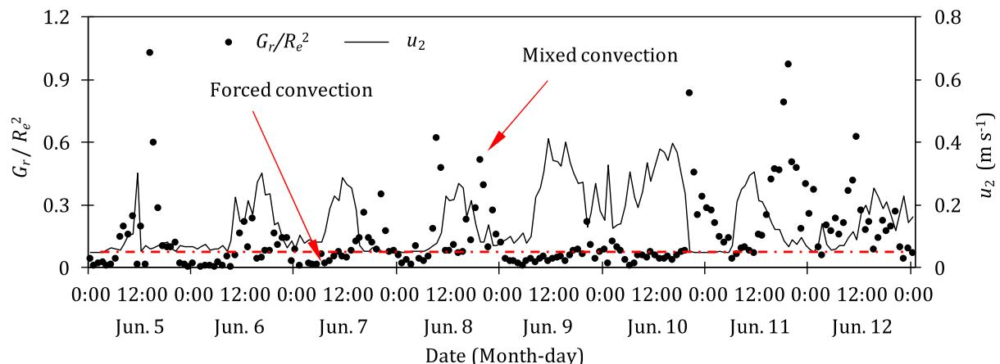

# Energy budget for tomato plants grown in a greenhouse in northern China

Xuewen Gong a, Rangjian Qiu b,*, Baozhong Zhang c, Shunsheng Wang a, Jiankun Ge a, Shikai Gao a, Zaiqiang Yang b

a School of Water Conservancy, North China University of Water Resources and Electric Power, Henan Key Laboratory of Crop Water Use, Zhengzhou 450045, China  b Jiangsu Key Laboratory of Agricultural Meteorology, School of Applied Meteorology, Nanjing University of Information Science and Technology, Nanjing, 210044, China  c State Key Laboratory of Simulation and Regulation of Water Cycle in River Basin, China Institute of Water Resources and Hydropower Research, Beijing 100038, China

# ARTICLEINFO

Handling Editor: Dr. B.E. Clothier

Keywords: Aerodynamic conductance Canopy conductance Convection conditions Decoupling factor Priestley- Taylor coefficient

# ABSTRACT

Research is ongoing to increase our understanding on the mechanisms responsible for the variation in energy fluxes in greenhouses. In this study, a four- year experiment (2016, 2017, 2019, and 2020) was carried out to investigate the energy budget for drip- irrigated tomato plants in a greenhouse, where the latent heat flux  $(\lambda ET)$  was measured by two weighing lysimeters. Factors that determine energy budget and  $\lambda ET$  were also investigated. The results indicated that  $\lambda ET$  was the principal component of net radiation  $(R_{n})$ , accounting for  $66.4 - 71.7\%$ , followed by sensible heat flux  $(H)$  and ground soil heat flux  $(G)$ . The low values  $(0.25 - 0.32)$  of the seasonal mean midday Bowen ratio  $(\beta = H / \lambda ET)$  also indicated that seasonal  $\lambda ET$  was greater than  $H$  for well- watered tomato plants. Leaf area index  $(LAI)$  strongly influenced the energy budget. The ratio  $\lambda ET / R_{n}$  increased linearly as  $LAI$  increased, whereas  $H / R_{n}$  decreased linearly and  $G / R_{n}$  and  $\beta$  decreased logarithmically. Seasonal mean  $\lambda ET$  was  $76.8\pm 4.7$  W m $^{- 2}$ , which was less than the reported values for field crops. This difference was attributed to the semi- closed microclimate in the greenhouse. The high values of the Priestley- Taylor coefficient  $(\alpha = 1.03\pm 0.05)$  and the decoupling factor  $(0.69\pm 0.05)$  showed that  $\lambda ET$  was principally determined by  $R_{n}$ . These values support the conclusion that  $\lambda ET$  was energy limited rather than water limited in the greenhouse. Canopy conductance  $(G_{c})$  also influenced  $\lambda ET$  as indicated by the high correlation between  $\alpha$  and  $G_{c}$ , especially during the middle growth stage. These findings are of great importance in creating an energy- driven model and will lead to improved water management in greenhouse agriculture.

# 1. Introduction

Greenhouse agriculture occupies a land area of  $\sim 405,000$  ha worldwide (Katsoulas and Stanghellini, 2019). Solar greenhouses (Fig. 1) supply a major proportion of vegetable crops in China; they provide optimal crop production environments and maximize grower profits. Water and energy transfer between soil surface and the greenhouse atmosphere governs the physiological behavior of crops, drives water circulation and energy storage, and transforms vegetation and soil (Baldocchi, 2001; Gu et al., 2005). Energy from net radiation  $(R_{n})$  that is converted into sensible heat flux  $(H)$  and latent heat flux  $(\lambda ET)$  is significantly affected by irrigation, vegetation growth, and the greenhouse microclimate (Gong et al., 2017a; b; Jiao et al., 2018; Liu et al., 2019). A good understanding of the behavior of energy components is important for improving water management and optimizing irrigation scheduling (Baldocchi, 1994; Chen et al., 2019; Ding et al., 2013;

Youssef and Giuseppe, 2005). There have been many studies of water and heat energy transfer within open field ecosystems (Ai and Yang, 2016; Gong et al., 2017a,b; Liu et al., 2019; Tian et al., 2017; Wang et al., 2020; Yan et al., 2017; Yu et al., 2017), in which energy flux and crop evapotranspiration  $(ET)$  vary under different climate conditions and soils. The microclimate of a solar greenhouse differs considerably from that of an open field. The greenhouse receives less energy due to the polyethylene sheeting covering the structure; internal wind speed is low due to the greenhouse being partially closed to external meteorological activity; and internal temperature and relative humidity are higher than outside (Gong et al., 2021). These factors all affect water and energy fluxes and energy partitioning in a greenhouse. Energy partitioning is primarily affected by irrigation methods, soil water constraints, crop management practices, and greenhouse whitening, misting and ventilation (Baille et al., 2001; Katsoulas et al., 2001; Kittas et al., 2001; Qiu et al., 2011). Thus energy fluxes and partitioning in a solar greenhouse

differ from those in an open field. To our knowledge, there have been few studies that investigated the energy budget in a solar greenhouse, especially on an hourly scale.

The main component of energy flux is  $\lambda ET$  which needs to be accurately measured when studying an energy budget. There are many techniques that are used to directly or indirectly measure  $\lambda ET$  in an open field, such as water balance, lysimeters, eddy covariance, Bowen ratio energy balance, scintillometry, sap flow plus microlysimeters, remote sensing energy balance, and satellite- based methods (Allen et al., 2011; Chen et al., 2021; Qiu et al., 2021). The water balance method has been used extensively to measure  $\lambda ET$  in a greenhouse (e.g. Qiu et al., 2015), with a recommended calculation period of seven days or longer to ensure accuracy (Allen et al., 2011). Li et al. (2020) attempted to measure hourly  $\lambda ET$  in a greenhouse using the Bowen ratio energy balance, but this approach has limited applicability due to the uneven ground and small surface area of a greenhouse (Papadakis et al., 1994; Yan et al., 2019). The weighing lysimeter has in the past been used as a precise method of measuring crop  $\lambda ET$  (Libardi et al., 2018), and have been extensively used in open fields to provide accurate hourly  $\lambda ET$  (Anapalli et al., 2016; Benli et al., 2006; Ding et al., 2010; Marek et al., 2016; Puppo et al., 2019; Xu and Chen, 2005). However, the use of weighing lysimeters to measure  $\lambda ET$  for greenhouse crops such as tomatoes is now rare, although the use of this technology has been reported for prairie grass and sugarcane (Libardi et al., 2019). Long- term continuous and accurate determination of  $\lambda ET$  is necessary to accurately quantify exchange of water and energy between atmosphere and soil surface.

Seasonal variation in  $\lambda ET$  is influenced by various physical and physiological factors. Physical factors can be quantified by the Priestley- Taylor coefficient  $(\alpha)$ , the Bowen ratio  $(\beta)$ , and the decoupling factor  $(\Omega)$ ; physiological factors are represented by canopy conductance  $(G_{c})$  (Ding et al., 2015; Jarvis and McNaughton, 1986; Jiao et al., 2018). The Priestley- Taylor coefficient  $\alpha$  is defined as the ratio of  $\lambda ET$  to equilibrium evapotranspiration. Its use eliminates the influence of weather and it can be used to analyze the factors that control  $\lambda ET$ . The Bowen ratio  $\beta$  is the ratio of sensible heat flux to latent heat flux; it is an important indicator of subsurface moisture and also indicates and reflects the energy distribution in the subsurface. The canopy conductance  $G_{c}$  represents the overall response of the crop to the environmental factors; it is a key parameter in the calculation of  $\lambda ET$  models. Jarvis and McNaughton (1986) investigated the response of  $\lambda ET$  to stomatal behavior. They rearranged the Penman- Monteith equation and decomposed it into two linear equations for boundary conditions. When the aerodynamic conductance was very large or tended to infinity, the corresponding hydrothermal transport was very efficient, leading to a leaf temperature that was close to the air temperature, with little effect from the input radiation; the leaf surface was well coupled to the environment when the aerodynamic conductance was very small or tending to zero, there was little hydrothermal transport between the surface and the atmosphere; the leaf surface was poorly coupled to the environment. These phenomena can be quantified and analyzed using  $\Omega$ . Many studies of field crops have investigated the influence of these factors on  $\lambda ET$ , and results for different crops are inconsistent (Ding et al., 2010, 2015; Suyker and Verma, 2008; Zhang et al., 2016). Liu et al. (2019) found that  $\lambda ET$  was determined mainly by  $R_{n}$  and that daily  $\lambda ET$  was significantly influenced by  $G_{c}$ , shown by a good correlation between  $\alpha$  and  $G_{c}$ . In contrast,  $G_{c}$  had a stronger influence than  $R_{n}$  on  $\lambda ET$  for plastic film- mulched cotton (Tian et al., 2017). Jiao et al. (2018) compared  $G_{c}$ ,  $\Omega$ ,  $\alpha$ , and  $\beta$  between maize and grapevine canopies; they found that  $\lambda ET$  for maize was primarily determined by  $R_{n}$  and  $\lambda ET$  for grapevines was primarily determined by  $G_{c}$ . However, there have been few solar greenhouse studies that characterize the physical and physiological drivers of  $\lambda ET$ , possibly because it is difficult to accurately measure hourly  $\lambda ET$ . The calculation of aerodynamic conductance  $G_{a}$ , a key parameter for determining  $G_{c}$  in a solar greenhouse, differs from the calculation for an open field because wind velocity in a solar greenhouse is generally low (Qiu et al., 2013; Zhang and Lemeur, 1992); thus the heat transfer coefficient has generally been used to determine  $G_{a}$  in a greenhouse. The equations for calculating  $G_{a}$  in a greenhouse vary for different modes of convection (free, forced or mixed convection), so identification of the convection mode is critical for accurate calculation of  $G_{a}$ . The accuracy of  $G_{a}$  will in turn affect the accuracy of  $G_{c}$  (Bailey et al., 1993; Montero et al., 2001; Qiu et al., 2013; Yan et al., 2018; Zhang and Lemeur, 1992).

Hence, in this study, to address the current scientific problems such as unclear mechanisms of energy budget and physical and physiological factors that affect  $\lambda ET$  in greenhouse grown tomato with drip irrigation, we characterize the modes of convection in the solar greenhouse, quantify  $\lambda ET$  and the dynamics of the energy budget, and identify the physical and physiological factors that govern  $\lambda ET$ .

  
Fig. 1. Sectional diagram of the solar greenhouse used for the experiment. There are sixty square vents on the north wall, with dimensions  $0.4 \times 0.4 \mathrm{m}$ .

# 2. Materials and methods

# 2.1. Experimental site and planting information

The experiment was carried out during Mar.- Jul. in 2016, 2017, 2019, and 2020 at the Agro- Ecological Experimental Station of the Chinese Academy of Agricultural Sciences in Xinxiang City, northern China  $(35^{\circ}86^{\prime}\mathrm{N},113^{\circ}68^{\prime}\mathrm{E})$  . The site has a temperate continental climate with annual mean pan evaporation  $>1900~\mathrm{mm}$  annual mean  $\mathrm{ET_0}$  (calculated by Penman- Monteith model)  $\sim 1045 \mathrm{mm}$  annual precipitation  $\sim 570 \mathrm{mm}$  , and annual mean air temperature  $14.2^{\circ}C$  Mean annual sunshine is  $>2400\mathrm{h}$  and the frost- free period is  $>200\mathrm{d}$  . Soil composition at depth  $0 - 1.0\mathrm{m}$  in the solar greenhouse was silt- loam, consisting of  $16.9\%$  clay,  $76.7\%$  silt, and  $6.4\%$  sand. Mean field water capacity and wilting water content at depth  $0 - 1.0\mathrm{m}$  were 0.32 and  $0.09\mathrm{cm}^{- 3}$  respectively. Bulk density of the  $0 - 1.0\mathrm{m}$  soil layer was  $1.49\mathrm{gcm}^{- 3}$

The unheated solar greenhouse used in the experiment covered an area of  $510~\mathrm{m^2}$ $(60\times 8.5\mathrm{m}$  L- W) and was oriented E- W. The steel framework was covered with  $0.2\mathrm{mm}$  thick non- drop polyethylene sheeting. Cotton quilts  $25~\mathrm{mm}$  thick were used to cover the polyethylene surface to maintain the nocturnal temperature inside the greenhouse during the initial stage of tomato growth. The interior microclimate was adjusted through a ventilation system on the northern wall, the roof, and the southern part of the greenhouse. The structure of the solar greenhouse is shown in Fig. 1.

Seedlings of a leading local variety of tomato (Solanum lycopersicum L. cv. Jinding) were transplanted into the greenhouse with a planting density of 5.7 plants  $\mathrm{m}^{- 2}$  on Mar. 9, 2016, Mar. 10, 2017, Mar. 11, 2019 and Mar. 4, 2020 and harvested on Jul. 10, 2016, Jul. 12, 2017, Jul. 13, 2019 and Jul. 5, 2020. A drip- irrigation system was used with one drip line per crop row. The spacing between the drippers in the line and between lines were 30 and  $65~\mathrm{cm}$  respectively. Pressure- compensated emitters with discharge rate  $1.1\mathrm{Lh^{- 1}}$  were used. Immediately after the seedlings were transplanted,  $20~\mathrm{mm}$  water was supplied to keep them alive. Thereafter, irrigation was scheduled according to the measurement of cumulative evaporation. An evaporation pan  $0.20\mathrm{m}$  in diameter and  $0.11\mathrm{m}$  deep, placed  $0.2\mathrm{m}$  above the plant canopy, was used to measure daily evaporation at  $07:00\mathrm{h}$  . The plants were irrigated with quantity of water equal to  $90\%$  of cumulative evaporation when cumulative evaporation reached  $\sim 20 \mathrm{mm}$  .Our previous research had shown that there was no water stress for tomato plants in solar greenhouses under this irrigation scheduling (Gong et al., 2020; Liu et al.,

2013). The plants were irrigated 15 times in 2016, 2017 and 2019, with the total annual irrigation amount of 282.7, 308.2 and  $311.7\mathrm{mm}$  ,and 14 times in 2020 with a total annual irrigation amount of  $270.5\mathrm{mm}$  Tomato growth was divided into four stages (initial, development, middle, and late), as shown in Table 1.

# 2.2. Measurements and methods

Meteorological conditions were measured by a weather station. An NI LITE2 net radiometer was used to measure net radiation  $(R_{n},\mathrm{Wm}^{- 2})$  (Kipp & Zonen, Delft, Netherlands). Solar radiation  $(R_{s},\mathrm{Wm}^{- 2})$  was measured by a LI200X solar radiometer (Campbell Scientific Inc., USA). The radiometers were installed  $2.0\mathrm{m}$  above the ground, and were at least 0.5 in above the tomato plant canopy. Two HFP31 soil heat flux plates (Hukseflux, Netherlands) were used to measure soil heat flux  $(G_{s},$ $\mathrm{Wm}^{- 2})$  ; they were buried at a depth of  $50~\mathrm{mm}$  between the soil underneath the plants and the soil between the rows. A combined humidity and temperature sensor (CS215, Campbell Scientific Inc., USA) was installed  $2.0\mathrm{m}$  above the ground to measure air temperature  $(T_{a},^{\circ}\mathbb{C})$  and relative humidity  $(RH,\%)$  . An SI- 111 infrared radiation pyrometer (Campbell Scientific Inc., USA), oriented northward at an angle  $\sim 45^{\circ}$  below the horizontal, was installed  $0.3\mathrm{m}$  above the canopy to measure canopy temperature  $(T_{c},^{\circ}\mathbb{C})$  .Wind velocity  $(u_{2},\mathrm{ms}^{- 1})$  was measured by a high precision (accuracy  $\pm 0.02\mathrm{ms}^{- 1}$  ) air velocity meter (Wind Sonic, Gill, UK). All the sensors were connected to a CR1000 data logger (Campbell Scientific Inc., USA), and  $30\mathrm{min}$  averages were calculated and stored.

Two  $1.2\mathrm{m}^3$  weighing lysimeters  $(1.0\times 1.0\times 1.2\mathrm{m}$ $\mathbb{L}\times \mathbb{D}\times \mathbb{W})$  were installed in the solar greenhouse to measure hourly evapotranspiration  $(ET)$  . Soil texture and planting patterns in the weighing lysimeters were identical to those in the soil surrounding the lysimeters. To avoid lodging, bamboo poles were used to support tomato plants in the lysimeters. A microcomputer was used to collect and store  $ET$  data at  $1\mathrm{h}$  intervals. The ET values used in this study were the average of the two lysimeters, and the standard deviation ranged from 0 to  $0.584\mathrm{mm}\mathrm{d}^{- 1}$

Sensible heat fluxes  $(H,\mathrm{Wm}^{- 2})$  were calculated using the energy balance method:

$$
H = R_{n} - \lambda ET - G \tag{1}
$$

where  $\lambda$  is the latent heat of water vaporization  $(\mathrm{Jkg^{- 1}})$  and  $G$  is ground soil heat flux  $(\mathrm{Wm}^{- 2})$  calculated from  $G_{s}$  and changes in soil water content and soil temperature that were detected by the sensors, as

Table 1 Sumaries of mean solar radiation  $(R_{s})$  vapor pressure deficit (VPD), air temperature  $(T_{d})$  air speed at  $2\mathrm{m}(u_{2})$  leaf area index  $(L A)$  , temperature difference between the canopy and air  $(T_{c} - T_{d})$  Reynolds number  $(R_{e})$  and Grashof number  $(G_{r})$  at different growth stages of greenhouse grown tomato plants in 2016, 2017, 2019 and 2020.  

<table><tr><td>Year</td><td>Growth stage</td><td>Period</td><td>Rs(Wm−2)</td><td>VPD (kPa)</td><td>Td(°C)</td><td>u2(m s−1)</td><td>LAI (m2m−2)</td><td>|Tc-Td| (°C)</td><td>Rr(×103)</td><td>Gr(×104)</td></tr><tr><td rowspan="5">2016</td><td>Initial</td><td>Mar. 9-31</td><td>116.0</td><td>0.85</td><td>18.0</td><td>0.11</td><td>0.13</td><td>1.89</td><td>0.35</td><td>2.03</td></tr><tr><td>Development</td><td>Apr. 1-May 10</td><td>121.8</td><td>0.68</td><td>21.4</td><td>0.13</td><td>1.12</td><td>1.02</td><td>0.40</td><td>1.64</td></tr><tr><td>Middle</td><td>May. 11-Jun. 20</td><td>134.7</td><td>0.98</td><td>24.3</td><td>0.16</td><td>2.90</td><td>1.68</td><td>0.50</td><td>2.70</td></tr><tr><td>Late</td><td>Jun. 21-Jul. 10</td><td>136.2</td><td>1.04</td><td>28.3</td><td>0.16</td><td>2.57</td><td>1.74</td><td>0.50</td><td>2.30</td></tr><tr><td>Whole</td><td>Mar. 9-Jul. 10</td><td>127.1</td><td>0.87</td><td>22.8</td><td>0.14</td><td>1.76</td><td>1.51</td><td>0.48</td><td>2.47</td></tr><tr><td rowspan="5">2017</td><td>Initial</td><td>Mar. 11-Apr. 1</td><td>57.2</td><td>0.45</td><td>16.0</td><td>0.08</td><td>0.15</td><td>0.45</td><td>0.25</td><td>0.72</td></tr><tr><td>Development</td><td>Apr. 2-May 10</td><td>104.2</td><td>0.81</td><td>20.9</td><td>0.16</td><td>1.45</td><td>0.45</td><td>0.52</td><td>0.72</td></tr><tr><td>Middle</td><td>May 11-Jun. 21</td><td>130.0</td><td>1.21</td><td>25.2</td><td>0.19</td><td>3.47</td><td>0.53</td><td>0.57</td><td>0.86</td></tr><tr><td>Late</td><td>Jun. 22-Jul. 12</td><td>119.1</td><td>1.25</td><td>29.3</td><td>0.19</td><td>3.21</td><td>0.53</td><td>0.59</td><td>0.84</td></tr><tr><td>Whole</td><td>Mar. 11-Jul. 12</td><td>106.9</td><td>0.96</td><td>22.9</td><td>0.16</td><td>2.20</td><td>0.49</td><td>0.49</td><td>0.75</td></tr><tr><td rowspan="5">2019</td><td>Initial</td><td>Mar. 12-Apr. 2</td><td>80.0</td><td>1.03</td><td>19.2</td><td>0.12</td><td>0.14</td><td>1.62</td><td>0.50</td><td>2.59</td></tr><tr><td>Development</td><td>Apr. 3-May 11</td><td>102.3</td><td>0.72</td><td>21.3</td><td>0.14</td><td>1.04</td><td>0.94</td><td>0.36</td><td>1.51</td></tr><tr><td>Middle</td><td>May. 12-Jun. 20</td><td>114.0</td><td>1.42</td><td>26.4</td><td>0.16</td><td>2.63</td><td>1.98</td><td>0.35</td><td>3.17</td></tr><tr><td>Late</td><td>Jun. 21-Jul. 13</td><td>122.2</td><td>1.30</td><td>28.2</td><td>0.14</td><td>2.56</td><td>2.04</td><td>0.33</td><td>3.27</td></tr><tr><td>Whole</td><td>Mar. 12-Jul. 13</td><td>105.4</td><td>1.11</td><td>23.9</td><td>0.13</td><td>1.68</td><td>1.59</td><td>0.40</td><td>2.62</td></tr><tr><td rowspan="5">2020</td><td>Initial</td><td>Mar. 4-Mar. 25</td><td>83.1</td><td>0.79</td><td>18.9</td><td>0.11</td><td>0.38</td><td>1.86</td><td>0.36</td><td>2.97</td></tr><tr><td>Development</td><td>Mar. 26-May 5</td><td>105.9</td><td>0.70</td><td>20.8</td><td>0.12</td><td>1.70</td><td>1.09</td><td>0.30</td><td>1.75</td></tr><tr><td>Middle</td><td>May 6-Jun. 16</td><td>129.7</td><td>1.20</td><td>25.5</td><td>0.15</td><td>2.56</td><td>1.74</td><td>0.45</td><td>2.73</td></tr><tr><td>Late</td><td>Jun. 17-Jul. 7</td><td>96.5</td><td>0.71</td><td>27.0</td><td>0.14</td><td>2.39</td><td>1.04</td><td>0.44</td><td>1.67</td></tr><tr><td>Whole</td><td>Mar. 4-Jul. 5</td><td>108.7</td><td>0.88</td><td>23.1</td><td>0.13</td><td>1.86</td><td>1.42</td><td>0.38</td><td>2.29</td></tr></table>

described elsewhere (Qiu et al., 2019). Volumetric soil water content at the  $50~\mathrm{mm}$  soil layer was measured by three 5TE sensors (Decagon Devices, Inc., USA). Data were collected every  $30\mathrm{min}$  by a data logger (EM50, Decagon Devices, Inc., USA). The 5TE sensors were calibrated using the oven drying method. Soil temperature at the  $50~\mathrm{mm}$  soil layer was automatically measured by three soil thermometers with an accuracy of  $\pm 0.2^{\circ}\mathrm{C}$  (JL- 04, Aornor Electronic Technology Co., Ltd., China) at  $30\mathrm{min}$  intervals.

The length and maximum width of individual leaves on nine randomly selected plants were measured manually every  $7 - 10\mathrm{d}$ . Leaf area of each plant was determined by summing the rectangular area (maximum width  $\times$  length) of individual leaves multiplied by a reduction coefficient of 0.64 (the ratio of the actual area drawn by CAD software to the rectangular area) (Liu et al., 2009). Leaf area index  $(LAI, \mathrm{m}^2\mathrm{m}^{- 2})$  was then calculated as the ratio of plant leaf area to unit area. The MATLAB software with "piecewise cubic hermite interpolating polynomial" model was used to obtain daily LAI through interpolation (MathWorks Inc., MA, USA).

# 2.3. Parameter calculation and data analysis

Aerodynamic conductance  $(G_{a},\mathrm{mm}s^{- 1})$  in the greenhouse should differ from that in the open field because  $u_{2}$  inside the greenhouse was low (Table 1). Hence, we calculated  $G_{a}$  using the convective heat transfer coefficient for individual leaves, a method widely used in greenhouse studies (Bailey et al., 1993; Montero et al., 2001; Qiu et al., 2013):

$$
G_{a} = \frac{2h\cdot LAI}{\rho_{a}\cdot C_{p}} \tag{2}
$$

where  $C_p$  is the specific heat of dry air at constant pressure  $(\mathrm{Jkg}^{- 1}\mathrm{K}^{- 1})$ $\rho_{a}$  is air density  $(\mathrm{kg}\mathrm{m}^{- 3})$  , h is the heat transfer coefficient  $(\mathrm{Wm}^{- 2}\mathrm{K}^{- 1})$  which is determined from different convection modes (free, forced and mixed convection) using different dimensionless numbers (Grashoff,  $G_{r},$  or Reynolds,  $R_{e}$  ). We classified the convection modes as: pure free convection when  $G_{r} / R_{e}^{2}\geq 10$  pure forced convection when  $G_{r} / R_{e}^{2}\leq 0.1$  and mixed convection when  $0.1< G_{r} / R_{e}^{2}< 10$  (Wang et al., 2006).

The heat transfer coefficient  $h_1$  for pure free convection was calculated by (McAdams, 1954; Montero et al., 2001; Qiu et al., 2013):

$$
h_1 = 0.4(K_c / d)(P_r\cdot G_r)^{1 / 4} \tag{3}
$$

The heat transfer coefficient  $h_2$  for pure forced convection was calculated by (Grober and Erk, 1961; Montero et al., 2001; Qiu et al., 2013):

$$
h_2 = 0.66(K_c / d)P_r^{1 / 3}\cdot R_e^{1 / 2} \tag{4}
$$

The heat transfer coefficient  $h_3$  for mixed convection was calculated by (Montero et al., 2001; Qiu et al., 2013; Stanghellini, 1987):

$$
h_3 = 0.37(K_c / d)\big(G_r + 6.92R_e^{2}\big)^{1 / 4} \tag{5}
$$

where  $K_{c}$  is thermal conductivity of air  $(\mathrm{Wm}^{- 1}\mathrm{K}^{- 1})$  and  $P_{r}$  is the Prandtl number (0.7 for air). The characteristic dimension of a leaf,  $d_{i}$  was calculated by (Montero et al., 2001):

$$
d = \frac{2}{1 / l + 1 / w} \tag{6}
$$

where  $l$  and  $w$  are the length  $(\mathrm{m})$  and width  $(\mathrm{m})$  of individual leaves. The Grashoff number  $G_{r}$  can be calculated by an equation for the temperature difference between canopy  $(T_{c})$  and air  $(T_{a})$

$$
G_{r} = \beta_{a}\cdot g\cdot d^{3}\cdot |T_{c} - T_{a}| / \nu^{2} \tag{7}
$$

where  $g$  is gravitational acceleration  $(\mathrm{ms}^{- 2})$  and  $\beta_{a}$  is the volumetric thermal expansion coefficient  $(\mathrm{K}^{- 1})$ $R_{e}$  was calculated as a function of $u_{2}$ $R_{e} = u_{2}\cdot d / \nu$

where  $\nu$  is kinematic viscosity of air  $(\mathrm{Pa}\mathrm{s}^{- 1})$

Canopy conductance of tomato plants  $(G_{c},\mathrm{mm}s^{- 1})$  was calculated by inverting the Penman- Monteith model (Jiao et al., 2018; Monteith, 1973):

$$
G_{c} = \frac{\lambda ET\cdot\gamma\cdot G_{a}}{\Delta(R_{n} - G) + \rho_{a}\cdot C_{p}\cdot VPD\cdot G_{a} - \lambda ET(\Delta^{-1})} \tag{9}
$$

where  $\Delta$  is the saturation vapor pressure slope  $(\mathrm{kPa}^{\circ}\mathrm{C}^{- 1})$ $\gamma$  is the psychrometric constant  $(\mathrm{kPa}^{\circ}\mathrm{C}^{- 1})$  .Vapor pressure deficit, VPD (kPa), was calculated from measured  $T_{g}$  and RH (Allen et al., 1998).

The decoupling coefficient  $(\Omega)$  was used to quantify the correlation between  $\lambda ET$  and  $G_{c}$  or  $R_{n}$ ; it was calculated by (Jarvis and McNaughton, 1986; McNaughton and Jarvis, 1983):

$$
ET = \Omega ET_{eq} + (1 - \Omega)ET_{imp} \tag{10}
$$

$$
ET_{imp} = \rho_aC_pVPDG_c / \lambda \gamma \tag{11}
$$

$$
\frac{dET / ET}{dG_c / G_c} = 1 - \Omega \tag{12}
$$

$$
\Omega = \frac{\Delta + \gamma}{\Delta + \gamma(1 + G_a / G_c)} \tag{2}
$$

The values of  $\Omega$  vary between 0 and 1:  $\Omega \to 0$  shows that the tomato canopy is perfectly coupled to the atmosphere and  $\lambda ET$  is primarily controlled by  $G_{c}$ ;  $\Omega \to 1$  shows that the canopy is completely isolated from the atmosphere and  $\lambda ET$  is primarily determined by  $R_{n}$  (Baldocchi and Xu, 2007; Ding et al., 2015).

The Priestley- Taylor coefficient,  $\alpha$ , normalized  $\lambda ET$ , was used to quantify the relation between  $\lambda ET$  and other physiological and environmental factors (Monteith and Unsworth, 2008). It was calculated by (Priestley and Taylor, 1972):

$$
\lambda ET_{eq} = \frac{\Delta}{\Delta + \gamma} (R_n - G) \tag{14}
$$

$$
\alpha = \frac{\lambda ET}{\lambda ET_{eq}} \tag{3}
$$

where  $\lambda ET_{eq}$  is equilibrium evapotranspiration  $(\mathrm{Wm}^{- 2})$ . The Bowen ratio  $(\beta = H / \lambda ET)$  indicates the energy distribution of the underlying surface and it represents the different wetting levels of the underlying surface.

The values of  $G_{c},\Omega ,\alpha ,$  and  $\beta$  were calculated for the midday period  $(11:100 - 15:00\mathrm{h})$  in order to avoid numerical instability as the denominator approached 0. Midday period data were excluded from the calculation of these parameters when  $R_{n}< 100\mathrm{Wm}^{- 2}$  (mainly during precipitation events).

We used boundary line analysis (BLA) to analyze the relation between  $\alpha$ ,  $G_{c}$  and LAI. We selected top dependent variable points for the range of each independent variable and to represent the relationships when removing or reducing other factors (Ding et al., 2015; Schafer et al., 2000). BLA requires that LAI and  $G_{c}$  are partitioned into several classes. We divided LAI into eight classes (six classes covering the range  $0.5 - 3.5\mathrm{m}^{2}\mathrm{m}^{- 2}$  at intervals of  $0.5\mathrm{m}^{2}\mathrm{m}^{- 2}$ , one class  $< 0.5\mathrm{m}^{2}\mathrm{m}^{- 2}$  and one class  $>3.5\mathrm{m}^{2}\mathrm{m}^{2}$ );  $G_{c}$  was divided into twelve classes (ten classes covering the range  $2.0 - 12.0\mathrm{mm}\mathrm{s}^{- 1}$  at intervals of  $1\mathrm{mm}\mathrm{s}^{- 1}$ , one class  $< 2.0\mathrm{mm}\mathrm{s}^{- 1}$  and one class  $>12.0\mathrm{mm}\mathrm{s}^{- 1}$ ).

# 3. Results

# 3.1. Microclimate and convection conditions

Table 1 showed the mean values of microclimate parameters at different tomato plant growth stages during the experimental periods (2016, 2017, 2019, and 2020). The peak values of  $R_{s}$ $T_{a}$  and VPD generally occurred in the middle and late stages. The seasonal mean value of  $R_{s}$  was high in 2016  $(127.2\mathrm{Wm}^{- 2})$  ; the values were lower but similar to each other in 2017  $(106.9\mathrm{Wm}^{- 2})$  2019  $(105.4\mathrm{Wm}^{- 2})$  and 2020  $(108.7\mathrm{Wm}^{- 2})$  . The seasonal mean values of  $T_{a}$  and VPD showed little variation across the four seasons, ranging from  $22.8^{\circ}C$  to  $23.9^{\circ}C$  and  $0.87 - 1.11\mathrm{kPa}$  LAI reached a maximum value in the middle growth stage and then decreased slightly due to leaf senescence and plant topping. Interannual variation in LAI was small: seasonal LAI was 1.76 (2016), 2.20 (2017), 1.68 (2019) and  $1.86\mathrm{m}^2\mathrm{m}^{- 2}$  (2020) (Table 1).

The characteristic dimension  $d$  varied from 20.2 to  $79.6\mathrm{mm}$  with a mean annual value of  $\sim 56.8\mathrm{mm}$  . The mean annual value of measured  $u_{2}$  was generally small for different growth stages  $(0.05 - 0.83\mathrm{ms}^{- 1})$  leading to a low value of  $R_{e}$  (250- 590). The mean values of  $[T_{c} - T_{a}]$  for different growth stages were in the range  $0.45 - 2.04^{\circ}\mathrm{C}$  and the corresponding values of  $G_{r}$  were in the range  $0.72\times 10^{4} - 3.27\times 10^{4}$  .We used hourly calculations of  $R_{e}$  and  $G_{r}$  in our analysis of greenhouse convection. Fig. 2 showed an example of convection inside the solar greenhouse based on  $G_{r} / R_{e}^{2}$  Wang et al., 2006).Heat transfer through mixed convection was approximately  $59\%$  2016  $58\%$  2017  $51\%$  2019) and  $56\%$  (2020) of the total heat transfer; the remainder was due to pure forced convection. No periods of pure free convection were observed.

The values of  $G_{a}$  were calculated using the heat transfer coefficients calculated by Eqs. (3)- (5) for different modes of convection. The value of midday  $G_{a}$  was low during the initial stage (Table 3) due to the lower values of LAI and  $u_{2}$  but it gradually increased until the middle stage. Mean midday period values of  $G_{a}$  ranged from 1.15 to  $36.77\mathrm{mm s^{- 1}}$  at different growth stages; these values were consistent with values reported for other greenhouses (Yan et al., 2018; Zhang and Lemeur, 1992).

# 3.2. Energy fluxes and partitioning

Diurnal variations in energy budget for the four tomato growth stages in 2016, 2017, 2019, and 2020 are presented in Fig. 3. Energy flux components generally showed bell- shaped curves during each growth stage, typically increasing rapidly after sunrise, peaking around noon, and then decreasing until sunset. Peak hourly  $R_{n}$  occurred between  $12:00\mathrm{h}$  and  $14:00\mathrm{h}$ $R_{n}$  varied across growth periods from  $261.9\mathrm{Wm}^{- 2}$  at the initial stage to  $446.1\mathrm{Wm}^{- 2}$  at the middle stage. The  $G$  varied similarly to  $R_{n}$  but lagged  $R_{n}$  by  $^{1 - 2\mathrm{h}}$  . Maximum hourly  $G$  ranged from 26.8 to  $79.7\mathrm{Wm}^{- 2}$  at different growth stages. When canopy cover was low during the initial growth stage, daytime  $G$  was an important consumer of  $R_{n}$  accounting for  $\sim 22.8\%$  . Nocturnal  $G$  was mainly negative, indicating that heat was released from the soil surface to the atmosphere overnight. Values of both  $\lambda ET$  and  $H$  varied greatly throughout the entire growing season Fig.3).Peak hourly  $\lambda ET$  occurred between  $12:00\mathrm{h - 14:00h}$  varying from  $73.7\mathrm{Wm}^{- 2}$  in the initial stage to  $377.9\mathrm{Wm}^{- 2}$  in the middle stage. Daytime hourly  $H$  was generally greater than hourly  $\lambda ET$  in the initial stage but lower during other growth stages. Peak hourly  $H$  was high in the initial stage  $(214.5\mathrm{Wm}^{- 2})$  and low in the late stage  $(49.7\mathrm{Wm}^{- 2})$

Table 2 shows daytime  $(8:00 - 18:00\mathrm{h})$  energy flux and energy partitioning at different growth stages of tomato plants in 2016, 2017, 2019 and 2020. The ratio  $\lambda ET / R_{n}$  increased as growth progressed into the middle stage then decreased because  $\lambda ET$  increased more rapidly than  $R_{n}$  and reached maximum values of  $88.7\%$  (2016),  $89.8\%$  (2017),  $84.8\%$  (2019) and  $87.6\%$  (2020). In contrast, the average values of  $H / R_{n}$  and  $G/$ $R_{n}$  were at a maximum in the initial stage and then gradually decreased, although  $H / R_{n}$  increased from the middle to the late stage. We attribute this to  $\lambda ET$  progressively increasing and  $H$  and  $G$  decreasing during the growth periods (Table 2). Seasonal mean midday period  $\beta$  values were 0.24 (2016), 0.32 (2017), 0.25 (2019) and 0.32 (2020) (Table 2), showing that seasonal  $\lambda ET$  was greater than  $H$  for well- watered tomato plants. The values of mean midday period  $\beta$  were  $>1.0$  in the initial stage but  $< 1.0$  during later growth periods, which indicated a transition from energy flux to  $\lambda ET$  after the initial stage. The Bowen ratio  $\beta$  can be affected by greenhouse management practices, such as greenhouse whitening (Baille et al., 2001) or misting, and the ventilation system used (Katsoulas et al., 2001; Kittas et al., 2001), as well as crop type, irrigation, and fertilizer application. For example,  $\beta$  for greenhouse grown roses was found to be 0.6 before whitening but  $- 0.5$  after whitening (Baille et al., 2001).

Energy flux partitioning is closely related to the underlying coverage conditions, and can be quantified by LAI. As LAI increased, the ratio  $\lambda ET / R_{n}$  increased linearly (Fig. 4a), and the ratio  $H / R_{n}$  decreased linearly (Fig. 4b). Both  $G / R_{n}$  and  $\beta$  decreased as LAI increased rapidly until it reached  $\sim 2.5\mathrm{m}^2\mathrm{m}^{- 2}$  and then gradually decreased (Fig. 4c and d).

# 3.3. Seasonal variations and physical and physiological controls of  $\lambda ET$

Seasonal variation in daily  $\lambda ET$ ,  $\Omega$ ,  $\alpha$ , and  $G_{c}$  during the midday period at different growth stages is shown in Fig. 5 and Table 3, where  $\Omega$  and  $\alpha$  represent the physical factors that govern  $\lambda ET$ , and  $G_{c}$  represents the physiological factors (Ding et al., 2015; Jarvis and McNaughton, 1986). In the initial stage, the rate of  $\lambda ET$  was low (Fig. 5a). As both solar

  
Fig. 2. An example of convection that occurred inside the solar greenhouse during Jun. 5 and Jun. 12, 2016 based on the  $G_{r} / R_{e}^{2}$  classification. The dashed line represents the demarcation line  $(G_{r} / R_{e}^{2} = 0.1)$  between pure forced and mixed convection.  $G_{r}$  is the Grashof number,  $R_{e}$  is the Reynolds number, and  $u_{2}$  is the wind speed at  $2.0\mathrm{m}$  above ground.

  
Fig. 3. Diurnal variations of energy fluxes at different growth stages of greenhouse grown tomato plants in (a) 2016, (b) 2017, (c) 2019 and (d) 2020.

Table 2  $\lambda ET$  is the latent heat flux.  $H$  is the sensible heat flux and  $G$  is the ground soil heat flux.  $\beta$  is the Bowen ratio.  

<table><tr><td rowspan="2">Year</td><td rowspan="2">Growing stage</td><td colspan="4">Energy fluxes (W m-2)</td><td colspan="3">Energy partitioning (%)</td><td rowspan="2">β</td></tr><tr><td>Rn</td><td>λET</td><td>H</td><td>G</td><td>λET/Rn</td><td>H/Rn</td><td>G/Rn</td></tr><tr><td rowspan="5">2016</td><td>Initial</td><td>182.3</td><td>64.2</td><td>75.1</td><td>43.1</td><td>35.2</td><td>41.2</td><td>23.6</td><td>1.17</td></tr><tr><td>Development</td><td>206.2</td><td>133.0</td><td>50.0</td><td>23.1</td><td>64.5</td><td>24.2</td><td>11.2</td><td>0.38</td></tr><tr><td>Middle</td><td>246.1</td><td>218.3</td><td>9.7</td><td>18.0</td><td>88.7</td><td>40</td><td>7.3</td><td>0.04</td></tr><tr><td>Late</td><td>255.3</td><td>188.9</td><td>48.9</td><td>17.5</td><td>74.0</td><td>19.1</td><td>6.8</td><td>0.26</td></tr><tr><td>Whole</td><td>235.4</td><td>168.7</td><td>39.7</td><td>27.0</td><td>71.7</td><td>16.9</td><td>11.5</td><td>0.24</td></tr><tr><td rowspan="5">2017</td><td>Initial</td><td>139.8</td><td>48.3</td><td>58.9</td><td>32.6</td><td>34.6</td><td>42.1</td><td>23.3</td><td>1.22</td></tr><tr><td>Development</td><td>234.8</td><td>129.4</td><td>80.1</td><td>25.3</td><td>55.1</td><td>34.1</td><td>10.8</td><td>0.62</td></tr><tr><td>Middle</td><td>245.5</td><td>220.4</td><td>9.6</td><td>15.5</td><td>89.8</td><td>3.9</td><td>6.3</td><td>0.04</td></tr><tr><td>Late</td><td>298.2</td><td>191.1</td><td>87.7</td><td>19.4</td><td>64.1</td><td>29.4</td><td>6.5</td><td>0.46</td></tr><tr><td>Whole</td><td>246.7</td><td>163.8</td><td>50.9</td><td>32.2</td><td>66.4</td><td>20.6</td><td>13.1</td><td>0.32</td></tr><tr><td rowspan="5">2019</td><td>Initial</td><td>173.4</td><td>51.9</td><td>88.6</td><td>32.9</td><td>29.9</td><td>51.1</td><td>19.0</td><td>1.71</td></tr><tr><td>Development</td><td>187.0</td><td>112.8</td><td>47.3</td><td>26.9</td><td>60.3</td><td>25.3</td><td>14.4</td><td>0.42</td></tr><tr><td>Middle</td><td>204.7</td><td>173.5</td><td>16.8</td><td>14.4</td><td>84.8</td><td>8.2</td><td>7.0</td><td>0.10</td></tr><tr><td>Late</td><td>249.2</td><td>166.9</td><td>64.5</td><td>17.8</td><td>67.0</td><td>25.9</td><td>7.2</td><td>0.39</td></tr><tr><td>Whole</td><td>205.2</td><td>139.9</td><td>34.4</td><td>31.1</td><td>68.2</td><td>16.8</td><td>15.2</td><td>0.25</td></tr><tr><td rowspan="5">2020</td><td>Initial</td><td>207.2</td><td>60.1</td><td>91.2</td><td>55.9</td><td>29.0</td><td>44.6</td><td>27.0</td><td>1.52</td></tr><tr><td>Development</td><td>272.9</td><td>182.2</td><td>56.1</td><td>34.6</td><td>66.8</td><td>20.0</td><td>12.7</td><td>0.31</td></tr><tr><td>Middle</td><td>299.2</td><td>262.2</td><td>12.3</td><td>24.7</td><td>87.6</td><td>4.1</td><td>8.3</td><td>0.05</td></tr><tr><td>Late</td><td>257.2</td><td>152.9</td><td>82.9</td><td>21.4</td><td>59.4</td><td>32.2</td><td>8.3</td><td>0.54</td></tr><tr><td>Whole</td><td>265.6</td><td>182.4</td><td>57.5</td><td>32.9</td><td>68.7</td><td>21.6</td><td>12.4</td><td>0.32</td></tr></table>

  
Fig. 4. Relationships between midday (a)  $\lambda ET / R_{n}$ , (b)  $H / R_{n}$ , (c)  $G / R_{n}$ , (d) Bowen ratio  $\beta$ , and leaf area index (LAI) based on the pooled data from 2016, 2017, 2019 and 2020.  $R_{n}$  is the net radiation,  $\lambda ET$  is the latent heat flux,  $H$  is the sensible heat flux, and  $G$  is the ground soil heat flux.

  
Fig. 5. Seasonal variations in (a) daily latent heat flux  $\lambda ET$ , (b) Priestley-Taylor coefficient  $\alpha$ , (c) canopy conductance  $G_{c}$ , and (d) decoupling factor  $\Omega$  in 2016, 2017, 2019 and 2020.

radiation and canopy cover increased (Table 1),  $\lambda ET$  increased rapidly and reached a maximum  $(215.3\mathrm{Wm}^{- 2}$  in 2020) during the middle stage as a result of high plant water demand. In the late stage,  $\lambda ET$  decreased slightly (Fig. 5a) due to high solar radiation and a change in LAI. Indeterminate tomato varieties are frequently grown in greenhouses because the tomato plants grow vigorously until the end of the season. Seasonal mean daily  $\lambda ET$  for drip- irrigated greenhouse grown tomato plants was generally constant, ranging from 72.1 to  $80.4\mathrm{Wm}^{- 2}$ . These values were consistent with values reported for solar greenhouses in northern and northwestern China (Li et al., 2020; Liu et al., 2013; Yuan et al., 2001). However,  $\lambda ET$  for greenhouse grown tomatoes was lower than for field grown tomatoes, which we attributed to the high  $RH$  value. Low  $u_{2}$  and low radiant energy in the greenhouse as a result of partially controlled microclimate, in turn led to low evaporative demand (Harmanto et al., 2005; Zheng et al., 2013).

The value of  $\Omega$  varied greatly in different growth stages, decreasing from 0.82 to 0.91 in the initial stage to 0.51- 0.63 in the middle stage and then increasing to 0.53- 0.68 in the late stage (Table 3). These results showed that  $R_{n}$  influenced  $\lambda ET$  more in the initial stage than in the middle stage. In our study,  $\Omega$  was  $>0.5$  for most of the four study years, indicating that  $R_{n}$  had more effect than  $G_{c}$  on the tomato canopy.

However, there were 63 days when  $\Omega < 0.5$  during the middle and late stages, indicating that  $G_{c}$  was the primary influence on those days. Seasonal variation in  $\alpha$  over the growing season was similar to that of  $\lambda ET$ . It increased from 0.46 to 0.53 in the initial stage to a maximum in the range 1.26- 1.48 in the middle stage, and remained at a high value (0.92- 1.27) in the late stage (Table 3 and Fig. 5b).

Many studies have shown that  $G_{c}$  is a good indicator of  $\lambda ET$  and that high values of  $G_{c}$  correspond to high  $\lambda ET$  (Ding et al., 2015; Jiao et al., 2018; Liu et al., 2019). We found that  $G_{c}$  was generally low during the initial stage and then gradually increased. The maximum observed value of  $G_{c}$  was  $14.6\mathrm{mm s}^{- 1}$  (Fig. 5d), which was lower than values found for most field grown crops (Ding et al., 2015; Kelliher et al., 1995; Suyker and Verma, 2008). Mean values of  $G_{c}$  over the four years of our study were 2.67, 6.66, 7.97, and  $7.24\mathrm{mm s}^{- 1}$  for the initial, development, middle, and late stages (Table 3).

# 4. Discussion

# 4.1. Convection regimes in greenhouse

In this study, the values of  $R_{e}$  ranged between 250 and 590, which

Table 3 Midday period Priestley-Taylor coefficient  $(a)$  aerodynamic conductance  $(G_{a})$  canopy conductance  $(G_{c})$  and decoupling coefficient  $(\Omega)$  at different growth stages of greenhouse grown tomato plants in 2016, 2017, 2019 and 2020.  

<table><tr><td>Year</td><td>Growth stage</td><td>α</td><td>Gα(mm s−1)</td><td>Gc(mm s−1)</td><td>Ω</td></tr><tr><td rowspan="5">2016</td><td>Initial</td><td>0.51</td><td>2.84</td><td>2.76</td><td>0.85</td></tr><tr><td>Development</td><td>0.87</td><td>10.98</td><td>7.61</td><td>0.76</td></tr><tr><td>Middle</td><td>1.26</td><td>36.77</td><td>8.82</td><td>0.55</td></tr><tr><td>Late</td><td>1.06</td><td>32.03</td><td>7.15</td><td>0.56</td></tr><tr><td>Whole</td><td>1.01</td><td>21.21</td><td>7.02</td><td>0.69</td></tr><tr><td rowspan="5">2017</td><td>Initial</td><td>0.46</td><td>1.15</td><td>2.82</td><td>0.91</td></tr><tr><td>Development</td><td>0.94</td><td>9.09</td><td>5.32</td><td>0.72</td></tr><tr><td>Middle</td><td>1.48</td><td>18.21</td><td>8.09</td><td>0.63</td></tr><tr><td>Late</td><td>1.10</td><td>14.58</td><td>5.91</td><td>0.68</td></tr><tr><td>Whole</td><td>1.04</td><td>11.93</td><td>6.71</td><td>0.75</td></tr><tr><td rowspan="5">2019</td><td>Initial</td><td>0.52</td><td>2.38</td><td>2.20</td><td>0.82</td></tr><tr><td>Development</td><td>0.98</td><td>11.71</td><td>5.86</td><td>0.71</td></tr><tr><td>Middle</td><td>1.41</td><td>23.55</td><td>6.22</td><td>0.51</td></tr><tr><td>Late</td><td>1.27</td><td>19.10</td><td>8.89</td><td>0.58</td></tr><tr><td>Whole</td><td>1.09</td><td>15.17</td><td>5.93</td><td>0.66</td></tr><tr><td rowspan="5">2020</td><td>Initial</td><td>0.53</td><td>2.61</td><td>2.88</td><td>0.91</td></tr><tr><td>Development</td><td>0.98</td><td>10.13</td><td>7.85</td><td>0.71</td></tr><tr><td>Middle</td><td>1.27</td><td>24.76</td><td>8.76</td><td>0.51</td></tr><tr><td>Late</td><td>0.92</td><td>22.53</td><td>7.01</td><td>0.53</td></tr><tr><td>Whole</td><td>0.98</td><td>17.11</td><td>7.13</td><td>0.64</td></tr></table>

were generally higher than those reported by Qiu et al. (2013) (106- 114) due to the more ventilation vents in our greenhouse, but they were similar to those observed in a glasshouse (150- 550) (Bailey et al., 1993). The  $G_{r}$  in this study  $(0.72\times 10^{4} - 3.27\times 10^{4})$  was lower than those observed by Qiu et al. (2013)  $(4.07\times 10^{4} - 4.13\times 10^{4})$  but within the range of values observed by Bailey et al. (1993)  $(1\times 10^{4} - 5\times 10^{4})$ . Low values of  $G_{r}$  in the range  $3\times 10^{3} - 8\times 10^{3}$  have also been observed in a plastic film greenhouse (Bailey et al., 1993). More than  $50\%$  of the convection in the greenhouse in each of the four study years was mix convection, using the convection classification defined by Wang et al. (2006). The remainder was pure forced convection, which was observed mainly during the midday period when the ventilation system was fully open, resulting in relatively high values of  $u_{2}$  inside the greenhouse. Different convection regimes in greenhouses have been reported in the literature. For example, periods of pure free and forced convection were frequently observed in a glasshouse in the United Kingdom and in Spain and Belgium (Bailey et al., 1993; Zhang and Lemeur, 1992). In contrast, Qiu et al. (2013) found that in a solar greenhouse in northwest China, mixed convection occurred for  $71 - 81\%$  of the study period, and no pure forced convection occurred. We attribute these differences in observations to differences in ventilation systems, types of greenhouses, and the crops grown, all of which affect  $d$ ,  $u_{2}$  and  $T_{c} - T_{a}$  inside the greenhouse.

# 4.2. Energy budget of greenhouse grown tomato

Radiation reflectivity varies with moisture and coverage (Allen et al., 1998; Qiu et al., 2011), and variation in  $R_{n}$  was mainly due to short and long- wave incident solar radiation and to the growth of underlying crops. This phenomenon results in  $R_{n}$  being smaller  $(261.9\mathrm{Wm}^{- 2})$  in the initial stage and larger  $(446.1\mathrm{Wm}^{- 2})$  in the middle stage. The  $G$  was inversely influenced by coverage;  $G$  decreased as coverage increased, because as canopy cover increases, less energy reaches the ground surface, leading to a lower value of  $G$ . Similar results have been obtained for greenhouse cucumbers (Yan et al., 2019). As canopy cover increased, more energy was consumed by  $\lambda ET$ , thus there was less energy available to heat the atmosphere and the soil surface, resulting in low values of  $H$  and  $G$  (Qiu et al., 2011; Yang et al., 1999). Daytime  $\lambda ET$ , accounting for  $66.4 - 71.7\%$  of  $R_{n}$ , was the largest constituent of  $R_{n}$  over the entire growing season. These results are consistent with the ranges reported by Yuan et al. (2019) for greenhouse grown cucumbers and Li et al. (2020) for greenhouse grown tomatoes. Some studies have found that the ratio  $\lambda ET / R_{n}$  was less than the ratio  $H / R_{n}$  for tomatoes and hot peppers grown in greenhouses using furrow irrigation (Li et al., 2020; Qiu et al., 2011), and in one study the ratio  $H / R_{n}$  was lower than the ratio  $G / R_{n}$  for greenhouse grown cucumbers (Yan et al., 2019). We attribute these disparities to differences in crop type, planting patterns and irrigation methods.

Negative values of hourly  $H$  frequently occurred after  $16:00\mathrm{h}$  and  $\lambda ET > R_{n}$  in the afternoon during the middle and late growth periods. These results indicated the occurrence of sensible heat advection (Liu et al., 2019; Ding et al., 2015), which increased  $\lambda ET$ . In the greenhouses, the southern vent facilitates the flow of warm, dry air into the greenhouse, which caused sensible heat advection, especially when turbulent mixing was vigorous. Lei and Yang (2010) found that in the afternoon,  $H$  was a source of energy due to induced sensible heat advection, resulting in measured  $\lambda ET$  being greater than equilibrium  $\lambda ET$  (Petrone et al., 2006). This phenomenon has often been observed in glasshouses (Baille et al., 2001; Katsoulas et al., 2001; Kittas et al., 2001).

Energy partitioning has been shown to be strongly influenced by LAI (Hammerle et al., 2008; Shen et al., 2004). We reached a similar conclusion: as LAI increased,  $\lambda ET / R_{n}$  increased, while  $H / R_{n}$  decreased (Fig. 4a and b). Similar results have been found for other plants, such as hot peppers in a greenhouse (Qiu et al., 2011), and for ecosystems such as tallgrass prairie (Burba and Verma, 2005) and grazing land on a steppe (Li et al., 2006). The  $G / R_{n}$  and  $\beta$  decrease logarithmically as LAI increased when  $LAI< 2.5\mathrm{m}^{2}\mathrm{m}^{- 2}$ , which may be attributed to that the effective energy intercepted by the crop canopy will no longer increase when LAI was greater than the effective threshold. Qiu et al. (2011) fitted an exponential function to show the relationship between  $G / R_{n}$  and LAI. Gong et al. (2017a, b) and Lei and Yang (2010) also showed that  $\beta$  decreased gradually until the crop canopy fully shaded the ground.

# 4.3. Physical and physiological controls on  $ET$

High  $\Omega$  values indicate a strong decoupling between canopy and atmosphere (Baldocchi and Xu, 2007; Jiao et al., 2018; Liu et al., 2019; Tian et al., 2017), and imply that the vapor transfer process in the greenhouse is weak. High values of  $\Omega$  were found frequently in the initial stage. At the start of the middle stage, LAI was large and potential evapotranspiration was high, and water vapor transport gradually enhanced, resulting in lower values of  $\Omega$ . This is not surprising because  $G_{a}$  was low in the initial stage (Table 3) when  $\lambda ET$  was largely governed by  $R_{n}$  (Katsoulas and Stanghellini, 2019). While during the middle growth period, the increased value of  $G_{a}$  (Table 3) had a greater effect on  $\lambda ET$  than in other growth periods (Eq. (1)). The value of  $\Omega$  was  $>0.5$  (Fig. 5c) for most of the growing season, which indicated that  $R_{n}$  had a greater effect on  $\lambda ET$  than  $G_{c}$ . While, other studies of greenhouse grown crops have found that stomatic activity had little effect on  $\lambda ET$  and that  $\lambda ET$  was principally determined by radiant energy (Gong et al., 2017a, b; Qiu et al., 2011). The value of  $\Omega$  that we determined was greater than values found for field crops grown in arid regions, such as cotton or grapes (Jiao et al., 2018; Tian et al., 2017), which indicated that radiation has more effect on  $\lambda ET$  in greenhouses than in open fields (Ding et al., 2015). This is not surprising because  $G_{a}$  in greenhouses is much lower than in an open field as a result of lower  $u_{2}$ , which leads to the greenhouse atmosphere being strongly decoupled from the canopy (Katsoulas and Stanghellini, 2019).

Since  $\lambda ET$  is primarily determined by  $R_{n}$ , as earlier discussed, we investigated  $\alpha$  (normalized  $\lambda ET$ ), which we used to quantify the relationship between  $\lambda ET$  and physiological factors. The values of  $\alpha$  were related to the amount of energy received by the plant leaves, and thus its behavior is partly explained by changes in LAI. Boundary line analysis showed that  $\alpha$  increased logarithmically as LAI increased (Fig. 6a), which indicated that the rate of energy absorption by the canopy increased as the crop grew. This result differs from that found for field grown maize, where the LAI threshold was determined to be  $\sim 2.8\mathrm{m}^{2}\mathrm{m}^{- 2}$  (Jiao et al., 2018; Zhang et al., 2010). We attribute the slight

  
Fig. 6. Relationships between (a) midday Priestley-Taylor coefficient  $\alpha$  and LAI, (b)  $\alpha$  and Bowen ratio  $\beta$ , (c)  $\alpha$  and midday canopy conductance  $G_{c}$ , (d)  $G_{c}$  and LAI, based on the aggregated data in 2016, 2017, 2019 and 2020. In (a), (c) and (d), closed circles  $(\bullet)$  represents the results of boundary line analysis at different LAI and  $G_{c}$  levels; in (d), red upward triangles  $(\pmb {\Delta})$  represents data affected by advection, which were excluded from analysis.

decrease in  $\alpha$  in the late stage to leaf senescence and an associated decrease in physiological activity, which inhibited  $\lambda ET$ . The value of  $\alpha$  was  $>1.0$  after the initial stage, which indicated that  $\lambda ET$  was constrained by available energy rather by water (Lei and Yang, 2010; Tian et al., 2017). The value of  $\alpha$  was greater than the reference value of 1.26 during most of the middle growth period, which suggested that the tomato plants fully used the available energy and that sensible heat advection may have provided additional energy for  $\lambda ET$ . The seasonal mean value of midday  $\alpha$  in this study was  $1.03\pm 0.05$  which was consistent with the value found by Valdes- Gomez et al. (2009) for greenhouse grown tomatoes. However, this value was lower than densely panted crops (e.g. maize and rice paddy) (Liu et al., 2019; Jiao et al., 2018) and higher than for sparse field planted crops (e.g. grapevines) (Jiao et al., 2018), which may be attributed to the influence of different climate conditions, and varying soil water availability. When  $\alpha$  was unknown, it could be estimated from  $\beta$ . We found a significant correlation between the two indexes with the regression equation  $\alpha = 1.29 / (1 + \beta)$  with  $R^{2} = 0.866$  (Fig. 6b), where the coefficient 1.29 represents the magnitude of  $(1 + \gamma /\Delta)$ , which varied with  $T_{a}$ .

The  $G_{c}$  was affected by changes in LAI and leaf stomatal conductance, which was influenced by relative humidity and soil moisture (Zhu et al., 2014). In this study, we found that values of  $G_{c}$  for drip- irrigated greenhouse grown tomato varied from 0.41 to  $14.67\mathrm{mm s^{- 1}}$ . Other studies have found  $G_{c}$  to be in the range  $8.8 - 50.0\mathrm{mm s^{- 1}}$  (Ortega- Farias et al., 2006) for furrow- irrigated tomatoes in greenhouse, which indicates that  $G_{c}$  has a great effect on  $\lambda ET$  (Kelliher et al., 1995). Large correlations have been found between  $G_{c}$  and LAI (Gong et al., 2017a, b).

We found that  $G_{c}$  increased rapidly as LAI increased until LAI reached  $\sim 2.5\mathrm{m}^{2}\mathrm{m}^{- 2}$  when it remained steady (Fig. 6c), which suggested that for greenhouse grown tomatoes  $LAI = \sim 2.5\mathrm{m}^{2}\mathrm{m}^{- 2}$  was a reasonable threshold value for the effect of LAI on  $\lambda ET$ . However, it has been found that for field grown rice and maize, biweekly or monthly mean  $G_{c}$  increased linearly as LAI increased (Liu et al., 2019; Zhang et al., 2016). We attribute this to the use of a different time scale used for analysis. Some greenhouse management practices, such as greenhouse whitening and misting, and ventilation use, have also been shown to increase  $G_{c}$  (Kaille et al., 2001; Katsoulas et al., 2001; Pittas et al., 2001).

The value of  $\alpha$  significantly increased as  $G_{c}$  increased and then varied slightly when  $G_{c} > 10\mathrm{mm s^{- 1}}$  (Fig. 6d), which indicated that daily  $\lambda ET$  was significantly influenced by  $G_{c}$  through  $\alpha$ . Previous studies have found that  $\alpha$  indicates different thresholds of  $G_{c}$  for different crops. Threshold values of  $G_{c}$  tend to be  $< 10\mathrm{mm s^{- 1}}$  for spring maize (Gao et al., 2018) and for mulched cotton in arid regions (Tian et al., 2017). However, the threshold values are  $10 - 20\mathrm{mm s^{- 1}}$  of  $G_{c}$  for most field grown crops (Ding et al., 2013; Jiao et al., 2018; Suyker and Verma, 2008; Zhang et al., 2016). We noted that  $\alpha$  increased to 1.72- 2.24 on some days due to advection. In these cases, there was no good correlation between  $\alpha$  and  $G_{c}$ , and  $\alpha$  was large even for small values of  $G_{c}$ . Similar results have been observed for irrigated field grown crops (Ding et al., 2013; Liu et al., 2019).

# 5. Conclusions

We investigated energy partitioning for greenhouse grown tomato

plants with drip irrigation. The physical ( $\alpha$  and  $\Omega$ ) and physiological ( $G_{c}$ ) parameters that drive  $\lambda ET$  were analyzed. The parameter  $G_{a}$ , which influences  $G_{c}$ , was calculated for various modes of convection in the greenhouse. Results showed that mixed convection was the prevailing mode of convection over most of the study period, complemented by pure forced convection, and that pure free convection did not occur.  $\lambda ET$  was the primary component of  $R_{n}$ , accounting for  $66.4 - 71.7\%$  of  $R_{n}$  over the entire growth period. As  $LAI$  increased, the ratio  $\lambda ET / R_{n}$  increased linearly, while  $H / R_{n}$ ,  $G / R_{n}$  and  $\beta$  all decreased. The daily rate of  $\lambda ET$  changed greatly over each growing season, varying between  $0.57$  and  $215.3 \mathrm{Wm}^{- 2}$ ; mean seasonal  $ET$  was  $72.1 - 80.4 \mathrm{Wm}^{- 2}$ . The values of both  $\alpha$  and  $\Omega$  were high for most days in the growing seasons, which indicated that  $\lambda ET$  was influenced more by  $R_{n}$  than  $G_{c}$ . Daily  $\lambda ET$  was also significantly affected by  $G_{c}$ , particularly when  $G_{c}$  was  $>10 \mathrm{mm s}^{- 1}$ . These findings are important for the development of an energy- driven  $\lambda ET$  model and for improved water management in a greenhouse.

# Declaration of Competing Interest

The authors declare that they have no known competing financial interests or personal relationships that could have appeared to influence the work reported in this paper.

# Acknowledgments

We are grateful for the research grants from the National Key Research and Development Program of China (2019YFD1002202), the National Natural Science Foundation of China (51809094, 51509130, 51822907 and 52079051) and Key Technologies R & D and Promotion Program of Henan Province (192102110090).

# References

Ai, Z.P., Yang, Y.H., 2016. Modification and validation of Priestley- Taylor model for estimating cotton evapotranspiration under plastic mulch condition. J. Hydrometeorol. 17 (4), 1281- 1293. Allen, R.G., Pereira, L.S., Howell, T.A., Jensen, M.E., 2011. Evapotranspiration information reporting: I. Factors governing measurement accuracy. Agric. Water Manag. 98, 899- 920. Allen, R.G., Pereira, L.S., Raes, D., Smith, M., 1998. Crop evapotranspiration: guidelines for computing crop water requirements. Irrigation and Drainage Paper No. 56. FAO, Rome, Italy. Anapalli, S.S., Ahuja, L.R., Gowda, P.H., Ma, L., Marek, G., Evett, S.R., Howell, T.A., 2016. Simulation of crop evapotranspiration and crop coefficients with data in weighing lysimeters. Agric. Water Manag. 177, 274- 283. Bailey, B.J., Montero, J.I., Biel, C., Wilkinson, D.J., Jolliet, O., 1993. Transpiration of Ficus benjamina: comparison of measurements with predictions of the Penman- Monteith model and a simplified version. Agric. For. Meteorol. 65, 229- 243. Baille, A., Kittas, C., Katsoulas, N., 2001. Influence of whitening on greenhouse microclimate and crop energy partitioning. Agric. For. Meteorol. 104, 293- 306. Baldocchi, D., 1994. A comparative study of mass and energy exchange over a closed  $\mathrm{C_3}$  (wheat) and an open  $\mathrm{C_4}$  (corn) canopy. The partitioning of available energy into latent and sensible heat exchange. Agric. For. Meteorol. 67, 291- 321. Baldocchi, D., 2001. FLUXNET: a new tool to study the temporal and spatial variability of ecosystem- scale carbon dioxide, water vapor and energy flux densities. Bull. Am. Meteorol. Soc. 82, 2415- 2434. Baldocchi, D.D., Xu, L.K., 2007. What limits evaporation from Mediterranean oak woodlands the supply of moisture in the soil, physiological control by plants or the demand by the atmosphere? Adv. Water Resour. 30, 2113- 2122. Benli, B., Kodal, S., Ilbeyi, A., Ustun, H., 2006. Determination of evapotranspiration and basal crop coefficient of alfalfa with a weighing lysimeter. Agric. Water Manag. 83, 358- 370. Burba, G.G., Verma, S.B., 2005. Seasonal and interannual variability in evapotranspiration of native tallgrass prairie and cultivated wheat ecosystems. Agric. For. Meteorol. 135, 190- 201. Chen, N., Li, X.Y., Shi, H.B., Yan, J.W., Hu, Q., Zhang, Y.H., 2021. Modeling maize evapotranspiration and associated processes under biodegradable film mulching in an arid dripped field. Agric. For. Meteorol. 297, 108247. Chen, N., Li, X.Y., Simunek, J., Shi, H.B., Ding, Z.J., Peng, Z.Y., 2019. Evaluating the effects of biodegradable film mulching on soil water dynamics in a drip- irrigated field. Agric. Water Manag. 226, 105788. Ding, R.S., Kang, S.Z., Li, F.S., Zhang, Y.Q., Tong, L., 2013. Evapotranspiration measurement and estimation using modified Priestley- Taylor model in an irrigated maize field with mulching. Agric. For. Meteorol. 168, 140- 148.

Ding, R.S., Kang, S.Z., Li, F.S., Zhang, Y.Q., Tong, L., Sun, Q.Y., 2010. Evaluating eddy covariance method by large- scale weighing lysimeter in a maize field of northwest China. Agric. Water Manag. 98, 87- 95. Ding, R.S., Tong, L., Li, F.S., Zhang, Y.Q., Hao, X.M., Kang, S.Z., 2015. Variations of crop coefficient and its influencing factors in an arid advective cropland of northwest China. Hydrol. Process. 29 (2), 239- 249. Gao, X., Mei, X.R., Gu, F.X., Hao, W.P., Gong, D.Z., Li, H.R., 2018. Evapotranspiration partitioning and energy budget in a rained spring maize field on the Loess Plateau. China Catena 166, 249- 259. Gong, X.W., Liu, H., Sun, J.S., Gao, Y., Zhang, X.X., Jha, S.K., Zhang, H., Ma, X.J., Wang, W.N., 2017a. A proposed surface resistance model for the Penman- Monteith formula to estimate evapotranspiration in a solar greenhouse. J. Arid Land 9 (4), 530- 546. Gong, D.Z., Mei, X.R., Hao, W.P., Wang, H.B., Caylor, K.K., 2017b. Comparison of ET partitioning and crop coefficients between partial plastic mulched and non- mulched maize fields. Agric. Water Manag. 181, 23- 34. Gong, X.W., Qiu, R.J., Ge, J.K., Bo, G.K., Ping, Y.L., Xin, Q.C., Wang, S.S., 2021. Evapotranspiration partitioning of greenhouse grown tomato using a modified Priestley- Taylor model. Agric. Water Manag. 247, 106709. Gong, X.W., Qiu, R.J., Sun, J.S., Ge, J.K., Li, Y.B., Wang, S.S., 2020. Evapotranspiration and crop coefficient of tomato grown in a solar greenhouse under full and deficit irrigation. Agric. Water Manag. 235, 106150. Grober, H., Erk, S., 1961. Fundamentals of Heat Transfer. McGraw- Hill, New York, p. 228. Gu, S., Tang, Y.H., Cui, X.Y., Kato, T., Du, M.Y., Li, Y.N., Zhao, X.Q., 2005. Energy exchange between the atmosphere and a meadow ecosystem on the Qinghai- Tibetan Plateau. Agric. For. Meteorol. 129, 175- 185. Hammerle, A., Haslwaner, A., Tappeiner, U., Cernusca, A., Wohlfahrt, G., 2008. Leaf area controls on energy partitioning of a temperate mountain grassland. Biogeosciences 5 (2), 421- 431. Harmanto, Salokhe, V.M., Babel, M.S., Tantau, H.J., 2005. Water requirement of drip irrigated tomatoes grown in greenhouse in tropical environment. Agric. Water Manag. 71, 225- 242. Jarvis, P.G., McNaughton, K.G., 1986. Stomatal control of transpiration: scaling up from leaf to region. Adv. Ecol. Res. 15, 1- 49. Jiao, L.J., Ding, R.S., Kang, S.Z., Du, T.S., Tong, L., Li, S.E., 2018. A comparison of energy partitioning and evapotranspiration over closed maize and sparse grapevine canopies in northwest China. Agric. Water Manag. 203, 251- 260. Katsoulas, N., Baille, A., Kittas, C., 2001. Effect of misting on transpiration and conductances of a greenhouse rose canopy. Agric. For. Meteorol. 106, 233- 247. Katsoulas, N., Stanghellini, C., 2019. Modelling crop transpiration in greenhouses: different models for different applications. Agronomy 9 (7), 392- 409. Kelliber, F.M., Leuning, R., Raupach, M.R., Schulze, F.D., 1995. Maximum conductances for evaporation from global vegetation type. Agric. For. Meteorol. 73, 1- 16. Kittas, C., Katsoulas, N., Baille, A., 2001. Influence of greenhouse ventilation regime on the Microclimate and energy partitioning of a rose canopy during summer conditions. J. Agric. Eng. Res. 79, 349- 360. Lei, H.M., Yang, D.W., 2010. Interannual and seasonal variability in evapotranspiration and energy partitioning over an irrigated cropland in the North China Plain. Agric. For. Meteorol. 150, 581- 589. Libardi, L., Faria, R., Dalri, A., Rolim, G., Palaretti, L., 2018. High precision weighing lysimeters for evapotranspiration measurements of sugarcane pre- sprouted plantlets. Eng. Agric. 38 (2), 208- 216. Libardi, L.G.P., Faria, R.T., Dalri, A.B., Rolim, G.S., Palaretti, L.F., Coelho, A.P., Martins, I.P., 2019. Evapotranspiration and crop coefficient  $(K_{c})$  of pre- sprouted sugarcane plantlets for greenhouse irrigation management. Agric. Water Manag. 212, 306- 316. Liu, B., Cui, Y.L., Luo, Y.F., Shi, Y.Z., Liu, M., Liu, F.P., 2019. Energy partitioning and evapotranspiration over a rotated paddy field in Southern China. Agric. For. Meteorol. 276- 277, 107626. Liu, H., Duan, A.W., Li, F.S., Sun, J.S., Wang, Y.C., Sun, C.T., 2013. Drip irrigation scheduling for tomato grown in solar greenhouse based on pan evaporation in North China plain. J. Integr. Agric. 12 (3), 520- 531. Liu, H., Sun, J.S., Duan, A.W., Sun, L., Liang, Y.Y., 2009. Simple model for tomato and green pepper leaf area based on AutoCAD software. Chin. Agric. Sci. Bull. 25 (05), 287- 293. Li, S.G., Eugster, W., Asanuma, J., Kotani, A., Davaa, G., Oyunbaatar, D., Sugita, M., 2006. Energy partitioning and its biophysical controls above a grazing steppe in central Mongolia. Agric. For. Meteorol. 137, 89- 106. Li, B., Shi, B.J., Yao, Z.Z., Shukla, M.K., Du, T.S., 2020. Energy partitioning and microclimate of solar greenhouse under drip and furrow irrigation systems. Agric. Water Manag. 234, 106096. Marek, G., Gowd, P., Marek, T., Auvermann, B., Evett, S., Colaizzi, P., Brauer, D., 2016. Estimating preseason irrigation losses by characterizing evaporation of effective precipitation under bare soil conditions using large weighing lysimeters. Agric. Water Manag. 169, 115- 128. McAdams, W.H., 1954. Heat Transmission, 3rd ed... McGraw- Hill, New York, p. 442. McNaughton, K.G., Jarvis, P.G., 1983. Predicting effects of vegetation changes on transpiration and evaporation. In: Kozlowski, T.T. (Ed.), Water Deficits and Plant Growth. Academic Press, New York, USA, pp. 1- 47. Monteith, J.L., 1973. Principles of Environmental Physics. Arnold, London, 180- 199 pp. Monteith, J.L., Unsworth, M.H., 2008. Principles of Environmental Physics. Academic Press, New York, p. 418. Montero, J.I., Anton, A., Munoz, P., Lorenzo, P., 2001. Transpiration from geranium grown under high temperatures and low humidities in greenhouses. Agric. For. Meteorol. 107 (4), 323- 332.

Ortega- Farias, S.O., Olioso, A., Fuentes, S., Valdes, H., 2006. Latent heat flux over a furrow- irrigated tomato crop using Penman- Monteith equation with a variable surface canopy resistance. Agric. Water Manag. 82 (3), 421- 432. Papadakis, G., Frangoudakis, A., Kyritsis, S., 1994. Experimental investigation and modelling of heat and mass transfer between a tomato crop and the greenhouse environment. J. Agric. Eng. Res. 57, 217- 227. Petrone, R.M., Smith, C., Macrae, M.L., English, M.C., 2006. Riparian zone equilibrium and actual evapotranspiration in a first order agricultural catchment in Southern Ontario, Canada. Agric. Water Manag. 86, 240- 248. Priestley, C.H.B., Taylor, R.J., 1972. On the assessment of surface heat flux and evaporation using large- scale parameters. Mon. Weather Rev. 100, 81- 92. Puppo, L., Garcia, C., Bautista, E., Hunjaker, D.J., Beretta, A., Girona, J., 2019. Seasonal basal crop coefficient pattern of young non- bearing olive trees grown in drainage lysimeters in a temperate sub- humid climate. Agric. Water Manag. 226, 105732. Qiu, R.J., Du, T.S., Kang, S.Z., Chen, R.Q., Wu, L.S., 2015. Assessing the SIMDualKc model for estimating evapotranspiration of hot pepper grown in a solar greenhouse in Northwest China. Agric. Syst. 138, 1- 9. Qiu, R.J., Kang, S.Z., Du, T.S., Tong, L., Hao, X.M., Chen, R.Q., Chen, J.L., Li, F.S., 2013. Effect of convection on the Penman- Monteith model estimates of transpiration of hot pepper grown in solar greenhouse. Sci. Hortic. 160, 163- 171. Qiu, R.J., Kang, S.Z., Li, F.S., Du, T.S., Tong, L., Wang, F., Chen, R.Q., Liu, J.Q., Li, S.E., 2011. Energy partitioning and evapotranspiration of hot pepper grown in greenhouse with furrow and drip irrigation methods. Sci. Hortic. 129, 790- 797. Qiu, R.J., Katul, G.G., Wang, J.T., Xu, J.Z., Kang, S.Z., Liu, C.W., Zhang, B.Z., Li, L.A., Cajucom, P.E., 2021. Differential response of rice evapotranspiration to varying patterns of warming. Agric. For. Meteorol. 298- 299, 108293. Qiu, R.J., Liu, C.W., Cui, N.B., Wu, Y.X., Wang, Z.C., Li, G., 2019. Evapotranspiration estimation using a modified Priestley- Taylor model in a rice- wheat rotation system. Agric. Water Manag. 224, 105755. Schafer, K., Oren, R., Tenhunen, J.D., 2000. The effect of tree height on crown level stomatal conductance. Plant Cell Environ. 23, 365- 375. Shen, Y.J., Zhang, Y.Q., Kondoh, A., Tang, C.Y., Chen, J.Y., Xiao, J.Y., Sakura, Y., Liu, C. M., Sun, H.Y., 2004. Seasonal variation of energy partitioning in irrigated lands. Hydrol. Process. 18 (12), 2223- 2234. Stanghellini, C., 1987. Transpiration of Solar Greenhouse Crops: An Aid to Climate Management. Agricultural University, Wageningen, The Netherlands, pp. 31- 88. Suyker, A.E., Verma, S.B., 2008. Intermittent water vapor and energy exchange in an irrigated maize- based agroecosystem. Agric. For. Meteorol. 148 (3), 417- 427. Tian, F.Q., Yang, P.F.J., Hu, H.C., Liu, H., 2017. Irrigation balance and canopy conductance for a cotton field under film mulched drip irrigation in an arid region of northwestern China. Agric. Water Manag. 179, 110- 121. Valdes- Gomez, H., Ortega- Farias, S., Argote, M., 2009. Evaluation of water requirements for a greenhouse tomato crop using the Priestley- Taylor method. Chil. J. Agric. Res. 69 (1), 3- 11. Wang, X.W., Huo, Z.L., Shukla, M.K., Wang, X.H., Guo, P., Xu, X., Huang, G.H., 2020. Unveiling a bimetallic FeCo- coupled MoS2 composite for enhanced energy storage. Nanoscale 12, 10532- 10542.

Wang, H.H., Zhou, G.M., Li, X.Y., 2006. Heat Transfer Theory. Chongqing University Press, Chongqing, p. 185. Xu, C., Chen, D., 2005. Comparison of seven models for estimation of evapotranspiration and groundwater recharge using lysimeter measurement data in Germany. Hydrol. Process. 19 (18), 3717- 3734. Yang, Z.L., Dai, Y., Dickinson, R.E., Shuttleworth, W.J., 1999. Sensitivity of ground heat flux to vegetation cover fraction and leaf area index. J. Geophys. Res. 104, 19505- 19514. Yan, H.F., Acquah, S.J., Zhang, C., Wang, G.Q., Huang, S., Zhang, H.N., Zhao, B.S., Wu, H.M., 2019. Energy partitioning of greenhouse cucumber based on the application of Penman- Monteith and Bulk Transfer models. Agric. Water Manag. 217, 201- 211. Yan, H.F., Zhang, C., Gerrits, M.C., Acquaha, S.J., Zheng, H.N., Wu, H.M., Zhao, B.S., Huang, S., Fu, H.W., 2018. Parametrization of aerodynamic and canopy resistances for modeling evapotranspiration of greenhouse cucumber. Agric. For. Meteorol. 262, 370- 378. Yan, C.H., Zhao, W.L., Wang, Y., Yang, Q.X., Zhang, Q.T., Qiu, G.Y., 2017. Effects of forest evapotranspiration on soil water budget and energy flux partitioning in a subalpine valley of China. Agric. For. Meteorol. 246, 207- 217. Youssef, R., Giuseppe, C., 2005. Radiation and water use efficiencies of greenhouse zucchini squash in relation to different climate parameters. Eur. J. Agron. 23, 183- 194. Yuan, X.L., Bai, J., Li, L.H., Kurban, A., Maeyer, P.D., 2019. Modeling the effects of drip irrigation under plastic mulch on vapor and energy fluxes in oasis agroecosystems, Xinjiang, China. Agric. For. Meteorol. 265 (265), 435- 442. Yuan, B.Z., Kang, Y.H., Nishiyama, S., 2001. Drip irrigation scheduling for tomatoes in unheated greenhouses. Irrig. Sci. 20, 149- 154. Yu, F., Gong, D.Z., Mei, X.R., 2017. Energy balance and partitioning in partial plastic mulched and non- mulched maize fields on the Loess Plateau of China. Agric. Water Manag. 191, 193- 206. Zhang, B.Z., Kang, S.Z., Li, F.S., Tong, L., Du, T.S., 2010. Variation in vineyard evapotranspiration in an arid region of northwest China. Agric. Water Manag. 97, 1848- 1904. Zhang, L., Lemeur, R., 1992. Effect of aerodynamic resistance on energy balance and Penman- Monteith estimates of evapotranspiration in greenhouse conditions. Agric. For. Meteorol. 58, 209- 228. Zhang, Y.Y., Zhao, W.Z., He, J.H., Zhang, K., 2016. Energy exchange and evapotranspiration over irrigated seed maize and ecosystems in a desert- oasis region, northwest China. Agric. For. Meteorol. 223, 48- 59. Zheng, J.H., Huang, G.H., Jia, D.D., Wang, J., Mo, M., Pereira, L.S., Huang, Q.Z., Xu, X., Liu, H.J., 2013. Responses of drip irrigated tomato (Solanum lycopersicum L.) yield, quality and water productivity to various soil matrix potential thresholds in an arid region of Northwest China. Agric. Water Manag. 129, 181- 193. Zhu, G.F., Lu, L., Su, Y.H., Wang, X.F., Cui, X., Ma, J.Z., He, J.H., Zhang, K., Li, C.B., 2014. Energy flux partitioning and evapotranspiration in a sub- alpine spruce forest ecosystem. Hydrol. Process. 28, 5093- 5104.