# Optimum design of Chinese solar greenhouses for maximum energy availability

Demin Xu a, Shuaipeng Fei a, Zhi Wang a, Jinyu Zhu b,**, Yuntao Ma a,*

a College of Land Science and Technology, China Agricultural University, Beijing, PR China b State Key Laboratory of Vegetable Biofeeding, Institute of Vegetables and Flowers, Chinese Academy of Agricultural Sciences, Beijing, 100081, PR China

# ARTICLEINFO

# ABSTRACT

Keywords: Solar greenhouse Energy saving Horticulture Energy economics Optimum design Sustainability

Given the aging of greenhouse facility, there is a need for investigating the transformation of existing greenhouses to maximize solar energy utilization. In this study, Chinese solar greenhouse (CSG) in the Beijing area served as an optimized prototype. A mathematical model was established to determine the range of CSG vertex positions. Then, a 3D dynamic simulation model was developed to optimize greenhouse structure and determine the lighting roof shape that offers better light and temperature environments. The structural safety of CSG steel skeletons was assessed and designed using finite element software. The optimized greenhouse significantly improved the indoor climate, particularly in light environment. Compared to the original greenhouse, the average captured solar energy of the optimized CSG increased by  $5.4\mathrm{MJm}^{- 2}$  and the average temperature increased by  $3.1^{\circ}C$ . The maximum differences in solar radiation and temperature among various lighting roof shapes are  $4.8\%$  and  $6.1\%$  respectively. Furthermore, the optimized CSG steel skeletons met the requirements for structural stability. The payback period of CSG optimization was about 1.6 years. These methods and findings provide valuable design strategies for upgrading old greenhouses and can be further applied in different regions.

# Nomenclature

<table><tr><td colspan="2">Calculate the vertex position</td><td colspan="2">Radiation model</td></tr><tr><td>α</td><td>Lighting roof angle,°</td><td>S</td><td>Incoming global radiation, W</td></tr><tr><td>θ</td><td>Roof angle,°</td><td>S0</td><td>Solar constant, W m−2</td></tr><tr><td>θmax</td><td>Maximum roof angle,°</td><td>τa</td><td>Atmospheric transmittance</td></tr><tr><td>β</td><td>Solar altitude angle,°</td><td>λ</td><td>Latitude</td></tr><tr><td>L</td><td>Span, m</td><td>th</td><td>Solar time</td></tr><tr><td>L1</td><td>Horizontal distance from vertex to southernmost, m</td><td>td</td><td>Day of year</td></tr><tr><td>L2</td><td>Horizontal distance from vertex to northernmost plant, m</td><td>δ</td><td>Relative solar tilt angle to equator,°</td></tr><tr><td>L3</td><td>Aisle width, m</td><td>Kt</td><td>Clearness index</td></tr><tr><td>L4</td><td>Horizontal projection on rear roof, m</td><td colspan="2">Thermal model</td></tr><tr><td>L5</td><td>Horizontal projection of quilt, m</td><td>QRA</td><td>Convective energy exchange between inner surface and indoor air, W m−2</td></tr><tr><td>L6</td><td>Effective planting span, m</td><td>QR-0</td><td>Conduction energy from inner surface to outdoor air, W m−2</td></tr></table>

# (continued)

<table><tr><td>L7</td><td>Horizontal distance from the first-row plants to the front of CSG, m</td><td>Q2RA</td><td>Radiation energy loss of the retaining structure, W m-2</td></tr><tr><td>θWmin</td><td>Minimum roof angle on winter solstice, °</td><td>kAR</td><td>Convective heat transfer coefficient between air and retaining structure</td></tr><tr><td>βW12</td><td>Solar altitude angle (winter solstice, 12:00 a.m.),°</td><td>TO</td><td>Outdoor air</td></tr><tr><td>βS12</td><td>Solar altitude angle (summer solstice, 12:00 a.m.),°</td><td>λR</td><td>Thermal conductivity of the retaining structure</td></tr><tr><td>W</td><td>Wall thickness, m</td><td>LEg</td><td>Latent heat energy consumption of soil, W m-2</td></tr><tr><td>H0</td><td>Vertical distance from quilt to ground, m</td><td>LEI</td><td>Canopy transpiration energy, W m-2</td></tr><tr><td>H</td><td>Ridge height, m</td><td>Qm</td><td>Cold air infiltration</td></tr><tr><td>H1</td><td>Plant height, m</td><td>R</td><td>Retaining structure</td></tr><tr><td>H2</td><td>Wall height, m</td><td>dR</td><td>Thickness of soil temperature stabilization layer, m</td></tr><tr><td>H3</td><td>Vertical distance from greenhouse vertex to wall, m</td><td>L</td><td>Lighting roof</td></tr></table>

(continued on next page)

(continued)  

<table><tr><td>H4</td><td>Vertical distance from CSG</td><td>TA</td><td>Indoor air</td></tr><tr><td>H5</td><td>Vertex to wall, m</td><td>S</td><td>Soil</td></tr><tr><td>H6</td><td>Shoulder height, m</td><td>S</td><td>Emissivity</td></tr><tr><td>P</td><td>Maximum position</td><td>ρ</td><td>Density, kg m−3</td></tr><tr><td>Hmax</td><td>Vertex ridge height, m</td><td>ρ</td><td>Proportional coefficient of transpiration between plants and leaf surface</td></tr><tr><td>Hmin</td><td>Minimum ridge height, m</td><td>ε</td><td>Proportional coefficient of transpiration between plants and leaf surface</td></tr><tr><td>D</td><td>Greenhouse distance, m</td><td>σ</td><td>Stefan-Boltzmann constant, 5.67 × 10−8 W m−2 K−4</td></tr><tr><td>α10</td><td>Lighting roof angle (10:00 a. m.),°</td><td>c</td><td>Specific heat capacity, J kg−1 K−1</td></tr><tr><td>β10</td><td>solar altitude angle (10 a.m.),°</td><td>N</td><td>Air exchange rate between inside and outside of greenhouse, N h−1</td></tr><tr><td>γ10</td><td>solar azimuth angle (10 a.m.),°</td><td>V</td><td>Greenhouse internal volume, m3</td></tr><tr><td></td><td></td><td>A</td><td>Area, m2</td></tr><tr><td></td><td></td><td>V</td><td>Volume, m3</td></tr><tr><td>Mechanical property analysis</td><td></td><td>LAI</td><td>Leaf area index, m2 m−2</td></tr><tr><td>LC</td><td>Load combination, kN</td><td></td><td>The sensible heat energy consumption of the canopy</td></tr><tr><td>G</td><td>Permanent load, kN</td><td>φP</td><td>Canopy sensible heat energy exchange resistance coefficient</td></tr><tr><td>SL</td><td>Snow load, kN</td><td>re</td><td>Canopy sensible heat energy exchange resistance coefficient</td></tr><tr><td>Q</td><td>Quilt mass load, kN</td><td>Abbreviation</td><td></td></tr><tr><td>P</td><td>Crop load, KN</td><td>CSG</td><td>Chinese solar greenhouse</td></tr></table>

# 1.Introduction

The global food demand has been rapidly increasing due to population growth. Facility horticulture presents a promising approach to tackle this challenge while also increasing income for residents. Over the past few decades, solar greenhouses have experienced substantial development to achieve the objective of year- round fruit and vegetable supply [1- 3]. By 2018, the production scale of Chinese solar greenhouses had reached 1.9637 million hectares, generating millions of job opportunities for rural communities [4]. It produced over  $25.3\%$  of agricultural products of China with using less than  $3\%$  of arable land, marking an economic efficiency surpassing field crops by over 20 times and surpassing open- field horticultural crops by 4- 5 times. Moreover, CSG has effectively utilized non- arable land and winter- idle farmland, transforming barren slopes, deserts, and wastelands into highly productive agricultural fields [5]. Greenhouse necessitates a substantial amount of solar energy to sustain its thermal environment. The design and construction of solar greenhouses are closely tied to local climates, which vary significantly across China. Therefore, it is crucial to select appropriate structural parameters for CSG tailored to each region.

With the aging of greenhouse facilities, many CSGs were abandoned due to structural safety issues or an inability to meet the basic growth needs of crops, and the area of CSGs has gradually decreased since 2015 (Figs. S1- S2). In 2023, the center No. 1 document of China has proposed that centralized continuous promotion of the transformation and upgrading of old vegetable facilities is an important measure to improve the modernization of facility agriculture [6]. CSGs are semi- permanent buildings, and each greenhouse structure parameters have strong correlation. Reconstructing an energy- saving and economically viable agricultural greenhouse with a simple structural hardware presents a considerable challenge [7].

Research on greenhouse optimization has experienced rapid growth over the last 20 years [8- 10]. Although the effect of CSG structural parameters has been investigated experimentally, there was still a lack of uniform standard on selecting the suitable greenhouse structural parameters for growers. The prevailing trend in this research field primarily involved the application of simulation technology [11- 14]. The computer fluid dynamics (CFD) has emerged as the powerful tool for exploring the relationship between thermal environment indices and relevant greenhouse structure [15- 17]. Moreover, numerous researchers have dedicated their efforts to optimize the light environment inside greenhouse through the optical simulation of the traces and intensity [18,19]. Given the variability of solar radiation based on orientations, geographical locations, seasons, and sunshine duration, a set of scientific methods has become essential for the selection of greenhouse structure parameters, such as lighting roof angle, roof angle, shape, etc. Table 1 overviewed the existing studies pertaining to the greenhouse structure optimization.

Microclimate quantification served the foundation for evaluating greenhouse performance and designing greenhouse structures. The optimization design of structural parameters for solar greenhouses aimed to maximize daylighting and heat storage, with a focus on shape. However, the mentioned studies have solely analyzed solar radiation or temperature, leaving the impact of these optimizations on canopy microclimate inside the greenhouse unknown [21- 23]. In addition, the microclimate was mostly evaluated on a 2D plane [24]. Most of these studies were conducted on individual greenhouse without imposing any size constraints. While it offered valuable guidance for constructing CSGs, certain limitations remain concerning the reconstruction of old CSGs. As a cluster construction project, the layout of CSG was also closely related to its structural parameters. The structure safety during optimizing the shape of lighting roof was usually ignored by previous studies. As a result, it remains uncertain whether the optimized shape of CSG skeletons meets the safety requirements for production [25,29]. Given the role as agricultural facilities, CSGs are required to not only create a conducive growth environment for vegetables but also withstand diverse loads exerted on the structures [30].

Based on the review and summary of previous studies, a comprehensive solution was proposed here to optimize the structures of greenhouse groups for maximum energy availability. A mathematical model was developed to determine the optimal range of CSG vertex positions, aiming to ensure that the lighting roof angle maximizes the light interception and minimizes shading from adjacent greenhouses. Building upon this foundation, a 3D simulation model capable of quantitatively calculating light and temperature microclimate was applied to systematically optimize the lighting structures under the same land utilization constraint. The safety of the optimized greenhouse lighting roof shapes was evaluated through numerical simulations. Moreover, the application effect of Chinese sunken solar greenhouse was evaluated. The proposed methodology can readily be extended to offer theoretical guidance for the structural design and enhancement of greenhouse tailored to diverse regions.

# 2.Proposed solution

# 2.1. Greenhouse structural parameters for research

The reference CSG was located in the Chaolai Agricultural Garden at Beijing, China  $(39.49^{\circ}\mathrm{N},116.21^{\circ}\mathrm{E},$  altitude:  $34~\mathrm{m}$  ). The corresponding structural parameters of CSG displayed  $7.5\mathrm{m}$  span,  $3.6\mathrm{m}$  ridge height,  $2.25\mathrm{m}$  wall,  $1.6\mathrm{m}$  horizontal projection on roof and a  $60~\mathrm{m}$  length, respectively. The supporting structure of the lighting roof was an arched steel skeleton, which was covered with a transparent  $0.15\mathrm{mm}$  polyolefin film (Fig. 1). The orientation of the CSG was  $7^{\circ}$  south to west. The experiment lasted from November 2022- April 2023. During this period, the quilt was covered before  $4:30\mathrm{p.m.}$  and raised after 8:30 a.m., the average daily light duration was about  $8\mathrm{h}$

# 2.2. Total scheme of structure optimization concept

The overall design scheme of this study was shown in Fig. 2. The scheme consists of three components: (1) Getting the initial data and determining the optimal lighting roof angle and roof angle based on the principle of light transmission. (2) Establishing the 3D CSG simulation model to calculate and validate the light and temperature environment at the individual leaf level. (3) Obtaining the optimal shape of lighting roof through the comprehensive analysis of lighting, temperature and safety.

Table 1 Summary of the main literature contribution.  

<table><tr><td>Reference</td><td>Locations</td><td>Structural parameter</td><td>Gateway</td><td>Evaluation criteria</td><td>Key results</td></tr><tr><td>Zhang et al. [20]</td><td>Shenyang, China</td><td>Shape</td><td>GrolIMP</td><td>Temperature/Solar radiation</td><td>The optimal CSG structural parameters was specified 5.2 m ridge height, 1.2 m rear roof, 5 m wall height, and 8 m span, which raised the night temperature by 2℃.</td></tr><tr><td>Tong et al. [21]</td><td>Shenyang, China</td><td>Span</td><td>CFD</td><td>Temperature</td><td>For CSG with the same lighting roof and north wall dimensions, the air temperature is the highest with the 12 m span and lowest with the 14 m span.</td></tr><tr><td>Wu et al. [22]</td><td>Shenyang, China</td><td>Shape</td><td>CFD</td><td>Temperature</td><td>The optimal 10 m span CSG structural parameters was 6.2 m ridge height, 2.0 m rear roof, 4.4 m wall height.</td></tr><tr><td>Esmaeli et al. [23]</td><td>Tehran, Iran</td><td>Shape</td><td>Mathematical model</td><td>Temperature</td><td>An optimization algorithm was developed to report optimal CSG performance.</td></tr><tr><td>Liu et al. [24]</td><td>Xinjiang, China</td><td>Lighting roof</td><td>Matlab</td><td>Solar radiation</td><td>The double-section circular greenhouse demonstrated commendable performance across all seasons.</td></tr><tr><td>Zhang et al. [25]</td><td>Beijing, Yangling Suqian, Shouguang, China</td><td>Shape</td><td>Abaqus</td><td>Solar radiation</td><td>A methodology was developed for optimizing the structural parameters of CSG with canopy height.</td></tr><tr><td>Zhang et al. [26]</td><td>Xian, China</td><td>Wall</td><td>Mathematical model</td><td>Temperature</td><td>Establishing a direct correlation among the thermal environment model with the design of building components.</td></tr><tr><td>Chen et al. [27]</td><td>Northern part of China</td><td>Shape</td><td>EnergyPlus</td><td>Temperature</td><td>By employing the energy balance equation within the EnergyPlus, the primary structural parameters of CSG can be computed.</td></tr><tr><td>Wu et al. [28]</td><td>Beijing, China</td><td>Lighting roof</td><td>Mathematical model</td><td>Solar radiation</td><td>A comparative analysis of four lighting roof shapes for CSG revealed that the circular parabolic shape is the most effective in capturing solar radiation.</td></tr></table>

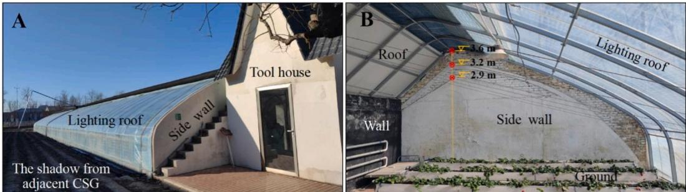  
Fig. 1. The outdoor (A) and indoor (B) scene of Chinese solar greenhouse in Beijing.

2.3. Formula for determining the vertex position of greenhouse

2.3.1. Determination of lighting roof angle for Chinese solar greenhouse

The formula for calculating the lighting roof angle for Chinese solar greenhouse is as follow [25]:

$$
\alpha = \arcsin \frac{\sin\alpha_{10}}{\cos\gamma_{10}} \tag{1}
$$

$$
\alpha_{10} = 90^{\circ} - \beta_{10} - 43^{\circ} \tag{2}
$$

$\alpha$  represents the reasonable lighting roof angle,  $\alpha_{10}$  stands for the optimal lighting roof angle at 10:00 a.m.,  $\beta_{10}$  is the solar altitude angle at 10:00 a.m.  $(20^{\circ})$  and  $\gamma_{10}$  refers to the solar azimuth angle at 10:00 a.m.  $(148^{\circ})$  in Beijing. With the above equation and the span of the greenhouse, the linear equation  $(y_{a})$  for the possible location of CSG vertex is determined as shown in Fig. 3,

$$
y_{a} = \tan (\alpha)\bullet x \tag{3}
$$

2.3.2. Determination of roof angle for Chinese solar greenhouse

There are two principles for determining the slope angle of the roof. Firstly, considering wall heat storage is the guarantee of maintaining CSG temperature, the sunlight at 12:00 a.m. on the winter solstice  $(\beta_{W12})$  should shine on the upper part of the wall. The formula of roof angle is as follow:

$$
\theta = \beta_{W12} + 5^{\circ} \tag{4}
$$

$$
\tan \theta = \frac{H_4}{L_4 - W} \tag{5}
$$

$$
H_{min1} = \tan \theta \bullet (L_4 - W) + H_2 \tag{6}
$$

Where  $\theta$  stands for the roof angle, and the  $5^{\circ}$  increase is to avoid shading caused by the quilt in winter.  $H_{4}$  refers to the vertical distance from CSG vertex to wall,  $L_{4}$  is the horizontal projection on rear roof, W represents the wall thickness  $(0.24\mathrm{m})$  and  $H_{2}$  is the wall height  $(2.25\mathrm{m})$

Secondly, taking the light interception of canopy inside CSG into consideration, the sunlight at 12:00 a.m. on the summer solstice should be able to shine on the upper part of crop canopies near the wall. The design formula is as follow:

$$
\tan \beta_{S12} = \frac{H_0 - H_1}{L_4 - L_3 - W + L_5} \tag{7}
$$

$$
H_0 = H - L_5\bullet \tan \alpha \tag{8}
$$

The variable  $\beta_{S12}$  in the formula represents the solar altitude angle at 12:00 a.m. on the summer solstice, ensuring compliance with plant lighting needs throughout the entire year. Taking the cultivation of temperature- loving crops such as tomatoes in CSG as an example (Fig. 3),  $H_{0}$  is the vertical distance from quilt to ground,  $H_{1}$  stands for the height of canopy  $(2\mathrm{m})$ ,  $L_{3}$  represents the CSG aisle width  $(0.6\mathrm{m})$ ,  $L_{5}$  is the horizontal projection of quilt on the summer solstice  $(0.5\mathrm{m})$  and  $W$  stands for the wall thickness  $(0.24\mathrm{m})$ . Substituting these values into formula 5 yields the following formula:

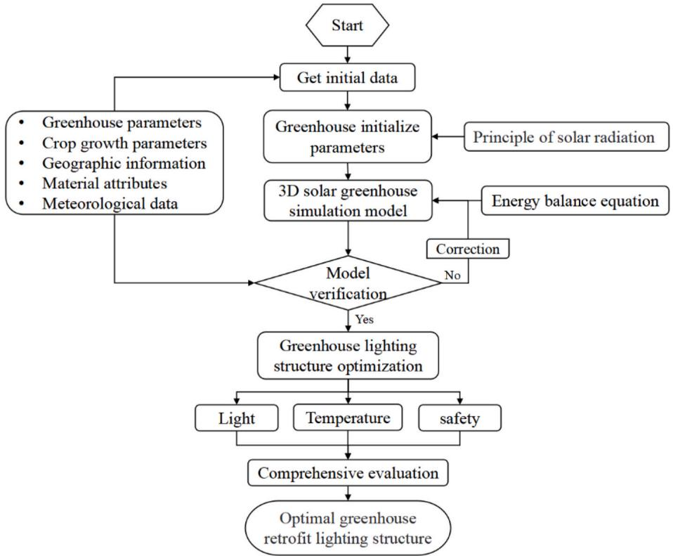  
Fig. 2. Flowchart of optimal design process for Chinese solar greenhouse structure.

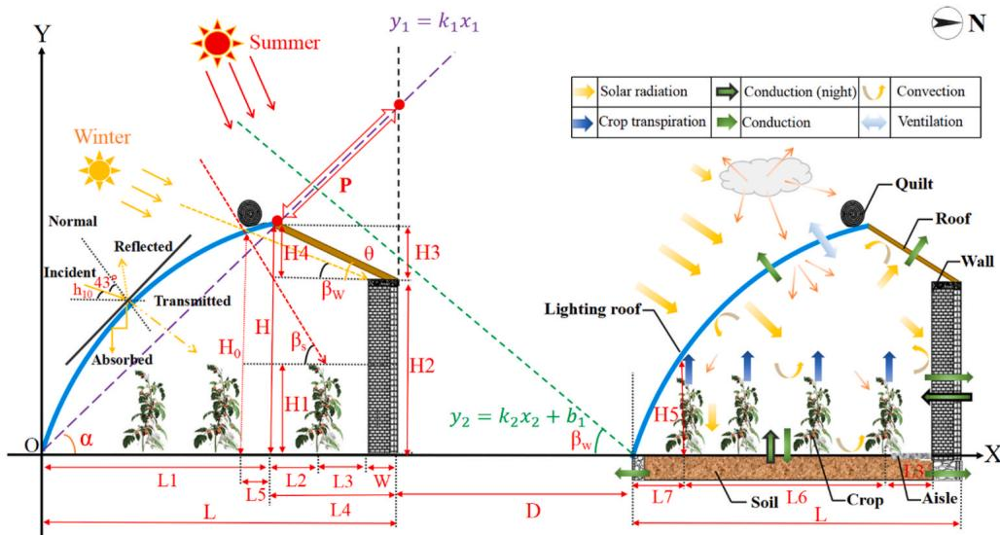  
Fig. 3. Structural parameters of Chinese solar greenhouse and projection diagram of sunlight.

$$
H_{min2} = tan\beta_{S12}\bullet (L_4 - 0.34) + 0.5\bullet tan\alpha +2 \tag{9}
$$

Thirdly, the vertex position of CSG can be determined by using the horizontal distance between greenhouses, and the formulas are as follow:

$$
H_{max} = tan\beta_{w12}\bullet (D + L_4) \tag{10}
$$

Where,  $D$  is the horizontal distance between greenhouses in north- south direction.

# 2.4. Optimization concept description of lighting roof shape

The lighting roof shape profoundly influences the quantity of solar radiation intercepted by CSG, as well as the extent of heat transfer with the external environment [31]. Given the numerous shapes available for greenhouse lighting roofs, it is impractical to determine the optimal shape based solely on field measurement data. To address these challenges, the method of linear interpolation was introduced to create various greenhouse shape scenarios. As shown in Fig. 4, the circle and straight- line were the two typical extreme greenhouse shapes. After interpolation, a total of 121 lighting roof shapes were generated. Furthermore, a physical relationship was established between the microclimate and various shapes. Simulation of indoor lighting and thermal performance was conducted for each scenario to ascertain the optimal lighting shapes.

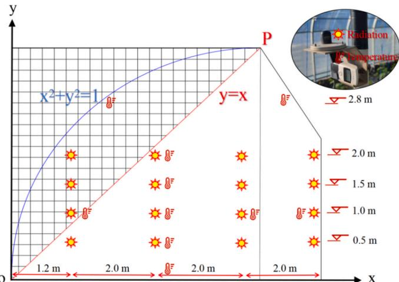  
Fig. 4. The schematic diagrams of two extreme lighting roof shapes and layout of the integrated sensors. The blue line represents the nearly circular greenhouse lighting roof, and the red line is the straight-line type greenhouse lighting roof. (For interpretation of the references to colour in this figure legend, the reader is referred to the Web version of this article.)

# 2.5. Model implementation on greenhouse design

# 2.5.1. Modeling of solar radiation within greenhouse

The direct radiation source is represented by a large sphere (Fig. 5) and defined by declaring a radiation source module in GroIMP [32]. The sky model dynamically updates the internal lighting environment of the light scene at each simulation step based on the set time and date. The incoming global radiation (S) corrected for this eccentricity can be calculated as follows [18,33]:

$$
S = 1367\cdot \tau_{\alpha}\cdot sin\beta \bullet [1 + 0.033\cos (2\pi \bullet \frac{(t_d - 10)}{365})] \tag{11}
$$

Here  $t_d$  is the number of days after January 1st, and  $\tau_{\alpha}$  is the atmospheric transmittance. The sine of the solar altitude  $(sin\beta)$  for the diurnal cycle can be calculated as follows:

$$
\sin \beta = \sin \lambda \bullet \sin \delta +\cos \lambda \bullet \cos \delta \bullet \cos (2\pi \bullet (t_h - 12) / 24) \tag{12}
$$

$t_h$  represents the solar time,  $\lambda$  is the latitude of the greenhouse, and  $\delta$  stands for the relative solar tilt angle to the equator.

To represent this scattering radiation source discretely, the sky model in this experiment employs the array of 72 directional scattering light sources. Organized in a regular pattern from top to bottom on the sky hemisphere, these scattering light sources form six concentric circles, each containing 12 uniformly distributed scattering light sources (Fig. 5).

The global solar radiation to photosynthetically active radiation (PAR,  $\mu \mathrm{mol} \mathrm{m}^{- 2} \mathrm{s}^{- 1}$ ) is as follow [34]:

$$
PAR = -0.44928 + 0.02484\bullet S + 0.0126\bullet S\bullet \sin \beta -0.00864\bullet S\bullet K_t
$$

Where  $K_t$  is the clearness index.

# 2.5.2. Calculation of thermal environment within greenhouse

To simulate the internal thermal performance for different CSGs, the energy balance equations for each component can be determined. Subsequently, the MATLAB program was developed to solve these energy equations. The energy balance equations were modified based on the widely used CSG- LS thermal model, which was proposed by Xu et al. [35]. The temperature distribution inside the experimental greenhouse was calculated by using the improved thermal model based on the structural characteristics in Beijing area. The energy balance equations for the wall and roof are similar, and these two components are named as retaining structure. The equation is given below:

$$
R_{R} = \rho_{R}c_{R}\nu_{R}*\frac{dT_{R}}{dt} +Q_{R}^{A} + Q_{R - O} + Q_{R - A}^{2} \tag{14}
$$

Here,  $\rho_{R}c_{R}\nu_{R}*\frac{dT_{R}}{dt}$  represents energy difference of the retaining structure caused by variation in inner surface temperature  $T_{R}$ . Assuming that the air inside the greenhouse is evenly mixed, the radiant heat loss of retaining structure  $(Q_{R - A}^{A})$ , the convective energy exchange between inner surface and indoor air  $(Q_{R}^{A})$ , and the conduction energy from inner surface to outdoor air  $(Q_{R - O})$  can be simplified as:

$$
\begin{array}{l}{Q_{R - A}^{2} = A_{R}\bullet \sigma \bullet \epsilon \bullet 4(T_{R} - T_{A})\bullet T_{A}^{3}}\\ {}\\ {Q_{R}^{A} = A_{R}\bullet k_{A - R}\bullet (T_{R} - T_{A})} \end{array} \tag{16}
$$

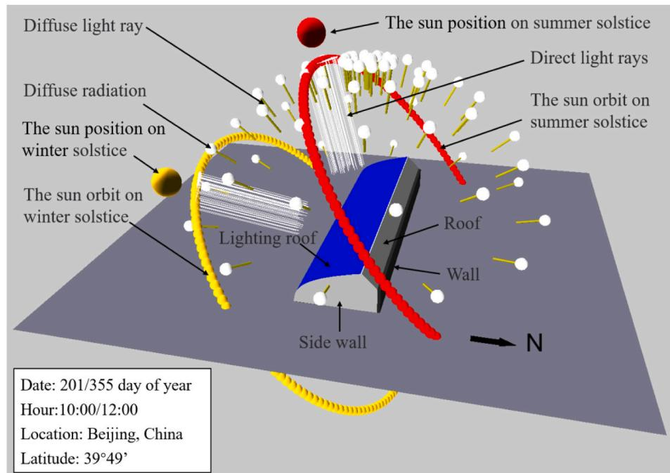  
Fig. 5. Visualization of solar radiation model for CSG in Beijing.

$$
Q_{R - O} = A_R\bullet \frac{\lambda_R}{d_R}\bullet (T_R - T_A) \tag{17}
$$

The energy balance of the unit area of the soil was written as [36]:

$$
R_{S} = \rho_{S}c_{S}\nu_{S}*\frac{dT_{S}}{dt} +Q_{S}^{A} + Q_{S - O} + LE_{S} + Q_{S - A}^{2} \tag{18}
$$

$$
LE_{S} = \epsilon \bullet LE \tag{19}
$$

Here,  $LE_{S}$  stands for the latent heat energy consumption of the soil surface. The energy balance for the CSG lighting roof can be written as follow [37]:

$$
R_{L} = \rho_{L}c_{L}\nu_{L}*\frac{dT_{L}}{dt} +Q_{L}^{A} + Q_{L}^{O} + Q_{L - O} + Q_{L - A}^{2} + Q_{L - O}^{2} \tag{20}
$$

The temperature of the indoor air is mainly determined by the convective heat transfer between the air and retaining structures. The energy balance of the CSG air temperature can be written as follows [38]:

$$
\rho_{A}c_{A}\nu_{A}*\frac{dT_{A}}{dt} = Q_{L}^{A} + Q_{R}^{A} + Q_{S}^{A} + LE_{S} + Q_{Inf} \tag{21}
$$

$$
Q_{inf} = c_{p}\bullet \rho \bullet \frac{N\bullet V}{3600}\bullet (T_{in} - T_{out}) \tag{22}
$$

Where the  $Q_{inf}$  stands for the cold air infiltration. The energy balance for the CSG plant canopy can be written as follow:

$$
R_{P} = \rho_{P}c_{P}H_{1}LAI*\frac{dT_{P}}{dt} +\phi_{P} + LE + Q_{P - A}^{2} \tag{23}
$$

$$
\phi_{P} = 2\bullet LAI\bullet \frac{\rho_{P}c_{P}}{r_{e}} (T_{P} - T_{A}) \tag{24}
$$

Where  $LE$  is the canopy transpiration energy, and  $\phi_{P}$  stands for the sensible heat energy consumption of the canopy. All variables and boundary conditions were shown in Table S1 and Fig. S3, and the detailed calculation formulas were listed in Method S1. In the calculation process, the outdoor temperature was set according to the measured data by outdoor weather station.

# 2.5.3. Process of 3D light simulation and temperature solution

To accurately quantify the light environment of CSGs with different shapes, the optical simulation was performed on GroIMP modelling platform. Through the integration of solar radiation model, 3D greenhouse model and optical physical property parameters, the accurate calculation of light interception on lighting roof, wall, roof, soil and canopy was realized. The energy balance equations of various components within CSG were established by utilizing MATLAB (R2018a, MathWorks, Inc.). The calculated radiation values, outdoor temperature data, indoor initial temperature and various physical parameters were used as inputs to achieve a continuous solution for the CSG internal temperature. The detailed boundary conditions and parameters were summarized in Table 2. The simulation was conducted from 8:30 a.m. to 8:30 a.m. next day on winter solstice with 30- min time steps. Based on the actual operation of the greenhouse in Beijing, the opening and closing of the heat preservation quilt determined the lighting hours from 8:30 a.m. to 4:30 p.m.

# 2.5.4. Mechanical property analysis of the CSG skeletons

Load combination serves as the premise and basis of CSG structural design [25]. To ensure that the optimized greenhouse meets the stability requirements, it is essential to analyze the load characteristics and combined effects acting on the greenhouse [39]. In this study, the extreme cases were considered for the load combination, and the formula can be written as follows:

$$
LC = G_{1} + G_{2} + P + Q + SL \tag{25}
$$

Table 2 Parameters used in the simulation.  

<table><tr><td colspan="3">Location environment</td><td colspan="3">Greenhouse parameters</td></tr><tr><td>Latitude</td><td></td><td>39.8</td><td>°</td><td>CSG</td><td>30, 7.2, 0.00015</td></tr><tr><td>Direct radiation</td><td></td><td>750</td><td>W</td><td>Wall</td><td>50, 2.25, 0.48</td></tr><tr><td>Diffuse radiation</td><td></td><td>150</td><td>W</td><td>Roof</td><td>50, 2.0, 0.3</td></tr><tr><td>Properties of layered surfaces</td><td></td><td></td><td></td><td>Soil</td><td>50, 7.2, 0.5</td></tr><tr><td>CA</td><td></td><td>1005</td><td>J kg−1
K−1</td><td>Ridge height</td><td>3.6</td></tr><tr><td>cL</td><td></td><td>750</td><td>J kg−1
K−1</td><td>Greenhouse distance</td><td>8</td></tr><tr><td>cW</td><td></td><td>1062</td><td>J kg−1
K−1</td><td>Lighting roof angle</td><td>32.24</td></tr><tr><td>cR</td><td></td><td>1380</td><td>J kg−1
K−1</td><td>Orientational</td><td>90</td></tr><tr><td>cS</td><td></td><td>1900</td><td>J kg−1
K−1</td><td>Lighting roof area</td><td>300</td></tr><tr><td>ρA</td><td></td><td>1.29</td><td>kg m−3</td><td>Optical properties of lighting roof</td><td></td></tr><tr><td>ρL</td><td></td><td>970</td><td>kg m−3</td><td>Haze</td><td>5</td></tr><tr><td>ρW</td><td></td><td>1100</td><td>kg m−3</td><td>Clarity</td><td>94.4</td></tr><tr><td>ρR</td><td></td><td>800</td><td>kg m−3</td><td>Transmittance</td><td>94</td></tr><tr><td>ρS</td><td></td><td>1500</td><td>kg m−3</td><td>45 Degree Gloss</td><td>74.8</td></tr><tr><td>Load combinations</td><td></td><td></td><td></td><td>Steel structure section parameters</td><td>75*30*2</td></tr><tr><td>Snow load</td><td></td><td>9.113</td><td>KN</td><td>Skeleton (Elliptic tube)</td><td></td></tr><tr><td>Quilt load</td><td></td><td>2.822</td><td>KN</td><td>Tie rod</td><td>25*1.5</td></tr><tr><td>Permanent load</td><td></td><td>9.513</td><td>KN</td><td>Rod (Round tube)</td><td>25*1.5</td></tr></table>

Where the  $LC$  stands for the load combination,  $G_{1}$  and  $G_{2}$  represent the mass load of lighting roof and roof, which is named as permanent load (G).  $P$  stands for the crop load, which is act on the lighting roof.  $Q$  is the mass load of quilt, and  $SL$  represents the snow load. The deformation quantity was investigated by the method of finite element analysis. The detailed parameters were shown in Table 2.

# 2.6. Validation of the present work

The light environment was monitored using the QSO- S PAR (Photosynthetically Active Radiation) sensor from Decagon, US. The sensor recorded the changes in canopy radiation every  $10~\mathrm{min}$  throughout the experiment in unit of  $\mu \mathrm{mol}~\mathrm{m}^{- 2}~\mathrm{s}^{- 1}$ . A conversion factor of 4.57 was used to convert  $\mu \mathrm{mol}~\mathrm{m}^{- 2}~\mathrm{s}^{- 1}$  to  $\mathrm{W}~\mathrm{m}^{- 2}$  [34]. In the established virtual CSG model, the virtual sensors  $(0.01\mathrm{m}\times 0.01\mathrm{m})$  were arranged according to the real- world positions to acquire the calculated values by model. The model accuracy was verified by the average value of the measured and predicted data of each layer  $(0.5\mathrm{m}, 1.0\mathrm{m}, 1.5\mathrm{m}, 2.0\mathrm{m})$ , including upper, middle, lower and bottom. The average predicted solar radiation intensity of the whole wall area was compared with the average data recorded by sensors near the wall. The temperature for each part inside CSG was measured by using the RC- 4 temperature sensors (Elitech, China, Precision:  $\pm 0.1^{\circ}\mathrm{C}$ , temperature ranges from  $- 30^{\circ}\mathrm{C}$  to  $110^{\circ}\mathrm{C}$ ). The detailed arrangement of the integrated sensors was shown in Fig. 4.

Fig. 6 showed that the diurnal variation trend of the predicted values was consistent with the measured values. The predicted values of temperature were higher than the measured values on the whole. This discrepancy primarily arose from heat transfer energy dissipation. The root mean square error (RMSE) and determination coefficient  $(\mathbb{R}^2)$  were applied to investigate the correlation between the predicted and measured data. As presented in Table 3, the RMSE values for radiation ranged from 8.94 to  $10.83\mathrm{Wm}^{- 2}$ , which was about  $3.8\%$  and  $5.0\%$  of the average solar radiation intensity in the wall and middle of CSG, respectively. The RMSE values for radiation ranged from  $1.47^{\circ}\mathrm{C}$  to  $1.85^{\circ}\mathrm{C}$ . The determination coefficient ranged from 0.90 to 0.95, providing strong evidence that the proposed model accurately simulated

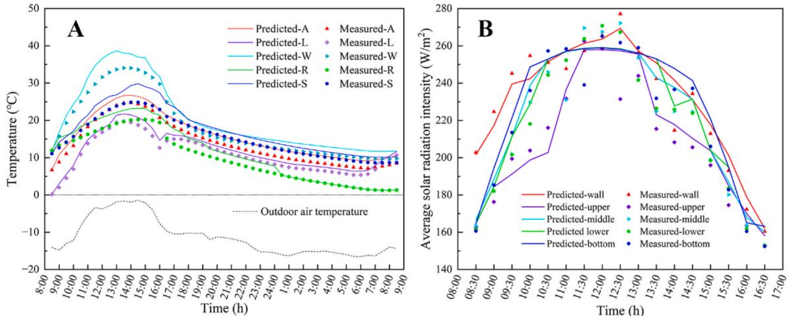  
Fig. 6. Temperature (A) and light distribution (B) of the Chinese solar greenhouse during winter solstice.

Table 3 The RMSE and  $R^2$  between the predicted and measured value.  

<table><tr><td>Parameter</td><td>Index</td><td>Upper</td><td>Middle</td><td>Lower</td><td>Bottom</td><td>Wall</td></tr><tr><td rowspan="2">Radiation</td><td>RMSE</td><td>9.70</td><td>10.83</td><td>10.34</td><td>10.53</td><td>8.94</td></tr><tr><td>R²</td><td>0.91</td><td>0.91</td><td>0.91</td><td>0.91</td><td>0.91</td></tr><tr><td rowspan="3">Temperature</td><td>Index</td><td>Lighting roof</td><td>Soil</td><td>Wall</td><td>Roof</td><td>Air</td></tr><tr><td>RMSE</td><td>1.52</td><td>1.85</td><td>1.74</td><td>1.47</td><td>1.59</td></tr><tr><td>R²</td><td>0.91</td><td>0.91</td><td>0.95</td><td>0.95</td><td>0.93</td></tr></table>

the light and thermal environment inside CSG.

# 3. Case study

# 3.1. Determining the vertex position of CSG

The CSGs located in Beijing were taken as the research prototype. As shown in Fig. 1B, the original greenhouse has undergone two structural optimizations, with the ridge to span ratio changing from 0.4 to 0.5. Whether the existing structure is the best option is still unknown. Fig. 3 illustrated the process of determining the vertex position of greenhouse. By inputting the solar altitude and azimuth angles into equations (1)- (3), the appropriate lighting roof angle for the greenhouse in Beijing can be obtained. Then, the vertex position of CSG can be calculated by determining the appropriate roof angle. There were three limiting factors for determining the roof angle. The light can shine on the upper of the wall on the winter solstice, and on the top of crop canopy near the wall on the summer solstice. At the same time, there should be less shading between adjacent greenhouses on the winter solstice. By using the formula for determining the vertex position of the CSG mentioned above, the coordinates of the chosen CSG's three points, P1(5.3, 3.3), P2 (6.4, 4.0), and P3(6.8, 4.3) were determined. The suitable range of  $L_{1}$  determined by the three limiting factors was  $6.4 - 6.8 \mathrm{m}$ . Subsequently, the interpolation simulations were conducted on the five vertex positions with different lighting roof shapes between  $6.4 \mathrm{m}$  and  $6.8 \mathrm{m}$  at intervals of  $0.1 \mathrm{m}$  on the winter solstice. Various simulations have been conducted for different structures and lighting roof shapes.

# 3.2. Structure optimization

As shown in Fig. 7, the average lighting and temperature performance for the five type greenhouses have significantly improved compared to the original one. The daylight period was from 8:30 a.m. to 4:30 p.m. during winter solstice. With the increase of the lighting roof area, the air temperature and light interception were increased, and the improvement of light environment was more significant. Among them, the greenhouses with the highest vertex position (P5) performed the best. Comparing with the original CSG, the solar radiation captured by the lighting roof of P5 has increased by  $33.5\%$ . The average indoor air temperature has risen by about  $3.1^{\circ}\mathrm{C}$ , corresponding to a  $20.6\%$  increase. Interestingly, there was no significant difference in the internal air temperature of CSG with different vertex positions after optimization. This indicated that increasing the lighting roof area improves the lighting performance, but the heat dissipation area was also increased. Therefore, in the process of optimizing the greenhouse structure, it should not only pay attention to the light environment, but also take into account the balance of light and thermal.

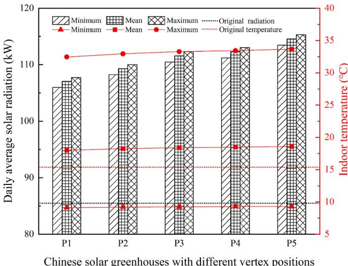  
Fig. 7. The difference of radiation and temperature of Chinese solar greenhouses with different vertex positions.

In order to clarify the influence of different lighting roof shapes on the light and temperature climate inside greenhouse, the cumulative solar radiation and daily effective accumulated temperature were comprehensively analyzed. The cumulative solar radiation contained the value from wall and ground, which was the main heat storage and release module of greenhouse. The lowest temperature that crops can tolerate was set at  $10^{\circ}\mathrm{C}$  [40,41]. The daily effective accumulated temperature was defined as the time integral of the positive difference between the indoor air temperature per hour and the  $10^{\circ}\mathrm{C}$ . Fig. 8 showed the light- temperature performance of 121 different lighting roof shapes of CSG with the highest vertex position. The shapes were divided into groups of 11, which changes repeatedly from approaching circle to

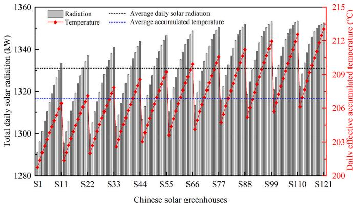  
Fig. 8. Total light interception and daily effective accumulated temperature of Chinese solar greenhouse with different lighting roof shapes.

straight- line. The maximum difference of total daily solar radiation and effective accumulated temperature among different greenhouse shapes were  $4.8\%$  and  $6.1\%$  respectively. It also illustrated that the lighting roof shape close to a straight line enhances the performance of the CSG. The maximum difference of light interception and temperature among different greenhouse shapes was  $4.8\%$  and  $6.1\%$  respectively. However, the use of a straight- line shape for the CSG would limit crop height and reduce the effective planting area, potentially impacting crop yield. Consequently, the space utilization rate of CSG is also one of the factors that determines the shape of lighting shape.

According to the above obtained results, the five CSGs with the optimum performance have been determined (S09, S109, S110, S120, S121). As shown in Fig. 3, the effective planting span was set as  $5.7\mathrm{m}$ $(L_{6})$  and the horizontal distance between the first- row plants and the front of CSG was  $0.7\mathrm{m}$ $(L_{7})$ . The vertical height from ground to lighting roof was  $0.9\mathrm{m}$ $(H_{5})$  which was called shoulder height. Based on this standard, when the vertical height between the ground and the lighting roof reached  $0.9\mathrm{m}$  the horizontal distance between the position and the front of CSG was regarded as an ineffective planting area. Taking the utilization rate of effective planting area as an evaluation index, five other greenhouses that met the required planting area and have good relative performance were selected for comparison. Fig. 9 illustrated the comparison of the ten CSGs with the original one. The average difference in cumulative temperature and radiation increase rate between the two types CSG were  $4.7\%$  and  $2.9\%$  respectively. While the average difference of the effective planting area utilization reached  $11.9\%$ . In order to meet the demand of greenhouse planting area, the optimal greenhouse shapes were determined to be S79, S89, S90, S100, S111. The relative increase rate difference of temperature and radiation among the five CSGs only has  $0.45\%$  and  $0.55\%$  respectively.

  
Fig. 9. Comparison of performance difference between the original greenhouse and optimal greenhouses.

# 3.3. Structural stability analysis

The stability of skeleton structure is a prerequisite for crop production in greenhouse. Fig. 10 showed the original and optimal lighting roof shapes of CSG as well as the corresponding equations. After optimizing the shape of CSG, the skeleton structure has changed. The potential structural safety issues stemming from this change cannot be ignored. Therefore, the finite element analysis was employed to compute the deformation magnitude of various skeleton structures subjected to identical load conditions.

Changing the steel skeleton structures has caused a significant effect in the deformation quantity (Fig. 11). Comparing with the original greenhouse, the average deformation quantity of optimal CSGs structures (SK 1- 5) has increased by  $3.7\mathrm{mm}$  at the minimum and  $12.7\mathrm{mm}$  at the maximum, which would lead to a decrease in safety. To solve this problem, we have tried to use a tie rod to connect the lighting roof skeleton and roof skeleton, thus increasing the stability of lighting structure for CSG. After implementing the modifications (M 1- 5) to the steel skeleton structures, the deformation quantity can be minimized to  $1.0\mathrm{mm}$  which refers to the shape of M3 (S90:  $y_{3} = - 0.0926x^{2} + 1.1593x + 0.2395$ .

In summary, the greenhouse located in Beijing Chaolai Agricultural Garden was optimized from the perspectives of lighting, heat storage and safety. Compared with the original greenhouse structure, the performance of all aspects has been significantly improved.

# 3.4. Chinese sunken solar greenhouse

Another way to increase the effective planting area of greenhouse is to dig down the ground. This greenhouse, known as the Chinese sunken solar greenhouses, are widely used in China's Shandong, Hebei provinces and northwest regions (Fig. 12). When the ground of the greenhouse sinks to a certain depth, the area of the wall with certain heat- storage capacity also be increased. Meanwhile, the front rows plants inside CSG will be shaded. These effectively impacts the microclimate inside greenhouse without modifying the structural parameters [42]. The problem of effective planting area limitation mentioned above in the process of optimizing the CSG shape may be solved in this way.

Taking the most common sink depth of  $0.5\mathrm{m}$  in production as an example, the temperature and light environment of CSGs were simulated based on our proposed model. The evaluation included the original greenhouses and five greenhouses that fulfill the planting area requirements after sinking (S72, S93, S103, S104, S114). Fig. 13A showed that after sinking the original greenhouse ground by  $0.5\mathrm{m}$ , the cumulative accumulated temperature increased by  $6.7\%$ , while the cumulative light interception decreased by  $1.1\%$ . For the other five greenhouses, the average increase rate of cumulative temperature and radiation were  $45.7\%$  and  $23.8\%$ , respectively. The obtained results have approximately consistent with the five high planting area utilization CSGs. The average photosynthetic active radiation of crop canopies inside CSGs was quantified by using the 3D simulation model. The 3D structure of the tomato canopy was established using the average morphological parameters of each organ from five visually similar tomato plants, as measured in the field. After the original greenhouse sinking treatment, the average canopy light interception decreased by  $5.6\%$ . When the shape of CSG was optimized, the average light interception of canopy was increased by  $1.4\%$  compared with the original one (Fig. 13B). Considering the workload of sinking of the greenhouse and the shading of the crops in the front row, enhancing the light and temperature environment of CSG should concentrate on optimizing the lighting structure.

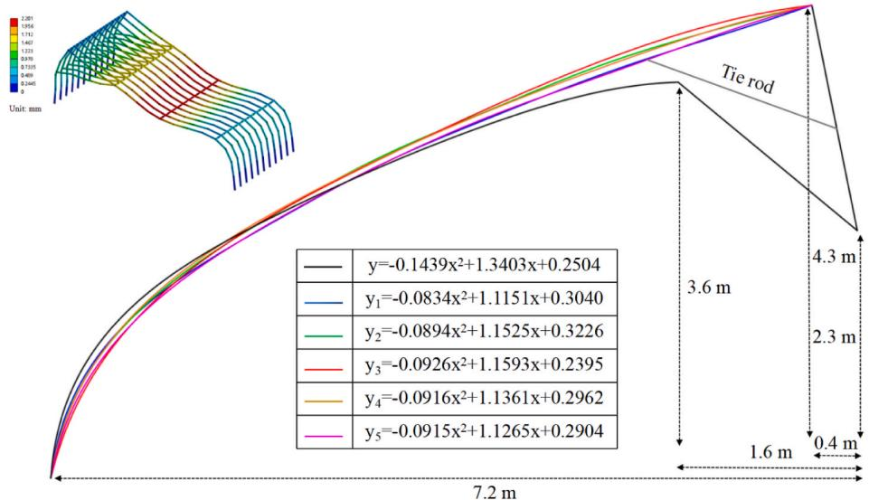  
Fig. 10. The cross-section of CSG optimal lighting structures and steel skeleton force analysis.

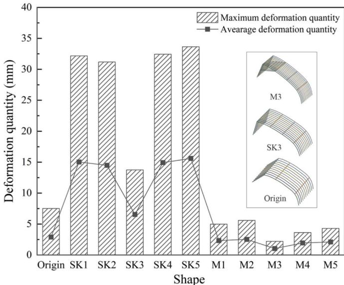  
Fig. 11. The comparison of deformation quantity between the different skeleton structures and original one.

# 3.5. Economic and environmental evaluation

Economic benefit is a crucial factor that cannot be ignored during the structural optimization process of CSG. Taking the experimental greenhouse as an example, the benefit for the optimized greenhouse were shown in Table 4. After optimizing the lighting structures of CSG, modifications to the steel skeletons were required, incurring a material cost of 686 USD and a labor cost of about 447 USD. Additionally, given a  $30~\mathrm{m}^2$  increase in the size of the lighting roof, there was an associated rise in the cost of heat preservation quilt and plastic film, amounting to 65 USD. To sum up, the overall reconstruction cost was 1198 USD, translating to a unit area cost of about  $5.55\mathrm{USD}\mathrm{m}^{- 2}$ . Comparatively, the optimized greenhouse has shown a better performance than the original one, with an increase in captured energy by  $5.4\mathrm{MJ}\mathrm{m}^{- 2}$ $(1\mathrm{MJ}\mathrm{m}^{- 2} = 10^{6}\bullet t\bullet 1\mathrm{W}\mathrm{m}^{- 2})$  and an average temperature rise of  $3.1^{\circ}\mathrm{C}$ . The captured energy was equivalent to the combustion of  $60.4\mathrm{kg}$  day $^{- 1}$  coal, resulting in a decrease of  $150.7\mathrm{kg}\mathrm{CO}_2$  emission. Considering 60 days of heating per year in winter for CSG, the potential savings from optimized greenhouses was about 606 USD. Moreover, when the temperature increases by  $1^{\circ}\mathrm{C}$ , the tomato yield can be improved by about  $2.5\% - 3.1\%$  [43]. Based on the average yield of tomatoes produced in winter, the optimized greenhouse tomato yield increased by about  $688~\mathrm{kg}$ , resulting in an increased income of 579 USD. The estimated payback period was 1.6 years, representing the time when the cost of optimizing CSG equaled the potential income. This finding is hopefully to encourage greenhouse owners and operators to consider

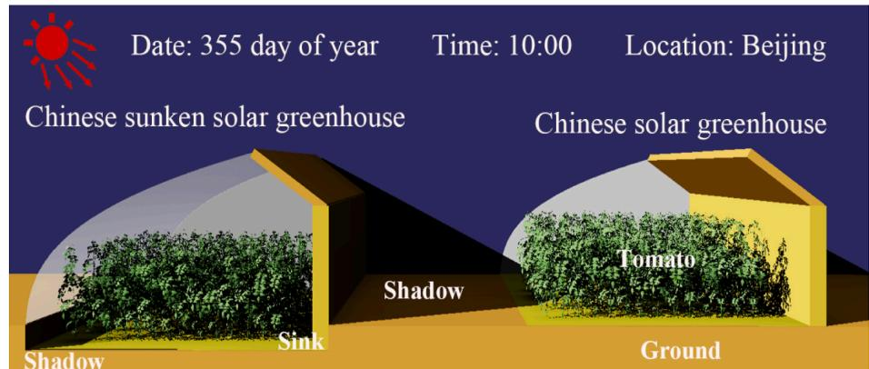  
Fig. 12. The outdoor and indoor light distribution of two type greenhouses.

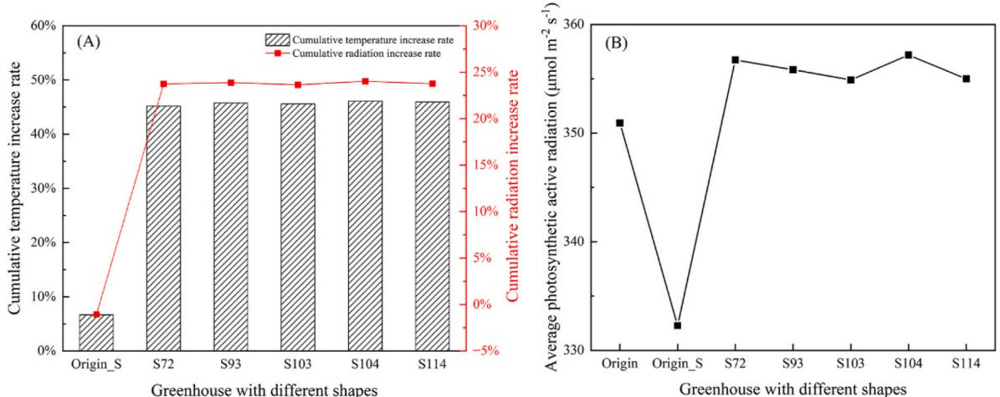  
Fig. 13. Comparison of performance between the original greenhouse and sunken greenhouses, (A) temperature and radiation increase rate, (B) the average photosynthetic active radiation intercepted by canopy.

Table 4 The economic evaluation for greenhouse optimization.  

<table><tr><td>Greenhouse</td><td>Parameters</td><td>Origin</td><td>Optimized</td><td>Prices</td><td>Value</td></tr><tr><td>Incremental budget</td><td></td><td></td><td></td><td></td><td>1198</td></tr><tr><td></td><td></td><td></td><td></td><td></td><td>$</td></tr><tr><td>Structures</td><td>Steel skeleton, m</td><td>300</td><td>330</td><td>1.8 $ m-1</td><td>594</td></tr><tr><td></td><td>Tie rod, m</td><td>40</td><td>158</td><td>0.6 $ m-1</td><td>92</td></tr><tr><td></td><td>Heat preservation quilt, m2</td><td>300</td><td>330</td><td>1.7 $ m-2</td><td>50</td></tr><tr><td></td><td>Plastic film, m2</td><td>300</td><td>330</td><td>0.5 $ m-2</td><td>15</td></tr><tr><td></td><td>Cost of labor, day</td><td>-</td><td>8</td><td>56.1 $ d-1</td><td>447</td></tr><tr><td>Environment</td><td>Captured energy, MJ</td><td>5251.5</td><td>7022.9</td><td>-</td><td>-</td></tr><tr><td></td><td>Average temperature, °C</td><td></td><td>15.4</td><td>18.5</td><td>-</td></tr><tr><td>Potential income</td><td></td><td></td><td></td><td></td><td>751 $</td></tr><tr><td>Energy-saving profit</td><td>Coal combustion, kg day-1</td><td>-</td><td>-60.4</td><td>168.3 $ t-1</td><td>606</td></tr><tr><td></td><td>CO2emission, kg day-1</td><td>-</td><td>-150.7</td><td>-</td><td>-</td></tr><tr><td>Crop profit</td><td>Yield (tomato), Kg</td><td>4300</td><td>4644</td><td>0.8 $ Kg-1</td><td>145</td></tr><tr><td>Payback</td><td></td><td></td><td></td><td></td><td>1.6 Year</td></tr></table>

adopting the proposed design strategies.

# 4. Discussion

# 4.1. Necessity of upgrading old greenhouse facilities

Greenhouse groups often face limitations in land utilization and reconstruction cost, making it challenging to easily alter the structural parameters of individual greenhouse. Therefore, numerous researchers have mainly concentrated on the greenhouse managements to devise ideal solutions that adapt to the microclimate of crop growth [44- 46], while the structure optimization of the old greenhouses was rare. The primary objective of Chinese solar greenhouses is to facilitate year- round crop production, particularly during the cold winter characterized by the shortest sunshine duration and weakest solar radiation intensity [47]. Consequently, the focus in the design of CSGs in this study has been on maximizing sunlight penetration into the lighting roof. The design of greenhouse structural parameters is a multi- objective optimization problem [48]. An integrated model was developed here to find the optimal greenhouse design, which takes into account the impact on light, temperature, crop canopy, spatial efficiency and structure safety. Our results showed that the decisive factor influencing greenhouse performance is the vertex position, followed by the lighting roof shape. On the basis of the original greenhouse retaining structure, the reasonable optimization of the lighting roof can significantly improve the internal climate environment, maintain a high structural safety, and return the cost in a short time. This study employed the widely cultivated tomato as the crop prototype, and the structural parameters suitable for leafy vegetable production can be further explored using this model. To sum up, this methodology can provide new ideas for the transformation of old greenhouses and the reuse of abandoned greenhouses.

# 4.2. Advantages of the proposed model

The structure of CSG is very complex, which leads to the significant heterogeneity of the microclimate [49]. Most studies were evaluated on a 2D plane or ignored the presence of complex crop canopy on a 3D scale [50,51]. Hence, a more precise method for greenhouse microclimate simulation is needed that takes into account variable parameters, particularly in the context of 3D geometries. To address this challenge, the 3D ray- tracing method was introduced to enable precise calculation of light rays entering the greenhouse with consideration of the absorbed, reflected, and transmitted properties [3,4]. By integrating 3D plant models with the optical properties of each greenhouse component, it becomes possible to quantitatively calculate the intricate optical interactions between the crops and greenhouse [52,53]. Combing with the optical simulation of solar radiation intercepted by each CSG component, the energy balance equations were created and subsequently employed to calculate the temperature of individual surface. The light and thermal environment under different shapes of CSG were then systematically quantified by using the integrated model. The proposed model can be applied not only to the upgrading and optimization of greenhouse structure, but also to the optimization of planting strategy, such as the planting density, row orientation etc [54].

The integrated model can also be extended to optimize the application of energy devices. The typical case is the agrivoltaic system [55], which combines the agriculture with photovoltaic (PV) on the same land, and shows great potential for sustainable production [56]. Well- designed agricultural photovoltaic systems are a possible solution to meet both food and energy needs [57]. Through our proposed model, the parameters of PV panel such as the size, orientation, maximum load

and tilt angle can determine the appropriate installation strategy according to the local conditions [58]. How crops interact with photovoltaic panels on a 3D scale can be also quantified, and an intricate 3D portrayal of the interplay of shadows among structures can be visualized. These functionalities offer significant advantages for architectural planning [59], particularly for facility farms that require the integration of solar power to enhance their heating systems [60].

# 5. Conclusion

This study presents a comprehensive and well- structured methodology to optimize CSG structural parameters, which considering multiple critical factors for improved solar energy utilization and indoor microclimate. The focus was on improving CSG solar energy utilization, temperature environment, and structural safety. Several conclusions were summarized as follows.

(1) Taking the typical CSG in Beijing Chaolai Agricultural Garden as the research prototype, the optimal vertex position is (6.8, 4,3), and the corresponding lighting roof shape equation is  $y = -0.0926x^2 + 1.1593x + 0.2395$ . The optimized structural parameters significantly improved the microclimate environment, resulting in an average light interception increase of  $33.5\%$  and a temperature increase of  $20.6\%$ , respectively. 
(2) Different lighting roof shapes exhibited a maximum difference of  $4.8\%$  in light interception and  $6.1\%$  in temperature. Moreover, the safety of greenhouse structure should be considered comprehensively during the process of optimizing the greenhouse climate environment. 
(3) Greenhouse structure optimization can reduce non-renewable energy consumption, with a payback period of about 1.6 years.

Overall, the methodologies and findings of current study contribute to sustainable agricultural practices and have significant implications for the greenhouse industry.

# CRediT authorship contribution statement

Demin Xu: Writing - original draft, Validation, Investigation, Formal analysis, Data curation. Shuaipeng Fei: Validation, Software, Formal analysis. Zhi Wang: Investigation, Formal analysis. Jinyu Zhu: Writing - review & editing, Software, Methodology, Formal analysis. Yuntao Ma: Writing - review & editing, Supervision, Software, Methodology, Funding acquisition, Conceptualization.

# Declaration of competing interest

The authors declare that they have no known competing financial interests or personal relationships that could have appeared to influence the work reported in this paper.

# Data availability

Data will be made available on request.

# Acknowledgements

This work was supported by the National Key Research and Development Program of China (2023YFD2000600), the National Natural Science Foundation of China (32372799) and Beijing Innovation Consortium of Digital Agriculture Research System (BAC10- 2024).

# Appendix A. Supplementary data

Supplementary data to this article can be found online at https://doi.

org/10.1016/j.energy.2024.131980.

# References

[1] Dong J, Gruda N, Li X, Cai Z, Zhang L, Dunn Z. Global vegetable supply towards sustainable food production and a healthy diet. J Clean Prod 2022;369. https://doi.org/10.1016/j.jclepro.2022.133212. [2] Iddio E, Wang L, Thomas Y, McMorrow G, Denzer A. Energy efficient operation and modeling for greenhouses: a literature review. Renew Sustain Energy Rev 2020; 117. https://doi.org/10.1016/j.rser.2019.109480. [3] Wang T, Wu G, Chen J, Cui P, Chen Z, Yan Y, et al. Integration of solar technology to modern greenhouse in China: current status, challenges and prospect. Renew Sustain Energy Rev 2017;70:1178- 88. https://doi.org/10.1016/J. RSER.2016.12.020. [4] Xie J, Yu J, Chen B, Feng Z, Li J, Zhao C, et al. Facility cultivation systems "facility agriculture": a Chinese model for the planet. Adv Agron 2017;145:1- 42. https://doi.org/10.1016/j.asgrop.2017.05.005. Academic Press Inc. [5] Li T, Qi M, Meng S. Sixty years of facility horticulture development in China: achievements and prospects. Acta Hortic Sin 2022;49(10):2119- 30. https://doi.org/10.16420/No.issn.0513- 353x.2022- 0700 [in Chinese]. [6] China issues No. 1. central document for 2023, Chinese rural vitalization tasks. https://english.www.gov.cn/policies/latestcreases/202302/13/content_WS63ea2efcc640a757729e6b4b.html. [7] Zhang M, Yan T, Wang W, Jia X, Wang J, Klemes JJ. Energy- saving design and control strategy towards modern sustainable greenhouse: a review. Renew Sustain Energy Rev 2022;164. https://doi.org/10.1016/j.rser.2022.112602. [8] Chen C, Li Y, Li N, Wei S, Yang F, Ling H, et al. A computational model to determine the optimal orientation for solar greenhouses located at different latitudes in China. Sol Energy 2018;165:19- 26. https://doi.org/10.1016/j.solener.2018.02.022. [9] Choah N, Allouhi A, El Maakoul A, Kouksou T, Saadeddine S, Jamil A. Review on greenhouse microclimate and application: design parameters, thermal modeling and simulation, climate controlling technologies. Sol Energy 2019;191:109- 37. https://doi.org/10.1016/j.solener.2019.08.042. [10] Mellalou A, Riad W, Mouaky A, Bacaoui A, Outzourhit A. Optimum design and orientation of a greenhouse for seasonal interviewing in Morocco under constant volume constraint. Sol Energy 2021;230:321- 326. https://doi.org/10.1016/j.solener.2021.10.050. [11] Kim R woo, gu Kim J, Lee I bok, Yeo U hyeon, Lee S yeon, Decano- Valentin C. Development of three- dimensional visualisation technology of the aerodynamic environment in a greenhouse using CFD and VR technology, part 1: development of VR a database using CFD. Biosyst Eng 2021;207:33- 58. https://doi.org/10.1016/j.biosystemseng.2021.02.017. [12] Zhang X, Wang H, Zou Z, Wang S. CFD and weighted entropy based simulation and optimisation of Chinese Solar Greenhouse temperature distribution. Biosyst Eng 2016;142:12- 26. https://doi.org/10.1016/j.biosystemseng.2015.11.006. [13] Mobtaker HG, Ajabshirchi Y, Ranjbar SF, Matloobi M. Simulation of thermal performance of solar greenhouse in north- west of Iran: an experimental validation. Renew Energy 2019;135:88- 97. https://doi.org/10.1016/j.renene.2018.10.003. [14] Baglivo C, Mazzeo D, Panico S, Bonuso S, Matera N, Congedo PM, et al. Complete greenhouse dynamic simulation tool to assess the crop thermal well- being and energy needs. Appl Therm Eng 2020;179:115698. https://doi.org/10.1016/j.applthermaleng.2010.115698. [15] Bournet PE, Rojano F. Advances of Computational Fluid Dynamics (CFD) applications in agricultural building modelling: research, applications and challenges. Comput Electron Agric 2022;201. https://doi.org/10.1016/j.compag.2022.107277. [16] An CH, Ri HJ, Han TU, Kim S II, Ju US. Feasibility of winter cultivation of fruit vegetables in a solar greenhouse in temperate zone; experimental and numerical study. Sol Energy 2022;233:18- 30. https://doi.org/10.1016/j.solener.2022.01.024. [17] Liu R, Li M, Guzman JL, Rodriguez F. A fast and practical one- dimensional transient model for greenhouse temperature and humidity. Comput Electron Agric 2021;186. https://doi.org/10.1016/j.compag.2021.10.186. [18] Bo Y, Zhang Y, Zheng K, Zhang J, Wang X, Sun J, et al. Light environment simulation for a three- span plastic greenhouse based on greenhouse light environment simulation software. Energy 2023;271. https://doi.org/10.1016/j.energy.2023.126966. [19] Bonachela S, Lopez JC, Hernandez J, Grandos MR, Magan JJ, Cabrera- Corral FJ, et al. How mulching and canopy architecture interact in trapping solar radiation inside a Mediterranean greenhouse. Agric For Meteorol 2020;294. https://doi.org/10.1016/j.agrformet.2020.108132. [20] Zhang Y, Henke M, Li Y, Xu D, Liu A, Liu K, et al. Towards the maximization of energy performance of an energy- saving Chinese solar greenhouse: a systematic analysis of common greenhouse shapes. Sol Energy 2022;236:320- 34. https://doi.org/10.1016/j.solener.2022.03.013. [21] Tong G, Christopher DM, Zhang G. New insights on span selection for Chinese solar greenhouses using CFD analyses. Comput Electron Agric 2018;149:3- 15. https://doi.org/10.1016/j.compag.2017.09.031. [22] Wu X, Li Y, Jiang L, Wang Y, Liu X, Li T. A systematic analysis of multiple structural parameters of Chinese solar greenhouse based on the thermal performance. Energy 2023;273:127193. https://doi.org/10.1016/j.energy.2023.127193. [23] Esmaeli H, Roshandel R. Optimal design for solar greenhouses based on climate conditions. Renew Energy 2020;145:1255- 65. https://doi.org/10.1016/j.renene.2019.06.090.

[24] Liu K, Xu H, Li H, Wu X, Sang S, Gao J. Analysis of solar radiation changes in Chinese solar greenhouses with different roof structures based on a solar radiation model. Int J Agric Biol Eng 2022;15:221- 9. https://doi.org/10.25165/j.ijabe.20221502.6763. [25] Zhang R, Liu Y, Zhu D, Zhang X, Ge M, Cai Y. Optimal design for solar greenhouses based on canopy height. J Build Eng 2022;53. https://doi.org/10.1016/j.jobe.2022.104473. [26] Zhang Y, Xu L, Zhu X, He B, Chen Y. Thermal environment model construction of Chinese solar greenhouse based on temperature- wave interaction theory. Energy Build 2023;279. https://doi.org/10.1016/j.enbuild.2022.112648. [27] Chen C, Yu N, Yang F, Mahkamov K, Han F, Li Y, et al. Theoretical and experimental study on selection of physical dimensions of passive solar greenhouses for enhanced energy performance. Sol Energy 2019;191:46- 56. https://doi.org/10.1016/j.solener.2019.07.089. [28] Wu G, Yang Q, Zhang Y, Fang H, Feng C, Zheng H. Energy and optical analysis of photovoltaic thermal integrated with rotary linear curved Fresnel lens inside a Chinese solar greenhouse. Energy 2020;197. https://doi.org/10.1016/j.energy.2020.117215. [29] Liu X, Li Z, Zhang L, Liu Y, Li Y, Li T. Effect of single tube sections on the structural safety of Chinese solar greenhouse skeletons. Sci Rep 2021;11. https://doi.org/10.1038/s41598- 021- 98779- x. [30] Wang C, Jiang Y, Wang T, Xu Z, Bai Y. Analysis of wind- induced responses of landing assembled Chinese solar greenhouses. Biosyst Eng 2022;220:214- 32. https://doi.org/10.1016/J.BIOSYS- TEMSENG.2022.06.003. [31] Ahamed MS, Guo H, Tanino K. Energy saving techniques for reducing the heating cost of conventional greenhouses. Biosyst Eng 2019;178:9- 33. https://doi.org/10.1016/j.biosystemseng.2018.10.017. [32] Henke M, Buck- Sorlin GH. Using a full spectral raytracer for calculating light microclimate in functional- structural plant modelling. Comput Inf 2017;36:1492- 522. https://doi.org/10.4149/cai 2017.6.1492. [33] Zhou N, Yu Y, Yi J, Liu R. A study on thermal calculation method for a plastic greenhouse with solar energy storage and heating. Sol Energy 2017;142:39- 48. https://doi.org/10.1016/j.solener.2016.12.016. [34] Willockx B, Reher T, Lavaert C, Kerteleer B, Van de Poel B, Cappelle J. Design and evaluation of an agrivoltaic system for a pear orchard. Appl Energy 2024;353. https://doi.org/10.1016/j.apenergy.2023.122166. [35] Xu H, Zhang Y, Li T, Wang R. Simplified numerical modeling of energy distribution in a Chinese solar greenhouse. Appl Eng Agric 2017;33:291- 304. [36] Singh G, Singh PP, Lubana PPS, Singh KG. Formulation and validation of a mathematical model of the microclimate of a greenhouse. Renew Energy 2006;31:1541- 60. https://doi.org/10.1016/j.renene.2005.07.011. [37] Joudi KA, Farhan AA. A dynamic model and an experimental study for the internal air and soil temperatures in an innovative greenhouse. Energy Convers Manag 2015;91:76- 82. https://doi.org/10.1016/j.enconman.2014.11.052. [38] Chen W, Liu W, Liu B. Numerical and experimental analysis of heat and moisture content transfer in a lean- to greenhouse. Energy Build 2006;38:99- 104. https://doi.org/10.1016/j.enbuild.2005.03.001. [39] Wang C, Wu H, Jiang Y, Bai Y, Wang T. Stability analysis of landing assembled Chinese solar greenhouses with discrete lateral braces under snow loads. Biosyst Eng 2023;233:168- 80. https://doi.org/10.1016/j.biosystemseng.2023.08.004. [40] Barrero- Gil J, Huertas R, Rambla JL, Granell A, Salinas J. Tomato plants increase their tolerance to low temperature in a chilling acclimation process entailing comprehensive transcriptional and metabolic adjustments. Plant Cell Environ 2016;39:2303- 18. https://doi.org/10.1111/pce.12799. [41] Dong Z, Men Y, Liu Z, Li J, Ji J. Application of chlorophyll fluorescence imaging technique in analysis and detection of chilling injury of tomato seedlings. Comput Electron Agric 2020;168:105109. https://doi.org/10.1016/j.compag.2019.105109. [42] Cao K, Xu H, Zhang R, Xu D, Yan L, Sun Y, et al. Renewable and sustainable strategies for improving the thermal environment of Chinese solar greenhouses. Energy Build 2019;202. https://doi.org/10.1016/j.enbuild.2019.109414. [43] Golzar F, Heeren N, Hellweg S, Koshadel R. A novel integrated framework to evaluate greenhouse energy demand and crop yield production. Renew Sustain Energy Rev 2018;96:487- 501. https://doi.org/10.1016/j.rser.2018.06.046.

[44] Farfan J, Lohrmann A, Breyer C. Integration of greenhouse agriculture to the energy infrastructure as an alimentary solution. Renew Sustain Energy Rev 2019;110:368- 77. https://doi.org/10.1016/j.rser.2019.04.084. [45] Achour Y, Ouammi A, Zejli D. Technological progresses in modern sustainable greenhouses cultivation as the path towards precision agriculture. Renew Sustain Energy Rev 2021;147:111251. https://doi.org/10.1016/j.rser.2021.111251. [46] Cuce E, Harjunowibowo D, Cuce PM. Renewable and sustainable energy saving strategies for greenhouse systems: a comprehensive review. Renew Sustain Energy Rev 2016;64:34- 59. https://doi.org/10.1016/j.rser.2016.05.077. [47] Guan Y, Meng Q, Ji T, Hu W, Li W, Liu T. Experimental study of the thermal characteristics of a heat storage wall with micro- heat pipe array (MHPA) and PCM in solar greenhouse. Energy 2023;264. https://doi.org/10.1016/j.energy.2022.126183. [48] He F, Si C, Ding X, Gao Z, Gong B, Qi F, et al. Optimization of Chinese solar greenhouse building parameters based on edfd simulation and entropy weight method. Int J Agric Biol Eng 2023;16:48- 55. https://doi.org/10.25165/j.ijabe.20231606.8331. [49] Luo Q, Wang J, Zhao L, Zhao S, Wang P, Liang C, et al. Evaluation of thermal loss of Chinese solar greenhouse cover under all operating conditions. Sol Energy 2023;265. https://doi.org/10.1016/j.solener.2023.112137. [50] Dong Q, Liu J, Qu M. Simple model for predicting hourly air temperatures inside Chinese solar greenhouses. Int J Agric Biol Eng 2023;16:56- 60. https://doi.org/10.25165/j.ijabe.20231605.6922. [51] Wang XL, Sun GC, Zhang LH, Lei WJ, Zhang WK, Li HY, et al. Application of green energy in smart rural passive heating: a case study of indoor temperature self- regulating greenhouse of winter in Jinan, China. Energy 2023;278. https://doi.org/10.1016/j.energy.2023.127770. [52] Shin J, Hwang I, Kim D, Moon T, Kim J, Kang WH, et al. Evaluation of the light profile and carbon assimilation of tomato plants in greenhouses with respect to film diffuseness and regional solar radiation using ray- tracing simulation. Agric For Meteorol 2021;296. https://doi.org/10.1016/j.agrformet.2020.108219. [53] Hwang I, Yoon S, Kim D, Kang JH, Kim JH, Son JE. Evaluation of the effects of supplemental lighting and stem number on greenhouse sweet pepper growth and yield via ray- tracing simulation with 3D plant models. Biosyst Eng 2023;226:252- 65. https://doi.org/10.1016/j.biosystemseng.2023.01.010. [54] Van Der Meer M, De Visser PHB, Heuvelink E, Marcelis LFM. Row orientation affects the uniformity of light absorption, but hardly affects crop photosynthesis in hedgerow tomato crops. Silico Plants 2021;3:1- 10. https://doi.org/10.1093/insilicoplants/fvdb025. [55] Fernandez EF, Villar- Fernandez A, Montes- Romero J, Ruiz- Torres L, Rodrigo PM, Manzaneda AJ, et al. Global energy assessment of the potential of photovoltaics for greenhouse farming. Appl Energy 2022;309. https://doi.org/10.1016/j.apenergy.2021.11.8474. [56] Barron- Gafford GA, Pavao- Zuckerman MA, Minor RL, Sutter LF, Barnett- Moreno I, Blackett DT, et al. Agrivoltaics provide mutual benefits across the food- energy- water nexus in drylands. Nat Sustain 2019;2:848- 55. https://doi.org/10.1038/s41893- 019- 0364- 5. [57] Gorjian S, Bousi E, Ozdemir OE, Trommosdorff M, Kumar NM, Anand A, et al. Progress and challenges of crop production and electricity generation in agrivoltaic systems using semi- transparent photovoltaic technology. Renew Sustain Energy Rev 2022;158. https://doi.org/10.1016/j.rser.2022.112126. [58] Campana PE, Stridh B, Amaducci S, Colauzzi M. Optimisation of vertically mounted agrivoltaic systems. J Clean Prod 2021;325. https://doi.org/10.1016/j.jclepro.2021.129091. [59] Song B, Bai L, Yang L. Analysis of the long- term effects of solar radiation on the indoor thermal comfort in office buildings. Energy 2022;247. https://doi.org/10.1016/j.energy.2022.123499. [60] Li Y, Arulnathan V, Heidari MD, Pelletier N. Design considerations for net zero energy buildings for intensive, confined poultry production: a review of current insights, knowledge gaps, and future directions. Renew Sustain Energy Rev 2022;154. https://doi.org/10.1016/j.rser.2021.111874.