# Optimal design of light microclimate and planting strategy for Chinese solar greenhouses using 3D light environment simulations

# 基于3D光环境模拟的中国日光温室光微气候及种植策略优化设计

Demin Xu a,d,1, Michael Henke b,c,1, Yiming Li d,e, Yue Zhang a,d, Anhua Liu a,d, Xingan Liu a,d,\* Tianlai Li a,d,\*\*

a 沈阳农业大学园艺学院，中国辽宁省沈阳市沈河区东陵路120号，110866  b 湖南农业大学农学院，中国湖南省长沙市芙蓉区农大路1号，410128  c 德国莱布尼茨植物遗传与作物研究所，德国塞兰德市科伦斯大街3号，D-06466  d 北方设施园艺设计与应用技术国家地方联合工程研究中心(辽宁)，中国辽宁省沈阳市沈河区东陵路120号，110866  e 沈阳农业大学工程学院，中国辽宁省沈阳市沈河区东陵路120号，110866

# 文章信息

责任编辑: X Zhao

# 关键词:

温室结构  功能-结构植物模型(FSPM)  3D虚拟冠层  光分布  种植策略  能量利用率

# 摘要

光照对作物生产具有重要影响。本研究旨在探索中国日光温室(CSG)的最佳采光结构参数及相应种植策略。以日光温室栽培甜瓜为研究对象，我们开发了能够计算单器官(如单个叶片)光截获的详细3D模型。在使用田间数据验证模型后进行了定量研究。结果表明，在沈阳地区，最常见的9米跨度日光温室的合理脊高为4.9米，后屋面水平投影为1.6米。与实验温室相比，优化后的温室使冬季作物光截获提高了0.5%，平均气温提高了9.3%。适宜的种植策略为东西行向，垄距1.2米，行距0.4米，株距0.38米。与南北行向相比，在两个生长季中作物光截获分别提高了7.1%和10.8%。本文描述的模型可为日光温室生产提供基础。

# 术语表

# 符号说明

| 符号 | 含义 | 单位 |
|------|------|------|
| $S$ | 入射总辐射 | W |
| $S_0$ | 太阳常数 | Wm$^{-2}$ |
| $\tau_{a}$ | 大气透射率 | - |
| $\beta$ | 太阳高度角 | - |
| $t_d$ | 年积日 | - |
| $a$ | 太阳相对于赤道的季节偏移 | - |
| $b$ | 太阳高度正弦的季节相关幅度 | - |
| $t_h$ | 太阳时 | - |
| $j$ | 纬度 | - |
| $\delta$ | 太阳相对于赤道的倾角 | - |
| $d$ | 昼长 | - |
| $\alpha_{s}$ | 太阳方位角 | ° |

# 缩写说明

CSG 中国日光温室 CSG-LS 辽沈型中国日光温室

# 1. 引言

日光温室在设施农业中发挥着关键作用，为人类发展做出了重大贡献[1]。作为一种现代节能设施，中国日光温室(CSGs)缓解了寒冷气候的挑战，实现了果蔬的周年供应[2]。然而，日光温室建设缺乏标准化指导，导致实践中存在多种不同类型的日光温室[3]。为了最大化利用太阳能，大多数日光温室采用东西走向布置。同时，传统作物种植通常采用南北行向，具有多短行的特点，不利于机械化生产[4]。因此，制定统一的日光温室设计和建造标准势在必行。满足作物采光和温室蓄热要求是优化温室结构的前提[5]。此外，作物种植策略也会影响冠层光截获和温室内光分布[6]。

模拟与实证方法的结合显著提升了圆拱温室结构参数和朝向的优化[7,8]。值得注意的是，中国日光温室(CSG)的结构复杂度远超圆拱温室[9]。关于CSG结构变化对太阳能捕获影响的综合研究表明，脊高与地面和墙面接收的太阳能量呈正相关关系[4]。此外，从CSG顶点到墙面的水平距离(称为后屋面水平投影)与脊高密切相关。这两个参数是定义温室采光结构形状的关键。研究采用了广泛应用于太阳能热系统的TRNSYS模拟程序[10]来预测CSG内的光分布。根据TRNSYS模拟结果，沈阳地区CSG的最佳设计方案为跨度20米、脊高11.5米、后屋面水平投影8.5米[11]。类似地，光环境模拟模型被用于优化北纬42°地区9米跨度CSG结构，结果显示最佳脊高为4.7-4.9米，后屋面水平投影为1.4-1.6米[12]。先前研究有效优化了CSG结构，但这些模型中作物冠层的作用几乎被忽视[13-16]。文献中关于冠层内单个叶片光分布的详细模拟研究十分有限[17,18]。此外，仅有少数研究在CSG环境模拟中考虑了植物的存在，这使得优化结构是否有利于冠层光环境存在不确定性[19]。

近年来多项研究证实，行向和种植密度的改变能显著增强光合有效辐射强度，并促进作物生长和提高产量[20,21]。然而，由于实验周期长，确定适合CSG的种植策略具有挑战性[22]。功能-结构植物模型(FSPMs)为解决上述问题提供了有效方法，可实现作物结构的3D重建和光截获模拟[23-25]。针对番茄冠层光环境的研究表明，当中行距为1.2米时，中下部叶片的光截获达到饱和[26]。模拟还显示，增加株距对CSG内番茄冠层的光截获量有显著影响。虽然东西行向(E-W)种植的植株能捕获更多光能，但光均匀性较差[27]。番茄与甜瓜在CSG中的冠层结构和种植策略存在明显差异。目前尚不清楚E-W行向种植的甜瓜能否截获足够光能。特别是，文献中缺乏考虑详细冠层结构的温室结构参数优化和甜瓜种植策略研究。

为解决这些局限，本研究旨在建立一个详细的3D模拟模型，将温室结构与甜瓜冠层相结合，实现虚拟场景中每个元素光截获的定量计算。以广泛应用的辽沈型中国日光温室(CSG-LS)为研究原型，系统模拟了不同采光结构下温室内表面(地面、墙面和屋面)及作物冠层的光截获情况。重要的是，基于本研究获得的见解，我们对实验温室结构进行了改造。通过实际环境数据对比，充分验证了所提方法的可行性。此外，还研究了用E-W行向替代传统南北行向(N-S)的可行性及适合甜瓜的种植策略。

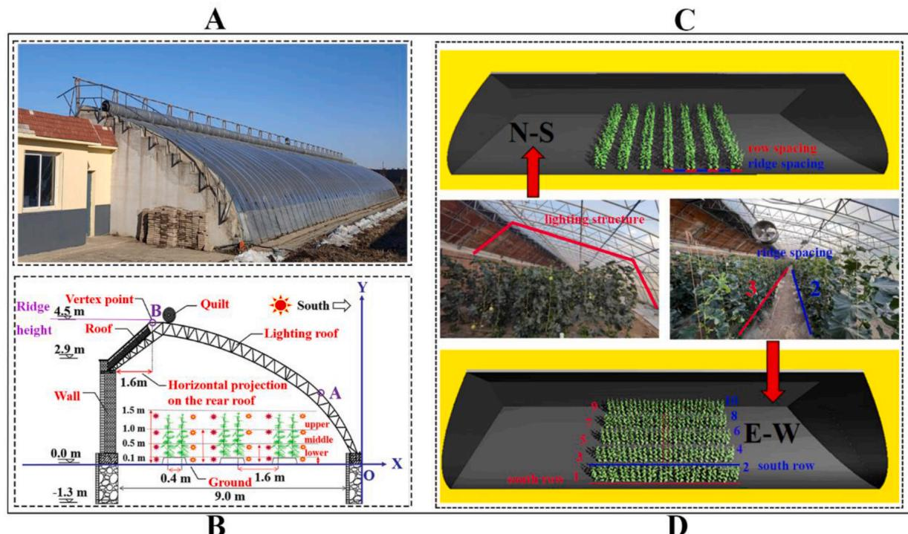  
图1. 实验温室实景图：(A) 沈阳辽沈型中国日光温室，(B) 实验用辽沈型中国日光温室剖面图，(C) 温室内南北行向种植甜瓜冠层的实景图与截图，(D) 温室内东西行向种植甜瓜冠层的实景图与截图。注：3D虚拟温室模型长度为30米，温室内两种不同行向的种植面积为100平方米。甜瓜冠层照片拍摄于2021年12月15日，地点为沈阳农业大学CSG-LS温室。

  
图2. 本研究的综合研究框架

本研究的工程创新主要体现在三个方面：

(1) 建立了不同CSG结构和种植策略下甜瓜单叶片光截获的计算模型
(2) 以沈阳地区为例，通过模型分析确定了CSG的最佳采光结构，并根据获得的结果对温室结构进行了改造
(3) 明确了适合CSG机械化生产的E-W行向可行性及适宜的种植配置方案

# 2. 材料与方法

# 2.1. 试验地点与植物材料

本研究采用典型的CSG-LS作为研究原型(图1A)。温室位于沈阳农业大学$(41.8^{\circ}\mathrm{N}, 123.6^{\circ}\mathrm{E})$。CSG的参数为：跨度$9\mathrm{m}$，脊高$4.5\mathrm{m}$，墙体高度$2.9\mathrm{m}$，后屋面水平投影$1.6\mathrm{m}$，长度$60\mathrm{m}$。温室朝向为南偏西$7^{\circ}$。温室内甜瓜植株采用E-W和N-S两种行向布置(2021年9月15日定植)，种植密度为3.3株/平方米(图1C和D)。垄距、行距和株距完全一致，分别为$1.2\mathrm{m}$、$0.4\mathrm{m}$和$0.38\mathrm{m}$。试验所用甜瓜品种为'华雷'，日常温室管理与当地农户保持一致。

# 2.2. 试验设计与分析

通过实验与模拟相结合的方法，基于CSG-LS实际参数建立了3D虚拟模型。该模型通过实测数据验证后，进一步应用于温室光环境和种植策略优化。本研究综合框架如图2所示。

表1 中国日光温室甜瓜不同种植策略

| 处理    | 垄距(m) | 行距(m) | 株距(m) | 密度(株/m²) |
|---------|---------|---------|---------|-------------|
| N-S     | 1.2     | 0.4     | 0.38    | 3.3         |
| E-W 1   | 1.2     | 0.4     | 0.38    | 3.3         |
| E-W 2   | 1.4     | 0.4     | 0.34    | 3.3         |
| E-W 3   | 1.6     | 0.4     | 0.30    | 3.3         |

为确定CSG适宜的采光结构，将脊高从$4.1\mathrm{m}$以$0.2\mathrm{m}$为梯度增加至$5.7\mathrm{m}$。同样地，后屋面水平投影从$1.0\mathrm{m}$延伸至$2.4\mathrm{m}$，分为8个处理。这一过程共考察了72种CSG构型，重点评估温室结构组件(地面、墙体和屋面，图1B)及内部甜瓜冠层的光截获情况。模拟分别在冬至和夏至进行。然而，考虑到夏季强烈太阳辐射常需在CSG中使用遮阳措施，冬季太阳辐射分布更适合用于模型验证。为消除侧墙带来的不良边缘效应并减少计算时间，选择CSG中部区域作为模拟区。甜瓜种植模拟区设为$100\mathrm{m}^2$，可容纳约300株植株。

基于确定的最优CSG结构，进一步探究温室内部种植策略。如图1C和D所示，3D虚拟温室模型包含两种行向布置的甜瓜作物。各处理的具体参数见表1。采用作物光分布和累积光截获量来评估不同处理。为更准确比较不同季节和处理对作物栽培的适用性，将甜瓜植株按图1B所示分为三个垂直层次进行分析：最上层包含第1至第9层叶片，中层包含第10至15层叶片，下层包含第16至19层的老叶。由于叶龄差异，不同层次叶片对光截获的利用效率存在自上而下逐渐降低的特点[28,29]。因此，进一步比较了光合有效时段(上午10点至下午2点)不同冠层高度叶片的平均光截获量。

表2 仿真模型通用参数属性

| 描述 | 值(范围) | 单位 |
|------|---------|------|
| 光学属性(反射/透射/吸收) |  |  |
| 采光屋面 | 10/80/10 | % |
| 墙体 | 10/0/90 | % |
| 土壤 | 14/0/86 | % |
| 后屋面 | 30/0/70 | % |
| 叶片 | 13/16/71 | % |
| 光源辐射强度 |  |  |
| 直接辐射 | 750 | W |
| 散射辐射 | 150 | W |

# 2.3. 虚拟温室构建

CSG的光照模拟模型基于开源3D软件GroIMP建立，可实现3D虚拟结构的重建与可视化[30]。该综合模型包含三个层次化排列的组成模块：最内层的3D虚拟植物模块、中间的3D虚拟CSG模块以及最外层的太阳辐射模块。如图1B所示，基于采光屋面与地面的接触点构建了笛卡尔坐标系。坐标系中有两个代表性坐标点A和B。点A位于采光屋面前部，其高度设置符合温室管理者的操作需求。点B为CSG顶点，其与地面的垂直距离定义为脊高，与墙体的水平距离对应后屋面水平投影。在采光结构优化过程中，点A的坐标位置保持不变，仅调整点B的位置，从而保持不同CSG设计的统一肩高并提高空间利用率。为提高计算效率同时保证模型精度，本研究采用的3D温室模型长度为$30\mathrm{m}$，模型通用参数属性见表2。

# 2.4. 虚拟植物构建

虚拟甜瓜冠层的生成过程可分为五个主要步骤：图像采集、数字处理、网格生成、叶片光学属性指定和拓扑重建(图3)。甜瓜叶片的光学属性(反射、透射和吸收，表2)采用CI-710微型叶片光谱仪(CID-Bio-Science生产，美国)测定，测量范围为400至$1000\mathrm{nm}$，精度$\pm 0.1\%$，积分时间$3.8\mathrm{ms}$至$10\mathrm{s}$。随后通过Phong着色器将这些参数值映射到每个几何对象上，实现高精度光截获计算[31]。甜瓜冠层根据主茎、分枝、叶柄和叶片的空间分布完整定义。甜瓜作物模型随后被导入虚拟CSG模型中。如图1所示，根据给定种植配置(株距、行距、行向)，通过虚拟CSG中的阵列构建了坐果期甜瓜冠层的3D模型。不同叶位叶片的详细参数值见表3。为真实模拟CSG冠层分布的随机性，模型中为每株植物编程了随机垂直旋转。

表3 不同叶位叶片的详细参数值

| 叶位 | 叶面积(m²) | 叶柄长度(m) | 叶片角度(°) | 叶柄角度(°) | 冠层位置 |
|------|------------|-------------|------------|------------|----------|
| 1    | 0.002      | 0.02        | -34.0      | 22.0       | 上层     |
| 2    | 0.006      | 0.02        | -28.0      | 18.0       | 上层     |
| 3    | 0.016      | 0.02        | -28.0      | 28.0       | 上层     |
| 4    | 0.049      | 0.02        | -23.0      | 13.0       | 上层     |
| 5    | 0.050      | 0.11        | -23.0      | 13.0       | 上层     |
| 6    | 0.063      | 0.10        | -10.0      | 20.0       | 上层     |
| 7    | 0.071      | 0.10        | -14.0      | 14.0       | 上层     |
| 8    | 0.075      | 0.12        | -26.0      | 26.0       | 上层     |
| 9    | 0.080      | 0.11        | -18.0      | 18.0       | 上层     |
| 10   | 0.075      | 0.11        | 23.0       | 28.0       | 中层     |
| 11   | 0.075      | 0.11        | -33.0      | 23.0       | 中层     |
| 12   | 0.072      | 0.10        | -6.0       | 26.0       | 中层     |
| 13   | 0.068      | 0.10        | -10.0      | 20.0       | 中层     |
| 14   | 0.065      | 0.12        | -24.0      | 34.0       | 中层     |
| 15   | 0.056      | 0.14        | -21.0      | 51.0       | 中层     |
| 16   | 0.044      | 0.08        | -18.0      | 58.0       | 下层     |
| 17   | 0.030      | 0.07        | -25.0      | 55.0       | 下层     |
| 18   | 0.044      | 0.08        | -26.0      | 46.0       | 下层     |
| 19   | 0.030      | 0.09        | -20.0      | 40.0       | 下层     |

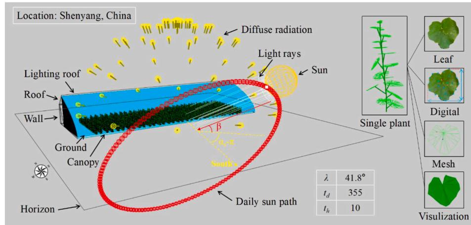  
图3. 冬至日沈阳地区虚拟温室、植物及太阳辐射模型可视化

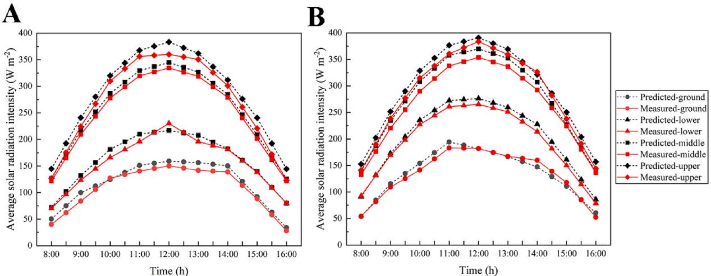  
图4. 2021年12月21日东西行向种植甜瓜冠层不同高度处模拟与实测辐射强度日变化比较：(A)北行光照环境，(B)南行光照环境

# 2.5. 太阳辐射模块构建

为建立日光温室内作物冠层的精确光分布模型，本研究采用虚拟天空半球模拟漫射光环境[32,33]。如图3所示，天空半球由6个半径不等的同心圆环组成，每个圆环包含12个光源(漫射辐射)。太阳日运动轨迹由144个红色球体组成的圆环表示，每个球体代表10分钟后的太阳位置(直射辐射)。太阳沿圆环顺时针移动，位于地平线上方代表白天，下方代表夜晚。辐射源发出的光线首先以预设透射率穿透温室薄膜进入日光温室内，随后经历反射、透射和吸收等一系列过程，最终被作物冠层和结构组件截获。该模型考虑了太阳位置导致的辐射强度动态变化，并综合直射/漫射光照的局部条件，可实时评估温室内冠层的光截获情况[34]。

地表接收的总太阳辐射(S)等于大气层外入射辐射$(S_0)$与大气透射率$(\tau_{a})$的乘积，计算公式如下：

$$
S = S_{0}\cdot \tau_{a}\cdot sin\beta \tag{1}
$$

经偏心率校正后，总太阳辐射(S)可表示为：

$$
S = 1267\cdot \tau_{a}\cdot sin\beta \left(1 + 0.033\cos \left(2\pi \bullet \frac{(t_{d} - 10)}{365}\right)\right) \tag{3}
$$

其中$t_d$为自1月1日起的天数，太阳高度角正弦值$(sin\beta)$计算公式为：

$$
S i n\beta = a + b\bullet \cos \left(2\pi \bullet \frac{t_{h} - 12}{24}\right) \tag{3}
$$

式中$t_h$为太阳时，$a$表示太阳相对于赤道的季节偏移量，$b$代表太阳高度角正弦的季节相关振幅。

$$
a = sin\lambda sin\delta \tag{4}
$$

$$
b = cos\lambda cos\delta \tag{5}
$$

$$
sin\delta = -sin\left(\pi \bullet \frac{23.45}{180}\right)\bullet cos\left(2\pi \bullet \frac{t_d + 10}{365}\right) \tag{6}
$$

$$
cos\delta = \sqrt{1 - sin\delta\bullet sin\delta} \tag{7}
$$

其中$\lambda$表示日光温室所在地的纬度，$\delta$为太阳相对于赤道的角度。数值23.45表示地球自转轴相对于公转轨道平面的倾角。每日日照时长$(d)$(小时)可通过参数a和b计算：

$$
d = 12\bullet \left[1 + \left(\frac{2}{\pi}\right)\bullet \mathbf{a}\bullet \sin \left(\frac{a}{b}\right)\right] \tag{8}
$$

在天空模型中，还需确定太阳方位角$(\alpha_{s})$以精确定位太阳位置：

$$
\alpha_{s} = \pm \alpha c r\sin \left[\frac{s i n\beta s i n\lambda - s i n\delta}{c o s\beta c o s\lambda}\right] \tag{9}
$$

建模平台GroiMP提供基于蒙特卡洛的光线追踪方法，可计算场景中的光传输、反射和吸收过程[35]。天空模型能根据设定的日期时间，在每步模拟中自动更新光照场景。场景中每个对象均被标记为辐射接收器，可检测到达其表面的光线数量。为实现可重现的光分布，总光线数设为6000万条，单条光线反射次数设为15次。计算时间步长设为$0.5\mathrm{h}$，计算时段为上午8:00至下午4:00。每个模拟间隔会调用辐射模块实例，精确评估3D场景中虚拟传感器对象的光捕获情况。

# 2.6. 模型验证方法

本文提出的太阳辐射模块已在温室光照模拟应用中完成验证[19,31]。需说明的是，前期验证基于南北行向种植作物开展。本研究通过评估冬至日东西行向六株甜瓜植株的光截获量（图1D）进一步强化了验证工作。太阳辐射强度测量采用美国Apogee Instrument公司生产的MP-200手持式总辐射表（测量范围0-1999 W·m⁻²，精度±5%，响应时间<1 ms）。预测值通过在建立模型中不同位置布设虚拟传感器（0.01m×0.01m）获取，测量时间间隔为0.5小时。如图1B所示，测量点设置于四个冠层高度（0.1m、0.5m、1.0m、1.5m），每个高度包含六个传感器（均分于南、北行）。进一步按组验证了各高度南、北行测量点的平均光强。

表4 预测值与实测值的均方根误差(RMSE)和相关系数(r)

| 行向 | 指标 | 地面 | 下层 | 中层 | 上层 |
|------|------|------|------|------|------|
| 北行 | RMSE | 9.899 | 8.557 | 7.660 | 16.173 |
|      | r    | 0.954 | 0.930 | 0.941 | 0.940 |
| 南行 | RMSE | 7.698 | 9.427 | 14.067 | 11.344 |
|      | r    | 0.927 | 0.939 | 0.940 | 0.939 |

# 3. 结果

# 3.1. 模型验证

如图4所示，不同冠层高度预测值的日变化趋势与实测值一致，且预测值略高于实测值。值得注意的是，南行作物的光截获量略高于北行。这种差异主要归因于模拟模型参数配置时未考虑温室薄膜受灰尘颗粒影响的光透过率。

此外，采用均方根误差(RMSE)和皮尔逊相关系数(r)评估了预测与实测的准确性(表4)。结果表明，各冠层高度的RMSE值介于$7.660\mathrm{Wm}^{-2}$至16.173$\mathrm{Wm}^{-2}$之间，分别占北行作物中层和上层叶片平均太阳辐射强度的约$3.0\%$和$5.8\%$。皮尔逊相关系数范围为0.927-0.954，证明所提模型能准确模拟日光温室(CSG)内的冠层光环境。

# 3.2. 基于冬至日的温室光环境优化

日光温室内光环境模拟综合考虑了不同温室结构和作物冠层。如图5所示，分析了冬至日日光温室的光环境。随着屋脊高度增加，地面、屋顶和作物截获的累积太阳辐射强度呈线性增长。当温室脊高从$4.1\mathrm{m}$增至$5.7\mathrm{m}$时，屋顶累积辐射强度增加$242.7\%$。然而，屋顶的蓄热系数仅$0.29~\mathrm{W}\mathrm{m}^{-2}\mathrm{K}^{-1}$[12]，这种辐射强度的增加对改善温室热环境贡献有限。此外，后墙光截获量随脊高增加呈先增后减趋势，在$4.9\mathrm{m}$处达到峰值。图5B显示随着脊高增加，对应的四分位间距逐渐减小，表明超过$4.9\mathrm{m}$后继续增加脊高对后墙光截获影响甚微。

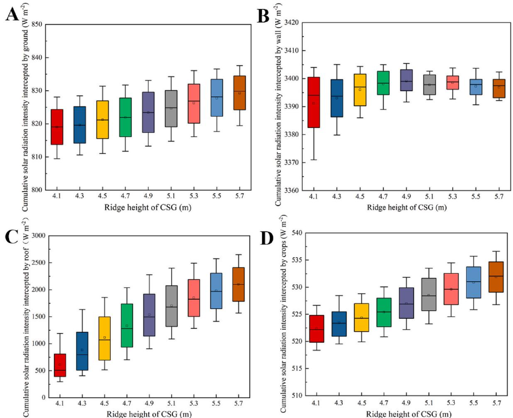  
图5. 随脊高增加($4.1\mathrm{m}$至$5.7\mathrm{m}$，步长$0.2\mathrm{m}$)各构件的太阳辐射截获量：(A)地面，(B)后墙，(C)屋顶，(D)作物

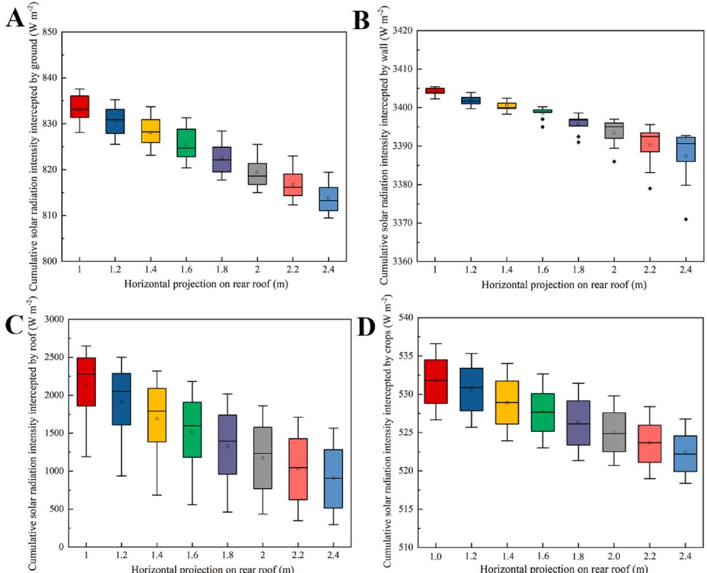  
图6. 冬至日温室模型太阳辐射截获强度模拟结果(按主要构件分解)：(A)地面，(B)后墙，(C)屋顶，(D)作物；后屋面水平投影长度从$1.0\mathrm{m}$增至$2.4\mathrm{m}$(步长$0.2\mathrm{m}$)

如图6所示，随着后屋面水平投影长度增加，各构件光截获量均呈下降趋势。当投影长度从$1.0\mathrm{m}$增至$2.4\mathrm{m}$时，对屋顶影响仍显著，而地面、后墙和作物的光截获率分别下降$2.5\%$、$1.5\%$和$1.8\%$。箱线图显示后墙光截获呈现不同趋势：当投影长度超过$1.8\mathrm{m}$时，上限、下限和四分位间距显著增加。对比投影长度≤$1.8\mathrm{m}$的情况，$1.6\mathrm{m}$时四分位间距最小，与$1.0\mathrm{m}$投影长度的光截获量差异仅$0.2\%$，表明$1.6\mathrm{m$的后屋面水平投影长度可使后墙光截获保持相对稳定。

# 3.3. 基于夏至日的温室光环境优化

夏季太阳高度角增大，到达温室的太阳辐射强度增加，各构件和作物的光截获量均呈上升趋势(图7)。脊高从$4.1\mathrm{m}$增至$5.7\mathrm{m}$时，地面、后墙、屋顶和作物的光截获量分别增加$3.8\%$、$23.8\%$、$8.0\%$和$3.6\%$。

如图8所示，后屋面水平投影延长导致地面、后墙和作物的辐射截获强度下降。当投影长度从$1.0\mathrm{m}$增至$2.4\mathrm{m}$时，地面、后墙、屋顶和作物的光截获率分别降低$19.7\%$、$72.5\%$、$24.2\%$和$22.0\%$。

本研究固定脊高$4.9\mathrm{m}$，在夏至日变化后屋面水平投影长度($1.0$至$2.4\mathrm{m}$)量化其对作物的遮阴影响。如图9所示，当投影超过$2.6\mathrm{m}$时，第21-22行作物日截获辐射量严重受阻，较第20行平均降低$11.7\%$和$46.3\%$。当投影长度超过$2.2\mathrm{m}$时，第22行作物日截获辐射量骤降$229.5\mathrm{W}$，单株平均仅$16.1\mathrm{W}$。因此建议后屋面水平投影最大长度不宜超过$1.6\mathrm{m}$。

# 3.4. 实际应用与分析

近年来，由于成本效益和高性能优势，老旧温室升级改造的需求激增。根据研究结果，沈阳另一座与实验温室结构参数相同的日光温室(CSG)完成了改造(图10A)。如图10B所示，温室结构优化方法是在原有框架基础上增加高度，从而改变其采光结构。图10D表明，增加屋脊高度可有效提升结构构件和作物的采光效果。冬至期间，温室结构优化使作物冠层光环境显著改善，光截获量提升$0.5\%$。夏至时，温室结构变化对后墙光截获影响显著，优化后光截获量提高$3.6\%$。

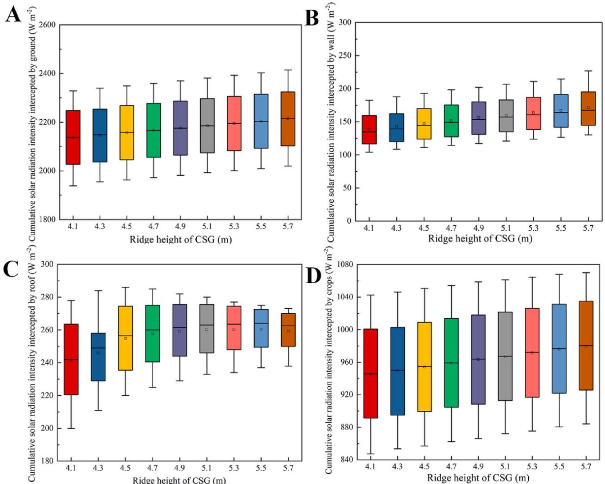  
图7. 屋脊高度从$4.1\mathrm{m}$增至$5.7\mathrm{m}$(步长$0.2\mathrm{m}$)时各构件光截获量：(A)地面，(B)后墙，(C)屋顶，(D)作物

在2022年12月21日至26日(冬至前后)期间，对两座温室的空气温度进行了测量。如图11所示，优化后的温室结构有效改善了热环境。优化温室的平均气温较原始温室提高$1.37^{\circ}\mathrm{C}$，改善率达$9.3\%$。

# 3.5. 温室种植策略优化

为探究甜瓜植株的最佳种植策略，对四种不同处理方案进行了详细分析。研究发现，冬春季节第1行作物光截获量显著占优。由于冬春季太阳高度角较低，第1行与第2行作物的日截获太阳辐射量差异达$20.2\%$(图12A)。与南北行向相比，东西行向作物中具有较高日光截获量的比例明显更多。但随着株距减小，南行作物对相邻行作物产生显著遮阴效应(图12C和D)。

通过定量分析冬春季节不同行向处理下甜瓜植株的平均光截获量(图13)，结果显示东西行向作物的光截获日变化趋势与南北行向存在差异，特别是在正午12:00和13:00时段。具体而言，EW1处理在这两个时段的平均光截获量分别比南北行向高$33.5\%$和$23.6\%$(图13A)。图13B表明，EW1与南北行向的累积光截获量差异达$7.1\%$。而南北行向与EW3的累积光截获量低于平均值，差异仅$1.1\%$。这表明冬春季节最佳种植策略为EW1处理。

图14显示了秋冬季节甜瓜植株间的光分布情况，其整体趋势与冬春季节相似，但相邻行间的遮阴效应有所减弱。与EW3处理的光分布相比，EW1和EW2处理的均匀性无明显差异。为确定秋冬季节最佳行向配置，对每小时及全天的光截获量进行了评估。结果表明，在上午11:00至下午1:00期间，三种东西行向处理的光照强度均高于南北行向(图15A)。根据图15B显示，三种东西行向处理间的最大差异仅$0.6\%$，而EW1与NW处理间的差异达$10.8\%$。

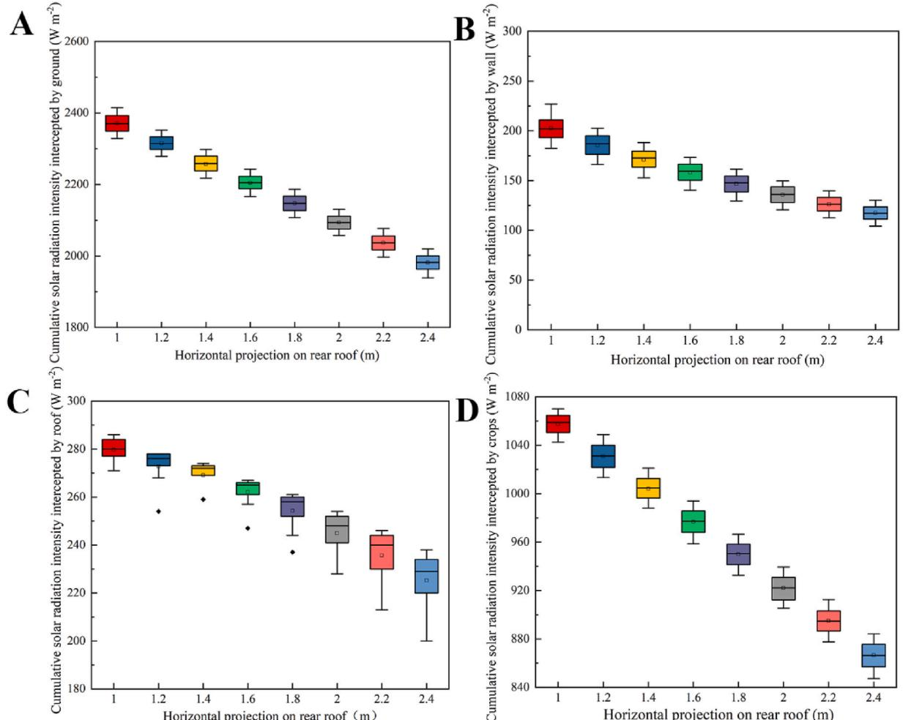  
图8. 后屋面水平投影长度从$1.0\mathrm{m}$增至$2.4\mathrm{m}$(步长$0.2\mathrm{m}$)时各构件的太阳辐射截获量：(A)地面，(B)后墙，(C)屋顶，(D)作物

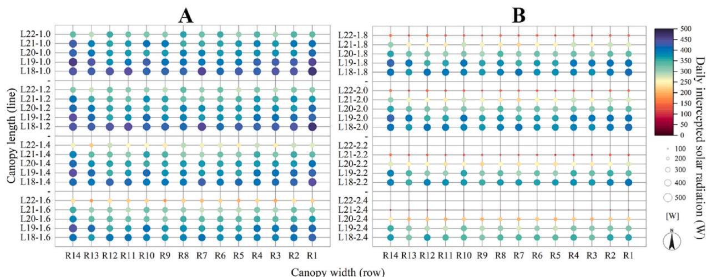  
图9. 夏至日不同后屋面水平投影长度下日光温室内5行作物的日截获太阳辐射量：(A)后屋面水平投影1.0-1.6m，(B)后屋面水平投影1.8-2.4m。注：5行作物对应靠近温室后墙的第18-22行。颜色渐变和圆形区域大小均表示每株作物每小时瞬时太阳辐射截获量的累积值。太阳辐射截获量低于100W的甜瓜植株未显示。(关于图例中颜色参考的解释，读者可参阅网络版文章)

此外，对比分析了冬春与秋冬季节三个冠层高度的平均太阳辐射截获强度(图16)。观测发现，无论何种处理，上层冠层的光截获量均呈现先增后减的趋势。值得注意的是，东西行向植株的光截获量略高于南北行向，而不同东西行向处理间的差异不显著(图16A-D)。与之相反，南北行向中层冠层的光截获趋势与东西行向相反，表现为随时间先降后升(图16B-E)。下层冠层中，各处理总体趋势与中层相似(图16C-F)。这些结果表明，东西与南北行向作物冠层的光截获差异主要受中下层叶片影响。基于以上发现，甜瓜适宜栽培模式为：东西行向、双行种植、垄距$1.2\mathrm{m}$、行距$0.4\mathrm{m}$、株距$0.38\mathrm{m}$。

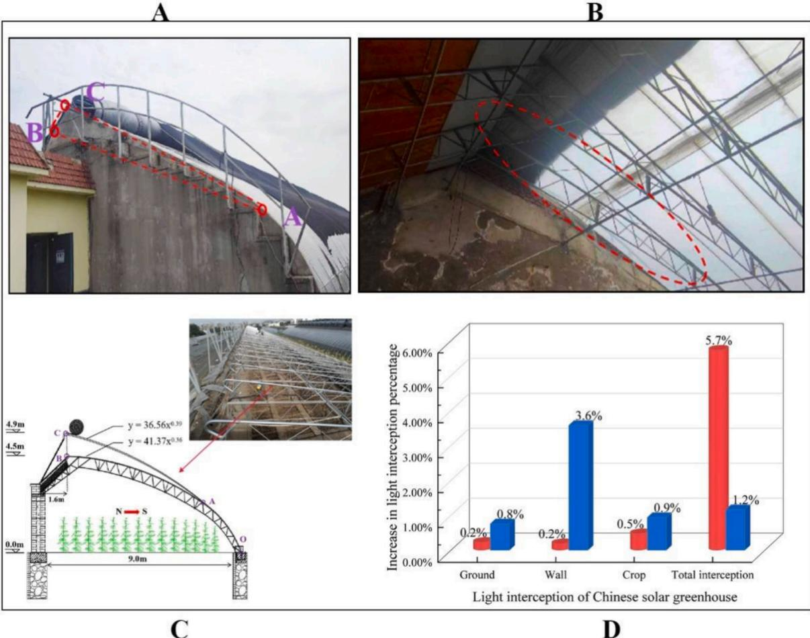  
图10. 日光温室采光结构优化示意图及优化后温室光环境对比分析：(A)优化后温室侧墙照片，(B)优化后温室内部骨架照片，(C)优化后温室骨架示意图，(D)通过所提模型分析的冬至(柱状)和夏至(立方体)光截获量增长率对比

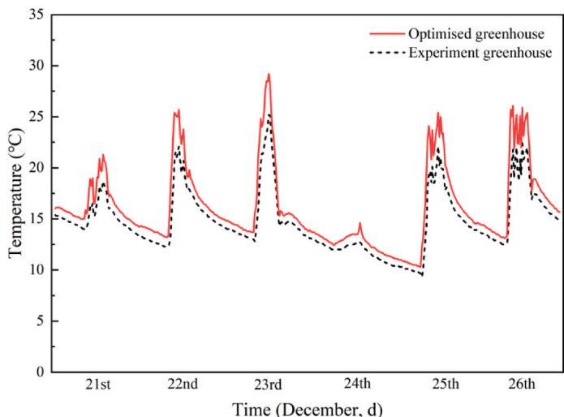  
图11. 2022年12月21日至26日期间实验温室与优化温室的温度环境对比分析

# 4. 讨论

# 4.1. 研究方法创新性

先前的研究主要集中于将FSPM应用于大田作物[36-39]。此外，优化CSG的模拟通常忽略了作物的存在[40]。在本研究中，我们创新性地将FSPM与3D温室感知相结合，将其应用扩展到温室结构优化。使用虚拟3D温室模型和虚拟甜瓜植株的意义在于研究CSG结构参数与其内部作物之间的相互作用。我们先前的研究表明，考虑作物存在的CSG朝向优化可使冠层光截获量额外增加$1.46\%$[19]。基于此，本文全面优化了CSG的脊高和后屋面水平投影长度。与关注温室朝向选择不同，优化温室采光结构将为老旧温室改造提供更直接和有价值的建议。这也符合中国2023年中央一号文件中提出的"推进老旧蔬菜设施改造提升"的要求。

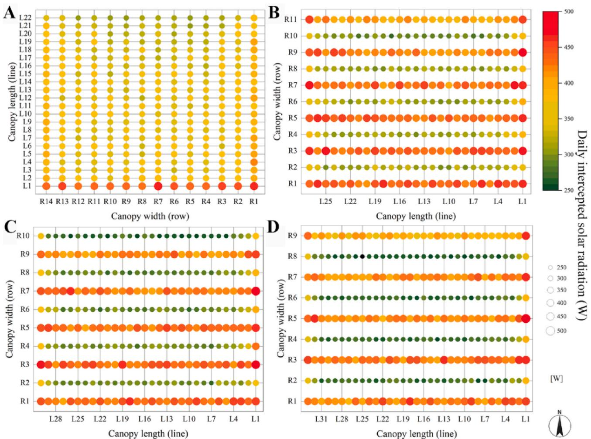  
图12. 中国日光温室冬春季节不同种植方式下甜瓜群体的光分布：(A)南北向，(B)东西向1，(C)东西向2，(D)东西向3。注：颜色渐变和圆形区域大小均表示每株作物每小时瞬时太阳辐射截获量的累积值。(关于图例中颜色参考的解释，读者可参阅网络版文章)

  
图13. 中国日光温室冬春季节不同处理下甜瓜植株的光截获变化：(A)不同处理下甜瓜植株光截获的日变化，(B)不同处理下甜瓜累积光截获量比较

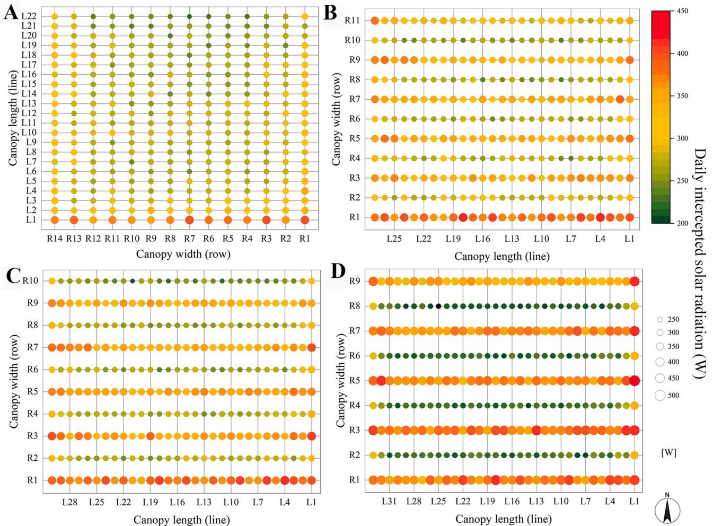  
图14. 中国日光温室秋冬季节不同种植方式下甜瓜群体的光分布：(A)南北向，(B)东西向1，(C)东西向2，(D)东西向3。注：颜色渐变和圆形区域大小均表示每株作物每小时瞬时太阳辐射截获量的累积值。(关于图例中颜色参考的解释，读者可参阅网络版文章)

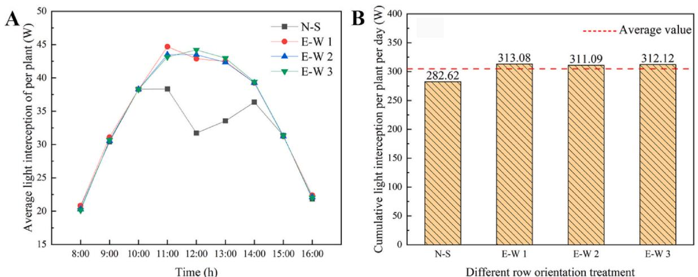  
图15. 中国日光温室秋冬季节不同处理下甜瓜植株的光截获变化：(A)不同处理下甜瓜植株光截获的日变化，(B)不同处理下甜瓜累积光截获量比较

我们选择冬至和夏至这两个具有最低和最高太阳高度角的节气进行CSG结构模拟分析。除了变化的室外温度环境外，中国北方这两个节气的太阳辐射强度及其比例存在显著差异。此外，冬至日最大太阳辐射截获量已被公认为确定CSG最优结构的主要评价指标[42,43]。夏季，虽然CSG内部蓄热不是主要问题，但由于太阳高度角变化，屋顶会对靠近墙体的作物产生强烈遮阴效应。最终，通过结合两个季节确定的最优结构参数，确定了沈阳地区周年生产的最优CSG采光结构。

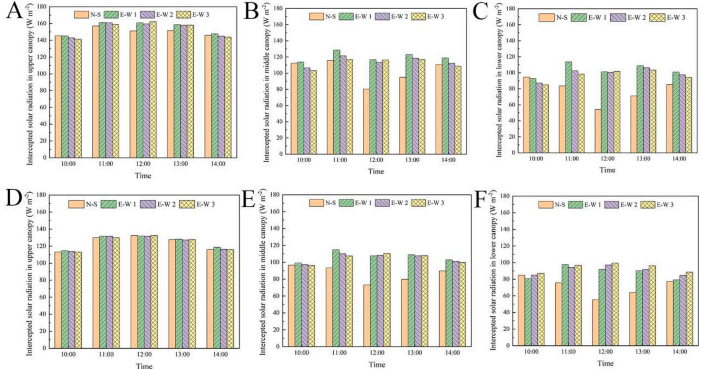  
图16. 不同行向下甜瓜冠层在不同高度的平均太阳辐射截获强度：(A,B,C)冬春季节，(D,E,F)秋冬季节

# 4.2. 作物与温室的相互作用

提升CSG内机械化生产水平是提高农业生产效率的关键一步。目前，CSG中大多数作物采用南北行向种植，而东西行向栽培仍处于试验研究阶段。先前模拟研究表明南北行向的光吸收优于东西行向[20,44]，这与我们的研究结果不同。这是因为这些研究针对全透明的玻璃温室，行向变化对作物光截获和光合作用影响较小[21]。然而，与玻璃温室不同，CSG仅有采光屋面允许光线透过。对于CSG，从南北行向转为东西行向会导致株距增加而行距缩短，这显著降低了南行作物的遮阴效应(图10；图12)，从而改善冠层光分布。因此，光照条件的改善可能促进植物的光合作用和生长素合成，导致茎秆增粗和干物质积累增加[27]。

本研究的建模集中于坐果期的甜瓜冠层。在此发育阶段，作物对光照需求显著增加，同时冠层会对CSG结构产生明显的遮阴效应。此外，人为干预限制了此阶段后株高的进一步增加[45]。在其他阶段，如开花期，作物株高和冠层覆盖度相对较低。如图17所示，定量分析了冬至日开花期(10片叶，株高$1.0\mathrm{m}$)和坐果期(19片叶，株高$1.8\mathrm{m}$)甜瓜冠层对温室墙体和地面的遮阴效应。由于CSG朝向为南偏西$7^{\circ}$，冠层对温室的遮阴效应在下午1:00左右最小。冠层存在显著增强了CSG的遮阴效应，坐果期地面平均遮阴率达$42.0\%$，墙体达$13.5\%$。开花期冠层对CSG的遮阴效应相对较小，特别是对墙体的平均遮阴率仅约$3.2\%$。开花期冠层对地面和墙体的遮阴效应分别比坐果期低$9.4\%$和$10.3\%$。这进一步证实了优化温室设计时全面考虑冠层结构的必要性。

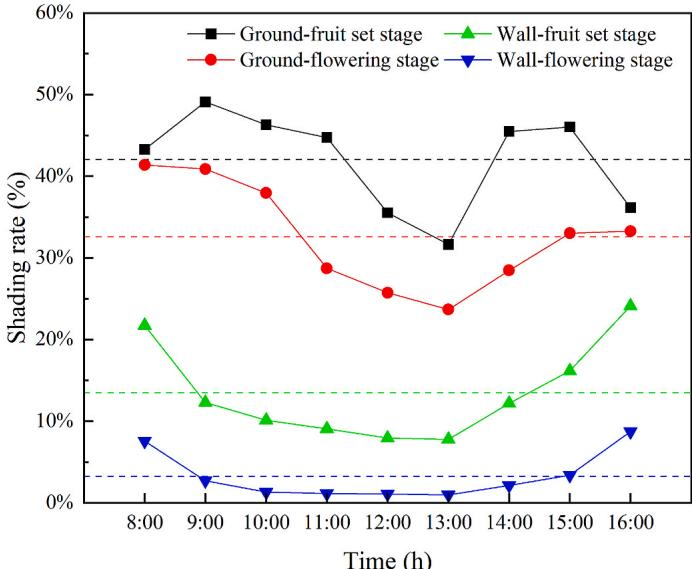  
图17. 坐果期和开花期温室遮阴率的日变化。注：虚线表示遮阴率的平均值。

# 4.3. 局限性与未来工作

本研究将不同温室结构下的冠层架构视为理想植物模型，由于建模复杂性，作物结构参数保持恒定。这种简化与实际生产存在差异，未来研究应解决这一局限，并聚焦于冠层架构的快速获取与重建。事实上，温室环境是高度复杂的生态系统，作物生长受到光照、温度、水分、$\mathrm{CO_2}$浓度等环境因素的综合影响[46]。未来研究可通过纳入更广泛的参数（如纬度差异、从静态到动态植物模型的转变）来改进，以更准确地阐明温室结构、种植策略、植物表型与小气候之间的相互作用。

截至2022年，中国日光温室面积已超过81万公顷，其中老旧低质设施仍占较大比例[47]。改造这些老旧设施对提升设施农业现代化水平至关重要。从经济角度看，由于温室结构的半永久性，改变日光温室的跨度或墙体高度成本较高。相比之下，改造温室采光结构是更具成本效益的方案。从产业规模和发展潜力来看，未来日光温室建设应遵循不与主粮争地、生态优先的原则，科学利用戈壁等区域发展设施农业，积极开展设施园艺自动化与智能化技术探索。针对传统南北行向种植策略导致的田间作业效率低下、机械化受阻等问题，可根据实际情况采用定制化的东西行向种植策略。目前该策略已在番茄[48,49]和甜瓜栽培中得到验证，但其他温室作物仍需进一步模型探索与田间验证。此外，本研究提出的模型与方法有望为温室数字孪生模型开发提供新思路，加速设施园艺科技创新。

# 5.结论

本研究采用三维建模技术虚拟重建了CSG-LS结构，并在叶片尺度计算了甜瓜冠层的光截获量。随后应用验证模型确定了日光温室的结构参数，并评估了东西行向种植策略的可行性。主要结论如下：以沈阳地区跨度为$9\mathrm{m}$的日光温室为例，优化后的最佳结构参数为脊高$4.9\mathrm{m}$、后屋面水平投影长度$1.6\mathrm{m}$。与实验温室相比，优化温室的光温环境得到有效改善。基于作物可截获更多太阳辐射的视角，东西行向可替代传统南北行向。综合考虑机械化生产与劳动强度，推荐甜瓜种植模式为垄距$1.2\mathrm{m}$、行距$0.4\mathrm{m}$、株距$0.38\mathrm{m}$。

# 作者贡献声明

Demin Xu: 概念化，数据整理，形式分析，方法论，软件，验证，初稿撰写。Michael Henke: 概念化，资金获取，方法论，软件。Yiming Li: 形式分析，调研，验证，概念化。Yue Zhang: 方法论，验证，软件。Anhua Liu: 验证，调研。Xingan Liu: 概念化，资金获取，监督，初稿撰写，文稿修订。Tianlai Li: 概念化，调研，方法论，监督，初稿撰写。

# 利益冲突声明

作者声明不存在可能影响本研究的已知经济利益冲突或个人关系。

# 数据可用性声明

数据可根据需求提供。

# 致谢

本研究得到国家重点研发计划项目[编号2023YFD1700904]和国家现代农业产业技术体系项目[编号CARS-23-C01]资助。

# 参考文献

[1] Dong J, Gruda N, Li X, Cai Z, Zhang L, Dunn Z. 全球蔬菜供应对可持续食品生产和健康饮食的贡献. J Clean Prod 2022;369. https://doi.org/10.1016/j.jclepro.2022.133212.
[2] Xie J, Yu J, Chen B, Feng Z, Li J, Zhao C, et al. 设施栽培系统"设施农业"：中国为地球提供的模式. In: Advances in Agronomy, vol. 145. Academic Press Inc.; 2017. p. 1- 42. https://doi.org/10.1016/bs.agron.2017.05.005.
[3] Zhang X, Lv J, Xie J, Yu J, Zhang J, Tang C, et al. 中国日光温室太阳辐射分配与空间分布：模型开发与应用. Energies 2020;13. https://doi.org/10.3390/en13051108.
[4] Zhang Y, Henke M, Li Y, Xu D, Liu A, Liu X, et al. 节能型中国日光温室能源性能最大化：常见温室形状的系统分析. Sol. Energy 2022;236:320- 34. https://doi.org/10.1016/j.solener.2022.03.013.
[5] Tong X, Sun Z, Sighmis N, Li T. 滑动覆盖日光温室的能源可持续性能：太阳能捕获方面. Biosyst Eng 2018;176:88- 102. https://doi.org/10.1016/j.biosystemseng.2018.10.008.
[6] Hwang I, Yoon S, Kim D, Kang JH, Kim JH, Son JE. 通过光线追踪模拟评估补光和茎数对甜椒生长和产量的影响. Biosyst Eng 2023;226:252- 65. https://doi.org/10.1016/j.biosystemseng.2023.01.010.
[7] El- Maghany WM, Teamah MA, Tanaka H. 北热带地区温室最佳设计与朝向以实现最大太阳能捕获. Energy Convers Manag 2015;105:1096- 104. https://doi.org/10.1016/j.enconman.2015.08.066.
[8] Chen J, Ma Y, Pang Z. 基于全球太阳辐射数学模型的中国南方温室最优形状和朝向选择. Sol Energy 2020;205:380- 9. https://doi.org/10.1016/j.solener.2020.05.055.
[9] Chen C, Ling H, Zhai Z, Zhai Z, Zhai Z, Yang F, Han F, et al. 日光温室中相变材料主动-被动通风墙的热性能. Appl Energy 2018;216:602- 12. https://doi.org/10.1016/j.apenergy.2018.02.130.
[10] Baglivo C, Mazzeo D, Panico S, Bonuso S, Mateja N, Congedo PM, et al. 评估作物热舒适性和能源需求的完整温室动态模拟工具. Appl Therm Eng 2020;179:115698. https://doi.org/10.1016/j.applthermaleng.2020.115698.
[11] Esmaeli H, Roshandel R. 基于气候条件的日光温室优化设计. Renew Energy 2020;145:1255- 65. https://doi.org/10.1016/j.renene.2019.06.090.
[12] Xu D, Li Y, Zhang Y, Xu H, Li T, Liu X. 中国日光温室朝向和结构对太阳辐射截获的影响. PLoS One 2020;15:1- 17. https://doi.org/10.1371/journal.pone.0244002.
[13] Chen C, Li Y, Li N, Wei S, Yang F, Ling H, et al. 确定中国不同纬度地区日光温室最佳朝向的计算模型. Sol Energy 2018;165:19- 26. https://doi.org/10.1016/j.solener.2018.02.022.
[14] Gupta R, Tiwari GN, Kumar A, Gupta Y. 使用Auto-CAD进行3D阴影分析计算不同朝向温室的总太阳分数. Energy Build 2012;47:27- 34. https://doi.org/10.1016/j.enbuild.2011.11.010.
[15] Mellalou A, Riad W, Mouaky A, Bacauoi A, Outzourhuis A. 摩洛哥季节性冬季干燥温室在恒定体积约束下的最佳设计和朝向. Sol Energy 2021;230:321- 32. https://doi.org/10.1016/j.solener.2021.10.050.
[16] Wu X, Li Y, Jiang L, Wang Y, Liu X, Li T. 基于热性能的中国日光温室多结构参数系统分析. Energy 2023;273:127193. https://doi.org/10.1016/j.energy.2023.127193.
[17] Rojo F, Dhillon R, Upadhyaya S, Jenkins B. 估算冠层PAR截获量的动态模型开发. Biosyst Eng 2020;198:120- 36. https://doi.org/10.1016/j.biosystemseng.2020.06.009.
[18] Liu R, Liu J, Liu H, Yang X, Barrena JFB, Li M. 日光温室黄瓜冠层叶片凝结的3D模拟. Biosyst Eng 2021;210:310- 29. https://doi.org/10.1016/j.biosystemseng.2021.08.008.
[19] Liu A, Xu D, Henke M, Zhang Y, Li Y, Liu X, et al. 使用3D光环境模拟确定中国日光温室的最佳朝向. Rem Sens 2022;14. https://doi.org/10.3390/rs14040912.
[20] Trentacoste ER, Connor DJ, Gomez- del- Campo M. 行向对园艺和橄榄园篱笆生产力和设计的影响. Sci Hortic 2015;187:15- 29. https://doi.org/10.1016/j.SCIENTA.2015.02.032.
[21] van der Meer M, de Visser PHB, Henckerk E, Marcelis LFM. 行向影响番茄篱笆作物的光吸收均匀性但对光合作用影响甚微. Silico plants 2021;3:1- 10. https://doi.org/10.1093/insilicoplants/diab025.
[22] Zheng L, Zhang Q, Zheng K, Zhao S, Wang P, Cheng J, et al. 散射光对日光温室微环境及番茄光合作用和产量的影响. Hortscience 2020;55:1605- 13. https://doi.org/10.21273/HORTSCI15241- 20.
[23] Zhu B, Liu F, Xie Z, Guo Y, Li B, Ma Y. 基于图像3D重建的单一和间作冠层全生长季光截获量化. Ann Bot 2020;126:701- 12. https://doi.org/10.1093/aob/mcaa046.
[24] Wen W, Guo X, Li B, Wang C, Wang Y, Yu Z, et al. 使用分层半球法估算3D玉米冠层间隙率和散射光截获. Agric For Meteorol 2019;276- 277:107594. https://doi.org/10.1016/j.agrformet.2019.05.025.
[25] Soualiou S, Wang Z, Sun W, de Reffye P, Collins B, Louarn G, et al. 功能结构植物模型在作物科学中的使命：机遇与前景. Front Plant Sci 2021;12. https://doi.org/10.3389/fpls.2021.747142.
[26] Ohashi Y, Torii T, Ishigami Y, Goto E. 基于光线追踪的温室不同垄距下番茄冠层光截获估算. J Agric Meteorol 2020;76:188- 93. https://doi.org/10.2480/agrmet.D- 20- 00030.
[27] Zhang Y, Henke M, Li Y, Xu D, Liu A, Liu X, et al. 温室种植策略和植株结构对番茄生理及干物质估算的影响分析. Front Plant Sci 2022;13:1- 19. https://doi.org/10.3389/fpls.2022.828252.
[28] Chen TW, Henke M, De Visser PHB, Buck- Sorlin GH, Wiechers D, Kahlen K, et al. 温室黄瓜冠层不同层次光合作用的主要限制因素是什么？ Ann Bot 2014;114:677- 88. https://doi.org/10.1093/aob/mcu100.
[29] Zheng L, Zhang Q, Zheng K, Zhao S, Wang P, Cheng J, et al. 散射光对日光温室微环境及番茄光合作用和产量的影响. Hortscience 2020;55:1605- 13. https://doi.org/10.21273/HORTSCI15241- 20.
[30] Xu L, Henke M, Zhu J, Kurth W, Buck- Sorlin GH. 连接数量遗传信息与形态发育和生理过程的水稻功能结构模型. Ann Bot 2011;107:817- 28. https://doi.org/10.1093/aob/mcq264.
[31] Zhang Y, Henke M, Li YM, Yue X, Xu DM, Liu XG, et al. 番茄冠层结构下日光温室光气候和热性能的高分辨率3D模拟. Renew Energy 2020;160:730- 45. https://doi.org/10.1016/j.renene.2020.06.144.
[32] Evers JB, Vos J, Yin X, Romero P, van der Putten PEL, Struik PC. 基于器官水平光合作用和同化物分配的小麦生长发育模拟. J Exp Bot 2010;61:2203- 16. https://doi.org/10.1093/jxb/erq025.
[33] Buck- Sorlin GH, de Visser PHB, Henke M, Sarlikioti V, van der Heijden GWAM, Marcelis LFM, et al. 切花玫瑰功能结构植物模型构建：光环境、光吸收、光合作用及与植株结构相互作用的模拟. Ann Bot 2011;108:1121- 34. https://doi.org/10.1093/aob/mcr190.
[34] de Visser PHB, Buck- Sorlin GH, van der Heijden GWAM, Marcelis LFM. 用于模拟温室光照策略的光照分布与作物光合作用3D模型. Acta Hortic 2012;956:195- 200. https://doi.org/10.17660/ActaHortic.2012.956.20.
[35] Henke M, Buck- Sorlin GH. 在功能结构植物建模中使用全光谱光线追踪器计算光微环境. Comput Inf 2017;36:1492- 522. https://doi.org/10.4149/ca/2017.6.1492.
[36] Wen W, Wang Y, Wu S, Liu K, Gu S, Guo X. 基于植物3D器官的几何建模方法——以玉米为例. AoB Plants 2021;13:1- 13. https://doi.org/10.1093/aobpla/plab055.
[37] Li S, Van Der Werf W, Zhu J, Guo Y, Li B, Ma Y, et al. 估算植物性状对玉米/大豆间作光分配的影响. J Exp Bot 2021;72:3630- 46. https://doi.org/10.1093/jxb/erab077.
[38] Zhu J, van der Werf W, Anten NPR, Vos J, Evers JB. 表型可塑性对植物混作中互补光捕获的贡献. New Phytol 2015;207:1213- 22. https://doi.org/10.1111/nph.13416.
[39] Wang Q, Sun Z, Bai W, Zhang D, Zhang Y, Wang R, et al. 玉米-花生间作中光截获和利用效率随玉米密度的变化. Front Agric Sci Eng 2021;8:432- 46. https://doi.org/10.15302/J- FASE- 2021403.
[40] Zhang R, Liu Y, Zhu D, Zhang X, Ge M, Cai Y. 基于冠层高度的日光温室优化设计. J Build Eng 2022;53:104473. https://doi.org/10.1016/j.jobe.2022.104473.
[41] China: issues No. 1 central document for 2023, highlights rural vitalization tasks. https://english.www.gov.cn/policies/latestreleases/202302/13/content_WS63ea2efcc640a757729e6b4b.html.
[42] Wu G, Yang Q, Zhang Y, Fang H, Feng C, Zheng H. 中国日光温室内集成旋转线性曲面菲涅耳透镜的光伏热系统的能量和光学分析. Energy 2020;197:117215. https://doi.org/10.1016/j.energy.2020.117215.
[43] Gao X, Yang H, Guan Y, Bai J, Zhang R, Hu W. 兰州地区日光温室北墙长度的确定. Procedia Eng 2017;205:1230- 6. https://doi.org/10.1016/j.proeng.2017.10.361.
[44] Sarlikioti V, De Visser PHB, Marcelis LFM. 利用功能结构植物模型探索冠层光相互作用和光合作用的空间分布. Ann Bot 2011;107:875- 83. https://doi.org/10.1093/aob/mcr006.
[45] Chen G. 考虑群体特征的瓜类有机生态型无污染栽培技术研究. Cell Mol Biol 2021;67:330- 8. https://doi.org/10.14715/cmb/2021.67.6.43.
[46] Zhang Y, Henke M, Buck- Sorlin GH, Li Y, Xu H, Liu X, et al. 基于功能结构植物模型的光热微气候模拟估算日光温室番茄冠层叶片生理. Agric For Meteorol 2021;307:108494. https://doi.org/10.1016/j.agrformet.2021.108494.
[47] Li T, Qi M, Meng S. 中国设施园艺60年发展：成就与展望. Acta Hortic Sin 2022;49(10):2119- 30 (in Chinese), https://dx.doi.org/10.16420/j.issn.0013- 393x.2022- 0700.
[48] Zhang Y, Henke M, Li Y, Sun Z, Li W, Liu X, et al. 不同冠层配置下温室栽培番茄的光截获和光合作用估算. Agronomy 2024;14. https://doi.org/10.3390/agronomy14020249.
[49] Li Y, Henke M, Zhang D, Wang C, Wei M. 中国日光温室番茄生产优化：东西走向和宽行距的影响. Agronomy 2024;14. https://doi.org/10.3390/agronomy14020314.

# References

[1] Dong J, Gruda N, Li X, Cai Z, Zhang L, Dunn Z. Global vegetable supply towards sustainable food production and a healthy diet. J Clean Prod 2022;369. https://doi.org/10.1016/j.jclepro.2022.133212.
[2] Xie J, Yu J, Chen B, Feng Z, Li J, Zhao C, et al. Facility cultivation systems "facility agriculture": a Chinese model for the planet. In: Advances in Agronomy, vol. 145. Academic Press Inc.; 2017. p. 1- 42. https://doi.org/10.1016/bs.agron.2017.05.005.
[3] Zhang X, Lv J, Xie J, Yu J, Zhang J, Tang C, et al. Solar radiation allocation and spatial distribution in Chinese solar greenhouses: model development and application. Energies 2020;13. https://doi.org/10.3390/en13051108.
[4] Zhang Y, Henke M, Li Y, Xu D, Liu A, Liu X, et al. Towards the maximization of energy performance of an energy- saving Chinese solar greenhouse: a systematic analysis of common greenhouse shapes. Sol. Energy 2022;236:320- 34. https://doi.org/10.1016/j.solener.2022.03.013.
[5] Tong X, Sun Z, Sighmis N, Li T. Energy sustainability performance of a sliding cover solar greenhouse: solar energy capture aspects. Biosyst Eng 2018;176:88- 102. https://doi.org/10.1016/j.biosystemseng.2018.10.008.
[6] Hwang I, Yoon S, Kim D, Kang JH, Kim JH, Son JE. Evaluation of the effects of supplemental- lighting and stem with 3D plant models sweet pepper growth and yield via ray- tracing simulation number on greenhouse. Biosyst Eng 2023;226:252- 65. https://doi.org/10.1016/j.biosystemseng.2023.01.010.
[7] El- Maghany WM, Teamah MA, Tanaka H. Optimum design and orientation of the greenhouses for maximum capture of solar energy in North Tropical Region. Energy Convers Manag 2015;105:1096- 104. https://doi.org/10.1016/j.enconman.2015.08.066.
[8] Chen J, Ma Y, Pang Z. A mathematical model of global solar radiation to select the optimal shape and orientation of the greenhouses in southern China. Sol Energy 2020;205:380- 9. https://doi.org/10.1016/j.solener.2020.05.055.
[9] Chen C, Ling H, Zhai Z, Zhai Z, Zhai Z, Yang F, Han F, et al. Thermal performance of an active- passive ventilation wall with phase change material in solar greenhouses. Appl Energy 2018;216:602- 12. https://doi.org/10.1016/j.apenergy.2018.02.130.
[10] Baglivo C, Mazzeo D, Panico S, Bonuso S, Mateja N, Congedo PM, et al. Complete greenhouse dynamic simulation tool to assess the crop thermal well- being and energy needs. Appl Therm Eng 2020;179:115698. https://doi.org/10.1016/j.applthermaleng.2020.115698.
[11] Esmaeli H, Roshandel R. Optimal design for solar greenhouses based on climate conditions. Renew Energy 2020;145:1255- 65. https://doi.org/10.1016/j.renene.2019.06.090.
[12] Xu D, Li Y, Zhang Y, Xu H, Li T, Liu X. Effects of orientation and structure on solar radiation interception in Chinese solar greenhouse. PLoS One 2020;15:1- 17. https://doi.org/10.1371/journal.pone.0244002.
[13] Chen C, Li Y, Li N, Wei S, Yang F, Ling H, et al. A computational model to determine the optimal orientation for solar greenhouses located at different latitudes in China. Sol Energy 2018;165:19- 26. https://doi.org/10.1016/j.solener.2018.02.022.
[14] Gupta R, Tiwari GN, Kumar A, Gupta Y. Calculation of total solar fraction for different orientation of greenhouse using 3D- shadow analysis in Auto- CAD. Energy Build 2012;47:27- 34. https://doi.org/10.1016/j.enbuild.2011.11.010.
[15] Mellalou A, Riad W, Mouaky A, Bacauoi A, Outzourhuis A. Optimum design and orientation of a greenhouse for seasonal winter drying in Morocco under constant volume constraint. Sol Energy 2021;230:321- 32. https://doi.org/10.1016/j.solener.2021.10.050.
[16] Wu X, Li Y, Jiang L, Wang Y, Liu X, Li T. A systematic analysis of multiple structural parameters of Chinese solar greenhouse based on the thermal performance. Energy 2023;273:127193. https://doi.org/10.1016/j.energy.2023.127193.
[17] Rojo F, Dhillon R, Upadhyaya S, Jenkins B. Development of a dynamic model to estimate canopy par interception. Biosyst Eng 2020;198:120- 36. https://doi.org/10.1016/j.biosystemseng.2020.06.009.
[18] Liu R, Liu J, Liu H, Yang X, Barrena JFB, Li M. A 3- D simulation of leaf condensation on cucumber canopy in a solar greenhouse. Biosyst Eng 2021;210:310- 29. https://doi.org/10.1016/j.biosystemseng.2021.08.008.
[19] Liu A, Xu D, Henke M, Zhang Y, Li Y, Liu X, et al. Determination of the optimal orientation of Chinese solar greenhouses using 3D light environment simulations. Rem Sens 2022;14. https://doi.org/10.3390/rs14040912.
[20] Trentacoste ER, Connor DJ, Gomez- del- Campo M. Row orientation: applications to productivity and design of hedgerows in horticultural and olive orchards. Sci Hortic 2015;187:15- 29. https://doi.org/10.1016/j.SCIENTA.2015.02.032.
[21] van der Meer M, de Visser PHB, Henckerk E, Marcelis LFM. Row orientation affects the uniformity of light absorption, but hardly affects crop photosynthesis in hedgerow tomato crops. Silico plants 2021;3:1- 10. https://doi.org/10.1093/insilicoplants/diab025.
[22] Zheng L, Zhang Q, Zheng K, Zhao S, Wang P, Cheng J, et al. Effects of diffuse light on microclimate of solar greenhouse, and photosynthesis and yield of greenhouse- grown tomatoes. Hortscience 2020;55:1605- 13. https://doi.org/10.21273/HORTSCI15241- 20.
[23] Zhu B, Liu F, Xie Z, Guo Y, Li B, Ma Y. Quantification of light interception within image- based 3- D reconstruction of sole and intercropped canopies over the entire growth season. Ann Bot 2020;126:701- 12. https://doi.org/10.1093/aob/mcaa046.
[24] Wen W, Guo X, Li B, Wang C, Wang Y, Yu Z, et al. Estimating canopy gap fraction and diffuse light interception in 3D maize canopy using hierarchical hemispheres. Agric For Meteorol 2019;276- 277:107594. https://doi.org/10.1016/j.agrformet.2019.05.025.
[25] Soualiou S, Wang Z, Sun W, de Reffye P, Collins B, Louarn G, et al. Functional- structural plant models mission in advancing crop science: opportunities and prospects. Front Plant Sci 2021;12. https://doi.org/10.3389/fpls.2021.747142.
[26] Ohashi Y, Torii T, Ishigami Y, Goto E. Estimation of the light interception of a cultivated tomato crop canopy under different furrow distances in a greenhouse using the ray tracing. J Agric Meteorol 2020;76:188- 93. https://doi.org/10.2480/agrmet.D- 20- 00030.
[27] Zhang Y, Henke M, Li Y, Xu D, Liu A, Liu X, et al. Analyzing the impact of greenhouse planting strategy and plant architecture on tomato plant physiology and estimated dry matter. Front Plant Sci 2022;13:1- 19. https://doi.org/10.3389/fpls.2022.828252.
[28] Chen TW, Henke M, De Visser PHB, Buck- Sorlin GH, Wiechers D, Kahlen K, et al. What is the most prominent factor limiting photosynthesis in different layers of a greenhouse cucumber canopy? Ann Bot 2014;114:677- 88. https://doi.org/10.1093/aob/mcu100.
[29] Zheng L, Zhang Q, Zheng K, Zhao S, Wang P, Cheng J, et al. Effects of diffuse light on microclimate of solar greenhouse, and photosynthesis and yield of greenhouse- grown tomatoes. Hortscience 2020;55:1605- 13. https://doi.org/10.21273/HORTSCI15241- 20.
[30] Xu L, Henke M, Zhu J, Kurth W, Buck- Sorlin GH. A functional- structural model of rice linking quantitative genetic information with morphological development and physiological processes. Ann Bot 2011;107:817- 28. https://doi.org/10.1093/aob/mcq264.
[31] Zhang Y, Henke M, Li YM, Yue X, Xu DM, Liu XG, et al. High resolution 3D simulation of light climate and thermal performance of a solar greenhouse model under tomato canopy structure. Renew Energy 2020;160:730- 45. https://doi.org/10.1016/j.renene.2020.06.144.
[32] Evers JB, Vos J, Yin X, Romero P, van der Putten PEL, Struik PC. Simulation of wheat growth and development based on organ- level photosynthesis and assimilate allocation. J Exp Bot 2010;61:2203- 16. https://doi.org/10.1093/jxb/erq025.
[33] Buck- Sorlin GH, de Visser PHB, Henke M, Sarlikioti V, van der Heijden GWAM, Marcelis LFM, et al. Towards a functional structural plant model of cut-rose: simulation of light environment, light absorption, photosynthesis and interference with the plant structure. Ann Bot 2011;108:1121- 34. https://doi.org/10.1093/aob/mcr190.
[34] de Visser PHB, Buck- Sorlin GH, van der Heijden GWAM, Marcelis LFM. A 3D model of illumination, light distribution and crop photosynthesis to simulate lighting strategies in greenhouses. Acta Hortic 2012;956:195- 200. https://doi.org/10.17660/ActaHortic.2012.956.20.
[35] Henke M, Buck- Sorlin GH. Using a full spectral raytracer for calculating light microclimate in functional- structural plant modelling. Comput Inf 2017;36:1492- 522. https://doi.org/10.4149/ca/2017.6.1492.
[36] Wen W, Wang Y, Wu S, Liu K, Gu S, Guo X. 3D phytomer- based geometric modelling method for plants—the case of maize. AoB Plants 2021;13:1- 13. https://doi.org/10.1093/aobpla/plab055.
[37] Li S, Van Der Werf W, Zhu J, Guo Y, Li B, Ma Y, et al. Estimating the contribution of plant traits to light partitioning in simultaneous maize/soybean intercropping. J Exp Bot 2021;72:3630- 46. https://doi.org/10.1093/jxb/erab077.
[38] Zhu J, van der Werf W, Anten NPR, Vos J, Evers JB. The contribution of phenotypic plasticity to complementary light capture in plant mixtures. New Phytol 2015;207:1213- 22. https://doi.org/10.1111/nph.13416.
[39] Wang Q, Sun Z, Bai W, Zhang D, Zhang Y, Wang R, et al. Light interception and use efficiency differ with maize plant density in maize- peanut intercropping. Front Agric Sci Eng 2021;8:432- 46. https://doi.org/10.15302/J- FASE- 2021403.
[40] Zhang R, Liu Y, Zhu D, Zhang X, Ge M, Cai Y. Optimal design for solar greenhouses based on canopy height. J Build Eng 2022;53:104473. https://doi.org/10.1016/j.jobe.2022.104473.
[41] China: issues No. 1 central document for 2023, highlights rural vitalization tasks. https://english.www.gov.cn/policies/latestreleases/202302/13/content_WS63ea2efcc640a757729e6b4b.html.
[42] Wu G, Yang Q, Zhang Y, Fang H, Feng C, Zheng H. Energy and optical analysis of photovoltaic thermal integrated with rotary linear curved Fresnel lens inside a Chinese solar greenhouse. Energy 2020;197:117215. https://doi.org/10.1016/j.energy.2020.117215.
[43] Gao X, Yang H, Guan Y, Bai J, Zhang R, Hu W. Length determination of the solar greenhouse north wall in Lanzhou. Procedia Eng 2017;205:1230- 6. https://doi.org/10.1016/j.proeng.2017.10.361.
[44] Sarlikioti V, De Visser PHB, Marcelis LFM. Exploring the spatial distribution of light interaction and photosynthesis of canopies by means of a functional- structural plant model. Ann Bot 2011;107:875- 83. https://doi.org/10.1093/aob/mcr006.
[45] Chen G. Study of non- pollution cultivation techniques of organic ecotype of melon crops considering population characteristics. Cell Mol Biol 2021;67:330- 8. https://doi.org/10.14715/cmb/2021.67.6.43.
[46] Zhang Y, Henke M, Buck- Sorlin GH, Li Y, Xu H, Liu X, et al. Estimating canopy leaf physiology of tomato plants grown in a solar greenhouse: evidence from simulations of light and thermal microclimate using a Functional- Structural Plant Model. Agric For Meteorol 2021;307:108494. https://doi.org/10.1016/j.agrformet.2021.108494.
[47] Li T, Qi M, Meng S. Sixty years of facility horticulture development in China: achievements and prospects. Acta Hortic Sin 2022;49(10):2119- 30 (in Chinese), https://dx.doi.org/10.16420/j.issn.0013- 393x.2022- 0700.
[48] Zhang Y, Henke M, Li Y, Sun Z, Li W, Liu X, et al. Estimating the light interception and photosynthesis of greenhouse- cultivated tomato crops under different canopy configurations. Agronomy 2024;14. https://doi.org/10.3390/agronomy14020249.
[49] Li Y, Henke M, Zhang D, Wang C, Wei M. Optimized tomato production in Chinese solar greenhouses: the impact of an east- west orientation and wide row spacing. Agronomy 2024;14. https://doi.org/10.3390/agronomy14020314.