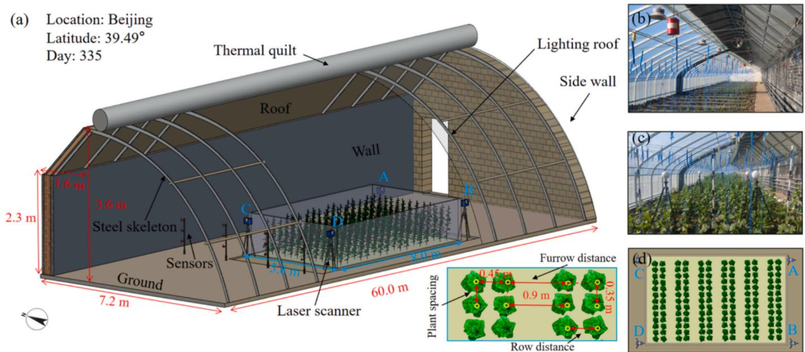
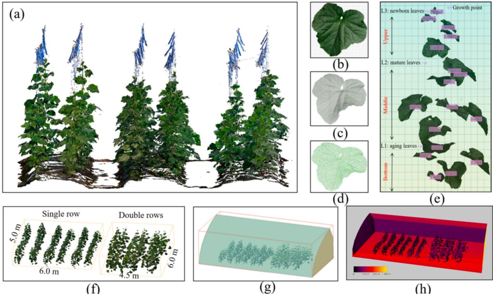
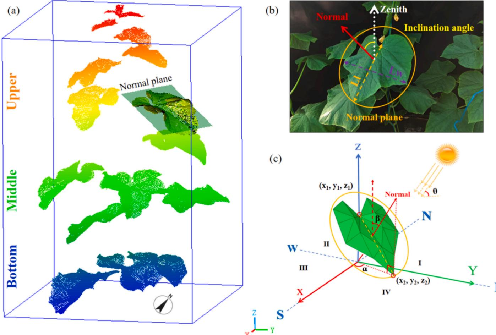
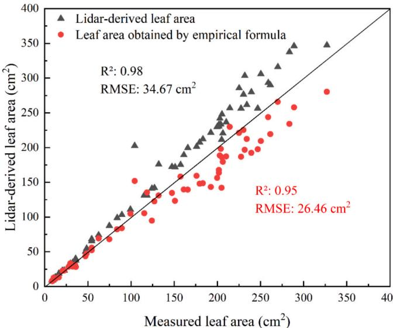
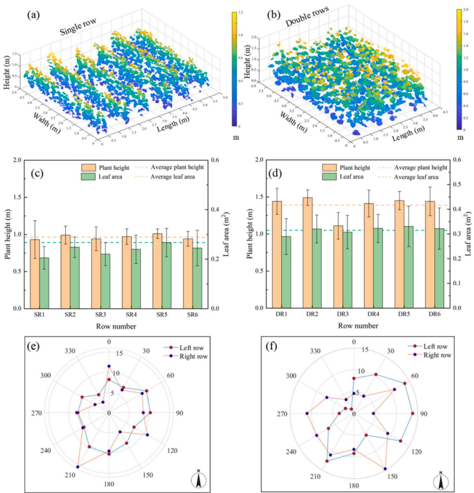
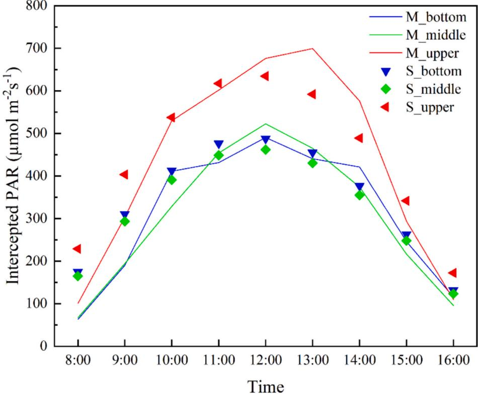
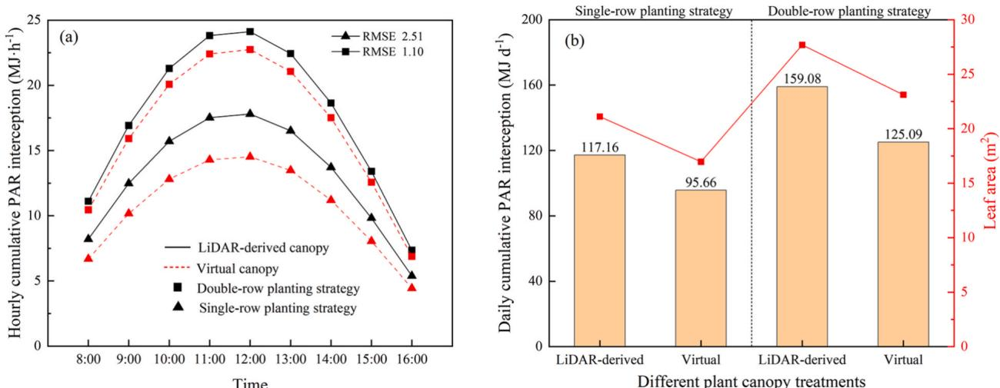
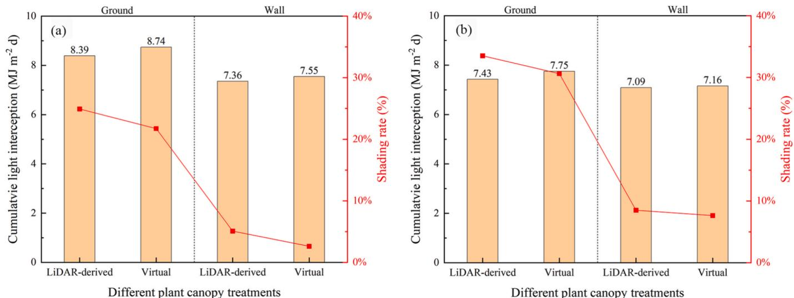
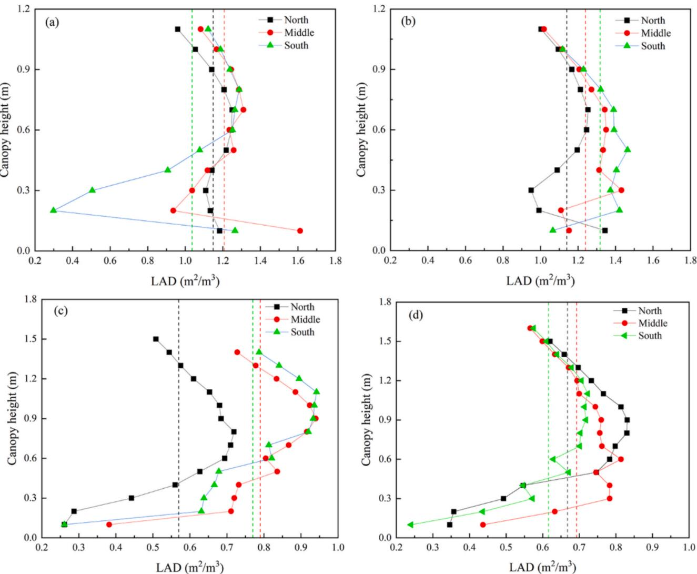

# New insights on canopy heterogeneous analysis and light micro-climate simulation in Chinese solar greenhouse

原始论文

# 中国日光温室冠层异质性分析与光微气候模拟的新见解

Demin Xu a, Haochong Chen a, Fang Ji a, Jinyu Zhu b,\*, Zhi Wang a, Ruihang Zhang a, Maolin Hou a, Xin Huang a, Dongyu Wang a, Tiangang Lu c, Jian Zhang d, Feng Yu e, Yuntao Ma a,\*

a 中国农业大学土地科学与技术学院，北京 100091，中国  
b 中国农业科学院蔬菜花卉研究所，蔬菜生物育种国家重点实验室，北京 100081，中国  
c 北京市数字农业促进中心，北京 100021，中国  
d 吉林农业大学农学院，长春 130108，中国  
e 北京市农林科学院数据科学与农业经济研究所，北京 100097，中国  

# 文章信息

# 关键词:

黄瓜 LiDAR 植物表型 3D光截获 建模 日光温室

# 摘要

准确获取冠层结构对于计算表型特征和光截获至关重要，有助于深入理解植物与环境之间的相互作用机制。本研究旨在精确获取温室作物群体的表型特征并量化冠层光截获。利用地面LiDAR扫描技术获取了中国日光温室内两种常见种植策略下黄瓜群体的冠层结构。此外，开发了一个结合温室结构、冠层结构和太阳辐射的综合3D模型，用于比较LiDAR获取的冠层与虚拟冠层之间的光环境差异。结果表明，地面LiDAR扫描是获取精确冠层结构的有效技术，能够从植物冠层中提取详细的表型特征。在温室内南北行向栽培的黄瓜冠层中观察到显著的垂直和水平异质性。与使用LiDAR获取的冠层计算结果相比，使用测量器官几何形状和角度构建的虚拟冠层会低估最大光截获量21.4%，光合速率14.8%。总之，使用虚拟冠层的3D结构无法准确量化中国日光温室中的实际光环境。所提出的方法为中国日光温室的冠层异质性分析和光微气候模拟提供了新见解，为精确温室管理奠定了基础。

# 1. 引言

太阳辐射是温室生产中的关键环境参数。它不仅促进作物干物质的积累和转化，还是温室的主要热源(Ge等，2023；Yu等，2023)。太阳辐射在作物群体内的重新分配会引起冠层微气候变化，进而影响作物的生长、发育和产量形成(Wu等，2019)。反过来，单个作物的生长发育也会导致冠层结构的异质性(de Vries等，2017)。因此，量化高通量植物表型与冠层光截获之间的关系对温室生产具有重要意义。

传统的冠层光截获计算方法包括测量太阳辐射强度并应用Lambert-Beer定律(Monsi等，2005)。然而，这种方法无法直接获取器官水平的光截获(Cossu等，2014)。随着功能-结构植物模型(FSPM)的快速发展，通过整合3D植物模型和辐射模拟可以获得单个叶片的光截获(Guo和Li，2001；Vos等，2007；Vos等，2010)。该方法的准确性直接受冠层结构表示精度的影响(Sarlikioti等，2011；Kim等，2020)。先前的研究通常通过测量代表性植物的表型特征并采用随机旋转来构建统一的虚拟冠层，以近似真实生产场景(Zhang等，2020a)。虚拟冠层与真实冠层场景之间的光模拟差异仍不清楚。

常见的3D冠层模型重建方法包括运动结构恢复(SFM)(Li等,2020a)、多视角立体视觉(MVS)(Webster等,2018)、RGB-D相机(Fu等,2020)、3D数字化(Wang等,2019)和3D激光扫描(Kang等,2023)。这些技术主要用于单株植物的3D重建。已有研究利用便携式高分辨率3D扫描仪获取塑料温室和Venlo型玻璃温室内作物的精确冠层结构，实现了光截获和光合作用的量化(Hwang等,2023; Kang等,2023)。虽然该方法能精确获取单个器官结构，但耗时且需要特定的作物栽培模式。近年来，搭载各种遥感传感器的无人机(UAV)在农业中日益应用于群体冠层的3D重建(Jiang等,2019; Xiao等,2023)。然而，由于空间限制和冠层密集，该方法尚不适用于温室生产场景。激光雷达(LiDAR)作为一种主动遥感技术，在数据采集过程中对冠层结构的干扰最小，在作物群体高通量表型量化方面具有广阔前景(Dian等,2023)。它能快速为群体冠层光截获模拟提供关键结构数据，并已在林业中广泛应用(Beland和Baldocchi,2021; Bailey和Fu,2022)。但这些方法在中国日光温室生产场景中的应用仍有待探索。

中国日光温室的独特结构包含一个采光面和三个封闭墙体(Wu等,2023)。这类温室能高效利用太阳能满足冬季作物生长的环境需求。然而，其内部气候存在显著的空间变异性，表现为白天光照和温度从南向北递减的梯度分布(Zheng等,2020)。夜间则呈现相反模式，北墙附近气温较高(Hou等,2021)。实证研究表明，中国日光温室北部的番茄植株会表现出避荫反应，如茎伸长和叶片扩展。与中部和南部植株相比，北部植株总生物量较低(Li等,2016)。这种冠层表型异质性主要由影响作物生长的环境梯度驱动。目前，这种异质性通常通过人工测量评估。基于真实冠层结构的中国日光温室内光环境精确模拟尚未见报道。

本研究以中国日光温室广泛栽培的黄瓜为对象，采用LiDAR重建作物群体3D结构并提取表型性状，从而实现光环境的高精度模拟。研究目标包括：(i)提出中国日光温室内使用地面LiDAR进行植物表型分析和光截获计算的通用框架，(ii)通过比较两种种植策略下LiDAR获取冠层与虚拟冠层在应用效果上的差异，强调精确冠层重建的重要性，(iii)量化温室内南北方向上黄瓜冠层的异质性。

# 2. 材料与方法

# 2.1. 温室与植物材料

试验于2023年在中国北京(39.49°N,116.21°E)的典型日光温室内进行，具体结构参数见图1a。采光屋面支撑结构为钢骨架覆盖0.15mm透明PO膜，夜间加盖保温被。墙体采用240mm厚粉煤灰砖和两侧50mm厚保温板建造。屋顶为200mm厚夹层墙，内为木板外为泡沫板。黄瓜(Cucumis sativus L.)土培种植，2023年1月16日播种，2月7日定植于试验温室，密度3.2株/m²。试验设计两个品种处理，试验区位于温室中部。每个处理共6行，周围设保护行。供试品种包括'荷兰黄瓜'和'中红26号'，根据其生长特性分别采用单行和双行种植策略(表S1)。整个试验期间，日常田间管理参照实际生产进行。

# 2.2. 田间数据采集与处理

采用QSO-S光合有效辐射传感器(Decagon,美国)和RC-4温度传感器(Elitech,中国，精度±0.1°C，量程-30°C至110°C)以10分钟间隔监测微气候环境。利用地面激光扫描仪(TLS)在多站点扫描目标区域，并布置4个标定球用于点云配准。使用SCENE 2019软件(FARO,美国)进行原始点云配准。传感器和LiDAR具体布置见图1a。采集3D植物结构数据后，选取10株形态相近的黄瓜植株进行株高、节间长、叶长、叶宽、叶倾角、叶柄角和叶柄长等田间测量(表S1)。同时采集叶片二维正射影像用于评估LiDAR反演叶面积的精度。

# 2.3. 温室生产场景重建

使用CloudCompare软件(https://www.cloudcompare.org/)从包含植物、土壤及带有x,y,z位置和R,G,B颜色信息的原始数据中分割黄瓜冠层点云(图2a)。随后通过预处理和人工分割从点云中分离单叶。采用逆向工程软件(Geomagic Design X,3D Systems)进行孔洞填充、噪声去除，并基于点云生成网格化叶片结构(图2d)。该方法实现了每株黄瓜叶片分布的真实再现(图2e)。本研究使用的虚拟冠层通过开源建模平台GroIMP构建(Hemmerling等,2013)。为更好模拟生产环境，每株黄瓜的朝向随机分配0-360度值。为在保证模型精度的前提下降低计算负荷，建立的温室模型长度为15.0m，其他结构参数与试验温室一致。最终将3D温室模型与黄瓜冠层模型、辐射模型结合，实现了温室生产场景的高精度重建(图2f-h)。

# 2.4. 叶片表型性状提取

获取冠层点云数据后，可从中提取单叶表型性状，如叶面积、叶长、最大叶宽和叶倾角等(Wei等，2023；Ma等，2024)。图3a-c展示了叶片表型性状的田间测量过程，这些数据随后用于虚拟冠层的重建。叶面积可通过两种方法确定：一是计算网格化叶片中所有三角形面积之和，二是基于叶长和叶宽输入值使用经验公式计算(Bai等，2010):

$$
LA = 0.5Lw\times Ll + 0.25\times Lw^2 \tag{1}
$$

  
图1. 中国北京试验日光温室示意图。(a)温室、黄瓜冠层和实验设备的3D模型，(b)温室侧视图，(c)温室内实验设备布局，(d)双行种植策略下黄瓜冠层俯视图。

  
图2. 重建真实温室生产场景并计算单叶水平光截获的流程。(a)LiDAR获取的黄瓜冠层(移栽后53天)3D点云，(b)黄瓜叶片2D图像示例，(c)对应叶片的LiDAR点云，(d)单叶三角网格化，(e)黄瓜叶片空间分布，(f)单行和双行种植策略下的黄瓜冠层，(g)黄瓜冠层与3D温室模型组合，(h)温室内光截获可视化。

  
图3. 叶片表型性状提取过程。(a)单株黄瓜垂直三层划分示意图，(b)单叶倾角测量图示，(c)叶倾角和方位角详细计算过程，其中θ为太阳高度角，β表示叶片入射角，α代表叶片方位角。

式中，$LA$表示单叶面积$(\mathbf{m}^2)$；$Lw$和$Ll$分别表示叶宽和叶长$(\mathbf{m})$。叶面积指数$(LAI)$通过累加三角网格导出的各叶片面积估算：

$$
LAI = \sum_{i = 1}^{n}LAD(h_i)\bullet d_h = \frac{Total_{leafarea}}{S} \tag{2}
$$

式中，$LAD$为叶面积密度$(\mathbf{m}^2\mathbf{m}^{-3})$，表示单位体积内植物叶片总面积；$h_i$为冠层高度$(\mathbf{m})$，$S$为土壤面积$(\mathbf{m}^2)$。

叶片倾角和方位角由法向量$(\mathrm{Nx}, \mathrm{Ny}, \mathrm{Nz})$确定，可直接从点云计算获得(图3c)。叶倾角计算公式如下：

$$
\beta = \cos^{-1}\frac{\stackrel{\rightharpoonup}{N}\times\stackrel{\rightharpoonup}{Z}}{\left|\stackrel{\rightharpoonup}{N}\right|\times\left|\stackrel{\rightharpoonup}{Z}\right|} \tag{3}
$$

式中，$\rightarrow_{\mathrm{N}}$为叶片法向量，$\rightarrow_{Z}$为天顶向量。叶倾角$(\beta)$输出值范围为0-90度，可分为水平叶$(0^{\circ} - 30^{\circ})$、倾斜叶$(30^{\circ} - 60^{\circ})$和垂直叶$(60^{\circ} - 90^{\circ})$，各区间叶片数量占总数的百分比即为分布频率。

叶片方位角通过选定特征点(图3c)按以下函数计算：

$$
\alpha = \tan^{-1}\frac{\mathbf{x}_1 - \mathbf{x}_2}{\mathbf{y}_1 - \mathbf{y}_2} \tag{4}
$$

式中，$\alpha$表示叶片方位角，$\mathbf{x}$、$\mathbf{y}$为叶片点云的笛卡尔坐标。

# 2.5. 冠层光截获与光合速率计算

冠层光截获计算基于Helios 3D建模框架(Bailey, 2019)，通过整合3D温室与冠层结构及Bailey辐射模型实现。采用逆向光线追踪方法计算黄瓜冠层和温室结构的光截获量。太阳位置根据纬度、经度、年积日和当地时间确定。模拟时间为2023年4月1日8:00至16:00，与LiDAR数据采集日期同步。该日期对应黄瓜移栽后第53天（结果期），此时冠层结构趋于稳定（13-15片叶），对温室结构的遮荫效应最为显著。输出结果为辐射光谱（400-700 nm）内的光合有效辐射(PAR，单位Watt)，随后通过4.57的转换系数(Willockx等, 2024)和叶面积$(\mathbf{m}^2)$转换为光合光子通量密度(PPFD, $\mu \mathrm{mol} \mathrm{m}^{- 2} \mathrm{s}^{- 1}$)。冠层光合速率由光线追踪模拟获取的PPFD及Zhang等(2021)改进的Farquhar-von Caemmerer-Berry (FvCB)模型共同确定，改进FvCB模型方法如下：

$$
\begin{array}{l}{P = \min \{A_c,A_j,A_p\} -R_d}\\ {}\\ {A_c = \frac{V_{cmax}(C_c - \Gamma_o)}{C_c + K_c\left(1 + \frac{o}{K_o}\right)}} \end{array} \tag{5}
$$

$$
A_{j} = \frac{J(C_{i} - \Gamma_{*})}{(4C_{i} + 8\Gamma_{*})} \tag{7}
$$

$$
\Theta J^2 -(I_2 + J_{max})J + I_2J_{max} = 0 \tag{8}
$$

$$
I_{2} = \frac{I(1 - f)(1 - \delta)}{2} \tag{9}
$$

$$
A_{p} = 3P_{u} \tag{10}
$$

$$
J_{max} = J_{m25}\exp \left[\frac{(T_p - 25)E_a}{R(T_p + 273)298}\right]\frac{\left[1 + \exp\left(\frac{S298 - H}{R298}\right)\right]}{\left[1 + \exp\left(\frac{S(T_p + 273) - H}{R(T_p + 273)}\right)\right]} \tag{11}
$$

所有变量定义详见附表S2。计算过程中，叶片温度和相对湿度根据冠层内不同位置传感器的实测值设定。

# 2.6. 整体工作流程

采用地面激光扫描(TLS, FARO Focus, Lake Mary, Florida, USA, 图1a)重建中国日光温室两种常见种植策略下的黄瓜群体冠层结构，提取多维表型性状分析冠层空间特征。基于田间实测器官几何结构与空间布局建立虚拟冠层(VC)，作为分析LiDAR反演冠层(LC)三维异质性和光环境差异的对比基准。从植物结构模型重建到冠层内三维光截获评估的完整流程如图1-3所示。最终在群体、单株和叶片尺度定量分析了温室南北方向的表型异质性与光微气候各向异性。

# 2.7. 统计分析

通过决定系数$(\mathbb{R}^2)$、均方根误差(RMSE)、平均偏差(Bias)和相对均方根误差(rRMSE)评估观测值与模拟值的差异：

$$
R^2 = 1 - \frac{\sum_{i = 1}^{n}(y_i - \widehat{y_i})^2}{\sum_{i = 1}^{n}(y_i - \bar{y_i})^2} \tag{12}
$$

$$
RMSE = \sqrt{\frac{1}{n}\sum_{i = 1}^{n}(x_i - y_i)^2} \tag{13}
$$

$$
Bias = \frac{1}{n}\sum_{i = 1}^{n}(x_{i} - y_{i}) \tag{14}
$$

$$
rRMSE = \frac{RMSE}{\bar{y_i}}\times 100\% \tag{15}
$$

式中，$n$为验证样本总数，$y_{i}$为实测值，$\widehat{y_i}$为预测值，$\bar{y_i}$为实测均值。

# 3. 结果

# 3.1. LiDAR反演的黄瓜表型性状

基于40个独立黄瓜叶片样本的实测数据，评估了LiDAR反演的叶面积并与传统经验公式计算结果进行对比。两种方法均与实测值高度吻合，决定系数$\mathbb{R}^2$分别达到0.98和0.95(图4)。LiDAR反演的叶面积略高于二维图像实测值，而经验公式计算的叶面积则低于实测值，对应的均方根误差(RMSE)分别为$34.67~\mathrm{cm}^2$和$26.46~\mathrm{cm}^2$。

重建的黄瓜冠层三维点云真实呈现了温室生产场景，揭示两种种植策略下作物群体株高的异质性(图5)。冠层结构在两种品种间也表现出明显差异，双行种植策略下'中农$26^{\circ}$品种的平均株高显著高于单行种植的'荷兰黄瓜'品种。此外，两种种植策略下相邻行间及行内植株的叶面积和株高均存在明显差异。

为避免边缘效应，选取每种种植策略中间相邻两行(左行和右行)植株进行叶方位角统计分析。$0^{\circ}$-$270^{\circ}$(西南方向)区间分布频率较低，充分体现植株的向光性(图5e-f)。与单行种植相比，双行种植策略左右两行叶方位角分布频率差异更为显著，这归因于双行种植特有的行距和垄距差异，且两行叶片主要呈东西向分布(图5f)。如表1所示，将叶倾角分为水平叶$(0^{\circ}-30^{\circ})$、倾斜叶$(30^{\circ}-60^{\circ})$和垂直叶$(60^{\circ}-90^{\circ})$三类。水平叶占比最高，倾斜叶次之，垂直叶最少。此外，单行种植策略中倾斜叶的分布频率高于双行种植策略。

  
图4. LiDAR反演、经验公式估算与实测单叶面积的比较

  
图5. 两种种植策略下不同黄瓜冠层的株高与叶面积。(a)单行和(b)双行种植策略的黄瓜冠层三维重建；(c)单行和(d)双行种植策略下不同行平均株高与叶面积比较；(e)单行和(f)双行种植策略下左右两行叶方位角分布频率，0°表示正北方向，180°表示正南方向

表1 不同种植策略下叶片倾角分布

| 范围 | 单行种植策略 | 双行种植策略 |
|------|--------------|--------------|
|      | 左行 | 右行 | 左行 | 右行 |
| 水平叶(0-30°) | 52.0 | 63.4 | 77.2 | 68.4 |
| 倾斜叶(30-60°) | 41.5 | 34.2 | 17.4 | 25.5 |
| 垂直叶(60-90°) | 6.5 | 2.44 | 5.4 | 6.1 |

# 3.2. 温室黄瓜冠层内光环境量化分析

计算时段设置为上午8:00至下午4:00，与温室日常管理时间一致。实测与模拟的光截获量在不同冠层高度均表现出高度一致性(图6)，各冠层决定系数$\mathbb{R}^2$介于0.90-0.94之间，表明所构建的温室黄瓜冠层光截获模型具有高度可靠性。

图7展示了两种种植策略下LiDAR反演冠层与虚拟冠层的累积光截获差异。随着太阳高度角增加，小时累积PAR截获差异愈发显著(图7a)。这种差异在单行种植策略中尤为明显，因其相邻行间遮荫较少。图7b表明传统虚拟冠层构建方法明显低估了叶面积及其对应光截获量。具体而言，单行种植策略下LiDAR反演与虚拟冠层的叶面积和光截获差异分别达19.7$\%$和18.4$\%$；双行种植策略下则分别为16.5$\%$和21.4$\%$。

  
图6. 三个冠层高度的实测与模拟PAR比较

  
图7. 两种种植策略下LiDAR反演与虚拟冠层累积光截获差异。(a)小时累积PAR截获量；(b)单行与双行种植策略下日累积PAR截获量

# 3.3. LiDAR反演冠层对温室结构优化的必要性与经济性评估

定量评估了不同冠层结构对温室微气候的影响(图8a-b)。使用虚拟冠层会高估温室内日光截获与蓄热效应。具体而言，单行种植策略下虚拟冠层相比LiDAR反演冠层高估光截获4.2$\%$，低估地面遮荫率3.2$\%$；双行种植策略下则分别高估4.4$\%$和低估2.9$\%$。对于温室墙体的光截获与遮荫率，单行种植策略下虚拟冠层高估2.6$\%$光截获，低估2.5$\%$遮荫率；双行策略下则分别高估1.0$\%$和低估0.9$\%$。

  
图8. 两种种植策略下LiDAR反演与虚拟冠层的光截获差异及其对温室结构影响。(a)单行种植策略；(b)双行种植策略

基于常用的双行种植策略，进一步评估了LiDAR反演冠层优化温室环境的重要性与经济可行性。相比无作物的空温室，LiDAR反演冠层对地面遮荫率达33.5$\%$，虚拟冠层略低为30.6$\%$。这2.9$\%$差异导致对截获太阳辐射的高估达0.32$\mathrm{MJ m^{-2}d^{-1}}$。同理，墙体遮荫率分别为8.5$\%$和7.6$\%$，0.9$\%$差异对应0.07$\mathrm{MJ m^{-2}d^{-1}}$辐射高估。根据试验温室地面与墙体表面积计算，能量差异分别为138.2$\mathrm{MJ}$和9.7$\mathrm{MJ}$，总计147.9$\mathrm{MJ}$的太阳辐射差异对精确计算温室设计与优化所需热负荷至关重要。参考Zhang等(2022)研究，使用虚拟冠层进行能量平衡计算需燃烧10.4$\mathrm{kg}$煤炭补偿能量缺口，将产生25.1$\mathrm{kg}$ $\mathrm{CO_2}$排放。若采用典型21$\mathrm{kW}$电锅炉产生同等能量需约1.9$\mathrm{h}$，耗电39.9$\mathrm{kWh}$，日均成本约3.3$\mathrm{USD}$。鉴于中国拥有全球最大的温室面积，考虑实际冠层结构对温室设计的影响对降低生产成本、节约能源和减轻环境影响至关重要。

# 3.4. LiDAR反演与虚拟冠层在单叶尺度光截获与光合速率的比较

采用扩展FvCB模型估算单叶尺度光合速率。选择内行两端和中部的特定植株，于上午11:00进行计算(图S1-4)。LiDAR反演与虚拟冠层在不同叶位间存在显著PAR截获差异：冠层顶部新生的垂直叶片截获PAR较低，而中层叶片通常截获更高光强。全株尺度上，截获PAR与光合速率最大差异分别达132.67$\mu\mathrm{mol m^{-2}s^{-1}}$和2.43$\mu\mathrm{mol m^{-2}s^{-1}}$。单行种植策略下左侧近墙植株差异最显著，百分比差异分别占19.5$\%$截获PAR和14.8$\%$光合速率。光合速率分布与PAR截获呈镜像关系，中上层较高，但下层叶片因叶龄较高而光合速率降低。表2中Bias显示虚拟冠层倾向于高估平均截获PAR。RMSE和rRMSE表明近墙植株的虚拟与LiDAR反演冠层差异最大，这与温室南段复杂微气候相关。截获PAR的平均rRMSE约33.2$\%$，光合速率约12.3$\%$。

表2 不同叶位LiDAR重建与虚拟冠层的光合有效辐射截获和光合速率的比较

| 位置 | 左行 |  |  | 右行 |  |  |
|------|------|------|------|------|------|------|
|      | 北侧 | 中部 | 南侧 | 北侧 | 中部 | 南侧 |
| **光合有效辐射截获** |  |  |  |  |  |  |
| **单行种植策略** |  |  |  |  |  |  |
| RMSE (μmol m⁻²s⁻¹) | 234.04 | 204.30 | 194.97 | 57.04 | 71.31 | 82.33 |
| 偏差 (μmol m⁻²s⁻¹) | -132.67 | 113.69 | 23.09 | -10.27 | 26.86 | -42.41 |
| 相对RMSE (%) | 57.08 | 30.65 | 23.83 | 10.93 | 9.28 | 9.17 |
| **双行种植策略** |  |  |  |  |  |  |
| RMSE (μmol m⁻²s⁻¹) | 136.37 | 258.97 | 220.87 | 163.99 | 172.55 | 243.85 |
| 偏差 (μmol m⁻²s⁻¹) | -61.30 | -96.35 | 129.62 | -67.87 | -6.515 | -68.32 |
| 相对RMSE (%) | 53.83 | 49.34 | 39.03 | 47.05 | 29.37 | 38.47 |
| **光合速率** |  |  |  |  |  |  |
| **单行种植策略** |  |  |  |  |  |  |
| RMSE (μmol m⁻²s⁻¹) | 4.31 | 1.98 | 1.17 | 0.56 | 0.28 | 0.21 |
| 偏差 (μmol m⁻²s⁻¹) | -2.43 | 0.84 | 0.62 | 0.14 | -0.07 | 0.06 |
| 相对RMSE (%) | 30.29 | 11.49 | 6.78 | 3.45 | 1.64 | 1.25 |
| **双行种植策略** |  |  |  |  |  |  |
| RMSE (μmol m⁻²s⁻¹) | 3.59 | 1.67 | 2.07 | 2.85 | 1.9743 | 0.89 |
| 偏差 (μmol m⁻²s⁻¹) | -1.91 | -0.07 | -0.50 | -0.89 | 0.48 | 0.28 |
| 相对RMSE (%) | 32.43 | 10.18 | 12.85 | 20.38 | 11.72 | 5.29 |

  
图9. 两种种植策略下温室黄瓜冠层不同位置的叶面积密度(LAD)分布，虚线表示平均值。(a)单行种植左侧行；(b)单行种植右侧行；(c)双行种植左侧行；(d)双行种植右侧行

# 3.5. 日光温室黄瓜冠层异质性分析

冠层被直接划分为南、中、北三个区段。图9展示了基于LiDAR反演叶面积的不同位置垂直叶面积密度(LAD)剖面。两个黄瓜品种间存在明显LAD差异，'荷兰黄瓜'的LAD显著高于'中农26号'，均值分别为$1.18\mathrm{m}^2\mathrm{m}^{-3}$和$0.68\mathrm{m}^2\mathrm{m}^{-3}$。'荷兰黄瓜'叶片从上到下分布相对均匀，而'中农26号'叶片更集中在中层。整体而言，温室中段LAD高于南北两端。

黄瓜冠层小时平均太阳辐射强度呈现南段最高、中段次之、北段最低的分布特征(图10)，这与温室内光分布的空间异质性相符。双行种植策略下差异更为明显，南段左右行平均光截获量分别比北段高$33.3\%$和$35.7\%$(图10c-d)。基于各行平均冠层高度，每个区段在垂直方向划分为上、中、下三层。不同冠层层次的光截获变化趋势与南北向平均辐射强度分布一致，冠层中层始终截获最高辐射量。单行种植策略下，左侧行中段和南段的光截获表现与其他处理不同(图10a)，这归因于中段无作物种植及南段冠层底部叶片稀疏，该现象在图5a中可直观呈现。

# 4. 讨论

# 4.1. LiDAR在温室表型分析中的应用潜力

植物表型在遗传学、植物学和农学研究中具有关键作用(Li等, 2020b)。准确获取植物表型性状对推进农业研究至关重要(Coupel-Ledru等, 2019)。然而受限于温室空间和种植密度(Guan等, 2024)，表型获取面临挑战。为实现大范围植株表型的无损提取，本研究采用地面LiDAR扫描通过记录位置、距离和角度获取3D冠层坐标。研究发现LiDAR反演表型具有高度可靠性(图4)，其叶面积估值高于基于2D图像的测量值，这源于点云对叶片曲率的精确表征。这些结果为解析植物表型与温室环境关系提供了新视角。

  
图10. 两种种植策略下温室冠层不同位置PAR分布与截获量，N代表北段，M代表中段，S代表南段。(a)单行种植左侧行；(b)单行种植右侧行；(c)双行种植左侧行；(d)双行种植右侧行

LiDAR的另一显著优势是可同步获取较大尺度的冠层结构。植物冠层结构(特别是叶角)会响应太阳位置进行调整(Kahlen等, 2008)，这种现象被称为向光性。LiDAR坐标数据可快速精确量化此类调整(图5e-f)。该技术还能有效减少表型测量时间，降低形态变化导致的误差，提高冠层结构获取精度。但当前仍存在下层冠层点云缺失等挑战，可通过调整LiDAR架设高度(Van der Zande等, 2006)和点云处理软件(Hui等, 2018)进行改进。这些进步突显了LiDAR技术革新温室表型研究的潜力。

# 4.2. 真实3D冠层对光截获计算的重要性

精确的冠层结构对量化作物光截获至关重要。冠层光截获与形态结构存在显著互作关系(Kland和Baldocchi, 2021)。LiDAR反演冠层与虚拟冠层在两种常见种植策略下的光截获比较显示显著差异：单行种植$18.4\%$，双行种植$21.4\%$。这些差异对精确温室管理不容忽视。光强沿南北向呈递减趋势(图10)，这与日光温室的独特结构有关(Zhang等, 2020b)。将冠层分三区段定量分析光截获与LAD发现，双行种植下差异更显著，南段左右行平均光截获量分别比北段高$33.3\%$和$35.7\%$，且中段LAD始终高于南北两端，冠层中层通常截获最多辐射。这些发现对优化温室环境控制(如补光策略)具有重要实践价值，可减少能源浪费，实现按需光照调节(Li等, 2019)。

影响黄瓜冠层光截获的因素包括温室结构、地理纬度、塑料薄膜选择、反光膜使用、栽培策略等。需综合评估并单独量化各因素影响。本研究提出了适用于不同温室场景的光环境精确评估与作物群体表型分析的通用框架，该框架独立于特定温室结构、气象条件和栽培方法，强调准确性与可重复性。具体包含温室模型、冠层模型和太阳辐射三个可灵活调整的子模型。作物表型既反映光强等环境因子，又影响周边环境，形成难以量化的复杂互作机制。因此本研究强调LiDAR方法在分析温室作物表型与量化光环境方面的独立性和普适性，不仅解决当前研究的具体挑战，更为未来温室管理与光环境优化提供重要方法学支撑。

# 4.3. 日光温室内光微环境的复杂性

日光温室是一个复杂的环境系统，由温室结构、作物冠层和微气候三个相互关联的子系统组成(Xie等, 2017)。作为驱动温室运行的能量来源，太阳辐射深刻影响着温室蓄热和作物生长发育(Liu等, 2022)。与以往研究不同，我们将LiDAR反演冠层与3D温室辐射模型耦合，通过计算冠层内三维光截获，定量评估了黄瓜植株对温室蓄热体(地面与墙体)的遮阴效应。温室光环境异质性的主要影响因素是其独特的单面采光、三面封闭结构，导致光强自南向北逐渐递减。此外，冠层会对温室地面和墙体产生遮阴，进一步阻碍能量捕获。为直观展示黄瓜不同生育期的生长状态，我们在补充材料中提供了苗期和开花期的冠层点云(图S5)。苗期冠层高度约$0.3\mathrm{m}$，开花期仍低于$0.8\mathrm{m}$，冠层覆盖率较低。考虑到最南侧植株与墙体的距离，这两个时期对墙体的遮阴效应可忽略不计。因此本研究重点量化结果期(持续时间最长)黄瓜冠层对温室结构的遮阴效应。在双行种植策略下，使用虚拟冠层计算温室结构截获的太阳辐射能，相比LiDAR反演冠层会产生$147.9\mathrm{MJ}$的误差，这一发现对优化温室环境和改进结构设计具有重要意义。

冠层异质性与温室微气候密切相关。尽管日光温室跨度较小，但南北方向的微气候空间差异比东西方向更为显著(Cao等, 2019)。对温室内黄瓜冠层生长的观测显示，南段植株高度和整体长势相对较弱，尤其在苗期(图S5)，这也反映在图5中。此外，南段冠层底部的叶面积密度(LAD)显著低于中段和北段(图9)。实地测量表明，这种差异部分源于冠层温度的异质性(图S6)。尽管南段光条件较好，但距离蓄热墙体较远，受限于热量传递和对流效率，夜间温度较低，可能制约作物生长。

# 4.4. 研究局限与未来工作

本研究定量分析了温室内黄瓜冠层的表型与光分布异质性，通过传感器实地测量获取了温度的空间分布。未来研究将聚焦于叶片尺度的光-温耦合异质性分析。此外，该方法可推广应用于多种作物的定量分析，不局限于温室场景和黄瓜作物。随着技术进步和植物表型数据的积累，数字孪生已成为温室生产的新趋势(Ariesen-Verschuur等, 2022)。数字孪生使种植者能够通过实时响应偏差和基于真实数据的干预模拟来增强控制能力(Pylianidis等, 2021)。其中功能-结构植物模型(FSPM)是预测作物对环境因子和管理措施响应的有效方法(Li等, 2021)。然而FSPM中使用的3D作物模型通常依赖虚拟冠层。本研究中采用LiDAR反演冠层模拟温室光环境的方法，可为提高数字孪生系统精度提供新思路。

# 5. 结论

本文提出了一种综合分析冠层异质性和实现日光温室内光环境高精度模拟的方法，主要发现如下：

1. 光截获与光合作用的差异受冠层结构和黄瓜植株空间位置的影响。
2. 在双行种植策略下，LiDAR反演冠层与虚拟冠层的光截获最大差异达$21.4\%$，表明虚拟冠层难以准确评估日光温室光环境。
3. LiDAR反演冠层为表型性状分析和微气候模拟提供了新视角，在作物育种、温室精准管理和数字孪生系统等方面具有应用潜力。

本研究为日光温室光环境精确评估和冠层异质性分析提供了通用框架，是推动智慧园艺发展的基础性研究。

# 作者贡献声明

Demin Xu: 论文撰写-初稿, 可视化, 验证, 软件, 形式分析, 数据整理。Haochong Chen: 软件, 形式分析。Fang Ji: 方法构建, 调查。Jinyu Zhu: 论文撰写-审阅编辑, 监督, 软件, 方法构建, 调查。Zhi Wang: 软件, 形式分析。Ruihang Zhang: 验证。Maolin Hou: 调查。Xin Huang: 软件, 调查。Dongyu Wang: 调查, 形式分析。Tiangang Lu: 调查, 形式分析。Jian Zhang: 方法构建, 调查。Feng Yu: 资源获取。Yuntao Ma: 论文撰写-审阅编辑, 监督, 资金获取, 数据整理。

# 利益冲突声明

作者声明不存在可能影响本研究的已知经济利益冲突或个人关系。

# 致谢

本研究得到国家重点研发计划项目(2023YFD2000600)和国家自然科学基金(32372799)资助。

# 附录A. 补充材料

本文补充材料可在https://doi.org/10.1016/j.compag.2025.11.0179在线获取。

# 数据可用性声明

数据可根据要求提供。

本文相关数据将在合理请求下由通讯作者共享。

## 参考文献

1.  [Ariesen-verschuur et al., 2022](#bb0005)
N. Ariesen-verschuur, C. Verdouw, B. Tekinerdogan
温室园艺中的数字孪生：综述
Comput. Electron. Agric., 199 (2022), Article 107183, [10.1016/j.compag.2022.107183](https://doi.org/10.1016/j.compag.2022.107183)
2.  [Bailey, 2019](#bb0015)
B.N. Bailey
Helios：可扩展的3D植物与环境生物物理建模框架
Front. Plant Sci., 10 (2019), pp. 1-17, [10.3389/fpls.2019.01185](https://doi.org/10.3389/fpls.2019.01185)
3.  [Bailey and Fu, 2022](#bb0020)
B.N. Bailey, K. Fu
不同结构植物冠层中吸收的直接、漫射和散射辐射的概率分布
Agric. For. Meteorol., 322 (2022), Article 109009, [10.1016/j.agrformet.2022.109009](https://doi.org/10.1016/j.agrformet.2022.109009)
4.  [Bai et al., 2010](#bb0025)
Q. Bai, Y. Zhang, L. Fu, T. Shi
日光温室内黄瓜冠层结构参数南北向差异分析
Acta Aqriculturae Boreali-Occidentalis Sinica, 19 (07) (2010), pp. 149-153
in Chinese
5.  [Béland and Baldocchi, 2021](#bb0030)
M. Béland, D.D. Baldocchi
阔叶林垂直结构异质性对光截获和冠层光合作用的影响
Agric. For. Meteorol., 307 (2021), Article 108525, [10.1016/j.agrformet.2021.108525](https://doi.org/10.1016/j.agrformet.2021.108525)
6.  [Cao et al., 2019](#bb0035)
K. Cao, H. Xu, R. Zhang, D. Xu, L. Yan, Y. Sun, L. Xia, J. Zhao, Z. Zou, E. Bao
改善中国日光温室热环境的可再生与可持续策略
Energ. Buildings, 202 (2019), Article 109414, [10.1016/j.enbuild.2019.109414](https://doi.org/10.1016/j.enbuild.2019.109414)
7.  [Cossu et al., 2014](#bb0045)
M. Cossu, L. Murgia, L. Ledda, P.A. Deligios, A. Sirigu, F. Chessa, A. Pazzona
南向光伏屋顶温室内太阳辐射分布及其对作物生产力的影响
Appl. Energy, 133 (2014), pp. 89-100, [10.1016/j.apenergy.2014.07.070](https://doi.org/10.1016/j.apenergy.2014.07.070)
8.  [Coupel-Ledru et al., 2019](#bb0050)
A. Coupel-Ledru, B. Pallas, M. Delalande, F. Boudon, E. Carrié, S. Martinez, J.L. Regnard, E. Costes
不同水分条件下苹果园多尺度高通量表型分析揭示的构型与功能性状基因型变异
Hortic. Res., 6 (2019), p. 52, [10.1038/s41438-019-0137-3](https://doi.org/10.1038/s41438-019-0137-3)
9.  [de Vries et al., 2017](#bb0055)
J. de Vries, J.B. Evers, E.H. Poelman
动态植物-植物-草食动物互作调控植物生长-防御整合
Trends Plant Sci., 22 (2017), pp. 329-337, [10.1016/j.tplants.2016.12.006](https://doi.org/10.1016/j.tplants.2016.12.006)
10.  [Dian et al., 2023](#bb0060)
Y. Dian, X. Liu, L. Hu, J. Zhang, C. Hu, Y. Liu, J. Zhang, W. Zhang, Q. Hu, Y. Zhang, Y. Fang, J. Zhou
基于无人机LiDAR的柑橘园两种省力栽培模式下光合特性与垂直冠层结构特征
Hortic. Res., 10 (2023), [10.1093/hr/uhad018](https://doi.org/10.1093/hr/uhad018)
11.  [Fu et al., 2020](#bb0065)
L. Fu, F. Gao, J. Wu, R. Li, M. Karkee, Q. Zhang
消费级RGB-D相机在田间果实检测与定位中的应用：综述
Comput. Electron. Agric., 177 (2020), Article 105687, [10.1016/j.compag.2020.105687](https://doi.org/10.1016/j.compag.2020.105687)
12.  [Ge et al., 2023](#bb0070)
Q. Ge, Z. Ke, Y. Liu, F. Chai, W. Yang, Z. Zhang, Y. Wang
北京Venlo型温室异质环境中基于需求的低碳供暖与照明调控策略
Energy, 267 (2023), Article 126513, [10.1016/j.energy.2022.126513](https://doi.org/10.1016/j.energy.2022.126513)
13.  [Guan et al., 2024](#bb0075)
H. Guan, H. Deng, X. Ma, T. Zhang, Y. Zhang, T. Zhu, H. Zhou, Z. Gu, Y. Lu
基于改进DBi-YOLOv8网络的玉米冠层器官检测方法
Eur. J. Agron., 154 (2024), Article 127076, [10.1016/j.eja.2023.127076](https://doi.org/10.1016/j.eja.2023.127076)
14.  [Guo and Li, 2001](#bb0080)
Y. Guo, B. Li
虚拟植物研究新进展
Chin. Sci. Bull., 46 (2001), pp. 888-894, [10.1007/BF02900459](https://doi.org/10.1007/BF02900459)
15.  [Hou et al., 2021](#bb0085)
Y. Hou, A. Li, Y. Li, D. Jin, Y. Tian, D. Zhang, D. Wu, L. Zhang, W. Lei
自然通风条件下日光温室内小气候特征分析
Build. Simul., 14 (2021), pp. 1811-1821, [10.1007/s12273-021-0771-1](https://doi.org/10.1007/s12273-021-0771-1)
16.  [Hemmerling et al., 2013](#bb0090)
R. Hemmerling, J.B. Evers, K. Smoleňová, G. Buck-Sorlin, W. Kurth
扩展GroIMP建模平台以简化植物模型中描述生物过程的微分方程规范
Comput. Electron. Agric., 92 (2013), pp. 1-8, [10.1016/j.compag.2012.12.007](https://doi.org/10.1016/j.compag.2012.12.007)
17.  [Hui et al., 2018](#bb0095)
F. Hui, J. Zhu, P. Hu, L. Meng, B. Zhu, Y. Guo, B. Li, Y. Ma
基于图像的植物群体冠层结构动态量化与高精度3D评估
Ann. Bot., 121 (2018), pp. 1079-1088, [10.1093/aob/mcy016](https://doi.org/10.1093/aob/mcy016)
18.  [Hwang et al., 2023](#bb0100)
I. Hwang, S. Yoon, D. Kim, J.H. Kang, J.H. Kim, J.E. Son
基于3D植物模型的光线追踪模拟评估补光和茎数对温室甜椒生长与产量的影响
Biosyst. Eng., 226 (2023), pp. 252-265, [10.1016/j.biosystemseng.2023.01.010](https://doi.org/10.1016/j.biosystemseng.2023.01.010)
19.  [Jiang et al., 2019](#bb0105)
Y. Jiang, C. Li, F. Takeda, E.A. Kramer, H. Ashrafi, J. Hunter
利用3D点云数据定量表征灌木作物的尺寸与形状
Hortic. Res., 6 (2019), p. 43, [10.1038/s41438-019-0123-9](https://doi.org/10.1038/s41438-019-0123-9)
20.  [Kahlen et al., 2008](#bb0110)
K. Kahlen, D. Wiechers, H. Stützel
黄瓜冠层叶片向光性建模
Funct. Plant Biol., 35 (2008), pp. 876-884, [10.1071/FP08034](https://doi.org/10.1071/FP08034)
21.  [Kang et al., 2023](#bb0115)
J.H. Kang, H.I. Yoon, J. Kim, T.I. Ahn, J.E. Son
基于光线追踪分析的羽衣甘蓝远红光捕获能力研究
Sci. Hortic., 311 (2023), Article 111806, [10.1016/j.scienta.2022.111806](https://doi.org/10.1016/j.scienta.2022.111806)
22.  [Kim et al., 2020](#bb0120)
D. Kim, W.H. Kang, I. Hwang, J. Kim, J.H. Kim, K.S. Park, J.E. Son
利用结构精确的3D植物模型估算甜椒植株光截获与光合作用
Comput. Electron. Agric., 177 (2020), Article 105689, [10.1016/j.compag.2020.105689](https://doi.org/10.1016/j.compag.2020.105689)
23.  [Li et al., 2020a](#bb0125)
B. Li, H.M. Cockerton, A.W. Johnson, A. Karlström, E. Stavridou, G. Deakin, R.J. Harrison
利用3D成像与遗传图谱定义草莓形状均匀性
Hortic. Res., 7 (2020), p. 115, [10.1038/s41438-020-0337-x](https://doi.org/10.1038/s41438-020-0337-x)
24.  [Li et al., 2019](#bb0130)
Q. Li, Y. Liu, S. Tian, Z. Liang, S. Li, Y. Li, M. Wei, D. Zhang
补光对温室番茄水分运输、光合碳获取及水分利用效率的影响
Sci. Hortic., 256 (2019), Article 108630, [10.1016/J.SCIENTA.2019.108630](https://doi.org/10.1016/J.SCIENTA.2019.108630)
25.  [Li et al., 2021](#bb0135)
S. Li, W. Van Der Werf, J. Zhu, Y. Guo, B. Li, Y. Ma, J.B. Evers
估算玉米/大豆间作系统中植物性状对光分配的贡献
J. Exp. Bot., 72 (2021), pp. 3630-3646, [10.1093/jxb/erab077](https://doi.org/10.1093/jxb/erab077)
26.  [Li et al., 2020b](#bb0140)
Z. Li, R. Guo, M. Li, Y. Chen, G. Li
植物表型计算机视觉技术综述
Comput. Electron. Agric., 176 (2020), Article 105672, [10.1016/j.compag.2020.105672](https://doi.org/10.1016/j.compag.2020.105672)
27.  [Liu et al., 2022](#bb0145)
X. Liu, X. Wu, T. Xia, Z. Fan, W. Shi, Y. Li, T. Li
高纬度寒冷地区日光温室保温蓄热设计新见解
Energy, 242 (2022), Article 122953, [10.1016/j.energy.2021.122953](https://doi.org/10.1016/j.energy.2021.122953)
28.  [Ma et al., 2024](#bb0150)
X. Ma, B. Wei, H. Guan, Y. Cheng, Z. Zhuo
基于3D重建的大豆表型计算与模拟方法
Eur. J. Agron., 154 (2024), Article 127070, [10.1016/j.eja.2023.127070](https://doi.org/10.1016/j.eja.2023.127070)
29.  [Monsi et al., 2005](#bb0155)
M. Monsi, T. Saeki, M. Schortemeyer
植物群落中光因子及其对物质生产的重要性
Ann. Bot., 95 (2005), pp. 549-567, [10.1093/aob/mci052](https://doi.org/10.1093/aob/mci052)
30.  [Pylianidis et al., 2021](#bb0160)
C. Pylianidis, S. Osinga, I.N. Athanasiadis
数字孪生技术在农业中的引入
Comput. Electron. Agric., 184 (2021), Article 105942, [10.1016/j.compag.2020.105942](https://doi.org/10.1016/j.compag.2020.105942)
31.  [Sarlikioti et al., 2011](#bb0170)
V. Sarlikioti, P.H.B. De Visser, G.H. Buck-Sorlin, L.F.M. Marcelis
植物架构如何影响番茄光吸收与光合作用：基于功能结构植物模型的理想株型探索
Ann. Bot., 108 (2011), pp. 1065-1073, [10.1093/aob/mcr221](https://doi.org/10.1093/aob/mcr221)
32.  [Li et al., 2016](#bb0175)
T. Li, Y. Zhang, Y. Zhang, R. Cheng, Q. Yang
中国日光温室内光分布及其对植物生长的影响
Int J Hortic Sci Technol, 3 (2016), pp. 99-111, [10.22059/ijhst.2017.61273](https://doi.org/10.22059/ijhst.2017.61273)
33.  [Van der Zande et al., 2006](#bb0185)
D. Van der Zande, W. Hoet, I. Jonckheere, J. van Aardt, P. Coppin
地基LiDAR测量设置对树木结构反演的影响
Agric. For. Meteorol., 141 (2006), pp. 147-160, [10.1016/J.AGRFORMET.2006.09.007](https://doi.org/10.1016/J.AGRFORMET.2006.09.007)
34.  [Vos et al., 2010](#bb0190)
J. Vos, J.B. Evers, G.H. Buck-Sorlin, B. Andrieu, M. Chelle, P.H.B. De Visser
功能结构植物模型：作物科学中的新型多功能工具
J. Exp. Bot., 61 (2010), pp. 2101-2115, [10.1093/jxb/erp345](https://doi.org/10.1093/jxb/erp345)
35.  [Vos et al., 2007](#bb0195)
Vos, J., Marcelis, L.F.M., Evers, J.B., 2007. 第1章 作物生产中的功能结构植物模型 12, 1–12.
36.  [Wang et al., 2019](#bb0200)
Y. Wang, W. Wen, S. Wu, C. Wang, Z. Yu, X. Guo, C. Zhao
玉米植株表型分析：3D激光扫描、多视角立体重建与3D数字化评估比较
Remote Sens, 11 (2019), p. 63, [10.3390/rs11010063](https://doi.org/10.3390/rs11010063)
37.  [Webster et al., 2018](#bb0205)
C. Webster, M. Westoby, N. Rutter, T. Jonas
基于无人机摄影测量的森林冠层三维热特性表征
Remote Sens. Environ., 209 (2018), pp. 835-847, [10.1016/j.rse.2017.09.033](https://doi.org/10.1016/j.rse.2017.09.033)
38.  [Wei et al., 2023](#bb0210)
B. Wei, X. Ma, H. Guan, M. Yu, C. Yang, H. He, F. Wang, P. Shen
基于3D重建的大豆冠层叶面积指数动态模拟
Ecol Inform, 75 (2023), Article 102070, [10.1016/j.ecoinf.2023.102070](https://doi.org/10.1016/j.ecoinf.2023.102070)
39.  [Willockx et al., 2024](#bb0215)
B. Willockx, T. Reher, C. Lavaert, B. Herteleer, B. Van de Poel, J. Cappelle
梨园农光互补系统的设计与评估
Appl. Energy, 353 (2024), Article 122166, [10.1016/j.apenergy.2023.122166](https://doi.org/10.1016/j.apenergy.2023.122166)
40.  [Wu et al., 2019](#bb0220)
A. Wu, G.L. Hammer, A. Doherty, S. von Caemmerer, G.D. Farquhar
光合作用增强对作物产量影响的量化研究
Nat. Plants, 5 (2019), pp. 380-388, [10.1038/s41477-019-0398-8](https://doi.org/10.1038/s41477-019-0398-8)
41.  [Wu et al., 2023](#bb0225)
X. Wu, Y. Li, L. Jiang, Y. Wang, X. Liu, T. Li
基于热性能的中国日光温室多结构参数系统分析
Energy, 273 (2023), Article 127193, [10.1016/j.energy.2023.127193](https://doi.org/10.1016/j.energy.2023.127193)
42.  [Xiao et al., 2023](#bb0230)
S. Xiao, S. Fei, Q. Li, B. Zhang, H. Chen, D. Xu, Z. Cai, K. Bi, Y. Guo, B. Li, Z. Chen, Y. Ma
使用真实3D冠层模型计算田间光截获的重要性
Plant Phenomics, 5 (2023), p. 0082, [10.34133/plantphenomics.0082](https://doi.org/10.34133/plantphenomics.0082)
43.  [Xie et al., 2017](#bb0235)
J. Xie, J. Yu, B. Chen, Z. Feng, J. Li, C. Zhao, J. Lyu, L. Hu, Y. Gan, K.H.M. Siddique
设施栽培系统"设施农业"：面向全球的中国模式
Adv. Agron., 145 (2017), pp. 1-42, [10.1016/bs.agron.2017.05.005](https://doi.org/10.1016/bs.agron.2017.05.005)
44.  [Yu et al., 2023](#bb0240)
G. Yu, S. Zhang, S. Li, M. Zhang, H. Benli, Y. Wang
自然光和通风对Venlo温室番茄三维体温分布影响的数值研究
Information Processing in Agriculture, 10 (2023), pp. 535-546, [10.1016/j.inpa.2022.05.006](https://doi.org/10.1016/j.inpa.2022.05.006)
45.  [Zhang et al., 2020a](#bb0245)
L. Zhang, Z. Xu, D. Xu, J. Ma, Y. Chen, Z. Fu
基于卷积神经网络的温室生菜生长监测
Hortic. Res., 7 (2020), p. 124, [10.1038/s41438-020-00345-6](https://doi.org/10.1038/s41438-020-00345-6)
46.  [Zhang et al., 2021](#bb0250)
Y. Zhang, M. Henke, G.H. Buck-Sorlin, Y. Li, H. Xu, X. Liu, T. Li
基于功能结构植物模型的光热微气候模拟估算日光温室番茄冠层叶片生理特性
Agric. For. Meteorol., 307 (2021), Article 108494, [10.1016/j.agrformet.2021.108494](https://doi.org/10.1016/j.agrformet.2021.108494)
47.  [Zhang et al., 2022](#bb0255)
Y. Zhang, M. Henke, Y. Li, D. Xu, A. Liu, X. Liu, T. Li
节能型日光温室能源性能最大化：常见温室形状的系统分析
Sol. Energy, 236 (2022022), pp. 320-334, [10.1016/j.solener.2022.03.013](https://doi.org/10.1016/j.solener.2022.03.013)
48.  [Zhang et al., 2020b](#bb0260)
Y. Zhang, M. Henke, Y.M. Li, X. Yue, D.M. Xu, X.G. Liu, T.L. Li
番茄冠层结构下日光温室模型光气候与热性能的高分辨率3D模拟
Renew. Energy, 160 (2020), pp. 730-745, [10.1016/j.renene.2020.06.144](https://doi.org/10.1016/j.renene.2020.06.144)
49.  [Zheng et al., 2020](#bb0265)
L. Zheng, Q. Zhang, K. Zheng, S. Zhao, P. Wang, J. Cheng, X. Zhang, X. Chen
散射光对日光温室微气候及温室番茄光合作用和产量的影响
HortSci., 55 (2020), pp. 1605-1613, [10.21273/HORTSCI15241-20](https://doi.org/10.21273/HORTSCI15241-20)

## References

1.  [Ariesen-verschuur et al., 2022](#bb0005)
N. Ariesen-verschuur, C. Verdouw, B. Tekinerdogan
Digital twins in greenhouse horticulture : a review
Comput. Electron. Agric., 199 (2022), Article 107183, [10.1016/j.compag.2022.107183](https://doi.org/10.1016/j.compag.2022.107183)
2.  [Bailey, 2019](#bb0015)
B.N. Bailey
Helios: A Scalable 3D Plant and Environmental Biophysical Modeling Framework
Front. Plant Sci., 10 (2019), pp. 1-17, [10.3389/fpls.2019.01185](https://doi.org/10.3389/fpls.2019.01185)
3.  [Bailey and Fu, 2022](#bb0020)
B.N. Bailey, K. Fu
The probability distribution of absorbed direct, diffuse, and scattered radiation in plant canopies with varying structure
Agric. For. Meteorol., 322 (2022), Article 109009, [10.1016/j.agrformet.2022.109009](https://doi.org/10.1016/j.agrformet.2022.109009)
4.  [Bai et al., 2010](#bb0025)
Q. Bai, Y. Zhang, L. Fu, T. Shi
Analysis of Cucumber Canopy Architectural Parameters in the North and South Directions in Sunlight Greenhouse
Acta Aqriculturae Boreali-Occidentalis Sinica, 19 (07) (2010), pp. 149-153
in Chinese
5.  [Béland and Baldocchi, 2021](#bb0030)
M. Béland, D.D. Baldocchi
Vertical structure heterogeneity in broadleaf forests: Effects on light interception and canopy photosynthesis
Agric. For. Meteorol., 307 (2021), Article 108525, [10.1016/j.agrformet.2021.108525](https://doi.org/10.1016/j.agrformet.2021.108525)
6.  [Cao et al., 2019](#bb0035)
K. Cao, H. Xu, R. Zhang, D. Xu, L. Yan, Y. Sun, L. Xia, J. Zhao, Z. Zou, E. Bao
Renewable and sustainable strategies for improving the thermal environment of Chinese solar greenhouses
Energ. Buildings, 202 (2019), Article 109414, [10.1016/j.enbuild.2019.109414](https://doi.org/10.1016/j.enbuild.2019.109414)
7.  [Cossu et al., 2014](#bb0045)
M. Cossu, L. Murgia, L. Ledda, P.A. Deligios, A. Sirigu, F. Chessa, A. Pazzona
Solar radiation distribution inside a greenhouse with south-oriented photovoltaic roofs and effects on crop productivity
Appl. Energy, 133 (2014), pp. 89-100, [10.1016/j.apenergy.2014.07.070](https://doi.org/10.1016/j.apenergy.2014.07.070)
8.  [Coupel-Ledru et al., 2019](#bb0050)
A. Coupel-Ledru, B. Pallas, M. Delalande, F. Boudon, E. Carrié, S. Martinez, J.L. Regnard, E. Costes
Multi-scale high-throughput phenotyping of apple architectural and functional traits in orchard reveals genotypic variability under contrasted watering regimes
Hortic. Res., 6 (2019), p. 52, [10.1038/s41438-019-0137-3](https://doi.org/10.1038/s41438-019-0137-3)
9.  [de Vries et al., 2017](#bb0055)
J. de Vries, J.B. Evers, E.H. Poelman
Dynamic Plant–Plant–Herbivore Interactions Govern Plant Growth–Defence Integration
Trends Plant Sci., 22 (2017), pp. 329-337, [10.1016/j.tplants.2016.12.006](https://doi.org/10.1016/j.tplants.2016.12.006)
10.  [Dian et al., 2023](#bb0060)
Y. Dian, X. Liu, L. Hu, J. Zhang, C. Hu, Y. Liu, J. Zhang, W. Zhang, Q. Hu, Y. Zhang, Y. Fang, J. Zhou
Characteristics of photosynthesis and vertical canopy architecture of citrus trees under two labor-saving cultivation modes using unmanned aerial vehicle (UAV)-based LiDAR data in citrus orchards
Hortic. Res., 10 (2023), [10.1093/hr/uhad018](https://doi.org/10.1093/hr/uhad018)
11.  [Fu et al., 2020](#bb0065)
L. Fu, F. Gao, J. Wu, R. Li, M. Karkee, Q. Zhang
Application of consumer RGB-D cameras for fruit detection and localization in field: A critical review
Comput. Electron. Agric., 177 (2020), Article 105687, [10.1016/j.compag.2020.105687](https://doi.org/10.1016/j.compag.2020.105687)
12.  [Ge et al., 2023](#bb0070)
Q. Ge, Z. Ke, Y. Liu, F. Chai, W. Yang, Z. Zhang, Y. Wang
Low-carbon strategy of demand-based regulating heating and lighting for the heterogeneous environment in beijing Venlo-type greenhouse
Energy, 267 (2023), Article 126513, [10.1016/j.energy.2022.126513](https://doi.org/10.1016/j.energy.2022.126513)
13.  [Guan et al., 2024](#bb0075)
H. Guan, H. Deng, X. Ma, T. Zhang, Y. Zhang, T. Zhu, H. Zhou, Z. Gu, Y. Lu
A corn canopy organs detection method based on improved DBi-YOLOv8 network
Eur. J. Agron., 154 (2024), Article 127076, [10.1016/j.eja.2023.127076](https://doi.org/10.1016/j.eja.2023.127076)
14.  [Guo and Li, 2001](#bb0080)
Y. Guo, B. Li
New advances in virtual plant research
Chin. Sci. Bull., 46 (2001), pp. 888-894, [10.1007/BF02900459](https://doi.org/10.1007/BF02900459)
15.  [Hou et al., 2021](#bb0085)
Y. Hou, A. Li, Y. Li, D. Jin, Y. Tian, D. Zhang, D. Wu, L. Zhang, W. Lei
Analysis of microclimate characteristics in solar greenhouses under natural ventilation
Build. Simul., 14 (2021), pp. 1811-1821, [10.1007/s12273-021-0771-1](https://doi.org/10.1007/s12273-021-0771-1)
16.  [Hemmerling et al., 2013](#bb0090)
R. Hemmerling, J.B. Evers, K. Smoleňová, G. Buck-Sorlin, W. Kurth
Extension of the GroIMP modelling platform to allow easy specification of differential equations describing biological processes within plant models
Comput. Electron. Agric., 92 (2013), pp. 1-8, [10.1016/j.compag.2012.12.007](https://doi.org/10.1016/j.compag.2012.12.007)
17.  [Hui et al., 2018](#bb0095)
F. Hui, J. Zhu, P. Hu, L. Meng, B. Zhu, Y. Guo, B. Li, Y. Ma
Image-based dynamic quantification and high-accuracy 3D evaluation of canopy structure of plant populations
Ann. Bot., 121 (2018), pp. 1079-1088, [10.1093/aob/mcy016](https://doi.org/10.1093/aob/mcy016)
18.  [Hwang et al., 2023](#bb0100)
I. Hwang, S. Yoon, D. Kim, J.H. Kang, J.H. Kim, J.E. Son
Evaluation of the effects of supplemental lighting and stem number on greenhouse sweet pepper growth and yield via ray-tracing simulation with 3D plant models
Biosyst. Eng., 226 (2023), pp. 252-265, [10.1016/j.biosystemseng.2023.01.010](https://doi.org/10.1016/j.biosystemseng.2023.01.010)
19.  [Jiang et al., 2019](#bb0105)
Y. Jiang, C. Li, F. Takeda, E.A. Kramer, H. Ashrafi, J. Hunter
3D point cloud data to quantitatively characterize size and shape of shrub crops
Hortic. Res., 6 (2019), p. 43, [10.1038/s41438-019-0123-9](https://doi.org/10.1038/s41438-019-0123-9)
20.  [Kahlen et al., 2008](#bb0110)
K. Kahlen, D. Wiechers, H. Stützel
Modelling leaf phototropism in a cucumber canopy
Funct. Plant Biol., 35 (2008), pp. 876-884, [10.1071/FP08034](https://doi.org/10.1071/FP08034)
21.  [Kang et al., 2023](#bb0115)
J.H. Kang, H.I. Yoon, J. Kim, T.I. Ahn, J.E. Son
Ray-tracing analysis on the far-red induced light-capturing ability of kale
Sci. Hortic., 311 (2023), Article 111806, [10.1016/j.scienta.2022.111806](https://doi.org/10.1016/j.scienta.2022.111806)
22.  [Kim et al., 2020](#bb0120)
D. Kim, W.H. Kang, I. Hwang, J. Kim, J.H. Kim, K.S. Park, J.E. Son
Use of structurally-accurate 3D plant models for estimating light interception and photosynthesis of sweet pepper (Capsicum annuum) plants
Comput. Electron. Agric., 177 (2020), Article 105689, [10.1016/j.compag.2020.105689](https://doi.org/10.1016/j.compag.2020.105689)
23.  [Li et al., 2020a](#bb0125)
B. Li, H.M. Cockerton, A.W. Johnson, A. Karlström, E. Stavridou, G. Deakin, R.J. Harrison
Defining strawberry shape uniformity using 3D imaging and genetic mapping
Hortic. Res., 7 (2020), p. 115, [10.1038/s41438-020-0337-x](https://doi.org/10.1038/s41438-020-0337-x)
24.  [Li et al., 2019](#bb0130)
Q. Li, Y. Liu, S. Tian, Z. Liang, S. Li, Y. Li, M. Wei, D. Zhang
Effect of supplemental lighting on water transport, photosynthetic carbon gain and water use efficiency in greenhouse tomato
Sci. Hortic., 256 (2019), Article 108630, [10.1016/J.SCIENTA.2019.108630](https://doi.org/10.1016/J.SCIENTA.2019.108630)
25.  [Li et al., 2021](#bb0135)
S. Li, W. Van Der Werf, J. Zhu, Y. Guo, B. Li, Y. Ma, J.B. Evers
Estimating the contribution of plant traits to light partitioning in simultaneous maize/soybean intercropping
J. Exp. Bot., 72 (2021), pp. 3630-3646, [10.1093/jxb/erab077](https://doi.org/10.1093/jxb/erab077)
26.  [Li et al., 2020b](#bb0140)
Z. Li, R. Guo, M. Li, Y. Chen, G. Li
A review of computer vision technologies for plant phenotyping
Comput. Electron. Agric., 176 (2020), Article 105672, [10.1016/j.compag.2020.105672](https://doi.org/10.1016/j.compag.2020.105672)
27.  [Liu et al., 2022](#bb0145)
X. Liu, X. Wu, T. Xia, Z. Fan, W. Shi, Y. Li, T. Li
New insights of designing thermal insulation and heat storage of Chinese solar greenhouse in high latitudes and cold regions
Energy, 242 (2022), Article 122953, [10.1016/j.energy.2021.122953](https://doi.org/10.1016/j.energy.2021.122953)
28.  [Ma et al., 2024](#bb0150)
X. Ma, B. Wei, H. Guan, Y. Cheng, Z. Zhuo
A method for calculating and simulating phenotype of soybean based on 3D reconstruction
Eur. J. Agron., 154 (2024), Article 127070, [10.1016/j.eja.2023.127070](https://doi.org/10.1016/j.eja.2023.127070)
29.  [Monsi et al., 2005](#bb0155)
M. Monsi, T. Saeki, M. Schortemeyer
On the factor light in plant communities and its importance for matter production
Ann. Bot., 95 (2005), pp. 549-567, [10.1093/aob/mci052](https://doi.org/10.1093/aob/mci052)
30.  [Pylianidis et al., 2021](#bb0160)
C. Pylianidis, S. Osinga, I.N. Athanasiadis
Introducing digital twins to agriculture
Comput. Electron. Agric., 184 (2021), Article 105942, [10.1016/j.compag.2020.105942](https://doi.org/10.1016/j.compag.2020.105942)
31.  [Sarlikioti et al., 2011](#bb0170)
V. Sarlikioti, P.H.B. De Visser, G.H. Buck-Sorlin, L.F.M. Marcelis
How plant architecture affects light absorption and photosynthesis in tomato: Towards an ideotype for plant architecture using a functionalstructural plant model
Ann. Bot., 108 (2011), pp. 1065-1073, [10.1093/aob/mcr221](https://doi.org/10.1093/aob/mcr221)
32.  [Li et al., 2016](#bb0175)
T. Li, Y. Zhang, Y. Zhang, R. Cheng, Q. Yang
Light distribution in Chinese solar greenhouse and its effect on plant growth
Int J Hortic Sci Technol, 3 (2016), pp. 99-111, [10.22059/ijhst.2017.61273](https://doi.org/10.22059/ijhst.2017.61273)
33.  [Van der Zande et al., 2006](#bb0185)
D. Van der Zande, W. Hoet, I. Jonckheere, J. van Aardt, P. Coppin
Influence of measurement set-up of ground-based LiDAR for derivation of tree structure
Agric. For. Meteorol., 141 (2006), pp. 147-160, [10.1016/J.AGRFORMET.2006.09.007](https://doi.org/10.1016/J.AGRFORMET.2006.09.007)
34.  [Vos et al., 2010](#bb0190)
J. Vos, J.B. Evers, G.H. Buck-Sorlin, B. Andrieu, M. Chelle, P.H.B. De Visser
Functional-structural plant modelling: A new versatile tool in crop science
J. Exp. Bot., 61 (2010), pp. 2101-2115, [10.1093/jxb/erp345](https://doi.org/10.1093/jxb/erp345)
35.  [Vos et al., 2007](#bb0195)
Vos, J., Marcelis, L.F.M., Evers, J.B., 2007. Chapter 1 Functional-Structural Plant Modelling in Crop Production 12, 1–12.
36.  [Wang et al., 2019](#bb0200)
Y. Wang, W. Wen, S. Wu, C. Wang, Z. Yu, X. Guo, C. Zhao
Maize plant phenotyping: Comparing 3D laser scanning, multi-view stereo reconstruction, and 3D digitizing estimates
Remote Sens, 11 (2019), p. 63, [10.3390/rs11010063](https://doi.org/10.3390/rs11010063)
37.  [Webster et al., 2018](#bb0205)
C. Webster, M. Westoby, N. Rutter, T. Jonas
Three-dimensional thermal characterization of forest canopies using UAV photogrammetry
Remote Sens. Environ., 209 (2018), pp. 835-847, [10.1016/j.rse.2017.09.033](https://doi.org/10.1016/j.rse.2017.09.033)
38.  [Wei et al., 2023](#bb0210)
B. Wei, X. Ma, H. Guan, M. Yu, C. Yang, H. He, F. Wang, P. Shen
Dynamic simulation of leaf area index for the soybean canopy based on 3D reconstruction
Ecol Inform, 75 (2023), Article 102070, [10.1016/j.ecoinf.2023.102070](https://doi.org/10.1016/j.ecoinf.2023.102070)
39.  [Willockx et al., 2024](#bb0215)
B. Willockx, T. Reher, C. Lavaert, B. Herteleer, B. Van de Poel, J. Cappelle
Design and evaluation of an agrivoltaic system for a pear orchard
Appl. Energy, 353 (2024), Article 122166, [10.1016/j.apenergy.2023.122166](https://doi.org/10.1016/j.apenergy.2023.122166)
40.  [Wu et al., 2019](#bb0220)
A. Wu, G.L. Hammer, A. Doherty, S. von Caemmerer, G.D. Farquhar
Quantifying impacts of enhancing photosynthesis on crop yield
Nat. Plants, 5 (2019), pp. 380-388, [10.1038/s41477-019-0398-8](https://doi.org/10.1038/s41477-019-0398-8)
41.  [Wu et al., 2023](#bb0225)
X. Wu, Y. Li, L. Jiang, Y. Wang, X. Liu, T. Li
A systematic analysis of multiple structural parameters of Chinese solar greenhouse based on the thermal performance
Energy, 273 (2023), Article 127193, [10.1016/j.energy.2023.127193](https://doi.org/10.1016/j.energy.2023.127193)
42.  [Xiao et al., 2023](#bb0230)
S. Xiao, S. Fei, Q. Li, B. Zhang, H. Chen, D. Xu, Z. Cai, K. Bi, Y. Guo, B. Li, Z. Chen, Y. Ma
The Importance of Using Realistic 3D Canopy Models to Calculate Light Interception in the Field
Plant Phenomics, 5 (2023), p. 0082, [10.34133/plantphenomics.0082](https://doi.org/10.34133/plantphenomics.0082)
43.  [Xie et al., 2017](#bb0235)
J. Xie, J. Yu, B. Chen, Z. Feng, J. Li, C. Zhao, J. Lyu, L. Hu, Y. Gan, K.H.M. Siddique
Facility Cultivation Systems “Facility Agriculture”: A Chinese Model for the Planet
Adv. Agron., 145 (2017), pp. 1-42, [10.1016/bs.agron.2017.05.005](https://doi.org/10.1016/bs.agron.2017.05.005)
44.  [Yu et al., 2023](#bb0240)
G. Yu, S. Zhang, S. Li, M. Zhang, H. Benli, Y. Wang
Numerical investigation for effects of natural light and ventilation on 3D tomato body heat distribution in a Venlo greenhouse
Information Processing in Agriculture, 10 (2023), pp. 535-546, [10.1016/j.inpa.2022.05.006](https://doi.org/10.1016/j.inpa.2022.05.006)
45.  [Zhang et al., 2020a](#bb0245)
L. Zhang, Z. Xu, D. Xu, J. Ma, Y. Chen, Z. Fu
Growth monitoring of greenhouse lettuce based on a convolutional neural network
Hortic. Res., 7 (2020), p. 124, [10.1038/s41438-020-00345-6](https://doi.org/10.1038/s41438-020-00345-6)
46.  [Zhang et al., 2021](#bb0250)
Y. Zhang, M. Henke, G.H. Buck-Sorlin, Y. Li, H. Xu, X. Liu, T. Li
Estimating canopy leaf physiology of tomato plants grown in a solar greenhouse: Evidence from simulations of light and thermal microclimate using a Functional-Structural Plant Model
Agric. For. Meteorol., 307 (2021), Article 108494, [10.1016/j.agrformet.2021.108494](https://doi.org/10.1016/j.agrformet.2021.108494)
47.  [Zhang et al., 2022](#bb0255)
Y. Zhang, M. Henke, Y. Li, D. Xu, A. Liu, X. Liu, T. Li
Towards the maximization of energy performance of an energy-saving Chinese solar greenhouse: A systematic analysis of common greenhouse shapes
Sol. Energy, 236 (2022), pp. 320-334, [10.1016/j.solener.2022.03.013](https://doi.org/10.1016/j.solener.2022.03.013)
48.  [Zhang et al., 2020b](#bb0260)
Y. Zhang, M. Henke, Y.M. Li, X. Yue, D.M. Xu, X.G. Liu, T.L. Li
High resolution 3D simulation of light climate and thermal performance of a solar greenhouse model under tomato canopy structure
Renew. Energy, 160 (2020), pp. 730-745, [10.1016/j.renene.2020.06.144](https://doi.org/10.1016/j.renene.2020.06.144)
49.  [Zheng et al., 2020](#bb0265)
L. Zheng, Q. Zhang, K. Zheng, S. Zhao, P. Wang, J. Cheng, X. Zhang, X. Chen
Effects of diffuse light on microclimate of solar greenhouse, and photosynthesis and yield of greenhouse-grown tomatoes
HortSci., 55 (2020), pp. 1605-1613, [10.21273/HORTSCI15241-20](https://doi.org/10.21273/HORTSCI15241-20)