# Precise quantification of microclimate heterogeneity and canopy group effects in actively heated solar greenhouses

# 日光温室微气候异质性及冠层群体效应的精确量化

Demin Xu $^{1}$ , Ruixue Liu $^{1,2}$ , Yaling Liu $^{3}$ , Qiaoxue Dong $^{4}$ , Jinyu Zhu $^{2}$  (✉), Yuntao Ma $^{1}$  (✉)

1. 中国农业大学土地科学与技术学院，北京 100091  
2. 中国农业科学院蔬菜花卉研究所，蔬菜生物育种全国重点实验室，北京 100081  
3. 内蒙古草业技术创新中心有限公司，内蒙古自治区  
4. 中国农业大学信息与电气工程学院，北京 100091

# 摘要

冬季是温室作物生产的关键时期。本研究利用多源传感器定量描述了冬季日光温室内微气候分布格局及作物与温室环境的相互作用关系。通过集成三维仿真模型，计算了日光温室的能量平衡，评估了几种常见温室加热设备的适用性和经济性。结果表明，温室内不同种植区域（特别是南北方向）的能量需求存在显著差异。作物与温室环境存在显著相互作用，黄瓜冠层使相对湿度显著增加 $3.0\%$ 至 $3.8\%$，并使气温降低 $1.1^{\circ}C$ 至 $2.5^{\circ}C$。综合考虑能量平衡、加热设备初始投资、使用周期和利用效果，光管散热器被确定为合适的加热方案。与未加热温室相比，加热温室使最低温度提高 $5.2^{\circ}C$ 至 $10.2^{\circ}C$，最大相对湿度降低 $4.2\%$ 至 $14.6\%$，投资回收期约为4.7年。这些发现为日光温室的多源传感器部署、分布式控制、结构优化和加热设计提供了重要参考。

# 关键词

日光温室 微气候交互 热负荷 主动加热 经济效益

# 文章历史

收稿日期：2024年10月05日 修回日期：2025年01月02日 录用日期：2025年01月17日

© 清华大学出版社 2025

# 符号列表

| 符号 | 含义 | 单位 |
|------|------|------|
| $a$ | 太阳相对于赤道的季节偏移 | - |
| $A_{j}$ | 围护结构面积 | $\mathbf{m}^{2}$ |
| $A_{\mathrm{L}}$ | 采光屋面面积 | $\mathbf{m}^{2}$ |
| $A_{\mathrm{p}}$ | 管道长度 | $\mathbf{m}$ |
| $A_{s}$ | 土壤面积 | $\mathbf{m}^{2}$ |
| $b$ | 太阳高度角正弦的季节振幅 | - |
| $C_\mathrm{p}$ | 比热容 | $\mathrm{Jkg^{-1}^{\circ}C^{-1}}$ |
| $E$ | 蒸发与辐射比率(0.5) | - |
| $E_{c}$ | 能耗 | $\mathrm{kJ}$或kWh |
| $F$ | 作物与温室面积比 | - |
| $I_{c}$ | 投资成本 | USD |
| $k_{j}$ | 传热系数 | $\mathrm{Wm^{-2}^{\circ}C^{-1}}$ |
| $m$ | 循环水流量 | $\mathrm{m}^{3}\mathrm{h}^{-1}$ |
| $N$ | 加热柱数量 | - |
| $P$ | 功率 | W |
| $P_{\mathrm{b}}$ | 投资回收期 | 年 |
| $Q_{\mathrm{B}}$ | 作物和土壤呼吸热 | W |
| $Q_{C}$ | 总热负荷 | W |
| $Q_{\mathrm{H}}$ | 加热设备供热量 | W |
| $q_{\mathrm{h}}$ | 散热器单位散热量 | W |
| $Q_{\mathrm{M}}$ | 围护结构散热量 | W |
| $Q_{\mathrm{p}}$ | 光合作用消耗热量 | W |
| $Q_{\mathrm{r}}$ | 加热系统释放能量 | MJ |
| $Q_{\mathrm{R}}$ | 太阳辐射能量 | MJ |
| $Q_{s}$ | 地面传导热量 | W |
| $Q_{\mathrm{V}}$ | 通风散热量 | W |
| $r$ | 管式散热器半径 | m |
| $R_{c}$ | 运行成本 | USD |
| $R_{\mathrm{p}}$ | 作物收益 | USD |
| $S$ | 总太阳辐射 | $\mathrm{Wm^{-2}}$ |
| $S_{\mathrm{L}}$ | 入射总辐射 | $\mathrm{Wm^{-2}}$ |
| $S_{\mathrm{S}}$ | 散射辐射 | $\mathrm{Wm^{-2}}$ |
| $t_\mathrm{L}$ | 年积日 | - |
| $t_\mathrm{h}$ | 太阳时 | - |
| $t_\mathrm{i}$ | 回水温度 | $^\circ \mathrm{C}$ |
| $t_\mathrm{in}$ | 室内温度 | $^\circ \mathrm{C}$ |
| $t_\mathrm{out}$ | 室外温度 | $^\circ \mathrm{C}$ |
| $t_\mathrm{p}$ | 供水温度 | $^\circ \mathrm{C}$ |
| $\Delta T$ | 运行周期 | h |
| $V$ | 体积 | $\mathrm{m}^{3}$ |
| $\alpha_{s}$ | 太阳方位角 | $^{\circ}$ |
| $\beta$ | 太阳高度角 | $^{\circ}$ |
| $\gamma_{i}$ | 导热系数 | $\mathrm{Wm^{-1}^{\circ}C^{-1}}$ |
| $\delta$ | 太阳相对于赤道的倾角 | $^{\circ}$ |
| $\lambda$ | 温室纬度 | $^{\circ}$ |
| $\mu_{i}$ | 围护材料厚度 | m |
| $\rho$ | 密度 | $\mathrm{kg}\mathrm{m}^{-3}$ |
| $\tau_{\alpha}$ | 大气透射率 | $\%$ |

# 缩写列表

| 缩写 | 含义 |
|------|------|
| $\mathrm{COP_E}$ | 制热性能系数 |
| CSG | 中国日光温室 |
| TLL | 热负荷均衡 |

# 1 引言

日光温室集环境、农业和生物工程于一体，在反季节蔬菜生产中发挥着关键作用。通过现代农业工程和机械技术，温室可以很大程度上克服自然气候条件的限制。这对于解决中国北方及类似气候地区冬季蔬菜供应问题尤为重要(Tong等，2013)。作为典型的节能园艺设施，中国日光温室(CSG)能有效捕获太阳辐射，促进光合作用并将太阳能转化为储存在温室墙体和土壤中的热能。这些储存的能量会随着温室内温度变化逐渐释放，满足作物生长的基本温度需求。

温室微气候，特别是温度、湿度和辐射，对于确保作物最佳生长条件、获得高产并维持所需质量标准起着关键作用。受外部气象条件和作物类型影响，中国日光温室(CSG)内的微气候分布呈现空间异质性(Hou等, 2021)。这进而导致作物生长不均，给精准温室管理带来挑战(Ma等, 2019; Zheng等, 2020)。模拟模型可以定量描述温室气候参数的变化规律，是优化和调控温室环境的有效工具(Choab等, 2019; Bournet和Rojano, 2022)。然而，研究人员在模拟建模时常常忽略作物的存在，仅关注空温室(Tong等, 2018; Kim等, 2021; He等, 2023)。近年来，一些研究者将作物视为稳定的多孔介质结构(Liu等, 2021; Fatnassi等, 2023; Wu等, 2023)，却忽视了作物与环境间的相互作用，影响了模拟结果的准确性(Zhang等, 2020)。量化作物对温室微气候的影响可为精确模拟技术提供边界条件。此外，多数实验研究主要关注温度或光照等单一参数，综合考虑多种环境因素量化微气候的研究较少，也缺乏三维(3D)空间和时间尺度的连续分析(Zhao等, 2023)。

随着全球气候变化，极端天气事件日益频繁，短期低温胁迫可能对作物造成永久性伤害，甚至导致绝收(Kaige和Fongsheng, 2007)。CSG主要依靠太阳能和围护结构蓄热越冬。但由于室外低温和温室设计等因素，部分温室夜间无法维持作物生长所需温度，使作物难以达到最佳生长状态。因此，有必要为这些温室配备加热系统以增强其抵御极端天气的能力(Cao等, 2019)。早期温室加热方法主要依赖化石燃料燃烧，对环境危害极大。为减少不可再生能源消耗，研究者对多种蓄热组件进行了广泛研究(Chen等, 2018)，具体包括相变蓄热供暖(Berroug等, 2011; Zhang等, 2019)、土壤蓄热供暖(Zhang等, 2015; Wang等, 2023)、主动式太阳能加热系统(Ghasemi Mobtaker等, 2016; Hassanien等, 2016; Lu等, 2017)、被动式水循环蓄热装置和地源热泵(Xu等, 2020; Arbaoui等, 2023; Xia等, 2023)。在优化温室结构以最大化太阳能捕获方面也做出了重要努力(El-Maghlany等, 2015; Esmaeli和Roshandel, 2020; Mellalou等, 2021; Badji等, 2022; Zhang等, 2022b)。但这些研究往往过度依赖太阳能，在长期弱辐射条件下可能导致冷害。为满足喜温茄果类蔬菜生产需求，中国北方日光温室已广泛采用电加热技术(Du等, 2012)。电加热与储能技术符合中国减排目标和电力调峰填谷需求，且能高效调控温室气候。然而，产热与热负荷常不匹配，导致能源短缺或浪费。随着环保和节能意识增强，经济合理地确定温室热负荷再次成为工程师和温室生产者的关注焦点(Sun等, 2022)。

基于现有文献，可得出以下结论：
(1) 温室内光热环境优化已得到广泛关注，但微气候3D时空异质性的量化研究仍较缺乏；
(2) 作物与温室微气候的互作机制需进一步解析；
(3) 中国北方冬季温室供暖供需匹配有待量化。

为解决上述问题，本研究在北京对4个温室在整个生长季进行了多点连续监测，评估主要环境参数的时空变异。通过栽培实验表征温室内微气候分布并量化环境与作物的互作关系。利用实验数据、3D模拟和数学模型评估主动加热设备的有效性和经济性，以满足北方日光温室冬季补热需求。本研究为优化模拟模型精度和指导温室环境精准调控提供了基础知识和数据积累。

# 2 材料与方法

# 2.1 实验设置

# 2.1.1 温室

实验温室分别位于北京市百旺种植园和朝来农艺园。北京作为中国首都，地处中国北部（北纬39°54′20″，东经116°25′29″），冬季气温较低。年极端最低温度通常在-14°C至-20°C之间，而极端最高温度一般在35°C至40°C之间。全年无霜期通常为180至200天。如图1所示，所选温室为典型的中国日光温室，具体结构包括后墙、后屋面、山墙和采光屋面。详细结构参数汇总于表3。栽培实验从2023年10月持续至2024年2月。期间在温室内以3.2株/㎡的密度种植黄瓜（Cucumis sativus L.），品种为中农12号。2023年10月20日后启用保温被，每日下午4点前关闭，上午9点后揭开。温室日常管理参照实际农户生产模式。

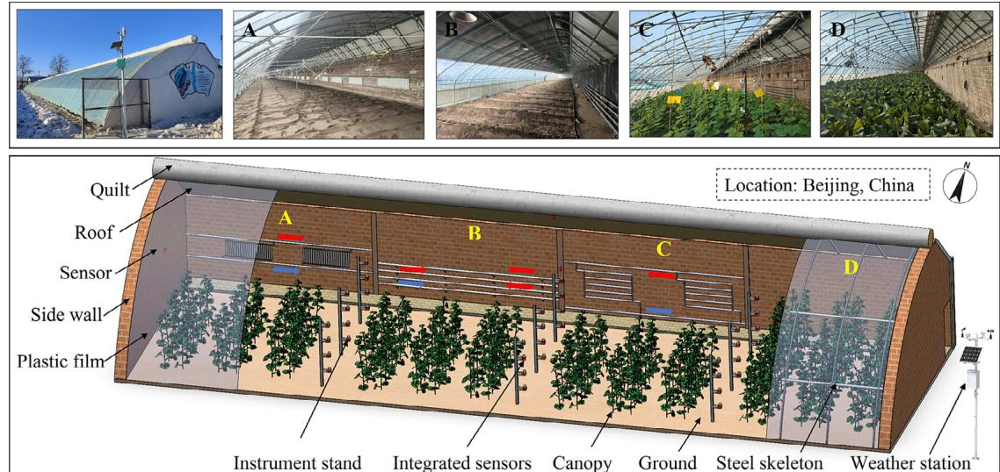  
图1 北京实验日光温室示意图：(A)柱式散热器；(B)管式散热器；(C)分布式管式散热器；(D)无加热装置

# 2.1.2 加热系统

各加热系统的详细参数见表1。一个系统为分布式电加热系统，另一个为地源热泵系统。分布式电加热系统包含散热器和管道两种加热形式。此外，以未配备加热系统的中国日光温室(CSG)作为对照处理。加热设备主要包含电锅炉、热媒、供水管道、散热器、回水管道和水泵。该系统主要通过锅炉将热水经管道输送至温室散热器，从而加热温室内部空间。

# 2.2 田间测量

# 2.2.1 多源数据采集

室内微气候数据通过自主研发的集成传感器获取，可测量太阳辐射强度、温度和相对湿度。各多源传感器采购自建大仁科（山东建大仁科电子科技有限公司）。温湿度传感器集成于单一模块形成复合传感器。根据温室内黄瓜冠层高度设计制作多层固定支架用于支撑传感器。温湿度传感器安装于太阳辐射传感器下方以避免阳光直射。所有传感设备通过RS485通讯线连接至数据传输单元，实现环境参数远程传输至物联网数据监测平台进行连续采集。室外环境数据由传统气象站记录。所有传感器在交付前均经建大仁科校准，记录间隔为10分钟。为确保数据准确性，所有辐射传感器和温湿度耦合传感器先统一放置于温室特定区域进行连续数据采集，将获取数据与仪器标称精度范围进行比对。当精度达到要求标准后，方将传感器安装于温室内各点位进行微气候监测。用于温室多源数据监测的传感器详情与特性见表S1（见在线版电子补充材料）。黄瓜冠层结构通过高分辨率便携式地面扫描LiDAR（FARO Focus，美国佛罗里达州莱克玛丽）获取。此外，每次采收后记录黄瓜产量和销售价格。供回水温度由加热设备（北京合生阳光科技发展有限公司"嘉士福"）自动记录。

表1 中国日光温室采用的不同加热系统参数

| 位置 | G14 | G15 | CK |
|------|-----|-----|----|
| 散热器类型 | 分布式管式散热器 | 柱式散热器 | 管式散热器 |
| 运行时间 | 20:00-7:00 | 20:00-8:00 | 20:00-8:00 |
| 加热类型 | 电加热 | 电加热 | 电加热&燃气锅炉 |
| 功率 | 23.2 kW | 21.18 kW | — |

# 2.2.2 测量传感器布置

为监测黄瓜冠层内部微气候，在温室内等间距选取9个测点。每个测点处，3个集成传感器沿垂直方向以$0.5\mathrm{m}$等间距布置（图1）。温湿度传感器被策略性地布置在温室各结构部件上，包括采光屋面、后屋面、后墙、地面和两侧山墙（共33个传感器）。气象站安装在温室东侧无遮挡位置。

# 2.3 数学模型

# 2.3.1 热负荷计算

如图2所示，温室通过辐射、传导和对流与外界环境持续进行热交换，从而改变其内部热环境。通过研究各围护结构的热性能并计算温室总热损失，可根据温室供暖设计标准确定极端环境条件下日光温室的供暖热负荷。详细计算公式列于表2。

# 2.3.2 温室几何模型与边界条件

基于实际测量参数，使用SolidWorks建立了CSG的几何模型。如图3所示，数值分析网格通过Mesh设计，不同温室的网格单元数量在3,800,000至4,400,000之间。采用3D瞬态模型模拟了微气候随时间变化的动态过程。边界条件主要涉及CSG的建筑围护结构，包括各材料的物理特性参数（尺寸、密度、比热容、导热系数、光学特性等）和初始表面温度（表3）。压力、密度、动量和能量的离散格式设置为二阶迎风格式，具体参数值参考Wu等(2023)的研究。

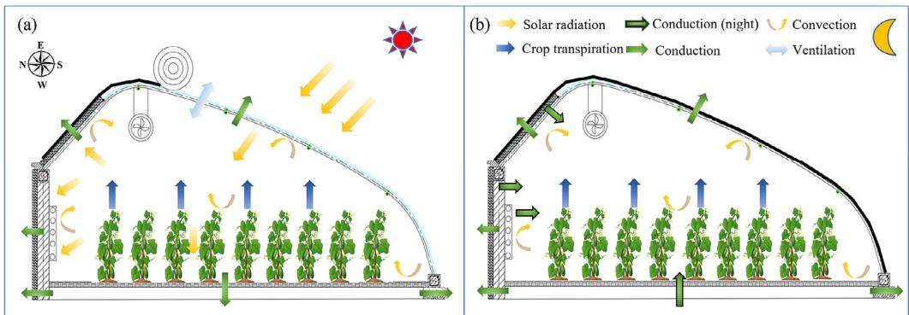  
图2 中国日光温室内能量转换示意图：(a)日间能量流动图；(b)夜间能量流动图

表2 太阳辐射、能量平衡、效率计算和经济性能的方程

| 方程 | 描述 | 编号 |
|------|------|------|
| **太阳辐射模型** | | |
| SD=1367·τa·sinβ·[1+0.033cos(2π·(t d-10)/365)] | 入射辐射 | A1 |
| sinβ=a+b·cos(2π·(t a-12)/24) | 太阳高度角正弦值 | A2 |
| a=sinλ·sinδ | 太阳相对于赤道的季节偏移 | A3 |
| b=cosλ·cosδ | 太阳高度角正弦值的季节振幅 | A4 |
| sinδ=-sin(π·23.45)/180·cos(2π·t d+10)/365) | 太阳相对于赤道倾斜角的正弦值 | A5 |
| cosδ=√1-sinδ·sinδ | 太阳相对于赤道倾斜角的余弦值 | A6 |
| d=12·[1+(2/π)·arcsin(a/b)] | 日照时长 | A7 |
| αs=±arcsin[sinβsinλ-sinδ/cosβcosλ] | 太阳方位角 | A8 |
| SS=1.2·SD·(1-τa)/(1-τa cscβ)/(1-1.4·lnτa) | 散射辐射 | A9 |
| S=SD+SS | 总辐射量 | A10 |
| **热负荷计算** | | |
| QR=SL·AL | 采光屋面捕获的太阳能 | B1 |
| QR+QH+QB=QM+QV+QS+QP | 能量平衡方程 | B2 |
| QC=QM+QV+QS | 总热负荷 | B3 |
| QM=∑n i=1Ajk(tin-tout) | 围护结构散热 | B4 |
| k=1/n∑n i=1μi | 传热系数 | B5 |
| Qs=∑kA(sin-tout) | 地面热传导 | B6 |
| N=(QC/qh)·β1·β2·β3 | 加热柱数量 | B7 |
| Ap=Qc/k·(tP-tin) | 管道长度 | B8 |
| TLL=tmax-tmin | 热负荷均衡 | B9 |

表2 太阳辐射、能量平衡、效率计算和经济性能的方程(续)

| 方程 | 描述 | 编号 |
|------|------|------|
| **效率计算和经济性能** | | |
| COPE = Qc/Ec | 制热性能系数 | C1 |
| Qr = ∑mCp(tln-tout)/1600×ΔT | 加热系统释放的能量 | C2 |
| Ec = (P1+P2)/1000 | 功率消耗 | C3 |
| Pb = Ic + Rc/Pp | 投资回收期 | C4 |
| **CFD控制方程** | | |
| **基本守恒方程** | | |
| ∂P/∂t + ∂/∂xj= 0 | 质量守恒方程 | D1 |
| ∂(puj/∂t) + ∂/∂xj(ρuuj) = ∂/∂xj(σij) + pgi - ∂/∂xj(ρuij/uj) + Sm | 动量守恒方程 | D2 |
| Cp[ (∂(δT)/δt) + ∂/∂xj(ρ(μiT)) ] = ∂/∂xj(λr + μiCp/Pr) ∂T/∂xj + Sr + St | 能量守恒方程 | D3 |
| **湍流模型** | | |
| ∂(ρk/δt) + ∂/∂xj(ρujk) = ∂/∂xj[(μ + μi/σi) ∂k/δxj] - g1/ρPr/δxj + μiS2 - ρε + Sk | 标准k-ε模型的湍流动能k | D4 |
| ∂(ρε) + ∂/∂xj(ρujε) = ∂/∂xj[(μ + μi/σε) ∂ε/δxj] + C1εk[μiS2 - C3εg1/ρPr/δxj] - C2εk+ Sε | 标准k-ε模型的耗散率ε | D5 |

**辐射传输模型**

$$
\nabla \big(I_{\lambda}\big(\vec{r},\vec{s}\big)\vec{s}\big) + \big(a_{\lambda} + \sigma_{s}\big)I_{\lambda}\big(\vec{r},\vec{s}\big) = a_{\lambda}n_{\lambda}^{3}\frac{\sigma T^{4}}{\pi} +\frac{\sigma_{s}}{4\pi}\times \int_{0}^{4\pi}I_{\lambda}\big(\vec{r},\vec{s}\big)\phi \big(\vec{s},\vec{s}^{\prime}\big)\mathrm{d}\Omega
$$

**辐射强度传输模型**

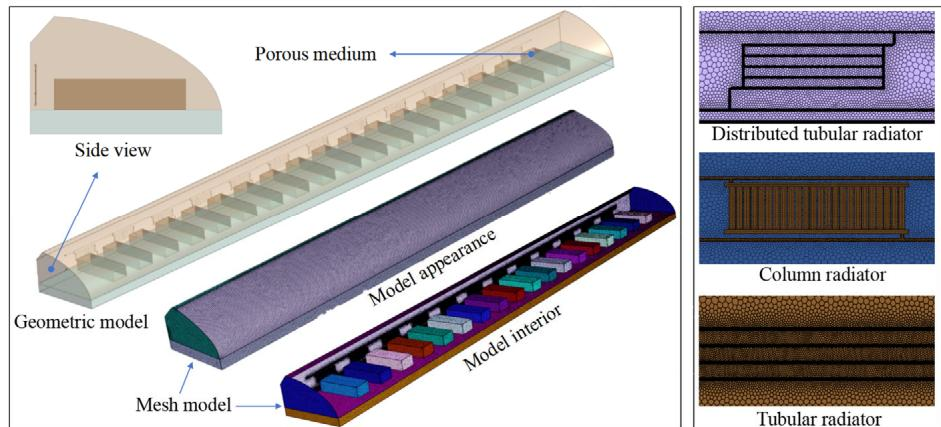  
图3 温室数值计算的详细几何和网格模型

# 2.3.3 网格无关性验证

采用有限体积法通过CAE求解软件进行方程求解。动量和湍流方程采用二阶迎风离散格式，应用隐式压力耦合方程方法实现压力-速度耦合。收敛标准设置如下：能量残差的绝对值为$10^{-6}$，连续性方程、$k$方程和epsilon方程残差的绝对值为$10^{-1}$(Courant等, 1928)。通过监测温室平均气温并检查其是否稳定在恒定值，验证了四种温室模型的网格无关性。如图4所示，初始网格单元数约为80万，经过9次网格细化后达到620万。G14、G15、G17和CK的温室平均气温在第6层网格细化(约440万网格)时表现出令人满意的精度。由于加热装置的网格效应不足，该选项在第5层网格细化(约380万网格)时进行了优化。

表3 中国日光温室的详细参数

| 描述 | 数值 | 单位 |
|------|------|------|
| **温室尺寸** | | |
| 采光屋顶(长,宽,高) | 80, 8.52, 0.00015 | m |
| 砖墙(长,宽,高) | 80, 2.8, 0.37 | m |
| 保温层(长,宽,高) | 80, 2.8, 0.03 | m |
| 屋顶(长,宽,高) | 80, 1.49, 0.24 | m |
| 地面(长,宽) | 80, 8 | m |
| 体积 | 1876 | m³ |
| **光学特性(反射率,透射率,吸收率)** | | |
| 砖墙 | 10, 0, 90 | % |
| 屋顶 | 30, 0, 70 | % |
| 地面 | 14, 0, 86 | % |
| 聚乙烯薄膜 | 10, 80, 10 | % |
| 叶片 | 13, 16, 71 | % |
| **运行时间** | | |
| 保温被开启时段 | 9:00-16:00 | 小时 |
| 保温被关闭时段 | 16:00-9:00 | 小时 |
| 设备运行周期 | 60 | 天 |
| **温度** | | |
| 室外-夜间 | -12 | °C |
| 室内-夜间 | 12 | °C |
| 室外-白天 | -3 | °C |
| 室内-白天 | 17 | °C |
| G14进水温度 | 49 | °C |
| G14出水温度 | 38.5 | °C |
| G15进水温度 | 45 | °C |
| G15出水温度 | 38 | °C |
| **换气次数** | | |
| 白天 | 3.3 | — |
| 夜间 | 1.2 | — |
| **水流量** | | |
| 电锅炉-G14 | 6.3 | m³/h |
| 电锅炉-G15 | 6.9 | m³/h |
| **导热系数** | | |
| 聚乙烯薄膜 | 6.8 | W/(m²·°C) |
| 保温被 | 1.115 | W/(m²·°C) |
| 砖墙 | 2.2 | W/(m²·°C) |
| 保温层 | 0.03 | W/(m²·°C) |
| 复合墙 | 0.69 | W/(m²·°C) |
| 屋顶 | 1.03 | W/(m²·°C) |
| 地面 | 0.24 | W/(m²·°C) |
| 光管散热器 | 13.9 | W/(m²·°C) |
| 钢制散热器 | 154 | W/柱 |
| **比热容** | | |
| 水 | 4200 | J/(kg·°C) |
| 砖墙 | 1062 | J/(kg·°C) |
| 保温层 | 1368 | J/(kg·°C) |
| 屋顶 | 2520 | J/(kg·°C) |
| 地面 | 828 | J/(kg·°C) |
| 聚乙烯薄膜 | 750 | J/(kg·°C) |

本研究采用Richardson外推法对无限元结果进行外推(Roache 1998)，并将各结果误差与之比较(见电子补充材料图S1)。结果表明，G14、G15和CK在第七层网格的误差范围为$1.55\%$至$1.85\%$，而G17在第六层网格密度下的误差为$0.65\%$。继续增加网格数量并未显著提高结果精度，因此本研究选择3,800,000-4,400,000网格进行模拟计算。表4列出了这四种配置的网格详细信息。

为评估结果的时间步长独立性，计算了温度上限值。采用三种不同时间步长(1秒、3秒和5秒)在20秒内监测Ture。电子补充材料图S2显示计算温度几乎相同，综合考虑计算成本，最终选择$5s$作为最大时间步长。

表4 网格独立性研究中的指标与统计

| 特征参数 | G14 | G15 | G17 | CK |
|----------|------|------|------|------|
| 网格单元数 | 4,356,892 | 4,406,476 | 3,811,896 | 4,268,769 |
| 正交质量最小值 | 0.175 | 0.182 | 0.197 | 0.177 |
| 正交质量最大值 | 1 | 1 | 1 | 1 |
| 正交质量平均值 | 0.942 | 0.935 | 0.986 | 0.945 |

# 2.3.4 模型验证与不确定性分析

为验证模拟模型的准确性，计算了预测均方根偏差(PRMSD)、平均绝对误差(MAE)、平均相对误差(MRE)和归一化均方误差(NMSE)等指标。具体计算公式如下：

$$
\mathrm{PRMSD} = \frac{\sqrt{\frac{1}{n}\sum_{i = 1}^{n}\left(y_{i} - \hat{y}_{i}\right)^{2}}}{\frac{1}{n}\sum_{i = 1}^{n}y_{i}} \tag{1}
$$

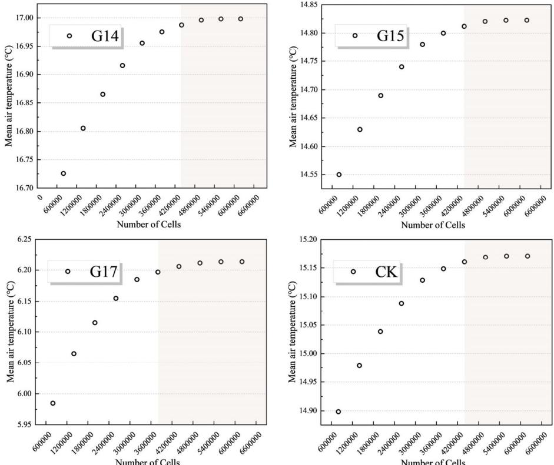  
图4 网格独立性验证：基于不同网格密度计算的空气温度

$$
\mathrm{NMSE} = \frac{\frac{1}{n}\sum_{i = 1}^{n}\left(y_{i} - \hat{y}_{i}\right)^{2}}{\frac{1}{n}\sum_{i = 1}^{n}\left(y_{i} - \hat{y}\right)^{2}} \tag{2}
$$

$$
\mathrm{MAE} = \frac{1}{n}\sum_{i = 1}^{n}\left|y_{i} - \hat{y}_{i}\right| \tag{3}
$$

$$
\mathrm{MRE} = \frac{1}{n}\sum_{i = 1}^{n}\left|\frac{y_i - \hat{y}_i}{y_i}\right|\times 100 \tag{4}
$$

式中，$n$为数据点数，$y_{i}$和$\hat{y}_i$分别表示实测值和模拟值，$\overline{y}$为实测值的平均值。这些指标值越小，表明模型预测值与实际测量值越接近。

本研究的测量误差主要来源于仪器不确定性。热负荷计算中的输入变量如温度、通风率和传热系数等存在测量误差，这些误差会通过计算公式传播并影响最终结果的准确性。由于计算过程中的多个方程都与温度相关，本研究重点关注温度测量误差的影响。这些误差来自室内多源小气候监测设备和室外气象站。实验前对温度传感器进行了全面校准，估计误差为$\pm 0.4^{\circ}\mathrm{C}$。将温度测量误差纳入热负荷计算，并基于全微分法进行误差传播分析(Xu et al. 2022b)。白天和夜间热损失的组合误差约为$\pm 3.84\mathrm{kW}$，直接影响最终能量平衡计算的准确性。在基于实测数据的后续热负荷计算中，必须考虑这一误差。

# 2.4 系统运行成本与投资回报

对于电加热系统，制热性能系数(COP)是系统释放热量$(Q_{\mathrm{r}})$与总电能消耗的比值。

$$
\mathrm{COP_E} = \frac{Q_{\mathrm{r}}}{E_{\mathrm{c}}} \tag{5}
$$

式中，$\mathrm{COP_E}$为制热性能系数，$Q_{\mathrm{r}}$表示热电锅炉的有效热输出，$E_{\mathrm{c}}$表示输入功率。

$$
E_{\mathrm{c}} = \frac{\left(P_{1} + P_{2}\right)}{1000}\times \Delta T \tag{6}
$$

式中，$P_{1}$和$P_{2}$分别表示加热设备和水循环设备的功率，$\Delta T$为设备运行小时数。

$$
Q_{\mathrm{r}} = \sum m C_{\mathrm{p}}(t_{\mathrm{in}} - t_{\mathrm{out}}) / 3600\times \Delta T \tag{7}
$$

式中，$m$为热介质水流量$(\mathrm{m^3h^{- 1}})$，$C_\mathrm{p}$为比热容$(\mathrm{kJkg^{- 1}^oC^{- 1}})$，$t_\mathrm{in}$和$t_\mathrm{out}$分别表示储热阶段热电锅炉的供水和回水温度。投资回收期$(P_{\mathrm{b}})$的计算公式如下：

$$
P_{\mathrm{b}} = \frac{I_{\mathrm{c}} + R_{\mathrm{c}}}{R_{\mathrm{p}}} \tag{8}
$$

式中$I_{c}$为初始投资成本，$R_{c}$表示设备运行成本，$R_{\mathrm{p}}$为作物收益。热负荷调平系数(TTL)计算公式如下：

$$
\mathrm{TLL} = \frac{t_{\mathrm{max}} - t_{\mathrm{min}}}{t_{\mathrm{max}} + t_{\mathrm{min}}} \tag{9}
$$

有效积温是反映作物生长发育所需热量的关键指标。此处将生物学零度设为$10^{\circ}\mathrm{C}$，具体计算公式如下：

$$
\mathrm{EAT} = \sum_{i = 1}^{n}\overline{T} -10 \tag{10}
$$

# 3 结果与讨论

# 3.1 日光温室内黄瓜冠层小气候特征

# 3.1.1 太阳辐射空间分布

分析主要针对晴天(2023年10月4日和12月1日)和阴天(2023年10月12日和12月10日)。10月份黄瓜处于苗期，光照时间为上午8点至下午5点，传感器无遮挡。到12月黄瓜进入成熟期，光照时间为上午9点至下午4点，确保传感器不被叶片直接遮挡。将日光温室沿东西方向分为三部分(图5)，比较了温室内太阳辐射的时空异质性。从图5(b)明显可见，在温室南北方向上，靠近墙体的辐射强度显著低于中部和南部，日平均截获太阳辐射量分别相差39.1%和49.6%。辐射强度呈垂直递减趋势，上层和中部的日平均太阳辐射量分别比底部高6.2%和3.5%。在东西方向上，东部日截获太阳辐射量普遍高于西部。随着作物生长，冠层内太阳辐射强度从上到下显著降低(图5(c))，不同高度辐射强度差异明显，冠层上层和中部分别比底部高133.8%和91.2%。在南北方向上，靠近墙体的辐射强度始终最弱，分别比南部和中部低3.8%和17.7%。

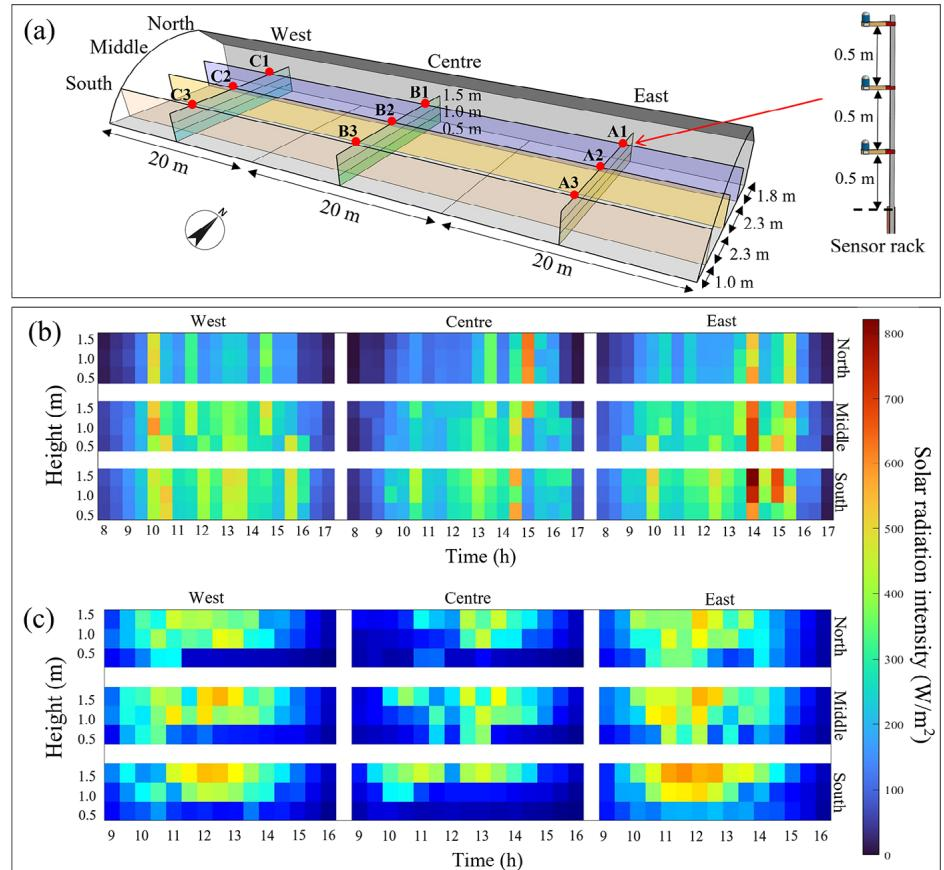  
图5 晴天日光温室内光分布日变化：(a)温室内集成传感器布局；(b)2023年10月4日无植株温室内光空间分布；(c)2023年12月1日有植株冠层温室内光空间分布

阴天温室内捕获的太阳辐射主要为散射辐射。辐射强度在温室内从上到下逐渐降低(图6(a))，上层和中部分别比底部高31.3%和27.0%。在南北方向上，南部和中部的平均截获太阳辐射量分别比北部高102.1%和81.5%。这种差异在冠层密集的温室中更为明显(图6(b))，南部和中部的平均截获太阳辐射量分别比北部高104.3%和108.4%，上层和中部分别比底部高57.0%和44.7%。

# 3.1.2 温湿度空间分布

如图7所示，将冠层内27个多源传感器分为0.5m、1.0m和1.5m三个水平面，每个平面包含9个传感器。夜间温度变化趋势相对稳定，但白天不同位置波动显著。温室西部温度高于中部和东部(图S3和S4)。靠近墙体的传感器(C1)记录到最高温度32.6°C，采光屋面附近(A3)记录到最低温度17.5°C。温室内最大温差出现在下午1:10，1.5m处(C1)温度达30.7°C，而0.5m处(A3)温度仅为13.9°C，温差达16.8°C。当保温被关闭时，相对湿度保持较高水平。早晨打开保温被后，相对湿度迅速下降，约下午2:00达到最低点。随着通风口关闭，相对湿度逐渐升高。随着冠层高度增加，温室内相对湿度逐渐降低，冠层顶部相对湿度波动相对较小。在温室东西方向上，东部日平均湿度最低(68.9%)，西部次之(76.2%)，中部日平均相对湿度最高(78.9%)(图S3)。南北方向日平均相对湿度分别为70.8%、75.3%和78.0%(图S4)。

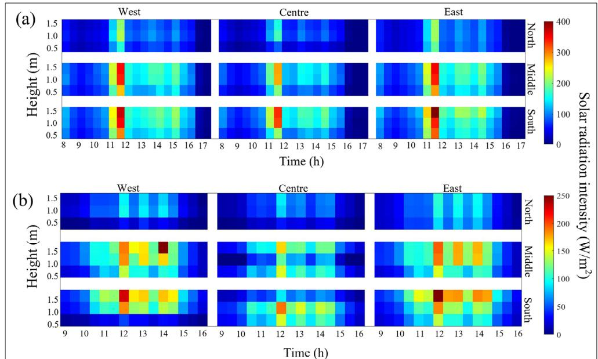  
图6 阴天日光温室内光分布日变化：(a)2023年10月12日无植株冠层温室内光空间分布；(b)2023年12月10日有植株冠层温室内光空间分布

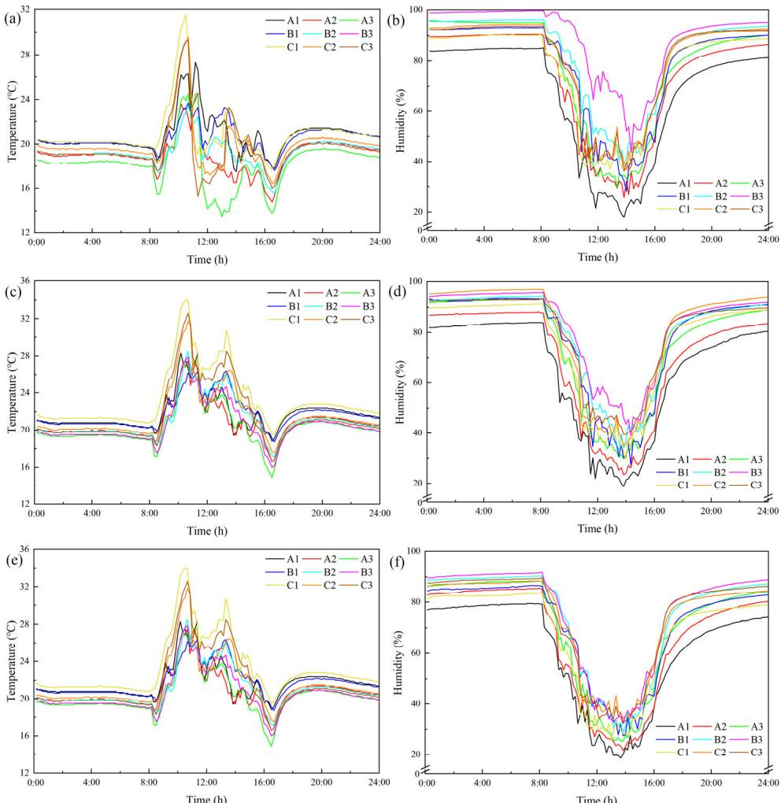  
图7 2023年12月1日各测站0.5m(a,b)、1.0m(c,d)和1.5m(e,f)高度处水平异质性参数(气温和相对湿度)测量结果

如图8所示，阴天温度明显低于晴天，湿度下限显著高于晴天。打开保温被前，冠层顶部温度明显高于中下部。由于打开保温被后缺乏直射太阳辐射，温室热损失超过热获得，导致温度急剧下降。上午9:00达到热损失与热获得的第一个平衡点，随后温度逐渐升高。靠近墙体的温度明显高于中部和南部(图S6)。下午4:00关闭保温被时，温室温度达到全天最低点，之后温度逐渐回升。冠层温度呈现自上而下递减趋势，平均温度分别为18.1°C、17.8°C和17.7°C(图S5)。阴天温室内最大温差出现在上午8:00，1.5m处(C1)温度达19.7°C，0.5m处(A3)温度仅为16.3°C，温差3.4°C。最大温差测点位置与晴天观测位置一致。阴天打开保温被后温室内相对湿度迅速下降，下午1:00打开通风口时相对湿度达到最低点68.5%。关闭通风口后相对湿度逐渐升高，最高达97.3%。冠层上方相对湿度明显低于中下部，日平均湿度分别为85.8%、89.3%和89.7%。东部日平均湿度83.6%，中部和西部分别达90.9%和90.3%。南北方向日平均湿度分别为85.3%、89.1%和90.5%(图S5和S6)。

# 3.2 不同太阳能集热系统性能分析

图9比较了不同加热条件下日光温室(CSG)在最寒冷冬季期间室内外温湿度变化。未安装加热设备的温室(G17)日最低温度维持在$10^{\circ}\mathrm{C}$以下，通常无法满足喜温作物越冬需求。在主动加热温室中，G14夜间增温效果优于CK和G15，而CK白天温度更高。与未加热温室相比，G14将室内最低温度提高了$5.2 - 10.2^{\circ}\mathrm{C}$，室内外最大温差达$29.5^{\circ}\mathrm{C}$(1月22日下午1:30)。G15将最低温度提高了$3.0 - 7.6^{\circ}\mathrm{C}$，最大温差为$30.3^{\circ}\mathrm{C}$(1月22日上午10:00)。夜间室内相对湿度显著高于室外，其中G14湿度最低，CK次之。相比G17，G14使相对湿度降低了$4.2\% - 14.6\%$，G15则降低了$0.2\% - 3.7\%$。

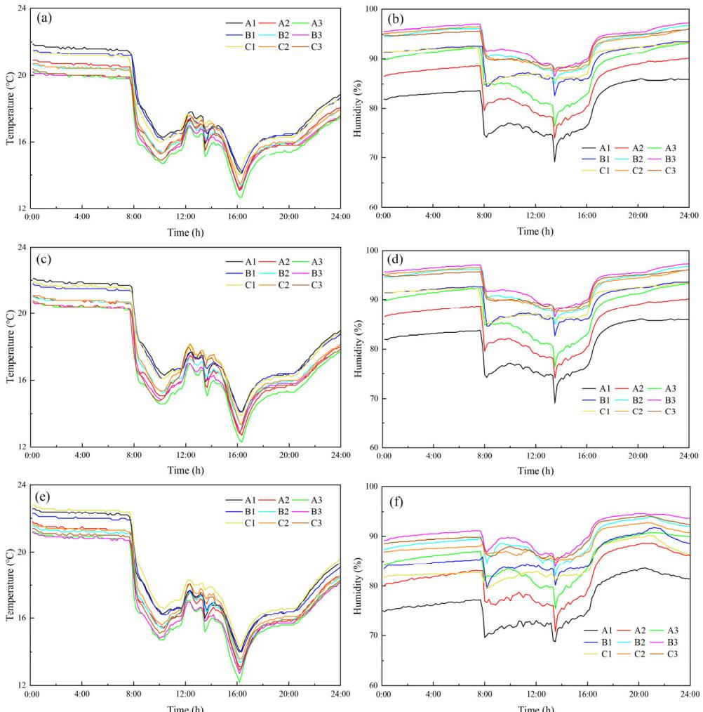  
图8 2023年12月10日各测站$0.5\mathrm{m}$(a,b)、$1.0\mathrm{m}$(c,d)和$1.5\mathrm{m}$(e,f)高度处水平异质性参数(气温和相对湿度)测量结果

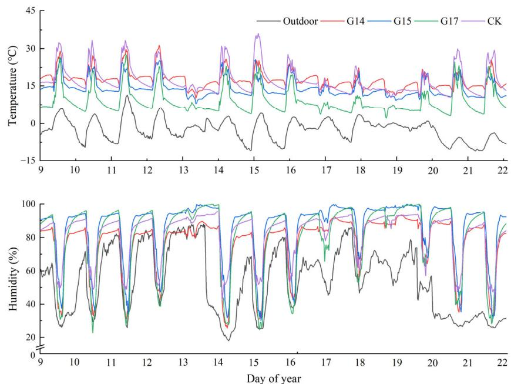  
图9 2024年1月9日至1月22日温室内外环境参数(气温和相对湿度)

表5汇总了不同温室在最寒冷时期(2024年1月9日至1月12日)的温湿度极值和平均值。G14记录到最高平均温度$17.5^{\circ}\mathrm{C}$，室内外平均温差达$19.8^{\circ}\mathrm{C}$。相比G17，G14、G15和CK的平均温度分别提高了$6.7^{\circ}\mathrm{C}$、$5.4^{\circ}\mathrm{C}$和$6.5^{\circ}\mathrm{C}$。相对湿度方面，G14平均湿度最低，比G17低$4.1\%$；G15平均湿度最高，达$85.9\%$。

表5 2024年1月9日至1月22日光温室内外环境参数统计(室内数据为33个传感器测量平均值)

| 位置   | 温度(℃) |       |       | 相对湿度 |       |       |
|--------|---------|-------|-------|----------|-------|-------|
|        | 平均值  | 最大值 | 最小值 | 平均值   | 最大值 | 最小值 |
| 室外   | -2.5    | 11.4  | -11.1 | 53.8%    | 87.9% | 18.0% |
| G14    | 17.5    | 31.3  | 10.1  | 76.6%    | 93.3% | 25.5% |
| G15    | 14.2    | 26.4  | 7.9   | 85.9%    | 99.9% | 30.0% |
| CK     | 17.3    | 36.2  | 10.3  | 81.9%    | 95.5% | 42.7% |
| G17    | 8.8     | 27.7  | 2.1   | 80.7%    | 99.9% | 22.8% |

为进一步阐明不同温室加热设备引起的温度波动对作物生产的影响，我们引入了热负荷均衡系数(TLL)。G14表现出最小的TLL，实验阶段平均值达到0.28。G15和CK记录的TLL分别为0.31和0.34。未加热温室G17显示出最高的TLL值0.57(图10)。

对日光温室(CSG)在最寒冷时期的日有效积温进行了分析(图11)。G14和CK的日有效积温显著高于G15和G17。具体而言，G14、CK和G15的平均积温分别为$7.45^{\circ}\mathrm{C}$、$7.24^{\circ}\mathrm{C}$和$4.15^{\circ}\mathrm{C}$。相比之下，G17在实验期间的积温仅为$0.15^{\circ}\mathrm{C}$，表明该温室无法满足作物生产需求。

如图12所示，比较了四个实验日光温室的小气候小时变化。G14在保温被覆盖期间(晚9点至早8点)表现出更好的夜间加热性能，平均温度达$16.7^{\circ}\mathrm{C}$，显著优于其他三个温室。具体而言，G15、G17和CK在此期间的均温分别为$12.5^{\circ}\mathrm{C}$、$6.7^{\circ}\mathrm{C}$和$14.9^{\circ}\mathrm{C}$。晴天白天，CK温度达$26.1^{\circ}\mathrm{C}$，而G14、G15和G17温度分别为$21.5^{\circ}\mathrm{C}$、$20.1^{\circ}\mathrm{C}$和$15.1^{\circ}\mathrm{C}$。阴天时，G14温度表现最佳，均温$15.8^{\circ}\mathrm{C}$，而CK、G15和G17分别为$14.7^{\circ}\mathrm{C}$、$13.6^{\circ}\mathrm{C}$和$6.4^{\circ}\mathrm{C}$。湿度方面，G14在晴天和阴天都表现出更好的除湿能力，平均相对湿度分别为$68.2\%$和$86.7\%$。G15、G17和CK在晴天的平均湿度分别为$80.7\%$、$74.9\%$和$79.5\%$，阴天分别为$95.1\%$、$87.4\%$和$88.8\%$。

  
图10 2024年1月9日至22日不同加热系统温室的热负荷均衡：(a)日热负荷水平；(b)平均热负荷水平

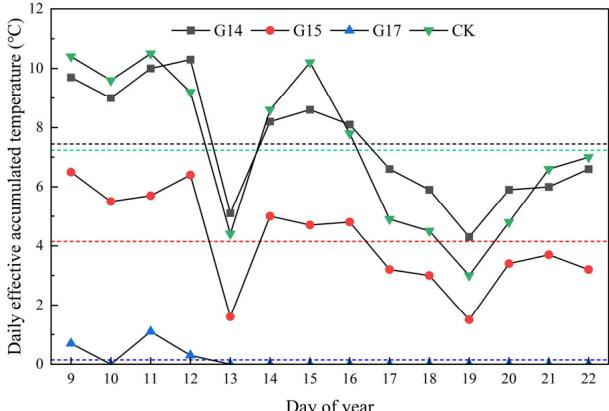  
图11 2024年1月9日至22日不同温室的日有效积温。注：虚线表示研究期间积温平均值

综合分析表明，配备分布式管式散热器的温室(G14)为作物生长提供了更适宜的环境。该设备将夜间平均温度维持在$15^{\circ}C$以上，并有效降低相对湿度。与同类温室相比，夜间相对湿度降低了$3.9\% - 9.0\%$。加热设备的使用有效降低了TLL，从而避免了温度波动引起的生长抑制。G14在日有效积温方面表现更优，提供了高温低湿的小气候环境，有利于提高产量和改善作物品质。

# 3.3 温室与作物的相互作用

# 3.3.1 相同温室

比较了同一温室(G14)在有冠层结构和无冠层结构情况下温湿度的时空变化(图13)。考虑到温室内东西方向温湿度分布特征，移除东西两侧冠层(视为空温室区域)，保留中部冠层用于分析作物与温室环境的相互作用。图13(a)显示，阴天条件下中部作物冠层平均温度分别比东西区域低$0.36^{\circ}C$和$0.31^{\circ}C$。夜间中部作物冠层平均温度分别比东西区域低$0.18^{\circ}\mathrm{C}$和$0.15^{\circ}\mathrm{C}$。晴天夜间中部区域温度显著低于东西区域，平均温度分别低$0.47^{\circ}\mathrm{C}$和$1.1^{\circ}\mathrm{C}$。白天中部区域温度低于西部但高于东部，平均温度分别为$20.9^{\circ}\mathrm{C}$、$18.4^{\circ}\mathrm{C}$和$17.7^{\circ}\mathrm{C}$。冠层存在显著影响温室内相对湿度。阴天条件下，中部区域平均湿度分别比东西区域高$7.6\%$和$3.0\%$(图13(b))。晴天时，中部区域平均相对湿度分别比东西区域高$14.6\%$和$3.8\%$(图13(d))。

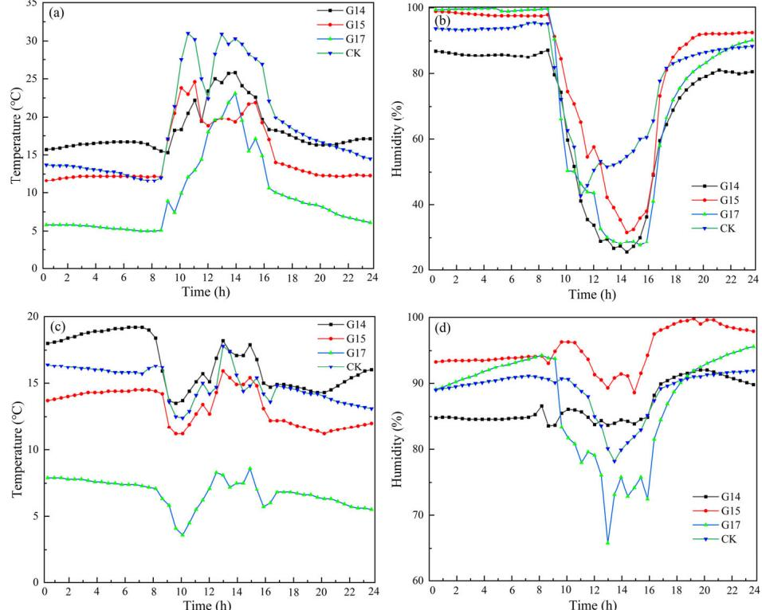  
图12 最冷日不同类型主动加热系统比较：(a-b)晴天(2024年1月14日)相对温湿度；(c-d)阴天(2024年1月17日)相对温湿度

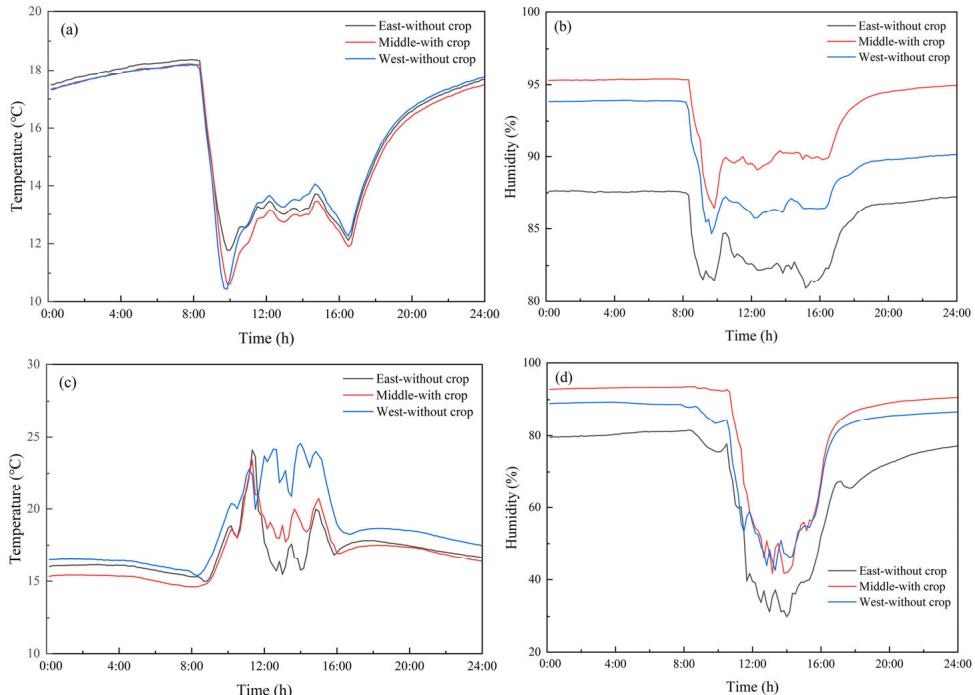  
图13 日光温室有无黄瓜冠层的小气候差异：(a-b)阴天(2024年1月30日)平均温湿度；(c-d)晴天(2024年2月5日)平均温湿度。注：数据来自配备加热管道的温室

# 3.3.2 不同温室比较

G14完全收获后作为空温室，与具有密集冠层的G15进行小气候比较。两温室采用相同管理措施且均已停止加热。无论是晴天还是阴天，G14夜间温度均显著高于G15，平均温差分别为$0.8^{\circ}\mathrm{C}$和$1.6^{\circ}\mathrm{C}$(图14)。打开保温被后，G15温度在早晨迅速上升，晴天尤为明显，上午11:30两温室最大温差可达$5.1^{\circ}\mathrm{C}$。G14和G15白天平均温度分别为$18.8^{\circ}\mathrm{C}$和$19.8^{\circ}\mathrm{C}$。阴天时G15温度普遍低于G14，正午最大温差达$1.8^{\circ}\mathrm{C}$。G14和G15白天平均温度分别为$15.3^{\circ}\mathrm{C}$和$14.9^{\circ}\mathrm{C}$。

值得注意的是，无论是晴天还是阴天，G14温室在正午时分的温度均高于G15。这一现象与G14缺乏作物冠层密切相关。早晨保温被揭开后，透过G14薄膜的太阳辐射被墙壁和地面吸收并转化为热能储存。而在G15中，番茄冠层较为密集，形成了通风受限的局部微气候环境。随着太阳高度角和辐射强度的增加，G15内气温在上午迅速升高。冬季正午时分需要进行短暂通风以维持温室内适宜的二氧化碳浓度，导致G15冠层区域温度快速下降。与此同时，G14已积累了一定热量，在储热的同时加强了向外的热量释放，使得G14温度高于G15。随着午后太阳辐射强度减弱，两温室温差不再显著。覆盖保温被后，G14的储热能力再次得到体现。图14(b)显示，在晴天和阴天条件下，冠层的存在都显著提高了相对湿度。晴天时G14和G15的相对湿度分别为$87.0\%$和$92.6\%$，阴天分别为$87.6\%$和$93.8\%$，分别增加了$5.6\%$和$6.2\%$。

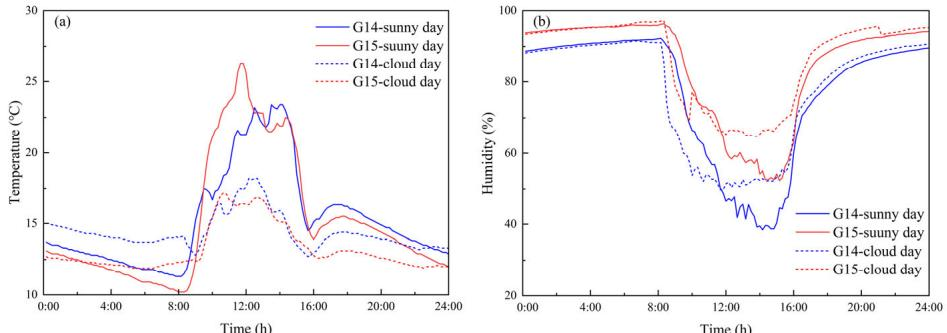  
图14 不同日光温室有无冠层时的微气候差异：(a)晴天(2024年2月8日)和阴天(2024年2月14日)平均温度；(b)相对湿度

# 3.4 加热系统评估

# 3.4.1 冬季日光温室热负荷计算

基于传热理论计算了日光温室的热损失，具体公式和相关参数见表2和表3，详细计算过程见在线版补充材料。结果表明，揭开保温被时温室平均每小时释放$165.73\mathrm{kW}$热量，覆盖后平均热释放量降至$56.94\mathrm{kW}$。揭开保温被时，温室主要通过采光面和通风损失热量，分别占$55.9\%$和$38.5\%$(图15)，其他组件总占比仅$5.6\%$。覆盖保温被后，热量主要通过冷风渗透$(47.4\%)$和采光面$(33.0\%)$散失，土壤和墙体热损失占$6.5\%$，后屋面占$5.2\%$。采光面是主要散热通道，热负荷约为$27.6\mathrm{Wm}^{-2}$(图15(b))，其次是后屋面、墙体和冷风渗透，热负荷分别为$24.72\mathrm{Wm}^{-2}$、$16.56\mathrm{Wm}^{-2}$和$15.78\mathrm{Wm}^{-2}$。

在温室加热设计中，准确分析温室得热与失热至关重要。与以往将采光面视为平面计算获热量的方法不同，本研究采用3D模拟模型综合考虑曲面折射、反射和透射。结果显示采光面平均捕获太阳辐射达$2025\mathrm{kW}$。通过评估温室捕获的太阳辐射与昼夜热损失，确定实现最优生长环境需补充$211.88\mathrm{kW}$热量缺口，这凸显了北京温室系统设计加热装置的必要性。鉴于冷胁迫对作物造成的不可逆损伤，以夜间温室热损失作为散热器热输出计算基准，得出每小时需供热$56.94\mathrm{kW}$。理论计算表明，在极端温度$-12^{\circ}\mathrm{C}$时，维持温室$12^{\circ}\mathrm{C}$所需平均每小时能耗为$88.97\mathrm{Wm}^{-2}$。将所需热量和电加热装置性能参数代入公式(表2中式B7)和(式B8)，可计算温室适宜散热器配置：需444组柱式散热器或$390\mathrm{m}$管式散热器。G14实际配备14组总长$398\mathrm{m}$的管式散热器，G15配备19组24柱柱式散热器共456柱，均满足热负荷需求。试验期间，2024年1月22日凌晨2点室外最低温$-11.1^{\circ}\mathrm{C}$时，G14室内维持$15^{\circ}\mathrm{C}$，基本达到设计要求；G15仅$10.7^{\circ}\mathrm{C}$，略低于设计要求；此时未加热温室温度为$4.9^{\circ}\mathrm{C}$，CK温室为$11.7^{\circ}\mathrm{C}$。

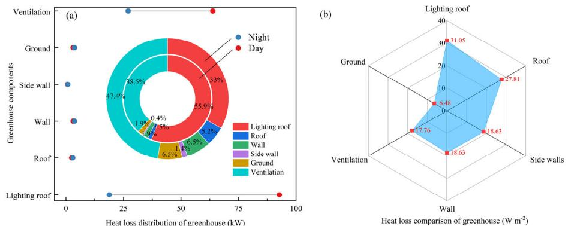  
图15 温室热损失组成及比例：(a)各组件热损失占比；(b)各组件热损失强度

# 3.4.2 加热系统优化与管理

为更清晰掌握不同加热系统实验温室的温度分布特征，本研究开展了热环境可视化与模拟分析。通过对比G14内部对应位置传感器实测值与模拟值验证了模拟精度，具体验证结果见图S7和表S2，充分证明了模型的可靠性。图16展示了不同加热系统午夜时分温度分布的侧视图及墙体热量分布示意图(2024年3月1日)。CK温室温度分布最高，在结构参数相同的温室中，配备管式散热器的G14夜间温度显著高于G15和G17。图16(a)显示南北方向温度变化呈现近墙处最高、自北向南逐渐降低的趋势，散热器释放的热量沿墙体向上运动，使得顶部表面温度明显高于空气温度。虽然配备柱式散热器的温室同样表现出夜间的加热过程，但其整体加热效果逊于管式散热器，这种差异在墙体温度分布上表现更为明显，管式散热器相比柱式散热器具有更均匀的热量分布。

# 3.4.3 系统运行成本与投资回报分析

在农业生产中，综合考虑初始投资、运行时间、运营成本和设备性能对实现经济效益最大化至关重要。我们计算了日光温室(CSG)加热系统的电力消耗，相关性能参数见表1。结果显示G14和G15的日耗电量分别为$255.2 \mathrm{kWh}$和$254.2 \mathrm{kWh}$。按照北京地区每度电$0.08 \mathrm{美元}$计算，每日运营成本分别为$20.93 \mathrm{美元}$和$20.85 \mathrm{美元}$。通过测量温室加热系统的进出水温度、水流量和运行时长，计算了管式散热器和柱式散热器的有效热输出(表2中式C2)。G14温室加热系统的热输出为$850 \mathrm{MJ}$，G15为$680\mathrm{MJ}$。将这些结果代入公式(表2中式C1)，计算出G14和G15的性能系数(COP)分别为0.93和0.68。

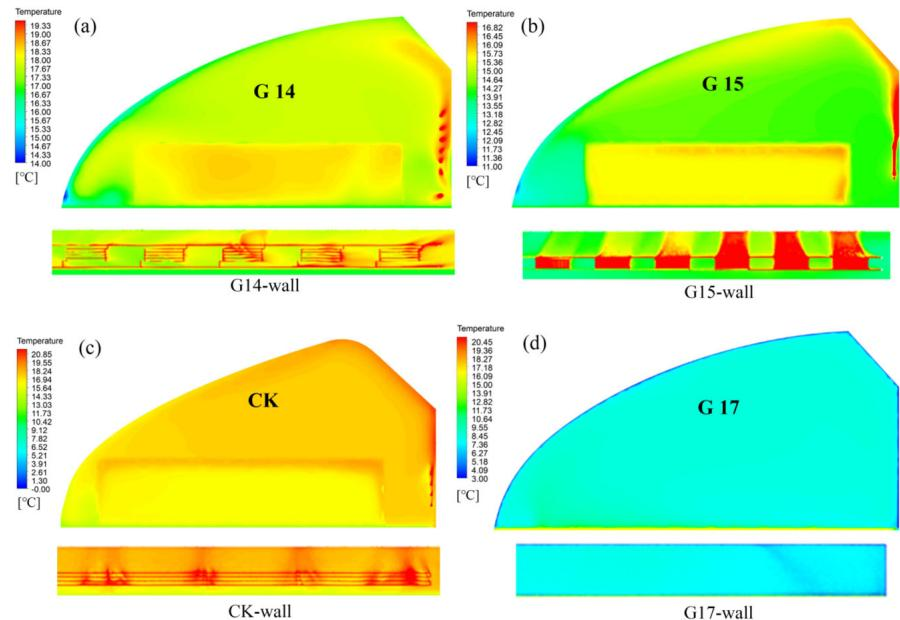  
图16 不同类型加热系统的日光温室温度分布：(a)G14，(b)G15，(c)CK，(d)G17。注：G14、G15和CK包含代表冠层群体的多孔介质

G14加热系统的单位面积初始投资为3.98美元，运营成本1.96美元，预计可使黄瓜增产$26.1\%$，设计寿命15年，预计投资回收期4.7年。G15加热系统的单位面积初始投资2.91美元，运营成本1.95美元，预计可使番茄增产$16.2\%$，设计寿命10年，预计投资回收期6.0年(表6)。

表6 加热系统的经济性评估

| 参数 | G14 | G15 |
|------|-----|-----|
| 电锅炉(美元) | 592 | 413 |
| 散热器(美元) | 138×13(1794) | 69×19(1311) |
| 人工成本(美元) | 165 | 138 |
| 总投资(美元) | 2551 | 1862 |
| 运营成本(美元) | 20.93×60天(1256) | 20.85×60天(1251) |
| 使用寿命 | 15年 | 10年 |
| 作物收益(美元) | 2.8×8.7°C×3%×2500kg(1827) | 2.8×5.4°C×3%×3500kg(1588) |
| 投资回收期 | 4.7年 | 6.0年 |

# 4 讨论

# 4.1 日光温室微气候空间分布特征

日光温室是一个复杂的综合系统，其温湿度分布是外部气象因素与内部作物能量转换共同作用的结果(Xu et al. 2022a)。这些环境因素直接影响作物的内在生理变化(Liu et al. 2012)。湿度过低会导致作物水分胁迫并抑制生长(Yang et al. 2023)。本研究中，冬季温室内最低相对湿度维持在$25.5\%$，平均相对湿度为$76.6\%$，完全满足作物生长的湿度下限要求。由于日光温室独特的光照结构，无论晴天还是阴天，太阳辐射强度从南向北逐渐减弱，靠近后墙区域的光环境最弱(Li et al. 2016)。东西方向的光照条件无显著差异。垂直方向上，太阳辐射强度自上而下逐渐降低(Li et al. 2023)。

温室内湿度变化主要受太阳辐射、作物蒸腾和蒸发作用影响。晴天时，相对湿度自上而下存在显著差异，分别为$70.1\%$、$76.0\%$和$78.0\%$。东西方向上，日均相对湿度东部最低($68.9\%$)，西部次之($76.2\%$)，中部最高($78.9\%$)。分析表明，实验温室的缓冲间位于东部，日常人为活动导致热量快速散失和潮湿空气排出，因此东部湿度显著降低，这也影响了温度分布。从南到北，平均温度逐渐降低。实际生产中，由于低温和弱光，温室南北部作物的生长势和果实产量往往低于中部。因此，优化日光温室微气候应着重提高南部温度、改善北墙附近光照，同时确保冬季缓冲间的密闭性。还应考虑在温室南部安装除湿设备。

# 4.2 日光温室与作物的相互作用

作物存在显著影响温室内温湿度的空间分布(Reza et al. 2023)。太阳短波辐射透过采光屋面，在温室内转化为长波辐射，这些辐射被采光屋面内表面反射，形成高温环境(Zhang et al. 2023)。作物冠层截获部分太阳辐射用于光合作用和蒸腾作用，导致温室结构获得的太阳辐射相对减少。因此，与无作物的空温室相比，夜间温度更低，而蒸腾作用同时消耗热量并增加空气相对湿度。本研究发现，晴天时，温室内有黄瓜冠层区域的平均温度比无作物区域低$2.5^{\circ}C$，相对湿度增加$3.8\%$；阴天时有冠层区域平均温度降低$0.31^{\circ}C$，相对湿度增加$3.0\%$。晴朗夜间，黄瓜冠层的存在使气温比无作物区域降低$1.1^{\circ}C$，而阴天夜间降低幅度为$0.15\%$

番茄作物的存在显著提高了温室内相对湿度，晴天增加$5.6\%$，阴天增加$6.2\%$。黄瓜和番茄冠层对白天空气温度的影响存在明显差异。晴天时，种植番茄的温室平均温度比空温室高$1.0^{\circ}\mathrm{C}$，而阴天时则比空温室低$0.4^{\circ}\mathrm{C}$。黄瓜冠层内温度低于无冠层区域，这归因于冠层光合作用消耗能量从而降低气温(Barron-Gafford等，2019)。有趣的是，番茄冠层虽然吸收热量，但由于其冠层更密集且通风不良，早晨会形成比空温室区域更温暖的局部微气候。未来研究应结合光合作用仪器与模型模拟对这一过程进行更详细分析。为理解作物对温室环境和人工管理措施的复杂响应，以及温室环境对外界条件的动态响应，研究人员已开发出温室气候模型和作物模型(Kahlen等，2015；Zhang等，2020；de Vries，2021；Xu等，2022a；Batnassi等，2023)。本研究获得的信息对于这些模型的改进和优化至关重要，特别是对微气候的精确解析。

# 4.3 日光温室主动加温与结构优化建议

研究结果表明，在最寒冷时期，太阳辐射可满足日光温室约$90\%$的能源需求。每日进入温室的太阳辐射总量不足，且无限增强保温性能并不现实。因此，在高效节能前提下，为保证温室种植者收益，辅助加温设施必不可少。日光温室采光面白天作为主要获热面截获太阳能，夜间却成为保温最薄弱环节，$33\%$的热量直接通过其散失。有效的日光温室保温策略应注重维护覆盖材料和结构构件的完整性与密封性，减少缝隙，防止通过渗透传热。同时应在不影响透光性的前提下优化这些材料，旨在提高日光温室冬季生产经济效益，降低单位温室产出的能耗(Tong等，2022)。此外，优化温室结构以最大化太阳能利用可有效提升作物生产过程的经济可行性(Zhang等，2022a)。温室设计阶段必须考虑结构对不同气候条件的适应性。本研究的对比数据分析表明，CK温室在晴天可获得更高温度，但在阴天热环境条件较弱，这归因于其较小体积和较低比例的蓄热材料。

本研究采用的电力加热系统以水为热媒，利用水的高热惯性确保加热系统温度调节的高度稳定性和均匀性(Xu等，2020)。尽管蓄热装置初始投资和运行成本较高，但该系统可控性强且不受外界天气条件影响，能保障作物免受不可逆冷胁迫伤害。G14和G15的散热装置均满足基于温室热负荷计算的要求。但在实际生产中，管式散热器性能优于柱式散热器。柱式散热器在高湿温室环境中易生锈堵塞，限制其散热效率。G14在TLL和积温效应方面表现出与燃气加热CK相似的效果，而电加热不受温室地理位置限制，可应用于偏远地区独立供暖。总体而言，管式散热器更适合温室加热，电加热装置可有效替代化石燃料实现清洁温室供暖。后续研究应着重优化管式散热器的安装高度、管型等参数。随着光伏等能源技术进步，未来温室运营与光伏发电结合可实现电力生产销售自给自足，促进北方地区高价值温室发展(La Notte等，2020)。

# 5 结论

本研究旨在通过实验方法准确评估中国日光温室微气候空间异质性、作物与温室环境的相互作用机制以及不同加热系统的性能。主要结论如下：

(1) 对于东西走向的日光温室，微气候空间分布呈现明显规律。垂直方向上，温度和太阳辐射自上而下逐渐降低，而相对湿度增加。水平方向上，温度自北向南逐渐降低，相对湿度和太阳辐射强度则增加。此外，相对湿度和温度自东向西逐渐升高。

(2) 冠层存在导致夜间温度降低$1.1^{\circ}\mathrm{C}$(黄瓜)和$1.6^{\circ}\mathrm{C}$(番茄)。白天，番茄冠层使气温升高约$1.0^{\circ}\mathrm{C}$，而黄瓜冠层使气温降低约$2.5^{\circ}\mathrm{C}$。冠层显著增加空气相对湿度，黄瓜冠层增加$3.0\%-3.8\%$，番茄冠层增加$5.6\%-6.2\%$。

(3) 管式散热器为温室提供更适宜的生长环境。与未加热温室相比，最低温度提高$5.2^{\circ}\mathrm{C}-10.2^{\circ}\mathrm{C}$，最高相对湿度降低$4.2\%-14.6\%$。管式散热器的投资回收期为4.7年。

这些发现阐明了温室微气候及其与作物相互作用的复杂动态，突显了特定加热系统在不同条件下优化作物生产环境的有效性。

电子补充材料(ESM)：补充材料可在本文在线版本中获取，网址：https://doi.org/10.1007/s12273-025-1247-5。

[电子补充材料(ESM)](12273_2025_1247_MOESM1_ESM.pdf)

# 致谢

本研究得到国家草业技术创新中心(筹)创新平台建设专项(CCPTZX2023K03)、国家重点研发计划(2023YFD2000600)和国家自然科学基金(32372799)的资助。

# 利益冲突声明

作者声明与本文内容不存在相关利益冲突。

# 作者贡献声明

所有作者均对研究构思和设计做出贡献。Demin Xu、Ruixue Liu、Yaling Liu、Qiaoxue Dong、Jinyu Zhu和Yuntao Ma负责材料准备、数据收集和分析。初稿由Demin Xu撰写，所有作者对前期版本提出修改意见。所有作者均阅读并同意最终稿。

## 参考文献

*   Arbaoui N, Tadili R, Ihoume I, et al. (2023). 太阳能加热系统对农业温室微气候的影响——以西葫芦(Cucurbita pepo)为例. _Solar Energy_, 262: 111910.
[Article](https://doi.org/10.1016%2Fj.solener.2023.111910)
*   Badji A, Benseddik A, Bensaha H, et al. (2022). 温室设计、技术与管理研究综述. _Journal of Cleaner Production_, 373: 133753.
[Article](https://doi.org/10.1016%2Fj.jclepro.2022.133753)
*   Barron-Gafford GA, Pavao-Zuckerman MA, Minor RL, et al. (2019). 农业光伏在干旱地区食物-能源-水关系中的互惠效益. _Nature Sustainability_, 2: 848–855.
[Article](https://doi.org/10.1038%2Fs41893-019-0364-5)
*   Berroug F, Lakhal EK, El Omari M, et al. (2011). 采用相变材料北墙温室的热性能研究. _Energy and Buildings_, 43: 3027–3035.
[Article](https://doi.org/10.1016%2Fj.enbuild.2011.07.020)
*   Bournet PE, Rojano F (2022). 计算流体力学(CFD)在农业建筑建模中的应用进展：研究、应用与挑战. _Computers and Electronics in Agriculture_, 201: 107277.
[Article](https://doi.org/10.1016%2Fj.compag.2022.107277)
*   Cao K, Xu H, Zhang R, et al. (2019). 改善中国日光温室热环境的可再生与可持续策略. _Energy and Buildings_, 202: 109414.
[Article](https://doi.org/10.1016%2Fj.enbuild.2019.109414)
*   Chen C, Ling H, Zhai Z, et al. (2018). 日光温室中带相变材料的主动-被动通风墙热性能研究. _Applied Energy_, 216: 602–612.
[Article](https://doi.org/10.1016%2Fj.apenergy.2018.02.130)
*   Choab N, Allouhi A, El Maakoul A, et al. (2019). 温室微气候研究综述：设计参数、热建模与仿真、气候控制技术. _Solar Energy_, 191: 109–137.
[Article](https://doi.org/10.1016%2Fj.solener.2019.08.042)
*   Courant R, Friedrichs K, Lewy H (1928). 数学物理中的偏微分方程. _Mathematische Annalen_, 100: 32–74.
[Article](https://link.springer.com/doi/10.1007/BF01448839)  [MathSciNet](http://www.ams.org/mathscinet-getitem?mr=1512478)
*   de Vries J (2021). 利用进化功能-结构植物模型理解气候变化对植物群落的影响. _In Silico Plants_, 3: diab029.
[Article](https://doi.org/10.1093%2Finsilicoplants%2Fdiab029)
*   Du J, Bansal P, Huang B (2012). 带热管加热系统的温室仿真模型. _Applied Energy_, 93: 268–276.
[Article](https://doi.org/10.1016%2Fj.apenergy.2011.12.069)
*   El-Maghlany WM, Teamah MA, Tanaka H (2015). 北热带地区温室最佳设计与朝向以实现最大太阳能捕获. _Energy Conversion and Management_, 105: 1096–1104.
[Article](https://doi.org/10.1016%2Fj.enconman.2015.08.066)
*   Esmaeli H, Roshandel R (2020). 基于气候条件的太阳能温室优化设计. _Renewable Energy_, 145: 1255–1265.
[Article](https://doi.org/10.1016%2Fj.renene.2019.06.090)
*   Fatnassi H, Bournet PE, Boulard T, et al. (2023). 计算流体动力学工具在温室和封闭植物生长系统中模拟植物冠层活动与气候耦合的应用综述. _Biosystems Engineering_, 230: 388–408.
[Article](https://doi.org/10.1016%2Fj.biosystemseng.2023.04.016)
*   Ghasemi Mobtaker H, Ajabshirchi Y, Ranjbar SF, et al. (2016). 温室中的太阳能保存：热分析与实验验证. _Renewable Energy_, 96: 509–519.
[Article](https://doi.org/10.1016%2Fj.renene.2016.04.079)
*   Hassanien RHE, Li M, Lin W (2016). 太阳能温室中的先进应用. _Renewable and Sustainable Energy Reviews_, 54: 989–1001.
[Article](https://doi.org/10.1016%2Fj.rser.2015.10.095)
*   He F, Si C, Ding X, et al. (2023). 基于CFD模拟和熵权法的中国日光温室建筑参数优化. _International Journal of Agricultural and Biological Engineering_, 16: 48–55.
[Article](https://doi.org/10.25165%2Fj.ijabe.20231606.8331)
*   Hou Y, Li A, Li Y, et al. (2021). 自然通风条件下日光温室微气候特征分析. _Building Simulation_, 14: 1811–1821.
[Article](https://link.springer.com/doi/10.1007/s12273-021-0771-1)
*   Kahlen K, Zinkernagel J, Chen TW (2015). 虚拟植物建模作为气候变化影响研究工具. _Procedia Environmental Sciences_, 29: 245–246.
[Article](https://doi.org/10.1016%2Fj.proenv.2015.07.294)
*   Kaige L, Fongsheng G (2007). 低温和弱光对甜椒幼苗生长、生理生化指标的影响及其与品种耐性的关系. _Physiologia Plantarum_, 131(3): 508–517.
*   Kim RW, Kim JG, Lee IB, et al. (2021). 基于CFD和VR技术的温室空气动力环境三维可视化技术开发, 第2部分: 教育用VR模拟器开发. _Biosystems Engineering_, 207: 12–32.
[Article](https://doi.org/10.1016%2Fj.biosystemseng.2021.02.018)
*   La Notte L, Giordano L, Calabrò E, et al. (2020). 温室应用的混合和有机光伏技术. _Applied Energy_, 278: 115582.
[Article](https://doi.org/10.1016%2Fj.apenergy.2020.115582)
*   Li T, Zhang Y-Q, Zhang Y, et al. (2016). 中国日光温室光分布及其对植物生长的影响. _International Journal of Horticultural Science and Technology_, 3(2): 99–111.
*   Li H, Li A, Hou Y, et al. (2023). 自然通风单坡温室热湿环境分析. _Buildings_, 13: 606.
[Article](https://doi.org/10.3390%2Fbuildings13030606)
*   Liu YF, Qi MF, Li TL (2012). 夜间低温胁迫下番茄叶片光合作用、光抑制和抗氧化系统及其恢复过程. _Plant Science_, 196: 8–17.
[Article](https://doi.org/10.1016%2Fj.plantsci.2012.07.005)
*   Liu R, Liu J, Liu H, et al. (2021). 日光温室黄瓜冠层叶片结露的三维模拟. _Biosystems Engineering_, 210: 310–329.
[Article](https://doi.org/10.1016%2Fj.biosystemseng.2021.08.008)
*   Lu W, Zhang Y, Fang H, et al. (2017). 中国日光温室主动式太阳能储放热系统热性能建模与实验验证. _Biosystems Engineering_, 160: 12–24.
[Article](https://doi.org/10.1016%2Fj.biosystemseng.2017.05.006)
*   Ma D, Carpenter N, Maki H, et al. (2019). 微气候控制的温室环境建模与仿真. _Computers and Electronics in Agriculture_, 162: 134–142.
[Article](https://doi.org/10.1016%2Fj.compag.2019.04.013)
*   Mellalou A, Riad W, Mouaky A, et al. (2021). 恒定体积约束下摩洛哥季节性冬季干燥温室的最佳设计与朝向. _Solar Energy_, 230: 321–332.
[Article](https://doi.org/10.1016%2Fj.solener.2021.10.050)
*   Reza MN, Islam MN, Iqbal MZ, et al. (2023). 冬季中国日光温室环境条件的空间、时间和垂直变异性. _Applied Sciences_, 13: 9835.
[Article](https://doi.org/10.3390%2Fapp13179835)
*   Roache PJ (1998). 计算科学与工程中的验证与确认. Socorro, NM, USA: Hermosa Publishers.
*   Sun W, Wei X, Zhou B, et al. (2022). 温室间能量传递的温室加热系统: 设计与实现. _Applied Energy_, 325: 119815.
[Article](https://doi.org/10.1016%2Fj.apenergy.2022.119815)
*   Tong G, Christopher DM, Li T, et al. (2013). 被动式太阳能利用: 中国日光温室截面建筑参数选择综述. _Renewable and Sustainable Energy Reviews_, 26: 540–548.
[Article](https://doi.org/10.1016%2Fj.rser.2013.06.026)
*   Tong G, Christopher DM, Zhang G (2018). 基于CFD分析的中国日光温室跨度选择新见解. _Computers and Electronics in Agriculture_, 149: 3–15.
[Article](https://doi.org/10.1016%2Fj.compag.2017.09.031)
*   Tong G, Chen Q, Xu H (2022). 被动式太阳能利用：中国日光温室围护材料选择综述. _Sustainable Energy Technologies and Assessments_, 50: 101833.
[Article](https://doi.org/10.1016%2Fj.seta.2021.101833)
*   Wang X, Sun G, Zhang L, et al. (2023). 绿色能源在智能乡村被动供暖中的应用：以中国济南冬季室内温度自调节温室为例. _Energy_, 278: 127770.
[Article](https://doi.org/10.1016%2Fj.energy.2023.127770)
*   Wu X, Li Y, Jiang L, et al. (2023). 基于热性能的中国日光温室多结构参数系统分析. _Energy_, 273: 127193.
[Article](https://doi.org/10.1016%2Fj.energy.2023.127193)
*   Xia T, Li Y, Sun Z, et al. (2023). 高纬度地区中国日光温室主动式太阳能水幕加热系统性能研究. _Applied Energy_, 332: 120548.
[Article](https://doi.org/10.1016%2Fj.apenergy.2022.120548)
*   Xu W, Song W, Ma C (2020). 采用中空聚碳酸酯板室内集热器的水循环太阳能集热释热系统在温室加热中的性能. _Journal of Cleaner Production_, 253: 119918.
[Article](https://doi.org/10.1016%2Fj.jclepro.2019.119918)
*   Xu K, Guo X, He J, et al. (2022a). 考虑作物蒸腾和光学效应的太阳负荷下温室温度空间分布研究. _Energy Conversion and Management_, 254: 115277.
[Article](https://doi.org/10.1016%2Fj.enconman.2022.115277)
*   Xu W, Guo H, Ma C (2022b). 用于被动式太阳能温室加热的主动式太阳能水墙. _Applied Energy_, 308: 118270.
[Article](https://doi.org/10.1016%2Fj.apenergy.2021.118270)
*   Yang Y, Gao P, Sun Z, et al. (2023). 基于FAM-LSTM模型的日光温室温湿度多步预测. _Computers and Electronics in Agriculture_, 213: 108261.
[Article](https://doi.org/10.1016%2Fj.compag.2023.108261)
*   Zhang L, Xu P, Mao J, et al. (2015). 低成本季节性太阳能土壤储热系统用于温室加热：设计与试点研究. _Applied Energy_, 156: 213–222.
[Article](https://doi.org/10.1016%2Fj.apenergy.2015.07.036)
*   Zhang X, Lv J, Dawuda MM, et al. (2019). 创新被动式储热墙改善非耕地中国日光温室的热性能和能效. _Solar Energy_, 190: 561–575.
[Article](https://doi.org/10.1016%2Fj.solener.2019.08.056)
*   Zhang Y, Henke M, Li Y, et al. (2020). 番茄冠层结构下日光温室模型光气候和热性能的高分辨率3D模拟. _Renewable Energy_, 160: 730–745.
[Article](https://doi.org/10.1016%2Fj.renene.2020.06.144)
*   Zhang Y, Henke M, Li Y, et al. (2022a). 实现节能中国日光温室能源性能最大化：常见温室形状的系统分析. _Solar Energy_, 236: 320–334.
[Article](https://doi.org/10.1016%2Fj.solener.2022.03.013)
*   Zhang M, Yan T, Wang W, et al. (2022b). 现代可持续温室的节能设计与控制策略综述. _Renewable and Sustainable Energy Reviews_, 164: 112602.
[Article](https://doi.org/10.1016%2Fj.rser.2022.112602)
*   Zhang Y, Xu L, Zhu X, et al. (2023). 基于温度-波相互作用理论的中国日光温室热环境模型构建. _Energy and Buildings_, 279: 112648.
[Article](https://doi.org/10.1016%2Fj.enbuild.2022.112648)
*   Zhao L, Lu L, Liu H, et al. (2023). 中国装配式日光温室的一维瞬态温度预测模型. _Computers and Electronics in Agriculture_, 215: 108450.
[Article](https://doi.org/10.1016%2Fj.compag.2023.108450)
*   Zheng L, Zhang Q, Zheng K, et al. (2020). 漫射光对日光温室微气候及番茄光合作用和产量的影响. _HortScience_, 55: 1605–1613.
[Article](https://doi.org/10.21273%2FHORTSCI15241-20)

## References

*   Arbaoui N, Tadili R, Ihoume I, et al. (2023). Effects of a solar heating system on the microclimate of an agricultural greenhouse. Application on zucchini (Cucurbita pepo). _Solar Energy_, 262: 111910.
[Article](https://doi.org/10.1016%2Fj.solener.2023.111910)
*   Badji A, Benseddik A, Bensaha H, et al. (2022). Design, technology, and management of greenhouse: A review. _Journal of Cleaner Production_, 373: 133753.
[Article](https://doi.org/10.1016%2Fj.jclepro.2022.133753)
*   Barron-Gafford GA, Pavao-Zuckerman MA, Minor RL, et al. (2019). Agrivoltaics provide mutual benefits across the food–energy–water nexus in drylands. _Nature Sustainability_, 2: 848–855.
[Article](https://doi.org/10.1038%2Fs41893-019-0364-5)
*   Berroug F, Lakhal EK, El Omari M, et al. (2011). Thermal performance of a greenhouse with a phase change material north wall. _Energy and Buildings_, 43: 3027–3035.
[Article](https://doi.org/10.1016%2Fj.enbuild.2011.07.020)
*   Bournet PE, Rojano F (2022). Advances of Computational Fluid Dynamics (CFD) applications in agricultural building modelling: Research, applications and challenges. _Computers and Electronics in Agriculture_, 201: 107277.
[Article](https://doi.org/10.1016%2Fj.compag.2022.107277)
*   Cao K, Xu H, Zhang R, et al. (2019). Renewable and sustainable strategies for improving the thermal environment of Chinese solar greenhouses. _Energy and Buildings_, 202: 109414.
[Article](https://doi.org/10.1016%2Fj.enbuild.2019.109414)
*   Chen C, Ling H, Zhai Z, et al. (2018). Thermal performance of an active-passive ventilation wall with phase change material in solar greenhouses. _Applied Energy_, 216: 602–612.
[Article](https://doi.org/10.1016%2Fj.apenergy.2018.02.130)
*   Choab N, Allouhi A, El Maakoul A, et al. (2019). Review on greenhouse microclimate and application: design parameters, thermal modeling and simulation, climate controlling technologies. _Solar Energy_, 191: 109–137.
[Article](https://doi.org/10.1016%2Fj.solener.2019.08.042)
*   Courant R, Friedrichs K, Lewy H (1928). Über die partiellen differenzengleichungen der mathematischen physik. _Mathematische Annalen_, 100: 32–74.
[Article](https://link.springer.com/doi/10.1007/BF01448839)  [MathSciNet](http://www.ams.org/mathscinet-getitem?mr=1512478)
*   de Vries J (2021). Using evolutionary functional–structural plant modelling to understand the effect of climate change on plant communities. _In Silico Plants_, 3: diab029.
[Article](https://doi.org/10.1093%2Finsilicoplants%2Fdiab029)
*   Du J, Bansal P, Huang B (2012). Simulation model of a greenhouse with a heat-pipe heating system. _Applied Energy_, 93: 268–276.
[Article](https://doi.org/10.1016%2Fj.apenergy.2011.12.069)
*   El-Maghlany WM, Teamah MA, Tanaka H (2015). Optimum design and orientation of the greenhouses for maximum capture of solar energy in North Tropical Region. _Energy Conversion and Management_, 105: 1096–1104.
[Article](https://doi.org/10.1016%2Fj.enconman.2015.08.066)
*   Esmaeli H, Roshandel R (2020). Optimal design for solar greenhouses based on climate conditions. _Renewable Energy_, 145: 1255–1265.
[Article](https://doi.org/10.1016%2Fj.renene.2019.06.090)
*   Fatnassi H, Bournet PE, Boulard T, et al. (2023). Use of computational fluid dynamic tools to model the coupling of plant canopy activity and climate in greenhouses and closed plant growth systems: A review. _Biosystems Engineering_, 230: 388–408.
[Article](https://doi.org/10.1016%2Fj.biosystemseng.2023.04.016)
*   Ghasemi Mobtaker H, Ajabshirchi Y, Ranjbar SF, et al. (2016). Solar energy conservation in greenhouse: Thermal analysis and experimental validation. _Renewable Energy_, 96: 509–519.
[Article](https://doi.org/10.1016%2Fj.renene.2016.04.079)
*   Hassanien RHE, Li M, Lin W (2016). Advanced applications of solar energy in agricultural greenhouses. _Renewable and Sustainable Energy Reviews_, 54: 989–1001.
[Article](https://doi.org/10.1016%2Fj.rser.2015.10.095)
*   He F, Si C, Ding X, et al. (2023). Optimization of Chinese solar greenhouse building parameters based on CFD simulation and entropy weight method. _International Journal of Agricultural and Biological Engineering_, 16: 48–55.
[Article](https://doi.org/10.25165%2Fj.ijabe.20231606.8331)
*   Hou Y, Li A, Li Y, et al. (2021). Analysis of microclimate characteristics in solar greenhouses under natural ventilation. _Building Simulation_, 14: 1811–1821.
[Article](https://link.springer.com/doi/10.1007/s12273-021-0771-1)
*   Kahlen K, Zinkernagel J, Chen TW (2015). Towards virtual plant modelling as a tool in climate change impact research. _Procedia Environmental Sciences_, 29: 245–246.
[Article](https://doi.org/10.1016%2Fj.proenv.2015.07.294)
*   Kaige L, Fongsheng G (2007). Effects of low temperature and low light on growth, Physiological and Biochemical Indexes of Sweet pepper seedlings and its relationship with variety tolerance. _Physiologia Plantarum_, 131(3): 508–517.
*   Kim RW, Kim JG, Lee IB, et al. (2021). Development of three-dimensional visualisation technology of the aerodynamic environment in a greenhouse using CFD and VR technology, Part 2: Development of an educational VR simulator. _Biosystems Engineering_, 207: 12–32.
[Article](https://doi.org/10.1016%2Fj.biosystemseng.2021.02.018)
*   La Notte L, Giordano L, Calabrò E, et al. (2020). Hybrid and organic photovoltaics for greenhouse applications. _Applied Energy_, 278: 115582.
[Article](https://doi.org/10.1016%2Fj.apenergy.2020.115582)
*   Li T, Zhang Y-Q, Zhang Y, et al. (2016). Light distribution in Chinese solar greenhouse and its effect on plant growth. _International Journal of Horticultural Science and Technology_, 3(2): 99–111.
*   Li H, Li A, Hou Y, et al. (2023). Analysis of heat and humidity in single-slope greenhouses with natural ventilation. _Buildings_, 13: 606.
[Article](https://doi.org/10.3390%2Fbuildings13030606)
*   Liu YF, Qi MF, Li TL (2012). Photosynthesis, photoinhibition, and antioxidant system in tomato leaves stressed by low night temperature and their subsequent recovery. _Plant Science_, 196: 8–17.
[Article](https://doi.org/10.1016%2Fj.plantsci.2012.07.005)
*   Liu R, Liu J, Liu H, et al. (2021). A 3-D simulation of leaf condensation on cucumber canopy in a solar greenhouse. _Biosystems Engineering_, 210: 310–329.
[Article](https://doi.org/10.1016%2Fj.biosystemseng.2021.08.008)
*   Lu W, Zhang Y, Fang H, et al. (2017). Modelling and experimental verification of the thermal performance of an active solar heat storage-release system in a Chinese solar greenhouse. _Biosystems Engineering_, 160: 12–24.
[Article](https://doi.org/10.1016%2Fj.biosystemseng.2017.05.006)
*   Ma D, Carpenter N, Maki H, et al. (2019). Greenhouse environment modeling and simulation for microclimate control. _Computers and Electronics in Agriculture_, 162: 134–142.
[Article](https://doi.org/10.1016%2Fj.compag.2019.04.013)
*   Mellalou A, Riad W, Mouaky A, et al. (2021). Optimum design and orientation of a greenhouse for seasonal winter drying in Morocco under constant volume constraint. _Solar Energy_, 230: 321–332.
[Article](https://doi.org/10.1016%2Fj.solener.2021.10.050)
*   Reza MN, Islam MN, Iqbal MZ, et al. (2023). Spatial, temporal, and vertical variability of ambient environmental conditions in Chinese solar greenhouses during winter. _Applied Sciences_, 13: 9835.
[Article](https://doi.org/10.3390%2Fapp13179835)
*   Roache PJ (1998). Verification and Validation in Computational Science and Engineering. Socorro, NM, USA: Hermosa Publishers.
*   Sun W, Wei X, Zhou B, et al. (2022). Greenhouse heating by energy transfer between greenhouses: System design and implementation. _Applied Energy_, 325: 119815.
[Article](https://doi.org/10.1016%2Fj.apenergy.2022.119815)
*   Tong G, Christopher DM, Li T, et al. (2013). Passive solar energy utilization: A review of cross-section building parameter selection for Chinese solar greenhouses. _Renewable and Sustainable Energy Reviews_, 26: 540–548.
[Article](https://doi.org/10.1016%2Fj.rser.2013.06.026)
*   Tong G, Christopher DM, Zhang G (2018). New insights on span selection for Chinese solar greenhouses using CFD analyses. _Computers and Electronics in Agriculture_, 149: 3–15.
[Article](https://doi.org/10.1016%2Fj.compag.2017.09.031)
*   Tong G, Chen Q, Xu H (2022). Passive solar energy utilization: A review of envelope material selection for Chinese solar greenhouses. _Sustainable Energy Technologies and Assessments_, 50: 101833.
[Article](https://doi.org/10.1016%2Fj.seta.2021.101833)
*   Wang X, Sun G, Zhang L, et al. (2023). Application of green energy in smart rural passive heating: A case study of indoor temperature self-regulating greenhouse of winter in Jinan, China. _Energy_, 278: 127770.
[Article](https://doi.org/10.1016%2Fj.energy.2023.127770)
*   Wu X, Li Y, Jiang L, et al. (2023). A systematic analysis of multiple structural parameters of Chinese solar greenhouse based on the thermal performance. _Energy_, 273: 127193.
[Article](https://doi.org/10.1016%2Fj.energy.2023.127193)
*   Xia T, Li Y, Sun Z, et al. (2023). Performance study of an active solar water curtain heating system for Chinese solar greenhouse heating in high latitudes regions. _Applied Energy_, 332: 120548.
[Article](https://doi.org/10.1016%2Fj.apenergy.2022.120548)
*   Xu W, Song W, Ma C (2020). Performance of a water-circulating solar heat collection and release system for greenhouse heating using an indoor collector constructed of hollow polycarbonate sheets. _Journal of Cleaner Production_, 253: 119918.
[Article](https://doi.org/10.1016%2Fj.jclepro.2019.119918)
*   Xu K, Guo X, He J, et al. (2022a). A study on temperature spatial distribution of a greenhouse under solar load with considering crop transpiration and optical effects. _Energy Conversion and Management_, 254: 115277.
[Article](https://doi.org/10.1016%2Fj.enconman.2022.115277)
*   Xu W, Guo H, Ma C (2022b). An active solar water wall for passive solar greenhouse heating. _Applied Energy_, 308: 118270.
[Article](https://doi.org/10.1016%2Fj.apenergy.2021.118270)
*   Yang Y, Gao P, Sun Z, et al. (2023). Multistep ahead prediction of temperature and humidity in solar greenhouse based on FAM-LSTM model. _Computers and Electronics in Agriculture_, 213: 108261.
[Article](https://doi.org/10.1016%2Fj.compag.2023.108261)
*   Zhang L, Xu P, Mao J, et al. (2015). A low cost seasonal solar soil heat storage system for greenhouse heating: Design and pilot study. _Applied Energy_, 156: 213–222.
[Article](https://doi.org/10.1016%2Fj.apenergy.2015.07.036)
*   Zhang X, Lv J, Dawuda MM, et al. (2019). Innovative passive heat-storage walls improve thermal performance and energy efficiency in Chinese solar greenhouses for non-arable lands. _Solar Energy_, 190: 561–575.
[Article](https://doi.org/10.1016%2Fj.solener.2019.08.056)
*   Zhang Y, Henke M, Li Y, et al. (2020). High resolution 3D simulation of light climate and thermal performance of a solar greenhouse model under tomato canopy structure. _Renewable Energy_, 160: 730–745.
[Article](https://doi.org/10.1016%2Fj.renene.2020.06.144)
*   Zhang Y, Henke M, Li Y, et al. (2022a). Towards the maximization of energy performance of an energy-saving Chinese solar greenhouse: a systematic analysis of common greenhouse shapes. _Solar Energy_, 236: 320–334.
[Article](https://doi.org/10.1016%2Fj.solener.2022.03.013)
*   Zhang M, Yan T, Wang W, et al. (2022b). Energy-saving design and control strategy towards modern sustainable greenhouse: a review. _Renewable and Sustainable Energy Reviews_, 164: 112602.
[Article](https://doi.org/10.1016%2Fj.rser.2022.112602)
*   Zhang Y, Xu L, Zhu X, et al. (2023). Thermal environment model construction of Chinese solar greenhouse based on temperature–wave interaction theory. _Energy and Buildings_, 279: 112648.
[Article](https://doi.org/10.1016%2Fj.enbuild.2022.112648)
*   Zhao L, Lu L, Liu H, et al. (2023). A one-dimensional transient temperature prediction model for Chinese assembled solar greenhouses. _Computers and Electronics in Agriculture_, 215: 108450.
[Article](https://doi.org/10.1016%2Fj.compag.2023.108450)
*   Zheng L, Zhang Q, Zheng K, et al. (2020). Effects of diffuse light on microclimate of solar greenhouse, and photosynthesis and yield of greenhouse-grown tomatoes. _HortScience_, 55: 1605–1613.
[Article](https://doi.org/10.21273%2FHORTSCI15241-20)