# Computational Fluid Dynamics Simulation and Quantification of Solar Greenhouse Temperature Based on Real Canopy Structure

Article

# 基于真实冠层结构的日光温室温度计算流体力学模拟与量化分析

Maolin Hou $^{1}$, Demin Xu $^{1,2}$, Zhi Wang $^{1}$, Lei Meng $^{3}$, Liang Wang $^{4}$, Yuntao Ma $^{1}$, Jinyu Zhu $^{2,*}$ 和 Chunli Lv $^{1,*}$

$^{1}$ 中国农业大学信息与电气工程学院，北京 100083，中国; drmin.xu@cau.edu.cn (D.X.); wangzhi2333@cau.edu.cn (Z.W.); yuntao.ma@cau.edu.cn (Y.M.)  
$^{2}$ 中国农业科学院蔬菜花卉研究所，蔬菜生物育种全国重点实验室，北京 100081，中国  
$^{3}$ 西密歇根大学环境、地理与可持续发展学院，卡拉马祖，密歇根州 49008，美国  
$^{4}$ 中国融通农业发展集团有限公司，北京 100020，中国  
* 通讯作者: zhujinyu@cass.cn (J.Z.); lvc@cau.edu.cn (C.L.); 电话: +86-13910220913 (J.Z.); +86-15911081765 (C.L.)

摘要: 本研究对节能日光温室黄瓜冠层温度分布进行了模拟。通过温度传感器采集秋冬季节黄瓜冠层温度数据，分析其空间异质性特征。利用地基LiDAR扫描获取植物冠层点云数据，构建凸包多孔模型和叶片器官模型。与真实日光温室测量数据验证表明，在计算流体力学(CFD)模拟中，凸包多孔模型性能优于六面体多孔模型，其均方根误差为$0.71^{\circ}\mathrm{C}$，平均相对误差为$2.9\%$，而六面体模型分别为$0.99^{\circ}\mathrm{C}$和$4.3\%$。在比例虚拟温室中的模拟显示，与六面体多孔模型相比，凸包多孔模型和叶片器官模型分别将温度变化降低了$0.6^{\circ}\mathrm{C}$和$2.3^{\circ}\mathrm{C}$。叶片器官模型特别提供了叶片间平滑的温度过渡，更接近实际作物状况。这些结果为温室CFD建模中的作物模型选择提供了参考。

学术编辑: Yanbo Huang

收稿日期: 2025年1月23日  修回日期: 2025年2月20日  接受日期: 2025年2月25日  出版日期: 2025年2月27日

引用: Hou, M.; Xu, D.; Wang, Z.; Meng, L.; Wang, L.; Ma, Y.; Zhu, J.; Lv, C. 基于真实冠层结构的日光温室温度计算流体力学模拟与量化分析. Agronomy 2025, 15, 586. https://doi.org/10.3390/agronomy15030586

版权: © 2025 作者. 由MDPI出版社(瑞士巴塞尔)授权发表。本文是基于知识共享署名(CC BY)许可协议(https://creativecommons.org/licenses/by/4.0/)条款发布的开放获取文章。

关键词: 黄瓜冠层; CFD模拟; 3D作物结构; 温度分布

# 1. 引言

日光温室是一种高能效的园艺设施，能有效解决中国北方寒冷地区蔬菜周年供应问题。黄瓜是中国温室栽培面积最大的作物，年均播种面积约123万公顷，年总产量约6623万吨，其产量在全球所有作物中排名第一且呈现逐年增长趋势[1]。黄瓜的生长和产量受到温室内温度、光照强度和相对湿度等多种微气候因素的密切影响[2]。由于其独特的结构特性，日光温室内的气候和环境条件分布不均匀，这种不均匀性导致黄瓜冠层结构存在显著异质性。实证研究表明，优化日光温室内热环境可显著提高黄瓜植株的生理性能和产量，具体表现为株高增加$30\%$，茎粗增加$25\%$，果实产量提高$28\%$[3]。因此，量化环境参数的时空分布和变化对于创造黄瓜生长的最佳条件和促进农业可持续发展至关重要。

先前研究基于质能传递原理，通过实验数据建立了日光温室热平衡物理模型。该模型能够反映日光温室围护结构与外界气象环境间的能量交换关系[4,5]。然而，这种方法需要开展成本高昂的现场实验研究，且模型结果常受实验条件限制[6]。此外，该模型假设稳态均匀的能量分布，无法反映实际生产情况[7]。近年来，包含日光温室环境特征的微气候模拟模型研究显著增加。基于温室热平衡原理的计算流体力学(CFD)技术，可建立温度、光照等微气候要素的动态模型，模拟分析温室内微气候的空间分布特征[8]。这种方法有助于研究者优化通风、温控等系统，最终提升温室作物生长品质和产量[9,10]。Saberian和Sajadiye[11]采用可变太阳辐射模型，开发了日光温室动态太阳热负荷与温度场的三维CFD模型，增强了对从屋顶到地面垂直方向微气候动态异质性的监测分析能力。Liu等[12]开发了集成作物冠层与外界天气的CFD耦合模型，准确模拟了夜间温室黄瓜三维冠层结露的时空分布，为预警调控策略提供了重要依据。

尽管日光温室温度分布研究取得显著进展，但大多数基于CFD的温室建模研究聚焦于空温室或将作物视为均匀多孔介质。这种方法往往忽略或简化了作物冠层空间异质性引起的微气候差异[13-15]。作物三维结构直接影响其光截获能力，也是决定植物表型最重要的特征。作物生命过程包括温度调节、蒸腾作用和二氧化碳通量等，会显著影响其周围环境。考虑作物冠层与温室环境间的动态分布式能量交换，可显著提高温室微气候CFD模型的精度[16]。因此，细致考量作物冠层与温室环境间的动态能量交换，对于提升温室内微气候CFD模型的精度至关重要。

近年来，作物冠层三维重建技术取得显著进展，数据采集方法日趋完善多样且效率提升。根据采样与重建方法差异，目前形成了两种常见的作物三维重建方法：基于图像序列的三维重建[17]和基于激光雷达扫描的三维重建[18,19]。基于图像序列的三维重建技术适用于单株作物重建，但在温室群体作物三维重建应用中存在局限。激光雷达技术有效解决了这一问题，通过计算发射与返回脉冲的时间差，LiDAR可确定目标物体的位置，所得数据以点云形式呈现，包含目标物体的空间点坐标、强度及RGB信息[20]。采用地基激光雷达进行高精度点云数据采集，可准确获取作物位置、株高、地上生物量、冠层覆盖率、叶面积指数等信息。研究者已将高精度LiDAR应用于番茄、水稻、玉米等作物的表型分析[21-23]。目前，LiDAR技术已应用于作物胁迫响应监测、经济产量估算和光截获计算等多个领域[24-27]。

将高精度、高效率获取植物三维结构的方法与CFD相结合，有助于更深入理解作物生长的内在机制与动态过程，这对推动高通量植物表型及植物功能-结构协同分析研究具有重要意义。Yu等[28]利用CFD模拟评估了SolidWorks构建的3D番茄模型热性能，模拟结果与温室内同高度实测值吻合，计算与实测数据标准偏差仅$0.069\mathrm{K}$，验证了计算模型的可靠性与应用潜力。Gu等[29]采用扫描仪进行大豆冠层三维建模，结果表明CFD模拟的叶片温度平均绝对误差为$0.4^{\circ}\mathrm{C}$，证实了3D模型与传统多孔介质模型的一致性。基于LiDAR扫描获取的三维植物结构在温室CFD模拟中的应用尚未广泛开展，这正是本文拟研究的实验方法。

本文总体目标是利用CFD技术模拟日光温室冠层热环境，通过对比分析日光温室实测数据，探究冠层温度分布规律，并采用LiDAR获取的作物冠层点云数据进行三维建模，进而通过CFD分析传统多孔介质模型与真实三维冠层结构模型在温室热环境模拟中的差异，为CFD技术在日光温室领域三维作物叶面尺度模拟分析提供参考。

# 2. 材料与方法

# 2.1. 实验设计

实验于2023年9月21日至12月10日进行。采用温度传感器(RC-4, Elitech, 中国徐州)连续监测日光温室内各围护结构(前屋面、后屋面、后墙、土壤)表面温度变化。每个传感器探头均经过处理以避免光辐射干扰。温室沿东西方向每$20\mathrm{m}$划分为一个测试区域，以温室东北角为原点，A区从西向东延伸$20\mathrm{m}$，B区覆盖$20\mathrm{m}$至$40\mathrm{m}$范围，C区长度从$40\mathrm{m}$至$60\mathrm{m}$。每个种植测试区共布置27个温度传感器，以$3\times 3$网格形式排列，水平间隔$2.0\mathrm{m}$，垂直高度分别为地面以上$0.5\mathrm{m}$、$1.0\mathrm{m}$和$1.5\mathrm{m}$。传感器布局如图1所示。这些传感器与室外气象站同步采集数据，每$10\mathrm{min}$记录一次。

为探究不同发育阶段冠层温度可能的异质性，选取三个典型晴天进行分析：黄瓜作物的苗期、初花期和结果期。苗期观测于2023年9月30日进行，平均冠层高度$0.55\mathrm{m}$；初花期观测于2023年10月14日，平均冠层高度$1.17\mathrm{m}$；结果期数据采集于2023年11月2日，平均冠层高度$1.79\mathrm{m}$。由于不同发育阶段冠层高度存在差异，苗期仅能使用$0.5\mathrm{m}$高度的水平面描述冠层温度；初花期可使用$0.5\mathrm{m}$和$1.0\mathrm{m}$两个高度的水平面研究冠层温度；结果期则适合分析所有三个高度水平面$(0.5\mathrm{m}, 1.0\mathrm{m}, \text{和}1.5\mathrm{m})$的温度数据。

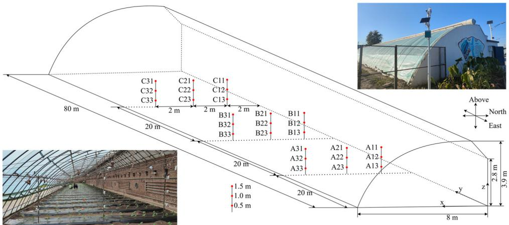  
图1. 日光温室内温度观测传感器分布

在黄瓜结果期，使用地基LiDAR FARO SCAN (FARO Focus, Lake Mary, FL, USA)对黄瓜冠层进行扫描。扫描过程中系统遵循预设参数：分辨率比例为$1/4$，质量增强因子为$2\times$，高动态范围(HDR)倍数为$5\times$。每次扫描前在垄间放置标靶球，用于识别相邻扫描站视场中的唯一空间点。采用六站式扫描方法，将LiDAR置于采集区域长边的四个角落和中点位置，每次扫描耗时约$10\mathrm{min}$。采集的地基LiDAR数据使用配套软件FARO SCENE 2023进行处理，该软件用于对齐融合多站三维点云，随后进行地面去除、降噪和绿色植物点云提取等步骤，具体操作流程可参考Wang等[30]的研究。最终获得仅含植物点云数据(图2a)、单株点云数据(图2b)以及基于此构建的单株三维凸包(图2c)和叶片器官模型(图2d)。

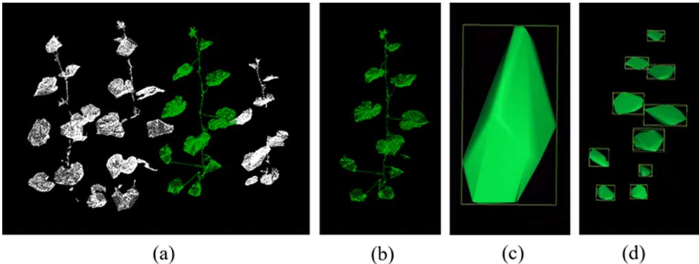  
图2. 基于地基雷达的日光温室黄瓜三维冠层结构获取：(a)群体点云；(b)单株点云；(c)点云生成的凸包多孔模型；(d)点云生成的叶片器官模型

# 2.2. 基本控制方程

# 2.2.1. 能量平衡方程

温室内热量传递与流体流动遵循物理守恒定律。日光温室内气体流动呈湍流运动，采用标准$k-\epsilon$模型进行数值模拟计算。控制方程包括连续性方程(质量守恒)、动量守恒方程、$k$(湍流动能)方程和$\epsilon$(耗散率)方程，均可写成如下通用形式[31-33]：

$$
\frac{\partial(\rho\phi)}{\partial t} +div\left(\vec{\rho}\vec{V}\phi\right) = div\big(T_{\phi}g\tau m\phi \big) + S_{\phi} \tag{1}
$$

式中$\phi$为通用物理变量，代表质量、速度、温度等求解变量，$\rho$为流体密度$(\mathrm{kg}\mathrm{m}^{-3})$，$\vec{V}$表示速度矢量$(\mathrm{ms}^{-1})$，$\Gamma_{\phi}$为变量$\phi$的广义扩散系数，$S_{\phi}$为变量$\phi$的广义源项，div和grad分别为散度和梯度算子。

# 2.2.2. 辐射模型

太阳辐射对日光温室微气候具有重要影响。白天太阳辐照度透过温室透光面，与各围护结构表面进行辐射换热过程；夜间无太阳辐照且保温被覆盖后，围护结构内表面仍保持较高温度，这种温差导致的辐射换热对温室内热分布影响显著。因此本研究采用离散坐标辐射模型(DO模型)进行计算[34]，该模型结合北京当地时空变量(时间、地理坐标和气象参数)，通过光线追踪方法模拟辐射传热动态，实现太阳高度角和入射角的实时模拟。具体公式如下：

$$
\nabla \Big(I_{\lambda}\Big(\vec{r},\vec{s}\Big)\vec{s}\Big) + (a_{\lambda} + \sigma_{s})I_{\lambda}\Big(\vec{r},\vec{s}\Big) = a_{\lambda}n_{\lambda}^{2}\frac{\sigma T^{4}}{\pi} +\frac{\sigma_{s}}{4\pi}\times \int_{0}^{4\pi}I_{\lambda}\Big(\vec{r},\vec{s}^{\prime}\Big)\phi \Big(\vec{s},\vec{s}^{\prime}\Big)\mathrm{d}\Omega \tag{2}
$$

式中$I_{\lambda}$为辐射强度$(\mathrm{Wm}^{-2})$，$\vec{r}$为位置矢量$(\mathrm{m})$，$\vec{s}$为方向矢量，$\nabla$为散度算子，$\vec{s^{\prime}}$为散射方向矢量，$a_{\lambda}$为吸收系数$(\mathrm{m}^{-1})$，$\sigma$为斯特藩-玻尔兹曼常数$(5.67\times 10^{-8}\mathrm{Wm}^{-2}\mathrm{K}^{-4})$，$\sigma_{s}$为散射系数$(\mathrm{m}^{-1})$，$n_{\lambda}$为折射率，$T$为温度$(^{\circ}\mathrm{C})$，$\phi$为相位函数，$\Omega$为辐射立体角。

大气吸收太阳辐射的能力可用有效天空温度表征。晴朗无云天气条件下，有效天空温度计算公式为[35]：

$$
T_{sky} = 0.055\times 2T_0^{1.5} \tag{3}
$$

式中$T_{0}$为室外空气温度(K)。

# 2.2.3. 植物多孔介质模型

多孔介质是固体骨架与骨架间隙中流体组成的混合物。本研究采用植物多孔介质模型模拟植物影响，植物对空气的拖曳效应通过基本方程中动量方程的源项体现。假设植物为均匀各向同性多孔介质，则有：

$$
S_{\phi} = -\Big(\frac{\mu}{a}\nu +Y\rho |\nu |\frac{\nu}{2}\Big) \tag{4}
$$

式中$S_{\phi}$为动量源项，$\mu$为空气动力粘度$(\mathrm{N}\cdot \mathrm{s}\cdot \mathrm{m}^{-2})$，$\alpha$为通过实验测量获得的介质孔隙率。$Y$为非线性动量耗散系数$(\mathrm{m}^{-1})$，$\rho$为空气密度$(\mathrm{kg}\mathrm{m}^{-3})$，$\nu$为气流速度$(\mathrm{ms}^{-1})$。

植物冠层单位体积拖曳效应的动量源项表达式可表示为[36]：

$$
S_{\phi} = -\rho C_{D}\nu^{2}LAD \tag{5}
$$

其中$LAD$为叶面积密度$(\mathrm{m}^{2}/\mathrm{m}^{3})$，$C_D$为阻力系数，实验值为0.32[37]。

# 2.3. 模型建立

# 2.3.1. 真实温室三维结构模型与简化植物模型假设

基于测试温室的真实尺寸，在Ansys 2023 R2 SpaceClaim中建立了三维实体模型。该模型中$\mathcal{X}$轴正方向表示南方，y轴正方向表示西方，$\mathcal{Z}$轴正方向垂直向上。为在保证精度的同时简化温室内部复杂的热传递过程，对传热模型做出以下假设：(1) 温室内空气视为湍流状态下的粘性不可压缩理想气体；(2) 模拟过程中假设温室无通风；(3) 忽略拱架和管道对传热的影响；(4) 假设温室内每株植物生长状况均匀，均视为等效多孔介质模型[16]；(5) 温差引起的浮力项满足Boussinesq假设。

由于实际温室尺寸较大（长80m，跨度8m，包含55行黄瓜植株），对所有植物的精细冠层结构建模将需要海量数据，远超软件计算能力。为此采用简化建模方法：对于六面体多孔模型，每行作物表示为尺寸$1.2\mathrm{m}\times 1.8\mathrm{m}\times 5.8\mathrm{m}$的六面体，共55行简化作物区域（图3a）；对于凸包多孔模型，将位于$20\mathrm{m}$、$40\mathrm{m}$和$60\mathrm{m}$处的三行六面体多孔模型替换为由点云生成的凸包多孔模型（图3b）。由于黄瓜作物靠近地面的根茎部分较为稀疏且孔隙率较大，建模时将地面$0.2\mathrm{m}$以下高度设为空白。

# 2.3.2. 考虑植物精细三维结构的小型温室模型

为在考虑作物精细三维结构的前提下进一步探究温室内微气候分布，虚拟设计了一个小型人工气候室温室。温室尺寸为$2.0\mathrm{m}\times 2.0\mathrm{m}\times 2.0\mathrm{m}$，顶部安装$30\mathrm{cm}$高遮阳板。整个温室建模为全封闭环境。选取4株通过地基激光雷达测量、高度不同的黄瓜植株，分别采用六面体多孔介质、凸包多孔介质和单叶组装三种不同模型进行模拟计算（图4）。在Fluent软件配置中，凸包模型被指定为多孔介质，采用与六面体多孔模型相同的$C_D$值。各模型体积可直接在SpaceClaim 2023软件中测量。由于体积更小且叶面积恒定，凸包模型的LAD值高于多孔六面体模型。而叶片器官模型不将叶片视为多孔介质，黄瓜的每个叶片器官在软件中均为固体选项，所有叶片被赋予统一的热力学和辐射特性。

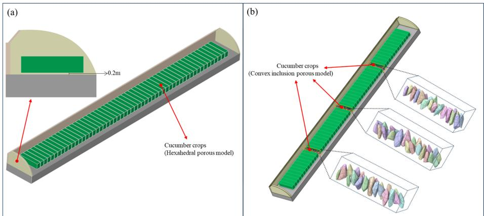  
图3. 日光温室几何模型及其截面图：(a)六面体多孔模型；(b)凸包多孔模型

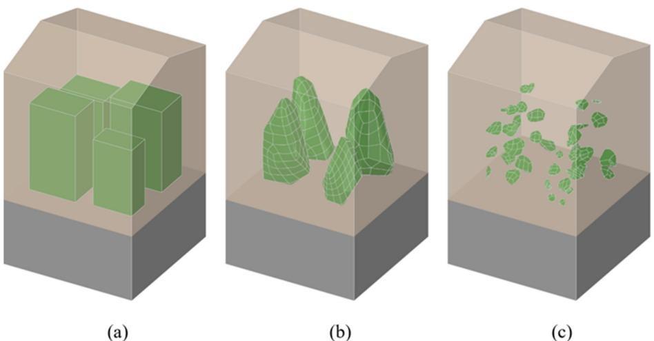  
图4. 模拟温室几何模型：(a)六面体多孔模型；(b)点云生成的凸包多孔模型；(c)点云生成的叶片器官模型

# 2.3.3. 网格生成与独立性验证

本研究采用非结构化网格系统，根据计算区域内温度场梯度分布进行局部加密。针对与实际尺寸相同的大型温室，选取网格数为1,124,329、1,491,983和1,896,258的网格系统验证六面体多孔介质植物模型的网格独立性；选取网格数为2,858,121、10,336,415和31,898,827的网格系统验证凸包多孔植物模型的网格独立性。对于小型温室，选取网格数为53,676、96,911和128,674的网格系统验证采用六面体多孔介质作物模型的温室网格独立性；选取网格数为784,465、922,643和1,377,306的网格系统验证采用点云生成的凸包植物模型的温室网格独立性；选取网格数为1,058,893、1,544,039和2,021,265的网格系统验证采用点云生成的叶片器官模型的温室网格独立性。通过测试这些不同网格系统，确保模拟结果与网格分辨率无关。

# 2.4. 边界条件

边界条件对数值结果的质量和准确性至关重要。本研究基于实验测试数据，使用Ansys 2023 R2 Fluent软件设置边界条件。在辐射模型中设置温室薄膜对可见光和近红外光的吸收率与透射率，以模拟其对不同波长的选择性。08:00至18:00期间，南向屋顶定义为透明塑料薄膜层，其余时间设置为保温被层。白天，温室南侧塑料薄膜及其他所有围护结构的短波透射率设为0.8。由于塑料薄膜几乎不透红外辐射，对长波部分施加了很大的吸收系数。温室东西墙采用不透明材料建造，在一天中的特定时间（特别是清晨和傍晚）会产生阴影。这些阴影会影响温室内太阳辐射的分布，进而影响植物生长的温度和光照条件。在CFD模拟中，通过定义太阳辐射的光线追踪边界条件来体现遮阳效果。温室内外的能量交换通过温室薄膜和墙壁以对流、热传导和辐射三种形式进行。根据测点实验布置方案，将实测温室热环境参数作为日光温室三维瞬态热环境模拟的初始条件和验证数据。选取2023年11月2日00:00（典型晴天）的温室外侧及温室围护结构实测数据作为模拟初始条件，模拟当天00:00至次日00:00的日光温室热环境。将北京地理经纬度坐标、实验测得的有效天空温度和太阳辐照强度等参数集成到Fluent CFD求解器中。实验温室与模拟温室墙体采用Fluent软件设置中的耦合边界条件建模。温室围护结构和作物受太阳辐射影响，其余部分不参与辐射计算。Fluent软件中设置的相关材料热物性参数见表1。

表1. 温室材料物理性质  

| 材料 | 厚度(mm) | 密度(kg/m³) | 比热容(J/(kg·K)) | 导热系数(W/(m·K)) | 吸收系数(m⁻¹) | 散射系数(m⁻¹) | 折射率 |
|------|---------|------------|-----------------|------------------|--------------|--------------|-------|
| 空气 | - | 1.225 | 1006 | 0.02 | 0.15 | 0 | 1.0 |
| 砖墙 | 350 | 1700 | 1050 | 0.81 | 0.5 | 0 | 1.2 |
| 聚苯板 | 80 | 50 | 1300 | 0.03 | 0.3 | 0 | 1.1 |
| 木板 | 60 | 550 | 2500 | 0.29 | 0.3 | 0 | 1.2 |
| 土壤 | - | 1860 | 1150 | 1.28 | 0.8 | 1.0 | 1.9 |
| 塑料薄膜 | 0.1 | 70 | 2300 | 0.19 | 0.1 | 0.3 | 1.2 |
| 保温被 | 40 | 950 | 1000 | 0.05 | 0.1 | 0 | 1.2 |
| 冠层 | - | 1001 | 3300 | 0.4 | 0.6 | 0.1 | 1.5 |

# 2.5. 计算策略

计算与模拟采用Ansys 2023 R2 Fluent软件完成。采用非稳态传热模型，压力-速度耦合计算使用SIMPLE算法。空间离散化设计中梯度项采用最小二乘法，动量项、能量项和粘性项均采用二阶迎风格式。能量项残差收敛标准设为小于$10^{-6}$，连续性方程和$k-\epsilon$方程设为小于$10^{-3}$。计算时间步长设为$60~\mathrm{s}$，共1440步以模拟$24\mathrm{h}$的温度变化。

# 3. 结果分析

# 3.1. 实验数据分析

图5展示了2023年9月21日至12月10日期间温室内27个测站与室外1个测站的平均温度变化。温室自10月29日起采取增温措施。

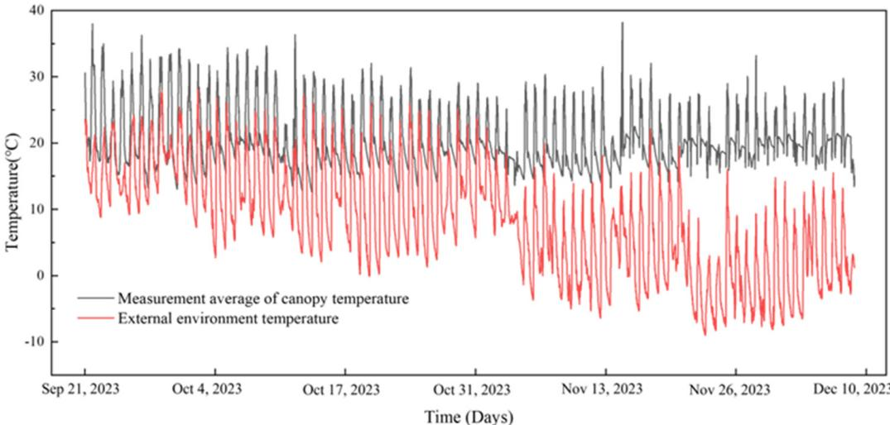  
图5. 黄瓜生长期冠层温度与室外温度平均测量值

图6显示了2023年9月30日在$0.5\mathrm{m}$高度测得的冠层温度。温室A、B、C三个区域沿南北方向(x方向)的温度分布呈现明显热梯度，南部温度始终高于北部。在$24\mathrm{h}$内，A区南部测点A33比北部A13高$1.8^{\circ}\mathrm{C}$；B区南部B33比北部B13高$1.4^{\circ}\mathrm{C}$；C区南部C33比北部C13高$1.4^{\circ}\mathrm{C}$。

在东西方向(y方向)上，06:40前东侧(A区)平均温度最高，西侧(C区)最低。06:40至14:30期间，C区平均冠层温度高于A区，09:00达到最大平均温差$3.4^{\circ}\mathrm{C}$。14:30后A区温度逐渐超过C区，15:50达到最大平均温差$1.3^{\circ}\mathrm{C}$。

2023年10月14日的研究增加了$1.0\mathrm{m}$高度的冠层温度数据(图7)。南北方向上，08:00前A、B、C三区北部平均温度高于南部；08:10至15:00期间南部温度高于北部；15:10后北部逐渐回暖。此外，$1.0~\mathrm{m}$高度的南北温差大于$0.5\mathrm{m}$高度，$1.0\mathrm{m}$处13:30达到最大温差$4.8^{\circ}\mathrm{C}$，而$0.5\mathrm{m}$处12:40最大温差为$3.6^{\circ}\mathrm{C}$。

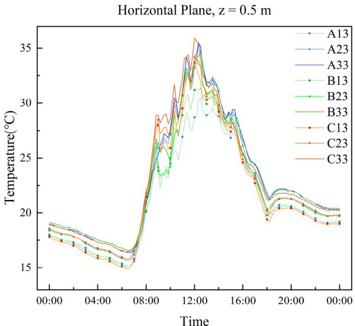  
图6. 各测点冠层温度(2023年9月30日)

  
图7. 2023年10月14日$0.5\mathrm{m}$(a)和$1.0\mathrm{m}$(b)高度各测点冠层温度

东西方向上，07:30前A区平均冠层温度高于C区；07:40至15:50期间C区高于A区，12:40观测到最大温差$4.3^{\circ}\mathrm{C}$；16:00后A区温度逐渐超过C区，16:30达到最大温差$0.6^{\circ}\mathrm{C}$。$1.0\mathrm{m}$高度的东西温差比$0.5\mathrm{m}$更显著，$1.0\mathrm{m}$冠层10:50达到最大东西温差$6.4^{\circ}\mathrm{C}$，而$0.5\mathrm{m}$冠层13:00最大温差为$2.8^{\circ}\mathrm{C}$。

垂直方向(z方向)上，夜间$0.5\mathrm{m}$高度平均温度高于$1.0\mathrm{m}$。07:50起$1.0\mathrm{m}$高度温度逐渐超过$0.5\mathrm{m}$。A区10:50观测到最大垂直温差，$1.0\mathrm{m}$高度平均温度比$0.5\mathrm{m}$高$8.0^{\circ}\mathrm{C}$。15:50起$0.5\mathrm{m}$高度温度再次超过$1.0\mathrm{m}$。

2023年11月2日三个高度的测量数据(图8)可用于研究冠层温度。南北方向(x方向)上，08:40前A、B、C三区北部平均温度高于南部；08:50后南部温度逐渐超过北部。北部温度反超南部的时间随高度变化：$0.5\mathrm{m}$为14:50，$1.0\mathrm{m}$为15:30，$1.5\mathrm{m}$为16:10。$1.5\mathrm{m}$高度的南北温差最大，12:40南部比北部高$2.9^{\circ}\mathrm{C}$；而$0.5\mathrm{m}$高度的南北温差最小，24小时内始终低于$1.5^{\circ}\mathrm{C}$。

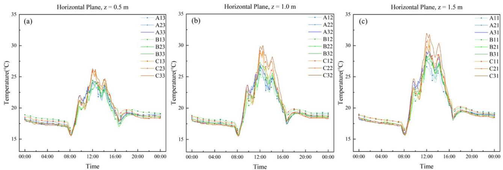  
图8. 2023年11月2日$0.5\mathrm{m}$(a)、$1.0\mathrm{m}$(b)和$1.5\mathrm{m}$(c)高度各测点冠层温度

东西方向上，11:10至18:30期间C区平均冠层温度高于A区，12:40达到最大温差$3.2^{\circ}\mathrm{C}$；其余时间A区高于C区。$1.5\mathrm{m}$高度的东西温差比$0.5\mathrm{m}$更显著，$1.5\mathrm{m}$处12:30最大温差$3.6^{\circ}\mathrm{C}$，而$0.5\mathrm{m}$处同样在12:30达到最大温差。

垂直方向上，$1.5\mathrm{m}$和$1.0\mathrm{m}$高度的平均温度高于$0.5\mathrm{m}$。垂直温差呈现先增大后减小的日变化规律。00:00时$1.5\mathrm{m}$与$0.5\mathrm{m}$之间的平均垂直温差达到最大值$4.2^{\circ}\mathrm{C}$，随后逐渐减小，至23:30已降至$0.1^{\circ}\mathrm{C}$以内。

# 3.2. CFD网格无关性验证结果

表2展示了不同网格数量在选定验证场景下的平均最低温度模拟结果。与粗网格模拟相比，中等尺寸网格的模拟结果显示出明显的温度差异。然而，与细网格模拟相比，中等尺寸网格的最大温度差异保持在$3\%$以内。这表明进一步增加中等尺寸网格的网格数量几乎不会影响模拟结果。中等尺寸网格系统已能产生不受网格分辨率影响的准确模拟结果。为在保证模拟精度的同时优化计算资源，本研究采用中等尺寸网格进行模拟分析。

表2. 网格敏感性分析对比结果

| 网格类型 | 温室模型* | 单元总数 | 最小正交质量 | 最大偏斜度 | 平均最低气温(°C) |
|---------|----------|---------|------------|-----------|----------------|
| 粗网格 | a | 1,124,329 | 0.24 | 0.76 | 25.2 |
| 粗网格 | b | 2,858,121 | 0.19 | 0.8 | 24.8 |
| 粗网格 | c | 53,676 | 0.23 | 0.78 | 24.9 |
| 粗网格 | d | 784,465 | 0.23 | 0.77 | 25.5 |
| 粗网格 | e | 1,058,893 | 0.21 | 0.79 | 25.8 |
| 中网格 | a | 1,491,983 | 0.32 | 0.68 | 22.1 |
| 中网格 | b | 10,336,415 | 0.27 | 0.73 | 22.5 |
| 中网格 | c | 96,911 | 0.34 | 0.66 | 22.3 |
| 中网格 | d | 922,643 | 0.35 | 0.66 | 22.6 |
| 中网格 | e | 1,544,039 | 0.29 | 0.72 | 22.5 |
| 细网格 | a | 1,896,258 | 0.29 | 0.71 | 21.8 |
| 细网格 | b | 31,898,827 | 0.26 | 0.74 | 22.0 |
| 细网格 | c | 128,674 | 0.29 | 0.7 | 22.1 |
| 细网格 | d | 1,377,306 | 0.31 | 0.69 | 22.5 |
| 细网格 | e | 2,021,265 | 0.25 | 0.75 | 22.5 |

*注：六面体多孔模型(a)和凸包多孔模型(b)用于模拟真实温室；六面体多孔模型(c)、凸包多孔模型(d)和叶片器官模型(e)用于模拟小型虚拟温室。

# 3.3. 真实温室的CFD模拟分析

选取2023年11月2日00:00至次日00:00温室内外的典型环境参数进行分析。将27个冠层测点的平均温度与建立的CFD传热模型模拟平均温度进行对比。如图9所示，两种模型的模拟值变化趋势与实测值高度吻合。对于六面体多孔模型，温室内27个测点的实测平均温度与CFD模拟平均温度的绝对误差在0.1至$1.8^{\circ}\mathrm{C}$之间，均方根误差为$0.99^{\circ}\mathrm{C}$，平均相对误差$4.3\%$，最大相对误差$7.1\%$。对于凸包多孔模型，绝对误差范围0.1至$1.1^{\circ}\mathrm{C}$，均方根误差$0.71^{\circ}\mathrm{C}$，平均相对误差$2.9\%$，最大相对误差$6.5\%$。总体而言，两种模型的实测值与模拟值吻合良好，验证了传热模型及其数值计算方法的可靠性。

图10展示了2023年11月2日10:00、13:00和16:00建立的CFD模拟结果。六面体多孔模型和凸包多孔介质模型均表现出相似的温度分布规律。在10:00和13:00，A、B、C三区南侧温度高于北侧，上层温度高于下层。13:00时南侧温度显著高于北侧，$1.5\mathrm{m}$、$1.0\mathrm{m}$和$0.5\mathrm{m}$三个高度的温度云图显示出明显的分层现象。至16:00，南北温差减小，并开始出现北侧温度反超南侧的区域。这些模拟结果与前期分析结论一致。

图11展示了实验温室内27个具体点位在三个不同时刻的实际测量冠层温度与传热模型生成的模拟值之间的温差。10:00时，六面体多孔模型的标准差为$0.28^{\circ}\mathrm{C}$，均方根误差$1.58^{\circ}\mathrm{C}$，平均绝对百分比误差$6.3\%$；而凸包多孔介质模型的标准差为$0.16^{\circ}\mathrm{C}$，均方根误差$0.75^{\circ}\mathrm{C}$，平均绝对百分比误差$3.0\%$。13:00时，六面体多孔模型的标准差$0.19^{\circ}\mathrm{C}$，均方根误差$1.73^{\circ}\mathrm{C}$，平均绝对百分比误差$6.6\%$；凸包多孔模型的标准差$0.09^{\circ}\mathrm{C}$，均方根误差$1.08^{\circ}\mathrm{C}$，平均绝对百分比误差$4.1\%$。至16:00，六面体多孔模型的标准差$0.17^{\circ}\mathrm{C}$，均方根误差$1.53^{\circ}\mathrm{C}$，平均绝对百分比误差$6.9\%$；凸包多孔模型的标准差$0.09^{\circ}\mathrm{C}$，均方根误差$1.01^{\circ}\mathrm{C}$，平均绝对百分比误差$4.6\%$。在三个选定时刻，凸包多孔模型的性能均优于六面体多孔模型。

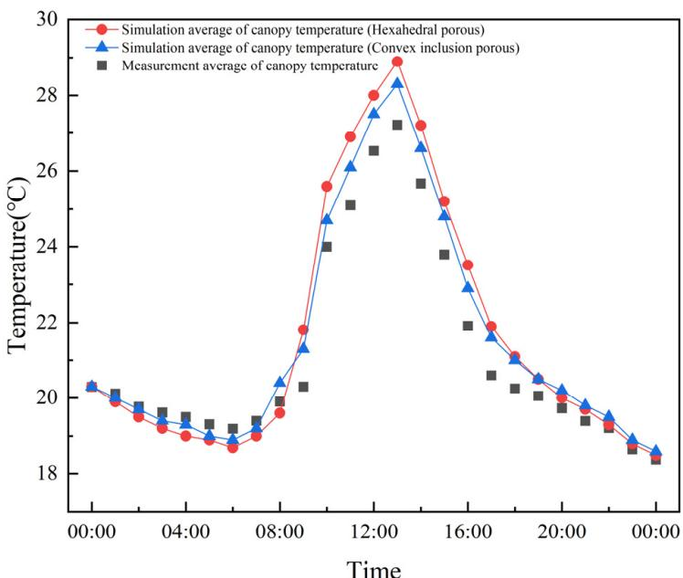  
图9. 2023年11月2日模拟与实测冠层温度值对比

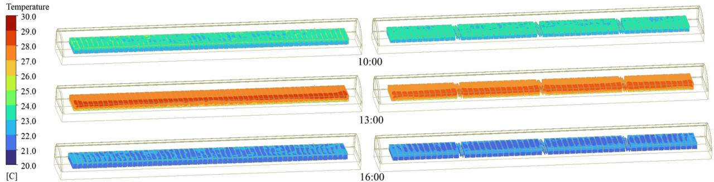  
图10. 2023年11月2日日光温室内10:00、13:00和16:00冠层温度分布的CFD模拟。从左至右分别为六面体多孔模型和凸包多孔模型的模拟结果

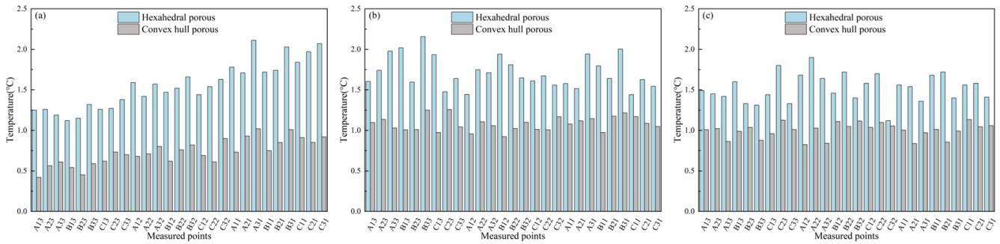  
图11. 温室内(a)10:00、(b)13:00和(c)16:00实测值与模拟值温差的柱状图

# 3.4. 考虑植物最终3D结构的小型虚拟温室CFD模拟对比分析

尽管使用不同的冠层模型来代表作物，但各模型的冠层温度变化趋势保持一致。图12的温度云图显示了不同模型选择的温度分布差异。六面体多孔介质模型表现出明显的高低温区域，导致冠层内存在显著温差。凸包多孔模型的温差较六面体多孔模型更为平缓。叶片器官模型则展示了最平滑的温度过渡，冠层内不会出现大的温度差异。六面体多孔介质、凸包多孔介质和叶片器官模型的平均冠层温度范围分别为$15.1 - 30.3^{\circ}\mathrm{C}$、$15.3 - 29.9^{\circ}\mathrm{C}$和$15.9 - 28.8^{\circ}\mathrm{C}$。

10:00时，东向受光面观测到最高温度，而西北背光面出现最低温度。六面体多孔模型的最高温度为$26.8^{\circ}\mathrm{C}$，最低温度为$20.1^{\circ}\mathrm{C}$；凸包多孔介质模型的最高温度为$26.4^{\circ}\mathrm{C}$，最低温度为$20.5^{\circ}\mathrm{C}$；叶片器官模型的最高温度为$26.1^{\circ}\mathrm{C}$，最低温度为$21.1^{\circ}\mathrm{C}$。

13:00时，三个模型南侧温度均显著高于北侧。六面体多孔介质模型的最高温度为$29.9^{\circ}\mathrm{C}$，最低温度为$22.3^{\circ}\mathrm{C}$；凸包多孔介质模型的最高温度为$29.7^{\circ}\mathrm{C}$，最低温度为$22.5^{\circ}\mathrm{C}$；叶片器官模型的最高温度为$27.8^{\circ}\mathrm{C}$，最低温度为$22.9^{\circ}\mathrm{C}$。

16:00时，三个模型西侧冠层温度高于东侧。六面体多孔介质模型的最高温度为$26.8^{\circ}\mathrm{C}$，最低温度为$20.3^{\circ}\mathrm{C}$；凸包多孔介质模型的最高温度为$26.4^{\circ}\mathrm{C}$，最低温度为$20.7^{\circ}\mathrm{C}$；叶片器官模型的最高温度为$26.1^{\circ}\mathrm{C}$，最低温度为$21.5^{\circ}\mathrm{C}$。

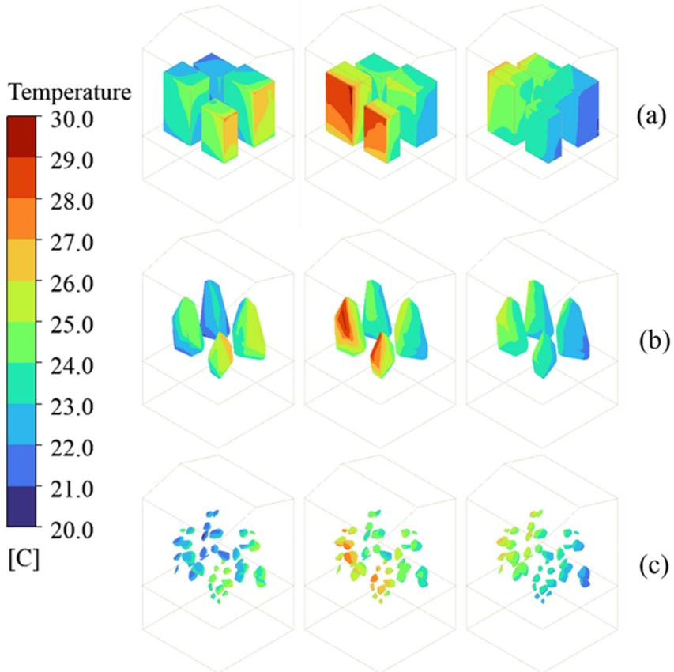  
图12. 虚拟温室内(a)六面体多孔模型、(b)点云生成的凸包多孔模型和(c)点云生成的叶片器官模型的冠层温度分布CFD模拟。从左至右分别为10:00、13:00和16:00的计算结果

# 4. 讨论

# 4.1. 日光温室小气候分布

温室内温度分布不均匀。这种变化不仅受外部环境因素影响，还与温室结构和作物特性相关[38,39]。在作物、温室围护结构与阳光的能量交换过程中，太阳短波辐射可穿透温室塑料薄膜。进入温室后，光波转化为长波辐射并被温室薄膜反射，从而在温室内形成高温环境[40,41]。

南北方向上，白天受阳光影响，温室南侧尤其是靠近薄膜处的冠层温度较高。夜间随着外界环境温度下降，北墙的蓄热保温特性显现，导致北侧冠层温度升高[14,42]。

东西方向上，温室西侧最先接受光辐射，升温较早且幅度较大；而西侧也最先失去阳光，温度开始下降较早。夜间温室东侧温度略高于西侧。

垂直方向上，白天冠层对阳光的遮挡作用使上层冠层温度高于下层。夜间土壤的蓄放热特性使$0.5\mathrm{m}$高度冠层的温度降幅小于上层，导致垂直温差逐渐减小。这些发现与Mobtaker等[43]、Xu等[44]和Mao等[45]的研究结果一致。

# 4.2. 应用真实冠层结构的必要性及未来方向与挑战

在真实温室的CFD模拟中，与六面体多孔模型相比，凸包多孔模型的模拟结果更接近实际值，且温度波动范围更小。类似地，在小型温室模拟中，六面体多孔模型、凸包多孔模型和叶片器官模型的模拟温度变化范围依次递减。这一趋势主要源于六面体多孔介质占据的空间体积最大，对CFD模拟中的阳光传输和气流影响更大[46]。凸包多孔介质模型比六面体多孔介质模型占据的空间体积更小。尽管在本实验中，后两种模型在小型温室模拟中的结果与六面体多孔介质模型相比未表现出显著差异，但仅使用了四株植物样本。考虑到群体作物的潜在累积效应，凸包多孔介质模型在真实温室环境（特别是处理黄瓜等空间体积较大的作物）的CFD模拟中仍具有巨大潜力。叶片器官模型对计算资源需求最高，但能呈现最平滑的模拟温度结果，最能代表阳光遮挡和空气阻滞效应，与真实作物生长环境高度匹配。若计算资源充足，该模型被视为最优选择。目前已有将3D CFD模型应用于番茄[28]和大豆[29]等温室作物的案例。尽管模拟植物数量相对较少，但这些研究证明了叶片器官模型对其他温室作物的广泛适用性。

黄瓜植株的叶片分布和密度在整个生长周期中不断变化，不同生长阶段的植株对气流的阻碍程度各异。未来模型应考虑孔隙率的时空变化，以更好表征作物在不同生长阶段的多孔特性[29]。植株不同部位（如叶片、茎秆和果实）对气流的影响不同：叶片通常具有较低渗透性，而茎秆和果实周围区域可能表现出较高渗透性。为提高模拟精度，应为不同区域定义非均匀渗透率[28]。在LiDAR点云扫描和模型生成过程中，由于复杂几何细节可能无法完全捕捉，会自然产生一定误差。传感器的测量过程也会引入误差。此外，在单日模拟中假设静态冠层结构而不考虑叶片运动或形变，可能导致结果不准确。我们当前的CFD模型采用三行作物布局的凸包模型，且仅对四种作物应用叶片器官模型，这都受限于有限的计算资源。此类孤立模拟可能无法充分捕捉整个温室的复杂相互作用。未来研究应扩大模拟范围至温室更大区域，以实现对行间相互作用的更全面评估。

# 5. 结论

在CFD模拟中，将温室黄瓜植株建模为多孔介质有助于模拟气流、传热和湿度分布等过程，为优化温室内微环境以提高作物产量和品质提供重要见解。然而多孔介质模型在准确表征实际温度分布方面存在局限，需进一步改进优化。本研究通过传感器阵列测量了不同生长阶段黄瓜的冠层温度，分析表明不同生长期黄瓜冠层温度的空间异质性存在差异。构建了日光温室的CFD模型，在真实温室CFD模拟中，凸包多孔模型比六面体多孔模型更接近真实值，且温度波动范围更窄。在小型温室中，对比了六面体多孔模型、凸包多孔模型和叶片器官模型三种作物模型，凸包多孔模型和叶片器官模型的温度变化范围分别减小了$0.6^{\circ}\mathrm{C}$和$2.3^{\circ}\mathrm{C}$，且两者均提高了模拟结果的均匀性。

# 作者贡献：
概念设计，M.H.和D.X.；方法论，M.H.、D.X.和Z.W.；软件，M.H.和Z.W.；验证，M.H.、D.X.和Y.M.；形式分析，M.H.和D.X.；调研，M.H.、D.X.和Z.W.；资源，D.X.和Z.W.；数据管理，M.H.和D.X.；初稿撰写，M.H.；文稿审阅与编辑，D.X.、L.M.、L.W.、Y.M.、J.Z.和C.L.；可视化，M.H.；监督，L.W.、Y.M.、J.Z.和C.L.；项目管理，Y.M.、J.Z.和C.L.；资金获取，Y.M.、J.Z.和C.L.。所有作者均已阅读并同意稿件最终版本。

# 基金资助：
本研究获国家重点研发计划（2023YFD2000600）、国家自然科学基金（32372799）和北京数字农业研究系统创新联盟（BAC10-2024）资助。

# 数据可用性声明：
由于隐私和保密限制，支持本研究结果的数据不公开。经通讯作者和相关主管部门许可后，可根据合理请求提供数据访问。

# 利益冲突声明：
作者Liang Wang受聘于中国融通农业发展集团有限公司。其余作者声明本研究不存在可能被解释为潜在利益冲突的商业或财务关系。

# 参考文献

1. Li, T.; Qi, M.; Meng, S. 中国设施园艺60年发展历程：成就与展望. Acta Hortic. Sin. 2022, 10, 2119–2130. [CrossRef]  
2. Blum, A. 杂种优势、胁迫与环境：作物产量普遍提高的可能路径. J. Exp. Bot. 2013, 64, 4829–4837. [CrossRef]  
3. Chen, C.; Ling, H.; Zhai, Z.; Li, Y.; Yang, F.; Han, F.; Wei, S. 日光温室相变材料主动-被动通风墙体的热性能研究. Appl. Energy 2018, 216, 602–612. [CrossRef]  
4. Meng, L.; Yang, Q.; Bot, G.P.; Wang, N. 日光温室热环境可视化模拟模型. Trans. Chin. Soc. Agric. Eng. 2009, 25, 164–170.  
5. Han, Y.; Xue, X.; Luo, X.; Guo, L.; Li, T. 日光温室内太阳辐射估算模型的建立. Trans. Chin. Soc. Agric. Eng. 2014, 30, 174–181.  
6. Bournet, P.E.; Rojano, F. 计算流体力学在农业建筑建模中的应用进展：研究、应用与挑战. Comput. Electron. Agric. 2022, 201, 107277. [CrossRef]  
7. Zhou, P.; Wang, S.; Zhou, J.; Hussain, S.A.; Liu, X.; Gao, J.; Huang, G. 面向多末端协同控制的大空间建模方法. Build. Simul. 2023, 16, 225–241. [CrossRef]  
8. Guzmán, C.H.; Carrera, J.L.; Durán, H.A.; Berumen, J.; Ortiz, A.A.; Guirette, O.A.; Arroyo, A.; Brizuela, J.A.; Gómez, F.; Blanco, A.; et al. 基于CFD与控制的温室温度监测虚拟传感器实现. Sensors 2019, 19, 60. [CrossRef] [PubMed]  
9. Bartzanas, T.; Boulard, T.; Kittas, C. 通风口布置对连栋温室迎风面通风的影响. Biosyst. Eng. 2004, 88, 479–490. [CrossRef]
10. Ould Khaoua, S.A.; Bournet, P.E.; Migeon, C.; Boulard, T.; Chasseriaux, G. 基于计算流体力学的温室通风效率分析. Biosyst. Eng. 2006, 95, 83-98. [CrossRef]
11. Saberian, A.; Sajadiye, S.M. 动态太阳热负荷对温室微气候影响的CFD模拟研究. Renew. Energy 2019, 138, 722-737. [CrossRef]
12. Liu, R.; Liu, J.; Liu, H.; Yang, X.; Bárcena, J.F.B.; Li, M. 日光温室黄瓜冠层叶片结露的三维模拟. Biosyst. Eng. 2021, 210, 310-329. [CrossRef]
13. Tong, G.; Christopher, D.M.; Zhang, G. 基于CFD的日光温室跨度选择新见解. Comput. Electron. Agric. 2018, 149, 3-15. [CrossRef]
14. Wu, X.; Li, Y.; Jiang, L.; Wang, Y.; Liu, X.; Li, T. 基于热性能的日光温室多结构参数系统分析. Energy 2023, 273, 127193. [CrossRef]
15. Fatnassi, H.; Bournet, P.E.; Boulard, T.; Roy, J.C.; Molina-Aiz, F.D.; Zaaboul, R. 计算流体力学工具在温室和封闭植物生长系统中植物冠层活动与气候耦合建模中的应用综述. Biosyst. Eng. 2023, 230, 388-408. [CrossRef]
16. Boulard, T.; Roy, J.C.; Pouillard, J.B.; Fatnassi, H.; Grisey, A. 基于计算流体力学的封闭温室微气象、冠层蒸腾和光合作用建模. Biosyst. Eng. 2017, 158, 110-133. [CrossRef]
17. Xiao, S.; Chai, H.; Shao, K.; Shen, M.; Wang, Q.; Wang, R.; Sui, Y.; Ma, Y. 基于图像的甜菜地上部结构动态量化研究. Remote Sens. 2020, 12, 269. [CrossRef]
18. Chen, B.; Shi, S.; Gong, W.; Zhang, Q.; Yang, J.; Du, L.; Sun, J.; Zhang, Z.; Song, S. 多光谱LiDAR点云分类：一种两步法. Remote Sens. 2017, 9, 373. [CrossRef]
19. Sultan Mahmud, M.; Zahid, A.; He, L.; Choi, D.; Krawczyk, G.; Zhu, H.; Heinemann, P. 基于LiDAR的树冠密度分区测量系统开发及其在精准施药中的应用. Comput. Electron. Agric. 2021, 182, 106053. [CrossRef]
20. Weiss, U.; Biber, P. 农业机器人使用3D LiDAR传感器进行植物检测与测绘. Rob. Auton. Syst. 2011, 59, 265-273. [CrossRef]
21. Hosoi, F.; Nakabayashi, K.; Omasa, K. 基于高分辨率便携式扫描激光雷达的番茄冠层三维建模及结构信息提取. Sensors 2011, 11, 2166-2174. [CrossRef] [PubMed]
22. Wei, G.; Song, S.; Zhu, B.; Shi, S.; Li, F.; Cheng, X. 多波长冠层激光雷达在植被遥感中的应用：设计与系统性能. ISPRS J. Photogramm. Remote Sens. 2012, 69, 1-9. [CrossRef]
23. Schneider, F.D.; Leiterer, R.; Morsdorf, F.; Gastellu-Etchegorry, J.P.; Lauret, N.; Pfeifer, N.; Schaepman, M.E. 基于激光雷达和实地数据的成像光谱仪数据模拟：三维森林建模. Remote Sens. Environ. 2014, 152, 235-250. [CrossRef]
24. Bailey, B.N.; Mahaffee, W.F. 利用地面激光雷达扫描快速测量叶片三维分布及叶角概率密度函数. Remote Sens. Environ. 2017, 194, 63-76. [CrossRef]
25. Omasa, K.; Ono, E.; Ishigami, Y.; Shimizu, Y.; Araki, Y. 植物功能遥感与智慧农业应用. Int. J. Agric. Biol. Eng. 2022, 15, 1-6. [CrossRef]
26. Xiao, S.; Ye, Y.; Fei, S.; Chen, H.; Zhang, B.; Li, Q.; Cai, Z.; Che, Y.; Wang, Q.; Ghafoor, A.Z.; et al. 基于UVA RGB相机交叉环绕航线的器官尺度性状高通量计算与精确三维冠层结构重建. ISPRS J. Photogramm. Remote Sens. 2023, 201, 104-122. [CrossRef]
27. Xiao, S.; Fei, S.; Ye, Y.; Xu, D.; Xie, Z.; Bi, K.; Guo, Y.; Li, B.; Zhang, R.; Ma, Y. 基于UVA技术的棉花铃原位三维重建与表征. ISPRS J. Photogramm. Remote Sens. 2024, 209, 101-116. [CrossRef]
28. Yu, G.; Zhang, S.; Li, S.; Zhang, M.; Benli, H.; Wang, Y. 自然光照与通风对Venlo型温室内番茄三维体温分布影响的数值研究. Inf. Process. Agric. 2023, 10, 535-546. [CrossRef]
29. Gu, X.; Goto, E. 基于计算流体动力学模型的人工光植物工厂真实植株冠层微气候评估. Build. Environ. 2024, 264, 111876. [CrossRef]
30. Wang, Z.; Xu, D.; Lu, T.; Cao, L.; Ji, F.; Zhu, J.; Ma, Y. 基于地面激光扫描的温室黄瓜冠层异质性及光截获差异量化研究. Comput. Electron. Agric. 2025, 230, 109879. [CrossRef]
31. Kichah, A.; Bournet, P.E.; Migeon, C.; Boulard, T. 对"温室盆栽凤仙花微气候特征与蒸腾作用的测量与CFD模拟"的更正说明. Biosyst. Eng. 2012, 112, 252. [CrossRef]
32. Majdoubi, H.; Boulard, T.; Fatnassi, H.; Bourden, L. 一公顷加那利型温室气流与微气候模式：实验与CFD辅助研究. Agric. For. Meteorol. 2009, 149, 1050-1062. [CrossRef]
33. Campen, J.B.; Bot, G.P.A. 利用三维计算流体动力学确定温室通风特性. Biosyst. Eng. 2003, 84, 69-77. [CrossRef]
34. Nebbali, R.; Roy, J.C.; Boulard, T. 作物温室分布式辐射与对流气候的动态模拟. Renew. Energy 2012, 45, 111-129. [CrossRef]
35. Swinbank, W.C. 晴空长波辐射. Q. J. R. Meteorol. Soc. 1963, 85, 339-348. [CrossRef]
36. Bartzanas, T.; Boulard, T.; Kittas, C. 装有防虫网的隧道温室气流与温度分布的数值模拟. Comput. Electron. Agric. 2002, 34, 207-221. [CrossRef]
37. Molina-Aiz, F.D.; Valera, D.L.; Alvarez, A.J.; Madueño, A. 园艺作物气流的风洞研究：阻力系数测定. Biosyst. Eng. 2006, 93, 447-457. [CrossRef]
38. Xu, D.; Henke, M.; Li, Y.; Zhang, Y.; Liu, A.; Liu, X.; Li, T. 基于三维光环境模拟的中国日光温室光微气候及种植策略优化设计. Energy 2024, 302, 131805. [CrossRef]
39. Zheng, S.; Cui, N.; Wei, X.; Wang, T.; Bai, X.; Pei, D.; Fu, S.; Plauborg, F.; Jiao, P. 中国东北葡萄温室能量交换动态及其植物生理与环境控制因素. J. Hydrol. 2024, 637, 131395. [CrossRef]
40. Baneshi, M.; Gonome, H.; Maruyama, S. 商业温室覆盖塑料辐射特性的广谱测量及其对温室能源管理的影响. Energy 2020, 210, 118535. [CrossRef]
41. Zhang, Y.; Xu, L.; Zhu, X.; He, B.; Chen, Y. 基于温度-波动相互作用理论的中国日光温室热环境模型构建. Energy Build. 2023, 279, 112648. [CrossRef]
42. Li, Y.; Jian, Y.; Wang, S.; Liu, X.; Li, W.; Aric, M.; Zhang, L.; Li, W.; Cao, Y. 塑料温室空间温度分布与地热储存：实验与模拟研究. J. Energy Storage 2024, 77, 109938. [CrossRef]
43. Mobtaker, H.G.; Ajabshirchi, Y.; Ranbar, S.F.; Matloobi, M. 伊朗西北部日光温室热性能模拟：实验验证. Renew. Energy 2019, 135, 88-97. [CrossRef]
44. Xu, K.; Guo, X.; He, J.; Yu, B.; Tan, J.; Guo, Y. 考虑作物蒸腾与光学效应的太阳辐射下温室温度空间分布研究. Energy Convers. Manag. 2022, 254, 115277. [CrossRef]
45. Mao, Q.; Li, H.; Ji, C.; Peng, Y.; Li, T. 基于不同作物高度与通风条件的大型连栋温室温湿度分布实验研究. Appl. Therm. Eng. 2024, 248, 123176. [CrossRef]
46. Cui, H.; Wang, C.; Yu, S.; Xin, Z.; Liu, X.; Yuan, J. 气助喷雾中雾滴在棉花冠层变形叶片上沉积的两阶段CFD模拟. Comput. Electron. Agric. 2024, 224, 109228. [CrossRef]

# References

1. Li, T.; Qi, M.; Meng, S. Sixty Years of Facility Horticulture Development in China: Achievements and Prospects. Acta Hortic. Sin. 2022, 10, 2119–2130. [CrossRef]  
2. Blum, A. Heterosis, Stress, and the Environment: A Possible Road Map towards the General Improvement of Crop Yield. J. Exp. Bot. 2013, 64, 4829–4837. [CrossRef]  
3. Chen, C.; Ling, H.; Zhai, Z.; Li, Y.; Yang, F.; Han, F.; Wei, S. Thermal Performance of an Active-Passive Ventilation Wall with Phase Change Material in Solar Greenhouses. Appl. Energy 2018, 216, 602–612. [CrossRef]  
4. Meng, L.; Yang, Q.; Bot, G.P.; Wang, N. Visual Simulation Model for Thermal Environment in Chinese Solar Greenhouse. Trans. Chin. Soc. Agric. Eng. 2009, 25, 164–170.  
5. Han, Y.; Xue, X.; Luo, X.; Guo, L.; Li, T. Establishment of Estimation Model of Solar Radiation within Solar Greenhouse. Trans. Chin. Soc. Agric. Eng. 2014, 30, 174–181.  
6. Bournet, P.E.; Rojano, F. Advances of Computational Fluid Dynamics (CFD) Applications in Agricultural Building Modelling: Research, Applications and Challenges. Comput. Electron. Agric. 2022, 201, 107277. [CrossRef]  
7. Zhou, P.; Wang, S.; Zhou, J.; Hussain, S.A.; Liu, X.; Gao, J.; Huang, G. A Modelling Method for Large-Scale Open Spaces Orientated toward Coordinated Control of Multiple Air-Terminal Units. Build. Simul. 2023, 16, 225–241. [CrossRef]  
8. Guzmán, C.H.; Carrera, J.L.; Durán, H.A.; Berumen, J.; Ortiz, A.A.; Guirette, O.A.; Arroyo, A.; Brizuela, J.A.; Gómez, F.; Blanco, A.; et al. Implementation of Virtual Sensors for Monitoring Temperature in Greenhouses Using CFD and Control. Sensors 2019, 19, 60. [CrossRef] [PubMed]  
9. Bartzanas, T.; Boulard, T.; Kittas, C. Effect of Vent Arrangement on Windward Ventilation of a Tunnel Greenhouse. Biosyst. Eng. 2004, 88, 479–490. [CrossRef]
10. Ould Khaoua, S.A.; Bournet, P.E.; Migeon, C.; Boulard, T.; Chasseriaux, G. Analysis of Greenhouse Ventilation Efficiency Based on Computational Fluid Dynamics. Biosyst. Eng. 2006, 95, 83-98. [CrossRef]
11. Saberian, A.; Sajadiye, S.M. The Effect of Dynamic Solar Heat Load on the Greenhouse Microclimate Using CFD Simulation. Renew. Energy 2019, 138, 722-737. [CrossRef]
12. Liu, R.; Liu, J.; Liu, H.; Yang, X.; Bárcena, J.F.B.; Li, M. A 3-D Simulation of Leaf Condensation on Cucumber Canopy in a Solar Greenhouse. Biosyst. Eng. 2021, 210, 310-329. [CrossRef]
13. Tong, G.; Christopher, D.M.; Zhang, G. New Insights on Span Selection for Chinese Solar Greenhouses Using CFD. Comput. Electron. Agric. 2018, 149, 3-15. [CrossRef]
14. Wu, X.; Li, Y.; Jiang, L.; Wang, Y.; Liu, X.; Li, T. A Systematic Analysis of Multiple Structural Parameters of Chinese Solar Greenhouse Based on the Thermal Performance. Energy 2023, 273, 127193. [CrossRef]
15. Fatnassi, H.; Bournet, P.E.; Boulard, T.; Roy, J.C.; Molina-Aiz, F.D.; Zaaboul, R. Use of Computational Fluid Dynamic Tools to Model the Coupling of Plant Canopy Activity and Climate in Greenhouses and Closed-Plant Growth Systems: A Review. Biosyst. Eng. 2023, 230, 388-408. [CrossRef]
16. Boulard, T.; Roy, J.C.; Pouillard, J.B.; Fatnassi, H.; Grisey, A. Modelling of Micrometeorology, Canopy Transpiration and Photosynthesis in a Closed Greenhouse Using Computational Fluid Dynamics. Biosyst. Eng. 2017, 158, 110-133. [CrossRef]
17. Xiao, S.; Chai, H.; Shao, K.; Shen, M.; Wang, Q.; Wang, R.; Sui, Y.; Ma, Y. Image-Based Dynamic Quantification of Aboveground Structure of Sugar Beet in Field. Remote Sens. 2020, 12, 269. [CrossRef]
18. Chen, B.; Shi, S.; Gong, W.; Zhang, Q.; Yang, J.; Du, L.; Sun, J.; Zhang, Z.; Song, S. Multispectral LiDAR Point Cloud Classification: A Two-Step Approach. Remote Sens. 2017, 9, 373. [CrossRef]
19. Sultan Mahmud, M.; Zahid, A.; He, L.; Choi, D.; Krawczyk, G.; Zhu, H.; Heinemann, P. Development of a LiDAR-Guided Section-Based Tree Canopy Density Measurement System for Precision Spray Applications. Comput. Electron. Agric. 2021, 182, 106053. [CrossRef]
20. Weiss, U.; Biber, P. Plant Detection and Mapping for Agricultural Robots Using a 3D LiDAR Sensor. Rob. Auton. Syst. 2011, 59, 265-273. [CrossRef]
21. Hosoi, F.; Nakabayashi, K.; Omasa, K. 3-D Modeling of Tomato Canopies Using a High-Resolution Portable Scanning Lidar for Extracting Structural Information. Sensors 2011, 11, 2166-2174. [CrossRef] [PubMed]
22. Wei, G.; Song, S.; Zhu, B.; Shi, S.; Li, F.; Cheng, X. Multi-Wavelength Canopy LiDAR for Remote Sensing of Vegetation: Design and System Performance. ISPRS J. Photogramm. Remote Sens. 2012, 69, 1-9. [CrossRef]
23. Schneider, F.D.; Leiterer, R.; Morsdorf, F.; Gastellu-Etchegorry, J.P.; Lauret, N.; Pfeifer, N.; Schaepman, M.E. Simulating Imaging Spectrometer Data: 3D Forest Modeling Based on LiDAR and in Situ Data. Remote Sens. Environ. 2014, 152, 235-250. [CrossRef]
24. Bailey, B.N.; Mahaffee, W.F. Rapid Measurement of the Three-Dimensional Distribution of Leaf Orientation and the Leaf Angle Probability Density Function Using Terrestrial LiDAR Scanning. Remote Sens. Environ. 2017, 194, 63-76. [CrossRef]
25. Omasa, K.; Ono, E.; Ishigami, Y.; Shimizu, Y.; Araki, Y. Plant Functional Remote Sensing and Smart Farming Applications. Int. J. Agric. Biol. Eng. 2022, 15, 1-6. [CrossRef]
26. Xiao, S.; Ye, Y.; Fei, S.; Chen, H.; Zhang, B.; Li, Q.; Cai, Z.; Che, Y.; Wang, Q.; Ghafoor, A.Z.; et al. High-Throughput Calculation of Organ-Scale Traits with Reconstructed Accurate 3D Canopy Structures Using a UVA RGB Camera with an Advanced Cross-Circling Oblique Route. ISPRS J. Photogramm. Remote Sens. 2023, 201, 104-122. [CrossRef]
27. Xiao, S.; Fei, S.; Ye, Y.; Xu, D.; Xie, Z.; Bi, K.; Guo, Y.; Li, B.; Zhang, R.; Ma, Y. 3D Reconstruction and Characterization of Cotton Bolls in Situ Based on UVA Technology. ISPRS J. Photogramm. Remote Sens. 2024, 209, 101-116. [CrossRef]
28. Yu, G.; Zhang, S.; Li, S.; Zhang, M.; Benli, H.; Wang, Y. Numerical investigation for effects of natural light and ventilation on 3D tomato body heat distribution in a Venlo greenhouse. Inf. Process. Agric. 2023, 10, 535-546. [CrossRef]
29. Gu, X.; Goto, E. Evaluation of Plant Canopy Microclimates with Realistic Plants in Plant Factories with Artificial Light Using a Computational Fluid Dynamics Model. Build. Environ. 2024, 264, 111876. [CrossRef]
30. Wang, Z.; Xu, D.; Lu, T.; Cao, L.; Ji, F.; Zhu, J.; Ma, Y. Quantification of Canopy Heterogeneity and Light Interception Difference within Greenhouse Cucumbers Based on Terrestrial Laser Scanning. Comput. Electron. Agric. 2025, 230, 109879. [CrossRef]
31. Kichah, A.; Bournet, P.E.; Migeon, C.; Boulard, T. Corrigendum to "Measurement and CFD Simulation of Microclimate Characteristics and Transpiration of an Impatiens Pot Plant Crop in a Greenhouse" [Biosyst. Eng. 112 (1) (2012) 22-34]. Biosyst. Eng. 2012, 112, 252. [CrossRef]
32. Majdoubi, H.; Boulard, T.; Fatnassi, H.; Bourden, L. Airflow and Microclimate Patterns in a One-Hectare Canary Type Greenhouse: An Experimental and CFD Assisted Study. Agric. For. Meteorol. 2009, 149, 1050-1062. [CrossRef]
33. Campen, J.B.; Bot, G.P.A. Determination of Greenhouse-Specific Aspects of Ventilation Using Three-Dimensional Computational Fluid Dynamics. Biosyst. Eng. 2003, 84, 69-77. [CrossRef]
34. Nebbali, R.; Roy, J.C.; Boulard, T. Dynamic Simulation of the Distributed Radiative and Convective Climate within a Cropped Greenhouse. Renew. Energy 2012, 45, 111-129. [CrossRef]
35. Swinbank, W.C. Long-Wave Radiation from Clear Skies. Q. J. R. Meteorol. Soc. 1963, 85, 339-348. [CrossRef]
36. Bartzanas, T.; Boulard, T.; Kittas, C. Numerical Simulation of the Airflow and Temperature Distribution in a Tunnel Greenhouse Equipped with Insect-Proof Screen in the Openings. Comput. Electron. Agric. 2002, 34, 207-221. [CrossRef]
37. Molina-Aiz, F.D.; Valera, D.L.; Alvarez, A.J.; Madueño, A. A Wind Tunnel Study of Airflow through Horticultural Crops: Determination of the Drag Coefficient. Biosyst. Eng. 2006, 93, 447-457. [CrossRef]
38. Xu, D.; Henke, M.; Li, Y.; Zhang, Y.; Liu, A.; Liu, X.; Li, T. Optimal Design of Light Microclimate and Planting Strategy for Chinese Solar Greenhouses Using 3D Light Environment Simulations. Energy 2024, 302, 131805. [CrossRef]
39. Zheng, S.; Cui, N.; Wei, X.; Wang, T.; Bai, X.; Pei, D.; Fu, S.; Plauborg, F.; Jiao, P. Dynamics, Plant Physiological and Environmental Controls of Energy Exchange in a Grapevine Greenhouse in Northeast China. J. Hydrol. 2024, 637, 131395. [CrossRef]
40. Baneshi, M.; Gonome, H.; Maruyama, S. Wide-Range Spectral Measurement of Radiative Properties of Commercial Greenhouse Covering Plastics and Their Impacts into the Energy Management in a Greenhouse. Energy 2020, 210, 118535. [CrossRef]
41. Zhang, Y.; Xu, L.; Zhu, X.; He, B.; Chen, Y. Thermal Environment Model Construction of Chinese Solar Greenhouse Based on Temperature-Wave Interaction Theory. Energy Build. 2023, 279, 112648. [CrossRef]
42. Li, Y.; Jian, Y.; Wang, S.; Liu, X.; Li, W.; Aric, M.; Zhang, L.; Li, W.; Cao, Y. Spatial Temperature Distribution and Ground Thermal Storage in the Plastic Greenhouse: An Experimental and Modeling Study. J. Energy Storage 2024, 77, 109938. [CrossRef]
43. Mobtaker, H.G.; Ajabshirchi, Y.; Ranbar, S.F.; Matloobi, M. Simulation of Thermal Performance of Solar Greenhouse in North-West of Iran: An Experimental Validation. Renew. Energy 2019, 135, 88-97. [CrossRef]
44. Xu, K.; Guo, X.; He, J.; Yu, B.; Tan, J.; Guo, Y. A Study on Temperature Spatial Distribution of a Greenhouse under Solar Load with Considering Crop Transpiration and Optical Effects. Energy Convers. Manag. 2022, 254, 115277. [CrossRef]
45. Mao, Q.; Li, H.; Ji, C.; Peng, Y.; Li, T. Experimental Study of Ambient Temperature and Humidity Distribution in Large Multi-Span Greenhouse Based on Different Crop Heights and Ventilation Conditions. Appl. Therm. Eng. 2024, 248, 123176. [CrossRef]
46. Cui, H.; Wang, C.; Yu, S.; Xin, Z.; Liu, X.; Yuan, J. Two-Stage CFD Simulation of Droplet Deposition on Deformed Leaves of Cotton Canopy in Air-Assisted Spraying. Comput. Electron. Agric. 2024, 224, 109228. [CrossRef]