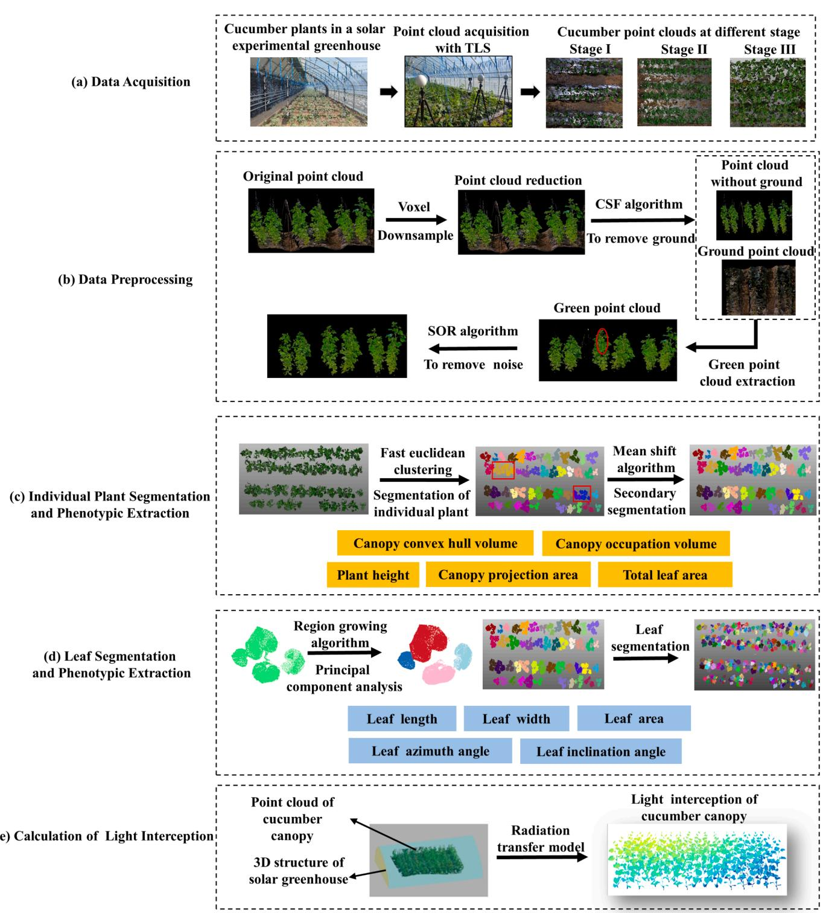
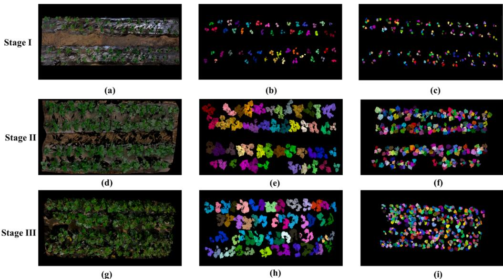
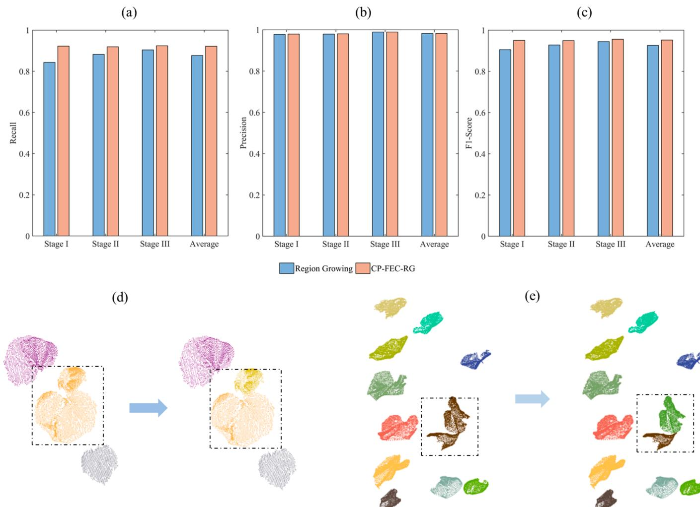
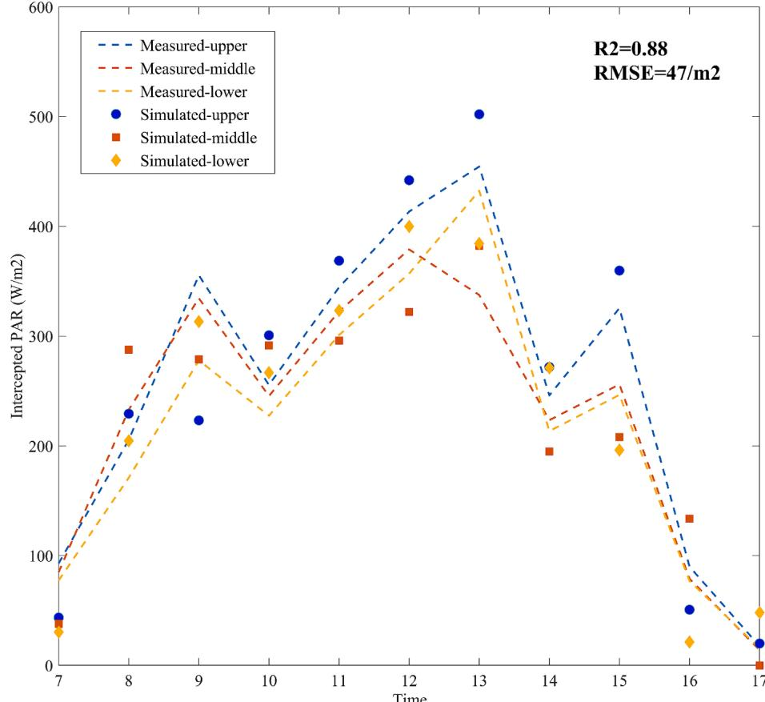
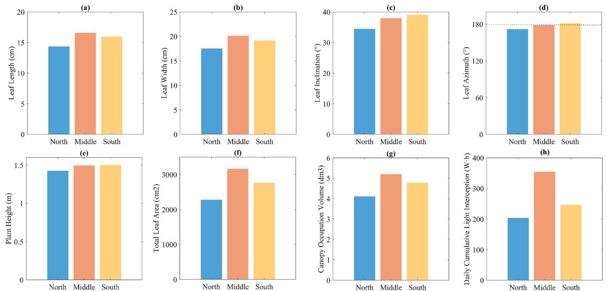
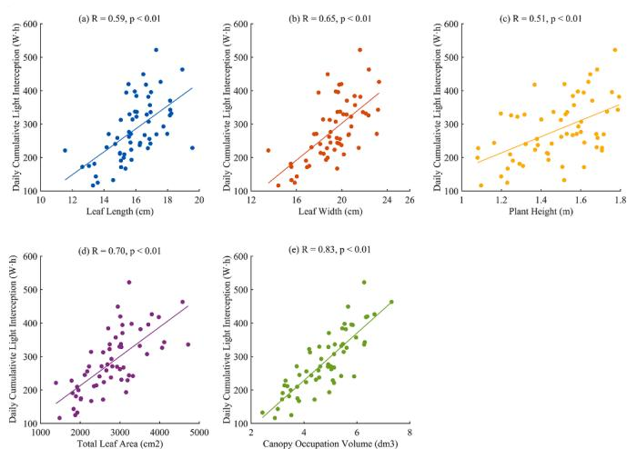
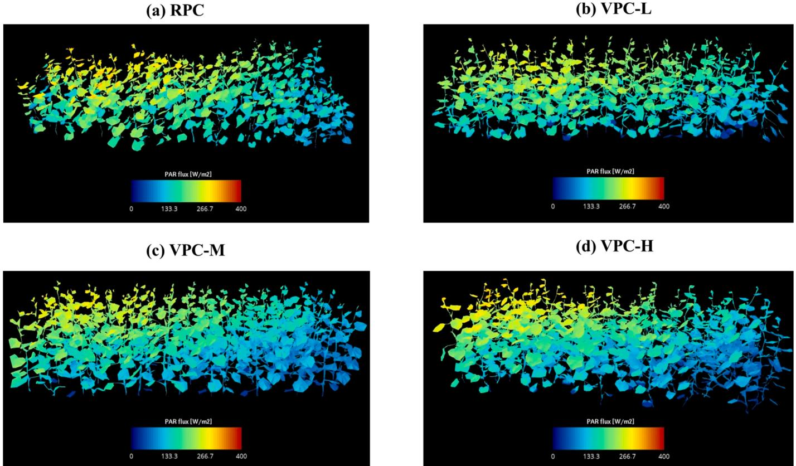
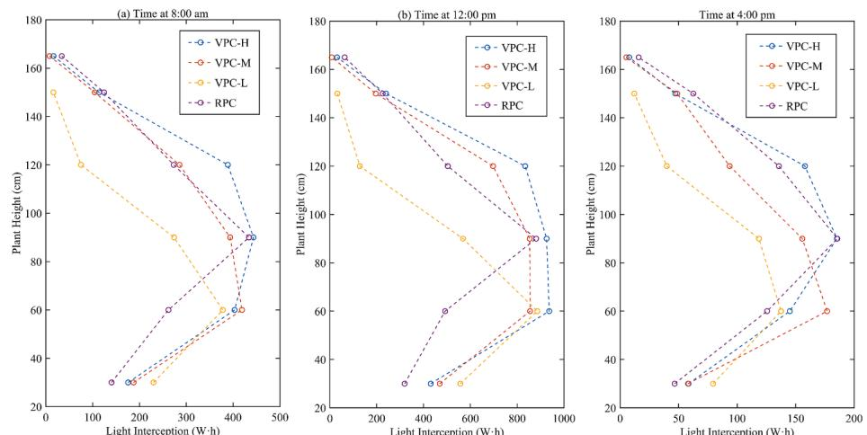
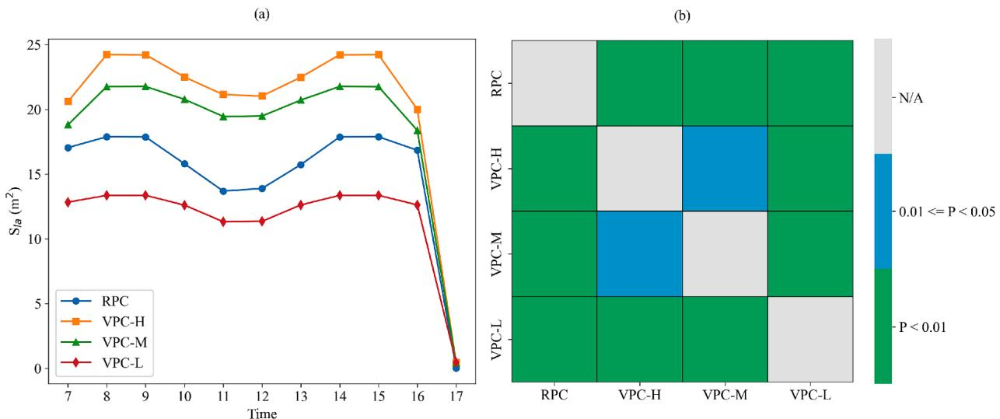
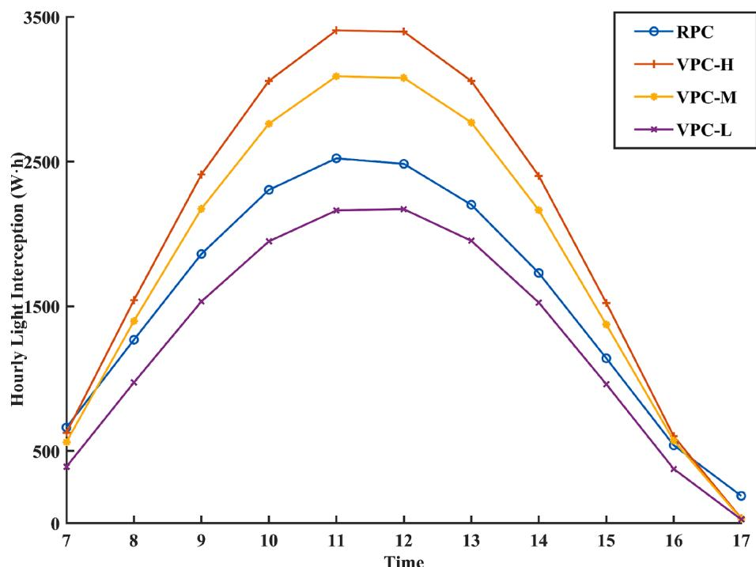

# Quantification of canopy heterogeneity and light interception difference within greenhouse cucumbers based on terrestrial laser scanning

Zhi Wang $^{a,b}$ , Demin Xu $^{a}$ , Tiangang Lu $^{c}$ , Lingling Cao $^{d}$ , Fang Ji $^{a}$ , Jinyu Zhu $^{b,*}$ , Yuntao Ma $^{a,*}$

$^{a}$  College of Land Science and Technology, China Agricultural University, Beijing, China   $^{b}$  State Key Laboratory of Vegetable Biobeeding, Institute of Vegetables and Flowers, Chinese Academy of Agricultural Sciences, Beijing 100081, China   $^{c}$  Beijing Digital Agriculture Promotion Center, Beijing 100021, China   $^{d}$  Beijing Agricultural Technology Extension Station, Beijing 100029, China

# ARTICLEINFO

Keywords: 3D modeling  Point cloud segmentation  Virtual plant model  Plant architecture  Radiative transfer analysis

# ABSTRACT

Reconstructing 3D architecture of cucumber populations for multi- scale phenotypic analysis poses significant challenges in greenhouse crop research. Cucumber canopy architecture directly impacts light interception and the plant growth conditions. Terrestrial Laser Scanning (TLS) was employed to capture the 3D point cloud of cucumber plants at various growth stages, named as real plant canopy (RPC). A novel method, CP- FEC- RG, combining Fast Euclidean Clustering with Region Growing algorithm, was developed to segment cucumber plants and extract phenotypic traits both at plant and leaf scales. The virtual plant canopies (VPCs), namely VPC- H, VPC- M and VPC- L were constructed representing high, medium, and low growth potentials based on the data collected via TLS. A radiative transfer model was adopted to compare the radiation interception capabilities of both RPC and VPCs. An average recall rate of  $92.2\%$  was achieved for leaf segmentation. Growth differences were observed among the segmented individual plants and leaves, with coefficients of variations for phenotypic traits ranging from 0.13 to 0.48 for individual plants and from 0.21 to 0.54 for leaves. For daily cumulative light interception, VPC- L showed a reduction of  $17.1\%$  compared to RPC, whereas VPC- M and VPC- H exhibited increases of  $18.2\%$  and  $30.1\%$  respectively. These findings highlight the importance of using the RPC for the accurate calculations of light interception and provide a solid foundation for applying TLS in the 3D phenotypic analysis of crops in solar greenhouses.

# 1. Introduction

Cucumber (Cucumis sativus L.) is one of the most extensively cultivated vegetable crops in greenhouses in China, with the average annual sown area and total yield ranking first in the world (Zhao et al., 2019). Cultivating high- quality cucumber varieties is crucial for increasing cucumber yield and ensuring cucumber supply (Zhang et al., 2021; Hu et al., 2022). The size and orientation of leaves, encompassing leaf angle and azimuth, are critical determinants of light interception in cucumber plants, given their role as the primary photosynthetic organs (Cho et al., 2007; Kahlen et al., 2008). The architecture of each cucumber plant significantly impacts its photosynthetic efficiency (Chen et al., 2014; Deans et al., 2020; Dechant et al., 2020). Therefore, accurately capturing the phenotypic traits of cucumber leaves and plant architecture is essential for optimizing the canopy light distribution and breeding cucumber ideotypes.

The rapid progress in plant phenotyping has established a foundation for the identification of cucumber plant architecture (Liu et al., 2021). However, significant challenges remain due to the lack of a non- invasive and efficient approach for acquiring structural details of cucumber plants. Traditional measurements are time- consuming and laborintensive (Zareef et al., 2021; Tu et al., 2023). Therefore, there is an urgent need for high- throughput acquisition of plant phenotypes (Boogaard et al., 2021; Mitsanis et al., 2024). Technologies like multiview stereo vision (He et al., 2017; Lai et al., 2020) and 3D digitization and scanners (Maphosa et al., 2016; Wang et al., 2018) have proven effective in capturing the 3D architecture of plants and deriving various phenotypic traits. However, these approaches primarily target the phenotyping of individual plants, making large- scale, high- throughput gathering of 3D structural data for plant populations a challenge (Kochi et al., 2021; Boogaard et al., 2023).

Light Detection and Ranging (LiDAR) is a novel active remote

sensing technology that enables precise 3D representation of plants by emitting and receiving laser pulses (Raj et al., 2020; Wang and Fang, 2020; Bi et al., 2022). LiDAR demonstrates remarkable insensitivity to ambient light compared to traditional photogrammetry method, ensuring consistent performance across varied lighting environments (Sun et al., 2021; Huang et al., 2022). In recent years, LiDAR has proven to be an effective tool for capturing the 3D architecture of plants and for measuring phenotypic traits at population scale (e.g., leaf area index and canopy coverage). However, organ- scale phenotypic analysis remains limited primarily due to the lack of effective methods for extracting crop organs from the plant population and the complicated scenario in the field environment (Jin et al., 2018; Miao et al., 2023; Liu et al., 2024). Furthermore, the application of LiDAR within solar greenhouses has been constrained by the presence of non- plant elements, which complicate data processing and analysis in these environments.

Traditional methods of calculating light interception primarily relied

  
Fig.1. Scanng (T) The p  m. The  f  d  t  t. (d) The s  t  t  t  t  t

on instruments like Photosynthetically Active Radiation (PAR) sensors or hemispherical photography. These methods were often complex and time- consuming, involving manual data collection and extensive postprocessing, which reduced efficiency for high- throughput researches (Hanan and Begue, 1995; Caya et al., 2018). Advances in functional- structural plant models (FSPMs) have enabled the quantification of organ- scale light interception by integrating the 3D plant architecture with radiation models (Li et al., 2021; Knowling et al., 2021; Wang et al., 2023). Earlier research on FSPMs commonly modeled plant populations as VPCs, treating all plants within the canopy as uniform individuals (Kim et al., 2020; Souapvliou et al., 2021). However, cucumber populations comprise numerous plants with diverse shapes, sizes, and orientations (Qian et al., 2014). The distinct light environments and microclimatic variations in solar greenhouses lead to differences in cucumber plant growth and canopy heterogeneity (Qian et al., 2019; Zhang et al., 2022). Previous researches have confirmed the influence of canopy architecture on light interception (Chen et al., 1994; Niinemets, 2010). The differences in light interception calculations between RPC and VPCs remain unknown.

The objective of this study is to obtain the 3D architecture of cucumber plants with the usage of TLS and to quantify the heterogeneity and light interception within this canopy in solar greenhouse. The aims are: (1) proposing a novel method for segmenting point clouds of individual cucumber plants and their organs from populations; (2) enhancing the understanding of canopy heterogeneity through phenotypic analysis at different scales; (3) quantifying the differences in light interception for VPCs and RPC.

# 2. Materials and methods

# 2.1. Overall design of the system framework

Five primary sections were comprised in this research: data acquisition, preprocessing, 3D point cloud segmentation and phenotypic traits extraction for individual cucumber plants and leaves, and simulation and quantification of canopy light interception. During the data acquisition stage, Terrestrial Laser Scanning (TLS, FARO Focus, Lake Mary, Florida, USA) was utilized to capture 3D point cloud of cucumber canopies at different growth stages within a solar greenhouse. Various point cloud preprocessing methods, including down- sampling (Li et al., 2023) and statistical filtering (Li et al., 2022), were employed to remove noise unrelated to the cucumber plants. In the process of 3D point cloud segmentation, Fast Euclidean Clustering (Cao et al., 2022) and Region Growing algorithms (Jin et al., 2018) were adopted to segment individual cucumber plants and leaves for the extraction of relevant phenotypic traits. Lastly, a radiative transfer model was used to simulate and calculate diurnal light interception within the solar greenhouse (Bailey, 2019). The schematic of the system framework was depicted in Fig. 1.

# 2.2. Experimental sites and plant materials

The greenhouse experiments were conducted at two solar greenhouses in Chaolai Agricultural Park  $(116^{\circ}29^{\prime}\mathrm{E},40^{\circ}07^{\prime}\mathrm{N})$  and Baiwang Plantation  $(116^{\circ}45^{\prime}\mathrm{E},40^{\circ}03^{\prime}\mathrm{N})$  in Beijing, China. The solar greenhouse was under natural sunlight without artificial light. Both sites followed the same cucumber cultivation protocol, utilizing a wide ridge double row planting pattern with 13 to 15 cucumber plants per row. Plants were spaced  $30~\mathrm{cm}$  apart, with rows  $40~\mathrm{cm}$  apart and ridges  $90~\mathrm{cm}$  apart. Cucumber plants were cultivated in soil, adhering to standard water and nutrient management practices. Consistent pest and disease management strategies were applied throughout the entire experimental period. The time of production and management in the greenhouse were from 7:00 am to  $5:00\mathrm{pm}$ . The microclimate within the experimental setup was continuously monitored using QSO- S PAR sensors (Decagon, US) and RC- 4 temperature sensors (Elitech, China) across northern, central and southern regions. The temperature across the three regions fluctuated between  $13.3 - 37.1^{\circ}\mathrm{C}$ ,  $12.3 - 37.4^{\circ}\mathrm{C}$ , and  $11.8 - 38.9^{\circ}\mathrm{C}$  throughout the day. During production periods, the PAR ranged from  $59 - 851\mathrm{W} / \mathrm{m}^2$ ,  $78 - 924\mathrm{W} / \mathrm{m}^2$ , and  $67 - 982\mathrm{W} / \mathrm{m}^2$ .

and southern regions. The temperature across the three regions fluctuated between  $13.3 - 37.1^{\circ}\mathrm{C}$ $12.3 - 37.4^{\circ}\mathrm{C}$  and  $11.8 - 38.9^{\circ}\mathrm{C}$  throughout the day. During production periods, the PAR ranged from  $59 - 851\mathrm{W} / \mathrm{m}^2$ $78 - 924\mathrm{W} / \mathrm{m}^2$  and  $67 - 982\mathrm{W} / \mathrm{m}^2$

TLS was employed to acquire 3D point cloud of the cucumber canopy. Prior to each scanning session, target balls were placed between the wide ridges to define a unique 3D space within the perspective of the adjacent scanning stations. Data acquisition involved a six- stack scanning strategy, with the scanner positioned at the four corners and the midpoints of the longer sides of the collection area. Each scan duration was  $10\mathrm{min}$ . Fig. 2 depicts the cucumber cultivation and TLS setup. The point cloud of cucumber canopy was captured at three different growth stages with two varieties, 'Zhongnong  $16^{\prime}$  and 'Dutch Cucumber'. Cucumber plants from two wide ridges were selected as research objects for each stage.

# 2.3. Data acquisition and preprocessing

The initial step in processing the acquired TLS data involved utilizing SCENE 2019 software (FARO, Lake Mary, Florida, USA) for registration and integration of multi- stack 3D point clouds. Cloud Compare software (https://www.cloudcompare.org/) was then applied to eliminate extraneous elements such as greenhouse infrastructure. Coordinate calibration was also performed by defining the horizontal plane as the xy plane and aligning the plant growth direction accordingly. The 3D point clouds visually depicted the cucumber plants but still included irrelevant elements, such as ground and support ropes. Preprocessing steps were further necessary to extract the 3D point clouds of the cucumber population with four phases: (1) Down- sampling: The voxel down- sampling algorithm was employed to streamline the original point cloud, reducing its complexity while preserving its geometry and attributes, thereby enhancing processing efficiency. (2) Ground removal: The simplified point cloud was processed to distinctly isolate the plant point clouds from the ground using the CSF algorithm at a specific distance (Zhang et al., 2016). (3) Extraction of green point clouds: The excessive green index was used to isolate the green point clouds indicative of cucumber plants by adjusting segmentation thresholds. (4) Denoising: Statistical filtering algorithm was implemented to remove outliers and noise for further refining the point cloud.

# 2.4. Segmentation of individual plants and leaves

The preprocessed point clouds of cucumber populations were segmented using the Fast Euclidean Clustering algorithm. The dimensions along the x- axis and y- axis for each clustered point cloud were initially determined. Clustering outcomes were then categorized into two groups based on a specified threshold: individual cucumber plants and multiple cucumber plants. The Mean shift algorithm (Wu and Yang, 2007) was adopted for secondary clustering of point clouds containing multiple cucumber plants. This process was repeated to further refine the results, until the threshold conditions was satisfied for an individual cucumber plant. One to two iterations of recursive analysis were typically required to ensure that all segmented results represented individual cucumber plants. Table 1 outlines the pseudocode for segmenting individual cucumber plants with Fast Euclidean Clustering.

The segmentation of individual cucumber plants into distinct organs was employed using the Region Growing Clustering algorithm. Leaf and non- leaf point clouds were distinguished by comparing the number of points in the 3D point clouds after clustering. Principal component analysis (PCA) (Xiao et al., 2021) was then applied to classify the leaf point clouds into two categories: individual leaves and multiple leaves. The K- Means++ algorithm (Wu et al., 2020) was utilized for refined clustering of point clouds with multiple leaves, ensuring that each cluster in the final outcome represents an individual leaf. displays the pseudocode for leaf segmentation with the Region Growing Clustering method.

  
Fig. 2. Schematic diagram of cucumber cultivation and data collection with Terrestrial Laser Scanning (TLS).

Table 1 The pseudocode of Fast Euclidean Clustering segmentation of method 1.  

<table><tr><td>1:</td><td>The original point cloud is read in</td></tr><tr><td>2:</td><td>The Fast Euclidean Clustering parameters are set</td></tr><tr><td>3:</td><td>The Mean Shift Clustering parameters are set</td></tr><tr><td>4:</td><td>Algorithm SegmentPointCloud (Original Point Cloud)</td></tr><tr><td>5:</td><td rowspan="2">Run Fast Euclidean Clustering algorithm to generate Initial Segments S for each cloud Si in S do</td></tr><tr><td>6:</td></tr><tr><td>7:</td><td>RecursiveSplit (Si)</td></tr><tr><td>8:</td><td>end for</td></tr><tr><td>9:</td><td>Algorithm RecursiveSplit (Point Cloud)</td></tr><tr><td>10:</td><td>The length Spanx of the X-axis of Point Cloud is calculated</td></tr><tr><td>11:</td><td>The length Spany of the Y-axis of Point Cloud is calculated</td></tr><tr><td>12:</td><td>Initialize the distance threshold a and b</td></tr><tr><td>13:</td><td>if (Spanx ≤ aandSpany ≤ b) then</td></tr><tr><td>14:</td><td>The point cloud is labeled as individual cucumber plant and saved else</td></tr><tr><td>15:</td><td rowspan="3">Run Mean Shift algorithm to generate new cluster C end if</td></tr><tr><td>16:</td></tr><tr><td>17:</td></tr><tr><td>18:</td><td>for each cluster Ci in C</td></tr><tr><td>19:</td><td>RecursiveSplit (Ci)</td></tr><tr><td>20:</td><td>end for</td></tr></table>

Table 2 The pseudocode of Region Growing Clustering segmentation of method2.  

<table><tr><td>1:</td><td>The original point cloud is read in</td></tr><tr><td>2:</td><td>The Region Growing Clustering parameters are set</td></tr><tr><td>3:</td><td>The K-Means++ Clustering parameters are set</td></tr><tr><td>4:</td><td>Algorithm LeafSegment (Original Point Cloud)</td></tr><tr><td>5:</td><td>Run Region Growing Clustering algorithm to generate Initial Segments S</td></tr><tr><td>6:</td><td>Initialize the point number threshold a and PCA threshold b</td></tr><tr><td>7:</td><td>for each cloud Si in S</td></tr><tr><td>8:</td><td>The point number N of Si is calculated</td></tr><tr><td>9:</td><td>if N &amp;gt; a</td></tr><tr><td>10:</td><td>Run PCA algorithm to calculate the threshold Ti for Si</td></tr><tr><td>11:</td><td>if Ti &amp;gt; b then</td></tr><tr><td>12:</td><td>The point cloud is labeled as individual cucumber leaf</td></tr><tr><td>13:</td><td>Individual cucumber leaf is saved</td></tr><tr><td>14:</td><td>else</td></tr><tr><td>15:</td><td>Run K-Means++ algorithm to generate new cluster C</td></tr><tr><td>16:</td><td rowspan="2">Each element in C is saved as individual cucumber leaf end if</td></tr><tr><td>17:</td></tr><tr><td>18:</td><td>end if</td></tr><tr><td>19:</td><td>end for</td></tr></table>

# 2.5. Extraction of phenotypic traits

The aforementioned methods enabled the segmentation of individual plants and their corresponding leaf point clouds from the cucumber populations. The segmented outcomes were refined using reverse engineering software (Geomagic Wrap 2021, 3D Systems) for hole filling and missing parts repairing, ensuring the integrity of the 3D point clouds. A compensation approach was implemented to address significant data loss in point clouds caused by TLS reconstruction. This approach restored the structural information of the cucumber canopy by substituting missing areas with leaves or individual plants from close proximity. Five key phenotypic traits of individual leaves were then extracted: leaf length, leaf width, leaf area, leaf inclination, and leaf azimuth angle. Key points were identified from the segmented leaf point clouds, including the leaf tip, leaf base, and two edge points for calculating the leaf width. The Dijkstra algorithm was utilized to determine the shortest distance between the leaf tip and the leaf base to calculate the leaf length, and between the two edge points to calculate the leaf width. Geomagic Wrap 2021 software was used for triangulation of the leaf point clouds. The area of each triangle was calculated using Heron's formula and summed up for the leaf area. The plane equation of the leaf point cloud was fitted using the Random Sample Consensus (RANSAC) algorithm (Chum and Matas, 2008). The angle between the plane's normal vector and the positive direction of the z- axis was calculated to obtain the leaf inclination. Similarly, with the positive direction of the y- axis serving as the true north reference, the angle between the projection of the leaf plane's normal vector on the x- y plane and the positive direction of the Y- axis was calculated as the leaf azimuth angle.

Five key phenotypic traits were extracted from the segmented point clouds of individual cucumber plants: plant height, canopy projection area, canopy convex hull volume, total leaf area, and canopy occupation volume. The RANSAC algorithm was applied to fit a plane equation to the ground point cloud. The vertical distance from the highest point on the z- axis of the cucumber plant to this ground plane was then determined as the plant height. The projection area of the cucumber plant on the x- y plane was calculated to represent the canopy projection area. The QuickHull algorithm (Barber et al., 1996) was used to construct the convex hull of the cucumber plant, forming the smallest convex polyhedron representing the canopy. The volume of this polyhedron represented the canopy convex hull volume. The point cloud of each individual cucumber plant was voxelized into  $1\mathrm{cm}^3$  voxels, with all voxels containing parts of the cucumber plant mesh occupied. The sum

of all the occupied voxels was then calculated to derive canopy occupation volume (Liu et al., 2021). All calculations were implemented using Python, version 3.8 (http://www.python.org).

# 2.6. Helios radiative transfer model and VPCs construction

Light interception of the cucumber canopy was calculated using Helios 3D modeling framework (Bailey, 2019), which integrates the 3D architecture of both the greenhouse and the cucumber canopy, along with Bailey's radiative transfer model (Bailey, 2018). The solar position was determined using latitude, longitude, day of the year, and time of day. The PAR was simulated using the backward ray- tracing method for each triangular mesh within the cucumber canopy. To reduce the model's complexity, the reflectance and transmittance of all plant organs were uniformly set at 0.3. The reflectance and transmittance of the lighting surface of the solar greenhouse were set at 0.05 and 0.9, respectively. The reflectance and transmittance of the back wall were set at 0.1 and 0. The canopy light distribution was simulated from 7:00 am to  $5:00\mathrm{pm}$  on each measurement date at 1- h intervals. Scattering iterations were set to 8. Periodic boundary condition was set to eliminate domain edge effects. The Helios framework integrated the REST- 2 model (Gueymard, 2008) to calculate direct and diffuse solar flux at the Earth's surface considering atmospheric attenuation. Within the Helios 3D framework, the light interception per unit area of each triangular facet  $(W / m^2)$  was calculated and used to estimate daily cumulative light interception (W- h, Eq1) of the cucumber population. The leaf area where the Photosynthetic Photon Flux Density (PPFD) falls within the range of  $70\mathrm{- }1000\mu \mathrm{mol} / \mathrm{m}^2 /\mathrm{s}$  corresponding to the linear portion of the light response curve, was also quantified.

$$
DLI = \int_{t = 7}^{17}\left(\sum_{i = 1}^{m}s_i^* LF_i\right)dt \tag{1}
$$

$LF_{i}$  denoted the solar radiation intercepted per unit area of each facet, where  $s_i$  indicated the area of an individual facet, and  $m$  signified the total count of facets.

$$
S_{la} = \sum_{i = 1}^{m}s_{i}(ifLF_{i}\in PPFD_{range}) \tag{2}
$$

$S_{la}$  denoted the leaf area falls within the range of  $70\mathrm{- }1000\mu \mathrm{mol} / \mathrm{m}^2 /$  s, corresponding to the linear portion of the light response curve.

The segmented individual cucumber plants from the third growth stage were selected as benchmarks to assess variations in light interception between the RPC and VPCs. Three phenotypic traits closely associated with daily cumulative light interception were selected as clustering criteria: plant height, total leaf area, and canopy occupation volume. The cucumber plants were then categorized into high, medium, and low groups with different growth vigor using K- Means algorithm. From each category, three plants were randomly selected to serve as foundational units for the construction of VPCs. The VPCs were developed according to the real population's ridge, plant, and row spacing configurations to maintain model consistency. In constructing the VPCs, each foundational unit underwent 19 replications, with each plant being randomly rotated between  $0^{\circ}$  to  $360^{\circ}$  around the z- axis before replication to mimic the natural variability in plant orientation. Therefore, three different virtual plant populations were generated, named VPC- H, VPC- M, and VPC- L, representing high, medium, and low growth vigor of the cucumber plant, respectively.

# 2.7. Evaluation metrics

Precision, recall, and F1 score were employed as the principal metrics to evaluate the effectiveness of the CP- FEC- RG method for segmenting individual plants and plant organs. A match between segmented and original cucumber leaves in the point cloud had to meet two criteria: (1) the segmented leaves should align with the original leaves in situ, and (2) the segmentation should include at least  $60\%$  of the points from the original leaves. Cucumber leaves accurately identified and segmented from the original point cloud were classified true positives (TP). Leaves present in the original data but not successfully segmented were considered false negatives (FN). Non- leaf components mistakenly identified as cucumber leaves are labeled as false positives (FP). All relevant metrics were then calculated as follows:

$$
Recall = TP / (TP + FN) \tag{3}
$$

$$
Precision = TP / (TP + FP) \tag{4}
$$

$$
F1 - score = 2^{*}(Precision^{*}Recall) / (Recall + Precision) \tag{5}
$$

To determine the correlation between phenotypic traits of individual cucumber plant and their daily cumulative light interception, the Pearson correlation coefficient was utilized for analysis and detailed below:

$$
r = \frac{\sum_{i = 1}^{n}(X_{i} - \overline{X})(Y_{i} - \overline{Y})}{\sqrt{\sum_{i = 1}^{n}((X_{i} - \overline{X}))^{2}}\sqrt{\sum_{i = 1}^{n}((Y_{i} - \overline{Y}))^{2}}} \tag{6}
$$

Here,  $X$  symbolized as a set of a specific phenotypic trait, while  $Y$  represented a set of daily cumulative light interception values (W- h).

# 3. Result

# 3.1. Evaluation of the proposed CP-FEC-RG method

Three- dimensional point clouds of cucumber populations were segmented into discrete plant and leaf entities at three growth stages (Fig. 3), with distinct colors representing individual plants and their leaves. The cucumber plants were relatively small at the first growth stage, averaging 3 to 4 leaves per plant. The segmentation method achieved a recall rate of  $92.2\%$  for leaf segmentation. The segmented cucumber populations had an average of 4 to 8 leaves per plant at the second growth stage, with a leaf segmentation recall rate of  $91.9\%$ . The plants averaged 8 to 12 leaves per plant at the third growth stage, and the segmentation method achieved a recall rate of  $92.4\%$  for leaf segmentation.

Both recall, precision and F1 score for leaf segmentation within cucumber plants were significantly improved with CP- FEC- RG method compared to the sole application of the Region Growing algorithm (Fig. 4a- c). The average recall rate increased from  $87.6\%$  to  $92.2\%$ , precision from  $98.2\%$  to  $98.3\%$ , and the F1 score from  $92.6\%$  to  $95.2\%$ . The PCA algorithm was further applied after the Region Growing algorithm to facilitate the differentiation of the individual and conjoined leaves, which identifying the primary orientation and shape attributes of the leaf clusters. The K- Means++ algorithm was then employed for refinement, separating the conjoined leaves into individual ones.

# 3.2. Extraction of cucumber phenotypic traits

Corrections were applied to misidentified and missed cucumber leaves based on the original point cloud to ensure the reliability of phenotypic extraction and analysis. As shown in Fig. 5, the widths of cucumber leaves were typically larger than their lengths. Both leaf length and width fell within a range of 5 to  $15\mathrm{cm}$  with less variation at the first growth stage. Larger variabilities were observed for leaf lengths and widths ranging from 5 to  $25\mathrm{cm}$  and 10 to  $30\mathrm{cm}$ , respectively at second and third growth stages. A total of  $59.5\%$  of leaf inclinations were distributed within  $25^{\circ} - 50^{\circ}$ , while  $53.6\%$  of azimuth orientations were dominantly concentrated between  $160^{\circ}$  and  $240^{\circ}$ , suggesting a southward alignment of cucumber leaves. The mean leaf area was  $73.15\mathrm{cm}^2 \pm 30.27\mathrm{cm}^2$ ,  $218.51\mathrm{cm}^2 \pm 117.99\mathrm{cm}^2$ , and  $287.2\mathrm{cm}^2 \pm 123.50\mathrm{cm}^2$  at three growth stages. Considerable variability was noted for all

  
Fig.3.  f 30   t  t  t f c  t  t  t t t t t t t t t t t t t t t t t t t t t t t t t t t t t t t t t t t t t t t t t t t t t t t t t t t t t t t t t t t t t t t t t t t t t t t t t t t t t t t t t t t t t t t t t t t t t t t t t t t t

  
Fig.4.  t Distt  w  k  in  t  t  g  d  t t t t t t t t t t t t t t t t t t t t t t t t t t t t t t t t t t t t t t t t t t t t t t t t t t t t t t t t t t t t t t t t t t t t t t t t t t t t t t t t t t t t t t t t t t t t t t t t t t h

  
Fig.5.  t g t t t t t t t t t t t t t t t t t t t t t t t t t t t t t t t t t t t t t t t t t t t t t t t t t t t t t t t t t t t t t t t t t t t t t t t t t t t t t t t t t t t t t t t t t t t t t t t t t t t t h t t t t t t t t t t t t t t t t t t t t t t t t t t t t t t t t t t t t t t t t t t t t t t t t t t t t t t t t t t t t t t t t t t t t t t t t t t t t t t t t t t t t t t t t t t t t t t t t t t t

phenotypic traits at different growth stages, with CV ranging from 0.21 to 0.49. The CV for leaf inclination, azimuth orientation, and leaf area were larger than 0.32.

Considerable variability was also noted for individual plant phenotypic traits across different growth stages, with CV ranging from 0.13 to 0.48 (Fig. 6). The lowest variabilities were observed for plant height, with average heights centered around  $0.3 \mathrm{m}$ ,  $0.5 \mathrm{m}$ , and  $1.5 \mathrm{m}$  for different growth stages, respectively. Higher variability was observed for canopy projection area and convex hull volume, with CV ranging from 0.22 to 0.34 and 0.25 to 0.48, respectively, reflecting the heterogeneity in the canopy architecture of cucumber plants. The mean total leaf area for individual plants was determined to be  $244.87 \mathrm{cm}^2 \pm 66.11 \mathrm{cm}^2$ ,  $1313.87 \mathrm{cm}^2 \pm 389.85 \mathrm{cm}^2$ , and  $2792.16 \mathrm{cm}^2 \pm 725.96 \mathrm{cm}^2$  for each growth stage. The variability for canopy occupation volume was

  
Fig.6.  t  t t t t t t t t t t t t t t t t t t t t t t t t t t t t t t t t t t t t t t t t t t t t t t t t t t t t t t t t t t t t t t t t t t t t t t t t t t t t t t t t t t t t t t t t t t t t t t t t t t t a t t t t t t t t t t t t t t t t t t t t t t t t t t t t t t t t t t t t t t t t t t t t t t t t t t t t t t t t t t t t t t t t t t t t t t t t t t t t t t t t t t t t t t t t t t t t t t t t t t t e t t t t t t t t t t t t t t t t t t t t t t t t t t t t t t t t t t t t t t t t t t t t t t t t t t t t t t t t t t t t t t t t t t t t t t t t t t t t t t t t t t t t t t t t t t t t t t t t t t t o t t t t t t t t t t t t t t t t t t t t t t t t t t t t t t t t t t t t t t t t t t t t t t t t t t t t t t t t t t t t t t t t t t t t t t t t t t t t t t t t t t t t t t t t t t t t t t t t t t t i t t t t t t t t t t t t t t t t t t t t t t t t t t t t t t t t t t t t t t t t t t t t t t t t t t t t t t t t t t t t t t t t t t t t t t t t t t t t t t t t t t t t t t t t t t t t t t t t t t t s t t t t t t t t t t t t t t t t t t t t t t t t t t t t t t t t t t t t t t t t t t t t t t t t t t t t t t t t t t t t t t t t t t t t t t t t t t t t t t t t t t t t t t t t t t t t t t t t t t t d t t t t t t t t t t t t t t t t t t t t t t t t t t t t t t t t t t t t t t t t t t t t t t t t t t t t t t t t t t t t t t t t t t t t t t t t t t t t t t t t t t t t t t t t t t t t t t t t t t t c t t t t t t t t t t t t t t t t t t t t t t t t t t t t t t t t t t t t t t t t t t t t t t t t t t t t t t t t t t t t t t t t t t t t t t t t t t t t t t t t t t t t t t t t t t t t t t t t t t t u t t t t t t t t t t t t t t t t t t t t t t t t t t t t t t t t t t t t t t t t t t t t t t t t t t t t t t t t t t t t t t t t t t t t t t t t t t t t t t t t t t t t t t t t t t t t t t t t t t t l t t t t t t t t t t t t t t t t t t t t t t t t t t t t t t t t t t t t t t t t t t t t t t t t t t t t t t t t t t t t t t t t t t t t t t t t t t t t t t t t t t t t t t t t t t t t t t t t t t t r t t t t t t t t t t t t t t t t t t t t t t t t t t t t t t t t t t t t t t t t t t t t t t t t t t t t t t t t t t t t t t t t t t t t t t t t t t t t t t t t t t t t t t t t t t t t t t t t t t t w t t t t t t t t t t t t t t t t t t t t t t t t t t t t t t t t t t t t t t t t t t t t t t t t t t t t t t t t t t t t t t t t t t t t t t t t t t t t t t t t t t t t t t t t t t t t t t t t t t t b t t t t t t t t t t t t t t t t t t t t t t t t t t t t t t t t t t t t t t t t t t t t t t t t t t t t t t t t t t t t t t t t t t t t t t t t t t t t t t t t t t t t t t t t t t t t t t t t t t t n t t t t t t t t t t t t t t t t t t t t t t t t t t t t t t t t t t t t t t t t t t t t t t t t t t t t t t t t t t t t t t t t t t t t t t t t t t t t t t t t t t t t t t t t t t t t t t t t t t tt t t t t t t t t t t t t t t t t t t t t t t t t t t t t t t t t t t t t t t t t t t t t t t t t t t t t t t t t t t t t t t t t t t t t t t t t t t t t t t t t t t t t t t t t t t t t t t t t t t t + t t t t t t t t t t t t t t t t t t t t t t t t t t t t t t t t t t t t t t t t t t t t t t t t t t t t t t t t t t t t t t t t t t t t t t t t t t t t t t t t t t t t t t t t t t t t t t t t t t t k t t t t t t t t t t t t t t t t t t t t t t t t t t t t t t t t t t t t t t t t t t t t t t t t t t t t t t t t t t t t t t t t t t t t t t t t t t t t t t t t t t t t t t t t t t t t t t t t t t t p t t t t t t t t t t t t t t t t t t t t t t t t t t t t t t t t t t t t t t t t t t t t t t t t t t t t t t t t t t t t t t t t t t t t t t t t t t t t t t t t t t t t t t t t t t t t t t t t t t t - t t t t t t t t t t t t t t t t t t t t t t t t t t t t t t t t t t t t t t t t t t t t t t t t t t t t t t t t t t t t t t t t t t t t t t t t t t t t t t t t t t t t t t t t t t t t t t t t t t t- t t t t t t t t t t t t t t t t t t t t t t t t t t t t t t t t t t t t t t t t t t t t t t t t t t t t t t t t t t t t t t t t t t t t t t t t t t t t t t t t t t t t t t t t t t t t t t t t t t t+ t t t t t t t t t t t t t t t t t t t t t t t t t t t t t t t t t t t t t t t t t t t t t t t t t t t t t t t t t t t t t t t t t t t t t t t t t t t t t t t t t t t t t t t t t t t t t t t t t t t

lower than that for convex hull volume, with CV ranging from 0.23 to 0.35.

# 3.3. Quantitative analysis of light interception within the 3D cucumber canopy

The simulation time in the Helios model was set to October 29, 2023, from 7:00 am to  $5:00\mathrm{pm}$  corresponding to the data collection period. The measured and simulated PAR showed a high level of agreement (Fig. 7), with an  $\mathbb{R}^2$  of 0.88 and an RMSE of  $47~\mathrm{W / m^2}$  . A spatial distribution map of cucumber growth parameters was generated to quantify the heterogeneity in cucumber growth within the greenhouse (Fig. S1). Three columns within each of the northern, central, and southern region of the greenhouse were selected (blue box marked in the Fig. S1a), and their average values for the phenotypic traits within each region were calculated (Fig. 8). The results demonstrated that the central- southern region exhibited higher values for leaf length, leaf width, plant height, total leaf area per plant, canopy volume, and daily cumulative light interception compared to those in the northern region. The  $\mathbb{P}$  value of the t- test in Fig. S2 for all phenotypic traits except plant height provides a further confirmation  $(P< 0.05)$  . Leaf inclination angles in the southern, central, and northern regions were  $39.1^{\circ}$ $38.0^{\circ}$  and  $34.4^{\circ}$  respectively, showing a gradient of increasing angle towards the south. Similarly, leaf azimuth angles were  $181.4^{\circ}$ $178.2^{\circ}$  and  $171.8^{\circ}$  indicating a more southward orientation in the southern region of the greenhouse.

Pearson correlation coefficients were used to explore the relationship between daily cumulative light interception and plant height, total leaf area, and occupation volume (Fig. 9). All phenotypic traits showed a strong correlation with daily cumulative light interception, with  $\mathrm{R} > 0.5$ $(P< 0.01)$  . The correlation between canopy occupation volume and daily cumulative light interception was 0.83 and highest among the parameters. This highlights the role of canopy occupation volume as an integrative phenotypic trait, reflecting the combined influence of leaf area, architecture, and orientation on light interception.

Light distributions were illustrated in Fig. 10 within both the RPC and VPCs at  $12:00\mathrm{pm}$  . Light interception was highest in the central- southern section of greenhouse compared to the middle and northern sections. Leaves at the top of canopy cast shadows on the lower of the canopy, substantially reducing light interception in the lower sections. Within the VPCs, VPC- L consisted of smaller plants with sparse leaves, thus minimizing shading and enhancing radiation access to the lower part of the canopy. In contrast, VPC- M and VPC- H comprised larger plants, forming a denser canopy with less light reaching the bottom of the canopy.

Light interception showed an initial increase followed by a decrease with canopy height increment within the RPC and VPCs at three specific times (Fig. 11). Lower light interception was observed primarily due to the presence of smaller and young leaves at the top of the canopy  $(150 - 165\mathrm{cm})$  . The peak light interception occurred at a canopy height of  $30\mathrm{- }90\mathrm{cm}$  . The highest light interception at the bottom of the canopy  $(0 - 30\mathrm{cm})$  was found in VPC- L compared with RPC, VPC- M, and VPC- H. At  $12:00\mathrm{pm}$  , light interception in the mid to upper canopy  $(90 - 150\mathrm{cm})$  in VPC- M and VPC- H was  $6.6\%$  and  $7.0\%$  higher than that in the RPC, respectively. In contrast, light interception in VPC- L was  $61.2\%$  lower than that in the RPC (Fig. 11b). At 8:00 am and  $4:00\mathrm{pm}$  , light interception at mid to upper canopy  $(90 - 150\mathrm{cm})$  of VPC- M was  $5.8\%$  and  $22.3\%$  lower than that in the RPC, respectively (Fig. 11a and 11c).

To further analyze the differences in light intensity distribution between the RPC and VPCs, statistical analyses were performed on the PPFD of each surface. The leaf area with the intercepted PPFD falls within the linear portion of the light response curve  $(70 - 1000\mu \mathrm{mol} / \mathrm{m}^2)$  s) (Fig. 12. a) was calculated and denoted as  $S_{la}$  in Eq. 2. The results indicated that  $S_{la}$  exhibited a fluctuation pattern characterized by an

  
Fig. 7. Comparison of measured and calculated photosynthetically active radiation (PAR) at three different spatial positions from 7:00 am to  $5:00\mathrm{pm}$

  
Fig. 8. Comparison of average cucumber growth parameters at different regions within solar greenhouse. (a) Average leaf length, (b) Average leaf width, (c) Plant height, (d) Total leaf area, (e) Canopy occupation volume, (f) Daily cumulative light interception, (g) Average leaf inclination and (h) Average leaf azimuth per plant in the canopy.

  
Fig. 9. Correlation analysis between daily cumulative light interception per plant and leaf length (a), leaf width (b), plant height (c), total leaf area per plant (d) and canopy occupation volume (e).

Initial increase, followed by a decrease, a subsequent increase, and then another decrease over the course of the day.  $S_{la}$  reached its peak at 2:00 pm and dropped to its lowest value by  $5:00\mathrm{pm}$ . The overall trend of  $S_{la}$  across the four canopy types was:  $\mathrm{VPC - L< RPC< VPC - M< VPC - H}$ . Specifically,  $S_{la}$  in the RPC was  $29.3\%$  higher than that of VPC- L, but  $19.8\%$  and  $26.9\%$  lower than those of VPC- M and VPC- H, respectively. Significance analysis (Fig. 12, b) showed that the differences in  $S_{la}$  among the four canopy types were statistically significant  $(\mathrm{P}< 0.05)$ . Even greater significance was found between VPC- L and RPC  $(\mathrm{P}< 0.01)$ .

A consistent daily light interception pattern was observed for the RPC and VPCs, with a gradual increase to a peak and followed by a decrease (Fig. 13). Hourly light interception by VPC- L was  $11.3\%$  to  $86.0\%$  lower than that of the RPC. VPC- M and VPC- H exhibited increased hourly light interception by  $6.2\%$  to  $25.8\%$  and  $11.7\%$  to  $38.8\%$ , respectively, except at 7:00 am and  $5:00\mathrm{pm}$ , where they decreased by  $15.2\%$  to  $83.9\%$  and  $5.5\%$  to  $82.2\%$ , respectively. The daily cumulative light interception of VPC- L was  $17.1\%$  lower than that of the RPC. In contrast, the daily cumulative light interception of VPC- M and VPC- H was  $18.2\%$  and  $30.1\%$  higher than that of the RPC, respectively.

# 4. Discussion

# 4.1. LiDAR-driven advances in greenhouse crop phenotyping

LiDAR has been adopted as a rapid means of capturing comprehensive 3D structural data of plants in the field, enabling detailed analysis of crop phenotypes (Liu et al., 2023; Miao et al., 2023). However, its adoption in greenhouse environments is constrained by the unique challenges of these enclosed spaces and various interfering factors that hinder the extraction of plant phenotypic traits (Xiao et al., 2023). The collection of greenhouse phenotypic traits primarily relies on manual measurements or is limited to individual plants, lacking high- throughput techniques for phenotypic traits acquisition (Grimstad et al., 2018). TLS was deployed here to obtain the 3D point clouds of cucumber populations within the greenhouse, facilitating segmentation at population, individual, and leaf scales for the subsequent extraction of relevant phenotypic traits. Compared to the conventional phenotyping techniques, the LiDAR- based method can quickly capture extensive 3D point clouds for cucumber populations and accurately outline the actual leaf morphology, yielding more precise and reliable phenotypic traits, such as leaf area and canopy coverage (Itakura and Hosoi, 2018; Patil et al., 2018).

Light interception capacity is a crucial indicator of plant productivity. Numerous studies have confirmed that canopy architecture is closely related to light interception capacities (Liu et al., 2021). TLS was utilized here to precisely obtain the cucumber's individual organ and plant phenotypic traits. Correlation analysis identified key phenotypic traits, such as plant height, total leaf area, significantly associated with daily light interception. Furthermore, traditional research has often struggled to visually select high- quality crop varieties based on plant architecture (Korir et al., 2013). Cluster analysis was employed here to categorize

  
Fig. 10. Visualization of light distribution in real and virtual plant canopies at  $12:00\mathrm{pm}$ . (a) Real plant canopy model constructed by the data collected with Terrestrial Laser Scanning (TLS). Virtual plant canopies constructed with three plants selected from low (b), medium (c), high (d) growth categories, respectively.

  
Fig. 11. Light interception at different canopy heights within real and virtual plant canopies at three times: (a)  $8:00\mathrm{am}$ , (b)  $12:00\mathrm{pm}$ , and (c)  $4:00\mathrm{pm}$ . The canopy height was divided at the interval of  $30~\mathrm{cm}$ .

crops based on their light interception capacities with high, medium, and low groups, which offers new insights into optimizing canopy architecture with faster, more accurate, and objective evaluation.

# 4.2. Heterogeneity analysis of cucumber canopy in solar greenhouses

Solar greenhouses, which predominantly utilize solar energy for heating, feature a distinctive structural design tailored to optimize sunlight capture and thermal retention efficiency (Jiao et al., 2024; Li et al., 2024). However, heterogeneity of microclimate introduced in the greenhouse affects crop growth and development (Qian et al., 2019; Zhang et al., 2022). TLS was used here to capture the 3D architecture of cucumber populations, facilitating the extraction of phenotypic traits at both individual plant and leaf scales. The results showed consistent spatial distribution trends in plant average leaf length and width, plant height, total leaf area, occupation volume, and daily cumulative light interception, with plants in the central- southern region exhibiting higher growth vigor and light interception. The leaf inclination gradually became more upright, with the azimuth angle increasingly aligning with the south, illustrating the phototropic nature of cucumber plants as they orient towards light sources to maximize light capture for photosynthesis.

Canopy heterogeneity is closely linked to the microclimatic variations along the north- south ridges within the solar greenhouse. The

  
Fig. 12.  $S_{la}$  varied with the time within a day.  $S_{la}$  here denoted as the leaf area where intercepted PPFD falls within the linear portion of the light response curve ranged from  $70\text{-} 1000\mu \text{mol} /\text{m}^2$  /s (a) and significance matrix of p-value between real and virtual plant canopies (b).

  
Fig. 13. Variation of light interception from  $7:00\mathrm{am}$  to  $5:00\mathrm{pm}$  in real and virtual plant canopies.

distinctive architecture of the solar greenhouse, comprising three enclosed walls and a light receiving wall, leads to substantial variations in light conditions between the southern and northern regions (La Notte et al., 2020). The northern wall casts a shadow on the canopy, thus impacting crop growth. Our measurements indicate that this heterogeneity mainly results from the variations in light radiation between the northern and southern region. Tao et al., (2016) has showed that tomato biomass in the northern area of the solar greenhouse was significantly lower than that in the central southern regions due to the unbalance light distribution. In our study, the central- southern regions experience significantly higher daily average PAR (Fig. S3a), and further confirmed that better light conditions contribute to enhanced photosynthesis and biomass accumulation in cucumber plants, although temperatures in northern region are higher than that in southern region with heating systems. Our observations of two plants, one in the northern region (marked in black box in Fig. S1h) and the other in the central region (marked in red box in Fig. S1h), revealed that although the northern plant exhibited superior growth parameters, such as total leaf area and canopy volume, its daily cumulative light interception was significantly lower than that of the central plant. These phenomena are largely driven by variations in the light environment within the greenhouse. This finding may provide substantial evidence supporting the development of optimal lighting strategies and advanced crop management in controlled agriculture environment.

# 4.3. The importance of using RPC to calculate light interception

Accurate plant canopy architecture is essential for quantifying light interception (Qian et al., 2019; Zhang et al., 2022). Previous studies often simplified calculations by representing plants as uniform entities

with VPCs (Li et al., 2023; Song et al., 2023). However, our phenotypic analyses have shown considerable variability between leaves and individual plants at different growth stages, suggesting that employing VPCs for light interception calculations may introduce significant errors. Past researches have quantified and confirmed discrepancies in light interception between RPC and VPC for field grown maize (Kim et al., 2020; Xiao et al., 2023). These discrepancies remain unexplored in greenhouse crops. In our study, light interception at different canopy heights was calculated among RPC and VPCs at three stages (Fig. 11). The increased canopy coverage may reduce light interception at lower canopy layers. Reasonably dense planting can enhance the light interception of the canopies and optimize the space use for better overall plant growth. The daily cumulative light interception of VPC- L was  $17.1\%$  less than that of the RPC, while VPC- M and VPC- H were  $18.2\%$  and  $30.1\%$  higher than that of RPC (Fig. 13). The leaf area variations where the PPFD falls within the linear portion of the light response curve  $(70 - 1000\mu \mathrm{mol} / \mathrm{m}^2 /$  s) were calculated for RPC and VPCs throughout the day  $(S_{la}$  Fig. 12). The  $S_{la}$  in the RPC was  $29.3\%$  higher than that of VPC- L, but  $19.8\%$  and  $26.9\%$  lower than those of VPC- M and VPC- H, respectively. Intercepted PPFD during the linear portion of the photosynthesis curve ranged from  $70 - 1000\mu \mathrm{mol} / \mathrm{m}^2 /\mathrm{s}$  is crucial for cucumber plant biomass accumulation and growth during the linear portion of the photosynthesis curve. The calculated differences in light interception between RPC and VPCs in our study further confirmed the importance of using precise plant canopy architecture.

# 4.4. Limitations and future work

Although TLS captured over  $90\%$  of the cucumber leaves in this study, the subsequent data processing posed significant challenges. The prevailing solutions for incomplete leaves or plants largely relied on manual, experience- based completion or repair techniques, which are both inefficient and labor- intensive. Recent research has explored the use of adversarial training strategies between incomplete and complete point clouds for swift and precise leaf 3D point cloud restoration (Sun et al., 2023; Chen et al., 2023). Despite the considerable benefits of TLS in capturing 3D structural data of greenhouse crops, the high costs associated with the equipment not only restrict its widespread adoption but also add to the financial strain on agricultural operations (Cabo et al., 2018; Medjkane et al., 2018). Therefore, developing a rapid, cost- effective technique for gathering 3D architecture of greenhouse crops remains an essential objective for further research.

# 5. Conclusion

TLS was utilized to acquire 3D point clouds of cucumber populations at three growth stages. Heterogeneity and light interception were quantified in the cucumber canopy through multi- scale phenotypic analysis and radiation simulation. The primary contributions and findings were as follows:

(1) A novel method, CP-FRC-RG, was introduced to facilitate the precise leaf segmentation  $(\mathrm{Recall} = 92.2\%)$ , along with the extraction of associated phenotypic traits.

(2) Five critical phenotypic traits were identified, with coefficients of variation ranging from 0.13 to 0.48 for individual plants and from 0.21 to 0.54 for individual leaves, showcasing the variability of cucumber leaves and plants. Several phenotypic traits and daily cumulative light interception indicated that plant growth in the central-southern regions was superior to that in the northern regions. Accounting for the heterogeneity within the cucumber canopy is essential in crop growth simulations.

(3) The differences in light interception calculations were quantified between VPCs and RPC. The daily cumulative light interception by VPC-L was  $17.1\%$  lower compared to RPC, whereas VPC-M and VPC-H exceeded RPC by  $18.2\%$  and  $30.1\%$  respectively. The leaf area where PPFD falls within the linear portion of the light response curve

$(70 - 1000\mu \mathrm{mol} / \mathrm{m}^2 /\mathrm{s})$  in the RPC was  $29.3\%$  higher than that of VPC- L, but  $19.8\%$  and  $26.9\%$  lower than those of VPC- M and VPC- H.

(4) This study provides a novel solution for phenotypic analysis and light interception calculations in cucumber plants within solar greenhouses, highlighting the importance of using RPC for light interception calculations, and is significant for advancing greenhouse crop breeding and precision management.

# CRediT authorship contribution statement

Zhi Wang: Writing - review & editing, Writing - original draft, Visualization, Validation, Supervision, Software, Resources, Methodology, Investigation, Formal analysis, Data curation, Conceptualization. Demin Xu: Writing - review & editing, Visualization, Methodology, Investigation, Formal analysis, Data curation. Tiangang Lu: Visualization, Resources, Methodology, Formal analysis, Data curation. Lingling Cao: Visualization, Validation, Software, Formal analysis, Data curation. Fang Ji: Visualization, Software, Resources, Investigation, Data curation. Jinyu Zhu: Writing - review & editing, Visualization, Supervision, Methodology, Funding acquisition, Data curation, Conceptualization. Yuntao Ma: Writing - review & editing, Validation, Project administration, Methodology, Investigation, Funding acquisition, Formal analysis, Data curation, Conceptualization.

# Funding

This research was funded by Beijing Innovation Consortium of Digital Agriculture Research System (BAC- 10- 2024- E07), the Key Technologies Research and Development Program of China (grant number 2023YFD2000600), and the National Natural Science Foundation of China (32372799).

# Declaration of competing interest

The authors declare that they have no competing financial interests or personal relationships that could have appeared to influence the work reported in this paper.

# Appendix A. Supplementary data

Supplementary data to this article can be found online at https://doi.org/10.1016/j.compag.2024.109879.

# Data availability

The data used in this study are freely available. Anyone who wants to use the data can contact the corresponding author Yuntao Ma. The author is with the College of Land Science and Technology, China Agricultural University, Beijing, 100193, China (e- mail: yuntao.ma@cau.edu.cn).

# References

Bailey, B.N., 2018. A reverse ray- tracing method for modelling the net radiative flux in leaf- resolving plant canopy simulations. Ecol. Modell. 368, 233- 245. https://doi.org/10.1016/j.ecolmodel.2017.11.022. Bailey, B.N., 2019. Helios: A scalable 3D plant and environmental biophysical modeling framework. Front. Plant Sci. 10, 1- 17. https://doi.org/10.3389/fpls.2019.01185. Barber, C.B., Dobkin, D.P., Huddanpaa, H., 1996. The quickhull algorithm for convex hulls. ACM Trans. Math. Softw. 22, 469- 483. https://doi.org/10.1145/235815.235821. Bi, K., Gao, S., Xiao, S., Zhang, C., Bai, J., Huang, N., Sun, G., Niu, Z., 2022. A distribution characterization based on organ- level biomass and N concentration using a hyperspectral lidar. Comput. Electron. Agric. 199, 107165. https://doi.org/10.1016/j.compag.2022.107165. Boogaard, F.P., van Henten, E.J., Kootstra, G., 2021. Boosting plant- part segmentation of cucumber plants by enriching incomplete 3D point clouds with spectral data. Biosyst. Eng. 211, 167- 182. https://doi.org/10.1016/j.biosystemseng.2021.09.004. Boogaard, F.P., van Henten, E.J., Kootstra, G., 2023. The added value of 3D point clouds for digital plant phenotyping - A case study on internode length measurements in

cucumber. Biosyst. Eng. 234, 1–12. https://doi.org/10.1016/j.biosystemseng.2023.08.010. Cabo, C., Del Pozo, S., Rodríguez- Gonzálvez, P., Ordóñez, C., González- Aguilera, D., 2018. Comparing terrestrial laser scanning (TLS) and wearable laser scanning (WLS) for individual tree modeling at plot level. Remote Sens. 10. https://doi.org/10.3390/rs1004040. Cao, Y., Wang, Y., Xue, Y., Zhang, H., Lao, Y., 2022. FEC: fast euclidean clustering for point cloud segmentation. Drones 6, 1–18. https://doi.org/10.3390/drones6110325. Caya, M.V.C., Alcantara, J.T., Carlos, J.S., Cereno, S.S.B., 2018. Photosynthetically Active Radiation (PAR) Sensor Using an Array of Light Sensors with the Integration of Data Logging for Agricultural Application. 2018 3rd Int. Conf. Comput. Commun. Syst. ICCCS 2018, 431–435. https://doi.org/10.1109/CCOMS.2018.8463321. Chen, T.W., Henke, M., De Visser, P.H.B., Ruck- Sorlin, G., Wiechers, D., Kahlen, K., Stützel, H., 2014. What is the most prominent factor limiting photosynthesis in different layers of a greenhouse cucumber canopy? Ann. Bot. 114, 677–688. https://doi.org/10.1093/aob/mcu100. Chen, H., Liu, S., Wang, C., Wang, C., Gong, K., Li, Y., Lan, Y., 2023. Point cloud completion of plant leaves under exclusion conditions based on deep learning. Plant Phenomics 5, 1–12. https://doi.org/10.34133/plantphenomics.0117. Chen, S.G., Shao, B.Y., Impens, I., Ceulemans, R., 1994. Effects of plant canopy structure on light interception and photosynthesis. J. Quant. Spectrosc. Radiat. Transf. 52, 115–123. https://doi.org/10.1016/0022- 4073(94)90144- 9. Cho, Y.Y., Oh, S., Oh, M.M., Son, J.E., 2007. Estimation of individual leaf area, fresh weight, and dry weight of hydroponically grown cucumbers (Cucumis sativus L.) using leaf length, width, and SPAR value. Sci. Hortic. (amsterdam) 111, 330–334. https://doi.org/10.1016/j.scienta.2006.12.028. Chum, O., Matas, J., 2008. Optimal randomized RANSAC. IEEE Trans. Pattern Anal. Mach. Intell. 30, 1472–1482. https://doi.org/10.1109/TPAMI.2007.70787. Deans, R.M., Brodribb, T.J., Busch, F.A., Farquhar, G.D., 2020. Optimization can provide the fundamental link between leaf photosynthesis, gas exchange and water relations. Nat. Plants 6, 1116–1125. https://doi.org/10.1038/s41477- 020- 00760- 6. Dechant, B., Ryu, Y., Badgley, G., Zeng, Y., Berry, J.A., Zhang, Y., Goulas, Y., Li, Z., Zhang, Q., Kang, M., Li, J., Moya, M., 2020. Canopy structure explains the relationship between photosynthesis and sun- induced chlorophyll fluorescence in crops. Remote Sens. Environ. 241. https://doi.org/10.1016/j.rse.2020.111733. Grimstad, L., Zakaria, R., Dung Le, T., From, P.J., 2018. A novel autonomous robot for greenhouse applications. IEEE Int. Conf. Intell. Robot. Syst. 8270–8277. https://doi.org/10.1109/IROS.2018.8594233. Gueymard, C.A., 2008. REST2: High- performance solar radiation model for cloudless- sky irradiance, illuminance, and photosynthetically active radiation - Validation with a benchmark dataset. Sol. Energy 82, 272–285. https://doi.org/10.1016/j.solener.2007.04.008. Hanan, N.P., Bégué, A., 1995. A method to estimate instantaneous and daily intercepted photosynthetically active radiation using a hematisthenal sensor. Agric. for. Meteorol. 74, 155–168. https://doi.org/10.1016/0168- 1923(94)02196- Q. He, J.Q., Harrison, R.J., Li, B., 2017. A novel 3D imaging system for strawberry phenotyping. Plant Methods 13, 1–8. https://doi.org/10.1186/s13007- 017- 0243- x. Hu, W., Su, Y., Zhou, J., Zhu, H., Guo, U., Huo, H., Gong, H., 2022. Foliar application of silicon and selenium improves the growth, yield and quality characteristics of cucumber in field conditions. Sci. Hortic. (amsterdam) 294, 110776. https://doi.org/10.1016/j.scienta.2021.110776. Huang, R., Yao, W., Xu, Z., Cao, L., Shen, X., 2022. Information fusion approach for biomass estimation in a plateau mountainous forest using a synergistic system comprising UAS- based digital camera and LiDAR. Comput. Electron. Agric. 202, 107420. https://doi.org/10.1016/j.compag.2022.107420. Itakura, K., Hosoi, F., 2018. Automatic leaf segmentation for estimating leaf area and leaf inclination angle in 3D plant images. Sensors (switzerland) 18. https://doi.org/10.3390/s18103576. Jiao, Y., Chen, C., Li, G., Fu, H., Mi, X., 2024. Research on the variation patterns and predictive models of soil temperature in a solar greenhouse. Sol. Energy 270, 112267. https://doi.org/10.1016/j.solener.2023.112267. Jin, S., Su, Y., Gao, S., Wu, F., Hu, T., Liu, L., Li, W., Wang, D., Chen, S., Jiang, Y., Pang, S., Guo, Q., 2018. Deep learning: Individual maize segmentation from terrestrial lidar data using faster R- CNN and regional growth algorithms. Front. Plant Sci. 9, 1–10. https://doi.org/10.3389/fpls.2018.0886. Kahlen, K., Wiechers, D., Stützel, H., 2008. Modelling leafed phototropism in a cucumber canopy. Funct. Plant Biol. 35, 876. https://doi.org/10.1071/FP08034. Kim, D., Kang, W.H., Hwang, J., Kim, J., Kim, J.H., Park, K.S., Son, J.E., 2020. Use of structurally- accurate 3D plant models for estimating light interception and photosynthesis of sweet pepper (Capsicum annuum) plants. Comput. Electron. Agric. 177, 105689. https://doi.org/10.1016/j.compag.2020.105689. Knowling, M.J., Bennett, B., Ostendorf, B., Westra, S., Walker, R.R., Pellegrino, A., Edwards, E.J., Collins, C., Pagay, V., Grigg, D., 2021. Bridging the gap between data and decisions: A review of process- based models for viticulture. Agric. Syst. 193, 103209. https://doi.org/10.1016/j.agsy.2021.103209. Kochi, N., Isobe, S., Hayashi, A., Kodama, K., Tanabata, T., 2021. Introduction of all- around 3d modeling methods for investigation of plants. Int. J. Autom. Technol. 15, 301–312. https://doi.org/10.2096/s/ijat.2021. p0301. Korir, N.K., Han, J., Shangguan, L., Wang, C., Kayesh, E., Zhang, Y., Fang, J., 2013. Plant variety and cultivar identification: advances and prospects. Crit. Rev. Biotechnol. 33, 111–125. https://doi.org/10.3109/071388551.2012.675314. La Notte, L., Giordano, L., Calabro, E., Bedini, R., Colla, G., Puglisi, G., Reale, A., 2020. Hybrid and organic photovoltaics for greenhouse applications. Appl. Energy 278. https://doi.org/10.1016/j.apenergy.2020.115582. Lai, Y., Qian, T., Li, G., Lu, S., 2020. &lt;i&gt;gt;Reconstruction and analysis of cucumber structural traits with Multi- View Stereo&lt;/i&gt;, in: 2020 ASABE Annual

International Virtual Meeting, July 13- 15, 2020. American Society of Agricultural and Biological Engineers, St. Joseph, MI. doi: 10.13031/aim.202001365. Li, M., Hu, P., He, D., Zheng, B., Guo, Y., Wu, Y., Duan, T., 2023a. Quantification of the cumulative shading capacity in a maize- soybean intercropping system using an unmanned aerial vehicle. Plant Phenomics 5, 1–16. https://doi.org/10.34133/plantphenomics.0095. Li, L., Li, G., Li, T.H., Liu, S., Gao, W., 2023b. Semantic point cloud upsampling. IEEE Trans. Multimed. 25, 3432–3442. https://doi.org/10.1109/TMM.2022.3160604. Li, S., Van Der Werf, W., Zhu, J., Guo, Y., Li, B., Ma, Y., Evers, J.B., 2021. Estimating the contribution of plant traits to light partitioning in simultaneous maize/soybean intercropping. J. Exp. Bot. 72, 3630–3646. https://doi.org/10.1093/jxb/erab077. Li, Y., Wen, W., Miao, T., Wu, S., Yu, Z., Wang, X., Guo, X., Zhao, C., 2022. Automatic organ- level point cloud segmentation learning. Comput. Integrating high- throughput data acquisition and deep learning. Comput. Electron. Agric. 193, 106702. https://doi.org/10.1016/j.compag.2022.106702. Li, Y., Henke, M., Zhang, D., Wang, C., Wei, M., 2024. Optimized tomato production in Chinese solar greenhouses: the impact of an east- west orientation and wide- spacing. Agronomy 14, 314. https://doi.org/10.3390/agronomy14020314. Liu, X., Chen, J., Zhang, X., 2021b. Genetic regulation of shoot architecture in cucumber. Hortic. Res. 8. https://doi.org/10.1038/s41478- 021- 00577- 0. Liu, S., Jin, S., Liu, X., Yang, Q., Li, Q., Zang, J., Li, Z., Hu, T., Guo, Z., Wu, J., Jiang, D., Zu, Y., 2023. Extraction of wheat spike phenotypes from field- collected lidar data and exploration of their relationships with wheat yield. IEEE Trans. Geosci. Remote Sens. 61, 1. https://doi.org/10.1109/TGRS.2023.3333344. Liu, F., Song, Q., Zhao, J., Mao, L., Bu, H., Hu, Y., Zhu, X., 2021a. Canopy occupation volume as an indicator of canopy photosynthetic capacity. New Phytol. 232, 941–956. https://doi.org/10.1111/nph.17611. Liu, T., Zhu, S., Yang, C., Zhang, W., Xu, Y., Zhou, K., Wu, W., Zhao, Y., Yao, Z., Yang, G., Wang, Y., Sun, C., Sun, J., 2024. Maize height estimation using combined unmanned aerial vehicle oblique photography and LIDAR canopy dynamic characteristics. Comput. Electron. Agric. 218, 108685. https://doi.org/10.1016/j.compag.2024.108685. Maphosa, L., Thoday-Kennedy, E., Vakani, J., Phelan, A., Badenhorst, P., Slater, A., Spangenberg, G., Kant, S., 2016. Phenotyping wheat under salt stress conditions using a 3D laser scanner. Isr. J. Plant Sci. 1–8. https://doi.org/10.1080/07929978.2016.1243405. Medjkane, M., Maquaire, O., Costa, S., Roulland, T., Letortu, P., Fauchard, C., Antoine, R., Davidson, R., 2018. High- resolution monitoring of complex coastal morphology changes: cross- efficiency of SfM and TLS- based survey (Vaches- Noires cliffs, Normandy, France). Landslides 15, 1097–1108. https://doi.org/10.1007/s10346- 017- 0942- 4. Miao, Y., Li, S., Wang, L., Li, H., Qiu, R., Zhang, M., 2023. A single plant segmentation method of maize point cloud based on Euclidean clustering and K- means clustering. Comput. Electron. Agric. 210, 107951. https://doi.org/10.1016/j.compag.2023.107951. Mitsanis, C., Hurst, W., Tekinerdogan, B., 2024. A 3D functional plant modelling framework for agricultural digital twins. Comput. Electron. Agric. 218, 108733. https://doi.org/10.1016/j.compag.2024.108733. Niinemets, Ü., 2010. A review of light interception in plant stands from leaf to canopy in different plant functional types and in species with varying shade tolerance. Ecol. Res. 25, 693–714. https://doi.org/10.1007/s11284- 010- 0712- 4. Patil, P., Biradar, P., Bhagawathi, U., A., S. Heijegar, I., 2018. A review on leaf area index of horticulture crops and its importance. Int. J. Curr. Microbiol. Appl. Sci. 7, 505–513. https://doi.org/10.20546/jcmas.2018.704.059. Qian, T., Ting, Lu, S., Lian, Zhao, C., Jiang, Guo, X., Yu, Wen, W., Liang, Du, jian jun, 2014. Heterogeneity Analysis of Cucumber Canopy in the Solar Greenhouse. J. Integr. Agric. 13, 2645–2655. doi: 10.1016/S2095- 8119(14)60776- 0. Qian, T., Zheng, X., Guo, X., Wen, W., Yang, J., Lu, S., 2019. Influence of temperature and light gradient on leaf arrangement and geometry in cucumber canopies: Structural phenotyping analysis and modelling. Inf. Process. Agric. 6, 224–232. https://doi.org/10.1016/j.inps.2018.11.002. Raj, T., Hashim, F.H., Huddin, A.B., Ibrahim, M.F., Hussain, A., 2020. A survey on LiDAR scanning mechanisms. Electron. 9. https://doi.org/10.3390/electronics9050741. Song, Q., Liu, F., Bu, H., Zhu, X.G., 2023. Quantifying contributions of different factors to canopy photosynthesis in 2 maize varieties: development of a novel 3D canopy modeling pipeline. Plant Phenomics 5, 1–16. https://doi.org/10.34133/plantphenomics.0075. Soualiou, S., Wang, Z., Sun, W., de Reffve, P., Collins, B., Louarn, G., Song, Y., 2021. Functional- structural plant models mission in advancing crop science: opportunities and prospects. Front. Plant Sci. 12. https://doi.org/10.3389/fpls.2021.747142. Sun, S., Li, C., Chee, P.W., Paterson, A.H., Meng, C., Zhang, J., Ma, P., Robertson, J.S., Adhikari, J., 2021. High resolution 3D terrestrial LiDAR for cotton plant main stalk and node detection. Comput. Electron. Agric. 187, 106276. https://doi.org/10.1016/j.compag.2021.106276. Sun, C., Miao, L.X., Wang, M.Y., Shi, J., Ding, J.J., 2023. Research on point cloud hole filling and 3D reconstruction in reflective area. Sci. Rep. 13, 1–18. https://doi.org/10.1038/s41598- 023- 45648- 5. Tao, L., Yu- Qi, Z., Yi, Z., Cheng, R.- F., Qi- Chang, Y., 2016. Light distribution in Chinese solar greenhouse and its effect on plant growth. Int. J. Hortic. Sci. Technol. 3, 99–111. https://doi.org/10.22059/ijhts.2017.61273. Tu, K., Wu, W., Cheng, Y., Zhang, H., Xu, Y., Dong, X., Wang, M., Sun, Q., 2023. ASeed: An automated image analysis software for high- throughput phenotyping and quality non- destructive testing of individual plant seeds. Comput. Electron. Agric. 207, 107740. https://doi.org/10.1016/j.compag.2023.107740. Wang, Y., Fang, H., 2020. Estimation of LAI with the LiDAR technology: A review. Remote Sens. 12, 1–28. https://doi.org/10.3390/rs12203457.

Wang, X., Hua, J., Kang, M., Wang, H., de Reffye, P., 2023. Functional- structural plant model "GreenLab": A state- of- the- art review. Plant Phenomics. https://doi.org/10.34133/plantphenomics.0118. Wang, Y., Wen, W., Wu, S., Wang, C., Yu, Z., Guo, X., Zhao, C., 2018. Maize plant phenotyping: comparing 3D laser scanning, multi- view stereo reconstruction, and 3D digitizing estimates. Remote Sens. 11, 63. https://doi.org/10.3390/rs11010063. Wu, K.L., Yang, M.S., 2007. Mean shift- based clustering. Pattern Recognit. 40, 3035- 3052. https://doi.org/10.1016/j.patcog.2007.02.006. Wu, W., Zhang, K., Zhu, H., 2020. A fast automatic extraction method for rock mass discontinuity orientation using fast- k- means++ and fast silhouette based on 3D point cloud. IOP Conf. Ser. Earth Environ. Sci. 570. https://doi.org/10.1088/1755- 1315/570/5/052075. Xiao, S., Chai, H., Wang, Q., Shao, K., Meng, L., Wang, R., Li, B., Ma, Y., 2021. Estimating economic benefit of sugar beet based on three- dimensional computer vision: a case study in Inner Mongolia, China. Eur. J. Agronomy 130. https://doi.org/10.1016/j.eja.2021.126378. Xiao, S., Fei, S., Li, Q., Zhang, B., Chen, H., Xu, D., Cai, Z., Bi, K., Guo, Y., Li, B., Chen, Z., Ma, Y., 2023a. The importance of using realistic 3D canopy models to calculate light interception in the field. Plant Phenomics 5. https://doi.org/10.34133/plantphenomics.0082. Xiao, S., Ye, Y., Fei, S., Chen, H., Zhang, B., Li, Q., Cai, Z., Che, Y., Wang, Q., Ghafoor, A. Z., Bi, K., Shao, K., Wang, R., Guo, Y., Li, B., Zhang, R., Chen, Z., Ma, Y., 2023b.

High- throughput calculation of organ- scale traits with reconstructed accurate 3D canopy structures using a UAV RGB camera with an advanced cross- circling oblique route. ISPRS J. Photogrammetry and Remote Sens. 201, 104- 122. https://doi.org/10.1016/j.isprsjprs.2023.05.016. Zareef, M., Arslan, M., Hassan, M.M., Ahmad, W., Ali, S., Li, H., Ouyang, Q., Wu, X., Hashim, M.M., Chen, Q., 2021. Recent advances in assessing qualitative and quantitative aspects of cereals using nonstructural techniques: A review. Trends Food Sci. Technol. 116, 815- 828. https://doi.org/10.1016/j.tifs.2021.08.012. Zhang, J., Feng, S., Yuan, J., Wang, C., Lu, T., Wang, H., Yu, C., 2021. The formation of fruit quality in Cucumis sativus L. Front. Plant Sci. 12, 1- 10. https://doi.org/10.3389/fpls.2021.729448. Zhang, W., Qi, J., Wan, P., Wang, H., Xie, D., Wang, X., Yan, G., 2016. An easy- to- use airborne LiDAR data filtering method based on depth simulation. Remote Sens. 8, 1- 22. https://doi.org/10.3390/rs8060501. Zhang, Y., Yang, J., Van Haften, M., Li, L., Lu, S., Wen, W., Zheng, X., Pan, J., Qian, T., 2022. Interactions between diffuse light and cucumber (Cucumis sativus L.) Canopy structure, simulations of light interception in virtual canopies. Agronomy 12. https://doi.org/10.3390/agronomy12030601. Zhao, H., Zhai, X., Guo, L., Yang, Y., Li, J., Ren, C., Wang, K., Liu, X., Zhan, R., Wang, K., 2019. Comparing protected cucumber and field cucumber production systems in China based on emergy analysis. J. Clean. Prod. 236, 117648. https://doi.org/10.1016/j.jclepro.2019.117648.