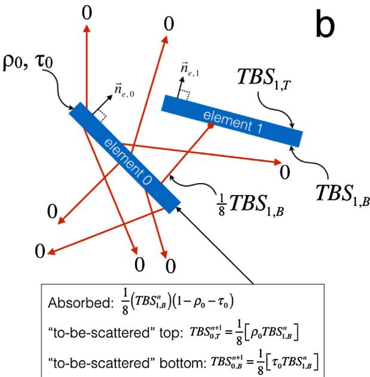
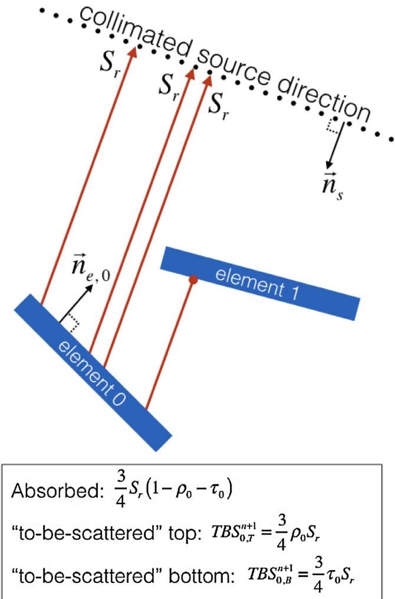
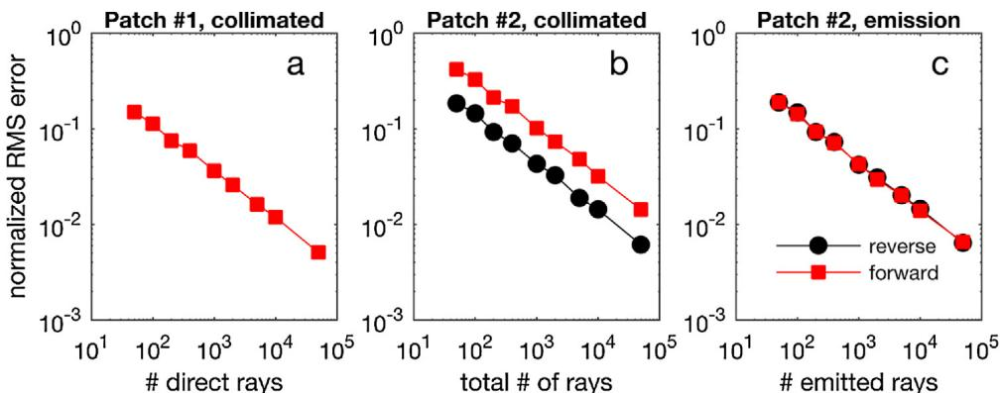
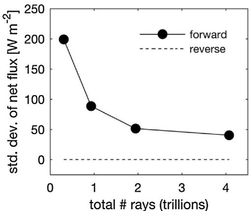

# A reverse ray-tracing method for modelling the net radiative flux in leaf-resolving plant canopy simulations

# 一种逆向光线追踪方法用于叶片尺度植物冠层净辐射通量建模

Brian N. Bailey

Department of Plant Sciences, University of California, Davis, Davis, CA 95616, USA

# 文章信息

文章历史： 2017年7月24日收稿 2017年11月26日修订 2017年11月27日录用 2017年12月12日在线发布

关键词： 功能-结构植物模型 图形处理器 辐射模型 光线追踪

# 摘要

辐射是植物系统中几乎所有生物物理过程的直接或间接驱动因素，由于其时空分布的复杂性，通常需要通过模型来描述。能够表征植物尺度异质性的详细辐射传输模型需要大量计算资源，这严重限制了可研究问题的规模；而能够模拟整个冠层的简化模型通常忽略了跨尺度的异质性。本研究开发了新的辐射吸收、透射、散射和发射计算方法，采用光线追踪技术，可以显式表征从叶片到冠层的多尺度过程。重点开发了一种新的"逆向"光线追踪方法来描述辐射发射和散射，确保所有几何元素(如叶片、枝条)都能被充分采样，从而保证无论使用多少光线，模拟的辐射通量都能保持在合理范围内。这一特性对于复杂几何模型尤为重要，因为即使使用大量光线也可能出现严重采样误差。该模型采用图形处理器(GPU)和高度优化的软件并行执行光线-物体相交测试，使得在普通台式机上5分钟内就能完成500多棵精细解析树木的模拟。

# 1. 引言

研究植物系统的一个基本挑战是理解目标过程如何跨越多个相关尺度(Ehleringer和Field，1993)。植物生物物理过程通常在器官尺度进行局部分析，这些过程通过从叶片到冠层甚至更大尺度的环境过程与其他植物耦合。直接测量这种跨尺度的物理过程通常不可行，一般需要借助模型。然而，在模型中表征这种多尺度关系同样具有挑战性，需要进行显著简化才能使问题可解。这意味着模型通常只能表征平均或代表性行为，无法直接解析植物尺度的异质性(如Sinclair等，1976；Harley和Baldocchi，1995；DePury和Farquhar，1997)。

功能-结构植物模型(FSPMs)是模拟植物系统生物物理过程的新工具，旨在描述受局部环境和生理功能影响的植物三维结构动态发展(Vos等，2010)。这些模型由一组耦合的子模型组成，描述了植物发育过程中的各种过程，如光合作用、养分/水分运输、碳分配和植物构型。

FSPM发展迅速，在理解传统实验难以触及的跨尺度复杂植物系统拓扑结构方面具有巨大潜力。然而，尽管计算能力持续提升，FSPMs在可表征的尺度范围上仍然受限。大多数FSPMs在叶片和枝条尺度表征植物，但通常只能模拟一到几株植物(取决于植物大小和模型复杂度)，超过这个数量计算成本就会变得过高(如Allen等，2005；Pearcy等，2005；Ma等，2008；Vos等，2010；Sarlikioti等，2011)。在许多情况下，这会限制其在研究田间或生态系统水平的植物间相互作用和竞争方面的应用。

功能-结构植物模型(FSPM)计算中的一个瓶颈是植物组织吸收的辐射通量计算，这直接或间接驱动了几乎所有生理过程的子模型。精确模拟辐射能量传输非常复杂，特别是当需要考虑数百万个元素(如叶片、枝条)的散射时。大多数生理过程对温度有很强的依赖性(Johnson和Thornley，1984)。因此，如果模型中要考虑温度，通常必须考虑辐射发射，这会显著增加复杂性，因为感兴趣区域中的每个元素都通过发射直接相互作用，而不是通过散射间接相互作用。由于这些挑战，模型必须在复杂性和表征尺度上做出妥协：辐射模型越复杂，能考虑的问题规模就越小。

  
图1. 几何元素类型：(a)面片，(b)alpha遮罩，(c)三角形。在(b)中，棋盘区域表示根据alpha(透明度)通道值移除的元素部分。

目前有非常多的三维方法可用于模拟植物系统中的阳光传输(如Ross，1981；Myneni，1991；Chelle和Andrieu，1998；Widlowski等，2013)，但能模拟地表辐射发射的方法相对较少。辐射度方法是模拟表面或"元素"间辐射发射的标准方法，它通过求解一组耦合方程来表示感兴趣区域中每个元素因发射和反射产生的辐射交换(Goel等，1991；Modest，2005)。虽然辐射度方法稳健，但随着问题规模增大，其计算成本会迅速变得难以承受。这是因为辐射度方法需要求解一个$N \times N$的方程组($N$是区域中元素总数)，其计算成本按$N^3$增长(参见Press等，2007)。其他基于辐射度的方法通过使用多尺度方法来改进这种缩放关系，如Chelle和Andrieu(1998)提出的"嵌套辐射度"方法，该方法简化了远距离辐射源的贡献。

当光线追踪模拟中存在小元素时，可以使用所谓的"逆向"光线追踪方法，即从元素向光源反向追踪光线，这种方法在计算机图形学应用(如Shirley和Morley，2003)和冠层建模应用(如Lewis和Muller，1992；North，1996；Lewis，1999；Cieslak等，2008)中都很常见。这种方法的优势是能保证每个元素都被采样，因此在计算成本限制了可用光线数量时更加稳健。逆向方法的缺点在考虑辐射散射时最为明显。当光线路径上发生反射或透射事件时，光线追踪变得不可逆，意味着正向和反向追踪不再等效。这意味着使用逆向方法时必须设计更复杂的方法来处理散射，这通常会导致内存和运行时间需求增加。

目前还没有有效的方法能使用逆向光线追踪来模拟地表辐射发射。在模拟短波辐射时，使用正向方法模拟小几何元素的发射也存在类似问题，不过在发射情况下问题可能更严重。Bailey等(2016)指出，使用正向追踪方法处理非常小的元素会导致显著的采样误差，除非使用大量光线，否则会导致模拟的净辐射通量出现重大误差。当与能量平衡方程耦合时，还可能导致非常大的温度误差，从而违反热力学第二定律。

本文提出了一种一致的方法，使用可视为适应发射的逆向光线追踪方法来计算完全解析植物中的辐射发射。假设使用逆向光线追踪方法处理发射会减少模拟的净长波辐射通量误差。该方法被推广用于设计辐射散射建模手段，从而建立一个完整的逆向光线追踪模型来处理平行、点或地表辐射源的辐射传输。最终目标是开发一个计算完全解析冠层中三维净辐射通量分布的模型，其效率足以在可行时间内模拟季节性时间尺度上的冠层尺度问题。

# 2. 模型描述

# 2.1. 元素几何

假设感兴趣环境中存在大量离散的平面对象，称为"元素"。本文考虑三种可能的元素类型(图1)，它们可以组合形成任意几何形状：

- 面片：由四个顶点定义的平面矩形。面片法向量$\vec{n}_e$使用右手定则定义，即按逆时针顺序跟随顶点得到向上的法向量。
- Alpha遮罩(也称"透明度遮罩")：与面片类似，但通过指定二维像素网格来确定哪些部分材料被移除。像素网格使用PNG图像文件的alpha或透明度通道指定。
- 三角形：由三个任意顶点定义的多边形。三角形法向量$\vec{n}_e$同样使用右手定则定义。

# 2.2. 辐射波段

通过为元素分配适当的辐射属性，可以模拟任意波长的辐射波段。例如，光合有效辐射(PAR)波段(400-700nm波长)在考虑叶片对阳光的截获时很重要，但在考虑叶片辐射发射时通常不重要，因为叶片在此波段基本不发射辐射。

通过定义目标波段的适当辐射属性和发射源来表示波长波段。每个元素被赋予半球总辐射属性：$\epsilon$(发射率)、$\rho$(反射率)、$\tau$(透射率)和$\alpha$(吸收率)，其中$\rho \pm \tau \pm \alpha \pm 1$(Modest, 2003)。这里的"总"表示在目标光谱波段上积分的属性，其正式定义如下(例如总反射率)：

$$
\rho = \frac{\int_{\lambda_1}^{\lambda_2}\rho_\lambda I_\lambda d\lambda}{\int_{\lambda_1}^{\lambda_2}I_\lambda d\lambda}, \tag{1}
$$

其中$\rho_{\lambda}$是随波长$\lambda$变化的光谱反射率，$I_{\lambda}$是辐射源的光谱强度，$\lambda_{1}$和$\lambda_{2}$分别是波段的上下限波长。光谱辐射属性可以通过光谱辐射计直接测量获得，或参考现有的光谱数据库(如Hosgood等，2005；Kotthaus等，2014)。为简化计算，通常假设光谱强度和辐射属性在特定辐射波段(如PAR波段)内保持恒定。

# 2.3. 辐射发射

如果元素的发射率和绝对温度不为零，则该元素会通过发射成为辐射源。元素的发射通量可以通过Stefan-Boltzmann定律计算为$\epsilon \sigma T^4$，其中$\sigma = 5.67\times 10^{- 8}\mathrm{Wm^{- 2}K^{- 4}}$是Stefan-Boltzmann常数，$T$是元素的绝对温度。周围环境也可能存在发射辐射，这些辐射不直接由元素解析。给定这些发射通量，以下程序描述了计算由其他元素和环境发射引起的吸收通量的方法(如图2所示)。

1. 元素表面采样：在每个元素表面随机采样$N_{\mathrm{rays}}$个离散$(x,y,z)$点。在当前实现中，$N_{\mathrm{rays}}$对所有图元设为常数。面片表面的采样通过从均匀分布中选择$N_{\mathrm{rays}}$组两个随机数，并将其映射到矩形表面完成(cf. Suffern, 2007)。alpha遮罩使用相同方法，但如果点位于透明区域则重新采样直到不再透明。在任意三角形上采样点有几种方法，最简单的是拒绝法：在单位矩形上采样(如面片)并丢弃位于三角形外的点。但本文使用的方法是在直角三角形(即半个面片)上均匀采样点，然后通过仿射变换映射到任意三角形元素。

2. 光线方向采样：光线方向按标准余弦加权分布采样：

$$
\begin{array}{rl} & {\theta_{r}^{\prime} = \sin^{-1}\sqrt{N_{t}},}\\ & {\phi_{r}^{\prime} = 2\pi N_{p},} \end{array} \tag{3}
$$

其中$N_{t}$和$N_{p}$是从均匀分布中抽取的随机数，$\theta_r^\prime$和$\phi_r^\prime$分别是水平放置元素的射线天顶角和方位角方向。任意方向元素的实际光线方向通过将$\theta_{t}^{\prime}$和$\phi_t^\prime$转换为笛卡尔单位向量并旋转到元素法线方向获得。实际计算中，为提高采样收敛性，对$N_{t}$和$N_{p}$采用"抖动"采样。这涉及在0到1之间生成$N_{t}$和$N_{p}$的均匀网格，然后抽取一个随机数给出相邻点之间的位移(详见Suffern, 2007)。

  
图2. 元素O吸收辐射通量的示例计算：(a)由元素1和环境发射引起；(b)后续散射迭代(用上标$n = 0,1,\ldots \rangle$表示)。图中光线方向对应光线追踪方案，而非辐射传播方向。给出了元素0吸收的通量、元素顶面(下标"T")和底面(下标"B")"待散射"通量的示例计算(单位均为$\mathrm{Wm^{-2}}$)，案例中每个元素使用8条光线$(N_{\mathrm{rms}} = 8)$。注意顶面是法向量$\vec{n}_{e}$指向的一侧。$E_{b,i} = \sigma T_{i}^{4}$、$\rho_{i}$、$\tau_{i}$和$\epsilon_{i}$分别表示第i个元素的半球总发射功率、反射率、透射率和发射率。

叶片是薄表面，可以通过背对背放置两个元素来表示。为节省计算时间和内存，可以启用选项使元素从两侧发射光线。例如，组成地面或树干元素只需从单侧发射辐射，而叶片需要从两侧发射。

3. 路径追踪：从采样点"发射"光线远离元素，并执行光线-对象相交测试(Suffern, 2007)。对于给定光线，有两种可能结果：

1 光线击中另一个元素。此时查询被击中元素的发射通量$(Q = \epsilon \sigma T^4)$，并用于计算与该光线关联的加权通量值：$Q / N_{\text{rays}}$。对于alpha遮罩，必须查询alpha贴图以确定光线相交是否发生在元素的透明部分。如果是，则光线实际上会继续传播，就像没有发生相交一样。

2 光线未击中任何其他元素。此时光线的加权通量值为环境通量$Q_{amb}^{\prime}(Wm^{- 2}\tau^{- 1})$，这是目标波段无遮挡表面的方向-半球通量。如果环境辐射是各向同性的，环境通量可赋值为恒定半球值$Q_{amb}(Wm^{- 2})$，此时加权光线通量简化为$Q_{amb} / N_{\text{rays}}$。如果环境通量是各向异性的，则可以使用基于光线传播方向变化的方向相关值。环境通量可通过配备遮光带的辐射计测量(如Horowitz, 1969)或建模获得(如Harrison和Coombes, 1988)。由于对整个元素周围的半球进行了采样，因此不需要显式处理边界条件。靠近域边缘的元素可能会拦截一些向上传播的环境辐射，这些辐射替代了原本在域中心位置会从地面元素拦截的辐射。

光线的加权通量被划分为吸收、反射和透射分量。吸收分量$(1 - \rho - \tau)Q / N_{\text{rays}}$被累加(求和)到与发射光线的元素对应的"吸收"缓冲区中。反射分量$\rho Q / N_{\text{rays}}$被累加到"待散射"缓冲区中。元素每侧都有一个"待散射"缓冲区，反射通量被累加到与击中侧相同的缓冲区中(即如果击中顶面，能量被累加到顶面对应的缓冲区中)。透射分量$\tau Q / N_{\text{rays}}$以类似方式累加到"待散射"缓冲区，不同之处在于透射通量被累加到与击中侧相反的缓冲区中(即如果击中顶面，能量被累加到底面对应的缓冲区中)。

4. 反射迭代：需要追踪元素"待散射"缓冲区中的能量离开元素的过程。在当前模型实现中，假设反射和透射遵循朗伯特性。严格来说，测量表明这个假设几乎总是错误的，镜面反射和透射辐射的散射在创建反射和透射辐射的各向异性中起着明显作用(Woolley, 1971; Bousquet等, 2005; Combes等, 2007)。虽然从严格意义上讲这通常是一个不正确的假设，但Chelle(2006)证明当考虑由许多叶片散射产生的入射通量时，非朗伯效应对整体辐射吸收分布的影响很小。

基于上述假设，散射计算基本上以与初级发射相同的方式进行。唯一区别在于射线强度是基于"待散射"通量而非发射通量分配的，并且环境通量在散射迭代中被设为零。用户需指定最大允许的"待散射"能量(例如$0.1Wm^{-2}$)和最大允许的散射迭代次数(例如10次)。散射迭代将持续进行，直到所有元素中的最大"待散射"能量低于用户定义的阈值，或者散射迭代次数超过用户定义的最大值。无论哪种情况，散射缓冲区中剩余的能量都会被元素吸收以确保能量守恒。当$\rho$和$\tau$较小时(如PAR波段)，只需要很少的迭代次数。如果$\rho$或$\tau$较大(如近红外波段)，则可能需要多次迭代。然而，由于反射和透射能量随每次迭代呈指数下降，所需的散射迭代次数通常仍然较低(例如5-10次，取决于用户定义的阈值)。所需的散射迭代次数将在第3.1.1节进一步探讨。

  
图3. 元素0由于准直辐射源(如太阳)吸收通量的光线追踪示意图，以及"待散射"能量(TBS)表示，下标"T"或"B"表示来自顶面和底面的散射，上标$n=0,1,\ldots$表示散射迭代次数。所示示例中，每个元素使用4条光线采样(即$N_{\text{rays}}=4$)。元素0的总半球反射率和透射率分别用$\rho_0$和$\tau_0$表示，沿准直源方向$\bar{n}_s$发射的半球通量为$S_r/N_{\text{rays}}$，$\bar{n}_{e,0}$是元素0表面的单位法向量。

# 2.4. 外部辐射源

# 2.4.1. 准直辐射源

采用标准方法计算准直辐射源(如太阳)引起的初级入射通量(即散射前通量)(图3)。准直辐射定义为所有辐射"光束"相互平行的辐射。虽然太阳发射的辐射并非准直，但由于太阳与地球之间距离遥远，地球接收到的太阳辐射可近似视为准直辐射。

  
图4. 点辐射源(如灯具)直接辐射计算的光线追踪示意图。在元素表面随机采样点，$\vec{n}_r$为从采样点指向辐射源的单位向量，$\vec{n}_e$为元素表面的单位法向量，$\vec{n}_s(\theta_i,\phi_j)$为从点源位置指向球面方向$(\theta_{i},\phi_{j})$的单位向量。

对于准直辐射，采用与发射相同的方式在元素表面随机采样点。光线方向定义为连接采样点与辐射源的直线。光线从元素向源方向追踪，相交测试执行方式与发射情况相同。未与其他元素相交的光线被赋值为：

$$
S_{r} = \frac{Q_{s}|\vec{n}_{e}\cdot\vec{n}_{s}|}{N_{rays}}, \tag{4}
$$

其中$Q_{s}$为源在$\vec{n}_s$方向上目标波段的半球总辐射通量$(\mathrm{Wm}^{- 2})$。$Q_{s}$可来自传感器测量(例如水平传感器测得直接太阳通量为$500\mathrm{W / m^2}$时，$Q_{s} = 500 / \cos \theta_{s}\mathrm{W / m^{2}}$，$\theta_{s}$为太阳天顶角)，或来自太阳传输模型(如Liu和Jordan, 1960; Gueymard, 2008)。

吸收和散射过程与发射情况处理方式相同。若存在与给定源相关的漫射通量，可在第一次散射迭代期间对环境空间进行采样。

# 2.4.2. 点光源

若辐射源可近似为点源(如远处的灯具)，光线方向为连接辐射源与元素表面采样点的直线(图4)。未与其他元素相交的光线强度通过积分源所有可能发射方向的入射辐射计算：

$$
S_{r} = \frac{Q_{p}}{N_{r a y s}N_{\theta}N_{\phi}}\frac{N_{\phi}}{N_{r a y s}N_{\theta}}\frac{N_{\phi}}{N_{\phi}}\frac{\left(\vec{n}_{e}\cdot\vec{n}_{r}\right)|\vec{n}_{r}\cdot\vec{n}_{s}(\theta_{i},\phi_{j})|}{\pi S^{2}}\delta , \tag{5}
$$

其中$Q_{p}$为源表面目标波段的总发射辐射通量$(\mathrm{Wm}^{- 2})$，$\vec{n}_r$为从元素采样点指向辐射源的单位向量，$S$为采样点到源的距离。$\vec{n}_s(\theta_i,\phi_j)$为从点源位置指向球面方向$(\theta_{i},\phi_{j})$的单位向量，共有$N_{\theta}\times N_{\phi}$个离散球面方向。$\theta_{i}$计算为$\cos^{- 1}\left[1 - 2(i - 0.5) / N_{\theta}\right]$，$\phi_{j}$计算为$2\pi (j - 0.5) / N_{\phi}$。$\delta$为判别函数：当$\left(\vec{n}_r\cdot \vec{n}_s\right)< 0$时等于$1\mathrm{m}^2$，否则为$0$，用于剔除源背面发射的辐射。

# 2.5. GPU加速

由于需要大量光线，串行执行的光线追踪计算通常成本较高。计算机图形学界数十年来一直使用图形处理器(GPU)加速光线追踪计算。GPU是专用硬件，具有大量流式多处理器，专为并行"数字运算"设计。目前已开发多个简化GPU编程的框架，如NVIDIA的CUDA框架和OpenCL。

本工作中，上述光线追踪算法通过NVIDIA OptiX光线追踪库实现，这是一个高度优化且通用的GPU光线追踪框架。OptiX本身并不执行光线追踪，而是管理光线追踪相关数据和任务的灵活框架。例如，用户编写函数描述光线发射方式、定义光线-对象相交条件，并指定命中或未命中时的处理逻辑。

# 3. 结果

# 3.1. 精度与一致性测试

通常，辐射模型的测试是通过将模拟结果与实地采集的真实数据进行比较(即验证)来完成的。对详细辐射模型进行严格验证存在若干重大挑战。首先，需要极其详细的测量数据来指定模型中的几何结构。由于模型中需要表示单叶和单枝，如果要重现叶片级别的测量结果，就必须准确指定模型中每片叶子和每根枝条的几何形状。另一种选择是使用聚合测量数据进行验证，这对几何规格的要求较为宽松。然而，这种方法通常会聚合许多不同的过程和测量误差，使得难以区分自然环境变异、测量误差和模型误差。

在评估这类详细模型时，另一种可能更有价值的方法是在已知确切答案的相对简单案例中验证模型预测。由于确切答案已知，模型预测中的所有误差必定源于模型本身或实现过程中的错误。这种"验证优先于确认"的方法受到遥感领域部分研究者的青睐，并已用于模型间比较(Pinty等, 2001; Widowski等, 2013)。在他们的大多数测试中，"确切"答案并非已知，而是使用不同模型预测的聚合结果作为模型性能的相对衡量标准。需要注意的是，遥感界开发的这些工具主要关注冠层反射辐射的分布，而非本工作重点关注的单个元素吸收。

本研究通过确保模型在已知确切答案的问题上满足基本一致性和准确性条件来进行评估。准确性验证不仅通过相对误差度量，更重要的是确保随着使用光线数量的增加，误差持续减小(即解收敛到确切答案)。未来工作将集中于创建新的数据集，以更准确地评估模型预测在真实世界中的误差。

  
图5. 模型验证测试案例示意图。案例#1同时考察辐射发射和准直辐射(虚线箭头)，案例#2仅考察漫射辐射(虚线箭头)，案例#3仅考察辐射发射，案例#4考察单点辐射源。ρ表示外部辐射源情况下的元素反射率，ε表示元素发射率(1-ε表示由元素发射辐射导致的反射率)，T表示元素的绝对温度。各案例及其精确解详见附录A。

# 3.1.1. 精度与收敛性

为验证模型并评估精度，我们求解了几个足够简单、可以计算确切答案的示例问题(图5)。测试案例设计用于逐步评估模型的不同方面。测试案例参数如尺寸、辐射特性和温度等是任意选择的，但总体目标是提供对单个模型组件的测试，并展示随着光线数量变化相关的误差收敛情况。每个测试案例的详细解析解见附录A。这些细节的纳入是为了提供未来模型验证的标准案例。我们将所提模型的性能与传统正向光线追踪模型进行对比。在正向模型中，光线从起源的辐射源发射，可能是元素、准直源、点源或环境源(此时光线源自包围域内所有元素的球面)。正向追踪方法的实现细节见附录B。

对每个案例进行了500次模拟组成的集合，并使用归一化均方根误差量化平均误差，其数学定义为

$$
nRMSE = \frac{1}{R_{ex}}\left(\sum_{i}(R_{i} - R_{ex})^{2}\right)^{1/2},
$$

其中$R_{i}$表示集合中第$i$次模拟的吸收辐射通量模型值，$R_{ex}$表示吸收通量的精确值。

测试案例#1（图5）旨在验证面片对平行辐射的吸收、向相邻面片的反射以及面片自身发射。选择平行辐射源的反射率为$\rho_{1} = 0.3$和$\rho_{2} = 0$。发射参数设为$\epsilon_{1} = \epsilon_{2} = 1$，$T_{1} = 300$，$T_{2} = 0$。面片尺寸$l$取任意值1。

图6展示了面片#1和#2的吸收通量归一化误差，以及面片#1发射导致面片#2吸收的通量。采用逆向方法时，无论直接光线数量如何，面片#1的吸收辐射误差始终为零——这是因为无遮挡元素总能完美采样辐射源，这是模型的理想特性。注意图6a未显示逆向方法结果，因为零值无法在对数坐标中表示。正向方法中，面片#1的吸收通量高度依赖光线数量，误差随光线数增加呈指数下降，这是正向光线追踪模拟的典型特征（Widlowski等，2013）。

对于面片#2的吸收辐射通量，正向和逆向方法都表现出与光线数量的强相关性，且以相近的指数速率收敛至精确解（图6b）。但正向方法的误差始终比逆向方法大四倍左右，这是因为散射至面片#2的通量依赖于面片#1对直接辐射的准确采样。由于逆向方法在预测面片#1可散射辐射量方面更精确，因此能更准确地预测面片#1散射导致面片#2吸收的通量。不过两种方法在面片#1发射导致面片#2吸收辐射的预测上表现相似（图6c），表明二者对面片#2的漫射采样效果相当。由于该问题的对称性，在模拟元素辐射发射时，正向与逆向方法本质上是等效的。

$$
n R M S E = \frac{1}{R_{e x}}\left(\sum_{i}(R_{i} - R_{e x})^{2}\right)^{1 / 2}, \tag{6}
$$

  
图6. 测试案例#1(见图5)中模拟吸收辐射通量的归一化均方根误差(式(6))随光线数量变化的收敛情况。结果展示了正向和逆向光线追踪方法的对比。(a)准直辐射源导致面片#1吸收辐射通量的误差随准直光线数量的变化(逆向方法未显示，因其误差始终为零)；(b)面片#1散射准直辐射导致面片#2吸收辐射通量的误差随总光线(准直+漫射)数量的变化；(c)面片#1发射辐射导致面片#2吸收通量的误差随发射光线数量的变化。

  
图7. 测试案例#2(见图5)中模拟吸收辐射通量的归一化均方根误差(式(6))随光线数量变化的收敛情况。结果展示了正向和逆向光线追踪方法的对比。误差曲线表示各向同性环境辐射源导致面片#1吸收辐射通量随环境光线数量的变化。

案例#2(图5)旨在测试对各向同性环境辐射源的采样。辐射特性设为$\rho_{1} = \rho_{2} = 0$，几何参数设为$a = 1$、$b = 2$、$c = 0.5$。正向和逆向方法中，模拟吸收通量的误差均以近似相同的指数速率下降(图7)。但正向方法的误差始终比逆向方法大约四倍。两种方法都需要对面片#2表面进行充分采样以计算面片#1拦截的环境辐射量。逆向方法从面片#1的视角进行采样，而正向方法则从包围球面的视角采样(平均距离更远)。因此逆向方法能更准确地采样被面片#2遮挡的辐射，但两种方法的整体收敛速率相同。

案例#3(图5)用于测试灰面片间的发射交换及后续"无限次"反射。同时改变漫射光线数量和最大散射迭代次数，仅考虑面片发射。辐射特性设为$\epsilon_{1} = \epsilon_{2} = 0.6$，几何参数与案例#2相同。

当不允许散射计算时，由于几何对称性(如案例#1)，正向与逆向方法基本等效。此时增加光线数量初期误差略有下降，但由于必须包含散射才能正确预测吸收通量，继续增加光线不会带来改善(图8)。

随着最大散射事件次数增加，两种方法的误差以相同指数速率下降。需注意这取决于正向光线追踪中使用的具体散射方法。由于每次光线-对象相交时能量同时被吸收和反射，正逆向方法在此等效。许多正向光线追踪实现采用随机方法决定吸收或反射是否发生(见附录B)。这种随机实现中，每次散射后可用光线数量呈指数减少，导致与逆向方法相比精度下降且收敛速率更慢(未展示)。

案例#4用于测试单点辐射源的发射及其被面片的吸收。面片反射率$\rho_{1} = 0.3$，几何参数$a = 1$、$b = 2$、$c = 1$。逆向追踪方法中$N_{\theta}$和$N_{\phi}$设为固定值30。两种方法的误差均随直接光线数量增加呈近似指数下降(图9)。但逆向方法的误差下降速率快于正向方法。正向方法的平均误差约为逆向方法的五十倍。原因与案例#1类似：逆向方法中面片能完美采样辐射源，而正向方法需准确采样周围球面空间的较小部分。与案例#1不同的是，本案例中辐射源光线具有角度依赖性，因此即使逆向方法也需要对面片表面采样以正确计算面片相对辐射源所张立体角，故误差仍与光线数量呈指数关系。

  
图8. 测试案例#3(见图5)中面片#1模拟吸收辐射通量的归一化均方根误差(式(6))随光线数量和散射迭代次数变化的收敛情况。结果分别展示逆向(左)和正向(右)光线追踪方法。

  
图9. 测试案例#4(见图5)中模拟吸收辐射通量的归一化均方根误差(式(6))随光线数量变化的收敛情况。结果展示正向和逆向光线追踪方法的对比。误差曲线表示各向同性点辐射源导致面片#1吸收辐射通量随直接光线数量的变化。

# 3.1.2. 能量守恒(热力学第一定律)

辐射模型最基本的一致性要求是能量守恒。本质上这意味着能量在传输过程中既不会凭空产生也不会消失，只能重新分布。对于准直辐射，入射到计算域的总能量速率为$Q_{s}\cos\theta_{s}A_{t}$，其中$A_{t}$为计算域的总投影面积，$\theta_{s}$为太阳天顶角，注意单位是能量/时间。对于漫射辐射，总入射能量速率为$Q_{d}A_{t}$，其中$Q_{d}$为水平面上的漫射辐射通量。对于发射过程，所有元素发射的总能量速率为$\sum_{i}^{N}\sigma_{i}\sigma_{i}^{T4}A_{i}$。为评估能量守恒，我们只需计算所有元素吸收的辐射能量速率（包括发射/反射到天空的能量），并与初始总能量进行比较。若能量守恒，二者应相等。

理论上，任何一致的辐射模型（如光线追踪、辐射度法）都应满足能量守恒。如前所述，本文方法仅近似满足能量守恒，因为元素实际输出的能量取决于其被其他元素的采样充分性。为测试能量守恒，我们创建了包含$140\times 140$个$0.3\times 0.3\mathrm{m}^2$倾斜斑块构成的地表，以及四棵间距$7\mathrm{m}$、平均高度$6\mathrm{m}$的树木的测试场景（图11）。采用Weber和Penn（1995）模型生成三维杏仁树几何体，每棵树包含约6000个构成枝干的三角形和约30,000个构成叶片的alpha遮罩。如Weber和Penn（1995）所述，各几何参数均添加随机扰动使树木形态唯一。叶片短波反射率和透射率设为0.2，发射率设为0.9。所有元素温度设为$300\mathrm{K}$。测试发现，即使每个元素仅使用50条光线，准直辐射源的能量守恒误差约为源通量的$0.01\%$，发射过程的误差约为环境通量的$0.1\%$，仅略高于单精度浮点误差。

# 3.1.3. 平衡分布（热力学第二定律）

与能量守恒同等重要的是辐射分布必须趋向均匀平衡态，即在无外部源/汇时熵不会减小。这一要求至关重要——若模型无法回归正确平衡态，则非平衡状态下计算的辐射分布特征将失去物理意义。测试方法相对简单：将所有元素温度设为$T$，天空环境通量设为$\sigma T^4$。此时无论几何构型如何，所有元素的净辐射通量应严格为零。

采用四棵树的果园测试场景验证第二定律，通过改变光线数量分析其对净辐射通量误差的影响（图10）。正向方法中，总光线数包含环境漫射光线和发射光线（逆向方法中二者相同）。四次正向模拟的环境光线数分别为$10^{6}$、$10^{7}$、$10^{8}$和$10^{9}$，对应每个元素的发射光线数为3000、5000、6000和10,000（注意双面元素需双倍光线）。

逆向光线追踪具有独特优势：即使每个元素仅采样一条光线，也能在机器精度范围内达到平衡分布。当所有元素发射通量等于环境漫射通量时，模型计算的净辐射通量基本为零（本案例平均约$10^{-7}$）。

  
图10. 不同光线数量下测试案例中所有元素净通量的标准差。逆向方法预测的净通量始终接近零。

正向光线追踪对第二定律的满足度高度依赖光线数量与几何构型的关系（图10）。当光线数适中（如2亿条）时，标准误差高达约$150\mathrm{Wm}^{-2}$（约为$\sigma T^4$值的三分之一）。增加光线数可降低误差，但即使使用4万亿条光线，净辐射通量误差仍显著（标准误差约$40\mathrm{Wm}^{-2}$）。图11展示了该光线数下的误差空间分布，极端值范围仍很大：最小净通量$-459\mathrm{Wm}^{-2}$（未被采样的元素），最大净通量约$9000\mathrm{Wm}^{-2}$。这些异常值对应树木枝干结构的三角形元素，多出现在分叉处或高扭曲度元素位置。虽然可通过滤波或优化网格改善，但正向方法处理任意网格的局限性由此可见，而逆向方法则能直接应对。

逆向方法优势在于：对环境源和其他元素吸收通量的采样方式完全一致，因此环境通量采样误差会被其他元素的吸收通量误差精确抵消。而正向方法中，环境通量从包围球视角采样，元素发射通量则从其他元素视角采样，这两类采样误差互不相关，导致净辐射通量可能出现极大误差。

# 3.2. 可视化

模型输出的可视化示例如图12所示，主要用于直观展示模型功能。在图12中，每个元素的颜色根据其吸收的辐射通量映射至图中色标。地面由$0.1\times 0.1\mathrm{m}^2$的薄面片构成，共约110万个面片。果园中共有121棵树，树高$6\mathrm{m}$，间距$7\mathrm{m}$。图12a所示场景共包含约550万个元素。

图12a展示了模拟果园中吸收的直接和漫射太阳辐射总通量的伪彩色图。叶片反射率和透射率设为0.05（符合光合有效辐射PAR波段特征，Jones and Vaughan, 2010），其余表面设为黑体。准直辐射通量设为$800\mathrm{Wm}^{-2}$，直接辐射与（各向同性）环境辐射通量比$(Q_{s} / Q_{amb})$为4。准直辐射天顶角为$45^{\circ}$，直接和漫射光线数分别设为100和200。

图12b描绘了温室中多个人工光源点辐射源的直接辐射传输。三维几何体通过标准多边形文件导入（可由AutoCAD (Autodesk, Inc.)、Blender (www.blender.org)等建模软件生成）。每株植物和花盆由约6000个三角形构成，除随机方位旋转外完全相同。温室墙壁由面片拼接而成，灯具外壳由三角形细分构成。整个模拟共含约200万个元素。

# 3.3. 模型运行时间扩展性

为测试大尺度场景下的性能扩展，使用NVIDIA GTX Titan消费级显卡进行测试。采用3.2节所述果园几何构型，逐步增加树木数量，记录模拟单波段单时刻直接和漫射辐射的运行时间。为单纯测试时间扩展性，叶片反射率和透射率统一设为0.1，其余表面设为黑体。直接和漫射光线数分别设为100和200。固定散射迭代次数为0和3次以测试其影响。固定散射次数可消除叶片辐射特性对运行时间的影响，因为无论散射能量多少，散射过程都将以相同方式持续。

  
图11. 正向光线追踪方法在四棵树果园测试案例中各元素净辐射通量误差的可视化。每个元素使用$10^{9}$条环境光线和$10^{4}$条发射光线，总计约4万亿条光线。测试中所有元素发射通量和环境通量均为$\sigma T^4$，模型预测的各元素净通量应为零。

  
图12. 各元素吸收辐射通量的可视化示例。上：杏仁果园吸收的直接和漫射太阳辐射；下：温室中多个点光源（人工照明）辐射通量归一化后的直接辐射吸收。

  
图13. 使用NVIDIA GTX Titan显卡时，模拟运行时间随问题规模（杏仁果园测试案例）增加的扩展情况。

在测试范围内，运行时间与元素数量呈线性关系（图13）。当元素超过约2250万个时，GPU内存耗尽。此时可通过调用主机额外RAM来模拟更大场景，但GPU与主机内存间的低带宽会增加运行时间。若主机内存耗尽，仍可通过硬盘交换空间继续模拟，但运行时间将进一步增加。

散射迭代的时间成本与无散射的漫射辐射计算相当。但首次散射迭代在漫射计算中基本零成本，因二者可同步进行。因此增加三次散射迭代使运行时间几乎精确增加$100\%$。本方法的缺点在于运行时间基本不受元素辐射特性影响，而传统正向光线追踪中若表面为黑体则不会发射反射/透射光线（见附录B）。逆向方法中每个元素需采样周围空间，无法预先假设邻近元素是否为黑体。

测试结果表明，对于特定几何构型和硬件配置，无散射时每百万元素运行时间约12.5秒。增加散射迭代时，时间需乘以迭代次数$n$。若模拟单棵树整个生长季每小时数据（假设日均光照$12\mathrm{h}$，200个生长日，无散射），总运行时间约$15\mathrm{min}$，具有可行性。树木数量增加100倍时，运行时间约1天，考虑到模型复杂度仍属可行。当然可通过减少计算频次、升级GPU或多GPU并行来缩短时间。

# 4.讨论与结论

复杂几何构型中的小元素通常会给传统"正向"光线追踪方法（如Kimes and Kirchner, 1982; North, 1996; Gastellu-Etchegorry et al., 2004）带来挑战，因其需要极大量光线才能充分采样小元素。使用正向方法对四棵完整树木进行模拟时发现，即使使用数万亿条光线，净辐射通量仍存在显著误差（标准误差约$10\%$），更严重的是存在大量异常值误差$(>100\%)$。

当元素较小导致采样误差显著时，"逆向"光线追踪是公认的有效解决方案（North, 1996; Lewis, 1999; Disney et al., 2000; Cieslak et al., 2008）。该方法从物体反向追踪至辐射源，确保所有物体被充分采样。代价是考虑散射时方法更复杂，因散射过程不可逆。此外现有逆向模型难以处理辐射发射，而这正是计算全波段净通量所必需的。

本研究开发的逆向追踪模型可计算模拟域内每个元素的净辐射通量。正向与逆向方法在物体间对称辐射交换时等效，但在高度不对称场景（如天空向小元素辐射）中差异显著。正向追踪中，天空因占据元素周围球面空间大部分而被无障碍元素充分采样，但该元素仅占天空视域极小部分而采样不足。逆向追踪则相反。因此关注元素吸收时，逆向方法通常能更好采样外部辐射源。对于发射过程，两种方法对不同元素的采样优劣取决于相对尺寸。逆向方法的优势在于：即使每个元素仅用一条光线，也能保证吸收通量始终处于所有辐射源的发射通量范围内。当光线数量有限时，这可确保结果合理性，而正向方法可能产生不合理结果。

在计算元素的净辐射通量时，采用逆向追踪方法对采样外部辐射源和元素自身发射都具有优势。本工作证明，所用逆向追踪方法至少满足热力学第二定律或平衡条件。该方法满足一致性条件的原因是：环境辐射通量采样误差会被其他元素发射通量的采样误差精确抵消，因为二者采用相同的逆向采样方法。

本文开发的逆向光线追踪方法与常用的辐射度方法（如Goral等，1984；Borel等，1991；Chelle和Andrieu，1998）具有诸多相似性，两者都满足上述一致性条件。理论上这些方法几乎相同，主要差异在于散射处理。本文逆向追踪方法无需求解大型线性方程组——当元素数量庞大时，方程求解计算成本极高。本方法计算量与几何元素数量呈线性关系，而求解线性方程组的计算量随元素数量呈指数增长（Press等，2007）。

研究结果表明，通常宜从吸收辐射的目标实体视角进行采样。若目标实体是冠层内的叶片或传感器，采用逆向光线追踪可确保充分采样。在遥感应用中，目标实体常为散射至土壤的辐射分布，因此更常见正向追踪方法，因其从天空视角采样（Disney等，2000；Widlowski等，2006，2013）。

除独立研究辐射传输过程外，该模型的重要应用前景是与植物系统生物物理模型耦合。由于模型可表征长波辐射交换，可耦合能量平衡模型预测冠层表面温度。几乎所有生理过程（如光合作用、呼吸、生长、病虫害发展）都强烈依赖温度，器官级生理模型需要此类信息。这不仅适用于理解自然生态系统异质性影响，还可为林业/农业系统管理优化提供依据。

# 致谢

感谢American Vineyard Foundation项目2016-1825和USDA国家食品农业研究所Hatch项目CA-D-PLS-2401-H的资助。

# 附录A. 验证测试案例描述与解析解

为完整起见，现给出第3.1节各验证案例的精确解析解。

# A.1 案例1

本案例包含两个正交的方形朗伯面片，共享一条公共边（图5）。准直辐射源位于正上方。面片#1具有非零反射率，将部分辐射反射至仅接收反射辐射的面片#2。面片#2为"冷"面片，#1为"黑"面片，故唯一发射交换是#1向#2的直接发射。

面片#1发出能量被面片#2拦截的比例（即视角系数$F_{1 - 2}$，Modest 2003）为$F_{1 - 2} = 0.2$（Modest 2003，附录D39）。由对称性得$F_{2 - 1} = 0.2$。

因面片#1与辐射源垂直，其吸收辐射通量为：

$$
Q_{1} = (1 - \rho_{1})Q_{s}, \tag{A.1}
$$

其中$Q_{s}$为辐射源法向的准直辐射通量。面片#1反射的辐射通量为$\rho_{1}Q_{s}$，故面片#2吸收的反射通量为：

$$
Q_{2} = \rho_{1}F_{1 - 2}Q_{s}, \tag{A.2}
$$

此式仅在$\rho_{2} = 0$时成立。注意面片#2与辐射源平行，故不接收直接辐射。

面片#2吸收的面片#1发射辐射通量为：

$$
E_{1} = F_{2 - 1}\epsilon_{2}\sigma T_{2}^{4}. \tag{A.3}
$$

# A.2 案例2

本案例包含两个对齐的平行朗伯面片(图5)。存在一个各向同性的环境辐射源。忽略面片#1下侧和面片#2上侧的辐射吸收。两个面片的反射率均为零。

面片#1发出能量被面片#2拦截的比例由(Modest, 2003, 附录D38)给出：

$$
\begin{array}{l}{F_{1 - 2} = \frac{2}{\pi X Y}\Bigg\{\ln \left[\frac{(1 + X^{2})(1 + Y^{2})}{1 + X^{2} + Y^{2}}\right]^{1 / 2} + X\sqrt{1 + Y^{2}\tan^{-1}}\frac{X}{\sqrt{1 + Y^{2}}}}\\ {+Y\sqrt{1 + X^{2}}\tan^{-1}\frac{Y}{\sqrt{1 + X^{2}}} -X\tan^{-1}X - Y\tan^{-1}Y\Bigg\} ,} \end{array} \tag{A.4}
$$

其中$X = a / c$，$Y = b / c$。根据能量守恒，入射到面片#1的漫射辐射比例为$(1 - F_{1 - 2})$。由对称性可知$F_{1 - 2} = F_{2 - 1}$。因此，面片#1吸收的环境辐射通量为：

$$
Q_{1} = (1 - F_{1 - 2})Q_{s}. \tag{A.5}
$$

由对称性，面片#2吸收的环境辐射通量与面片#1相同。

# A.3 案例3

本案例与案例2相同，但仅考虑发射过程，且两个面片的发射率均小于1(图5)。因此两个面片之间会发生无限次反射。

视角系数$F_{1 - 2}$和$F_{2 - 1}$由式(A.4)给出。由于未限制$e_1$或$\epsilon_2$必须等于1，可采用辐射度方法获得两面片间能量传递的解析表达式。根据能量守恒，可建立描述两片间辐射交换的方程组，得到标准辐射度方程(Modest, 2003)：

$$
\begin{array}{l}\frac{e_1}{\epsilon_1} -\left(\frac{1}{\epsilon_2} -1\right)F_{1 - 2}e_2 = \sigma T_1^4 -F_{1 - 2}\sigma T_2^4,\\ \displaystyle \frac{e_2}{\epsilon_2} -\left(\frac{1}{\epsilon_1} -1\right)F_{2 - 1}e_1 = \sigma T_2^4 -F_{2 - 1}\sigma T_1^4, \end{array} \tag{A.6b}
$$

其中$e_i$为面片#i的净表面通量。通过求解式(A.6a)中的$e_2$并回代至式(A.6b)，可获得$e_1$和$e_2$的显式解：

$$
e_1 = \frac{\sigma\left\{(1 - \epsilon_1)F_{1 - 2}\left(T_1^4 - F_{2 - 1}T_1^4\right) + T_1^4 - T_2^4\right\}}{\frac{1}{\epsilon_1} - \epsilon_2\left(\frac{1}{\epsilon_1} - 1\right)\left(\frac{1}{\epsilon_2} - 1\right)F_{1 - 2}F_{2 - 1}} \tag{A.7a}
$$

辐射源(图5)。面片可能具有非零反射率，会将部分能量反射至周围环境。点源发出能量被面片吸收的比例由(Modest, 2003, 附录D47)给出：

$$
F_{p - 1} = \frac{1}{4\pi}\tan^{-1}\sqrt{\frac{1}{D_1^2 + D_2^2 + D_1^2D_2^2}}, \tag{A.9}
$$

其中$D_1 = c / a$，$D_2 = c / b$。因此，面片吸收的通量简化为：

$$
E_{1} = (1 - \rho_{1})F_{p - 1}Q_{p}, \tag{A.10}
$$

其中$Q_p$为点源发射的半球通量。

# 附录B. 标准"正向"光线追踪方法

以下描述执行正向光线追踪计算的方法。下文大部分内容可在Mahan(2002)第11章或其他标准辐射教材(Modest, 2003; Howell等, 2010)中找到，但对环境漫射辐射的处理做了一些修改。

在传统蒙特卡洛光线追踪方法中，单个辐射"束"或"光线"从其源发射，并在穿过感兴趣区域时与各种元素相交。根据辐射源类型的不同，光线的原点、方向和关联能量的选择也有所不同。

准直辐射源：准直太阳辐射通常通过从区域上方沿源方向发射大量光线来建模。为确保光线覆盖整个区域足迹，可构建包含所有建模对象的"包围球"。然后从与包围球相切、直径相同的圆盘发射光线(见Overby等, 2016)。分配给每条光线的能量为$Q_s(\pi R_s^2) / N_{\text{rays}}$，其中$Q_s$为垂直于源方向的辐射通量，$R_s$为包围球半径，$N_{\text{rays}}$为发射的直接光线数量。

点辐射源：点辐射源的发射通过从源位置均匀地向所有方向发射光线来表示。每条光线的天顶角选择为$\theta = \cos^{- 1}(1 - R_t)$，其中$R_t$为均匀分布的随机数。方位角可类似地指定为$\phi = 2\pi R_p$，其中$R_p$为另一个均匀随机数。每条光线的能量为$2Q_p / N_{\text{rays}}$，其中$Q_p$为源发射的能量通量，$N_{\text{rays}}$为每个源发射的总光线数。

环境漫射辐射源：环境漫射辐射可通过向区域发射随机方向的光线来建模。要定义给定光线，必须同时指定光线原点和光线通过的点(或等效参数)。对于各向同性环境辐射通量，可通过随机选择包围球表面两个点来定义光线。在球坐标系中，每个点相对于包围球中心的天顶角可表示为$\theta = \cos^{- 1}(1 - R_t)$，其中$R_t$为均匀分布的随机数。点的方位角可类似地指定为$\phi = 2\pi R_p$，其中$R_p$为另一个均匀随机数。每条光线的能量为$Q_{amb}(4\pi R_s^2) / N_{\text{rays}}$，其中$Q_{amb}$为各向同性环境辐射通量，$N_{\text{rays}}$为漫射光线数量。若环境通量各向异性，可通过在包围球上变化光线能量来考虑。

最后，减去发射通量得到吸收能量通量

$$
\begin{array}{r}E_{1} = |e_{1} - \epsilon_{1}\sigma T_{1}^{4}|,\\ E_{2} = |e_{2} - \epsilon_{2}\sigma T_{2}^{4}|. \end{array} \tag{A.8b}
$$

# A.4 案例4

本案例包含一个点辐射源照射水平面片，面片的一个顶点正位于点源下方。

地面发射：地面物体的发射通过从物体表面向外投射光线来建模。在物体表面随机选择均匀分布的点(方法见Suffern, 2007)作为光线起点，并随机选择光线方向。对于水平表面，光线的球坐标可表示为$\theta = \sin^{- 1}\sqrt{R_t}$和$\phi = 2\pi R_p$，其中$R_{t}$和$R_{p}$为均匀随机数。若表面倾斜，可将选定的光线方向旋转至与物体表面法线对齐的坐标系。对于朗伯发射，分配给每条光线的能量为$\epsilon \sigma T^4 A / N_{rays}$，其中$\epsilon$为物体发射率，$\sigma$为斯特藩-玻尔兹曼常数，$T$为物体表面的绝对温度，$A$为物体表面积，$N_{rays}$为每个物体发射的光线数量。

光线-物体相交：计算光线与物体的交点以确定最近的相交点。当发生相交时，能量部分被吸收、透射和反射。一种建模方法是选择一个均匀分布的随机数$R$。若$R$小于物体反射率$\rho$，则光线能量的$100\%$被物体反射，并从相交点发射一条新光线，方向为远离相交表面的随机方向。若$R$大于$\rho$但小于$\rho + \tau$($\tau$为物体透射率)，则类似反射情况发射新光线，但从相交表面的另一侧发射。若$R > \rho + \tau$，则光线能量的$100\%$被物体吸收，光线终止。

为确保与反向追踪方法等效，本文采用确定性散射方法进行正向散射。在此情况下，若光线与物体相交，则部分能量$\rho$被反射，发射一条新光线，其能量等于$\rho$乘以散射前的光线能量。类似地，部分能量$\tau$被透射。剩余部分$1 - \rho - \tau$被物体吸收。此过程持续进行，直至光线能量低于用户定义的阈值。

## 参考文献

1.  [Allen et al., 2005](#bbib0005)
M.T. Allen, P. Prusinkiewicz, T.M. DeJong
使用L系统模拟生长树木的源-库相互作用、结构和生理：L-PEACH模型
New Phytol., 166 (2005), pp. 869-880
2.  [Bailey et al., 2016](#bbib0010)
B.N. Bailey, R. Stoll, E.R. Pardyjak, N.E. Miller
复杂植物冠层几何结构的新型三维能量平衡模型：模型开发与改进验证策略
Agric. For. Meteorol., 218-219 (2016), pp. 146-160
3.  [Borel et al., 1991](#bbib0015)
C.C. Borel, A.W. Siegfreid, A.W. Gerstl, B.J. Powers
结构化三维表面光学遥感中的辐射度方法
Remote Sens. Environ., 36 (1991), pp. 13-44
4.  [Bousquet et al., 2005](#bbib0020)
L. Bousquet, S. Lachérade, S. Jacquemoud, I. Moya
叶片BRDF测量及镜面与漫反射分量区分模型
Remote Sens. Environ., 98 (2005), pp. 201-211
5.  [Chelle, 2006](#bbib0025)
M. Chelle
在密集作物冠层中估算光吸收时植物叶片能否被视为朗伯表面？
Ecol. Model., 198 (2006), pp. 219-228
6.  [Chelle and Andrieu, 1998](#bbib0030)
M. Chelle, B. Andrieu
植物冠层内光分布的嵌套辐射度模型
Ecol. Model., 111 (1998), pp. 75-91
7.  [Cieslak et al., 2008](#bbib0035)
M. Cieslak, C. Lemieux, J. Hanan, P. Prusinkiewicz
植物光环境的准蒙特卡洛模拟
Funct. Plant Biol., 35 (2008), pp. 837-849
8.  [Combes et al., 2007](#bbib0040)
D. Combes, L. Bousquet, S. Jacquemoud, H. Sinoquet, C. Varlet-Grancher, I. Moya
测量叶片光谱和方向光学特性的新型分光测角仪
Remote Sens. Environ., 109 (2007), pp. 107-117
9.  [DePury and Farquhar, 1997](#bbib0045)
D.G.G. DePury, G.D. Farquhar
从叶片到冠层的光合作用简单尺度转换：避免大叶模型的误差
Plant Cell Environ., 20 (1997), pp. 537-557
10.  [Disney et al., 2000](#bbib0050)
M.I. Disney, P. Lewis, P.R.J. North
冠层反射率光学建模中的蒙特卡洛光线追踪
Remote Sens. Rev., 18 (2000), pp. 163-196
11.  [Ehleringer and Field, 1993](#bbib0055)
J.R. Ehleringer, C.B. Field
生理过程尺度转换：从叶片到全球。生理生态学
Academic Press, Waltham, MA (1993)
12.  [Gastellu-Etchegorry et al., 2004](#bbib0060)
J.P. Gastellu-Etchegorry, E. Martin, F. Gasgon
DART：用于模拟卫星图像和研究表面辐射收支的3D模型
Int. J. Remote Sens., 25 (2004), pp. 73-96
13.  [Goel et al., 1991](#bbib0065)
N.S. Goel, I. Rozehnal, R.L. Thompson
基于计算机图形的光学区域任意形状物体散射模型
Remote Sens. Environ., 36 (1991), pp. 73-104
14.  [Goral et al., 1984](#bbib0070)
C.M. Goral, K.E. Torrance, D.P. Greenberg, B. Battaile
漫反射表面间光相互作用建模
SIGGRAPH ’84 Proceedings of the 11th Annual Conference on Computer Graphics and Interactive Techniques, ACM (1984), pp. 213-222
15.  [Gueymard, 2008](#bbib0075)
C.A. Gueymard
REST2：用于无云天空辐照度、照度和光合有效辐射的高性能太阳辐射模型 - 基于基准数据集的验证
Solar Energy, 82 (2008), pp. 272-285
16.  [Harley and Baldocchi, 1995](#bbib0080)
P.C. Harley, D.D. Baldocchi
落叶林从叶片到冠层的二氧化碳和水汽交换尺度转换，I. 叶片模型参数化
Plant Cell Environ., 18 (1995), pp. 1146-1156
17.  [Harrison and Coombes, 1988](#bbib0085)
A.W. Harrison, C.A. Coombes
晴空短波辐射的角度分布
Solar Energy, 40 (1988), pp. 57-63
18.  [Horowitz, 1969](#bbib0090)
J.L. Horowitz
一种简易构造的遮阳带用于分离直射和漫射太阳辐射
Solar Energy, 12 (1969), pp. 543-545
19.  [Hosgood et al., 2005](#bbib0095)
G. Hosgood, S. Jacquemoud, G. Andreoli, J. Verdebout, A. Pedrini, G. Schmuck
叶片光学特性实验93(OPEX93)
(2005)
Ispra, Italy
20.  [Howell et al., 2010](#bbib0100)
J.R. Howell, R. Siegel, M.P. Mengüç
热辐射传热
(5th ed.), CRC Press, Boca Raton, FL (2010), p. 987
21.  [Johnson and Thornley, 1984](#bbib0105)
I.R. Johnson, J.H.M. Thornley
植物和作物过程的温度依赖性
Ann. Bot., 55 (1984), pp. 1-24
22.  [Jones and Vaughan, 2010](#bbib0110)
H.G. Jones, R.A. Vaughan
植被遥感：原理、技术与应用
Oxford University Press, Oxford, UK (2010), p. 400
23.  [Kimes and Kirchner, 1982](#bbib0115)
D.S. Kimes, J.A. Kirchner
异质三维场景的辐射传输模型
Appl. Opt., 21 (1982), pp. 4119-4129
24.  [Kotthaus et al., 2014](#bbib0120)
S. Kotthaus, T.E.L. Smith, M.J. Wooster, C.S.B. Grimmond
通过发射率和反射光谱建立城市材料光谱库
ISPRS J. Photogramm. Remote Sens., 94 (2014), pp. 194-212
25.  [Lewis, 1999](#bbib0125)
P. Lewis
使用植物建模系统进行遥感模拟研究的三维植物建模
Agronomie, 19 (1999), pp. 185-210
26.  [Lewis and Muller, 1992](#bbib0130)
P. Lewis, J.P. Muller
高级辐射光线追踪器ARARAT用于植物冠层反射率模拟
International ARchives of Photogrammetry and Remote Sensing 29 Commission VII (1992), pp. 26-34
27.  [Liu and Jordan, 1960](#bbib0135)
B.Y.H. Liu, R.C. Jordan
直射、漫射和总太阳辐射的相互关系与特征分布
Solar Energy, 4 (1960), pp. 1-19
28.  [Ma et al., 2008](#bbib0140)
Y. Ma, M. Wen, Y. Guo, B. Li, P.H. Cournede, P.D. Reffye
不同密度下玉米功能结构模型GREENLAB的参数优化与田间验证
Ann. Bot., 101 (2008), pp. 1185-1194
29.  [Mahan, 2002](#bbib0145)
J.R. Mahan
辐射传热：统计方法
John Wiley & Sons, New York (2002), p. 482
30.  [Modest, 2003](#bbib0150)
M.M. Modest
辐射传热
Academic Press (2003), p. 822
31.  [Myneni, 1991](#bbib0155)
R.B. Myneni
三维植被冠层中辐射传输和光合作用的建模
Agric. For. Meteorol., 55 (1991), pp. 323-344
32.  [North, 1996](#bbib0160)
P.R.J. North
使用蒙特卡洛方法的三维森林光相互作用模型
IEEE Trans. Geosci. Remote Sens., 34 (1996), pp. 946-956
33.  [Overby et al., 2016](#bbib0165)
M. Overby, P. Willemsen, B.N. Bailey, S. Halverson, E.R. Pardyjak
复杂城市区域的快速可扩展辐射传输模型
Urban Climate, 15 (2016), pp. 25-44
34.  [Pearcy et al., 2005](#bbib0170)
R.W. Pearcy, H. Muraoka, F. Valladares
阳光和阴影环境中的冠层结构：通过三维模拟模型评估功能和权衡
New Phytol., 166 (2005), pp. 791-800
35.  [Pinty et al., 2001](#bbib0175)
B. Pinty, N. Gobron, J.L. Widlowski, S.A.W. Gerstl, M.M. Verstraete, M. Antunes, C. Bacour, F. Gascon, J.P. Gastellu, N. Goel, S. Jacquemoud, P. North, W. Quin, R. Thompson
辐射传输模型比对(RAMI)实验
J. Geophys. Res., 106 (2001), pp. 11,937-11,956
36.  [Press et al., 2007](#bbib0180)
W.H. Press, S.A. Teukolsky, W.T. Vetterling, B.P. Flannery
数值计算的艺术：科学计算
Cambridge University Press, Cambridge, UK (2007), p. 1256
37.  [Ross, 1981](#bbib0185)
J. Ross
植物群落的辐射状况与结构
Dr. W. Junk Publishers, The Hague, The Netherlands (1981), p. 424
38.  [Sarlikioti et al., 2011](#bbib0190)
V. Sarlikioti, P.H.B. de Visser, L.F.M. Marcelis
通过功能结构植物模型探索冠层光截获和光合作用的空间分布
Ann. Bot., 107 (2011), pp. 875-883
39.  [Shirley and Morley, 2003](#bbib0195)
P. Shirley, R.K. Morley
真实感光线追踪
(2nd ed.), A. K. Peters, Natick, MA (2003), p. 225
40.  [Sinclair et al., 1976](#bbib0200)
T.R. Sinclair, C.E. Murphy, K.R. Knoerr
模拟冠层光合作用和蒸腾作用的简化模型开发与评估
Brit. Ecol. Soc., 13 (1976), pp. 813-829
41.  [Suffern, 2007](#bbib0205)
K.G. Suffern
光线追踪从入门到精通
A K Peters/CRC Press, Boca Raton, FL (2007), p. 784
42.  [Vos et al., 2010](#bbib0210)
J. Vos, J.B. Evers, G.H. Buck-Sorlin, B. Andrieu, M. Chelle, P.H.B. de Visser
功能结构植物建模：作物科学中的新型多功能工具
J. Exp. Bot., 61 (2010), pp. 2101-2115
43.  [Weber and Penn, 1995](#bbib0215)
J. Weber, J. Penn
真实树木的创建与渲染
SIGGRAPH ’95 Proceedings of the 22nd Annual Conference on Computer Graphics and Interactive Techniques, ACM (1995), pp. 119-128
44.  [Widlowski et al., 2006](#bbib0220)
J.L. Widlowski, T. Lavergne, B. Pinty, M. Verstraete, N. Gobron
Rayspread：用于三维植物冠层快速BRF模拟的虚拟实验室
F. Graziani (Ed.), Computational Methods in Transport, Springer Berlin Heidelberg (2006), pp. 211-231
45.  [Widlowski et al., 2013](#bbib0225)
J.L. Widlowski, B. Pinty, M. Lopatka, C. Atzberger, D. Buzica, M. Chelle, M. Disney, J.P. Gastellu-Etchegorry, M. Gerboles, N. Gobron, E. Grau, H. Huang, A. Kallel, H. Kobayashi, P.E. Lewis, W. Qin, M. Schlerf, J. Stuckens, D. Xie
第四次辐射传输模型比对(RAMI-IV)：基于ISO-13528标准的冠层反射模型能力测试
J. Geophys. Res., 118 (2013), pp. 6869-6890
46.  [Woolley, 1971](#bbib0230)
J.T. Woolley
叶片对光的反射和透射特性
Plant Physiol., 47 (1971), pp. 656-662

## References

1.  [Allen et al., 2005](#bbib0005)
M.T. Allen, P. Prusinkiewicz, T.M. DeJong
Using L-sytems for modeling source-sink interaction, architecture and physiology of growing trees: the L-PEACH model
New Phytol., 166 (2005), pp. 869-880
2.  [Bailey et al., 2016](#bbib0010)
B.N. Bailey, R. Stoll, E.R. Pardyjak, N.E. Miller
A new three-dimensional energy balance model for complex plant canopy geometries: model development and improved validation strategies
Agric. For. Meteorol., 218-219 (2016), pp. 146-160
3.  [Borel et al., 1991](#bbib0015)
C.C. Borel, A.W. Siegfreid, A.W. Gerstl, B.J. Powers
The radiosity method in optical remote sensing of structured 3-D surfaces
Remote Sens. Environ., 36 (1991), pp. 13-44
4.  [Bousquet et al., 2005](#bbib0020)
L. Bousquet, S. Lachérade, S. Jacquemoud, I. Moya
Leaf BRDF measurements and model for specular and diffuse components differentiation
Remote Sens. Environ., 98 (2005), pp. 201-211
5.  [Chelle, 2006](#bbib0025)
M. Chelle
Could plant leaves be treated as Lambertian surfaces in dense crop canopies to estimate light absorption?
Ecol. Model., 198 (2006), pp. 219-228
6.  [Chelle and Andrieu, 1998](#bbib0030)
M. Chelle, B. Andrieu
The nested radiosity model for the distribution of light within plant canopies
Ecol. Model., 111 (1998), pp. 75-91
7.  [Cieslak et al., 2008](#bbib0035)
M. Cieslak, C. Lemieux, J. Hanan, P. Prusinkiewicz
Quasi-Monte Carlo simulation of the light environment of plants
Funct. Plant Biol., 35 (2008), pp. 837-849
8.  [Combes et al., 2007](#bbib0040)
D. Combes, L. Bousquet, S. Jacquemoud, H. Sinoquet, C. Varlet-Grancher, I. Moya
A new spectrogoniophotometer to measure leaf spectral and directional optical properties
Remote Sens. Environ., 109 (2007), pp. 107-117
9.  [DePury and Farquhar, 1997](#bbib0045)
D.G.G. DePury, G.D. Farquhar
Simple scaling of photosynthesis from leaves to canopies without the errors of big-leaf models
Plant Cell Environ., 20 (1997), pp. 537-557
10.  [Disney et al., 2000](#bbib0050)
M.I. Disney, P. Lewis, P.R.J. North
Monte Carlo ray tracing in optical canopy reflectance modelling
Remote Sens. Rev., 18 (2000), pp. 163-196
11.  [Ehleringer and Field, 1993](#bbib0055)
J.R. Ehleringer, C.B. Field
Scaling Physiological Processes: Leaf to Globe. Physiological Ecology
Academic Press, Waltham, MA (1993)
12.  [Gastellu-Etchegorry et al., 2004](#bbib0060)
J.P. Gastellu-Etchegorry, E. Martin, F. Gasgon
DART: a 3D model for simulating satellite images and studying surface radiation budget
Int. J. Remote Sens., 25 (2004), pp. 73-96
13.  [Goel et al., 1991](#bbib0065)
N.S. Goel, I. Rozehnal, R.L. Thompson
A computer graphics based model for scattering from objects of arbitrary shapes in the optical region
Remote Sens. Environ., 36 (1991), pp. 73-104
14.  [Goral et al., 1984](#bbib0070)
C.M. Goral, K.E. Torrance, D.P. Greenberg, B. Battaile
Modelling the interaction of light between diffuse surfaces
SIGGRAPH ’84 Proceedings of the 11th Annual Conference on Computer Graphics and Interactive Techniques, ACM (1984), pp. 213-222
15.  [Gueymard, 2008](#bbib0075)
C.A. Gueymard
REST2: High-performance solar radiation model for cloudless-sky irradiance, illuminance, and photosynthetically active radiation – validation with a benchmark dataset
Solar Energy, 82 (2008), pp. 272-285
16.  [Harley and Baldocchi, 1995](#bbib0080)
P.C. Harley, D.D. Baldocchi
Scaling carbon dioxide and water vapour exchange from leaf to canopy in a deciduous forest, I. Leaf model parametrization
Plant Cell Environ., 18 (1995), pp. 1146-1156
17.  [Harrison and Coombes, 1988](#bbib0085)
A.W. Harrison, C.A. Coombes
Angular distribution of clear sky short wavelength radiance
Solar Energy, 40 (1988), pp. 57-63
18.  [Horowitz, 1969](#bbib0090)
J.L. Horowitz
An easily constructed shadow-band for separating direct and diffuse solar radiation
Solar Energy, 12 (1969), pp. 543-545
19.  [Hosgood et al., 2005](#bbib0095)
G. Hosgood, S. Jacquemoud, G. Andreoli, J. Verdebout, A. Pedrini, G. Schmuck
Leaf Optical Properties EXperiment 93 (OPEX93)
(2005)
Ispra, Italy
20.  [Howell et al., 2010](#bbib0100)
J.R. Howell, R. Siegel, M.P. Mengüç
Thermal Radiation Heat Transfer
(5th ed.), CRC Press, Boca Raton, FL (2010), p. 987
21.  [Johnson and Thornley, 1984](#bbib0105)
I.R. Johnson, J.H.M. Thornley
Temperature dependence of plant and crop processes
Ann. Bot., 55 (1984), pp. 1-24
22.  [Jones and Vaughan, 2010](#bbib0110)
H.G. Jones, R.A. Vaughan
Remote Sensing of Vegetation: Principles, Techniques, and Applications
Oxford University Press, Oxford, UK (2010), p. 400
23.  [Kimes and Kirchner, 1982](#bbib0115)
D.S. Kimes, J.A. Kirchner
Radiative transfer model for heterogeneous 3-D scenes
Appl. Opt., 21 (1982), pp. 4119-4129
24.  [Kotthaus et al., 2014](#bbib0120)
S. Kotthaus, T.E.L. Smith, M.J. Wooster, C.S.B. Grimmond
Derivation of an urban materials spectral library through emittance and reflectance spectroscopy
ISPRS J. Photogramm. Remote Sens., 94 (2014), pp. 194-212
25.  [Lewis, 1999](#bbib0125)
P. Lewis
Three-dimensional plant modelling for remote sensing simulation studies using the Botanical Plant Modelling System
Agronomie, 19 (1999), pp. 185-210
26.  [Lewis and Muller, 1992](#bbib0130)
P. Lewis, J.P. Muller
The Advanced Radiometric RAy tracer: ARARAT, for plant canopy reflectance simulation
International ARchives of Photogrammetry and Remote Sensing 29 Commission VII (1992), pp. 26-34
27.  [Liu and Jordan, 1960](#bbib0135)
B.Y.H. Liu, R.C. Jordan
The interrelationship and characteristic distribution of direct, diffuse, and total solar radiation
Solar Energy, 4 (1960), pp. 1-19
28.  [Ma et al., 2008](#bbib0140)
Y. Ma, M. Wen, Y. Guo, B. Li, P.H. Cournede, P.D. Reffye
Parameter optimization and field validation of the functional-structural model GREENLAB for maize at different population densities
Ann. Bot., 101 (2008), pp. 1185-1194
29.  [Mahan, 2002](#bbib0145)
J.R. Mahan
Radiation Heat Transfer: A Statistical Approach
John Wiley & Sons, New York (2002), p. 482
30.  [Modest, 2003](#bbib0150)
M.M. Modest
Radiative Heat Transfer
Academic Press (2003), p. 822
31.  [Myneni, 1991](#bbib0155)
R.B. Myneni
Modeling radiative transfer and photosynthesis in three-dimensional vegetation canopies
Agric. For. Meteorol., 55 (1991), pp. 323-344
32.  [North, 1996](#bbib0160)
P.R.J. North
Three-dimensional forest light interaction model using a Monte Carlo method
IEEE Trans. Geosci. Remote Sens., 34 (1996), pp. 946-956
33.  [Overby et al., 2016](#bbib0165)
M. Overby, P. Willemsen, B.N. Bailey, S. Halverson, E.R. Pardyjak
A rapid and scalable radiation transfer model for complex urban domains
Urban Climate, 15 (2016), pp. 25-44
34.  [Pearcy et al., 2005](#bbib0170)
R.W. Pearcy, H. Muraoka, F. Valladares
Crown architecture in sun and shade environments: assessing function and trade-offs with a three-dimensional simulation model
New Phytol., 166 (2005), pp. 791-800
35.  [Pinty et al., 2001](#bbib0175)
B. Pinty, N. Gobron, J.L. Widlowski, S.A.W. Gerstl, M.M. Verstraete, M. Antunes, C. Bacour, F. Gascon, J.P. Gastellu, N. Goel, S. Jacquemoud, P. North, W. Quin, R. Thompson
Radiation transfer model intercomparison (RAMI) exercise
J. Geophys. Res., 106 (2001), pp. 11,937-11,956
36.  [Press et al., 2007](#bbib0180)
W.H. Press, S.A. Teukolsky, W.T. Vetterling, B.P. Flannery
Numerical Recipes: The Art of Scientific Computing
Cambridge University Press, Cambridge, UK (2007), p. 1256
37.  [Ross, 1981](#bbib0185)
J. Ross
The Radiation Regime and Architecture of Plant Stands
Dr. W. Junk Publishers, The Hague, The Netherlands (1981), p. 424
38.  [Sarlikioti et al., 2011](#bbib0190)
V. Sarlikioti, P.H.B. de Visser, L.F.M. Marcelis
Exploring the spatial distribution of light interception and photosynthesis of canopies by means of a functional-structural plant model
Ann. Bot., 107 (2011), pp. 875-883
39.  [Shirley and Morley, 2003](#bbib0195)
P. Shirley, R.K. Morley
Realistic Ray-Tracing
(2nd ed.), A. K. Peters, Natick, MA (2003), p. 225
40.  [Sinclair et al., 1976](#bbib0200)
T.R. Sinclair, C.E. Murphy, K.R. Knoerr
Development and evaluation of simplified models for simulating canopy photosynthesis and transpiration
Brit. Ecol. Soc., 13 (1976), pp. 813-829
41.  [Suffern, 2007](#bbib0205)
K.G. Suffern
Ray Tracing from the Ground Up
A K Peters/CRC Press, Boca Raton, FL (2007), p. 784
42.  [Vos et al., 2010](#bbib0210)
J. Vos, J.B. Evers, G.H. Buck-Sorlin, B. Andrieu, M. Chelle, P.H.B. de Visser
Functional-structural plant modelling: a new versatile tool in crop science
J. Exp. Bot., 61 (2010), pp. 2101-2115
43.  [Weber and Penn, 1995](#bbib0215)
J. Weber, J. Penn
Creation and rendering of realistic trees
SIGGRAPH ’95 Proceedings of the 22nd Annual Conference on Computer Graphics and Interactive Techniques, ACM (1995), pp. 119-128
44.  [Widlowski et al., 2006](#bbib0220)
J.L. Widlowski, T. Lavergne, B. Pinty, M. Verstraete, N. Gobron
Rayspread: a virtual laboratory for rapid BRF simulations over 3-D plant canopies
F. Graziani (Ed.), Computational Methods in Transport, Springer Berlin Heidelberg (2006), pp. 211-231
45.  [Widlowski et al., 2013](#bbib0225)
J.L. Widlowski, B. Pinty, M. Lopatka, C. Atzberger, D. Buzica, M. Chelle, M. Disney, J.P. Gastellu-Etchegorry, M. Gerboles, N. Gobron, E. Grau, H. Huang, A. Kallel, H. Kobayashi, P.E. Lewis, W. Qin, M. Schlerf, J. Stuckens, D. Xie
The fourth radiation transfer model intercomparison (RAMI-IV): proficiency testing of canopy reflectance models with ISO-13528
J. Geophys. Res., 118 (2013), pp. 6869-6890
46.  [Woolley, 1971](#bbib0230)
J.T. Woolley
Reflectance and transmittance of light by leaves
Plant Physiol., 47 (1971), pp. 656-662