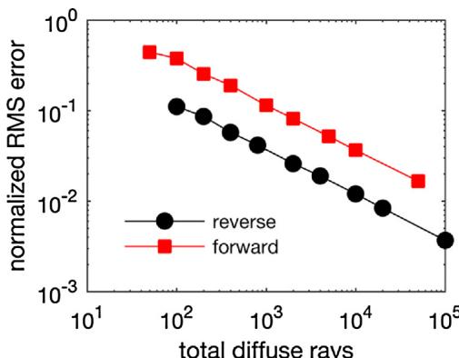

# A reverse ray-tracing method for modelling the net radiative flux in leaf-resolving plant canopy simulations

Brian N. Bailey

Department of Plant Sciences, University of California, Davis, Davis, CA 95616, USA

# ARTICLE INFO

Article history:  Received 24 July 2017  Received in revised form 26 November 2017  Accepted 27 November 2017  Available online 12 December 2017

Keywords:  Functional- structural plant model  Graphics processing units  Radiation model  Ray- tracing

# ABSTRACT

Radiation is a direct or indirect driver of essentially all biophysical processes in plant systems, and is commonly described through the use of models because of its complex distributions in time and space. Detailed radiation transfer models that represent plant- scale heterogeneity have high computational resource requirements, thus severely limiting the size of problems that can be feasibly considered, while simplified models that can represent entire canopies usually neglect heterogeneity across a wide range of scales. This work develops new methods for computing radiation absorption, transmission, scattering, and emission using ray- tracing approaches that can explicitly represent scales ranging from leaves to canopies. This work focuses on developing a new "reverse" ray- tracing method for describing radiation emission and scattering that ensures all geometric elements (e.g., leaves, branches) are adequately sampled, which guarantees that modelled radiative fluxes are bounded within a reasonable range of values regardless of the number of rays used. This is a critical property when complex model geometries are used, which can be subject to severe sampling errors even when very large ray counts are used. The presented model uses graphics processing units (GPOs) along with highly optimized software to efficiently perform ray- object intersection tests in parallel. This allowed for the simulation of  $>500$  fully resolved trees on a desktop computer in under five minutes.

$\mathfrak{E}$  2017 Elsevier B.V. All rights reserved.

# 1. Introduction

A fundamental challenge in studying plant systems is understanding how processes of interest translate across the wide range of relevant scales (Ehleringer and Field, 1993). Plant biophysical processes are often studied locally at the organ level, which are coupled with other plants by environmental processes that traverse the range of scales from leaf to canopy or beyond. Directly measuring physical processes across this wide range of scales is typically not feasible, and generally requires the use of a model at some level. However, representing this range of scales in models is also a considerable challenge, and requires significant simplifications in order to make problems tractable. This means that models usually seek to represent average or representative behaviour and cannot directly resolve plant- scale heterogeneity (e.g., Sinclair et al., 1976; Harley and Baldocchi, 1995; DePury and Farquhar, 1997).

Functional- structural plant models (FSPMs) are a relatively new tool in modelling biophysical processes in plant systems, and seek to describe the three- dimensional development of plant structure over time as influenced by their local environment and physiological function (Vos et al., 2010). These models consist of a coupled set of sub- models that describe various processes involved in plant development such as photosynthesis, nutrient/water transport, carbon allocation, and plant architecture.

FSPM development has progressed rapidly, and holds great potential to aid in our understanding of complex plant system topologies across scales otherwise inaccessible through traditional experimentation. However, despite the continued increase in computing power, FSPMs are often limited in terms of the range of scales they can feasibly represent. Most FSPMs represent the plant at the leaf- and branch- scales, but are typically only able to represent one to a few plants (depending on plant size and model complexity) before computational cost becomes prohibitively expensive (e.g., Allen et al., 2005; Pearcy et al., 2005; Ma et al., 2008; Vos et al., 2010; Sarlikioti et al., 2011). In many cases, this can limit their application in studying plant- to- plant interactions and competition at the field or ecosystem level.

A bottleneck in FSPM computations is the calculation of radiation fluxes absorbed by plant tissues, which directly or indirectly drives nearly all sub- models of physiological processes. Faithfully modelling the transport of radiative energy is complex, particularly when accounting for scattering by millions of elements (e.g., leaves,

  
Fig.1. on the alpha (transparency) channel value.

branches). Most physiological processes have a strong temperature dependence (Johnson and Thornley, 1984). Thus, if temperature is to be included in the model, radiative emission typically must be considered, which adds considerable complexity as each individual element in the domain of interest interacts directly through emission rather than indirectly through scattering. Because of these challenges, models must make compromises in terms of complexity and scale of representation: the more complex the radiation model, the smaller the problem size can be considered.

A very wide range of three- dimensional methods are available to model the transport of sunlight in plant systems (e.g., Ross, 1981; Myneni, 1991; Chelle and Andrieu, 1998; Widlowski et al., 2013), but relatively few are able to model emission of terrestrial radiation. The radiosity method is the standard approach for modelling radiative emission between surfaces or "elements", and solves a coupled set of equations that represents radiation exchange due to emission and reflection by every element in the domain of interest (Goel et al., 1991; Modest, 2005). Although the radiosity approach is robust, it can quickly become prohibitively expensive as the problem size is increased. This is due to the fact that the radiosity approach involves solving an  $N \times N$  system of equations (  $N$  being the total number of elements in the domain), which has computational expense that scales as  $N^3$  (cf. Press et al., 2007). Other radiosity- based methods have been developed to improve this scaling by using a multi- scale approach, such as the "nested radiosity" approach of Chelle and Andrieu (1998), which simplifies the contributions due to distant sources of radiation.

When small elements are present in ray- tracing simulations, so- called "reverse" ray- tracing can be used in which radiation is traced backwards by launching rays from elements toward sources, which is common in both computer graphics applications (e.g., Shirley and Morley, 2003) and canopy modelling applications (e.g., Lewis and Muller, 1992; North, 1996; Lewis, 1999; Cieslak et al., 2008). This method has the advantage that every element is guaranteed to be sampled, and thus are more robust when computational cost limits the number of rays that can be afforded. The disadvantage of reverse methods is typically most apparent when scattering of radiation is considered. When a reflection or transmission event occurs along a ray path, the ray traversal becomes irreversible, meaning that tracing of the ray in forward or backward directions is no longer equivalent. This means that more complicated methods must be devised to deal with scattering when the reverse approach is used, which typically leads to increased requirements for memory and run- time.

Currently, methods are not available to effectively model emission of terrestrial radiation using a reverse ray- tracing approach. Using forward methods to model emission in the case of small geometric elements presents similar problems when modelling shortwave radiation, although they may be more severe in the case of emission. Bailey et al. (2016) noted that using a forward tracing method with very small elements resulted in significant sampling errors unless a very large number of rays were used, which could result in substantial errors in the modelled net radiative flux. When coupled with the energy balance equation, it was also noted that very large errors in temperature could result, which led to problematic violations of the second law of thermodynamics.

This paper presents a consistent approach for computing radiative emission in fully- resolved plants using what can be considered a reverse ray- tracing approach adapted to emission. It was hypothesized that using a reverse ray- tracing approach for emission would reduce errors in the modeled net longwave radiation flux. The method is generalized to devise a means for modelling radiation scattering, which is used to produce a complete reverse ray- tracing model of radiation transport due to collimated, point, or terrestrial sources of radiation. The ultimate goal was to develop a model for computing the three- dimensional net radiative flux distribution in fully- resolved canopies that is efficient enough to simulate canopy- scale problems over seasonal time scales in a feasible amount of time.

# 2. Model description

# 2.1. Element geometry

It is assumed that the environment of interest is populated by a large number of discrete planar objects, which are termed 'elements'. In this work, three possible element types will be considered (Fig. 1), which can be combined to form any arbitrary geometry:

- Patch: A patch is a planar rectangle defined by four vertices. The patch normal vector  $\vec{n}_e$  is defined using a right-hand rule, i.e., following vertices in an anti-clockwise pattern yields an upward pointing normal.- Alpha Mask: An alpha mask (also known as a 'transparency mask') is the same as a patch, except that a portion of the patch is removed by specifying a two-dimensional grid of pixels that determines whether or not material is present. The pixel grid is specified using the alpha or transparency channel of a PNG image file.- Triangle: A polygon defined by three arbitrary vertices. The triangle normal vector  $\vec{n}_e$  is also defined using a right-hand rule.

# 2.2. Radiative bands

Arbitrary radiation wavelength bands can be simulated in the model by assigning the appropriate radiative properties to elements. For example, the photosynthetically active radiation (PAR) band  $(400 - 700\mathrm{nm}$  wavelengths) is important when considering sunlight interception by leaves, but typically unimportant when considering radiative emission by leaves since they emit essentially no radiation in this wave band.

Wavelength bands are represented by defining the appropriate radiative properties and emission sources for the band of interest. Each element is assigned total hemispherical radiative properties of  $\epsilon$  (emissivity),  $\rho$  (reflectivity),  $\tau$  (transmissivity), and  $\alpha$  (absorptivity), where  $\rho \pm \tau \pm \alpha \pm 1$  (Modest, 2003). Here, the term 'total' indicates a property that is integrated over the spectral band of interest, which is formally defined below (e.g., total reflectivity)

$$
\rho = \frac{\int_{\lambda_1}^{\lambda_2}\rho_\lambda I_\lambda d\lambda}{\int_{\lambda_1}^{\lambda_2}I_\lambda d\lambda}, \tag{1}
$$

where  $\rho_{\lambda}$  is the spectral reflectivity as a function of wavelength  $\lambda_{1},I_{\lambda}$  is the spectral intensity of the radiation source, and  $\lambda_{1}$  and  $\lambda_{2}$  are respectively the lower and upper wavelength limits of the band. Spectral radiative properties can be obtained by direct measurement using a spectroradiometer, or by consulting available spectral databases (e.g., Hosgood et al., 2005; Kotthaus et al., 2014). For simplicity, the spectral intensity and radiative properties are often assumed to be constant over a certain radiative bands such as the PAR band.

# 2.3. Radiative emission

If the emissivity and absolute temperature of an element is nonzero, the element acts as a source of radiation through emission. The emissive flux of an element can be calculated through the Stefan- Boltzmann law as  $\epsilon \sigma T^4$  ,where  $\sigma = 5.67\times 10^{- 8}\mathrm{Wm^{- 2}K^{- 4}}$  is the Stefan- Boltzmann constant, and  $T$  is the absolute temperature of the element. Ambient emission from the surroundings may also be present, which is not directly resolved by elements. Given these emitted fluxes, the following procedure describes the method for calculating the absorbed flux due to emission by other elements and the surroundings (illustrated graphically in Fig. 2).

1. Sampling element surfaces:  $N_{\mathrm{rays}}$  discrete  $(x,y,z)$  points are randomly sampled on the surface of each element. In the present implementation,  $N_{\mathrm{rays}}$  is specified as a constant for all primitives. The sampling of patch surfaces is accomplished by choosing  $N_{\mathrm{rays}}$  sets of two random numbers from a uniform distribution, and mapping them to the surface of the rectangle (cf. Suffern, 2007). The same procedure is used for alpha masks, except that if points lie in a transparent region they are re-sampled until they are no longer in the transparent region. There are several possible methods for sampling points on an arbitrary triangle, the simplest of which is the rejection method which involves sampling points on a unit rectangle (as in patches) and discarding points that lie outside of the triangle. However, the method used here was to uniformly sample points on a right triangle (i.e., half of a patch), then apply an affine transform to map them onto the arbitrary triangular element.

2. Sampling ray directions: Ray directions are sampled according to a standard cosine-weighted distribution:

$$
\begin{array}{rl} & {\theta_{r}^{\prime} = \sin^{-1}\sqrt{N_{t}},}\\ & {\phi_{r}^{\prime} = 2\pi N_{p},} \end{array} \tag{3}
$$

where  $N_{t}$  and  $N_{p}$  are random numbers drawn from a uniform distribution, and  $\theta_r^\prime$  and  $\phi_r^\prime$  are respectively the ray zenithal and azimuthal directions for a horizontally oriented element. The actual ray directions for an arbitrarily oriented element are found by converting  $\theta_{t}^{\prime}$  and  $\phi_t^\prime$  into a Cartesian unit vector and rotating it into the direction of the element normal. In practice, 'jittered' sampling was used for the calculation of  $N_{t}$  and  $N_{p}$  to improve sampling convergence. This involves generating a uniform grid of  $N_{t}$  and  $N_{p}$  between zero and one, then drawing a random number that gives a displacement that lies between the next adjacent point (see Suffern, 2007, for further details).

  
Fig. 2. Sample calculation of absorbed radiation flux by element O due to: (a) emission by element 1 and the ambient environment and (b) the subsequent scattering iteration (denoted as superscript  $n = 0,1,\ldots \rangle$  . Ray directions in the figure correspond to that of the ray tracing scheme, and not to the direction of radiation propagation. to. Sample calculations are given for the absorbed flux by element 0, the flux "to-be-scattered" by the top (subscript "T") and bottom (subscript "B") surfaces of the element (all units of  $\mathrm{Wm^{-2}}$  ) for the case of 8 rays per element  $(N_{\mathrm{rms}} = 8)$  . Note that the top is the side pointing in the direction of the normal vector  $\vec{n}_{e}$ $E_{b,i} = \sigma T_{i}^{4}$ $\rho_{i}$ $\tau_{i}$  and  $\epsilon_{i}$  refer respectively to the total hemispherical emissive power, reflectivity, transmissivity, and emissivity of the ith element.

A leaf is a thin surface, and could be represented by placing two elements back- to- back. To save computational time and memory,

an option can be enabled to emit rays from both sides of an element. For example, an element making up the ground or trunk only needs to emit radiation from one side, while a leaf emits from both sides.

3. Path tracing: The rays are then "launched" from the sampled points away from the element, and ray-object intersection tests are performed (Suffern, 2007). There are one of two possible outcomes for a given ray:

1 The ray hits another element. In this case, the emitted flux of the intersected element is queried  $(Q = \epsilon \sigma T^4)$  and used to calculate the weighted flux value associated with that ray:  $Q / N_{\text{rays}}$ . For alpha masks, the alpha map must be queried to determine if the ray intersection occurred on a transparent portion of the element. If so, the ray effectively continues propagating as if no intersection had occurred.

2 The ray does not intersect any other elements. In this case, the weighted flux value of the ray is that of the ambient flux  $Q_{amb}^{\prime}(Wm^{- 2}\tau^{- 1})$ , which is the directional- hemispherical flux of an unobstructed surface for the wave band of interest. If the ambient radiation is isotropic, the ambient flux can be assigned a constant hemispherical value  $Q_{amb}(Wm^{- 2})$  and the weighted ray flux is simply  $Q_{amb} / N_{\text{rays}}$ . If the ambient flux is anisotropic, a directionally- dependent value could be used that varies based on the direction of ray propagation. The ambient flux could be measured using a radiometer equipped with a shadowband (e.g., Horowitz, 1969) or modeled (e.g., Harrison and Coombes, 1988). Since the entire hemisphere around the element is sampled, there is no explicit need for the treatment of boundary conditions. Elements near the edge of the domain may intercept some ambient radiation propagating upward, which replaces the radiation that would have been intercepted from ground elements were the element near the middle of the domain.

The weighted flux of the ray is partitioned into absorbed, reflected, and transmitted components. The absorbed component,  $(1 - \rho - \tau)Q / N_{\text{rays}}$ , is accumulated (summed) into an "absorbed" buffer corresponding to the element from which the ray was launched. The reflected component  $\rho Q / N_{\text{rays}}$ , is accumulated in a "to- be- scattered" buffer. There is one "to- be- scattered" for each side of the element, and the reflected flux is accumulated in the buffer corresponding to the same side that was hit (i.e., if the ray hit the top side, the energy is accumulated in the buffer corresponding to the top side). The transmitted component  $\tau Q / N_{\text{rays}}$  is accumulated in a "to- be- scattered" buffer in a similar manner, except that the transmitted flux is accumulated in the buffer corresponding to the opposite side than was hit (i.e., if the ray hit the top side, the energy is accumulated in the buffer corresponding to the bottom side).

4. Reflection iterations: Energy in the elements' "to-be-scattered" buffers needs to be traced as it leaves the elements. In the present model implementation, it was assumed that reflection and transmission is Lambertian. Measurements indicate that, strictly speaking, this assumption is nearly always false, with specular reflection and scattering of transmitted radiation playing a clear role in creating anisotropy in reflected and transmitted radiation (Woolley, 1971; Bousquet et al., 2005; Combes et al., 2007). While this is usually an incorrect assumption in a strict sense, Chelle (2006) demonstrated that non-Lambertian effects play a minimal role in overall radiation absorption distributions when considering the incident flux due to scattering by many leaves.

Employing the above assumptions, scattering calculations proceed in essentially the same manner as for primary emission. The only differences are that the ray strength is assigned based on the "to- be- scattered" flux rather than the emissive flux, and that the ambient flux is set to zero for scattering iterations. The user specifies the maximum allowable "to- be- scattered" energy (e.g.,  $0.1Wm^{- 2}$ ) and a maximum allowable number of scattering iterations (e.g., 10). Scattering iterations proceed until the maximum "to- be- scattered" energy among all elements is below the user- defined threshold, or the number of scattering iterations has exceeded the user- defined maximum value. In either case, any remaining energy in the scattering buffers is absorbed by the element to ensure conservation of energy. In cases where  $\rho$  and  $\tau$  are small, such as in the PAR band, few iterations are required. If  $\rho$  or  $\tau$  are large, such as in the near infrared band, several iterations may be required. However, since reflected and transmitted energy decreases exponentially with each iteration, the number of required scattering iterations is still usually low (e.g., 5- 10, depending on user- defined thresholds). The required number of scattering iterations will be further explored in Section 3.1.1.

  
Fig. 3. Ray-tracing schematic for the absorbed flux by element 0 due to a collimated radiation source such as the sun, and amount of energy "to-be-scattered", denoted by TBS with subscript "T" or "B" to denote scattering from the top and bottom surfaces, and superscript  $n = 0,1,\ldots$  to denote the scattering iteration. In the example show, the source is sampled using 4 rays per element (i.e.,  $N_{\text{rays}} = 4$ ). The total hemispherical reflectivity and transmissivity of element 0 is denoted respectively by  $\rho_0$  and  $\tau_0$ , the hemispherical flux emitted in the direction of the collimated source  $\bar{n}_s$  is  $S_r / N_{\text{rays}}$ , and  $\bar{n}_{e,0}$  is a unit vector normal to the surface of element 0.

# 2.4. External radiation sources

# 2.4.1. Collimated radiation sources

Standard approaches are used to calculate the primary incident flux (i.e., before scattering) due to a collimated source of radiation such as the sun (Fig. 3). Collimated radiation is defined as radiation

  
Fig. 4. Ray-tracing schematic for direct radiation calculations with a point radiation source such as a lamp. Points on the element surface are randomly sampled, and  $\vec{n}_r$  is a unit vector originating at the sampled point and pointing toward the source.  $\vec{n}_e$  is a unit vector normal to the element surface.  $\vec{n}_s(\theta_i,\phi_j)$  is a unit vector originating at the location of the point source oriented in the spherical direction  $(\theta_{i},\phi_{j})$

in which all "beams" of radiation are parallel. Although, emission by the sun is not collimated, the large distance between the sun and Earth means that radiation emitted by the sun that is intercepted by Earth is approximately collimated.

For collimated radiation, points are randomly sampled on the surface of elements in the same way as for emission. The ray direction is simply defined by a line connecting the sampled point and the radiation source. The rays are then traced from the element toward the source, and intersection tests are performed in the same was as for emission. Rays that do not intersect any other elements are assigned a value of

$$
S_{r} = \frac{Q_{s}|\vec{n}_{e}\cdot\vec{n}_{s}|}{N_{rays}}, \tag{4}
$$

where  $Q_{s}$  is the source's total hemispherical radiative flux  $(\mathrm{Wm}^{- 2})$  over the band of interest just above the domain in the direction of  $\vec{n}_s$ .  $Q_{s}$  could come from a sensor measurement (for example, if the measurement of a horizontal sensor was  $500\mathrm{W / m^2}$  for the direct solar flux,  $Q_{s} = 500 / \cos \theta_{s}\mathrm{W / m^{2}}$ , where  $\theta_{s}$  is the solar zenith angle), or from a model of solar transmission (e.g., Liu and Jordan, 1960; Gueymard, 2008).

Absorption and scattering then proceed in the same fashion as with emission. If there is a diffuse flux associated with a given source, the ambient space can be sampled during the first scattering iteration.

# 2.4.2. Point sources

If the radiation source can be approximated as emanating from a point (e.g., a lamp in the distance), the ray direction is a line that connects the radiation source and a point sampled on the element surface (Fig. 4). The strength of rays that do not intersect any other elements is calculated by integrating incident radiation over all possible directions emitted by the source

$$
S_{r} = \frac{Q_{p}}{N_{r a y s}N_{\theta}N_{\phi}}\frac{N_{\phi}}{N_{r a y s}N_{\theta}}\frac{N_{\phi}}{N_{\phi}}\frac{\left(\vec{n}_{e}\cdot\vec{n}_{r}\right)|\vec{n}_{r}\cdot\vec{n}_{s}(\theta_{i},\phi_{j})|}{\pi S^{2}}\delta , \tag{5}
$$

where  $Q_{p}$  is the total emitted radiation flux at the source's surface  $(\mathrm{Wm}^{- 2})$  over the band of interest,  $\vec{n}_r$  is a unit vector originating at the point sampled on the element and pointed toward the radiation source,  $S$  is the distance from the point sampled on the element to the source.  $\vec{n}_s(\theta_i,\phi_j)$  is a unit vector originating at the location of the point source and oriented in the spherical direction  $(\theta_{i},\phi_{j})$ , where there are  $N_{\theta}\times N_{\phi}$  total discrete spherical directions.  $\theta_{i}$  is calculated as  $\cos^{- 1}\left[1 - 2(i - 0.5) / N_{\theta}\right]$ , and  $\phi_{j}$  is calculated as  $2\pi (j - 0.5) / N_{\phi}$ .  $\delta$  is a function that is equal to  $1\mathrm{m}^2$  if  $\left(\vec{n}_r\cdot \vec{n}_s\right)< 0$  and equal to  $0$  otherwise, whose purpose is to discard radiation emitted from the back side of the source.

# 2.5. GPU acceleration

In general, ray tracing calculations can become costly when performed in serial due to the large number of rays required. The computer graphics community has used graphics processing units (GPUs) for decades to accelerate ray- tracing calculations. A GPU is a specialized piece of hardware, with a large number of streaming multiprocessors designed to "crunch numbers" in parallel. Several frameworks have been developed to simplify the task of GPU programming, such as NVIDIA's CUDA framework and OpenCL.

In this work, the above ray- tracing algorithms were implemented using NVIDIA's OptiX ray- tracing library, which is a highly optimized and generalized GPU ray- tracing framework. OptiX does not actually perform any ray- tracing per se, rather it is a flexible framework for managing data and tasks associated with ray- tracing. For example, the user writes functions that describe how rays are launched, what constitutes a ray- object intersection, and what should happen in the event of an object hit or miss.

# 3. Results

# 3.1. Accuracy and consistency tests

Typically, radiation models are tested by comparing results against real- world data collected in the field (i.e., validation). Performing rigorous validation for detailed radiation models presents several considerable challenges. First, extremely detailed measurements are required to specify geometry within the model. Since individual leaves and branches are represented in the model, it would be necessary to accurately specify the geometry of every leaf and branch in the model if leaf- level measurements are to be reproduced. Another option is to validate using aggregate measurements, which have looser requirements for geometry specification. However, this generally aggregates many different processes and measurement errors, making it difficult to separate natural environmental variability, measurement errors, and model errors.

Another approach that is perhaps of greater value when evaluating these types of detailed models is to verify model predictions for relatively simple cases where the exact answer is known. Since the exact answer is known, all errors in the model predictions must be due to model errors or errors in implementation. This verification over validation approach has been favored by some in the remote sensing community, and has been used for model intercomparisons (Pinty et al., 2001; Widowski et al., 2013). In the majority of their tests, the 'exact' answer was not known, but rather the aggregate of predictions by different models was used as a relative measure of model performance. It should be noted that these tools developed by the remote sensing community focus on the distribution of reflected canopy- level radiation, and not on absorption by individual elements which is the focus of this work.

Here, the model was assessed by ensuring that basic consistency and accuracy conditions were satisfied using problems where the exact answer was known. Accuracy was verified not only by rel

  
Fig.5. t  t t t t t t t t t t t t t t t t t t t t t t t t t t t t t t t t t t t t t t t t t t t t t t t t t t t t t t t t t t t t t t t t t t t t t t t t t t t t t t t t t t t t t t t t t t t t t t t t t t t t h t t t t t t t t t t t t t t t t t t t t t t t t t t t t t t t t t t t t t t t t t t t t t t t t t t t t t t t t t t t t t t t t t t t t t t t t t t t t t t t t t t t t t t t t t t t t t t t t t t t

ative error measures, but importantly by ensuring that the error continually decreases as more rays are used (i.e., the solution converges to the exact answer). Future work will focus on creating new datasets that can be used to more accurately assess real- world errors in model predictions.

# 3.1.1. Accuracy and convergence

To verify the model and make assessments regarding accuracy, several sample problems were solved that are simple enough that the exact answer can be calculated (Fig. 5). The test cases were designed to progressively evaluate different aspects of the model. Test case parameters such as dimensions, radiative properties, and temperatures were chosen arbitrarily, but with the general goal in mind of providing tests of individual model components and demonstrating the associated error convergence as the number of rays was varied. Each of the test cases are detailed and solved analytically in Appendix A. These details have been included to provide standard cases against which future models can be verified. The performance of the proposed model is contrasted against that of a traditional forward ray- tracing model. In the forward model, rays are launched from the source from which they originated, which may be an element, a collimated source, a point source, or an ambient source (in which case the rays originate from the surface of a sphere that bounds all elements in the domain). A detailed description of the implementation of the forward tracing method is given in Appendix B.

An ensemble of 500 simulations were performed for each case, and the average error was quantified using the normalized root- mean- square error, which can be defined mathematically as

where  $R_{i}$  is the modeled value of the absorbed radiation flux for simulation  $i$  in the ensemble, and  $R_{ex}$  is the exact value of the absorbed flux.

Case #1 (Fig. 5) was designed to test collimated radiation absorption of a patch, and subsequent reflection to an adjacent patch, as well as patch emission. The reflectivity for radiation originating from the collimated source chosen to be  $\rho_{1} = 0.3$  and  $\rho_{2} = 0$ . For emission, parameters were chosen to be  $\epsilon_{1} = \epsilon_{2} = 1$ ,  $T_{1} = 300$ , and  $T_{2} = 0$ . The patch size  $l$  is arbitrary and was chosen to be equal to 1.

Fig. 6 reports the normalized error in the absorbed flux for patches #1 and #2, and absorbed flux by patch #2 due to emission by patch #1. Using the reverse method, the error in absorbed radiation for patch #1 is always zero, regardless of the number of direct rays. This is a consequence of the fact that an unobstructed element always perfectly samples radiation sources, a desirable quality of the model. Note that the reverse method is not shown in Fig. 6a because a vale of zero cannot be represented in a logarithmic plot. For the forward method, the absorbed flux for patch #1 is strongly dependent on the chosen number of rays, with the error decreasing exponentially with ray count. This exponential decrease in error with ray count is a standard result for forward ray- tracing simulations (Widlowski et al., 2013). The radiation flux absorbed by patch #2 was strongly dependent on the chosen number of rays for both the forward and reverse methods, and converged to the exact solution at approximately the same exponential rate (Fig. 6b). However, the error in the forward method flux was consistently about four times larger than that of the reverse method. It appears that this is due to the fact that the flux scattered to patch #2 is dependent on proper sampling of the direct radiation by patch #1. Since the reverse method is much more accurate than the forward method at predicting the potential amount of radiation available to be scattered from patch #1, it is consistently more accurate in predicting the absorbed flux by patch #2 due to scattering by patch #1. How

$$
n R M S E = \frac{1}{R_{e x}}\left(\sum_{i}(R_{i} - R_{e x})^{2}\right)^{1 / 2}, \tag{6}
$$

  
Fig. 6. Convergence of the normalized RMS error (Eq. (6)) in modelled absorbed radiation flux for test Case #1 (see Fig. 5) as the number of rays are varied. Results are reported for the forward and reverse ray-tracing methods. (a) Error in absorbed radiation flux by patch #1 due to a collimated radiation source as the number of collimated rays are varied (note that the reverse method is not shown because the error was always zero); (b) error in the absorbed radiation flux by patch #2 due to scattering of collimated radiation by patch #1 as the total number of rays (collimated + diffuse) are varied; (c) error in the absorbed flux by patch #2 due to radiation emission by patch #1 as the number of emitted rays are varied.

  
Fig. 7. Convergence of the normalized RMS error (Eq. (6)) in modelled absorbed radiation flux for test Case #2 (see Fig. 5) as the number of rays are varied. Results are reported for the forward and reverse ray-tracing methods. The error is plotted for the absorbed radiation flux by patch #1 due to an isotropic ambient source of radiation as the number of ambient rays are varied.

ever, the diffuse sampling of patch #2 by patch #1 is approximately the same for both methods, as indicated by the similar performance by each method in predicting the absorbed radiation flux by patch #2 due to emission by patch #1 (Fig. 6c). Due to the symmetry of this particular problem, using the forward or reverse methods are essentially equivalent in the simulation of radiative emission by the elements.

Case #2 (Fig. 5) was designed to test sampling of an isotropic ambient radiation source. Radiative properties were chosen to be  $\rho_{1} = \rho_{2} = 0$ . The geometry was chosen such that  $a = 1$ ,  $b = 2$ , and  $c = 0.5$ . For both the forward and reverse methods, the error in the modelled absorbed flux decreased at approximately the same exponential rate (Fig. 7). However, the error in the forward method was consistently about four times larger than that of the reverse method. For either method, the surface of patch #2 must be adequately sampled by patch #1 in order to calculate the amount of ambient radiation patch #1 intercepts. For the reverse method, this sampling is being performed from the point- of- view of patch #1, whereas for the forward method the sampling is being performed from the point- of- view of the surface of the domain bounding sphere which is on average further away. Thus, the reverse method is more accurate because it better samples the radiation occluded from view of patch #1 by patch #2, but the overall convergence rate is the same.

Case #3 (Fig. 5) was designed to test emission exchange between gray patches and subsequent "infinite" reflections. Here, both the number of diffuse rays and the maximum number of scattering iterations was varied, and only patch emission was considered. Radiative properties were chosen to be  $\epsilon_{1} = \epsilon_{2} = 0.6$ , and the geometry was specified the same as in Case #2.

When no scattering computations are allowed, both the forward and reverse methods are essentially equivalent because of geometric symmetry as in Case #1. In this case, there is a small amount of initial decrease in the model error as the number of rays is increased, but eventually no improvement is achieved by using more rays given that scattering must be included to correctly predict the absorbed flux (Fig. 8).

As the maximum number of scattering events is increased, the error decreases at an equivalent exponential rate for both methods. Note that this is dependent on the particular method used for scattering in the forward ray- tracing approach. Since, for every ray- object intersection, energy is both absorbed and reflected, the forward and reverse methods are equivalent. Many implementations of forward ray- tracing use a stochastic approach to determine whether absorption or reflection occurs (see Appendix B). In this stochastic implementation, the number of rays available after each scattering event decreases exponentially, thus leading to decreased accuracy and a slower rate of convergence when compared to the reverse ray- tracing approach (not shown).

Case #4 was designed to test emission from a single point radiation source, and subsequent absorption by a patch. The patch reflectivity was  $\rho_{1} = 0.3$ , and the geometry was specified as  $a = 1$ ,  $b = 2$ , and  $c = 1$ .  $N_{\theta}$  and  $N_{\phi}$  were set to a constant value of 30 in the case of the reverse tracing method. For both the forward and reverse methods, the error decreased approximately exponentially as the number of direct rays was increased (Fig. 9). However, the error for the reverse method declined at a faster rate than the forward method as the number of rays was increased. On average, the error in the forward method was about fifty times larger than in the reverse method. The reason for this is similar as in Case #1, which is due to the fact that in the reverse method, the source is perfectly sampled by the patch, whereas in the forward method the source must accurately sample a relatively small fraction of the surrounding spherical space. The difference between Case #1 is that the source rays have angular dependence, and thus even in the reverse method, the surface of the patch must be sampled in order to properly calculate the solid angle subtended by the patch with respect to the source. Therefore, the error still has an exponential dependence on ray count even for the reverse method.

  
Fig.8. t scattering iterations are varied. Results are reported for the reverse (left pane) and forward (right pane) ray-tracing methods.

  
Fig. 9. Convergence of the normalized RMS error (Eq. (6)) in modelled absorbed radiation flux for test Case #4 (see Fig. 5) as the number of rays are varied. Results are reported for the forward and reverse ray-tracing methods. The error is plotted for the absorbed radiation flux by patch #1 due to an isotropic point source of radiation as the number of direct rays are varied.

# 3.1.2. Conservation of energy (1st law of thermodynamics)

Perhaps the most fundamental consistency requirement for a radiation model is that energy is conserved. Essentially, this means that no energy is gained or lost due to transport; energy can only be relocated. For collimated radiation, the total energy rate incident on the domain is equal to  $Q_{s}$  cos  $\theta_{s}A_{t}$ , where  $A_{t}$  is the total footprint area of the domain,  $\theta_{s}$  is the solute zenith angle, and we note that units are in energy per time. For diffuse radiation, the total incident energy rate is  $Q_{d}A_{t}$ , where  $Q_{d}$  is the diffuse radiation flux on a horizontal surface. For emission, the total energy rate emitted by all elements is  $\sum_{i}^{N}\sigma_{i}\sigma_{i}^{T4}A_{i}$ . In order to evaluate conservation of energy, we simply calculate the radiation energy rate absorbed by all elements (including energy emitted/reflected to the sky), and compare this value with the total energy rate we started with. If energy is conserved, the two should be equal.

In theory, any consistent radiation model (e.g., ray- tracing, radiosity) should be able to satisfy energy conservation. As mentioned previously, the method described in this work only approximately satisfies conservation of energy. This is because the amount of energy that actually leaves an element is dependent on the element being properly sampled by other elements. To test conservation of energy, a simple domain was created with  $140\times 140$  patches of size  $0.3\times 0.3\mathrm{m}^2$  tilted to create a ground surface, with four trees spaced a  $7\mathrm{m}$  that were  $6\mathrm{m}$  tall on average (Fig. 11). Three- dimensional almond tree geometries were created using the model of Weber and Penn (1995), and placed into the domain at uniform spacing. Each tree consisted of about 6000 triangles making up the trunk and branches, and about 30,000 alpha masks making up the leaves. As detailed in Weber and Penn (1995), each geometric parameter is randomly perturbed to make each tree geometry unique. The shortwave reflectivity and transmissivity of the leaves were arbitrarily set to 0.2 for testing purposes, and the emissivity was set to 0.9. All elements were assigned temperatures of  $300\mathrm{K}$ . For this case, it was found that the error in conservation of energy was about  $0.01\%$  of the source flux for a collimated source, and  $0.1\%$  of the ambient flux for emission, even if as few as 50 rays per element were used. This indicated that conservation of energy was well satisfied, with errors only slightly larger than machine precision (single precision).

# 3.1.3. Equilibrium distribution (2nd law of thermodynamics)

A requirement of equal importance as conservation of energy is that the radiation distribution must tend toward a uniform equilibrium state, or that entropy cannot decrease in the absence of external sources or sinks. This is a critically important requirement, since, if the solution does not revert to the correct equilibrium state, we can have little confidence that any observed features of the calculated radiation distribution under non- equilibrium have physical meaning. Testing that this requirement is enforced is relatively simple, and can be performed as a precursor check before every simulation. The temperature of every element is set to some value  $T$ , and the ambient flux emanating from the sky is set to  $\sigma T^4$ . Regardless of geometry and values of  $s$ , the net radiative flux for all elements should be exactly zero.

The orchard test case with four total trees was used to test model adherence to the 2nd law, and the total number of rays were varied to illustrate its effect on errors in the net radiative flux (Fig. 10). For the forward approach, the total number of rays consisted of both ambient diffuse rays and emission rays (emission and ambient rays are the same in the reverse approach). For each of the four forward simulations, the number of ambient rays was  $10^{6}$ ,  $10^{7}$ ,  $10^{8}$ , and  $10^{9}$ , and the corresponding number of emission rays per element was 3000, 5000, 6000, and 10,000 (note that some elements are two- sided and use twice the number of emission rays).

The reverse ray- tracing approach has the very desirable property that the proper equilibrium distribution will always be reached to within machine precision, even with only one ray sample per element. This means that, in the case where the emitted flux from all elements is equal to the diffuse ambient flux, the net modelled

  
Fig. 10. Standard deviation of the net flux for all elements in the test case shown in this figure as the total number of rays was varied. The reverse tracing method predicts a net flux near zero regardless of the number of rays used.

radiative flux for all elements is essentially zero (about  $10^{- 7}$  on average for this case).

When the standard forward ray- tracing method is used, adherence to the 2nd law is strongly dependent on the number of rays in relation to simulated geometry (Fig. 10). For a modest number of rays (i.e., 200 million) the standard error was extremely large at about  $150\mathrm{Wm}^{- 2}$  which is about a third of the ambient/emitted flux value  $\sigma T^4$ . As the number of rays is increased, the error in the 2nd law steadily decreases. However, even when a very large number of rays was used (i.e., 4 trillion) the error in the net radiation flux was still significant with a standard error of about  $40\mathrm{Wm}^{- 2}$ . The spatial distribution of this error is visualized in Fig. 11 for this ray count. The range of errors was still very large, with the minimum net flux having a value of  $- 459\mathrm{Wm}^{- 2}$  (i.e., no rays sampled the element) and the maximum net flux having a value of about  $9000\mathrm{Wm}^{- 2}$ . These extreme values corresponded to triangular elements comprising the woody structure of the trees, and occurred at locations of branching/splitting or where there were highly skewed elements. Extreme values could certainly be filtered, or the quality of the triangular mesh could be improved, however this illustrates a problem with using arbitrary meshes with the forward ray- tracing approach that the reverse approach is able to deal with in a straightforward manner.

The reason that the reverse ray- tracing method significantly outperforms the forward method is because it samples the absorbed flux due to both ambient sources and other elements in the exact same way. Therefore, any error in the absorbed ambient flux is exactly offset by the absorbed flux due to other elements.

For the forward ray- tracing method, the absorbed ambient flux is sampled from the point- of- view of the domain bounding sphere, and absorbed emission due to other elements is sampled from the point- of- view of the other elements. Each of these samplings can contain substantial and unrelated errors, which can lead to extremely large errors in the net radiative flux.

# 3.2. Visualizations

Sample visualizations of model outputs are given in Fig. 12, and are simply meant to provide a visual representation of model capabilities. In Fig. 12, each element is coloured based on a mapping of its absorbed radiation flux to the color scale shown in the figure. A flat ground surface was also created by thin patches of size  $0.1\times 0.1\mathrm{m}^2$  which resulted in roughly 1.1 million patches. There were 121 total trees in the orchard, which were  $6\mathrm{m}$  tall and spaced at  $7\mathrm{m}$ . In total, the scene depicted in Fig. 12a contains roughly 5.5 million elements.

Fig. 12a shows a pseudocolor plot for the total absorbed direct and diffuse solar radiation flux in the simulated orchard. The reflectivity and transmissivity of the leaves were set to 0.05, which is characteristic of the photosynthetically active radiation (PAR) band (Jones and Vaughan, 2010), and the rest of the surfaces were assumed to be black. The collimated radiation flux was set to  $800\mathrm{Wm}^{- 2}$ , and the ratio of the direct to (isotropic) ambient radiation flux  $(Q_{s} / Q_{amb})$  was 4. The collimated radiation flux zenithal angle was  $45^{\circ}$ . The number of direct and diffuse rays were set to 100 and 200, respectively.

Fig. 12b depicts direct radiation transport from several point radiation sources corresponding to artificial lamps in a greenhouse. The three- dimensional geometries were read into the code using a standard polygon file that can be generated using nearly any 3D modeling software (e.g., AutoCAD (Autodesk, Inc.), Blender (www.blender.org)). The plants and pots consisted of about 6000 triangles each, each of which were identical except that they were given a random azimuthal rotation. Patches were tiled to make the greenhouse walls, and triangles were tessellated to make lamp housings. In total, the simulation consisted of about 2 million elements.

# 3.3. Scaling of model run-time

A test case was created to demonstrate model scaling up to very large domain sizes. The tests were performed on an NVIDIA GTX Titan card, which is a consumer- grade gaming GPU. The same general orchard geometry was used as described in Section 3.2. The number of trees was incrementally increased, and the execution time required to simulate both collimated and diffuse radiation for

  
Fig. 11. Visualization of the error in net radiation flux for each element in the 4 tree orchard test case when the forward ray-tracing approach was used.  $10^{9}$  ambient and  $10^{4}$  emission rays per element were used to yield a total of about 4 trillion total rays. In the test case, the emitted flux from all elements and the ambient flux is  $\sigma T^4$ , and thus the model should predict a net flux of zero for all elements.

  
Fig.12. radiation from several point radiation sources corresponding to artificial lighting in a greenhouse normalized by the radiative flux emitted by the sources.

  
Fig. 13. Scaling of simulation execution time with increasing problem size (almond orchard test case) using an NVIDIA GTX Titan graphics card.

a single band at a single time of day was recorded. Since the purpose of this exercise was simply to demonstrate scaling of run- time, the reflectivity and transmissivity of the leaves were arbitrarily set to 0.1, and the rest of the surfaces were assumed to be black. The number of direct and diffuse rays were chosen to be 100 and 200, respectively. The number of scattering iterations was fixed at 0 and 3 to test its effect on execution time and scaling. By fixing the number of scattering iterations, this removes any effect of the leaf radiative properties on the execution time because scattering will continue in the same manner regardless of the amount of energy to be scattered.

The execution time scaled linearly with number of elements (Fig. 13) for the range of domain sizes examined. Above about 22.5 million elements, the GPU ran out of memory. At this point, larger problems could be simulated by utilizing additional RAM on the host, which comes with an increase in run- time due to the low bandwidth between the GPU and host memories. Once the host runs out of memory, larger problems could still be simulated by utilizing swap space on the host hard drive, which comes with an even larger increase in run- time.

Scattering iterations are expected to incur a similar expense as performing the diffuse radiation calculation without scattering. However, the first scattering iteration is essentially free when performing diffuse calculations, because diffuse calculations and the first scattering iteration can be performed at the same time. Thus, adding three scattering iterations resulted in an increase in execution time of almost exactly  $100\%$ . One downside with the method used in this work is that the run- time is virtually independent of the radiative properties of the elements, whereas in traditional forward ray- tracing reflection/transmission rays are not launched if the surface is black since the ray energy becomes zero (see Appendix B). In the reverse method, each element samples the space around it, and thus it cannot assume that any neighboring elements are black until it has actually sampled them.

Results showed that, for this specific geometry and computational hardware, the run- time was about 12.5 seconds per million elements with no scattering. For additional scattering iterations, this run- time can be multiplied by  $n$ , where  $n$  is the number of scattering iterations. If we were to consider simulating a single tree at hourly timesteps for an entire growing season (assume an average of  $12\mathrm{h}$  of sunlight per day, 200 growing days, and no scattering), we would find the simulation time to be roughly  $15\mathrm{min}$ , which is quite feasible. If the number of trees were to be increased by 100, the execution time would be roughly one day, which is still feasible considering the complexity represented. There are of course opportunities to reduce this execution time by not performing calculations every day, upgrading the GPU, or by using multiple GPUs.

# 4.Discussion and conclusions

Complex model geometries with small elements typically cause problems for traditional "forward" ray- tracing approaches (e.g., Kimes and Kirchner, 1982; North, 1996; Gastellu- Etchegorry et al., 2004) that trace radiation away from its source. This is because they require an incredibly large number of rays to adequately sample small elements. This forward tracing approach was used to perform simulations of four fully resolved trees to determine whether the model satisfied an equilibrium condition (i.e., if a constant radiative flux is emitted from all objects, the net flux should be zero for all objects). Results showed that there was significant error in the net radiative flux (standard error of about  $10\%$  ) even when trillions of rays were used. Perhaps more concerning was that there were many outlier elements that had extremely large errors  $(>100\%)$

It is fairly well- known that, when elements are small and sampling errors become problematic, "reverse" ray- tracing approaches offer a viable solution (North, 1996; Lewis, 1999; Disney et al., 2000; Cieslak et al., 2008). Here, radiation is traced from the object back toward the source, and therefore all objects are adequately sampled. The trade- off is that, when scattering is considered, the methods become more complicated because radiation propagation is not reversible when scattering occurs. Furthermore, reverse tracing models are not readily available to incorporate radiative emission, which is needed to calculate the net all- wave flux.

In this work, a model was developed that utilizes a reverse tracing approach to calculate the net radiative flux for every element in the simulated domain. The forward and reverse tracing methods were shown to be equivalent in the case of symmetric radiative exchange between two objects. The difference between the methods becomes evident when there is high asymmetry, such as in the case of the sky emitting radiation towards small elements. In the case of forward tracing, the sky is well sampled by an unobstructed element because the sky occupies a large fraction of the spherical space surrounding the element. This same element is relatively poorly sampled by the sky because the element occupies only a small fraction of the total space viewed by the sky. For reverse tracing, the opposite is true. Thus, if we are concerned with absorption by the elements, the reverse method typically offers better sampling of external radiation sources. In the case of emission, either the forward or reverse method may offer better sampling of some elements while giving worse sampling of other elements depending on the relative element sizes. The advantage of the reverse method in all cases is that it guarantees the absorbed flux by any element is bounded within the range of fluxes emitted by all radiation sources, even if only one ray sample per element is used. This is a considerable advantage when only a limited number rays can be afforded because it guarantees that results are at least reasonable, whereas the forward tracing method is likely to produce unreasonable results.

When modelling the net radiative flux at an element, it is advantageous to use a reverse tracing approach both when sampling external sources and emission by elements. It was demonstrated that the reverse tracing method used in this work is at the very least consistent with the second law of thermodynamics or equilibrium condition. The reason that this method satisfies this consistency condition is because any errors in sampling the ambient radiation flux are exactly offset by errors in sampling incoming emission by other elements, which is due to the fact that they are both sampled using the same reverse method.

The reverse ray- tracing method developed in this work bears many similarities with the commonly used radiosity approach (e.g., Goral et al., 1984; Borel et al., 1991; Chelle and Andrieu, 1998), both of which satisfy the consistency condition described above. In theory, the methods are nearly the same, with the major difference being in the treatment of scattering. The reverse tracing approach presented in this work does not require the solution of a linear system of equations that can become costly to solve when the number of elements is large. The present method was shown to scale linearly with the number of geometric elements, while the computational effort associated with solving a linear system of equations increases exponentially with the number of elements (Press et al., 2007).

Results of this work suggest that it is typically preferable to sample the domain from the point- of- view of the entity of interest that is absorbing radiation. If that entity of interest is a leaf or sensor within the canopy, it is typically advantageous to use a reverse raytracing approach that ensures the entity is well sampled. In remote sensing applications, the entity of interest is often the distribution of radiation scattered to the clay. Thus, it is more common to find forward tracing methods used in these applications because the domain is sampled from the point- of- view of the sky (Disney et al., 2000; Widlowski et al., 2006, 2013).

In addition to performing detailed studies of radiation transport processes independently, an important future application of the model is coupling with other biophysical models of plant systems. Since the model can represent longwave radiation exchange, it can be coupled with an energy balance model to predict surface temperature throughout canopies. Nearly all physiological processes are strongly dependent on temperature (e.g., photosynthesis, respiration, growth, pest/pathogen development), and such information is needed by physiological models at the organ level. This could be applied not only to understand impacts of heterogeneity in natural ecosystems, but also help to inform or optimize the management of forestry or agricultural systems.

# Acknowledgements

AcknowledgementsFinancial support of this work by the American Vineyard Foundation grant 2016- 1825, and the USDA National Institute of Food and Agriculture Hatch project number CA- D- PLS- 2401- H.

# Appendix A. Verification test case descriptions and exact solutions

For completeness, the exact solutions to each of the verification test cases presented in Section 3.1 are given below.

# A.1 Case #1

This case consists of two orthogonal square Lambertian patches that share a common edge (Fig. 5). A collimated radiation source is located directly overhead. Patch #1 has a nonzero reflectivity, which reflects some radiation to patch #2 which receives only this reflected radiation. Patch #2 is "cold" and patch #1 is "black", so the only emission exchange is direct emission from patch #1 to #2.

The fraction of energy leaving patch #1 that is intercepted by patch #2 (i.e., viewfactor  $F_{1 - 2}$  Modest, 2003) is  $F_{1 - 2} = 0.2$  (Modest, 2003, Appendix D39). By symmetry,  $F_{2 - 1} = 0.2$

Since patch #1 is oriented normal to the radiation source, the absorbed radiation flux is simply

$$
Q_{1} = (1 - \rho_{1})Q_{s}, \tag{A.1}
$$

where  $Q_{s}$  is the collimated radiation flux normal to the radiation source direction. The flux of reflected radiation leaving patch #1 is  $\rho_{1}Q_{s}$  and thus the reflected flux absorbed by patch #2 is

$$
Q_{2} = \rho_{1}F_{1 - 2}Q_{s}, \tag{A.2}
$$

which is only valid for  $\rho_{2} = 0$  Note that since patch #2 is parallel to the source direction, it receives no direct radiation.

The radiative flux absorbed by patch #2 due to emission by patch #1 is simply

$$
E_{1} = F_{2 - 1}\epsilon_{2}\sigma T_{2}^{4}. \tag{A.3}
$$

# A.2 Case #2

This case consists of two aligned, parallel, Lambertian patches (Fig. 5). There is an isotropic ambient radiation source. Radiation absorption is ignored on the lower side of patch #1 and on the upper side of patch #2. The reflectivity of both patches is zero.

The fraction of energy leaving patch #1 that is intercepted by patch #2 is given by (Modest, 2003, Appendix D38)

$$
\begin{array}{l}{F_{1 - 2} = \frac{2}{\pi X Y}\Bigg\{\ln \left[\frac{(1 + X^{2})(1 + Y^{2})}{1 + X^{2} + Y^{2}}\right]^{1 / 2} + X\sqrt{1 + Y^{2}\tan^{-1}}\frac{X}{\sqrt{1 + Y^{2}}}}\\ {+Y\sqrt{1 + X^{2}}\tan^{-1}\frac{Y}{\sqrt{1 + X^{2}}} -X\tan^{-1}X - Y\tan^{-1}Y\Bigg\} ,} \end{array} \tag{A.4}
$$

where  $X = a / c$  and  $Y = b / c$ . By conservation of energy, the fraction of diffuse radiation incident on patch #1 is  $(1 - F_{1 - 2})$ . It is also noted that  $F_{1 - 2} = F_{2 - 1}$  by symmetry. Thus, the absorbed ambient radiation flux for patch #1 is

$$
Q_{1} = (1 - F_{1 - 2})Q_{s}. \tag{A.5}
$$

By symmetry, the absorbed ambient radiation flux for patch #2 is the same as that for patch #1.

# A.3 Case #3

This case is the same as case #2, except that only emission is considered, and both patches have emissivities less than unity (Fig. 5). As a result, an infinite series of reflections occurs between the two patches.

The view factors  $F_{1 - 2}$  and  $F_{2 - 1}$  are given by Eq. (A.4). Since there is no restriction imposed that  $e_1$  or  $\epsilon_2$  be equal to unity, a radiosity approach can be used to obtain analytical expressions for energy transfer between the two patches. Using conservation of energy, a system of equations describing radiation exchange between the two patches can be written, which yields the standard radiosity equations (Modest, 2003)

$$
\begin{array}{l}\frac{e_1}{\epsilon_1} -\left(\frac{1}{\epsilon_2} -1\right)F_{1 - 2}e_2 = \sigma T_1^4 -F_{1 - 2}\sigma T_2^4,\\ \displaystyle \frac{e_2}{\epsilon_2} -\left(\frac{1}{\epsilon_1} -1\right)F_{2 - 1}e_1 = \sigma T_2^4 -F_{2 - 1}\sigma T_1^4, \end{array} \tag{A.6b}
$$

where  $e_i$  is the net surface flux for patch #i. By solving for  $e_2$  in Eq. (A.6a), and back- substituting into Eq. (A.6b), an explicit solution can be obtained for  $e_1$  and  $e_2$

$$
e_1 = \frac{\sigma\left\{(1 - \epsilon_1)F_{1 - 2}\left(T_1^4 - F_{2 - 1}T_1^4\right) + T_1^4 - T_2^4\right\}}{\frac{1}{\epsilon_1} - \epsilon_2\left(\frac{1}{\epsilon_1} - 1\right)\left(\frac{1}{\epsilon_2} - 1\right)F_{1 - 2}F_{2 - 1}} \tag{A.7a}
$$

the source (Fig. 5). The patch may have nonzero reflectivity, which reflects some energy from the source to the surroundings. The fraction of energy leaving the point source that is absorbed by the patch is given by (Modest, 2003, Appendix D47)

$$
F_{p - 1} = \frac{1}{4\pi}\tan^{-1}\sqrt{\frac{1}{D_1^2 + D_2^2 + D_1^2D_2^2}}, \tag{A.9}
$$

where  $D_1 = c / a$  and  $D_2 = c / b$ . Therefore, the flux absorbed by the patch is simply

$$
E_{1} = (1 - \rho_{1})F_{p - 1}Q_{p}, \tag{A.10}
$$

where  $Q_p$  is the hemispherical flux emitted by the source.

# Appendix B. Standard "forward" ray-tracing methodology

The following describes the methodology used to perform forward ray tracing calculations. Most of what is described below can be found in Chapter 11 of Mahan (2002) or other standard radiation textbooks (Modest, 2003; Howell et al., 2010), although some modifications have been made for the treatment of ambient diffuse radiation.

In traditional Monte Carlo ray- tracing approaches, individual 'bundles' or 'rays' of radiation are launched from their sources and intersected with various elements as they travel through the domain of interest. Ray origins, directions, and associated energy are chosen differently depending on the type of radiation source from which they originate.

Collimated radiation sources: Collimated solar radiation is typically modelled by launching a large number of rays from above the domain and toward the domain in the direction of the source. In order to ensure that rays cover the entire footprint of the domain, a "bounding sphere" can be constructed that encompasses all modelled objects. Rays are then cast from a disk with the same diameter as the bounding sphere, that is positioned tangentially to the bounding sphere (see Overby et al., 2016). The energy assigned to each ray is  $Q_s(\pi R_s^2) / N_{\text{rays}}$ , where  $Q_s$  is the radiative flux normal to the source direction,  $R_s$  is the radius of the domain bounding sphere, and  $N_{\text{rays}}$  is the number of direct rays launched toward the domain.

Point radiation sources: Emission from a point radiation source is represented by launching rays uniformly in all directions from the location of the source. The zenithal direction of each ray is chosen as  $\theta = \cos^{- 1}(1 - R_t)$ , where  $R_t$  is a number randomly drawn from a uniform distribution. The azimuthal direction of the ray can be similarly specified by  $\phi = 2\pi R_p$ , where  $R_p$  is an additional uniform random number. The energy assigned to each ray is  $2Q_p / N_{\text{rays}}$ , where  $Q_p$  is the energy flux emitted by the source, and  $N_{\text{rays}}$  is the total number of rays launched from each source.

Ambient diffuse radiation sources: Ambient diffuse radiation can be modelled by casting rays in random directions toward the domain. To define a given ray, we must specify both the origin of the ray, and a point through which the ray passes (or equivalent). In the case of an isotropic ambient radiation flux, rays can be defined by randomly choosing two points on the surface of the domain bounding sphere through which the ray will pass. In a spherical coordinate system, the zenithal angle of each point with respect to the bounding sphere center can be given by  $\theta = \cos^{- 1}(1 - R_t)$ , where  $R_t$  is a number randomly drawn from a uniform distribution. The azimuthal angle of the points can be similarly specified by  $\phi = 2\pi R_p$ , where  $R_p$  is an additional uniform random number. The energy assigned to each ray is  $Q_{amb}(4\pi R_s^2) / N_{\text{rays}}$ , where  $Q_{amb}$  is the isotropic ambient radiation flux, and here,  $N_{\text{rays}}$  is the number of diffuse rays. If the ambient flux is anisotropic, this could be accounted for by varying the ray energy over the bounding sphere.

Finally, subtracting the emitted flux gives the absorbed energy flux

$$
\begin{array}{r}E_{1} = |e_{1} - \epsilon_{1}\sigma T_{1}^{4}|,\\ E_{2} = |e_{2} - \epsilon_{2}\sigma T_{2}^{4}|. \end{array} \tag{A.8b}
$$

# A.4 Case #4

This case consists of a single point source of radiation incident on a horizontal patch, which has one vertex positioned directly below

Terrestrial emission: Emission by terrestrial objects is modelled by casting rays away from the surface of the objects. Uniformly dis

tributed points are randomly chosen on the surface of the objects (methods for doing so described in Suffern, 2007), which correspond to ray origins. Ray directions are also randomly chosen. For a horizontal surface, the spherical coordinates of the ray can be determined as  $\theta = \sin^{- 1}\sqrt{R_t}$  and  $\phi = 2\pi R_p$  ,where  $R_{t}$  and  $R_{p}$  are uniform random numbers. If the surface is inclined, the chosen ray direction can be rotated into a coordinate system normal to the object surface. In the case of Lambertian emission, the energy assigned to each ray is  $\epsilon \sigma T^4 A / N_{rays}$  ,where  $\epsilon$  is the object emissivity,  $\sigma$  is the Stefan- Boltzmann constant.  $T$  is the absolute temperature of the object's surface,  $A$  is the surface area of the object, and here,  $N_{rays}$  is the number of rays cast from each object.

Ray- object intersections: Rays are intersected with objects to determine the closest ray- object intersection point. In the event of an intersection, some fraction of energy will be absorbed, transmitted, and reflected. One approach to modelling this is to choose a uniformly distributed random number  $R$ . If  $R$  is less than the object reflectivity  $\rho$ ,  $100\%$  of the ray's energy is reflected by the object, and a new ray is launched originating at the intersection point with a new random direction away from the same side of the object surface the ray intersected. If  $R$  is greater than  $\rho$  but less than  $\rho + \tau$  ( $\tau$  is the object's transmissivity), a new ray is launched as in reflection except from the opposite side of the object surface the ray intersected. If  $R > \rho + \tau$ ,  $100\%$  of the ray's energy is absorbed by the object and the ray is terminated.

To ensure equivalence with the reverse tracing approach, the forward scattering approach used in this work was a deterministic scattering method. In this case, if a ray intersects an object some fraction of the ray's energy  $\rho$  is reflected by launching a new ray whose energy is equal to the product of  $\rho$  and the ray energy before scattering. Similarly, some fraction  $\tau$  is transmitted. The final fraction  $1 - \rho - \tau$  is absorbed by the object. This process continues until the ray energy falls below some user- defined threshold value.

# References

Allen, M.T., Prusinkiewicz, P., DeJong, T.M., 2005. Using L- systems for modeling source- sink interaction, architecture and physiology of growing trees: the L- PEACH model. New Phytol. 166, 869- 880. Bailey, B.N., Stoll, R., Pardyjak, E.R., Miller, N.E., 2016. A new three- dimensional energy balance model for complex plant canopy geometries: model development and improved validation strategies. Agric. For. Meteorol. 218- 219, 146- 160. Borel, C.C., Siegfreid, A.W., Gerstl, A.W., Powers, B.J., 1991. The radiosity method in optical remote sensing of structured 3- D surfaces. Remote Sens. Environ. 36, 13- 44. Bousquet, L., Lachrade, S., Jacquemoud, S., Moya, I., 2005. Leaf BRDF measurements and model for specular and diffuse components differentiation. Remote Sens. Environ. 98, 201- 211. Chelle, M., 2006. Could plant leaves be treated as Lambertian surfaces in dense crop canopies to estimate light absorption? Ecol. Model. 198, 219- 228. Chelle, M., Andrieu, B., 1998. The nested radiosity model for the distribution of light within plant canopies. Ecol. Model. 111, 75- 91. Cieslak, M., Lemieux, C., Hanan, J., Prusinkiewicz, P., 2008. Quasi- Monte Carlo simulation of the light environment of plants. Funct. Plant Biol. 35, 837- 849. Combes, D., Bousquet, L., Jacquemoud, S., Sinoquet, H., Varlet- Grancher, C., Moya, I., 2007. A new spectrologiophotometer to measure leaf spectral and directional optical properties. Remote Sens. Environ. 109, 107- 117. DePury, D.G.G., Farquhar, G.D., 1997. Simple scaling of photosynthesis from leaves to canopies without the errors of big- leaf models. Plant Cell Environ. 20, 537- 557. Disney, M.I., Lewis, P., North, P.R.J., 2000. Monte Carlo ray tracing in optical canopy reflectance modelling. Remote Sens. Rev. 18, 163- 196. Ehleringer, J.R., Field, C.B., 1993. Scaling Physiological Processes: Leaf to Globe. Physiological Ecology. Academic Press, Waltham, MA. Gastellu- Etchegorry, J.P., Martin, E., Gasgon, F., 2004. DART: a 3D model for simulating satellite images and studying surface radiation budget. Int. J. Remote Sens. 25, 73- 96. Goel, N.S., Rozehnal, I., Thompson, R.L., 1991. A computer graphics based model for scattering from objects of arbitrary shapes in the optical region. Remote Sens. Environ. 36, 73- 104. Goral, C.M., Torrance, K.E., Greenberg, D.P., Battaile, B., 1984. Modelling the interaction of light between diffuse surfaces. In: SIGGRAPH '84 Proceedings of the 11th Annual Conference on Computer Graphics and Interactive Techniques, ACM, pp. 213- 222.

Gueymard, C.A., 2008. REST2: High- performance solar radiation model for cloudless- sky irradiance, illuminance, and photosynthetically active radiation  validation with a benchmark dataset. Solar Energy 82, 272- 285. Harley, P.C., Baldocchi, D.D., 1995. Scaling carbon dioxide and water vapour exchange from leaf to canopy in a deciduous forest. I. Leaf model parametrization. Plant Cell Environ. 18, 1146- 1156. Harrison, A.W., Coombes, C.A., 1988. Angular distribution of clear sky short wavelength radiation. Solar Energy 40, 57- 63. Horowitz, J.L., 1969. An easily constructed shadow- band for separating direct and diffuse solar radiation. Solar Energy 12, 543- 545. Hosgood, G., Jacquemoud, S., Andreoli, G., Verdebout, J., Pedrini, A., Schmuck, G., 2005. Leaf Optical Properties EXperiment 93 (OPEX93), Ispra, Italy. Howell, J.R., Siegel, R., Menguc, M.P., 2010. Thermal Radiation Heat Transfer, 5th ed. CRC Press, Boca Raton, FL, pp. 987. Johnson, I.R., Thornley, J.H.M., 1984. Temperature dependence of plant and crop processes. Ann. Bot. 55, 1- 24. Jones, H.G., Vaughan, R.A., 2010. Remote Sensing of Vegetation: Principles, Techniques, and Applications. Oxford University Press, Oxford, UK, pp. 400. Kimes, D.S., Kirchner, J.A., 1982. Radiative transfer model for heterogeneous 3- D scenes. Appl. Opt. 21, 4119- 4129. Kotthaus, S., Smith, T.E.L., Wooster, M.J., Grimmond, C.S.B., 2014. Derivation of an urban materials spectral library through emittance and reflectance spectroscopy. ISPRS J. Photogramm. Remote Sens. 94, 194- 212. Lewis, P., 1999. Three- dimensional plant modelling for remote sensing simulation studies using the botanical Plant Modeling System. Agronomie 19, 185- 210. Lewis, P., Muller, J.P., 1992. The Advanced Radiometric RAY tracer: ARARAT, for plant canopy reflectance simulation. International Archives of Photogrammetry and Remote Sensing 29 Commission VII, 26- 34. Liu, B.Y.H., Jordan, R.C., 1960. The interrelationship and characteristic distribution of direct, diffuse, and total solar radiation. Solar Energy 4, 1- 19. Ma, Y., Wen, M., Guo, Y., Li, B., Cournede, P.H., Reffy, P.D., 2008. Parameter optimization and field validation of the functional- structural model GREENLAB for maize at different population densities. Ann. Bot. 101, 1185- 1194. Mahan, J.R., 2002. Radiation Heat Transfer: A Statistical Approach. John Wiley & Sons, New York, pp. 482. Modest, M.M., 2003. Radiative Heat Transfer. Academic Press, pp. 822. Myneni, R.B., 1991. Modeling radiative transfer and photosynthesis in three- dimensional vegetation canopies. Agric. For. Meteorol. 55, 323- 344. North, P.R.J., 1996. Three- dimensional remote light interaction model using a Monte Carlo method. IEEE Trans. Geosci. Remote Sens. 34, 946- 956. Overby, M., Willemsen, P., Bailey, B.N., Halverson, S., Pardyjak, E.R., 2016. A rapid and scalable radiation transfer model for complex urban domains. Urban City 15, 35- 44. Pearcy, R.W., Muraoka, H., Valladares, F., 2005. Crown architecture in sun and shade environments: assessing function and trade- offs with a three- dimensional simulation model. New Phytol. 166, 791- 800. Pinty, B., Gobron, N., Widlowski, J.L., Gerstl, S.A.W., Verstraete, M.M., Antunes, M., Bacour, C., Gascon, F., Gastellu, J.P., Goel, N., Jacquemoud, S., North, P., Quin, W., Thompson, R., 2001. Radiation transfer model intercomparison (RAMI) exercise. J. Geophys. Res. 106, 11,937- 11,956. Press, W.H., Teukolsky, S.A., Vetterling, W.T., Flannery, B.P., 2007. Numerical Recipes: The Art of Scientific Computing. Cambridge University Press, Cambridge, UK, pp. 1256. Ross, J., 1981. The Radiation Regime and Architecture of Plant Stands. Dr. W. Junk Publishers, The Hague, The Netherlands, pp. 424. Sarlikioti, V., de Visser, P.H.B., Marcelis, L.F.M., 2011. Exploring the spatial distribution of light interception and photosynthesis of canopies by means of a functional- structural plant model. Ann. Bot. 107, 875- 883. Shirley, P., Morley, R.K., 2003. Realistic Ray- Tracing, 2nd ed. A.K. Peters, Natick, MA, pp. 225. Sinclair, T.R., Murphy, C.E., Knoerr, K.R., 1976. Development and evaluation of simplified models for simulating canopy photosynthesis and transpiration. Brit. Ecol. Soc. 13, 813- 829. Suffern, K.G., 2007. Ray Tracing from the Ground Up. A K Peters/CRC Press, Boca Raton, FL, pp. 784. Vos, J., Evers, J.B., Buck- Sorlin, G.H., Andrieu, B., Chelle, M., de Visser, P.H.B., 2010. Functional- structural plant modelling: a new versatile tool in crop science. J. Exp. Bot. 61, 2161- 2175. Weber, J., Penn, J., 1995. Creation and rendering of realistic trees. In: SIGGRAPH '95 Proceedings of the 22nd Annual Conference on Computer Graphics and Interactive Techniques, ACM, pp. 119- 128. Widelski, J.L., Lavergne, T., Pinty, B., Verstraete, M., Gobron, N., 2006. Rayspread: a virtual laboratory for rapid BRF simulations over 3- D plant canopies. In: Graziani, F. (Ed.), Computational Methods in Transport. Springer Berlin Heidelberg, pp. 211- 231. Widlowski, J.L., Pinty, B., Lopatka, M., Atzberger, C., Buzica, D., Chelle, M., Disney, M., Gastellu- Etchegorry, J.P., Gerboles, M., Gobron, N., Grau, E., Huang, H., Kallel, A., Kobayashi, H., Lewis, P.E., Qin, W., Schlerf, M., Stuckens, J., Xie, D., 2013. The fourth radiation transfer model intercomparison (RAMI- IV): proficiency testing of canopy reflectance models with ISO- 13528. J. Geophys. Res. 118, 6869- 6890. Woolley, J.T., 1971. Reflectance and transmittance of light by leaves. Plant Physiol. 47, 656- 662.