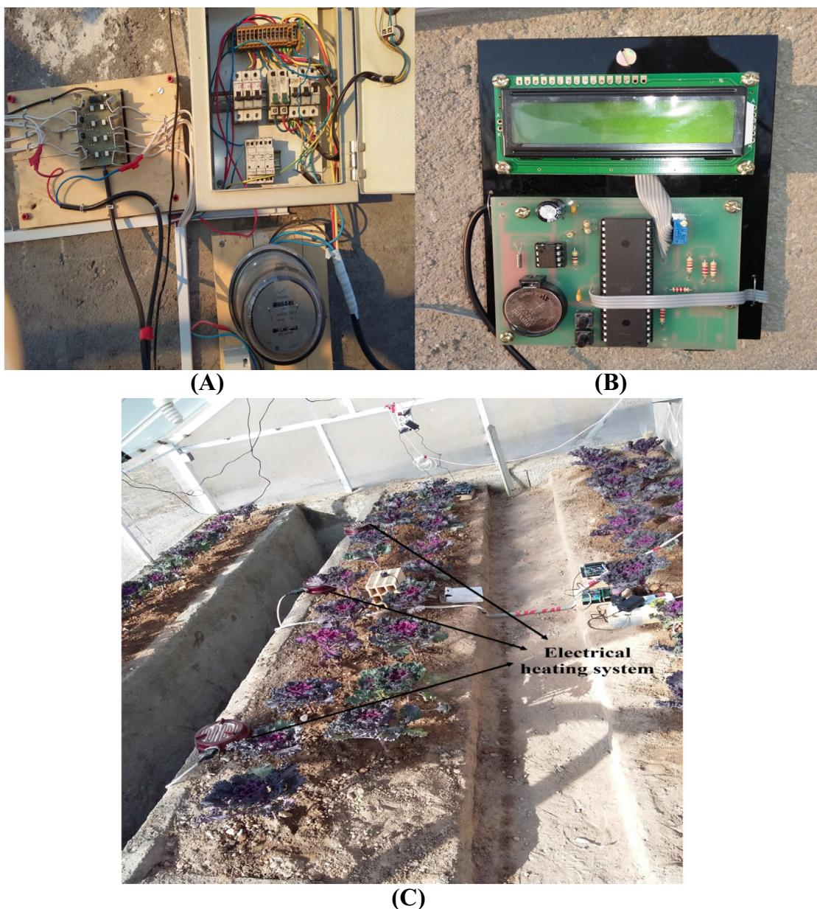
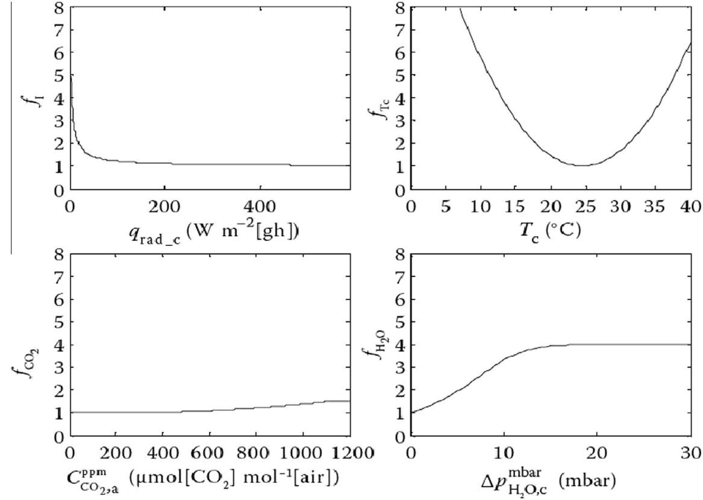
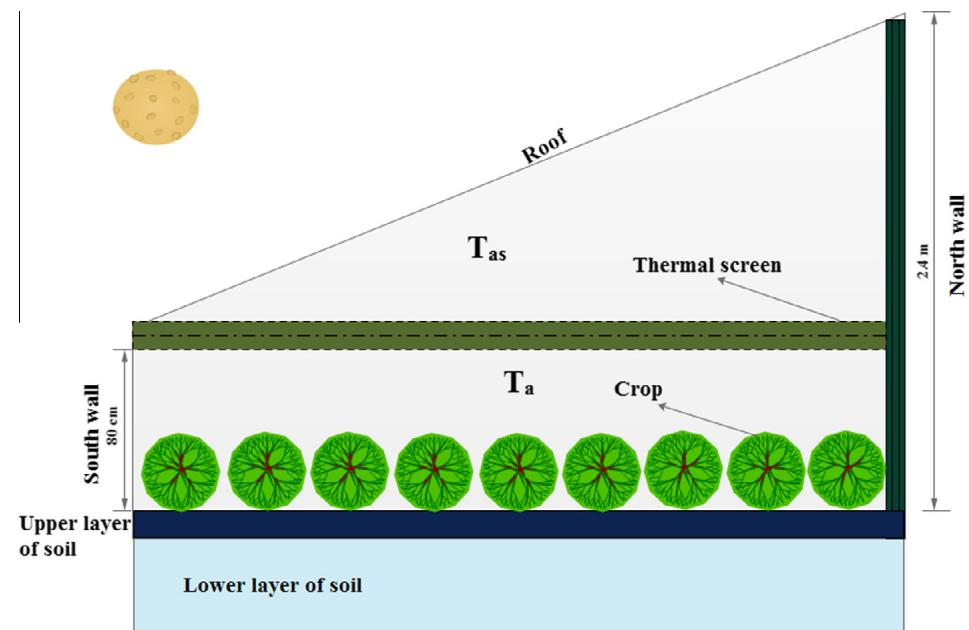
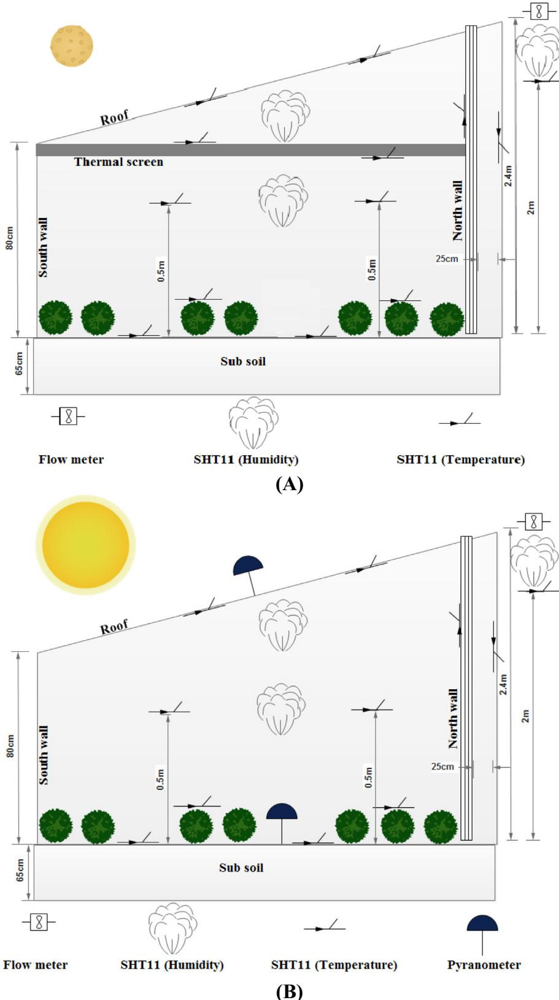
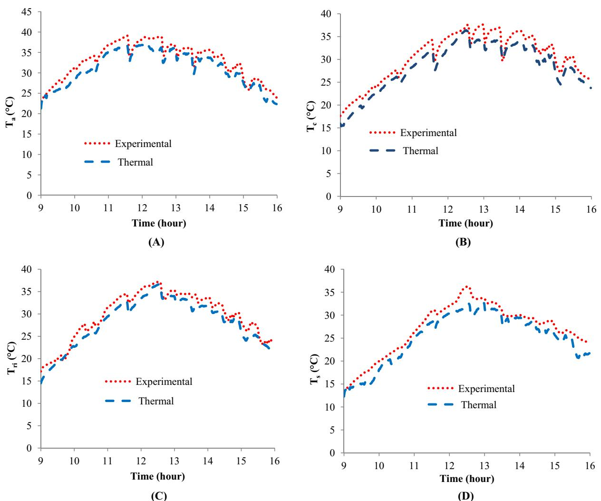
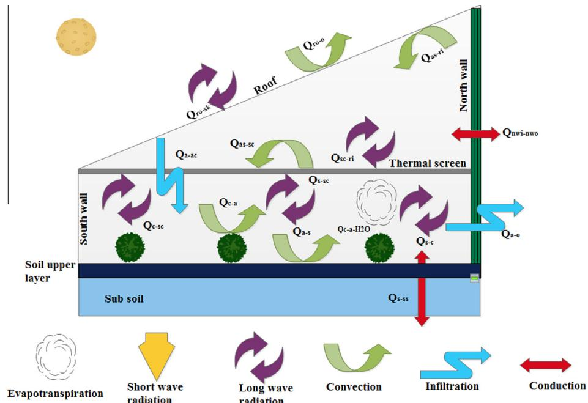
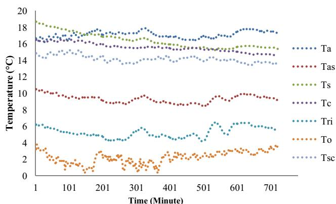

# Modeling and experimental validation of heat transfer and energy consumption in an innovative greenhouse structure

# 创新型温室结构中的传热与能耗建模及实验验证

Morteza Takia, *, Yahya Ajabshirchia, Seyed Faramarz Ranjbarb, Abbas Rohanic, Mansour Matloobid

a生物系统工程系，农学院，大不里士大学，伊朗  b机械工程系，机械工程学院，大不里士大学，伊朗  c生物系统工程系，农学院，马什哈德费尔多西大学，伊朗  d园艺科学系，农学院，大不里士大学，大不里士，伊朗

# 文章信息

# 摘要

文章历史:  收稿日期2016年2月5日  录用日期2016年6月8日  在线发表日期2016年6月17日

关键词:  半太阳能温室  动态模型  保温幕  节能

商业温室是最有效的栽培方式之一，其单位面积产量可达露天栽培的10倍，但该生产领域的化石燃料消耗量非常高。本文旨在对带有保温幕的创新太阳能温室中的传热传质功能进行建模和实验评估。为此，在伊朗西北部东阿塞拜疆省(北纬38°10′，东经46°18′，海拔1364米)设计并建造了一个半太阳能温室。收集了幕下空气温度$(T_{a})$、幕上空气温度$(T_{as})$、作物温度$(T_{c})$、土壤温度$(T_{s})$、覆盖层温度$(T_{ri})$和保温幕温度$(T_{sc})$等室内环境因子作为实验数据样本。采用动态传热传质模型，结合初始值并考虑作物蒸散作用，估算了半太阳能温室六个不同位置的温度。结果表明，动态模型对无保温幕温室四个不同位置$(T_{a}, T_{c}, T_{ri}, T_{s})$的温度预测结果MAPE、RMSE和EF分别约为5-7%、1-2℃和80-91%；对有保温幕温室六个不同位置$(T_{as}, T_{c}, T_{ri}, T_{s}, T_{as}, T_{sc})$的预测结果分别为3-7%、0.6-1.8℃和89-96%。秋季夜间(12小时)使用保温幕的结果显示，该方法可减少高达58%的化石燃料使用，从而降低最终成本和空气污染。这种可移动保温装置使室内外温差达到约15℃，并使$T_{a}$和$T_{as}$之间产生约6℃的温差。实验结果表明，内置保温幕可减少夜间作物温度的波动。

# 符号说明

| 符号 | 描述 | 单位 |
|------|------|------|
| $Q$ | 热负荷 | W |
| $\alpha$ | 热负荷系数 | W/m²K |
| $\nu$ | 室外风速 | m/s |
| $I$ | 太阳辐射 | W/m² |
| $T$ | 温度 | K |
| $F$ | 视角系数 | - |
| $E$ | 发射系数 | - |
| $A$ | 表面积 | m² |
| $\epsilon_{\mathrm{p}}$ | 比热容 | 1/kgK |
| $d$ | 厚度 | m |
| $V$ | 体积 | m³ |
| $\Phi_{m - c - a - H_2O}$ | 作物到室内空气的水汽质量流量 | kgH₂O/s |
| $k_{c - a - H_2O}$ | 作物到室内空气的水汽传质系数 | m/s |
| $C_{c - \mathrm{H}_2\mathrm{O}s}$ | 作物温度下的水汽饱和浓度 | kgH₂O/m³ |
| $C_{a - \mathrm{H}_2\mathrm{O}}$ | 室内空气温度下的水汽浓度 | kgH₂O/m³ |
| $R_{cut}$ | 叶片角质层阻力 | s/m |
| $R_{s - \mathrm{H}_2\mathrm{O}}$ | 气孔阻力 | s/m |
| $R_{b - \mathrm{H}_2\mathrm{O}}$ | 边界层阻力 | s/m |
| $R_{\min}$ | 作物最小内部阻力 | s/m |
| $f_{I}$ | 辐射依赖效应 | - |
| $f_{TC}$ | 温度依赖效应 | °C |
| $f_{\mathrm{CO_2}}$ | CO₂依赖效应 | - |
| $f_{\mathrm{H_2O}}$ | H₂O依赖效应 | - |
| $LAI$ | 叶面积指数 | - |
| $I_{c - s}$ | 冠层吸收的热量 | W/m² |
| $Q_{c - a - \mathrm{H}_2\mathrm{O}}$ | 冠层到幕下室内空气的热负荷 | W |
| $Q_{a - sc - \mathrm{H}_2\mathrm{O}}$ | 幕下室内空气到保温幕的热负荷 | W |
| $\eta_{ri - Is}$ | 屋顶对短波辐射的吸收系数 | - |
| $\eta_{s - Is}$ | 土壤对短波辐射的吸收系数 | - |
| $\rho$ | 密度 | kg/m³ |
| $\sigma$ | 斯特藩-玻尔兹曼常数 | W/m²K⁴ |
| $\lambda_{s}$ | 土壤导热系数 | W/mK |
| $\lambda_{nw}$ | 北墙导热系数 | W/mK |
| $\overline{\rho}$ | 幕上下空气平均密度 | kg/m³ |
| $\eta_{c - Is}$ | 作物对短波辐射的吸收系数 | - |

## 下标说明

| 下标 | 描述 |
|------|------|
| $a$ | 幕下室内空气 |
| $s$ | 室内土壤 |
| $ri$ | 室内屋顶 |
| $o$ | 室外 |
| $c$ | 作物 |
| $nwi$ | 北墙内侧 |
| $nwo$ | 北墙外侧 |
| $a - s$ | 室内空气到土壤 |
| $sc - a$ | 保温幕到幕下室内空气 |
| $sc - as$ | 保温幕到幕上室内空气 |
| $sc - ri$ | 保温幕到室内屋顶 |
| $Cl_{sc}$ | 保温幕闭合状态 |
| $ss$ | 土壤下层 |
| $a - as$ | 幕下到幕上空气 |
| $s - c$ | 土壤到作物 |
| $s - as$ | 土壤到保温幕 |
| $as - sc$ | 幕上空气到保温幕 |
| $as$ | 幕上室内空气 |
| $rd - ri$ | 屋顶辐射吸收 |
| $s - ri$ | 土壤到室内屋顶 |
| $ro - o$ | 屋顶到室外 |
| $sk$ | 天空 |
| $in$ | 温室内空间 |
| $a - sc$ | 幕下空气到保温幕 |
| $ro - sk$ | 屋顶到天空 |
| $rd - s$ | 土壤辐射吸收 |
| $s - ss$ | 上层到下层土壤 |
| $rd - c$ | 作物辐射吸收 |
| $a - c$ | 室内空气到作物 |
| $as - ri$ | 幕上空气到屋顶 |
| $ri - c$ | 室内屋顶到作物 |
| $sc - ri$ | 保温幕到室内屋顶 |
| $c - re$ | 作物到保温幕 |
| $l_{f}$ | 平均叶宽 | m |
| $R_{b - heat}$ | 叶片边界层热阻 | s/m |

# 1. 引言

温室栽培是一种集约化的流行作物生产方式，单位面积产量比大田作物高出10倍以上。蔬菜、观赏植物和水果作物都可在温室条件下栽培。温室结构、覆盖材料和内部设备为各类作物提供了非常适宜的生长环境，从而获得更高的产量、品质并延长产品市场供应期。温室生产需要消耗大量能源、水和农药，通常还会产生大量需要处理的废弃物[1]。与传统农业相比，温室产业单位面积的投资、劳动力和能源成本要高得多。可持续的温室系统需要兼顾社会支持性、商业竞争力和环境友好性，这取决于旨在减少农用化学品、能源和水消耗以及废弃物产生的栽培技术、设备管理和建筑材料。通过以下措施可以实现这些目标[1]：

I. 有效管理气候参数，即温室内太阳辐射、各点温度、相对湿度和二氧化碳$(CO_2)$浓度，为作物创造适宜生长条件  
II. 使用可再生和可持续能源替代化石燃料  
III. 选用合适的温室覆盖材料及其物理特性  
IV. 优化植物用材以减少水和养分消耗，同时保护地下水和土壤  

温室内部环境控制水平差异很大，从基本简易型到全封闭调节型不等。Albright[2]将温室全气候控制的目标总结为："封闭环境中的植物生产致力于发挥每株植物的遗传潜力"。在可持续生产中，农民尝试使用可再生资源而非化石燃料来控制温室内环境。此外，不可再生资源的使用速度不应超过可再生替代资源的开发速度，污染物排放率也不应超过环境吸收和再生的能力[2]。

温室环境管理依赖于温度调控。温度调控对植物生长、品质和形态至关重要，是作物环境改良的主要策略。植物对温度变化的反应可以预测。$10^{\circ}C$至$24^{\circ}C$的范围几乎适合所有植物生长，超过此范围生长量呈近似线性正相关[3]。为创造最佳植物生长环境，温室采用多种加热系统，主要包括：水蓄热（管道和桶）、岩石床蓄热和相变材料(PCM)蓄热。此外，移动保温层（保温幕）、地面空气收集器(GAC)和北墙也用于提高温室气温[4]。1960年后，由于燃料价格上涨，农民开始对温室节能技术产生兴趣。部分农民采用高隔热性覆盖材料，在寒冷地区（如伊朗西北部）还使用内外保温幕[5]。保温幕通常是冬季夜间在温室覆盖层内外拉开的幕帘，用于减少通过辐射和对流向外界的散热[4]。白天通常打开以接收太阳辐射，但在太阳辐射较弱时（如阴天），可使用内保温幕。这些移动保温装置可通过温度或太阳辐射控制。内保温幕位于作物与温室屋顶之间，将内部空间分为两个独立区域；外保温幕则位于屋顶外侧，可阻挡长波辐射返回，减少对流影响，防止内部能量损失。内保温幕更受青睐，因其能降低结构导热性，而外幕帘易受外界天气条件影响而老化[4]。

长波辐射是温室夜间散热的主要机制，尤其在晴朗夜空下[6]。使用保温幕可减少33%-60%的夜间热损失[7]。部分内保温幕不透气，会加大上下空气温差，但实际建议在幕与墙壁间保留3%-5%的自由空间，形成极低气流以控制幕下空气湿度[8-9]。此外，内保温幕能消除作物温度波动，防止作物叶片结露[5]。为提高保温幕效率，有研究者将其与温室其他方法结合以提高气温。另有研究证实该方法可减少温室20%-60%的总能耗[10-23]。

基于文献研究，本研究目标之一是建立伊朗创新结构温室（含/不含内保温幕）的热传递模型，预测六个位点的内部温度。这是在伊朗首次采用保温幕进行建模。第二部分研究保温幕对能耗及湿度、作物温度等内部环境变量的影响。

# 2. 材料与方法

# 2.1. 半太阳能温室

为选择最佳的温室形状和朝向，对伊朗西北部东阿塞拜疆省的五种常见温室形状和一种创新设计应用了热传递方程(图1)。为此使用了伊朗气象局(IMO)1992-2013年期间记录的气象数据。所选结构(创新设计)能比其他结构接收更多的太阳辐射。同时采用内部保温幕(布料型)和水泥北墙来储存热量并防止寒冷季节的热量损失，因此我们称这种结构为"半太阳能"温室。温室覆盖4毫米厚的玻璃，占地面积约$15.36\mathrm{m}^2$，体积$26.4\mathrm{m}^3$。温室呈东西走向，与盛行风向垂直(图2)。实验验证在种植卷心菜的半太阳能温室内进行。温室仅在夜间使用电力系统加热，以便测量总能耗(图3)。

  
图1 - 伊朗东阿塞拜疆省常见温室类型与创新结构(SW=南墙，SR=南屋顶，NR=北屋顶，NW=北墙)

  
图2 - 伊朗东阿塞拜疆省半太阳能温室侧视图(A和B)

  
图3 - 用于控制温度的电气系统(A和B)及半太阳能温室加热系统(C)

# 2.2. 带保温幕的半太阳能温室热质传递

本节讨论用于估算半太阳能温室内环境变量的热质传递方程。通过动态模型预测了幕下空气$(T_{a})$、幕上空气$(T_{as})$、土壤$(T_{s})$、覆盖层$(T_{ri})$、作物$(T_{c})$和保温幕$(T_{sc})$的温度。该模型包含六个一阶微分方程，源自这些组件的能量平衡。在此动态模型中，对温室组件与作物间的热交换做出以下假设：

- 温室组件被视为集总系统
- 空气、作物、覆盖层、保温幕和表层土壤温度均匀分布
- 土壤不发生蒸发
- 室内空气不吸收也不发射辐射能
- 屋顶内侧和保温幕上的冷凝水直接排出，不参与蒸发
- 测试期间所有窗户关闭，温室无通风
- 忽略$\mathrm{CO}_{2}$浓度对蒸腾作用的影响

第一个方程是幕下空气的能量平衡方程[1,24]：

$$
\frac{dT_{a}}{dt} = \left\{ \begin{array}{ll}\frac{Q_{a - s} - Q_{as - c} - Q_{ri - c} - Q_{nwi - nwo}}{\rho_{a} - c_{p - a} - Q_{a - c} - Q_{as - c} - Q_{as - ri} - Q_{nwi - nwo}} & \mathrm{if~}c_{sc} = 0\\ \frac{Q_{a - sc} + Q_{as - sc} - Q_{a - c} - Q_{as - c} - Q_{as - ri} - Q_{nwi - nwo}}{\rho_{a} - c_{p - a} - V_{a} + \rho_{as} - c_{p - a} - V_{as}} & \mathrm{if~}c_{sc} = 1 \end{array} \right\} \tag{1}
$$

第二个方程是幕上空气的能量平衡[24]：

$$
\frac{dT_{as}}{dt} = \left\{ \begin{array}{ll}\frac{Q_{as - as} + Q_{as - sc} - Q_{as - ri} - Q_{nwi - nwo}}{\rho_{as} - c_{p - a} - V_{as}} & \mathrm{if~}c_{sc} = 1\\ \frac{dT_{a}}{dt} & \mathrm{if~}c_{sc} = 0 \end{array} \right\} \tag{2}
$$

土壤能量平衡方程[25]：

$$
\frac{dT_{s}}{dt} = \frac{Q_{rd - s} + Q_{a - s} - Q_{s - c} - Q_{s - ri} - Q_{s - sc}}{(0.7a_{c} \times c_{p - a} + 0.2aH_{O} \times c_{p - a} - 0.1a_{c} \times c_{p - a}) \times V_{r}} \tag{3}
$$

作物能量平衡方程[25]：

$$
\frac{dT_{c}}{dt} = \frac{Q_{rd - c} + Q_{a - c} + Q_{ri - c} + Q_{s - c} - Q_{c - a - H_{2}O} - Q_{c - sc}}{\rho_{c} \times c_{p - c} \times V_{c}} \tag{4}
$$

最后是覆盖层和保温幕的能量平衡[24]：

$$
\frac{dT_{ri}}{dt} = \frac{Q_{rd - ri} + Q_{as - ri} + Q_{s - ri} + Q_{sc - ri} - Q_{ri - c} - Q_{ro - o} - Q_{ro - sk}}{\rho_{r} \times c_{p - r} \times V_{r}} \tag{5}
$$

$$
\frac{dT_{sc}}{dt} = \frac{Q_{c - sc} + Q_{s - sc} + Q_{a - a - H_{2}O} - Q_{sc - a} - Q_{sc - as} - Q_{sc - ri}}{\rho_{sc} \times c_{p - sc} \times V_{sc}} \tag{6}
$$

温室组件间通过对流和传导传递的能量表示为[25]：

$$
\begin{array}{rl} & Q_{a - c} = A_c\times \alpha_{c - c}(T_a - T_c)\\ & Q_{a - s} = A_s\times \alpha_{s - s}(T_a - T_s)\\ & Q_{as - ri} = A_r\times \alpha_{as - ri}(T_{as} - T_{ri})\\ & Q_{ro - o} = A_r\times \alpha_{ro - o}(T_{ro} - T_o)\\ & Q_{a - sc} = A_{sc}\times \alpha_{sc - c}(T_a - T_{sc})\\ & Q_{as - sc} = A_{sc}\times \alpha_{as - sc}(T_{as} - T_{sc})\\ & Q_{a - as} = \overline{\rho_a}\times c_{p - a}\times \Phi_{a - as}(T_a - T_{as})\\ & Q_{s - ss} = A_s\times \lambda_s / ds(T_s - T_{ss})\\ & Q_{nwi - nwo} = A_{nw}\times \lambda_{nw} / d_{nw}(T_{nw} - T_{nwo}) \end{array} \tag{14}
$$

文献报道的估算温室内不同表面间传热系数的经验关系如下[24]：

$$
\alpha_{a - c} = \rho_{a}\times c_{pa} / R_{b - heat} \tag{16}
$$

$$
\begin{array}{rl} & {\alpha_{a - s} = 1.7|T_a - T_s|^{\frac{1}{3}}\quad \mathrm{if} T_a< T_s}\\ & {\alpha_{a - s} = 1.3|T_a - T_s|^{0.25}\quad \mathrm{if} T_a\geqslant T_s} \end{array} \tag{17}
$$

$$
\alpha_{as - ri} = 3|T_{as} - T_{ri}|^{1 / 3} \tag{18}
$$

$$
\begin{array}{rl} & {\alpha_{ro - o} = 2.8 + 1.2v_o\quad \mathrm{if} v_o< 4}\\ & {\alpha_{ro - o} = 2.5v_o^{0.8}\quad \mathrm{if} v_o\geqslant 4} \end{array} \tag{19}
$$

$$
\alpha_{a - sc} = C_{lsc}\times 3|T_a - T_{sc}|^{1 / 3} \tag{20}
$$

$$
\alpha_{as - sc} = C_{lsc}\times 3|T_{as} - T_{sc}|^{1 / 3} \tag{21}
$$

从幕下到幕上的空气体积流量$(\Phi_{a - as})$为：

$$
\Phi_{a - as} = v_{a - as}\times A_{sc}(1 - Cl_{sc}) \tag{22}
$$

其中幕布上下空气交换速率$(v_{a - as})$取值为0.05。式(16)中$(R_{b - heat})$为对流传热边界层阻力，可由[25]计算：

$$
\mathsf{R}_{b - heat} = \frac{1174\sqrt{I_f}}{(I_f\times|T_c - T_a| + 207v_a^2)^{\frac{1}{2}}} \tag{2}
$$

屋顶、作物和土壤表面直接吸收的太阳辐射$(Q_{rd - ri}, Q_{rd - c}, Q_{rd - s})$在式(5)、(4)和(3)中表示为[25]：

$$
\begin{array}{rl} & Q_{rd - ri} = A_r\times \eta_{ri - is}\times I_r\\ & Q_{rd - c} = A_s\times \eta_{c - is}\times I_{in}\\ & Q_{rd - s} = A_s\times \eta_{s - is}\times I_{in} \end{array} \tag{4}
$$

半太阳能温室内外各部分的净太阳辐射热交换计算如下[24]：

$$
\begin{array}{rl} & Q_{s - c} = A_s\times E_s\times E_c\times F_{s - c}\times \sigma (T_s^4 -T_c^4)\\ & Q_{s - ri} = A_s\times E_s\times E_{ri}\times F_{s - ri}\times \sigma (T_s^4 -T_{ri}^4) \end{array} \tag{6}
$$

$$
Q_{rsc} = A_s\times E_s\times E_{sc}\times F_{s - sc}\times \sigma (T_s^4 -T_{sc}^4) \tag{13}
$$

$$
\begin{array}{rl} & Q_{ri - c} = A_r\times E_{ri}\times E_c\times F_{ri - c}\times \sigma (T_{ri}^4 -T_c^4)\\ & Q_{ro - sk} = A_r\times E_{ro}\times E_{sk}\times F_{ro - sk}\times \sigma (T_{ro}^4 -T_{sk}^4)\\ & Q_{c - sc} = A_s\times E_c\times E_{sc}\times F_{c - sc}\times \sigma (T_c^4 -T_{sc}^4)\\ & Q_{sc - ri} = A_{sc}\times E_{sc}\times E_{ri}\times F_{sc - ri}\times \sigma (T_{sc}^4 -T_n^4) \end{array} \tag{14}
$$

Joudi和Farhan[26]提出的天空温度为：$T_{sk} = 0.0552(T_o)^{1.5}$ (34)

蒸腾过程涉及水分从叶片向温室空气的蒸发。该过程对水分和养分从根部向叶片和果实的运输至关重要，同时也能降低作物温度。水分主要通过叶片气孔蒸发。因此冠层蒸腾是气孔阻力和叶片边界层阻力的函数。文献中通常假设这些阻力为常数。由于我们需要将作物模型用于极端温湿度条件，因此决定采用Stanghellini[27]模型来计算叶片阻力。该模型是对Penman-Monteith-Rijtema方法(组合法)的改进，用于确定温室实际蒸腾速率而非潜在蒸腾速率。蒸腾速率取决于光照强度、$\mathrm{CO_2}$浓度、温度和湿度。除非另有说明，所有关系式均引自Stanghellini[27]。冠层蒸腾$(\Phi_{m - c - a - H_2O})$即作物向室内空气的水汽质量流率为：$\Phi_{m - c - a - H_2O} = \max \{A_c\times k_{c - a - H_2O}(C_{c - H_2O}s - C_{a - H_2O}),0\}$ (35) 其中$(A_s)$为冠层表面积，$(k_{c - a - H_2O})$为作物向室内空气的水汽传质系数，$(C_{c - H_2O}s)$为

$$
\Phi_{m - c - a - H_2O} = \max \{A_c\times k_{c - a - H_2O}(C_{c - H_2O}s - C_{a - H_2O}),0\} \tag{35}
$$

其中$(A_s)$为冠层表面积，$(k_{c - a - H_2O})$为作物向室内空气的水汽传质系数，$(C_{c - H_2O}s)$为作物温度下的水汽饱和浓度，$(C_{a - H_{2}O})$为室内空气温度下的水汽浓度。若$C_{c - H_{2}O s} \leq C_{a - H_{2}O}$则不发生蒸腾(详见Stanghellini[27])。

Bot[28]将水分子扩散总阻力描述为边界层阻力与角质层阻力串联后再与气孔阻力并联。因此作物向室内空气的传质系数$(k_{c - a - H_{2}O})$可计算为[28]：

$$
k_{c - a - H_2O} = \frac{1}{R_{b - H_2O} + \frac{R_{cut}\times R_{b - H_2O}}{R_{b - H_2O}}} \tag{36}
$$

其中叶片角质层阻力$R_{cut} = 2000$，$R_{s - H_{2}O}$为水分子扩散的气孔阻力，$R_{b - H_{2}O}$为水分子扩散的边界层阻力(式(23))。

水分子扩散的气孔阻力$(R_{s - H_{2}O})$由[27]描述：

$$
R_{s - H_2O} = R_{\min}\times f_I\times f_{T_c}\times f_{CO_2}\times f_{H_2O} \tag{37}
$$

其中辐射依赖项$(f_{I})$由[27]给出：

$$
f_{I} = \frac{\frac{I_{c,s}}{2LAI} + 4.3}{\frac{I_{c,s}}{2LAI} + 0.54} \tag{38}
$$

温度依赖项$(f_{T_c})$为[27]：

$$
\begin{array}{rl} & {f_{T_c} = 1 + 0.5\times 10^{-2}(T_c - T_0 - 33.6)^2\quad \mathrm{if} I_{c - s}\leqslant 3}\\ & {f_{T_c} = 1 + 2.2593\times 10^{-2}(T_c - T_0 - 24.512)^2\quad \mathrm{if} I_{c - s} > 3} \end{array} \tag{39}
$$

湿度依赖项$(f_{H_{2}O})$为[25]：

$$
f_{H_2O} = \frac{4}{\sqrt[4]{1 + 255e^{-0.5427\Delta_{pc - H_2O m}}}} \tag{40}
$$

$\mathrm{CO_2}$依赖项$(f_{C_2O})$及其浓度关系如图4所示。当$\mathrm{CO_2}$浓度在600-800$(\mu \mathrm{mol} / \mathrm{CO}_2)$之间时，$(f_{C_2O})$约为1。本研究因温室规模较小，未考虑$\mathrm{CO_2}$浓度对式(37)的影响，故取$(f_{\mathrm{CO_2}}) = 1$。

冠层蒸腾导致的潜热传递$(Q_{c - a - H_{2}O})$为[27]：

$$
Q_{c - a - H_2O} = r_w\times \Phi_{m - c - a - H_2O} \tag{36}
$$

其中$(r_w)$为水蒸发潜热，$(\Phi_{m - c - a - H_{2}O})$为冠层向室内空气的蒸腾水汽质量流率。

幕上空气向屋顶内表面冷凝的水汽质量流率$(\Phi_{m - as - ri - H_2O})$为[24]：

$$
\Phi_{m - as - ri - H_2O} = \max \left\{A_r\times k_{as - ri - H_2O}\times (C_{as - H_2O} - C_{ri - H_2O s}),0\right\} \tag{37}
$$

其中$(A_{r})$为屋顶表面积，$(k_{as - ri - H_2O})$为幕上空气向屋顶内表面的水汽传质系数，$(C_{ri - H_2O s})$为屋顶温度下的水汽饱和浓度，$(C_{as - H_2O})$为幕上空气温度下的水汽浓度。若$(C_{as - H_2O}\leqslant C_{ri - H_2O s})$，则$(\Phi_{m - as - ri - H_2O} = 0)$(无冷凝)。传质系数$(k_{as - ri - H_2O})$由Bot[28]定义为：

$$
k_{as - ri - H_2O} = \frac{\alpha_{as - ri}}{\rho_{as}\times c_{p - a}\times Le^2} \tag{39}
$$

其中$(\alpha_{as - ri})$为幕上空气至屋顶内表面的传热系数(式(9))，$(\rho_{as})$为幕上空气密度，$(c_{p - a})$为空气比热容，$Le = 0.89$为水蒸气的路易斯数。幕上空气至屋顶内表面的潜热传递$(Q_{as - ri - H_2O})$为[24]:

  
图4 - 温室番茄生产的$\mathrm{CO_2}$依赖因子$(f_{C_2O})$[25]

$$
Q_{as - ri - H_2O} = r_w\times \Phi_{m - as - ri - H_2O} \tag{44}
$$

其中$(\Phi_{m - as - ri - H_2O})$(式(42))为幕上空气至屋顶内表面的水蒸气质量流率。幕下和幕上空气至幕布的水蒸气质量流率分别为[25]:

$$
\Phi_{m - a - sc - H_2O} = \max \left\{A_{sc}\times k_{a - sc - H_2O}\times (C_{a - H_2O} - C_{sc - H_2O}s),0\right\} \tag{45}
$$

$$
\Phi_{m - as - sc - H_2O} = \max \left\{A_{sc}\times k_{a - sc - H_2O}\times (C_{as - H_2O} - C_{sc - H_2O}s),0\right\} \tag{46}
$$

其中$(A_{sc})$为幕布表面积，$(k_{a - sc - H_2O}$和$k_{as - sc - H_2O})$分别为幕下和幕上空气至幕布的水蒸气传质系数，$(C_{sc - H_2O}s)$为幕布温度下的水蒸气饱和浓度，$(C_{a - H_2O}$和$C_{as - H_2O})$分别为幕下和幕上空气温度下的水蒸气浓度。若$(C_{a - H_2O}\leqslant C_{sc - H_2O}s)$则$(\Phi_{m - a - sc - H_2O} = 0)$，若$(C_{as - H_2O}\leqslant C_{sc - H_2O}s)$则$(\Phi_{m - as - sc - H_2O} = 0)$(无冷凝)。幕下和幕上空气至幕布的水蒸气传质系数$(k_{a - sc - H_2O}$和$k_{as - sc - H_2O})$由Bot[28]定义为:

$$
k_{a - sc - H_2O} = \frac{\alpha_{a - sc}}{\rho_a\times c_{p - a}\times Le^3} \tag{47}
$$

$$
k_{as - sc - H_2O} = \frac{\alpha_{as - sc}}{\rho_{as}\times c_{p - a}\times Le^3} \tag{48}
$$

其中$(\alpha_{a - sc}$和$\alpha_{as - sc})$分别为幕下和幕上空气至幕布的传热系数(式(20)和(21))。幕下和幕上空气至幕布的潜热传递$(Q_{a - sc - H_2O}$和$Q_{as - sc - H_2O})$为:

$$
\begin{array}{rl} & Q_{a - sc - H_2O} = r_w\times \Phi_{m - a - sc - H_2O}\\ & Q_{as - sc - H_2O} = r_w\times \Phi_{m - as - sc - H_2O} \end{array} \tag{50}
$$

其中$(\Phi_{m - as - sc - H_2O}$和$\Phi_{m - a - sc - H_2O})$为幕下和幕上空气至幕布的水蒸气质量流率(式(45)和(46))。

幕下空气至幕上空气的水蒸气质量流率$(\Phi_{m - a - as - H_2O})$为[24]:

$$
\Phi_{m - a - as - H_2O} = \Phi_{a - as}\times (C_{a - H_2O} - C_{as - H_2O}) \tag{0}
$$

其中$(\Phi_{a - as})$为幕下至幕上的空气体积流量(式(22))。

$(C_{a - H_2O})$为幕下空气的水汽浓度，$(C_{as - H_2O})$为幕上空气的水汽浓度。

本研究使用了内部保温幕(布质)。该可移动幕布位于温室地面以上约$80cm$处。加热系统设定温度为$15^{\circ}C$，当温室内三个传感器的平均值降至$14.5^{\circ}C$时启动加热系统。控制系统记录电能消耗量。图5显示了该温室中保温幕的位置。

使用MATLAB软件求解数学方程。在每个1分钟的时间步长上，使用特定时间步长的适当输入参数值求解整套方程。当解收敛时，将计算数据作为下一个时间步长的初始值。所有内部变量的初始值均为实测值。求解所需的输入数据见表1。为了控制所有影响温度预测的内外部参数，模拟分别在以下时段进行：2015年11月30日9:30至$16:00\mathrm{pm}$（无幕布温室）和2015年12月2日$19:00\mathrm{pm}$至07:00（有幕布温室），地点位于Tabriz大学生物系统工程系的半太阳能温室。

  
图5 - 半太阳能温室中保温幕的位置$(T_{a}$:幕下空气温度; $T_{as}$:幕上空气温度)

表1-计算所用输入参数[24-28]。

| 参数 | 值 | 参数 | 值 | 参数 | 值 |
|------|----|------|----|------|----|
| ηri-Is | 0.0173 | ρa | 1.29T0 | As | 15.36 |
| ES | 0.7 | cp-a | 1000 | λs | 0.6 |
| Esk | 0.8 | f a | 1 | ds | 0.65 |
| Fri-sk | 0.86 | Ar | 17.7 | Vs | 9.984 |
| Amw | 11.52 | Vr | 0.0708 | cp-s | 800 |
| λnw | 0.397 | Va | 26.4 | ρs | 1400 |
| dnw | 0.25 | ρr | 2500 | Fs-ri | 0.8 |
| Gp-r | 840 | σ | 5.67051 × 10-8 | ηs-Is | 0.86 |
| Eri | 0.95 | Fs-ri | 0.8 | ρH2O | 998 |
| Ac | 2LAI × As | ρa | 1.29T0 | va | 0.09 |
| Asc | 15.36 | lF | 0.04 | ηc-Is | 0.5 |
| Ec | 1 - τc-Il | Fs-c | Fs-c = 1 - τc-Il | Vas | 12.25 |
| Esc | 0.9 | Fs-sc | Fs-sc = Clsc(1 - Fs-c) | Ero | 0.95 |
| Fro-sk | As/Ar | Fc-sc | Fc-sc = Clsc(1 - τc-Il) | ρsc | 200 |
| LAI | 1 | Fsc-ri | Fsc-ri = Clsc | lc-s | ηc-Is × Io |
| ρas | 1.29T0 | Fri-c | τc-Il = e-κc-Il × LAI | cp-H2O | 4186 |
| ρc | 700 | ρr | 450 | cp-sc | 1500 |
| Rmin | 82.003 | kC-Is | 0.48 | Ec | 1 - τc-Il |
| dsc | 0.002 | Le | 0.89 | Esc | 0.9 |
| Vsc | 3.07 | kC-Il | 0.64 | | |

# 2.3. 内外气候数据

采用SHT11传感器测量半太阳能温室内外各变量的温度和相对湿度。SHT11是一款集成了相对湿度和温度测量的单芯片多传感器模块，具有校准数字输出功能。在20°C时温度测量精度为±0.4%，晴天条件下湿度测量精度为±3%。我们将这些传感器分别布置在土壤、温室屋顶内侧、幕布、作物、幕布上下方空气以及温室外侧用于测量温湿度。在温室屋顶安装了TES1333R型太阳辐射计，用于测量400-1110nm光谱波段的太阳总辐射，其测量精度约为±5%。图1展示了在有/无保温幕情况下，半太阳能温室中SHT11传感器、流量计和TES1333太阳辐射计的布置位置。

# 2.4. 模型性能评价标准

根据文献采用以下统计函数评估模型性能：总平方误差和(TSSE)、均方根误差(RMSE)、平均绝对百分比误差(MAPE)、决定系数(R²)和模型效率(EF)。定义如下[1]：

$$
\mathbf{MAPE} = \frac{1}{n}\sum_{j = 1}^{n}\left|\frac{d_j - p_j}{d_j}\right|\times 100 \tag{52}
$$

$$
\mathrm{RMSE} = \sqrt{\frac{\sum_{j = 1}^{n}(d_j - p_j)^2}{n}} \tag{53}
$$

$$
\mathbf{EF} = \frac{\sum_{j = 1}^{n}(d_j - \overline{d})^2 - \sum_{j = 1}^{n}(p_j - d_j)^2}{\sum_{j = 1}^{n}(d_j - \overline{d})^2} \tag{54}
$$

$$
\mathrm{TSSE} = \sum_{j = 1}^{n}(d_j - p_j)^2 \tag{55}
$$

$$
R^2 = \left[\frac{\sum_{j = 1}^{n}(d_j - \overline{d})(p_j - \overline{p})}{\sum_{j = 1}^{n}(d_j - \overline{d})\times\sum_{j = 1}^{n}(p_j - \overline{p})}\right]^2 \tag{56}
$$

式中：$d_j$表示第j个样本的实际输出值；$p_j$表示模型预测的第j个输出值；$\overline{d}$和$\overline{p}$分别表示全部实际输出和预测输出的平均值；$n$为输出变量个数。具有最小RMSE、MAPE和TSSE值，以及最大EF和R²值的模型被认为是最优模型。

# 3. 结果与讨论

# 3.1. 温室各点温度与室外气温

图7展示了2015年11月30日在Tabriz市一个典型晴天条件下，半太阳能温室内外温度的测量值变化。可以看出，室内空气温度全天都适合作物生长（室内空气温度平均值约为$32^{\circ}C$）。室外空气温度平均值约为$13^{\circ}C$。室内外温差表明该结构在秋季可以从太阳获取全部所需能量。作物、土壤和覆盖层的平均温度分别约为30、27和$29^{\circ}C$。我们可以得出结论，在秋季晴天条件下，室内空气、作物、土壤和覆盖层的平均温度可以相当。同时可以看出，该结构非常适合秋季作物种植，尤其不需要额外消耗能源进行加热。

  
图6 - 用于收集内外数据的SHT11传感器、太阳辐射计和流量计布置位置

# 3.2. 温室内环境变量模拟

# 3.2.1. 无保温幕情况下的模拟

  
图7 - 2015年11月30日Tabriz市半太阳能温室内空气、土壤、作物、覆盖层和室外空气温度的测量值（$T_{c}$作物温度；$T_{a}$室内空气温度；$T_{o}$室外空气温度；$T_{s}$土壤温度；$T_{ri}$屋顶温度）

图8展示了无保温幕情况下半太阳能温室各部件间的热传递。本节将式(1)、(3)、(4)、(5)描述的热模型结果与SHT11传感器采集的实验数据进行了比较。图9展示了这一对比。可以看出模型与所有测量数据的吻合度良好。表2和表3展示了热模型与实验结果的统计分析。可以看出平均绝对误差百分比(MAPE)在5.32%到$7.25\%$之间。最小误差为$(T_{s - i})$的5.32，最大误差为$(T_{s})$的7.25。考虑标准差和方差的平均值可以推断，实际数据与预测数据的数值和分布具有相似性。但最小值差异较为显著。Joudi和Farhan[26]开发了一个动态模型来预测伊拉克温室的室内空气和土壤温度。该模型的输入参数包括从气象条件测量和温室组件(覆盖层、室内空气和土壤)的热物理特性获得的数据。预测结果与测量结果显示出良好的一致性。该动态模型对室内空气和土壤温度的绝对误差超过$10\%$。Du等[29]应用模拟模型预测了带热管系统温室的室内空气和土壤温度。模型通过实验数据验证并显示出高度吻合。预测数据与期望数据的绝对误差约为$\pm 20\%$。他们得出结论，该模拟可以评估最大高度的影响、寒冷天气所需的加热功率以及温室的热损失。

Gupta和Tiwari[30]发表了一篇基于温室瞬态分析的计算机模型论文。该模型预测了低成本被动式温室的室内空气、储水温度以及水体热储能效应。基于各组件能量平衡的解析表达式，根据气候和设计参数推导得出。数值计算针对1999年12月至2000年6月新德里的典型天气进行。并对所开发模型进行了实验验证。预测的房间温度和水温与实验值显示出较好的一致性。

  
图8 - 无保温幕情况下温室示意图及其与周围环境的热交换（$Q_{s - r}$：土壤通过长波辐射向屋顶内侧传热；$Q_{s - s}$：上层土壤通过传导向下层土壤传热；$Q_{c - a}$：幕下室内空气通过对流向冠层传热；$Q_{a - s}$：幕下室内空气通过对流向土壤传热；$Q_{a - o}$：室内空气通过通风向室外空气传热；$Q_{rd - c}$：冠层吸收的短波辐射；$Q_{rd - s}$：土壤吸收的短波辐射；$Q_{rd - ri}$：屋顶吸收的短波辐射；$Q_{c - ri}$：屋顶内侧通过长波辐射向冠层传热；$Q_{nwi - now}$：北墙内侧通过传导向外侧传热；$Q_{ro - sk}$：屋顶外侧通过长波辐射向天空传热；$Q_{s - c}$：土壤通过长波辐射向冠层传热；$Q_{ro - o}$：屋顶外侧通过对流向室外空气传热；$Q_{a - ri}$：室内空气通过对流向屋顶内侧传热；$Q_{c - a - H_{2}O}$：作物蒸腾作用传热）

  
图9 - 2015年11月30日无保温幕半太阳能温室热模型与实验数据对比（$\mathbf{T_c}$作物温度；$\mathbf{T_a}$室内空气温度；$\mathbf{T_s}$土壤温度；$\mathbf{T_{ri}}$屋顶温度）

表2 - 2015年11月30日无保温幕半太阳能温室热模型与实验数据统计对比结果

| R² (%) | EF (%) | TSSE (°C²) | MAPE (%) | RMSE (°C) | 参数 |
|--------|--------|------------|----------|-----------|------|
| 96.82  | 80.14  | 211.81     | 1.50     | 1.94      | Ta   |
| 97.02  | 89.40  | 352.91     | 7.25     | 2.12      | Ts   |
| 97.81  | 91.68  | 115.45     | 5.32     | 1.68      | Tri  |
| 98.60  | 82.28  | 149.13     | 6.09     | 2.18      | Tc   |

表3 - 2015年11月30日无保温幕半太阳能温室内环境变量预测的统计对比分析

| 偏度 | 峰度 | 最大值 | 最小值 | 标准差 | 方差 | 平均值 | 数据类型 | 参数 |
|------|------|--------|--------|--------|------|--------|----------|------|
| -0.46 | 2.04 | 39.10 | 23.00 | 4.37 | 19.09 | 32.90 | 实际结果 | Ta   |
| -0.43 | 1.07 | 37.18 | 21.28 | 4.30 | 18.49 | 31.10 | 模型结果 |      |
| -0.61 | 2.56 | 36.60 | 13.50 | 5.59 | 31.24 | 27.00 | 实际结果 | Ts   |
| -0.66 | 0.73 | 32.74 | 12.28 | 5.51 | 30.36 | 25.10 | 模型结果 |      |
| -0.62 | 2.31 | 37.20 | 17.15 | 5.32 | 28.30 | 29.59 | 实际结果 | Tri  |
| -0.53 | -0.61 | 36.59 | 14.50 | 5.26 | 27.66 | 28.09 | 模型结果 |      |
| -0.61 | 2.35 | 37.60 | 17.65 | 5.20 | 27.04 | 30.52 | 实际结果 | Tc   |
| -0.67 | -0.37 | 36.38 | 15.40 | 5.16 | 26.62 | 28.42 | 模型结果 |      |

注：偏度：偏态系数；峰度：峰态系数；最大值：最高值；最小值：最低值；标准差：标准偏差；方差：变异数；平均值：平均数

动态模型包含一些实验结果，因此会存在误差。研究人员对此进行了说明[26,29]，通常面临超过10%的平均绝对百分比误差(MAPE)。此外，物理温室环境模型具有高度复杂性，包含大量需要通过测量或其他子模型确定的参数。与物理模型相比，黑箱模型不需要确定每个参数值。这些模型可用于估计内部环境变化，对气候控制非常有用。由于温室系统的非线性、时不变性和强耦合特性，人工神经网络(ANN)模型在温室内部气候模拟和预测中的应用非常实用有效。

Taki等[1]在伊朗温室中应用多层感知器(MLP)神经网络模型预测内部温度。结果表明，MLP模型预测温室内部环境的MAPE低于动态模型。其他研究者也报告了类似结果。Dariouchy等[31]提出MLP和多元线性回归(MLR)模型预测摩洛哥半干旱地区番茄温室的内部空气湿度和温度。模型数据库来自温室气候数据，包括外部湿度$(M_{\mathrm{ext}})$、总辐射$(R_{\mathrm{t}})$、风向$(D_{\mathrm{w}})$、风速$(V_{\mathrm{w}})$和外部温度$(T_{\mathrm{ext}})$等时间序列模型相关输入。结果显示MLR模型预测值与实际值的相关性分别为0.970(温度)和0.978(湿度)，而MLP模型具有更高精度。

He和Ma[32]提出基于主成分分析(PCA)的反向传播神经网络(BPNN)模型预测华北冬季温室内部湿度。他们收集了影响内部湿度的环境因素，包括外部温湿度、风速、太阳辐射、内部温度、顶部和侧面通风口开度以及遮阳幕开度。通过PCA提取4个主成分，并讨论了主成分与原始数据的关系。结果表明该方法能高精度预测温室内部变量，还可用于预测产量、蒸散发、湿度、果实开裂、$\mathrm{CO_2}$排放等其他变化。例如Kok等[33]和Seginer等[34]训练神经网络模拟温室模型预测内部温度、通风等环境因素。因此未来研究应聚焦半太阳能温室中的人工智能模型，以降低成本(传感器等工具)，并首次在伊朗实现温室自动化。

  
图10 - 带保温幕的温室示意图及其与周围环境的热交换$(Q_{s - ss}$: 上层土壤向下层土壤传导传热; $\mathbb{Q}_{s - sc}$: 土壤向幕布传热; $\mathbb{Q}_{sc - as}$: 幕布向幕上空气传热; $\mathbb{Q}_{a - as}$: 幕下空气向幕上空气传热; $\mathbb{Q}_{c - a}$: 幕下空气向冠层对流传热; $\mathbb{Q}_{sc - a}$: 幕下空气向幕布传热; $\mathbb{Q}_{a - s}$: 幕下空气向土壤对流传热; $\mathbb{Q}_{a - o}$: 室内空气通过通风向室外空气传热; $\mathbb{Q}_{as - r}$: 幕上空气向屋顶内侧传热; $\mathbb{Q}_{c - as}$: 冠层向幕布传热; $\mathbb{Q}_{nw - now}$: 北墙内侧向外侧传导传热; $\mathbb{Q}_{ro - sk}$: 屋顶外侧向天空长波辐射传热; $\mathbb{Q}_{s - c}$: 土壤向冠层长波辐射传热; $\mathbb{Q}_{sc - r}$: 幕布向屋顶内侧传热; $\mathbb{Q}_{ro - o}$: 屋顶外侧向室外空气对流传热; $\mathbb{Q}_{c - a - \mathrm{H}_2\mathrm{O}}$: 作物蒸腾传热)

# 3.2.2. 带保温幕的模拟

本文第二部分分析夜间带保温幕半太阳能温室的热行为。图10展示了夜间温室各部件间的热传递。根据这些关系和方程(1)-(6)，估算了温室内所有环境温度，结果如图11所示。表4展示了热模型与SHT11传感器采集实验数据的统计分析。

从表4可见，MAPE在3.85%到7.89%之间变化，预测幕上空气温度误差最大，幕下空气温度误差最小。除$(T_{as})$外，所有变量的EF因子都较好。文献中带幕温室内部环境变量的模拟研究较新，仅最近研究使用了一些模型[35-37]。表4中RMSE因子表明该模型能以可接受精度(预测值与实际值仅相差约$1^{\circ}C$)估算内部变量。比较表3和表4结果发现，预测内部空气$(T_{a})$的部分误差取决于半太阳能温室的体积。使用保温幕可减少屋顶传导和对流热损失，因此内部保温幕能减少计算误差，有助于获得良好模拟效果。未来工作应聚焦外部保温幕，并将其结果与本研究结果进行比较。

  
图11 - 2015年11月2日带保温幕的半太阳能温室热模型与实验验证结果对比（$T_{c}$作物温度；$T_{a}$幕下空气温度；$T_{as}$幕上空气温度；$T_{s}$土壤温度；$T_{sc}$幕布温度；$T_{ri}$屋顶温度）

表4 - 2015年12月2日带保温幕半太阳能温室热模型与实验数据的统计对比结果

| 决定系数R² | 效率因子EF(%) | 总平方误差TSSE(°C²) | 平均绝对误差MAPE(%) | 均方根误差RMSE(°C) | 参数 |
|------------|--------------|---------------------|---------------------|-------------------|------|
| 98.98      | 96.74        | 372.01              | 3.85                | 0.65              | Ta   |
| 98.24      | 89.67        | 718.34              | 7.89                | 1.82              | Tas  |
| 76.03      | 93.67        | 852.75              | 5.78                | 1.06              | Tri  |
| 98.95      | 95.99        | 805.29              | 4.29                | 0.97              | Tc   |
| 77.79      | 96.88        | 485.33              | 4.13                | 0.75              | Tsc  |
| 98.99      | 96.77        | 787.34              | 4.23                | 0.89              | Ts   |

# 3.3. 保温幕及其对半太阳能温室能量损失的影响

  

图12 - 2015年11月2日带保温幕半太阳能温室内外变量$(T_{c}$作物温度; $T_{a}$幕下空气温度; $T_{as}$幕上空气温度; $T_{c}$室外空气温度; $T_{s}$土壤温度; $T_{sc}$幕布温度; $T_{ri}$屋顶温度)

图12展示了带保温幕半太阳能温室内外空气温度及其他变量的差异。从图中可见，幕下空气$(T_{a})$与幕上空气$(T_{as})$温差约为$6^{\circ}C$，而幕下空气与室外空气$(T_{o})$温差约为$15^{\circ}C$。这种温差对农户而言非常重要，特别是在秋冬寒冷夜晚。图13展示了两个夜晚有无保温幕的能耗差异（夜间环境温度的平均差异分析不显著）。本研究中保温幕降低能耗的效果约为$58\%$。换言之，该保温幕可减少化石燃料使用，从而降低卷心菜及其他温室作物的种植成本和空气污染。图14展示了温室中心区域有无保温幕时叶片与室内空气的温差，无幕和有幕时分别约为2$^{\circ}C$和1$^{\circ}C$。当叶片温度低于空气温度时，存在达到露点导致叶片结露的风险。夜间结露是温室中的重大问题，会促进病害（如灰霉病和晚疫病）发展。因此必须保持植物叶片温度高于空气温度，或至少最小化植株与空气的温差以减少结露[5]。

  
图14 - 半太阳能温室中有无保温幕情况下作物温度$(T_{c})$的对比

  
图12 - 2015年11月2日带保温幕的半太阳能温室内外变量$(T_{c}$作物温度; $T_{a}$幕下空气温度; $T_{as}$幕上空气温度; $T_{c}$室外空气温度; $T_{s}$土壤温度; $T_{sc}$幕布温度; $T_{ri}$屋顶温度)

表5 - 有无保温幕情况下叶片与室内空气温度的差异

| 偏度 | 峰度 | 最小值 | 标准差 | 方差 | 平均值 | 变量 |
|------|------|--------|--------|------|--------|------|
| 0.08 | -0.82 | 14.30 | 0.61 | 0.37 | 15.54 | 有幕时的Tc |
| 3.29 | 11.31 | 14.20 | 1.94 | 3.76 | 15.84 | 无幕时的Tc |
| 注：偏度：偏态系数；峰度：峰态系数；最小值：最低值；标准差：标准偏差；方差：变异数；平均值：平均数 |

表5展示了使用与不使用保温幕时作物温度的统计分析。可见未使用保温幕时叶片温度波动较大。Kittas等[38]研究了镀铝保温幕对温室微气候和冠层能量平衡的影响，结果表明使用保温幕可使作物层微气候更均匀，空气和冠层平均温度高于无幕情况。但实验中65%镀铝保温幕的节能效果仅约15%。

表5显示使用保温幕时作物温度波动远低于无幕情况。该措施可改善作物状况、减少蒸散发，最终提高产量和品质。保温幕在伊朗部分地区(南部和西南部)特别适用，这些地区冬季夜晚不太寒冷，部分温室无加热系统，化石燃料使用量很低。保温幕可减少化石燃料使用，甚至可能无需外部能源即可调控温室内环境。保温幕与地热收集器、相变材料(PCM)、水桶等方法结合可完全满足温室寒冷夜晚的能源需求。相关研究已取得良好成果：Ghosa等[39]开发了结合保温帘和地热能的温室加热模型，在阿根廷南部105m²的青椒温室中验证表明，冬季夜间至凌晨植株周围空气温度维持在14-23°C，比环境温度高8-12°C；Gupta等[40]研究发现夜间保温帘使夜间加热需求降低70.8%，日均需求降低60.6%，综合节能设计可使寒冷地区温室加热需求减少80%；Shukla等[41]证实同时采用保温帘和地热系统的温室比单一地热系统的温升效果更显著。

# 4. 结论

本文提出了带保温幕半太阳能温室的动态热质传递模型及实验验证，第二部分比较了伊朗东阿塞拜疆省半太阳能温室12小时内有/无保温幕的能耗差异。结果表明：

基于RMSE、MAPE、TSSE、EF和R²的模型验证显示，动态方法预测无/有保温幕温室内部环境变量的MAPE分别为5-7%和3-7%，模型与实验数据吻合良好。使用内保温幕可减少58%的化石燃料需求，降低CO₂排放和最终成本，提高作物产量和品质。保温幕能将室内空气与作物的温差降至1°C，改善作物状况并降低灰霉病和晚疫病风险。幕下与幕上空气温差约6°C，幕下空气与室外温差约15°C。保温幕特别适用于伊朗南部等热带地区的农业温室，可在整个生产周期消除化石能源需求。

# 致谢

感谢主编和匿名审稿人的宝贵建议与意见。本研究获伊朗大不里士大学资助，作者对该校的支持深表感谢。

# 参考文献

[1] Taki M, Ajabshirchi Y, Ranjbar SF, Rohani A, Matlooi M. 半太阳能温室内环境与能量损失预测的热传递和MLP神经网络模型. Energy Build 2016;110:314- 29. 
[2] Albright LD, Reines RG, Anderson SE, Chandra P. 支撑式温室太阳能加热的实验结果. In: Proceedings of third annual conference on solar energy for heating greenhouses, USA; 1978. p.123- 7. 
[3] Nelson PV. 温室运营与管理. 6th ed. Upper Saddle River, New Jersey, USA: Prentice Hall; 2002. p.692. 
[4] Sethi VP, Sumathy K, Chiwon L, Pal DS. 太阳能温室微气候控制的热建模：加热技术综述. Sol Energy 2013;96:56- 82. 
[5] Teitel M, Barak M, Anterler A. 循环加热和保温幕对温室夜间热损失和微气候的影响. Biosyst Eng 2009;102:162- 70. 
[6] Silva AM, Rosa R. 温室内的辐射热损失. J Agric Eng Res 1987;37:155- 62. 
[7] Bailey BJ. 保温幕减少玻璃温室热辐射. J Agric Eng Res 1981;26:215- 24. 
[8] Ozturk HH, Bascetincelik A. 带保温幕塑料隧道温室的夜间热损失与内部温度. Acta Hortic 1997;443:79- 84. 
[9] Montero JI, Munoz P, Anton A, Iglesias N. 无加热温室夜间能量通量的计算流体动力学模拟. Acta Hortic 2005;691:403- 9. 
[10] Simpkins JC, Mears DR, Robert WJ. 聚乙烯覆盖温室的密闭性优化. Paper ASAE; 1978. 
[11] Huang KT, Hanan JJ. 温室保温内外覆盖的理论分析. Hortic Sci 1976;11(6):582- 3. 
[12] Dawson JR, Winspear KW. 内置遮阳帘减少玻璃温室热损失. J Agric Eng Res 1976;21: 431- 6. 
[13] Rebuck SM, Aldrich RA, White JW. 温室节能内置窗帘. Trans ASAE 1977;20 (4):732- 4. 
[14] Winspear KW, Bailey BJ. 温室保温幕节省燃料. In: Proceedings of symposium on controlled environment agriculture, Tucson, AZ; 1977. p. 414- 8. 
[15] Bailey BJ. 工业能源中玻璃温室使用保温幕的节能效果. 1st ed. London: Pergamon Press; 1979. p. 323- 32. 
[16] Chandra P, Albright LP. 夜间保温帘对温室加热需求影响的分析确定. Trans ASAE 1980:994- 1000. 
[17] Grange RI, Hurd RG. 保温幕-环境与植物研究. Sci Hortic 1983;19(3- 4):201- 11.
[18] Bailey BJ. 保温幕减少玻璃温室热辐射. J Agric Eng Res 1981;26:215- 22.
[19] Plaza S, Benavente RM, Gracia JL, Navas LM, Luna L. 温室作物电加热系统的建模与优化设计. J Agric Eng Res 1999;73(2): 131- 9.
[20] Zhang Y, Gauthier L, De Halleux D, Dansereau B, Gosselin A. 覆盖材料对能耗和温室微气候的影响. Agric For Meteorol 1996;82(1- 4):227- 44.
[21] Sethi VP, Lal T, Gupta YP. 温室微气候对夏季蔬菜的影响. J Res Punjab Agric Univ 2003;40(3- 4):415- 9.
[22] Teital M, Peiper UM, Zvieli Y. 防霜遮阳网的应用. Agric For Meteorol 1996;81:273- 86.
[23] Cui Q, Wang J. 移动式双层保温幕在温室中的温控与节能效果. Trans Chin Soc Agric Eng 2002;18(6): 111- 4.
[24] Van Straten G, Van Willigenburg E, Van Henten R, Van Oothghem R. 温室栽培的最优控制. New York: CRC Press, Taylor and Francis; 2011.
[25] Van Ooteghem RJC. 太阳能温室的最优控制系统设计. Wageningen: Wageningen University; 2007.
[26] Joudi K, Farhan A. 创新温室内部空气与土壤温度的动态模型与实验研究. Energy Convers Manage 2015;91:76- 82.
[27] Stanghellini C. 温室作物的蒸腾作用-气候管理辅助工具 [Ph.D. dissertation]. Wageningen, The Netherlands: Wageningen Agricultural University; 1987. 150 pp.
[28] Bot GPA. 温室气候：从物理过程到动态模型 [Ph.D. dissertation]. Wageningen, The Netherlands: Wageningen Agricultural University; 1983. 240 pp.
[29] Du J, Bansal P, Huang B. 热管加热系统温室的仿真模型. Appl Energy 2012;93: 268- 76.
[30] Gupta A, Tiwari GN. 温室水体蓄热效应预测的计算机模型及验证：瞬态分析. Energy Convers Manage 2002;43: 95- 101.
[31] Dariouchy A, Aassif E, Lekouch K, Bouirden L, Maze G. 基于人工神经网络时间序列模型的半干旱地区番茄温室内部参数预测. Measurement 2009;42:456- 63.
[32] He F, Ma C. 利用人工神经网络和主成分分析建模温室空气湿度. Comput Electron Agric 2010;71:S19- 23.
[33] Kok R, Lacroix R, Clark G, Taillefer E. 用人工神经网络模拟程序化温室模型. Can Agric Eng 1994;36(2):117- 26.
[34] Seginer I, Boulard TH, Bailey BJ. 温室气候的神经网络模型. J Agric Eng Res 1994;59: 203- 16.
[35] Jain D, Tiwari GN. 可控环境温室加热的地面空气收集器建模与优化设计. Energy Convers Manage 2003;44:1357- 72.
[36] Silva AM, Miguel A, Rosa R. 带保温幕单跨温室内的热辐射研究. J Agric Eng Res 1991;49:285- 98.
[37] Arinze EA, Schoenau GJ, Besant RW. 可移动保温层在温室节能中的实验与计算机性能评估. J Agric Res 1986;34:97- 113.
[38] Kittas C, Katsoulas N, Baille A. 镀铝保温幕对温室微气候和冠层能量平衡的影响. Trans ASAE 2003;46(6):1653- 63. 
[39] Ghosal MK, Tiwari GN. 利用保温帘和地热能进行温室加热的数学模型. Sol Energy 2004;76:603- 13.
[40] Gupta MJ, Chandra P. 温室设计参数对节能与环境控制的影响. Energy 2002;27:777- 94. 
[41] Shukla A, Tiwari GN, Sodha MS. 利用保温帘和地-空气热交换器进行温室加热的热模型. Build Environ 2006;41(7):843- 50.

# REFERENCES

[1] Taki M, Ajabshirchi Y, Ranjbar SF, Rohani A, Matlooi M. Heat transfer and MLP neural network models to predict inside environment and energy lost in a semi- solar greenhouse. Energy Build 2016;110:314- 29. 
[2] Albright LD, Reines RG, Anderson SE, Chandra P. Experimental results of solar heating a brace institute style greenhouse. In: Proceedings of third annual conference on solar energy for heating greenhouses, USA; 1978. p.123- 7. 
[3] Nelson PV. Greenhouse operation and management. 6th ed. Upper Saddle River, New Jersey, USA: Prentice Hall; 2002. p.692. 
[4] Sethi VP, Sumathy K, Chiwon L, Pal DS. Thermal modeling aspects of solar greenhouse microclimate control: a review on heating technologies. Sol Energy 2013;96:56- 82. 
[5] Teitel M, Barak M, Anterler A. Effect of cyclic heating and a thermal screen on the nocturnal heat loss and microclimate of a greenhouse. Biosyst Eng 2009;102:162- 70. 
[6] Silva AM, Rosa R. Radiative heat loss inside a greenhouse. J Agric Eng Res 1987;37:155- 62. 
[7] Bailey BJ. The reduction of thermal radiation in glasshouses by thermal screens. J Agric Eng Res 1981;26:215- 24. 
[8] Ozturk HH, Bascetincelik A. The nocturnal heat loss and internal temperatures in plastic tunnel greenhouses with thermal screens. Acta Hortic 1997;443:79- 84. 
[9] Montero JI, Munoz P, Anton A, Iglesias N. Computational fluid dynamics modelling of night- time energy fluxes in unheated greenhouses. Acta Hortic 2005;691:403- 9. 
[10] Simpkins JC, Mears DR, Robert WJ. Reducing closes in polyethylene covered greenhouses. Paper ASAE; 1978. 
[11] Huang KT, Hanan JJ. Theoretical analysis of internal and external covers for greenhouse heat conservation. Hortic Sci 1976;11(6):582- 3. 
[12] Dawson JR, Winspear KW. Reduction of glasshouse heat losses by internal blinds. J Agric Eng Res 1976;21: 431- 6. 
[13] Rebuck SM, Aldrich RA, White JW. Internal curtains for energy conservation in greenhouses. Trans ASAE 1977;20 (4):732- 4. 
[14] Winspear KW, Bailey BJ. Greenhouse thermal screens save fuels. In: Proceedings of symposium on controlled environment agriculture, Tucson, AZ; 1977. p. 414- 8. 
[15] Bailey BJ. Energy conservation in glasshouse using thermal screens in energy for industry. 1st ed. London: Pergamon Press; 1979. p. 323- 32. 
[16] Chandra P, Albright LP. Analytical determination of the effect on greenhouse heating requirements of using night curtains. Trans ASAE 1980:994- 1000. 
[17] Grange RI, Hurd RG. Thermal screens- environmental and plant studies. Sci Hortic 1983;19(3- 4):201- 11.
[18] Bailey BJ. Reduction of thermal radiation in glasshouses by thermal screen. J Agric Eng Res 1981;26:215- 22.
[19] Plaza S, Benavente RM, Gracia JL, Navas LM, Luna L. Modeling and optimal design of an electric substance heating system for greenhouse crops. J Agric Eng Res 1999;73(2): 131- 9.
[20] Zhang Y, Gauthier L, De Halleux D, Dansereau B, Gosselin A. Effect of covering materials on energy consumption and greenhouse microclimate. Agric For Meteorol 1996;82(1- 4):227- 44.
[21] Sethi VP, Lal T, Gupta YP. Effect of greenhouse microclimate on the selected summer vegetables. J Res Punjab Agric Univ 2003;40(3- 4):415- 9.
[22] Teital M, Peiper UM, Zvieli Y. Shading screens for frost protection. Agric For Meteorol 1996;81:273- 86.
[23] Cui Q, Wang J. Temperature and energy- saving effects of applying the mobile double layers thermal screen in a greenhouse. Trans Chin Soc Agric Eng 2002;18(6): 111- 4.
[24] Van Straten G, Van Willigenburg E, Van Henten R, Van Oothghem R. Optimal control of greenhouse cultivation. New York: CRC Press, Taylor and Francis; 2011.
[25] Van Ooteghem RJC. Optimal control design for a solar greenhouse, systems and control. Wageningen: Wageningen University; 2007.
[26] Joudi K, Farhan A. A dynamic model and an experimental study for the internal air and soil temperatures in an innovative greenhouse. Energy Convers Manage 2015;91:76- 82.
[27] Stanghellini C. Transpiration of greenhouse crops- - an aid to climate management [Ph.D. dissertation]. Wageningen, The Netherlands: Wageningen Agricultural University; 1987. 150 pp.
[28] Bot GPA. Greenhouse climate: from physical processes to a dynamic model [Ph.D. dissertation]. Wageningen, The Netherlands: Wageningen Agricultural University; 1983. 240 pp.
[29] Du J, Bansal P, Huang B. Simulation model of a greenhouse with a heat- pipe heating system. Appl Energy 2012;93: 268- 76.
[30] Gupta A, Tiwari GN. Computer model and its validation for prediction of storage effect of water mass in a greenhouse: a transient analysis. Energy Convers Manage 2002;43: 95- 101.
[31] Dariouchy A, Aassif E, Lekouch K, Bouirden L, Maze G. Prediction of the intern parameters tomato greenhouse in a semi- arid area using a time- series model of artificial neural networks. Measurement 2009;42:456- 63.
[32] He F, Ma C. Modeling greenhouse air humidity by means of artificial neural network and principal component analysis. Comput Electron Agric 2010;71:S19- 23.
[33] Kok R, Lacroix R, Clark G, Taillefer E. Imitation of a procedural greenhouse model with an artificial neural network. Can Agric Eng 1994;36(2):117- 26.
[34] Seginer I, Boulard TH, Bailey BJ. Neural network models of the greenhouse climate. J Agric Eng Res 1994;59: 203- 16.
[35] Jain D, Tiwari GN. Modeling and optimal design of ground air collector for heating in controlled environment greenhouse. Energy Convers Manage 2003;44:1357- 72.
[36] Silva AM, Miguel A, Rosa R. Thermal radiation inside a single span greenhouse with a thermal screen. J Agric Eng Res 1991;49:285- 98.
[37] Arinze EA, Schoenau GJ, Besant RW. Experimental and computer performance evaluation of a movable thermal insulation for energy conservation in greenhouses. J Agric Res 1986;34:97- 113.
[38] Kittas C, Katsoulas N, Baille A. Influence of an aluminized thermal screen on greenhouse microclimate and canopy energy balance. Trans ASAE 2003;46(6):1653- 63. 
[39] Ghosal MK, Tiwari GN. Mathematical modeling for greenhouse heating by using thermal curtain and geothermal energy. Sol Energy 2004;76:603- 13.
[40] Gupta MJ, Chandra P. Effect of greenhouse design parameters on conservation of energy for greenhouse environmental control. Energy 2002;27:777- 94. 
[41] Shukla A, Tiwari GN, Sodha MS. Thermal modeling for greenhouse heating by using thermal curtain and an earth- air heat exchanger. Build Environ 2006;41(7):843- 50.