# Modeling and experimental validation of heat transfer and energy consumption in an innovative greenhouse structure

Morteza Takia, *, Yahya Ajabshirchia, Seyed Faramarz Ranjbarb, Abbas Rohanic, Mansour Matloobid

aDepartment of Biosystems Engineering, Faculty of Agriculture, University of Tabriz, Iran  bDepartment of Mechanical Engineering, Mechanical Engineering Faculty, University of Tabriz, Iran  cDepartment of Biosystems Engineering, Faculty of Agriculture, Ferdowsi University of Mashhad, Iran  dDepartment of Horticultural Science, Faculty of Agriculture, University of Tabriz, Tabriz, Iran

# ARTICLEINFO

# ABSTRACT

Article history:  Received 5 February 2016  Accepted 8 June 2016  Available online 17 June 2016

Keywords:  Semi- solar greenhouse  Dynamic model  Thermal screen  Energy saving

The commercial greenhouse is one of the most effective cultivation methods with a yield per cultivated area up to 10 times more than free land cultivation but the use of fossil fuels in this production field is very high. The objectives of this paper are to modeling and experimental evaluation of heat and mass transfer functions in an innovative solar greenhouse with thermal screen. For this propose, a semi- solar greenhouse was designed and constructed at the North- West of Iran in Azerbaijan Province  $(38^{\circ}10^{\prime}N$  and  $46^{\circ}18^{\prime}E$  with elevation of  $1364m$  above the sea level). The inside environment factors include inside air temperature below screen  $(T_{a})$ , inside air temperature above screen  $(T_{as})$ , crop temperature  $(T_{c})$ , inside soil temperature  $(T_{s})$ , cover temperature  $(T_{ri})$  and thermal screen temperature  $(T_{sc})$  were collected as the experimental data samples. The dynamic heat and mass transfer model used to estimate the temperature in six different points of the semi- solar greenhouse with initial values and consider the crop evapotranspiration. The results showed that dynamic model can predict the inside temperatures in four different points  $(T_{a}, T_{c}, T_{ri}, T_{s})$  with MAPE, RMSE and EF about  $5 - 7\%$ ,  $1 - 2^{\circ}C$  and  $80 - 91\%$  for greenhouse without thermal screen and about  $3 - 7\%$ ,  $0.6 - 1.8^{\circ}C$  and  $89 - 96\%$  for six different points of greenhouse with thermal screen  $(T_{as}, T_{c}, T_{ri}, T_{s}, T_{as}, T_{sc})$ , respectively. The results of using thermal screen at night  $(12h)$  in autumn showed that this method can decrease the use of fossil fuels up to  $58\%$  and so decrease the final cost and air pollution. This movable insulation caused about  $15^{\circ}C$  difference between outside and inside air temperature and also made about  $6^{\circ}C$  difference between  $T_{a}$  and  $T_{as}$ . The experimental results showed that inside thermal screen can decrease the crop temperature fluctuation at night.

© 2016 China Agricultural University. Publishing services by Elsevier B.V. This is an open access article under the CC BY- NC- ND license (http://creativecommons.org/licenses/by- nc- nd/4.0/).

# Nomenclature

$Q$  heat load (W)  $\alpha$  heat load coefficient  $(W / m^2 K)$ $\nu$  outdoor wind speed  $(m / s)$ $I$  solar radiation  $(W / m^2)$ $T$  temperature (K)  $F$  view factor  $(- )$ $E$  emission coefficient  $(- )$ $A$  surface area  $(\mathfrak{m}^2)$ $\epsilon_{\mathrm{p}}$  specific heat capacity  $(1 / \mathrm{kg}\mathrm{K})$ $d$  thickness  $(\mathfrak{m})$ $V$  volume  $(\mathfrak{m}^3)$ $\Phi_{m - c - a - H_2O}$  mass flow rate of water vapor from crop to indoor air  $(\mathrm{kgH_2O / s})$ $k_{c - a - H_2O}$  mass transfer coefficient of water vapor from the crop to the indoor air  $(\frac{\mathrm{m}}{\mathrm{s}})$ $C_{c - \mathrm{H}_2\mathrm{O}s}$  saturation concentration of water vapor at the temperature of the crop  $(\mathrm{kgH_2O / m^3})$ $C_{a - \mathrm{H}_2\mathrm{O}}$  concentration water vapor at the temperature of the indoor air  $(\mathrm{kgH_2O / m^3})$ $R_{cut}$  leaf cuticular resistance  $(s / m)$ $R_{s - \mathrm{H}_2\mathrm{O}}$  stomata resistance  $(s / m)$ $R_{b - \mathrm{H}_2\mathrm{O}}$  boundary layer resistance  $(s / m)$ $R_{\min}$  minimum internal crop resistance  $(s / m)$ $f_{I}$  radiation dependency effect  $(- )$ $f_{TC}$  temperature dependency effect  $(^\circ \mathrm{C})$ $f_{\mathrm{CO_2}}$ $\mathrm{CO_2}$  dependency effect  $(- )$ $f_{\mathrm{H_2O}}$ $\mathrm{H_2O}$  dependency effect  $(- )$ $LAI$  leaf area index  $(- )$ $I_{c - s}$  heat absorbed by canopy  $(W / m^2)$ $Q_{c - a - \mathrm{H}_2\mathrm{O}}$  heat load from canopy to indoor air below screen (W)  $Q_{a - sc - \mathrm{H}_2\mathrm{O}}$  heat load from indoor air below screen to screen (W) Greek symbols  $\eta_{ri - Is}$  absorption coefficient shortwave radiation by roof  $(- )$ $\eta_{s - Is}$  absorption coefficient of shortwave radiation by soil  $(- )$ $\rho$  density  $(\mathrm{kg} / \mathrm{m}^3)$ $\sigma$  Stefan- Boltzmann constant  $(W / m^2 K^4)$ $\lambda_{s}$  soil thermal conductivity  $(W / mK)$

$\lambda_{nw}$  north wall thermal conductivity  $(W / mK)$ $\overline{\rho}$  average density of air below and above screen  $(\mathrm{kg} / \mathrm{m}^3)$ $\eta_{c - Is}$  absorption coefficient shortwave radiation by crop  $(- )$  Subscripts  $a$  inside air below screen  $s$  inside soil  $ri$  inside roof  $o$  outside  $c$  crop  $nwi$  inside north wall  $nwo$  outside north wall  $a - s$  inside air to soil  $sc - a$  screen to inside air below screen  $sc - as$  screen to inside air above screen  $sc - ri$  screen to inside roof  $Cl_{sc}$  thermal screen closure  $ss$  lower layer of soil  $a - as$  below screen to above screen  $s - c$  soil to crop  $s - as$  soil to screen  $as - sc$  inside air above screen to screen  $as$  inside air above screen  $rd - ri$  radiation absorption by roof  $s - ri$  soil to inside roof  $ro - o$  roof to outside  $sk$  sky  $in$  inside room of greenhouse  $a - sc$  inside air below screen to screen  $ro - sk$  roof to sky  $rd - s$  radiation absorption by soil  $s - ss$  upper to lower soil  $rd - c$  radiation absorption by crop  $a - c$  inside air to crop  $as - ri$  above screen to roof  $ri - c$  inside roof to crop  $sc - ri$  screen to inside roof  $c - re$  crop to screen  $l_{f}$  mean leaf width  $R_{b - heat}$  leaf boundary layer resistance  $(s / m)$

# 1. Introduction

Greenhouse cultivation is the popular intensive kind of crop production with a yield per cultivated unit area more than 10 times higher than a field crops. Vegetables, ornamental and fruits crops are cultivated under greenhouse conditions. Greenhouse structure, covering and inside instruments provide a very suitable environment needs to grow all kinds of the crops and resulting in higher yield, quality and in the lengthening of the market availability of the products. Greenhouse production requires the use of large amounts of energy, water, pesticides and it usually generates huge quantities of wastes to be disposed of it. Investment, labor and energy costs per unit area are much higher in a greenhouse industry than in any other agricultural sectors [1]. Sustainable greenhouse systems, socially supportive, commercially competitive and environmentally sound, depend on cultivation techniques, equipment management and constructive materials aim to reduce agrochemicals, energy and water consumption as well as waste

generation. The goals can be obtained by follow these comments [1]:

I. The efficient management of climatic parameters, i.e., solar radiation inside the greenhouse, temperature in all points of greenhouse, relative humidity and carbon dioxide  $(CO_2)$  concentration in order to make suitable growing condition for the crops. II. The use of renewable and sustainable energy resources instead of fossil fuels. III. The use of suitable greenhouse covering materials and suitable physical properties. IV. The optimization of all using materials for the plants in order to reduce water and nutrient consumption and drainage with ground water and soil preservation.

The level of inside environment control varies greatly, from the basic simple type of greenhouse to the fully closed conditioned greenhouse. The full climate control of greenhouses is the goal that summarized by Albright [2]: "Plant production within closed environments strives to bring each plant to its genetic potential". In sustainable production, the farmer try to control the inside greenhouse environment with using the renewable resources instead of fossil fuels. In addition, using the non- renewable resources should not exceed the rate of renewable replacement resources development and the pollutant emission rates should not more than the environment capacity to absorb and regenerate all of them [2].

The management of the greenhouse environment is depend on the temperature manipulation. Temperature manipulation is a critical to influence the plant growth, quality and morphology and so is a major strategy in environmental modification of crops. The reaction of plants to change the temperature can be predict. The range of  $10^{\circ}C$  to  $24^{\circ}C$  is almost suitable to grow all kinds of plants, over which there is a near linear positive response in terms of increased growth [3]. To make the best inside environment situation for growing the plants, some greenhouse heating systems is used. The important types of greenhouse heating systems are: water storage (tube and barrels), rock bed and phase change material (PCM) storage. Beside them, movable insulations (thermal screens), ground air collector (GAC) and north wall are used to increase the greenhouse air temperature [4]. After 1960 and because of increasing in fuel prices, the farmers interested to apply energy- saving tools in their greenhouses. Some farmers considered cover materials with high resistance to heat loss, and in some cases in colder region (such as north- west of Iran), they used inside and outside thermal screens [5]. Thermal screens are usually night curtains that drawn inside or outside the greenhouse cover during nighttime in winter months to reduce the heat loss through radiation and convection to the outside air [4]. They are usually opened in day time to receive the thermal radiation through sun but when the amount of solar radiation become low (in cloudy times), farmer can use inside thermal screen. The function of these movable insulators can control by temperature or solar radiation. Inside thermal screens use between the crops and inside part of greenhouse roof and divide the inside room to two separated sections, but outside ones, use on the outside part of greenhouse roof and prevent to return the long wave radiations and also decrease the effects of convection and prevent to lost the inside energy. However, inside thermal screens are preferred, because they can reduce the thermal conductivity of a structure. The external curtain deteriorates due to the effect of outside weather condition [4].

Long wave radiation is the dominant mechanism of nighttime heat loss from the inside parts of greenhouse, especially when there is a clear sky [6]. The use of thermal screen can reduce the overnight heat loss by  $33 - 60\%$  [7]. Some of inside thermal screens are impermeable to air, and then the difference between upper and lower air temperature can increase but in actual, researchers suggest to have about  $3 - 5\%$  free space between screen and the walls. So there is a very low flow of air which can control the humidity of inside air below screen [8- 9]. Furthermore, the inside thermal screen can remove the fluctuation of crops temperature and prevent to make dew on the crops leafs [5]. To increase the efficiency of thermal screens, some researchers coupled this movable curtain with some other methods inside the greenhouse and increase the air temperature. Some other researchers focused on using of thermal screen and finally they concluded that this method can decrease  $20 - 60\%$  of total energy consumption in greenhouses [10- 23].

With consider the literatures, one of the aims of this study was modeling the heat transfer in a semi- solar greenhouse with and without inside thermal screen in a cultivated greenhouse with innovative structure and shape and predict the inside temperature in six points of it. This modeling was down by thermal screen for the first time in Iran. The second parts of this study focused on the effect of thermal screen on energy consumption and change the inside environment variables such as humidity and crop temperature.

# 2. Materials and methods

# 2.1. Semi-solar greenhouse

To select the best shape and orientation of the greenhouse, the heat transfer equations were applied for five general shapes and an innovative design of greenhouse at the North- West of Iran in Azerbaijan Province (Fig. 1). For this purpose, meteorological data recorded by Iran Meteorological Office (IMO) for the period of 1992- 2013 was used. The selected structure (innovative design) can receive highest amounts of solar radiation among other structures. Also internal thermal screen (cloth type) and cement north wall was used to store and prevent of heat lost during the cold period of year. So we called this structure, 'semi- solar' greenhouse. It is covered with glass (4 mm thickness). It occupies a surface of approximately  $15.36\mathrm{m}^2$  and  $26.4\mathrm{m}^3$ . The orientation of this greenhouse is East- West and perpendicular to the direction of the wind prevailing (Fig. 2). The experimental validation was down in this semi- solar greenhouse which carbages were grown. The greenhouse was only heated overnight, using electrical systems and so we could have the total energy consumption (Fig. 3).

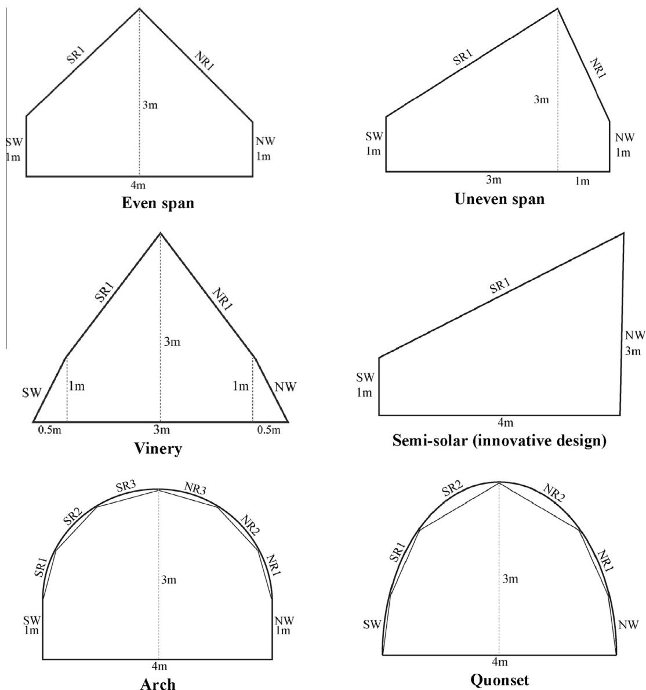  
Fig. 1 - Common types of greenhouse and innovative structure in East Azerbaijan province, Iran (SW = South Wall, SR = South Roof, NR = North Roof, NW = north wall).

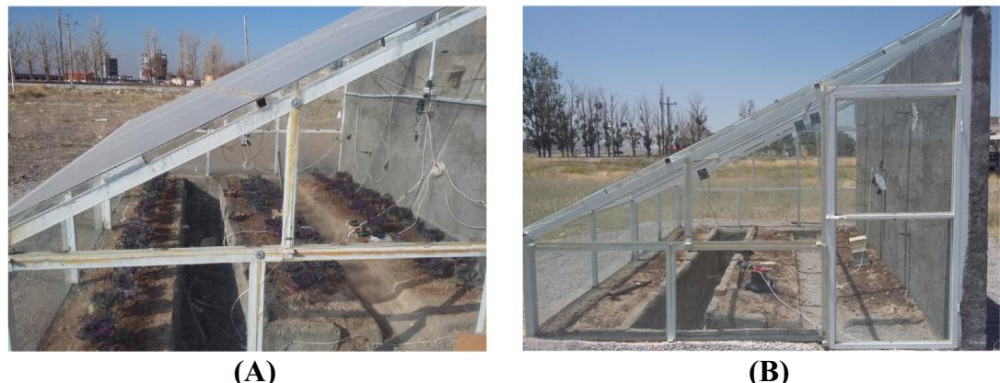  
Fig. 2 - Side views of semi-solar greenhouse in East Azerbaijan province, Iran (A and B).

  
Fig. 3 - Electrical system used for control the temperature (A and B) and heating system for the semi-solar greenhouse (C).

# 2.2. Heat and mass transfer in the semi-solar greenhouse with thermal screen

In this section the heat and mass transfer equations used to estimate inside environment variables in the semi- solar greenhouse are discussed. The inside air below screen  $(T_{a})$  inside air above screen  $(T_{as})$  soil  $(T_{s})$  cover  $(T_{ri})$  crop  $(T_{c})$  and screen temperature  $(T_{sc})$  were predicted by dynamic models. The present model consists of six first- order differential equations which were derived from energy balances for these elements. In this dynamic model, the following assumptions were made for the heat exchange between greenhouse components with crops:

- The greenhouse elements are considered as lumped systems.

- The air, crop, cover, screen and top soil temperatures are uniform.- No evaporation occurs from the soil.- Radiation energy was neither absorbed nor emitted by the inside air.- Water that condensate on the indoor side of the roof and on the screen is directly removed and therefore not available for evaporation.- The windows in all test period were closed and the greenhouse had not any ventilation.- The effects of  $\mathrm{CO}_{2}$  concentration on evapotranspiration were neglected.

The first equation is the energy balance derived for the inside air (below screen) which can be written as [1,24]:

$$
\frac{dT_{a}}{dt} = \left\{ \begin{array}{ll}\frac{Q_{a - s} - Q_{as - c} - Q_{ri - c} - Q_{nwi - nwo}}{\rho_{a} - c_{p - a} - Q_{a - c} - Q_{as - c} - Q_{as - ri} - Q_{nwi - nwo}} & \mathrm{if~}c_{sc} = 0\\ \frac{Q_{a - sc} + Q_{as - sc} - Q_{a - c} - Q_{as - c} - Q_{as - ri} - Q_{nwi - nwo}}{\rho_{a} - c_{p - a} - V_{a} + \rho_{as} - c_{p - a} - V_{as}} & \mathrm{if~}c_{sc} = 1 \end{array} \right\} \tag{1}
$$

The second energy balance equation is for the air upper thermal screen that can be written as [24]:

$$
\frac{dT_{as}}{dt} = \left\{ \begin{array}{ll}\frac{Q_{as - as} + Q_{as - sc} - Q_{as - ri} - Q_{nwi - nwo}}{\rho_{as} - c_{p - a} - V_{as}} & \mathrm{if~}c_{sc} = 1\\ \frac{dT_{a}}{dt} & \mathrm{if~}c_{sc} = 0 \end{array} \right\} \tag{2}
$$

Soil energy balance equation can be calculated by [25]:

$$
\frac{dT_{s}}{dt} = \frac{Q_{rd - s} + Q_{a - s} - Q_{s - c} - Q_{s - ri} - Q_{s - sc}}{(0.7a_{c} \times c_{p - a} + 0.2aH_{O} \times c_{p - a} - 0.1a_{c} \times c_{p - a}) \times V_{r}} \tag{3}
$$

Crop energy balance equation can be written as [25]:

$$
\frac{dT_{c}}{dt} = \frac{Q_{rd - c} + Q_{a - c} + Q_{ri - c} + Q_{s - c} - Q_{c - a - H_{2}O} - Q_{c - sc}}{\rho_{c} \times c_{p - c} \times V_{c}} \tag{4}
$$

For the last equation, the cover and screen energy balances can be calculated by [24]:

$$
\frac{dT_{ri}}{dt} = \frac{Q_{rd - ri} + Q_{as - ri} + Q_{s - ri} + Q_{sc - ri} - Q_{ri - c} - Q_{ro - o} - Q_{ro - sk}}{\rho_{r} \times c_{p - r} \times V_{r}} \tag{5}
$$

$$
\frac{dT_{sc}}{dt} = \frac{Q_{c - sc} + Q_{s - sc} + Q_{a - a - H_{2}O} - Q_{sc - a} - Q_{sc - as} - Q_{sc - ri}}{\rho_{sc} \times c_{p - sc} \times V_{sc}} \tag{6}
$$

The energy transferred between greenhouse elements by convection and conduction is expressed as [25]:

$$
\begin{array}{rl} & Q_{a - c} = A_c\times \alpha_{c - c}(T_a - T_c)\\ & Q_{a - s} = A_s\times \alpha_{s - s}(T_a - T_s)\\ & Q_{as - ri} = A_r\times \alpha_{as - ri}(T_{as} - T_{ri})\\ & Q_{ro - o} = A_r\times \alpha_{ro - o}(T_{ro} - T_o)\\ & Q_{a - sc} = A_{sc}\times \alpha_{sc - c}(T_a - T_{sc})\\ & Q_{as - sc} = A_{sc}\times \alpha_{as - sc}(T_{as} - T_{sc})\\ & Q_{a - as} = \overline{\rho_a}\times c_{p - a}\times \Phi_{a - as}(T_a - T_{as})\\ & Q_{s - ss} = A_s\times \lambda_s / ds(T_s - T_{ss})\\ & Q_{nwi - nwo} = A_{nw}\times \lambda_{nw} / d_{nw}(T_{nw} - T_{nwo}) \end{array} \tag{14}
$$

Empirical relations reported in the literatures to estimate the heat transfer coefficients between the different surfaces in a greenhouse, are as follows [24]:

$$
\alpha_{a - c} = \rho_{a}\times c_{pa} / R_{b - heat} \tag{16}
$$

$$
\begin{array}{rl} & {\alpha_{a - s} = 1.7|T_a - T_s|^{\frac{1}{3}}\quad \mathrm{if} T_a< T_s}\\ & {\alpha_{a - s} = 1.3|T_a - T_s|^{0.25}\quad \mathrm{if} T_a\geqslant T_s} \end{array} \tag{17}
$$

$$
\alpha_{as - ri} = 3|T_{as} - T_{ri}|^{1 / 3} \tag{18}
$$

$$
\begin{array}{rl} & {\alpha_{ro - o} = 2.8 + 1.2v_o\quad \mathrm{if} v_o< 4}\\ & {\alpha_{ro - o} = 2.5v_o^{0.8}\quad \mathrm{if} v_o\geqslant 4} \end{array} \tag{19}
$$

$$
\alpha_{a - sc} = C_{lsc}\times 3|T_a - T_{sc}|^{1 / 3} \tag{20}
$$

$$
\alpha_{as - sc} = C_{lsc}\times 3|T_{as} - T_{sc}|^{1 / 3} \tag{21}
$$

The volume air flow from below the screen to above the screen  $(\Phi_{a - as})$  is:

$$
\Phi_{a - as} = v_{a - as}\times A_{sc}(1 - Cl_{sc}) \tag{22}
$$

in which the air exchange rate between the air below and above the screen  $(v_{a - as})$  was considered about 0.05. In Eq. (16),  $(R_{b - heat})$  is the boundary layer resistance to convective heat transfer and can calculate by [25]:

$$
\mathsf{R}_{b - heat} = \frac{1174\sqrt{I_f}}{(I_f\times|T_c - T_a| + 207v_a^2)^{\frac{1}{2}}} \tag{2}
$$

The solar radiation absorbed directly by the roof, crop and soil surface  $(Q_{rd - ri}, Q_{rd - c}, Q_{rd - s})$  in Eqs. (5), (4) and (3) is given as [25]:

$$
\begin{array}{rl} & Q_{rd - ri} = A_r\times \eta_{ri - is}\times I_r\\ & Q_{rd - c} = A_s\times \eta_{c - is}\times I_{in}\\ & Q_{rd - s} = A_s\times \eta_{s - is}\times I_{in} \end{array} \tag{4}
$$

The net solar radiation heat exchange between all parts of inside and outside the semi- solar greenhouse can be calculated by [24]:

$$
\begin{array}{rl} & Q_{s - c} = A_s\times E_s\times E_c\times F_{s - c}\times \sigma (T_s^4 -T_c^4)\\ & Q_{s - ri} = A_s\times E_s\times E_{ri}\times F_{s - ri}\times \sigma (T_s^4 -T_{ri}^4) \end{array} \tag{6}
$$

$$
Q_{rsc} = A_s\times E_s\times E_{sc}\times F_{s - sc}\times \sigma (T_s^4 -T_{sc}^4) \tag{13}
$$

$$
\begin{array}{rl} & Q_{ri - c} = A_r\times E_{ri}\times E_c\times F_{ri - c}\times \sigma (T_{ri}^4 -T_c^4)\\ & Q_{ro - sk} = A_r\times E_{ro}\times E_{sk}\times F_{ro - sk}\times \sigma (T_{ro}^4 -T_{sk}^4)\\ & Q_{c - sc} = A_s\times E_c\times E_{sc}\times F_{c - sc}\times \sigma (T_c^4 -T_{sc}^4)\\ & Q_{sc - ri} = A_{sc}\times E_{sc}\times E_{ri}\times F_{sc - ri}\times \sigma (T_{sc}^4 -T_n^4) \end{array} \tag{14}
$$

The sky temperature suggested by Joudi and Farhan [26] is:  $T_{sk} = 0.0552(T_o)^{1.5}$  (34)

The evapotranspiration process concerns the evaporation of water from the leaf to the greenhouse air. This process is important for the water and nutrient transport from roots to leaves and fruits. It is also important to decrease the temperature of the crop. Water is mainly evaporated through the leaf stomata. The canopy transpiration is thus a function of the resistance of the stomata and the leaf boundary layer. In the literature, these resistances are often assumed to be constant. Since we want to use the crop model for extreme temperature and humidity values, we decided to use a model to compute the leaf resistances. The model by Stanghellini [27] is used for the evaporation process. This model is an adaptation of the Penman- Monteith- Rijtema method (the combination method) to determine the actual instead of the potential transpiration rate in a greenhouse. The transpiration rate depends on light intensity,  $\mathrm{CO_2}$  concentration, temperature and humidity. All relations if not otherwise noted, are taken from Stanghellini [27]. The canopy transpiration  $(\Phi_{m - c - a - H_2O})$  or the mass flow rate of water vapor from crop to indoor air is:  $\Phi_{m - c - a - H_2O} = \max \{A_c\times k_{c - a - H_2O}(C_{c - H_2O}s - C_{a - H_2O}),0\}$  (35) where  $(A_s)$  is surface area of the canopy,  $(k_{c - a - H_2O})$  is the mass transfer coefficient of water vapor from the crop to the indoor air,  $(C_{c - H_2O}s)$  is the saturation concentration of water vapor at

$$
\Phi_{m - c - a - H_2O} = \max \{A_c\times k_{c - a - H_2O}(C_{c - H_2O}s - C_{a - H_2O}),0\} \tag{35}
$$

where  $(A_s)$  is surface area of the canopy,  $(k_{c - a - H_2O})$  is the mass transfer coefficient of water vapor from the crop to the indoor air,  $(C_{c - H_2O}s)$  is the saturation concentration of water vapor at

the crop temperature and  $(C_{a - H_{2}O})$  is the concentration water vapor at the indoor air temperature. If  $C_{c - H_{2}O s} \leq C_{a - H_{2}O}$  then no evapotranspiration was occurred (for more details see Stanghellini [27]).

Bot [28] describes the total resistance to diffusion of water as the boundary layer resistance in series with the cuticular resistance parallel to the stomata resistance. So, the mass transfer coefficient  $(k_{c - a - H_{2}O})$  from crop to indoor air can be calculated by [28]:

$$
k_{c - a - H_2O} = \frac{1}{R_{b - H_2O} + \frac{R_{cut}\times R_{b - H_2O}}{R_{b - H_2O}}} \tag{36}
$$

in which the leaf cuticular resistance is  $R_{cut} = 2000$ ,  $R_{s - H_{2}O}$  is the stomata resistance to diffusion of water and  $R_{b - H_{2}O}$  is the boundary layer resistance to diffusion of water (Eq. (23)).

The stomata resistance to diffusion of water  $(R_{s - H_{2}O})$  is described by [27]:

$$
R_{s - H_2O} = R_{\min}\times f_I\times f_{T_c}\times f_{CO_2}\times f_{H_2O} \tag{37}
$$

in which the radiation dependency  $(f_{I})$  is given by [27]:

$$
f_{I} = \frac{\frac{I_{c,s}}{2LAI} + 4.3}{\frac{I_{c,s}}{2LAI} + 0.54} \tag{38}
$$

The temperature dependency  $(f_{T_c})$  is: [27]:

$$
\begin{array}{rl} & {f_{T_c} = 1 + 0.5\times 10^{-2}(T_c - T_0 - 33.6)^2\quad \mathrm{if} I_{c - s}\leqslant 3}\\ & {f_{T_c} = 1 + 2.2593\times 10^{-2}(T_c - T_0 - 24.512)^2\quad \mathrm{if} I_{c - s} > 3} \end{array} \tag{39}
$$

The humidity dependency  $(f_{H_{2}O})$  is: [25]:

$$
f_{H_2O} = \frac{4}{\sqrt[4]{1 + 255e^{-0.5427\Delta_{pc - H_2O m}}}} \tag{40}
$$

The  $\mathrm{CO_2}$  dependency  $(f_{C_2O})$  and its concentration was shown in Fig. 4. As we can see, when the  $\mathrm{CO_2}$  concentration is between 600 and 800  $(\mu \mathrm{mol} / \mathrm{CO}_2)$ , the  $\mathrm{CO_2}$  dependency  $(f_{C_2O})$  is about 1. In this research, because the selected greenhouse was small, so we did not consider the effect of  $\mathrm{CO_2}$  concentration on the Eq. (37). So, the  $\mathrm{CO_2}$  dependency factor  $(f_{\mathrm{CO_2}})$  was 1.

The latent heat transfer from the canopy to the indoor air due to canopy transpiration  $(Q_{c - a - H_{2}O})$  is: [27]:

$$
Q_{c - a - H_2O} = r_w\times \Phi_{m - c - a - H_2O} \tag{36}
$$

where  $(r_w)$  is the heat of water evaporation and  $(\Phi_{m - c - a - H_{2}O})$  is the mass flow rate of water vapor from the canopy to the indoor air due to transpiration.

The mass flow rate of water vapor from the indoor air above the screen to the indoor side of the roof due to condensation  $(\Phi_{m - as - ri - H_2O})$  is [24]:

$$
\Phi_{m - as - ri - H_2O} = \max \left\{A_r\times k_{as - ri - H_2O}\times (C_{as - H_2O} - C_{ri - H_2O s}),0\right\} \tag{37}
$$

where  $(A_{r})$  is the roof surface area,  $(k_{as - ri - H_2O})$  is the mass transfer coefficient of water vapor from the indoor air above the screen to the indoor side of the roof,  $(C_{ri - H_2O s})$  is the saturation concentration of water vapor at the roof temperature and  $(C_{as - H_2O})$  is the concentration of water vapor at the indoor air above the screen temperature. If  $(C_{as - H_2O}\leqslant C_{ri - H_2O s})$ , then  $(\Phi_{m - as - ri - H_2O} = 0)$  (no condensation). The mass transfer coefficient  $(k_{as - ri - H_2O})$  was defined by Bot [28]:

$$
k_{as - ri - H_2O} = \frac{\alpha_{as - ri}}{\rho_{as}\times c_{p - a}\times Le^2} \tag{39}
$$

where  $(\alpha_{as - ri})$  is the heat transfer coefficient from the indoor air above the screen to the indoor side of the roof (Eq. (9)),

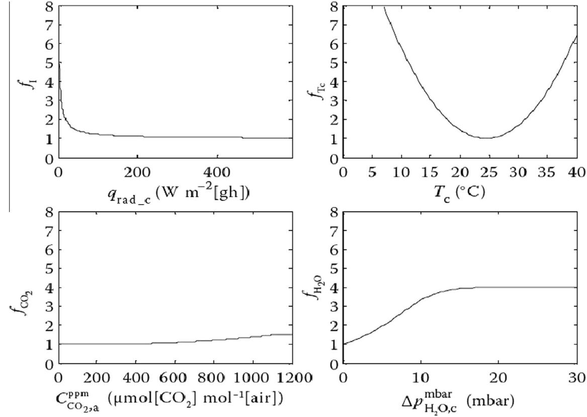  
Fig. 4 - The  $\mathrm{CO_2}$  dependency factor  $(f_{C_2O})$  for greenhouse tomato production [25].

$(\rho_{as})$  is the density of air above the screen,  $(c_{p - a})$  is the specific heat capacity of air and  $Le = 0.89$  is the Lewis number for water vapor. The latent heat transfer  $(Q_{as - ri - H_2O})$  from indoor air above the screen to the indoor side of the roof is [24]:

$$
Q_{as - ri - H_2O} = r_w\times \Phi_{m - as - ri - H_2O} \tag{44}
$$

where  $(\Phi_{m - as - ri - H_2O})$  (Eq. (42)) is the mass flow rate of water vapor from the indoor air above the screen to the indoor side of the roof. The mass flow rate of water vapor from the indoor air below and above the screen to the screen are [25]:

$$
\Phi_{m - a - sc - H_2O} = \max \left\{A_{sc}\times k_{a - sc - H_2O}\times (C_{a - H_2O} - C_{sc - H_2O}s),0\right\} \tag{45}
$$

$$
\Phi_{m - as - sc - H_2O} = \max \left\{A_{sc}\times k_{a - sc - H_2O}\times (C_{as - H_2O} - C_{sc - H_2O}s),0\right\} \tag{46}
$$

where  $(A_{sc})$  is the screen surface area,  $(k_{a - sc - H_2O}$  and  $k_{as - sc - H_2O})$  are the mass transfer coefficients of water vapor from the indoor air below and above the screen to the screen,  $(C_{sc - H_2O}s)$  is the saturation concentration of water vapor at the screen temperature and  $(C_{a - H_2O}$  and  $C_{as - H_2O})$  are the concentrations of water vapor at the temperature of the indoor air below and above the screen. If  $(C_{a - H_2O}\leqslant C_{sc - H_2O}s)$  then  $(\Phi_{m - a - sc - H_2O} = 0)$  and if  $(C_{as - H_2O}\leqslant C_{sc - H_2O}s)$  so  $(\Phi_{m - as - sc - H_2O} = 0)$  (no condensation). The mass transfer coefficients of water vapor from the indoor air below and above the screen to the screen  $(k_{a - sc - H_2O}$  and  $k_{as - sc - H_2O})$  are defined by Bot [28]:

$$
k_{a - sc - H_2O} = \frac{\alpha_{a - sc}}{\rho_a\times c_{p - a}\times Le^3} \tag{47}
$$

$$
k_{as - sc - H_2O} = \frac{\alpha_{as - sc}}{\rho_{as}\times c_{p - a}\times Le^3} \tag{48}
$$

where  $(\alpha_{a - sc}$  and  $\alpha_{as - sc})$  are the heat transfer coefficients from the indoor air below and above the screen to the screen (Eqs. (20) and (21)). The latent heat transfers from the indoor air below and above the screen to the screen  $(Q_{a - sc - H_2O}$  and  $Q_{as - sc - H_2O})$  are:

$$
\begin{array}{rl} & Q_{a - sc - H_2O} = r_w\times \Phi_{m - a - sc - H_2O}\\ & Q_{as - sc - H_2O} = r_w\times \Phi_{m - as - sc - H_2O} \end{array} \tag{50}
$$

where  $(\Phi_{m - as - sc - H_2O}$  and  $\Phi_{m - a - sc - H_2O})$  are the mass flow rates of water vapor from the indoor air below and above the screen to the screen (Eqs. (45) and (46)).

The mass flow rate of water vapor from the indoor air below the screen to the indoor air above the screen  $(\Phi_{m - a - as - H_2O})$  is [24]:

$$
\Phi_{m - a - as - H_2O} = \Phi_{a - as}\times (C_{a - H_2O} - C_{as - H_2O}) \tag{0}
$$

where  $(\Phi_{a - as})$  is the volume air flow from below the screen to above of screen (Eq. (22)).

$(C_{a - H_2O})$  is the water concentration of indoor air below the screen and  $(C_{as - H_2O})$  is the water concentration of indoor air above the screen.

In this research an inside thermal screen (cloth type) was used. This inside movable curtain was standing about  $80cm$  upper the soil level of greenhouse. The set point of heating system was  $15^{\circ}C$  Heating system was on, when the mean of three sensors applied in the greenhouse room decrease to  $14.5^{\circ}C$  The amount of electrical energy was recorded by control system. Fig. 5 shows the place of thermal screen in this greenhouse.

MATLAB software used to solve the mathematical equations. The entire set of equations was solved at each one minute time step using appropriate values of input parameters at the specific time step. When the solution converged, the computed data were taken as initial values for the next time step. The first values for all inside variables were measured. The input data for solution are given in Table 1. In order to control all effective inside and outside parameters on temperature prediction, simulation was done between 9:30 am to  $16:00\mathrm{pm}$  on 30/11/2015 for greenhouse without screen and between  $19:00\mathrm{pm}$  to 07:00 am on 02/12/2015 for greenhouse

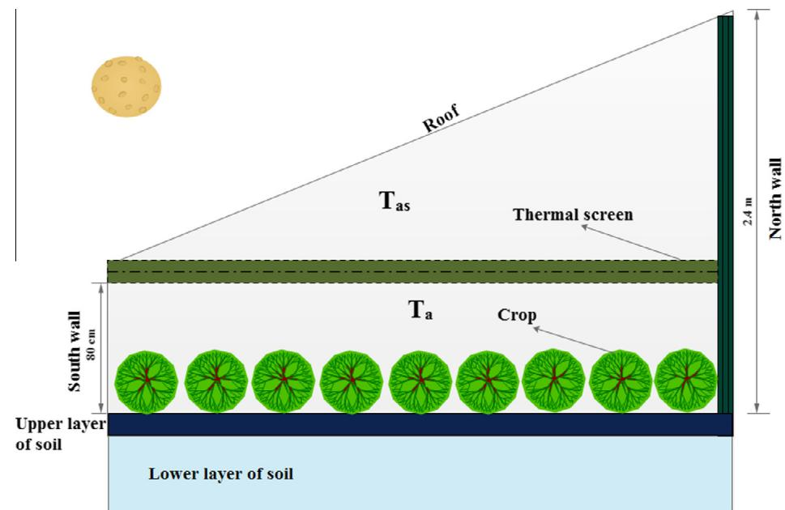  
Fig. 5 - The place of thermal screen in the semi-solar greenhouse  $(T_{a}$  : inside air below screen temperature;  $T_{as}$  : inside air above screen temperature).

Table 1-Input parameters used for calculation [24-28].  

<table><tr><td>Parameter</td><td>Value</td><td>Parameter</td><td>Value</td><td>Parameter</td><td>Value</td></tr><tr><td>ηri-Is</td><td>0.0173</td><td>ρa</td><td>1.29T0</td><td>As</td><td>15.36</td></tr><tr><td>ES</td><td>0.7</td><td>cp-a</td><td>1000</td><td>λs</td><td>0.6</td></tr><tr><td>Esk</td><td>0.8</td><td>f a</td><td>1</td><td>ds</td><td>0.65</td></tr><tr><td>Fri-sk</td><td>0.86</td><td>Ar</td><td>17.7</td><td>Vs</td><td>9.984</td></tr><tr><td>Amw</td><td>11.52</td><td>Vr</td><td>0.0708</td><td>cp-s</td><td>800</td></tr><tr><td>λnw</td><td>0.397</td><td>Va</td><td>26.4</td><td>ρs</td><td>1400</td></tr><tr><td>dnw</td><td>0.25</td><td>ρr</td><td>2500</td><td>Fs-ri</td><td>0.8</td></tr><tr><td>Gp-r</td><td>840</td><td>σ</td><td>5.67051 × 10-8</td><td>ηs-Is</td><td>0.86</td></tr><tr><td>Eri</td><td>0.95</td><td>Fs-ri</td><td>0.8</td><td>ρH2O</td><td>998</td></tr><tr><td>Ac</td><td>2LAI × As</td><td>ρa</td><td>1.29T0</td><td>va</td><td>0.09</td></tr><tr><td>Asc</td><td>15.36</td><td>lF</td><td>0.04</td><td>ηc-Is</td><td>0.5</td></tr><tr><td>Ec</td><td>1 - τc-Il</td><td>Fs-c</td><td>Fs-c = 1 - τc-Il</td><td>Vas</td><td>12.25</td></tr><tr><td>Esc</td><td>0.9</td><td>Fs-sc</td><td>Fs-sc = Clsc(1 - Fs-c)</td><td>Ero</td><td>0.95</td></tr><tr><td>Fro-sk</td><td>As/Ar</td><td>Fc-sc</td><td>Fc-sc = Clsc(1 - τc-Il)</td><td>ρsc</td><td>200</td></tr><tr><td>LAI</td><td>1</td><td>Fsc-ri</td><td>Fsc-ri = Clsc</td><td>lc-s</td><td>ηc-Is × Io</td></tr><tr><td>ρas</td><td>1.29T0</td><td>Fri-c</td><td>τc-Il = e-κc-Il × LAI</td><td>cp-H2O</td><td>4186</td></tr><tr><td>ρc</td><td>700</td><td>ρr</td><td>450</td><td>cp-sc</td><td>1500</td></tr><tr><td>Rmin</td><td>82.003</td><td>kC-Is</td><td>0.48</td><td>Ec</td><td>1 - τc-Il</td></tr><tr><td>dsc</td><td>0.002</td><td>Le</td><td>0.89</td><td>Esc</td><td>0.9</td></tr><tr><td>Vsc</td><td>3.07</td><td>kC-Il</td><td>0.64</td><td></td><td></td></tr></table>

with screen in a semi- solar greenhouse located in Tabriz University, department of biosystems engineering.

# 2.3. Internal and external climate data

The SHT11 sensors were used to measure the temperature and the relative humidity for the all variables inside and outside the semi- solar greenhouse. The SHT11 is a single chip relative humidity and temperature multi sensor module comprising a calibrated digital output. The accuracy of the measurement of temperature is  $\pm 0.4\%$  at  $20^{\circ}C$  and the precision measurement of the moisture is  $\pm 3\%$  for a clear sky. We used these sensors in soil, on the roof (inside greenhouse), on screen, crops and in the inside air (below and above screen) and outside the greenhouse to measure temperature and relative humidity. On the greenhouse roof, we used a solar meter type TES1333R. It is a measure of global radiation of the spectral band solar in the  $400\mathrm{- }1110\mathrm{nm}$  . Its measurement accuracy is approximately  $\pm 5\%$  . Fig. 1 shows the place of SHT11 sensors, flow meter and TES1333 solar meter to collect the data in the semi- solar greenhouse with and without the screen.

# 2.4. Performance evaluation criteria

To evaluate the performance of a model some statistical functions have been used according to literatures. These models include: Total Sum of Squared Error (TSSE), Root Mean Squared Error (RMSE), Mean Absolute Percentage Error (MAPE), coefficient of determination  $(R^2)$  and Model Efficiency (EF). They are defined as [1]:

$$
\mathbf{MAPE} = \frac{1}{n}\sum_{j = 1}^{n}\left|\frac{d_j - p_j}{d_j}\right|\times 100 \tag{52}
$$

$$
\mathrm{RMSE} = \sqrt{\frac{\sum_{j = 1}^{n}(d_j - p_j)^2}{n}} \tag{53}
$$

$$
\mathbf{EF} = \frac{\sum_{j = 1}^{n}(d_j - \overline{d})^2 - \sum_{j = 1}^{n}(p_j - d_j)^2}{\sum_{j = 1}^{n}(d_j - \overline{d})^2} \tag{54}
$$

$$
\mathrm{TSSE} = \sum_{j = 1}^{n}(d_j - p_j)^2 \tag{55}
$$

$$
R^2 = \left[\frac{\sum_{j = 1}^{n}(d_j - \overline{d})(p_j - \overline{p})}{\sum_{j = 1}^{n}(d_j - \overline{d})\times\sum_{j = 1}^{n}(p_j - \overline{p})}\right]^2 \tag{56}
$$

where  $d_j$  is the jth component of the desired (actual) output for the jth pattern;  $p_j$  is the component of the predicted (fitted) output produced by the network for the jth pattern;  $\overline{d}$  and  $\overline{p}$  are the average of the whole desired (actual) and predicted output and  $n$  is the number of variable outputs. A model with the smallest RMSE, MAPE and ESSE and with largest EF and  $R^2$  is considered to be the best.

# 3. Results and discussion

# 3.1. Greenhouse temperature in some points and outside air temperature

Fig. 7 shows the variation of the measured values for the semi- solar greenhouse temperatures, inside and outside air temperature for a typical sunny day on 30/11/2015 in Tabriz city. As it can be seen, the inside air temperature is suitable whole the day to raise the crop (the mean of inside air temperature was about  $32^{\circ}C$ ). The mean of outside air temperature was about  $13^{\circ}C$ . The difference between inside and outside air temperature shows that this structure can obtain all the required energy on autumn days from the sun. The mean of crop, soil and cover temperatures were about 30, 27 and  $29^{\circ}C$ , respectively. We

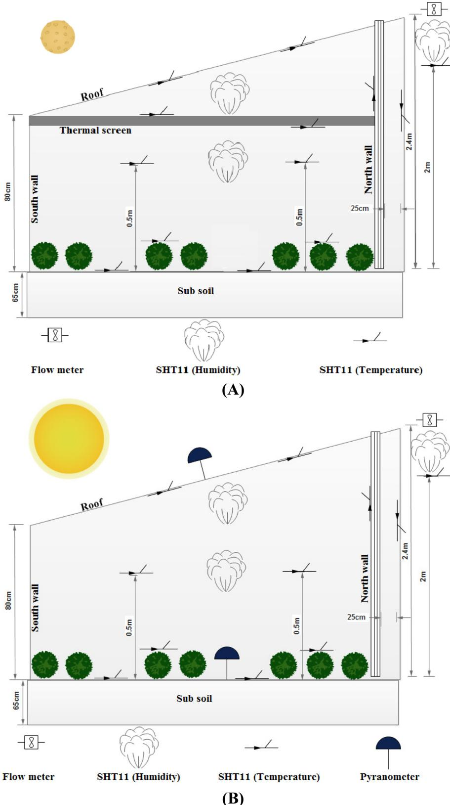  
Fig. 6 - SHT11 sensors, pyranometer and flow meter places to collect inside and outside data.

can conclude that the mean of inside air, crop, soil and cover temperatures on sunny days in autumn can be equal. Also we can see that this structure is suitable for crops on autumn days and it does not need to consume energy for heating especially on days.

# 3.2. Simulation the inside environment variables

3.2.1. Simulation without thermal screenFig. 8 shows the heat transfer between all parts of semi- solar greenhouse without using thermal screen. In this section, the

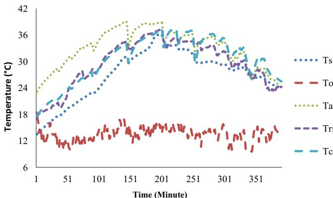  
Fig. 7 - Measured values of inside air, soil, crop, cover and outside air temperature for semi-solar greenhouse on 30/11/2015 in Tabriz city  $(T_{c}$  crop temperature;  $T_{a}$  inside air temperature;  $T_{o}$  outside air temperature;  $T_{s}$  soil temperature;  $T_{ri}$  roof temperature).

results of thermal model described in Eqs. (1), (3), (4), (5) were compared with experimental data collected by SHT11 sensors. Fig. 9 shows this comparison. It can be seen that the agreement of the model with the experimental data is good for all measurements. Tables 2 and 3 show some statistical analysis of thermal models with experimental results. It can be seen that the percentage of mean absolute error (MAPE) is between 5.32 and  $7.25\%$ . The smallest error is 5.32 for  $(T_{s - i})$  and the highest one is 7.25 for  $(T_{s})$ . Considering the average values of standard deviation and variance it can be deduced that the values and the distribution of real and predicted data are analogous. But the differences of minimum values are remarkable. Joudi and Farhan [26] developed a dynamic model to predict the inside air and soil temperature in a greenhouse in Iraq. The input parameters of this model collected from measured meteorological conditions and the thermo- physical properties of the greenhouse components were included the cover, inside air, and soil. Comparisons between the predicted and measured results showed good agreement. The absolute error in this dynamic model was more than  $10\%$  for inside air and soil temperature. Du et al. [29] applied the simulation model to predict the inside air and soil temperature in a greenhouse with heat pipe system. The model validated with experimental data and found to be in close agreement. The absolute error between predicted and desired data was about  $\pm 20\%$ . They conclude that the simulation could provide estimations of the influence of the maximum height, the heating power required in cold weather and the heat losses from the greenhouse.

Gupta and Tiwari [30] presented a paper to develop a computer model based on transient analysis of the greenhouse. The model predicts inside air, storage water temperature and the thermal energy storage effect of a water mass in a low cost, passive greenhouse. Analytical expressions, based on an energy balance for each component, have been derived in terms of climatic as well as design parameters. Numerical computations have been done on typical days for the months

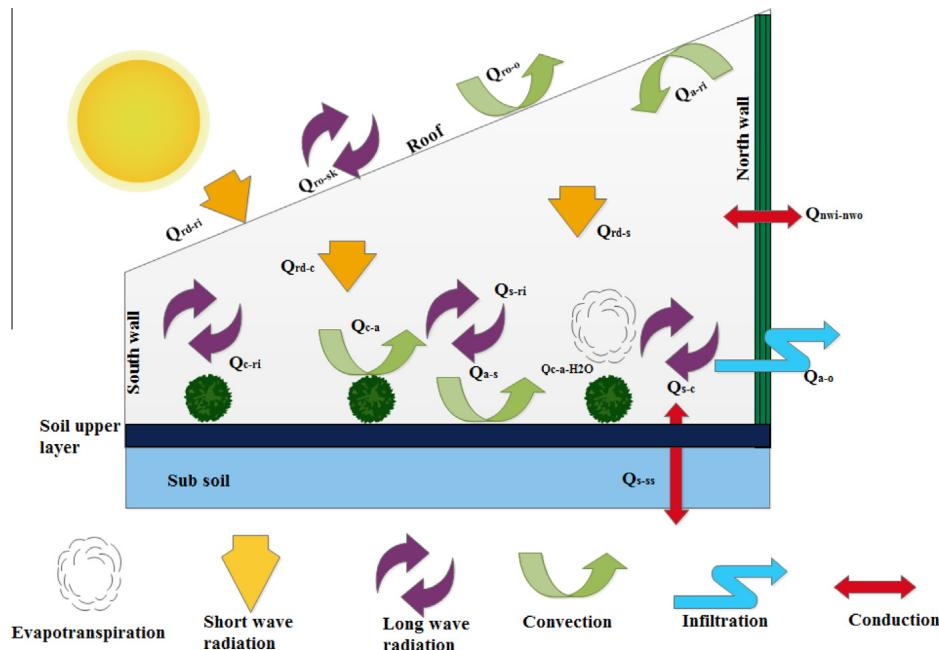  
Fig. 8 - The greenhouse schematic and its heat exchange with surroundings without using thermal screen  $(Q_{s - r}$  : heat transfer from soil to roof indoor side by long wave radiation;  $Q_{s - s}$  : heat transfer from upper to lower soil layer by conduction;  $Q_{c - a}$  : heat transfer from indoor air below screen to canopy by convection;  $Q_{a - s}$  : heat transfer from indoor air below screen to soil by convection;  $Q_{a - o}$  : heat transfer from indoor air to outdoor air by ventilation;  $Q_{rd - c}$  : shortwave radiation absorption by canopy;  $Q_{rd - s}$  : shortwave radiation absorption by soil;  $Q_{rd - ri}$  : shortwave radiation absorption by roof;  $Q_{c - ri}$  : heat transfer from roof indoor side to canopy by long wave radiation;  $Q_{nwi - now}$  : heat transfer from indoor north wall side to outdoor side by conduction;  $Q_{ro - sk}$  : heat transfer from roof outdoor side to sky by long wave radiation;  $Q_{s - c}$  : heat transfer from soil to canopy by long wave radiation;  $Q_{ro - o}$  : heat transfer from roof outside to outside air by convection;  $Q_{a - ri}$  : heat transfer from indoor air to roof indoor side by convection;  $Q_{c - a - H_{2}O}$  : heat transfer by crop exapotranspiration).

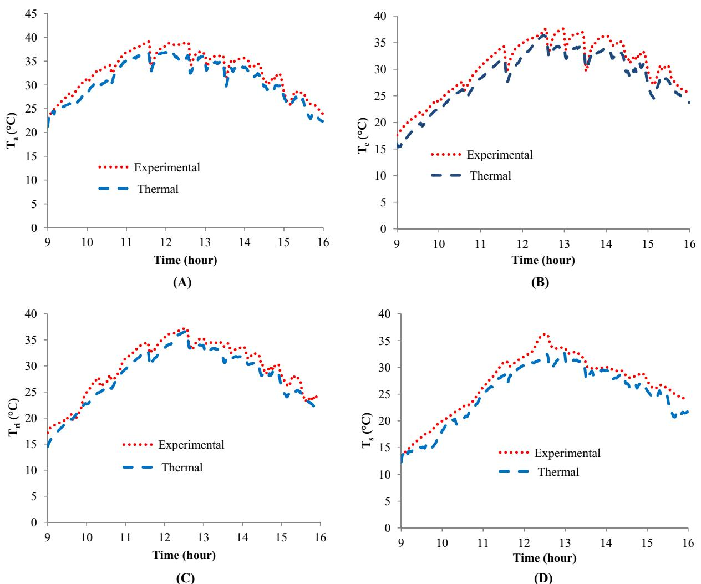  
Fig. 9 - Comparison between the results of thermal model with experimental data for semi-solar greenhouse without using thermal screen on 30/11/2015 (  $\mathbf{T_c}$  crop temperature;  $\mathbf{T_a}$  inside air temperature;  $\mathbf{T_s}$  soil temperature;  $\mathbf{T_{ri}}$  roof temperature).

Table 2 - Statistical results of comparison between thermal model results and experimental data for semi-solar greenhouse without using thermal screen on 30/11/2015.  

<table><tr><td>R² (%)</td><td>EF (%)</td><td>TSSE (°C²)</td><td>MAPE (%)</td><td>RMSE (°C)</td><td>Parameter</td></tr><tr><td>96.82</td><td>80.14</td><td>211.81</td><td>1.50</td><td>1.94</td><td>Ta</td></tr><tr><td>97.02</td><td>89.40</td><td>352.91</td><td>7.25</td><td>2.12</td><td>Ts</td></tr><tr><td>97.81</td><td>91.68</td><td>115.45</td><td>5.32</td><td>1.68</td><td>Tri</td></tr><tr><td>98.60</td><td>82.28</td><td>149.13</td><td>6.09</td><td>2.18</td><td>Tc</td></tr></table>

Table 3 - Some statistical analysis between the results of thermal model and experimental data to predict inside environment variables in semi-solar greenhouse without screen on 30/11/2015.  

<table><tr><td>ske</td><td>kur</td><td>max</td><td>min</td><td>std</td><td>var</td><td>av</td><td>Data</td><td>Parameter</td></tr><tr><td>-0.46</td><td>2.04</td><td>39.10</td><td>23.00</td><td>4.37</td><td>19.09</td><td>32.90</td><td>Actual results</td><td>Ta</td></tr><tr><td>-0.43</td><td>1.07</td><td>37.18</td><td>21.28</td><td>4.30</td><td>18.49</td><td>31.10</td><td>Thermal results</td><td></td></tr><tr><td>-0.61</td><td>2.56</td><td>36.60</td><td>13.50</td><td>5.59</td><td>31.24</td><td>27.00</td><td>Actual results</td><td>Ts</td></tr><tr><td>-0.66</td><td>0.73</td><td>32.74</td><td>12.28</td><td>5.51</td><td>30.36</td><td>25.10</td><td>Thermal results</td><td></td></tr><tr><td>-0.62</td><td>2.31</td><td>37.20</td><td>17.15</td><td>5.32</td><td>28.30</td><td>29.59</td><td>Actual results</td><td>Tri</td></tr><tr><td>-0.53</td><td>-0.61</td><td>36.59</td><td>14.50</td><td>5.26</td><td>27.66</td><td>28.09</td><td>Thermal results</td><td></td></tr><tr><td>-0.61</td><td>2.35</td><td>37.60</td><td>17.65</td><td>5.20</td><td>27.04</td><td>30.52</td><td>Actual results</td><td>Tc</td></tr><tr><td>-0.67</td><td>-0.37</td><td>36.38</td><td>15.40</td><td>5.16</td><td>26.62</td><td>28.42</td><td>Thermal results</td><td></td></tr></table>

Note: Ske: skewness; Kur: kurtosis; Max: maximum; Min: MINIMUM; Std: standard deviation; Var: variance; Av: average.

from December 1999 to June 2000 at New Delhi. An experimental validation of the developed model has also been demonstrated. The predicted room and water temperature showed fair agreement with experimental values.

Dynamic models include of some experimental results and then have some errors. The researchers explained about this subject [26,29] and usually faced with more than  $10\%$  MAPE. Also the physical greenhouse environment models have a high degree of complexity with lots of parameters that have to be determined by measurements or other submodels. In contrast to physical models, black box models do not suffer from the need to determine every parameters value. These models can be used to estimate the inside environment changes and they can be very helpful for climate control purpose. So because of non- linear system in greenhouse, time- invariant, and strong coupling, present applications of artificial neural network (ANN) model for the simulation and prediction of greenhouse inside climate can be very useful and applicable. Taki et al. [1] applied a multilayer perceptron (MLP) Neural Network model to predict inside temperature in a greenhouse in Iran. The results showed that the MLP model can predict the inside environment in the greenhouse with lower MAPE than dynamic model. Some researchers reported similar results. Dariouchy et al. [31], proposed MLP and MLR models to predict the inside air humidity and temperature in a tomato greenhouse in semi- arid area in Morocco. Model database was collected starting from the greenhouse climatic data. The external moisture  $(M_{\mathrm{ext}})$ , the total radiation  $(R_{\mathrm{t}})$ , the wind direction  $(D_{\mathrm{w}})$ , wind velocity  $(V_{\mathrm{w}})$  and the external temperature  $(T_{\mathrm{ext}})$  are retained like relevant entries of the time- series model. The results showed that the correlation between actual and predicted value by MLR model are 0.970 and 0.978 for inside air temperature and humidity respectively. The final results showed that the MLP model had a higher accuracy. He and Ma [32], proposed a back propagation neural network (BPNN) based on principal component analysis (PCA) for modeling the internal greenhouse humidity in winter of North China. They collected the environmental factors influencing the inside humidity include outside air temperature and humidity, wind speed, solar radiation, inside air temperature, open angle of top and side vent and open ration of sunshade curtain. Through PCA of these data samples, 4 main factors were extracted, and the relationship between the main factors and the original data was discussed. Results showed that this method can predict inside variables in the greenhouse with high accuracy. Furthermore this method can use to predict other changes in greenhouse such as final yield, evapotranspiration, humidity, cracking on the fruit,  $\mathrm{CO_2}$  emission and so on. For example, Kok et al. [33] and Seginer et al. [34] trained NN to imitate greenhouse models predicting the inside air temperature, ventilation and other environmental factors. So the future research should focus on artificial intelligent models in the semi- solar greenhouse to decrease the cost (sensor and other tools) and go toward the automatic greenhouse for the first time in Iran.

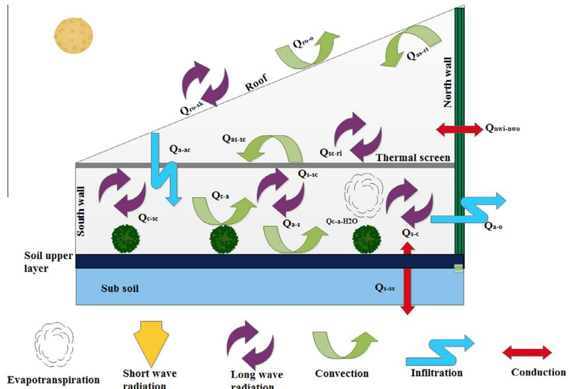  
Fig. 10 - The greenhouse schematic and its heat exchange with surroundings with thermal screen  $(Q_{s - ss}$  : heat transfer from upper to lower soil layer by conduction;  $\mathbb{Q}_{s - sc}$  heat transfer from soil to screen;  $\mathbb{Q}_{sc - as}$  heat transfer from screen indoor air above screen;  $\mathbb{Q}_{a - as}$  heat transfer from indoor air below screen to indoor air above screen;  $\mathbb{Q}_{c - a}$  heat transfer from indoor air below screen to canopy by convection;  $\mathbb{Q}_{sc - a}$  heat transfer from indoor air below screen to screen;  $\mathbb{Q}_{a - s}$  heat transfer from indoor air below screen to soil by convection;  $\mathbb{Q}_{a - o}$  heat transfer from indoor air to outdoor air by ventilation;  $\mathbb{Q}_{as - r}$  heat transfer from indoor air above screen to roof indoor side;  $\mathbb{Q}_{c - as}$  heat transfer from canopy to screen;  $\mathbb{Q}_{nw - now}$  heat transfer from indoor north wall side to outdoor side by conduction;  $\mathbb{Q}_{ro - sk}$  heat transfer from roof outdoor side to sky by long wave radiation;  $\mathbb{Q}_{s - c}$  heat transfer from soil to canopy by long wave radiation;  $\mathbb{Q}_{sc - r}$  heat transfer from screen to roof indoor side;  $\mathbb{Q}_{ro - o}$  heat transfer from roof outside to outside air by convection;  $\mathbb{Q}_{c - a - \mathrm{H}_2\mathrm{O}}$  heat transfer by crop evapotranspiration).

# 3.2.2. Simulation with thermal screen

The second part of this paper is analyzing the thermal behavior of semi- solar greenhouse with thermal screen at night. The heat transfer between all parts of the greenhouse at night was shown in Fig. 10. According to this relations and Eqs. (1)- (6), all the inside environment temperatures in this greenhouse was estimated. The results were shown in Fig. 11. Table 4 shows the statistical analysis between the results of thermal model and experimental data collected with SHT11 sensors.

As we can see from Table 4, the MAPE was varied from  $3.85\%$  to  $7.89\%$  .The highest error was seen to predict the inside air above screen and the lowest one related to inside air below screen. The EF factor was good for all variables except  $(T_{as})$  . In the literatures, simulation the inside environment variables in greenhouse with screen is new and only in latest researches some models were used [35- 37]. The RMSE factor in Table 4 shows that this model can estimate the inside variables with acceptable accuracy (with only about  $1^{\circ}C$  difference between actual and predicted values). Comparing the results of Tables 3 and 4 shows that some errors to predict inside air  $(T_{a})$  is depend on volume of the semisolar greenhouse. When we use thermal screen, heat loss by conduction and convection from roof will decrease. So the inside thermal screen can decrease some calculation errors and help to have a good simulation. The future works should

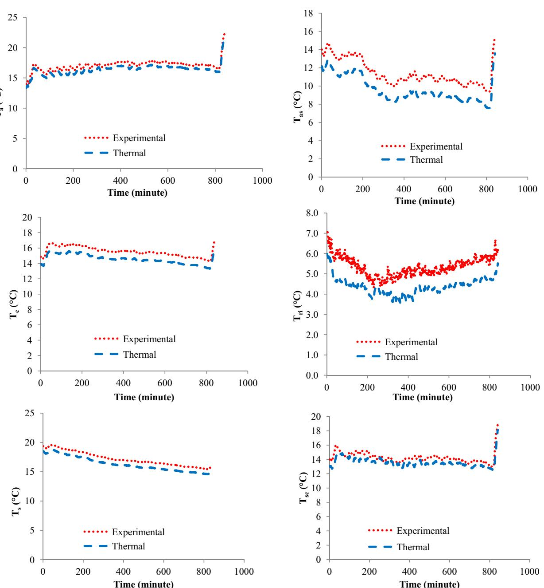  
Fig. 11 - Comparison between the results of thermal model and experimental validation for semi-solar greenhouse with screen on 02/11/2015  $(T_{c}$  crop temperature;  $T_{a}$  : inside air below screen temperature;  $T_{as}$  : inside air above screen temperature;  $T_{s}$  : soil temperature;  $T_{sc}$  : screen temperature;  $T_{ri}$  : roof temperature).

Table 4 - Statistical results of comparison between thermal model results and experimental data for semi-solar greenhouse with thermal screen on 02/12/2015.  

<table><tr><td>R²</td><td>EF (%)</td><td>TSSE (°C²)</td><td>MAPE (%)</td><td>RMSE (°C)</td><td>Parameter</td></tr><tr><td>98.98</td><td>96.74</td><td>372.01</td><td>3.85</td><td>0.65</td><td>Ta</td></tr><tr><td>98.24</td><td>89.67</td><td>718.34</td><td>7.89</td><td>1.82</td><td>Tas</td></tr><tr><td>76.03</td><td>93.67</td><td>852.75</td><td>5.78</td><td>1.06</td><td>Tri</td></tr><tr><td>98.95</td><td>95.99</td><td>805.29</td><td>4.29</td><td>0.97</td><td>Tc</td></tr><tr><td>77.79</td><td>96.88</td><td>485.33</td><td>4.13</td><td>0.75</td><td>Tsc</td></tr><tr><td>98.99</td><td>96.77</td><td>787.34</td><td>4.23</td><td>0.89</td><td>Ts</td></tr></table>

focus on outside thermal screen and compare the results of outside thermal screen with the results of this research.

# 3.3. Thermal screen and its effects on energy lost in the semi-solar greenhouse

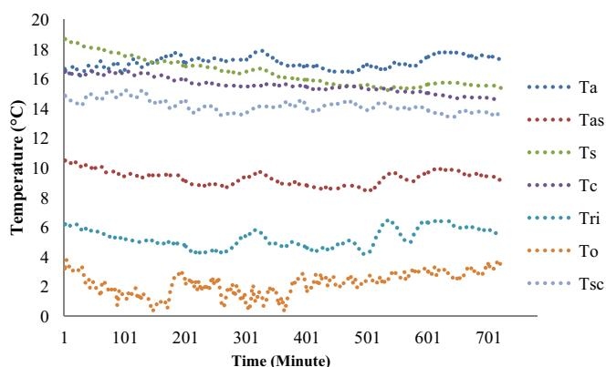  
Fig. 12 shows the difference between inside and outside air temperature and other variables in the semi-solar greenhouse

Fig. 12 - Inside and outside variables in the semi- solar greenhouse with thermal screen on 02/11/2015  $(T_{c}$  crop temperature;  $T_{a}$  inside air below screen temperature;  $T_{as}$  inside air above screen temperature;  $T_{c}$  outside air temperature;  $T_{s}$  soil temperature;  $T_{sc}$  screen temperature;  $T_{ri}$  roof temperature).

with thermal screen. As we can see from Fig. 12, the difference between inside air below screen  $(T_{a})$  and up the screen  $(T_{as})$  is about  $6^{\circ}C$ . Also the difference between inside air below screen and ambient air  $(T_{o})$ , is about  $15^{\circ}C$ . This difference is very important for farmers especially in cold nights of autumn and winter. The difference between energy consumption with and without thermal screen at two nights (the mean difference analysis between the ambient temperatures at nights was not significant) shows in Fig. 13. The performance of the thermal screen to decrease the energy

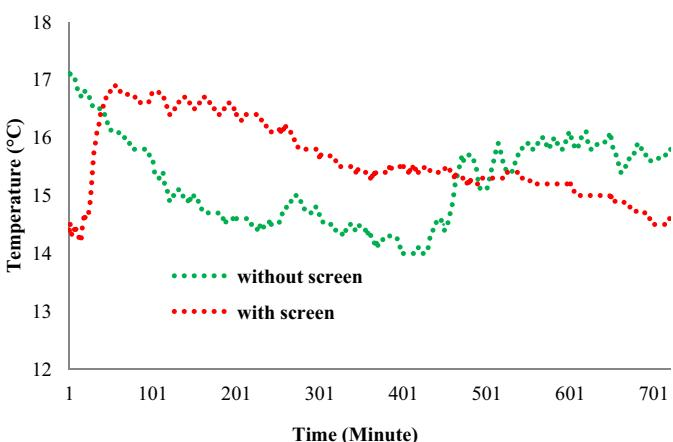  
Fig. 14 - Comparison between the crop temperature  $(T_{c})$  with and without screen in the semi-solar greenhouse.

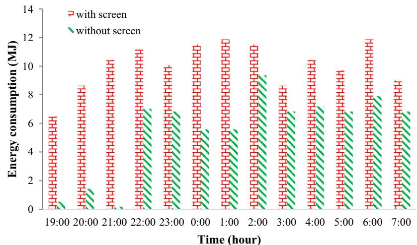  
Fig. 12 - Inside and outside variables in the semi-solar greenhouse with thermal screen on 02/11/2015  $(T_{c}$  crop temperature;  $T_{a}$  inside air below screen temperature;  $T_{as}$  inside air above screen temperature;  $T_{c}$  outside air temperature;  $T_{s}$  soil temperature;  $T_{sc}$  screen temperature;  $T_{ri}$  roof temperature).

Table 5 - The difference between leaf and inside air temperature with and without screen.  

<table><tr><td>ske</td><td>kur</td><td>min</td><td>std</td><td>var</td><td>av</td><td>Variables</td></tr><tr><td>0.08</td><td>-0.82</td><td>14.30</td><td>0.61</td><td>0.37</td><td>15.54</td><td>Tc with screen</td></tr><tr><td>3.29</td><td>11.31</td><td>14.20</td><td>1.94</td><td>3.76</td><td>15.84</td><td>Tc without screen</td></tr><tr><td colspan="7">Note: Ske: skewness; Kur: kurtosis; Min: minimum; Std: standard deviation; Var: variance; Av: average.</td></tr></table>

consumption in this research is about  $58\%$  .In other words, this thermal screen could decrease the use of fossil fuel and so decrease the cost and air pollution for cultivation of cabbage and all the greenhouse cultivation. Fig. 14 shows the temperature difference between leaf and inside air with and without using screen in the center of the greenhouse. It shows about 2 and  $1^{\circ}C$  difference between leaf and inside air without and with screen. Whenever the leaf temperature is lower than the air temperature, there is a risk that it will reach dew point and that condensation on the leaves will occur. Condensation at night is a very important problem in greenhouses, since it enhances the development of diseases (e.g., Botrytis and Late blight). Therefore, it is necessary to keep the plant leafs warmer than the air, or at least to minimize the temperature difference between the plant and the air, to minimize condensation [5].

Table 5 shows the statistical analysis for crop temperature with and without screen. We can see that the fluctuation of leaf temperature was very high when we did not use thermal screen. Kittas et al. [38] considered the influence of an aluminized thermal screen on greenhouse microclimate and canopy energy balance. The results showed that with a thermal screen the microclimate at crop level was more homogeneous and the average air and canopy temperatures were higher than without a screen. However, the energy saving with a  $65\%$  - aluminized thermal screen in their experiments was only about  $15\%$

Table 5 shows that the fluctuation of crop temperature when we used thermal screen, was very lower than without screen. This actin can improve the situation of crop and decrease the evapotranspiration and finally improve the quantity and quality of yield. The use of thermal screen is very useful especially in some parts of Iran (south and south west). In these regions, the nights in winter are not very cold and some greenhouses don't have any heating system, so the use of fossil fuels is very low. Thermal screen can decrease the use of fossil fuels and maybe can control the inside environment of greenhouse without using any external resource of energy. The use of thermal screen with other resources such as ground collectors, phase change material (PCM), water barrels and other methods can remove all the greenhouse required energy at cold nights. Some researchers used these methods and concluded good results. A thermal model was developed for heating the greenhouse using a thermal curtain and geothermal energy [39]. The model was validated against the climatic data obtained from a greenhouse of  $105\mathrm{m}^2$  area used for raising green pepper and located in southern part of Argentina. The results showed that the temperature of air surrounding the plant (plants under thermal blanket) was maintained in the range of  $14 - 23^{\circ}C$  during winter night and early morning which is about  $8 - 12^{\circ}C$  above ambient during nighttime. A very interesting study was conducted to observe the effect of various greenhouse design parameters and heating systems on the conservation of greenhouse energy [40]. The use of night curtains reduced the nighttime heating requirement by  $70.8\%$  and daily requirement by  $60.6\%$  . The combination of the design features for an energy efficient greenhouse suitable for cold climatic conditions was found to reduce the greenhouse heating needs by  $80\%$  . Shukla et al. [41], survived the effects of the combinations of inner thermal curtain and geothermal heating systems on the performance of a greenhouse. It was observed that increase in temperature was more for the greenhouse with geothermal energy and thermal screen than the greenhouse with only geothermal energy system.

# 4. Conclusion

This paper presents a dynamic heat and mass transfer model and experimental validation to estimate the inside environment variables in a semi- solar greenhouse with thermal screen. The second part of this paper compared the energy consumption for  $12\mathrm{h}$  with and without screen in the semisolar greenhouse located in East Azerbaijan province, Iran. According to the results:

The relationship between the results of dynamic model with experimental data according to RMSE, MAPE, TSSE, EF and  $\mathbb{R}^2$  showed that, the dynamic method can estimate the inside environment variables with MAPE 5- 7 and  $3 - 7\%$  without and with screen in the semi- solar greenhouse. So the results showed a good agreement between modeling and experimental validation. The results of using inside thermal screen showed that this method can decrease the need of fossil fuels up to  $58\%$  . The use of this method can decrease the  $CO_2$  emission and final cost and improve the quality and quantity of crops. Thermal screen can decrease the deference between inside air and crop temperature to  $1^{\circ}C$  . This method can improve the situation of crops and decrease the risk of some diseases such as Botrytis and Late blight. The difference between inside air temperature below and above screen and inside air temperature below screen with outside air temperature were about 6 and  $15^{\circ}C$  respectively. The use of thermal screen in agricultural greenhouse for some tropical regions such as south and south west of Iran is very suitable and can remove the need of fossil energy consumption in all the cycle production.

# Acknowledgments

AcknowledgmentsThe authors would like to thank the editor in chief and the anonymous referees for their valuable suggestions and useful comments that improved the paper content substantially. This study was supported by a grant from Tabriz University, Iran. The authors are grateful for the support provided by Tabriz University.

# REFERENCES

[1] Taki M, Ajabshirchi Y, Ranjbar SF, Rohani A, Matlooi M. Heat transfer and MLP neural network models to predict inside environment and energy lost in a semi- solar greenhouse. Energy Build 2016;110:314- 29. [2] Albright LD, Reines RG, Anderson SE, Chandra P. Experimental results of solar heating a brace institute style greenhouse. In: Proceedings of third annual conference on solar energy for heating greenhouses, USA; 1978. p.123- 7. [3] Nelson PV. Greenhouse operation and management. 6th ed. Upper Saddle River, New Jersey, USA: Prentice Hall; 2002. p.692. [4] Sethi VP, Sumathy K, Chiwon L, Pal DS. Thermal modeling aspects of solar greenhouse microclimate control: a review on heating technologies. Sol Energy 2013;96:56- 82. [5] Teitel M, Barak M, Anterler A. Effect of cyclic heating and a thermal screen on the nocturnal heat loss and microclimate of a greenhouse. Biosyst Eng 2009;102:162- 70. [6] Silva AM, Rosa R. Radiative heat loss inside a greenhouse. J Agric Eng Res 1987;37:155- 62. [7] Bailey BJ. The reduction of thermal radiation in glasshouses by thermal screens. J Agric Eng Res 1981;26:215- 24. [8] Ozturk HH, Bascetincelik A. The nocturnal heat loss and internal temperatures in plastic tunnel greenhouses with thermal screens. Acta Hortic 1997;443:79- 84. [9] Montero JI, Munoz P, Anton A, Iglesias N. Computational fluid dynamics modelling of night- time energy fluxes in unheated greenhouses. Acta Hortic 2005;691:403- 9. [10] Simpkins JC, Mears DR, Robert WJ. Reducing closes in polyethylene covered greenhouses. Paper ASAE; 1978. [11] Huang KT, Hanan JJ. Theoretical analysis of internal and external covers for greenhouse heat conservation. Hortic Sci 1976;11(6):582- 3. [12] Dawson JR, Winspear KW. Reduction of glasshouse heat losses by internal blinds. J Agric Eng Res 1976;21: 431- 6. [13] Rebuck SM, Aldrich RA, White JW. Internal curtains for energy conservation in greenhouses. Trans ASAE 1977;20 (4):732- 4. [14] Winspear KW, Bailey BJ. Greenhouse thermal screens save fuels. In: Proceedings of symposium on controlled environment agriculture, Tucson, AZ; 1977. p. 414- 8. [15] Bailey BJ. Energy conservation in glasshouse using thermal screens in energy for industry. 1st ed. London: Pergamon Press; 1979. p. 323- 32. [16] Chandra P, Albright LP. Analytical determination of the effect on greenhouse heating requirements of using night curtains. Trans ASAE 1980:994- 1000. [17] Grange RI, Hurd RG. Thermal screens- environmental and plant studies. Sci Hortic 1983;19(3- 4):201- 11.

[18] Bailey BJ. Reduction of thermal radiation in glasshouses by thermal screen. J Agric Eng Res 1981;26:215- 22. [19] Plaza S, Benavente RM, Gracia JL, Navas LM, Luna L. Modeling and optimal design of an electric substance heating system for greenhouse crops. J Agric Eng Res 1999;73(2): 131- 9. [20] Zhang Y, Gauthier L, De Halleux D, Dansereau B, Gosselin A. Effect of covering materials on energy consumption and greenhouse microclimate. Agric For Meteorol 1996;82(1- 4):227- 44. [21] Sethi VP, Lal T, Gupta YP. Effect of greenhouse microclimate on the selected summer vegetables. J Res Punjab Agric Univ 2003;40(3- 4):415- 9. [22] Teital M, Peiper UM, Zvieli Y. Shading screens for frost protection. Agric For Meteorol 1996;81:273- 86. [23] Cui Q, Wang J. Temperature and energy- saving effects of applying the mobile double layers thermal screen in a greenhouse. Trans Chin Soc Agric Eng 2002;18(6): 111- 4. [24] Van Straten G, Van Willigenburg E, Van Henten R, Van Oothghem R. Optimal control of greenhouse cultivation. New York: CRC Press, Taylor and Francis; 2011. [25] Van Ooteghem RJC. Optimal control design for a solar greenhouse, systems and control. Wageningen: Wageningen University; 2007. [26] Joudi K, Farhan A. A dynamic model and an experimental study for the internal air and soil temperatures in an innovative greenhouse. Energy Convers Manage 2015;91:76- 82. [27] Stanghellini C. Transpiration of greenhouse crops- - an aid to climate management [Ph.D. dissertation]. Wageningen, The Netherlands: Wageningen Agricultural University; 1987. 150 pp. [28] Bot GPA. Greenhouse climate: from physical processes to a dynamic model [Ph.D. dissertation]. Wageningen, The Netherlands: Wageningen Agricultural University; 1983. 240 pp. [29] Du J, Bansal P, Huang B. Simulation model of a greenhouse with a heat- pipe heating system. Appl Energy 2012;93: 268- 76. [30] Gupta A, Tiwari GN. Computer model and its validation for prediction of storage effect of water mass in a greenhouse: a transient analysis. Energy Convers Manage 2002;43: 95- 101. [31] Dariouchy A, Aassif E, Lekouch K, Bouirden L, Maze G. Prediction of the intern parameters tomato greenhouse in a semi- arid area using a time- series model of artificial neural networks. Measurement 2009;42:456- 63. [32] He F, Ma C. Modeling greenhouse air humidity by means of artificial neural network and principal component analysis. Comput Electron Agric 2010;71:S19- 23. [33] Kok R, Lacroix R, Clark G, Taillefer E. Imitation of a procedural greenhouse model with an artificial neural network. Can Agric Eng 1994;36(2):117- 26. [34] Seginer I, Boulard TH, Bailey BJ. Neural network models of the greenhouse climate. J Agric Eng Res 1994;59: 203- 16. [35] Jain D, Tiwari GN. Modeling and optimal design of ground air collector for heating in controlled environment greenhouse. Energy Convers Manage 2003;44:1357- 72. [36] Silva AM, Miguel A, Rosa R. Thermal radiation inside a single span greenhouse with a thermal screen. J Agric Eng Res 1991;49:285- 98. [37] Arinze EA, Schoenau GJ, Besant RW. Experimental and computer performance evaluation of a movable thermal insulation for energy conservation in greenhouses. J Agric Res 1986;34:97- 113.

[38] Kittas C, Katsoulas N, Baille A. Influence of an aluminized thermal screen on greenhouse microclimate and canopy energy balance. Trans ASAE 2003;46(6):1653- 63. [39] Ghosal MK, Tiwari GN. Mathematical modeling for greenhouse heating by using thermal curtain and geothermal energy. Sol Energy 2004;76:603- 13.

[40] Gupta MJ, Chandra P. Effect of greenhouse design parameters on conservation of energy for greenhouse environmental control. Energy 2002;27:777- 94. [41] Shukla A, Tiwari GN, Sodha MS. Thermal modeling for greenhouse heating by using thermal curtain and an earth- air heat exchanger. Build Environ 2006;41(7):843- 50.