# Numerical investigation for effects of natural light and ventilation on 3D tomato body heat distribution in a Venlo greenhouse

Guanghui Yu a,b,c,d, Shanhong Zhang a,b,c,d, Shuai Li a,b,c,d, Minshu Zhang a,b,c,d, Hüseyin Benli e, Yang Wang a,b,c,d,*

a National Innovation Center for Digital Fishery, China Agricultural University, Beijing 100083, China  b Laboratory of Smart Farming Technologies for Aquatic Animal and Livestock, Ministry of Agriculture and Rural Affairs, China Agricultural University, 100083, Beijing, China  c Engineering and Technology Research Center for Internet of Things in Agriculture, China Agricultural University, 100083, Beijing, China  d College of Information and Electrical Engineering, China Agricultural University, Beijing 100083, China  e Department of Technical and Vocational Education, Firat University, TR- 23119 Elazig, Turkey for Huseyin Benli

# ARTICLEINFO

# ABSTRACT

Article history:  Received 8 July 2021  Received in revised form 29 April 2022  Accepted 23 May 2022  Available online xxxx

Keywords:  CFD  3D Tomato body  Heat distribution  Greenhouse environment  Growth condition

Maintaining suitable temperature level around tomato in the greenhouse is essential for the high- quality production. However, in summer, the temperature level around the tomato is usually unclear except using a high- precision temperature imager. To solve this problem, thermal performance of 3D (three- dimensional) tomato model built based on SolidWorks was investigated by the computational fluid dynamics (CFD) simulations. To assess the effect of temperature distribution around the tomato, a simplified 3D tomato numerical model was firstly validated by a set of field measurement data. The light intensity and indoor ventilation were regarded as the mainly environment factors in the Venlo greenhouse, thermal stratification around tomatoes at different time of day was further studied. The numerical results illustrated the different temperature distribution around tomato body under different radiation intensity. It was found that ventilation could obviously adjust the temperature gradient around the tomato, and alleviate high temperature effect particularly in summer. Suitable ventilation could create a suitable thermal environment for the tomato growth. This study clearly demonstrated 3D temperature distribution around tomatoes, which is beneficial to provide the reference for accurate detection of 3D tomato temperature and appropriate thermal environment design.

© 2022 China Agricultural University. Publishing services by Elsevier B.V. on behalf of KeAi Communications Co. Ltd. This is an open access article under the CC BY- NC- ND license (http://creativecommons.org/licenses/by- nc- nd/4.0/).

# 1. Introduction

With the increasing global food and environmental issues, greenhouse agriculture as an emerging technology that can enhance agricultural production efficiency, has attracted great attentions. Greenhouse agriculture has been regarded

as an efficient agricultural planting mode to enhance crop yield and quality. Consequently, in the recent decades, researchers have investigated the design of ventilation system and the indoor air temperature distribution to improve the greenhouse construction structure continuously [1- 4]. However, for previous studies, the ventilation effect and temperature distribution of 2D model has been focused by lots of researchers, while 3D simulation analysis of indoor heat and airflow distribution at different times is rare.

The suitable temperature of the greenhouse environment plays an important role in the growth of plants. When the environmental temperature is higher than the optimum temperature range for plant growth, the plant may undergo programmed cell death (PCD) and the release of cytochromes [5]. In addition, the reproduction stage of plants is more likely to be affected by high temperature than other growth stages [6]. An increase in temperature will cause damage to the pollen tube and poor development of pollen, which will reduce the fruit set rate and reduce crop yield [7]. High temperature may also affect the photosynthesis of plants, change the fluidity of the membrane, and destroy the stability of the metabolic mechanism [8]. Similarly, low temperature will reduce plant biological enzyme activity and membrane fluidity, inhibit the normal function of physiological processes, and cause metabolic dysfunction [9]. Therefore, in an environment with excessively high temperature, such as in many areas of China, the temperature can reach  $35^{\circ}C$  at noon in summer, and mechanical ventilation or some other measures need to be taken to maintain the thermal comfort of plants [1].

At present, mechanical ventilation has been widely used to maintain the thermal comfort of plants [10,11]. However, improper control of indoor ventilation speed can lead to excessive indoor temperature and reduced fruit weight [12]. Air velocities between 0.5 and  $0.7m / s$  are recommended for plant growth inside greenhouses [13]. When the ventilation speed is lower than the recommended wind speed, it will affect the circulation and mixing of indoor air, resulting in increased indoor  $CO_2$  concentration and solar radiation heat. Excessive accumulation around plants affects the photosynthetic rate and yield of greenhouse crops [14]. When the ventilation speed is higher than the recommended wind speed, the ventilation system will consume more energy and increase the cost of greenhouse crop production. Aiming at the ventilation problem of the greenhouse, Zhang et al. designed a perforated air pipe with three rows of air jets to provide vertical airflow to the crop canopy surface and control the airflow speed within a reasonable range [1].

In recent years, computational fluid dynamics (CFD) has been regarded as a powerful tool for studying airflow and heat distribution inside greenhouses [15- 17]. Compared with onsite wind tunnel experiments, CFD has the advantages of low cost and not limited by time and space [18- 20]. Cheng et al. studied the natural ventilation rates and airflow patterns in multi- span greenhouses and glass greenhouses, respectively. A good balance between airflow and wind speed can be designed [21].Benni et al. (2016) compared the roof vent opening configurations by CFD simulations to optimize ventilation in the Venlo greenhouse [22]. At the same time, compared with the fixed measurement points in the field experiment, the air distribution and heat distribution at any spatial position inside the greenhouse can be simulated via CFD. However, because CFD is simplified on the basis of natural environmental conditions, experimental verification is required before the results are promoted to ensure the objectivity of the simulation results.

In present, tomatoes were taken as 3D model in our experimental Venlo greenhouse. K- Epsilon turbulence model and discrete ordinates (DO) radiation model were adopted to analyze the temperature distribution at different cases in the greenhouse, and the heat distribution on the 3D tomato surface is obtained. In addition, the airflow velocity at different heights in the greenhouse was discussed. The result showed that proper ventilation could avoid the continuous accumulation of heat on the plant surface and the heat distribution of different parts of tomato in detail.

The innovation of this article is: 1) to investigate the effects of ventilation speed at different heights on tomato growth considering changes in solar radiation intensity and environmental temperature via both on- site experiment and CFD simulation; 2) the proposed model provides a theoretical reference for improving detection accuracy. In the following sections, a 3D model of tomato and a Venlo greenhouse will be firstly introduced. Sequentially, heat transfer between tomato plants and the ambient air will be presented. Following that, mathematical modelling of air flow and solar radiation in the greenhouse will be briefly stated, and the corresponding computational fluid dynamics (CFD) program will be validated by the on- site measurements. Subsequently, the air flow distribution and heat distribution in the greenhouse at different time are simulated by using the verified numerical simulation program. 3D temperature pattern results are helpful for growers to formulate better greenhouse climate control strategies and more accurate temperature distribution in theory compared with thermal imager.

# 2. Materials and methods

# 2.1. Mathematical modelling

The experimental greenhouse was employed to apply the radiation and ventilation for the tomatoes. Meanwhile, the air flow, heat transfer and temperature distribution could be simulated employing computational fluid dynamic techniques. Numerical model will be validated against a series of experimental data.

# 2.1.1. Computational fluid dynamic modelling

The computational fluid dynamic modelling and codes represented by the set of differential equations, include continuity, momentum, and energy equations, which can be found in previous publications [23- 25]. The general form of these conservative equations can be expressed as:

$$
\frac{\partial}{\partial\tau} (\rho \phi) = \frac{\partial}{\partial x_j}\left(\Gamma_\rho \frac{\partial\phi}{\partial x_j} -\rho u_j\phi\right) + S_\phi \tag{1}
$$

where  $\Phi$  is a generic variable (unity for the continuity equation);  $\mathbb{P}$  for the density;  $u_{j}$  for the momentum equation;  $x_{j}$  for the direction on the  $\mathbf{x}$  - axis;  $\tau$  for the energy equation and  $k_{i}$ $\epsilon$  for the turbulence equations;  $\Gamma_{\mathrm{p}}$  is the digression coefficient and  $\mathbf{S}_{\phi}$  is the source term [26].

# 2.1.2. Solar radiation model

Solar radiation is an important greenhouse environmental factor that affects the temperature and humidity field distribution in the greenhouse. The heat transfer process should be considered in the simulation process [27,28]. In the present study, DO radiation model is employed to simulate the effect of solar radiation on greenhouse, and Solar Ray Tracing algorithm is adopted to simulate solar ray. The standard K- Epsilon turbulence model is adopted to account for the turbulent buoyancy effects and near wall turbulence shear transitions. The logarithmic law of the wall is adopted in the vicinity of solid walls, and use the wall function to establish the full turbulence and viscous flow along the wall surface. The DO radiation model was calculated by the gray band model, which can calculate gray body radiation and conduct non- gray body calculation, so this radiation model was used to solve the radiant heat transfer of the Venlo greenhouse. The DO radiation model was added into the CFD model to simulate coupling of convective transfers and radiation exchanges at the roof and the cover of the ventilation greenhouse and instead of the usual coupling approach based on energy balance. It was used for the calculation of coupled radiation and convective exchanges at the ventilation greenhouse roof and cover. For a medium with absorption, divergence, and scattering properties.

The following radiative transfer equation is solved along with other conservation equations [29], simultaneously and the amount of absorbed solar irradiance has been added to the energy equation through source term of  $S_{n}$

$$
\begin{array}{l}\nabla \cdot \left(I\left(\underset {r}{\rightarrow},\underset {s}{\rightarrow}\right)\underset {s}{\rightarrow}\right) + (a + \sigma_{s})I\left(\underset {r}{\rightarrow},\underset {s}{\rightarrow}\right)\\ = a n^{2}\frac{\sigma\overline{T}^{4}}{\pi} +\frac{\sigma_{s}}{4\pi}\int_{0}^{4\pi}I\left(\underset {r}{\rightarrow},\underset {s}{\rightarrow}\right)\phi \left(\underset {s}{\rightarrow},\underset {s^{\prime}}{\rightarrow}\right)d\Omega^{\prime} \end{array} \tag{2}
$$

In Eq. (2),  $\overrightarrow{r}$  is position vector,  $\overrightarrow{s}$  is direction vector,  $\overrightarrow{s}$  is scattering direction vector, s is stroke length  $(\mathfrak{m})$  . I is the radiation intensity  $(W / m^2)$  which depends on the position and direction; a and  $n$  are the absorption coefficient and refractive index, and  $\sigma$  is Stefan- Boltzmann constant  $[5.67\mathrm{e}^{- 8}\mathrm{W}/$ $(\mathbf{m}^2\cdot \mathbf{K}^4)]$ $\sigma_{s}$  is scattering coefficient,  $\overline{T}$  is average temperature  $(^\circ \mathbb{C})$ $\Phi$  is Phase function, and  $\Omega^{\prime}$  is solid angle. Air- water vapor enclosure is considered to be a nonparticipating medium in the present modeling.

Apart from the contribution of solar radiation to the greenhouse heat load, tomato plants also exchange energy with air through sensible and latent heat, affecting the airflow distribution. The leaf energy balance can be explained by the following equation:

$$
R_{net} = 2h_{c}\Delta (T_{Leaf} - T_{Air}) + Q_{lat} \tag{3}
$$

where  $R_{net}$  is radiative net flux  $(W / m^2)$  .  $2h_{c}\Delta (T_{Leaf} - T_{Air})$  is the sensible heat flux from leaves to air through heat convection  $(W / m^2)$  .  $h_c$  is the convective heat transfer coefficient  $[\mathsf{W} / (\mathsf{m}^2\cdot \mathsf{k})]$  which is equivalent to  $5[\mathsf{W} / (\mathsf{m}^2\cdot \mathsf{k})]$  from the canopy leaf to the air [30];  $T_{Leaf}$  is the temperature of leaves of tomato plants and  $T_{\mathrm{air}}$  is the temperature of the air around the leaves;  $\Delta (T_{Leaf} - T_{Air})$  is the temperature difference between air and leaf (K), subsequent field experiments measure that at 0:00,4:00,8:00,12:00,16:00,20:00, the values are $4.1\mathrm{K},4.3\mathrm{K}, - 1.3\mathrm{K}, - 3.5\mathrm{K}, - 1.6\mathrm{K},1.6\mathrm{K}.$  The value of sensible heat flux can be inferred.

$Q_{lat}$  is the latent heat flux away from leaves through transpiration  $(W / m^2)$  .At 0:00,4:00,8:00,12:00,16:00 and 20:00,the value of  $Q_{lat}$  is  $- 36.84\mathrm{W} / \mathrm{m}^2$ $- 37.29\mathrm{W} / \mathrm{m}^2$ $15.05\mathrm{W} / \mathrm{m}^2$ $25.28W / m^2$ $2.42W / m^2$  and  $- 15.42W / m^2$  respectively. Then the value of  $R_{net}$  can be calculated by Eq. (3).

# 2.2. 3D tomato model under greenhouse environment

Since the variety of exterior shapes of tomato, only with dimensions of is simplified as unified 3D model. According to the actual shape of the tomato in Fig. 1(b), we simplify the stems, branches, and leaves into regular 3D models, the 3D tomato plant model in the greenhouse is built by SolidWorks in a ratio of 1:1, as shown in Fig. 1(b). It consists of 139 leaves and 16 branches, with a minimum of 8 leaves and a maximum of 14 leaves on each branch, and a height of  $0.2\text{m}$  most lobular area of  $0.12cm^2$  maximum leaf area of  $0.8cm^2$  maximum stem length  $98.62~\mathrm{mm}$  diameter  $1.8~\mathrm{mm}$  .The minimum stem length is  $25.80 \mathrm{mm}$  and the diameter is  $0.7\mathrm{mm}$  . Stem distance distribution: according to the actual principle of random distribution of tomatoes.

Tomato plants are placed in a small experimental greenhouse providing light and ventilation, the measurement greenhouse was performed in summer located in, Beijing, China. The volume of the greenhouse is  $1\mathrm{m}$  (length)  $\times 0.6\mathrm{m}$  (width)  $\times 0.5\mathrm{m}$  (height), which is built from acrylic plate with built- in culture tank, as shown in Fig. 1(a) and (c). The tank can totally accommodate 12 tomatoes, they are distributed in 2 Lines and 6 Rows. To improve the uniformity of inlet airflow the same inside climate as the Venlo greenhouse, three external windows were built on the symmetric wall. The roof of greenhouse consists of the ten V- shaped acrylic panels. On the front and the back walls, there are four windows sizing of  $0.08\mathrm{m}\times 0.06\mathrm{m}$  as a fresh air inlet. The ventilation system composes of mechanical ventilation and natural ventilation.

# 2.3. CFD model details and setting condition

SolidWorks is adopted to create a three- dimensional calculation model of the greenhouse, with the size of  $1\mathrm{m}$  (length)  $\times 0.6\mathrm{m}$  (width)  $\times 0.5\mathrm{m}$  (height). Tomatoes, air intents and vents are designed to provide the same conditions as the actual greenhouse climate according to the requirements of the environment around the tomato in the Venlo greenhouse. Meanwhile, for the CFD model, the grids constructed in this study are about 20 274 710, including 3 403 693 nodes, with an average gradient of 0.842 35 and a minimum cell size of  $0.00899\mathrm{mm}$  . At the same time, a more refined grid is automatically applied near tomatoes and vents, and the average skewness  $(0.2\pm 0.1)$  is adopted to test the grid quality before calculation, which improves the stability and precision of numerical calculation.

Table 1 shows the model settings, boundary conditions and numerical parameters of the three- dimensional CFD model. Velocity- Inlet and pressure- outlet are adopted to set the boundary conditions for numerical solution, and employed the DO radiation model and solar ray tracking,

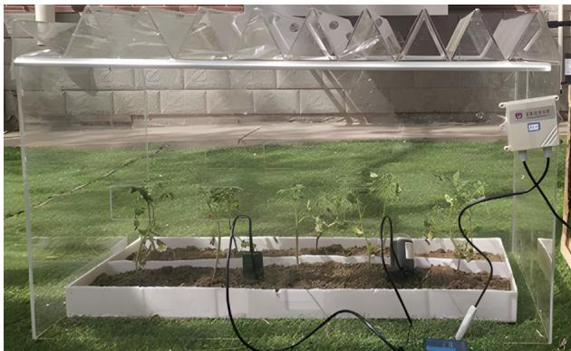  
(a) Experimental Venlo greenhouse in Beijing, China

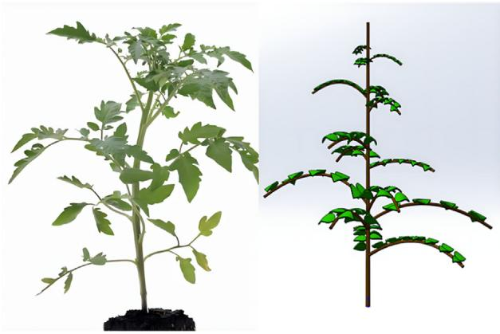  
(b) A simplified 3D model of tomato plant

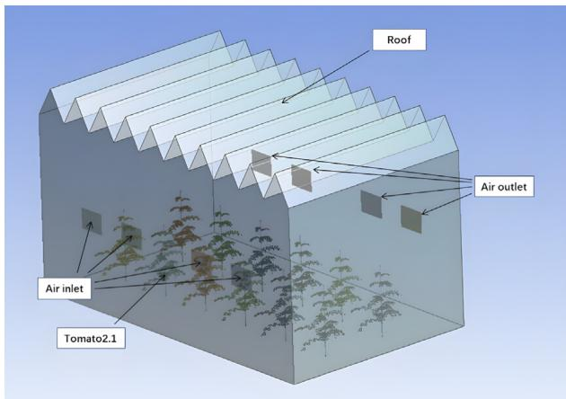  
(c) 3D Model of Venlo greenhouse with tomatoes Fig.1 -Illustration of experimental Venlo greenhouse (a), 3D tomato model (b) and the geometry of the modeled greenhouse with 3D (c), where the symbol tomato 2.1 represents that the plant is planted at line 2 and row 2.

and set the geographical latitude and longitude  $(39.9^{\circ}\mathrm{N}, 116.3^{\circ}$  E) to be consistent with the actual position of the greenhouse. The initial temperature is  $295.2 \mathrm{K}$  (0:00),  $293.757 \mathrm{K}$  (4:00),  $299.945 \mathrm{K}$  (8:00),  $308.695 \mathrm{K}$  (12:00),  $306.201 \mathrm{K}$  (16:00),  $300.636 \mathrm{K}$  (20:00). Table 2 summarizes the thermal properties of air, tomato crops, plastic husks, and soil. Because the heat generated by photosynthesis and respiration of plants is less affected by environmental temperature changes, the effects of photosynthesis and transpiration of tomato are ignored.

The steady state solution of the CFD model is carried out, and the least square method is adopted to solve the gradient term. The pressure item is selected based on the weight of the object, the energy is the second- order upwind type, and the rest are the first- order upwind type. Coupled algorithm is adopted to improve the calculation accuracy. The convergence factor of the energy residual is set at  $10e^{- 6}$ , and the rest is set at  $10e^{- 3}$  to judge whether the calculation meets the convergence standard.

Previous studies have shown that the airflow inside the greenhouse have a highly turbulent flow state [31]. In order to simplify the calculation of the greenhouse wall area, the standard K- Epsilon turbulence model is adopted to describe the flow state of indoor gas in the turbulence model. Fluent could provide Rosseland, P1, Discrete Transfer, Surface to Surface, Discrete Ordinates. In order to simulate the influence of greenhouse covering materials on indoor solar radiation distribution and solve the radiation transfer problem of translucent medium, DO radiation model is adopted to describe the thermal effect of solar radiation. Considering the selectivity of greenhouse covering materials to solar radiation, Solar Ray Tracing is used to describe the absorption characteristics of the materials.

# 2.4. CFD simulation results validated by on-site measurements

The wind speed and temperature verification experiment are carried out in a greenhouse model in China Agricultural University, Beijing, China  $(39.9^{\circ}\mathrm{N}, 116.3^{\circ}\mathrm{E})$ . Fans of the same brand are placed at the four windows  $(0.06 \mathrm{m} \times 0.08 \mathrm{m})$  of the front wall of the greenhouse as the air supply source. Four windows  $(0.06 \mathrm{m} \times 0.08 \mathrm{m})$  on the back wall of the greenhouse are used as air outlets. The air flow can enter the greenhouse from the front wall vent and be discharged from the back wall vent to meet the needs of photosynthesis and other physiological activities of plants.

Testo 435- 1 wind speed sensor (Fig. 2 (a)) (diameter of the impeller wind speed probe is  $60 \mathrm{mm}$ , accuracy:  $\pm (0.1 \mathrm{m / s} + 1.$ $3\%$  measured value), measuring range:  $0.25 - 20 \mathrm{m / s}$ , working temperature:  $0 - 60^{\circ}\mathrm{C}$ ) is used to measure and the wind speeds at the forward air inlets are adjusted to  $1.2 \mathrm{m / s}$ . Testo 435- 1 illumination probe sensor (Fig. 2(a) right) (measuring range:  $0 - 100000 \mathrm{Lux}$ , accuracy:  $\pm 1.1\%$  of reading) is used to measure light intensity inside the greenhouse.

The spatial distribution of tomato plants in greenhouse is shown in Fig. 2 (b) and (c). In order to verify the regularity of wind speed in greenhouse ventilation, the wind speed at different locations in the greenhouse is measured. Twelve measuring points is set up. The selection of measuring points is shown in Fig. 2 (d) and (e).

Testo 435- 1 temperature sensor (Fig. 2 (a)) (accuracy:  $\pm 0.2^{\circ}$  C, measuring range:  $- 20$  to  $+70^{\circ}\mathrm{C}$ , probe rod diameter:  $12 \mathrm{mm}$ , probe sleeve length:  $140 \mathrm{mm}$ , length of the cable:  $1160 \mathrm{mm}$ ) is adopted to measure the temperature at different heights inside the greenhouse. The measurement point is set every

Table 1- Settings of simulation condition.  

<table><tr><td colspan="2">Settings of model</td><td colspan="2">Settings of material</td></tr><tr><td>Model parameters</td><td>Setting</td><td>Fluid</td><td>Solid</td></tr><tr><td>Energy</td><td>On</td><td>air</td><td>Crop</td></tr><tr><td>Viscous</td><td>k-ε standard</td><td>-</td><td>Glass</td></tr><tr><td>Radiation</td><td>DO</td><td>-</td><td>Soil</td></tr><tr><td>Solar load</td><td>Solar Ray Tracing</td><td>-</td><td>-</td></tr></table>

Table 2-Physical parameters of materials.  

<table><tr><td>Material</td><td>Density (kg/m³)</td><td>Cp J/(kg·K)]</td><td>Thermal Conductivity [W/(m·K)]</td><td>Refractive Index</td><td>Absorption Coefficient</td></tr><tr><td>Air</td><td>1.225</td><td>1 006</td><td>0.02</td><td>1.00</td><td>0.15</td></tr><tr><td>Plant</td><td>560</td><td>2 100</td><td>0.19</td><td>2.77</td><td>0.35</td></tr><tr><td>Plastic</td><td>2 220</td><td>830</td><td>1.38</td><td>1.50</td><td>0.08</td></tr><tr><td>Soil</td><td>1 700</td><td>1 010</td><td>0.8</td><td>1.92</td><td>0.50</td></tr></table>

$4\mathrm{cm}$  with six measurement points. The selection of measuring points is indicated in Fig. 2 (g).

It can be seen from Fig. 2 (f) that the wind speed around the tomato plants is highly correlated with the distance and angle of the vent, and the CFD simulation results are consistent with the measurement results of the same spatial position in the greenhouse. The standard deviation between the calculated results and the measured data is within  $0.055\mathrm{m / s}$

Similarly, it can be seen from Fig. 2 (h) that the CFD simulation data are consistent with the measurement results of the same height in the greenhouse. The standard deviation between the calculated results and the measured data is within  $0.069\mathrm{K}$  which ensures the reliability of the calculation program.

# 3. Results and discussions

Suitable mechanical ventilation in summer can alleviate the effect of high temperature and create a suitable environment for the growth of tomato. It also ensures the supply of air and temperature necessary for photosynthesis and respiration of tomatoes.

Firstly, based on the 3D model, the variation of tomato surface temperature with time (0:00 4:00 8:00 12:00 16:00 20:00) is discussed. Then, the influence of the horizontal distance  $(\mathbf{x} = 2\mathbf{cm},\mathbf{x} = 4\mathbf{cm},\mathbf{x} = 6\mathbf{cm})$  on the thermal effect of the surrounding environment is revealed. Finally, the airflow distribution around tomato is demonstrated under ventilation condition.

# 3.1. Effect of solar radiation on 3D tomato microclimate in greenhouse

In previous studies, some researchers focused on crop transpiration rate and maximal indoor air temperature for greenhouse microclimate. For example, Illouz- Eliaz et al. found that the maximum transpiration rate of tomato appeared at 12:00 [26], similarly, the observation data of our on- site mea surement inside the greenhouse (Fig. 3) also reaches the maximum  $35.545~^\circ \mathrm{C}$  at the same time. Fresh air entraining from the small window flows into the greenhouse, and it is maintained at Nsupply (supply air velocity)  $= 0.5\mathrm{m / s}$  and Tsupply (supply air temperature)  $= 35.545~^\circ \mathrm{C}$  . Subsequently, this ventilation mode was applied to establish a stable greenhouse heat distribution model.

As shown in Fig. 4(a), the temperature near the soil and above the canopy of tomato affected by hot air and solar radiation is higher (about  $35^{\circ}C)$  and the average temperature around the tomato is close to  $30^{\circ}C$  .The results show that the solar radiation at 12o'clock in the day causes significant vertical thermal stratification around the tomato, and the heat distribution in the greenhouse is uniform. Maintain  $\mathbb{N}_{\mathrm{supply}}$  (air supply speed)  $= 0.5\mathrm{m / s}$  and carry out the same study at 0:00 (as shown in Fig. 4(b)). At this time, the indoor and outdoor heat exchange mainly depends on the flow of air. The heat generated by physiological activities of tomato is transferred through airflow to realize continuous exchange with the outside environment. The temperature is between  $20^{\circ}C$  and  $22^{\circ}C$

# 3.2. Analysis of relationship between the tomato surface temperature and microclimate

Solar radiation will affect the heat transfer process inside and outside the greenhouse. Except for the change of time, the above control parameters and boundary conditions are still adopted, while the air supply remains at  $N_{\mathrm{supply}}$  (supply air velocity)  $= 0.5\mathrm{m / s}$

In Fig. 5, shown the average temperature of 3D tomato leaves. As the solar radiation and transpiration rate increase, the temperature difference around the tomato increases. 3D tomato simulation results showing: The temperature of the tomato itself will also increase as the surrounding temperature increases, meantime the curve in the picture shows that the change of tomato surface temperature is basically consistent with the periodic change of solar radiation. The temper

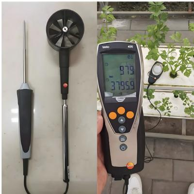  
(a) Temperature (left) and wind speed (middle) as well as illustration (right) sensors

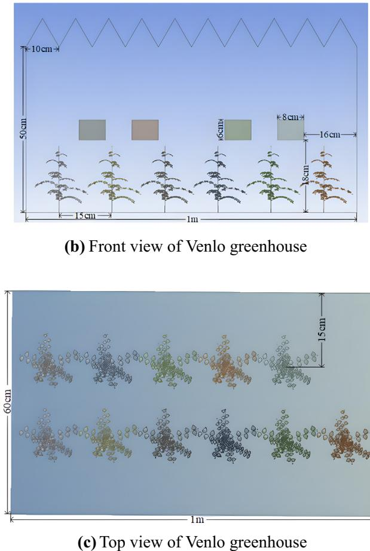

ature fluctuation of the tomato body and the temperature of the leaf surface will also have a more obvious impact with the variety of the radiation intensity.

Meantime, simulation results show that the temperature difference in the vertical direction of the tomato body is large, especially in summer. Especially, the maximum temperature difference between root and canopy is about  $4\mathrm{K}$  at 12:00  $(x = 2\mathrm{cm})$ . In Fig. 6(a), Fig.(b) and Fig.(c), with the increase of the horizontal distance from the tomato  $(x = 4\mathrm{cm}, x = 6\mathrm{cm})$ , the thermal influence of the tomato on the surrounding environment weakens, and the temperature difference between the tomato canopy and the root decreases by  $50\%$  (about  $2\mathrm{K}$ ) at 12:00 noon  $(x = 6\mathrm{cm})$ . The same rule can be found in Fig. 6(b) and (c).

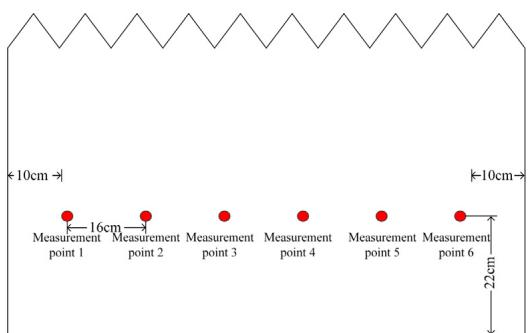  
(d) Front view of measuring points

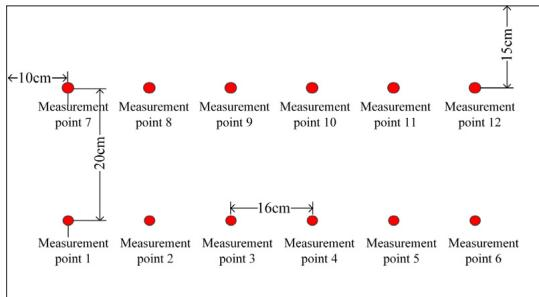  
(e) Top view of measuring points

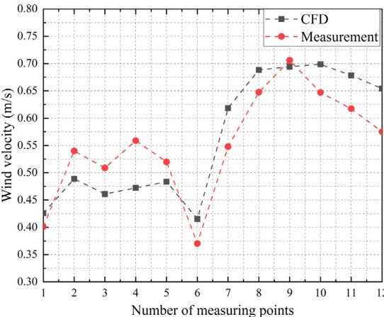  
Fig. 2 - Spatial distribution of tomato plants and measuring points in greenhouse.  
Fig 2. (continued)

$= 6\mathrm{cm}$ , the thermal influence of the tomato on the surrounding environment weakens, and the temperature difference between the tomato canopy and the root decreases by  $50\%$  (about  $2\mathrm{K}$ ) at 12:00 noon  $(x = 6\mathrm{cm})$ . The same rule can be found in Fig. 6(b) and (c).

Similarly, there is the horizontal distance between the measuring point at night and the tomato. We selected three points  $(x = 2\mathrm{cm}, 4\mathrm{cm}, 6\mathrm{cm})$  as the research object, showing the heat distribution of the tomato at different times at night. According to 3D simulation results, at 40'clock in the morning  $(x = 2\mathrm{cm})$ , the maximum temperature difference between root and canopy is about  $3.5\mathrm{K}$ . With the increase of the horizontal distance from the tomato  $(x = 4\mathrm{cm}, x = 6\mathrm{cm})$ , the thermal impact of the tomato on the surrounding environ

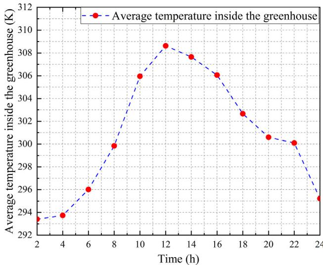  
Fig. 3 - Temperature distribution in greenhouse on July 20, 2020.

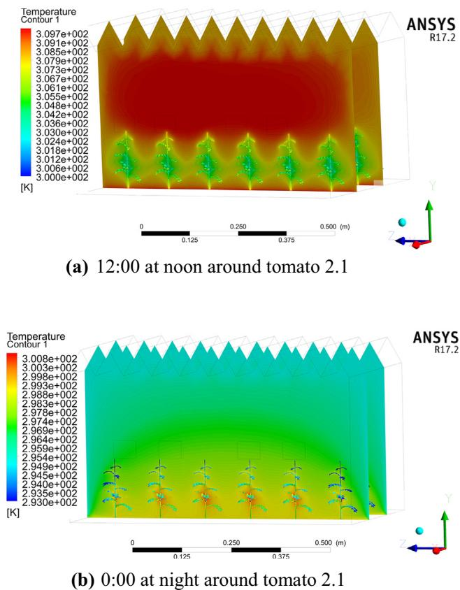  
Fig. 4 - Temperature distribution illustration in greenhouse.

ment weakened. At 4 am in the morning  $(x = 4\mathrm{cm})$ , the temperature difference between the canopy and root system of tomato is about  $2.5\mathrm{K}$ , and at 40'clock in the morning  $(x = 6\mathrm{cm})$ , the temperature difference between the canopy and root system of tomato is about  $2.5\mathrm{K}$ . The heat distribution law around tomatoes during the day and night shows that the thermal effect of tomatoes on the surrounding envi ronment decreases with the increase of the horizontal distance (see Fig. 7).

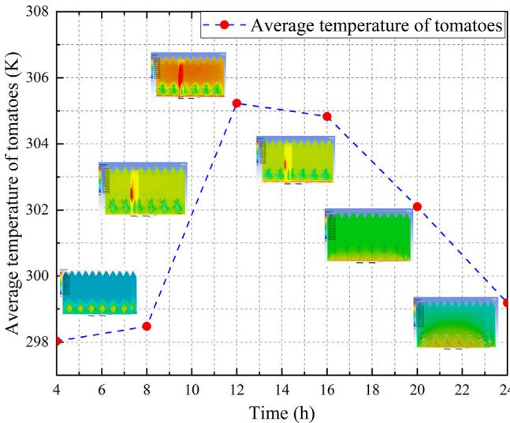  
Fig. 5 - Average temperature of tomato leaves.

# 3.3. Temperature distribution and microclimate analysis around tomato body

It could be demonstrated from Fig. 8 that at 8 am, due to the low solar radiation intensity, most of the radiation is absorbed by the tomato canopy, and obvious vertical temperature stratification is formed around the tomato. The temperature difference between tomato canopy and root system is  $1.8~\mathrm{K}$ . At noon, solar radiation reaches its maximum value (approximately  $17.34\mathrm{MJ / m^2}$ ), and tomato has strong transpiration and heat exchange. The abovementioned results are identical to previous study, e.g., the tomato transpiration rate is the largest at noon, which is consistent with previous studies [26]. At night, the heating effect of tomatoes is subtle. Convection is formed between the ground and the air, and heat is dissipated from the ground into the air, forming obvious vertical temperature stratification. Due to the respiration of the tomato itself, the temperature of the tomato is higher than the ambient temperature at this time, which is the opposite of the situation during the day (see Fig. 9).

# 3.4. 3D tomato plant growth under ventilation

The airflow sinks towards the soil under the effect of negative buoyancy, while the airflow rises around the canopy due to the effect of positive buoyancy. Therefore, the densest point of the airflow occurs slightly above the tomato canopy  $(\mathrm{H}\approx 11\mathrm{cm})$ , and the average wind speed value is  $0.28~\mathrm{m / s}$ , while the average wind speed value at the bottom of the tomato is only  $0.12\mathrm{m / s}$ , which easily leads to the aggregation of pathogen microorganisms. In conclusion, due to the existence of tomato canopy, different airflow layers will be formed in the greenhouse, which interact with each other to form complex airflow circulation in the greenhouse.

Physically, airflows are subject to different flow forces, including natural ventilation and thermal plume forces. The

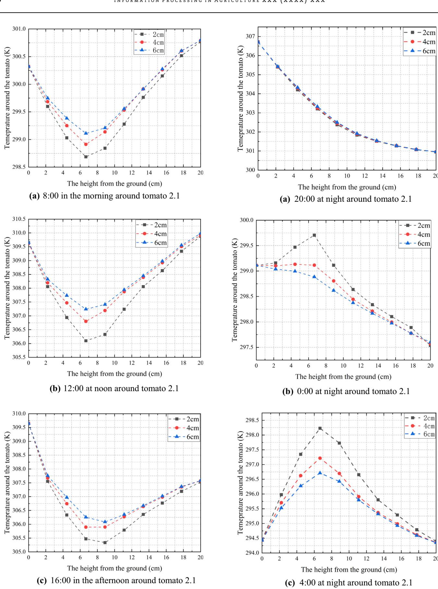  
Fig. 6 - Illustration of heat distribution around tomato plants during the day.  
Fig. 7 - Illustration of heat distribution around tomato plants at night.

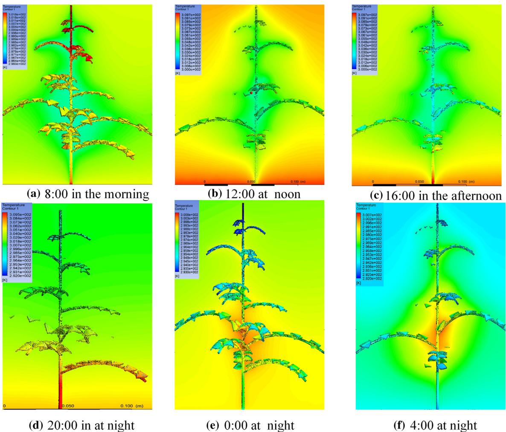  
Fig. 8 – Temperature of tomato body (2:1) at 8:00, 12:00, 16:00, 20:00, 0:00, 4:00.

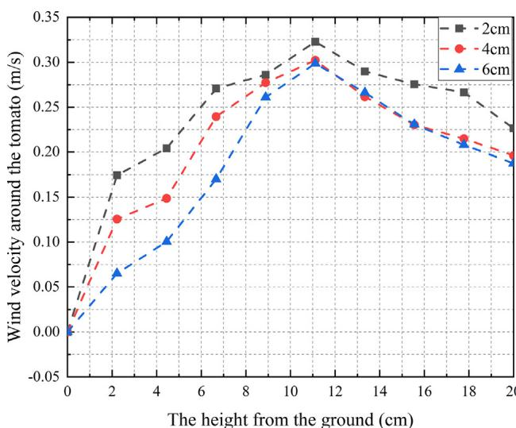  
Fig. 9 – Wind velocity around the tomato as function of height.

supply jet will sink, while the air flow around the canopy will rise due to the positive buoyancy. These flows interact with each other, resulting in a complex flow cycle, as shown in Fig. 10. The air microcirculation around tomato prevents the removal of greenhouse pollutants such as oxides of nitrogen and phosphorus, bacteria [32], which can easily lead to poor air quality, leading to disease. Therefore, the distance between tomatoes should be expanded to reduce interference and create a suitable breathing environment.

# 3.5. Discussions

In order to study the temperature distribution of tomato surface and surrounding environment in summer, SolidWorks is used to build the 3D model of tomato. Compared with the detailed tomato model established by Zhang Yue and others using the open source modeling platform Groimp [29], this model considers that all parts of tomato have the same thermodynamic characteristics and radiation characteristics. Due to the different effects of solar radiation on stems and leaves, the model inadequately reflects the differences of thermal characteristics of tomato stems and leaves. At the same time, this model simplifies the effects of photosynthesis and respiration of tomato, through the establishment of latent heat and sensible heat mathematical model, thermal characteristics of tomato are fully revealed, so these simplifications are acceptable.

The detailed distribution of microclimate parameters including tomato canopy temperature in the greenhouse

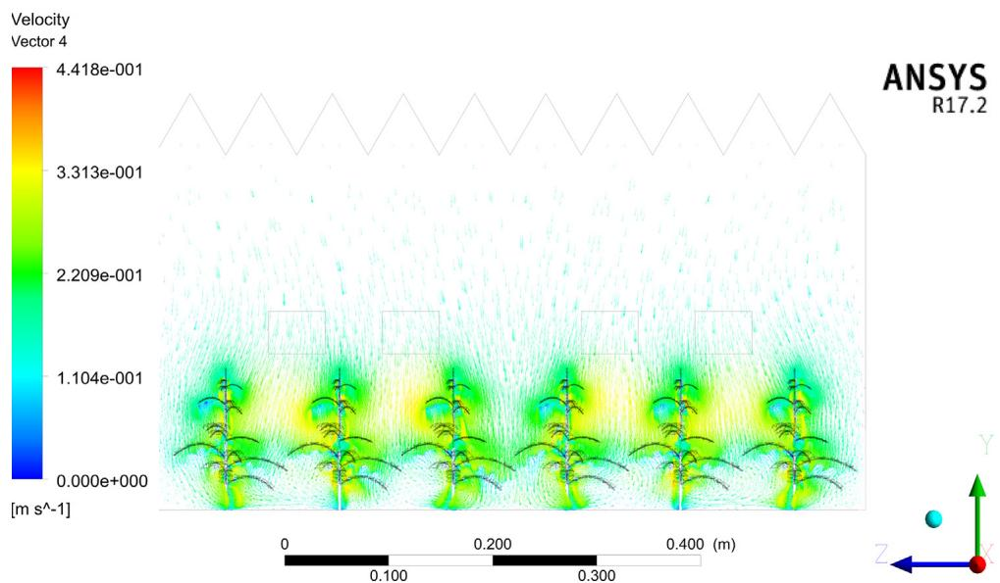  
Fig. 10 - Illustration of distribution of air flow plants in greenhouse.

plays an important role in the appropriate cultivation of tomato and increasing yield. In this paper, the 3D model of tomato is only modified on some branches and leaves. Compared with the previous 2D model studies, the spatial accuracy has been expectedly improved. The conclusion shows that the model can reflect the temperature distribution around tomato and the temperature distribution of tomato canopy, which provides a reference for the reasonable ventilation and energy consumption reduction of tomato greenhouse.

In previous studies, for simulating the greenhouse crops, it was generally regarded as a multi empty medium to simulate, and both the results of simulation and experiment data are in good agreement. However, in the present work, the tomato was regarded as a solid, and the relevant parameters of porous media are not set, which could also demonstrate a good consistency in the case of refining 3D model, which will be discussed in the future research section.

# 4. Conclusions

In summer, suitable mechanical ventilation could alleviate the effect of high temperature and create a suitable environment for the growth of tomato.

In this paper, effects of different supply air temperature and radiation intensity on greenhouse ventilation and tomato thermal stratification have been numerically and experimentally investigated in an experimental Venlo greenhouse, the temperature distribution and ventilation effect were then analyzed. The proposed CFD model and numerical results were validated by the field measurement results. The main scientific and valuable conclusions are as follows:

(1) At  $12:00\mathrm{pm}$  the transpiration rate of tomato reaches the maximum, which results in a temperature difference of about  $5\mathrm{K}$  between the canopy and the soil. The solar radiation at this time will lead to significant vertical thermal stratification, and establishes a uniform heat distribution inside the greenhouse. At

$8\mathrm{pm}$  the heat generated by the transpiration of tomato plants inside the greenhouse is passively conveyed by the external airflow, and heat in the greenhouse is dissipated by ventilation. The air temperature at this time is between  $20^{\circ}C$  and  $22^{\circ}C$  The results indicate that the heat distribution around the tomato presents a significant periodic change caused by the solar radiation in summer. Around noon, the surface temperature of tomato plant is too high, which is prone to high temperature lesions. It is necessary to conduct mechanical ventilation in advance.

(2) The distribution of heat around tomatoes during the day and night indicates that the thermal effect of tomatoes on the surrounding environment decreases significantly with the increase of horizontal distance. Therefore, it is difficult to obtain an accurate heat distribution around the tomato. This study obtains the peripheral temperature of tomato based on the theory of thermodynamics, which provides a theoretical reference for improving the detection accuracy.

(3) Under ventilated conditions, there will be obvious differences in airflow on both sides of the tomato canopy. Pathogenic microorganisms are likely to accumulate at the bottom to produce disease. The airflow microcirculation around the tomato will hinder the removal of greenhouse pollutants. Therefore, the study of the 3D model can provide guidance for reasonable ventilation.

This research could provide theoretical guidance for improving the detection accuracy of thermal imagers, and assist with designing suitable thermal environment for tomato plant growth.

# Declaration of Competing Interest

The authors declare that they have no known competing financial interests or personal relationships that could have appeared to influence the work reported in this paper.

# Acknowledgements

AcknowledgementsThis research was financially supported by Science and Technology Cooperation - Sino- Malta Fund 2019: Research and Demonstration of Real- time Accurate Monitoring System for Early- stage Fish in Recirculating Aquaculture System (AquaDetector, Grant No. 2019YFE0103700), Overseas High- level Youth Talents Program (China Agricultural University, China, Grant No. 62339001), China Agricultural University Excellent Talents Plan (Grant No. 31051015), Major Science and Technology Innovation Fund 2019 of Shandong Province (Grant No. 2019JZY010103), National Innovation Center for Digital Fishery, and Beijing Engineering and Technology Research Center for Internet of Things in Agriculture. The authors also appreciate constructive and valuable comments provided by reviewers.

# REFERENCES

[1] Zhang Y, Kacira M, An L. A CFD study on improving air flow uniformity in indoor plant factory system. Biosyst Eng 2016;147:193- 205. [2] Boulard T, Roy J- C, Pouillard J- B, Fatnassi H, Grisey A. Modelling of micrometeorology, canopy transpiration and photosynthesis in a closed greenhouse using computational fluid dynamics. Biosyst Eng 2017;158:110- 33. [3] Endalew AM, Hertog M, Gebrehiwot MG, Baelmans M, Ramon H, Nicolai BM, et al. Modelling airflow within model plant canopies using an integrated approach. Comput Electron Agric 2009;66(1):9- 24. [4] Kichah A, Bournet P- E, Migeon C, Boulard T. Measurement and CFD simulation of microclimate characteristics and transpiration of an Impatiens pot plant crop in a greenhouse. Biosyst Eng 2012;112(1):22- 34. [5] Qu G- Q, Liu X, Zhang Y- L, Yao D, Ma Q- M, Yang M- Y, et al. Evidence for programmed cell death and activation of specific caspase- like enzymes in the tomato fruit heat stress response. Planta 2009;229(6):1269- 79. [6] Ruan Y- L, Jin Ye, Yang Y- J, Li G- J, Boyer JS. Sugar Input, Metabolism, and Signaling Mediated by Invertase: Roles in Development, Yield Potential, and Response to Drought and Heat. Mol Plant 2010;3(6):942- 55. [7] Raja MM, Vijayalakshmi S, Naik ML, Basha PO, Sergeant K, Hausman JF, et al. Pollen development and function under heat stress: from effects to responses. Acta Physiol Plant 2019;41(4). https://doi.org/10.1007/s11738- 019- 2835- 8. [8] Larkindale J, Hall JD, Knight MR, Vierling E. Heat stress phenotypes of arabidopsis mutants implicate multiple signaling pathways in the acquisition of thermotolerance. Plant Physiol 2005;2138:882- 97. https://doi.org/10.1104/pp.105.062257. [9] Xu W, Li R, Zhang N, Ma F, Jiao Y, Wang Z. Transcriptome profiling of Vitis amurensis, an extremely cold- tolerant Chinese wild Vitis species, reveals candidate genes and events that potentially connected to cold stress. Plant Mol Biol 2014;86(4- 5):527- 41. [10] Han F, Chen C, Hu Q, He Y, Wei S, Li C. Modeling method of an active- passive ventilation wall with latent heat storage for evaluating its thermal properties in the solar greenhouse. Energy Build 2021;238:110840. https://doi.org/10.1016/j.enbuild.2021.110840. [11] Nikolaou G, Neocleous D, Kitta E, Katsoulas N. Estimation of Aerodynamic and Canopy Resistances in a Mediterranean

Greenhouse Based on Instantaneous Leaf Temperature Measurements. Agronomy 2020;1210:1985. https://doi.org/10.3390/agronomy10121985. [12] Sherzod R, Yang EY, Cho MC, Chae SY, Chae WB. Physiological traits associated with high temperature tolerance differ by fruit types and sizes in tomato (Solanum lycopersicum L.). Horticult, Environ, Biotechnol 2020;561:837- 47. https://doi.org/10.1007/s13580- 020- 00280- 4. [13] Pakari A, Ghani S. Airflow assessment in a naturally ventilated greenhouse equipped with wind towers: numerical simulation and wind tunnel experiments. Energy Build 2019;199:1- 11. https://doi.org/10.1016/j.enbuild.2019.06.033. [14] Ould Khaoua SA, Bournet PE, Migeon C, Boulard T, Chasseriaux G. Analysis of Greenhouse Ventilation Efficiency based on Computational Fluid Dynamics. Biosyst Eng 2006;195:83- 98. https://doi.org/10.1016/j.biosystemseng.2006.05.004. [15] Odhiambo MRO, Abbas A, Wang X, Elahi E. Thermoelectronmental Assessment of a Heated Venlo- Type Greenhouse in the Yangtze River Delta Region. Sustain- Basel 2020;2412:10412. https://doi.org/10.3390/su122410412. [16] Aguilar- Rodriguez CE, Flores- Velazquez J, Ojeda- Bustamante W, Rojano F, Iniguez- Covarrubias M. Valuation of the Energy Performance of a Greenhouse with an Electric Heater Using Numerical Simulations. Processes 2020;58:600. https://doi.org/10.3390/pr8050600. [17] Liu X, Li H, Li Y, Yue X, Tian S, Li T. Effect of internal surface structure of the north wall on Chinese solar greenhouse thermal microclimate based on computational fluid dynamics. PLoS One 2020;415:e231316. https://doi.org/10.1371/journal.pone.0231316. [18] Schymanski SJ, Or D. Wind effects on leaf transpiration challenge the concept of &quot;potential evaporation&quot. Proc Int Assoc Hydrol Sci 2015;371:99- 107. https://doi.org/10.5194/piahs- 371- 99- 2015. [19] Zhao F, Liu D, Tang G. Multiple steady fluid flows in a slot- ventilated enclosure. Int J Heat Fluid Fl 2008;529:1295- 308. https://doi.org/10.1016/j.ijheatfluidflow.2008.06.005. [20] Liu D, Zhao F, Wang H, Rank E. Turbulent transport of airborne pollutants in a residential room with a novel air conditioning unit. Int J Refrig 2012;535:1455- 72. https://doi.org/10.1016/j.ijrefrig.2012.04.011. [21] Zhao F, Liu D, Tang G. Application issues of the streamline, heatline and massline for conjugate heat and mass transfer. Int J Heat Mass Trans 2007;1- 250:320- 34. https://doi.org/10.1016/j.ijheatmasstransfer.2006.06.026. [22] Keshtkar M, Eslami M, Jafarpur K. A novel procedure for transient CFD modeling of basin soil or stills: Coupling of species and energy equations. Desalination 2020;481:114350. https://doi.org/10.1016/j.desal.2020.114350. [23] Fang H, Li K, Wu G, Cheng R, Zhang Y, Yang Q. A CFD analysis on improving lettuce canopy airflow distribution in a plant factory considering the crop resistance and LEDs heat dissipation. Biosyst Eng 2020;200:1- 12. https://doi.org/10.1016/j.biosystemseng.2020.08.017. [24] Yanhua L, Zhixiong Z, Jiaming C, Enli L, Qinglin M. Numerical simulation and experimental verification of effect of CO2 enrichment on flow field of greenhouse. Trans Chin Soc Agric Eng 2015;1231:194- 9. [25] Kimura K et al. Leaf boundary layer conductance in a tomato canopy under the convective effect of circulating fans in a greenhouse heated by an air duct heater. Environ Control Biol 2016;454:171- 6. https://doi.org/10.2525/ecb.54.171. [26] Illouz- Eliaz N, Nissan I, Nir I, Ramon U, Shohat H, Weiss D. Mutations in the tomato gibberellin receptors suppress xylem proliferation and reduce water loss under water- deficit

conditions. J Exp Bot 2020;1271:3603- 12. https://doi.org/10.1093/jxb/eraa137. [27] Nebbali R, Roy JC, Boulard T. Dynamic simulation of the distributed radiative and convective climate within a cropped greenhouse. Renew Energy 2012;43:111- 29. https://doi.org/10.1016/j.renene.2011.12.003. [28] Benni S, Tassinari P, Bonora F, Barbaresi A, Torreggiani D. Efficacy of greenhouse natural ventilation: Environmental monitoring and CFD simulations of a study case. Energ Build 2016;125:276- 86. https://doi.org/10.1016/j.enbuild.2016.05.014. [29] Zhang Y et al. High resolution 3D simulation of light climate and thermal performance of a solar greenhouse model under tomato canopy structure. Renew Energy 2020;160:730- 45. https://doi.org/10.1016/j.renene.2020.06.144.

[30] Yin G et al. N2O and CO2 emissions, nitrogen use efficiency under biogas slurry irrigation: A field study of two consecutive wheat- maize rotation cycles in the North China Plain. Agric Water Manage 2019;212:232- 40. https://doi.org/10.1016/j.agwat.2018.08.038. [31] Teitel M, Wenger E. Air exchange and ventilation efficiencies of a monospan greenhouse with one inflow and one outflow through longitudinal side openings. Biosyst Eng 2014;119:98- 107. https://doi.org/10.1016/j.biosystemseng.2013.11.001. [32] He X et al. Ventilation optimization of solar greenhouse with removable back walls based on CFD. Comput Electron Agric 2018;149:16- 25. https://doi.org/10.1016/j.compag.2017.10.001.