# Thermal environment model construction of Chinese solar greenhouse based on temperature-wave interaction theory

# 基于温度波相互作用理论的中国日光温室热环境模型构建

Yong Zhang a,b,\*, Lianghe Xu b,c, Xiaohong Zhu b,c, Bin He b, Yu Chen b,c

a 西北农林科技大学风景园林艺术学院，陕西杨凌 712100  b 农业农村部西北设施园艺工程重点实验室，西北农林科技大学，陕西杨凌 712100  c 西北农林科技大学园艺学院，陕西杨凌 712100

# 文章信息

收稿日期：2022年8月31日  修回日期：2022年10月28日  录用日期：2022年11月7日  在线发表日期：2022年11月11日

关键词：中国日光温室  温度波相互作用  热环境模型  热工性能设计  量纲分析  蓄热墙

# 摘要

中国日光温室(CSG)是保障作物冬季生产的重要节能建筑，但仍面临实际热性能与作物温度需求之间供需不平衡的问题。本研究旨在建立温室热环境模拟与热工性能设计之间的关系，并在温室设计阶段对主要蓄热组件(墙体)提出具体的热工性能要求。为此，本研究提出了一种基于温度波相互作用理论构建中国日光温室热环境波动模型的方法。该方法采用量纲分析法综合分析温室热环境相关物理量，探究室内空气、蓄热墙与室外空气之间的温度波动相互作用，构建了中国日光温室热环境波动模型。最后，在陕西西安外部气候条件下建立了中国日光温室热环境波动方程，并通过实验温室的实测数据进行了验证。实验结果表明，预测与实测室内空气温度的平均绝对误差(MAE)为$0.56^{\circ}\mathrm{C}$，均方根误差(RMSE)为$1.04^{\circ}\mathrm{C}$，决定系数$(\mathbb{R}^2)$为0.9956$(n = 2822)$。该模型和方程准确描述了温室内部组件与外部温室环境之间的相互作用。研究为温室主要蓄热组件(墙体)提出了具体的热工性能设计要求，也为中国日光温室热环境模型提供了新的研究方法。

# 符号说明

| 符号 | 说明 | 单位 |
|------|------|------|
| $E$ | 太阳辐照度 | $(W / m^2)$ |
| $q_{sw}$ | 温室蓄热墙热通量 | $(W / m^2)$ |
| $q_{r}$ | 温室前屋面热通量 | $(W / m^2)$ |
| $q_{iw}$ | 温室保温墙内表面热通量 | $(W / m^2)$ |
| $S_{s}$ | 温室太阳辐射接收面积 | $(m^2)$ |
| $S_{sw}$ | 温室蓄热墙面积 | $(m^2)$ |
| $S_{r}$ | 温室前屋面面积 | $(m^2)$ |
| $S_{iw}$ | 温室保温墙面积 | $(m^2)$ |
| $T_{i}$ | 室内空气温度 | $(^{\circ}C)$ |
| $T_{sw}$ | 蓄热墙温度 | $(^{\circ}C)$ |
| $T_{o}$ | 室外空气温度 | $(^{\circ}C)$ |
| $V_{i}$ | 室内空气体积 | $(m^3)$ |
| $P_{S}$ | 温室太阳辐射功率 | (W) |
| $Psw$ | 蓄热墙储放热功率 | (W) |
| $Pr$ | 温室前屋面导热功率 | (W) |
| $Piw$ | 温室保温墙内表面导热功率 | (W) |
| $\overline{T_{sw}}$ | 蓄热墙日间运行平均温度 | $(^{\circ}C)$ |
| $\overline{T_{sw - m}}$ | 回归模型日间运行阶段蓄热墙平均温度 | $(^{\circ}C)$ |
| $\overline{T_{i}}$ | 日间运行室内空气平均温度 | $(^{\circ}C)$ |
| $\overline{T_{i - m}}$ | 回归模型日间运行阶段室内空气平均温度 | $(^{\circ}C)$ |
| $e$ | 自然常数 | (2.71828) |
| $T_{cc - day}$ | 回归模型日间温度补偿曲线 | $(^{\circ}C)$ |
| $T_{cc - night}$ | 回归模型夜间温度补偿曲线 | $(^{\circ}C)$ |
| $a,b,c,d,f,g,h,j,k,l,n,t,u,w,l,n$ | 待定模型参数 | (-) |

# 1. 引言

截至2019年，中国温室总面积已达196.37万公顷，其中日光温室面积5774万公顷[1]，约占总面积的$29.4\%$。中国日光温室(CSG)在实现新鲜果蔬全年供应方面发挥了巨大作用。然而在生产实践中，CSG仍面临实际生产性能与作物温度需求之间供需不平衡的困境。这导致大量新建温室季节性闲置浪费，影响温室产业健康发展。其根本原因在于温室设计过程中由于缺乏相关基础理论研究，在工业化设计之初就缺乏对温室关键建筑构件明确的热工性能指标要求。

# 1.1. 两种广泛应用的技术方案

目前有两种被广泛认可和应用的技术方案。第一种是建立日光温室热环境模型，根据模拟结果选择适宜栽培作物以提高温室利用效率。现有研究中热环境模型的构建方法主要包括以下三类：

(1)基于传热学和热力学的数学计算模型。Wu等[2]考虑了作物对温室内热环境的影响，建立了日光温室作物生长条件下的温度预测数学模型。Dong等[3]利用优化的日光温室热环境模型验证分析了中国日光温室在加拿大的适用性。Liu等[4]将室内空气能量来源分为通风、漏风、对流、水汽液化和植物五类，创建了利用天气预报预测未来温室气候条件的瞬态温室模型。Zhang等[5]基于温室系统与外界环境及各组件间的能量平衡，建立了日光温室热环境数学模型。Esmaeili等[6]通过分析计算室内空气能量平衡过程构建了温室热模型。Baglivo等[7]建立的热环境模型可用于分析温室内一年温度变化规律，对指导温室周年生产具有积极意义。

(2)基于计算流体力学(CFD)的仿真模型。应用CFD模拟温室是另一种有效方法。Kim等[8]应用CFD模拟分析室内空气温度场和风速流场。Wei等[9]通过建立的温室CFD仿真模型研究了温室内温度分布和通风气流变化规律。Dhiman等[10]利用CFD模拟研究了带加热管温室的内部温度变化。部分研究者还采用Transient System Simulation Program软件从能耗分析角度模拟温室热环境[11-15]。

(3)基于神经网络的数据学习模型。神经网络模型也常用于温室热环境模拟。Taki等[16]基于多层感知器神经网络模型，以外界气温、风速、屋顶太阳辐射、室内土壤温度和空气湿度为输入变量，建立了温室温度预测模型并准确预测了室内气温。Yu等[17]提出了基于改进粒子群优化-最小二乘支持向量机方法的中国日光温室温度预测模型，输入变量包括外界温度、空气湿度、太阳辐射、土壤温度、风速和土壤湿度。Zou等[18]提出了基于凸双向极限学习机的温湿度预测模型来预测日光温室温湿度。Jung等[19]应用三种基于深度学习的神经网络模型：人工神经网络、非线性自回归外生模型和长短期记忆循环神经网络，预测温室内温湿度环境变化。Moon等[20]利用二维卷积神经网络建立了室内温度、室外温度、室内相对湿度、室内$\mathrm{CO_2}$浓度和辐射之间的关系来估算温室温度环境。

尽管这些研究为温室计划生产提供了丰富的理论基础和指导经验，但均未建立针对温室建筑构件的直接热工性能要求，无法根据温室内温度需求直接确定温室构件的热工性能设计指标，因此无法指导设计过程。

另一种方案是建立温室优化设计模型。探索日光温室热环境指标与相关物理参数的对应关系，一直是温室性能评价和温室建筑结构设计的基础。Ma等[21]和Meng等[22]在构建温室热环境模型基础上，基于Visual Basic和Visual $\mathbb{C}++$编程语言开发了日光温室热环境可视化仿真预测软件，可对给定温室类型和结构参数的日光温室热环境性能进行预测评价，进而确定最优设计方案。Zhang等[23]基于CFD仿真平台提出了加权熵与模糊优化方法的综合评价模型，用于改善中国日光温室内温度环境并优化北墙厚度。Zhang等[24]和He等[25]基于CFD模拟分析了日光温室通风过程，获得了温室通风系统优化结构设计参数。Mazzeo等[11]进一步提出可根据不同气候区域的气候特征确定合适的玻璃材料和通风面积。Chen等[26]推导了被动式日光温室几何尺寸计算方程，可基于太阳辐射和室外气温等环境数据快速优化温室结构参数(温室高跨比、跨度和北墙高度等)。Mahdavi等[27]评估分析了光伏/光热集热器对温室热环境的影响并提出了优化设计。

尽管这些研究从不同方面提出了温室热工性能优化方案，但这些研究中建立的温室构件与环境参数关系大多隐含在复杂偏微分方程等数值公式或计算机软件装配程序中，因此未能推导形成可直接使用的多参数耦合关系方程。

现有研究综述表明，无论是使用仿真工具模拟已有或设计温室性能以验证设计目标实现程度，还是根据模拟结果优化温室结构，都是以温室所有设计完成后才能开展后续一系列分析研究为前提。其工作流程如图1(a)所示。该工作流程需要重复"优化设计-性能分析"的设计过程，本质上是一种后验评价，是作物适应温室设计的工作模式。

然而产业需要以作物需求为核心的温室设计方法，其简要工作流程如图1(b)所示。这本质上是一种先验评价，是为温室设计服务作物的创新设计工作，更有利于解决实际温室热工性能与作物温度需求之间供需不平衡的问题。

# 1.2. 创新解决方案

基于上述产业需求和研究现状，本研究提出应用创新热环境模型建立温室室内热环境与温室构件热工性能及室外环境特征之间的直接关系。然后利用这种直接联系，根据外部环境气候特征和温室热环境目标，推导确定温室建筑的热工性能设计指标。旨在设计阶段实现温室整体热工性能优化，从根本上解决温室实际生产热工性能与作物温度需求之间供需不平衡的问题。

量纲分析法是Backingham提出的物理学领域建立数学模型的方法，可有效分析和探索物理量之间复杂未知的联系，建立各物理量间简洁的逻辑关系[28]。作为CSG中主要蓄热结构，蓄热墙对维持室内空气温度稳定具有巨大缓冲作用。夜间蓄热墙可保持较大放热功率值，因此其温度与室内空气温度存在直接和间接联系。Ling等[29]和Chen等[30]设计了中空主动-被动通风墙，利用风道将温室余热传递至墙体内侧，提高墙体内部温度从而改善夜间室内空气温度。Zhang等[31]和Ren等[32]设计的新型秸秆砌块墙，利用其大蓄热性能提高了室内热环境稳定性。Zhang等[5]分析5种不同后墙材料的CSG，发现夜间室内空气温度存在显著差异。Guan等[33]设计的平板微热管墙体，利用热管优良导热性提高墙体温度从而改善室内热环境。墙体外表面保温层可有效减小墙体温度滞后效应，提高墙体储放热性能[34]，60mm[35]和100mm[36]聚苯乙烯保温板及200mm[37]厚泡沫水泥可有效减少墙体夜间散热，提高夜间室内温度。在墙体建材中添加相变材料可显著改变墙体储放热特性[38]。Berroug等[39]设计的相变蓄热墙改变了墙体温度下降趋势，从而提高夜间室内空气温度。Zhang等[40]在装配式CSG后墙骨架上悬挂大量相变块，使后墙具有稳定温度变化并改善室内热环境。上述研究表明，改变后墙蓄热结构和材料可改变其原有储放热特性和温度变化规律，从而影响室内空气温度波动规律[41]。因此本研究提出将温度波动规律作为蓄热墙热工性能设计指标。第一阶段通过量纲分析对温室热环境相关物理量进行综合分析；第二阶段探究室内空气、蓄热墙与室外空气三者间的温度波动相互作用；第三阶段建立CSG热环境与温室结构参数、外部气象特征间的多参数耦合响应模型与方程。这是解决上述问题的可行技术方法。

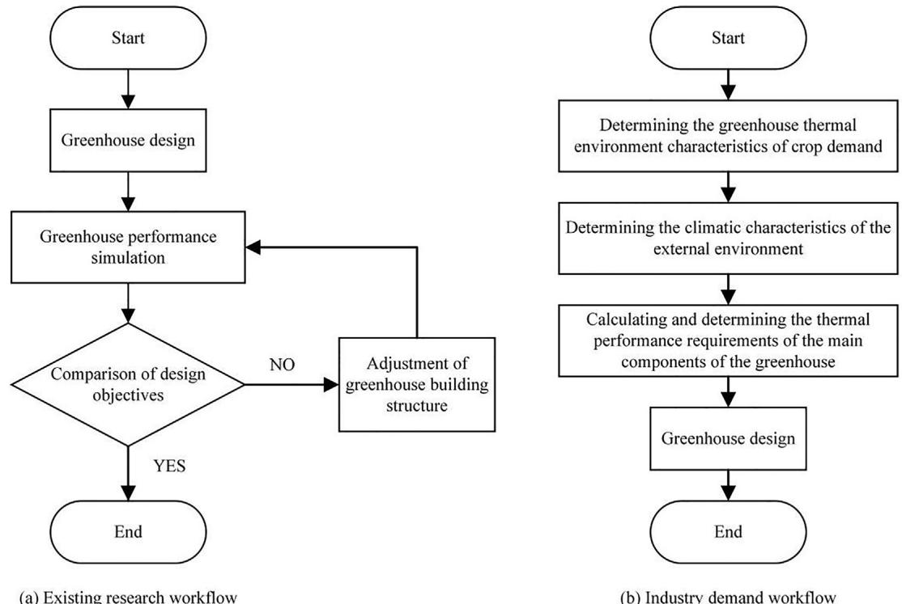  
图1. 工作流程对比

本文主要目的是建立可为温室热工性能设计提供直接指标要求的热环境模型，我们称之为CSG热环境波动模型。

与现有温室热环境模拟模型和热工性能设计模型相比，本文创新性主要体现在以下两方面：

1. 提出CSG热环境波动模型，建立温室热环境与温室构件热工性能及室外环境特征间的直接关系，可根据外部环境气候特征和温室热环境目标推导确定温室建筑的热工性能设计指标，为基于作物需求的温室热工性能设计提供创新技术方法。

2. 推导出CSG热环境多参数耦合响应波动方程，可在温室设计阶段准确快速计算主要蓄热构件(墙体)的热工性能指标，为温室建筑构件热工性能科学设计提供直接指标要求。

本文第2节详细描述实验温室和实验方法；第3节详细讨论CSG热环境波动模型的构建方法和过程；第4节对CSG热环境波动模型预测结果进行验证分析；第5节讨论不同热环境模型构建方法在建立热环境多参数耦合对应表达方程方面的差异。

# 2. 试验材料与方法

# 2.1. 实验温室

为探究CSG外部环境温度与其内部环境温度及蓄热墙温度间的波动相互作用，在西北农林科技大学搭建了实验温室。实验温室(图2)是CSG的等比例缩放模型。温室南北区域跨度为920mm，东西区域长度为1000mm，脊高600mm，温室骨架由134mm复合保温结构(双面木工板、双组分聚氨酯泡沫、双面木工板，尺寸分别为17mm、100mm和17mm)包围，统称为温室保温墙。蓄热墙位于保温墙前侧，是温室内唯一储放热结构。蓄热墙与保温墙间隔200mm。为减少地面散热对试验影响，温室地面采用相同复合保温结构。前屋面透明覆盖材料为5mm厚玻璃，保温覆盖材料为30mm厚复合保温被。实验温室具有良好的气密性，可有效阻隔温室内外气体交换。试验温室建筑材料的物理参数见表1。

# 2.2. 测试方法与仪器

# 2.2.1. 测试方法

中国日光温室(CSG)是一个半封闭空间系统，其与外界环境的能量交换主要包括传导换热、缝隙换热、地面换热和辐射换热。由于温室内外存在温差，传导换热过程始终发生在温室各围护结构中，其散热量与围护结构的面积和热流密度有关。Zhang等[42]研究发现砖墙CSG夜间(18:00至次日8:00)前屋面、后屋面、后墙和山墙的散热量分别占总散热量的$76.1\%$、$10.7\%$、$11.5\%$和$1.7\%$。因此本研究测量了温室前屋面、后屋面、保温后墙和东西山墙的传导换热热流密度。缝隙换热通常根据CSG设计规范(NY/T 3223-2018)计算，没有额外的直接测量方法，且本实验温室气密性良好，因此本文不涉及缝隙换热的讨论。温室土壤白天积累的大部分热量会在夜间返回室内环境，只有少量通过水平传递进入外部环境[43]。本研究中温室地面采用与墙体一致的保温材料，因此将地面传热与围护结构传热合并分析。外部太阳辐射通过前屋面周期性补充CSG内部能量，部分能量以热能形式储存，如蓄热墙。该过程与进入温室的太阳辐射和蓄热墙表面热流密度有关。蓄热墙分为前后两个储放热面。

# 2.2.2. 测试仪器与测试方法

本实验从CSG遵循能量守恒定律的角度出发，重点测量温室内外空气温度、保温墙内表面、前屋面内表面、地面内表面、蓄热墙前后表面温度及热流密度，以及前屋面内表面附近的太阳辐照度。测试温室结构示意图和测点布置如图3所示。

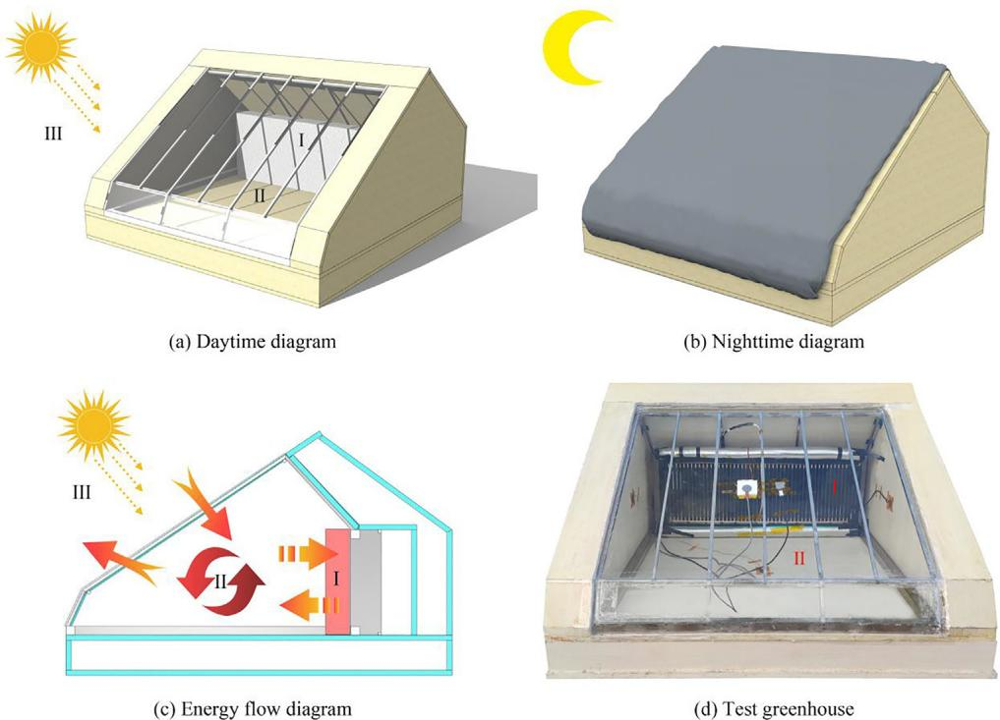  
图2. 实验温室

表1 温室建筑材料的物理参数

| 材料 | 蓄热系数 W/(m²·k) | 热扩散率 mm²/s | 导热系数 W/(m·k) | 厚度 m | 透光率 % |
|------|------------------|---------------|----------------|--------|---------|
| 木工板 | 0.13 | 1.964 | 0.261 | 0.017 | - |
| 聚氨酯泡沫 | 0.17 | 0.401 | 0.067 | 0.10 | - |
| 混凝土蓄热墙 | 0.52 | 2.543 | 1.322 | 0.08 | - |
| 玻璃 | 0.22 | 4.920 | 1.079 | 0.005 | 86 |
| 保温被 | 0.15 | 0.854 | 0.128 | 0.03 | - |

室内空气温度$(③)$由高精度HOBO MX2301A每分钟记录一次。蓄热墙前表面$(②)$和后表面$(①)$温度由高精度HFM-8(传感器:HS-30)每分钟读取并存储。蓄热墙前表面(3)和后表面(2)的传导热流密度、东山墙内表面(4)、西山墙内表面(7)、地面内表面(5)、保温后墙内表面(1)和前屋面内表面(6)的热流密度均由高精度HFM-8(传感器:HS-30)每分钟记录一次。温室内的太阳总辐射热流(6)使用高精度HFM-8(传感器:TS-34C)每分钟记录一次。此外，在测试温室外安装了气象站HOBO U30-NRC(传感器:S-THB-M002)用于测量室外空气温度$T_{i}$并每分钟记录数据。传感器规格和精度见表2。

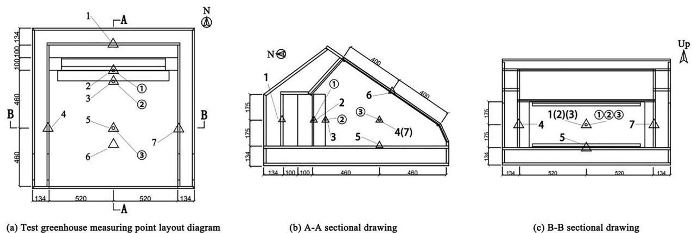  
图3. 测试温室结构示意图和测点布置

蓄热墙为预制混凝土墙，采用C25混凝土(水、水泥、砂比例为0.5:1:2)浇筑，规格为$900 \times 300 \times 80 \mathrm{mm}$，表面光滑均匀，标准养护28天。

注：1. 示意图中圆形为温度测点，三角形为热流测点。

2. 热流是方向性矢量，其方向从高温指向低温，且始终垂直于每条等温线。本研究中，进入CSG室内空气的热流方向定义为正，离开室内空气进入其他结构的热流方向定义为负。

# 3. CSG热环境波动模型的构建方法与过程

根据CSG热环境波动模型的构建原理，做出以下假设：

1. 蓄热墙是CSG中最重要的蓄热结构。
2. CSG室内空气温度均匀。
3. CSG气密性良好，温室内外无气体物质交换。

# 3.1. 相关物理量纲分析

选取与CSG热环境构建直接相关的物理参数进行量纲分析。这些参数包括太阳辐照度、温室蓄热墙热通量、温室前屋面热通量、温室保温墙内表面热通量、温室太阳辐射接收面积、温室蓄热墙面积、温室前屋面面积、温室保温墙面积、室内空气温度、温室蓄热墙温度(取前后表面温度平均值)、温室外空气温度和室内空气体积。选用国际基本量纲体系中的$L$、$M$、$T$和$\theta$四个基本量纲来表达上述12个物理量的量纲，其中$L$为长度量纲，$M$为质量量纲，$T$为时间量纲，$\theta$为温度量纲，如表3所示。

设$T_{i}$为CSG热环境波动模型的目标因变量，可用函数关系式(1)表示：

$$
T_{i} = f(T_{sw},T_{o},E,q_{sw},q_{r},q_{iw},S_{r},S_{sw},S_{m},S_{iw},V_{i}) \tag{1}
$$

并改写为函数关系的一般表达式形式：

$$
f(T_{i},T_{sw},T_{o},E,q_{sw},q_{r},q_{iw},S_{t},S_{sw},S_{m},S_{iw},V_{i}) = 0 \tag{2}
$$

由此建立无量纲矩阵A，结果如表4所示。

矩阵A的秩为3，因此齐次方程$Ay = 0$有$12 - 3 = 9$个基本解。结果如表5所示。

根据量纲分析的Buckingham π定理[28]，可从基本解矩阵得到对应的无量纲量，各无量纲量可表示为$\pi_{1}$、$\pi_{2}$、$\pi_{3}$、$\pi_{4}$、$\pi_{5}$、$\pi_{6}$、$\pi_{7}$、$\pi_{8}$和$\pi_{9}$，则：

$$
\pi_{1} = \frac{T_{i}}{T_{sw}},\pi_{2} = \frac{T_{o}}{T_{sw}},\pi_{3} = \frac{q_{sw}}{E}
$$

$$
\pi_{4} = \frac{q_{r}}{E},\pi_{5} = \frac{q_{iw}}{E},\pi_{6} = \frac{S_{sw}}{S_{s}} \tag{3}
$$

$$
\pi_{7} = \frac{S_{r}}{S_{s}},\pi_{8} = \frac{S_{iw}}{S_{s}},\pi_{9} = \frac{V_{i}}{S_{s}}
$$

存在函数$F$使得

$$
F(\pi_{1},\pi_{2},\pi_{3},\pi_{4},\pi_{5},\pi_{6},\pi_{7},\pi_{8},\pi_{9}) = 0, \tag{4}
$$

可转化为以$\pi_{I}$为因变量的特殊形式：

$$
\pi_{1} = \phi (\pi_{2},\pi_{3},\pi_{4},\pi_{5},\pi_{6},\pi_{7},\pi_{8},\pi_{9}). \tag{5}
$$

由式(3)至式(5)可得

$$
\frac{T_{i}}{T_{sw}} = \phi \left(\frac{T_{o}}{T_{sw}},\frac{q_{sw}}{E},\frac{q_{r}}{E},\frac{q_{iw}}{S_{s}},\frac{S_{sw}}{S_{s}},\frac{S_{r}}{S_{s}},\frac{S_{iw}}{S_{s}},\frac{V_{i}}{S_{s}}\right). \tag{6}
$$

式中，$\phi$为函数形式，其具体形式由实验推导确定。

若函数为幂函数形式，则

$$
\frac{T_{i}}{T_{sw}} = \frac{T_{o}}{T_{sw}}\frac{q_{sw}}{E}\frac{q_{r}}{E}\frac{q_{iw}}{E}\frac{q_{sw}}{S_{s}}\frac{f_{S}}{S_{s}}\frac{g_{SC}}{S_{s}}\frac{h_{W}}{S_{s}}\frac{V_{i}}{S_{s}}, \tag{7}
$$

式中 $a,b,c,d,f,g,h,$ 和 $j$ 为幂函数不确定指数值（下同）。

表2 传感器规格与精度

| 仪器名称 | 型号 | 测量范围 | 精度 | 分辨率 |
|----------|------|----------|------|--------|
| (室外) | | | | |
| 气象站 | HOBO U30-NRC | | | |
| 温度记录仪 | S-THB-M002 | -40 ~ 70 °C | ±0.3 °C | 0.02 °C |
| (室内) | | | | |
| 温湿度记录仪 | HOBO MX2301A | -40 ~ 70 °C | ±0.3 °C | 0.04 °C |
| 高精度热流数据采集器 | HFM-8 | | | |
| 导热热流传感器 | HS-30 | -200 ~ 200 kW/m² | ±3% | 0.1 W/m² |
| | | -180 ~ 300 °C | ±3% | 0.1 °C |
| 太阳总辐射热流传感器 | TS-34C | -200 ~ 200 kW/m² | ±3% | 0.1 W/m² |

表3 物理量纲分析

| 物理量 | 符号 | 单位 | 量纲 |
|--------|------|------|------|
| 太阳辐照度 | E | W·m⁻² | MT⁻³ |
| 温室蓄热墙热通量 | qsw | W·m⁻² | MT⁻³ |
| 温室前屋面热通量 | qr | W·m⁻² | MT⁻³ |
| 温室保温墙内表面热通量 | qiw | W·m⁻² | MT⁻³ |
| 温室太阳辐射接收面积 | Ss | m² | L² |
| 温室蓄热墙面积 | Sw | m² | L² |
| 温室前屋面面积 | Sw | m² | L² |
| 温室保温墙面积 | Sw | m² | L² |
| 室内空气温度 | Ii | °C | θ |
| 蓄热墙温度 | Tsw | °C | θ |
| 室外空气温度 | To | °C | θ |
| 室内空气体积 | Vi | m³ | L³ |

表4 量纲矩阵

| 量纲 | Ti | Tsw | To | E | qsw | qri | qiw | Ss | Ssw | Sr | Sww | Vi |
|------|----|-----|----|---|-----|-----|-----|----|-----|----|-----|----|
| L | 0 | 0 | 0 | 0 | 0 | 0 | 0 | 2 | 2 | 2 | 2 | 3 |
| M | 0 | 0 | 0 | 1 | 1 | 1 | 1 | 0 | 0 | 0 | 0 | 0 |
| T | 0 | 0 | 0 | -3 | -3 | -3 | -3 | 0 | 0 | 0 | 0 | 0 |
| θ | 1 | 1 | 1 | 0 | 0 | 0 | 0 | 0 | 0 | 0 | 0 | 0 |

表5 求解矩阵

| 物理量 | Ti | Tsw | To | E | qsw | qri | qiw | Ss | Ssw | Sr | Sww | Vi |
|--------|----|-----|----|---|-----|-----|-----|----|-----|----|-----|----|
| 解1 | 1 | -1 | 0 | 0 | 0 | 0 | 0 | 0 | 0 | 0 | 0 | 0 |
| 解2 | 0 | -1 | 1 | 0 | 0 | 0 | 0 | 0 | 0 | 0 | 0 | 0 |
| 解3 | 0 | 0 | 0 | 0 | 0 | 0 | 0 | 0 | 0 | 0 | 0 | 0 |
| 解4 | 0 | 0 | 0 | -1 | 1 | 1 | 0 | 0 | 0 | 0 | 0 | 0 |
| 解5 | 0 | 0 | 0 | -1 | 0 | 0 | 1 | 0 | 0 | 0 | 0 | 0 |
| 解6 | 0 | 0 | 0 | 0 | 0 | 0 | 0 | -1 | 1 | 0 | 0 | 0 |
| 解7 | 0 | 0 | 0 | 0 | 0 | 0 | 0 | -1 | 0 | 1 | 0 | 0 |
| 解8 | 0 | 0 | 0 | 0 | 0 | 0 | 0 | -1 | 0 | 0 | 1 | 0 |
| 解9 | 0 | 0 | 0 | 0 | 0 | 0 | 0 | -3/2 | 0 | 0 | 0 | 1 |

方程(7)的具体参数需要根据不同温室结构和类型来推导和确认。理论上需要采用正交试验法的五因素三水平正交旋转(共15种温室类型)。基于对CSG热环境波动模型方法的探索和验证，本文不讨论方程(7)的具体形式，但温室结构对温室热环境构建的影响不可忽视。因此，本实验采用合并基本物理量的方法来抵消实验要求。其中，各围护结构面积和室内空气体积可以相互替代，两者都能反映温室的几何参数。因此保留各围护结构的面积参数，简化并舍弃温室体积$\mathbf{V}$的参数。具体方法如下，量纲分析见表6。

$$
\begin{array}{c}{P_s = E*S_s}\\ {P_{sw} = q_{sw}*S_{sw}}\\ {P_r = q_r*S_r}\\ {P_{iw} = q_{iw}*S_{iw}} \end{array} \tag{8}
$$

$V_{i}$被舍弃

在方程(8)中，$P_{s}$是温室的太阳辐射功率，$P_{sw}$是蓄热墙的储放热功率，$P_{r}$是温室前屋面的导热功率，$P_{iw}$是温室保温墙的导热功率。

表6 合并后的物理量维度分析

| 物理量名称 | 符号 | 单位 | 量纲 |
|------------|------|------|------|
| 温室太阳辐射功率 | Ps | W | L²MT⁻³ |
| 蓄热墙储放热功率 | Psw | W | L²MT⁻³ |
| 温室前屋面导热功率 | Pr | W | L²MT⁻³ |
| 温室保温墙内表面导热功率 | Piw | W | L²MT⁻³ |
| 室内空气温度 | Ti | ℃ | θ |
| 蓄热墙温度 | Tsw | ℃ | θ |
| 室外空气温度 | To | ℃ | θ |

根据上述方程(1)-(7)的推理方法，简化物理量后可以得到室内空气温度$T_{i}$的无量纲函数：

$$
T_{i} = \frac{T_{o}}{T_{sw}}\frac{a_{sw}}{P_{s}}\frac{b_{Pr}c_{Pr}}{P_{s}}\frac{d_{Iw}}{P_{s}} T_{sw}. \tag{9}
$$

同理，可以得到温室储能墙温度$T_{sw}$的无量纲函数：

$$
T_{sw} = \frac{T_o}{T_i}\frac{a_{sw}}{P_s}\frac{b_{Pr}}{P_s}\frac{d_{Iw}}{P_s}\frac{d_{Iw}}{P_s} T_i. \tag{10}
$$

# 3.2. CSG中物理量的日变化特征

图4展示了实验温室在典型冬季晴天条件下一个完整运行周期(2021年1月13日9:00至2021年1月14日9:00)的实测数据。保温被开启和关闭时间分别为9:34和17:22。

从图中可以看出，除室外空气温度曲线外，一个运行周期内的每条曲线都被分为两部分，呈现两种完全不同的波动规律。当保温被开启时，热功率和温度曲线变化剧烈，温室内外存在强烈的能量交换过程。在保温被关闭期间，温室太阳辐射功率始终为0W，只有储能墙保持较大的放热功率，平均功率为37.39W。保温墙和前屋面的平均功率分别为1.60W和-15.31W，表明储能墙在构建温室热环境中起着至关重要的作用。

# 3.3. CSG热环境波动模型

基于CSG中物理参数的日变化特征，通过量纲分析推理得到结构上经过调整的无量纲函数方程。

(1) 根据保温被的启闭状态，将温室一个完整运行周期划分为白天和夜间两个运行阶段

(2) 夜间运行阶段去除$P_{s}$

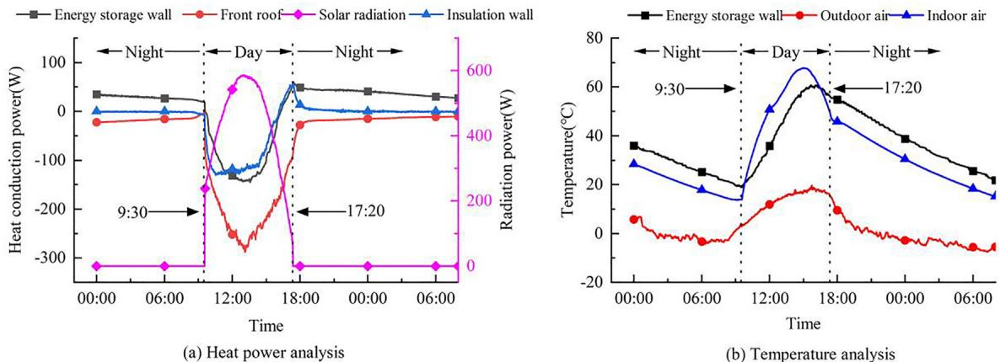  
图4. CSG中物理量的实测数据

最终得到CSG热环境波动模型如下：

室内空气温度：  
日间运行阶段：

$$
\begin{array}{c}{T_i = \left(\frac{T_o}{(T_{sw} - \frac{1}{2}(T_{sw}^{-} - T_{sw - m}^{-}))} +e\right)^a\left(\frac{P_{sw}}{P_s} +e\right)^b\left(\frac{P_r}{P_s} +e\right)^c\left(\frac{P_{iw}}{P_s} +e\right)^d (T_{sw}}}\\ {-\frac{1}{2} (T_{sw}^{-} - T_{sw - m}^{-})) - T_{cc - day}} \end{array}
$$

夜间运行阶段：

$$
T_{i} = \left(\frac{T_{o}}{T_{sw}} +e\right)^{k}\left(\frac{P_{r}}{P_{sw}} +e\right)^{l}\left(\frac{P_{iw}}{P_{sw}} +e\right)^{n}T_{sw} - T_{cc - night} \tag{12}
$$

储能墙温度：  
日间运行阶段：

$$
\begin{array}{c}{T_{sw} = \left(\frac{T_o}{(T_i - \frac{1}{2}(T_i - T_{i - m}^{-}))} +e\right)^f\left(\frac{P_{sw}}{P_s} +e\right)^g\left(\frac{P_r}{P_s} +e\right)^h\left(\frac{P_{iw}}{P_s} +e\right)^j (T_i}\\ {+\frac{1}{2} (T_i - T_{i - m}^{-})) + T_{cc - day}} \end{array} \tag{13}
$$

夜间运行阶段：

$$
T_{sw} = \left(\frac{T_o}{T_i} +e\right)^t\left(\frac{P_r}{P_{sw}} +e\right)^u\left(\frac{P_{iw}}{P_{sw}} +e\right)^w T_i + T_{cc - night} \tag{14}
$$

$T_{i}$为CSG室内空气温度；$T_{o}$为CSG外部空气温度；$P_{s}$为CSG太阳辐射热功率；$T_{sw}$为CSG储能墙温度；$T_{sw}$为日间运行阶段储能墙平均温度；$T_{sw - m}$为回归模型日间运行阶段储能墙平均温度；$T_{i}$为日间运行阶段室内空气平均温度；$T_{i}$为回归模型日间运行阶段室内空气平均温度；$P_{sw}$为回归模型中储能墙储放热功率；$P_{r}$为回归模型前屋面导热功率；$P_{iw}$为回归模型墙体导热功率；$e$为自然常数(2.71828)；$T_{cc - day}$为回归模型日间温度补偿曲线；$T_{cc - night}$为回归模型夜间温度补偿曲线；$a$、$b$、$c$、$d$、$f$、$g$、$h$、$j$、$k$、$l$、$n$、$t$、$u$和$w$为待定模型参数。

# 4. 结果与分析

在模型验证测试期间，对测试温室进行了连续监测和记录，时间为2020年12月21日至2021年1月16日，持续27天。冬至日为2020年12月22日。天气条件如图5所示。在整个测试期间，每日最大太阳辐射在$164.5 \mathrm{W / m^2}$至$677.9 \mathrm{W / m^2}$之间变化，室外空气温度在$-13.1^{\circ}\mathrm{C}$至$20.5^{\circ}\mathrm{C}$之间变化。在连续阴雪天气时，CSG通常采取人工增温、补光和白昼覆盖保温被等措施。此时室内空气温度主要受人为因素影响，受储能墙和外部空气温度影响较小。因此，实验分析的重点是晴天(云量$=0-2$，太阳辐射充足)采集的数据，并选取3天的数据作为典型日进行详细分析。选取的3天分别是2021年1月1日、2021年1月13日和2021年1月14日。

# 4.1. CSG热环境波动模型求解

模型输入为CSG典型冬季晴天一个完整运行周期(2021年1月13日9:30至2021年1月14日9:30)的实测数据。数据包括：室内空气温度、储能墙温度、室外空气温度、温室太阳辐射功率、储能墙储放热功率、温室前屋面导热功率和温室保温墙内表面导热功率。使用SPSS 25软件进行多元线性回归分析求解模型待定参数，结果如图6和表7所示。

由此得到陕西西安地区典型冬季晴天的CSG热环境波动方程。在该方程中，夜间参数$k$为1，因此通过对储能墙温度$T_{sw}$求解函数进行简单变形可得到式(13):

$$
T_{sw} = \frac{T_i + T_{cc - night}}{e\left(\frac{P_r}{P_{sw}} + e\right)^l\left(\frac{P_{iw}}{P_{sw}} + e\right)^n} -\frac{T_o}{e} \tag{15}
$$

$T_{i}$为CSG室内空气温度；$T_{o}$为CSG外部空气温度；$P_{sw}$为回归模型中储能墙储放热功率；$P_{r}$为回归模型前屋面导热功率；$P_{iw}$为

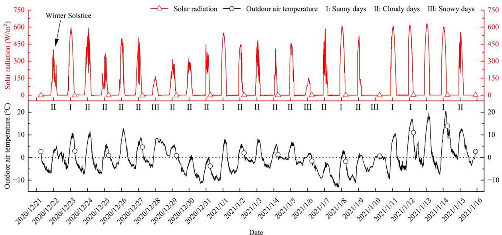  
图5. 整个测试期间的天气状况

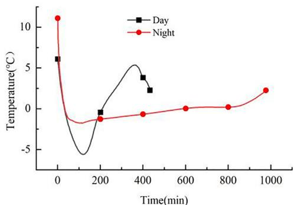  
图6. 回归模型的温度补偿曲线

回归模型墙体导热功率；$T_{cc - night}$为回归模型夜间储能墙温度补偿曲线，$l$和$n$为参数。

# 4.2. CSG热环境波动方程验证结果与分析

为验证本研究建立的CSG热环境波动方程的准确性和合理性，对相同天气条件下2天(2021年1月1日和2021年1月14日)的实测数据进行了详细分析。2天的实测数据如图7所示。模型输入数据为储能墙(室内空气)温度、室外空气温度和太阳辐射热功率，输出数据为室内空气(储能墙)温度。

图7和表8显示，1月1日最高室外气温为$7.9^{\circ}C$，1月14日为$20.5^{\circ}C$，两天温差达$12.6^{\circ}C$。1月1日最大太阳辐射热功率为$509.9W$，而1月13日太阳辐射热功率为$586.2W$，相差$76.3W$，约为1月1日最大太阳辐射热功率的$14.96\%$。虽然典型天气类型均为冬季晴天，但实际温度条件差异较大且时间不连续，中间间隔雨雪等天气类型，能更好地验证分析CSG在典型冬季晴天条件下热环境波动方程的准确性和适用性。

表7 回归模型求解参数

| 项目 |  | 求解参数 | 回归结果 | 决定系数 |
|------|------|----------|----------|----------|
| **日间运行阶段** | **室内空气** | a | 1 | 0.990 |
|  |  | b | -1.228 |  |
|  |  | c | 0.378 |  |
|  |  | d | -0.074 |  |
|  | **储能墙** | Tsw-m | 44.84 |  |
|  |  | f | 1.04 | 0.991 |
|  |  | g | 1.04 |  |
|  |  | h | -1.66 |  |
|  |  | j | -0.98 |  |
|  |  | Ti-m | 52.86 |  |
| **夜间运行阶段** | **室内空气** | k | 1 | 0.978 |
|  |  | l | -0.7 |  |
|  |  | n | -0.7 |  |
|  | **储能墙** | t | -0.72 | 0.981 |
|  |  | u | 0.57 |  |
|  |  | w | 0.48 |  |

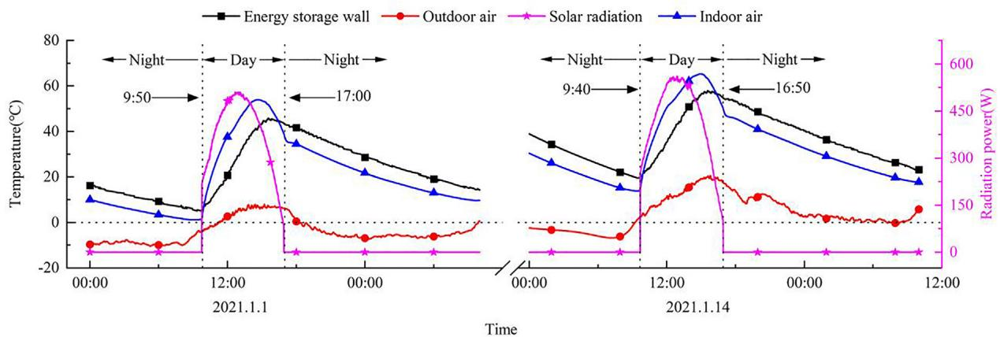

表8 典型晴天温度与太阳辐射极值数据

| 时间 | 储能墙温度(℃) | 室外空气温度(℃) | 室内空气温度(℃) | 温室太阳辐射功率(W) |
|------|---------------|----------------|----------------|---------------------|
| 2021.1.1 | 45.8 | 7.9 | 53.9 | 509.9 |
| 2021.1.13 | 60.3 | 17.8 | 67.8 | 586.2 |
| 2021.1.14 | 57.9 | 20.5 | 65.3 | 558.8 |

# 4.2.1. 日间运行阶段室内空气温度验证与分析

图8结果显示，两天的室内空气温度计算值与实测值吻合良好，曲线拟合度高。仅在16:30至16:54期间存在负偏差且呈增大趋势，该时段温差在小范围内波动。整个运行阶段，1月1日的平均温度误差为$1.53^{\circ}\mathrm{C}$，均方根误差(RMSE)为$2.06^{\circ}\mathrm{C}$，平均绝对误差(MAE)为$1.71^{\circ}\mathrm{C}$；1月14日的平均温度误差为$-0.24^{\circ}\mathrm{C}$，RMSE为$1.28^{\circ}\mathrm{C}$，MAE为$1.01^{\circ}\mathrm{C}$。对两天数据进行相关性分析后得到决定系数$\mathbb{R}^2$分别为0.9897和0.9894。这表明日间室内空气温度计算值与实测值吻合良好，两天的计算精度基本一致。

# 4.2.2. 夜间运行阶段室内空气温度验证与分析

图9显示，两天的室内空气温度变化趋势与实测值高度一致，曲线拟合良好。无较大偏差时段，温差波动范围仅约$\pm1.00^{\circ}\mathrm{C}$。整个运行阶段，1月1日的平均温度误差为$0.019^{\circ}\mathrm{C}$，RMSE为$0.418^{\circ}\mathrm{C}$，MAE为$0.280^{\circ}\mathrm{C}$；1月14日的平均温度误差为$0.303^{\circ}\mathrm{C}$，RMSE为$0.597^{\circ}\mathrm{C}$，MAE为$0.428^{\circ}\mathrm{C}$。两天数据的相关性分析显示$\mathbb{R}^2$值分别为0.9972和0.9971。与日间相比，夜间室内空气温度计算值与实测值吻合度更高，两天的计算精度基本一致。

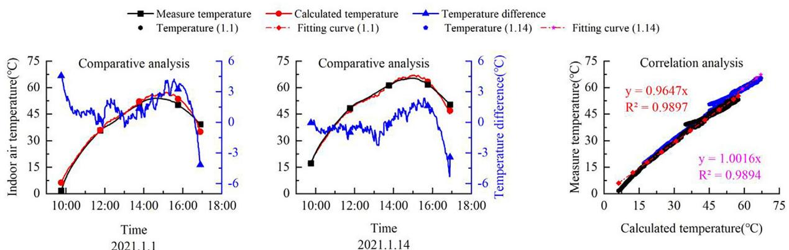  
图8. 日间运行阶段室内空气温度验证与分析

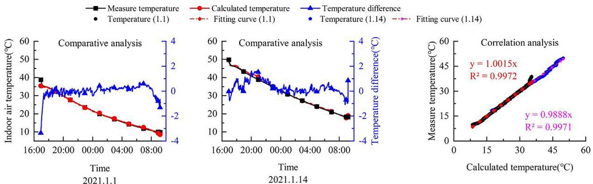  
图9. 夜间运行阶段室内空气温度验证与分析

# 4.2.3. 日间运行阶段储能墙温度验证与分析

图11-a结果显示，储能墙温度计算值仅在运行后期出现较大偏差，且温差呈逐渐增大趋势。在运行阶段前半段(9:42至约15:30)，温差仅在小范围内波动(约$\pm2.00^{\circ}\mathrm{C}$)，但在后半段(15:30至约16:54)，温差开始呈指数增长，在保温被关闭前达到最大值约$30^{\circ}\mathrm{C}$。

经检查发现，该偏差由保温被启闭时间导致。1月13日的保温被开启时间比其他两天长约$30\mathrm{min}$，因此计算模型中1月13日的$P_{\|}$仍保持较大功率值(约$130\mathrm{W}$)，比实际值(约$80\mathrm{W}$)高约$60\%$，导致温度计算模型出现较大误差。整个运行阶段，1月1日的平均温度误差为$0.37^{\circ}\mathrm{C}$，RMSE为$4.45^{\circ}\mathrm{C}$，MAE为$2.16^{\circ}\mathrm{C}$；1月14日的平均温度误差为$2.24^{\circ}\mathrm{C}$，RMSE为$5.71^{\circ}\mathrm{C}$，MAE为$2.98^{\circ}\mathrm{C}$。两天数据的相关性分析显示$\mathbb{R}^2$值分别为0.9067和0.8683。较大的RMSE和较小的$\mathbb{R}^2$表明CSG热环境波动方程在计算日间储能墙温度时存在一定局限性，需进一步调整优化。

根据储能墙表面热流数据计算，1月1日和14日储能墙的储热量分别为$1984.57\mathrm{kJ}$和$2068.25\mathrm{kJ}$。

# 4.2.4. 夜间运行阶段储能墙温度验证与分析

从图10可以看出，夜间运行阶段储能墙温度计算值与实测值高度一致，无较大偏差，温差在$-1.50^{\circ}\mathrm{C}$至$1.50^{\circ}\mathrm{C}$之间波动。整个运行阶段，1月1日的平均温度误差为$0.51^{\circ}\mathrm{C}$，RMSE为$0.73^{\circ}\mathrm{C}$，MAE为$0.56^{\circ}\mathrm{C}$；1月14日的平均温度误差为$-0.33^{\circ}\mathrm{C}$，RMSE为$0.56^{\circ}\mathrm{C}$，MAE为$0.45^{\circ}\mathrm{C}$。两天数据的相关性分析显示$\mathbb{R}^2$值分别为0.9975和0.9973。与日间相比，夜间室内空气温度计算值与实测值吻合度更高，两天的计算精度基本一致。

根据储能墙表面热流数据计算，1月1日和14日夜间的储能墙热负荷分别为$1578.72\mathrm{kJ}$和$1839.49\mathrm{kJ}$。

# 4.3. CSG热环境波动方程优化研究

在充分验证CSG热环境波动方程正确性的前提下，为减弱保温被启闭时间对计算结果的影响，进一步提高热环境波动方程的适用性和准确性，本研究对与计算误差产生密切相关的几组物理量进行了相关性分析，以探索方程的结构优化。

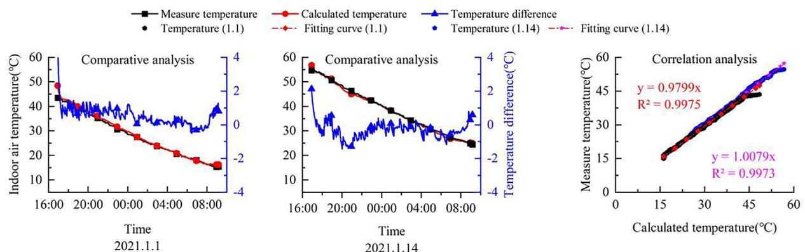  
图10. 夜间运行阶段储能墙温度验证与分析

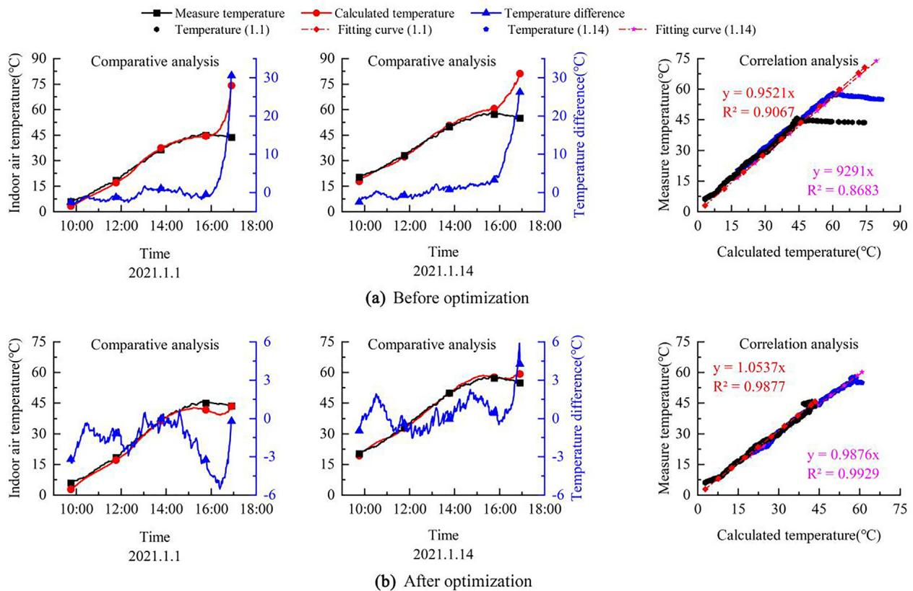  
图11. 日间运行阶段储能墙温度验证与分析

# 4.3.1. CSG热环境波动方程优化

在本研究建立的CSG热环境波动方程中，$P_{iw}$、$P_{r}$和$P_{sw}$均通过模型回归求解获得。基于此，模型应用人员只需根据生产需求和现场气象数据获取温室的$T_{i}$、$T_{o}$、$P_{s}$等参数值，即可计算满足生产需求的热性能指标参数。因此，我们对与计算误差密切相关的$P_{s}$、$P_{iw}$、$P_{r}$、$P_{sw}$等物理量进行了相关性分析，结果如表9所示。

表9显示，$P_{s}$与温室内其他物理量的综合相关性最佳，$\mathbb{R}^2$值分别为0.673、0.936和0.968。因此，我们通过舍弃相关性较低的$P_{iw}$并以$P_{s}$为自变量，对热环境波动方程中的$P_{r}$和$P_{sw}$进行结构优化。回归方程为：

$$
y_{1} = -0.418x + 98.623 \tag{16}
$$

以及

$y_{2}$表示温室前屋面的热传导功率。

通过将式(16)和式(17)与式(13)及表7相结合，得到日间运行阶段储能墙的优化热环境波动方程：

$$
\begin{array}{r l} & {T_{s w} = \left(\frac{T_{o}}{(T_{i} - \frac{1}{2}(T_{i}^{-} - 52.86))} +e\right)^{1}\left(\frac{(-0.418P_{s} + 98.623)}{P_{s}} +e\right)^{1.04}}\\ & {\qquad \times \left(\frac{(-0.366P_{s} - 45.843)}{P_{s}} +e\right)^{-1.66}\left(\frac{P_{i w}}{P_{s}} +e\right)^{-0.98}}\\ & {\qquad \times (T_{i} + \frac{1}{2} (\bar{T_{i}} -52.86)) + T_{c c - d a y}} \end{array} \tag{18}
$$

# 4.3.2. 优化方程验证与分析

为检验优化方程的准确性和合理性，采用上述方法进行验证分析。

图11结果显示，与式(13)对储能墙温度的预测结果(图11-a)相比，优化后的式(18)(图11-b)预测精度显著提高。两天的MAE分别降低了$2.20^{\circ}C$和$4.51^{\circ}C$，绝对误差从$30^{\circ}C$降至$5^{\circ}C$，$\mathbb{R}^2$值从0.9067提升至0.9877，大幅削弱了保温被启闭时间不同带来的计算误差。这是由于通过回归方程(16)和(17)获得的$P_{r}$和$P_{sw}$拟合值，根据输入值$P_{s}$更接近该条件下温室的真实值。

表9 物理量相关性分析

| 决定系数R² | P5 | Piw | Pr | Psw |
|------------|----|-----|----|-----|
| P5 | 1 | 0.6729 | 0.9362 | 0.9683 |
| Piw | 0.6729 | 1 | 0.4663 | 0.7934 |
| Pr | 0.9362 | 0.4663 | 1 | 0.8621 |
| Psw | 0.9683 | 0.7934 | 0.8621 | 1 |

综上所述，拟合回归优化有效降低了保温被启闭时间对模型精度的影响，提高了方程的准确性和适应性。

# 4.4. 与现有建模方法的预测精度对比分析

详细计算了CSG热环境波动模型在两个验证日期$(n = 2822)$的累积误差，并与采用常见建模方法的温室热环境模型进行了对比。结果如表10所示。CSG热环境波动模型对室内空气和储能墙温度的预测精度基本一致，预测精度差异较小。平均温度误差分别为$0.309^{\circ}C$和$-0.130^{\circ}C$，在所有热环境模型中表现最佳且远优于其他模型。MAE分别为$0.661^{\circ}C$和$0.760^{\circ}C$，略高于其他热环境模型。RMSE分别为$1.040^{\circ}C$和$1.135^{\circ}C$，在所有热环境模型中处于中等水平。$R^2$分别为0.9956和0.9909，相关性优异且远高于其他热环境模型。对比结果表明，热环境波动模型具有更高的预测精度，优于大多数现有热环境模型。该模型不仅能有效模拟预测室内空气热环境，还能准确计算储能墙的温度波动需求特性。

# 5. 讨论

本研究采用量纲分析方法探究了外界环境、室内空气与储能墙温度波动的相互作用关系，建立了CSG热环境波动模型和热环境波动方程，为CSG建筑构件的热工性能设计提供了通用、简单、直接的指标需求与设计方法。

尽管已有大量关于温室热环境模型的研究报道[47,48]，但这些研究均未深入探究温室内热环境与相关物理量间的相互作用关系。CSG作为一个相对独立的能量系统，遵循经典热力学的能量守恒原理，系统中各物理过程的能量流动共同维持着室内热环境的动态平衡。通过分析这些物理过程的能量方程，可以建立温室热环境模型。虽然储能墙温度和室内空气温度常被用作热环境模型的两个验证对象[21,49]，但关于二者相互作用关系的研究较少。CFD可以基于质量、动量和能量守恒方程以及其他模型方程建立完整的CSG仿真模型，计算获取温室内任意点的温度场模拟结果。然而求解的本质是将描述流体运动的连续介质数学模型离散为大型代数方程组，并建立可在计算机上求解的算法，各点温度场模拟结果本质上是方程组的解值，不具有方程组的物理意义[50]。因此只能建立彼此间的代数关系，且代数关系多为高阶方程或含有复杂微分、偏微分项的方程，无法建立物理量间相互作用的简单模型。

同样，误差反向传播(BP)神经网络通过误差反向传播算法完成非线性连续函数的多层前馈神经网络权值调整，获得误差平方和最小的网络模型来学习并存储大量输入-输出模式映射关系，最终实现对输入-输出数据间多个非线性复杂函数的拟合与预测[51,52]。本质上神经网络模型也是数值计算，运算过程不遵循基本数学运算规则，输出结果是单纯的数值而不具有物理意义。本研究构建的多参数耦合相互作用关系在输入阶段、计算阶段和输出阶段均遵循数学运算规则，在数值计算的同时通过方程计算各物理量的单位，最终输出单位以$^\circ \mathrm{C}$为单位，输出项是具有物理意义的温度值。因此相比仿真计算和神经网络，通过量纲分析方法构建的多参数耦合相互作用关系能更好地描述各物理量间的相互作用关系。

表10 模型预测精度分析

| 对比文献 | 测量对象 | 建模方法 | 平均温差(°C) | MAE | RMSE | 实测温度范围(°C) | R² |
|---------|---------|---------|------------|-----|------|---------------|----|
| 热环境波动模型 | 室内空气 | - | 0.309 | 0.661 | 1.040 | 1.7 ~ 65.2 | 0.9956 |
| 热环境波动模型 | 蓄热墙 | - | -0.130 | 0.760 | 1.135 | 6.0 ~ 58.0 | 0.9909 |
| Zhang [44] | - | I | - | 0.220 | 1.360 | 10.9 ~ 29.3 | 0.9600 |
| Liu等[4] | - | I | - | - | 2.600 | 25.8 ~ 66.9 | - |
| Esmaeli等[6] | - | I | 0.890 | - | 0.320 | 6.6 ~ 27.5 | - |
| Dong等[3] | - | I | 1.900 | - | - | 16.3 ~ 39.5 | - |
| He等[25] | - | II | - | 0.310 | 0.390 | 30.2 ~ 40.0 | - |
| Saberian等[45] | - | II | - | - | 1.880 ~ 3.030 | 53.2 ~ 63.1 | 0.7800 ~ 0.8900 |
| Chen等[46] | - | II | 1.4 | - | 0.900 | 19.0 ~ 27.2 | - |
| Taki等[16] | - | III | - | - | 0.230 | 36.2 ~ 65.6 | 0.9815 |
| Zou等[18] | - | III | - | - | 1.441 | 5.3 ~ 35.4 | - |
| Jung等[19] | - | III | - | - | 0.890 | 18.4 ~ 45.5 | 0.9400 |

注：原始文献中未找到相应数据

本研究采用量纲分析方法建立了CSG热环境波动模型。模型的输入数据包括储能墙温度(室内空气)、温室外空气温度和太阳辐射热功率，输出数据为室内空气温度(储能墙温度)。通过理论推导可实现物理参数的相互验证，有效弥补了上述温室热环境研究方法的不足，为温室建筑构件热工性能的科学设计提供了直接指标需求。

需要说明的是，由于实验条件限制，本研究未对温室结构、类型等模型中的其他物理量进行深入探究，但研究思路和方法已详细讨论。这些不足将在未来研究中进一步补充完善。

# 6. 结论

本研究的主要目的是建立CSG热环境模型与建筑构件热工性能设计之间的直接联系，为温室热工性能设计提供直接指标需求。主要结论如下：

1. 采用量纲分析方法全面分析了温室热环境相关物理量，探究了CSG中室内空气、储能墙与室外空气温度间的波动相互作用，建立了CSG热环境波动模型。可根据外界环境气候特征和温室热环境目标推导确定温室建筑热工性能设计指标，为以作物需求为核心的温室热工性能设计提供了创新技术方法。

2. 推导了CSG热环境与CSG结构参数及外部气象特征间的多参数耦合响应波动方程。可在温室设计阶段准确快速计算温室主要储能构件(墙体)的热工性能指标参数$T_{sw}$，为温室建筑构件热工性能的科学设计提供直接指标需求。

3. 基于实验温室数据对CSG热环境波动模型和方程进行了验证分析。结果表明，在典型冬季晴天条件下，室内空气温度预测值与实测值的MAE为$0.66^{\circ}\mathrm{C}$，RMSE为$1.04^{\circ}\mathrm{C}$，$\mathbb{R}^2$为$0.9956$ $(\mathrm{n} = 2822)$；储能墙温度预测值与实测值的MAE为$0.76^{\circ}\mathrm{C}$，RMSE为$1.14^{\circ}\mathrm{C}$，$\mathbb{R}^2$为$0.9909$ $(\mathrm{n} = 2822)$。波动模型和方程准确描述了温室热环境与温室内部构件及外部环境间的相互作用关系，具有良好模拟效果。

本研究提出的将CSG热环境波动模型和方程应用于温室热环境模拟和热工性能需求指标计算的过程与方法，可方便地应用于其他类型和地区CSG的模拟与设计。

为进一步优化CSG中储能墙热工性能的科学设计，本研究的未来发展方向是建立适用于不同气候区的CSG热环境波动模型，并利用模拟结果指导温室的设计建造，提高CSG冬季实际热工性能。

# 作者贡献声明

Yong Zhang: 项目监督，概念化，方法论，论文审阅与修改，提供项目支持。Lianghe Xu: 方法论，初稿撰写，数据分析。Xiaohong Zhu: 数据分析，数据采集。Bin He: 数据采集，实验平台搭建。Yu Chen: 数据整理，调查。

# 数据可用性声明

数据可根据要求提供。

# 利益冲突声明

作者声明不存在任何可能影响本工作的已知竞争性经济利益或个人关系。

# 致谢

本研究得到陕西省重点研发计划项目(2018TSCXL, 2021QFY08-01, 2016KTCL02-02)资助。

# 附录A. 补充材料

本文补充材料可在https://doi.org/10.1016/j.enbuild.2022.112648 在线获取。

## 参考文献

1.  [\[1\]](#bb0005)
F. Qi, 国家温室数据系统. [http://data.sheshiyuanyi.com/AreaData/](http://data.sheshiyuanyi.com/AreaData/), in, 2019.
2.  [\[2\]](#bb0010)
C. Wu, X. Zhao, W. Guo
日光温室内温度模拟与分析
Trans. Chin. Soc. Agric. Eng., 4 (2007), pp. 190-195
3.  [\[3\]](#bb0015)
S. Dong, M.S. Ahamed, C. Ma, H. Guo
寒冷地区单坡面日光温室热环境预测的时变模型
Energies, 14 (18) (2021)
4.  [\[4\]](#bb0020)
R. Liu, M. Li, J.L. Guzman, F. Rodriguez
温室温湿度快速实用的一维瞬态模型
Comput. Electron. Agric., 186 (2021)
5.  [\[5\]](#bb0025)
X. Zhang, J. Lv, M.M. Dawuda, J. Xie, J. Yu, Y. Gan, J. Zhang, Z. Tang, J. Li
创新被动蓄热墙提升非耕地日光温室热性能与能效
Sol. Energy, 190 (2019), pp. 561-575
6.  [\[6\]](#bb0030)
H. Esmaeli, R. Roshandel
基于气候条件的日光温室优化设计
Renewable Energy, 145 (2020), pp. 1255-1265
7.  [\[7\]](#bb0035)
C. Baglivo, D. Mazzeo, S. Panico, S. Bonuso, N. Matera, P.M. Congedo, G. Oliveti
评估作物热舒适与能源需求的完整温室动态模拟工具
Appl. Therm. Eng., 179 (2020), Article 115698
8.  [\[8\]](#bb0040)
R.W. Kim, J.G. Kim, I.B. Lee, U.H. Yeo, S.Y. Lee, C. Decano Valentin
利用CFD和VR技术开发温室空气动力环境三维可视化技术(第一部分):基于CFD的VR数据库开发
Biosyst. Eng., 207 (2021), pp. 33-58
9.  [\[9\]](#bb0045)
D. Wei, Y. Zhang, S. Liu, Y. Lv, 自然通风条件下日光温室通风特性的模拟研究, in, SPIE, 2022, pp. Academic Exchange Information Center (AEIC).
10.  [\[10\]](#bb0050)
M. Dhiman, V.P. Sethi, B. Singh, A. Sharma
利用烟气和水热沉管网进行温室加热的CFD分析
Comput. Electron. Agric., 163 (2019)
11.  [\[11\]](#bb0055)
D. Mazzeo, C. Baglivo, S. Panico, P.M. Congedo
太阳能温室：气候条件、玻璃选择与植物生长环境
Sol. Energy, 230 (2021), pp. 222-241
12.  [\[12\]](#bb0060)
S. Bonuso, S. Panico, C. Baglivo, D. Mazzeo, N. Matera, P.M. Congedo, G. Oliveti
太阳能温室自然与机械通风动态分析：耦合受控机械通风(CMV)与地-空气热交换器(EAHX)
Energies (2020)
13.  [\[13\]](#bb0065)
M.S. Ahamed, H. Guo, K. Tanino
基于TRNSYS瞬态建筑能耗模拟模型的中式太阳能温室供热需求建模
J. Build. Eng., 29 (2020), Article 101114
14.  [\[14\]](#bb0070)
A. Rasheed, C.S. Kwak, W.H. Na, J.W. Lee, H.T. Kim, H.W. Lee
多跨温室微气候控制的建筑能耗模拟模型开发
Agronomy (2020)
15.  [\[15\]](#bb0075)
A. Banakar, M. Montazeri, B. Ghobadian, H. Pasdarshahri, F. Kamrani
伊朗封闭式温室冷热负荷的能量分析与评估
Therm. Sci. Eng. Progress, 25 (2021), Article 101042
16.  [\[16\]](#bb0080)
M. Taki, Y. Ajabshirchi, S.F. Ranjbar, A. Rohani, M. Matloobi
半太阳能温室内环境变量与能量损失的传热与MLP神经网络预测模型
Energy Build., 110 (2016), pp. 314-329
17.  [\[17\]](#bb0085)
H. Yu, Y. Chen, S.G. Hassan, D. Li
基于改进PSO优化的LSSVM的中式太阳能温室温度预测
Comput. Electron. Agric., 122 (2016), pp. 94-102
18.  [\[18\]](#bb0090)
W. Zou, F. Yao, B. Zhang, C. He, Z. Guan
基于凸双向极限学习机算法的太阳能温室温湿度验证与预测
Neurocomputing, 249 (2017), pp. 72-85
19.  [\[19\]](#bb0095)
D.H. Jung, H.S. Kim, C. Jhin, H.J. Kim, S.H. Park
基于深度神经网络的温室内气候条件预测时间序列分析
Comput. Electron. Agric., 173 (2020), Article 105402
20.  [\[20\]](#bb0100)
T. Moon, J.W. Lee, J.E. Son
利用二维卷积神经网络实现温室环境数据精确插补以保障数据完整性
Sensors, 21 (6) (2021), p. 2187
21.  [\[21\]](#bb0105)
C. Ma, J. Han, R. Li
太阳能温室热环境模拟与预测软件的研发
Northern Hortic., 222 (15) (2010), pp. 69-75
22.  [\[22\]](#bb0110)
L. Meng, Q. Yang, J. Wen, Y. Zhang, H. Fang
基于MATLAB和VB混合编程的中式太阳能温室热环境可视化仿真模型构建
Chin. Agric. Sci. Bull., 28 (06) (2012), pp. 262-268
23.  [\[23\]](#bb0115)
X. Zhang, H. Wang, Z. Zou, S. Wang
基于CFD和加权熵的中式太阳能温室温度分布模拟与优化
Biosyst. Eng., 142 (2016), pp. 12-26
24.  [\[24\]](#bb0120)
G. Zhang, Z. Fu, M. Yang, X. Liu, Y. Dong, X. Li
基于CFD的中式太阳能温室空气湿度与通风口开度耦合非线性模拟
Comput. Electron. Agric., 162 (2019), pp. 337-347
25.  [\[25\]](#bb0125)
X. He, J. Wang, S. Guo, J. Zhang, B. Wei, J. Sun, S. Shu
基于CFD的可拆卸后墙太阳能温室通风优化
Comput. Electron. Agric., 149 (2018), pp. 16-25
26.  [\[26\]](#bb0130)
C. Chen, N. Yu, F. Yang, K. Mahkamov, F. Han, Y. Li, H. Ling
被动式太阳能温室物理尺寸选择提升能源性能的理论与实验研究
Sol. Energy, 191 (2019), pp. 46-56
27.  [\[27\]](#bb0135)
S. Mahdavi, F. Sarhaddi, M. Hedayatizadeh
PV/T与地-空气热交换器集成于太阳能温室的加热/冷却潜力能量/㶲评估
Appl. Therm. Eng., 149 (2019), pp. 996-1007
28.  [\[28\]](#bb0140)
Q. Tan
量纲分析
China University of Science and Technology Press, AnHui (2005)
29.  [\[29\]](#bb0145)
H. Ling, C. Chen, Y. Guan, S. Wei, Z. Chen, N. Li
相变材料主动-被动三层墙体的主动储热特性
Sol. Energy, 110 (2014), pp. 276-285
30.  [\[30\]](#bb0150)
C. Chen, H. Ling, Z. Zhai, Y. Li, F. Yang, F. Han, S. Wei
太阳能温室中相变材料主动-被动通风墙的热性能研究
Appl. Energy, 216 (2018), pp. 602-612
31.  [\[31\]](#bb0155)
X. Zhang, J. Xie, J. Yu, J. Lu
太阳能温室铝箔覆盖空气夹层墙体热性能模拟分析
Nongye Gongcheng Xuebao/Trans. Chin. Soc. Agric. Eng., 33 (2) (2017), pp. 227-233
32.  [\[32\]](#bb0160)
J. Ren, Z. Zhao, J. Zhang, J. Wang, S. Guo, J. Sun
秸秆块北墙中式太阳能温室湿热性能研究
Energy Build., 193 (2019), pp. 127-138
33.  [\[33\]](#bb0165)
Y. Guan, T. Wang, M. Wei, T. Liu, W. Hu, S. Duan
太阳能温室平板微热管阵列蓄热墙热性能试验
Trans. Chin. Soc. Agric. Eng., 37 (3) (2021), pp. 205-212
34.  [\[34\]](#bb0170)
G. Zhang, Y. Shi, H. Liu, Z. Fei, X. Liu, M. Wei, F. Liu, S. Wang
考虑湿度的组装式多层墙体在太阳能温室中的传热性能
J. Storage Mater., 33 (2021)
35.  [\[35\]](#bb0175)
Y. Guan, J. Bai, X. Gao, W. Hu, C. Chen, W. Hu, 太阳能温室三层相变材料墙体厚度确定, in, Elsevier Ltd, 2017, pp. 130-136.
36.  [\[36\]](#bb0180)
M. Li, P. Wang, W. Song
严寒地区保温墙作为太阳能温室北墙的可行性研究
Appl. Eng. Agric., 35 (6) (2019), pp. 903-910
37.  [\[37\]](#bb0185)
M. Li, X. Wei, C. Zhou, H. Zheng, X. Li
太阳能温室泡沫水泥加厚砖墙保温性能改善效果
Trans. Chin. Soc. Agric. Eng., 30 (24) (2014), pp. 187-192
38.  [\[38\]](#bb0190)
M.A. Abdulhussein, A.L. Hashem
相变材料集成多孔砖墙热行为实验研究
Int. J. Heat Technol., 39 (6) (2021), pp. 1917-1922
39.  [\[39\]](#bb0195)
F. Berroug, E.K. Lakhal, M. El Omari, M. Faraji, H. El Qarnia
相变材料北墙温室的热性能研究
Energy Build., 43 (11) (2011), pp. 3027-3035
40.  [\[40\]](#bb0200)
Y. Zhang, Y. Xu, Y. Chen, K. Zhang, X. Ni
新型相变材料储放热性能及其在温室中的应用
Trans. Chin. Soc. Agric. Eng., 37 (7) (2021), pp. 218-226
41.  [\[41\]](#bb0205)
F. Han, C. Chen, Q. Hu, Y. He, S. Wei, C. Li
用于评估太阳能温室热性能的潜热储能主动-被动通风墙建模方法
Energy Build., 238 (2021)
42.  [\[42\]](#bb0210)
J. Zhang, C. Li
砖墙太阳能温室热性能监测
J. Agric., 9 (5) (2019), pp. 62-68
43.  [\[43\]](#bb0215)
J. Li, Q. Bai, Y. Zhang
太阳能温室墙体与地面吸放热测量分析
Trans. Chin. Soc. Agric. Eng., 26 (4) (2010), pp. 231-236
44.  [\[44\]](#bb0220)
X. Zhang
河西走廊日光温室光热环境构建与模型开发研究
Gansu Agricultural University (2020)
45.  [\[45\]](#bb0225)
A. Saberian, S.M. Sajadiye
基于CFD模拟的动态太阳热负荷对温室微气候的影响
Renewable Energy, 138 (2019), pp. 722-737
46.  [\[46\]](#bb0230)
J. Chen, F. Xu, D. Tan, Z. Shen, L. Zhang, Q. Ai
基于计算流体力学和能量预测模型的农业温室加热控制方法
Appl. Energy, 141 (2015), pp. 106-118
47.  [\[47\]](#bb0235)
V.P. Sethi, K. Sumathy, C. Lee, D.S. Pal
太阳能温室微气候控制的热建模方面：加热技术综述
Sol. Energy, 96 (2013), pp. 56-82
48.  [\[48\]](#bb0240)
N. Choab, A. Allouhi, A. El Maakoul, T. Kousksou, S. Saadeddine, A. Jamil
温室微气候与应用综述：设计参数、热建模与模拟、气候控制技术
Sol. Energy, 191 (2019), pp. 109-137
49.  [\[49\]](#bb0245)
L. Meng, Q. Yang, G.P.A. Bot, N. Wang
日光温室热环境可视化仿真模型
Trans. Chin. Soc. Agric. Eng., 25 (1) (2009), pp. 164-170
50.  [\[50\]](#bb0250)
X. Wang
基于CFD的畜舍室内热环境模拟与优化设计研究
Zhejiang University (2014)
51.  [\[51\]](#bb0255)
X. Li, X. Zhang, Y. Wang, K. Zhang, Y. Chen
基于改进BP神经网络的太阳能温室温度预测模型
IOP Publishing Ltd (2020)
52.  [\[52\]](#bb0260)
L. Ma, Y. Wu, J. Ji, C. He
基于BP神经网络的土壤水分蒸发预测模型
IEEE Comput. Soc. (2011), pp. 276-280

## References

1.  [\[1\]](#bb0005)
F. Qi, National Greenhouse Data System. [http://data.sheshiyuanyi.com/AreaData/](http://data.sheshiyuanyi.com/AreaData/), in, 2019.
2.  [\[2\]](#bb0010)
C. Wu, X. Zhao, W. Guo
Simulation and analysis of the temperature inside the sunlight greenhouse
Trans. Chin. Soc. Agric. Eng., 4 (2007), pp. 190-195
3.  [\[3\]](#bb0015)
S. Dong, M.S. Ahamed, C. Ma, H. Guo
A time-dependent model for predicting thermal environment of mono-slope solar greenhouses in cold regions
Energies, 14 (18) (2021)
4.  [\[4\]](#bb0020)
R. Liu, M. Li, J.L. Guzman, F. Rodriguez
A fast and practical one-dimensional transient model for greenhouse temperature and humidity
Comput. Electron. Agric., 186 (2021)
5.  [\[5\]](#bb0025)
X. Zhang, J. Lv, M.M. Dawuda, J. Xie, J. Yu, Y. Gan, J. Zhang, Z. Tang, J. Li
Innovative passive heat-storage walls improve thermal performance and energy efficiency in Chinese solar greenhouses for non-arable lands
Sol. Energy, 190 (2019), pp. 561-575
6.  [\[6\]](#bb0030)
H. Esmaeli, R. Roshandel
Optimal design for solar greenhouses based on climate conditions
Renewable Energy, 145 (2020), pp. 1255-1265
7.  [\[7\]](#bb0035)
C. Baglivo, D. Mazzeo, S. Panico, S. Bonuso, N. Matera, P.M. Congedo, G. Oliveti
Complete greenhouse dynamic simulation tool to assess the crop thermal well-being and energy needs
Appl. Therm. Eng., 179 (2020), Article 115698
8.  [\[8\]](#bb0040)
R.W. Kim, J.G. Kim, I.B. Lee, U.H. Yeo, S.Y. Lee, C. Decano Valentin
Development of three-dimensional visualisation technology of the aerodynamic environment in a greenhouse using CFD and VR technology, part 1: development of VR a database using CFD
Biosyst. Eng., 207 (2021), pp. 33-58
9.  [\[9\]](#bb0045)
D. Wei, Y. Zhang, S. Liu, Y. Lv, Simulation study of ventilation characteristics of solar greenhouse under natural ventilation, in, SPIE, 2022, pp. Academic Exchange Information Center (AEIC).
10.  [\[10\]](#bb0050)
M. Dhiman, V.P. Sethi, B. Singh, A. Sharma
CFD analysis of greenhouse heating using flue gas and hot water heat sink pipe networks
Comput. Electron. Agric., 163 (2019)
11.  [\[11\]](#bb0055)
D. Mazzeo, C. Baglivo, S. Panico, P.M. Congedo
Solar greenhouses: climates, glass selection, and plant well-being
Sol. Energy, 230 (2021), pp. 222-241
12.  [\[12\]](#bb0060)
S. Bonuso, S. Panico, C. Baglivo, D. Mazzeo, N. Matera, P.M. Congedo, G. Oliveti
Dynamic analysis of the natural and mechanical ventilation of a solar greenhouse by coupling controlled mechanical ventilation (CMV) with an earth-to-air heat exchanger (EAHX)
Energies (2020)
13.  [\[13\]](#bb0065)
M.S. Ahamed, H. Guo, K. Tanino
Modeling heating demands in a Chinese-style solar greenhouse using the transient building energy simulation model TRNSYS
J. Build. Eng., 29 (2020), Article 101114
14.  [\[14\]](#bb0070)
A. Rasheed, C.S. Kwak, W.H. Na, J.W. Lee, H.T. Kim, H.W. Lee
Development of a building energy simulation model for control of multi-span greenhouse microclimate
Agronomy (2020)
15.  [\[15\]](#bb0075)
A. Banakar, M. Montazeri, B. Ghobadian, H. Pasdarshahri, F. Kamrani
Energy analysis and assessing heating and cooling demands of closed greenhouse in Iran
Therm. Sci. Eng. Progress, 25 (2021), Article 101042
16.  [\[16\]](#bb0080)
M. Taki, Y. Ajabshirchi, S.F. Ranjbar, A. Rohani, M. Matloobi
Heat transfer and MLP neural network models to predict inside environment variables and energy lost in a semi-solar greenhouse
Energy Build., 110 (2016), pp. 314-329
17.  [\[17\]](#bb0085)
H. Yu, Y. Chen, S.G. Hassan, D. Li
Prediction of the temperature in a Chinese solar greenhouse based on LSSVM optimized by improved PSO
Comput. Electron. Agric., 122 (2016), pp. 94-102
18.  [\[18\]](#bb0090)
W. Zou, F. Yao, B. Zhang, C. He, Z. Guan
Verification and predicting temperature and humidity in a solar greenhouse based on convex bidirectional extreme learning machine algorithm
Neurocomputing, 249 (2017), pp. 72-85
19.  [\[19\]](#bb0095)
D.H. Jung, H.S. Kim, C. Jhin, H.J. Kim, S.H. Park
Time-serial analysis of deep neural network models for prediction of climatic conditions inside a greenhouse
Comput. Electron. Agric., 173 (2020), Article 105402
20.  [\[20\]](#bb0100)
T. Moon, J.W. Lee, J.E. Son
Accurate imputation of greenhouse environment data for data integrity utilizing two-dimensional convolutional neural networks
Sensors, 21 (6) (2021), p. 2187
21.  [\[21\]](#bb0105)
C. Ma, J. Han, R. Li
Research and development of software for thermal environmental simulation and prediction in solar greenhouse
Northern Hortic., 222 (15) (2010), pp. 69-75
22.  [\[22\]](#bb0110)
L. Meng, Q. Yang, J. Wen, Y. Zhang, H. Fang
Hybrid programming with MATLAB and VB in building visual simulation model for thermal environment in Chinese solar greenhouse
Chin. Agric. Sci. Bull., 28 (06) (2012), pp. 262-268
23.  [\[23\]](#bb0115)
X. Zhang, H. Wang, Z. Zou, S. Wang
CFD and weighted entropy based simulation and optimisation of Chinese Solar Greenhouse temperature distribution
Biosyst. Eng., 142 (2016), pp. 12-26
24.  [\[24\]](#bb0120)
G. Zhang, Z. Fu, M. Yang, X. Liu, Y. Dong, X. Li
Nonlinear simulation for coupling modeling of air humidity and vent opening in Chinese solar greenhouse based on CFD
Comput. Electron. Agric., 162 (2019), pp. 337-347
25.  [\[25\]](#bb0125)
X. He, J. Wang, S. Guo, J. Zhang, B. Wei, J. Sun, S. Shu
Ventilation optimization of solar greenhouse with removable back walls based on CFD
Comput. Electron. Agric., 149 (2018), pp. 16-25
26.  [\[26\]](#bb0130)
C. Chen, N. Yu, F. Yang, K. Mahkamov, F. Han, Y. Li, H. Ling
Theoretical and experimental study on selection of physical dimensions of passive solar greenhouses for enhanced energy performance
Sol. Energy, 191 (2019), pp. 46-56
27.  [\[27\]](#bb0135)
S. Mahdavi, F. Sarhaddi, M. Hedayatizadeh
Energy/exergy based-evaluation of heating/cooling potential of PV/T and earth-air heat exchanger integration into a solar greenhouse
Appl. Therm. Eng., 149 (2019), pp. 996-1007
28.  [\[28\]](#bb0140)
Q. Tan
Dimensional Analysis
China University of Science and Technology Press, AnHui (2005)
29.  [\[29\]](#bb0145)
H. Ling, C. Chen, Y. Guan, S. Wei, Z. Chen, N. Li
Active heat storage characteristics of active–passive triple wall with phase change material
Sol. Energy, 110 (2014), pp. 276-285
30.  [\[30\]](#bb0150)
C. Chen, H. Ling, Z. Zhai, Y. Li, F. Yang, F. Han, S. Wei
Thermal performance of an active-passive ventilation wall with phase change material in solar greenhouses
Appl. Energy, 216 (2018), pp. 602-612
31.  [\[31\]](#bb0155)
X. Zhang, J. Xie, J. Yu, J. Lu
Simulation analysis of thermal properties of air enclosure covered with aluminum foil in wall of solar greenhouse
Nongye Gongcheng Xuebao/Trans. Chin. Soc. Agric. Eng., 33 (2) (2017), pp. 227-233
32.  [\[32\]](#bb0160)
J. Ren, Z. Zhao, J. Zhang, J. Wang, S. Guo, J. Sun
Study on the hygrothermal properties of a Chinese solar greenhouse with a straw block north wall
Energy Build., 193 (2019), pp. 127-138
33.  [\[33\]](#bb0165)
Y. Guan, T. Wang, M. Wei, T. Liu, W. Hu, S. Duan
Thermal performance experiment of heat storage wall with flat micro heat pipe array in solar greenhouse
Trans. Chin. Soc. Agric. Eng., 37 (3) (2021), pp. 205-212
34.  [\[34\]](#bb0170)
G. Zhang, Y. Shi, H. Liu, Z. Fei, X. Liu, M. Wei, F. Liu, S. Wang
Heat transfer performance of an assembled multilayer wall in a Chinese solar greenhouse considering humidity
J. Storage Mater., 33 (2021)
35.  [\[35\]](#bb0175)
Y. Guan, J. Bai, X. Gao, W. Hu, C. Chen, W. Hu, Thickness Determination of a Three-layer Wall with Phase Change Materials in a Chinese Solar Greenhouse, in, Elsevier Ltd, 2017, pp. 130-136.
36.  [\[36\]](#bb0180)
M. Li, P. Wang, W. Song
Feasibility of employing a heat insulation wall as the north wall of a Chinese solar greenhouse in a severely cold area of China
Appl. Eng. Agric., 35 (6) (2019), pp. 903-910
37.  [\[37\]](#bb0185)
M. Li, X. Wei, C. Zhou, H. Zheng, X. Li
Improving effect of heat insulation performance of brick wall thickened with foam cement in solar greenhouse
Trans. Chin. Soc. Agric. Eng., 30 (24) (2014), pp. 187-192
38.  [\[38\]](#bb0190)
M.A. Abdulhussein, A.L. Hashem
Experimental study of the thermal behavior of perforated bricks wall integrated with PCM
Int. J. Heat Technol., 39 (6) (2021), pp. 1917-1922
39.  [\[39\]](#bb0195)
F. Berroug, E.K. Lakhal, M. El Omari, M. Faraji, H. El Qarnia
Thermal performance of a greenhouse with a phase change material north wall
Energy Build., 43 (11) (2011), pp. 3027-3035
40.  [\[40\]](#bb0200)
Y. Zhang, Y. Xu, Y. Chen, K. Zhang, X. Ni
Heat storage and release performance of new phase change material and its application in greenhouse
Trans. Chin. Soc. Agric. Eng., 37 (7) (2021), pp. 218-226
41.  [\[41\]](#bb0205)
F. Han, C. Chen, Q. Hu, Y. He, S. Wei, C. Li
Modeling method of an activepassive ventilation wall with latent heat storage for evaluating its thermal properties in the solar greenhouse
Energy Build., 238 (2021)
42.  [\[42\]](#bb0210)
J. Zhang, C. Li
Monitoring thermal properties of brick wall solar greenhouse
J. Agric., 9 (5) (2019), pp. 62-68
43.  [\[43\]](#bb0215)
J. Li, Q. Bai, Y. Zhang
Analysis on measurement of heat absorption and release of wall and ground in solar greenhouse
Trans. Chin. Soc. Agric. Eng., 26 (4) (2010), pp. 231-236
44.  [\[44\]](#bb0220)
X. Zhang
Study on the Light and Thermal Environment Building of Chinese Solar Greenhouses in the Hexi Corridor and Model Development
Gansu Agricultural University (2020)
45.  [\[45\]](#bb0225)
A. Saberian, S.M. Sajadiye
The effect of dynamic solar heat load on the greenhouse microclimate using CFD simulation
Renewable Energy, 138 (2019), pp. 722-737
46.  [\[46\]](#bb0230)
J. Chen, F. Xu, D. Tan, Z. Shen, L. Zhang, Q. Ai
A control method for agricultural greenhouses heating based on computational fluid dynamics and energy prediction model
Appl. Energy, 141 (2015), pp. 106-118
47.  [\[47\]](#bb0235)
V.P. Sethi, K. Sumathy, C. Lee, D.S. Pal
Thermal modeling aspects of solar greenhouse microclimate control: a review on heating technologies
Sol. Energy, 96 (2013), pp. 56-82
48.  [\[48\]](#bb0240)
N. Choab, A. Allouhi, A. El Maakoul, T. Kousksou, S. Saadeddine, A. Jamil
Review on greenhouse microclimate and application: design parameters, thermal modeling and simulation, climate controlling technologies
Sol. Energy, 191 (2019), pp. 109-137
49.  [\[49\]](#bb0245)
L. Meng, Q. Yang, G.P.A. Bot, N. Wang
Visual simulation model for thermal environment in Chinese solar greenhouse
Trans. Chin. Soc. Agric. Eng., 25 (1) (2009), pp. 164-170
50.  [\[50\]](#bb0250)
X. Wang
Study on the Indoor Thermal Environmental Simulation and Optimal Design of Livestock Uilding Based on CFD
Zhejiang University (2014)
51.  [\[51\]](#bb0255)
X. Li, X. Zhang, Y. Wang, K. Zhang, Y. Chen
Temperature Prediction Model for Solar Greenhouse Based on Improved BP Neural Network
IOP Publishing Ltd (2020)
52.  [\[52\]](#bb0260)
L. Ma, Y. Wu, J. Ji, C. He
The prediction model for soil water evaporation based on BP neural network
IEEE Comput. Soc. (2011), pp. 276-280