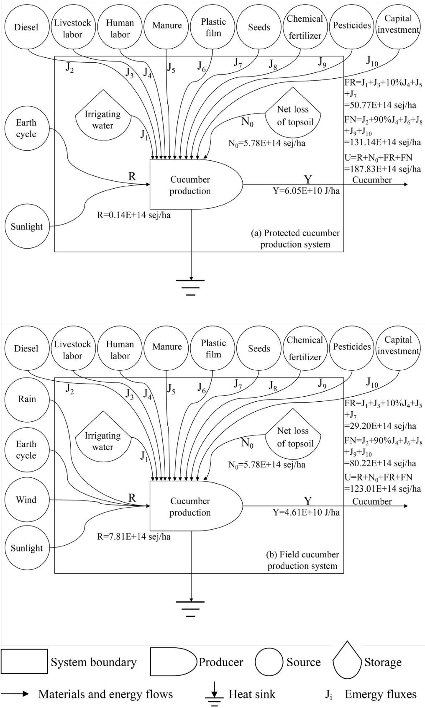
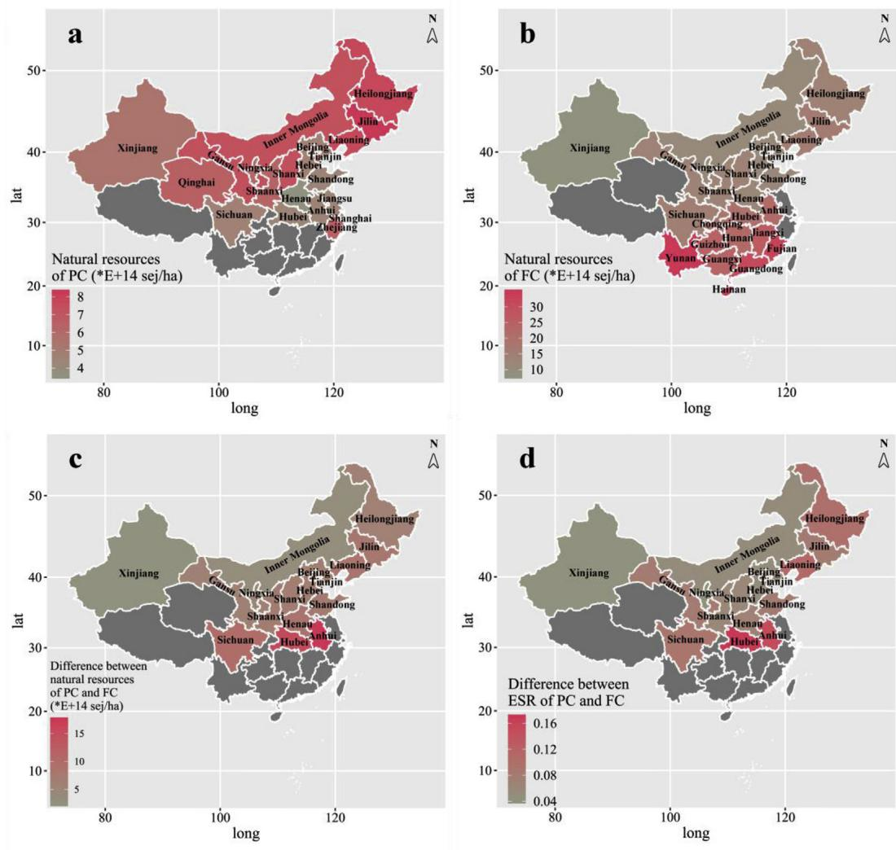
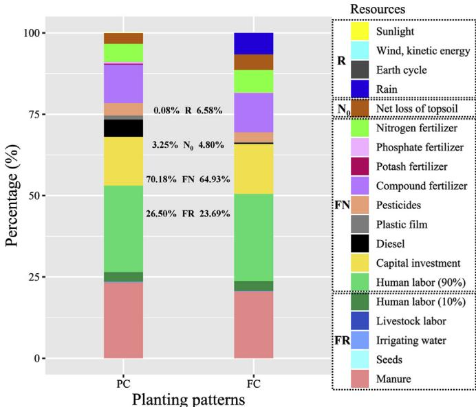
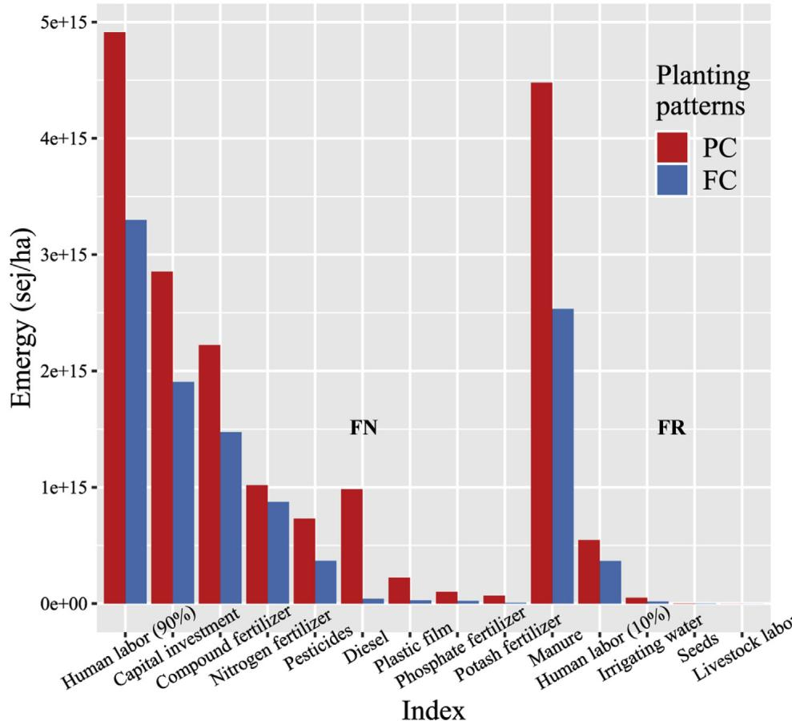
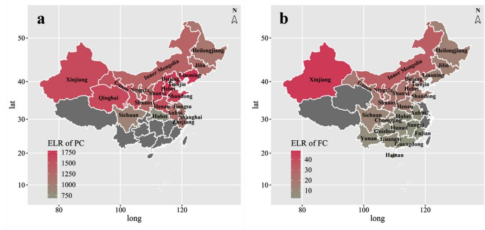
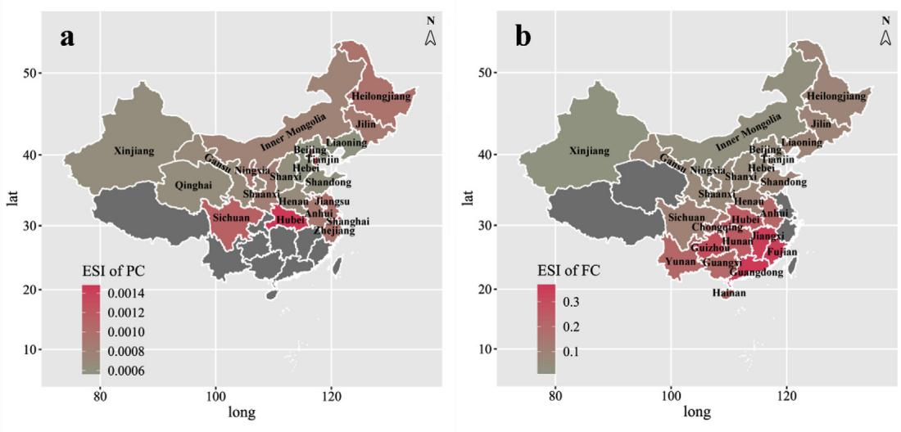

# Comparing protected cucumber and field cucumber production systems in China based on emergy analysis

# 基于能值分析的中国设施黄瓜与露地黄瓜生产系统比较研究

Huan Zhao a, Xiajie Zhai b, Lizhu Guo a, Yuejuan Yang a, Jiahuan Li a, Cheng Ren a, Kaili Wang a, Xiqiang Liu a, Ruyi Zhan a, Kun Wang a,*

a 中国农业大学草业科学与技术学院，北京 100193  b 中国林业科学研究院湿地研究所，湿地服务与恢复北京市重点实验室，北京 100091

# 文章信息

# 摘要

文章历史：2019年4月27日收稿  2019年6月14日修回  2019年7月13日录用  2019年7月15日在线发布

责任编辑：Bin Chen

关键词：能值评估  设施农业  蔬菜  种植模式  可持续性

黄瓜是一种重要蔬菜作物，因其口感鲜美、生长周期短且经济效益高而在中国广泛种植，为人体提供必需的矿物质、维生素和营养物质。为全面评估两种种植模式（设施黄瓜生产系统和露地黄瓜生产系统）下黄瓜生产系统的可持续性，并为生产系统的高效可持续发展提供建设性建议，本研究基于2016年中国省级数据，采用能值评估方法分析了生产系统中能值流的组成与代谢。结果表明，露地黄瓜生产系统的自然资源输入均值（13.59E+14 sej/ha）显著高于设施系统（5.92E+14 sej/ha），但购买资源输入、总能值输入和总能量输出的均值则呈现相反趋势。两种种植模式下黄瓜生产系统对环境的依赖程度存在差异：露地系统更多利用自然资源，且自然资源利用程度呈现南方高于北方的地理分布特征；而设施系统则更多依赖购买资源（特别是不可再生资源），具有高投入、高产出但低生产效率的特点。提高资源利用效率、增加清洁能源使用和提升机械化水平将有助于黄瓜生产系统实现更清洁、高效和可持续的发展。

# 1. 引言

蔬菜是人类最基本的食物来源之一，提供维持健康所需的维生素、膳食纤维和矿物质等营养素（Li等，2018）。数据显示，2017年中国蔬菜种植面积达2255万公顷，已成为仅次于粮食作物的第二大农作物。年总产值达2万亿元，蔬菜产业已成为农村支柱产业，在保障食品安全、扩大劳务就业、促进国际贸易和稳定农民收入等方面发挥着日益重要的作用（ECAEWMA，2018）。

根据种植模式，蔬菜产业可分为设施蔬菜产业和露地蔬菜产业（Gruda等，2019；Zhou等，2016；Cerkauskas等，2015）。设施蔬菜产业依赖温室、补光系统等现代设施提供相对可控的封闭/半封闭生产空间（Chang等，2011；Jiang，2015），在一定程度上解放了农业生产对自然条件的依赖，打破了传统农业的地域和季节限制，丰富了不同季节和地区的"菜篮子"供应（Wang等，2018a；Chen等，2018）。而传统露地蔬菜产业则受光照、温湿度等自然环境因素影响较大（Khoshnevisan等，2014）。相比露地生产，设施蔬菜产业具有高投入、高收益、技术密集和资本密集的特点（Bolandnazar等，2014），其生产规模和效益持续发展，在农业生产中的比重不断提升，已成为中外蔬菜产业发展的必然方向（Liang等，2019；Gruda等，2019）。中国设施蔬菜种植面积从1983年的1.5万公顷增至2010年的467万公顷，近十年仍保持增长（Chen等，2013）。

然而，设施蔬菜产业的快速扩张也带来了严重的环境问题，包括农膜废弃物（Stanghellini等，2003）、地下水污染（Munoz等，2008）、温室气体排放（Chang等，2013）、土壤酸化、次生盐渍化（Wang等，2018b）、微生物区系破坏、养分失衡、有害物质积累（Yang等，2015）以及土传病害等。因此，在权衡设施蔬菜产业利弊的基础上，全面衡量其产出与环境影响，评估产业可持续性并提出相应对策显得尤为重要。Odum（1984，1988）创立的能值分析方法为此提供了理想工具，该方法可揭示设施蔬菜生产系统中的物质循环与能量流动，分析各类资源输入的组成与代谢，并通过建立可持续性评估指标体系提供决策支持。

能值分析法问世以来，已广泛应用于农业系统（Zhao等，2019；Zhai等，2018）、生物能源生产（Patrizi等，2015）、循环系统（Saladini等，2016）、城市系统（Andric等，2017）和工业制造（Mikulcic等，2016）等领域评估。但现有文献中，仅少数研究（Yang等，2016；Chang等，2011）对设施蔬菜生产流程进行了全面分析，从能值角度评估其可持续性并与露地系统比较的研究更为罕见。

本文以中国两种种植模式下的黄瓜生产系统为研究对象，运用能值分析法探究设施（PC）与露地（FC）系统在资源输入输出方面的异同，建立评估蔬菜生产系统可持续性的整体框架，并根据不同种植模式下生产现状的综合表现及其可持续发展影响因素，提出对策建议。

# 2. 材料与方法

# 2.1. 材料

本研究基于2016年中国蔬菜种植面积较大且数据获取较便利省份的省级数据开展。21个中国省份的设施黄瓜生产系统及26个中国省份的露地黄瓜生产系统的投入产出数据主要来源于《全国农产品成本收益资料汇编》(NDRCDP, 2017)。在进行两种系统比较时，实际仅使用了17个同时具备两种生产系统的中国省份数据。相应气象数据与自然资源投入数据则来自《中国水利统计年鉴》(MWR, 2017)及Tao等(2013)的研究。

# 2.2. 研究方法

早在20世纪80年代，美国著名生态学家Odum就提出了能值理论(Liu等, 2019b)。能值被定义为直接或间接用于制造产品或提供服务所需的可用能量(Odum, 1984, 1996)。能值分析是评估系统输入输出的有效方法，该方法同时考虑自然资源投入和人工资源投入，建立了人类社会系统与自然环境之间的联系(Fang等, 2017; Odum, 1996)。包括各类农业生产系统在内的人工系统的原始物质和能量均来源于生物圈(Liu等, 2019a)。能值分析为描述系统中的能量、物质和货币流动提供了统一度量标准。换言之，在能值分析方法中，不同形式的物质(g)、能量(J)和货币($)可通过乘以转换系数(单位能值)统一转化为太阳能焦耳(sej)等常见能量单位。

单位能值(UEV)表示提供$1\mathrm{g}$、$1\mathrm{J}$或$1\$所需的太阳能值。在能值分析框架下，首先应绘制与黄瓜生产系统相关的系统图以展示能值代谢过程(图1)。此外，需采用一组能值指标(表2)来促进系统可持续性评估。

# 3. 结果

# 3.1. 不同分类下黄瓜生产系统的能值流

黄瓜在中国广泛种植。具体而言，设施黄瓜产业主要分布在21个省份，包括北京、天津、河北、山西、内蒙古、辽宁、吉林、黑龙江、上海、江苏、浙江、安徽、山东、河南、湖北、四川、陕西、甘肃、青海、宁夏和新疆（图2a）。而露地黄瓜产业则主要分布在26个省份，包括北京、天津、河北、山西、内蒙古、辽宁、吉林、黑龙江、安徽、福建、江西、山东、河南、湖北、湖南、广东、广西、海南、重庆、四川、贵州、云南、陕西、甘肃、宁夏和新疆（图2b）。实际上，在比较两种不同种植模式下的黄瓜生产系统时，仅使用了17个同时拥有两种产业的省份数据（图2c和d，表3）。

表1 能值流量及相关单位能值

| 编号 | 项目 | 单位 | 单位能值(sej/单位) | 参考文献 |
|------|------|------|-------------------|----------|
| **可再生自然资源(R)** | | | | |
| 1 | 阳光 | J | 1.00E+00 | Odum (1996) |
| 2 | 地球循环 | J | 4.90E+04 | Brown and Ugliati (2016b) |
| 3 | 雨水化学势 | J | 2.31E+04 | Odum (1996) |
| 4 | 雨水重力势 | J | 1.33E+04 | Odum (1996) |
| 5 | 风动能 | J | 1.24E+03 | Campbell and Erban (2017) |
| **不可再生自然资源(Nc)** | | | | |
| 6 | 表土净流失 | J | 9.40E+04 | Brown and Bardi (2001) |
| **可再生购买资源(FR)** | | | | |
| 7 | 粪肥 | g | 1.62E+08 | Bastianoni et al. (2001) |
| 8 | 人力劳动(10%)* | J | 4.83E+05 | Lan et al. (1998) |
| 9 | 灌溉水 | J | 5.21E+04 | Odum and Arding (1991) |
| 10 | 种子 | g | 9.07E+08 | Coppola et al. (2009) |
| 11 | 畜力劳动 | J | 1.85E+05 | Lan et al. (1998) |
| **不可再生购买资源(FN)** | | | | |
| 12 | 复合肥 | g | 3.56E+09 | Odum (1996) |
| 13 | 氮肥 | g | 4.83E+09 | Odum (1996) |
| 14 | 磷肥 | g | 4.95E+09 | Odum (1996) |
| 15 | 钾肥 | g | 1.40E+09 | Odum (1996) |
| 16 | 资本投入 | 元 | 9.23E+11 | Yang et al. (2010) |
| 17 | 人力劳动(90%)* | J | 4.83E+05 | Lan et al. (1998) |
| 18 | 柴油 | J | 8.38E+04 | Odum (1996) |
| 19 | 塑料薄膜 | g | 4.83E+08 | Odum (1996) |
| 20 | 农药 | g | 1.10E+10 | Brown and Arding (1991) |

注：根据前人研究(Asgharipour等,2019;Yang等,2010)归类为FN。

如图2a和b所示，保护地黄瓜生产系统(PC)和露地黄瓜生产系统(FC)使用的自然资源(NR)在全国范围内分布不均。总体而言，PC系统的自然资源使用量从南向北递增，范围从河南的$3.53\mathrm{E} + 14$ sej/ha到吉林的$8.27\mathrm{E} + 14$ sej/ha。而FC系统的自然资源使用量则呈现相反趋势，从新疆的$7.84\mathrm{E} + 14$ sej/ha到云南的$34.77\mathrm{E} + 14$ sej/ha。此外，在这17个中国省份中，PC与FC系统的自然资源差异也呈现从南向北递减的分布特征(图2c)。FC系统的NR输入平均值$(13.59\mathrm{E} + 14$ sej/ha)显著高于PC系统$(5.92\mathrm{E} + 14$ sej/ha)(表3)。然而，购买资源(PR)、总能值输入(U)和总能量输出(Y)的平均值则呈现相反趋势(表3)。具体而言，PC系统的PR、U和Y平均值$(181.91\mathrm{E} + 14$ sej/ha、$187.83\mathrm{E} + 14$ sej/ha和$6.05\mathrm{E} + 10\mathrm{J / ha}$)均高于FC系统$(109.42\mathrm{E} + 14$ sej/ha、$123.01\mathrm{E} + 14$ sej/ha和$4.61\mathrm{E} + 10\mathrm{J / ha}$)。值得注意的是，无论是PC还是FC系统，PR输入值都显著高于NR输入值(表3)。

在四种能值输入中，PC系统以不可再生购买资源(FN)占比最大$(70.18\%)$，其次为可再生购买资源(FR)$(26.50\%)$，不可再生自然资源(N0)$(3.25\%)$，最后是可再生自然资源(R)$(0.08\%)$(图3)。FC系统的各输入占比略有不同：FN$(64.93\%)$占比最大，其次是FR$(23.69\%)$，R$(6.58\%)$，最后是N0$(4.80\%)$(图3)。详细分析表明，人力劳动、粪肥、资本投入、复合肥和氮肥的能值输入在所有能值输入中占比较高(图3)。

两种生产系统的资源输入比例较为相似，但这些资源输入的数值差异相对较大。如图4所示，无论是可再生还是不可再生资源，PC系统的购买资源能值输入均高于FC系统。特别是PC系统在人力劳动、资本投入、复合肥、农药、柴油、塑料薄膜和粪肥等方面的能值输入显著高于FC系统。

# 3.2. 保护地与露地黄瓜生产系统能值指标比较

表4展示了一组基于能值的黄瓜生产系统指标，便于评估系统运行状况。能值自给率(ESR)衡量生产系统使用免费自然资源的程度(表2)。数值越高表示对环境的依赖越大。PC系统的ESR(0.03)低于FC系统(0.11)(表4)。此外，PC与FC系统间的ESR差异存在地理分布特征(图2d)，从北向南逐渐增大。与ESR类似，能值可再生率$(\% R)$衡量可再生资源对生产系统的贡献(表2)。数值越高表示可再生资源贡献越大。PC系统的$\%$R(0.27)同样低于FC系统(0.30)(表4)。能值产出率(EYR)呈现相同趋势，该指标衡量系统利用购买投入开发本地资源的生产效率(表2和4)。能值投资率(EIR)是购买投入与免费本地投入的比值。PC系统的EIR(32.61)明显高于FC系统(8.64)(表4)。

环境负载率(ELR)衡量系统对环境的潜在压力(表2)。数值越高表示环境负荷越大。PC系统的ELR(1319.71)显著高于FC系统(18.42)(表4)。同时，ELR存在地理分布规律，特别是FC系统的ELR从南向北逐渐增大(图5)。能值可持续性指数(ESI)是反映生产系统可持续性的综合指标(表2)。数值越高表示可持续性水平越高。与ELR相反，PC系统的ESI(0.0008)远低于FC系统(0.08)(表4)。类似ELR，ESI也存在地理分布规律，但与ELR不同的是，ESI从南向北逐渐减小(图6)，且FC系统的ESI规律更为明显。转换率(TRA)是总能值输入与总能值输出的比值(表2)。数值越低表示单位能值投入产出能量越多，生产效率越高。PC系统的TRA(3.11E+4 sej/J)显著高于FC系统(2.77E+4 sej/J)(表4)。

  
图1. 不同种植模式下黄瓜生产系统的能流示意图

表2 用于比较保护地和露地黄瓜生产系统的能值指标

| 指标名称 | 符号 | 含义 |
|---------|------|------|
| 可再生自然资源 | R | 直接来自当地可再生资源(如阳光)的能量流 |
| 不可再生自然资源 | N0 | 以不可再生方式使用的不可再生或缓慢再生资源 |
| 不可再生购买资源 | FN | 来自购买资源的不可再生能值流 |
| 可再生购买资源 | FR | 来自购买资源的可再生能值流 |
| 自然资源 | NR = R + N0 | 直接来自自然资源的能量流 |
| 购买资源 | PR = FN + FR | 来自购买投入的能量流 |
| 总能值输入 | U = R + N0+FN + FR | 总输入的能量流 |
| 总能量输出 | Y | 产品的总能量 |
| 能值产出率 | EYR = U/PR | 衡量系统利用购买投入开发本地资源的生产效率 |
| 能值投资率 | EIR = PR/NR | 购买投入与免费本地投入的比率 |
| 能值自给率 | ESR = NR/U | 衡量系统对环境的依赖程度 |
| 能值可再生率 | %R=(R + FR)/U | 衡量可再生资源对生产系统的贡献 |
| 环境负载率 | ELR=(PR + N0)/R | 衡量系统对环境的潜在压力 |
| 转换率 | TRA = U/Y | 衡量系统的能值效率 |
| 能值可持续性指数 | ESI = EYR/ELR | 系统可持续性指标 |

  
图2. 保护地(PC)与露地(FC)黄瓜生产系统的自然资源比较

表3 保护地(PC)与露地(FC)黄瓜生产系统能值投入与能量输出比较

| 省份 | PC-NR (×10¹⁴ sej/ha) | FC-NR (×10¹⁴ sej/ha) | PC-PR (×10¹⁴ sej/ha) | FC-PR (×10¹⁴ sej/ha) | PC-U (×10¹⁴ sej/ha) | FC-U (×10¹⁴ sej/ha) | PC-Y (×10¹⁰J/ha) | FC-Y (×10¹⁰J/ha) |
|------|----------------------|----------------------|----------------------|----------------------|---------------------|---------------------|------------------|------------------|
| 北京 | 4.97 | 12.04 | 172.19 | 112.19 | 177.16 | 124.24 | 5.73 | 5.78 |
| 天津 | 6.32 | 12.98 | 111.91 | 98.89 | 118.23 | 111.87 | 4.67 | 4.54 |
| 河北 | 4.68 | 11.06 | 240.78 | 139.74 | 245.46 | 150.80 | 6.78 | 5.36 |
| 山西 | 7.31 | 13.90 | 228.66 | 135.97 | 235.97 | 149.86 | 5.75 | 4.24 |
| 内蒙古 | 7.32 | 10.65 | 185.90 | 106.50 | 193.22 | 117.15 | 5.63 | 4.97 |
| 辽宁 | 7.66 | 15.77 | 241.23 | 97.05 | 248.88 | 112.82 | 7.59 | 3.81 |
| 吉林 | 8.27 | 16.12 | 165.58 | 112.17 | 173.85 | 128.29 | 5.15 | 3.54 |
| 黑龙江 | 7.69 | 13.72 | 149.23 | 79.34 | 156.91 | 93.06 | 5.76 | 3.82 |
| 安徽 | 4.43 | 21.92 | 162.35 | 99.37 | 166.78 | 121.30 | 4.93 | 3.76 |
| 山东 | 4.37 | 11.42 | 232.05 | 100.58 | 236.42 | 112.00 | 7.69 | 4.73 |
| 河南 | 3.53 | 12.00 | 213.01 | 121.24 | 216.54 | 133.24 | 5.79 | 4.51 |
| 湖北 | 4.37 | 19.79 | 97.34 | 74.32 | 102.11 | 94.11 | 4.46 | 3.85 |
| 四川 | 4.68 | 14.61 | 126.18 | 104.94 | 130.86 | 119.55 | 6.62 | 3.65 |
| 陕西 | 6.31 | 13.01 | 173.10 | 130.32 | 179.41 | 143.33 | 5.01 | 3.67 |
| 甘肃 | 7.32 | 13.32 | 208.79 | 103.95 | 216.11 | 117.27 | 7.88 | 6.47 |
| 宁夏 | 5.97 | 7.81 | 157.28 | 129.92 | 163.24 | 140.73 | 6.00 | 4.63 |
| 新疆 | 5.48 | 7.84 | 226.48 | 113.69 | 231.95 | 121.54 | 7.34 | 7.01 |
| 均值 | 5.92 | 13.59 | 181.91 | 109.42 | 187.83 | 123.01 | 6.05 | 4.61 |

  
图3. 保护地(PC)与露地(FC)黄瓜生产系统资源投入比例

# 4. 讨论

# 4.1. 保护地黄瓜生产系统与露地黄瓜生产系统的能值组成比较

黄瓜是一种重要的蔬菜作物，能为人体提供必需的矿物质、维生素和营养物质，是克服微量营养素缺乏的最佳资源(Ayyogari等, 2014)。同时，由于其美味可口、营养周期短且经济效益高，黄瓜在中国被广泛种植(Bao等, 2016)。包括黄瓜生产系统在内的农业生产系统高度依赖气候资源，对气候和环境变化十分敏感。气候因素和自然条件影响着农业的潜在生产力(Cui等, 2016; Lobell和Burke, 2010)。

中国南北自然资源分布不均，黄瓜生产系统可利用的资源具有异质性，因此系统运行所需的物质组成也不同。一般而言，低纬度的南方比高纬度的北方具有更好的水热条件，特别是在降水资源方面(MWR, 2017)。露地系统(FC)是相对开放的传统农业生产系统，充分利用了降水资源，降水资源占其利用的自然资源很大比例(图3)。因此，FC的NR呈现从南向北递减的趋势(图2b)。与FC不同，保护地系统(PC)是封闭或半封闭系统，很少利用降水资源，其使用的自然资源中表土占主要部分(图3)。此外，中国土壤肥力没有明显的地理分布差异，除了东北地区拥有最肥沃的黑土(Han和Zou, 2018)。因此，除东北地区外，PC的NR在各地区间差异不大(图2a)。比较这两个系统对自然资源的利用程度，PC与FC的NR差异以及ESR差异都呈现从南向北递减的趋势(图2c和d)。这表明FC比PC使用了更多的自然资源，也更依赖自然资源。同时，在水热条件更好的中国南方地区，自然资源利用的差距更为明显。

生产系统的正常运行需要自然投入和购买投入的相互作用。自然投入的不足需要更多的购买投入来弥补。因此，无论是数值上(表3和图4)还是比例上(图3)，PC的PR都远高于FC。此外，在两种系统中，FN投入对总投入的贡献最大，其次是FR，最后是NR(图3)。在FN投入中，人力劳动、资本投入、复合肥、氮肥、柴油和农药占主要部分(图3)。两个系统的PR投入都占整个投入的85%以上(图3)，表明这两个系统都是高度依赖人工投资和干预的人为控制系统。

# 4.2. 黄瓜生产系统的综合评价与可持续发展建议

PC的ESR显著低于FC，而EIR则呈现相反趋势(表4)。这些都反映出PC对环境依赖程度低于FC，且具有更高的经济发展水平(Lan等, 2002)。这些结果与之前的研究相似(表5)。保护地蔬菜系统(Wu等, 2013)和保护地桃系统(Wei等, 2009)具有较高的EIR(69.96和98.83)和较低的ESR(0.01和0.01)，而露地饲料玉米系统(Ghaley等, 2018)和露地水稻系统(Yi和Xiang, 2016)则具有较低的EIR(4.14和11.85)和较高的ESR(0.19和0.08)。

PC的ELR(1319.71)几乎是FC(18.42)的100倍(表4)，表明PC对环境造成的负荷大于FC，且两个系统都对环境造成了极大压力(ELR>10)(Cheng等,2017)。其他保护地农业系统(表5)，如保护地蔬菜系统(304.19)(Wu等, 2013)和保护地葡萄系统(61.71)(Feng等, 2015)，也比其他露地农业系统如露地蔬菜系统(19.87)(Lu等, 2010)和露地香蕉系统(17.13)(de Barros等, 2009)表现出更大的环境压力。ESI是一个综合指标，从环境压力和经济收益两方面衡量系统的整体可持续性。更高的ESI是系统追求可持续发展的目标(Zhong等, 2018)。与ELR相反，PC的ESI(0.0008)仅为FC(0.08)的百分之一，表明与FC相比，PC的可持续性水平较低，且两个系统在可持续生产方面表现都不佳。与ELR类似，其他保护地农业系统(表5)，如保护地蔬菜系统(0.0033)(Wu等, 2013)和保护地桃系统(0.0095)(Wei等, 2009)，也比其他露地农业系统(表5)如露地卷心菜系统(0.05)(Zhai等, 2017)和露地水稻系统(3.53)(Yi和Xiang, 2016)表现出更高的可持续性水平。

  
图4. 保护地黄瓜生产系统(PC)和露地黄瓜生产系统(FC)的购买资源能值投入

表4 保护地黄瓜生产系统(PC)和露地黄瓜生产系统(FC)的能值指标比较

| 种植模式 | EYR | EIR | ELR | ESR | %R | ESI | TRA (*E+4 sej/J) |
|----------|-----|-----|-----|-----|----|-----|------------------|
| PC | 1.03 | 32.61 | 1319.71 | 0.03 | 0.27 | 0.0008 | 3.11 |
| FC | 1.13 | 8.64 | 18.42 | 0.11 | 0.30 | 0.08 | 2.77 |

  
图5. 保护地黄瓜生产系统(PC)和露地黄瓜生产系统(FC)的ELR比较

  
图6. 保护地黄瓜生产系统(PC)和露地黄瓜生产系统(FC)的ESI比较

表5 其他农业系统的能值指标

| 系统 | EYR | EIR | ELR | ESR | %R | ESI |
|------|-----|-----|-----|-----|----|-----|
| **保护地农业系统** | | | | | | |
| 蔬菜 (Wu等, 2013) | 1.01 | 69.96 * | 304.19 * | 0.01 * | 0.20 * | 0.0033 * |
| 葡萄 (Feng等, 2015) | 1.02 | 51.33 | 61.71 * | 0.02 * | 0.19 * | 0.0165 * |
| 桃 (Wei等, 2009) | 1.01 * | 98.83 * | 106.56 * | 0.01 * | 0.68 | 0.0095 * |
| **大田农业系统** | | | | | | |
| 蔬菜 (Lu等, 2010) | 1.05 * | 19.01 * | 19.87 * | 0.05 * | 0.15 * | 0.05 * |
| 卷心菜 (Zhai等, 2017) | 1.05 * | 19.03 * | 21.25 * | 0.05 * | 0.53 * | 0.05 * |
| 饲料玉米 (Ghaley等, 2018) | 1.24 * | 4.14 * | 5.20 | 0.19 * | | 0.24 |
| 香蕉 (de Barros等, 2009) | 1.03 * | 16.96 | 17.13 | 0.04 * | | 0.06 |
| 水稻 (Yi和Xiang, 2016) | 2.73 | 11.85 * | 0.77 | 0.08 * | | 3.53 |

注：* 表示根据原文数据计算得出

TRA是衡量给定生产系统产出-投入效率的指标。TRA值越高，生产效率越低。事实上，PC系统的U、Y和TRA值均高于FC系统。因此，与FC系统相比，PC系统是一个高投入、高产出但低效率的生产系统。此外，如前所述，PC系统还使用了更多的不可再生资源和人工资源，并造成了更大的环境负担。总体而言，PC系统是一个不可持续且低效的生产系统，这需要我们引起重视。黄瓜生产系统是典型的技术、资本和劳动密集型的高度人为控制系统，尤其是PC系统(Bolandnazar等, 2014)。过度使用人力劳动、资本投入、复合肥、氮肥、柴油和农药导致系统环境负荷高且可持续性低(Gruda等, 2019; Liang等, 2019; Taki和Yildizhan, 2018)。提高资源利用效率是一个很好的对策，例如通过测土配方施肥和精准施肥来防止化肥过度使用并提高化肥吸收率(Jiang等, 2019)。同时，在生产过程中使用更多清洁能源，例如用太阳能和风能等可再生能源替代化石燃料等不可再生能源，也有助于降低生产系统的环境负荷(Gruda等, 2019; Taki和Yildizhan, 2018)。此外，使用更先进的机械替代劳动力以及提高生产者应用现有技术的能力，也将有助于提高生产系统的效率和可持续性(Bolandnazar等, 2014)。

# 5. 结论

黄瓜在中国广泛种植，可分为两种种植模式。两种种植模式下黄瓜生产系统对环境的依赖程度不同。FC系统更依赖环境，具有更高的NR投入和ESR值。FC系统的NR投入$(13.59\mathrm{E} + 14\mathrm{sej / ha})$是PC系统$(5.92\mathrm{E} + 14\mathrm{sej / ha})$的两倍多，FC系统的ESR值(0.11)几乎是PC系统(0.03)的四倍。此外，FC系统对自然资源的利用程度具有地理分布特征，其NR投入呈现从南向北递减的趋势。然而，PC系统使用了更多的购买资源，特别是不可再生的购买资源，主要包括人力劳动、资本投入、复合肥、氮肥、柴油和农药。PC系统的PR投入$(181.91\mathrm{E} + 14\mathrm{sej / ha})$几乎是FC系统$(109.42\mathrm{E} + 14\mathrm{sej / ha})$的两倍。

黄瓜生产系统是典型的技术、资本和劳动密集型的高度人为控制系统，尤其是PC系统。它具有高投入、高产出但生产效率低的特征，具有高U、高Y和高TRA值。同时它还具有高ELR和低ESI值，表现出环境负荷重和可持续性差的特点。除了提高资源利用效率外，更多地使用清洁能源将有助于减轻对环境的破坏。同时，提高机械化程度和解放劳动力也将有助于黄瓜生产系统更高效和可持续的发展。

# 致谢

感谢国家自然科学基金(No. 31772654)对本研究的资助。同时感谢匿名审稿人提出的建设性意见和建议。最后，我们要感谢期刊编辑和出版社工作人员提供的帮助。

## 参考文献

1.  [Andrić et al., 2017](#bbib1)
I. Andrić, A. Pina, P. Ferrão, B. Lacarrière, O. Le Corre
城市环境中区域供热系统性能评估：能值方法
J. Clean. Prod., 142 (2017), pp. 109-120
2.  [Asgharipour et al., 2019](#bbib2)
M.R. Asgharipour, H. Shahgholi, D.E. Campbell, I. Khamari, A. Ghadiri
基于能值和经济学分析的豆类生产系统可持续性比较
Environ. Monit. Assess., 191 (1) (2019)
[https://doi.org/10.1007/s10661-018-7123-3](https://doi.org/10.1007/s10661-018-7123-3)
3.  [Ayyogari et al., 2014](#bbib3)
K. Ayyogari, P. Sidhya, M.K. Pandit
气候变化对蔬菜种植的影响研究综述
Int. J. Agric. Environ. Biotechnol., 7 (1) (2014), pp. 145-155
4.  [Bao et al., 2016](#bbib4)
G. Bao, S. Cai, L. Qi, Y. Xun, L. Zhang, Q. Yang
自然环境下黄瓜识别的多模板匹配算法
Comput. Electron. Agric., 127 (2016), pp. 754-762
5.  [Bastianoni et al., 2001](#bbib5)
S. Bastianoni, N. Marchettini, M. Panzieri, E. Tiezzi
意大利基安蒂地区农场可持续性评估
J. Clean. Prod. (9) (2001), pp. 365-373
6.  [Bolandnazar et al., 2014](#bbib6)
E. Bolandnazar, A. Keyhani, M. Omid
基于数据包络分析法的温室黄瓜生产效率评估：以伊朗吉罗夫特市为例
J. Clean. Prod., 79 (2014), pp. 108-115
7.  [Brown and Arding, 1991](#bbib7)
M.T. Brown, J.E. Arding
能值转换率工作论文
Environmental Engineering Sciences and Center for Wetlands, University of Florida, Gainesville (1991)
8.  [Brown and Bardi, 2001](#bbib8)
M.T. Brown, E. Bardi
专题3：生态系统能值。能值评估手册：能值计算数据汇编系列专题
Center for Environmental Policy,Environmental Engineering Sciences,University of Florida, Gainesville (2001)
9.  [Brown and Ulgiati, 2016a](#bbib9)
M.T. Brown, S. Ulgiati
驱动地球生物圈全球环境源的评估：修订版能值基线
Ecol. Model., 339 (SI) (2016), pp. 126-132
10.  [Brown and Ulgiati, 2016b](#bbib10)
M.T. Brown, S. Ulgiati
全球可再生能源的能值评估
Ecol. Model., 339 (2016), pp. 148-156
11.  [Campbell, 2016](#bbib11)
D.E. Campbell
地球能值基线：科学历史回顾与新计算
Ecol. Model., 339 (SI) (2016), pp. 96-125
12.  [Campbell and Erban, 2017](#bbib12)
D.E. Campbell, L.E. Erban
对系统风能输入的能值再研究
M.T. Brown, S. Sweeney, D.E. Campbell, S. Huang, T. Rydberg, S. Ulgiati (Eds.), Emergy Synthesis 9: Theory and Applications of the Emergy Methodology (Proceedings of the 9th Biennial Emergy Conference), Center for environmental policy, University of Florida, Gainesville (2017), pp. 13-20
13.  [Cerkauskas et al., 2015](#bbib13)
R.F. Cerkauskas, G. Ferguson, C. MacNair
安大略省蔬菜疫霉病(Phytophthora capsici)管理：温室与田间方面
Can. J. Plant Pathol., 37 (3) (2015), pp. 285-304
14.  [Chang et al., 2011](#bbib14)
J. Chang, X. Wu, A. Liu, Y. Wang, B. Xu, W. Yang, L.A. Meyerson, B. Gu, C. Peng, Y. Ge
中国塑料温室蔬菜种植的净生态系统服务评估
Ecol. Econ., 70 (4) (2011), pp. 740-748
15.  [Chang et al., 2013](#bbib15)
J. Chang, X. Wu, Y. Wang, L.A. Meyerson, B. Gu, Y. Min, H. Xue, C. Peng, Y. Ge
塑料温室蔬菜种植是否增强了食物供应之外的区域生态系统服务？
Front. Ecol. Environ., 11 (1) (2013), pp. 43-49
16.  [Chen et al., 2018](#bbib16)
D.Y. Chen, Z.C. Yang, Z. Kong, X.T. Hu, X.X. Wang, W. He, L.H. Chen
固碳设施农业的现状与前景
J. Agric. Sci. Technol. A, 20 (2) (2018), pp. 122-128
17.  [Chen et al., 2013](#bbib17)
Y. Chen, B. Huang, W. Hu, D.C. Weindorf, L. Yang
中国南京封闭式温室蔬菜生产系统的环境评估
J. Soils Sediments, 13 (8) (2013), pp. 1418-1429
18.  [Cheng et al., 2017](#bbib18)
H. Cheng, C. Chen, S. Wu, Z.A. Mirza, Z. Liu
三峡水库消落带种植、家禽养殖和鱼类养殖系统的能值评估
J. Clean. Prod., 144 (2017), pp. 559-571
19.  [Coppola et al., 2009](#bbib19)
F. Coppola, S. Bastianoni, H. Østergård
基于能值评估的麦秆回收生产生物乙醇可持续性研究
Biomass Bioenergy, 33 (11) (2009), pp. 1626-1642
20.  [Cui et al., 2016](#bbib20)
Y. Cui, X. Ning, Y. Qin, X. Li, Y. Chen
1951-2010年中国农业水热条件的时空变化
J. Geogr. Sci., 26 (6) (2016), pp. 643-657
21.  [de Barros et al., 2009](#bbib21)
I. de Barros, J.M. Blazy, G.S. Rodrigues, R. Tournebize, J.P. Cinna
瓜德罗普(法属西印度群岛)香蕉种植系统的能值评估与经济表现
Agric. Ecosyst. Environ., 129 (4) (2009), pp. 437-449
22.  [ECAEWMA, 2018](#bbib22)
Expert Committee on Agricultural Early Warning of Ministry of Agriculture (ECAEWMA)
中国农业展望报告
China Agricultural Science and Technology Press, Beijing (2018)
23.  [Fang et al., 2017](#bbib23)
D. Fang, B. Chen, T. Hayat, A. Alsaedi
低碳工业园区的能值评估
J. Clean. Prod., 163 (2017), pp. S392-S400
24.  [Feng et al., 2015](#bbib24)
J. Feng, J. Wang, X. Zhang, F. Zhao, R. Kanianska, D. Tian
基于能值的保护地葡萄栽培可持续性决策评估系统设计与实现
Sustain. Basel, 7 (10) (2015), pp. 14002-14025
25.  [Ghaley et al., 2018](#bbib25)
B.B. Ghaley, N. Kehli, A. Mentler
丹麦传统饲料玉米(Zea mays L.)生产的能值综合
Ecol. Indicat., 87 (2018), pp. 144-151
26.  [Gruda et al., 2019](#bbib26)
N. Gruda, M. Bisbis, J. Tanny
保护地蔬菜栽培对气候变化的影响及清洁生产适应策略综述
J. Clean. Prod., 225 (2019), pp. 324-339
27.  [Han and Zou, 2018](#bbib27)
X.Z. Han, W.X. Zou
东北黑土保护与土壤肥力提升的效果与建议
Bull. Chin. Acad. Sci., 02 (2018), pp. 206-212
28.  [Jiang, 2015](#bbib28)
L.H. Jiang
中国设施番茄生产成本与效益研究
Nanjing Agricultural University, Nanjing (2015)
29.  [Khoshnevisan et al., 2014](#bbib29)
B. Khoshnevisan, S. Rafiee, M. Omid, H. Mousazadeh, S. Clark
基于生命周期评估和自适应神经模糊推理系统的温室番茄黄瓜栽培环境影响评价
J. Clean. Prod., 73 (2014), pp. 183-192
30.  [Lan et al., 2002](#bbib30)
S. Lan, P. Qin, H. Lu
生态经济系统能值分析
Chemical Industry Press, Beijing (2002)
31.  [Lan et al., 1998](#bbib31)
S. Lan, H.T. Odum, X. Liu
中国农业生态系统的能量流动与能值分析
Ecol. Sci., 17 (1) (1998), pp. 32-39
32.  [Li et al., 2018](#bbib32)
Z.M. Li, Y.F. R, X.Y. Zhang
改革开放以来中国蔬菜产业发展与趋势
Chinese Journal of Agricultural Resour. Regional Plan., 39 (12) (2018), pp. 13-20
33.  [Liang et al., 2019](#bbib33)
L. Liang, B.G. Ridoutt, R. Lal, D. Wang, W. Wu, P. Peng, S. Hang, L. Wang, G. Zhao
华北地区温室番茄生产的氮足迹与氮利用效率
J. Clean. Prod., 208 (2019), pp. 285-296
34.  [Liu et al., 2019a](#bbib34)
W. Liu, J. Wang, L. Sun, T. Wang, C. Li, B. Chen
中国陕西黄土高原地区大豆-玉米轮作系统可持续性评价
J. Clean. Prod., 210 (2019), pp. 1229-1237
35.  [Liu et al., 2019b](#bbib35)
Z. Liu, Y. Wang, Y. Geng, R. Li, H. Dong, B. Xue, T. Yang, S. Wang
中国可持续作物生产：基于能值的评价
J. Clean. Prod., 206 (2019), pp. 11-26
36.  [Lobell and Burke, 2010](#bbib36)
D.B. Lobell, M.B. Burke
统计模型在预测气候变化对作物产量响应中的应用
Agric. For. Meteorol., 150 (11) (2010), pp. 1443-1452
37.  [Lu et al., 2010](#bbib37)
H. Lu, Y. Bai, H. Ren, D.E. Campbell
冲积稻田水稻和蔬菜生产系统的能值、能量与经济综合评价：对中国农业政策的启示
J. Environ. Manag., 91 (12) (2010), pp. 2727-2735
38.  [Mikulčić et al., 2016](#bbib38)
H. Mikulčić, H. Cabezas, M. Vujanović, N. Duić
基于能值和生态足迹分析的不同水泥生产工艺环境评估
J. Clean. Prod., 130 (2016), pp. 213-221
39.  [MWR, 2017](#bbib39)
Ministry Of Water Resources, P.R.C. (MWR)
中国水资源统计年鉴
China Water & Power Press, Beijing (2017)
40.  [Muñoz et al., 2008](#bbib40)
P. Muñoz, A. Antón, A. Paranjpe, J. Ariño, J.I. Montero
减少氮输入大幅降低硝酸盐淋失而不影响温室番茄产量
Agron. Sustain. Dev., 28 (4) (2008), pp. 489-495
41.  [NDRCDP, 2017](#bbib41)
National Development and Reform Commission Department of Price (NDRCDP)
全国农产品成本收益资料汇编
China Statistical Publishing House, Beijing (2017)
42.  [Odum, 1984](#bbib42)
H.T. Odum
农业中环境作用的能量分析//Gerald Stanhill. Energy and Agriculture
Springer, Berlin Heidelberg (1984), pp. 24-50
1984
43.  [Odum, 1988](#bbib43)
H.T. Odum
自组织、转换率与信息
Science, 242 (4882) (1988), pp. 1132-1139
44.  [Odum, 1996](#bbib44)
H.T. Odum
环境核算：能值与环境决策
Wiley, New York (1996)
45.  [Odum and Arding, 1991](#bbib45)
H.T. Odum, J.E. Arding
工作论文：厄瓜多尔对虾养殖的能值分析
Environmental Engineering Sciences and Center for Wetlands, University of Florida, Gainesville (1991)
46.  [Patrizi et al., 2015](#bbib46)
N. Patrizi, F.M. Pulselli, F. Morandi, S. Bastianoni
利用残余资源和能源的生物精炼厂生产生物乙醇所需能值投入评估
J. Clean. Prod., 96 (2015), pp. 549-556
47.  [Saladini et al., 2016](#bbib47)
F. Saladini, S.A. Vuai, B.K. Langat, M. Gustavsson, R. Bayitse, A.B. Gidamis, M. Belmakki, A.S. Owis, K. Rashamuse, D.N. Sila, S. Bastianoni
五个非洲国家选定生物废物作为生物燃料和生物材料生产原料的可持续性评估：基于能值评价
Biomass Bioenergy, 85 (2016), pp. 100-108
48.  [Stanghellini et al., 2003](#bbib48)
C. Stanghellini, F.L.K. Kempkes, P. Knies
提升农业系统的环境质量
Acta Hortic. (Wagening.) (609) (2003), pp. 277-283
49.  [Taki and Yildizhan, 2018](#bbib49)
M. Taki, H. Yildizhan
果蔬生产过程中可持续能源应用评估：以温室黄瓜生产为例
J. Clean. Prod., 199 (2018), pp. 164-172
50.  [Tao et al., 2013](#bbib50)
J. Tao, M. Fu, X. Zheng, J. Zhang, D. Zhang
中国省级作物生产系统能值评价与发展模式
Ecol. Indicat., 29 (2013), pp. 325-338
51.  [Wang et al., 2018a](#bbib51)
X. Wang, B. Liu, G. Wu, Y. Sun, X. Guo, Z. Jin, W. Xu, Y. Zhao, F. Zhang, C. Zou, X. Chen
中国塑料大棚辣椒生产系统的环境成本与减排潜力：生命周期评估
Agric. Syst., 167 (2018), pp. 186-194
52.  [Wang et al., 2018b](#bbib52)
X. Wang, C. Zou, X. Gao, X. Guan, Y. Zhang, X. Shi, X. Chen
中国露地和温室蔬菜系统的硝酸盐淋失：一项荟萃分析
Environ. Sci. Pollut. Res., 25 (31) (2018), pp. 31007-31016
53.  [Wei et al., 2009](#bbib53)
X.M. Wei, B. Chen, Y.H. Qu, C. Lin, G.Q. Chen
北京"四位一体"桃生产系统的能值分析
Commun. Nonlinear Sci., 14 (3) (2009), pp. 946-958
54.  [Wu et al., 2013](#bbib54)
X. Wu, F. Wu, X. Tong, B. Jiang
基于能值的牛-沼气-温室蔬菜一体化生产系统可持续性评估：中国西北大型农场废弃物综合利用研究
Ecol. Eng., 61 (2013), pp. 335-344
55.  [Yang et al., 2015](#bbib55)
L. Yang, B. Huang, M. Mao, L. Yao, M. Hickethier, W. Hu
华北地区不同温室类型对土壤中微量金属积累及其植物有效性的影响
Environ. Sci. Pollut. Res., 22 (9) (2015), pp. 6679-6686
56.  [Yang et al., 2016](#bbib56)
L. Yang, B. Huang, M. Mao, L. Yao, S. Niedermann, W. Hu, Y. Chen
中国温室蔬菜种植实践从环境、经济和社会制度角度的可持续性评估
Environ. Sci. Pollut. Res., 23 (17) (2016), pp. 17287-17297
57.  [Yang et al., 2010](#bbib57)
Z.F. Yang, M.M. Jiang, B. Chen, J.B. Zhou, G.Q. Chen, S.C. Li
中国经济的太阳能值评估
Energy Policy, 38 (2) (2010), pp. 875-886
58.  [Yi and Xiang, 2016](#bbib58)
T. Yi, P.A. Xiang
湖南省水稻种植的能值分析：农业可持续发展的新视角
J. Integr. Agr., 15 (10) (2016), pp. 2426-2436
59.  [Zhai et al., 2017](#bbib59)
X. Zhai, D. Huang, S. Tang, S. Li, J. Guo, Y. Yang, H. Liu, J. Li, K. Wang
中国北方农牧交错带相同环境条件下不同生态系统代谢的能值
Ecol. Indicat., 74 (2017), pp. 198-204
60.  [Zhai et al., 2018](#bbib60)
X. Zhai, H. Zhao, L. Guo, D.M. Finch, D. Huang, K. Liu, S. Tang, Y. Yang, J. Guo, J. Li, S. Xie, K. Wang
不同环境条件下相同生态系统(玉米)代谢的能值
J. Clean. Prod., 191 (2018), pp. 233-239
61.  [Zhong et al., 2018](#bbib61)
S. Zhong, Y. Geng, H. Kong, B. Liu, X. Tian, W. Chen, Y. Qian, S. Ulgiati
基于能值的中国洱海流域可持续性评价
J. Clean. Prod., 178 (2018), pp. 142-153
62.  [Zhou et al., 2016](#bbib62)
J. Zhou, B. Gu, W.H. Schlesinger, X. Ju
中国半湿润农田硝酸盐的显著积累
Sci. Rep., 6 (2016), pp. 1-8
63.  [Zhao et al., 2019](#bbib63)
H. Zhao, X. Zhai, L. Guo, K. Liu, D. Huang, Y. Yang, J. Li, S. Xie, C. Zhang, S. Tang, K. Wang
基于能值分析评估中国不同气候区小麦生产系统的效率与可持续性
J. Clean. Prod., 235 (2019), pp. 724-732

## References

1.  [Andrić et al., 2017](#bbib1)
I. Andrić, A. Pina, P. Ferrão, B. Lacarrière, O. Le Corre
On the performance of district heating systems in urban environment: an emergy approach
J. Clean. Prod., 142 (2017), pp. 109-120
2.  [Asgharipour et al., 2019](#bbib2)
M.R. Asgharipour, H. Shahgholi, D.E. Campbell, I. Khamari, A. Ghadiri
Comparison of the sustainability of bean production systems based on emergy and economic analyses
Environ. Monit. Assess., 191 (1) (2019)
[https://doi.org/10.1007/s10661-018-7123-3](https://doi.org/10.1007/s10661-018-7123-3)
3.  [Ayyogari et al., 2014](#bbib3)
K. Ayyogari, P. Sidhya, M.K. Pandit
Impact of climate change on vegetable cultivation - a review
Int. J. Agric. Environ. Biotechnol., 7 (1) (2014), pp. 145-155
4.  [Bao et al., 2016](#bbib4)
G. Bao, S. Cai, L. Qi, Y. Xun, L. Zhang, Q. Yang
Multi-template matching algorithm for cucumber recognition in natural environment
Comput. Electron. Agric., 127 (2016), pp. 754-762
5.  [Bastianoni et al., 2001](#bbib5)
S. Bastianoni, N. Marchettini, M. Panzieri, E. Tiezzi
Sustainability assessment of a farm in the Chianti area (Italy)
J. Clean. Prod. (9) (2001), pp. 365-373
6.  [Bolandnazar et al., 2014](#bbib6)
E. Bolandnazar, A. Keyhani, M. Omid
Determination of efficient and inefficient greenhouse cucumber producers using Data Envelopment Analysis approach, a case study: jiroft city in Iran
J. Clean. Prod., 79 (2014), pp. 108-115
7.  [Brown and Arding, 1991](#bbib7)
M.T. Brown, J.E. Arding
Transformities Working Paper
Environmental Engineering Sciences and Center for Wetlands, University of Florida, Gainesville (1991)
8.  [Brown and Bardi, 2001](#bbib8)
M.T. Brown, E. Bardi
Folio #3: Emergy of Ecosystems. Handbook of Emergy Evalution. A Compendium of Data for Emergy Computation Issued in a Series of Folios
Center for Environmental Policy,Environmental Engineering Sciences,University of Florida, Gainesville (2001)
9.  [Brown and Ulgiati, 2016a](#bbib9)
M.T. Brown, S. Ulgiati
Assessing the global environmental sources driving the geobiosphere: a revised emergy baseline
Ecol. Model., 339 (SI) (2016), pp. 126-132
10.  [Brown and Ulgiati, 2016b](#bbib10)
M.T. Brown, S. Ulgiati
Emergy assessment of global renewable sources
Ecol. Model., 339 (2016), pp. 148-156
11.  [Campbell, 2016](#bbib11)
D.E. Campbell
Emergy baseline for the Earth: a historical review of the science and a new calculation
Ecol. Model., 339 (SI) (2016), pp. 96-125
12.  [Campbell and Erban, 2017](#bbib12)
D.E. Campbell, L.E. Erban
A reexamination of the emergy input to a system from the wind
M.T. Brown, S. Sweeney, D.E. Campbell, S. Huang, T. Rydberg, S. Ulgiati (Eds.), Emergy Synthesis 9: Theory and Applications of the Emergy Methodology (Proceedings of the 9th Biennial Emergy Conference), Center for environmental policy, University of Florida, Gainesville (2017), pp. 13-20
13.  [Cerkauskas et al., 2015](#bbib13)
R.F. Cerkauskas, G. Ferguson, C. MacNair
Management of phytophthora blight (_Phytophthora capsici_) on vegetables in Ontario: some greenhouse and field aspects
Can. J. Plant Pathol., 37 (3) (2015), pp. 285-304
14.  [Chang et al., 2011](#bbib14)
J. Chang, X. Wu, A. Liu, Y. Wang, B. Xu, W. Yang, L.A. Meyerson, B. Gu, C. Peng, Y. Ge
Assessment of net ecosystem services of plastic greenhouse vegetable cultivation in China
Ecol. Econ., 70 (4) (2011), pp. 740-748
15.  [Chang et al., 2013](#bbib15)
J. Chang, X. Wu, Y. Wang, L.A. Meyerson, B. Gu, Y. Min, H. Xue, C. Peng, Y. Ge
Does growing vegetables in plastic greenhouses enhance regional ecosystem services beyond the food supply?
Front. Ecol. Environ., 11 (1) (2013), pp. 43-49
16.  [Chen et al., 2018](#bbib16)
D.Y. Chen, Z.C. Yang, Z. Kong, X.T. Hu, X.X. Wang, W. He, L.H. Chen
Current situation and prospect of carbon sequestration facility agriculture
J. Agric. Sci. Technol. A, 20 (2) (2018), pp. 122-128
17.  [Chen et al., 2013](#bbib17)
Y. Chen, B. Huang, W. Hu, D.C. Weindorf, L. Yang
Environmental assessment of closed greenhouse vegetable production system in Nanjing, China
J. Soils Sediments, 13 (8) (2013), pp. 1418-1429
18.  [Cheng et al., 2017](#bbib18)
H. Cheng, C. Chen, S. Wu, Z.A. Mirza, Z. Liu
Emergy evaluation of cropping, poultry rearing, and fish raising systems in the drawdown zone of Three Gorges Reservoir of China
J. Clean. Prod., 144 (2017), pp. 559-571
19.  [Coppola et al., 2009](#bbib19)
F. Coppola, S. Bastianoni, H. Østergård
Sustainability of bioethanol production from wheat with recycled residues as evaluated by Emergy assessment
Biomass Bioenergy, 33 (11) (2009), pp. 1626-1642
20.  [Cui et al., 2016](#bbib20)
Y. Cui, X. Ning, Y. Qin, X. Li, Y. Chen
Spatio-temporal changes in agricultural hydrothermal conditions in China from 1951 to 2010
J. Geogr. Sci., 26 (6) (2016), pp. 643-657
21.  [de Barros et al., 2009](#bbib21)
I. de Barros, J.M. Blazy, G.S. Rodrigues, R. Tournebize, J.P. Cinna
Emergy evaluation and economic performance of banana cropping systems in Guadeloupe (French West Indies)
Agric. Ecosyst. Environ., 129 (4) (2009), pp. 437-449
22.  [ECAEWMA, 2018](#bbib22)
Expert Committee on Agricultural Early Warning of Ministry of Agriculture (ECAEWMA)
China Agriculture Outlook Report
China Agricultural Science and Technology Press, Beijing (2018)
23.  [Fang et al., 2017](#bbib23)
D. Fang, B. Chen, T. Hayat, A. Alsaedi
Emergy evaluation for a low-carbon industrial park
J. Clean. Prod., 163 (2017), pp. S392-S400
24.  [Feng et al., 2015](#bbib24)
J. Feng, J. Wang, X. Zhang, F. Zhao, R. Kanianska, D. Tian
Design and implementation of emergy-based sustainability decision assessment system for protected grape cultivation
Sustain. Basel, 7 (10) (2015), pp. 14002-14025
25.  [Ghaley et al., 2018](#bbib25)
B.B. Ghaley, N. Kehli, A. Mentler
Emergy synthesis of conventional fodder maize (_Zea mays_ L.) production in Denmark
Ecol. Indicat., 87 (2018), pp. 144-151
26.  [Gruda et al., 2019](#bbib26)
N. Gruda, M. Bisbis, J. Tanny
Impacts of protected vegetable cultivation on climate change and adaptation strategies for cleaner production – a review
J. Clean. Prod., 225 (2019), pp. 324-339
27.  [Han and Zou, 2018](#bbib27)
X.Z. Han, W.X. Zou
Effects and suggestions of black soil protection and soil fertility increase in northeast China
Bull. Chin. Acad. Sci., 02 (2018), pp. 206-212
28.  [Jiang, 2015](#bbib28)
L.H. Jiang
Study on the Cost and Benefit of the Production of Facilities Tomatoes in China
Nanjing Agricultural University, Nanjing (2015)
29.  [Khoshnevisan et al., 2014](#bbib29)
B. Khoshnevisan, S. Rafiee, M. Omid, H. Mousazadeh, S. Clark
Environmental impact assessment of tomato and cucumber cultivation in greenhouses using life cycle assessment and adaptive neuro-fuzzy inference system
J. Clean. Prod., 73 (2014), pp. 183-192
30.  [Lan et al., 2002](#bbib30)
S. Lan, P. Qin, H. Lu
Emergy Analysis of Eco-Economic System
Chemical Industry Press, Beijing (2002)
31.  [Lan et al., 1998](#bbib31)
S. Lan, H.T. Odum, X. Liu
Energy flow and emergy analysis of the agroecosystems of China
Ecol. Sci., 17 (1) (1998), pp. 32-39
32.  [Li et al., 2018](#bbib32)
Z.M. Li, Y.F. R, X.Y. Zhang
Development and trend of vegetable industry in China since reform and opening-up
Chinese Journal of Agricultural Resour. Regional Plan., 39 (12) (2018), pp. 13-20
33.  [Liang et al., 2019](#bbib33)
L. Liang, B.G. Ridoutt, R. Lal, D. Wang, W. Wu, P. Peng, S. Hang, L. Wang, G. Zhao
Nitrogen footprint and nitrogen use efficiency of greenhouse tomato production in North China
J. Clean. Prod., 208 (2019), pp. 285-296
34.  [Liu et al., 2019a](#bbib34)
W. Liu, J. Wang, L. Sun, T. Wang, C. Li, B. Chen
Sustainability evaluation of soybean-corn rotation systems in the Loess Plateau region of Shaanxi, China
J. Clean. Prod., 210 (2019), pp. 1229-1237
35.  [Liu et al., 2019b](#bbib35)
Z. Liu, Y. Wang, Y. Geng, R. Li, H. Dong, B. Xue, T. Yang, S. Wang
Toward sustainable crop production in China: an emergy-based evaluation
J. Clean. Prod., 206 (2019), pp. 11-26
36.  [Lobell and Burke, 2010](#bbib36)
D.B. Lobell, M.B. Burke
On the use of statistical models to predict crop yield responses to climate change
Agric. For. Meteorol., 150 (11) (2010), pp. 1443-1452
37.  [Lu et al., 2010](#bbib37)
H. Lu, Y. Bai, H. Ren, D.E. Campbell
Integrated emergy, energy and economic evaluation of rice and vegetable production systems in alluvial paddy fields: implications for agricultural policy in China
J. Environ. Manag., 91 (12) (2010), pp. 2727-2735
38.  [Mikulčić et al., 2016](#bbib38)
H. Mikulčić, H. Cabezas, M. Vujanović, N. Duić
Environmental assessment of different cement manufacturing processes based on Emergy and Ecological Footprint analysis
J. Clean. Prod., 130 (2016), pp. 213-221
39.  [MWR, 2017](#bbib39)
Ministry Of Water Resources, P.R.C. (MWR)
China Water Statistical Yearbook
China Water & Power Press, Beijing (2017)
40.  [Muñoz et al., 2008](#bbib40)
P. Muñoz, A. Antón, A. Paranjpe, J. Ariño, J.I. Montero
High decrease in nitrate leaching by lower N input without reducing greenhouse tomato yield
Agron. Sustain. Dev., 28 (4) (2008), pp. 489-495
41.  [NDRCDP, 2017](#bbib41)
National Development and Reform Commission Department of Price (NDRCDP)
National Agricultural Product Cost Income Data Compilation
China Statistical Publishing House, Beijing (2017)
42.  [Odum, 1984](#bbib42)
H.T. Odum
Energy Analysis of the Environmental Role in Agriculture//Gerald Stanhill. Energy and Agriculture
Springer, Berlin Heidelberg (1984), pp. 24-50
1984
43.  [Odum, 1988](#bbib43)
H.T. Odum
Self-organization, transformity, and information
Science, 242 (4882) (1988), pp. 1132-1139
44.  [Odum, 1996](#bbib44)
H.T. Odum
Environmental Accounting: Emergy and Environmental Decision Making
Wiley, New York (1996)
45.  [Odum and Arding, 1991](#bbib45)
H.T. Odum, J.E. Arding
Working Paper. Emergy Analysis of Shrimp Mariculture in Ecuador
Environmental Engineering Sciences and Center for Wetlands, University of Florida, Gainesville (1991)
46.  [Patrizi et al., 2015](#bbib46)
N. Patrizi, F.M. Pulselli, F. Morandi, S. Bastianoni
Evaluation of the emergy investment needed for bioethanol production in a biorefinery using residual resources and energy
J. Clean. Prod., 96 (2015), pp. 549-556
47.  [Saladini et al., 2016](#bbib47)
F. Saladini, S.A. Vuai, B.K. Langat, M. Gustavsson, R. Bayitse, A.B. Gidamis, M. Belmakki, A.S. Owis, K. Rashamuse, D.N. Sila, S. Bastianoni
Sustainability assessment of selected biowastes as feedstocks for biofuel and biomaterial production by emergy evaluation in five African countries
Biomass Bioenergy, 85 (2016), pp. 100-108
48.  [Stanghellini et al., 2003](#bbib48)
C. Stanghellini, F.L.K. Kempkes, P. Knies
Enhancing environmental quality in agricultural systems
Acta Hortic. (Wagening.) (609) (2003), pp. 277-283
49.  [Taki and Yildizhan, 2018](#bbib49)
M. Taki, H. Yildizhan
Evaluation the sustainable energy applications for fruit and vegetable productions processes; case study: greenhouse cucumber production
J. Clean. Prod., 199 (2018), pp. 164-172
50.  [Tao et al., 2013](#bbib50)
J. Tao, M. Fu, X. Zheng, J. Zhang, D. Zhang
Provincial level-based emergy evaluation of crop production system and development modes in China
Ecol. Indicat., 29 (2013), pp. 325-338
51.  [Wang et al., 2018a](#bbib51)
X. Wang, B. Liu, G. Wu, Y. Sun, X. Guo, Z. Jin, W. Xu, Y. Zhao, F. Zhang, C. Zou, X. Chen
Environmental costs and mitigation potential in plastic-greenhouse pepper production system in China: a life cycle assessment
Agric. Syst., 167 (2018), pp. 186-194
52.  [Wang et al., 2018b](#bbib52)
X. Wang, C. Zou, X. Gao, X. Guan, Y. Zhang, X. Shi, X. Chen
Nitrate leaching from open-field and greenhouse vegetable systems in China: a meta-analysis
Environ. Sci. Pollut. Res., 25 (31) (2018), pp. 31007-31016
53.  [Wei et al., 2009](#bbib53)
X.M. Wei, B. Chen, Y.H. Qu, C. Lin, G.Q. Chen
Emergy analysis for 'Four in One' peach production system in Beijing
Commun. Nonlinear Sci., 14 (3) (2009), pp. 946-958
54.  [Wu et al., 2013](#bbib54)
X. Wu, F. Wu, X. Tong, B. Jiang
Emergy-based sustainability assessment of an integrated production system of cattle, biogas, and greenhouse vegetables: insight into the comprehensive utilization of wastes on a large-scale farm in Northwest China
Ecol. Eng., 61 (2013), pp. 335-344
55.  [Yang et al., 2015](#bbib55)
L. Yang, B. Huang, M. Mao, L. Yao, M. Hickethier, W. Hu
Trace metal accumulation in soil and their phytoavailability as affected by greenhouse types in north China
Environ. Sci. Pollut. Res., 22 (9) (2015), pp. 6679-6686
56.  [Yang et al., 2016](#bbib56)
L. Yang, B. Huang, M. Mao, L. Yao, S. Niedermann, W. Hu, Y. Chen
Sustainability assessment of greenhouse vegetable farming practices from environmental, economic, and socio-institutional perspectives in China
Environ. Sci. Pollut. Res., 23 (17) (2016), pp. 17287-17297
57.  [Yang et al., 2010](#bbib57)
Z.F. Yang, M.M. Jiang, B. Chen, J.B. Zhou, G.Q. Chen, S.C. Li
Solar emergy evaluation for Chinese economy
Energy Policy, 38 (2) (2010), pp. 875-886
58.  [Yi and Xiang, 2016](#bbib58)
T. Yi, P.A. Xiang
Emergy analysis of paddy farming in Hunan Province, China: a new perspective on sustainable development of agriculture
J. Integr. Agr., 15 (10) (2016), pp. 2426-2436
59.  [Zhai et al., 2017](#bbib59)
X. Zhai, D. Huang, S. Tang, S. Li, J. Guo, Y. Yang, H. Liu, J. Li, K. Wang
The emergy of metabolism in different ecosystems under the same environmental conditions in the agro-pastoral ecotone of northern China
Ecol. Indicat., 74 (2017), pp. 198-204
60.  [Zhai et al., 2018](#bbib60)
X. Zhai, H. Zhao, L. Guo, D.M. Finch, D. Huang, K. Liu, S. Tang, Y. Yang, J. Guo, J. Li, S. Xie, K. Wang
The emergy of metabolism in the same ecosystem (maize) under different environmental conditions
J. Clean. Prod., 191 (2018), pp. 233-239
61.  [Zhong et al., 2018](#bbib61)
S. Zhong, Y. Geng, H. Kong, B. Liu, X. Tian, W. Chen, Y. Qian, S. Ulgiati
Emergy-based sustainability evaluation of erhai lake basin in China
J. Clean. Prod., 178 (2018), pp. 142-153
62.  [Zhou et al., 2016](#bbib62)
J. Zhou, B. Gu, W.H. Schlesinger, X. Ju
Significant accumulation of nitrate in Chinese semi-humid croplands
Sci. Rep., 6 (2016), pp. 1-8
63.  [Zhao et al., 2019](#bbib63)
H. Zhao, X. Zhai, L. Guo, K. Liu, D. Huang, Y. Yang, J. Li, S. Xie, C. Zhang, S. Tang, K. Wang
Assessing the efficiency and sustainability of wheat production systems in different climate zones in China using emergy analysis
J. Clean. Prod., 235 (2019), pp. 724-732