# A one-dimensional transient temperature prediction model for Chinese assembled solar greenhouses

原始论文

# 中国装配式日光温室一维瞬态温度预测模型

Lei Zhao a, Liangchen Lu a,b,c,d, Hanlin Liu b,c,d, Yiming Li b,c,d,e, Zhouping Sun f, Xingan Liu b,c,d,f,\*, Tianlai Li b,c,d,f,\*

a 辽宁石油化工大学石油工程学院，抚顺 113001，中国  
b 沈阳农业大学教育部设施园艺重点实验室，中国  
c 北方园艺设施设计与应用技术国家地方联合工程研究中心(辽宁)，沈阳市沈河区东陵路120号，沈阳 110866，中国  
d 沈阳农业大学园艺学院，沈阳市沈河区东陵路120号，沈阳 110866，中国  
e 沈阳农业大学工程学院，沈阳市沈河区东陵路120号，沈阳 110866，中国  
f 沈阳农业大学现代设施园艺工程技术中心，沈阳市沈河区东陵路120号，沈阳 110866，中国  

# 文章信息

关键词: 中国装配式日光温室 瞬态模型 温室气候 水蓄热系统  

# 摘要

温室热环境预测一直是温室发展的重要组成部分。本文基于能量平衡原理，构建了中国装配式日光温室(CASG)的一维瞬态温度预测模型。通过MATLAB求解模型，获得了温室内各表面的日温度变化趋势。通过比较实测值和预测值评估了模型性能。空气、后屋面、前屋面、集热板、北墙、地面和水箱温度的平均绝对误差分别为$1.4^{\circ}\mathrm{C}$、$1.89^{\circ}\mathrm{C}$、$1.98^{\circ}\mathrm{C}$、$2.07^{\circ}\mathrm{C}$、$2.26^{\circ}\mathrm{C}$、$1.44^{\circ}\mathrm{C}$和$0.68^{\circ}\mathrm{C}$。结果表明模拟值与实测值高度吻合，说明该模型能有效预测CASG的热环境。基于此，对晴天和阴天条件下CASG内部环境进行了预测，有助于全面理解温室热环境。该研究为调控CASG环境条件提供了理论支持。

| 符号 | 说明 | 符号 | 说明 |
|------|------|------|------|
| A | 面积 (m²) | ρ | 密度 (kg·m⁻³) |
| c | 比热容 (J·kg⁻¹·K⁻¹) | ζ | 前屋面薄膜透射率 |
| f | 后屋面子层厚度 (m) | δ | 天气影响因子 |
| n | 地面子层厚度 (m) | θsun | 太阳高度角 (度) |
| l | 集热板子层厚度 (m) | θi | 太阳入射角 (度) |
| d | 北墙子层厚度 (m) | γ | 目标表面与水平面夹角 (度) |
| QHR | 表面A到B的单位面积辐射能交换 (W·m⁻²) | β | 表面方位角 (度) |
| QAB | 表面A到B的单位面积对流热通量 (W·m⁻²) | γ | 当地纬度 (度) |
| QdB | 表面A到B的单位面积传导热传递 (W·m⁻²) | σ | 热辐射系数 |
| QCD | 表面A到B的单位面积传导热传递 (W·m⁻²) | ε | 斯特藩-玻尔兹曼常数 (5.68×10⁻⁸W·m⁻²·K⁻⁴) |
| hdl | A和B之间的传热系数 (W·m⁻²·K⁻¹) | α | 集热板热效率 |
| GSun | 地外太阳辐射 (W·m⁻²) | δ | 吸热面与覆盖玻璃间距 |
| GTtotal | 温室外水平太阳辐射 (W·m⁻²) | 下标 |  |
| day1 | 每年自1月1日起的累计天数 | z | 直射辐射 |
| th | 标准时间 (h) | s | 散射辐射 |
| GA | 单位面积入射太阳辐射 (W·m⁻²) | airi | 室内空气 |
| V | 体积 (m³) | airo | 室外空气 |
| T | 表面温度 (℃) | rf1 | 后屋面2.5cm深处子层1 |
| Re | 雷诺数 | sky | 后屋面12cm深处子层2 |
| Pr | 普朗特数 | gd | 地面 |
| Nu | 努塞尔数 | si | 地面6cm深处子层2 |
| Gr | 格拉晓夫数 | si1 | 土壤10cm深处子层1 |
| L | 长度 (m) | si2 | 土壤20cm深处子层1 |
| Nair | 温室内外空气交换率 | si3 | 土壤50cm深处子层1 |
| R | 角系数 | ft | 前屋面 |
| X | 室外风速 (m·s⁻¹) | wl | 北屋面 |
| Vairo | 室外风速 (m·s⁻¹) | wl1 | 北墙6cm深处子层1 |
| Vwt | 集热板内水流速 (m·s⁻¹) | wl2 | 北墙20cm深处子层1 |
| LH | 当地海拔 (km) | wl3 | 北墙36cm深处子层1 |
| H | 温室墙高 (m) | gs | 集热板表面玻璃 |
| t | 时间 (s) | sl | 集热板吸热面 |
| τ | 辐射透射率 | airsl | 集热板内空气温度 |
| ω | 时角 | mix | 换热管内平均水温 |
| ψ | 当地经度 (度) | gsab | 集热板表面玻璃吸收热量 |
| δ | 太阳赤纬 (度) | vt | 冷空气渗透 |

# 1. 引言

作为典型的园艺设施，温室已在全球范围内得到广泛应用(Chen et al., 2016)。截至2021年，中国日光温室总面积已达196万公顷(Liu et al., 2021a)。温室已成为农业生产不可或缺的组成部分。随着人口增长和社会进步，农产品需求已从单纯追求高产转向产量与品质并重。温室蓄热和环境调控能力面临重大挑战。传统日光温室难以同时满足生产和生活需求。近年来，中国装配式日光温室(CASG)(图1(a))因其建设成本低、结构简单、易于拆卸等特点成为新的发展趋势。该类型温室在屋顶设有温控通风窗，当室温超过$25^{\circ}C$时自动开启。传统日光温室依靠北墙吸放热维持温度，墙体兼具蓄热和支撑功能。而CASG墙体主要起稳定作用，北墙大部分被集热板和水箱覆盖，其蓄热主要通过北墙集热板和水箱组合实现。白天集热板吸收太阳辐射快速升温，通过水泵使冷水在板内循环换热。温室内微气候通过多种控制设备实现，但多种设备的应用也导致温室内部微气候环境复杂。众所周知，温室是通过调节内部气候为植物创造最佳生长环境的可控空间(Singh et al., 2006)。温室微气候由温度、湿度、太阳辐射、二氧化碳等多种环境因子构成，直接影响植物代谢活动进而影响作物产量(Singh et al., 2018)。其中温湿度对植物生长的影响尤为显著(Choab et al., 2019)。因此准确掌握温室内热环境至关重要(Singh et al., 2017)。传统测量方法虽能准确获取室内参数，但需投入大量时间和人力。而数学模型为此提供了有效解决方案。

已有许多模型用于预测温室热环境。Singh等(Singh et al., 2006)建立了温室覆盖层、室内空气、冠层表面和裸土表面的方程，但忽略了地面凝结和蒸发。Vanthoor等(Vanthoor et al., 2011a; Vanthoor et al., 2011b)开发了适用于多种气候和经济条件的温室模型，可预测不同气候条件下的室内气温、水汽压和二氧化碳浓度。Berroug等(Berroug et al., 2011)基于温室热质平衡建立了相变材料墙体温室的热模型，研究了相变材料对温室内温湿度的影响。Joudi和Farhan (Joudi and Farhan, 2015)开发了瞬态热模型预测不同深度的室内气温和土壤温度，该模型包含土壤表面与温室空气的热交换机制，并通过实验验证了其准确性。Taki等(Taki et al., 2016)基于热质传递和作物蒸腾建立了动态数学模型，在考虑传热过程和作物蒸腾的情况下预测温室能量。Reyes-Rosas等(Reyes-Rosas et al., 2017)开发了半经验动态能量平衡模型，用于预测地中海气候区聚丙烯覆盖自然通风温室中的空气、植物、覆盖膜和土壤温度。结果表明该模型能准确估算温室各组分温度，可作为优化通风系统特性和控制设置的实用工具。Mobtaker等(Mobtaker et al., 2019)建立了空气和土壤表面的动态预测模型，分析比较了六种不同类型温室北墙温度。Zhang等(Zhang et al., 2020a)通过纳入动态覆盖层吸收和透射特性，建立了包含9层室内空气、7层土壤和温室覆盖层的能量守恒微分方程，利用MATLAB求解非稳态方程获得不同条件下温室温度变化趋势。Liu等(Liu et al., 2021b)采用能量平衡法建立温室环境模型估算墙体温度，结果证明其在不同运行场景下的鲁棒性及基于天气数据预测气候条件的能力。Ma等(Ma et al., 2022)使用EnergyPlus开发了中国日光温室动态模型，评估不同天气条件下的热性能，结果表明模型预测与实测数据吻合，全面评估了日光温室热特性。由于CASG的独特结构和北墙水蓄热系统的应用，现有温室热环境预测模型均不适用于CASG。

本研究基于能量平衡原理构建了CASG温度预测模型，考虑了水蓄热设备与温室其他组件的相互作用(图1(b))。该模型还可用于预测不同天气条件下的温室温度，为温室热环境调控提供理论依据。

# 2. 材料与方法

# 2.1. 实验环境条件

实验在中国沈阳农业大学(41.8°N, 123.4°E)的CASG中进行，如图1(a)所示。CASG的长度、跨度和脊高分别为25m、8.6m和5.4m。主体建筑面积为215平方米，采用膨胀聚苯乙烯模块(EPS)墙体建造，而非温室中常见的传统土墙或砖墙。其特点是安装和拆卸方便(Li et al., 2017)。温室内放置无土栽培架，北墙集成水蓄热系统，前屋面覆盖透明聚乙烯薄膜。后屋面由0.1m厚的木板和0.05m厚的苯乙烯-丁二烯-苯乙烯嵌段共聚物板组成(Chen et al., 2018)。温室内材料的基本物理特性如表1所示(Ma et al., 2022; Xia et al., 2022; Zhang et al., 2020b)。

# 2.2. 实验装置

使用江苏精创公司生产的温湿度传感器测量图1(a)中的实验数据。RC-4HC用于测量湿度，该设备可同时处理多达16,000组数据，设计工作温度范围为-30°C至+60°C，温度测量精度为±0.5°C，湿度测量精度为±3%RH。RC-4用于测量温度，可同时处理16,000组数据，工作温度范围为-30°C至+60°C，在-20°C至+40°C范围内温度精度为±0.5°C，其余范围为±1°C。传感器设置为每10分钟采集一次数据。使用意大利Delta OHM公司生产的HD2102.2高精度照度计测量各表面太阳辐射，误差率小于5%。为确保结果准确性，所有设备均经过重置和校准。所有传感器的布局如图2所示。

表1 模拟中使用的表面物理特性

| 材料 | 导热系数(w·m⁻¹·K⁻¹) | 密度(kg·m⁻³) | 比热容(J·kg⁻¹·K⁻¹) |
|------|---------------------|--------------|-------------------|
| 聚苯板 | 0.03 | 8.0 | 1340 |
| 砖块 | 0.5 | 2360 | 1510 |
| 聚氨酯 | 0.026 | 35 | 1380 |
| 塑料薄膜 | 0.19 | 970 | 960 |
| 木材 | 0.29 | 550 | 1380 |
| EPS | 0.041 | 1100 | 1500 |
| 防水材料 | 0.15 | 1.0 | 920 |
| 土壤 | 0.6 | 1500 | 1900 |
| 空气 | 0.02 | 1.29 | 1000 |
| 集热板 | 1.03 | 2500 | 966 |

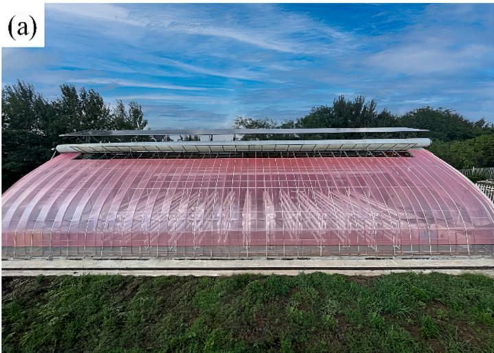  
图1. 实验中使用的CASG外观(a)，温室能量流动示意图(b)

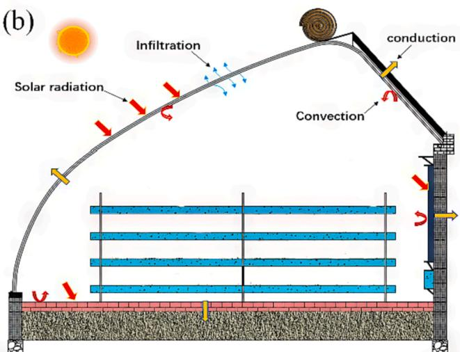

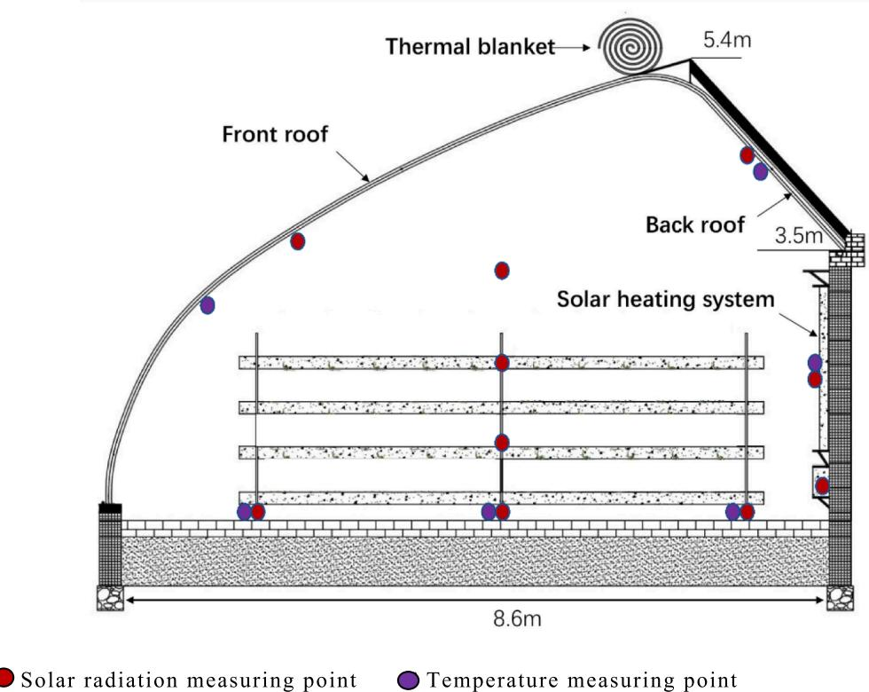  
图2. 温室剖面测量点布局

# 3. 太阳辐射模型

地球表面接收穿过大气层的太阳辐射。通过温室前屋面到达地面的辐射称为温室总辐射。由于各表面角度不同，截获的太阳辐射量存在差异。为更好地理解温室内的太阳辐射，本文采用Kreith和Kreider(1981)的理论模型计算并比较不同表面的太阳辐射与实测数据。

大气层外的太阳辐射：

$$
G_{sun} = 1367\left[1 + 0.033\mathrm{cos}\left(\frac{360\pi}{180}\cdot \frac{day_1}{365}\right)\right] \tag{1}
$$

其中$day_1$为每年自1月1日起的累计天数。

温室外水平面太阳辐射可表示为：

$$
G_{total} = G_{sun}.\cos \theta_{sun}.\left(\tau_z + \tau_s\right) \tag{2}
$$

式中：

$$
\begin{array}{rl} & {\cos \theta_{sun} = \sin \Gamma \sin \delta +\cos \Gamma .\cos \delta .\cos \omega}\\ & {\tau_z = a_0 + a_1e^{\frac{a_k}{\cos\theta_{sun}}}}\\ & {\tau_s = 0.271 - 0.293\tau_s}\\ & {\omega = (t_h - 12)\cdot 15 + (\psi -120)}\\ & {\delta = 23.45^\circ \sin \left[\frac{360\pi}{180}\cdot \frac{284 + day_1}{365}\right]} \end{array} \tag{3}
$$

其中$a_0$、$a_1$和$\kappa$为标准晴空大气的物理常数。当海拔低于$2.5 \text{km}$时，可通过下式计算：

$$
\begin{array}{c}{a_0 = 0.4237 - 0.00821(6 - LH)^2}\\ {}\\ {a_1 = 0.5055 - 0.00595(6.5 - LH)^2}\\ {}\\ {\kappa = 0.2711 - 0.01858(2.5 - LH)^2} \end{array} \tag{10}
$$

沈阳地区平均海拔为$0.11 \text{km}$，可得：

$$
a_0 = 0.1388779,a_1 = 0.262549,K = 0.1649629
$$

因此，各表面太阳辐射可表示为：

$$
G_{A} = G_{total}.\cos \theta_{i}.\zeta_{i}.\mathfrak{J} \tag{1}
$$

其中$\zeta$为前屋面薄膜透射率。由于实验温室薄膜受灰尘等因素影响，通过对比温室内外数据测得透射率为0.73。$\mathfrak{J}$为天气影响因子，晴空无云时$\Im = 1$。

$$
\begin{array}{rl} & {\cos \theta_{i} = \sin \delta \sin \Upsilon \cos \gamma -\sin \delta \cos \Upsilon \sin \gamma \cos \beta +\cos \delta \cos \Upsilon \cos \gamma \cos \omega}\\ & {\qquad +\cos \delta \sin \Upsilon \sin \gamma \cos \beta \cos \omega +\cos \delta \sin \gamma \sin \beta \sin \omega} \end{array} \tag{12}
$$

式中$\gamma$为目标表面与水平面夹角，$0^{\circ} \leq \gamma \leq 180^{\circ}$，$\gamma \geq 90^{\circ}$表示目标表面具有向下分量。

# 4. 能量平衡模型

温室热效率是评价其性能的关键指标。中国北方严冬气候对温室热环境要求极高。为更好地研究CASG的热性能，我们构建了一套适用于CASG的温度预测模型。实验期间温室通风口保持关闭以最小化室外环境因素对热环境的影响。同时，模型忽略了温室内植物以减少其热影响。排除植物主要基于以下原因：首先聚焦于温室围护结构热特性；其次温室内植物种类不唯一；最后植物蒸腾和呼吸作用会影响室内气温。因此忽略温室内植物的影响。构建温室模型时作如下假设：

(1) 温室内空气均匀混合，温度分布一致。忽略温室内骨架吸收的热量。
(2) 忽略温室无土栽培管架的热吸收。
(3) 忽略温室内水蒸气潜热和湿度的影响。
(4) 假设温室内无植被。
(5) 集热板吸热面的热量全部由换热管吸收。

# 4.1. 各表面热辐射交换

如图3所示，温室的四个表面构成一个封闭系统。温室内散射的太阳辐射以漫反射形式进行，这使得可以使用长度系数法确定角系数。此外，可以用各表面长度代替表面积。两表面间的热辐射公式可表示为(Straten等, 2010):

$$
Q_{A,B}^{HR} = \phi_{A}\cdot \phi_{B}.X_{A,B}.\sigma .(T_{A}^{4} - T_{B}^{4}) \tag{13}
$$

式中$\phi_{A}$和$\phi_{B}$分别为表面A和B的热发射系数。$\sigma$为Stefan-Boltzmann常数，其值为$5.68\cdot 10^{- 8}(W\cdot m^{- 2}\cdot k^{- 4})$。$X_{A,B}$为表面$A$到表面$B$的视角系数(Tong等, 2009)，前屋面到北墙的视角系数可表示为$X_{fl,wl}$，其数学表达式如图3所示。

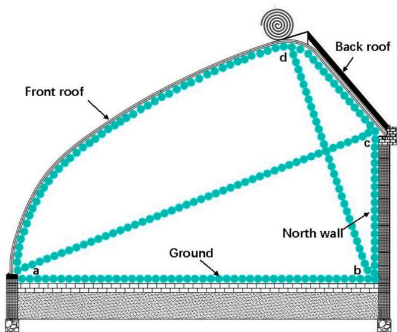  
图3. 温室表面视角系数示意图，其中$ab$表示温室地面，$cb$表示温室北墙内表面，$dc$表示温室后屋面内表面，$da$表示温室前屋面内表面。

$$
X_{fl,wl} = \frac{ac + db - dc - ab}{2da} \tag{14}
$$

$$
X_{fl,rf} = \frac{da + dc - ac}{2da} \tag{15}
$$

$$
X_{gd,wl} = \frac{ab + bc - ac}{2ab} \tag{16}
$$

$$
X_{fd,d} = \frac{da + ab - db}{2da} \tag{17}
$$

$$
X_{rf,wl} = \frac{dc + cb - db}{2dc} \tag{18}
$$

$$
X_{rf,gd} = \frac{db + ac - ad - cb}{2dc} \tag{19}
$$

其中$db = 5.8\mathrm{m}$ $ac = 8.8\mathrm{m}$ $da = 10\mathrm{m}$ $dc = 2.616\mathrm{m}$ $ab = 8.6\mathrm{m}$ $cb = 3.5$ m;

# 4.2. 后屋面能量平衡

温室后屋面的热传递通过以下方式实现：与室内空气和表面的对流及辐射换热，以及向外表面的导热。

$$
G_{rf} - \rho_{rf}c_{rf}f_{0}\cdot \frac{dT_{rf}}{dt} = Q_{rf,airi}^{dl} + Q_{rf,rf1}^{cd} + Q_{rf,gd}^{HR} + Q_{rf,gd}^{HR} + Q_{rf,ft}^{HR} + Q_{rf,st}^{HR} + Q_{rf,wl}^{HR}
$$

式中$Q_{rf,airi}^{dl}$为温室内空气与后屋面的对流传热，可表示为(Mobtaker等, 2019):

$$
Q_{rf,airi}^{dl} = h_{rf,airi}^{dl}(T_{rf} - T_{airi}) \tag{21}
$$

任意厚度$t$的表面$A$到表面$A_{1}$的热传导可表示为(Joudi和Farhan, 2015):

$$
q_{A,A_1}^{cd} = \frac{k_A(T_A - T_{A_1})}{t} \tag{22}
$$

温室后屋面从内到外分为三层，从后屋面到室外空气的能量平衡方程可写为:

$$
\rho_{rf}c_{rf}f_{1}\cdot \frac{dT_{rf1}}{dt} = \frac{k_{rf}(T_{rf} - T_{rf1})}{f_{1}} -\frac{k_{rf1}(T_{rf1} - T_{rf2})}{f_{2}} \tag{23}
$$

$$
\rho_{rf}c_{rf2}f_{2}\cdot \frac{dT_{rf2}}{dt} = \frac{k_{rf1}(T_{rf1} - T_{rf2})}{f_{2}} -Q_{rf2,airo}^{dl} - Q_{rf2,airo}^{dl}, \tag{24}
$$

其中$Q_{rf2,airo}^{dl}$为温室后屋面外表面与室外空气的对流传热，可表示为(Mobtaker等, 2019):

$$
Q_{rf2,airo}^{dl} = h_{rf2,airo}^{dl}(T_{rf2} - T_{airo}) \tag{25}
$$

$$
h_{rf2,airo}^{dl} = 1.42\left(\frac{T_{rf2} - T_{airo}}{t}\right)^{0.25} \tag{26}
$$

式(24)中，$Q_{rf2,sky}^{HR}$为温室后屋面外表面与天空的辐射换热，可表示为:

$$
Q_{rf2,sky}^{HR} = \sigma \phi_{rf2}T_{rf2}^{4} - \epsilon_{sky}\sigma \phi_{sky}T_{sky}^{4} \tag{27}
$$

$T_{sky}$为室外天空温度，可表示为(Swinbank, 1963):

$$
T_{sky} = 0.0552(T_{airo})^{1.5} \tag{28}
$$

# 4.3. 地面能量平衡

由于CASG采用无土栽培，温室地面与普通土壤温室不同。实验温室地面覆盖有$6cm$厚的水泥烧结砖。在计算地面能量平衡时，我们分别考虑了水泥烧结砖和土壤。

$$
\rho_{gd} - \rho_{gd}c_{gd}n_0\cdot \frac{dT_{gd}}{dt} = Q_{gd,airi}^{dl} + Q_{gd,si}^{dl} - Q_{gd,wl}^{HR} + Q_{gd,rf}^{HR} + Q_{gd,ft}^{HR} + Q_{gd,gs}^{HR} + Q_{gd,st}^{HR}
$$

其中$Q_{gd,airi}^{dl}$为地面与室内空气的对流传热，可表示为:

$$
Q_{gd,airi}^{dl} = h_{gd,airi}(T_{gd} - T_{airi}) \tag{30}
$$

从温室地面传递到土壤的能量可表示为:

$$
\begin{array}{r}\rho_{si}c_{si}n_1\cdot \frac{dT_{si1}}{dt} = \frac{k_{si}(T_{si} - T_{si1})}{n_1} -\frac{k_{si1}(T_{si1} - T_{si2})}{n_2}\quad 1\leqslant n\leqslant 10cm\\ \rho_{si}c_{si2}n_2\cdot \frac{dT_{si2}}{dt} = \frac{k_{si1}(T_{si1} - T_{si2})}{n_2} -\frac{k_{si2}(T_{si2} - T_{si3})}{n_3}\quad 10\leqslant n\leqslant 20cm \end{array} \tag{32}
$$

# 4.4. 前屋面能量平衡

温室前屋面覆盖有Po膜。由于Po膜非常薄，在计算能量平衡时，Po膜内表面温度被视为整个膜的温度。前屋面的能量平衡可表示为:

$$
\begin{array}{r}G_{fl} - \rho_{fl}c_{fl}d_{fl}\cdot \frac{dT_{fl}}{dt} = Q_{fl,airi}^{dl} + Q_{fl,airi}^{dl} + Q_{fl,gd}^{HR} + Q_{fl,rf}^{HR} + Q_{fl,gs}^{HR}\\ +Q_{fl,st}^{HR} + Q_{fl,wh}^{HR} + Q_{fl,sky}^{HR} \end{array} \tag{33}
$$

其中$Q_{fl,airi}^{dl}$为温室内表面与室内空气的热传递，可表示为(Mobtaker等, 2019):

$$
Q_{fl,airi}^{dl} = h_{fl,airi}^{dl}(T_{fl} - T_{airi}) \tag{34}
$$

$$
h_{fl,airi}^{dl} = 1.95\big|T_{airi} - T_{fl}\big|^{0.3} \tag{35}
$$

式(33)中，$Q_{fl,airi}^{dl}$为前屋面外表面与室外空气的热传递，可表示为(Abdel-Ghany和Kozai, 2006):

$$
Q_{fl,airi}^{dl} = h_{fl,airi}^{dl}(T_{fl} - T_{airi}) \tag{36}
$$

$$
h_{fl,airi}^{dl} = 0.95 + 6.76\nu_{airi}^{0.49}\nu_{airi}< 6.3m / s \tag{37}
$$

温室前屋面向外的辐射热损失可表示为:

$$
Q_{fl,sky}^{HR} = \sigma \phi_{fl}T_{fl}^4 -\epsilon_{sky}\sigma \phi_{sky}T_{sky}^4 \tag{38}
$$

# 4.5. 北墙能量平衡

CASG的北墙集成了一套水蓄热系统。水蓄热系统的集热板和水箱屏蔽了温室北墙表面。因此，在计算温室北墙能量平衡时，需要分别计算水蓄热和北墙对温室热环境的影响。北墙的能量平衡可表示为:

$$
G_{wl} - \rho_{wl}c_{wl}d_{0}\cdot \frac{dT_{wl}}{dt} = Q_{wl,airi}^{dl} + Q_{wl,wl1}^{cd} + Q_{wl,rf}^{HR} + Q_{wl,rf}^{HR} + Q_{wl,gd}^{HR} + Q_{wl,gs}^{HR} + Q_{wl,st}^{HR} \tag{39}
$$

由墙体导出的能量平衡方程可写为:

$$
\rho_{wl}c_{wl}d_1\cdot \frac{dT_{wl}}{dt} = \frac{k_{wl}(T_{wl} - T_{wl1})}{d_1} -\frac{k_{wl}(T_{wl1} - T_{wl2})}{d_2} -\frac{k_{wl}(T_{wl2} - T_{wl3})}{d_3} \tag{40}
$$

$$
\rho_{wl}c_{wl}d_2\cdot \frac{dT_{wl2}}{dt} = \frac{k_{wl1}(T_{wl1} - T_{wl2})}{d_2} -\frac{k_{wl2}(T_{wl2} - T_{wl3})}{d_3} \tag{41}
$$

$$
\rho_{wl}c_{wl}d_3\cdot \frac{dT_{wl3}}{dt} = \frac{k_{wl2}(T_{wl2} - T_{wl3})}{d_3} -Q_{wl3,airi}^{dl} - Q_{wl3,sky}^{HR} \tag{42}
$$

# 4.6. 水蓄热系统能量平衡

水蓄热系统由集热板和储水箱组成。白天，阳光照射在集热器上，热量集中在吸热表面。冷水通过泵在集热板的热交换管中循环流动。冷水流经热交换管带走吸热表面的热量。最终，热水流回储水箱进行热交换。本文为了更好地研究该系统，将水蓄热系统分为两部分分别研究其热平衡。

# 4.6.1. 集热板能量平衡

集热板由玻璃盖板、吸热层和一组换热管组成。玻璃盖板与吸热层之间有$2cm$的间隙。实验过程中测量了玻璃盖板的平均表面温度$T_{gs}$和吸热层的平均表面温度$T_{sl}$。集热板中的定性温度可表示为:

$$
T_{mx} = \frac{T_{gs} + T_{sl}}{2} \tag{43}
$$

其中$T_{mx}$表示集热板内空气温度，干空气的热物理性质如表2所示。

吸热表面与玻璃盖板内表面之间的单位面积自然对流换热可表示为:

$$
N_u = 0.212\cdot (Gr\cdot pr)^{\frac{1}{4}} \tag{35}
$$

$$
G\cdot pr = \frac{g\cdot a\cdot(T_{sl} - T_{gs})\cdot(\partial_{gs})^3\cdot pr}{\nu^2} \tag{36}
$$

$$
Q_{sl,airsl}^{dl} = \frac{Nu\cdot\lambda_{airsl}}{\partial_{gs}} (T_{sl} - T_{gs}) \tag{37}
$$

表2 干空气的热物理性质

| Tmx (°C) | λ×10² [W/(m·K)] | ν×10⁶ (m²/s) | pr   |
|----------|-----------------|--------------|------|
| 10       | 2.51            | 14.16        | 0.705|
| 20       | 2.59            | 15.06        | 0.703|
| 30       | 2.67            | 16.00        | 0.701|
| 40       | 2.76            | 16.96        | 0.699|
| 50       | 2.83            | 17.95        | 0.698|
| 60       | 2.90            | 18.97        | 0.696|
| 70       | 2.96            | 20.02        | 0.694|

集热板内吸热表面到玻璃盖板内表面的单位面积辐射热通量可表示为:

$$
Q_{gs,sl}^{HR} = \frac{5.67\cdot\left[\left(\frac{T_{sl} + 273}{100}\right)^4 - \left(\frac{T_{gs} + 273}{100}\right)^4\right]}{\frac{1}{\phi_{sl}} + \frac{1}{\phi_{gs}} - 1} \tag{47}
$$

因此，集热板内吸热表面的有效热通量可表示为:

$$
Q_{sl} = \tau_{gs}\cdot G_{sl}\cdot \Gamma_{sl} - Q_{gs,airsl}^{HR} - Q_{gs,sl}^{HR} \tag{48}
$$

因此，集热板的热效率可表示为:

$$
n_{sl} = \frac{Q_{sl}}{G_{gs}} \tag{49}
$$

白天，内部吸热层和换热管通过强制换热带走收集的热量。冷水通过热交换变成热水并储存在水箱中。同时，集热板外表面与温室内空气之间发生对流换热。为便于计算，我们分别计算温室集热板的热平衡和水箱的热平衡分析。集热板吸收照射在其表面的部分太阳辐射，其余部分被反射出去。集热板表面吸收的太阳辐射可表示为:

$$
Q_{gsab} = (1 - \tau_{gs})\cdot G_{sl} \tag{50}
$$

对于玻璃盖板外表面，部分热量通过与空气的对流损失到室内空气中，另一部分通过辐射与各表面进行热传递。玻璃盖板表面与温室内空气的对流换热可表示为:

$$
Q_{gs,airi}^{dl} = h_{gs,airi}^{dl}\cdot (T_{gs} - T_{airi}) \tag{51}
$$

因此，温室集热板的热平衡可表示为:

$$
\begin{array}{c}{G_{gs}(1 - \tau_{gs}) - \rho_{gs}c_{gs}l_0\cdot \frac{dT_{gs}}{dt} = Q_{gs,airi}^{dl} + Q_{gs,rf}^{HR} + Q_{gs,fl}^{HR} + Q_{gs,gd}^{HR} + Q_{gs,wl}^{HR}}\\ {+Q_{gs,sl}^{HR} - Q_{gs,sl}^{HR}} \end{array} \tag{52}
$$

# 4.6.2. 储水箱能量平衡

$$
\begin{array}{c}{A_{gs}G_{gs}\eta_{sl} - \rho_{wt}c_{wt}V_{sl}\cdot \frac{dT_{st}}{dt} = L_{cu}\cdot Q_{sl,airsl}^{dl} + A_{st}Q_{st,airi}^{cd} + A_{st}Q_{st,rf}^{HR} + A_{st}Q_{st,fl}^{HR}}\\ {+A_{st}Q_{st,wl}^{HR} + A_{st}Q_{st,fd}^{HR} + A_{st}Q_{st,gx}^{HR}} \end{array}
$$

集热板内空气与换热管内空气之间的热传递可表示为:

$$
Q_{sl,airsl}^{dl} = \frac{T_{mix} - T_{airsl}}{\frac{1}{2\pi R_1b_{sl}} + \frac{\ln(R_2 / R_1)}{2\pi k_{ex}} + \frac{1}{2\pi R_2h_{airsl}}} \tag{54}
$$

其中$Q_{sl,airsl}^{dl}$表示集热板内空气与集热板内换热管之间的对流换热。$T_{mix}$表示集热板进出口水温的平均温度，可表示为(Kiyan等, 2013):

$$
T_{mix} = \frac{1}{3} T_{in} + \frac{2}{3} T_{out} \tag{55}
$$

在式(54)中，$h_{sl}$是换热管内流动水与管壁的对流换热系数。对于光滑管内的湍流流动，可采用Dittus-Boelter公式计算，可表示为:

$$
h_{sl} = 0.023Re^{0.8}Pr^m\cdot \frac{\lambda_f}{2R_1} \tag{47}
$$

其中$m$在流体被加热时为0.4，被冷却时为0.3，$Re$为雷诺数，$Pr$为普朗特数(Winterton, 1998)。

冷水通过集热板内的换热管流出后，经过回水管进行热交换。回水管的热交换可表示为:

$$
Q_{st,airi}^{cd} = \frac{T_{in} - T_{airi}}{\frac{1}{h_{airi}} + \frac{\partial_u}{k_{st}} + \frac{\partial_{ul}}{k_{yl}}} \tag{48}
$$

# 4.7. 渗透通风能量平衡

渗透通风时，风通过温室门窗进入室内，可表示为(Joudi和Farhan, 2015):

$$
Q_{vt} = c_{air}\rho_{air}N_{air}H\frac{(T_{airi} - T_{airo})}{3600} \tag{58}
$$

其中$N_{air}$表示温室内外空气交换率，普通节能日光温室为0.6-1，本研究中取0.85。

# 4.8. 温室内空气能量平衡

室内空气的能量平衡主要包括温室内各表面与空气之间的对流换热。$P_{air} = A_{wl}Q_{wl,air} + A_{fl}Q_{fl}^{dl} = A_{fl}Q_{fl,air}^{dl} + A_{gl}Q_{gl,air}^{dl} + A_{fl}Q_{fl,air}^{dl} + A_{gl}Q_{gl,air}^{dl}$ 室内空气。$+A_{wl}Q_{wl,air}^{dl} + A_{st}Q_{st,airi}^{cd} - Q_{vt}$ (59)。

# 4.9. 模型求解过程

为验证模型的准确性，上述方程在MATLAB 2018Ra中进行了建模计算。将各表面的辐射强度和室外气温输入模型，设置各表面物性参数名称并给定各表面基础温度。最后采用fsolve ode求解器求解温度。各表面分层结构的物性参数和各层平均有效属性在输入参数时可视为相同。测量时间为2022年2月14日和15日上午9:00至下午3:30。最终将实测温度与模拟数据进行对比。模拟中使用的水蓄热系统基本参数见表3。

为量化所开发模型的准确性，计算了以下统计参数：

预测值与实测值的绝对误差

$$
MAE = \frac{\sum_{i = 1}^{N}|X_i - Y_i|}{N} \tag{60}
$$

预测值与实测值的相关系数

$$
R^2 = 1 - \frac{\sum_{i = 1}^{N}(X_i - Y_i)^2}{\sum_{i = 1}^{N}(X_i - \overline{X}_i)^2} \tag{55}
$$

$R^2$ 的取值范围为0-1，越接近1表示预测值与实测值吻合度越好。

均方根误差(RMSE)采用下式计算：

表3 水蓄热系统模拟基本参数

| 描述 | 数值 | 单位 |
|------|------|------|
| **单个集热板参数** |  |  |
| 集热板长度 | 2 | m |
| 集热板高度 | 1 | m |
| 集热板宽度 | 0.08 | m |
| 换热管内水流速(vwt) | 7 | m/s |
| 换热管内径(Rz) | 5 | mm |
| 换热管外径(Rz) | 7 | mm |
| 集热板内管长(L) | 12.6 | m |
| 管内对流换热系数(hcl) | 26914.44 | w/m²·k |
| 管外对流换热系数(hairsl) | 3.74 | w/m²·k |
| **单个水箱参数** |  |  |
| 水箱长度 | 3 | m |
| 水箱宽度 | 0.5 | m |
| 水箱高度 | 0.2 | m |
| 部分参数 | 1 | cm |
| 部分参数 | 8 | w/m·k |
| 部分参数 | 0.045 | w/m·k |
| 外部对流系数(hst) | 7.4 | w/m·k |

$$
\begin{array}{c}{RMSE = \sqrt{\frac{1}{N}\sum\left(Y_i - X_i\right)^2}}\\ {}\\ {MRE = \frac{1}{N}\sum_{i = 1}^{N}\left(\frac{Y_i - X_i}{X_i}\right)\times 100\%} \end{array} \tag{63}
$$

式中 $X_{i}$ 为实测值，$Y_{i}$ 为预测值，$\overline{X_i}$ 为实测值的平均值，$N$ 为测量次数。

# 5.结果与讨论

# 5.1. 太阳辐射数据对比

如图4所示，对预测和实测的辐射强度进行了对比。随着太阳高度角的升高，早晨室外太阳辐射强度逐渐增加，正午时分达到峰值。下午随着太阳高度角降低，太阳辐射强度逐渐减弱。两天的平均辐射强度分别为324.43 $w / m^2$ 和 $264.12w / m^2$。计算与实测结果的差异可能源于测量仪器误差或室外透光率变化。

如图5所示，温室外水平方向太阳辐射强度的决定系数为0.975。计算结果与实测结果吻合良好，验证了辐射计算模型的有效性，表明该模型适用于太阳辐射强度计算。

如图6所示，室外空气温度直接受室外辐射强度影响，其变化趋势与辐射强度一致。2月15日温度略低于2月14日，两天最高温度均出现在下午1:30，分别为1.8°C和0.48°C。上午9点至午夜12点的平均温度分别为-4.4°C和-6.4°C。

太阳辐射是日光温室的主要热源，直接影响温室内各表面温度。通过计算辐射量确定了温室各表面的温度变化规律。图7显示了上午9:00至$3:30\mathrm{pm}$温室内各表面的辐射变化规律。温室前屋面因直接接受阳光照射，辐射强度显著高于其他表面。地面和后屋面由于遮阴严重，辐射强度低于其他表面，其值约为北墙表面辐射强度的四分之一。

# 5.2. 温室内表面温度对比

如图8所示，当保温被揭开时，温室内空气温度呈上升趋势，在$1:30\mathrm{pm}$达到峰值后逐渐下降。最高温度分别为$40.3^{\circ}C$和$36.3^{\circ}C$。实验期间预测值与实测值的平均误差为$1.4^{\circ}C$。误差可能由仪器故障和温室外云层变化引起。两天实验的预测值与实测值$R^2$为0.9789（图9），表明测量结果与预测结果吻合良好。

如图10所示，温室后屋面温度波动较大，两天内预测值与实测值相差$1.89^{\circ}C$。实验误差可能源于白天保温被遮挡导致后屋面太阳辐射计算值高于实际值，使得预测值相对实测值偏高。夜间温室前屋面被保温被覆盖，保温被自身温度传递至温室导致误差。温室后屋面温度的$R^2$为0.9163（图11），表明数据拟合良好，能较好表征后屋面温度变化。

  
图4. 室外水平地面辐射强度对比

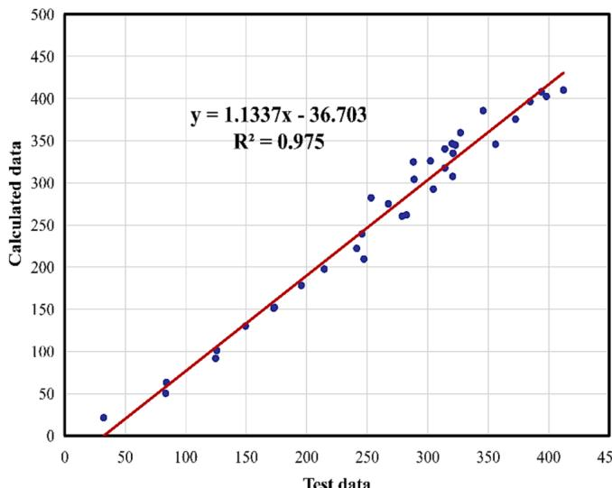  
图5. 室外水平辐射实测值与预测值关系分析

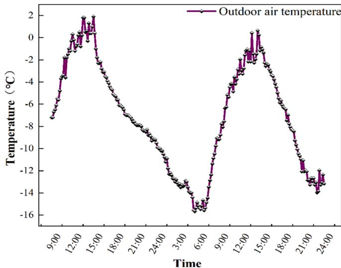  
图6. 室外空气温度

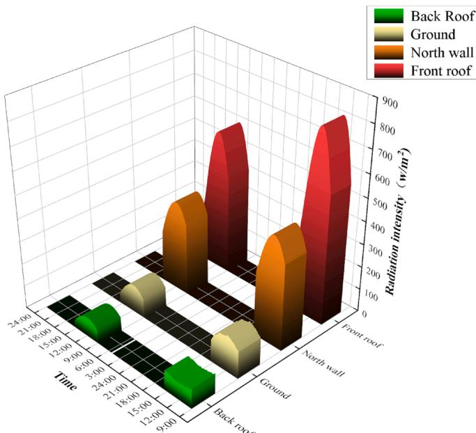  
图7. 温室内各表面辐射强度

如图12所示，温室前屋面温度波动显著。由于前屋面覆盖的PO薄膜较薄，受外界空气影响较大，导致预测值与实测值平均相差$1.98^{\circ}\mathrm{C}$。每日$3:30\mathrm{pm}$至$4:00\mathrm{pm}$期间前屋面温度骤升，该转折点源于$3:30\mathrm{pm}$保温被闭合时，其温度高于前屋面温度所致。如图13所示，前屋面温度的$R^2$为0.9608。

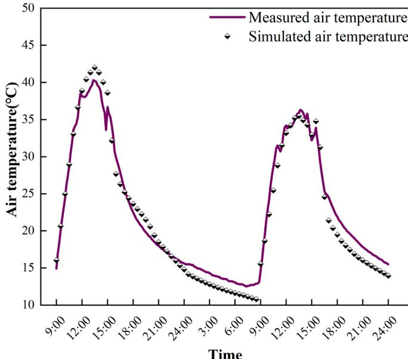  
图8. 空气温度对比

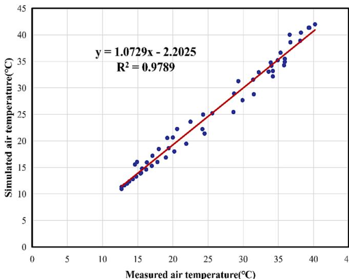  
图9. 空气温度关系分析

结果显示预测值与实测值存在较大误差。一方面，前屋面长期暴露于空气中且积尘降低了辐射透过率，导致实际辐射值低于计算值；另一方面，前屋面温度基于内表面曲面的温度计算，各点入射角不同造成温度分布差异显著。

由于集热板内部传热过程复杂且难以测量内部温度，在集热板温度对比部分采用了集热板表面玻璃盖板的温度。如图14所示，两天实验中预测值与实测值的平均误差分别为$2.07^{\circ}\mathrm{C}$。实验误差可能源于无土栽培架的严重遮荫导致集热板表面太阳辐射计算值高于实际值，使得实际表面温度低于预测温度。两天集热板表面温度的$R^2$分别为0.9551（图15），表明该模型能较好地计算集热板表面温度。

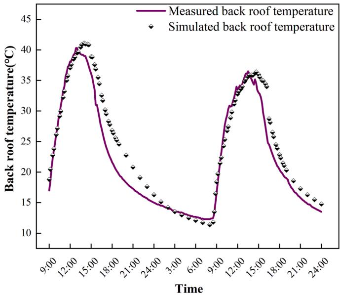  
图10. 后屋面温度对比

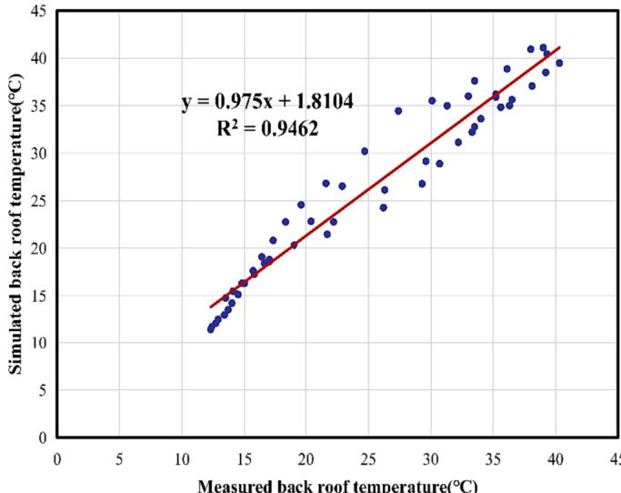  
图11. 后屋面温度关系分析

在计算温室北墙温度时，由于集热板和水箱悬挂于北墙内表面，该部分北墙温度对比指除水箱和集热板部分外的北墙表面温度。从图16可见，当保温被揭开时北墙温度呈上升趋势，正午达到峰值后逐渐下降。两天实验中预测值与实测值的$R^2$如图17所示，北墙的决定系数均超过0.9495左右。实验期间北墙实测值与预测值的平均误差为$2.26^{\circ}C$。由于太阳高度角增加，温室北墙受到保温被和室内无土栽培架的严重遮荫。

如图18所示，白天太阳辐射汇聚于集热板，水泵通过循环水将集热板的热量带入储水罐。

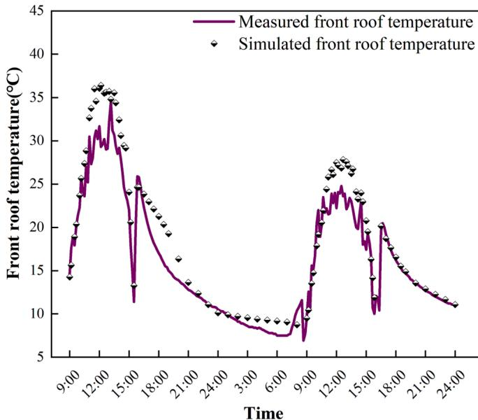  
图12. 前屋面温度对比

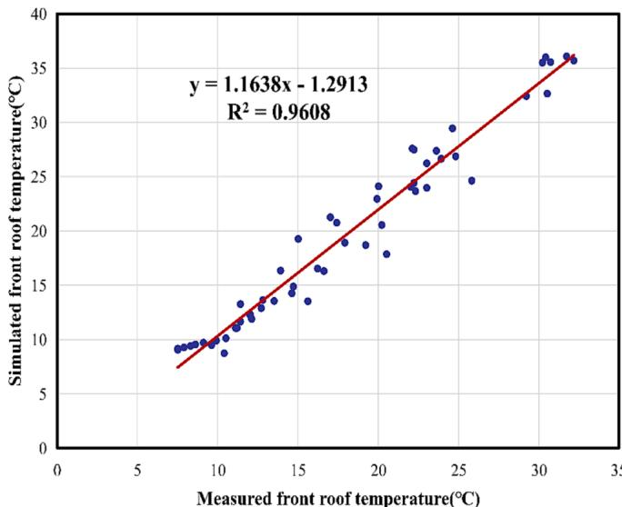  
图13. 前屋面温度关系分析

最终热量储存于水箱中。本实验水泵白天循环时间为上午9:00至下午3:30，夜间循环时间为24:00至次日上午9:00。如图18所示，24:00至9:00水温下降速率略高于15:00至24:00。如图19所示，两天水温预测值与实测值的决定系数分别为0.9897，表明该计算方法适用于此类水箱的水温计算。

如图20所示，温室地面温度在下午1:00左右达到峰值。两天实验中预测值与实测值的平均误差分别为$1.44^{\circ}C$。地面温度的决定系数$R^2$为0.8257（图21）。实验误差源于无土栽培架和辐射强度计算两方面因素：一方面，当直射辐射进入温室时，大量辐射被栽培架遮挡；另一方面，模拟中使用的太阳辐射为计算平均值。随着太阳高度角增加，正午时分栽培架间辐射强度急剧升高，而下午随太阳高度角降低又快速减弱，这些因素共同导致了实验误差。

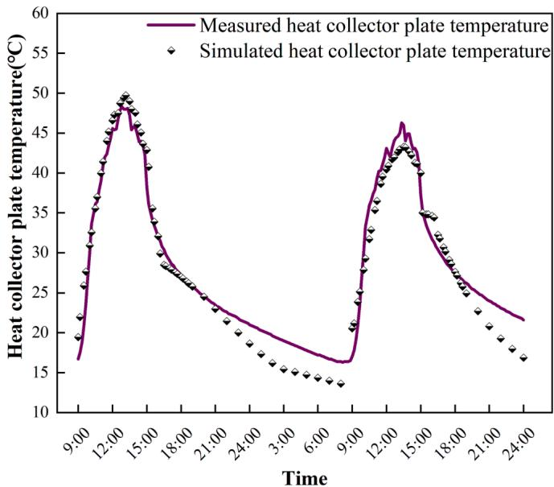  
图14. 集热板温度对比

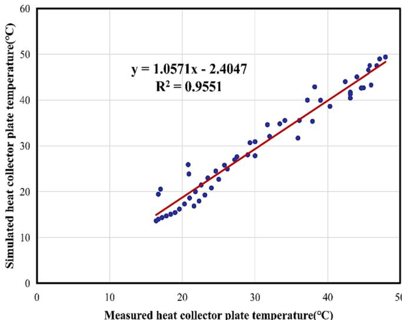  
图15. 集热板温度关系分析

# 5.3. 模型性能评估

为验证模型可靠性，采用平均相对误差(MRE)、平均绝对误差(MAE)、决定系数$(R^2)$和均方根误差(RMSE)进行精度评估。如表4所示，平均绝对误差介于$0.68^{\circ}\mathrm{C}$至$2.26^{\circ}\mathrm{C}$之间，其中储水罐因热干扰较小误差最低。平均相对误差范围为$1.9\%$至$10.4\%$，均方根误差为$0.37^{\circ}\mathrm{C}$至$2.9^{\circ}\mathrm{C}$，决定系数在0.8257至0.9897之间。所有结果均在误差允许范围内，表明该模型可用于CASG的热性能模拟且稳定性良好。

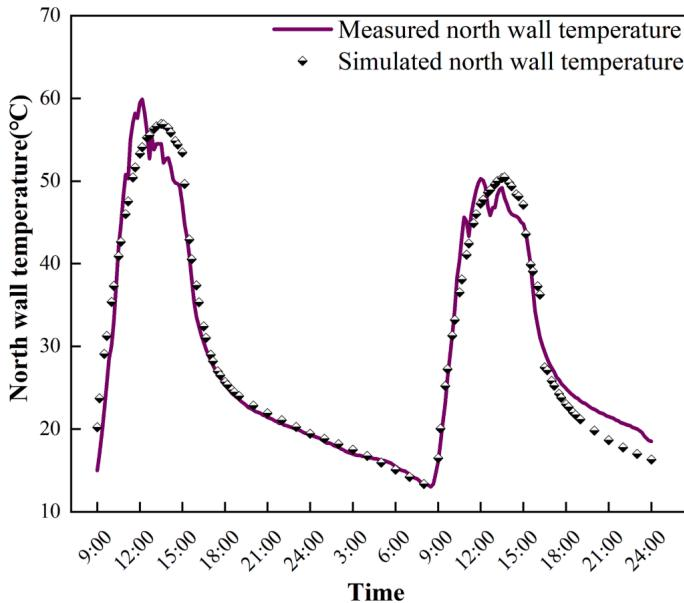  
图16. 北墙温度对比

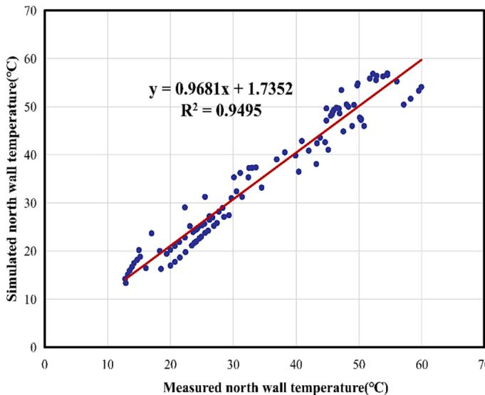  
图17. 北墙温度关系分析

# 5.4. 不同天气模拟

温室内温度是评估微环境的重要指标。中国北方冬季室外低温对温室保温性能要求极高。本节通过模拟冬季典型晴天和晴阴交替天气下的室内温度，评估日光温室的保温性能。

如图22所示，典型晴天室外太阳辐射强度日均值为$233.23w / m^2$，计算值与实测值绝对误差为$16.65w / m^2$，室外辐射决定系数$R^2$为0.965。同期室外气温监测显示，最高气温$2.0^{\circ}\mathrm{C}$，最低气温$-10.4^{\circ}\mathrm{C}$，日均气温$-2.7^{\circ}\mathrm{C}$。

如图23所示，CASG在冬季晴天表现出优异的热性能，当室外最低温约$-10^{\circ}\mathrm{C}$时，温室内仍能维持$27^{\circ}C$的平均温度。温室北墙表面最高温超过$50^{\circ}\mathrm{C}$。装配式日光温室将保温与储热功能从传统墙体分离，北墙主要起支撑作用，其独特结构导致传热系数极低，热量集中分布于表面。集热板表面最高温约$40^{\circ}\mathrm{C}$，通过换热管将大部分热量传递给水体，同时与温室空气及其他表面进行对流和辐射换热，因此其表面温度略低于北墙。得益于高效换热能力，保温被揭开后水箱温度缓慢上升，最高可达$45^{\circ}\mathrm{C}$。相较于其他表面，温室地面温度上升更为缓慢，主要原因是地面受无土栽培架严重遮荫。

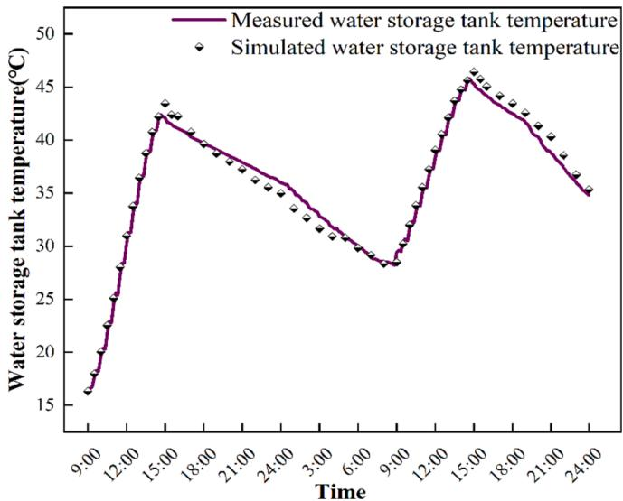  
图18. 储水罐温度对比

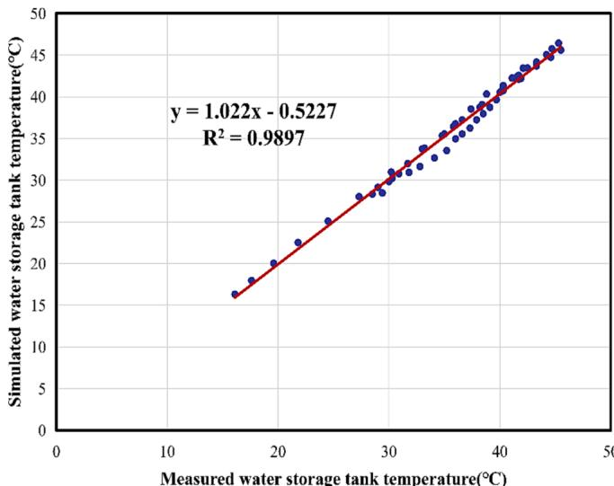  
图19. 储水罐温度关系分析

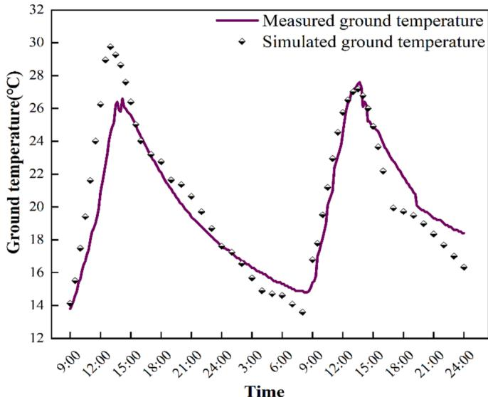  
图20. 地面温度对比

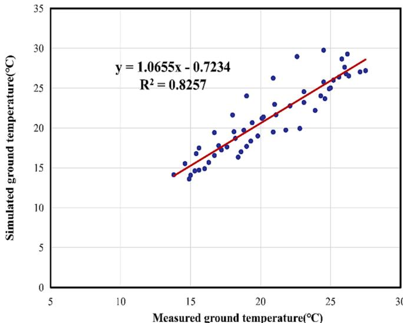  
图21. 地面温度关系分析

表4 温室内温度建模误差分析

| 结构表面        | 平均绝对误差(℃) | 平均相对误差(%) | 均方根误差(℃) | 决定系数R² |
|----------------|----------------|----------------|--------------|-----------|
| 前屋顶          | 1.98           | 10.4           | 2.61         | 0.9608    |
| 后屋顶          | 1.89           | 3.3            | 2.47         | 0.9462    |
| 地面            | 1.44           | 7.1            | 2.01         | 0.8257    |
| 集热板          | 2.07           | 8.46           | 2.41         | 0.9551    |
| 空气            | 1.4            | 6.2            | 1.61         | 0.9789    |
| 北墙            | 2.26           | 5.9            | 2.9          | 0.9495    |
| 储水罐          | 0.68           | 1.9            | 0.37         | 0.9897    |

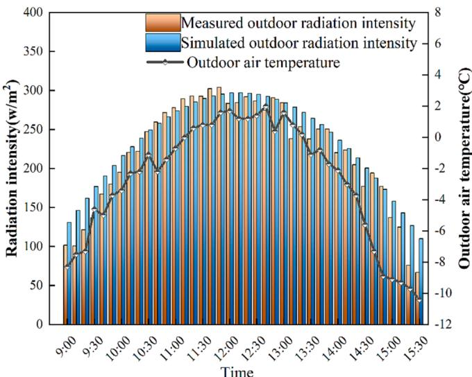  
图22. 典型晴天的室外太阳辐射和温度

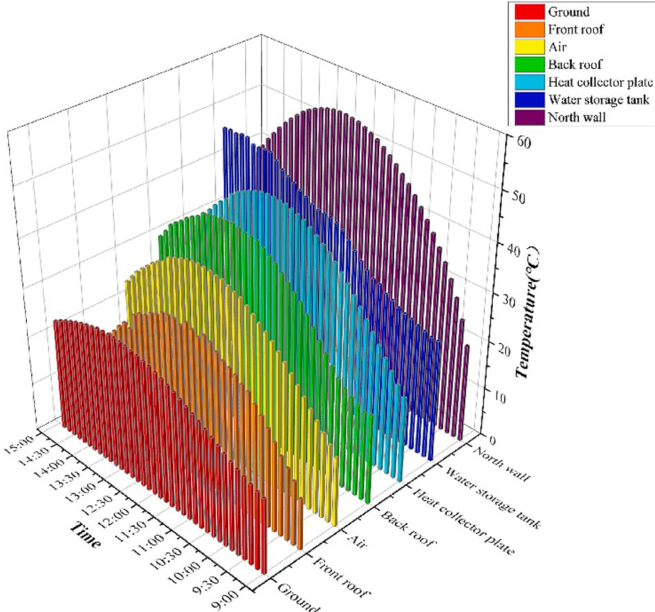  
图23. 晴天各表面温度分布

为全面评估CASG的热性能，我们模拟了冬季晴阴交替天气下的温室热环境。如图24所示，上午9点至11点间，随着太阳高度角增加，室外太阳辐射逐渐增强。11点至12点间因云层遮挡，辐射强度急剧下降。全天室外辐射强度平均值为$211.98\mathrm{w} / \mathrm{m}^2$，计算值与预测值的绝对误差为$20.85\mathrm{w} / \mathrm{m}^2$，室外辐射决定系数$R^2$为0.8185。数据误差较大的原因是测量时段恰逢云层遮挡。同期监测显示，室外最高气温出现在中午12:10，气温变化趋势与辐射强度基本一致。

如图25所示，早晨揭开保温被时室内气温约$10^{\circ}\mathrm{C}$，正午最高气温达$28^{\circ}\mathrm{C}$，全天平均气温维持在$21^{\circ}\mathrm{C}$左右。11点至12点间因云层遮挡出现温度骤降。前屋顶直接接触室外空气，受低温影响最低温仅$7.4^{\circ}\mathrm{C}$。地面因持续遮荫导致温度变化不明显。北墙表面最高温约$40^{\circ}\mathrm{C}$，较晴天升温更为平缓。储水箱水温上升速度明显慢于晴天，表明室外辐射是影响储热量的关键因素。尽管辐射强度较低，温室内仍维持了适宜植物生长的温度环境。

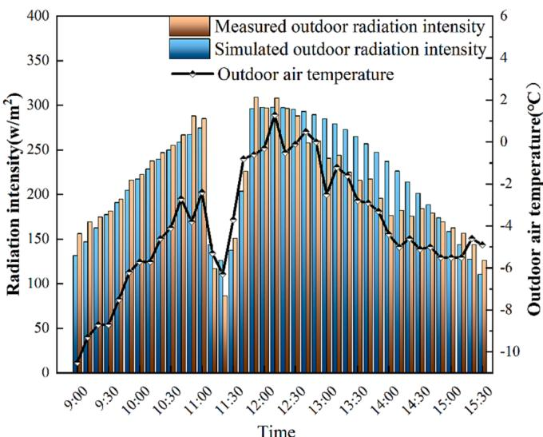  
图24. 典型晴天的室外太阳辐射和温度

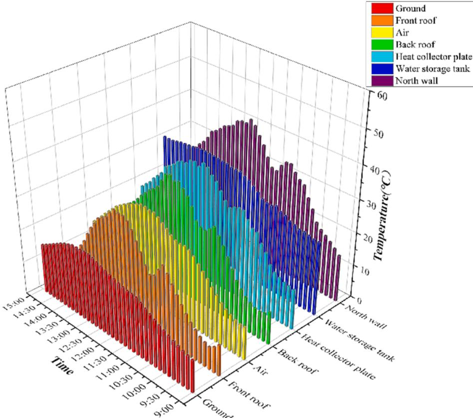  
图25. 阴天各表面温度分布

# 6. 结论

本研究基于能量平衡原理，建立了带储水装置的CASG一维瞬态温度预测模型。通过MATLAB计算表明，该模型能准确预测温室各表面温度，误差均在允许范围内。

计算与实测数据对比显示：前屋顶、空气、北墙、集热板、储水罐、地面和后屋顶的平均温差分别为$1.98^{\circ}\mathrm{C}$、$1.4^{\circ}\mathrm{C}$、$2.26^{\circ}\mathrm{C}$、$2.07^{\circ}\mathrm{C}$、$0.68^{\circ}\mathrm{C}$、$1.44^{\circ}\mathrm{C}$和$1.89^{\circ}\mathrm{C}$，各表面$R^2$介于0.8257至0.9897之间，证明模型可用于CASG气候模拟。

尽管模型中考虑了天气因素，但云层等对室外辐射影响显著。后续研究将优化室外辐射模型，同时开展温室通风和无土栽培植物模型研究，以拓展模型应用场景。

# 作者贡献声明

Lei Zhao: 概念提出，方法论，软件，形式分析，初稿撰写  
Jiangchen Lu: 数据整理，初稿撰写  
Hanlin Liu: 调研  
Yiming Li: 资源提供，监督指导  
Zhouping Sun:  
Xingan Liu: 概念提出，资金获取，资源提供，监督指导，文稿审阅  
Tianlai Li: 概念提出，资金获取，资源提供，监督指导，文稿审阅  

# 利益冲突声明

作者声明无已知可能影响本研究的财务利益或个人关系

# 数据可用性

数据可根据需求提供

# 致谢

感谢设施园艺设计与环境调控研究所对本项目的支持

本研究得到中国农业农村部现代农业产业技术体系资助[CARS-23]

## 参考文献

1.  [Abdel-Ghany and Kozai, 2006](#bb0005)
A.M. Abdel-Ghany, T. Kozai
自然通风雾化降温温室环境的动态建模
Renew. Energy, 31 (2006), pp. 1521-1539, [10.1016/j.renene.2005.07.013](https://doi.org/10.1016/j.renene.2005.07.013)
2.  [Berroug et al., 2011](#bb0010)
F. Berroug, E.K. Lakhal, M. El Omari, M. Faraji, H. El Qarnia
带有相变材料北墙的温室热性能研究
Energ. Buildings, 43 (2011), pp. 3027-3035, [10.1016/j.enbuild.2011.07.020](https://doi.org/10.1016/j.enbuild.2011.07.020)
3.  [Chen et al., 2018](#bb0015)
C. Chen, Y. Li, N. Li, S. Wei, F.G. Yang, H.S. Ling, N. Yu, F.T. Han
中国不同纬度地区太阳能温室最佳朝向的计算模型
Sol. Energy, 165 (2018), pp. 19-26, [10.1016/j.solener.2018.02.022](https://doi.org/10.1016/j.solener.2018.02.022)
4.  [Chen et al., 2016](#bb0020)
J. Chen, J. Yang, J. Zhao, F. Xu, Z. Shen, L. Zhang
基于模型优化预测方法的温室能源需求非线性模型预测
Neurocomputing, 174 (2016), pp. 1087-1100, [10.1016/j.neucom.2015.09.105](https://doi.org/10.1016/j.neucom.2015.09.105)
5.  [Choab et al., 2019](#bb0025)
N. Choab, A. Allouhi, A. El Maakoul, T. Kousksou, S. Saadeddine, A. Jamil
温室微气候与应用综述：设计参数、热建模与仿真、气候控制技术
Sol. Energy, 191 (2019), pp. 109-137, [10.1016/j.solener.2019.08.042](https://doi.org/10.1016/j.solener.2019.08.042)
6.  [Joudi and Farhan, 2015](#bb0030)
K.A. Joudi, A.A. Farhan
创新型温室内空气和土壤温度的动态模型与实验研究
Energ. Conver. Manage., 91 (2015), pp. 76-82, [10.1016/j.enconman.2014.11.052](https://doi.org/10.1016/j.enconman.2014.11.052)
7.  [Kıyan et al., 2013](#bb0035)
M. Kıyan, E. Bingöl, M. Melikoğlu, A. Albostan
基于Matlab/Simulink的温室混合太阳能加热系统建模与仿真
Energ. Conver. Manage., 72 (2013), pp. 147-155, [10.1016/j.enconman.2012.09.036](https://doi.org/10.1016/j.enconman.2012.09.036)
8.  [Li et al., 2017](#bb0040)
J. Li, L. Li, H. Wang, K.P. Ferentinos, M. Li, N. Sigrimis
基于风险评估的太阳能温室主动能源管理以增强中国智能专业化
Biosyst. Eng., 158 (2017), pp. 10-22, [10.1016/j.biosystemseng.2017.03.007](https://doi.org/10.1016/j.biosystemseng.2017.03.007)
9.  [Liu et al., 2021a](#bb0050)
H. Liu, C. Yin, Z. Gao, L. Hou
华北地区日光温室不同土壤基质势下黄瓜产量、经济效益和水分生产力的评价
Agric Water Manag, 243 (2021), p. 106442, [10.1016/j.agwat.2020.106442](https://doi.org/10.1016/j.agwat.2020.106442)
10.  [Liu et al., 2021b](#bb0045)
R. Liu, M. Li, J.L. Guzmán, F. Rodríguez
温室温湿度快速实用的一维瞬态模型
Comput. Electron. Agric., 186 (2021), p. 106186, [10.1016/j.compag.2021.106186](https://doi.org/10.1016/j.compag.2021.106186)
11.  [Ma et al., 2022](#bb0055)
J. Ma, X. Du, S. Meng, J. Ding, X. Gu, Y. Zhang, T. Li, R. Wang
典型中国日光温室热性能模拟
Agronomy, 12 (10) (2022), p. 2255, [10.3390/agronomy12102255](https://doi.org/10.3390/agronomy12102255)
12.  [Mobtaker et al., 2019](#bb0060)
H.G. Mobtaker, Y. Ajabshirchi, S.F. Ranjbar, M. Matloobi
伊朗西北部太阳能温室热性能模拟：实验验证
Renew. Energy, 135 (2019), pp. 88-97, [10.1016/j.renene.2018.10.003](https://doi.org/10.1016/j.renene.2018.10.003)
13.  [Reyes-Rosas et al., 2017](#bb0065)
A. Reyes-Rosas, F.D. Molina-Aiz, D.L. Valera, A. Lopez, S. Khamkure
带聚丙烯地膜自然通风温室内温度预测的单能量平衡模型开发
Comput. Electron. Agric., 142 (2017), pp. 9-28, [10.1016/j.compag.2017.08.020](https://doi.org/10.1016/j.compag.2017.08.020)
14.  [Singh et al., 2006](#bb0070)
G. Singh, P.P. Singh, P.P.S. Lubana, K.G. Singh
温室微气候数学模型的建立与验证
Renew. Energy, 31 (2006), pp. 1541-1560, [10.1016/j.renene.2005.07.011](https://doi.org/10.1016/j.renene.2005.07.011)
15.  [Singh et al., 2017](#bb0075)
M.C. Singh, J.P. Singh, S.K. Pandey, D. Mahay, V. Shrivastva
影响温室黄瓜栽培性能的因素综述
Int. J. Curr. Microbiol. App. Sci., 6 (2017), pp. 2304-2323, [10.20546/ijcmas.2017.610.273](https://doi.org/10.20546/ijcmas.2017.610.273)
16.  [Singh et al., 2018](#bb0080)
M.C. Singh, K.G. Singh, J.P. Singh
部分控制温室环境下无土栽培黄瓜在亏缺灌溉条件下的表现
Indian J. Hortic., 75 (2) (2018), p. 259, [10.5958/0974-0112.2018.00044.0](https://doi.org/10.5958/0974-0112.2018.00044.0)
17.  [Straten et al., 2010](#bb0100)
Straten, G.v., Willigenburg, G.v., Henten, E.v., Ooteghem, R.v., 2010. Optimal control of greenhouse cultivation. Boca Raton, 326. doi: 10.1201/b10321.
18.  [Swinbank, 1963](#bb0085)
W.C. Swinbank
晴空长波辐射, 89 (381) (1963), pp. 339-348, [10.1016/j.inpa.2016.06.002](https://doi.org/10.1016/j.inpa.2016.06.002)
19.  [Taki et al., 2016](#bb0090)
M. Taki, Y. Ajabshirchi, S.F. Ranjbar, A. Rohani, M. Matloobi
创新型温室结构中传热与能耗的建模与实验验证
Information Processing in Agriculture, 3 (2016), pp. 157-174, [10.1016/j.inpa.2016.06.002](https://doi.org/10.1016/j.inpa.2016.06.002)
20.  [Tong et al., 2009](#bb0095)
G. Tong, D.M. Christopher, B. Li
中国日光温室内温度变化的数值模拟
Comput. Electron. Agric., 68 (2009), pp. 129-139, [10.1016/j.compag.2009.05.004](https://doi.org/10.1016/j.compag.2009.05.004)
21.  [Vanthoor et al., 2011a](#bb0105)
B.H.E. Vanthoor, P.H.B. de Visser, C. Stanghellini, E.J. van Henten
基于模型的温室设计方法：第2部分，番茄产量模型的描述与验证
Biosyst. Eng., 110 (2011), pp. 378-395, [10.1016/j.biosystemseng.2011.08.005](https://doi.org/10.1016/j.biosystemseng.2011.08.005)
22.  [Vanthoor et al., 2011b](#bb0110)
B.H.E. Vanthoor, C. Stanghellini, E.J. van Henten, P.H.B. de Visser
基于模型的温室设计方法：第1部分，适用于多种设计和气候的温室气候模型
Biosyst. Eng., 110 (2011), pp. 363-377, [10.1016/j.biosystemseng.2011.06.001](https://doi.org/10.1016/j.biosystemseng.2011.06.001)
23.  [Winterton, 1998](#bb0115)
R.H.S. Winterton
Dittus和Boelter方程的起源？
Heat Mass Transf, 41 (1998), pp. 809-810, [10.1016/s0017-9310(97)00177-4](https://doi.org/10.1016/s0017-9310(97)00177-4)
24.  [Xia et al., 2022](#bb0120)
T. Xia, Y. Li, X. Wu, Z. Fan, W. Shi, X. Liu, T. Li
用于高纬度和寒冷地区中国组装式日光温室的新型主动式太阳能储热-释热系统性能
Energy Rep., 8 (2022), pp. 784-797, [10.1016/j.egyr.2021.12.005](https://doi.org/10.1016/j.egyr.2021.12.005)
25.  [Zhang et al., 2020a](#bb0125)
G. Zhang, X. Ding, T. Li, W. Pu, W. Lou, J. Hou
玻璃温室动态能量平衡模型：实验验证与太阳能分析
Energy, 198 (2020), p. 117281, [10.1016/j.energy.2020.117281](https://doi.org/10.1016/j.energy.2020.117281)
26.  [Zhang et al., 2020b](#bb0130)
Y. Zhang, M. Henke, Y.M. Li, X. Yue, D.M. Xu, X.G. Liu, T.L. Li
番茄冠层结构下日光温室模型光气候与热性能的高分辨率3D模拟
Renew. Energy, 160 (2020), pp. 730-745, [10.1016/j.renene.2020.06.144](https://doi.org/10.1016/j.renene.2020.06.144)

## References

1.  [Abdel-Ghany and Kozai, 2006](#bb0005)
A.M. Abdel-Ghany, T. Kozai
Dynamic modeling of the environment in a naturally ventilated, fog-cooled greenhouse
Renew. Energy, 31 (2006), pp. 1521-1539, [10.1016/j.renene.2005.07.013](https://doi.org/10.1016/j.renene.2005.07.013)
2.  [Berroug et al., 2011](#bb0010)
F. Berroug, E.K. Lakhal, M. El Omari, M. Faraji, H. El Qarnia
Thermal performance of a greenhouse with a phase change material north wall
Energ. Buildings, 43 (2011), pp. 3027-3035, [10.1016/j.enbuild.2011.07.020](https://doi.org/10.1016/j.enbuild.2011.07.020)
3.  [Chen et al., 2018](#bb0015)
C. Chen, Y. Li, N. Li, S. Wei, F.G. Yang, H.S. Ling, N. Yu, F.T. Han
A computational model to determine the optimal orientation for solar greenhouses located at different latitudes in China
Sol. Energy, 165 (2018), pp. 19-26, [10.1016/j.solener.2018.02.022](https://doi.org/10.1016/j.solener.2018.02.022)
4.  [Chen et al., 2016](#bb0020)
J. Chen, J. Yang, J. Zhao, F. Xu, Z. Shen, L. Zhang
Energy demand forecasting of the greenhouses using nonlinear models based on model optimized prediction method
Neurocomputing, 174 (2016), pp. 1087-1100, [10.1016/j.neucom.2015.09.105](https://doi.org/10.1016/j.neucom.2015.09.105)
5.  [Choab et al., 2019](#bb0025)
N. Choab, A. Allouhi, A. El Maakoul, T. Kousksou, S. Saadeddine, A. Jamil
Review on greenhouse microclimate and application: Design parameters, thermal modeling and simulation, climate controlling technologies
Sol. Energy, 191 (2019), pp. 109-137, [10.1016/j.solener.2019.08.042](https://doi.org/10.1016/j.solener.2019.08.042)
6.  [Joudi and Farhan, 2015](#bb0030)
K.A. Joudi, A.A. Farhan
A dynamic model and an experimental study for the internal air and soil temperatures in an innovative greenhouse
Energ. Conver. Manage., 91 (2015), pp. 76-82, [10.1016/j.enconman.2014.11.052](https://doi.org/10.1016/j.enconman.2014.11.052)
7.  [Kıyan et al., 2013](#bb0035)
M. Kıyan, E. Bingöl, M. Melikoğlu, A. Albostan
Modelling and simulation of a hybrid solar heating system for greenhouse applications using Matlab/Simulink
Energ. Conver. Manage., 72 (2013), pp. 147-155, [10.1016/j.enconman.2012.09.036](https://doi.org/10.1016/j.enconman.2012.09.036)
8.  [Li et al., 2017](#bb0040)
J. Li, L. Li, H. Wang, K.P. Ferentinos, M. Li, N. Sigrimis
Proactive energy management of solar greenhouses with risk assessment to enhance smart specialisation in China
Biosyst. Eng., 158 (2017), pp. 10-22, [10.1016/j.biosystemseng.2017.03.007](https://doi.org/10.1016/j.biosystemseng.2017.03.007)
9.  [Liu et al., 2021a](#bb0050)
H. Liu, C. Yin, Z. Gao, L. Hou
Evaluation of cucumber yield, economic benefit and water productivity under different soil matric potentials in solar greenhouses in North China
Agric Water Manag, 243 (2021), p. 106442, [10.1016/j.agwat.2020.106442](https://doi.org/10.1016/j.agwat.2020.106442)
10.  [Liu et al., 2021b](#bb0045)
R. Liu, M. Li, J.L. Guzmán, F. Rodríguez
A fast and practical one-dimensional transient model for greenhouse temperature and humidity
Comput. Electron. Agric., 186 (2021), p. 106186, [10.1016/j.compag.2021.106186](https://doi.org/10.1016/j.compag.2021.106186)
11.  [Ma et al., 2022](#bb0055)
J. Ma, X. Du, S. Meng, J. Ding, X. Gu, Y. Zhang, T. Li, R. Wang
Simulation of Thermal Performance in a Typical Chinese Solar Greenhouse
Agronomy, 12 (10) (2022), p. 2255, [10.3390/agronomy12102255](https://doi.org/10.3390/agronomy12102255)
12.  [Mobtaker et al., 2019](#bb0060)
H.G. Mobtaker, Y. Ajabshirchi, S.F. Ranjbar, M. Matloobi
Simulation of thermal performance of solar greenhouse in north-west of Iran: An experimental validation
Renew. Energy, 135 (2019), pp. 88-97, [10.1016/j.renene.2018.10.003](https://doi.org/10.1016/j.renene.2018.10.003)
13.  [Reyes-Rosas et al., 2017](#bb0065)
A. Reyes-Rosas, F.D. Molina-Aiz, D.L. Valera, A. Lopez, S. Khamkure
Development of a single energy balance model for prediction of temperatures inside a naturally ventilated greenhouse with polypropylene soil mulch
Comput. Electron. Agric., 142 (2017), pp. 9-28, [10.1016/j.compag.2017.08.020](https://doi.org/10.1016/j.compag.2017.08.020)
14.  [Singh et al., 2006](#bb0070)
G. Singh, P.P. Singh, P.P.S. Lubana, K.G. Singh
Formulation and validation of a mathematical model of the microclimate of a greenhouse
Renew. Energy, 31 (2006), pp. 1541-1560, [10.1016/j.renene.2005.07.011](https://doi.org/10.1016/j.renene.2005.07.011)
15.  [Singh et al., 2017](#bb0075)
M.C. Singh, J.P. Singh, S.K. Pandey, D. Mahay, V. Shrivastva
Factors Affecting the Performance of Greenhouse Cucumber Cultivation-A Review
Int. J. Curr. Microbiol. App. Sci., 6 (2017), pp. 2304-2323, [10.20546/ijcmas.2017.610.273](https://doi.org/10.20546/ijcmas.2017.610.273)
16.  [Singh et al., 2018](#bb0080)
M.C. Singh, K.G. Singh, J.P. Singh
Performance of soilless cucumbers under partially controlled greenhouse environment in relation to deficit fertigation
Indian J. Hortic., 75 (2) (2018), p. 259, [10.5958/0974-0112.2018.00044.0](https://doi.org/10.5958/0974-0112.2018.00044.0)
17.  [Straten et al., 2010](#bb0100)
Straten, G.v., Willigenburg, G.v., Henten, E.v., Ooteghem, R.v., 2010. Optimal control of greenhouse cultivation. Boca Raton, 326. doi: 10.1201/b10321.
18.  [Swinbank, 1963](#bb0085)
W.C. Swinbank
Long-wave radiation from clear skies, 89 (381) (1963), pp. 339-348, [10.1016/j.inpa.2016.06.002](https://doi.org/10.1016/j.inpa.2016.06.002)
19.  [Taki et al., 2016](#bb0090)
M. Taki, Y. Ajabshirchi, S.F. Ranjbar, A. Rohani, M. Matloobi
Modeling and experimental validation of heat transfer and energy consumption in an innovative greenhouse structure
Information Processing in Agriculture, 3 (2016), pp. 157-174, [10.1016/j.inpa.2016.06.002](https://doi.org/10.1016/j.inpa.2016.06.002)
20.  [Tong et al., 2009](#bb0095)
G. Tong, D.M. Christopher, B. Li
Numerical modelling of temperature variations in a Chinese solar greenhouse
Comput. Electron. Agric., 68 (2009), pp. 129-139, [10.1016/j.compag.2009.05.004](https://doi.org/10.1016/j.compag.2009.05.004)
21.  [Vanthoor et al., 2011a](#bb0105)
B.H.E. Vanthoor, P.H.B. de Visser, C. Stanghellini, E.J. van Henten
A methodology for model-based greenhouse design: Part 2, description and validation of a tomato yield model
Biosyst. Eng., 110 (2011), pp. 378-395, [10.1016/j.biosystemseng.2011.08.005](https://doi.org/10.1016/j.biosystemseng.2011.08.005)
22.  [Vanthoor et al., 2011b](#bb0110)
B.H.E. Vanthoor, C. Stanghellini, E.J. van Henten, P.H.B. de Visser
A methodology for model-based greenhouse design: Part 1, a greenhouse climate model for a broad range of designs and climates
Biosyst. Eng., 110 (2011), pp. 363-377, [10.1016/j.biosystemseng.2011.06.001](https://doi.org/10.1016/j.biosystemseng.2011.06.001)
23.  [Winterton, 1998](#bb0115)
R.H.S. Winterton
Where did the Dittus and Boelter equation come from?
Heat Mass Transf, 41 (1998), pp. 809-810, [10.1016/s0017-9310(97)00177-4](https://doi.org/10.1016/s0017-9310(97)00177-4)
24.  [Xia et al., 2022](#bb0120)
T. Xia, Y. Li, X. Wu, Z. Fan, W. Shi, X. Liu, T. Li
Performance of a new active solar heat storage–release system for Chinese assembled solar greenhouses used in high latitudes and cold regions
Energy Rep., 8 (2022), pp. 784-797, [10.1016/j.egyr.2021.12.005](https://doi.org/10.1016/j.egyr.2021.12.005)
25.  [Zhang et al., 2020a](#bb0125)
G. Zhang, X. Ding, T. Li, W. Pu, W. Lou, J. Hou
Dynamic energy balance model of a glass greenhouse: An experimental validation and solar energy analysis
Energy, 198 (2020), p. 117281, [10.1016/j.energy.2020.117281](https://doi.org/10.1016/j.energy.2020.117281)
26.  [Zhang et al., 2020b](#bb0130)
Y. Zhang, M. Henke, Y.M. Li, X. Yue, D.M. Xu, X.G. Liu, T.L. Li
High resolution 3D simulation of light climate and thermal performance of a solar greenhouse model under tomato canopy structure
Renew. Energy, 160 (2020), pp. 730-745, [10.1016/j.renene.2020.06.144](https://doi.org/10.1016/j.renene.2020.06.144)