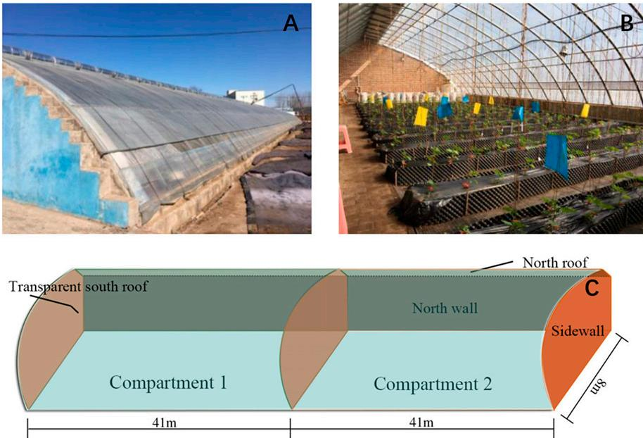
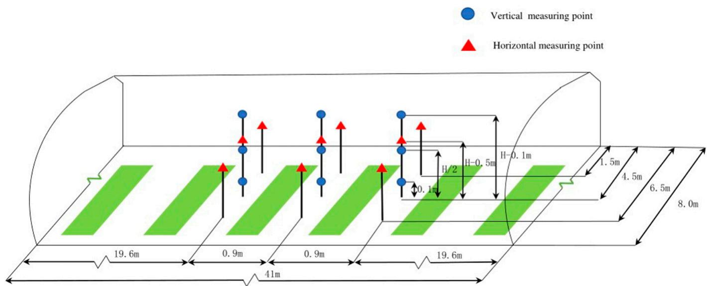
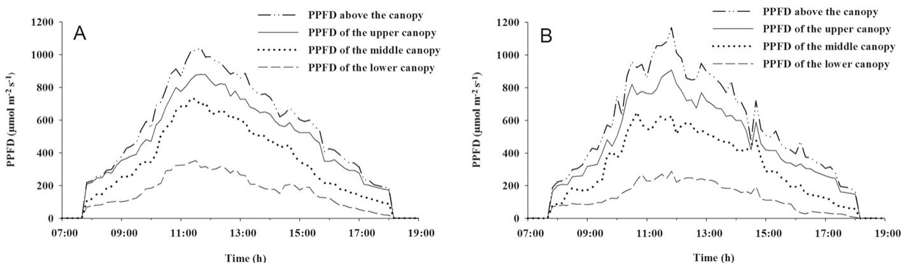
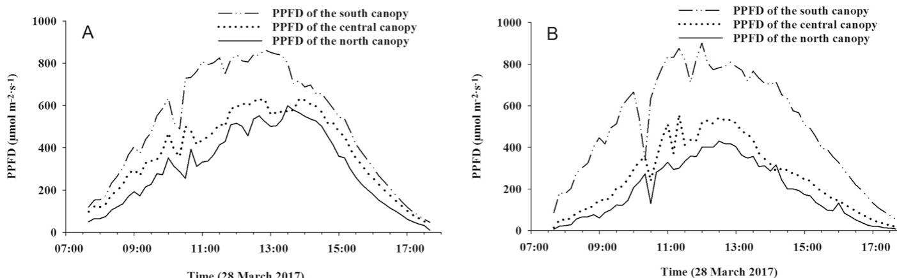
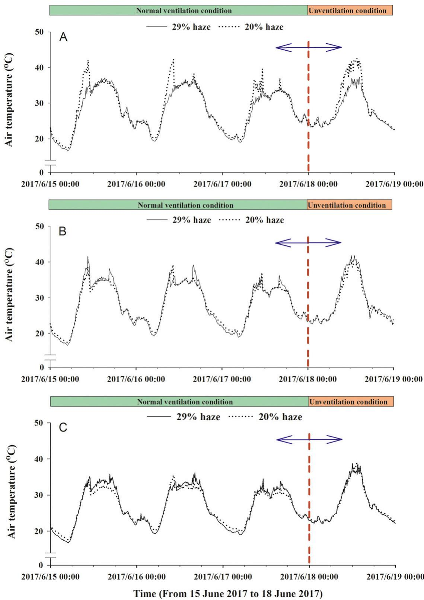
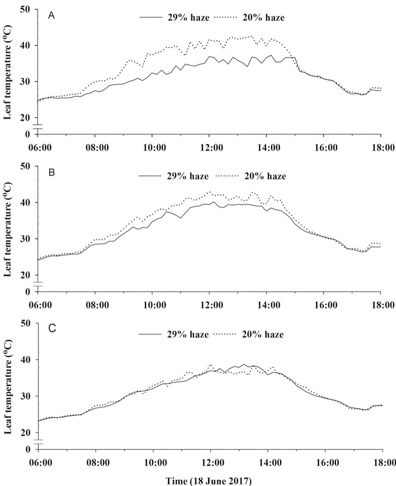
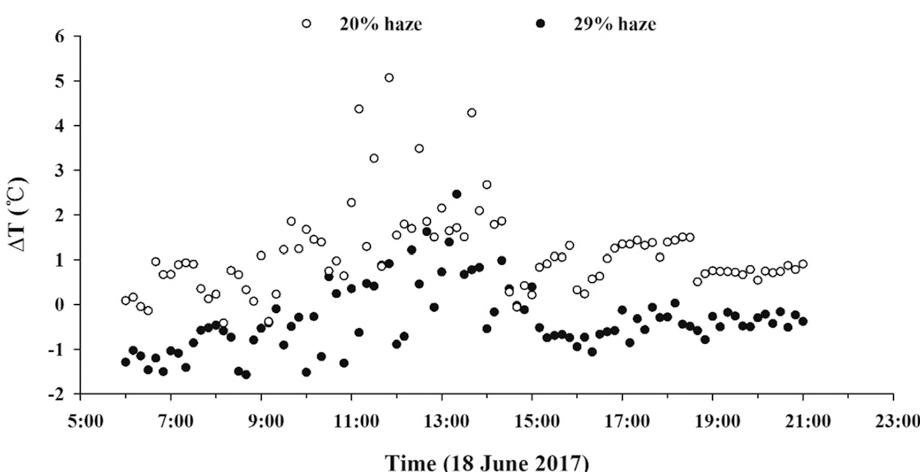
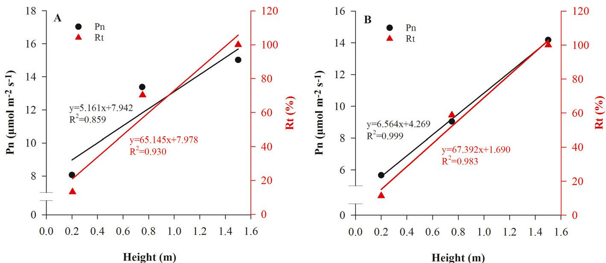
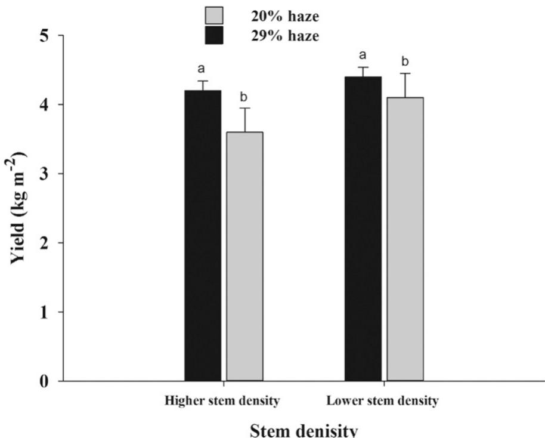

# Effects of Diffuse Light on Microclimate of Solar Greenhouse, and Photosynthesis and Yield of Greenhouse-grown Tomatoes

Liang Zheng

College of Water Resources and Civil Engineering, China Agricultural University, Beijing 100083, China; and Key Laboratory of Agricultural Engineering in Structure and Environment, Ministry of Agriculture and Rural Affairs, Beijing 100083, China

Qi Zhang and Kexin Zheng College of Water Resources and Civil Engineering, China Agricultural University, Beijing 100083, China

Shumei Zhao, Pingzhi Wang, and Jieyu Cheng College of Water Resources and Civil Engineering, China Agricultural University, Beijing 100083, China; and Key Laboratory of Agricultural Engineering in Structure and Environment, Ministry of Agriculture and Rural Affairs, Beijing 100083, China

Xuesong Zhang and Xiaowen Chen Beijing Zhongnong Futong Horticulture Co., Ltd., Beijing 100083, China

Additional index words. Chinese solar greenhouse, diffuse light, light environment, tomato

Abstract. The application of diffuse light can potentially improve the homogeneity of light distribution and other microclimatic factors such as temperature inside greenhouses. In this study, diffuse light plastic films with different degrees of light differences  $28\%$  and  $29\%$  were used as the south roof cover of Chinese solar greenhouses to investigate the spatial distribution of microclimatic factors and their impacts on the growth and yield of tomato. The horizontal and vertical photosynthetic photon flux density (PPFD) distributions, air temperature distribution, and leaf temperature distribution inside the canopy, tomato leaf net photosynthesis  $(\mathbf{P}_{\mathrm{n}})$ , and fruit production during the growth period were determined. The results showed that diffuse light plastic film continuously improved the light distribution in the vertical and horizontal spaces of the crop canopy in terms of light interception and uniformity. A more diffuse light fraction also decreased the air and leaf temperatures of the middle canopy and upper canopy during the summer, thereby promoting the photosynthesis of the tomato plants.  $\mathbf{P}_{\mathrm{n}}$  of the middle and lower canopies with higher haze film were significantly greater than those with lower haze film  $19.0\%$  and  $27.2\%$  respectively). The yields of higher stem density and lower stem density planted tomatoes in the  $29\%$  haze compartment were increased by  $5.5\%$  and  $12.9\%$  compared with  $20\%$  in the haze group, respectively. Diffuse light plastic films can improve the homogeneity of the canopy light distribution and increase crop production in Chinese solar greenhouses.

With the development of the greenhouse industry, vegetables can be grown locally year- round despite the restrictions of natural conditions. In northern China, the typical

Chinese- style solar greenhouses (CSGs) are east- west- oriented and constructed with a transparent south roof, opaque and insulated north wall, and north roof and sidewalls; these are passive solar greenhouses without auxiliary heating (Tong et al., 2013). Therefore, solar radiation conditions inside CSGGs comprise the most important determining factors of the creation of the greenhouse microclimate, which further influences the growth and yield of greenhouse- grown crops.

Generally, solar radiation inside a CSG is not evenly distributed due to its unique structure and the shading of the crop canopy (Zhang et al., 2020). The upper canopy intercepts more direct light, and leaves in the lower canopy receive limited incident light as a result of canopy shading. Some of the upper leaves exposed to direct light may even experience excess light, eventually leading to photoinhibition, whereas the leaves beneath the greenhouse frameworks and upper canopy could suffer from a light energy deficit, which causes a dramatic decrease in the photosynthetic rate (Trouwborst et al., 2010).

Optimization of the greenhouse covering material provides a practical option for improving greenhouse meteorology, including light and thermal characteristics (Al- Mahdouri et al., 2013; Baeza et al., 2020; Lamnatou and Chemisana, 2013a), thereby achieving improvements in crop growth and quality (Hemming et al., 2008b). Diffuse light covering material was recently introduced mainly for conventional glass greenhouses (Hemming et al., 2008b; Li et al., 2016). Compared with regular greenhouse cover, light- diffusing cover scatters a certain fraction of the transmitted direct light into diffuse light, thus potentially improving the uniformity of spatial and temporal light distributions and increasing the radiation efficiency of the crops (Hemming et al., 2008a; Li and Yang, 2015). In the vertical direction of the canopy, diffuse light could penetrate deeper inside the canopy, thereby reducing the extinction coefficient and shading of the upper canopy (Lamnatou and Chemisana, 2013b). In the horizontal canopy, diffuse light also improves the homogeneity of light distribution by reducing the shadow of the greenhouse framework and local peaks in light intensity (Li and Yang, 2015).

Many previous researchers have investigated the impact of diffuse light on plant growth and physiology. It is considered that plants could use diffuse light more efficiently than direct light, such as apple trees (Lakso and Musselman, 1976), spruce (Urban et al., 2012), and grass (Sheehy and Chapas, 1976). Such studies of diffuse light have been performed by comparing plant responses on clear days and cloudy days in natural conditions (Gu et al., 2002, 2003; Urban et al., 2007). Applying diffuse light in the greenhouse decreased the leaf temperature of tomato and resulted in a higher leaf area index and lower specific leaf area, which help regulate photosynthetic activities (Li et al., 2014a) and further benefit the yield at harvest (Adams et al., 2000).

In recent years, our research group has conducted a series of investigations of the effects of light diffuse plastic films on CSG microclimates and crop growth. The results showed that diffuse light improved the seedling index and accumulation of chlorophyll and increased the total leaf area of tomato, cucumber, and pepper as well as the quality and yield of tomato (Fan et al., 2016; Song et al., 2017; Sun et al., 2016). However, these studies have focused on the effects of diffuse light plastic films on plant growth and yield, but not environmental factors such as light and temperature distributions.

The main objective of the present study was to provide more comprehensive theoretical

  
Fig. 1. The structure of the experimental Chinese solar greenhouse (CSG) consisting of a transparent south roof covered with plastic film, a north wall, and an opaque and insulated north roof and sidewalls. The north wall is constructed with clay bricks  $(200 + 200\mathrm{mm})$  insulated with polystyrene boards  $(70\mathrm{mm})$  in the middle. The experimental greenhouse was divided into two compartments with heat insulation board. (A) Outside view of the CSG. (B) Inside view of the greenhouse (when seedlings were transplanted). (C) Schematic structure of the greenhouse.

knowledge regarding the introduction of diffuse light plastic films to CSGs by elaborating on microclimate factors including light and temperature of CSGs with different haze plastic films and investigating the effect of the greenhouse environment on tomato plant growth and yield.

# Materials and Methods

Experimental setup. This experiment was conducted in an east- west- oriented Chinese solar greenhouse located in Beijing, China (lat.  $39^{\circ}48^{\prime}\mathrm{N}$  long,  $116^{\circ}56^{\prime}\mathrm{E}$  ). The greenhouse was divided into two equal compartments  $328\mathrm{m}^2$  and  $41\mathrm{m}\times 8\mathrm{m}$  for each compartment) with heat insulation board (Fig. 1). The greenhouse compartments were covered with two types of diffuse light plastic films (Borouge Co. Ltd., Shanghai, China) that are regularly used by local growers. The transmittance and haze factor of the plastic films were measured with a light transmittance and haze meter (WGT- 2S; INESA Physico- Optical Instrument, Shanghatar, China) according to the ASTM Committee (2013). Transmission was measured with the build- in light source with a wavelength range of 200 to  $2500\mathrm{nm}$  . Haze is defined as the percentage of diffuse light from transmitted light that deviates more than 2.5 degrees from the direction of the incident light. Haze values of the two types of plastic films [ethylene- vinyl acetate (EVA)] were  $20\%$  and  $29\%$  respectively, whereas the transmission of the plastic films was  $89\%$  . The experiment was conducted for year- round production of tomato (cv. Zhongshu 4) from 1 Oct. 2016. Tomato plants were cultivated in the greenhouse with peat- based substrate. Irrigation and fertilization were performed according to good horticultural practices. Plant rows were south- north- orientated with a row distance of  $70~\mathrm{cm}$  .Two stem densities were set in each row; these were initially 6 and 5 stems  $/\mathrm{m}^2$  but they were reduced to 4.3 and 3.6 stems  $/\mathrm{m}^2$  at 66.4 after planting.

Measurement of PPFD distribution within the canopy. The distribution of PPFD was measured with the S- LA- M003 sensor (Onset Inc., Bourne, MA) in each compartment as shown in Fig. 2. The vertical PPFD distribution was recorded from Oct. 2016 to June 2017. It was measured at the top of the canopy,  $10~\mathrm{cm}$  below the top of the crop, the middle of the canopy, and the bottom of the canopy; measurements were replicated three times at each height. The vertical PPFD measuring height varied with the growth of the tomato plant. The horizontal PPFD distribution was measured at 1.5, 4.5, and  $6.5\mathrm{m}$  to the north wall and  $50~\mathrm{cm}$  below the top of the canopy; measurements were replicated three times at each point from 2 Mar. 2017 to 27 Apr. 2017 at the main fruit stage of tomatoes.

Measurements of air temperature and leaf temperature. The air temperature was measured with the  $175\mathrm{H}1$  sensor (Testo Inc., Lenzkirch Germany) with an accuracy of  $\pm 2\%$  . Leaf temperature was measured with T- type fine- wire thermocouples (Omega Engineering, Norwalk, CT) at three canopy depths with three replicates. The measurement positions were adjusted with the growth of the plants (Fig. 2). The temperature was measured from 5 June 2017 to 10 July 2017.

Measurements of leaf photosynthesis and solar radiation transmittance. The  $\mathrm{P_n}$  of leaf was determined with the CIRAS- 2 portable gas exchange device (PP Systems, Amesbury, MA) at three canopy depths. Canopy depths were defined as leaf number 5, leaf number 10, and leaf number 15 according to Li et al. (2014a). From 4 Apr. 2017 to 30 Apr. 2017, instantaneous  $\mathrm{P_n}$  of three replicate leaves of different individual plants was measured on clear days at each canopy depth.

Canopy solar radiation transmittance  $(\mathrm{R_t})$  reflects the distribution of total solar radiation in crop communities in relation to the population structure:

$$
\mathrm{R_t} = \mathrm{Q_h} / \mathrm{Q_0}\times 100\% \tag{[1]}
$$

where  $\mathrm{R_t}$  is the total solar radiation transmittance of crop communities  $(\%)$ $\mathrm{Q_h}$  is the total solar radiation at the height of  $\mathrm{h}$  from the ground  $(\mathrm{mol}\cdot \mathrm{m}^{- 2}\cdot \mathrm{d}^{- 1})$  ,and  $\mathrm{Q_0}$  is the total solar radiation at the top of the population  $(\mathrm{mol}\cdot \mathrm{m}^{- 2}\cdot \mathrm{d}^{- 1})$  . The measurement positions were at three canopy depths from Jan. 2017 to June 2017.

Measurements of tomato fruit yield. During the harvest stage of the tomato plants, fruits were collected and weighed with an electronic scale balance (Meifu Electronics, Shenzhen, China) each week. The total yield was the sum of each week from 22 Jan. 2017 to 17 June 2017.

Statistical analysis. The significance analysis of data was evaluated by an analysis of variance and  $t$  test at  $P = 0.05$  with SPSS 20.0 (IBM Inc., Armonk, NY). A linear correlation analysis was performed assuming that replications in the same greenhouse compartment were independent. The daily light integral (DLI) was obtained by integrating the value of PPFD with MATLAB (MathWorks Inc., Natick, MA). Sigmaplot 14.0 was used to perform the linear correlation analysis of the data and to plot all figures.

# Results

PPFD distribution within the tomato canopy. Canopy PPFD of the two greenhouse compartments fluctuated on the example day, which was 19 Apr. 2017 (Fig. 3). The maximum fluctuation amplitude of PPFD in the upper canopy of the  $29\%$  haze compartment was  $105.0\mu \mathrm{mol}\cdot \mathrm{m}^{- 2}\cdot \mathrm{s}^{- 1}$  with an average of  $53.5\mu \mathrm{mol}\cdot \mathrm{m}^{- 2}\cdot \mathrm{s}^{- 1}$  (Fig. 3A); however, the maximum fluctuation amplitude of the  $20\%$  haze compartment was  $233.5\mu \mathrm{mol}\cdot \mathrm{m}^{- 2}\cdot \mathrm{s}^{- 1}$  with an average of  $101.2\mu \mathrm{mol}\cdot \mathrm{m}^{- 2}\cdot \mathrm{s}^{- 1}$  (Fig. 3B). In the  $29\%$  haze compartment, the lower canopy PPFD was kept above than 200  $\mu \mathrm{mol}\cdot \mathrm{m}^{- 2}\cdot \mathrm{s}^{- 1}$  for  $4.7\mathrm{h}$  which was longer than that of the  $20\%$  haze compartment, where that PPFD was kept for  $2.0\mathrm{h}$  PPFD above  $600\mu \mathrm{mol}\cdot \mathrm{m}^{- 2}\cdot \mathrm{s}^{- 1}$  in the middle canopy of the  $29\%$  haze greenhouse lasted for  $2.0\mathrm{h}$  whereas that of the  $20\%$  haze compartment was kept for only  $0.4\mathrm{h}$  PPFD above  $800\mu \mathrm{mol}\cdot \mathrm{m}^{- 2}\cdot \mathrm{s}^{- 1}$  in the upper canopy lasted for  $1.3\mathrm{h}$  in the  $29\%$  haze compartment and  $0.5\mathrm{h}$  in the  $20\%$  haze compartment.

The DLI values of the middle and lower canopies of the  $29\%$  haze compartment were significantly greater than those of the  $20\%$  haze compartment (Table 1). The DLI values of the upper, middle, and lower canopies from January 2017 to June 2017 in the  $29\%$

  
Fig.2. t  f  t  t  t  t  t  t  t  t  t  t  t  t  t  t  t  t  t  t  t  t  t  t  t  t  t  t  t  t  t  t  t  t  t  t  t  t  t  t  t  t  t  t  t  t  t  t  t  t  t  t  h  t  t  t  t  t  t  t  t  t  t  t  t  t  t  t  t  t  t  t  t  t  t  t  t  t  t  t  t  t  t  t  t  t  t  t  t  t  t  t  t  t  t  t  t  t  t  t  t  t  s

  
Fig. 3. Diurnal variations of photosynthetic photon flux density  $(PPFD)$  in the vertical canopy of the two greenhouse compartments. (A) The  $29\%$  haze compartment. (B) The  $20\%$  haze compartment. Data from 0700 to  $1900\mathrm{HR}$  on 19 Apr. 2017 were selected to analyze the light distribution on clear days.

Table 1. Daily light integral (DLI) at different depths of the vertical canopy on 19 Apr. 2017.  

<table><tr><td>Treatment</td><td>Lower canopy (mol.m-2.d-1)</td><td>Middle canopy (mol.m-2.d-1)</td><td>Upper canopy (mol.m-2.d-1)</td><td>Above canopy (mol.m-2.d-1)</td></tr><tr><td>29% haze compartment</td><td>10.58 ± 0.25</td><td>24.02 ± 0.29</td><td>30.19 ± 0.34</td><td>34.55 ± 0.32</td></tr><tr><td>20% haze compartment</td><td>8.47 ± 0.18</td><td>18.8 ± 0.20</td><td>29.91 ± 0.35</td><td>36.02 ± 0.50</td></tr><tr><td>Significance</td><td>*</td><td>*</td><td>NS</td><td>*</td></tr></table>

\*Significant difference at  $P = 0.05$  . ns indicates the difference is not significant.

haze compartment were 0.7 to  $1.6\%$ $5.7\%$  to  $23.6\%$ $4.5\%$  to  $16.9\%$  greater than those in the greenhouse with  $20\%$  haze, respectively (data not shown). The DLI values at  $2\textrm{m}$  aboveground (above the canopy) in the  $29\%$  haze compartment were significantly lower than those in the  $20\%$  haze compartment.

The PPFD experienced three severe fluctuations in the horizontal canopy in the  $20\%$  haze greenhouse compartment between 900 and  $1200\mathrm{HR}$  on  $20\mathrm{Mar}$  .2017Fig.4. The maximum fluctuations were  $512.3\mu \mathrm{mol}\cdot \mathrm{m}^{- 2}\cdot \mathrm{s}^{- 1}$  at the south,  $197.0\mu \mathrm{mol}\cdot \mathrm{m}^{- 2}\cdot \mathrm{s}^{- 1}$  at the central, and  $120.7\mu \mathrm{mol}\cdot \mathrm{m}^{- 2}\cdot \mathrm{s}^{- 1}$  at the north areas of the greenhouse (Fig.4B).However, the fluctuation frequency of the horizontal canopy in the  $29\%$  haze compartment was lower, and the fluctuation value was lower than that of a different horizontal canopy.  $(105.9\mu \mathrm{mol}\cdot \mathrm{m}^{- 2}\cdot \mathrm{s}^{- 1})$  (Fig.4A). In the  $29\%$  haze compartment, PPFD in the north canopy was maintained above  $400\mu \mathrm{mol}\cdot \mathrm{m}^{- 2}\cdot \mathrm{s}^{- 1}$  for  $3.3\mathrm{h}$  (Fig.4A), which was  $2.3\mathrm{h}$  longer than that of the  $20\%$  haze compartment. PPFD in the central canopy was maintained above  $600\mu \mathrm{mol}\cdot \mathrm{m}^{- 2}\cdot \mathrm{s}^{- 1}$  for  $4.0\mathrm{h}$  (Fig.4A), which was  $1.7\mathrm{h}$  longer than that of the  $20\%$  haze compartment. PPFD in the south canopy was maintained above  $800\mu \mathrm{mol}\cdot \mathrm{m}^{- 2}\cdot \mathrm{s}^{- 1}$  for  $2.7\mathrm{h}$  (Fig.4A), but only  $1.1\mathrm{h}$  was recorded for the  $20\%$  haze compartment (Fig.4B). The DLI of the central and north areas of the  $29\%$  haze compartment significantly increased  $(P< 0.05)$  by  $29.3\%$  and  $40.6\%$  , respectively, compared with those in the  $20\%$  haze compartment (Table 2).

compared with those in the  $20\%$  haze compartment (Table 2).

Temperature distribution during the summer period within the tomato canopy. From 15 to 17 June 2017, the temperature in both compartments increased rapidly in the morning and reached the highest value at approximately  $1000\mathrm{HR}$ ; then, the skylight was opened for ventilation and air temperature was kept relatively stable afterward. Except on June 18, no ventilation was performed in both compartments (Fig. 5).

In the upper canopy, under ventilation conditions (from 15 June to 17 June), the maximum temperatures in the  $29\%$  haze compartment were 3.1, 3.1, and  $3.3^{\circ}\mathrm{C}$  lower than those in the  $29\%$  haze compartment, and

  
Fig. 4. Diurnal variations of photosynthetic photon flux density  $(PPFD)$  in the horizontal canopy of the two greenhouses canopies. (A) The  $29\%$  haze compartment. (B) The  $20\%$  haze compartment. Data from 0700 to  $1900\mathrm{HR}$  on 28 Mar. 2017 were selected to analyze the light distribution on clear days.

Table 2. Light distribution within the horizontal canopy of the two greenhouse compartments.  

<table><tr><td>Treatment</td><td>Area</td><td>DLI (mol.m-2.d-1)</td><td>Avg PPFD (μmol.m-2.s-1)</td></tr><tr><td rowspan="3">29% haze compartment</td><td>South</td><td>26.91 ± 6.13 a</td><td>400.23 ± 65.28 a</td></tr><tr><td>Central</td><td>18.55 ± 5.09 a</td><td>310.85 ± 30.70 a</td></tr><tr><td>North</td><td>16.02 ± 3.31 a</td><td>247.17 ± 21.21 a</td></tr><tr><td rowspan="3">20% haze compartment</td><td>South</td><td>27.15 ± 6.31 a</td><td>411.40 ± 69.93 a</td></tr><tr><td>Central</td><td>14.78 ± 5.62 b</td><td>183.64 ± 35.55 b</td></tr><tr><td>North</td><td>9.76 ± 4.01 b</td><td>126.43 ± 26.92 b</td></tr></table>

The same lowercase letter indicates that the difference is not significant  $(P = 0.05)$  . Data from 2 Mar. 2017 to 27 Apr. 2017 were selected to analyze the light distribution.  $PPFD =$  photosynthetic photon flux density.

the upper canopy temperature in the  $29\%$  haze compartment stayed below  $40^{\circ}\mathrm{C}$ ; however, it was higher than  $40^{\circ}\mathrm{C}$  in the  $20\%$  haze compartment at the same time (Fig. 5A). In addition to the similar temperatures during the ventilation period at  $1200\mathrm{HR}$ , the  $29\%$  haze compartment temperatures were 1.9, 3.0, and  $1.0^{\circ}\mathrm{C}$  lower than those in the  $20\%$  haze compartment before ventilation. However, the  $29\%$  haze compartment temperatures were 1.2, 0.8, and  $0.5^{\circ}\mathrm{C}$  lower than those in the  $20\%$  haze compartment after ventilation, respectively. Under unventilated conditions (18 June), the air temperature of the two compartments increased to  $36.7^{\circ}\mathrm{C}$  at approximately  $1300\mathrm{HR}$ , which was  $5.9^{\circ}\mathrm{C}$  lower than that of the  $20\%$  haze compartment  $(42.6^{\circ}\mathrm{C})$ . The duration of temperatures above  $40^{\circ}\mathrm{C}$  in the  $20\%$  haze compartment was  $\approx 4.3\mathrm{h}$ . During the period of normal ventilation from 1100 to  $1800\mathrm{HR}$ , the average air temperature of the  $29\%$  haze compartment was  $32.7^{\circ}\mathrm{C}$ , which was  $3.1^{\circ}\mathrm{C}$  lower than that of the  $20\%$  haze compartment.

The maximum daily air temperature in the upper canopy of the  $29\%$  haze compartment was significantly lower than that in the  $20\%$  haze compartment. The air temperatures in the middle and lower canopies of the  $29\%$  haze compartment were slightly higher than those in the  $20\%$  haze compartment (Fig. 5B and C). Mean differences in the highest air temperature in the middle and lower canopies of the two compartments were 1.3 and  $0.6^{\circ}\mathrm{C}$ , respectively, and the differences were not significant  $(P > 0.05)$ .

Under ventilation conditions, the leaf temperature in the upper canopy of the  $20\%$  haze compartment was higher than that with higher haze film (Fig. 6). From 1000 to  $1500\mathrm{HR}$ , the average leaf temperature in the upper canopy in the  $29\%$  haze compartment was  $35.1^{\circ}\mathrm{C}$ , which was  $4.9^{\circ}\mathrm{C}$  lower than that in the  $20\%$  haze compartment  $(40.0^{\circ}\mathrm{C})$ . Leaf temperature reached the highest value at  $1400\mathrm{HR}$ ; in the  $29\%$  haze compartment it was  $37.3^{\circ}\mathrm{C}$  and in the  $20\%$  haze compartment it was  $42.6^{\circ}\mathrm{C}$ . Leaf temperature above  $40^{\circ}\mathrm{C}$  in the  $20\%$  haze compartment lasted for  $4.6\mathrm{h}$ . After  $1200\mathrm{HR}$ , except for a slight increase in leaf temperature in the upper canopy, the leaf temperatures in the middle and lower canopies were stable.

From 1000 to  $1500\mathrm{HR}$ , the average leaf temperature in the middle canopy in the  $29\%$  haze compartment was  $37.9^{\circ}\mathrm{C}$ , which was  $2.3^{\circ}\mathrm{C}$  lower than that in the lower haze compartment  $(40.2^{\circ}\mathrm{C})$ . At approximately  $1400\mathrm{HR}$ , the leaf temperature in the middle canopy reached the highest value, in the  $29\%$  haze compartment it was  $40.2^{\circ}\mathrm{C}$  and in the  $20\%$  haze compartment it was  $43.1^{\circ}\mathrm{C}$ . There was no significant difference in leaf temperature in the lower canopy in the two compartments. From 1000 to  $1500\mathrm{HR}$ , the average leaf temperatures in the lower canopy in the two compartments were both  $35.8^{\circ}\mathrm{C}$ . The maximum temperatures in the lower canopy were  $38.7^{\circ}\mathrm{C}$  in the  $29\%$  haze compartment and  $38.8^{\circ}\mathrm{C}$  in the  $20\%$  haze compartment.

During the experimental stage  $(35\mathrm{d})$ , the daily maximum leaf temperature in the upper canopy in the  $29\%$  haze compartment was significantly lower than that in the compartment with lower haze. The leaf temperature in the middle canopy in the  $29\%$  haze compartment was, on average,  $0.4^{\circ}\mathrm{C}$  lower than that in the  $20\%$  haze compartment for  $23\mathrm{d}$ . The leaf temperature in the lower canopy in the  $29\%$  haze compartment was lower than that in the  $20\%$  haze compartment for  $3\mathrm{d}$ , and the two compartments had the same maximum value for  $11\mathrm{d}$ .

There were fewer differences between leaf temperature and air temperature in the upper canopy in the  $29\%$  haze compartment than in  $20\%$  haze compartment (Fig. 7). In the  $20\%$  haze compartment, the maximum difference was  $2.3^{\circ}\mathrm{C}$  and the average difference was  $0.6^{\circ}\mathrm{C}$ , and the leaf temperature was lower than the air temperature at  $76.9\%$  of the measurement points (Fig. 7). The maximum temperature difference between the leaf and air in the  $20\%$  haze compartment was  $5.2^{\circ}\mathrm{C}$ , the average temperature difference was  $1.2^{\circ}\mathrm{C}$ , and the leaf temperature was higher than the air temperature at  $98.3\%$  of the measurement points.

$R_{t}$  and leaf photosynthesis. From Jan. to June 2017, the  $R_{t}$  values in the middle and lower canopies of the  $29\%$  haze compartment were significantly greater than those in the  $20\%$  haze compartment (Table 3), except for the lower canopy in January, when there was no significant differences between the two greenhouse compartments.

The  $P_{n}$  rates of the lower and middle canopies of the  $29\%$  haze compartment were significantly greater than those of the  $20\%$  haze compartment, but there was no statistical difference recorded for the upper canopy (Table 4).  $R_{t}$  and  $P_{n}$  rates decreased with the

  
Fig. 5. Air temperature in the vertical canopy of the two greenhouse compartments. (A) Upper canopy. (B) Middle canopy. (C) Lower canopy. The data from 15 June 2017 to 18 June 2017 were selected to analyze the air temperature distribution.

decrease in canopy height in the two compartments (Fig. 8). The slope of  $\mathrm{P_n}$  from the upper canopy to the middle canopy in the  $29\%$  haze compartment was significantly lower than that in  $20\%$  haze compartment. From the middle canopy to the lower canopy, the decline rate of  $\mathrm{P_n}$  in the  $29\%$  haze compartment was higher than that in the  $20\%$  haze compartment, but the  $\mathrm{P_n}$  and  $\mathrm{R_t}$  of the lower canopy in the  $29\%$  haze compartment were higher than those in the  $20\%$  haze compartment.

Yield of tomato. Fruit production is an important indicator of crop growth status. The final yields of high and low stem density in greenhouses compartments with  $29\%$  haze were 4.1 and  $4.4\mathrm{kg}\cdot \mathrm{m}^{- 2}$ , respectively, and those of greenhouse compartments with  $20\%$  haze were 3.6 and  $4.2\mathrm{kg}\cdot \mathrm{m}^{- 2}$  (Fig. 9). The yields of the  $29\%$  haze treatment- cultivated tomatoes with high and low stem density were  $5.5\%$  and  $12.9\%$  higher than those of the lower haze treatment- cultivated tomatoes, respectively.

  
Fig. 6. Diurnal changes in the leaf temperature of the vertical canopy in the two greenhouse compartments from 0600 to  $1800\mathrm{HR}$  on 18 June 2017. (A) Upper canopy. (B) Middle canopy. (C) Lower canopy.

  
Fig. 7. Diurnal changes in the differences between leaf and air temperatures of the upper canopy in the two greenhouse compartments on 18 June 2017.

# Discussion

In this study, the canopy light distribution, air temperature, leaf temperature, and net photosynthetic rate of tomato leaves in the

CSG with different haze plastic film covers were determined. We focused on the environmental parameters related to crop growth and evaluated the influence of the environment on plant photosynthesis and yield. The results show that plastic film with higher haze  $(29\%)$  increased the uniformity of light spatial and temporal distributions and cooled the air temperature and leaf temperature during the summer period in the top canopy compared with the lower haze film  $(20\%)$  thus resulting in increased leaf photosynthesis and, eventually, increased plant yield, which is consistent with the results of previous reports (Hemming et al., 2008a; Li et al., 2016). Therefore, increasing the diffuse light fraction by applying diffuse plastic film is a potential solution that can optimize CSG production.

The PPFD reflects the effective light energy attributed to tomato photosynthesis. Tomato plants grew under  $29\%$  haze film experienced less PPFD fluctuation than those under  $20\%$  haze film (Fig. 3), indicating that increased diffuse light fractions provided a more homogeneous temporal light environment for greenhouse crops. Compared with the lower haze group, PPFD distribution was more uniform with the  $29\%$  haze treatment in both the vertical canopy and horizontal canopy (Fig. 3). Li et al. (2014a) analyzed the PPFD spatial distribution in greenhouses with glass covering and found that  $71\%$  haze covering provided more uniform horizontal and vertical PPFD distributions within the crop canopy and resulted in increased crop photosynthesis by  $32\%$ . The improvement effects of higher haze film on the light distribution within the canopy was greater in the middle canopy compared with the lower canopy in the vertical direction, but it was also greater in the north canopy compared with the central canopy in the horizontal direction. DLI is an important parameter that reflects the total photosynthetically active radiation  $(PAR)$  for plant growth (Li et al., 2016). Properly increasing the haze factor of the greenhouse covering film could potentially improve the light environment of the entire vertical canopy, thereby increasing the  $PAR$  intercepted at each depth of the canopy (Table 1). Above the canopy level, the DLI value of the  $29\%$  haze compartment was  $4.1\%$  lower than that of the  $20\%$  haze compartment (Table 1). This could have been caused by the higher degree of light diffusion in this greenhouse that increased the light attribution to each canopy level, which would be helpful for avoiding photoinhibition of the top canopy leaves from excessive direct light. Our results are consistent with those of a previous study (Li et al., 2014b). Higher diffuse light not only slows the attenuation trend of horizontal DLI in the greenhouse from south to north but also increases the DLI in the central and north canopies (Table 2).

The improved light distribution also provides other environmental factors that are better for promoting leaf photosynthesis and crop growth, such as temperature. Diffuse glass has been suggested to be able to reduce direct light on the top crop canopy in the greenhouse during summer with fewer sunflecks and shades, thus avoiding photoinhibition (Li et al., 2014a; Long et al., 1994). One of the causes of photoinhibition and

Table 3. Mean solar radiation transmittance  $(\mathbb{R}_{\mathrm{t}})$  of the canopy of each month from Jan. 2017 to June 2017.2  

<table><tr><td rowspan="2">Month</td><td colspan="2">Rt of the middle canopy (%)</td><td colspan="2">Rt of the lower canopy (%)</td></tr><tr><td>29% haze</td><td>20% haze</td><td>29% haze</td><td>20% haze</td></tr><tr><td>Jan.</td><td>59.80 ± 5.91 a</td><td>56.00 ± 5.87 b</td><td>8.42 ± 0.72 a</td><td>8.09 ± 0.76 a</td></tr><tr><td>Feb.</td><td>63.18 ± 4.11 a</td><td>56.51 ± 4.04 b</td><td>10.77 ± 1.44 a</td><td>10.01 ± 1.03 b</td></tr><tr><td>Mar.</td><td>68.25 ± 4.90 a</td><td>59.41 ± 4.48 b</td><td>11.37 ± 1.05 a</td><td>9.98 ± 0.80 b</td></tr><tr><td>Apr.</td><td>70.27 ± 6.75 a</td><td>58.82 ± 7.63 b</td><td>13.24 ± 1.56 a</td><td>11.38 ± 1.89 b</td></tr><tr><td>May</td><td>71.03 ± 8.97 a</td><td>59.14 ± 7.72 b</td><td>13.96 ± 1.83 a</td><td>11.79 ± 1.74 b</td></tr><tr><td>June</td><td>74.85 ± 10.21 a</td><td>60.17 ± 9.77 b</td><td>15.72 ± 1.67 a</td><td>13.27 ± 1.55 b</td></tr></table>

The same lowercase letter indicates that the difference is not significant  $(P = 0.05)$

Table 4. Net photosynthetic rate  $(\mathbb{R}_{\mathrm{t}})$  of the tomato leaves on sunny days during the experiment period.  

<table><tr><td></td><td>Lower canopy Pn (mmol·m-2·s-1)</td><td>Middle canopy Pn (mmol·m-2·s-1)</td><td>Upper canopy Pn (mmol·m-2·s-1)</td></tr><tr><td>29% haze compartment</td><td>8.07 ± 0.60</td><td>13.38 ± 0.92</td><td>15.02 ± 1.23</td></tr><tr><td>20% haze compartment</td><td>5.67 ± 0.54</td><td>9.04 ± 0.96</td><td>14.18 ± 1.17</td></tr><tr><td>Significance</td><td>—</td><td>—</td><td>NS</td></tr></table>

\*Significant difference at  $P< 0.05$  . NS indicates that the difference is not significant.

  
Fig. 8. Relationship between radiation transmittance  $(\mathbb{R}_{\mathrm{t}})$  and net photosynthesis  $(\mathbb{P}_{\mathrm{n}})$  at different canopy depths of the two greenhouse compartments. (A) The  $29\%$  haze compartment. (B) The  $20\%$  haze compartment. To further analyze the effect of light intensity on the  $\mathbb{P}_{\mathrm{n}}$  rate, correlation analyses of  $\mathbb{P}_{\mathrm{t}}$  and  $\mathbb{P}_{\mathrm{n}}$  at different canopy heights were performed using the data from April.

photodamage is the closure of stomatal pores due to unfavorable temperatures (Kirschbaum, 2004). The application of diffuse light in the greenhouses can decrease the leaf temperature with less  $PPFD$  of the top canopy leaves (Li et al., 2014a), which is in agreement with the results of our study of the plastic greenhouse. The air temperature at the upper canopy level in the higher haze greenhouse compartment was lower than that in the lower haze compartment. However, the air temperatures of the middle and lower canopies were in contrast to that of the upper canopy. This phenomenon might be induced by the application of higher haze film that delivers a certain fraction of light energy to the middle and lower canopies by scattering the incident direct light while the top natural ventilation has less influence on the middle and lower canopies, thus leading to the increased air temperatures at these canopy levels.

Based on the knowledge we gained, increased fractions of diffuse light in our ex periment decreased air and leaf temperatures of the top canopy thus providing more suitable temperatures for tomato growth during the summer season. Photosynthetic activity is sensitive to many environmental factors such as light intensity (Sarlikioti et al., 2011) and temperature Lin et al.,2012).Light is the sole energy source for photosynthesis of higher plants. Due to the shading of upper leaves, the distribution of sunlight in the vertical direction within the crop canopy is not uniform. At the same time, the horizontal light distribution is not uniform due to the shading of greenhouse frameworks. The leaves under the light irradiation intercept more light, and the leaves under the shadow intercept less light, resulting in decreased leaf photosynthesis. In this study, diffuse light in the  $29\%$  haze compartment provided more uniform  $PPFD$  in the vertical and horizontal directions (Figs.3 and 4).This indicates that the lower and north canopies could have more  $PPFD$  and beneficial leaf photosynthesis. Temperature affects the growth and development of plants. The leaf stomata closes when the temperature is too high to prevent water loss by transpiration. In our study, the increased diffuse light fraction cooled the air temperature and leaf temperature during summer (Figs. 5 and 6), thereby providing a more suitable temperature environment, which resulted in increased leaf photosynthetic rates. The homogeneous  $PPFD$  and suitable temperature of the tomato canopy under higher haze treatment contribute to increased leaf photosynthetic rates. In our study, the net photosynthetic rate with higher haze was greater than that with the  $20\%$  haze treatment within the middle and lower canopies, consistent with the results of previous studies of tomato and cucumber (Li et al., 2016; Fan et al., 2016; Sun et al., 2016).

Diffuse light plastic film enhanced the uniformity of light distribution within the

  
Fig. 9. Tomato fruit yields of two greenhouse compartments with high and low stem density. Columns with different letters indicate significant difference at  $P< 0.05$

tomato canopy and increased the  $PPFD$  in the middle and lower canopies. Because of the increased light interception in the middle and lower canopies, the net photosynthetic rates of the middle and lower canopies also increased compared with the  $20\%$  haze compartment. The average air temperature under  $29\%$  haze film was lower than that under  $20\%$  haze film. The leaf temperatures in the upper and middle canopies decreased in more diffuse light environments. The changed temperature environment under the increased diffuse light film improved the net photosynthetic rate of tomato leaves. Therefore, more homogeneous  $PPFD$  and more appropriate temperature environments promote leaf photosynthesis and eventually increase the fruit yield.

# Conclusion

In this study, the plastic film with higher haze  $(29\%)$  homogenized the light variation in the vertical and horizontal directions of the canopy. The DLI in the greenhouse with  $29\%$  haze was higher than that with  $20\%$  haze in the upper, middle, and lower canopies. The DLI of the central and north canopies in the  $29\%$  haze compartment were higher than that in the lower haze compartment. Compared with the  $20\%$  haze compartment, the  $29\%$  haze compartment decreased the leaf temperature in summer by  $29.7\%$ $32.4\%$  and  $5.6\%$  in the lower canopy, middle canopy, and upper canopy, respectively. An increased fraction of diffuse light improves the uniformity of the light environment in CSGs, thus benefitting the photosynthetic activity and eventually increasing the yield of greenhouse- grown tomato. Based on these findings, introducing diffuse plastic film into CSGs can improve environmental factors that influence crop production. Further increases in the haze factor of plastic film need to be evaluated to determine the most suitable haze range for CSGs.

# Literature Cited

Adams, S., V.M. Valdés, P.J.C. Hamer, and B.J. Bailey. 2000. Spatial variation and comparison of yields of tomatoes grown in small experimental compartments with those in large commercial units. Acta Hort. 534:93- 100. Al- Mahdouri, A., M. Baneshi, H. Gonome, J. Okajima, and S. Maruyama. 2013. Evaluation of optical properties and thermal performances of different greenhouse covering materials. Sol. Energy 96:21- 32. Baeza, E., S. Hemming, and C. Stanghellini. 2020. Materials with switchable radiometric properties: Could they become the perfect greenhouse cover? Biosyst. Eng. 193:157- 173. ASTM Committee. 2013. Standard test method for haze and luminous transmittance of transparent plastics. ASTM Intl. 1- 7. doi: 10.1520/D1003- 13.2. Fan, B., S. Zhao, S. Sun, Y. Qu, Q. Zhou, and P. Wang. 2016. Preliminary research on growth of cucumber under the diffuse light film. J. Shanxi Agricultural Univ. (Natural Sci. Ed.). 36:633 (in Chinese). Gu, L., D.D. Baldocchi, S.C. Wofsy, J. William Munger, J.J. Michalsky, S.P. Urbanski, and T.A. Boden. 2003. Response of a deciduous forest to the Mount Pinatubo eruption: Enhanced photosynthesis. Science 299:2035- 2038. Gu, L., D. Baldocchi, S.B. Verma, T.A. Black, T. Vesala, E.M. Falge, and P.R. Dowty. 2002.

Advantages of diffuse radiation for terrestrial ecosystem productivity. J. Geophys. Res. Atmos. 107, doi: 10.1029/2001jd001242. Hemming, S., T. Dueck, J. Janse, and F. Van Noort. 2008a. The effect of diffuse light on crops. Acta Hort. 801(PART 2):1293- 1300. Hemming, S., V. Mohammadkhani, and T. Dueck. 2008b. Diffuse greenhouse covering materials - Material technology, measurements and evaluation of optical properties. Acta Hort. 797:469- 476. Kirschbaum, M.U.F. 2004. Direct and indirect climate change effects on photosynthesis and transpiration. Plant Biol. 6:242- 253. Lakso, A.N. and R.C. Musselman. 1976. Effects of cloudiness on interior diffuse light in apple trees. J. Amer. Soc. Hort. Sci. 101:642- 644. Lamnatou, C. and D. Chemisana. 2013a. Solar radiation manipulations and their role in greenhouse claddings: Fluorescent solar concentrators, photoselective and other materials. Renew. Sustain. Energy Rev. 27:175- 190. Lamnatou, C. and D. Chemisana. 2013b. Solar radiation manipulations and their role in greenhouse claddings: Fresnel lenses, NIR- and UV- blocking materials. Renew. Sustain. Energy Rev. 18:271- 287. Li, T., E. Heuvelink, T.A. Dueck, J. Janse, G. Gort, and L.F.M. Marcelis. 2014a. Enhancement of crop photosynthesis by diffuse light: Quantifying the contributing factors. Ann. Bot. 114:145- 156. Li, T., E. Heuvelink, F. van Noort, J. Kromdijk, and L.F.M. Marcelis. 2014b. Responses of two Anthurium cultivars to high daily integrals of diffuse light. Scientia Hort. 179:306- 313. Li, T., J. Kromdijk, E. Heuvelink, F.R. van Noort, E. Kaiser, and L.F.M. Marcelis. 2016. Effects of diffuse light on radiation use efficiency of two Anthurium cultivars depend on the response of stomatal conductance to dynamic light intensity. Front. Plant Sci. 7:1- 10. Li, T. and Q. Yang. 2015. Advancements of diffuse light for horticultural production and perspectives for further research. Front. Plant Sci 6:1- 5. Lin, Y.- S., B.E. Medlyn, and D.S. Ellsworth. 2012. Temperature responses of leaf net photosynthesis: The role of component processes. Tree Physiol. 32:219- 231. Long, S.P., S. Humphries, and P.G. Falkowski. 1994. Photoinhibition of photosynthesis in nature. Annu. Rev. Plant Physiol. Plant Mol. Biol. 45:633- 662. Sarlikioti, V., P.H.B. De Visser, G.H. Buck- Sorlin, and L.F.M. Marcelis. 2011. How plant architecture affects light absorption and photosynthesis in tomato: Towards an ideotype for plant architecture using a functional structural plant model. Ann. Bot. 108:1065- 1073. Sheehy, J.E. and L.C. Chapas. 1976. The measurement and distribution of irradiance in clear and overcast conditions in four temperate forage grass canopies. J. Appl. Ecol. 13:831. Song, W., C. Li, X. Sun, P. Wang, and S. Zhao. 2017. Effects of ridge direction on growth and yield of tomato in solar greenhouse with diffuse film. Trans. Chinese Soc. Agr. Eng. 33:242- 248 (in Chinese). Sun, S., Q. Zhou, B. Fan, S. Zhao, P. Wang, and Y. Qu. 2016. Effect of diffuse light thin film on tomato growth and fruit quality. China Veg. 05:22- 26 (in Chinese). Tong, G., D.M. Christopher, T. Li, and T. Wang. 2013. Passive solar energy utilization: A review of cross- section building parameter selection for Chinese solar greenhouses. Renew. Sustain. Energy Rev. 26:540- 548.

Trouwborst, G., J. Oosterkamp, S.W. Hogewoning, J. Harbinson, and W. van Ieperen. 2010. The responses of light interception, photosynthesis and fruit yield of cucumber to LED- lighting within the canopy. Physiol. Plant. 138:289- 300. Urban, O., D. Janous, M. Acosta, R. Czerny, I. Markova, M. Navratil, M. Pavelka, R. Pokorny, M. Sptrová, R. Zhang, V. Spunda, J. Grace, and M.V. Marek. 2007.

Ecophysiological controls over the net ecosystem exchange of mountain spruce stand. Comparison of the response in direct vs. diffuse solar radiation. Glob.Change Biol.13:157- 168. UrbanO.K.KlemA.AcK.HavrankovaP. HoliSova, M. Navratil, M. Zitova, K. Kozlovay, P.Radek,M.Sptrovai,Tomaskova,V. Spunda, and J.Grace.2012. Impact of clear and cloudy sky conditions on the vertical distribution of photosynthetic  $\mathrm{CO_2}$  uptake within a spruce canopy.Funct.Ecol.26:46- 55. ZhangX.J.LvJ.XieJ.YuJ.ZhangC.TangJ. Li,Z.He,and C.Wang.2020. Solar radiation allocation and spatial distribution in Chinese solar greenhouses: Model development and application.Energies 13:1108.